## Data

The data contains the following variables on all medal winners in all winter Olympics from 1924 to 2014:

  - `Year`: year of the winter Olympics  
  - `City`: city the Olympics is held  
  - `Sport`: the type of sport   
  - `Discipline`: a grouping of disciplines  
  - `Event`:	the particular event / competition  
  - `Athlete`: name of the athlete  
  - `Country`: country origin of the athlete  
  - `Gender`: gender of the athlete  
  - `Medal`: type of medal won

An `event` is a competition in a sport or discipline that gives rise to a ranking. Thus, _skiing_ is a `sport`, while _cross-country skiing, Alpine skiing, snowboarding, ski jumping_ and _Nordic combined_ are `disciplines`. _Alpine skiing_ is a `discipline`, while the _super-G, giant slalom, slalom_ and _combined_ are `events`.

In addition, information about the countries is available in a separate dataset including the `IOC Country	Code`, `Population`, and `GDP per capita`. *All visualizations below use one or more of these datasets.* 

## Visualizations


```r
# Read in data 
olymp <- read.csv("../data/winter.csv")
gdp <- read.csv("../data/dictionary.csv")

olymp$Year <- as.Date(strptime(olymp$Year, format = "%Y"))
colnames(gdp) <- c("Country_Full", "Country", "Population", "GDP.per.Capita")
```

### 1. Medal Counts over Time
Because some [countries that competed under different designations in the past (e.g. Germany and Russia)](https://en.wikipedia.org/wiki/All-time_Olympic_Games_medal_table), I chose to combine Russia with URS, Germany with EUA, FRG and GDR, YUG with Bosnia and Czech Republic with TCH. I felt these designations were fair and didn't overweight countries unfairly.

For convenience, below is a summary of the number of winter Olympics games each country medaled in. 

#### Summary of Olympics Games Medaled In

```r
# How many winter game Medal types per country
# Combine RUS and URS, and GER, EUA, FRG, GDR
olymp$Country <- as.character(olymp$Country)
olymp$Country <- ifelse(olymp$Country == "URS", "RUS", olymp$Country) # Russia
olymp$Country <- ifelse(olymp$Country == "EUA", "GER", olymp$Country) # Germany
olymp$Country <- ifelse(olymp$Country == "FRG", "GER", olymp$Country)
olymp$Country <- ifelse(olymp$Country == "GDR", "GER", olymp$Country)
olymp$Country <- ifelse(olymp$Country == "TCH", "CZE", olymp$Country) # Czech
olymp$Country <- ifelse(olymp$Country == "YUG", "BIH", olymp$Country) # For purposes of BIH hosting Olympics games; only Croatia & Slovenia have medals
olymp$Country <- as.factor(olymp$Country)

descriptive1 <- olymp %>% 
  mutate(Medal = factor(Medal, levels = c("Gold", "Silver", "Bronze"))) %>%
  group_by(Country, Medal) %>% 
  mutate(medal_yr_cnt = length(Medal)) %>%
  select(Country, Medal, medal_yr_cnt) %>%
  unique() %>% 
  spread(key = Medal, value = medal_yr_cnt) %>% 
  ungroup() %>% 
  select(Country, Gold, Silver, Bronze)
descriptive1[is.na(descriptive1)] <- 0

# How many years in Olympics
descriptive2 <- olymp %>% 
  select(Country, Year) %>% 
  group_by(Country) %>% 
  unique() %>% 
  summarize(num_olymp = n())

# Combination -- Number of Olympics and Medals per Country
descriptive <- inner_join(descriptive1, descriptive2, by = "Country")
descriptive$total_medals <- rowSums(descriptive[, c(2,3,4)])

# Joining GDP information for later
descriptive_gdp <- inner_join(descriptive, gdp, by = "Country")

# How many games participated 
library(ggalt)
descriptive %>% 
  filter(num_olymp > 5) %>% 
  ggplot(aes(x = reorder(Country, num_olymp), y = num_olymp)) +
  geom_lollipop(point.colour = "lightblue", point.size = 2) +
  labs(x = "", y = "", 
       title = "Number of Winter Olympics Medaled In", 
       subtitle = "Winter Olympics 1924 - 2014",
       caption = "*Countries that medaled in more than five Winter Olympics") +
  coord_flip() +
  theme_minimal()
```

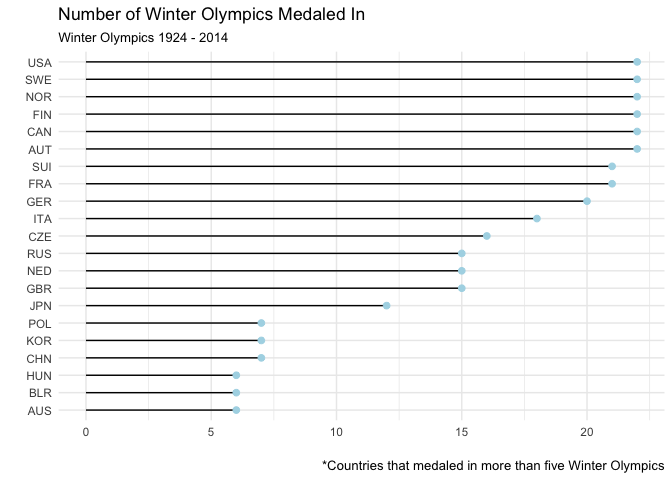<!-- -->

```r
descriptive %>% 
  filter(num_olymp <= 5) %>% 
  ggplot(aes(x = reorder(Country, num_olymp), y = num_olymp)) +
  geom_lollipop(point.colour = "lightblue", point.size = 2) +
  labs(x = "", y = "", 
       title = "", 
       subtitle = "",
       caption = "*Countries that medaled in fewer than five Winter Olympics") +
  coord_flip(ylim = c(0, 25)) +
  theme_minimal()
```

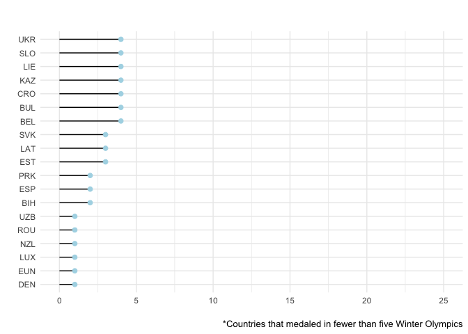<!-- -->

Many of the following analyses will use data from the top 10 medal-winning countries, created by ranking countries by the number of medals won in total over all years. 


```r
#### Additional Data Wrangling
# Who are the top 10 medal producers over time?
top10 <- descriptive %>% 
  arrange(desc(total_medals)) %>% 
  mutate(rank = row_number()) %>% 
  filter(rank <= 10)
top10
```

```
## # A tibble: 10 x 7
##    Country  Gold Silver Bronze num_olymp total_medals  rank
##    <fct>   <dbl>  <dbl>  <dbl>     <int>        <dbl> <int>
##  1 RUS     344    187      172        15          703     1
##  2 USA     167    319      167        22          653     2
##  3 GER     226    208      203        20          637     3
##  4 CAN     315    203      107        22          625     4
##  5 NOR     159    171      127        22          457     5
##  6 FIN      66.0  147      221        22          434     6
##  7 SWE     127    129      177        22          433     7
##  8 SUI      76.0   77.0    132        21          285     8
##  9 AUT      79.0   98.0    103        22          280     9
## 10 CZE      30.0   92.0    111        16          233    10
```

```r
# Calculate how many medals per year 
medalsyear <- olymp %>% 
  group_by(Year, Country) %>% 
  filter(Country %in% top10$Country) %>% 
  summarize(medal_yr_cnt = length(Medal)) 

# Split by gold, silver, bronze medals, per year
medals_year <- olymp %>% 
  mutate(Medal = factor(Medal, levels = c("Gold", "Silver", "Bronze"))) %>%
  group_by(Year, Country, Medal) %>% 
  summarize(medal_yr_cnt = length(Medal)) 

# filter for only countries that have at least 100 medals
medals100 <- olymp %>% 
  group_by(Country) %>% 
  summarize(total_medals = length(Medal)) %>% 
  filter(total_medals >= 100)
```

##### Olympic Medals Over Time 
To visualize how many medals the top 10 medal-winning countries won over the 1920-2014 Winter Olympics, I created two wrapped plots. Both use the colors gold, silver and bronze to display how many of each medal type was won over time. I would recommend the second of these plots to my editor, as I believe the colors and trends are clearer in an area plot than in a scatter plot. Something that immediately jumps out is that while Canada and USA seem to have won similarly large amounts of medals over time, the US has won many more silver *and* gold, while Canada seems to focus on gold. 

```r
# Split by Country, over time 
#png("../fig/medcountry_time.png")
medcountry <- medals_year %>%  
  filter(Country %in% top10$Country) %>% 
  ggplot(aes(x = Year, y = medal_yr_cnt, na.rm = TRUE)) +
  geom_jitter(aes(color = Medal)) +
  scale_color_manual(values=c("gold","grey73","darkgoldenrod4")) +
  labs(x = "", y = "# Medals Won",
       title = "Olympic Medals by Country",
       subtitle = "Winter Olympics 1924 - 2014") +
  facet_wrap(~Country) +
  theme_light() +
  theme(axis.text.x = element_text(angle = 90, hjust = 1)) +
  theme(strip.background = element_rect(fill = "lightskyblue2")) 
medcountry
```

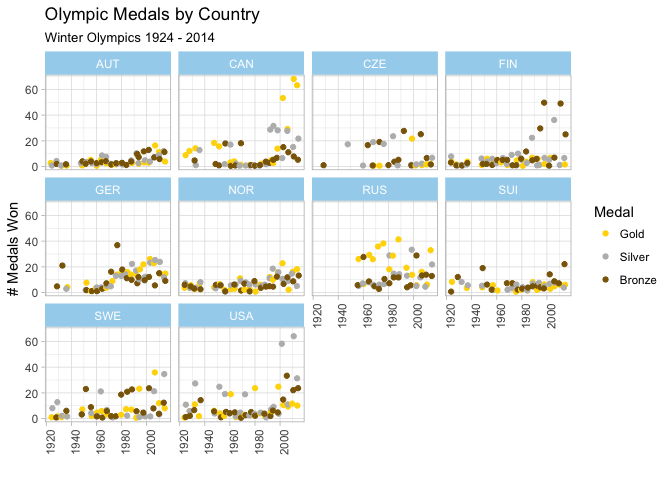<!-- -->


```r
#The winning "over time" plot
medals_year %>%
  ungroup() %>% 
  filter(Country %in% top10$Country) %>% 
  ggplot(aes(x = Year, y = medal_yr_cnt, na.rm = TRUE)) +
  geom_area(aes( fill = Medal), alpha = 0.7) +
  scale_fill_manual(values=c("gold","grey73","darkgoldenrod4")) +
  labs(x = "", y = "# Medals Won",
       title = "Olympic Medals by Country",
       subtitle = "Winter Olympics 1924 - 2014") +
  facet_wrap(~Country) +
  theme_light() +
  theme(axis.text.x = element_text(angle = 90, hjust = 1)) +
  theme(strip.background = element_rect(fill = "lightskyblue2"))
```

<!-- -->

##### Total Medal Visualizations 
To visualize the total amount of medals won by the top 10 medal-winning countries, I produced a lollipop chart for a quick glance, then a bar chart that includes countries that have won at least 100 medals over time with the same gold, silver and bronze coloring to add more information and to make the stacks immediately obvious to the reader. One hundred medals felt like a natural cut-off point between the highest perorming countries and the mid-performing countries. It turned out there are only 13 countries that have won at least 100 medals over time, so the second chart isn't much longer than the first. I propose that the editor uses the more colorful chart since it conveys more information (how many of each *type* of medal won) and is likely more intriguing to the reader.


```r
top10 %>% 
  ggplot(aes(x = reorder(Country, total_medals), y = total_medals)) +
  geom_lollipop(point.colour = "lightblue", point.size = 2) +
  labs(x = "", y = "", 
       title = "Winter Olympics Medals Overall", 
       subtitle = "Winter Olympics 1924 - 2014: Number of Medals Won by Top 10 Medal-Winning Countries") +
  coord_flip() +
  theme_minimal()
```

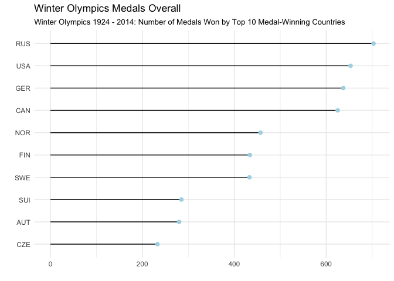<!-- -->

```r
# Viz for top medal producing countries, at least 100 medals 
totalmedals_plot <- olymp %>% 
  mutate(Medal = factor(Medal, levels = c("Gold", "Silver", "Bronze"))) %>%
  group_by(Country, Medal) %>% 
  filter(Country %in% medals100$Country) %>% 
  summarize(total_medals = length(Medal))

#png("../fig/totalmedals.png")
totalmedals <- totalmedals_plot %>% 
  ggplot(aes(x = reorder(Country, total_medals), y = total_medals, 
             fill = Medal, group = Medal)) +
  geom_bar(stat = "identity") +
  geom_text(aes(label = total_medals), position = position_stack(vjust = 0.5),
            size = 3, color = "white") +
  scale_fill_manual(values=c("gold","grey73","darkgoldenrod4")) +
  labs(x = "", y = "", 
       title = "Winter Olympic Medals Overall", 
       subtitle = "Winter Olympics 1924 - 2014: Countries with Over 100 Medals") +
  theme_light()
totalmedals
```

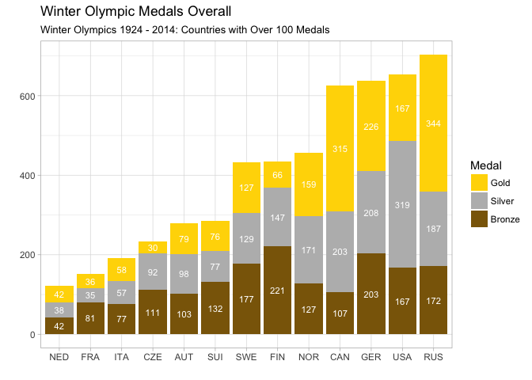<!-- -->

### 2. Medal Counts adjusted by Population, GDP
I created three separate rankings of success per country by GDP per capita, population, and total number of medals won. I then chose to visualize this data in a few different ways. First, I visualized the percentage of medals won divided by the population of each country to provide a calculation of "medal per person in entire population." Countries are ordered by GDP/Capita ranking, thus, countries with high GDP/Capita and a low percentage of medals/population are highlighted in yellow. LUX, for instance, has the highest GDP/Capita out of all the countries yet a very low percentage of medals/population. SUI and NOR's success makes sense, given they have high GDP/Capita and high percentage of medals/population. The USA, however, could do better!


```r
# Data prep
by_pop_gdp <- descriptive_gdp %>% 
  arrange(desc(total_medals)) %>% 
  mutate(medal_rank = row_number()) %>% 
  arrange(desc(GDP.per.Capita), desc(total_medals)) %>% 
  mutate(gdp_medal_rank = row_number()) %>% 
  arrange(desc(Population), desc(total_medals)) %>% 
  mutate(pop_medal_rank = row_number()) %>% 
  filter(medal_rank <10 | gdp_medal_rank <10 |pop_medal_rank <10)


# GDP Viz
# by_pop_gdp %>% 
#   ggplot(aes(x = reorder(Country, gdp_medal_rank), y = total_medals)) +
#   geom_bar(aes(fill = total_medals < 20), stat = "identity") +
#   scale_fill_manual(values=c("grey","gold")) +
#   labs(x = "Country in Order of GDP/Capita Ranking", y = "Medals Won Overall", 
#        title = "Some Countries Should Be Doing Better", 
#        subtitle = "Winter Olympic Medals by Countries in Order of Highest GDP/Capita") +
#   theme_light() +
#   theme(legend.position = "none")

# GDP Viz
by_pop_gdp %>% 
  ggplot(aes(x = reorder(Country, gdp_medal_rank), y = (total_medals/Population * 100))) +
  geom_bar(aes(fill = (total_medals/Population* 100) < 0.0025), stat = "identity", alpha = 0.9) +
  scale_fill_manual(values=c("grey","gold")) +
  labs(x = "Country in Order of GDP/Capita Ranking", y = "% of Medal Winners/Pop", 
       title = "Some Countries Should Be Doing Better", 
       subtitle = "Winter Olympic Medals/Population of Countries") +
  theme_light() +
  theme(legend.position = "none") 
```

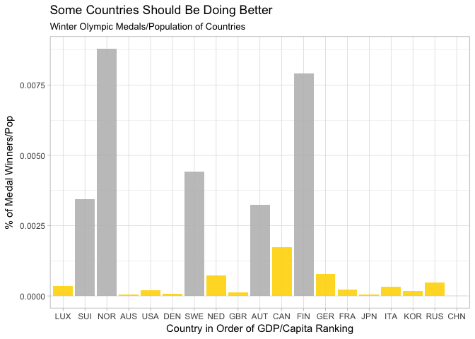<!-- -->

The next visualization shows the countries lined up by population size and compares how many medals they've won in total. Countries with the fewest medals are "shamed" by being highlighted in yellow. My argument for showing the data in this matter is that countries with larger populations have more opportunity for top-performing athletes. China and Japan are both countries with particularly large populations that don't tend to win as many medals as other countries with large populations. 


```r
# Pop Viz 
by_pop_gdp %>% 
  ggplot(aes(x = reorder(Country, pop_medal_rank), y = total_medals)) +
  geom_bar(aes(fill = total_medals < Population/500000), stat = "identity", alpha = 0.9) +
  scale_fill_manual(values=c("grey","gold")) +
  labs(x = "Country in Order of Largest Population", y = "Medals Won Overall", 
       title = "Some Countries Should Be Doing Better", 
       subtitle = "Countries that have enough people to win more medals") +
  theme_light() +
  theme(legend.position = "none")
```

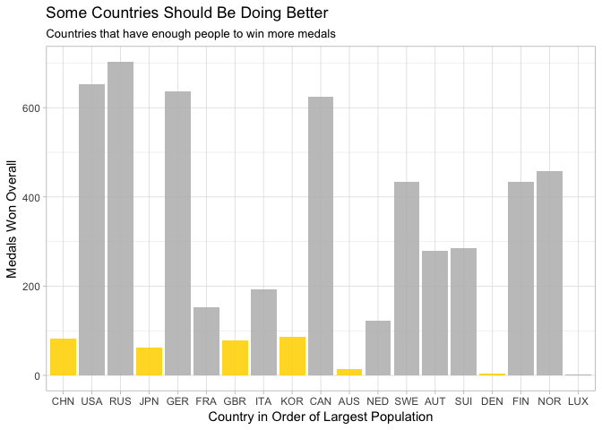<!-- -->


I then adjusted the visualizations to be bubble charts that may be slightly more aesthetically pleasing. I calculated the true GDP as GDP per Capita multiplied by the population to make the axes arguably more comparable. The following viz points out China, specifically, as a country with both a lot of people and a lot of money, but we can see from the size of its bubble that China is not a very big medal producer. I don't love shaming individual countries, so I'd suggest the editor uses the final visualization in publication. 


```r
by_pop_gdp %>% 
  ggplot(aes(x = log(Population), y = log(GDP.per.Capita * Population))) +
  geom_count(aes(color = Country, size = total_medals, fill = Country, alpha = 0.7), show.legend = FALSE) +
  scale_size_area(max_size = 20) +
  geom_text(aes(label = Country), check_overlap = TRUE, size = 3) +
  theme_light() +
  theme(axis.text = element_blank()) +
  theme(axis.ticks = element_blank()) +
  labs(x = expression(atop("Population", paste(symbol('\256')))), 
       y = expression(atop("GDP",paste(symbol('\256')))), 
       title = "China Should Be Doing Better", 
       subtitle = "Winter Olympics 1924 - 2014: Medals per Pop & GDP of Country",
       caption = "Bigger Bubbles = More Medals Won") +
  theme(axis.title.y = element_text(size = 12)) + 
  theme(axis.title.x = element_text(size = 12)) 
```

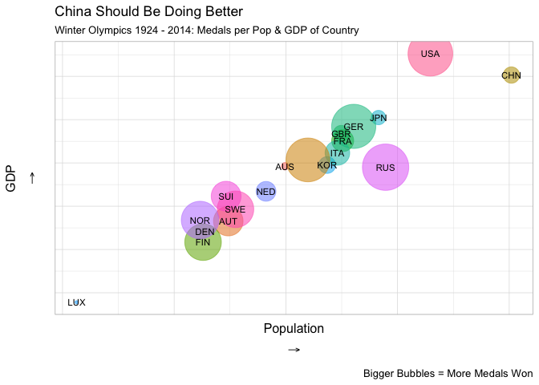<!-- -->

Lastly, I visualized the percentage of medals won by the country's population, again, and showed how many total medals countries won overall via the size of each bubble. From this viz, it's clear that Norway and Finland do well for themselves given the large amount of medals they've won despite their smaller populations. 


```r
#png("../fig/norwaymedals.png")
norway <- by_pop_gdp %>% 
  ggplot(aes(x = log(Population), y = total_medals/Population *100)) +
  geom_count(aes(color = Country, size = total_medals, 
                 fill = Country, alpha = 0.7), show.legend = FALSE) +
  #scale_fill_manual(values=c("purple","yellow")) +
  scale_size_area(max_size = 20) +
  geom_text(aes(label = Country), check_overlap = TRUE, size = 3) +
  theme_classic() +
  theme(axis.text = element_blank()) +
  theme(axis.ticks = element_blank()) +
  labs(x = expression(atop("Population", paste(symbol('\256')))), 
       y = expression(atop("% of Medals per Pop",paste(symbol('\256')))), 
       title = "Norway & Finland Citizens Dominate", 
       subtitle = "Winter Olympics 1924 - 2014: Percentage of Medals Won per Population",
       caption = "Bigger Bubbles = More Medals Won Overall") +
  theme(axis.title.y = element_text(size = 12)) + 
  theme(axis.title.x = element_text(size = 12)) 
  #geom_encircle(data = subset(by_pop_gdp, (total_medals/Population *100 > 0.0040)))
norway
```

<!-- -->

### 3. Host Country Advantage
I calculated whether countries won more medals when they *hosted* Winter Olympics as opposed to when they were visiting participants. To do so, I downloaded necessary country host information from Wikipedia. I manipulated the dataset so that I could measure how many medals a country won per year, but also could highlight the year(s) that they hosted the Olympics. I chose to only use countries that have hosted the Olympics in my plots and calculations for a more intuitive comparison.  


```r
library(rvest)
library(stringr)
wiki_hosts <- read_html("https://en.wikipedia.org/wiki/Winter_Olympic_Games")
hosts <- html_table(html_nodes(wiki_hosts, "table")[[5]], fill=TRUE)
hosts <- hosts[-1,1:3]
hosts$city <- str_split_fixed(hosts$Host, n=2, ",")[,1]
hosts$country <- str_split_fixed(hosts$Host, n=2, ",")[,2]
hosts$Year <- as.Date(strptime(hosts$Year, format = "%Y"))
hosts$Year <- format(hosts$Year, '%Y')
medals_year$Year <- format(medals_year$Year, '%Y') # weird issues with year 

hosts <- hosts %>% 
  select(Year, country)
colnames(hosts)[colnames(hosts) == "country"] <- "Host_Country"

# Join tables for Full Country Name, Year, number of medals won and whether they hosted
hosts <- merge(medals_year, hosts, on = "Year")
hosts <- merge(hosts, descriptive_gdp, on = "Country")
hosts$Host_Country <- as.character(hosts$Host_Country)
hosts$Country_Full <- as.character(hosts$Country_Full)
hosts$Host_Country <- trimws(hosts$Host_Country)
hosts <- hosts %>% 
  select(Year, Country, Country_Full, Medal, medal_yr_cnt, Host_Country) %>% 
  mutate(hosted = ifelse(Country_Full == Host_Country, 1, 0)) %>% 
  spread(key = Medal, value = medal_yr_cnt)
hosts[is.na(hosts)] <- 0 
hosts$total_medals <- rowSums(hosts[, c(6,7,8)])
```

I began visualizing the data with a wrapped bar chart for each country that has ever hosted in the Olympics. I chose stark colors (grey and blue) so the reader can easily see a country's total number of medals won when they were hosts versus when they were visiting participants. It's clear from the visualization that most countries do exceedingly better, if not, at least as good as they've ever done, when they host. 


```r
#png("../fig/hostplot1.png")
hosts %>% 
  filter(Country_Full %in% hosts$Host_Country) %>% 
  ggplot(aes(x = Year, y = total_medals)) +
  geom_histogram(aes(fill = as.factor(hosted)), stat = "identity") +
  facet_wrap(~Country_Full, nrow = 4) +
  theme_minimal() +
  theme(axis.text = element_blank()) +
  theme(axis.ticks = element_blank()) +
  theme(strip.background = element_rect(fill = "lightskyblue2")) +
  scale_fill_manual(values=c("gray87","lightseagreen"), labels = c("Medals; Not Host", "Host")) +
  labs(x = expression(atop("1924 - 2014", paste(symbol('\256')))),
       y = "", 
       title = "Home Court Advantage", 
       subtitle = "Host Countries of the Winter Olympics 1924 - 2014",
       fill = "Medals Won Per Year") +
  theme(text = element_text(size = 11))
```

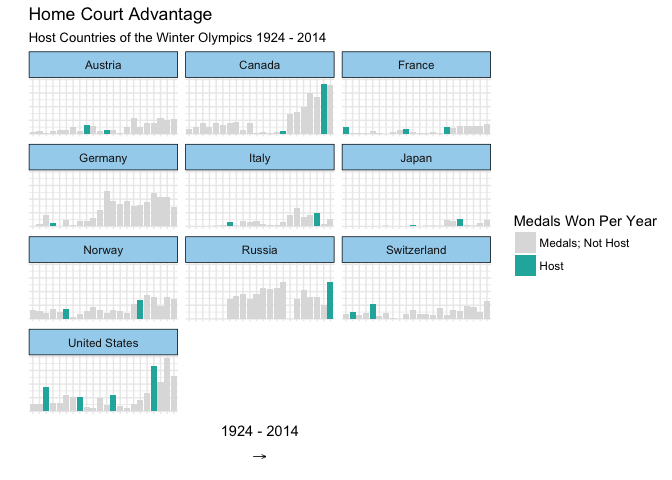<!-- -->

A downside of the next plot I created is that it's slightly harder to compare the exact amount of medals won each year, but I find it particularly aesthetically pleasing. This plot, again, includes only countries that have hosted an Olympics and shows how many medals each country won at each winter Olympics. Tiles outlined in black indicate that the country hosted that year. 


```r
#png("../fig/hostplot2.png")
palette <- colorRampPalette(brewer.pal(9, 'GnBu'), space='Lab', bias = 5)
hosts$hosted <- as.factor(hosts$hosted)
home.court <- hosts %>% 
  filter(Country_Full %in% hosts$Host_Country) %>% 
  ggplot(aes(x = Year, y = Country)) +
  geom_raster(aes(fill = total_medals)) +
  geom_tile(aes(color = hosted), fill = "#00000000", size = 1, show.legend = FALSE) +
  theme_light() +
  scale_fill_gradientn(colors = palette(9)) +
  scale_color_manual(values = c('#00000000', 'black')) +
  labs(x="", y="", fill="Medals", 
       title = "Home Court Advantage", 
       subtitle = "Host Countries of the Winter Olympics 1924 - 2014", 
       caption = "Hosting country indicated by outline. ") +
  theme(
        legend.text=element_text(color="grey20"),
        axis.text.x=element_text(size=8),
        axis.ticks.y=element_blank(),
        axis.ticks.x = element_blank(),
        panel.grid=element_blank(),
        plot.margin = unit(c(.5,1,0.3,1), "cm")) +
  theme(axis.text.x = element_text(angle = 90, hjust = 1))
  home.court
```

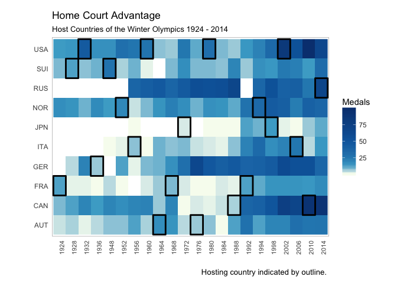<!-- -->

### 4. Country success by sport / discipline / event
First, I wanted to compare USA and Canadian Olympic performance especially because of their hockey rivalry. I adjusted the dataset to account for the fact that hockey is a large team sport and calculated the total number of medals as just one per win rather than per player. I then visualized the number of medals won per sport (i.e. discipline, see variable definitions in introduction) between the countries using a stacked bar chart. USA's advantage over Canada is clear. To improve this plot, I'd suggest adding an interactive overlay to indicate the precise amount of medals per sport layer.


 

```r
sports %>% 
  filter(Country == "USA" | Country == "CAN") %>% 
  group_by(Country, Sport) %>% 
  summarize(total_medals = sum(adj_medals)) %>% 
  ggplot(aes(x = Country, y = total_medals)) +
  geom_bar(aes(fill = Sport), stat = "identity", alpha = 0.9) + 
  scale_fill_brewer(palette = "Reds") +
  labs(x= "",
       y= " ",
       title = "U.S. vs. Canadian Olympic Medals", 
       subtitle = "Winter Olympics 1924 - 2014") +
  theme_light()
```

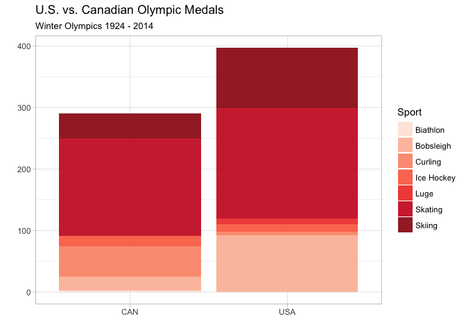<!-- -->

To best visualize the top 10 medal-winning countries, I'd suggest using the visualization below. It provides the reader with even more information but in a (hopefully) digestible way -- the reader can tell how many of each medal type (gold, silver, bronze) each country won overall in each discipline. The top ten medal-winning countries happen to be best at Skiing and Skating sports as indicated by the darker blues. Germany, Norway and Russia seem to outperform the other countries in Biathlon, specifically, and Germany is talented in the Luge. 


```r
# Top 10 Medal Winning Countries Split by Sport
#png("../fig/sports.png")
palette <- colorRampPalette(brewer.pal(9, 'GnBu'), space='Lab', bias = 5)
sports <- sports %>% 
  filter(Country %in% top10$Country) %>% 
  ggplot(aes(x = Sport, y = Medal, fill = adj_medals)) + 
  geom_tile(color = "white") + 
  facet_grid(~Country) + 
  scale_fill_gradientn(colors = palette(9)) +
  theme_light() +
  coord_flip() +
  theme(strip.background = element_rect(fill = "lightskyblue2")) +
  theme(axis.text.x = element_text(angle = 90, hjust = 1)) +
  theme(panel.grid=element_blank()) +
  labs(x= "",
       y= "",
       title = "Top 10 Medal-Winning Countries by Sport", 
       subtitle="Winter Olympics 1924 - 2014", 
       fill="# of Medals")
sports
```

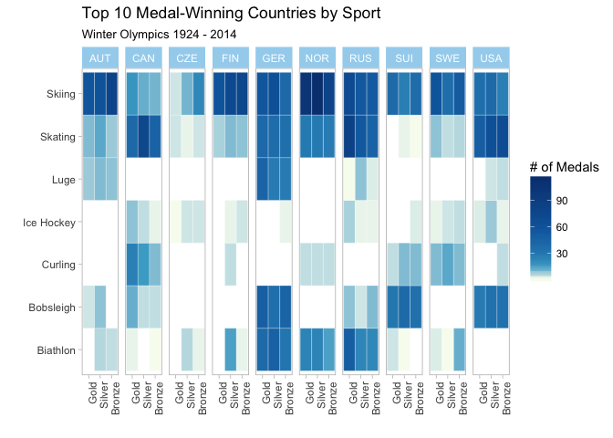<!-- -->

### 5. Most successful athletes
Below is a visual display of the most successful winter Olympic athletes of all time. I manipulated the data such that I could create a count of medals won per Olympic athlete. Some athletes had multiple country designations, so I tried to choose which country made the most sense for the individual and labeled them as being part of that country. I created a category for "multiple sports" if a top medal-winning athlete participated and won medals in multiple disciplines. Norway tends to produce the top medal-winning winter athletes, which is not surprising given Norway's clear success in prior plots. 


```r
# created the separate male and female datasets when I made two separate visualizations for men and women, but in the end decided to facet wrap with one dataset. 
athletes <- olymp %>% 
  mutate(Medal = factor(Medal, levels = c("Gold", "Silver", "Bronze"))) %>%
  group_by(Athlete, Gender, Medal) %>% 
  select(Country, Athlete, Discipline, Sport) %>%
  mutate(total_medals_per = length(Medal)) %>%
  ungroup()  %>% 
  unique()
athletes <- athletes %>% 
  group_by(Athlete, Gender, Country) %>% 
  mutate(totalmedals = sum(total_medals_per)) %>% 
  select(Athlete, Gender, Country, Discipline, Sport, totalmedals) %>% 
  unique() 
athletes$Discipline <- as.factor(athletes$Discipline)
athletes$Athlete <- as.factor(athletes$Athlete) 
athletes$totalmedals <- as.integer(athletes$totalmedals)

# top 20 overall
top_20 <- athletes %>% 
  select(Athlete, Gender, totalmedals, Sport, Discipline) %>% 
  unique() %>% 
  arrange(desc(totalmedals)) 
top_20 <- top_20[-10, ] # ridding of second country, looked up most represented country
top_20 <- top_20[1:20, ] 
top_20$Discipline <- as.character(top_20$Discipline)
top_20[3, 6] <- "Multiple Sports"
top_20[4, 6] <- "Multiple Sports"
top_20 <- unique(top_20)

# top 10 female
top_10_F <- athletes %>% 
  filter(Gender == "Women") %>% 
  arrange(desc(totalmedals))
top_10_F <- top_10_F[-5, ] 
top_10_F <- top_10_F[1:10, ]

# top 10 men
top_10_M <- athletes %>% 
  filter(Gender == "Men") %>% 
  arrange(desc(totalmedals))
top_10_M$Discipline <- as.character(top_10_M$Discipline)
top_10_M[3, 4] <- "Multiple Sports"
top_10_M[4, 4] <- "Multiple Sports"
top_10_M <- unique(top_10_M)
top_10_M <- top_10_M[1:10, ]

#png("../fig/athletes.png")
athletes <- top_20 %>% 
  ggplot(aes(reorder(x = Athlete, totalmedals), y = totalmedals)) +
  geom_bar(aes(fill = Country == "NOR"), alpha = 0.6, stat = "identity") +
  scale_fill_manual(values=c("grey","red"), labels = c("Other Country", "Norway")) +
  coord_flip() +
  theme_light() +
  labs(x= "",
       y= "Overall Medals",
       title = "Top 20 Medal-Winning Olympians: Norway Dominates
       ", 
       subtitle = "Winter Olympics 1924 - 2014") +
  theme(legend.title = element_blank())
athletes
```

<!-- -->


I then split the athletes by gender. From the plots, we can see that women dominate in Cross Country Skiing while men dominate in the Biathlon. The top medal-winning men have won a few more medals than the top women.
 

```r
top_20 %>% 
 ggplot(aes(reorder(x = Athlete, totalmedals), y = totalmedals)) +
  geom_bar(aes(fill = Discipline), alpha = 0.7, stat = "identity") +
  coord_flip(ylim = c(0, 15)) +
  theme_light() +
  theme(legend.position = "bottom") +
  labs(x= "",
       y= "Total Medals",
       title = "Top 10 Male & Female Medal-Winning Olympians", 
       subtitle = "Winter Olympics 1924 - 2014") +
  scale_fill_brewer(palette = "Dark2", name = "Sport") +
  theme(strip.background = element_rect(fill = "lightskyblue2")) +
  facet_wrap(~Gender, scales = "free")
```

<!-- -->

```r
#source("../lib/multiplot.R") 
# layout <- matrix(c(1, 1, 2, 2, 1, 1, 2, 2), 2, 4, byrow = TRUE)
# multiplot(top10F, top10M, layout = layout) 
```

## Interactivity
### 6. Medals per Population

For my first interactive plot (created with plotly), I chose to add additional information to my bubble chart that represented the number of medals per person/population of each country. Prior to adding interactivity, the scale for total medals won was less clear. The below plot allows the user to hover over each bubble and get a clearer picture of how many overall medals the country won. 

```r
library(plotly)
# Had to rearrange the ggplot to get rid of arrow element 
colnames(by_pop_gdp)[colnames(by_pop_gdp) == "total_medals"] <- "Total_Medals"
colnames(by_pop_gdp)[colnames(by_pop_gdp) == "Country"] <- "Code"
colnames(by_pop_gdp)[colnames(by_pop_gdp) == "Country_Full"] <- "Country"
norway2 <- by_pop_gdp %>% 
  mutate(medspop = Total_Medals/Population * 100) %>% 
  ggplot(aes(x = log(Population), y = Total_Medals/Population *100)) +
  geom_count(aes(color = Code, size = Total_Medals, 
                 fill = Code, alpha = 0.7, label = Country), show.legend = FALSE) +
   labs(x = "Population", 
       y = "% of Medals per Pop", 
       title = "Norway & Finland Citizens Dominate", 
       subtitle = "Winter Olympics 1924 - 2014: Percentage of Medals Won per Population",
       caption = "Bigger Bubbles = More Medals Won Overall") +
  scale_size_area(max_size = 20) +
  geom_text(aes(label = Code), check_overlap = TRUE, size = 3) +
  theme_classic() +
  theme(axis.text = element_blank()) +
  theme(axis.ticks = element_blank()) +
  theme(axis.title.y = element_text(size = 12)) + 
  theme(axis.title.x = element_text(size = 12)) +
  theme(legend.position = 'none')
  

plotly1 <- ggplotly(p = norway2, tooltip = c("Country", "Total_Medals"))
plotly1
```

<!--html_preserve--><div id="172061ce9bdc2" style="width:672px;height:480px;" class="plotly html-widget"></div>
<script type="application/json" data-for="172061ce9bdc2">{"x":{"data":[{"x":[16.9844046069758],"y":[6.30751162821306e-05],"text":"Total_Medals:  15<br />Country: Australia","type":"scatter","mode":"markers","marker":{"autocolorscale":false,"color":"rgba(248,118,109,1)","opacity":0.55,"size":11.041688197991,"symbol":"circle","line":{"width":1.88976377952756,"color":"rgba(248,118,109,1)"}},"hoveron":"points","name":"AUS","legendgroup":"AUS","showlegend":true,"xaxis":"x","yaxis":"y","hoverinfo":"text","frame":null},{"x":[15.9685612331128],"y":[0.0032516216301587],"text":"Total_Medals: 280<br />Country: Austria","type":"scatter","mode":"markers","marker":{"autocolorscale":false,"color":"rgba(233,132,44,1)","opacity":0.55,"size":47.7055453892334,"symbol":"circle","line":{"width":1.88976377952756,"color":"rgba(233,132,44,1)"}},"hoveron":"points","name":"AUT","legendgroup":"AUT","showlegend":true,"xaxis":"x","yaxis":"y","hoverinfo":"text","frame":null},{"x":[17.3949036077466],"y":[0.0017432889094972],"text":"Total_Medals: 625<br />Country: Canada","type":"scatter","mode":"markers","marker":{"autocolorscale":false,"color":"rgba(214,145,0,1)","opacity":0.55,"size":71.2737908413903,"symbol":"circle","line":{"width":1.88976377952756,"color":"rgba(214,145,0,1)"}},"hoveron":"points","name":"CAN","legendgroup":"CAN","showlegend":true,"xaxis":"x","yaxis":"y","hoverinfo":"text","frame":null},{"x":[21.0389666914657],"y":[5.9800761365791e-06],"text":"Total_Medals:  82<br />Country: China","type":"scatter","mode":"markers","marker":{"autocolorscale":false,"color":"rgba(188,157,0,1)","opacity":0.55,"size":25.8164650529536,"symbol":"circle","line":{"width":1.88976377952756,"color":"rgba(188,157,0,1)"}},"hoveron":"points","name":"CHN","legendgroup":"CHN","showlegend":true,"xaxis":"x","yaxis":"y","hoverinfo":"text","frame":null},{"x":[15.5517576696228],"y":[8.80901733297486e-05],"text":"Total_Medals:   5<br />Country: Denmark","type":"scatter","mode":"markers","marker":{"autocolorscale":false,"color":"rgba(156,167,0,1)","opacity":0.55,"size":6.37492165341803,"symbol":"circle","line":{"width":1.88976377952756,"color":"rgba(156,167,0,1)"}},"hoveron":"points","name":"DEN","legendgroup":"DEN","showlegend":true,"xaxis":"x","yaxis":"y","hoverinfo":"text","frame":null},{"x":[15.5169829272394],"y":[0.0079167999054362],"text":"Total_Medals: 434<br />Country: Finland","type":"scatter","mode":"markers","marker":{"autocolorscale":false,"color":"rgba(111,176,0,1)","opacity":0.55,"size":59.392925036325,"symbol":"circle","line":{"width":1.88976377952756,"color":"rgba(111,176,0,1)"}},"hoveron":"points","name":"FIN","legendgroup":"FIN","showlegend":true,"xaxis":"x","yaxis":"y","hoverinfo":"text","frame":null},{"x":[18.0173391545815],"y":[0.000227516351428043],"text":"Total_Medals: 152<br />Country: France","type":"scatter","mode":"markers","marker":{"autocolorscale":false,"color":"rgba(0,184,19,1)","opacity":0.55,"size":35.1488923445879,"symbol":"circle","line":{"width":1.88976377952756,"color":"rgba(0,184,19,1)"}},"hoveron":"points","name":"FRA","legendgroup":"FRA","showlegend":true,"xaxis":"x","yaxis":"y","hoverinfo":"text","frame":null},{"x":[17.9920222159027],"y":[0.000121280540742954],"text":"Total_Medals:  79<br />Country: United Kingdom","type":"scatter","mode":"markers","marker":{"autocolorscale":false,"color":"rgba(0,189,97,1)","opacity":0.55,"size":25.3398123942946,"symbol":"circle","line":{"width":1.88976377952756,"color":"rgba(0,189,97,1)"}},"hoveron":"points","name":"GBR","legendgroup":"GBR","showlegend":true,"xaxis":"x","yaxis":"y","hoverinfo":"text","frame":null},{"x":[18.2150473044217],"y":[0.000782428930856313],"text":"Total_Medals: 637<br />Country: Germany","type":"scatter","mode":"markers","marker":{"autocolorscale":false,"color":"rgba(0,192,142,1)","opacity":0.55,"size":71.954766093092,"symbol":"circle","line":{"width":1.88976377952756,"color":"rgba(0,192,142,1)"}},"hoveron":"points","name":"GER","legendgroup":"GER","showlegend":true,"xaxis":"x","yaxis":"y","hoverinfo":"text","frame":null},{"x":[17.9231346391116],"y":[0.000315778644761935],"text":"Total_Medals: 192<br />Country: Italy","type":"scatter","mode":"markers","marker":{"autocolorscale":false,"color":"rgba(0,192,180,1)","opacity":0.55,"size":39.5039446353041,"symbol":"circle","line":{"width":1.88976377952756,"color":"rgba(0,192,180,1)"}},"hoveron":"points","name":"ITA","legendgroup":"ITA","showlegend":true,"xaxis":"x","yaxis":"y","hoverinfo":"text","frame":null},{"x":[18.6593705988233],"y":[4.96225253876716e-05],"text":"Total_Medals:  63<br />Country: Japan","type":"scatter","mode":"markers","marker":{"autocolorscale":false,"color":"rgba(0,189,212,1)","opacity":0.55,"size":22.6287270675782,"symbol":"circle","line":{"width":1.88976377952756,"color":"rgba(0,189,212,1)"}},"hoveron":"points","name":"JPN","legendgroup":"JPN","showlegend":true,"xaxis":"x","yaxis":"y","hoverinfo":"text","frame":null},{"x":[17.7397989352414],"y":[0.000171878860174473],"text":"Total_Medals:  87<br />Country: Korea, South","type":"scatter","mode":"markers","marker":{"autocolorscale":false,"color":"rgba(0,181,238,1)","opacity":0.55,"size":26.5919065491287,"symbol":"circle","line":{"width":1.88976377952756,"color":"rgba(0,181,238,1)"}},"hoveron":"points","name":"KOR","legendgroup":"KOR","showlegend":true,"xaxis":"x","yaxis":"y","hoverinfo":"text","frame":null},{"x":[13.2528230571456],"y":[0.00035107675239961],"text":"Total_Medals:   2<br />Country: Luxembourg","type":"scatter","mode":"markers","marker":{"autocolorscale":false,"color":"rgba(0,167,255,1)","opacity":0.55,"size":4.0318544659855,"symbol":"circle","line":{"width":1.88976377952756,"color":"rgba(0,167,255,1)"}},"hoveron":"points","name":"LUX","legendgroup":"LUX","showlegend":true,"xaxis":"x","yaxis":"y","hoverinfo":"text","frame":null},{"x":[16.6449827951517],"y":[0.000720336881484508],"text":"Total_Medals: 122<br />Country: Netherlands","type":"scatter","mode":"markers","marker":{"autocolorscale":false,"color":"rgba(127,150,255,1)","opacity":0.55,"size":31.489790036266,"symbol":"circle","line":{"width":1.88976377952756,"color":"rgba(127,150,255,1)"}},"hoveron":"points","name":"NED","legendgroup":"NED","showlegend":true,"xaxis":"x","yaxis":"y","hoverinfo":"text","frame":null},{"x":[15.463384452654],"y":[0.00879536082246054],"text":"Total_Medals: 457<br />Country: Norway","type":"scatter","mode":"markers","marker":{"autocolorscale":false,"color":"rgba(188,129,255,1)","opacity":0.55,"size":60.9463848343093,"symbol":"circle","line":{"width":1.88976377952756,"color":"rgba(188,129,255,1)"}},"hoveron":"points","name":"NOR","legendgroup":"NOR","showlegend":true,"xaxis":"x","yaxis":"y","hoverinfo":"text","frame":null},{"x":[18.7859959371997],"y":[0.000487866449120332],"text":"Total_Medals: 703<br />Country: Russia","type":"scatter","mode":"markers","marker":{"autocolorscale":false,"color":"rgba(226,110,247,1)","opacity":0.55,"size":75.5905511811024,"symbol":"circle","line":{"width":1.88976377952756,"color":"rgba(226,110,247,1)"}},"hoveron":"points","name":"RUS","legendgroup":"RUS","showlegend":true,"xaxis":"x","yaxis":"y","hoverinfo":"text","frame":null},{"x":[15.9301956837247],"y":[0.00343913147570356],"text":"Total_Medals: 285<br />Country: Switzerland","type":"scatter","mode":"markers","marker":{"autocolorscale":false,"color":"rgba(248,99,223,1)","opacity":0.55,"size":48.1296030211286,"symbol":"circle","line":{"width":1.88976377952756,"color":"rgba(248,99,223,1)"}},"hoveron":"points","name":"SUI","legendgroup":"SUI","showlegend":true,"xaxis":"x","yaxis":"y","hoverinfo":"text","frame":null},{"x":[16.0977777329227],"y":[0.00441887641953854],"text":"Total_Medals: 433<br />Country: Sweden","type":"scatter","mode":"markers","marker":{"autocolorscale":false,"color":"rgba(255,98,191,1)","opacity":0.55,"size":59.3244605466673,"symbol":"circle","line":{"width":1.88976377952756,"color":"rgba(255,98,191,1)"}},"hoveron":"points","name":"SWE","legendgroup":"SWE","showlegend":true,"xaxis":"x","yaxis":"y","hoverinfo":"text","frame":null},{"x":[19.5882555658694],"y":[0.00020316171903064],"text":"Total_Medals: 653<br />Country: United States","type":"scatter","mode":"markers","marker":{"autocolorscale":false,"color":"rgba(255,106,154,1)","opacity":0.55,"size":72.8528322509885,"symbol":"circle","line":{"width":1.88976377952756,"color":"rgba(255,106,154,1)"}},"hoveron":"points","name":"USA","legendgroup":"USA","showlegend":true,"xaxis":"x","yaxis":"y","hoverinfo":"text","frame":null},{"x":[21.0389666914657,19.5882555658694,18.7859959371997,18.6593705988233,18.2150473044217,18.0173391545815,17.9920222159027,17.9231346391116,17.7397989352414,17.3949036077466,16.9844046069758,16.6449827951517,16.0977777329227,15.9685612331128,15.9301956837247,15.5517576696228,15.5169829272394,15.463384452654,13.2528230571456],"y":[5.9800761365791e-06,0.00020316171903064,0.000487866449120332,4.96225253876716e-05,0.000782428930856313,0.000227516351428043,0.000121280540742954,0.000315778644761935,0.000171878860174473,0.0017432889094972,6.30751162821306e-05,0.000720336881484508,0.00441887641953854,0.0032516216301587,0.00343913147570356,8.80901733297486e-05,0.0079167999054362,0.00879536082246054,0.00035107675239961],"text":["CHN","USA","RUS","JPN","GER","FRA","GBR","ITA","KOR","CAN","AUS","NED","SWE","AUT","SUI","DEN","FIN","NOR","LUX"],"hovertext":["","","","","","","","","","","","","","","","","","",""],"textfont":{"size":11.3385826771654,"color":"rgba(0,0,0,1)"},"type":"scatter","mode":"text","hoveron":"points","showlegend":false,"xaxis":"x","yaxis":"y","hoverinfo":"text","frame":null}],"layout":{"margin":{"t":43.7625570776256,"r":7.30593607305936,"b":29.821502698215,"l":26.8991282689913},"plot_bgcolor":"rgba(255,255,255,1)","paper_bgcolor":"rgba(255,255,255,1)","font":{"color":"rgba(0,0,0,1)","family":"","size":14.6118721461187},"title":"Norway & Finland Citizens Dominate","titlefont":{"color":"rgba(0,0,0,1)","family":"","size":17.5342465753425},"xaxis":{"domain":[0,1],"type":"linear","autorange":false,"range":[12.8635158754296,21.4282738731817],"tickmode":"array","ticktext":["13","15","17","19","21"],"tickvals":[13,15,17,19,21],"categoryorder":"array","categoryarray":["13","15","17","19","21"],"nticks":null,"ticks":"","tickcolor":null,"ticklen":3.65296803652968,"tickwidth":0,"showticklabels":false,"tickfont":{"color":null,"family":null,"size":0},"tickangle":-0,"showline":true,"linecolor":"rgba(0,0,0,1)","linewidth":0.66417600664176,"showgrid":false,"gridcolor":null,"gridwidth":0,"zeroline":false,"anchor":"y","title":"Population","titlefont":{"color":"rgba(0,0,0,1)","family":"","size":15.9402241594022},"hoverformat":".2f"},"yaxis":{"domain":[0,1],"type":"linear","autorange":false,"range":[-0.000433488961179619,0.00923482985977674],"tickmode":"array","ticktext":["0.0000","0.0025","0.0050","0.0075"],"tickvals":[0,0.0025,0.005,0.0075],"categoryorder":"array","categoryarray":["0.0000","0.0025","0.0050","0.0075"],"nticks":null,"ticks":"","tickcolor":null,"ticklen":3.65296803652968,"tickwidth":0,"showticklabels":false,"tickfont":{"color":null,"family":null,"size":0},"tickangle":-0,"showline":true,"linecolor":"rgba(0,0,0,1)","linewidth":0.66417600664176,"showgrid":false,"gridcolor":null,"gridwidth":0,"zeroline":false,"anchor":"x","title":"% of Medals per Pop","titlefont":{"color":"rgba(0,0,0,1)","family":"","size":15.9402241594022},"hoverformat":".2f"},"shapes":[{"type":"rect","fillcolor":null,"line":{"color":null,"width":0,"linetype":[]},"yref":"paper","xref":"paper","x0":0,"x1":1,"y0":0,"y1":1}],"showlegend":false,"legend":{"bgcolor":"rgba(255,255,255,1)","bordercolor":"transparent","borderwidth":1.88976377952756,"font":{"color":"rgba(0,0,0,1)","family":"","size":11.689497716895}},"hovermode":"closest","barmode":"relative"},"config":{"doubleClick":"reset","modeBarButtonsToAdd":[{"name":"Collaborate","icon":{"width":1000,"ascent":500,"descent":-50,"path":"M487 375c7-10 9-23 5-36l-79-259c-3-12-11-23-22-31-11-8-22-12-35-12l-263 0c-15 0-29 5-43 15-13 10-23 23-28 37-5 13-5 25-1 37 0 0 0 3 1 7 1 5 1 8 1 11 0 2 0 4-1 6 0 3-1 5-1 6 1 2 2 4 3 6 1 2 2 4 4 6 2 3 4 5 5 7 5 7 9 16 13 26 4 10 7 19 9 26 0 2 0 5 0 9-1 4-1 6 0 8 0 2 2 5 4 8 3 3 5 5 5 7 4 6 8 15 12 26 4 11 7 19 7 26 1 1 0 4 0 9-1 4-1 7 0 8 1 2 3 5 6 8 4 4 6 6 6 7 4 5 8 13 13 24 4 11 7 20 7 28 1 1 0 4 0 7-1 3-1 6-1 7 0 2 1 4 3 6 1 1 3 4 5 6 2 3 3 5 5 6 1 2 3 5 4 9 2 3 3 7 5 10 1 3 2 6 4 10 2 4 4 7 6 9 2 3 4 5 7 7 3 2 7 3 11 3 3 0 8 0 13-1l0-1c7 2 12 2 14 2l218 0c14 0 25-5 32-16 8-10 10-23 6-37l-79-259c-7-22-13-37-20-43-7-7-19-10-37-10l-248 0c-5 0-9-2-11-5-2-3-2-7 0-12 4-13 18-20 41-20l264 0c5 0 10 2 16 5 5 3 8 6 10 11l85 282c2 5 2 10 2 17 7-3 13-7 17-13z m-304 0c-1-3-1-5 0-7 1-1 3-2 6-2l174 0c2 0 4 1 7 2 2 2 4 4 5 7l6 18c0 3 0 5-1 7-1 1-3 2-6 2l-173 0c-3 0-5-1-8-2-2-2-4-4-4-7z m-24-73c-1-3-1-5 0-7 2-2 3-2 6-2l174 0c2 0 5 0 7 2 3 2 4 4 5 7l6 18c1 2 0 5-1 6-1 2-3 3-5 3l-174 0c-3 0-5-1-7-3-3-1-4-4-5-6z"},"click":"function(gd) { \n        // is this being viewed in RStudio?\n        if (location.search == '?viewer_pane=1') {\n          alert('To learn about plotly for collaboration, visit:\\n https://cpsievert.github.io/plotly_book/plot-ly-for-collaboration.html');\n        } else {\n          window.open('https://cpsievert.github.io/plotly_book/plot-ly-for-collaboration.html', '_blank');\n        }\n      }"}],"cloud":false},"source":"A","attrs":{"172061a135537":{"colour":{},"size":{},"fill":{},"alpha":{},"label":{},"x":{},"y":{},"type":"scatter"},"172066b3f9b40":{"label":{},"x":{},"y":{}}},"cur_data":"172061a135537","visdat":{"172061a135537":["function (y) ","x"],"172066b3f9b40":["function (y) ","x"]},"highlight":{"on":"plotly_click","persistent":false,"dynamic":false,"selectize":false,"opacityDim":0.2,"selected":{"opacity":1}},"base_url":"https://plot.ly"},"evals":["config.modeBarButtonsToAdd.0.click"],"jsHooks":{"render":[{"code":"function(el, x) { var ctConfig = crosstalk.var('plotlyCrosstalkOpts').set({\"on\":\"plotly_click\",\"persistent\":false,\"dynamic\":false,\"selectize\":false,\"opacityDim\":0.2,\"selected\":{\"opacity\":1}}); }","data":null}]}}</script><!--/html_preserve-->

```r
#api_create(plotly1, filename = "norway_pop-plotly")
```

### 7. Host Country Advantage
My second interactive plot (created with HighCharter) I modeled off of my host country heat map visualization. The user can hover over each heat map tile to see whether the country hosted the Olympics that particular year and how many medals the country won. Ideally, this visualization would hold even more information so the user could explore the Winter Olympics through hovering over tiles. 


```r
#library("viridis")
library(highcharter)
x <- c("Total Medals:  ", "Host: ", "Year: ")
y <- sprintf("{point.%s}", c("total_medals", "hosted", "Year"))
tltip <- tooltip_table(x, y)


hosts2 <- hosts %>% 
  filter(Country_Full %in% Host_Country) 
hosts2$hosted <- ifelse(hosts2$hosted == 1, "Yes", "No")

hosthc <- hchart(hosts2, "heatmap", hcaes(x = Year, y = Country_Full, value = total_medals)) %>% 
  hc_colorAxis(stops = color_stops(10, (palette(10))),
               type = "columnrange") %>% 
  hc_tooltip(useHTML = TRUE, pointFormat = tltip, headerFormat = '') %>% 
  hc_title(text = "Home Court Advantage") %>% 
  hc_subtitle(text = "Winter Olympics 1924 - 2014: Host Country Performance") %>% 
  hc_legend(layout = "vertical", verticalAlign = "top",
            align = "right", valueDecimals = 0) %>% 
  hc_size(height = 500, width = 600) %>% 
  hc_yAxis(
    title = list(text = "", gridLineWidth = 0.5)) %>% 
  hc_xAxis(
    title = list(text = "", gridLineWidth = 0.5))
hosthc
```

<!--html_preserve--><div id="htmlwidget-bac0cd5a652a181da29d" style="width:600px;height:500px;" class="highchart html-widget"></div>
<script type="application/json" data-for="htmlwidget-bac0cd5a652a181da29d">{"x":{"hc_opts":{"title":{"text":"Home Court Advantage"},"yAxis":{"title":{"text":"","gridLineWidth":0.5},"type":"category","categories":["Austria","Canada","France","Germany","Italy","Japan","Norway","Russia","Switzerland","United States"]},"credits":{"enabled":false},"exporting":{"enabled":false},"plotOptions":{"series":{"turboThreshold":0,"showInLegend":false,"marker":{"enabled":true}},"treemap":{"layoutAlgorithm":"squarified"},"bubble":{"minSize":5,"maxSize":25},"scatter":{"marker":{"symbol":"circle"}}},"annotationsOptions":{"enabledButtons":false},"tooltip":{"delayForDisplay":10,"useHTML":true,"pointFormat":"<table>\n  <tr>\n    <th>Total Medals:  <\/th>\n    <td>{point.total_medals}<\/td>\n  <\/tr>\n  <tr>\n    <th>Host: <\/th>\n    <td>{point.hosted}<\/td>\n  <\/tr>\n  <tr>\n    <th>Year: <\/th>\n    <td>{point.Year}<\/td>\n  <\/tr>\n<\/table>","headerFormat":""},"colorAxis":{"stops":[[0,"#F7FCF0"],[0.111111111111111,"#4AAED0"],[0.222222222222222,"#2F90C0"],[0.333333333333333,"#227FB7"],[0.444444444444444,"#1570B0"],[0.555555555555556,"#0864A8"],[0.666666666666667,"#095B9E"],[0.777777777777778,"#095194"],[0.888888888888889,"#09488A"],[1,"#073F80"]],"type":"columnrange"},"series":[{"group":"group","data":[{"Year":"1924","Country":"AUT","Country_Full":"Austria","Host_Country":"France","hosted":"No","Gold":3,"Silver":1,"Bronze":0,"total_medals":4,"x":0,"y":0,"value":4,"xf":"1924","yf":"Austria"},{"Year":"1924","Country":"CAN","Country_Full":"Canada","Host_Country":"France","hosted":"No","Gold":9,"Silver":0,"Bronze":0,"total_medals":9,"x":0,"y":1,"value":9,"xf":"1924","yf":"Canada"},{"Year":"1924","Country":"FRA","Country_Full":"France","Host_Country":"France","hosted":"Yes","Gold":0,"Silver":0,"Bronze":12,"total_medals":12,"x":0,"y":2,"value":12,"xf":"1924","yf":"France"},{"Year":"1924","Country":"NOR","Country_Full":"Norway","Host_Country":"France","hosted":"No","Gold":4,"Silver":7,"Bronze":6,"total_medals":17,"x":0,"y":6,"value":17,"xf":"1924","yf":"Norway"},{"Year":"1924","Country":"SUI","Country_Full":"Switzerland","Host_Country":"France","hosted":"No","Gold":8,"Silver":0,"Bronze":1,"total_medals":9,"x":0,"y":8,"value":9,"xf":"1924","yf":"Switzerland"},{"Year":"1924","Country":"USA","Country_Full":"United States","Host_Country":"France","hosted":"No","Gold":1,"Silver":11,"Bronze":1,"total_medals":13,"x":0,"y":9,"value":13,"xf":"1924","yf":"United States"},{"Year":"1928","Country":"AUT","Country_Full":"Austria","Host_Country":"Switzerland","hosted":"No","Gold":0,"Silver":4,"Bronze":2,"total_medals":6,"x":1,"y":0,"value":6,"xf":"1928","yf":"Austria"},{"Year":"1928","Country":"CAN","Country_Full":"Canada","Host_Country":"Switzerland","hosted":"No","Gold":12,"Silver":0,"Bronze":0,"total_medals":12,"x":1,"y":1,"value":12,"xf":"1928","yf":"Canada"},{"Year":"1928","Country":"FRA","Country_Full":"France","Host_Country":"Switzerland","hosted":"No","Gold":2,"Silver":0,"Bronze":0,"total_medals":2,"x":1,"y":2,"value":2,"xf":"1928","yf":"France"},{"Year":"1928","Country":"GER","Country_Full":"Germany","Host_Country":"Switzerland","hosted":"No","Gold":0,"Silver":0,"Bronze":5,"total_medals":5,"x":1,"y":3,"value":5,"xf":"1928","yf":"Germany"},{"Year":"1928","Country":"NOR","Country_Full":"Norway","Host_Country":"Switzerland","hosted":"No","Gold":6,"Silver":4,"Bronze":5,"total_medals":15,"x":1,"y":6,"value":15,"xf":"1928","yf":"Norway"},{"Year":"1928","Country":"SUI","Country_Full":"Switzerland","Host_Country":"Switzerland","hosted":"Yes","Gold":0,"Silver":0,"Bronze":12,"total_medals":12,"x":1,"y":8,"value":12,"xf":"1928","yf":"Switzerland"},{"Year":"1928","Country":"USA","Country_Full":"United States","Host_Country":"Switzerland","hosted":"No","Gold":6,"Silver":6,"Bronze":2,"total_medals":14,"x":1,"y":9,"value":14,"xf":"1928","yf":"United States"},{"Year":"1932","Country":"AUT","Country_Full":"Austria","Host_Country":"United States","hosted":"No","Gold":1,"Silver":1,"Bronze":0,"total_medals":2,"x":2,"y":0,"value":2,"xf":"1932","yf":"Austria"},{"Year":"1932","Country":"CAN","Country_Full":"Canada","Host_Country":"United States","hosted":"No","Gold":14,"Silver":1,"Bronze":5,"total_medals":20,"x":2,"y":1,"value":20,"xf":"1932","yf":"Canada"},{"Year":"1932","Country":"FRA","Country_Full":"France","Host_Country":"United States","hosted":"No","Gold":2,"Silver":0,"Bronze":0,"total_medals":2,"x":2,"y":2,"value":2,"xf":"1932","yf":"France"},{"Year":"1932","Country":"GER","Country_Full":"Germany","Host_Country":"United States","hosted":"No","Gold":0,"Silver":0,"Bronze":21,"total_medals":21,"x":2,"y":3,"value":21,"xf":"1932","yf":"Germany"},{"Year":"1932","Country":"NOR","Country_Full":"Norway","Host_Country":"United States","hosted":"No","Gold":3,"Silver":4,"Bronze":3,"total_medals":10,"x":2,"y":6,"value":10,"xf":"1932","yf":"Norway"},{"Year":"1932","Country":"SUI","Country_Full":"Switzerland","Host_Country":"United States","hosted":"No","Gold":0,"Silver":8,"Bronze":0,"total_medals":8,"x":2,"y":8,"value":8,"xf":"1932","yf":"Switzerland"},{"Year":"1932","Country":"USA","Country_Full":"United States","Host_Country":"United States","hosted":"Yes","Gold":11,"Silver":27,"Bronze":7,"total_medals":45,"x":2,"y":9,"value":45,"xf":"1932","yf":"United States"},{"Year":"1936","Country":"AUT","Country_Full":"Austria","Host_Country":"Germany","hosted":"No","Gold":1,"Silver":2,"Bronze":2,"total_medals":5,"x":3,"y":0,"value":5,"xf":"1936","yf":"Austria"},{"Year":"1936","Country":"CAN","Country_Full":"Canada","Host_Country":"Germany","hosted":"No","Gold":0,"Silver":13,"Bronze":0,"total_medals":13,"x":3,"y":1,"value":13,"xf":"1936","yf":"Canada"},{"Year":"1936","Country":"FRA","Country_Full":"France","Host_Country":"Germany","hosted":"No","Gold":0,"Silver":0,"Bronze":1,"total_medals":1,"x":3,"y":2,"value":1,"xf":"1936","yf":"France"},{"Year":"1936","Country":"GER","Country_Full":"Germany","Host_Country":"Germany","hosted":"Yes","Gold":4,"Silver":3,"Bronze":0,"total_medals":7,"x":3,"y":3,"value":7,"xf":"1936","yf":"Germany"},{"Year":"1936","Country":"NOR","Country_Full":"Norway","Host_Country":"Germany","hosted":"No","Gold":7,"Silver":8,"Bronze":3,"total_medals":18,"x":3,"y":6,"value":18,"xf":"1936","yf":"Norway"},{"Year":"1936","Country":"SUI","Country_Full":"Switzerland","Host_Country":"Germany","hosted":"No","Gold":4,"Silver":6,"Bronze":0,"total_medals":10,"x":3,"y":8,"value":10,"xf":"1936","yf":"Switzerland"},{"Year":"1936","Country":"USA","Country_Full":"United States","Host_Country":"Germany","hosted":"No","Gold":2,"Silver":0,"Bronze":14,"total_medals":16,"x":3,"y":9,"value":16,"xf":"1936","yf":"United States"},{"Year":"1948","Country":"AUT","Country_Full":"Austria","Host_Country":"Switzerland","hosted":"No","Gold":1,"Silver":3,"Bronze":4,"total_medals":8,"x":4,"y":0,"value":8,"xf":"1948","yf":"Austria"},{"Year":"1948","Country":"CAN","Country_Full":"Canada","Host_Country":"Switzerland","hosted":"No","Gold":18,"Silver":0,"Bronze":2,"total_medals":20,"x":4,"y":1,"value":20,"xf":"1948","yf":"Canada"},{"Year":"1948","Country":"FRA","Country_Full":"France","Host_Country":"Switzerland","hosted":"No","Gold":2,"Silver":1,"Bronze":2,"total_medals":5,"x":4,"y":2,"value":5,"xf":"1948","yf":"France"},{"Year":"1948","Country":"ITA","Country_Full":"Italy","Host_Country":"Switzerland","hosted":"No","Gold":1,"Silver":0,"Bronze":0,"total_medals":1,"x":4,"y":4,"value":1,"xf":"1948","yf":"Italy"},{"Year":"1948","Country":"NOR","Country_Full":"Norway","Host_Country":"Switzerland","hosted":"No","Gold":4,"Silver":3,"Bronze":6,"total_medals":13,"x":4,"y":6,"value":13,"xf":"1948","yf":"Norway"},{"Year":"1948","Country":"SUI","Country_Full":"Switzerland","Host_Country":"Switzerland","hosted":"Yes","Gold":4,"Silver":5,"Bronze":19,"total_medals":28,"x":4,"y":8,"value":28,"xf":"1948","yf":"Switzerland"},{"Year":"1948","Country":"USA","Country_Full":"United States","Host_Country":"Switzerland","hosted":"No","Gold":6,"Silver":4,"Bronze":6,"total_medals":16,"x":4,"y":9,"value":16,"xf":"1948","yf":"United States"},{"Year":"1952","Country":"AUT","Country_Full":"Austria","Host_Country":"Norway","hosted":"No","Gold":2,"Silver":4,"Bronze":2,"total_medals":8,"x":5,"y":0,"value":8,"xf":"1952","yf":"Austria"},{"Year":"1952","Country":"CAN","Country_Full":"Canada","Host_Country":"Norway","hosted":"No","Gold":16,"Silver":0,"Bronze":1,"total_medals":17,"x":5,"y":1,"value":17,"xf":"1952","yf":"Canada"},{"Year":"1952","Country":"FRA","Country_Full":"France","Host_Country":"Norway","hosted":"No","Gold":0,"Silver":0,"Bronze":1,"total_medals":1,"x":5,"y":2,"value":1,"xf":"1952","yf":"France"},{"Year":"1952","Country":"GER","Country_Full":"Germany","Host_Country":"Norway","hosted":"No","Gold":8,"Silver":2,"Bronze":2,"total_medals":12,"x":5,"y":3,"value":12,"xf":"1952","yf":"Germany"},{"Year":"1952","Country":"ITA","Country_Full":"Italy","Host_Country":"Norway","hosted":"No","Gold":1,"Silver":0,"Bronze":1,"total_medals":2,"x":5,"y":4,"value":2,"xf":"1952","yf":"Italy"},{"Year":"1952","Country":"NOR","Country_Full":"Norway","Host_Country":"Norway","hosted":"Yes","Gold":7,"Silver":6,"Bronze":6,"total_medals":19,"x":5,"y":6,"value":19,"xf":"1952","yf":"Norway"},{"Year":"1952","Country":"SUI","Country_Full":"Switzerland","Host_Country":"Norway","hosted":"No","Gold":0,"Silver":0,"Bronze":6,"total_medals":6,"x":5,"y":8,"value":6,"xf":"1952","yf":"Switzerland"},{"Year":"1952","Country":"USA","Country_Full":"United States","Host_Country":"Norway","hosted":"No","Gold":4,"Silver":25,"Bronze":1,"total_medals":30,"x":5,"y":9,"value":30,"xf":"1952","yf":"United States"},{"Year":"1956","Country":"AUT","Country_Full":"Austria","Host_Country":"Italy","hosted":"No","Gold":5,"Silver":3,"Bronze":4,"total_medals":12,"x":6,"y":0,"value":12,"xf":"1956","yf":"Austria"},{"Year":"1956","Country":"CAN","Country_Full":"Canada","Host_Country":"Italy","hosted":"No","Gold":0,"Silver":2,"Bronze":18,"total_medals":20,"x":6,"y":1,"value":20,"xf":"1956","yf":"Canada"},{"Year":"1956","Country":"GER","Country_Full":"Germany","Host_Country":"Italy","hosted":"No","Gold":1,"Silver":0,"Bronze":1,"total_medals":2,"x":6,"y":3,"value":2,"xf":"1956","yf":"Germany"},{"Year":"1956","Country":"ITA","Country_Full":"Italy","Host_Country":"Italy","hosted":"Yes","Gold":2,"Silver":6,"Bronze":0,"total_medals":8,"x":6,"y":4,"value":8,"xf":"1956","yf":"Italy"},{"Year":"1956","Country":"JPN","Country_Full":"Japan","Host_Country":"Italy","hosted":"No","Gold":0,"Silver":1,"Bronze":0,"total_medals":1,"x":6,"y":5,"value":1,"xf":"1956","yf":"Japan"},{"Year":"1956","Country":"NOR","Country_Full":"Norway","Host_Country":"Italy","hosted":"No","Gold":2,"Silver":1,"Bronze":1,"total_medals":4,"x":6,"y":6,"value":4,"xf":"1956","yf":"Norway"},{"Year":"1956","Country":"RUS","Country_Full":"Russia","Host_Country":"Italy","hosted":"No","Gold":26,"Silver":5,"Bronze":6,"total_medals":37,"x":6,"y":7,"value":37,"xf":"1956","yf":"Russia"},{"Year":"1956","Country":"SUI","Country_Full":"Switzerland","Host_Country":"Italy","hosted":"No","Gold":6,"Silver":2,"Bronze":2,"total_medals":10,"x":6,"y":8,"value":10,"xf":"1956","yf":"Switzerland"},{"Year":"1956","Country":"USA","Country_Full":"United States","Host_Country":"Italy","hosted":"No","Gold":2,"Silver":19,"Bronze":5,"total_medals":26,"x":6,"y":9,"value":26,"xf":"1956","yf":"United States"},{"Year":"1960","Country":"AUT","Country_Full":"Austria","Host_Country":"United States","hosted":"No","Gold":1,"Silver":2,"Bronze":3,"total_medals":6,"x":7,"y":0,"value":6,"xf":"1960","yf":"Austria"},{"Year":"1960","Country":"CAN","Country_Full":"Canada","Host_Country":"United States","hosted":"No","Gold":3,"Silver":17,"Bronze":1,"total_medals":21,"x":7,"y":1,"value":21,"xf":"1960","yf":"Canada"},{"Year":"1960","Country":"FRA","Country_Full":"France","Host_Country":"United States","hosted":"No","Gold":1,"Silver":0,"Bronze":2,"total_medals":3,"x":7,"y":2,"value":3,"xf":"1960","yf":"France"},{"Year":"1960","Country":"GER","Country_Full":"Germany","Host_Country":"United States","hosted":"No","Gold":4,"Silver":4,"Bronze":1,"total_medals":9,"x":7,"y":3,"value":9,"xf":"1960","yf":"Germany"},{"Year":"1960","Country":"ITA","Country_Full":"Italy","Host_Country":"United States","hosted":"No","Gold":0,"Silver":0,"Bronze":1,"total_medals":1,"x":7,"y":4,"value":1,"xf":"1960","yf":"Italy"},{"Year":"1960","Country":"NOR","Country_Full":"Norway","Host_Country":"United States","hosted":"No","Gold":3,"Silver":6,"Bronze":0,"total_medals":9,"x":7,"y":6,"value":9,"xf":"1960","yf":"Norway"},{"Year":"1960","Country":"RUS","Country_Full":"Russia","Host_Country":"United States","hosted":"No","Gold":7,"Silver":7,"Bronze":28,"total_medals":42,"x":7,"y":7,"value":42,"xf":"1960","yf":"Russia"},{"Year":"1960","Country":"SUI","Country_Full":"Switzerland","Host_Country":"United States","hosted":"No","Gold":2,"Silver":0,"Bronze":0,"total_medals":2,"x":7,"y":8,"value":2,"xf":"1960","yf":"Switzerland"},{"Year":"1960","Country":"USA","Country_Full":"United States","Host_Country":"United States","hosted":"Yes","Gold":19,"Silver":4,"Bronze":4,"total_medals":27,"x":7,"y":9,"value":27,"xf":"1960","yf":"United States"},{"Year":"1964","Country":"AUT","Country_Full":"Austria","Host_Country":"Austria","hosted":"Yes","Gold":5,"Silver":9,"Bronze":3,"total_medals":17,"x":8,"y":0,"value":17,"xf":"1964","yf":"Austria"},{"Year":"1964","Country":"CAN","Country_Full":"Canada","Host_Country":"Austria","hosted":"No","Gold":4,"Silver":2,"Bronze":1,"total_medals":7,"x":8,"y":1,"value":7,"xf":"1964","yf":"Canada"},{"Year":"1964","Country":"FRA","Country_Full":"France","Host_Country":"Austria","hosted":"No","Gold":3,"Silver":4,"Bronze":0,"total_medals":7,"x":8,"y":2,"value":7,"xf":"1964","yf":"France"},{"Year":"1964","Country":"GER","Country_Full":"Germany","Host_Country":"Austria","hosted":"No","Gold":3,"Silver":4,"Bronze":3,"total_medals":10,"x":8,"y":3,"value":10,"xf":"1964","yf":"Germany"},{"Year":"1964","Country":"ITA","Country_Full":"Italy","Host_Country":"Austria","hosted":"No","Gold":0,"Silver":2,"Bronze":8,"total_medals":10,"x":8,"y":4,"value":10,"xf":"1964","yf":"Italy"},{"Year":"1964","Country":"NOR","Country_Full":"Norway","Host_Country":"Austria","hosted":"No","Gold":3,"Silver":6,"Bronze":6,"total_medals":15,"x":8,"y":6,"value":15,"xf":"1964","yf":"Norway"},{"Year":"1964","Country":"RUS","Country_Full":"Russia","Host_Country":"Austria","hosted":"No","Gold":29,"Silver":8,"Bronze":9,"total_medals":46,"x":8,"y":7,"value":46,"xf":"1964","yf":"Russia"},{"Year":"1964","Country":"USA","Country_Full":"United States","Host_Country":"Austria","hosted":"No","Gold":1,"Silver":2,"Bronze":5,"total_medals":8,"x":8,"y":9,"value":8,"xf":"1964","yf":"United States"},{"Year":"1968","Country":"AUT","Country_Full":"Austria","Host_Country":"France","hosted":"No","Gold":3,"Silver":8,"Bronze":4,"total_medals":15,"x":9,"y":0,"value":15,"xf":"1968","yf":"Austria"},{"Year":"1968","Country":"CAN","Country_Full":"Canada","Host_Country":"France","hosted":"No","Gold":1,"Silver":1,"Bronze":18,"total_medals":20,"x":9,"y":1,"value":20,"xf":"1968","yf":"Canada"},{"Year":"1968","Country":"FRA","Country_Full":"France","Host_Country":"France","hosted":"Yes","Gold":4,"Silver":3,"Bronze":2,"total_medals":9,"x":9,"y":2,"value":9,"xf":"1968","yf":"France"},{"Year":"1968","Country":"GER","Country_Full":"Germany","Host_Country":"France","hosted":"No","Gold":4,"Silver":5,"Bronze":7,"total_medals":16,"x":9,"y":3,"value":16,"xf":"1968","yf":"Germany"},{"Year":"1968","Country":"ITA","Country_Full":"Italy","Host_Country":"France","hosted":"No","Gold":8,"Silver":0,"Bronze":0,"total_medals":8,"x":9,"y":4,"value":8,"xf":"1968","yf":"Italy"},{"Year":"1968","Country":"NOR","Country_Full":"Norway","Host_Country":"France","hosted":"No","Gold":11,"Silver":9,"Bronze":2,"total_medals":22,"x":9,"y":6,"value":22,"xf":"1968","yf":"Norway"},{"Year":"1968","Country":"RUS","Country_Full":"Russia","Host_Country":"France","hosted":"No","Gold":26,"Silver":6,"Bronze":5,"total_medals":37,"x":9,"y":7,"value":37,"xf":"1968","yf":"Russia"},{"Year":"1968","Country":"SUI","Country_Full":"Switzerland","Host_Country":"France","hosted":"No","Gold":0,"Silver":2,"Bronze":7,"total_medals":9,"x":9,"y":8,"value":9,"xf":"1968","yf":"Switzerland"},{"Year":"1968","Country":"USA","Country_Full":"United States","Host_Country":"France","hosted":"No","Gold":1,"Silver":5,"Bronze":1,"total_medals":7,"x":9,"y":9,"value":7,"xf":"1968","yf":"United States"},{"Year":"1972","Country":"AUT","Country_Full":"Austria","Host_Country":"Japan","hosted":"No","Gold":1,"Silver":2,"Bronze":2,"total_medals":5,"x":10,"y":0,"value":5,"xf":"1972","yf":"Austria"},{"Year":"1972","Country":"CAN","Country_Full":"Canada","Host_Country":"Japan","hosted":"No","Gold":0,"Silver":1,"Bronze":0,"total_medals":1,"x":10,"y":1,"value":1,"xf":"1972","yf":"Canada"},{"Year":"1972","Country":"FRA","Country_Full":"France","Host_Country":"Japan","hosted":"No","Gold":0,"Silver":1,"Bronze":2,"total_medals":3,"x":10,"y":2,"value":3,"xf":"1972","yf":"France"},{"Year":"1972","Country":"GER","Country_Full":"Germany","Host_Country":"Japan","hosted":"No","Gold":9,"Silver":5,"Bronze":16,"total_medals":30,"x":10,"y":3,"value":30,"xf":"1972","yf":"Germany"},{"Year":"1972","Country":"ITA","Country_Full":"Italy","Host_Country":"Japan","hosted":"No","Gold":3,"Silver":5,"Bronze":1,"total_medals":9,"x":10,"y":4,"value":9,"xf":"1972","yf":"Italy"},{"Year":"1972","Country":"JPN","Country_Full":"Japan","Host_Country":"Japan","hosted":"Yes","Gold":1,"Silver":1,"Bronze":1,"total_medals":3,"x":10,"y":5,"value":3,"xf":"1972","yf":"Japan"},{"Year":"1972","Country":"NOR","Country_Full":"Norway","Host_Country":"Japan","hosted":"No","Gold":2,"Silver":8,"Bronze":7,"total_medals":17,"x":10,"y":6,"value":17,"xf":"1972","yf":"Norway"},{"Year":"1972","Country":"RUS","Country_Full":"Russia","Host_Country":"Japan","hosted":"No","Gold":36,"Silver":6,"Bronze":3,"total_medals":45,"x":10,"y":7,"value":45,"xf":"1972","yf":"Russia"},{"Year":"1972","Country":"SUI","Country_Full":"Switzerland","Host_Country":"Japan","hosted":"No","Gold":7,"Silver":3,"Bronze":7,"total_medals":17,"x":10,"y":8,"value":17,"xf":"1972","yf":"Switzerland"},{"Year":"1972","Country":"USA","Country_Full":"United States","Host_Country":"Japan","hosted":"No","Gold":3,"Silver":19,"Bronze":3,"total_medals":25,"x":10,"y":9,"value":25,"xf":"1972","yf":"United States"},{"Year":"1976","Country":"AUT","Country_Full":"Austria","Host_Country":"Austria","hosted":"Yes","Gold":2,"Silver":2,"Bronze":3,"total_medals":7,"x":11,"y":0,"value":7,"xf":"1976","yf":"Austria"},{"Year":"1976","Country":"CAN","Country_Full":"Canada","Host_Country":"Austria","hosted":"No","Gold":1,"Silver":1,"Bronze":1,"total_medals":3,"x":11,"y":1,"value":3,"xf":"1976","yf":"Canada"},{"Year":"1976","Country":"FRA","Country_Full":"France","Host_Country":"Austria","hosted":"No","Gold":0,"Silver":0,"Bronze":1,"total_medals":1,"x":11,"y":2,"value":1,"xf":"1976","yf":"France"},{"Year":"1976","Country":"GER","Country_Full":"Germany","Host_Country":"Austria","hosted":"No","Gold":14,"Silver":13,"Bronze":37,"total_medals":64,"x":11,"y":3,"value":64,"xf":"1976","yf":"Germany"},{"Year":"1976","Country":"ITA","Country_Full":"Italy","Host_Country":"Austria","hosted":"No","Gold":1,"Silver":2,"Bronze":1,"total_medals":4,"x":11,"y":4,"value":4,"xf":"1976","yf":"Italy"},{"Year":"1976","Country":"NOR","Country_Full":"Norway","Host_Country":"Austria","hosted":"No","Gold":3,"Silver":6,"Bronze":1,"total_medals":10,"x":11,"y":6,"value":10,"xf":"1976","yf":"Norway"},{"Year":"1976","Country":"RUS","Country_Full":"Russia","Host_Country":"Austria","hosted":"No","Gold":38,"Silver":7,"Bronze":11,"total_medals":56,"x":11,"y":7,"value":56,"xf":"1976","yf":"Russia"},{"Year":"1976","Country":"SUI","Country_Full":"Switzerland","Host_Country":"Austria","hosted":"No","Gold":1,"Silver":6,"Bronze":2,"total_medals":9,"x":11,"y":8,"value":9,"xf":"1976","yf":"Switzerland"},{"Year":"1976","Country":"USA","Country_Full":"United States","Host_Country":"Austria","hosted":"No","Gold":3,"Silver":3,"Bronze":5,"total_medals":11,"x":11,"y":9,"value":11,"xf":"1976","yf":"United States"},{"Year":"1980","Country":"AUT","Country_Full":"Austria","Host_Country":"United States","hosted":"No","Gold":3,"Silver":2,"Bronze":3,"total_medals":8,"x":12,"y":0,"value":8,"xf":"1980","yf":"Austria"},{"Year":"1980","Country":"CAN","Country_Full":"Canada","Host_Country":"United States","hosted":"No","Gold":0,"Silver":1,"Bronze":1,"total_medals":2,"x":12,"y":1,"value":2,"xf":"1980","yf":"Canada"},{"Year":"1980","Country":"FRA","Country_Full":"France","Host_Country":"United States","hosted":"No","Gold":0,"Silver":0,"Bronze":1,"total_medals":1,"x":12,"y":2,"value":1,"xf":"1980","yf":"France"},{"Year":"1980","Country":"GER","Country_Full":"Germany","Host_Country":"United States","hosted":"No","Gold":16,"Silver":13,"Bronze":18,"total_medals":47,"x":12,"y":3,"value":47,"xf":"1980","yf":"Germany"},{"Year":"1980","Country":"ITA","Country_Full":"Italy","Host_Country":"United States","hosted":"No","Gold":0,"Silver":3,"Bronze":0,"total_medals":3,"x":12,"y":4,"value":3,"xf":"1980","yf":"Italy"},{"Year":"1980","Country":"JPN","Country_Full":"Japan","Host_Country":"United States","hosted":"No","Gold":0,"Silver":1,"Bronze":0,"total_medals":1,"x":12,"y":5,"value":1,"xf":"1980","yf":"Japan"},{"Year":"1980","Country":"NOR","Country_Full":"Norway","Host_Country":"United States","hosted":"No","Gold":1,"Silver":6,"Bronze":9,"total_medals":16,"x":12,"y":6,"value":16,"xf":"1980","yf":"Norway"},{"Year":"1980","Country":"RUS","Country_Full":"Russia","Host_Country":"United States","hosted":"No","Gold":18,"Silver":29,"Bronze":7,"total_medals":54,"x":12,"y":7,"value":54,"xf":"1980","yf":"Russia"},{"Year":"1980","Country":"SUI","Country_Full":"Switzerland","Host_Country":"United States","hosted":"No","Gold":2,"Silver":4,"Bronze":3,"total_medals":9,"x":12,"y":8,"value":9,"xf":"1980","yf":"Switzerland"},{"Year":"1980","Country":"USA","Country_Full":"United States","Host_Country":"United States","hosted":"Yes","Gold":24,"Silver":4,"Bronze":2,"total_medals":30,"x":12,"y":9,"value":30,"xf":"1980","yf":"United States"},{"Year":"1984","Country":"AUT","Country_Full":"Austria","Host_Country":"Yugoslavia","hosted":"No","Gold":0,"Silver":0,"Bronze":1,"total_medals":1,"x":13,"y":0,"value":1,"xf":"1984","yf":"Austria"},{"Year":"1984","Country":"CAN","Country_Full":"Canada","Host_Country":"Yugoslavia","hosted":"No","Gold":2,"Silver":1,"Bronze":1,"total_medals":4,"x":13,"y":1,"value":4,"xf":"1984","yf":"Canada"},{"Year":"1984","Country":"FRA","Country_Full":"France","Host_Country":"Yugoslavia","hosted":"No","Gold":0,"Silver":1,"Bronze":2,"total_medals":3,"x":13,"y":2,"value":3,"xf":"1984","yf":"France"},{"Year":"1984","Country":"GER","Country_Full":"Germany","Host_Country":"Yugoslavia","hosted":"No","Gold":16,"Silver":14,"Bronze":11,"total_medals":41,"x":13,"y":3,"value":41,"xf":"1984","yf":"Germany"},{"Year":"1984","Country":"ITA","Country_Full":"Italy","Host_Country":"Yugoslavia","hosted":"No","Gold":2,"Silver":0,"Bronze":0,"total_medals":2,"x":13,"y":4,"value":2,"xf":"1984","yf":"Italy"},{"Year":"1984","Country":"JPN","Country_Full":"Japan","Host_Country":"Yugoslavia","hosted":"No","Gold":0,"Silver":1,"Bronze":0,"total_medals":1,"x":13,"y":5,"value":1,"xf":"1984","yf":"Japan"},{"Year":"1984","Country":"NOR","Country_Full":"Norway","Host_Country":"Yugoslavia","hosted":"No","Gold":6,"Silver":5,"Bronze":4,"total_medals":15,"x":13,"y":6,"value":15,"xf":"1984","yf":"Norway"},{"Year":"1984","Country":"RUS","Country_Full":"Russia","Host_Country":"Yugoslavia","hosted":"No","Gold":29,"Silver":15,"Bronze":12,"total_medals":56,"x":13,"y":7,"value":56,"xf":"1984","yf":"Russia"},{"Year":"1984","Country":"SUI","Country_Full":"Switzerland","Host_Country":"Yugoslavia","hosted":"No","Gold":2,"Silver":2,"Bronze":4,"total_medals":8,"x":13,"y":8,"value":8,"xf":"1984","yf":"Switzerland"},{"Year":"1984","Country":"USA","Country_Full":"United States","Host_Country":"Yugoslavia","hosted":"No","Gold":4,"Silver":5,"Bronze":0,"total_medals":9,"x":13,"y":9,"value":9,"xf":"1984","yf":"United States"},{"Year":"1988","Country":"AUT","Country_Full":"Austria","Host_Country":"Canada","hosted":"No","Gold":3,"Silver":5,"Bronze":4,"total_medals":12,"x":14,"y":0,"value":12,"xf":"1988","yf":"Austria"},{"Year":"1988","Country":"CAN","Country_Full":"Canada","Host_Country":"Canada","hosted":"Yes","Gold":0,"Silver":2,"Bronze":4,"total_medals":6,"x":14,"y":1,"value":6,"xf":"1988","yf":"Canada"},{"Year":"1988","Country":"FRA","Country_Full":"France","Host_Country":"Canada","hosted":"No","Gold":1,"Silver":0,"Bronze":1,"total_medals":2,"x":14,"y":2,"value":2,"xf":"1988","yf":"France"},{"Year":"1988","Country":"GER","Country_Full":"Germany","Host_Country":"Canada","hosted":"No","Gold":14,"Silver":22,"Bronze":10,"total_medals":46,"x":14,"y":3,"value":46,"xf":"1988","yf":"Germany"},{"Year":"1988","Country":"ITA","Country_Full":"Italy","Host_Country":"Canada","hosted":"No","Gold":2,"Silver":1,"Bronze":5,"total_medals":8,"x":14,"y":4,"value":8,"xf":"1988","yf":"Italy"},{"Year":"1988","Country":"JPN","Country_Full":"Japan","Host_Country":"Canada","hosted":"No","Gold":0,"Silver":0,"Bronze":1,"total_medals":1,"x":14,"y":5,"value":1,"xf":"1988","yf":"Japan"},{"Year":"1988","Country":"NOR","Country_Full":"Norway","Host_Country":"Canada","hosted":"No","Gold":0,"Silver":6,"Bronze":5,"total_medals":11,"x":14,"y":6,"value":11,"xf":"1988","yf":"Norway"},{"Year":"1988","Country":"RUS","Country_Full":"Russia","Host_Country":"Canada","hosted":"No","Gold":41,"Silver":14,"Bronze":12,"total_medals":67,"x":14,"y":7,"value":67,"xf":"1988","yf":"Russia"},{"Year":"1988","Country":"SUI","Country_Full":"Switzerland","Host_Country":"Canada","hosted":"No","Gold":8,"Silver":7,"Bronze":5,"total_medals":20,"x":14,"y":8,"value":20,"xf":"1988","yf":"Switzerland"},{"Year":"1988","Country":"USA","Country_Full":"United States","Host_Country":"Canada","hosted":"No","Gold":2,"Silver":1,"Bronze":4,"total_medals":7,"x":14,"y":9,"value":7,"xf":"1988","yf":"United States"},{"Year":"1992","Country":"AUT","Country_Full":"Austria","Host_Country":"France","hosted":"No","Gold":9,"Silver":10,"Bronze":10,"total_medals":29,"x":15,"y":0,"value":29,"xf":"1992","yf":"Austria"},{"Year":"1992","Country":"CAN","Country_Full":"Canada","Host_Country":"France","hosted":"No","Gold":5,"Silver":29,"Bronze":3,"total_medals":37,"x":15,"y":1,"value":37,"xf":"1992","yf":"Canada"},{"Year":"1992","Country":"FRA","Country_Full":"France","Host_Country":"France","hosted":"Yes","Gold":5,"Silver":6,"Bronze":1,"total_medals":12,"x":15,"y":2,"value":12,"xf":"1992","yf":"France"},{"Year":"1992","Country":"GER","Country_Full":"Germany","Host_Country":"France","hosted":"No","Gold":14,"Silver":17,"Bronze":7,"total_medals":38,"x":15,"y":3,"value":38,"xf":"1992","yf":"Germany"},{"Year":"1992","Country":"ITA","Country_Full":"Italy","Host_Country":"France","hosted":"No","Gold":4,"Silver":9,"Bronze":8,"total_medals":21,"x":15,"y":4,"value":21,"xf":"1992","yf":"Italy"},{"Year":"1992","Country":"JPN","Country_Full":"Japan","Host_Country":"France","hosted":"No","Gold":3,"Silver":2,"Bronze":7,"total_medals":12,"x":15,"y":5,"value":12,"xf":"1992","yf":"Japan"},{"Year":"1992","Country":"NOR","Country_Full":"Norway","Host_Country":"France","hosted":"No","Gold":12,"Silver":11,"Bronze":5,"total_medals":28,"x":15,"y":6,"value":28,"xf":"1992","yf":"Norway"},{"Year":"1992","Country":"SUI","Country_Full":"Switzerland","Host_Country":"France","hosted":"No","Gold":2,"Silver":0,"Bronze":5,"total_medals":7,"x":15,"y":8,"value":7,"xf":"1992","yf":"Switzerland"},{"Year":"1992","Country":"USA","Country_Full":"United States","Host_Country":"France","hosted":"No","Gold":5,"Silver":7,"Bronze":2,"total_medals":14,"x":15,"y":9,"value":14,"xf":"1992","yf":"United States"},{"Year":"1994","Country":"AUT","Country_Full":"Austria","Host_Country":"Norway","hosted":"No","Gold":2,"Silver":3,"Bronze":7,"total_medals":12,"x":16,"y":0,"value":12,"xf":"1994","yf":"Austria"},{"Year":"1994","Country":"CAN","Country_Full":"Canada","Host_Country":"Norway","hosted":"No","Gold":3,"Silver":32,"Bronze":5,"total_medals":40,"x":16,"y":1,"value":40,"xf":"1994","yf":"Canada"},{"Year":"1994","Country":"FRA","Country_Full":"France","Host_Country":"Norway","hosted":"No","Gold":0,"Silver":1,"Bronze":10,"total_medals":11,"x":16,"y":2,"value":11,"xf":"1994","yf":"France"},{"Year":"1994","Country":"GER","Country_Full":"Germany","Host_Country":"Norway","hosted":"No","Gold":18,"Silver":10,"Bronze":12,"total_medals":40,"x":16,"y":3,"value":40,"xf":"1994","yf":"Germany"},{"Year":"1994","Country":"ITA","Country_Full":"Italy","Host_Country":"Norway","hosted":"No","Gold":15,"Silver":6,"Bronze":12,"total_medals":33,"x":16,"y":4,"value":33,"xf":"1994","yf":"Italy"},{"Year":"1994","Country":"JPN","Country_Full":"Japan","Host_Country":"Norway","hosted":"No","Gold":3,"Silver":5,"Bronze":2,"total_medals":10,"x":16,"y":5,"value":10,"xf":"1994","yf":"Japan"},{"Year":"1994","Country":"NOR","Country_Full":"Norway","Host_Country":"Norway","hosted":"Yes","Gold":10,"Silver":19,"Bronze":5,"total_medals":34,"x":16,"y":6,"value":34,"xf":"1994","yf":"Norway"},{"Year":"1994","Country":"RUS","Country_Full":"Russia","Host_Country":"Norway","hosted":"No","Gold":19,"Silver":13,"Bronze":4,"total_medals":36,"x":16,"y":7,"value":36,"xf":"1994","yf":"Russia"},{"Year":"1994","Country":"SUI","Country_Full":"Switzerland","Host_Country":"Norway","hosted":"No","Gold":4,"Silver":8,"Bronze":4,"total_medals":16,"x":16,"y":8,"value":16,"xf":"1994","yf":"Switzerland"},{"Year":"1994","Country":"USA","Country_Full":"United States","Host_Country":"Norway","hosted":"No","Gold":6,"Silver":9,"Bronze":6,"total_medals":21,"x":16,"y":9,"value":21,"xf":"1994","yf":"United States"},{"Year":"1998","Country":"AUT","Country_Full":"Austria","Host_Country":"Japan","hosted":"No","Gold":3,"Silver":5,"Bronze":12,"total_medals":20,"x":17,"y":0,"value":20,"xf":"1998","yf":"Austria"},{"Year":"1998","Country":"CAN","Country_Full":"Canada","Host_Country":"Japan","hosted":"No","Gold":14,"Silver":28,"Bronze":7,"total_medals":49,"x":17,"y":1,"value":49,"xf":"1998","yf":"Canada"},{"Year":"1998","Country":"FRA","Country_Full":"France","Host_Country":"Japan","hosted":"No","Gold":2,"Silver":1,"Bronze":12,"total_medals":15,"x":17,"y":2,"value":15,"xf":"1998","yf":"France"},{"Year":"1998","Country":"GER","Country_Full":"Germany","Host_Country":"Japan","hosted":"No","Gold":22,"Silver":12,"Bronze":10,"total_medals":44,"x":17,"y":3,"value":44,"xf":"1998","yf":"Germany"},{"Year":"1998","Country":"ITA","Country_Full":"Italy","Host_Country":"Japan","hosted":"No","Gold":3,"Silver":9,"Bronze":5,"total_medals":17,"x":17,"y":4,"value":17,"xf":"1998","yf":"Italy"},{"Year":"1998","Country":"JPN","Country_Full":"Japan","Host_Country":"Japan","hosted":"Yes","Gold":8,"Silver":1,"Bronze":4,"total_medals":13,"x":17,"y":5,"value":13,"xf":"1998","yf":"Japan"},{"Year":"1998","Country":"NOR","Country_Full":"Norway","Host_Country":"Japan","hosted":"No","Gold":16,"Silver":16,"Bronze":12,"total_medals":44,"x":17,"y":6,"value":44,"xf":"1998","yf":"Norway"},{"Year":"1998","Country":"RUS","Country_Full":"Russia","Host_Country":"Japan","hosted":"No","Gold":14,"Silver":33,"Bronze":6,"total_medals":53,"x":17,"y":7,"value":53,"xf":"1998","yf":"Russia"},{"Year":"1998","Country":"SUI","Country_Full":"Switzerland","Host_Country":"Japan","hosted":"No","Gold":6,"Silver":5,"Bronze":3,"total_medals":14,"x":17,"y":8,"value":14,"xf":"1998","yf":"Switzerland"},{"Year":"1998","Country":"USA","Country_Full":"United States","Host_Country":"Japan","hosted":"No","Gold":25,"Silver":4,"Bronze":5,"total_medals":34,"x":17,"y":9,"value":34,"xf":"1998","yf":"United States"},{"Year":"2002","Country":"AUT","Country_Full":"Austria","Host_Country":"United States","hosted":"No","Gold":3,"Silver":4,"Bronze":13,"total_medals":20,"x":18,"y":0,"value":20,"xf":"2002","yf":"Austria"},{"Year":"2002","Country":"CAN","Country_Full":"Canada","Host_Country":"United States","hosted":"No","Gold":53,"Silver":7,"Bronze":15,"total_medals":75,"x":18,"y":1,"value":75,"xf":"2002","yf":"Canada"},{"Year":"2002","Country":"FRA","Country_Full":"France","Host_Country":"United States","hosted":"No","Gold":5,"Silver":5,"Bronze":5,"total_medals":15,"x":18,"y":2,"value":15,"xf":"2002","yf":"France"},{"Year":"2002","Country":"GER","Country_Full":"Germany","Host_Country":"United States","hosted":"No","Gold":26,"Silver":23,"Bronze":12,"total_medals":61,"x":18,"y":3,"value":61,"xf":"2002","yf":"Germany"},{"Year":"2002","Country":"ITA","Country_Full":"Italy","Host_Country":"United States","hosted":"No","Gold":4,"Silver":11,"Bronze":6,"total_medals":21,"x":18,"y":4,"value":21,"xf":"2002","yf":"Italy"},{"Year":"2002","Country":"JPN","Country_Full":"Japan","Host_Country":"United States","hosted":"No","Gold":0,"Silver":1,"Bronze":1,"total_medals":2,"x":18,"y":5,"value":2,"xf":"2002","yf":"Japan"},{"Year":"2002","Country":"NOR","Country_Full":"Norway","Host_Country":"United States","hosted":"No","Gold":23,"Silver":11,"Bronze":7,"total_medals":41,"x":18,"y":6,"value":41,"xf":"2002","yf":"Norway"},{"Year":"2002","Country":"RUS","Country_Full":"Russia","Host_Country":"United States","hosted":"No","Gold":6,"Silver":5,"Bronze":29,"total_medals":40,"x":18,"y":7,"value":40,"xf":"2002","yf":"Russia"},{"Year":"2002","Country":"SUI","Country_Full":"Switzerland","Host_Country":"United States","hosted":"No","Gold":3,"Silver":7,"Bronze":14,"total_medals":24,"x":18,"y":8,"value":24,"xf":"2002","yf":"Switzerland"},{"Year":"2002","Country":"USA","Country_Full":"United States","Host_Country":"United States","hosted":"Yes","Gold":11,"Silver":58,"Bronze":15,"total_medals":84,"x":18,"y":9,"value":84,"xf":"2002","yf":"United States"},{"Year":"2006","Country":"AUT","Country_Full":"Austria","Host_Country":"Italy","hosted":"No","Gold":16,"Silver":7,"Bronze":7,"total_medals":30,"x":19,"y":0,"value":30,"xf":"2006","yf":"Austria"},{"Year":"2006","Country":"CAN","Country_Full":"Canada","Host_Country":"Italy","hosted":"No","Gold":29,"Silver":28,"Bronze":11,"total_medals":68,"x":19,"y":1,"value":68,"xf":"2006","yf":"Canada"},{"Year":"2006","Country":"FRA","Country_Full":"France","Host_Country":"Italy","hosted":"No","Gold":3,"Silver":2,"Bronze":10,"total_medals":15,"x":19,"y":2,"value":15,"xf":"2006","yf":"France"},{"Year":"2006","Country":"GER","Country_Full":"Germany","Host_Country":"Italy","hosted":"No","Gold":23,"Silver":25,"Bronze":6,"total_medals":54,"x":19,"y":3,"value":54,"xf":"2006","yf":"Germany"},{"Year":"2006","Country":"ITA","Country_Full":"Italy","Host_Country":"Italy","hosted":"Yes","Gold":11,"Silver":0,"Bronze":14,"total_medals":25,"x":19,"y":4,"value":25,"xf":"2006","yf":"Italy"},{"Year":"2006","Country":"JPN","Country_Full":"Japan","Host_Country":"Italy","hosted":"No","Gold":1,"Silver":0,"Bronze":0,"total_medals":1,"x":19,"y":5,"value":1,"xf":"2006","yf":"Japan"},{"Year":"2006","Country":"NOR","Country_Full":"Norway","Host_Country":"Italy","hosted":"No","Gold":2,"Silver":9,"Bronze":12,"total_medals":23,"x":19,"y":6,"value":23,"xf":"2006","yf":"Norway"},{"Year":"2006","Country":"RUS","Country_Full":"Russia","Host_Country":"Italy","hosted":"No","Gold":16,"Silver":12,"Bronze":13,"total_medals":41,"x":19,"y":7,"value":41,"xf":"2006","yf":"Russia"},{"Year":"2006","Country":"SUI","Country_Full":"Switzerland","Host_Country":"Italy","hosted":"No","Gold":5,"Silver":8,"Bronze":9,"total_medals":22,"x":19,"y":8,"value":22,"xf":"2006","yf":"Switzerland"},{"Year":"2006","Country":"USA","Country_Full":"United States","Host_Country":"Italy","hosted":"No","Gold":9,"Silver":11,"Bronze":33,"total_medals":53,"x":19,"y":9,"value":53,"xf":"2006","yf":"United States"},{"Year":"2010","Country":"AUT","Country_Full":"Austria","Host_Country":"Canada","hosted":"No","Gold":11,"Silver":9,"Bronze":6,"total_medals":26,"x":20,"y":0,"value":26,"xf":"2010","yf":"Austria"},{"Year":"2010","Country":"CAN","Country_Full":"Canada","Host_Country":"Canada","hosted":"Yes","Gold":68,"Silver":15,"Bronze":8,"total_medals":91,"x":20,"y":1,"value":91,"xf":"2010","yf":"Canada"},{"Year":"2010","Country":"FRA","Country_Full":"France","Host_Country":"Canada","hosted":"No","Gold":2,"Silver":6,"Bronze":6,"total_medals":14,"x":20,"y":2,"value":14,"xf":"2010","yf":"France"},{"Year":"2010","Country":"GER","Country_Full":"Germany","Host_Country":"Canada","hosted":"No","Gold":15,"Silver":24,"Bronze":15,"total_medals":54,"x":20,"y":3,"value":54,"xf":"2010","yf":"Germany"},{"Year":"2010","Country":"ITA","Country_Full":"Italy","Host_Country":"Canada","hosted":"No","Gold":1,"Silver":1,"Bronze":3,"total_medals":5,"x":20,"y":4,"value":5,"xf":"2010","yf":"Italy"},{"Year":"2010","Country":"JPN","Country_Full":"Japan","Host_Country":"Canada","hosted":"No","Gold":0,"Silver":5,"Bronze":2,"total_medals":7,"x":20,"y":5,"value":7,"xf":"2010","yf":"Japan"},{"Year":"2010","Country":"NOR","Country_Full":"Norway","Host_Country":"Canada","hosted":"No","Gold":16,"Silver":15,"Bronze":9,"total_medals":40,"x":20,"y":6,"value":40,"xf":"2010","yf":"Norway"},{"Year":"2010","Country":"RUS","Country_Full":"Russia","Host_Country":"Canada","hosted":"No","Gold":6,"Silver":5,"Bronze":14,"total_medals":25,"x":20,"y":7,"value":25,"xf":"2010","yf":"Russia"},{"Year":"2010","Country":"SUI","Country_Full":"Switzerland","Host_Country":"Canada","hosted":"No","Gold":6,"Silver":0,"Bronze":7,"total_medals":13,"x":20,"y":8,"value":13,"xf":"2010","yf":"Switzerland"},{"Year":"2010","Country":"USA","Country_Full":"United States","Host_Country":"Canada","hosted":"No","Gold":12,"Silver":64,"Bronze":22,"total_medals":98,"x":20,"y":9,"value":98,"xf":"2010","yf":"United States"},{"Year":"2014","Country":"AUT","Country_Full":"Austria","Host_Country":"Russia","hosted":"No","Gold":4,"Silver":12,"Bronze":11,"total_medals":27,"x":21,"y":0,"value":27,"xf":"2014","yf":"Austria"},{"Year":"2014","Country":"CAN","Country_Full":"Canada","Host_Country":"Russia","hosted":"No","Gold":63,"Silver":22,"Bronze":5,"total_medals":90,"x":21,"y":1,"value":90,"xf":"2014","yf":"Canada"},{"Year":"2014","Country":"FRA","Country_Full":"France","Host_Country":"Russia","hosted":"No","Gold":4,"Silver":4,"Bronze":10,"total_medals":18,"x":21,"y":2,"value":18,"xf":"2014","yf":"France"},{"Year":"2014","Country":"GER","Country_Full":"Germany","Host_Country":"Russia","hosted":"No","Gold":15,"Silver":12,"Bronze":9,"total_medals":36,"x":21,"y":3,"value":36,"xf":"2014","yf":"Germany"},{"Year":"2014","Country":"ITA","Country_Full":"Italy","Host_Country":"Russia","hosted":"No","Gold":0,"Silver":2,"Bronze":12,"total_medals":14,"x":21,"y":4,"value":14,"xf":"2014","yf":"Italy"},{"Year":"2014","Country":"JPN","Country_Full":"Japan","Host_Country":"Russia","hosted":"No","Gold":1,"Silver":4,"Bronze":6,"total_medals":11,"x":21,"y":5,"value":11,"xf":"2014","yf":"Japan"},{"Year":"2014","Country":"NOR","Country_Full":"Norway","Host_Country":"Russia","hosted":"No","Gold":18,"Silver":5,"Bronze":13,"total_medals":36,"x":21,"y":6,"value":36,"xf":"2014","yf":"Norway"},{"Year":"2014","Country":"RUS","Country_Full":"Russia","Host_Country":"Russia","hosted":"Yes","Gold":33,"Silver":22,"Bronze":13,"total_medals":68,"x":21,"y":7,"value":68,"xf":"2014","yf":"Russia"},{"Year":"2014","Country":"SUI","Country_Full":"Switzerland","Host_Country":"Russia","hosted":"No","Gold":6,"Silver":4,"Bronze":22,"total_medals":32,"x":21,"y":8,"value":32,"xf":"2014","yf":"Switzerland"},{"Year":"2014","Country":"USA","Country_Full":"United States","Host_Country":"Russia","hosted":"No","Gold":10,"Silver":31,"Bronze":24,"total_medals":65,"x":21,"y":9,"value":65,"xf":"2014","yf":"United States"}],"type":"heatmap"}],"xAxis":{"type":"category","title":{"text":"","gridLineWidth":0.5},"categories":["1924","1928","1932","1936","1948","1952","1956","1960","1964","1968","1972","1976","1980","1984","1988","1992","1994","1998","2002","2006","2010","2014"]},"subtitle":{"text":"Winter Olympics 1924 - 2014: Host Country Performance"},"legend":{"layout":"vertical","verticalAlign":"top","align":"right","valueDecimals":0}},"theme":{"chart":{"backgroundColor":"transparent"}},"conf_opts":{"global":{"Date":null,"VMLRadialGradientURL":"http =//code.highcharts.com/list(version)/gfx/vml-radial-gradient.png","canvasToolsURL":"http =//code.highcharts.com/list(version)/modules/canvas-tools.js","getTimezoneOffset":null,"timezoneOffset":0,"useUTC":true},"lang":{"contextButtonTitle":"Chart context menu","decimalPoint":".","downloadJPEG":"Download JPEG image","downloadPDF":"Download PDF document","downloadPNG":"Download PNG image","downloadSVG":"Download SVG vector image","drillUpText":"Back to {series.name}","invalidDate":null,"loading":"Loading...","months":["January","February","March","April","May","June","July","August","September","October","November","December"],"noData":"No data to display","numericSymbols":["k","M","G","T","P","E"],"printChart":"Print chart","resetZoom":"Reset zoom","resetZoomTitle":"Reset zoom level 1:1","shortMonths":["Jan","Feb","Mar","Apr","May","Jun","Jul","Aug","Sep","Oct","Nov","Dec"],"thousandsSep":" ","weekdays":["Sunday","Monday","Tuesday","Wednesday","Thursday","Friday","Saturday"]}},"type":"chart","fonts":[],"debug":false},"evals":[],"jsHooks":[]}</script><!--/html_preserve-->


### 8. Data Table
I chose to create a data table that provides the reader with information about each contending country in the Winter Olympics, including the country's population, how many winter games the country has competed and medaled in, and the number of Gold, Silver and Bronze medals won. The small colored bars are supposed to serve as a visual representation of the proportion of medals that were Gold, Silver and Bronze. The user is able to filter the columns to gather any information that might be useful or interesting about the country-level data available. 

```r
library(DT)
descriptive_pop <- descriptive_gdp %>% 
  select(Country_Full, Population, num_olymp, Gold, Silver, Bronze, total_medals) 
descriptive_pop$total_medals <- as.integer(descriptive_pop$total_medals)

## Borrowed the sketch Code from: https://rstudio.github.io/DT/
sketch = htmltools::withTags(table(
  class = 'display',
  thead(
    tr(
      th(rowspan = 2, 'Country'),
      th(colspan = 2, 'Olympics'),
      th(colspan = 4, 'Medals')
    ),
    tr(
      lapply(c('Population', 'Number of Games', 'Gold', 'Silver', 'Bronze', 'Total'), th)
    )
  )
))

## Data Table 
options(DT.options = list(pageLength = 10, autoWidth = TRUE, columnDefs = list(list(width = '80px', targets = c(1, 2, 3, 4, 5, 6)))))
desc_dt <- descriptive_pop %>%
    datatable(rownames = FALSE, filter = list(position = "top"),
              colnames = c("Country" = "Country_Full", "# Winter Olympics Medaled" = "num_olymp", 
                           "# Gold Medals" = "Gold", "# Silver Medals" = "Silver",
                           "# Bronze Medals" = "Bronze",
                           "# Total Medals" = "total_medals"),
              width = 700, height = 600,
              options = list(language = list(sSearch = "Filter:")),
              
              container = sketch,
              caption = htmltools::tags$caption(
                # style borrowed from same R Studio Github above
              style = 'caption-side: bottom; text-align: center;', 
              'Table 1: ', htmltools::em('Winter Olympics 1924 - 2014.' ))) %>% 
    formatStyle('Country', fontWeight = 'bold') %>% 
    formatStyle(columns = c(2,3,4,5,6,7), fontSize = '80%') %>% 
    formatStyle('# Total Medals', fontWeight = 'bold', backgroundColor = "lightblue") %>% 
    formatStyle('# Gold Medals',
      background = styleColorBar(range(descriptive_pop$total_medals), 'gold'),
      backgroundSize = '90% 80%',
      backgroundRepeat = 'no-repeat',
      backgroundPosition = 'center') %>% 
    formatStyle('# Silver Medals',
      background = styleColorBar(range(descriptive_pop$total_medals), 'silver'),
      backgroundSize = '90% 80%',
      backgroundRepeat = 'no-repeat',
      backgroundPosition = 'center') %>% 
    formatStyle('# Bronze Medals',
      background = styleColorBar(range(descriptive_pop$total_medals), 'brown'),
      backgroundSize = '90% 80%',
      backgroundRepeat = 'no-repeat',
      backgroundPosition = 'center')

desc_dt
```

<!--html_preserve--><div id="htmlwidget-aab6a051a940a23d28c9" style="width:700px;height:600px;" class="datatables html-widget"></div>
<script type="application/json" data-for="htmlwidget-aab6a051a940a23d28c9">{"x":{"filter":"top","filterHTML":"<tr>\n  <td data-type=\"factor\" style=\"vertical-align: top;\">\n    <div class=\"form-group has-feedback\" style=\"margin-bottom: auto;\">\n      <input type=\"search\" placeholder=\"All\" class=\"form-control\" style=\"width: 100%;\"/>\n      <span class=\"glyphicon glyphicon-remove-circle form-control-feedback\"><\/span>\n    <\/div>\n    <div style=\"width: 100%; display: none;\">\n      <select multiple=\"multiple\" style=\"width: 100%;\" data-options=\"[&quot;Australia&quot;,&quot;Austria&quot;,&quot;Belarus&quot;,&quot;Belgium&quot;,&quot;Bosnia and Herzegovina&quot;,&quot;Bulgaria&quot;,&quot;Canada&quot;,&quot;China&quot;,&quot;Croatia&quot;,&quot;Czech Republic&quot;,&quot;Denmark&quot;,&quot;Estonia&quot;,&quot;Finland&quot;,&quot;France&quot;,&quot;Germany&quot;,&quot;Hungary&quot;,&quot;Italy&quot;,&quot;Japan&quot;,&quot;Kazakhstan&quot;,&quot;Korea, North&quot;,&quot;Korea, South&quot;,&quot;Latvia&quot;,&quot;Liechtenstein&quot;,&quot;Luxembourg&quot;,&quot;Netherlands&quot;,&quot;New Zealand&quot;,&quot;Norway&quot;,&quot;Poland&quot;,&quot;Russia&quot;,&quot;Slovakia&quot;,&quot;Slovenia&quot;,&quot;Spain&quot;,&quot;Sweden&quot;,&quot;Switzerland&quot;,&quot;Ukraine&quot;,&quot;United Kingdom&quot;,&quot;United States&quot;,&quot;Uzbekistan&quot;]\"><\/select>\n    <\/div>\n  <\/td>\n  <td data-type=\"integer\" style=\"vertical-align: top;\">\n    <div class=\"form-group has-feedback\" style=\"margin-bottom: auto;\">\n      <input type=\"search\" placeholder=\"All\" class=\"form-control\" style=\"width: 100%;\"/>\n      <span class=\"glyphicon glyphicon-remove-circle form-control-feedback\"><\/span>\n    <\/div>\n    <div style=\"display: none; position: absolute; width: 200px;\">\n      <div data-min=\"37531\" data-max=\"1371220000\"><\/div>\n      <span style=\"float: left;\"><\/span>\n      <span style=\"float: right;\"><\/span>\n    <\/div>\n  <\/td>\n  <td data-type=\"integer\" style=\"vertical-align: top;\">\n    <div class=\"form-group has-feedback\" style=\"margin-bottom: auto;\">\n      <input type=\"search\" placeholder=\"All\" class=\"form-control\" style=\"width: 100%;\"/>\n      <span class=\"glyphicon glyphicon-remove-circle form-control-feedback\"><\/span>\n    <\/div>\n    <div style=\"display: none; position: absolute; width: 200px;\">\n      <div data-min=\"1\" data-max=\"22\"><\/div>\n      <span style=\"float: left;\"><\/span>\n      <span style=\"float: right;\"><\/span>\n    <\/div>\n  <\/td>\n  <td data-type=\"number\" style=\"vertical-align: top;\">\n    <div class=\"form-group has-feedback\" style=\"margin-bottom: auto;\">\n      <input type=\"search\" placeholder=\"All\" class=\"form-control\" style=\"width: 100%;\"/>\n      <span class=\"glyphicon glyphicon-remove-circle form-control-feedback\"><\/span>\n    <\/div>\n    <div style=\"display: none; position: absolute; width: 200px;\">\n      <div data-min=\"0\" data-max=\"344\"><\/div>\n      <span style=\"float: left;\"><\/span>\n      <span style=\"float: right;\"><\/span>\n    <\/div>\n  <\/td>\n  <td data-type=\"number\" style=\"vertical-align: top;\">\n    <div class=\"form-group has-feedback\" style=\"margin-bottom: auto;\">\n      <input type=\"search\" placeholder=\"All\" class=\"form-control\" style=\"width: 100%;\"/>\n      <span class=\"glyphicon glyphicon-remove-circle form-control-feedback\"><\/span>\n    <\/div>\n    <div style=\"display: none; position: absolute; width: 200px;\">\n      <div data-min=\"0\" data-max=\"319\"><\/div>\n      <span style=\"float: left;\"><\/span>\n      <span style=\"float: right;\"><\/span>\n    <\/div>\n  <\/td>\n  <td data-type=\"number\" style=\"vertical-align: top;\">\n    <div class=\"form-group has-feedback\" style=\"margin-bottom: auto;\">\n      <input type=\"search\" placeholder=\"All\" class=\"form-control\" style=\"width: 100%;\"/>\n      <span class=\"glyphicon glyphicon-remove-circle form-control-feedback\"><\/span>\n    <\/div>\n    <div style=\"display: none; position: absolute; width: 200px;\">\n      <div data-min=\"0\" data-max=\"221\"><\/div>\n      <span style=\"float: left;\"><\/span>\n      <span style=\"float: right;\"><\/span>\n    <\/div>\n  <\/td>\n  <td data-type=\"integer\" style=\"vertical-align: top;\">\n    <div class=\"form-group has-feedback\" style=\"margin-bottom: auto;\">\n      <input type=\"search\" placeholder=\"All\" class=\"form-control\" style=\"width: 100%;\"/>\n      <span class=\"glyphicon glyphicon-remove-circle form-control-feedback\"><\/span>\n    <\/div>\n    <div style=\"display: none; position: absolute; width: 200px;\">\n      <div data-min=\"1\" data-max=\"703\"><\/div>\n      <span style=\"float: left;\"><\/span>\n      <span style=\"float: right;\"><\/span>\n    <\/div>\n  <\/td>\n<\/tr>","class":"display","caption":"<caption style=\"caption-side: bottom; text-align: center;\">\n  Table 1: \n  <em>Winter Olympics 1924 - 2014.<\/em>\n<\/caption>","data":[["Australia","Austria","Belgium","Bosnia and Herzegovina","Belarus","Bulgaria","Canada","China","Croatia","Czech Republic","Denmark","Spain","Estonia","Finland","France","United Kingdom","Germany","Hungary","Italy","Japan","Kazakhstan","Korea, South","Latvia","Liechtenstein","Luxembourg","Netherlands","Norway","New Zealand","Poland","Korea, North","Russia","Slovenia","Switzerland","Slovakia","Sweden","Ukraine","United States","Uzbekistan"],[23781169,8611088,11285721,3810416,9513000,7177991,35851774,1371220000,4224404,10551219,5676002,46418269,1311998,5482013,66808385,65138232,81413145,9844686,60802085,126958472,17544126,50617045,1978440,37531,569676,16936520,5195921,4595700,37999494,25155317,144096812,2063768,8286976,5424050,9798871,45198200,321418820,31299500],[6,22,4,2,6,4,22,7,4,16,1,2,3,22,21,15,20,6,18,12,4,7,3,4,1,15,22,1,7,2,15,4,21,3,22,4,22,1],[5,79,2,0,6,1,315,16,4,30,0,1,4,66,36,34,226,0,58,17,1,51,0,2,0,42,159,0,6,0,344,2,76,2,127,5,167,1],[3,98,4,6,4,2,203,30,6,92,5,0,2,147,35,11,208,4,57,22,3,26,8,2,2,38,171,1,10,1,187,4,77,2,129,1,319,0],[7,103,7,1,5,3,107,36,1,111,0,1,1,221,81,34,203,8,77,24,3,10,7,5,0,42,127,0,11,1,172,12,132,1,177,5,167,0],[15,280,13,7,15,6,625,82,11,233,5,2,7,434,152,79,637,12,192,63,7,87,15,9,2,122,457,1,27,2,703,18,285,5,433,11,653,1]],"container":"<table class=\"display\">\n  <thead>\n    <tr>\n      <th rowspan=\"2\">Country<\/th>\n      <th colspan=\"2\">Olympics<\/th>\n      <th colspan=\"4\">Medals<\/th>\n    <\/tr>\n    <tr>\n      <th>Population<\/th>\n      <th>Number of Games<\/th>\n      <th>Gold<\/th>\n      <th>Silver<\/th>\n      <th>Bronze<\/th>\n      <th>Total<\/th>\n    <\/tr>\n  <\/thead>\n<\/table>","options":{"pageLength":10,"autoWidth":true,"columnDefs":[{"width":"80px","targets":[1,2,3,4,5,6]},{"className":"dt-right","targets":[1,2,3,4,5,6]}],"language":{"sSearch":"Filter:"},"order":[],"orderClasses":false,"orderCellsTop":true,"rowCallback":"function(row, data) {\nvar value=data[5]; $(this.api().cell(row, 5).node()).css({'background':isNaN(parseFloat(value)) || value <= 1 ? '' : 'linear-gradient(90deg, transparent ' + (703 - value)/702 * 100 + '%, brown ' + (703 - value)/702 * 100 + '%)','background-size':'90% 80%','background-repeat':'no-repeat','background-position':'center'});\nvar value=data[4]; $(this.api().cell(row, 4).node()).css({'background':isNaN(parseFloat(value)) || value <= 1 ? '' : 'linear-gradient(90deg, transparent ' + (703 - value)/702 * 100 + '%, silver ' + (703 - value)/702 * 100 + '%)','background-size':'90% 80%','background-repeat':'no-repeat','background-position':'center'});\nvar value=data[3]; $(this.api().cell(row, 3).node()).css({'background':isNaN(parseFloat(value)) || value <= 1 ? '' : 'linear-gradient(90deg, transparent ' + (703 - value)/702 * 100 + '%, gold ' + (703 - value)/702 * 100 + '%)','background-size':'90% 80%','background-repeat':'no-repeat','background-position':'center'});\nvar value=data[6]; $(this.api().cell(row, 6).node()).css({'font-weight':'bold','background-color':'lightblue'});\nvar value=data[1]; $(this.api().cell(row, 1).node()).css({'font-size':'80%'});\nvar value=data[2]; $(this.api().cell(row, 2).node()).css({'font-size':'80%'});\nvar value=data[3]; $(this.api().cell(row, 3).node()).css({'font-size':'80%'});\nvar value=data[4]; $(this.api().cell(row, 4).node()).css({'font-size':'80%'});\nvar value=data[5]; $(this.api().cell(row, 5).node()).css({'font-size':'80%'});\nvar value=data[6]; $(this.api().cell(row, 6).node()).css({'font-size':'80%'});\nvar value=data[0]; $(this.api().cell(row, 0).node()).css({'font-weight':'bold'});\n}"}},"evals":["options.rowCallback"],"jsHooks":[]}</script><!--/html_preserve-->

