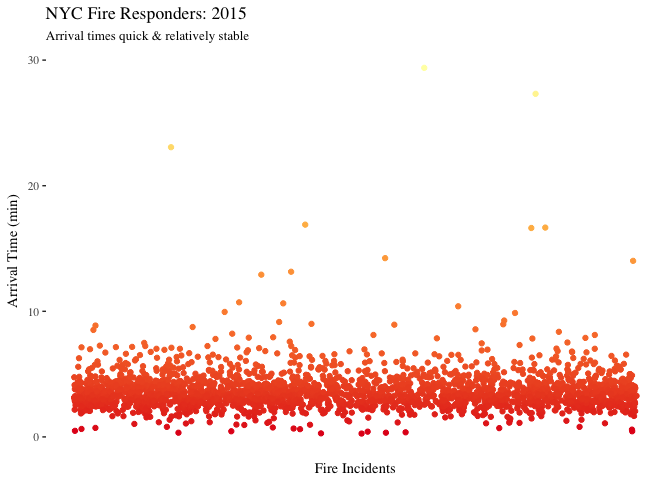
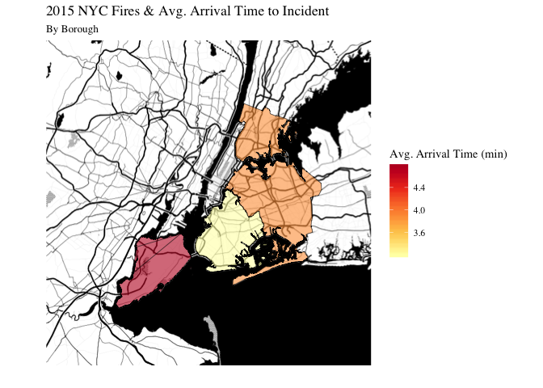

# NYC Severe Fire Incidents: 2015
The purpose of this project was to investigate serious incidents requiring the fire department to respond. Using 2015 data about the locations of firehouses and fires occurring in New York City, I looked to see whether response times and distance from the nearest fire station differed across the city. Visualizations were created primarily using leaflet and ggmap in R. For code and all visualizations, please see the [Rmd](.hw2/docs/Beiers_NYCFires.Rmd) file and the "docs" folder. For further explanation of each visualization, please see the [HTML](.hw2/output/Beiers_NYCFires.html) document and the "output" folder. The present README.md file is only to serve as an outline of the repository and a summary of key visualizations.

This repository is organized as follows. Please see each subfolder for a README.md file.

```
proj/
├── docs/
├── images/
└── output/
```

## Data
NYC Open Data has data on all incidents responded to by fire stations. For the purposes of this project, only data from 2015 regarding the most severe incidents were used. Data is not provided in the Github. The following variables are available:

  - `IM_INCIDENT_KEY`:	Unique identifier for each incident which serves
  - `INCIDENT_TYPE_DESC`	The code and description of the incident category type
  - `INCIDENT_DATE_TIME`	The date and time that the incident was logged into the Computer Aided Dispatch system
  - `ARRIVAL_DATE_TIME`	The date and time that the first unit arrived on scene
  - `UNITS_ONSCENE`	Total number of units that arrived on scene
  - `LAST_UNIT_CLEARED_DATETIME`	The date and time that the incident was completed and the last unit cleared the scene
  - `HIGHEST_LEVEL_DESC`	The highest alarm level that the incident received
  - `TOTAL_INCIDENT_DURATION`	The total number of seconds from when then incident was created to when the incident was closed
  - `ACTION_TAKEN1_DESC`	The code and description of the first action taken
  - `ACTION_TAKEN2_DESC`	The code and description of the second action taken
  - `ACTION_TAKEN3_DESC`	The code and description of the third action taken
  - `PROPERTY_USE_DESC`	The code and description of the type of street or building where the incident took place
  - `STREET_HIGHWAY` The name of the street where the incident_took place
  - `ZIP_CODE`	The postal zip code where the incident took place
  - `BOROUGH_DESC`	The borough where the incident took place
  - `FLOOR`	The floor of the building where the incident took place
  - `CO_DETECTOR_PRESENT_DESC`	Indicator for when a CO detector was present
  - `FIRE_ORIGIN_BELOW_GRADE_FLAG`	Indicator for when the fire originated below grade
  - `STORY_FIRE_ORIGIN_COUNT`	Story in which the fire originated
  - `FIRE_SPREAD_DESC`	How far the fire spread from the object of origin
  - `DETECTOR_PRESENCE_DESC`	Indicator for when a  detector was present
  - `AES_PRESENCE_DESC`	Indicator for when an Automatic Extinguishing System is present
  - `STANDPIPE_SYS_PRESENT_FLAG`	Indicator for when a standpipe was present in the area of origin of a fire


Additional data about NYC Fire Stations is available in a separate dataset including the `FacilityName`, `Borough`, `Latitude`, and `Longitude`.

## Highlights

*All interactive leaflet maps are included in the HTML document.*
### Incidents
#### Heat Map of Severe Fire Incidents
I created a heatmap of the same most severe incidents to investigate whether certain areas in NYC had more 2015 fires than others. From the map we can see Manhattan, the Bronx, and some of Brooklyn experienced the most severe incidents while Queens and Long Island didn't experience quite as many. This is likely due to population density differences between these boroughs.


### Responsiveness
#### Distribution of Responsiveness by Fire Fighters
Overall, incidents are responded to quite quickly in NYC with most firefighters arriving at the scene within 10 minutes. I noticed one extreme outlier (an incident that took over an hour to arrive to in an open field) so eliminated that one point for more meaningful insights.



#### Responsiveness of Fire Fighters by Property Type
I thought units would be more responsive to homes/residences in general, but it turns out there's not much of a difference in how quickly rescuers arrive based on property type. There were a few more incidences of rescuers arriving to fires in open fields and highways a bit later than they would at a residence or restaurant, though, based on this scatter plot, a restaurant/bar would be the place to be in a fire in terms of reliability of firefighters arrivals.


#### Responsiveness of Fire Fighters by NYC Borough
Again, there's not too much variation between the boroughs but there are a few incidents in Staten Island, Queens and Manhattan that were long waits for help.


While certainly a small difference, it takes fire units (on average) the longest to arrive to Staten Island in comparison to the other boroughs, likely because Staten Island has fewer stations than the other boroughs, and it could be tricky for Manhattan units to get across the bridge quickly.




#### Fire Unit Response Times & Proximity to Incidents
Next, I created map visualizations of the duration the fire incident and the time it took for a unit to arrive by distance to the nearest fire station. First, I differentiated by the incident's distance from the nearest fire station and colored each property by the duration of the incident. The maps make it clear that there are far fewer locations that are even more than a half mile away from a Fire Station as opposed to less than half a mile (and even more properties are within a quarter mile from a Fire Station!).


Moreover, fire units tend to arrive in a quick manner regardless of their distance to the incident. This relieved my anxieties more than anything else, but we'll see below that some boroughs get a slightly quicker response by the fire unit on average than others. The duration of a fire likely depends on other aspects I didn't have access to in this dataset.


When broken out into boroughs, it seems like even though Brooklyn and Queens have many fires, a lot of them are short lived. Staten Island seems to have had the fewest fires, though some lasted quite a while. No matter the borough, most fire incidents are within a half mile of a fire station! We're all safe.


### Interactivity
For interactive plots, please see the [HTML File](.hw2/output/Beiers_NYCFires.html).


## References
Some ideas and code were borrowed from Thomas Brambor (Professor, Columbia University), as well as the[Leaflet for R](https://rstudio.github.io/leaflet/markers.html) R Studio site.
