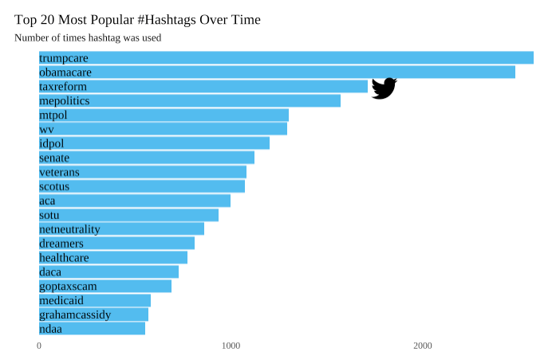

# US Senate Tweets
 For this project, I use the information about what Senators follows each other on Twitter as well as past tweets of the current U.S. Senate members to analyze how they interact and what they tweet about. Visualizations were made primarily using igraph and ggplot in R. For code and all visualizations, please see the [Rmd](.hw4/docs/Beiers_Twitter.Rmd) file and the "docs" folder. For further explanation of each visualization, please see the [HTML](.hw4/docs/Beiers_Twitter.html) document. The present README.md file is only to serve as an outline of the repository and a summary of key visualizations.

This repository is organized as follows. Please see each subfolder for a README.md file.

```
proj/
├── docs/
├── data/
├── images/
└── output/
```

## Data
The data (`senators_twitter.csv`) contains the Twitter handles of the current U.S. Senate members (obtained from SocialSeer). I focus on the Senators’ official Twitter accounts (as opposed to campaign or staff members). Information on the party affiliation of the Senators was obtained from [here](https://ballotpedia.org/List_of_current_members_of_the_U.S._Congress).


## Highlights

### Who follows whom?
First, I created two tables of the top followed Senators and the Senators who follow the most of their peers. Collins, McCain and Murkowski follow the most of their peers while Merkley, Warner and Kennedy are followed by their peers the most.
#### Network of Followers
 I visualized the network of senators and highlighted the party of each with blue = Democrat, yellow = Independent and red = Republican and sized the nodes by each senator’s centrality to the network. Clearly, these Senators are quite intertwined! But, we can see a stark cutoff between red and blue indicating a separation amongst the two main parties.


#### Communities
Next, let’s see whether party identification is also recovered by an automated mechanism of cluster identification. First, I clustered the senators using the cluster_walktrap function, and visualized how well these clusters identified the political parties of the senators. Clearly, it did a pretty good job. Cluster one was made entirely of Republicans while cluster two was made entirely of Democrats and Independents; these groups tend to go together more often than Independents and Republicans do, so I think this makes sense.


### What Are They Tweeting About?
#### Most Common Topics Over Time
I visualized the most common hashtags used by senators overall in a bar chart below. Interestingly, “trumpcare” and “obamacare” are neck-in-neck in terms of first place. “Taxreform” comes next, a topic for which both parties likely tweeted quite differing opinions about. Other important tweets include “mepolitics”, “netneutrality” and “dreamers”; all large and controversial recent political topics!



#### Democrats v. Republicans
Next, I visualized the top 15 most common hashtags used by senators, but this time by political party and overtime. We can see exactly when certain topics were more popular than others, and we can also see that republicans tend to tweet these hashtags more frequently than democrats. Some hashtags were only used by one party; for instance, #trumpcare and #goptaxscam was largely used by democrats (no surprise there). The hashtag #wv has been used most long-term, as we can see a steady stream of red and blue throughout 2016-2018.


#### Gun Control 1 -- Democrats v. Republicans
To visualize the difference in gun related hashtags, I used a diverging lollipop chart. Because there were only two Independents in the dataset, I chose to eliminate them for this exercise. First, I identified the main hashtags used in support of gun control and the main hashtags used in support of gun rights and subset my data to only look at those hashtags. We can see that gun control hashtags like #nationalwalkoutday and #gunreformnow are most commonly used by democrats while hashtags like #secondamendment and #freedom are used by republicans. In general, it seems that democrats voice their opinions on guns more frequently than republicans.


#### Gun Control 2 -- Democrats v. Republicans
To look into how senators reacted specifically to the Parkland shooting, I narrowed the time-range for tweets to one month after the shooting, and, for simplicity sake, only looked at Democrats vs. Republicans once again. Again, I visualized the use of these hashtags over the month long period so we can take a look at exactly when certain hashtags were popular. Clearly, democrats were tweeting more about the shooting than were republicans, yet republicans tended to tweet more about the “facts” (i.e. #parklandshooting and #florida) whereas democrats tweeted more about the student-led march and ending gun violence.


### Are You Talking to Me?
#### Identifying Re-Tweets
I selected the set of re-tweeted messages from other senators and identified the source of the originating message. Then, I calculated by senator the amount of re-tweets they received and from which party these re-tweets came. I created a scale of tweeting republicans vs. independents and then retweeting democrats vs. independents such that the more right the senator appears on the grid, the more democrats he/she retweeted, the more “up” he/she appears on the graph the more republicans he/she retweeted and the more left or down he/she appears on the grid, the more independents he/she has retweeted. The color of the dots indicate the party of the senator, not the party of the retweeted senator. In visualizing these relationships, I found that senators largely re-tweet their own party colleagues’ messages.


As a follow up, I chose to visualize this phenomenon once more through many small pie charts. The pie charts indicate the percentage of times a senator retweeted a particular party. We can see that democratic pie charts are mainly blue, republican pie charts are mainly red and independents are primarily blue and slightly yellow, though are a bit more balanced than the republican and democratic senator in terms of who they retweet.


#### Identifying Mentions
I then identified the tweets in which one senator mentions another senator directly and removed simple re-tweets. Then, I calculated who mentions whom among the senate members. I converted the information to an undirected graph object in which the number of mentions is the strength of the relationship between senators. I then visualized the network graph using the party identification of the senators as a group variable and centrality to size the nodes. From this visualization, we can once again see just how close knit this group is yet how separate they are in terms of party belongingness. We see a few more spread out nodes than we did in the first network graph indicating a bit more distance; it really does seem like overall, democrats and republicans stick to mentioning their respective parties.


## References
Some ideas and code were borrowed from Thomas Brambor (Professor, Columbia University) as well as the [Text Mining with R](https://www.tidytextmining.com/tidytext.html) textbook (Silge & Robinson).
