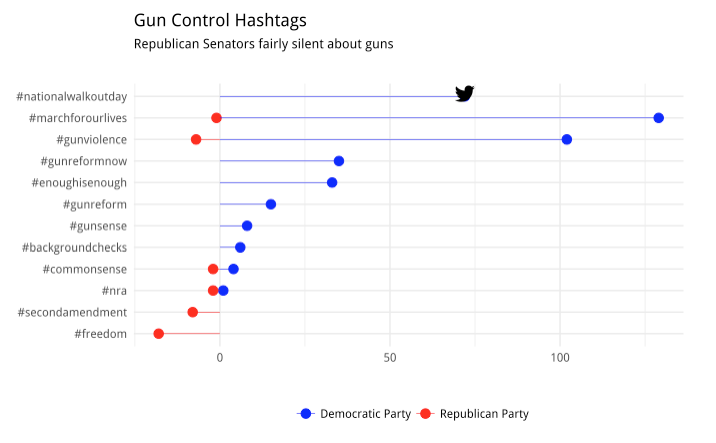

```{r setup, include=FALSE}
knitr::opts_chunk$set(fig.path="../images/",
               cache.path="cache/",
               cache=FALSE,
               echo=TRUE,
               message=FALSE,
               warning=FALSE,
               eval = TRUE) 
setwd("~/Documents/GitHub/Beiers_Sophie/hw4/docs")
library(tidyverse)
library(lubridate)
library(igraph)
library(ggnetwork)
library(intergraph)    
library(ggrepel)      
library(svgPanZoom)    
library(DT) 
library(networkD3)
library(ggthemes)
library(ggridges)
library(emojifont)
library(knitr)
```

# Tweets by US Senators
## Data
The data contains about 170k tweets and about 40 variables. Please note, that the API limit of 3,200 tweets per twitter handle actually cuts down the time period we can observe the most prolific Twitter users in the Senate down to only about one year into the past.
```{r}
tweets <- readRDS("../data/senator_tweets.RDS")
follows <- read_csv("../data/senators_follow.csv")
twitter <- read_csv("../data/senators_twitter.csv")

# How limiting is the API limit?
freq_tweeters <- tweets %>% 
  group_by(screen_name) %>% 
  summarize(n_tweet = n(),
            oldest_tweet = min(created_at)) %>%
  arrange(desc(oldest_tweet)) %>% 
  ungroup()

# changing col name for ease 
twitter['official_twitter'] <- twitter['Official Twitter']
twitter['party'] <- twitter['Party affiliation']

# looking for most prolific dem, rep and independent tweeters
freq_tweeters <- merge(freq_tweeters, twitter[, c("official_twitter", "party")], by.x = "screen_name", by.y = "official_twitter")

freq_tweeters_d <- freq_tweeters %>% 
  filter(party == "Democratic Party") %>% 
  arrange(desc(n_tweet)) %>% 
  slice(1:42)

freq_tweeters_r <- freq_tweeters %>% 
  filter(party == "Republican Party") %>% 
  arrange(desc(n_tweet)) %>% 
  slice(1:42)

freq_tweeters_i <- freq_tweeters %>% 
  filter(party == "Independent") %>% 
  arrange(desc(n_tweet)) %>% 
  slice(1:20)
  
```

## Who Follows Whom?
### Network of Followers
First, I created two tables of the top followed Senators and the Senators who follow the most of their peers. Collins, McCain and Murkowski follow the most of their peers while Merkley, Warner and Kennedy are followed by their peers the most. 

#### Senators Who Follow Most Other Senators
```{r}

# get party info
follows <- merge(follows, twitter[, c("official_twitter", "party")], by.x = "source", by.y = "official_twitter")

# followed or followed by as dummies
follows$following <- as.numeric(ifelse(follows$following == T, 1, 0))
follows$followed_by <- ifelse(follows$followed_by == T, 1, 0)

net_follows <- follows %>% 
  group_by(source) %>% 
  summarize(n_following = sum(following), n_followed_by = sum(followed_by))

# the top senators following the most of their colleagues are Collins, McCain and Murkowski
top_following <- net_follows %>% 
  arrange(desc(n_following)) %>% 
  slice(1:3)
kable(top_following)
```

#### Senators Followed by Most Other Senators
```{r}

# the senators followed by the largest amount of their colleagues Merkley, Warner, Kennedy 
top_followed_by <- net_follows %>% 
  arrange(desc(n_followed_by)) %>% 
  slice(1:3)
kable(top_followed_by)

```

#### Network Visualization
Next, I visualized the network of senators and highlighted the party of each with blue = Democrat, yellow = Independent and red = Republican and sized the nodes by each senator's centrality to the network. Clearly, these Senators are quite intertwined! But, we can see a stark cutoff between red and blue indicating a separation amongst the two main parties. 
```{r}
# data set-up 
sub_following <- subset(follows, follows$following == 1)
gr <- graph_from_data_frame(sub_following[,c("source", "target")], 
                            directed = TRUE)

V(gr)$size <- centralization.degree(gr)$res
connections <- ggnetwork(gr, layout="fruchtermanreingold", 
                arrow.gap =0, cell.jitter=0)

write_csv(connections,"connections.csv")
connections <- read_csv("connections.csv")
connections <- dplyr::as_data_frame(connections)
connections <- merge(connections, twitter[c("official_twitter", "party")], by.x = "vertex.names", by.y = "official_twitter")
connections <- connections %>% 
  select(x, y, na.x, size, vertex.names, xend, yend, na.y, party)
connections$stars <- as.factor(ifelse(connections$vertex.names %in% top_followed_by$source, 1, 0))

# visualizing network 
ggplot() +
  geom_edges(data = connections, 
             aes(x = x, y = y, xend = xend, yend = yend),
             color = "darkgrey", curvature = 0.1, size = 0.1, alpha = 0.5) +
  geom_nodes(data = connections,
             aes(x = x, y = y, xend = xend, yend = yend, 
                 color = party, size = sqrt(size)), alpha = 0.7) +
  geom_label_repel(data = unique(connections[connections$size > 100, c(1, 2, 5)]),
                   aes(x = x, y = y, label = vertex.names), 
                    size = 2.5) +
  scale_color_manual(values=c("blue", "yellow", "red"), name = '') +
  theme_blank() +
  theme(legend.position="none") 

```


### Communities
Next, let’s see whether party identification is also recovered by an automated mechanism of cluster identification. First, I clustered the senators using the cluster_walktrap function, and visualized how well these clusters identified the political parties of the senators. Clearly, it did a pretty good job. Cluster one was made entirely of Republicans while cluster two was made entirely of Democrats and Independents; these groups tend to go together more often than Independents and Republicans do, so I think this makes sense.  

```{r}
# find "communities/groups"
wc <- cluster_walktrap(gr)  
members <- membership(wc)

# transform members into DF
com <- as.numeric(members)
names <- names(members)
mem <- data_frame(names, com)

# get party info
mem <- merge(mem, twitter[c("official_twitter", "party")], by.x = "names", by.y = "official_twitter")

# rename
mem$party[mem$party == 'Republican Party'] <- 'Republican'
mem$party[mem$party == 'Democratic Party'] <- 'Democrat'
mem$party[mem$party == 'Independent Party'] <- 'Independent'
mem$com[mem$com == 1] <- 'Group One'
mem$com[mem$com == 2] <- 'Group Two'


# plot
ggplot(data = mem, aes(x = party)) + 
  geom_bar(aes(fill = party), alpha = 0.8) +
  scale_fill_manual(values=c("blue", "yellow", "red"), name = '') +
  facet_wrap(~com) +
  theme_minimal() +
  theme(strip.background = element_rect(fill = "transparent")) +
  labs(x = '', y = '# of Members\n', 
       title = "US Senator Twitter Communities", 
       subtitle = "Same political parties clustered together")
  
```

#### Interactive Community Graph (For Fun)
```{r}
# Convert igraph object to object suitable for networkD3
sen_d3 <- igraph_to_networkD3(gr, group = members)

# Create force directed network plot
forceNetwork(Links = sen_d3$links, 
             Nodes = sen_d3$nodes, 
             Source = 'source', 
             Target = 'target', 
             NodeID = 'name', 
             Group = 'group', 
             charge = -50,
             linkDistance = 20, 
             zoom = T, 
             opacity = 1, 
             fontSize = 30)
```


## What do they Tweet About?
### Most Common Hashtags Over Time
I visualized the most common hashtags used by senators overall in a bar chart below. Interestingly, "trumpcare" and "obamacare" are neck-in-neck in terms of first place. "Taxreform" comes next, a topic for which both parties likely tweeted quite differing opinions about. Other important tweets include "mepolitics", "netneutrality" and "dreamers"; all large and controversial recent political topics!

```{r}
# twitter official color palette
colors <- c("#0084b4", "#00aced", "#1dcaff", "#c0deed")
# merge in party info 
tweets <- merge(tweets, twitter[, c('party', 'official_twitter')], by.x = 'screen_name', by.y = 'official_twitter')
# rid of tweets that are retweets
tweets_clean <- tweets %>% 
  filter(is_retweet == FALSE) %>% 
  unnest(hashtags) %>% 
  filter(!is.na(hashtags))

tweets_clean$hashtags <- tolower(tweets_clean$hashtags)

top_tweets <- tweets_clean %>% 
  group_by(hashtags) %>%
  count(hashtags, sort = TRUE) %>%
  ungroup() %>% 
  slice(1:20)

# took a screenshot because the little twitter bird won't show up in html otherwise :) 
g <- ggplot(data = top_tweets, aes(x = reorder(hashtags, n), y = n)) +
geom_bar(stat = "identity", fill = "#00aced", alpha = 0.8) + 
  coord_flip() + theme_tufte() + 
  geom_text(aes(label = hashtags, x = hashtags, y = 1), hjust = 0,
            size = 4, family = 'serif', color = "black") +
  geom_fontawesome("fa-twitter", color='black', size = 10, x = "taxreform", y = 1800) +
  theme(axis.title = element_blank(), 
        axis.text.y =  element_blank(), 
        axis.ticks = element_blank()) +
  labs(x = '', 
       title = "Top 20 Most Popular #Hashtags Over Time", 
       subtitle = "Number of times hashtag was used")


```


### Democrats v. Republicans
Next, I visualized the top 15 most common hashtags used by senators, but this time by political party and overtime. We can see exactly when certain topics were more popular than others, and we can also see that republicans tend to tweet these hashtags more frequently than democrats. Some hashtags were *only* used by one party; for instance, #trumpcare and #goptaxscam was largely used by democrats (no surprise there). The hashtag #wv has been used most long-term, as we can see a steady stream of red and blue throughout 2016-2018.

```{r}
# transform to date 
tweets_clean$created_at <- as.POSIXct(strptime(tweets_clean$created_at, "%Y-%m-%d"))

# round time time to after Jan 2016
sub_tweets <- subset(tweets_clean, created_at > "2016-01-01")

# identify top 15 hashtags by each party
top_party_tweets <- sub_tweets %>% 
  group_by(hashtags, party) %>%
  count(hashtags, sort = TRUE) %>%
  ungroup() %>% 
  slice(1:15)

# over time 
tweets_time <- sub_tweets %>% 
  filter(hashtags %in% top_party_tweets$hashtags) %>% 
  group_by(created_at, party) %>% 
  count(hashtags) %>% 
  ungroup()

# plot
ggplot(data = tweets_time, aes(created_at, as.factor(hashtags))) + 
  geom_density_ridges(data = filter(tweets_time, tweets_time$party == "Democratic Party"), 
                      aes(fill = party), alpha = 0.6, size = 0.2)  +
  geom_density_ridges(data = filter(tweets_time, tweets_time$party == "Republican Party"), 
                      aes(fill = party), alpha = 0.6, size = 0.2) +
  scale_fill_manual(values=c("blue","red"), name = "") +
  scale_y_discrete(labels=function(x) paste0("#", x)) +
  theme_light() +
  labs(x = '', y = '', title = 'Popular Hashtags by Political Party', 
       subtitle = 'Senator Tweets: 2016-2018 \n') +
  theme(legend.position = 'bottom') 
  
  
```

### Gun Control 1 -- Dem v. Rep
To visualize the difference in gun related hashtags, I used a diverging lollipop chart. Because there were only two Independents in the dataset, I chose to eliminate them for this exercise. First, I identified the main hashtags used in support of gun control and the main hashtags used in support of gun rights and subset my data to only look at those hashtags. We can see that gun control hashtags like #nationalwalkoutday and #gunreformnow are most commonly used by democrats while hashtags like #secondamendment and #freedom are used by republicans. In general, it seems that democrats voice their opinions on guns more frequently than republicans. 

```{r}
# list of hashtags related to gun control and gun rights
guncontrol <- c("guncontrolnow", "gunsense", "time", "commonsense", "gunviolence", "marchforourlives", "gunreform", "nationalwalkoutday", "enoughisenough", "gunreformnow")
gunrights <- c("nra", "secondamendment", "carry", "freedom", "firearms", "backgroundchecks")

# DF with only gun related hashtags
gun_tweets <- sub_tweets %>% 
  filter(party != "Independent") %>% 
  filter(hashtags %in% guncontrol| hashtags %in% gunrights) %>% 
  group_by(party) %>% 
  count(hashtags) %>% 
  ungroup()

gun_tweets$n <- ifelse(gun_tweets$party == "Republican Party", gun_tweets$n * -1, gun_tweets$n)


# diverging lolipop chart, uploading screenshot so the little bird appears!
g2 <- ggplot(data = gun_tweets, 
       aes(x = reorder(hashtags, n), 
           y = n)) + 
  geom_point(stat="identity",  size = 3, aes(col = party))   + 
  geom_segment(aes(y = 0,
                   x = hashtags,
                   yend = n,
                   xend = hashtags,
                   col = party
                   ), size = 0.2) +
  geom_fontawesome("fa-twitter", color='black', size = 6, 
                   x = "nationalwalkoutday", y = 72, nudge_x = 0.2) +
  scale_color_manual(values=c("blue", "red"), name = '') +
  coord_flip() +
  scale_x_discrete(labels=function(x) paste0("#", x)) +
  labs(y = '', x = '', title = 'Gun Control Hashtags', 
       subtitle = 'Republican Senators fairly silent about guns \n \n') +
  theme_minimal() +
  theme(axis.ticks = element_blank()) +
  theme(legend.position = "bottom")
```


### Gun Control 2 -- Parkland Shooting

To look into how senators reacted specifically to the Parkland shooting, I narrowed the time-range for tweets to one month after the shooting, and, for simplicity sake, only looked at Democrats vs. Republicans once again. Again, I visualized the use of these hashtags over the month long period so we can take a look at exactly when certain hashtags were popular. Clearly, democrats were tweeting more about the shooting than were republicans, yet republicans tended to tweet more about the "facts" (i.e. #parklandshooting and #florida) whereas democrats tweeted more about the student-led march and ending gun violence. 

```{r guncontrol2}
# identified hashtags used during the month after Parkland shooting related to Parkland
parkland_tweets <- subset(tweets_clean, created_at >= "2018-02-14" & created_at <= "2018-03-15")
parkland_tweets$hashtags <- ifelse(parkland_tweets$hashtags == "nationalschoolwalkout", "nationalwalkoutday", parkland_tweets$hashtags)
parkland_hashtags <- c("parkland", "gunreformnow", "parklandshooting", "neveragain", "parklandshooting", "endgunviolence", "enoughisenough", "nationalwalkoutday", "enoughisenough", "enough", "nationalschoolwalkout", "parkland",  "msdstrong", "florida",  "stopschoolviolenceact", "parklandshooting", "parkland", "gunreform", "banassaultweapons", "marchforourlives", "nationalwalkoutday")

# df of just those hashtags
parkland_time <- parkland_tweets %>% 
  filter(hashtags %in% parkland_hashtags) %>% 
  filter(party != "Independent") %>% 
  group_by(created_at, party) %>% 
  count(hashtags, sort = TRUE) %>% 
  ungroup()

# ridges plot over time between parties
ggplot(data = parkland_time, aes(created_at, as.factor(hashtags))) + 
  geom_density_ridges(data = filter(parkland_time, 
                                    parkland_time$party == "Democratic Party"), 
                      aes(fill = party), 
                      alpha = 0.8, 
                      size = 0.2)  +
  geom_density_ridges(data = filter(parkland_time, 
                                    parkland_time$party == "Republican Party"), 
                      aes(fill = party), 
                      alpha = 0.8, 
                      size = 0.2) +
  scale_fill_manual(values=c("blue","red"), name = "") +
  scale_y_discrete(labels=function(x) paste0("#", x)) +
  theme_minimal() +
  labs(x = '', y = '', 
       title = 'Popular Parkland Shooting Hashtags by Political Party', 
       subtitle = 'Senator Tweets: Feb 14, 2018 - Mar 15, 2018 \n') +
  theme(legend.position = 'none') +
  facet_wrap(~party)


```


## Are You Talking to Me?
### Identifying Re-Tweets
I selected the set of re-tweeted messages from other senators and identified the source of the originating message. Then, I calculated by senator the amount of re-tweets they received and from which party these re-tweets came. I created a scale of tweeting republicans vs. independents and then retweeting democrats vs. independents such that the more right the senator appears on the grid, the more democrats he/she retweeted, the more "up" he/she appears on the graph the more republicans he/she retweeted and the more left or down he/she appears on the grid, the more independents he/she has retweeted. The color of the dots indicate the party of the senator, not the party of the retweeted senator. In visualizing these relationships, I found that senators largely re-tweet their own party colleagues’ messages.

```{r}
retweets <- tweets %>% 
  filter(is_retweet == TRUE)

# find who retweeted about 
retweets$rt_user <- gsub( ":.*$", "", retweets$text)
retweets$rt_user <- gsub( "RT @", "", retweets$rt_user)
# change col name
retweets$user_party <- retweets$party
retweets <- select(retweets, screen_name, user_party, rt_user)
# new df to find party of retweeted user
user_party <- retweets[retweets$rt_user %in% retweets$screen_name, cbind("rt_user" , "user_party")]
colnames(user_party)[2] <- "rt_user_party" 
# merge together 
retweets <- merge(user_party, retweets, by = "rt_user")
retweets$count <- rep(1, nrow(retweets))

rt1 <- retweets %>% 
  group_by(screen_name, user_party, rt_user_party) %>% 
  summarise(len = length(rt_user_party)) %>% 
  ungroup()
rt1 <- spread(rt1, rt_user_party, len)
rt1[is.na(rt1)] <- 0

colnames(rt1)[3] <- "Democrat"
colnames(rt1)[5] <- "Republican"

rt2 <- rt1 %>% 
  mutate(total_tweets = Independent + Republican + Democrat) %>% 
  mutate(I_prop = round(Independent/total_tweets * 100, 2), 
         R_prop = round(Republican/total_tweets * 100,2), 
         D_prop = round(Democrat/total_tweets * 100, 2)) %>% 
  mutate(Independent = Independent * -1) %>% 
  mutate(Ind.Dem = Independent + Democrat) %>% 
  mutate(Ind.Rep = Independent + Republican)


# scatter plot
ggplot(data = rt2, aes(x = Ind.Dem, y = Ind.Rep, color = user_party)) +
  geom_point() +
  scale_color_manual(values=c("blue","yellow", "red"), name = "Senator's Political Party") +
  theme_minimal()+
  theme(legend.position = "right") +
  labs(x = '', y = '', title = 'Senators Largely Retweet Own Party', subtitle = '') +
  geom_label_repel(data = rt2[rt2$Republican > 6000|rt2$Democrat > 6000|rt2$Independent < -500,],
                   aes(label = screen_name), 
                    size = 2, color = "black") +
  ggplot2::annotate(geom = "text", x = 12500, y = 10000,  # right arrow
                    label = "More Dem RTs", size = 3) +
  geom_segment(aes(x = 10000, xend = 11500 , y = 9000, yend = 9000),
                     arrow = arrow(length = unit(0.2,"cm")), color = "blue") +
  ggplot2::annotate("text", x = 7000, y = 10000,  # left arrow
                    label = "More Ind RTs",
                    size = 3) +
        geom_segment(aes(x = 10000, xend = 8500 , y = 9000, yend = 9000),
                     arrow = arrow(length = unit(0.2,"cm")), color = "yellow") +
  ggplot2::annotate("text", x = 10000, y = 5000,  # down arrow
                    label = "More Ind RTs",  
                    size = 3) +
        geom_segment(aes(x = 10000, xend = 10000 , y = 9000, yend = 7000),
                     arrow = arrow(length = unit(0.2,"cm")), color = "yellow") +
  ggplot2::annotate("text", x = 10000, y = 12500,  # up arrow
                    label = "More Rep RTs",  
                    size = 3) +
        geom_segment(aes(x = 10000, xend = 10000 , y = 9000, yend = 11000),
                     arrow = arrow(length = unit(0.2,"cm")), color = "red")

```

As a follow up, I chose to visualize this phenomenon once more through many small pie charts. The pie charts indicate the percentage of times a senator retweeted a particular party. We can see that democratic pie charts are mainly blue, republican pie charts are mainly red and independents are primarily blue and slightly yellow, though are a bit more balanced than the republican and democratic senator in terms of who they retweet. 

```{r}
rt3 <- rt2 %>% 
  gather("RTParty", "Prop", 7:9) %>% 
  select(screen_name, user_party, RTParty, Prop)


# Democrats 
d <- ggplot(data = filter(rt3, rt3$screen_name %in% freq_tweeters_d$screen_name), 
       aes(x = 0, y = Prop, fill = RTParty)) + 
  geom_bar(stat = "identity") +
  scale_x_continuous(expand = c(0,0)) +
  scale_fill_manual(values=c("blue", "yellow", "red"), labels = c("RT Democrat", "RT Independent", "RT Republican"), name = 'Parties of Retweets') +
  coord_polar(theta = "y") +
  labs(title = "Democrats") +
  theme_void() +
  theme(legend.position = "none") +
  theme(strip.background = element_blank(),
  strip.text.x = element_blank()) +
  facet_wrap(~screen_name)
  
# Republicans 
r <- ggplot(data = filter(rt3, rt3$screen_name %in% freq_tweeters_r$screen_name), 
       aes(x = 0, y = Prop, fill = RTParty)) + 
  geom_bar(stat = "identity") +
  scale_x_continuous(expand = c(0,0)) +
  scale_fill_manual(values=c("blue", "yellow", "red"), labels = c("RT Democrat", "RT Independent", "RT Republican"), name = 'Parties of Retweets') +
  coord_polar(theta = "y") +
  labs(title = "Republicans") +
  theme_void() +
  theme(legend.position = "none") +
  theme(strip.background = element_blank(),
  strip.text.x = element_blank()) +
  facet_wrap(~screen_name)

# Independents
i <- ggplot(data = filter(rt3, rt3$screen_name %in% freq_tweeters_i$screen_name), 
       aes(x = 0, y = Prop, fill = RTParty)) + 
  geom_bar(stat = "identity") +
  scale_x_continuous(expand = c(0,0)) +
  scale_fill_manual(values=c("blue", "yellow", "red"), labels = c("Democrat", "Independent", "Republican"), name = 'Parties of Retweets') +
  coord_polar(theta = "y") +
  labs(title = "Independents") +
  theme_void() +
  theme(legend.position = "right", legend.key.size = unit(0.5, "cm")) +
  theme(strip.background = element_blank(),
  strip.text.x = element_blank()) +
  facet_wrap(~screen_name)

source("../lib/multiplot.R")
layout <- matrix(c(1, 1, 2, 2, 1,1,2,2,3,3,NA,NA), 3, 4, byrow = TRUE)
multiplot(d, r, i, layout = layout)


```

### Identifying Mentions
I then identified the tweets in which one senator mentions another senator directly and removed simple re-tweets. Then, I calculated who mentions whom among the senate members. I converted the information to an undirected graph object in which the number of mentions is the strength of the relationship between senators. I then visualized the network graph using the party identification of the senators as a group variable and centrality to size the nodes. From this visualization, we can once again see just how close knit this group is yet how separate they are in terms of party belongingness. We see a few more spread out nodes than we did in the first network graph indicating a bit more distance; it really does seem like overall, democrats and republicans stick to mentioning their respective parties. 

```{r}
mentions <- tweets %>% 
  filter(is_retweet == FALSE) %>% 
  unnest(mentions_screen_name) %>% 
  filter(!is.na(mentions_screen_name)) %>% 
  filter(mentions_screen_name %in% screen_name) %>% 
  # group_by(screen_name, mentions_screen_name) %>% 
  # mutate(n_mentions = n()) %>% 
  # ungroup() %>% 
  select(screen_name, mentions_screen_name, party)

gr2 <- graph_from_data_frame(mentions[,c("screen_name", "mentions_screen_name")], 
                            directed = FALSE)

V(gr2)$size <- centralization.degree(gr2)$res
E(gr2)$weight <- 1
edges <- simplify(gr2, edge.attr.comb = "sum")
mentions_network <- ggnetwork(edges, layout="fruchtermanreingold", 
                arrow.gap = 0, cell.jitter = 0)
# hacky write_csv & read in 
write_csv(mentions_network,"mentions.csv")
mentions_network <- read_csv("mentions.csv")
mentions_network <- as.data.frame(mentions_network)
# read in senator party 
mentions_network <- merge(mentions_network, mentions[c("screen_name", "party")], by.x = "vertex.names", by.y = "screen_name")
# rearrange
mentions_network <- mentions_network %>% 
select(x, y, na.x, size, vertex.names, xend, yend, na.y, weight, party)

# graph 
ggplot() +
  geom_edges(data = mentions_network, 
             aes(x = x, y = y, xend = xend, yend = yend),
             color = "darkgrey", curvature = 0.1, size = 0.1, alpha = 0.5) +
  geom_nodes(data= mentions_network,
             aes(x = x, y = y, xend = xend, yend = yend, 
                 color = party, size = sqrt(size)), alpha = 0.7) +
  geom_label_repel(data = unique(mentions_network[mentions_network$size > 400, c(1, 2, 5)]),
                   aes(x = x, y = y, label = vertex.names), 
                    size = 2.5) +
  scale_color_manual(values=c("blue", "yellow", "red"), name = '') +
  theme_blank() +
  theme(legend.position="none") 
```


