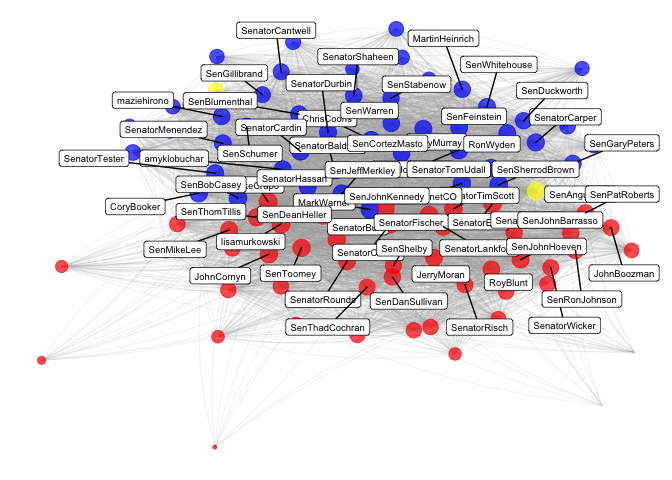
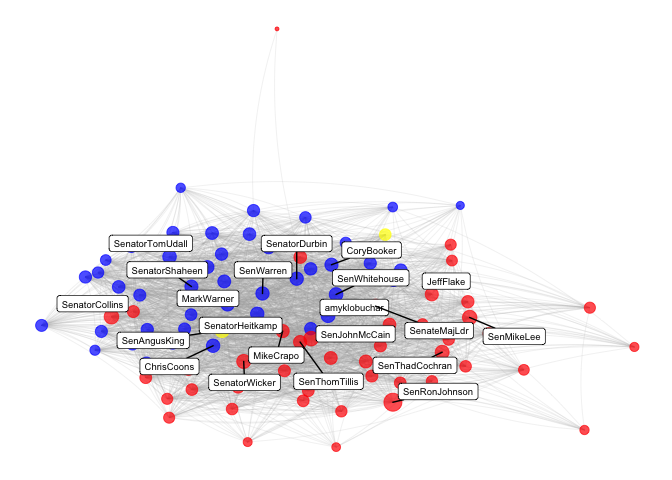

# Tweets by US Senators
## Data
The data contains about 170k tweets and about 40 variables. Please note, that the API limit of 3,200 tweets per twitter handle actually cuts down the time period we can observe the most prolific Twitter users in the Senate down to only about one year into the past.

```r
tweets <- readRDS("../data/senator_tweets.RDS")
follows <- read_csv("../data/senators_follow.csv")
twitter <- read_csv("../data/senators_twitter.csv")

# How limiting is the API limit?
freq_tweeters <- tweets %>% 
  group_by(screen_name) %>% 
  summarize(n_tweet = n(),
            oldest_tweet = min(created_at)) %>%
  arrange(desc(oldest_tweet)) %>% 
  ungroup()

# changing col name for ease 
twitter['official_twitter'] <- twitter['Official Twitter']
twitter['party'] <- twitter['Party affiliation']

# looking for most prolific dem, rep and independent tweeters
freq_tweeters <- merge(freq_tweeters, twitter[, c("official_twitter", "party")], by.x = "screen_name", by.y = "official_twitter")

freq_tweeters_d <- freq_tweeters %>% 
  filter(party == "Democratic Party") %>% 
  arrange(desc(n_tweet)) %>% 
  slice(1:42)

freq_tweeters_r <- freq_tweeters %>% 
  filter(party == "Republican Party") %>% 
  arrange(desc(n_tweet)) %>% 
  slice(1:42)

freq_tweeters_i <- freq_tweeters %>% 
  filter(party == "Independent") %>% 
  arrange(desc(n_tweet)) %>% 
  slice(1:20)
```

## Who Follows Whom?
### Network of Followers
First, I created two tables of the top followed Senators and the Senators who follow the most of their peers. Collins, McCain and Murkowski follow the most of their peers while Merkley, Warner and Kennedy are followed by their peers the most. 

#### Senators Who Follow Most Other Senators

```r
# get party info
follows <- merge(follows, twitter[, c("official_twitter", "party")], by.x = "source", by.y = "official_twitter")

# followed or followed by as dummies
follows$following <- as.numeric(ifelse(follows$following == T, 1, 0))
follows$followed_by <- ifelse(follows$followed_by == T, 1, 0)

net_follows <- follows %>% 
  group_by(source) %>% 
  summarize(n_following = sum(following), n_followed_by = sum(followed_by))

# the top senators following the most of their colleagues are Collins, McCain and Murkowski
top_following <- net_follows %>% 
  arrange(desc(n_following)) %>% 
  slice(1:3)
kable(top_following)
```


source            n_following   n_followed_by
---------------  ------------  --------------
SenatorCollins             82              77
SenJohnMcCain              79              18
lisamurkowski              76              90

#### Senators Followed by Most Other Senators

```r
# the senators followed by the largest amount of their colleagues Merkley, Warner, Kennedy 
top_followed_by <- net_follows %>% 
  arrange(desc(n_followed_by)) %>% 
  slice(1:3)
kable(top_followed_by)
```


source            n_following   n_followed_by
---------------  ------------  --------------
SenJeffMerkley             61              97
MarkWarner                 66              96
SenJohnKennedy             33              96

#### Network Visualization
Next, I visualized the network of senators and highlighted the party of each with blue = Democrat, yellow = Independent and red = Republican and sized the nodes by each senator's centrality to the network. Clearly, these Senators are quite intertwined! But, we can see a stark cutoff between red and blue indicating a separation amongst the two main parties. 

```r
# data set-up 
sub_following <- subset(follows, follows$following == 1)
gr <- graph_from_data_frame(sub_following[,c("source", "target")], 
                            directed = TRUE)

V(gr)$size <- centralization.degree(gr)$res
connections <- ggnetwork(gr, layout="fruchtermanreingold", 
                arrow.gap =0, cell.jitter=0)

write_csv(connections,"connections.csv")
connections <- read_csv("connections.csv")
connections <- dplyr::as_data_frame(connections)
connections <- merge(connections, twitter[c("official_twitter", "party")], by.x = "vertex.names", by.y = "official_twitter")
connections <- connections %>% 
  select(x, y, na.x, size, vertex.names, xend, yend, na.y, party)
connections$stars <- as.factor(ifelse(connections$vertex.names %in% top_followed_by$source, 1, 0))

# visualizing network 
ggplot() +
  geom_edges(data = connections, 
             aes(x = x, y = y, xend = xend, yend = yend),
             color = "darkgrey", curvature = 0.1, size = 0.1, alpha = 0.5) +
  geom_nodes(data = connections,
             aes(x = x, y = y, xend = xend, yend = yend, 
                 color = party, size = sqrt(size)), alpha = 0.7) +
  geom_label_repel(data = unique(connections[connections$size > 100, c(1, 2, 5)]),
                   aes(x = x, y = y, label = vertex.names), 
                    size = 2.5) +
  scale_color_manual(values=c("blue", "yellow", "red"), name = '') +
  theme_blank() +
  theme(legend.position="none") 
```

<!-- -->


### Communities
Next, let’s see whether party identification is also recovered by an automated mechanism of cluster identification. First, I clustered the senators using the cluster_walktrap function, and visualized how well these clusters identified the political parties of the senators. Clearly, it did a pretty good job. Cluster one was made entirely of Republicans while cluster two was made entirely of Democrats and Independents; these groups tend to go together more often than Independents and Republicans do, so I think this makes sense.  


```r
# find "communities/groups"
wc <- cluster_walktrap(gr)  
members <- membership(wc)

# transform members into DF
com <- as.numeric(members)
names <- names(members)
mem <- data_frame(names, com)

# get party info
mem <- merge(mem, twitter[c("official_twitter", "party")], by.x = "names", by.y = "official_twitter")

# rename
mem$party[mem$party == 'Republican Party'] <- 'Republican'
mem$party[mem$party == 'Democratic Party'] <- 'Democrat'
mem$party[mem$party == 'Independent Party'] <- 'Independent'
mem$com[mem$com == 1] <- 'Group One'
mem$com[mem$com == 2] <- 'Group Two'


# plot
ggplot(data = mem, aes(x = party)) + 
  geom_bar(aes(fill = party), alpha = 0.8) +
  scale_fill_manual(values=c("blue", "yellow", "red"), name = '') +
  facet_wrap(~com) +
  theme_minimal() +
  theme(strip.background = element_rect(fill = "transparent")) +
  labs(x = '', y = '# of Members\n', 
       title = "US Senator Twitter Communities", 
       subtitle = "Same political parties clustered together")
```

<!-- -->

#### Interactive Community Graph (For Fun)

```r
# Convert igraph object to object suitable for networkD3
sen_d3 <- igraph_to_networkD3(gr, group = members)

# Create force directed network plot
forceNetwork(Links = sen_d3$links, 
             Nodes = sen_d3$nodes, 
             Source = 'source', 
             Target = 'target', 
             NodeID = 'name', 
             Group = 'group', 
             charge = -50,
             linkDistance = 20, 
             zoom = T, 
             opacity = 1, 
             fontSize = 30)
```

<!--html_preserve--><div id="htmlwidget-9d98143f4ae226ed60bc" style="width:672px;height:480px;" class="forceNetwork html-widget"></div>
<script type="application/json" data-for="htmlwidget-9d98143f4ae226ed60bc">{"x":{"links":{"source":[6,8,93,61,56,29,37,76,39,26,36,10,83,81,74,67,35,23,92,79,80,16,89,94,21,52,82,12,27,45,60,25,47,78,44,46,34,15,32,33,19,17,65,85,66,90,40,20,7,64,62,41,31,42,50,54,38,57,53,72,58,69,13,11,9,87,59,14,48,5,75,49,73,43,28,71,68,77,91,22,70,86,55,51,39,8,89,50,11,43,76,84,10,18,24,59,26,57,43,86,50,30,32,28,72,90,74,15,24,18,28,32,36,73,35,72,1,68,27,45,41,33,34,10,83,36,92,70,20,48,55,44,6,23,51,69,62,17,82,94,53,21,25,80,66,37,56,61,8,19,9,7,29,5,20,13,68,39,77,41,37,40,61,62,55,21,32,80,85,45,42,47,26,54,91,76,66,17,18,49,35,82,94,51,27,22,7,74,36,73,52,56,81,29,46,6,15,31,38,19,10,9,34,92,86,64,79,24,58,71,12,28,69,33,65,67,14,0,8,11,44,50,70,90,25,53,23,48,83,78,10,91,18,12,80,9,8,4,73,94,55,5,2,51,20,31,37,45,64,69,33,48,49,80,12,61,34,10,56,75,4,0,51,23,53,65,19,63,66,91,5,82,58,62,79,21,27,40,35,55,36,94,87,54,25,9,90,44,83,92,15,36,14,25,9,28,5,32,73,52,90,27,70,42,16,77,76,24,19,26,78,13,11,26,92,35,66,26,64,94,18,74,89,85,77,59,61,17,54,82,70,11,44,9,4,67,5,83,20,7,49,38,27,36,90,65,0,41,84,73,19,32,23,87,91,21,31,42,69,22,8,55,16,40,48,46,28,14,33,52,76,30,1,25,56,75,47,24,79,50,80,34,6,53,51,71,13,81,12,39,68,60,62,29,78,45,37,15,24,73,74,14,32,22,84,13,81,50,90,52,71,17,70,26,18,28,76,77,78,85,30,42,8,36,73,15,90,61,22,24,36,26,0,70,85,17,43,62,51,19,25,73,89,84,61,32,79,92,46,11,94,37,74,18,65,71,68,16,21,27,91,22,15,76,36,14,29,39,5,52,49,12,28,69,8,24,41,10,77,90,81,38,78,42,20,50,55,30,84,47,43,71,28,15,70,42,60,38,35,29,78,74,89,71,17,13,62,22,43,85,0,32,50,30,18,90,52,15,42,28,38,70,26,54,81,59,27,73,11,35,93,60,47,86,36,61,39,8,56,26,18,76,36,54,61,9,89,24,71,81,29,51,84,13,5,30,65,69,67,45,60,53,79,55,44,46,80,78,47,0,85,2,33,50,93,74,14,1,68,32,42,88,11,77,48,25,94,82,59,27,21,22,34,37,49,28,19,86,12,90,62,16,17,43,23,8,92,39,73,72,41,10,70,35,31,52,38,57,8,80,76,93,83,39,36,15,61,77,28,26,65,32,18,7,12,42,1,29,27,78,89,70,48,68,81,9,82,45,30,85,41,35,74,62,44,49,21,53,14,8,43,73,71,10,47,60,67,50,51,69,94,37,66,59,86,0,22,13,19,92,34,16,46,5,31,6,55,4,33,56,79,54,20,90,52,88,11,25,84,23,2,38,40,57,50,33,83,77,43,66,68,24,82,53,6,13,94,63,79,42,25,51,48,32,5,45,41,8,37,54,52,15,30,92,29,21,58,40,88,91,11,16,44,31,59,46,81,23,69,17,10,93,1,2,0,60,70,34,26,65,35,80,62,38,85,75,4,56,14,55,18,12,72,86,67,64,71,7,20,61,39,27,22,47,9,76,78,49,50,36,74,57,28,87,90,73,36,49,83,10,23,94,67,35,75,44,33,19,7,87,56,82,55,9,27,48,91,34,38,51,79,6,41,46,69,68,21,0,40,61,53,65,45,12,32,43,64,31,63,17,37,25,28,86,71,5,80,29,92,4,73,58,7,91,49,12,27,20,83,33,10,60,75,80,19,69,76,5,8,53,64,62,36,67,23,68,54,82,73,0,61,13,17,79,6,44,34,51,65,45,37,40,48,11,15,35,92,41,29,87,4,56,50,55,31,22,94,39,9,25,66,58,75,91,62,72,27,63,61,26,50,24,57,73,56,74,49,68,51,19,77,69,14,32,80,78,37,93,11,36,5,52,12,29,92,42,8,46,18,66,48,2,10,76,55,33,4,67,20,70,28,34,41,54,83,1,85,60,23,44,59,13,64,40,90,71,47,0,94,38,39,21,45,9,15,17,16,25,82,6,84,30,31,79,65,87,86,43,35,81,53,89,28,79,54,49,6,53,32,62,27,83,44,64,82,81,51,48,24,8,45,11,71,17,5,26,14,61,13,41,90,21,37,7,77,55,20,80,19,9,68,25,91,31,65,74,52,78,73,94,33,67,70,39,63,87,56,34,4,46,10,38,92,15,29,69,42,35,22,85,36,71,70,52,22,12,50,85,84,17,38,11,46,8,67,28,26,76,15,14,78,61,74,90,13,80,86,10,77,59,39,42,44,18,36,32,55,25,66,90,4,5,38,77,32,7,79,53,54,19,31,48,92,26,59,55,85,52,37,14,44,9,81,33,62,6,20,13,65,34,69,29,61,80,41,78,56,35,91,67,68,21,82,8,39,51,27,17,36,22,46,70,57,23,45,74,42,40,71,83,5,50,28,72,19,84,30,36,8,47,86,85,18,74,77,42,57,24,71,52,70,10,38,12,15,59,90,43,32,22,17,78,11,89,14,83,76,93,73,13,88,61,39,2,81,60,46,14,43,32,87,77,59,70,60,13,91,68,9,83,73,48,65,42,57,81,92,89,74,29,55,90,6,94,56,19,18,10,58,22,85,63,5,44,84,34,39,86,67,76,0,53,36,82,61,41,79,54,11,7,66,15,45,78,31,35,52,25,69,46,17,47,51,62,21,37,71,23,50,33,28,80,93,8,70,81,11,30,71,42,61,73,52,13,47,78,59,76,18,90,2,74,32,77,53,17,86,8,24,14,38,15,10,19,26,29,36,79,53,70,59,90,22,11,15,75,48,23,77,71,80,28,47,82,34,66,43,45,4,31,54,76,57,69,41,86,61,13,78,55,5,44,81,8,32,6,0,26,67,10,92,20,83,73,25,50,37,46,19,38,56,14,51,72,91,27,60,35,62,84,85,33,68,39,21,89,65,36,24,18,94,42,52,74,49,93,14,60,24,89,72,32,8,52,90,36,2,78,86,73,76,70,84,81,42,71,47,15,28,46,77,59,38,13,12,85,43,11,39,50,93,17,88,61,26,22,74,57,18,25,42,30,77,13,55,18,92,8,34,57,37,71,49,20,32,65,68,81,2,41,17,11,39,85,62,79,36,15,6,47,75,24,94,48,70,84,4,43,60,45,91,22,74,93,83,5,35,33,86,59,89,23,38,64,53,80,27,78,26,69,56,12,50,0,73,66,52,54,51,61,44,28,10,29,14,76,82,46,19,90,21,9,67,85,24,36,20,55,8,0,6,31,42,44,94,22,90,12,76,45,74,33,2,37,59,66,72,15,52,84,92,13,53,65,17,77,78,93,81,14,49,61,18,26,27,83,11,86,5,71,68,62,51,23,41,28,50,21,47,38,39,56,60,35,73,46,19,57,67,43,1,69,70,34,19,5,36,31,69,56,53,10,87,83,80,92,9,6,91,0,79,23,4,20,66,41,75,25,94,37,48,65,49,29,67,82,40,55,63,54,68,7,27,17,51,45,35,21,64,44,62,58,34,7,53,94,88,61,50,23,12,38,66,8,27,56,17,70,5,40,33,1,19,43,51,22,86,52,57,80,69,39,6,58,37,82,15,63,64,76,21,54,9,28,73,45,41,32,24,91,10,46,35,60,0,72,83,44,4,25,78,87,47,20,48,62,90,81,75,49,92,65,84,74,36,26,14,11,79,29,89,55,42,71,68,31,67,41,48,50,70,42,29,40,77,32,85,82,28,63,23,73,87,92,68,5,21,54,4,61,36,0,10,80,65,56,20,27,17,49,51,33,67,7,86,75,19,22,39,66,38,34,55,64,44,69,6,83,43,62,26,47,74,45,94,14,9,79,91,52,57,90,60,78,13,58,37,53,31,25,57,3,79,21,76,42,26,28,50,5,51,92,44,25,78,65,17,56,86,35,90,6,71,0,77,83,14,37,38,12,8,34,32,69,39,45,55,66,53,54,9,19,31,22,11,82,20,18,85,46,41,81,24,80,48,67,59,61,94,70,68,15,27,62,13,52,33,89,74,23,29,73,91,29,85,23,53,28,52,13,40,24,44,68,77,45,41,82,26,94,49,76,7,92,80,72,69,15,25,8,11,54,81,64,75,50,79,5,22,90,10,21,58,84,51,34,70,6,66,27,32,83,36,20,9,17,91,61,35,33,31,38,48,62,74,19,71,73,55,78,65,56,11,54,65,25,68,30,52,93,42,86,50,0,79,74,51,8,72,17,22,41,31,44,20,13,9,88,36,24,83,32,76,92,75,28,40,64,15,55,37,58,66,61,27,69,60,67,80,63,84,18,35,12,91,85,33,1,48,89,59,71,39,70,10,62,43,78,6,29,47,49,34,19,73,57,46,14,53,56,4,26,21,23,81,94,90,45,87,5,82,77,36,57,23,82,25,76,31,50,59,92,54,35,88,33,0,61,71,38,74,48,11,55,86,9,65,49,46,73,41,18,90,21,45,44,67,70,30,51,17,52,28,8,85,53,4,94,83,13,69,77,14,10,56,84,32,20,81,62,43,15,19,29,40,68,2,26,93,27,89,47,91,80,34,22,12,78,37,79,24,5,66,6,14,31,36,26,13,71,42,65,61,43,35,28,21,82,54,9,25,90,91,44,89,93,7,64,94,86,59,85,55,41,88,87,70,20,24,33,73,51,77,68,1,53,0,47,2,6,32,39,49,38,22,72,67,34,19,8,27,48,17,23,12,83,58,4,52,50,69,37,5,15,78,29,79,92,45,18,63,76,62,57,80,56,66,30,74,46,60,81,10,44,62,9,10,43,87,20,71,34,29,42,91,67,36,17,51,49,32,94,27,83,0,56,80,92,47,70,37,68,19,21,63,18,70,77,86,85,11,15,22,38,90,21,52,44,36,39,45,48,71,74,28,32,26,14,30,13,56,17,12,68,47,37,50,35,78,88,27,55,61,81,46,23,60,92,8,5,73,53,44,86,34,19,77,21,50,68,80,85,70,92,78,65,5,73,20,66,41,14,30,22,45,1,79,23,54,74,89,18,57,47,94,42,17,12,48,10,39,8,35,52,60,81,2,13,37,71,9,51,33,55,24,82,61,28,15,69,29,93,38,32,25,59,6,31,56,27,62,83,67,90,76,46,88,26,36,73,80,51,12,83,92,4,82,91,54,45,79,17,5,41,69,48,8,10,37,25,29,35,6,68,64,85,23,20,34,94,22,55,65,67,19,80,94,35,23,25,66,7,9,56,24,11,73,13,21,22,4,64,15,27,33,92,79,65,87,91,32,46,36,50,10,44,29,42,63,53,83,67,49,6,69,34,51,39,82,41,31,0,90,77,68,85,37,58,40,5,55,78,20,75,19,54,17,48,14,12,76,26,72,29,43,18,47,24,38,59,39,93,90,52,36,85,1,70,86,42,28,32,89,25,84,30,60,74,57,88,50,17,13,81,61,22,12,15,71,20,36,71,74,39,93,65,56,22,52,25,18,78,19,72,11,24,2,8,43,50,81,80,61,73,34,28,13,12,23,76,92,33,20,37,89,82,10,27,26,17,49,62,59,86,16,41,53,42,44,77,57,66,67,51,14,1,69,88,30,94,32,31,70,48,90,83,0,46,85,55,15,84,60,38,29,21,36,77,19,29,23,87,0,31,91,44,55,58,7,20,41,33,68,82,42,73,80,49,17,81,92,54,32,65,15,64,27,35,34,8,79,94,51,75,25,90,56,53,74,52,6,83,40,37,67,21,9,10,5,45,69,66,62,63,51,90,42,12,79,78,73,92,21,58,5,59,55,86,37,71,63,62,44,38,24,84,27,22,41,39,17,32,8,26,66,83,65,46,33,13,82,74,87,81,15,6,69,0,34,70,23,80,35,68,30,61,43,45,36,93,19,29,9,54,67,10,20,50,56,48,1,14,31,91,40,94,85,76,52,53,25,21,83,74,62,52,10,23,20,19,71,61,63,93,89,47,57,5,65,9,22,56,59,78,27,60,6,46,79,34,24,42,72,18,43,53,90,13,37,45,15,91,4,28,35,88,92,1,66,68,39,41,73,38,2,51,8,44,67,69,12,55,11,17,30,33,25,82,77,84,36,26,86,70,54,32,76,14,49,0,80,31,48,29,94,85,81,94,43,55,50,15,13,22,38,67,82,34,68,36,56,60,62,17,93,47,11,39,42,0,26,69,61,30,71,37,32,54,5,20,8,83,41,27,12,28,21,92,25,74,79,52,19,85,29,2,35,53,80,73,9,31,91,49,89,10,6,76,48,84,77,78,33,70,23,81,65,46,66,86,59,45,57,44,14,90,36,39,28,84,77,89,78,50,71,93,13,72,61,26,18,8,76,73,32,30,42,15,81,86,11,90,2,85,14,38,47,12,24,17,46,22,70,74,0,35,44,10,32,63,34,51,91,22,19,71,85,82,45,38,29,68,41,42,70,83,1,21,66,4,14,64,77,48,88,40,7,94,92,90,80,67,54,52,36,78,9,23,87,59,17,93,20,89,46,31,24,27,25,30,33,5,55,65,43,12,6,13,57,60,75,79,61,58,18,69,56,49,62,74,47,84,11,73,26,37,39,10,58,75,80,71,36,69,68,61,67,45,5,23,20,31,21,82,17,79,15,0,49,19,92,63,64,56,7,65,6,37,54,51,62,81,87,40,9,24,66,29,11,33,47,27,53,13,44,34,50,22,35,94,25,48,91,83,41,73,78,80,8,89,42,67,46,50,84,45,64,68,52,49,86,23,58,10,7,30,1,33,51,24,5,79,25,26,82,21,39,32,13,65,41,55,76,83,66,90,44,27,38,77,57,11,61,91,35,29,22,18,20,53,48,37,4,31,92,59,85,69,2,54,14,73,6,43,9,71,34,19,94,40,28,12,81,60,62,47,88,72,74,70,17,36,15,93,0,15,39,73,59,27,89,88,50,9,25,94,61,11,70,26,2,14,35,66,74,12,90,78,17,43,93,18,57,73,49,77,20,21,85,92,51,22,87,6,1,34,46,82,5,10,27,78,36,55,38,52,53,39,8,79,28,88,75,83,81,37,76,26,15,13,45,68,41,86,80,42,91,44,64,19,62,40,0,33,63,84,70,61,14,31,30,23,66,9,29,56,90,65,67,89,32,69,48,71,59,60,4,94,72,17,54,35,25,7,84,11,57,89,71,14,38,66,13,77,12,8,74,43,26,78,42,93,90,86,52,85,28,50,70,39,49,17,73,24,76,36,15,32,61,18,53,81,22,68,27,76,29,77,15,26,85,88,59,12,19,61,31,93,14,81,89,78,32,0,38,50,39,71,52,24,41,42,86,65,73,44,8,57,28,2,36,91,74,92,35,16,13,70,21,80,62,47,66,90,18,10,67,46,84,22,37,72,43,17,11,56,1,49,30,12,53,84,54,33,20,14,25,5,50,81,65,21,0,82,80,55,69,11,57,32,76,92,35,52,16,94,23,91,83,24,62,29,85,44,86,46,49,36,47,38,27,60,43,19,72,22,73,41,45,37,74,67,31,18,48,15,68,17,28,13,77,71,34,59,89,39,1,79,30,78,6,90,56,66,26,61,2,93,51,58,42,70,8,10,88,5,39,51,17,80,85,37,35,6,83,57,16,31,93,28,43,59,42,90,46,73,44,89,81,27,4,30,29,88,68,79,24,20,38,49,53,92,22,1,84,8,71,70,23,86,58,2,62,77,40,47,74,82,0,13,32,10,36,65,33,45,7,54,64,26,19,41,55,52,18,91,12,50,56,11,67,69,15,66,34,60,14,78,9,48,94,25,76,21,56,69,14,27,26,11,41,78,88,57,17,33,27,91,38,40,49,45,20,65,82,48,62,69,25,66,53,35,83,81,7,41,34,92,22,80,6,19,58,50,23,37,72,30,87,55,51,64,83,49,50,55,35,58,34,60,65,54,91,51,27,7,36,69,75,14,33,77,46,76,68,20,56,0,31,63,22,19,8,6,70,10,12,82,87,32,61,53,93,21,28,42,9,29,79,4,67,5,37,48,80,57,44,26,71,13,62,43,81,25,92,66,17,52,90,78,38,73,41,39,45,23,40,94,52,36,62,82,31,71,26,91,20,51,75,19,48,77,55,27,23,22,64,42,39,87,79,86,68,34,10,8,40,53,83,0,46,73,35,38,41,32,67,66,44,70,21,5,58,61,63,80,14,7,94,92,18,25,37,69,74,9,85,29,78,6,54,17,28,33,56,45,13,7,33,86,70,46,59,34,53,35,39,51,79,49,90,45,64,57,54,41,77,17,83,26,37,25,55,10,27,2,40,68,0,48,29,31,11,30,20,67,19,22,32,91,5,47,60,80,42,36,21,56,28,43,6,61,94,93,74,78,23,38,92,62,87,71,85,69,82,63,5,83,69,37,65,94,48,36,79,66,6,9,21,56,10,44,92,53,41,87,54,68,51,40,46,34,62,91,19,35,0,64,4,73,31,20,58,55,33,82,25,80,29,23,27,45,19,83,34,61,80,91,82,92,94,73,25,22,81,32,21,54,48,74,86,50,49,80,18,17,19,25,21,7,10,91,58,71,89,44,64,12,45,72,79,52,93,34,82,39,55,88,22,11,36,85,23,65,51,41,67,2,78,38,4,60,57,76,90,92,59,9,6,26,47,31,8,63,29,81,73,14,83,66,27,48,20,46,75,35,5,24,42,32,30,33,1,84,13,53,37,40,43,28,68,54,77,56,62,94,70,0,87,61,15,28,38,49,29,85,52,71,12,60,22,26,27,42,32,86,4,15,77,30,89,45,76,56,61,48,46,13,39,74,51,17,36,24,11,41,14,62,93,57,59,47,78,73,8,18,50,90,29,17,65,46,85,32,82,91,78,42,62,56,83,18,28,30,93,74,22,23,19,89,31,76,90,72,84,27,49,8,81,15,52,70,77,25,88,69,20,86,24,5,50,14,60,38,26,39,36,61,53,51,12,0,41,11,13,2,59,47,57,43,73,59,20,15,37,13,64,4,89,47,8,0,43,34,25,46,24,26,1,62,77,58,81,80,10,29,94,22,27,92,32,38,53,57,23,78,21,17,68,79,90,6,69,39,63,11,61,85,73,41,12,75,42,76,66,52,7,67,65,88,70,45,44,56,2,5,40,33,19,31,28,83,18,48,74,30,51,49,14,35,60,50,84,36,82,55,86,9,54,71,93,91,11,70,92,18,89,15,9,47,12,10,30,36,39,34,86,52,53,18,76,24,90,77,57,47,52,8,12,78,11,28,84,26,70,46,73,30,32,39,13,50,36,15,83,67,54,65,10,91,80,35,31,92,62,27,44,21,24,40,20,34,68,48,82,19,12,53,29,58,64,94,56,69,9,36,0,6,66,37,23,5,79,7,25,33,55,65,46,89,80,22,10,31,56,32,33,6,4,21,79,29,36,78,7,47,34,38,58,41,63,40,48,43,70,24,14,59,55,81,23,60,69,20,91,90,61,67,62,51,54,2,76,83,15,93,19,35,8,5,53,1,37,66,88,64,71,45,9,82,94,30,85,26,68,86,28,13,50,0,11,57,27,92,52,39,49,73,25,17,44,72,77,87,75,74,84,18,42,12,52,71,12,13,28,81,61,19,70,32,89,35,49,93,11,34,1,74,43,78,59,9,17,62,80,79,24,26,14,77,42,38,85,45,25,36,56,23,54,16,73,41,53,15,5,27,44,10,55,8,46,67,33,90,69,60,37,51,82,18,91,6,39,83,84,22,50,61,24,11,90,76,77,26,78,46,59,81,42,71,29,70,36,73,41,28,32,19,17,80,74,90,11,76,28,62,8,48,78,89,52,18,29,9,27,46,83,41,53,42,37,13,36,51,56,57,54,22,12,86,20,14,30,81,23,26,15,55,43,32,73,61,17,35,84,38,60,85,24,50,93,70,71,39,55,82,50,38,66,81,90,77,40,46,61,52,42,27,57,80,74,62,34,72,73,39,26,70,78,28,15,11,45,2,53,58,17,84,19,9,24,29,5,93,14,1,18,47,35,32,8,48,59,88,71,22,83,10,21,86,12,89,13,30,51,85,60,36,94,41,43,76,13,25,38,21,39,57,84,15,31,52,42,64,26,93,43,85,90,60,14,89,61,73,27,71,59,17,86,74,30,11,41,50,46,76,72,24,22,12,81,36,8,70,28,77,32,6,37,42,69,65,29,49,20,45,51,55,75,80,23,68,54,62,91,0,44,34,31,5,32,67,92,73,7,25,9,82,94,56,10,21,82,34,94,17,68,37,19,64,20,11,10,69,56,67,45,76,0,49,62,71,85,36,6,31,92,41,33,25,21,18,79,51,5,73,35,75,54,7,48,27,9,55,40,63,66,4,65,44,91,26,86,53,24,58,83,8,29,23,89,61,8,11,22,45,28,59,70,15,57,69,73,74,39,68,18,84,43,50,86,62,17,85,41,44,76,63,77,52,42,38,32,13,16,26,27,24,14,36,1,82,78,12,46,30,71,90,90,4,63,49,22,2,30,56,87,53,28,17,7,71,20,51,55,79,72,64,78,76,91,93,15,77,38,10,24,54,65,73,59,45,6,31,48,85,36,50,75,40,89,42,33,19,86,27,12,39,32,81,25,88,34,18,43,46,92,37,29,52,68,26,84,9,60,35,5,47,70,41,69,57,67,94,61,8,23,58,21,66,13,74,62,44,80,14,83,67,36,87,66,79,33,37,55,62,64,41,92,11,8,35,63,51,26,31,54,68,77,53,0,6,49,65,9,73,29,28,21,17,45,34,69,82,48,10,19,27,23,56,5,25,44,15,80,70,94,71,77,36,17,59,2,79,74,93,29,73,26,42,8,13,52,18,89,11,22,76,28,10,85,81,31,14,78,24,45,32,46,67,50,12,38,39,1,54,44,15,90,70,61,36,11,76,50,86,59,26,24,46,42,77,78,14,15,1,47,89,71,57,32,81,8,84,93,74,61,72,70,73,22,30,28,38,12,52,43,60,39,13,17,90,73,46,53,81,94,6,48,55,82,24,44,65,54,32,56,84,9,80,76,79,28,71,23,89,19,85,27,45,15,10,42,18,88,72,37,83,77,33,8,57,50,20,41,30,52,22,17,59,70,66,93,38,34,26,61,14,11,12,68,78,90,0,60,36,49,67,39,62,1,21,91,2,13,25,31,5,43,69,51,47,92,74,29,35,49,66,27,91,51,53,92,79,7,37,33,9,19,45,40,44,48,55,29,68,10,56,65,64,83,31,5,63,54,25,35,4,41,94,67,58,34,82,0,21,75,6,69,62,20,80,23,13,26,17,15,11,76,43,38,18,93,12,30,2,50,62,90,52,13,84,76,36,2,38,46,11,85,8,73,28,86,43,42,32,14,15,61,24,93,59,74,81,50,60,47,26,12,39,57,78,71,70,22,18,92,65,8,76,50,57,81,10,23,30,33,31,78,11,72,21,46,71,14,73,85,38,26,89,20,28,82,86,37,77,2,35,61,53,32,45,22,5,12,74,66,59,93,7,29,16,42,52,56,47,9,48,36,44,27,62,34,17,68,18,15,1,43,24,83,13,70,92,85,56,78,52,11,48,36,19,77,32,53,29,23,50,12,74,76,83,44,61,84,7,14,68,90,79,8,70,38,55,22,63,87,28,75,62,54,17,37,20,34,33,24,69,25,51,10,35,45,9,26,81,64,58,73,65,80,27,13,82,71,40,21,75,51,9,69,23,66,27,45,7,94,10,25,64,36,49,56,65,61,38,20,73,63,0,17,72,70,77,62,33,58,82,60,46,91,41,85,79,31,29,48,19,40,50,80,54,34,37,8,15,5,68,52,83,74,4,6,53,42,35,22,55,67,44,87,17,11,28,77,12,49,73,59,85,42,84,18,55,32,1,22,24,50,30,88,36,70,90,76,2,46,89,14,74,39,43,15,47,8,71,78,86,26,38,13,52,60,57,61,44,51,82,67,55,21,83,31,79,57,19,90,34,5,56,73,65,68,27,23,12,6,37,69,80,45,11,54,29],"target":[0,0,0,0,0,0,0,0,0,0,0,0,0,0,0,0,0,0,0,0,0,0,0,0,0,0,0,0,0,0,0,0,0,0,0,0,0,0,0,0,0,0,0,0,0,0,0,0,0,0,0,0,0,0,0,0,0,0,0,0,0,0,0,0,0,0,0,0,0,0,0,0,0,0,0,0,0,0,0,0,0,0,0,0,1,1,1,1,1,1,1,1,1,1,2,2,2,2,2,2,2,2,2,2,2,3,3,3,3,3,3,3,3,3,4,4,4,4,4,4,4,4,4,4,4,4,4,4,4,4,4,4,4,4,4,4,4,4,4,4,4,4,4,4,4,4,4,4,4,4,4,4,4,4,5,5,5,5,5,5,5,5,5,5,5,5,5,5,5,5,5,5,5,5,5,5,5,5,5,5,5,5,5,5,5,5,5,5,5,5,5,5,5,5,5,5,5,5,5,5,5,5,5,5,5,5,5,5,5,5,5,5,5,5,5,5,5,5,5,5,5,5,5,5,5,5,5,5,5,5,6,6,6,6,6,6,6,6,6,6,6,6,6,6,7,7,7,7,7,7,7,7,7,7,7,7,7,7,7,7,7,7,7,7,7,7,7,7,7,7,7,7,7,7,7,7,7,7,7,7,7,7,7,7,7,7,7,7,7,7,8,8,8,8,8,8,8,8,8,8,8,8,8,8,8,8,8,8,8,8,8,8,8,9,10,10,10,10,10,10,10,10,10,10,10,10,10,10,10,10,10,10,10,10,10,10,10,10,10,10,10,10,10,10,10,10,10,10,10,10,10,10,10,10,10,10,10,10,10,10,10,10,10,10,10,10,10,10,10,10,10,10,10,10,10,10,10,10,10,10,10,10,10,10,10,10,10,10,10,10,10,10,10,10,10,10,10,11,11,11,11,11,11,11,11,11,11,11,11,11,11,11,11,11,11,11,11,11,11,11,11,11,11,11,12,12,12,12,12,12,12,13,13,13,13,13,13,13,13,13,13,13,13,13,13,13,13,13,13,13,13,13,13,13,13,13,13,13,13,13,13,13,13,13,13,13,13,13,13,13,13,13,13,13,13,13,13,13,13,13,13,13,13,13,13,13,13,13,99,99,99,99,99,99,99,99,99,99,99,14,14,14,14,14,14,14,14,14,14,14,14,14,14,14,14,14,14,14,14,14,14,14,14,14,14,14,14,14,14,14,14,14,14,14,14,14,14,14,15,15,15,15,15,15,15,15,15,15,15,15,15,15,15,15,15,15,15,15,15,15,15,15,15,15,15,15,15,15,15,15,15,15,15,15,15,15,15,15,15,15,15,15,15,15,15,15,15,15,15,15,15,15,15,15,15,15,15,15,15,15,15,15,15,15,15,15,15,15,15,15,15,15,15,15,15,15,15,15,16,17,17,17,17,17,17,17,17,17,17,17,17,17,17,17,17,17,17,17,17,17,17,17,17,17,17,17,17,17,17,17,17,17,17,17,17,17,17,17,17,17,17,17,17,17,17,17,17,17,17,17,17,17,17,17,17,17,17,17,17,17,17,17,17,17,17,17,17,17,17,17,17,17,17,17,17,17,17,17,17,17,17,17,17,17,18,19,19,19,19,19,19,19,19,19,19,19,19,19,19,19,19,19,19,19,19,19,19,19,19,19,19,19,19,19,19,19,19,19,19,19,19,19,19,19,19,19,19,19,19,19,19,19,19,19,19,19,19,19,19,19,19,19,19,19,19,19,19,19,19,19,19,19,19,19,19,19,19,19,19,19,19,19,19,19,19,19,19,19,19,19,19,19,19,19,19,19,20,20,20,20,20,20,20,20,20,20,20,20,20,20,20,20,20,20,20,20,20,20,20,20,20,20,20,20,20,20,20,20,20,20,20,20,20,20,20,20,20,20,20,20,20,20,20,20,20,20,20,20,20,20,20,20,21,21,21,21,21,21,21,21,21,21,21,21,21,21,21,21,21,21,21,21,21,21,21,21,21,21,21,21,21,21,21,21,21,21,21,21,21,21,21,21,21,21,21,21,21,21,21,21,21,21,21,21,21,21,21,21,21,21,21,22,22,22,22,22,22,22,22,22,22,22,22,22,22,22,22,22,22,22,22,22,22,22,22,22,22,22,22,22,22,22,22,22,22,22,22,22,22,22,22,22,22,22,22,22,22,22,22,22,22,22,22,22,22,22,22,22,22,22,22,22,22,22,22,22,22,22,22,22,22,22,22,22,22,22,22,22,22,22,22,22,22,22,22,22,22,22,22,22,22,22,23,23,23,23,23,23,23,23,23,23,23,23,23,23,23,23,23,23,23,23,23,23,23,23,23,23,23,23,23,23,23,23,23,23,23,23,23,23,23,23,23,23,23,23,23,23,23,23,23,23,23,23,23,23,23,23,23,23,23,23,23,23,23,23,23,23,23,23,23,24,24,24,24,24,24,24,24,24,24,24,24,24,24,24,24,24,24,24,24,24,24,24,24,24,24,24,24,24,24,24,24,24,24,24,24,24,25,25,25,25,25,25,25,25,25,25,25,25,25,25,25,25,25,25,25,25,25,25,25,25,25,25,25,25,25,25,25,25,25,25,25,25,25,25,25,25,25,25,25,25,25,25,25,25,25,25,25,25,25,25,25,25,25,25,25,25,25,25,26,26,26,26,26,26,26,26,26,26,26,26,26,26,26,26,26,26,26,26,26,26,26,26,26,26,26,26,26,26,26,26,26,26,26,26,26,26,26,26,26,26,26,26,26,26,26,27,27,27,27,27,27,27,27,27,27,27,27,27,27,27,27,27,27,27,27,27,27,27,27,27,27,27,27,27,27,27,27,27,27,27,27,27,27,27,27,27,27,27,27,27,27,27,27,27,27,27,27,27,27,27,27,27,27,27,27,27,27,27,27,27,27,27,27,27,27,27,27,27,27,27,27,27,28,28,28,28,28,28,28,28,28,28,28,28,28,28,28,28,28,28,28,28,28,28,28,28,28,28,28,28,28,28,28,28,28,29,29,29,29,29,29,29,29,29,29,29,29,29,29,29,29,29,29,29,29,29,29,29,29,29,29,29,29,29,29,29,29,29,29,29,29,29,29,29,29,29,29,29,29,29,29,29,29,29,29,29,29,29,29,29,29,29,29,29,29,29,29,29,29,29,29,29,29,29,29,29,29,29,29,29,29,29,29,29,30,30,30,30,30,30,30,30,30,30,30,30,30,30,30,30,30,30,30,30,30,30,30,30,30,30,30,30,30,30,30,30,30,30,30,30,30,30,30,30,30,30,30,31,31,31,31,31,31,31,31,31,31,31,31,31,31,31,31,31,31,31,31,31,31,31,31,31,31,31,31,31,31,31,31,31,31,31,31,31,31,31,31,31,31,31,31,31,31,31,31,31,31,31,31,31,31,31,31,31,31,31,31,31,31,31,31,31,31,31,31,31,31,31,31,31,31,31,31,31,31,31,31,31,31,31,31,32,32,32,32,32,32,32,32,32,32,32,32,32,32,32,32,32,32,32,32,32,32,32,32,32,32,32,32,32,32,32,32,32,32,32,32,32,32,32,32,32,32,32,32,32,32,32,32,32,32,32,32,32,32,32,32,32,32,32,32,32,32,32,32,32,32,32,32,32,32,32,33,33,33,33,33,33,33,33,33,33,33,33,33,33,33,33,33,33,33,33,33,33,33,33,33,33,33,33,33,33,33,33,33,33,33,33,33,33,33,33,33,33,33,33,33,33,33,33,33,34,34,34,34,34,34,34,34,34,34,34,34,34,34,34,34,34,34,34,34,34,34,34,34,34,34,34,34,34,34,34,34,34,34,34,34,34,34,34,34,34,34,34,34,34,34,34,34,34,34,34,34,34,34,34,34,34,34,34,34,34,34,34,34,34,34,34,34,34,34,34,34,34,34,34,34,34,34,34,34,34,34,34,34,35,35,35,35,35,35,35,35,35,35,35,35,35,35,35,35,35,35,35,35,35,35,35,35,35,35,35,35,35,35,35,35,35,35,35,35,35,35,35,35,35,35,35,35,35,35,35,35,35,35,35,35,35,35,35,35,35,35,35,35,35,35,35,35,35,35,35,35,35,35,35,35,35,36,36,36,36,36,36,36,36,36,36,36,36,36,36,36,36,36,36,36,36,36,36,36,36,36,36,36,36,36,36,36,36,36,36,36,36,36,36,36,36,36,36,36,36,36,36,36,36,36,36,36,36,36,36,36,36,36,36,36,36,36,36,36,36,36,36,36,36,36,36,36,36,36,37,37,37,37,37,37,37,37,37,37,37,37,37,37,37,37,37,37,37,37,37,37,37,37,37,37,37,37,37,37,37,37,37,37,37,37,37,37,37,37,37,37,37,37,37,37,37,37,37,37,37,37,37,37,37,37,37,37,37,37,37,37,37,37,37,37,37,37,37,38,38,38,38,38,38,38,38,38,38,38,38,38,38,38,38,38,38,38,38,38,38,38,38,38,38,38,38,38,38,38,38,38,38,38,38,38,38,38,38,38,38,38,38,38,38,38,38,38,38,38,38,38,38,38,38,38,38,38,38,38,38,38,38,38,38,38,38,38,38,38,38,38,38,38,38,38,38,38,38,38,38,38,38,38,38,38,38,38,38,39,39,39,39,39,39,39,39,39,39,39,39,39,39,39,39,39,39,39,39,39,39,39,39,39,39,39,39,39,39,39,39,39,39,39,39,39,39,39,39,39,39,39,39,39,39,39,39,39,39,39,39,39,39,39,39,39,39,39,39,39,39,39,39,39,39,39,39,39,39,39,39,39,39,39,39,39,39,39,39,39,39,40,40,40,40,40,40,40,40,40,40,40,40,40,40,40,40,40,40,40,40,40,40,40,40,40,40,40,40,40,40,40,40,40,40,40,40,40,40,40,40,40,40,40,40,40,40,40,40,40,40,40,40,40,40,40,40,40,40,40,40,40,40,40,40,40,40,40,40,40,40,40,40,40,40,40,40,40,40,40,40,40,40,40,40,40,40,40,40,40,41,41,41,41,41,41,41,41,41,41,41,41,41,41,41,41,41,41,41,41,41,41,41,41,41,41,41,41,41,41,41,41,42,42,42,42,42,42,42,42,42,42,42,42,42,42,42,42,42,42,42,42,42,42,42,42,42,42,42,42,42,42,42,42,42,42,42,42,42,42,42,42,42,42,42,42,42,42,43,43,43,43,43,43,43,43,43,43,43,43,43,43,43,43,43,43,43,43,43,43,43,43,43,43,43,43,43,43,43,43,43,43,43,43,43,43,43,43,43,43,43,43,43,43,43,43,43,43,43,43,43,43,43,43,43,43,43,43,43,43,43,43,43,43,43,43,43,43,43,43,43,43,43,43,43,43,44,44,44,44,44,44,44,44,44,44,44,44,44,44,44,44,44,44,44,44,44,44,44,44,44,44,44,44,44,44,44,44,44,44,44,44,45,45,45,45,45,45,45,45,45,45,45,45,45,45,45,45,45,45,45,45,45,45,45,45,45,45,45,45,45,45,45,45,45,45,45,45,45,45,45,45,45,45,45,45,45,45,45,45,45,45,45,45,45,45,45,45,45,45,45,45,45,45,45,45,45,46,46,46,46,46,46,46,46,46,46,46,46,46,46,46,46,46,46,46,46,46,46,46,46,46,46,46,46,46,46,46,46,46,46,46,46,46,46,46,46,47,47,47,47,47,47,47,47,47,47,47,47,47,47,47,47,47,47,47,47,47,47,47,47,47,47,47,47,47,47,47,47,47,47,47,47,47,47,47,47,47,47,47,47,47,47,47,47,47,47,47,47,47,47,47,47,47,47,47,47,47,47,47,47,47,47,47,47,47,47,47,47,47,47,47,47,48,48,48,48,48,48,48,48,48,48,48,48,48,48,48,48,48,48,48,48,48,48,48,48,48,48,48,48,48,48,48,48,48,48,48,48,48,48,48,48,48,48,48,48,48,48,48,48,48,48,48,48,48,48,48,48,48,48,49,49,49,49,49,49,49,49,49,49,49,49,49,49,49,49,49,49,49,49,49,49,49,49,49,49,49,49,49,49,49,49,49,49,49,49,49,49,49,49,49,49,49,49,49,49,49,49,49,49,49,49,49,49,49,49,49,49,49,49,49,49,49,49,49,49,49,49,49,49,49,49,49,49,49,49,49,50,50,50,50,50,50,50,50,50,50,50,50,50,50,50,50,50,50,50,50,50,50,50,50,50,50,50,50,50,50,50,50,50,50,50,50,50,50,50,50,50,50,50,50,50,50,50,50,50,50,50,50,50,50,50,50,50,50,50,50,50,50,50,50,50,50,50,50,50,50,50,50,50,50,50,50,50,50,50,50,50,50,50,50,50,50,51,51,51,51,51,51,51,51,51,51,51,51,51,51,51,51,51,51,51,51,51,51,51,51,51,51,51,51,51,51,51,51,51,51,51,51,51,51,51,51,51,51,51,51,51,51,51,51,51,51,51,51,51,51,51,51,51,51,51,51,51,51,51,51,51,51,51,51,51,51,51,51,51,51,51,51,51,51,51,52,52,52,52,52,52,52,52,52,52,52,52,52,52,52,52,52,52,52,52,52,52,52,52,52,52,52,52,52,52,52,52,52,52,52,52,52,52,53,53,53,53,53,53,53,53,53,53,53,53,53,53,53,53,53,53,53,53,53,53,53,53,53,53,53,53,53,53,53,53,53,53,53,53,53,53,53,53,53,53,53,53,53,53,53,53,53,53,53,53,53,53,53,53,53,53,53,53,53,53,53,53,53,53,53,53,53,53,53,53,53,53,53,53,53,53,53,53,53,53,53,55,55,55,55,55,55,55,55,55,55,55,55,55,55,55,55,55,55,55,55,55,55,55,55,55,55,55,55,55,55,55,55,55,55,55,55,55,55,55,55,55,55,55,55,55,55,55,55,55,55,55,55,55,55,55,55,55,55,55,56,56,56,56,56,56,56,56,56,56,56,56,56,56,56,56,56,56,56,56,56,56,56,56,56,56,56,56,56,56,56,56,56,56,56,56,56,56,56,56,56,56,56,56,56,56,56,56,56,56,56,56,56,56,56,56,56,56,56,56,56,56,56,56,56,56,56,56,56,56,56,56,56,56,56,56,56,56,56,56,56,56,56,56,56,56,56,56,56,57,57,57,57,57,57,57,57,57,57,57,57,57,57,57,57,57,57,57,57,57,57,57,57,57,57,57,58,58,58,58,58,58,58,58,58,58,58,58,58,58,58,58,58,58,58,58,58,58,58,58,58,58,58,58,58,58,58,58,58,58,58,58,58,58,58,58,58,58,58,58,58,58,58,58,58,58,58,58,58,58,58,58,58,58,58,58,58,58,58,58,58,58,58,58,58,58,58,58,58,58,58,58,58,58,58,58,58,58,59,59,59,59,59,59,59,59,59,59,59,59,59,59,59,59,59,59,59,59,59,59,59,59,59,59,59,59,59,59,59,59,59,59,59,59,59,59,59,60,60,60,60,60,60,60,60,60,60,60,60,60,60,60,60,60,60,60,60,60,60,60,60,60,60,60,60,60,60,60,60,60,60,60,60,60,60,60,60,60,60,60,60,60,60,60,60,60,60,60,60,60,60,60,60,60,60,60,60,60,60,60,60,60,60,95,95,95,95,95,95,95,95,95,95,95,95,95,95,95,95,95,95,95,95,95,95,95,95,95,95,95,95,95,95,95,95,95,95,95,95,95,95,95,95,95,95,95,95,95,95,95,95,95,95,95,95,95,95,95,95,95,95,95,95,95,95,95,95,95,95,95,95,95,95,95,95,95,95,95,95,95,95,95,95,95,95,95,95,95,95,61,61,61,61,61,61,61,61,61,61,61,61,61,61,61,61,61,61,61,61,61,61,61,61,61,61,61,61,61,61,61,61,61,61,61,61,61,61,61,61,61,61,61,61,61,61,61,61,61,61,61,61,61,61,61,61,61,61,61,61,61,61,61,61,61,61,61,61,61,61,61,61,61,61,61,61,61,61,61,61,61,61,61,61,61,61,61,61,61,62,62,62,62,62,62,62,62,62,62,62,63,63,63,63,63,63,63,63,63,63,63,63,63,63,63,63,63,63,63,63,63,63,63,63,63,63,63,63,63,63,63,63,63,63,63,63,63,64,64,64,64,64,64,64,64,64,64,64,64,64,64,64,64,64,64,64,64,64,64,64,64,64,64,64,64,64,64,64,64,64,64,64,64,64,64,64,64,64,64,64,64,64,64,64,64,64,64,64,64,64,64,64,64,64,64,64,64,64,64,64,64,64,64,64,64,64,64,64,64,64,64,64,64,65,65,65,65,65,65,65,65,65,65,65,65,65,65,65,65,65,65,65,65,65,65,65,65,65,65,65,65,65,65,65,65,65,65,65,65,65,65,65,65,65,65,65,65,65,65,65,65,65,65,65,65,65,65,65,65,65,65,65,65,65,65,65,65,65,65,65,65,65,66,66,66,66,66,66,66,66,66,66,66,66,66,66,66,66,66,66,66,66,66,66,66,66,66,66,66,66,66,66,66,66,66,66,66,66,66,66,66,66,66,66,66,66,66,66,66,66,66,66,66,66,66,66,66,66,66,66,66,66,66,66,66,66,66,66,66,66,66,67,67,67,67,67,67,67,67,67,67,67,67,67,67,67,67,67,67,67,67,67,67,67,67,67,67,67,67,67,67,67,67,67,67,67,67,67,67,67,67,67,67,67,67,67,67,68,68,68,68,68,68,68,68,68,68,68,68,68,68,68,68,68,69,69,69,69,69,69,69,69,69,69,69,69,69,69,69,69,69,69,69,69,69,69,69,69,69,69,69,69,69,69,69,69,69,69,69,69,69,69,69,69,69,69,69,69,69,69,69,69,69,69,69,69,69,69,69,69,69,69,69,69,69,69,69,69,69,69,69,69,69,69,69,69,69,69,69,69,69,69,69,69,69,69,69,69,69,69,69,69,69,69,69,69,70,70,70,70,70,70,70,70,70,70,70,70,70,70,70,70,70,70,70,70,70,70,70,70,70,70,70,70,70,70,70,70,70,70,70,70,70,70,70,70,70,70,70,70,70,70,70,71,71,71,71,71,71,71,71,71,71,71,71,71,71,71,71,71,71,71,71,71,71,71,71,71,71,71,71,71,71,71,71,71,71,71,71,71,71,71,71,71,71,71,71,71,71,71,71,71,71,71,71,71,71,71,71,71,71,71,71,71,71,71,72,72,72,72,72,72,72,72,72,72,72,72,72,72,72,72,72,72,72,72,72,72,72,72,72,72,72,72,72,72,72,72,72,72,72,72,72,72,72,72,72,72,72,72,72,72,72,72,72,72,72,72,72,72,72,72,72,72,72,72,72,72,72,72,72,72,72,72,72,72,72,72,72,72,72,72,72,72,72,72,72,72,72,72,72,72,72,72,72,72,72,73,73,73,73,73,73,73,73,73,73,73,73,73,73,73,73,73,74,74,74,74,74,74,74,74,74,74,74,74,74,74,74,74,74,74,74,74,74,74,74,74,74,75,75,75,75,75,75,75,75,75,75,75,75,75,75,75,75,75,75,75,75,75,75,75,75,75,75,75,75,75,75,75,75,75,75,75,75,75,75,75,75,75,75,75,96,96,96,96,96,96,96,96,96,96,96,96,96,96,96,96,96,96,96,96,96,96,96,96,96,96,96,96,96,96,96,96,96,96,96,96,96,96,96,96,96,96,96,96,96,96,96,96,96,96,96,96,96,96,96,96,96,96,96,96,96,96,96,96,96,96,96,96,96,96,96,96,96,96,96,96,96,96,96,96,96,96,96,96,96,96,96,96,96,96,96,96,96,76,76,76,76,76,76,76,76,76,76,76,76,76,76,76,76,76,76,76,76,76,76,76,76,76,76,76,76,76,76,76,76,76,76,76,76,76,76,76,76,76,76,76,76,76,76,76,76,76,76,76,76,76,76,76,76,76,76,76,76,76,76,76,76,76,76,76,98,98,98,98,98,98,98,98,98,98,98,98,98,98,98,98,98,98,98,98,98,98,77,77,77,77,77,77,77,77,77,77,77,77,77,77,77,77,77,77,77,77,77,77,77,77,77,77,77,77,77,77,77,77,77,77,77,77,77,77,77,77,77,77,77,77,77,77,77,77,77,77,77,77,77,77,77,97,97,97,97,97,97,97,97,97,97,97,97,97,97,97,97,97,97,97,97,97,97,97,97,97,97,97,97,97,97,97,97,97,97,97,97,97,97,97,97,97,97,97,97,97,97,97,97,97,97,97,97,97,97,97,97,97,97,97,97,97,97,97,97,97,97,97,97,78,78,78,78,78,78,78,78,78,78,78,78,78,78,78,78,78,78,78,78,78,78,78,78,78,78,78,78,78,78,78,78,78,78,78,78,78,78,78,78,78,78,78,78,78,79,79,79,79,79,79,79,79,79,79,79,79,79,79,79,79,79,79,79,79,79,79,79,79,79,79,79,79,79,79,79,79,79,79,79,80,80,80,80,80,80,80,80,80,80,80,80,80,80,80,80,80,80,80,80,80,80,80,80,80,80,80,80,80,80,80,80,80,80,80,80,80,80,80,80,80,80,80,80,80,80,80,80,80,80,80,80,80,80,80,80,80,80,81,81,81,81,81,81,81,81,81,81,81,81,81,81,81,81,81,81,81,81,81,81,81,81,81,81,81,81,81,81,81,81,81,81,81,81,81,81,81,81,81,81,81,81,81,81,81,81,82,82,82,82,82,82,82,82,82,82,82,82,82,82,82,82,82,82,82,82,82,82,82,82,82,82,82,82,82,82,82,82,82,82,82,82,82,82,82,82,82,82,82,82,82,82,82,82,82,82,82,82,82,82,82,82,82,82,82,82,82,82,82,82,82,82,82,82,82,82,82,82,82,82,82,82,82,82,82,82,82,82,82,82,82,82,82,82,82,83,83,83,83,83,83,83,83,83,83,83,83,83,83,83,83,83,83,83,83,83,83,83,83,83,83,83,83,83,83,83,83,83,83,83,83,83,83,83,83,83,83,83,83,83,83,83,83,83,83,84,84,84,84,84,84,84,84,84,84,84,84,84,84,84,84,84,84,84,84,84,84,84,84,84,84,84,84,84,84,84,84,84,84,84,84,84,84,84,84,84,84,84,84,85,85,85,85,85,85,85,85,85,85,85,85,85,85,85,85,85,85,85,85,85,85,85,85,85,85,85,85,85,85,85,85,85,85,85,85,85,85,85,85,85,86,86,86,86,86,86,86,86,86,86,86,86,86,86,86,86,86,86,86,86,86,86,86,86,86,86,86,86,86,86,86,86,86,86,86,86,86,86,86,86,86,86,86,86,86,86,86,86,86,86,86,86,86,86,86,86,86,86,86,86,86,86,86,86,86,86,86,86,86,86,86,86,86,86,86,86,86,86,86,86,86,86,86,86,87,87,87,87,87,87,87,87,87,87,87,87,87,87,87,87,87,87,87,87,87,87,87,87,87,87,87,87,87,87,87,87,87,87,87,87,87,87,87,87,87,87,87,87,87,87,87,88,88,88,88,88,88,88,88,88,88,88,88,88,88,88,89,89,89,89,89,89,89,89,89,89,89,89,89,89,89,89,89,89,89,89,89,89,89,89,89,89,89,89,89,89,89,89,89,89,89,89,89,89,90,90,90,90,90,90,90,90,90,90,90,90,90,90,90,90,90,90,90,90,90,90,90,90,90,90,90,90,90,90,90,90,90,90,90,90,90,90,90,90,90,90,90,90,90,90,90,90,90,90,90,90,90,90,90,90,90,90,90,90,90,90,90,90,90,90,90,91,91,91,91,91,91,91,91,91,91,91,91,91,91,91,91,91,91,91,91,91,91,91,91,91,91,91,91,91,91,91,91,91,91,91,91,91,91,91,91,91,91,91,91,91,91,91,91,91,91,91,91,91,91,91,91,91,91,91,91,91,91,91,92,92,92,92,92,92,92,92,92,92,92,92,92,92,92,92,92,92,92,92,92,92,92,92,92,92,92,92,92,92,92,92,92,92,92,92,92,92,92,92,92,92,92,92,92,92,92,92,92,92,92,92,92,92,92,92,92,92,92,92,92,92,92,92,92,93,93,93,93,93,93,93,93,93,93,93,93,93,93,93,93,93,93,93,93,93,93,93,93,93,93,93,93,93,93,93,93,93,93,93,93,93,93,93,93,93,93,93,93,94,94,94,94,94,94,94,94,94,94,94,94,94,94,94,94,94,94,94,94,94,94,94,94,94,94,94,94,94],"colour":["#666","#666","#666","#666","#666","#666","#666","#666","#666","#666","#666","#666","#666","#666","#666","#666","#666","#666","#666","#666","#666","#666","#666","#666","#666","#666","#666","#666","#666","#666","#666","#666","#666","#666","#666","#666","#666","#666","#666","#666","#666","#666","#666","#666","#666","#666","#666","#666","#666","#666","#666","#666","#666","#666","#666","#666","#666","#666","#666","#666","#666","#666","#666","#666","#666","#666","#666","#666","#666","#666","#666","#666","#666","#666","#666","#666","#666","#666","#666","#666","#666","#666","#666","#666","#666","#666","#666","#666","#666","#666","#666","#666","#666","#666","#666","#666","#666","#666","#666","#666","#666","#666","#666","#666","#666","#666","#666","#666","#666","#666","#666","#666","#666","#666","#666","#666","#666","#666","#666","#666","#666","#666","#666","#666","#666","#666","#666","#666","#666","#666","#666","#666","#666","#666","#666","#666","#666","#666","#666","#666","#666","#666","#666","#666","#666","#666","#666","#666","#666","#666","#666","#666","#666","#666","#666","#666","#666","#666","#666","#666","#666","#666","#666","#666","#666","#666","#666","#666","#666","#666","#666","#666","#666","#666","#666","#666","#666","#666","#666","#666","#666","#666","#666","#666","#666","#666","#666","#666","#666","#666","#666","#666","#666","#666","#666","#666","#666","#666","#666","#666","#666","#666","#666","#666","#666","#666","#666","#666","#666","#666","#666","#666","#666","#666","#666","#666","#666","#666","#666","#666","#666","#666","#666","#666","#666","#666","#666","#666","#666","#666","#666","#666","#666","#666","#666","#666","#666","#666","#666","#666","#666","#666","#666","#666","#666","#666","#666","#666","#666","#666","#666","#666","#666","#666","#666","#666","#666","#666","#666","#666","#666","#666","#666","#666","#666","#666","#666","#666","#666","#666","#666","#666","#666","#666","#666","#666","#666","#666","#666","#666","#666","#666","#666","#666","#666","#666","#666","#666","#666","#666","#666","#666","#666","#666","#666","#666","#666","#666","#666","#666","#666","#666","#666","#666","#666","#666","#666","#666","#666","#666","#666","#666","#666","#666","#666","#666","#666","#666","#666","#666","#666","#666","#666","#666","#666","#666","#666","#666","#666","#666","#666","#666","#666","#666","#666","#666","#666","#666","#666","#666","#666","#666","#666","#666","#666","#666","#666","#666","#666","#666","#666","#666","#666","#666","#666","#666","#666","#666","#666","#666","#666","#666","#666","#666","#666","#666","#666","#666","#666","#666","#666","#666","#666","#666","#666","#666","#666","#666","#666","#666","#666","#666","#666","#666","#666","#666","#666","#666","#666","#666","#666","#666","#666","#666","#666","#666","#666","#666","#666","#666","#666","#666","#666","#666","#666","#666","#666","#666","#666","#666","#666","#666","#666","#666","#666","#666","#666","#666","#666","#666","#666","#666","#666","#666","#666","#666","#666","#666","#666","#666","#666","#666","#666","#666","#666","#666","#666","#666","#666","#666","#666","#666","#666","#666","#666","#666","#666","#666","#666","#666","#666","#666","#666","#666","#666","#666","#666","#666","#666","#666","#666","#666","#666","#666","#666","#666","#666","#666","#666","#666","#666","#666","#666","#666","#666","#666","#666","#666","#666","#666","#666","#666","#666","#666","#666","#666","#666","#666","#666","#666","#666","#666","#666","#666","#666","#666","#666","#666","#666","#666","#666","#666","#666","#666","#666","#666","#666","#666","#666","#666","#666","#666","#666","#666","#666","#666","#666","#666","#666","#666","#666","#666","#666","#666","#666","#666","#666","#666","#666","#666","#666","#666","#666","#666","#666","#666","#666","#666","#666","#666","#666","#666","#666","#666","#666","#666","#666","#666","#666","#666","#666","#666","#666","#666","#666","#666","#666","#666","#666","#666","#666","#666","#666","#666","#666","#666","#666","#666","#666","#666","#666","#666","#666","#666","#666","#666","#666","#666","#666","#666","#666","#666","#666","#666","#666","#666","#666","#666","#666","#666","#666","#666","#666","#666","#666","#666","#666","#666","#666","#666","#666","#666","#666","#666","#666","#666","#666","#666","#666","#666","#666","#666","#666","#666","#666","#666","#666","#666","#666","#666","#666","#666","#666","#666","#666","#666","#666","#666","#666","#666","#666","#666","#666","#666","#666","#666","#666","#666","#666","#666","#666","#666","#666","#666","#666","#666","#666","#666","#666","#666","#666","#666","#666","#666","#666","#666","#666","#666","#666","#666","#666","#666","#666","#666","#666","#666","#666","#666","#666","#666","#666","#666","#666","#666","#666","#666","#666","#666","#666","#666","#666","#666","#666","#666","#666","#666","#666","#666","#666","#666","#666","#666","#666","#666","#666","#666","#666","#666","#666","#666","#666","#666","#666","#666","#666","#666","#666","#666","#666","#666","#666","#666","#666","#666","#666","#666","#666","#666","#666","#666","#666","#666","#666","#666","#666","#666","#666","#666","#666","#666","#666","#666","#666","#666","#666","#666","#666","#666","#666","#666","#666","#666","#666","#666","#666","#666","#666","#666","#666","#666","#666","#666","#666","#666","#666","#666","#666","#666","#666","#666","#666","#666","#666","#666","#666","#666","#666","#666","#666","#666","#666","#666","#666","#666","#666","#666","#666","#666","#666","#666","#666","#666","#666","#666","#666","#666","#666","#666","#666","#666","#666","#666","#666","#666","#666","#666","#666","#666","#666","#666","#666","#666","#666","#666","#666","#666","#666","#666","#666","#666","#666","#666","#666","#666","#666","#666","#666","#666","#666","#666","#666","#666","#666","#666","#666","#666","#666","#666","#666","#666","#666","#666","#666","#666","#666","#666","#666","#666","#666","#666","#666","#666","#666","#666","#666","#666","#666","#666","#666","#666","#666","#666","#666","#666","#666","#666","#666","#666","#666","#666","#666","#666","#666","#666","#666","#666","#666","#666","#666","#666","#666","#666","#666","#666","#666","#666","#666","#666","#666","#666","#666","#666","#666","#666","#666","#666","#666","#666","#666","#666","#666","#666","#666","#666","#666","#666","#666","#666","#666","#666","#666","#666","#666","#666","#666","#666","#666","#666","#666","#666","#666","#666","#666","#666","#666","#666","#666","#666","#666","#666","#666","#666","#666","#666","#666","#666","#666","#666","#666","#666","#666","#666","#666","#666","#666","#666","#666","#666","#666","#666","#666","#666","#666","#666","#666","#666","#666","#666","#666","#666","#666","#666","#666","#666","#666","#666","#666","#666","#666","#666","#666","#666","#666","#666","#666","#666","#666","#666","#666","#666","#666","#666","#666","#666","#666","#666","#666","#666","#666","#666","#666","#666","#666","#666","#666","#666","#666","#666","#666","#666","#666","#666","#666","#666","#666","#666","#666","#666","#666","#666","#666","#666","#666","#666","#666","#666","#666","#666","#666","#666","#666","#666","#666","#666","#666","#666","#666","#666","#666","#666","#666","#666","#666","#666","#666","#666","#666","#666","#666","#666","#666","#666","#666","#666","#666","#666","#666","#666","#666","#666","#666","#666","#666","#666","#666","#666","#666","#666","#666","#666","#666","#666","#666","#666","#666","#666","#666","#666","#666","#666","#666","#666","#666","#666","#666","#666","#666","#666","#666","#666","#666","#666","#666","#666","#666","#666","#666","#666","#666","#666","#666","#666","#666","#666","#666","#666","#666","#666","#666","#666","#666","#666","#666","#666","#666","#666","#666","#666","#666","#666","#666","#666","#666","#666","#666","#666","#666","#666","#666","#666","#666","#666","#666","#666","#666","#666","#666","#666","#666","#666","#666","#666","#666","#666","#666","#666","#666","#666","#666","#666","#666","#666","#666","#666","#666","#666","#666","#666","#666","#666","#666","#666","#666","#666","#666","#666","#666","#666","#666","#666","#666","#666","#666","#666","#666","#666","#666","#666","#666","#666","#666","#666","#666","#666","#666","#666","#666","#666","#666","#666","#666","#666","#666","#666","#666","#666","#666","#666","#666","#666","#666","#666","#666","#666","#666","#666","#666","#666","#666","#666","#666","#666","#666","#666","#666","#666","#666","#666","#666","#666","#666","#666","#666","#666","#666","#666","#666","#666","#666","#666","#666","#666","#666","#666","#666","#666","#666","#666","#666","#666","#666","#666","#666","#666","#666","#666","#666","#666","#666","#666","#666","#666","#666","#666","#666","#666","#666","#666","#666","#666","#666","#666","#666","#666","#666","#666","#666","#666","#666","#666","#666","#666","#666","#666","#666","#666","#666","#666","#666","#666","#666","#666","#666","#666","#666","#666","#666","#666","#666","#666","#666","#666","#666","#666","#666","#666","#666","#666","#666","#666","#666","#666","#666","#666","#666","#666","#666","#666","#666","#666","#666","#666","#666","#666","#666","#666","#666","#666","#666","#666","#666","#666","#666","#666","#666","#666","#666","#666","#666","#666","#666","#666","#666","#666","#666","#666","#666","#666","#666","#666","#666","#666","#666","#666","#666","#666","#666","#666","#666","#666","#666","#666","#666","#666","#666","#666","#666","#666","#666","#666","#666","#666","#666","#666","#666","#666","#666","#666","#666","#666","#666","#666","#666","#666","#666","#666","#666","#666","#666","#666","#666","#666","#666","#666","#666","#666","#666","#666","#666","#666","#666","#666","#666","#666","#666","#666","#666","#666","#666","#666","#666","#666","#666","#666","#666","#666","#666","#666","#666","#666","#666","#666","#666","#666","#666","#666","#666","#666","#666","#666","#666","#666","#666","#666","#666","#666","#666","#666","#666","#666","#666","#666","#666","#666","#666","#666","#666","#666","#666","#666","#666","#666","#666","#666","#666","#666","#666","#666","#666","#666","#666","#666","#666","#666","#666","#666","#666","#666","#666","#666","#666","#666","#666","#666","#666","#666","#666","#666","#666","#666","#666","#666","#666","#666","#666","#666","#666","#666","#666","#666","#666","#666","#666","#666","#666","#666","#666","#666","#666","#666","#666","#666","#666","#666","#666","#666","#666","#666","#666","#666","#666","#666","#666","#666","#666","#666","#666","#666","#666","#666","#666","#666","#666","#666","#666","#666","#666","#666","#666","#666","#666","#666","#666","#666","#666","#666","#666","#666","#666","#666","#666","#666","#666","#666","#666","#666","#666","#666","#666","#666","#666","#666","#666","#666","#666","#666","#666","#666","#666","#666","#666","#666","#666","#666","#666","#666","#666","#666","#666","#666","#666","#666","#666","#666","#666","#666","#666","#666","#666","#666","#666","#666","#666","#666","#666","#666","#666","#666","#666","#666","#666","#666","#666","#666","#666","#666","#666","#666","#666","#666","#666","#666","#666","#666","#666","#666","#666","#666","#666","#666","#666","#666","#666","#666","#666","#666","#666","#666","#666","#666","#666","#666","#666","#666","#666","#666","#666","#666","#666","#666","#666","#666","#666","#666","#666","#666","#666","#666","#666","#666","#666","#666","#666","#666","#666","#666","#666","#666","#666","#666","#666","#666","#666","#666","#666","#666","#666","#666","#666","#666","#666","#666","#666","#666","#666","#666","#666","#666","#666","#666","#666","#666","#666","#666","#666","#666","#666","#666","#666","#666","#666","#666","#666","#666","#666","#666","#666","#666","#666","#666","#666","#666","#666","#666","#666","#666","#666","#666","#666","#666","#666","#666","#666","#666","#666","#666","#666","#666","#666","#666","#666","#666","#666","#666","#666","#666","#666","#666","#666","#666","#666","#666","#666","#666","#666","#666","#666","#666","#666","#666","#666","#666","#666","#666","#666","#666","#666","#666","#666","#666","#666","#666","#666","#666","#666","#666","#666","#666","#666","#666","#666","#666","#666","#666","#666","#666","#666","#666","#666","#666","#666","#666","#666","#666","#666","#666","#666","#666","#666","#666","#666","#666","#666","#666","#666","#666","#666","#666","#666","#666","#666","#666","#666","#666","#666","#666","#666","#666","#666","#666","#666","#666","#666","#666","#666","#666","#666","#666","#666","#666","#666","#666","#666","#666","#666","#666","#666","#666","#666","#666","#666","#666","#666","#666","#666","#666","#666","#666","#666","#666","#666","#666","#666","#666","#666","#666","#666","#666","#666","#666","#666","#666","#666","#666","#666","#666","#666","#666","#666","#666","#666","#666","#666","#666","#666","#666","#666","#666","#666","#666","#666","#666","#666","#666","#666","#666","#666","#666","#666","#666","#666","#666","#666","#666","#666","#666","#666","#666","#666","#666","#666","#666","#666","#666","#666","#666","#666","#666","#666","#666","#666","#666","#666","#666","#666","#666","#666","#666","#666","#666","#666","#666","#666","#666","#666","#666","#666","#666","#666","#666","#666","#666","#666","#666","#666","#666","#666","#666","#666","#666","#666","#666","#666","#666","#666","#666","#666","#666","#666","#666","#666","#666","#666","#666","#666","#666","#666","#666","#666","#666","#666","#666","#666","#666","#666","#666","#666","#666","#666","#666","#666","#666","#666","#666","#666","#666","#666","#666","#666","#666","#666","#666","#666","#666","#666","#666","#666","#666","#666","#666","#666","#666","#666","#666","#666","#666","#666","#666","#666","#666","#666","#666","#666","#666","#666","#666","#666","#666","#666","#666","#666","#666","#666","#666","#666","#666","#666","#666","#666","#666","#666","#666","#666","#666","#666","#666","#666","#666","#666","#666","#666","#666","#666","#666","#666","#666","#666","#666","#666","#666","#666","#666","#666","#666","#666","#666","#666","#666","#666","#666","#666","#666","#666","#666","#666","#666","#666","#666","#666","#666","#666","#666","#666","#666","#666","#666","#666","#666","#666","#666","#666","#666","#666","#666","#666","#666","#666","#666","#666","#666","#666","#666","#666","#666","#666","#666","#666","#666","#666","#666","#666","#666","#666","#666","#666","#666","#666","#666","#666","#666","#666","#666","#666","#666","#666","#666","#666","#666","#666","#666","#666","#666","#666","#666","#666","#666","#666","#666","#666","#666","#666","#666","#666","#666","#666","#666","#666","#666","#666","#666","#666","#666","#666","#666","#666","#666","#666","#666","#666","#666","#666","#666","#666","#666","#666","#666","#666","#666","#666","#666","#666","#666","#666","#666","#666","#666","#666","#666","#666","#666","#666","#666","#666","#666","#666","#666","#666","#666","#666","#666","#666","#666","#666","#666","#666","#666","#666","#666","#666","#666","#666","#666","#666","#666","#666","#666","#666","#666","#666","#666","#666","#666","#666","#666","#666","#666","#666","#666","#666","#666","#666","#666","#666","#666","#666","#666","#666","#666","#666","#666","#666","#666","#666","#666","#666","#666","#666","#666","#666","#666","#666","#666","#666","#666","#666","#666","#666","#666","#666","#666","#666","#666","#666","#666","#666","#666","#666","#666","#666","#666","#666","#666","#666","#666","#666","#666","#666","#666","#666","#666","#666","#666","#666","#666","#666","#666","#666","#666","#666","#666","#666","#666","#666","#666","#666","#666","#666","#666","#666","#666","#666","#666","#666","#666","#666","#666","#666","#666","#666","#666","#666","#666","#666","#666","#666","#666","#666","#666","#666","#666","#666","#666","#666","#666","#666","#666","#666","#666","#666","#666","#666","#666","#666","#666","#666","#666","#666","#666","#666","#666","#666","#666","#666","#666","#666","#666","#666","#666","#666","#666","#666","#666","#666","#666","#666","#666","#666","#666","#666","#666","#666","#666","#666","#666","#666","#666","#666","#666","#666","#666","#666","#666","#666","#666","#666","#666","#666","#666","#666","#666","#666","#666","#666","#666","#666","#666","#666","#666","#666","#666","#666","#666","#666","#666","#666","#666","#666","#666","#666","#666","#666","#666","#666","#666","#666","#666","#666","#666","#666","#666","#666","#666","#666","#666","#666","#666","#666","#666","#666","#666","#666","#666","#666","#666","#666","#666","#666","#666","#666","#666","#666","#666","#666","#666","#666","#666","#666","#666","#666","#666","#666","#666","#666","#666","#666","#666","#666","#666","#666","#666","#666","#666","#666","#666","#666","#666","#666","#666","#666","#666","#666","#666","#666","#666","#666","#666","#666","#666","#666","#666","#666","#666","#666","#666","#666","#666","#666","#666","#666","#666","#666","#666","#666","#666","#666","#666","#666","#666","#666","#666","#666","#666","#666","#666","#666","#666","#666","#666","#666","#666","#666","#666","#666","#666","#666","#666","#666","#666","#666","#666","#666","#666","#666","#666","#666","#666","#666","#666","#666","#666","#666","#666","#666","#666","#666","#666","#666","#666","#666","#666","#666","#666","#666","#666","#666","#666","#666","#666","#666","#666","#666","#666","#666","#666","#666","#666","#666","#666","#666","#666","#666","#666","#666","#666","#666","#666","#666","#666","#666","#666","#666","#666","#666","#666","#666","#666","#666","#666","#666","#666","#666","#666","#666","#666","#666","#666","#666","#666","#666","#666","#666","#666","#666","#666","#666","#666","#666","#666","#666","#666","#666","#666","#666","#666","#666","#666","#666","#666","#666","#666","#666","#666","#666","#666","#666","#666","#666","#666","#666","#666","#666","#666","#666","#666","#666","#666","#666","#666","#666","#666","#666","#666","#666","#666","#666","#666","#666","#666","#666","#666","#666","#666","#666","#666","#666","#666","#666","#666","#666","#666","#666","#666","#666","#666","#666","#666","#666","#666","#666","#666","#666","#666","#666","#666","#666","#666","#666","#666","#666","#666","#666","#666","#666","#666","#666","#666","#666","#666","#666","#666","#666","#666","#666","#666","#666","#666","#666","#666","#666","#666","#666","#666","#666","#666","#666","#666","#666","#666","#666","#666","#666","#666","#666","#666","#666","#666","#666","#666","#666","#666","#666","#666","#666","#666","#666","#666","#666","#666","#666","#666","#666","#666","#666","#666","#666","#666","#666","#666","#666","#666","#666","#666","#666","#666","#666","#666","#666","#666","#666","#666","#666","#666","#666","#666","#666","#666","#666","#666","#666","#666","#666","#666","#666","#666","#666","#666","#666","#666","#666","#666","#666","#666","#666","#666","#666","#666","#666","#666","#666","#666","#666","#666","#666","#666","#666","#666","#666","#666","#666","#666","#666","#666","#666","#666","#666","#666","#666","#666","#666","#666","#666","#666","#666","#666","#666","#666","#666","#666","#666","#666","#666","#666","#666","#666","#666","#666","#666","#666","#666","#666","#666","#666","#666","#666","#666","#666","#666","#666","#666","#666","#666","#666","#666","#666","#666","#666","#666","#666","#666","#666","#666","#666","#666","#666","#666","#666","#666","#666","#666","#666","#666","#666","#666","#666","#666","#666","#666","#666","#666","#666","#666","#666","#666","#666","#666","#666","#666","#666","#666","#666","#666","#666","#666","#666","#666","#666","#666","#666","#666","#666","#666","#666","#666","#666","#666","#666","#666","#666","#666","#666","#666","#666","#666","#666","#666","#666","#666","#666","#666","#666","#666","#666","#666","#666","#666","#666","#666","#666","#666","#666","#666","#666","#666","#666","#666","#666","#666","#666","#666","#666","#666","#666","#666","#666","#666","#666","#666","#666","#666","#666","#666","#666","#666","#666","#666","#666","#666","#666","#666","#666","#666","#666","#666","#666","#666","#666","#666","#666","#666","#666","#666","#666","#666","#666","#666","#666","#666","#666","#666","#666","#666","#666","#666","#666","#666","#666","#666","#666","#666","#666","#666","#666","#666","#666","#666","#666","#666","#666","#666","#666","#666","#666","#666","#666","#666","#666","#666","#666","#666","#666","#666","#666","#666","#666","#666","#666","#666","#666","#666","#666","#666","#666","#666","#666","#666","#666","#666","#666","#666","#666","#666","#666","#666","#666","#666","#666","#666","#666","#666","#666","#666","#666","#666","#666","#666","#666","#666","#666","#666","#666","#666","#666","#666","#666","#666","#666","#666","#666","#666","#666","#666","#666","#666","#666","#666","#666","#666","#666","#666","#666","#666","#666","#666","#666","#666","#666","#666","#666","#666","#666","#666","#666","#666","#666","#666","#666","#666","#666","#666","#666","#666","#666","#666","#666","#666","#666","#666","#666","#666","#666","#666","#666","#666","#666","#666","#666","#666","#666","#666","#666","#666","#666","#666","#666","#666","#666","#666","#666","#666","#666","#666","#666","#666","#666","#666","#666","#666","#666","#666","#666","#666","#666","#666","#666","#666","#666","#666","#666","#666","#666","#666","#666","#666","#666","#666","#666","#666","#666","#666","#666","#666","#666","#666","#666","#666","#666","#666","#666","#666","#666","#666","#666","#666","#666","#666","#666","#666","#666","#666","#666","#666","#666","#666","#666","#666","#666","#666","#666","#666","#666","#666","#666","#666","#666","#666","#666","#666","#666","#666","#666","#666","#666","#666","#666","#666","#666","#666","#666","#666","#666","#666","#666","#666","#666","#666","#666","#666","#666","#666","#666","#666","#666","#666","#666","#666","#666","#666","#666","#666","#666","#666","#666","#666","#666","#666","#666","#666","#666","#666","#666","#666","#666","#666","#666","#666","#666","#666","#666","#666","#666","#666","#666","#666","#666","#666","#666","#666","#666","#666","#666","#666","#666","#666","#666","#666","#666","#666","#666","#666","#666","#666","#666","#666","#666","#666","#666","#666","#666","#666","#666","#666","#666","#666","#666","#666","#666","#666","#666","#666","#666","#666","#666","#666","#666","#666","#666","#666","#666","#666","#666","#666","#666","#666","#666","#666","#666","#666","#666","#666","#666","#666","#666","#666","#666","#666","#666","#666","#666","#666","#666","#666","#666","#666","#666","#666","#666","#666","#666","#666","#666","#666","#666","#666","#666","#666","#666","#666","#666","#666","#666","#666","#666","#666","#666","#666","#666","#666","#666","#666","#666","#666","#666","#666","#666","#666","#666","#666","#666","#666","#666","#666","#666","#666","#666","#666","#666","#666","#666","#666","#666","#666","#666","#666","#666","#666","#666","#666","#666","#666","#666","#666","#666","#666","#666","#666","#666","#666","#666","#666","#666","#666","#666","#666","#666","#666","#666","#666","#666","#666","#666","#666","#666","#666","#666","#666","#666","#666","#666","#666","#666","#666","#666","#666","#666","#666","#666","#666","#666","#666","#666","#666","#666","#666","#666","#666","#666","#666","#666","#666","#666","#666","#666","#666","#666","#666","#666","#666","#666","#666","#666","#666","#666","#666","#666","#666","#666","#666","#666","#666","#666","#666","#666","#666","#666","#666","#666","#666","#666","#666","#666","#666","#666","#666","#666","#666","#666","#666","#666","#666","#666","#666","#666","#666","#666","#666","#666","#666","#666","#666","#666","#666","#666","#666","#666","#666","#666","#666","#666","#666","#666","#666","#666","#666","#666","#666","#666","#666","#666","#666","#666","#666","#666","#666","#666","#666","#666","#666","#666","#666","#666","#666","#666","#666","#666","#666","#666","#666","#666","#666","#666","#666","#666","#666","#666","#666","#666","#666","#666","#666","#666","#666","#666","#666","#666","#666","#666","#666","#666","#666","#666","#666","#666","#666","#666","#666","#666","#666","#666","#666","#666","#666","#666","#666","#666","#666","#666","#666","#666","#666","#666","#666","#666","#666","#666","#666","#666","#666","#666","#666","#666","#666","#666","#666","#666","#666","#666","#666","#666","#666","#666","#666","#666","#666","#666","#666","#666","#666","#666","#666","#666","#666","#666","#666","#666","#666","#666","#666","#666","#666","#666","#666","#666","#666","#666","#666","#666","#666","#666","#666","#666","#666","#666","#666","#666","#666","#666","#666","#666","#666","#666","#666","#666","#666","#666","#666","#666","#666","#666","#666","#666","#666","#666","#666","#666","#666","#666","#666","#666","#666","#666","#666","#666","#666","#666","#666","#666","#666","#666","#666","#666","#666","#666","#666","#666","#666","#666","#666","#666","#666","#666","#666","#666","#666","#666","#666","#666","#666","#666","#666","#666","#666","#666","#666","#666","#666","#666","#666","#666","#666","#666","#666","#666","#666","#666","#666","#666","#666","#666","#666","#666","#666","#666","#666","#666","#666","#666","#666","#666","#666","#666","#666","#666","#666","#666","#666","#666","#666","#666","#666","#666","#666","#666","#666","#666","#666","#666","#666","#666","#666","#666","#666","#666","#666","#666","#666","#666","#666","#666","#666","#666","#666","#666","#666","#666","#666","#666","#666","#666","#666","#666","#666","#666","#666","#666","#666","#666","#666","#666","#666","#666","#666","#666","#666","#666","#666","#666","#666","#666","#666","#666","#666","#666","#666","#666","#666","#666","#666","#666","#666","#666","#666","#666","#666","#666","#666","#666","#666","#666","#666","#666","#666","#666","#666","#666","#666","#666","#666","#666","#666","#666","#666","#666","#666","#666","#666","#666","#666","#666","#666","#666","#666","#666","#666","#666","#666","#666","#666","#666","#666","#666","#666","#666","#666","#666","#666","#666","#666","#666","#666","#666","#666","#666","#666","#666","#666","#666","#666","#666","#666","#666","#666","#666","#666","#666","#666","#666","#666","#666","#666","#666","#666","#666","#666","#666","#666","#666","#666","#666","#666","#666","#666","#666","#666","#666","#666","#666","#666","#666","#666","#666","#666","#666","#666","#666","#666","#666","#666","#666","#666","#666","#666","#666","#666","#666","#666","#666","#666","#666","#666","#666","#666","#666","#666","#666","#666","#666","#666","#666","#666","#666","#666","#666","#666","#666","#666","#666","#666","#666","#666","#666","#666","#666","#666","#666","#666","#666","#666","#666","#666","#666","#666","#666","#666","#666","#666","#666","#666","#666","#666","#666","#666","#666","#666","#666","#666","#666","#666","#666","#666","#666","#666","#666","#666","#666","#666","#666","#666","#666","#666","#666","#666","#666","#666","#666","#666","#666","#666","#666","#666","#666","#666","#666","#666","#666","#666","#666","#666","#666","#666","#666","#666","#666","#666","#666","#666","#666","#666","#666","#666","#666","#666","#666","#666","#666","#666","#666","#666","#666","#666","#666","#666","#666","#666","#666","#666","#666","#666","#666","#666","#666","#666","#666","#666","#666","#666","#666","#666","#666","#666","#666","#666","#666","#666","#666","#666","#666","#666","#666","#666","#666","#666","#666","#666","#666","#666","#666","#666","#666","#666","#666","#666","#666","#666","#666","#666","#666","#666","#666","#666","#666","#666","#666","#666","#666","#666","#666","#666","#666","#666","#666","#666","#666","#666","#666","#666","#666","#666","#666","#666","#666","#666","#666","#666","#666","#666","#666","#666","#666","#666","#666","#666","#666","#666","#666","#666","#666","#666","#666","#666","#666","#666","#666","#666","#666","#666","#666","#666","#666","#666","#666","#666","#666","#666","#666","#666","#666","#666","#666","#666","#666","#666","#666","#666","#666","#666","#666","#666","#666","#666","#666","#666","#666","#666","#666","#666","#666","#666","#666","#666","#666","#666","#666","#666","#666","#666","#666","#666","#666","#666","#666","#666","#666","#666","#666","#666","#666","#666","#666","#666","#666","#666","#666","#666","#666","#666","#666","#666","#666","#666","#666","#666","#666","#666","#666","#666","#666","#666","#666","#666","#666","#666","#666","#666","#666","#666","#666","#666","#666","#666","#666","#666","#666","#666","#666","#666","#666","#666","#666","#666","#666","#666","#666","#666","#666","#666","#666","#666","#666","#666","#666","#666","#666","#666","#666","#666","#666","#666","#666","#666","#666","#666","#666","#666","#666","#666","#666","#666","#666","#666","#666","#666","#666","#666","#666","#666","#666","#666","#666","#666","#666","#666","#666","#666","#666","#666","#666","#666","#666","#666","#666","#666","#666","#666","#666","#666","#666","#666","#666","#666","#666","#666","#666","#666","#666","#666","#666","#666","#666","#666","#666","#666","#666","#666","#666","#666","#666","#666","#666","#666","#666","#666","#666","#666","#666","#666","#666","#666","#666","#666","#666","#666","#666","#666","#666","#666","#666","#666","#666","#666","#666","#666","#666","#666","#666","#666","#666","#666","#666","#666","#666","#666","#666","#666","#666","#666","#666","#666","#666","#666","#666","#666","#666","#666","#666","#666","#666","#666","#666","#666","#666","#666","#666","#666","#666","#666","#666","#666","#666","#666","#666","#666","#666","#666","#666","#666","#666","#666","#666","#666","#666","#666","#666","#666","#666","#666","#666","#666","#666","#666","#666","#666","#666","#666","#666","#666","#666","#666","#666","#666","#666","#666","#666","#666","#666","#666","#666","#666","#666","#666","#666","#666","#666","#666","#666","#666","#666","#666","#666","#666","#666","#666","#666","#666","#666","#666","#666","#666","#666","#666","#666","#666","#666","#666","#666","#666","#666","#666","#666","#666","#666","#666","#666","#666","#666","#666","#666","#666","#666","#666","#666","#666","#666","#666","#666","#666","#666","#666","#666","#666","#666","#666","#666","#666","#666","#666","#666","#666","#666","#666","#666","#666","#666","#666","#666","#666","#666","#666","#666","#666","#666","#666","#666","#666","#666","#666","#666","#666","#666","#666","#666","#666","#666","#666","#666","#666","#666","#666","#666","#666","#666","#666","#666","#666","#666","#666","#666","#666","#666","#666","#666","#666","#666","#666","#666","#666","#666","#666","#666","#666","#666","#666","#666","#666","#666","#666","#666","#666","#666","#666","#666","#666","#666","#666","#666","#666","#666","#666","#666","#666","#666","#666","#666","#666","#666","#666","#666","#666","#666","#666","#666","#666","#666","#666","#666","#666","#666","#666","#666","#666","#666","#666","#666","#666","#666","#666","#666","#666","#666","#666","#666","#666","#666","#666","#666","#666","#666","#666","#666","#666","#666","#666","#666","#666","#666","#666","#666","#666","#666","#666","#666","#666","#666","#666","#666","#666","#666","#666","#666","#666","#666","#666","#666","#666","#666","#666","#666","#666","#666","#666","#666","#666","#666","#666","#666","#666","#666","#666","#666","#666","#666","#666","#666","#666","#666","#666","#666","#666","#666","#666","#666","#666","#666","#666","#666","#666","#666","#666","#666","#666","#666","#666","#666","#666","#666","#666","#666","#666","#666","#666","#666","#666","#666","#666","#666","#666","#666","#666","#666","#666","#666","#666","#666","#666","#666","#666","#666","#666","#666","#666","#666","#666","#666","#666","#666","#666","#666","#666","#666","#666","#666","#666","#666","#666","#666","#666","#666","#666","#666","#666","#666","#666","#666","#666","#666","#666","#666","#666","#666","#666","#666","#666","#666","#666","#666","#666","#666","#666","#666","#666","#666","#666","#666","#666","#666","#666","#666","#666","#666","#666","#666","#666","#666","#666","#666","#666","#666","#666","#666","#666","#666","#666","#666","#666","#666","#666","#666","#666","#666","#666","#666","#666","#666","#666","#666","#666","#666","#666","#666","#666","#666","#666","#666","#666","#666","#666","#666","#666","#666","#666","#666","#666","#666","#666","#666","#666","#666","#666","#666","#666","#666","#666","#666","#666","#666","#666","#666","#666","#666","#666","#666","#666","#666","#666","#666","#666","#666","#666","#666","#666","#666","#666","#666","#666","#666","#666","#666","#666","#666","#666","#666","#666","#666","#666","#666","#666","#666","#666","#666","#666","#666","#666","#666","#666","#666","#666","#666","#666","#666","#666","#666","#666","#666","#666","#666","#666","#666","#666","#666","#666","#666","#666","#666","#666","#666","#666","#666","#666","#666","#666","#666","#666","#666","#666","#666","#666","#666","#666","#666","#666","#666","#666","#666","#666","#666","#666","#666","#666","#666","#666","#666","#666","#666","#666","#666","#666","#666","#666","#666","#666","#666","#666","#666","#666","#666","#666","#666","#666","#666","#666","#666","#666","#666","#666","#666","#666","#666","#666","#666","#666","#666","#666","#666","#666","#666","#666","#666","#666","#666","#666","#666","#666","#666","#666","#666","#666","#666","#666","#666","#666","#666","#666","#666","#666","#666","#666","#666","#666","#666","#666","#666","#666","#666","#666","#666","#666","#666","#666","#666","#666","#666","#666","#666","#666","#666","#666","#666","#666","#666","#666","#666","#666","#666","#666","#666","#666","#666","#666","#666","#666","#666","#666","#666","#666","#666","#666","#666","#666","#666","#666","#666","#666","#666","#666","#666","#666","#666","#666","#666","#666","#666","#666","#666","#666","#666","#666","#666","#666","#666","#666","#666","#666","#666","#666","#666","#666","#666","#666","#666","#666","#666","#666","#666","#666","#666","#666","#666","#666","#666","#666","#666","#666","#666","#666","#666","#666","#666","#666","#666","#666","#666","#666","#666","#666","#666","#666","#666","#666","#666","#666","#666","#666","#666","#666","#666","#666","#666","#666","#666","#666","#666","#666","#666","#666","#666","#666","#666","#666","#666","#666","#666","#666","#666","#666","#666","#666","#666","#666","#666","#666","#666","#666","#666","#666","#666","#666","#666","#666","#666","#666","#666","#666","#666","#666","#666","#666","#666","#666","#666","#666","#666","#666","#666","#666","#666","#666","#666","#666","#666","#666","#666","#666","#666","#666","#666","#666","#666","#666","#666","#666","#666","#666","#666","#666","#666","#666","#666","#666","#666","#666","#666","#666","#666","#666","#666","#666","#666","#666","#666","#666","#666","#666","#666","#666","#666","#666","#666","#666","#666","#666","#666","#666","#666","#666","#666","#666","#666","#666","#666","#666","#666","#666","#666","#666","#666","#666","#666","#666","#666","#666","#666","#666","#666","#666","#666","#666","#666","#666","#666","#666","#666","#666","#666","#666","#666","#666","#666","#666","#666","#666","#666","#666","#666","#666","#666","#666","#666","#666","#666","#666","#666","#666","#666","#666","#666","#666","#666","#666","#666","#666","#666","#666","#666","#666","#666","#666","#666","#666","#666","#666","#666","#666","#666","#666","#666","#666","#666","#666","#666","#666","#666","#666","#666","#666","#666","#666","#666","#666","#666","#666","#666","#666","#666","#666","#666","#666","#666","#666","#666","#666","#666","#666","#666","#666","#666","#666","#666","#666","#666","#666","#666","#666","#666","#666","#666","#666","#666","#666","#666","#666","#666","#666","#666","#666","#666","#666","#666","#666","#666","#666","#666","#666","#666","#666","#666","#666","#666","#666","#666","#666","#666","#666","#666","#666","#666","#666","#666","#666","#666","#666","#666","#666","#666","#666","#666","#666","#666","#666","#666","#666","#666","#666","#666","#666","#666","#666","#666","#666","#666","#666","#666","#666","#666","#666","#666","#666","#666","#666","#666","#666","#666","#666","#666","#666","#666","#666","#666","#666","#666","#666","#666","#666","#666","#666","#666","#666","#666","#666","#666","#666","#666","#666","#666","#666","#666","#666","#666","#666","#666","#666","#666","#666","#666","#666","#666","#666","#666","#666","#666","#666","#666","#666","#666","#666","#666","#666","#666","#666","#666","#666","#666","#666","#666","#666","#666","#666","#666","#666","#666","#666","#666","#666","#666","#666","#666","#666","#666","#666","#666","#666","#666","#666","#666","#666","#666","#666","#666","#666","#666","#666","#666","#666","#666","#666","#666","#666","#666","#666","#666","#666","#666","#666","#666","#666","#666","#666","#666","#666","#666","#666","#666","#666","#666","#666","#666","#666","#666","#666","#666","#666","#666","#666","#666","#666","#666","#666","#666","#666","#666","#666","#666","#666","#666","#666","#666","#666","#666","#666","#666","#666","#666","#666","#666","#666","#666","#666","#666","#666","#666","#666","#666","#666","#666","#666","#666","#666","#666","#666","#666","#666","#666","#666","#666","#666","#666","#666","#666","#666","#666","#666","#666","#666","#666","#666","#666","#666","#666","#666","#666","#666","#666","#666","#666","#666","#666","#666","#666","#666","#666","#666","#666","#666","#666","#666","#666","#666","#666","#666","#666","#666","#666","#666","#666","#666","#666","#666","#666","#666","#666","#666","#666","#666","#666","#666","#666","#666","#666","#666","#666","#666","#666","#666","#666","#666","#666","#666","#666","#666","#666","#666","#666","#666","#666","#666","#666","#666","#666","#666","#666","#666","#666","#666","#666","#666","#666","#666","#666","#666","#666","#666","#666","#666","#666","#666","#666","#666","#666","#666","#666","#666","#666","#666","#666","#666","#666","#666","#666","#666","#666","#666","#666","#666","#666","#666","#666","#666","#666","#666","#666","#666","#666","#666","#666","#666","#666","#666","#666","#666","#666","#666","#666","#666","#666","#666","#666","#666","#666","#666","#666","#666","#666","#666","#666","#666","#666","#666","#666","#666","#666","#666","#666","#666","#666","#666","#666","#666","#666","#666","#666","#666","#666","#666","#666","#666","#666"]},"nodes":{"name":["amyklobuchar","BenSasse","BillCassidy","BobCorker","brianschatz","ChrisCoons","ChrisMurphyCT","ChrisVanHollen","ChuckGrassley","clairecmc","CoryBooker","GrahamBlog","JeffFlake","JerryMoran","JohnBoozman","JohnCornyn","joniernst","lisamurkowski","marcorubio","MarkWarner","MartinHeinrich","maziehirono","MikeCrapo","PattyMurray","RandPaul","RonWyden","RoyBlunt","Sen_JoeManchin","SenAlexander","SenAngusKing","SenateMajLdr","SenatorBaldwin","SenatorBurr","SenatorCantwell","SenatorCardin","SenatorCarper","SenatorCollins","SenatorDurbin","SenatorEnzi","SenatorFischer","SenatorHassan","SenatorHeitkamp","SenatorIsakson","SenatorLankford","SenatorLeahy","SenatorMenendez","SenatorRisch","SenatorRounds","SenatorShaheen","SenatorTester","SenatorTimScott","SenatorTomUdall","SenatorWicker","SenBennetCO","SenBillNelson","SenBlumenthal","SenBobCasey","SenCapito","SenCortezMasto","SenCoryGardner","SenDanSullivan","SenDeanHeller","SenDonnelly","SenDougJones","SenDuckworth","SenFeinstein","SenGaryPeters","SenGillibrand","SenJackReed","SenJeffMerkley","SenJohnBarrasso","SenJohnHoeven","SenJohnKennedy","SenJohnMcCain","SenJohnThune","SenKamalaHarris","SenMikeLee","SenPatRoberts","SenRonJohnson","SenSanders","SenSchumer","SenShelby","SenSherrodBrown","SenStabenow","SenTedCruz","SenThadCochran","SenThomTillis","SenTinaSmith","SenToddYoung","SenTomCotton","SenToomey","SenWarren","SenWhitehouse","SteveDaines","timkaine","sendavidperdue","SenMarkey","senrobportman","senorrinhatch","JimInhofe"],"group":[2,1,1,1,2,2,2,2,1,2,2,1,1,1,1,1,1,1,1,2,2,2,1,2,1,2,1,2,1,2,1,2,1,2,2,2,1,2,1,1,2,2,1,1,2,2,1,1,2,2,1,2,1,2,2,2,2,1,2,1,1,1,2,2,2,2,2,2,2,2,1,1,1,1,1,2,1,1,1,2,2,1,2,2,1,1,1,2,1,1,1,2,2,1,2,1,1,1,1,1]},"options":{"NodeID":"name","Group":"group","colourScale":"d3.scaleOrdinal(d3.schemeCategory20);","fontSize":30,"fontFamily":"serif","clickTextSize":75,"linkDistance":20,"linkWidth":"function(d) { return Math.sqrt(d.value); }","charge":-50,"opacity":1,"zoom":true,"legend":false,"arrows":false,"nodesize":false,"radiusCalculation":" Math.sqrt(d.nodesize)+6","bounded":false,"opacityNoHover":0,"clickAction":null}},"evals":[],"jsHooks":[]}</script><!--/html_preserve-->


## What do they Tweet About?
### Most Common Hashtags Over Time
I visualized the most common hashtags used by senators overall in a bar chart below. Interestingly, "trumpcare" and "obamacare" are neck-in-neck in terms of first place. "Taxreform" comes next, a topic for which both parties likely tweeted quite differing opinions about. Other important tweets include "mepolitics", "netneutrality" and "dreamers"; all large and controversial recent political topics!


```r
# twitter official color palette
colors <- c("#0084b4", "#00aced", "#1dcaff", "#c0deed")
# merge in party info 
tweets <- merge(tweets, twitter[, c('party', 'official_twitter')], by.x = 'screen_name', by.y = 'official_twitter')
# rid of tweets that are retweets
tweets_clean <- tweets %>% 
  filter(is_retweet == FALSE) %>% 
  unnest(hashtags) %>% 
  filter(!is.na(hashtags))

tweets_clean$hashtags <- tolower(tweets_clean$hashtags)

top_tweets <- tweets_clean %>% 
  group_by(hashtags) %>%
  count(hashtags, sort = TRUE) %>%
  ungroup() %>% 
  slice(1:20)

# took a screenshot because the little twitter bird won't show up in html otherwise :) 
g <- ggplot(data = top_tweets, aes(x = reorder(hashtags, n), y = n)) +
geom_bar(stat = "identity", fill = "#00aced", alpha = 0.8) + 
  coord_flip() + theme_tufte() + 
  geom_text(aes(label = hashtags, x = hashtags, y = 1), hjust = 0,
            size = 4, family = 'serif', color = "black") +
  geom_fontawesome("fa-twitter", color='black', size = 10, x = "taxreform", y = 1800) +
  theme(axis.title = element_blank(), 
        axis.text.y =  element_blank(), 
        axis.ticks = element_blank()) +
  labs(x = '', 
       title = "Top 20 Most Popular #Hashtags Over Time", 
       subtitle = "Number of times hashtag was used")
```


### Democrats v. Republicans
Next, I visualized the top 15 most common hashtags used by senators, but this time by political party and overtime. We can see exactly when certain topics were more popular than others, and we can also see that republicans tend to tweet these hashtags more frequently than democrats. Some hashtags were *only* used by one party; for instance, #trumpcare and #goptaxscam was largely used by democrats (no surprise there). The hashtag #wv has been used most long-term, as we can see a steady stream of red and blue throughout 2016-2018.


```r
# transform to date 
tweets_clean$created_at <- as.POSIXct(strptime(tweets_clean$created_at, "%Y-%m-%d"))

# round time time to after Jan 2016
sub_tweets <- subset(tweets_clean, created_at > "2016-01-01")

# identify top 15 hashtags by each party
top_party_tweets <- sub_tweets %>% 
  group_by(hashtags, party) %>%
  count(hashtags, sort = TRUE) %>%
  ungroup() %>% 
  slice(1:15)

# over time 
tweets_time <- sub_tweets %>% 
  filter(hashtags %in% top_party_tweets$hashtags) %>% 
  group_by(created_at, party) %>% 
  count(hashtags) %>% 
  ungroup()

# plot
ggplot(data = tweets_time, aes(created_at, as.factor(hashtags))) + 
  geom_density_ridges(data = filter(tweets_time, tweets_time$party == "Democratic Party"), 
                      aes(fill = party), alpha = 0.6, size = 0.2)  +
  geom_density_ridges(data = filter(tweets_time, tweets_time$party == "Republican Party"), 
                      aes(fill = party), alpha = 0.6, size = 0.2) +
  scale_fill_manual(values=c("blue","red"), name = "") +
  scale_y_discrete(labels=function(x) paste0("#", x)) +
  theme_light() +
  labs(x = '', y = '', title = 'Popular Hashtags by Political Party', 
       subtitle = 'Senator Tweets: 2016-2018 \n') +
  theme(legend.position = 'bottom') 
```

<!-- -->

### Gun Control 1 -- Dem v. Rep
To visualize the difference in gun related hashtags, I used a diverging lollipop chart. Because there were only two Independents in the dataset, I chose to eliminate them for this exercise. First, I identified the main hashtags used in support of gun control and the main hashtags used in support of gun rights and subset my data to only look at those hashtags. We can see that gun control hashtags like #nationalwalkoutday and #gunreformnow are most commonly used by democrats while hashtags like #secondamendment and #freedom are used by republicans. In general, it seems that democrats voice their opinions on guns more frequently than republicans. 


```r
# list of hashtags related to gun control and gun rights
guncontrol <- c("guncontrolnow", "gunsense", "time", "commonsense", "gunviolence", "marchforourlives", "gunreform", "nationalwalkoutday", "enoughisenough", "gunreformnow")
gunrights <- c("nra", "secondamendment", "carry", "freedom", "firearms", "backgroundchecks")

# DF with only gun related hashtags
gun_tweets <- sub_tweets %>% 
  filter(party != "Independent") %>% 
  filter(hashtags %in% guncontrol| hashtags %in% gunrights) %>% 
  group_by(party) %>% 
  count(hashtags) %>% 
  ungroup()

gun_tweets$n <- ifelse(gun_tweets$party == "Republican Party", gun_tweets$n * -1, gun_tweets$n)


# diverging lolipop chart, uploading screenshot so the little bird appears!
g2 <- ggplot(data = gun_tweets, 
       aes(x = reorder(hashtags, n), 
           y = n)) + 
  geom_point(stat="identity",  size = 3, aes(col = party))   + 
  geom_segment(aes(y = 0,
                   x = hashtags,
                   yend = n,
                   xend = hashtags,
                   col = party
                   ), size = 0.2) +
  geom_fontawesome("fa-twitter", color='black', size = 6, 
                   x = "nationalwalkoutday", y = 72, nudge_x = 0.2) +
  scale_color_manual(values=c("blue", "red"), name = '') +
  coord_flip() +
  scale_x_discrete(labels=function(x) paste0("#", x)) +
  labs(y = '', x = '', title = 'Gun Control Hashtags', 
       subtitle = 'Republican Senators fairly silent about guns \n \n') +
  theme_minimal() +
  theme(axis.ticks = element_blank()) +
  theme(legend.position = "bottom")
```


### Gun Control 2 -- Parkland Shooting

To look into how senators reacted specifically to the Parkland shooting, I narrowed the time-range for tweets to one month after the shooting, and, for simplicity sake, only looked at Democrats vs. Republicans once again. Again, I visualized the use of these hashtags over the month long period so we can take a look at exactly when certain hashtags were popular. Clearly, democrats were tweeting more about the shooting than were republicans, yet republicans tended to tweet more about the "facts" (i.e. #parklandshooting and #florida) whereas democrats tweeted more about the student-led march and ending gun violence. 


```r
# identified hashtags used during the month after Parkland shooting related to Parkland
parkland_tweets <- subset(tweets_clean, created_at >= "2018-02-14" & created_at <= "2018-03-15")
parkland_tweets$hashtags <- ifelse(parkland_tweets$hashtags == "nationalschoolwalkout", "nationalwalkoutday", parkland_tweets$hashtags)
parkland_hashtags <- c("parkland", "gunreformnow", "parklandshooting", "neveragain", "parklandshooting", "endgunviolence", "enoughisenough", "nationalwalkoutday", "enoughisenough", "enough", "nationalschoolwalkout", "parkland",  "msdstrong", "florida",  "stopschoolviolenceact", "parklandshooting", "parkland", "gunreform", "banassaultweapons", "marchforourlives", "nationalwalkoutday")

# df of just those hashtags
parkland_time <- parkland_tweets %>% 
  filter(hashtags %in% parkland_hashtags) %>% 
  filter(party != "Independent") %>% 
  group_by(created_at, party) %>% 
  count(hashtags, sort = TRUE) %>% 
  ungroup()

# ridges plot over time between parties
ggplot(data = parkland_time, aes(created_at, as.factor(hashtags))) + 
  geom_density_ridges(data = filter(parkland_time, 
                                    parkland_time$party == "Democratic Party"), 
                      aes(fill = party), 
                      alpha = 0.8, 
                      size = 0.2)  +
  geom_density_ridges(data = filter(parkland_time, 
                                    parkland_time$party == "Republican Party"), 
                      aes(fill = party), 
                      alpha = 0.8, 
                      size = 0.2) +
  scale_fill_manual(values=c("blue","red"), name = "") +
  scale_y_discrete(labels=function(x) paste0("#", x)) +
  theme_minimal() +
  labs(x = '', y = '', 
       title = 'Popular Parkland Shooting Hashtags by Political Party', 
       subtitle = 'Senator Tweets: Feb 14, 2018 - Mar 15, 2018 \n') +
  theme(legend.position = 'none') +
  facet_wrap(~party)
```

<!-- -->


## Are You Talking to Me?
### Identifying Re-Tweets
I selected the set of re-tweeted messages from other senators and identified the source of the originating message. Then, I calculated by senator the amount of re-tweets they received and from which party these re-tweets came. I created a scale of tweeting republicans vs. independents and then retweeting democrats vs. independents such that the more right the senator appears on the grid, the more democrats he/she retweeted, the more "up" he/she appears on the graph the more republicans he/she retweeted and the more left or down he/she appears on the grid, the more independents he/she has retweeted. The color of the dots indicate the party of the senator, not the party of the retweeted senator. In visualizing these relationships, I found that senators largely re-tweet their own party colleagues’ messages.


```r
retweets <- tweets %>% 
  filter(is_retweet == TRUE)

# find who retweeted about 
retweets$rt_user <- gsub( ":.*$", "", retweets$text)
retweets$rt_user <- gsub( "RT @", "", retweets$rt_user)
# change col name
retweets$user_party <- retweets$party
retweets <- select(retweets, screen_name, user_party, rt_user)
# new df to find party of retweeted user
user_party <- retweets[retweets$rt_user %in% retweets$screen_name, cbind("rt_user" , "user_party")]
colnames(user_party)[2] <- "rt_user_party" 
# merge together 
retweets <- merge(user_party, retweets, by = "rt_user")
retweets$count <- rep(1, nrow(retweets))

rt1 <- retweets %>% 
  group_by(screen_name, user_party, rt_user_party) %>% 
  summarise(len = length(rt_user_party)) %>% 
  ungroup()
rt1 <- spread(rt1, rt_user_party, len)
rt1[is.na(rt1)] <- 0

colnames(rt1)[3] <- "Democrat"
colnames(rt1)[5] <- "Republican"

rt2 <- rt1 %>% 
  mutate(total_tweets = Independent + Republican + Democrat) %>% 
  mutate(I_prop = round(Independent/total_tweets * 100, 2), 
         R_prop = round(Republican/total_tweets * 100,2), 
         D_prop = round(Democrat/total_tweets * 100, 2)) %>% 
  mutate(Independent = Independent * -1) %>% 
  mutate(Ind.Dem = Independent + Democrat) %>% 
  mutate(Ind.Rep = Independent + Republican)


# scatter plot
ggplot(data = rt2, aes(x = Ind.Dem, y = Ind.Rep, color = user_party)) +
  geom_point() +
  scale_color_manual(values=c("blue","yellow", "red"), name = "Senator's Political Party") +
  theme_minimal()+
  theme(legend.position = "right") +
  labs(x = '', y = '', title = 'Senators Largely Retweet Own Party', subtitle = '') +
  geom_label_repel(data = rt2[rt2$Republican > 6000|rt2$Democrat > 6000|rt2$Independent < -500,],
                   aes(label = screen_name), 
                    size = 2, color = "black") +
  ggplot2::annotate(geom = "text", x = 12500, y = 10000,  # right arrow
                    label = "More Dem RTs", size = 3) +
  geom_segment(aes(x = 10000, xend = 11500 , y = 9000, yend = 9000),
                     arrow = arrow(length = unit(0.2,"cm")), color = "blue") +
  ggplot2::annotate("text", x = 7000, y = 10000,  # left arrow
                    label = "More Ind RTs",
                    size = 3) +
        geom_segment(aes(x = 10000, xend = 8500 , y = 9000, yend = 9000),
                     arrow = arrow(length = unit(0.2,"cm")), color = "yellow") +
  ggplot2::annotate("text", x = 10000, y = 5000,  # down arrow
                    label = "More Ind RTs",  
                    size = 3) +
        geom_segment(aes(x = 10000, xend = 10000 , y = 9000, yend = 7000),
                     arrow = arrow(length = unit(0.2,"cm")), color = "yellow") +
  ggplot2::annotate("text", x = 10000, y = 12500,  # up arrow
                    label = "More Rep RTs",  
                    size = 3) +
        geom_segment(aes(x = 10000, xend = 10000 , y = 9000, yend = 11000),
                     arrow = arrow(length = unit(0.2,"cm")), color = "red")
```

<!-- -->

As a follow up, I chose to visualize this phenomenon once more through many small pie charts. The pie charts indicate the percentage of times a senator retweeted a particular party. We can see that democratic pie charts are mainly blue, republican pie charts are mainly red and independents are primarily blue and slightly yellow, though are a bit more balanced than the republican and democratic senator in terms of who they retweet. 


```r
rt3 <- rt2 %>% 
  gather("RTParty", "Prop", 7:9) %>% 
  select(screen_name, user_party, RTParty, Prop)


# Democrats 
d <- ggplot(data = filter(rt3, rt3$screen_name %in% freq_tweeters_d$screen_name), 
       aes(x = 0, y = Prop, fill = RTParty)) + 
  geom_bar(stat = "identity") +
  scale_x_continuous(expand = c(0,0)) +
  scale_fill_manual(values=c("blue", "yellow", "red"), labels = c("RT Democrat", "RT Independent", "RT Republican"), name = 'Parties of Retweets') +
  coord_polar(theta = "y") +
  labs(title = "Democrats") +
  theme_void() +
  theme(legend.position = "none") +
  theme(strip.background = element_blank(),
  strip.text.x = element_blank()) +
  facet_wrap(~screen_name)
  
# Republicans 
r <- ggplot(data = filter(rt3, rt3$screen_name %in% freq_tweeters_r$screen_name), 
       aes(x = 0, y = Prop, fill = RTParty)) + 
  geom_bar(stat = "identity") +
  scale_x_continuous(expand = c(0,0)) +
  scale_fill_manual(values=c("blue", "yellow", "red"), labels = c("RT Democrat", "RT Independent", "RT Republican"), name = 'Parties of Retweets') +
  coord_polar(theta = "y") +
  labs(title = "Republicans") +
  theme_void() +
  theme(legend.position = "none") +
  theme(strip.background = element_blank(),
  strip.text.x = element_blank()) +
  facet_wrap(~screen_name)

# Independents
i <- ggplot(data = filter(rt3, rt3$screen_name %in% freq_tweeters_i$screen_name), 
       aes(x = 0, y = Prop, fill = RTParty)) + 
  geom_bar(stat = "identity") +
  scale_x_continuous(expand = c(0,0)) +
  scale_fill_manual(values=c("blue", "yellow", "red"), labels = c("Democrat", "Independent", "Republican"), name = 'Parties of Retweets') +
  coord_polar(theta = "y") +
  labs(title = "Independents") +
  theme_void() +
  theme(legend.position = "right", legend.key.size = unit(0.5, "cm")) +
  theme(strip.background = element_blank(),
  strip.text.x = element_blank()) +
  facet_wrap(~screen_name)

source("../lib/multiplot.R")
layout <- matrix(c(1, 1, 2, 2, 1,1,2,2,3,3,NA,NA), 3, 4, byrow = TRUE)
multiplot(d, r, i, layout = layout)
```

<!-- -->

### Identifying Mentions
I then identified the tweets in which one senator mentions another senator directly and removed simple re-tweets. Then, I calculated who mentions whom among the senate members. I converted the information to an undirected graph object in which the number of mentions is the strength of the relationship between senators. I then visualized the network graph using the party identification of the senators as a group variable and centrality to size the nodes. From this visualization, we can once again see just how close knit this group is yet how separate they are in terms of party belongingness. We see a few more spread out nodes than we did in the first network graph indicating a bit more distance; it really does seem like overall, democrats and republicans stick to mentioning their respective parties. 


```r
mentions <- tweets %>% 
  filter(is_retweet == FALSE) %>% 
  unnest(mentions_screen_name) %>% 
  filter(!is.na(mentions_screen_name)) %>% 
  filter(mentions_screen_name %in% screen_name) %>% 
  # group_by(screen_name, mentions_screen_name) %>% 
  # mutate(n_mentions = n()) %>% 
  # ungroup() %>% 
  select(screen_name, mentions_screen_name, party)

gr2 <- graph_from_data_frame(mentions[,c("screen_name", "mentions_screen_name")], 
                            directed = FALSE)

V(gr2)$size <- centralization.degree(gr2)$res
E(gr2)$weight <- 1
edges <- simplify(gr2, edge.attr.comb = "sum")
mentions_network <- ggnetwork(edges, layout="fruchtermanreingold", 
                arrow.gap = 0, cell.jitter = 0)
# hacky write_csv & read in 
write_csv(mentions_network,"mentions.csv")
mentions_network <- read_csv("mentions.csv")
mentions_network <- as.data.frame(mentions_network)
# read in senator party 
mentions_network <- merge(mentions_network, mentions[c("screen_name", "party")], by.x = "vertex.names", by.y = "screen_name")
# rearrange
mentions_network <- mentions_network %>% 
select(x, y, na.x, size, vertex.names, xend, yend, na.y, weight, party)

# graph 
ggplot() +
  geom_edges(data = mentions_network, 
             aes(x = x, y = y, xend = xend, yend = yend),
             color = "darkgrey", curvature = 0.1, size = 0.1, alpha = 0.5) +
  geom_nodes(data= mentions_network,
             aes(x = x, y = y, xend = xend, yend = yend, 
                 color = party, size = sqrt(size)), alpha = 0.7) +
  geom_label_repel(data = unique(mentions_network[mentions_network$size > 400, c(1, 2, 5)]),
                   aes(x = x, y = y, label = vertex.names), 
                    size = 2.5) +
  scale_color_manual(values=c("blue", "yellow", "red"), name = '') +
  theme_blank() +
  theme(legend.position="none") 
```

<!-- -->


