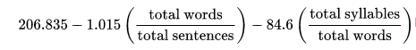

Text Mining Kickstarter Projects
================================

```{r setup, include=FALSE}
knitr::opts_chunk$set(fig.path="../images/",
               cache.path="cache/",
               cache=FALSE,
               echo=TRUE,
               message=FALSE,
               warning=FALSE,
               eval = TRUE) 

library(tidyverse)
library(plotly)
library(highcharter)
library(ggthemes)
library(scales)
library(tm)
library(wordcloud)
library(tidytext)
library(SnowballC)
library(plotrix)
library(qdap)
library(quanteda)
setwd("~/Dropbox/QMSS/Data Visualization/Beiers_Sophie/hw3/docs")
```

## Overview

Kickstarter is an American public-benefit corporation based in Brooklyn, New York, that maintains a global crowd funding platform focused on creativity.  The company's stated mission is to "help bring creative projects to life". 

Kickstarter has reportedly received more than $1.9 billion in pledges from 9.4 million backers to fund 257,000 creative projects, such as films, music, stage shows, comics, journalism, video games, technology and food-related projects.

For this assignment, I analyze the descriptions of kickstarter projects to identify commonalities of successful (and unsuccessful projects) using text mining techniques. 

## Data

The dataset for this assignment is taken from [webroboto.io ‘s repository](https://webrobots.io/kickstarter-datasets/). They developed a scrapper robot that crawls all Kickstarter projects monthly since 2009. We will just take data from the most recent crawl on 2018-02-15.

The data is contained in the file `kickstarter_data.csv` and contains about 150,000 projects and about 20 variables.

```{r}
ks <- read_csv("../data/kickstarter_projects.csv")
```


## 1. Identifying Successful Projects

### a) Success by Category

To define "success," I chose to create a ratio of pledged amount of money over the monetary goal of the campaign. I removed any campaign with a goal of under $30 to ensure results were a little less skewed and eliminated any campaigns deemed unsuccessful since many of these campaigns dropped out or discontinued. I then broke out the results into categories of campaigns; we can see below that *all* campaign categories received an average of over 100% of their goal money, which is surprising! The technology category seems to have the most success while art campaigns were still highly successful (over 100% of goal money on average) but less exorbitantly successful than other campaign categories. 

```{r}
ks$goal <- round(ks$goal, 0)
ks <- ks[!duplicated(ks[, c('id')]),]
ks <- ks %>% 
  mutate(achievement = (converted_pledged_amount/goal)* 100)
ks$achievement <- round(ks$achievement, 2)

# by achievement score (proportion of pledged amount over goal)
top20 <- ks %>% 
  arrange(desc(achievement)) %>% 
  filter(goal >= 30) %>% 
  slice(1:20)

# by number of backers
top10 <- ks %>% 
  arrange(desc(backers_count)) %>% 
  slice(1:10)


# by category
cat_success <- na.omit(ks) %>% 
  filter(goal >= 100 & state == "successful") %>% 
  group_by(top_category) %>% 
  summarize(avg = mean(achievement)) %>% 
  arrange(desc(avg)) 
  
ggplot(data = cat_success, aes(x = reorder(top_category, avg), y = avg)) +
geom_bar(stat = "identity", fill = "#a8ddb5", alpha = 0.8) + 
  coord_flip() + theme_tufte() + 
  geom_text(aes(label = top_category, x=top_category, y = 1), hjust = 0,
            size = 4, family = 'serif', color = "black") +
  theme(axis.title = element_blank(), 
        axis.text.y =  element_blank(), 
        axis.ticks = element_blank()) +
  scale_y_continuous(labels=function(x) paste0(x, "%")) +
  labs(x = '', 
       title = "Most Successful KickStarter Campaigns: Category", 
       subtitle = "Highest proportions of backer money to goal on average")

```

### b) Success in San Francisco

I was curious to visualize success in San Francisco because it's a tech hub and a hot spot for Kickstarter campaigns. Most campaigns from San Francisco received *over* 100% of their goal from their backers, so "success" took on a new definition: popularity. Larger bubbles had more backers and bubbles placed higher up on the graph received the most pledged money. The scales of the x axis versus the y axis tell us that no projects asked for over a million dollars, yet one received up to 6.5 million and multiple received multi-millions of dollars! Scroll over each bubble for more information about the project.

```{r}
# filtered for goal over 100 this time
ks_sf <- ks %>% 
  filter(goal > 100 & backers_count > 10 & state == "successful" & location_town == "San Francisco") 
data(ks_sf)

# high charter tooltip 
x <- c("Name", "Backers:  ", "Pledged $: ", "Goal $: ", "Success Ratio %: ")
y <- sprintf("{point.%s}", c("name", "backers_count", "converted_pledged_amount", "goal", "achievement"))
tltip <- tooltip_table(x, y)

colors <- c("#0868ac", "#084081", "#2b8cbe", "#7bccc4","#a8ddb5")

ks_sf$color <- colorize((log(ks_sf$achievement)), colors)

hchart(ks_sf, "scatter", hcaes(goal, pledged, size = backers_count, color = color)) %>% 
  hc_chart(backgroundColor = "white") %>% 
  hc_title(text = "Kickstarter Projects") %>% 
  hc_subtitle(text = "San Francisco, 2009 - 2018") %>% 
  hc_tooltip(useHTML = TRUE, 
             headerFormat = '', 
             pointFormat = tltip) %>% 
  hc_size(height = 500) %>% 
  # hc_legend(layout = "vertical", verticalAlign = "top",
  #           align = "right", valueDecimals = 0) %>% 
  hc_size(height = 500, width = 600) %>% 
  hc_yAxis(
    title = list(text = "Pledged Amount $", gridLineWidth = 0.5)) %>% 
  hc_xAxis(
    title = list(text = "Goal Amount $", gridLineWidth = 0.5)) %>% 
  hc_add_theme(hc_theme_tufte())
```

## 2. Writing your success story

Each project contains a `blurb` -- a short description of the project. While not the full description of the project, the short headline is arguably important for inducing interest in the project (and ultimately popularity and success). Let's analyze the text.

### a) Cleaning the Text and Word Cloud

I selected the top 1000 most successful projects and the bottom 1000 least successful projects, then removed stop words, punctuation and numbers. I chose to not stem the words as to leave more of the meaning in the word cloud. I then created a document-term-matrix and term-document-matrix and visualized the most frequent words among the 1000 most successful projects in a word cloud.

Most common words throughout all 2000 projects include "game," "art," "designed" and "homemade." Many of the kickstarter projects must be game-related, and it's not surprising that many projects are "homemade" and "artistically" "designed" due to many people's hipster, DIY aesthetic these days.


```{r}
# choose top 1000 and bottom 1000 projects
top1000 <- ks %>% 
  filter(goal > 100 & state == "successful") %>% 
  arrange(desc(achievement)) %>% 
  mutate(success = "most successful") %>% 
  slice(1:1000)

bottom1000 <- ks %>% 
  filter(goal > 100) %>% 
  arrange(-desc(achievement)) %>% 
  mutate(success = "least successful") %>% 
  slice(1:1000)

projects <- rbind(top1000, bottom1000)
projects <- projects %>% 
  select(id, blurb)
projects <- as.data.frame(projects)

# lowercase, rid of punctuation and stopwords, chose not to stem words.
blurb_words <- projects %>%
  unnest_tokens(word, blurb, to_lower = TRUE) %>% 
  #mutate(word = wordStem(word)) %>% 
  group_by(id) %>% 
  count(word, sort = FALSE)
blurb_words <- blurb_words %>% 
  anti_join(stop_words) 
blurb_words$word <- removeNumbers(blurb_words$word)
blurb_words$word <- removePunctuation(blurb_words$word)
blurb_words$word <- qdap::Filter(blurb_words$word, min = 2, max = Inf, count.apostrophe = TRUE,
  stopwords = NULL, ignore.case = TRUE) # get rid of words less than 2 letters long

# create document term matrix
dtm <- blurb_words %>%
  tidytext::cast_dtm(id, word, n)
dtm_mat <- as.matrix(dtm)

# create term document matrix
tdm <- blurb_words %>% 
  cast_tdm(word, id, n)
tdm_mat <- as.matrix(tdm)

# all most successful docs together
blurb_words_succ <- blurb_words %>%
  filter(id %in% top1000$id) %>% 
  group_by(word) %>% 
  count(word, sort = FALSE) %>% 
  filter(nn < 300) %>% 
  ungroup()
  

set.seed(2018)
wordcloud(words = blurb_words_succ$word, freq = blurb_words_succ$nn, scale = c(5, .5), min.freq = 5,
          max.words = 200, random.order = FALSE, rot.per = 0.35,
          colors=brewer.pal(8, "Dark2"))

```


### b) Success in words

I then created a pyramid plot to show how the words between the most successful and unsuccessful projects differ in frequency. I selected the top 20 words used by the 1000 most successful and least successful campaigns. 

As expected "art" and other art-related words like "painting" and "music" came up as some of the most common words unsuccessful campaigns use. We knew from our visualization earlier that art campaigns don't tend to do as well as other categories of campaigns. Again unsurprisingly, we knew from our wordcloud that "game" is shown as a word commonly used by successful campaigns. Games seem to be attractive to backers! "World" tends to be an equally used word from both successful and unsuccessful campaigns. 

```{r}
# df for unsuccessful projects
blurb_words_unsucc <- blurb_words %>%
  filter(id %in% bottom1000$id) %>% 
  group_by(word) %>% 
  count(word, sort = TRUE) %>% 
  filter(nn != 236) %>% 
  ungroup()

# differentiate between successful and unsuccessful
blurb_words_unsucc$success <- "Unsuccessful"
blurb_words_succ$success <- "Successful"

# slice into top 20
blurb_words_succ20 <- blurb_words_succ %>% 
dplyr::arrange(desc(nn)) %>% 
  dplyr::slice(1:20)
blurb_words_unsucc20 <- blurb_words_unsucc %>% 
arrange(desc(nn)) %>% 
  slice(1:20)

# combine data frames
blurb_wrds_20 <- blurb_words %>% 
  filter(word %in% blurb_words_succ20$word| word %in% blurb_words_unsucc20$word) %>% 
  filter(id %in% bottom1000$id| id %in% top1000$id) %>% 
  ungroup()
blurb_wrds_20$success <- ifelse(blurb_wrds_20$id %in% bottom1000$id, "Unsuccessful", "Successful")
  
blurb_wrds_20$n <- ifelse(blurb_wrds_20$success == "Unsuccessful", blurb_wrds_20$n * -1, blurb_wrds_20$n) # turn unsuccessful numbers negative

blurb_wrds_20 <- na.omit(blurb_wrds_20)
# stem some words 
blurb_wrds_20$word[blurb_wrds_20$word == "paintings"|blurb_wrds_20$word == "painting"] <- "paint"
blurb_wrds_20$word[blurb_wrds_20$word == "artists"] <- "artist"
blurb_wrds_20$word[blurb_wrds_20$word == "creating"] <- "create"

# pyramid plot

ggplot(data = blurb_wrds_20, 
       aes(x = reorder(word, n), 
           y = n, 
           fill = success)) + 
  geom_bar(stat="identity")   + 
  coord_flip() +
  scale_fill_manual(values=c("#a8ddb5", "#0868ac"), name = '') +
  labs(y = '', x = '', title = 'Words Most Commonly Used by Successful and Unsuccessful Kickstarter Campaigns') +
  theme_tufte() +
  theme(axis.ticks = element_blank()) +
  theme(legend.position = "top")

```


### c) Simplicity as a virtue

These blurbs are short in length (max. 150 characters) but let's see whether brevity and simplicity still matters. I calculated a readability measure (Flesh Kincaid) for the texts defined by the equation below (from Wikipedia):  


Flesch Kincaid produces a number that defines how easy or difficult a chunk of text is based on what grade level in school should be able to read it. Anything that receives over a 90 is considered easy to read (a 5th grader could read it) and anything below a 30 is considered difficult and for college students to be able to read and understand. I then visualized the relationship between the Flesch Kincaid measure of the short blurb of the campaign and the number of backers each campaign had. 

I chose a different measure of "success" for this visualization: number of backers. From the visualization, we can see that most heavily-backed projects were in between -13 to 80 in terms of Flesch Kincaid scores. That's a very large range! Most projects in general were left-skewed, but a few blurbs were so difficult to read they received negative scores. Those projects didn't have the most backers but still received over a thousand. The most popular project (35550 backers) had a readability score of around 80, or, between a 6th and 7th grade level of reading. 

Hover over the circles for more information about each project.The larger the bubble, the more backers the project received.

```{r}
#blurb_words_2000 <- rbind(blurb_words_succ, blurb_words_unsucc)
# calculate syllables and sentences 
fk <- blurb_words
fk$syllable <- syllable_sum(fk$word)
fk$syllable[is.na(fk$syllable)] <- 0
projects$sentences <- nsentence(projects$blurb)
fk <- fk %>% 
  group_by(id) %>% 
  mutate(total_words = length(word), total_syllables = sum(syllable)) %>% 
  ungroup()

fk <- merge(fk, projects, by = "id")

# calculating flesch reading ease scores:
fk$fk_score <- (206.835 - (1.015*(fk$total_words/fk$sentences)) - (84.6*(fk$total_syllables/fk$total_words)))

# summarizing by ids
fk <- na.omit(fk %>% 
  group_by(id) %>% 
  select(id, fk_score) %>% 
  unique())

# joining previous success info 
fk <- merge(fk, ks, by = "id")
fk <- fk %>% 
  filter(goal > 100 & backers_count > 10 & achievement < 3600)

x <- c("Name", "Backers:  ", "Pledged $: ", "Goal $: ", "Success Ratio %: ", "Flesch-Kinkaid Readability Score:")
y <- sprintf("{point.%s}", c("name", "backers_count", "converted_pledged_amount", "goal", "achievement", "fk_score"))
tltip <- tooltip_table(x, y)

colors <- c("#0868ac", "#084081", "#2b8cbe", "#7bccc4","#a8ddb5")

fk$color <- colorize((log(fk$backers_count)), colors)

hchart(fk, "scatter", hcaes(fk_score, backers_count, size = backers_count, color = color)) %>% 
  hc_chart(backgroundColor = "white") %>% 
  hc_title(text = "Kickstarter Projects 2009 - 2018") %>% 
  hc_subtitle(text = "Popularity & Readability Score of Summary Blurb") %>% 
  hc_tooltip(useHTML = TRUE, 
             headerFormat = '', 
             pointFormat = tltip) %>% 
  hc_size(height = 500) %>% 
  hc_size(height = 500, width = 600) %>% 
  hc_yAxis(
    title = list(text = "# of Backers", gridLineWidth = 0.5)) %>% 
  hc_xAxis(
    title = list(text = "Flesch-Kinkaid Score (difficult to easy)", gridLineWidth = 0.5)) %>% 
  hc_add_theme(hc_theme_tufte())
```

## 3. Sentiment

Now, let's check whether the use of positive / negative words or specific emotions helps a project to be successful. 

### a) Stay positive

I calculated the tone of each text using the AFINN lexicon based on the positive and negative words used in each blurb. AFINN assigns a positive or negative score to each word (between -5 and 5) depending on how positive or negative the sentiment attached to the word is. I calculated a cumulative measure of negativity or positivity per blurb by adding up the scores on each individual word. Below, I visualized the relationship between the tone of the blurb and success. 

While quite similar in nature in terms of the number of and magnitude of positive and negative words used in each blurb, less successful projects used a larger range of extreme positive or extreme negative words. Both successful and unsuccessful projects mainly use positive words (with a score above 0 averaging around a score of 3) overall. 

```{r}
# join lexicon
afinn <- get_sentiments("afinn")  
word_sent <- merge(x = blurb_words, y = ks, by = "id", all.x = TRUE)
word_sent <- word_sent %>% 
  select(id, name, word, n, created_at, pledged, backers_count, goal, achievement, blurb) %>% 
  inner_join(afinn)
word_sent$score <- (word_sent$score * word_sent$n)

# assign labels to most and least successful
word_sent <- word_sent %>% 
  dplyr::filter(id %in% top1000$id| id %in% bottom1000$id)
word_sent$success <- ifelse(word_sent$id %in% top1000$id, "Most Successful", "Least Successful")

# an idea to get a cummulative score; would've worked better for over time.
# x = 0
# for (i in seq(1:985)) {
#   blurb_sent_succ$cumm_score[i] <- blurb_sent_succ$score[i] + x
#   x =  blurb_sent_succ$cumm_score[i]
# }

# assign scores to blurbs as a whole based on word scores
blurb_sent <- word_sent %>% 
  group_by(id) %>% 
  mutate(txt_score = sum(score)) %>% 
  select(id, txt_score, backers_count, success, blurb) %>% 
  unique() %>% 
  ungroup()

# plot
ggplot(data = blurb_sent, aes(x = success, y = txt_score)) +
  geom_violin(aes(fill = success, alpha = 0.8)) +
  coord_flip() +
  theme_tufte() +
  scale_fill_manual(values=c("#0868ac","#a8ddb5")) +
  labs(x = '', y = '\n Negative to Positive Scoring Words', 
       title = 'Positive and Negative Words in Campaign Blurbs', 
       subtitle = 'Unsuccessful campaigns have larger range of extreme positive and extreme negative sentiments') +
  theme(axis.ticks = element_blank(),
        legend.position = "none")

  
```


### b) Positive vs negative

I segregated all 2,000 blurbs into positive and negative texts based on their polarity score calculated in step (a). Then, I created a term-document-matrix in order to generate a comparison cloud showing the most-frequent positive and negative words.

Negative words most frequently include the use of "limited," which is funny only because often times a "limited edition" is seen as a good thing! Other frequent negative terms include "hard," "battle," "lost" and "fight."

Frequent positive words include "inspired," "love," "easy" and "share." These seem like lifestyle words, as in projects that might include making someone's life easier. 
```{r}
# neg and pos grouping 
word_sent$negpos <- ifelse(word_sent$score < 0, "negative", "positive")

# create tdm 
tdm_pn <- word_sent %>% 
  cast_tdm(word, negpos, n)
tdm_pn_mat <- as.matrix(tdm_pn)

# comparison cloud
comparison.cloud(tdm_pn_mat, colors = c("#a8ddb5", "#0868ac"), scale = c(5, 0.5), max.words = 500, title.size = 2, rot.per = 0.35)
```


### c) Get in their mind

Lastly, I used the NRC Word-Emotion Association Lexicon to identify a larger set of emotions (anger, anticipation, disgust, fear, joy, sadness, surprise, trust). I visualized the relationship between success and range of emotions in two different ways; first with a bar chart and second with a lollipop chart. We can see in both that successful campaigns tend to use more of every type of emotional word except for "joy," for which unsuccessful campaigns use more. 

```{r}
# join nrc sentiment
nrc <- get_sentiments("nrc")  
word_sent <- word_sent %>% 
  inner_join(nrc) %>% 
  select(id, name, word, n, achievement, success, sentiment) %>% 
  group_by(success, sentiment) %>% 
  summarize(n = sum(n)) %>% 
  ungroup()

# plot
ggplot(data = word_sent, aes(x = reorder(sentiment, -n), y = n, fill = success)) +
  geom_bar(stat = "identity", position = "dodge") +
  theme_tufte() +
  scale_fill_manual(values=c("#0868ac","#a8ddb5"), name = '') +
  labs(x = '', y = '\n # of words', 
       title = 'Sentiment of Campaign Blurbs', 
       subtitle = 'Unsuccessful campaigns express joy ') +
  theme(axis.ticks = element_blank(),
        legend.position = "bottom")
```

The lollipop chart makes it easy for us to view the true difference in number of words per emotion for successful and unsuccessful campaigns. There's the largest difference in use of negative words; successful campaigns use plenty more of these than unsuccessful campaigns-- maybe the use of negative words adds to the drama of the project and leads to more backers? 

```{r}
# factor for ordering levels
word_sent$sentiment <- factor(word_sent$sentiment, levels = c("positive", "joy", "trust", "anticipation", "negative", "anger", "surprise", "sadness", "disgust", "fear"))

# plot
ggplot(data = word_sent, aes(x = n, y = sentiment, color = success)) +
  geom_segment(aes(x = 0, y = sentiment, xend = n, yend = sentiment), color = "lightgrey") +
  geom_point(size = 2) +
  scale_colour_manual(values=c('#8c510a','#01665e'), name = '') +
  theme_tufte() +
  labs(x = "Number of Words", y = "", title = 'Sentiment of Campaign Blurbs', 
       subtitle = 'Unsuccessful campaigns express joy more than successful campaigns')


```


