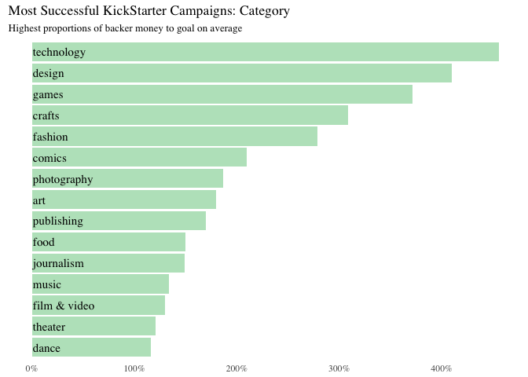
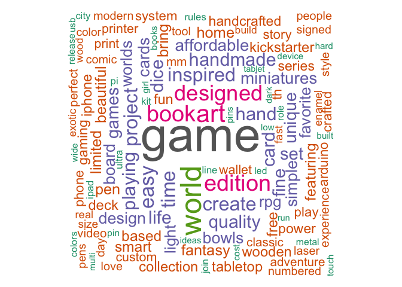
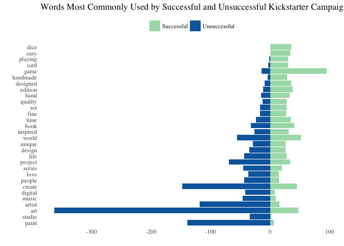
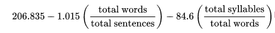
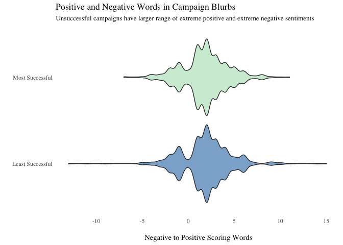
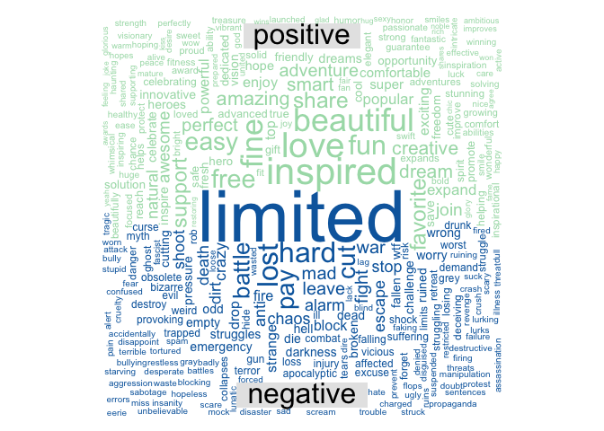
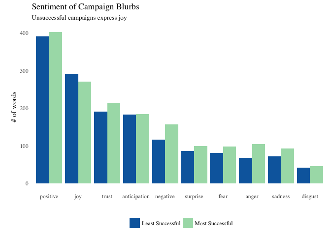
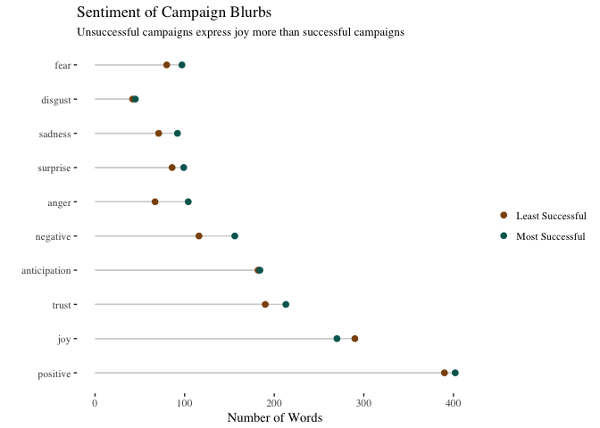

Text Mining Kickstarter Projects
================================


## Overview

Kickstarter is an American public-benefit corporation based in Brooklyn, New York, that maintains a global crowd funding platform focused on creativity.  The company's stated mission is to "help bring creative projects to life". 

Kickstarter has reportedly received more than $1.9 billion in pledges from 9.4 million backers to fund 257,000 creative projects, such as films, music, stage shows, comics, journalism, video games, technology and food-related projects.

For this assignment, I analyze the descriptions of kickstarter projects to identify commonalities of successful (and unsuccessful projects) using text mining techniques. 

## Data

The dataset for this assignment is taken from [webroboto.io ‘s repository](https://webrobots.io/kickstarter-datasets/). They developed a scrapper robot that crawls all Kickstarter projects monthly since 2009. We will just take data from the most recent crawl on 2018-02-15.

The data is contained in the file `kickstarter_data.csv` and contains about 150,000 projects and about 20 variables.


```r
ks <- read_csv("../data/kickstarter_projects.csv")
```


## 1. Identifying Successful Projects

### a) Success by Category

To define "success," I chose to create a ratio of pledged amount of money over the monetary goal of the campaign. I removed any campaign with a goal of under $30 to ensure results were a little less skewed and eliminated any campaigns deemed unsuccessful since many of these campaigns dropped out or discontinued. I then broke out the results into categories of campaigns; we can see below that *all* campaign categories received an average of over 100% of their goal money, which is surprising! The technology category seems to have the most success while art campaigns were still highly successful (over 100% of goal money on average) but less exorbitantly successful than other campaign categories. 


```r
ks$goal <- round(ks$goal, 0)
ks <- ks[!duplicated(ks[, c('id')]),]
ks <- ks %>% 
  mutate(achievement = (converted_pledged_amount/goal)* 100)
ks$achievement <- round(ks$achievement, 2)

# by achievement score (proportion of pledged amount over goal)
top20 <- ks %>% 
  arrange(desc(achievement)) %>% 
  filter(goal >= 30) %>% 
  slice(1:20)

# by number of backers
top10 <- ks %>% 
  arrange(desc(backers_count)) %>% 
  slice(1:10)


# by category
cat_success <- na.omit(ks) %>% 
  filter(goal >= 100 & state == "successful") %>% 
  group_by(top_category) %>% 
  summarize(avg = mean(achievement)) %>% 
  arrange(desc(avg)) 
  
ggplot(data = cat_success, aes(x = reorder(top_category, avg), y = avg)) +
geom_bar(stat = "identity", fill = "#a8ddb5", alpha = 0.8) + 
  coord_flip() + theme_tufte() + 
  geom_text(aes(label = top_category, x=top_category, y = 1), hjust = 0,
            size = 4, family = 'serif', color = "black") +
  theme(axis.title = element_blank(), 
        axis.text.y =  element_blank(), 
        axis.ticks = element_blank()) +
  scale_y_continuous(labels=function(x) paste0(x, "%")) +
  labs(x = '', 
       title = "Most Successful KickStarter Campaigns: Category", 
       subtitle = "Highest proportions of backer money to goal on average")
```

<!-- -->

### b) Success in San Francisco

I was curious to visualize success in San Francisco because it's a tech hub and a hot spot for Kickstarter campaigns. Most campaigns from San Francisco received *over* 100% of their goal from their backers, so "success" took on a new definition: popularity. Larger bubbles had more backers and bubbles placed higher up on the graph received the most pledged money. The scales of the x axis versus the y axis tell us that no projects asked for over a million dollars, yet one received up to 6.5 million and multiple received multi-millions of dollars! Scroll over each bubble for more information about the project.


```r
# filtered for goal over 100 this time
ks_sf <- ks %>% 
  filter(goal > 100 & backers_count > 10 & state == "successful" & location_town == "San Francisco") 
data(ks_sf)

# high charter tooltip 
x <- c("Name", "Backers:  ", "Pledged $: ", "Goal $: ", "Success Ratio %: ")
y <- sprintf("{point.%s}", c("name", "backers_count", "converted_pledged_amount", "goal", "achievement"))
tltip <- tooltip_table(x, y)

colors <- c("#0868ac", "#084081", "#2b8cbe", "#7bccc4","#a8ddb5")

ks_sf$color <- colorize((log(ks_sf$achievement)), colors)

hchart(ks_sf, "scatter", hcaes(goal, pledged, size = backers_count, color = color)) %>% 
  hc_chart(backgroundColor = "white") %>% 
  hc_title(text = "Kickstarter Projects") %>% 
  hc_subtitle(text = "San Francisco, 2009 - 2018") %>% 
  hc_tooltip(useHTML = TRUE, 
             headerFormat = '', 
             pointFormat = tltip) %>% 
  hc_size(height = 500) %>% 
  # hc_legend(layout = "vertical", verticalAlign = "top",
  #           align = "right", valueDecimals = 0) %>% 
  hc_size(height = 500, width = 600) %>% 
  hc_yAxis(
    title = list(text = "Pledged Amount $", gridLineWidth = 0.5)) %>% 
  hc_xAxis(
    title = list(text = "Goal Amount $", gridLineWidth = 0.5)) %>% 
  hc_add_theme(hc_theme_tufte())
```

<!--html_preserve--><div id="htmlwidget-a4537a1ee034532ba4bd" style="width:600px;height:500px;" class="highchart html-widget"></div>
<script type="application/json" data-for="htmlwidget-a4537a1ee034532ba4bd">{"x":{"hc_opts":{"title":{"text":"Kickstarter Projects"},"yAxis":{"title":{"text":"Pledged Amount $","gridLineWidth":0.5},"type":"linear"},"credits":{"enabled":false},"exporting":{"enabled":false},"plotOptions":{"series":{"turboThreshold":0,"showInLegend":false,"marker":{"enabled":true}},"treemap":{"layoutAlgorithm":"squarified"},"bubble":{"minSize":5,"maxSize":25},"scatter":{"marker":{"symbol":"circle"}}},"annotationsOptions":{"enabledButtons":false},"tooltip":{"delayForDisplay":10,"useHTML":true,"headerFormat":"","pointFormat":"<table>\n  <tr>\n    <th>Name<\/th>\n    <td>{point.name}<\/td>\n  <\/tr>\n  <tr>\n    <th>Backers:  <\/th>\n    <td>{point.backers_count}<\/td>\n  <\/tr>\n  <tr>\n    <th>Pledged $: <\/th>\n    <td>{point.converted_pledged_amount}<\/td>\n  <\/tr>\n  <tr>\n    <th>Goal $: <\/th>\n    <td>{point.goal}<\/td>\n  <\/tr>\n  <tr>\n    <th>Success Ratio %: <\/th>\n    <td>{point.achievement}<\/td>\n  <\/tr>\n<\/table>"},"series":[{"group":"group","data":[{"backers_count":69,"blurb":"what if the world paused to dance?","converted_pledged_amount":3044,"country":"USA","created_at":"2011-11-17","currency":"USD","deadline":"2012-03-13","goal":3000,"id":1152430290,"is_starrable":"false","launched_at":"2012-02-12","name":"dance anywhere®","pledged":3044.22,"slug":"dance-anywhere","source_url":"https://www.kickstarter.com/discover/categories/art","spotlight":"true","staff_pick":"false","state":"successful","state_changed_at":"2012-03-13","location_town":"San Francisco","location_state":"CA","top_category":"art","sub_category":"public art","achievement":101.47,"color":"#08579A","x":3000,"y":3044.22,"size":69,"z":69},{"backers_count":31,"blurb":"Border Alchemies catalogue 2012","converted_pledged_amount":1565,"country":"USA","created_at":"2012-01-18","currency":"USD","deadline":"2012-02-17","goal":1500,"id":723156666,"is_starrable":"false","launched_at":"2012-01-18","name":"Border Alchemies","pledged":1565,"slug":"border-alchemies","source_url":"https://www.kickstarter.com/discover/categories/art","spotlight":"true","staff_pick":"false","state":"successful","state_changed_at":"2012-02-17","location_town":"San Francisco","location_state":"CA","top_category":"art","sub_category":null,"achievement":104.33,"color":"#084586","x":1500,"y":1565,"size":31,"z":31},{"backers_count":77,"blurb":"We’re a group of architecture students aiming to build an immersive, full-scale installation at California College of the Arts.","converted_pledged_amount":4242,"country":"USA","created_at":"2011-12-02","currency":"USD","deadline":"2012-02-15","goal":2500,"id":1042828396,"is_starrable":"false","launched_at":"2012-01-15","name":"CCA + Wattis WBA3: Architecture in the Expanded Field","pledged":4242,"slug":"cca-wattis-wba3-architecture-in-the-expanded-field","source_url":"https://www.kickstarter.com/discover/categories/art","spotlight":"true","staff_pick":"true","state":"successful","state_changed_at":"2012-02-15","location_town":"San Francisco","location_state":"CA","top_category":"art","sub_category":"public art","achievement":169.68,"color":"#7BCCC3","x":2500,"y":4242,"size":77,"z":77},{"backers_count":129,"blurb":"Get Fired up and help fund the largest free, legal, public fire dancing show in the western hemisphere held in SF's Union Square.","converted_pledged_amount":6282,"country":"USA","created_at":"2012-01-05","currency":"USD","deadline":"2012-02-06","goal":5820,"id":1995437784,"is_starrable":"false","launched_at":"2012-01-16","name":"2012 Fire Dancing Expo","pledged":6282,"slug":"2012-fire-dancing-expo","source_url":"https://www.kickstarter.com/discover/categories/art","spotlight":"true","staff_pick":"false","state":"successful","state_changed_at":"2012-02-06","location_town":"San Francisco","location_state":"CA","top_category":"art","sub_category":"performance art","achievement":107.94,"color":"#115491","x":5820,"y":6282,"size":129,"z":129},{"backers_count":20,"blurb":"I am making a giant quilted banner for an art show. I need to hire help to accomplish the project. Help me please!","converted_pledged_amount":1030,"country":"USA","created_at":"2011-10-11","currency":"USD","deadline":"2012-02-15","goal":1000,"id":1947509447,"is_starrable":"false","launched_at":"2012-01-16","name":"Make a 15'x22' banner from 1\" squares!","pledged":1030,"slug":"make-a-15x22-banner-from-1-squares","source_url":"https://www.kickstarter.com/discover/categories/art","spotlight":"true","staff_pick":"false","state":"successful","state_changed_at":"2012-02-15","location_town":"San Francisco","location_state":"CA","top_category":"art","sub_category":"mixed media","achievement":103,"color":"#084D8F","x":1000,"y":1030,"size":20,"z":20},{"backers_count":54,"blurb":"Alice Superbrain / The Twin Section\nA multidisciplinary performance inspired by Carrol’s Alice’s Adventures.\nDirected by Andrea Lanza","converted_pledged_amount":2507,"country":"USA","created_at":"2012-01-07","currency":"USD","deadline":"2012-03-02","goal":2500,"id":1872871652,"is_starrable":"false","launched_at":"2012-01-10","name":"Alice Superbrain - The Twin Section","pledged":2507,"slug":"alice-superbrain-the-twin-section","source_url":"https://www.kickstarter.com/discover/categories/art","spotlight":"true","staff_pick":"false","state":"successful","state_changed_at":"2012-03-02","location_town":"San Francisco","location_state":"CA","top_category":"art","sub_category":"performance art","achievement":100.28,"color":"#0860A4","x":2500,"y":2507,"size":54,"z":54},{"backers_count":54,"blurb":"The Decentralized Dance Party was founded on the belief that Partying is an art form that has the power to change the world.","converted_pledged_amount":2536,"country":"USA","created_at":"2011-12-26","currency":"USD","deadline":"2012-01-19","goal":2500,"id":945088992,"is_starrable":"false","launched_at":"2012-01-02","name":"Decentralized Dance Party- SAN FRANCISCO EDITION!","pledged":2536,"slug":"decentralized-dance-party-san-francisco-edition","source_url":"https://www.kickstarter.com/discover/categories/art","spotlight":"true","staff_pick":"false","state":"successful","state_changed_at":"2012-01-19","location_town":"San Francisco","location_state":"CA","top_category":"art","sub_category":"conceptual art","achievement":101.44,"color":"#08589A","x":2500,"y":2536,"size":54,"z":54},{"backers_count":31,"blurb":"Support Soundwave Festival ((5)) Humanities, San Francisco's innovative arts and music biennial, happening summer of 2012.","converted_pledged_amount":1540,"country":"USA","created_at":"2011-11-29","currency":"USD","deadline":"2012-02-01","goal":1500,"id":1360764741,"is_starrable":"false","launched_at":"2011-12-07","name":"Soundwave Festival ((5))","pledged":1540,"slug":"soundwave-festival-5","source_url":"https://www.kickstarter.com/discover/categories/art","spotlight":"true","staff_pick":"false","state":"successful","state_changed_at":"2012-02-01","location_town":"San Francisco","location_state":"CA","top_category":"art","sub_category":"public art","achievement":102.67,"color":"#084F91","x":1500,"y":1540,"size":31,"z":31},{"backers_count":73,"blurb":"The science of light collides with the imaginations of 80 third grade students, connecting literacy, science, theater and visual arts.","converted_pledged_amount":3728,"country":"USA","created_at":"2011-11-08","currency":"USD","deadline":"2012-01-13","goal":3454,"id":1528459915,"is_starrable":"false","launched_at":"2011-11-29","name":"The Shadow - A Community Engagement Project","pledged":3728,"slug":"the-shadow-a-community-engagement-project","source_url":"https://www.kickstarter.com/discover/categories/art","spotlight":"true","staff_pick":"false","state":"successful","state_changed_at":"2012-01-13","location_town":"San Francisco","location_state":"CA","top_category":"art","sub_category":null,"achievement":107.93,"color":"#115390","x":3454,"y":3728,"size":73,"z":73},{"backers_count":11,"blurb":"$850.00 needed to submit the World's Largest Jockstrap measurements to Guinness.","converted_pledged_amount":854,"country":"USA","created_at":"2011-11-18","currency":"USD","deadline":"2011-12-03","goal":850,"id":1854105839,"is_starrable":"false","launched_at":"2011-11-18","name":"World's Largest Jockstrap","pledged":854.37,"slug":"worlds-largest-jockstrap","source_url":"https://www.kickstarter.com/discover/categories/art","spotlight":"true","staff_pick":"false","state":"successful","state_changed_at":"2011-12-03","location_town":"San Francisco","location_state":"CA","top_category":"art","sub_category":"sculpture","achievement":100.47,"color":"#085FA2","x":850,"y":854.37,"size":11,"z":11},{"backers_count":63,"blurb":"A playful collaborative project between 12 San Francisco Bay Area visual artists and 12 Bay Area writers","converted_pledged_amount":5015,"country":"USA","created_at":"2011-11-05","currency":"USD","deadline":"2012-01-14","goal":5000,"id":1822370158,"is_starrable":"false","launched_at":"2011-11-15","name":"Broadside Attractions | Vanquished Terrains","pledged":5015.5,"slug":"broadside-attractions-vanquished-terrains-0","source_url":"https://www.kickstarter.com/discover/categories/art","spotlight":"true","staff_pick":"false","state":"successful","state_changed_at":"2012-01-14","location_town":"San Francisco","location_state":"CA","top_category":"art","sub_category":"mixed media","achievement":100.3,"color":"#0860A4","x":5000,"y":5015.5,"size":63,"z":63},{"backers_count":123,"blurb":"An epic time-lapse of the 2012 Burning Man event from above the event, with unmatched spatial and temporal resolution, free to all.","converted_pledged_amount":3941,"country":"USA","created_at":"2011-10-18","currency":"USD","deadline":"2011-12-04","goal":3500,"id":263108053,"is_starrable":"false","launched_at":"2011-11-03","name":"Playa Time-Lapse 2.0","pledged":3941.77,"slug":"playa-time-lapse-20","source_url":"https://www.kickstarter.com/discover/categories/art","spotlight":"true","staff_pick":"false","state":"successful","state_changed_at":"2011-12-04","location_town":"San Francisco","location_state":"CA","top_category":"art","sub_category":"digital art","achievement":112.6,"color":"#1F72A9","x":3500,"y":3941.77,"size":123,"z":123},{"backers_count":158,"blurb":"La Pocha Nostra invites individual donations to bring the international troupe together to create LPN's next live performance.","converted_pledged_amount":10560,"country":"USA","created_at":"2011-10-22","currency":"USD","deadline":"2011-12-17","goal":10000,"id":50320503,"is_starrable":"false","launched_at":"2011-10-28","name":"La Pocha Nostra's conceptual live art credit union","pledged":10560,"slug":"la-pocha-nostras-conceptual-live-art-credit-union","source_url":"https://www.kickstarter.com/discover/categories/art","spotlight":"true","staff_pick":"false","state":"successful","state_changed_at":"2011-12-17","location_town":"San Francisco","location_state":"CA","top_category":"art","sub_category":"performance art","achievement":105.6,"color":"#094283","x":10000,"y":10560,"size":158,"z":158},{"backers_count":215,"blurb":"I like to doodle. Only I call my doodles \"Dordles\". I want to make 30 of your favorites into high-quality color 4x6\" postcards.","converted_pledged_amount":3926,"country":"USA","created_at":"2011-10-12","currency":"USD","deadline":"2011-12-12","goal":2500,"id":1900830059,"is_starrable":"false","launched_at":"2011-10-13","name":"Dordle Cards","pledged":3926.96,"slug":"dordle-cards","source_url":"https://www.kickstarter.com/discover/categories/art","spotlight":"true","staff_pick":"true","state":"successful","state_changed_at":"2011-12-12","location_town":"San Francisco","location_state":"CA","top_category":"art","sub_category":"illustration","achievement":157.04,"color":"#6FC2C3","x":2500,"y":3926.96,"size":215,"z":215},{"backers_count":16,"blurb":"Shinji Eshima, Yuri Possokhov, Peter Brandenhoff, Jerome Oremland, and Andrew M Mezvinsky present an afternoon of dance, opera, and art","converted_pledged_amount":5600,"country":"USA","created_at":"2011-10-12","currency":"USD","deadline":"2011-10-30","goal":5500,"id":387930973,"is_starrable":"false","launched_at":"2011-10-17","name":"\"Il Fazzoletto\" - An Afternoon of Dance, Opera, and Art","pledged":5600,"slug":"il-fazzoletto-an-afternoon-of-dance-opera-and-art","source_url":"https://www.kickstarter.com/discover/categories/art","spotlight":"true","staff_pick":"false","state":"successful","state_changed_at":"2011-10-30","location_town":"San Francisco","location_state":"CA","top_category":"art","sub_category":"performance art","achievement":101.82,"color":"#085497","x":5500,"y":5600,"size":16,"z":16},{"backers_count":13,"blurb":"Performance at the Ceramics Annual in San Francisco where I 'ate myself' - an edible bust made to resemble a ceramics piece.","converted_pledged_amount":410,"country":"USA","created_at":"2011-09-28","currency":"USD","deadline":"2011-11-11","goal":300,"id":516631405,"is_starrable":"false","launched_at":"2011-10-12","name":"Eating Self - Performance Art","pledged":410,"slug":"eating-self-performance-art","source_url":"https://www.kickstarter.com/discover/categories/art","spotlight":"true","staff_pick":"false","state":"successful","state_changed_at":"2011-11-11","location_town":"San Francisco","location_state":"CA","top_category":"art","sub_category":"performance art","achievement":136.67,"color":"#57AFC1","x":300,"y":410,"size":13,"z":13},{"backers_count":18,"blurb":"Photography book that explores Japan's 'sense of place'. Kickstarter is used a platform to develop the project via public interaction.","converted_pledged_amount":501,"country":"USA","created_at":"2011-09-26","currency":"USD","deadline":"2011-11-12","goal":500,"id":1483971302,"is_starrable":"false","launched_at":"2011-09-26","name":"Honoring Japan’s ‘sense of place': Interactive photo project","pledged":501.02,"slug":"honoring-japans-sense-of-place-interactive-photo-p","source_url":"https://www.kickstarter.com/discover/categories/art","spotlight":"true","staff_pick":"false","state":"successful","state_changed_at":"2011-11-12","location_town":"San Francisco","location_state":"CA","top_category":"art","sub_category":"public art","achievement":100.2,"color":"#0861A5","x":500,"y":501.02,"size":18,"z":18},{"backers_count":17,"blurb":"I am curating a gallery exhibition called Turf; Ecological Activism and Art, with free lectures and workshops by participating artists.","converted_pledged_amount":2000,"country":"USA","created_at":"2011-08-23","currency":"USD","deadline":"2011-10-26","goal":2000,"id":1144770978,"is_starrable":"false","launched_at":"2011-09-26","name":"Turf; Ecological Activism and Art- exhibition and events","pledged":2000,"slug":"turf-ecological-activism-and-art-exhibition-and-ev","source_url":"https://www.kickstarter.com/discover/categories/art","spotlight":"true","staff_pick":"false","state":"successful","state_changed_at":"2011-10-26","location_town":"San Francisco","location_state":"CA","top_category":"art","sub_category":null,"achievement":100,"color":"#0864A8","x":2000,"y":2000,"size":17,"z":17},{"backers_count":62,"blurb":"A 2012 calendar featuring drawings of what some of San Francisco's landmarks might look like if they were people. Help me print this!","converted_pledged_amount":3090,"country":"USA","created_at":"2011-09-19","currency":"USD","deadline":"2011-10-17","goal":3000,"id":1596584491,"is_starrable":"false","launched_at":"2011-09-21","name":"San Franthropomorphism 2012 Calendar","pledged":3090,"slug":"san-franthropomorphism-2012-calendar","source_url":"https://www.kickstarter.com/discover/categories/art","spotlight":"true","staff_pick":"false","state":"successful","state_changed_at":"2011-10-17","location_town":"San Francisco","location_state":"CA","top_category":"art","sub_category":null,"achievement":103,"color":"#084D8F","x":3000,"y":3090,"size":62,"z":62},{"backers_count":65,"blurb":"We are expanding our programing to include multimedia skills. The money goes to  software and hiring pro's to work with the kids!","converted_pledged_amount":5190,"country":"USA","created_at":"2011-09-01","currency":"USD","deadline":"2011-10-15","goal":5000,"id":1982236190,"is_starrable":"false","launched_at":"2011-09-15","name":"Upstar Records Is Making Music Videos! Web-Sites! Posters!","pledged":5190,"slug":"upstar-records-is-making-music-videos-web-sites-po","source_url":"https://www.kickstarter.com/discover/categories/art","spotlight":"true","staff_pick":"false","state":"successful","state_changed_at":"2011-10-15","location_town":"San Francisco","location_state":"CA","top_category":"art","sub_category":"mixed media","achievement":103.8,"color":"#08488A","x":5000,"y":5190,"size":65,"z":65},{"backers_count":50,"blurb":"The participant will be immersed in a void followed by the experience of a visual dislocation of perceived surroundings.","converted_pledged_amount":3511,"country":"USA","created_at":"2011-09-13","currency":"USD","deadline":"2011-10-17","goal":3000,"id":815131323,"is_starrable":"false","launched_at":"2011-09-17","name":"The Nothing Box","pledged":3511,"slug":"the-nothing-box","source_url":"https://www.kickstarter.com/discover/categories/art","spotlight":"true","staff_pick":"false","state":"successful","state_changed_at":"2011-10-17","location_town":"San Francisco","location_state":"CA","top_category":"art","sub_category":"sculpture","achievement":117.03,"color":"#2887BA","x":3000,"y":3511,"size":50,"z":50},{"backers_count":76,"blurb":"A year ago I took the challenge to sit down and do a drawing everyday for 50 days. The 50 days came and went & I decided to keep going!","converted_pledged_amount":4570,"country":"USA","created_at":"2011-09-11","currency":"USD","deadline":"2011-10-13","goal":3000,"id":617769204,"is_starrable":"false","launched_at":"2011-09-13","name":"365 DAYS \" A Drawing a Day\"","pledged":4570.79,"slug":"365-days-a-drawing-a-day","source_url":"https://www.kickstarter.com/discover/categories/art","spotlight":"true","staff_pick":"false","state":"successful","state_changed_at":"2011-10-13","location_town":"San Francisco","location_state":"CA","top_category":"art","sub_category":"illustration","achievement":152.33,"color":"#6ABEC2","x":3000,"y":4570.79,"size":76,"z":76},{"backers_count":50,"blurb":"ArtCar Fest artists bring their unique rolling art to Southern California in a caravan, stopping at folk art sites along the way.","converted_pledged_amount":1850,"country":"USA","created_at":"2011-08-31","currency":"USD","deadline":"2011-10-05","goal":1700,"id":1146069737,"is_starrable":"false","launched_at":"2011-09-05","name":"ArtCar Caravan to Southern California","pledged":1850,"slug":"artcar-caravan-to-southern-california","source_url":"https://www.kickstarter.com/discover/categories/art","spotlight":"true","staff_pick":"false","state":"successful","state_changed_at":"2011-10-05","location_town":"San Francisco","location_state":"CA","top_category":"art","sub_category":"public art","achievement":108.82,"color":"#145B97","x":1700,"y":1850,"size":50,"z":50},{"backers_count":30,"blurb":"Baybayin is a nearly extinct writing system from the Philippines. We are trying to keep the script alive through our artwork.","converted_pledged_amount":830,"country":"USA","created_at":"2011-08-26","currency":"USD","deadline":"2011-09-25","goal":500,"id":96458091,"is_starrable":"false","launched_at":"2011-08-26","name":"Teaching the ancient Filipino script","pledged":830.33,"slug":"teaching-the-ancient-filipino-script","source_url":"https://www.kickstarter.com/discover/categories/art","spotlight":"true","staff_pick":"false","state":"successful","state_changed_at":"2011-09-25","location_town":"San Francisco","location_state":"CA","top_category":"art","sub_category":null,"achievement":166,"color":"#78C9C3","x":500,"y":830.33,"size":30,"z":30},{"backers_count":12,"blurb":"I will be vacuuming up nature as a way to understand myself as part of nature and at the same time separate from it.","converted_pledged_amount":1260,"country":"USA","created_at":"2011-08-01","currency":"USD","deadline":"2011-09-29","goal":1260,"id":4072482,"is_starrable":"false","launched_at":"2011-08-30","name":"Altering Landscapes: Vacuums, Leaf Blowers and Streams","pledged":1260,"slug":"altering-landscapes-vacuums-leaf-blowers-and-strea","source_url":"https://www.kickstarter.com/discover/categories/art","spotlight":"true","staff_pick":"false","state":"successful","state_changed_at":"2011-09-29","location_town":"San Francisco","location_state":"CA","top_category":"art","sub_category":"conceptual art","achievement":100,"color":"#0864A8","x":1260,"y":1260,"size":12,"z":12},{"backers_count":17,"blurb":"Let's Paint TV and Paulette are going on tour to the Northwest United States! From San Fransisco to Seattle.","converted_pledged_amount":1001,"country":"USA","created_at":"2011-08-17","currency":"USD","deadline":"2011-09-19","goal":1000,"id":1273774377,"is_starrable":"false","launched_at":"2011-08-20","name":"Let's Paint TV and Paulette's Northwest \"Cousins\" Tour!","pledged":1001.06,"slug":"lets-paint-tv-and-paulettes-northwest-cousins-tour","source_url":"https://www.kickstarter.com/discover/categories/art","spotlight":"true","staff_pick":"false","state":"successful","state_changed_at":"2011-09-19","location_town":"San Francisco","location_state":"CA","top_category":"art","sub_category":"performance art","achievement":100.1,"color":"#0862A6","x":1000,"y":1001.06,"size":17,"z":17},{"backers_count":37,"blurb":"Mosaic Artist Connie English is traveling to Boon Lott Elephant Sanctuary in Thailand Nov. 2011 to create permanent mosaic elephant.","converted_pledged_amount":1932,"country":"USA","created_at":"2011-07-02","currency":"USD","deadline":"2011-09-18","goal":1100,"id":1119996643,"is_starrable":"false","launched_at":"2011-08-19","name":"Mosaic Art! Thai Elephant Project","pledged":1932,"slug":"mosaic-art-thai-elephant-project","source_url":"https://www.kickstarter.com/discover/categories/art","spotlight":"true","staff_pick":"false","state":"successful","state_changed_at":"2011-09-18","location_town":"San Francisco","location_state":"CA","top_category":"art","sub_category":"public art","achievement":175.64,"color":"#7DCDC3","x":1100,"y":1932,"size":37,"z":37},{"backers_count":33,"blurb":"In 1953 the skeletal remains of two young boys were found in Stanley Park, Vancouver, BC . Their identities remain unknown.  Until now?","converted_pledged_amount":15148,"country":"USA","created_at":"2011-07-24","currency":"USD","deadline":"2011-09-11","goal":15000,"id":1385751782,"is_starrable":"false","launched_at":"2011-08-12","name":"MOLLY- a real life murder mystery as graphic novel","pledged":15148,"slug":"molly-a-real-life-murder-mystery-as-graphic-novel","source_url":"https://www.kickstarter.com/discover/categories/art","spotlight":"true","staff_pick":"true","state":"successful","state_changed_at":"2011-09-11","location_town":"San Francisco","location_state":"CA","top_category":"art","sub_category":"illustration","achievement":100.99,"color":"#085C9F","x":15000,"y":15148,"size":33,"z":33},{"backers_count":26,"blurb":"Evan DeSpelder wants to collaborate with you!","converted_pledged_amount":2944,"country":"USA","created_at":"2011-08-01","currency":"USD","deadline":"2011-09-25","goal":2500,"id":729171870,"is_starrable":"false","launched_at":"2011-08-16","name":"Painting portraits of the Internet","pledged":2944,"slug":"painting-portraits-of-the-internet","source_url":"https://www.kickstarter.com/discover/categories/art","spotlight":"true","staff_pick":"true","state":"successful","state_changed_at":"2011-09-25","location_town":"San Francisco","location_state":"CA","top_category":"art","sub_category":"painting","achievement":117.76,"color":"#2989BC","x":2500,"y":2944,"size":26,"z":26},{"backers_count":72,"blurb":"SF queer communities need quality sound at their events!  \nThe cost for these systems are prohibitive, we plan to solve this problem.","converted_pledged_amount":4922,"country":"USA","created_at":"2011-07-09","currency":"USD","deadline":"2011-08-15","goal":4000,"id":1213751646,"is_starrable":"false","launched_at":"2011-07-21","name":"QT Soundsystem","pledged":4922,"slug":"qt-soundsystem","source_url":"https://www.kickstarter.com/discover/categories/art","spotlight":"true","staff_pick":"false","state":"successful","state_changed_at":"2011-08-15","location_town":"San Francisco","location_state":"CA","top_category":"art","sub_category":"performance art","achievement":123.05,"color":"#3896BE","x":4000,"y":4922,"size":72,"z":72},{"backers_count":130,"blurb":"Choreographer Katie Faulkner and Media Artist Michael Trigilio tackle the questions of belonging in a performance on the streets of SF.","converted_pledged_amount":9372,"country":"USA","created_at":"2011-07-09","currency":"USD","deadline":"2011-08-18","goal":8500,"id":929110884,"is_starrable":"false","launched_at":"2011-07-19","name":"We Don't Belong Here","pledged":9372,"slug":"we-dont-belong-here","source_url":"https://www.kickstarter.com/discover/categories/art","spotlight":"true","staff_pick":"false","state":"successful","state_changed_at":"2011-08-18","location_town":"San Francisco","location_state":"CA","top_category":"art","sub_category":"public art","achievement":110.26,"color":"#19659F","x":8500,"y":9372,"size":130,"z":130},{"backers_count":30,"blurb":"Infinite is a low profile lighted sculpture playground consisting of a series of \"infinity\" mirrors to walk, dance and play on!","converted_pledged_amount":726,"country":"USA","created_at":"2011-07-20","currency":"USD","deadline":"2011-08-09","goal":500,"id":191111807,"is_starrable":"false","launched_at":"2011-07-20","name":"Infinite","pledged":726,"slug":"infinite-0","source_url":"https://www.kickstarter.com/discover/categories/art","spotlight":"true","staff_pick":"false","state":"successful","state_changed_at":"2011-08-09","location_town":"San Francisco","location_state":"CA","top_category":"art","sub_category":"public art","achievement":145.2,"color":"#62B8C2","x":500,"y":726,"size":30,"z":30},{"backers_count":28,"blurb":"The Home Project seeks to explore what Home is through conceptual garments and photography.","converted_pledged_amount":1010,"country":"USA","created_at":"2011-03-25","currency":"USD","deadline":"2011-08-20","goal":800,"id":1894759206,"is_starrable":"false","launched_at":"2011-07-21","name":"The Home Project","pledged":1010,"slug":"the-home-project","source_url":"https://www.kickstarter.com/discover/categories/art","spotlight":"true","staff_pick":"true","state":"successful","state_changed_at":"2011-08-20","location_town":"San Francisco","location_state":"CA","top_category":"art","sub_category":"conceptual art","achievement":126.25,"color":"#419DBF","x":800,"y":1010,"size":28,"z":28},{"backers_count":19,"blurb":"Every city should have a skate park! We're bringing one to Black Rock City NV for Burning Man 2011. Please help us turn it to reality!","converted_pledged_amount":2100,"country":"USA","created_at":"2011-07-07","currency":"USD","deadline":"2011-08-07","goal":2000,"id":841298691,"is_starrable":"false","launched_at":"2011-07-11","name":"Sk8 Kamp at Burning Man 2011","pledged":2100,"slug":"sk8-kamp-at-burning-man-2011","source_url":"https://www.kickstarter.com/discover/categories/art","spotlight":"true","staff_pick":"false","state":"successful","state_changed_at":"2011-08-07","location_town":"San Francisco","location_state":"CA","top_category":"art","sub_category":"performance art","achievement":105,"color":"#084182","x":2000,"y":2100,"size":19,"z":19},{"backers_count":36,"blurb":"Help us bring our intergalactic haircuttery Barber Ella Shop, home of crazy playa dos and campy sci-fi stylists, to Burning Man 2011!","converted_pledged_amount":1730,"country":"USA","created_at":"2011-07-06","currency":"USD","deadline":"2011-08-07","goal":1500,"id":613683340,"is_starrable":"false","launched_at":"2011-07-08","name":"BARBER ELLA: A Space-Age Burning Man Barber Shop","pledged":1730,"slug":"barber-ella-a-space-age-burning-man-barber-shop","source_url":"https://www.kickstarter.com/discover/categories/art","spotlight":"true","staff_pick":"false","state":"successful","state_changed_at":"2011-08-07","location_town":"San Francisco","location_state":"CA","top_category":"art","sub_category":"public art","achievement":115.33,"color":"#2580B4","x":1500,"y":1730,"size":36,"z":36},{"backers_count":125,"blurb":"11 drag queen, 15 numbers, 144 costume changes, 1 hour.","converted_pledged_amount":11504,"country":"USA","created_at":"2011-06-20","currency":"USD","deadline":"2011-08-31","goal":10000,"id":1827670024,"is_starrable":"false","launched_at":"2011-07-05","name":"\"WORK MORE!\" wants to TOUR","pledged":11504,"slug":"work-more-wants-to-tour","source_url":"https://www.kickstarter.com/discover/categories/art","spotlight":"true","staff_pick":"false","state":"successful","state_changed_at":"2011-08-31","location_town":"San Francisco","location_state":"CA","top_category":"art","sub_category":"performance art","achievement":115.04,"color":"#247EB3","x":10000,"y":11504,"size":125,"z":125},{"backers_count":117,"blurb":"J-POP SUMMIT Festival is a pop culture-themed street fair in Japantown, San Francisco.","converted_pledged_amount":10297,"country":"USA","created_at":"2011-03-28","currency":"USD","deadline":"2011-08-08","goal":10000,"id":1759499710,"is_starrable":"false","launched_at":"2011-07-07","name":"J-POP SUMMIT FESTIVAL 2011","pledged":10297,"slug":"j-pop-summit-festival-2011","source_url":"https://www.kickstarter.com/discover/categories/art","spotlight":"true","staff_pick":"false","state":"successful","state_changed_at":"2011-08-08","location_town":"San Francisco","location_state":"CA","top_category":"art","sub_category":"mixed media","achievement":102.97,"color":"#084D8F","x":10000,"y":10297,"size":117,"z":117},{"backers_count":24,"blurb":"I would like to publish a series a book of drawings but I need help with materials and publishing costs.","converted_pledged_amount":756,"country":"USA","created_at":"2011-06-30","currency":"USD","deadline":"2011-08-14","goal":600,"id":2001863524,"is_starrable":"false","launched_at":"2011-06-30","name":"publish 100 drawings by Mitsu Okubo","pledged":756,"slug":"publish-100-drawings-by-mitsu-okubo","source_url":"https://www.kickstarter.com/discover/categories/art","spotlight":"true","staff_pick":"false","state":"successful","state_changed_at":"2011-08-14","location_town":"San Francisco","location_state":"CA","top_category":"art","sub_category":"illustration","achievement":126,"color":"#409DBF","x":600,"y":756,"size":24,"z":24},{"backers_count":103,"blurb":"Aurora is a giant Weeping Willow tree, made from steel and copper, and illuminated by thousands of LEDs that cycle thru seasonal colors","converted_pledged_amount":10395,"country":"USA","created_at":"2011-06-22","currency":"USD","deadline":"2011-08-12","goal":10000,"id":1918152764,"is_starrable":"false","launched_at":"2011-06-28","name":"Aurora The Willow","pledged":10395,"slug":"aurora-the-willow","source_url":"https://www.kickstarter.com/discover/categories/art","spotlight":"true","staff_pick":"false","state":"successful","state_changed_at":"2011-08-12","location_town":"San Francisco","location_state":"CA","top_category":"art","sub_category":"sculpture","achievement":103.95,"color":"#084889","x":10000,"y":10395,"size":103,"z":103},{"backers_count":60,"blurb":"Shakespeare's Hamlet collides with true adolescent experiences, dance and contemporary music to tell the story of a queer love affair.","converted_pledged_amount":3305,"country":"USA","created_at":"2011-06-07","currency":"USD","deadline":"2011-08-12","goal":2500,"id":1145930764,"is_starrable":"false","launched_at":"2011-06-24","name":"A Mix Tape For Ophelia","pledged":3305,"slug":"a-mix-tape-for-ophelia","source_url":"https://www.kickstarter.com/discover/categories/art","spotlight":"true","staff_pick":"false","state":"successful","state_changed_at":"2011-08-12","location_town":"San Francisco","location_state":"CA","top_category":"art","sub_category":"performance art","achievement":132.2,"color":"#4DA7C0","x":2500,"y":3305,"size":60,"z":60},{"backers_count":66,"blurb":"Clowns On A Stick present their first full length show!  The cat is dead, but the burial won't end. Help make this show come alive!","converted_pledged_amount":4397,"country":"USA","created_at":"2011-06-21","currency":"USD","deadline":"2011-07-25","goal":4000,"id":202488918,"is_starrable":"false","launched_at":"2011-06-25","name":"To Bury A Cat: A Clown Show","pledged":4397,"slug":"to-bury-a-cat-a-clown-show","source_url":"https://www.kickstarter.com/discover/categories/art","spotlight":"true","staff_pick":"false","state":"successful","state_changed_at":"2011-07-25","location_town":"San Francisco","location_state":"CA","top_category":"art","sub_category":"performance art","achievement":109.93,"color":"#18639D","x":4000,"y":4397,"size":66,"z":66},{"backers_count":38,"blurb":"The Solarium is an immersive art installation for Burning Man 2011. It invites the public to experience a brilliant digital sunrise.","converted_pledged_amount":4004,"country":"USA","created_at":"2011-06-09","currency":"USD","deadline":"2011-08-02","goal":4000,"id":1567318290,"is_starrable":"false","launched_at":"2011-06-22","name":"Solarium - A solar planetarium in the desert","pledged":4004,"slug":"solarium-a-solar-planetarium-in-the-desert","source_url":"https://www.kickstarter.com/discover/categories/art","spotlight":"true","staff_pick":"false","state":"successful","state_changed_at":"2011-08-02","location_town":"San Francisco","location_state":"CA","top_category":"art","sub_category":"public art","achievement":100.1,"color":"#0862A6","x":4000,"y":4004,"size":38,"z":38},{"backers_count":36,"blurb":"Bringing my fine art portraits to everyday people through giclee prints, posters, and greeting cards.","converted_pledged_amount":1441,"country":"USA","created_at":"2011-06-02","currency":"USD","deadline":"2011-07-13","goal":1250,"id":1595803617,"is_starrable":"false","launched_at":"2011-06-13","name":"Fine Art for the People","pledged":1441,"slug":"fine-art-for-the-people","source_url":"https://www.kickstarter.com/discover/categories/art","spotlight":"true","staff_pick":"false","state":"successful","state_changed_at":"2011-07-13","location_town":"San Francisco","location_state":"CA","top_category":"art","sub_category":null,"achievement":115.28,"color":"#257FB4","x":1250,"y":1441,"size":36,"z":36},{"backers_count":61,"blurb":"Through the integration of art, science, air, and electricity the Airship Victoria is a floating three-dimensional art installation.","converted_pledged_amount":6027,"country":"USA","created_at":"2011-06-09","currency":"USD","deadline":"2011-07-14","goal":6000,"id":475953812,"is_starrable":"false","launched_at":"2011-06-14","name":"Airship Victoria","pledged":6027,"slug":"airship-victoria","source_url":"https://www.kickstarter.com/discover/categories/art","spotlight":"true","staff_pick":"true","state":"successful","state_changed_at":"2011-07-14","location_town":"San Francisco","location_state":"CA","top_category":"art","sub_category":null,"achievement":100.45,"color":"#085FA2","x":6000,"y":6027,"size":61,"z":61},{"backers_count":23,"blurb":"Requisitedance is commissioning established choreographers Cathleen McCarthy and Ray Tadio for the Down and Dirty Dance Series 2011.","converted_pledged_amount":1655,"country":"USA","created_at":"2011-05-12","currency":"USD","deadline":"2011-09-12","goal":1500,"id":1341783942,"is_starrable":"false","launched_at":"2011-06-14","name":"Requisitedance Gets Down and Dirty","pledged":1655,"slug":"requisitedance-gets-down-and-dirty","source_url":"https://www.kickstarter.com/discover/categories/art","spotlight":"true","staff_pick":"false","state":"successful","state_changed_at":"2011-09-12","location_town":"San Francisco","location_state":"CA","top_category":"art","sub_category":"performance art","achievement":110.33,"color":"#19659F","x":1500,"y":1655,"size":23,"z":23},{"backers_count":339,"blurb":"The Flaming Lotus Girls have been honored to be asked to build a new art piece for Burning Man 2011, entitled TYMPANI LAMBADA.","converted_pledged_amount":26056,"country":"USA","created_at":"2011-05-18","currency":"USD","deadline":"2011-07-21","goal":20000,"id":1968063501,"is_starrable":"false","launched_at":"2011-06-04","name":"Tympani Lambada - Flaming Lotus Girls' 2011 Burning Man Art","pledged":26056.88,"slug":"tympani-lambada-flaming-lotus-girls-2011-burning-m","source_url":"https://www.kickstarter.com/discover/categories/art","spotlight":"true","staff_pick":"true","state":"successful","state_changed_at":"2011-07-21","location_town":"San Francisco","location_state":"CA","top_category":"art","sub_category":"sculpture","achievement":130.28,"color":"#4BA5C0","x":20000,"y":26056.88,"size":339,"z":339},{"backers_count":31,"blurb":"Drag-Narrative-Movement, solo, semi-autobio tale of an Iranian-American bio-female Drag Queen. maryamrostami.com/ counterpulse.org","converted_pledged_amount":4495,"country":"USA","created_at":"2011-06-05","currency":"USD","deadline":"2011-07-06","goal":3500,"id":54561852,"is_starrable":"false","launched_at":"2011-06-06","name":"Persepolis, Texas: FOBspring to Drag Queen In One Generation","pledged":4495,"slug":"persepolis-texas-fobspring-to-drag-queen-in-one-ge","source_url":"https://www.kickstarter.com/discover/categories/art","spotlight":"true","staff_pick":"false","state":"successful","state_changed_at":"2011-07-06","location_town":"San Francisco","location_state":"CA","top_category":"art","sub_category":"performance art","achievement":128.43,"color":"#47A2C0","x":3500,"y":4495,"size":31,"z":31},{"backers_count":34,"blurb":"Marta Solomianko's first solo exhibit in San Francisco! \"Sports for the Masses\" will exhibit fingerprint drawings on a mass scale.","converted_pledged_amount":1500,"country":"USA","created_at":"2011-04-02","currency":"USD","deadline":"2011-06-28","goal":1500,"id":142727970,"is_starrable":"false","launched_at":"2011-05-25","name":"Sports For the Masses: A Fingerprint Installation","pledged":1500,"slug":"sports-for-the-masses-a-fingerprint-installation","source_url":"https://www.kickstarter.com/discover/categories/art","spotlight":"true","staff_pick":"false","state":"successful","state_changed_at":"2011-06-28","location_town":"San Francisco","location_state":"CA","top_category":"art","sub_category":null,"achievement":100,"color":"#0864A8","x":1500,"y":1500,"size":34,"z":34},{"backers_count":229,"blurb":"We are creating a sustainable touring production and we need your help to bring the one of kind Life size Mousetrap to your community.","converted_pledged_amount":20530,"country":"USA","created_at":"2011-04-25","currency":"USD","deadline":"2011-06-20","goal":20000,"id":1542411734,"is_starrable":"false","launched_at":"2011-05-21","name":"The Lifesize Mousetrap's 2011 tour powered by VEGETABLE OIL!","pledged":20530.46,"slug":"the-lifesize-mousetraps-2011-tour-powered-by-veget","source_url":"https://www.kickstarter.com/discover/categories/art","spotlight":"true","staff_pick":"true","state":"successful","state_changed_at":"2011-06-20","location_town":"San Francisco","location_state":"CA","top_category":"art","sub_category":"sculpture","achievement":102.65,"color":"#084F92","x":20000,"y":20530.46,"size":229,"z":229},{"backers_count":24,"blurb":"The first two person show of comics and paintings by husband and wife team, Montgomery Borror and Sarah C. Bell","converted_pledged_amount":965,"country":"USA","created_at":"2011-02-11","currency":"USD","deadline":"2011-04-16","goal":600,"id":917907929,"is_starrable":"false","launched_at":"2011-02-11","name":"Skulls & Daisies","pledged":965,"slug":"skulls-and-daisies","source_url":"https://www.kickstarter.com/discover/categories/art","spotlight":"true","staff_pick":"false","state":"successful","state_changed_at":"2011-04-16","location_town":"San Francisco","location_state":"CA","top_category":"art","sub_category":"painting","achievement":160.83,"color":"#72C5C3","x":600,"y":965,"size":24,"z":24},{"backers_count":74,"blurb":"A little bit rock, a little bit roll, a little bit funk, a little bit soul, the Liz O Show is here to blast you with fun!","converted_pledged_amount":2163,"country":"USA","created_at":"2011-02-08","currency":"USD","deadline":"2011-04-02","goal":2000,"id":130858830,"is_starrable":"false","launched_at":"2011-02-12","name":"Let's Put On a Liz O Show!","pledged":2163.96,"slug":"lets-put-on-a-liz-o-show","source_url":"https://www.kickstarter.com/discover/categories/art","spotlight":"true","staff_pick":"true","state":"successful","state_changed_at":"2011-04-02","location_town":"San Francisco","location_state":"CA","top_category":"art","sub_category":null,"achievement":108.15,"color":"#125693","x":2000,"y":2163.96,"size":74,"z":74},{"backers_count":79,"blurb":"Four real-life individuals--an arsonist, my father, a cartoonist, and a homeless friend--are interviewed in this experimental animation","converted_pledged_amount":10571,"country":"USA","created_at":"2011-02-10","currency":"USD","deadline":"2011-04-01","goal":10000,"id":1342989589,"is_starrable":"false","launched_at":"2011-02-13","name":"The Evangelists: A Cerebral Experiment in 3D Animation","pledged":10571,"slug":"the-evangelists-a-cerebral-experiment-in-3d-animat","source_url":"https://www.kickstarter.com/discover/categories/art","spotlight":"true","staff_pick":"true","state":"successful","state_changed_at":"2011-04-01","location_town":"San Francisco","location_state":"CA","top_category":"art","sub_category":"digital art","achievement":105.71,"color":"#094383","x":10000,"y":10571,"size":79,"z":79},{"backers_count":39,"blurb":"A floating gathering space. A canopied platform featuring lasers and interactive LED art at the floating festival Ephemerisle.","converted_pledged_amount":1505,"country":"USA","created_at":"2012-02-14","currency":"USD","deadline":"2012-04-21","goal":1000,"id":708338539,"is_starrable":"false","launched_at":"2012-03-22","name":"Lemonade and Lasers: Floating Art Platform","pledged":1505.77,"slug":"lemonade-and-lasers-floating-art-platform","source_url":"https://www.kickstarter.com/discover/categories/art","spotlight":"true","staff_pick":"true","state":"successful","state_changed_at":"2012-04-21","location_town":"San Francisco","location_state":"CA","top_category":"art","sub_category":"public art","achievement":150.5,"color":"#68BCC2","x":1000,"y":1505.77,"size":39,"z":39},{"backers_count":34,"blurb":"The Aluminous Collective, a multidisciplinary group of artists, to produce Dusk Rings a Bell as a sensory, 3-dimensional experience.","converted_pledged_amount":3345,"country":"USA","created_at":"2012-03-15","currency":"USD","deadline":"2012-04-24","goal":2500,"id":424276749,"is_starrable":"false","launched_at":"2012-03-19","name":"The Aluminous Collective-Dusk Rings a Bell","pledged":3345,"slug":"the-aluminous-collective-dusk-rings-a-bell","source_url":"https://www.kickstarter.com/discover/categories/art","spotlight":"true","staff_pick":"false","state":"successful","state_changed_at":"2012-04-24","location_town":"San Francisco","location_state":"CA","top_category":"art","sub_category":null,"achievement":133.8,"color":"#50AAC0","x":2500,"y":3345,"size":34,"z":34},{"backers_count":116,"blurb":"The nomadic culture of 19th c. Medicine Shows and Chautauquas are the inspiration for this traveling exhibition and research project.","converted_pledged_amount":10165,"country":"USA","created_at":"2012-02-28","currency":"USD","deadline":"2012-04-17","goal":9000,"id":40986912,"is_starrable":"false","launched_at":"2012-03-14","name":"The Beautiful Possibility Tour","pledged":10165,"slug":"the-beautiful-possibility-tour","source_url":"https://www.kickstarter.com/discover/categories/art","spotlight":"true","staff_pick":"true","state":"successful","state_changed_at":"2012-04-17","location_town":"San Francisco","location_state":"CA","top_category":"art","sub_category":"mixed media","achievement":112.94,"color":"#1F73AA","x":9000,"y":10165,"size":116,"z":116},{"backers_count":155,"blurb":"The festival will be a three day long festival celebrating two of the greatest things in the world: stand-up comedy and burritos.","converted_pledged_amount":6250,"country":"USA","created_at":"2012-03-02","currency":"USD","deadline":"2012-04-24","goal":5000,"id":1630654052,"is_starrable":"false","launched_at":"2012-03-15","name":"The San Francisco Comedy & Burrito Festival","pledged":6250.99,"slug":"the-san-francisco-comedy-and-burrito-festival","source_url":"https://www.kickstarter.com/discover/categories/art","spotlight":"true","staff_pick":"false","state":"successful","state_changed_at":"2012-04-24","location_town":"San Francisco","location_state":"CA","top_category":"art","sub_category":"performance art","achievement":125,"color":"#3E9BBF","x":5000,"y":6250.99,"size":155,"z":155},{"backers_count":50,"blurb":"Epic 5 month roadtrip to photograph America, from the roots up. Inspiration for painting a new version of Americana","converted_pledged_amount":3910,"country":"USA","created_at":"2012-02-29","currency":"USD","deadline":"2012-04-09","goal":3000,"id":1116600094,"is_starrable":"false","launched_at":"2012-03-10","name":"American Bones Road Trip","pledged":3910,"slug":"american-bones-road-trip","source_url":"https://www.kickstarter.com/discover/categories/art","spotlight":"true","staff_pick":"true","state":"successful","state_changed_at":"2012-04-09","location_town":"San Francisco","location_state":"CA","top_category":"art","sub_category":"painting","achievement":130.33,"color":"#4BA5C0","x":3000,"y":3910,"size":50,"z":50},{"backers_count":34,"blurb":"Kyooms needs your help to bloom!\nA series of Wall Art and Postcards with positive, inspiring themes for kids!","converted_pledged_amount":4545,"country":"USA","created_at":"2012-02-27","currency":"USD","deadline":"2012-04-23","goal":4500,"id":2035602227,"is_starrable":"false","launched_at":"2012-03-08","name":"Kyooms: Positive Art for Kids!","pledged":4545,"slug":"kyooms-positive-art-for-kids","source_url":"https://www.kickstarter.com/discover/categories/art","spotlight":"true","staff_pick":"false","state":"successful","state_changed_at":"2012-04-23","location_town":"San Francisco","location_state":"CA","top_category":"art","sub_category":"illustration","achievement":101,"color":"#085B9E","x":4500,"y":4545,"size":34,"z":34},{"backers_count":14,"blurb":"In 2011,I won \"People's Choice\"for the 2011 Kidrobot MegaContest.Since then,I've been selling vinyl toys & I want the big leagues now!","converted_pledged_amount":640,"country":"USA","created_at":"2012-03-02","currency":"USD","deadline":"2012-04-04","goal":620,"id":1455061825,"is_starrable":"false","launched_at":"2012-03-05","name":"Giant Munny Carvings","pledged":640,"slug":"giant-munny-carvings","source_url":"https://www.kickstarter.com/discover/categories/art","spotlight":"true","staff_pick":"false","state":"successful","state_changed_at":"2012-04-04","location_town":"San Francisco","location_state":"CA","top_category":"art","sub_category":null,"achievement":103.23,"color":"#084B8D","x":620,"y":640,"size":14,"z":14},{"backers_count":186,"blurb":"With your help, we're going to create San Francisco's wildest, greenest, most delicious parklet yet, in the city's densest 'hood.","converted_pledged_amount":15327,"country":"USA","created_at":"2012-01-27","currency":"USD","deadline":"2012-04-02","goal":14500,"id":324051871,"is_starrable":"false","launched_at":"2012-02-21","name":"A Parklet at Farm:Table","pledged":15327,"slug":"help-us-build-this-parklet","source_url":"https://www.kickstarter.com/discover/categories/art","spotlight":"true","staff_pick":"true","state":"successful","state_changed_at":"2012-04-02","location_town":"San Francisco","location_state":"CA","top_category":"art","sub_category":"public art","achievement":105.7,"color":"#094383","x":14500,"y":15327,"size":186,"z":186},{"backers_count":79,"blurb":"$20,000 allows 20,000 students in the U.S. & India to give and receive personally created art and messages of peace on a postcard","converted_pledged_amount":6815,"country":"USA","created_at":"2010-12-17","currency":"USD","deadline":"2010-12-24","goal":5000,"id":101407199,"is_starrable":"false","launched_at":"2010-12-17","name":"Create Peace Projects Global Peace Exchange","pledged":6815,"slug":"create-peace-projects-global-peace-exchange","source_url":"https://www.kickstarter.com/discover/categories/art","spotlight":"true","staff_pick":"false","state":"successful","state_changed_at":"2010-12-24","location_town":"San Francisco","location_state":"CA","top_category":"art","sub_category":null,"achievement":136.3,"color":"#56AEC1","x":5000,"y":6815,"size":79,"z":79},{"backers_count":24,"blurb":"We are fusing big ideas of mobility+vending/food+lounging into a final piece that will turn heads and start conversations.","converted_pledged_amount":917,"country":"USA","created_at":"2010-11-19","currency":"USD","deadline":"2010-12-20","goal":881,"id":315380642,"is_starrable":"false","launched_at":"2010-11-22","name":"VendO - The Roving Vending Urban Hybrid Wheel","pledged":917,"slug":"vendo-the-roving-vending-wheel","source_url":"https://www.kickstarter.com/discover/categories/art","spotlight":"true","staff_pick":"false","state":"successful","state_changed_at":"2010-12-20","location_town":"San Francisco","location_state":"CA","top_category":"art","sub_category":"digital art","achievement":104.09,"color":"#084688","x":881,"y":917,"size":24,"z":24},{"backers_count":48,"blurb":"LOVE MOVEMENT is an art show using vinyl toys to deliver universal messages about love.","converted_pledged_amount":3375,"country":"USA","created_at":"2010-11-11","currency":"USD","deadline":"2010-12-10","goal":3000,"id":970181146,"is_starrable":"false","launched_at":"2010-11-17","name":"Join the LOVE MOVEMENT","pledged":3375,"slug":"join-the-love-movement-art-toy-show","source_url":"https://www.kickstarter.com/discover/categories/art","spotlight":"true","staff_pick":"false","state":"successful","state_changed_at":"2010-12-10","location_town":"San Francisco","location_state":"CA","top_category":"art","sub_category":null,"achievement":112.5,"color":"#1F72A9","x":3000,"y":3375,"size":48,"z":48},{"backers_count":41,"blurb":"Descry is expanding to offer a grant and online gallery in 2011 to extend our support and promotion of visual artists.","converted_pledged_amount":6645,"country":"USA","created_at":"2010-11-01","currency":"USD","deadline":"2010-12-31","goal":6500,"id":725169603,"is_starrable":"false","launched_at":"2010-11-01","name":"Descry- A comprehensive support to visual artists","pledged":6645,"slug":"descry-a-comprehensive-support-to-visual-artists","source_url":"https://www.kickstarter.com/discover/categories/art","spotlight":"true","staff_pick":"false","state":"successful","state_changed_at":"2010-12-31","location_town":"San Francisco","location_state":"CA","top_category":"art","sub_category":"performance art","achievement":102.23,"color":"#085294","x":6500,"y":6645,"size":41,"z":41},{"backers_count":91,"blurb":"The Temple of Flux 2010 is getting creative with fundraising as we struggle against Paypal to build art and community.","converted_pledged_amount":11196,"country":"USA","created_at":"2010-08-11","currency":"USD","deadline":"2010-09-30","goal":5000,"id":789965272,"is_starrable":"false","launched_at":"2010-08-11","name":"Temple of Flux 2010 Paypal Protest Campaign","pledged":11196,"slug":"temple-of-flux-paypal-protest-campaign","source_url":"https://www.kickstarter.com/discover/categories/art","spotlight":"true","staff_pick":"false","state":"successful","state_changed_at":"2010-09-30","location_town":"San Francisco","location_state":"CA","top_category":"art","sub_category":null,"achievement":223.92,"color":"#89D1BF","x":5000,"y":11196,"size":91,"z":91},{"backers_count":39,"blurb":"Pyramid Cocoon is an interactive sculpture to be installed during the Burning Man Festival 2010. Users can rest, commune or cocoon in the piece","converted_pledged_amount":1705,"country":"USA","created_at":"2010-07-14","currency":"USD","deadline":"2010-08-23","goal":1600,"id":90987357,"is_starrable":"false","launched_at":"2010-07-14","name":"Pyramid Cocoon","pledged":1705,"slug":"pyramid-cocoon","source_url":"https://www.kickstarter.com/discover/categories/art","spotlight":"true","staff_pick":"false","state":"successful","state_changed_at":"2010-08-23","location_town":"San Francisco","location_state":"CA","top_category":"art","sub_category":"sculpture","achievement":106.56,"color":"#0C4A89","x":1600,"y":1705,"size":39,"z":39},{"backers_count":202,"blurb":"The Lifesize Mousetrap needs your help getting to the Detroit & NYC Maker Faire along with a few other stops along the way, inspiring kids of all ages","converted_pledged_amount":6880,"country":"USA","created_at":"2010-06-19","currency":"USD","deadline":"2010-08-06","goal":6600,"id":155893592,"is_starrable":"false","launched_at":"2010-06-23","name":"The Lifesize Mousetrap makes it's way to Detroit, Pittsburgh, New York, & Austin!","pledged":6880.01,"slug":"the-lifesize-mousetrap-makes-its-way-to-detroit-pi","source_url":"https://www.kickstarter.com/discover/categories/art","spotlight":"true","staff_pick":"true","state":"successful","state_changed_at":"2010-08-06","location_town":"San Francisco","location_state":"CA","top_category":"art","sub_category":"sculpture","achievement":104.24,"color":"#084687","x":6600,"y":6880.01,"size":202,"z":202},{"backers_count":101,"blurb":"'Gift Horse' will be made of sustainable materials and stuffed with real and imaginary paper viruses, built by the public, at the 2010 01SJ Biennial.","converted_pledged_amount":10686,"country":"USA","created_at":"2010-05-07","currency":"USD","deadline":"2010-08-15","goal":10500,"id":2062955115,"is_starrable":"false","launched_at":"2010-06-02","name":"We're Building a 13-Foot High Trojan Horse!!","pledged":10686.92,"slug":"were-building-a-13-foot-high-trojan-horse","source_url":"https://www.kickstarter.com/discover/categories/art","spotlight":"true","staff_pick":"false","state":"successful","state_changed_at":"2010-08-15","location_town":"San Francisco","location_state":"CA","top_category":"art","sub_category":"sculpture","achievement":101.77,"color":"#085597","x":10500,"y":10686.92,"size":101,"z":101},{"backers_count":46,"blurb":"theFiveCow:  The Making of a San Francisco Artist","converted_pledged_amount":5200,"country":"USA","created_at":"2010-01-21","currency":"USD","deadline":"2010-04-20","goal":5000,"id":1935145807,"is_starrable":"false","launched_at":"2010-01-21","name":"theFiveCow","pledged":5200,"slug":"five-cows-studio","source_url":"https://www.kickstarter.com/discover/categories/art","spotlight":"true","staff_pick":"false","state":"successful","state_changed_at":"2010-04-20","location_town":"San Francisco","location_state":"CA","top_category":"art","sub_category":null,"achievement":104,"color":"#084789","x":5000,"y":5200,"size":46,"z":46},{"backers_count":59,"blurb":"Class, art, money, addiction, consumption, advertising, exploitation, connection. The artist buys advertising space from panhandlers. Is this right???","converted_pledged_amount":2167,"country":"USA","created_at":"2010-01-20","currency":"USD","deadline":"2010-03-15","goal":2000,"id":1997172932,"is_starrable":"false","launched_at":"2010-01-24","name":"Artist-Panhandler Partnerships: Outsiders Build an Art Market for Fun & Profit","pledged":2167,"slug":"artist-panhandler-partnerships-outsiders-build-an","source_url":"https://www.kickstarter.com/discover/categories/art","spotlight":"true","staff_pick":"false","state":"successful","state_changed_at":"2010-03-15","location_town":"San Francisco","location_state":"CA","top_category":"art","sub_category":"painting","achievement":108.35,"color":"#125794","x":2000,"y":2167,"size":59,"z":59},{"backers_count":15,"blurb":"We're hitting the road to inspire creativity to the masses. Your donations support our aspirations of permeating society with more awesomeness.","converted_pledged_amount":566,"country":"USA","created_at":"2009-11-06","currency":"USD","deadline":"2009-12-05","goal":550,"id":1503803622,"is_starrable":"false","launched_at":"2009-11-11","name":"Creativity On Wheels","pledged":566,"slug":"creativity-on-wheels","source_url":"https://www.kickstarter.com/discover/categories/art","spotlight":"true","staff_pick":"false","state":"successful","state_changed_at":"2009-12-05","location_town":"San Francisco","location_state":"CA","top_category":"art","sub_category":"digital art","achievement":102.91,"color":"#084E90","x":550,"y":566,"size":15,"z":15},{"backers_count":131,"blurb":"The Ms. TangTang Show is a new variety talk-show that features the cutting-edge work of Queer Asian American artists and performers.","converted_pledged_amount":4830,"country":"USA","created_at":"2011-05-03","currency":"USD","deadline":"2011-06-06","goal":4000,"id":372347183,"is_starrable":"false","launched_at":"2011-05-06","name":"The Ms. TangTang Show","pledged":4830,"slug":"the-ms-tangtang-show","source_url":"https://www.kickstarter.com/discover/categories/art","spotlight":"true","staff_pick":"true","state":"successful","state_changed_at":"2011-06-06","location_town":"San Francisco","location_state":"CA","top_category":"art","sub_category":"performance art","achievement":120.75,"color":"#3090BE","x":4000,"y":4830,"size":131,"z":131},{"backers_count":47,"blurb":"W.E.T: West End Terminal is an interactive (day and night) sculptural seat that will be at SEAT: an outdoor chair show in San Francisco","converted_pledged_amount":8644,"country":"USA","created_at":"2011-05-03","currency":"USD","deadline":"2011-06-20","goal":8500,"id":955493948,"is_starrable":"false","launched_at":"2011-05-03","name":"W.E.T West End Terminal: Outdoor Chair Show/Art Installation","pledged":8644,"slug":"wet-west-end-terminal-outdoor-chair-show-art-insta","source_url":"https://www.kickstarter.com/discover/categories/art","spotlight":"true","staff_pick":"false","state":"successful","state_changed_at":"2011-06-20","location_town":"San Francisco","location_state":"CA","top_category":"art","sub_category":"public art","achievement":101.69,"color":"#085698","x":8500,"y":8644,"size":47,"z":47},{"backers_count":94,"blurb":"We're illustrating computer science principles -- bringing abstract ideas to life and releasing them under a Creative Commons license.","converted_pledged_amount":4391,"country":"USA","created_at":"2011-03-31","currency":"USD","deadline":"2011-05-28","goal":1500,"id":1211603544,"is_starrable":"false","launched_at":"2011-04-28","name":"Computational Thinking Illustrations","pledged":4391.43,"slug":"computational-thinking-illustrations","source_url":"https://www.kickstarter.com/discover/categories/art","spotlight":"true","staff_pick":"true","state":"successful","state_changed_at":"2011-05-28","location_town":"San Francisco","location_state":"CA","top_category":"art","sub_category":"illustration","achievement":292.73,"color":"#8FD3BD","x":1500,"y":4391.43,"size":94,"z":94},{"backers_count":34,"blurb":"Imagine being able to walk INSIDE of a painting.","converted_pledged_amount":4274,"country":"USA","created_at":"2011-03-30","currency":"USD","deadline":"2011-06-06","goal":1700,"id":1526570225,"is_starrable":"false","launched_at":"2011-04-27","name":"A Nice Way to Travel 3 Hours Into the Present","pledged":4274,"slug":"create-an-infinite-space","source_url":"https://www.kickstarter.com/discover/categories/art","spotlight":"true","staff_pick":"false","state":"successful","state_changed_at":"2011-06-06","location_town":"San Francisco","location_state":"CA","top_category":"art","sub_category":"painting","achievement":251.41,"color":"#8DD2BD","x":1700,"y":4274,"size":34,"z":34},{"backers_count":65,"blurb":"Working within an advanced architectural studio Rapid type is a mobile coffee platform. Creatively designed and thoroughly researched.","converted_pledged_amount":2690,"country":"USA","created_at":"2011-04-14","currency":"USD","deadline":"2011-04-29","goal":2500,"id":1637776428,"is_starrable":"false","launched_at":"2011-04-15","name":"Rapid type :  The Mobile Coffee Platform","pledged":2690,"slug":"rapid-type-the-mobile-coffee-platform","source_url":"https://www.kickstarter.com/discover/categories/art","spotlight":"true","staff_pick":"false","state":"successful","state_changed_at":"2011-04-29","location_town":"San Francisco","location_state":"CA","top_category":"art","sub_category":"public art","achievement":107.6,"color":"#10528F","x":2500,"y":2690,"size":65,"z":65},{"backers_count":31,"blurb":"Balancing the power and beauty of Earth and Sky, Cirrus celebrates these elements in a captivating piece for a year-long exhibition.","converted_pledged_amount":6120,"country":"USA","created_at":"2011-04-16","currency":"USD","deadline":"2011-05-17","goal":6000,"id":1384246707,"is_starrable":"false","launched_at":"2011-04-17","name":"Cirrus at Fort Mason, San Francisco","pledged":6120,"slug":"cirrus-at-fort-mason-san-francisco","source_url":"https://www.kickstarter.com/discover/categories/art","spotlight":"true","staff_pick":"false","state":"successful","state_changed_at":"2011-05-17","location_town":"San Francisco","location_state":"CA","top_category":"art","sub_category":"sculpture","achievement":102,"color":"#085396","x":6000,"y":6120,"size":31,"z":31},{"backers_count":130,"blurb":"A public art project with the simple purpose of spreading random happiness & inspiration to complete strangers","converted_pledged_amount":3252,"country":"USA","created_at":"2011-04-11","currency":"USD","deadline":"2011-05-30","goal":3000,"id":241445567,"is_starrable":"false","launched_at":"2011-04-11","name":"The SF Mirrors Project","pledged":3252,"slug":"the-sf-mirrors-project","source_url":"https://www.kickstarter.com/discover/categories/art","spotlight":"true","staff_pick":"false","state":"successful","state_changed_at":"2011-05-30","location_town":"San Francisco","location_state":"CA","top_category":"art","sub_category":"public art","achievement":108.4,"color":"#135894","x":3000,"y":3252,"size":130,"z":130},{"backers_count":37,"blurb":"You’re U.S. is a unique ethnographic project using arts and craftsmanship to display the distinctive character of people across America","converted_pledged_amount":5787,"country":"USA","created_at":"2009-08-26","currency":"USD","deadline":"2011-05-10","goal":3000,"id":130927600,"is_starrable":"false","launched_at":"2011-04-08","name":"You're U.S: Finding America in its people.","pledged":5787.02,"slug":"youre-us-finding-america-in-its-people","source_url":"https://www.kickstarter.com/discover/categories/art","spotlight":"true","staff_pick":"false","state":"successful","state_changed_at":"2011-05-10","location_town":"San Francisco","location_state":"CA","top_category":"art","sub_category":null,"achievement":192.9,"color":"#81CEC1","x":3000,"y":5787.02,"size":37,"z":37},{"backers_count":58,"blurb":"July 22, 1941/2011 is a drawing series and experimental film meditating on the only existing film footage of the diarist, Anne Frank.","converted_pledged_amount":4771,"country":"USA","created_at":"2011-03-21","currency":"USD","deadline":"2011-05-01","goal":4200,"id":890833400,"is_starrable":"false","launched_at":"2011-04-01","name":"July 22, 1941/2011","pledged":4771,"slug":"july-22-1941-2011","source_url":"https://www.kickstarter.com/discover/categories/art","spotlight":"true","staff_pick":"true","state":"successful","state_changed_at":"2011-05-01","location_town":"San Francisco","location_state":"CA","top_category":"art","sub_category":"conceptual art","achievement":113.6,"color":"#2176AD","x":4200,"y":4771,"size":58,"z":58},{"backers_count":68,"blurb":"Pro-Wrestlers! Cowboys! Parachute men! All on display at Treasure Island - opening May 13th!","converted_pledged_amount":4610,"country":"USA","created_at":"2011-03-25","currency":"USD","deadline":"2011-05-07","goal":2700,"id":445939126,"is_starrable":"false","launched_at":"2011-04-02","name":"Massimo's Art Installation on Treasure Island!!!","pledged":4610.57,"slug":"massimos-art-installation-on-treasure-island","source_url":"https://www.kickstarter.com/discover/categories/art","spotlight":"true","staff_pick":"false","state":"successful","state_changed_at":"2011-05-07","location_town":"San Francisco","location_state":"CA","top_category":"art","sub_category":"conceptual art","achievement":170.74,"color":"#7CCCC3","x":2700,"y":4610.57,"size":68,"z":68},{"backers_count":22,"blurb":"A chorus of glowing, humming forms - hands floating up and leaves falling down. An installation sculpture of porcelain and sound.","converted_pledged_amount":815,"country":"USA","created_at":"2011-03-23","currency":"USD","deadline":"2011-04-30","goal":600,"id":332560287,"is_starrable":"false","launched_at":"2011-03-31","name":"Left: A Resonant Porcelain Installation","pledged":815,"slug":"left-a-resonant-porcelain-installation","source_url":"https://www.kickstarter.com/discover/categories/art","spotlight":"true","staff_pick":"true","state":"successful","state_changed_at":"2011-04-30","location_town":"San Francisco","location_state":"CA","top_category":"art","sub_category":"sculpture","achievement":135.83,"color":"#55ADC1","x":600,"y":815,"size":22,"z":22},{"backers_count":177,"blurb":"The Residents- in eye-poppin’ 3D\nbleeding edge, hi-tech art & music, The Residents will shoot – in 3D! – the final Talking Light show.","converted_pledged_amount":18729,"country":"USA","created_at":"2011-03-20","currency":"USD","deadline":"2011-04-15","goal":12480,"id":10559946,"is_starrable":"false","launched_at":"2011-03-23","name":"The Residents: Talking Light 3D","pledged":18729.35,"slug":"the-residents-talking-light-3d","source_url":"https://www.kickstarter.com/discover/categories/art","spotlight":"true","staff_pick":"false","state":"successful","state_changed_at":"2011-04-15","location_town":"San Francisco","location_state":"CA","top_category":"art","sub_category":"performance art","achievement":150.07,"color":"#67BCC2","x":12480,"y":18729.35,"size":177,"z":177},{"backers_count":57,"blurb":"The Diablo Fairy Lantern portion in the tile-mosaic beautification of San Francisco's 16th Avenue steps will honor the LGBT community.","converted_pledged_amount":5520,"country":"USA","created_at":"2011-03-09","currency":"USD","deadline":"2011-05-23","goal":5500,"id":1905137252,"is_starrable":"false","launched_at":"2011-03-17","name":"Tile the Hidden Garden steps & honor LGBTs","pledged":5520,"slug":"tile-the-hidden-garden-steps-and-honor-glbts","source_url":"https://www.kickstarter.com/discover/categories/art","spotlight":"true","staff_pick":"false","state":"successful","state_changed_at":"2011-05-23","location_town":"San Francisco","location_state":"CA","top_category":"art","sub_category":null,"achievement":100.36,"color":"#0860A3","x":5500,"y":5520,"size":57,"z":57},{"backers_count":341,"blurb":"After a two-year hiatus, San Francisco-based artist Peter Hudson returns to Burning Man 2011 with his latest stroboscopic zoetrope.","converted_pledged_amount":24510,"country":"USA","created_at":"2011-03-16","currency":"USD","deadline":"2011-05-02","goal":20000,"id":142383427,"is_starrable":"false","launched_at":"2011-03-17","name":"Charon, a new project by Peter Hudson","pledged":24510,"slug":"charon-a-new-project-by-peter-hudson","source_url":"https://www.kickstarter.com/discover/categories/art","spotlight":"true","staff_pick":"true","state":"successful","state_changed_at":"2011-05-02","location_town":"San Francisco","location_state":"CA","top_category":"art","sub_category":"sculpture","achievement":122.55,"color":"#3695BE","x":20000,"y":24510,"size":341,"z":341},{"backers_count":39,"blurb":"Rio Babe International is making a World's Fair!  w/ Fashions! Music Videos! Parties! A Parlor!  Local Artisans!  @ Bay Area Now6!","converted_pledged_amount":8036,"country":"USA","created_at":"2011-03-15","currency":"USD","deadline":"2011-04-09","goal":8000,"id":110545506,"is_starrable":"false","launched_at":"2011-03-19","name":"Rio Babe International @ Yerba Buena Center for The Arts !","pledged":8036.67,"slug":"rio-babe-international-yerba-buena-center-for-the","source_url":"https://www.kickstarter.com/discover/categories/art","spotlight":"true","staff_pick":"false","state":"successful","state_changed_at":"2011-04-09","location_town":"San Francisco","location_state":"CA","top_category":"art","sub_category":"conceptual art","achievement":100.45,"color":"#085FA2","x":8000,"y":8036.67,"size":39,"z":39},{"backers_count":24,"blurb":"By the simple reordering of the tangible world, I will draw a new city for 1 month at the Headlands Art Center.","converted_pledged_amount":2150,"country":"USA","created_at":"2011-03-10","currency":"USD","deadline":"2011-04-05","goal":2150,"id":315617777,"is_starrable":"false","launched_at":"2011-03-10","name":"New Order City","pledged":2150,"slug":"new-order-city","source_url":"https://www.kickstarter.com/discover/categories/art","spotlight":"true","staff_pick":"true","state":"successful","state_changed_at":"2011-04-05","location_town":"San Francisco","location_state":"CA","top_category":"art","sub_category":null,"achievement":100,"color":"#0864A8","x":2150,"y":2150,"size":24,"z":24},{"backers_count":115,"blurb":"Phase 2 of 3 will enable Maria del Camino to stand vertically as a totem and finish Her translucent pink fiberglass interior.","converted_pledged_amount":10411,"country":"USA","created_at":"2011-02-24","currency":"USD","deadline":"2011-04-14","goal":10000,"id":1541332477,"is_starrable":"false","launched_at":"2011-03-04","name":"Maria del Camino","pledged":10411,"slug":"maria-del-camino","source_url":"https://www.kickstarter.com/discover/categories/art","spotlight":"true","staff_pick":"false","state":"successful","state_changed_at":"2011-04-14","location_town":"San Francisco","location_state":"CA","top_category":"art","sub_category":null,"achievement":104.11,"color":"#084688","x":10000,"y":10411,"size":115,"z":115},{"backers_count":45,"blurb":"Animating in the Nude is like no other character animation book. It's a close look at what it takes to make drawings come to life.","converted_pledged_amount":6155,"country":"USA","created_at":"2011-03-02","currency":"USD","deadline":"2011-04-07","goal":5000,"id":139508951,"is_starrable":"false","launched_at":"2011-03-06","name":"Animating in the Nude","pledged":6155.55,"slug":"animating-in-the-nude","source_url":"https://www.kickstarter.com/discover/categories/art","spotlight":"true","staff_pick":"false","state":"successful","state_changed_at":"2011-04-07","location_town":"San Francisco","location_state":"CA","top_category":"art","sub_category":null,"achievement":123.1,"color":"#3896BE","x":5000,"y":6155.55,"size":45,"z":45},{"backers_count":22,"blurb":"The San Francisco Art Institute MA Collaborative is creating a publication exploring the intersection between art and urban transit.","converted_pledged_amount":1700,"country":"USA","created_at":"2011-02-22","currency":"USD","deadline":"2011-03-25","goal":1500,"id":1723292366,"is_starrable":"false","launched_at":"2011-02-23","name":"TRANSIT/STASIS: Negotiating Movement in the City","pledged":1700,"slug":"transit-stasis-negotiating-movement-in-the-city","source_url":"https://www.kickstarter.com/discover/categories/art","spotlight":"true","staff_pick":"false","state":"successful","state_changed_at":"2011-03-25","location_town":"San Francisco","location_state":"CA","top_category":"art","sub_category":null,"achievement":113.33,"color":"#2075AC","x":1500,"y":1700,"size":22,"z":22},{"backers_count":231,"blurb":"With a collection of ten stunning poster designs, literally hang your favorite novel or twitter feed on your wall.","converted_pledged_amount":11647,"country":"USA","created_at":"2011-02-12","currency":"USD","deadline":"2011-05-04","goal":5000,"id":1512857557,"is_starrable":"false","launched_at":"2011-02-17","name":"NovelPoster: The Writing is on the Wall","pledged":11647,"slug":"novelposter-the-writing-is-on-the-wall","source_url":"https://www.kickstarter.com/discover/categories/art","spotlight":"true","staff_pick":"true","state":"successful","state_changed_at":"2011-05-04","location_town":"San Francisco","location_state":"CA","top_category":"art","sub_category":null,"achievement":232.94,"color":"#8AD1BE","x":5000,"y":11647,"size":231,"z":231},{"backers_count":21,"blurb":"MAKE A WISH invites everyone to share their ambitions in 2013, and be reminded of their words by receiving a hand-made button.","converted_pledged_amount":875,"country":"USA","created_at":"2012-11-13","currency":"USD","deadline":"2012-11-30","goal":800,"id":459255549,"is_starrable":"false","launched_at":"2012-11-17","name":"Make A Wish: A collective art project with a seasonal twist","pledged":875,"slug":"make-a-wish-a-collective-art-project-with-a-season","source_url":"https://www.kickstarter.com/discover/categories/art/conceptual%20art","spotlight":"true","staff_pick":"false","state":"successful","state_changed_at":"2012-11-30","location_town":"San Francisco","location_state":"CA","top_category":"art","sub_category":"conceptual art","achievement":109.38,"color":"#16609A","x":800,"y":875,"size":21,"z":21},{"backers_count":56,"blurb":"Artist seeks collaboration with queer male artists of the west coast to explore contemporary theories on male identity and gender.","converted_pledged_amount":2930,"country":"USA","created_at":"2012-03-09","currency":"USD","deadline":"2012-06-16","goal":2500,"id":1841490220,"is_starrable":"false","launched_at":"2012-05-17","name":"Gay Men of the West Coast - Topics on Sexuality & Identity","pledged":2930.45,"slug":"gay-men-of-the-west-coast-topics-on-sexuality-and","source_url":"https://www.kickstarter.com/discover/categories/art/conceptual%20art","spotlight":"true","staff_pick":"true","state":"successful","state_changed_at":"2012-06-16","location_town":"San Francisco","location_state":"CA","top_category":"art","sub_category":"conceptual art","achievement":117.2,"color":"#2887BA","x":2500,"y":2930.45,"size":56,"z":56},{"backers_count":40,"blurb":"Help me make the ultmate reference sheet for anyone to create their own anthropomorphic character!","converted_pledged_amount":1569,"country":"USA","created_at":"2014-07-10","currency":"USD","deadline":"2014-08-18","goal":250,"id":862291250,"is_starrable":"false","launched_at":"2014-07-19","name":"Zhivago's Ultimate Reference Sheet","pledged":1569,"slug":"zhivagos-ultimate-reference-sheet","source_url":"https://www.kickstarter.com/discover/categories/art/illustration","spotlight":"true","staff_pick":"false","state":"successful","state_changed_at":"2014-08-18","location_town":"San Francisco","location_state":"CA","top_category":"art","sub_category":"illustration","achievement":627.6,"color":"#9DD8B8","x":250,"y":1569,"size":40,"z":40},{"backers_count":75,"blurb":"Help me buy our pottery wheels to launch classes + create a new ceramic community in San Francisco + move to a larger production space.","converted_pledged_amount":6429,"country":"USA","created_at":"2016-11-19","currency":"USD","deadline":"2016-12-25","goal":5000,"id":1699990392,"is_starrable":"false","launched_at":"2016-11-25","name":"PLEASE HELP ME BUY 12 POTTERY WHEELS!!","pledged":6429,"slug":"studio-ceramica-we-need-wheels","source_url":"https://www.kickstarter.com/discover/categories/art/ceramics","spotlight":"true","staff_pick":"false","state":"successful","state_changed_at":"2016-12-25","location_town":"San Francisco","location_state":"CA","top_category":"art","sub_category":"ceramics","achievement":128.58,"color":"#48A3C0","x":5000,"y":6429,"size":75,"z":75},{"backers_count":235,"blurb":"A vibrant collection of animal illustrations and sketches for all ages by artists Steph Laberis and Jeannine Schafer.","converted_pledged_amount":13305,"country":"USA","created_at":"2014-05-03","currency":"USD","deadline":"2014-06-13","goal":10000,"id":477768430,"is_starrable":"false","launched_at":"2014-05-30","name":"Snorffles n' Meeps! Vol. 3","pledged":13305,"slug":"snorffles-n-meeps-vol-3","source_url":"https://www.kickstarter.com/discover/categories/art/illustration","spotlight":"true","staff_pick":"false","state":"successful","state_changed_at":"2014-06-13","location_town":"San Francisco","location_state":"CA","top_category":"art","sub_category":"illustration","achievement":133.05,"color":"#4FA9C0","x":10000,"y":13305,"size":235,"z":235},{"backers_count":383,"blurb":"Strip away the landmarks, the houses, even the streets, and you are left with a surprising and beautiful view of San Francisco.","converted_pledged_amount":8166,"country":"USA","created_at":"2013-06-30","currency":"USD","deadline":"2013-11-03","goal":2500,"id":43362502,"is_starrable":"false","launched_at":"2013-10-04","name":"Poster: San Francisco Contours","pledged":8166,"slug":"poster-san-francisco-contours","source_url":"https://www.kickstarter.com/discover/categories/art/illustration","spotlight":"true","staff_pick":"false","state":"successful","state_changed_at":"2013-11-03","location_town":"San Francisco","location_state":"CA","top_category":"art","sub_category":"illustration","achievement":326.64,"color":"#92D4BC","x":2500,"y":8166,"size":383,"z":383},{"backers_count":413,"blurb":"The Cheimonette Tarot is a new kind of deck: a collaborative approach to tarot, within a structure of original & traditional symbolism.","converted_pledged_amount":23222,"country":"USA","created_at":"2013-01-11","currency":"USD","deadline":"2013-11-14","goal":13000,"id":2037047516,"is_starrable":"false","launched_at":"2013-10-15","name":"The Cheimonette Tarot","pledged":23222.23,"slug":"the-cheimonette-tarot","source_url":"https://www.kickstarter.com/discover/categories/art/illustration","spotlight":"true","staff_pick":"true","state":"successful","state_changed_at":"2013-11-14","location_town":"San Francisco","location_state":"CA","top_category":"art","sub_category":"illustration","achievement":178.63,"color":"#7ECDC2","x":13000,"y":23222.23,"size":413,"z":413},{"backers_count":283,"blurb":"One of a kind illustrated portrait of your pet to liven up your life and immortalize them on paper","converted_pledged_amount":13817,"country":"USA","created_at":"2013-02-26","currency":"USD","deadline":"2013-04-05","goal":750,"id":1541612658,"is_starrable":"false","launched_at":"2013-03-06","name":"Pet Portraits","pledged":13817,"slug":"pet-portraits","source_url":"https://www.kickstarter.com/discover/categories/art/illustration","spotlight":"true","staff_pick":"false","state":"successful","state_changed_at":"2013-04-05","location_town":"San Francisco","location_state":"CA","top_category":"art","sub_category":"illustration","achievement":1842.27,"color":"#A5DBB5","x":750,"y":13817,"size":283,"z":283},{"backers_count":88,"blurb":"Ajnin. Ninja Funding for the Flowers Playing Cards deck.","converted_pledged_amount":3081,"country":"USA","created_at":"2013-03-15","currency":"USD","deadline":"2013-04-06","goal":3000,"id":1061625100,"is_starrable":"false","launched_at":"2013-03-27","name":"Flowers, [Ninja Funding]","pledged":3081,"slug":"flowers-ninja-funding","source_url":"https://www.kickstarter.com/discover/categories/art/illustration","spotlight":"true","staff_pick":"false","state":"successful","state_changed_at":"2013-04-06","location_town":"San Francisco","location_state":"CA","top_category":"art","sub_category":"illustration","achievement":102.7,"color":"#084F91","x":3000,"y":3081,"size":88,"z":88},{"backers_count":30,"blurb":"A fun project featuring my original L3 mascot dressed as some of his favorite super heroes!","converted_pledged_amount":1621,"country":"USA","created_at":"2012-12-20","currency":"USD","deadline":"2013-01-28","goal":1000,"id":64038026,"is_starrable":"false","launched_at":"2012-12-29","name":"Slaps and Superheroes","pledged":1621,"slug":"slaps-and-superheroes","source_url":"https://www.kickstarter.com/discover/categories/art/illustration","spotlight":"true","staff_pick":"false","state":"successful","state_changed_at":"2013-01-28","location_town":"San Francisco","location_state":"CA","top_category":"art","sub_category":"illustration","achievement":162.1,"color":"#74C6C3","x":1000,"y":1621,"size":30,"z":30},{"backers_count":14,"blurb":"Featuring 25 of CHIYOKO's beautiful semi realism and anime illustrations.  They will brighten your day and bring a smile to your face!","converted_pledged_amount":625,"country":"USA","created_at":"2012-10-31","currency":"USD","deadline":"2012-12-02","goal":300,"id":680192755,"is_starrable":"false","launched_at":"2012-11-06","name":"CHIYOKO'S 2013 Calendar","pledged":625,"slug":"chiyokos-2013-calendar","source_url":"https://www.kickstarter.com/discover/categories/art/illustration","spotlight":"true","staff_pick":"false","state":"successful","state_changed_at":"2012-12-02","location_town":"San Francisco","location_state":"CA","top_category":"art","sub_category":"illustration","achievement":208.33,"color":"#85D0C0","x":300,"y":625,"size":14,"z":14},{"backers_count":45,"blurb":"Drawings made with heart. Hearts. Lots of hearts. And a few honest stick figures. Framed prints, mugs, and greeting cards.","converted_pledged_amount":1363,"country":"USA","created_at":"2012-06-23","currency":"USD","deadline":"2012-09-30","goal":250,"id":1165721223,"is_starrable":"false","launched_at":"2012-08-31","name":"Hearts and All","pledged":1363,"slug":"hearts-and-all","source_url":"https://www.kickstarter.com/discover/categories/art/illustration","spotlight":"true","staff_pick":"false","state":"successful","state_changed_at":"2012-09-30","location_town":"San Francisco","location_state":"CA","top_category":"art","sub_category":"illustration","achievement":545.2,"color":"#9BD8B9","x":250,"y":1363,"size":45,"z":45},{"backers_count":69,"blurb":"A forest of 11 intricate metal & light obelisks that draw in and respond to its observers. Coming to burning man 2016.","converted_pledged_amount":7072,"country":"USA","created_at":"2016-05-25","currency":"USD","deadline":"2016-08-06","goal":6000,"id":2135346668,"is_starrable":"false","launched_at":"2016-07-07","name":"The Wonderlamp light art installation","pledged":7072,"slug":"the-wonderlamp-light-art-installation","source_url":"https://www.kickstarter.com/discover/categories/art/installations","spotlight":"true","staff_pick":"false","state":"successful","state_changed_at":"2016-08-06","location_town":"San Francisco","location_state":"CA","top_category":"art","sub_category":"installations","achievement":117.87,"color":"#2A8ABC","x":6000,"y":7072,"size":69,"z":69},{"backers_count":179,"blurb":"An interactive art installation of 5 huge origami mushrooms that grow and light up in response to our movements around them!","converted_pledged_amount":11277,"country":"USA","created_at":"2016-07-16","currency":"USD","deadline":"2016-08-10","goal":10000,"id":1883849616,"is_starrable":"false","launched_at":"2016-07-20","name":"Shrumen Lumen Interactive Sculpture for Burning Man","pledged":11277,"slug":"shrumen-lumen-interactive-sculpture","source_url":"https://www.kickstarter.com/discover/categories/art/installations","spotlight":"true","staff_pick":"true","state":"successful","state_changed_at":"2016-08-10","location_town":"San Francisco","location_state":"CA","top_category":"art","sub_category":"installations","achievement":112.77,"color":"#1F73AA","x":10000,"y":11277,"size":179,"z":179},{"backers_count":251,"blurb":"Ascension is a space that inspires people to reflect on self love, loving others, and love as it relates to the world at large.","converted_pledged_amount":36741,"country":"USA","created_at":"2016-03-23","currency":"USD","deadline":"2016-05-18","goal":35000,"id":243825861,"is_starrable":"false","launched_at":"2016-04-26","name":"ASCENSION: Rising in Love | Burning Man 2016","pledged":36741,"slug":"ascension-rising-in-love-burning-man-2016","source_url":"https://www.kickstarter.com/discover/categories/art/installations","spotlight":"true","staff_pick":"false","state":"successful","state_changed_at":"2016-05-18","location_town":"San Francisco","location_state":"CA","top_category":"art","sub_category":"installations","achievement":104.97,"color":"#084182","x":35000,"y":36741,"size":251,"z":251},{"backers_count":21,"blurb":"TeenDream is the title of the MFA thesis show that will be presented by artist Roxy Erickson in May 2015.","converted_pledged_amount":1091,"country":"USA","created_at":"2015-03-11","currency":"USD","deadline":"2015-04-17","goal":1000,"id":134130219,"is_starrable":"false","launched_at":"2015-03-27","name":"TeenDream","pledged":1091,"slug":"teendream","source_url":"https://www.kickstarter.com/discover/categories/art/installations","spotlight":"true","staff_pick":"false","state":"successful","state_changed_at":"2015-04-17","location_town":"San Francisco","location_state":"CA","top_category":"art","sub_category":"installations","achievement":109.1,"color":"#155E99","x":1000,"y":1091,"size":21,"z":21},{"backers_count":125,"blurb":"This beautiful art experience will bring religious peace and harmony while providing a deeper understanding of our divine unity.","converted_pledged_amount":30134,"country":"USA","created_at":"2014-04-04","currency":"USD","deadline":"2014-11-18","goal":30000,"id":969538841,"is_starrable":"false","launched_at":"2014-10-15","name":"Art for Prayer and Peace: A Bridge to Oneness","pledged":30134,"slug":"art-for-prayer-and-peace-a-bridge-to-oneness","source_url":"https://www.kickstarter.com/discover/categories/art/installations","spotlight":"true","staff_pick":"false","state":"successful","state_changed_at":"2014-11-18","location_town":"San Francisco","location_state":"CA","top_category":"art","sub_category":"installations","achievement":100.45,"color":"#085FA2","x":30000,"y":30134,"size":125,"z":125},{"backers_count":23,"blurb":"...is a two light installation piece to be activated December 1st and 2nd around 2014’s World AIDS Day at SFAI's historic tower.","converted_pledged_amount":611,"country":"USA","created_at":"2014-10-01","currency":"USD","deadline":"2014-11-05","goal":600,"id":1957539296,"is_starrable":"false","launched_at":"2014-10-03","name":"Good Luck...Miss You, too","pledged":611,"slug":"good-luckmiss-you-too","source_url":"https://www.kickstarter.com/discover/categories/art/installations","spotlight":"true","staff_pick":"false","state":"successful","state_changed_at":"2014-11-05","location_town":"San Francisco","location_state":"CA","top_category":"art","sub_category":"installations","achievement":101.83,"color":"#085497","x":600,"y":611,"size":23,"z":23},{"backers_count":71,"blurb":"A illustration book includes more than 100 mechanical characters  by Madow Tsai","converted_pledged_amount":4170,"country":"USA","created_at":"2016-09-29","currency":"USD","deadline":"2017-10-22","goal":4000,"id":1576819174,"is_starrable":"false","launched_at":"2017-10-01","name":"Mechamon: A Mecha Desigen Collection by Madow Tsai","pledged":4170,"slug":"mechamon-a-mecha-desigen-collection-by-madow-tsai","source_url":"https://www.kickstarter.com/discover/categories/art/illustration","spotlight":"true","staff_pick":"false","state":"successful","state_changed_at":"2017-10-22","location_town":"San Francisco","location_state":"CA","top_category":"art","sub_category":"illustration","achievement":104.25,"color":"#084687","x":4000,"y":4170,"size":71,"z":71},{"backers_count":29,"blurb":"High quality, weatherproof, die cut sticker of my original pencil sketch. Black and white and measures 3\" wide.","converted_pledged_amount":169,"country":"USA","created_at":"2017-07-12","currency":"USD","deadline":"2017-08-12","goal":146,"id":1334003859,"is_starrable":"false","launched_at":"2017-07-13","name":"\"Octopi and Lillies\" sticker","pledged":169,"slug":"octopi-and-lillies-sticker","source_url":"https://www.kickstarter.com/discover/categories/art/illustration","spotlight":"true","staff_pick":"false","state":"successful","state_changed_at":"2017-08-12","location_town":"San Francisco","location_state":"CA","top_category":"art","sub_category":"illustration","achievement":115.75,"color":"#2681B5","x":146,"y":169,"size":29,"z":29},{"backers_count":340,"blurb":"A book of Mermaids, each page a different mermaid and a different hue","converted_pledged_amount":15818,"country":"USA","created_at":"2017-07-11","currency":"USD","deadline":"2017-08-08","goal":1250,"id":1855045992,"is_starrable":"false","launched_at":"2017-07-17","name":"Mermaid Hues: A Book of Mermaids","pledged":15818,"slug":"mermaid-hues-a-book-of-mermaids","source_url":"https://www.kickstarter.com/discover/categories/art/illustration","spotlight":"true","staff_pick":"false","state":"successful","state_changed_at":"2017-08-08","location_town":"San Francisco","location_state":"CA","top_category":"art","sub_category":"illustration","achievement":1265.44,"color":"#A2DAB6","x":1250,"y":15818,"size":340,"z":340},{"backers_count":11,"blurb":"Ways To My Heart is an alphabet book about sharing food and activities with people we love!","converted_pledged_amount":530,"country":"USA","created_at":"2017-03-01","currency":"USD","deadline":"2017-04-05","goal":500,"id":1847069791,"is_starrable":"false","launched_at":"2017-03-06","name":"Ways To My Heart Alphabet Book","pledged":530,"slug":"ways-to-my-heart-alphabet-book","source_url":"https://www.kickstarter.com/discover/categories/art/illustration","spotlight":"true","staff_pick":"false","state":"successful","state_changed_at":"2017-04-05","location_town":"San Francisco","location_state":"CA","top_category":"art","sub_category":"illustration","achievement":106,"color":"#0A4686","x":500,"y":530,"size":11,"z":11},{"backers_count":164,"blurb":"The Graphic Novel That Explains San Francisco's Housing Crisis by Kim-Mai Cutler, illustrated by Kelsey Westphal","converted_pledged_amount":18001,"country":"USA","created_at":"2016-12-13","currency":"USD","deadline":"2017-01-14","goal":15000,"id":1691759829,"is_starrable":"false","launched_at":"2016-12-13","name":"Burrowing Owls, Vomiting Anarchists & SF Housing: The Comic","pledged":18001,"slug":"burrowing-owls-vomiting-anarchists-and-sf-housing","source_url":"https://www.kickstarter.com/discover/categories/art/illustration","spotlight":"true","staff_pick":"false","state":"successful","state_changed_at":"2017-01-14","location_town":"San Francisco","location_state":"CA","top_category":"art","sub_category":"illustration","achievement":120.01,"color":"#2F8FBE","x":15000,"y":18001,"size":164,"z":164},{"backers_count":84,"blurb":"A poster map identifying over 500 different alien invaders from films, books, comics, manga, anime, video games & more.","converted_pledged_amount":2956,"country":"USA","created_at":"2016-07-07","currency":"USD","deadline":"2016-08-12","goal":750,"id":1191977447,"is_starrable":"false","launched_at":"2016-07-13","name":"The Map of Alien Invaders","pledged":2956,"slug":"the-map-of-alien-invaders","source_url":"https://www.kickstarter.com/discover/categories/art/illustration","spotlight":"true","staff_pick":"false","state":"successful","state_changed_at":"2016-08-12","location_town":"San Francisco","location_state":"CA","top_category":"art","sub_category":"illustration","achievement":394.13,"color":"#95D6BB","x":750,"y":2956,"size":84,"z":84},{"backers_count":102,"blurb":"The Wanderer's Tarot is a hand drawn and magically inspired tarot deck. Perfect for the relentless seeker, or the curious querent.","converted_pledged_amount":6309,"country":"USA","created_at":"2016-04-04","currency":"USD","deadline":"2016-08-05","goal":2000,"id":1135389291,"is_starrable":"false","launched_at":"2016-07-06","name":"Wanderer's Tarot","pledged":6309,"slug":"wanderers-tarot","source_url":"https://www.kickstarter.com/discover/categories/art/illustration","spotlight":"true","staff_pick":"false","state":"successful","state_changed_at":"2016-08-05","location_town":"San Francisco","location_state":"CA","top_category":"art","sub_category":"illustration","achievement":315.45,"color":"#91D4BC","x":2000,"y":6309,"size":102,"z":102},{"backers_count":42,"blurb":"KUMALICIOUS is a 2016 National Queer Arts Festival art exhibition showcasing Queer bigger men of color inspired by Gay Japanese Manga.","converted_pledged_amount":2360,"country":"USA","created_at":"2016-05-07","currency":"USD","deadline":"2016-05-27","goal":1800,"id":216717796,"is_starrable":"false","launched_at":"2016-05-10","name":"KUMALICIOUS: Bigger Men of Color + Gay Japanese Manga","pledged":2360,"slug":"kumalicious-bigger-men-of-color-gay-japanese-manga","source_url":"https://www.kickstarter.com/discover/categories/art/illustration","spotlight":"true","staff_pick":"false","state":"successful","state_changed_at":"2016-05-27","location_town":"San Francisco","location_state":"CA","top_category":"art","sub_category":"illustration","achievement":131.11,"color":"#4CA6C0","x":1800,"y":2360,"size":42,"z":42},{"backers_count":585,"blurb":"A 1D artist collab coloring book.","converted_pledged_amount":16985,"country":"USA","created_at":"2016-03-05","currency":"USD","deadline":"2016-04-09","goal":14000,"id":887541271,"is_starrable":"false","launched_at":"2016-03-10","name":"Best Season Ever","pledged":16985.76,"slug":"best-season-ever","source_url":"https://www.kickstarter.com/discover/categories/art/illustration","spotlight":"true","staff_pick":"false","state":"successful","state_changed_at":"2016-04-09","location_town":"San Francisco","location_state":"CA","top_category":"art","sub_category":"illustration","achievement":121.32,"color":"#3291BE","x":14000,"y":16985.76,"size":585,"z":585},{"backers_count":56,"blurb":"From the pages of Lucky Peach magazine, find inner peace while meditating to over 40 breakfast cereal mascots.","converted_pledged_amount":2742,"country":"USA","created_at":"2015-10-21","currency":"USD","deadline":"2015-12-17","goal":1000,"id":1135726079,"is_starrable":"false","launched_at":"2015-11-18","name":"Breakfast Cereal Mascots Mandala: Limited Edition Print","pledged":2742,"slug":"breakfast-cereal-mascots-mandala-limited-edition-p","source_url":"https://www.kickstarter.com/discover/categories/art/illustration","spotlight":"true","staff_pick":"true","state":"successful","state_changed_at":"2015-12-17","location_town":"San Francisco","location_state":"CA","top_category":"art","sub_category":"illustration","achievement":274.2,"color":"#8FD3BD","x":1000,"y":2742,"size":56,"z":56},{"backers_count":76,"blurb":"A coloring book for adults featuring original illustration by artist Leslie Sabella.","converted_pledged_amount":2171,"country":"USA","created_at":"2015-10-27","currency":"USD","deadline":"2015-11-21","goal":1100,"id":1991437250,"is_starrable":"false","launched_at":"2015-10-30","name":"Boho Soul - Adult Coloring Book","pledged":2171,"slug":"boho-soul-adult-coloring-book","source_url":"https://www.kickstarter.com/discover/categories/art/illustration","spotlight":"true","staff_pick":"false","state":"successful","state_changed_at":"2015-11-21","location_town":"San Francisco","location_state":"CA","top_category":"art","sub_category":"illustration","achievement":197.36,"color":"#83CFC1","x":1100,"y":2171,"size":76,"z":76},{"backers_count":119,"blurb":"Secret societies are great when you are the only member, but when Mason opens his door to others, he feels like an outcast.","converted_pledged_amount":2506,"country":"USA","created_at":"2015-10-12","currency":"USD","deadline":"2015-11-04","goal":700,"id":1598306356,"is_starrable":"false","launched_at":"2015-10-22","name":"The Order Of The Snail, a comic book about secret societies","pledged":2506,"slug":"the-order-of-the-snail-a-comic-book-about-secret-s","source_url":"https://www.kickstarter.com/discover/categories/art/illustration","spotlight":"true","staff_pick":"true","state":"successful","state_changed_at":"2015-11-04","location_town":"San Francisco","location_state":"CA","top_category":"art","sub_category":"illustration","achievement":358,"color":"#94D5BB","x":700,"y":2506,"size":119,"z":119},{"backers_count":462,"blurb":"A tarot deck and more based off the world of Pacific Rim created by incredible fan artists.","converted_pledged_amount":23627,"country":"USA","created_at":"2015-09-04","currency":"USD","deadline":"2015-10-20","goal":12500,"id":1632507568,"is_starrable":"false","launched_at":"2015-09-20","name":"Pacific Arcana - A Pacific Rim Tarot Deck","pledged":23627,"slug":"pacific-arcana-a-pacific-rim-tarot-deck","source_url":"https://www.kickstarter.com/discover/categories/art/illustration","spotlight":"true","staff_pick":"false","state":"successful","state_changed_at":"2015-10-20","location_town":"San Francisco","location_state":"CA","top_category":"art","sub_category":"illustration","achievement":189.02,"color":"#81CEC1","x":12500,"y":23627,"size":462,"z":462},{"backers_count":160,"blurb":"A beautiful watercolor paintings collection book with concept sketches and exclusive art from my private library.","converted_pledged_amount":12000,"country":"USA","created_at":"2015-02-06","currency":"USD","deadline":"2015-03-13","goal":10000,"id":427311785,"is_starrable":"false","launched_at":"2015-02-11","name":"Acquerello III - Watercolor and beyond","pledged":12000,"slug":"acquerello-iii-watercolor-and-beyond","source_url":"https://www.kickstarter.com/discover/categories/art/illustration","spotlight":"true","staff_pick":"true","state":"successful","state_changed_at":"2015-03-13","location_town":"San Francisco","location_state":"CA","top_category":"art","sub_category":"illustration","achievement":120,"color":"#2F8FBE","x":10000,"y":12000,"size":160,"z":160},{"backers_count":341,"blurb":"Field Kabuki: an artbook in appreciation of the aesthetics and themes of Hannibal (NBC) season 2.","converted_pledged_amount":14011,"country":"USA","created_at":"2014-11-02","currency":"USD","deadline":"2014-12-14","goal":4500,"id":558564572,"is_starrable":"false","launched_at":"2014-11-14","name":"Field KABUKI!: Hannibal Art Book Vol.2","pledged":14011,"slug":"field-kabuki-hannibal-art-book-vol2","source_url":"https://www.kickstarter.com/discover/categories/art/illustration","spotlight":"true","staff_pick":"true","state":"successful","state_changed_at":"2014-12-14","location_town":"San Francisco","location_state":"CA","top_category":"art","sub_category":"illustration","achievement":311.36,"color":"#91D4BC","x":4500,"y":14011,"size":341,"z":341},{"backers_count":211,"blurb":"An interactive online class where students will learn how to develop professional portfolios and master the business of fine art.","converted_pledged_amount":12808,"country":"USA","created_at":"2014-10-16","currency":"USD","deadline":"2014-11-16","goal":10000,"id":2028434675,"is_starrable":"false","launched_at":"2014-10-17","name":"ArtNuVogue U: Online Art Classes with Leilani Joy","pledged":12808,"slug":"artnuvogue-u-online-art-classes-with-leilani-joy","source_url":"https://www.kickstarter.com/discover/categories/art/illustration","spotlight":"true","staff_pick":"false","state":"successful","state_changed_at":"2014-11-16","location_town":"San Francisco","location_state":"CA","top_category":"art","sub_category":"illustration","achievement":128.08,"color":"#46A2C0","x":10000,"y":12808,"size":211,"z":211},{"backers_count":214,"blurb":"A 2015 wall calendar featuring illustrations of twelve whimsical creatures, each inspired by a different type of tea.","converted_pledged_amount":10846,"country":"USA","created_at":"2014-07-12","currency":"USD","deadline":"2014-10-24","goal":6500,"id":1113719335,"is_starrable":"false","launched_at":"2014-09-24","name":"Tea Spirits 2015 Calendar","pledged":10846,"slug":"tea-spirits-2015-calendar","source_url":"https://www.kickstarter.com/discover/categories/art/illustration","spotlight":"true","staff_pick":"true","state":"successful","state_changed_at":"2014-10-24","location_town":"San Francisco","location_state":"CA","top_category":"art","sub_category":"illustration","achievement":166.86,"color":"#79CAC3","x":6500,"y":10846,"size":214,"z":214},{"backers_count":11,"blurb":"This is a funding project to create a signed/numbered limited edition of 11x14\"fine prints of my 2014 painting, Rape of the Changeling.","converted_pledged_amount":1045,"country":"USA","created_at":"2015-05-03","currency":"USD","deadline":"2015-05-18","goal":620,"id":1699504363,"is_starrable":"false","launched_at":"2015-05-04","name":"Print fundraiser for painting, Rape of the Changeling","pledged":1045,"slug":"print-fundraiser-for-painting-rape-of-the-changeli","source_url":"https://www.kickstarter.com/discover/categories/art/digital%20art","spotlight":"true","staff_pick":"false","state":"successful","state_changed_at":"2015-05-18","location_town":"San Francisco","location_state":"CA","top_category":"art","sub_category":"digital art","achievement":168.55,"color":"#7ACBC3","x":620,"y":1045,"size":11,"z":11},{"backers_count":11,"blurb":"This is a funding project to create a signed/numbered limited edition of 11x14\" prints of my 2015 painting, Nighttime for Midnight Mass","converted_pledged_amount":1120,"country":"USA","created_at":"2015-06-29","currency":"USD","deadline":"2015-07-11","goal":700,"id":26687439,"is_starrable":"false","launched_at":"2015-06-29","name":"Print fundraiser for painting, Nighttime for Midnight Mass","pledged":1120,"slug":"print-fundraiser-for-painting-nighttime-for-midnig","source_url":"https://www.kickstarter.com/discover/categories/art/digital%20art","spotlight":"true","staff_pick":"false","state":"successful","state_changed_at":"2015-07-11","location_town":"San Francisco","location_state":"CA","top_category":"art","sub_category":"digital art","achievement":160,"color":"#71C4C3","x":700,"y":1120,"size":11,"z":11},{"backers_count":15,"blurb":"This is a funding project to create a signed/numbered limited edition of fine prints of my 2014 painting, Hephaestus.","converted_pledged_amount":844,"country":"USA","created_at":"2014-11-01","currency":"USD","deadline":"2014-12-12","goal":778,"id":1571527719,"is_starrable":"false","launched_at":"2014-11-24","name":"Lee Harvey Roswell's Hephaestus Print Project","pledged":844,"slug":"lee-harvey-roswells-hephaestus-print-project","source_url":"https://www.kickstarter.com/discover/categories/art/digital%20art","spotlight":"true","staff_pick":"false","state":"successful","state_changed_at":"2014-12-12","location_town":"San Francisco","location_state":"CA","top_category":"art","sub_category":"digital art","achievement":108.48,"color":"#135894","x":778,"y":844,"size":15,"z":15},{"backers_count":117,"blurb":"A one hour Light Painting DVD by Bill Ham, the originator of the 1960’s San Francisco Rock Dance Light Shows.","converted_pledged_amount":8999,"country":"USA","created_at":"2013-04-28","currency":"USD","deadline":"2014-04-24","goal":8000,"id":1066872440,"is_starrable":"false","launched_at":"2014-03-15","name":"Light Painting DVD","pledged":8999,"slug":"light-painting-dvd","source_url":"https://www.kickstarter.com/discover/categories/art/digital%20art","spotlight":"true","staff_pick":"false","state":"successful","state_changed_at":"2014-04-24","location_town":"San Francisco","location_state":"CA","top_category":"art","sub_category":"digital art","achievement":112.49,"color":"#1E71A8","x":8000,"y":8999,"size":117,"z":117},{"backers_count":1139,"blurb":"An inverse black and white illustration of beloved classic cars, in print form. Signed, sealed, and delivered by Sabrina Chun.","converted_pledged_amount":71334,"country":"USA","created_at":"2013-02-05","currency":"USD","deadline":"2013-06-22","goal":5000,"id":982308171,"is_starrable":"false","launched_at":"2013-04-02","name":"Blackprints: Car Designs Reimagined","pledged":71334,"slug":"blackprints-car-designs-reimagined","source_url":"https://www.kickstarter.com/discover/categories/art/digital%20art","spotlight":"true","staff_pick":"false","state":"successful","state_changed_at":"2013-06-22","location_town":"San Francisco","location_state":"CA","top_category":"art","sub_category":"digital art","achievement":1426.68,"color":"#A3DBB6","x":5000,"y":71334,"size":1139,"z":1139},{"backers_count":21,"blurb":"Toonish Japanese inspired art designed by Jared Magers. Created digitally and printed on canvas. Welcome to the world of ENZYMEZ.","converted_pledged_amount":2011,"country":"USA","created_at":"2012-04-16","currency":"USD","deadline":"2012-05-21","goal":2000,"id":1499905044,"is_starrable":"false","launched_at":"2012-04-18","name":"ENZYMEZ","pledged":2011,"slug":"enzymez","source_url":"https://www.kickstarter.com/discover/categories/art/digital%20art","spotlight":"true","staff_pick":"false","state":"successful","state_changed_at":"2012-05-21","location_town":"San Francisco","location_state":"CA","top_category":"art","sub_category":"digital art","achievement":100.55,"color":"#085EA1","x":2000,"y":2011,"size":21,"z":21},{"backers_count":109,"blurb":"We are building out a new, second gallery in the Mission","converted_pledged_amount":9157,"country":"USA","created_at":"2017-10-17","currency":"USD","deadline":"2017-11-12","goal":8000,"id":1665965506,"is_starrable":"false","launched_at":"2017-10-23","name":"Et al. etc. - new 2nd-second gallery +","pledged":9157.69,"slug":"et-al-etc-new-2nd-second-gallery","source_url":"https://www.kickstarter.com/discover/categories/art/mixed%20media","spotlight":"true","staff_pick":"true","state":"successful","state_changed_at":"2017-11-12","location_town":"San Francisco","location_state":"CA","top_category":"art","sub_category":"mixed media","achievement":114.46,"color":"#237BB0","x":8000,"y":9157.69,"size":109,"z":109},{"backers_count":32,"blurb":"For an artist, exposure is everything and the StartUp Art Fair will provide me exactly that. 3 full days of ART, TEXTILES & PEOPLE!","converted_pledged_amount":5780,"country":"USA","created_at":"2017-03-13","currency":"USD","deadline":"2017-04-11","goal":5000,"id":581291523,"is_starrable":"false","launched_at":"2017-03-21","name":"A Room of My Own: StartUp Art Fair SF 2017","pledged":5780,"slug":"a-room-of-my-own-startup-art-fair-sf-2017","source_url":"https://www.kickstarter.com/discover/categories/art/mixed%20media","spotlight":"true","staff_pick":"false","state":"successful","state_changed_at":"2017-04-11","location_town":"San Francisco","location_state":"CA","top_category":"art","sub_category":"mixed media","achievement":115.6,"color":"#2681B5","x":5000,"y":5780,"size":32,"z":32},{"backers_count":15,"blurb":"Keeping the prePhilippine scripts alive for the next generation","converted_pledged_amount":650,"country":"USA","created_at":"2015-07-06","currency":"USD","deadline":"2015-08-05","goal":500,"id":1727033324,"is_starrable":"false","launched_at":"2015-07-14","name":"Free workshop on the ancient prePhilippine script on a beach","pledged":650,"slug":"free-workshop-on-the-ancient-prephilippine-script","source_url":"https://www.kickstarter.com/discover/categories/art/mixed%20media","spotlight":"true","staff_pick":"false","state":"successful","state_changed_at":"2015-08-05","location_town":"San Francisco","location_state":"CA","top_category":"art","sub_category":"mixed media","achievement":130,"color":"#4AA5C0","x":500,"y":650,"size":15,"z":15},{"backers_count":70,"blurb":"CCA's Curatorial Practice Class of 2015's thesis exhibition presents a solo show of the artist Martin Wong at the Wattis Institute.","converted_pledged_amount":3974,"country":"USA","created_at":"2015-01-25","currency":"USD","deadline":"2015-03-07","goal":3500,"id":2098160019,"is_starrable":"false","launched_at":"2015-02-07","name":"Graduate Thesis Exhibition- Solo Exhibition of Martin Wong","pledged":3974.8,"slug":"graduate-thesis-exhibition-solo-exhibition-of-mart","source_url":"https://www.kickstarter.com/discover/categories/art/mixed%20media","spotlight":"true","staff_pick":"false","state":"successful","state_changed_at":"2015-03-07","location_town":"San Francisco","location_state":"CA","top_category":"art","sub_category":"mixed media","achievement":113.54,"color":"#2176AC","x":3500,"y":3974.8,"size":70,"z":70},{"backers_count":111,"blurb":"Custom nerdy pirate flags, hand-printed in San Francisco!","converted_pledged_amount":6818,"country":"USA","created_at":"2014-01-20","currency":"USD","deadline":"2014-07-28","goal":6000,"id":1832642927,"is_starrable":"false","launched_at":"2014-06-13","name":"Operation: Crossbones","pledged":6818.97,"slug":"operation-crossbones","source_url":"https://www.kickstarter.com/discover/categories/art/mixed%20media","spotlight":"true","staff_pick":"true","state":"successful","state_changed_at":"2014-07-28","location_town":"San Francisco","location_state":"CA","top_category":"art","sub_category":"mixed media","achievement":113.63,"color":"#2177AD","x":6000,"y":6818.97,"size":111,"z":111},{"backers_count":81,"blurb":"We need to renovate to move forward, and continue our exhibition of artists!","converted_pledged_amount":6420,"country":"USA","created_at":"2013-01-12","currency":"USD","deadline":"2013-05-09","goal":6006,"id":956020785,"is_starrable":"false","launched_at":"2013-04-11","name":"The Secret Alley's Gallery...The Galallery!","pledged":6420,"slug":"the-secret-alleys-gallerythe-galallery","source_url":"https://www.kickstarter.com/discover/categories/art/mixed%20media","spotlight":"true","staff_pick":"false","state":"successful","state_changed_at":"2013-05-09","location_town":"San Francisco","location_state":"CA","top_category":"art","sub_category":"mixed media","achievement":106.89,"color":"#0D4C8B","x":6006,"y":6420,"size":81,"z":81},{"backers_count":18,"blurb":"MIP's annual Bread Bake brings our low-income youth interns to Headlands Center for the Arts to bake bread in traditional ovens.","converted_pledged_amount":1181,"country":"USA","created_at":"2013-02-03","currency":"USD","deadline":"2013-03-23","goal":1000,"id":945796138,"is_starrable":"false","launched_at":"2013-02-27","name":"Bread Bake for Meridian Interns Program (MIP)","pledged":1181,"slug":"bread-bake-for-meridian-interns-program-mip","source_url":"https://www.kickstarter.com/discover/categories/art/mixed%20media","spotlight":"true","staff_pick":"false","state":"successful","state_changed_at":"2013-03-23","location_town":"San Francisco","location_state":"CA","top_category":"art","sub_category":"mixed media","achievement":118.1,"color":"#2A8BBD","x":1000,"y":1181,"size":18,"z":18},{"backers_count":13,"blurb":"I have been invited to show my paintings at Southern Oregon University — and I would like you to join me!","converted_pledged_amount":831,"country":"USA","created_at":"2013-02-04","currency":"USD","deadline":"2013-03-12","goal":750,"id":1523254164,"is_starrable":"false","launched_at":"2013-02-09","name":"Transport my artwork to Southern Oregon University","pledged":831,"slug":"transport-my-artwork-to-southern-oregon-university","source_url":"https://www.kickstarter.com/discover/categories/art/mixed%20media","spotlight":"true","staff_pick":"false","state":"successful","state_changed_at":"2013-03-12","location_town":"San Francisco","location_state":"CA","top_category":"art","sub_category":"mixed media","achievement":110.8,"color":"#1A68A1","x":750,"y":831,"size":13,"z":13},{"backers_count":52,"blurb":"Join me on a month long painting trip exploring the unique beauty of Italy, France, and Spain through plein air painting.","converted_pledged_amount":11845,"country":"USA","created_at":"2014-10-21","currency":"USD","deadline":"2014-12-04","goal":9500,"id":1724313781,"is_starrable":"false","launched_at":"2014-11-04","name":"Armed with an Easel","pledged":11845,"slug":"armed-with-an-easel","source_url":"https://www.kickstarter.com/discover/categories/art/painting","spotlight":"true","staff_pick":"false","state":"successful","state_changed_at":"2014-12-04","location_town":"San Francisco","location_state":"CA","top_category":"art","sub_category":"painting","achievement":124.68,"color":"#3D9ABF","x":9500,"y":11845,"size":52,"z":52},{"backers_count":164,"blurb":"An interactive art installation of 7 or more over-sized flowers that moves and lights up in response to our movements around it.","converted_pledged_amount":10940,"country":"USA","created_at":"2014-06-11","currency":"USD","deadline":"2014-07-31","goal":10000,"id":1827094717,"is_starrable":"false","launched_at":"2014-07-01","name":"Blumen Lumen Interactive Sculpture at Burning Man and SF","pledged":10940.99,"slug":"blumen-lumen-interactive-sculpture-at-burning-man","source_url":"https://www.kickstarter.com/discover/categories/art/installations","spotlight":"true","staff_pick":"true","state":"successful","state_changed_at":"2014-07-31","location_town":"San Francisco","location_state":"CA","top_category":"art","sub_category":"installations","achievement":109.4,"color":"#16609B","x":10000,"y":10940.99,"size":164,"z":164},{"backers_count":291,"blurb":"Please help us build the new Opulent Temple DJ booth, Armagan, for Burning Man 2014 and beyond! #armagan","converted_pledged_amount":38433,"country":"USA","created_at":"2014-04-18","currency":"USD","deadline":"2014-07-03","goal":30000,"id":557086104,"is_starrable":"false","launched_at":"2014-05-19","name":"Opulent Temple's New 2014 DJ Booth: Armagan","pledged":38433,"slug":"new-opulent-temple-dj-booth-armagan","source_url":"https://www.kickstarter.com/discover/categories/art/installations","spotlight":"true","staff_pick":"false","state":"successful","state_changed_at":"2014-07-03","location_town":"San Francisco","location_state":"CA","top_category":"art","sub_category":"installations","achievement":128.11,"color":"#46A2C0","x":30000,"y":38433,"size":291,"z":291},{"backers_count":172,"blurb":"A sculpture based in sacred geometry using projected graphics to create and enhance an optical illusion.","converted_pledged_amount":14475,"country":"USA","created_at":"2012-07-22","currency":"USD","deadline":"2012-08-21","goal":12000,"id":1597386439,"is_starrable":"false","launched_at":"2012-08-01","name":"H.O.W. - Augmented Reality Sculpture","pledged":14475,"slug":"how-augmented-reality-sculpture","source_url":"https://www.kickstarter.com/discover/categories/art/mixed%20media","spotlight":"true","staff_pick":"false","state":"successful","state_changed_at":"2012-08-21","location_town":"San Francisco","location_state":"CA","top_category":"art","sub_category":"mixed media","achievement":120.62,"color":"#3090BE","x":12000,"y":14475,"size":172,"z":172},{"backers_count":141,"blurb":"The music of a full band through the production set-up of a DJ... Cloning virtual versions of myself to play every instrument at once!","converted_pledged_amount":6092,"country":"USA","created_at":"2012-02-15","currency":"USD","deadline":"2012-08-10","goal":5500,"id":855400548,"is_starrable":"false","launched_at":"2012-07-11","name":"Finally!  The band and the DJ Unite!","pledged":6092.11,"slug":"finally-the-band-and-the-dj-unite","source_url":"https://www.kickstarter.com/discover/categories/art/mixed%20media","spotlight":"true","staff_pick":"false","state":"successful","state_changed_at":"2012-08-10","location_town":"San Francisco","location_state":"CA","top_category":"art","sub_category":"mixed media","achievement":110.76,"color":"#1A67A1","x":5500,"y":6092.11,"size":141,"z":141},{"backers_count":27,"blurb":"The creation of photography works on panel centering around ideas of revolution, rage, propaganda and the effects time.","converted_pledged_amount":1590,"country":"USA","created_at":"2012-05-22","currency":"USD","deadline":"2012-07-19","goal":1500,"id":664494911,"is_starrable":"false","launched_at":"2012-06-25","name":"Molotov-the warmth of spring","pledged":1590,"slug":"molotov-the-warmth-of-spring","source_url":"https://www.kickstarter.com/discover/categories/art/mixed%20media","spotlight":"true","staff_pick":"true","state":"successful","state_changed_at":"2012-07-19","location_town":"San Francisco","location_state":"CA","top_category":"art","sub_category":"mixed media","achievement":106,"color":"#0A4686","x":1500,"y":1590,"size":27,"z":27},{"backers_count":395,"blurb":"A traveling, community-oriented art installation stopping in cities around America to barter objects and stories with folks.","converted_pledged_amount":26881,"country":"USA","created_at":"2012-03-31","currency":"USD","deadline":"2012-05-06","goal":13325,"id":1041555204,"is_starrable":"false","launched_at":"2012-04-16","name":"The Trading Tortoise","pledged":26881.1,"slug":"the-trading-tortoise","source_url":"https://www.kickstarter.com/discover/categories/art/mixed%20media","spotlight":"true","staff_pick":"true","state":"successful","state_changed_at":"2012-05-06","location_town":"San Francisco","location_state":"CA","top_category":"art","sub_category":"mixed media","achievement":201.73,"color":"#84CFC1","x":13325,"y":26881.1,"size":395,"z":395},{"backers_count":92,"blurb":"I'm making a set of poster-sized relief prints, each hand finished. All backers get a hand in customizing the art they will receive!","converted_pledged_amount":6342,"country":"USA","created_at":"2012-03-07","currency":"USD","deadline":"2012-05-07","goal":2500,"id":2080400662,"is_starrable":"false","launched_at":"2012-04-16","name":"Leviathan Color number one","pledged":6342.25,"slug":"leviathan-color-number-one","source_url":"https://www.kickstarter.com/discover/categories/art/mixed%20media","spotlight":"true","staff_pick":"true","state":"successful","state_changed_at":"2012-05-07","location_town":"San Francisco","location_state":"CA","top_category":"art","sub_category":"mixed media","achievement":253.68,"color":"#8DD2BD","x":2500,"y":6342.25,"size":92,"z":92},{"backers_count":25,"blurb":"Breathtaking paintings of ballet, capturing the technique, passion and raw energy of dancers in an amazingly realistic style.","converted_pledged_amount":3582,"country":"USA","created_at":"2013-11-14","currency":"USD","deadline":"2013-12-07","goal":3000,"id":991493094,"is_starrable":"false","launched_at":"2013-11-22","name":"\"Ballet Studies\" and other Realist Paintings. March 2014","pledged":3582,"slug":"ballet-studies-and-other-realist-paintings-march-2","source_url":"https://www.kickstarter.com/discover/categories/art/painting","spotlight":"true","staff_pick":"false","state":"successful","state_changed_at":"2013-12-07","location_town":"San Francisco","location_state":"CA","top_category":"art","sub_category":"painting","achievement":119.4,"color":"#2E8EBE","x":3000,"y":3582,"size":25,"z":25},{"backers_count":43,"blurb":"A 120+ page book featuring over 50 pieces of artwork and accompanying stories written by people from around the world.","converted_pledged_amount":1238,"country":"USA","created_at":"2013-09-19","currency":"USD","deadline":"2013-10-11","goal":500,"id":1587004397,"is_starrable":"false","launched_at":"2013-09-20","name":"Ancient Philippine Calligraphy book","pledged":1238,"slug":"ancient-philippine-calligraphy-book","source_url":"https://www.kickstarter.com/discover/categories/art/painting","spotlight":"true","staff_pick":"false","state":"successful","state_changed_at":"2013-10-11","location_town":"San Francisco","location_state":"CA","top_category":"art","sub_category":"painting","achievement":247.6,"color":"#8CD2BE","x":500,"y":1238,"size":43,"z":43},{"backers_count":249,"blurb":"I've been making giant oil paintings of my childhood action figures since 2006. Now it's time for two enormous Star Wars paintings!","converted_pledged_amount":34023,"country":"USA","created_at":"2012-05-05","currency":"USD","deadline":"2013-06-13","goal":24000,"id":2034387525,"is_starrable":"false","launched_at":"2013-05-14","name":"Epic Paintings of Star Wars Action Figures","pledged":34023.01,"slug":"epic-paintings-of-star-wars-action-figures","source_url":"https://www.kickstarter.com/discover/categories/art/painting","spotlight":"true","staff_pick":"false","state":"successful","state_changed_at":"2013-06-13","location_town":"San Francisco","location_state":"CA","top_category":"art","sub_category":"painting","achievement":141.76,"color":"#5FB5C1","x":24000,"y":34023.01,"size":249,"z":249},{"backers_count":24,"blurb":"I am having a solo show at Terra Gallery in San Francisco and need help funding materials!","converted_pledged_amount":952,"country":"USA","created_at":"2013-03-30","currency":"USD","deadline":"2013-04-29","goal":400,"id":221340715,"is_starrable":"false","launched_at":"2013-04-08","name":"Jeffrey Cheung Solo Show at Terra Gallery","pledged":952,"slug":"jeffrey-cheung-solo-show-at-terra-gallery","source_url":"https://www.kickstarter.com/discover/categories/art/painting","spotlight":"true","staff_pick":"true","state":"successful","state_changed_at":"2013-04-29","location_town":"San Francisco","location_state":"CA","top_category":"art","sub_category":"painting","achievement":238,"color":"#8BD2BE","x":400,"y":952,"size":24,"z":24},{"backers_count":31,"blurb":"Diaspora the Journey of Self, series of 18 – 20, 3.5 ft x 5 ft paintings for a prospective museum exhibition.","converted_pledged_amount":3601,"country":"USA","created_at":"2012-12-09","currency":"USD","deadline":"2013-01-20","goal":3600,"id":61381667,"is_starrable":"false","launched_at":"2012-12-19","name":"Diaspora: The Journey of Self","pledged":3601,"slug":"diaspora-the-journey-of-self","source_url":"https://www.kickstarter.com/discover/categories/art/painting","spotlight":"true","staff_pick":"false","state":"successful","state_changed_at":"2013-01-20","location_town":"San Francisco","location_state":"CA","top_category":"art","sub_category":"painting","achievement":100.03,"color":"#0864A7","x":3600,"y":3601,"size":31,"z":31},{"backers_count":174,"blurb":"Most Famous Sketchbook to Travel as Museum Shows?","converted_pledged_amount":13666,"country":"USA","created_at":"2012-08-07","currency":"USD","deadline":"2012-09-21","goal":12000,"id":1650749579,"is_starrable":"false","launched_at":"2012-08-22","name":"Sketchtravel Museum Project","pledged":13666,"slug":"sketchtravel-museum-project","source_url":"https://www.kickstarter.com/discover/categories/art/painting","spotlight":"true","staff_pick":"true","state":"successful","state_changed_at":"2012-09-21","location_town":"San Francisco","location_state":"CA","top_category":"art","sub_category":"painting","achievement":113.88,"color":"#2279AF","x":12000,"y":13666,"size":174,"z":174},{"backers_count":70,"blurb":"I'm creating \"The Colossi\" as a series of large paintings. I've finished one,  I ask for your help to create the other pieces.","converted_pledged_amount":3578,"country":"USA","created_at":"2012-06-05","currency":"USD","deadline":"2012-09-07","goal":1000,"id":542354949,"is_starrable":"false","launched_at":"2012-08-07","name":"The Colossi - A Painting Series by Trista Musco","pledged":3578,"slug":"the-colossi-a-painting-series-by-trista-musco","source_url":"https://www.kickstarter.com/discover/categories/art/painting","spotlight":"true","staff_pick":"true","state":"successful","state_changed_at":"2012-09-07","location_town":"San Francisco","location_state":"CA","top_category":"art","sub_category":"painting","achievement":357.8,"color":"#94D5BB","x":1000,"y":3578,"size":70,"z":70},{"backers_count":53,"blurb":"I give a gift everyday and then make a painting about it.  At the end of one year I am going to give all of them away!  Check it out!","converted_pledged_amount":3157,"country":"USA","created_at":"2011-09-21","currency":"USD","deadline":"2012-07-13","goal":2500,"id":1480507616,"is_starrable":"false","launched_at":"2012-06-13","name":"The Gift Prolific","pledged":3157,"slug":"the-gift-prolific","source_url":"https://www.kickstarter.com/discover/categories/art/painting","spotlight":"true","staff_pick":"true","state":"successful","state_changed_at":"2012-07-13","location_town":"San Francisco","location_state":"CA","top_category":"art","sub_category":"painting","achievement":126.28,"color":"#419EBF","x":2500,"y":3157,"size":53,"z":53},{"backers_count":37,"blurb":"I am painting approx. 250 portraits of my Facebook friends over the next year which is exploring the growth in our capacity to care.","converted_pledged_amount":1270,"country":"USA","created_at":"2012-06-03","currency":"USD","deadline":"2012-07-14","goal":1000,"id":563365301,"is_starrable":"false","launched_at":"2012-06-14","name":"The Facebook Friends Series; A Project in Oil Painting.","pledged":1270,"slug":"the-facebook-friends-series-a-project-in-oil-paint","source_url":"https://www.kickstarter.com/discover/categories/art/painting","spotlight":"true","staff_pick":"false","state":"successful","state_changed_at":"2012-07-14","location_town":"San Francisco","location_state":"CA","top_category":"art","sub_category":"painting","achievement":127,"color":"#439FBF","x":1000,"y":1270,"size":37,"z":37},{"backers_count":24,"blurb":"From San Francisco to Montreal in an orange prius, I will paint the road trip in between! I will have a show of paintings in the fall!","converted_pledged_amount":5331,"country":"USA","created_at":"2013-01-13","currency":"USD","deadline":"2016-05-30","goal":3400,"id":1339337139,"is_starrable":"false","launched_at":"2016-04-21","name":"Across the USA Painting Road Trip!","pledged":5331,"slug":"across-the-usa-painting-road-trip","source_url":"https://www.kickstarter.com/discover/categories/art/painting","spotlight":"true","staff_pick":"false","state":"successful","state_changed_at":"2016-05-30","location_town":"San Francisco","location_state":"CA","top_category":"art","sub_category":"painting","achievement":156.79,"color":"#6FC2C3","x":3400,"y":5331,"size":24,"z":24},{"backers_count":71,"blurb":"Simpson/Stulberg Collaborations is putting on five dance performances in 2018! Your support will help us hire dancers and artists.","converted_pledged_amount":6381,"country":"USA","created_at":"2017-12-02","currency":"USD","deadline":"2018-02-04","goal":6000,"id":2114369576,"is_starrable":"false","launched_at":"2017-12-06","name":"Still Life Dances","pledged":6381,"slug":"still-life-dances","source_url":"https://www.kickstarter.com/discover/categories/art/performance%20art","spotlight":"true","staff_pick":"false","state":"successful","state_changed_at":"2018-02-04","location_town":"San Francisco","location_state":"CA","top_category":"art","sub_category":"performance art","achievement":106.35,"color":"#0B4887","x":6000,"y":6381,"size":71,"z":71},{"backers_count":12,"blurb":"Art/Photography/Performance Installations/Live Music/Dance Theater - A show about life in the San Francisco neighborhood known as SoMa.","converted_pledged_amount":4556,"country":"USA","created_at":"2017-05-06","currency":"USD","deadline":"2017-06-06","goal":4200,"id":1654847101,"is_starrable":"false","launched_at":"2017-05-12","name":"SoMa Lifestyle: Cracking the Epidermis (artist fees) HELP!","pledged":4556,"slug":"soma-lifestyle-cracking-the-epidermis-artist-fees","source_url":"https://www.kickstarter.com/discover/categories/art/performance%20art","spotlight":"true","staff_pick":"false","state":"successful","state_changed_at":"2017-06-06","location_town":"San Francisco","location_state":"CA","top_category":"art","sub_category":"performance art","achievement":108.48,"color":"#135894","x":4200,"y":4556,"size":12,"z":12},{"backers_count":182,"blurb":"Dre and Anya have created the first satirical board game to poke a little fun at Silicon Valley. You're invited to join in the fun!","converted_pledged_amount":11363,"country":"USA","created_at":"2017-01-23","currency":"USD","deadline":"2017-03-17","goal":9999,"id":1883540581,"is_starrable":"false","launched_at":"2017-02-15","name":"Maybe Capital","pledged":11363.86,"slug":"maybe-capital","source_url":"https://www.kickstarter.com/discover/categories/art/performance%20art","spotlight":"true","staff_pick":"true","state":"successful","state_changed_at":"2017-03-17","location_town":"San Francisco","location_state":"CA","top_category":"art","sub_category":"performance art","achievement":113.64,"color":"#2177AD","x":9999,"y":11363.86,"size":182,"z":182},{"backers_count":25,"blurb":"A Fundraiser for Haiti","converted_pledged_amount":2000,"country":"USA","created_at":"2016-09-15","currency":"USD","deadline":"2016-10-22","goal":1500,"id":1809140229,"is_starrable":"false","launched_at":"2016-09-22","name":"Art, Compassion, Humanity #1 - \"SF\"","pledged":2000,"slug":"art-compassion-humanity-1-sf","source_url":"https://www.kickstarter.com/discover/categories/art/performance%20art","spotlight":"true","staff_pick":"false","state":"successful","state_changed_at":"2016-10-22","location_town":"San Francisco","location_state":"CA","top_category":"art","sub_category":"performance art","achievement":133.33,"color":"#50A9C0","x":1500,"y":2000,"size":25,"z":25},{"backers_count":444,"blurb":"Building art community, one box truck at a time.","converted_pledged_amount":45687,"country":"USA","created_at":"2015-06-09","currency":"USD","deadline":"2015-06-30","goal":45000,"id":1946295823,"is_starrable":"false","launched_at":"2015-06-09","name":"Everyhere Logistics: Art Experiences on the Road","pledged":45687.58,"slug":"everyhere-logistics-art-experiences-on-the-road","source_url":"https://www.kickstarter.com/discover/categories/art/performance%20art","spotlight":"true","staff_pick":"false","state":"successful","state_changed_at":"2015-06-30","location_town":"San Francisco","location_state":"CA","top_category":"art","sub_category":"performance art","achievement":101.53,"color":"#08579A","x":45000,"y":45687.58,"size":444,"z":444},{"backers_count":35,"blurb":"Sidewalk Talk is fighting stigma around therapy and mental health by bringing listening to the streets.","converted_pledged_amount":2225,"country":"USA","created_at":"2015-03-07","currency":"USD","deadline":"2015-04-22","goal":1500,"id":293984502,"is_starrable":"false","launched_at":"2015-03-23","name":"Sidewalk Talk","pledged":2225,"slug":"sidewalk-talk","source_url":"https://www.kickstarter.com/discover/categories/art/performance%20art","spotlight":"true","staff_pick":"false","state":"successful","state_changed_at":"2015-04-22","location_town":"San Francisco","location_state":"CA","top_category":"art","sub_category":"performance art","achievement":148.33,"color":"#65BBC2","x":1500,"y":2225,"size":35,"z":35},{"backers_count":25,"blurb":"A unique tapestry of burlesque vignettes that combine to tell an overarching story. The first show follows Lola in her rise to the top.","converted_pledged_amount":1681,"country":"USA","created_at":"2014-09-24","currency":"USD","deadline":"2014-12-03","goal":1650,"id":700849687,"is_starrable":"false","launched_at":"2014-10-04","name":"Storytime Burlesque","pledged":1681,"slug":"storytime-burlesque","source_url":"https://www.kickstarter.com/discover/categories/art/performance%20art","spotlight":"true","staff_pick":"false","state":"successful","state_changed_at":"2014-12-03","location_town":"San Francisco","location_state":"CA","top_category":"art","sub_category":"performance art","achievement":101.88,"color":"#085497","x":1650,"y":1681,"size":25,"z":25},{"backers_count":93,"blurb":"Comedy Day, the original, longest-running, outdoor comedy festival, is celebrating its 34th year of providing free laughter.","converted_pledged_amount":10100,"country":"USA","created_at":"2014-02-21","currency":"USD","deadline":"2014-09-21","goal":10000,"id":1666613715,"is_starrable":"false","launched_at":"2014-08-21","name":"The 34th Annual Comedy Day in Golden Gate Park","pledged":10100,"slug":"the-34th-annual-comedy-day-in-golden-gate-park","source_url":"https://www.kickstarter.com/discover/categories/art/performance%20art","spotlight":"true","staff_pick":"false","state":"successful","state_changed_at":"2014-09-21","location_town":"San Francisco","location_state":"CA","top_category":"art","sub_category":"performance art","achievement":101,"color":"#085B9E","x":10000,"y":10100,"size":93,"z":93},{"backers_count":584,"blurb":"An enigmatic participatory multi-disciplinary art event brought to you by the San Francisco Institute of Possibility.","converted_pledged_amount":40019,"country":"USA","created_at":"2014-09-20","currency":"USD","deadline":"2014-10-15","goal":32000,"id":374796800,"is_starrable":"false","launched_at":"2014-09-25","name":"The Fallen Cosmos","pledged":40019.08,"slug":"the-fallen-cosmos","source_url":"https://www.kickstarter.com/discover/categories/art/performance%20art","spotlight":"true","staff_pick":"false","state":"successful","state_changed_at":"2014-10-15","location_town":"San Francisco","location_state":"CA","top_category":"art","sub_category":"performance art","achievement":125.06,"color":"#3E9BBF","x":32000,"y":40019.08,"size":584,"z":584},{"backers_count":36,"blurb":"A genius scientist tries five times to create the perfect person, but is held back by her own shortcomings and failures.","converted_pledged_amount":1570,"country":"USA","created_at":"2014-03-27","currency":"USD","deadline":"2014-06-09","goal":1500,"id":170092331,"is_starrable":"false","launched_at":"2014-05-12","name":"Five Tries- a play by Andrew Saito, directed by Addie Gorlin","pledged":1570,"slug":"five-tries-a-play-by-andrew-saito-directed-by-addi","source_url":"https://www.kickstarter.com/discover/categories/art/performance%20art","spotlight":"true","staff_pick":"false","state":"successful","state_changed_at":"2014-06-09","location_town":"San Francisco","location_state":"CA","top_category":"art","sub_category":"performance art","achievement":104.67,"color":"#084384","x":1500,"y":1570,"size":36,"z":36},{"backers_count":163,"blurb":"Fou Fou Ha! is embarking on creating a full-length, interactive theatrical show in May 2014 about living in full spectrum!","converted_pledged_amount":11648,"country":"USA","created_at":"2014-02-20","currency":"USD","deadline":"2014-04-06","goal":10000,"id":1526757640,"is_starrable":"false","launched_at":"2014-03-07","name":"Support us in our full-length show in May 2014!","pledged":11648.66,"slug":"support-us-in-our-full-length-show-in-may-2014","source_url":"https://www.kickstarter.com/discover/categories/art/performance%20art","spotlight":"true","staff_pick":"false","state":"successful","state_changed_at":"2014-04-06","location_town":"San Francisco","location_state":"CA","top_category":"art","sub_category":"performance art","achievement":116.48,"color":"#2784B7","x":10000,"y":11648.66,"size":163,"z":163},{"backers_count":119,"blurb":"This WANTED poster sends a message to the Trump Administration that America won't put up with its incompetence and lies.","converted_pledged_amount":6000,"country":"USA","created_at":"2017-07-11","currency":"USD","deadline":"2017-10-31","goal":6000,"id":846797951,"is_starrable":"false","launched_at":"2017-10-03","name":"Trump Wanted Out","pledged":6000,"slug":"trump-wanted-out","source_url":"https://www.kickstarter.com/discover/categories/art/public%20art","spotlight":"true","staff_pick":"false","state":"successful","state_changed_at":"2017-10-31","location_town":"San Francisco","location_state":"CA","top_category":"art","sub_category":"public art","achievement":100,"color":"#0864A8","x":6000,"y":6000,"size":119,"z":119},{"backers_count":59,"blurb":"We are trying to raise $20,200 to fund Mission-based grassroots arts programming and support for artists for the upcoming year.","converted_pledged_amount":14665,"country":"USA","created_at":"2017-04-24","currency":"USD","deadline":"2017-05-24","goal":8500,"id":1466639059,"is_starrable":"false","launched_at":"2017-05-02","name":"ADOBE BOOKS BACKROOM GALLERY CAPITAL IMPROVEMENT CAMPAIGN","pledged":14665,"slug":"adobe-books-backroom-gallery-capital-improvement-c","source_url":"https://www.kickstarter.com/discover/categories/art/public%20art","spotlight":"true","staff_pick":"true","state":"successful","state_changed_at":"2017-05-24","location_town":"San Francisco","location_state":"CA","top_category":"art","sub_category":"public art","achievement":172.53,"color":"#7CCCC3","x":8500,"y":14665,"size":59,"z":59},{"backers_count":241,"blurb":"Sites Unseen is a public art initiative in downtown San Francisco that programs alleyways with installations and participatory events.","converted_pledged_amount":28094,"country":"USA","created_at":"2016-09-29","currency":"USD","deadline":"2017-03-02","goal":25000,"id":1832604637,"is_starrable":"false","launched_at":"2017-01-31","name":"Sites Unseen | Public Art in San Francisco's Alleys","pledged":28094,"slug":"sites-unseen-public-art-in-san-franciscos-alleys","source_url":"https://www.kickstarter.com/discover/categories/art/public%20art","spotlight":"true","staff_pick":"true","state":"successful","state_changed_at":"2017-03-02","location_town":"San Francisco","location_state":"CA","top_category":"art","sub_category":"public art","achievement":112.38,"color":"#1E71A8","x":25000,"y":28094,"size":241,"z":241},{"backers_count":55,"blurb":"Bodypainting Day spreads the message of body acceptance and human connection through art...help bring us to San Francisco and Brussels.","converted_pledged_amount":7322,"country":"USA","created_at":"2016-07-24","currency":"USD","deadline":"2016-08-11","goal":7000,"id":608009694,"is_starrable":"false","launched_at":"2016-07-25","name":"Bodypainting Day 2016: San Francisco & Brussels","pledged":7322,"slug":"bodypainting-day-2016-san-francisco-and-brussels","source_url":"https://www.kickstarter.com/discover/categories/art/public%20art","spotlight":"true","staff_pick":"false","state":"successful","state_changed_at":"2016-08-11","location_town":"San Francisco","location_state":"CA","top_category":"art","sub_category":"public art","achievement":104.6,"color":"#084385","x":7000,"y":7322,"size":55,"z":55},{"backers_count":313,"blurb":"Gendered restrooms are killing those of us who fall between the cracks. We're taking matters into our own hands, sorry not sorry.","converted_pledged_amount":8194,"country":"USA","created_at":"2016-05-04","currency":"USD","deadline":"2016-06-29","goal":1500,"id":2048189194,"is_starrable":"false","launched_at":"2016-06-06","name":"All-Gender-Restroom Sticker: a Call to Arms","pledged":8194.45,"slug":"all-gender-restroom-sticker-a-call-to-arms","source_url":"https://www.kickstarter.com/discover/categories/art/public%20art","spotlight":"true","staff_pick":"false","state":"successful","state_changed_at":"2016-06-29","location_town":"San Francisco","location_state":"CA","top_category":"art","sub_category":"public art","achievement":546.27,"color":"#9BD8B9","x":1500,"y":8194.45,"size":313,"z":313},{"backers_count":55,"blurb":"We are getting an awesome van to help us make beautiful murals in San Francisco with kids!","converted_pledged_amount":10892,"country":"USA","created_at":"2016-04-02","currency":"USD","deadline":"2016-04-23","goal":10000,"id":1016513635,"is_starrable":"false","launched_at":"2016-04-07","name":"Little Artistas Mural Van","pledged":10892,"slug":"little-artistas-mural-van","source_url":"https://www.kickstarter.com/discover/categories/art/public%20art","spotlight":"true","staff_pick":"false","state":"successful","state_changed_at":"2016-04-23","location_town":"San Francisco","location_state":"CA","top_category":"art","sub_category":"public art","achievement":108.92,"color":"#155C97","x":10000,"y":10892,"size":55,"z":55},{"backers_count":45,"blurb":"Leadership High School students will embark on their 5th on site school mural, this year, exploring issues of health and self respect.","converted_pledged_amount":1743,"country":"USA","created_at":"2016-01-06","currency":"USD","deadline":"2016-02-19","goal":1600,"id":26722270,"is_starrable":"false","launched_at":"2016-01-23","name":"Painting with Purpose V","pledged":1743,"slug":"painting-with-purpose-v","source_url":"https://www.kickstarter.com/discover/categories/art/public%20art","spotlight":"true","staff_pick":"false","state":"successful","state_changed_at":"2016-02-19","location_town":"San Francisco","location_state":"CA","top_category":"art","sub_category":"public art","achievement":108.94,"color":"#155D98","x":1600,"y":1743,"size":45,"z":45},{"backers_count":44,"blurb":"An electric bicycle for BIBLIOBICICLETA to expand it's outreach that promotes a love for reading and life-long learning.","converted_pledged_amount":1609,"country":"USA","created_at":"2015-08-05","currency":"USD","deadline":"2015-10-08","goal":1100,"id":1736639524,"is_starrable":"false","launched_at":"2015-09-08","name":"BIBLIOBICICLETA 3.0","pledged":1609,"slug":"bibliobicicleta-30","source_url":"https://www.kickstarter.com/discover/categories/art/public%20art","spotlight":"true","staff_pick":"false","state":"successful","state_changed_at":"2015-10-08","location_town":"San Francisco","location_state":"CA","top_category":"art","sub_category":"public art","achievement":146.27,"color":"#63B9C2","x":1100,"y":1609,"size":44,"z":44},{"backers_count":163,"blurb":"A 2,400 sqft art piece designed to unlock personal connection, relaxation, imagination, and cuddles at Burning Man 2015.","converted_pledged_amount":10657,"country":"USA","created_at":"2015-05-30","currency":"USD","deadline":"2015-07-24","goal":10000,"id":1847520495,"is_starrable":"false","launched_at":"2015-06-24","name":"The Cuddle Puddle by Disco Chateau (Burning Man 2015)","pledged":10657,"slug":"the-cuddle-puddle-burning-man-2015","source_url":"https://www.kickstarter.com/discover/categories/art/public%20art","spotlight":"true","staff_pick":"false","state":"successful","state_changed_at":"2015-07-24","location_town":"San Francisco","location_state":"CA","top_category":"art","sub_category":"public art","achievement":106.57,"color":"#0C4A89","x":10000,"y":10657,"size":163,"z":163},{"backers_count":11,"blurb":"I need some help getting some used graduation gowns so I can make some nun costumes to hand out to race on skate boards bikes & blades","converted_pledged_amount":283,"country":"USA","created_at":"2015-03-22","currency":"USD","deadline":"2015-05-06","goal":269,"id":692187499,"is_starrable":"false","launched_at":"2015-03-23","name":"The Nun Race Through San Francisco Film Project","pledged":283,"slug":"the-nun-race-through-san-francisco-film-project","source_url":"https://www.kickstarter.com/discover/categories/art/public%20art","spotlight":"true","staff_pick":"false","state":"successful","state_changed_at":"2015-05-06","location_town":"San Francisco","location_state":"CA","top_category":"art","sub_category":"public art","achievement":105.2,"color":"#084081","x":269,"y":283,"size":11,"z":11},{"backers_count":20,"blurb":"Leadership High School kicked off 2015 by finally moving into a new school, we cannot wait to christen the space with a fresh mural!","converted_pledged_amount":1410,"country":"USA","created_at":"2015-01-09","currency":"USD","deadline":"2015-02-12","goal":1300,"id":1026034517,"is_starrable":"false","launched_at":"2015-01-16","name":"Painting with Purpose IV, a mural project","pledged":1410,"slug":"painting-with-purpose-iv-a-mural-project","source_url":"https://www.kickstarter.com/discover/categories/art/public%20art","spotlight":"true","staff_pick":"false","state":"successful","state_changed_at":"2015-02-12","location_town":"San Francisco","location_state":"CA","top_category":"art","sub_category":"public art","achievement":108.46,"color":"#135894","x":1300,"y":1410,"size":20,"z":20},{"backers_count":191,"blurb":"The Life Size Game of Mousetrap uses Newtonian mechanics to plant the seeds of curiosity with a 25 ton Rube Goldberg machine !","converted_pledged_amount":8497,"country":"USA","created_at":"2014-07-20","currency":"USD","deadline":"2014-09-11","goal":8000,"id":375326040,"is_starrable":"false","launched_at":"2014-08-15","name":"The Life Size Mousetrap - Bringing Physics to Life!","pledged":8497,"slug":"the-life-size-mousetrap-bringing-physics-to-life","source_url":"https://www.kickstarter.com/discover/categories/art/public%20art","spotlight":"true","staff_pick":"true","state":"successful","state_changed_at":"2014-09-11","location_town":"San Francisco","location_state":"CA","top_category":"art","sub_category":"public art","achievement":106.21,"color":"#0B4787","x":8000,"y":8497,"size":191,"z":191},{"backers_count":46,"blurb":"The H.G. Wheels Grime Machine transcends space-time, simultaneously seeking and providing fun for time travelers and thrill seekers.","converted_pledged_amount":5161,"country":"USA","created_at":"2014-05-13","currency":"USD","deadline":"2014-07-11","goal":5000,"id":582606829,"is_starrable":"false","launched_at":"2014-06-11","name":"Burning Man Art Car: Bumblepuss's H.G. Wheels Grime Machine","pledged":5161,"slug":"burning-man-art-car-bumblepusss-hg-wheels-grime-ma","source_url":"https://www.kickstarter.com/discover/categories/art/public%20art","spotlight":"true","staff_pick":"false","state":"successful","state_changed_at":"2014-07-11","location_town":"San Francisco","location_state":"CA","top_category":"art","sub_category":"public art","achievement":103.22,"color":"#084C8D","x":5000,"y":5161,"size":46,"z":46},{"backers_count":265,"blurb":"Be a part of an unprecedented exhibition by artist and activist Ai Weiwei on Alcatraz Island.","converted_pledged_amount":89455,"country":"USA","created_at":"2014-04-15","currency":"USD","deadline":"2014-06-12","goal":75000,"id":1942095063,"is_starrable":"false","launched_at":"2014-05-13","name":"@Large: Ai Weiwei on Alcatraz","pledged":89455,"slug":"large-ai-weiwei-on-alcatraz","source_url":"https://www.kickstarter.com/discover/categories/art/public%20art","spotlight":"true","staff_pick":"true","state":"successful","state_changed_at":"2014-06-12","location_town":"San Francisco","location_state":"CA","top_category":"art","sub_category":"public art","achievement":119.27,"color":"#2D8DBE","x":75000,"y":89455,"size":265,"z":265},{"backers_count":72,"blurb":"A body-literacy exhibit in which we'll amplify live heartbeats at various public spaces throughout San Francisco.","converted_pledged_amount":5036,"country":"USA","created_at":"2014-02-04","currency":"USD","deadline":"2014-04-06","goal":5000,"id":654882615,"is_starrable":"false","launched_at":"2014-03-12","name":"An Embodied Public Space: Soundscape of Human Hearts","pledged":5036,"slug":"an-embodied-public-space-soundscape-of-human-heart","source_url":"https://www.kickstarter.com/discover/categories/art/public%20art","spotlight":"true","staff_pick":"true","state":"successful","state_changed_at":"2014-04-06","location_town":"San Francisco","location_state":"CA","top_category":"art","sub_category":"public art","achievement":100.72,"color":"#085DA0","x":5000,"y":5036,"size":72,"z":72},{"backers_count":25,"blurb":"Help Party Babas build our 2014 How Weird Stage, \"The Spacey Whale\"","converted_pledged_amount":604,"country":"USA","created_at":"2014-02-18","currency":"USD","deadline":"2014-03-06","goal":500,"id":1592269708,"is_starrable":"false","launched_at":"2014-02-20","name":"Party Babas Presents \"Spacey Whale\" at How Weird 2014","pledged":604,"slug":"party-babas-presents-spacey-whale-at-how-weird-201","source_url":"https://www.kickstarter.com/discover/categories/art/public%20art","spotlight":"true","staff_pick":"false","state":"successful","state_changed_at":"2014-03-06","location_town":"San Francisco","location_state":"CA","top_category":"art","sub_category":"public art","achievement":120.8,"color":"#3190BE","x":500,"y":604,"size":25,"z":25},{"backers_count":155,"blurb":"Our 2014 mutant vehicle will be an ancient Chinese mythological creature called Bixi.","converted_pledged_amount":16964,"country":"USA","created_at":"2014-02-14","currency":"USD","deadline":"2014-04-26","goal":15000,"id":987760037,"is_starrable":"false","launched_at":"2014-02-25","name":"Bixi 909 Mutant Vehicle at Burning Man 2014","pledged":16964,"slug":"bixi-909-burning-man-2014-mutant-vehicle","source_url":"https://www.kickstarter.com/discover/categories/art/public%20art","spotlight":"true","staff_pick":"true","state":"successful","state_changed_at":"2014-04-26","location_town":"San Francisco","location_state":"CA","top_category":"art","sub_category":"public art","achievement":113.09,"color":"#2074AB","x":15000,"y":16964,"size":155,"z":155},{"backers_count":19,"blurb":"Students at Leadership HS are gearing up to collaborate on their 3rd mural, this year at their new school!","converted_pledged_amount":1195,"country":"USA","created_at":"2014-01-14","currency":"USD","deadline":"2014-02-16","goal":1011,"id":526833166,"is_starrable":"false","launched_at":"2014-01-26","name":"Painting with Purpose 2014","pledged":1195.11,"slug":"painting-with-purpose-2014","source_url":"https://www.kickstarter.com/discover/categories/art/public%20art","spotlight":"true","staff_pick":"false","state":"successful","state_changed_at":"2014-02-16","location_town":"San Francisco","location_state":"CA","top_category":"art","sub_category":"public art","achievement":118.2,"color":"#2A8BBD","x":1011,"y":1195.11,"size":19,"z":19},{"backers_count":172,"blurb":"We want to replace the ads in BART cars with art instead, creating galleries on the move in the public space.","converted_pledged_amount":6598,"country":"USA","created_at":"2013-11-15","currency":"USD","deadline":"2014-02-26","goal":6498,"id":428165425,"is_starrable":"false","launched_at":"2014-01-27","name":"Art on BART","pledged":6598,"slug":"art-on-bart","source_url":"https://www.kickstarter.com/discover/categories/art/public%20art","spotlight":"true","staff_pick":"true","state":"successful","state_changed_at":"2014-02-26","location_town":"San Francisco","location_state":"CA","top_category":"art","sub_category":"public art","achievement":101.54,"color":"#08579A","x":6498,"y":6598,"size":172,"z":172},{"backers_count":117,"blurb":"A traveling trade library bike to promote a love of learning and literacy. Page by page, book by book, pedal by pedal.","converted_pledged_amount":2236,"country":"USA","created_at":"2013-08-02","currency":"USD","deadline":"2013-12-12","goal":650,"id":416391024,"is_starrable":"false","launched_at":"2013-11-12","name":"BIBLIOBICICLETA","pledged":2236,"slug":"bibliobicicleta","source_url":"https://www.kickstarter.com/discover/categories/art/public%20art","spotlight":"true","staff_pick":"true","state":"successful","state_changed_at":"2013-12-12","location_town":"San Francisco","location_state":"CA","top_category":"art","sub_category":"public art","achievement":344,"color":"#93D5BB","x":650,"y":2236,"size":117,"z":117},{"backers_count":75,"blurb":"A traveling art installation popping up in sites of conflict across the USA, asking: “Can you imagine your enemy is as human as you?\"","converted_pledged_amount":15825,"country":"USA","created_at":"2013-09-06","currency":"USD","deadline":"2013-10-05","goal":15000,"id":1672016806,"is_starrable":"false","launched_at":"2013-09-10","name":"My Enemy","pledged":15825,"slug":"my-enemy","source_url":"https://www.kickstarter.com/discover/categories/art/public%20art","spotlight":"true","staff_pick":"false","state":"successful","state_changed_at":"2013-10-05","location_town":"San Francisco","location_state":"CA","top_category":"art","sub_category":"public art","achievement":105.5,"color":"#084182","x":15000,"y":15825,"size":75,"z":75},{"backers_count":351,"blurb":"Death...Resurrection.  Join us and Bronze the Bunny!","converted_pledged_amount":53253,"country":"USA","created_at":"2013-09-03","currency":"USD","deadline":"2013-11-02","goal":50000,"id":875541463,"is_starrable":"false","launched_at":"2013-09-18","name":"Bronzing the Silly Pink Bunny","pledged":53253,"slug":"bronzing-the-silly-pink-bunny","source_url":"https://www.kickstarter.com/discover/categories/art/public%20art","spotlight":"true","staff_pick":"false","state":"successful","state_changed_at":"2013-11-02","location_town":"San Francisco","location_state":"CA","top_category":"art","sub_category":"public art","achievement":106.51,"color":"#0C4988","x":50000,"y":53253,"size":351,"z":351},{"backers_count":237,"blurb":"Expand the sidewalk of Eleventh St. with a new, engaging public space!","converted_pledged_amount":11467,"country":"USA","created_at":"2013-07-24","currency":"USD","deadline":"2013-08-20","goal":10000,"id":1702780716,"is_starrable":"false","launched_at":"2013-07-30","name":"Parklet on Eleventh Street at DNA Lounge","pledged":11467.24,"slug":"parklet-on-eleventh-street-at-dna-lounge-0","source_url":"https://www.kickstarter.com/discover/categories/art/public%20art","spotlight":"true","staff_pick":"true","state":"successful","state_changed_at":"2013-08-20","location_town":"San Francisco","location_state":"CA","top_category":"art","sub_category":"public art","achievement":114.67,"color":"#247CB1","x":10000,"y":11467.24,"size":237,"z":237},{"backers_count":68,"blurb":"The Runway is an 800 ft. long runway lined with 84 computer sequenced  taxiway lights, 40 flame poofers, & a Art Traffic Control Tower.","converted_pledged_amount":5448,"country":"USA","created_at":"2013-07-31","currency":"USD","deadline":"2013-08-17","goal":4000,"id":1624387892,"is_starrable":"false","launched_at":"2013-08-02","name":"The Runway - Large Scale Art Project for Burning Man 2013","pledged":5448,"slug":"the-runway-large-scale-art-project-for-burning-man","source_url":"https://www.kickstarter.com/discover/categories/art/public%20art","spotlight":"true","staff_pick":"false","state":"successful","state_changed_at":"2013-08-17","location_town":"San Francisco","location_state":"CA","top_category":"art","sub_category":"public art","achievement":136.2,"color":"#56AEC1","x":4000,"y":5448,"size":68,"z":68},{"backers_count":66,"blurb":"An immersive theatrical club experience with an underground bar, crooked casino, and cabaret featuring the best routines of 1923.","converted_pledged_amount":5810,"country":"USA","created_at":"2013-06-19","currency":"USD","deadline":"2013-08-15","goal":5000,"id":47435623,"is_starrable":"false","launched_at":"2013-07-16","name":"Speakeasy San Francisco - Shhhh!","pledged":5810,"slug":"speakeasy-san-francisco-shhhh","source_url":"https://www.kickstarter.com/discover/categories/art/performance%20art","spotlight":"true","staff_pick":"false","state":"successful","state_changed_at":"2013-08-15","location_town":"San Francisco","location_state":"CA","top_category":"art","sub_category":"performance art","achievement":116.2,"color":"#2783B7","x":5000,"y":5810,"size":66,"z":66},{"backers_count":159,"blurb":"A full sensory immersion into MACBETH - as fog, wind, and waves pound the walls of this brick fortress beneath the Golden Gate bridge","converted_pledged_amount":10378,"country":"USA","created_at":"2013-04-05","currency":"USD","deadline":"2013-07-27","goal":10371,"id":1102798672,"is_starrable":"false","launched_at":"2013-06-20","name":"MACBETH at Fort Point, under the Golden Gate bridge","pledged":10378,"slug":"macbeth-at-fort-point-under-the-golden-gate-bridge","source_url":"https://www.kickstarter.com/discover/categories/art/performance%20art","spotlight":"true","staff_pick":"true","state":"successful","state_changed_at":"2013-07-27","location_town":"San Francisco","location_state":"CA","top_category":"art","sub_category":"performance art","achievement":100.07,"color":"#0863A7","x":10371,"y":10378,"size":159,"z":159},{"backers_count":104,"blurb":"Fly this robot to unknown horizons!","converted_pledged_amount":25035,"country":"USA","created_at":"2017-03-13","currency":"USD","deadline":"2017-04-20","goal":25000,"id":1874088857,"is_starrable":"false","launched_at":"2017-04-04","name":"Maria del Camino Redux","pledged":25035,"slug":"maria-del-camino-redux","source_url":"https://www.kickstarter.com/discover/categories/art/sculpture","spotlight":"true","staff_pick":"false","state":"successful","state_changed_at":"2017-04-20","location_town":"San Francisco","location_state":"CA","top_category":"art","sub_category":"sculpture","achievement":100.14,"color":"#0862A5","x":25000,"y":25035,"size":104,"z":104},{"backers_count":209,"blurb":"Join Flaming Lotus Girls, a female driven art collective, in building an interactive fire sculpture to debut at Burning Man 2016","converted_pledged_amount":24486,"country":"USA","created_at":"2016-04-22","currency":"USD","deadline":"2016-06-06","goal":15000,"id":1622640481,"is_starrable":"false","launched_at":"2016-04-29","name":"Pulse - Flaming Lotus Girls' 2016 Fire Fueled Sculpture","pledged":24486.33,"slug":"pulse-flaming-lotus-girls-2016-burning-man-art","source_url":"https://www.kickstarter.com/discover/categories/art/sculpture","spotlight":"true","staff_pick":"false","state":"successful","state_changed_at":"2016-06-06","location_town":"San Francisco","location_state":"CA","top_category":"art","sub_category":"sculpture","achievement":163.24,"color":"#75C7C3","x":15000,"y":24486.33,"size":209,"z":209},{"backers_count":50,"blurb":"A commemorative, tradable high quality 1.5\" metal coin to commemorate the San Francisco Resistance Ingress team.","converted_pledged_amount":1685,"country":"USA","created_at":"2016-05-09","currency":"USD","deadline":"2016-06-15","goal":678,"id":2140263039,"is_starrable":"false","launched_at":"2016-05-16","name":"San Francisco Ingress Resistance Challenge Coin Swag","pledged":1685,"slug":"san-francisco-ingress-resistance-challenge-coin-sw","source_url":"https://www.kickstarter.com/discover/categories/art/sculpture","spotlight":"true","staff_pick":"false","state":"successful","state_changed_at":"2016-06-15","location_town":"San Francisco","location_state":"CA","top_category":"art","sub_category":"sculpture","achievement":248.53,"color":"#8CD2BE","x":678,"y":1685,"size":50,"z":50},{"backers_count":44,"blurb":"Discover the Reef Pass and its Manta Ray on the Playa at Burning Man this year. A place where worlds intersect and all spirits meet.","converted_pledged_amount":3002,"country":"USA","created_at":"2015-07-06","currency":"USD","deadline":"2015-08-30","goal":3000,"id":1971606033,"is_starrable":"false","launched_at":"2015-08-20","name":"Reef Pass: a Threshold Between Worlds","pledged":3002,"slug":"reef-pass-a-threshold-between-worlds","source_url":"https://www.kickstarter.com/discover/categories/art/sculpture","spotlight":"true","staff_pick":"false","state":"successful","state_changed_at":"2015-08-30","location_town":"San Francisco","location_state":"CA","top_category":"art","sub_category":"sculpture","achievement":100.07,"color":"#0863A7","x":3000,"y":3002,"size":44,"z":44},{"backers_count":86,"blurb":"Public Glass and MACLA are bringing together Bay Area kids for a once in a lifetime opportunity to create a multimedia art installation","converted_pledged_amount":10466,"country":"USA","created_at":"2015-04-29","currency":"USD","deadline":"2015-06-04","goal":10000,"id":539379183,"is_starrable":"false","launched_at":"2015-05-05","name":"Multimedia Sound & Glass Art Installation by Bay Area Youth","pledged":10466,"slug":"multimedia-sound-and-glass-art-installation-by-bay","source_url":"https://www.kickstarter.com/discover/categories/art/sculpture","spotlight":"true","staff_pick":"false","state":"successful","state_changed_at":"2015-06-04","location_town":"San Francisco","location_state":"CA","top_category":"art","sub_category":"sculpture","achievement":104.66,"color":"#084384","x":10000,"y":10466,"size":86,"z":86},{"backers_count":231,"blurb":"Domestic Soldiers are an artistic spin on this classic cultural icon. They are armed with household objects instead of weapons.","converted_pledged_amount":13330,"country":"USA","created_at":"2014-06-21","currency":"USD","deadline":"2014-08-27","goal":12000,"id":603781407,"is_starrable":"false","launched_at":"2014-07-28","name":"Domestic Soldiers","pledged":13330.74,"slug":"domestic-soldiers","source_url":"https://www.kickstarter.com/discover/categories/art/sculpture","spotlight":"true","staff_pick":"true","state":"successful","state_changed_at":"2014-08-27","location_town":"San Francisco","location_state":"CA","top_category":"art","sub_category":"sculpture","achievement":111.08,"color":"#1B6AA2","x":12000,"y":13330.74,"size":231,"z":231},{"backers_count":228,"blurb":"The Flaming Lotus Girls will install their sculpture, Soma, along the San Francisco waterfront at Pier 14 in 2014.","converted_pledged_amount":17000,"country":"USA","created_at":"2014-02-27","currency":"USD","deadline":"2014-05-07","goal":15000,"id":1672186974,"is_starrable":"false","launched_at":"2014-04-01","name":"“Soma” by the Flaming Lotus Girls @ Pier 14 in 2014 - SF, CA","pledged":17000.99,"slug":"soma-by-the-flaming-lotus-girls-pier-14-in-2014-sf","source_url":"https://www.kickstarter.com/discover/categories/art/sculpture","spotlight":"true","staff_pick":"true","state":"successful","state_changed_at":"2014-05-07","location_town":"San Francisco","location_state":"CA","top_category":"art","sub_category":"sculpture","achievement":113.33,"color":"#2075AC","x":15000,"y":17000.99,"size":228,"z":228},{"backers_count":53,"blurb":"Limited edition sculptural bust of the Cthulhu mythos author H.P. Lovecraft for your mantelpiece, library or cabinet of wonders.","converted_pledged_amount":4824,"country":"USA","created_at":"2014-02-20","currency":"USD","deadline":"2014-05-05","goal":3800,"id":791245528,"is_starrable":"false","launched_at":"2014-04-04","name":"H.P. Lovecraft Miniature Marble Bust Sculpture","pledged":4824,"slug":"hp-lovecraft-miniature-marble-bust-sculpture","source_url":"https://www.kickstarter.com/discover/categories/art/sculpture","spotlight":"true","staff_pick":"true","state":"successful","state_changed_at":"2014-05-05","location_town":"San Francisco","location_state":"CA","top_category":"art","sub_category":"sculpture","achievement":126.95,"color":"#439FBF","x":3800,"y":4824,"size":53,"z":53},{"backers_count":18,"blurb":"Have you ever been sick?  Has the thought of it taken over your mind?  I am building a structure that resembles this!","converted_pledged_amount":2000,"country":"USA","created_at":"2014-02-07","currency":"USD","deadline":"2014-03-14","goal":2000,"id":653481369,"is_starrable":"false","launched_at":"2014-02-12","name":"Giant Man Eating Polyp Sculpture","pledged":2000,"slug":"giant-man-eating-polyp-sculpture","source_url":"https://www.kickstarter.com/discover/categories/art/sculpture","spotlight":"true","staff_pick":"false","state":"successful","state_changed_at":"2014-03-14","location_town":"San Francisco","location_state":"CA","top_category":"art","sub_category":"sculpture","achievement":100,"color":"#0864A8","x":2000,"y":2000,"size":18,"z":18},{"backers_count":370,"blurb":"Adorable Baby Cthulhu resin sculptures reproduced as a limited edition art toy.","converted_pledged_amount":21233,"country":"USA","created_at":"2013-11-20","currency":"USD","deadline":"2014-03-19","goal":3500,"id":221744385,"is_starrable":"false","launched_at":"2014-02-15","name":"Monster Mind Sculpts: Baby Cthulhu Resin Figure","pledged":21233,"slug":"monster-mind-sculpts-baby-cthulhu-resin-figure","source_url":"https://www.kickstarter.com/discover/categories/art/sculpture","spotlight":"true","staff_pick":"true","state":"successful","state_changed_at":"2014-03-19","location_town":"San Francisco","location_state":"CA","top_category":"art","sub_category":"sculpture","achievement":606.66,"color":"#9CD8B8","x":3500,"y":21233,"size":370,"z":370},{"backers_count":31,"blurb":"The installation hub of a hybrid media project.","converted_pledged_amount":15022,"country":"USA","created_at":"2013-09-30","currency":"USD","deadline":"2013-12-23","goal":15000,"id":1708185353,"is_starrable":"false","launched_at":"2013-11-08","name":"The Infinity Engine Lab","pledged":15022.5,"slug":"the-infinity-engine-lab","source_url":"https://www.kickstarter.com/discover/categories/art/sculpture","spotlight":"true","staff_pick":"true","state":"successful","state_changed_at":"2013-12-23","location_town":"San Francisco","location_state":"CA","top_category":"art","sub_category":"sculpture","achievement":100.15,"color":"#0862A5","x":15000,"y":15022.5,"size":31,"z":31},{"backers_count":818,"blurb":"Help us restore some of the last Doggie Diner heads—a symbol of SF’s scrappy, can-do spirit during the post WWII era & beyond","converted_pledged_amount":51436,"country":"USA","created_at":"2013-11-21","currency":"USD","deadline":"2014-02-08","goal":48000,"id":2065543223,"is_starrable":"false","launched_at":"2014-01-07","name":"Doggie Diner Makeover","pledged":51436.25,"slug":"doggie-diner-makeover","source_url":"https://www.kickstarter.com/discover/categories/art/sculpture","spotlight":"true","staff_pick":"true","state":"successful","state_changed_at":"2014-02-08","location_town":"San Francisco","location_state":"CA","top_category":"art","sub_category":"sculpture","achievement":107.16,"color":"#0E4E8C","x":48000,"y":51436.25,"size":818,"z":818},{"backers_count":25,"blurb":"Come out and celebrate the destruction of the work that vexes you and\nrelish in the victory that it has brought you!","converted_pledged_amount":266,"country":"USA","created_at":"2013-07-22","currency":"USD","deadline":"2013-08-12","goal":213,"id":1035609915,"is_starrable":"false","launched_at":"2013-07-29","name":"Corner Office Workstation of Vexation, Annoyance & Victory","pledged":266.16,"slug":"corner-office-workstation-of-vexation-annoyance-an","source_url":"https://www.kickstarter.com/discover/categories/art/sculpture","spotlight":"true","staff_pick":"false","state":"successful","state_changed_at":"2013-08-12","location_town":"San Francisco","location_state":"CA","top_category":"art","sub_category":"sculpture","achievement":124.88,"color":"#3E9BBF","x":213,"y":266.16,"size":25,"z":25},{"backers_count":53,"blurb":"“Enlightenment\" will be a 16 ft. wooden meditating man, an offering from the Chinese and Taiwanese burner diaspora at Burning Man 2013","converted_pledged_amount":3033,"country":"USA","created_at":"2013-07-08","currency":"USD","deadline":"2013-08-09","goal":2000,"id":734148131,"is_starrable":"false","launched_at":"2013-07-10","name":"'Enlightenment' － China/Taiwan CORE at Burning Man 2013","pledged":3033,"slug":"enlightenment-china-taiwan-core-at-burning-man-201","source_url":"https://www.kickstarter.com/discover/categories/art/sculpture","spotlight":"true","staff_pick":"false","state":"successful","state_changed_at":"2013-08-09","location_town":"San Francisco","location_state":"CA","top_category":"art","sub_category":"sculpture","achievement":151.65,"color":"#69BEC2","x":2000,"y":3033,"size":53,"z":53},{"backers_count":97,"blurb":"The Bicycle Ferris Wheel must float! Our blue planet must have a Bicycle Ferris Wheel on the water!","converted_pledged_amount":4338,"country":"USA","created_at":"2013-05-13","currency":"USD","deadline":"2013-07-03","goal":3500,"id":1725343941,"is_starrable":"false","launched_at":"2013-06-07","name":"Float The Bicycle Ferris Wheel","pledged":4338.77,"slug":"float-the-bicycle-ferris-wheel","source_url":"https://www.kickstarter.com/discover/categories/art/sculpture","spotlight":"true","staff_pick":"true","state":"successful","state_changed_at":"2013-07-03","location_town":"San Francisco","location_state":"CA","top_category":"art","sub_category":"sculpture","achievement":123.94,"color":"#3B98BF","x":3500,"y":4338.77,"size":97,"z":97},{"backers_count":386,"blurb":"The Flaming Lotus Girls have received an honorarium to build a new fire art sculpture for Burning Man 2013, entitled XYLOPHAGE.","converted_pledged_amount":24335,"country":"USA","created_at":"2013-05-09","currency":"USD","deadline":"2013-07-01","goal":20000,"id":392233670,"is_starrable":"false","launched_at":"2013-05-15","name":"Xylophage – Flaming Lotus Girls’ 2013 Burning Man Art","pledged":24335.78,"slug":"xylophage-flaming-lotus-girls-2013-burning-man-art","source_url":"https://www.kickstarter.com/discover/categories/art/sculpture","spotlight":"true","staff_pick":"false","state":"successful","state_changed_at":"2013-07-01","location_town":"San Francisco","location_state":"CA","top_category":"art","sub_category":"sculpture","achievement":121.67,"color":"#3292BE","x":20000,"y":24335.78,"size":386,"z":386},{"backers_count":138,"blurb":"Lets ensure that the world remains a strange and wonderful place. Fund fine art!","converted_pledged_amount":15352,"country":"USA","created_at":"2013-02-06","currency":"USD","deadline":"2013-05-09","goal":12000,"id":909797930,"is_starrable":"false","launched_at":"2013-04-09","name":"QUACK-QUACK -  a sculpture project","pledged":15352,"slug":"quack-quack-a-sculpture-project","source_url":"https://www.kickstarter.com/discover/categories/art/sculpture","spotlight":"true","staff_pick":"true","state":"successful","state_changed_at":"2013-05-09","location_town":"San Francisco","location_state":"CA","top_category":"art","sub_category":"sculpture","achievement":127.93,"color":"#46A1C0","x":12000,"y":15352,"size":138,"z":138},{"backers_count":74,"blurb":"Help me travel to New Orleans so I can capture the essence of the city's culture and 'breathe' it into wire.","converted_pledged_amount":5696,"country":"USA","created_at":"2012-12-03","currency":"USD","deadline":"2013-01-19","goal":4500,"id":229009909,"is_starrable":"false","launched_at":"2012-12-10","name":"Breathing Life Into Wire - An Artistic Project","pledged":5696,"slug":"breathing-life-into-wire-an-artistic-project","source_url":"https://www.kickstarter.com/discover/categories/art/sculpture","spotlight":"true","staff_pick":"false","state":"successful","state_changed_at":"2013-01-19","location_town":"San Francisco","location_state":"CA","top_category":"art","sub_category":"sculpture","achievement":126.58,"color":"#429FBF","x":4500,"y":5696,"size":74,"z":74},{"backers_count":293,"blurb":"Bliss Dance, a 40ft sculpture of a woman dancing, has braved the elements alone since 2010 and now she needs our help!","converted_pledged_amount":19841,"country":"USA","created_at":"2012-11-24","currency":"USD","deadline":"2013-01-10","goal":16000,"id":391143600,"is_starrable":"false","launched_at":"2012-12-11","name":"Bliss Dance:  Restoration and Renewal","pledged":19841.33,"slug":"bliss-dance-restoration-and-renewal","source_url":"https://www.kickstarter.com/discover/categories/art/sculpture","spotlight":"true","staff_pick":"false","state":"successful","state_changed_at":"2013-01-10","location_town":"San Francisco","location_state":"CA","top_category":"art","sub_category":"sculpture","achievement":124.01,"color":"#3B99BF","x":16000,"y":19841.33,"size":293,"z":293},{"backers_count":27,"blurb":"A student design build studio blurring the boundaries of architecture and ceramics (and birds).","converted_pledged_amount":1369,"country":"USA","created_at":"2012-04-10","currency":"USD","deadline":"2012-04-30","goal":600,"id":1053875367,"is_starrable":"false","launched_at":"2012-04-21","name":"Bird Wall","pledged":1369,"slug":"bird-wall","source_url":"https://www.kickstarter.com/discover/categories/art/sculpture","spotlight":"true","staff_pick":"false","state":"successful","state_changed_at":"2012-04-30","location_town":"San Francisco","location_state":"CA","top_category":"art","sub_category":"sculpture","achievement":228.17,"color":"#89D1BF","x":600,"y":1369,"size":27,"z":27},{"backers_count":61,"blurb":"a brand new oddFAUNA sculpture that will be reproduced as a limited edition resin sculpt.","converted_pledged_amount":6138,"country":"USA","created_at":"2012-05-08","currency":"USD","deadline":"2012-06-17","goal":4000,"id":1226067213,"is_starrable":"false","launched_at":"2012-05-18","name":"Make Ovok! A new oddFAUNA creature sculpt in resin","pledged":6138.34,"slug":"make-ovok-a-new-oddfauna-creature-sculpt-in-resin","source_url":"https://www.kickstarter.com/discover/categories/art/sculpture","spotlight":"true","staff_pick":"true","state":"successful","state_changed_at":"2012-06-17","location_town":"San Francisco","location_state":"CA","top_category":"art","sub_category":"sculpture","achievement":153.45,"color":"#6CC0C2","x":4000,"y":6138.34,"size":61,"z":61},{"backers_count":489,"blurb":"A reprint of the 2003 classic \"The Big Book of Jerkcity\" featuring a selection of comics from www.jerkcity.com.","converted_pledged_amount":15158,"country":"USA","created_at":"2013-03-25","currency":"USD","deadline":"2013-06-01","goal":4000,"id":1264505934,"is_starrable":"false","launched_at":"2013-05-02","name":"The Big Book of Jerkcity","pledged":15158.9,"slug":"the-big-book-of-jerkcity","source_url":"https://www.kickstarter.com/discover/categories/comics","spotlight":"true","staff_pick":"true","state":"successful","state_changed_at":"2013-06-01","location_town":"San Francisco","location_state":"CA","top_category":"comics","sub_category":null,"achievement":378.95,"color":"#95D5BB","x":4000,"y":15158.9,"size":489,"z":489},{"backers_count":73,"blurb":"A modern mystical melodramercial that uses performance, ritual, dance and comedy to explore commercialism and the occult.","converted_pledged_amount":2640,"country":"USA","created_at":"2012-08-23","currency":"USD","deadline":"2012-10-19","goal":2225,"id":330820091,"is_starrable":"false","launched_at":"2012-09-19","name":"Dr. Zebrovski's HOUR OF POWER","pledged":2640,"slug":"dr-zebrovskis-hour-of-power","source_url":"https://www.kickstarter.com/discover/categories/art/performance%20art","spotlight":"true","staff_pick":"false","state":"successful","state_changed_at":"2012-10-19","location_town":"San Francisco","location_state":"CA","top_category":"art","sub_category":"performance art","achievement":118.65,"color":"#2B8CBE","x":2225,"y":2640,"size":73,"z":73},{"backers_count":35,"blurb":"Mother Tongue evokes new ways of seeing, listening, translating, and experiencing the “conversations” in real-time among artists.","converted_pledged_amount":4275,"country":"USA","created_at":"2012-09-17","currency":"USD","deadline":"2012-11-09","goal":4000,"id":1312711489,"is_starrable":"false","launched_at":"2012-09-25","name":"Mother Tongue","pledged":4275,"slug":"mother-tongue","source_url":"https://www.kickstarter.com/discover/categories/art/performance%20art","spotlight":"true","staff_pick":"false","state":"successful","state_changed_at":"2012-11-09","location_town":"San Francisco","location_state":"CA","top_category":"art","sub_category":"performance art","achievement":106.88,"color":"#0D4C8A","x":4000,"y":4275,"size":35,"z":35},{"backers_count":21,"blurb":"LMHM is stepping down as Tiara Sensation, and needs your help to pull off a number of truly epic proportions.  Vote with your dollars!","converted_pledged_amount":300,"country":"USA","created_at":"2012-09-11","currency":"USD","deadline":"2012-09-24","goal":300,"id":1735314495,"is_starrable":"false","launched_at":"2012-09-14","name":"Four More Years: LMHM's Tiara Sensation Pageant Step Down","pledged":300.88,"slug":"four-more-years-lmhms-tiara-sensation-pageant-step","source_url":"https://www.kickstarter.com/discover/categories/art/performance%20art","spotlight":"true","staff_pick":"false","state":"successful","state_changed_at":"2012-09-24","location_town":"San Francisco","location_state":"CA","top_category":"art","sub_category":"performance art","achievement":100,"color":"#0864A8","x":300,"y":300.88,"size":21,"z":21},{"backers_count":80,"blurb":"An attempt in transparency at the urgency for something greater. An acknowledgement of the surreal, of the fairytale, of the mistakes.","converted_pledged_amount":5739,"country":"USA","created_at":"2012-03-04","currency":"USD","deadline":"2012-06-21","goal":5000,"id":548037324,"is_starrable":"false","launched_at":"2012-05-22","name":"California Summer Tour of HOWL","pledged":5739,"slug":"california-summer-tour-of-howl","source_url":"https://www.kickstarter.com/discover/categories/art/performance%20art","spotlight":"true","staff_pick":"false","state":"successful","state_changed_at":"2012-06-21","location_town":"San Francisco","location_state":"CA","top_category":"art","sub_category":"performance art","achievement":114.78,"color":"#247DB2","x":5000,"y":5739,"size":80,"z":80},{"backers_count":219,"blurb":"A Sci-fi Survival Horror motion comic, that lets you choose how you'll survive.","converted_pledged_amount":17063,"country":"USA","created_at":"2012-11-13","currency":"USD","deadline":"2013-05-25","goal":15000,"id":1624322175,"is_starrable":"false","launched_at":"2013-04-25","name":"Past Away: Choose How You'll Survive!","pledged":17063,"slug":"past-away-choose-how-youll-survive","source_url":"https://www.kickstarter.com/discover/categories/comics","spotlight":"true","staff_pick":"true","state":"successful","state_changed_at":"2013-05-25","location_town":"San Francisco","location_state":"CA","top_category":"comics","sub_category":null,"achievement":113.75,"color":"#2278AE","x":15000,"y":17063,"size":219,"z":219},{"backers_count":100,"blurb":"Three kids are gifted with the power of Rock-Paper-Scissors and must battle gag and game-based villains that terrorize the schoolyard!","converted_pledged_amount":2353,"country":"USA","created_at":"2013-03-01","currency":"USD","deadline":"2013-04-27","goal":500,"id":387776810,"is_starrable":"false","launched_at":"2013-03-28","name":"ROSHAMBO - The Preeminent Form of Justice in the Galaxy","pledged":2353.66,"slug":"roshambo-the-preeminent-form-of-justice-in-the-gal","source_url":"https://www.kickstarter.com/discover/categories/comics","spotlight":"true","staff_pick":"false","state":"successful","state_changed_at":"2013-04-27","location_town":"San Francisco","location_state":"CA","top_category":"comics","sub_category":null,"achievement":470.6,"color":"#98D7BA","x":500,"y":2353.66,"size":100,"z":100},{"backers_count":420,"blurb":"Help publish the second volume of Pang, The Wandering Shaolin Monk--an award-winning, kung fu adventure graphic novel series!","converted_pledged_amount":27803,"country":"USA","created_at":"2013-02-05","currency":"USD","deadline":"2013-03-30","goal":6000,"id":1718686259,"is_starrable":"false","launched_at":"2013-02-28","name":"Pang, The Wandering Shaolin Monk Vol. 2","pledged":27803.34,"slug":"pang-the-wandering-shaolin-monk-vol-2","source_url":"https://www.kickstarter.com/discover/categories/comics","spotlight":"true","staff_pick":"true","state":"successful","state_changed_at":"2013-03-30","location_town":"San Francisco","location_state":"CA","top_category":"comics","sub_category":null,"achievement":463.38,"color":"#98D7BA","x":6000,"y":27803.34,"size":420,"z":420},{"backers_count":185,"blurb":"First edition printing of Galacticat: Volume 1, an ongoing story about an irresponsible space taxi driver and his assistant!","converted_pledged_amount":4528,"country":"USA","created_at":"2013-02-04","currency":"USD","deadline":"2013-03-18","goal":500,"id":1362411813,"is_starrable":"false","launched_at":"2013-02-16","name":"Galacticat: Volume 1","pledged":4528,"slug":"galacticat-volume-1","source_url":"https://www.kickstarter.com/discover/categories/comics","spotlight":"true","staff_pick":"true","state":"successful","state_changed_at":"2013-03-18","location_town":"San Francisco","location_state":"CA","top_category":"comics","sub_category":null,"achievement":905.6,"color":"#A0DAB7","x":500,"y":4528,"size":185,"z":185},{"backers_count":245,"blurb":"A collection of comics by Roman Muradov. Rewards include hand-drawn bookmarks, exclusive zines, tote bags & custom drawings.","converted_pledged_amount":6312,"country":"USA","created_at":"2013-02-09","currency":"USD","deadline":"2013-03-15","goal":3000,"id":1519499190,"is_starrable":"false","launched_at":"2013-02-13","name":"Yellow Zine issue 3","pledged":6312.99,"slug":"yellow-zine-issue-3","source_url":"https://www.kickstarter.com/discover/categories/comics","spotlight":"true","staff_pick":"true","state":"successful","state_changed_at":"2013-03-15","location_town":"San Francisco","location_state":"CA","top_category":"comics","sub_category":null,"achievement":210.4,"color":"#86D0C0","x":3000,"y":6312.99,"size":245,"z":245},{"backers_count":280,"blurb":"Dracula and Frankenstein's Monster face war, family, love, death, and the ramifications of making more \"monsters\".","converted_pledged_amount":10510,"country":"USA","created_at":"2013-01-08","currency":"USD","deadline":"2013-02-16","goal":10000,"id":284811022,"is_starrable":"false","launched_at":"2013-01-22","name":"Ultrasylvania, Vol 2: Emperor Frankenstein","pledged":10510,"slug":"ultrasylvania-vol-2-emperor-frankenstein","source_url":"https://www.kickstarter.com/discover/categories/comics","spotlight":"true","staff_pick":"true","state":"successful","state_changed_at":"2013-02-16","location_town":"San Francisco","location_state":"CA","top_category":"comics","sub_category":null,"achievement":105.1,"color":"#084081","x":10000,"y":10510,"size":280,"z":280},{"backers_count":107,"blurb":"Follow the captivating saga of five characters across the stars in this all new Science-fiction/Noir thriller: Neo-noir!","converted_pledged_amount":2131,"country":"USA","created_at":"2012-12-10","currency":"USD","deadline":"2013-02-20","goal":1000,"id":224951288,"is_starrable":"false","launched_at":"2013-01-11","name":"Neo-noir: Issue One","pledged":2131,"slug":"neo-noir-issue-one","source_url":"https://www.kickstarter.com/discover/categories/comics","spotlight":"true","staff_pick":"false","state":"successful","state_changed_at":"2013-02-20","location_town":"San Francisco","location_state":"CA","top_category":"comics","sub_category":null,"achievement":213.1,"color":"#87D0BF","x":1000,"y":2131,"size":107,"z":107},{"backers_count":1594,"blurb":"Second Quest is a new comic by David Hellman (the artist of Braid) and Tevis Thompson (writer of “Saving Zelda”).","converted_pledged_amount":69581,"country":"USA","created_at":"2012-09-26","currency":"USD","deadline":"2012-11-16","goal":50000,"id":1140191093,"is_starrable":"false","launched_at":"2012-10-18","name":"Second Quest","pledged":69581.42,"slug":"second-quest","source_url":"https://www.kickstarter.com/discover/categories/comics","spotlight":"true","staff_pick":"true","state":"successful","state_changed_at":"2012-11-16","location_town":"San Francisco","location_state":"CA","top_category":"comics","sub_category":null,"achievement":139.16,"color":"#5AB2C1","x":50000,"y":69581.42,"size":1594,"z":1594},{"backers_count":13,"blurb":"Academy of Art University students work hard to produce the world's best new comics stories.","converted_pledged_amount":1187,"country":"USA","created_at":"2012-09-10","currency":"USD","deadline":"2012-10-13","goal":500,"id":524735742,"is_starrable":"false","launched_at":"2012-09-13","name":"Figments Comics Anthology - Fall Spectacular","pledged":1187,"slug":"figments-comics-anthology-fall-spectacular","source_url":"https://www.kickstarter.com/discover/categories/comics","spotlight":"true","staff_pick":"false","state":"successful","state_changed_at":"2012-10-13","location_town":"San Francisco","location_state":"CA","top_category":"comics","sub_category":null,"achievement":237.4,"color":"#8BD2BE","x":500,"y":1187,"size":13,"z":13},{"backers_count":37,"blurb":"a soap-opera depicting a Healing convention at a remote mystical spa.  They mess around in the astral plane. Weirdness ensues...","converted_pledged_amount":3046,"country":"USA","created_at":"2012-08-21","currency":"USD","deadline":"2012-09-28","goal":2500,"id":133651527,"is_starrable":"false","launched_at":"2012-08-29","name":"HEALERS - at Dream Spa","pledged":3046,"slug":"healers-at-dream-spa","source_url":"https://www.kickstarter.com/discover/categories/comics","spotlight":"true","staff_pick":"true","state":"successful","state_changed_at":"2012-09-28","location_town":"San Francisco","location_state":"CA","top_category":"comics","sub_category":null,"achievement":121.84,"color":"#3392BE","x":2500,"y":3046,"size":37,"z":37},{"backers_count":367,"blurb":"Dracula & Frankenstein's Monster are world leaders in 19th century Europe, dealing with plots, romance, politics - and an Egyptian.","converted_pledged_amount":11507,"country":"USA","created_at":"2012-07-06","currency":"USD","deadline":"2012-08-31","goal":8500,"id":594800582,"is_starrable":"false","launched_at":"2012-08-02","name":"ULTRASYLVANIA: The Graphic Novel","pledged":11507.07,"slug":"ultrasylvania-the-graphic-novel","source_url":"https://www.kickstarter.com/discover/categories/comics","spotlight":"true","staff_pick":"true","state":"successful","state_changed_at":"2012-08-31","location_town":"San Francisco","location_state":"CA","top_category":"comics","sub_category":null,"achievement":135.38,"color":"#53ACC1","x":8500,"y":11507.07,"size":367,"z":367},{"backers_count":35,"blurb":"This Maskera doesn't run. She does, however, kick some serious ass.","converted_pledged_amount":410,"country":"USA","created_at":"2012-07-29","currency":"USD","deadline":"2012-08-31","goal":400,"id":452094542,"is_starrable":"false","launched_at":"2012-08-01","name":"Put 'The Adventures of Maskera' in print","pledged":410.17,"slug":"put-the-adventures-of-maskera-in-print","source_url":"https://www.kickstarter.com/discover/categories/comics","spotlight":"true","staff_pick":"false","state":"successful","state_changed_at":"2012-08-31","location_town":"San Francisco","location_state":"CA","top_category":"comics","sub_category":null,"achievement":102.5,"color":"#085193","x":400,"y":410.17,"size":35,"z":35},{"backers_count":135,"blurb":"What happened to all the chimps fired into space and lost?What if one came back a pissed off zombie?Find out in this B-horror gorefest!","converted_pledged_amount":12222,"country":"USA","created_at":"2012-06-20","currency":"USD","deadline":"2012-08-22","goal":9000,"id":786973198,"is_starrable":"false","launched_at":"2012-07-18","name":"Killer Zombie Monkey from Outer Space","pledged":12222,"slug":"killer-zombie-monkey-from-outer-space","source_url":"https://www.kickstarter.com/discover/categories/comics","spotlight":"true","staff_pick":"true","state":"successful","state_changed_at":"2012-08-22","location_town":"San Francisco","location_state":"CA","top_category":"comics","sub_category":null,"achievement":135.8,"color":"#55ADC1","x":9000,"y":12222,"size":135,"z":135},{"backers_count":250,"blurb":"Help me complete the second volume of this 2 part graphic novel series.\nHard cover, 88 pages, full color.","converted_pledged_amount":29474,"country":"USA","created_at":"2012-05-28","currency":"USD","deadline":"2012-08-04","goal":16500,"id":1044596928,"is_starrable":"false","launched_at":"2012-06-24","name":"PEAR CIDER AND CIGARETTES","pledged":29474.17,"slug":"pear-cider-and-cigarettes","source_url":"https://www.kickstarter.com/discover/categories/comics","spotlight":"true","staff_pick":"true","state":"successful","state_changed_at":"2012-08-04","location_town":"San Francisco","location_state":"CA","top_category":"comics","sub_category":null,"achievement":178.63,"color":"#7ECDC2","x":16500,"y":29474.17,"size":250,"z":250},{"backers_count":720,"blurb":"A long graphic novel about robots in a religious war with angels; at the center a half-breed girl who must save them all.","converted_pledged_amount":42723,"country":"USA","created_at":"2012-05-11","currency":"USD","deadline":"2012-07-19","goal":40000,"id":1842189288,"is_starrable":"false","launched_at":"2012-06-19","name":"The Silver Cord -- A Techno-Epic Graphic Novel","pledged":42723,"slug":"the-silver-cord-a-techno-epic-graphic-novel","source_url":"https://www.kickstarter.com/discover/categories/comics","spotlight":"true","staff_pick":"true","state":"successful","state_changed_at":"2012-07-19","location_town":"San Francisco","location_state":"CA","top_category":"comics","sub_category":null,"achievement":106.81,"color":"#0D4B8A","x":40000,"y":42723,"size":720,"z":720},{"backers_count":283,"blurb":"A beautifully rendered graphic novel about an emergency rescue team at work in a world that looks like our own with a few surprises.","converted_pledged_amount":11868,"country":"USA","created_at":"2012-05-06","currency":"USD","deadline":"2012-06-17","goal":8000,"id":1744296146,"is_starrable":"false","launched_at":"2012-05-10","name":"TEDDY-1","pledged":11868,"slug":"teddy-1","source_url":"https://www.kickstarter.com/discover/categories/comics","spotlight":"true","staff_pick":"true","state":"successful","state_changed_at":"2012-06-17","location_town":"San Francisco","location_state":"CA","top_category":"comics","sub_category":null,"achievement":148.35,"color":"#66BBC2","x":8000,"y":11868,"size":283,"z":283},{"backers_count":31,"blurb":"The second issue of Primahood continues to playfully explore gender in 24 color pages, mingling MamaPants vignettes and Primazon inks.","converted_pledged_amount":1228,"country":"USA","created_at":"2012-04-24","currency":"USD","deadline":"2012-05-13","goal":1000,"id":1982608927,"is_starrable":"false","launched_at":"2012-04-26","name":"Primahood: The Second Album","pledged":1228,"slug":"primahood-the-second-album","source_url":"https://www.kickstarter.com/discover/categories/comics","spotlight":"true","staff_pick":"false","state":"successful","state_changed_at":"2012-05-13","location_town":"San Francisco","location_state":"CA","top_category":"comics","sub_category":null,"achievement":122.8,"color":"#3695BE","x":1000,"y":1228,"size":31,"z":31},{"backers_count":59,"blurb":"Care to help me print my super massive, near 300 page trade collection of \"So Super Duper\" and a 112 page\"Reignbow & Dee-Va\" trade?","converted_pledged_amount":3495,"country":"USA","created_at":"2012-04-27","currency":"USD","deadline":"2012-05-30","goal":2500,"id":1752698853,"is_starrable":"false","launched_at":"2012-04-30","name":"\"So Super Duper\" & \"Reignbow & Dee-Va\" Trade Collections!","pledged":3495,"slug":"so-super-duper-and-reignbow-and-dee-va-trade-colle","source_url":"https://www.kickstarter.com/discover/categories/comics","spotlight":"true","staff_pick":"false","state":"successful","state_changed_at":"2012-05-30","location_town":"San Francisco","location_state":"CA","top_category":"comics","sub_category":null,"achievement":139.8,"color":"#5BB3C1","x":2500,"y":3495,"size":59,"z":59},{"backers_count":124,"blurb":"We're transforming the image of cancer and breaking down taboos in our humorous, psychedelic, action adventure graphic novel.","converted_pledged_amount":6240,"country":"USA","created_at":"2012-01-16","currency":"USD","deadline":"2012-05-21","goal":5500,"id":147573601,"is_starrable":"false","launched_at":"2012-04-19","name":"Terminally Illin' The Comic Book","pledged":6240.09,"slug":"terminally-illin-the-comic-book","source_url":"https://www.kickstarter.com/discover/categories/comics","spotlight":"true","staff_pick":"false","state":"successful","state_changed_at":"2012-05-21","location_town":"San Francisco","location_state":"CA","top_category":"comics","sub_category":null,"achievement":113.45,"color":"#2076AC","x":5500,"y":6240.09,"size":124,"z":124},{"backers_count":988,"blurb":"An android soldier fights for love and survival vs. an evil corporation. Show your support for smart action stories with gay heroes!","converted_pledged_amount":36551,"country":"USA","created_at":"2012-02-19","currency":"USD","deadline":"2012-04-09","goal":7000,"id":1914714804,"is_starrable":"false","launched_at":"2012-03-10","name":"Artifice Graphic Novel Print Drive","pledged":36551.56,"slug":"artifice-graphic-novel-print-drive","source_url":"https://www.kickstarter.com/discover/categories/comics","spotlight":"true","staff_pick":"true","state":"successful","state_changed_at":"2012-04-09","location_town":"San Francisco","location_state":"CA","top_category":"comics","sub_category":null,"achievement":522.16,"color":"#9AD7B9","x":7000,"y":36551.56,"size":988,"z":988},{"backers_count":11,"blurb":"Art students from all over the world coming together to create a collection of illustrated stories, featuring original creations.","converted_pledged_amount":750,"country":"USA","created_at":"2012-02-16","currency":"USD","deadline":"2012-04-16","goal":750,"id":952581261,"is_starrable":"false","launched_at":"2012-02-16","name":"Figments - A Comics Anthology","pledged":750,"slug":"figments-a-comics-anthology","source_url":"https://www.kickstarter.com/discover/categories/comics","spotlight":"true","staff_pick":"false","state":"successful","state_changed_at":"2012-04-16","location_town":"San Francisco","location_state":"CA","top_category":"comics","sub_category":null,"achievement":100,"color":"#0864A8","x":750,"y":750,"size":11,"z":11},{"backers_count":413,"blurb":"The Arthurian myths are reborn in this new graphic novel series set in an alternate history. DOWNLOAD THE FIRST 25 PAGES FREE!","converted_pledged_amount":23110,"country":"USA","created_at":"2012-01-10","currency":"USD","deadline":"2012-03-03","goal":10000,"id":492463245,"is_starrable":"false","launched_at":"2012-02-01","name":"13 LEGENDS","pledged":23110,"slug":"13-legends","source_url":"https://www.kickstarter.com/discover/categories/comics","spotlight":"true","staff_pick":"true","state":"successful","state_changed_at":"2012-03-03","location_town":"San Francisco","location_state":"CA","top_category":"comics","sub_category":null,"achievement":231.1,"color":"#8AD1BE","x":10000,"y":23110,"size":413,"z":413},{"backers_count":43,"blurb":"A comic book adaptation of the darkly satirical Nathanael West novella, serialized by each chapter.","converted_pledged_amount":894,"country":"USA","created_at":"2011-12-29","currency":"USD","deadline":"2012-01-28","goal":650,"id":80615114,"is_starrable":"false","launched_at":"2011-12-29","name":"Miss Lonelyhearts, Issue #1","pledged":894.02,"slug":"miss-lonelyhearts-issue-1","source_url":"https://www.kickstarter.com/discover/categories/comics","spotlight":"true","staff_pick":"true","state":"successful","state_changed_at":"2012-01-28","location_town":"San Francisco","location_state":"CA","top_category":"comics","sub_category":null,"achievement":137.54,"color":"#58B0C1","x":650,"y":894.02,"size":43,"z":43},{"backers_count":68,"blurb":"PUPPYKITTY is a book of drawings which will coincide with an exhibition at Mission Comics and Art in San Francisco, CA","converted_pledged_amount":1735,"country":"USA","created_at":"2011-11-14","currency":"USD","deadline":"2011-12-10","goal":1515,"id":352089380,"is_starrable":"false","launched_at":"2011-11-15","name":"PUPPYKITTY: a book of drawings","pledged":1735,"slug":"puppykitty-a-book-of-drawings","source_url":"https://www.kickstarter.com/discover/categories/comics","spotlight":"true","staff_pick":"true","state":"successful","state_changed_at":"2011-12-10","location_town":"San Francisco","location_state":"CA","top_category":"comics","sub_category":null,"achievement":114.52,"color":"#237BB1","x":1515,"y":1735,"size":68,"z":68},{"backers_count":12,"blurb":"Let's make a print collection of a long-form webcomic!","converted_pledged_amount":1423,"country":"USA","created_at":"2011-11-23","currency":"USD","deadline":"2011-12-23","goal":1000,"id":916651831,"is_starrable":"false","launched_at":"2011-11-23","name":"Unity Book I: Ascent","pledged":1423,"slug":"unity-book-i-ascent","source_url":"https://www.kickstarter.com/discover/categories/comics","spotlight":"true","staff_pick":"false","state":"successful","state_changed_at":"2011-12-23","location_town":"San Francisco","location_state":"CA","top_category":"comics","sub_category":null,"achievement":142.3,"color":"#5FB6C1","x":1000,"y":1423,"size":12,"z":12},{"backers_count":15,"blurb":"A group of students from the Academy of Art University self-publishing a short story comics anthology.","converted_pledged_amount":558,"country":"USA","created_at":"2011-09-04","currency":"USD","deadline":"2011-11-16","goal":555,"id":816094499,"is_starrable":"false","launched_at":"2011-09-17","name":"Figments Comics Anthology #3","pledged":558,"slug":"figments-comics-anthology-3","source_url":"https://www.kickstarter.com/discover/categories/comics","spotlight":"true","staff_pick":"false","state":"successful","state_changed_at":"2011-11-16","location_town":"San Francisco","location_state":"CA","top_category":"comics","sub_category":null,"achievement":100.54,"color":"#085EA1","x":555,"y":558,"size":15,"z":15},{"backers_count":191,"blurb":"A crowd-sourced painting of over 2,000 recognizable cartoon, comic book and video game characters.","converted_pledged_amount":9268,"country":"USA","created_at":"2011-09-15","currency":"USD","deadline":"2011-11-01","goal":4500,"id":1672608983,"is_starrable":"false","launched_at":"2011-09-30","name":"The Cartoonuum","pledged":9268.01,"slug":"the-cartoonuum","source_url":"https://www.kickstarter.com/discover/categories/comics","spotlight":"true","staff_pick":"true","state":"successful","state_changed_at":"2011-11-01","location_town":"San Francisco","location_state":"CA","top_category":"comics","sub_category":null,"achievement":205.96,"color":"#85CFC0","x":4500,"y":9268.01,"size":191,"z":191},{"backers_count":30,"blurb":"I'm printing mini comics, comics, some coasters, and pins for the Alternative Press Expo, October 1-2, San Francisco.","converted_pledged_amount":950,"country":"USA","created_at":"2011-07-29","currency":"USD","deadline":"2011-08-31","goal":175,"id":1026365262,"is_starrable":"false","launched_at":"2011-08-08","name":"The Loneliest Spacegirl Goes to APE","pledged":950.01,"slug":"the-loneliest-spacegirl-goes-to-ape","source_url":"https://www.kickstarter.com/discover/categories/comics","spotlight":"true","staff_pick":"true","state":"successful","state_changed_at":"2011-08-31","location_town":"San Francisco","location_state":"CA","top_category":"comics","sub_category":null,"achievement":542.86,"color":"#9AD8B9","x":175,"y":950.01,"size":30,"z":30},{"backers_count":35,"blurb":"YOU STILL WANTS IT!","converted_pledged_amount":772,"country":"USA","created_at":"2011-07-21","currency":"USD","deadline":"2011-08-22","goal":734,"id":1666433657,"is_starrable":"false","launched_at":"2011-07-23","name":"The Shades of Greyhounds 18-month calendar! TAKE TWO!","pledged":772,"slug":"the-shades-of-greyhounds-18-month-calendar-take-tw","source_url":"https://www.kickstarter.com/discover/categories/comics","spotlight":"true","staff_pick":"true","state":"successful","state_changed_at":"2011-08-22","location_town":"San Francisco","location_state":"CA","top_category":"comics","sub_category":null,"achievement":105.18,"color":"#084081","x":734,"y":772,"size":35,"z":35},{"backers_count":113,"blurb":"A handsome little book of tragicomic funnies. Rewards include original drawings, personal justice, depressing horoscopes and death.","converted_pledged_amount":2728,"country":"USA","created_at":"2011-07-19","currency":"USD","deadline":"2011-08-19","goal":500,"id":658710762,"is_starrable":"false","launched_at":"2011-07-20","name":"Roman Muradov's new mini-collection of comics","pledged":2728.99,"slug":"roman-muradovs-new-mini-collection-of-comics","source_url":"https://www.kickstarter.com/discover/categories/comics","spotlight":"true","staff_pick":"true","state":"successful","state_changed_at":"2011-08-19","location_town":"San Francisco","location_state":"CA","top_category":"comics","sub_category":"comic books","achievement":545.6,"color":"#9BD8B9","x":500,"y":2728.99,"size":113,"z":113},{"backers_count":96,"blurb":"I'm raising funds for two new murals to be painted in our neighborhood.","converted_pledged_amount":5031,"country":"USA","created_at":"2012-05-10","currency":"USD","deadline":"2012-08-04","goal":5000,"id":273138368,"is_starrable":"false","launched_at":"2012-07-05","name":"Paint it Forward","pledged":5031,"slug":"paint-it-forward","source_url":"https://www.kickstarter.com/discover/categories/art/public%20art","spotlight":"true","staff_pick":"false","state":"successful","state_changed_at":"2012-08-04","location_town":"San Francisco","location_state":"CA","top_category":"art","sub_category":"public art","achievement":100.62,"color":"#085EA1","x":5000,"y":5031,"size":96,"z":96},{"backers_count":105,"blurb":"Our Parklet will transform street space into a unique recreational landscape featuring salvaged wood and native plants.","converted_pledged_amount":10724,"country":"USA","created_at":"2012-06-28","currency":"USD","deadline":"2012-08-10","goal":10000,"id":2015602906,"is_starrable":"false","launched_at":"2012-07-11","name":"Outerlands Parklet","pledged":10724.54,"slug":"outerlands-parklet","source_url":"https://www.kickstarter.com/discover/categories/art/public%20art","spotlight":"true","staff_pick":"false","state":"successful","state_changed_at":"2012-08-10","location_town":"San Francisco","location_state":"CA","top_category":"art","sub_category":"public art","achievement":107.24,"color":"#0F4F8D","x":10000,"y":10724.54,"size":105,"z":105},{"backers_count":71,"blurb":"The latest Balmy Alley mural, born, bred, and living in SF's Mission District.","converted_pledged_amount":3674,"country":"USA","created_at":"2012-04-29","currency":"USD","deadline":"2012-07-12","goal":3500,"id":604510585,"is_starrable":"false","launched_at":"2012-06-12","name":"Mission Makeover Mural","pledged":3674,"slug":"mission-makeover-mural","source_url":"https://www.kickstarter.com/discover/categories/art/public%20art","spotlight":"true","staff_pick":"false","state":"successful","state_changed_at":"2012-07-12","location_town":"San Francisco","location_state":"CA","top_category":"art","sub_category":"public art","achievement":104.97,"color":"#084182","x":3500,"y":3674,"size":71,"z":71},{"backers_count":47,"blurb":"Wrought in steel and flame, the howls of Fenrir, the titanic fire breathing wolf of legend will ring across the desert and beyond.","converted_pledged_amount":4497,"country":"USA","created_at":"2012-05-08","currency":"USD","deadline":"2012-06-20","goal":3000,"id":197959828,"is_starrable":"false","launched_at":"2012-05-21","name":"Project Fenrir - Fire, life, rebirth","pledged":4497,"slug":"project-fenrir-fire-life-rebirth","source_url":"https://www.kickstarter.com/discover/categories/art/public%20art","spotlight":"true","staff_pick":"false","state":"successful","state_changed_at":"2012-06-20","location_town":"San Francisco","location_state":"CA","top_category":"art","sub_category":"public art","achievement":149.9,"color":"#67BCC2","x":3000,"y":4497,"size":47,"z":47},{"backers_count":30,"blurb":"Guerrilla art exhibit using 2k pairs of children's shoes as memorial for U.S. children who lose their lives each year to child abuse.","converted_pledged_amount":2201,"country":"USA","created_at":"2012-04-24","currency":"USD","deadline":"2012-05-08","goal":2100,"id":2086954346,"is_starrable":"false","launched_at":"2012-04-30","name":"None Of Your Business","pledged":2201.33,"slug":"none-of-your-business","source_url":"https://www.kickstarter.com/discover/categories/art/public%20art","spotlight":"true","staff_pick":"false","state":"successful","state_changed_at":"2012-05-08","location_town":"San Francisco","location_state":"CA","top_category":"art","sub_category":"public art","achievement":104.81,"color":"#084283","x":2100,"y":2201.33,"size":30,"z":30},{"backers_count":42,"blurb":"I want to create a team of young leaders that will use visual artistic expression to bring awareness to social justice issues.","converted_pledged_amount":2915,"country":"USA","created_at":"2017-10-01","currency":"USD","deadline":"2017-11-24","goal":2500,"id":1303464232,"is_starrable":"false","launched_at":"2017-10-10","name":"Social Justice Sewing Academy Ambassadors Program","pledged":2915,"slug":"social-justice-sewing-academy-ambassadors-program","source_url":"https://www.kickstarter.com/discover/categories/art/textiles","spotlight":"true","staff_pick":"false","state":"successful","state_changed_at":"2017-11-24","location_town":"San Francisco","location_state":"CA","top_category":"art","sub_category":"textiles","achievement":116.6,"color":"#2785B8","x":2500,"y":2915,"size":42,"z":42},{"backers_count":190,"blurb":"Upcycled plastic bottles transformed into luxurious home goods showcasing surreal fine art paintings, a homage to Salvador Dali.","converted_pledged_amount":25821,"country":"USA","created_at":"2014-05-07","currency":"USD","deadline":"2014-07-12","goal":25000,"id":1657286549,"is_starrable":"false","launched_at":"2014-06-10","name":"SALVADOR'S GARDEN - Upcycled Fine Art Home Goods","pledged":25821,"slug":"salvadors-garden-upcyled-fine-art-home-goods","source_url":"https://www.kickstarter.com/discover/categories/art/textiles","spotlight":"true","staff_pick":"false","state":"successful","state_changed_at":"2014-07-12","location_town":"San Francisco","location_state":"CA","top_category":"art","sub_category":"textiles","achievement":103.28,"color":"#084B8D","x":25000,"y":25821,"size":190,"z":190},{"backers_count":191,"blurb":"Necromantic Music & Video to Catalyze The Imagination","converted_pledged_amount":7025,"country":"USA","created_at":"2014-06-21","currency":"USD","deadline":"2015-12-19","goal":6500,"id":1804742059,"is_starrable":"false","launched_at":"2015-11-19","name":"Void Denizen: an Effort to Raise the Dead","pledged":7025.62,"slug":"void-denizen-an-effort-to-raise-the-dead","source_url":"https://www.kickstarter.com/discover/categories/art/video%20art","spotlight":"true","staff_pick":"false","state":"successful","state_changed_at":"2015-12-19","location_town":"San Francisco","location_state":"CA","top_category":"art","sub_category":"video art","achievement":108.08,"color":"#125592","x":6500,"y":7025.62,"size":191,"z":191},{"backers_count":112,"blurb":"Contemporaries. Rivals. Enemies. Can the \"most wicked man in the world\" stop Lovecraft from bringing on the Ragnarok?","converted_pledged_amount":2500,"country":"USA","created_at":"2014-07-20","currency":"USD","deadline":"2014-08-19","goal":2000,"id":1913274665,"is_starrable":"false","launched_at":"2014-07-30","name":"HP Lovecraft Versus Aleister Crowley","pledged":2500,"slug":"hp-lovecraft-versus-aleister-crowley","source_url":"https://www.kickstarter.com/discover/categories/comics","spotlight":"true","staff_pick":"true","state":"successful","state_changed_at":"2014-08-19","location_town":"San Francisco","location_state":"CA","top_category":"comics","sub_category":null,"achievement":125,"color":"#3E9BBF","x":2000,"y":2500,"size":112,"z":112},{"backers_count":66,"blurb":"A grumpy Angel and a trouble-making Demon join forces and battle the legions of Heaven and Hell to stop the birth of the Anti-Christ.","converted_pledged_amount":6086,"country":"USA","created_at":"2014-06-28","currency":"USD","deadline":"2014-07-29","goal":4500,"id":221777761,"is_starrable":"false","launched_at":"2014-06-29","name":"The Delivery: Issue #1","pledged":6086,"slug":"the-delivery-issue-1","source_url":"https://www.kickstarter.com/discover/categories/comics","spotlight":"true","staff_pick":"false","state":"successful","state_changed_at":"2014-07-29","location_town":"San Francisco","location_state":"CA","top_category":"comics","sub_category":"comic books","achievement":135.24,"color":"#53ACC1","x":4500,"y":6086,"size":66,"z":66},{"backers_count":70,"blurb":"\"The Deacon of Darkriver\" is a traditional Icelandic ghost story about obsession stronger than death that's been adapted into a comic.","converted_pledged_amount":2656,"country":"USA","created_at":"2014-06-28","currency":"USD","deadline":"2014-08-02","goal":2500,"id":1737229299,"is_starrable":"false","launched_at":"2014-07-01","name":"The Deacon of Darkriver (Djákninn á Myrká) comic","pledged":2656.7,"slug":"the-deacon-of-darkriver-djakninn-a-myrka-comic","source_url":"https://www.kickstarter.com/discover/categories/comics","spotlight":"true","staff_pick":"true","state":"successful","state_changed_at":"2014-08-02","location_town":"San Francisco","location_state":"CA","top_category":"comics","sub_category":"comic books","achievement":106.24,"color":"#0B4787","x":2500,"y":2656.7,"size":70,"z":70},{"backers_count":180,"blurb":"Comics and noncomics about smalltalk, pigeonmail, Henry Fielding, realtalk and yes, dogs and smalltalk and anyway, how was your day?","converted_pledged_amount":3994,"country":"USA","created_at":"2014-06-12","currency":"USD","deadline":"2014-07-24","goal":2000,"id":1486740365,"is_starrable":"false","launched_at":"2014-06-24","name":"Yellow Zine issue 5","pledged":3994,"slug":"yellow-zine-issue-5","source_url":"https://www.kickstarter.com/discover/categories/comics","spotlight":"true","staff_pick":"true","state":"successful","state_changed_at":"2014-07-24","location_town":"San Francisco","location_state":"CA","top_category":"comics","sub_category":null,"achievement":199.7,"color":"#83CFC1","x":2000,"y":3994,"size":180,"z":180},{"backers_count":147,"blurb":"The sci-fi road trip comic set during the Summer of Love is looking to fund its last two issues.","converted_pledged_amount":5949,"country":"USA","created_at":"2012-12-28","currency":"USD","deadline":"2014-05-09","goal":5000,"id":137563694,"is_starrable":"false","launched_at":"2014-04-09","name":"Just Another Sheep- A Graphic Novel","pledged":5949,"slug":"just-another-sheep-a-graphic-novel","source_url":"https://www.kickstarter.com/discover/categories/comics","spotlight":"true","staff_pick":"true","state":"successful","state_changed_at":"2014-05-09","location_town":"San Francisco","location_state":"CA","top_category":"comics","sub_category":"comic books","achievement":118.98,"color":"#2C8DBE","x":5000,"y":5949,"size":147,"z":147},{"backers_count":180,"blurb":"Ten years after an advertising war devastated the world, the remaining super-soldier company mascots battle to survive.","converted_pledged_amount":4649,"country":"USA","created_at":"2013-09-28","currency":"USD","deadline":"2014-05-01","goal":2000,"id":1464069463,"is_starrable":"false","launched_at":"2014-03-27","name":"PopApocalypse issue #1","pledged":4649,"slug":"popapocalypse-issue-1","source_url":"https://www.kickstarter.com/discover/categories/comics","spotlight":"true","staff_pick":"true","state":"successful","state_changed_at":"2014-05-01","location_town":"San Francisco","location_state":"CA","top_category":"comics","sub_category":null,"achievement":232.45,"color":"#8AD1BE","x":2000,"y":4649,"size":180,"z":180},{"backers_count":95,"blurb":"Calvin & Hobbes meets The Colbert Report \nas hilarious kids become super powered masters of popular gags and games!","converted_pledged_amount":6559,"country":"USA","created_at":"2013-11-19","currency":"USD","deadline":"2014-03-18","goal":6000,"id":1793046148,"is_starrable":"false","launched_at":"2014-02-13","name":"ROSHAMBO - Gamemasters Graphic Novel","pledged":6559.66,"slug":"roshambo-gamemasters-graphic-novel","source_url":"https://www.kickstarter.com/discover/categories/comics","spotlight":"true","staff_pick":"false","state":"successful","state_changed_at":"2014-03-18","location_town":"San Francisco","location_state":"CA","top_category":"comics","sub_category":null,"achievement":109.32,"color":"#165F9A","x":6000,"y":6559.66,"size":95,"z":95},{"backers_count":18,"blurb":"Help fund the pirate webcomic into a booth for Yaoi Con 2014.","converted_pledged_amount":1608,"country":"USA","created_at":"2013-12-02","currency":"USD","deadline":"2014-02-01","goal":1500,"id":1668219994,"is_starrable":"false","launched_at":"2013-12-03","name":"Get Longitudes and Latitudes to Yaoi Con!","pledged":1608,"slug":"get-longitudes-and-latitudes-to-yaoi-con","source_url":"https://www.kickstarter.com/discover/categories/comics","spotlight":"true","staff_pick":"false","state":"successful","state_changed_at":"2014-02-01","location_town":"San Francisco","location_state":"CA","top_category":"comics","sub_category":null,"achievement":107.2,"color":"#0F4F8D","x":1500,"y":1608,"size":18,"z":18},{"backers_count":146,"blurb":"7 talented artists create a fun illustrated adventure, featuring mythic heroes vs. fantastic monsters, with bilingual & global appeal.","converted_pledged_amount":6540,"country":"USA","created_at":"2013-11-21","currency":"USD","deadline":"2014-01-04","goal":6000,"id":863579824,"is_starrable":"false","launched_at":"2013-12-05","name":"Good Dream, Bad Dream - illustrated fantasy story book","pledged":6540,"slug":"good-dream-bad-dream-illustrated-fantasy-story-boo","source_url":"https://www.kickstarter.com/discover/categories/comics","spotlight":"true","staff_pick":"false","state":"successful","state_changed_at":"2014-01-04","location_town":"San Francisco","location_state":"CA","top_category":"comics","sub_category":null,"achievement":109,"color":"#155D98","x":6000,"y":6540,"size":146,"z":146},{"backers_count":141,"blurb":"Comics about gestures, bridges and dogs. Rewards include original drawings, comics, calendars, exclusive minizines and tote bags.","converted_pledged_amount":3239,"country":"USA","created_at":"2013-11-03","currency":"USD","deadline":"2013-12-19","goal":2000,"id":275879475,"is_starrable":"false","launched_at":"2013-11-19","name":"Yellow Zine issue 4","pledged":3239,"slug":"yellow-zine-issue-4","source_url":"https://www.kickstarter.com/discover/categories/comics","spotlight":"true","staff_pick":"true","state":"successful","state_changed_at":"2013-12-19","location_town":"San Francisco","location_state":"CA","top_category":"comics","sub_category":null,"achievement":161.95,"color":"#74C6C3","x":2000,"y":3239,"size":141,"z":141},{"backers_count":84,"blurb":"A high-concept, nightmare trilogy set at the intersection of journalism, politics and involuntary sex reassignment.","converted_pledged_amount":6990,"country":"USA","created_at":"2013-10-28","currency":"USD","deadline":"2013-11-30","goal":6700,"id":979965844,"is_starrable":"false","launched_at":"2013-10-31","name":"Killweather: A Dystopian Graphic Novel","pledged":6990,"slug":"killweather","source_url":"https://www.kickstarter.com/discover/categories/comics","spotlight":"true","staff_pick":"true","state":"successful","state_changed_at":"2013-11-30","location_town":"San Francisco","location_state":"CA","top_category":"comics","sub_category":null,"achievement":104.33,"color":"#084586","x":6700,"y":6990,"size":84,"z":84},{"backers_count":55,"blurb":"The students at the Academy of Art are proud to present the self-produced 7th volume of Figments, a short story comic book anthology.","converted_pledged_amount":1609,"country":"USA","created_at":"2013-09-20","currency":"USD","deadline":"2013-11-15","goal":1500,"id":1604636971,"is_starrable":"false","launched_at":"2013-10-11","name":"Figments Comic Book Anthology #7","pledged":1609,"slug":"figments-comic-book-anthology-7","source_url":"https://www.kickstarter.com/discover/categories/comics","spotlight":"true","staff_pick":"false","state":"successful","state_changed_at":"2013-11-15","location_town":"San Francisco","location_state":"CA","top_category":"comics","sub_category":null,"achievement":107.27,"color":"#0F4F8D","x":1500,"y":1609,"size":55,"z":55},{"backers_count":406,"blurb":"The Hero died 20 years ago, but she wasn't forgotten. This is a story about our collective need for hope, optimism - and heroes.","converted_pledged_amount":16263,"country":"USA","created_at":"2013-08-16","currency":"USD","deadline":"2013-11-07","goal":10000,"id":1479229195,"is_starrable":"false","launched_at":"2013-10-08","name":"A Hero's Death Graphic Novel","pledged":16263.34,"slug":"a-heros-death-graphic-novel","source_url":"https://www.kickstarter.com/discover/categories/comics","spotlight":"true","staff_pick":"false","state":"successful","state_changed_at":"2013-11-07","location_town":"San Francisco","location_state":"CA","top_category":"comics","sub_category":null,"achievement":162.63,"color":"#75C7C3","x":10000,"y":16263.34,"size":406,"z":406},{"backers_count":313,"blurb":"The final volume of the acclaimed comic series, featuring Dracula & Frankenstein's Monster as world leaders.","converted_pledged_amount":11042,"country":"USA","created_at":"2013-09-18","currency":"USD","deadline":"2013-11-02","goal":7500,"id":12134269,"is_starrable":"false","launched_at":"2013-09-30","name":"Ultrasylvania, Vol. 3: The Book of the Damned","pledged":11042,"slug":"ultrasylvania-vol-3-the-book-of-the-damned","source_url":"https://www.kickstarter.com/discover/categories/comics","spotlight":"true","staff_pick":"false","state":"successful","state_changed_at":"2013-11-02","location_town":"San Francisco","location_state":"CA","top_category":"comics","sub_category":null,"achievement":147.23,"color":"#64B9C2","x":7500,"y":11042,"size":313,"z":313},{"backers_count":153,"blurb":"Blundergrads crudely (but shrewdly) lampoons life in college. Its debut collection is required reading for students & graduates alike.","converted_pledged_amount":15121,"country":"USA","created_at":"2013-07-21","currency":"USD","deadline":"2013-09-15","goal":15000,"id":907710990,"is_starrable":"false","launched_at":"2013-08-01","name":"A Blundergrads Book: Higher Learning from Mistakes","pledged":15121.5,"slug":"a-blundergrads-book-higher-learning-from-mistakes","source_url":"https://www.kickstarter.com/discover/categories/comics","spotlight":"true","staff_pick":"false","state":"successful","state_changed_at":"2013-09-15","location_town":"San Francisco","location_state":"CA","top_category":"comics","sub_category":null,"achievement":100.81,"color":"#085CA0","x":15000,"y":15121.5,"size":153,"z":153},{"backers_count":169,"blurb":"\"Mission: Comics and Art\" needs a sign, so that people can find it. Make it stand out on the street!","converted_pledged_amount":8691,"country":"USA","created_at":"2013-01-28","currency":"USD","deadline":"2013-08-28","goal":5000,"id":1625892347,"is_starrable":"false","launched_at":"2013-07-29","name":"A New Sign for \"Mission: Comics and Art\"","pledged":8691.84,"slug":"a-new-sign-for-mission-comics-and-art","source_url":"https://www.kickstarter.com/discover/categories/comics","spotlight":"true","staff_pick":"false","state":"successful","state_changed_at":"2013-08-28","location_town":"San Francisco","location_state":"CA","top_category":"comics","sub_category":null,"achievement":173.82,"color":"#7DCCC3","x":5000,"y":8691.84,"size":169,"z":169},{"backers_count":387,"blurb":"MSF! is a LGBT+ friendly, \"magical boy\" comic for all ages. It has humor, ridiculous costumes, a diverse cast and kittens.","converted_pledged_amount":18100,"country":"USA","created_at":"2012-11-12","currency":"USD","deadline":"2013-08-17","goal":9000,"id":1407423974,"is_starrable":"false","launched_at":"2013-07-16","name":"Mahou Shounen FIGHT! Volume 1: Wake Up","pledged":18100,"slug":"mahou-shounen-fight-volume-1-wake-up","source_url":"https://www.kickstarter.com/discover/categories/comics","spotlight":"true","staff_pick":"false","state":"successful","state_changed_at":"2013-08-17","location_town":"San Francisco","location_state":"CA","top_category":"comics","sub_category":null,"achievement":201.11,"color":"#83CFC1","x":9000,"y":18100,"size":387,"z":387},{"backers_count":22,"blurb":"A new sci fi comic, from a long-time cartoonist and an even longer-timer publisher... with a twist.","converted_pledged_amount":2611,"country":"USA","created_at":"2013-06-05","currency":"USD","deadline":"2013-08-16","goal":2500,"id":1643815174,"is_starrable":"false","launched_at":"2013-07-17","name":"NEPTUNE ROAD Comic: Episodes 1-5, 6, 7,... !","pledged":2611,"slug":"neptune-road-comic-episodes-1-5-6-7-0","source_url":"https://www.kickstarter.com/discover/categories/comics","spotlight":"true","staff_pick":"false","state":"successful","state_changed_at":"2013-08-16","location_town":"San Francisco","location_state":"CA","top_category":"comics","sub_category":null,"achievement":104.44,"color":"#084485","x":2500,"y":2611,"size":22,"z":22},{"backers_count":606,"blurb":"A science fiction epic focused on the importance of friendship, love and trusting yourself.","converted_pledged_amount":15801,"country":"USA","created_at":"2013-01-21","currency":"USD","deadline":"2013-08-14","goal":4000,"id":958140802,"is_starrable":"false","launched_at":"2013-07-15","name":"Thoughtstronauts, a Science Fiction Comic Book","pledged":15801.03,"slug":"thoughtstronauts-a-science-fiction-comic-book","source_url":"https://www.kickstarter.com/discover/categories/comics","spotlight":"true","staff_pick":"false","state":"successful","state_changed_at":"2013-08-14","location_town":"San Francisco","location_state":"CA","top_category":"comics","sub_category":null,"achievement":395.02,"color":"#96D6BA","x":4000,"y":15801.03,"size":606,"z":606},{"backers_count":185,"blurb":"Experimental internet novel, in ink & watercolor: a memoir, a failed sailor, a genderqueer nancy drew, giant robots.","converted_pledged_amount":8815,"country":"USA","created_at":"2013-01-15","currency":"USD","deadline":"2013-07-15","goal":7000,"id":1181569586,"is_starrable":"false","launched_at":"2013-06-17","name":"Failing Sky","pledged":8815.11,"slug":"failing-sky","source_url":"https://www.kickstarter.com/discover/categories/comics","spotlight":"true","staff_pick":"true","state":"successful","state_changed_at":"2013-07-15","location_town":"San Francisco","location_state":"CA","top_category":"comics","sub_category":null,"achievement":125.93,"color":"#409DBF","x":7000,"y":8815.11,"size":185,"z":185},{"backers_count":185,"blurb":"Moscow 38 is the story of a prostitute living in New York. When a mysterious container arrives from Russia, things get very strange!","converted_pledged_amount":4437,"country":"USA","created_at":"2013-06-07","currency":"USD","deadline":"2013-07-11","goal":2500,"id":505973594,"is_starrable":"false","launched_at":"2013-06-11","name":"Moscow 38","pledged":4437,"slug":"moscow-38","source_url":"https://www.kickstarter.com/discover/categories/comics","spotlight":"true","staff_pick":"true","state":"successful","state_changed_at":"2013-07-11","location_town":"San Francisco","location_state":"CA","top_category":"comics","sub_category":null,"achievement":177.48,"color":"#7ECDC2","x":2500,"y":4437,"size":185,"z":185},{"backers_count":2462,"blurb":"Get the book, trading cards & more for The Young Protectors—a smart superhero tale featuring a hero who just happens to like other guys","converted_pledged_amount":133640,"country":"USA","created_at":"2013-04-24","currency":"USD","deadline":"2013-06-24","goal":14000,"id":1265716500,"is_starrable":"false","launched_at":"2013-05-24","name":"THE YOUNG PROTECTORS Vol 1","pledged":133640.56,"slug":"the-young-protectors-vol-1-0","source_url":"https://www.kickstarter.com/discover/categories/comics","spotlight":"true","staff_pick":"true","state":"successful","state_changed_at":"2013-06-24","location_town":"San Francisco","location_state":"CA","top_category":"comics","sub_category":null,"achievement":954.57,"color":"#A0DAB7","x":14000,"y":133640.56,"size":2462,"z":2462},{"backers_count":78,"blurb":"Help us share our passion for performance and excite and inspire audiences from a variety of cultural, social, and economic backgrounds","converted_pledged_amount":5080,"country":"USA","created_at":"2012-05-01","currency":"USD","deadline":"2012-05-28","goal":4500,"id":242050779,"is_starrable":"false","launched_at":"2012-05-04","name":"Wonderland - at Circus Center","pledged":5080.5,"slug":"wonderland-at-circus-center","source_url":"https://www.kickstarter.com/discover/categories/art/performance%20art","spotlight":"true","staff_pick":"false","state":"successful","state_changed_at":"2012-05-28","location_town":"San Francisco","location_state":"CA","top_category":"art","sub_category":"performance art","achievement":112.89,"color":"#1F73AA","x":4500,"y":5080.5,"size":78,"z":78},{"backers_count":137,"blurb":"Turbulence is a bodily response to economic crisis; an unstable performance under the influence of queer & Occupy.","converted_pledged_amount":12185,"country":"USA","created_at":"2012-03-29","currency":"USD","deadline":"2012-05-17","goal":11000,"id":1881343086,"is_starrable":"false","launched_at":"2012-04-12","name":"Turbulence (a dance about the economy) • 3 country tour!","pledged":12185,"slug":"turbulence-a-dance-about-the-economy-3-country-tou","source_url":"https://www.kickstarter.com/discover/categories/art/performance%20art","spotlight":"true","staff_pick":"false","state":"successful","state_changed_at":"2012-05-17","location_town":"San Francisco","location_state":"CA","top_category":"art","sub_category":"performance art","achievement":110.77,"color":"#1A68A1","x":11000,"y":12185,"size":137,"z":137},{"backers_count":41,"blurb":"Add the underlying story of the \"Tempest \"by Shakespeare to Sha Sha Higby's  costumes and puppets and work with a Noh Actor","converted_pledged_amount":2002,"country":"USA","created_at":"2012-03-14","currency":"USD","deadline":"2012-05-17","goal":2000,"id":1251491757,"is_starrable":"false","launched_at":"2012-04-17","name":"\"Tempted by the Tempest\"","pledged":2002.11,"slug":"tempted-by-the-tempest","source_url":"https://www.kickstarter.com/discover/categories/art/performance%20art","spotlight":"true","staff_pick":"false","state":"successful","state_changed_at":"2012-05-17","location_town":"San Francisco","location_state":"CA","top_category":"art","sub_category":"performance art","achievement":100.1,"color":"#0862A6","x":2000,"y":2002.11,"size":41,"z":41},{"backers_count":103,"blurb":"The world's largest Human-Powered Music Festival is more ambitious this year. We need your help to cover increased permitting fees.","converted_pledged_amount":4213,"country":"USA","created_at":"2013-06-10","currency":"USD","deadline":"2013-06-22","goal":4000,"id":451347443,"is_starrable":"false","launched_at":"2013-06-12","name":"2013 Bicycle Music Festival permit push","pledged":4213,"slug":"2013-bicycle-music-festival-permit-push","source_url":"https://www.kickstarter.com/discover/categories/art/public%20art","spotlight":"true","staff_pick":"false","state":"successful","state_changed_at":"2013-06-22","location_town":"San Francisco","location_state":"CA","top_category":"art","sub_category":"public art","achievement":105.33,"color":"#084081","x":4000,"y":4213,"size":103,"z":103},{"backers_count":146,"blurb":"The Reverse Cowgirl Creamery is a western-themed dust friendly mobile ice cream (and non-dairy dessert) bequeather at Burning Man 2013","converted_pledged_amount":7060,"country":"USA","created_at":"2013-04-19","currency":"USD","deadline":"2013-07-24","goal":6500,"id":1610631855,"is_starrable":"false","launched_at":"2013-06-21","name":"The Reverse Cowgirl Creamery","pledged":7060,"slug":"the-reverse-cowgirl-creamery","source_url":"https://www.kickstarter.com/discover/categories/art/public%20art","spotlight":"true","staff_pick":"false","state":"successful","state_changed_at":"2013-07-24","location_town":"San Francisco","location_state":"CA","top_category":"art","sub_category":"public art","achievement":108.62,"color":"#135995","x":6500,"y":7060,"size":146,"z":146},{"backers_count":64,"blurb":"Beezus is a mobile bee mutant vehicle being built for Burning Man 2013, complete with a honey and mead bar inside!","converted_pledged_amount":3923,"country":"USA","created_at":"2013-05-26","currency":"USD","deadline":"2013-07-26","goal":3750,"id":2023208721,"is_starrable":"false","launched_at":"2013-06-21","name":"Beezus Christ, Super Car: A Mutant Bee-hicle for Burning Man","pledged":3923,"slug":"beezus-christ-super-car-a-mutant-bee-hicle-for-bur","source_url":"https://www.kickstarter.com/discover/categories/art/public%20art","spotlight":"true","staff_pick":"false","state":"successful","state_changed_at":"2013-07-26","location_town":"San Francisco","location_state":"CA","top_category":"art","sub_category":"public art","achievement":104.61,"color":"#084385","x":3750,"y":3923,"size":64,"z":64},{"backers_count":59,"blurb":"Our vision brings to life a totemic makeshift submarine made of wood and bamboo for Burning Man 2013","converted_pledged_amount":4120,"country":"USA","created_at":"2013-06-01","currency":"USD","deadline":"2013-07-04","goal":4000,"id":2087253730,"is_starrable":"false","launched_at":"2013-06-04","name":"SS-909 Burning Man Submarine 2013","pledged":4120.5,"slug":"ss-909-burning-man-submarine-2013","source_url":"https://www.kickstarter.com/discover/categories/art/public%20art","spotlight":"true","staff_pick":"true","state":"successful","state_changed_at":"2013-07-04","location_town":"San Francisco","location_state":"CA","top_category":"art","sub_category":"public art","achievement":103,"color":"#084D8F","x":4000,"y":4120.5,"size":59,"z":59},{"backers_count":207,"blurb":"BAAAHS is part penetrable large-scale sculpture, part mutant vehicle, part socio-politcal statement, and part gay disco.","converted_pledged_amount":16000,"country":"USA","created_at":"2013-04-16","currency":"USD","deadline":"2013-05-31","goal":10000,"id":2060096323,"is_starrable":"false","launched_at":"2013-04-30","name":"BAAAHS: big-ass amazingly awesome homosexual sheep","pledged":16000.06,"slug":"baaahs-big-ass-amazingly-awesome-homosexual-sheep","source_url":"https://www.kickstarter.com/discover/categories/art/public%20art","spotlight":"true","staff_pick":"false","state":"successful","state_changed_at":"2013-05-31","location_town":"San Francisco","location_state":"CA","top_category":"art","sub_category":"public art","achievement":160,"color":"#71C4C3","x":10000,"y":16000.06,"size":207,"z":207},{"backers_count":29,"blurb":"♥ Support the A&PI Pride Parade Float at SF Pride! Show your love and support by making a pledge! Every $ counts! ♥","converted_pledged_amount":3625,"country":"USA","created_at":"2013-04-05","currency":"USD","deadline":"2013-05-31","goal":3500,"id":1971319665,"is_starrable":"false","launched_at":"2013-05-06","name":"Asian & Pacific Islander SF Pride Parade Float 2013","pledged":3625,"slug":"asian-and-pacific-islander-sf-pride-parade-float-2","source_url":"https://www.kickstarter.com/discover/categories/art/public%20art","spotlight":"true","staff_pick":"false","state":"successful","state_changed_at":"2013-05-31","location_town":"San Francisco","location_state":"CA","top_category":"art","sub_category":"public art","achievement":103.57,"color":"#08498B","x":3500,"y":3625,"size":29,"z":29},{"backers_count":177,"blurb":"The Turbinophone is a jet engine transformed into an interactive musical instrument that will be installed at Burning Man 2013.","converted_pledged_amount":8300,"country":"USA","created_at":"2013-02-04","currency":"USD","deadline":"2013-04-16","goal":8000,"id":1551767604,"is_starrable":"false","launched_at":"2013-04-02","name":"The Turbinophone - Burning Man 2013","pledged":8300.55,"slug":"the-turbinophone-burning-man-2013","source_url":"https://www.kickstarter.com/discover/categories/art/public%20art","spotlight":"true","staff_pick":"true","state":"successful","state_changed_at":"2013-04-16","location_town":"San Francisco","location_state":"CA","top_category":"art","sub_category":"public art","achievement":103.75,"color":"#08488A","x":8000,"y":8300.55,"size":177,"z":177},{"backers_count":50,"blurb":"An Interactive Installation Exploring Interconnectedness, Mirror Neurons, Contagious Empathy and Behavioral Ecology.","converted_pledged_amount":2242,"country":"USA","created_at":"2013-02-26","currency":"USD","deadline":"2013-04-03","goal":2220,"id":1703205336,"is_starrable":"false","launched_at":"2013-03-26","name":"Yawning Booth","pledged":2242.77,"slug":"yawning-booth","source_url":"https://www.kickstarter.com/discover/categories/art/public%20art","spotlight":"true","staff_pick":"false","state":"successful","state_changed_at":"2013-04-03","location_town":"San Francisco","location_state":"CA","top_category":"art","sub_category":"public art","achievement":100.99,"color":"#085C9F","x":2220,"y":2242.77,"size":50,"z":50},{"backers_count":118,"blurb":"Considering autism, schizophrenia, depression, and other mental conditions through scientific and artistic lenses.","converted_pledged_amount":8723,"country":"USA","created_at":"2013-01-22","currency":"USD","deadline":"2013-03-31","goal":8000,"id":1607963863,"is_starrable":"false","launched_at":"2013-03-01","name":"BAASICS.3: The Deep End","pledged":8723,"slug":"baasics3-the-deep-end","source_url":"https://www.kickstarter.com/discover/categories/art/public%20art","spotlight":"true","staff_pick":"true","state":"successful","state_changed_at":"2013-03-31","location_town":"San Francisco","location_state":"CA","top_category":"art","sub_category":"public art","achievement":109.04,"color":"#155D99","x":8000,"y":8723,"size":118,"z":118},{"backers_count":55,"blurb":"Students at Leadership High School are going to paint their 2nd mural!","converted_pledged_amount":2428,"country":"USA","created_at":"2013-01-20","currency":"USD","deadline":"2013-03-15","goal":1500,"id":841576585,"is_starrable":"false","launched_at":"2013-02-19","name":"Painting with Purpose, 2013","pledged":2428,"slug":"painting-with-purpose-2013","source_url":"https://www.kickstarter.com/discover/categories/art/public%20art","spotlight":"true","staff_pick":"false","state":"successful","state_changed_at":"2013-03-15","location_town":"San Francisco","location_state":"CA","top_category":"art","sub_category":"public art","achievement":161.87,"color":"#74C6C3","x":1500,"y":2428,"size":55,"z":55},{"backers_count":117,"blurb":"The Zeppelin will be a massive airship made of color and light flying across the Burning Man playa at night.","converted_pledged_amount":7302,"country":"USA","created_at":"2012-12-16","currency":"USD","deadline":"2013-03-21","goal":4500,"id":488900118,"is_starrable":"false","launched_at":"2013-02-21","name":"The Zeppelin - Burning Man 2013","pledged":7302,"slug":"the-zeppelin-burning-man-2013","source_url":"https://www.kickstarter.com/discover/categories/art/public%20art","spotlight":"true","staff_pick":"true","state":"successful","state_changed_at":"2013-03-21","location_town":"San Francisco","location_state":"CA","top_category":"art","sub_category":"public art","achievement":162.27,"color":"#75C7C3","x":4500,"y":7302,"size":117,"z":117},{"backers_count":73,"blurb":"The Fabric8 Parklet features rotating public art installations & outdoor seating for all to enjoy in San Francisco's Mission District.","converted_pledged_amount":5175,"country":"USA","created_at":"2012-10-26","currency":"USD","deadline":"2012-11-20","goal":5000,"id":461469543,"is_starrable":"false","launched_at":"2012-10-31","name":"Fabric8 x Ursula X Young Parklet Project","pledged":5175,"slug":"fabric8-x-ursula-x-young-parklet-project","source_url":"https://www.kickstarter.com/discover/categories/art/public%20art","spotlight":"true","staff_pick":"true","state":"successful","state_changed_at":"2012-11-20","location_town":"San Francisco","location_state":"CA","top_category":"art","sub_category":"public art","achievement":103.5,"color":"#084A8B","x":5000,"y":5175,"size":73,"z":73},{"backers_count":57,"blurb":"Help us spread awesomeness as we place Team Awesome's portraits all over the city!","converted_pledged_amount":900,"country":"USA","created_at":"2012-08-04","currency":"USD","deadline":"2012-11-27","goal":299,"id":810791466,"is_starrable":"false","launched_at":"2012-09-28","name":"The Awesome Project","pledged":900.8,"slug":"the-awesome-project","source_url":"https://www.kickstarter.com/discover/categories/art/public%20art","spotlight":"true","staff_pick":"false","state":"successful","state_changed_at":"2012-11-27","location_town":"San Francisco","location_state":"CA","top_category":"art","sub_category":"public art","achievement":301,"color":"#90D4BC","x":299,"y":900.8,"size":57,"z":57},{"backers_count":28,"blurb":"Continue the saga of our cat-boy hero: Ettan was tortured by a demon, and then \"accidentally\" blown into hell by a goddess.","converted_pledged_amount":693,"country":"USA","created_at":"2016-08-15","currency":"USD","deadline":"2016-09-24","goal":500,"id":766287633,"is_starrable":"false","launched_at":"2016-08-29","name":"Boylord Chapters #3 & #4","pledged":693,"slug":"boylord-chapters-3-and-4","source_url":"https://www.kickstarter.com/discover/categories/comics/comic%20books","spotlight":"true","staff_pick":"false","state":"successful","state_changed_at":"2016-09-24","location_town":"San Francisco","location_state":"CA","top_category":"comics","sub_category":"comic books","achievement":138.6,"color":"#59B1C1","x":500,"y":693,"size":28,"z":28},{"backers_count":43,"blurb":"What if someone close to you was assaulted? What if that someone was your little sister? Now, what if you could do something about it?","converted_pledged_amount":3000,"country":"USA","created_at":"2016-05-02","currency":"USD","deadline":"2016-09-16","goal":3000,"id":1520200385,"is_starrable":"false","launched_at":"2016-08-17","name":"Artemis Rising","pledged":3000,"slug":"artemis-rising","source_url":"https://www.kickstarter.com/discover/categories/comics/comic%20books","spotlight":"true","staff_pick":"false","state":"successful","state_changed_at":"2016-09-16","location_town":"San Francisco","location_state":"CA","top_category":"comics","sub_category":"comic books","achievement":100,"color":"#0864A8","x":3000,"y":3000,"size":43,"z":43},{"backers_count":164,"blurb":"Full Print versions of the sci-fi disaster comics Gravity Matters and its all new sequel Gravity Matters: Blackline!","converted_pledged_amount":4823,"country":"USA","created_at":"2016-04-18","currency":"USD","deadline":"2016-07-15","goal":2800,"id":493732818,"is_starrable":"false","launched_at":"2016-06-14","name":"Gravity Matters - Print Edition Comic with all new sequel!","pledged":4823,"slug":"gravity-matters-print-edition-comic-with-all-new-s","source_url":"https://www.kickstarter.com/discover/categories/comics/comic%20books","spotlight":"true","staff_pick":"true","state":"successful","state_changed_at":"2016-07-15","location_town":"San Francisco","location_state":"CA","top_category":"comics","sub_category":"comic books","achievement":172.25,"color":"#7CCCC3","x":2800,"y":4823,"size":164,"z":164},{"backers_count":122,"blurb":"The Shawshank Redemption meets Interview with a Vampire in this fantasy horror tale of mutual survival, written by the undead.","converted_pledged_amount":2846,"country":"USA","created_at":"2016-02-06","currency":"USD","deadline":"2016-07-13","goal":2500,"id":354297139,"is_starrable":"false","launched_at":"2016-06-13","name":"Nevera Tales","pledged":2846,"slug":"nevera-tales","source_url":"https://www.kickstarter.com/discover/categories/comics/comic%20books","spotlight":"true","staff_pick":"false","state":"successful","state_changed_at":"2016-07-13","location_town":"San Francisco","location_state":"CA","top_category":"comics","sub_category":"comic books","achievement":113.84,"color":"#2279AF","x":2500,"y":2846,"size":122,"z":122},{"backers_count":120,"blurb":"An imperial probe droid on a mission stumbles upon a courageous young girl instead. A new 28 page color comic by @docpop.","converted_pledged_amount":3264,"country":"USA","created_at":"2016-03-26","currency":"USD","deadline":"2016-05-09","goal":3200,"id":813203616,"is_starrable":"false","launched_at":"2016-04-18","name":"Far Away: Can Humans And Robots Be Friends?","pledged":3264,"slug":"far-away-a-comic-book-about-friendship-on-a-distan","source_url":"https://www.kickstarter.com/discover/categories/comics/comic%20books","spotlight":"true","staff_pick":"true","state":"successful","state_changed_at":"2016-05-09","location_town":"San Francisco","location_state":"CA","top_category":"comics","sub_category":"comic books","achievement":102,"color":"#085396","x":3200,"y":3264,"size":120,"z":120},{"backers_count":153,"blurb":"Advertising Icons in a post-apocalyptic crazy land. Like Mad Max stopped for lunch at McDonald's, or Game of Thrones opened a KFC.","converted_pledged_amount":4027,"country":"USA","created_at":"2016-02-02","currency":"USD","deadline":"2016-04-01","goal":3000,"id":964070859,"is_starrable":"false","launched_at":"2016-03-01","name":"Popapocalypse #2","pledged":4027,"slug":"popapocalypse-2","source_url":"https://www.kickstarter.com/discover/categories/comics/comic%20books","spotlight":"true","staff_pick":"false","state":"successful","state_changed_at":"2016-04-01","location_town":"San Francisco","location_state":"CA","top_category":"comics","sub_category":"comic books","achievement":134.23,"color":"#51AAC0","x":3000,"y":4027,"size":153,"z":153},{"backers_count":65,"blurb":"Sucked into hell, a mythical boy obtains god-like powers when a war goddess rescues him. The genesis story of an original series.","converted_pledged_amount":2135,"country":"USA","created_at":"2016-01-19","currency":"USD","deadline":"2016-02-26","goal":1000,"id":1052375430,"is_starrable":"false","launched_at":"2016-01-25","name":"Boylord: Genesis","pledged":2135,"slug":"boylord-genesis","source_url":"https://www.kickstarter.com/discover/categories/comics/comic%20books","spotlight":"true","staff_pick":"false","state":"successful","state_changed_at":"2016-02-26","location_town":"San Francisco","location_state":"CA","top_category":"comics","sub_category":"comic books","achievement":213.5,"color":"#87D0BF","x":1000,"y":2135,"size":65,"z":65},{"backers_count":50,"blurb":"Professor Dark is an 80’s style supernatural thriller straight from the darkest minds in America","converted_pledged_amount":1895,"country":"USA","created_at":"2015-06-02","currency":"USD","deadline":"2015-07-05","goal":1800,"id":204970941,"is_starrable":"false","launched_at":"2015-06-02","name":"Professor Dark","pledged":1895,"slug":"professor-dark-issue-1","source_url":"https://www.kickstarter.com/discover/categories/comics/comic%20books","spotlight":"true","staff_pick":"false","state":"successful","state_changed_at":"2015-07-05","location_town":"San Francisco","location_state":"CA","top_category":"comics","sub_category":"comic books","achievement":105.28,"color":"#084081","x":1800,"y":1895,"size":50,"z":50},{"backers_count":251,"blurb":"'Stripling Warrior' is an exciting, fun new comic book about the world's first Gay Mormon Superhero.","converted_pledged_amount":9107,"country":"USA","created_at":"2015-03-22","currency":"USD","deadline":"2015-04-28","goal":5000,"id":1540122651,"is_starrable":"false","launched_at":"2015-03-29","name":"STRIPLING WARRIOR - The World's First Gay Mormon Superhero","pledged":9107,"slug":"stripling-warrior-the-worlds-first-gay-mormon-supe","source_url":"https://www.kickstarter.com/discover/categories/comics/comic%20books","spotlight":"true","staff_pick":"false","state":"successful","state_changed_at":"2015-04-28","location_town":"San Francisco","location_state":"CA","top_category":"comics","sub_category":"comic books","achievement":182.14,"color":"#7FCDC2","x":5000,"y":9107,"size":251,"z":251},{"backers_count":214,"blurb":"It’s the worst case of the munchies EVERRRR! Help create a new, extended edition of Katie’s sold-out indie comic hit!","converted_pledged_amount":6450,"country":"USA","created_at":"2015-02-10","currency":"USD","deadline":"2015-04-18","goal":4500,"id":2039904932,"is_starrable":"false","launched_at":"2015-03-16","name":"MUNCHIES by Katie Longua","pledged":6450,"slug":"munchies-by-katie-longua","source_url":"https://www.kickstarter.com/discover/categories/comics/comic%20books","spotlight":"true","staff_pick":"true","state":"successful","state_changed_at":"2015-04-18","location_town":"San Francisco","location_state":"CA","top_category":"comics","sub_category":"comic books","achievement":143.33,"color":"#60B7C2","x":4500,"y":6450,"size":214,"z":214},{"backers_count":42,"blurb":"Poetic narrative and fine art illustrates the shocking discovery of an alien other living within.","converted_pledged_amount":1656,"country":"USA","created_at":"2015-02-24","currency":"USD","deadline":"2015-04-27","goal":1000,"id":2065605239,"is_starrable":"false","launched_at":"2015-02-26","name":"The Matter: a new comic from Fourth Way Comics","pledged":1656,"slug":"the-matter-a-new-comic-from-fourth-way-comics","source_url":"https://www.kickstarter.com/discover/categories/comics/comic%20books","spotlight":"true","staff_pick":"false","state":"successful","state_changed_at":"2015-04-27","location_town":"San Francisco","location_state":"CA","top_category":"comics","sub_category":"comic books","achievement":165.6,"color":"#77C9C3","x":1000,"y":1656,"size":42,"z":42},{"backers_count":385,"blurb":"I made a comic about superheroes and the true fate of the dinosaurs... now I want to give it away to strangers.","converted_pledged_amount":5786,"country":"USA","created_at":"2014-12-14","currency":"USD","deadline":"2015-01-15","goal":800,"id":1620975376,"is_starrable":"false","launched_at":"2015-01-05","name":"God Hates Dinosaurs","pledged":5786.45,"slug":"god-hates-dinosaurs","source_url":"https://www.kickstarter.com/discover/categories/comics/comic%20books","spotlight":"true","staff_pick":"true","state":"successful","state_changed_at":"2015-01-15","location_town":"San Francisco","location_state":"CA","top_category":"comics","sub_category":"comic books","achievement":723.25,"color":"#9ED9B8","x":800,"y":5786.45,"size":385,"z":385},{"backers_count":93,"blurb":"Twin Godkillers from the future are trapped in the year 2011 and must fight through Heaven and Hell to get back home.","converted_pledged_amount":10746,"country":"USA","created_at":"2011-06-18","currency":"USD","deadline":"2011-08-09","goal":10000,"id":1401380712,"is_starrable":"false","launched_at":"2011-06-25","name":"The Deciders: Issue No. 1","pledged":10746,"slug":"the-deciders-issue-no-1-0","source_url":"https://www.kickstarter.com/discover/categories/comics","spotlight":"true","staff_pick":"false","state":"successful","state_changed_at":"2011-08-09","location_town":"San Francisco","location_state":"CA","top_category":"comics","sub_category":null,"achievement":107.46,"color":"#0F508E","x":10000,"y":10746,"size":93,"z":93},{"backers_count":27,"blurb":"A printed collection of comic strips from the humorous comic, \"Guinea Something Good\" - as well as a mini Choose Your Own Adventure!","converted_pledged_amount":1040,"country":"USA","created_at":"2011-06-25","currency":"USD","deadline":"2011-08-11","goal":500,"id":405773464,"is_starrable":"false","launched_at":"2011-06-27","name":"\"Guinea Something Good\" printed collection of comic strips","pledged":1040,"slug":"guinea-something-good-printed-collection-of-comic","source_url":"https://www.kickstarter.com/discover/categories/comics","spotlight":"true","staff_pick":"false","state":"successful","state_changed_at":"2011-08-11","location_town":"San Francisco","location_state":"CA","top_category":"comics","sub_category":null,"achievement":208,"color":"#85D0C0","x":500,"y":1040,"size":27,"z":27},{"backers_count":137,"blurb":"When an experimental platoon of chimpanzee soldiers go AWOL during the Vietnam Conflict guerilla warfare will never be the same...","converted_pledged_amount":7284,"country":"USA","created_at":"2011-03-12","currency":"USD","deadline":"2011-07-19","goal":4700,"id":897923026,"is_starrable":"false","launched_at":"2011-06-16","name":"GUERILLAS: Vol 2","pledged":7284.33,"slug":"guerillas-vol-2-0","source_url":"https://www.kickstarter.com/discover/categories/comics","spotlight":"true","staff_pick":"true","state":"successful","state_changed_at":"2011-07-19","location_town":"San Francisco","location_state":"CA","top_category":"comics","sub_category":null,"achievement":154.98,"color":"#6DC1C2","x":4700,"y":7284.33,"size":137,"z":137},{"backers_count":22,"blurb":"Art students have come together to produce their own anthology of illustrated stories, covering all genres and interests.","converted_pledged_amount":525,"country":"USA","created_at":"2011-04-22","currency":"USD","deadline":"2011-06-13","goal":500,"id":379749391,"is_starrable":"false","launched_at":"2011-04-22","name":"Figments Comics Anthology","pledged":525,"slug":"figments-comics-anthology","source_url":"https://www.kickstarter.com/discover/categories/comics","spotlight":"true","staff_pick":"false","state":"successful","state_changed_at":"2011-06-13","location_town":"San Francisco","location_state":"CA","top_category":"comics","sub_category":null,"achievement":105,"color":"#084182","x":500,"y":525,"size":22,"z":22},{"backers_count":111,"blurb":"The Cartoon Art Museum presents From Bloom County to Mars: The Imagination of Berkeley Breathed exhibition catalog!","converted_pledged_amount":5205,"country":"USA","created_at":"2011-02-07","currency":"USD","deadline":"2011-03-10","goal":3000,"id":1975819461,"is_starrable":"false","launched_at":"2011-02-08","name":"From Bloom County to Mars: The Art of Berkeley Breathed","pledged":5205,"slug":"from-bloom-county-to-mars-the-art-of-berkeley-brea","source_url":"https://www.kickstarter.com/discover/categories/comics","spotlight":"true","staff_pick":"false","state":"successful","state_changed_at":"2011-03-10","location_town":"San Francisco","location_state":"CA","top_category":"comics","sub_category":null,"achievement":173.5,"color":"#7DCCC3","x":3000,"y":5205,"size":111,"z":111},{"backers_count":45,"blurb":"The Great Regression is a science fiction comic we've been working on for the past year with hopes of being picked up by a publisher!","converted_pledged_amount":1655,"country":"USA","created_at":"2010-11-24","currency":"USD","deadline":"2010-12-25","goal":1000,"id":38727677,"is_starrable":"false","launched_at":"2010-11-25","name":"The Great Regression #1!!!","pledged":1655,"slug":"the-great-regression-1","source_url":"https://www.kickstarter.com/discover/categories/comics","spotlight":"true","staff_pick":"true","state":"successful","state_changed_at":"2010-12-25","location_town":"San Francisco","location_state":"CA","top_category":"comics","sub_category":null,"achievement":165.5,"color":"#77C9C3","x":1000,"y":1655,"size":45,"z":45},{"backers_count":190,"blurb":"Help us fight THE TUMORNATOR by helping us publish a 23 yr. old girl's epic comic book about her fight with a rare bone cancer.","converted_pledged_amount":9170,"country":"USA","created_at":"2010-11-28","currency":"USD","deadline":"2011-01-20","goal":8500,"id":1346536327,"is_starrable":"false","launched_at":"2010-12-02","name":"TERMINALLY ILLIN':  World's Awesomest Cancer Comic Book!","pledged":9170.21,"slug":"terminally-illin-worlds-awesomest-cancer-comic-boo","source_url":"https://www.kickstarter.com/discover/categories/comics","spotlight":"true","staff_pick":"true","state":"successful","state_changed_at":"2011-01-20","location_town":"San Francisco","location_state":"CA","top_category":"comics","sub_category":null,"achievement":107.88,"color":"#105390","x":8500,"y":9170.21,"size":190,"z":190},{"backers_count":638,"blurb":"The TRANSMETROPOLITAN art book, benefiting the comics art community with donations of books & funds to the CBLDF & The Hero Initiative.","converted_pledged_amount":46690,"country":"USA","created_at":"2010-12-02","currency":"USD","deadline":"2011-02-14","goal":26000,"id":1101711535,"is_starrable":"false","launched_at":"2010-12-09","name":"The TRANSMETROPOLITAN art book","pledged":46690.05,"slug":"the-transmetropolitan-art-book","source_url":"https://www.kickstarter.com/discover/categories/comics","spotlight":"true","staff_pick":"true","state":"successful","state_changed_at":"2011-02-14","location_town":"San Francisco","location_state":"CA","top_category":"comics","sub_category":null,"achievement":179.58,"color":"#7FCDC2","x":26000,"y":46690.05,"size":638,"z":638},{"backers_count":157,"blurb":"BORDERLAND: Seven Lives. Seven Stories. As Told By Victims of Human Trafficking.","converted_pledged_amount":8020,"country":"USA","created_at":"2010-07-28","currency":"USD","deadline":"2010-09-28","goal":8000,"id":1778298593,"is_starrable":"false","launched_at":"2010-07-29","name":"Borderland: A Comic Book About Human Trafficking","pledged":8020,"slug":"borderland-a-comic-book-about-human-trafficking","source_url":"https://www.kickstarter.com/discover/categories/comics","spotlight":"true","staff_pick":"true","state":"successful","state_changed_at":"2010-09-28","location_town":"San Francisco","location_state":"CA","top_category":"comics","sub_category":null,"achievement":100.25,"color":"#0860A4","x":8000,"y":8020,"size":157,"z":157},{"backers_count":14,"blurb":"Focusing on the production, distribution and promotion of quality comic books outside of the mainstream.","converted_pledged_amount":902,"country":"USA","created_at":"2010-06-04","currency":"USD","deadline":"2010-08-04","goal":900,"id":1379796861,"is_starrable":"false","launched_at":"2010-06-05","name":"Quarterstone Comics production fund raiser, Join the Q-mmunity!","pledged":902,"slug":"get-quarterstone-comics-rolling-be-there-from-the","source_url":"https://www.kickstarter.com/discover/categories/comics","spotlight":"true","staff_pick":"false","state":"successful","state_changed_at":"2010-08-04","location_town":"San Francisco","location_state":"CA","top_category":"comics","sub_category":null,"achievement":100.22,"color":"#0861A4","x":900,"y":902,"size":14,"z":14},{"backers_count":896,"blurb":"A 22 story, queer-centric comic anthology modeled after tarot's Major Arcana - the relaunched campaign.","converted_pledged_amount":44439,"country":"USA","created_at":"2017-03-14","currency":"USD","deadline":"2017-05-02","goal":33000,"id":441222504,"is_starrable":"false","launched_at":"2017-04-02","name":"TABULA IDEM: A Queer Tarot Comic Anthology Relaunch","pledged":44439,"slug":"tabula-idem-a-queer-tarot-comic-anthology-relaunch","source_url":"https://www.kickstarter.com/discover/categories/comics/anthologies","spotlight":"true","staff_pick":"true","state":"successful","state_changed_at":"2017-05-02","location_town":"San Francisco","location_state":"CA","top_category":"comics","sub_category":"anthologies","achievement":134.66,"color":"#52ABC0","x":33000,"y":44439,"size":896,"z":896},{"backers_count":753,"blurb":"A re-imagining of all those other Golden-Age super heroes that just didn't catch on. 200+ pages of brand-new stories with old faces.","converted_pledged_amount":27005,"country":"USA","created_at":"2017-01-06","currency":"USD","deadline":"2017-03-09","goal":25000,"id":226066067,"is_starrable":"false","launched_at":"2017-02-07","name":"\"Not Forgotten\" A Public Domain Superhero Anthology!","pledged":27005,"slug":"not-forgotten-a-public-domain-superhero-anthology","source_url":"https://www.kickstarter.com/discover/categories/comics/anthologies","spotlight":"true","staff_pick":"true","state":"successful","state_changed_at":"2017-03-09","location_town":"San Francisco","location_state":"CA","top_category":"comics","sub_category":"anthologies","achievement":108.02,"color":"#115491","x":25000,"y":27005,"size":753,"z":753},{"backers_count":162,"blurb":"The Bay Area's newest independent creative studio presents our first volume of an anthology of graphic novel short fiction pieces!","converted_pledged_amount":10020,"country":"USA","created_at":"2016-07-11","currency":"USD","deadline":"2016-09-01","goal":6000,"id":1851036239,"is_starrable":"false","launched_at":"2016-08-02","name":"Shards: Volume 1 Graphic Novel Anthology [In Hiatus Studios]","pledged":10020,"slug":"shards-volume-1-graphic-novel-anthology-in-hiatus","source_url":"https://www.kickstarter.com/discover/categories/comics/anthologies","spotlight":"true","staff_pick":"false","state":"successful","state_changed_at":"2016-09-01","location_town":"San Francisco","location_state":"CA","top_category":"comics","sub_category":"anthologies","achievement":167,"color":"#79CAC3","x":6000,"y":10020,"size":162,"z":162},{"backers_count":210,"blurb":"BACA is a collection of collaborative comics about what it is like to live and breathe in the San Francisco Bay Area!","converted_pledged_amount":7322,"country":"USA","created_at":"2015-08-05","currency":"USD","deadline":"2015-10-07","goal":6220,"id":363647019,"is_starrable":"false","launched_at":"2015-09-05","name":"Bay Area Comic Anthology 2015","pledged":7322,"slug":"bay-area-comic-anthology-2015","source_url":"https://www.kickstarter.com/discover/categories/comics/anthologies","spotlight":"true","staff_pick":"true","state":"successful","state_changed_at":"2015-10-07","location_town":"San Francisco","location_state":"CA","top_category":"comics","sub_category":"anthologies","achievement":117.72,"color":"#2989BC","x":6220,"y":7322,"size":210,"z":210},{"backers_count":181,"blurb":"A beautifully rendered comic anthology celebrating the bold lives and heroic deeds of the Norse men and women of the Viking Age.","converted_pledged_amount":3300,"country":"USA","created_at":"2015-06-07","currency":"USD","deadline":"2015-09-21","goal":2500,"id":301003072,"is_starrable":"false","launched_at":"2015-07-23","name":"SAGAS OF THE NORTHMEN","pledged":3300,"slug":"sagas-of-the-northmen-1","source_url":"https://www.kickstarter.com/discover/categories/comics/anthologies","spotlight":"true","staff_pick":"false","state":"successful","state_changed_at":"2015-09-21","location_town":"San Francisco","location_state":"CA","top_category":"comics","sub_category":"anthologies","achievement":132,"color":"#4DA7C0","x":2500,"y":3300,"size":181,"z":181},{"backers_count":65,"blurb":"A limited run of Risographed mini-comics, folded by hand. Buy the full set of 8 comics or print & fold your own at home.","converted_pledged_amount":1115,"country":"USA","created_at":"2018-01-08","currency":"USD","deadline":"2018-01-26","goal":900,"id":854109488,"is_starrable":"false","launched_at":"2018-01-10","name":"Make 100 sets of Risographed mini-comics","pledged":1115,"slug":"make-100-sets-of-risographed-mini-comics","source_url":"https://www.kickstarter.com/discover/categories/comics/comic%20books","spotlight":"true","staff_pick":"true","state":"successful","state_changed_at":"2018-01-26","location_town":"San Francisco","location_state":"CA","top_category":"comics","sub_category":"comic books","achievement":123.89,"color":"#3A98BF","x":900,"y":1115,"size":65,"z":65},{"backers_count":367,"blurb":"Our aim is to resurrect Pepe the Frog in a new comic book reclaiming his status as a universal symbol for peace, love, and acceptance.","converted_pledged_amount":34757,"country":"USA","created_at":"2017-06-08","currency":"USD","deadline":"2017-08-01","goal":10000,"id":355465862,"is_starrable":"false","launched_at":"2017-06-26","name":"Save Pepe","pledged":34757.77,"slug":"save-pepe","source_url":"https://www.kickstarter.com/discover/categories/comics/comic%20books","spotlight":"true","staff_pick":"false","state":"successful","state_changed_at":"2017-08-01","location_town":"San Francisco","location_state":"CA","top_category":"comics","sub_category":"comic books","achievement":347.57,"color":"#93D5BB","x":10000,"y":34757.77,"size":367,"z":367},{"backers_count":59,"blurb":"A semi-autobiographical, epic fantasy sitcom about a useless wizard, his amazing warrior wife, and the small blue gnome who hates him.","converted_pledged_amount":1761,"country":"USA","created_at":"2016-01-19","currency":"USD","deadline":"2016-02-19","goal":500,"id":360513969,"is_starrable":"false","launched_at":"2016-01-21","name":"Pewfell in: Green Achers","pledged":1761,"slug":"pewfell-in-green-achers","source_url":"https://www.kickstarter.com/discover/categories/comics/graphic%20novels","spotlight":"true","staff_pick":"true","state":"successful","state_changed_at":"2016-02-19","location_town":"San Francisco","location_state":"CA","top_category":"comics","sub_category":"graphic novels","achievement":352.2,"color":"#94D5BB","x":500,"y":1761,"size":59,"z":59},{"backers_count":143,"blurb":"A conceptual biopunk comic about a girl named Maya. See her adapt to many drastic changes after being trapped in the future.","converted_pledged_amount":3278,"country":"USA","created_at":"2014-05-12","currency":"USD","deadline":"2015-12-15","goal":3000,"id":164009854,"is_starrable":"false","launched_at":"2015-11-16","name":"Heliosphere: A sci-fi comic","pledged":3278,"slug":"heliosphere-a-sci-fi-comic","source_url":"https://www.kickstarter.com/discover/categories/comics/graphic%20novels","spotlight":"true","staff_pick":"true","state":"successful","state_changed_at":"2015-12-15","location_town":"San Francisco","location_state":"CA","top_category":"comics","sub_category":"graphic novels","achievement":109.27,"color":"#165E99","x":3000,"y":3278,"size":143,"z":143},{"backers_count":198,"blurb":"The story is set in 1920s NYC featuring the paranormal, queer culture & a secret society in Harlem committed to ending oppression.","converted_pledged_amount":15195,"country":"USA","created_at":"2013-04-02","currency":"USD","deadline":"2015-11-26","goal":14500,"id":1449387060,"is_starrable":"false","launched_at":"2015-10-27","name":"OCCULT GENERATION - A hardboiled sci-fi graphic novel series","pledged":15195,"slug":"occult-generation-a-hardboiled-sci-fi-graphic-nove","source_url":"https://www.kickstarter.com/discover/categories/comics/graphic%20novels","spotlight":"true","staff_pick":"true","state":"successful","state_changed_at":"2015-11-26","location_town":"San Francisco","location_state":"CA","top_category":"comics","sub_category":"graphic novels","achievement":104.79,"color":"#084283","x":14500,"y":15195,"size":198,"z":198},{"backers_count":374,"blurb":"A new full-color, 360-page graphic novel about a band of voyagers struggling to survive on a planet that orbits a decaying star.","converted_pledged_amount":20703,"country":"USA","created_at":"2015-08-07","currency":"USD","deadline":"2015-11-02","goal":20000,"id":214871016,"is_starrable":"false","launched_at":"2015-10-02","name":"Shade: The Dying World","pledged":20703.9,"slug":"shade-the-dying-world","source_url":"https://www.kickstarter.com/discover/categories/comics/graphic%20novels","spotlight":"true","staff_pick":"false","state":"successful","state_changed_at":"2015-11-02","location_town":"San Francisco","location_state":"CA","top_category":"comics","sub_category":"graphic novels","achievement":103.52,"color":"#084A8B","x":20000,"y":20703.9,"size":374,"z":374},{"backers_count":73,"blurb":"The Berserker and the Pedant join together in this hilarious and innovative take on the epic fantasy genre.","converted_pledged_amount":3600,"country":"USA","created_at":"2015-07-05","currency":"USD","deadline":"2015-09-18","goal":3500,"id":40652055,"is_starrable":"false","launched_at":"2015-08-19","name":"The Berserker and the Pedant - The Graphic Novels","pledged":3600,"slug":"the-berserker-and-the-pedant-the-graphic-novels","source_url":"https://www.kickstarter.com/discover/categories/comics/graphic%20novels","spotlight":"true","staff_pick":"false","state":"successful","state_changed_at":"2015-09-18","location_town":"San Francisco","location_state":"CA","top_category":"comics","sub_category":"graphic novels","achievement":102.86,"color":"#084E90","x":3500,"y":3600,"size":73,"z":73},{"backers_count":669,"blurb":"Spread Barefoot Gen's message of peace! Help print and deliver the cartoon story of Hiroshima to schools and libraries across America","converted_pledged_amount":37276,"country":"USA","created_at":"2015-05-20","currency":"USD","deadline":"2015-09-10","goal":36000,"id":1659024478,"is_starrable":"false","launched_at":"2015-08-04","name":"Barefoot Gen for Schools and Libraries","pledged":37276.82,"slug":"barefoot-gen-for-schools-and-libraries","source_url":"https://www.kickstarter.com/discover/categories/comics/graphic%20novels","spotlight":"true","staff_pick":"true","state":"successful","state_changed_at":"2015-09-10","location_town":"San Francisco","location_state":"CA","top_category":"comics","sub_category":"graphic novels","achievement":103.54,"color":"#08498B","x":36000,"y":37276.82,"size":669,"z":669},{"backers_count":70,"blurb":"The epic comic-strip fantasy saga of an irresponsible wizard coping with fatherhood in a city gone mad!","converted_pledged_amount":2589,"country":"USA","created_at":"2014-11-10","currency":"USD","deadline":"2015-01-09","goal":200,"id":293311561,"is_starrable":"false","launched_at":"2014-11-18","name":"Pewfell in: Drain of Chaos","pledged":2589,"slug":"pewfell-in-drain-of-chaos","source_url":"https://www.kickstarter.com/discover/categories/comics/graphic%20novels","spotlight":"true","staff_pick":"true","state":"successful","state_changed_at":"2015-01-09","location_town":"San Francisco","location_state":"CA","top_category":"comics","sub_category":"graphic novels","achievement":1294.5,"color":"#A2DAB6","x":200,"y":2589,"size":70,"z":70},{"backers_count":83,"blurb":"This memoir chronicles heartache, hysterical laughter, alienation, boredom vs. vice and a mortifying history of underwear.","converted_pledged_amount":3485,"country":"USA","created_at":"2014-06-24","currency":"USD","deadline":"2014-11-16","goal":3000,"id":697972492,"is_starrable":"false","launched_at":"2014-10-17","name":"Amazed & Elated by Aron Lee Bowe","pledged":3485,"slug":"amazed-and-elated-by-aron-lee-bowe","source_url":"https://www.kickstarter.com/discover/categories/comics/graphic%20novels","spotlight":"true","staff_pick":"false","state":"successful","state_changed_at":"2014-11-16","location_town":"San Francisco","location_state":"CA","top_category":"comics","sub_category":"graphic novels","achievement":116.17,"color":"#2683B6","x":3000,"y":3485,"size":83,"z":83},{"backers_count":149,"blurb":"Join me in bringing my webcomic's first bound volume to print! Life is hilarious. Why should Undeath be any different?","converted_pledged_amount":6344,"country":"USA","created_at":"2014-09-24","currency":"USD","deadline":"2014-11-19","goal":5800,"id":2071719057,"is_starrable":"false","launched_at":"2014-10-20","name":"After Daylight - Vampire Comedy: Volume 1","pledged":6344,"slug":"after-daylight-vampire-comedy-volume-1","source_url":"https://www.kickstarter.com/discover/categories/comics/graphic%20novels","spotlight":"true","staff_pick":"true","state":"successful","state_changed_at":"2014-11-19","location_town":"San Francisco","location_state":"CA","top_category":"comics","sub_category":"graphic novels","achievement":109.38,"color":"#16609A","x":5800,"y":6344,"size":149,"z":149},{"backers_count":271,"blurb":"Get a 144 page Hardcover Edition of Book One in the Fantasy  Graphic Novel Trilogy, Murder & Midnight.","converted_pledged_amount":23724,"country":"USA","created_at":"2014-07-03","currency":"USD","deadline":"2014-09-22","goal":19500,"id":1310754368,"is_starrable":"false","launched_at":"2014-08-18","name":"Murder & Midnight: Book 1","pledged":23724,"slug":"murder-and-midnight-book-1","source_url":"https://www.kickstarter.com/discover/categories/comics/graphic%20novels","spotlight":"true","staff_pick":"true","state":"successful","state_changed_at":"2014-09-22","location_town":"San Francisco","location_state":"CA","top_category":"comics","sub_category":"graphic novels","achievement":121.66,"color":"#3292BE","x":19500,"y":23724,"size":271,"z":271},{"backers_count":216,"blurb":"After attending the convention of a lifetime, a group of artists and writers came together to produce an anthology to celebrate it all.","converted_pledged_amount":6393,"country":"USA","created_at":"2014-09-03","currency":"USD","deadline":"2014-10-15","goal":4500,"id":658929432,"is_starrable":"false","launched_at":"2014-09-15","name":"Countdown Until Now Comic Anthology","pledged":6393,"slug":"countdown-until-now-comic-anthology","source_url":"https://www.kickstarter.com/discover/categories/comics/anthologies","spotlight":"true","staff_pick":"true","state":"successful","state_changed_at":"2014-10-15","location_town":"San Francisco","location_state":"CA","top_category":"comics","sub_category":"anthologies","achievement":142.07,"color":"#5FB6C1","x":4500,"y":6393,"size":216,"z":216},{"backers_count":63,"blurb":"A story of connected consciousness, and one person who is given the opportunity to convince our \"god\" to live again to save existence.","converted_pledged_amount":4251,"country":"USA","created_at":"2017-05-03","currency":"USD","deadline":"2017-08-09","goal":3200,"id":1684002117,"is_starrable":"false","launched_at":"2017-07-10","name":"Through the Cognitive Rift - Graphic Novel","pledged":4251,"slug":"through-the-cognitive-rift-graphic-novel","source_url":"https://www.kickstarter.com/discover/categories/comics/graphic%20novels","spotlight":"true","staff_pick":"false","state":"successful","state_changed_at":"2017-08-09","location_town":"San Francisco","location_state":"CA","top_category":"comics","sub_category":"graphic novels","achievement":132.84,"color":"#4FA8C0","x":3200,"y":4251,"size":63,"z":63},{"backers_count":58,"blurb":"A frank and funny autobiographical comic about working as a stripper.\nHelp fund a print edition of the webcomic!","converted_pledged_amount":2380,"country":"USA","created_at":"2016-08-18","currency":"USD","deadline":"2016-11-28","goal":1800,"id":1737720459,"is_starrable":"false","launched_at":"2016-10-29","name":"Tittybar Tales: An autobiographical strip!","pledged":2380,"slug":"tittybar-tales-an-autobiographical-strip","source_url":"https://www.kickstarter.com/discover/categories/comics/graphic%20novels","spotlight":"true","staff_pick":"false","state":"successful","state_changed_at":"2016-11-28","location_town":"San Francisco","location_state":"CA","top_category":"comics","sub_category":"graphic novels","achievement":132.22,"color":"#4DA7C0","x":1800,"y":2380,"size":58,"z":58},{"backers_count":98,"blurb":"A group of teenagers from around the world, each fantastically brilliant, journey into an online realm where they face a terrifying foe","converted_pledged_amount":9109,"country":"USA","created_at":"2016-04-03","currency":"USD","deadline":"2016-06-13","goal":9000,"id":720870589,"is_starrable":"false","launched_at":"2016-05-03","name":"JSON and the Cybernauts","pledged":9109,"slug":"json-and-the-cybernauts","source_url":"https://www.kickstarter.com/discover/categories/comics/graphic%20novels","spotlight":"true","staff_pick":"false","state":"successful","state_changed_at":"2016-06-13","location_town":"San Francisco","location_state":"CA","top_category":"comics","sub_category":"graphic novels","achievement":101.21,"color":"#085A9D","x":9000,"y":9109,"size":98,"z":98},{"backers_count":939,"blurb":"A wildly fun system of magnetic stuffed animals for kids. Mix & make endless combinations with fully interchangeable & rotating parts!","converted_pledged_amount":100159,"country":"USA","created_at":"2017-06-16","currency":"USD","deadline":"2017-11-30","goal":25000,"id":983370140,"is_starrable":"false","launched_at":"2017-10-16","name":"Animoodles Magnetic Plush: World's Cutest Building Toys","pledged":100159,"slug":"animoodles-worlds-cutest-building-toys","source_url":"https://www.kickstarter.com/discover/categories/crafts","spotlight":"true","staff_pick":"true","state":"successful","state_changed_at":"2017-11-30","location_town":"San Francisco","location_state":"CA","top_category":"crafts","sub_category":null,"achievement":400.64,"color":"#96D6BA","x":25000,"y":100159,"size":939,"z":939},{"backers_count":31,"blurb":"100% Reclaimed wood paneling that's easily applied to walls with peel and stick adhesive. We commit to plant \"A Tree for Every Box\".","converted_pledged_amount":37104,"country":"USA","created_at":"2017-06-06","currency":"USD","deadline":"2017-09-22","goal":30000,"id":1844576476,"is_starrable":"false","launched_at":"2017-08-08","name":"Reclaim Arbor: Carbon Negative Reclaimed Wood Paneling","pledged":37104,"slug":"reclaim-arbor-100-premium-reclaimed-interior-panel","source_url":"https://www.kickstarter.com/discover/categories/crafts","spotlight":"true","staff_pick":"false","state":"successful","state_changed_at":"2017-09-22","location_town":"San Francisco","location_state":"CA","top_category":"crafts","sub_category":"woodworking","achievement":123.68,"color":"#3A98BF","x":30000,"y":37104,"size":31,"z":31},{"backers_count":116,"blurb":"Rated Cards are unique, NSFW greeting cards that are sure to make your loved ones laugh this holiday season.","converted_pledged_amount":3621,"country":"USA","created_at":"2016-10-26","currency":"USD","deadline":"2016-12-01","goal":2500,"id":1259143195,"is_starrable":"false","launched_at":"2016-11-01","name":"Rated Cards: Unique NSFW Greeting Cards","pledged":3621,"slug":"rated-cards-unique-nsfw-greeting-cards","source_url":"https://www.kickstarter.com/discover/categories/crafts","spotlight":"true","staff_pick":"false","state":"successful","state_changed_at":"2016-12-01","location_town":"San Francisco","location_state":"CA","top_category":"crafts","sub_category":"stationery","achievement":144.84,"color":"#62B8C2","x":2500,"y":3621,"size":116,"z":116},{"backers_count":312,"blurb":"Artist Stitchmind is making a new character project, Mewshroom the Fungapuss. Join him in making the plush to start things off!","converted_pledged_amount":14621,"country":"USA","created_at":"2016-07-24","currency":"USD","deadline":"2016-09-08","goal":6000,"id":828145492,"is_starrable":"false","launched_at":"2016-08-08","name":"Mewshroom the Fungapuss - a cute cat mushroom plush toy!","pledged":14621,"slug":"mewshroom-the-fungapuss-a-cute-cat-mushroom-plush","source_url":"https://www.kickstarter.com/discover/categories/crafts","spotlight":"true","staff_pick":"false","state":"successful","state_changed_at":"2016-09-08","location_town":"San Francisco","location_state":"CA","top_category":"crafts","sub_category":null,"achievement":243.68,"color":"#8CD2BE","x":6000,"y":14621,"size":312,"z":312},{"backers_count":1344,"blurb":"The beloved and painful Chief O'Brien at Work webcomic is now a big book! Perfect for fans of space travel, dead-end jobs, and ennui.","converted_pledged_amount":55570,"country":"USA","created_at":"2015-07-07","currency":"USD","deadline":"2015-09-23","goal":15000,"id":460151767,"is_starrable":"false","launched_at":"2015-08-24","name":"Chief O'Brien at Work Graphic Novel","pledged":55570,"slug":"chief-obrien-at-work-graphic-novel","source_url":"https://www.kickstarter.com/discover/categories/comics/webcomics","spotlight":"true","staff_pick":"true","state":"successful","state_changed_at":"2015-09-23","location_town":"San Francisco","location_state":"CA","top_category":"comics","sub_category":"webcomics","achievement":370.47,"color":"#94D5BB","x":15000,"y":55570,"size":1344,"z":1344},{"backers_count":110,"blurb":"Gallery | Public Dissections | Events |\nA space in downtown San Francisco to reflect upon the less considered means of living & dying.","converted_pledged_amount":7421,"country":"USA","created_at":"2014-03-31","currency":"USD","deadline":"2014-05-11","goal":4300,"id":874566085,"is_starrable":"false","launched_at":"2014-04-09","name":"The Body Appropriate","pledged":7421.55,"slug":"the-body-appropriate","source_url":"https://www.kickstarter.com/discover/categories/crafts","spotlight":"true","staff_pick":"true","state":"successful","state_changed_at":"2014-05-11","location_town":"San Francisco","location_state":"CA","top_category":"crafts","sub_category":"taxidermy","achievement":172.58,"color":"#7CCCC3","x":4300,"y":7421.55,"size":110,"z":110},{"backers_count":139,"blurb":"Amazing scented candles of 100% soy wax, fine fragrances sourced around the world, handpoured in beautiful reusable glasses.","converted_pledged_amount":8087,"country":"USA","created_at":"2014-01-27","currency":"USD","deadline":"2014-03-31","goal":6377,"id":19211423,"is_starrable":"false","launched_at":"2014-03-01","name":"NIX+BOW: The Little Candle That Could","pledged":8087,"slug":"nix-bow-the-little-candle-that-could","source_url":"https://www.kickstarter.com/discover/categories/crafts","spotlight":"true","staff_pick":"false","state":"successful","state_changed_at":"2014-03-31","location_town":"San Francisco","location_state":"CA","top_category":"crafts","sub_category":"candles","achievement":126.82,"color":"#439FBF","x":6377,"y":8087,"size":139,"z":139},{"backers_count":13,"blurb":"My artwork is based on photographs that I have taken and juxtoposed a typeface over. The typeface used is Meta by Erik Spiekermann.","converted_pledged_amount":475,"country":"USA","created_at":"2012-08-30","currency":"USD","deadline":"2012-10-05","goal":450,"id":1989675829,"is_starrable":"false","launched_at":"2012-09-05","name":"(Meta-Physics) City and Hyper Local Art Letter Press Prints","pledged":475,"slug":"meta-physics-city-and-hyper-local-art-letter-press","source_url":"https://www.kickstarter.com/discover/categories/crafts","spotlight":"true","staff_pick":"false","state":"successful","state_changed_at":"2012-10-05","location_town":"San Francisco","location_state":"CA","top_category":"crafts","sub_category":null,"achievement":105.56,"color":"#094282","x":450,"y":475,"size":13,"z":13},{"backers_count":18,"blurb":"Handwritten letters crafted specifically for you!","converted_pledged_amount":560,"country":"USA","created_at":"2012-09-22","currency":"USD","deadline":"2012-11-03","goal":500,"id":478708080,"is_starrable":"false","launched_at":"2012-10-04","name":"Letters to you from me: entertaining, handwritten, unique","pledged":560,"slug":"letters-to-you-from-me-entertaining-handwritten-un","source_url":"https://www.kickstarter.com/discover/categories/crafts","spotlight":"true","staff_pick":"false","state":"successful","state_changed_at":"2012-11-03","location_town":"San Francisco","location_state":"CA","top_category":"crafts","sub_category":null,"achievement":112,"color":"#1D6EA6","x":500,"y":560,"size":18,"z":18},{"backers_count":378,"blurb":"Organic, gluten-free, and vegan. The skincare solution for anyone who wouldn't put anything on their skin they wouldn't trust eating.","converted_pledged_amount":11048,"country":"USA","created_at":"2016-02-16","currency":"USD","deadline":"2016-04-29","goal":7000,"id":1666884812,"is_starrable":"false","launched_at":"2016-03-29","name":"The Best Natural Skincare for a Mindful, Modern Life","pledged":11048,"slug":"the-best-natural-skincare-for-a-mindful-modern-lif","source_url":"https://www.kickstarter.com/discover/categories/crafts","spotlight":"true","staff_pick":"false","state":"successful","state_changed_at":"2016-04-29","location_town":"San Francisco","location_state":"CA","top_category":"crafts","sub_category":"diy","achievement":157.83,"color":"#70C3C3","x":7000,"y":11048,"size":378,"z":378},{"backers_count":805,"blurb":"Replace harmful chemicals with nature's purest soap, the Soapberry, a berry that naturally creates a gentle and antibacterial lather.","converted_pledged_amount":41917,"country":"USA","created_at":"2015-12-21","currency":"USD","deadline":"2016-03-31","goal":10000,"id":156791211,"is_starrable":"false","launched_at":"2016-03-01","name":"Soapberri — World's 1st Soap Grown from Trees","pledged":41917,"slug":"soapberri-unearth-natures-lather","source_url":"https://www.kickstarter.com/discover/categories/crafts","spotlight":"true","staff_pick":"true","state":"successful","state_changed_at":"2016-03-31","location_town":"San Francisco","location_state":"CA","top_category":"crafts","sub_category":null,"achievement":419.17,"color":"#96D6BA","x":10000,"y":41917,"size":805,"z":805},{"backers_count":143,"blurb":"A full multimedia website and kit to teach how to crochet to even the most yarn challenged individuals for FREE!!","converted_pledged_amount":7447,"country":"USA","created_at":"2016-01-20","currency":"USD","deadline":"2016-03-01","goal":7000,"id":46945960,"is_starrable":"false","launched_at":"2016-01-21","name":"Crocheting 101: How to Crochet for Complete Beginners","pledged":7447,"slug":"crocheting-101-how-to-crochet-for-complete-beginne","source_url":"https://www.kickstarter.com/discover/categories/crafts","spotlight":"true","staff_pick":"false","state":"successful","state_changed_at":"2016-03-01","location_town":"San Francisco","location_state":"CA","top_category":"crafts","sub_category":"crochet","achievement":106.39,"color":"#0C4888","x":7000,"y":7447,"size":143,"z":143},{"backers_count":109,"blurb":"A 1920's styled cartoon with a twisted history becomes a plush toy! Help Skitzo come to life!","converted_pledged_amount":12530,"country":"USA","created_at":"2015-01-04","currency":"USD","deadline":"2015-05-05","goal":11500,"id":176914228,"is_starrable":"false","launched_at":"2015-03-26","name":"Skitzo The 1920s Killer Bear -- Plush Toy Project","pledged":12530,"slug":"skitzo-the-1920s-killer-bear-plush-toy-project","source_url":"https://www.kickstarter.com/discover/categories/crafts","spotlight":"true","staff_pick":"false","state":"successful","state_changed_at":"2015-05-05","location_town":"San Francisco","location_state":"CA","top_category":"crafts","sub_category":null,"achievement":108.96,"color":"#155D98","x":11500,"y":12530,"size":109,"z":109},{"backers_count":40,"blurb":"Hand made candle trays unique and charming made with recycled reclaimed and sustainable woods.","converted_pledged_amount":5011,"country":"USA","created_at":"2014-10-10","currency":"USD","deadline":"2014-11-15","goal":5000,"id":1077045299,"is_starrable":"false","launched_at":"2014-10-16","name":"The Candle Tray","pledged":5011,"slug":"the-candle-tray","source_url":"https://www.kickstarter.com/discover/categories/crafts","spotlight":"true","staff_pick":"true","state":"successful","state_changed_at":"2014-11-15","location_town":"San Francisco","location_state":"CA","top_category":"crafts","sub_category":"woodworking","achievement":100.22,"color":"#0861A4","x":5000,"y":5011,"size":40,"z":40},{"backers_count":99,"blurb":"A dynamic and diverse evening of dance and text exploring the \"nasty\" and beautiful aspects of our humanity.","converted_pledged_amount":5431,"country":"USA","created_at":"2017-05-22","currency":"USD","deadline":"2017-07-26","goal":5000,"id":2140275125,"is_starrable":"false","launched_at":"2017-06-26","name":"Nasty Humans","pledged":5431,"slug":"nasty-humans","source_url":"https://www.kickstarter.com/discover/categories/dance/performances","spotlight":"true","staff_pick":"false","state":"successful","state_changed_at":"2017-07-26","location_town":"San Francisco","location_state":"CA","top_category":"dance","sub_category":"performances","achievement":108.62,"color":"#135995","x":5000,"y":5431,"size":99,"z":99},{"backers_count":30,"blurb":"The Milissa Payne Project has been invited to perform \"Revolve\" at the 2017 Richmond Dance Festival in Richmond, Virginia.","converted_pledged_amount":2660,"country":"USA","created_at":"2017-04-02","currency":"USD","deadline":"2017-05-05","goal":2500,"id":2019262781,"is_starrable":"false","launched_at":"2017-04-05","name":"The Milissa Payne Project Tours Richmond, Virginia","pledged":2660,"slug":"the-milissa-payne-project-tours-richmond-virginia","source_url":"https://www.kickstarter.com/discover/categories/dance/performances","spotlight":"true","staff_pick":"false","state":"successful","state_changed_at":"2017-05-05","location_town":"San Francisco","location_state":"CA","top_category":"dance","sub_category":"performances","achievement":106.4,"color":"#0C4988","x":2500,"y":2660,"size":30,"z":30},{"backers_count":102,"blurb":"Utilizing a transparent, inflatable world, this contemporary dance piece explores the impact of social media on relationships","converted_pledged_amount":10112,"country":"USA","created_at":"2017-02-25","currency":"USD","deadline":"2017-03-26","goal":9000,"id":1463055632,"is_starrable":"false","launched_at":"2017-03-01","name":"Printz Dance Project: GLASSlands","pledged":10112,"slug":"printz-dance-project-glasslands","source_url":"https://www.kickstarter.com/discover/categories/dance/performances","spotlight":"true","staff_pick":"true","state":"successful","state_changed_at":"2017-03-26","location_town":"San Francisco","location_state":"CA","top_category":"dance","sub_category":"performances","achievement":112.36,"color":"#1E71A8","x":9000,"y":10112,"size":102,"z":102},{"backers_count":27,"blurb":"Fullstop Dance is gearing up for its final performance of the year: December 9+10 at Little Boxes Theater in San Francisco.","converted_pledged_amount":1700,"country":"USA","created_at":"2016-10-15","currency":"USD","deadline":"2016-12-05","goal":750,"id":69906166,"is_starrable":"false","launched_at":"2016-11-07","name":"Support Fullstop Dance's December performance","pledged":1700,"slug":"support-fullstop-dances-december-performance","source_url":"https://www.kickstarter.com/discover/categories/dance/performances","spotlight":"true","staff_pick":"false","state":"successful","state_changed_at":"2016-12-05","location_town":"San Francisco","location_state":"CA","top_category":"dance","sub_category":"performances","achievement":226.67,"color":"#89D1BF","x":750,"y":1700,"size":27,"z":27},{"backers_count":22,"blurb":"DANCE, FASHION, PHOTOGRAPHY.  Bark, stones, skin, bones: parallel textures and patterns. Age reframed: beauty, not dissolution.","converted_pledged_amount":1334,"country":"USA","created_at":"2016-09-27","currency":"USD","deadline":"2016-11-03","goal":1118,"id":1826543482,"is_starrable":"false","launched_at":"2016-10-04","name":"KATE MITCHELL PRESENTS TERRAIN","pledged":1334,"slug":"kate-mitchell-presents-terrain","source_url":"https://www.kickstarter.com/discover/categories/dance/performances","spotlight":"true","staff_pick":"false","state":"successful","state_changed_at":"2016-11-03","location_town":"San Francisco","location_state":"CA","top_category":"dance","sub_category":"performances","achievement":119.32,"color":"#2E8EBE","x":1118,"y":1334,"size":22,"z":22},{"backers_count":39,"blurb":"Nancy Karp + Dancers is embarking on our newest and most adventurous project to date, Memory/Place","converted_pledged_amount":6852,"country":"USA","created_at":"2016-08-22","currency":"USD","deadline":"2016-11-05","goal":6750,"id":804630526,"is_starrable":"false","launched_at":"2016-10-06","name":"Memory/Place","pledged":6852,"slug":"memory-place","source_url":"https://www.kickstarter.com/discover/categories/dance/performances","spotlight":"true","staff_pick":"false","state":"successful","state_changed_at":"2016-11-05","location_town":"San Francisco","location_state":"CA","top_category":"dance","sub_category":"performances","achievement":101.51,"color":"#08579A","x":6750,"y":6852,"size":39,"z":39},{"backers_count":36,"blurb":"Lindsey Renee Derry/L i n s d a n s is off to Hong Kong and Seoul this Fall with her new contemporary dance Would_She","converted_pledged_amount":3150,"country":"USA","created_at":"2016-09-04","currency":"USD","deadline":"2016-11-02","goal":3150,"id":1260033692,"is_starrable":"false","launched_at":"2016-09-27","name":"Support a Contemporary Dancer's Tour of Asia","pledged":3150,"slug":"support-a-contemporary-dancers-tour-of-asia","source_url":"https://www.kickstarter.com/discover/categories/dance/performances","spotlight":"true","staff_pick":"false","state":"successful","state_changed_at":"2016-11-02","location_town":"San Francisco","location_state":"CA","top_category":"dance","sub_category":"performances","achievement":100,"color":"#0864A8","x":3150,"y":3150,"size":36,"z":36},{"backers_count":58,"blurb":"We create dances based on still life paintings from the de Young Museum. Please support our first evening length Still Life Dance.","converted_pledged_amount":2487,"country":"USA","created_at":"2016-02-10","currency":"USD","deadline":"2016-03-11","goal":2000,"id":1263934917,"is_starrable":"false","launched_at":"2016-02-10","name":"Still Life Dances performed at ODC Theater March 31","pledged":2487,"slug":"still-life-dances-performed-at-odc-theater-march-3","source_url":"https://www.kickstarter.com/discover/categories/dance/performances","spotlight":"true","staff_pick":"false","state":"successful","state_changed_at":"2016-03-11","location_town":"San Francisco","location_state":"CA","top_category":"dance","sub_category":"performances","achievement":124.35,"color":"#3C9ABF","x":2000,"y":2487,"size":58,"z":58},{"backers_count":28,"blurb":"Stephen Pelton Dance Theatre brings Lauda Adrianna to San Francisco! “An exquisite piece!\" FIVE STARS, The Herald, Scotland","converted_pledged_amount":7040,"country":"USA","created_at":"2016-01-20","currency":"USD","deadline":"2016-03-14","goal":7000,"id":479815261,"is_starrable":"false","launched_at":"2016-02-13","name":"Lauda Adrianna in San Francisco","pledged":7040,"slug":"lauda-adrianna-in-san-francisco","source_url":"https://www.kickstarter.com/discover/categories/dance/performances","spotlight":"true","staff_pick":"false","state":"successful","state_changed_at":"2016-03-14","location_town":"San Francisco","location_state":"CA","top_category":"dance","sub_category":"performances","achievement":100.57,"color":"#085EA1","x":7000,"y":7040,"size":28,"z":28},{"backers_count":48,"blurb":"Putting an ear to the art of how the heart travels.","converted_pledged_amount":3000,"country":"USA","created_at":"2015-09-07","currency":"USD","deadline":"2015-11-18","goal":3000,"id":307110357,"is_starrable":"false","launched_at":"2015-10-19","name":"H(E[AR)T] TRAVELS","pledged":3000,"slug":"he-art-travels","source_url":"https://www.kickstarter.com/discover/categories/dance/performances","spotlight":"true","staff_pick":"false","state":"successful","state_changed_at":"2015-11-18","location_town":"San Francisco","location_state":"CA","top_category":"dance","sub_category":"performances","achievement":100,"color":"#0864A8","x":3000,"y":3000,"size":48,"z":48},{"backers_count":20,"blurb":"An exotic eve of HIV dance performances,  philanthropic shopping, public health mixer & global dance party promoting HIV prevention.","converted_pledged_amount":1879,"country":"USA","created_at":"2015-03-30","currency":"USD","deadline":"2015-10-28","goal":1110,"id":115797900,"is_starrable":"false","launched_at":"2015-09-28","name":"AZONTO: Festival Raising HIV Awareness Through Dance Stories","pledged":1879,"slug":"azonto-festival-raising-hiv-awareness-through-danc","source_url":"https://www.kickstarter.com/discover/categories/dance/performances","spotlight":"true","staff_pick":"false","state":"successful","state_changed_at":"2015-10-28","location_town":"San Francisco","location_state":"CA","top_category":"dance","sub_category":"performances","achievement":169.28,"color":"#7BCCC3","x":1110,"y":1879,"size":20,"z":20},{"backers_count":45,"blurb":"\"Braxon Vs. Oregon,\" an emotive dance theater production surrounding the Death with Dignity Act, makes its San Francisco debut!","converted_pledged_amount":5106,"country":"USA","created_at":"2015-07-23","currency":"USD","deadline":"2015-10-09","goal":5000,"id":800477270,"is_starrable":"false","launched_at":"2015-08-10","name":"\"Braxon Vs. Oregon\" San Francisco Premiere","pledged":5106,"slug":"braxon-vs-oregon-san-francisco-premiere","source_url":"https://www.kickstarter.com/discover/categories/dance/performances","spotlight":"true","staff_pick":"true","state":"successful","state_changed_at":"2015-10-09","location_town":"San Francisco","location_state":"CA","top_category":"dance","sub_category":"performances","achievement":102.12,"color":"#085294","x":5000,"y":5106,"size":45,"z":45},{"backers_count":50,"blurb":"There's an old saying that to truly understand someone you must walk a mile in their shoes, but what about dancing in them?","converted_pledged_amount":5178,"country":"USA","created_at":"2015-06-25","currency":"USD","deadline":"2015-08-31","goal":4000,"id":1749285118,"is_starrable":"false","launched_at":"2015-08-01","name":"If I Were You - Project Israel","pledged":5178,"slug":"if-i-were-you-project-israel","source_url":"https://www.kickstarter.com/discover/categories/dance/performances","spotlight":"true","staff_pick":"true","state":"successful","state_changed_at":"2015-08-31","location_town":"San Francisco","location_state":"CA","top_category":"dance","sub_category":"performances","achievement":129.45,"color":"#49A4C0","x":4000,"y":5178,"size":50,"z":50},{"backers_count":51,"blurb":"We have reached our goal! In order to fully develop the artistic vision of the pieces, we are adding a stretch goal of $1500. Read more","converted_pledged_amount":5175,"country":"USA","created_at":"2015-03-24","currency":"USD","deadline":"2015-07-23","goal":3500,"id":865358391,"is_starrable":"false","launched_at":"2015-06-22","name":"Between the Lines","pledged":5175,"slug":"between-the-lines","source_url":"https://www.kickstarter.com/discover/categories/dance/performances","spotlight":"true","staff_pick":"false","state":"successful","state_changed_at":"2015-07-23","location_town":"San Francisco","location_state":"CA","top_category":"dance","sub_category":"performances","achievement":147.86,"color":"#65BAC2","x":3500,"y":5175,"size":51,"z":51},{"backers_count":144,"blurb":"Help create a new evening-length dance featuring duets by 12 of today's most intriguing choreographers making work on the West Coast.","converted_pledged_amount":13590,"country":"USA","created_at":"2015-05-13","currency":"USD","deadline":"2015-06-26","goal":12000,"id":710663093,"is_starrable":"false","launched_at":"2015-05-27","name":"Double Exposure","pledged":13590,"slug":"double-exposure","source_url":"https://www.kickstarter.com/discover/categories/dance/performances","spotlight":"true","staff_pick":"true","state":"successful","state_changed_at":"2015-06-26","location_town":"San Francisco","location_state":"CA","top_category":"dance","sub_category":"performances","achievement":113.25,"color":"#2075AB","x":12000,"y":13590,"size":144,"z":144},{"backers_count":39,"blurb":"The Material of Attention, a collaboration between Christian Burns & Hope Mohr, pushes the choreographic possibility of improvisation.","converted_pledged_amount":3547,"country":"USA","created_at":"2015-04-28","currency":"USD","deadline":"2015-05-25","goal":3500,"id":1791720161,"is_starrable":"false","launched_at":"2015-05-05","name":"The Material of Attention","pledged":3547,"slug":"the-material-of-attention","source_url":"https://www.kickstarter.com/discover/categories/dance/performances","spotlight":"true","staff_pick":"true","state":"successful","state_changed_at":"2015-05-25","location_town":"San Francisco","location_state":"CA","top_category":"dance","sub_category":"performances","achievement":101.34,"color":"#08599C","x":3500,"y":3547,"size":39,"z":39},{"backers_count":199,"blurb":"Duniya Dance & Drum Co. and Ensambles Ballet Folklorico collaborate to tell the story of the Punjabi-Mexican communities of California","converted_pledged_amount":10511,"country":"USA","created_at":"2015-03-03","currency":"USD","deadline":"2015-04-04","goal":10000,"id":1395018857,"is_starrable":"false","launched_at":"2015-03-05","name":"Half and Halves: California's Punjabi-Mexican Communities","pledged":10511,"slug":"half-and-halves-californias-punjabi-mexican-commun","source_url":"https://www.kickstarter.com/discover/categories/dance/performances","spotlight":"true","staff_pick":"false","state":"successful","state_changed_at":"2015-04-04","location_town":"San Francisco","location_state":"CA","top_category":"dance","sub_category":"performances","achievement":105.11,"color":"#084081","x":10000,"y":10511,"size":199,"z":199},{"backers_count":138,"blurb":"Creating dance that can be understood, felt and experienced by everyone.  Support this new voice in dance, Feb 6-8 2015","converted_pledged_amount":12446,"country":"USA","created_at":"2014-11-10","currency":"USD","deadline":"2014-12-20","goal":10000,"id":1209497620,"is_starrable":"false","launched_at":"2014-11-20","name":"REACH BC Dance Company- premieres \"It's About Love\"","pledged":12446,"slug":"reach-bc-dance-company-premieres-its-about-love","source_url":"https://www.kickstarter.com/discover/categories/dance/performances","spotlight":"true","staff_pick":"true","state":"successful","state_changed_at":"2014-12-20","location_town":"San Francisco","location_state":"CA","top_category":"dance","sub_category":"performances","achievement":124.46,"color":"#3D9ABF","x":10000,"y":12446,"size":138,"z":138},{"backers_count":48,"blurb":"The Milissa Payne Project's \"Revolve\" has been selected for the REVERBdance Echoes Tour Boston.","converted_pledged_amount":1745,"country":"USA","created_at":"2014-11-13","currency":"USD","deadline":"2014-12-26","goal":1500,"id":1421213766,"is_starrable":"false","launched_at":"2014-11-23","name":"The Milissa Payne Project's Tour to Boston","pledged":1745,"slug":"the-milissa-payne-projects-tour-to-boston","source_url":"https://www.kickstarter.com/discover/categories/dance/performances","spotlight":"true","staff_pick":"true","state":"successful","state_changed_at":"2014-12-26","location_town":"San Francisco","location_state":"CA","top_category":"dance","sub_category":"performances","achievement":116.33,"color":"#2783B7","x":1500,"y":1745,"size":48,"z":48},{"backers_count":48,"blurb":"Be Copious. Help us soar to new heights in 2015. We need your support to bring The Conference Of The Birds to San Francisco audiences.","converted_pledged_amount":5500,"country":"USA","created_at":"2014-10-06","currency":"USD","deadline":"2014-11-08","goal":4999,"id":560829801,"is_starrable":"false","launched_at":"2014-10-18","name":"The Conference Of The Birds - An Epic Tale Of Discovery.","pledged":5500,"slug":"the-conference-of-the-birds-an-epic-tail-of-discov","source_url":"https://www.kickstarter.com/discover/categories/dance/performances","spotlight":"true","staff_pick":"true","state":"successful","state_changed_at":"2014-11-08","location_town":"San Francisco","location_state":"CA","top_category":"dance","sub_category":"performances","achievement":110.02,"color":"#18649E","x":4999,"y":5500,"size":48,"z":48},{"backers_count":12,"blurb":"We're going into round two at The Garage. Help us take a little off the cuff and donate towards our residency today!","converted_pledged_amount":1520,"country":"USA","created_at":"2014-08-31","currency":"USD","deadline":"2014-10-31","goal":1500,"id":1993558965,"is_starrable":"false","launched_at":"2014-09-15","name":"Take a Little Off the Cuff","pledged":1520,"slug":"take-a-little-off-the-cuff","source_url":"https://www.kickstarter.com/discover/categories/dance/performances","spotlight":"true","staff_pick":"true","state":"successful","state_changed_at":"2014-10-31","location_town":"San Francisco","location_state":"CA","top_category":"dance","sub_category":"performances","achievement":101.33,"color":"#08599C","x":1500,"y":1520,"size":12,"z":12},{"backers_count":80,"blurb":"Dangerous Beauties is a collective of award-winning dancers reigniting the flame of historic women who elevated arts and women's rights","converted_pledged_amount":5000,"country":"USA","created_at":"2014-07-19","currency":"USD","deadline":"2014-11-16","goal":5000,"id":1204364075,"is_starrable":"false","launched_at":"2014-09-17","name":"Dangerous Beauties - Brava Theatre Project","pledged":5000,"slug":"dangerous-beauties-brava-theatre-project","source_url":"https://www.kickstarter.com/discover/categories/dance/performances","spotlight":"true","staff_pick":"true","state":"successful","state_changed_at":"2014-11-16","location_town":"San Francisco","location_state":"CA","top_category":"dance","sub_category":"performances","achievement":100,"color":"#0864A8","x":5000,"y":5000,"size":80,"z":80},{"backers_count":31,"blurb":"Help Imagery recruit 100 new or increased donations \nby September 1, 2014 matched up to $8,000 by our board!","converted_pledged_amount":4601,"country":"USA","created_at":"2014-06-19","currency":"USD","deadline":"2014-09-02","goal":4400,"id":1554726829,"is_starrable":"false","launched_at":"2014-07-05","name":"100 Friend Challenge - Amy Seiwert's Imagery","pledged":4601,"slug":"100-friend-challenge-amy-seiwerts-imagery","source_url":"https://www.kickstarter.com/discover/categories/dance/performances","spotlight":"true","staff_pick":"false","state":"successful","state_changed_at":"2014-09-02","location_town":"San Francisco","location_state":"CA","top_category":"dance","sub_category":"performances","achievement":104.57,"color":"#084485","x":4400,"y":4601,"size":31,"z":31},{"backers_count":32,"blurb":"DEAR AMERICA - exploring alien-ness and freedom in a complex love affair with the United States post economic collapse.","converted_pledged_amount":2091,"country":"USA","created_at":"2014-07-08","currency":"USD","deadline":"2014-07-17","goal":2000,"id":1253549666,"is_starrable":"false","launched_at":"2014-07-09","name":"DEAR AMERICA","pledged":2091,"slug":"dear-america","source_url":"https://www.kickstarter.com/discover/categories/dance/performances","spotlight":"true","staff_pick":"true","state":"successful","state_changed_at":"2014-07-17","location_town":"San Francisco","location_state":"CA","top_category":"dance","sub_category":"performances","achievement":104.55,"color":"#084485","x":2000,"y":2091,"size":32,"z":32},{"backers_count":75,"blurb":"Lxs Desparecidxs excavates the forming/unforming of psychic territories, dancing with ghosts, and conjuring queer ancestry / rituals.","converted_pledged_amount":3010,"country":"USA","created_at":"2017-07-10","currency":"USD","deadline":"2017-08-11","goal":3000,"id":952585464,"is_starrable":"false","launched_at":"2017-07-11","name":"Lxs Desaparecidxs","pledged":3010,"slug":"lxs-desaparecidxs","source_url":"https://www.kickstarter.com/discover/categories/dance/residencies","spotlight":"true","staff_pick":"false","state":"successful","state_changed_at":"2017-08-11","location_town":"San Francisco","location_state":"CA","top_category":"dance","sub_category":"residencies","achievement":100.33,"color":"#0860A3","x":3000,"y":3010,"size":75,"z":75},{"backers_count":36,"blurb":"A new dance work by Emmeline Gonzalez-Beban - part of RAW (Resident Artist Workshop) at The Garage","converted_pledged_amount":2076,"country":"USA","created_at":"2014-06-23","currency":"USD","deadline":"2014-09-12","goal":2075,"id":388230452,"is_starrable":"false","launched_at":"2014-08-13","name":"Emmeline Gonzalez-Beban: RAW Residency 2014","pledged":2076,"slug":"emmeline-gonzalez-beban-raw-residency-2014","source_url":"https://www.kickstarter.com/discover/categories/dance/residencies","spotlight":"true","staff_pick":"false","state":"successful","state_changed_at":"2014-09-12","location_town":"San Francisco","location_state":"CA","top_category":"dance","sub_category":"residencies","achievement":100.05,"color":"#0863A7","x":2075,"y":2076,"size":36,"z":36},{"backers_count":318,"blurb":"rootcup helps grow new plants from plant cuttings.","converted_pledged_amount":10339,"country":"USA","created_at":"2012-11-26","currency":"USD","deadline":"2013-01-02","goal":3250,"id":1330617637,"is_starrable":"false","launched_at":"2012-11-29","name":"BIGrootcup","pledged":10339,"slug":"bigrootcup","source_url":"https://www.kickstarter.com/discover/categories/design","spotlight":"true","staff_pick":"false","state":"successful","state_changed_at":"2013-01-02","location_town":"San Francisco","location_state":"CA","top_category":"design","sub_category":"product design","achievement":318.12,"color":"#92D4BC","x":3250,"y":10339,"size":318,"z":318},{"backers_count":1423,"blurb":"Ruggedized industrial design meets groundbreaking audio engineering to create the first ultraportable 2.1 speaker system ever built.","converted_pledged_amount":129906,"country":"USA","created_at":"2012-10-12","currency":"USD","deadline":"2013-01-12","goal":27000,"id":329211100,"is_starrable":"false","launched_at":"2012-12-04","name":"Boombot REX Ultraportable Speaker","pledged":129906.34,"slug":"boombot-rex-ultraportable-speaker","source_url":"https://www.kickstarter.com/discover/categories/design","spotlight":"true","staff_pick":"false","state":"successful","state_changed_at":"2013-01-12","location_town":"San Francisco","location_state":"CA","top_category":"design","sub_category":"product design","achievement":481.13,"color":"#98D7BA","x":27000,"y":129906.34,"size":1423,"z":1423},{"backers_count":2316,"blurb":"Finally, a beautiful glass carafe and 100% compostable water filter, delivered right to your door via subscription service.","converted_pledged_amount":147444,"country":"USA","created_at":"2012-07-31","currency":"USD","deadline":"2013-01-11","goal":100000,"id":1905169838,"is_starrable":"false","launched_at":"2012-12-04","name":"Soma: Beautifully innovative all-natural water filters","pledged":147444,"slug":"soma-beautifully-innovative-all-natural-water-filt","source_url":"https://www.kickstarter.com/discover/categories/design","spotlight":"true","staff_pick":"false","state":"successful","state_changed_at":"2013-01-11","location_town":"San Francisco","location_state":"CA","top_category":"design","sub_category":null,"achievement":147.44,"color":"#64BAC2","x":100000,"y":147444,"size":2316,"z":2316},{"backers_count":70,"blurb":"A new TV Special showcasing the athleticism of dance. Featuring award winning dancers, choreographers, and sportscasters.","converted_pledged_amount":26689,"country":"USA","created_at":"2016-05-15","currency":"USD","deadline":"2016-08-16","goal":25000,"id":353118513,"is_starrable":"false","launched_at":"2016-06-28","name":"BaseBallet 2: Into the Game","pledged":26689,"slug":"baseballet-2-into-the-game","source_url":"https://www.kickstarter.com/discover/categories/dance","spotlight":"true","staff_pick":"false","state":"successful","state_changed_at":"2016-08-16","location_town":"San Francisco","location_state":"CA","top_category":"dance","sub_category":null,"achievement":106.76,"color":"#0D4B8A","x":25000,"y":26689,"size":70,"z":70},{"backers_count":51,"blurb":"An evening of Indian contemporary dance vignettes exploring socially relevant themes in an intimate setting.","converted_pledged_amount":7942,"country":"USA","created_at":"2015-03-12","currency":"USD","deadline":"2016-07-01","goal":7000,"id":1565073757,"is_starrable":"false","launched_at":"2016-05-07","name":"Awaaz","pledged":7942,"slug":"awaaz","source_url":"https://www.kickstarter.com/discover/categories/dance","spotlight":"true","staff_pick":"false","state":"successful","state_changed_at":"2016-07-01","location_town":"San Francisco","location_state":"CA","top_category":"dance","sub_category":null,"achievement":113.46,"color":"#2076AC","x":7000,"y":7942,"size":51,"z":51},{"backers_count":47,"blurb":"Helen Wicks is making a new dance using scores her great-grandfather, Joseph Gershenson, wrote for musical shorts in the 1930s.","converted_pledged_amount":2289,"country":"USA","created_at":"2016-02-28","currency":"USD","deadline":"2016-04-12","goal":2000,"id":270690170,"is_starrable":"false","launched_at":"2016-03-08","name":"Motion Picture - A new dance work by Helen Wicks","pledged":2289,"slug":"motion-picture-a-new-dance-work-by-helen-wicks","source_url":"https://www.kickstarter.com/discover/categories/dance","spotlight":"true","staff_pick":"true","state":"successful","state_changed_at":"2016-04-12","location_town":"San Francisco","location_state":"CA","top_category":"dance","sub_category":null,"achievement":114.45,"color":"#237BB0","x":2000,"y":2289,"size":47,"z":47},{"backers_count":187,"blurb":"Join the radical concurrence of Turfing, Ballet, and Poetry in reviving the theater arts with innovation and diversity.","converted_pledged_amount":10000,"country":"USA","created_at":"2015-10-14","currency":"USD","deadline":"2015-11-20","goal":8000,"id":1768487949,"is_starrable":"false","launched_at":"2015-10-20","name":"Mud Water: a Groundbreaking Street Dance Theater Experience","pledged":10000.21,"slug":"mud-water-a-groundbreaking-street-dance-theater-ex","source_url":"https://www.kickstarter.com/discover/categories/dance","spotlight":"true","staff_pick":"true","state":"successful","state_changed_at":"2015-11-20","location_town":"San Francisco","location_state":"CA","top_category":"dance","sub_category":null,"achievement":125,"color":"#3E9BBF","x":8000,"y":10000.21,"size":187,"z":187},{"backers_count":432,"blurb":"Help San Francisco Ballet participate in World Ballet Day Live! – a global ballet live-streaming event – on October 1, 2014","converted_pledged_amount":35666,"country":"USA","created_at":"2014-07-15","currency":"USD","deadline":"2014-09-30","goal":30000,"id":1164132013,"is_starrable":"false","launched_at":"2014-09-03","name":"SF Ballet on World Ballet Day Live!","pledged":35666,"slug":"sf-ballet-on-world-ballet-day-live","source_url":"https://www.kickstarter.com/discover/categories/dance","spotlight":"true","staff_pick":"true","state":"successful","state_changed_at":"2014-09-30","location_town":"San Francisco","location_state":"CA","top_category":"dance","sub_category":null,"achievement":118.89,"color":"#2C8CBE","x":30000,"y":35666,"size":432,"z":432},{"backers_count":317,"blurb":"Bring our dance program into 6 schools across the Bay Area!","converted_pledged_amount":23884,"country":"USA","created_at":"2014-05-28","currency":"USD","deadline":"2014-08-20","goal":23600,"id":1849965853,"is_starrable":"false","launched_at":"2014-07-21","name":"Bring JAMaROO Kids Into 6 Underfunded Schools","pledged":23884,"slug":"bring-jamaroo-kids-into-6-underfunded-schools","source_url":"https://www.kickstarter.com/discover/categories/dance","spotlight":"true","staff_pick":"false","state":"successful","state_changed_at":"2014-08-20","location_town":"San Francisco","location_state":"CA","top_category":"dance","sub_category":null,"achievement":101.2,"color":"#085A9D","x":23600,"y":23884,"size":317,"z":317},{"backers_count":37,"blurb":"A new dance work examining how memory filters and propels collective and individual human action.","converted_pledged_amount":3135,"country":"USA","created_at":"2014-03-18","currency":"USD","deadline":"2014-07-20","goal":3000,"id":1151422465,"is_starrable":"false","launched_at":"2014-06-20","name":"Through the Layers of Weathered Glass","pledged":3135,"slug":"through-the-layers-of-weathered-glass","source_url":"https://www.kickstarter.com/discover/categories/dance","spotlight":"true","staff_pick":"true","state":"successful","state_changed_at":"2014-07-20","location_town":"San Francisco","location_state":"CA","top_category":"dance","sub_category":null,"achievement":104.5,"color":"#084485","x":3000,"y":3135,"size":37,"z":37},{"backers_count":33,"blurb":"An evening of dance theater by Daria Kaufman exploring psycho-physical boundaries and female persona.","converted_pledged_amount":2524,"country":"USA","created_at":"2014-06-05","currency":"USD","deadline":"2014-07-05","goal":2500,"id":512657494,"is_starrable":"false","launched_at":"2014-06-05","name":"In her tower","pledged":2524,"slug":"in-her-tower","source_url":"https://www.kickstarter.com/discover/categories/dance","spotlight":"true","staff_pick":"false","state":"successful","state_changed_at":"2014-07-05","location_town":"San Francisco","location_state":"CA","top_category":"dance","sub_category":null,"achievement":100.96,"color":"#085C9F","x":2500,"y":2524,"size":33,"z":33},{"backers_count":55,"blurb":"Help ZiRu Dance produce an unforgettable show that will be premiering in a 4-city tour throughout China in June 2014.","converted_pledged_amount":5000,"country":"USA","created_at":"2014-03-24","currency":"USD","deadline":"2014-05-08","goal":5000,"id":346857070,"is_starrable":"false","launched_at":"2014-04-08","name":"ZiRu Dance's Spectacular China Tour Finale-- June 2014","pledged":5000,"slug":"ziru-dances-spectacular-china-tour-finale-june-201","source_url":"https://www.kickstarter.com/discover/categories/dance","spotlight":"true","staff_pick":"true","state":"successful","state_changed_at":"2014-05-08","location_town":"San Francisco","location_state":"CA","top_category":"dance","sub_category":null,"achievement":100,"color":"#0864A8","x":5000,"y":5000,"size":55,"z":55},{"backers_count":74,"blurb":"\"Dive\" is a dance theater piece uncovering the pain, the laughter, and hope in addressing the stigma of mental health in our community.","converted_pledged_amount":2120,"country":"USA","created_at":"2014-03-10","currency":"USD","deadline":"2014-04-28","goal":2000,"id":679149307,"is_starrable":"false","launched_at":"2014-04-09","name":"MEnD Dance Theater presents \"Dive\"","pledged":2120,"slug":"mend-dance-theater-presents-dive","source_url":"https://www.kickstarter.com/discover/categories/dance","spotlight":"true","staff_pick":"false","state":"successful","state_changed_at":"2014-04-28","location_town":"San Francisco","location_state":"CA","top_category":"dance","sub_category":null,"achievement":106,"color":"#0A4686","x":2000,"y":2120,"size":74,"z":74},{"backers_count":105,"blurb":"Set in San Francisco, this dance theatre piece asks: Why do we fall in love? Or out of love?...","converted_pledged_amount":4581,"country":"USA","created_at":"2014-02-05","currency":"USD","deadline":"2014-03-16","goal":4500,"id":2004041984,"is_starrable":"false","launched_at":"2014-02-14","name":"never fall so heavily again","pledged":4581,"slug":"never-fall-so-heavily-again","source_url":"https://www.kickstarter.com/discover/categories/dance","spotlight":"true","staff_pick":"false","state":"successful","state_changed_at":"2014-03-16","location_town":"San Francisco","location_state":"CA","top_category":"dance","sub_category":null,"achievement":101.8,"color":"#085597","x":4500,"y":4581,"size":105,"z":105},{"backers_count":157,"blurb":"Help continue the tradition!!! Fund the Largest, Free, Legal, Public Fire Dancing Show in the Western Hemisphere held in SF's Union Sq.","converted_pledged_amount":9705,"country":"USA","created_at":"2014-01-27","currency":"USD","deadline":"2014-02-27","goal":8737,"id":1947217746,"is_starrable":"false","launched_at":"2014-02-05","name":"Fund The 2014 Union Square Fire Dancing Expo","pledged":9705,"slug":"fund-the-2014-union-square-fire-dancing-expo","source_url":"https://www.kickstarter.com/discover/categories/dance","spotlight":"true","staff_pick":"false","state":"successful","state_changed_at":"2014-02-27","location_town":"San Francisco","location_state":"CA","top_category":"dance","sub_category":null,"achievement":111.08,"color":"#1B6AA2","x":8737,"y":9705,"size":157,"z":157},{"backers_count":85,"blurb":"Behind all the legal jargon and political posturing in the battles over intimacy and marriage, is a story of two people.","converted_pledged_amount":5802,"country":"USA","created_at":"2012-05-14","currency":"USD","deadline":"2012-07-01","goal":5700,"id":724875156,"is_starrable":"false","launched_at":"2012-06-01","name":"Two by 24: Love on Loop","pledged":5802,"slug":"two-by-24-love-on-loop","source_url":"https://www.kickstarter.com/discover/categories/dance","spotlight":"true","staff_pick":"false","state":"successful","state_changed_at":"2012-07-01","location_town":"San Francisco","location_state":"CA","top_category":"dance","sub_category":null,"achievement":101.79,"color":"#085597","x":5700,"y":5802,"size":85,"z":85},{"backers_count":23,"blurb":"Zaccho Youth Company is embarking on its first national tour to Atlanta, Georgia July 16-20,  2012.","converted_pledged_amount":3479,"country":"USA","created_at":"2012-02-11","currency":"USD","deadline":"2012-06-26","goal":3000,"id":1847043012,"is_starrable":"false","launched_at":"2012-04-27","name":"Zaccho Youth Company's Atlanta Tour!","pledged":3479.01,"slug":"zaccho-youth-companys-atlanta-tour","source_url":"https://www.kickstarter.com/discover/categories/dance","spotlight":"true","staff_pick":"false","state":"successful","state_changed_at":"2012-06-26","location_town":"San Francisco","location_state":"CA","top_category":"dance","sub_category":null,"achievement":115.97,"color":"#2682B6","x":3000,"y":3479.01,"size":23,"z":23},{"backers_count":116,"blurb":"EP's latest evening-length urban dance theater production with all original accompaniment by live house band, Moon Candy.","converted_pledged_amount":8110,"country":"USA","created_at":"2012-04-19","currency":"USD","deadline":"2012-06-12","goal":8000,"id":1641214171,"is_starrable":"false","launched_at":"2012-05-03","name":"Embodiment Project's \"House of Matter\"","pledged":8110.5,"slug":"embodiment-projects-house-of-matter","source_url":"https://www.kickstarter.com/discover/categories/dance","spotlight":"true","staff_pick":"false","state":"successful","state_changed_at":"2012-06-12","location_town":"San Francisco","location_state":"CA","top_category":"dance","sub_category":null,"achievement":101.38,"color":"#08589B","x":8000,"y":8110.5,"size":116,"z":116},{"backers_count":54,"blurb":"The Water is Clear and Still combines literature and dance in an installation that brings audiences inside the theatrical experience.","converted_pledged_amount":4248,"country":"USA","created_at":"2012-04-29","currency":"USD","deadline":"2012-06-15","goal":4000,"id":519340634,"is_starrable":"false","launched_at":"2012-05-04","name":"The Water is Clear and Still: Dance Installation & Outreach","pledged":4248,"slug":"the-water-is-clear-and-still-dance-installation-an","source_url":"https://www.kickstarter.com/discover/categories/dance","spotlight":"true","staff_pick":"true","state":"successful","state_changed_at":"2012-06-15","location_town":"San Francisco","location_state":"CA","top_category":"dance","sub_category":null,"achievement":106.2,"color":"#0B4787","x":4000,"y":4248,"size":54,"z":54},{"backers_count":39,"blurb":"Bloomsbury/It's Not Real at ODC Theater April 26-29.  Help get this show out of the studio and into the theater!","converted_pledged_amount":2775,"country":"USA","created_at":"2012-03-21","currency":"USD","deadline":"2012-05-09","goal":2500,"id":990627238,"is_starrable":"false","launched_at":"2012-04-09","name":"Bloomsbury/It's Not Real","pledged":2775,"slug":"bloomsbury-its-not-real","source_url":"https://www.kickstarter.com/discover/categories/dance","spotlight":"true","staff_pick":"false","state":"successful","state_changed_at":"2012-05-09","location_town":"San Francisco","location_state":"CA","top_category":"dance","sub_category":null,"achievement":111,"color":"#1B69A2","x":2500,"y":2775,"size":39,"z":39},{"backers_count":21,"blurb":"A tribute to the  founders and living performers of the legendary Cuevas Room, San Francisco's longest running flamenco show.","converted_pledged_amount":5135,"country":"USA","created_at":"2012-03-05","currency":"USD","deadline":"2012-05-02","goal":5000,"id":2031563089,"is_starrable":"false","launched_at":"2012-03-20","name":"HOMENAJE A LOS FLAMENCOS DE LA BODEGA","pledged":5135,"slug":"homenaje-a-los-flamencos-de-la-bodega","source_url":"https://www.kickstarter.com/discover/categories/dance","spotlight":"true","staff_pick":"false","state":"successful","state_changed_at":"2012-05-02","location_town":"San Francisco","location_state":"CA","top_category":"dance","sub_category":null,"achievement":102.7,"color":"#084F91","x":5000,"y":5135,"size":21,"z":21},{"backers_count":50,"blurb":"A piece about navigating life with impaired senses.  The stories of four people with four different ways of perceiving of the world.","converted_pledged_amount":4303,"country":"USA","created_at":"2012-02-20","currency":"USD","deadline":"2012-03-14","goal":3500,"id":652166627,"is_starrable":"false","launched_at":"2012-02-22","name":"Context - directed by Jenni Bregman","pledged":4303,"slug":"context-directed-by-jenni-bregman","source_url":"https://www.kickstarter.com/discover/categories/dance","spotlight":"true","staff_pick":"true","state":"successful","state_changed_at":"2012-03-14","location_town":"San Francisco","location_state":"CA","top_category":"dance","sub_category":null,"achievement":122.94,"color":"#3795BE","x":3500,"y":4303,"size":50,"z":50},{"backers_count":26,"blurb":"Tim Rubel Human Shakes' newest dance project, examines sustainable philosophies and their relationship to the job market.","converted_pledged_amount":3425,"country":"USA","created_at":"2012-02-01","currency":"USD","deadline":"2012-04-11","goal":3300,"id":711848733,"is_starrable":"false","launched_at":"2012-02-14","name":"You catch more Honey with Bees","pledged":3425,"slug":"you-catch-more-honey-with-bees","source_url":"https://www.kickstarter.com/discover/categories/dance","spotlight":"true","staff_pick":"false","state":"successful","state_changed_at":"2012-04-11","location_town":"San Francisco","location_state":"CA","top_category":"dance","sub_category":null,"achievement":103.79,"color":"#08488A","x":3300,"y":3425,"size":26,"z":26},{"backers_count":50,"blurb":"Lisa Townsend Co. premieres -indifference-, a multi-media dance work, this March 22-25 as a CounterPulse Theater Artist in Residence.","converted_pledged_amount":5158,"country":"USA","created_at":"2012-01-23","currency":"USD","deadline":"2012-03-16","goal":5000,"id":2120925766,"is_starrable":"false","launched_at":"2012-02-15","name":"Lisa Townsend Company / indifference","pledged":5158,"slug":"lisa-townsend-company-indifference","source_url":"https://www.kickstarter.com/discover/categories/dance","spotlight":"true","staff_pick":"true","state":"successful","state_changed_at":"2012-03-16","location_town":"San Francisco","location_state":"CA","top_category":"dance","sub_category":null,"achievement":103.16,"color":"#084C8E","x":5000,"y":5158,"size":50,"z":50},{"backers_count":65,"blurb":"A fantastical contemporary ballet, set to 13th-16th century music from Turkey, Italy & the Near East.","converted_pledged_amount":3942,"country":"USA","created_at":"2012-02-10","currency":"USD","deadline":"2012-03-16","goal":3700,"id":1939036278,"is_starrable":"false","launched_at":"2012-02-15","name":"Seyir: Contemporary Ballet","pledged":3942,"slug":"seyir-contemporary-ballet","source_url":"https://www.kickstarter.com/discover/categories/dance","spotlight":"true","staff_pick":"false","state":"successful","state_changed_at":"2012-03-16","location_town":"San Francisco","location_state":"CA","top_category":"dance","sub_category":null,"achievement":106.54,"color":"#0C4988","x":3700,"y":3942,"size":65,"z":65},{"backers_count":19,"blurb":"\"Its physic-chemical properties are ideal for the task of covering a constantly moving surface.” –sir francis avery jones","converted_pledged_amount":533,"country":"USA","created_at":"2012-01-04","currency":"USD","deadline":"2012-03-17","goal":350,"id":896191151,"is_starrable":"false","launched_at":"2012-01-31","name":"Mucus Mountain; a new work by Lisa Fagan for ODC's Pilot 60","pledged":533,"slug":"mucus-mountain-a-new-work-by-lisa-fagan-for-odcs-p","source_url":"https://www.kickstarter.com/discover/categories/dance","spotlight":"true","staff_pick":"false","state":"successful","state_changed_at":"2012-03-17","location_town":"San Francisco","location_state":"CA","top_category":"dance","sub_category":null,"achievement":152.29,"color":"#6ABEC2","x":350,"y":533,"size":19,"z":19},{"backers_count":42,"blurb":"A new dance theater piece made in collaboration by dancers Daria Kaufman and Bianca Brzezinski, and composer Richard Warp.","converted_pledged_amount":1605,"country":"USA","created_at":"2012-01-12","currency":"USD","deadline":"2012-03-14","goal":1500,"id":2116298104,"is_starrable":"false","launched_at":"2012-01-14","name":"Sound is the Movement","pledged":1605,"slug":"sound-is-the-movement","source_url":"https://www.kickstarter.com/discover/categories/dance","spotlight":"true","staff_pick":"false","state":"successful","state_changed_at":"2012-03-14","location_town":"San Francisco","location_state":"CA","top_category":"dance","sub_category":null,"achievement":107,"color":"#0E4D8B","x":1500,"y":1605,"size":42,"z":42},{"backers_count":54,"blurb":"Dance maker Christy Funsch offers audiences a rare opportunity to view solos in private in Funsch Solos: One on One, March 8-11, 2012.","converted_pledged_amount":3101,"country":"USA","created_at":"2011-12-31","currency":"USD","deadline":"2012-02-17","goal":3000,"id":1095929556,"is_starrable":"false","launched_at":"2012-01-03","name":"Funsch Solos: One on One","pledged":3101,"slug":"funsch-solos-one-on-one","source_url":"https://www.kickstarter.com/discover/categories/dance","spotlight":"true","staff_pick":"false","state":"successful","state_changed_at":"2012-02-17","location_town":"San Francisco","location_state":"CA","top_category":"dance","sub_category":null,"achievement":103.37,"color":"#084A8C","x":3000,"y":3101,"size":54,"z":54},{"backers_count":19,"blurb":"Send Hope Mohr Dance on its first tour to perform and teach in the Pacific Northwest","converted_pledged_amount":3095,"country":"USA","created_at":"2011-12-09","currency":"USD","deadline":"2012-01-25","goal":3000,"id":537997253,"is_starrable":"false","launched_at":"2011-12-20","name":"Help Send Hope Mohr Dance on their first Tour","pledged":3095,"slug":"help-send-hope-mohr-dance-on-their-first-tour","source_url":"https://www.kickstarter.com/discover/categories/dance","spotlight":"true","staff_pick":"false","state":"successful","state_changed_at":"2012-01-25","location_town":"San Francisco","location_state":"CA","top_category":"dance","sub_category":null,"achievement":103.17,"color":"#084C8E","x":3000,"y":3095,"size":19,"z":19},{"backers_count":33,"blurb":"Performance. Art. Science.","converted_pledged_amount":2188,"country":"USA","created_at":"2011-11-16","currency":"USD","deadline":"2011-12-31","goal":1500,"id":1277343107,"is_starrable":"false","launched_at":"2011-11-21","name":"Underwater Dance Video for Capacitor's Okeanos","pledged":2188,"slug":"underwater-dance-video-for-capacitors-okeanos","source_url":"https://www.kickstarter.com/discover/categories/dance","spotlight":"true","staff_pick":"false","state":"successful","state_changed_at":"2011-12-31","location_town":"San Francisco","location_state":"CA","top_category":"dance","sub_category":null,"achievement":145.87,"color":"#63B8C2","x":1500,"y":2188,"size":33,"z":33},{"backers_count":122,"blurb":"“this.placed” is an evening of dance by Nina Haft & Co. and Facing East Dance & Music about home and the places we carry inside of us.","converted_pledged_amount":6906,"country":"USA","created_at":"2011-10-30","currency":"USD","deadline":"2011-12-21","goal":6800,"id":1157957970,"is_starrable":"false","launched_at":"2011-11-03","name":"Support the artists of \"this.placed\"","pledged":6906,"slug":"support-the-artists-of-thisplaced","source_url":"https://www.kickstarter.com/discover/categories/dance","spotlight":"true","staff_pick":"false","state":"successful","state_changed_at":"2011-12-21","location_town":"San Francisco","location_state":"CA","top_category":"dance","sub_category":null,"achievement":101.56,"color":"#085799","x":6800,"y":6906,"size":122,"z":122},{"backers_count":30,"blurb":"The aerial dance students of DGK created a spectacular holiday evening of music, dance and surprises to benefit our favorite charities.","converted_pledged_amount":2185,"country":"USA","created_at":"2011-11-04","currency":"USD","deadline":"2011-12-02","goal":2000,"id":2030875116,"is_starrable":"false","launched_at":"2011-11-08","name":"A Midnight Flurry at Zaccho","pledged":2185,"slug":"a-midnight-flurry-at-zaccho","source_url":"https://www.kickstarter.com/discover/categories/dance","spotlight":"true","staff_pick":"false","state":"successful","state_changed_at":"2011-12-02","location_town":"San Francisco","location_state":"CA","top_category":"dance","sub_category":null,"achievement":109.25,"color":"#165E99","x":2000,"y":2185,"size":30,"z":30},{"backers_count":61,"blurb":"A new work of dance-theater developed by Malinda LaVelle's Project Thrust in San Francisco, CA.","converted_pledged_amount":3264,"country":"USA","created_at":"2011-08-19","currency":"USD","deadline":"2011-12-30","goal":3000,"id":800694555,"is_starrable":"false","launched_at":"2011-11-10","name":"Urge","pledged":3264,"slug":"urge","source_url":"https://www.kickstarter.com/discover/categories/dance","spotlight":"true","staff_pick":"false","state":"successful","state_changed_at":"2011-12-30","location_town":"San Francisco","location_state":"CA","top_category":"dance","sub_category":null,"achievement":108.8,"color":"#145B96","x":3000,"y":3264,"size":61,"z":61},{"backers_count":118,"blurb":"Help support sending Laura Arrington's Hot Wings to New York's American Realness Festival in January of 2012.","converted_pledged_amount":5750,"country":"USA","created_at":"2011-10-25","currency":"USD","deadline":"2011-12-14","goal":5500,"id":1961686983,"is_starrable":"false","launched_at":"2011-10-25","name":"Help send Laura Arrington's Hot Wings to American Realness!","pledged":5750,"slug":"help-send-laura-arringtons-hot-wings-to-american-r","source_url":"https://www.kickstarter.com/discover/categories/dance","spotlight":"true","staff_pick":"false","state":"successful","state_changed_at":"2011-12-14","location_town":"San Francisco","location_state":"CA","top_category":"dance","sub_category":null,"achievement":104.55,"color":"#084485","x":5500,"y":5750,"size":118,"z":118},{"backers_count":75,"blurb":"Printz Dance Project will present HOVER SPACE, an evening-length contemporary dance work with a floating stage and live DJ","converted_pledged_amount":5735,"country":"USA","created_at":"2011-10-05","currency":"USD","deadline":"2011-11-07","goal":5500,"id":225022156,"is_starrable":"false","launched_at":"2011-10-08","name":"Hover Space - Printz Dance Project","pledged":5735,"slug":"hover-space-printz-dance-project","source_url":"https://www.kickstarter.com/discover/categories/dance","spotlight":"true","staff_pick":"false","state":"successful","state_changed_at":"2011-11-07","location_town":"San Francisco","location_state":"CA","top_category":"dance","sub_category":null,"achievement":104.27,"color":"#084587","x":5500,"y":5735,"size":75,"z":75},{"backers_count":156,"blurb":"Dance Brigade celebrates 35 years at the Novellus Theater, Yerba Buena Center for the Arts November 18 -20, San Francisco, CA","converted_pledged_amount":10555,"country":"USA","created_at":"2011-09-23","currency":"USD","deadline":"2011-11-20","goal":10000,"id":229442726,"is_starrable":"false","launched_at":"2011-09-27","name":"Dance Brigade performs free at YBCA, San Francisco","pledged":10555,"slug":"dance-brigade-performs-free-at-ybca-san-francisco","source_url":"https://www.kickstarter.com/discover/categories/dance","spotlight":"true","staff_pick":"false","state":"successful","state_changed_at":"2011-11-20","location_town":"San Francisco","location_state":"CA","top_category":"dance","sub_category":null,"achievement":105.55,"color":"#094282","x":10000,"y":10555,"size":156,"z":156},{"backers_count":25,"blurb":"Steampunk & Electro Swing are two scenes bubbling from underground, out of the past & into the future. We're bringing them together.","converted_pledged_amount":730,"country":"USA","created_at":"2011-09-11","currency":"USD","deadline":"2011-09-26","goal":500,"id":143253551,"is_starrable":"false","launched_at":"2011-09-12","name":"Steampunk / Electro Swing Events in SF","pledged":730,"slug":"steampunk-electro-swing-event-in-sf","source_url":"https://www.kickstarter.com/discover/categories/dance","spotlight":"true","staff_pick":"false","state":"successful","state_changed_at":"2011-09-26","location_town":"San Francisco","location_state":"CA","top_category":"dance","sub_category":null,"achievement":146,"color":"#63B9C2","x":500,"y":730,"size":25,"z":25},{"backers_count":27,"blurb":"Help fund our 2011 re-launch of \"Zero Hour.\" With your support, we will bring this work back to the stage in California and beyond!","converted_pledged_amount":3000,"country":"USA","created_at":"2011-06-20","currency":"USD","deadline":"2011-08-08","goal":3000,"id":1078923005,"is_starrable":"false","launched_at":"2011-07-09","name":"2011 ZiRu Productions: new and improved \"Zero Hour\"","pledged":3000,"slug":"2011-ziru-productions-new-and-improved-zero-hour-0","source_url":"https://www.kickstarter.com/discover/categories/dance","spotlight":"true","staff_pick":"false","state":"successful","state_changed_at":"2011-08-08","location_town":"San Francisco","location_state":"CA","top_category":"dance","sub_category":null,"achievement":100,"color":"#0864A8","x":3000,"y":3000,"size":27,"z":27},{"backers_count":36,"blurb":"Zhukov Dance Theatre needs help to make a completely new work for their 2011 Season.","converted_pledged_amount":11980,"country":"USA","created_at":"2011-05-30","currency":"USD","deadline":"2011-07-03","goal":10800,"id":1834021109,"is_starrable":"false","launched_at":"2011-06-03","name":"Zhukov Dance Theatre","pledged":11980,"slug":"zhukov-dance-theatre-season-04","source_url":"https://www.kickstarter.com/discover/categories/dance","spotlight":"true","staff_pick":"true","state":"successful","state_changed_at":"2011-07-03","location_town":"San Francisco","location_state":"CA","top_category":"dance","sub_category":null,"achievement":110.93,"color":"#1A69A1","x":10800,"y":11980,"size":36,"z":36},{"backers_count":136,"blurb":"In a multi-media dance piece, SBDP takes you on a powerful journey paying homage to the women musicians who have shaped generations.","converted_pledged_amount":7075,"country":"USA","created_at":"2011-04-15","currency":"USD","deadline":"2011-05-23","goal":6000,"id":724878872,"is_starrable":"false","launched_at":"2011-04-23","name":"Rocked By Women","pledged":7075.43,"slug":"rocked-by-women-premiere","source_url":"https://www.kickstarter.com/discover/categories/dance","spotlight":"true","staff_pick":"false","state":"successful","state_changed_at":"2011-05-23","location_town":"San Francisco","location_state":"CA","top_category":"dance","sub_category":null,"achievement":117.92,"color":"#2A8ABC","x":6000,"y":7075.43,"size":136,"z":136},{"backers_count":108,"blurb":"Be a part of EP by helping us produce our new show 'Of Her Rib.' In exchange, we'll entertain your pants off!","converted_pledged_amount":6115,"country":"USA","created_at":"2011-05-07","currency":"USD","deadline":"2011-06-08","goal":6000,"id":2135916691,"is_starrable":"false","launched_at":"2011-05-09","name":"Embodiment Project's 'Of Her Rib'","pledged":6115,"slug":"embodiment-projects-of-her-rib","source_url":"https://www.kickstarter.com/discover/categories/dance","spotlight":"true","staff_pick":"false","state":"successful","state_changed_at":"2011-06-08","location_town":"San Francisco","location_state":"CA","top_category":"dance","sub_category":null,"achievement":101.92,"color":"#085496","x":6000,"y":6115,"size":108,"z":108},{"backers_count":47,"blurb":"Amy Seiwert's Imagery to present 4 WORLD PREMIERES at Z Space, 7/22-24. This Kickstarter will employ 8 dancers for one week of work.","converted_pledged_amount":4439,"country":"USA","created_at":"2011-03-31","currency":"USD","deadline":"2011-06-03","goal":4000,"id":1517511153,"is_starrable":"false","launched_at":"2011-04-11","name":"Amy Seiwert's Imagery / Sketch: New Works / Pay the Dancers!","pledged":4439,"slug":"amy-seiwerts-imagery-sketch-new-works-pay-the-danc","source_url":"https://www.kickstarter.com/discover/categories/dance","spotlight":"true","staff_pick":"false","state":"successful","state_changed_at":"2011-06-03","location_town":"San Francisco","location_state":"CA","top_category":"dance","sub_category":null,"achievement":110.97,"color":"#1A69A2","x":4000,"y":4439,"size":47,"z":47},{"backers_count":27,"blurb":"Push Dance Company and 3rd St Youth Center & Clinic are raising funds for performances at Museum of African Diaspora.","converted_pledged_amount":3700,"country":"USA","created_at":"2011-02-25","currency":"USD","deadline":"2011-07-11","goal":3500,"id":2012842584,"is_starrable":"false","launched_at":"2011-04-12","name":"Push Dance Company is performing with youths 12-21 at MoAD","pledged":3700,"slug":"push-dance-company-is-performing-with-youth-12-21","source_url":"https://www.kickstarter.com/discover/categories/dance","spotlight":"true","staff_pick":"false","state":"successful","state_changed_at":"2011-07-11","location_town":"San Francisco","location_state":"CA","top_category":"dance","sub_category":null,"achievement":105.71,"color":"#094383","x":3500,"y":3700,"size":27,"z":27},{"backers_count":16,"blurb":"Someone has cheated, someone has lied, someone is late, someone has farted, someone has spilled something, someone is leaving...","converted_pledged_amount":825,"country":"USA","created_at":"2010-09-18","currency":"USD","deadline":"2011-05-19","goal":750,"id":2132815301,"is_starrable":"false","launched_at":"2011-03-30","name":"\"The Apology Project\" - a postmodern dance for sorry people","pledged":825,"slug":"the-apology-project-a-postmodern-dance-for-sorry-p","source_url":"https://www.kickstarter.com/discover/categories/dance","spotlight":"true","staff_pick":"false","state":"successful","state_changed_at":"2011-05-19","location_town":"San Francisco","location_state":"CA","top_category":"dance","sub_category":null,"achievement":110,"color":"#18649E","x":750,"y":825,"size":16,"z":16},{"backers_count":23,"blurb":"The SF-based Alyce Finwall Dance Theater presents the world premiere of EVENFALL, the company’s first evening-length production.","converted_pledged_amount":2025,"country":"USA","created_at":"2011-03-02","currency":"USD","deadline":"2011-04-21","goal":2000,"id":195754548,"is_starrable":"false","launched_at":"2011-03-08","name":"Alyce Finwall Dance Theater presents \"Evenfall\"!!!","pledged":2025,"slug":"alyce-finwall-dance-theater-presents-evenfall","source_url":"https://www.kickstarter.com/discover/categories/dance","spotlight":"true","staff_pick":"false","state":"successful","state_changed_at":"2011-04-21","location_town":"San Francisco","location_state":"CA","top_category":"dance","sub_category":null,"achievement":101.25,"color":"#08599C","x":2000,"y":2025,"size":23,"z":23},{"backers_count":27,"blurb":"Send SF to Melbourne's Dance Massive festival, forum, workshops/classes & rehearsals to create an international creative partnership.","converted_pledged_amount":3145,"country":"USA","created_at":"2011-01-20","currency":"USD","deadline":"2011-02-07","goal":2888,"id":682927712,"is_starrable":"false","launched_at":"2011-01-24","name":"[Nascent]  International Artist Exchange","pledged":3145,"slug":"nascent-international-performance-exchange","source_url":"https://www.kickstarter.com/discover/categories/dance","spotlight":"true","staff_pick":"false","state":"successful","state_changed_at":"2011-02-07","location_town":"San Francisco","location_state":"CA","top_category":"dance","sub_category":null,"achievement":108.9,"color":"#155C97","x":2888,"y":3145,"size":27,"z":27},{"backers_count":119,"blurb":"Help fund our historic, free, legal, fire dancing show with amazing internationally renowned fire dancing talent from around the globe!","converted_pledged_amount":4705,"country":"USA","created_at":"2010-11-23","currency":"USD","deadline":"2011-02-18","goal":4450,"id":1636947208,"is_starrable":"false","launched_at":"2011-01-27","name":"Support the Arts: 2011 Fire Dancing Expo In Union Square","pledged":4705,"slug":"support-the-arts-2011-fire-dancing-expo-in-union-s","source_url":"https://www.kickstarter.com/discover/categories/dance","spotlight":"true","staff_pick":"false","state":"successful","state_changed_at":"2011-02-18","location_town":"San Francisco","location_state":"CA","top_category":"dance","sub_category":null,"achievement":105.73,"color":"#094384","x":4450,"y":4705,"size":119,"z":119},{"backers_count":54,"blurb":"CALI & CO dance & The WELCOME MATT present a LIVE dance/music EXTRAVAGANZA featuring San Francisco's freshest performers and musicians.","converted_pledged_amount":4075,"country":"USA","created_at":"2011-01-19","currency":"USD","deadline":"2011-02-28","goal":4000,"id":598335935,"is_starrable":"false","launched_at":"2011-01-31","name":"CALI & CO dance & The WELCOME MATT present MOVE THRU ME!!!","pledged":4075,"slug":"cali-and-co-dance-and-the-welcome-matt-present-mov","source_url":"https://www.kickstarter.com/discover/categories/dance","spotlight":"true","staff_pick":"false","state":"successful","state_changed_at":"2011-02-28","location_town":"San Francisco","location_state":"CA","top_category":"dance","sub_category":null,"achievement":101.88,"color":"#085497","x":4000,"y":4075,"size":54,"z":54},{"backers_count":18,"blurb":"Parallel Uncertainty uses modern and aerial dance to explore the possibility of parallel universes.","converted_pledged_amount":1475,"country":"USA","created_at":"2010-12-17","currency":"USD","deadline":"2011-02-17","goal":1000,"id":558157001,"is_starrable":"false","launched_at":"2010-12-19","name":"Kelly Bowker and Dancers presents Parallel Uncertainty","pledged":1475,"slug":"kelly-bowker-and-dancers-presents-parallel-uncerta-0","source_url":"https://www.kickstarter.com/discover/categories/dance","spotlight":"true","staff_pick":"false","state":"successful","state_changed_at":"2011-02-17","location_town":"San Francisco","location_state":"CA","top_category":"dance","sub_category":null,"achievement":147.5,"color":"#65BAC2","x":1000,"y":1475,"size":18,"z":18},{"backers_count":66,"blurb":"When one just isn't enough... bring on the 'Seconds!'","converted_pledged_amount":8275,"country":"USA","created_at":"2010-12-15","currency":"USD","deadline":"2011-02-15","goal":8000,"id":789539847,"is_starrable":"false","launched_at":"2010-12-30","name":"Post:Ballet. Time for 'Seconds.'","pledged":8275,"slug":"post-ballet-time-for-seconds","source_url":"https://www.kickstarter.com/discover/categories/dance","spotlight":"true","staff_pick":"true","state":"successful","state_changed_at":"2011-02-15","location_town":"San Francisco","location_state":"CA","top_category":"dance","sub_category":null,"achievement":103.44,"color":"#084A8C","x":8000,"y":8275,"size":66,"z":66},{"backers_count":22,"blurb":"Smith/Wymore Disappearing Acts new work entitled “Apparatus” to be presented February 25-27, 2010 at ODC Theater, San Francisco, CA.","converted_pledged_amount":1200,"country":"USA","created_at":"2010-11-22","currency":"USD","deadline":"2011-02-21","goal":1200,"id":1085538147,"is_starrable":"false","launched_at":"2010-11-23","name":"Smith/Wymore Disappearing Acts new work Apparatus","pledged":1200,"slug":"smith-wymore-disappearing-acts-new-work-apparatus","source_url":"https://www.kickstarter.com/discover/categories/dance","spotlight":"true","staff_pick":"true","state":"successful","state_changed_at":"2011-02-21","location_town":"San Francisco","location_state":"CA","top_category":"dance","sub_category":null,"achievement":100,"color":"#0864A8","x":1200,"y":1200,"size":22,"z":22},{"backers_count":56,"blurb":"Six Years Dreaming is a new modern dance piece from Gretchen Garnett & Dancers that explores what goes on in our minds at night.","converted_pledged_amount":2706,"country":"USA","created_at":"2010-12-02","currency":"USD","deadline":"2011-03-03","goal":2500,"id":963305734,"is_starrable":"false","launched_at":"2010-12-03","name":"Gretchen Garnett & Dancers presents Six Years Dreaming","pledged":2706,"slug":"gretchen-garnett-and-dancers-presents-six-years-dr","source_url":"https://www.kickstarter.com/discover/categories/dance","spotlight":"true","staff_pick":"false","state":"successful","state_changed_at":"2011-03-03","location_town":"San Francisco","location_state":"CA","top_category":"dance","sub_category":null,"achievement":108.24,"color":"#125793","x":2500,"y":2706,"size":56,"z":56},{"backers_count":16,"blurb":"I need your support in the creation of  my four new works works that addresses the environment, economy,  men's & women's issues.","converted_pledged_amount":1050,"country":"USA","created_at":"2010-11-08","currency":"USD","deadline":"2011-01-15","goal":1000,"id":713593454,"is_starrable":"false","launched_at":"2010-12-11","name":"Make Labayen Dance Winter Season Xmas wish come true!!","pledged":1050,"slug":"make-labayen-dance-winter-season-xmas-wish-come-tr","source_url":"https://www.kickstarter.com/discover/categories/dance","spotlight":"true","staff_pick":"false","state":"successful","state_changed_at":"2011-01-15","location_town":"San Francisco","location_state":"CA","top_category":"dance","sub_category":null,"achievement":105,"color":"#084182","x":1000,"y":1050,"size":16,"z":16},{"backers_count":11,"blurb":"I am blessed to be a dancer of Labayen Dance/SF and will be performing with them in January. To make this art happen we need your help!","converted_pledged_amount":515,"country":"USA","created_at":"2010-12-13","currency":"USD","deadline":"2011-01-15","goal":500,"id":859428040,"is_starrable":"false","launched_at":"2010-12-14","name":"Make My Xmas Wish Come True!","pledged":515,"slug":"make-labayen-dance-sf-winter-season-xmas-wish-come","source_url":"https://www.kickstarter.com/discover/categories/dance","spotlight":"true","staff_pick":"false","state":"successful","state_changed_at":"2011-01-15","location_town":"San Francisco","location_state":"CA","top_category":"dance","sub_category":null,"achievement":103,"color":"#084D8F","x":500,"y":515,"size":11,"z":11},{"backers_count":13,"blurb":"I am a dancer with Labayen Dance/SF and have the wonderful opportunity to perform three world premieres in the January, 2011.","converted_pledged_amount":500,"country":"USA","created_at":"2010-11-17","currency":"USD","deadline":"2011-01-21","goal":500,"id":1432825861,"is_starrable":"false","launched_at":"2010-12-14","name":"Labayen Dance/SF presents three world premieres, winter 2011","pledged":500,"slug":"labayen-dance-sf-presents-three-world-premieres-wi","source_url":"https://www.kickstarter.com/discover/categories/dance","spotlight":"true","staff_pick":"false","state":"successful","state_changed_at":"2011-01-21","location_town":"San Francisco","location_state":"CA","top_category":"dance","sub_category":null,"achievement":100,"color":"#0864A8","x":500,"y":500,"size":13,"z":13},{"backers_count":16,"blurb":"A dance theater remix of A Streetcar Named Desire played out as a game of chance.","converted_pledged_amount":2388,"country":"USA","created_at":"2010-10-01","currency":"USD","deadline":"2010-12-03","goal":2000,"id":1342877986,"is_starrable":"false","launched_at":"2010-11-03","name":"A Hand in Desire","pledged":2388,"slug":"a-hand-in-desire","source_url":"https://www.kickstarter.com/discover/categories/dance","spotlight":"true","staff_pick":"true","state":"successful","state_changed_at":"2010-12-03","location_town":"San Francisco","location_state":"CA","top_category":"dance","sub_category":null,"achievement":119.4,"color":"#2E8EBE","x":2000,"y":2388,"size":16,"z":16},{"backers_count":141,"blurb":"Premiering in San Francisco in 2011, Project Bandaloop is creating a major new, highly collaborative, vertical dance work titled \"IdEgo","converted_pledged_amount":10529,"country":"USA","created_at":"2010-10-31","currency":"USD","deadline":"2010-12-31","goal":10000,"id":132957259,"is_starrable":"false","launched_at":"2010-11-04","name":"\"IdEgo\" 20th anniversary season","pledged":10529,"slug":"idego-20th-anniversary-season","source_url":"https://www.kickstarter.com/discover/categories/dance","spotlight":"true","staff_pick":"false","state":"successful","state_changed_at":"2010-12-31","location_town":"San Francisco","location_state":"CA","top_category":"dance","sub_category":null,"achievement":105.29,"color":"#084081","x":10000,"y":10529,"size":141,"z":141},{"backers_count":43,"blurb":"Emily will be on tour in China this December, dancing with Bay Area-based ZiRu Productions. Your generous support helps fund the tour.","converted_pledged_amount":1170,"country":"USA","created_at":"2010-10-20","currency":"USD","deadline":"2010-11-24","goal":1000,"id":1974251529,"is_starrable":"false","launched_at":"2010-10-21","name":"Send Emily to China :: to dance with ZiRu Productions","pledged":1170,"slug":"send-emily-to-china-to-dance-with-ziru-productions","source_url":"https://www.kickstarter.com/discover/categories/dance","spotlight":"true","staff_pick":"false","state":"successful","state_changed_at":"2010-11-24","location_town":"San Francisco","location_state":"CA","top_category":"dance","sub_category":null,"achievement":117,"color":"#2886B9","x":1000,"y":1170,"size":43,"z":43},{"backers_count":32,"blurb":"Kim has the opportunity to share her dancing in China this December with ZiRu Productions. Your generous support helps fund the tour.","converted_pledged_amount":980,"country":"USA","created_at":"2010-10-30","currency":"USD","deadline":"2010-11-30","goal":800,"id":1653194044,"is_starrable":"false","launched_at":"2010-10-31","name":"Send Kim to China to dance with ZiRu Productions!","pledged":980,"slug":"send-kim-to-china-to-dance-with-ziru-productions","source_url":"https://www.kickstarter.com/discover/categories/dance","spotlight":"true","staff_pick":"false","state":"successful","state_changed_at":"2010-11-30","location_town":"San Francisco","location_state":"CA","top_category":"dance","sub_category":null,"achievement":122.5,"color":"#3694BE","x":800,"y":980,"size":32,"z":32},{"backers_count":21,"blurb":"Crustacea is a fiberglass aerial dance object (a human-scale shell) that Lomask is creating for Capacitor's immersive performance, \"Okeanos\".","converted_pledged_amount":3180,"country":"USA","created_at":"2010-09-13","currency":"USD","deadline":"2010-11-16","goal":3000,"id":1616480536,"is_starrable":"false","launched_at":"2010-09-17","name":"Crustacea: an ocean aerial dance object","pledged":3180,"slug":"crustacea-an-ocean-aerial-dance-object-0","source_url":"https://www.kickstarter.com/discover/categories/dance","spotlight":"true","staff_pick":"false","state":"successful","state_changed_at":"2010-11-16","location_town":"San Francisco","location_state":"CA","top_category":"dance","sub_category":null,"achievement":106,"color":"#0A4686","x":3000,"y":3180,"size":21,"z":21},{"backers_count":40,"blurb":"Be Copious. Make them proud. Dancers of a new dance company need a theater for their first season.  Watch Copious Dance Theater at copiousdance.org.","converted_pledged_amount":3029,"country":"USA","created_at":"2010-09-03","currency":"USD","deadline":"2010-10-31","goal":2999,"id":1825000740,"is_starrable":"false","launched_at":"2010-09-03","name":"A Home Season For Copious","pledged":3029,"slug":"a-home-season-for-copious","source_url":"https://www.kickstarter.com/discover/categories/dance","spotlight":"true","staff_pick":"false","state":"successful","state_changed_at":"2010-10-31","location_town":"San Francisco","location_state":"CA","top_category":"dance","sub_category":null,"achievement":101,"color":"#085B9E","x":2999,"y":3029,"size":40,"z":40},{"backers_count":118,"blurb":"“Ampey!”, is a performance piece that explores the spiritual, emotional and physical disconnect between African-Americans and Continental Africans.","converted_pledged_amount":6779,"country":"USA","created_at":"2010-09-06","currency":"USD","deadline":"2010-12-12","goal":6500,"id":1330165896,"is_starrable":"false","launched_at":"2010-09-13","name":"\"Ampey!\", growing a movement in dance, music and theater from the African Diaspora.","pledged":6779,"slug":"ampey-growing-a-movement-in-dance-music-and-theate","source_url":"https://www.kickstarter.com/discover/categories/dance","spotlight":"true","staff_pick":"false","state":"successful","state_changed_at":"2010-12-12","location_town":"San Francisco","location_state":"CA","top_category":"dance","sub_category":null,"achievement":104.29,"color":"#084587","x":6500,"y":6779,"size":118,"z":118},{"backers_count":21,"blurb":"New modern dance work exploring identity through space, stillness, and tight footwork with a soundscape of swelling cello and dramatic poetic imagery.","converted_pledged_amount":1070,"country":"USA","created_at":"2010-05-19","currency":"USD","deadline":"2010-08-16","goal":750,"id":1548729073,"is_starrable":"false","launched_at":"2010-07-01","name":"Libretto - a modern dance, poetry, and cello collaboration","pledged":1070,"slug":"libretto-a-modern-dance-poetry-and-cello-collabora","source_url":"https://www.kickstarter.com/discover/categories/dance","spotlight":"true","staff_pick":"false","state":"successful","state_changed_at":"2010-08-16","location_town":"San Francisco","location_state":"CA","top_category":"dance","sub_category":null,"achievement":142.67,"color":"#60B6C1","x":750,"y":1070,"size":21,"z":21},{"backers_count":37,"blurb":"Post:Ballet is raising funds for its inaugural performances, Concert One. Support our artists, composers, and choreographer... Collaborate with us!","converted_pledged_amount":3175,"country":"USA","created_at":"2010-05-25","currency":"USD","deadline":"2010-07-11","goal":3000,"id":1240374283,"is_starrable":"false","launched_at":"2010-05-26","name":"Post:Ballet. Collaborate With Us.","pledged":3175,"slug":"post-ballet-collaborate-with-us","source_url":"https://www.kickstarter.com/discover/categories/dance","spotlight":"true","staff_pick":"false","state":"successful","state_changed_at":"2010-07-11","location_town":"San Francisco","location_state":"CA","top_category":"dance","sub_category":null,"achievement":105.83,"color":"#0A4484","x":3000,"y":3175,"size":37,"z":37},{"backers_count":31,"blurb":"dance ceres employs top talent for a Fall performance to propel artistry & thrust the company to a higher echelon, worthy of future grant funding.","converted_pledged_amount":2500,"country":"USA","created_at":"2010-03-03","currency":"USD","deadline":"2010-06-29","goal":1500,"id":936020321,"is_starrable":"false","launched_at":"2010-04-01","name":"Columbia Chasing - provocative dance performance described as 'swift & irresistable'","pledged":2500,"slug":"columbia-chasing-provocative-dance-performance-d","source_url":"https://www.kickstarter.com/discover/categories/dance","spotlight":"true","staff_pick":"false","state":"successful","state_changed_at":"2010-06-29","location_town":"San Francisco","location_state":"CA","top_category":"dance","sub_category":null,"achievement":166.67,"color":"#78CAC3","x":1500,"y":2500,"size":31,"z":31},{"backers_count":26,"blurb":"Bhumi B. Patel is presenting a new dance work at SAFEhouse Arts in San Francisco in September 2017, and is fundraising for artist pay.","converted_pledged_amount":1261,"country":"USA","created_at":"2017-06-21","currency":"USD","deadline":"2017-08-13","goal":1200,"id":535084060,"is_starrable":"false","launched_at":"2017-07-06","name":"Bhumi B. Patel presents \"Black Holes\"","pledged":1261,"slug":"bhumi-b-patel-presents-black-holes","source_url":"https://www.kickstarter.com/discover/categories/dance","spotlight":"true","staff_pick":"false","state":"successful","state_changed_at":"2017-08-13","location_town":"San Francisco","location_state":"CA","top_category":"dance","sub_category":null,"achievement":105.08,"color":"#084082","x":1200,"y":1261,"size":26,"z":26},{"backers_count":3108,"blurb":"A versatile, quick connecting camera strap - neck strap, sling strap, safety tether and video stabilizer - all in one.","converted_pledged_amount":215721,"country":"USA","created_at":"2012-11-11","currency":"USD","deadline":"2012-12-14","goal":10000,"id":1999128896,"is_starrable":"false","launched_at":"2012-11-22","name":"Leash and Cuff, by Peak Design","pledged":215721,"slug":"leash-by-peak-design","source_url":"https://www.kickstarter.com/discover/categories/design","spotlight":"true","staff_pick":"false","state":"successful","state_changed_at":"2012-12-14","location_town":"San Francisco","location_state":"CA","top_category":"design","sub_category":"product design","achievement":2157.21,"color":"#A5DCB5","x":10000,"y":215721,"size":3108,"z":3108},{"backers_count":34,"blurb":"I want to make some awesome laser cut holiday greeting cards.","converted_pledged_amount":1727,"country":"USA","created_at":"2012-11-07","currency":"USD","deadline":"2012-11-24","goal":1000,"id":1030205998,"is_starrable":"false","launched_at":"2012-11-15","name":"Laser Cut Holiday Greetings","pledged":1727,"slug":"laser-cut-holiday-greetings","source_url":"https://www.kickstarter.com/discover/categories/design","spotlight":"true","staff_pick":"false","state":"successful","state_changed_at":"2012-11-24","location_town":"San Francisco","location_state":"CA","top_category":"design","sub_category":"graphic design","achievement":172.7,"color":"#7CCCC3","x":1000,"y":1727,"size":34,"z":34},{"backers_count":730,"blurb":"The Oru Kayak folds out of a compact box—easily, quickly, and almost magically.","converted_pledged_amount":443806,"country":"USA","created_at":"2012-11-05","currency":"USD","deadline":"2012-12-19","goal":80000,"id":341681699,"is_starrable":"false","launched_at":"2012-11-14","name":"Oru Kayak: the origami folding boat","pledged":443806,"slug":"oru-kayak-the-origami-folding-boat","source_url":"https://www.kickstarter.com/discover/categories/design","spotlight":"true","staff_pick":"true","state":"successful","state_changed_at":"2012-12-19","location_town":"San Francisco","location_state":"CA","top_category":"design","sub_category":"product design","achievement":554.76,"color":"#9BD8B9","x":80000,"y":443806,"size":730,"z":730},{"backers_count":726,"blurb":"Capture better photos with more control and less fatigue. The tactile and vibration-free ProDot enhances the camera shutter button.","converted_pledged_amount":11985,"country":"USA","created_at":"2012-10-30","currency":"USD","deadline":"2012-12-17","goal":3500,"id":2025397957,"is_starrable":"false","launched_at":"2012-11-12","name":"ProDot – Tactile Shutter Release Button for Cameras","pledged":11985,"slug":"prodot-tactile-shutter-release-button-for-cameras","source_url":"https://www.kickstarter.com/discover/categories/design","spotlight":"true","staff_pick":"false","state":"successful","state_changed_at":"2012-12-17","location_town":"San Francisco","location_state":"CA","top_category":"design","sub_category":"product design","achievement":342.43,"color":"#93D5BB","x":3500,"y":11985,"size":726,"z":726},{"backers_count":639,"blurb":"Cycling illumination unlike the rest. Put them on, forget about them and ride.","converted_pledged_amount":66386,"country":"USA","created_at":"2012-10-11","currency":"USD","deadline":"2012-12-09","goal":45000,"id":1349952319,"is_starrable":"false","launched_at":"2012-11-08","name":"Sparse Bicycle Lights","pledged":66386,"slug":"sparse-bicycle-lights","source_url":"https://www.kickstarter.com/discover/categories/design","spotlight":"true","staff_pick":"false","state":"successful","state_changed_at":"2012-12-09","location_town":"San Francisco","location_state":"CA","top_category":"design","sub_category":"product design","achievement":147.52,"color":"#65BAC2","x":45000,"y":66386,"size":639,"z":639},{"backers_count":77,"blurb":"create wearable charms from your Instagram, Facebook and other photos.  share which images you're wearing and why.","converted_pledged_amount":6614,"country":"USA","created_at":"2012-09-21","currency":"USD","deadline":"2012-11-29","goal":5000,"id":1479777114,"is_starrable":"false","launched_at":"2012-10-29","name":"top charms: wear your favorite Instagram and Facebook photos","pledged":6614,"slug":"top-charms-wear-photos-offline-share-why-online","source_url":"https://www.kickstarter.com/discover/categories/design","spotlight":"true","staff_pick":"false","state":"successful","state_changed_at":"2012-11-29","location_town":"San Francisco","location_state":"CA","top_category":"design","sub_category":"product design","achievement":132.28,"color":"#4EA8C0","x":5000,"y":6614,"size":77,"z":77},{"backers_count":166,"blurb":"A comfortable minimalist recliner, made from boxes and customized just for you.","converted_pledged_amount":19343,"country":"USA","created_at":"2012-07-13","currency":"USD","deadline":"2012-11-23","goal":10000,"id":1106641900,"is_starrable":"false","launched_at":"2012-10-24","name":"The RE-PLY Chair","pledged":19343,"slug":"the-re-ply-chair","source_url":"https://www.kickstarter.com/discover/categories/design","spotlight":"true","staff_pick":"false","state":"successful","state_changed_at":"2012-11-23","location_town":"San Francisco","location_state":"CA","top_category":"design","sub_category":"product design","achievement":193.43,"color":"#82CEC1","x":10000,"y":19343,"size":166,"z":166},{"backers_count":778,"blurb":"Vinyl identification labels for your iPhone, iPod, and iPad cords. Don't lose another. Dress your cords up in time for holiday madness.","converted_pledged_amount":20239,"country":"USA","created_at":"2012-10-12","currency":"USD","deadline":"2012-11-25","goal":6000,"id":1312562917,"is_starrable":"false","launched_at":"2012-10-26","name":"Whooz?","pledged":20239,"slug":"whooz","source_url":"https://www.kickstarter.com/discover/categories/design","spotlight":"true","staff_pick":"false","state":"successful","state_changed_at":"2012-11-25","location_town":"San Francisco","location_state":"CA","top_category":"design","sub_category":"graphic design","achievement":337.32,"color":"#93D5BB","x":6000,"y":20239,"size":778,"z":778},{"backers_count":633,"blurb":"Unlace: a colorful, rubbery, twistable lace for untangling knotty problems with cords, cables, or any other loose end driving you mad.","converted_pledged_amount":23861,"country":"USA","created_at":"2012-03-19","currency":"USD","deadline":"2012-11-16","goal":10000,"id":2111958035,"is_starrable":"false","launched_at":"2012-10-17","name":"Unlace:  A New Twist on Tangle-Free Cords","pledged":23861,"slug":"unlace-a-new-twist-on-tangle-free-cords","source_url":"https://www.kickstarter.com/discover/categories/design","spotlight":"true","staff_pick":"false","state":"successful","state_changed_at":"2012-11-16","location_town":"San Francisco","location_state":"CA","top_category":"design","sub_category":"product design","achievement":238.61,"color":"#8BD2BE","x":10000,"y":23861,"size":633,"z":633},{"backers_count":124,"blurb":"House-Lamp is a hand crafted, architecturally inspired luminary... beautiful by day and magical at night.","converted_pledged_amount":10985,"country":"USA","created_at":"2012-09-24","currency":"USD","deadline":"2012-11-20","goal":5000,"id":1334440743,"is_starrable":"false","launched_at":"2012-10-21","name":"House-Lamp","pledged":10985,"slug":"house-lamp","source_url":"https://www.kickstarter.com/discover/categories/design","spotlight":"true","staff_pick":"true","state":"successful","state_changed_at":"2012-11-20","location_town":"San Francisco","location_state":"CA","top_category":"design","sub_category":"product design","achievement":219.7,"color":"#88D1BF","x":5000,"y":10985,"size":124,"z":124},{"backers_count":353,"blurb":"The Yield Picnic Bag unfolds from bag to blanket in one zip for the more spontaneous picnic.","converted_pledged_amount":25765,"country":"USA","created_at":"2012-10-02","currency":"USD","deadline":"2012-11-22","goal":20000,"id":1710966493,"is_starrable":"false","launched_at":"2012-10-23","name":"Yield Picnic Bag / Blanket","pledged":25765,"slug":"yield-picnic-bag-blanket","source_url":"https://www.kickstarter.com/discover/categories/design","spotlight":"true","staff_pick":"true","state":"successful","state_changed_at":"2012-11-22","location_town":"San Francisco","location_state":"CA","top_category":"design","sub_category":"product design","achievement":128.82,"color":"#48A3C0","x":20000,"y":25765,"size":353,"z":353},{"backers_count":257,"blurb":"Penrose refrigerator magnets brighten your kitchen, mind and conversation. Play with them to design infinite patterns.","converted_pledged_amount":7236,"country":"USA","created_at":"2012-09-13","currency":"USD","deadline":"2012-10-24","goal":5000,"id":1714523240,"is_starrable":"false","launched_at":"2012-09-24","name":"Penrose Magnets -- Brighten Your Life with Magnetic Art","pledged":7236,"slug":"penrose-magnets-brighten-your-life-with-magnetic-a","source_url":"https://www.kickstarter.com/discover/categories/design","spotlight":"true","staff_pick":"false","state":"successful","state_changed_at":"2012-10-24","location_town":"San Francisco","location_state":"CA","top_category":"design","sub_category":"product design","achievement":144.72,"color":"#62B8C2","x":5000,"y":7236,"size":257,"z":257},{"backers_count":5519,"blurb":"GoldieBlox is a construction toy + book series starring Goldie, the kid inventor who loves to build.","converted_pledged_amount":285881,"country":"USA","created_at":"2012-08-04","currency":"USD","deadline":"2012-10-18","goal":150000,"id":2117623507,"is_starrable":"false","launched_at":"2012-09-18","name":"GoldieBlox: The Engineering Toy for Girls","pledged":285881.81,"slug":"goldieblox-the-engineering-toy-for-girls","source_url":"https://www.kickstarter.com/discover/categories/design","spotlight":"true","staff_pick":"true","state":"successful","state_changed_at":"2012-10-18","location_town":"San Francisco","location_state":"CA","top_category":"design","sub_category":null,"achievement":190.59,"color":"#81CEC1","x":150000,"y":285881.81,"size":5519,"z":5519},{"backers_count":100,"blurb":"A fun concept combining my love for designing watches and my love for cityscapes.","converted_pledged_amount":25663,"country":"USA","created_at":"2012-08-11","currency":"USD","deadline":"2012-10-09","goal":15000,"id":1027315721,"is_starrable":"false","launched_at":"2012-09-12","name":"I left my 'WATCH' in San Francisco...","pledged":25663,"slug":"i-left-my-watch-in-san-francisco","source_url":"https://www.kickstarter.com/discover/categories/design","spotlight":"true","staff_pick":"false","state":"successful","state_changed_at":"2012-10-09","location_town":"San Francisco","location_state":"CA","top_category":"design","sub_category":"product design","achievement":171.09,"color":"#7CCCC3","x":15000,"y":25663,"size":100,"z":100},{"backers_count":405,"blurb":"The tablet case re-imagined:  Design, innovation, functionality and art are all wrapped into one sleek eco-friendly package.","converted_pledged_amount":28617,"country":"USA","created_at":"2012-07-29","currency":"USD","deadline":"2012-10-28","goal":20000,"id":1670233229,"is_starrable":"false","launched_at":"2012-09-13","name":"Tabzu: The iPad cradle is in it's LAST HOUR!  Come visit!!","pledged":28617.99,"slug":"tabzu-the-cradle-of-art-and-technology","source_url":"https://www.kickstarter.com/discover/categories/design","spotlight":"true","staff_pick":"false","state":"successful","state_changed_at":"2012-10-28","location_town":"San Francisco","location_state":"CA","top_category":"design","sub_category":"product design","achievement":143.09,"color":"#60B6C2","x":20000,"y":28617.99,"size":405,"z":405},{"backers_count":742,"blurb":"An innovative playing card deck design unlike anything you've ever seen!","converted_pledged_amount":27553,"country":"USA","created_at":"2012-08-30","currency":"USD","deadline":"2012-10-07","goal":15000,"id":10882206,"is_starrable":"false","launched_at":"2012-09-09","name":"Vända - playing cards redesigned","pledged":27553.13,"slug":"vanda-playing-cards-redesigned","source_url":"https://www.kickstarter.com/discover/categories/design","spotlight":"true","staff_pick":"false","state":"successful","state_changed_at":"2012-10-07","location_town":"San Francisco","location_state":"CA","top_category":"design","sub_category":"product design","achievement":183.69,"color":"#80CDC2","x":15000,"y":27553.13,"size":742,"z":742},{"backers_count":322,"blurb":"The most awesome cards you'll give or receive. Ever.","converted_pledged_amount":12836,"country":"USA","created_at":"2012-08-13","currency":"USD","deadline":"2012-10-10","goal":10000,"id":1403606643,"is_starrable":"false","launched_at":"2012-09-10","name":"Cardtorial: Laser-Cut Wood Cards & Wedding Invitations","pledged":12836,"slug":"cardtorial-laser-cut-wood-greeting-cards-and-invit","source_url":"https://www.kickstarter.com/discover/categories/design","spotlight":"true","staff_pick":"true","state":"successful","state_changed_at":"2012-10-10","location_town":"San Francisco","location_state":"CA","top_category":"design","sub_category":"product design","achievement":128.36,"color":"#47A2C0","x":10000,"y":12836,"size":322,"z":322},{"backers_count":77,"blurb":"Designs inspired by Steven Paul Jobs.","converted_pledged_amount":2233,"country":"USA","created_at":"2012-08-12","currency":"USD","deadline":"2012-09-14","goal":2000,"id":506439602,"is_starrable":"false","launched_at":"2012-08-15","name":"The Billion Dollar Hippie","pledged":2233,"slug":"the-billion-dollar-hippie","source_url":"https://www.kickstarter.com/discover/categories/design","spotlight":"true","staff_pick":"false","state":"successful","state_changed_at":"2012-09-14","location_town":"San Francisco","location_state":"CA","top_category":"design","sub_category":"graphic design","achievement":111.65,"color":"#1C6CA4","x":2000,"y":2233,"size":77,"z":77},{"backers_count":79,"blurb":"A straightforward, always-free tool to instantly create simple and beautiful Craigslist ads.","converted_pledged_amount":3047,"country":"USA","created_at":"2012-05-16","currency":"USD","deadline":"2012-08-29","goal":3000,"id":1452306838,"is_starrable":"false","launched_at":"2012-07-30","name":"Beautiful Craigslist Ads","pledged":3047.72,"slug":"beautiful-craigslist-ads","source_url":"https://www.kickstarter.com/discover/categories/design","spotlight":"true","staff_pick":"false","state":"successful","state_changed_at":"2012-08-29","location_town":"San Francisco","location_state":"CA","top_category":"design","sub_category":"graphic design","achievement":101.57,"color":"#085799","x":3000,"y":3047.72,"size":79,"z":79},{"backers_count":92,"blurb":"With a nod to the past, this sounding horn developed for iPhone music amplification enhances and focuses the device's built-in speaker.","converted_pledged_amount":8011,"country":"USA","created_at":"2012-07-05","currency":"USD","deadline":"2012-08-31","goal":5000,"id":963409839,"is_starrable":"false","launched_at":"2012-08-01","name":"Gramophone","pledged":8011.9,"slug":"gramophone","source_url":"https://www.kickstarter.com/discover/categories/design","spotlight":"true","staff_pick":"false","state":"successful","state_changed_at":"2012-08-31","location_town":"San Francisco","location_state":"CA","top_category":"design","sub_category":"product design","achievement":160.22,"color":"#71C4C3","x":5000,"y":8011.9,"size":92,"z":92},{"backers_count":279,"blurb":"The world's first portable STANDING DESK. Perfect for travelers, contractors, or those tight on space!","converted_pledged_amount":33419,"country":"USA","created_at":"2012-04-19","currency":"USD","deadline":"2012-08-17","goal":10000,"id":232964286,"is_starrable":"false","launched_at":"2012-07-11","name":"Ninja Standing Desk","pledged":33419.11,"slug":"ninja-standing-desk","source_url":"https://www.kickstarter.com/discover/categories/design","spotlight":"true","staff_pick":"false","state":"successful","state_changed_at":"2012-08-17","location_town":"San Francisco","location_state":"CA","top_category":"design","sub_category":"product design","achievement":334.19,"color":"#92D5BC","x":10000,"y":33419.11,"size":279,"z":279},{"backers_count":522,"blurb":"ReadySet is a solar charger that can power up to 10 iPhones or run an iPad for 12 hours of continuous video-play on a single charge.","converted_pledged_amount":112362,"country":"USA","created_at":"2012-05-10","currency":"USD","deadline":"2012-08-10","goal":20000,"id":29695896,"is_starrable":"false","launched_at":"2012-07-11","name":"ReadySet Solar Kit for iPad, iPhone, Android & more","pledged":112362,"slug":"readyset-solar-kit-for-ipad-iphone-android-and-mor","source_url":"https://www.kickstarter.com/discover/categories/design","spotlight":"true","staff_pick":"false","state":"successful","state_changed_at":"2012-08-10","location_town":"San Francisco","location_state":"CA","top_category":"design","sub_category":"product design","achievement":561.81,"color":"#9CD8B8","x":20000,"y":112362,"size":522,"z":522},{"backers_count":512,"blurb":"HALO is a multipurpose LED safety belt that can be used on a daily basis. Make everyday safety just a click away. Be Seen, Be Safe.","converted_pledged_amount":57206,"country":"USA","created_at":"2012-05-14","currency":"USD","deadline":"2012-08-20","goal":5000,"id":738622719,"is_starrable":"false","launched_at":"2012-06-21","name":"HALO - BRIGHT LED BELT - BE SEEN, BE SAFE","pledged":57206.66,"slug":"halo-led-sport-belt","source_url":"https://www.kickstarter.com/discover/categories/design","spotlight":"true","staff_pick":"false","state":"successful","state_changed_at":"2012-08-20","location_town":"San Francisco","location_state":"CA","top_category":"design","sub_category":"product design","achievement":1144.12,"color":"#A1DAB7","x":5000,"y":57206.66,"size":512,"z":512},{"backers_count":2118,"blurb":"Bia is the first multi-sport watch you'll love! Slim lightweight design. No-wait GPS. Plus a must-have safety alert for solo workouts.","converted_pledged_amount":408160,"country":"USA","created_at":"2012-05-10","currency":"USD","deadline":"2012-07-14","goal":400000,"id":1078172288,"is_starrable":"false","launched_at":"2012-06-04","name":"Bia: Multi-Sport GPS Sports Watch with SOS Safety Alert","pledged":408160.14,"slug":"bia-the-first-gps-sports-watch-for-womenby-women","source_url":"https://www.kickstarter.com/discover/categories/design","spotlight":"true","staff_pick":"false","state":"successful","state_changed_at":"2012-07-14","location_town":"San Francisco","location_state":"CA","top_category":"design","sub_category":"product design","achievement":102.04,"color":"#085395","x":400000,"y":408160.14,"size":2118,"z":2118},{"backers_count":169,"blurb":"Bushakan makes individually crafted hardwood glasses stands.","converted_pledged_amount":16542,"country":"USA","created_at":"2012-06-03","currency":"USD","deadline":"2012-07-21","goal":10000,"id":1955046746,"is_starrable":"false","launched_at":"2012-06-04","name":"Bushakan Glasses Stands","pledged":16542,"slug":"multi-pair-glasses-stand-0","source_url":"https://www.kickstarter.com/discover/categories/design","spotlight":"true","staff_pick":"false","state":"successful","state_changed_at":"2012-07-21","location_town":"San Francisco","location_state":"CA","top_category":"design","sub_category":"product design","achievement":165.42,"color":"#77C9C3","x":10000,"y":16542,"size":169,"z":169},{"backers_count":3266,"blurb":"An anodized aluminum keyboard for your iPad with built-in speakers that connects with a hinge for nearly 180 degrees of positioning.","converted_pledged_amount":797979,"country":"USA","created_at":"2012-04-14","currency":"USD","deadline":"2012-06-04","goal":90000,"id":502919220,"is_starrable":"false","launched_at":"2012-04-25","name":"Brydge + iPad: Do more.","pledged":797979.01,"slug":"brydge-ipad-do-more","source_url":"https://www.kickstarter.com/discover/categories/design","spotlight":"true","staff_pick":"false","state":"successful","state_changed_at":"2012-06-04","location_town":"San Francisco","location_state":"CA","top_category":"design","sub_category":"product design","achievement":886.64,"color":"#9FD9B7","x":90000,"y":797979.01,"size":3266,"z":3266},{"backers_count":252,"blurb":"Personalized grips for any handlebar and all bikes. Build narrow or wide bike grips in color patterns to match your favorite ride.","converted_pledged_amount":16303,"country":"USA","created_at":"2012-03-27","currency":"USD","deadline":"2012-05-01","goal":15000,"id":924061701,"is_starrable":"false","launched_at":"2012-04-04","name":"GripRings: A bicycle grip made of individual silicone rings.","pledged":16303,"slug":"griprings-choose-your-length-choose-your-colors","source_url":"https://www.kickstarter.com/discover/categories/design","spotlight":"true","staff_pick":"false","state":"successful","state_changed_at":"2012-05-01","location_town":"San Francisco","location_state":"CA","top_category":"design","sub_category":"product design","achievement":108.69,"color":"#145A96","x":15000,"y":16303,"size":252,"z":252},{"backers_count":58,"blurb":"Help design students at San Francisco State University raise money to support their Spring show - Chroma: Intensity of Design","converted_pledged_amount":1745,"country":"USA","created_at":"2012-03-06","currency":"USD","deadline":"2012-05-02","goal":1600,"id":428097862,"is_starrable":"false","launched_at":"2012-04-02","name":"CHROMA: Student Design Exhibition at San Francisco State","pledged":1745,"slug":"chroma-student-design-exhibition-at-san-francisco","source_url":"https://www.kickstarter.com/discover/categories/design","spotlight":"true","staff_pick":"false","state":"successful","state_changed_at":"2012-05-02","location_town":"San Francisco","location_state":"CA","top_category":"design","sub_category":null,"achievement":109.06,"color":"#155E99","x":1600,"y":1745,"size":58,"z":58},{"backers_count":170,"blurb":"An innovative bicycle designed specifically for city riding. Custom designed and built by hand, one at a time, in San Francisco.","converted_pledged_amount":66875,"country":"USA","created_at":"2012-01-10","currency":"USD","deadline":"2012-04-09","goal":10000,"id":1153999936,"is_starrable":"false","launched_at":"2012-03-10","name":"The Sutro Mission Bicycle: Designed for City Riding","pledged":66875,"slug":"the-sutro-mission-bicycle-designed-for-city-riding","source_url":"https://www.kickstarter.com/discover/categories/design","spotlight":"true","staff_pick":"true","state":"successful","state_changed_at":"2012-04-09","location_town":"San Francisco","location_state":"CA","top_category":"design","sub_category":"product design","achievement":668.75,"color":"#9DD9B8","x":10000,"y":66875,"size":170,"z":170},{"backers_count":2463,"blurb":"Like most people, we want to be in our own photos.  So we created the tiltpod!","converted_pledged_amount":63745,"country":"USA","created_at":"2012-02-16","currency":"USD","deadline":"2012-04-01","goal":10000,"id":2109334643,"is_starrable":"false","launched_at":"2012-03-01","name":"The tiltpod - world's smallest articulating iPhone stand","pledged":63745.02,"slug":"the-tiltpod-worlds-smallest-articulating-iphone-ba","source_url":"https://www.kickstarter.com/discover/categories/design","spotlight":"true","staff_pick":"false","state":"successful","state_changed_at":"2012-04-01","location_town":"San Francisco","location_state":"CA","top_category":"design","sub_category":null,"achievement":637.45,"color":"#9DD8B8","x":10000,"y":63745.02,"size":2463,"z":2463},{"backers_count":72,"blurb":"Solar Green Technology Ruggedized/Mobilized Backpack Powers IPhone, IPads, IPods, Smart-Phones, Tablets, Cameras etc... w/o restraint.","converted_pledged_amount":19783,"country":"USA","created_at":"2012-02-09","currency":"USD","deadline":"2012-04-16","goal":15000,"id":1292748934,"is_starrable":"false","launched_at":"2012-02-16","name":"ZenTreks - Solar Powered Backpack/Mobile Power Solutions","pledged":19783.93,"slug":"zentreks-mobile-powered-solutions","source_url":"https://www.kickstarter.com/discover/categories/design","spotlight":"true","staff_pick":"false","state":"successful","state_changed_at":"2012-04-16","location_town":"San Francisco","location_state":"CA","top_category":"design","sub_category":"product design","achievement":131.89,"color":"#4CA7C0","x":15000,"y":19783.93,"size":72,"z":72},{"backers_count":21,"blurb":"Set sail and let your books and movies float above your pillow.","converted_pledged_amount":871,"country":"USA","created_at":"2011-11-15","currency":"USD","deadline":"2011-12-25","goal":740,"id":265277061,"is_starrable":"false","launched_at":"2011-11-25","name":"MÆST 2","pledged":871.11,"slug":"mst-2","source_url":"https://www.kickstarter.com/discover/categories/design","spotlight":"true","staff_pick":"false","state":"successful","state_changed_at":"2011-12-25","location_town":"San Francisco","location_state":"CA","top_category":"design","sub_category":"product design","achievement":117.7,"color":"#2989BB","x":740,"y":871.11,"size":21,"z":21},{"backers_count":268,"blurb":"Made by robots, enjoyed by humans.","converted_pledged_amount":15381,"country":"USA","created_at":"2011-11-17","currency":"USD","deadline":"2011-12-13","goal":1500,"id":275142895,"is_starrable":"false","launched_at":"2011-11-26","name":"Oblique - A CNC Machined Wine Bottle Holder","pledged":15381,"slug":"oblique-a-cnc-machined-wine-bottle-holder","source_url":"https://www.kickstarter.com/discover/categories/design","spotlight":"true","staff_pick":"false","state":"successful","state_changed_at":"2011-12-13","location_town":"San Francisco","location_state":"CA","top_category":"design","sub_category":"product design","achievement":1025.4,"color":"#A0DAB7","x":1500,"y":15381,"size":268,"z":268},{"backers_count":44,"blurb":"They Fold!  \nPerfect for everyday snow hiking.  Super compact so you can always be prepared.  Fits on your pack easily.","converted_pledged_amount":8469,"country":"USA","created_at":"2011-11-20","currency":"USD","deadline":"2012-01-01","goal":7000,"id":1592662473,"is_starrable":"false","launched_at":"2011-11-29","name":"SnowXu = Foldable Snowshoes","pledged":8469,"slug":"snowxu-foldable-snowshoes","source_url":"https://www.kickstarter.com/discover/categories/design","spotlight":"true","staff_pick":"false","state":"successful","state_changed_at":"2012-01-01","location_town":"San Francisco","location_state":"CA","top_category":"design","sub_category":"product design","achievement":120.99,"color":"#3191BE","x":7000,"y":8469,"size":44,"z":44},{"backers_count":90,"blurb":"Yellow Leaf creates positive social change through insanely comfy hammocks. We want you to be able to\"hammock\" anywhere.","converted_pledged_amount":11400,"country":"USA","created_at":"2011-11-15","currency":"USD","deadline":"2011-12-18","goal":10000,"id":1256602843,"is_starrable":"false","launched_at":"2011-11-17","name":"Yellow Leaf Hammocks: Do Good. Relax.","pledged":11400,"slug":"yellow-leaf-hammocks-do-good-relax","source_url":"https://www.kickstarter.com/discover/categories/design","spotlight":"true","staff_pick":"false","state":"successful","state_changed_at":"2011-12-18","location_town":"San Francisco","location_state":"CA","top_category":"design","sub_category":"product design","achievement":114,"color":"#227AAF","x":10000,"y":11400,"size":90,"z":90},{"backers_count":5358,"blurb":"The simplest, most powerful radio and wireless speaker for iPhone + iPad ever in a compact form. Lift the cap, the louder it gets!","converted_pledged_amount":938771,"country":"USA","created_at":"2011-11-17","currency":"USD","deadline":"2012-01-18","goal":125000,"id":872786842,"is_starrable":"false","launched_at":"2011-11-19","name":"Hidden Radio & BlueTooth Speaker","pledged":938771.54,"slug":"hidden-radio-and-bluetooth-speaker","source_url":"https://www.kickstarter.com/discover/categories/design","spotlight":"true","staff_pick":"false","state":"successful","state_changed_at":"2012-01-18","location_town":"San Francisco","location_state":"CA","top_category":"design","sub_category":"product design","achievement":751.02,"color":"#9ED9B8","x":125000,"y":938771.54,"size":5358,"z":5358},{"backers_count":198,"blurb":"The Wiretap Headphone Microphone splitter is an audio splitter with a little special something. It can do pretty cool things!","converted_pledged_amount":3334,"country":"USA","created_at":"2011-10-21","currency":"USD","deadline":"2011-11-21","goal":2000,"id":1200776886,"is_starrable":"false","launched_at":"2011-10-22","name":"Wiretap Headphone Microphone Splitter","pledged":3334.97,"slug":"wiretap-headphone-microphone-splitter","source_url":"https://www.kickstarter.com/discover/categories/design","spotlight":"true","staff_pick":"false","state":"successful","state_changed_at":"2011-11-21","location_town":"San Francisco","location_state":"CA","top_category":"design","sub_category":"product design","achievement":166.7,"color":"#78CAC3","x":2000,"y":3334.97,"size":198,"z":198},{"backers_count":707,"blurb":"This calendar collects time travel events from pop culture and puts them on a single timeline that plays out over the year.","converted_pledged_amount":24231,"country":"USA","created_at":"2011-10-18","currency":"USD","deadline":"2011-11-23","goal":9340,"id":153344005,"is_starrable":"false","launched_at":"2011-10-24","name":"The 2012 Time Travel Calendar","pledged":24231.3,"slug":"the-2012-time-travel-calendar","source_url":"https://www.kickstarter.com/discover/categories/design","spotlight":"true","staff_pick":"true","state":"successful","state_changed_at":"2011-11-23","location_town":"San Francisco","location_state":"CA","top_category":"design","sub_category":"graphic design","achievement":259.43,"color":"#8DD3BD","x":9340,"y":24231.3,"size":707,"z":707},{"backers_count":364,"blurb":"Supporting artisans & alleviating poverty with the worlds most socially conscious yoga bag.","converted_pledged_amount":49716,"country":"USA","created_at":"2011-10-03","currency":"USD","deadline":"2011-11-22","goal":45000,"id":924314790,"is_starrable":"false","launched_at":"2011-10-11","name":"I AM. weaving change, one bag at a time.","pledged":49716,"slug":"i-am-yoga-mat-bags-and-straps","source_url":"https://www.kickstarter.com/discover/categories/design","spotlight":"true","staff_pick":"false","state":"successful","state_changed_at":"2011-11-22","location_town":"San Francisco","location_state":"CA","top_category":"design","sub_category":null,"achievement":110.48,"color":"#1966A0","x":45000,"y":49716,"size":364,"z":364},{"backers_count":434,"blurb":"A camera tripod plate system with modular attachment points and integrated Manfrotto RC2 / Arca-Swiss connections.","converted_pledged_amount":36289,"country":"USA","created_at":"2011-10-11","currency":"USD","deadline":"2011-12-09","goal":15000,"id":1797154718,"is_starrable":"false","launched_at":"2011-10-11","name":"M-Plate: A Multi-Function Camera Tripod Plate System","pledged":36289,"slug":"m-plate-a-multi-function-camera-tripod-plate-syste","source_url":"https://www.kickstarter.com/discover/categories/design","spotlight":"true","staff_pick":"false","state":"successful","state_changed_at":"2011-12-09","location_town":"San Francisco","location_state":"CA","top_category":"design","sub_category":"product design","achievement":241.93,"color":"#8BD2BE","x":15000,"y":36289,"size":434,"z":434},{"backers_count":329,"blurb":"Naked plates have found their mate: the PlateTopper transforms your dinner plates into airtight food storage containers!","converted_pledged_amount":18503,"country":"USA","created_at":"2011-09-27","currency":"USD","deadline":"2011-11-12","goal":12000,"id":930201367,"is_starrable":"false","launched_at":"2011-10-03","name":"PlateTopper Universal Suction Lid","pledged":18503,"slug":"platetopper-universal-suction-lid","source_url":"https://www.kickstarter.com/discover/categories/design","spotlight":"true","staff_pick":"false","state":"successful","state_changed_at":"2011-11-12","location_town":"San Francisco","location_state":"CA","top_category":"design","sub_category":"product design","achievement":154.19,"color":"#6DC0C2","x":12000,"y":18503,"size":329,"z":329},{"backers_count":49,"blurb":"EDGE delivers distinctly designed products for your iPhone - all innovative, eye-catching and made in the US from superior materials.","converted_pledged_amount":5420,"country":"USA","created_at":"2011-08-17","currency":"USD","deadline":"2011-09-18","goal":5000,"id":1836368032,"is_starrable":"false","launched_at":"2011-08-18","name":"EDGE Design - designer iPhone cases made in the US","pledged":5420,"slug":"edge-design-accessories-for-smartphones-tablet-com","source_url":"https://www.kickstarter.com/discover/categories/design","spotlight":"true","staff_pick":"false","state":"successful","state_changed_at":"2011-09-18","location_town":"San Francisco","location_state":"CA","top_category":"design","sub_category":"product design","achievement":108.4,"color":"#135894","x":5000,"y":5420,"size":49,"z":49},{"backers_count":1882,"blurb":"The Orbit defines what a smartphone mount should be, offering infinite adjustability and zero frustration. Form and function delivered.","converted_pledged_amount":63457,"country":"USA","created_at":"2011-07-21","currency":"USD","deadline":"2011-10-05","goal":25000,"id":1667885472,"is_starrable":"false","launched_at":"2011-08-06","name":"Orbit: A Swiveling Smartphone Suction Mount","pledged":63457.52,"slug":"orbit-a-swiveling-smartphone-suction-mount","source_url":"https://www.kickstarter.com/discover/categories/design","spotlight":"true","staff_pick":"false","state":"successful","state_changed_at":"2011-10-05","location_town":"San Francisco","location_state":"CA","top_category":"design","sub_category":"product design","achievement":253.83,"color":"#8DD3BD","x":25000,"y":63457.52,"size":1882,"z":1882},{"backers_count":515,"blurb":"The Desktop Jellyfish Tank is the first affordable tank designed from the bottom up specifically for jellyfish.","converted_pledged_amount":162917,"country":"USA","created_at":"2011-08-05","currency":"USD","deadline":"2011-09-12","goal":3000,"id":220072970,"is_starrable":"false","launched_at":"2011-08-08","name":"Desktop Jellyfish Tank","pledged":162917,"slug":"desktop-jellyfish-tank","source_url":"https://www.kickstarter.com/discover/categories/design","spotlight":"true","staff_pick":"true","state":"successful","state_changed_at":"2011-09-12","location_town":"San Francisco","location_state":"CA","top_category":"design","sub_category":"product design","achievement":5430.57,"color":"#A7DCB5","x":3000,"y":162917,"size":515,"z":515},{"backers_count":1485,"blurb":"Transform your iPad, tablet, or smartphone into the world's coolest multi-touch laptop. The WINGStand creates success.","converted_pledged_amount":58869,"country":"USA","created_at":"2011-06-26","currency":"USD","deadline":"2011-08-26","goal":9500,"id":1515192655,"is_starrable":"false","launched_at":"2011-07-06","name":"The WINGStand - Make Your Tablet a Computer","pledged":58869.67,"slug":"the-wingstand-make-your-tablet-or-smartphone-a-com","source_url":"https://www.kickstarter.com/discover/categories/design","spotlight":"true","staff_pick":"false","state":"successful","state_changed_at":"2011-08-26","location_town":"San Francisco","location_state":"CA","top_category":"design","sub_category":"product design","achievement":619.67,"color":"#9CD8B8","x":9500,"y":58869.67,"size":1485,"z":1485},{"backers_count":1233,"blurb":"The Infinite Loop is the simplest and most versatile tablet and smartphone stand ever.","converted_pledged_amount":82658,"country":"USA","created_at":"2011-06-21","currency":"USD","deadline":"2011-07-22","goal":27500,"id":325155404,"is_starrable":"false","launched_at":"2011-06-22","name":"The Infinite Loop Tablet and Smartphone Stand","pledged":82658.34,"slug":"the-infinite-loop-tablet-and-smartphone-stand","source_url":"https://www.kickstarter.com/discover/categories/design","spotlight":"true","staff_pick":"false","state":"successful","state_changed_at":"2011-07-22","location_town":"San Francisco","location_state":"CA","top_category":"design","sub_category":"product design","achievement":300.57,"color":"#90D4BC","x":27500,"y":82658.34,"size":1233,"z":1233},{"backers_count":373,"blurb":"Instant creativity booster shot. \nMake spectacular looking paper toys and art forms with a few simple folds!","converted_pledged_amount":20132,"country":"USA","created_at":"2011-05-16","currency":"USD","deadline":"2011-07-11","goal":15000,"id":2139752187,"is_starrable":"false","launched_at":"2011-06-06","name":"PAPER PUNK - paper building blocks for your imagination","pledged":20132,"slug":"paper-punk-paper-building-blocks-for-your-imaginat","source_url":"https://www.kickstarter.com/discover/categories/design","spotlight":"true","staff_pick":"true","state":"successful","state_changed_at":"2011-07-11","location_town":"San Francisco","location_state":"CA","top_category":"design","sub_category":null,"achievement":134.21,"color":"#51AAC0","x":15000,"y":20132,"size":373,"z":373},{"backers_count":5258,"blurb":"A  device that allows your camera to be rigidly secured to your body while maintaining total accessibility.  Find freedom with your SLR","converted_pledged_amount":364698,"country":"USA","created_at":"2011-04-30","currency":"USD","deadline":"2011-07-16","goal":10000,"id":1650287708,"is_starrable":"false","launched_at":"2011-05-02","name":"Capture Camera Clip System","pledged":364698.64,"slug":"capture-camera-clip-system","source_url":"https://www.kickstarter.com/discover/categories/design","spotlight":"true","staff_pick":"false","state":"successful","state_changed_at":"2011-07-16","location_town":"San Francisco","location_state":"CA","top_category":"design","sub_category":"product design","achievement":3646.98,"color":"#A7DCB5","x":10000,"y":364698.64,"size":5258,"z":5258},{"backers_count":3915,"blurb":"The Oona is a simple, versatile smart phone stand that can do as much in the physical world as your phone can do in the virtual.","converted_pledged_amount":131220,"country":"USA","created_at":"2011-05-01","currency":"USD","deadline":"2011-06-03","goal":10000,"id":321167130,"is_starrable":"false","launched_at":"2011-05-04","name":"The Oona: Whatever You Need It To Be","pledged":131220.67,"slug":"the-oona-whatever-you-need-it-to-be","source_url":"https://www.kickstarter.com/discover/categories/design","spotlight":"true","staff_pick":"false","state":"successful","state_changed_at":"2011-06-03","location_town":"San Francisco","location_state":"CA","top_category":"design","sub_category":"product design","achievement":1312.2,"color":"#A2DAB6","x":10000,"y":131220.67,"size":3915,"z":3915},{"backers_count":4818,"blurb":"Cool your coffee faster and keep enjoying it longer with Joulies, stainless steel beans filled with a magic heat-absorbing material.","converted_pledged_amount":306944,"country":"USA","created_at":"2011-03-02","currency":"USD","deadline":"2011-05-02","goal":9500,"id":1940428585,"is_starrable":"false","launched_at":"2011-03-27","name":"Coffee Joulies – your coffee, just right","pledged":306944.11,"slug":"coffee-joulies-your-coffee-just-right","source_url":"https://www.kickstarter.com/discover/categories/design","spotlight":"true","staff_pick":"true","state":"successful","state_changed_at":"2011-05-02","location_town":"San Francisco","location_state":"CA","top_category":"design","sub_category":"product design","achievement":3230.99,"color":"#A7DCB5","x":9500,"y":306944.11,"size":4818,"z":4818},{"backers_count":818,"blurb":"Urbio, the magically magnetic urban vertical garden.","converted_pledged_amount":77434,"country":"USA","created_at":"2011-03-24","currency":"USD","deadline":"2011-05-10","goal":15000,"id":1741697948,"is_starrable":"false","launched_at":"2011-03-31","name":"Urbio Vertical Garden","pledged":77434,"slug":"urbio-vertical-garden","source_url":"https://www.kickstarter.com/discover/categories/design","spotlight":"true","staff_pick":"true","state":"successful","state_changed_at":"2011-05-10","location_town":"San Francisco","location_state":"CA","top_category":"design","sub_category":"product design","achievement":516.23,"color":"#99D7B9","x":15000,"y":77434,"size":818,"z":818},{"backers_count":440,"blurb":"Imagine reading an eBook or watching a movie with the iPad floating above you, it's awesome!","converted_pledged_amount":35004,"country":"USA","created_at":"2011-02-22","currency":"USD","deadline":"2011-05-11","goal":15000,"id":1157065404,"is_starrable":"false","launched_at":"2011-03-11","name":"Hanfree iPad Accessory: Use the iPad Hands Free","pledged":35004.12,"slug":"hanfree-ipad-accessory-use-the-ipad-hands-free","source_url":"https://www.kickstarter.com/discover/categories/design","spotlight":"true","staff_pick":"false","state":"successful","state_changed_at":"2011-05-11","location_town":"San Francisco","location_state":"CA","top_category":"design","sub_category":null,"achievement":233.36,"color":"#8AD1BE","x":15000,"y":35004.12,"size":440,"z":440},{"backers_count":2006,"blurb":"A WiFi receiver for your music dock enabling you to stream music wirelessly from iPhone, iPad, Android or Mac/PC using AirPlay or DLNA.","converted_pledged_amount":167486,"country":"USA","created_at":"2013-05-20","currency":"USD","deadline":"2013-10-24","goal":56000,"id":238318074,"is_starrable":"false","launched_at":"2013-09-16","name":"auris skye: WiFi for your Dock","pledged":167486,"slug":"auris-skye-wifi-for-your-dock","source_url":"https://www.kickstarter.com/discover/categories/design","spotlight":"true","staff_pick":"false","state":"successful","state_changed_at":"2013-10-24","location_town":"San Francisco","location_state":"CA","top_category":"design","sub_category":"product design","achievement":299.08,"color":"#90D4BC","x":56000,"y":167486,"size":2006,"z":2006},{"backers_count":111,"blurb":"Two premium leather travel bags with hands-free styling, crafted to comfortably fit a Laptop, an iPad/iPad Mini, and more.","converted_pledged_amount":23470,"country":"USA","created_at":"2013-09-03","currency":"USD","deadline":"2013-10-06","goal":12000,"id":1494272604,"is_starrable":"false","launched_at":"2013-09-06","name":"Intrepid Bags, the Ultimate His-n-Hers Leather Travel Bags","pledged":23470,"slug":"intrepid-bags-the-ultimate-his-n-hers-leather-trav","source_url":"https://www.kickstarter.com/discover/categories/design","spotlight":"true","staff_pick":"false","state":"successful","state_changed_at":"2013-10-06","location_town":"San Francisco","location_state":"CA","top_category":"design","sub_category":"product design","achievement":195.58,"color":"#82CEC1","x":12000,"y":23470,"size":111,"z":111},{"backers_count":5827,"blurb":"Powerful sound from a trim, precision form—a bell for any bike: modern road, mountain, or vintage townie.","converted_pledged_amount":331938,"country":"USA","created_at":"2013-04-23","currency":"USD","deadline":"2013-09-21","goal":20000,"id":244199423,"is_starrable":"false","launched_at":"2013-08-07","name":"A better bicycle bell, made in the USA.","pledged":331938.54,"slug":"a-better-bicycle-bell-made-in-the-usa","source_url":"https://www.kickstarter.com/discover/categories/design","spotlight":"true","staff_pick":"true","state":"successful","state_changed_at":"2013-09-21","location_town":"San Francisco","location_state":"CA","top_category":"design","sub_category":"product design","achievement":1659.69,"color":"#A5DBB5","x":20000,"y":331938.54,"size":5827,"z":5827},{"backers_count":763,"blurb":"Take your tea with you on any adventure with a ceramic mug by Canister.","converted_pledged_amount":31311,"country":"USA","created_at":"2013-02-10","currency":"USD","deadline":"2013-09-04","goal":10500,"id":1531588359,"is_starrable":"false","launched_at":"2013-07-31","name":"Steep","pledged":31311,"slug":"steep","source_url":"https://www.kickstarter.com/discover/categories/design","spotlight":"true","staff_pick":"false","state":"successful","state_changed_at":"2013-09-04","location_town":"San Francisco","location_state":"CA","top_category":"design","sub_category":"product design","achievement":298.2,"color":"#90D4BC","x":10500,"y":31311,"size":763,"z":763},{"backers_count":4459,"blurb":"A sleek, multi-channel, wireless headset that monitors your brain activity and translates EEG into meaningful data you can understand.","converted_pledged_amount":1643117,"country":"USA","created_at":"2013-06-18","currency":"USD","deadline":"2013-09-16","goal":100000,"id":1592553956,"is_starrable":"false","launched_at":"2013-08-01","name":"EMOTIV INSIGHT: Optimize your brain fitness & performance","pledged":1643117.34,"slug":"emotiv-insight-optimize-your-brain-fitness-and-per","source_url":"https://www.kickstarter.com/discover/categories/design","spotlight":"true","staff_pick":"false","state":"successful","state_changed_at":"2013-09-16","location_town":"San Francisco","location_state":"CA","top_category":"design","sub_category":"product design","achievement":1643.12,"color":"#A5DBB5","x":100000,"y":1643117.34,"size":4459,"z":4459},{"backers_count":467,"blurb":"GoCuff® is the first iPhone and Android fitness case to give you complete access to your phone with a simple glance or touch.","converted_pledged_amount":16242,"country":"USA","created_at":"2012-09-16","currency":"USD","deadline":"2013-08-23","goal":8000,"id":1073872980,"is_starrable":"false","launched_at":"2013-07-24","name":"GoCuff - The Most Accessible iPhone/Android Fitness Case","pledged":16242,"slug":"gocuff-the-most-accessible-iphone-android-fitness","source_url":"https://www.kickstarter.com/discover/categories/design","spotlight":"true","staff_pick":"false","state":"successful","state_changed_at":"2013-08-23","location_town":"San Francisco","location_state":"CA","top_category":"design","sub_category":"product design","achievement":203.03,"color":"#84CFC0","x":8000,"y":16242,"size":467,"z":467},{"backers_count":225,"blurb":"Have you ever wanted to send a photograph in the mail? Simply stamp the back with STAMPEDE and add postage!","converted_pledged_amount":10665,"country":"USA","created_at":"2013-07-03","currency":"USD","deadline":"2013-08-18","goal":10000,"id":1499884400,"is_starrable":"false","launched_at":"2013-07-19","name":"STAMPEDE - A Stamp That Turns Your Photos Into Postcards","pledged":10665,"slug":"stampede-a-stamp-that-turns-your-photos-into-postc","source_url":"https://www.kickstarter.com/discover/categories/design","spotlight":"true","staff_pick":"true","state":"successful","state_changed_at":"2013-08-18","location_town":"San Francisco","location_state":"CA","top_category":"design","sub_category":"product design","achievement":106.65,"color":"#0D4B89","x":10000,"y":10665,"size":225,"z":225},{"backers_count":442,"blurb":"Finally, bedding that solves the problem of bunching sheets and making your bed.","converted_pledged_amount":57506,"country":"USA","created_at":"2013-04-13","currency":"USD","deadline":"2013-08-14","goal":10000,"id":1376187246,"is_starrable":"false","launched_at":"2013-07-15","name":"Smart Bedding – Never Make Your Bed Again.","pledged":57506,"slug":"smart-bedding-never-make-your-bed-again","source_url":"https://www.kickstarter.com/discover/categories/design","spotlight":"true","staff_pick":"false","state":"successful","state_changed_at":"2013-08-14","location_town":"San Francisco","location_state":"CA","top_category":"design","sub_category":"product design","achievement":575.06,"color":"#9CD8B8","x":10000,"y":57506,"size":442,"z":442},{"backers_count":119,"blurb":"Full color guidebook by DIY experts, featuring creative projects from materials you already have laying around the house.","converted_pledged_amount":3778,"country":"USA","created_at":"2013-07-01","currency":"USD","deadline":"2013-07-30","goal":1000,"id":743345503,"is_starrable":"false","launched_at":"2013-07-10","name":"The Maker Boys. Cheap + Easy DIY Guidebook","pledged":3778.34,"slug":"the-maker-boys-cheap-easy-diy-guidebook","source_url":"https://www.kickstarter.com/discover/categories/design","spotlight":"true","staff_pick":"false","state":"successful","state_changed_at":"2013-07-30","location_town":"San Francisco","location_state":"CA","top_category":"design","sub_category":"product design","achievement":377.8,"color":"#95D5BB","x":1000,"y":3778.34,"size":119,"z":119},{"backers_count":5803,"blurb":"It all starts with a pen, a piece of paper, and a vision.\nDesigned for the Visionnaires of today.\n\nwww.visionnairedesign.com","converted_pledged_amount":324393,"country":"USA","created_at":"2013-06-17","currency":"USD","deadline":"2013-08-26","goal":15000,"id":195637882,"is_starrable":"false","launched_at":"2013-06-27","name":"Visionnaire - Fine Writing Instruments","pledged":324393.31,"slug":"visionnaire-fine-writing-instruments-0","source_url":"https://www.kickstarter.com/discover/categories/design","spotlight":"true","staff_pick":"false","state":"successful","state_changed_at":"2013-08-26","location_town":"San Francisco","location_state":"CA","top_category":"design","sub_category":"product design","achievement":2162.62,"color":"#A5DCB5","x":15000,"y":324393.31,"size":5803,"z":5803},{"backers_count":8090,"blurb":"A durable metal clip that lets you carry your camera on any backpack strap, belt or bag. The ultimate tool for all photographers.","converted_pledged_amount":819108,"country":"USA","created_at":"2013-06-25","currency":"USD","deadline":"2013-08-23","goal":100000,"id":1922674077,"is_starrable":"false","launched_at":"2013-06-29","name":"Capture Camera Clip v2","pledged":819108.66,"slug":"capture-camera-clip-v2","source_url":"https://www.kickstarter.com/discover/categories/design","spotlight":"true","staff_pick":"true","state":"successful","state_changed_at":"2013-08-23","location_town":"San Francisco","location_state":"CA","top_category":"design","sub_category":"product design","achievement":819.11,"color":"#9FD9B7","x":100000,"y":819108.66,"size":8090,"z":8090},{"backers_count":472,"blurb":"The first app-controlled aquatic drone that plays augmented reality games and shows autonomous behaviors. Ziphius™ is zillions of fun!","converted_pledged_amount":127199,"country":"USA","created_at":"2013-05-29","currency":"USD","deadline":"2013-07-24","goal":125000,"id":784613331,"is_starrable":"false","launched_at":"2013-06-24","name":"Ziphius: The Aquatic Drone","pledged":127199.03,"slug":"ziphius-the-aquatic-drone","source_url":"https://www.kickstarter.com/discover/categories/design","spotlight":"true","staff_pick":"true","state":"successful","state_changed_at":"2013-07-24","location_town":"San Francisco","location_state":"CA","top_category":"design","sub_category":"product design","achievement":101.76,"color":"#085598","x":125000,"y":127199.03,"size":472,"z":472},{"backers_count":1069,"blurb":"Wooden animal-shaped building blocks made for boys and girls. A simple solution that encourages children to play together.","converted_pledged_amount":70620,"country":"USA","created_at":"2012-11-24","currency":"USD","deadline":"2013-07-20","goal":42000,"id":977306397,"is_starrable":"false","launched_at":"2013-06-20","name":"Animal Stackers - A New Kind of Building Block","pledged":70620,"slug":"animal-stackers-a-new-kind-of-building-block","source_url":"https://www.kickstarter.com/discover/categories/design","spotlight":"true","staff_pick":"false","state":"successful","state_changed_at":"2013-07-20","location_town":"San Francisco","location_state":"CA","top_category":"design","sub_category":"product design","achievement":168.14,"color":"#7ACBC3","x":42000,"y":70620,"size":1069,"z":1069},{"backers_count":1930,"blurb":"DaDING! The videogame inspired, interactive lamp for your inner geek, gamer and child.","converted_pledged_amount":131479,"country":"USA","created_at":"2012-09-07","currency":"USD","deadline":"2013-07-18","goal":100000,"id":1381667835,"is_starrable":"false","launched_at":"2013-06-18","name":"The Question Block Lamp","pledged":131479.5,"slug":"the-question-block-lamp","source_url":"https://www.kickstarter.com/discover/categories/design","spotlight":"true","staff_pick":"true","state":"successful","state_changed_at":"2013-07-18","location_town":"San Francisco","location_state":"CA","top_category":"design","sub_category":"product design","achievement":131.48,"color":"#4CA6C0","x":100000,"y":131479.5,"size":1930,"z":1930},{"backers_count":507,"blurb":"Revolutionary sun-powered grill. Requires no fuel, heats up quick, fast cleanup, no emissions","converted_pledged_amount":142413,"country":"USA","created_at":"2012-12-03","currency":"USD","deadline":"2013-08-02","goal":43000,"id":217393377,"is_starrable":"false","launched_at":"2013-06-10","name":"SolSource: Cook anything under the sun","pledged":142413.44,"slug":"solsource-cook-anything-under-the-sun","source_url":"https://www.kickstarter.com/discover/categories/design","spotlight":"true","staff_pick":"false","state":"successful","state_changed_at":"2013-08-02","location_town":"San Francisco","location_state":"CA","top_category":"design","sub_category":"product design","achievement":331.19,"color":"#92D4BC","x":43000,"y":142413.44,"size":507,"z":507},{"backers_count":3266,"blurb":"WWW.HANDLEBAND.COM - Universal bike mount that turns your phone into a navigation tool, ride-tracker, camera, and light.","converted_pledged_amount":120213,"country":"USA","created_at":"2012-10-28","currency":"USD","deadline":"2013-07-12","goal":12000,"id":117463668,"is_starrable":"false","launched_at":"2013-06-11","name":"The Handleband - phones, bikes, and open bottles","pledged":120213.85,"slug":"the-handleband","source_url":"https://www.kickstarter.com/discover/categories/design","spotlight":"true","staff_pick":"false","state":"successful","state_changed_at":"2013-07-12","location_town":"San Francisco","location_state":"CA","top_category":"design","sub_category":"product design","achievement":1001.77,"color":"#A0DAB7","x":12000,"y":120213.85,"size":3266,"z":3266},{"backers_count":522,"blurb":"MagCozy is a leash for your magsafe 2 adapter!","converted_pledged_amount":8642,"country":"USA","created_at":"2012-08-14","currency":"USD","deadline":"2013-07-11","goal":6000,"id":72630059,"is_starrable":"false","launched_at":"2013-06-11","name":"MagCozy: A Leash for Your MagSafe 2 Adapter","pledged":8642.12,"slug":"magcozy-a-leash-for-your-magsafe-2-adapter","source_url":"https://www.kickstarter.com/discover/categories/design","spotlight":"true","staff_pick":"false","state":"successful","state_changed_at":"2013-07-11","location_town":"San Francisco","location_state":"CA","top_category":"design","sub_category":"product design","achievement":144.03,"color":"#61B7C2","x":6000,"y":8642.12,"size":522,"z":522},{"backers_count":434,"blurb":"Put the helmet in your bag. Closca collapsible bike helmets merge fashion and safety in one cool bundle. The choice for urban riders!","converted_pledged_amount":60337,"country":"USA","created_at":"2013-05-01","currency":"USD","deadline":"2013-07-20","goal":45000,"id":1879219984,"is_starrable":"false","launched_at":"2013-06-09","name":"CLOSCA | Street style foldable bicycle helmet","pledged":60337,"slug":"closca-urban-helmets","source_url":"https://www.kickstarter.com/discover/categories/design","spotlight":"true","staff_pick":"false","state":"successful","state_changed_at":"2013-07-20","location_town":"San Francisco","location_state":"CA","top_category":"design","sub_category":"product design","achievement":134.08,"color":"#51AAC0","x":45000,"y":60337,"size":434,"z":434},{"backers_count":779,"blurb":"The Kitchen Safe is the world's first time-lock container for food, gadgets, iPhone, toys and other items you want, but shouldn't have!","converted_pledged_amount":41991,"country":"USA","created_at":"2013-03-18","currency":"USD","deadline":"2013-07-20","goal":30000,"id":1370094796,"is_starrable":"false","launched_at":"2013-06-05","name":"The Kitchen Safe: The time lock safe that puts you in charge","pledged":41991.01,"slug":"the-kitchen-safe-the-time-lock-safe-that-puts-you","source_url":"https://www.kickstarter.com/discover/categories/design","spotlight":"true","staff_pick":"false","state":"successful","state_changed_at":"2013-07-20","location_town":"San Francisco","location_state":"CA","top_category":"design","sub_category":"product design","achievement":139.97,"color":"#5BB3C1","x":30000,"y":41991.01,"size":779,"z":779},{"backers_count":309,"blurb":"The original, luminous, dance-partner sized jellyfish for fun-lovers, festival go-ers and Burning Man burners.","converted_pledged_amount":41196,"country":"USA","created_at":"2013-04-18","currency":"USD","deadline":"2013-07-05","goal":25000,"id":1841251450,"is_starrable":"false","launched_at":"2013-06-05","name":"OMG Jellyfish","pledged":41196,"slug":"omg-jellyfish","source_url":"https://www.kickstarter.com/discover/categories/design","spotlight":"true","staff_pick":"true","state":"successful","state_changed_at":"2013-07-05","location_town":"San Francisco","location_state":"CA","top_category":"design","sub_category":"product design","achievement":164.78,"color":"#76C8C3","x":25000,"y":41196,"size":309,"z":309},{"backers_count":731,"blurb":"Mission: SAVE LIVES. HALO MINI is an illuminated collar for our best friends. BE SEEN, BE SAFE!","converted_pledged_amount":34694,"country":"USA","created_at":"2013-05-22","currency":"USD","deadline":"2013-07-26","goal":10000,"id":725702429,"is_starrable":"false","launched_at":"2013-05-27","name":"HALO MINI - Illuminated Pet Collars","pledged":34694,"slug":"halo-mini-illuminated-pet-collars","source_url":"https://www.kickstarter.com/discover/categories/design","spotlight":"true","staff_pick":"false","state":"successful","state_changed_at":"2013-07-26","location_town":"San Francisco","location_state":"CA","top_category":"design","sub_category":null,"achievement":346.94,"color":"#93D5BB","x":10000,"y":34694,"size":731,"z":731},{"backers_count":291,"blurb":"The INLET will enhance home aesthetics, improve child safety, conserve energy and expand the outlet’s overall utility","converted_pledged_amount":25355,"country":"USA","created_at":"2013-05-09","currency":"USD","deadline":"2013-06-20","goal":25000,"id":1604529051,"is_starrable":"false","launched_at":"2013-05-21","name":"INLET by LivingPlug - Redefining the Electrical Outlet","pledged":25355,"slug":"inlet-by-livingplug-redefining-the-electrical-outl","source_url":"https://www.kickstarter.com/discover/categories/design","spotlight":"true","staff_pick":"false","state":"successful","state_changed_at":"2013-06-20","location_town":"San Francisco","location_state":"CA","top_category":"design","sub_category":"product design","achievement":101.42,"color":"#08589B","x":25000,"y":25355,"size":291,"z":291},{"backers_count":4849,"blurb":"A better, leather quickdraw wallet for minimalists. Carry the things you need, and access them easily.","converted_pledged_amount":76019,"country":"USA","created_at":"2013-04-28","currency":"USD","deadline":"2013-07-07","goal":10000,"id":1431164544,"is_starrable":"false","launched_at":"2013-05-08","name":"DASH 2.0 Wallet ~ The Leather Wallet Redesigned","pledged":76019.7,"slug":"dash-20-wallet-the-leather-wallet-redesigned","source_url":"https://www.kickstarter.com/discover/categories/design","spotlight":"true","staff_pick":"false","state":"successful","state_changed_at":"2013-07-07","location_town":"San Francisco","location_state":"CA","top_category":"design","sub_category":"product design","achievement":760.19,"color":"#9ED9B8","x":10000,"y":76019.7,"size":4849,"z":4849},{"backers_count":209,"blurb":"Modern day spirit decanters for your home bar","converted_pledged_amount":21195,"country":"USA","created_at":"2013-01-30","currency":"USD","deadline":"2013-06-04","goal":20000,"id":127410674,"is_starrable":"false","launched_at":"2013-05-05","name":"RECLAMATION ETCHWORKS","pledged":21195,"slug":"reclamation-etchworks","source_url":"https://www.kickstarter.com/discover/categories/design","spotlight":"true","staff_pick":"false","state":"successful","state_changed_at":"2013-06-04","location_town":"San Francisco","location_state":"CA","top_category":"design","sub_category":"product design","achievement":105.97,"color":"#0A4585","x":20000,"y":21195,"size":209,"z":209},{"backers_count":58,"blurb":"California College of the Arts architecture students are prototyping a prefabricated classroom for developing nations in the tropics.","converted_pledged_amount":3505,"country":"USA","created_at":"2013-04-07","currency":"USD","deadline":"2013-05-08","goal":2800,"id":1970866348,"is_starrable":"false","launched_at":"2013-04-23","name":"Lightweight School Structure for Bijagós Islands in Africa","pledged":3505,"slug":"lightweight-school-structure-for-bijagos-islands-i","source_url":"https://www.kickstarter.com/discover/categories/design","spotlight":"true","staff_pick":"false","state":"successful","state_changed_at":"2013-05-08","location_town":"San Francisco","location_state":"CA","top_category":"design","sub_category":"architecture","achievement":125.18,"color":"#3F9CBF","x":2800,"y":3505,"size":58,"z":58},{"backers_count":596,"blurb":"Mustache themed playing cards  + stylish laser cut mustaches","converted_pledged_amount":19046,"country":"USA","created_at":"2013-03-05","currency":"USD","deadline":"2013-05-26","goal":10000,"id":1286010204,"is_starrable":"false","launched_at":"2013-04-24","name":"Mustache Playing Cards - a USPC card deck from Vända","pledged":19046.27,"slug":"mustache-playing-cards-a-uspc-card-deck-from-vanda","source_url":"https://www.kickstarter.com/discover/categories/design","spotlight":"true","staff_pick":"true","state":"successful","state_changed_at":"2013-05-26","location_town":"San Francisco","location_state":"CA","top_category":"design","sub_category":"graphic design","achievement":190.46,"color":"#81CEC1","x":10000,"y":19046.27,"size":596,"z":596},{"backers_count":961,"blurb":"The Bootlegger Modular Pack System. Swap the suspension, pick your pack and choose your adventure!","converted_pledged_amount":145667,"country":"USA","created_at":"2013-01-10","currency":"USD","deadline":"2013-05-08","goal":10000,"id":1889337513,"is_starrable":"false","launched_at":"2013-04-08","name":"Bootlegger Modular Pack System","pledged":145667,"slug":"bootlegger-modular-pack-system","source_url":"https://www.kickstarter.com/discover/categories/design","spotlight":"true","staff_pick":"true","state":"successful","state_changed_at":"2013-05-08","location_town":"San Francisco","location_state":"CA","top_category":"design","sub_category":"product design","achievement":1456.67,"color":"#A3DBB6","x":10000,"y":145667,"size":961,"z":961},{"backers_count":791,"blurb":"The most elegant docking solution for the Macbook Air, Pro and Retina laptops. Made by Zenboxx.","converted_pledged_amount":106915,"country":"USA","created_at":"2012-11-06","currency":"USD","deadline":"2013-05-10","goal":40000,"id":1460164031,"is_starrable":"false","launched_at":"2013-04-09","name":"ZenDock - The best dock for your Macbook and MACBOOK AIR!","pledged":106915,"slug":"zendock-the-best-dock-for-your-macbook","source_url":"https://www.kickstarter.com/discover/categories/design","spotlight":"true","staff_pick":"false","state":"successful","state_changed_at":"2013-05-10","location_town":"San Francisco","location_state":"CA","top_category":"design","sub_category":null,"achievement":267.29,"color":"#8ED3BD","x":40000,"y":106915,"size":791,"z":791},{"backers_count":1127,"blurb":"Chill Puck is an Ice pack molded and attached to a beverage with a Chill Band.  We need your support for our first production run!","converted_pledged_amount":41759,"country":"USA","created_at":"2013-02-15","currency":"USD","deadline":"2013-05-08","goal":7500,"id":1001373564,"is_starrable":"false","launched_at":"2013-04-09","name":"Chill Puck - Keep your beverage colder, longer.","pledged":41759,"slug":"chill-puck-keep-your-beverage-colder-longer","source_url":"https://www.kickstarter.com/discover/categories/design","spotlight":"true","staff_pick":"false","state":"successful","state_changed_at":"2013-05-08","location_town":"San Francisco","location_state":"CA","top_category":"design","sub_category":"product design","achievement":556.79,"color":"#9BD8B9","x":7500,"y":41759,"size":1127,"z":1127},{"backers_count":50,"blurb":"The Velocity Clip is a smartphone video mount.  It attaches your smartphone to your chest, head, bike, or hard surfaces. Use any phone!","converted_pledged_amount":2974,"country":"USA","created_at":"2013-04-06","currency":"USD","deadline":"2013-05-15","goal":2000,"id":160807669,"is_starrable":"false","launched_at":"2013-04-10","name":"Velocity Clip -  Android & iPhone Video Mount","pledged":2974,"slug":"the-worlds-most-universal-android-and-iphone-video-0","source_url":"https://www.kickstarter.com/discover/categories/design","spotlight":"true","staff_pick":"false","state":"successful","state_changed_at":"2013-05-15","location_town":"San Francisco","location_state":"CA","top_category":"design","sub_category":"product design","achievement":148.7,"color":"#66BBC2","x":2000,"y":2974,"size":50,"z":50},{"backers_count":233,"blurb":"Revolights built permanently into wheels. Our innovative lights integrated into a unique commuter bike from Mission Bicycle Company.","converted_pledged_amount":94793,"country":"USA","created_at":"2013-01-29","currency":"USD","deadline":"2013-05-15","goal":14500,"id":1211918166,"is_starrable":"false","launched_at":"2013-04-05","name":"Revolights Wheels","pledged":94793.99,"slug":"revolights-wheels","source_url":"https://www.kickstarter.com/discover/categories/design","spotlight":"true","staff_pick":"true","state":"successful","state_changed_at":"2013-05-15","location_town":"San Francisco","location_state":"CA","top_category":"design","sub_category":"product design","achievement":653.74,"color":"#9DD9B8","x":14500,"y":94793.99,"size":233,"z":233},{"backers_count":42,"blurb":"An artist of your choice draws faces of your, your beloved friends, family, or your favorite person on collectable toys.  A Great Gift!","converted_pledged_amount":3590,"country":"USA","created_at":"2013-03-14","currency":"USD","deadline":"2013-06-01","goal":3000,"id":553956994,"is_starrable":"false","launched_at":"2013-04-01","name":"MakeMe","pledged":3590,"slug":"munnyme-0","source_url":"https://www.kickstarter.com/discover/categories/design","spotlight":"true","staff_pick":"false","state":"successful","state_changed_at":"2013-06-01","location_town":"San Francisco","location_state":"CA","top_category":"design","sub_category":"product design","achievement":119.67,"color":"#2E8FBE","x":3000,"y":3590,"size":42,"z":42},{"backers_count":167,"blurb":"The cuddliest cranky crustacean you'll ever meet!","converted_pledged_amount":8696,"country":"USA","created_at":"2011-12-29","currency":"USD","deadline":"2013-04-21","goal":4500,"id":2057922880,"is_starrable":"false","launched_at":"2013-03-21","name":"inki-Jinx Crabapple Plush","pledged":8696,"slug":"inki-jinx-crabapple-plush","source_url":"https://www.kickstarter.com/discover/categories/design","spotlight":"true","staff_pick":"false","state":"successful","state_changed_at":"2013-04-21","location_town":"San Francisco","location_state":"CA","top_category":"design","sub_category":"product design","achievement":193.24,"color":"#82CEC1","x":4500,"y":8696,"size":167,"z":167},{"backers_count":404,"blurb":"The soft plastic clip that slides onto your glasses and holds a pen or pencil. Help us save your pencil, time, and your peace of mind!","converted_pledged_amount":7455,"country":"USA","created_at":"2013-02-25","currency":"USD","deadline":"2013-04-20","goal":6000,"id":57277377,"is_starrable":"false","launched_at":"2013-03-20","name":"Grip Clip: Pencil Hero","pledged":7455.88,"slug":"grip-clip-pencil-hero","source_url":"https://www.kickstarter.com/discover/categories/design","spotlight":"true","staff_pick":"false","state":"successful","state_changed_at":"2013-04-20","location_town":"San Francisco","location_state":"CA","top_category":"design","sub_category":"product design","achievement":124.25,"color":"#3C99BF","x":6000,"y":7455.88,"size":404,"z":404},{"backers_count":101,"blurb":"Fill your mailbox and weekends with our monthly DIY MakersKits, a different project every month! Light Fixtures, Terrariums + More!","converted_pledged_amount":5712,"country":"USA","created_at":"2013-02-05","currency":"USD","deadline":"2013-04-15","goal":500,"id":1731830073,"is_starrable":"false","launched_at":"2013-03-01","name":"MakersKit - Monthly DIY Kits","pledged":5712,"slug":"makerskit-monthly-diy-kits","source_url":"https://www.kickstarter.com/discover/categories/design","spotlight":"true","staff_pick":"false","state":"successful","state_changed_at":"2013-04-15","location_town":"San Francisco","location_state":"CA","top_category":"design","sub_category":"product design","achievement":1142.4,"color":"#A1DAB7","x":500,"y":5712,"size":101,"z":101},{"backers_count":5276,"blurb":"Lumio unfolds from a book into a multi-purpose portable lamp. Transform Lumio into many shapes to meet your needs!","converted_pledged_amount":578387,"country":"USA","created_at":"2012-09-16","currency":"USD","deadline":"2013-03-15","goal":60000,"id":1714018368,"is_starrable":"false","launched_at":"2013-02-12","name":"Lumio: A Modern Lamp With Infinite Possibilities","pledged":578387.18,"slug":"lumio-one-lamp-multiple-forms-infinite-possibiliti","source_url":"https://www.kickstarter.com/discover/categories/design","spotlight":"true","staff_pick":"true","state":"successful","state_changed_at":"2013-03-15","location_town":"San Francisco","location_state":"CA","top_category":"design","sub_category":"product design","achievement":963.98,"color":"#A0DAB7","x":60000,"y":578387.18,"size":5276,"z":5276},{"backers_count":449,"blurb":"// Functional switch plates with built-in storage, Replaces your existing switch plate. For toggle and rocker switches.","converted_pledged_amount":11236,"country":"USA","created_at":"2012-10-30","currency":"USD","deadline":"2013-03-10","goal":5000,"id":1633717718,"is_starrable":"false","launched_at":"2013-02-04","name":"Walhub: Functional switch plates","pledged":11236,"slug":"walhub-functional-switch-plates","source_url":"https://www.kickstarter.com/discover/categories/design","spotlight":"true","staff_pick":"false","state":"successful","state_changed_at":"2013-03-10","location_town":"San Francisco","location_state":"CA","top_category":"design","sub_category":"product design","achievement":224.72,"color":"#89D1BF","x":5000,"y":11236,"size":449,"z":449},{"backers_count":1175,"blurb":"With the Epiphany onE Puck, your phone will never die again. This compact heat engine will simplify your life and benefit the world!","converted_pledged_amount":132739,"country":"USA","created_at":"2013-01-28","currency":"USD","deadline":"2013-04-06","goal":100000,"id":1443176275,"is_starrable":"false","launched_at":"2013-02-05","name":"Epiphany onE Puck","pledged":132739.5,"slug":"epiphany-one-puck","source_url":"https://www.kickstarter.com/discover/categories/design","spotlight":"true","staff_pick":"false","state":"successful","state_changed_at":"2013-04-06","location_town":"San Francisco","location_state":"CA","top_category":"design","sub_category":"product design","achievement":132.74,"color":"#4EA8C0","x":100000,"y":132739.5,"size":1175,"z":1175},{"backers_count":597,"blurb":"Incredibly Thin Aluminium Wallet for Many International Bills with Your Custom Design, Carbon Fiber or Natural Leather base.","converted_pledged_amount":34304,"country":"USA","created_at":"2012-12-26","currency":"USD","deadline":"2013-02-22","goal":25000,"id":1315377452,"is_starrable":"false","launched_at":"2013-01-21","name":"The Magic Wallet. Slim and Unique Design. RFID protection.","pledged":34304,"slug":"the-magic-wallet-slim-and-unique-design-rfid-prote","source_url":"https://www.kickstarter.com/discover/categories/design","spotlight":"true","staff_pick":"false","state":"successful","state_changed_at":"2013-02-22","location_town":"San Francisco","location_state":"CA","top_category":"design","sub_category":"product design","achievement":137.22,"color":"#57AFC1","x":25000,"y":34304,"size":597,"z":597},{"backers_count":289,"blurb":"The ultimate 3-in-1 cooking utensil for the kitchen and outdoors. A spatula, a spoon, and a perfect set of tongs all nested into one.","converted_pledged_amount":12838,"country":"USA","created_at":"2012-09-05","currency":"USD","deadline":"2013-02-13","goal":10000,"id":1379307451,"is_starrable":"false","launched_at":"2013-01-14","name":"Clover Cook Set: Spatula + Spoon = Tongs!","pledged":12838,"slug":"clover-cook-set-spatula-spoon-tongs","source_url":"https://www.kickstarter.com/discover/categories/design","spotlight":"true","staff_pick":"false","state":"successful","state_changed_at":"2013-02-13","location_town":"San Francisco","location_state":"CA","top_category":"design","sub_category":null,"achievement":128.38,"color":"#47A2C0","x":10000,"y":12838,"size":289,"z":289},{"backers_count":19,"blurb":"Locally Sourced Recycled Materials; Handmade to the Highest Standards; Guaranteed to Last","converted_pledged_amount":2133,"country":"USA","created_at":"2012-10-11","currency":"USD","deadline":"2013-02-23","goal":999,"id":316728337,"is_starrable":"false","launched_at":"2013-01-14","name":"rePACK - BAGS FROM CARS","pledged":2133,"slug":"repack-bags-from-cars","source_url":"https://www.kickstarter.com/discover/categories/design","spotlight":"true","staff_pick":"false","state":"successful","state_changed_at":"2013-02-23","location_town":"San Francisco","location_state":"CA","top_category":"design","sub_category":"product design","achievement":213.51,"color":"#87D0BF","x":999,"y":2133,"size":19,"z":19},{"backers_count":755,"blurb":"The ULTIMATE Protective iPhone 5 Wallet Case with built-in kickstand. What will you keep in your BulletTrain SAFE Wallet for iPhone?","converted_pledged_amount":29892,"country":"USA","created_at":"2013-01-01","currency":"USD","deadline":"2013-02-07","goal":19000,"id":2047851093,"is_starrable":"false","launched_at":"2013-01-08","name":"SAFE Wallet Case for iPhone 5","pledged":29892,"slug":"safe-wallet-case-for-iphone-5","source_url":"https://www.kickstarter.com/discover/categories/design","spotlight":"true","staff_pick":"false","state":"successful","state_changed_at":"2013-02-07","location_town":"San Francisco","location_state":"CA","top_category":"design","sub_category":"product design","achievement":157.33,"color":"#6FC2C3","x":19000,"y":29892,"size":755,"z":755},{"backers_count":607,"blurb":"The EASIEST, MOST SATISFYING and FUN way to open a bottle!!!","converted_pledged_amount":41505,"country":"USA","created_at":"2012-11-04","currency":"USD","deadline":"2013-01-30","goal":35000,"id":1358562795,"is_starrable":"false","launched_at":"2012-12-16","name":"BROpener: turn ANYTHING into a bottle opener!","pledged":41505,"slug":"bropener-turn-anything-into-a-bottle-opener","source_url":"https://www.kickstarter.com/discover/categories/design","spotlight":"true","staff_pick":"false","state":"successful","state_changed_at":"2013-01-30","location_town":"San Francisco","location_state":"CA","top_category":"design","sub_category":null,"achievement":118.59,"color":"#2B8CBE","x":35000,"y":41505,"size":607,"z":607},{"backers_count":71,"blurb":"An interactive web application for designing one-of-a-kind shelves based on the Voronoi algorithm.","converted_pledged_amount":6777,"country":"USA","created_at":"2012-12-12","currency":"USD","deadline":"2013-01-20","goal":6500,"id":650084370,"is_starrable":"false","launched_at":"2012-12-18","name":"Voronoi Bookshelf","pledged":6777,"slug":"voronoi-bookshelf","source_url":"https://www.kickstarter.com/discover/categories/design","spotlight":"true","staff_pick":"true","state":"successful","state_changed_at":"2013-01-20","location_town":"San Francisco","location_state":"CA","top_category":"design","sub_category":"product design","achievement":104.26,"color":"#084687","x":6500,"y":6777,"size":71,"z":71},{"backers_count":233,"blurb":"We combine heritage materials and heirloom quality with technical features to create a backpack, slingpack and wallet.","converted_pledged_amount":38634,"country":"USA","created_at":"2012-09-24","currency":"USD","deadline":"2013-01-11","goal":30000,"id":627943907,"is_starrable":"false","launched_at":"2012-12-12","name":"MODERN INDUSTRY BAGS","pledged":38634,"slug":"modern-industry-bags","source_url":"https://www.kickstarter.com/discover/categories/design","spotlight":"true","staff_pick":"false","state":"successful","state_changed_at":"2013-01-11","location_town":"San Francisco","location_state":"CA","top_category":"design","sub_category":"product design","achievement":128.78,"color":"#48A3C0","x":30000,"y":38634,"size":233,"z":233},{"backers_count":500,"blurb":"Just 90-minutes north of San Francisco, AutoCamp is a design-forward, luxury camping experience for people who love the outdoors.","converted_pledged_amount":121831,"country":"USA","created_at":"2016-02-24","currency":"USD","deadline":"2016-05-07","goal":55000,"id":1423481129,"is_starrable":"false","launched_at":"2016-04-05","name":"AutoCamp – A Modern Airstream Getaway in the Bay Area","pledged":121831,"slug":"autocamp-a-modern-airstream-getaway-in-the-bay-are","source_url":"https://www.kickstarter.com/discover/categories/design/architecture","spotlight":"true","staff_pick":"true","state":"successful","state_changed_at":"2016-05-07","location_town":"San Francisco","location_state":"CA","top_category":"design","sub_category":"architecture","achievement":221.51,"color":"#88D1BF","x":55000,"y":121831,"size":500,"z":500},{"backers_count":217,"blurb":"Stookey's Club Moderne, San Francisco's 1930s-style cocktail lounge, is planning to add a period-correct neon sign.","converted_pledged_amount":26554,"country":"USA","created_at":"2016-08-10","currency":"USD","deadline":"2017-07-03","goal":21450,"id":1369264686,"is_starrable":"false","launched_at":"2017-06-03","name":"Neon \"Cocktails\" Sign for Stookey's Club Moderne","pledged":26554,"slug":"neon-cocktails-sign-for-stookeys-club-moderne","source_url":"https://www.kickstarter.com/discover/categories/design/civic%20design","spotlight":"true","staff_pick":"false","state":"successful","state_changed_at":"2017-07-03","location_town":"San Francisco","location_state":"CA","top_category":"design","sub_category":"civic design","achievement":123.79,"color":"#3A98BF","x":21450,"y":26554,"size":217,"z":217},{"backers_count":77,"blurb":"We are building a community-driven laboratory committed to improving our food system through new agricultural technology.","converted_pledged_amount":10386,"country":"USA","created_at":"2017-02-25","currency":"USD","deadline":"2017-07-29","goal":9500,"id":1802503322,"is_starrable":"false","launched_at":"2017-06-25","name":"Digital Farm Lab","pledged":10386.77,"slug":"digital-farm-lab","source_url":"https://www.kickstarter.com/discover/categories/design/civic%20design","spotlight":"true","staff_pick":"true","state":"successful","state_changed_at":"2017-07-29","location_town":"San Francisco","location_state":"CA","top_category":"design","sub_category":"civic design","achievement":109.33,"color":"#165F9A","x":9500,"y":10386.77,"size":77,"z":77},{"backers_count":220,"blurb":"Innovative and premium bedding designed to forever transform the way you make your bed.","converted_pledged_amount":40567,"country":"USA","created_at":"2014-01-24","currency":"USD","deadline":"2014-04-24","goal":20000,"id":1589534456,"is_starrable":"false","launched_at":"2014-03-25","name":"The Nova: The Duvet Cover Reinvented","pledged":40567.73,"slug":"the-nova-the-duvet-cover-reinvented","source_url":"https://www.kickstarter.com/discover/categories/design/product%20design","spotlight":"true","staff_pick":"false","state":"successful","state_changed_at":"2014-04-24","location_town":"San Francisco","location_state":"CA","top_category":"design","sub_category":"product design","achievement":202.84,"color":"#84CFC0","x":20000,"y":40567.73,"size":220,"z":220},{"backers_count":141,"blurb":"An evening-length dance and text collaboration that explores life and death and the stories we are and tell in between.","converted_pledged_amount":6659,"country":"USA","created_at":"2012-06-18","currency":"USD","deadline":"2012-07-26","goal":4000,"id":168059628,"is_starrable":"false","launched_at":"2012-06-23","name":"A Thousand Natural Shocks by Sharp & Fine and Kat Howard","pledged":6659.99,"slug":"a-thousand-natural-shocks-by-sharp-and-fine-and-ka","source_url":"https://www.kickstarter.com/discover/categories/dance","spotlight":"true","staff_pick":"true","state":"successful","state_changed_at":"2012-07-26","location_town":"San Francisco","location_state":"CA","top_category":"dance","sub_category":null,"achievement":166.47,"color":"#78C9C3","x":4000,"y":6659.99,"size":141,"z":141},{"backers_count":36,"blurb":"3 performers will dance a 40-minute free show that loops for 4hrs in the backyard of a local art shop to share dance with the community","converted_pledged_amount":1676,"country":"USA","created_at":"2012-06-08","currency":"USD","deadline":"2012-08-05","goal":1600,"id":210040940,"is_starrable":"false","launched_at":"2012-06-21","name":"Displacement, Recycled","pledged":1676,"slug":"displacement-recycled","source_url":"https://www.kickstarter.com/discover/categories/dance","spotlight":"true","staff_pick":"false","state":"successful","state_changed_at":"2012-08-05","location_town":"San Francisco","location_state":"CA","top_category":"dance","sub_category":null,"achievement":104.75,"color":"#084284","x":1600,"y":1676,"size":36,"z":36},{"backers_count":42,"blurb":"Trying to keep old afro-brazilian folklore alive. We are offering a two days of workshops on Samba, Afro-Brazilian dances and Capoeira.","converted_pledged_amount":1291,"country":"USA","created_at":"2012-07-24","currency":"USD","deadline":"2012-08-15","goal":1000,"id":1907499865,"is_starrable":"false","launched_at":"2012-07-26","name":"1st Festa do Folclore Brasileiro","pledged":1291,"slug":"1st-festa-do-folclore-brasileiro","source_url":"https://www.kickstarter.com/discover/categories/dance/workshops","spotlight":"true","staff_pick":"false","state":"successful","state_changed_at":"2012-08-15","location_town":"San Francisco","location_state":"CA","top_category":"dance","sub_category":"workshops","achievement":129.1,"color":"#48A3C0","x":1000,"y":1291,"size":42,"z":42},{"backers_count":2059,"blurb":"An icon set truly designed for the modern web, pushing iconography forward with new technologies, techniques and thinking.","converted_pledged_amount":92624,"country":"USA","created_at":"2013-08-28","currency":"USD","deadline":"2013-10-17","goal":15000,"id":1821451880,"is_starrable":"false","launched_at":"2013-09-17","name":"Iconic: Advanced icons for the modern web","pledged":92624.01,"slug":"iconic-advanced-icons-for-the-modern-web","source_url":"https://www.kickstarter.com/discover/categories/design","spotlight":"true","staff_pick":"true","state":"successful","state_changed_at":"2013-10-17","location_town":"San Francisco","location_state":"CA","top_category":"design","sub_category":"graphic design","achievement":617.49,"color":"#9CD8B8","x":15000,"y":92624.01,"size":2059,"z":2059},{"backers_count":683,"blurb":"Free your shoulder from uncomfortable straps. The ergonomic Split Strap maximizes comfort and works on a variety of applications.","converted_pledged_amount":27806,"country":"USA","created_at":"2010-12-16","currency":"USD","deadline":"2011-03-08","goal":5000,"id":1488532512,"is_starrable":"false","launched_at":"2010-12-16","name":"Split Strap - Most Comfortable, Ergonomic and Adaptive Strap","pledged":27806.95,"slug":"split-strap-a-comfortable-ergonomic-and-adaptive-s","source_url":"https://www.kickstarter.com/discover/categories/design","spotlight":"true","staff_pick":"false","state":"successful","state_changed_at":"2011-03-08","location_town":"San Francisco","location_state":"CA","top_category":"design","sub_category":"product design","achievement":556.12,"color":"#9BD8B9","x":5000,"y":27806.95,"size":683,"z":683},{"backers_count":1428,"blurb":"C-Loop is a camera strap solution that improves a photographer's shooting experience by eliminating strap interference.","converted_pledged_amount":63163,"country":"USA","created_at":"2010-11-02","currency":"USD","deadline":"2010-12-14","goal":15000,"id":816122211,"is_starrable":"false","launched_at":"2010-11-02","name":"C-Loop - Camera Strap Mount Solution","pledged":63163.02,"slug":"c-loop-camera-strap-mount-solution","source_url":"https://www.kickstarter.com/discover/categories/design","spotlight":"true","staff_pick":"false","state":"successful","state_changed_at":"2010-12-14","location_town":"San Francisco","location_state":"CA","top_category":"design","sub_category":"product design","achievement":421.09,"color":"#97D6BA","x":15000,"y":63163.02,"size":1428,"z":1428},{"backers_count":78,"blurb":"A set of Matroyshka Dolls that tells the story of Twitter's growth by nesting its founders inside one another.","converted_pledged_amount":5886,"country":"USA","created_at":"2014-02-24","currency":"USD","deadline":"2014-03-24","goal":5000,"id":436105296,"is_starrable":"false","launched_at":"2014-03-16","name":"Nesting Twitter: A Startup Story In Nesting Dolls (Redux)","pledged":5886,"slug":"nesting-twitter-a-startup-story-in-nesting-dolls-r","source_url":"https://www.kickstarter.com/discover/categories/design/product%20design","spotlight":"true","staff_pick":"true","state":"successful","state_changed_at":"2014-03-24","location_town":"San Francisco","location_state":"CA","top_category":"design","sub_category":"product design","achievement":117.72,"color":"#2989BC","x":5000,"y":5886,"size":78,"z":78},{"backers_count":163,"blurb":"A 100% retro-reflective city bicycle inspired by late nights, city lights, and full moons. Designed and built in San Francisco.","converted_pledged_amount":62043,"country":"USA","created_at":"2013-12-18","currency":"USD","deadline":"2014-04-17","goal":15000,"id":294608265,"is_starrable":"false","launched_at":"2014-03-17","name":"Lumen: A Retro-Reflective City Bicycle","pledged":62043,"slug":"lumen-a-retro-reflective-city-bicycle","source_url":"https://www.kickstarter.com/discover/categories/design/product%20design","spotlight":"true","staff_pick":"true","state":"successful","state_changed_at":"2014-04-17","location_town":"San Francisco","location_state":"CA","top_category":"design","sub_category":"product design","achievement":413.62,"color":"#96D6BA","x":15000,"y":62043,"size":163,"z":163},{"backers_count":1190,"blurb":"Inspired by the outdoors, built for life in the city, and designed to address the challenge of global travel.","converted_pledged_amount":330506,"country":"USA","created_at":"2014-02-24","currency":"USD","deadline":"2014-04-13","goal":150000,"id":880328189,"is_starrable":"false","launched_at":"2014-03-11","name":"EMBER EQUIPMENT - MODULAR URBAN BACKPACK","pledged":330506.34,"slug":"ember-equipment-modular-urban-pack","source_url":"https://www.kickstarter.com/discover/categories/design/product%20design","spotlight":"true","staff_pick":"true","state":"successful","state_changed_at":"2014-04-13","location_town":"San Francisco","location_state":"CA","top_category":"design","sub_category":"product design","achievement":220.34,"color":"#88D1BF","x":150000,"y":330506.34,"size":1190,"z":1190},{"backers_count":3546,"blurb":"SipSnap is a simple, spill-proof, kid's drinking lid that fits any cup, anytime, anywhere. Simplify your life with a Snap.","converted_pledged_amount":130071,"country":"USA","created_at":"2014-02-19","currency":"USD","deadline":"2014-04-07","goal":28000,"id":1561758887,"is_starrable":"false","launched_at":"2014-03-05","name":"SipSnap","pledged":130071.5,"slug":"sipsnap","source_url":"https://www.kickstarter.com/discover/categories/design/product%20design","spotlight":"true","staff_pick":"true","state":"successful","state_changed_at":"2014-04-07","location_town":"San Francisco","location_state":"CA","top_category":"design","sub_category":"product design","achievement":464.54,"color":"#98D7BA","x":28000,"y":130071.5,"size":3546,"z":3546},{"backers_count":2796,"blurb":"Halo Belt 2.0 is the perfect bright and rechargeable safety device for runners, cyclists, and much more.","converted_pledged_amount":162391,"country":"USA","created_at":"2014-01-22","currency":"USD","deadline":"2014-04-27","goal":10000,"id":30159501,"is_starrable":"false","launched_at":"2014-02-26","name":"HALO BELT 2.0 - Bright LED Illuminated Safety Belt","pledged":162391,"slug":"halo-belt-20-bright-led-illuminated-safety-belt","source_url":"https://www.kickstarter.com/discover/categories/design/product%20design","spotlight":"true","staff_pick":"false","state":"successful","state_changed_at":"2014-04-27","location_town":"San Francisco","location_state":"CA","top_category":"design","sub_category":"product design","achievement":1623.91,"color":"#A4DBB6","x":10000,"y":162391,"size":2796,"z":2796},{"backers_count":150,"blurb":"A lightweight outdoor folding chair equally adept on a camping trip, at the beach or in your backyard.","converted_pledged_amount":21958,"country":"USA","created_at":"2014-01-08","currency":"USD","deadline":"2014-03-20","goal":20000,"id":1251098179,"is_starrable":"false","launched_at":"2014-02-17","name":"Shape Field Chair","pledged":21958,"slug":"shape-field-chair","source_url":"https://www.kickstarter.com/discover/categories/design/product%20design","spotlight":"true","staff_pick":"true","state":"successful","state_changed_at":"2014-03-20","location_town":"San Francisco","location_state":"CA","top_category":"design","sub_category":"product design","achievement":109.79,"color":"#17629C","x":20000,"y":21958,"size":150,"z":150},{"backers_count":17,"blurb":"Revolutionary 3 axis camera stabilization system with line of attachments providing full house production capabilities in one package.","converted_pledged_amount":41225,"country":"USA","created_at":"2014-01-22","currency":"USD","deadline":"2014-04-04","goal":25000,"id":1051619742,"is_starrable":"false","launched_at":"2014-02-18","name":"AeriCam Hollywood - 3 Axis Camera Stabilization System","pledged":41225,"slug":"aericam-hollywood-3-axis-camera-stabilizer","source_url":"https://www.kickstarter.com/discover/categories/design/product%20design","spotlight":"true","staff_pick":"false","state":"successful","state_changed_at":"2014-04-04","location_town":"San Francisco","location_state":"CA","top_category":"design","sub_category":"product design","achievement":164.9,"color":"#76C8C3","x":25000,"y":41225,"size":17,"z":17},{"backers_count":2993,"blurb":"A sleek, low-profile protective case that allows you to use your Surface anywhere, with kickstand and keyboard cover integration.","converted_pledged_amount":144109,"country":"USA","created_at":"2013-07-17","currency":"USD","deadline":"2014-03-15","goal":40000,"id":472845867,"is_starrable":"false","launched_at":"2014-02-13","name":"FreedomCase: Adjustable Stand & Case for Microsoft Surface","pledged":144109.02,"slug":"freedomcase-adjustable-stand-and-case-for-microsof","source_url":"https://www.kickstarter.com/discover/categories/design/product%20design","spotlight":"true","staff_pick":"false","state":"successful","state_changed_at":"2014-03-15","location_town":"San Francisco","location_state":"CA","top_category":"design","sub_category":"product design","achievement":360.27,"color":"#94D5BB","x":40000,"y":144109.02,"size":2993,"z":2993},{"backers_count":1017,"blurb":"Tiny, intuitive, easy accessible, cord friendly, and powerful cord organizer with stretchable body.","converted_pledged_amount":18251,"country":"USA","created_at":"2013-12-15","currency":"USD","deadline":"2014-03-31","goal":7000,"id":1664787554,"is_starrable":"false","launched_at":"2014-02-14","name":"Cliphone - Minimal Cord Organizer Stays and Stretches","pledged":18251,"slug":"cliphone-stretchable-cord-organizer","source_url":"https://www.kickstarter.com/discover/categories/design/product%20design","spotlight":"true","staff_pick":"false","state":"successful","state_changed_at":"2014-03-31","location_town":"San Francisco","location_state":"CA","top_category":"design","sub_category":"product design","achievement":260.73,"color":"#8DD3BD","x":7000,"y":18251,"size":1017,"z":1017},{"backers_count":648,"blurb":"The world's first eco-friendly, toxin-free, trash eliminating, clean energy making, tree planting, great tasting, natural spring water.","converted_pledged_amount":96242,"country":"USA","created_at":"2012-02-29","currency":"USD","deadline":"2014-03-15","goal":95000,"id":165573620,"is_starrable":"false","launched_at":"2014-02-11","name":"Treeson Spring Water Eco-bottle.","pledged":96242,"slug":"treeson-the-bottle-that-can-save-the-planet","source_url":"https://www.kickstarter.com/discover/categories/design/product%20design","spotlight":"true","staff_pick":"false","state":"successful","state_changed_at":"2014-03-15","location_town":"San Francisco","location_state":"CA","top_category":"design","sub_category":"product design","achievement":101.31,"color":"#08599C","x":95000,"y":96242,"size":648,"z":648},{"backers_count":106,"blurb":"A set of organically shaped, durable, flexible fingers that gently hold airplants on indoor and outdoor walls.","converted_pledged_amount":5125,"country":"USA","created_at":"2014-01-24","currency":"USD","deadline":"2014-03-02","goal":3000,"id":2080811767,"is_starrable":"false","launched_at":"2014-01-30","name":"Airplant Nest","pledged":5125,"slug":"airplant-nest","source_url":"https://www.kickstarter.com/discover/categories/design/product%20design","spotlight":"true","staff_pick":"false","state":"successful","state_changed_at":"2014-03-02","location_town":"San Francisco","location_state":"CA","top_category":"design","sub_category":"product design","achievement":170.83,"color":"#7CCCC3","x":3000,"y":5125,"size":106,"z":106},{"backers_count":345,"blurb":"Making Camera Obscuras for Artists, Photographers and Anyone Who Wants to Own a Magical Piece of the Past!","converted_pledged_amount":40706,"country":"USA","created_at":"2014-01-29","currency":"USD","deadline":"2014-03-06","goal":3000,"id":196925671,"is_starrable":"false","launched_at":"2014-02-04","name":"The Camera Obscura! Reviving the Old Masters' Secret Tool","pledged":40706,"slug":"the-camera-obscura-reviving-the-old-masters-secret","source_url":"https://www.kickstarter.com/discover/categories/design/product%20design","spotlight":"true","staff_pick":"true","state":"successful","state_changed_at":"2014-03-06","location_town":"San Francisco","location_state":"CA","top_category":"design","sub_category":"product design","achievement":1356.87,"color":"#A3DBB6","x":3000,"y":40706,"size":345,"z":345},{"backers_count":2712,"blurb":"Easily brew ridiculously good coffee at home. A dual chamber \"twist\" on a traditional French press. Big bold taste, no gunk.","converted_pledged_amount":193402,"country":"USA","created_at":"2013-07-11","currency":"USD","deadline":"2014-01-30","goal":50000,"id":596728551,"is_starrable":"false","launched_at":"2013-12-21","name":"Duo | Coffee Steeper |","pledged":193402.5,"slug":"duo-coffee-steeper","source_url":"https://www.kickstarter.com/discover/categories/design/product%20design","spotlight":"true","staff_pick":"true","state":"successful","state_changed_at":"2014-01-30","location_town":"San Francisco","location_state":"CA","top_category":"design","sub_category":"product design","achievement":386.8,"color":"#95D6BB","x":50000,"y":193402.5,"size":2712,"z":2712},{"backers_count":1415,"blurb":"A self-reloading puzzle feeder for your dog with a real bell that challenges, stimulates and feeds your dog for up to 9 hours.","converted_pledged_amount":86158,"country":"USA","created_at":"2013-08-08","currency":"USD","deadline":"2014-01-27","goal":40000,"id":1538873036,"is_starrable":"false","launched_at":"2013-12-21","name":"Foobler: A Smarter Puzzle Feeder for Your Dog","pledged":86158.01,"slug":"foobler-a-smarter-puzzle-feeder-for-your-dog","source_url":"https://www.kickstarter.com/discover/categories/design/product%20design","spotlight":"true","staff_pick":"false","state":"successful","state_changed_at":"2014-01-27","location_town":"San Francisco","location_state":"CA","top_category":"design","sub_category":"product design","achievement":215.4,"color":"#87D0BF","x":40000,"y":86158.01,"size":1415,"z":1415},{"backers_count":3642,"blurb":"The simplest most advanced wireless Multi Speaker for iPhone, iPad + Android ever in compact form. Touch the cap to elevate your sound!","converted_pledged_amount":720919,"country":"USA","created_at":"2013-11-04","currency":"USD","deadline":"2014-02-05","goal":90000,"id":1732819832,"is_starrable":"false","launched_at":"2013-12-07","name":"HiddenRadio2 Bluetooth MultiSpeaker","pledged":720919.75,"slug":"hiddenradio2-bluetooth-multispeaker","source_url":"https://www.kickstarter.com/discover/categories/design/product%20design","spotlight":"true","staff_pick":"false","state":"successful","state_changed_at":"2014-02-05","location_town":"San Francisco","location_state":"CA","top_category":"design","sub_category":"product design","achievement":801.02,"color":"#9FD9B7","x":90000,"y":720919.75,"size":3642,"z":3642},{"backers_count":796,"blurb":"The safest and most technologically advanced pair of cycling gloves ever made. Period.","converted_pledged_amount":72555,"country":"USA","created_at":"2013-10-15","currency":"USD","deadline":"2014-01-08","goal":35000,"id":1446468404,"is_starrable":"false","launched_at":"2013-12-09","name":"Zackees Turn Signal Gloves","pledged":72555.01,"slug":"zackees-turn-signal-gloves","source_url":"https://www.kickstarter.com/discover/categories/design/product%20design","spotlight":"true","staff_pick":"false","state":"successful","state_changed_at":"2014-01-08","location_town":"San Francisco","location_state":"CA","top_category":"design","sub_category":"product design","achievement":207.3,"color":"#85D0C0","x":35000,"y":72555.01,"size":796,"z":796},{"backers_count":1601,"blurb":"The modern blanket inspired by active lifestyles and made from materials developed for the outdoor industry.","converted_pledged_amount":216889,"country":"USA","created_at":"2013-10-24","currency":"USD","deadline":"2014-01-18","goal":15000,"id":1059845445,"is_starrable":"false","launched_at":"2013-12-04","name":"Rumpl - The World's Best Blanket","pledged":216889,"slug":"rumpl-the-worlds-best-blanket","source_url":"https://www.kickstarter.com/discover/categories/design/product%20design","spotlight":"true","staff_pick":"false","state":"successful","state_changed_at":"2014-01-18","location_town":"San Francisco","location_state":"CA","top_category":"design","sub_category":"product design","achievement":1445.93,"color":"#A3DBB6","x":15000,"y":216889,"size":1601,"z":1601},{"backers_count":558,"blurb":"Rolo is a new way to organize your clothing and save space while traveling.  Never unpack again.  Made in America.","converted_pledged_amount":37223,"country":"USA","created_at":"2013-08-04","currency":"USD","deadline":"2013-12-19","goal":30000,"id":604650067,"is_starrable":"false","launched_at":"2013-11-19","name":"Rolo - Never Unpack Again!","pledged":37223.22,"slug":"rolo-never-unpack-again","source_url":"https://www.kickstarter.com/discover/categories/design/product%20design","spotlight":"true","staff_pick":"false","state":"successful","state_changed_at":"2013-12-19","location_town":"San Francisco","location_state":"CA","top_category":"design","sub_category":"product design","achievement":124.08,"color":"#3B99BF","x":30000,"y":37223.22,"size":558,"z":558},{"backers_count":2396,"blurb":"Carry your camera with ease. This breathable strap is a lightweight, versatile and comfortable alternative to traditional straps.","converted_pledged_amount":132023,"country":"USA","created_at":"2013-11-07","currency":"USD","deadline":"2014-01-09","goal":15000,"id":1590771134,"is_starrable":"false","launched_at":"2013-11-14","name":"Air Strap: A Camera Strap That Does More With Less","pledged":132023.5,"slug":"air-strap-a-camera-strap-that-does-more-with-less","source_url":"https://www.kickstarter.com/discover/categories/design/product%20design","spotlight":"true","staff_pick":"false","state":"successful","state_changed_at":"2014-01-09","location_town":"San Francisco","location_state":"CA","top_category":"design","sub_category":"product design","achievement":880.15,"color":"#9FD9B7","x":15000,"y":132023.5,"size":2396,"z":2396},{"backers_count":138,"blurb":"The Bud-E earbud\\earpod wrapping cases are functional figurines that are each 3D printed as one complete object.","converted_pledged_amount":5085,"country":"USA","created_at":"2013-10-18","currency":"USD","deadline":"2013-12-14","goal":4500,"id":237938270,"is_starrable":"false","launched_at":"2013-11-11","name":"The Bud-E: 3D Printed Earbud\\Earpod Wrapping Cases","pledged":5085.5,"slug":"the-bud-e-3d-printed-earbud-earpod-wrapping-cases","source_url":"https://www.kickstarter.com/discover/categories/design/product%20design","spotlight":"true","staff_pick":"true","state":"successful","state_changed_at":"2013-12-14","location_town":"San Francisco","location_state":"CA","top_category":"design","sub_category":"product design","achievement":113,"color":"#2074AA","x":4500,"y":5085.5,"size":138,"z":138},{"backers_count":1148,"blurb":"XERIC Watches: Stop strangers in their tracks with an unusual mechanical time machine beating on your wrist. Meet the XERISCOPE.","converted_pledged_amount":444370,"country":"USA","created_at":"2013-08-28","currency":"USD","deadline":"2013-12-20","goal":40000,"id":1497942355,"is_starrable":"false","launched_at":"2013-11-06","name":"XERISCOPE: The Orbiting Mechanical Automatic Watch by XERIC","pledged":444370.38,"slug":"xeriscope-the-orbiting-mechanical-automatic-watch","source_url":"https://www.kickstarter.com/discover/categories/design/product%20design","spotlight":"true","staff_pick":"false","state":"successful","state_changed_at":"2013-12-20","location_town":"San Francisco","location_state":"CA","top_category":"design","sub_category":"product design","achievement":1110.92,"color":"#A1DAB7","x":40000,"y":444370.38,"size":1148,"z":1148},{"backers_count":1289,"blurb":"This beautiful Belle-V ice cream scoop feels great in your hand, works brilliantly and is crafted to last and last.","converted_pledged_amount":64724,"country":"USA","created_at":"2013-08-02","currency":"USD","deadline":"2013-12-08","goal":5000,"id":1633863896,"is_starrable":"false","launched_at":"2013-10-29","name":"Belle-V Ice Cream Scoop","pledged":64724,"slug":"belle-v-ice-cream-scoop","source_url":"https://www.kickstarter.com/discover/categories/design/product%20design","spotlight":"true","staff_pick":"false","state":"successful","state_changed_at":"2013-12-08","location_town":"San Francisco","location_state":"CA","top_category":"design","sub_category":"product design","achievement":1294.48,"color":"#A2DAB6","x":5000,"y":64724,"size":1289,"z":1289},{"backers_count":3797,"blurb":"The most compact wallet possible, no folding bills necessary. Holds 10 cards and 15 bills in three pockets plus reversible ID window.","converted_pledged_amount":163820,"country":"USA","created_at":"2012-03-07","currency":"USD","deadline":"2013-11-29","goal":6000,"id":1436300739,"is_starrable":"false","launched_at":"2013-10-31","name":"Wrap Wallet - The best wallet in the world, made in the USA","pledged":163820.01,"slug":"wrap-wallet-small-and-thin-yet-still-completely-fu","source_url":"https://www.kickstarter.com/discover/categories/design/product%20design","spotlight":"true","staff_pick":"false","state":"successful","state_changed_at":"2013-11-29","location_town":"San Francisco","location_state":"CA","top_category":"design","sub_category":"product design","achievement":2730.33,"color":"#A6DCB5","x":6000,"y":163820.01,"size":3797,"z":3797},{"backers_count":433,"blurb":"Help launch a beautiful tweed fabric made from recycled plastic bottles, and get a handsome tote bag or utility pouch made in the USA.","converted_pledged_amount":20455,"country":"USA","created_at":"2012-07-16","currency":"USD","deadline":"2013-11-20","goal":6000,"id":1431788510,"is_starrable":"false","launched_at":"2013-10-21","name":"RICKSHAW tote bag & pouch made in USA from recycled bottles","pledged":20455,"slug":"rickshaw-bags-tote-bag-made-in-usa-from-recycled-b","source_url":"https://www.kickstarter.com/discover/categories/design/product%20design","spotlight":"true","staff_pick":"false","state":"successful","state_changed_at":"2013-11-20","location_town":"San Francisco","location_state":"CA","top_category":"design","sub_category":"product design","achievement":340.92,"color":"#93D5BB","x":6000,"y":20455,"size":433,"z":433},{"backers_count":47,"blurb":"Made in California with honest materials. Buy them assembled and ready to go, or build at home and watch them grow before your eyes.","converted_pledged_amount":5511,"country":"USA","created_at":"2013-01-05","currency":"USD","deadline":"2013-10-16","goal":5000,"id":1546920784,"is_starrable":"false","launched_at":"2013-10-07","name":"Urchin Lamp by Fabripod","pledged":5511,"slug":"urchin-lamp-by-fabripod","source_url":"https://www.kickstarter.com/discover/categories/design/product%20design","spotlight":"true","staff_pick":"false","state":"successful","state_changed_at":"2013-10-16","location_town":"San Francisco","location_state":"CA","top_category":"design","sub_category":"product design","achievement":110.22,"color":"#19659F","x":5000,"y":5511,"size":47,"z":47},{"backers_count":164,"blurb":"The Basik Case is not just a wallet. Simple, clean design meets maximum functionality in a secure, versatile, small form factor case.","converted_pledged_amount":6727,"country":"USA","created_at":"2013-05-01","currency":"USD","deadline":"2013-11-07","goal":5000,"id":1829921397,"is_starrable":"false","launched_at":"2013-10-03","name":"The Basik Case - A secure and functional wallet.","pledged":6727,"slug":"the-basik-case","source_url":"https://www.kickstarter.com/discover/categories/design/product%20design","spotlight":"true","staff_pick":"false","state":"successful","state_changed_at":"2013-11-07","location_town":"San Francisco","location_state":"CA","top_category":"design","sub_category":"product design","achievement":134.54,"color":"#52ABC0","x":5000,"y":6727,"size":164,"z":164},{"backers_count":14,"blurb":"Designed for the On-the-Go Photographer who needs Quick Access to their Camera or DVR, as well as other Essential Gear.","converted_pledged_amount":3331,"country":"USA","created_at":"2013-09-07","currency":"USD","deadline":"2013-10-30","goal":3000,"id":1391748899,"is_starrable":"false","launched_at":"2013-09-30","name":"Clip & Glide Camera Sling Accessory","pledged":3331,"slug":"clip-and-glide-camera-sling-accessory","source_url":"https://www.kickstarter.com/discover/categories/design/product%20design","spotlight":"true","staff_pick":"false","state":"successful","state_changed_at":"2013-10-30","location_town":"San Francisco","location_state":"CA","top_category":"design","sub_category":"product design","achievement":111.03,"color":"#1B69A2","x":3000,"y":3331,"size":14,"z":14},{"backers_count":73,"blurb":"Take your iPhone or Android smartphones to the next level with this universal POV (point of view) camera system.","converted_pledged_amount":5532,"country":"USA","created_at":"2013-09-11","currency":"USD","deadline":"2013-11-22","goal":5000,"id":95990179,"is_starrable":"false","launched_at":"2013-09-23","name":"Velocity Clip V2, your Android & iPhone Video Mount!","pledged":5532,"slug":"velocity-clip-v2-your-android-and-iphone-video-mou","source_url":"https://www.kickstarter.com/discover/categories/design/product%20design","spotlight":"true","staff_pick":"false","state":"successful","state_changed_at":"2013-11-22","location_town":"San Francisco","location_state":"CA","top_category":"design","sub_category":"product design","achievement":110.64,"color":"#1A67A0","x":5000,"y":5532,"size":73,"z":73},{"backers_count":1758,"blurb":"Watch, talk and play laser games with your furry friends through the mobile app anytime, anywhere. Now pre-order at www.petcube.com.","converted_pledged_amount":251225,"country":"USA","created_at":"2013-08-14","currency":"USD","deadline":"2013-11-05","goal":100000,"id":1719674104,"is_starrable":"false","launched_at":"2013-09-24","name":"Petcube — stay closer to your pet","pledged":251225.99,"slug":"petcube-stay-closer-to-your-pet","source_url":"https://www.kickstarter.com/discover/categories/design/product%20design","spotlight":"true","staff_pick":"false","state":"successful","state_changed_at":"2013-11-05","location_town":"San Francisco","location_state":"CA","top_category":"design","sub_category":"product design","achievement":251.22,"color":"#8DD2BD","x":100000,"y":251225.99,"size":1758,"z":1758},{"backers_count":119,"blurb":"No more tangles. No more hunting. Packing is a snap. Just flip through your jewelry, find it and go!","converted_pledged_amount":21145,"country":"USA","created_at":"2014-09-20","currency":"USD","deadline":"2014-11-20","goal":20000,"id":1187143604,"is_starrable":"false","launched_at":"2014-10-16","name":"Gem Genie - A brand new way to pack and organize jewelry!","pledged":21145,"slug":"gem-genie","source_url":"https://www.kickstarter.com/discover/categories/fashion/accessories","spotlight":"true","staff_pick":"false","state":"successful","state_changed_at":"2014-11-20","location_town":"San Francisco","location_state":"CA","top_category":"fashion","sub_category":"accessories","achievement":105.73,"color":"#094384","x":20000,"y":21145,"size":119,"z":119},{"backers_count":58,"blurb":"Liz & collaborators Esme, Elizabeth, Rebecca and Matt are presenting a dance show in June at CounterPULSE. It's going to be wicked.","converted_pledged_amount":1847,"country":"USA","created_at":"2013-02-10","currency":"USD","deadline":"2013-04-13","goal":1500,"id":878566844,"is_starrable":"false","launched_at":"2013-03-24","name":"Liz Tenuto and Family: Dance Show","pledged":1847.28,"slug":"liz-tenuto-and-family-dance-show","source_url":"https://www.kickstarter.com/discover/categories/dance","spotlight":"true","staff_pick":"false","state":"successful","state_changed_at":"2013-04-13","location_town":"San Francisco","location_state":"CA","top_category":"dance","sub_category":null,"achievement":123.13,"color":"#3896BF","x":1500,"y":1847.28,"size":58,"z":58},{"backers_count":29,"blurb":"The Gathering-RSVP, a massive multi-disciplinary cultural project in Cork, Ireland, has invited me to create a choreography.","converted_pledged_amount":1573,"country":"USA","created_at":"2013-02-13","currency":"USD","deadline":"2013-03-22","goal":1500,"id":1502988065,"is_starrable":"false","launched_at":"2013-02-20","name":"We All Mourn--a modern dance choreography","pledged":1573,"slug":"we-all-mourn-a-modern-dance-choreography","source_url":"https://www.kickstarter.com/discover/categories/dance","spotlight":"true","staff_pick":"false","state":"successful","state_changed_at":"2013-03-22","location_town":"San Francisco","location_state":"CA","top_category":"dance","sub_category":null,"achievement":104.87,"color":"#084283","x":1500,"y":1573,"size":29,"z":29},{"backers_count":67,"blurb":"Weber State University Dance Company in San Francisco!","converted_pledged_amount":4150,"country":"USA","created_at":"2012-09-30","currency":"USD","deadline":"2013-03-14","goal":4000,"id":889765839,"is_starrable":"false","launched_at":"2013-02-12","name":"Weber State Dance Company's San Francisco Performance!","pledged":4150.33,"slug":"weber-state-dance-companys-san-francisco-performan","source_url":"https://www.kickstarter.com/discover/categories/dance","spotlight":"true","staff_pick":"false","state":"successful","state_changed_at":"2013-03-14","location_town":"San Francisco","location_state":"CA","top_category":"dance","sub_category":null,"achievement":103.75,"color":"#08488A","x":4000,"y":4150.33,"size":67,"z":67},{"backers_count":166,"blurb":"Help continue the tradition!!! Fund the Largest, Free, Legal, Public Fire Dancing Show in the Western Hemisphere held in SF's Union Sq.","converted_pledged_amount":9332,"country":"USA","created_at":"2012-12-28","currency":"USD","deadline":"2013-02-20","goal":8089,"id":2030762235,"is_starrable":"false","launched_at":"2013-01-31","name":"Fund the 2013 Union Square Fire Dancing Expo","pledged":9332,"slug":"fund-the-2013-union-square-fire-dancing-expo","source_url":"https://www.kickstarter.com/discover/categories/dance","spotlight":"true","staff_pick":"false","state":"successful","state_changed_at":"2013-02-20","location_town":"San Francisco","location_state":"CA","top_category":"dance","sub_category":null,"achievement":115.37,"color":"#2580B4","x":8089,"y":9332,"size":166,"z":166},{"backers_count":32,"blurb":"NAKA’s multi-disciplinary performance, BAILOUT! investigates Japan's 3.11 disaster and how humanity copes with overwhelming catastrophe","converted_pledged_amount":2101,"country":"USA","created_at":"2012-11-25","currency":"USD","deadline":"2012-12-31","goal":1700,"id":454488733,"is_starrable":"false","launched_at":"2012-11-30","name":"BAILOUT!","pledged":2101,"slug":"bailout-1","source_url":"https://www.kickstarter.com/discover/categories/dance","spotlight":"true","staff_pick":"false","state":"successful","state_changed_at":"2012-12-31","location_town":"San Francisco","location_state":"CA","top_category":"dance","sub_category":null,"achievement":123.59,"color":"#3A98BF","x":1700,"y":2101,"size":32,"z":32},{"backers_count":110,"blurb":"Art installation at the de Young featuring original art film, dance, music, singing, choreograpy, photography and painting.","converted_pledged_amount":15740,"country":"USA","created_at":"2012-07-25","currency":"USD","deadline":"2012-10-13","goal":15000,"id":439032143,"is_starrable":"false","launched_at":"2012-09-05","name":"Tiit Helimets at the de Young","pledged":15740,"slug":"tiit-helimets-at-the-de-young","source_url":"https://www.kickstarter.com/discover/categories/dance","spotlight":"true","staff_pick":"true","state":"successful","state_changed_at":"2012-10-13","location_town":"San Francisco","location_state":"CA","top_category":"dance","sub_category":null,"achievement":104.93,"color":"#084183","x":15000,"y":15740,"size":110,"z":110},{"backers_count":21,"blurb":"requisitedance's second home season at Dance Mission Theater.  Featuring Breton Tyner-Bryan and Dancers.","converted_pledged_amount":1000,"country":"USA","created_at":"2012-07-22","currency":"USD","deadline":"2012-09-10","goal":1000,"id":1356915815,"is_starrable":"false","launched_at":"2012-07-23","name":"Between the Shadow and the Soul","pledged":1000,"slug":"between-the-shadow-and-the-soul","source_url":"https://www.kickstarter.com/discover/categories/dance","spotlight":"true","staff_pick":"false","state":"successful","state_changed_at":"2012-09-10","location_town":"San Francisco","location_state":"CA","top_category":"dance","sub_category":null,"achievement":100,"color":"#0864A8","x":1000,"y":1000,"size":21,"z":21},{"backers_count":213,"blurb":"With your help, we are going to transform a spot on busy Valencia Street into a beautiful and functional community space.","converted_pledged_amount":17191,"country":"USA","created_at":"2015-02-19","currency":"USD","deadline":"2015-05-13","goal":13000,"id":782795314,"is_starrable":"false","launched_at":"2015-04-13","name":"Valencia Street Parklet in front of Dandelion Chocolate","pledged":17191,"slug":"valencia-street-parklet-in-front-of-dandelion-choc","source_url":"https://www.kickstarter.com/discover/categories/design/civic%20design","spotlight":"true","staff_pick":"true","state":"successful","state_changed_at":"2015-05-13","location_town":"San Francisco","location_state":"CA","top_category":"design","sub_category":"civic design","achievement":132.24,"color":"#4EA8C0","x":13000,"y":17191,"size":213,"z":213},{"backers_count":56,"blurb":"We are CCA architecture students building a mobile exhibition space to raise awareness of youth homelessness in San Francisco.","converted_pledged_amount":5024,"country":"USA","created_at":"2015-03-12","currency":"USD","deadline":"2015-04-13","goal":4500,"id":911288868,"is_starrable":"false","launched_at":"2015-03-14","name":"A \"Museum of the Street\" for Larkin Street Youth Services","pledged":5024,"slug":"a-museum-of-the-street-for-larkin-street-youth-ser","source_url":"https://www.kickstarter.com/discover/categories/design/civic%20design","spotlight":"true","staff_pick":"false","state":"successful","state_changed_at":"2015-04-13","location_town":"San Francisco","location_state":"CA","top_category":"design","sub_category":"civic design","achievement":111.64,"color":"#1C6CA4","x":4500,"y":5024,"size":56,"z":56},{"backers_count":78,"blurb":"Redesigning Fear is a limited edition publication exploring the fears of young designers from California College of the Arts.","converted_pledged_amount":1890,"country":"USA","created_at":"2014-04-16","currency":"USD","deadline":"2014-05-11","goal":1700,"id":719037416,"is_starrable":"false","launched_at":"2014-04-21","name":"Redesigning Fear by Publication Design Students at CCA","pledged":1890,"slug":"redesigning-fear-by-publication-design-students-at","source_url":"https://www.kickstarter.com/discover/categories/design/graphic%20design","spotlight":"true","staff_pick":"true","state":"successful","state_changed_at":"2014-05-11","location_town":"San Francisco","location_state":"CA","top_category":"design","sub_category":"graphic design","achievement":111.18,"color":"#1B6AA3","x":1700,"y":1890,"size":78,"z":78},{"backers_count":1740,"blurb":"An Extraordinarily Beautiful Deck of Playing Cards — Only Available on Kickstarter.","converted_pledged_amount":65787,"country":"USA","created_at":"2013-12-17","currency":"USD","deadline":"2014-05-06","goal":7500,"id":310616473,"is_starrable":"false","launched_at":"2014-04-08","name":"Atelier Playing Cards","pledged":65787.01,"slug":"atelier-playing-cards","source_url":"https://www.kickstarter.com/discover/categories/design/graphic%20design","spotlight":"true","staff_pick":"false","state":"successful","state_changed_at":"2014-05-06","location_town":"San Francisco","location_state":"CA","top_category":"design","sub_category":"graphic design","achievement":877.16,"color":"#9FD9B7","x":7500,"y":65787.01,"size":1740,"z":1740},{"backers_count":235,"blurb":"Display your WiFi network name & password proudly with this customizable letterpress print.","converted_pledged_amount":5167,"country":"USA","created_at":"2013-12-02","currency":"USD","deadline":"2014-02-25","goal":1179,"id":875084972,"is_starrable":"false","launched_at":"2014-02-04","name":"BLESS THIS NET: Letterpress Print for Your WiFi Credentials","pledged":5167.43,"slug":"bless-this-net-letterpress-print-for-your-wifi-cre","source_url":"https://www.kickstarter.com/discover/categories/design/graphic%20design","spotlight":"true","staff_pick":"true","state":"successful","state_changed_at":"2014-02-25","location_town":"San Francisco","location_state":"CA","top_category":"design","sub_category":"graphic design","achievement":438.25,"color":"#97D6BA","x":1179,"y":5167.43,"size":235,"z":235},{"backers_count":92,"blurb":"Call of Cthulhu inspired bookplates for all of the Weird Tales in your home library.","converted_pledged_amount":2386,"country":"USA","created_at":"2013-11-22","currency":"USD","deadline":"2014-01-01","goal":400,"id":1809475122,"is_starrable":"false","launched_at":"2013-11-26","name":"Cthulhu Bookplates: Ex Libris H.P. Lovecraft Library","pledged":2386.1,"slug":"cthulhu-bookplates-ex-libris-hp-lovecraft-library","source_url":"https://www.kickstarter.com/discover/categories/design/graphic%20design","spotlight":"true","staff_pick":"false","state":"successful","state_changed_at":"2014-01-01","location_town":"San Francisco","location_state":"CA","top_category":"design","sub_category":"graphic design","achievement":596.5,"color":"#9CD8B8","x":400,"y":2386.1,"size":92,"z":92},{"backers_count":71,"blurb":"All Possible Futures is an exhibition exploring speculative work created by contemporary graphic designers.","converted_pledged_amount":6218,"country":"USA","created_at":"2013-10-02","currency":"USD","deadline":"2013-12-06","goal":5500,"id":1151616120,"is_starrable":"false","launched_at":"2013-11-06","name":"All Possible Futures","pledged":6218,"slug":"all-possible-futures","source_url":"https://www.kickstarter.com/discover/categories/design/graphic%20design","spotlight":"true","staff_pick":"false","state":"successful","state_changed_at":"2013-12-06","location_town":"San Francisco","location_state":"CA","top_category":"design","sub_category":"graphic design","achievement":113.05,"color":"#2074AB","x":5500,"y":6218,"size":71,"z":71},{"backers_count":129,"blurb":"Fresh blooms + the lost Victorian language of flowers = beautiful, motivational, & fun messages to puzzle. No need to be home delivery!","converted_pledged_amount":4800,"country":"USA","created_at":"2015-12-25","currency":"USD","deadline":"2016-05-03","goal":3333,"id":1750073618,"is_starrable":"false","launched_at":"2016-04-14","name":"Flowers that really mean something: The Bloom Equation","pledged":4800,"slug":"flowers-that-really-mean-something-the-bloom-equat","source_url":"https://www.kickstarter.com/discover/categories/design/interactive%20design","spotlight":"true","staff_pick":"true","state":"successful","state_changed_at":"2016-05-03","location_town":"San Francisco","location_state":"CA","top_category":"design","sub_category":"interactive design","achievement":144.01,"color":"#61B7C2","x":3333,"y":4800,"size":129,"z":129},{"backers_count":1375,"blurb":"Piper Computer Kit","converted_pledged_amount":280033,"country":"USA","created_at":"2015-02-12","currency":"USD","deadline":"2015-04-04","goal":50000,"id":255263163,"is_starrable":"false","launched_at":"2015-03-02","name":"Piper Computer Kit","pledged":280033,"slug":"piper-a-minecraft-toolbox-for-budding-engineers","source_url":"https://www.kickstarter.com/discover/categories/design/interactive%20design","spotlight":"true","staff_pick":"true","state":"successful","state_changed_at":"2015-04-04","location_town":"San Francisco","location_state":"CA","top_category":"design","sub_category":"interactive design","achievement":560.07,"color":"#9CD8B8","x":50000,"y":280033,"size":1375,"z":1375},{"backers_count":254,"blurb":"3 in 1: Precisely machined Titanium red & blue pens with stylus and and levitating stand.\nParts are connected via magnets.","converted_pledged_amount":9852,"country":"USA","created_at":"2014-03-30","currency":"USD","deadline":"2014-06-09","goal":3000,"id":1898939259,"is_starrable":"false","launched_at":"2014-04-29","name":"Modulus - Titanium multicolor pen & stylus","pledged":9852,"slug":"modulus-titanium-multicolor-pen-and-stylus","source_url":"https://www.kickstarter.com/discover/categories/design/product%20design","spotlight":"true","staff_pick":"false","state":"successful","state_changed_at":"2014-06-09","location_town":"San Francisco","location_state":"CA","top_category":"design","sub_category":"product design","achievement":328.4,"color":"#92D4BC","x":3000,"y":9852,"size":254,"z":254},{"backers_count":88,"blurb":"The binky buggy™ is a simple, safe, and stylish home for your baby's binkys. Conveniently holds four to six binkys.","converted_pledged_amount":22426,"country":"USA","created_at":"2013-07-22","currency":"USD","deadline":"2014-06-03","goal":22268,"id":439648510,"is_starrable":"false","launched_at":"2014-04-22","name":"binky buggy™ Designed by Dads. Made in America.","pledged":22426,"slug":"binky-buggytm-designed-by-dads-made-in-america","source_url":"https://www.kickstarter.com/discover/categories/design/product%20design","spotlight":"true","staff_pick":"false","state":"successful","state_changed_at":"2014-06-03","location_town":"San Francisco","location_state":"CA","top_category":"design","sub_category":"product design","achievement":100.71,"color":"#085DA0","x":22268,"y":22426,"size":88,"z":88},{"backers_count":278,"blurb":"DiDi is a cuddly teddy bear brought to life through the magic of your iPad. He engages kids to learn to read and play.","converted_pledged_amount":27035,"country":"USA","created_at":"2014-03-06","currency":"USD","deadline":"2014-05-21","goal":25000,"id":931442406,"is_starrable":"false","launched_at":"2014-04-21","name":"DiDi: iPad-Powered Teddy Bear","pledged":27035,"slug":"didi-ipad-powered-teddy-bear-for-little-readers","source_url":"https://www.kickstarter.com/discover/categories/design/product%20design","spotlight":"true","staff_pick":"false","state":"successful","state_changed_at":"2014-05-21","location_town":"San Francisco","location_state":"CA","top_category":"design","sub_category":"product design","achievement":108.14,"color":"#125693","x":25000,"y":27035,"size":278,"z":278},{"backers_count":2155,"blurb":"The minimalist CORK wallet; functional & smart. \n\nBe proud of what you carry.\n\nwww.stitchandlocke.com","converted_pledged_amount":66824,"country":"USA","created_at":"2014-02-07","currency":"USD","deadline":"2014-05-23","goal":5000,"id":525751324,"is_starrable":"false","launched_at":"2014-04-21","name":"the SLIDE wallet by STITCH & LOCKE","pledged":66824,"slug":"the-slide-wallet-by-stitch-and-locke","source_url":"https://www.kickstarter.com/discover/categories/design/product%20design","spotlight":"true","staff_pick":"false","state":"successful","state_changed_at":"2014-05-23","location_town":"San Francisco","location_state":"CA","top_category":"design","sub_category":"product design","achievement":1336.48,"color":"#A2DBB6","x":5000,"y":66824,"size":2155,"z":2155},{"backers_count":202,"blurb":"GPS suck indoors? No cell service? Find friends instantly at concerts, movie theaters and more with the world’s dumbest app.","converted_pledged_amount":1526,"country":"USA","created_at":"2014-04-08","currency":"USD","deadline":"2014-05-22","goal":1000,"id":1877034305,"is_starrable":"false","launched_at":"2014-04-22","name":"LookFor - Find friends in a crowd instantly!","pledged":1526.5,"slug":"lookfor-find-friends-in-a-crowd-instantly","source_url":"https://www.kickstarter.com/discover/categories/design/product%20design","spotlight":"true","staff_pick":"false","state":"successful","state_changed_at":"2014-05-22","location_town":"San Francisco","location_state":"CA","top_category":"design","sub_category":"product design","achievement":152.6,"color":"#6BBFC2","x":1000,"y":1526.5,"size":202,"z":202},{"backers_count":1697,"blurb":"Think, work, and live better with the most affordable \"automatic\" sit-to-stand desk.","converted_pledged_amount":649244,"country":"USA","created_at":"2013-12-27","currency":"USD","deadline":"2014-05-16","goal":50000,"id":1104390435,"is_starrable":"false","launched_at":"2014-04-02","name":"The most affordable, automatic sit-to-stand desk.","pledged":649244,"slug":"the-most-affordable-automatic-sit-to-stand-desk","source_url":"https://www.kickstarter.com/discover/categories/design/product%20design","spotlight":"true","staff_pick":"false","state":"successful","state_changed_at":"2014-05-16","location_town":"San Francisco","location_state":"CA","top_category":"design","sub_category":"product design","achievement":1298.49,"color":"#A2DAB6","x":50000,"y":649244,"size":1697,"z":1697},{"backers_count":553,"blurb":"Classic saddle leather bags and wallets built to last a lifetime—actually, two lifetimes if you count the cow's.","converted_pledged_amount":145791,"country":"USA","created_at":"2013-09-11","currency":"USD","deadline":"2014-05-02","goal":15001,"id":2035175758,"is_starrable":"false","launched_at":"2014-04-02","name":"HYDE classic leather bags, wallets and such.","pledged":145791.09,"slug":"hyde-classic-leather-bags-wallets-and-such","source_url":"https://www.kickstarter.com/discover/categories/design/product%20design","spotlight":"true","staff_pick":"true","state":"successful","state_changed_at":"2014-05-02","location_town":"San Francisco","location_state":"CA","top_category":"design","sub_category":"product design","achievement":971.88,"color":"#A0DAB7","x":15001,"y":145791.09,"size":553,"z":553},{"backers_count":123,"blurb":"EP's latest multi-media street dance drama, featuring d. Sabela Grimes and all live music by Valerie Troutt's 9-piece band, MoonCandy","converted_pledged_amount":10698,"country":"USA","created_at":"2013-10-22","currency":"USD","deadline":"2013-12-19","goal":10000,"id":289255405,"is_starrable":"false","launched_at":"2013-11-10","name":"Embodiment Project's Home Season Show 2013","pledged":10698,"slug":"embodiment-projects-home-season-show-2013","source_url":"https://www.kickstarter.com/discover/categories/dance","spotlight":"true","staff_pick":"false","state":"successful","state_changed_at":"2013-12-19","location_town":"San Francisco","location_state":"CA","top_category":"dance","sub_category":null,"achievement":106.98,"color":"#0D4C8B","x":10000,"y":10698,"size":123,"z":123},{"backers_count":42,"blurb":"Two aerialists, 100 feet of rope, and a myth deferred come to life in this visual feast fed to you by a romantic and a liar.","converted_pledged_amount":2796,"country":"USA","created_at":"2013-09-29","currency":"USD","deadline":"2013-11-22","goal":1800,"id":363722461,"is_starrable":"false","launched_at":"2013-11-07","name":"Icarus Lives!","pledged":2796,"slug":"icarus-lives","source_url":"https://www.kickstarter.com/discover/categories/dance","spotlight":"true","staff_pick":"false","state":"successful","state_changed_at":"2013-11-22","location_town":"San Francisco","location_state":"CA","top_category":"dance","sub_category":null,"achievement":155.33,"color":"#6DC1C3","x":1800,"y":2796,"size":42,"z":42},{"backers_count":24,"blurb":"It is about being chicken -- about being a post-modern domesticated free-range female searching the environment for threats.","converted_pledged_amount":1410,"country":"USA","created_at":"2013-10-21","currency":"USD","deadline":"2013-12-08","goal":1200,"id":2137976844,"is_starrable":"false","launched_at":"2013-11-08","name":"Gallus Gallus Domesticus","pledged":1410,"slug":"gallus-gallus-domesticus","source_url":"https://www.kickstarter.com/discover/categories/dance","spotlight":"true","staff_pick":"false","state":"successful","state_changed_at":"2013-12-08","location_town":"San Francisco","location_state":"CA","top_category":"dance","sub_category":null,"achievement":117.5,"color":"#2988BB","x":1200,"y":1410,"size":24,"z":24},{"backers_count":38,"blurb":"Seven international women artists meet in a celebration of the feminine spirit through the music and dance of Flamenco.","converted_pledged_amount":3268,"country":"USA","created_at":"2013-09-08","currency":"USD","deadline":"2013-10-25","goal":3000,"id":630561383,"is_starrable":"false","launched_at":"2013-09-26","name":"FLAMENCA","pledged":3268,"slug":"flamenca","source_url":"https://www.kickstarter.com/discover/categories/dance","spotlight":"true","staff_pick":"false","state":"successful","state_changed_at":"2013-10-25","location_town":"San Francisco","location_state":"CA","top_category":"dance","sub_category":null,"achievement":108.93,"color":"#155C98","x":3000,"y":3268,"size":38,"z":38},{"backers_count":112,"blurb":"An immersive dance performance + photographic exhibit + short film exploring the concept of soul mates. Dec 4th-8th @ Z Space, SF","converted_pledged_amount":12100,"country":"USA","created_at":"2013-09-10","currency":"USD","deadline":"2013-10-12","goal":10500,"id":1704217630,"is_starrable":"false","launched_at":"2013-09-12","name":"Printz Dance Project presents: SOUL+MATES","pledged":12100.12,"slug":"printz-dance-project-presents-soul-mates","source_url":"https://www.kickstarter.com/discover/categories/dance","spotlight":"true","staff_pick":"false","state":"successful","state_changed_at":"2013-10-12","location_town":"San Francisco","location_state":"CA","top_category":"dance","sub_category":null,"achievement":115.24,"color":"#257FB3","x":10500,"y":12100.12,"size":112,"z":112},{"backers_count":116,"blurb":"\"Mine\" - a theatrical dance installation unearthing where possession lies in the body. Dec. 6-15 at Joe Goode Annex, SF.","converted_pledged_amount":8118,"country":"USA","created_at":"2013-07-16","currency":"USD","deadline":"2013-10-04","goal":6400,"id":2000583545,"is_starrable":"false","launched_at":"2013-09-04","name":"RAWdance presents: Mine","pledged":8118,"slug":"rawdance-presents-mine","source_url":"https://www.kickstarter.com/discover/categories/dance","spotlight":"true","staff_pick":"true","state":"successful","state_changed_at":"2013-10-04","location_town":"San Francisco","location_state":"CA","top_category":"dance","sub_category":null,"achievement":126.84,"color":"#439FBF","x":6400,"y":8118,"size":116,"z":116},{"backers_count":141,"blurb":"Dancers taking action!  Support a NEW way of making dance--we're commissioning a work from Kathleen Hermesdorf.","converted_pledged_amount":7000,"country":"USA","created_at":"2013-07-29","currency":"USD","deadline":"2013-10-17","goal":6500,"id":207952201,"is_starrable":"false","launched_at":"2013-08-18","name":"re-create dance","pledged":7000,"slug":"re-create-dance","source_url":"https://www.kickstarter.com/discover/categories/dance","spotlight":"true","staff_pick":"false","state":"successful","state_changed_at":"2013-10-17","location_town":"San Francisco","location_state":"CA","top_category":"dance","sub_category":null,"achievement":107.69,"color":"#10528F","x":6500,"y":7000,"size":141,"z":141},{"backers_count":79,"blurb":"Support the development and premiere of \"The Cloud Messenger\" - a Bharatanatyam group production about love, hope, and new beginnings.","converted_pledged_amount":5244,"country":"USA","created_at":"2013-07-15","currency":"USD","deadline":"2013-08-26","goal":5000,"id":765909603,"is_starrable":"false","launched_at":"2013-07-29","name":"THE CLOUD MESSENGER, World Premiere in San Francisco!","pledged":5244,"slug":"the-cloud-messenger-world-premiere-in-san-francisc","source_url":"https://www.kickstarter.com/discover/categories/dance","spotlight":"true","staff_pick":"true","state":"successful","state_changed_at":"2013-08-26","location_town":"San Francisco","location_state":"CA","top_category":"dance","sub_category":null,"achievement":104.88,"color":"#084283","x":5000,"y":5244,"size":79,"z":79},{"backers_count":14,"blurb":"Courtney Ashley Henry & Michael Montgomery of LINES Ballet will feature in this dance-meets-nature film about wilderness and society.","converted_pledged_amount":1011,"country":"USA","created_at":"2013-07-09","currency":"USD","deadline":"2013-08-01","goal":1000,"id":1314440053,"is_starrable":"false","launched_at":"2013-07-22","name":"WILD'S TONIC | a short dance film","pledged":1011,"slug":"wilds-tonic-a-short-dance-film","source_url":"https://www.kickstarter.com/discover/categories/dance","spotlight":"true","staff_pick":"false","state":"successful","state_changed_at":"2013-08-01","location_town":"San Francisco","location_state":"CA","top_category":"dance","sub_category":null,"achievement":101.1,"color":"#085A9D","x":1000,"y":1011,"size":14,"z":14},{"backers_count":54,"blurb":"A meditation on symbiosis, substitution and \"self\" as it applies to the human experience.","converted_pledged_amount":5010,"country":"USA","created_at":"2012-08-09","currency":"USD","deadline":"2013-08-09","goal":5000,"id":1931890702,"is_starrable":"false","launched_at":"2013-07-10","name":"Deconstructing the Surrogate: A multimedia dance performance","pledged":5010,"slug":"deconstructing-the-surrogate-a-multimedia-dance-pe","source_url":"https://www.kickstarter.com/discover/categories/dance","spotlight":"true","staff_pick":"false","state":"successful","state_changed_at":"2013-08-09","location_town":"San Francisco","location_state":"CA","top_category":"dance","sub_category":null,"achievement":100.2,"color":"#0861A5","x":5000,"y":5010,"size":54,"z":54},{"backers_count":40,"blurb":"World Premiere ballet's by Amy Seiwert, Marc Brew, and Val Caniparoli at ODC Theater July 25th-28th.","converted_pledged_amount":4133,"country":"USA","created_at":"2013-04-28","currency":"USD","deadline":"2013-07-14","goal":4000,"id":158916098,"is_starrable":"false","launched_at":"2013-06-14","name":"Challenge preconceptions.   SKETCH 3: Expectations","pledged":4133,"slug":"challenge-preconceptions-sketch-3-expectations","source_url":"https://www.kickstarter.com/discover/categories/dance","spotlight":"true","staff_pick":"false","state":"successful","state_changed_at":"2013-07-14","location_town":"San Francisco","location_state":"CA","top_category":"dance","sub_category":null,"achievement":103.33,"color":"#084B8C","x":4000,"y":4133,"size":40,"z":40},{"backers_count":260,"blurb":"A milestone presentation in the art of Middle Eastern Dance, Enta Omri is a modern vision in the world of belly dance.","converted_pledged_amount":25672,"country":"USA","created_at":"2013-04-17","currency":"USD","deadline":"2013-07-10","goal":25000,"id":676542920,"is_starrable":"false","launched_at":"2013-06-10","name":"Suhaila Salimpour presents Enta Omri \"You Are My Life\"","pledged":25672,"slug":"suhaila-salimpour-presents-enta-omri-you-are-my-li","source_url":"https://www.kickstarter.com/discover/categories/dance","spotlight":"true","staff_pick":"false","state":"successful","state_changed_at":"2013-07-10","location_town":"San Francisco","location_state":"CA","top_category":"dance","sub_category":null,"achievement":102.69,"color":"#084F91","x":25000,"y":25672,"size":260,"z":260},{"backers_count":64,"blurb":"Support an Indian classical dance solo presenting stories of an Indian temple dancer, Rosa Parks, and victims of the Japan tsunami","converted_pledged_amount":3035,"country":"USA","created_at":"2013-05-21","currency":"USD","deadline":"2013-07-11","goal":2500,"id":265917164,"is_starrable":"false","launched_at":"2013-06-10","name":"Live performance of \"Courage\", a Bharatanatyam solo","pledged":3035,"slug":"live-performance-of-courage-a-bharatanatyam-solo","source_url":"https://www.kickstarter.com/discover/categories/dance","spotlight":"true","staff_pick":"false","state":"successful","state_changed_at":"2013-07-11","location_town":"San Francisco","location_state":"CA","top_category":"dance","sub_category":null,"achievement":121.4,"color":"#3291BE","x":2500,"y":3035,"size":64,"z":64},{"backers_count":100,"blurb":"Inspired by Fort Mason Center's past and present, \"HARBORING\" moves audiences through site-reactive, multi-dimensional dance.","converted_pledged_amount":11246,"country":"USA","created_at":"2013-04-30","currency":"USD","deadline":"2013-07-13","goal":10000,"id":1088463220,"is_starrable":"false","launched_at":"2013-06-11","name":"The World Premiere of \"Harboring\"","pledged":11246,"slug":"the-world-premiere-of-harboring","source_url":"https://www.kickstarter.com/discover/categories/dance","spotlight":"true","staff_pick":"false","state":"successful","state_changed_at":"2013-07-13","location_town":"San Francisco","location_state":"CA","top_category":"dance","sub_category":null,"achievement":112.46,"color":"#1E71A8","x":10000,"y":11246,"size":100,"z":100},{"backers_count":52,"blurb":"MARK | MOVE is a contemporary modern dance concert in San Francisco presenting the work of 6 West Coast based choreographers.","converted_pledged_amount":2001,"country":"USA","created_at":"2013-05-29","currency":"USD","deadline":"2013-06-24","goal":1000,"id":975411881,"is_starrable":"false","launched_at":"2013-06-04","name":"MARK | MOVE Dance Concert","pledged":2001,"slug":"mark-move-dance-concert","source_url":"https://www.kickstarter.com/discover/categories/dance","spotlight":"true","staff_pick":"false","state":"successful","state_changed_at":"2013-06-24","location_town":"San Francisco","location_state":"CA","top_category":"dance","sub_category":null,"achievement":200.1,"color":"#83CFC1","x":1000,"y":2001,"size":52,"z":52},{"backers_count":25,"blurb":"An evening-length dance theater work investigating the world of home, and the choices we make within it and because of it.","converted_pledged_amount":2656,"country":"USA","created_at":"2013-04-09","currency":"USD","deadline":"2013-05-23","goal":1500,"id":1191220175,"is_starrable":"false","launched_at":"2013-04-23","name":"my five thousand north stars","pledged":2656,"slug":"my-five-thousand-north-stars","source_url":"https://www.kickstarter.com/discover/categories/dance","spotlight":"true","staff_pick":"false","state":"successful","state_changed_at":"2013-05-23","location_town":"San Francisco","location_state":"CA","top_category":"dance","sub_category":null,"achievement":177.07,"color":"#7ECDC2","x":1500,"y":2656,"size":25,"z":25},{"backers_count":57,"blurb":"This project aims towards the functionality of a minimal design. Leather goods created for a timeless and stylish mindset.","converted_pledged_amount":2592,"country":"USA","created_at":"2014-07-08","currency":"USD","deadline":"2014-09-09","goal":2500,"id":2141519698,"is_starrable":"false","launched_at":"2014-08-10","name":"CharlieYipBrand: Minimalist Leather Wallets & Accessories","pledged":2592,"slug":"charlie-yip-leather-goods","source_url":"https://www.kickstarter.com/discover/categories/fashion/accessories","spotlight":"true","staff_pick":"false","state":"successful","state_changed_at":"2014-09-09","location_town":"San Francisco","location_state":"CA","top_category":"fashion","sub_category":"accessories","achievement":103.68,"color":"#08498B","x":2500,"y":2592,"size":57,"z":57},{"backers_count":205,"blurb":"Premium slim and playful leather wallets designed and sourced in California; delivered to you at wholesale with a 10 year warranty.","converted_pledged_amount":15890,"country":"USA","created_at":"2013-09-15","currency":"USD","deadline":"2014-08-01","goal":12000,"id":2109428691,"is_starrable":"false","launched_at":"2014-06-17","name":"recess: Slimming Chubby Wallets","pledged":15890.69,"slug":"recess-a-fresh-take-on-premium-accessories","source_url":"https://www.kickstarter.com/discover/categories/fashion/accessories","spotlight":"true","staff_pick":"false","state":"successful","state_changed_at":"2014-08-01","location_town":"San Francisco","location_state":"CA","top_category":"fashion","sub_category":"accessories","achievement":132.42,"color":"#4EA8C0","x":12000,"y":15890.69,"size":205,"z":205},{"backers_count":2110,"blurb":"A one-piece designed leather wallet for minimalists. Carry the things you need, and access them easily. Introducing the TRIM wallet.","converted_pledged_amount":53681,"country":"USA","created_at":"2014-02-24","currency":"USD","deadline":"2014-05-17","goal":10000,"id":1820196553,"is_starrable":"false","launched_at":"2014-03-18","name":"DASH 3.0 : Premium Vegetable-Tanned Leather Wallet","pledged":53681,"slug":"trim-wallet-saffiano-leather-card-sleeve-by-dash-c","source_url":"https://www.kickstarter.com/discover/categories/fashion/accessories","spotlight":"true","staff_pick":"false","state":"successful","state_changed_at":"2014-05-17","location_town":"San Francisco","location_state":"CA","top_category":"fashion","sub_category":"accessories","achievement":536.81,"color":"#9AD8B9","x":10000,"y":53681,"size":2110,"z":2110},{"backers_count":24,"blurb":"World's Most Revolutionary 21OZ \"Stretch\" Denim ensures comfort, mobility and substantial look. Handcrafted with Passion","converted_pledged_amount":5146,"country":"USA","created_at":"2017-10-17","currency":"USD","deadline":"2017-12-12","goal":5000,"id":1980327170,"is_starrable":"false","launched_at":"2017-11-02","name":"First Ever STRETCH Super Heavy Jeans - Tough yet Comfortable","pledged":5146,"slug":"first-ever-stretch-super-heavy-jeans-tough-yet-com","source_url":"https://www.kickstarter.com/discover/categories/fashion/apparel","spotlight":"true","staff_pick":"false","state":"successful","state_changed_at":"2017-12-12","location_town":"San Francisco","location_state":"CA","top_category":"fashion","sub_category":"apparel","achievement":102.92,"color":"#084E90","x":5000,"y":5146,"size":24,"z":24},{"backers_count":107,"blurb":"These leggings will  make your butt look amazing. You will feel super comfortable and forget about wearing underwear forever.","converted_pledged_amount":11059,"country":"USA","created_at":"2017-09-22","currency":"USD","deadline":"2017-12-11","goal":10000,"id":1042012970,"is_starrable":"false","launched_at":"2017-11-15","name":"VISAKAI Leggings: No more Visible Panty Lines","pledged":11059,"slug":"visakai-leggings-no-more-visible-panty-lines","source_url":"https://www.kickstarter.com/discover/categories/fashion/apparel","spotlight":"true","staff_pick":"false","state":"successful","state_changed_at":"2017-12-11","location_town":"San Francisco","location_state":"CA","top_category":"fashion","sub_category":"apparel","achievement":110.59,"color":"#1A67A0","x":10000,"y":11059,"size":107,"z":107},{"backers_count":318,"blurb":"We want to bring the dumpling emoji to life and pave the way for a more inclusive catalog of emojis.","converted_pledged_amount":12478,"country":"USA","created_at":"2015-12-09","currency":"USD","deadline":"2016-02-12","goal":3750,"id":1375624852,"is_starrable":"false","launched_at":"2015-12-16","name":"Where Is the Dumpling Emoji?","pledged":12478.38,"slug":"where-is-the-dumpling-emoji","source_url":"https://www.kickstarter.com/discover/categories/design/graphic%20design","spotlight":"true","staff_pick":"true","state":"successful","state_changed_at":"2016-02-12","location_town":"San Francisco","location_state":"CA","top_category":"design","sub_category":"graphic design","achievement":332.75,"color":"#92D5BC","x":3750,"y":12478.38,"size":318,"z":318},{"backers_count":238,"blurb":"Recovering the Classics ignites passion for classic literature: Help us bring posters of beautiful book covers to all 50 states!","converted_pledged_amount":12526,"country":"USA","created_at":"2015-07-29","currency":"USD","deadline":"2016-03-09","goal":5200,"id":309526296,"is_starrable":"false","launched_at":"2016-01-10","name":"50x50: Bringing Beautiful Book Covers to All 50 States","pledged":12526,"slug":"50x50-bringing-beautiful-book-covers-to-all-50-sta","source_url":"https://www.kickstarter.com/discover/categories/design/graphic%20design","spotlight":"true","staff_pick":"true","state":"successful","state_changed_at":"2016-03-09","location_town":"San Francisco","location_state":"CA","top_category":"design","sub_category":"graphic design","achievement":240.88,"color":"#8BD2BE","x":5200,"y":12526,"size":238,"z":238},{"backers_count":1063,"blurb":"A modern edition of the 19th century classic, with a digital library of shapes and dimensions.","converted_pledged_amount":81777,"country":"USA","created_at":"2015-01-21","currency":"USD","deadline":"2015-05-15","goal":26000,"id":1262800098,"is_starrable":"false","launched_at":"2015-04-14","name":"FLATLAND - Ep1","pledged":81777.71,"slug":"ep1-flatland","source_url":"https://www.kickstarter.com/discover/categories/design/graphic%20design","spotlight":"true","staff_pick":"true","state":"successful","state_changed_at":"2015-05-15","location_town":"San Francisco","location_state":"CA","top_category":"design","sub_category":"graphic design","achievement":314.53,"color":"#91D4BC","x":26000,"y":81777.71,"size":1063,"z":1063},{"backers_count":44,"blurb":"This is a limited edition publication exploring the undiscovered inspirational places in Bay Area from CCA graphic design students.","converted_pledged_amount":1355,"country":"USA","created_at":"2015-04-02","currency":"USD","deadline":"2015-05-01","goal":1000,"id":245391156,"is_starrable":"false","launched_at":"2015-04-09","name":"CCA Graphic Design Presents: Secret Spots","pledged":1355,"slug":"cca-graphic-design-presents-secret-spots","source_url":"https://www.kickstarter.com/discover/categories/design/graphic%20design","spotlight":"true","staff_pick":"false","state":"successful","state_changed_at":"2015-05-01","location_town":"San Francisco","location_state":"CA","top_category":"design","sub_category":"graphic design","achievement":135.5,"color":"#54ADC1","x":1000,"y":1355,"size":44,"z":44},{"backers_count":409,"blurb":"A small peanut dares to dream big. Help Pete publish his book and tell the world about the trouble with birthdays.","converted_pledged_amount":26594,"country":"USA","created_at":"2013-05-17","currency":"USD","deadline":"2015-03-19","goal":25000,"id":1203754332,"is_starrable":"false","launched_at":"2015-02-17","name":"Pete Peanut and the Trouble with Birthdays","pledged":26594,"slug":"pete-peanut-and-the-trouble-with-birthdays","source_url":"https://www.kickstarter.com/discover/categories/design/graphic%20design","spotlight":"true","staff_pick":"true","state":"successful","state_changed_at":"2015-03-19","location_town":"San Francisco","location_state":"CA","top_category":"design","sub_category":"graphic design","achievement":106.38,"color":"#0C4888","x":25000,"y":26594,"size":409,"z":409},{"backers_count":57,"blurb":"I design the visible relationship between typeface, landscape and culture (architecture, philosophy, art movements, politics).","converted_pledged_amount":3955,"country":"USA","created_at":"2014-09-09","currency":"USD","deadline":"2014-10-06","goal":3800,"id":1204068752,"is_starrable":"false","launched_at":"2014-09-15","name":"Topographic Typography—World Geography Thru Visual Language","pledged":3955,"slug":"topographic-typographyworld-geography-thru-visual","source_url":"https://www.kickstarter.com/discover/categories/design/typography","spotlight":"true","staff_pick":"true","state":"successful","state_changed_at":"2014-10-06","location_town":"San Francisco","location_state":"CA","top_category":"design","sub_category":"typography","achievement":104.08,"color":"#084788","x":3800,"y":3955,"size":57,"z":57},{"backers_count":225,"blurb":"2014’s Best Calendar for Letter Lovers & Typography Nuts!","converted_pledged_amount":10160,"country":"USA","created_at":"2013-10-11","currency":"USD","deadline":"2013-11-19","goal":10000,"id":488241850,"is_starrable":"false","launched_at":"2013-10-22","name":"Letterforms & Birthdays 2014 Wall Calendar","pledged":10160.32,"slug":"letterforms-and-birthdays-2014-wall-calendar","source_url":"https://www.kickstarter.com/discover/categories/design/typography","spotlight":"true","staff_pick":"false","state":"successful","state_changed_at":"2013-11-19","location_town":"San Francisco","location_state":"CA","top_category":"design","sub_category":"typography","achievement":101.6,"color":"#085699","x":10000,"y":10160.32,"size":225,"z":225},{"backers_count":138,"blurb":"Discover unique delicacy and specialty dishes that represent each city's distinctive geography, culture & history = Projects of Earth!","converted_pledged_amount":5788,"country":"USA","created_at":"2017-08-28","currency":"USD","deadline":"2017-10-04","goal":3000,"id":618993227,"is_starrable":"false","launched_at":"2017-09-03","name":"The First Japanese Specialty Guide Across 42 Cities in Japan","pledged":5788,"slug":"the-first-japanese-delicacy-poster-across-42-citie","source_url":"https://www.kickstarter.com/discover/categories/design/graphic%20design","spotlight":"true","staff_pick":"true","state":"successful","state_changed_at":"2017-10-04","location_town":"San Francisco","location_state":"CA","top_category":"design","sub_category":"graphic design","achievement":192.93,"color":"#81CEC1","x":3000,"y":5788,"size":138,"z":138},{"backers_count":45,"blurb":"Noodle, the 4000-year-old creation, is still the world's favorite food today. Discover 30 most popular noodle dishes around the globe!","converted_pledged_amount":1410,"country":"USA","created_at":"2017-07-05","currency":"USD","deadline":"2017-08-09","goal":1000,"id":875034722,"is_starrable":"false","launched_at":"2017-07-08","name":"The NOODLE Poster - Try These Noodle From Around the World","pledged":1410,"slug":"the-noodle-poster-try-these-noodle-from-around-the","source_url":"https://www.kickstarter.com/discover/categories/design/graphic%20design","spotlight":"true","staff_pick":"false","state":"successful","state_changed_at":"2017-08-09","location_town":"San Francisco","location_state":"CA","top_category":"design","sub_category":"graphic design","achievement":141,"color":"#5EB4C1","x":1000,"y":1410,"size":45,"z":45},{"backers_count":137,"blurb":"Urban Cities Reimagined. Beautifully printed illustrations of 12 different cities from all over the world.","converted_pledged_amount":11474,"country":"USA","created_at":"2017-03-04","currency":"USD","deadline":"2017-06-23","goal":10000,"id":589841317,"is_starrable":"false","launched_at":"2017-04-24","name":"Urban Prints | Experience the World Through Design","pledged":11474,"slug":"urban-prints-experience-the-world-through-design","source_url":"https://www.kickstarter.com/discover/categories/design/graphic%20design","spotlight":"true","staff_pick":"true","state":"successful","state_changed_at":"2017-06-23","location_town":"San Francisco","location_state":"CA","top_category":"design","sub_category":"graphic design","achievement":114.74,"color":"#247DB2","x":10000,"y":11474,"size":137,"z":137},{"backers_count":1059,"blurb":"Written & designed by Bruce Kennett. The first comprehensive biography of one of the most innovative designers of the 20th century.","converted_pledged_amount":171574,"country":"USA","created_at":"2017-02-22","currency":"USD","deadline":"2017-04-28","goal":50000,"id":1855516246,"is_starrable":"false","launched_at":"2017-03-27","name":"W. A. Dwiggins: A Life in Design","pledged":171574,"slug":"w-a-dwiggins-a-life-in-design","source_url":"https://www.kickstarter.com/discover/categories/design/graphic%20design","spotlight":"true","staff_pick":"true","state":"successful","state_changed_at":"2017-04-28","location_town":"San Francisco","location_state":"CA","top_category":"design","sub_category":"graphic design","achievement":343.15,"color":"#93D5BB","x":50000,"y":171574,"size":1059,"z":1059},{"backers_count":486,"blurb":"Scratch off your travels with Travel Tracker World Map poster by Landmass. The ultimate personalized world map.","converted_pledged_amount":17780,"country":"USA","created_at":"2016-06-24","currency":"USD","deadline":"2016-12-18","goal":11000,"id":378820610,"is_starrable":"false","launched_at":"2016-10-19","name":"Scratch off world map poster - Travel Tracker Map Platinum","pledged":17780,"slug":"scratch-off-world-map-poster-travel-tracker-map-pl","source_url":"https://www.kickstarter.com/discover/categories/design/graphic%20design","spotlight":"true","staff_pick":"false","state":"successful","state_changed_at":"2016-12-18","location_town":"San Francisco","location_state":"CA","top_category":"design","sub_category":"graphic design","achievement":161.64,"color":"#73C6C3","x":11000,"y":17780,"size":486,"z":486},{"backers_count":28,"blurb":"Life is short - we all ought to smile more. Often people forget how infectious a single smile can be. This project is a reminder.","converted_pledged_amount":410,"country":"USA","created_at":"2016-07-05","currency":"USD","deadline":"2016-08-24","goal":150,"id":943705637,"is_starrable":"false","launched_at":"2016-07-25","name":"Smile More","pledged":410.42,"slug":"smile-more","source_url":"https://www.kickstarter.com/discover/categories/design/graphic%20design","spotlight":"true","staff_pick":"false","state":"successful","state_changed_at":"2016-08-24","location_town":"San Francisco","location_state":"CA","top_category":"design","sub_category":"graphic design","achievement":273.33,"color":"#8ED3BD","x":150,"y":410.42,"size":28,"z":28},{"backers_count":87,"blurb":"Converts from a backpack to a messenger bag with one simple step. Its classic & timeless look is perfect for any and all activities.","converted_pledged_amount":13081,"country":"USA","created_at":"2017-06-27","currency":"USD","deadline":"2017-11-03","goal":12500,"id":1601916011,"is_starrable":"false","launched_at":"2017-09-19","name":"Stylish One-Step Convertible Backpack / Messenger Bag","pledged":13081,"slug":"1st-true-one-step-convertible-backpack-messenger-b","source_url":"https://www.kickstarter.com/discover/categories/fashion/accessories","spotlight":"true","staff_pick":"false","state":"successful","state_changed_at":"2017-11-03","location_town":"San Francisco","location_state":"CA","top_category":"fashion","sub_category":"accessories","achievement":104.65,"color":"#084384","x":12500,"y":13081,"size":87,"z":87},{"backers_count":149,"blurb":"There are not enough creepy enamel pins in the world, and I want to do my part by making some!  Help me out!","converted_pledged_amount":4135,"country":"USA","created_at":"2017-06-22","currency":"USD","deadline":"2017-07-30","goal":360,"id":627388816,"is_starrable":"false","launched_at":"2017-06-30","name":"Creepy Pins of Awesomeness!","pledged":4135,"slug":"creepy-pins-of-awesomeness","source_url":"https://www.kickstarter.com/discover/categories/fashion/accessories","spotlight":"true","staff_pick":"false","state":"successful","state_changed_at":"2017-07-30","location_town":"San Francisco","location_state":"CA","top_category":"fashion","sub_category":"accessories","achievement":1148.61,"color":"#A1DAB7","x":360,"y":4135,"size":149,"z":149},{"backers_count":449,"blurb":"The world needs some more badasses, show it off with this pin set. Perfect for collars, bags, blazers, and dresses","converted_pledged_amount":23722,"country":"USA","created_at":"2017-04-07","currency":"USD","deadline":"2017-05-02","goal":1000,"id":362952782,"is_starrable":"false","launched_at":"2017-04-10","name":"See No Evil: Chain Connected Enamel Pin","pledged":23722,"slug":"see-no-evil-chain-connected-enamel-pin","source_url":"https://www.kickstarter.com/discover/categories/fashion/accessories","spotlight":"true","staff_pick":"false","state":"successful","state_changed_at":"2017-05-02","location_town":"San Francisco","location_state":"CA","top_category":"fashion","sub_category":"accessories","achievement":2372.2,"color":"#A6DCB5","x":1000,"y":23722,"size":449,"z":449},{"backers_count":75,"blurb":"FABRIQ is a new line of modern handbags made with authentic hand woven textiles from eastern India.","converted_pledged_amount":10087,"country":"USA","created_at":"2016-03-18","currency":"USD","deadline":"2016-07-03","goal":10000,"id":580533616,"is_starrable":"false","launched_at":"2016-05-19","name":"F A B R I Q Handbags made with handloom textiles","pledged":10087,"slug":"f-a-b-r-i-q-handbags-made-with-handloom-textiles","source_url":"https://www.kickstarter.com/discover/categories/fashion/accessories","spotlight":"true","staff_pick":"false","state":"successful","state_changed_at":"2016-07-03","location_town":"San Francisco","location_state":"CA","top_category":"fashion","sub_category":"accessories","achievement":100.87,"color":"#085C9F","x":10000,"y":10087,"size":75,"z":75},{"backers_count":175,"blurb":"Urban cycling commuters bag w/ Multiple Features that fits perfectly to your handlebar.","converted_pledged_amount":50040,"country":"USA","created_at":"2015-08-02","currency":"USD","deadline":"2015-12-16","goal":50000,"id":2124547482,"is_starrable":"false","launched_at":"2015-11-04","name":"The Perfect Cycling Commuter Backpack - DUCKS IN A ROW","pledged":50040,"slug":"the-perfect-cycling-commuter-backpack-ducks-in-a-r","source_url":"https://www.kickstarter.com/discover/categories/fashion/accessories","spotlight":"true","staff_pick":"true","state":"successful","state_changed_at":"2015-12-16","location_town":"San Francisco","location_state":"CA","top_category":"fashion","sub_category":"accessories","achievement":100.08,"color":"#0863A6","x":50000,"y":50040,"size":175,"z":175},{"backers_count":53,"blurb":"Sweat-absorbing towel wraps around the wrist for easy access on the go.","converted_pledged_amount":1570,"country":"USA","created_at":"2015-06-10","currency":"USD","deadline":"2015-09-18","goal":1000,"id":2104222607,"is_starrable":"false","launched_at":"2015-08-19","name":"Sweat-absorbing wrist towel: The Wristy","pledged":1570,"slug":"sweat-absorbing-wrist-towel-the-wristy","source_url":"https://www.kickstarter.com/discover/categories/fashion/accessories","spotlight":"true","staff_pick":"false","state":"successful","state_changed_at":"2015-09-18","location_town":"San Francisco","location_state":"CA","top_category":"fashion","sub_category":"accessories","achievement":157,"color":"#6FC2C3","x":1000,"y":1570,"size":53,"z":53},{"backers_count":146,"blurb":"P.MAI redefines elegance by combining luxury and utility into backpacks you'll love.","converted_pledged_amount":30537,"country":"USA","created_at":"2013-08-06","currency":"USD","deadline":"2015-06-30","goal":20000,"id":1441821234,"is_starrable":"false","launched_at":"2015-06-01","name":"The perfect bag for the modern woman. Carry on, beautifully.","pledged":30537,"slug":"the-perfect-bag-for-the-modern-woman-carry-on-beau","source_url":"https://www.kickstarter.com/discover/categories/fashion/accessories","spotlight":"true","staff_pick":"false","state":"successful","state_changed_at":"2015-06-30","location_town":"San Francisco","location_state":"CA","top_category":"fashion","sub_category":"accessories","achievement":152.69,"color":"#6BBFC2","x":20000,"y":30537,"size":146,"z":146},{"backers_count":97,"blurb":"Watch Pops 'pop' right into the empty openings of your watch strap. Choose from our limited editions or design your own.","converted_pledged_amount":5477,"country":"USA","created_at":"2015-03-19","currency":"USD","deadline":"2015-06-03","goal":5000,"id":1751325803,"is_starrable":"false","launched_at":"2015-05-04","name":"WatchPops: Bling for Apple Watch","pledged":5477,"slug":"watchpops-bling-for-apple-watch","source_url":"https://www.kickstarter.com/discover/categories/fashion/accessories","spotlight":"true","staff_pick":"false","state":"successful","state_changed_at":"2015-06-03","location_town":"San Francisco","location_state":"CA","top_category":"fashion","sub_category":"accessories","achievement":109.54,"color":"#17609B","x":5000,"y":5477,"size":97,"z":97},{"backers_count":130,"blurb":"We provide confidence for chronic illness patients treated with PICC lines with our functional and fashionable medical accessories!","converted_pledged_amount":13200,"country":"USA","created_at":"2015-03-06","currency":"USD","deadline":"2015-05-01","goal":10000,"id":330483711,"is_starrable":"false","launched_at":"2015-04-01","name":"PICCPerfect: Fashion Meets Function for PICC Line Covers","pledged":13200,"slug":"piccperfect-fashion-meets-function-for-picc-line-c","source_url":"https://www.kickstarter.com/discover/categories/fashion/accessories","spotlight":"true","staff_pick":"false","state":"successful","state_changed_at":"2015-05-01","location_town":"San Francisco","location_state":"CA","top_category":"fashion","sub_category":"accessories","achievement":132,"color":"#4DA7C0","x":10000,"y":13200,"size":130,"z":130},{"backers_count":197,"blurb":"AYK is a hand-dyed leather goods company where modern classics are made personal with a one-of-a-kind gradient treatment. #LIVETHECRAFT","converted_pledged_amount":32936,"country":"USA","created_at":"2015-01-26","currency":"USD","deadline":"2015-03-26","goal":30000,"id":2053590216,"is_starrable":"false","launched_at":"2015-02-24","name":"AYK KICKSTARTER CAMPAIGN: Hand-dyed Handbags #LIVETHECRAFT","pledged":32936,"slug":"ayk-kickstarter-campaign-hand-dyed-handbags-liveth","source_url":"https://www.kickstarter.com/discover/categories/fashion/accessories","spotlight":"true","staff_pick":"false","state":"successful","state_changed_at":"2015-03-26","location_town":"San Francisco","location_state":"CA","top_category":"fashion","sub_category":"accessories","achievement":109.79,"color":"#17629C","x":30000,"y":32936,"size":197,"z":197},{"backers_count":136,"blurb":"Swiss Made watches with cool, easy-to-change handmade bands for all occasions. Quite possibly the last watch you'll ever need.","converted_pledged_amount":30801,"country":"USA","created_at":"2014-10-10","currency":"USD","deadline":"2014-12-05","goal":25000,"id":1464914629,"is_starrable":"false","launched_at":"2014-11-10","name":"Circle + Hide: Watches with Interchangeable Straps YOU pick","pledged":30801,"slug":"circle-hide-watches-straps-for-girls-guys-swiss-sf","source_url":"https://www.kickstarter.com/discover/categories/fashion/accessories","spotlight":"true","staff_pick":"false","state":"successful","state_changed_at":"2014-12-05","location_town":"San Francisco","location_state":"CA","top_category":"fashion","sub_category":"accessories","achievement":123.2,"color":"#3897BF","x":25000,"y":30801,"size":136,"z":136},{"backers_count":301,"blurb":"The t-shirt subscription box the world needs right now.","converted_pledged_amount":25299,"country":"USA","created_at":"2017-08-26","currency":"USD","deadline":"2017-11-02","goal":25000,"id":133807135,"is_starrable":"false","launched_at":"2017-09-26","name":"DO BETTER BOX — Shirts That Do Good, So You Can Do Better.","pledged":25299,"slug":"do-better-box","source_url":"https://www.kickstarter.com/discover/categories/fashion/apparel","spotlight":"true","staff_pick":"false","state":"successful","state_changed_at":"2017-11-02","location_town":"San Francisco","location_state":"CA","top_category":"fashion","sub_category":"apparel","achievement":101.2,"color":"#085A9D","x":25000,"y":25299,"size":301,"z":301},{"backers_count":319,"blurb":"Bamboo viscose undershirts; classic, premium quality without the luxury markup","converted_pledged_amount":19711,"country":"USA","created_at":"2017-07-12","currency":"USD","deadline":"2017-09-22","goal":5000,"id":1635768531,"is_starrable":"false","launched_at":"2017-08-23","name":"Selective Ultra Breathable Anti-Odor Bamboo Undershirts","pledged":19711,"slug":"selective-ultra-breathable-anti-odor-undershirts","source_url":"https://www.kickstarter.com/discover/categories/fashion/apparel","spotlight":"true","staff_pick":"false","state":"successful","state_changed_at":"2017-09-22","location_town":"San Francisco","location_state":"CA","top_category":"fashion","sub_category":"apparel","achievement":394.22,"color":"#95D6BB","x":5000,"y":19711,"size":319,"z":319},{"backers_count":42,"blurb":"Dramatic, versatile, and effortless poncho with your choice of print or embroidery! Get ready for fall with this must have item!","converted_pledged_amount":5616,"country":"USA","created_at":"2017-05-05","currency":"USD","deadline":"2017-08-12","goal":2000,"id":801707682,"is_starrable":"false","launched_at":"2017-07-18","name":"Seva Collection | Clothing for the multi-tasking woman","pledged":5616,"slug":"seva-collection-clothing-for-the-multi-tasking-wom","source_url":"https://www.kickstarter.com/discover/categories/fashion/apparel","spotlight":"true","staff_pick":"false","state":"successful","state_changed_at":"2017-08-12","location_town":"San Francisco","location_state":"CA","top_category":"fashion","sub_category":"apparel","achievement":280.8,"color":"#8FD3BD","x":2000,"y":5616,"size":42,"z":42},{"backers_count":41,"blurb":"Remixing our Griz Coat project for Kickstarter Gold. A faux-fur Unicorn Coat that's custom made, so you can make your own magic.","converted_pledged_amount":6708,"country":"USA","created_at":"2017-06-05","currency":"USD","deadline":"2017-07-20","goal":2500,"id":1809202652,"is_starrable":"false","launched_at":"2017-06-20","name":"Unicorn Coat","pledged":6708,"slug":"unicorn-coat","source_url":"https://www.kickstarter.com/discover/categories/fashion/apparel","spotlight":"true","staff_pick":"true","state":"successful","state_changed_at":"2017-07-20","location_town":"San Francisco","location_state":"CA","top_category":"fashion","sub_category":"apparel","achievement":268.32,"color":"#8ED3BD","x":2500,"y":6708,"size":41,"z":41},{"backers_count":604,"blurb":"Technology enforced pure silver – The SilverTech line keeps you cool and permanently prevent the growth of unwanted bacteria.","converted_pledged_amount":51084,"country":"USA","created_at":"2017-01-11","currency":"USD","deadline":"2017-05-25","goal":35000,"id":321795380,"is_starrable":"false","launched_at":"2017-04-12","name":"Redefining Women's Underwear - SilverTech","pledged":51084,"slug":"redefining-womens-underwear-silvertech","source_url":"https://www.kickstarter.com/discover/categories/fashion/apparel","spotlight":"true","staff_pick":"true","state":"successful","state_changed_at":"2017-05-25","location_town":"San Francisco","location_state":"CA","top_category":"fashion","sub_category":"apparel","achievement":145.95,"color":"#63B8C2","x":35000,"y":51084,"size":604,"z":604},{"backers_count":11,"blurb":"We've introduced a classic idea with a twist: The Perfect Cardigan.  It gave birth to The Baby Cardigan: So cute, we couldn't resist.","converted_pledged_amount":3514,"country":"USA","created_at":"2017-01-06","currency":"USD","deadline":"2017-02-24","goal":3500,"id":1742787708,"is_starrable":"false","launched_at":"2017-01-20","name":"Make 100 / The Perfect Cardigan, for babies.","pledged":3514,"slug":"make-100-the-perfect-cardigan-for-babies","source_url":"https://www.kickstarter.com/discover/categories/fashion/apparel","spotlight":"true","staff_pick":"true","state":"successful","state_changed_at":"2017-02-24","location_town":"San Francisco","location_state":"CA","top_category":"fashion","sub_category":"apparel","achievement":100.4,"color":"#085FA3","x":3500,"y":3514,"size":11,"z":11},{"backers_count":64,"blurb":"Intelligent space technology into denim for optimal thermal comfort in all climate, \"less sweat\" in summer, \"less chill\" in winter","converted_pledged_amount":10706,"country":"USA","created_at":"2016-09-30","currency":"USD","deadline":"2017-03-02","goal":5000,"id":1056131180,"is_starrable":"false","launched_at":"2017-01-11","name":"Space Technology Infused “Future” Denim - Kojima Genes","pledged":10706,"slug":"space-technology-infused-future-denim","source_url":"https://www.kickstarter.com/discover/categories/fashion/apparel","spotlight":"true","staff_pick":"false","state":"successful","state_changed_at":"2017-03-02","location_town":"San Francisco","location_state":"CA","top_category":"fashion","sub_category":"apparel","achievement":214.12,"color":"#87D0BF","x":5000,"y":10706,"size":64,"z":64},{"backers_count":76,"blurb":"An unparalleled 2-in-1 athletic short, with an easy access Secure Pocket that holsters phones, keys, wallets and more in place.","converted_pledged_amount":21841,"country":"USA","created_at":"2016-09-14","currency":"USD","deadline":"2016-12-29","goal":20000,"id":1139683578,"is_starrable":"false","launched_at":"2016-11-29","name":"Introducing The Secure Pocket 2-in-1 Athletic Shorts","pledged":21841,"slug":"introducing-the-secure-pocket-2-in-1-athletic-shor","source_url":"https://www.kickstarter.com/discover/categories/fashion/apparel","spotlight":"true","staff_pick":"false","state":"successful","state_changed_at":"2016-12-29","location_town":"San Francisco","location_state":"CA","top_category":"fashion","sub_category":"apparel","achievement":109.2,"color":"#165E99","x":20000,"y":21841,"size":76,"z":76},{"backers_count":155,"blurb":"Modern jackets for modern women (aka girl bosses). Made in the USA at women-owned factories.","converted_pledged_amount":28529,"country":"USA","created_at":"2016-11-06","currency":"USD","deadline":"2016-12-17","goal":10000,"id":203720542,"is_starrable":"false","launched_at":"2016-11-16","name":"THE DO ANYTHING JACKET | Athleisure Meets Sleek Design","pledged":28529,"slug":"the-do-anything-jacket-athleisure-meets-sleek-desi","source_url":"https://www.kickstarter.com/discover/categories/fashion/apparel","spotlight":"true","staff_pick":"false","state":"successful","state_changed_at":"2016-12-17","location_town":"San Francisco","location_state":"CA","top_category":"fashion","sub_category":"apparel","achievement":285.29,"color":"#8FD3BD","x":10000,"y":28529,"size":155,"z":155},{"backers_count":45,"blurb":"The World's Best Selvedge Denim: Affordable, Preeminent Jeans, Handcrafted in \"Denim Mecca\" Kojima, Japan.","converted_pledged_amount":8479,"country":"USA","created_at":"2016-10-11","currency":"USD","deadline":"2016-12-22","goal":5000,"id":499547845,"is_starrable":"false","launched_at":"2016-11-02","name":"“Made in Japan” Premium Jeans Directly to You - Kojima Genes","pledged":8479,"slug":"made-in-japan-premium-denim-directly-to-you","source_url":"https://www.kickstarter.com/discover/categories/fashion/apparel","spotlight":"true","staff_pick":"false","state":"successful","state_changed_at":"2016-12-22","location_town":"San Francisco","location_state":"CA","top_category":"fashion","sub_category":"apparel","achievement":169.58,"color":"#7BCCC3","x":5000,"y":8479,"size":45,"z":45},{"backers_count":341,"blurb":"Bloom Bras was developed to be fully adjustable, comfortable, breathable and sexy using state-of-the-art design for well-endowed women","converted_pledged_amount":32186,"country":"USA","created_at":"2016-06-21","currency":"USD","deadline":"2016-09-10","goal":20000,"id":1508734208,"is_starrable":"false","launched_at":"2016-08-10","name":"Bloom Bras - Revolutionary Lifting Sports Bra","pledged":32186,"slug":"bloom-bras-revolutionary-lifting-sports-bra","source_url":"https://www.kickstarter.com/discover/categories/fashion/apparel","spotlight":"true","staff_pick":"false","state":"successful","state_changed_at":"2016-09-10","location_town":"San Francisco","location_state":"CA","top_category":"fashion","sub_category":"apparel","achievement":160.93,"color":"#72C5C3","x":20000,"y":32186,"size":341,"z":341},{"backers_count":1129,"blurb":"2 Layer Running Short with Special Smartphone Pocket, Key Pocket, Reflective Details, Anti-stink 4 Way Stretch Fabric & much more..","converted_pledged_amount":69167,"country":"USA","created_at":"2016-06-21","currency":"USD","deadline":"2016-09-17","goal":10000,"id":101788707,"is_starrable":"false","launched_at":"2016-07-19","name":"The World's Best Running Shorts","pledged":69167,"slug":"the-worlds-best-running-shorts","source_url":"https://www.kickstarter.com/discover/categories/fashion/apparel","spotlight":"true","staff_pick":"false","state":"successful","state_changed_at":"2016-09-17","location_town":"San Francisco","location_state":"CA","top_category":"fashion","sub_category":"apparel","achievement":691.67,"color":"#9DD9B8","x":10000,"y":69167,"size":1129,"z":1129},{"backers_count":35,"blurb":"Our Mission is to create a Men's American Made fashion label for a person who appreciates a quality tailored garment","converted_pledged_amount":3234,"country":"USA","created_at":"2016-06-10","currency":"USD","deadline":"2016-07-17","goal":2300,"id":590439419,"is_starrable":"false","launched_at":"2016-06-13","name":"The Rival Collection","pledged":3234,"slug":"the-rival-collection","source_url":"https://www.kickstarter.com/discover/categories/fashion/apparel","spotlight":"true","staff_pick":"false","state":"successful","state_changed_at":"2016-07-17","location_town":"San Francisco","location_state":"CA","top_category":"fashion","sub_category":"apparel","achievement":140.61,"color":"#5DB4C1","x":2300,"y":3234,"size":35,"z":35},{"backers_count":1063,"blurb":"HELP US MAKE A BETTER HOODIE: Made in America and backed by a 25 year guarantee.","converted_pledged_amount":124662,"country":"USA","created_at":"2015-04-09","currency":"USD","deadline":"2016-02-21","goal":20000,"id":286543740,"is_starrable":"false","launched_at":"2016-01-12","name":"The Quarter Century Hoodie┃A 25 Year Guarantee","pledged":124662,"slug":"the-quarter-century-hoodiea-25-year-guarantee","source_url":"https://www.kickstarter.com/discover/categories/fashion/apparel","spotlight":"true","staff_pick":"false","state":"successful","state_changed_at":"2016-02-21","location_town":"San Francisco","location_state":"CA","top_category":"fashion","sub_category":"apparel","achievement":623.31,"color":"#9DD8B8","x":20000,"y":124662,"size":1063,"z":1063},{"backers_count":58,"blurb":"We've been throwing a Bernie Sanders party and had some requests to turn the poster into a t shirt!","converted_pledged_amount":2470,"country":"USA","created_at":"2016-01-04","currency":"USD","deadline":"2016-01-19","goal":2000,"id":78863793,"is_starrable":"false","launched_at":"2016-01-04","name":"Bern Baby Bern! Bernie Sanders T Shirts","pledged":2470,"slug":"bern-baby-bern-bernie-sanders-t-shirts","source_url":"https://www.kickstarter.com/discover/categories/fashion/apparel","spotlight":"true","staff_pick":"false","state":"successful","state_changed_at":"2016-01-19","location_town":"San Francisco","location_state":"CA","top_category":"fashion","sub_category":"apparel","achievement":123.5,"color":"#3997BF","x":2000,"y":2470,"size":58,"z":58},{"backers_count":76,"blurb":"Because it's not always sunny in San Francisco. The Perfect Cardigan is a reinvented classic idea with a twist...Avec Amour, handmade.","converted_pledged_amount":17307,"country":"USA","created_at":"2015-11-30","currency":"USD","deadline":"2016-01-25","goal":15000,"id":1407210686,"is_starrable":"false","launched_at":"2015-12-11","name":"The Perfect Cardigan","pledged":17307,"slug":"the-perfect-cardigan","source_url":"https://www.kickstarter.com/discover/categories/fashion/apparel","spotlight":"true","staff_pick":"true","state":"successful","state_changed_at":"2016-01-25","location_town":"San Francisco","location_state":"CA","top_category":"fashion","sub_category":"apparel","achievement":115.38,"color":"#2580B4","x":15000,"y":17307,"size":76,"z":76},{"backers_count":209,"blurb":"They're the first thing you want to put on and the last thing you want to take off.","converted_pledged_amount":19276,"country":"USA","created_at":"2015-11-10","currency":"USD","deadline":"2015-12-18","goal":18000,"id":1473843624,"is_starrable":"false","launched_at":"2015-11-12","name":"Saturday Sweatpants","pledged":19276,"slug":"saturday-sweatpants","source_url":"https://www.kickstarter.com/discover/categories/fashion/apparel","spotlight":"true","staff_pick":"false","state":"successful","state_changed_at":"2015-12-18","location_town":"San Francisco","location_state":"CA","top_category":"fashion","sub_category":"apparel","achievement":107.09,"color":"#0E4D8C","x":18000,"y":19276,"size":209,"z":209},{"backers_count":108,"blurb":"Simplistic yet compelling; our American made shirts provide a special accent to an outfit and a perfect addition to your wardrobe.","converted_pledged_amount":5545,"country":"USA","created_at":"2015-07-06","currency":"USD","deadline":"2015-11-01","goal":5000,"id":267020306,"is_starrable":"false","launched_at":"2015-10-02","name":"Any Flannel's Recycled Pocket Tee Shirt -The Porunga","pledged":5545,"slug":"any-flannels-recycled-pocket-tee-shirt-the-porunga","source_url":"https://www.kickstarter.com/discover/categories/fashion/apparel","spotlight":"true","staff_pick":"false","state":"successful","state_changed_at":"2015-11-01","location_town":"San Francisco","location_state":"CA","top_category":"fashion","sub_category":"apparel","achievement":110.9,"color":"#1A68A1","x":5000,"y":5545,"size":108,"z":108},{"backers_count":1712,"blurb":"HELP US MAKE A BETTER JACKET: Made in America and backed by a 25 year guarantee.","converted_pledged_amount":289772,"country":"USA","created_at":"2015-09-02","currency":"USD","deadline":"2015-11-15","goal":20000,"id":553578919,"is_starrable":"false","launched_at":"2015-10-06","name":"The Quarter Century Jacket | A 25 Year Guarantee","pledged":289772.45,"slug":"the-quarter-century-jacket-a-25-year-guarantee","source_url":"https://www.kickstarter.com/discover/categories/fashion/apparel","spotlight":"true","staff_pick":"true","state":"successful","state_changed_at":"2015-11-15","location_town":"San Francisco","location_state":"CA","top_category":"fashion","sub_category":"apparel","achievement":1448.86,"color":"#A3DBB6","x":20000,"y":289772.45,"size":1712,"z":1712},{"backers_count":103,"blurb":"An apparel line & newsletter inspired by our favorite things, starting with one very special t-shirt.","converted_pledged_amount":18020,"country":"USA","created_at":"2015-09-08","currency":"USD","deadline":"2015-10-25","goal":17500,"id":260372470,"is_starrable":"false","launched_at":"2015-09-25","name":"Keep & Co. - Clothing, Contextualized.","pledged":18020,"slug":"keep-and-co-clothing-contextualized","source_url":"https://www.kickstarter.com/discover/categories/fashion/apparel","spotlight":"true","staff_pick":"false","state":"successful","state_changed_at":"2015-10-25","location_town":"San Francisco","location_state":"CA","top_category":"fashion","sub_category":"apparel","achievement":102.97,"color":"#084D8F","x":17500,"y":18020,"size":103,"z":103},{"backers_count":15,"blurb":"Leggings featuring the head, lips, and skin of Donald Trump infinitely sprawling and spinning into the Cthonic abyss of your lower half","converted_pledged_amount":241,"country":"USA","created_at":"2015-09-02","currency":"USD","deadline":"2015-10-04","goal":230,"id":25603479,"is_starrable":"false","launched_at":"2015-09-04","name":"Donald Trump Kiss Leggings - Inspired by H.P. Lovecraft","pledged":241,"slug":"donald-trump-kiss-leggings-inspired-by-hp-lovecraf","source_url":"https://www.kickstarter.com/discover/categories/fashion/apparel","spotlight":"true","staff_pick":"false","state":"successful","state_changed_at":"2015-10-04","location_town":"San Francisco","location_state":"CA","top_category":"fashion","sub_category":"apparel","achievement":104.78,"color":"#084283","x":230,"y":241,"size":15,"z":15},{"backers_count":274,"blurb":"Limited edition runs of colored Japanese selvedge denim. Made in California. No retail markup.","converted_pledged_amount":32381,"country":"USA","created_at":"2015-07-28","currency":"USD","deadline":"2015-09-21","goal":20000,"id":974115972,"is_starrable":"false","launched_at":"2015-08-18","name":"RPMWEST #2: Limited Edition Japanese Selvedge Jeans","pledged":32381,"slug":"rpmwest-2-limited-edition-japanese-selvedge-jeans","source_url":"https://www.kickstarter.com/discover/categories/fashion/apparel","spotlight":"true","staff_pick":"false","state":"successful","state_changed_at":"2015-09-21","location_town":"San Francisco","location_state":"CA","top_category":"fashion","sub_category":"apparel","achievement":161.91,"color":"#74C6C3","x":20000,"y":32381,"size":274,"z":274},{"backers_count":89,"blurb":"The Emperor's Bridge Campaign, the nonprofit for Emperor Norton, has designed its first t-shirt. Please help us fire up the presses!","converted_pledged_amount":3170,"country":"USA","created_at":"2015-08-04","currency":"USD","deadline":"2015-09-06","goal":1000,"id":1616241181,"is_starrable":"false","launched_at":"2015-08-07","name":"Start the Presses for The Emperor's Bridge Campaign T-Shirt!","pledged":3170,"slug":"start-the-presses-for-the-emperors-bridge-campaign","source_url":"https://www.kickstarter.com/discover/categories/fashion/apparel","spotlight":"true","staff_pick":"false","state":"successful","state_changed_at":"2015-09-06","location_town":"San Francisco","location_state":"CA","top_category":"fashion","sub_category":"apparel","achievement":317,"color":"#92D4BC","x":1000,"y":3170,"size":89,"z":89},{"backers_count":448,"blurb":"A  stylish, go-anywhere, do-anything suit engineered for the modern woman. The Playsuit is tailored to perfection and built for play.","converted_pledged_amount":30436,"country":"USA","created_at":"2015-01-22","currency":"USD","deadline":"2015-09-25","goal":10000,"id":1444255093,"is_starrable":"false","launched_at":"2015-08-11","name":"The Playsuit: The Ultimate Suit for The Modern Woman","pledged":30436,"slug":"the-playsuit-the-ultimate-suit-for-the-modern-woma","source_url":"https://www.kickstarter.com/discover/categories/fashion/apparel","spotlight":"true","staff_pick":"true","state":"successful","state_changed_at":"2015-09-25","location_town":"San Francisco","location_state":"CA","top_category":"fashion","sub_category":"apparel","achievement":304.36,"color":"#91D4BC","x":10000,"y":30436,"size":448,"z":448},{"backers_count":62,"blurb":"Reinventing Golfwear: Wiping layers in pants & shirts that solve golf's persistent problem of water & dirt. Made in San Francisco, CA","converted_pledged_amount":12681,"country":"USA","created_at":"2015-04-16","currency":"USD","deadline":"2015-07-01","goal":10000,"id":1948901919,"is_starrable":"false","launched_at":"2015-06-01","name":"Functional Golfwear That Transforms Clothing Into Equipment","pledged":12681,"slug":"functional-golfwear-that-transforms-clothing-into","source_url":"https://www.kickstarter.com/discover/categories/fashion/apparel","spotlight":"true","staff_pick":"false","state":"successful","state_changed_at":"2015-07-01","location_town":"San Francisco","location_state":"CA","top_category":"fashion","sub_category":"apparel","achievement":126.81,"color":"#439FBF","x":10000,"y":12681,"size":62,"z":62},{"backers_count":16,"blurb":"We are two brothers making a documentary on natural wine in California.","converted_pledged_amount":1020,"country":"USA","created_at":"2010-11-26","currency":"USD","deadline":"2011-02-14","goal":1000,"id":123751394,"is_starrable":"false","launched_at":"2010-11-26","name":"Natural Wine in California","pledged":1020,"slug":"natural-wine-in-california","source_url":"https://www.kickstarter.com/discover/categories/film%20&%20video","spotlight":"true","staff_pick":"false","state":"successful","state_changed_at":"2011-02-14","location_town":"San Francisco","location_state":"CA","top_category":"film & video","sub_category":"documentary","achievement":102,"color":"#085396","x":1000,"y":1020,"size":16,"z":16},{"backers_count":101,"blurb":"The Next, Best West is a feature documentary that explores our changing relationship with the land that sustains us.","converted_pledged_amount":12580,"country":"USA","created_at":"2010-11-23","currency":"USD","deadline":"2011-01-13","goal":12500,"id":1422772248,"is_starrable":"false","launched_at":"2010-11-24","name":"The Next, Best West (finishing funds)","pledged":12580,"slug":"the-next-best-west","source_url":"https://www.kickstarter.com/discover/categories/film%20&%20video","spotlight":"true","staff_pick":"false","state":"successful","state_changed_at":"2011-01-13","location_town":"San Francisco","location_state":"CA","top_category":"film & video","sub_category":"documentary","achievement":100.64,"color":"#085EA1","x":12500,"y":12580,"size":101,"z":101},{"backers_count":26,"blurb":"A guy wakes up broke, naked, and nominated for an Oscar. Now what?","converted_pledged_amount":2975,"country":"USA","created_at":"2010-11-23","currency":"USD","deadline":"2011-01-08","goal":2500,"id":1333245985,"is_starrable":"false","launched_at":"2010-11-23","name":"An Indie Comedy Poised for Film Festival Run","pledged":2975,"slug":"an-indie-comedy-poised-for-film-festival-run","source_url":"https://www.kickstarter.com/discover/categories/film%20&%20video","spotlight":"true","staff_pick":"false","state":"successful","state_changed_at":"2011-01-08","location_town":"San Francisco","location_state":"CA","top_category":"film & video","sub_category":"shorts","achievement":119,"color":"#2D8DBE","x":2500,"y":2975,"size":26,"z":26},{"backers_count":30,"blurb":"In an accidental trip to Hell, I saw the incarnations of the 7 Deadly Sins, and I want to make some enamel pins of these creepy things!","converted_pledged_amount":973,"country":"USA","created_at":"2017-10-31","currency":"USD","deadline":"2018-01-15","goal":400,"id":2111072436,"is_starrable":"false","launched_at":"2017-12-15","name":"Seven Deadly (Soft Enamel) Pins","pledged":973,"slug":"seven-deadly-soft-enamel-pins","source_url":"https://www.kickstarter.com/discover/categories/fashion/accessories","spotlight":"true","staff_pick":"false","state":"successful","state_changed_at":"2018-01-15","location_town":"San Francisco","location_state":"CA","top_category":"fashion","sub_category":"accessories","achievement":243.25,"color":"#8CD2BE","x":400,"y":973,"size":30,"z":30},{"backers_count":26,"blurb":"A Save The Light Steven Universe pin!! Take one of your favorite crystal gems with you everywhere!","converted_pledged_amount":282,"country":"USA","created_at":"2017-11-22","currency":"USD","deadline":"2017-12-31","goal":200,"id":236862502,"is_starrable":"false","launched_at":"2017-12-01","name":"Steven Universe Hard Enamel Pin","pledged":282,"slug":"steven-universe-hard-enamel-pin","source_url":"https://www.kickstarter.com/discover/categories/fashion/accessories","spotlight":"true","staff_pick":"false","state":"successful","state_changed_at":"2017-12-31","location_town":"San Francisco","location_state":"CA","top_category":"fashion","sub_category":"accessories","achievement":141,"color":"#5EB4C1","x":200,"y":282,"size":26,"z":26},{"backers_count":28,"blurb":"Help us make the paper peach pin of your dreams!","converted_pledged_amount":297,"country":"USA","created_at":"2017-10-17","currency":"USD","deadline":"2017-11-17","goal":200,"id":918435347,"is_starrable":"false","launched_at":"2017-10-18","name":"Princess Peach Printed Pin","pledged":297,"slug":"princess-peach-printed-enamel-pin","source_url":"https://www.kickstarter.com/discover/categories/fashion/accessories","spotlight":"true","staff_pick":"false","state":"successful","state_changed_at":"2017-11-17","location_town":"San Francisco","location_state":"CA","top_category":"fashion","sub_category":"accessories","achievement":148.5,"color":"#66BBC2","x":200,"y":297,"size":28,"z":28},{"backers_count":125,"blurb":"Say goodbye to basic men's fashion. RompHim is back with a modern jumpsuit that you never knew you needed...until now.","converted_pledged_amount":21012,"country":"USA","created_at":"2017-10-17","currency":"USD","deadline":"2017-12-01","goal":20000,"id":1885318723,"is_starrable":"false","launched_at":"2017-11-20","name":"The RompSuit: your new favorite outfit has arrived","pledged":21012,"slug":"the-rompsuit-your-new-favorite-outfit-has-arrived","source_url":"https://www.kickstarter.com/discover/categories/fashion/apparel","spotlight":"true","staff_pick":"false","state":"successful","state_changed_at":"2017-12-01","location_town":"San Francisco","location_state":"CA","top_category":"fashion","sub_category":"apparel","achievement":105.06,"color":"#084182","x":20000,"y":21012,"size":125,"z":125},{"backers_count":18,"blurb":"It's a unique futuristic vision, base on the misteriously disjointed world of dreams, combined with hypnotic soundtrack.","converted_pledged_amount":1265,"country":"USA","created_at":"2010-11-12","currency":"USD","deadline":"2011-01-17","goal":1000,"id":2030699829,"is_starrable":"false","launched_at":"2010-11-18","name":"WAVES, a tale about Love and Obsession. Short feature","pledged":1265,"slug":"a-personal-and-intriguing-vision-about-love-and-ob","source_url":"https://www.kickstarter.com/discover/categories/film%20&%20video","spotlight":"true","staff_pick":"false","state":"successful","state_changed_at":"2011-01-17","location_town":"San Francisco","location_state":"CA","top_category":"film & video","sub_category":"shorts","achievement":126.5,"color":"#429EBF","x":1000,"y":1265,"size":18,"z":18},{"backers_count":28,"blurb":"A documentary featuring Women 2.0's Startup Weekend in the Bay Area where we capture people changing the world and their own lives.","converted_pledged_amount":2690,"country":"USA","created_at":"2010-11-13","currency":"USD","deadline":"2010-12-08","goal":2500,"id":1642780794,"is_starrable":"false","launched_at":"2010-11-17","name":"Startup Weekend - The Movie","pledged":2690,"slug":"the-transformative-power-of-the-startup","source_url":"https://www.kickstarter.com/discover/categories/film%20&%20video","spotlight":"true","staff_pick":"false","state":"successful","state_changed_at":"2010-12-08","location_town":"San Francisco","location_state":"CA","top_category":"film & video","sub_category":"documentary","achievement":107.6,"color":"#10528F","x":2500,"y":2690,"size":28,"z":28},{"backers_count":124,"blurb":"'Cinema Insomnia with Mr. Lobo' is an independently produced television series which is about to celebrate it's 10 year anniversary.","converted_pledged_amount":11140,"country":"USA","created_at":"2010-11-09","currency":"USD","deadline":"2010-12-18","goal":10000,"id":1492822027,"is_starrable":"false","launched_at":"2010-11-17","name":"Cinema Insomnia 10 Year Anniversary","pledged":11140.23,"slug":"cinema-insomnia-10-year-anniversary","source_url":"https://www.kickstarter.com/discover/categories/film%20&%20video","spotlight":"true","staff_pick":"false","state":"successful","state_changed_at":"2010-12-18","location_town":"San Francisco","location_state":"CA","top_category":"film & video","sub_category":"webseries","achievement":111.4,"color":"#1C6BA3","x":10000,"y":11140.23,"size":124,"z":124},{"backers_count":111,"blurb":"Kings Point, a documentary about aging in America, is a story about six seniors living in a retirement community of 15,000 people.","converted_pledged_amount":10165,"country":"USA","created_at":"2010-11-04","currency":"USD","deadline":"2011-01-09","goal":10000,"id":739857179,"is_starrable":"false","launched_at":"2010-11-10","name":"Kings Point documentary film","pledged":10165,"slug":"kings-point-documentary-film","source_url":"https://www.kickstarter.com/discover/categories/film%20&%20video","spotlight":"true","staff_pick":"false","state":"successful","state_changed_at":"2011-01-09","location_town":"San Francisco","location_state":"CA","top_category":"film & video","sub_category":"documentary","achievement":101.65,"color":"#085699","x":10000,"y":10165,"size":111,"z":111},{"backers_count":53,"blurb":"Four friends spend their last days alive underground in a fallout shelter safe from the anarchy and destruction of every day existence.","converted_pledged_amount":2179,"country":"USA","created_at":"2010-10-26","currency":"USD","deadline":"2011-01-02","goal":2000,"id":1314368684,"is_starrable":"false","launched_at":"2010-10-26","name":"'Id' a feature film about the unconscious","pledged":2179,"slug":"id-a-feature-film-about-the-unconscious-0","source_url":"https://www.kickstarter.com/discover/categories/film%20&%20video","spotlight":"true","staff_pick":"false","state":"successful","state_changed_at":"2011-01-02","location_town":"San Francisco","location_state":"CA","top_category":"film & video","sub_category":"documentary","achievement":108.95,"color":"#155D98","x":2000,"y":2179,"size":53,"z":53},{"backers_count":88,"blurb":"Masha is a documentary following ballerina Maria Kochetkova as she prepares for a performance of a new solo work at Moscow's Bolshoi Theatre.","converted_pledged_amount":6588,"country":"USA","created_at":"2010-10-15","currency":"USD","deadline":"2010-11-17","goal":6000,"id":872622548,"is_starrable":"false","launched_at":"2010-10-18","name":"Masha, a portrait of ballerina Maria Kochetkova","pledged":6588,"slug":"masha-a-portrait-of-ballerina-maria-kochetkova","source_url":"https://www.kickstarter.com/discover/categories/film%20&%20video","spotlight":"true","staff_pick":"true","state":"successful","state_changed_at":"2010-11-17","location_town":"San Francisco","location_state":"CA","top_category":"film & video","sub_category":"documentary","achievement":109.8,"color":"#18629C","x":6000,"y":6588,"size":88,"z":88},{"backers_count":77,"blurb":"A documentary film and stills photography of the Asian Elephants, their Mahouts and the untold story of the Elephant Spirit Men","converted_pledged_amount":7591,"country":"USA","created_at":"2010-10-15","currency":"USD","deadline":"2010-11-28","goal":7500,"id":1724065285,"is_starrable":"false","launched_at":"2010-10-19","name":"Elephant Spirits - Asian Elephant Conservation Documentary","pledged":7591.9,"slug":"elephant-spirits-asian-elephant-conservation-docum","source_url":"https://www.kickstarter.com/discover/categories/film%20&%20video","spotlight":"true","staff_pick":"false","state":"successful","state_changed_at":"2010-11-28","location_town":"San Francisco","location_state":"CA","top_category":"film & video","sub_category":"documentary","achievement":101.21,"color":"#085A9D","x":7500,"y":7591.9,"size":77,"z":77},{"backers_count":44,"blurb":"An experimental dance film exploring identity crisis and identity transformation resulting from debilitating loss.\n\n\u0013\u0012\u001d\u0003\u0007\n\u0011\u0003\u0007\u000e\u000b\u0015\u0005\u000b\n","converted_pledged_amount":2196,"country":"USA","created_at":"2010-10-11","currency":"USD","deadline":"2010-12-15","goal":2000,"id":933275417,"is_starrable":"false","launched_at":"2010-10-14","name":"Fruition of FORMS OF IDENTIFICATION","pledged":2196,"slug":"fruition-of-forms-of-identification","source_url":"https://www.kickstarter.com/discover/categories/film%20&%20video","spotlight":"true","staff_pick":"false","state":"successful","state_changed_at":"2010-12-15","location_town":"San Francisco","location_state":"CA","top_category":"film & video","sub_category":"narrative film","achievement":109.8,"color":"#18629C","x":2000,"y":2196,"size":44,"z":44},{"backers_count":75,"blurb":"\"The Boyfriend Store\" is a comedic short film adapted from a one-act play of the same name.  It's funny... we swear.","converted_pledged_amount":4059,"country":"USA","created_at":"2010-10-07","currency":"USD","deadline":"2010-11-07","goal":4000,"id":1632724269,"is_starrable":"false","launched_at":"2010-10-08","name":"The Boyfriend Store","pledged":4059.98,"slug":"the-boyfriend-store","source_url":"https://www.kickstarter.com/discover/categories/film%20&%20video","spotlight":"true","staff_pick":"false","state":"successful","state_changed_at":"2010-11-07","location_town":"San Francisco","location_state":"CA","top_category":"film & video","sub_category":"shorts","achievement":101.48,"color":"#08579A","x":4000,"y":4059.98,"size":75,"z":75},{"backers_count":76,"blurb":"We need money to pay for footage rights for a documentary short on \"The Smut Capital of America\" -- San Francisco in the 1970s","converted_pledged_amount":5691,"country":"USA","created_at":"2010-09-22","currency":"USD","deadline":"2010-11-04","goal":5000,"id":1430464104,"is_starrable":"false","launched_at":"2010-09-30","name":"Smut Capital of America (Documentary Short)","pledged":5691,"slug":"smut-capital-of-america-documentary-short","source_url":"https://www.kickstarter.com/discover/categories/film%20&%20video","spotlight":"true","staff_pick":"true","state":"successful","state_changed_at":"2010-11-04","location_town":"San Francisco","location_state":"CA","top_category":"film & video","sub_category":"documentary","achievement":113.82,"color":"#2279AE","x":5000,"y":5691,"size":76,"z":76},{"backers_count":41,"blurb":"San Francisco Cinematheque is raising essential funds for the Crossroads Moving Image Arts Festival (to be presented in spring 2011).","converted_pledged_amount":7030,"country":"USA","created_at":"2010-09-03","currency":"USD","deadline":"2010-10-11","goal":7000,"id":1380209,"is_starrable":"false","launched_at":"2010-09-03","name":"Crossroads [San Francisco Cinematheque]","pledged":7030,"slug":"crossroads-san-francisco-cinematheque","source_url":"https://www.kickstarter.com/discover/categories/film%20&%20video","spotlight":"true","staff_pick":"false","state":"successful","state_changed_at":"2010-10-11","location_town":"San Francisco","location_state":"CA","top_category":"film & video","sub_category":null,"achievement":100.43,"color":"#085FA3","x":7000,"y":7030,"size":41,"z":41},{"backers_count":39,"blurb":"Six months into their relationship, Craig and Angela each have something important to tell each other, but can they find the courage to say it?","converted_pledged_amount":4280,"country":"USA","created_at":"2010-08-22","currency":"USD","deadline":"2010-09-19","goal":4125,"id":548986981,"is_starrable":"false","launched_at":"2010-08-24","name":"ON IT - A Short Film","pledged":4280,"slug":"on-it-a-short-film","source_url":"https://www.kickstarter.com/discover/categories/film%20&%20video","spotlight":"true","staff_pick":"true","state":"successful","state_changed_at":"2010-09-19","location_town":"San Francisco","location_state":"CA","top_category":"film & video","sub_category":"shorts","achievement":103.76,"color":"#08488A","x":4125,"y":4280,"size":39,"z":39},{"backers_count":57,"blurb":"White Collar Brawler is a new documentary-style web TV series from filmmakers Kai Hasson and Nate Houghteling.","converted_pledged_amount":3825,"country":"USA","created_at":"2010-08-23","currency":"USD","deadline":"2010-09-17","goal":3500,"id":1158578157,"is_starrable":"false","launched_at":"2010-08-23","name":"White Collar Brawler","pledged":3825,"slug":"white-collar-brawler","source_url":"https://www.kickstarter.com/discover/categories/film%20&%20video","spotlight":"true","staff_pick":"true","state":"successful","state_changed_at":"2010-09-17","location_town":"San Francisco","location_state":"CA","top_category":"film & video","sub_category":"webseries","achievement":109.29,"color":"#165F9A","x":3500,"y":3825,"size":57,"z":57},{"backers_count":50,"blurb":"A film that will document the life, musical contributions, and cultural relevance of one of the greatest musicians who has ever lived.","converted_pledged_amount":1972,"country":"USA","created_at":"2010-07-09","currency":"USD","deadline":"2010-09-15","goal":1000,"id":704620439,"is_starrable":"false","launched_at":"2010-07-09","name":"A Roy Ayers Documentary","pledged":1972.74,"slug":"vibrance-a-roy-ayers-documentary","source_url":"https://www.kickstarter.com/discover/categories/film%20&%20video","spotlight":"true","staff_pick":"false","state":"successful","state_changed_at":"2010-09-15","location_town":"San Francisco","location_state":"CA","top_category":"film & video","sub_category":"documentary","achievement":197.2,"color":"#83CFC1","x":1000,"y":1972.74,"size":50,"z":50},{"backers_count":69,"blurb":"Light the Water is a short, dark film revealing the strange reality and restless psyche of one young woman’s life in flux.","converted_pledged_amount":7009,"country":"USA","created_at":"2010-07-09","currency":"USD","deadline":"2010-08-25","goal":6000,"id":1681528982,"is_starrable":"false","launched_at":"2010-07-11","name":"LIGHT THE WATER - a short film by Robin Griswold and Cascade Wilhelm","pledged":7009,"slug":"dream-of-ghosts-a-short-film-by-robin-griswold-and","source_url":"https://www.kickstarter.com/discover/categories/film%20&%20video","spotlight":"true","staff_pick":"false","state":"successful","state_changed_at":"2010-08-25","location_town":"San Francisco","location_state":"CA","top_category":"film & video","sub_category":"shorts","achievement":116.82,"color":"#2885B9","x":6000,"y":7009,"size":69,"z":69},{"backers_count":38,"blurb":"Film on tour!","converted_pledged_amount":2750,"country":"USA","created_at":"2010-06-06","currency":"USD","deadline":"2010-09-19","goal":2750,"id":2124057727,"is_starrable":"false","launched_at":"2010-06-21","name":"Cut and Run: Projecting Experimental Cinema throughout The States","pledged":2750,"slug":"cut-and-run-projecting-experimental-cinema-through","source_url":"https://www.kickstarter.com/discover/categories/film%20&%20video","spotlight":"true","staff_pick":"false","state":"successful","state_changed_at":"2010-09-19","location_town":"San Francisco","location_state":"CA","top_category":"film & video","sub_category":"shorts","achievement":100,"color":"#0864A8","x":2750,"y":2750,"size":38,"z":38},{"backers_count":14,"blurb":"Racing the smallest least practical vehicle across some of the least hospitable terrain on earth!","converted_pledged_amount":1500,"country":"USA","created_at":"2010-05-18","currency":"USD","deadline":"2010-07-25","goal":1500,"id":343253845,"is_starrable":"false","launched_at":"2010-06-14","name":"Mototaxi Junket Race","pledged":1500,"slug":"mototaxi-junket-race","source_url":"https://www.kickstarter.com/discover/categories/film%20&%20video","spotlight":"true","staff_pick":"false","state":"successful","state_changed_at":"2010-07-25","location_town":"San Francisco","location_state":"CA","top_category":"film & video","sub_category":"documentary","achievement":100,"color":"#0864A8","x":1500,"y":1500,"size":14,"z":14},{"backers_count":96,"blurb":"Help buy a camera and fund the first episode of Frown Town, an independent puppet show about children, but most definitely not for them.","converted_pledged_amount":5687,"country":"USA","created_at":"2010-06-02","currency":"USD","deadline":"2010-07-16","goal":3750,"id":1146429772,"is_starrable":"false","launched_at":"2010-06-05","name":"Frown Town - An Independent and Incredibly Awesome Puppet Show","pledged":5687,"slug":"frown-town-an-independent-and-incredibly-awesome-p","source_url":"https://www.kickstarter.com/discover/categories/film%20&%20video","spotlight":"true","staff_pick":"true","state":"successful","state_changed_at":"2010-07-16","location_town":"San Francisco","location_state":"CA","top_category":"film & video","sub_category":null,"achievement":151.65,"color":"#69BEC2","x":3750,"y":5687,"size":96,"z":96},{"backers_count":73,"blurb":"Not For Myself Alone is a feature documentary that is a creative exploration of the life and work of the acclaimed documentary filmmaker, Les Blank.","converted_pledged_amount":7999,"country":"USA","created_at":"2010-06-02","currency":"USD","deadline":"2010-07-17","goal":8000,"id":251325270,"is_starrable":"false","launched_at":"2010-06-02","name":"Documentary film about Les Blank.","pledged":7999.65,"slug":"documentary-film-about-les-blank","source_url":"https://www.kickstarter.com/discover/categories/film%20&%20video","spotlight":"true","staff_pick":"false","state":"successful","state_changed_at":"2010-07-18","location_town":"San Francisco","location_state":"CA","top_category":"film & video","sub_category":"documentary","achievement":99.99,"color":"#0867AB","x":8000,"y":7999.65,"size":73,"z":73},{"backers_count":662,"blurb":"Cotton briefs are holding you back. We're re-inventing the classic with premium Swiss fabrics, handmade here in California.","converted_pledged_amount":55411,"country":"USA","created_at":"2015-03-23","currency":"USD","deadline":"2015-05-06","goal":10000,"id":1093301384,"is_starrable":"false","launched_at":"2015-04-13","name":"The OLIVERS Brief: Think outside the boxer","pledged":55411,"slug":"the-olivers-brief-think-outside-the-boxer","source_url":"https://www.kickstarter.com/discover/categories/fashion/apparel","spotlight":"true","staff_pick":"false","state":"successful","state_changed_at":"2015-05-06","location_town":"San Francisco","location_state":"CA","top_category":"fashion","sub_category":"apparel","achievement":554.11,"color":"#9BD8B9","x":10000,"y":55411,"size":662,"z":662},{"backers_count":110,"blurb":"Join the TurtleV revolution.  Watch the video and help us make this dream a reality.  Together we can change the landscape of fashion!","converted_pledged_amount":17560,"country":"USA","created_at":"2015-02-09","currency":"USD","deadline":"2015-03-24","goal":17000,"id":1496009828,"is_starrable":"false","launched_at":"2015-02-22","name":"TurtleV - The Only Shirt You'll Ever Wear","pledged":17560,"slug":"turtlev-the-only-shirt-youll-ever-wear","source_url":"https://www.kickstarter.com/discover/categories/fashion/apparel","spotlight":"true","staff_pick":"false","state":"successful","state_changed_at":"2015-03-24","location_town":"San Francisco","location_state":"CA","top_category":"fashion","sub_category":"apparel","achievement":103.29,"color":"#084B8D","x":17000,"y":17560,"size":110,"z":110},{"backers_count":1957,"blurb":"HELP US MAKE A BETTER PAIR OF PANTS: Made in America and backed by a 25 year guarantee.","converted_pledged_amount":272552,"country":"USA","created_at":"2014-11-03","currency":"USD","deadline":"2015-03-15","goal":20000,"id":804947261,"is_starrable":"false","launched_at":"2015-02-03","name":"The Quarter Century Pant | A 25 Year Guarantee","pledged":272552,"slug":"the-quarter-century-pant-a-25-year-guarantee","source_url":"https://www.kickstarter.com/discover/categories/fashion/apparel","spotlight":"true","staff_pick":"true","state":"successful","state_changed_at":"2015-03-15","location_town":"San Francisco","location_state":"CA","top_category":"fashion","sub_category":"apparel","achievement":1362.76,"color":"#A3DBB6","x":20000,"y":272552,"size":1957,"z":1957},{"backers_count":140,"blurb":"YamStreet's Urban Pajama Pants are the first designed for the street.  Durable.  Handcrafted locally from soft fabric sourced nearby.","converted_pledged_amount":21390,"country":"USA","created_at":"2014-08-04","currency":"USD","deadline":"2015-03-18","goal":15000,"id":1085266881,"is_starrable":"false","launched_at":"2015-02-06","name":"Yamstreet : Urban Pajama Pants Made in San Francisco","pledged":21390,"slug":"yamstreet-urban-pajama-pants-made-in-san-francisco","source_url":"https://www.kickstarter.com/discover/categories/fashion/apparel","spotlight":"true","staff_pick":"false","state":"successful","state_changed_at":"2015-03-18","location_town":"San Francisco","location_state":"CA","top_category":"fashion","sub_category":"apparel","achievement":142.6,"color":"#60B6C1","x":15000,"y":21390,"size":140,"z":140},{"backers_count":42,"blurb":"American made shorts for Northern California fighters and their fans, friends and family.","converted_pledged_amount":4056,"country":"USA","created_at":"2014-11-01","currency":"USD","deadline":"2015-02-21","goal":4000,"id":1056544131,"is_starrable":"false","launched_at":"2015-01-22","name":"American Made Fight Shorts","pledged":4056,"slug":"american-made-fight-shorts","source_url":"https://www.kickstarter.com/discover/categories/fashion/apparel","spotlight":"true","staff_pick":"false","state":"successful","state_changed_at":"2015-02-21","location_town":"San Francisco","location_state":"CA","top_category":"fashion","sub_category":"apparel","achievement":101.4,"color":"#08589B","x":4000,"y":4056,"size":42,"z":42},{"backers_count":63,"blurb":"Become a founding member of our awesome, not-at-all-secret society and let the world know you’re high-five-able!","converted_pledged_amount":1626,"country":"USA","created_at":"2014-12-06","currency":"USD","deadline":"2015-01-22","goal":500,"id":1146573450,"is_starrable":"false","launched_at":"2014-12-23","name":"The International High Five Society","pledged":1626,"slug":"the-international-high-five-society","source_url":"https://www.kickstarter.com/discover/categories/fashion/apparel","spotlight":"true","staff_pick":"false","state":"successful","state_changed_at":"2015-01-22","location_town":"San Francisco","location_state":"CA","top_category":"fashion","sub_category":"apparel","achievement":325.2,"color":"#92D4BC","x":500,"y":1626,"size":63,"z":63},{"backers_count":1396,"blurb":"Those color-changing gloves from the '80s are coming back. The original Freezy Freakies designs. Adult sizes for the first time ever.","converted_pledged_amount":60618,"country":"USA","created_at":"2015-01-04","currency":"USD","deadline":"2015-02-07","goal":10000,"id":264259801,"is_starrable":"false","launched_at":"2015-01-08","name":"Freezy Freakies gloves - Back from the '80s. Now for adults!","pledged":60618,"slug":"freezy-freakies-gloves-back-from-the-80s-now-for-a","source_url":"https://www.kickstarter.com/discover/categories/fashion/apparel","spotlight":"true","staff_pick":"true","state":"successful","state_changed_at":"2015-02-07","location_town":"San Francisco","location_state":"CA","top_category":"fashion","sub_category":"apparel","achievement":606.18,"color":"#9CD8B8","x":10000,"y":60618,"size":1396,"z":1396},{"backers_count":40,"blurb":"I want to print up a bunch of shirts. Help me out! From coffee to games to California to Lovecraft, there's something for everyone!","converted_pledged_amount":1073,"country":"USA","created_at":"2014-11-25","currency":"USD","deadline":"2014-12-07","goal":500,"id":1947885727,"is_starrable":"false","launched_at":"2014-11-25","name":"Awesome Winter T-Shirt Line","pledged":1073,"slug":"awesome-winter-t-shirt-line","source_url":"https://www.kickstarter.com/discover/categories/fashion/apparel","spotlight":"true","staff_pick":"false","state":"successful","state_changed_at":"2014-12-07","location_town":"San Francisco","location_state":"CA","top_category":"fashion","sub_category":"apparel","achievement":214.6,"color":"#87D0BF","x":500,"y":1073,"size":40,"z":40},{"backers_count":641,"blurb":"We design beautiful women's basics, and now we've created the BEST silk blouse, ever.","converted_pledged_amount":75217,"country":"USA","created_at":"2014-10-17","currency":"USD","deadline":"2014-12-15","goal":20000,"id":1880641710,"is_starrable":"false","launched_at":"2014-11-12","name":"The Best Silk Blouse, Ever.","pledged":75217,"slug":"the-best-silk-blouse-ever","source_url":"https://www.kickstarter.com/discover/categories/fashion/apparel","spotlight":"true","staff_pick":"true","state":"successful","state_changed_at":"2014-12-15","location_town":"San Francisco","location_state":"CA","top_category":"fashion","sub_category":"apparel","achievement":376.08,"color":"#95D5BB","x":20000,"y":75217,"size":641,"z":641},{"backers_count":67,"blurb":"Michael Morse inspired SF Giants World Series Dynasty print. Original designs on either orange, black or white. Silkscreen.","converted_pledged_amount":2192,"country":"USA","created_at":"2014-11-07","currency":"USD","deadline":"2014-11-21","goal":500,"id":1374832434,"is_starrable":"false","launched_at":"2014-11-07","name":"San Francisco Giants World Series Trophy T-Shirt / Art Print","pledged":2192,"slug":"san-francisco-giants-world-series-trophy-t-shirt-a","source_url":"https://www.kickstarter.com/discover/categories/fashion/apparel","spotlight":"true","staff_pick":"false","state":"successful","state_changed_at":"2014-11-21","location_town":"San Francisco","location_state":"CA","top_category":"fashion","sub_category":"apparel","achievement":438.4,"color":"#97D6BA","x":500,"y":2192,"size":67,"z":67},{"backers_count":296,"blurb":"A zero-waste fashion label producing in Cambodia. We design comfortable, wearable clothes that are as unique as their makers.","converted_pledged_amount":23042,"country":"USA","created_at":"2014-10-12","currency":"USD","deadline":"2014-11-14","goal":10000,"id":1195351852,"is_starrable":"false","launched_at":"2014-10-20","name":"tonlé: zero-waste fair fashion","pledged":23042,"slug":"tonle-zero-waste-fair-fashion","source_url":"https://www.kickstarter.com/discover/categories/fashion/apparel","spotlight":"true","staff_pick":"false","state":"successful","state_changed_at":"2014-11-14","location_town":"San Francisco","location_state":"CA","top_category":"fashion","sub_category":"apparel","achievement":230.42,"color":"#8AD1BE","x":10000,"y":23042,"size":296,"z":296},{"backers_count":335,"blurb":"We're reinventing premium lingerie by offering unique designs at fair prices while employing single mothers.","converted_pledged_amount":25699,"country":"USA","created_at":"2014-05-28","currency":"USD","deadline":"2014-07-25","goal":20000,"id":1084689607,"is_starrable":"false","launched_at":"2014-06-25","name":"Naja: Do-Good Lingerie that's Changing Women's Lives","pledged":25699,"slug":"naja-sexy-do-good-lingerie-thats-changing-womens-l","source_url":"https://www.kickstarter.com/discover/categories/fashion/apparel","spotlight":"true","staff_pick":"true","state":"successful","state_changed_at":"2014-07-25","location_town":"San Francisco","location_state":"CA","top_category":"fashion","sub_category":"apparel","achievement":128.5,"color":"#47A3C0","x":20000,"y":25699,"size":335,"z":335},{"backers_count":406,"blurb":"Organic boxers and socks, delivered to your door on autopilot. We cover your Basics.","converted_pledged_amount":20475,"country":"USA","created_at":"2014-05-23","currency":"USD","deadline":"2014-07-08","goal":10000,"id":942046955,"is_starrable":"false","launched_at":"2014-06-08","name":"Organic Basics - Organic underwear on autopilot","pledged":20475.66,"slug":"organic-basics","source_url":"https://www.kickstarter.com/discover/categories/fashion/apparel","spotlight":"true","staff_pick":"true","state":"successful","state_changed_at":"2014-07-08","location_town":"San Francisco","location_state":"CA","top_category":"fashion","sub_category":"apparel","achievement":204.75,"color":"#84CFC0","x":10000,"y":20475.66,"size":406,"z":406},{"backers_count":799,"blurb":"The World's Best Hoodie Handcrafted in San Francisco and Delivered to You at Wholesale Prices.","converted_pledged_amount":94920,"country":"USA","created_at":"2014-05-12","currency":"USD","deadline":"2014-07-12","goal":15000,"id":433915079,"is_starrable":"false","launched_at":"2014-05-28","name":"Apex: A Premium Merino Hoodie for Just $95","pledged":94920,"slug":"apex-a-premium-merino-hoodie-for-just-95","source_url":"https://www.kickstarter.com/discover/categories/fashion/apparel","spotlight":"true","staff_pick":"false","state":"successful","state_changed_at":"2014-07-12","location_town":"San Francisco","location_state":"CA","top_category":"fashion","sub_category":"apparel","achievement":632.8,"color":"#9DD8B8","x":15000,"y":94920,"size":799,"z":799},{"backers_count":181,"blurb":"Kipper Clothiers was born out of a need to create clothing that inspires pride and confidence within the LGBT community.","converted_pledged_amount":35448,"country":"USA","created_at":"2014-01-29","currency":"USD","deadline":"2014-06-01","goal":30000,"id":2017987064,"is_starrable":"false","launched_at":"2014-05-02","name":"Kipper Clothiers: Your One Stop Custom Shop","pledged":35448,"slug":"kipper-clothiers-your-one-stop-custom-shop","source_url":"https://www.kickstarter.com/discover/categories/fashion/apparel","spotlight":"true","staff_pick":"false","state":"successful","state_changed_at":"2014-06-01","location_town":"San Francisco","location_state":"CA","top_category":"fashion","sub_category":"apparel","achievement":118.16,"color":"#2A8BBD","x":30000,"y":35448,"size":181,"z":181},{"backers_count":76,"blurb":"The next generation running top. Never use safety pins again!  Doubles as a pocket to hold you your stuff while out on leisure runs.","converted_pledged_amount":8325,"country":"USA","created_at":"2014-02-03","currency":"USD","deadline":"2014-06-07","goal":7500,"id":1728101263,"is_starrable":"false","launched_at":"2014-05-07","name":"The Slick Bib","pledged":8325,"slug":"the-slick-bib","source_url":"https://www.kickstarter.com/discover/categories/fashion/apparel","spotlight":"true","staff_pick":"false","state":"successful","state_changed_at":"2014-06-07","location_town":"San Francisco","location_state":"CA","top_category":"fashion","sub_category":"apparel","achievement":111,"color":"#1B69A2","x":7500,"y":8325,"size":76,"z":76},{"backers_count":847,"blurb":"Limited production runs of the finest Japanese selvedge denim. Beautifully designed and constructed in California.","converted_pledged_amount":111475,"country":"USA","created_at":"2013-11-05","currency":"USD","deadline":"2014-06-01","goal":20000,"id":824702414,"is_starrable":"false","launched_at":"2014-04-22","name":"RPMWEST: Specialty Japanese Selvedge Denim Jeans","pledged":111475,"slug":"rpmwest-specialty-japanese-selvedge-denim-jeans","source_url":"https://www.kickstarter.com/discover/categories/fashion/apparel","spotlight":"true","staff_pick":"false","state":"successful","state_changed_at":"2014-06-01","location_town":"San Francisco","location_state":"CA","top_category":"fashion","sub_category":"apparel","achievement":557.38,"color":"#9BD8B9","x":20000,"y":111475,"size":847,"z":847},{"backers_count":84,"blurb":"Llani | shoes that feel like home is partnership between a shoe designer & the artistic makers she has met while working in India","converted_pledged_amount":10967,"country":"USA","created_at":"2016-05-01","currency":"USD","deadline":"2016-10-20","goal":10000,"id":1631882309,"is_starrable":"false","launched_at":"2016-09-20","name":"Llani | shoes that feel like home","pledged":10967,"slug":"llani-shoes-that-feel-like-home","source_url":"https://www.kickstarter.com/discover/categories/fashion/footwear","spotlight":"true","staff_pick":"true","state":"successful","state_changed_at":"2016-10-20","location_town":"San Francisco","location_state":"CA","top_category":"fashion","sub_category":"footwear","achievement":109.67,"color":"#17629C","x":10000,"y":10967,"size":84,"z":84},{"backers_count":156,"blurb":"Fashionable shoes created from high quality rubber and cotton sourced from the Peruvian Amazon. Crafted organically and with dignity.","converted_pledged_amount":34512,"country":"USA","created_at":"2016-09-06","currency":"USD","deadline":"2016-10-21","goal":25000,"id":749756105,"is_starrable":"false","launched_at":"2016-09-21","name":"Z Shoes","pledged":34512,"slug":"z-shoes","source_url":"https://www.kickstarter.com/discover/categories/fashion/footwear","spotlight":"true","staff_pick":"false","state":"successful","state_changed_at":"2016-10-21","location_town":"San Francisco","location_state":"CA","top_category":"fashion","sub_category":"footwear","achievement":138.05,"color":"#59B1C1","x":25000,"y":34512,"size":156,"z":156},{"backers_count":187,"blurb":"Eco-friendly and stylish footwear, handcrafted in Tuscany, Italy.   Made from recycled fishing net banned by the European Union.","converted_pledged_amount":23065,"country":"USA","created_at":"2016-05-22","currency":"USD","deadline":"2016-07-14","goal":10000,"id":943315934,"is_starrable":"false","launched_at":"2016-06-14","name":"Verdura: Recycled and Eco-Friendly, Fashion Footwear","pledged":23065,"slug":"verdura-recycled-and-eco-friendly-fashion-footwear","source_url":"https://www.kickstarter.com/discover/categories/fashion/footwear","spotlight":"true","staff_pick":"false","state":"successful","state_changed_at":"2016-07-14","location_town":"San Francisco","location_state":"CA","top_category":"fashion","sub_category":"footwear","achievement":230.65,"color":"#8AD1BE","x":10000,"y":23065,"size":187,"z":187},{"backers_count":170,"blurb":"The World's Most Versatile TRAVEL SHOES. A 5 in 1 Footwear Solution for Women on the Go.","converted_pledged_amount":11507,"country":"USA","created_at":"2015-12-15","currency":"USD","deadline":"2016-05-15","goal":5000,"id":312831633,"is_starrable":"false","launched_at":"2016-03-16","name":"FlipSlips Rainbow Collection | The Worlds Best Travel Shoes","pledged":11507.5,"slug":"flipslips-rainbow-collection-the-worlds-best-trave","source_url":"https://www.kickstarter.com/discover/categories/fashion/footwear","spotlight":"true","staff_pick":"false","state":"successful","state_changed_at":"2016-05-15","location_town":"San Francisco","location_state":"CA","top_category":"fashion","sub_category":"footwear","achievement":230.14,"color":"#8AD1BE","x":5000,"y":11507.5,"size":170,"z":170},{"backers_count":203,"blurb":"King & Stone is a new brand of stylish men's footwear, sold online via a no-hassle subscription model.","converted_pledged_amount":28460,"country":"USA","created_at":"2015-07-06","currency":"USD","deadline":"2015-08-14","goal":25000,"id":1595524632,"is_starrable":"false","launched_at":"2015-07-15","name":"King & Stone - No Hassle Stylish Men's Shoes","pledged":28460,"slug":"king-and-stone-no-hassle-stylish-mens-shoes","source_url":"https://www.kickstarter.com/discover/categories/fashion/footwear","spotlight":"true","staff_pick":"false","state":"successful","state_changed_at":"2015-08-14","location_town":"San Francisco","location_state":"CA","top_category":"fashion","sub_category":"footwear","achievement":113.84,"color":"#2279AF","x":25000,"y":28460,"size":203,"z":203},{"backers_count":288,"blurb":"Style without the price of designer brand names. 8 different styles to choose from and 3 different colors. Final production run!","converted_pledged_amount":16277,"country":"USA","created_at":"2014-04-30","currency":"USD","deadline":"2014-06-04","goal":8000,"id":1121787941,"is_starrable":"false","launched_at":"2014-05-02","name":"Chase Mason - Affordable Designer Shoes","pledged":16277,"slug":"chase-mason-affordable-designer-shoes","source_url":"https://www.kickstarter.com/discover/categories/fashion/footwear","spotlight":"true","staff_pick":"false","state":"successful","state_changed_at":"2014-06-04","location_town":"San Francisco","location_state":"CA","top_category":"fashion","sub_category":"footwear","achievement":203.46,"color":"#84CFC0","x":8000,"y":16277,"size":288,"z":288},{"backers_count":415,"blurb":"Heath Paine is making fashionable dress socks with a silver lining... They don't stink.","converted_pledged_amount":25914,"country":"USA","created_at":"2014-05-20","currency":"USD","deadline":"2014-07-30","goal":20000,"id":238112116,"is_starrable":"false","launched_at":"2014-06-30","name":"Heath Paine - The Antimicrobial Dress Sock","pledged":25914,"slug":"heath-paine-the-antimicrobial-dress-sock","source_url":"https://www.kickstarter.com/discover/categories/fashion/footwear","spotlight":"true","staff_pick":"false","state":"successful","state_changed_at":"2014-07-30","location_town":"San Francisco","location_state":"CA","top_category":"fashion","sub_category":"footwear","achievement":129.57,"color":"#4AA4C0","x":20000,"y":25914,"size":415,"z":415},{"backers_count":78,"blurb":"Fill out a short questionnaire to teach me about your style and vibe, and I'll create a custom necklace based on what I learn.","converted_pledged_amount":3844,"country":"USA","created_at":"2017-10-15","currency":"USD","deadline":"2017-11-26","goal":500,"id":1175516241,"is_starrable":"false","launched_at":"2017-11-01","name":"Commissions: Necklace Aura Readings","pledged":3844,"slug":"commissions-necklace-aura-readings","source_url":"https://www.kickstarter.com/discover/categories/fashion/jewelry","spotlight":"true","staff_pick":"true","state":"successful","state_changed_at":"2017-11-26","location_town":"San Francisco","location_state":"CA","top_category":"fashion","sub_category":"jewelry","achievement":768.8,"color":"#9ED9B8","x":500,"y":3844,"size":78,"z":78},{"backers_count":23,"blurb":"Handmade. Unique. Jewelry that makes a classy statement.","converted_pledged_amount":3560,"country":"USA","created_at":"2015-10-15","currency":"USD","deadline":"2015-12-30","goal":3500,"id":317798622,"is_starrable":"false","launched_at":"2015-11-30","name":"Vova Fruck Handmade Designer Necklaces","pledged":3560,"slug":"vova-fruck-handmade-designer-necklaces-from-russia","source_url":"https://www.kickstarter.com/discover/categories/fashion/jewelry","spotlight":"true","staff_pick":"false","state":"successful","state_changed_at":"2015-12-30","location_town":"San Francisco","location_state":"CA","top_category":"fashion","sub_category":"jewelry","achievement":101.71,"color":"#085598","x":3500,"y":3560,"size":23,"z":23},{"backers_count":84,"blurb":"A unique and stylish line of neckwear offering a lightweight, tag-able, flexible and aroma-therapeutic alternative for pets.","converted_pledged_amount":10295,"country":"USA","created_at":"2014-03-25","currency":"USD","deadline":"2014-08-11","goal":10000,"id":2098950988,"is_starrable":"false","launched_at":"2014-07-12","name":"SCHMOOZIES:  Bringing new meaning to the term \"doggy style\"","pledged":10295,"slug":"schmoozies-bringing-new-meaning-to-the-term-doggy","source_url":"https://www.kickstarter.com/discover/categories/fashion/pet%20fashion","spotlight":"true","staff_pick":"false","state":"successful","state_changed_at":"2014-08-11","location_town":"San Francisco","location_state":"CA","top_category":"fashion","sub_category":"pet fashion","achievement":102.95,"color":"#084D8F","x":10000,"y":10295,"size":84,"z":84},{"backers_count":187,"blurb":"Rad clothes for tiny feminists","converted_pledged_amount":15427,"country":"USA","created_at":"2017-11-12","currency":"USD","deadline":"2017-12-31","goal":15000,"id":990694227,"is_starrable":"false","launched_at":"2017-11-14","name":"Girls Up Front","pledged":15427,"slug":"girls-up-front","source_url":"https://www.kickstarter.com/discover/categories/fashion/childrenswear","spotlight":"true","staff_pick":"false","state":"successful","state_changed_at":"2017-12-31","location_town":"San Francisco","location_state":"CA","top_category":"fashion","sub_category":"childrenswear","achievement":102.85,"color":"#084E90","x":15000,"y":15427,"size":187,"z":187},{"backers_count":60,"blurb":"Lightweight and compact pair of backup pants that grow with your child from sizes 2T-5","converted_pledged_amount":4316,"country":"USA","created_at":"2017-07-12","currency":"USD","deadline":"2017-09-12","goal":3500,"id":1909587157,"is_starrable":"false","launched_at":"2017-08-10","name":"Panic Pants!","pledged":4316,"slug":"panic-pants","source_url":"https://www.kickstarter.com/discover/categories/fashion/childrenswear","spotlight":"true","staff_pick":"false","state":"successful","state_changed_at":"2017-09-12","location_town":"San Francisco","location_state":"CA","top_category":"fashion","sub_category":"childrenswear","achievement":123.31,"color":"#3997BF","x":3500,"y":4316,"size":60,"z":60},{"backers_count":196,"blurb":"Joonie is a sleek, fitted car seat cover made of breathable ripstop nylon for adventuring around town and exploring the outdoors.","converted_pledged_amount":13215,"country":"USA","created_at":"2016-01-28","currency":"USD","deadline":"2016-12-15","goal":10000,"id":941407014,"is_starrable":"false","launched_at":"2016-11-15","name":"Joonie: A car seat cover for everyday adventures","pledged":13215,"slug":"joonie-a-car-seat-cover-for-everyday-adventures","source_url":"https://www.kickstarter.com/discover/categories/fashion/childrenswear","spotlight":"true","staff_pick":"true","state":"successful","state_changed_at":"2016-12-15","location_town":"San Francisco","location_state":"CA","top_category":"fashion","sub_category":"childrenswear","achievement":132.15,"color":"#4DA7C0","x":10000,"y":13215,"size":196,"z":196},{"backers_count":21,"blurb":"Let your child's inner light shine as bright as can be & get them GLOWING today by supporting the start of our new kid's clothing line!","converted_pledged_amount":3503,"country":"USA","created_at":"2017-01-14","currency":"USD","deadline":"2017-02-01","goal":3500,"id":1968807472,"is_starrable":"false","launched_at":"2017-01-18","name":"Ready, Set, GLOW! A Kid's Clothing Line","pledged":3503,"slug":"ready-set-glow-a-kids-clothing-line-0","source_url":"https://www.kickstarter.com/discover/categories/fashion/childrenswear","spotlight":"true","staff_pick":"false","state":"successful","state_changed_at":"2017-02-01","location_town":"San Francisco","location_state":"CA","top_category":"fashion","sub_category":"childrenswear","achievement":100.09,"color":"#0863A6","x":3500,"y":3503,"size":21,"z":21},{"backers_count":49,"blurb":"We are a childrenswear line grounded in cool & comfy knits for the modern day babe. Easy & minimalist with attention to fit & detail.","converted_pledged_amount":8345,"country":"USA","created_at":"2015-05-01","currency":"USD","deadline":"2015-06-21","goal":8000,"id":998601566,"is_starrable":"false","launched_at":"2015-05-22","name":"IDDY BIDDY BABY & TODDLER KNITWEAR","pledged":8345,"slug":"iddy-biddy-baby-and-toddler-knitwear","source_url":"https://www.kickstarter.com/discover/categories/fashion/childrenswear","spotlight":"true","staff_pick":"false","state":"successful","state_changed_at":"2015-06-21","location_town":"San Francisco","location_state":"CA","top_category":"fashion","sub_category":"childrenswear","achievement":104.31,"color":"#084587","x":8000,"y":8345,"size":49,"z":49},{"backers_count":38,"blurb":"Everyday essentials that are 100% natural, healthy & will never go out of style.","converted_pledged_amount":4591,"country":"USA","created_at":"2015-04-27","currency":"USD","deadline":"2015-06-22","goal":3000,"id":1732845194,"is_starrable":"false","launched_at":"2015-05-21","name":"Atelier Prélude : The French Organic Closet","pledged":4591,"slug":"atelier-prelude-your-boutique-for-harmonious-livin","source_url":"https://www.kickstarter.com/discover/categories/fashion/ready-to-wear","spotlight":"true","staff_pick":"false","state":"successful","state_changed_at":"2015-06-22","location_town":"San Francisco","location_state":"CA","top_category":"fashion","sub_category":"ready-to-wear","achievement":153.03,"color":"#6BBFC2","x":3000,"y":4591,"size":38,"z":38},{"backers_count":101,"blurb":"We create classic, luxury jackets with brilliant custom linings to help support Arts Education. It's what's inside that counts.","converted_pledged_amount":21726,"country":"USA","created_at":"2014-10-10","currency":"USD","deadline":"2015-01-11","goal":20000,"id":692348614,"is_starrable":"false","launched_at":"2014-12-02","name":"Silver Lining: The Best Outerwear Ever for Guys and Dolls","pledged":21726,"slug":"silver-lining-custom-apparel-and-accessories-for-m","source_url":"https://www.kickstarter.com/discover/categories/fashion/ready-to-wear","spotlight":"true","staff_pick":"false","state":"successful","state_changed_at":"2015-01-11","location_town":"San Francisco","location_state":"CA","top_category":"fashion","sub_category":"ready-to-wear","achievement":108.63,"color":"#145A96","x":20000,"y":21726,"size":101,"z":101},{"backers_count":35,"blurb":"Completion & distribution of groundbreaking documentary film on masculinities, health & social justice in Latin America","converted_pledged_amount":18000,"country":"USA","created_at":"2011-01-28","currency":"USD","deadline":"2011-03-26","goal":18000,"id":1866774064,"is_starrable":"false","launched_at":"2011-02-09","name":"Completion of Latin American \"Men's Story Project\" film","pledged":18000,"slug":"completion-of-latin-american-mens-story-project-fi","source_url":"https://www.kickstarter.com/discover/categories/film%20&%20video","spotlight":"true","staff_pick":"false","state":"successful","state_changed_at":"2011-03-26","location_town":"San Francisco","location_state":"CA","top_category":"film & video","sub_category":"shorts","achievement":100,"color":"#0864A8","x":18000,"y":18000,"size":35,"z":35},{"backers_count":165,"blurb":"\"You're really going to let a total stranger stay on your couch...for free?!\"  What was once an anomaly is now the future!\n\n","converted_pledged_amount":7955,"country":"USA","created_at":"2011-01-22","currency":"USD","deadline":"2011-02-28","goal":7700,"id":199547829,"is_starrable":"false","launched_at":"2011-01-30","name":"One Couch at a Time","pledged":7955.29,"slug":"looking-to-fund-couchsurfing-the-documentary-got-1","source_url":"https://www.kickstarter.com/discover/categories/film%20&%20video","spotlight":"true","staff_pick":"true","state":"successful","state_changed_at":"2011-02-28","location_town":"San Francisco","location_state":"CA","top_category":"film & video","sub_category":"shorts","achievement":103.31,"color":"#084B8D","x":7700,"y":7955.29,"size":165,"z":165},{"backers_count":42,"blurb":"A short narrative in the classic film noir style, The Nightingale weaves drama with dance, the story unfolding without dialogue.","converted_pledged_amount":3530,"country":"USA","created_at":"2011-01-12","currency":"USD","deadline":"2011-03-02","goal":1000,"id":1517894745,"is_starrable":"false","launched_at":"2011-01-27","name":"The Nightingale","pledged":3530,"slug":"the-nightingale","source_url":"https://www.kickstarter.com/discover/categories/film%20&%20video","spotlight":"true","staff_pick":"false","state":"successful","state_changed_at":"2011-03-02","location_town":"San Francisco","location_state":"CA","top_category":"film & video","sub_category":null,"achievement":353,"color":"#94D5BB","x":1000,"y":3530,"size":42,"z":42},{"backers_count":50,"blurb":"A San Francisco based  feature film  that speaks to our generation of twenty somethings going through a “quarter life crisis”.","converted_pledged_amount":7100,"country":"USA","created_at":"2011-01-19","currency":"USD","deadline":"2011-03-13","goal":6000,"id":948443025,"is_starrable":"false","launched_at":"2011-01-27","name":"FALLING UPHILL - A FEATURE FILM","pledged":7100,"slug":"falling-uphill-a-feature-film","source_url":"https://www.kickstarter.com/discover/categories/film%20&%20video","spotlight":"true","staff_pick":"true","state":"successful","state_changed_at":"2011-03-13","location_town":"San Francisco","location_state":"CA","top_category":"film & video","sub_category":"shorts","achievement":118.33,"color":"#2A8BBD","x":6000,"y":7100,"size":50,"z":50},{"backers_count":88,"blurb":"SATURN RISING is the story of the day in the life of a young woman, Olivia, who finds out she is unexpectedly pregnant.","converted_pledged_amount":10383,"country":"USA","created_at":"2011-01-20","currency":"USD","deadline":"2011-02-14","goal":10000,"id":1212993483,"is_starrable":"false","launched_at":"2011-01-20","name":"Saturn Rising // short film","pledged":10383,"slug":"saturn-rising-short-film","source_url":"https://www.kickstarter.com/discover/categories/film%20&%20video","spotlight":"true","staff_pick":"false","state":"successful","state_changed_at":"2011-02-14","location_town":"San Francisco","location_state":"CA","top_category":"film & video","sub_category":"shorts","achievement":103.83,"color":"#084889","x":10000,"y":10383,"size":88,"z":88},{"backers_count":38,"blurb":"The Phonographer is the story of two estranged brothers who spend one very long day together in the woods of Northern California.","converted_pledged_amount":7575,"country":"USA","created_at":"2010-11-05","currency":"USD","deadline":"2011-02-20","goal":6500,"id":294661602,"is_starrable":"false","launched_at":"2011-01-06","name":"The Phonographer, a short film","pledged":7575,"slug":"the-phonographer-a-short-film","source_url":"https://www.kickstarter.com/discover/categories/film%20&%20video","spotlight":"true","staff_pick":"false","state":"successful","state_changed_at":"2011-02-20","location_town":"San Francisco","location_state":"CA","top_category":"film & video","sub_category":"shorts","achievement":116.54,"color":"#2784B8","x":6500,"y":7575,"size":38,"z":38},{"backers_count":61,"blurb":"YOUR NEW FAVORITE TV SHOW!","converted_pledged_amount":3063,"country":"USA","created_at":"2010-12-21","currency":"USD","deadline":"2011-02-03","goal":3000,"id":1268306435,"is_starrable":"false","launched_at":"2011-01-04","name":"HOLLYWOOD NAILS TV SHOW- Make Your Dreams Come True!","pledged":3063.5,"slug":"hollywood-nails-tv-show-make-your-dreams-come-true","source_url":"https://www.kickstarter.com/discover/categories/film%20&%20video","spotlight":"true","staff_pick":"false","state":"successful","state_changed_at":"2011-02-03","location_town":"San Francisco","location_state":"CA","top_category":"film & video","sub_category":null,"achievement":102.1,"color":"#085295","x":3000,"y":3063.5,"size":61,"z":61},{"backers_count":56,"blurb":"Be a part of Snipe history! Support this exciting documentary and help begin editing this project for the Snipe's 80th Anniversary.","converted_pledged_amount":7625,"country":"USA","created_at":"2010-12-19","currency":"USD","deadline":"2011-03-31","goal":7500,"id":144788399,"is_starrable":"false","launched_at":"2010-12-29","name":"Traditions Build Winners as the Snipe Class turns 80","pledged":7625,"slug":"traditions-build-winners-as-the-snipe-class-turns","source_url":"https://www.kickstarter.com/discover/categories/film%20&%20video","spotlight":"true","staff_pick":"false","state":"successful","state_changed_at":"2011-03-31","location_town":"San Francisco","location_state":"CA","top_category":"film & video","sub_category":"documentary","achievement":101.67,"color":"#085699","x":7500,"y":7625,"size":56,"z":56},{"backers_count":263,"blurb":"Transform how we guide teen boys to adulthood by helping Oscar nominated filmmaker bring to light the importance of rites of passage.","converted_pledged_amount":26813,"country":"USA","created_at":"2010-12-20","currency":"USD","deadline":"2011-01-23","goal":25000,"id":1632743578,"is_starrable":"false","launched_at":"2010-12-24","name":"Boys Become Men: New Film by Oscar Nominated Frederick Marx","pledged":26813,"slug":"boys-become-men-new-film-by-oscar-nominated-freder","source_url":"https://www.kickstarter.com/discover/categories/film%20&%20video","spotlight":"true","staff_pick":"false","state":"successful","state_changed_at":"2011-01-23","location_town":"San Francisco","location_state":"CA","top_category":"film & video","sub_category":"documentary","achievement":107.25,"color":"#0F4F8D","x":25000,"y":26813,"size":263,"z":263},{"backers_count":327,"blurb":"A documentary about the early days of the San Francisco rave scene & the powerful influence those times had on countless people's lives","converted_pledged_amount":27864,"country":"USA","created_at":"2010-12-06","currency":"USD","deadline":"2011-02-04","goal":20000,"id":1041502707,"is_starrable":"false","launched_at":"2010-12-21","name":"San Francisco Rave Documentary","pledged":27864.28,"slug":"san-francisco-rave-documentary","source_url":"https://www.kickstarter.com/discover/categories/film%20&%20video","spotlight":"true","staff_pick":"true","state":"successful","state_changed_at":"2011-02-04","location_town":"San Francisco","location_state":"CA","top_category":"film & video","sub_category":"documentary","achievement":139.32,"color":"#5BB2C1","x":20000,"y":27864.28,"size":327,"z":327},{"backers_count":34,"blurb":"La Familia explores the complexities of the Mejia's new life after deportation--parents without their children, and children without their parents.","converted_pledged_amount":2570,"country":"USA","created_at":"2010-04-01","currency":"USD","deadline":"2010-07-04","goal":2000,"id":1525562969,"is_starrable":"false","launched_at":"2010-04-22","name":"Sin País (Without Country)--A Documentary Film","pledged":2570,"slug":"la-familia-a-documentary-film-0","source_url":"https://www.kickstarter.com/discover/categories/film%20&%20video","spotlight":"true","staff_pick":"false","state":"successful","state_changed_at":"2010-07-04","location_town":"San Francisco","location_state":"CA","top_category":"film & video","sub_category":"documentary","achievement":128.5,"color":"#47A3C0","x":2000,"y":2570,"size":34,"z":34},{"backers_count":27,"blurb":"The story of a woman in a DEAD end relationship.","converted_pledged_amount":1005,"country":"USA","created_at":"2010-04-20","currency":"USD","deadline":"2010-05-01","goal":500,"id":1023992013,"is_starrable":"false","launched_at":"2010-04-20","name":"Leonard's Girlfriend is Dead","pledged":1005,"slug":"leonards-girlfriend-is-dead","source_url":"https://www.kickstarter.com/discover/categories/film%20&%20video","spotlight":"true","staff_pick":"false","state":"successful","state_changed_at":"2010-05-01","location_town":"San Francisco","location_state":"CA","top_category":"film & video","sub_category":null,"achievement":201,"color":"#83CFC1","x":500,"y":1005,"size":27,"z":27},{"backers_count":45,"blurb":"A feature length documentary exploring how the traditional idea of the American Dream has changed and what it now means to Generations X & Y.","converted_pledged_amount":4175,"country":"USA","created_at":"2010-03-22","currency":"USD","deadline":"2010-06-05","goal":3000,"id":463607575,"is_starrable":"false","launched_at":"2010-04-03","name":"“One American Dream?” (a documentary)","pledged":4175,"slug":"one-american-dream-a-documentary","source_url":"https://www.kickstarter.com/discover/categories/film%20&%20video","spotlight":"true","staff_pick":"false","state":"successful","state_changed_at":"2010-06-05","location_town":"San Francisco","location_state":"CA","top_category":"film & video","sub_category":"documentary","achievement":139.17,"color":"#5AB2C1","x":3000,"y":4175,"size":45,"z":45},{"backers_count":35,"blurb":"En Garde! \"The Final Duel\" is an 80s style sports romance set in the world of competitive fencing between a rocker bartender and a French playboy.","converted_pledged_amount":3815,"country":"USA","created_at":"2010-03-11","currency":"USD","deadline":"2010-05-16","goal":2500,"id":853767195,"is_starrable":"false","launched_at":"2010-03-24","name":"En garde! \"The Final Duel\" must not be foiled!","pledged":3815,"slug":"en-garde-the-final-duel-must-not-be-foiled","source_url":"https://www.kickstarter.com/discover/categories/film%20&%20video","spotlight":"true","staff_pick":"false","state":"successful","state_changed_at":"2010-05-16","location_town":"San Francisco","location_state":"CA","top_category":"film & video","sub_category":"shorts","achievement":152.6,"color":"#6BBFC2","x":2500,"y":3815,"size":35,"z":35},{"backers_count":52,"blurb":"A dynamic time-lapse visualization of the sky for an entire year","converted_pledged_amount":3578,"country":"USA","created_at":"2010-03-20","currency":"USD","deadline":"2010-06-18","goal":3000,"id":1910931382,"is_starrable":"false","launched_at":"2010-03-21","name":"A History of the Sky","pledged":3578,"slug":"a-history-of-the-sky","source_url":"https://www.kickstarter.com/discover/categories/film%20&%20video","spotlight":"true","staff_pick":"true","state":"successful","state_changed_at":"2010-06-18","location_town":"San Francisco","location_state":"CA","top_category":"film & video","sub_category":"documentary","achievement":119.27,"color":"#2D8DBE","x":3000,"y":3578,"size":52,"z":52},{"backers_count":96,"blurb":"I'm trying to complete my MFA Thesis in Cinematography. Help me raise money to fund my 5 thesis films on S16mm, 16mm, 35mm, and HD.","converted_pledged_amount":5355,"country":"USA","created_at":"2009-09-22","currency":"USD","deadline":"2010-05-23","goal":5000,"id":2129688221,"is_starrable":"false","launched_at":"2010-03-17","name":"MFA in Cinematography Thesis","pledged":5355,"slug":"mfa-in-cinematography-thesis","source_url":"https://www.kickstarter.com/discover/categories/film%20&%20video","spotlight":"true","staff_pick":"true","state":"successful","state_changed_at":"2010-05-23","location_town":"San Francisco","location_state":"CA","top_category":"film & video","sub_category":"shorts","achievement":107.1,"color":"#0E4E8C","x":5000,"y":5355,"size":96,"z":96},{"backers_count":53,"blurb":"As David and Sarah strive to have the relationship they've always dreamed of, they are forced to face the implications of the lives they've chosen.","converted_pledged_amount":7000,"country":"USA","created_at":"2010-02-26","currency":"USD","deadline":"2010-06-06","goal":7000,"id":457314719,"is_starrable":"false","launched_at":"2010-03-08","name":"Women & Cigarettes","pledged":7000,"slug":"women-and-cigarettes","source_url":"https://www.kickstarter.com/discover/categories/film%20&%20video","spotlight":"true","staff_pick":"true","state":"successful","state_changed_at":"2010-06-06","location_town":"San Francisco","location_state":"CA","top_category":"film & video","sub_category":null,"achievement":100,"color":"#0864A8","x":7000,"y":7000,"size":53,"z":53},{"backers_count":70,"blurb":"Help Noisescape TV buy a new HD video camera to produce even better quality videos for the bands you and we love!!!","converted_pledged_amount":4330,"country":"USA","created_at":"2010-02-13","currency":"USD","deadline":"2010-04-13","goal":3500,"id":1948861520,"is_starrable":"false","launched_at":"2010-02-22","name":"Noisescape TV new HD video camera fundraiser","pledged":4330,"slug":"noisescape-tv-new-hd-video-camera-fundraiser","source_url":"https://www.kickstarter.com/discover/categories/film%20&%20video","spotlight":"true","staff_pick":"false","state":"successful","state_changed_at":"2010-04-13","location_town":"San Francisco","location_state":"CA","top_category":"film & video","sub_category":null,"achievement":123.71,"color":"#3A98BF","x":3500,"y":4330,"size":70,"z":70},{"backers_count":47,"blurb":"Short film ''36 Stairs'' delves deep inside Jeffery Brief's dystopian world. Utterly dependent on his health insurance, he is suddenly cut off...","converted_pledged_amount":7249,"country":"USA","created_at":"2009-11-07","currency":"USD","deadline":"2009-12-24","goal":6000,"id":1599207688,"is_starrable":"false","launched_at":"2009-11-09","name":"36 STAIRS - film","pledged":7249.11,"slug":"36-stairs-film","source_url":"https://www.kickstarter.com/discover/categories/film%20&%20video","spotlight":"true","staff_pick":"true","state":"successful","state_changed_at":"2009-12-24","location_town":"San Francisco","location_state":"CA","top_category":"film & video","sub_category":"shorts","achievement":120.82,"color":"#3191BE","x":6000,"y":7249.11,"size":47,"z":47},{"backers_count":27,"blurb":"A comedy web series that's half animated, half drunk girl (and friends) retelling all of your favorite fairytales. Drunk.","converted_pledged_amount":1646,"country":"USA","created_at":"2016-05-13","currency":"USD","deadline":"2016-06-15","goal":995,"id":705025623,"is_starrable":"false","launched_at":"2016-05-16","name":"Drunk Storytime","pledged":1646,"slug":"drunk-storytime","source_url":"https://www.kickstarter.com/discover/categories/film%20&%20video/animation","spotlight":"true","staff_pick":"false","state":"successful","state_changed_at":"2016-06-15","location_town":"San Francisco","location_state":"CA","top_category":"film & video","sub_category":"animation","achievement":165.43,"color":"#77C9C3","x":995,"y":1646,"size":27,"z":27},{"backers_count":1646,"blurb":"Let's give Skip Beat! the Official North American Release it deserves!","converted_pledged_amount":224546,"country":"USA","created_at":"2016-03-06","currency":"USD","deadline":"2016-04-16","goal":155000,"id":786010474,"is_starrable":"false","launched_at":"2016-03-17","name":"Skip Beat! Official North American Release","pledged":224546,"slug":"skip-beat-official-north-american-release","source_url":"https://www.kickstarter.com/discover/categories/film%20&%20video/animation","spotlight":"true","staff_pick":"false","state":"successful","state_changed_at":"2016-04-16","location_town":"San Francisco","location_state":"CA","top_category":"film & video","sub_category":"animation","achievement":144.87,"color":"#62B8C2","x":155000,"y":224546,"size":1646,"z":1646},{"backers_count":111,"blurb":"Heartwarming animated adventure film about a 6 year-old tomboy, My, on a quest to defend her father's legacy through feudal Japan.","converted_pledged_amount":20886,"country":"USA","created_at":"2015-08-11","currency":"USD","deadline":"2015-10-16","goal":20000,"id":300896568,"is_starrable":"false","launched_at":"2015-09-16","name":"Samurai My","pledged":20886,"slug":"samurai-my","source_url":"https://www.kickstarter.com/discover/categories/film%20&%20video/animation","spotlight":"true","staff_pick":"false","state":"successful","state_changed_at":"2015-10-16","location_town":"San Francisco","location_state":"CA","top_category":"film & video","sub_category":"animation","achievement":104.43,"color":"#084485","x":20000,"y":20886,"size":111,"z":111},{"backers_count":93,"blurb":"Totoy, a young boy from a rural fishing village, comes face-to-face with a giant cyclops.","converted_pledged_amount":8450,"country":"USA","created_at":"2014-07-25","currency":"USD","deadline":"2015-07-18","goal":8000,"id":359214773,"is_starrable":"false","launched_at":"2015-06-15","name":"Shells - A new 2d Animated Short, Filipino Folklore to Film","pledged":8450,"slug":"shells-0","source_url":"https://www.kickstarter.com/discover/categories/film%20&%20video/animation","spotlight":"true","staff_pick":"false","state":"successful","state_changed_at":"2015-07-18","location_town":"San Francisco","location_state":"CA","top_category":"film & video","sub_category":"animation","achievement":105.62,"color":"#094283","x":8000,"y":8450,"size":93,"z":93},{"backers_count":262,"blurb":"RED ORIGINS is an epic Magical-Futurism series. Our goal is to raise enough funds showcase this great series on a global stage.","converted_pledged_amount":15298,"country":"USA","created_at":"2015-02-14","currency":"USD","deadline":"2015-09-04","goal":15000,"id":1787762093,"is_starrable":"false","launched_at":"2015-08-05","name":"Red Origins: An Original Animated Series","pledged":15298.84,"slug":"red-origins-an-original-animated-series","source_url":"https://www.kickstarter.com/discover/categories/film%20&%20video/animation","spotlight":"true","staff_pick":"false","state":"successful","state_changed_at":"2015-09-04","location_town":"San Francisco","location_state":"CA","top_category":"film & video","sub_category":"animation","achievement":101.99,"color":"#085396","x":15000,"y":15298.84,"size":262,"z":262},{"backers_count":50,"blurb":"An educational series of short films on LGBTQ history from civil rights to notable people of influence to all things in between.","converted_pledged_amount":4785,"country":"USA","created_at":"2014-02-19","currency":"USD","deadline":"2014-08-01","goal":4700,"id":1119716107,"is_starrable":"false","launched_at":"2014-06-17","name":"\"LGBTQueerstory\" a Gay History Web Series","pledged":4785,"slug":"lgbtqueerstory-a-gay-history-web-series","source_url":"https://www.kickstarter.com/discover/categories/film%20&%20video/animation","spotlight":"true","staff_pick":"true","state":"successful","state_changed_at":"2014-08-01","location_town":"San Francisco","location_state":"CA","top_category":"film & video","sub_category":"animation","achievement":101.81,"color":"#085597","x":4700,"y":4785,"size":50,"z":50},{"backers_count":46,"blurb":"Worlds Apart is a short animated film that tells the story of two planets who fall in love and must fight to be together.","converted_pledged_amount":2536,"country":"USA","created_at":"2013-12-04","currency":"USD","deadline":"2014-01-13","goal":2500,"id":2052836741,"is_starrable":"false","launched_at":"2013-12-13","name":"Worlds Apart","pledged":2536,"slug":"worlds-apart-0","source_url":"https://www.kickstarter.com/discover/categories/film%20&%20video/animation","spotlight":"true","staff_pick":"false","state":"successful","state_changed_at":"2014-01-13","location_town":"San Francisco","location_state":"CA","top_category":"film & video","sub_category":"animation","achievement":101.44,"color":"#08589A","x":2500,"y":2536,"size":46,"z":46},{"backers_count":18,"blurb":"The San Francisco State University Fall Anime Convention!","converted_pledged_amount":621,"country":"USA","created_at":"2013-07-08","currency":"USD","deadline":"2013-09-05","goal":200,"id":918223350,"is_starrable":"false","launched_at":"2013-08-12","name":"Anime FX: The San Francisco Fall Anime Convention","pledged":621,"slug":"anime-fx-the-san-francisco-fall-anime-convention","source_url":"https://www.kickstarter.com/discover/categories/film%20&%20video/animation","spotlight":"true","staff_pick":"false","state":"successful","state_changed_at":"2013-09-05","location_town":"San Francisco","location_state":"CA","top_category":"film & video","sub_category":"animation","achievement":310.5,"color":"#91D4BC","x":200,"y":621,"size":18,"z":18},{"backers_count":2711,"blurb":"Launch the international Blu-ray release of Time of EVE: The Movie!","converted_pledged_amount":215433,"country":"USA","created_at":"2013-03-31","currency":"USD","deadline":"2013-06-22","goal":18000,"id":247076610,"is_starrable":"false","launched_at":"2013-05-23","name":"Time of EVE: The Movie on Blu-ray","pledged":215433.9,"slug":"time-of-eve-the-movie-on-blu-ray","source_url":"https://www.kickstarter.com/discover/categories/film%20&%20video/animation","spotlight":"true","staff_pick":"false","state":"successful","state_changed_at":"2013-06-22","location_town":"San Francisco","location_state":"CA","top_category":"film & video","sub_category":"animation","achievement":1196.85,"color":"#A2DAB6","x":18000,"y":215433.9,"size":2711,"z":2711},{"backers_count":71,"blurb":"Kids love cartoons and music, so why not mix them to create a powerful teaching tool?","converted_pledged_amount":13261,"country":"USA","created_at":"2013-03-26","currency":"USD","deadline":"2013-06-08","goal":12500,"id":1966367321,"is_starrable":"false","launched_at":"2013-05-09","name":"Lalalingo! animated music videos to learn Spanish.","pledged":13261,"slug":"lalalingo-animated-music-videos-to-learn-spanish","source_url":"https://www.kickstarter.com/discover/categories/film%20&%20video/animation","spotlight":"true","staff_pick":"false","state":"successful","state_changed_at":"2013-06-08","location_town":"San Francisco","location_state":"CA","top_category":"film & video","sub_category":"animation","achievement":106.09,"color":"#0B4686","x":12500,"y":13261,"size":71,"z":71},{"backers_count":40,"blurb":"A philosophical robot wants to destroy and rebuild human society.","converted_pledged_amount":1412,"country":"USA","created_at":"2012-08-20","currency":"USD","deadline":"2012-12-21","goal":1400,"id":1823933703,"is_starrable":"false","launched_at":"2012-10-22","name":"\"Hacker Mind\" a Sci-fi Anime Film","pledged":1412,"slug":"hacker-mind-a-sci-fi-anime-film","source_url":"https://www.kickstarter.com/discover/categories/film%20&%20video/animation","spotlight":"true","staff_pick":"false","state":"successful","state_changed_at":"2012-12-21","location_town":"San Francisco","location_state":"CA","top_category":"film & video","sub_category":"animation","achievement":100.86,"color":"#085C9F","x":1400,"y":1412,"size":40,"z":40},{"backers_count":24,"blurb":"Sindy & Gill discover that even though they are poor, Love and togetherness are all they ever needed...","converted_pledged_amount":3093,"country":"USA","created_at":"2012-03-09","currency":"USD","deadline":"2012-10-11","goal":2700,"id":1897428001,"is_starrable":"false","launched_at":"2012-09-11","name":"Above & Beyond-Sindy & Gill's Tale","pledged":3093,"slug":"above-and-beyond-sindy-and-gills-tale","source_url":"https://www.kickstarter.com/discover/categories/film%20&%20video/animation","spotlight":"true","staff_pick":"false","state":"successful","state_changed_at":"2012-10-11","location_town":"San Francisco","location_state":"CA","top_category":"film & video","sub_category":"animation","achievement":114.56,"color":"#237CB1","x":2700,"y":3093,"size":24,"z":24},{"backers_count":45,"blurb":"Together we can help create an animated visual treatment for one of the biggest songs of Kero's career!","converted_pledged_amount":5005,"country":"USA","created_at":"2012-08-06","currency":"USD","deadline":"2012-09-14","goal":5000,"id":149080337,"is_starrable":"false","launched_at":"2012-08-16","name":"Kero One's animated Music Video - \"In All the Wrong Places\"","pledged":5005.08,"slug":"kero-ones-animated-music-video-in-all-the-wrong-pl","source_url":"https://www.kickstarter.com/discover/categories/film%20&%20video/animation","spotlight":"true","staff_pick":"false","state":"successful","state_changed_at":"2012-09-14","location_town":"San Francisco","location_state":"CA","top_category":"film & video","sub_category":"animation","achievement":100.1,"color":"#0862A6","x":5000,"y":5005.08,"size":45,"z":45},{"backers_count":55,"blurb":"Pound for Pound is the origin story of an unlikely partnership inspired by William Shakespeare.","converted_pledged_amount":1820,"country":"USA","created_at":"2012-05-13","currency":"USD","deadline":"2012-06-23","goal":1000,"id":90319845,"is_starrable":"false","launched_at":"2012-05-24","name":"Pound for Pound - a Short Animated Film","pledged":1820.03,"slug":"pound-for-pound-a-short-animated-film","source_url":"https://www.kickstarter.com/discover/categories/film%20&%20video/animation","spotlight":"true","staff_pick":"true","state":"successful","state_changed_at":"2012-06-23","location_town":"San Francisco","location_state":"CA","top_category":"film & video","sub_category":"animation","achievement":182,"color":"#7FCDC2","x":1000,"y":1820.03,"size":55,"z":55},{"backers_count":97,"blurb":"A smart, charming, sassy, story of a beautiful quirky princess who would rather hide in her tower and do math, than marry her prince.","converted_pledged_amount":10276,"country":"USA","created_at":"2012-05-09","currency":"USD","deadline":"2012-07-15","goal":7000,"id":1635072855,"is_starrable":"false","launched_at":"2012-05-16","name":"Rapunzel's Etymology of Zero - an animated short film","pledged":10276,"slug":"rapunzels-etymology-of-zero-an-animated-short-film","source_url":"https://www.kickstarter.com/discover/categories/film%20&%20video/animation","spotlight":"true","staff_pick":"false","state":"successful","state_changed_at":"2012-07-15","location_town":"San Francisco","location_state":"CA","top_category":"film & video","sub_category":"animation","achievement":146.8,"color":"#64B9C2","x":7000,"y":10276,"size":97,"z":97},{"backers_count":1245,"blurb":"Flewn is an interactive story about a bearded whale walking on stilts in search of a new ocean. (Now supporting PC and Android.)","converted_pledged_amount":44355,"country":"USA","created_at":"2011-11-18","currency":"USD","deadline":"2012-06-21","goal":16000,"id":1204312272,"is_starrable":"false","launched_at":"2012-05-22","name":"The Story of Flewn","pledged":44355.15,"slug":"the-story-of-flewn","source_url":"https://www.kickstarter.com/discover/categories/film%20&%20video/animation","spotlight":"true","staff_pick":"true","state":"successful","state_changed_at":"2012-06-21","location_town":"San Francisco","location_state":"CA","top_category":"film & video","sub_category":"animation","achievement":277.22,"color":"#8FD3BD","x":16000,"y":44355.15,"size":1245,"z":1245},{"backers_count":73,"blurb":"Three children and some inquisitive birds create a wonderful moment out of love and bird seed. A holiday message in four languages.","converted_pledged_amount":4210,"country":"USA","created_at":"2011-10-29","currency":"USD","deadline":"2011-12-15","goal":3500,"id":1527418968,"is_starrable":"false","launched_at":"2011-11-17","name":"Artiphany's Holiday Animation: Spread your Wings!","pledged":4210,"slug":"spread-your-wings","source_url":"https://www.kickstarter.com/discover/categories/film%20&%20video/animation","spotlight":"true","staff_pick":"true","state":"successful","state_changed_at":"2011-12-15","location_town":"San Francisco","location_state":"CA","top_category":"film & video","sub_category":"animation","achievement":120.29,"color":"#3090BE","x":3500,"y":4210,"size":73,"z":73},{"backers_count":18,"blurb":"An enterprising Latina becomes embattled in a turf war with a wannabe who is trying to step in on her ice cream cart selling ground.","converted_pledged_amount":3115,"country":"USA","created_at":"2015-02-23","currency":"USD","deadline":"2015-03-23","goal":3100,"id":2103937614,"is_starrable":"false","launched_at":"2015-03-01","name":"Suburban Turf - Let the ice cream cart war begin!","pledged":3115,"slug":"suburban-turf-let-the-ice-cream-cart-war-begin","source_url":"https://www.kickstarter.com/discover/categories/film%20&%20video/comedy","spotlight":"true","staff_pick":"false","state":"successful","state_changed_at":"2015-03-23","location_town":"San Francisco","location_state":"CA","top_category":"film & video","sub_category":"comedy","achievement":100.48,"color":"#085FA2","x":3100,"y":3115,"size":18,"z":18},{"backers_count":133,"blurb":"The first film from WerleyBob Pictures. It's going to be great.","converted_pledged_amount":5650,"country":"USA","created_at":"2011-04-14","currency":"USD","deadline":"2011-05-24","goal":5000,"id":773373476,"is_starrable":"false","launched_at":"2011-04-14","name":"\"T.P.\" An Animated Short Film.","pledged":5650,"slug":"tp-an-animated-short-film","source_url":"https://www.kickstarter.com/discover/categories/film%20&%20video/animation","spotlight":"true","staff_pick":"true","state":"successful","state_changed_at":"2011-05-24","location_town":"San Francisco","location_state":"CA","top_category":"film & video","sub_category":"animation","achievement":113,"color":"#2074AA","x":5000,"y":5650,"size":133,"z":133},{"backers_count":17,"blurb":"A short, comedy-drama about the car business, and a test drive that takes an unexpected turn.","converted_pledged_amount":2530,"country":"USA","created_at":"2014-09-24","currency":"USD","deadline":"2014-11-07","goal":2500,"id":951453776,"is_starrable":"false","launched_at":"2014-10-08","name":"Test Drive","pledged":2530,"slug":"test-drive","source_url":"https://www.kickstarter.com/discover/categories/film%20&%20video/comedy","spotlight":"true","staff_pick":"false","state":"successful","state_changed_at":"2014-11-07","location_town":"San Francisco","location_state":"CA","top_category":"film & video","sub_category":"comedy","achievement":101.2,"color":"#085A9D","x":2500,"y":2530,"size":17,"z":17},{"backers_count":371,"blurb":"39 ½ mixes drama laced with irony, documentary, and animation to follow a single filmmaker approaching 40 determined to have a kid","converted_pledged_amount":21684,"country":"USA","created_at":"2014-06-12","currency":"USD","deadline":"2014-07-31","goal":20000,"id":1488834079,"is_starrable":"false","launched_at":"2014-06-21","name":"39 and a half","pledged":21684.05,"slug":"39-and-a-half","source_url":"https://www.kickstarter.com/discover/categories/film%20&%20video/comedy","spotlight":"true","staff_pick":"true","state":"successful","state_changed_at":"2014-07-31","location_town":"San Francisco","location_state":"CA","top_category":"film & video","sub_category":"comedy","achievement":108.42,"color":"#135894","x":20000,"y":21684.05,"size":371,"z":371},{"backers_count":167,"blurb":"A tour of America in fifty-one verses of one satirical song.  Now help us make the DVD documentary.","converted_pledged_amount":8050,"country":"USA","created_at":"2012-10-04","currency":"USD","deadline":"2012-11-06","goal":5500,"id":414173840,"is_starrable":"false","launched_at":"2012-10-18","name":"Roy Zimmerman Fifty-State Tour DVD","pledged":8050,"slug":"roy-zimmerman-fifty-state-tour-dvd","source_url":"https://www.kickstarter.com/discover/categories/film%20&%20video/documentary","spotlight":"true","staff_pick":"false","state":"successful","state_changed_at":"2012-11-06","location_town":"San Francisco","location_state":"CA","top_category":"film & video","sub_category":"documentary","achievement":146.36,"color":"#63B9C2","x":5500,"y":8050,"size":167,"z":167},{"backers_count":171,"blurb":"Agents of Change examines the untold story of racial conditions on college campuses that led to successful struggle for black studies.","converted_pledged_amount":22538,"country":"USA","created_at":"2012-10-03","currency":"USD","deadline":"2012-11-10","goal":20000,"id":1207892835,"is_starrable":"false","launched_at":"2012-10-11","name":"Agents of Change","pledged":22538,"slug":"agents-of-change","source_url":"https://www.kickstarter.com/discover/categories/film%20&%20video/documentary","spotlight":"true","staff_pick":"false","state":"successful","state_changed_at":"2012-11-10","location_town":"San Francisco","location_state":"CA","top_category":"film & video","sub_category":"documentary","achievement":112.69,"color":"#1F72A9","x":20000,"y":22538,"size":171,"z":171},{"backers_count":125,"blurb":"SPOKE is a journey-tale of three bikers riding cross-country to investigate the cause of the US's burgeoning rate of bicycle fatalities","converted_pledged_amount":11311,"country":"USA","created_at":"2012-08-22","currency":"USD","deadline":"2012-09-28","goal":8000,"id":323334698,"is_starrable":"false","launched_at":"2012-08-30","name":"SPOKE, a biking adventure to investigate cycling deaths","pledged":11311,"slug":"spoke-a-biking-adventure-to-investigate-cycling-de","source_url":"https://www.kickstarter.com/discover/categories/film%20&%20video/documentary","spotlight":"true","staff_pick":"false","state":"successful","state_changed_at":"2012-09-28","location_town":"San Francisco","location_state":"CA","top_category":"film & video","sub_category":"documentary","achievement":141.39,"color":"#5EB5C1","x":8000,"y":11311,"size":125,"z":125},{"backers_count":623,"blurb":"A documentary that shines a bright light on the vital importance of play to our health, happiness, and the future of life itself!","converted_pledged_amount":42374,"country":"USA","created_at":"2011-12-30","currency":"USD","deadline":"2012-10-09","goal":25000,"id":1712206520,"is_starrable":"false","launched_at":"2012-09-04","name":"Seriously! A movie about PLAY","pledged":42374.37,"slug":"seriously-a-movie-about-play","source_url":"https://www.kickstarter.com/discover/categories/film%20&%20video/documentary","spotlight":"true","staff_pick":"false","state":"successful","state_changed_at":"2012-10-09","location_town":"San Francisco","location_state":"CA","top_category":"film & video","sub_category":"documentary","achievement":169.5,"color":"#7BCCC3","x":25000,"y":42374.37,"size":623,"z":623},{"backers_count":218,"blurb":"An interactive project where you can watch powerful short documentaries, then create and share your own immigration story.","converted_pledged_amount":15180,"country":"USA","created_at":"2012-08-06","currency":"USD","deadline":"2012-09-08","goal":15000,"id":2045693946,"is_starrable":"false","launched_at":"2012-08-09","name":"Immigrant Nation","pledged":15180,"slug":"immigrant-nation","source_url":"https://www.kickstarter.com/discover/categories/film%20&%20video/documentary","spotlight":"true","staff_pick":"true","state":"successful","state_changed_at":"2012-09-08","location_town":"San Francisco","location_state":"CA","top_category":"film & video","sub_category":"documentary","achievement":101.2,"color":"#085A9D","x":15000,"y":15180,"size":218,"z":218},{"backers_count":49,"blurb":"Follow the story of three teens from inner city NYC as they embark on a once-in-a-lifetime journey to Dharamsala, India.","converted_pledged_amount":5849,"country":"USA","created_at":"2012-07-09","currency":"USD","deadline":"2012-08-21","goal":5450,"id":875186865,"is_starrable":"false","launched_at":"2012-07-22","name":"Across All Borders: An Independent Documentary Film","pledged":5849,"slug":"across-all-borders","source_url":"https://www.kickstarter.com/discover/categories/film%20&%20video/documentary","spotlight":"true","staff_pick":"false","state":"successful","state_changed_at":"2012-08-21","location_town":"San Francisco","location_state":"CA","top_category":"film & video","sub_category":"documentary","achievement":107.32,"color":"#0F508E","x":5450,"y":5849,"size":49,"z":49},{"backers_count":305,"blurb":"Illuminating the story of pioneering poet/filmmaker who inspired others to break boundaries, explore contradiction & live poetically.","converted_pledged_amount":23904,"country":"USA","created_at":"2012-06-06","currency":"USD","deadline":"2012-07-15","goal":22000,"id":1556106451,"is_starrable":"false","launched_at":"2012-06-15","name":"Big Joy: The Adventures of James Broughton","pledged":23904.02,"slug":"big-joy-the-adventures-of-james-broughton","source_url":"https://www.kickstarter.com/discover/categories/film%20&%20video/documentary","spotlight":"true","staff_pick":"true","state":"successful","state_changed_at":"2012-07-15","location_town":"San Francisco","location_state":"CA","top_category":"film & video","sub_category":"documentary","achievement":108.65,"color":"#145A96","x":22000,"y":23904.02,"size":305,"z":305},{"backers_count":589,"blurb":"A group of determined American teenagers have Olympic aspirations in the unlikeliest of sports: table tennis.","converted_pledged_amount":75775,"country":"USA","created_at":"2012-06-13","currency":"USD","deadline":"2012-07-19","goal":75000,"id":786488131,"is_starrable":"false","launched_at":"2012-06-19","name":"Top Spin, a ping pong documentary (post-production)","pledged":75775.88,"slug":"top-spin-a-ping-pong-documentary-post-production","source_url":"https://www.kickstarter.com/discover/categories/film%20&%20video/documentary","spotlight":"true","staff_pick":"true","state":"successful","state_changed_at":"2012-07-19","location_town":"San Francisco","location_state":"CA","top_category":"film & video","sub_category":"documentary","achievement":101.03,"color":"#085B9E","x":75000,"y":75775.88,"size":589,"z":589},{"backers_count":218,"blurb":"A narrative surf film based on the best-selling memoir, Saltwater Buddha","converted_pledged_amount":17464,"country":"USA","created_at":"2012-06-04","currency":"USD","deadline":"2012-08-14","goal":15000,"id":466101658,"is_starrable":"false","launched_at":"2012-06-15","name":"Saltwater Buddha the Film","pledged":17464.13,"slug":"saltwater-buddha-the-film-1","source_url":"https://www.kickstarter.com/discover/categories/film%20&%20video/documentary","spotlight":"true","staff_pick":"false","state":"successful","state_changed_at":"2012-08-14","location_town":"San Francisco","location_state":"CA","top_category":"film & video","sub_category":"documentary","achievement":116.43,"color":"#2784B7","x":15000,"y":17464.13,"size":218,"z":218},{"backers_count":175,"blurb":"A trilogy of poetic and provocative films that re-envision the way we think and speak about our mental health in today's chaotic world.","converted_pledged_amount":15045,"country":"USA","created_at":"2012-03-30","currency":"USD","deadline":"2012-07-07","goal":14000,"id":182982369,"is_starrable":"false","launched_at":"2012-06-07","name":"Mad Dance: A Mental Health Film Trilogy","pledged":15045.26,"slug":"mad-dance-a-mental-health-film-trilogy","source_url":"https://www.kickstarter.com/discover/categories/film%20&%20video/documentary","spotlight":"true","staff_pick":"false","state":"successful","state_changed_at":"2012-07-07","location_town":"San Francisco","location_state":"CA","top_category":"film & video","sub_category":"documentary","achievement":107.46,"color":"#0F508E","x":14000,"y":15045.26,"size":175,"z":175},{"backers_count":4477,"blurb":"Crew of 5 criss-crosses the country interviewing people stuck in complacent lives & those who've forged a different path to happiness.","converted_pledged_amount":116164,"country":"USA","created_at":"2012-02-02","currency":"USD","deadline":"2012-06-22","goal":100000,"id":1960984994,"is_starrable":"false","launched_at":"2012-05-23","name":"I'm Fine, Thanks","pledged":116164.17,"slug":"im-fine-thanks","source_url":"https://www.kickstarter.com/discover/categories/film%20&%20video/documentary","spotlight":"true","staff_pick":"false","state":"successful","state_changed_at":"2012-06-22","location_town":"San Francisco","location_state":"CA","top_category":"film & video","sub_category":"documentary","achievement":116.16,"color":"#2682B6","x":100000,"y":116164.17,"size":4477,"z":4477},{"backers_count":1028,"blurb":"The tragic story of our homeless veterans and those suffering from PTSD","converted_pledged_amount":67240,"country":"USA","created_at":"2012-04-08","currency":"USD","deadline":"2012-06-24","goal":35560,"id":1912996128,"is_starrable":"false","launched_at":"2012-05-21","name":"Shame on America","pledged":67240,"slug":"shame-on-america","source_url":"https://www.kickstarter.com/discover/categories/film%20&%20video/documentary","spotlight":"true","staff_pick":"false","state":"successful","state_changed_at":"2012-06-24","location_town":"San Francisco","location_state":"CA","top_category":"film & video","sub_category":"documentary","achievement":189.09,"color":"#81CEC1","x":35560,"y":67240,"size":1028,"z":1028},{"backers_count":412,"blurb":"The incredible story of a homeless man struggling between the hope of a second chance & the gravity of the streets.","converted_pledged_amount":51070,"country":"USA","created_at":"2012-05-09","currency":"USD","deadline":"2012-07-16","goal":50000,"id":1706076842,"is_starrable":"false","launched_at":"2012-05-17","name":"Moses, the movie","pledged":51070,"slug":"moses-the-movie-0","source_url":"https://www.kickstarter.com/discover/categories/film%20&%20video/documentary","spotlight":"true","staff_pick":"false","state":"successful","state_changed_at":"2012-07-16","location_town":"San Francisco","location_state":"CA","top_category":"film & video","sub_category":"documentary","achievement":102.14,"color":"#085294","x":50000,"y":51070,"size":412,"z":412},{"backers_count":120,"blurb":"Driven to Victory.  The nature of sport. Fine, looping motion punctuated by violent collision. That is the equation.","converted_pledged_amount":5676,"country":"USA","created_at":"2012-05-15","currency":"USD","deadline":"2012-06-14","goal":5500,"id":410286825,"is_starrable":"false","launched_at":"2012-05-18","name":"Skater 26 - Screening and Festival Support","pledged":5676.11,"slug":"skater-26-screening-and-festival-support","source_url":"https://www.kickstarter.com/discover/categories/film%20&%20video/documentary","spotlight":"true","staff_pick":"false","state":"successful","state_changed_at":"2012-06-14","location_town":"San Francisco","location_state":"CA","top_category":"film & video","sub_category":"documentary","achievement":103.2,"color":"#084C8E","x":5500,"y":5676.11,"size":120,"z":120},{"backers_count":42,"blurb":"A feature length documentary about Mongolian Contortionist Serchmaa Byamba and her student to educate and inspire others.","converted_pledged_amount":5000,"country":"USA","created_at":"2012-05-05","currency":"USD","deadline":"2012-06-10","goal":5000,"id":967416990,"is_starrable":"false","launched_at":"2012-05-09","name":"Clean Socks: Contortion Documentary","pledged":5000,"slug":"clean-socks-contortion-documentary","source_url":"https://www.kickstarter.com/discover/categories/film%20&%20video/documentary","spotlight":"true","staff_pick":"false","state":"successful","state_changed_at":"2012-06-10","location_town":"San Francisco","location_state":"CA","top_category":"film & video","sub_category":"documentary","achievement":100,"color":"#0864A8","x":5000,"y":5000,"size":42,"z":42},{"backers_count":237,"blurb":"A quirky, intensely intimate, totally captivating story about love, marriage, “yellow fever”... and documentary filmmaking.","converted_pledged_amount":24200,"country":"USA","created_at":"2012-04-27","currency":"USD","deadline":"2012-06-12","goal":20000,"id":1116176883,"is_starrable":"false","launched_at":"2012-05-11","name":"seeking asian female","pledged":24200.88,"slug":"seeking-asian-female","source_url":"https://www.kickstarter.com/discover/categories/film%20&%20video/documentary","spotlight":"true","staff_pick":"true","state":"successful","state_changed_at":"2012-06-12","location_town":"San Francisco","location_state":"CA","top_category":"film & video","sub_category":"documentary","achievement":121,"color":"#3191BE","x":20000,"y":24200.88,"size":237,"z":237},{"backers_count":123,"blurb":"A quirky film about consumerism, excess, and what we really need in life.","converted_pledged_amount":10428,"country":"USA","created_at":"2012-03-15","currency":"USD","deadline":"2012-05-19","goal":10000,"id":29351921,"is_starrable":"false","launched_at":"2012-04-19","name":"Do I Need This","pledged":10428,"slug":"do-i-need-this","source_url":"https://www.kickstarter.com/discover/categories/film%20&%20video/documentary","spotlight":"true","staff_pick":"true","state":"successful","state_changed_at":"2012-05-19","location_town":"San Francisco","location_state":"CA","top_category":"film & video","sub_category":"documentary","achievement":104.28,"color":"#084587","x":10000,"y":10428,"size":123,"z":123},{"backers_count":209,"blurb":"A video series & collectors DVD about the 30 member, a capella male choir who sing only the songs of Leonard Cohen.","converted_pledged_amount":10676,"country":"USA","created_at":"2012-03-07","currency":"USD","deadline":"2012-05-25","goal":10500,"id":1768410679,"is_starrable":"false","launched_at":"2012-04-10","name":"Conspiracy of Beards","pledged":10676.2,"slug":"conspiracy-of-beards","source_url":"https://www.kickstarter.com/discover/categories/film%20&%20video/documentary","spotlight":"true","staff_pick":"true","state":"successful","state_changed_at":"2012-05-25","location_town":"San Francisco","location_state":"CA","top_category":"film & video","sub_category":"documentary","achievement":101.68,"color":"#085698","x":10500,"y":10676.2,"size":209,"z":209},{"backers_count":413,"blurb":"Youthful idealism collides with U.S. policy, and family history, in a story that asks: What does it take to do good in the world?","converted_pledged_amount":44715,"country":"USA","created_at":"2012-01-30","currency":"USD","deadline":"2012-05-16","goal":40000,"id":802189532,"is_starrable":"false","launched_at":"2012-04-06","name":"Got Balz? - a film by Ken Schneider & Marcia Jarmel","pledged":44715,"slug":"got-balz-coming-of-age-with-baseballs-bagels-and-m","source_url":"https://www.kickstarter.com/discover/categories/film%20&%20video/documentary","spotlight":"true","staff_pick":"true","state":"successful","state_changed_at":"2012-05-16","location_town":"San Francisco","location_state":"CA","top_category":"film & video","sub_category":"documentary","achievement":111.79,"color":"#1C6DA5","x":40000,"y":44715,"size":413,"z":413},{"backers_count":383,"blurb":"A documentary about living life to the fullest.","converted_pledged_amount":16288,"country":"USA","created_at":"2012-03-10","currency":"USD","deadline":"2012-04-29","goal":12000,"id":2125554270,"is_starrable":"false","launched_at":"2012-04-03","name":"Ty's List - (Help us reach our new goal of $20,000!)","pledged":16288.13,"slug":"tys-list","source_url":"https://www.kickstarter.com/discover/categories/film%20&%20video/documentary","spotlight":"true","staff_pick":"false","state":"successful","state_changed_at":"2012-04-29","location_town":"San Francisco","location_state":"CA","top_category":"film & video","sub_category":"documentary","achievement":135.73,"color":"#54ADC1","x":12000,"y":16288.13,"size":383,"z":383},{"backers_count":51,"blurb":"A project about who Americans really are, which side of the road they're on, and getting to the other side.","converted_pledged_amount":5756,"country":"USA","created_at":"2012-01-12","currency":"USD","deadline":"2012-04-26","goal":5500,"id":347246752,"is_starrable":"false","launched_at":"2012-03-27","name":"American Other","pledged":5756,"slug":"american-other","source_url":"https://www.kickstarter.com/discover/categories/film%20&%20video/documentary","spotlight":"true","staff_pick":"false","state":"successful","state_changed_at":"2012-04-26","location_town":"San Francisco","location_state":"CA","top_category":"film & video","sub_category":"documentary","achievement":104.65,"color":"#084384","x":5500,"y":5756,"size":51,"z":51},{"backers_count":311,"blurb":"An intimate look at the professional and private lives of porn performers Lorelei Lee, Princess Donna, and Isis Love.","converted_pledged_amount":33065,"country":"USA","created_at":"2012-01-20","currency":"USD","deadline":"2012-04-27","goal":22000,"id":1513407011,"is_starrable":"false","launched_at":"2012-03-28","name":"Public Sex, Private Lives: A Documentary on Porn Performers","pledged":33065,"slug":"public-sex-private-lives-a-documentary-on-porn-per","source_url":"https://www.kickstarter.com/discover/categories/film%20&%20video/documentary","spotlight":"true","staff_pick":"false","state":"successful","state_changed_at":"2012-04-27","location_town":"San Francisco","location_state":"CA","top_category":"film & video","sub_category":"documentary","achievement":150.3,"color":"#67BCC2","x":22000,"y":33065,"size":311,"z":311},{"backers_count":240,"blurb":"H.P. Mendoza's third feature is a \"home for the holidays\" dark comedy where a Filipino-American family plots to kill an abusive member.","converted_pledged_amount":52086,"country":"USA","created_at":"2017-06-26","currency":"USD","deadline":"2017-09-27","goal":25000,"id":1187411844,"is_starrable":"false","launched_at":"2017-07-29","name":"BITTER MELON, an H.P. Mendoza film","pledged":52086,"slug":"bitter-melon-an-hp-mendoza-film","source_url":"https://www.kickstarter.com/discover/categories/film%20&%20video/comedy","spotlight":"true","staff_pick":"true","state":"successful","state_changed_at":"2017-09-27","location_town":"San Francisco","location_state":"CA","top_category":"film & video","sub_category":"comedy","achievement":208.34,"color":"#86D0C0","x":25000,"y":52086,"size":240,"z":240},{"backers_count":14,"blurb":"In this deadpan comedy, Chuck Meeks realizes the potential of his new partner, Jesse, through their first murder investigation.","converted_pledged_amount":3501,"country":"USA","created_at":"2016-09-26","currency":"USD","deadline":"2016-10-28","goal":3500,"id":342995803,"is_starrable":"false","launched_at":"2016-10-13","name":"COP OUT II: The Original Sequel","pledged":3501,"slug":"cop-out-ii-the-original-sequel","source_url":"https://www.kickstarter.com/discover/categories/film%20&%20video/comedy","spotlight":"true","staff_pick":"false","state":"successful","state_changed_at":"2016-10-28","location_town":"San Francisco","location_state":"CA","top_category":"film & video","sub_category":"comedy","achievement":100.03,"color":"#0864A7","x":3500,"y":3501,"size":14,"z":14},{"backers_count":19,"blurb":"Earthfoot is a comedy web-series by, about, and for charity canvassers.","converted_pledged_amount":1550,"country":"USA","created_at":"2016-05-12","currency":"USD","deadline":"2016-09-26","goal":1500,"id":971087488,"is_starrable":"false","launched_at":"2016-08-27","name":"Earthfoot Episode 3: \"The End\"","pledged":1550,"slug":"earthfoot-episode-3-the-end","source_url":"https://www.kickstarter.com/discover/categories/film%20&%20video/comedy","spotlight":"true","staff_pick":"false","state":"successful","state_changed_at":"2016-09-26","location_town":"San Francisco","location_state":"CA","top_category":"film & video","sub_category":"comedy","achievement":103.33,"color":"#084B8C","x":1500,"y":1550,"size":19,"z":19},{"backers_count":126,"blurb":"The Web Series! Laughter is the best medicine.","converted_pledged_amount":12834,"country":"USA","created_at":"2016-02-29","currency":"USD","deadline":"2016-04-07","goal":12000,"id":950375419,"is_starrable":"false","launched_at":"2016-03-08","name":"Don't Call it Frisco","pledged":12834.25,"slug":"dont-call-it-frisco","source_url":"https://www.kickstarter.com/discover/categories/film%20&%20video/comedy","spotlight":"true","staff_pick":"false","state":"successful","state_changed_at":"2016-04-07","location_town":"San Francisco","location_state":"CA","top_category":"film & video","sub_category":"comedy","achievement":106.95,"color":"#0D4C8B","x":12000,"y":12834.25,"size":126,"z":126},{"backers_count":68,"blurb":"A web series devoted to seeing what happens when superheroes  stop being polite ... and start being real","converted_pledged_amount":10482,"country":"USA","created_at":"2015-09-27","currency":"USD","deadline":"2016-02-03","goal":10000,"id":118223737,"is_starrable":"false","launched_at":"2016-01-04","name":"Confessions of a Superhero","pledged":10482,"slug":"confessions-of-a-superhero","source_url":"https://www.kickstarter.com/discover/categories/film%20&%20video/comedy","spotlight":"true","staff_pick":"false","state":"successful","state_changed_at":"2016-02-03","location_town":"San Francisco","location_state":"CA","top_category":"film & video","sub_category":"comedy","achievement":104.82,"color":"#084283","x":10000,"y":10482,"size":68,"z":68},{"backers_count":28,"blurb":"A goofy, fast-paced comedy short about a man and his dreams of becoming a Supervillain.","converted_pledged_amount":3529,"country":"USA","created_at":"2015-09-29","currency":"USD","deadline":"2015-10-31","goal":3500,"id":1488425757,"is_starrable":"false","launched_at":"2015-09-30","name":"Man Seeking Hench - A SFSU Thesis Film","pledged":3529,"slug":"man-seeking-hench-a-sfsu-thesis-film","source_url":"https://www.kickstarter.com/discover/categories/film%20&%20video/comedy","spotlight":"true","staff_pick":"false","state":"successful","state_changed_at":"2015-10-31","location_town":"San Francisco","location_state":"CA","top_category":"film & video","sub_category":"comedy","achievement":100.83,"color":"#085C9F","x":3500,"y":3529,"size":28,"z":28},{"backers_count":112,"blurb":"A short silent film comedy with a modern action twist.","converted_pledged_amount":10383,"country":"USA","created_at":"2015-05-28","currency":"USD","deadline":"2015-07-04","goal":10000,"id":1261226795,"is_starrable":"false","launched_at":"2015-06-04","name":"Mime Games","pledged":10383,"slug":"mime-games","source_url":"https://www.kickstarter.com/discover/categories/film%20&%20video/comedy","spotlight":"true","staff_pick":"false","state":"successful","state_changed_at":"2015-07-04","location_town":"San Francisco","location_state":"CA","top_category":"film & video","sub_category":"comedy","achievement":103.83,"color":"#084889","x":10000,"y":10383,"size":112,"z":112},{"backers_count":20,"blurb":"CRUTCH is my SFSU undergraduate thesis film; A comedy that follows a young inventor looking to make his mark on history","converted_pledged_amount":2016,"country":"USA","created_at":"2015-03-07","currency":"USD","deadline":"2015-04-07","goal":2000,"id":1767603409,"is_starrable":"false","launched_at":"2015-03-13","name":"CRUTCH","pledged":2016,"slug":"crutch","source_url":"https://www.kickstarter.com/discover/categories/film%20&%20video/comedy","spotlight":"true","staff_pick":"false","state":"successful","state_changed_at":"2015-04-07","location_town":"San Francisco","location_state":"CA","top_category":"film & video","sub_category":"comedy","achievement":100.8,"color":"#085CA0","x":2000,"y":2016,"size":20,"z":20},{"backers_count":59,"blurb":"The Devil visits a hopeless romantic to prove that his perfect relationship doesn't stand a chance in hell.  An award-winning comedy!","converted_pledged_amount":2775,"country":"USA","created_at":"2014-06-10","currency":"USD","deadline":"2014-08-21","goal":2000,"id":1915577763,"is_starrable":"false","launched_at":"2014-07-22","name":"The Devil and His #$%!ing Festival Run!","pledged":2775,"slug":"the-devil-and-his-ing-festival-run","source_url":"https://www.kickstarter.com/discover/categories/film%20&%20video/festivals","spotlight":"true","staff_pick":"false","state":"successful","state_changed_at":"2014-08-21","location_town":"San Francisco","location_state":"CA","top_category":"film & video","sub_category":"festivals","achievement":138.75,"color":"#5AB1C1","x":2000,"y":2775,"size":59,"z":59},{"backers_count":248,"blurb":"Three trans women, and best friends, document a complex year in their lives with nothing but each other and their handheld camera.","converted_pledged_amount":7891,"country":"USA","created_at":"2016-10-18","currency":"USD","deadline":"2016-11-18","goal":5500,"id":594722431,"is_starrable":"false","launched_at":"2016-10-19","name":"SISTERHOOD - SLICE OF LIFE FILM ABOUT TRANS WOMEN","pledged":7891,"slug":"sisterhood-slice-of-life-film-about-trans-women","source_url":"https://www.kickstarter.com/discover/categories/film%20&%20video/experimental","spotlight":"true","staff_pick":"true","state":"successful","state_changed_at":"2016-11-18","location_town":"San Francisco","location_state":"CA","top_category":"film & video","sub_category":"experimental","achievement":143.47,"color":"#60B7C2","x":5500,"y":7891,"size":248,"z":248},{"backers_count":25,"blurb":"A pre-post-apocalyptic film charting a journey across the almost-abandoned country.","converted_pledged_amount":2210,"country":"USA","created_at":"2015-08-13","currency":"USD","deadline":"2015-09-14","goal":2000,"id":1706174025,"is_starrable":"false","launched_at":"2015-08-13","name":"The Ghost Towns Project . a Film/Essay Extravaganza","pledged":2210,"slug":"the-ghost-towns-project-a-film-essay-extravaganza","source_url":"https://www.kickstarter.com/discover/categories/film%20&%20video/experimental","spotlight":"true","staff_pick":"false","state":"successful","state_changed_at":"2015-09-14","location_town":"San Francisco","location_state":"CA","top_category":"film & video","sub_category":"experimental","achievement":110.5,"color":"#1966A0","x":2000,"y":2210,"size":25,"z":25},{"backers_count":12,"blurb":"Convention, Animal Locomotion and Epiphora are three short films I am shooting before June","converted_pledged_amount":940,"country":"USA","created_at":"2014-04-25","currency":"USD","deadline":"2014-06-15","goal":850,"id":1958772075,"is_starrable":"false","launched_at":"2014-05-16","name":"Three Wilder Films","pledged":940,"slug":"three-wilder-films","source_url":"https://www.kickstarter.com/discover/categories/film%20&%20video/experimental","spotlight":"true","staff_pick":"false","state":"successful","state_changed_at":"2014-06-15","location_town":"San Francisco","location_state":"CA","top_category":"film & video","sub_category":"experimental","achievement":110.59,"color":"#1A67A0","x":850,"y":940,"size":12,"z":12},{"backers_count":51,"blurb":"If you believe hard enough, do the odds actually move in your favor?","converted_pledged_amount":6875,"country":"USA","created_at":"2014-05-26","currency":"USD","deadline":"2014-07-02","goal":3330,"id":1979408553,"is_starrable":"false","launched_at":"2014-05-29","name":"Pananampalataya (Faith) the film","pledged":6875,"slug":"pananampalataya-faith-a-video-meditation","source_url":"https://www.kickstarter.com/discover/categories/film%20&%20video/experimental","spotlight":"true","staff_pick":"false","state":"successful","state_changed_at":"2014-07-02","location_town":"San Francisco","location_state":"CA","top_category":"film & video","sub_category":"experimental","achievement":206.46,"color":"#85D0C0","x":3330,"y":6875,"size":51,"z":51},{"backers_count":151,"blurb":"an ongoing multi-city series about  gay men, bedrooms and intimacy.","converted_pledged_amount":12195,"country":"USA","created_at":"2012-02-28","currency":"USD","deadline":"2012-04-05","goal":12000,"id":1669793310,"is_starrable":"false","launched_at":"2012-03-05","name":"IN THEIR ROOM - LONDON","pledged":12195.11,"slug":"in-their-room-london","source_url":"https://www.kickstarter.com/discover/categories/film%20&%20video/documentary","spotlight":"true","staff_pick":"true","state":"successful","state_changed_at":"2012-04-05","location_town":"San Francisco","location_state":"CA","top_category":"film & video","sub_category":"documentary","achievement":101.63,"color":"#085699","x":12000,"y":12195.11,"size":151,"z":151},{"backers_count":33,"blurb":"Awkward Silence is going to Chicago, and we want to share it with everyone at USF.","converted_pledged_amount":1932,"country":"USA","created_at":"2012-02-20","currency":"USD","deadline":"2012-03-12","goal":500,"id":1393741948,"is_starrable":"false","launched_at":"2012-02-20","name":"Awkward Silence in Chicago","pledged":1932,"slug":"awkward-silence-in-chicago","source_url":"https://www.kickstarter.com/discover/categories/film%20&%20video/documentary","spotlight":"true","staff_pick":"false","state":"successful","state_changed_at":"2012-03-12","location_town":"San Francisco","location_state":"CA","top_category":"film & video","sub_category":"documentary","achievement":386.4,"color":"#95D6BB","x":500,"y":1932,"size":33,"z":33},{"backers_count":146,"blurb":"The film Friends of Mine will convey the value, joy, and love that an adult with developmental disabilities can bring to the world.","converted_pledged_amount":11465,"country":"USA","created_at":"2011-11-10","currency":"USD","deadline":"2012-03-17","goal":10000,"id":213167554,"is_starrable":"false","launched_at":"2012-02-16","name":"Friends of Mine Documentary Film","pledged":11465.07,"slug":"friends-of-mine-documentary-film","source_url":"https://www.kickstarter.com/discover/categories/film%20&%20video/documentary","spotlight":"true","staff_pick":"false","state":"successful","state_changed_at":"2012-03-17","location_town":"San Francisco","location_state":"CA","top_category":"film & video","sub_category":"documentary","achievement":114.65,"color":"#237CB1","x":10000,"y":11465.07,"size":146,"z":146},{"backers_count":108,"blurb":"(UN)CUT explores circumcision’s medical, sexual & religious complexities against the backdrop of San Francisco’s latest ban controversy","converted_pledged_amount":10046,"country":"USA","created_at":"2012-01-16","currency":"USD","deadline":"2012-02-24","goal":10000,"id":358172723,"is_starrable":"false","launched_at":"2012-01-25","name":"(UN)CUT","pledged":10046,"slug":"uncut","source_url":"https://www.kickstarter.com/discover/categories/film%20&%20video/documentary","spotlight":"true","staff_pick":"true","state":"successful","state_changed_at":"2012-02-24","location_town":"San Francisco","location_state":"CA","top_category":"film & video","sub_category":"documentary","achievement":100.46,"color":"#085FA2","x":10000,"y":10046,"size":108,"z":108},{"backers_count":48,"blurb":"A journey across America to explore the Big Band Era.  Help us spread the word about America's quintessential art music!","converted_pledged_amount":5866,"country":"USA","created_at":"2012-01-17","currency":"USD","deadline":"2012-03-17","goal":5000,"id":650758565,"is_starrable":"false","launched_at":"2012-01-17","name":"A Marvelous Era","pledged":5866,"slug":"the-end-of-a-marvelous-era","source_url":"https://www.kickstarter.com/discover/categories/film%20&%20video/documentary","spotlight":"true","staff_pick":"false","state":"successful","state_changed_at":"2012-03-17","location_town":"San Francisco","location_state":"CA","top_category":"film & video","sub_category":"documentary","achievement":117.32,"color":"#2987BA","x":5000,"y":5866,"size":48,"z":48},{"backers_count":28,"blurb":"Be a part of Snipe history! Support this exciting documentary that tells the personal stories of sailors in love with this boat.","converted_pledged_amount":7821,"country":"USA","created_at":"2012-01-09","currency":"USD","deadline":"2012-03-17","goal":7500,"id":1399675123,"is_starrable":"false","launched_at":"2012-01-17","name":"Serious Sailing, Serious Fun: Traditions Build Winners","pledged":7821,"slug":"serious-sailing-serious-fun-traditions-build-winne","source_url":"https://www.kickstarter.com/discover/categories/film%20&%20video/documentary","spotlight":"true","staff_pick":"false","state":"successful","state_changed_at":"2012-03-17","location_town":"San Francisco","location_state":"CA","top_category":"film & video","sub_category":"documentary","achievement":104.28,"color":"#084587","x":7500,"y":7821,"size":28,"z":28},{"backers_count":101,"blurb":"What’s the T is a documentary that explores the challenges, successes, and lives of three Trans women.","converted_pledged_amount":4876,"country":"USA","created_at":"2011-04-21","currency":"USD","deadline":"2012-01-30","goal":2000,"id":414318410,"is_starrable":"false","launched_at":"2011-12-30","name":"What's the T?","pledged":4876,"slug":"whats-the-t","source_url":"https://www.kickstarter.com/discover/categories/film%20&%20video/documentary","spotlight":"true","staff_pick":"false","state":"successful","state_changed_at":"2012-01-30","location_town":"San Francisco","location_state":"CA","top_category":"film & video","sub_category":"documentary","achievement":243.8,"color":"#8CD2BE","x":2000,"y":4876,"size":101,"z":101},{"backers_count":96,"blurb":"Three female visionaries embark on a journey across America to capture the lives of empowered women.","converted_pledged_amount":10333,"country":"USA","created_at":"2011-12-16","currency":"USD","deadline":"2012-01-31","goal":10000,"id":46640477,"is_starrable":"false","launched_at":"2011-12-21","name":"The Goddess Project","pledged":10333,"slug":"the-goddess-project","source_url":"https://www.kickstarter.com/discover/categories/film%20&%20video/documentary","spotlight":"true","staff_pick":"false","state":"successful","state_changed_at":"2012-01-31","location_town":"San Francisco","location_state":"CA","top_category":"film & video","sub_category":"documentary","achievement":103.33,"color":"#084B8C","x":10000,"y":10333,"size":96,"z":96},{"backers_count":1192,"blurb":"An inspiring journey through California to visit the 70 majestic state parks slated to close, and meet the people who treasure them.","converted_pledged_amount":57304,"country":"USA","created_at":"2011-11-17","currency":"USD","deadline":"2012-01-01","goal":35500,"id":1935668690,"is_starrable":"false","launched_at":"2011-11-22","name":"The First 70","pledged":57304.81,"slug":"the-first-70","source_url":"https://www.kickstarter.com/discover/categories/film%20&%20video/documentary","spotlight":"true","staff_pick":"true","state":"successful","state_changed_at":"2012-01-01","location_town":"San Francisco","location_state":"CA","top_category":"film & video","sub_category":"documentary","achievement":161.42,"color":"#73C5C3","x":35500,"y":57304.81,"size":1192,"z":1192},{"backers_count":109,"blurb":"The story of the first surgical eye expedition to enter the remotest region of Nepal. By Daniel Byers and Skyship Films.","converted_pledged_amount":12211,"country":"USA","created_at":"2011-11-21","currency":"USD","deadline":"2011-12-23","goal":12000,"id":1061097785,"is_starrable":"false","launched_at":"2011-11-23","name":"Visions of Mustang - Bringing Sight to the Forbidden Kingdom","pledged":12211.1,"slug":"visions-of-mustang-bringing-sight-to-the-forbidden","source_url":"https://www.kickstarter.com/discover/categories/film%20&%20video/documentary","spotlight":"true","staff_pick":"true","state":"successful","state_changed_at":"2011-12-23","location_town":"San Francisco","location_state":"CA","top_category":"film & video","sub_category":"documentary","achievement":101.76,"color":"#085598","x":12000,"y":12211.1,"size":109,"z":109},{"backers_count":30,"blurb":"After spending 30 years of his life in prison, Don Moseman found his life passion through the art of nature photography.","converted_pledged_amount":2198,"country":"USA","created_at":"2011-11-07","currency":"USD","deadline":"2011-12-19","goal":1000,"id":514553591,"is_starrable":"false","launched_at":"2011-11-09","name":"Walkin' Don","pledged":2198,"slug":"walkin-don","source_url":"https://www.kickstarter.com/discover/categories/film%20&%20video/documentary","spotlight":"true","staff_pick":"false","state":"successful","state_changed_at":"2011-12-19","location_town":"San Francisco","location_state":"CA","top_category":"film & video","sub_category":"documentary","achievement":219.8,"color":"#88D1BF","x":1000,"y":2198,"size":30,"z":30},{"backers_count":18,"blurb":"We are a group of four high school students making a documentary in the midst of the Occupy Movement.","converted_pledged_amount":386,"country":"USA","created_at":"2011-11-04","currency":"USD","deadline":"2011-12-05","goal":300,"id":1628924913,"is_starrable":"false","launched_at":"2011-11-07","name":"Our Occupation","pledged":386.82,"slug":"our-occupation","source_url":"https://www.kickstarter.com/discover/categories/film%20&%20video/documentary","spotlight":"true","staff_pick":"false","state":"successful","state_changed_at":"2011-12-05","location_town":"San Francisco","location_state":"CA","top_category":"film & video","sub_category":"documentary","achievement":128.67,"color":"#48A3C0","x":300,"y":386.82,"size":18,"z":18},{"backers_count":85,"blurb":"RTZ inspires us to change our relationship to the garbage we create and examine solutions which will protect our environment.","converted_pledged_amount":10281,"country":"USA","created_at":"2011-10-26","currency":"USD","deadline":"2012-01-06","goal":8000,"id":74230365,"is_starrable":"false","launched_at":"2011-11-07","name":"Racing To Zero","pledged":10281,"slug":"racing-to-zero","source_url":"https://www.kickstarter.com/discover/categories/film%20&%20video/documentary","spotlight":"true","staff_pick":"false","state":"successful","state_changed_at":"2012-01-06","location_town":"San Francisco","location_state":"CA","top_category":"film & video","sub_category":"documentary","achievement":128.51,"color":"#48A3C0","x":8000,"y":10281,"size":85,"z":85},{"backers_count":285,"blurb":"Help fund a documentary about Falcon Studios' Chuck Holmes, the gay porn mogul who helped found the Human Rights Campaign.","converted_pledged_amount":28430,"country":"USA","created_at":"2011-10-31","currency":"USD","deadline":"2011-12-19","goal":25000,"id":1902442219,"is_starrable":"false","launched_at":"2011-11-03","name":"Seed Money: The Chuck Holmes Story","pledged":28430,"slug":"seed-money-the-chuck-holmes-story","source_url":"https://www.kickstarter.com/discover/categories/film%20&%20video/documentary","spotlight":"true","staff_pick":"false","state":"successful","state_changed_at":"2011-12-19","location_town":"San Francisco","location_state":"CA","top_category":"film & video","sub_category":"documentary","achievement":113.72,"color":"#2178AE","x":25000,"y":28430,"size":285,"z":285},{"backers_count":86,"blurb":"An Iraq War hero leads a ragtag group of veterans as they try to conquer the wine industry.","converted_pledged_amount":5718,"country":"USA","created_at":"2011-10-17","currency":"USD","deadline":"2011-11-18","goal":4000,"id":1476307240,"is_starrable":"false","launched_at":"2011-10-19","name":"No Wine Left Behind","pledged":5718,"slug":"no-wine-left-behind","source_url":"https://www.kickstarter.com/discover/categories/film%20&%20video/documentary","spotlight":"true","staff_pick":"false","state":"successful","state_changed_at":"2011-11-18","location_town":"San Francisco","location_state":"CA","top_category":"film & video","sub_category":"documentary","achievement":142.95,"color":"#60B6C1","x":4000,"y":5718,"size":86,"z":86},{"backers_count":101,"blurb":"A fun expose on the game, its culture, and its professional world championships.","converted_pledged_amount":2880,"country":"USA","created_at":"2011-10-11","currency":"USD","deadline":"2011-11-10","goal":2000,"id":1873813036,"is_starrable":"false","launched_at":"2011-10-11","name":"Magic: The Gathering World Championships - A Documentary","pledged":2880.01,"slug":"magic-the-gathering-world-championships-a-document","source_url":"https://www.kickstarter.com/discover/categories/film%20&%20video/documentary","spotlight":"true","staff_pick":"true","state":"successful","state_changed_at":"2011-11-10","location_town":"San Francisco","location_state":"CA","top_category":"film & video","sub_category":"documentary","achievement":144,"color":"#61B7C2","x":2000,"y":2880.01,"size":101,"z":101},{"backers_count":65,"blurb":"Guru Zane is a short documentary about a remarkable 9 year old boy with a powerful influence on the people who surround him.","converted_pledged_amount":5778,"country":"USA","created_at":"2011-10-07","currency":"USD","deadline":"2011-11-11","goal":3800,"id":1672119771,"is_starrable":"false","launched_at":"2011-10-07","name":"Guru Zane","pledged":5778.22,"slug":"guru-zane-0","source_url":"https://www.kickstarter.com/discover/categories/film%20&%20video/documentary","spotlight":"true","staff_pick":"false","state":"successful","state_changed_at":"2011-11-11","location_town":"San Francisco","location_state":"CA","top_category":"film & video","sub_category":"documentary","achievement":152.05,"color":"#6ABEC2","x":3800,"y":5778.22,"size":65,"z":65},{"backers_count":79,"blurb":"Media coverage of euthanasia is obsessed with physicians. Our audio documentary is about friend and family assisted self-deliverance.","converted_pledged_amount":10318,"country":"USA","created_at":"2011-07-26","currency":"USD","deadline":"2011-10-29","goal":10000,"id":1213543131,"is_starrable":"false","launched_at":"2011-09-29","name":"Helping A Loved One Die","pledged":10318,"slug":"helping-a-loved-one-die","source_url":"https://www.kickstarter.com/discover/categories/film%20&%20video/documentary","spotlight":"true","staff_pick":"false","state":"successful","state_changed_at":"2011-10-29","location_town":"San Francisco","location_state":"CA","top_category":"film & video","sub_category":"documentary","achievement":103.18,"color":"#084C8E","x":10000,"y":10318,"size":79,"z":79},{"backers_count":195,"blurb":"The DOMA effect on same-sex binational couples. A documentary that opens the door into the \"Immigration Closet.\"","converted_pledged_amount":15830,"country":"USA","created_at":"2011-09-07","currency":"USD","deadline":"2011-10-08","goal":15000,"id":1090178689,"is_starrable":"false","launched_at":"2011-09-08","name":"Entry Denied - a documentary film by Machu Latorre","pledged":15830,"slug":"entry-denied-a-documentary-film-by-machu-latorre","source_url":"https://www.kickstarter.com/discover/categories/film%20&%20video/documentary","spotlight":"true","staff_pick":"false","state":"successful","state_changed_at":"2011-10-08","location_town":"San Francisco","location_state":"CA","top_category":"film & video","sub_category":"documentary","achievement":105.53,"color":"#084182","x":15000,"y":15830,"size":195,"z":195},{"backers_count":109,"blurb":"Be Strong, Be Gentle, Be Beautiful tells the story of Fukuda's lifelong journey to become the highest ranking woman in judo history.","converted_pledged_amount":18150,"country":"USA","created_at":"2011-08-18","currency":"USD","deadline":"2011-10-17","goal":15000,"id":1535154431,"is_starrable":"false","launched_at":"2011-08-26","name":"Be Strong, Be Gentle, Be Beautiful","pledged":18150,"slug":"be-strong-be-gentle-be-beautiful","source_url":"https://www.kickstarter.com/discover/categories/film%20&%20video/documentary","spotlight":"true","staff_pick":"false","state":"successful","state_changed_at":"2011-10-17","location_town":"San Francisco","location_state":"CA","top_category":"film & video","sub_category":"documentary","achievement":121,"color":"#3191BE","x":15000,"y":18150,"size":109,"z":109},{"backers_count":61,"blurb":"Ammon and Kait climb El Capitan's most difficult and controversial route, testing the limits of their ability and their relationship.","converted_pledged_amount":7175,"country":"USA","created_at":"2011-08-18","currency":"USD","deadline":"2011-10-17","goal":5000,"id":1704814524,"is_starrable":"false","launched_at":"2011-08-18","name":"Wings of Steel: The Film","pledged":7175,"slug":"wings-of-steel-the-film-0","source_url":"https://www.kickstarter.com/discover/categories/film%20&%20video/documentary","spotlight":"true","staff_pick":"false","state":"successful","state_changed_at":"2011-10-17","location_town":"San Francisco","location_state":"CA","top_category":"film & video","sub_category":"documentary","achievement":143.5,"color":"#61B7C2","x":5000,"y":7175,"size":61,"z":61},{"backers_count":441,"blurb":"Laughter Against the Machine; a tour-doc following comics W. Kamau Bell, Nato Green, & Janine Brito to the nation's political hotspots.","converted_pledged_amount":23182,"country":"USA","created_at":"2011-07-11","currency":"USD","deadline":"2011-09-09","goal":20000,"id":1135545816,"is_starrable":"false","launched_at":"2011-07-11","name":"Laughter Against the Machine : A Tour Documentary","pledged":23182.28,"slug":"laughter-against-the-machine-a-tour-documentary","source_url":"https://www.kickstarter.com/discover/categories/film%20&%20video/documentary","spotlight":"true","staff_pick":"false","state":"successful","state_changed_at":"2011-09-09","location_town":"San Francisco","location_state":"CA","top_category":"film & video","sub_category":"documentary","achievement":115.91,"color":"#2682B6","x":20000,"y":23182.28,"size":441,"z":441},{"backers_count":43,"blurb":"Two friends traveling from CA to Alaska to make a change in their lives and volunteer along the way to experience a selfless journey.","converted_pledged_amount":2396,"country":"USA","created_at":"2011-06-29","currency":"USD","deadline":"2011-08-01","goal":2200,"id":492648326,"is_starrable":"false","launched_at":"2011-07-02","name":"California to Alaska: An Animated Existence","pledged":2396,"slug":"california-to-alaska-an-animated-existence","source_url":"https://www.kickstarter.com/discover/categories/film%20&%20video/documentary","spotlight":"true","staff_pick":"false","state":"successful","state_changed_at":"2011-08-01","location_town":"San Francisco","location_state":"CA","top_category":"film & video","sub_category":"documentary","achievement":108.91,"color":"#155C97","x":2200,"y":2396,"size":43,"z":43},{"backers_count":335,"blurb":"A documentary exploring design thinking, a movement that tries to distinguish design as a \"surface\", from its thinking \"behind.\"","converted_pledged_amount":18645,"country":"USA","created_at":"2011-06-27","currency":"USD","deadline":"2011-09-03","goal":15000,"id":795763972,"is_starrable":"false","launched_at":"2011-07-05","name":"Design & Thinking - a documentary","pledged":18645.23,"slug":"design-and-thinking-a-documentary","source_url":"https://www.kickstarter.com/discover/categories/film%20&%20video/documentary","spotlight":"true","staff_pick":"true","state":"successful","state_changed_at":"2011-09-03","location_town":"San Francisco","location_state":"CA","top_category":"film & video","sub_category":"documentary","achievement":124.3,"color":"#3C9ABF","x":15000,"y":18645.23,"size":335,"z":335},{"backers_count":488,"blurb":"\"You can not do a kindness too soon,\nbecause you never know how soon,\nit will become too late.\"\n\nRalph Waldo Emerson","converted_pledged_amount":23728,"country":"USA","created_at":"2011-06-17","currency":"USD","deadline":"2011-07-21","goal":20000,"id":1797263050,"is_starrable":"false","launched_at":"2011-06-21","name":"Guarding Dogs - The Documentary","pledged":23728,"slug":"guarding-dogs-the-documentary","source_url":"https://www.kickstarter.com/discover/categories/film%20&%20video/documentary","spotlight":"true","staff_pick":"false","state":"successful","state_changed_at":"2011-07-21","location_town":"San Francisco","location_state":"CA","top_category":"film & video","sub_category":"documentary","achievement":118.64,"color":"#2B8CBE","x":20000,"y":23728,"size":488,"z":488},{"backers_count":69,"blurb":"MIND THE GAP is a multi-platform documentary project examining exciting work being done to foster sustainable urban transit.","converted_pledged_amount":3505,"country":"USA","created_at":"2011-03-20","currency":"USD","deadline":"2011-07-05","goal":3500,"id":1760798463,"is_starrable":"false","launched_at":"2011-05-27","name":"MIND THE GAP, a documentary about sustainable urban transit","pledged":3505,"slug":"mind-the-gap-a-documentary-about-sustainable-urban","source_url":"https://www.kickstarter.com/discover/categories/film%20&%20video/documentary","spotlight":"true","staff_pick":"false","state":"successful","state_changed_at":"2011-07-05","location_town":"San Francisco","location_state":"CA","top_category":"film & video","sub_category":"documentary","achievement":100.14,"color":"#0862A5","x":3500,"y":3505,"size":69,"z":69},{"backers_count":59,"blurb":"Facebook, Twitter, and cell phones are transforming the politics of the Arab world.  How about the U.S.? A film on internet democracy.","converted_pledged_amount":5247,"country":"USA","created_at":"2011-05-20","currency":"USD","deadline":"2011-06-10","goal":5000,"id":570235630,"is_starrable":"false","launched_at":"2011-05-24","name":"Netroots: new media, new democracy?","pledged":5247,"slug":"netroots-nation-new-media-new-democracy","source_url":"https://www.kickstarter.com/discover/categories/film%20&%20video/documentary","spotlight":"true","staff_pick":"false","state":"successful","state_changed_at":"2011-06-10","location_town":"San Francisco","location_state":"CA","top_category":"film & video","sub_category":"documentary","achievement":104.94,"color":"#084183","x":5000,"y":5247,"size":59,"z":59},{"backers_count":83,"blurb":"We're building long term time lapse rigs to give meaning and insight to some of the most important processes of the natural world.","converted_pledged_amount":5834,"country":"USA","created_at":"2011-04-25","currency":"USD","deadline":"2011-05-26","goal":5000,"id":1598513441,"is_starrable":"false","launched_at":"2011-04-26","name":"Long Term Time Lapse for Colorado River Film","pledged":5834,"slug":"long-term-time-lapse-for-colorado-river-film","source_url":"https://www.kickstarter.com/discover/categories/film%20&%20video/documentary","spotlight":"true","staff_pick":"false","state":"successful","state_changed_at":"2011-05-26","location_town":"San Francisco","location_state":"CA","top_category":"film & video","sub_category":"documentary","achievement":116.68,"color":"#2885B8","x":5000,"y":5834,"size":83,"z":83},{"backers_count":65,"blurb":"Tiit Helimets, Principal Dancer with San Francisco Ballet, is taking an ensemble of 11 world class dancers to Estonia.","converted_pledged_amount":12465,"country":"USA","created_at":"2011-04-07","currency":"USD","deadline":"2011-06-08","goal":4500,"id":2114842009,"is_starrable":"false","launched_at":"2011-04-09","name":"Tiit Helimets and Co. Estonia Tour 2011","pledged":12465,"slug":"tiit-helimets-and-co-estonia-tour-2011","source_url":"https://www.kickstarter.com/discover/categories/film%20&%20video/documentary","spotlight":"true","staff_pick":"false","state":"successful","state_changed_at":"2011-06-08","location_town":"San Francisco","location_state":"CA","top_category":"film & video","sub_category":"documentary","achievement":277,"color":"#8FD3BD","x":4500,"y":12465,"size":65,"z":65},{"backers_count":103,"blurb":"Unlocking a 30-year-old murder mystery, ENFORCING THE SILENCE explores how the Vietnam War continued in America.","converted_pledged_amount":6675,"country":"USA","created_at":"2011-03-11","currency":"USD","deadline":"2011-04-28","goal":5000,"id":971149489,"is_starrable":"false","launched_at":"2011-03-28","name":"Enforcing the Silence: Unlocking a 30-year-old mystery","pledged":6675,"slug":"enforcing-the-silence-unlocking-a-30-year-old-myst","source_url":"https://www.kickstarter.com/discover/categories/film%20&%20video/documentary","spotlight":"true","staff_pick":"false","state":"successful","state_changed_at":"2011-04-28","location_town":"San Francisco","location_state":"CA","top_category":"film & video","sub_category":"documentary","achievement":133.5,"color":"#50A9C0","x":5000,"y":6675,"size":103,"z":103},{"backers_count":122,"blurb":"TEACHED is a documentary film & multimedia project exposing inequality in the American education system.","converted_pledged_amount":23100,"country":"USA","created_at":"2011-03-22","currency":"USD","deadline":"2011-05-13","goal":14000,"id":956476795,"is_starrable":"false","launched_at":"2011-03-24","name":"TEACHED","pledged":23100,"slug":"teached","source_url":"https://www.kickstarter.com/discover/categories/film%20&%20video/documentary","spotlight":"true","staff_pick":"false","state":"successful","state_changed_at":"2011-05-13","location_town":"San Francisco","location_state":"CA","top_category":"film & video","sub_category":"documentary","achievement":165,"color":"#77C8C3","x":14000,"y":23100,"size":122,"z":122},{"backers_count":39,"blurb":"Is life worth living if you’re living a lie?","converted_pledged_amount":7270,"country":"USA","created_at":"2017-11-11","currency":"USD","deadline":"2018-01-04","goal":7000,"id":1576772834,"is_starrable":"false","launched_at":"2017-11-25","name":"I'm going to Paris...","pledged":7270,"slug":"im-going-to-paris","source_url":"https://www.kickstarter.com/discover/categories/film%20&%20video/drama","spotlight":"true","staff_pick":"false","state":"successful","state_changed_at":"2018-01-04","location_town":"San Francisco","location_state":"CA","top_category":"film & video","sub_category":"drama","achievement":103.86,"color":"#084889","x":7000,"y":7270,"size":39,"z":39},{"backers_count":29,"blurb":"This thesis film is about the struggle of a man adapting to his new roles in his family and life, through his handling of a tragedy.","converted_pledged_amount":4862,"country":"USA","created_at":"2017-10-25","currency":"USD","deadline":"2018-01-04","goal":4850,"id":1670814313,"is_starrable":"false","launched_at":"2017-11-05","name":"Senior Thesis: A Life Passed","pledged":4862,"slug":"senior-thesis-a-life-passed","source_url":"https://www.kickstarter.com/discover/categories/film%20&%20video/drama","spotlight":"true","staff_pick":"false","state":"successful","state_changed_at":"2018-01-04","location_town":"San Francisco","location_state":"CA","top_category":"film & video","sub_category":"drama","achievement":100.25,"color":"#0860A4","x":4850,"y":4862,"size":29,"z":29},{"backers_count":15,"blurb":"An LGBTQ+ film about arson, theft, and a male prostitute's plot to get away with murder.","converted_pledged_amount":930,"country":"USA","created_at":"2017-03-23","currency":"USD","deadline":"2017-05-09","goal":750,"id":1152141996,"is_starrable":"false","launched_at":"2017-04-09","name":"Funding a Film Called \"Laundry\"","pledged":930,"slug":"funding-a-film-called-laundry","source_url":"https://www.kickstarter.com/discover/categories/film%20&%20video/drama","spotlight":"true","staff_pick":"false","state":"successful","state_changed_at":"2017-05-09","location_town":"San Francisco","location_state":"CA","top_category":"film & video","sub_category":"drama","achievement":124,"color":"#3B99BF","x":750,"y":930,"size":15,"z":15},{"backers_count":25,"blurb":"M.A.N. is a short film exploring themes brought out of slavery and into the modern times by the African-American community .","converted_pledged_amount":4001,"country":"USA","created_at":"2016-10-15","currency":"USD","deadline":"2016-11-19","goal":4000,"id":759671145,"is_starrable":"false","launched_at":"2016-10-20","name":"MAN by Adam C Clay","pledged":4001.55,"slug":"man-short-film","source_url":"https://www.kickstarter.com/discover/categories/film%20&%20video/drama","spotlight":"true","staff_pick":"false","state":"successful","state_changed_at":"2016-11-19","location_town":"San Francisco","location_state":"CA","top_category":"film & video","sub_category":"drama","achievement":100.03,"color":"#0864A7","x":4000,"y":4001.55,"size":25,"z":25},{"backers_count":92,"blurb":"Nom de Plume is a queer romantic drama about forbidden love, repressed sexuality and missed opportunities.","converted_pledged_amount":4545,"country":"USA","created_at":"2016-10-25","currency":"USD","deadline":"2016-11-10","goal":4500,"id":230915142,"is_starrable":"false","launched_at":"2016-10-26","name":"\"Nom de Plume\" - A Romantic Drama Short Film","pledged":4545,"slug":"nom-de-plume","source_url":"https://www.kickstarter.com/discover/categories/film%20&%20video/drama","spotlight":"true","staff_pick":"false","state":"successful","state_changed_at":"2016-11-10","location_town":"San Francisco","location_state":"CA","top_category":"film & video","sub_category":"drama","achievement":101,"color":"#085B9E","x":4500,"y":4545,"size":92,"z":92},{"backers_count":124,"blurb":"Redress is a social-drama short film that looks at the justice system when racial tensions and revenge intersect.","converted_pledged_amount":10500,"country":"USA","created_at":"2016-10-09","currency":"USD","deadline":"2016-11-26","goal":10000,"id":200559528,"is_starrable":"false","launched_at":"2016-10-26","name":"Incite Conversation About RACISM & JUSTICE w/ \"REDRESS\" Film","pledged":10500,"slug":"incite-conversation-about-racism-and-justice-w-red","source_url":"https://www.kickstarter.com/discover/categories/film%20&%20video/drama","spotlight":"true","staff_pick":"false","state":"successful","state_changed_at":"2016-11-26","location_town":"San Francisco","location_state":"CA","top_category":"film & video","sub_category":"drama","achievement":105,"color":"#084182","x":10000,"y":10500,"size":124,"z":124},{"backers_count":44,"blurb":"A Warm Welcome is a short film that tells the story of Ben and his nephew Will during Ben's first day out prison after 20 years.","converted_pledged_amount":2151,"country":"USA","created_at":"2015-10-11","currency":"USD","deadline":"2015-11-11","goal":2000,"id":1586827111,"is_starrable":"false","launched_at":"2015-10-22","name":"A Warm Welcome","pledged":2151,"slug":"a-warm-welcome","source_url":"https://www.kickstarter.com/discover/categories/film%20&%20video/drama","spotlight":"true","staff_pick":"false","state":"successful","state_changed_at":"2015-11-11","location_town":"San Francisco","location_state":"CA","top_category":"film & video","sub_category":"drama","achievement":107.55,"color":"#10518F","x":2000,"y":2151,"size":44,"z":44},{"backers_count":38,"blurb":"'' This is War '' follows the story of two soldiers from opposing sides as they must put their differences aside in order to survive.","converted_pledged_amount":3130,"country":"USA","created_at":"2015-10-21","currency":"USD","deadline":"2015-11-12","goal":3000,"id":11228656,"is_starrable":"false","launched_at":"2015-10-23","name":"This is War","pledged":3130,"slug":"this-is-war-2","source_url":"https://www.kickstarter.com/discover/categories/film%20&%20video/drama","spotlight":"true","staff_pick":"false","state":"successful","state_changed_at":"2015-11-12","location_town":"San Francisco","location_state":"CA","top_category":"film & video","sub_category":"drama","achievement":104.33,"color":"#084586","x":3000,"y":3130,"size":38,"z":38},{"backers_count":51,"blurb":"After Parker and Ellie find out that her cancer has relapsed the two must face their futures, with or without each other.","converted_pledged_amount":5015,"country":"USA","created_at":"2015-09-21","currency":"USD","deadline":"2015-11-09","goal":3000,"id":84054747,"is_starrable":"false","launched_at":"2015-10-10","name":"\"Do Us Part\" - Indie Romantic Drama","pledged":5015,"slug":"do-us-part-indie-romantic-drama","source_url":"https://www.kickstarter.com/discover/categories/film%20&%20video/drama","spotlight":"true","staff_pick":"false","state":"successful","state_changed_at":"2015-11-09","location_town":"San Francisco","location_state":"CA","top_category":"film & video","sub_category":"drama","achievement":167.17,"color":"#79CBC3","x":3000,"y":5015,"size":51,"z":51},{"backers_count":141,"blurb":"From abuse, rejection and drug addiction to first love, a slip-and-slide and freedom. How do we get from there to here?","converted_pledged_amount":18180,"country":"USA","created_at":"2015-02-12","currency":"USD","deadline":"2015-09-03","goal":18000,"id":160352018,"is_starrable":"false","launched_at":"2015-08-04","name":"From There to Here: A Short Film","pledged":18180,"slug":"from-there-to-here-short-film","source_url":"https://www.kickstarter.com/discover/categories/film%20&%20video/drama","spotlight":"true","staff_pick":"true","state":"successful","state_changed_at":"2015-09-03","location_town":"San Francisco","location_state":"CA","top_category":"film & video","sub_category":"drama","achievement":101,"color":"#085B9E","x":18000,"y":18180,"size":141,"z":141},{"backers_count":24,"blurb":"\"STILLS\" is a dark psychological drama about a photographer who must come to terms with his troubled past.","converted_pledged_amount":1252,"country":"USA","created_at":"2015-02-26","currency":"USD","deadline":"2015-04-04","goal":500,"id":1485818289,"is_starrable":"false","launched_at":"2015-03-05","name":"STILLS","pledged":1252,"slug":"stills","source_url":"https://www.kickstarter.com/discover/categories/film%20&%20video/drama","spotlight":"true","staff_pick":"false","state":"successful","state_changed_at":"2015-04-04","location_town":"San Francisco","location_state":"CA","top_category":"film & video","sub_category":"drama","achievement":250.4,"color":"#8DD2BD","x":500,"y":1252,"size":24,"z":24},{"backers_count":85,"blurb":"SAN FRAN is a film about Levi, Derek, & Simon who go on a tour of the beautiful City by the Bay but end up opening some old wounds.","converted_pledged_amount":12254,"country":"USA","created_at":"2014-11-29","currency":"USD","deadline":"2015-01-02","goal":10700,"id":322072076,"is_starrable":"false","launched_at":"2014-12-02","name":"SAN FRAN - A brotherly drama with a comedic edge","pledged":12254.5,"slug":"san-fran-a-brotherly-drama-with-a-comedic-edge","source_url":"https://www.kickstarter.com/discover/categories/film%20&%20video/drama","spotlight":"true","staff_pick":"false","state":"successful","state_changed_at":"2015-01-02","location_town":"San Francisco","location_state":"CA","top_category":"film & video","sub_category":"drama","achievement":114.52,"color":"#237BB1","x":10700,"y":12254.5,"size":85,"z":85},{"backers_count":166,"blurb":"A documentary about those who live in the shadows of society","converted_pledged_amount":12208,"country":"USA","created_at":"2012-03-05","currency":"USD","deadline":"2012-04-18","goal":10000,"id":1096761551,"is_starrable":"false","launched_at":"2012-03-19","name":"Voices","pledged":12208,"slug":"voices","source_url":"https://www.kickstarter.com/discover/categories/film%20&%20video/documentary","spotlight":"true","staff_pick":"false","state":"successful","state_changed_at":"2012-04-18","location_town":"San Francisco","location_state":"CA","top_category":"film & video","sub_category":"documentary","achievement":122.08,"color":"#3493BE","x":10000,"y":12208,"size":166,"z":166},{"backers_count":34,"blurb":"Burdened by the societal pressures faced by black men, Amir must purge his wound of a 9mm bullet in this psychological horror film.","converted_pledged_amount":4611,"country":"USA","created_at":"2017-11-09","currency":"USD","deadline":"2018-01-11","goal":3000,"id":1647325451,"is_starrable":"false","launched_at":"2017-12-11","name":"Code Switch","pledged":4611,"slug":"code-switch","source_url":"https://www.kickstarter.com/discover/categories/film%20&%20video/horror","spotlight":"true","staff_pick":"false","state":"successful","state_changed_at":"2018-01-11","location_town":"San Francisco","location_state":"CA","top_category":"film & video","sub_category":"horror","achievement":153.7,"color":"#6CC0C2","x":3000,"y":4611,"size":34,"z":34},{"backers_count":15,"blurb":"Delta Kappa Alpha (Epsilon Chapter) presents Cree, a modern short horror film about a young man suffering from depression.","converted_pledged_amount":1250,"country":"USA","created_at":"2017-03-09","currency":"USD","deadline":"2017-04-04","goal":1200,"id":724083755,"is_starrable":"false","launched_at":"2017-03-16","name":"Cree","pledged":1250,"slug":"cree","source_url":"https://www.kickstarter.com/discover/categories/film%20&%20video/horror","spotlight":"true","staff_pick":"false","state":"successful","state_changed_at":"2017-04-04","location_town":"San Francisco","location_state":"CA","top_category":"film & video","sub_category":"horror","achievement":104.17,"color":"#084688","x":1200,"y":1250,"size":15,"z":15},{"backers_count":34,"blurb":"\"torn.\" is an allegorical body horror film that follows an individual's agonizing psychological transformation, and its aftermath.","converted_pledged_amount":4150,"country":"USA","created_at":"2016-10-07","currency":"USD","deadline":"2016-11-15","goal":4000,"id":1734382942,"is_starrable":"false","launched_at":"2016-10-31","name":"torn. A Body Horror Film","pledged":4150,"slug":"torn-a-short-film","source_url":"https://www.kickstarter.com/discover/categories/film%20&%20video/horror","spotlight":"true","staff_pick":"false","state":"successful","state_changed_at":"2016-11-15","location_town":"San Francisco","location_state":"CA","top_category":"film & video","sub_category":"horror","achievement":103.75,"color":"#08488A","x":4000,"y":4150,"size":34,"z":34},{"backers_count":14,"blurb":"A serial killer is on the loose in San Francisco. A down-and-out detective struggles to solve the case and keep his marriage alive.","converted_pledged_amount":6101,"country":"USA","created_at":"2015-11-09","currency":"USD","deadline":"2015-12-30","goal":6000,"id":1701630633,"is_starrable":"false","launched_at":"2015-11-30","name":"The Fare","pledged":6101,"slug":"the-fare","source_url":"https://www.kickstarter.com/discover/categories/film%20&%20video/horror","spotlight":"true","staff_pick":"false","state":"successful","state_changed_at":"2015-12-30","location_town":"San Francisco","location_state":"CA","top_category":"film & video","sub_category":"horror","achievement":101.68,"color":"#085698","x":6000,"y":6101,"size":14,"z":14},{"backers_count":48,"blurb":"LUMOS is a visceral magic realism horror about a young girl, brutally murdered, who is offered a chance at revenge by a succubus.","converted_pledged_amount":5277,"country":"USA","created_at":"2014-10-03","currency":"USD","deadline":"2014-11-04","goal":5000,"id":913188978,"is_starrable":"false","launched_at":"2014-10-15","name":"LUMOS","pledged":5277,"slug":"lumos","source_url":"https://www.kickstarter.com/discover/categories/film%20&%20video/horror","spotlight":"true","staff_pick":"false","state":"successful","state_changed_at":"2014-11-04","location_town":"San Francisco","location_state":"CA","top_category":"film & video","sub_category":"horror","achievement":105.54,"color":"#084282","x":5000,"y":5277,"size":48,"z":48},{"backers_count":37,"blurb":"A short, dramatic horror western, chronicling the horrible lengths one very stubborn woman will go to preserve her delusions of family.","converted_pledged_amount":5796,"country":"USA","created_at":"2014-10-13","currency":"USD","deadline":"2014-11-16","goal":5250,"id":1481792791,"is_starrable":"false","launched_at":"2014-10-17","name":"Tethered - An SFSU Thesis Short","pledged":5796,"slug":"tethered-an-sfsu-thesis-short","source_url":"https://www.kickstarter.com/discover/categories/film%20&%20video/horror","spotlight":"true","staff_pick":"false","state":"successful","state_changed_at":"2014-11-16","location_town":"San Francisco","location_state":"CA","top_category":"film & video","sub_category":"horror","achievement":110.4,"color":"#19669F","x":5250,"y":5796,"size":37,"z":37},{"backers_count":82,"blurb":"Help The Count Jackula Show continue!","converted_pledged_amount":2590,"country":"USA","created_at":"2014-07-07","currency":"USD","deadline":"2014-08-10","goal":500,"id":1696051689,"is_starrable":"false","launched_at":"2014-07-11","name":"The Count Jackula Show (Season 3)","pledged":2590.5,"slug":"the-count-jackula-show-season-3","source_url":"https://www.kickstarter.com/discover/categories/film%20&%20video/horror","spotlight":"true","staff_pick":"false","state":"successful","state_changed_at":"2014-08-10","location_town":"San Francisco","location_state":"CA","top_category":"film & video","sub_category":"horror","achievement":518,"color":"#99D7B9","x":500,"y":2590.5,"size":82,"z":82},{"backers_count":122,"blurb":"2nd year of the Bay Area's new pop culture art festival, celebrating film/music/art/and other eclectic works from independent artists!","converted_pledged_amount":9031,"country":"USA","created_at":"2016-01-10","currency":"USD","deadline":"2016-04-07","goal":9000,"id":1401969279,"is_starrable":"false","launched_at":"2016-03-08","name":"HellaCon 2","pledged":9031,"slug":"hellacon-2","source_url":"https://www.kickstarter.com/discover/categories/film%20&%20video/festivals","spotlight":"true","staff_pick":"false","state":"successful","state_changed_at":"2016-04-07","location_town":"San Francisco","location_state":"CA","top_category":"film & video","sub_category":"festivals","achievement":100.34,"color":"#0860A3","x":9000,"y":9031,"size":122,"z":122},{"backers_count":36,"blurb":"Young people have a lot to say about our future.  Help support their voices!  #ClearTheAirFilmFest!","converted_pledged_amount":5050,"country":"USA","created_at":"2015-08-27","currency":"USD","deadline":"2015-11-12","goal":5000,"id":1346822651,"is_starrable":"false","launched_at":"2015-10-07","name":"Clear the Air Film Festival | Short Films by Young People!","pledged":5050,"slug":"clear-the-air-film-fest-short-films-by-young-peopl","source_url":"https://www.kickstarter.com/discover/categories/film%20&%20video/festivals","spotlight":"true","staff_pick":"false","state":"successful","state_changed_at":"2015-11-12","location_town":"San Francisco","location_state":"CA","top_category":"film & video","sub_category":"festivals","achievement":101,"color":"#085B9E","x":5000,"y":5050,"size":36,"z":36},{"backers_count":35,"blurb":"The Festival of the Moving Image is back for its 5th year!","converted_pledged_amount":1410,"country":"USA","created_at":"2015-11-01","currency":"USD","deadline":"2015-11-17","goal":800,"id":944932102,"is_starrable":"false","launched_at":"2015-11-06","name":"CCSF's 5th Annual Festival of the Moving Image","pledged":1410,"slug":"ccsfs-5th-annual-festival-of-the-moving-image","source_url":"https://www.kickstarter.com/discover/categories/film%20&%20video/festivals","spotlight":"true","staff_pick":"false","state":"successful","state_changed_at":"2015-11-17","location_town":"San Francisco","location_state":"CA","top_category":"film & video","sub_category":"festivals","achievement":176.25,"color":"#7ECDC2","x":800,"y":1410,"size":35,"z":35},{"backers_count":20,"blurb":"The 15th Annual City Shorts Student Film Festival is coming up! No Budgets! No Masters! Fiercely Independent!","converted_pledged_amount":910,"country":"USA","created_at":"2015-03-26","currency":"USD","deadline":"2015-05-09","goal":850,"id":904229908,"is_starrable":"false","launched_at":"2015-04-29","name":"The 15th Annual City Shorts Student Festival","pledged":910,"slug":"the-15th-annual-city-shorts-student-festival","source_url":"https://www.kickstarter.com/discover/categories/film%20&%20video/festivals","spotlight":"true","staff_pick":"false","state":"successful","state_changed_at":"2015-05-09","location_town":"San Francisco","location_state":"CA","top_category":"film & video","sub_category":"festivals","achievement":107.06,"color":"#0E4D8C","x":850,"y":910,"size":20,"z":20},{"backers_count":14,"blurb":"Support two independent short films on their way to film festivals around the world.","converted_pledged_amount":550,"country":"USA","created_at":"2014-05-21","currency":"USD","deadline":"2014-06-24","goal":550,"id":877427703,"is_starrable":"false","launched_at":"2014-06-03","name":"Tea Cups and Q.E.D.","pledged":550,"slug":"tea-cups-and-qed","source_url":"https://www.kickstarter.com/discover/categories/film%20&%20video/festivals","spotlight":"true","staff_pick":"false","state":"successful","state_changed_at":"2014-06-24","location_town":"San Francisco","location_state":"CA","top_category":"film & video","sub_category":"festivals","achievement":100,"color":"#0864A8","x":550,"y":550,"size":14,"z":14},{"backers_count":53,"blurb":"TESLA'S ENGINE is the story of Nikola Tesla’s last day on earth.","converted_pledged_amount":2608,"country":"USA","created_at":"2014-05-20","currency":"USD","deadline":"2014-07-05","goal":2000,"id":1053551857,"is_starrable":"false","launched_at":"2014-06-05","name":"TESLA'S ENGINE the movie","pledged":2608.25,"slug":"teslas-engine","source_url":"https://www.kickstarter.com/discover/categories/film%20&%20video/festivals","spotlight":"true","staff_pick":"false","state":"successful","state_changed_at":"2014-07-05","location_town":"San Francisco","location_state":"CA","top_category":"film & video","sub_category":"festivals","achievement":130.4,"color":"#4BA6C0","x":2000,"y":2608.25,"size":53,"z":53},{"backers_count":74,"blurb":"Celebrate robots on film by bringing the Robot Film Festival to San Francisco July 20. You & robots on a red carpet!","converted_pledged_amount":3453,"country":"USA","created_at":"2013-04-10","currency":"USD","deadline":"2013-07-16","goal":3000,"id":281911961,"is_starrable":"false","launched_at":"2013-06-26","name":"3rd Annual Robot Film Festival ♥ SF","pledged":3453,"slug":"3rd-annual-robot-film-festival-sf","source_url":"https://www.kickstarter.com/discover/categories/film%20&%20video/festivals","spotlight":"true","staff_pick":"false","state":"successful","state_changed_at":"2013-07-16","location_town":"San Francisco","location_state":"CA","top_category":"film & video","sub_category":"festivals","achievement":115.1,"color":"#247EB3","x":3000,"y":3453,"size":74,"z":74},{"backers_count":105,"blurb":"Help the San Francisco Transgender Film Festival raise the funds we need to move our 12th Film Festival to the ROXIE THEATER!","converted_pledged_amount":10198,"country":"USA","created_at":"2013-10-02","currency":"USD","deadline":"2013-11-03","goal":7500,"id":293189176,"is_starrable":"false","launched_at":"2013-10-09","name":"2013 San Francisco Transgender Film Festival","pledged":10198,"slug":"2013-san-francisco-transgender-film-festival","source_url":"https://www.kickstarter.com/discover/categories/film%20&%20video/festivals","spotlight":"true","staff_pick":"false","state":"successful","state_changed_at":"2013-11-03","location_town":"San Francisco","location_state":"CA","top_category":"film & video","sub_category":"festivals","achievement":135.97,"color":"#55AEC1","x":7500,"y":10198,"size":105,"z":105},{"backers_count":96,"blurb":"Help us complete the film and bring this inspiring story, highlighting the power and beauty of Flamenco, to the big screen.","converted_pledged_amount":20505,"country":"USA","created_at":"2015-08-22","currency":"USD","deadline":"2015-11-24","goal":20000,"id":1592766675,"is_starrable":"false","launched_at":"2015-10-25","name":"FINDING Compás - Experience the Power of Flamenco","pledged":20505,"slug":"finding-compas-experience-the-power-of-flamenco","source_url":"https://www.kickstarter.com/discover/categories/film%20&%20video/narrative%20film","spotlight":"true","staff_pick":"false","state":"successful","state_changed_at":"2015-11-24","location_town":"San Francisco","location_state":"CA","top_category":"film & video","sub_category":"narrative film","achievement":102.53,"color":"#085093","x":20000,"y":20505,"size":96,"z":96},{"backers_count":13,"blurb":"A story about a father who tries to reunite with his daughter after being separated in infancy.","converted_pledged_amount":1515,"country":"USA","created_at":"2015-03-15","currency":"USD","deadline":"2015-04-20","goal":1500,"id":2001850518,"is_starrable":"false","launched_at":"2015-03-31","name":"Para Alma","pledged":1515,"slug":"para-alma","source_url":"https://www.kickstarter.com/discover/categories/film%20&%20video/narrative%20film","spotlight":"true","staff_pick":"false","state":"successful","state_changed_at":"2015-04-20","location_town":"San Francisco","location_state":"CA","top_category":"film & video","sub_category":"narrative film","achievement":101,"color":"#085B9E","x":1500,"y":1515,"size":13,"z":13},{"backers_count":12,"blurb":"Two girls make an 8 mm horror film to the sound track of La Femme's album Psycho Tropical Berlin to sway the band to release more music","converted_pledged_amount":1265,"country":"USA","created_at":"2015-03-02","currency":"USD","deadline":"2015-03-25","goal":1200,"id":1243350209,"is_starrable":"false","launched_at":"2015-03-10","name":"Psychedelic Punk Rock Horror Film","pledged":1265,"slug":"psychedelic-punk-rock-horror-film","source_url":"https://www.kickstarter.com/discover/categories/film%20&%20video/narrative%20film","spotlight":"true","staff_pick":"false","state":"successful","state_changed_at":"2015-03-25","location_town":"San Francisco","location_state":"CA","top_category":"film & video","sub_category":"narrative film","achievement":105.42,"color":"#084182","x":1200,"y":1265,"size":12,"z":12},{"backers_count":181,"blurb":"Help us finish Superpowerless, a feature film about a superhero who loses his power after he turns forty and must adjust to a new life.","converted_pledged_amount":36650,"country":"USA","created_at":"2012-11-10","currency":"USD","deadline":"2015-03-08","goal":35000,"id":998413299,"is_starrable":"false","launched_at":"2015-02-02","name":"SUPERPOWERLESS (post-production)","pledged":36650,"slug":"superpowerless-post-production","source_url":"https://www.kickstarter.com/discover/categories/film%20&%20video/narrative%20film","spotlight":"true","staff_pick":"true","state":"successful","state_changed_at":"2015-03-08","location_town":"San Francisco","location_state":"CA","top_category":"film & video","sub_category":"narrative film","achievement":104.71,"color":"#084384","x":35000,"y":36650,"size":181,"z":181},{"backers_count":104,"blurb":"An uplifting narrative feature about a struggling stand up comedian who teaches a comedy class to the mentally ill.","converted_pledged_amount":26108,"country":"USA","created_at":"2014-10-31","currency":"USD","deadline":"2014-12-25","goal":25000,"id":785071963,"is_starrable":"false","launched_at":"2014-11-25","name":"Buddy Solitaire","pledged":26108,"slug":"buddy-solitaire","source_url":"https://www.kickstarter.com/discover/categories/film%20&%20video/narrative%20film","spotlight":"true","staff_pick":"false","state":"successful","state_changed_at":"2014-12-25","location_town":"San Francisco","location_state":"CA","top_category":"film & video","sub_category":"narrative film","achievement":104.43,"color":"#084485","x":25000,"y":26108,"size":104,"z":104},{"backers_count":280,"blurb":"'Americana' is an independent take on the San Francisco thrillers of the 1970's. It is the third feature film from Flies Collective.","converted_pledged_amount":26580,"country":"USA","created_at":"2012-02-28","currency":"USD","deadline":"2014-08-13","goal":25000,"id":1765356504,"is_starrable":"false","launched_at":"2014-07-14","name":"Americana","pledged":26580.55,"slug":"americana","source_url":"https://www.kickstarter.com/discover/categories/film%20&%20video/narrative%20film","spotlight":"true","staff_pick":"true","state":"successful","state_changed_at":"2014-08-13","location_town":"San Francisco","location_state":"CA","top_category":"film & video","sub_category":"narrative film","achievement":106.32,"color":"#0B4887","x":25000,"y":26580.55,"size":280,"z":280},{"backers_count":21,"blurb":"A BIG THANK YOU TO EVERYONE THAT HELPED US REACH OUR GOAL.  WE REALLY APPRECIATE THE SUPPORT.  FOLLOW US AT GIBBYMOVIE.COM","converted_pledged_amount":51586,"country":"USA","created_at":"2013-03-12","currency":"USD","deadline":"2014-05-05","goal":50000,"id":1447629381,"is_starrable":"false","launched_at":"2014-04-01","name":"Gibby","pledged":51586,"slug":"gibby","source_url":"https://www.kickstarter.com/discover/categories/film%20&%20video/narrative%20film","spotlight":"true","staff_pick":"false","state":"successful","state_changed_at":"2014-05-05","location_town":"San Francisco","location_state":"CA","top_category":"film & video","sub_category":"narrative film","achievement":103.17,"color":"#084C8E","x":50000,"y":51586,"size":21,"z":21},{"backers_count":140,"blurb":"A narrative film following a woman’s journey from her home in San Francisco into her family’s past at the shores of the Salton Sea.","converted_pledged_amount":21626,"country":"USA","created_at":"2014-01-17","currency":"USD","deadline":"2014-03-05","goal":20000,"id":1915954330,"is_starrable":"false","launched_at":"2014-02-03","name":"Saltwater: We're Almost There!","pledged":21626,"slug":"saltwater-were-almost-there","source_url":"https://www.kickstarter.com/discover/categories/film%20&%20video/narrative%20film","spotlight":"true","staff_pick":"false","state":"successful","state_changed_at":"2014-03-05","location_town":"San Francisco","location_state":"CA","top_category":"film & video","sub_category":"narrative film","achievement":108.13,"color":"#125693","x":20000,"y":21626,"size":140,"z":140},{"backers_count":113,"blurb":"\"A down-on-his-luck, newly-wed-and-broke professional hit man goes on a roaring rampage of revenge after his wife is kidnapped.","converted_pledged_amount":12520,"country":"USA","created_at":"2013-11-15","currency":"USD","deadline":"2013-12-28","goal":12000,"id":356381131,"is_starrable":"false","launched_at":"2013-11-26","name":"\"War Path\" A Coming-of-Age Crime Drama Feature Film","pledged":12520.34,"slug":"war-path-a-coming-of-age-crime-drama-feature-film","source_url":"https://www.kickstarter.com/discover/categories/film%20&%20video/narrative%20film","spotlight":"true","staff_pick":"false","state":"successful","state_changed_at":"2013-12-28","location_town":"San Francisco","location_state":"CA","top_category":"film & video","sub_category":"narrative film","achievement":104.33,"color":"#084586","x":12000,"y":12520.34,"size":113,"z":113},{"backers_count":275,"blurb":"Set in the near future, “I’s” is a small story of humanity on the precipice of an unimaginable transformation in our civilization.","converted_pledged_amount":30168,"country":"USA","created_at":"2013-07-06","currency":"USD","deadline":"2013-08-16","goal":18500,"id":1356862493,"is_starrable":"false","launched_at":"2013-07-23","name":"I's - A feature film set on the threshold of infinity","pledged":30168.5,"slug":"is-a-feature-film-set-on-the-threshold-of-infinity","source_url":"https://www.kickstarter.com/discover/categories/film%20&%20video/narrative%20film","spotlight":"true","staff_pick":"false","state":"successful","state_changed_at":"2013-08-16","location_town":"San Francisco","location_state":"CA","top_category":"film & video","sub_category":"narrative film","achievement":163.07,"color":"#75C7C3","x":18500,"y":30168.5,"size":275,"z":275},{"backers_count":195,"blurb":"A broken-hearted guy meets a girl who turns his life around – he'd be crazy not to fall in love with her.","converted_pledged_amount":17678,"country":"USA","created_at":"2013-04-15","currency":"USD","deadline":"2013-05-23","goal":12000,"id":1529755488,"is_starrable":"false","launched_at":"2013-04-24","name":"NOWHERE GIRL – We begged, we went, we filmed.","pledged":17678.11,"slug":"nowhere-girl-we-begged-we-went-we-filmed","source_url":"https://www.kickstarter.com/discover/categories/film%20&%20video/narrative%20film","spotlight":"true","staff_pick":"false","state":"successful","state_changed_at":"2013-05-23","location_town":"San Francisco","location_state":"CA","top_category":"film & video","sub_category":"narrative film","achievement":147.32,"color":"#64BAC2","x":12000,"y":17678.11,"size":195,"z":195},{"backers_count":84,"blurb":"A wild romp through San Francisco tracing the misadventures of two lovers struggling with depression and PTSD.","converted_pledged_amount":6449,"country":"USA","created_at":"2013-02-19","currency":"USD","deadline":"2013-03-22","goal":6000,"id":307913160,"is_starrable":"false","launched_at":"2013-02-28","name":"Bad As Me: a feature film","pledged":6449.77,"slug":"bad-as-me-a-feature-film","source_url":"https://www.kickstarter.com/discover/categories/film%20&%20video/narrative%20film","spotlight":"true","staff_pick":"false","state":"successful","state_changed_at":"2013-03-22","location_town":"San Francisco","location_state":"CA","top_category":"film & video","sub_category":"narrative film","achievement":107.48,"color":"#0F518E","x":6000,"y":6449.77,"size":84,"z":84},{"backers_count":65,"blurb":"Jake's Dead, a psychological horror film, needs finishing funding so we can wrap VFX, have a premiere, enter festivals and print DVDs.","converted_pledged_amount":5135,"country":"USA","created_at":"2012-11-23","currency":"USD","deadline":"2013-01-30","goal":5000,"id":335223608,"is_starrable":"false","launched_at":"2013-01-10","name":"Raise the dead.","pledged":5135,"slug":"raise-the-dead","source_url":"https://www.kickstarter.com/discover/categories/film%20&%20video/narrative%20film","spotlight":"true","staff_pick":"false","state":"successful","state_changed_at":"2013-01-30","location_town":"San Francisco","location_state":"CA","top_category":"film & video","sub_category":"narrative film","achievement":102.7,"color":"#084F91","x":5000,"y":5135,"size":65,"z":65},{"backers_count":180,"blurb":"Insatiable: A film about change and a madam's struggle to free sex-trafficked slaves.","converted_pledged_amount":20333,"country":"USA","created_at":"2012-09-25","currency":"USD","deadline":"2013-02-15","goal":20000,"id":1751173098,"is_starrable":"false","launched_at":"2013-01-15","name":"INSATIABLE, a story about redemption","pledged":20333.47,"slug":"insatiable-a-feature-narrative-film","source_url":"https://www.kickstarter.com/discover/categories/film%20&%20video/narrative%20film","spotlight":"true","staff_pick":"false","state":"successful","state_changed_at":"2013-02-15","location_town":"San Francisco","location_state":"CA","top_category":"film & video","sub_category":"narrative film","achievement":101.67,"color":"#085699","x":20000,"y":20333.47,"size":180,"z":180},{"backers_count":108,"blurb":"Laugh through your tears with this romantic dramedy about family, friends, aging, life, and grief, set against a backdrop of Peter Pan.","converted_pledged_amount":3838,"country":"USA","created_at":"2012-10-01","currency":"USD","deadline":"2012-12-10","goal":3330,"id":240089325,"is_starrable":"false","launched_at":"2012-11-19","name":"Tick Tock Boom Clap - First DVDs in time for the holidays!","pledged":3838,"slug":"tick-tock-boom-clap-first-dvds-in-time-for-the-hol","source_url":"https://www.kickstarter.com/discover/categories/film%20&%20video/narrative%20film","spotlight":"true","staff_pick":"false","state":"successful","state_changed_at":"2012-12-10","location_town":"San Francisco","location_state":"CA","top_category":"film & video","sub_category":"narrative film","achievement":115.26,"color":"#257FB3","x":3330,"y":3838,"size":108,"z":108},{"backers_count":32,"blurb":"The movie is shot and edited. The production is awesome. Next up is Sound Design and a 5.1 Mix. Funding is required for that.","converted_pledged_amount":10396,"country":"USA","created_at":"2012-02-01","currency":"USD","deadline":"2012-12-30","goal":10000,"id":557758985,"is_starrable":"false","launched_at":"2012-11-30","name":"The Final 4: Lets turn a great movie into an audio Xperience","pledged":10396,"slug":"sound-design-dolby-surround-mix-for-the-final-4-mo","source_url":"https://www.kickstarter.com/discover/categories/film%20&%20video/narrative%20film","spotlight":"true","staff_pick":"false","state":"successful","state_changed_at":"2012-12-30","location_town":"San Francisco","location_state":"CA","top_category":"film & video","sub_category":"narrative film","achievement":103.96,"color":"#084789","x":10000,"y":10396,"size":32,"z":32},{"backers_count":106,"blurb":"A film about a high school baseball phenom drafted by a big league team, who learns the hard way that he can't hide his true colors.","converted_pledged_amount":30425,"country":"USA","created_at":"2012-10-11","currency":"USD","deadline":"2012-11-19","goal":30000,"id":803843663,"is_starrable":"false","launched_at":"2012-10-20","name":"\"The First Out\" History in the Film Making","pledged":30425.6,"slug":"the-first-out-history-in-the-film-making","source_url":"https://www.kickstarter.com/discover/categories/film%20&%20video/narrative%20film","spotlight":"true","staff_pick":"false","state":"successful","state_changed_at":"2012-11-19","location_town":"San Francisco","location_state":"CA","top_category":"film & video","sub_category":"narrative film","achievement":101.42,"color":"#08589B","x":30000,"y":30425.6,"size":106,"z":106},{"backers_count":179,"blurb":"A poignant, powerful story set in the San Francisco modern dance scene of 1985, in the early years of the AIDS epidemic.","converted_pledged_amount":35600,"country":"USA","created_at":"2012-08-21","currency":"USD","deadline":"2012-10-17","goal":35000,"id":327390732,"is_starrable":"false","launched_at":"2012-09-15","name":"TEST - a feature film in post-production","pledged":35600,"slug":"test-a-feature-film-in-post-production","source_url":"https://www.kickstarter.com/discover/categories/film%20&%20video/narrative%20film","spotlight":"true","staff_pick":"true","state":"successful","state_changed_at":"2012-10-17","location_town":"San Francisco","location_state":"CA","top_category":"film & video","sub_category":"narrative film","achievement":101.71,"color":"#085598","x":35000,"y":35600,"size":179,"z":179},{"backers_count":244,"blurb":"Three strangers take a road-trip into the northwest & redefine their American Dream. Would you drive a 1000 miles for a conversation?","converted_pledged_amount":45525,"country":"USA","created_at":"2012-07-05","currency":"USD","deadline":"2012-10-20","goal":45000,"id":2133322155,"is_starrable":"false","launched_at":"2012-09-20","name":"American Mongrel","pledged":45525,"slug":"american-mongrel","source_url":"https://www.kickstarter.com/discover/categories/film%20&%20video/narrative%20film","spotlight":"true","staff_pick":"true","state":"successful","state_changed_at":"2012-10-20","location_town":"San Francisco","location_state":"CA","top_category":"film & video","sub_category":"narrative film","achievement":101.17,"color":"#085A9D","x":45000,"y":45525,"size":244,"z":244},{"backers_count":202,"blurb":"A fresh, fun look - as seen by the eyes of a young engineer - at the big dreams, and bigger egos, of the startups of Silicon Valley!","converted_pledged_amount":25649,"country":"USA","created_at":"2012-07-13","currency":"USD","deadline":"2012-09-18","goal":25000,"id":1182784601,"is_starrable":"false","launched_at":"2012-08-19","name":"the startup - a feature film","pledged":25649.81,"slug":"the-startup-a-feature-film","source_url":"https://www.kickstarter.com/discover/categories/film%20&%20video/narrative%20film","spotlight":"true","staff_pick":"false","state":"successful","state_changed_at":"2012-09-18","location_town":"San Francisco","location_state":"CA","top_category":"film & video","sub_category":"narrative film","achievement":102.6,"color":"#085092","x":25000,"y":25649.81,"size":202,"z":202},{"backers_count":189,"blurb":"Our film premiered at SXSW 2012, and now we want to take it out to you.  Help us fund our tour and we will come bearing gifts!","converted_pledged_amount":9730,"country":"USA","created_at":"2012-03-13","currency":"USD","deadline":"2012-04-16","goal":8000,"id":992861228,"is_starrable":"false","launched_at":"2012-03-17","name":"Help us take our film DAYLIGHT SAVINGS on tour!","pledged":9730,"slug":"help-us-take-our-film-daylight-savings-on-tour","source_url":"https://www.kickstarter.com/discover/categories/film%20&%20video/narrative%20film","spotlight":"true","staff_pick":"true","state":"successful","state_changed_at":"2012-04-16","location_town":"San Francisco","location_state":"CA","top_category":"film & video","sub_category":"narrative film","achievement":121.62,"color":"#3292BE","x":8000,"y":9730,"size":189,"z":189},{"backers_count":66,"blurb":"I'm partnering with the incredibly talented director Sam Hayes to bring you a beautiful new music video shot on 16mm film.","converted_pledged_amount":4455,"country":"USA","created_at":"2017-11-14","currency":"USD","deadline":"2017-12-12","goal":4000,"id":1324283291,"is_starrable":"false","launched_at":"2017-11-27","name":"New Music Video by DONCAT - shot on 16mm Film","pledged":4455,"slug":"new-music-video-by-doncat-shot-on-16mm-film","source_url":"https://www.kickstarter.com/discover/categories/film%20&%20video/music%20videos","spotlight":"true","staff_pick":"false","state":"successful","state_changed_at":"2017-12-12","location_town":"San Francisco","location_state":"CA","top_category":"film & video","sub_category":"music videos","achievement":111.38,"color":"#1B6BA3","x":4000,"y":4455,"size":66,"z":66},{"backers_count":111,"blurb":"Take Back Your Beaver!  Take Back Your Power! Let's broaden the definition of beauty below the belt and otherwise.","converted_pledged_amount":6005,"country":"USA","created_at":"2015-05-25","currency":"USD","deadline":"2015-06-26","goal":6000,"id":1724418186,"is_starrable":"false","launched_at":"2015-06-09","name":"Take Back Your Beaver","pledged":6005,"slug":"take-back-your-beaver","source_url":"https://www.kickstarter.com/discover/categories/film%20&%20video/music%20videos","spotlight":"true","staff_pick":"false","state":"successful","state_changed_at":"2015-06-26","location_town":"San Francisco","location_state":"CA","top_category":"film & video","sub_category":"music videos","achievement":100.08,"color":"#0863A6","x":6000,"y":6005,"size":111,"z":111},{"backers_count":39,"blurb":"Animated graphical scores of Conlon Nancarrow's Etudes for Player Piano: 3b, 7, 11, 12, 14, 21, 25, 37, 41b","converted_pledged_amount":605,"country":"USA","created_at":"2014-07-14","currency":"USD","deadline":"2014-08-17","goal":550,"id":1540727965,"is_starrable":"false","launched_at":"2014-07-18","name":"Nine Graphical Nancarrow Scores","pledged":605,"slug":"nine-graphical-nancarrow-scores","source_url":"https://www.kickstarter.com/discover/categories/film%20&%20video/music%20videos","spotlight":"true","staff_pick":"true","state":"successful","state_changed_at":"2014-08-17","location_town":"San Francisco","location_state":"CA","top_category":"film & video","sub_category":"music videos","achievement":110,"color":"#18649E","x":550,"y":605,"size":39,"z":39},{"backers_count":26,"blurb":"A narrative film following a woman’s journey from her home in San Francisco into her family’s past at the shores of the Salton Sea.","converted_pledged_amount":1640,"country":"USA","created_at":"2017-02-03","currency":"USD","deadline":"2017-02-12","goal":1000,"id":112468197,"is_starrable":"false","launched_at":"2017-02-03","name":"Saltwater: Festival Premier! February 9th!","pledged":1640,"slug":"saltwater-festival-premier-february-9th","source_url":"https://www.kickstarter.com/discover/categories/film%20&%20video/narrative%20film","spotlight":"true","staff_pick":"false","state":"successful","state_changed_at":"2017-02-12","location_town":"San Francisco","location_state":"CA","top_category":"film & video","sub_category":"narrative film","achievement":164,"color":"#76C8C3","x":1000,"y":1640,"size":26,"z":26},{"backers_count":33,"blurb":"A self-conscious musician realizes the capability of maximizing his potential as an artist in this punk rocker's psychedelic nightmare.","converted_pledged_amount":3210,"country":"USA","created_at":"2016-10-30","currency":"USD","deadline":"2016-11-29","goal":3000,"id":1126098640,"is_starrable":"false","launched_at":"2016-11-04","name":"Hell and Back: A film by Ryan Iannelli","pledged":3210,"slug":"hell-and-back-a-film-by-ryan-iannelli","source_url":"https://www.kickstarter.com/discover/categories/film%20&%20video/narrative%20film","spotlight":"true","staff_pick":"false","state":"successful","state_changed_at":"2016-11-29","location_town":"San Francisco","location_state":"CA","top_category":"film & video","sub_category":"narrative film","achievement":107,"color":"#0E4D8B","x":3000,"y":3210,"size":33,"z":33},{"backers_count":48,"blurb":"Two mysterious, unseen spirits are about to wreak comic havoc on the lives of dozens of unsuspecting people in SF's Japantown.","converted_pledged_amount":8086,"country":"USA","created_at":"2011-09-28","currency":"USD","deadline":"2011-12-15","goal":8000,"id":987839132,"is_starrable":"false","launched_at":"2011-10-26","name":"Infinity & Chashu Ramen","pledged":8086,"slug":"infinity-and-chashu-ramen","source_url":"https://www.kickstarter.com/discover/categories/film%20&%20video/narrative%20film","spotlight":"true","staff_pick":"false","state":"successful","state_changed_at":"2011-12-15","location_town":"San Francisco","location_state":"CA","top_category":"film & video","sub_category":"narrative film","achievement":101.08,"color":"#085A9D","x":8000,"y":8086,"size":48,"z":48},{"backers_count":130,"blurb":"I AM A GHOST is the story of Emily, a ghost trying to find her way out of her own haunted house with the help of Sylvia, the psychic.","converted_pledged_amount":10405,"country":"USA","created_at":"2011-08-08","currency":"USD","deadline":"2011-10-07","goal":10000,"id":1270264726,"is_starrable":"false","launched_at":"2011-08-08","name":"I AM A GHOST (Post-Production)","pledged":10405,"slug":"i-am-a-ghost-post-production","source_url":"https://www.kickstarter.com/discover/categories/film%20&%20video/narrative%20film","spotlight":"true","staff_pick":"false","state":"successful","state_changed_at":"2011-10-07","location_town":"San Francisco","location_state":"CA","top_category":"film & video","sub_category":"narrative film","achievement":104.05,"color":"#084788","x":10000,"y":10405,"size":130,"z":130},{"backers_count":34,"blurb":"A fresh new sex comedy from the creators of COLMA: THE MUSICAL; starring Lynn Chen, Parry Shen and Sheetal Sheth.","converted_pledged_amount":10148,"country":"USA","created_at":"2011-05-06","currency":"USD","deadline":"2011-10-03","goal":10000,"id":1589723054,"is_starrable":"false","launched_at":"2011-08-04","name":"YES, WE'RE OPEN (Post-Production)","pledged":10148.5,"slug":"yes-were-open-post-production","source_url":"https://www.kickstarter.com/discover/categories/film%20&%20video/narrative%20film","spotlight":"true","staff_pick":"false","state":"successful","state_changed_at":"2011-10-03","location_town":"San Francisco","location_state":"CA","top_category":"film & video","sub_category":"narrative film","achievement":101.48,"color":"#08579A","x":10000,"y":10148.5,"size":34,"z":34},{"backers_count":21,"blurb":"When Jackie and Vincent head to the lake for a quick weekend getaway their marriage is put to the test by a foolhardy stranger.","converted_pledged_amount":5507,"country":"USA","created_at":"2011-07-13","currency":"USD","deadline":"2011-08-26","goal":5500,"id":1432862540,"is_starrable":"false","launched_at":"2011-07-14","name":"HOUSEFLIES - A Feature Film","pledged":5507,"slug":"houseflies-a-feature-film","source_url":"https://www.kickstarter.com/discover/categories/film%20&%20video/narrative%20film","spotlight":"true","staff_pick":"false","state":"successful","state_changed_at":"2011-08-26","location_town":"San Francisco","location_state":"CA","top_category":"film & video","sub_category":"narrative film","achievement":100.13,"color":"#0862A5","x":5500,"y":5507,"size":21,"z":21},{"backers_count":70,"blurb":"With a unique mix of comedy, drama, and magical realism, CXL is a film that will pull your heart and brain inside out.","converted_pledged_amount":5018,"country":"USA","created_at":"2011-06-30","currency":"USD","deadline":"2011-07-07","goal":5000,"id":931747986,"is_starrable":"false","launched_at":"2011-07-06","name":"CXL - Feature Film - The 24 Hour Kickstarter. It is rad.","pledged":5018.05,"slug":"cxl-feature-film-the-24-hour-kickstarter-it-is-rad","source_url":"https://www.kickstarter.com/discover/categories/film%20&%20video/narrative%20film","spotlight":"true","staff_pick":"true","state":"successful","state_changed_at":"2011-07-07","location_town":"San Francisco","location_state":"CA","top_category":"film & video","sub_category":"narrative film","achievement":100.36,"color":"#0860A3","x":5000,"y":5018.05,"size":70,"z":70},{"backers_count":1431,"blurb":"The Fifth Sacred Thing is set in 2048, where an ecotopian San Francisco defends itself from invaders using nonviolence and magic.","converted_pledged_amount":76327,"country":"USA","created_at":"2011-06-20","currency":"USD","deadline":"2011-08-21","goal":60000,"id":1085807314,"is_starrable":"false","launched_at":"2011-06-22","name":"The Fifth Sacred Thing","pledged":76327.75,"slug":"the-fifth-sacred-thing","source_url":"https://www.kickstarter.com/discover/categories/film%20&%20video/narrative%20film","spotlight":"true","staff_pick":"false","state":"successful","state_changed_at":"2011-08-21","location_town":"San Francisco","location_state":"CA","top_category":"film & video","sub_category":"narrative film","achievement":127.21,"color":"#44A0BF","x":60000,"y":76327.75,"size":1431,"z":1431},{"backers_count":44,"blurb":"A Hard Day's Nightmare: A feature film about a band on the run from their greatest fans (and enemies)... monsters!","converted_pledged_amount":3675,"country":"USA","created_at":"2011-06-21","currency":"USD","deadline":"2011-08-01","goal":3000,"id":1212255310,"is_starrable":"false","launched_at":"2011-06-27","name":"Help Film a \"Hard Day's Nightmare\"!","pledged":3675,"slug":"help-film-a-hard-days-nightmare","source_url":"https://www.kickstarter.com/discover/categories/film%20&%20video/narrative%20film","spotlight":"true","staff_pick":"false","state":"successful","state_changed_at":"2011-08-01","location_town":"San Francisco","location_state":"CA","top_category":"film & video","sub_category":"narrative film","achievement":122.5,"color":"#3694BE","x":3000,"y":3675,"size":44,"z":44},{"backers_count":50,"blurb":"A heartrending drama about passive-aggression between two complicated, lost young souls — which culminates in a tragic confrontation.","converted_pledged_amount":3795,"country":"USA","created_at":"2011-04-13","currency":"USD","deadline":"2011-05-17","goal":3000,"id":1683393424,"is_starrable":"false","launched_at":"2011-04-17","name":"The Unmaking of All Together Now","pledged":3795,"slug":"the-unmaking-of-all-together-now","source_url":"https://www.kickstarter.com/discover/categories/film%20&%20video/narrative%20film","spotlight":"true","staff_pick":"true","state":"successful","state_changed_at":"2011-05-17","location_town":"San Francisco","location_state":"CA","top_category":"film & video","sub_category":"narrative film","achievement":126.5,"color":"#429EBF","x":3000,"y":3795,"size":50,"z":50},{"backers_count":171,"blurb":"Starring Jodelle Ferland and Claudia Christian, \"Red\" is a gripping psychological thriller about trust, betrayal, and dark secrets.","converted_pledged_amount":28075,"country":"USA","created_at":"2012-07-18","currency":"USD","deadline":"2012-08-25","goal":25000,"id":606267617,"is_starrable":"false","launched_at":"2012-07-23","name":"Red","pledged":28075,"slug":"red-2","source_url":"https://www.kickstarter.com/discover/categories/film%20&%20video/narrative%20film","spotlight":"true","staff_pick":"false","state":"successful","state_changed_at":"2012-08-25","location_town":"San Francisco","location_state":"CA","top_category":"film & video","sub_category":"narrative film","achievement":112.3,"color":"#1E70A7","x":25000,"y":28075,"size":171,"z":171},{"backers_count":249,"blurb":"Le monde de l’enfance transforme tout en magie ou en peur...\nA child's world transforms everything into magic or into fear...","converted_pledged_amount":50989,"country":"USA","created_at":"2012-04-24","currency":"USD","deadline":"2012-06-05","goal":50000,"id":178717223,"is_starrable":"false","launched_at":"2012-05-01","name":"Don't give up the ghost (a Franco-American family comedy)","pledged":50989.97,"slug":"dont-give-up-the-ghost-a-franco-american-family-co","source_url":"https://www.kickstarter.com/discover/categories/film%20&%20video/narrative%20film","spotlight":"true","staff_pick":"false","state":"successful","state_changed_at":"2012-06-05","location_town":"San Francisco","location_state":"CA","top_category":"film & video","sub_category":"narrative film","achievement":101.98,"color":"#085496","x":50000,"y":50989.97,"size":249,"z":249},{"backers_count":18,"blurb":"On the night before Christmas, a homeless man commits a desperate crime. A short film by an award winning crew of filmmakers.","converted_pledged_amount":6490,"country":"USA","created_at":"2011-12-07","currency":"USD","deadline":"2012-02-04","goal":6000,"id":1495151959,"is_starrable":"false","launched_at":"2011-12-08","name":"The Night Before Christmas","pledged":6490,"slug":"the-night-before-christmas","source_url":"https://www.kickstarter.com/discover/categories/film%20&%20video/shorts","spotlight":"true","staff_pick":"false","state":"successful","state_changed_at":"2012-02-04","location_town":"San Francisco","location_state":"CA","top_category":"film & video","sub_category":"shorts","achievement":108.17,"color":"#125693","x":6000,"y":6490,"size":18,"z":18},{"backers_count":30,"blurb":"Luminous is a short film from the perspective of Sam, a young boy who runs into a dark forest to escape from his abusive father.","converted_pledged_amount":1500,"country":"USA","created_at":"2011-11-22","currency":"USD","deadline":"2011-12-27","goal":1500,"id":1711663885,"is_starrable":"false","launched_at":"2011-11-27","name":"Luminous","pledged":1500,"slug":"luminous-0","source_url":"https://www.kickstarter.com/discover/categories/film%20&%20video/shorts","spotlight":"true","staff_pick":"false","state":"successful","state_changed_at":"2011-12-27","location_town":"San Francisco","location_state":"CA","top_category":"film & video","sub_category":"shorts","achievement":100,"color":"#0864A8","x":1500,"y":1500,"size":30,"z":30},{"backers_count":23,"blurb":"A collaborative effort by Sean Sullivan and Mark Sandhoff inspired by the 1960s world of American author Jim Thompson.","converted_pledged_amount":1645,"country":"USA","created_at":"2011-11-07","currency":"USD","deadline":"2011-12-15","goal":1500,"id":1367363409,"is_starrable":"false","launched_at":"2011-11-15","name":"Women Like You","pledged":1645,"slug":"women-like-you","source_url":"https://www.kickstarter.com/discover/categories/film%20&%20video/shorts","spotlight":"true","staff_pick":"false","state":"successful","state_changed_at":"2011-12-15","location_town":"San Francisco","location_state":"CA","top_category":"film & video","sub_category":"shorts","achievement":109.67,"color":"#17629C","x":1500,"y":1645,"size":23,"z":23},{"backers_count":16,"blurb":"The Amulet is a horror/comedy about a young man, his zombie father and a werewolf mercenary who band together to stop the apocalypse.","converted_pledged_amount":3050,"country":"USA","created_at":"2011-10-31","currency":"USD","deadline":"2011-12-30","goal":3000,"id":904472685,"is_starrable":"false","launched_at":"2011-10-31","name":"The Amulet","pledged":3050,"slug":"the-amulet","source_url":"https://www.kickstarter.com/discover/categories/film%20&%20video/shorts","spotlight":"true","staff_pick":"false","state":"successful","state_changed_at":"2011-12-30","location_town":"San Francisco","location_state":"CA","top_category":"film & video","sub_category":"shorts","achievement":101.67,"color":"#085699","x":3000,"y":3050,"size":16,"z":16},{"backers_count":59,"blurb":"A young man who is a control freak is plagued with bad dreams. When he begins to control his subconscious, reality starts to disappear.","converted_pledged_amount":5500,"country":"USA","created_at":"2011-10-21","currency":"USD","deadline":"2011-11-19","goal":5500,"id":2038389794,"is_starrable":"false","launched_at":"2011-10-21","name":"Control - a short film","pledged":5500.01,"slug":"control-a-short-film-1","source_url":"https://www.kickstarter.com/discover/categories/film%20&%20video/shorts","spotlight":"true","staff_pick":"false","state":"successful","state_changed_at":"2011-11-19","location_town":"San Francisco","location_state":"CA","top_category":"film & video","sub_category":"shorts","achievement":100,"color":"#0864A8","x":5500,"y":5500.01,"size":59,"z":59},{"backers_count":52,"blurb":"All footage shown in our video is strictly rehearsal footage done off location. We are currently hoping to raise funds here to start.","converted_pledged_amount":2111,"country":"USA","created_at":"2011-10-10","currency":"USD","deadline":"2011-11-10","goal":2000,"id":1431445928,"is_starrable":"false","launched_at":"2011-10-11","name":"The Broken Silence","pledged":2111.25,"slug":"the-broken-silence-a-modern-eastern-euro-samurai-t","source_url":"https://www.kickstarter.com/discover/categories/film%20&%20video/shorts","spotlight":"true","staff_pick":"false","state":"successful","state_changed_at":"2011-11-10","location_town":"San Francisco","location_state":"CA","top_category":"film & video","sub_category":"shorts","achievement":105.55,"color":"#094282","x":2000,"y":2111.25,"size":52,"z":52},{"backers_count":25,"blurb":"Time for Tulips is a love story between Father TIme and Mother Earth.","converted_pledged_amount":2001,"country":"USA","created_at":"2011-09-30","currency":"USD","deadline":"2011-12-03","goal":2000,"id":299297886,"is_starrable":"false","launched_at":"2011-10-04","name":"Time for Tulips","pledged":2001,"slug":"time-for-tulips","source_url":"https://www.kickstarter.com/discover/categories/film%20&%20video/shorts","spotlight":"true","staff_pick":"false","state":"successful","state_changed_at":"2011-12-03","location_town":"San Francisco","location_state":"CA","top_category":"film & video","sub_category":"shorts","achievement":100.05,"color":"#0863A7","x":2000,"y":2001,"size":25,"z":25},{"backers_count":11,"blurb":"Cronus ruled during the Golden Age of mythology, and it had been foreseen that his son would forcibly succeed him.","converted_pledged_amount":1500,"country":"USA","created_at":"2011-09-12","currency":"USD","deadline":"2011-10-24","goal":1500,"id":2131972098,"is_starrable":"false","launched_at":"2011-09-26","name":"Lily's Cell: A Study of Stockholm Syndrome","pledged":1500,"slug":"lilys-cell-a-study-of-stockholm-syndrome","source_url":"https://www.kickstarter.com/discover/categories/film%20&%20video/shorts","spotlight":"true","staff_pick":"false","state":"successful","state_changed_at":"2011-10-24","location_town":"San Francisco","location_state":"CA","top_category":"film & video","sub_category":"shorts","achievement":100,"color":"#0864A8","x":1500,"y":1500,"size":11,"z":11},{"backers_count":42,"blurb":"A young man returns home after eight years, to a family that he expects to be much different than he remembers.","converted_pledged_amount":5418,"country":"USA","created_at":"2011-09-16","currency":"USD","deadline":"2011-10-19","goal":4000,"id":13240115,"is_starrable":"false","launched_at":"2011-09-19","name":"The Small Castle - Short Film","pledged":5418,"slug":"the-small-castle-short-film","source_url":"https://www.kickstarter.com/discover/categories/film%20&%20video/shorts","spotlight":"true","staff_pick":"false","state":"successful","state_changed_at":"2011-10-19","location_town":"San Francisco","location_state":"CA","top_category":"film & video","sub_category":"shorts","achievement":135.45,"color":"#54ACC1","x":4000,"y":5418,"size":42,"z":42},{"backers_count":76,"blurb":"Shot over 9 years in the USA, France and Canada, \"Nous\" looks at how we build relationships and in turn, how relationships build us.","converted_pledged_amount":7550,"country":"USA","created_at":"2011-09-01","currency":"USD","deadline":"2011-10-12","goal":7500,"id":1809581313,"is_starrable":"false","launched_at":"2011-09-13","name":"Finishing funds for NOUS (16mm, 29 min, sound)","pledged":7550,"slug":"finishing-funds-for-nous-16mm-29-min-sound","source_url":"https://www.kickstarter.com/discover/categories/film%20&%20video/shorts","spotlight":"true","staff_pick":"false","state":"successful","state_changed_at":"2011-10-12","location_town":"San Francisco","location_state":"CA","top_category":"film & video","sub_category":"shorts","achievement":100.67,"color":"#085DA1","x":7500,"y":7550,"size":76,"z":76},{"backers_count":28,"blurb":"Michelle Tea's classic DIY dyke drama Valencia gets taken over by an all drag queen cast! V-Day, heartbreak + eggs on the wall!","converted_pledged_amount":595,"country":"USA","created_at":"2011-08-23","currency":"USD","deadline":"2011-09-05","goal":500,"id":103449821,"is_starrable":"false","launched_at":"2011-08-25","name":"Valencia: The Movies, Chapter 12 (Valentine's Day!)","pledged":595,"slug":"valencia-the-movies-chapter-12-valentines-day","source_url":"https://www.kickstarter.com/discover/categories/film%20&%20video/shorts","spotlight":"true","staff_pick":"false","state":"successful","state_changed_at":"2011-09-05","location_town":"San Francisco","location_state":"CA","top_category":"film & video","sub_category":"shorts","achievement":119,"color":"#2D8DBE","x":500,"y":595,"size":28,"z":28},{"backers_count":75,"blurb":"Motion Comic Animated Short Film about an epic story of an on-going political war told in an alternate reality with cats and dogs.","converted_pledged_amount":6256,"country":"USA","created_at":"2011-08-24","currency":"USD","deadline":"2011-09-24","goal":5000,"id":767606416,"is_starrable":"false","launched_at":"2011-08-25","name":"Fubar - Extended Redux Edition","pledged":6256,"slug":"fubar-extended-redux-edition","source_url":"https://www.kickstarter.com/discover/categories/film%20&%20video/shorts","spotlight":"true","staff_pick":"false","state":"successful","state_changed_at":"2011-09-24","location_town":"San Francisco","location_state":"CA","top_category":"film & video","sub_category":"shorts","achievement":125.12,"color":"#3F9CBF","x":5000,"y":6256,"size":75,"z":75},{"backers_count":29,"blurb":"One Last Ditch, a print collection of poetry and poetic prose, is being media-shifted into videos! The writer is doing it all himself.","converted_pledged_amount":2529,"country":"USA","created_at":"2011-06-28","currency":"USD","deadline":"2011-10-02","goal":2479,"id":900298038,"is_starrable":"false","launched_at":"2011-08-18","name":"One Last Ditch: the movie.","pledged":2529,"slug":"one-last-ditch-the-movie","source_url":"https://www.kickstarter.com/discover/categories/film%20&%20video/shorts","spotlight":"true","staff_pick":"false","state":"successful","state_changed_at":"2011-10-02","location_town":"San Francisco","location_state":"CA","top_category":"film & video","sub_category":"shorts","achievement":102.02,"color":"#085395","x":2479,"y":2529,"size":29,"z":29},{"backers_count":225,"blurb":"Set in the badlands of the Mojave, Sweetpea is about a chase, a pearl-handled revolver, and 2 outlaws with a complicated relationship.","converted_pledged_amount":16017,"country":"USA","created_at":"2011-08-09","currency":"USD","deadline":"2011-09-15","goal":12500,"id":1671341429,"is_starrable":"false","launched_at":"2011-08-16","name":"Sweetpea - a western from the director of HORIZON","pledged":16017.99,"slug":"sweetpea-a-western-from-the-director-of-horizon","source_url":"https://www.kickstarter.com/discover/categories/film%20&%20video/shorts","spotlight":"true","staff_pick":"true","state":"successful","state_changed_at":"2011-09-15","location_town":"San Francisco","location_state":"CA","top_category":"film & video","sub_category":"shorts","achievement":128.14,"color":"#46A2C0","x":12500,"y":16017.99,"size":225,"z":225},{"backers_count":36,"blurb":"A DIY short film with high production value, Valencia: Chapter One is a dramatic, sexual, personal introduction to Michelle Tea's work.","converted_pledged_amount":1411,"country":"USA","created_at":"2011-08-04","currency":"USD","deadline":"2011-09-03","goal":1000,"id":93181365,"is_starrable":"false","launched_at":"2011-08-04","name":"Valencia: The Movies, Chapter One","pledged":1411,"slug":"valencia-the-movies-chapter-one","source_url":"https://www.kickstarter.com/discover/categories/film%20&%20video/shorts","spotlight":"true","staff_pick":"false","state":"successful","state_changed_at":"2011-09-03","location_town":"San Francisco","location_state":"CA","top_category":"film & video","sub_category":"shorts","achievement":141.1,"color":"#5EB4C1","x":1000,"y":1411,"size":36,"z":36},{"backers_count":165,"blurb":"A short film about  a 21st Century man’s struggle to find his identity in a murky and confusing world…with appetizers.","converted_pledged_amount":11376,"country":"USA","created_at":"2011-07-19","currency":"USD","deadline":"2011-09-12","goal":10000,"id":1847558294,"is_starrable":"false","launched_at":"2011-07-24","name":"Table for One","pledged":11376,"slug":"table-for-one","source_url":"https://www.kickstarter.com/discover/categories/film%20&%20video/shorts","spotlight":"true","staff_pick":"true","state":"successful","state_changed_at":"2011-09-12","location_town":"San Francisco","location_state":"CA","top_category":"film & video","sub_category":"shorts","achievement":113.76,"color":"#2278AE","x":10000,"y":11376,"size":165,"z":165},{"backers_count":42,"blurb":"This film is a live action anime about a girl who manifests her slash fiction fantasy in reality","converted_pledged_amount":1535,"country":"USA","created_at":"2011-07-12","currency":"USD","deadline":"2011-08-14","goal":1500,"id":717639149,"is_starrable":"false","launched_at":"2011-07-19","name":"\"Addicted\" - a Slash Fiction Film","pledged":1535,"slug":"addicted-a-slash-fiction-film","source_url":"https://www.kickstarter.com/discover/categories/film%20&%20video/shorts","spotlight":"true","staff_pick":"false","state":"successful","state_changed_at":"2011-08-14","location_town":"San Francisco","location_state":"CA","top_category":"film & video","sub_category":"shorts","achievement":102.33,"color":"#085194","x":1500,"y":1535,"size":42,"z":42},{"backers_count":57,"blurb":"Directed by Sara St. Martin Lynne and Michelle Lawler, it's 1995 queer San Francisco adapted from Michelle Tea's iconic book, Valencia!","converted_pledged_amount":2755,"country":"USA","created_at":"2011-07-13","currency":"USD","deadline":"2011-08-12","goal":2500,"id":114056842,"is_starrable":"false","launched_at":"2011-07-13","name":"Valencia (the movies) Chapter 7","pledged":2755,"slug":"a-short-adaptation-of-chapter-7-of-michelle-teas-v","source_url":"https://www.kickstarter.com/discover/categories/film%20&%20video/shorts","spotlight":"true","staff_pick":"false","state":"successful","state_changed_at":"2011-08-12","location_town":"San Francisco","location_state":"CA","top_category":"film & video","sub_category":"shorts","achievement":110.2,"color":"#19659F","x":2500,"y":2755,"size":57,"z":57},{"backers_count":51,"blurb":"We are Graduate Students from the Academy of Art University trying to complete our Graduate Thesis and we really could use your help.","converted_pledged_amount":2049,"country":"USA","created_at":"2011-07-11","currency":"USD","deadline":"2011-07-21","goal":1500,"id":1881534163,"is_starrable":"false","launched_at":"2011-07-11","name":"\"HEART OF THE CITY\"","pledged":2049,"slug":"heart-of-the-city","source_url":"https://www.kickstarter.com/discover/categories/film%20&%20video/shorts","spotlight":"true","staff_pick":"false","state":"successful","state_changed_at":"2011-07-21","location_town":"San Francisco","location_state":"CA","top_category":"film & video","sub_category":"shorts","achievement":136.6,"color":"#57AFC1","x":1500,"y":2049,"size":51,"z":51},{"backers_count":88,"blurb":"On his 65th birthday, a lonely insurance salesman meets his long lost brother who has built a memory powered time machine.","converted_pledged_amount":6463,"country":"USA","created_at":"2011-07-07","currency":"USD","deadline":"2011-08-10","goal":6000,"id":1346355367,"is_starrable":"false","launched_at":"2011-07-08","name":"Happy Birthday Mr. Bracewell","pledged":6463.54,"slug":"happy-birthday-mr-bracewell","source_url":"https://www.kickstarter.com/discover/categories/film%20&%20video/shorts","spotlight":"true","staff_pick":"true","state":"successful","state_changed_at":"2011-08-10","location_town":"San Francisco","location_state":"CA","top_category":"film & video","sub_category":"shorts","achievement":107.72,"color":"#105290","x":6000,"y":6463.54,"size":88,"z":88},{"backers_count":36,"blurb":"“Enough is Enough!™” is a gritty love story set in the dark and often dangerous streets of Oakland CA.","converted_pledged_amount":3061,"country":"USA","created_at":"2011-06-03","currency":"USD","deadline":"2011-07-09","goal":3000,"id":1337932364,"is_starrable":"false","launched_at":"2011-06-09","name":"Enough is Enough!™","pledged":3061,"slug":"enough-is-enoughtm","source_url":"https://www.kickstarter.com/discover/categories/film%20&%20video/shorts","spotlight":"true","staff_pick":"false","state":"successful","state_changed_at":"2011-07-09","location_town":"San Francisco","location_state":"CA","top_category":"film & video","sub_category":"shorts","achievement":102.03,"color":"#085395","x":3000,"y":3061,"size":36,"z":36},{"backers_count":58,"blurb":"A man obsessed with the teachings of a motivational speaker seeks revenge on all the people that wrong him on a daily basis.","converted_pledged_amount":4170,"country":"USA","created_at":"2011-05-13","currency":"USD","deadline":"2011-06-15","goal":2500,"id":1212994712,"is_starrable":"false","launched_at":"2011-05-16","name":"THE PROCESS","pledged":4170,"slug":"the-process","source_url":"https://www.kickstarter.com/discover/categories/film%20&%20video/shorts","spotlight":"true","staff_pick":"false","state":"successful","state_changed_at":"2011-06-15","location_town":"San Francisco","location_state":"CA","top_category":"film & video","sub_category":"shorts","achievement":166.8,"color":"#79CAC3","x":2500,"y":4170,"size":58,"z":58},{"backers_count":79,"blurb":"A haunting and chillingly romantic short that explores love and all its horrors.","converted_pledged_amount":13240,"country":"USA","created_at":"2011-05-09","currency":"USD","deadline":"2011-06-29","goal":10000,"id":422036738,"is_starrable":"false","launched_at":"2011-05-09","name":"TIL DEATH - A haunting tale of love beyond the grave","pledged":13240,"slug":"til-death-a-haunting-tale-of-love-beyond-the-grave","source_url":"https://www.kickstarter.com/discover/categories/film%20&%20video/shorts","spotlight":"true","staff_pick":"false","state":"successful","state_changed_at":"2011-06-29","location_town":"San Francisco","location_state":"CA","top_category":"film & video","sub_category":"shorts","achievement":132.4,"color":"#4EA8C0","x":10000,"y":13240,"size":79,"z":79},{"backers_count":118,"blurb":"Low Shoulders is a short film about young love, violence, and escapism that takes place on the California road.","converted_pledged_amount":5350,"country":"USA","created_at":"2011-03-25","currency":"USD","deadline":"2011-05-03","goal":5000,"id":1005260657,"is_starrable":"false","launched_at":"2011-04-03","name":"Low Shoulders - A Short Film","pledged":5350.51,"slug":"low-shoulders-a-short-film","source_url":"https://www.kickstarter.com/discover/categories/film%20&%20video/shorts","spotlight":"true","staff_pick":"false","state":"successful","state_changed_at":"2011-05-03","location_town":"San Francisco","location_state":"CA","top_category":"film & video","sub_category":"shorts","achievement":107,"color":"#0E4D8B","x":5000,"y":5350.51,"size":118,"z":118},{"backers_count":58,"blurb":"\"Only Fair\" is a short narrative-music video hybrid film, scored to the single from ill-esha's upcoming EP \"Elusive History\".","converted_pledged_amount":3209,"country":"USA","created_at":"2011-03-20","currency":"USD","deadline":"2011-04-21","goal":3000,"id":627653904,"is_starrable":"false","launched_at":"2011-03-21","name":"ill-esha // Only Fair","pledged":3209,"slug":"ill-esha-only-fair","source_url":"https://www.kickstarter.com/discover/categories/film%20&%20video/shorts","spotlight":"true","staff_pick":"false","state":"successful","state_changed_at":"2011-04-21","location_town":"San Francisco","location_state":"CA","top_category":"film & video","sub_category":"shorts","achievement":106.97,"color":"#0D4C8B","x":3000,"y":3209,"size":58,"z":58},{"backers_count":26,"blurb":"An animated short film depicting Charles Bukowski's struggle to find a story title for 'Love Is a Dog From Hell'.","converted_pledged_amount":865,"country":"USA","created_at":"2011-03-22","currency":"USD","deadline":"2011-04-06","goal":750,"id":1083360746,"is_starrable":"false","launched_at":"2011-03-22","name":"Breakfast With Bukowski","pledged":865,"slug":"breakfast-with-bukowski","source_url":"https://www.kickstarter.com/discover/categories/film%20&%20video/shorts","spotlight":"true","staff_pick":"false","state":"successful","state_changed_at":"2011-04-06","location_town":"San Francisco","location_state":"CA","top_category":"film & video","sub_category":"shorts","achievement":115.33,"color":"#2580B4","x":750,"y":865,"size":26,"z":26},{"backers_count":490,"blurb":"When two teenagers hack into a drone delivery system,  they soon find themselves targeted - and scrambling to cover their tracks.","converted_pledged_amount":52928,"country":"USA","created_at":"2017-01-07","currency":"USD","deadline":"2017-03-08","goal":35000,"id":635743797,"is_starrable":"false","launched_at":"2017-02-15","name":"SKYWATCH: a sci-fi short","pledged":52928.02,"slug":"skywatch-a-sci-fi-short","source_url":"https://www.kickstarter.com/discover/categories/film%20&%20video/science%20fiction","spotlight":"true","staff_pick":"true","state":"successful","state_changed_at":"2017-03-08","location_town":"San Francisco","location_state":"CA","top_category":"film & video","sub_category":"science fiction","achievement":151.22,"color":"#69BDC2","x":35000,"y":52928.02,"size":490,"z":490},{"backers_count":70,"blurb":"For Suzie, James, and Timmy, it’s the end of the world. And that’s BEFORE aliens invade Earth.","converted_pledged_amount":10149,"country":"USA","created_at":"2015-03-02","currency":"USD","deadline":"2015-04-16","goal":10000,"id":606122776,"is_starrable":"false","launched_at":"2015-03-17","name":"Wasp-Men From Mars!","pledged":10149,"slug":"wasp-men-from-mars","source_url":"https://www.kickstarter.com/discover/categories/film%20&%20video/science%20fiction","spotlight":"true","staff_pick":"true","state":"successful","state_changed_at":"2015-04-16","location_town":"San Francisco","location_state":"CA","top_category":"film & video","sub_category":"science fiction","achievement":101.49,"color":"#08579A","x":10000,"y":10149,"size":70,"z":70},{"backers_count":61,"blurb":"In this philosophical drama, a teenager mourning the death of her father begins an unpredictable relationship with a professor.","converted_pledged_amount":5355,"country":"USA","created_at":"2011-10-03","currency":"USD","deadline":"2012-06-09","goal":5000,"id":158948268,"is_starrable":"false","launched_at":"2012-05-18","name":"BAD FAITH - An NYU Thesis Film","pledged":5355,"slug":"bad-faith-an-nyu-thesis-film","source_url":"https://www.kickstarter.com/discover/categories/film%20&%20video/shorts","spotlight":"true","staff_pick":"false","state":"successful","state_changed_at":"2012-06-09","location_town":"San Francisco","location_state":"CA","top_category":"film & video","sub_category":"shorts","achievement":107.1,"color":"#0E4E8C","x":5000,"y":5355,"size":61,"z":61},{"backers_count":16,"blurb":"An entertaining insight into the subconscious narrative structure that cannot hold life.","converted_pledged_amount":1310,"country":"USA","created_at":"2012-04-23","currency":"USD","deadline":"2012-05-31","goal":1050,"id":494665427,"is_starrable":"false","launched_at":"2012-05-02","name":"When I Was You","pledged":1310,"slug":"when-i-was-you","source_url":"https://www.kickstarter.com/discover/categories/film%20&%20video/shorts","spotlight":"true","staff_pick":"false","state":"successful","state_changed_at":"2012-05-31","location_town":"San Francisco","location_state":"CA","top_category":"film & video","sub_category":"shorts","achievement":124.76,"color":"#3D9BBF","x":1050,"y":1310,"size":16,"z":16},{"backers_count":169,"blurb":"Captain Picard was the greatest starship captain in history, but he's never actually been to space. Help us send him there on a balloon","converted_pledged_amount":6193,"country":"USA","created_at":"2012-04-03","currency":"USD","deadline":"2012-05-01","goal":2750,"id":1793196197,"is_starrable":"false","launched_at":"2012-04-06","name":"Send Captain Picard to Space","pledged":6193,"slug":"send-captain-picard-to-space","source_url":"https://www.kickstarter.com/discover/categories/film%20&%20video/shorts","spotlight":"true","staff_pick":"false","state":"successful","state_changed_at":"2012-05-01","location_town":"San Francisco","location_state":"CA","top_category":"film & video","sub_category":"shorts","achievement":225.2,"color":"#89D1BF","x":2750,"y":6193,"size":169,"z":169},{"backers_count":22,"blurb":"The delicate yet indelible power of filmic memory––unrequited love, adolescent lesbianism & irrevocable loss immortalized on celluloid.","converted_pledged_amount":948,"country":"USA","created_at":"2012-03-08","currency":"USD","deadline":"2012-04-27","goal":600,"id":1719165229,"is_starrable":"false","launched_at":"2012-03-28","name":"Neverland","pledged":948,"slug":"neverland","source_url":"https://www.kickstarter.com/discover/categories/film%20&%20video/shorts","spotlight":"true","staff_pick":"false","state":"successful","state_changed_at":"2012-04-27","location_town":"San Francisco","location_state":"CA","top_category":"film & video","sub_category":"shorts","achievement":158,"color":"#70C3C3","x":600,"y":948,"size":22,"z":22},{"backers_count":21,"blurb":"A short tale about how Queer mojo saves humanity from the evil vale of technological over-advancement...","converted_pledged_amount":1342,"country":"USA","created_at":"2012-03-11","currency":"USD","deadline":"2012-04-23","goal":650,"id":412215352,"is_starrable":"false","launched_at":"2012-03-23","name":"\"The Queer Specimen\"","pledged":1342,"slug":"the-queer-specimen","source_url":"https://www.kickstarter.com/discover/categories/film%20&%20video/shorts","spotlight":"true","staff_pick":"false","state":"successful","state_changed_at":"2012-04-23","location_town":"San Francisco","location_state":"CA","top_category":"film & video","sub_category":"shorts","achievement":206.46,"color":"#85D0C0","x":650,"y":1342,"size":21,"z":21},{"backers_count":55,"blurb":"While on the road, a young mother flirts with kidnapping her own daughter as her only option in a high-conflict custody battle.","converted_pledged_amount":4000,"country":"USA","created_at":"2012-03-17","currency":"USD","deadline":"2012-04-02","goal":3500,"id":100845355,"is_starrable":"false","launched_at":"2012-03-20","name":"Anarkali Blossoms","pledged":4000,"slug":"anarkali-blossoms","source_url":"https://www.kickstarter.com/discover/categories/film%20&%20video/shorts","spotlight":"true","staff_pick":"false","state":"successful","state_changed_at":"2012-04-02","location_town":"San Francisco","location_state":"CA","top_category":"film & video","sub_category":"shorts","achievement":114.29,"color":"#237BB0","x":3500,"y":4000,"size":55,"z":55},{"backers_count":57,"blurb":"A couple arrives in an afterlife that seems a lot like a vacation home. The serenity is soon spoiled when they break the only rule.","converted_pledged_amount":6830,"country":"USA","created_at":"2012-03-07","currency":"USD","deadline":"2012-04-14","goal":4500,"id":385063513,"is_starrable":"false","launched_at":"2012-03-15","name":"Across The Pond","pledged":6830,"slug":"across-the-pond","source_url":"https://www.kickstarter.com/discover/categories/film%20&%20video/shorts","spotlight":"true","staff_pick":"true","state":"successful","state_changed_at":"2012-04-14","location_town":"San Francisco","location_state":"CA","top_category":"film & video","sub_category":"shorts","achievement":151.78,"color":"#69BEC2","x":4500,"y":6830,"size":57,"z":57},{"backers_count":52,"blurb":"A popular vaudeville couple faces a difficult choice as the end of their stage careers is brought on by moving pictures.","converted_pledged_amount":6950,"country":"USA","created_at":"2012-03-06","currency":"USD","deadline":"2012-04-03","goal":5000,"id":1741822300,"is_starrable":"false","launched_at":"2012-03-13","name":"Ecce Homo","pledged":6950,"slug":"ecce-homo","source_url":"https://www.kickstarter.com/discover/categories/film%20&%20video/shorts","spotlight":"true","staff_pick":"false","state":"successful","state_changed_at":"2012-04-03","location_town":"San Francisco","location_state":"CA","top_category":"film & video","sub_category":"shorts","achievement":139,"color":"#5AB1C1","x":5000,"y":6950,"size":52,"z":52},{"backers_count":274,"blurb":"A comedy about women who don't get married 'in time'.","converted_pledged_amount":25962,"country":"USA","created_at":"2012-02-28","currency":"USD","deadline":"2012-04-05","goal":25000,"id":270503337,"is_starrable":"false","launched_at":"2012-03-06","name":"Khsara","pledged":25962,"slug":"khsara","source_url":"https://www.kickstarter.com/discover/categories/film%20&%20video/shorts","spotlight":"true","staff_pick":"true","state":"successful","state_changed_at":"2012-04-05","location_town":"San Francisco","location_state":"CA","top_category":"film & video","sub_category":"shorts","achievement":103.85,"color":"#084889","x":25000,"y":25962,"size":274,"z":274},{"backers_count":161,"blurb":"Following an earthquake, a subterranean unlicensed medic meets a psych-ward escapee who claims to be a fallen angel.","converted_pledged_amount":21226,"country":"USA","created_at":"2012-02-08","currency":"USD","deadline":"2012-03-31","goal":15000,"id":1982896766,"is_starrable":"false","launched_at":"2012-02-15","name":"Craig Clevenger's \"Smoke and Mirrors\"","pledged":21226.06,"slug":"craig-clevengers-smoke-and-mirrors","source_url":"https://www.kickstarter.com/discover/categories/film%20&%20video/shorts","spotlight":"true","staff_pick":"false","state":"successful","state_changed_at":"2012-03-31","location_town":"San Francisco","location_state":"CA","top_category":"film & video","sub_category":"shorts","achievement":141.51,"color":"#5EB5C1","x":15000,"y":21226.06,"size":161,"z":161},{"backers_count":60,"blurb":"Get Low is a romantic comedy about a girl and her anxiety. On a date. Under a table.","converted_pledged_amount":3675,"country":"USA","created_at":"2012-01-27","currency":"USD","deadline":"2012-03-01","goal":3000,"id":1162555070,"is_starrable":"false","launched_at":"2012-02-10","name":"Get Low","pledged":3675,"slug":"get-low","source_url":"https://www.kickstarter.com/discover/categories/film%20&%20video/shorts","spotlight":"true","staff_pick":"false","state":"successful","state_changed_at":"2012-03-01","location_town":"San Francisco","location_state":"CA","top_category":"film & video","sub_category":"shorts","achievement":122.5,"color":"#3694BE","x":3000,"y":3675,"size":60,"z":60},{"backers_count":108,"blurb":"This short film/music video is set to the song, \"Lengua de la Muerte\" by The Illness, and tells a dark tale of unrequited love.","converted_pledged_amount":6090,"country":"USA","created_at":"2012-01-20","currency":"USD","deadline":"2012-03-07","goal":5000,"id":145323799,"is_starrable":"false","launched_at":"2012-02-06","name":"\"Lengua de la Muerte\" Music Video","pledged":6090,"slug":"lengua-de-la-muerte-music-video","source_url":"https://www.kickstarter.com/discover/categories/film%20&%20video/shorts","spotlight":"true","staff_pick":"false","state":"successful","state_changed_at":"2012-03-07","location_town":"San Francisco","location_state":"CA","top_category":"film & video","sub_category":"shorts","achievement":121.8,"color":"#3392BE","x":5000,"y":6090,"size":108,"z":108},{"backers_count":97,"blurb":"What happens when three total strangers coincidentally attempt to rob the same convenience store at the same exact time?","converted_pledged_amount":4926,"country":"USA","created_at":"2012-01-25","currency":"USD","deadline":"2012-02-25","goal":4400,"id":237813498,"is_starrable":"false","launched_at":"2012-01-26","name":"FIRST COME FIRST SERVE","pledged":4926.06,"slug":"first-come-first-serve","source_url":"https://www.kickstarter.com/discover/categories/film%20&%20video/shorts","spotlight":"true","staff_pick":"false","state":"successful","state_changed_at":"2012-02-25","location_town":"San Francisco","location_state":"CA","top_category":"film & video","sub_category":"shorts","achievement":111.95,"color":"#1D6DA5","x":4400,"y":4926.06,"size":97,"z":97},{"backers_count":395,"blurb":"The performance work of Sins Invalid serves as an entryway into the absurdly taboo topic of sexuality and disability.","converted_pledged_amount":17056,"country":"USA","created_at":"2011-12-08","currency":"USD","deadline":"2012-02-15","goal":15000,"id":1689548969,"is_starrable":"false","launched_at":"2012-01-16","name":"Sins Invalid: An Unshamed Claim to Beauty","pledged":17056.02,"slug":"sins-invalid-an-unshamed-claim-to-beauty","source_url":"https://www.kickstarter.com/discover/categories/film%20&%20video/shorts","spotlight":"true","staff_pick":"true","state":"successful","state_changed_at":"2012-02-15","location_town":"San Francisco","location_state":"CA","top_category":"film & video","sub_category":"shorts","achievement":113.71,"color":"#2178AE","x":15000,"y":17056.02,"size":395,"z":395},{"backers_count":23,"blurb":"Lois and Berlin are the Lucy and Ricky of reality. You will go on  journey to reinvent beauty from the inside out. Be the star !","converted_pledged_amount":2370,"country":"USA","created_at":"2015-03-26","currency":"USD","deadline":"2015-04-30","goal":2000,"id":933833413,"is_starrable":"false","launched_at":"2015-04-03","name":"Bad Boy of Beauty and Bride Crashers!","pledged":2370,"slug":"bad-boy-of-beauty-and-bride-crashers","source_url":"https://www.kickstarter.com/discover/categories/film%20&%20video/television","spotlight":"true","staff_pick":"false","state":"successful","state_changed_at":"2015-04-30","location_town":"San Francisco","location_state":"CA","top_category":"film & video","sub_category":"television","achievement":118.5,"color":"#2B8CBE","x":2000,"y":2370,"size":23,"z":23},{"backers_count":134,"blurb":"The PrEP Project is a short hybrid-documentary web series that's fun, sexy and outrageously frank 21st-century sex-ed for gay adults.","converted_pledged_amount":15075,"country":"USA","created_at":"2017-03-27","currency":"USD","deadline":"2017-05-01","goal":15000,"id":467607401,"is_starrable":"false","launched_at":"2017-04-02","name":"The PrEP Project: A Bold New Take on HIV Prevention","pledged":15075,"slug":"the-prep-project","source_url":"https://www.kickstarter.com/discover/categories/film%20&%20video/webseries","spotlight":"true","staff_pick":"true","state":"successful","state_changed_at":"2017-05-01","location_town":"San Francisco","location_state":"CA","top_category":"film & video","sub_category":"webseries","achievement":100.5,"color":"#085EA2","x":15000,"y":15075,"size":134,"z":134},{"backers_count":267,"blurb":"a series about the career vs. baby question | with a $30k STRETCH GOAL","converted_pledged_amount":31632,"country":"USA","created_at":"2016-02-08","currency":"USD","deadline":"2016-05-21","goal":15000,"id":598267658,"is_starrable":"false","launched_at":"2016-04-19","name":"Best Thing You'll Ever Do, a Miniseries","pledged":31632,"slug":"best-thing-youll-ever-do-a-miniseries","source_url":"https://www.kickstarter.com/discover/categories/film%20&%20video/webseries","spotlight":"true","staff_pick":"true","state":"successful","state_changed_at":"2016-05-21","location_town":"San Francisco","location_state":"CA","top_category":"film & video","sub_category":"webseries","achievement":210.88,"color":"#86D0C0","x":15000,"y":31632,"size":267,"z":267},{"backers_count":92,"blurb":"Ready for the new wave of fusion workouts? Experience an ultra-fresh three part on-the-go fitness series with Jordanna Eve.","converted_pledged_amount":8246,"country":"USA","created_at":"2015-11-22","currency":"USD","deadline":"2016-01-01","goal":7500,"id":1579602938,"is_starrable":"false","launched_at":"2015-11-26","name":"InTouch SF Presents: An Express Workout Video Series","pledged":8246,"slug":"intouch-sf-presents-an-express-workout-video-serie","source_url":"https://www.kickstarter.com/discover/categories/film%20&%20video/webseries","spotlight":"true","staff_pick":"false","state":"successful","state_changed_at":"2016-01-01","location_town":"San Francisco","location_state":"CA","top_category":"film & video","sub_category":"webseries","achievement":109.95,"color":"#18639D","x":7500,"y":8246,"size":92,"z":92},{"backers_count":324,"blurb":"An inspirational short film series about people with typical day jobs but some unexpected passion outside of work that they live for.","converted_pledged_amount":40922,"country":"USA","created_at":"2015-08-19","currency":"USD","deadline":"2015-11-12","goal":40000,"id":890442924,"is_starrable":"false","launched_at":"2015-10-13","name":"Shine On","pledged":40922.91,"slug":"shine-on","source_url":"https://www.kickstarter.com/discover/categories/film%20&%20video/webseries","spotlight":"true","staff_pick":"true","state":"successful","state_changed_at":"2015-11-12","location_town":"San Francisco","location_state":"CA","top_category":"film & video","sub_category":"webseries","achievement":102.31,"color":"#085194","x":40000,"y":40922.91,"size":324,"z":324},{"backers_count":181,"blurb":"Help fund two new episodes of Paper Boys, a series about discovering who you are, and with a bit of magic, becoming who you want to be.","converted_pledged_amount":13180,"country":"USA","created_at":"2015-05-19","currency":"USD","deadline":"2015-06-27","goal":7500,"id":2023531634,"is_starrable":"false","launched_at":"2015-05-28","name":"Paper Boys: A Web Series","pledged":13180,"slug":"paper-boys-a-web-series","source_url":"https://www.kickstarter.com/discover/categories/film%20&%20video/webseries","spotlight":"true","staff_pick":"false","state":"successful","state_changed_at":"2015-06-27","location_town":"San Francisco","location_state":"CA","top_category":"film & video","sub_category":"webseries","achievement":175.73,"color":"#7DCDC3","x":7500,"y":13180,"size":181,"z":181},{"backers_count":731,"blurb":"Crashing robots, fire & explosions, and metal carnage are brought to you in this brand new video series about fighting robots.","converted_pledged_amount":46611,"country":"USA","created_at":"2014-07-20","currency":"USD","deadline":"2014-11-07","goal":40000,"id":77309812,"is_starrable":"false","launched_at":"2014-10-07","name":"Bring Robot Combat Back to Your Screen!","pledged":46611.08,"slug":"bring-robot-combat-back-to-your-screen","source_url":"https://www.kickstarter.com/discover/categories/film%20&%20video/webseries","spotlight":"true","staff_pick":"false","state":"successful","state_changed_at":"2014-11-07","location_town":"San Francisco","location_state":"CA","top_category":"film & video","sub_category":"webseries","achievement":116.53,"color":"#2784B8","x":40000,"y":46611.08,"size":731,"z":731},{"backers_count":79,"blurb":"Next (a new web series): The women who run a Silicon Valley start-up confront their worst fears - without a net.","converted_pledged_amount":6496,"country":"USA","created_at":"2014-06-12","currency":"USD","deadline":"2014-08-09","goal":4000,"id":419872434,"is_starrable":"false","launched_at":"2014-07-01","name":"NEXT, the web series","pledged":6496,"slug":"next-the-web-series","source_url":"https://www.kickstarter.com/discover/categories/film%20&%20video/webseries","spotlight":"true","staff_pick":"false","state":"successful","state_changed_at":"2014-08-09","location_town":"San Francisco","location_state":"CA","top_category":"film & video","sub_category":"webseries","achievement":162.4,"color":"#75C7C3","x":4000,"y":6496,"size":79,"z":79},{"backers_count":38,"blurb":"Earthfoot is a comedy webseries about charity fundraising for canvassers by canvassers.","converted_pledged_amount":2022,"country":"USA","created_at":"2014-05-22","currency":"USD","deadline":"2014-07-24","goal":2000,"id":1621854937,"is_starrable":"false","launched_at":"2014-05-25","name":"Earthfoot","pledged":2022,"slug":"earthfoot","source_url":"https://www.kickstarter.com/discover/categories/film%20&%20video/webseries","spotlight":"true","staff_pick":"false","state":"successful","state_changed_at":"2014-07-24","location_town":"San Francisco","location_state":"CA","top_category":"film & video","sub_category":"webseries","achievement":101.1,"color":"#085A9D","x":2000,"y":2022,"size":38,"z":38},{"backers_count":137,"blurb":"A comedic web series about best friends, Marisa and Jules, struggling to afford a city that no one can afford.","converted_pledged_amount":11503,"country":"USA","created_at":"2014-03-16","currency":"USD","deadline":"2014-04-25","goal":10000,"id":704593513,"is_starrable":"false","launched_at":"2014-03-25","name":"Cost of Living, Season 1","pledged":11503.99,"slug":"cost-of-living-season-1","source_url":"https://www.kickstarter.com/discover/categories/film%20&%20video/webseries","spotlight":"true","staff_pick":"false","state":"successful","state_changed_at":"2014-04-25","location_town":"San Francisco","location_state":"CA","top_category":"film & video","sub_category":"webseries","achievement":115.03,"color":"#247EB3","x":10000,"y":11503.99,"size":137,"z":137},{"backers_count":14,"blurb":"Synopsis : An intriguing mystery/thriller of an event unfolds in the lives of Susan Wallace and John Wallace, with a riveting climax!","converted_pledged_amount":601,"country":"USA","created_at":"2017-05-22","currency":"USD","deadline":"2017-07-21","goal":500,"id":243803283,"is_starrable":"false","launched_at":"2017-05-22","name":"NOWHERE TO HIDE","pledged":601,"slug":"nowhere-to-hide-0","source_url":"https://www.kickstarter.com/discover/categories/film%20&%20video/thrillers","spotlight":"true","staff_pick":"false","state":"successful","state_changed_at":"2017-07-21","location_town":"San Francisco","location_state":"CA","top_category":"film & video","sub_category":"thrillers","achievement":120.2,"color":"#3090BE","x":500,"y":601,"size":14,"z":14},{"backers_count":15,"blurb":"A short psychological-thriller...","converted_pledged_amount":700,"country":"USA","created_at":"2017-04-03","currency":"USD","deadline":"2017-05-03","goal":500,"id":689510289,"is_starrable":"false","launched_at":"2017-04-03","name":"ruin","pledged":700,"slug":"short-film-psychological-thriller-title-tbd","source_url":"https://www.kickstarter.com/discover/categories/film%20&%20video/thrillers","spotlight":"true","staff_pick":"false","state":"successful","state_changed_at":"2017-05-03","location_town":"San Francisco","location_state":"CA","top_category":"film & video","sub_category":"thrillers","achievement":140,"color":"#5CB3C1","x":500,"y":700,"size":15,"z":15},{"backers_count":25,"blurb":"Fair Chase is a SFSU Thesis Short Film which explores what some men will do for sport and what others will do to survive.","converted_pledged_amount":9155,"country":"USA","created_at":"2015-09-09","currency":"USD","deadline":"2015-10-24","goal":9000,"id":1880134321,"is_starrable":"false","launched_at":"2015-09-28","name":"Fair Chase - A SFSU Thesis Film","pledged":9155,"slug":"fair-chase-a-sfsu-thesis-film","source_url":"https://www.kickstarter.com/discover/categories/film%20&%20video/thrillers","spotlight":"true","staff_pick":"false","state":"successful","state_changed_at":"2015-10-24","location_town":"San Francisco","location_state":"CA","top_category":"film & video","sub_category":"thrillers","achievement":101.72,"color":"#085598","x":9000,"y":9155,"size":25,"z":25},{"backers_count":341,"blurb":"A 6th generation farmer revitalizing the family dairy. My small jersey cow dairy will supply premium milk to an artisan cheesemaker!","converted_pledged_amount":49323,"country":"USA","created_at":"2013-08-27","currency":"USD","deadline":"2014-01-25","goal":35000,"id":986458739,"is_starrable":"false","launched_at":"2013-12-24","name":"Boutique Cow Dairy","pledged":49323,"slug":"boutique-cow-dairy","source_url":"https://www.kickstarter.com/discover/categories/food","spotlight":"true","staff_pick":"true","state":"successful","state_changed_at":"2014-01-25","location_town":"San Francisco","location_state":"CA","top_category":"food","sub_category":null,"achievement":140.92,"color":"#5DB4C1","x":35000,"y":49323,"size":341,"z":341},{"backers_count":282,"blurb":"Andytown is bringing specialty coffee roasting to the Outer Sunset in San Francisco.","converted_pledged_amount":21260,"country":"USA","created_at":"2013-12-01","currency":"USD","deadline":"2014-01-10","goal":15000,"id":1727216629,"is_starrable":"false","launched_at":"2013-12-11","name":"Let's open Andytown Coffee Roasters","pledged":21260.84,"slug":"lets-open-andytown-coffee-roasters","source_url":"https://www.kickstarter.com/discover/categories/food","spotlight":"true","staff_pick":"true","state":"successful","state_changed_at":"2014-01-10","location_town":"San Francisco","location_state":"CA","top_category":"food","sub_category":null,"achievement":141.73,"color":"#5FB5C1","x":15000,"y":21260.84,"size":282,"z":282},{"backers_count":302,"blurb":"Socola is opening our first store-front in the heart of San Francisco's SoMA district!","converted_pledged_amount":14754,"country":"USA","created_at":"2013-10-18","currency":"USD","deadline":"2014-01-13","goal":10000,"id":1634814163,"is_starrable":"false","launched_at":"2013-12-04","name":"Socola Chocolatier:  Building our first chocolate store!","pledged":14754,"slug":"socola-chocolatier-building-our-first-chocolate-st","source_url":"https://www.kickstarter.com/discover/categories/food","spotlight":"true","staff_pick":"true","state":"successful","state_changed_at":"2014-01-13","location_town":"San Francisco","location_state":"CA","top_category":"food","sub_category":null,"achievement":147.54,"color":"#65BAC2","x":10000,"y":14754,"size":302,"z":302},{"backers_count":288,"blurb":"Amazing gourmet fudge with a guaranteed delivery for Christmas. This is hand crafted fudge perfected over a decade.","converted_pledged_amount":10769,"country":"USA","created_at":"2013-10-22","currency":"USD","deadline":"2013-12-09","goal":800,"id":1420785160,"is_starrable":"false","launched_at":"2013-11-22","name":"Fudge for Christmas","pledged":10769.5,"slug":"fudge-for-christmas","source_url":"https://www.kickstarter.com/discover/categories/food","spotlight":"true","staff_pick":"false","state":"successful","state_changed_at":"2013-12-09","location_town":"San Francisco","location_state":"CA","top_category":"food","sub_category":null,"achievement":1346.12,"color":"#A3DBB6","x":800,"y":10769.5,"size":288,"z":288},{"backers_count":367,"blurb":"We can't find healthy mayonnaise in stores. We can't even order it online. Let's make healthy mayo a commercially-available reality.","converted_pledged_amount":18501,"country":"USA","created_at":"2013-09-20","currency":"USD","deadline":"2013-12-20","goal":18500,"id":1117067418,"is_starrable":"false","launched_at":"2013-11-17","name":"Payo: Organic mayo made with macadamia oil","pledged":18501,"slug":"payo-paleo-mayo","source_url":"https://www.kickstarter.com/discover/categories/food","spotlight":"true","staff_pick":"false","state":"successful","state_changed_at":"2013-12-20","location_town":"San Francisco","location_state":"CA","top_category":"food","sub_category":null,"achievement":100.01,"color":"#0864A8","x":18500,"y":18501,"size":367,"z":367},{"backers_count":83,"blurb":"All organic and locally sourced cake bakery with 5 year online history is opening a store front in San Francisco.","converted_pledged_amount":5891,"country":"USA","created_at":"2013-10-22","currency":"USD","deadline":"2013-11-27","goal":5000,"id":540372266,"is_starrable":"false","launched_at":"2013-10-28","name":"Whole Cakes San Francisco Store Front Launch","pledged":5891,"slug":"whole-cakes-san-francisco-store-launch-support","source_url":"https://www.kickstarter.com/discover/categories/food","spotlight":"true","staff_pick":"true","state":"successful","state_changed_at":"2013-11-27","location_town":"San Francisco","location_state":"CA","top_category":"food","sub_category":null,"achievement":117.82,"color":"#2A8ABC","x":5000,"y":5891,"size":83,"z":83},{"backers_count":73,"blurb":"Red Dog SOMA is San Francisco's exciting new neighborhood restaurant!","converted_pledged_amount":50925,"country":"USA","created_at":"2013-10-03","currency":"USD","deadline":"2013-11-08","goal":50000,"id":1557082710,"is_starrable":"false","launched_at":"2013-10-09","name":"LET'S OPEN RED DOG SOMA!","pledged":50925,"slug":"lets-open-red-dog-soma","source_url":"https://www.kickstarter.com/discover/categories/food","spotlight":"true","staff_pick":"true","state":"successful","state_changed_at":"2013-11-08","location_town":"San Francisco","location_state":"CA","top_category":"food","sub_category":null,"achievement":101.85,"color":"#085497","x":50000,"y":50925,"size":73,"z":73},{"backers_count":159,"blurb":"I've taken my Grandmother's Old World recipe for unique, twice-baked cookies and made them contemporary and even more delicious.","converted_pledged_amount":15531,"country":"USA","created_at":"2012-07-30","currency":"USD","deadline":"2013-10-09","goal":15000,"id":539927943,"is_starrable":"false","launched_at":"2013-09-09","name":"A Cookie Revolution: It's Not Biscotti. It's A Marlo.","pledged":15531,"slug":"a-cookie-revolution-its-not-biscotti-its-a-marlo","source_url":"https://www.kickstarter.com/discover/categories/food","spotlight":"true","staff_pick":"false","state":"successful","state_changed_at":"2013-10-09","location_town":"San Francisco","location_state":"CA","top_category":"food","sub_category":null,"achievement":103.54,"color":"#08498B","x":15000,"y":15531,"size":159,"z":159},{"backers_count":332,"blurb":"A holiday cookbook featuring fresh and seasonal drink recipes, sustainable eats and just the right amount of tequila. Maybe more.","converted_pledged_amount":13196,"country":"USA","created_at":"2013-07-22","currency":"USD","deadline":"2013-09-06","goal":5000,"id":461778517,"is_starrable":"false","launched_at":"2013-08-07","name":"Holidazed: A Cocktail Cookbook for Getting Lit on Christmas","pledged":13196,"slug":"holidazed-a-cocktail-cookbook-for-getting-lit-on-c","source_url":"https://www.kickstarter.com/discover/categories/food","spotlight":"true","staff_pick":"true","state":"successful","state_changed_at":"2013-09-06","location_town":"San Francisco","location_state":"CA","top_category":"food","sub_category":null,"achievement":263.92,"color":"#8ED3BD","x":5000,"y":13196,"size":332,"z":332},{"backers_count":3057,"blurb":"Omnivore salt makes great food even better. A family recipe that makes your food burst with flavor and your mouth water.","converted_pledged_amount":141467,"country":"USA","created_at":"2013-05-01","currency":"USD","deadline":"2013-09-07","goal":30000,"id":104011711,"is_starrable":"false","launched_at":"2013-07-29","name":"OMNIVORE SALT—A family recipe that makes food taste better","pledged":141467,"slug":"omnivore-salta-family-recipe-that-makes-food-taste","source_url":"https://www.kickstarter.com/discover/categories/food","spotlight":"true","staff_pick":"true","state":"successful","state_changed_at":"2013-09-07","location_town":"San Francisco","location_state":"CA","top_category":"food","sub_category":null,"achievement":471.56,"color":"#98D7BA","x":30000,"y":141467,"size":3057,"z":3057},{"backers_count":99,"blurb":"An outdoor kitchen for the Alemany Farm will allow its volunteers to engage the community in cooking, growing and eating healthy.","converted_pledged_amount":6776,"country":"USA","created_at":"2013-07-23","currency":"USD","deadline":"2013-08-21","goal":5000,"id":263500912,"is_starrable":"false","launched_at":"2013-07-31","name":"Alemany Outdoor Kitchen","pledged":6776,"slug":"alemany-outdoor-kitchen","source_url":"https://www.kickstarter.com/discover/categories/food","spotlight":"true","staff_pick":"false","state":"successful","state_changed_at":"2013-08-21","location_town":"San Francisco","location_state":"CA","top_category":"food","sub_category":null,"achievement":135.52,"color":"#54ADC1","x":5000,"y":6776,"size":99,"z":99},{"backers_count":256,"blurb":"Cassava expanded into a restaurant with more seating. Let's make the vision complete with a heated outdoor dining area & edible garden.","converted_pledged_amount":30020,"country":"USA","created_at":"2012-05-23","currency":"USD","deadline":"2013-08-02","goal":20000,"id":1257143922,"is_starrable":"false","launched_at":"2013-07-07","name":"Heated outdoor seating for the Outer Richmond's cutest cafe","pledged":30020,"slug":"heated-outdoor-seating-for-the-outer-richmonds-cut","source_url":"https://www.kickstarter.com/discover/categories/food","spotlight":"true","staff_pick":"false","state":"successful","state_changed_at":"2013-08-02","location_town":"San Francisco","location_state":"CA","top_category":"food","sub_category":null,"achievement":150.1,"color":"#67BCC2","x":20000,"y":30020,"size":256,"z":256},{"backers_count":1282,"blurb":"An amazing new way to grow your own vegetables, herbs, and flowers. Designed for people with small spaces and limited time.","converted_pledged_amount":107534,"country":"USA","created_at":"2013-06-14","currency":"USD","deadline":"2013-07-31","goal":70000,"id":916353506,"is_starrable":"false","launched_at":"2013-06-29","name":"Nourishmat - Changing the Way We Think About Food","pledged":107534.43,"slug":"nourishmat-changing-the-way-wethink-about-food","source_url":"https://www.kickstarter.com/discover/categories/food","spotlight":"true","staff_pick":"false","state":"successful","state_changed_at":"2013-07-31","location_town":"San Francisco","location_state":"CA","top_category":"food","sub_category":null,"achievement":153.62,"color":"#6CC0C2","x":70000,"y":107534.43,"size":1282,"z":1282},{"backers_count":5414,"blurb":"Food Huggers preserve your leftover fruits and veggies with a tight seal. Keeps your food fresher longer. Save food & save money!","converted_pledged_amount":183497,"country":"USA","created_at":"2013-05-07","currency":"USD","deadline":"2013-07-13","goal":26000,"id":30567652,"is_starrable":"false","launched_at":"2013-06-13","name":"Food Huggers","pledged":183497.92,"slug":"food-huggers","source_url":"https://www.kickstarter.com/discover/categories/food","spotlight":"true","staff_pick":"true","state":"successful","state_changed_at":"2013-07-13","location_town":"San Francisco","location_state":"CA","top_category":"food","sub_category":null,"achievement":705.76,"color":"#9ED9B8","x":26000,"y":183497.92,"size":5414,"z":5414},{"backers_count":31,"blurb":"The Clean Cookbook, thru a creative & convenient approach to cooking, teaches readers how to get back to the basics of primal eating.","converted_pledged_amount":2522,"country":"USA","created_at":"2013-06-13","currency":"USD","deadline":"2013-06-28","goal":2500,"id":1206402252,"is_starrable":"false","launched_at":"2013-06-14","name":"The Clean Cookbook","pledged":2522,"slug":"the-clean-cookbook-0","source_url":"https://www.kickstarter.com/discover/categories/food","spotlight":"true","staff_pick":"false","state":"successful","state_changed_at":"2013-06-28","location_town":"San Francisco","location_state":"CA","top_category":"food","sub_category":null,"achievement":100.88,"color":"#085C9F","x":2500,"y":2522,"size":31,"z":31},{"backers_count":120,"blurb":"Fire Dragon Love Sauce is a gastro-galactic hot sauce that engages multiple senses & promotes love, spice, and equality for all people!","converted_pledged_amount":5685,"country":"USA","created_at":"2013-05-22","currency":"USD","deadline":"2013-07-06","goal":4500,"id":387904072,"is_starrable":"false","launched_at":"2013-06-06","name":"Fire Dragon Love Sauce","pledged":5685.33,"slug":"fire-dragon-love-sauce","source_url":"https://www.kickstarter.com/discover/categories/food","spotlight":"true","staff_pick":"false","state":"successful","state_changed_at":"2013-07-06","location_town":"San Francisco","location_state":"CA","top_category":"food","sub_category":null,"achievement":126.33,"color":"#419EBF","x":4500,"y":5685.33,"size":120,"z":120},{"backers_count":194,"blurb":"A new era of an old favorite! All natural lollipops, using only the finest locally sourced, organic, and sustainable ingredients.","converted_pledged_amount":6396,"country":"USA","created_at":"2013-05-13","currency":"USD","deadline":"2013-06-21","goal":1150,"id":62443101,"is_starrable":"false","launched_at":"2013-05-22","name":"The Glass Stick","pledged":6396,"slug":"the-glass-stick","source_url":"https://www.kickstarter.com/discover/categories/food","spotlight":"true","staff_pick":"false","state":"successful","state_changed_at":"2013-06-21","location_town":"San Francisco","location_state":"CA","top_category":"food","sub_category":null,"achievement":556.17,"color":"#9BD8B9","x":1150,"y":6396,"size":194,"z":194},{"backers_count":209,"blurb":"Linea Caffe is an innovative new cafe located in SF featuring coffee from Andrew Barnett and waffles/salads from Anthony Myint.","converted_pledged_amount":11560,"country":"USA","created_at":"2013-03-22","currency":"USD","deadline":"2013-06-19","goal":10000,"id":1093687662,"is_starrable":"false","launched_at":"2013-05-20","name":"Linea Caffe: SF Coffee and Waffles","pledged":11560.45,"slug":"linea-caffe","source_url":"https://www.kickstarter.com/discover/categories/food","spotlight":"true","staff_pick":"true","state":"successful","state_changed_at":"2013-06-19","location_town":"San Francisco","location_state":"CA","top_category":"food","sub_category":null,"achievement":115.6,"color":"#2681B5","x":10000,"y":11560.45,"size":209,"z":209},{"backers_count":285,"blurb":"Cafe St. Jorge is a rad cafe launching in San Francisco in the summer of 2013.","converted_pledged_amount":30381,"country":"USA","created_at":"2013-05-12","currency":"USD","deadline":"2013-06-15","goal":30000,"id":1063054997,"is_starrable":"false","launched_at":"2013-05-14","name":"Cafe St. Jorge","pledged":30381,"slug":"cafe-st-jorge","source_url":"https://www.kickstarter.com/discover/categories/food","spotlight":"true","staff_pick":"true","state":"successful","state_changed_at":"2013-06-15","location_town":"San Francisco","location_state":"CA","top_category":"food","sub_category":null,"achievement":101.27,"color":"#08599C","x":30000,"y":30381,"size":285,"z":285},{"backers_count":206,"blurb":"Bernal Heights needs a parklet! Help us convert street spaces into a public front yard where we all can sit, drink, eat, and enjoy.","converted_pledged_amount":12685,"country":"USA","created_at":"2012-09-06","currency":"USD","deadline":"2013-06-06","goal":12500,"id":1867592504,"is_starrable":"false","launched_at":"2013-05-09","name":"Cortland Ave. Parklet","pledged":12685,"slug":"cortland-ave-parklet","source_url":"https://www.kickstarter.com/discover/categories/food","spotlight":"true","staff_pick":"false","state":"successful","state_changed_at":"2013-06-06","location_town":"San Francisco","location_state":"CA","top_category":"food","sub_category":null,"achievement":101.48,"color":"#08579A","x":12500,"y":12685,"size":206,"z":206},{"backers_count":202,"blurb":"The 20th Century is a cafe and time machine poised to immerse you in the experience of Old World cafe society. All aboard!","converted_pledged_amount":34391,"country":"USA","created_at":"2013-04-06","currency":"USD","deadline":"2013-05-21","goal":30000,"id":1936551067,"is_starrable":"false","launched_at":"2013-04-23","name":"How to Open a Portal to the 20th Century","pledged":34391,"slug":"how-to-open-a-portal-to-the-20th-century","source_url":"https://www.kickstarter.com/discover/categories/food","spotlight":"true","staff_pick":"true","state":"successful","state_changed_at":"2013-05-21","location_town":"San Francisco","location_state":"CA","top_category":"food","sub_category":null,"achievement":114.64,"color":"#237CB1","x":30000,"y":34391,"size":202,"z":202},{"backers_count":16,"blurb":"Organic apple, banana, carrot, free range chicken and a lil love makes our treats so good, even our two-legged friends would eat'em!!","converted_pledged_amount":555,"country":"USA","created_at":"2013-04-24","currency":"USD","deadline":"2013-05-26","goal":500,"id":1883314057,"is_starrable":"false","launched_at":"2013-04-26","name":"Fetch! All Natural Organic Dog Treats","pledged":555,"slug":"fetch-all-natural-organic-dog-treats","source_url":"https://www.kickstarter.com/discover/categories/food","spotlight":"true","staff_pick":"false","state":"successful","state_changed_at":"2013-05-26","location_town":"San Francisco","location_state":"CA","top_category":"food","sub_category":null,"achievement":111,"color":"#1B69A2","x":500,"y":555,"size":16,"z":16},{"backers_count":246,"blurb":"Small-batched, ooey, gooey puffs of joy from our kitchen to your front door. Puff lovers beware...you're in for a tasty surprise!","converted_pledged_amount":10071,"country":"USA","created_at":"2013-04-07","currency":"USD","deadline":"2013-05-15","goal":5500,"id":53293790,"is_starrable":"false","launched_at":"2013-04-15","name":"The Rustic Puff--Handcrafted, Artisan Marshmallows","pledged":10071.5,"slug":"the-rustic-puff-handcrafted-artisan-marshallows-0","source_url":"https://www.kickstarter.com/discover/categories/food","spotlight":"true","staff_pick":"false","state":"successful","state_changed_at":"2013-05-15","location_town":"San Francisco","location_state":"CA","top_category":"food","sub_category":null,"achievement":183.11,"color":"#7FCDC2","x":5500,"y":10071.5,"size":246,"z":246},{"backers_count":126,"blurb":"We are going to change the way you party. Strip and Go Bare is a sparkling alcoholic cocktail made with 100% organic ingredients.","converted_pledged_amount":20079,"country":"USA","created_at":"2012-12-13","currency":"USD","deadline":"2013-05-05","goal":20000,"id":701987245,"is_starrable":"false","launched_at":"2013-03-21","name":"Strip and Go Bare: The All-Natural Sparkling Citrus Cocktail","pledged":20079,"slug":"strip-and-go-bare-the-all-natural-sparkling-citrus","source_url":"https://www.kickstarter.com/discover/categories/food","spotlight":"true","staff_pick":"false","state":"successful","state_changed_at":"2013-05-05","location_town":"San Francisco","location_state":"CA","top_category":"food","sub_category":null,"achievement":100.39,"color":"#085FA3","x":20000,"y":20079,"size":126,"z":126},{"backers_count":218,"blurb":"All natural, organic line of SUGAR-FREE simple syrups in a variety of unique flavors. Simply Sweet syrups are sweet and good for you!","converted_pledged_amount":10570,"country":"USA","created_at":"2012-12-04","currency":"USD","deadline":"2013-04-10","goal":10000,"id":476582158,"is_starrable":"false","launched_at":"2013-03-11","name":"Simply Sweet","pledged":10570,"slug":"simply-sweet","source_url":"https://www.kickstarter.com/discover/categories/food","spotlight":"true","staff_pick":"false","state":"successful","state_changed_at":"2013-04-10","location_town":"San Francisco","location_state":"CA","top_category":"food","sub_category":null,"achievement":105.7,"color":"#094383","x":10000,"y":10570,"size":218,"z":218},{"backers_count":197,"blurb":"Be part of opening an exciting restaurant in San Francisco where friends and family gather to enjoy food that nourishes the soul!","converted_pledged_amount":63165,"country":"USA","created_at":"2013-01-12","currency":"USD","deadline":"2013-05-05","goal":60000,"id":255752632,"is_starrable":"false","launched_at":"2013-03-06","name":"Myriad Gastro Pub Coming Soon to San Francisco","pledged":63165,"slug":"myriad-gastro-pub-coming-soon-to-san-francsico","source_url":"https://www.kickstarter.com/discover/categories/food","spotlight":"true","staff_pick":"false","state":"successful","state_changed_at":"2013-05-05","location_town":"San Francisco","location_state":"CA","top_category":"food","sub_category":null,"achievement":105.28,"color":"#084081","x":60000,"y":63165,"size":197,"z":197},{"backers_count":1098,"blurb":"The Grow Jar is an innovative product that uses no power and allows everyone to grow fresh edibles from home year round!","converted_pledged_amount":47225,"country":"USA","created_at":"2013-02-12","currency":"USD","deadline":"2013-03-19","goal":500,"id":2052133806,"is_starrable":"false","launched_at":"2013-02-21","name":"Grow Jar - A Simple to use Hydrogarden in a Jar","pledged":47225.17,"slug":"grow-jar-a-simple-to-use-hydrogarden-in-a-jar","source_url":"https://www.kickstarter.com/discover/categories/food","spotlight":"true","staff_pick":"false","state":"successful","state_changed_at":"2013-03-19","location_town":"San Francisco","location_state":"CA","top_category":"food","sub_category":null,"achievement":9445,"color":"#A7DCB5","x":500,"y":47225.17,"size":1098,"z":1098},{"backers_count":444,"blurb":"100% organic sauces locally made with love and purpose. Each hot sauce with a unique flavor and style. #GetSaucee #EatMoreCreatively","converted_pledged_amount":21996,"country":"USA","created_at":"2012-06-13","currency":"USD","deadline":"2013-03-14","goal":10000,"id":1481904059,"is_starrable":"false","launched_at":"2013-02-12","name":"Saucee: Eat More Creatively","pledged":21996,"slug":"saucee-eat-more-creatively","source_url":"https://www.kickstarter.com/discover/categories/food","spotlight":"true","staff_pick":"true","state":"successful","state_changed_at":"2013-03-14","location_town":"San Francisco","location_state":"CA","top_category":"food","sub_category":null,"achievement":219.96,"color":"#88D1BF","x":10000,"y":21996,"size":444,"z":444},{"backers_count":128,"blurb":"Tricking out the dessert truck so we can roll on to your street food scene with vegan soft serve sorbet, hot drinks, and so much more!","converted_pledged_amount":35111,"country":"USA","created_at":"2013-01-11","currency":"USD","deadline":"2013-03-16","goal":35000,"id":908144752,"is_starrable":"false","launched_at":"2013-02-14","name":"Garden Creamery's Tricked Out Dessert Truck","pledged":35111,"slug":"garden-creamerys-tricked-out-dessert-truck","source_url":"https://www.kickstarter.com/discover/categories/food","spotlight":"true","staff_pick":"true","state":"successful","state_changed_at":"2013-03-16","location_town":"San Francisco","location_state":"CA","top_category":"food","sub_category":null,"achievement":100.32,"color":"#0860A4","x":35000,"y":35111,"size":128,"z":128},{"backers_count":76,"blurb":"Our small coffee bar is bringing artisan coffee to San Francisco's Inner Sunset district. Help us fund our retro espresso machine!","converted_pledged_amount":3854,"country":"USA","created_at":"2013-02-05","currency":"USD","deadline":"2013-03-09","goal":3700,"id":1918721064,"is_starrable":"false","launched_at":"2013-02-07","name":"Help DRIP'D Coffee Launch in San Francisco's Inner Sunset","pledged":3854,"slug":"help-dripd-coffee-launch-in-san-franciscos-inner-s","source_url":"https://www.kickstarter.com/discover/categories/food","spotlight":"true","staff_pick":"false","state":"successful","state_changed_at":"2013-03-09","location_town":"San Francisco","location_state":"CA","top_category":"food","sub_category":null,"achievement":104.16,"color":"#084688","x":3700,"y":3854,"size":76,"z":76},{"backers_count":330,"blurb":"The Pop Nation is building our own kitchen space! We need your support to buy the necessary equipment to make our pops!","converted_pledged_amount":50715,"country":"USA","created_at":"2013-01-15","currency":"USD","deadline":"2013-03-13","goal":50000,"id":367729608,"is_starrable":"false","launched_at":"2013-02-11","name":"The Pop Nation is building a commercial kitchen!","pledged":50715.56,"slug":"the-pop-nation-is-building-a-commercial-kitchen","source_url":"https://www.kickstarter.com/discover/categories/food","spotlight":"true","staff_pick":"false","state":"successful","state_changed_at":"2013-03-13","location_town":"San Francisco","location_state":"CA","top_category":"food","sub_category":null,"achievement":101.43,"color":"#08589B","x":50000,"y":50715.56,"size":330,"z":330},{"backers_count":224,"blurb":"Fine & Rare is a project that is shared by two passionate wine and food professionals: a destination for fresh seafood and great wine.","converted_pledged_amount":40047,"country":"USA","created_at":"2013-01-22","currency":"USD","deadline":"2013-03-04","goal":40000,"id":466411616,"is_starrable":"false","launched_at":"2013-02-02","name":"Fine & Rare Seafood and Wine Shop","pledged":40047,"slug":"fine-and-rare-seafood-and-wine-shop","source_url":"https://www.kickstarter.com/discover/categories/food","spotlight":"true","staff_pick":"false","state":"successful","state_changed_at":"2013-03-04","location_town":"San Francisco","location_state":"CA","top_category":"food","sub_category":null,"achievement":100.12,"color":"#0862A6","x":40000,"y":40047,"size":224,"z":224},{"backers_count":191,"blurb":"We like the idea of getting the community involved in supporting our transition from a pop up to a full time neighborhood restaurant.","converted_pledged_amount":26444,"country":"USA","created_at":"2012-07-13","currency":"USD","deadline":"2012-09-07","goal":25000,"id":2022901560,"is_starrable":"false","launched_at":"2012-07-24","name":"Support Hillside Supper Club open as a full time restaurant.","pledged":26444,"slug":"support-hillside-supper-club-open-as-a-full-time-r","source_url":"https://www.kickstarter.com/discover/categories/food","spotlight":"true","staff_pick":"false","state":"successful","state_changed_at":"2012-09-07","location_town":"San Francisco","location_state":"CA","top_category":"food","sub_category":null,"achievement":105.78,"color":"#094484","x":25000,"y":26444,"size":191,"z":191},{"backers_count":421,"blurb":"Our kitchen equipment is worn down from years of hard use at farmers' markets. We are replacing our equipment for our dream kitchen!","converted_pledged_amount":61847,"country":"USA","created_at":"2012-03-05","currency":"USD","deadline":"2012-08-01","goal":55000,"id":1449826487,"is_starrable":"false","launched_at":"2012-07-17","name":"Building Our Dream Kitchen Together at Hapa on Fillmore","pledged":61847.7,"slug":"building-our-dream-kitchen-together-at-hapa-on-fil","source_url":"https://www.kickstarter.com/discover/categories/food","spotlight":"true","staff_pick":"false","state":"successful","state_changed_at":"2012-08-01","location_town":"San Francisco","location_state":"CA","top_category":"food","sub_category":null,"achievement":112.45,"color":"#1E71A8","x":55000,"y":61847.7,"size":421,"z":421},{"backers_count":74,"blurb":"Neighborhood Watchmen is a mockumentary style web-series set in an office, about a local superhero team and their quest for legitimacy.","converted_pledged_amount":10091,"country":"USA","created_at":"2013-04-21","currency":"USD","deadline":"2013-05-24","goal":10000,"id":154351474,"is_starrable":"false","launched_at":"2013-04-24","name":"Neighborhood Watchmen","pledged":10091,"slug":"neighborhood-watchmen","source_url":"https://www.kickstarter.com/discover/categories/film%20&%20video/webseries","spotlight":"true","staff_pick":"false","state":"successful","state_changed_at":"2013-05-24","location_town":"San Francisco","location_state":"CA","top_category":"film & video","sub_category":"webseries","achievement":100.91,"color":"#085C9F","x":10000,"y":10091,"size":74,"z":74},{"backers_count":92,"blurb":"Block122 brings the California wine industry to the web, telling the stories of great winemakers and industry icons through video.","converted_pledged_amount":9230,"country":"USA","created_at":"2012-12-03","currency":"USD","deadline":"2013-02-23","goal":8000,"id":521434631,"is_starrable":"false","launched_at":"2013-01-24","name":"Block122 Launch & Video Webseries","pledged":9230,"slug":"block122-launch-and-video-webseries","source_url":"https://www.kickstarter.com/discover/categories/film%20&%20video/webseries","spotlight":"true","staff_pick":"false","state":"successful","state_changed_at":"2013-02-23","location_town":"San Francisco","location_state":"CA","top_category":"film & video","sub_category":"webseries","achievement":115.38,"color":"#2580B4","x":8000,"y":9230,"size":92,"z":92},{"backers_count":266,"blurb":"SanFranLand is a comedy web series about three women living it up and keeping it real in the spectacular city of San Francisco.","converted_pledged_amount":22297,"country":"USA","created_at":"2012-09-25","currency":"USD","deadline":"2013-02-10","goal":20000,"id":1772450905,"is_starrable":"false","launched_at":"2013-01-11","name":"SanFranLand: A Comedy Web Series","pledged":22297,"slug":"sanfranland-a-comedy-web-series","source_url":"https://www.kickstarter.com/discover/categories/film%20&%20video/webseries","spotlight":"true","staff_pick":"true","state":"successful","state_changed_at":"2013-02-10","location_town":"San Francisco","location_state":"CA","top_category":"film & video","sub_category":"webseries","achievement":111.48,"color":"#1C6BA4","x":20000,"y":22297,"size":266,"z":266},{"backers_count":79,"blurb":"Pee-Wee's Playhouse meets a video game arcade! A web series about a fantastical arcade where everybody stops by to play games and chat.","converted_pledged_amount":3031,"country":"USA","created_at":"2012-10-22","currency":"USD","deadline":"2012-11-25","goal":3000,"id":1029835639,"is_starrable":"false","launched_at":"2012-10-26","name":"Everybody Game","pledged":3031,"slug":"everybody-game","source_url":"https://www.kickstarter.com/discover/categories/film%20&%20video/webseries","spotlight":"true","staff_pick":"true","state":"successful","state_changed_at":"2012-11-25","location_town":"San Francisco","location_state":"CA","top_category":"film & video","sub_category":"webseries","achievement":101.03,"color":"#085B9E","x":3000,"y":3031,"size":79,"z":79},{"backers_count":94,"blurb":"From quantum to cosmos, evolution to economics, ENERGY is everywhere. 10 expert videos explain the science of this mysterious essence.","converted_pledged_amount":13262,"country":"USA","created_at":"2012-09-10","currency":"USD","deadline":"2012-11-13","goal":12000,"id":708951589,"is_starrable":"false","launched_at":"2012-10-15","name":"WHAT IS ENERGY? \"Radical Physics\" Video Series","pledged":13262,"slug":"what-is-energy-radical-physics-video-series","source_url":"https://www.kickstarter.com/discover/categories/film%20&%20video/webseries","spotlight":"true","staff_pick":"false","state":"successful","state_changed_at":"2012-11-13","location_town":"San Francisco","location_state":"CA","top_category":"film & video","sub_category":"webseries","achievement":110.52,"color":"#1966A0","x":12000,"y":13262,"size":94,"z":94},{"backers_count":40,"blurb":"The story of a struggling filmmaker on a quixotic quest to make a feature-length film. Episode 1 is completed. Help us do the next two.","converted_pledged_amount":5200,"country":"USA","created_at":"2012-08-27","currency":"USD","deadline":"2012-09-29","goal":5000,"id":931861782,"is_starrable":"false","launched_at":"2012-08-30","name":"The Joy of Filmmaking - A Happy Little Web Series","pledged":5200,"slug":"the-joy-of-filmmaking-a-happy-little-web-series","source_url":"https://www.kickstarter.com/discover/categories/film%20&%20video/webseries","spotlight":"true","staff_pick":"true","state":"successful","state_changed_at":"2012-09-29","location_town":"San Francisco","location_state":"CA","top_category":"film & video","sub_category":"webseries","achievement":104,"color":"#084789","x":5000,"y":5200,"size":40,"z":40},{"backers_count":32,"blurb":"Reach is a new travel show, where the crew is the cast, and the adventure is character driven.","converted_pledged_amount":1176,"country":"USA","created_at":"2012-06-11","currency":"USD","deadline":"2012-07-10","goal":1000,"id":1675174628,"is_starrable":"false","launched_at":"2012-06-25","name":"Reach (Pilot Episode)","pledged":1176,"slug":"reach-pilot-episode","source_url":"https://www.kickstarter.com/discover/categories/film%20&%20video/webseries","spotlight":"true","staff_pick":"false","state":"successful","state_changed_at":"2012-07-10","location_town":"San Francisco","location_state":"CA","top_category":"film & video","sub_category":"webseries","achievement":117.6,"color":"#2988BB","x":1000,"y":1176,"size":32,"z":32},{"backers_count":6968,"blurb":"In this video series, Feminist Frequency will explore five common and recurring stereotypes of female characters in video games","converted_pledged_amount":158922,"country":"USA","created_at":"2012-04-12","currency":"USD","deadline":"2012-06-16","goal":6000,"id":1962634224,"is_starrable":"false","launched_at":"2012-05-17","name":"Tropes vs. Women in Video Games","pledged":158922.23,"slug":"tropes-vs-women-in-video-games","source_url":"https://www.kickstarter.com/discover/categories/film%20&%20video/webseries","spotlight":"true","staff_pick":"true","state":"successful","state_changed_at":"2012-06-16","location_town":"San Francisco","location_state":"CA","top_category":"film & video","sub_category":"webseries","achievement":2648.7,"color":"#A6DCB5","x":6000,"y":158922.23,"size":6968,"z":6968},{"backers_count":430,"blurb":"A coast-to-coast quest to discover and celebrate the future of work--a video series and traveling event.","converted_pledged_amount":33907,"country":"USA","created_at":"2012-02-22","currency":"USD","deadline":"2012-04-02","goal":33333,"id":1473981923,"is_starrable":"false","launched_at":"2012-03-09","name":"\"The Future of Work\": A cross-country quest aboard the RVIP","pledged":33907.01,"slug":"go-luck-yourself-with-get-lucky-and-the-rvip-loung","source_url":"https://www.kickstarter.com/discover/categories/film%20&%20video/webseries","spotlight":"true","staff_pick":"true","state":"successful","state_changed_at":"2012-04-02","location_town":"San Francisco","location_state":"CA","top_category":"film & video","sub_category":"webseries","achievement":101.72,"color":"#085598","x":33333,"y":33907.01,"size":430,"z":430},{"backers_count":51,"blurb":"A post-apocalyptic world, an evil corporation, mutants, the living dead, beautiful women with swords... What more could you want?","converted_pledged_amount":2735,"country":"USA","created_at":"2012-02-07","currency":"USD","deadline":"2012-03-26","goal":2500,"id":1514424000,"is_starrable":"false","launched_at":"2012-02-10","name":"Die Monsters Die","pledged":2735,"slug":"die-monsters-die","source_url":"https://www.kickstarter.com/discover/categories/film%20&%20video/webseries","spotlight":"true","staff_pick":"false","state":"successful","state_changed_at":"2012-03-26","location_town":"San Francisco","location_state":"CA","top_category":"film & video","sub_category":"webseries","achievement":109.4,"color":"#16609B","x":2500,"y":2735,"size":51,"z":51},{"backers_count":48,"blurb":"When Bryson lands his dream job at the historic movie theater The National, he quickly realizes there's more to it then free movies.","converted_pledged_amount":3082,"country":"USA","created_at":"2011-12-15","currency":"USD","deadline":"2012-01-16","goal":3000,"id":1111992336,"is_starrable":"false","launched_at":"2011-12-15","name":"The National","pledged":3082.2,"slug":"the-national","source_url":"https://www.kickstarter.com/discover/categories/film%20&%20video/webseries","spotlight":"true","staff_pick":"false","state":"successful","state_changed_at":"2012-01-16","location_town":"San Francisco","location_state":"CA","top_category":"film & video","sub_category":"webseries","achievement":102.73,"color":"#084F91","x":3000,"y":3082.2,"size":48,"z":48},{"backers_count":61,"blurb":"I'm creating a show based on my blog, \"6 Months to Live,\" which explores the meaning of life. What could you do with 6 months?","converted_pledged_amount":3886,"country":"USA","created_at":"2011-11-23","currency":"USD","deadline":"2012-01-06","goal":3300,"id":637258502,"is_starrable":"false","launched_at":"2011-12-01","name":"\"6 Months to Live\" Web TV Show","pledged":3886.13,"slug":"6-months-to-live-web-tv-show","source_url":"https://www.kickstarter.com/discover/categories/film%20&%20video/webseries","spotlight":"true","staff_pick":"false","state":"successful","state_changed_at":"2012-01-06","location_town":"San Francisco","location_state":"CA","top_category":"film & video","sub_category":"webseries","achievement":117.76,"color":"#2989BC","x":3300,"y":3886.13,"size":61,"z":61},{"backers_count":72,"blurb":"A comedic glimpse into the chaotic world behind the smiles of the Infinity Hotel's banquet department.","converted_pledged_amount":5505,"country":"USA","created_at":"2011-10-07","currency":"USD","deadline":"2011-11-18","goal":5000,"id":1337067581,"is_starrable":"false","launched_at":"2011-10-19","name":"BACK OF THE HOUSE","pledged":5505,"slug":"back-of-the-house","source_url":"https://www.kickstarter.com/discover/categories/film%20&%20video/webseries","spotlight":"true","staff_pick":"false","state":"successful","state_changed_at":"2011-11-18","location_town":"San Francisco","location_state":"CA","top_category":"film & video","sub_category":"webseries","achievement":110.1,"color":"#19649E","x":5000,"y":5505,"size":72,"z":72},{"backers_count":58,"blurb":"Bring to life Season 1 of the Ramen Rockstars, a musical webseries about five misfits and their band \"The J-Pop Undead\".","converted_pledged_amount":8501,"country":"USA","created_at":"2009-12-30","currency":"USD","deadline":"2011-10-22","goal":8500,"id":223042566,"is_starrable":"false","launched_at":"2011-09-27","name":"Bring life to a band and a webseries all at once!! RnR!!","pledged":8501.1,"slug":"bring-life-to-a-band-and-a-webseries-all-at-once-r","source_url":"https://www.kickstarter.com/discover/categories/film%20&%20video/webseries","spotlight":"true","staff_pick":"false","state":"successful","state_changed_at":"2011-10-22","location_town":"San Francisco","location_state":"CA","top_category":"film & video","sub_category":"webseries","achievement":100.01,"color":"#0864A8","x":8500,"y":8501.1,"size":58,"z":58},{"backers_count":155,"blurb":"\"Everybody's A Comedian\" is a new web series about an unknown comic who's having a hard time paying his bar tab, let alone his dues.","converted_pledged_amount":7630,"country":"USA","created_at":"2011-04-12","currency":"USD","deadline":"2011-05-12","goal":7500,"id":1973863246,"is_starrable":"false","launched_at":"2011-04-12","name":"Everybody's A Comedian","pledged":7630,"slug":"everybodys-a-comedian","source_url":"https://www.kickstarter.com/discover/categories/film%20&%20video/webseries","spotlight":"true","staff_pick":"false","state":"successful","state_changed_at":"2011-05-12","location_town":"San Francisco","location_state":"CA","top_category":"film & video","sub_category":"webseries","achievement":101.73,"color":"#085598","x":7500,"y":7630,"size":155,"z":155},{"backers_count":322,"blurb":"Dads That Cook is a new TV cooking show featuring incredible self-taught Dads from around the country and their amazing recipes.","converted_pledged_amount":50819,"country":"USA","created_at":"2013-11-13","currency":"USD","deadline":"2014-03-08","goal":50000,"id":1316417338,"is_starrable":"false","launched_at":"2014-02-05","name":"Dads That Cook - PBS Wants Us! Do You?","pledged":50819.83,"slug":"dads-that-cook","source_url":"https://www.kickstarter.com/discover/categories/food","spotlight":"true","staff_pick":"true","state":"successful","state_changed_at":"2014-03-08","location_town":"San Francisco","location_state":"CA","top_category":"food","sub_category":null,"achievement":101.64,"color":"#085699","x":50000,"y":50819.83,"size":322,"z":322},{"backers_count":597,"blurb":"Whiskeys & bitters carefully made in San Francisco from organic craft ales aged in wine barrels. \n\n\"For Gentleman and Savage Alike!\"","converted_pledged_amount":32640,"country":"USA","created_at":"2012-09-04","currency":"USD","deadline":"2014-03-03","goal":25000,"id":1119197722,"is_starrable":"false","launched_at":"2014-01-25","name":"Workhorse Rye: Redefining Whiskey & Bitters!","pledged":32640.69,"slug":"workhorse-rye-redefining-whiskey-and-bitters","source_url":"https://www.kickstarter.com/discover/categories/food","spotlight":"true","staff_pick":"true","state":"successful","state_changed_at":"2014-03-03","location_town":"San Francisco","location_state":"CA","top_category":"food","sub_category":"drinks","achievement":130.56,"color":"#4BA6C0","x":25000,"y":32640.69,"size":597,"z":597},{"backers_count":2165,"blurb":"Aged in whiskey barrels for a unique fruity, spicy, and smoky flavor. You’ve never tasted sriracha quite like this before.","converted_pledged_amount":104146,"country":"USA","created_at":"2014-01-22","currency":"USD","deadline":"2014-03-08","goal":20000,"id":65311406,"is_starrable":"false","launched_at":"2014-01-27","name":"SOSU Barrel-Aged Sriracha","pledged":104146.51,"slug":"sosu-barrel-aged-sriracha","source_url":"https://www.kickstarter.com/discover/categories/food","spotlight":"true","staff_pick":"true","state":"successful","state_changed_at":"2014-03-08","location_town":"San Francisco","location_state":"CA","top_category":"food","sub_category":"small batch","achievement":520.73,"color":"#9AD7B9","x":20000,"y":104146.51,"size":2165,"z":2165},{"backers_count":267,"blurb":"A documentary film exploring the use of toxic pesticides in modern agriculture and the people most affected by this practice.","converted_pledged_amount":21647,"country":"USA","created_at":"2012-07-01","currency":"USD","deadline":"2012-08-24","goal":19500,"id":1603622884,"is_starrable":"false","launched_at":"2012-07-10","name":"Toxic Profits","pledged":21647,"slug":"toxic-profits","source_url":"https://www.kickstarter.com/discover/categories/food","spotlight":"true","staff_pick":"false","state":"successful","state_changed_at":"2012-08-24","location_town":"San Francisco","location_state":"CA","top_category":"food","sub_category":null,"achievement":111.01,"color":"#1B69A2","x":19500,"y":21647,"size":267,"z":267},{"backers_count":68,"blurb":"Automate growing food and share your real-world farming activity with your friends. Grow faster and better by sharing!","converted_pledged_amount":8101,"country":"USA","created_at":"2012-02-22","currency":"USD","deadline":"2012-08-11","goal":5000,"id":515414297,"is_starrable":"false","launched_at":"2012-07-12","name":"growerbot: your social gardening assistant","pledged":8101,"slug":"growerbot-your-social-gardening-assistant","source_url":"https://www.kickstarter.com/discover/categories/food","spotlight":"true","staff_pick":"false","state":"successful","state_changed_at":"2012-08-11","location_town":"San Francisco","location_state":"CA","top_category":"food","sub_category":null,"achievement":162.02,"color":"#74C6C3","x":5000,"y":8101,"size":68,"z":68},{"backers_count":1880,"blurb":"Don't salivate in vain at the delicious food your favorite chefs make. Nomiku cooks sous vide at a very precise temperature.","converted_pledged_amount":586061,"country":"USA","created_at":"2012-03-20","currency":"USD","deadline":"2012-07-18","goal":200000,"id":1900019876,"is_starrable":"false","launched_at":"2012-06-18","name":"Nomiku: bring sous vide into your kitchen.","pledged":586061.34,"slug":"nomiku-bring-sous-vide-into-your-kitchen","source_url":"https://www.kickstarter.com/discover/categories/food","spotlight":"true","staff_pick":"false","state":"successful","state_changed_at":"2012-07-18","location_town":"San Francisco","location_state":"CA","top_category":"food","sub_category":null,"achievement":293.03,"color":"#90D3BC","x":200000,"y":586061.34,"size":1880,"z":1880},{"backers_count":1043,"blurb":"We re-imagined classic Indian chutneys to create two delicious hot sauces. Currently funding our first batch so we can get started!","converted_pledged_amount":26527,"country":"USA","created_at":"2012-04-16","currency":"USD","deadline":"2012-08-02","goal":5000,"id":26178919,"is_starrable":"false","launched_at":"2012-06-18","name":"Bandar Monkey Sauce: The First Mainstream Indian Hot Sauce!","pledged":26527,"slug":"bandar-monkey-sauce-the-first-mainstream-indian-ho-0","source_url":"https://www.kickstarter.com/discover/categories/food","spotlight":"true","staff_pick":"false","state":"successful","state_changed_at":"2012-08-02","location_town":"San Francisco","location_state":"CA","top_category":"food","sub_category":null,"achievement":530.54,"color":"#9AD7B9","x":5000,"y":26527,"size":1043,"z":1043},{"backers_count":75,"blurb":"We're bringing this incredible frozen treat to the Bay Area in a food truck. It's about to be on your corner...","converted_pledged_amount":6280,"country":"USA","created_at":"2012-06-04","currency":"USD","deadline":"2012-06-24","goal":6000,"id":1592781726,"is_starrable":"false","launched_at":"2012-06-09","name":"Get Lexie's Frozen Custard Truck rolling!","pledged":6280,"slug":"get-lexies-frozen-custard-truck-rolling","source_url":"https://www.kickstarter.com/discover/categories/food","spotlight":"true","staff_pick":"false","state":"successful","state_changed_at":"2012-06-24","location_town":"San Francisco","location_state":"CA","top_category":"food","sub_category":null,"achievement":104.67,"color":"#084384","x":6000,"y":6280,"size":75,"z":75},{"backers_count":48,"blurb":"Angela and Laura cooked in a kitchen, and their worlds will never be the same.","converted_pledged_amount":3205,"country":"USA","created_at":"2012-03-14","currency":"USD","deadline":"2012-06-28","goal":3000,"id":1559407121,"is_starrable":"false","launched_at":"2012-05-14","name":"Toasty Buns Cooking Show","pledged":3205,"slug":"toasty-buns-cooking-show","source_url":"https://www.kickstarter.com/discover/categories/food","spotlight":"true","staff_pick":"false","state":"successful","state_changed_at":"2012-06-28","location_town":"San Francisco","location_state":"CA","top_category":"food","sub_category":null,"achievement":106.83,"color":"#0D4C8A","x":3000,"y":3205,"size":48,"z":48},{"backers_count":1605,"blurb":"Forage Kitchen is the first Co-working space for food. A hub for the Bay Area food community, and a home for artisan food makers.","converted_pledged_amount":156502,"country":"USA","created_at":"2012-04-28","currency":"USD","deadline":"2012-06-29","goal":150000,"id":1487709623,"is_starrable":"false","launched_at":"2012-05-15","name":"Forage Kitchen","pledged":156502.4,"slug":"forage-kitchen","source_url":"https://www.kickstarter.com/discover/categories/food","spotlight":"true","staff_pick":"true","state":"successful","state_changed_at":"2012-06-29","location_town":"San Francisco","location_state":"CA","top_category":"food","sub_category":"spaces","achievement":104.33,"color":"#084586","x":150000,"y":156502.4,"size":1605,"z":1605},{"backers_count":64,"blurb":"Feeding Malaysian inspired food from my pedal-powered food cart to everyone.","converted_pledged_amount":7095,"country":"USA","created_at":"2012-04-04","currency":"USD","deadline":"2012-05-17","goal":7000,"id":1327442241,"is_starrable":"false","launched_at":"2012-04-17","name":"mamakSF : pedal-powered food cart","pledged":7095.12,"slug":"pedal-powered-food-cart","source_url":"https://www.kickstarter.com/discover/categories/food","spotlight":"true","staff_pick":"false","state":"successful","state_changed_at":"2012-05-17","location_town":"San Francisco","location_state":"CA","top_category":"food","sub_category":null,"achievement":101.36,"color":"#08589B","x":7000,"y":7095.12,"size":64,"z":64},{"backers_count":176,"blurb":"A one-of-a-kind cookbook for camping + eating well by bike.  Quality original recipes, food writing, art, photos + touring tips.","converted_pledged_amount":8069,"country":"USA","created_at":"2012-04-07","currency":"USD","deadline":"2012-05-14","goal":5000,"id":1928072638,"is_starrable":"false","launched_at":"2012-04-14","name":"The Pedal Inn Cookbook for all bike, food + adventure lovers","pledged":8069.75,"slug":"the-pedal-inn-cookbook-for-cyclists-and-outdoor-ad","source_url":"https://www.kickstarter.com/discover/categories/food","spotlight":"true","staff_pick":"true","state":"successful","state_changed_at":"2012-05-14","location_town":"San Francisco","location_state":"CA","top_category":"food","sub_category":null,"achievement":161.38,"color":"#73C5C3","x":5000,"y":8069.75,"size":176,"z":176},{"backers_count":112,"blurb":"We need a safe commercial kitchen in San Francisco for gluten-free chefs & bakers to create their goods.","converted_pledged_amount":30742,"country":"USA","created_at":"2012-03-06","currency":"USD","deadline":"2012-05-20","goal":30000,"id":1577102212,"is_starrable":"false","launched_at":"2012-04-11","name":"Let's open a shared Gluten Free kitchen in San Francisco!","pledged":30742,"slug":"lets-open-a-shared-gluten-free-kitchen-in-san-fran","source_url":"https://www.kickstarter.com/discover/categories/food","spotlight":"true","staff_pick":"false","state":"successful","state_changed_at":"2012-05-20","location_town":"San Francisco","location_state":"CA","top_category":"food","sub_category":null,"achievement":102.47,"color":"#085193","x":30000,"y":30742,"size":112,"z":112},{"backers_count":57,"blurb":"We will be a small neighborhood restaurant in the Hayes Valley area of San Francisco, offering dinner 6 nights a week, & weekend brunch","converted_pledged_amount":16455,"country":"USA","created_at":"2012-02-28","currency":"USD","deadline":"2012-04-27","goal":15000,"id":1961652776,"is_starrable":"false","launched_at":"2012-03-13","name":"Rich Table","pledged":16455,"slug":"rich-table","source_url":"https://www.kickstarter.com/discover/categories/food","spotlight":"true","staff_pick":"false","state":"successful","state_changed_at":"2012-04-27","location_town":"San Francisco","location_state":"CA","top_category":"food","sub_category":null,"achievement":109.7,"color":"#17629C","x":15000,"y":16455,"size":57,"z":57},{"backers_count":136,"blurb":"Black Revolution is a carbon-negative replacement for soil with the power of biochar. Grow more food. Save the world.","converted_pledged_amount":6394,"country":"USA","created_at":"2012-02-28","currency":"USD","deadline":"2012-04-08","goal":5000,"id":725357379,"is_starrable":"false","launched_at":"2012-03-09","name":"Grow More Food & Fight Climate Change: Black Revolution","pledged":6394,"slug":"grow-more-food-and-fight-climate-change-black-revo","source_url":"https://www.kickstarter.com/discover/categories/food","spotlight":"true","staff_pick":"false","state":"successful","state_changed_at":"2012-04-08","location_town":"San Francisco","location_state":"CA","top_category":"food","sub_category":null,"achievement":127.88,"color":"#46A1C0","x":5000,"y":6394,"size":136,"z":136},{"backers_count":110,"blurb":"seasonally inspired made-to-order juice pop-up in san francisco that will showcase fresh organic juice as a delicious part of every day","converted_pledged_amount":12681,"country":"USA","created_at":"2012-02-27","currency":"USD","deadline":"2012-04-01","goal":12500,"id":133079012,"is_starrable":"false","launched_at":"2012-03-02","name":"SōW Pop-Up Juice","pledged":12681.34,"slug":"sow-pop-up-juice","source_url":"https://www.kickstarter.com/discover/categories/food","spotlight":"true","staff_pick":"true","state":"successful","state_changed_at":"2012-04-01","location_town":"San Francisco","location_state":"CA","top_category":"food","sub_category":null,"achievement":101.45,"color":"#08589A","x":12500,"y":12681.34,"size":110,"z":110},{"backers_count":195,"blurb":"We are making it easy for millions to share huge organic, fair-trade, chocolate bars with inspirational words engraved in them!","converted_pledged_amount":12300,"country":"USA","created_at":"2012-02-09","currency":"USD","deadline":"2012-04-01","goal":12000,"id":846444425,"is_starrable":"false","launched_at":"2012-02-21","name":"The Placebo Chocolate Project","pledged":12300,"slug":"the-placebo-chocolate-project","source_url":"https://www.kickstarter.com/discover/categories/food","spotlight":"true","staff_pick":"false","state":"successful","state_changed_at":"2012-04-01","location_town":"San Francisco","location_state":"CA","top_category":"food","sub_category":null,"achievement":102.5,"color":"#085193","x":12000,"y":12300,"size":195,"z":195},{"backers_count":133,"blurb":"I love food, bikes and people! Hot Bike will twist us all together. serving up hot food, transported by bike, handed to people!","converted_pledged_amount":5695,"country":"USA","created_at":"2012-01-12","currency":"USD","deadline":"2012-03-15","goal":5000,"id":785571604,"is_starrable":"false","launched_at":"2012-02-13","name":"Apothocurious! Hot Bike!","pledged":5695,"slug":"apothocurious-hot-bike","source_url":"https://www.kickstarter.com/discover/categories/food","spotlight":"true","staff_pick":"true","state":"successful","state_changed_at":"2012-03-15","location_town":"San Francisco","location_state":"CA","top_category":"food","sub_category":null,"achievement":113.9,"color":"#2279AF","x":5000,"y":5695,"size":133,"z":133},{"backers_count":233,"blurb":"If real food and convenience had a baby, it'd be a Squarebar! But babies are expensive, which is why this baby needs your help to grow!","converted_pledged_amount":13744,"country":"USA","created_at":"2011-12-31","currency":"USD","deadline":"2012-03-01","goal":12000,"id":2117318518,"is_starrable":"false","launched_at":"2012-01-29","name":"Squarebar - Grabbing Nutrition By The Bars","pledged":13744.27,"slug":"squarebar-grabbing-nutrition-by-the-bars","source_url":"https://www.kickstarter.com/discover/categories/food","spotlight":"true","staff_pick":"false","state":"successful","state_changed_at":"2012-03-01","location_town":"San Francisco","location_state":"CA","top_category":"food","sub_category":null,"achievement":114.53,"color":"#237CB1","x":12000,"y":13744.27,"size":233,"z":233},{"backers_count":66,"blurb":"Radio Africa & Kitchen creates a community through food, .  Support the opening of our new restaurant in the Bayview District of SF.","converted_pledged_amount":14075,"country":"USA","created_at":"2011-08-06","currency":"USD","deadline":"2011-12-12","goal":10000,"id":1125864699,"is_starrable":"false","launched_at":"2011-11-12","name":"Radio Africa & Kitchen Restaurant","pledged":14075,"slug":"radio-africa-and-kitchen-restaurant","source_url":"https://www.kickstarter.com/discover/categories/food","spotlight":"true","staff_pick":"true","state":"successful","state_changed_at":"2011-12-12","location_town":"San Francisco","location_state":"CA","top_category":"food","sub_category":null,"achievement":140.75,"color":"#5DB4C1","x":10000,"y":14075,"size":66,"z":66},{"backers_count":55,"blurb":"A gorgeous calendar showcasing an original dessert + recipe every month. So good, you'll wish there were more months in a year!","converted_pledged_amount":3615,"country":"USA","created_at":"2011-10-08","currency":"USD","deadline":"2011-11-01","goal":3525,"id":1932435938,"is_starrable":"false","launched_at":"2011-10-17","name":"2012 Demipeche Calendar: Sweet Sassy Molassy!","pledged":3615,"slug":"2012-demipeche-calendar-sweet-sassy-molassy","source_url":"https://www.kickstarter.com/discover/categories/food","spotlight":"true","staff_pick":"false","state":"successful","state_changed_at":"2011-11-01","location_town":"San Francisco","location_state":"CA","top_category":"food","sub_category":null,"achievement":102.55,"color":"#085092","x":3525,"y":3615,"size":55,"z":55},{"backers_count":172,"blurb":"Be a part of opening an exciting new restaurant concept in San Francisco AND support a growing local community while you're at it!","converted_pledged_amount":28115,"country":"USA","created_at":"2011-05-06","currency":"USD","deadline":"2011-09-24","goal":25000,"id":1311637757,"is_starrable":"false","launched_at":"2011-08-10","name":"\"AQ Restaurant & Bar\" opening soon in San Francisco","pledged":28115,"slug":"aq-restaurant-and-bar-opening-soon-in-san-francisc","source_url":"https://www.kickstarter.com/discover/categories/food","spotlight":"true","staff_pick":"false","state":"successful","state_changed_at":"2011-09-24","location_town":"San Francisco","location_state":"CA","top_category":"food","sub_category":null,"achievement":112.46,"color":"#1E71A8","x":25000,"y":28115,"size":172,"z":172},{"backers_count":102,"blurb":"Sidesaddle Kitchen, a San Francisco raw vegan bakery, needs to get legal and legit in order to continue operating!","converted_pledged_amount":10408,"country":"USA","created_at":"2011-07-15","currency":"USD","deadline":"2011-08-21","goal":10000,"id":1588048665,"is_starrable":"false","launched_at":"2011-07-22","name":"Sidesaddle Kitchen getting legit!","pledged":10408.33,"slug":"sidesaddle-kitchen-getting-legit","source_url":"https://www.kickstarter.com/discover/categories/food","spotlight":"true","staff_pick":"false","state":"successful","state_changed_at":"2011-08-21","location_town":"San Francisco","location_state":"CA","top_category":"food","sub_category":null,"achievement":104.08,"color":"#084788","x":10000,"y":10408.33,"size":102,"z":102},{"backers_count":57,"blurb":"A pop-up kitchen dedicated to buying directly from local farms to initiate dialogue and interaction between farmers and community.","converted_pledged_amount":9226,"country":"USA","created_at":"2011-04-21","currency":"USD","deadline":"2011-05-17","goal":9000,"id":1542367167,"is_starrable":"false","launched_at":"2011-04-26","name":"Sous Beurre Kitchen, field to table.","pledged":9226,"slug":"sous-beurre-kitchen-field-to-table","source_url":"https://www.kickstarter.com/discover/categories/food","spotlight":"true","staff_pick":"false","state":"successful","state_changed_at":"2011-05-17","location_town":"San Francisco","location_state":"CA","top_category":"food","sub_category":null,"achievement":102.51,"color":"#085093","x":9000,"y":9226,"size":57,"z":57},{"backers_count":146,"blurb":"We are but three humble(ish) babes with a dream of bringing delicious pie to all.  We're opening a popup pie shop in SF this summer!","converted_pledged_amount":10077,"country":"USA","created_at":"2011-04-17","currency":"USD","deadline":"2011-05-23","goal":10000,"id":1124411403,"is_starrable":"false","launched_at":"2011-04-23","name":"Three Babes Bakeshop: A Pop-Up Pie Shop in San Francisco","pledged":10077,"slug":"three-babes-bakeshop-a-pop-up-pie-shop-in-san-fran","source_url":"https://www.kickstarter.com/discover/categories/food","spotlight":"true","staff_pick":"false","state":"successful","state_changed_at":"2011-05-23","location_town":"San Francisco","location_state":"CA","top_category":"food","sub_category":null,"achievement":100.77,"color":"#085DA0","x":10000,"y":10077,"size":146,"z":146},{"backers_count":110,"blurb":"In a cosmopolitan city like San Francisco, Tamales Los Mayas (that's me!) will bring the food & culture of my kitchen and home to you!","converted_pledged_amount":6126,"country":"USA","created_at":"2010-12-16","currency":"USD","deadline":"2011-01-21","goal":5000,"id":1269824305,"is_starrable":"false","launched_at":"2010-12-22","name":"Tamales Los Mayas; Real Bay Area Street Food","pledged":6126,"slug":"tamales-los-mayas-real-bay-area-street-food","source_url":"https://www.kickstarter.com/discover/categories/food","spotlight":"true","staff_pick":"false","state":"successful","state_changed_at":"2011-01-21","location_town":"San Francisco","location_state":"CA","top_category":"food","sub_category":null,"achievement":122.52,"color":"#3694BE","x":5000,"y":6126,"size":110,"z":110},{"backers_count":308,"blurb":"Make organic artisanal honeys & help a group of townie bees make the big move to the countryside. And the honey's all yours!","converted_pledged_amount":22501,"country":"USA","created_at":"2010-11-22","currency":"USD","deadline":"2011-01-02","goal":20000,"id":642727540,"is_starrable":"false","launched_at":"2010-12-02","name":"The Bees of Crockett","pledged":22501,"slug":"the-bees-of-crockett","source_url":"https://www.kickstarter.com/discover/categories/food","spotlight":"true","staff_pick":"true","state":"successful","state_changed_at":"2011-01-02","location_town":"San Francisco","location_state":"CA","top_category":"food","sub_category":null,"achievement":112.51,"color":"#1F72A9","x":20000,"y":22501,"size":308,"z":308},{"backers_count":288,"blurb":"Help us create a community hub to encourage San Francisco residents to transform a freeway into a food forest and a sustainable city.","converted_pledged_amount":22660,"country":"USA","created_at":"2010-09-12","currency":"USD","deadline":"2010-11-14","goal":20600,"id":1838401551,"is_starrable":"false","launched_at":"2010-09-29","name":"Hayes Valley Farm: A Freeway Food Forest & Education Center","pledged":22660.12,"slug":"hayes-valley-farm-a-freeway-food-forest-and-educat","source_url":"https://www.kickstarter.com/discover/categories/food","spotlight":"true","staff_pick":"false","state":"successful","state_changed_at":"2010-11-14","location_town":"San Francisco","location_state":"CA","top_category":"food","sub_category":null,"achievement":110,"color":"#18649E","x":20600,"y":22660.12,"size":288,"z":288},{"backers_count":42,"blurb":"Mission Chinese Food, the full time charitable off-shoot of Mission Street Food is renovating and we need your help!","converted_pledged_amount":3025,"country":"USA","created_at":"2010-09-29","currency":"USD","deadline":"2010-10-19","goal":2750,"id":1861169507,"is_starrable":"false","launched_at":"2010-09-29","name":"Mission Chinese Food Dragon Remodeling Project","pledged":3025,"slug":"mission-chinese-food-dragon-remodeling-project","source_url":"https://www.kickstarter.com/discover/categories/food","spotlight":"true","staff_pick":"false","state":"successful","state_changed_at":"2010-10-19","location_town":"San Francisco","location_state":"CA","top_category":"food","sub_category":null,"achievement":110,"color":"#18649E","x":2750,"y":3025,"size":42,"z":42},{"backers_count":112,"blurb":"PttP is a food justice and youth development non-profit in San Francisco, working to glean, garden and give out locally grown, organic produce.","converted_pledged_amount":10223,"country":"USA","created_at":"2010-07-19","currency":"USD","deadline":"2010-09-29","goal":10000,"id":1184019844,"is_starrable":"false","launched_at":"2010-07-30","name":"Produce to the People:  Community through Food","pledged":10223.04,"slug":"produce-to-the-people-community-through-food","source_url":"https://www.kickstarter.com/discover/categories/food","spotlight":"true","staff_pick":"false","state":"successful","state_changed_at":"2010-09-29","location_town":"San Francisco","location_state":"CA","top_category":"food","sub_category":null,"achievement":102.23,"color":"#085294","x":10000,"y":10223.04,"size":112,"z":112},{"backers_count":21,"blurb":"Cooking to Unite: A calendar uniting my secret family recipes to your family through  our savory- mouth watering dishes.","converted_pledged_amount":1150,"country":"USA","created_at":"2010-08-10","currency":"USD","deadline":"2010-09-04","goal":1000,"id":241318999,"is_starrable":"false","launched_at":"2010-08-13","name":"Cooking to Unite","pledged":1150,"slug":"cooking-to-unite","source_url":"https://www.kickstarter.com/discover/categories/food","spotlight":"true","staff_pick":"false","state":"successful","state_changed_at":"2010-09-04","location_town":"San Francisco","location_state":"CA","top_category":"food","sub_category":null,"achievement":115,"color":"#247EB3","x":1000,"y":1150,"size":21,"z":21},{"backers_count":82,"blurb":"BaconCamp unites chefs and bacon enthusiasts to celebrate this delicious food.  Everyone participates with cooking, judging, volunteering and tasting.","converted_pledged_amount":1990,"country":"USA","created_at":"2010-03-29","currency":"USD","deadline":"2010-05-08","goal":1500,"id":1194865786,"is_starrable":"false","launched_at":"2010-04-05","name":"BaconCamp: Bring the pork belly to San Francisco","pledged":1990,"slug":"baconcamp-bring-the-pork-belly-to-san-francisco","source_url":"https://www.kickstarter.com/discover/categories/food","spotlight":"true","staff_pick":"true","state":"successful","state_changed_at":"2010-05-08","location_town":"San Francisco","location_state":"CA","top_category":"food","sub_category":null,"achievement":132.67,"color":"#4EA8C0","x":1500,"y":1990,"size":82,"z":82},{"backers_count":243,"blurb":"Brooke and Caitlyn want to expand their urban farm business. They are carving a space in the market economy for urban food production.","converted_pledged_amount":20394,"country":"USA","created_at":"2010-02-02","currency":"USD","deadline":"2010-05-04","goal":15000,"id":750019961,"is_starrable":"false","launched_at":"2010-02-03","name":"Little City Gardens: An experiment in the economic viability of urban farming","pledged":20394.69,"slug":"little-city-gardens-an-experiment-in-the-economic-0","source_url":"https://www.kickstarter.com/discover/categories/food","spotlight":"true","staff_pick":"true","state":"successful","state_changed_at":"2010-05-04","location_town":"San Francisco","location_state":"CA","top_category":"food","sub_category":null,"achievement":135.96,"color":"#55AEC1","x":15000,"y":20394.69,"size":243,"z":243},{"backers_count":81,"blurb":"Food Forward is a documentary-style TV show profiling food rebels who are creating alternatives to our currently broken industrial food system.","converted_pledged_amount":5674,"country":"USA","created_at":"2010-02-16","currency":"USD","deadline":"2010-03-31","goal":5000,"id":2037259113,"is_starrable":"false","launched_at":"2010-02-18","name":"Food Forward Trailer:  Biodynamics w/ Chef David Kinch of Manresa and Love Apple Farm","pledged":5674.5,"slug":"food-forward-episode-trailer-biodynamics-with-ch","source_url":"https://www.kickstarter.com/discover/categories/food","spotlight":"true","staff_pick":"false","state":"successful","state_changed_at":"2010-03-31","location_town":"San Francisco","location_state":"CA","top_category":"food","sub_category":null,"achievement":113.48,"color":"#2176AC","x":5000,"y":5674.5,"size":81,"z":81},{"backers_count":427,"blurb":"A thrilling, action, horror series featuring one of the greatest video game characters of all time. Gordon Freeman!","converted_pledged_amount":26149,"country":"USA","created_at":"2013-04-22","currency":"USD","deadline":"2014-02-20","goal":12000,"id":1335938032,"is_starrable":"false","launched_at":"2014-01-30","name":"Half-Life Live Action Film - The Freeman Chronicles","pledged":26149.01,"slug":"half-life-live-action-film-the-freeman-chronicles","source_url":"https://www.kickstarter.com/discover/categories/film%20&%20video/webseries","spotlight":"true","staff_pick":"true","state":"successful","state_changed_at":"2014-02-20","location_town":"San Francisco","location_state":"CA","top_category":"film & video","sub_category":"webseries","achievement":217.91,"color":"#88D0BF","x":12000,"y":26149.01,"size":427,"z":427},{"backers_count":785,"blurb":"The Sword and Laser book club wants to shoot another season of video shows. Help them introduce you to great SciFi and Fantasy authors.","converted_pledged_amount":45767,"country":"USA","created_at":"2013-10-11","currency":"USD","deadline":"2013-11-23","goal":20000,"id":185200258,"is_starrable":"false","launched_at":"2013-10-24","name":"Sword and Laser Video Season 2","pledged":45767.19,"slug":"sword-and-laser-video-season-2","source_url":"https://www.kickstarter.com/discover/categories/film%20&%20video/webseries","spotlight":"true","staff_pick":"false","state":"successful","state_changed_at":"2013-11-23","location_town":"San Francisco","location_state":"CA","top_category":"film & video","sub_category":"webseries","achievement":228.83,"color":"#89D1BF","x":20000,"y":45767.19,"size":785,"z":785},{"backers_count":119,"blurb":"Welcome to the world of FLYING GARBAGE -- a series of short films about random objects that change lives forever!","converted_pledged_amount":6328,"country":"USA","created_at":"2013-07-28","currency":"USD","deadline":"2013-11-15","goal":5000,"id":732488832,"is_starrable":"false","launched_at":"2013-10-16","name":"FLYING GARBAGE","pledged":6328,"slug":"flying-garbage","source_url":"https://www.kickstarter.com/discover/categories/film%20&%20video/webseries","spotlight":"true","staff_pick":"false","state":"successful","state_changed_at":"2013-11-15","location_town":"San Francisco","location_state":"CA","top_category":"film & video","sub_category":"webseries","achievement":126.56,"color":"#429EBF","x":5000,"y":6328,"size":119,"z":119},{"backers_count":12,"blurb":"\"The Real Housewives of Serial Killers\" is a dark comedy web series that pokes fun at the real housewives reality tv-show genre.","converted_pledged_amount":600,"country":"USA","created_at":"2013-08-07","currency":"USD","deadline":"2013-09-01","goal":600,"id":571515417,"is_starrable":"false","launched_at":"2013-08-12","name":"“The Real Housewives of Serial Killers”","pledged":600,"slug":"the-real-housewives-of-serial-killers","source_url":"https://www.kickstarter.com/discover/categories/film%20&%20video/webseries","spotlight":"true","staff_pick":"false","state":"successful","state_changed_at":"2013-09-01","location_town":"San Francisco","location_state":"CA","top_category":"film & video","sub_category":"webseries","achievement":100,"color":"#0864A8","x":600,"y":600,"size":12,"z":12},{"backers_count":52,"blurb":"A comedy about life in the social media realm except in the real world. 1337 in IRL, help us make it happen!","converted_pledged_amount":2749,"country":"USA","created_at":"2013-07-11","currency":"USD","deadline":"2013-08-11","goal":2500,"id":591670106,"is_starrable":"false","launched_at":"2013-07-15","name":"Dashboard (web series)","pledged":2749,"slug":"dashboard-web-series","source_url":"https://www.kickstarter.com/discover/categories/film%20&%20video/webseries","spotlight":"true","staff_pick":"false","state":"successful","state_changed_at":"2013-08-11","location_town":"San Francisco","location_state":"CA","top_category":"film & video","sub_category":"webseries","achievement":109.96,"color":"#18639D","x":2500,"y":2749,"size":52,"z":52},{"backers_count":25,"blurb":"The adventures of a male prostitute in the old West: A time when men were men...Who did it with other men.","converted_pledged_amount":1372,"country":"USA","created_at":"2013-06-03","currency":"USD","deadline":"2013-06-29","goal":1000,"id":1615238264,"is_starrable":"false","launched_at":"2013-06-16","name":"Wilderness Prostitute (A Web Series)","pledged":1372,"slug":"wilderness-prostitute-a-web-series","source_url":"https://www.kickstarter.com/discover/categories/film%20&%20video/webseries","spotlight":"true","staff_pick":"false","state":"successful","state_changed_at":"2013-06-29","location_town":"San Francisco","location_state":"CA","top_category":"film & video","sub_category":"webseries","achievement":137.2,"color":"#57AFC1","x":1000,"y":1372,"size":25,"z":25},{"backers_count":53,"blurb":"Fireopolis tells the tale of Devi and her quest to regain her flame in a magical land where all is ablaze and nothing is what it seems.","converted_pledged_amount":2620,"country":"USA","created_at":"2013-05-16","currency":"USD","deadline":"2013-06-25","goal":2500,"id":1567861073,"is_starrable":"false","launched_at":"2013-05-23","name":"Fireopolis - A Burning Man Fire Opera Featuring Solar Flare","pledged":2620,"slug":"fireopolis-a-burning-man-fire-opera-featuring-sola","source_url":"https://www.kickstarter.com/discover/categories/film%20&%20video/webseries","spotlight":"true","staff_pick":"false","state":"successful","state_changed_at":"2013-06-25","location_town":"San Francisco","location_state":"CA","top_category":"film & video","sub_category":"webseries","achievement":104.8,"color":"#084283","x":2500,"y":2620,"size":53,"z":53},{"backers_count":238,"blurb":"When Dr. Susan Rothburger discovers a controversial cure for cancer, her life begins to unravel.","converted_pledged_amount":25161,"country":"USA","created_at":"2013-04-30","currency":"USD","deadline":"2013-06-15","goal":25000,"id":728851953,"is_starrable":"false","launched_at":"2013-05-15","name":"HUSH The Series, Season 1","pledged":25161,"slug":"hush-the-series-season-1","source_url":"https://www.kickstarter.com/discover/categories/film%20&%20video/webseries","spotlight":"true","staff_pick":"false","state":"successful","state_changed_at":"2013-06-15","location_town":"San Francisco","location_state":"CA","top_category":"film & video","sub_category":"webseries","achievement":100.64,"color":"#085EA1","x":25000,"y":25161,"size":238,"z":238},{"backers_count":123,"blurb":"Be a part of opening an exciting new take on a classic dessert in San Francisco AND bring back the \"shop around the corner\" experience!","converted_pledged_amount":11433,"country":"USA","created_at":"2012-12-26","currency":"USD","deadline":"2013-02-01","goal":10000,"id":1615823757,"is_starrable":"false","launched_at":"2013-01-02","name":"Bread Pudding Reinvented!","pledged":11433.86,"slug":"bread-pudding-reinvented","source_url":"https://www.kickstarter.com/discover/categories/food","spotlight":"true","staff_pick":"false","state":"successful","state_changed_at":"2013-02-01","location_town":"San Francisco","location_state":"CA","top_category":"food","sub_category":null,"achievement":114.33,"color":"#237BB0","x":10000,"y":11433.86,"size":123,"z":123},{"backers_count":245,"blurb":"Produced and bottled in Scotland, SIA SCOTCH WHISKY is an exciting, new and modern spirit, ready for distribution in the U.S.","converted_pledged_amount":45784,"country":"USA","created_at":"2012-04-03","currency":"USD","deadline":"2012-12-21","goal":39000,"id":2104077155,"is_starrable":"false","launched_at":"2012-11-13","name":"SIA Scotch Whisky","pledged":45784,"slug":"sia-scotch-whisky","source_url":"https://www.kickstarter.com/discover/categories/food","spotlight":"true","staff_pick":"false","state":"successful","state_changed_at":"2012-12-21","location_town":"San Francisco","location_state":"CA","top_category":"food","sub_category":null,"achievement":117.39,"color":"#2988BA","x":39000,"y":45784,"size":245,"z":245},{"backers_count":126,"blurb":"Lisaruth's Lovin' From the Oven is going on the road in a custom built bicycle trailer.","converted_pledged_amount":4796,"country":"USA","created_at":"2012-05-11","currency":"USD","deadline":"2012-12-01","goal":4250,"id":30787830,"is_starrable":"false","launched_at":"2012-10-24","name":"Lisaruth's Lovin' From the Oven Bicycle Trailer Breadmobile","pledged":4796,"slug":"lisaruths-lovin-from-the-oven-bicycle-trailer-brea","source_url":"https://www.kickstarter.com/discover/categories/food","spotlight":"true","staff_pick":"false","state":"successful","state_changed_at":"2012-12-01","location_town":"San Francisco","location_state":"CA","top_category":"food","sub_category":null,"achievement":112.85,"color":"#1F73AA","x":4250,"y":4796,"size":126,"z":126},{"backers_count":392,"blurb":"Sticky’s Caramels are Sweet, Chewy, and Deliciously Sticky Caramels: always handmade, always all natural, always sticky!","converted_pledged_amount":12889,"country":"USA","created_at":"2012-10-19","currency":"USD","deadline":"2012-11-19","goal":800,"id":1302404169,"is_starrable":"false","launched_at":"2012-10-24","name":"Stickys Caramel, Deliciously Sticky Handmade Caramels","pledged":12889.42,"slug":"stickys-caramel-deliciously-sticky-handmade-carame","source_url":"https://www.kickstarter.com/discover/categories/food","spotlight":"true","staff_pick":"false","state":"successful","state_changed_at":"2012-11-19","location_town":"San Francisco","location_state":"CA","top_category":"food","sub_category":null,"achievement":1611.12,"color":"#A4DBB6","x":800,"y":12889.42,"size":392,"z":392},{"backers_count":400,"blurb":"Have you missed us as much as we've missed you? The wait is over—Charles Chocolates is re-opening in San Francisco's Mission District!","converted_pledged_amount":53073,"country":"USA","created_at":"2012-08-16","currency":"USD","deadline":"2012-11-11","goal":50000,"id":1059137736,"is_starrable":"false","launched_at":"2012-10-12","name":"The Return of Charles Chocolates","pledged":53073,"slug":"the-return-of-charles-chocolates","source_url":"https://www.kickstarter.com/discover/categories/food","spotlight":"true","staff_pick":"false","state":"successful","state_changed_at":"2012-11-11","location_town":"San Francisco","location_state":"CA","top_category":"food","sub_category":null,"achievement":106.15,"color":"#0B4786","x":50000,"y":53073,"size":400,"z":400},{"backers_count":136,"blurb":"Looking to get my scrumptious & well-loved foods into your mouth.  \nAnd your friend's. And your family's. And your co-worker's......","converted_pledged_amount":20587,"country":"USA","created_at":"2012-03-09","currency":"USD","deadline":"2012-11-15","goal":20000,"id":1729327836,"is_starrable":"false","launched_at":"2012-10-16","name":"Launching Meetinghouse Biscuits & Sweet Jo’s Chili","pledged":20587,"slug":"launching-meetinghouse-biscuits-and-sweet-jos-chil","source_url":"https://www.kickstarter.com/discover/categories/food","spotlight":"true","staff_pick":"false","state":"successful","state_changed_at":"2012-11-15","location_town":"San Francisco","location_state":"CA","top_category":"food","sub_category":null,"achievement":102.94,"color":"#084D8F","x":20000,"y":20587,"size":136,"z":136},{"backers_count":195,"blurb":"Flavorful ketchups that pack a punch! Featuring Srirachup, the perfect marriage of ketchup and Sriracha sauce - sweet and spicy!","converted_pledged_amount":7883,"country":"USA","created_at":"2012-10-14","currency":"USD","deadline":"2012-11-18","goal":5000,"id":349367079,"is_starrable":"false","launched_at":"2012-10-19","name":"Sosu Artisan Ketchup","pledged":7883.11,"slug":"sosu-artisan-ketchup","source_url":"https://www.kickstarter.com/discover/categories/food","spotlight":"true","staff_pick":"true","state":"successful","state_changed_at":"2012-11-18","location_town":"San Francisco","location_state":"CA","top_category":"food","sub_category":null,"achievement":157.66,"color":"#70C3C3","x":5000,"y":7883.11,"size":195,"z":195},{"backers_count":195,"blurb":"Celebrate San Francisco's unheralded and overlooked chefs with a weekly pop-up in the Western Addition.","converted_pledged_amount":11204,"country":"USA","created_at":"2012-09-11","currency":"USD","deadline":"2012-10-15","goal":10000,"id":1446627191,"is_starrable":"false","launched_at":"2012-09-16","name":"The Eastern Addition","pledged":11204,"slug":"the-eastern-addition","source_url":"https://www.kickstarter.com/discover/categories/food","spotlight":"true","staff_pick":"true","state":"successful","state_changed_at":"2012-10-15","location_town":"San Francisco","location_state":"CA","top_category":"food","sub_category":null,"achievement":112.04,"color":"#1D6EA6","x":10000,"y":11204,"size":195,"z":195},{"backers_count":317,"blurb":"Our toasted coconut chips are a healthy snack and versatile topping. Dang, that's good!","converted_pledged_amount":9712,"country":"USA","created_at":"2012-08-13","currency":"USD","deadline":"2012-09-13","goal":8000,"id":292904504,"is_starrable":"false","launched_at":"2012-08-14","name":"Dang Coconut Chips","pledged":9712.78,"slug":"dang-coconut-chips","source_url":"https://www.kickstarter.com/discover/categories/food","spotlight":"true","staff_pick":"false","state":"successful","state_changed_at":"2012-09-13","location_town":"San Francisco","location_state":"CA","top_category":"food","sub_category":null,"achievement":121.4,"color":"#3291BE","x":8000,"y":9712.78,"size":317,"z":317},{"backers_count":31,"blurb":"Project Juice Delivers Locally-Sourced, Organically Grown, Cold-Pressed Juice to San Francisco Bay Area Businesses and Residents.","converted_pledged_amount":15579,"country":"USA","created_at":"2012-04-01","currency":"USD","deadline":"2012-09-08","goal":15500,"id":938516236,"is_starrable":"false","launched_at":"2012-08-09","name":"Project Juice: Farm to Bottle Juice Delivery","pledged":15579,"slug":"project-juice","source_url":"https://www.kickstarter.com/discover/categories/food","spotlight":"true","staff_pick":"false","state":"successful","state_changed_at":"2012-09-08","location_town":"San Francisco","location_state":"CA","top_category":"food","sub_category":null,"achievement":100.51,"color":"#085EA2","x":15500,"y":15579,"size":31,"z":31},{"backers_count":1420,"blurb":"Habanero hot with a touch of honey, light up your grills kids!","converted_pledged_amount":49903,"country":"USA","created_at":"2012-07-17","currency":"USD","deadline":"2012-08-31","goal":40000,"id":1074560148,"is_starrable":"false","launched_at":"2012-08-01","name":"Honey Badger BBQ Sauce","pledged":49903.11,"slug":"honey-badger-bbq-sauce-0","source_url":"https://www.kickstarter.com/discover/categories/food","spotlight":"true","staff_pick":"true","state":"successful","state_changed_at":"2012-08-31","location_town":"San Francisco","location_state":"CA","top_category":"food","sub_category":null,"achievement":124.76,"color":"#3D9BBF","x":40000,"y":49903.11,"size":1420,"z":1420},{"backers_count":639,"blurb":"This is a book about my journey throughout the 50 states, doing kamayan pop-up dinners, with recipes and anecdotes from each state.","converted_pledged_amount":44925,"country":"USA","created_at":"2017-06-13","currency":"USD","deadline":"2017-08-17","goal":40000,"id":1826280058,"is_starrable":"false","launched_at":"2017-07-18","name":"No Forks Given: A chef's quest to spread kamayan in America","pledged":44925,"slug":"no-forks-given-a-chefs-quest-to-spread-kamayan-in","source_url":"https://www.kickstarter.com/discover/categories/food/cookbooks","spotlight":"true","staff_pick":"true","state":"successful","state_changed_at":"2017-08-17","location_town":"San Francisco","location_state":"CA","top_category":"food","sub_category":"cookbooks","achievement":112.31,"color":"#1E70A7","x":40000,"y":44925,"size":639,"z":639},{"backers_count":405,"blurb":"Feed Your People: A Cookbook with Big Batch Recipes for Soup Suppers, Backyard BBQs, Dumpling Dinners, and the Foods We Gather Around","converted_pledged_amount":40805,"country":"USA","created_at":"2015-08-14","currency":"USD","deadline":"2015-10-08","goal":35000,"id":1132379475,"is_starrable":"false","launched_at":"2015-09-08","name":"Feed Your People: Big Batch Recipes by Big Hearted Cooks","pledged":40805,"slug":"feed-your-people-big-batch-recipes-by-big-hearted","source_url":"https://www.kickstarter.com/discover/categories/food/cookbooks","spotlight":"true","staff_pick":"true","state":"successful","state_changed_at":"2015-10-08","location_town":"San Francisco","location_state":"CA","top_category":"food","sub_category":"cookbooks","achievement":116.59,"color":"#2785B8","x":35000,"y":40805,"size":405,"z":405},{"backers_count":68,"blurb":"A Puerto Rican cookbook containing stories + recipes from my grandmother and great-grandmother.","converted_pledged_amount":3151,"country":"USA","created_at":"2014-12-15","currency":"USD","deadline":"2015-03-29","goal":2000,"id":1654114645,"is_starrable":"false","launched_at":"2015-02-27","name":"Gorda Eats: A Puerto Rican Cookbook","pledged":3151,"slug":"gorda-eats-a-puerto-rican-cookbook","source_url":"https://www.kickstarter.com/discover/categories/food/cookbooks","spotlight":"true","staff_pick":"true","state":"successful","state_changed_at":"2015-03-29","location_town":"San Francisco","location_state":"CA","top_category":"food","sub_category":"cookbooks","achievement":157.55,"color":"#70C3C3","x":2000,"y":3151,"size":68,"z":68},{"backers_count":88,"blurb":"After many years of baking and creating recipes, I am putting them into a cookbook along with cocktails and liquor infusions to pair.","converted_pledged_amount":4596,"country":"USA","created_at":"2015-03-19","currency":"USD","deadline":"2015-04-18","goal":4000,"id":1970025577,"is_starrable":"false","launched_at":"2015-03-19","name":"Tipsy Treats & Salty Sweets - A Guide To Drunk Baking","pledged":4596,"slug":"tipsy-treats-and-salty-sweets-a-guide-to-drunk-bak","source_url":"https://www.kickstarter.com/discover/categories/food/cookbooks","spotlight":"true","staff_pick":"false","state":"successful","state_changed_at":"2015-04-18","location_town":"San Francisco","location_state":"CA","top_category":"food","sub_category":"cookbooks","achievement":114.9,"color":"#247DB2","x":4000,"y":4596,"size":88,"z":88},{"backers_count":146,"blurb":"J.D. Rhynes, the famed bluegrass musician and raconteur, shares a lifetime of down-home recipes, stories and music.","converted_pledged_amount":10406,"country":"USA","created_at":"2013-09-28","currency":"USD","deadline":"2014-08-11","goal":10000,"id":1473278100,"is_starrable":"false","launched_at":"2014-06-12","name":"J.D.'s Bluegrass Kitchen: Cookbook and CD","pledged":10406,"slug":"jds-bluegrass-kitchen-cookbook-and-cd","source_url":"https://www.kickstarter.com/discover/categories/food/cookbooks","spotlight":"true","staff_pick":"true","state":"successful","state_changed_at":"2014-08-11","location_town":"San Francisco","location_state":"CA","top_category":"food","sub_category":"cookbooks","achievement":104.06,"color":"#084788","x":10000,"y":10406,"size":146,"z":146},{"backers_count":105,"blurb":"As 'Murican as apple pie - THIS is Bacon Bourbon. Introducing Ol' Major, the world's first bottled bacon bourbon.","converted_pledged_amount":37285,"country":"USA","created_at":"2015-04-30","currency":"USD","deadline":"2015-06-08","goal":35000,"id":1279494949,"is_starrable":"false","launched_at":"2015-05-07","name":"Bacon Bourbon by Ol Major","pledged":37285,"slug":"bacon-bourbon-by-ol-major","source_url":"https://www.kickstarter.com/discover/categories/food/bacon","spotlight":"true","staff_pick":"false","state":"successful","state_changed_at":"2015-06-08","location_town":"San Francisco","location_state":"CA","top_category":"food","sub_category":"bacon","achievement":106.53,"color":"#0C4988","x":35000,"y":37285,"size":105,"z":105},{"backers_count":65,"blurb":"Help Gateway High School's Garden Club install automated drip irrigation for its large Urban Food Forest and Outdoor Classroom.","converted_pledged_amount":7535,"country":"USA","created_at":"2015-01-15","currency":"USD","deadline":"2015-04-13","goal":6850,"id":995393302,"is_starrable":"false","launched_at":"2015-02-12","name":"Gateway High School Garden Irrigation","pledged":7535,"slug":"gateway-high-school-garden-irrigation","source_url":"https://www.kickstarter.com/discover/categories/food/community%20gardens","spotlight":"true","staff_pick":"false","state":"successful","state_changed_at":"2015-04-13","location_town":"San Francisco","location_state":"CA","top_category":"food","sub_category":"community gardens","achievement":110,"color":"#18649E","x":6850,"y":7535,"size":65,"z":65},{"backers_count":38,"blurb":"Help us build our Common Planting areas for Herbal Plants that will be used for Education Outreach Classes in Marin County.","converted_pledged_amount":1873,"country":"USA","created_at":"2013-02-11","currency":"USD","deadline":"2014-06-14","goal":1600,"id":1688320234,"is_starrable":"false","launched_at":"2014-05-15","name":"Herbal Plant Project","pledged":1873,"slug":"herbal-plant-project","source_url":"https://www.kickstarter.com/discover/categories/food/community%20gardens","spotlight":"true","staff_pick":"false","state":"successful","state_changed_at":"2014-06-14","location_town":"San Francisco","location_state":"CA","top_category":"food","sub_category":"community gardens","achievement":117.06,"color":"#2887BA","x":1600,"y":1873,"size":38,"z":38},{"backers_count":87,"blurb":"Help me introduce my cuban pastries to the Bay Area! We need pastelitos!","converted_pledged_amount":6675,"country":"USA","created_at":"2016-05-17","currency":"USD","deadline":"2016-11-04","goal":6500,"id":238838148,"is_starrable":"false","launched_at":"2016-10-05","name":"Bring Authentic Cuban Pastries to the Bay Area!","pledged":6675,"slug":"help-me-expand-my-cuban-pastry-business","source_url":"https://www.kickstarter.com/discover/categories/food/farmer's%20markets","spotlight":"true","staff_pick":"true","state":"successful","state_changed_at":"2016-11-04","location_town":"San Francisco","location_state":"CA","top_category":"food","sub_category":"farmer's markets","achievement":102.69,"color":"#084F91","x":6500,"y":6675,"size":87,"z":87},{"backers_count":51,"blurb":"We are committed to providing babies with the best tasting high quality food available.  Inspired by parents, babies and their chefs.","converted_pledged_amount":16590,"country":"USA","created_at":"2015-10-18","currency":"USD","deadline":"2015-12-19","goal":16500,"id":1471073659,"is_starrable":"false","launched_at":"2015-11-19","name":"Henry's Hungry: Homemade Organic Baby Food in San Francisco","pledged":16590,"slug":"henrys-hungry-homemade-organic-baby-food-in-san-fr","source_url":"https://www.kickstarter.com/discover/categories/food/farmer's%20markets","spotlight":"true","staff_pick":"true","state":"successful","state_changed_at":"2015-12-19","location_town":"San Francisco","location_state":"CA","top_category":"food","sub_category":"farmer's markets","achievement":100.55,"color":"#085EA1","x":16500,"y":16590,"size":51,"z":51},{"backers_count":62,"blurb":"Bringing New Orleans food to the San Francisco bay area !!!!!!","converted_pledged_amount":20067,"country":"USA","created_at":"2014-11-14","currency":"USD","deadline":"2015-02-07","goal":20000,"id":1403397335,"is_starrable":"false","launched_at":"2014-12-09","name":"Lagniappes New Orleans cuisine","pledged":20067,"slug":"lagniappes-new-orleans-cuisine","source_url":"https://www.kickstarter.com/discover/categories/food/farmer's%20markets","spotlight":"true","staff_pick":"false","state":"successful","state_changed_at":"2015-02-07","location_town":"San Francisco","location_state":"CA","top_category":"food","sub_category":"farmer's markets","achievement":100.33,"color":"#0860A3","x":20000,"y":20067,"size":62,"z":62},{"backers_count":62,"blurb":"I match you with a new hive, place that hive in a healthy environment and YOU get ALL the high quality pure honey. I do all the work!","converted_pledged_amount":4715,"country":"USA","created_at":"2014-04-19","currency":"USD","deadline":"2014-05-28","goal":3000,"id":1052983801,"is_starrable":"false","launched_at":"2014-04-28","name":"Lease A Bee Hive & Get ALL the HONEY!","pledged":4715,"slug":"lease-a-bee-hive-and-get-all-the-honey","source_url":"https://www.kickstarter.com/discover/categories/food/farmer's%20markets","spotlight":"true","staff_pick":"false","state":"successful","state_changed_at":"2014-05-28","location_town":"San Francisco","location_state":"CA","top_category":"food","sub_category":"farmer's markets","achievement":157.17,"color":"#6FC2C3","x":3000,"y":4715,"size":62,"z":62},{"backers_count":377,"blurb":"Our team set out to create drinks that not only taste amazing, but are also functional.","converted_pledged_amount":16738,"country":"USA","created_at":"2015-03-16","currency":"USD","deadline":"2015-05-08","goal":10000,"id":1918948006,"is_starrable":"false","launched_at":"2015-04-07","name":"Torani Plus Ups: Function + flavor for any drink!","pledged":16738,"slug":"torani-plus-ups-function-flavor-for-any-drink","source_url":"https://www.kickstarter.com/discover/categories/food/drinks","spotlight":"true","staff_pick":"true","state":"successful","state_changed_at":"2015-05-08","location_town":"San Francisco","location_state":"CA","top_category":"food","sub_category":"drinks","achievement":167.38,"color":"#7ACBC3","x":10000,"y":16738,"size":377,"z":377},{"backers_count":136,"blurb":"Can you taste the difference between a $20 and $40 wine? Try it out! Bottle Bracket is an interactive, social, blind wine tasting club.","converted_pledged_amount":16431,"country":"USA","created_at":"2015-02-09","currency":"USD","deadline":"2015-04-02","goal":12000,"id":728029465,"is_starrable":"false","launched_at":"2015-03-03","name":"Bottle Bracket: An Interactive Wine Club","pledged":16431,"slug":"bottle-bracket-an-interactive-wine-club","source_url":"https://www.kickstarter.com/discover/categories/food/drinks","spotlight":"true","staff_pick":"true","state":"successful","state_changed_at":"2015-04-02","location_town":"San Francisco","location_state":"CA","top_category":"food","sub_category":"drinks","achievement":136.93,"color":"#57AFC1","x":12000,"y":16431,"size":136,"z":136},{"backers_count":161,"blurb":"Our goals are simple; we want to expand & improve our current space to provide our community with a great place to enjoy their coffee.","converted_pledged_amount":19520,"country":"USA","created_at":"2014-11-03","currency":"USD","deadline":"2014-12-21","goal":15000,"id":913485692,"is_starrable":"false","launched_at":"2014-11-21","name":"Spin City Coffee: A Specialty Coffee Shop for Noe Valley","pledged":19520,"slug":"spin-city-coffee-a-specialty-coffee-shop-for-noe-v","source_url":"https://www.kickstarter.com/discover/categories/food/drinks","spotlight":"true","staff_pick":"true","state":"successful","state_changed_at":"2014-12-21","location_town":"San Francisco","location_state":"CA","top_category":"food","sub_category":"drinks","achievement":130.13,"color":"#4AA5C0","x":15000,"y":19520,"size":161,"z":161},{"backers_count":298,"blurb":"It's time to upgrade your home bar and start showing off your cocktail making skills with Seven Stills' new line of seasonal bitters.","converted_pledged_amount":16124,"country":"USA","created_at":"2014-10-14","currency":"USD","deadline":"2014-12-16","goal":8000,"id":1911123902,"is_starrable":"false","launched_at":"2014-11-16","name":"Small Batch Cocktail Bitters and Whiskey from Craft Beer!","pledged":16124,"slug":"the-cure-for-cocktails-and-all-that-ails-you","source_url":"https://www.kickstarter.com/discover/categories/food/drinks","spotlight":"true","staff_pick":"true","state":"successful","state_changed_at":"2014-12-16","location_town":"San Francisco","location_state":"CA","top_category":"food","sub_category":"drinks","achievement":201.55,"color":"#83CFC1","x":8000,"y":16124,"size":298,"z":298},{"backers_count":27,"blurb":"/ Shed is a dinner project for eight people a night. To shed any preconceptions of what you or I have of what a dinner is or can be.","converted_pledged_amount":6017,"country":"USA","created_at":"2015-03-17","currency":"USD","deadline":"2015-11-01","goal":4000,"id":904677351,"is_starrable":"false","launched_at":"2015-10-02","name":"/ Shed","pledged":6017,"slug":"shed-0","source_url":"https://www.kickstarter.com/discover/categories/food/events","spotlight":"true","staff_pick":"false","state":"successful","state_changed_at":"2015-11-01","location_town":"San Francisco","location_state":"CA","top_category":"food","sub_category":"events","achievement":150.43,"color":"#67BCC2","x":4000,"y":6017,"size":27,"z":27},{"backers_count":42,"blurb":"Collaborate with a successful tomato breeder and organic farmer in the development of new tomato varieties.","converted_pledged_amount":1531,"country":"USA","created_at":"2015-07-29","currency":"USD","deadline":"2015-08-05","goal":1000,"id":1004814701,"is_starrable":"false","launched_at":"2015-07-29","name":"The Secret Tomato Project","pledged":1531,"slug":"the-secret-tomato-project","source_url":"https://www.kickstarter.com/discover/categories/food/farms","spotlight":"true","staff_pick":"false","state":"successful","state_changed_at":"2015-08-05","location_town":"San Francisco","location_state":"CA","top_category":"food","sub_category":"farms","achievement":153.1,"color":"#6CC0C2","x":1000,"y":1531,"size":42,"z":42},{"backers_count":343,"blurb":"Our herbal tonics are delicious drinks that get all of their flavor and benefits from herbs.","converted_pledged_amount":28080,"country":"USA","created_at":"2017-10-31","currency":"USD","deadline":"2017-12-01","goal":25000,"id":834622103,"is_starrable":"false","launched_at":"2017-11-01","name":"Sunwïnk Herbal Tonics: Daily Wellness, Simplified.","pledged":28080,"slug":"sunwink-herbal-tonics-daily-wellness-simplified","source_url":"https://www.kickstarter.com/discover/categories/food/drinks","spotlight":"true","staff_pick":"false","state":"successful","state_changed_at":"2017-12-01","location_town":"San Francisco","location_state":"CA","top_category":"food","sub_category":"drinks","achievement":112.32,"color":"#1E70A7","x":25000,"y":28080,"size":343,"z":343},{"backers_count":248,"blurb":"Natural Blend Freeze-dried Superfood Juices! Just one serving of Little Juice meets your daily fruit & vegetable requirements.","converted_pledged_amount":36067,"country":"USA","created_at":"2017-04-15","currency":"USD","deadline":"2017-09-21","goal":35000,"id":152169185,"is_starrable":"false","launched_at":"2017-08-17","name":"Your Daily Servings of Fruits and Veggies in a Pack","pledged":36067.6,"slug":"little-juice-the-future-of-juicing","source_url":"https://www.kickstarter.com/discover/categories/food/drinks","spotlight":"true","staff_pick":"false","state":"successful","state_changed_at":"2017-09-21","location_town":"San Francisco","location_state":"CA","top_category":"food","sub_category":"drinks","achievement":103.05,"color":"#084C8E","x":35000,"y":36067.6,"size":248,"z":248},{"backers_count":141,"blurb":"Just in time for the holiday season, we are launching a new line of cocktail kits at a lower price including everything except alcohol.","converted_pledged_amount":7640,"country":"USA","created_at":"2016-10-24","currency":"USD","deadline":"2016-11-29","goal":1000,"id":672872873,"is_starrable":"false","launched_at":"2016-11-07","name":"SaloonBox Mini Cocktail Kits - The Perfect Holiday Gift","pledged":7640,"slug":"saloonbox-mini-cocktail-kits-the-perfect-holiday-g","source_url":"https://www.kickstarter.com/discover/categories/food/drinks","spotlight":"true","staff_pick":"true","state":"successful","state_changed_at":"2016-11-29","location_town":"San Francisco","location_state":"CA","top_category":"food","sub_category":"drinks","achievement":764,"color":"#9ED9B8","x":1000,"y":7640,"size":141,"z":141},{"backers_count":84,"blurb":"A disappearing rainforest and how the most ancient libation can save them.","converted_pledged_amount":15530,"country":"USA","created_at":"2016-06-23","currency":"USD","deadline":"2016-07-31","goal":15000,"id":722842022,"is_starrable":"false","launched_at":"2016-07-01","name":"Bee d'Vine - Smooth & Sustainable Honey Wine ( Mead / T'ej )","pledged":15530,"slug":"bee-dvine-smooth-and-sustainable-honey-wine-mead-t","source_url":"https://www.kickstarter.com/discover/categories/food/drinks","spotlight":"true","staff_pick":"false","state":"successful","state_changed_at":"2016-07-31","location_town":"San Francisco","location_state":"CA","top_category":"food","sub_category":"drinks","achievement":103.53,"color":"#084A8B","x":15000,"y":15530,"size":84,"z":84},{"backers_count":479,"blurb":"Rosali Tea is a monthly subscription of artisanal whole-leaf teas, curated for your needs and delivered to your door.","converted_pledged_amount":22977,"country":"USA","created_at":"2015-08-06","currency":"USD","deadline":"2015-10-09","goal":20000,"id":837138312,"is_starrable":"false","launched_at":"2015-09-09","name":"Rosali Tea: Best Artisanal Teas From Around The World","pledged":22977,"slug":"rosali-tea-best-artisanal-teas-from-around-the-wor","source_url":"https://www.kickstarter.com/discover/categories/food/drinks","spotlight":"true","staff_pick":"true","state":"successful","state_changed_at":"2015-10-09","location_town":"San Francisco","location_state":"CA","top_category":"food","sub_category":"drinks","achievement":114.88,"color":"#247DB2","x":20000,"y":22977,"size":479,"z":479},{"backers_count":192,"blurb":"We want to bring awesome cocktails to your home. Made by the best bartenders in San Francisco. Affordable, convenient and fun.","converted_pledged_amount":40198,"country":"USA","created_at":"2015-03-25","currency":"USD","deadline":"2015-06-08","goal":40000,"id":1570896023,"is_starrable":"false","launched_at":"2015-04-29","name":"Discover & Get Unique Cocktails Delivered. Father's Day Gift","pledged":40198,"slug":"saloonbox-craft-cocktail-kit-delivered-to-your-hom","source_url":"https://www.kickstarter.com/discover/categories/food/drinks","spotlight":"true","staff_pick":"false","state":"successful","state_changed_at":"2015-06-08","location_town":"San Francisco","location_state":"CA","top_category":"food","sub_category":"drinks","achievement":100.5,"color":"#085EA2","x":40000,"y":40198,"size":192,"z":192},{"backers_count":72,"blurb":"City Counter is a modern luncheonette inspired by the classic Woolworth’s lunch counters, serving New American salads & sandwiches.","converted_pledged_amount":35735,"country":"USA","created_at":"2017-03-31","currency":"USD","deadline":"2017-05-01","goal":28000,"id":596615002,"is_starrable":"false","launched_at":"2017-04-07","name":"City Counter - Quality Luncheonette","pledged":35735,"slug":"city-counter-quality-luncheonette","source_url":"https://www.kickstarter.com/discover/categories/food/restaurants","spotlight":"true","staff_pick":"true","state":"successful","state_changed_at":"2017-05-01","location_town":"San Francisco","location_state":"CA","top_category":"food","sub_category":"restaurants","achievement":127.63,"color":"#45A1BF","x":28000,"y":35735,"size":72,"z":72},{"backers_count":407,"blurb":"We finally found a permanent space! Bringing handmade, comfort Vietnamese food to the Mission in Fall 2017.","converted_pledged_amount":44757,"country":"USA","created_at":"2017-02-07","currency":"USD","deadline":"2017-03-31","goal":35000,"id":894346744,"is_starrable":"false","launched_at":"2017-02-26","name":"Rice Paper Scissors: Pop-up to Restaurant!","pledged":44757,"slug":"rice-paper-scissors-from-pop-up-to-restaurant","source_url":"https://www.kickstarter.com/discover/categories/food/restaurants","spotlight":"true","staff_pick":"true","state":"successful","state_changed_at":"2017-03-31","location_town":"San Francisco","location_state":"CA","top_category":"food","sub_category":"restaurants","achievement":127.88,"color":"#46A1C0","x":35000,"y":44757,"size":407,"z":407},{"backers_count":299,"blurb":"Black Jet Baking Co., a tiny (but mighty) wholesale bakery, has found its DREAM home! Help us move into this space and GROW!","converted_pledged_amount":77240,"country":"USA","created_at":"2016-12-02","currency":"USD","deadline":"2017-01-08","goal":75000,"id":2035553402,"is_starrable":"false","launched_at":"2016-12-18","name":"BLACK JET BAKING CO. GETS A BAKERY!","pledged":77240.99,"slug":"black-jet-baking-co-gets-a-bakery","source_url":"https://www.kickstarter.com/discover/categories/food/restaurants","spotlight":"true","staff_pick":"true","state":"successful","state_changed_at":"2017-01-08","location_town":"San Francisco","location_state":"CA","top_category":"food","sub_category":"restaurants","achievement":102.99,"color":"#084D8F","x":75000,"y":77240.99,"size":299,"z":299},{"backers_count":158,"blurb":"We're opening UMA CASA, San Francisco's only Portuguese restaurant, serving contemporary, seasonally inspired dishes in a casual space.","converted_pledged_amount":31236,"country":"USA","created_at":"2016-11-14","currency":"USD","deadline":"2016-12-13","goal":30000,"id":1577779920,"is_starrable":"false","launched_at":"2016-11-22","name":"UMA CASA Portuguese restaurant","pledged":31236,"slug":"uma-casa-portuguese-restaurant","source_url":"https://www.kickstarter.com/discover/categories/food/restaurants","spotlight":"true","staff_pick":"false","state":"successful","state_changed_at":"2016-12-13","location_town":"San Francisco","location_state":"CA","top_category":"food","sub_category":"restaurants","achievement":104.12,"color":"#084688","x":30000,"y":31236,"size":158,"z":158},{"backers_count":19,"blurb":"NYC restaurant veterans Aris Tuazon and Jim Harvey Sy introduce their take on Filipino cuisine to SOMA Pilipinas in SF","converted_pledged_amount":1355,"country":"USA","created_at":"2016-10-10","currency":"USD","deadline":"2016-11-12","goal":1000,"id":1601500906,"is_starrable":"false","launched_at":"2016-10-11","name":"Introducing Manila Bowl SF by Chef Aris","pledged":1355,"slug":"introducing-manila-bowl-sf-by-chef-aris","source_url":"https://www.kickstarter.com/discover/categories/food/restaurants","spotlight":"true","staff_pick":"false","state":"successful","state_changed_at":"2016-11-12","location_town":"San Francisco","location_state":"CA","top_category":"food","sub_category":"restaurants","achievement":135.5,"color":"#54ADC1","x":1000,"y":1355,"size":19,"z":19},{"backers_count":68,"blurb":"We're opening a cake and chocolate shop on Taylor Street in San Francisco.  Help us get off to a great start by ordering chocolates!","converted_pledged_amount":4651,"country":"USA","created_at":"2016-01-16","currency":"USD","deadline":"2016-02-23","goal":2500,"id":1915701485,"is_starrable":"false","launched_at":"2016-02-08","name":"Cable Car Cakes and Chocolates","pledged":4651,"slug":"cable-car-cakes-and-chocolates","source_url":"https://www.kickstarter.com/discover/categories/food/restaurants","spotlight":"true","staff_pick":"false","state":"successful","state_changed_at":"2016-02-23","location_town":"San Francisco","location_state":"CA","top_category":"food","sub_category":"restaurants","achievement":186.04,"color":"#80CEC2","x":2500,"y":4651,"size":68,"z":68},{"backers_count":148,"blurb":"A newly renovated historic restaurant space in SF Chinatown redefining classic Chinese American cuisine.","converted_pledged_amount":67795,"country":"USA","created_at":"2015-11-10","currency":"USD","deadline":"2016-01-10","goal":50000,"id":1630550936,"is_starrable":"false","launched_at":"2015-12-11","name":"Mister Jiu's, (your new favorite Chinese restaurant)","pledged":67795,"slug":"mister-jius-your-new-favorite-chinese-restaurant","source_url":"https://www.kickstarter.com/discover/categories/food/restaurants","spotlight":"true","staff_pick":"false","state":"successful","state_changed_at":"2016-01-10","location_town":"San Francisco","location_state":"CA","top_category":"food","sub_category":"restaurants","achievement":135.59,"color":"#54ADC1","x":50000,"y":67795,"size":148,"z":148},{"backers_count":96,"blurb":"Beautify San Francisco's Ritch St alley with a well-appointed landscaped Parklet designed to gather community and create green space.","converted_pledged_amount":25139,"country":"USA","created_at":"2014-10-24","currency":"USD","deadline":"2015-10-10","goal":25000,"id":730141384,"is_starrable":"false","launched_at":"2015-09-01","name":"The Little Skillet Parklet in SoMa San Francisco","pledged":25139,"slug":"the-little-skillet-parklet-in-soma-san-francisco","source_url":"https://www.kickstarter.com/discover/categories/food/restaurants","spotlight":"true","staff_pick":"false","state":"successful","state_changed_at":"2015-10-10","location_town":"San Francisco","location_state":"CA","top_category":"food","sub_category":"restaurants","achievement":100.56,"color":"#085EA1","x":25000,"y":25139,"size":96,"z":96},{"backers_count":94,"blurb":"Rusty's Southern is setting up shop in the Tenderloin to share some Southern Cuisine, Barbecue, and Craft Beers with ya'll.","converted_pledged_amount":17308,"country":"USA","created_at":"2015-02-23","currency":"USD","deadline":"2015-03-27","goal":15000,"id":727661115,"is_starrable":"false","launched_at":"2015-03-06","name":"Rusty's Southern (Restaurant and Beer Bar)","pledged":17308,"slug":"rustys-southern-restaurant-and-beer-bar","source_url":"https://www.kickstarter.com/discover/categories/food/restaurants","spotlight":"true","staff_pick":"false","state":"successful","state_changed_at":"2015-03-27","location_town":"San Francisco","location_state":"CA","top_category":"food","sub_category":"restaurants","achievement":115.39,"color":"#2580B5","x":15000,"y":17308,"size":94,"z":94},{"backers_count":108,"blurb":"A community restaurant in San Francisco that loves locally-sourced ingredients, draft beers, excellent wines & contemporary art.","converted_pledged_amount":50087,"country":"USA","created_at":"2014-12-09","currency":"USD","deadline":"2015-02-21","goal":50000,"id":604445568,"is_starrable":"false","launched_at":"2015-01-22","name":"Academy Bar & Kitchen","pledged":50087,"slug":"academy","source_url":"https://www.kickstarter.com/discover/categories/food/restaurants","spotlight":"true","staff_pick":"true","state":"successful","state_changed_at":"2015-02-21","location_town":"San Francisco","location_state":"CA","top_category":"food","sub_category":"restaurants","achievement":100.17,"color":"#0862A5","x":50000,"y":50087,"size":108,"z":108},{"backers_count":167,"blurb":"Nourish is a healthy, plant based café and juice bar coming to San Francisco’s Richmond District.","converted_pledged_amount":20176,"country":"USA","created_at":"2014-09-25","currency":"USD","deadline":"2014-11-05","goal":15000,"id":351031924,"is_starrable":"false","launched_at":"2014-10-06","name":"Nourish: A Plant-Based Cafe in San Francisco","pledged":20176.32,"slug":"nourish-a-plant-based-cafe-in-the-richmond-distric","source_url":"https://www.kickstarter.com/discover/categories/food/restaurants","spotlight":"true","staff_pick":"true","state":"successful","state_changed_at":"2014-11-05","location_town":"San Francisco","location_state":"CA","top_category":"food","sub_category":"restaurants","achievement":134.51,"color":"#52ABC0","x":15000,"y":20176.32,"size":167,"z":167},{"backers_count":328,"blurb":"How sustainable can a restaurant be? We plan to find out at The Perennial, a new restaurant from a founder of Mission Chinese Food.","converted_pledged_amount":28537,"country":"USA","created_at":"2013-08-22","currency":"USD","deadline":"2014-11-21","goal":24000,"id":1781385445,"is_starrable":"false","launched_at":"2014-10-16","name":"An Aquaponic Greenhouse for The Perennial","pledged":28537.66,"slug":"an-aquaponic-greenhouse-for-the-perennial","source_url":"https://www.kickstarter.com/discover/categories/food/restaurants","spotlight":"true","staff_pick":"true","state":"successful","state_changed_at":"2014-11-21","location_town":"San Francisco","location_state":"CA","top_category":"food","sub_category":"restaurants","achievement":118.9,"color":"#2C8DBE","x":24000,"y":28537.66,"size":328,"z":328},{"backers_count":78,"blurb":"Fire destroyed Wade's Mobile Kitchen. Wade is a Chef who brings his mobile kitchen trailer with his VW powered trike.We want to rebuild","converted_pledged_amount":6820,"country":"USA","created_at":"2015-09-09","currency":"USD","deadline":"2015-11-08","goal":6000,"id":699835996,"is_starrable":"false","launched_at":"2015-09-09","name":"Wade's Kitchen","pledged":6820.6,"slug":"wades-kitchen","source_url":"https://www.kickstarter.com/discover/categories/food/food%20trucks","spotlight":"true","staff_pick":"false","state":"successful","state_changed_at":"2015-11-08","location_town":"San Francisco","location_state":"CA","top_category":"food","sub_category":"food trucks","achievement":113.67,"color":"#2177AD","x":6000,"y":6820.6,"size":78,"z":78},{"backers_count":146,"blurb":"Food lovers! Help us spread our Vietnamese and Mexican cuisine joy to the world in the form of a food truck! Tacos for everyone!","converted_pledged_amount":15115,"country":"USA","created_at":"2012-05-28","currency":"USD","deadline":"2015-04-04","goal":15000,"id":1139106370,"is_starrable":"false","launched_at":"2015-03-05","name":"Powered by Pork Food Truck","pledged":15115,"slug":"powered-by-pork-food-truck","source_url":"https://www.kickstarter.com/discover/categories/food/food%20trucks","spotlight":"true","staff_pick":"false","state":"successful","state_changed_at":"2015-04-04","location_town":"San Francisco","location_state":"CA","top_category":"food","sub_category":"food trucks","achievement":100.77,"color":"#085DA0","x":15000,"y":15115,"size":146,"z":146},{"backers_count":205,"blurb":"Our spin on the food truck: a vintage camper-turned-food trailer that offers thoughtfully sourced seafood in a simple menu & market.","converted_pledged_amount":26934,"country":"USA","created_at":"2014-10-21","currency":"USD","deadline":"2015-02-13","goal":25000,"id":125384409,"is_starrable":"false","launched_at":"2015-01-07","name":"Hook Fish Co - A Mobile, Sustainable Seafood Market","pledged":26934,"slug":"hook-fish-co-a-mobile-sustainable-seafood-market","source_url":"https://www.kickstarter.com/discover/categories/food/food%20trucks","spotlight":"true","staff_pick":"true","state":"successful","state_changed_at":"2015-02-13","location_town":"San Francisco","location_state":"CA","top_category":"food","sub_category":"food trucks","achievement":107.74,"color":"#105390","x":25000,"y":26934,"size":205,"z":205},{"backers_count":154,"blurb":"Our Kickstarter project will help us open our neighborhood restaurant, Red Hill Station.","converted_pledged_amount":25446,"country":"USA","created_at":"2014-04-28","currency":"USD","deadline":"2014-06-21","goal":20000,"id":1646179586,"is_starrable":"false","launched_at":"2014-05-21","name":"Red Hill Station","pledged":25446,"slug":"red-hill-station","source_url":"https://www.kickstarter.com/discover/categories/food/restaurants","spotlight":"true","staff_pick":"false","state":"successful","state_changed_at":"2014-06-21","location_town":"San Francisco","location_state":"CA","top_category":"food","sub_category":"restaurants","achievement":127.23,"color":"#44A0BF","x":20000,"y":25446,"size":154,"z":154},{"backers_count":565,"blurb":"The Dough Bar tackles your sweet tooth and makes you feel like a kid again? The Crispy Bar brings better health to snacking.","converted_pledged_amount":20887,"country":"USA","created_at":"2016-07-04","currency":"USD","deadline":"2016-09-02","goal":10000,"id":692672778,"is_starrable":"false","launched_at":"2016-08-03","name":"The Protein Packed Crispy Treat!","pledged":20887,"slug":"the-protein-packed-crispy-treat","source_url":"https://www.kickstarter.com/discover/categories/food/vegan","spotlight":"true","staff_pick":"false","state":"successful","state_changed_at":"2016-09-02","location_town":"San Francisco","location_state":"CA","top_category":"food","sub_category":"vegan","achievement":208.87,"color":"#86D0C0","x":10000,"y":20887,"size":565,"z":565},{"backers_count":1268,"blurb":"You might not like peas, but you'll love these!\n\nThese delightful cookies are made from roasted green peas - a recipe from Singapore!","converted_pledged_amount":38701,"country":"USA","created_at":"2014-10-30","currency":"USD","deadline":"2015-03-15","goal":5000,"id":1943809734,"is_starrable":"false","launched_at":"2015-02-03","name":"Green Pea Cookie - Life's Little Peasures","pledged":38701,"slug":"green-pea-cookie","source_url":"https://www.kickstarter.com/discover/categories/food/vegan","spotlight":"true","staff_pick":"true","state":"successful","state_changed_at":"2015-03-15","location_town":"San Francisco","location_state":"CA","top_category":"food","sub_category":"vegan","achievement":774.02,"color":"#9FD9B7","x":5000,"y":38701,"size":1268,"z":1268},{"backers_count":622,"blurb":"Healthy, meaty sushi without the fish. A natural, eco-friendly alternative to raw tuna, invented by one of America's top chefs.","converted_pledged_amount":21196,"country":"USA","created_at":"2014-05-01","currency":"USD","deadline":"2014-10-17","goal":10000,"id":167752158,"is_starrable":"false","launched_at":"2014-09-15","name":"Tomato Sushi | Sustainable Vegan Tuna","pledged":21196.2,"slug":"tomato-sushi-sustainable-vegan-tuna","source_url":"https://www.kickstarter.com/discover/categories/food/vegan","spotlight":"true","staff_pick":"true","state":"successful","state_changed_at":"2014-10-17","location_town":"San Francisco","location_state":"CA","top_category":"food","sub_category":"vegan","achievement":211.96,"color":"#86D0C0","x":10000,"y":21196.2,"size":622,"z":622},{"backers_count":77,"blurb":"We are bringing everyone's favorite pub trivia game home and you can help! The Ultimate Pub Trivia, with 1,000 brand new questions!","converted_pledged_amount":10188,"country":"USA","created_at":"2013-04-25","currency":"USD","deadline":"2013-06-18","goal":10000,"id":1437945429,"is_starrable":"false","launched_at":"2013-05-14","name":"Let's Create The Ultimate Pub Trivia Board Game!","pledged":10188,"slug":"lets-create-the-ultimate-pub-trivia-board-game","source_url":"https://www.kickstarter.com/discover/categories/games","spotlight":"true","staff_pick":"false","state":"successful","state_changed_at":"2013-06-18","location_town":"San Francisco","location_state":"CA","top_category":"games","sub_category":"tabletop games","achievement":101.88,"color":"#085497","x":10000,"y":10188,"size":77,"z":77},{"backers_count":208,"blurb":"PoweredPlay Gaming's simple, modular LED lighting and effects kits let you enhance your models, games and more!","converted_pledged_amount":27126,"country":"USA","created_at":"2012-04-08","currency":"USD","deadline":"2013-06-05","goal":8000,"id":1208213057,"is_starrable":"false","launched_at":"2013-05-06","name":"Modular LED Lighting Kits - By PoweredPlay Gaming","pledged":27126,"slug":"modular-led-lighting-kits-by-poweredplay-gaming","source_url":"https://www.kickstarter.com/discover/categories/games","spotlight":"true","staff_pick":"false","state":"successful","state_changed_at":"2013-06-05","location_town":"San Francisco","location_state":"CA","top_category":"games","sub_category":null,"achievement":339.07,"color":"#93D5BB","x":8000,"y":27126,"size":208,"z":208},{"backers_count":232,"blurb":"Battle Tails is a live action strategic defense game for Android and iOS that brings Huck Gee's Gold Life character designs to life!","converted_pledged_amount":54424,"country":"USA","created_at":"2013-03-12","currency":"USD","deadline":"2013-06-06","goal":50000,"id":1526560715,"is_starrable":"false","launched_at":"2013-05-07","name":"BattleTails! - Android & iOS Strategic Defense Game","pledged":54424,"slug":"battletails-android-and-ios-strategic-defense-game","source_url":"https://www.kickstarter.com/discover/categories/games","spotlight":"true","staff_pick":"false","state":"successful","state_changed_at":"2013-06-06","location_town":"San Francisco","location_state":"CA","top_category":"games","sub_category":"video games","achievement":108.85,"color":"#145B97","x":50000,"y":54424,"size":232,"z":232},{"backers_count":5476,"blurb":"A quick playing card game of bluffing, bribery and manipulation for two to six players.","converted_pledged_amount":166390,"country":"USA","created_at":"2013-04-07","currency":"USD","deadline":"2013-05-11","goal":5000,"id":791322668,"is_starrable":"false","launched_at":"2013-04-17","name":"Coup - bluff & deception in the world of The Resistance","pledged":166390.52,"slug":"coup-bluff-and-deception-in-the-world-of-the-resis","source_url":"https://www.kickstarter.com/discover/categories/games","spotlight":"true","staff_pick":"true","state":"successful","state_changed_at":"2013-05-11","location_town":"San Francisco","location_state":"CA","top_category":"games","sub_category":"tabletop games","achievement":3327.8,"color":"#A7DCB5","x":5000,"y":166390.52,"size":5476,"z":5476},{"backers_count":2516,"blurb":"Thank you for making Flash Point: Fire Rescue even bigger and better -  the Extreme Danger & Dangerous Water expansions are being made!","converted_pledged_amount":177719,"country":"USA","created_at":"2013-03-10","currency":"USD","deadline":"2013-04-17","goal":30000,"id":1104570266,"is_starrable":"false","launched_at":"2013-03-18","name":"Flash Point: Fire Rescue - Extreme Danger","pledged":177719.27,"slug":"flash-point-fire-rescue-extreme-danger","source_url":"https://www.kickstarter.com/discover/categories/games","spotlight":"true","staff_pick":"false","state":"successful","state_changed_at":"2013-04-17","location_town":"San Francisco","location_state":"CA","top_category":"games","sub_category":"tabletop games","achievement":592.4,"color":"#9CD8B8","x":30000,"y":177719.27,"size":2516,"z":2516},{"backers_count":918,"blurb":"Custom designed decks of playing cards + woodcut accessories + poker chips","converted_pledged_amount":45666,"country":"USA","created_at":"2012-11-04","currency":"USD","deadline":"2013-01-27","goal":15000,"id":384151433,"is_starrable":"false","launched_at":"2012-12-27","name":"Polaris - 3 new decks of Vända Playing Cards printed by USPC","pledged":45666.58,"slug":"polaris-new-deck-from-vanda-playing-cards-printed","source_url":"https://www.kickstarter.com/discover/categories/games","spotlight":"true","staff_pick":"true","state":"successful","state_changed_at":"2013-01-27","location_town":"San Francisco","location_state":"CA","top_category":"games","sub_category":"tabletop games","achievement":304.44,"color":"#91D4BC","x":15000,"y":45666.58,"size":918,"z":918},{"backers_count":2166,"blurb":"Keep your Settlers of Catan game board from falling apart in any layout you can think of.","converted_pledged_amount":130084,"country":"USA","created_at":"2012-08-02","currency":"USD","deadline":"2013-01-21","goal":50000,"id":564223909,"is_starrable":"false","launched_at":"2012-12-07","name":"Hexels:  The completely modular Settlers of Catan game board","pledged":130084.01,"slug":"hexels-the-completely-modular-settlers-of-catan-ga","source_url":"https://www.kickstarter.com/discover/categories/games","spotlight":"true","staff_pick":"true","state":"successful","state_changed_at":"2013-01-21","location_town":"San Francisco","location_state":"CA","top_category":"games","sub_category":"tabletop games","achievement":260.17,"color":"#8DD3BD","x":50000,"y":130084.01,"size":2166,"z":2166},{"backers_count":241,"blurb":"Jade Chocolates is opening up it's doors to our new retail shop just in time for this year's Holiday season.","converted_pledged_amount":23861,"country":"USA","created_at":"2014-09-14","currency":"USD","deadline":"2014-11-18","goal":20000,"id":2074391817,"is_starrable":"false","launched_at":"2014-10-14","name":"Jade Chocolates New Retail Shop","pledged":23861,"slug":"jade-chocolates-new-retail-shop","source_url":"https://www.kickstarter.com/discover/categories/food/small%20batch","spotlight":"true","staff_pick":"false","state":"successful","state_changed_at":"2014-11-18","location_town":"San Francisco","location_state":"CA","top_category":"food","sub_category":"small batch","achievement":119.3,"color":"#2D8EBE","x":20000,"y":23861,"size":241,"z":241},{"backers_count":95,"blurb":"CocoTutti is launching a new chocolate bar line - each \"pillow\" contains delightful, delicious ganache.  We need chocolate molds!","converted_pledged_amount":4606,"country":"USA","created_at":"2014-01-09","currency":"USD","deadline":"2014-09-22","goal":4200,"id":501004573,"is_starrable":"false","launched_at":"2014-08-23","name":"CocoQuintets - Meet our Innovative New Bar Line","pledged":4606,"slug":"cocoquintets-meet-our-innovative-new-bar-line","source_url":"https://www.kickstarter.com/discover/categories/food/small%20batch","spotlight":"true","staff_pick":"false","state":"successful","state_changed_at":"2014-09-22","location_town":"San Francisco","location_state":"CA","top_category":"food","sub_category":"small batch","achievement":109.67,"color":"#17629C","x":4200,"y":4606,"size":95,"z":95},{"backers_count":3355,"blurb":"Gourmet Fermentation in a Mason Jar. Create delicious, nutritious fermented foods at home.","converted_pledged_amount":184133,"country":"USA","created_at":"2014-06-21","currency":"USD","deadline":"2014-08-26","goal":35000,"id":718272345,"is_starrable":"false","launched_at":"2014-07-22","name":"Kraut Source - Fermentation Made Simple","pledged":184133.01,"slug":"kraut-source-fermentation-made-simple","source_url":"https://www.kickstarter.com/discover/categories/food/small%20batch","spotlight":"true","staff_pick":"true","state":"successful","state_changed_at":"2014-08-26","location_town":"San Francisco","location_state":"CA","top_category":"food","sub_category":"small batch","achievement":526.09,"color":"#9AD7B9","x":35000,"y":184133.01,"size":3355,"z":3355},{"backers_count":315,"blurb":"Help bring our brand of West Coast Style hand made, all natural, local, organic frozen desserts to SF’s Mission District.","converted_pledged_amount":36955,"country":"USA","created_at":"2015-06-08","currency":"USD","deadline":"2015-07-21","goal":30000,"id":1694799487,"is_starrable":"false","launched_at":"2015-06-17","name":"FK FROZEN CUSTARD’S ( aka FROZEN KUHSTERD) NEW SCOOP SHOP","pledged":36955,"slug":"fk-frozen-custards-aka-frozen-kuhsterd-new-scoop-s","source_url":"https://www.kickstarter.com/discover/categories/food/spaces","spotlight":"true","staff_pick":"true","state":"successful","state_changed_at":"2015-07-21","location_town":"San Francisco","location_state":"CA","top_category":"food","sub_category":"spaces","achievement":123.18,"color":"#3897BF","x":30000,"y":36955,"size":315,"z":315},{"backers_count":139,"blurb":"Fall 2012 exhibition and festival of super fun STREET GAMES that turn SOMA into a GIANT PLAYGROUND!","converted_pledged_amount":7547,"country":"USA","created_at":"2012-08-05","currency":"USD","deadline":"2012-09-16","goal":7500,"id":1844897249,"is_starrable":"false","launched_at":"2012-08-17","name":"Come Out & Play San Francisco","pledged":7547,"slug":"come-out-and-play-san-francisco-0","source_url":"https://www.kickstarter.com/discover/categories/games","spotlight":"true","staff_pick":"true","state":"successful","state_changed_at":"2012-09-16","location_town":"San Francisco","location_state":"CA","top_category":"games","sub_category":null,"achievement":100.63,"color":"#085EA1","x":7500,"y":7547,"size":139,"z":139},{"backers_count":249,"blurb":"A combination of turn-based and real-time space strategy. Play for minutes or hours. The evolution of strategy on your mobile device.","converted_pledged_amount":4350,"country":"USA","created_at":"2012-07-26","currency":"USD","deadline":"2012-09-09","goal":3000,"id":920146296,"is_starrable":"false","launched_at":"2012-08-13","name":"Sidius Nova: Deep Space Strategy","pledged":4350,"slug":"sidius-nova-deep-space-strategy-for-ios","source_url":"https://www.kickstarter.com/discover/categories/games","spotlight":"true","staff_pick":"true","state":"successful","state_changed_at":"2012-09-09","location_town":"San Francisco","location_state":"CA","top_category":"games","sub_category":"mobile games","achievement":145,"color":"#62B8C2","x":3000,"y":4350,"size":249,"z":249},{"backers_count":1567,"blurb":"Help us make a whole new way to play your favorite game even better.","converted_pledged_amount":54445,"country":"USA","created_at":"2012-08-05","currency":"USD","deadline":"2012-09-12","goal":15000,"id":799667058,"is_starrable":"false","launched_at":"2012-08-13","name":"The Resistance: Avalon","pledged":54445.37,"slug":"the-resistance-avalon","source_url":"https://www.kickstarter.com/discover/categories/games","spotlight":"true","staff_pick":"false","state":"successful","state_changed_at":"2012-09-12","location_town":"San Francisco","location_state":"CA","top_category":"games","sub_category":"tabletop games","achievement":362.97,"color":"#94D5BB","x":15000,"y":54445.37,"size":1567,"z":1567},{"backers_count":1117,"blurb":"A beautifully illustrated adventure game of strategy and fortune where everyone dies in the end.","converted_pledged_amount":35695,"country":"USA","created_at":"2012-08-12","currency":"USD","deadline":"2012-09-13","goal":15000,"id":1523247503,"is_starrable":"false","launched_at":"2012-08-14","name":"Gauntlet of Fools","pledged":35695,"slug":"gauntlet-of-fools","source_url":"https://www.kickstarter.com/discover/categories/games","spotlight":"true","staff_pick":"false","state":"successful","state_changed_at":"2012-09-13","location_town":"San Francisco","location_state":"CA","top_category":"games","sub_category":"tabletop games","achievement":237.97,"color":"#8BD2BE","x":15000,"y":35695,"size":1117,"z":1117},{"backers_count":1531,"blurb":"GaymerCon is the first gaming and tech convention with a focus on LGBT  geek culture.","converted_pledged_amount":91388,"country":"USA","created_at":"2012-03-24","currency":"USD","deadline":"2012-08-31","goal":25000,"id":1739207432,"is_starrable":"false","launched_at":"2012-08-01","name":"GaymerX #EveryoneGames","pledged":91388.76,"slug":"gaymercon-everybody-games","source_url":"https://www.kickstarter.com/discover/categories/games","spotlight":"true","staff_pick":"true","state":"successful","state_changed_at":"2012-08-31","location_town":"San Francisco","location_state":"CA","top_category":"games","sub_category":"video games","achievement":365.55,"color":"#94D5BB","x":25000,"y":91388.76,"size":1531,"z":1531},{"backers_count":133,"blurb":"A smart, funny strategy game for your iPhone. Just in time for the election!","converted_pledged_amount":6142,"country":"USA","created_at":"2012-03-12","currency":"USD","deadline":"2012-08-26","goal":6000,"id":772661724,"is_starrable":"false","launched_at":"2012-07-29","name":"Election War Room 2012 - iPhone Board Game about Politics","pledged":6142,"slug":"election-war-room-2012-iphone-board-game-about-pol","source_url":"https://www.kickstarter.com/discover/categories/games","spotlight":"true","staff_pick":"false","state":"successful","state_changed_at":"2012-08-26","location_town":"San Francisco","location_state":"CA","top_category":"games","sub_category":"mobile games","achievement":102.37,"color":"#085193","x":6000,"y":6142,"size":133,"z":133},{"backers_count":165,"blurb":"Innovative Design Custom Playing Cards, Casino Quality Stock, Cambric Finish, Space Art Illustration Design for Standard Card Games Fun","converted_pledged_amount":5652,"country":"USA","created_at":"2012-07-10","currency":"USD","deadline":"2012-08-11","goal":5000,"id":319660854,"is_starrable":"false","launched_at":"2012-07-17","name":"GALAXY CARDS ~Designer Playing Cards~","pledged":5652,"slug":"galaxy-cards-by-alien-ink-upgraded-playing-cards","source_url":"https://www.kickstarter.com/discover/categories/games","spotlight":"true","staff_pick":"false","state":"successful","state_changed_at":"2012-08-11","location_town":"San Francisco","location_state":"CA","top_category":"games","sub_category":"tabletop games","achievement":113.04,"color":"#2074AA","x":5000,"y":5652,"size":165,"z":165},{"backers_count":1096,"blurb":"A 2D Sandbox created with you in mind. Infused with RPG elements, Crea focuses on exploration and creation. Modding fully supported.","converted_pledged_amount":27870,"country":"USA","created_at":"2012-06-24","currency":"USD","deadline":"2012-08-07","goal":15000,"id":1303600364,"is_starrable":"false","launched_at":"2012-07-10","name":"Crea","pledged":27870,"slug":"crea","source_url":"https://www.kickstarter.com/discover/categories/games","spotlight":"true","staff_pick":"true","state":"successful","state_changed_at":"2012-08-07","location_town":"San Francisco","location_state":"CA","top_category":"games","sub_category":"video games","achievement":185.8,"color":"#80CDC2","x":15000,"y":27870,"size":1096,"z":1096},{"backers_count":1147,"blurb":"Choose your side and help evolve tabletop gaming with this ambitious and groundbreaking hybrid zombie experience.","converted_pledged_amount":124288,"country":"USA","created_at":"2012-06-10","currency":"USD","deadline":"2012-07-14","goal":100000,"id":1874508729,"is_starrable":"false","launched_at":"2012-06-14","name":"Z.","pledged":124288.8,"slug":"z-2","source_url":"https://www.kickstarter.com/discover/categories/games","spotlight":"true","staff_pick":"true","state":"successful","state_changed_at":"2012-07-14","location_town":"San Francisco","location_state":"CA","top_category":"games","sub_category":"video games","achievement":124.29,"color":"#3C9ABF","x":100000,"y":124288.8,"size":1147,"z":1147},{"backers_count":34,"blurb":"I am bringing a timeless bar dice game into the digital world on iOS. The game needs one last \"kick\" to make my dream a reality.","converted_pledged_amount":1633,"country":"USA","created_at":"2012-05-29","currency":"USD","deadline":"2012-07-15","goal":1000,"id":687889223,"is_starrable":"false","launched_at":"2012-06-01","name":"Past Midnight - 1-4-24 iOS Turn based Game -Take 2 -Requote","pledged":1633,"slug":"past-midnight-1-4-24-ios-turn-based-game-take-2-re","source_url":"https://www.kickstarter.com/discover/categories/games","spotlight":"true","staff_pick":"false","state":"successful","state_changed_at":"2012-07-15","location_town":"San Francisco","location_state":"CA","top_category":"games","sub_category":"mobile games","achievement":163.3,"color":"#76C8C3","x":1000,"y":1633,"size":34,"z":34},{"backers_count":1623,"blurb":"Help Lilly as she seeks to rewrite the past, change the present, and unlock the ultimate mystery.","converted_pledged_amount":33516,"country":"USA","created_at":"2012-05-21","currency":"USD","deadline":"2012-06-30","goal":18000,"id":1945438763,"is_starrable":"false","launched_at":"2012-05-29","name":"Lilly Looking Through: An animated adventure game","pledged":33516.93,"slug":"lilly-looking-through-an-animated-adventure-game","source_url":"https://www.kickstarter.com/discover/categories/games","spotlight":"true","staff_pick":"true","state":"successful","state_changed_at":"2012-06-30","location_town":"San Francisco","location_state":"CA","top_category":"games","sub_category":"video games","achievement":186.2,"color":"#80CEC2","x":18000,"y":33516.93,"size":1623,"z":1623},{"backers_count":3787,"blurb":"Zombie Playground is a game where you take the role of a kid during a zombie apocalypse as seen through a child's imagination.","converted_pledged_amount":167590,"country":"USA","created_at":"2012-05-10","currency":"USD","deadline":"2012-06-26","goal":100000,"id":1770431264,"is_starrable":"false","launched_at":"2012-05-22","name":"Zombie Playground (#zpg) - 3D Action, Online Battle RPG","pledged":167590.66,"slug":"zombie-playground-zpg-3d-action-online-battle-rpg","source_url":"https://www.kickstarter.com/discover/categories/games","spotlight":"true","staff_pick":"true","state":"successful","state_changed_at":"2012-06-26","location_town":"San Francisco","location_state":"CA","top_category":"games","sub_category":"video games","achievement":167.59,"color":"#7ACBC3","x":100000,"y":167590.66,"size":3787,"z":3787},{"backers_count":973,"blurb":"Xeko is back from the brink! Help eco-game inventor Amy re-launch her awesome endangered animals TCG by making it online & mobile.","converted_pledged_amount":257870,"country":"USA","created_at":"2012-04-10","currency":"USD","deadline":"2012-07-21","goal":250000,"id":1864259007,"is_starrable":"false","launched_at":"2012-05-22","name":"Xeko","pledged":257870.61,"slug":"xeko","source_url":"https://www.kickstarter.com/discover/categories/games","spotlight":"true","staff_pick":"false","state":"successful","state_changed_at":"2012-07-21","location_town":"San Francisco","location_state":"CA","top_category":"games","sub_category":"mobile games","achievement":103.15,"color":"#084C8E","x":250000,"y":257870.61,"size":973,"z":973},{"backers_count":23,"blurb":"We've gathered a strong team of game industry vets and our project is now in the semi-finals for the Atari Indie Developer Challenge!","converted_pledged_amount":2108,"country":"USA","created_at":"2012-05-09","currency":"USD","deadline":"2012-05-18","goal":2000,"id":303383947,"is_starrable":"false","launched_at":"2012-05-10","name":"IRL Pong - Atari Indie Developer Challenge Project","pledged":2108.01,"slug":"irl-pong-atari-indie-developer-challenge-project","source_url":"https://www.kickstarter.com/discover/categories/games","spotlight":"true","staff_pick":"false","state":"successful","state_changed_at":"2012-05-18","location_town":"San Francisco","location_state":"CA","top_category":"games","sub_category":null,"achievement":105.4,"color":"#084181","x":2000,"y":2108.01,"size":23,"z":23},{"backers_count":626,"blurb":"Puzzle Strike is a deckbuilding game that uses chips instead of cards for easier shuffling. Now with 20 Fantasy Strike characters!","converted_pledged_amount":74118,"country":"USA","created_at":"2012-03-15","currency":"USD","deadline":"2012-05-17","goal":15000,"id":2115084706,"is_starrable":"false","launched_at":"2012-04-17","name":"Puzzle Strike 3rd Edition + Shadows Expansion","pledged":74118,"slug":"puzzle-strike-3rd-edition-shadows-expansion","source_url":"https://www.kickstarter.com/discover/categories/games","spotlight":"true","staff_pick":"true","state":"successful","state_changed_at":"2012-05-17","location_town":"San Francisco","location_state":"CA","top_category":"games","sub_category":"tabletop games","achievement":494.12,"color":"#99D7B9","x":15000,"y":74118,"size":626,"z":626},{"backers_count":403,"blurb":"A classic-era Call of Cthulhu campaign set in the terrifying worlds of H.P. Lovecraft's Dreamlands.","converted_pledged_amount":14494,"country":"USA","created_at":"2012-03-25","currency":"USD","deadline":"2012-04-30","goal":5500,"id":301207786,"is_starrable":"false","launched_at":"2012-03-31","name":"The Sense of the Sleight of Hand Man","pledged":14494.95,"slug":"the-sense-of-the-sleight-of-hand-man","source_url":"https://www.kickstarter.com/discover/categories/games","spotlight":"true","staff_pick":"false","state":"successful","state_changed_at":"2012-04-30","location_town":"San Francisco","location_state":"CA","top_category":"games","sub_category":null,"achievement":263.53,"color":"#8ED3BD","x":5500,"y":14494.95,"size":403,"z":403},{"backers_count":352,"blurb":"Side scrolling space-shooter action on a mobile device!  Customize your ship and explore the sketch universe.","converted_pledged_amount":8628,"country":"USA","created_at":"2012-02-28","currency":"USD","deadline":"2012-04-07","goal":6000,"id":1285151581,"is_starrable":"false","launched_at":"2012-03-08","name":"College-Ruled Universe","pledged":8628.05,"slug":"college-ruled-universe","source_url":"https://www.kickstarter.com/discover/categories/games","spotlight":"true","staff_pick":"true","state":"successful","state_changed_at":"2012-04-07","location_town":"San Francisco","location_state":"CA","top_category":"games","sub_category":"video games","achievement":143.8,"color":"#61B7C2","x":6000,"y":8628.05,"size":352,"z":352},{"backers_count":271,"blurb":"A freeware, retro, Japanese-styled RPG that takes place during the French & Indian War and the American War for Independence.","converted_pledged_amount":4791,"country":"USA","created_at":"2011-12-09","currency":"USD","deadline":"2012-03-30","goal":2755,"id":1110552488,"is_starrable":"false","launched_at":"2012-02-29","name":"Americana Dawn","pledged":4791.6,"slug":"americana-dawn","source_url":"https://www.kickstarter.com/discover/categories/games","spotlight":"true","staff_pick":"false","state":"successful","state_changed_at":"2012-03-30","location_town":"San Francisco","location_state":"CA","top_category":"games","sub_category":"video games","achievement":173.9,"color":"#7DCCC3","x":2755,"y":4791.6,"size":271,"z":271},{"backers_count":256,"blurb":"Played in the real world, this iPhone MMORPG pits players against hordes of zombies, and nearby players in turn based combat adventure.","converted_pledged_amount":16638,"country":"USA","created_at":"2012-01-04","currency":"USD","deadline":"2012-04-01","goal":15000,"id":1713710912,"is_starrable":"false","launched_at":"2012-03-01","name":"ARG Zombies - A Mobile Alternate Reality Zombie Game.","pledged":16638.11,"slug":"arg-zombies-a-mobile-alternate-reality-zombie-game","source_url":"https://www.kickstarter.com/discover/categories/games","spotlight":"true","staff_pick":"true","state":"successful","state_changed_at":"2012-04-01","location_town":"San Francisco","location_state":"CA","top_category":"games","sub_category":"video games","achievement":110.92,"color":"#1A68A1","x":15000,"y":16638.11,"size":256,"z":256},{"backers_count":277,"blurb":"Pilot your way to victory with a powerful squadron of Mecha. Build your team, customize your Mechs, and rule the galaxy.","converted_pledged_amount":8018,"country":"USA","created_at":"2012-02-13","currency":"USD","deadline":"2012-03-30","goal":3500,"id":757489928,"is_starrable":"false","launched_at":"2012-02-22","name":"Mecha Galaxy -- The social game for Mecha commanders.","pledged":8018.76,"slug":"mecha-galaxy","source_url":"https://www.kickstarter.com/discover/categories/games","spotlight":"true","staff_pick":"false","state":"successful","state_changed_at":"2012-03-30","location_town":"San Francisco","location_state":"CA","top_category":"games","sub_category":"video games","achievement":229.09,"color":"#89D1BF","x":3500,"y":8018.76,"size":277,"z":277},{"backers_count":569,"blurb":"Indie games? Check.  World class DJ's? Check.  A night of unforgettable entertainment celebrating NYC's vibrant indie game community.","converted_pledged_amount":10673,"country":"USA","created_at":"2012-01-31","currency":"USD","deadline":"2012-03-02","goal":8000,"id":389633266,"is_starrable":"false","launched_at":"2012-02-08","name":"We're bringing NYC's best indie games to SF for a night!","pledged":10673.66,"slug":"were-bringing-nycs-best-indie-games-to-sf-for-a-ni","source_url":"https://www.kickstarter.com/discover/categories/games","spotlight":"true","staff_pick":"true","state":"successful","state_changed_at":"2012-03-02","location_town":"San Francisco","location_state":"CA","top_category":"games","sub_category":"video games","achievement":133.41,"color":"#50A9C0","x":8000,"y":10673.66,"size":569,"z":569},{"backers_count":87142,"blurb":"An adventure game from Tim Schafer, Double Fine, and YOU!","converted_pledged_amount":3336371,"country":"USA","created_at":"2012-02-01","currency":"USD","deadline":"2012-03-13","goal":400000,"id":1929840910,"is_starrable":"false","launched_at":"2012-02-08","name":"Double Fine Adventure","pledged":3336371.92,"slug":"double-fine-adventure","source_url":"https://www.kickstarter.com/discover/categories/games","spotlight":"true","staff_pick":"true","state":"successful","state_changed_at":"2012-03-13","location_town":"San Francisco","location_state":"CA","top_category":"games","sub_category":"video games","achievement":834.09,"color":"#9FD9B7","x":400000,"y":3336371.92,"size":87142,"z":87142},{"backers_count":82,"blurb":"Make as many games as we can! Put them in a kiosk in the expo at the Game Developer's Conference!","converted_pledged_amount":4718,"country":"USA","created_at":"2011-11-28","currency":"USD","deadline":"2012-01-31","goal":4000,"id":1337352858,"is_starrable":"false","launched_at":"2011-12-31","name":"Glorious Developer's Konference 2012-in-1 Pirate Kart!!!","pledged":4718,"slug":"glorious-developers-konference-2012-in-1-pirate-ka","source_url":"https://www.kickstarter.com/discover/categories/games","spotlight":"true","staff_pick":"false","state":"successful","state_changed_at":"2012-01-31","location_town":"San Francisco","location_state":"CA","top_category":"games","sub_category":"video games","achievement":117.95,"color":"#2A8ABD","x":4000,"y":4718,"size":82,"z":82},{"backers_count":399,"blurb":"Hanafuda cards, are beautifully illustrated Japanese playing cards that can be used to play a wide variety of games.","converted_pledged_amount":12578,"country":"USA","created_at":"2011-12-07","currency":"USD","deadline":"2012-01-14","goal":6000,"id":1424198032,"is_starrable":"false","launched_at":"2011-12-15","name":"Modern Hanafuda","pledged":12578.69,"slug":"modern-hanafuda","source_url":"https://www.kickstarter.com/discover/categories/games","spotlight":"true","staff_pick":"true","state":"successful","state_changed_at":"2012-01-14","location_town":"San Francisco","location_state":"CA","top_category":"games","sub_category":"tabletop games","achievement":209.63,"color":"#86D0C0","x":6000,"y":12578.69,"size":399,"z":399},{"backers_count":7459,"blurb":"Code Hero: a game that teaches you how to make games! Your Code Ray shoots Javascript in Unity 3D. Hack the planet: Become a code hero!","converted_pledged_amount":170954,"country":"USA","created_at":"2011-12-19","currency":"USD","deadline":"2012-02-24","goal":100000,"id":491353953,"is_starrable":"false","launched_at":"2011-12-26","name":"Code Hero: A Game That Teaches You To Make Games","pledged":170954,"slug":"code-hero-a-game-that-teaches-you-to-make-games-he","source_url":"https://www.kickstarter.com/discover/categories/games","spotlight":"true","staff_pick":"true","state":"successful","state_changed_at":"2012-02-24","location_town":"San Francisco","location_state":"CA","top_category":"games","sub_category":"video games","achievement":170.95,"color":"#7CCCC3","x":100000,"y":170954,"size":7459,"z":7459},{"backers_count":76,"blurb":"Time Flux, a card/board game based on time travel.  NOW AVAILABLE FOR DOWNLOAD: 2 FREE PRINT AND PLAY VERSIONS!!","converted_pledged_amount":6804,"country":"USA","created_at":"2011-11-10","currency":"USD","deadline":"2011-12-12","goal":5000,"id":1780142997,"is_starrable":"false","launched_at":"2011-11-10","name":"Time Flux: Origins of War","pledged":6804,"slug":"time-flux-an-expandable-card-game-with-a-board-gam","source_url":"https://www.kickstarter.com/discover/categories/games","spotlight":"true","staff_pick":"false","state":"successful","state_changed_at":"2011-12-12","location_town":"San Francisco","location_state":"CA","top_category":"games","sub_category":"tabletop games","achievement":136.08,"color":"#56AEC1","x":5000,"y":6804,"size":76,"z":76},{"backers_count":481,"blurb":"Blade Symphony is a multiplayer sword-fighting game, with breathtaking visuals and heart-pounding gameplay, from the makers of Dystopia","converted_pledged_amount":19058,"country":"USA","created_at":"2011-05-11","currency":"USD","deadline":"2011-08-28","goal":15000,"id":1564204061,"is_starrable":"false","launched_at":"2011-07-29","name":"Blade Symphony","pledged":19058.52,"slug":"blade-symphony","source_url":"https://www.kickstarter.com/discover/categories/games","spotlight":"true","staff_pick":"true","state":"successful","state_changed_at":"2011-08-28","location_town":"San Francisco","location_state":"CA","top_category":"games","sub_category":"video games","achievement":127.05,"color":"#439FBF","x":15000,"y":19058.52,"size":481,"z":481},{"backers_count":487,"blurb":"Lyssan is a board game of strategy, intrigue, and betrayal for two to four players.","converted_pledged_amount":31632,"country":"USA","created_at":"2011-01-18","currency":"USD","deadline":"2011-08-17","goal":20000,"id":638500528,"is_starrable":"false","launched_at":"2011-06-18","name":"Lyssan","pledged":31632.25,"slug":"lyssan","source_url":"https://www.kickstarter.com/discover/categories/games","spotlight":"true","staff_pick":"true","state":"successful","state_changed_at":"2011-08-17","location_town":"San Francisco","location_state":"CA","top_category":"games","sub_category":"tabletop games","achievement":158.16,"color":"#70C3C3","x":20000,"y":31632.25,"size":487,"z":487},{"backers_count":193,"blurb":"Have you ever secretly played air guitar to a song? With the Air Guitar Move and an iPhone you finally can play air guitar for real.","converted_pledged_amount":31776,"country":"USA","created_at":"2011-05-24","currency":"USD","deadline":"2011-07-10","goal":25000,"id":312298719,"is_starrable":"false","launched_at":"2011-06-10","name":"Air Guitar Move for iPhone","pledged":31776,"slug":"air-guitar-move-for-iphone","source_url":"https://www.kickstarter.com/discover/categories/games","spotlight":"true","staff_pick":"false","state":"successful","state_changed_at":"2011-07-10","location_town":"San Francisco","location_state":"CA","top_category":"games","sub_category":"mobile games","achievement":127.1,"color":"#44A0BF","x":25000,"y":31776,"size":193,"z":193},{"backers_count":73,"blurb":"A single and multiplayer casual strategy game for the iPhone and iPad inspired by classics like X-Com and RoboSports!","converted_pledged_amount":1406,"country":"USA","created_at":"2011-05-29","currency":"USD","deadline":"2011-07-03","goal":1000,"id":1092163893,"is_starrable":"false","launched_at":"2011-05-30","name":"RoboArena- Asynchronous Multiplayer Tactical iOS Game","pledged":1406,"slug":"roboarena-asynchronous-multiplayer-tactical-ios-ga","source_url":"https://www.kickstarter.com/discover/categories/games","spotlight":"true","staff_pick":"false","state":"successful","state_changed_at":"2011-07-03","location_town":"San Francisco","location_state":"CA","top_category":"games","sub_category":"mobile games","achievement":140.6,"color":"#5DB4C1","x":1000,"y":1406,"size":73,"z":73},{"backers_count":2052,"blurb":"I am you from the future. There is No Time To Explain. Follow m-- AAAUAUUGHHH!!!! Be part of an indie game with a sense of humor.","converted_pledged_amount":26068,"country":"USA","created_at":"2011-04-06","currency":"USD","deadline":"2011-05-26","goal":7000,"id":1326350819,"is_starrable":"false","launched_at":"2011-04-11","name":"No Time To Explain indie game","pledged":26068.48,"slug":"no-time-to-explain-indie-game","source_url":"https://www.kickstarter.com/discover/categories/games","spotlight":"true","staff_pick":"true","state":"successful","state_changed_at":"2011-05-26","location_town":"San Francisco","location_state":"CA","top_category":"games","sub_category":"video games","achievement":372.4,"color":"#95D5BB","x":7000,"y":26068.48,"size":2052,"z":2052},{"backers_count":28,"blurb":"A bunch of cool people made some videogames. We're going to use said videogames to save the world.\n\n But first, we're throwing a party.","converted_pledged_amount":1111,"country":"USA","created_at":"2011-03-31","currency":"USD","deadline":"2011-06-08","goal":500,"id":1305287912,"is_starrable":"false","launched_at":"2011-04-04","name":"GameSave Exhibition","pledged":1111.66,"slug":"gamesave-exhibition","source_url":"https://www.kickstarter.com/discover/categories/games","spotlight":"true","staff_pick":"false","state":"successful","state_changed_at":"2011-06-08","location_town":"San Francisco","location_state":"CA","top_category":"games","sub_category":"video games","achievement":222.2,"color":"#88D1BF","x":500,"y":1111.66,"size":28,"z":28},{"backers_count":306,"blurb":"The MADE will be a fully interactive videogame museum in San Francisco, in the United States.  Help us secure a space.","converted_pledged_amount":21329,"country":"USA","created_at":"2011-02-14","currency":"USD","deadline":"2011-04-19","goal":20000,"id":2072227523,"is_starrable":"false","launched_at":"2011-02-14","name":"The Museum of Art and Digital Entertainment","pledged":21329.01,"slug":"the-museum-of-art-and-digital-entertainment","source_url":"https://www.kickstarter.com/discover/categories/games","spotlight":"true","staff_pick":"true","state":"successful","state_changed_at":"2011-04-19","location_town":"San Francisco","location_state":"CA","top_category":"games","sub_category":"video games","achievement":106.64,"color":"#0C4A89","x":20000,"y":21329.01,"size":306,"z":306},{"backers_count":1228,"blurb":"Rather than the boring numbers 1 to 6, these dice have the six most important numbers in mathematics on them — i, 0, 1, φ, e and π!","converted_pledged_amount":19620,"country":"USA","created_at":"2011-01-20","currency":"USD","deadline":"2011-02-23","goal":2200,"id":1792365734,"is_starrable":"false","launched_at":"2011-01-24","name":"Mathematician's Dice","pledged":19620.22,"slug":"mathematicians-dice","source_url":"https://www.kickstarter.com/discover/categories/games","spotlight":"true","staff_pick":"true","state":"successful","state_changed_at":"2011-02-23","location_town":"San Francisco","location_state":"CA","top_category":"games","sub_category":"tabletop games","achievement":891.82,"color":"#A0DAB7","x":2200,"y":19620.22,"size":1228,"z":1228},{"backers_count":313,"blurb":"An indie games party in SF in honor of the wondrous work of Scandinavia? Yes, please. Free beer + Aquavit, a Swedish DJ, and much more.","converted_pledged_amount":9114,"country":"USA","created_at":"2011-02-07","currency":"USD","deadline":"2011-03-01","goal":6000,"id":2006630746,"is_starrable":"false","launched_at":"2011-02-08","name":"We're Throwing a Scandinavian Indie Games Party!","pledged":9114,"slug":"were-throwing-a-scandinavian-indie-games-party","source_url":"https://www.kickstarter.com/discover/categories/games","spotlight":"true","staff_pick":"true","state":"successful","state_changed_at":"2011-03-01","location_town":"San Francisco","location_state":"CA","top_category":"games","sub_category":"video games","achievement":151.9,"color":"#6ABEC2","x":6000,"y":9114,"size":313,"z":313},{"backers_count":11,"blurb":"Tribal Pride is being design to bring the Educational Games Revolution to Social Networking Games subtlety and seamlessly.","converted_pledged_amount":3286,"country":"USA","created_at":"2010-11-26","currency":"USD","deadline":"2010-12-26","goal":1000,"id":699156187,"is_starrable":"false","launched_at":"2010-11-26","name":"Tribal Pride: Show your Pride, represent your Tribe!","pledged":3286,"slug":"tribal-pride-an-effin-awesome-ancient-history-game","source_url":"https://www.kickstarter.com/discover/categories/games","spotlight":"true","staff_pick":"false","state":"successful","state_changed_at":"2010-12-26","location_town":"San Francisco","location_state":"CA","top_category":"games","sub_category":"video games","achievement":328.6,"color":"#92D4BC","x":1000,"y":3286,"size":11,"z":11},{"backers_count":110,"blurb":"ChiliCali sauces will help home cooks cut their prep time in the kitchen and still produce exciting and delicious dishes in no time.","converted_pledged_amount":8191,"country":"USA","created_at":"2012-08-06","currency":"USD","deadline":"2017-05-21","goal":7292,"id":800228818,"is_starrable":"false","launched_at":"2017-04-20","name":"Indonesian inspired sauces that will spice up your kitchen","pledged":8191,"slug":"indonesian-inspired-sauces-that-will-spice-up-your","source_url":"https://www.kickstarter.com/discover/categories/food/small%20batch","spotlight":"true","staff_pick":"false","state":"successful","state_changed_at":"2017-05-21","location_town":"San Francisco","location_state":"CA","top_category":"food","sub_category":"small batch","achievement":112.33,"color":"#1E70A8","x":7292,"y":8191,"size":110,"z":110},{"backers_count":83,"blurb":"All natural, low sugar, vitamin and electrolyte infused Moscow Mule, Margarita and Lemondrop cocktail mixers","converted_pledged_amount":10605,"country":"USA","created_at":"2013-04-17","currency":"USD","deadline":"2016-12-14","goal":10000,"id":1709323792,"is_starrable":"false","launched_at":"2016-11-24","name":"Ficks Vitamin & Electrolyte Infused Cocktail Mix","pledged":10605,"slug":"ficks-vitamin-and-electrolyte-infused-cocktail-mix","source_url":"https://www.kickstarter.com/discover/categories/food/small%20batch","spotlight":"true","staff_pick":"false","state":"successful","state_changed_at":"2016-12-14","location_town":"San Francisco","location_state":"CA","top_category":"food","sub_category":"small batch","achievement":106.05,"color":"#0B4686","x":10000,"y":10605,"size":83,"z":83},{"backers_count":731,"blurb":"Organic food bars made without all the weird stuff.","converted_pledged_amount":50033,"country":"USA","created_at":"2014-12-07","currency":"USD","deadline":"2016-09-16","goal":10000,"id":118688904,"is_starrable":"false","launched_at":"2016-08-17","name":"The Cleanest Bar on Planet Earth","pledged":50033.05,"slug":"the-cleanest-bar-on-planet-earth","source_url":"https://www.kickstarter.com/discover/categories/food/small%20batch","spotlight":"true","staff_pick":"true","state":"successful","state_changed_at":"2016-09-16","location_town":"San Francisco","location_state":"CA","top_category":"food","sub_category":"small batch","achievement":500.33,"color":"#99D7B9","x":10000,"y":50033.05,"size":731,"z":731},{"backers_count":677,"blurb":"Bring the flavors of Sicilian tradition into your home kitchen with Angelo's newest creation – a zesty and herbaceous seasoning!","converted_pledged_amount":41013,"country":"USA","created_at":"2015-07-24","currency":"USD","deadline":"2015-10-19","goal":30000,"id":14527303,"is_starrable":"false","launched_at":"2015-09-09","name":"Omnivore Limone - for seafood, poultry and vegetables!","pledged":41013,"slug":"omnivore-limone-for-seafood-poultry-and-vegetables","source_url":"https://www.kickstarter.com/discover/categories/food/small%20batch","spotlight":"true","staff_pick":"true","state":"successful","state_changed_at":"2015-10-19","location_town":"San Francisco","location_state":"CA","top_category":"food","sub_category":"small batch","achievement":136.71,"color":"#57AFC1","x":30000,"y":41013,"size":677,"z":677},{"backers_count":877,"blurb":"Furcadia is the premier Social MMO. Created from players' dreams, millions have already enjoyed it. Now we're making a web version!","converted_pledged_amount":106835,"country":"USA","created_at":"2012-10-14","currency":"USD","deadline":"2012-12-14","goal":55000,"id":1578546810,"is_starrable":"false","launched_at":"2012-11-14","name":"Furcadia: The Second Dreaming","pledged":106835.41,"slug":"furcadia-the-second-dreaming","source_url":"https://www.kickstarter.com/discover/categories/games","spotlight":"true","staff_pick":"false","state":"successful","state_changed_at":"2012-12-14","location_town":"San Francisco","location_state":"CA","top_category":"games","sub_category":"video games","achievement":194.25,"color":"#82CEC1","x":55000,"y":106835.41,"size":877,"z":877},{"backers_count":132,"blurb":"A premium caddy (card holder) for playing Dominion, the popular deck-building game. Laser-cut and etched in wood. Amazing detail.","converted_pledged_amount":5857,"country":"USA","created_at":"2012-10-10","currency":"USD","deadline":"2012-11-22","goal":5000,"id":1710758258,"is_starrable":"false","launched_at":"2012-10-23","name":"Boardcrafting: Dominion Caddy","pledged":5857,"slug":"boardcrafting-dominion-caddy","source_url":"https://www.kickstarter.com/discover/categories/games","spotlight":"true","staff_pick":"false","state":"successful","state_changed_at":"2012-11-22","location_town":"San Francisco","location_state":"CA","top_category":"games","sub_category":"tabletop games","achievement":117.14,"color":"#2887BA","x":5000,"y":5857,"size":132,"z":132},{"backers_count":6093,"blurb":"Hero-U is a turn-based PC RPG with adventure game puzzles and immersive story, by the award-winning designers of Quest for Glory.","converted_pledged_amount":409150,"country":"USA","created_at":"2012-09-22","currency":"USD","deadline":"2012-11-20","goal":400000,"id":1154477367,"is_starrable":"false","launched_at":"2012-10-19","name":"Hero-U: Rogue to Redemption by the Quest for Glory designers","pledged":409150.74,"slug":"hero-u-rogue-to-redemption","source_url":"https://www.kickstarter.com/discover/categories/games","spotlight":"true","staff_pick":"true","state":"successful","state_changed_at":"2012-11-20","location_town":"San Francisco","location_state":"CA","top_category":"games","sub_category":"video games","achievement":102.29,"color":"#085294","x":400000,"y":409150.74,"size":6093,"z":6093},{"backers_count":460,"blurb":"Hardcore Beat-em-Up/platformer/fighter with stylish combos, custom moves, colorful sticker characters and destructible environments.","converted_pledged_amount":16170,"country":"USA","created_at":"2012-09-26","currency":"USD","deadline":"2012-11-14","goal":14900,"id":62471853,"is_starrable":"false","launched_at":"2012-10-11","name":"Super Comboman: Beat-em-up Sticker Action Platformer","pledged":16170.34,"slug":"super-comboman-beat-em-up-sticker-action-platformm","source_url":"https://www.kickstarter.com/discover/categories/games","spotlight":"true","staff_pick":"true","state":"successful","state_changed_at":"2012-11-14","location_town":"San Francisco","location_state":"CA","top_category":"games","sub_category":"video games","achievement":108.52,"color":"#135995","x":14900,"y":16170.34,"size":460,"z":460},{"backers_count":18,"blurb":"Parenting is hard; Vlinder makes it easy by using game-like principles to motivate children to communicate, cooperate, and connect.","converted_pledged_amount":5193,"country":"USA","created_at":"2016-11-09","currency":"USD","deadline":"2017-04-29","goal":5000,"id":1326477647,"is_starrable":"false","launched_at":"2017-03-30","name":"Vlinder! Making parenting fun using games and rewards!","pledged":5193.5,"slug":"vlinder-making-parenting-fun-using-games-and-rewar","source_url":"https://www.kickstarter.com/discover/categories/games/live%20games","spotlight":"true","staff_pick":"false","state":"successful","state_changed_at":"2017-04-29","location_town":"San Francisco","location_state":"CA","top_category":"games","sub_category":"live games","achievement":103.86,"color":"#084889","x":5000,"y":5193.5,"size":18,"z":18},{"backers_count":114,"blurb":"An epic, moonlit chase through the dreamy streets of San Francisco.","converted_pledged_amount":3689,"country":"USA","created_at":"2015-09-21","currency":"USD","deadline":"2015-10-22","goal":3400,"id":950036965,"is_starrable":"false","launched_at":"2015-09-29","name":"Journey to the End of the Night: SF 2015","pledged":3689,"slug":"journey-to-the-end-of-the-night-sf-2015","source_url":"https://www.kickstarter.com/discover/categories/games/live%20games","spotlight":"true","staff_pick":"false","state":"successful","state_changed_at":"2015-10-22","location_town":"San Francisco","location_state":"CA","top_category":"games","sub_category":"live games","achievement":108.5,"color":"#135995","x":3400,"y":3689,"size":114,"z":114},{"backers_count":16,"blurb":"Help bring Halloween back to the Outer Richmond! Join us on 43rd Avenue, between Cabrillo and Balboa streets on Halloween from 6-9!","converted_pledged_amount":700,"country":"USA","created_at":"2015-10-05","currency":"USD","deadline":"2015-11-01","goal":700,"id":781932407,"is_starrable":"false","launched_at":"2015-10-08","name":"Halloween Block Party!","pledged":700,"slug":"halloween-block-party","source_url":"https://www.kickstarter.com/discover/categories/games/live%20games","spotlight":"true","staff_pick":"false","state":"successful","state_changed_at":"2015-11-01","location_town":"San Francisco","location_state":"CA","top_category":"games","sub_category":"live games","achievement":100,"color":"#0864A8","x":700,"y":700,"size":16,"z":16},{"backers_count":718,"blurb":"Ever wanted an arcade machine? Nanoarcade is a retro-inspired gaming console perfect for playing your favorite classic games.","converted_pledged_amount":48351,"country":"USA","created_at":"2014-01-06","currency":"USD","deadline":"2015-02-11","goal":30000,"id":1231061283,"is_starrable":"false","launched_at":"2015-01-12","name":"Meet Nanoarcade, The World’s Smallest Arcade Gaming System","pledged":48351,"slug":"meet-nanoarcade-the-worlds-smallest-arcade-gaming","source_url":"https://www.kickstarter.com/discover/categories/games/gaming%20hardware","spotlight":"true","staff_pick":"true","state":"successful","state_changed_at":"2015-02-11","location_town":"San Francisco","location_state":"CA","top_category":"games","sub_category":"gaming hardware","achievement":161.17,"color":"#73C5C3","x":30000,"y":48351,"size":718,"z":718},{"backers_count":1480,"blurb":"Human connection in a virtual world: FOVE reads subtle eye movements for more precise control in VR at an affordable price.","converted_pledged_amount":480650,"country":"USA","created_at":"2015-04-01","currency":"USD","deadline":"2015-07-04","goal":250000,"id":173160386,"is_starrable":"false","launched_at":"2015-05-19","name":"FOVE: The World's First Eye Tracking Virtual Reality Headset","pledged":480650,"slug":"fove-the-worlds-first-eye-tracking-virtual-reality","source_url":"https://www.kickstarter.com/discover/categories/games/gaming%20hardware","spotlight":"true","staff_pick":"true","state":"successful","state_changed_at":"2015-07-04","location_town":"San Francisco","location_state":"CA","top_category":"games","sub_category":"gaming hardware","achievement":192.26,"color":"#81CEC1","x":250000,"y":480650,"size":1480,"z":1480},{"backers_count":593,"blurb":"Good games make us better and change the world. \nWe’re the people making and playing those games. \nWe need a Secret HQ.","converted_pledged_amount":64965,"country":"USA","created_at":"2010-08-09","currency":"USD","deadline":"2010-09-29","goal":2000,"id":2032556384,"is_starrable":"false","launched_at":"2010-08-22","name":"GAMEFUL, a Secret HQ for Worldchanging Game Developers","pledged":64965.91,"slug":"gameful-a-secret-hq-for-worldchanging-game-develop","source_url":"https://www.kickstarter.com/discover/categories/games","spotlight":"true","staff_pick":"true","state":"successful","state_changed_at":"2010-09-29","location_town":"San Francisco","location_state":"CA","top_category":"games","sub_category":"video games","achievement":3248.25,"color":"#A7DCB5","x":2000,"y":64965.91,"size":593,"z":593},{"backers_count":48,"blurb":"We're launching KOOBA, a unique new dexterity game unlike anything you’ve ever played! Check out our exclusive offers to Kickstarters. Game on!","converted_pledged_amount":3327,"country":"USA","created_at":"2010-07-07","currency":"USD","deadline":"2010-08-27","goal":3000,"id":1657571567,"is_starrable":"false","launched_at":"2010-07-13","name":"KOOBA: A totally unique new game of skill","pledged":3327,"slug":"kooba-a-totally-unique-new-game-of-skill","source_url":"https://www.kickstarter.com/discover/categories/games","spotlight":"true","staff_pick":"false","state":"successful","state_changed_at":"2010-08-28","location_town":"San Francisco","location_state":"CA","top_category":"games","sub_category":"tabletop games","achievement":110.9,"color":"#1A68A1","x":3000,"y":3327,"size":48,"z":48},{"backers_count":40,"blurb":"CLASH is an online collectible card game (CCG) set in a superhero universe.  CLASH is expansive and imaginative, and most importantly the game is FUN!","converted_pledged_amount":10021,"country":"USA","created_at":"2010-05-20","currency":"USD","deadline":"2010-08-02","goal":10000,"id":943477012,"is_starrable":"false","launched_at":"2010-05-31","name":"A Superhero Game like no other!","pledged":10021,"slug":"a-superhero-game-like-no-other","source_url":"https://www.kickstarter.com/discover/categories/games","spotlight":"true","staff_pick":"false","state":"successful","state_changed_at":"2010-08-02","location_town":"San Francisco","location_state":"CA","top_category":"games","sub_category":"video games","achievement":100.21,"color":"#0861A5","x":10000,"y":10021,"size":40,"z":40},{"backers_count":102,"blurb":"Kokoromi is offering rare indie game rewards, game download keys, and three all-access GDC passes to kickstart the Gamma4 event in San Francisco!","converted_pledged_amount":10329,"country":"USA","created_at":"2010-02-05","currency":"USD","deadline":"2010-03-08","goal":6000,"id":1278328282,"is_starrable":"false","launched_at":"2010-02-07","name":"Gamma4: Kokoromi brings legendary indie game showcase to San Francisco","pledged":10329.11,"slug":"gamma4-kokoromi-brings-legendary-indie-game-showc","source_url":"https://www.kickstarter.com/discover/categories/games","spotlight":"true","staff_pick":"true","state":"successful","state_changed_at":"2010-03-08","location_town":"San Francisco","location_state":"CA","top_category":"games","sub_category":"video games","achievement":172.15,"color":"#7CCCC3","x":6000,"y":10329.11,"size":102,"z":102},{"backers_count":25,"blurb":"What happens when an indie game studio joins forces with a hip-hop crew? A free online sidescroller with funky-fresh beats, awesome raps, and aliens.","converted_pledged_amount":2107,"country":"USA","created_at":"2010-02-25","currency":"USD","deadline":"2010-04-01","goal":1620,"id":1180158438,"is_starrable":"false","launched_at":"2010-02-28","name":"Rapstar Heroes; A Hip-Hop Infused Videogame","pledged":2107,"slug":"rapstar-heroes-a-hip-hop-infused-videogame","source_url":"https://www.kickstarter.com/discover/categories/games","spotlight":"true","staff_pick":"true","state":"successful","state_changed_at":"2010-04-01","location_town":"San Francisco","location_state":"CA","top_category":"games","sub_category":"video games","achievement":130.06,"color":"#4AA5C0","x":1620,"y":2107,"size":25,"z":25},{"backers_count":217,"blurb":"Swash your bucklers and load your musket! \nJoin a voyage into the lands of legend at the height of the Age of Exploration!","converted_pledged_amount":5707,"country":"USA","created_at":"2014-02-28","currency":"USD","deadline":"2014-04-24","goal":3500,"id":985598251,"is_starrable":"false","launched_at":"2014-03-25","name":"Strange Voyages","pledged":5707.5,"slug":"strange-voyages","source_url":"https://www.kickstarter.com/discover/categories/games/tabletop%20games","spotlight":"true","staff_pick":"false","state":"successful","state_changed_at":"2014-04-24","location_town":"San Francisco","location_state":"CA","top_category":"games","sub_category":"tabletop games","achievement":163.06,"color":"#75C7C3","x":3500,"y":5707.5,"size":217,"z":217},{"backers_count":312,"blurb":"Battle for survival in the ruins of the zombie apocalypse! Choose one of three survivor group types or a strain of the virus itself!","converted_pledged_amount":10345,"country":"USA","created_at":"2013-01-12","currency":"USD","deadline":"2014-04-14","goal":3000,"id":1201745682,"is_starrable":"false","launched_at":"2014-03-15","name":"Zed or Alive: The Zombie Miniatures Game","pledged":10345,"slug":"zed-or-alive-the-zombie-miniatures-game","source_url":"https://www.kickstarter.com/discover/categories/games/tabletop%20games","spotlight":"true","staff_pick":"false","state":"successful","state_changed_at":"2014-04-14","location_town":"San Francisco","location_state":"CA","top_category":"games","sub_category":"tabletop games","achievement":344.83,"color":"#93D5BB","x":3000,"y":10345,"size":312,"z":312},{"backers_count":104,"blurb":"Notolio: A fun card game that teaches kids to read and transpose music. To put it another way: It teaches youngins their music notes!","converted_pledged_amount":2696,"country":"USA","created_at":"2014-03-04","currency":"USD","deadline":"2014-04-14","goal":1200,"id":1314437960,"is_starrable":"false","launched_at":"2014-03-12","name":"Notolio: Making Kids BRILLIANT","pledged":2696,"slug":"notolio-making-kids-brilliant","source_url":"https://www.kickstarter.com/discover/categories/games/tabletop%20games","spotlight":"true","staff_pick":"false","state":"successful","state_changed_at":"2014-04-14","location_town":"San Francisco","location_state":"CA","top_category":"games","sub_category":"tabletop games","achievement":224.67,"color":"#89D1BF","x":1200,"y":2696,"size":104,"z":104},{"backers_count":128,"blurb":"New project, new printer, new goal, same gorgeous style. A lovely deck of playing cards and a conversation piece!","converted_pledged_amount":4252,"country":"USA","created_at":"2014-02-15","currency":"USD","deadline":"2014-03-06","goal":3200,"id":339035071,"is_starrable":"false","launched_at":"2014-02-24","name":")--| ♠♣ The Wine Deck ♥♦ |--{","pledged":4252,"slug":"the-wine-deck-0","source_url":"https://www.kickstarter.com/discover/categories/games/tabletop%20games","spotlight":"true","staff_pick":"false","state":"successful","state_changed_at":"2014-03-06","location_town":"San Francisco","location_state":"CA","top_category":"games","sub_category":"tabletop games","achievement":132.88,"color":"#4FA9C0","x":3200,"y":4252,"size":128,"z":128},{"backers_count":208,"blurb":"A social card game for daring people. Convince strangers to answer questions and perform high jinks.","converted_pledged_amount":10520,"country":"USA","created_at":"2013-09-06","currency":"USD","deadline":"2013-11-15","goal":10000,"id":662721244,"is_starrable":"false","launched_at":"2013-10-11","name":"Stranger Danger","pledged":10520,"slug":"stranger-danger-a-social-card-game-for-daring-peop","source_url":"https://www.kickstarter.com/discover/categories/games/tabletop%20games","spotlight":"true","staff_pick":"false","state":"successful","state_changed_at":"2013-11-15","location_town":"San Francisco","location_state":"CA","top_category":"games","sub_category":"tabletop games","achievement":105.2,"color":"#084081","x":10000,"y":10520,"size":208,"z":208},{"backers_count":607,"blurb":"A card game + booze + geeks + conventions + hot cosplayers + more booze + a freaking tiger + death + EVEN MORE BOOZE.","converted_pledged_amount":26112,"country":"USA","created_at":"2013-03-06","currency":"USD","deadline":"2013-08-15","goal":9999,"id":609771845,"is_starrable":"false","launched_at":"2013-07-16","name":"Room Party: The GAME!","pledged":26112.98,"slug":"room-party-the-game","source_url":"https://www.kickstarter.com/discover/categories/games/tabletop%20games","spotlight":"true","staff_pick":"false","state":"successful","state_changed_at":"2013-08-15","location_town":"San Francisco","location_state":"CA","top_category":"games","sub_category":"tabletop games","achievement":261.15,"color":"#8ED3BD","x":9999,"y":26112.98,"size":607,"z":607},{"backers_count":119,"blurb":"The Ninja Funding of GC:2E [Blacklight Sensitive] deck of space themed Playing Cards. *#*New Awesome Video*#*","converted_pledged_amount":4812,"country":"USA","created_at":"2013-04-27","currency":"USD","deadline":"2013-07-23","goal":3500,"id":1495650607,"is_starrable":"false","launched_at":"2013-06-23","name":"[GC:2E Ninja Funding] Galaxy Cards 2nd Edition","pledged":4812,"slug":"gc-2e-ninja-funding","source_url":"https://www.kickstarter.com/discover/categories/games/tabletop%20games","spotlight":"true","staff_pick":"false","state":"successful","state_changed_at":"2013-07-23","location_town":"San Francisco","location_state":"CA","top_category":"games","sub_category":"tabletop games","achievement":137.49,"color":"#58B0C1","x":3500,"y":4812,"size":119,"z":119},{"backers_count":184,"blurb":"Store all of your Dominion cards in one place!  Sleeveless or sleeved, you can go from setup to game play in record time.","converted_pledged_amount":20512,"country":"USA","created_at":"2013-05-21","currency":"USD","deadline":"2013-07-25","goal":8300,"id":613333271,"is_starrable":"false","launched_at":"2013-06-25","name":"Dominion Storage Case","pledged":20512,"slug":"dominion-storage-case","source_url":"https://www.kickstarter.com/discover/categories/games/tabletop%20games","spotlight":"true","staff_pick":"true","state":"successful","state_changed_at":"2013-07-25","location_town":"San Francisco","location_state":"CA","top_category":"games","sub_category":"tabletop games","achievement":247.13,"color":"#8CD2BE","x":8300,"y":20512,"size":184,"z":184},{"backers_count":219,"blurb":"Question cards that give you an excuse to connect and permission to be real.","converted_pledged_amount":10396,"country":"USA","created_at":"2014-11-14","currency":"USD","deadline":"2015-04-14","goal":7500,"id":1516801466,"is_starrable":"false","launched_at":"2015-02-27","name":"Tell Me... Authentic Conversation Game","pledged":10396,"slug":"tell-me-authentic-conversation-game","source_url":"https://www.kickstarter.com/discover/categories/games/live%20games","spotlight":"true","staff_pick":"false","state":"successful","state_changed_at":"2015-04-14","location_town":"San Francisco","location_state":"CA","top_category":"games","sub_category":"live games","achievement":138.61,"color":"#59B1C1","x":7500,"y":10396,"size":219,"z":219},{"backers_count":693,"blurb":"Coup, the popular game of deception and manipulation for iPhone and iPad.  Play with friends and opponents from around the world!","converted_pledged_amount":13632,"country":"USA","created_at":"2014-12-17","currency":"USD","deadline":"2015-02-25","goal":5000,"id":160020246,"is_starrable":"false","launched_at":"2015-01-28","name":"Coup - Mobile Edition","pledged":13632,"slug":"coup-mobile-edition","source_url":"https://www.kickstarter.com/discover/categories/games/mobile%20games","spotlight":"true","staff_pick":"true","state":"successful","state_changed_at":"2015-02-25","location_town":"San Francisco","location_state":"CA","top_category":"games","sub_category":"mobile games","achievement":272.64,"color":"#8ED3BD","x":5000,"y":13632,"size":693,"z":693},{"backers_count":164,"blurb":"Turning fitness tracking into an 8-bit game that lets you use your step counts for something greater. More steps, more power!","converted_pledged_amount":5000,"country":"USA","created_at":"2014-07-22","currency":"USD","deadline":"2014-09-10","goal":5000,"id":1497407490,"is_starrable":"false","launched_at":"2014-08-05","name":"Run with 8 bit RPG Virtual pets on Android Wear & Fitbit","pledged":5000,"slug":"stepbot","source_url":"https://www.kickstarter.com/discover/categories/games/mobile%20games","spotlight":"true","staff_pick":"true","state":"successful","state_changed_at":"2014-09-10","location_town":"San Francisco","location_state":"CA","top_category":"games","sub_category":"mobile games","achievement":100,"color":"#0864A8","x":5000,"y":5000,"size":164,"z":164},{"backers_count":637,"blurb":"Reality Bending Art Playing Cards // GLITCH Version 2.0 - glitchier than ever! Printed with ♥ by LPCC","converted_pledged_amount":18669,"country":"USA","created_at":"2015-06-09","currency":"USD","deadline":"2015-06-25","goal":12000,"id":1923800004,"is_starrable":"false","launched_at":"2015-06-09","name":"GLITCH 2.0 // Art Playing Cards","pledged":18669,"slug":"glitch-20-art-playing-cards-0","source_url":"https://www.kickstarter.com/discover/categories/games/playing%20cards","spotlight":"true","staff_pick":"true","state":"successful","state_changed_at":"2015-06-25","location_town":"San Francisco","location_state":"CA","top_category":"games","sub_category":"playing cards","achievement":155.57,"color":"#6EC1C3","x":12000,"y":18669,"size":637,"z":637},{"backers_count":810,"blurb":"High gloss embossed metallic foil stamped back playing cards using ground breaking metallic manufacturing & printing technology.","converted_pledged_amount":39001,"country":"USA","created_at":"2015-01-05","currency":"USD","deadline":"2015-05-28","goal":15000,"id":2078378122,"is_starrable":"false","launched_at":"2015-04-13","name":"Impressions Metallic Foil Stamped Playing Cards","pledged":39001,"slug":"impressions-foil-playing-cards","source_url":"https://www.kickstarter.com/discover/categories/games/playing%20cards","spotlight":"true","staff_pick":"false","state":"successful","state_changed_at":"2015-05-28","location_town":"San Francisco","location_state":"CA","top_category":"games","sub_category":"playing cards","achievement":260.01,"color":"#8DD3BD","x":15000,"y":39001,"size":810,"z":810},{"backers_count":1568,"blurb":"The masterworks of Renaissance artist Leonardo da Vinci, designed by hand in Gold and Silver Edition Playing Cards.","converted_pledged_amount":81204,"country":"USA","created_at":"2014-05-22","currency":"USD","deadline":"2015-03-10","goal":18750,"id":2117369534,"is_starrable":"false","launched_at":"2015-02-03","name":"Leonardo | Art Playing Cards","pledged":81204,"slug":"leonardo-art-playing-cards","source_url":"https://www.kickstarter.com/discover/categories/games/playing%20cards","spotlight":"true","staff_pick":"true","state":"successful","state_changed_at":"2015-03-10","location_town":"San Francisco","location_state":"CA","top_category":"games","sub_category":"playing cards","achievement":433.09,"color":"#97D6BA","x":18750,"y":81204,"size":1568,"z":1568},{"backers_count":473,"blurb":"A unique deck of playing cards, illustrated by hand and professionally printed by the USPCC. Original drawings available as rewards.","converted_pledged_amount":21436,"country":"USA","created_at":"2014-06-19","currency":"USD","deadline":"2014-09-06","goal":7770,"id":2047362075,"is_starrable":"false","launched_at":"2014-08-04","name":"Four Point Playing Cards - USPCC Printed","pledged":21436,"slug":"four-point-playing-cards-uspcc-printed","source_url":"https://www.kickstarter.com/discover/categories/games/playing%20cards","spotlight":"true","staff_pick":"false","state":"successful","state_changed_at":"2014-09-06","location_town":"San Francisco","location_state":"CA","top_category":"games","sub_category":"playing cards","achievement":275.88,"color":"#8FD3BD","x":7770,"y":21436,"size":473,"z":473},{"backers_count":500,"blurb":"Extraordinary, minimalistic playing card deck that combines radicalism and classic design.","converted_pledged_amount":15838,"country":"USA","created_at":"2014-05-12","currency":"USD","deadline":"2014-06-22","goal":12000,"id":615323525,"is_starrable":"false","launched_at":"2014-05-22","name":"GLITCH Playing Cards printed with ♥ by USPCC","pledged":15838.5,"slug":"glitch-playing-cards-printed-with-by-uspcc","source_url":"https://www.kickstarter.com/discover/categories/games/playing%20cards","spotlight":"true","staff_pick":"false","state":"successful","state_changed_at":"2014-06-22","location_town":"San Francisco","location_state":"CA","top_category":"games","sub_category":"playing cards","achievement":131.98,"color":"#4DA7C0","x":12000,"y":15838.5,"size":500,"z":500},{"backers_count":231,"blurb":"A custom designed deck of Poker playing cards featuring the Elements fused with the 4 suits","converted_pledged_amount":6158,"country":"USA","created_at":"2014-02-15","currency":"USD","deadline":"2014-05-21","goal":3500,"id":309815572,"is_starrable":"false","launched_at":"2014-04-21","name":"THE ELEMENTS Playing Cards","pledged":6158,"slug":"the-elements-playing-cards","source_url":"https://www.kickstarter.com/discover/categories/games/playing%20cards","spotlight":"true","staff_pick":"false","state":"successful","state_changed_at":"2014-05-21","location_town":"San Francisco","location_state":"CA","top_category":"games","sub_category":"playing cards","achievement":175.94,"color":"#7DCDC3","x":3500,"y":6158,"size":231,"z":231},{"backers_count":144,"blurb":"Bee Amazed! Geo Tots' eco-educational apps for tots ages 2-6.  Honey bee mazes teach Who's Who in the Hive!","converted_pledged_amount":16800,"country":"USA","created_at":"2015-03-18","currency":"USD","deadline":"2015-06-04","goal":15000,"id":105454206,"is_starrable":"false","launched_at":"2015-04-29","name":"BEE AMAZED!  Learn Who's Who in the Hive.","pledged":16800,"slug":"bee-amazed-learn-whos-who-in-the-hive","source_url":"https://www.kickstarter.com/discover/categories/games/puzzles","spotlight":"true","staff_pick":"false","state":"successful","state_changed_at":"2015-06-04","location_town":"San Francisco","location_state":"CA","top_category":"games","sub_category":"puzzles","achievement":112,"color":"#1D6EA6","x":15000,"y":16800,"size":144,"z":144},{"backers_count":476,"blurb":"The tabletop puzzle platform that will upgrade your thinking and push your mental limits.","converted_pledged_amount":22882,"country":"USA","created_at":"2014-03-29","currency":"USD","deadline":"2014-06-19","goal":18000,"id":2077786014,"is_starrable":"false","launched_at":"2014-05-10","name":"Block Party: a 21st Century Brain Game","pledged":22882.69,"slug":"block-party-mind-expanding-fun","source_url":"https://www.kickstarter.com/discover/categories/games/tabletop%20games","spotlight":"true","staff_pick":"false","state":"successful","state_changed_at":"2014-06-19","location_town":"San Francisco","location_state":"CA","top_category":"games","sub_category":"tabletop games","achievement":127.12,"color":"#44A0BF","x":18000,"y":22882.69,"size":476,"z":476},{"backers_count":328,"blurb":"A fresh take on an old classic -- now use SCIENCE to topple your opponents! Featuring fast-paced strategic gameplay and original art.","converted_pledged_amount":16335,"country":"USA","created_at":"2014-04-09","currency":"USD","deadline":"2014-05-31","goal":15000,"id":398890035,"is_starrable":"false","launched_at":"2014-04-22","name":"Go Extinct! Go Fish... evolved","pledged":16335,"slug":"go-extinct-go-fish-evolved","source_url":"https://www.kickstarter.com/discover/categories/games/tabletop%20games","spotlight":"true","staff_pick":"false","state":"successful","state_changed_at":"2014-05-31","location_town":"San Francisco","location_state":"CA","top_category":"games","sub_category":"tabletop games","achievement":108.9,"color":"#155C97","x":15000,"y":16335,"size":328,"z":328},{"backers_count":23,"blurb":"Experience the 3D power of the HTC VIVE first hand with this fun, simple, and addicting mini game of dodgeball.","converted_pledged_amount":4884,"country":"USA","created_at":"2016-08-17","currency":"USD","deadline":"2016-10-04","goal":4000,"id":8797908,"is_starrable":"false","launched_at":"2016-09-04","name":"Dodgeball Game for HTC Vive","pledged":4884,"slug":"mini-dodgeball-game-for-htc-vive","source_url":"https://www.kickstarter.com/discover/categories/games/video%20games","spotlight":"true","staff_pick":"false","state":"successful","state_changed_at":"2016-10-04","location_town":"San Francisco","location_state":"CA","top_category":"games","sub_category":"video games","achievement":122.1,"color":"#3493BE","x":4000,"y":4884,"size":23,"z":23},{"backers_count":24,"blurb":"A fantastic role playing game set in a world where innocent people suffer for sins committed by past generations.","converted_pledged_amount":754,"country":"USA","created_at":"2016-05-12","currency":"USD","deadline":"2016-06-17","goal":500,"id":267431855,"is_starrable":"false","launched_at":"2016-05-18","name":"Dragon's Vengeance","pledged":754,"slug":"dragons-vengeance","source_url":"https://www.kickstarter.com/discover/categories/games/video%20games","spotlight":"true","staff_pick":"false","state":"successful","state_changed_at":"2016-06-17","location_town":"San Francisco","location_state":"CA","top_category":"games","sub_category":"video games","achievement":150.8,"color":"#68BDC2","x":500,"y":754,"size":24,"z":24},{"backers_count":1160,"blurb":"The popular Legion TD mod is becoming a standalone, free-to-play game for PC on Steam.","converted_pledged_amount":66487,"country":"USA","created_at":"2016-01-21","currency":"USD","deadline":"2016-03-31","goal":50000,"id":867870907,"is_starrable":"false","launched_at":"2016-03-01","name":"Legion TD 2","pledged":66487.7,"slug":"legion-td-2","source_url":"https://www.kickstarter.com/discover/categories/games/video%20games","spotlight":"true","staff_pick":"true","state":"successful","state_changed_at":"2016-03-31","location_town":"San Francisco","location_state":"CA","top_category":"games","sub_category":"video games","achievement":132.97,"color":"#4FA9C0","x":50000,"y":66487.7,"size":1160,"z":1160},{"backers_count":768,"blurb":"A new age retro JRPG with innovative gameplay for the modern era. Gorgeous art, music to remember, and a story you'll never forget!","converted_pledged_amount":22913,"country":"USA","created_at":"2015-12-10","currency":"USD","deadline":"2016-02-19","goal":20000,"id":1447379743,"is_starrable":"false","launched_at":"2016-01-20","name":"Shadows of Adam","pledged":22913,"slug":"shadows-of-adam","source_url":"https://www.kickstarter.com/discover/categories/games/video%20games","spotlight":"true","staff_pick":"false","state":"successful","state_changed_at":"2016-02-19","location_town":"San Francisco","location_state":"CA","top_category":"games","sub_category":"video games","achievement":114.57,"color":"#237CB1","x":20000,"y":22913,"size":768,"z":768},{"backers_count":173,"blurb":"The world needs more heroes. The world needs you.","converted_pledged_amount":27112,"country":"USA","created_at":"2015-10-19","currency":"USD","deadline":"2015-12-11","goal":25000,"id":1178502817,"is_starrable":"false","launched_at":"2015-11-05","name":"Heroes Rising","pledged":27112,"slug":"heroes-rising","source_url":"https://www.kickstarter.com/discover/categories/games/video%20games","spotlight":"true","staff_pick":"false","state":"successful","state_changed_at":"2015-12-11","location_town":"San Francisco","location_state":"CA","top_category":"games","sub_category":"video games","achievement":108.45,"color":"#135894","x":25000,"y":27112,"size":173,"z":173},{"backers_count":86,"blurb":"The Dark Unknown is an old school CRPG in the vein of Ultima. Help me commission the best art possible to go with and in the game.","converted_pledged_amount":5877,"country":"USA","created_at":"2015-10-27","currency":"USD","deadline":"2015-12-13","goal":2200,"id":88619132,"is_starrable":"false","launched_at":"2015-11-13","name":"The Dark Unknown: A Quest for Art","pledged":5877,"slug":"the-dark-unknown-a-quest-for-art","source_url":"https://www.kickstarter.com/discover/categories/games/video%20games","spotlight":"true","staff_pick":"false","state":"successful","state_changed_at":"2015-12-13","location_town":"San Francisco","location_state":"CA","top_category":"games","sub_category":"video games","achievement":267.14,"color":"#8ED3BD","x":2200,"y":5877,"size":86,"z":86},{"backers_count":31,"blurb":"Bunny Quest is a family friendly puzzle game about a bunny named Roswell's quest to save his sister from a mythical coyote named Nox.","converted_pledged_amount":1395,"country":"USA","created_at":"2015-10-10","currency":"USD","deadline":"2015-11-21","goal":1200,"id":335496064,"is_starrable":"false","launched_at":"2015-10-22","name":"Bunny Quest","pledged":1395,"slug":"bunny-quest","source_url":"https://www.kickstarter.com/discover/categories/games/video%20games","spotlight":"true","staff_pick":"false","state":"successful","state_changed_at":"2015-11-21","location_town":"San Francisco","location_state":"CA","top_category":"games","sub_category":"video games","achievement":116.25,"color":"#2783B7","x":1200,"y":1395,"size":31,"z":31},{"backers_count":2084,"blurb":"An episodic 2D adventure game blending cinematic platformer and RPG into an immersive and beautiful lo-fi sci-fi universe.","converted_pledged_amount":81216,"country":"USA","created_at":"2015-08-27","currency":"USD","deadline":"2015-11-11","goal":70000,"id":637830565,"is_starrable":"false","launched_at":"2015-10-12","name":"Wanderer","pledged":81216.11,"slug":"wanderer-2","source_url":"https://www.kickstarter.com/discover/categories/games/video%20games","spotlight":"true","staff_pick":"true","state":"successful","state_changed_at":"2015-11-11","location_town":"San Francisco","location_state":"CA","top_category":"games","sub_category":"video games","achievement":116.02,"color":"#2682B6","x":70000,"y":81216.11,"size":2084,"z":2084},{"backers_count":266,"blurb":"An epic action adventure game filled with dungeon exploration, mad dashes, and axe wielding combat in the dark worlds of the Norse gods","converted_pledged_amount":7855,"country":"USA","created_at":"2014-02-08","currency":"USD","deadline":"2015-09-17","goal":7000,"id":2139081196,"is_starrable":"false","launched_at":"2015-08-18","name":"Trial by Viking","pledged":7855,"slug":"trial-by-viking","source_url":"https://www.kickstarter.com/discover/categories/games/video%20games","spotlight":"true","staff_pick":"true","state":"successful","state_changed_at":"2015-09-17","location_town":"San Francisco","location_state":"CA","top_category":"games","sub_category":"video games","achievement":112.21,"color":"#1E6FA7","x":7000,"y":7855,"size":266,"z":266},{"backers_count":672,"blurb":"7KPP is a GxG/B political fantasy otome visual novel full of romance, intrigue, danger and secrets, focused on choice and consequence.","converted_pledged_amount":25448,"country":"USA","created_at":"2015-07-19","currency":"USD","deadline":"2015-09-04","goal":3000,"id":1181109892,"is_starrable":"false","launched_at":"2015-08-05","name":"Seven Kingdoms: The Princess Problem","pledged":25448,"slug":"seven-kingdoms-the-princess-problem","source_url":"https://www.kickstarter.com/discover/categories/games/video%20games","spotlight":"true","staff_pick":"false","state":"successful","state_changed_at":"2015-09-04","location_town":"San Francisco","location_state":"CA","top_category":"games","sub_category":"video games","achievement":848.27,"color":"#9FD9B7","x":3000,"y":25448,"size":672,"z":672},{"backers_count":1869,"blurb":"Hero-U: Rogue to Redemption is a Win/Mac/Linux adventure role-playing game by Lori and Corey Cole, Quest for Glory series creators.","converted_pledged_amount":116888,"country":"USA","created_at":"2015-03-29","currency":"USD","deadline":"2015-06-16","goal":100000,"id":1147357335,"is_starrable":"false","launched_at":"2015-05-12","name":"Hero-U Fantasy Adventure Role-Playing Game","pledged":116888.66,"slug":"hero-u-adventure-role-playing-game","source_url":"https://www.kickstarter.com/discover/categories/games/video%20games","spotlight":"true","staff_pick":"true","state":"successful","state_changed_at":"2015-06-16","location_town":"San Francisco","location_state":"CA","top_category":"games","sub_category":"video games","achievement":116.89,"color":"#2886B9","x":100000,"y":116888.66,"size":1869,"z":1869},{"backers_count":222,"blurb":"Introducing 18 additional characters for Reiner Knizia’s The Confrontation for PC, Mac, and iPad.","converted_pledged_amount":6727,"country":"USA","created_at":"2015-03-07","currency":"USD","deadline":"2015-04-29","goal":6000,"id":365204635,"is_starrable":"false","launched_at":"2015-03-30","name":"Reiner Knizia’s The Confrontation for PC, Mac, and iPad","pledged":6727,"slug":"reiner-knizias-the-confrontation-for-pc-mac-and-ip","source_url":"https://www.kickstarter.com/discover/categories/games/video%20games","spotlight":"true","staff_pick":"false","state":"successful","state_changed_at":"2015-04-29","location_town":"San Francisco","location_state":"CA","top_category":"games","sub_category":"video games","achievement":112.12,"color":"#1D6FA7","x":6000,"y":6727,"size":222,"z":222},{"backers_count":15623,"blurb":"It’s like opening a dusty old desk drawer and finding an undiscovered LucasArts adventure game you’ve never played before.","converted_pledged_amount":626250,"country":"USA","created_at":"2014-09-11","currency":"USD","deadline":"2014-12-18","goal":375000,"id":1576182728,"is_starrable":"false","launched_at":"2014-11-18","name":"Thimbleweed Park: A New Classic Point & Click Adventure!","pledged":626250.86,"slug":"thimbleweed-park-a-new-classic-point-and-click-adv","source_url":"https://www.kickstarter.com/discover/categories/games/video%20games","spotlight":"true","staff_pick":"true","state":"successful","state_changed_at":"2014-12-18","location_town":"San Francisco","location_state":"CA","top_category":"games","sub_category":"video games","achievement":167,"color":"#79CAC3","x":375000,"y":626250.86,"size":15623,"z":15623},{"backers_count":42,"blurb":"Solseris is a fast paced, high risk puzzle game with unique game play mechanics that are easy-to-learn and hard-to-master!","converted_pledged_amount":1531,"country":"USA","created_at":"2014-08-19","currency":"USD","deadline":"2014-12-15","goal":700,"id":1643570120,"is_starrable":"false","launched_at":"2014-11-15","name":"Solseris","pledged":1531,"slug":"solseris","source_url":"https://www.kickstarter.com/discover/categories/games/video%20games","spotlight":"true","staff_pick":"false","state":"successful","state_changed_at":"2014-12-15","location_town":"San Francisco","location_state":"CA","top_category":"games","sub_category":"video games","achievement":218.71,"color":"#88D1BF","x":700,"y":1531,"size":42,"z":42},{"backers_count":1429,"blurb":"Battle creatures, collect loot, master magic, and build a Wizard Tower in a turn-based, rogue-like, dungeon-crawling, town-building RPG","converted_pledged_amount":74739,"country":"USA","created_at":"2014-07-21","currency":"USD","deadline":"2014-11-12","goal":70000,"id":1072577099,"is_starrable":"false","launched_at":"2014-10-06","name":"Rogue Wizards RPG - Fantasy Roguelike Role Playing Game","pledged":74739.02,"slug":"rogue-wizards-fantasy-role-playing-game-rpg","source_url":"https://www.kickstarter.com/discover/categories/games/video%20games","spotlight":"true","staff_pick":"false","state":"successful","state_changed_at":"2014-11-12","location_town":"San Francisco","location_state":"CA","top_category":"games","sub_category":"video games","achievement":106.77,"color":"#0D4B8A","x":70000,"y":74739.02,"size":1429,"z":1429},{"backers_count":45,"blurb":"Shirts inspired by the punks of Final Fight.","converted_pledged_amount":3800,"country":"USA","created_at":"2014-08-24","currency":"USD","deadline":"2014-10-18","goal":3000,"id":24636803,"is_starrable":"false","launched_at":"2014-09-16","name":"Mad Gear:Shirts inspired by the arcade classic Final Fight","pledged":3800.21,"slug":"mad-gear-shirts-inspired-by-the-arcade-classic-fin","source_url":"https://www.kickstarter.com/discover/categories/games/video%20games","spotlight":"true","staff_pick":"false","state":"successful","state_changed_at":"2014-10-18","location_town":"San Francisco","location_state":"CA","top_category":"games","sub_category":"video games","achievement":126.67,"color":"#439FBF","x":3000,"y":3800.21,"size":45,"z":45},{"backers_count":999,"blurb":"GX is the gaming convention for everyone. Inclusive conversations, exciting games, and panels with a fresh perspective on gaming. #GX3","converted_pledged_amount":97917,"country":"USA","created_at":"2014-07-27","currency":"USD","deadline":"2014-09-18","goal":80000,"id":1066168154,"is_starrable":"false","launched_at":"2014-08-25","name":"GX3: Everyone Games","pledged":97917.14,"slug":"gx3-everyone-games","source_url":"https://www.kickstarter.com/discover/categories/games/video%20games","spotlight":"true","staff_pick":"true","state":"successful","state_changed_at":"2014-09-18","location_town":"San Francisco","location_state":"CA","top_category":"games","sub_category":"video games","achievement":122.4,"color":"#3594BE","x":80000,"y":97917.14,"size":999,"z":999},{"backers_count":966,"blurb":"A comic adventure game about the biggest, roughest pirate in the Azurbbean and his struggle to become a noble swashbuckler.","converted_pledged_amount":41295,"country":"USA","created_at":"2014-07-23","currency":"USD","deadline":"2014-10-06","goal":40000,"id":964361702,"is_starrable":"false","launched_at":"2014-08-07","name":"Duke Grabowski, Mighty Swashbuckler! Point-and-click fun!","pledged":41295.45,"slug":"duke-grabowski-mighty-swashbuckler-point-and-click","source_url":"https://www.kickstarter.com/discover/categories/games/video%20games","spotlight":"true","staff_pick":"false","state":"successful","state_changed_at":"2014-10-06","location_town":"San Francisco","location_state":"CA","top_category":"games","sub_category":"video games","achievement":103.24,"color":"#084B8D","x":40000,"y":41295.45,"size":966,"z":966},{"backers_count":319,"blurb":"When a young woman is forced to lead a mad king's army, can she do what it takes to survive? A wartime romance visual novel.","converted_pledged_amount":9800,"country":"USA","created_at":"2014-07-30","currency":"USD","deadline":"2014-09-16","goal":2500,"id":1545495720,"is_starrable":"false","launched_at":"2014-08-13","name":"Queen At Arms","pledged":9800.66,"slug":"queen-at-arms","source_url":"https://www.kickstarter.com/discover/categories/games/video%20games","spotlight":"true","staff_pick":"false","state":"successful","state_changed_at":"2014-09-16","location_town":"San Francisco","location_state":"CA","top_category":"games","sub_category":"video games","achievement":392,"color":"#95D6BB","x":2500,"y":9800.66,"size":319,"z":319},{"backers_count":283,"blurb":"Developed with Unreal 4, Skara is the first MOV (Multiplayer Online Versus). A Fighting Game in arenas for up to 16 players at a time.","converted_pledged_amount":36015,"country":"USA","created_at":"2014-05-24","currency":"USD","deadline":"2014-07-04","goal":35000,"id":729206832,"is_starrable":"false","launched_at":"2014-06-03","name":"SKARA The Blade Remains","pledged":36015,"slug":"skara-the-blade-remains-0","source_url":"https://www.kickstarter.com/discover/categories/games/video%20games","spotlight":"true","staff_pick":"false","state":"successful","state_changed_at":"2014-07-04","location_town":"San Francisco","location_state":"CA","top_category":"games","sub_category":"video games","achievement":102.9,"color":"#084E90","x":35000,"y":36015,"size":283,"z":283},{"backers_count":1305,"blurb":"Epic 2D side-scrolling action and stealth adventure game with a twist: even \"evil\" has a story to tell.","converted_pledged_amount":59574,"country":"USA","created_at":"2014-03-18","currency":"USD","deadline":"2014-06-19","goal":48000,"id":547314447,"is_starrable":"false","launched_at":"2014-05-15","name":"Pale Blue - Monstrous 2D Side Scrolling Action Adventure","pledged":59574.26,"slug":"pale-blue-monstrous-2d-side-scrolling-action-adven","source_url":"https://www.kickstarter.com/discover/categories/games/video%20games","spotlight":"true","staff_pick":"false","state":"successful","state_changed_at":"2014-06-19","location_town":"San Francisco","location_state":"CA","top_category":"games","sub_category":"video games","achievement":124.11,"color":"#3C99BF","x":48000,"y":59574.26,"size":1305,"z":1305},{"backers_count":3578,"blurb":"Squad-Based Tactical Combat with Ranked Competitive Play. Brought to you by veterans from Diablo III and Rogue Legacy.","converted_pledged_amount":137707,"country":"USA","created_at":"2013-10-01","currency":"USD","deadline":"2014-04-09","goal":68000,"id":1820842563,"is_starrable":"false","launched_at":"2014-03-08","name":"DUELYST","pledged":137707.98,"slug":"duelyst","source_url":"https://www.kickstarter.com/discover/categories/games/video%20games","spotlight":"true","staff_pick":"true","state":"successful","state_changed_at":"2014-04-09","location_town":"San Francisco","location_state":"CA","top_category":"games","sub_category":"video games","achievement":202.51,"color":"#84CFC0","x":68000,"y":137707.98,"size":3578,"z":3578},{"backers_count":136,"blurb":"Legends of Persia is a highly ambitious Action RPG Adventure (Includes a level editor)","converted_pledged_amount":3797,"country":"USA","created_at":"2014-02-17","currency":"USD","deadline":"2014-05-04","goal":3000,"id":1104486396,"is_starrable":"false","launched_at":"2014-03-05","name":"Legends of Persia","pledged":3797,"slug":"legends-of-persia","source_url":"https://www.kickstarter.com/discover/categories/games/video%20games","spotlight":"true","staff_pick":"true","state":"successful","state_changed_at":"2014-05-04","location_town":"San Francisco","location_state":"CA","top_category":"games","sub_category":"video games","achievement":126.57,"color":"#429FBF","x":3000,"y":3797,"size":136,"z":136},{"backers_count":913,"blurb":"A deck of Stellar Playing Cards — Vanda Artists Series designed by Srdjan Vidakovic.","converted_pledged_amount":72307,"country":"USA","created_at":"2017-04-08","currency":"USD","deadline":"2017-10-01","goal":18000,"id":2118485605,"is_starrable":"false","launched_at":"2017-09-10","name":"The Planets: Mercury [1 of 8]","pledged":72307,"slug":"the-planets-mercury-1-of-8","source_url":"https://www.kickstarter.com/discover/categories/games/playing%20cards","spotlight":"true","staff_pick":"false","state":"successful","state_changed_at":"2017-10-01","location_town":"San Francisco","location_state":"CA","top_category":"games","sub_category":"playing cards","achievement":401.71,"color":"#96D6BA","x":18000,"y":72307,"size":913,"z":913},{"backers_count":39,"blurb":"Once upon a time, someone asked if I'd ever considered putting my photos on a deck of playing cards. That is now finally happening.","converted_pledged_amount":1045,"country":"USA","created_at":"2017-09-12","currency":"USD","deadline":"2017-10-12","goal":750,"id":1211746944,"is_starrable":"false","launched_at":"2017-09-12","name":"The Deck of Poetic Pinup","pledged":1045,"slug":"the-deck-of-poetic-pinup","source_url":"https://www.kickstarter.com/discover/categories/games/playing%20cards","spotlight":"true","staff_pick":"false","state":"successful","state_changed_at":"2017-10-12","location_town":"San Francisco","location_state":"CA","top_category":"games","sub_category":"playing cards","achievement":139.33,"color":"#5BB2C1","x":750,"y":1045,"size":39,"z":39},{"backers_count":574,"blurb":"High gloss embossed metallic back playing cards using ground breaking print technology. Great for Poker, Cardistry & Magic.","converted_pledged_amount":27037,"country":"USA","created_at":"2017-03-06","currency":"USD","deadline":"2017-06-30","goal":5000,"id":97309341,"is_starrable":"false","launched_at":"2017-05-10","name":"High Gloss Metallic Gold, Silver & Bronze Back Playing Cards","pledged":27037,"slug":"impressions-foil-playing-cards-gold-and-silver-emb","source_url":"https://www.kickstarter.com/discover/categories/games/playing%20cards","spotlight":"true","staff_pick":"false","state":"successful","state_changed_at":"2017-06-30","location_town":"San Francisco","location_state":"CA","top_category":"games","sub_category":"playing cards","achievement":540.74,"color":"#9AD8B9","x":5000,"y":27037,"size":574,"z":574},{"backers_count":1283,"blurb":"Touch and feel the artwork on a deck of playing cards produced using revolutionary state of the art raised gloss embossed technology.","converted_pledged_amount":38592,"country":"USA","created_at":"2016-10-13","currency":"USD","deadline":"2016-12-16","goal":5000,"id":2023359436,"is_starrable":"false","launched_at":"2016-10-27","name":"Impressions Cardinal Ed. Playing Cards","pledged":38592.02,"slug":"impressions-cardinal-ed-playing-cards","source_url":"https://www.kickstarter.com/discover/categories/games/playing%20cards","spotlight":"true","staff_pick":"false","state":"successful","state_changed_at":"2016-12-16","location_town":"San Francisco","location_state":"CA","top_category":"games","sub_category":"playing cards","achievement":771.84,"color":"#9ED9B8","x":5000,"y":38592.02,"size":1283,"z":1283},{"backers_count":452,"blurb":"Deal with this hand-illustrated deck of 160 playing cards. Play all of the games you love... with a twist! Or create your own games!","converted_pledged_amount":17368,"country":"USA","created_at":"2016-05-18","currency":"USD","deadline":"2016-06-22","goal":10000,"id":1261301385,"is_starrable":"false","launched_at":"2016-05-23","name":"HECKADECK","pledged":17368,"slug":"heckadeck","source_url":"https://www.kickstarter.com/discover/categories/games/playing%20cards","spotlight":"true","staff_pick":"false","state":"successful","state_changed_at":"2016-06-22","location_town":"San Francisco","location_state":"CA","top_category":"games","sub_category":"playing cards","achievement":173.68,"color":"#7DCCC3","x":10000,"y":17368,"size":452,"z":452},{"backers_count":252,"blurb":"Femininity inspired playing cards with high gloss embossed metallic foil stamped back using state of the art print & production methods","converted_pledged_amount":9089,"country":"USA","created_at":"2015-09-29","currency":"USD","deadline":"2015-12-20","goal":8000,"id":1944587203,"is_starrable":"false","launched_at":"2015-11-10","name":"Impressions Foil Femme Playing Cards with UV Technology","pledged":9089,"slug":"impressions-foil-femme-playing-cards-with-uv-techn","source_url":"https://www.kickstarter.com/discover/categories/games/playing%20cards","spotlight":"true","staff_pick":"false","state":"successful","state_changed_at":"2015-12-20","location_town":"San Francisco","location_state":"CA","top_category":"games","sub_category":"playing cards","achievement":113.61,"color":"#2177AD","x":8000,"y":9089,"size":252,"z":252},{"backers_count":394,"blurb":"A visual novel about falling in love and moving on from past trauma, even after the world ends.","converted_pledged_amount":7798,"country":"USA","created_at":"2017-02-19","currency":"USD","deadline":"2017-04-14","goal":6000,"id":58127075,"is_starrable":"false","launched_at":"2017-03-15","name":"Who We Are Now - A queer, post-apocalyptic visual novel","pledged":7798,"slug":"who-we-are-now-a-queer-post-apocalyptic-visual-nov","source_url":"https://www.kickstarter.com/discover/categories/games/video%20games","spotlight":"true","staff_pick":"false","state":"successful","state_changed_at":"2017-04-14","location_town":"San Francisco","location_state":"CA","top_category":"games","sub_category":"video games","achievement":129.97,"color":"#4AA5C0","x":6000,"y":7798,"size":394,"z":394},{"backers_count":1246,"blurb":"Unknown Realm: The Siege Perilous is a new 8-bit fantasy role-playing game for PC and C64 inspired by the classic RPGs of the 80's.","converted_pledged_amount":126343,"country":"USA","created_at":"2016-10-26","currency":"USD","deadline":"2017-01-19","goal":65536,"id":1036946986,"is_starrable":"false","launched_at":"2016-12-15","name":"Unknown Realm: An 8-bit RPG for PC and Commodore 64","pledged":126343,"slug":"unknown-realm-an-8bit-rpg-for-pc-and-commodore-64","source_url":"https://www.kickstarter.com/discover/categories/games/video%20games","spotlight":"true","staff_pick":"true","state":"successful","state_changed_at":"2017-01-19","location_town":"San Francisco","location_state":"CA","top_category":"games","sub_category":"video games","achievement":192.78,"color":"#81CEC1","x":65536,"y":126343,"size":1246,"z":1246},{"backers_count":131,"blurb":"1-4 player dimension hopping on PC & Console. Procedural levels, weapons and bosses. Arcade Co-Op Adventure!","converted_pledged_amount":9471,"country":"USA","created_at":"2016-04-13","currency":"USD","deadline":"2016-12-08","goal":9000,"id":1384274297,"is_starrable":"false","launched_at":"2016-11-08","name":"Space Jammers: Cooperative Party Shooter","pledged":9471,"slug":"space-jammers-cooperative-party-shooter","source_url":"https://www.kickstarter.com/discover/categories/games/video%20games","spotlight":"true","staff_pick":"true","state":"successful","state_changed_at":"2016-12-08","location_town":"San Francisco","location_state":"CA","top_category":"games","sub_category":"video games","achievement":105.23,"color":"#084081","x":9000,"y":9471,"size":131,"z":131},{"backers_count":456,"blurb":"Last year, over 2,300 gamers attended the first GaymerX -- and now its back, 3 days long and with triple the space! (◡‿◡✿)","converted_pledged_amount":24298,"country":"USA","created_at":"2014-01-02","currency":"USD","deadline":"2014-03-25","goal":10000,"id":369060103,"is_starrable":"false","launched_at":"2014-02-19","name":"GaymerX2 #EveryoneGames","pledged":24298,"slug":"gaymerx2-everyonegames","source_url":"https://www.kickstarter.com/discover/categories/games/video%20games","spotlight":"true","staff_pick":"true","state":"successful","state_changed_at":"2014-03-25","location_town":"San Francisco","location_state":"CA","top_category":"games","sub_category":"video games","achievement":242.98,"color":"#8BD2BE","x":10000,"y":24298,"size":456,"z":456},{"backers_count":221,"blurb":"A new pet game adventure for your phone. Discover rare evolutions, decorate, explore different worlds & fulfill your pet's destiny!","converted_pledged_amount":21164,"country":"USA","created_at":"2013-11-14","currency":"USD","deadline":"2014-02-06","goal":20000,"id":1074146307,"is_starrable":"false","launched_at":"2014-01-07","name":"Pakka Pets","pledged":21164.69,"slug":"pakka-pets","source_url":"https://www.kickstarter.com/discover/categories/games/video%20games","spotlight":"true","staff_pick":"false","state":"successful","state_changed_at":"2014-02-06","location_town":"San Francisco","location_state":"CA","top_category":"games","sub_category":"video games","achievement":105.82,"color":"#0A4484","x":20000,"y":21164.69,"size":221,"z":221},{"backers_count":527,"blurb":"War of Omens is a card game combining deck-builder and CCG mechanics, featuring fast, strategic play and 3 different playable factions.","converted_pledged_amount":32335,"country":"USA","created_at":"2013-08-23","currency":"USD","deadline":"2014-01-13","goal":30000,"id":386490217,"is_starrable":"false","launched_at":"2013-12-10","name":"War of Omens - A Digital Deck-Builder/CCG, BACKER BETA LIVE!","pledged":32335.5,"slug":"war-of-omens-a-digital-deck-builder-ccg-hybrid","source_url":"https://www.kickstarter.com/discover/categories/games/video%20games","spotlight":"true","staff_pick":"true","state":"successful","state_changed_at":"2014-01-13","location_town":"San Francisco","location_state":"CA","top_category":"games","sub_category":"video games","achievement":107.78,"color":"#105390","x":30000,"y":32335.5,"size":527,"z":527},{"backers_count":1790,"blurb":"Cyberpunk adventure game for the Mac, PC, Ouya, iOS and Android set in Neo-SF, 2064 starring awesome queer-friendly characters.","converted_pledged_amount":64378,"country":"USA","created_at":"2013-09-21","currency":"USD","deadline":"2013-12-13","goal":62064,"id":1712336224,"is_starrable":"false","launched_at":"2013-11-13","name":"ROM: Read Only Memories","pledged":64378.61,"slug":"read-only-memories-a-tribute-to-90s-adventure-game","source_url":"https://www.kickstarter.com/discover/categories/games/video%20games","spotlight":"true","staff_pick":"false","state":"successful","state_changed_at":"2013-12-13","location_town":"San Francisco","location_state":"CA","top_category":"games","sub_category":"video games","achievement":103.73,"color":"#08498A","x":62064,"y":64378.61,"size":1790,"z":1790},{"backers_count":1473,"blurb":"LucasArts veterans craft a retro side-scrolling RTS that takes place in a multi-layered, 3D world set in Ancient Rome.","converted_pledged_amount":41909,"country":"USA","created_at":"2013-09-17","currency":"USD","deadline":"2013-11-22","goal":30000,"id":506659328,"is_starrable":"false","launched_at":"2013-10-23","name":"Super Roman Conquest -  A 3D Side Scrolling Strategy Game","pledged":41909.7,"slug":"super-roman-conquest-a-3d-side-scrolling-strategy","source_url":"https://www.kickstarter.com/discover/categories/games/video%20games","spotlight":"true","staff_pick":"false","state":"successful","state_changed_at":"2013-11-22","location_town":"San Francisco","location_state":"CA","top_category":"games","sub_category":"video games","achievement":139.7,"color":"#5BB2C1","x":30000,"y":41909.7,"size":1473,"z":1473},{"backers_count":3424,"blurb":"A new action platform RPG, inspired by all the people the heroes always ended up screwing over. Stupid heroes...","converted_pledged_amount":90776,"country":"USA","created_at":"2013-09-17","currency":"USD","deadline":"2013-11-12","goal":12001,"id":1713222672,"is_starrable":"false","launched_at":"2013-10-12","name":"You Are Not The Hero","pledged":90776.05,"slug":"you-are-not-the-hero","source_url":"https://www.kickstarter.com/discover/categories/games/video%20games","spotlight":"true","staff_pick":"true","state":"successful","state_changed_at":"2013-11-12","location_town":"San Francisco","location_state":"CA","top_category":"games","sub_category":"video games","achievement":756.4,"color":"#9ED9B8","x":12001,"y":90776.05,"size":3424,"z":3424},{"backers_count":183,"blurb":"We are creating an immersive Pro football experience for OUYA, Android and iOS devices and we need YOUR help to make this game amazing!","converted_pledged_amount":171009,"country":"USA","created_at":"2013-01-15","currency":"USD","deadline":"2013-09-08","goal":75000,"id":1652120106,"is_starrable":"false","launched_at":"2013-08-09","name":"Gridiron Thunder - Awesome Indie Football Game For OUYA","pledged":171009.8,"slug":"gridiron-thunder-awesome-indie-football-game-for-o","source_url":"https://www.kickstarter.com/discover/categories/games/video%20games","spotlight":"true","staff_pick":"false","state":"successful","state_changed_at":"2013-09-08","location_town":"San Francisco","location_state":"CA","top_category":"games","sub_category":"video games","achievement":228.01,"color":"#89D1BF","x":75000,"y":171009.8,"size":183,"z":183},{"backers_count":31774,"blurb":"A tactical strategy PC game on an epic fantasy timeline from the creators of Psychonauts, Brütal Legend, and Iron Brigade!","converted_pledged_amount":1229015,"country":"USA","created_at":"2013-05-10","currency":"USD","deadline":"2013-06-27","goal":725000,"id":1639484648,"is_starrable":"false","launched_at":"2013-05-30","name":"Double Fine's MASSIVE CHALICE","pledged":1229015.74,"slug":"double-fines-massive-chalice","source_url":"https://www.kickstarter.com/discover/categories/games/video%20games","spotlight":"true","staff_pick":"true","state":"successful","state_changed_at":"2013-06-27","location_town":"San Francisco","location_state":"CA","top_category":"games","sub_category":"video games","achievement":169.52,"color":"#7BCCC3","x":725000,"y":1229015.74,"size":31774,"z":31774},{"backers_count":315,"blurb":"A Harlequin-inspired deck of playing cards designed by Joelle Wall. \nPrinted in the USA by USPCC. Limited Edition of 2500 decks.","converted_pledged_amount":12215,"country":"USA","created_at":"2015-06-23","currency":"USD","deadline":"2015-10-18","goal":12000,"id":1145022630,"is_starrable":"false","launched_at":"2015-09-24","name":"Duel Playing Cards  |  Vanda Artists Series","pledged":12215.03,"slug":"duel-playing-cards-vanda-artists-series","source_url":"https://www.kickstarter.com/discover/categories/games/playing%20cards","spotlight":"true","staff_pick":"true","state":"successful","state_changed_at":"2015-10-18","location_town":"San Francisco","location_state":"CA","top_category":"games","sub_category":"playing cards","achievement":101.79,"color":"#085597","x":12000,"y":12215.03,"size":315,"z":315},{"backers_count":107,"blurb":"Strange people & what they make: Stories of the people uniting these United States, from a weird American road trip.","converted_pledged_amount":4572,"country":"USA","created_at":"2017-04-02","currency":"USD","deadline":"2017-05-26","goal":3100,"id":1641794510,"is_starrable":"false","launched_at":"2017-04-26","name":"America, the Strange","pledged":4572,"slug":"america-the-strange","source_url":"https://www.kickstarter.com/discover/categories/journalism","spotlight":"true","staff_pick":"false","state":"successful","state_changed_at":"2017-05-26","location_town":"San Francisco","location_state":"CA","top_category":"journalism","sub_category":"web","achievement":147.48,"color":"#64BAC2","x":3100,"y":4572,"size":107,"z":107},{"backers_count":512,"blurb":"Help today's journalists go \"off assignment\" and tell the fullest truth.","converted_pledged_amount":42245,"country":"USA","created_at":"2016-05-24","currency":"USD","deadline":"2017-03-11","goal":25000,"id":1672514651,"is_starrable":"false","launched_at":"2017-02-09","name":"Off Assignment","pledged":42245,"slug":"off-assignment","source_url":"https://www.kickstarter.com/discover/categories/journalism","spotlight":"true","staff_pick":"true","state":"successful","state_changed_at":"2017-03-11","location_town":"San Francisco","location_state":"CA","top_category":"journalism","sub_category":null,"achievement":168.98,"color":"#7BCCC3","x":25000,"y":42245,"size":512,"z":512},{"backers_count":149,"blurb":"$25,000 to send five photojournalists to cover stories that matter.","converted_pledged_amount":25089,"country":"USA","created_at":"2015-03-12","currency":"USD","deadline":"2015-06-27","goal":25000,"id":796515162,"is_starrable":"false","launched_at":"2015-04-28","name":"ViewFind: Help us fund photojournalism!","pledged":25089,"slug":"viewfind-help-us-save-photojournalism","source_url":"https://www.kickstarter.com/discover/categories/journalism/photo","spotlight":"true","staff_pick":"false","state":"successful","state_changed_at":"2015-06-27","location_town":"San Francisco","location_state":"CA","top_category":"journalism","sub_category":"photo","achievement":100.36,"color":"#0860A3","x":25000,"y":25089,"size":149,"z":149},{"backers_count":19,"blurb":"A USA press tour to discuss the findings of \"WAR: The Afterparty\" and a new Kindle version with photos and bonus election content.","converted_pledged_amount":3365,"country":"USA","created_at":"2016-08-25","currency":"USD","deadline":"2016-09-29","goal":3000,"id":693193281,"is_starrable":"false","launched_at":"2016-09-22","name":"Afterparty USA War and Peace Tour","pledged":3365,"slug":"afterparty-usa-war-and-peace-tour","source_url":"https://www.kickstarter.com/discover/categories/journalism/print","spotlight":"true","staff_pick":"false","state":"successful","state_changed_at":"2016-09-29","location_town":"San Francisco","location_state":"CA","top_category":"journalism","sub_category":"print","achievement":112.17,"color":"#1D6FA7","x":3000,"y":3365,"size":19,"z":19},{"backers_count":482,"blurb":"Get a Kickstarter EXCLUSIVE Hardcover Edition of my best stories driving thousands of strangers in San Francisco as a rideshare driver!","converted_pledged_amount":8828,"country":"USA","created_at":"2015-09-30","currency":"USD","deadline":"2015-12-31","goal":3675,"id":393629966,"is_starrable":"false","launched_at":"2015-11-01","name":"10k Rides: My Illustrated Journal Driving for Uber & Lyft","pledged":8828.55,"slug":"10000-rides-my-illustrated-journal-of-uber-lyft-an","source_url":"https://www.kickstarter.com/discover/categories/journalism/print","spotlight":"true","staff_pick":"true","state":"successful","state_changed_at":"2015-12-31","location_town":"San Francisco","location_state":"CA","top_category":"journalism","sub_category":"print","achievement":240.22,"color":"#8BD2BE","x":3675,"y":8828.55,"size":482,"z":482},{"backers_count":35,"blurb":"A research trip for a book that will be a travel adventure, a spiritual journey, and history around the phenomenon of Merlin the wizard","converted_pledged_amount":2210,"country":"USA","created_at":"2015-02-25","currency":"USD","deadline":"2015-05-03","goal":2076,"id":840295228,"is_starrable":"false","launched_at":"2015-04-03","name":"The Heart of Merlin : A Pilgrimage and a Book","pledged":2210,"slug":"the-heart-of-merlin-a-pilgrimage-and-a-book","source_url":"https://www.kickstarter.com/discover/categories/journalism/print","spotlight":"true","staff_pick":"false","state":"successful","state_changed_at":"2015-05-03","location_town":"San Francisco","location_state":"CA","top_category":"journalism","sub_category":"print","achievement":106.45,"color":"#0C4988","x":2076,"y":2210,"size":35,"z":35},{"backers_count":502,"blurb":"A book by Yasha Levine about how Silicon Valley turned the Internet into the greatest surveillance apparatus in the history of mankind.","converted_pledged_amount":18814,"country":"USA","created_at":"2014-12-24","currency":"USD","deadline":"2015-03-25","goal":15000,"id":1187697896,"is_starrable":"false","launched_at":"2015-02-23","name":"Surveillance Valley: The Rise of the Google-Military Complex","pledged":18814,"slug":"surveillance-valley-the-rise-of-the-google-militar","source_url":"https://www.kickstarter.com/discover/categories/journalism/print","spotlight":"true","staff_pick":"true","state":"successful","state_changed_at":"2015-03-25","location_town":"San Francisco","location_state":"CA","top_category":"journalism","sub_category":"print","achievement":125.43,"color":"#409CBF","x":15000,"y":18814,"size":502,"z":502},{"backers_count":62,"blurb":"\"War: The Afterparty\" is a world tour of fifty years of US invasions, incursions and overthrows asking the question: how’d we do?","converted_pledged_amount":10135,"country":"USA","created_at":"2014-08-11","currency":"USD","deadline":"2014-10-08","goal":10000,"id":1741872289,"is_starrable":"false","launched_at":"2014-08-25","name":"War: The Afterparty","pledged":10135,"slug":"war-the-afterparty","source_url":"https://www.kickstarter.com/discover/categories/journalism/print","spotlight":"true","staff_pick":"false","state":"successful","state_changed_at":"2014-10-08","location_town":"San Francisco","location_state":"CA","top_category":"journalism","sub_category":"print","achievement":101.35,"color":"#08589B","x":10000,"y":10135,"size":62,"z":62},{"backers_count":47,"blurb":"El podcast de los latinos en Silicon Valley. Emprendedores, startups, innovación, inspiración. Una nueva historia cada dos semanas.","converted_pledged_amount":2028,"country":"USA","created_at":"2016-11-22","currency":"USD","deadline":"2017-02-06","goal":1250,"id":1856478743,"is_starrable":"false","launched_at":"2016-12-31","name":"Podcast \"El Valle de los Tercos\": Latinos en Silicon Valley","pledged":2028,"slug":"podcast-el-valle-de-los-tercos-latinos-en-silicon","source_url":"https://www.kickstarter.com/discover/categories/journalism","spotlight":"true","staff_pick":"true","state":"successful","state_changed_at":"2017-02-06","location_town":"San Francisco","location_state":"CA","top_category":"journalism","sub_category":"audio","achievement":162.24,"color":"#74C7C3","x":1250,"y":2028,"size":47,"z":47},{"backers_count":133,"blurb":"Use the power of the crowd to share ideas backed by facts. Our beta site focuses on the 2016 Presidential Election.","converted_pledged_amount":25100,"country":"USA","created_at":"2016-05-10","currency":"USD","deadline":"2016-09-30","goal":25000,"id":558844825,"is_starrable":"false","launched_at":"2016-09-01","name":"AverPoint: A Place to Share Ideas Backed By Facts","pledged":25100,"slug":"averpoint-a-place-to-share-ideas-backed-by-facts","source_url":"https://www.kickstarter.com/discover/categories/journalism","spotlight":"true","staff_pick":"false","state":"successful","state_changed_at":"2016-09-30","location_town":"San Francisco","location_state":"CA","top_category":"journalism","sub_category":"web","achievement":100.4,"color":"#085FA3","x":25000,"y":25100,"size":133,"z":133},{"backers_count":233,"blurb":"Help us gather the world's sounds and bring them to public radio. We're making public airwaves a little weirder and more full of sound.","converted_pledged_amount":12256,"country":"USA","created_at":"2016-05-30","currency":"USD","deadline":"2016-09-21","goal":12000,"id":123291889,"is_starrable":"false","launched_at":"2016-08-22","name":"The World According to Sound: a 90-second podcast","pledged":12256.55,"slug":"the-world-according-to-sound-a-90-second-podcast","source_url":"https://www.kickstarter.com/discover/categories/journalism","spotlight":"true","staff_pick":"true","state":"successful","state_changed_at":"2016-09-21","location_town":"San Francisco","location_state":"CA","top_category":"journalism","sub_category":"audio","achievement":102.13,"color":"#085294","x":12000,"y":12256.55,"size":233,"z":233},{"backers_count":15,"blurb":"Don't let Jurawa stay silent. Help us create the first episode of Jurawa Talks!","converted_pledged_amount":220,"country":"USA","created_at":"2015-10-29","currency":"USD","deadline":"2016-04-18","goal":200,"id":537952472,"is_starrable":"false","launched_at":"2016-04-04","name":"Jurawa Talks Pilot Episode","pledged":220,"slug":"jurawa-talks-pilot-episode","source_url":"https://www.kickstarter.com/discover/categories/journalism","spotlight":"true","staff_pick":"false","state":"successful","state_changed_at":"2016-04-18","location_town":"San Francisco","location_state":"CA","top_category":"journalism","sub_category":"audio","achievement":110,"color":"#18649E","x":200,"y":220,"size":15,"z":15},{"backers_count":596,"blurb":"Ben & Courtney want to make Season 5 of No Challenges Remaining our best yet! More episodes, guests, and innovative reporting!","converted_pledged_amount":22050,"country":"USA","created_at":"2015-12-01","currency":"USD","deadline":"2016-01-18","goal":3000,"id":1452060413,"is_starrable":"false","launched_at":"2015-12-05","name":"NCR Tennis Podcast 2016!","pledged":22050.33,"slug":"ncr-tennis-podcast-2016","source_url":"https://www.kickstarter.com/discover/categories/journalism","spotlight":"true","staff_pick":"false","state":"successful","state_changed_at":"2016-01-18","location_town":"San Francisco","location_state":"CA","top_category":"journalism","sub_category":"audio","achievement":735,"color":"#9ED9B8","x":3000,"y":22050.33,"size":596,"z":596},{"backers_count":1016,"blurb":"Using bikes to bring a local investigative newspaper to readers all over San Francisco. Super efficient. Shamelessly retro.","converted_pledged_amount":21328,"country":"USA","created_at":"2014-03-21","currency":"USD","deadline":"2014-07-02","goal":10000,"id":1064441349,"is_starrable":"false","launched_at":"2014-06-04","name":"Pedal-Powered News","pledged":21328.27,"slug":"pedal-powered-news","source_url":"https://www.kickstarter.com/discover/categories/journalism","spotlight":"true","staff_pick":"false","state":"successful","state_changed_at":"2014-07-02","location_town":"San Francisco","location_state":"CA","top_category":"journalism","sub_category":null,"achievement":213.28,"color":"#87D0BF","x":10000,"y":21328.27,"size":1016,"z":1016},{"backers_count":240,"blurb":"li·tog·ra·phy       \\li-’tä-grə-fē\\        \nnoun\nThe collaborative art of mapping the literary character of a city.","converted_pledged_amount":23000,"country":"USA","created_at":"2014-02-04","currency":"USD","deadline":"2014-04-09","goal":19200,"id":661491487,"is_starrable":"false","launched_at":"2014-03-10","name":"The Litography Project","pledged":23000.5,"slug":"the-litography-project","source_url":"https://www.kickstarter.com/discover/categories/journalism","spotlight":"true","staff_pick":"true","state":"successful","state_changed_at":"2014-04-09","location_town":"San Francisco","location_state":"CA","top_category":"journalism","sub_category":null,"achievement":119.79,"color":"#2F8FBE","x":19200,"y":23000.5,"size":240,"z":240},{"backers_count":204,"blurb":"How the US team fought off 8 match points to keep the America's Cup from going to New Zealand. Technology + tactics + teamwork.","converted_pledged_amount":21285,"country":"USA","created_at":"2013-10-20","currency":"USD","deadline":"2013-12-20","goal":17000,"id":797805619,"is_starrable":"false","launched_at":"2013-11-18","name":"Comeback! 2013 America's Cup Showdown in San Francisco","pledged":21285,"slug":"comeback-2013-americas-cup-showdown-in-san-francis","source_url":"https://www.kickstarter.com/discover/categories/journalism","spotlight":"true","staff_pick":"false","state":"successful","state_changed_at":"2013-12-20","location_town":"San Francisco","location_state":"CA","top_category":"journalism","sub_category":null,"achievement":125.21,"color":"#3F9CBF","x":17000,"y":21285,"size":204,"z":204},{"backers_count":1153,"blurb":"Civil Eats is a daily news & commentary source for critical thought about the American food system.","converted_pledged_amount":100892,"country":"USA","created_at":"2013-07-18","currency":"USD","deadline":"2013-10-18","goal":100000,"id":508265308,"is_starrable":"false","launched_at":"2013-09-18","name":"Civil Eats: Food Policy News & Commentary with Bite","pledged":100892,"slug":"civil-eats-food-policy-news-and-commentary-with-bi","source_url":"https://www.kickstarter.com/discover/categories/journalism","spotlight":"true","staff_pick":"true","state":"successful","state_changed_at":"2013-10-18","location_town":"San Francisco","location_state":"CA","top_category":"journalism","sub_category":"web","achievement":100.89,"color":"#085C9F","x":100000,"y":100892,"size":1153,"z":1153},{"backers_count":67,"blurb":"Blending art and journalism, we're setting out on motorcycles to document what young people are choosing to do with their lives.","converted_pledged_amount":6145,"country":"USA","created_at":"2013-06-04","currency":"USD","deadline":"2013-07-13","goal":6000,"id":906585279,"is_starrable":"false","launched_at":"2013-06-13","name":"Finding Main Street","pledged":6145,"slug":"finding-main-street","source_url":"https://www.kickstarter.com/discover/categories/journalism","spotlight":"true","staff_pick":"false","state":"successful","state_changed_at":"2013-07-13","location_town":"San Francisco","location_state":"CA","top_category":"journalism","sub_category":"video","achievement":102.42,"color":"#085193","x":6000,"y":6145,"size":67,"z":67},{"backers_count":2566,"blurb":"The world is full of big stories. We don't want them to go missing.","converted_pledged_amount":140201,"country":"USA","created_at":"2012-01-08","currency":"USD","deadline":"2012-03-24","goal":50000,"id":1065661102,"is_starrable":"false","launched_at":"2012-02-22","name":"MATTER","pledged":140201.85,"slug":"matter","source_url":"https://www.kickstarter.com/discover/categories/journalism","spotlight":"true","staff_pick":"true","state":"successful","state_changed_at":"2012-03-24","location_town":"San Francisco","location_state":"CA","top_category":"journalism","sub_category":"web","achievement":280.4,"color":"#8FD3BD","x":50000,"y":140201.85,"size":2566,"z":2566},{"backers_count":75,"blurb":"A short documentary about 4 San Francisco Bay Area foreign entrepreneurs talking about their struggle with the US immigration.","converted_pledged_amount":2038,"country":"USA","created_at":"2010-12-10","currency":"USD","deadline":"2010-12-30","goal":2000,"id":1420843019,"is_starrable":"false","launched_at":"2010-12-10","name":"Tech Entrepreneurs and US Immigration: A documentary","pledged":2038,"slug":"tech-entrepreneurs-and-us-immigration-a-documentar","source_url":"https://www.kickstarter.com/discover/categories/journalism","spotlight":"true","staff_pick":"false","state":"successful","state_changed_at":"2010-12-30","location_town":"San Francisco","location_state":"CA","top_category":"journalism","sub_category":null,"achievement":101.9,"color":"#085496","x":2000,"y":2038,"size":75,"z":75},{"backers_count":46,"blurb":"We're going behind bars to couple real life stories w/ rich data visualizations & explain 30 years of wild growth in California prisons","converted_pledged_amount":2506,"country":"USA","created_at":"2010-10-19","currency":"USD","deadline":"2010-11-24","goal":2500,"id":1587469383,"is_starrable":"false","launched_at":"2010-10-25","name":"Voices of Justice: The story of California's crowded prisons","pledged":2506,"slug":"voices-of-justice-the-story-of-californias-crowded","source_url":"https://www.kickstarter.com/discover/categories/journalism","spotlight":"true","staff_pick":"false","state":"successful","state_changed_at":"2010-11-24","location_town":"San Francisco","location_state":"CA","top_category":"journalism","sub_category":null,"achievement":100.24,"color":"#0861A4","x":2500,"y":2506,"size":46,"z":46},{"backers_count":55,"blurb":"Help me sail the North Atlantic to provide new insight into the impact of plastic pollution in the world's oceans and teach children of these issues.","converted_pledged_amount":5000,"country":"USA","created_at":"2010-01-09","currency":"USD","deadline":"2010-01-21","goal":5000,"id":1700181980,"is_starrable":"false","launched_at":"2010-01-09","name":"An Environmental Research Project to Explore Plastic Pollution in the North Atlantic","pledged":5000,"slug":"an-environmental-research-project-to-explore-plast","source_url":"https://www.kickstarter.com/discover/categories/journalism","spotlight":"true","staff_pick":"false","state":"successful","state_changed_at":"2010-01-21","location_town":"San Francisco","location_state":"CA","top_category":"journalism","sub_category":null,"achievement":100,"color":"#0864A8","x":5000,"y":5000,"size":55,"z":55},{"backers_count":22,"blurb":"Eco to the People is a daily green living blog. This project would pay for the design of a weekly newsletter and for professional website maintenance","converted_pledged_amount":2005,"country":"USA","created_at":"2009-10-22","currency":"USD","deadline":"2009-11-24","goal":2000,"id":1906708079,"is_starrable":"false","launched_at":"2009-10-22","name":"Saving the Planet, One Newsletter at a Time","pledged":2005,"slug":"saving-the-planet-one-newsletter-at-a-time","source_url":"https://www.kickstarter.com/discover/categories/journalism","spotlight":"true","staff_pick":"false","state":"successful","state_changed_at":"2009-11-24","location_town":"San Francisco","location_state":"CA","top_category":"journalism","sub_category":null,"achievement":100.25,"color":"#0860A4","x":2000,"y":2005,"size":22,"z":22},{"backers_count":118,"blurb":"Help produce the world premiere recordings of three of Mahler's beloved song cycles transcribed for string quartet and mezzo-soprano!","converted_pledged_amount":35675,"country":"USA","created_at":"2017-06-01","currency":"USD","deadline":"2017-08-06","goal":30000,"id":1883516417,"is_starrable":"false","launched_at":"2017-06-07","name":"LIEDER ALIVE! Mahler Song Cycles Recording","pledged":35675,"slug":"lieder-alive-mahler-song-cycles-recording","source_url":"https://www.kickstarter.com/discover/categories/music/classical%20music","spotlight":"true","staff_pick":"false","state":"successful","state_changed_at":"2017-08-06","location_town":"San Francisco","location_state":"CA","top_category":"music","sub_category":"classical music","achievement":118.92,"color":"#2C8DBE","x":30000,"y":35675,"size":118,"z":118},{"backers_count":101,"blurb":"West Edge Opera's Snapshot brings to life excerpts from new, unproduced operas by Northern California composers and librettists.","converted_pledged_amount":9573,"country":"USA","created_at":"2016-12-01","currency":"USD","deadline":"2017-01-27","goal":7500,"id":1065943761,"is_starrable":"false","launched_at":"2017-01-05","name":"Snapshot 2017: new year, new opera","pledged":9573,"slug":"snapshot-2017-new-year-new-opera","source_url":"https://www.kickstarter.com/discover/categories/music/classical%20music","spotlight":"true","staff_pick":"false","state":"successful","state_changed_at":"2017-01-27","location_town":"San Francisco","location_state":"CA","top_category":"music","sub_category":"classical music","achievement":127.64,"color":"#45A1C0","x":7500,"y":9573,"size":101,"z":101},{"backers_count":35,"blurb":"Ars Minerva will recreate an opera that hasn't been heard for more than 300 years - Join us in SF in September 2017.","converted_pledged_amount":7015,"country":"USA","created_at":"2016-11-10","currency":"USD","deadline":"2016-12-17","goal":7000,"id":50679197,"is_starrable":"false","launched_at":"2016-11-13","name":"LA CIRCE - a Baroque Rediscovery from 1665","pledged":7015,"slug":"la-circe-a-baroque-rediscovery-from-1665","source_url":"https://www.kickstarter.com/discover/categories/music/classical%20music","spotlight":"true","staff_pick":"false","state":"successful","state_changed_at":"2016-12-17","location_town":"San Francisco","location_state":"CA","top_category":"music","sub_category":"classical music","achievement":100.21,"color":"#0861A5","x":7000,"y":7015,"size":35,"z":35},{"backers_count":97,"blurb":"Wild Rumpus is commissioning and collaborating with seven exciting young composers to create and perform new chamber music","converted_pledged_amount":6575,"country":"USA","created_at":"2016-08-30","currency":"USD","deadline":"2016-09-30","goal":6000,"id":232350923,"is_starrable":"false","launched_at":"2016-08-31","name":"Wild Rumpus Commissioning Project","pledged":6575.99,"slug":"wild-rumpus-commissioning-project-0","source_url":"https://www.kickstarter.com/discover/categories/music/classical%20music","spotlight":"true","staff_pick":"true","state":"successful","state_changed_at":"2016-09-30","location_town":"San Francisco","location_state":"CA","top_category":"music","sub_category":"classical music","achievement":109.58,"color":"#17619B","x":6000,"y":6575.99,"size":97,"z":97},{"backers_count":17,"blurb":"Help ABS Academy musicians get their cellos, gambas, & contrabasses to San Francisco by supporting their instruments' travel!","converted_pledged_amount":4010,"country":"USA","created_at":"2016-03-15","currency":"USD","deadline":"2016-05-01","goal":4000,"id":1925329568,"is_starrable":"false","launched_at":"2016-03-30","name":"The Flying Gambas Return!","pledged":4010,"slug":"the-flying-gambas-return","source_url":"https://www.kickstarter.com/discover/categories/music/classical%20music","spotlight":"true","staff_pick":"false","state":"successful","state_changed_at":"2016-05-01","location_town":"San Francisco","location_state":"CA","top_category":"music","sub_category":"classical music","achievement":100.25,"color":"#0860A4","x":4000,"y":4010,"size":17,"z":17},{"backers_count":36,"blurb":"The Amazons in the Fortunate Isles, is a Venetian opera composed in 1679 by Carlo Pallavicino and never played since.","converted_pledged_amount":6705,"country":"USA","created_at":"2015-11-16","currency":"USD","deadline":"2015-12-22","goal":6500,"id":1229328672,"is_starrable":"false","launched_at":"2015-11-18","name":"Le Amazzoni - A Modern World Premiere","pledged":6705,"slug":"le-amazzoni-a-modern-world-premiere","source_url":"https://www.kickstarter.com/discover/categories/music/classical%20music","spotlight":"true","staff_pick":"false","state":"successful","state_changed_at":"2015-12-22","location_town":"San Francisco","location_state":"CA","top_category":"music","sub_category":"classical music","achievement":103.15,"color":"#084C8E","x":6500,"y":6705,"size":36,"z":36},{"backers_count":16,"blurb":"Roman Baranskiy is about to finish String Quartet #1. With your help it will be performed and recorded in San Francisco in April 2016.","converted_pledged_amount":2130,"country":"USA","created_at":"2015-10-13","currency":"USD","deadline":"2015-11-21","goal":1750,"id":853706722,"is_starrable":"false","launched_at":"2015-10-22","name":"String Quartet #1","pledged":2130,"slug":"string-quartet-1","source_url":"https://www.kickstarter.com/discover/categories/music/classical%20music","spotlight":"true","staff_pick":"false","state":"successful","state_changed_at":"2015-11-21","location_town":"San Francisco","location_state":"CA","top_category":"music","sub_category":"classical music","achievement":121.71,"color":"#3392BE","x":1750,"y":2130,"size":16,"z":16},{"backers_count":89,"blurb":"8 Solo Artists\n1 String Quartet\n1 Passionate Arranger\n1 Terrific Album","converted_pledged_amount":4426,"country":"USA","created_at":"2015-07-22","currency":"USD","deadline":"2015-09-15","goal":4000,"id":1776332844,"is_starrable":"false","launched_at":"2015-08-19","name":"The String Quartet Experience Album","pledged":4426,"slug":"the-string-quartet-experience-album","source_url":"https://www.kickstarter.com/discover/categories/music/classical%20music","spotlight":"true","staff_pick":"true","state":"successful","state_changed_at":"2015-09-15","location_town":"San Francisco","location_state":"CA","top_category":"music","sub_category":"classical music","achievement":110.65,"color":"#1A67A0","x":4000,"y":4426,"size":89,"z":89},{"backers_count":95,"blurb":"We want to film and record Vivaldi's Four Seasons with some of the finest musicians in the world as part of our Great Works Project.","converted_pledged_amount":9291,"country":"USA","created_at":"2015-04-03","currency":"USD","deadline":"2015-06-11","goal":8000,"id":1943655525,"is_starrable":"false","launched_at":"2015-05-08","name":"Free Vivaldi Four Seasons: The Great Works Project","pledged":9291,"slug":"free-vivaldi-four-seasons-the-great-works-project","source_url":"https://www.kickstarter.com/discover/categories/music/classical%20music","spotlight":"true","staff_pick":"false","state":"successful","state_changed_at":"2015-06-11","location_town":"San Francisco","location_state":"CA","top_category":"music","sub_category":"classical music","achievement":116.14,"color":"#2682B6","x":8000,"y":9291,"size":95,"z":95},{"backers_count":155,"blurb":"Four composers will write companion pieces to Kodály's Sonata for Solo Cello, to be performed and recorded by Hannah Addario-Berry.","converted_pledged_amount":18307,"country":"USA","created_at":"2015-03-02","currency":"USD","deadline":"2015-05-20","goal":15000,"id":442714451,"is_starrable":"false","launched_at":"2015-04-20","name":"Scordatura - Celebrating Kodály's Solo Cello Sonata","pledged":18307,"slug":"scordatura-celebrating-kodalys-solo-cello-sonata","source_url":"https://www.kickstarter.com/discover/categories/music/classical%20music","spotlight":"true","staff_pick":"true","state":"successful","state_changed_at":"2015-05-20","location_town":"San Francisco","location_state":"CA","top_category":"music","sub_category":"classical music","achievement":122.05,"color":"#3493BE","x":15000,"y":18307,"size":155,"z":155},{"backers_count":131,"blurb":"Help Resound Ensemble produce its biggest piece yet: Carol Barnett's \"The World Beloved: A Bluegrass Mass\".","converted_pledged_amount":8080,"country":"USA","created_at":"2014-11-18","currency":"USD","deadline":"2015-04-04","goal":5000,"id":270353023,"is_starrable":"false","launched_at":"2015-02-18","name":"Resound Ensemble Performs \"A Bluegrass Mass\"","pledged":8080,"slug":"resound-ensemble-performs-a-bluegrass-mass","source_url":"https://www.kickstarter.com/discover/categories/music/classical%20music","spotlight":"true","staff_pick":"true","state":"successful","state_changed_at":"2015-04-04","location_town":"San Francisco","location_state":"CA","top_category":"music","sub_category":"classical music","achievement":161.6,"color":"#73C6C3","x":5000,"y":8080,"size":131,"z":131},{"backers_count":59,"blurb":"Help ABS Academy musicians get their cellos, gambas, & contrabasses to San Francisco by supporting their instruments' travel.","converted_pledged_amount":10025,"country":"USA","created_at":"2014-10-16","currency":"USD","deadline":"2015-02-02","goal":10000,"id":1546577874,"is_starrable":"false","launched_at":"2014-12-04","name":"The Flying Gambas","pledged":10025,"slug":"the-flying-gambas","source_url":"https://www.kickstarter.com/discover/categories/music/classical%20music","spotlight":"true","staff_pick":"false","state":"successful","state_changed_at":"2015-02-02","location_town":"San Francisco","location_state":"CA","top_category":"music","sub_category":"classical music","achievement":100.25,"color":"#0860A4","x":10000,"y":10025,"size":59,"z":59},{"backers_count":74,"blurb":"Classically-trained Harp & Bassoon Duo (hope to) Wish You Glad Tidings and Good Cheer with Our Premier Christmas Album!","converted_pledged_amount":6328,"country":"USA","created_at":"2013-08-16","currency":"USD","deadline":"2014-12-01","goal":5000,"id":1617029517,"is_starrable":"false","launched_at":"2014-11-10","name":"The Harpoons Christmas CD","pledged":6328,"slug":"the-harpoons-christmas-cd","source_url":"https://www.kickstarter.com/discover/categories/music/classical%20music","spotlight":"true","staff_pick":"false","state":"successful","state_changed_at":"2014-12-01","location_town":"San Francisco","location_state":"CA","top_category":"music","sub_category":"classical music","achievement":126.56,"color":"#429EBF","x":5000,"y":6328,"size":74,"z":74},{"backers_count":64,"blurb":"An Opera composed in 1662 by D. da Castrovillari.\nMuch has been said about Cleopatra and yet we are presenting another version...","converted_pledged_amount":8934,"country":"USA","created_at":"2014-11-04","currency":"USD","deadline":"2014-12-16","goal":6500,"id":717610959,"is_starrable":"false","launched_at":"2014-11-11","name":"The \"La Cleopatra\" opera - A modern world premiere","pledged":8934,"slug":"la-cleopatra-a-modern-world-premiere-by-ars-minerv","source_url":"https://www.kickstarter.com/discover/categories/music/classical%20music","spotlight":"true","staff_pick":"false","state":"successful","state_changed_at":"2014-12-16","location_town":"San Francisco","location_state":"CA","top_category":"music","sub_category":"classical music","achievement":137.45,"color":"#58B0C1","x":6500,"y":8934,"size":64,"z":64},{"backers_count":26,"blurb":"THE PLATH PROJECT: TWO WORLD PREMIERES\n@ The Center for New Music, San Francisco","converted_pledged_amount":1616,"country":"USA","created_at":"2014-10-09","currency":"USD","deadline":"2014-12-24","goal":1500,"id":167852290,"is_starrable":"false","launched_at":"2014-10-25","name":"The Plath Project","pledged":1616,"slug":"the-plath-project","source_url":"https://www.kickstarter.com/discover/categories/music/classical%20music","spotlight":"true","staff_pick":"true","state":"successful","state_changed_at":"2014-12-24","location_town":"San Francisco","location_state":"CA","top_category":"music","sub_category":"classical music","achievement":107.73,"color":"#105290","x":1500,"y":1616,"size":26,"z":26},{"backers_count":123,"blurb":"We're a fun-loving music school in SF inspiring creativity and cultivating musicianship with music lessons and classes for all ages!","converted_pledged_amount":24688,"country":"USA","created_at":"2014-08-28","currency":"USD","deadline":"2014-09-29","goal":12000,"id":1621433659,"is_starrable":"false","launched_at":"2014-09-08","name":"Little Mission Studio: A San Francisco Music School","pledged":24688.5,"slug":"little-mission-studio-a-san-francisco-music-school","source_url":"https://www.kickstarter.com/discover/categories/music/classical%20music","spotlight":"true","staff_pick":"true","state":"successful","state_changed_at":"2014-09-29","location_town":"San Francisco","location_state":"CA","top_category":"music","sub_category":"classical music","achievement":205.73,"color":"#85CFC0","x":12000,"y":24688.5,"size":123,"z":123},{"backers_count":255,"blurb":"Kronos founder’s R&D Fund supports “adventure, the unknown, and unexpected opportunities.” Donate now to fund four new works!","converted_pledged_amount":30955,"country":"USA","created_at":"2014-05-08","currency":"USD","deadline":"2014-06-25","goal":25000,"id":1520140753,"is_starrable":"false","launched_at":"2014-05-22","name":"Kronos: David Harrington Research & Development Fund","pledged":30955.21,"slug":"kronos-david-harrington-research-and-development-f","source_url":"https://www.kickstarter.com/discover/categories/music/classical%20music","spotlight":"true","staff_pick":"true","state":"successful","state_changed_at":"2014-06-25","location_town":"San Francisco","location_state":"CA","top_category":"music","sub_category":"classical music","achievement":123.82,"color":"#3A98BF","x":25000,"y":30955.21,"size":255,"z":255},{"backers_count":29,"blurb":"Support the creation of my new song set, premiered by bass singer Kirk Eichelberger on a Lieder Alive! concert in San Francisco, CA.","converted_pledged_amount":3075,"country":"USA","created_at":"2014-04-09","currency":"USD","deadline":"2014-06-14","goal":3000,"id":132102600,"is_starrable":"false","launched_at":"2014-05-15","name":"Jagermeisterlieder: A Song Set for Manly Men","pledged":3075,"slug":"jagermeisterlieder-a-song-set-for-manly-men","source_url":"https://www.kickstarter.com/discover/categories/music/classical%20music","spotlight":"true","staff_pick":"false","state":"successful","state_changed_at":"2014-06-14","location_town":"San Francisco","location_state":"CA","top_category":"music","sub_category":"classical music","achievement":102.5,"color":"#085193","x":3000,"y":3075,"size":29,"z":29},{"backers_count":61,"blurb":"Black Box Baroque presents Handel’s opera Orlando in a fully-staged production with orchestra!","converted_pledged_amount":3652,"country":"USA","created_at":"2013-10-16","currency":"USD","deadline":"2014-02-08","goal":2600,"id":114680886,"is_starrable":"false","launched_at":"2014-01-09","name":"Black Box Baroque presents Handel's \"Orlando\"","pledged":3652,"slug":"black-box-baroque-presents-handels-orlando","source_url":"https://www.kickstarter.com/discover/categories/music/classical%20music","spotlight":"true","staff_pick":"true","state":"successful","state_changed_at":"2014-02-08","location_town":"San Francisco","location_state":"CA","top_category":"music","sub_category":"classical music","achievement":140.46,"color":"#5CB3C1","x":2600,"y":3652,"size":61,"z":61},{"backers_count":74,"blurb":"The New Nocturnes is a beautiful set of new solo piano pieces commissioned and collected by Allison Lovejoy.","converted_pledged_amount":10399,"country":"USA","created_at":"2013-11-20","currency":"USD","deadline":"2014-01-11","goal":9500,"id":788464172,"is_starrable":"false","launched_at":"2013-12-12","name":"New Nocturnes for Piano Recording","pledged":10399.66,"slug":"new-nocturnes-for-piano-recording","source_url":"https://www.kickstarter.com/discover/categories/music/classical%20music","spotlight":"true","staff_pick":"false","state":"successful","state_changed_at":"2014-01-11","location_town":"San Francisco","location_state":"CA","top_category":"music","sub_category":"classical music","achievement":109.46,"color":"#16609B","x":9500,"y":10399.66,"size":74,"z":74},{"backers_count":193,"blurb":"I want to make a professional caliber album of songs about heartbreak, lost love, and the joys of the musical struggle","converted_pledged_amount":23875,"country":"USA","created_at":"2015-06-25","currency":"USD","deadline":"2015-08-28","goal":10000,"id":244994016,"is_starrable":"false","launched_at":"2015-07-29","name":"Familiar Places: An album","pledged":23875.8,"slug":"familiar-places-an-album","source_url":"https://www.kickstarter.com/discover/categories/music/blues","spotlight":"true","staff_pick":"true","state":"successful","state_changed_at":"2015-08-28","location_town":"San Francisco","location_state":"CA","top_category":"music","sub_category":"blues","achievement":238.75,"color":"#8BD2BE","x":10000,"y":23875.8,"size":193,"z":193},{"backers_count":352,"blurb":"Pre-order my newest album and help create a re-mixable cartridge version for the GameBoy Advance.","converted_pledged_amount":11387,"country":"USA","created_at":"2013-10-03","currency":"USD","deadline":"2014-02-12","goal":6500,"id":1115761193,"is_starrable":"false","launched_at":"2014-01-13","name":"Destroy All Presets: ▲ re-mixable chiptune album!","pledged":11387.71,"slug":"destroy-all-presets-a-re-mixabe-chiptune-album","source_url":"https://www.kickstarter.com/discover/categories/music/chiptune","spotlight":"true","staff_pick":"true","state":"successful","state_changed_at":"2014-02-12","location_town":"San Francisco","location_state":"CA","top_category":"music","sub_category":"chiptune","achievement":175.18,"color":"#7DCCC3","x":6500,"y":11387.71,"size":352,"z":352},{"backers_count":80,"blurb":"This will be an EP pressed at Capsule labs with a very special \r\nREMIX ARTIST TBA!!!!","converted_pledged_amount":3123,"country":"USA","created_at":"2017-06-03","currency":"USD","deadline":"2017-08-06","goal":3000,"id":1602592629,"is_starrable":"false","launched_at":"2017-07-07","name":"Slope114 \"Grow Your Mind\" 12 inch Vinyl","pledged":3123,"slug":"slope114-grow-your-mind-12-inch-vinyl","source_url":"https://www.kickstarter.com/discover/categories/music/electronic%20music","spotlight":"true","staff_pick":"false","state":"successful","state_changed_at":"2017-08-06","location_town":"San Francisco","location_state":"CA","top_category":"music","sub_category":"electronic music","achievement":104.1,"color":"#084688","x":3000,"y":3123,"size":80,"z":80},{"backers_count":100,"blurb":"Journey to Arcturus is a cosmic love story. It's two soul mates reconnecting to continue a dance they've been doing for lifetimes.","converted_pledged_amount":7239,"country":"USA","created_at":"2016-08-02","currency":"USD","deadline":"2016-09-02","goal":3333,"id":1226678558,"is_starrable":"false","launched_at":"2016-08-03","name":"Indigo Keys debut album - Journey To Arcturus","pledged":7239,"slug":"indigo-keys-debut-album-journey-to-arcturus","source_url":"https://www.kickstarter.com/discover/categories/music/electronic%20music","spotlight":"true","staff_pick":"false","state":"successful","state_changed_at":"2016-09-02","location_town":"San Francisco","location_state":"CA","top_category":"music","sub_category":"electronic music","achievement":217.19,"color":"#87D0BF","x":3333,"y":7239,"size":100,"z":100},{"backers_count":88,"blurb":"Pre order a 12\" vinyl copy of Slope114 - \"Sweet Sue\"","converted_pledged_amount":3068,"country":"USA","created_at":"2016-02-23","currency":"USD","deadline":"2016-03-24","goal":2500,"id":1325656330,"is_starrable":"false","launched_at":"2016-02-23","name":"Slope114 - \"Sweet Sue\" 12\" Single Vinyl Pressing","pledged":3068.58,"slug":"slope114-sweet-sue-12","source_url":"https://www.kickstarter.com/discover/categories/music/electronic%20music","spotlight":"true","staff_pick":"false","state":"successful","state_changed_at":"2016-03-24","location_town":"San Francisco","location_state":"CA","top_category":"music","sub_category":"electronic music","achievement":122.72,"color":"#3695BE","x":2500,"y":3068.58,"size":88,"z":88},{"backers_count":199,"blurb":"RS94109 is a record shop located in the San Francisco Tenderloin serving the Bay Area independent music community.","converted_pledged_amount":21460,"country":"USA","created_at":"2015-08-15","currency":"USD","deadline":"2015-11-18","goal":20000,"id":369683266,"is_starrable":"false","launched_at":"2015-09-19","name":"RS94109 - An Independent Record Store & Specialty Coffee Bar","pledged":21460.14,"slug":"rs94109-an-independent-record-store-and-specialty","source_url":"https://www.kickstarter.com/discover/categories/music/electronic%20music","spotlight":"true","staff_pick":"true","state":"successful","state_changed_at":"2015-11-18","location_town":"San Francisco","location_state":"CA","top_category":"music","sub_category":"electronic music","achievement":107.3,"color":"#0F508E","x":20000,"y":21460.14,"size":199,"z":199},{"backers_count":27,"blurb":"An album of thoughtful electro-acoustic music, years in the making.","converted_pledged_amount":1190,"country":"USA","created_at":"2015-08-23","currency":"USD","deadline":"2015-09-26","goal":1000,"id":390888598,"is_starrable":"false","launched_at":"2015-08-27","name":"Drums Of Autumn Album","pledged":1190,"slug":"drums-of-autumn-album","source_url":"https://www.kickstarter.com/discover/categories/music/electronic%20music","spotlight":"true","staff_pick":"false","state":"successful","state_changed_at":"2015-09-26","location_town":"San Francisco","location_state":"CA","top_category":"music","sub_category":"electronic music","achievement":119,"color":"#2D8DBE","x":1000,"y":1190,"size":27,"z":27},{"backers_count":30,"blurb":"My sound!  It's here!  'Electronic Soul,' I call it.  And it'll manifest itself in a 13-track album entitled Face Value.  DROPS MAY 12!","converted_pledged_amount":2133,"country":"USA","created_at":"2015-02-15","currency":"USD","deadline":"2015-04-30","goal":2000,"id":1083440891,"is_starrable":"false","launched_at":"2015-03-16","name":"Those Bloody Yanks! Album Pre-Order","pledged":2133,"slug":"timboslices-next-album","source_url":"https://www.kickstarter.com/discover/categories/music/electronic%20music","spotlight":"true","staff_pick":"true","state":"successful","state_changed_at":"2015-04-30","location_town":"San Francisco","location_state":"CA","top_category":"music","sub_category":"electronic music","achievement":106.65,"color":"#0D4B89","x":2000,"y":2133,"size":30,"z":30},{"backers_count":403,"blurb":"An original album and stage show produced by EDM artist ALIA that is a collaborative platform for more women's artistic voices.","converted_pledged_amount":20305,"country":"USA","created_at":"2015-02-03","currency":"USD","deadline":"2015-03-12","goal":14950,"id":329323992,"is_starrable":"false","launched_at":"2015-02-10","name":"Feminine Medicine Music Project","pledged":20305.11,"slug":"feminine-medicine-music-project","source_url":"https://www.kickstarter.com/discover/categories/music/electronic%20music","spotlight":"true","staff_pick":"false","state":"successful","state_changed_at":"2015-03-12","location_town":"San Francisco","location_state":"CA","top_category":"music","sub_category":"electronic music","achievement":135.82,"color":"#55ADC1","x":14950,"y":20305.11,"size":403,"z":403},{"backers_count":71,"blurb":"Satya 12\"","converted_pledged_amount":1704,"country":"USA","created_at":"2013-04-20","currency":"USD","deadline":"2014-09-20","goal":1600,"id":493369011,"is_starrable":"false","launched_at":"2014-08-21","name":"Slope114- The Satyagraha Ep 12\" vinyl","pledged":1704,"slug":"slope114-the-satyagraha-ep-12-vinyl","source_url":"https://www.kickstarter.com/discover/categories/music/electronic%20music","spotlight":"true","staff_pick":"false","state":"successful","state_changed_at":"2014-09-20","location_town":"San Francisco","location_state":"CA","top_category":"music","sub_category":"electronic music","achievement":106.5,"color":"#0C4988","x":1600,"y":1704,"size":71,"z":71},{"backers_count":89,"blurb":"A 10 track deep house music album to connect humans through dance.","converted_pledged_amount":5209,"country":"USA","created_at":"2014-05-06","currency":"USD","deadline":"2014-08-28","goal":4000,"id":1393558623,"is_starrable":"false","launched_at":"2014-07-24","name":"Sebastian 3000 - Human","pledged":5209,"slug":"sebastian-3000-human","source_url":"https://www.kickstarter.com/discover/categories/music/electronic%20music","spotlight":"true","staff_pick":"false","state":"successful","state_changed_at":"2014-08-28","location_town":"San Francisco","location_state":"CA","top_category":"music","sub_category":"electronic music","achievement":130.22,"color":"#4AA5C0","x":4000,"y":5209,"size":89,"z":89},{"backers_count":56,"blurb":"Three of Swords is producing our first album, a collection of eclectic music with an 80's electronica, alternative vibe.","converted_pledged_amount":3855,"country":"USA","created_at":"2014-07-24","currency":"USD","deadline":"2014-09-10","goal":3850,"id":1967438700,"is_starrable":"false","launched_at":"2014-08-01","name":"Three of Swords Debut Album Release","pledged":3855,"slug":"three-of-swords-debut-album-release","source_url":"https://www.kickstarter.com/discover/categories/music/electronic%20music","spotlight":"true","staff_pick":"true","state":"successful","state_changed_at":"2014-09-10","location_town":"San Francisco","location_state":"CA","top_category":"music","sub_category":"electronic music","achievement":100.13,"color":"#0862A5","x":3850,"y":3855,"size":56,"z":56},{"backers_count":116,"blurb":"RIVEURS to record debut EP with exclusive kickstarter rewards!","converted_pledged_amount":7500,"country":"USA","created_at":"2014-04-28","currency":"USD","deadline":"2014-06-25","goal":7000,"id":1957693180,"is_starrable":"false","launched_at":"2014-05-15","name":"RIVEURS first EP","pledged":7500,"slug":"riveurs-debut-ep","source_url":"https://www.kickstarter.com/discover/categories/music/electronic%20music","spotlight":"true","staff_pick":"false","state":"successful","state_changed_at":"2014-06-25","location_town":"San Francisco","location_state":"CA","top_category":"music","sub_category":"electronic music","achievement":107.14,"color":"#0E4E8C","x":7000,"y":7500,"size":116,"z":116},{"backers_count":89,"blurb":"Histories, curricula, and podcasts on black/brown coalitions, white allies, and Third World solidarity in U.S. history","converted_pledged_amount":15040,"country":"USA","created_at":"2015-08-04","currency":"USD","deadline":"2015-12-02","goal":15000,"id":943056017,"is_starrable":"false","launched_at":"2015-10-23","name":"Cross Cultural Solidarity Stories, Podcasts, and Curricula","pledged":15040,"slug":"cross-cultural-solidarity-stories-podcasts-and-cur","source_url":"https://www.kickstarter.com/discover/categories/journalism","spotlight":"true","staff_pick":"false","state":"successful","state_changed_at":"2015-12-02","location_town":"San Francisco","location_state":"CA","top_category":"journalism","sub_category":null,"achievement":100.27,"color":"#0860A4","x":15000,"y":15040,"size":89,"z":89},{"backers_count":314,"blurb":"Front Country, the progressive bluegrass band from San Francisco, is making its first full length record!","converted_pledged_amount":14092,"country":"USA","created_at":"2014-01-30","currency":"USD","deadline":"2014-03-13","goal":12000,"id":1263009841,"is_starrable":"false","launched_at":"2014-02-07","name":"Front Country's First Full Length Record","pledged":14092,"slug":"front-countrys-first-full-length-record","source_url":"https://www.kickstarter.com/discover/categories/music/country%20&%20folk","spotlight":"true","staff_pick":"false","state":"successful","state_changed_at":"2014-03-13","location_town":"San Francisco","location_state":"CA","top_category":"music","sub_category":"country & folk","achievement":117.43,"color":"#2988BB","x":12000,"y":14092,"size":314,"z":314},{"backers_count":54,"blurb":"I've recorded a debut album like no other! Help me get it onto CDs and into your ears...","converted_pledged_amount":3889,"country":"USA","created_at":"2013-11-18","currency":"USD","deadline":"2014-01-20","goal":3000,"id":1661223847,"is_starrable":"false","launched_at":"2013-12-20","name":"West of the Wild's Fingerpickin' Folk Album!","pledged":3889,"slug":"west-of-the-wilds-fingerpickin-folk-album","source_url":"https://www.kickstarter.com/discover/categories/music/country%20&%20folk","spotlight":"true","staff_pick":"false","state":"successful","state_changed_at":"2014-01-20","location_town":"San Francisco","location_state":"CA","top_category":"music","sub_category":"country & folk","achievement":129.63,"color":"#4AA4C0","x":3000,"y":3889,"size":54,"z":54},{"backers_count":80,"blurb":"We just finished the best record we have ever made.  We invite you to be our \"Record Label.\" Together we can put this out to the world.","converted_pledged_amount":7887,"country":"USA","created_at":"2013-08-11","currency":"USD","deadline":"2013-09-25","goal":7500,"id":162439114,"is_starrable":"false","launched_at":"2013-08-20","name":"Jenny Kerr:  The New Record, \"Head of Fire\"","pledged":7887,"slug":"jenny-kerr-the-new-record-head-of-fire","source_url":"https://www.kickstarter.com/discover/categories/music/country%20&%20folk","spotlight":"true","staff_pick":"false","state":"successful","state_changed_at":"2013-09-25","location_town":"San Francisco","location_state":"CA","top_category":"music","sub_category":"country & folk","achievement":105.16,"color":"#084081","x":7500,"y":7887,"size":80,"z":80},{"backers_count":66,"blurb":"I have a new album coming out this summer.  Should it be on vinyl?","converted_pledged_amount":2120,"country":"USA","created_at":"2013-05-14","currency":"USD","deadline":"2013-06-01","goal":1600,"id":2000472974,"is_starrable":"false","launched_at":"2013-05-18","name":"John Craigie's new album on vinyl?","pledged":2120,"slug":"john-craigies-new-album-on-vinyl","source_url":"https://www.kickstarter.com/discover/categories/music/country%20&%20folk","spotlight":"true","staff_pick":"false","state":"successful","state_changed_at":"2013-06-01","location_town":"San Francisco","location_state":"CA","top_category":"music","sub_category":"country & folk","achievement":132.5,"color":"#4EA8C0","x":1600,"y":2120,"size":66,"z":66},{"backers_count":163,"blurb":"This collection of songs is an intimate look at the last few years of my life & tells a story of moving on, getting lost & being found.","converted_pledged_amount":10360,"country":"USA","created_at":"2013-05-09","currency":"USD","deadline":"2013-06-21","goal":10000,"id":1125039199,"is_starrable":"false","launched_at":"2013-05-22","name":"Aaron Blyth's new album \"The Chance for Change\"","pledged":10360,"slug":"aaron-blyths-new-album-the-chance-for-change","source_url":"https://www.kickstarter.com/discover/categories/music/country%20&%20folk","spotlight":"true","staff_pick":"false","state":"successful","state_changed_at":"2013-06-21","location_town":"San Francisco","location_state":"CA","top_category":"music","sub_category":"country & folk","achievement":103.6,"color":"#08498B","x":10000,"y":10360,"size":163,"z":163},{"backers_count":118,"blurb":"The Vivants are hard at work on a new full length album.  We got the songs! Now we just need your support to finish this bad boy!","converted_pledged_amount":5607,"country":"USA","created_at":"2012-08-08","currency":"USD","deadline":"2012-12-09","goal":5500,"id":345730636,"is_starrable":"false","launched_at":"2012-11-09","name":"Emily Bonn & The Vivants First Full Length Album","pledged":5607,"slug":"emily-bonn-and-the-vivants-first-full-length-album","source_url":"https://www.kickstarter.com/discover/categories/music/country%20&%20folk","spotlight":"true","staff_pick":"false","state":"successful","state_changed_at":"2012-12-09","location_town":"San Francisco","location_state":"CA","top_category":"music","sub_category":"country & folk","achievement":101.95,"color":"#085496","x":5500,"y":5607,"size":118,"z":118},{"backers_count":23,"blurb":"I've recorded my first full-length album!  It's 10 songs about you, me, love, and the sea.  And other things that rhyme.","converted_pledged_amount":700,"country":"USA","created_at":"2012-06-12","currency":"USD","deadline":"2012-09-26","goal":500,"id":1136269236,"is_starrable":"false","launched_at":"2012-08-27","name":"Lauren Alegre's first full-length album: \"Stella\"","pledged":700,"slug":"lauren-alegres-first-full-length-album-stella","source_url":"https://www.kickstarter.com/discover/categories/music/country%20&%20folk","spotlight":"true","staff_pick":"false","state":"successful","state_changed_at":"2012-09-26","location_town":"San Francisco","location_state":"CA","top_category":"music","sub_category":"country & folk","achievement":140,"color":"#5CB3C1","x":500,"y":700,"size":23,"z":23},{"backers_count":42,"blurb":"A follow-up to our previous cd, \"All Day Long/All Night Long.\"  We have several tracks recorded but need funding to complete it.","converted_pledged_amount":3205,"country":"USA","created_at":"2012-06-20","currency":"USD","deadline":"2012-10-01","goal":3000,"id":992664996,"is_starrable":"false","launched_at":"2012-08-29","name":"Skiffle Symphony cd","pledged":3205,"slug":"skiffle-symphony-cd","source_url":"https://www.kickstarter.com/discover/categories/music/country%20&%20folk","spotlight":"true","staff_pick":"false","state":"successful","state_changed_at":"2012-10-01","location_town":"San Francisco","location_state":"CA","top_category":"music","sub_category":"country & folk","achievement":106.83,"color":"#0D4C8A","x":3000,"y":3205,"size":42,"z":42},{"backers_count":73,"blurb":"The Creak, an SF acoustic band, is financing a new album. Proceeds will cover recording, mastering, artwork, pressing, and promotion.","converted_pledged_amount":5400,"country":"USA","created_at":"2012-08-20","currency":"USD","deadline":"2012-09-25","goal":5000,"id":757999365,"is_starrable":"false","launched_at":"2012-08-31","name":"The Creak's second album: \"Here, Hold This\"","pledged":5400,"slug":"the-creaks-second-album-here-hold-this","source_url":"https://www.kickstarter.com/discover/categories/music/country%20&%20folk","spotlight":"true","staff_pick":"false","state":"successful","state_changed_at":"2012-09-25","location_town":"San Francisco","location_state":"CA","top_category":"music","sub_category":"country & folk","achievement":108,"color":"#115491","x":5000,"y":5400,"size":73,"z":73},{"backers_count":88,"blurb":"Brand new album, \"Long Time Coming\" out in July! Getting ready for our three month tour through CA, UT, CO, NM, and AZ.","converted_pledged_amount":3388,"country":"USA","created_at":"2012-03-02","currency":"USD","deadline":"2012-07-12","goal":3000,"id":1267940749,"is_starrable":"false","launched_at":"2012-06-12","name":"Maria & Rory Album Release Tour","pledged":3388.69,"slug":"maria-and-rory-album-release-tour","source_url":"https://www.kickstarter.com/discover/categories/music/country%20&%20folk","spotlight":"true","staff_pick":"false","state":"successful","state_changed_at":"2012-07-12","location_town":"San Francisco","location_state":"CA","top_category":"music","sub_category":"country & folk","achievement":112.93,"color":"#1F73AA","x":3000,"y":3388.69,"size":88,"z":88},{"backers_count":114,"blurb":"All recorded and mixed- help us go the final steps to get the music to YOU!","converted_pledged_amount":6199,"country":"USA","created_at":"2012-05-04","currency":"USD","deadline":"2012-06-27","goal":6000,"id":281502132,"is_starrable":"false","launched_at":"2012-06-05","name":"Mark Lemaire and Twilight: \"Home Isn't Home\"","pledged":6199.22,"slug":"mark-lemaire-and-twilight-home-isnt-home","source_url":"https://www.kickstarter.com/discover/categories/music/country%20&%20folk","spotlight":"true","staff_pick":"false","state":"successful","state_changed_at":"2012-06-27","location_town":"San Francisco","location_state":"CA","top_category":"music","sub_category":"country & folk","achievement":103.32,"color":"#084B8D","x":6000,"y":6199.22,"size":114,"z":114},{"backers_count":140,"blurb":"Anna recently teamed with grammy winning producer Malcolm Burn (Emmylou Harris, etc.) to create her album.  Now it needs to be released","converted_pledged_amount":8220,"country":"USA","created_at":"2012-04-29","currency":"USD","deadline":"2012-08-09","goal":7000,"id":1604366445,"is_starrable":"false","launched_at":"2012-06-10","name":"Release & Promote Anna Carow's Debut Album City Songs","pledged":8220,"slug":"release-and-promote-anna-carows-debut-album-city-s","source_url":"https://www.kickstarter.com/discover/categories/music/country%20&%20folk","spotlight":"true","staff_pick":"false","state":"successful","state_changed_at":"2012-08-09","location_town":"San Francisco","location_state":"CA","top_category":"music","sub_category":"country & folk","achievement":117.43,"color":"#2988BB","x":7000,"y":8220,"size":140,"z":140},{"backers_count":108,"blurb":"We are ready to record and produce our new full length album!  The new songs are awesome and we can't wait to get into the studio!","converted_pledged_amount":7175,"country":"USA","created_at":"2012-05-18","currency":"USD","deadline":"2012-07-01","goal":5000,"id":600213959,"is_starrable":"false","launched_at":"2012-06-01","name":"Tiny Television - New Full Length Album!","pledged":7175,"slug":"tiny-television-new-full-length-album","source_url":"https://www.kickstarter.com/discover/categories/music/country%20&%20folk","spotlight":"true","staff_pick":"false","state":"successful","state_changed_at":"2012-07-01","location_town":"San Francisco","location_state":"CA","top_category":"music","sub_category":"country & folk","achievement":143.5,"color":"#61B7C2","x":5000,"y":7175,"size":108,"z":108},{"backers_count":76,"blurb":"Of all the rum joints in all the islands in all the tropics...you can help me create mine on this album.","converted_pledged_amount":4240,"country":"USA","created_at":"2012-05-13","currency":"USD","deadline":"2012-07-05","goal":4000,"id":661579099,"is_starrable":"false","launched_at":"2012-06-05","name":"New Loren Davidson album: \"Of All the Rum Joints...\"","pledged":4240,"slug":"new-loren-davidson-album-of-all-the-rum-joints","source_url":"https://www.kickstarter.com/discover/categories/music/country%20&%20folk","spotlight":"true","staff_pick":"false","state":"successful","state_changed_at":"2012-07-05","location_town":"San Francisco","location_state":"CA","top_category":"music","sub_category":"country & folk","achievement":106,"color":"#0A4686","x":4000,"y":4240,"size":76,"z":76},{"backers_count":93,"blurb":"Mornin' Old Sport is venturing on their first National Tour across the U.S. Help fund these five musicians on their two month long tour","converted_pledged_amount":6414,"country":"USA","created_at":"2012-05-03","currency":"USD","deadline":"2012-06-19","goal":4000,"id":2052458046,"is_starrable":"false","launched_at":"2012-05-18","name":"Mornin' Old Sport's First National Tour","pledged":6414.21,"slug":"mornin-old-sports-first-national-tour","source_url":"https://www.kickstarter.com/discover/categories/music/country%20&%20folk","spotlight":"true","staff_pick":"false","state":"successful","state_changed_at":"2012-06-19","location_town":"San Francisco","location_state":"CA","top_category":"music","sub_category":"country & folk","achievement":160.35,"color":"#71C4C3","x":4000,"y":6414.21,"size":93,"z":93},{"backers_count":108,"blurb":"The Blade is a 5-song farewell from folksinger, Daniel Steinbock, before he departs across the Pacific.","converted_pledged_amount":2237,"country":"USA","created_at":"2012-04-30","currency":"USD","deadline":"2012-05-18","goal":1000,"id":1835883110,"is_starrable":"false","launched_at":"2012-05-02","name":"The Blade, a farewell album","pledged":2237.12,"slug":"the-blade-a-farewell-album","source_url":"https://www.kickstarter.com/discover/categories/music/country%20&%20folk","spotlight":"true","staff_pick":"false","state":"successful","state_changed_at":"2012-05-18","location_town":"San Francisco","location_state":"CA","top_category":"music","sub_category":"country & folk","achievement":223.7,"color":"#89D1BF","x":1000,"y":2237.12,"size":108,"z":108},{"backers_count":138,"blurb":"West-coast music & performance ensemble Corpus Callosum strikes eastward to discover the riches in the lands beyond the Rockies.","converted_pledged_amount":7443,"country":"USA","created_at":"2012-02-25","currency":"USD","deadline":"2012-05-22","goal":5500,"id":462915660,"is_starrable":"false","launched_at":"2012-04-23","name":"Corpus Callosum's first national tour","pledged":7443.67,"slug":"corpus-callosums-first-national-tour","source_url":"https://www.kickstarter.com/discover/categories/music/country%20&%20folk","spotlight":"true","staff_pick":"true","state":"successful","state_changed_at":"2012-05-22","location_town":"San Francisco","location_state":"CA","top_category":"music","sub_category":"country & folk","achievement":135.33,"color":"#53ACC1","x":5500,"y":7443.67,"size":138,"z":138},{"backers_count":140,"blurb":"We are Wolf and Crow, an independent San Francisco based folk duo seeking to raise funds for our first complete album: \"Folklore.\"","converted_pledged_amount":8529,"country":"USA","created_at":"2012-03-26","currency":"USD","deadline":"2012-05-28","goal":7000,"id":525552807,"is_starrable":"false","launched_at":"2012-03-29","name":"Wolf & Crow \"Folklore\" Album","pledged":8529.25,"slug":"wolf-and-crow-album-no1","source_url":"https://www.kickstarter.com/discover/categories/music/country%20&%20folk","spotlight":"true","staff_pick":"false","state":"successful","state_changed_at":"2012-05-28","location_town":"San Francisco","location_state":"CA","top_category":"music","sub_category":"country & folk","achievement":121.84,"color":"#3392BE","x":7000,"y":8529.25,"size":140,"z":140},{"backers_count":54,"blurb":"Quartet Rouge is no traditional string quartet.  We're eager to hit the recording studio and cut our debut album.","converted_pledged_amount":3251,"country":"USA","created_at":"2011-02-19","currency":"USD","deadline":"2011-04-04","goal":3000,"id":964602764,"is_starrable":"false","launched_at":"2011-03-04","name":"Quartet Rouge:  Project Debut Album","pledged":3251,"slug":"quartet-rouge-project-debut-album","source_url":"https://www.kickstarter.com/discover/categories/music","spotlight":"true","staff_pick":"false","state":"successful","state_changed_at":"2011-04-04","location_town":"San Francisco","location_state":"CA","top_category":"music","sub_category":null,"achievement":108.37,"color":"#135894","x":3000,"y":3251,"size":54,"z":54},{"backers_count":87,"blurb":"City Limits Records presents a compilation of the latest sounds of San Francisco on limited 12\" vinyl.","converted_pledged_amount":2601,"country":"USA","created_at":"2011-02-26","currency":"USD","deadline":"2011-04-03","goal":2300,"id":1866488110,"is_starrable":"false","launched_at":"2011-03-02","name":"City Limits Records Presents: San Francisco","pledged":2601,"slug":"city-limits-records-presents-san-francisco","source_url":"https://www.kickstarter.com/discover/categories/music","spotlight":"true","staff_pick":"false","state":"successful","state_changed_at":"2011-04-03","location_town":"San Francisco","location_state":"CA","top_category":"music","sub_category":null,"achievement":113.09,"color":"#2074AB","x":2300,"y":2601,"size":87,"z":87},{"backers_count":70,"blurb":"Help us finish our official band demo cd and we'll be forever grateful and gift you with cool prizes!","converted_pledged_amount":1680,"country":"USA","created_at":"2011-02-20","currency":"USD","deadline":"2011-04-02","goal":1000,"id":383910439,"is_starrable":"false","launched_at":"2011-03-01","name":"ZIVA - the OFFICIAL band demo cd","pledged":1680,"slug":"ziva-the-official-band-demo-cd","source_url":"https://www.kickstarter.com/discover/categories/music","spotlight":"true","staff_pick":"false","state":"successful","state_changed_at":"2011-04-02","location_town":"San Francisco","location_state":"CA","top_category":"music","sub_category":null,"achievement":168,"color":"#7ACBC3","x":1000,"y":1680,"size":70,"z":70},{"backers_count":69,"blurb":"Project Opera seeks backers for The Giovanni Project, a concert reading of Mozart's Don Giovanni, this April in San Francisco.","converted_pledged_amount":2560,"country":"USA","created_at":"2011-02-14","currency":"USD","deadline":"2011-04-06","goal":2000,"id":1201782921,"is_starrable":"false","launched_at":"2011-02-28","name":"The Giovanni Project","pledged":2560,"slug":"the-giovanni-project","source_url":"https://www.kickstarter.com/discover/categories/music","spotlight":"true","staff_pick":"false","state":"successful","state_changed_at":"2011-04-06","location_town":"San Francisco","location_state":"CA","top_category":"music","sub_category":null,"achievement":128,"color":"#46A1C0","x":2000,"y":2560,"size":69,"z":69},{"backers_count":106,"blurb":"LoCura needs your help to finish our long overdue 2nd Album.  We are SO CLOSE but we need a little extra support to make it happen!","converted_pledged_amount":7185,"country":"USA","created_at":"2011-02-02","currency":"USD","deadline":"2011-04-12","goal":7000,"id":728868938,"is_starrable":"false","launched_at":"2011-02-20","name":"LoCura- New Album Project","pledged":7185,"slug":"locura-new-album-project","source_url":"https://www.kickstarter.com/discover/categories/music","spotlight":"true","staff_pick":"false","state":"successful","state_changed_at":"2011-04-12","location_town":"San Francisco","location_state":"CA","top_category":"music","sub_category":null,"achievement":102.64,"color":"#085092","x":7000,"y":7185,"size":106,"z":106},{"backers_count":19,"blurb":"We believe that chamber music is a right, not a privilege!\nHelp us spread the word as we develop Classical Revolution in the Midwest!","converted_pledged_amount":580,"country":"USA","created_at":"2011-02-18","currency":"USD","deadline":"2011-03-09","goal":500,"id":221884623,"is_starrable":"false","launched_at":"2011-02-18","name":"Classical Revolution Midwest Mini-tour!","pledged":580,"slug":"classical-revolution-midwest-mini-tour","source_url":"https://www.kickstarter.com/discover/categories/music","spotlight":"true","staff_pick":"false","state":"successful","state_changed_at":"2011-03-09","location_town":"San Francisco","location_state":"CA","top_category":"music","sub_category":"classical music","achievement":116,"color":"#2682B6","x":500,"y":580,"size":19,"z":19},{"backers_count":174,"blurb":"Todd Boston joins forces with Grammy Winning Producer Will Ackerman to record his next album. \nPlease help the funding for this project","converted_pledged_amount":24870,"country":"USA","created_at":"2011-02-06","currency":"USD","deadline":"2011-05-03","goal":22000,"id":22077106,"is_starrable":"false","launched_at":"2011-02-18","name":"Todd Boston's Recording His Next Album","pledged":24870,"slug":"todd-bostons-next-album-the-nature-of-harmony","source_url":"https://www.kickstarter.com/discover/categories/music","spotlight":"true","staff_pick":"false","state":"successful","state_changed_at":"2011-05-03","location_town":"San Francisco","location_state":"CA","top_category":"music","sub_category":"world music","achievement":113.05,"color":"#2074AB","x":22000,"y":24870,"size":174,"z":174},{"backers_count":88,"blurb":"Help release our first official EP right here!!! EP, new merch & limited edition prize packs available only until APRIL 2OTH, 11:59pm.","converted_pledged_amount":5580,"country":"USA","created_at":"2010-11-17","currency":"USD","deadline":"2011-04-22","goal":5000,"id":1400582936,"is_starrable":"false","launched_at":"2011-02-16","name":"Five Characters In Search of an Exit- Ready to Release EP!","pledged":5580.31,"slug":"five-characters-in-search-of-an-exit-ready-to-rele","source_url":"https://www.kickstarter.com/discover/categories/music","spotlight":"true","staff_pick":"false","state":"successful","state_changed_at":"2011-04-22","location_town":"San Francisco","location_state":"CA","top_category":"music","sub_category":"rock","achievement":111.6,"color":"#1C6CA4","x":5000,"y":5580.31,"size":88,"z":88},{"backers_count":115,"blurb":"Help Circus Bella finally record the original music from its shows to realize the music as a body of work that stands on its own.","converted_pledged_amount":6820,"country":"USA","created_at":"2011-01-08","currency":"USD","deadline":"2011-03-19","goal":6500,"id":1047337165,"is_starrable":"false","launched_at":"2011-02-16","name":"Circus Bella All-Star Band CD: 3-years in the creation","pledged":6820,"slug":"circus-bella-all-star-band-cd-3-years-in-the-creat","source_url":"https://www.kickstarter.com/discover/categories/music","spotlight":"true","staff_pick":"false","state":"successful","state_changed_at":"2011-03-19","location_town":"San Francisco","location_state":"CA","top_category":"music","sub_category":null,"achievement":104.92,"color":"#084283","x":6500,"y":6820,"size":115,"z":115},{"backers_count":135,"blurb":"A night dedicated to eliminating LGBT youth suicide through love, hope and indie rock music.","converted_pledged_amount":7331,"country":"USA","created_at":"2011-01-20","currency":"USD","deadline":"2011-03-03","goal":5000,"id":799675782,"is_starrable":"false","launched_at":"2011-02-01","name":"It Gets Indie - Benefit Concert","pledged":7331,"slug":"it-gets-indie-benefit-concert","source_url":"https://www.kickstarter.com/discover/categories/music","spotlight":"true","staff_pick":"true","state":"successful","state_changed_at":"2011-03-03","location_town":"San Francisco","location_state":"CA","top_category":"music","sub_category":"indie rock","achievement":146.62,"color":"#63B9C2","x":5000,"y":7331,"size":135,"z":135},{"backers_count":193,"blurb":"An album dedicated to my mother.  A tribute to her life, and to all lives lost too soon.","converted_pledged_amount":11034,"country":"USA","created_at":"2011-01-05","currency":"USD","deadline":"2011-02-28","goal":10000,"id":342325858,"is_starrable":"false","launched_at":"2011-01-14","name":"An album dedicated to my mother","pledged":11034,"slug":"an-album-dedicated-to-my-mother","source_url":"https://www.kickstarter.com/discover/categories/music","spotlight":"true","staff_pick":"false","state":"successful","state_changed_at":"2011-02-28","location_town":"San Francisco","location_state":"CA","top_category":"music","sub_category":"pop","achievement":110.34,"color":"#19669F","x":10000,"y":11034,"size":193,"z":193},{"backers_count":36,"blurb":"We're recording our first full length record this spring and we need money to make it happen!!!! Please help, we're broke ass punks!","converted_pledged_amount":1350,"country":"USA","created_at":"2011-01-08","currency":"USD","deadline":"2011-04-09","goal":1000,"id":1975228301,"is_starrable":"false","launched_at":"2011-01-08","name":"HELP WAX IDOLS MAKE A RECORD!","pledged":1350,"slug":"help-wax-idols-make-a-record","source_url":"https://www.kickstarter.com/discover/categories/music","spotlight":"true","staff_pick":"false","state":"successful","state_changed_at":"2011-04-09","location_town":"San Francisco","location_state":"CA","top_category":"music","sub_category":null,"achievement":135,"color":"#53ACC1","x":1000,"y":1350,"size":36,"z":36},{"backers_count":73,"blurb":"Our debut album is done and we're ready to share it.  Send us on tour this Spring to perform live-in-person for you!","converted_pledged_amount":4958,"country":"USA","created_at":"2010-12-29","currency":"USD","deadline":"2011-02-04","goal":4000,"id":742543533,"is_starrable":"false","launched_at":"2011-01-05","name":"Kelly McFarling US Tour","pledged":4958,"slug":"kelly-mcfarling-us-tour","source_url":"https://www.kickstarter.com/discover/categories/music","spotlight":"true","staff_pick":"false","state":"successful","state_changed_at":"2011-02-04","location_town":"San Francisco","location_state":"CA","top_category":"music","sub_category":"rock","achievement":123.95,"color":"#3B98BF","x":4000,"y":4958,"size":73,"z":73},{"backers_count":31,"blurb":"Classic honkytonk sound, clever lyrics, and singalong, hook filled melodies that are timeless yet fresh, original and full of surprises","converted_pledged_amount":1710,"country":"USA","created_at":"2010-12-30","currency":"USD","deadline":"2011-04-02","goal":1500,"id":1763767465,"is_starrable":"false","launched_at":"2010-12-31","name":"Misisipi Mike Wolf's 2nd Album - Enjoy Irresponsibly!","pledged":1710,"slug":"misisipi-mike-wolfs-2nd-album-enjoy-irresponsibly","source_url":"https://www.kickstarter.com/discover/categories/music","spotlight":"true","staff_pick":"false","state":"successful","state_changed_at":"2011-04-02","location_town":"San Francisco","location_state":"CA","top_category":"music","sub_category":"country & folk","achievement":114,"color":"#227AAF","x":1500,"y":1710,"size":31,"z":31},{"backers_count":39,"blurb":"The Matinees hope to press 250 \"All These Days\" LPs by offering LP pre-orders and special package upgrades.","converted_pledged_amount":1535,"country":"USA","created_at":"2010-12-23","currency":"USD","deadline":"2011-01-16","goal":1500,"id":1479754985,"is_starrable":"false","launched_at":"2010-12-23","name":"The Matinees \"All These Days\" limited edition LPs","pledged":1535,"slug":"the-matinees-all-these-days-limited-edition-lps","source_url":"https://www.kickstarter.com/discover/categories/music","spotlight":"true","staff_pick":"false","state":"successful","state_changed_at":"2011-01-16","location_town":"San Francisco","location_state":"CA","top_category":"music","sub_category":null,"achievement":102.33,"color":"#085194","x":1500,"y":1535,"size":39,"z":39},{"backers_count":78,"blurb":"Little Teeth bring the story of their aggressive break-up, frightening make-up and unearth their most humbling truths on this new album","converted_pledged_amount":3810,"country":"USA","created_at":"2010-12-20","currency":"USD","deadline":"2011-02-19","goal":3500,"id":1697819933,"is_starrable":"false","launched_at":"2010-12-21","name":"Little Teeth to record sophomore album","pledged":3810.8,"slug":"little-teeth-to-record-sophomore-album","source_url":"https://www.kickstarter.com/discover/categories/music","spotlight":"true","staff_pick":"true","state":"successful","state_changed_at":"2011-02-19","location_town":"San Francisco","location_state":"CA","top_category":"music","sub_category":"electronic music","achievement":108.86,"color":"#145B97","x":3500,"y":3810.8,"size":78,"z":78},{"backers_count":35,"blurb":"after two years of writing & recording songs inspired by experience of coming home, i'm now preparing to release my first solo record!","converted_pledged_amount":1630,"country":"USA","created_at":"2010-12-14","currency":"USD","deadline":"2011-01-15","goal":1500,"id":573428622,"is_starrable":"false","launched_at":"2010-12-16","name":"C.E. Wright's debut \"The Wandering King\" on 10\" Vinyl!","pledged":1630,"slug":"ce-wrights-debut-the-wandering-king-on-10-vinyl","source_url":"https://www.kickstarter.com/discover/categories/music","spotlight":"true","staff_pick":"false","state":"successful","state_changed_at":"2011-01-15","location_town":"San Francisco","location_state":"CA","top_category":"music","sub_category":"country & folk","achievement":108.67,"color":"#145A96","x":1500,"y":1630,"size":35,"z":35},{"backers_count":52,"blurb":"A new collection of songs, wrapped in seductive fingerstyle guitar. What does the modern folk-bluesman have to say about our world?","converted_pledged_amount":3680,"country":"USA","created_at":"2010-12-05","currency":"USD","deadline":"2011-02-01","goal":2500,"id":1740750333,"is_starrable":"false","launched_at":"2010-12-06","name":"“Any Distraction'll Do” Modern Folk-blues, Full Length Album","pledged":3680.11,"slug":"any-distractionll-do-modern-folk-blues-full-length","source_url":"https://www.kickstarter.com/discover/categories/music","spotlight":"true","staff_pick":"false","state":"successful","state_changed_at":"2011-02-01","location_town":"San Francisco","location_state":"CA","top_category":"music","sub_category":"country & folk","achievement":147.2,"color":"#64B9C2","x":2500,"y":3680.11,"size":52,"z":52},{"backers_count":103,"blurb":"All Smiles is Jim Fairchild (Grandaddy, Modest Mouse), Joe Plummer (Modest Mouse), and several other friends. They're mixing a record!","converted_pledged_amount":3975,"country":"USA","created_at":"2010-11-19","currency":"USD","deadline":"2010-12-23","goal":3000,"id":1598272615,"is_starrable":"false","launched_at":"2010-11-23","name":"All Smiles In The Studio","pledged":3975.66,"slug":"all-smiles-in-the-studio","source_url":"https://www.kickstarter.com/discover/categories/music","spotlight":"true","staff_pick":"true","state":"successful","state_changed_at":"2010-12-23","location_town":"San Francisco","location_state":"CA","top_category":"music","sub_category":"indie rock","achievement":132.5,"color":"#4EA8C0","x":3000,"y":3975.66,"size":103,"z":103},{"backers_count":78,"blurb":"Join Stripmall Architecture to produce a massive musical endeavour including vinyl, live performances and more!","converted_pledged_amount":8070,"country":"USA","created_at":"2010-11-10","currency":"USD","deadline":"2010-12-16","goal":4500,"id":506914619,"is_starrable":"false","launched_at":"2010-11-16","name":"The Past Presents The Future","pledged":8070.3,"slug":"the-past-presents-the-future","source_url":"https://www.kickstarter.com/discover/categories/music","spotlight":"true","staff_pick":"false","state":"successful","state_changed_at":"2010-12-16","location_town":"San Francisco","location_state":"CA","top_category":"music","sub_category":"indie rock","achievement":179.33,"color":"#7ECDC2","x":4500,"y":8070.3,"size":78,"z":78},{"backers_count":223,"blurb":"LAMP is an album by Olga Nunes-- and it's also a story built around the music, told through letters, art installations & film.","converted_pledged_amount":7028,"country":"USA","created_at":"2010-08-23","currency":"USD","deadline":"2010-12-10","goal":3000,"id":405329445,"is_starrable":"false","launched_at":"2010-11-10","name":"LAMP","pledged":7028.43,"slug":"lamp","source_url":"https://www.kickstarter.com/discover/categories/music","spotlight":"true","staff_pick":"true","state":"successful","state_changed_at":"2010-12-10","location_town":"San Francisco","location_state":"CA","top_category":"music","sub_category":"pop","achievement":234.27,"color":"#8AD1BE","x":3000,"y":7028.43,"size":223,"z":223},{"backers_count":23,"blurb":"Ants & Orchids is a three piece band that is collaborating with filmmaker Phoebe Tooke to produce a multimedia album.","converted_pledged_amount":1940,"country":"USA","created_at":"2010-11-04","currency":"USD","deadline":"2010-12-17","goal":1500,"id":41139226,"is_starrable":"false","launched_at":"2010-11-05","name":"Ants & Orchids records its debut album","pledged":1940,"slug":"ants-and-orchids-records-its-debut-album","source_url":"https://www.kickstarter.com/discover/categories/music","spotlight":"true","staff_pick":"false","state":"successful","state_changed_at":"2010-12-17","location_town":"San Francisco","location_state":"CA","top_category":"music","sub_category":"indie rock","achievement":129.33,"color":"#49A4C0","x":1500,"y":1940,"size":23,"z":23},{"backers_count":75,"blurb":"The Beth Custer Ensemble will perform my live score to the rare classic film My Grandmother in the Republic of Georgia in December.","converted_pledged_amount":3780,"country":"USA","created_at":"2010-11-03","currency":"USD","deadline":"2010-12-01","goal":3500,"id":1523726876,"is_starrable":"false","launched_at":"2010-11-04","name":"Send 'My Grandmother' back to Georgia!","pledged":3780,"slug":"beth-custer-ensemble-tours-republic-of-georgia-in-0","source_url":"https://www.kickstarter.com/discover/categories/music","spotlight":"true","staff_pick":"true","state":"successful","state_changed_at":"2010-12-02","location_town":"San Francisco","location_state":"CA","top_category":"music","sub_category":"country & folk","achievement":108,"color":"#115491","x":3500,"y":3780,"size":75,"z":75},{"backers_count":36,"blurb":"Our brand new rock music school for kids is growing fast, and our kids need gear for their upcoming gigs in the SF Bay Area and beyond.","converted_pledged_amount":6205,"country":"USA","created_at":"2010-10-05","currency":"USD","deadline":"2010-11-14","goal":5000,"id":461914704,"is_starrable":"false","launched_at":"2010-10-15","name":"Our kid rock stars need more gear.","pledged":6205,"slug":"our-kid-rock-stars-need-more-gear","source_url":"https://www.kickstarter.com/discover/categories/music","spotlight":"true","staff_pick":"false","state":"successful","state_changed_at":"2010-11-14","location_town":"San Francisco","location_state":"CA","top_category":"music","sub_category":"rock","achievement":124.1,"color":"#3C99BF","x":5000,"y":6205,"size":36,"z":36},{"backers_count":38,"blurb":"We're Excuses for Skipping, an indie rock band in the process of recording our 2nd full length album, and we need your help to make it happen!","converted_pledged_amount":1907,"country":"USA","created_at":"2010-10-11","currency":"USD","deadline":"2010-12-15","goal":1500,"id":808693127,"is_starrable":"false","launched_at":"2010-10-16","name":"Excuses For Skipping Is Recording On Vinyl!","pledged":1907.81,"slug":"excuses-for-skipping-is-recording-on-vinyl","source_url":"https://www.kickstarter.com/discover/categories/music","spotlight":"true","staff_pick":"false","state":"successful","state_changed_at":"2010-12-15","location_town":"San Francisco","location_state":"CA","top_category":"music","sub_category":null,"achievement":127.13,"color":"#44A0BF","x":1500,"y":1907.81,"size":38,"z":38},{"backers_count":46,"blurb":"Dance remixes of Unwoman songs! Some by Unwoman herself, some by others (remix kits will be shared, CC-licensed.) Funds mastering & pressing.","converted_pledged_amount":1527,"country":"USA","created_at":"2010-10-12","currency":"USD","deadline":"2010-11-10","goal":900,"id":2109578921,"is_starrable":"false","launched_at":"2010-10-12","name":"Unwoman Dance Remix Project","pledged":1527,"slug":"unwoman-dance-remix-project","source_url":"https://www.kickstarter.com/discover/categories/music","spotlight":"true","staff_pick":"false","state":"successful","state_changed_at":"2010-11-10","location_town":"San Francisco","location_state":"CA","top_category":"music","sub_category":"indie rock","achievement":169.67,"color":"#7BCCC3","x":900,"y":1527,"size":46,"z":46},{"backers_count":187,"blurb":"9-piece pop group, THE 21ST CENTURY, is recording their debut album with Stephen Short, and they want you to be a part of the magic.","converted_pledged_amount":11005,"country":"USA","created_at":"2010-08-18","currency":"USD","deadline":"2010-10-18","goal":10000,"id":205768089,"is_starrable":"false","launched_at":"2010-09-27","name":"Be a part of THE 21ST CENTURY's debut album!","pledged":11005,"slug":"be-a-part-of-the-21st-centurys-debut-album-0","source_url":"https://www.kickstarter.com/discover/categories/music","spotlight":"true","staff_pick":"true","state":"successful","state_changed_at":"2010-10-18","location_town":"San Francisco","location_state":"CA","top_category":"music","sub_category":"pop","achievement":110.05,"color":"#18649E","x":10000,"y":11005,"size":187,"z":187},{"backers_count":49,"blurb":"I am releasing a collection of songs, The Deer Convention, on vinyl.  Join us in letting them fly free!","converted_pledged_amount":3076,"country":"USA","created_at":"2010-09-17","currency":"USD","deadline":"2010-11-10","goal":3000,"id":848011501,"is_starrable":"false","launched_at":"2010-09-24","name":"The Deer Convention Project","pledged":3076,"slug":"the-deer-convention-project","source_url":"https://www.kickstarter.com/discover/categories/music","spotlight":"true","staff_pick":"true","state":"successful","state_changed_at":"2010-11-10","location_town":"San Francisco","location_state":"CA","top_category":"music","sub_category":"country & folk","achievement":102.53,"color":"#085093","x":3000,"y":3076,"size":49,"z":49},{"backers_count":181,"blurb":"Help My First Earthquake, the nerd-rock foursome from San Francisco, make their dreams of album-recording & seismic-sonic destruction come true.","converted_pledged_amount":7624,"country":"USA","created_at":"2010-06-24","currency":"USD","deadline":"2010-10-23","goal":5000,"id":313690823,"is_starrable":"false","launched_at":"2010-09-22","name":"My First Earthquake Destroys a Recording Studio","pledged":7624.54,"slug":"my-first-earthquake-destroys-a-recording-studio","source_url":"https://www.kickstarter.com/discover/categories/music","spotlight":"true","staff_pick":"true","state":"successful","state_changed_at":"2010-10-23","location_town":"San Francisco","location_state":"CA","top_category":"music","sub_category":null,"achievement":152.48,"color":"#6ABEC2","x":5000,"y":7624.54,"size":181,"z":181},{"backers_count":49,"blurb":"We are traveling across the country to record a concept album based on \"dreams\" with our brilliant musician friends.","converted_pledged_amount":4002,"country":"USA","created_at":"2010-09-16","currency":"USD","deadline":"2010-10-16","goal":4000,"id":1522206384,"is_starrable":"false","launched_at":"2010-09-16","name":"\"Dreambody\", a Touring Concept-Album in the Making","pledged":4002.76,"slug":"dreambody-a-touring-concept-album-in-the-making","source_url":"https://www.kickstarter.com/discover/categories/music","spotlight":"true","staff_pick":"false","state":"successful","state_changed_at":"2010-10-16","location_town":"San Francisco","location_state":"CA","top_category":"music","sub_category":"indie rock","achievement":100.05,"color":"#0863A7","x":4000,"y":4002.76,"size":49,"z":49},{"backers_count":19,"blurb":"40Love's third release \"Dreams Don't Sleep\" is coming soon and we are asking for your help in funding our new Music Video \"Tiki Tiki feat. Zion I\" !!!","converted_pledged_amount":1675,"country":"USA","created_at":"2010-09-08","currency":"USD","deadline":"2010-10-14","goal":1500,"id":1742178276,"is_starrable":"false","launched_at":"2010-09-14","name":"40Love Music Video","pledged":1675,"slug":"40love-music-video","source_url":"https://www.kickstarter.com/discover/categories/music","spotlight":"true","staff_pick":"false","state":"successful","state_changed_at":"2010-10-14","location_town":"San Francisco","location_state":"CA","top_category":"music","sub_category":"pop","achievement":111.67,"color":"#1C6CA4","x":1500,"y":1675,"size":19,"z":19},{"backers_count":52,"blurb":"Support World Drumming, Dance & Community at the 2010 San Francisco World Percussion Arts Festival.  Oct 1-3 & 8-10.","converted_pledged_amount":2700,"country":"USA","created_at":"2010-08-26","currency":"USD","deadline":"2010-10-12","goal":2500,"id":1677809366,"is_starrable":"false","launched_at":"2010-08-28","name":"San Francisco World Percussion Arts Festival","pledged":2700,"slug":"san-francisco-world-percussion-arts-festival","source_url":"https://www.kickstarter.com/discover/categories/music","spotlight":"true","staff_pick":"false","state":"successful","state_changed_at":"2010-10-12","location_town":"San Francisco","location_state":"CA","top_category":"music","sub_category":"world music","achievement":108,"color":"#115491","x":2500,"y":2700,"size":52,"z":52},{"backers_count":22,"blurb":"Snag the first Wolf Interval release by droners ibreatheFUR and He Can Jog. One month to preorder and then they're gone!","converted_pledged_amount":416,"country":"USA","created_at":"2010-01-14","currency":"USD","deadline":"2010-02-15","goal":400,"id":233177023,"is_starrable":"false","launched_at":"2010-01-14","name":"ibreatheFUR / He Can Jog split Cassette","pledged":416,"slug":"ibreathefur-he-can-jog-split-cassette","source_url":"https://www.kickstarter.com/discover/categories/music","spotlight":"true","staff_pick":"true","state":"successful","state_changed_at":"2010-02-15","location_town":"San Francisco","location_state":"CA","top_category":"music","sub_category":"indie rock","achievement":104,"color":"#084789","x":400,"y":416,"size":22,"z":22},{"backers_count":43,"blurb":"The Sad Bastard Book Club goes to the woods, records doomy/folky/latin-y dirges, makes a CD and creates a hand bound book to accompany it for you!","converted_pledged_amount":2128,"country":"USA","created_at":"2010-01-07","currency":"USD","deadline":"2010-02-17","goal":2000,"id":1760356894,"is_starrable":"false","launched_at":"2010-01-08","name":"The Sad Bastard Book Club- Recording Doom in the Woods, Making Books in our Apartment","pledged":2128,"slug":"the-sad-bastard-book-club-recording-doom-in-the-w","source_url":"https://www.kickstarter.com/discover/categories/music","spotlight":"true","staff_pick":"false","state":"successful","state_changed_at":"2010-02-17","location_town":"San Francisco","location_state":"CA","top_category":"music","sub_category":"indie rock","achievement":106.4,"color":"#0C4988","x":2000,"y":2128,"size":43,"z":43},{"backers_count":64,"blurb":"Help raise money for my record! It explores our fractured relationship with Nature focusing on the displacement & extinction of animals.odessachen.com","converted_pledged_amount":10150,"country":"USA","created_at":"2009-11-07","currency":"USD","deadline":"2010-03-20","goal":10000,"id":1353984057,"is_starrable":"false","launched_at":"2009-12-23","name":"The Archives","pledged":10150,"slug":"the-archives","source_url":"https://www.kickstarter.com/discover/categories/music","spotlight":"true","staff_pick":"false","state":"successful","state_changed_at":"2010-03-20","location_town":"San Francisco","location_state":"CA","top_category":"music","sub_category":"indie rock","achievement":101.5,"color":"#08579A","x":10000,"y":10150,"size":64,"z":64},{"backers_count":47,"blurb":"San Francisco Noise Pop musician seeking funding to recreate and breathe new life into the album \"Hounds of Love\" by Kate Bush from beginning to end.","converted_pledged_amount":893,"country":"USA","created_at":"2009-12-14","currency":"USD","deadline":"2010-03-06","goal":600,"id":811822461,"is_starrable":"false","launched_at":"2009-12-14","name":"Let's recreate the 1985 Kate Bush album \"Hounds of Love\"","pledged":893.22,"slug":"lets-recreate-the-1985-kate-bush-album-hounds-of-0","source_url":"https://www.kickstarter.com/discover/categories/music","spotlight":"true","staff_pick":"true","state":"successful","state_changed_at":"2010-03-06","location_town":"San Francisco","location_state":"CA","top_category":"music","sub_category":"pop","achievement":148.83,"color":"#66BBC2","x":600,"y":893.22,"size":47,"z":47},{"backers_count":40,"blurb":"Unwoman's fourth full-length CD. All original self-produced works. Lush cello, vocals, theremin, cello banjo, electronics. Themes of love and betrayal","converted_pledged_amount":2825,"country":"USA","created_at":"2009-11-06","currency":"USD","deadline":"2010-02-03","goal":2500,"id":2128709862,"is_starrable":"false","launched_at":"2009-11-17","name":"Casualties: Unwoman solo album","pledged":2825.33,"slug":"casualties-unwoman-solo-album","source_url":"https://www.kickstarter.com/discover/categories/music","spotlight":"true","staff_pick":"false","state":"successful","state_changed_at":"2010-02-03","location_town":"San Francisco","location_state":"CA","top_category":"music","sub_category":"classical music","achievement":113,"color":"#2074AA","x":2500,"y":2825.33,"size":40,"z":40},{"backers_count":25,"blurb":"Support Bren in recording the first new Vetran album in 12 years and releasing it on vinyl.  This project includes over 30 songs, shirts, and more!","converted_pledged_amount":1505,"country":"USA","created_at":"2009-10-19","currency":"USD","deadline":"2010-01-05","goal":1000,"id":361646808,"is_starrable":"false","launched_at":"2009-11-26","name":"Be a part of the new Vetran record!","pledged":1505,"slug":"be-a-part-of-the-new-vetran-record","source_url":"https://www.kickstarter.com/discover/categories/music","spotlight":"true","staff_pick":"true","state":"successful","state_changed_at":"2010-01-05","location_town":"San Francisco","location_state":"CA","top_category":"music","sub_category":"classical music","achievement":150.5,"color":"#68BCC2","x":1000,"y":1505,"size":25,"z":25},{"backers_count":15,"blurb":"I, CHRISTRAPER SINGS, am  looking for 38 people to pre-order my debut EP @ $6 a pop so that I can can get a short run, full artwork cdr pressing made.","converted_pledged_amount":284,"country":"USA","created_at":"2009-10-07","currency":"USD","deadline":"2009-11-06","goal":249,"id":1108521233,"is_starrable":"false","launched_at":"2009-10-08","name":"CHRISTRAPER SINGS EP short run CD pressing and pre-order!","pledged":284.66,"slug":"christraper-sings-ep-short-run-cd-pressing","source_url":"https://www.kickstarter.com/discover/categories/music","spotlight":"true","staff_pick":"false","state":"successful","state_changed_at":"2009-11-06","location_town":"San Francisco","location_state":"CA","top_category":"music","sub_category":null,"achievement":114.06,"color":"#227AAF","x":249,"y":284.66,"size":15,"z":15},{"backers_count":2288,"blurb":"Help us free the life's work of Frédéric Chopin.","converted_pledged_amount":92452,"country":"USA","created_at":"2013-04-02","currency":"USD","deadline":"2013-10-20","goal":75000,"id":1936869156,"is_starrable":"false","launched_at":"2013-09-05","name":"Set Chopin Free","pledged":92452.79,"slug":"set-chopin-free","source_url":"https://www.kickstarter.com/discover/categories/music/classical%20music","spotlight":"true","staff_pick":"true","state":"successful","state_changed_at":"2013-10-20","location_town":"San Francisco","location_state":"CA","top_category":"music","sub_category":"classical music","achievement":123.27,"color":"#3997BF","x":75000,"y":92452.79,"size":2288,"z":2288},{"backers_count":108,"blurb":"Sqwonk + 6 cutting edge Bay Area ensembles to record innovative new works","converted_pledged_amount":5105,"country":"USA","created_at":"2013-06-20","currency":"USD","deadline":"2013-09-19","goal":5000,"id":1435653719,"is_starrable":"false","launched_at":"2013-08-26","name":"Sqwonk + CD","pledged":5105,"slug":"sqwonk-cd","source_url":"https://www.kickstarter.com/discover/categories/music/classical%20music","spotlight":"true","staff_pick":"true","state":"successful","state_changed_at":"2013-09-19","location_town":"San Francisco","location_state":"CA","top_category":"music","sub_category":"classical music","achievement":102.1,"color":"#085295","x":5000,"y":5105,"size":108,"z":108},{"backers_count":64,"blurb":"Jarring Sounds is recording their very first album this fall!","converted_pledged_amount":4685,"country":"USA","created_at":"2013-08-25","currency":"USD","deadline":"2013-09-27","goal":4000,"id":969193477,"is_starrable":"false","launched_at":"2013-08-28","name":"Jarrings Sounds' Debut Album","pledged":4685,"slug":"jarrings-sounds-debut-album","source_url":"https://www.kickstarter.com/discover/categories/music/classical%20music","spotlight":"true","staff_pick":"false","state":"successful","state_changed_at":"2013-09-27","location_town":"San Francisco","location_state":"CA","top_category":"music","sub_category":"classical music","achievement":117.12,"color":"#2887BA","x":4000,"y":4685,"size":64,"z":64},{"backers_count":191,"blurb":"Join me in finishing my fantasy orchestral album based on the Greek Gods.","converted_pledged_amount":8927,"country":"USA","created_at":"2013-07-28","currency":"USD","deadline":"2013-09-07","goal":8000,"id":1677021535,"is_starrable":"false","launched_at":"2013-08-05","name":"Olympus: An Epic Orchestral Album","pledged":8927,"slug":"olympus-an-original-orchestral-album","source_url":"https://www.kickstarter.com/discover/categories/music/classical%20music","spotlight":"true","staff_pick":"true","state":"successful","state_changed_at":"2013-09-07","location_town":"San Francisco","location_state":"CA","top_category":"music","sub_category":"classical music","achievement":111.59,"color":"#1C6CA4","x":8000,"y":8927,"size":191,"z":191},{"backers_count":112,"blurb":"The Great Works Project of the music ensemble Voices of Music will make HD videos of two of the Brandenburg Concertos by J.S. Bach.","converted_pledged_amount":8155,"country":"USA","created_at":"2013-03-31","currency":"USD","deadline":"2013-06-16","goal":5000,"id":780834497,"is_starrable":"false","launched_at":"2013-04-17","name":"Bach Brandenburg Concertos: The Great Works Project","pledged":8155.52,"slug":"bach-brandenburg-concertos-the-great-works-project","source_url":"https://www.kickstarter.com/discover/categories/music/classical%20music","spotlight":"true","staff_pick":"false","state":"successful","state_changed_at":"2013-06-16","location_town":"San Francisco","location_state":"CA","top_category":"music","sub_category":"classical music","achievement":163.1,"color":"#75C7C3","x":5000,"y":8155.52,"size":112,"z":112},{"backers_count":52,"blurb":"Slim Jenkins is a six piece band honoring classic American music from the hot jazz and voodoo blues eras of the 1920's to the 1950's.","converted_pledged_amount":2150,"country":"USA","created_at":"2011-01-30","currency":"USD","deadline":"2011-03-09","goal":2000,"id":806108502,"is_starrable":"false","launched_at":"2011-02-07","name":"Slim Jenkins records its first album","pledged":2150,"slug":"slim-jenkins-records-its-first-album","source_url":"https://www.kickstarter.com/discover/categories/music","spotlight":"true","staff_pick":"false","state":"successful","state_changed_at":"2011-03-09","location_town":"San Francisco","location_state":"CA","top_category":"music","sub_category":"country & folk","achievement":107.5,"color":"#10518E","x":2000,"y":2150,"size":52,"z":52},{"backers_count":49,"blurb":"The project is to fund my audition tour in Europe during the summer of 2013.","converted_pledged_amount":4250,"country":"USA","created_at":"2012-03-14","currency":"USD","deadline":"2013-03-22","goal":3800,"id":1376166042,"is_starrable":"false","launched_at":"2013-01-22","name":"Igor's European Audition Tour","pledged":4250,"slug":"igors-european-audition-tour","source_url":"https://www.kickstarter.com/discover/categories/music/classical%20music","spotlight":"true","staff_pick":"false","state":"successful","state_changed_at":"2013-03-22","location_town":"San Francisco","location_state":"CA","top_category":"music","sub_category":"classical music","achievement":111.84,"color":"#1C6DA5","x":3800,"y":4250,"size":49,"z":49},{"backers_count":248,"blurb":"Carlisle Floyd is most known as an opera composer yet his songs have not been recorded. He is in his late 80's and can supervise.","converted_pledged_amount":20430,"country":"USA","created_at":"2012-12-20","currency":"USD","deadline":"2013-02-25","goal":20000,"id":1889299005,"is_starrable":"false","launched_at":"2012-12-27","name":"Premiere recording: Susanne Mentzer- songs of Carlisle Floyd","pledged":20430,"slug":"susanne-mentzer-sings-songs-of-carlisle-floyd","source_url":"https://www.kickstarter.com/discover/categories/music/classical%20music","spotlight":"true","staff_pick":"false","state":"successful","state_changed_at":"2013-02-25","location_town":"San Francisco","location_state":"CA","top_category":"music","sub_category":"classical music","achievement":102.15,"color":"#085294","x":20000,"y":20430,"size":248,"z":248},{"backers_count":45,"blurb":"Help composer Loren Jones premiere \"Dancing on the Brink of the World\" at the 2013 Hot Air Music Festival.","converted_pledged_amount":8100,"country":"USA","created_at":"2012-06-12","currency":"USD","deadline":"2013-01-23","goal":7500,"id":1466958408,"is_starrable":"false","launched_at":"2012-12-04","name":"Dancing on the Brink of the World: History of San Francisco","pledged":8100,"slug":"dancing-on-the-brink-of-the-world-history-of-san-f","source_url":"https://www.kickstarter.com/discover/categories/music/classical%20music","spotlight":"true","staff_pick":"false","state":"successful","state_changed_at":"2013-01-23","location_town":"San Francisco","location_state":"CA","top_category":"music","sub_category":"classical music","achievement":108,"color":"#115491","x":7500,"y":8100,"size":45,"z":45},{"backers_count":94,"blurb":"Opera Parallèle presents the Bay Area Premiere of the opera Ainadamar and will use advanced video technology to bring the story to life","converted_pledged_amount":9262,"country":"USA","created_at":"2012-10-12","currency":"USD","deadline":"2012-11-21","goal":7500,"id":1207840614,"is_starrable":"false","launched_at":"2012-10-26","name":"Ainadamar: Reinventing Opera Through Technology","pledged":9262,"slug":"ainadamar-reinventing-opera-through-technology","source_url":"https://www.kickstarter.com/discover/categories/music/classical%20music","spotlight":"true","staff_pick":"false","state":"successful","state_changed_at":"2012-11-21","location_town":"San Francisco","location_state":"CA","top_category":"music","sub_category":"classical music","achievement":123.49,"color":"#3997BF","x":7500,"y":9262,"size":94,"z":94},{"backers_count":31,"blurb":"Students at SFCM produce a fully staged production of Mozart's \"Le Nozee di Figaro\"!","converted_pledged_amount":1030,"country":"USA","created_at":"2012-05-02","currency":"USD","deadline":"2012-11-23","goal":500,"id":1837985651,"is_starrable":"false","launched_at":"2012-09-24","name":"Conservatory students produce \"Le Nozze di Figaro\"!","pledged":1030,"slug":"conservatory-students-produce-le-nozze-di-figaro","source_url":"https://www.kickstarter.com/discover/categories/music/classical%20music","spotlight":"true","staff_pick":"false","state":"successful","state_changed_at":"2012-11-23","location_town":"San Francisco","location_state":"CA","top_category":"music","sub_category":"classical music","achievement":206,"color":"#85CFC0","x":500,"y":1030,"size":31,"z":31},{"backers_count":269,"blurb":"A three-day music festival honoring the life and work of composer Conlon Nancarrow. Performances, panels, exhibitions, films & more!","converted_pledged_amount":15795,"country":"USA","created_at":"2012-09-07","currency":"USD","deadline":"2012-11-05","goal":15000,"id":617610385,"is_starrable":"false","launched_at":"2012-10-01","name":"Nancarrow at 100: A Centennial Celebration","pledged":15795,"slug":"nancarrow-at-100-a-centennial-celebration","source_url":"https://www.kickstarter.com/discover/categories/music/classical%20music","spotlight":"true","staff_pick":"true","state":"successful","state_changed_at":"2012-11-05","location_town":"San Francisco","location_state":"CA","top_category":"music","sub_category":"classical music","achievement":105.3,"color":"#084081","x":15000,"y":15795,"size":269,"z":269},{"backers_count":66,"blurb":"Artists' Vocal Ensemble headlines national choral festival with \"Last Works\" of Renaissance and contemporary composers.","converted_pledged_amount":7601,"country":"USA","created_at":"2011-05-09","currency":"USD","deadline":"2011-06-09","goal":7500,"id":1219823385,"is_starrable":"false","launched_at":"2011-05-10","name":"AVE: Going Live for \"Last Works\"","pledged":7601,"slug":"ave-going-live-for-last-works","source_url":"https://www.kickstarter.com/discover/categories/music/classical%20music","spotlight":"true","staff_pick":"false","state":"successful","state_changed_at":"2011-06-09","location_town":"San Francisco","location_state":"CA","top_category":"music","sub_category":"classical music","achievement":101.35,"color":"#08589B","x":7500,"y":7601,"size":66,"z":66},{"backers_count":30,"blurb":"Cellist Justin Dougherty is raising funds to present a recital series of cello music written by LGBT composers across the United States","converted_pledged_amount":765,"country":"USA","created_at":"2011-05-13","currency":"USD","deadline":"2011-06-12","goal":500,"id":868658362,"is_starrable":"false","launched_at":"2011-05-13","name":"Queering the Pitch: music for solo cello","pledged":765,"slug":"queering-the-pitch-music-for-solo-cello","source_url":"https://www.kickstarter.com/discover/categories/music/classical%20music","spotlight":"true","staff_pick":"false","state":"successful","state_changed_at":"2011-06-12","location_town":"San Francisco","location_state":"CA","top_category":"music","sub_category":"classical music","achievement":153,"color":"#6BBFC2","x":500,"y":765,"size":30,"z":30},{"backers_count":21,"blurb":"A live performance and recording of Frank La Rocca’s Credo, by the Bay Area’s outstanding Artists Vocal Ensemble","converted_pledged_amount":1790,"country":"USA","created_at":"2011-04-28","currency":"USD","deadline":"2011-06-21","goal":1500,"id":204200900,"is_starrable":"false","launched_at":"2011-05-02","name":"Live performance/recording of Frank La Rocca’s Credo by AVE","pledged":1790,"slug":"live-performance-recording-of-frank-la-roccas-cred","source_url":"https://www.kickstarter.com/discover/categories/music/classical%20music","spotlight":"true","staff_pick":"false","state":"successful","state_changed_at":"2011-06-21","location_town":"San Francisco","location_state":"CA","top_category":"music","sub_category":"classical music","achievement":119.33,"color":"#2E8EBE","x":1500,"y":1790,"size":21,"z":21},{"backers_count":73,"blurb":"Classical Revolution Records is a new record label that will feature the best new artists from around the world. Viva la Revolucion!!","converted_pledged_amount":4121,"country":"USA","created_at":"2011-03-09","currency":"USD","deadline":"2011-05-08","goal":4000,"id":405447840,"is_starrable":"false","launched_at":"2011-04-08","name":"Classical Revolution Records' Debut Release","pledged":4121,"slug":"classical-revolution-presents","source_url":"https://www.kickstarter.com/discover/categories/music/classical%20music","spotlight":"true","staff_pick":"false","state":"successful","state_changed_at":"2011-05-08","location_town":"San Francisco","location_state":"CA","top_category":"music","sub_category":"classical music","achievement":103.03,"color":"#084D8F","x":4000,"y":4121,"size":73,"z":73},{"backers_count":23,"blurb":"Summer music festivals can open doors, forge connections, and create invaluable experiences for Classical singers just beginning their careers.","converted_pledged_amount":1252,"country":"USA","created_at":"2010-02-01","currency":"USD","deadline":"2010-06-26","goal":1100,"id":1559694054,"is_starrable":"false","launched_at":"2010-03-29","name":"Jump Start an Opera Singer's Career:  BASOTI in San Francisco","pledged":1252,"slug":"jump-start-a-classical-singers-career-the-basot","source_url":"https://www.kickstarter.com/discover/categories/music/classical%20music","spotlight":"true","staff_pick":"false","state":"successful","state_changed_at":"2010-06-27","location_town":"San Francisco","location_state":"CA","top_category":"music","sub_category":"classical music","achievement":113.82,"color":"#2279AE","x":1100,"y":1252,"size":23,"z":23},{"backers_count":61,"blurb":"My Dad dies in the Himalayas.  My son is born 21 days later.  My brain explodes.  For sanity, I write my first string quartet. Help hear it performed!","converted_pledged_amount":6125,"country":"USA","created_at":"2010-05-02","currency":"USD","deadline":"2010-07-02","goal":6000,"id":3408584,"is_starrable":"false","launched_at":"2010-05-18","name":"Bluest Butter Larvae (for String Quartet)","pledged":6125,"slug":"bluest-butter-larvae-for-string-quartet","source_url":"https://www.kickstarter.com/discover/categories/music/classical%20music","spotlight":"true","staff_pick":"true","state":"successful","state_changed_at":"2010-07-02","location_town":"San Francisco","location_state":"CA","top_category":"music","sub_category":"classical music","achievement":102.08,"color":"#085295","x":6000,"y":6125,"size":61,"z":61},{"backers_count":180,"blurb":"My fourth album of original songs will be produced by Peter Case, one of the artists who inspired me to become a songwriter.","converted_pledged_amount":19525,"country":"USA","created_at":"2015-05-13","currency":"USD","deadline":"2015-07-11","goal":10000,"id":945442198,"is_starrable":"false","launched_at":"2015-06-05","name":"Bob Hillman/Peter Case Recording Project","pledged":19525,"slug":"bob-hillman-peter-case-recording-project","source_url":"https://www.kickstarter.com/discover/categories/music/country%20&%20folk","spotlight":"true","staff_pick":"true","state":"successful","state_changed_at":"2015-07-11","location_town":"San Francisco","location_state":"CA","top_category":"music","sub_category":"country & folk","achievement":195.25,"color":"#82CEC1","x":10000,"y":19525,"size":180,"z":180},{"backers_count":24,"blurb":"Fund the CD Production for Bum's Debut album: Tune Wrangler. We've got the great recordin's,  now we just need the great packaging!","converted_pledged_amount":3084,"country":"USA","created_at":"2015-03-02","currency":"USD","deadline":"2015-04-13","goal":3000,"id":2006930141,"is_starrable":"false","launched_at":"2015-03-14","name":"Bum Wagler - Tune Wrangler - CD Production Fundraiser","pledged":3084,"slug":"bum-wagler-tune-wrangler-cd-production-fundraiser","source_url":"https://www.kickstarter.com/discover/categories/music/country%20&%20folk","spotlight":"true","staff_pick":"false","state":"successful","state_changed_at":"2015-04-13","location_town":"San Francisco","location_state":"CA","top_category":"music","sub_category":"country & folk","achievement":102.8,"color":"#084E90","x":3000,"y":3084,"size":24,"z":24},{"backers_count":75,"blurb":"From Life Comes Song. From Song Comes Strength... And boy do I have lots of songs! I'd like to share them with you~","converted_pledged_amount":5397,"country":"USA","created_at":"2014-11-25","currency":"USD","deadline":"2014-12-27","goal":5000,"id":1118765682,"is_starrable":"false","launched_at":"2014-11-27","name":"Zoë Yungmi Blank - NEW ALBUM 2015","pledged":5397,"slug":"zoe-yungmi-blank-new-album-2015","source_url":"https://www.kickstarter.com/discover/categories/music/country%20&%20folk","spotlight":"true","staff_pick":"false","state":"successful","state_changed_at":"2014-12-27","location_town":"San Francisco","location_state":"CA","top_category":"music","sub_category":"country & folk","achievement":107.94,"color":"#115491","x":5000,"y":5397,"size":75,"z":75},{"backers_count":52,"blurb":"Hey! We're Great Spirit and we need your help in finishing our debut record \"Front Porch to Frontier.\" Cosmic Mountain Folk-Grass.","converted_pledged_amount":4210,"country":"USA","created_at":"2014-08-17","currency":"USD","deadline":"2014-10-04","goal":4000,"id":1987855575,"is_starrable":"false","launched_at":"2014-09-03","name":"Great Spirit  - \"Front Porch to Frontier\"","pledged":4210,"slug":"great-spirit-front-porch-to-frontier","source_url":"https://www.kickstarter.com/discover/categories/music/country%20&%20folk","spotlight":"true","staff_pick":"false","state":"successful","state_changed_at":"2014-10-04","location_town":"San Francisco","location_state":"CA","top_category":"music","sub_category":"country & folk","achievement":105.25,"color":"#084081","x":4000,"y":4210,"size":52,"z":52},{"backers_count":99,"blurb":"Our first release - 11 songs on colored vinyl and digital download.  Sad songs in major keys.","converted_pledged_amount":5514,"country":"USA","created_at":"2014-03-13","currency":"USD","deadline":"2014-07-02","goal":4000,"id":1725666065,"is_starrable":"false","launched_at":"2014-06-02","name":"Hoxton Mob Debut Album","pledged":5514.25,"slug":"hoxton-mob-debut-album","source_url":"https://www.kickstarter.com/discover/categories/music/country%20&%20folk","spotlight":"true","staff_pick":"false","state":"successful","state_changed_at":"2014-07-02","location_town":"San Francisco","location_state":"CA","top_category":"music","sub_category":"country & folk","achievement":137.85,"color":"#59B0C1","x":4000,"y":5514.25,"size":99,"z":99},{"backers_count":79,"blurb":"San Francisco singer/songwriter Jeff Troiano is recording his debut record--14 songs that will get stuck in your head, in a good way!","converted_pledged_amount":5468,"country":"USA","created_at":"2014-04-23","currency":"USD","deadline":"2014-06-15","goal":3975,"id":670395038,"is_starrable":"false","launched_at":"2014-05-15","name":"Jeff Troiano Is Making the Next Great American Record!","pledged":5468,"slug":"jeff-troiano-is-making-the-next-great-american-rec","source_url":"https://www.kickstarter.com/discover/categories/music/country%20&%20folk","spotlight":"true","staff_pick":"false","state":"successful","state_changed_at":"2014-06-15","location_town":"San Francisco","location_state":"CA","top_category":"music","sub_category":"country & folk","achievement":137.56,"color":"#58B0C1","x":3975,"y":5468,"size":79,"z":79},{"backers_count":141,"blurb":"It takes a village to make The Village. Help us finish our first full-length album and we'll shower you with tokens of love in return!","converted_pledged_amount":13162,"country":"USA","created_at":"2010-07-12","currency":"USD","deadline":"2010-09-21","goal":10000,"id":1408022094,"is_starrable":"false","launched_at":"2010-07-23","name":"YOU launch The Family Crest's debut album","pledged":13162.09,"slug":"the-family-crest-finishes-their-first-record","source_url":"https://www.kickstarter.com/discover/categories/music","spotlight":"true","staff_pick":"true","state":"successful","state_changed_at":"2010-09-21","location_town":"San Francisco","location_state":"CA","top_category":"music","sub_category":"indie rock","achievement":131.62,"color":"#4CA6C0","x":10000,"y":13162.09,"size":141,"z":141},{"backers_count":29,"blurb":"BATTLEHOOCH is leaving on a 4+ month tour of the United States. We hope to act as a conduit for the energy of America & collect media to share online.","converted_pledged_amount":3001,"country":"USA","created_at":"2010-06-25","currency":"USD","deadline":"2010-08-05","goal":2500,"id":2097621933,"is_starrable":"false","launched_at":"2010-07-11","name":"BATTLEHOOCH Desolation Tour 2010!","pledged":3001.86,"slug":"battlehooch-desolation-tour-2010","source_url":"https://www.kickstarter.com/discover/categories/music","spotlight":"true","staff_pick":"false","state":"successful","state_changed_at":"2010-08-05","location_town":"San Francisco","location_state":"CA","top_category":"music","sub_category":"rock","achievement":120.04,"color":"#2F8FBE","x":2500,"y":3001.86,"size":29,"z":29},{"backers_count":25,"blurb":"Help us purchase a trailer so we can get out tour-hungry asses on the road. Remember, If we don't meet out $1800 goal, ABSOLUTE NO MONEY is collected!","converted_pledged_amount":2250,"country":"USA","created_at":"2010-06-08","currency":"USD","deadline":"2010-09-01","goal":1800,"id":1903644569,"is_starrable":"false","launched_at":"2010-06-16","name":"I the Mighty is tour-hungry. Join the family and help us purchase a trailer.","pledged":2250,"slug":"i-the-mighty-is-tour-hungry-join-the-family-and-he","source_url":"https://www.kickstarter.com/discover/categories/music","spotlight":"true","staff_pick":"false","state":"successful","state_changed_at":"2010-09-01","location_town":"San Francisco","location_state":"CA","top_category":"music","sub_category":"indie rock","achievement":125,"color":"#3E9BBF","x":1800,"y":2250,"size":25,"z":25},{"backers_count":145,"blurb":"A ukulele-composed Folk Opera exploring loss (of memory, time, people and places) through the love of a two elders and a small New England town.","converted_pledged_amount":6577,"country":"USA","created_at":"2010-04-23","currency":"USD","deadline":"2010-07-04","goal":6300,"id":197353603,"is_starrable":"false","launched_at":"2010-05-04","name":"Let's record the Folk Opera!","pledged":6577.46,"slug":"lets-record-the-folk-opera-0","source_url":"https://www.kickstarter.com/discover/categories/music","spotlight":"true","staff_pick":"false","state":"successful","state_changed_at":"2010-07-04","location_town":"San Francisco","location_state":"CA","top_category":"music","sub_category":"country & folk","achievement":104.4,"color":"#084486","x":6300,"y":6577.46,"size":145,"z":145},{"backers_count":35,"blurb":"Help me press a few songs from the new Deceptikon album \"Mythology of the Metropolis\" onto sexy, awesome sounding, limited edition 12\" vinyl!","converted_pledged_amount":1644,"country":"USA","created_at":"2010-03-14","currency":"USD","deadline":"2010-07-02","goal":1500,"id":1968661406,"is_starrable":"false","launched_at":"2010-04-20","name":"Deceptikon - Mythology of the Metropolis: limited edition 12\" vinyl pressing!","pledged":1644,"slug":"deceptikon-mythology-of-the-metropolis-limited-edi","source_url":"https://www.kickstarter.com/discover/categories/music","spotlight":"true","staff_pick":"false","state":"successful","state_changed_at":"2010-07-02","location_town":"San Francisco","location_state":"CA","top_category":"music","sub_category":null,"achievement":109.6,"color":"#17619B","x":1500,"y":1644,"size":35,"z":35},{"backers_count":35,"blurb":"Hi, we're Orchid and Hound, and we want our first record to be made by you. Find out how!","converted_pledged_amount":2460,"country":"USA","created_at":"2010-03-30","currency":"USD","deadline":"2010-07-13","goal":2000,"id":691078108,"is_starrable":"false","launched_at":"2010-04-14","name":"Orchid and Hound: Our first album made by you.","pledged":2460,"slug":"orchid-and-hound-our-first-album-made-by-you","source_url":"https://www.kickstarter.com/discover/categories/music","spotlight":"true","staff_pick":"false","state":"successful","state_changed_at":"2010-07-13","location_town":"San Francisco","location_state":"CA","top_category":"music","sub_category":"indie rock","achievement":123,"color":"#3896BE","x":2000,"y":2460,"size":35,"z":35},{"backers_count":44,"blurb":"Mission Creek's Music Festival in McLaren Park is looking for backers who want to be a part of the action and help make this dream a reality.","converted_pledged_amount":3003,"country":"USA","created_at":"2010-03-30","currency":"USD","deadline":"2010-06-07","goal":3000,"id":669737183,"is_starrable":"false","launched_at":"2010-04-07","name":"Help Mission Creek produce a Free Concert in McLaren Park July 17 in SF!","pledged":3003,"slug":"mission-creek-music-and-arts-festival","source_url":"https://www.kickstarter.com/discover/categories/music","spotlight":"true","staff_pick":"false","state":"successful","state_changed_at":"2010-06-07","location_town":"San Francisco","location_state":"CA","top_category":"music","sub_category":null,"achievement":100.1,"color":"#0862A6","x":3000,"y":3003,"size":44,"z":44},{"backers_count":105,"blurb":"After a good run with the band, I’m finally gettin’ the grit to go-it -alone and record some solo songs - wanna launch this new solo album with me?!?","converted_pledged_amount":10296,"country":"USA","created_at":"2010-04-06","currency":"USD","deadline":"2010-07-02","goal":10000,"id":375615689,"is_starrable":"false","launched_at":"2010-04-07","name":"A Debut Solo Album from SF's indie songstress Lia Rose","pledged":10296.42,"slug":"a-debut-solo-album-from-sfs-indie-firecracker-lia","source_url":"https://www.kickstarter.com/discover/categories/music","spotlight":"true","staff_pick":"false","state":"successful","state_changed_at":"2010-07-02","location_town":"San Francisco","location_state":"CA","top_category":"music","sub_category":"indie rock","achievement":102.96,"color":"#084D8F","x":10000,"y":10296.42,"size":105,"z":105},{"backers_count":84,"blurb":"Just a quick duck into the studio, lay down some tasty grooves, push some buttons and out comes an album for the home, car, sauna or rural property!","converted_pledged_amount":8055,"country":"USA","created_at":"2010-03-29","currency":"USD","deadline":"2010-05-01","goal":7800,"id":287583571,"is_starrable":"false","launched_at":"2010-03-30","name":"The Lanky Yankee is making another album. Possible Grammy? Yes, quite possible.","pledged":8055,"slug":"the-lanky-yankee-is-making-another-album-possible","source_url":"https://www.kickstarter.com/discover/categories/music","spotlight":"true","staff_pick":"false","state":"successful","state_changed_at":"2010-05-01","location_town":"San Francisco","location_state":"CA","top_category":"music","sub_category":"pop","achievement":103.27,"color":"#084B8D","x":7800,"y":8055,"size":84,"z":84},{"backers_count":81,"blurb":"California-based music & performance art ensemble, Corpus Callosum, will be going to great lengths to craft their first studio album.","converted_pledged_amount":5050,"country":"USA","created_at":"2010-03-09","currency":"USD","deadline":"2010-05-16","goal":4000,"id":816894813,"is_starrable":"false","launched_at":"2010-03-31","name":"Corpus Callosum","pledged":5050.31,"slug":"corpus-callosum","source_url":"https://www.kickstarter.com/discover/categories/music","spotlight":"true","staff_pick":"true","state":"successful","state_changed_at":"2010-05-16","location_town":"San Francisco","location_state":"CA","top_category":"music","sub_category":null,"achievement":126.25,"color":"#419DBF","x":4000,"y":5050.31,"size":81,"z":81},{"backers_count":109,"blurb":"We want to release the CD cast recording of the How to Survive the Apocalypse: A Burning Opera. Please join our experiment in collaborative culture!","converted_pledged_amount":8462,"country":"USA","created_at":"2010-03-23","currency":"USD","deadline":"2010-05-07","goal":7777,"id":1096194952,"is_starrable":"false","launched_at":"2010-03-28","name":"How To Survive the Apocalypse: A Burning Opera--CD Fund Drive","pledged":8462.43,"slug":"how-to-survive-the-apocalypse-a-burning-opera-cd-0","source_url":"https://www.kickstarter.com/discover/categories/music","spotlight":"true","staff_pick":"false","state":"successful","state_changed_at":"2010-05-07","location_town":"San Francisco","location_state":"CA","top_category":"music","sub_category":"rock","achievement":108.81,"color":"#145B96","x":7777,"y":8462.43,"size":109,"z":109},{"backers_count":35,"blurb":"Jeffrey Miller writes a modernist homage to Gabrieli and other composers of the late 16th century Italian Renaissance.","converted_pledged_amount":2075,"country":"USA","created_at":"2012-07-24","currency":"USD","deadline":"2012-10-08","goal":2000,"id":1083036562,"is_starrable":"false","launched_at":"2012-08-09","name":"Sonata for Brass Featuring the San Francisco Opera Brass","pledged":2075,"slug":"sonata-for-brass-featuring-the-san-francisco-opera","source_url":"https://www.kickstarter.com/discover/categories/music/classical%20music","spotlight":"true","staff_pick":"false","state":"successful","state_changed_at":"2012-10-08","location_town":"San Francisco","location_state":"CA","top_category":"music","sub_category":"classical music","achievement":103.75,"color":"#08488A","x":2000,"y":2075,"size":35,"z":35},{"backers_count":12,"blurb":"We can help contribute to the evolution of opera as a vital and contemporary art form by supporting the young talent of the future now!","converted_pledged_amount":500,"country":"USA","created_at":"2012-06-14","currency":"USD","deadline":"2012-07-31","goal":500,"id":754564933,"is_starrable":"false","launched_at":"2012-07-11","name":"Bay Area Summer Opera Theater Institute's 20th Anniversary!","pledged":500,"slug":"bay-area-summer-opera-theater-institutes-20th-anni","source_url":"https://www.kickstarter.com/discover/categories/music/classical%20music","spotlight":"true","staff_pick":"false","state":"successful","state_changed_at":"2012-07-31","location_town":"San Francisco","location_state":"CA","top_category":"music","sub_category":"classical music","achievement":100,"color":"#0864A8","x":500,"y":500,"size":12,"z":12},{"backers_count":60,"blurb":"Please help us record our first album, which will contain an exciting collection of works, old and new, for large guitar ensemble!","converted_pledged_amount":5045,"country":"USA","created_at":"2012-06-25","currency":"USD","deadline":"2012-08-16","goal":4000,"id":99205470,"is_starrable":"false","launched_at":"2012-07-17","name":"The Pacific Guitar Ensemble's Debut Recording!","pledged":5045,"slug":"the-pacific-guitar-ensembles-debut-recording","source_url":"https://www.kickstarter.com/discover/categories/music/classical%20music","spotlight":"true","staff_pick":"false","state":"successful","state_changed_at":"2012-08-16","location_town":"San Francisco","location_state":"CA","top_category":"music","sub_category":"classical music","achievement":126.12,"color":"#419DBF","x":4000,"y":5045,"size":60,"z":60},{"backers_count":42,"blurb":"The World Premiere of a dark comic opera by Lisa Scola-Prosek starring John Duykers and Philip Skinner, directed by Melissa Weaver","converted_pledged_amount":6589,"country":"USA","created_at":"2012-05-27","currency":"USD","deadline":"2012-07-07","goal":5000,"id":1870344705,"is_starrable":"false","launched_at":"2012-06-07","name":"Daughter of the Red Tzar: A New Chamber Opera","pledged":6589,"slug":"daughter-of-the-red-tzar-a-new-chamber-opera","source_url":"https://www.kickstarter.com/discover/categories/music/classical%20music","spotlight":"true","staff_pick":"false","state":"successful","state_changed_at":"2012-07-07","location_town":"San Francisco","location_state":"CA","top_category":"music","sub_category":"classical music","achievement":131.78,"color":"#4CA6C0","x":5000,"y":6589,"size":42,"z":42},{"backers_count":29,"blurb":"Lecture recital about how Holocaust composer Erwin Schulhoff melds 1920's art trends in his fascinating \"Concertino.\"","converted_pledged_amount":1868,"country":"USA","created_at":"2012-03-20","currency":"USD","deadline":"2012-04-09","goal":1000,"id":434371332,"is_starrable":"false","launched_at":"2012-03-29","name":"Strange Bedfellows: Erwin Schulhoff's \"Concertino\"","pledged":1868,"slug":"strange-bedfellows-erwin-schulhoffs-concertino","source_url":"https://www.kickstarter.com/discover/categories/music/classical%20music","spotlight":"true","staff_pick":"false","state":"successful","state_changed_at":"2012-04-09","location_town":"San Francisco","location_state":"CA","top_category":"music","sub_category":"classical music","achievement":186.8,"color":"#80CEC2","x":1000,"y":1868,"size":29,"z":29},{"backers_count":117,"blurb":"IOCSF is fundraising to produce the world premiere recording of Milton Babbitt's \"Music for the Mass.\" Support classical music today!","converted_pledged_amount":6125,"country":"USA","created_at":"2011-11-21","currency":"USD","deadline":"2012-03-16","goal":5000,"id":1276047716,"is_starrable":"false","launched_at":"2012-02-05","name":"Help IOCSF record Milton Babbitt's \"Music for the Mass!\"","pledged":6125,"slug":"help-iocsf-record-milton-babbitts-music-for-the-ma","source_url":"https://www.kickstarter.com/discover/categories/music/classical%20music","spotlight":"true","staff_pick":"true","state":"successful","state_changed_at":"2012-03-16","location_town":"San Francisco","location_state":"CA","top_category":"music","sub_category":"classical music","achievement":122.5,"color":"#3694BE","x":5000,"y":6125,"size":117,"z":117},{"backers_count":162,"blurb":"Under 30 is a commissioning program designed to support the creation of new work by young artists. Help us create new music!","converted_pledged_amount":12300,"country":"USA","created_at":"2011-12-07","currency":"USD","deadline":"2012-01-31","goal":10000,"id":999763489,"is_starrable":"false","launched_at":"2011-12-12","name":"Kronos: Under 30 Project / #5","pledged":12300,"slug":"kronos-under-30-project-5","source_url":"https://www.kickstarter.com/discover/categories/music/classical%20music","spotlight":"true","staff_pick":"true","state":"successful","state_changed_at":"2012-01-31","location_town":"San Francisco","location_state":"CA","top_category":"music","sub_category":"classical music","achievement":123,"color":"#3896BE","x":10000,"y":12300,"size":162,"z":162},{"backers_count":97,"blurb":"Hi!  We're raising funds for the construction of custom-built instruments (guitar and vibraphone) capable of sounding quartertones.","converted_pledged_amount":5935,"country":"USA","created_at":"2011-11-25","currency":"USD","deadline":"2012-01-29","goal":5000,"id":2058627317,"is_starrable":"false","launched_at":"2011-12-13","name":"The Living Earth Show: Adventures In Quartertones","pledged":5935.15,"slug":"the-living-earth-show-adventures-in-quartertones","source_url":"https://www.kickstarter.com/discover/categories/music/classical%20music","spotlight":"true","staff_pick":"true","state":"successful","state_changed_at":"2012-01-29","location_town":"San Francisco","location_state":"CA","top_category":"music","sub_category":"classical music","achievement":118.7,"color":"#2B8CBE","x":5000,"y":5935.15,"size":97,"z":97},{"backers_count":18,"blurb":"To celebrate our new American Album we'll be playing on air at radio stations in NYC, Boston, Chicago, Houston, San Antonio & DC!","converted_pledged_amount":2072,"country":"USA","created_at":"2011-11-23","currency":"USD","deadline":"2011-12-11","goal":2000,"id":2135139049,"is_starrable":"false","launched_at":"2011-11-24","name":"The Cypress Quartet is hitting the radio waves!","pledged":2072,"slug":"the-cypress-quartet-is-hitting-the-radio-waves","source_url":"https://www.kickstarter.com/discover/categories/music/classical%20music","spotlight":"true","staff_pick":"false","state":"successful","state_changed_at":"2011-12-11","location_town":"San Francisco","location_state":"CA","top_category":"music","sub_category":"classical music","achievement":103.6,"color":"#08498B","x":2000,"y":2072,"size":18,"z":18},{"backers_count":15,"blurb":"A tale of friendship, love and adventure for voice, cello, and piano.  Written and performed by Karl Cronin.","converted_pledged_amount":1021,"country":"USA","created_at":"2011-10-21","currency":"USD","deadline":"2011-12-23","goal":1000,"id":1542411037,"is_starrable":"false","launched_at":"2011-10-24","name":"THE WILD MEN","pledged":1021,"slug":"the-wild-men","source_url":"https://www.kickstarter.com/discover/categories/music/classical%20music","spotlight":"true","staff_pick":"false","state":"successful","state_changed_at":"2011-12-23","location_town":"San Francisco","location_state":"CA","top_category":"music","sub_category":"classical music","achievement":102.1,"color":"#085295","x":1000,"y":1021,"size":15,"z":15},{"backers_count":58,"blurb":"Support your friends in the Golden Gate Men's Chorus by contributing to the creation of our new album, Bohemian Rhapsody!","converted_pledged_amount":14845,"country":"USA","created_at":"2011-05-25","currency":"USD","deadline":"2011-09-27","goal":12000,"id":638351438,"is_starrable":"false","launched_at":"2011-07-29","name":"GGMC CD","pledged":14845,"slug":"ggmc-cd","source_url":"https://www.kickstarter.com/discover/categories/music/classical%20music","spotlight":"true","staff_pick":"false","state":"successful","state_changed_at":"2011-09-27","location_town":"San Francisco","location_state":"CA","top_category":"music","sub_category":"classical music","achievement":123.71,"color":"#3A98BF","x":12000,"y":14845,"size":58,"z":58},{"backers_count":46,"blurb":"This is a campaign to fund a new performance of the classic Stravinsky ballet, held July 29 & 30 at the Maybeck House in Berkeley, CA.","converted_pledged_amount":2155,"country":"USA","created_at":"2011-06-30","currency":"USD","deadline":"2011-07-28","goal":1900,"id":749786650,"is_starrable":"false","launched_at":"2011-07-06","name":"Igor Stravinsky's Les Noces (The Wedding)","pledged":2155,"slug":"igor-stravinskys-les-noces-the-wedding","source_url":"https://www.kickstarter.com/discover/categories/music/classical%20music","spotlight":"true","staff_pick":"false","state":"successful","state_changed_at":"2011-07-28","location_town":"San Francisco","location_state":"CA","top_category":"music","sub_category":"classical music","achievement":113.42,"color":"#2075AC","x":1900,"y":2155,"size":46,"z":46},{"backers_count":93,"blurb":"Quinteto Latino needs your help to release our debut CD, featuring a century’s worth of vibrant Mexican compositions for wind quintet.","converted_pledged_amount":5355,"country":"USA","created_at":"2011-07-07","currency":"USD","deadline":"2011-08-13","goal":5000,"id":929918586,"is_starrable":"false","launched_at":"2011-07-14","name":"100 Years of Mexican Music for Wind Quintet CD","pledged":5355,"slug":"100-years-of-mexican-music-for-wind-quintet-cd","source_url":"https://www.kickstarter.com/discover/categories/music/classical%20music","spotlight":"true","staff_pick":"false","state":"successful","state_changed_at":"2011-08-13","location_town":"San Francisco","location_state":"CA","top_category":"music","sub_category":"classical music","achievement":107.1,"color":"#0E4E8C","x":5000,"y":5355,"size":93,"z":93},{"backers_count":41,"blurb":"We are raising money for the Melos 2nd Annual New Music Concert taking place in San Francisco, CA on August 19, 2011.","converted_pledged_amount":1395,"country":"USA","created_at":"2011-07-14","currency":"USD","deadline":"2011-08-20","goal":900,"id":1446789165,"is_starrable":"false","launched_at":"2011-07-21","name":"Melos 2nd Annual New Music Concert - Kickstarter Fund","pledged":1395,"slug":"melos-music-2nd-annual-concert","source_url":"https://www.kickstarter.com/discover/categories/music/classical%20music","spotlight":"true","staff_pick":"false","state":"successful","state_changed_at":"2011-08-20","location_town":"San Francisco","location_state":"CA","top_category":"music","sub_category":"classical music","achievement":155,"color":"#6DC1C3","x":900,"y":1395,"size":41,"z":41},{"backers_count":12,"blurb":"A meditation from 17th-18th c. sacred music on sorrow and joy--and especially how joy can come out of and transcend suffering and pain.","converted_pledged_amount":560,"country":"USA","created_at":"2011-07-21","currency":"USD","deadline":"2011-08-09","goal":400,"id":1208857249,"is_starrable":"false","launched_at":"2011-07-21","name":"From Sorrow to Joy: an early music vocal recital","pledged":560,"slug":"from-sorrow-to-joy-an-early-music-vocal-recital","source_url":"https://www.kickstarter.com/discover/categories/music/classical%20music","spotlight":"true","staff_pick":"false","state":"successful","state_changed_at":"2011-08-09","location_town":"San Francisco","location_state":"CA","top_category":"music","sub_category":"classical music","achievement":140,"color":"#5CB3C1","x":400,"y":560,"size":12,"z":12},{"backers_count":199,"blurb":"The band has a few music festival offers and other dates to book and we need to get on tour in 2014; we can't unless we get a van!","converted_pledged_amount":11079,"country":"USA","created_at":"2013-10-26","currency":"USD","deadline":"2014-03-07","goal":10000,"id":712067689,"is_starrable":"false","launched_at":"2014-02-05","name":"NVO Goes on Tour in 2014!","pledged":11079.71,"slug":"nvo-goes-on-tour-in-2014","source_url":"https://www.kickstarter.com/discover/categories/music/electronic%20music","spotlight":"true","staff_pick":"false","state":"successful","state_changed_at":"2014-03-07","location_town":"San Francisco","location_state":"CA","top_category":"music","sub_category":"electronic music","achievement":110.79,"color":"#1A68A1","x":10000,"y":11079.71,"size":199,"z":199},{"backers_count":240,"blurb":"We love VINYL. We love making RECORDS. Help us put our new album out in the format we all LOVE!","converted_pledged_amount":13525,"country":"USA","created_at":"2013-10-03","currency":"USD","deadline":"2013-10-31","goal":5000,"id":1266672364,"is_starrable":"false","launched_at":"2013-10-04","name":"PROJECT TRENDKILL LP - Vinyl Fund","pledged":13525,"slug":"project-trendkill-lp-vinyl-fund","source_url":"https://www.kickstarter.com/discover/categories/music/electronic%20music","spotlight":"true","staff_pick":"false","state":"successful","state_changed_at":"2013-10-31","location_town":"San Francisco","location_state":"CA","top_category":"music","sub_category":"electronic music","achievement":270.5,"color":"#8ED3BD","x":5000,"y":13525,"size":240,"z":240},{"backers_count":532,"blurb":"Musician, artist, and inventor MOLDOVER presents a new original album packaged in a playable circuit board instrument!","converted_pledged_amount":35306,"country":"USA","created_at":"2013-10-22","currency":"USD","deadline":"2013-12-02","goal":20000,"id":1182595804,"is_starrable":"false","launched_at":"2013-10-30","name":"MOLDOVER: waaaaay more than an album! - \"FOUR TRACK\"","pledged":35306.22,"slug":"moldover-waaaaay-more-than-an-album-four-track","source_url":"https://www.kickstarter.com/discover/categories/music/electronic%20music","spotlight":"true","staff_pick":"true","state":"successful","state_changed_at":"2013-12-02","location_town":"San Francisco","location_state":"CA","top_category":"music","sub_category":"electronic music","achievement":176.53,"color":"#7ECDC2","x":20000,"y":35306.22,"size":532,"z":532},{"backers_count":22,"blurb":"After 3 years of DIY production, it's time to make the leap. Be a part of The Firmament's sophomore album.","converted_pledged_amount":4012,"country":"USA","created_at":"2013-08-05","currency":"USD","deadline":"2013-09-04","goal":4000,"id":711356245,"is_starrable":"false","launched_at":"2013-08-09","name":"The Firmament - Sophomore Album!","pledged":4012,"slug":"the-firmament-sophomore-album","source_url":"https://www.kickstarter.com/discover/categories/music/electronic%20music","spotlight":"true","staff_pick":"false","state":"successful","state_changed_at":"2013-09-04","location_town":"San Francisco","location_state":"CA","top_category":"music","sub_category":"electronic music","achievement":100.3,"color":"#0860A4","x":4000,"y":4012,"size":22,"z":22},{"backers_count":154,"blurb":"Oriel Poole, singer/songwriter, is ready to produce her debut EP.  Let's make this dream a reality.","converted_pledged_amount":6826,"country":"USA","created_at":"2013-06-21","currency":"USD","deadline":"2013-08-14","goal":5000,"id":775596885,"is_starrable":"false","launched_at":"2013-07-02","name":"Sunday - Oriel Poole's Debut EP","pledged":6826,"slug":"sunday-oriel-pooles-debut-ep","source_url":"https://www.kickstarter.com/discover/categories/music/electronic%20music","spotlight":"true","staff_pick":"false","state":"successful","state_changed_at":"2013-08-14","location_town":"San Francisco","location_state":"CA","top_category":"music","sub_category":"electronic music","achievement":136.52,"color":"#56AEC1","x":5000,"y":6826,"size":154,"z":154},{"backers_count":22,"blurb":"Alec Ness & Njong Tousalwa's forthcoming release \"Kintsukuroi\" is due out in early 2013. This project is for fees to master the album.","converted_pledged_amount":541,"country":"USA","created_at":"2013-02-26","currency":"USD","deadline":"2013-03-29","goal":500,"id":1937131025,"is_starrable":"false","launched_at":"2013-02-27","name":"Kintsukuroi EP Mastering","pledged":541,"slug":"kintsukuroi-ep-mastering","source_url":"https://www.kickstarter.com/discover/categories/music/electronic%20music","spotlight":"true","staff_pick":"false","state":"successful","state_changed_at":"2013-03-29","location_town":"San Francisco","location_state":"CA","top_category":"music","sub_category":"electronic music","achievement":108.2,"color":"#125793","x":500,"y":541,"size":22,"z":22},{"backers_count":13,"blurb":"All the music is written, recorded and mastered and the cover art is finished, I just need the printing costs covered!","converted_pledged_amount":350,"country":"USA","created_at":"2013-01-12","currency":"USD","deadline":"2013-02-02","goal":350,"id":1695987230,"is_starrable":"false","launched_at":"2013-01-19","name":"Help Fund My Debut CD Release as Wanderlust","pledged":350,"slug":"help-fund-my-debut-cd-release-as-wanderlust","source_url":"https://www.kickstarter.com/discover/categories/music/electronic%20music","spotlight":"true","staff_pick":"false","state":"successful","state_changed_at":"2013-02-02","location_town":"San Francisco","location_state":"CA","top_category":"music","sub_category":"electronic music","achievement":100,"color":"#0864A8","x":350,"y":350,"size":13,"z":13},{"backers_count":92,"blurb":"I intend to create Dark Matter. Not the stuff in outer space . . . the album","converted_pledged_amount":3618,"country":"USA","created_at":"2012-09-30","currency":"USD","deadline":"2013-01-04","goal":3437,"id":1198524226,"is_starrable":"false","launched_at":"2012-12-05","name":"Dark Matter","pledged":3618.66,"slug":"dark-matter","source_url":"https://www.kickstarter.com/discover/categories/music/electronic%20music","spotlight":"true","staff_pick":"false","state":"successful","state_changed_at":"2013-01-04","location_town":"San Francisco","location_state":"CA","top_category":"music","sub_category":"electronic music","achievement":105.27,"color":"#084081","x":3437,"y":3618.66,"size":92,"z":92},{"backers_count":151,"blurb":"3 Years in the making! Now that Dub Gabriel's album is done, we need your support in bringing it to the world!","converted_pledged_amount":7267,"country":"USA","created_at":"2012-10-02","currency":"USD","deadline":"2012-11-13","goal":7000,"id":757189617,"is_starrable":"false","launched_at":"2012-10-11","name":"The New Dub Gabriel Album","pledged":7267,"slug":"the-new-dub-gabriel-album","source_url":"https://www.kickstarter.com/discover/categories/music/electronic%20music","spotlight":"true","staff_pick":"false","state":"successful","state_changed_at":"2012-11-13","location_town":"San Francisco","location_state":"CA","top_category":"music","sub_category":"electronic music","achievement":103.81,"color":"#08488A","x":7000,"y":7267,"size":151,"z":151},{"backers_count":51,"blurb":"Send DarkDriveClinic on tour in support of their new album!","converted_pledged_amount":3383,"country":"USA","created_at":"2012-03-13","currency":"USD","deadline":"2012-05-29","goal":2500,"id":1068936452,"is_starrable":"false","launched_at":"2012-05-09","name":"Send DarkDriveClinic on Tour!","pledged":3383.63,"slug":"send-darkdriveclinic-on-tour","source_url":"https://www.kickstarter.com/discover/categories/music/electronic%20music","spotlight":"true","staff_pick":"true","state":"successful","state_changed_at":"2012-05-29","location_town":"San Francisco","location_state":"CA","top_category":"music","sub_category":"electronic music","achievement":135.32,"color":"#53ACC1","x":2500,"y":3383.63,"size":51,"z":51},{"backers_count":137,"blurb":"An album of songs from the DEEP...soulful lyrics set to epic grooves that will move your body and uplift your spirit!","converted_pledged_amount":15195,"country":"USA","created_at":"2012-02-10","currency":"USD","deadline":"2012-05-21","goal":15000,"id":105634732,"is_starrable":"false","launched_at":"2012-03-22","name":"Suzanne's Rockin Dance Album","pledged":15195,"slug":"suzannes-rockin-dance-album","source_url":"https://www.kickstarter.com/discover/categories/music/electronic%20music","spotlight":"true","staff_pick":"false","state":"successful","state_changed_at":"2012-05-21","location_town":"San Francisco","location_state":"CA","top_category":"music","sub_category":"electronic music","achievement":101.3,"color":"#08599C","x":15000,"y":15195,"size":137,"z":137},{"backers_count":72,"blurb":"Influenced by Little Dragon, J. Dilla, Erykah Badu & Beach House, this genre-defying record fuses hip-hop, soul, pop and electronica.","converted_pledged_amount":4457,"country":"USA","created_at":"2012-02-09","currency":"USD","deadline":"2012-04-14","goal":4000,"id":896735029,"is_starrable":"false","launched_at":"2012-02-16","name":"The Seshen's Debut Album Release","pledged":4457,"slug":"the-seshens-debut-album-release","source_url":"https://www.kickstarter.com/discover/categories/music/electronic%20music","spotlight":"true","staff_pick":"false","state":"successful","state_changed_at":"2012-04-14","location_town":"San Francisco","location_state":"CA","top_category":"music","sub_category":"electronic music","achievement":111.42,"color":"#1C6BA4","x":4000,"y":4457,"size":72,"z":72},{"backers_count":154,"blurb":"We're hard at work on the third Stripmall Architecture album and we need your help to fund its release.","converted_pledged_amount":13091,"country":"USA","created_at":"2011-10-06","currency":"USD","deadline":"2012-03-01","goal":5000,"id":1283802259,"is_starrable":"false","launched_at":"2012-02-06","name":"Stripmall Architecture | Lowbrow in the Evening","pledged":13091.16,"slug":"stripmall-architecture-lowbrow-in-the-evening","source_url":"https://www.kickstarter.com/discover/categories/music/electronic%20music","spotlight":"true","staff_pick":"true","state":"successful","state_changed_at":"2012-03-01","location_town":"San Francisco","location_state":"CA","top_category":"music","sub_category":"electronic music","achievement":261.82,"color":"#8ED3BD","x":5000,"y":13091.16,"size":154,"z":154},{"backers_count":27,"blurb":"Long awaited debut album for publishers -  I want a great performer to do my compositions years in the making...finally ready","converted_pledged_amount":2670,"country":"USA","created_at":"2011-11-19","currency":"USD","deadline":"2012-01-09","goal":2500,"id":797662817,"is_starrable":"false","launched_at":"2011-11-29","name":"Imaginary Friends LP, by Ely Reis for Publishers/Performers","pledged":2670,"slug":"imaginary-friends-lp-by-ely-reis-for-publishers-pe","source_url":"https://www.kickstarter.com/discover/categories/music/electronic%20music","spotlight":"true","staff_pick":"false","state":"successful","state_changed_at":"2012-01-09","location_town":"San Francisco","location_state":"CA","top_category":"music","sub_category":"electronic music","achievement":106.8,"color":"#0D4B8A","x":2500,"y":2670,"size":27,"z":27},{"backers_count":25,"blurb":"Help raise money for Indie Pop Artist 'fLO' to produce her NEXT Music Video for her NEWEST Dance Single \"NRG\"!","converted_pledged_amount":2720,"country":"USA","created_at":"2011-12-23","currency":"USD","deadline":"2012-01-29","goal":2700,"id":1616639368,"is_starrable":"false","launched_at":"2011-12-30","name":"fLO's \"Projekt NRG\" - The Music Video Shoot!","pledged":2720.68,"slug":"flos-projekt-nrg-the-music-video-shoot","source_url":"https://www.kickstarter.com/discover/categories/music/electronic%20music","spotlight":"true","staff_pick":"false","state":"successful","state_changed_at":"2012-01-29","location_town":"San Francisco","location_state":"CA","top_category":"music","sub_category":"electronic music","achievement":100.74,"color":"#085DA0","x":2700,"y":2720.68,"size":25,"z":25},{"backers_count":35,"blurb":"\"Chemtrails and Smartdust\" is the new album from P9K, a glichalicious tour of the new retro-future! Help us bring it to the people!","converted_pledged_amount":1066,"country":"USA","created_at":"2011-05-06","currency":"USD","deadline":"2011-06-22","goal":1000,"id":375053346,"is_starrable":"false","launched_at":"2011-05-23","name":"P9K's - \"Chemtrails and Smartdust\"","pledged":1066.33,"slug":"p9ks-chemtrails-and-smartdust","source_url":"https://www.kickstarter.com/discover/categories/music/electronic%20music","spotlight":"true","staff_pick":"false","state":"successful","state_changed_at":"2011-06-22","location_town":"San Francisco","location_state":"CA","top_category":"music","sub_category":"electronic music","achievement":106.6,"color":"#0C4A89","x":1000,"y":1066.33,"size":35,"z":35},{"backers_count":15,"blurb":"Harsh EBM that stands out from the rest. Focused on technical beats, strong vocals, and strong beliefs.","converted_pledged_amount":573,"country":"USA","created_at":"2011-07-07","currency":"USD","deadline":"2011-08-06","goal":450,"id":907646149,"is_starrable":"false","launched_at":"2011-07-07","name":"nolongerhuman Depersonalization Album Launch Fundraiser","pledged":573,"slug":"nolongerhuman-depersonalization-album-launch-fundr","source_url":"https://www.kickstarter.com/discover/categories/music/electronic%20music","spotlight":"true","staff_pick":"false","state":"successful","state_changed_at":"2011-08-06","location_town":"San Francisco","location_state":"CA","top_category":"music","sub_category":"electronic music","achievement":127.33,"color":"#45A0BF","x":450,"y":573,"size":15,"z":15},{"backers_count":78,"blurb":"I'm recording a hymn that my wife wrote following the death of our baby daughter. Help fund this project by 6:08am on July 10th, 2014.","converted_pledged_amount":2759,"country":"USA","created_at":"2014-06-25","currency":"USD","deadline":"2014-07-10","goal":888,"id":1383969232,"is_starrable":"false","launched_at":"2014-06-26","name":"Venus Wrote a Hymn for our Baby; Pira Wants to Record It","pledged":2759,"slug":"venus-wrote-a-hymn-for-our-baby-pira-wants-to-reco","source_url":"https://www.kickstarter.com/discover/categories/music/faith","spotlight":"true","staff_pick":"false","state":"successful","state_changed_at":"2014-07-10","location_town":"San Francisco","location_state":"CA","top_category":"music","sub_category":"faith","achievement":310.7,"color":"#91D4BC","x":888,"y":2759,"size":78,"z":78},{"backers_count":51,"blurb":"This fundraising campaign will help me travel a good way down the road toward getting my new music into your hands and hearts.","converted_pledged_amount":3500,"country":"USA","created_at":"2012-02-10","currency":"USD","deadline":"2012-03-16","goal":3500,"id":100576591,"is_starrable":"false","launched_at":"2012-02-15","name":"Nina Jo Smith’s PEOPLE PLACES & SINGS CD","pledged":3500,"slug":"nina-jo-smiths-people-places-and-sings-cd","source_url":"https://www.kickstarter.com/discover/categories/music/country%20&%20folk","spotlight":"true","staff_pick":"false","state":"successful","state_changed_at":"2012-03-16","location_town":"San Francisco","location_state":"CA","top_category":"music","sub_category":"country & folk","achievement":100,"color":"#0864A8","x":3500,"y":3500,"size":51,"z":51},{"backers_count":167,"blurb":"Acoustic folk duo, Zej & Calen, are recording their first full-length album at Hyde Street Studio C in San Francisco this March.","converted_pledged_amount":8335,"country":"USA","created_at":"2011-12-27","currency":"USD","deadline":"2012-02-25","goal":8000,"id":619321378,"is_starrable":"false","launched_at":"2012-01-26","name":"Zej & Calen record an album!","pledged":8335,"slug":"zej-and-calen-record-an-album","source_url":"https://www.kickstarter.com/discover/categories/music/country%20&%20folk","spotlight":"true","staff_pick":"true","state":"successful","state_changed_at":"2012-02-25","location_town":"San Francisco","location_state":"CA","top_category":"music","sub_category":"country & folk","achievement":104.19,"color":"#084687","x":8000,"y":8335,"size":167,"z":167},{"backers_count":82,"blurb":"Slow Motion Cowboys have recorded a record, now they have to put it out into the world! Songs of wild mystery waiting to be released!","converted_pledged_amount":4059,"country":"USA","created_at":"2012-01-21","currency":"USD","deadline":"2012-02-25","goal":3800,"id":2113949266,"is_starrable":"false","launched_at":"2012-01-21","name":"Kickstart Slow Motion Cowboys new album \"Buzzard Songs\"","pledged":4059.36,"slug":"kickstart-slow-motion-cowboys-new-album-buzzard-so","source_url":"https://www.kickstarter.com/discover/categories/music/country%20&%20folk","spotlight":"true","staff_pick":"true","state":"successful","state_changed_at":"2012-02-25","location_town":"San Francisco","location_state":"CA","top_category":"music","sub_category":"country & folk","achievement":106.82,"color":"#0D4B8A","x":3800,"y":4059.36,"size":82,"z":82},{"backers_count":125,"blurb":"Zoë Blank is working on her first full length album. She has the material. She just needs help actualizing the project.","converted_pledged_amount":6194,"country":"USA","created_at":"2012-01-17","currency":"USD","deadline":"2012-03-03","goal":4000,"id":1716545757,"is_starrable":"false","launched_at":"2012-01-18","name":"Help Zoë Blank make her first album!","pledged":6194.63,"slug":"help-zoe-blank-make-her-first-album","source_url":"https://www.kickstarter.com/discover/categories/music/country%20&%20folk","spotlight":"true","staff_pick":"true","state":"successful","state_changed_at":"2012-03-03","location_town":"San Francisco","location_state":"CA","top_category":"music","sub_category":"country & folk","achievement":154.85,"color":"#6DC1C2","x":4000,"y":6194.63,"size":125,"z":125},{"backers_count":124,"blurb":"the stars have aligned...","converted_pledged_amount":21075,"country":"USA","created_at":"2011-11-11","currency":"USD","deadline":"2012-02-12","goal":20000,"id":1061069378,"is_starrable":"false","launched_at":"2011-12-14","name":"Recording an album of original music","pledged":21075.99,"slug":"recording-an-album-of-original-music","source_url":"https://www.kickstarter.com/discover/categories/music/country%20&%20folk","spotlight":"true","staff_pick":"false","state":"successful","state_changed_at":"2012-02-12","location_town":"San Francisco","location_state":"CA","top_category":"music","sub_category":"country & folk","achievement":105.38,"color":"#084181","x":20000,"y":21075.99,"size":124,"z":124},{"backers_count":99,"blurb":"We're making a record, folks.","converted_pledged_amount":5348,"country":"USA","created_at":"2011-11-17","currency":"USD","deadline":"2011-12-28","goal":5000,"id":499611237,"is_starrable":"false","launched_at":"2011-11-28","name":"Magic! Magic Roses SECOND Album! Yes!","pledged":5348,"slug":"magic-magic-roses-second-album-yes","source_url":"https://www.kickstarter.com/discover/categories/music/country%20&%20folk","spotlight":"true","staff_pick":"false","state":"successful","state_changed_at":"2011-12-28","location_town":"San Francisco","location_state":"CA","top_category":"music","sub_category":"country & folk","achievement":106.96,"color":"#0D4C8B","x":5000,"y":5348,"size":99,"z":99},{"backers_count":138,"blurb":"We're headed to the studio to capture some foot stomping, chopstick banging, good timey tunes...and we need your help.","converted_pledged_amount":10606,"country":"USA","created_at":"2011-09-26","currency":"USD","deadline":"2011-11-09","goal":6000,"id":721784194,"is_starrable":"false","launched_at":"2011-10-06","name":"The Brothers Comatose Record 2nd album!","pledged":10606,"slug":"the-brothers-comatose-recording-2nd-album","source_url":"https://www.kickstarter.com/discover/categories/music/country%20&%20folk","spotlight":"true","staff_pick":"false","state":"successful","state_changed_at":"2011-11-09","location_town":"San Francisco","location_state":"CA","top_category":"music","sub_category":"country & folk","achievement":176.77,"color":"#7ECDC2","x":6000,"y":10606,"size":138,"z":138},{"backers_count":131,"blurb":"Transplants weaves myth, magic, and hope into story-songs in Irish and American music about the journey of my/ our ancestors emigration","converted_pledged_amount":8078,"country":"USA","created_at":"2011-10-12","currency":"USD","deadline":"2011-12-12","goal":8000,"id":2106993442,"is_starrable":"false","launched_at":"2011-10-13","name":"Transplants: From the Old World to the New  audio CD","pledged":8078.33,"slug":"transplants-from-the-old-world-to-the-new-audio-cd","source_url":"https://www.kickstarter.com/discover/categories/music/country%20&%20folk","spotlight":"true","staff_pick":"false","state":"successful","state_changed_at":"2011-12-12","location_town":"San Francisco","location_state":"CA","top_category":"music","sub_category":"country & folk","achievement":100.97,"color":"#085C9F","x":8000,"y":8078.33,"size":131,"z":131},{"backers_count":147,"blurb":"Trembling Water is the title of a CD I will be recording this summer, dedicated to the creative and nurturing power of water.","converted_pledged_amount":5395,"country":"USA","created_at":"2011-04-20","currency":"USD","deadline":"2011-07-26","goal":5076,"id":1537911460,"is_starrable":"false","launched_at":"2011-04-27","name":"The Trembling Music of Water: Songs of Bike Touring Musician","pledged":5395.01,"slug":"the-trembling-music-of-water-songs-of-bike-touring","source_url":"https://www.kickstarter.com/discover/categories/music/indie%20rock","spotlight":"true","staff_pick":"false","state":"successful","state_changed_at":"2011-07-26","location_town":"San Francisco","location_state":"CA","top_category":"music","sub_category":"indie rock","achievement":106.28,"color":"#0B4887","x":5076,"y":5395.01,"size":147,"z":147},{"backers_count":64,"blurb":"Everything in Pen is making a record, I've Been Dying to Read That For Ages, with songs about life, love and library cards.","converted_pledged_amount":5375,"country":"USA","created_at":"2011-04-16","currency":"USD","deadline":"2011-06-07","goal":5000,"id":559035511,"is_starrable":"false","launched_at":"2011-04-28","name":"I've Been Dying to Read That For Ages","pledged":5375,"slug":"ive-been-dying-to-read-this-for-so-long","source_url":"https://www.kickstarter.com/discover/categories/music/indie%20rock","spotlight":"true","staff_pick":"false","state":"successful","state_changed_at":"2011-06-07","location_town":"San Francisco","location_state":"CA","top_category":"music","sub_category":"indie rock","achievement":107.5,"color":"#10518E","x":5000,"y":5375,"size":64,"z":64},{"backers_count":24,"blurb":"Hey guys, here's what's going on...","converted_pledged_amount":1486,"country":"USA","created_at":"2011-04-16","currency":"USD","deadline":"2011-05-01","goal":1200,"id":1049339832,"is_starrable":"false","launched_at":"2011-04-16","name":"Cannons and Clouds are hitting the road!","pledged":1486,"slug":"cannons-and-clouds-are-hitting-the-road","source_url":"https://www.kickstarter.com/discover/categories/music/indie%20rock","spotlight":"true","staff_pick":"false","state":"successful","state_changed_at":"2011-05-01","location_town":"San Francisco","location_state":"CA","top_category":"music","sub_category":"indie rock","achievement":123.83,"color":"#3A98BF","x":1200,"y":1486,"size":24,"z":24},{"backers_count":117,"blurb":"Tartufi is in the process of recording our new album. This campaign is to help subsidize the funding of the recording costs. Thanks.","converted_pledged_amount":11228,"country":"USA","created_at":"2011-03-31","currency":"USD","deadline":"2011-06-02","goal":10000,"id":516199304,"is_starrable":"false","launched_at":"2011-04-01","name":"Creating TARTUFI's New Album","pledged":11228.34,"slug":"creating-tartufis-new-album","source_url":"https://www.kickstarter.com/discover/categories/music/indie%20rock","spotlight":"true","staff_pick":"false","state":"successful","state_changed_at":"2011-06-02","location_town":"San Francisco","location_state":"CA","top_category":"music","sub_category":"indie rock","achievement":112.28,"color":"#1E70A7","x":10000,"y":11228.34,"size":117,"z":117},{"backers_count":50,"blurb":"Music makes mom happy.   We need to finish recording our CD so we can make copies & take our music on the road for the month of May.","converted_pledged_amount":3150,"country":"USA","created_at":"2011-03-18","currency":"USD","deadline":"2011-04-21","goal":3000,"id":5217919,"is_starrable":"false","launched_at":"2011-03-21","name":"Mom Wants To Take Our Music on the Road!","pledged":3150,"slug":"mom-wants-to-take-our-music-on-the-road","source_url":"https://www.kickstarter.com/discover/categories/music/indie%20rock","spotlight":"true","staff_pick":"false","state":"successful","state_changed_at":"2011-04-21","location_town":"San Francisco","location_state":"CA","top_category":"music","sub_category":"indie rock","achievement":105,"color":"#084182","x":3000,"y":3150,"size":50,"z":50},{"backers_count":87,"blurb":"Send Erin Brazill and the Brazillionaires off to Europe with a freshly made recording of their original and lovingly prepared songs.","converted_pledged_amount":3673,"country":"USA","created_at":"2011-03-19","currency":"USD","deadline":"2011-05-23","goal":2400,"id":1397475048,"is_starrable":"false","launched_at":"2011-03-23","name":"Erin Brazill and The Brazillionaires Make a Record","pledged":3673.44,"slug":"erin-brazill-and-the-brazillionaires-make-a-record","source_url":"https://www.kickstarter.com/discover/categories/music/indie%20rock","spotlight":"true","staff_pick":"true","state":"successful","state_changed_at":"2011-05-23","location_town":"San Francisco","location_state":"CA","top_category":"music","sub_category":"indie rock","achievement":153.04,"color":"#6BBFC2","x":2400,"y":3673.44,"size":87,"z":87},{"backers_count":73,"blurb":"Recording and mixing for a brand new 5-track EP by The MC Type & thewoods.","converted_pledged_amount":2520,"country":"USA","created_at":"2017-07-08","currency":"USD","deadline":"2017-08-02","goal":2500,"id":100433895,"is_starrable":"false","launched_at":"2017-07-08","name":"The Berwyn Project EP by The MC Type & thewoods","pledged":2520.5,"slug":"the-berwyn-project-ep-by-the-mc-type-and-thewoods","source_url":"https://www.kickstarter.com/discover/categories/music/hip-hop","spotlight":"true","staff_pick":"false","state":"successful","state_changed_at":"2017-08-02","location_town":"San Francisco","location_state":"CA","top_category":"music","sub_category":"hip-hop","achievement":100.8,"color":"#085CA0","x":2500,"y":2520.5,"size":73,"z":73},{"backers_count":62,"blurb":"The results that follow spiritual discipline of being broken and restored, Positive Convictions is aide to the believer's walk of faith","converted_pledged_amount":5187,"country":"USA","created_at":"2015-12-23","currency":"USD","deadline":"2016-02-18","goal":5000,"id":978627993,"is_starrable":"false","launched_at":"2016-01-19","name":"Doloto - Positive Convictions Album Release","pledged":5187,"slug":"doloto-positive-convictions-album-release","source_url":"https://www.kickstarter.com/discover/categories/music/hip-hop","spotlight":"true","staff_pick":"false","state":"successful","state_changed_at":"2016-02-18","location_town":"San Francisco","location_state":"CA","top_category":"music","sub_category":"hip-hop","achievement":103.74,"color":"#08498A","x":5000,"y":5187,"size":62,"z":62},{"backers_count":63,"blurb":"Our AMAZING new rap album features Kool Keith, Riff Raff, & more. You can be turned into an illustrated character in the album art.","converted_pledged_amount":3150,"country":"USA","created_at":"2015-04-21","currency":"USD","deadline":"2015-07-31","goal":3000,"id":748677285,"is_starrable":"false","launched_at":"2015-07-01","name":"Not the 1s : 'Everybody's Rappin' 12inch vinyl PICTURE DISC","pledged":3150,"slug":"not-the-1s-everybodys-rappin-12inch-vinyl-picture","source_url":"https://www.kickstarter.com/discover/categories/music/hip-hop","spotlight":"true","staff_pick":"false","state":"successful","state_changed_at":"2015-07-31","location_town":"San Francisco","location_state":"CA","top_category":"music","sub_category":"hip-hop","achievement":105,"color":"#084182","x":3000,"y":3150,"size":63,"z":63},{"backers_count":54,"blurb":"A rap video about California from the heart and words of an Asian-American female Christian.","converted_pledged_amount":2974,"country":"USA","created_at":"2015-03-27","currency":"USD","deadline":"2015-04-21","goal":2300,"id":166497616,"is_starrable":"false","launched_at":"2015-04-06","name":"Asian Female Christian Rapper in the making #revivetheBay","pledged":2974,"slug":"asian-female-christian-rapper-in-the-making","source_url":"https://www.kickstarter.com/discover/categories/music/hip-hop","spotlight":"true","staff_pick":"false","state":"successful","state_changed_at":"2015-04-21","location_town":"San Francisco","location_state":"CA","top_category":"music","sub_category":"hip-hop","achievement":129.3,"color":"#49A4C0","x":2300,"y":2974,"size":54,"z":54},{"backers_count":1440,"blurb":"Help us spread the word... ONLY LOVE IS REAL.","converted_pledged_amount":86506,"country":"USA","created_at":"2014-08-26","currency":"USD","deadline":"2014-12-19","goal":108,"id":1538025770,"is_starrable":"false","launched_at":"2014-11-04","name":"MC YOGI: ONLY LOVE IS REAL","pledged":86506,"slug":"mc-yogi-only-love-is-real","source_url":"https://www.kickstarter.com/discover/categories/music/hip-hop","spotlight":"true","staff_pick":"true","state":"successful","state_changed_at":"2014-12-19","location_town":"San Francisco","location_state":"CA","top_category":"music","sub_category":"hip-hop","achievement":80098.15,"color":"#A8DDB5","x":108,"y":86506,"size":1440,"z":1440},{"backers_count":48,"blurb":"This album is curriculum that I've developed as an artist in hopes that it will be a part of my new Blend-Ed Hip-Hop history course","converted_pledged_amount":8005,"country":"USA","created_at":"2014-06-24","currency":"USD","deadline":"2014-09-26","goal":8000,"id":348476387,"is_starrable":"false","launched_at":"2014-08-27","name":"X Factor Album","pledged":8005,"slug":"x-factor-album","source_url":"https://www.kickstarter.com/discover/categories/music/hip-hop","spotlight":"true","staff_pick":"false","state":"successful","state_changed_at":"2014-09-26","location_town":"San Francisco","location_state":"CA","top_category":"music","sub_category":"hip-hop","achievement":100.06,"color":"#0863A7","x":8000,"y":8005,"size":48,"z":48},{"backers_count":971,"blurb":"DJ QBert's new album is the time capsule response and interstellar transmission to any galactic civilization, alien or far-future human","converted_pledged_amount":128378,"country":"USA","created_at":"2013-07-10","currency":"USD","deadline":"2014-02-15","goal":100000,"id":544591596,"is_starrable":"false","launched_at":"2014-01-16","name":"DJ QBERT NEW ALBUM PRE-ORDER: EXTRATERRESTRIA / GALAXXXIAN","pledged":128378.49,"slug":"dj-qbert-extraterrestria-new-album-pre-order","source_url":"https://www.kickstarter.com/discover/categories/music/hip-hop","spotlight":"true","staff_pick":"true","state":"successful","state_changed_at":"2014-02-15","location_town":"San Francisco","location_state":"CA","top_category":"music","sub_category":"hip-hop","achievement":128.38,"color":"#47A2C0","x":100000,"y":128378.49,"size":971,"z":971},{"backers_count":121,"blurb":"Help us press physical copies of A Jazz-Hop (Nujabes) inspired remix album featuring 14 tracks from the fantastic Okami original OST.","converted_pledged_amount":2858,"country":"USA","created_at":"2013-07-14","currency":"USD","deadline":"2013-09-05","goal":1500,"id":591648397,"is_starrable":"false","launched_at":"2013-08-06","name":"Shinshu In Bloom: An Okami Remix Album","pledged":2858.5,"slug":"shinshu-in-bloom-an-okami-remix-album","source_url":"https://www.kickstarter.com/discover/categories/music/hip-hop","spotlight":"true","staff_pick":"false","state":"successful","state_changed_at":"2013-09-05","location_town":"San Francisco","location_state":"CA","top_category":"music","sub_category":"hip-hop","achievement":190.53,"color":"#81CEC1","x":1500,"y":2858.5,"size":121,"z":121},{"backers_count":75,"blurb":"Even with top notch talent enlisted to travel the west coast to spread love and good vibes, there are always obstacles to be overcame.","converted_pledged_amount":4005,"country":"USA","created_at":"2013-01-30","currency":"USD","deadline":"2013-03-07","goal":3000,"id":2105434804,"is_starrable":"false","launched_at":"2013-02-05","name":"The Stress Free Tour by Bus? Boat? Skateboard?","pledged":4005,"slug":"the-stress-free-tour-by-bus-boat-skateboard","source_url":"https://www.kickstarter.com/discover/categories/music/hip-hop","spotlight":"true","staff_pick":"false","state":"successful","state_changed_at":"2013-03-07","location_town":"San Francisco","location_state":"CA","top_category":"music","sub_category":"hip-hop","achievement":133.5,"color":"#50A9C0","x":3000,"y":4005,"size":75,"z":75},{"backers_count":134,"blurb":"Help A-1 produce merchandise to bring on the road with him for his FIRST Tour!","converted_pledged_amount":4852,"country":"USA","created_at":"2012-08-01","currency":"USD","deadline":"2012-09-08","goal":3000,"id":2124616422,"is_starrable":"false","launched_at":"2012-08-09","name":"A-1's THURL Tour Merchandise Kickstarter Project","pledged":4852,"slug":"a-1s-thurl-tour-merchandise-kickstarter-project","source_url":"https://www.kickstarter.com/discover/categories/music/hip-hop","spotlight":"true","staff_pick":"false","state":"successful","state_changed_at":"2012-09-08","location_town":"San Francisco","location_state":"CA","top_category":"music","sub_category":"hip-hop","achievement":161.73,"color":"#74C6C3","x":3000,"y":4852,"size":134,"z":134},{"backers_count":53,"blurb":"San Francisco hip-hop artists are partnering with community organizations & traveling to Tempe, AZ & Albuquerque, NM to perform","converted_pledged_amount":1440,"country":"USA","created_at":"2012-05-14","currency":"USD","deadline":"2012-06-13","goal":1400,"id":1222784718,"is_starrable":"false","launched_at":"2012-05-24","name":"\"Be The Change\" Tour- Hip-Hop shows for the community","pledged":1440,"slug":"be-the-change-tour-hip-hop-shows-for-the-community","source_url":"https://www.kickstarter.com/discover/categories/music/hip-hop","spotlight":"true","staff_pick":"false","state":"successful","state_changed_at":"2012-06-13","location_town":"San Francisco","location_state":"CA","top_category":"music","sub_category":"hip-hop","achievement":102.86,"color":"#084E90","x":1400,"y":1440,"size":53,"z":53},{"backers_count":74,"blurb":"RobYoung, a passionate hip hop artist is releasing his album outlining ambitions of freedom. Be involved and get cool stuff! Fresh!","converted_pledged_amount":2756,"country":"USA","created_at":"2011-12-06","currency":"USD","deadline":"2012-03-01","goal":2000,"id":1298865066,"is_starrable":"false","launched_at":"2012-01-06","name":"Become RobYoungs Record Label!","pledged":2756,"slug":"robyoung-is-releasing-soon-isnt-soon-enough","source_url":"https://www.kickstarter.com/discover/categories/music/hip-hop","spotlight":"true","staff_pick":"false","state":"successful","state_changed_at":"2012-03-01","location_town":"San Francisco","location_state":"CA","top_category":"music","sub_category":"hip-hop","achievement":137.8,"color":"#58B0C1","x":2000,"y":2756,"size":74,"z":74},{"backers_count":59,"blurb":"Bay Area hip hop artists Satellite High and Madd Caesar have teamed up to create an indie hip hop record which is rad as heck.","converted_pledged_amount":2548,"country":"USA","created_at":"2011-09-24","currency":"USD","deadline":"2012-02-10","goal":1000,"id":159775626,"is_starrable":"false","launched_at":"2012-01-11","name":"\"Look at the Mess You've Made\" -- A Satellite High LP","pledged":2548.7,"slug":"look-at-the-mess-youve-made-a-satellite-high-lp","source_url":"https://www.kickstarter.com/discover/categories/music/hip-hop","spotlight":"true","staff_pick":"false","state":"successful","state_changed_at":"2012-02-10","location_town":"San Francisco","location_state":"CA","top_category":"music","sub_category":"hip-hop","achievement":254.8,"color":"#8DD3BD","x":1000,"y":2548.7,"size":59,"z":59},{"backers_count":168,"blurb":"It's been 3 years since Blisses B put out a full length record and we need your help to release a new one!","converted_pledged_amount":10742,"country":"USA","created_at":"2013-07-28","currency":"USD","deadline":"2013-10-12","goal":9888,"id":395035646,"is_starrable":"false","launched_at":"2013-09-12","name":"BLISSES B - New Full Length Album","pledged":10742,"slug":"blisses-b-new-full-length-album","source_url":"https://www.kickstarter.com/discover/categories/music/indie%20rock","spotlight":"true","staff_pick":"false","state":"successful","state_changed_at":"2013-10-12","location_town":"San Francisco","location_state":"CA","top_category":"music","sub_category":"indie rock","achievement":108.64,"color":"#145A96","x":9888,"y":10742,"size":168,"z":168},{"backers_count":33,"blurb":"A few brave and beautiful YtQC songs are making their way to EP status, and listeners can't wait.","converted_pledged_amount":1580,"country":"USA","created_at":"2012-01-17","currency":"USD","deadline":"2012-07-26","goal":1500,"id":1227280486,"is_starrable":"false","launched_at":"2012-06-26","name":"You're the Queen Cosette.  The First EP.","pledged":1580,"slug":"youre-the-queen-cosette-the-first-ep","source_url":"https://www.kickstarter.com/discover/categories/music/indie%20rock","spotlight":"true","staff_pick":"false","state":"successful","state_changed_at":"2012-07-26","location_town":"San Francisco","location_state":"CA","top_category":"music","sub_category":"indie rock","achievement":105.33,"color":"#084081","x":1500,"y":1580,"size":33,"z":33},{"backers_count":67,"blurb":"Help fund \"Breathers\", the debut LP from Sunbeam Rd.","converted_pledged_amount":2262,"country":"USA","created_at":"2012-05-22","currency":"USD","deadline":"2012-07-04","goal":2200,"id":940026710,"is_starrable":"false","launched_at":"2012-06-04","name":"Sunbeam Rd. presents \"Breathers\"","pledged":2262.85,"slug":"sunbeam-rd-presents-breathers","source_url":"https://www.kickstarter.com/discover/categories/music/indie%20rock","spotlight":"true","staff_pick":"false","state":"successful","state_changed_at":"2012-07-04","location_town":"San Francisco","location_state":"CA","top_category":"music","sub_category":"indie rock","achievement":102.82,"color":"#084E90","x":2200,"y":2262.85,"size":67,"z":67},{"backers_count":62,"blurb":"Help me print vinyl records of my latest EP, 'You Barely Want To Hear This.'","converted_pledged_amount":2831,"country":"USA","created_at":"2012-05-24","currency":"USD","deadline":"2012-06-28","goal":2200,"id":806158436,"is_starrable":"false","launched_at":"2012-05-29","name":"Peoplemover's Vinyl Record","pledged":2831,"slug":"peoplemovers-vinyl-record","source_url":"https://www.kickstarter.com/discover/categories/music/indie%20rock","spotlight":"true","staff_pick":"false","state":"successful","state_changed_at":"2012-06-28","location_town":"San Francisco","location_state":"CA","top_category":"music","sub_category":"indie rock","achievement":128.68,"color":"#48A3C0","x":2200,"y":2831,"size":62,"z":62},{"backers_count":33,"blurb":"All the Yellow Dress needs is a van, a jasmine, and a dream. The dream is covered.","converted_pledged_amount":1162,"country":"USA","created_at":"2012-05-16","currency":"USD","deadline":"2012-06-15","goal":1000,"id":43375502,"is_starrable":"false","launched_at":"2012-05-22","name":"Help make our 2012 touring dreams a reality.","pledged":1162.53,"slug":"help-make-our-2012-touring-dreams-a-reality","source_url":"https://www.kickstarter.com/discover/categories/music/indie%20rock","spotlight":"true","staff_pick":"false","state":"successful","state_changed_at":"2012-06-15","location_town":"San Francisco","location_state":"CA","top_category":"music","sub_category":"indie rock","achievement":116.2,"color":"#2783B7","x":1000,"y":1162.53,"size":33,"z":33},{"backers_count":73,"blurb":"Irish Indie trio I Am Not Lefthanded are trying to get to Toronto to play at North by Northeast, Canada's top Indie Music festival","converted_pledged_amount":2144,"country":"USA","created_at":"2012-04-27","currency":"USD","deadline":"2012-06-03","goal":2000,"id":1170641466,"is_starrable":"false","launched_at":"2012-05-11","name":"I Am Not Lefthanded go Canadian","pledged":2144,"slug":"i-am-not-lefthanded-go-canadian","source_url":"https://www.kickstarter.com/discover/categories/music/indie%20rock","spotlight":"true","staff_pick":"false","state":"successful","state_changed_at":"2012-06-03","location_town":"San Francisco","location_state":"CA","top_category":"music","sub_category":"indie rock","achievement":107.2,"color":"#0F4F8D","x":2000,"y":2144,"size":73,"z":73},{"backers_count":154,"blurb":"The San Francisco band's haunting new record beckons with dark, soaring melodies and gritty, driving beats.","converted_pledged_amount":7712,"country":"USA","created_at":"2012-04-02","currency":"USD","deadline":"2012-05-26","goal":7000,"id":1897238869,"is_starrable":"false","launched_at":"2012-04-26","name":"New Social Studies Record","pledged":7712,"slug":"new-social-studies-record","source_url":"https://www.kickstarter.com/discover/categories/music/indie%20rock","spotlight":"true","staff_pick":"true","state":"successful","state_changed_at":"2012-05-26","location_town":"San Francisco","location_state":"CA","top_category":"music","sub_category":"indie rock","achievement":110.17,"color":"#19659E","x":7000,"y":7712,"size":154,"z":154},{"backers_count":41,"blurb":"We want to play an amazing show for you in SF. Backing this project helps make the show a reality, and it gets you in the door too.","converted_pledged_amount":1042,"country":"USA","created_at":"2012-03-12","currency":"USD","deadline":"2012-05-13","goal":1000,"id":1392166160,"is_starrable":"false","launched_at":"2012-04-13","name":"Wildlife Control Rocks San Francisco","pledged":1042,"slug":"wildlife-control-rocks-san-francisco","source_url":"https://www.kickstarter.com/discover/categories/music/indie%20rock","spotlight":"true","staff_pick":"true","state":"successful","state_changed_at":"2012-05-13","location_town":"San Francisco","location_state":"CA","top_category":"music","sub_category":"indie rock","achievement":104.2,"color":"#084687","x":1000,"y":1042,"size":41,"z":41},{"backers_count":42,"blurb":"#TinyTelephoneStudios#SanFrancisco#Wellspring E.P.","converted_pledged_amount":2600,"country":"USA","created_at":"2012-03-18","currency":"USD","deadline":"2012-04-18","goal":2500,"id":1586199820,"is_starrable":"false","launched_at":"2012-03-19","name":"Wellspring & Honor","pledged":2600,"slug":"wellspring-and-honor","source_url":"https://www.kickstarter.com/discover/categories/music/indie%20rock","spotlight":"true","staff_pick":"false","state":"successful","state_changed_at":"2012-04-18","location_town":"San Francisco","location_state":"CA","top_category":"music","sub_category":"indie rock","achievement":104,"color":"#084789","x":2500,"y":2600,"size":42,"z":42},{"backers_count":88,"blurb":"We at New Spell have some incredible music to share with you. Help us release our very first full-length studio album!","converted_pledged_amount":5426,"country":"USA","created_at":"2012-03-07","currency":"USD","deadline":"2012-04-11","goal":5000,"id":1832818559,"is_starrable":"false","launched_at":"2012-03-12","name":"Our First Album","pledged":5426.37,"slug":"our-first-album","source_url":"https://www.kickstarter.com/discover/categories/music/indie%20rock","spotlight":"true","staff_pick":"false","state":"successful","state_changed_at":"2012-04-11","location_town":"San Francisco","location_state":"CA","top_category":"music","sub_category":"indie rock","achievement":108.52,"color":"#135995","x":5000,"y":5426.37,"size":88,"z":88},{"backers_count":69,"blurb":"Pledging to release a new EP and I would love help from you - everybody in the world - to help me make it happen!","converted_pledged_amount":5605,"country":"USA","created_at":"2012-02-26","currency":"USD","deadline":"2012-03-27","goal":5000,"id":437176484,"is_starrable":"false","launched_at":"2012-02-26","name":"Doe Eye + Everybody In The World","pledged":5605.21,"slug":"doe-eye-everybody-in-the-world","source_url":"https://www.kickstarter.com/discover/categories/music/indie%20rock","spotlight":"true","staff_pick":"false","state":"successful","state_changed_at":"2012-03-27","location_town":"San Francisco","location_state":"CA","top_category":"music","sub_category":"indie rock","achievement":112.1,"color":"#1D6FA6","x":5000,"y":5605.21,"size":69,"z":69},{"backers_count":164,"blurb":"Lea Grant is going into the studio to make her first full length record, Cities of Snow!","converted_pledged_amount":8267,"country":"USA","created_at":"2011-08-01","currency":"USD","deadline":"2012-04-16","goal":7000,"id":325867937,"is_starrable":"false","launched_at":"2012-02-16","name":"Cities of Snow: recording project by Lea Grant","pledged":8267.95,"slug":"cities-of-snow-recording-project-by-lea-grant","source_url":"https://www.kickstarter.com/discover/categories/music/indie%20rock","spotlight":"true","staff_pick":"true","state":"successful","state_changed_at":"2012-04-16","location_town":"San Francisco","location_state":"CA","top_category":"music","sub_category":"indie rock","achievement":118.1,"color":"#2A8BBD","x":7000,"y":8267.95,"size":164,"z":164},{"backers_count":77,"blurb":"Pre-order Rin Tin Tiger's new 7 track release recorded completely analog at Tiny Telephone studios (Death Cab For Cutie, Spoon, Dredg).","converted_pledged_amount":3520,"country":"USA","created_at":"2012-01-27","currency":"USD","deadline":"2012-03-06","goal":2500,"id":1711124101,"is_starrable":"false","launched_at":"2012-01-31","name":"Help Rin Tin Tiger release their new album!","pledged":3520,"slug":"help-rin-tin-tiger-release-their-new-album","source_url":"https://www.kickstarter.com/discover/categories/music/indie%20rock","spotlight":"true","staff_pick":"false","state":"successful","state_changed_at":"2012-03-06","location_town":"San Francisco","location_state":"CA","top_category":"music","sub_category":"indie rock","achievement":140.8,"color":"#5DB4C1","x":2500,"y":3520,"size":77,"z":77},{"backers_count":34,"blurb":"Help Owl Paws record our next E.P.! We are spending a week of time to record 5  song E.P. to tape at New, Improved Recording.","converted_pledged_amount":2065,"country":"USA","created_at":"2011-05-14","currency":"USD","deadline":"2012-01-17","goal":1500,"id":1727712431,"is_starrable":"false","launched_at":"2011-12-06","name":"Help Owl Paws Record","pledged":2065,"slug":"help-owl-paws-record","source_url":"https://www.kickstarter.com/discover/categories/music/indie%20rock","spotlight":"true","staff_pick":"false","state":"successful","state_changed_at":"2012-01-17","location_town":"San Francisco","location_state":"CA","top_category":"music","sub_category":"indie rock","achievement":137.67,"color":"#58B0C1","x":1500,"y":2065,"size":34,"z":34},{"backers_count":38,"blurb":"Funding the release of a beautiful and collectable vinyl edition of The Union Trade album, \"Everyday Including\"","converted_pledged_amount":2421,"country":"USA","created_at":"2011-11-13","currency":"USD","deadline":"2012-01-05","goal":2300,"id":1218275390,"is_starrable":"false","launched_at":"2011-12-06","name":"'Everyday Including' Vinyl Collector's Edition","pledged":2421,"slug":"everyday-including-vinyl-collectors-edition","source_url":"https://www.kickstarter.com/discover/categories/music/indie%20rock","spotlight":"true","staff_pick":"false","state":"successful","state_changed_at":"2012-01-05","location_town":"San Francisco","location_state":"CA","top_category":"music","sub_category":"indie rock","achievement":105.26,"color":"#084081","x":2300,"y":2421,"size":38,"z":38},{"backers_count":98,"blurb":"I want to record and produce a solo record at a studio in the Bay Area this January.","converted_pledged_amount":3775,"country":"USA","created_at":"2011-10-17","currency":"USD","deadline":"2012-01-01","goal":3700,"id":1989795291,"is_starrable":"false","launched_at":"2011-12-01","name":"Help Tracy Minicucci make a Solo Record!","pledged":3775,"slug":"tracy-minicuccis-solo-record","source_url":"https://www.kickstarter.com/discover/categories/music/indie%20rock","spotlight":"true","staff_pick":"false","state":"successful","state_changed_at":"2012-01-01","location_town":"San Francisco","location_state":"CA","top_category":"music","sub_category":"indie rock","achievement":102.03,"color":"#085395","x":3700,"y":3775,"size":98,"z":98},{"backers_count":79,"blurb":"The Bruises are recording a new full length record!  Let the virtual courtship begin.","converted_pledged_amount":5096,"country":"USA","created_at":"2011-11-14","currency":"USD","deadline":"2011-12-18","goal":3000,"id":1260462578,"is_starrable":"false","launched_at":"2011-11-18","name":"Fall In Love With the Bruises (or at least our new album)","pledged":5096,"slug":"fall-in-love-with-the-bruises-or-at-least-our-new","source_url":"https://www.kickstarter.com/discover/categories/music/indie%20rock","spotlight":"true","staff_pick":"false","state":"successful","state_changed_at":"2011-12-18","location_town":"San Francisco","location_state":"CA","top_category":"music","sub_category":"indie rock","achievement":169.87,"color":"#7BCCC3","x":3000,"y":5096,"size":79,"z":79},{"backers_count":83,"blurb":"Join The Bengsons and Z Space to launch “Hundred Days” with a new 6-song EP from their upcoming original rock opera!","converted_pledged_amount":4032,"country":"USA","created_at":"2011-11-14","currency":"USD","deadline":"2011-12-19","goal":3000,"id":1620498648,"is_starrable":"false","launched_at":"2011-11-19","name":"The Bengsons & ZSpace Bust a Move for the \"Hundred Days\" EP","pledged":4032,"slug":"the-bengsons-and-zspace-bust-a-move-for-the-hundre","source_url":"https://www.kickstarter.com/discover/categories/music/indie%20rock","spotlight":"true","staff_pick":"false","state":"successful","state_changed_at":"2011-12-19","location_town":"San Francisco","location_state":"CA","top_category":"music","sub_category":"indie rock","achievement":134.4,"color":"#52ABC0","x":3000,"y":4032,"size":83,"z":83},{"backers_count":142,"blurb":"At long last it's time for me to MATTER MUSICALLY!! I'm recording my first full album with an All-Star Bay Area Band!! Come on board!!","converted_pledged_amount":10038,"country":"USA","created_at":"2011-09-30","currency":"USD","deadline":"2011-12-10","goal":10000,"id":519362786,"is_starrable":"false","launched_at":"2011-10-31","name":"Jonathan Green's Debut CD: The Best Songs You've Never Heard","pledged":10038.5,"slug":"jonathan-greens-debut-cd-the-best-songs-youve-neve","source_url":"https://www.kickstarter.com/discover/categories/music/indie%20rock","spotlight":"true","staff_pick":"false","state":"successful","state_changed_at":"2011-12-10","location_town":"San Francisco","location_state":"CA","top_category":"music","sub_category":"indie rock","achievement":100.38,"color":"#0860A3","x":10000,"y":10038.5,"size":142,"z":142},{"backers_count":29,"blurb":"We finished recording and mixing our third album, it's wonderful... Now we need your help to get it mastered.","converted_pledged_amount":1532,"country":"USA","created_at":"2011-10-15","currency":"USD","deadline":"2011-11-27","goal":900,"id":1671166016,"is_starrable":"false","launched_at":"2011-10-28","name":"hello evening's new album","pledged":1532.01,"slug":"hello-evenings-new-album","source_url":"https://www.kickstarter.com/discover/categories/music/indie%20rock","spotlight":"true","staff_pick":"false","state":"successful","state_changed_at":"2011-11-27","location_town":"San Francisco","location_state":"CA","top_category":"music","sub_category":"indie rock","achievement":170.22,"color":"#7BCCC3","x":900,"y":1532.01,"size":29,"z":29},{"backers_count":42,"blurb":"A pop/rock roller coaster of love, treachery, and slyness painted with eerie vocals and crunchy piano.","converted_pledged_amount":2600,"country":"USA","created_at":"2011-05-17","currency":"USD","deadline":"2011-11-24","goal":2225,"id":1209626970,"is_starrable":"false","launched_at":"2011-10-21","name":"Robin Yukiko: Love War (an album)","pledged":2600,"slug":"robin-yukiko-love-war-an-album","source_url":"https://www.kickstarter.com/discover/categories/music/indie%20rock","spotlight":"true","staff_pick":"false","state":"successful","state_changed_at":"2011-11-24","location_town":"San Francisco","location_state":"CA","top_category":"music","sub_category":"indie rock","achievement":116.85,"color":"#2886B9","x":2225,"y":2600,"size":42,"z":42},{"backers_count":253,"blurb":"Over the years, I've recorded lots of songs by other people, dedicated to other people. This album is a celebration of that process.","converted_pledged_amount":15174,"country":"USA","created_at":"2011-09-25","currency":"USD","deadline":"2011-11-08","goal":3600,"id":580221488,"is_starrable":"false","launched_at":"2011-10-03","name":"Voices & Dedication: A Covers Album Made By Jonah. And You.","pledged":15174,"slug":"voices-and-dedication-a-covers-album-made-by-jonah","source_url":"https://www.kickstarter.com/discover/categories/music/indie%20rock","spotlight":"true","staff_pick":"false","state":"successful","state_changed_at":"2011-11-08","location_town":"San Francisco","location_state":"CA","top_category":"music","sub_category":"indie rock","achievement":421.5,"color":"#97D6BA","x":3600,"y":15174,"size":253,"z":253},{"backers_count":132,"blurb":"We have finished recording the new album, and it is ready for mixing and mastering so that we can get it out to you, our friends!","converted_pledged_amount":7150,"country":"USA","created_at":"2011-09-03","currency":"USD","deadline":"2011-11-02","goal":5000,"id":979246876,"is_starrable":"false","launched_at":"2011-09-03","name":"STOMACHER - New Album Ready For Mixing and Mastering.","pledged":7150,"slug":"stomacher-new-album-ready-for-mixing-and-mastering","source_url":"https://www.kickstarter.com/discover/categories/music/indie%20rock","spotlight":"true","staff_pick":"false","state":"successful","state_changed_at":"2011-11-02","location_town":"San Francisco","location_state":"CA","top_category":"music","sub_category":"indie rock","achievement":143,"color":"#60B6C2","x":5000,"y":7150,"size":132,"z":132},{"backers_count":25,"blurb":"Help raise money for a music video for the brand new single \"Deadlocks,\" from San Francisco indie rock band Roosevelt Radio.","converted_pledged_amount":1055,"country":"USA","created_at":"2011-09-07","currency":"USD","deadline":"2011-10-07","goal":1000,"id":744764223,"is_starrable":"false","launched_at":"2011-09-07","name":"Music Video for \"Deadlocks\" by Roosevelt Radio","pledged":1055,"slug":"music-video-for-deadlocks-roosevelt-radio","source_url":"https://www.kickstarter.com/discover/categories/music/indie%20rock","spotlight":"true","staff_pick":"false","state":"successful","state_changed_at":"2011-10-07","location_town":"San Francisco","location_state":"CA","top_category":"music","sub_category":"indie rock","achievement":105.5,"color":"#084182","x":1000,"y":1055,"size":25,"z":25},{"backers_count":48,"blurb":"Halou (1997 - 2008) never pressed their final self-titled album on CD.  This Kickstarter campaign is to do that...","converted_pledged_amount":2153,"country":"USA","created_at":"2011-08-17","currency":"USD","deadline":"2011-09-01","goal":1000,"id":117960248,"is_starrable":"false","launched_at":"2011-08-18","name":"Halou - Pressing the Final Album","pledged":2153.01,"slug":"halou-pressing-the-final-album","source_url":"https://www.kickstarter.com/discover/categories/music/indie%20rock","spotlight":"true","staff_pick":"false","state":"successful","state_changed_at":"2011-09-01","location_town":"San Francisco","location_state":"CA","top_category":"music","sub_category":"indie rock","achievement":215.3,"color":"#87D0BF","x":1000,"y":2153.01,"size":48,"z":48},{"backers_count":86,"blurb":"HELP US TO PRODUCE OUR FIRST EP!! We want to release a record of epic proportions, and we can't do it without your support!","converted_pledged_amount":5167,"country":"USA","created_at":"2011-07-01","currency":"USD","deadline":"2011-08-16","goal":4500,"id":226072006,"is_starrable":"false","launched_at":"2011-07-01","name":"NAKED FICTION is recording its OFFICIAL STUDIO DEMO!","pledged":5167.34,"slug":"naked-fiction-is-recording-its-official-studio-dem","source_url":"https://www.kickstarter.com/discover/categories/music/indie%20rock","spotlight":"true","staff_pick":"false","state":"successful","state_changed_at":"2011-08-16","location_town":"San Francisco","location_state":"CA","top_category":"music","sub_category":"indie rock","achievement":114.82,"color":"#247DB2","x":4500,"y":5167.34,"size":86,"z":86},{"backers_count":20,"blurb":"The Yellow Dress and Girl Named T (w/ Mr. Andrew) need gas money for their 2-week Midwest/Southwest tour this August!","converted_pledged_amount":1211,"country":"USA","created_at":"2011-06-30","currency":"USD","deadline":"2011-07-29","goal":700,"id":974779103,"is_starrable":"false","launched_at":"2011-07-02","name":"The Yellow Dress/Girl Named T SW Tour Fun(d)!!","pledged":1211,"slug":"the-yellow-dress-girl-named-t-sw-tour-fund","source_url":"https://www.kickstarter.com/discover/categories/music/indie%20rock","spotlight":"true","staff_pick":"false","state":"successful","state_changed_at":"2011-07-29","location_town":"San Francisco","location_state":"CA","top_category":"music","sub_category":"indie rock","achievement":173,"color":"#7CCCC3","x":700,"y":1211,"size":20,"z":20},{"backers_count":62,"blurb":"Raising funds for the pressing of this self-released vinyl version of the third Botanist full-length.","converted_pledged_amount":2387,"country":"USA","created_at":"2014-04-09","currency":"USD","deadline":"2014-05-15","goal":2000,"id":1038834148,"is_starrable":"false","launched_at":"2014-04-15","name":"\"III: Doom in Bloom\" Double LP Gatefold","pledged":2387,"slug":"iii-doom-in-bloom-double-lp-gatefold","source_url":"https://www.kickstarter.com/discover/categories/music/metal","spotlight":"true","staff_pick":"false","state":"successful","state_changed_at":"2014-05-15","location_town":"San Francisco","location_state":"CA","top_category":"music","sub_category":"metal","achievement":119.35,"color":"#2E8EBE","x":2000,"y":2387,"size":62,"z":62},{"backers_count":366,"blurb":"Making music is so fun. So is interacting with nice people. Let's do more of both. 20-ish years. Here we are. Thank you for all of it.","converted_pledged_amount":15863,"country":"USA","created_at":"2013-08-06","currency":"USD","deadline":"2013-09-17","goal":3600,"id":1652933640,"is_starrable":"false","launched_at":"2013-08-12","name":"(I really love your) company","pledged":15863.6,"slug":"i-really-love-your-company","source_url":"https://www.kickstarter.com/discover/categories/music/indie%20rock","spotlight":"true","staff_pick":"false","state":"successful","state_changed_at":"2013-09-17","location_town":"San Francisco","location_state":"CA","top_category":"music","sub_category":"indie rock","achievement":440.64,"color":"#97D6BA","x":3600,"y":15863.6,"size":366,"z":366},{"backers_count":79,"blurb":"In July we're releasing our first album and going on our first tour. Help us bring this music into your ears and out to the streets.","converted_pledged_amount":5520,"country":"USA","created_at":"2013-04-01","currency":"USD","deadline":"2013-06-16","goal":5000,"id":1454358412,"is_starrable":"false","launched_at":"2013-05-17","name":"FayRoy's First Album","pledged":5520,"slug":"fayroys-first-album","source_url":"https://www.kickstarter.com/discover/categories/music/indie%20rock","spotlight":"true","staff_pick":"false","state":"successful","state_changed_at":"2013-06-16","location_town":"San Francisco","location_state":"CA","top_category":"music","sub_category":"indie rock","achievement":110.4,"color":"#19669F","x":5000,"y":5520,"size":79,"z":79},{"backers_count":178,"blurb":"Making pop music to their own groove, Odd Owl sets out to make a new EP, \"The Call\"","converted_pledged_amount":9465,"country":"USA","created_at":"2013-02-21","currency":"USD","deadline":"2013-06-04","goal":8500,"id":1409274814,"is_starrable":"false","launched_at":"2013-05-05","name":"ODD OWL MAKES ITS FIRST ALBUM AS A FULL BAND!","pledged":9465.99,"slug":"odd-owls-first-album-as-a-full-band","source_url":"https://www.kickstarter.com/discover/categories/music/indie%20rock","spotlight":"true","staff_pick":"true","state":"successful","state_changed_at":"2013-06-04","location_town":"San Francisco","location_state":"CA","top_category":"music","sub_category":"indie rock","achievement":111.35,"color":"#1B6BA3","x":8500,"y":9465.99,"size":178,"z":178},{"backers_count":75,"blurb":"A soothing Sunday morning record after a long Saturday night.","converted_pledged_amount":5741,"country":"USA","created_at":"2012-06-23","currency":"USD","deadline":"2013-05-04","goal":5000,"id":865418045,"is_starrable":"false","launched_at":"2013-04-04","name":"GAGNER / SOLO LP2","pledged":5741,"slug":"solo-lp2","source_url":"https://www.kickstarter.com/discover/categories/music/indie%20rock","spotlight":"true","staff_pick":"false","state":"successful","state_changed_at":"2013-05-04","location_town":"San Francisco","location_state":"CA","top_category":"music","sub_category":"indie rock","achievement":114.82,"color":"#247DB2","x":5000,"y":5741,"size":75,"z":75},{"backers_count":1224,"blurb":"Two records, a new LP and a full cover of Bowie's Diamond Dogs, to be self-released in Spring 2013 -with your involvement and support.","converted_pledged_amount":79335,"country":"USA","created_at":"2013-02-04","currency":"USD","deadline":"2013-03-21","goal":18500,"id":1950299792,"is_starrable":"false","launched_at":"2013-02-19","name":"John Vanderslice's DAGGER BEACH: The New Album","pledged":79335.36,"slug":"john-vanderslices-dagger-beach-the-new-album","source_url":"https://www.kickstarter.com/discover/categories/music/indie%20rock","spotlight":"true","staff_pick":"true","state":"successful","state_changed_at":"2013-03-21","location_town":"San Francisco","location_state":"CA","top_category":"music","sub_category":"indie rock","achievement":428.84,"color":"#97D6BA","x":18500,"y":79335.36,"size":1224,"z":1224},{"backers_count":51,"blurb":"Rarest Bird is Alison Rush's debut album. Her songs are inspired by Latin and Greek poetry, birds, people, and the infinite bizarre.","converted_pledged_amount":3338,"country":"USA","created_at":"2013-01-27","currency":"USD","deadline":"2013-03-03","goal":2000,"id":1245723933,"is_starrable":"false","launched_at":"2013-02-01","name":"Rarest Bird - Alison Rush's first album!","pledged":3338,"slug":"rarest-bird-alison-rushs-first-album","source_url":"https://www.kickstarter.com/discover/categories/music/indie%20rock","spotlight":"true","staff_pick":"false","state":"successful","state_changed_at":"2013-03-03","location_town":"San Francisco","location_state":"CA","top_category":"music","sub_category":"indie rock","achievement":166.9,"color":"#79CAC3","x":2000,"y":3338,"size":51,"z":51},{"backers_count":39,"blurb":"First Batch of Good Tapes, Art & More, from a Fairly Nice Guy","converted_pledged_amount":1483,"country":"USA","created_at":"2012-09-20","currency":"USD","deadline":"2013-02-10","goal":1080,"id":1050324675,"is_starrable":"false","launched_at":"2013-01-16","name":"New Camp","pledged":1483.02,"slug":"new-camp","source_url":"https://www.kickstarter.com/discover/categories/music/indie%20rock","spotlight":"true","staff_pick":"true","state":"successful","state_changed_at":"2013-02-10","location_town":"San Francisco","location_state":"CA","top_category":"music","sub_category":"indie rock","achievement":137.31,"color":"#57AFC1","x":1080,"y":1483.02,"size":39,"z":39},{"backers_count":79,"blurb":"San Francisco Indie band, Should We Run, gets set to launch their debut EP capped with a tour to South by Southwest Music Conference.","converted_pledged_amount":10200,"country":"USA","created_at":"2012-11-12","currency":"USD","deadline":"2013-01-13","goal":8000,"id":651610558,"is_starrable":"false","launched_at":"2012-12-14","name":"\"Safer in the Sky\": Should We Run's debut album launch.","pledged":10200,"slug":"safer-in-the-sky-should-we-runs-debut-album-launch","source_url":"https://www.kickstarter.com/discover/categories/music/indie%20rock","spotlight":"true","staff_pick":"false","state":"successful","state_changed_at":"2013-01-13","location_town":"San Francisco","location_state":"CA","top_category":"music","sub_category":"indie rock","achievement":127.5,"color":"#45A1BF","x":8000,"y":10200,"size":79,"z":79},{"backers_count":324,"blurb":"Beneath the Brine is an orchestral rock album by The Family Crest, a band with a mission to encourage artistic collaboration by all.","converted_pledged_amount":21767,"country":"USA","created_at":"2012-07-18","currency":"USD","deadline":"2012-11-17","goal":20000,"id":987680811,"is_starrable":"false","launched_at":"2012-09-18","name":"The Family Crest's New Album: Beneath the Brine","pledged":21767.23,"slug":"the-family-crests-new-album-beneath-the-brine","source_url":"https://www.kickstarter.com/discover/categories/music/indie%20rock","spotlight":"true","staff_pick":"false","state":"successful","state_changed_at":"2012-11-17","location_town":"San Francisco","location_state":"CA","top_category":"music","sub_category":"indie rock","achievement":108.83,"color":"#145B97","x":20000,"y":21767.23,"size":324,"z":324},{"backers_count":37,"blurb":"The Size Queens' new record is almost complete and only you can release, distribute, and promote it!","converted_pledged_amount":1529,"country":"USA","created_at":"2012-06-06","currency":"USD","deadline":"2012-10-01","goal":999,"id":637898870,"is_starrable":"false","launched_at":"2012-09-11","name":"The Size Queens want you to engage in Consumption Work!","pledged":1529,"slug":"the-size-queens-want-you-to-engage-in-consumption","source_url":"https://www.kickstarter.com/discover/categories/music/indie%20rock","spotlight":"true","staff_pick":"false","state":"successful","state_changed_at":"2012-10-01","location_town":"San Francisco","location_state":"CA","top_category":"music","sub_category":"indie rock","achievement":153.05,"color":"#6BBFC2","x":999,"y":1529,"size":37,"z":37},{"backers_count":129,"blurb":"Singer/songwriter,  Nicolas Bearde explores the soulful side of jazz with the making of his 4th album.","converted_pledged_amount":23235,"country":"USA","created_at":"2012-05-14","currency":"USD","deadline":"2012-09-10","goal":21600,"id":355022615,"is_starrable":"false","launched_at":"2012-08-07","name":"\"You're Sensational\": Nicolas Bearde's Jazz for the Soul","pledged":23235,"slug":"youre-sensational-nicolas-beardes-jazz-for-the-sou","source_url":"https://www.kickstarter.com/discover/categories/music/jazz","spotlight":"true","staff_pick":"false","state":"successful","state_changed_at":"2012-09-10","location_town":"San Francisco","location_state":"CA","top_category":"music","sub_category":"jazz","achievement":107.57,"color":"#10518F","x":21600,"y":23235,"size":129,"z":129},{"backers_count":112,"blurb":"Help cover the cost of the artwork, production and publicity for Erik's new CD \"Anti-Mass\", which features his original compositions.","converted_pledged_amount":6308,"country":"USA","created_at":"2011-12-02","currency":"USD","deadline":"2012-06-01","goal":6000,"id":1258223913,"is_starrable":"false","launched_at":"2012-05-02","name":"Help Erik Jekabson release his new CD \"Anti-Mass\"","pledged":6308.41,"slug":"help-erik-jekabson-release-his-new-cd-anti-mass","source_url":"https://www.kickstarter.com/discover/categories/music/jazz","spotlight":"true","staff_pick":"true","state":"successful","state_changed_at":"2012-06-01","location_town":"San Francisco","location_state":"CA","top_category":"music","sub_category":"jazz","achievement":105.13,"color":"#084081","x":6000,"y":6308.41,"size":112,"z":112},{"backers_count":135,"blurb":"Gaucho, the Gypsy Jazz and New Orleans Hot Jazz band, winner of SFweekly's Best Jazz and Blues Band '09 is making their 5th CD!","converted_pledged_amount":12001,"country":"USA","created_at":"2012-05-02","currency":"USD","deadline":"2012-06-09","goal":10000,"id":187757876,"is_starrable":"false","launched_at":"2012-05-10","name":"New Gaucho CD, \"Part-Time Sweetheart\"","pledged":12001,"slug":"new-gaucho-cd-part-time-sweetheart","source_url":"https://www.kickstarter.com/discover/categories/music/jazz","spotlight":"true","staff_pick":"false","state":"successful","state_changed_at":"2012-06-09","location_town":"San Francisco","location_state":"CA","top_category":"music","sub_category":"jazz","achievement":120.01,"color":"#2F8FBE","x":10000,"y":12001,"size":135,"z":135},{"backers_count":57,"blurb":"An evening of vocal jazz with a mini-big band in two acts.","converted_pledged_amount":4265,"country":"USA","created_at":"2012-03-09","currency":"USD","deadline":"2012-05-14","goal":4000,"id":597143595,"is_starrable":"false","launched_at":"2012-04-20","name":"A Happening: Daniel Combs & Kathy Kaefer in Concert","pledged":4265,"slug":"a-happening-daniel-combs-and-kathy-kaefer-in-conce","source_url":"https://www.kickstarter.com/discover/categories/music/jazz","spotlight":"true","staff_pick":"false","state":"successful","state_changed_at":"2012-05-14","location_town":"San Francisco","location_state":"CA","top_category":"music","sub_category":"jazz","achievement":106.62,"color":"#0C4A89","x":4000,"y":4265,"size":57,"z":57},{"backers_count":20,"blurb":"The artist Brooke D needs your help producing her albums.","converted_pledged_amount":440,"country":"USA","created_at":"2012-04-24","currency":"USD","deadline":"2012-05-03","goal":350,"id":217635034,"is_starrable":"false","launched_at":"2012-04-26","name":"Replenish Brooke D's Albums","pledged":440,"slug":"replenish-brooke-ds-albums","source_url":"https://www.kickstarter.com/discover/categories/music/jazz","spotlight":"true","staff_pick":"false","state":"successful","state_changed_at":"2012-05-03","location_town":"San Francisco","location_state":"CA","top_category":"music","sub_category":"jazz","achievement":125.71,"color":"#409CBF","x":350,"y":440,"size":20,"z":20},{"backers_count":121,"blurb":"Veronica Klaus is poised to record a new CD that will capture the\n\nexciting music and artistry of her acclaimed performances!","converted_pledged_amount":10300,"country":"USA","created_at":"2012-01-27","currency":"USD","deadline":"2012-03-24","goal":9000,"id":1331756261,"is_starrable":"false","launched_at":"2012-02-23","name":"SOMETHING COOL - A new CD from Veronica Klaus","pledged":10300,"slug":"something-cool-a-new-cd-from-veronica-klaus","source_url":"https://www.kickstarter.com/discover/categories/music/jazz","spotlight":"true","staff_pick":"false","state":"successful","state_changed_at":"2012-03-24","location_town":"San Francisco","location_state":"CA","top_category":"music","sub_category":"jazz","achievement":114.44,"color":"#237BB0","x":9000,"y":10300,"size":121,"z":121},{"backers_count":72,"blurb":"San Francisco female jazz vocalist/songwriter NaJe has a sultry, soulful sound and style that will no doubt stir your hungry soul.","converted_pledged_amount":6252,"country":"USA","created_at":"2011-08-02","currency":"USD","deadline":"2012-03-21","goal":6000,"id":216247339,"is_starrable":"false","launched_at":"2012-01-21","name":"NaJe: Debut Jazz Album 'The Garden'","pledged":6252,"slug":"naje-debut-jazz-album-the-garden","source_url":"https://www.kickstarter.com/discover/categories/music/jazz","spotlight":"true","staff_pick":"true","state":"successful","state_changed_at":"2012-03-21","location_town":"San Francisco","location_state":"CA","top_category":"music","sub_category":"jazz","achievement":104.2,"color":"#084687","x":6000,"y":6252,"size":72,"z":72},{"backers_count":78,"blurb":"The re-emergence of soul music is truly captured from these Bay Area ambassadors.  A debut that will speak to your heart, body, & soul.","converted_pledged_amount":7530,"country":"USA","created_at":"2011-10-04","currency":"USD","deadline":"2011-11-15","goal":7500,"id":58976634,"is_starrable":"false","launched_at":"2011-10-16","name":"A soul manifesto : Marcus Cohen & The Congress","pledged":7530,"slug":"a-soul-manifesto-marcus-cohen-and-the-congress","source_url":"https://www.kickstarter.com/discover/categories/music/jazz","spotlight":"true","staff_pick":"false","state":"successful","state_changed_at":"2011-11-15","location_town":"San Francisco","location_state":"CA","top_category":"music","sub_category":"jazz","achievement":100.4,"color":"#085FA3","x":7500,"y":7530,"size":78,"z":78},{"backers_count":46,"blurb":"An accessible free jazz album rooted interaction, playing with expectations, and rhythm and impulses, as a means of communication.","converted_pledged_amount":1510,"country":"USA","created_at":"2011-08-16","currency":"USD","deadline":"2011-09-15","goal":1000,"id":1871689015,"is_starrable":"false","launched_at":"2011-08-16","name":"First Day: Music for improvising musicians","pledged":1510,"slug":"first-day-music-for-improvising-musicians","source_url":"https://www.kickstarter.com/discover/categories/music/jazz","spotlight":"true","staff_pick":"false","state":"successful","state_changed_at":"2011-09-15","location_town":"San Francisco","location_state":"CA","top_category":"music","sub_category":"jazz","achievement":151,"color":"#68BDC2","x":1000,"y":1510,"size":46,"z":46},{"backers_count":61,"blurb":"This recording celebrates the vibrant history of early jazz, focusing on women; eclectic obscure songs from the 1920s and 30s !","converted_pledged_amount":8138,"country":"USA","created_at":"2011-07-31","currency":"USD","deadline":"2011-09-27","goal":7400,"id":427523559,"is_starrable":"false","launched_at":"2011-08-28","name":"Midnight In New York - Vintage Jazz - Roberta Donnay","pledged":8138,"slug":"midnight-in-new-york-vintage-jazz-roberta-donnay","source_url":"https://www.kickstarter.com/discover/categories/music/jazz","spotlight":"true","staff_pick":"false","state":"successful","state_changed_at":"2011-09-27","location_town":"San Francisco","location_state":"CA","top_category":"music","sub_category":"jazz","achievement":109.97,"color":"#18639D","x":7400,"y":8138,"size":61,"z":61},{"backers_count":163,"blurb":"My name is Jenna Mammina. I am recording a CD of my mentor Ms. Abbey Lincoln. Please take a moment to help make herstory!","converted_pledged_amount":13026,"country":"USA","created_at":"2011-04-02","currency":"USD","deadline":"2011-07-02","goal":12500,"id":1784180781,"is_starrable":"false","launched_at":"2011-04-03","name":"\"The Abbey Lincoln Project\"","pledged":13026,"slug":"the-abbey-lincoln-project","source_url":"https://www.kickstarter.com/discover/categories/music/jazz","spotlight":"true","staff_pick":"false","state":"successful","state_changed_at":"2011-07-02","location_town":"San Francisco","location_state":"CA","top_category":"music","sub_category":"jazz","achievement":104.21,"color":"#084687","x":12500,"y":13026,"size":163,"z":163},{"backers_count":39,"blurb":"I am recording a collection of favorite children's songs and need help producing and manufacturing the CD.","converted_pledged_amount":3001,"country":"USA","created_at":"2015-02-21","currency":"USD","deadline":"2015-04-04","goal":3000,"id":1311521571,"is_starrable":"false","launched_at":"2015-03-05","name":"Shine! A CD of Music for Children by Kevin Gerzevitz","pledged":3001,"slug":"shine-a-cd-of-music-for-children-by-kevin-gerzevit","source_url":"https://www.kickstarter.com/discover/categories/music/kids","spotlight":"true","staff_pick":"false","state":"successful","state_changed_at":"2015-04-04","location_town":"San Francisco","location_state":"CA","top_category":"music","sub_category":"kids","achievement":100.03,"color":"#0864A7","x":3000,"y":3001,"size":39,"z":39},{"backers_count":264,"blurb":"Teaming up with Women's Audio Mission, I've recorded a collection of sweet Mexican songs to accompany my return to México.","converted_pledged_amount":11884,"country":"USA","created_at":"2017-04-24","currency":"USD","deadline":"2017-06-07","goal":5600,"id":1784284187,"is_starrable":"false","launched_at":"2017-05-09","name":"A New Album Dedicated To My Homeland","pledged":11884,"slug":"a-new-album-dedicated-to-my-homeland","source_url":"https://www.kickstarter.com/discover/categories/music/latin","spotlight":"true","staff_pick":"true","state":"successful","state_changed_at":"2017-06-07","location_town":"San Francisco","location_state":"CA","top_category":"music","sub_category":"latin","achievement":212.21,"color":"#86D0C0","x":5600,"y":11884,"size":264,"z":264},{"backers_count":217,"blurb":"El Nuevo Sonido de la Misión - The New Sound in the Mission.","converted_pledged_amount":12651,"country":"USA","created_at":"2015-07-23","currency":"USD","deadline":"2015-09-01","goal":10000,"id":1336427673,"is_starrable":"false","launched_at":"2015-08-04","name":"SOLTRÓN - STAND UP! (Debut Album)","pledged":12651.5,"slug":"soltron-stand-up-debut-album","source_url":"https://www.kickstarter.com/discover/categories/music/latin","spotlight":"true","staff_pick":"false","state":"successful","state_changed_at":"2015-09-01","location_town":"San Francisco","location_state":"CA","top_category":"music","sub_category":"latin","achievement":126.51,"color":"#429EBF","x":10000,"y":12651.5,"size":217,"z":217},{"backers_count":96,"blurb":"San Francisco-based Indie Rock band Electric Strawberry is about to create a seriously magnetic album, but we can't do it alone!","converted_pledged_amount":7646,"country":"USA","created_at":"2013-09-28","currency":"USD","deadline":"2013-11-02","goal":7000,"id":902627223,"is_starrable":"false","launched_at":"2013-10-03","name":"Be A Part Of Electric Strawberry's Debut Album!","pledged":7646,"slug":"be-a-part-of-electric-strawberrys-debut-album","source_url":"https://www.kickstarter.com/discover/categories/music/rock","spotlight":"true","staff_pick":"false","state":"successful","state_changed_at":"2013-11-02","location_town":"San Francisco","location_state":"CA","top_category":"music","sub_category":"rock","achievement":109.23,"color":"#165E99","x":7000,"y":7646,"size":96,"z":96},{"backers_count":48,"blurb":"Help us fund our debut full length album, be part of the process and get exclusive incentives straight from the band!","converted_pledged_amount":4624,"country":"USA","created_at":"2013-09-04","currency":"USD","deadline":"2013-10-11","goal":4500,"id":479653770,"is_starrable":"false","launched_at":"2013-09-11","name":"The Boys After Debut Full Length Album!","pledged":4624,"slug":"the-boys-after-debut-full-length-album","source_url":"https://www.kickstarter.com/discover/categories/music/rock","spotlight":"true","staff_pick":"false","state":"successful","state_changed_at":"2013-10-11","location_town":"San Francisco","location_state":"CA","top_category":"music","sub_category":"rock","achievement":102.76,"color":"#084F91","x":4500,"y":4624,"size":48,"z":48},{"backers_count":69,"blurb":"VEXX X is raising funds to complete their debut 12 song album, and for the additional media and expenses required to promote the music.","converted_pledged_amount":10215,"country":"USA","created_at":"2013-06-17","currency":"USD","deadline":"2013-07-19","goal":10000,"id":1245730884,"is_starrable":"false","launched_at":"2013-06-21","name":"Be a part of VEXX X's debut 12 song album!","pledged":10215,"slug":"be-a-part-of-vexx-xs-debut-12-song-album","source_url":"https://www.kickstarter.com/discover/categories/music/rock","spotlight":"true","staff_pick":"false","state":"successful","state_changed_at":"2013-07-19","location_town":"San Francisco","location_state":"CA","top_category":"music","sub_category":"rock","achievement":102.15,"color":"#085294","x":10000,"y":10215,"size":69,"z":69},{"backers_count":28,"blurb":"We're about to embark on an odyssey of recording our first full-length album and we need your help to launch!","converted_pledged_amount":4110,"country":"USA","created_at":"2013-04-23","currency":"USD","deadline":"2013-06-30","goal":3500,"id":1129446290,"is_starrable":"false","launched_at":"2013-05-21","name":"Hopi Astronaut - The Launch (full album)","pledged":4110,"slug":"hopi-astronaut-the-launch-full-album","source_url":"https://www.kickstarter.com/discover/categories/music/rock","spotlight":"true","staff_pick":"false","state":"successful","state_changed_at":"2013-06-30","location_town":"San Francisco","location_state":"CA","top_category":"music","sub_category":"rock","achievement":117.43,"color":"#2988BB","x":3500,"y":4110,"size":28,"z":28},{"backers_count":109,"blurb":"ALBUM PRE-SALE & FUNDRAISER: With KICKSTARTER and YOUR HELP we will complete the Mastering, Pressing, Artwork & Music Videos.","converted_pledged_amount":7231,"country":"USA","created_at":"2013-02-06","currency":"USD","deadline":"2013-06-23","goal":7000,"id":1357724442,"is_starrable":"false","launched_at":"2013-05-24","name":"ANIMAL PARTY  ~  ALBUM FUNDRAISER","pledged":7231,"slug":"animal-party-album-fundraiser","source_url":"https://www.kickstarter.com/discover/categories/music/rock","spotlight":"true","staff_pick":"false","state":"successful","state_changed_at":"2013-06-23","location_town":"San Francisco","location_state":"CA","top_category":"music","sub_category":"rock","achievement":103.3,"color":"#084B8D","x":7000,"y":7231,"size":109,"z":109},{"backers_count":163,"blurb":"San Francisco's free-flying rock quintet New Monsoon is heading back into the studio and we want you along for the ride!","converted_pledged_amount":15351,"country":"USA","created_at":"2013-04-23","currency":"USD","deadline":"2013-06-17","goal":10000,"id":426104893,"is_starrable":"false","launched_at":"2013-05-18","name":"New Monsoon: Time Won't Wait","pledged":15351,"slug":"new-monsoon-time-wont-wait","source_url":"https://www.kickstarter.com/discover/categories/music/rock","spotlight":"true","staff_pick":"false","state":"successful","state_changed_at":"2013-06-17","location_town":"San Francisco","location_state":"CA","top_category":"music","sub_category":"rock","achievement":153.51,"color":"#6CC0C2","x":10000,"y":15351,"size":163,"z":163},{"backers_count":85,"blurb":"After the release of their EP \"The Wild\" Guy Fox strives to reach a national audience by going on tour.","converted_pledged_amount":5220,"country":"USA","created_at":"2013-04-03","currency":"USD","deadline":"2013-05-29","goal":5000,"id":1130247694,"is_starrable":"false","launched_at":"2013-05-15","name":"Guy Fox Summer Tour 2013","pledged":5220,"slug":"guy-fox-summer-tour-2013","source_url":"https://www.kickstarter.com/discover/categories/music/rock","spotlight":"true","staff_pick":"false","state":"successful","state_changed_at":"2013-05-29","location_town":"San Francisco","location_state":"CA","top_category":"music","sub_category":"rock","achievement":104.4,"color":"#084486","x":5000,"y":5220,"size":85,"z":85},{"backers_count":73,"blurb":"Join Eyes on the Shore in recording their debut EP. A collection of five songs, each sharing part of the story.","converted_pledged_amount":3813,"country":"USA","created_at":"2013-03-30","currency":"USD","deadline":"2013-05-31","goal":3500,"id":335909839,"is_starrable":"false","launched_at":"2013-05-01","name":"Eyes on the Shore - Recording the debut EP","pledged":3813,"slug":"eyes-on-the-shore-recording-the-debut-ep","source_url":"https://www.kickstarter.com/discover/categories/music/rock","spotlight":"true","staff_pick":"false","state":"successful","state_changed_at":"2013-05-31","location_town":"San Francisco","location_state":"CA","top_category":"music","sub_category":"rock","achievement":108.94,"color":"#155D98","x":3500,"y":3813,"size":73,"z":73},{"backers_count":197,"blurb":"Help Odds of Survival release their debut album \"You Will Be Rescued.\"","converted_pledged_amount":6890,"country":"USA","created_at":"2013-01-25","currency":"USD","deadline":"2013-02-25","goal":500,"id":781108496,"is_starrable":"false","launched_at":"2013-01-30","name":"Odds of Survival: You Will Be Rescued","pledged":6890,"slug":"odds-of-survival-you-will-be-rescued","source_url":"https://www.kickstarter.com/discover/categories/music/rock","spotlight":"true","staff_pick":"false","state":"successful","state_changed_at":"2013-02-25","location_town":"San Francisco","location_state":"CA","top_category":"music","sub_category":"rock","achievement":1378,"color":"#A3DBB6","x":500,"y":6890,"size":197,"z":197},{"backers_count":114,"blurb":"Fortress makes music. You like music. Therefore you like Fortress. Do you like them enough to buy their album before it is done? Yes!","converted_pledged_amount":5501,"country":"USA","created_at":"2012-12-17","currency":"USD","deadline":"2013-02-07","goal":5400,"id":1204304406,"is_starrable":"false","launched_at":"2013-01-23","name":"The Fortress Holds! - A campaign to create a Fortress album!","pledged":5501.21,"slug":"the-fortress-holds-a-campaign-to-create-a-fortress","source_url":"https://www.kickstarter.com/discover/categories/music/rock","spotlight":"true","staff_pick":"false","state":"successful","state_changed_at":"2013-02-07","location_town":"San Francisco","location_state":"CA","top_category":"music","sub_category":"rock","achievement":101.87,"color":"#085497","x":5400,"y":5501.21,"size":114,"z":114},{"backers_count":54,"blurb":"ACCOLADE is releasing their second album, Legends, on vinyl!","converted_pledged_amount":4310,"country":"USA","created_at":"2012-11-26","currency":"USD","deadline":"2013-01-17","goal":4000,"id":744728167,"is_starrable":"false","launched_at":"2012-12-18","name":"ACCOLADE - \"Legends\" Vinyl Record Release","pledged":4310,"slug":"accolade-legends-vinyl-record-release","source_url":"https://www.kickstarter.com/discover/categories/music/rock","spotlight":"true","staff_pick":"false","state":"successful","state_changed_at":"2013-01-17","location_town":"San Francisco","location_state":"CA","top_category":"music","sub_category":"rock","achievement":107.75,"color":"#105390","x":4000,"y":4310,"size":54,"z":54},{"backers_count":2193,"blurb":"Music legend Lester Chambers, from The Chambers Brothers, is putting out an album & advocating artists rights. Join him!","converted_pledged_amount":61084,"country":"USA","created_at":"2012-07-17","currency":"USD","deadline":"2013-01-09","goal":39000,"id":1257131528,"is_starrable":"false","launched_at":"2012-12-10","name":"Lester's Time Has Come Today","pledged":61084.23,"slug":"lesters-time-has-come-today","source_url":"https://www.kickstarter.com/discover/categories/music/rock","spotlight":"true","staff_pick":"true","state":"successful","state_changed_at":"2013-01-09","location_town":"San Francisco","location_state":"CA","top_category":"music","sub_category":"rock","achievement":156.63,"color":"#6EC2C3","x":39000,"y":61084.23,"size":2193,"z":2193},{"backers_count":33,"blurb":"Clear Conscience is bringing Roots, Rock, and Reggae together for the sweetest ménage à trois that your ears will ever experience!","converted_pledged_amount":2697,"country":"USA","created_at":"2012-11-17","currency":"USD","deadline":"2012-12-08","goal":1500,"id":1222041665,"is_starrable":"false","launched_at":"2012-11-26","name":"Clear Conscience: NEW ALBUM \"Shelter From The Storm\"","pledged":2697,"slug":"clear-conscience-new-album-shelter-from-the-storm","source_url":"https://www.kickstarter.com/discover/categories/music/rock","spotlight":"true","staff_pick":"false","state":"successful","state_changed_at":"2012-12-08","location_town":"San Francisco","location_state":"CA","top_category":"music","sub_category":"rock","achievement":179.8,"color":"#7FCDC2","x":1500,"y":2697,"size":33,"z":33},{"backers_count":34,"blurb":"The unstoppable force of rock meets the immovable object of good times... with sexy results.","converted_pledged_amount":1315,"country":"USA","created_at":"2012-11-21","currency":"USD","deadline":"2012-12-31","goal":1200,"id":137684775,"is_starrable":"false","launched_at":"2012-11-27","name":"Clamhawk Manor record their first EP - Hard Bargain","pledged":1315.66,"slug":"clamhawk-manor-record-their-first-ep-hard-bargain","source_url":"https://www.kickstarter.com/discover/categories/music/rock","spotlight":"true","staff_pick":"false","state":"successful","state_changed_at":"2012-12-31","location_town":"San Francisco","location_state":"CA","top_category":"music","sub_category":"rock","achievement":109.58,"color":"#17619B","x":1200,"y":1315.66,"size":34,"z":34},{"backers_count":90,"blurb":"Mike Mushok of Staind leads the way in this All-Star cast of Musicians","converted_pledged_amount":10151,"country":"USA","created_at":"2012-10-12","currency":"USD","deadline":"2012-12-03","goal":8500,"id":735224296,"is_starrable":"false","launched_at":"2012-11-05","name":"The Soundtrack Music of \"Battlefield of the Mind\"","pledged":10151,"slug":"the-soundtrack-music-of-shame-on-america","source_url":"https://www.kickstarter.com/discover/categories/music/rock","spotlight":"true","staff_pick":"false","state":"successful","state_changed_at":"2012-12-03","location_town":"San Francisco","location_state":"CA","top_category":"music","sub_category":"rock","achievement":119.42,"color":"#2E8EBE","x":8500,"y":10151,"size":90,"z":90},{"backers_count":345,"blurb":"TEA LEAF GREEN wants to record and produce our next album in a way that we've never done before. Help us see our vision to the end!","converted_pledged_amount":29141,"country":"USA","created_at":"2012-07-23","currency":"USD","deadline":"2012-11-03","goal":25000,"id":1413958322,"is_starrable":"false","launched_at":"2012-10-04","name":"Tea Leaf Green - New Studio Album","pledged":29141.47,"slug":"tea-leaf-green-new-studio-album","source_url":"https://www.kickstarter.com/discover/categories/music/rock","spotlight":"true","staff_pick":"false","state":"successful","state_changed_at":"2012-11-03","location_town":"San Francisco","location_state":"CA","top_category":"music","sub_category":"rock","achievement":116.56,"color":"#2784B8","x":25000,"y":29141.47,"size":345,"z":345},{"backers_count":132,"blurb":"City of Women humbly asks friends & fans to act as surrogate indie label. Candlelight dinner may be included.","converted_pledged_amount":9207,"country":"USA","created_at":"2012-08-29","currency":"USD","deadline":"2012-09-27","goal":9000,"id":1312368390,"is_starrable":"false","launched_at":"2012-08-31","name":"City of Women...debut album, tour, and world premiere video","pledged":9207.12,"slug":"city-of-womendebut-album-tour-and-world-premiere-v","source_url":"https://www.kickstarter.com/discover/categories/music/rock","spotlight":"true","staff_pick":"false","state":"successful","state_changed_at":"2012-09-27","location_town":"San Francisco","location_state":"CA","top_category":"music","sub_category":"rock","achievement":102.3,"color":"#085194","x":9000,"y":9207.12,"size":132,"z":132},{"backers_count":87,"blurb":"Americana rock band Sioux City Kid wants to record an album of songs fueled by wild fire that is sure to make you dance your blues away","converted_pledged_amount":7870,"country":"USA","created_at":"2012-08-09","currency":"USD","deadline":"2012-10-01","goal":7500,"id":2090000134,"is_starrable":"false","launched_at":"2012-08-31","name":"Sioux City Kid Album: Minutes, Miles, Troubles & Trials","pledged":7870.92,"slug":"sioux-city-kid-album-minutes-miles-troubles-and-tr","source_url":"https://www.kickstarter.com/discover/categories/music/rock","spotlight":"true","staff_pick":"false","state":"successful","state_changed_at":"2012-10-01","location_town":"San Francisco","location_state":"CA","top_category":"music","sub_category":"rock","achievement":104.93,"color":"#084183","x":7500,"y":7870.92,"size":87,"z":87},{"backers_count":31,"blurb":"Abatis is embarking on our first tour and we need your help! 3 states, 7 days, and a few thousand miles!","converted_pledged_amount":2240,"country":"USA","created_at":"2012-06-16","currency":"USD","deadline":"2012-08-26","goal":850,"id":118786667,"is_starrable":"false","launched_at":"2012-07-27","name":"Abatis Tour 2012","pledged":2240,"slug":"abatis-tour-2012","source_url":"https://www.kickstarter.com/discover/categories/music/rock","spotlight":"true","staff_pick":"false","state":"successful","state_changed_at":"2012-08-26","location_town":"San Francisco","location_state":"CA","top_category":"music","sub_category":"rock","achievement":263.53,"color":"#8ED3BD","x":850,"y":2240,"size":31,"z":31},{"backers_count":81,"blurb":"A rock album featuring members of The Afterglow and Third Eye Blind members Kevin Cadogan (producer, guitar) and Arion Salazar (bass).","converted_pledged_amount":4554,"country":"USA","created_at":"2012-07-09","currency":"USD","deadline":"2012-08-15","goal":2000,"id":911003565,"is_starrable":"false","launched_at":"2012-07-10","name":"THE AFTERGLOW featuring members of Third Eye Blind","pledged":4554,"slug":"the-afterglow-featuring-kevin-cadogan-from-third-e","source_url":"https://www.kickstarter.com/discover/categories/music/rock","spotlight":"true","staff_pick":"false","state":"successful","state_changed_at":"2012-08-15","location_town":"San Francisco","location_state":"CA","top_category":"music","sub_category":"rock","achievement":227.7,"color":"#89D1BF","x":2000,"y":4554,"size":81,"z":81},{"backers_count":18,"blurb":"Help Bay Area duo A Farewell Device get into a studio and make an EP of Pop/Rock goodness.","converted_pledged_amount":1515,"country":"USA","created_at":"2012-06-30","currency":"USD","deadline":"2012-08-24","goal":1500,"id":772508089,"is_starrable":"false","launched_at":"2012-07-10","name":"A Farewell Device - Fatal Reverie EP","pledged":1515,"slug":"a-farewell-device-fatal-reverie-ep","source_url":"https://www.kickstarter.com/discover/categories/music/rock","spotlight":"true","staff_pick":"false","state":"successful","state_changed_at":"2012-08-24","location_town":"San Francisco","location_state":"CA","top_category":"music","sub_category":"rock","achievement":101,"color":"#085B9E","x":1500,"y":1515,"size":18,"z":18},{"backers_count":46,"blurb":"Veteran of the indie scene parks the van and returns to the studio with a batch of personal songs.","converted_pledged_amount":3375,"country":"USA","created_at":"2012-06-27","currency":"USD","deadline":"2012-10-04","goal":3000,"id":688845111,"is_starrable":"false","launched_at":"2012-09-04","name":"Benjamin Cohen's Solo Record!","pledged":3375,"slug":"benjamin-cohens-solo-record","source_url":"https://www.kickstarter.com/discover/categories/music/indie%20rock","spotlight":"true","staff_pick":"false","state":"successful","state_changed_at":"2012-10-04","location_town":"San Francisco","location_state":"CA","top_category":"music","sub_category":"indie rock","achievement":112.5,"color":"#1F72A9","x":3000,"y":3375,"size":46,"z":46},{"backers_count":111,"blurb":"We've just finished recording our new full length album \"Hola\" now we need to raise $5000 to cover the cost of mastering and printing.","converted_pledged_amount":5596,"country":"USA","created_at":"2012-07-20","currency":"USD","deadline":"2012-09-07","goal":5000,"id":1715835742,"is_starrable":"false","launched_at":"2012-08-08","name":"Ash Reiter New Album - HOLA","pledged":5596.55,"slug":"ash-reiter-new-album-hola","source_url":"https://www.kickstarter.com/discover/categories/music/indie%20rock","spotlight":"true","staff_pick":"false","state":"successful","state_changed_at":"2012-09-07","location_town":"San Francisco","location_state":"CA","top_category":"music","sub_category":"indie rock","achievement":111.92,"color":"#1D6DA5","x":5000,"y":5596.55,"size":111,"z":111},{"backers_count":35,"blurb":"Hey folks! We have studio time booked to record a new ep at New, Improved Recordings in Oakland, California. Help us make it possible!","converted_pledged_amount":3275,"country":"USA","created_at":"2012-06-21","currency":"USD","deadline":"2012-08-05","goal":2000,"id":573874626,"is_starrable":"false","launched_at":"2012-07-06","name":"Record Making with Brother Pacific!","pledged":3275,"slug":"record-making-with-brother-pacific","source_url":"https://www.kickstarter.com/discover/categories/music/indie%20rock","spotlight":"true","staff_pick":"false","state":"successful","state_changed_at":"2012-08-05","location_town":"San Francisco","location_state":"CA","top_category":"music","sub_category":"indie rock","achievement":163.75,"color":"#76C8C3","x":2000,"y":3275,"size":35,"z":35},{"backers_count":21,"blurb":"Happy Note Records is a Bay Area Music Label that has released five CD's and will release two new CD's in 2016 with your funding!","converted_pledged_amount":3036,"country":"USA","created_at":"2014-04-06","currency":"USD","deadline":"2016-02-09","goal":3000,"id":1835639008,"is_starrable":"false","launched_at":"2015-12-11","name":"Happy Note Records Fundraiser","pledged":3036,"slug":"happy-note-records-fundraiser","source_url":"https://www.kickstarter.com/discover/categories/music/jazz","spotlight":"true","staff_pick":"false","state":"successful","state_changed_at":"2016-02-09","location_town":"San Francisco","location_state":"CA","top_category":"music","sub_category":"jazz","achievement":101.2,"color":"#085A9D","x":3000,"y":3036,"size":21,"z":21},{"backers_count":130,"blurb":"Help this 17-piece San Francisco big band that plays all original compositions and arrangements put out its debut CD \"Cheap Rent\".","converted_pledged_amount":9526,"country":"USA","created_at":"2015-02-25","currency":"USD","deadline":"2015-04-16","goal":8500,"id":1238021841,"is_starrable":"false","launched_at":"2015-03-15","name":"Help the Electric Squeezebox Orchestra put out their new CD!","pledged":9526,"slug":"help-the-electric-squeezebox-orchestra-put-out-the","source_url":"https://www.kickstarter.com/discover/categories/music/jazz","spotlight":"true","staff_pick":"true","state":"successful","state_changed_at":"2015-04-16","location_town":"San Francisco","location_state":"CA","top_category":"music","sub_category":"jazz","achievement":112.07,"color":"#1D6FA6","x":8500,"y":9526,"size":130,"z":130},{"backers_count":112,"blurb":"Brass Band Mission plays New Orleans second line music, is from San Francisco California and is recording an album.","converted_pledged_amount":5579,"country":"USA","created_at":"2014-07-06","currency":"USD","deadline":"2014-08-08","goal":5000,"id":1565269457,"is_starrable":"false","launched_at":"2014-07-09","name":"Brass Band Mission's First Record!","pledged":5579,"slug":"brass-band-missions-first-record","source_url":"https://www.kickstarter.com/discover/categories/music/jazz","spotlight":"true","staff_pick":"true","state":"successful","state_changed_at":"2014-08-08","location_town":"San Francisco","location_state":"CA","top_category":"music","sub_category":"jazz","achievement":111.58,"color":"#1C6CA4","x":5000,"y":5579,"size":112,"z":112},{"backers_count":47,"blurb":"After several years crafting our sound, it is time to enter the studio and record our originals!","converted_pledged_amount":2647,"country":"USA","created_at":"2014-06-12","currency":"USD","deadline":"2014-09-06","goal":2240,"id":2019268777,"is_starrable":"false","launched_at":"2014-08-04","name":"Wrapped In Plastic First Studio Album","pledged":2647,"slug":"wrapped-in-plastic-first-studio-album","source_url":"https://www.kickstarter.com/discover/categories/music/jazz","spotlight":"true","staff_pick":"false","state":"successful","state_changed_at":"2014-09-06","location_town":"San Francisco","location_state":"CA","top_category":"music","sub_category":"jazz","achievement":118.17,"color":"#2A8BBD","x":2240,"y":2647,"size":47,"z":47},{"backers_count":23,"blurb":"Create a record label that gives cash-poor artists free rein to make and release a creative CD and upgrade recording studio.","converted_pledged_amount":7500,"country":"USA","created_at":"2014-05-04","currency":"USD","deadline":"2014-05-10","goal":6000,"id":1240430046,"is_starrable":"false","launched_at":"2014-05-04","name":"SF Bay Area recording studio redux","pledged":7500,"slug":"sf-bay-area-recording-studio-redux","source_url":"https://www.kickstarter.com/discover/categories/music/jazz","spotlight":"true","staff_pick":"false","state":"successful","state_changed_at":"2014-05-10","location_town":"San Francisco","location_state":"CA","top_category":"music","sub_category":"jazz","achievement":125,"color":"#3E9BBF","x":6000,"y":7500,"size":23,"z":23},{"backers_count":46,"blurb":"With your help, LDF is aiming to introduce our music to a nationwide audience, with the release of our second album, \"Dine On Danger\"","converted_pledged_amount":3610,"country":"USA","created_at":"2014-03-29","currency":"USD","deadline":"2014-05-03","goal":3500,"id":170294753,"is_starrable":"false","launched_at":"2014-04-03","name":"Help Lost Dog Found Go To The Next Level w/ \"Dine On Danger\"","pledged":3610,"slug":"help-lost-dog-found-go-to-the-next-level-w-dine-on","source_url":"https://www.kickstarter.com/discover/categories/music/jazz","spotlight":"true","staff_pick":"false","state":"successful","state_changed_at":"2014-05-03","location_town":"San Francisco","location_state":"CA","top_category":"music","sub_category":"jazz","achievement":103.14,"color":"#084C8E","x":3500,"y":3610,"size":46,"z":46},{"backers_count":95,"blurb":"Our beloved suite has been the centerpiece of our live performances. Help us record it and get it out there for the public to devour!","converted_pledged_amount":5565,"country":"USA","created_at":"2013-10-19","currency":"USD","deadline":"2014-04-19","goal":5000,"id":768352657,"is_starrable":"false","launched_at":"2014-03-20","name":"The Hitchcock Suite","pledged":5565,"slug":"the-hitchcock-suite","source_url":"https://www.kickstarter.com/discover/categories/music/jazz","spotlight":"true","staff_pick":"false","state":"successful","state_changed_at":"2014-04-19","location_town":"San Francisco","location_state":"CA","top_category":"music","sub_category":"jazz","achievement":111.3,"color":"#1B6AA3","x":5000,"y":5565,"size":95,"z":95},{"backers_count":114,"blurb":"Veronica Klaus and the Tammy L. Hall Quartet ---Songs from the Peggy Lee Songbook!  Finish this CD project! It's half-way there!","converted_pledged_amount":6982,"country":"USA","created_at":"2012-01-27","currency":"USD","deadline":"2013-11-19","goal":6000,"id":1701944893,"is_starrable":"false","launched_at":"2013-10-28","name":"Veronica Klaus sings Peggy Lee! \"Lee à la V\" almost here!","pledged":6982,"slug":"veronica-klaus-sings-peggy-lee-lee-a-la-v-almost-h","source_url":"https://www.kickstarter.com/discover/categories/music/jazz","spotlight":"true","staff_pick":"false","state":"successful","state_changed_at":"2013-11-19","location_town":"San Francisco","location_state":"CA","top_category":"music","sub_category":"jazz","achievement":116.37,"color":"#2783B7","x":6000,"y":6982,"size":114,"z":114},{"backers_count":142,"blurb":"Artists Ken Berman, Kai Eckhardt and Akira Tana create a new soundscape of original compositions  -\"Sound Poetry\"– and embark on a Tour","converted_pledged_amount":11811,"country":"USA","created_at":"2013-05-20","currency":"USD","deadline":"2013-07-13","goal":11150,"id":160950539,"is_starrable":"false","launched_at":"2013-06-13","name":"Ken Berman - \"Sound Poetry\" CD Release, Promotion and Tour!","pledged":11811,"slug":"ken-berman-sound-poetry-cd-release-promotion-and-t","source_url":"https://www.kickstarter.com/discover/categories/music/jazz","spotlight":"true","staff_pick":"false","state":"successful","state_changed_at":"2013-07-13","location_town":"San Francisco","location_state":"CA","top_category":"music","sub_category":"jazz","achievement":105.93,"color":"#0A4585","x":11150,"y":11811,"size":142,"z":142},{"backers_count":60,"blurb":"Orquesta Dharma returns to the studio , fresh off their recently released, and highly acclaimed, award winning album, \"Road warrior\"!","converted_pledged_amount":5000,"country":"USA","created_at":"2012-09-05","currency":"USD","deadline":"2013-04-09","goal":4400,"id":36937829,"is_starrable":"false","launched_at":"2013-02-28","name":"Jamie Dubberly and Orquesta Dharma 2nd Studio Album","pledged":5000,"slug":"jamie-dubberly-and-orquesta-dharma-2nd-studio-albu","source_url":"https://www.kickstarter.com/discover/categories/music/jazz","spotlight":"true","staff_pick":"false","state":"successful","state_changed_at":"2013-04-09","location_town":"San Francisco","location_state":"CA","top_category":"music","sub_category":"jazz","achievement":113.64,"color":"#2177AD","x":4400,"y":5000,"size":60,"z":60},{"backers_count":145,"blurb":"Singer Kellye Gray turns Texas Music on its ear reconstructing songs from storytellers and songwriters from her home state.","converted_pledged_amount":15382,"country":"USA","created_at":"2012-12-24","currency":"USD","deadline":"2013-03-05","goal":15000,"id":980939830,"is_starrable":"false","launched_at":"2013-01-30","name":"Kellye Gray records The Texas Music Project","pledged":15382,"slug":"kellye-gray-records-the-texas-music-project","source_url":"https://www.kickstarter.com/discover/categories/music/jazz","spotlight":"true","staff_pick":"false","state":"successful","state_changed_at":"2013-03-05","location_town":"San Francisco","location_state":"CA","top_category":"music","sub_category":"jazz","achievement":102.55,"color":"#085092","x":15000,"y":15382,"size":145,"z":145},{"backers_count":34,"blurb":"Help Rural record some new songs!","converted_pledged_amount":515,"country":"USA","created_at":"2012-08-07","currency":"USD","deadline":"2012-12-07","goal":500,"id":2054698170,"is_starrable":"false","launched_at":"2012-11-07","name":"Rural sounds","pledged":515,"slug":"rural-sounds","source_url":"https://www.kickstarter.com/discover/categories/music/jazz","spotlight":"true","staff_pick":"false","state":"successful","state_changed_at":"2012-12-07","location_town":"San Francisco","location_state":"CA","top_category":"music","sub_category":"jazz","achievement":103,"color":"#084D8F","x":500,"y":515,"size":34,"z":34},{"backers_count":128,"blurb":"The Cartoon Jazz Orchestra's first studio recording of Raymond Scott music arranged for a 15 piece Big Band! Help us make it a reality!","converted_pledged_amount":18343,"country":"USA","created_at":"2012-10-04","currency":"USD","deadline":"2012-11-08","goal":18000,"id":923622348,"is_starrable":"false","launched_at":"2012-10-09","name":"Cartoon Jazz Recording Project","pledged":18343,"slug":"cartoon-jazz-recording-project","source_url":"https://www.kickstarter.com/discover/categories/music/jazz","spotlight":"true","staff_pick":"false","state":"successful","state_changed_at":"2012-11-08","location_town":"San Francisco","location_state":"CA","top_category":"music","sub_category":"jazz","achievement":101.91,"color":"#085496","x":18000,"y":18343,"size":128,"z":128},{"backers_count":153,"blurb":"One of the Bay Area's funkiest acts will be going into the studio this winter to record their second album.","converted_pledged_amount":10593,"country":"USA","created_at":"2016-09-23","currency":"USD","deadline":"2017-01-05","goal":10000,"id":1468824256,"is_starrable":"false","launched_at":"2016-12-06","name":"The Humidors' Sophomore Album - Funk/Soul from the Bay Area!","pledged":10593,"slug":"the-humidors-sophomore-album-funk-soul-from-the-ba","source_url":"https://www.kickstarter.com/discover/categories/music/r&b","spotlight":"true","staff_pick":"false","state":"successful","state_changed_at":"2017-01-05","location_town":"San Francisco","location_state":"CA","top_category":"music","sub_category":"r&b","achievement":105.93,"color":"#0A4585","x":10000,"y":10593,"size":153,"z":153},{"backers_count":41,"blurb":"The album \"Don't wake me\" shares genre of pop,R&B, with touches of movie score progressions.The theme is dreams vs. reality.","converted_pledged_amount":2038,"country":"USA","created_at":"2013-02-21","currency":"USD","deadline":"2013-06-13","goal":2013,"id":1573104569,"is_starrable":"false","launched_at":"2013-05-14","name":"Don't Wake Me:The 2013 Project","pledged":2038,"slug":"dont-wake-me-the-2013-project","source_url":"https://www.kickstarter.com/discover/categories/music/r&b","spotlight":"true","staff_pick":"false","state":"successful","state_changed_at":"2013-06-13","location_town":"San Francisco","location_state":"CA","top_category":"music","sub_category":"r&b","achievement":101.24,"color":"#08599C","x":2013,"y":2038,"size":41,"z":41},{"backers_count":50,"blurb":"The M-Tet is an instrumental soul/funk/r&b quartet featuring \nguitar/organ/bass/drums. Ready to record a 6-song EP and vinyl single..","converted_pledged_amount":1640,"country":"USA","created_at":"2013-06-02","currency":"USD","deadline":"2013-10-05","goal":1500,"id":1611108921,"is_starrable":"false","launched_at":"2013-09-05","name":"The M-Tet is ready to lay it down on wax! #tape #vinyl","pledged":1640,"slug":"the-m-tet-is-ready-to-lay-it-down-on-wax-tape-viny","source_url":"https://www.kickstarter.com/discover/categories/music/r&b","spotlight":"true","staff_pick":"false","state":"successful","state_changed_at":"2013-10-05","location_town":"San Francisco","location_state":"CA","top_category":"music","sub_category":"r&b","achievement":109.33,"color":"#165F9A","x":1500,"y":1640,"size":50,"z":50},{"backers_count":47,"blurb":"All Female Kiss tribute~To Make a CD and get updated Costumes","converted_pledged_amount":2112,"country":"USA","created_at":"2013-11-21","currency":"USD","deadline":"2014-02-01","goal":2000,"id":267237781,"is_starrable":"false","launched_at":"2013-12-03","name":"Kisser- All female tribute Kiss band","pledged":2112,"slug":"kisser-all-female-tribute-kiss-band","source_url":"https://www.kickstarter.com/discover/categories/music/rock","spotlight":"true","staff_pick":"false","state":"successful","state_changed_at":"2014-02-01","location_town":"San Francisco","location_state":"CA","top_category":"music","sub_category":"rock","achievement":105.6,"color":"#094283","x":2000,"y":2112,"size":47,"z":47},{"backers_count":46,"blurb":"The David Noble \"You're Mine\" Music Video Challenge is a chance to help me produce my first ever music video off my new album Thrill!!","converted_pledged_amount":4050,"country":"USA","created_at":"2013-10-02","currency":"USD","deadline":"2014-01-04","goal":3500,"id":1583160739,"is_starrable":"false","launched_at":"2013-12-05","name":"David Noble \"You're Mine\" Music Video Challenge","pledged":4050,"slug":"david-noble-youre-mine-music-video-challenge","source_url":"https://www.kickstarter.com/discover/categories/music/rock","spotlight":"true","staff_pick":"false","state":"successful","state_changed_at":"2014-01-04","location_town":"San Francisco","location_state":"CA","top_category":"music","sub_category":"rock","achievement":115.71,"color":"#2681B5","x":3500,"y":4050,"size":46,"z":46},{"backers_count":48,"blurb":"We've spent a year in the studio making this album.  The hard part is done. Now we need your help to make vinyl and go on tour!","converted_pledged_amount":2924,"country":"USA","created_at":"2013-06-24","currency":"USD","deadline":"2013-12-26","goal":2800,"id":1758483123,"is_starrable":"false","launched_at":"2013-11-21","name":"Slouching Stars' new LP, \"Sad Moon Eyes\"","pledged":2924.55,"slug":"slouching-stars-new-lp-sad-moon-eyes","source_url":"https://www.kickstarter.com/discover/categories/music/rock","spotlight":"true","staff_pick":"false","state":"successful","state_changed_at":"2013-12-26","location_town":"San Francisco","location_state":"CA","top_category":"music","sub_category":"rock","achievement":104.43,"color":"#084485","x":2800,"y":2924.55,"size":48,"z":48},{"backers_count":82,"blurb":"Jazz ensemble based in SF featuring the concert harp, vibraphone and alto flute. West Coast jazz with elements of Afro-Cuban music.","converted_pledged_amount":5663,"country":"USA","created_at":"2017-06-16","currency":"USD","deadline":"2017-08-31","goal":5250,"id":1679197849,"is_starrable":"false","launched_at":"2017-08-01","name":"Dan Neville's Golden Circle Sextet: debut album Tenerife","pledged":5663,"slug":"dan-nevilles-golden-circle-sextet-debut-album-tene","source_url":"https://www.kickstarter.com/discover/categories/music/jazz","spotlight":"true","staff_pick":"false","state":"successful","state_changed_at":"2017-08-31","location_town":"San Francisco","location_state":"CA","top_category":"music","sub_category":"jazz","achievement":107.87,"color":"#105390","x":5250,"y":5663,"size":82,"z":82},{"backers_count":72,"blurb":"The Sitka Rose Band gives birth to a lyrical partnership called \"Out of the Blue.\" Musical Sparks from the Land of the Valley Fire.","converted_pledged_amount":5165,"country":"USA","created_at":"2015-01-11","currency":"USD","deadline":"2017-02-28","goal":5000,"id":2126782182,"is_starrable":"false","launched_at":"2017-01-29","name":"The Sitka Rose Band: \"Out of the Blue\"","pledged":5165,"slug":"the-sitka-rose-band-out-of-the-blue","source_url":"https://www.kickstarter.com/discover/categories/music/jazz","spotlight":"true","staff_pick":"false","state":"successful","state_changed_at":"2017-02-28","location_town":"San Francisco","location_state":"CA","top_category":"music","sub_category":"jazz","achievement":103.3,"color":"#084B8D","x":5000,"y":5165,"size":72,"z":72},{"backers_count":226,"blurb":"Completion, production and media for the album, PROTECTION.  A ceremony of protector prayers from the Tibetan Buddhist Lineages.","converted_pledged_amount":14859,"country":"USA","created_at":"2016-10-19","currency":"USD","deadline":"2017-01-16","goal":12121,"id":1050792216,"is_starrable":"false","launched_at":"2016-12-01","name":"PROTECTION ~ Ancient Prayers for Radical Compassion (Album)","pledged":14859.12,"slug":"protection-ancient-prayers-for-radical-compassion","source_url":"https://www.kickstarter.com/discover/categories/music/world%20music","spotlight":"true","staff_pick":"false","state":"successful","state_changed_at":"2017-01-16","location_town":"San Francisco","location_state":"CA","top_category":"music","sub_category":"world music","achievement":122.59,"color":"#3695BE","x":12121,"y":14859.12,"size":226,"z":226},{"backers_count":10768,"blurb":"Experience the historic interstellar message for extraterrestrials the way it was meant to be played.","converted_pledged_amount":1363037,"country":"USA","created_at":"2016-09-18","currency":"USD","deadline":"2016-10-20","goal":198000,"id":617824316,"is_starrable":"false","launched_at":"2016-09-20","name":"Voyager Golden Record: 40th Anniversary Edition","pledged":1363037,"slug":"voyager-golden-record-40th-anniversary-edition","source_url":"https://www.kickstarter.com/discover/categories/music/world%20music","spotlight":"true","staff_pick":"true","state":"successful","state_changed_at":"2016-10-20","location_town":"San Francisco","location_state":"CA","top_category":"music","sub_category":"world music","achievement":688.4,"color":"#9DD9B8","x":198000,"y":1363037,"size":10768,"z":10768},{"backers_count":21,"blurb":"IDRIS ACKAMOOR &  THE PYRAMIDS will conduct a  tour throughout Europe performing music from our latest album, \"WE BE ALL AFRICANS!","converted_pledged_amount":2000,"country":"USA","created_at":"2016-09-01","currency":"USD","deadline":"2016-11-04","goal":2000,"id":1958141238,"is_starrable":"false","launched_at":"2016-09-05","name":"WE BE ALL AFRICANS GLOBAL TOUR","pledged":2000,"slug":"we-be-all-africans-global-tour","source_url":"https://www.kickstarter.com/discover/categories/music/world%20music","spotlight":"true","staff_pick":"false","state":"successful","state_changed_at":"2016-11-04","location_town":"San Francisco","location_state":"CA","top_category":"music","sub_category":"world music","achievement":100,"color":"#0864A8","x":2000,"y":2000,"size":21,"z":21},{"backers_count":136,"blurb":"Support LA GENTE! Help us finish recording mixing & releasing our 4th album, tour & music videos. Keep the SF music and art scene alive","converted_pledged_amount":10260,"country":"USA","created_at":"2015-05-28","currency":"USD","deadline":"2015-06-29","goal":10000,"id":797179234,"is_starrable":"false","launched_at":"2015-05-30","name":"LA GENTE: New Album","pledged":10260,"slug":"la-gente-new-album","source_url":"https://www.kickstarter.com/discover/categories/music/world%20music","spotlight":"true","staff_pick":"false","state":"successful","state_changed_at":"2015-06-29","location_town":"San Francisco","location_state":"CA","top_category":"music","sub_category":"world music","achievement":102.6,"color":"#085092","x":10000,"y":10260,"size":136,"z":136},{"backers_count":64,"blurb":"The Musical Art Quintet is recording their 2nd album, featuring music by Ellington, Gershwin, and original music by Sascha Jacobsen.","converted_pledged_amount":7307,"country":"USA","created_at":"2013-08-19","currency":"USD","deadline":"2015-07-23","goal":6600,"id":663527173,"is_starrable":"false","launched_at":"2015-06-15","name":"The Musical Art Quintet, Chamber con Alma","pledged":7307,"slug":"the-musical-art-quintet-chamber-con-alma","source_url":"https://www.kickstarter.com/discover/categories/music/world%20music","spotlight":"true","staff_pick":"false","state":"successful","state_changed_at":"2015-07-23","location_town":"San Francisco","location_state":"CA","top_category":"music","sub_category":"world music","achievement":110.71,"color":"#1A67A1","x":6600,"y":7307,"size":64,"z":64},{"backers_count":47,"blurb":"For Chinese Traditional Ensemble (Dizi, Sheng, Pipa, Yangqin, Zheng) and the Western Ensemble (Flute, Clarinet, Violin, Viola, Cello).","converted_pledged_amount":15886,"country":"USA","created_at":"2014-09-25","currency":"USD","deadline":"2015-03-26","goal":15000,"id":2086764081,"is_starrable":"false","launched_at":"2015-02-23","name":"Along the River During the Qingming Festival／清明上河图／清明上河圖","pledged":15886,"slug":"along-the-river-during-the-qingming-festival","source_url":"https://www.kickstarter.com/discover/categories/music/world%20music","spotlight":"true","staff_pick":"false","state":"successful","state_changed_at":"2015-03-26","location_town":"San Francisco","location_state":"CA","top_category":"music","sub_category":"world music","achievement":105.91,"color":"#0A4484","x":15000,"y":15886,"size":47,"z":47},{"backers_count":193,"blurb":"Introducing DME - the \"Artist Incubator\" that nurtures, teaches, produces, and promotes up-and-coming musicians internationally.","converted_pledged_amount":32009,"country":"USA","created_at":"2014-12-03","currency":"USD","deadline":"2015-03-29","goal":30000,"id":1187863701,"is_starrable":"false","launched_at":"2015-02-12","name":"The \"Artist Incubator\" by Desi Music Entertainment","pledged":32009,"slug":"the-artist-incubator-by-desi-music-entertainment","source_url":"https://www.kickstarter.com/discover/categories/music/world%20music","spotlight":"true","staff_pick":"true","state":"successful","state_changed_at":"2015-03-29","location_town":"San Francisco","location_state":"CA","top_category":"music","sub_category":"world music","achievement":106.7,"color":"#0D4B89","x":30000,"y":32009,"size":193,"z":193},{"backers_count":184,"blurb":"Taraf de Locos is almost done with its first album! We hope to release it soon, and then tour the country to bring our music to you!","converted_pledged_amount":9380,"country":"USA","created_at":"2014-12-16","currency":"USD","deadline":"2015-01-26","goal":8500,"id":535622040,"is_starrable":"false","launched_at":"2014-12-24","name":"Taraf de Locos - Debut Album & Tour","pledged":9380,"slug":"taraf-de-locos-debut-album-and-tour","source_url":"https://www.kickstarter.com/discover/categories/music/world%20music","spotlight":"true","staff_pick":"true","state":"successful","state_changed_at":"2015-01-26","location_town":"San Francisco","location_state":"CA","top_category":"music","sub_category":"world music","achievement":110.35,"color":"#19669F","x":8500,"y":9380,"size":184,"z":184},{"backers_count":41,"blurb":"\"Around The World\" is a CD that features music inspired by musicians I've performed with in the United States and around the world.","converted_pledged_amount":5592,"country":"USA","created_at":"2012-11-07","currency":"USD","deadline":"2013-11-10","goal":5000,"id":1659706031,"is_starrable":"false","launched_at":"2013-10-01","name":"\"Around The World\" CD Project","pledged":5592,"slug":"around-the-world-cd-project","source_url":"https://www.kickstarter.com/discover/categories/music/world%20music","spotlight":"true","staff_pick":"false","state":"successful","state_changed_at":"2013-11-10","location_town":"San Francisco","location_state":"CA","top_category":"music","sub_category":"world music","achievement":111.84,"color":"#1C6DA5","x":5000,"y":5592,"size":41,"z":41},{"backers_count":111,"blurb":"We are proud to announce the upcoming release of our long-anticipated second album entitled \"Mission Statement!\"","converted_pledged_amount":13470,"country":"USA","created_at":"2011-07-08","currency":"USD","deadline":"2011-09-11","goal":7500,"id":1973273361,"is_starrable":"false","launched_at":"2011-07-13","name":"Bayonics - \"Mission Statement\" Album Release","pledged":13470,"slug":"bayonics-mission-statement-album-release","source_url":"https://www.kickstarter.com/discover/categories/music/world%20music","spotlight":"true","staff_pick":"false","state":"successful","state_changed_at":"2011-09-11","location_town":"San Francisco","location_state":"CA","top_category":"music","sub_category":"world music","achievement":179.6,"color":"#7FCDC2","x":7500,"y":13470,"size":111,"z":111},{"backers_count":79,"blurb":"Click here to pre-order my first CD \"Wildflower\" and contribute to my project, featuring original compositions inspired by nature.","converted_pledged_amount":3161,"country":"USA","created_at":"2011-07-23","currency":"USD","deadline":"2011-08-26","goal":2500,"id":345338257,"is_starrable":"false","launched_at":"2011-07-27","name":"Shay Nichols is recording her first CD","pledged":3161,"slug":"shay-nichols-is-recording-her-first-cd","source_url":"https://www.kickstarter.com/discover/categories/music/world%20music","spotlight":"true","staff_pick":"false","state":"successful","state_changed_at":"2011-08-26","location_town":"San Francisco","location_state":"CA","top_category":"music","sub_category":"world music","achievement":126.44,"color":"#419EBF","x":2500,"y":3161,"size":79,"z":79},{"backers_count":44,"blurb":"Participate in the production of a stunning 3D music video featuring Chilean born musical sensation, Viviana Guzman.","converted_pledged_amount":4245,"country":"USA","created_at":"2011-06-14","currency":"USD","deadline":"2011-07-20","goal":4000,"id":1914868737,"is_starrable":"false","launched_at":"2011-06-20","name":"Viviana Guzman Music Video in 3D!","pledged":4245,"slug":"viviana-guzman-music-video","source_url":"https://www.kickstarter.com/discover/categories/music/world%20music","spotlight":"true","staff_pick":"false","state":"successful","state_changed_at":"2011-07-20","location_town":"San Francisco","location_state":"CA","top_category":"music","sub_category":"world music","achievement":106.12,"color":"#0B4786","x":4000,"y":4245,"size":44,"z":44},{"backers_count":41,"blurb":"Hello Monster is excited to record our new album, but we need your help to help offset some of the cost.","converted_pledged_amount":3021,"country":"USA","created_at":"2012-06-08","currency":"USD","deadline":"2012-07-14","goal":2500,"id":775122838,"is_starrable":"false","launched_at":"2012-06-19","name":"Help Hello Monster Make a New Record","pledged":3021,"slug":"help-hello-monster-make-a-new-record","source_url":"https://www.kickstarter.com/discover/categories/music/rock","spotlight":"true","staff_pick":"false","state":"successful","state_changed_at":"2012-07-14","location_town":"San Francisco","location_state":"CA","top_category":"music","sub_category":"rock","achievement":120.84,"color":"#3191BE","x":2500,"y":3021,"size":41,"z":41},{"backers_count":63,"blurb":"PRE-PRESS SALE for THE KHANS 7 Inch Record!!!  Buy Mongolian Beef Now, Get it Later!","converted_pledged_amount":1137,"country":"USA","created_at":"2012-05-11","currency":"USD","deadline":"2012-07-14","goal":999,"id":1308701163,"is_starrable":"false","launched_at":"2012-05-18","name":"THE KHANS 7 inch 45rpm Mongolian Beef Record","pledged":1137.34,"slug":"the-khans-7-inch-45rpm-mongolian-beef-record","source_url":"https://www.kickstarter.com/discover/categories/music/rock","spotlight":"true","staff_pick":"false","state":"successful","state_changed_at":"2012-07-14","location_town":"San Francisco","location_state":"CA","top_category":"music","sub_category":"rock","achievement":113.81,"color":"#2279AE","x":999,"y":1137.34,"size":63,"z":63},{"backers_count":29,"blurb":"The Bay Area rock band Chaw records their debut record this summer","converted_pledged_amount":1511,"country":"USA","created_at":"2012-03-18","currency":"USD","deadline":"2012-05-28","goal":1500,"id":656181911,"is_starrable":"false","launched_at":"2012-04-23","name":"The Chaw Debut Record","pledged":1511.11,"slug":"the-chaw-debut-record","source_url":"https://www.kickstarter.com/discover/categories/music/rock","spotlight":"true","staff_pick":"false","state":"successful","state_changed_at":"2012-05-28","location_town":"San Francisco","location_state":"CA","top_category":"music","sub_category":"rock","achievement":100.73,"color":"#085DA0","x":1500,"y":1511.11,"size":29,"z":29},{"backers_count":69,"blurb":"We recorded our 3rd album in October--we'd love for all our friends, fans and family to join in making it a reality!","converted_pledged_amount":3100,"country":"USA","created_at":"2012-02-13","currency":"USD","deadline":"2012-06-05","goal":2500,"id":616881951,"is_starrable":"false","launched_at":"2012-04-26","name":"Help us make our album!","pledged":3100.11,"slug":"help-us-make-our-album","source_url":"https://www.kickstarter.com/discover/categories/music/rock","spotlight":"true","staff_pick":"false","state":"successful","state_changed_at":"2012-06-05","location_town":"San Francisco","location_state":"CA","top_category":"music","sub_category":"rock","achievement":124,"color":"#3B99BF","x":2500,"y":3100.11,"size":69,"z":69},{"backers_count":79,"blurb":"With your help we can record our new single \"Friends Like These\", create new merch & upgrade our gear to be ready to open for FTM.","converted_pledged_amount":4700,"country":"USA","created_at":"2012-03-03","currency":"USD","deadline":"2012-05-02","goal":3500,"id":1591304228,"is_starrable":"false","launched_at":"2012-04-11","name":"HYDROPHONIC - New Single, Support Tour & New Merch!","pledged":4700,"slug":"hydrophonic-new-single-support-tour-and-new-merch","source_url":"https://www.kickstarter.com/discover/categories/music/rock","spotlight":"true","staff_pick":"false","state":"successful","state_changed_at":"2012-05-02","location_town":"San Francisco","location_state":"CA","top_category":"music","sub_category":"rock","achievement":134.29,"color":"#52ABC0","x":3500,"y":4700,"size":79,"z":79},{"backers_count":28,"blurb":"Help the new Uglyhead album \"The Garden\" get finished and acquire the opportunity to acquire limited edition Uglyhead merchandise.","converted_pledged_amount":2250,"country":"USA","created_at":"2012-02-21","currency":"USD","deadline":"2012-04-11","goal":2100,"id":1258570143,"is_starrable":"false","launched_at":"2012-02-22","name":"Uglyhead - The Garden - Mastering Project","pledged":2250,"slug":"uglyhead-the-garden-mastering-project","source_url":"https://www.kickstarter.com/discover/categories/music/rock","spotlight":"true","staff_pick":"false","state":"successful","state_changed_at":"2012-04-11","location_town":"San Francisco","location_state":"CA","top_category":"music","sub_category":"rock","achievement":107.14,"color":"#0E4E8C","x":2100,"y":2250,"size":28,"z":28},{"backers_count":52,"blurb":"Lonesome Locomotive is working toward releasing their self-titled, debut EP and need your support! We will reward your pledge!","converted_pledged_amount":3115,"country":"USA","created_at":"2012-02-11","currency":"USD","deadline":"2012-03-16","goal":3000,"id":54227907,"is_starrable":"false","launched_at":"2012-02-15","name":"Help Lonesome Locomotive Release Their Debut EP!","pledged":3115,"slug":"help-lonesome-locomotive-release-their-debut-ep","source_url":"https://www.kickstarter.com/discover/categories/music/rock","spotlight":"true","staff_pick":"false","state":"successful","state_changed_at":"2012-03-16","location_town":"San Francisco","location_state":"CA","top_category":"music","sub_category":"rock","achievement":103.83,"color":"#084889","x":3000,"y":3115,"size":52,"z":52},{"backers_count":19,"blurb":"We've written the music and now it's time to record. We're excited to work with Nic at Different Fur studios but we need your help!","converted_pledged_amount":1800,"country":"USA","created_at":"2012-01-31","currency":"USD","deadline":"2012-03-03","goal":1800,"id":603343894,"is_starrable":"false","launched_at":"2012-02-02","name":"The One Two 7s Are Recording an Album!","pledged":1800,"slug":"the-one-two-7s-are-recording-an-album","source_url":"https://www.kickstarter.com/discover/categories/music/rock","spotlight":"true","staff_pick":"false","state":"successful","state_changed_at":"2012-03-03","location_town":"San Francisco","location_state":"CA","top_category":"music","sub_category":"rock","achievement":100,"color":"#0864A8","x":1800,"y":1800,"size":19,"z":19},{"backers_count":81,"blurb":"My favorite original songs, ready to record.","converted_pledged_amount":6756,"country":"USA","created_at":"2011-09-15","currency":"USD","deadline":"2011-11-28","goal":5000,"id":1527342330,"is_starrable":"false","launched_at":"2011-10-12","name":"Chris Haugen's second solo album.","pledged":6756,"slug":"chris-haugens-second-solo-album","source_url":"https://www.kickstarter.com/discover/categories/music/rock","spotlight":"true","staff_pick":"false","state":"successful","state_changed_at":"2011-11-28","location_town":"San Francisco","location_state":"CA","top_category":"music","sub_category":"rock","achievement":135.12,"color":"#53ACC1","x":5000,"y":6756,"size":81,"z":81},{"backers_count":30,"blurb":"Morning Ablaze is making an album. Eight songs captured on vinyl to rock the hell out of your living room speakers. You've been warned.","converted_pledged_amount":1395,"country":"USA","created_at":"2011-09-21","currency":"USD","deadline":"2011-11-10","goal":1000,"id":411489017,"is_starrable":"false","launched_at":"2011-09-26","name":"Be a part of the debut album from Morning Ablaze","pledged":1395,"slug":"be-a-part-of-the-debut-album-from-morning-ablaze","source_url":"https://www.kickstarter.com/discover/categories/music/rock","spotlight":"true","staff_pick":"false","state":"successful","state_changed_at":"2011-11-10","location_town":"San Francisco","location_state":"CA","top_category":"music","sub_category":"rock","achievement":139.5,"color":"#5BB2C1","x":1000,"y":1395,"size":30,"z":30},{"backers_count":32,"blurb":"We need the help of fans of both music and film alike to help us create our collective vision for this song.","converted_pledged_amount":1502,"country":"USA","created_at":"2011-08-05","currency":"USD","deadline":"2011-10-14","goal":1500,"id":1137577265,"is_starrable":"false","launched_at":"2011-09-02","name":"The Material - Let You Down music video","pledged":1502.5,"slug":"the-material-let-you-down-music-video","source_url":"https://www.kickstarter.com/discover/categories/music/rock","spotlight":"true","staff_pick":"false","state":"successful","state_changed_at":"2011-10-14","location_town":"San Francisco","location_state":"CA","top_category":"music","sub_category":"rock","achievement":100.13,"color":"#0862A5","x":1500,"y":1502.5,"size":32,"z":32},{"backers_count":46,"blurb":"The Impossible Girl redefines the rock tour. One show at a time.","converted_pledged_amount":1170,"country":"USA","created_at":"2011-08-06","currency":"USD","deadline":"2011-09-06","goal":1000,"id":1063526323,"is_starrable":"false","launched_at":"2011-08-07","name":"The Impossible Tour - San Francisco","pledged":1170.01,"slug":"the-impossible-tour-san-francisco","source_url":"https://www.kickstarter.com/discover/categories/music/rock","spotlight":"true","staff_pick":"false","state":"successful","state_changed_at":"2011-09-06","location_town":"San Francisco","location_state":"CA","top_category":"music","sub_category":"rock","achievement":117,"color":"#2886B9","x":1000,"y":1170.01,"size":46,"z":46},{"backers_count":32,"blurb":"We have just finished recording our new album! We would like to raise funds to help us fund artwork and full production of the album...","converted_pledged_amount":5050,"country":"USA","created_at":"2011-06-30","currency":"USD","deadline":"2011-08-05","goal":5000,"id":1657578181,"is_starrable":"false","launched_at":"2011-07-26","name":"The Jugtown Pirates need funds for our CD Release!","pledged":5050,"slug":"the-jugtown-pirates-need-funds-for-our-cd-release","source_url":"https://www.kickstarter.com/discover/categories/music/rock","spotlight":"true","staff_pick":"false","state":"successful","state_changed_at":"2011-08-05","location_town":"San Francisco","location_state":"CA","top_category":"music","sub_category":"rock","achievement":101,"color":"#085B9E","x":5000,"y":5050,"size":32,"z":32},{"backers_count":119,"blurb":"Songwriter Victor Krummenacher takes on his influences by recording an album of covers.","converted_pledged_amount":5685,"country":"USA","created_at":"2011-07-13","currency":"USD","deadline":"2011-09-13","goal":5000,"id":618942224,"is_starrable":"false","launched_at":"2011-07-15","name":"I Was Nightmare, But I'm Not Gonna Go There","pledged":5685,"slug":"i-was-nightmare-but-im-not-gonna-go-there","source_url":"https://www.kickstarter.com/discover/categories/music/rock","spotlight":"true","staff_pick":"false","state":"successful","state_changed_at":"2011-09-13","location_town":"San Francisco","location_state":"CA","top_category":"music","sub_category":"rock","achievement":113.7,"color":"#2177AD","x":5000,"y":5685,"size":119,"z":119},{"backers_count":14,"blurb":"Electric Shepherd plans to release a limited collector's edition, 12\" vinyl picture disc single of their album track, \"ChemTrails\".","converted_pledged_amount":1026,"country":"USA","created_at":"2011-06-16","currency":"USD","deadline":"2011-07-20","goal":1000,"id":1694847218,"is_starrable":"false","launched_at":"2011-06-16","name":"Electric Shepherd 12\" picture disc vinyl EP","pledged":1026,"slug":"electric-shepherd-12-picture-disc-vinyl-ep","source_url":"https://www.kickstarter.com/discover/categories/music/rock","spotlight":"true","staff_pick":"false","state":"successful","state_changed_at":"2011-07-20","location_town":"San Francisco","location_state":"CA","top_category":"music","sub_category":"rock","achievement":102.6,"color":"#085092","x":1000,"y":1026,"size":14,"z":14},{"backers_count":42,"blurb":"Help META record their new full length!!! Earn awesome rewards!!! Fight racism!!!","converted_pledged_amount":1625,"country":"USA","created_at":"2011-06-06","currency":"USD","deadline":"2011-07-12","goal":1500,"id":1080046051,"is_starrable":"false","launched_at":"2011-06-07","name":"META Full Length Fundraiser!","pledged":1625.99,"slug":"meta-full-length-fundraiser","source_url":"https://www.kickstarter.com/discover/categories/music/rock","spotlight":"true","staff_pick":"false","state":"successful","state_changed_at":"2011-07-12","location_town":"San Francisco","location_state":"CA","top_category":"music","sub_category":"rock","achievement":108.33,"color":"#125793","x":1500,"y":1625.99,"size":42,"z":42},{"backers_count":39,"blurb":"Quyne's first EP release and music video.","converted_pledged_amount":3121,"country":"USA","created_at":"2017-08-19","currency":"USD","deadline":"2017-09-30","goal":2500,"id":1223830709,"is_starrable":"false","launched_at":"2017-08-28","name":"Help fund It's a Wacky World EP Release!","pledged":3121,"slug":"help-fund-its-a-wacky-world-ep-release","source_url":"https://www.kickstarter.com/discover/categories/music/pop","spotlight":"true","staff_pick":"false","state":"successful","state_changed_at":"2017-09-30","location_town":"San Francisco","location_state":"CA","top_category":"music","sub_category":"pop","achievement":124.84,"color":"#3E9BBF","x":2500,"y":3121,"size":39,"z":39},{"backers_count":146,"blurb":"I'm making a new record! Songs explore idealism and the perplexities of it, but I need your help to make it happen!","converted_pledged_amount":12031,"country":"USA","created_at":"2016-08-27","currency":"USD","deadline":"2017-10-12","goal":12000,"id":1920668726,"is_starrable":"false","launched_at":"2017-09-12","name":"Casey Dubie's New Album","pledged":12031,"slug":"casey-dubies-new-album","source_url":"https://www.kickstarter.com/discover/categories/music/pop","spotlight":"true","staff_pick":"false","state":"successful","state_changed_at":"2017-10-12","location_town":"San Francisco","location_state":"CA","top_category":"music","sub_category":"pop","achievement":100.26,"color":"#0860A4","x":12000,"y":12031,"size":146,"z":146},{"backers_count":118,"blurb":"Stories drive us. Songs unite us. These songs are my story - an original album by Bryan James and others.","converted_pledged_amount":10340,"country":"USA","created_at":"2016-09-29","currency":"USD","deadline":"2017-01-02","goal":10000,"id":1662244204,"is_starrable":"false","launched_at":"2016-11-30","name":"Bryan James - Debut Album!","pledged":10340,"slug":"bryan-james-debut-album","source_url":"https://www.kickstarter.com/discover/categories/music/pop","spotlight":"true","staff_pick":"false","state":"successful","state_changed_at":"2017-01-02","location_town":"San Francisco","location_state":"CA","top_category":"music","sub_category":"pop","achievement":103.4,"color":"#084A8C","x":10000,"y":10340,"size":118,"z":118},{"backers_count":489,"blurb":"Scott Miller's final Game Theory album, Supercalifragile","converted_pledged_amount":32304,"country":"USA","created_at":"2016-04-27","currency":"USD","deadline":"2016-07-04","goal":20000,"id":922799459,"is_starrable":"false","launched_at":"2016-05-05","name":"Supercalifragile by Scott Miller's Game Theory","pledged":32304.24,"slug":"supercalifragile-by-scott-millers-game-theory","source_url":"https://www.kickstarter.com/discover/categories/music/pop","spotlight":"true","staff_pick":"true","state":"successful","state_changed_at":"2016-07-04","location_town":"San Francisco","location_state":"CA","top_category":"music","sub_category":"pop","achievement":161.52,"color":"#73C5C3","x":20000,"y":32304.24,"size":489,"z":489},{"backers_count":109,"blurb":"Tim Hockenberry's long-awaited album. Be a part of making the music happen.","converted_pledged_amount":26001,"country":"USA","created_at":"2015-05-10","currency":"USD","deadline":"2015-06-26","goal":25000,"id":623698958,"is_starrable":"false","launched_at":"2015-05-26","name":"Tim Hockenberry's First All-Original Songs CD","pledged":26001,"slug":"tim-hockenberrys-first-all-original-songs-cd","source_url":"https://www.kickstarter.com/discover/categories/music/pop","spotlight":"true","staff_pick":"false","state":"successful","state_changed_at":"2015-06-26","location_town":"San Francisco","location_state":"CA","top_category":"music","sub_category":"pop","achievement":104,"color":"#084789","x":25000,"y":26001,"size":109,"z":109},{"backers_count":296,"blurb":"I'm going to record a new album and create an epic music video for my single, \"Warm, Bloody, and Tender.\"","converted_pledged_amount":15602,"country":"USA","created_at":"2015-02-15","currency":"USD","deadline":"2015-05-23","goal":13500,"id":119177695,"is_starrable":"false","launched_at":"2015-04-22","name":"Rachel Lark // Music Video & New Album","pledged":15602,"slug":"rachel-lark-music-video-and-new-album","source_url":"https://www.kickstarter.com/discover/categories/music/pop","spotlight":"true","staff_pick":"true","state":"successful","state_changed_at":"2015-05-23","location_town":"San Francisco","location_state":"CA","top_category":"music","sub_category":"pop","achievement":115.57,"color":"#2580B5","x":13500,"y":15602,"size":296,"z":296},{"backers_count":111,"blurb":"I'm a 16-year-old singer/songwriter inspired by Stevie Wonder and John Mayer. Help fund my 5-song debut EP produced by Mark Mazzetti!","converted_pledged_amount":12161,"country":"USA","created_at":"2014-11-20","currency":"USD","deadline":"2015-02-15","goal":11550,"id":1461310857,"is_starrable":"false","launched_at":"2015-01-16","name":"JUMP: Joshua Tazman Debut EP!","pledged":12161,"slug":"jump-joshua-tazman-debut-ep","source_url":"https://www.kickstarter.com/discover/categories/music/pop","spotlight":"true","staff_pick":"false","state":"successful","state_changed_at":"2015-02-15","location_town":"San Francisco","location_state":"CA","top_category":"music","sub_category":"pop","achievement":105.29,"color":"#084081","x":11550,"y":12161,"size":111,"z":111},{"backers_count":132,"blurb":"James Panther's debut music video to blow your normative reality in the most delightful way.","converted_pledged_amount":5275,"country":"USA","created_at":"2014-08-08","currency":"USD","deadline":"2014-09-28","goal":5000,"id":1475215334,"is_starrable":"false","launched_at":"2014-08-28","name":"\"Desirable\" Music Video: A Brand New Perspective","pledged":5275,"slug":"desirable-music-video-a-brand-new-perspective","source_url":"https://www.kickstarter.com/discover/categories/music/pop","spotlight":"true","staff_pick":"true","state":"successful","state_changed_at":"2014-09-28","location_town":"San Francisco","location_state":"CA","top_category":"music","sub_category":"pop","achievement":105.5,"color":"#084182","x":5000,"y":5275,"size":132,"z":132},{"backers_count":132,"blurb":"Music is in my spirit, my heart, and my soul. I would love to share the new music I have written through a new EP.","converted_pledged_amount":10807,"country":"USA","created_at":"2012-09-26","currency":"USD","deadline":"2012-12-21","goal":10000,"id":2129046822,"is_starrable":"false","launched_at":"2012-11-21","name":"Lights That Lead Home: A New Christine Evans EP","pledged":10807,"slug":"lights-that-lead-home-a-new-christine-evans-ep","source_url":"https://www.kickstarter.com/discover/categories/music/pop","spotlight":"true","staff_pick":"false","state":"successful","state_changed_at":"2012-12-21","location_town":"San Francisco","location_state":"CA","top_category":"music","sub_category":"pop","achievement":108.07,"color":"#115592","x":10000,"y":10807,"size":132,"z":132},{"backers_count":85,"blurb":"The Northerlies are ready to mix their debut album and need your help!","converted_pledged_amount":5235,"country":"USA","created_at":"2012-11-08","currency":"USD","deadline":"2013-01-03","goal":5000,"id":1590229541,"is_starrable":"false","launched_at":"2012-12-04","name":"The Northerlies Mix Their Debut Album","pledged":5235,"slug":"the-northerlies-mix-their-debut-album","source_url":"https://www.kickstarter.com/discover/categories/music/pop","spotlight":"true","staff_pick":"false","state":"successful","state_changed_at":"2013-01-03","location_town":"San Francisco","location_state":"CA","top_category":"music","sub_category":"pop","achievement":104.7,"color":"#084384","x":5000,"y":5235,"size":85,"z":85},{"backers_count":372,"blurb":"I am recording my first official album of original songs. I need a little help from you and everyone you know to make it happen!","converted_pledged_amount":17591,"country":"USA","created_at":"2012-07-19","currency":"USD","deadline":"2012-10-17","goal":15000,"id":853361920,"is_starrable":"false","launched_at":"2012-09-12","name":"Diana Gameros Records Her First Studio Album","pledged":17591,"slug":"diana-gameros-records-her-first-studio-album","source_url":"https://www.kickstarter.com/discover/categories/music/pop","spotlight":"true","staff_pick":"false","state":"successful","state_changed_at":"2012-10-17","location_town":"San Francisco","location_state":"CA","top_category":"music","sub_category":"pop","achievement":117.27,"color":"#2987BA","x":15000,"y":17591,"size":372,"z":372},{"backers_count":98,"blurb":"Support the launch of the groundbreaking Pacha's Pajamas Soundtrack feat. Mos Def, Cheech Marin, kid stars and many more.","converted_pledged_amount":10128,"country":"USA","created_at":"2012-07-05","currency":"USD","deadline":"2012-09-12","goal":10000,"id":245346239,"is_starrable":"false","launched_at":"2012-08-15","name":"Launch Pacha's Pajamas Into Pop Culture","pledged":10128,"slug":"launch-pachas-pajamas-into-pop-culture","source_url":"https://www.kickstarter.com/discover/categories/music/pop","spotlight":"true","staff_pick":"false","state":"successful","state_changed_at":"2012-09-12","location_town":"San Francisco","location_state":"CA","top_category":"music","sub_category":"pop","achievement":101.28,"color":"#08599C","x":10000,"y":10128,"size":98,"z":98},{"backers_count":181,"blurb":"Robin Applewood, formerly know as Dogman Joe is working on his debut album & believes that w/ your help he can release it to the world","converted_pledged_amount":5615,"country":"USA","created_at":"2012-06-03","currency":"USD","deadline":"2012-07-15","goal":5500,"id":986759546,"is_starrable":"false","launched_at":"2012-06-13","name":"Robin Applewood's One-Man Show","pledged":5615,"slug":"robin-applewoods-one-man-show","source_url":"https://www.kickstarter.com/discover/categories/music/pop","spotlight":"true","staff_pick":"false","state":"successful","state_changed_at":"2012-07-15","location_town":"San Francisco","location_state":"CA","top_category":"music","sub_category":"pop","achievement":102.09,"color":"#085295","x":5500,"y":5615,"size":181,"z":181},{"backers_count":35,"blurb":"Completing the new Owen Plant CD.  Your pledges get us the cash needed to finish mixing, mastering and duplicating the new album.","converted_pledged_amount":2885,"country":"USA","created_at":"2012-05-08","currency":"USD","deadline":"2012-06-09","goal":2500,"id":245475831,"is_starrable":"false","launched_at":"2012-05-12","name":"Owen Plant's New CD","pledged":2885,"slug":"owen-plants-new-cd","source_url":"https://www.kickstarter.com/discover/categories/music/pop","spotlight":"true","staff_pick":"false","state":"successful","state_changed_at":"2012-06-09","location_town":"San Francisco","location_state":"CA","top_category":"music","sub_category":"pop","achievement":115.4,"color":"#2580B5","x":2500,"y":2885,"size":35,"z":35},{"backers_count":140,"blurb":"I've got a beautiful new album in the works--Everything You Love Comes Alive. I need your help to fund it!","converted_pledged_amount":12262,"country":"USA","created_at":"2012-02-03","currency":"USD","deadline":"2012-03-08","goal":12000,"id":724297859,"is_starrable":"false","launched_at":"2012-02-07","name":"Staci Frenes: Bringing a New Album to Life!","pledged":12262,"slug":"staci-frenes-bringing-a-new-album-to-life","source_url":"https://www.kickstarter.com/discover/categories/music/pop","spotlight":"true","staff_pick":"false","state":"successful","state_changed_at":"2012-03-08","location_town":"San Francisco","location_state":"CA","top_category":"music","sub_category":"pop","achievement":102.18,"color":"#085294","x":12000,"y":12262,"size":140,"z":140},{"backers_count":98,"blurb":"Wanna fall in love?\n\nRyan's 2nd album, Love Letter, is coming out this Valentine's Day.  But first we need your help to get it done!","converted_pledged_amount":4042,"country":"USA","created_at":"2012-01-16","currency":"USD","deadline":"2012-02-01","goal":4000,"id":919886876,"is_starrable":"false","launched_at":"2012-01-18","name":"Help Ryan finish Love Letter!","pledged":4042,"slug":"help-ryan-finish-love-letter","source_url":"https://www.kickstarter.com/discover/categories/music/pop","spotlight":"true","staff_pick":"false","state":"successful","state_changed_at":"2012-02-01","location_town":"San Francisco","location_state":"CA","top_category":"music","sub_category":"pop","achievement":101.05,"color":"#085A9D","x":4000,"y":4042,"size":98,"z":98},{"backers_count":100,"blurb":"Int'l award-winning solo vocal act The One Mouth Band is recording his 3rd CD and 1st studio album. All original & organic human music.","converted_pledged_amount":6140,"country":"USA","created_at":"2012-01-07","currency":"USD","deadline":"2012-02-16","goal":5000,"id":1628130845,"is_starrable":"false","launched_at":"2012-01-25","name":"\"Could Love\" the new One Mouth Band CD","pledged":6140,"slug":"could-love-the-new-one-mouth-band-cd","source_url":"https://www.kickstarter.com/discover/categories/music/pop","spotlight":"true","staff_pick":"false","state":"successful","state_changed_at":"2012-02-16","location_town":"San Francisco","location_state":"CA","top_category":"music","sub_category":"pop","achievement":122.8,"color":"#3695BE","x":5000,"y":6140,"size":100,"z":100},{"backers_count":78,"blurb":"I am Aoede-a quirky singer-songwriter & muse. I write compelling pop for your heart & like to PLAY. With your love and help: ALBUM #2!","converted_pledged_amount":5505,"country":"USA","created_at":"2011-11-16","currency":"USD","deadline":"2011-12-20","goal":5000,"id":414560430,"is_starrable":"false","launched_at":"2011-11-20","name":"YOU + AOEDE = NEW ALBUM Comes to Life!!","pledged":5505.5,"slug":"you-aoede-new-album-comes-to-life","source_url":"https://www.kickstarter.com/discover/categories/music/pop","spotlight":"true","staff_pick":"false","state":"successful","state_changed_at":"2011-12-20","location_town":"San Francisco","location_state":"CA","top_category":"music","sub_category":"pop","achievement":110.1,"color":"#19649E","x":5000,"y":5505.5,"size":78,"z":78},{"backers_count":116,"blurb":"Uni needs to raise $5000 to complete the final stages of producing her new album \"Lover's Cliche\".Give her the greatest Christmas gift!","converted_pledged_amount":5618,"country":"USA","created_at":"2011-10-17","currency":"USD","deadline":"2012-01-13","goal":5000,"id":1174248909,"is_starrable":"false","launched_at":"2011-11-14","name":"Finishing Uni and her Ukelele's New Album \"Lover's Cliche\"","pledged":5618,"slug":"finishing-uni-and-her-ukeleles-new-album-lovers-cl","source_url":"https://www.kickstarter.com/discover/categories/music/pop","spotlight":"true","staff_pick":"false","state":"successful","state_changed_at":"2012-01-13","location_town":"San Francisco","location_state":"CA","top_category":"music","sub_category":"pop","achievement":112.36,"color":"#1E71A8","x":5000,"y":5618,"size":116,"z":116},{"backers_count":34,"blurb":"WAX IDOLS & TERRY MALTS are doing a joint US tour October 20th - Nov. 13th of this year!!!! Neither band has tour support. HELP?","converted_pledged_amount":1166,"country":"USA","created_at":"2011-08-21","currency":"USD","deadline":"2011-10-06","goal":600,"id":1614044718,"is_starrable":"false","launched_at":"2011-08-21","name":"WAX IDOLS&TERRY MALTS TOUR","pledged":1166.01,"slug":"wax-idolsandterry-malts-tour","source_url":"https://www.kickstarter.com/discover/categories/music/pop","spotlight":"true","staff_pick":"false","state":"successful","state_changed_at":"2011-10-06","location_town":"San Francisco","location_state":"CA","top_category":"music","sub_category":"pop","achievement":194.33,"color":"#82CEC1","x":600,"y":1166.01,"size":34,"z":34},{"backers_count":97,"blurb":"David Greco is making a new record and he's enlisting his community (and beyond) to take part in making it happen.","converted_pledged_amount":6371,"country":"USA","created_at":"2011-08-22","currency":"USD","deadline":"2011-10-23","goal":6000,"id":876092539,"is_starrable":"false","launched_at":"2011-08-24","name":"David Greco's Next Record: The Thing About Hearts","pledged":6371,"slug":"david-grecos-next-record-the-thing-about-hearts","source_url":"https://www.kickstarter.com/discover/categories/music/pop","spotlight":"true","staff_pick":"false","state":"successful","state_changed_at":"2011-10-23","location_town":"San Francisco","location_state":"CA","top_category":"music","sub_category":"pop","achievement":106.18,"color":"#0B4786","x":6000,"y":6371,"size":97,"z":97},{"backers_count":30,"blurb":"Tanner Turner, Frank Ene and Bijan Sharifi have a band called CHINEKE and are putting out a full-length album, and want it to be great.","converted_pledged_amount":2090,"country":"USA","created_at":"2011-03-23","currency":"USD","deadline":"2011-05-08","goal":2000,"id":602156230,"is_starrable":"false","launched_at":"2011-04-12","name":"CHINEKE'S DEBUT ALBUM","pledged":2090,"slug":"chinekes-debut-album","source_url":"https://www.kickstarter.com/discover/categories/music/pop","spotlight":"true","staff_pick":"false","state":"successful","state_changed_at":"2011-05-08","location_town":"San Francisco","location_state":"CA","top_category":"music","sub_category":"pop","achievement":104.5,"color":"#084485","x":2000,"y":2090,"size":30,"z":30},{"backers_count":104,"blurb":"One American photographer. A fifty-year career. Two MILLION images. Help me with the next stage of my quest to preserve the collection.","converted_pledged_amount":15002,"country":"USA","created_at":"2015-06-25","currency":"USD","deadline":"2015-09-09","goal":10000,"id":97618758,"is_starrable":"false","launched_at":"2015-07-31","name":"700,000 Windows Into History: Help Save the Bob Mizer Estate","pledged":15002,"slug":"700000-windows-into-history-help-save-the-bob-mize","source_url":"https://www.kickstarter.com/discover/categories/photography","spotlight":"true","staff_pick":"true","state":"successful","state_changed_at":"2015-09-09","location_town":"San Francisco","location_state":"CA","top_category":"photography","sub_category":"fine art","achievement":150.02,"color":"#67BCC2","x":10000,"y":15002,"size":104,"z":104},{"backers_count":293,"blurb":"Hardcover photographic memoir of the Grateful Dead by Susana Millman filled with band images+stories, private+public, from the '80s on.","converted_pledged_amount":35644,"country":"USA","created_at":"2015-05-31","currency":"USD","deadline":"2015-08-16","goal":12500,"id":1533958027,"is_starrable":"false","launched_at":"2015-07-17","name":"Alive with the Dead : A Fly on the Wall with a Camera","pledged":35644.18,"slug":"alive-with-the-dead-a-fly-on-the-wall-with-a-camer","source_url":"https://www.kickstarter.com/discover/categories/photography","spotlight":"true","staff_pick":"false","state":"successful","state_changed_at":"2015-08-16","location_town":"San Francisco","location_state":"CA","top_category":"photography","sub_category":null,"achievement":285.15,"color":"#8FD3BD","x":12500,"y":35644.18,"size":293,"z":293},{"backers_count":130,"blurb":"Two astrophotographers set out to capture both night and day on the John Muir Trail in the Sierra Nevada Mountains; The Range of Light.","converted_pledged_amount":9151,"country":"USA","created_at":"2015-03-05","currency":"USD","deadline":"2015-08-10","goal":8500,"id":2063182586,"is_starrable":"false","launched_at":"2015-07-06","name":"The Range of Light: Night & Day on the John Muir Trail","pledged":9151,"slug":"the-range-of-light-night-and-day-on-the-john-muir","source_url":"https://www.kickstarter.com/discover/categories/photography","spotlight":"true","staff_pick":"true","state":"successful","state_changed_at":"2015-08-10","location_town":"San Francisco","location_state":"CA","top_category":"photography","sub_category":null,"achievement":107.66,"color":"#10528F","x":8500,"y":9151,"size":130,"z":130},{"backers_count":72,"blurb":"The Rainbow Roots of Medicinal Cannabis","converted_pledged_amount":3558,"country":"USA","created_at":"2015-03-16","currency":"USD","deadline":"2015-07-01","goal":3316,"id":984831477,"is_starrable":"false","launched_at":"2015-06-02","name":"Affinity In The Tall Grasses of California","pledged":3558,"slug":"affinity-in-the-tall-grasses-of-california","source_url":"https://www.kickstarter.com/discover/categories/photography","spotlight":"true","staff_pick":"false","state":"successful","state_changed_at":"2015-07-01","location_town":"San Francisco","location_state":"CA","top_category":"photography","sub_category":"fine art","achievement":107.3,"color":"#0F508E","x":3316,"y":3558,"size":72,"z":72},{"backers_count":113,"blurb":"The plan is to distribute at least 500 disposable cameras around the world and share the results! Lets share photography!","converted_pledged_amount":5864,"country":"USA","created_at":"2014-10-25","currency":"USD","deadline":"2015-05-03","goal":5400,"id":623314083,"is_starrable":"false","launched_at":"2015-04-01","name":"Camera Sharing Project","pledged":5864,"slug":"camera-sharing-project","source_url":"https://www.kickstarter.com/discover/categories/photography","spotlight":"true","staff_pick":"false","state":"successful","state_changed_at":"2015-05-03","location_town":"San Francisco","location_state":"CA","top_category":"photography","sub_category":"people","achievement":108.59,"color":"#135995","x":5400,"y":5864,"size":113,"z":113},{"backers_count":19,"blurb":"The Streets of San Francisco. 30 Days. 1000 Photos. here in SF.","converted_pledged_amount":601,"country":"USA","created_at":"2015-03-18","currency":"USD","deadline":"2015-04-09","goal":150,"id":1043698186,"is_starrable":"false","launched_at":"2015-03-18","name":"here in SF : a photo adventure","pledged":601,"slug":"here-in-sf-a-photo-adventure","source_url":"https://www.kickstarter.com/discover/categories/photography","spotlight":"true","staff_pick":"false","state":"successful","state_changed_at":"2015-04-09","location_town":"San Francisco","location_state":"CA","top_category":"photography","sub_category":"fine art","achievement":400.67,"color":"#96D6BA","x":150,"y":601,"size":19,"z":19},{"backers_count":51,"blurb":"No matter how big or small your contribution is to our book, you will have the satisfaction of knowing you were part of the movement","converted_pledged_amount":5527,"country":"USA","created_at":"2015-02-09","currency":"USD","deadline":"2015-04-01","goal":5000,"id":1238243442,"is_starrable":"false","launched_at":"2015-03-02","name":"Lyme Lit - A Lyme Disease Awareness Project","pledged":5527,"slug":"lyme-lit-a-lyme-disease-awareness-project","source_url":"https://www.kickstarter.com/discover/categories/photography","spotlight":"true","staff_pick":"true","state":"successful","state_changed_at":"2015-04-01","location_town":"San Francisco","location_state":"CA","top_category":"photography","sub_category":"fine art","achievement":110.54,"color":"#1967A0","x":5000,"y":5527,"size":51,"z":51},{"backers_count":23,"blurb":"I love major cities! I've decided to create a photobook documenting every major city in the west coast, from San Diego to Seattle.","converted_pledged_amount":1676,"country":"USA","created_at":"2015-02-13","currency":"USD","deadline":"2015-03-22","goal":1600,"id":2052753525,"is_starrable":"false","launched_at":"2015-02-20","name":"The I-5 Project: Border to Border","pledged":1676,"slug":"the-i-5-project-border-to-border","source_url":"https://www.kickstarter.com/discover/categories/photography","spotlight":"true","staff_pick":"false","state":"successful","state_changed_at":"2015-03-22","location_town":"San Francisco","location_state":"CA","top_category":"photography","sub_category":"photobooks","achievement":104.75,"color":"#084284","x":1600,"y":1676,"size":23,"z":23},{"backers_count":145,"blurb":"A love letter to the beautiful city of San Francisco as my time winds down here. Part of a planned series covering cities worldwide.","converted_pledged_amount":6614,"country":"USA","created_at":"2014-08-11","currency":"USD","deadline":"2015-02-15","goal":4000,"id":1025496430,"is_starrable":"false","launched_at":"2015-01-13","name":"Of Places and People: A San Francisco Experience","pledged":6614,"slug":"of-places-and-people","source_url":"https://www.kickstarter.com/discover/categories/photography","spotlight":"true","staff_pick":"false","state":"successful","state_changed_at":"2015-02-15","location_town":"San Francisco","location_state":"CA","top_category":"photography","sub_category":"photobooks","achievement":165.35,"color":"#77C9C3","x":4000,"y":6614,"size":145,"z":145},{"backers_count":170,"blurb":"The Debt Project is a photographic and multimedia exploration into the role Debt plays in our personal identity and social structure.","converted_pledged_amount":11726,"country":"USA","created_at":"2014-10-11","currency":"USD","deadline":"2014-11-20","goal":11000,"id":1432081341,"is_starrable":"false","launched_at":"2014-10-21","name":"the Debt Project","pledged":11726,"slug":"the-debt-project","source_url":"https://www.kickstarter.com/discover/categories/photography","spotlight":"true","staff_pick":"true","state":"successful","state_changed_at":"2014-11-20","location_town":"San Francisco","location_state":"CA","top_category":"photography","sub_category":"fine art","achievement":106.6,"color":"#0C4A89","x":11000,"y":11726,"size":170,"z":170},{"backers_count":98,"blurb":"The Playful Nature of Men will be my first photography book.","converted_pledged_amount":9655,"country":"USA","created_at":"2014-05-27","currency":"USD","deadline":"2014-11-04","goal":8500,"id":1970320170,"is_starrable":"false","launched_at":"2014-10-05","name":"The Playful Nature of Men","pledged":9655,"slug":"the-playful-nature-of-men-the-first-photograpy-boo","source_url":"https://www.kickstarter.com/discover/categories/photography","spotlight":"true","staff_pick":"false","state":"successful","state_changed_at":"2014-11-04","location_town":"San Francisco","location_state":"CA","top_category":"photography","sub_category":"photobooks","achievement":113.59,"color":"#2176AC","x":8500,"y":9655,"size":98,"z":98},{"backers_count":175,"blurb":"A photography book and guide to the creative legacy of neon survivors and lost icons of small businesses in San Francisco.","converted_pledged_amount":14100,"country":"USA","created_at":"2014-08-30","currency":"USD","deadline":"2014-10-13","goal":10989,"id":1247756127,"is_starrable":"false","launched_at":"2014-09-14","name":"San Francisco Neon Book","pledged":14100,"slug":"san-francisco-neon-book","source_url":"https://www.kickstarter.com/discover/categories/photography","spotlight":"true","staff_pick":"true","state":"successful","state_changed_at":"2014-10-13","location_town":"San Francisco","location_state":"CA","top_category":"photography","sub_category":"places","achievement":128.31,"color":"#47A2C0","x":10989,"y":14100,"size":175,"z":175},{"backers_count":145,"blurb":"Traveling Western United States, photographing people with their favorite mugs and sharing the story behind each mug.","converted_pledged_amount":6600,"country":"USA","created_at":"2014-06-22","currency":"USD","deadline":"2014-09-28","goal":6000,"id":1814366011,"is_starrable":"false","launched_at":"2014-09-03","name":"Mug Life Project","pledged":6600,"slug":"mug-life-project","source_url":"https://www.kickstarter.com/discover/categories/photography","spotlight":"true","staff_pick":"true","state":"successful","state_changed_at":"2014-09-28","location_town":"San Francisco","location_state":"CA","top_category":"photography","sub_category":"people","achievement":110,"color":"#18649E","x":6000,"y":6600,"size":145,"z":145},{"backers_count":125,"blurb":"HAMBURGER EYES PHOTO MAGAZINE raising funds for the next issue.","converted_pledged_amount":3825,"country":"USA","created_at":"2014-08-25","currency":"USD","deadline":"2014-09-03","goal":1300,"id":1250164603,"is_starrable":"false","launched_at":"2014-08-25","name":"HAMBURGER EYES PHOTO MAGAZINE","pledged":3825,"slug":"hamburger-eyes-photo-magazine","source_url":"https://www.kickstarter.com/discover/categories/photography","spotlight":"true","staff_pick":"false","state":"successful","state_changed_at":"2014-09-03","location_town":"San Francisco","location_state":"CA","top_category":"photography","sub_category":"photobooks","achievement":294.23,"color":"#90D4BC","x":1300,"y":3825,"size":125,"z":125},{"backers_count":15,"blurb":"I've recently been accepted into a San Francisco RAW Artists show, and am hoping to raise awareness for my photography.","converted_pledged_amount":455,"country":"USA","created_at":"2014-07-22","currency":"USD","deadline":"2014-08-29","goal":300,"id":1834152298,"is_starrable":"false","launched_at":"2014-07-30","name":"SF RAW Artists Presents: Bryant Coffey Photography!","pledged":455,"slug":"sf-raw-artists-presents-bryant-coffey-photography","source_url":"https://www.kickstarter.com/discover/categories/photography","spotlight":"true","staff_pick":"false","state":"successful","state_changed_at":"2014-08-29","location_town":"San Francisco","location_state":"CA","top_category":"photography","sub_category":"fine art","achievement":151.67,"color":"#69BEC2","x":300,"y":455,"size":15,"z":15},{"backers_count":144,"blurb":"Fatherless by Suicide is a collaborative storytelling project by and for sons whose fathers died by suicide.","converted_pledged_amount":10180,"country":"USA","created_at":"2014-06-10","currency":"USD","deadline":"2014-07-14","goal":5555,"id":1265259018,"is_starrable":"false","launched_at":"2014-06-12","name":"Fatherless by Suicide","pledged":10180,"slug":"fatherless-by-suicide","source_url":"https://www.kickstarter.com/discover/categories/photography","spotlight":"true","staff_pick":"false","state":"successful","state_changed_at":"2014-07-14","location_town":"San Francisco","location_state":"CA","top_category":"photography","sub_category":"people","achievement":183.26,"color":"#7FCDC2","x":5555,"y":10180,"size":144,"z":144},{"backers_count":107,"blurb":"2 photographer friends document an epic motorcycle journey from San Francisco to Alaska - going over 10,000 miles - in print and pixel.","converted_pledged_amount":10740,"country":"USA","created_at":"2014-04-01","currency":"USD","deadline":"2014-06-14","goal":8000,"id":1585089388,"is_starrable":"false","launched_at":"2014-05-15","name":"Ride North - A moto-photographic journey from SF to Alaska","pledged":10740,"slug":"ride-north-a-moto-photographic-journey-from-sf-to","source_url":"https://www.kickstarter.com/discover/categories/photography","spotlight":"true","staff_pick":"true","state":"successful","state_changed_at":"2014-06-14","location_town":"San Francisco","location_state":"CA","top_category":"photography","sub_category":null,"achievement":134.25,"color":"#51ABC0","x":8000,"y":10740,"size":107,"z":107},{"backers_count":118,"blurb":"A photographic chronicle of the desire to know ourselves through the journeys we take.","converted_pledged_amount":9438,"country":"USA","created_at":"2013-11-16","currency":"USD","deadline":"2014-05-05","goal":7000,"id":64000870,"is_starrable":"false","launched_at":"2014-03-30","name":"RUMSPRINGA // A Traveling Artist Residency and Photo Book","pledged":9438,"slug":"rumspringa-a-traveling-artist-residency-and-photo","source_url":"https://www.kickstarter.com/discover/categories/photography","spotlight":"true","staff_pick":"true","state":"successful","state_changed_at":"2014-05-05","location_town":"San Francisco","location_state":"CA","top_category":"photography","sub_category":null,"achievement":134.83,"color":"#53ACC1","x":7000,"y":9438,"size":118,"z":118},{"backers_count":179,"blurb":"We are the St. Valentinez. We are students of soul music with a new album and vision that we would love for you to be a part of!!","converted_pledged_amount":18660,"country":"USA","created_at":"2013-09-11","currency":"USD","deadline":"2013-11-21","goal":17500,"id":1936552997,"is_starrable":"false","launched_at":"2013-10-22","name":"St.Valentinez Debut Album, Bullet With the Butterfly Wings","pledged":18660,"slug":"stvalentinez-debut-album-bullet-with-the-butterfly","source_url":"https://www.kickstarter.com/discover/categories/music/pop","spotlight":"true","staff_pick":"false","state":"successful","state_changed_at":"2013-11-21","location_town":"San Francisco","location_state":"CA","top_category":"music","sub_category":"pop","achievement":106.63,"color":"#0C4A89","x":17500,"y":18660,"size":179,"z":179},{"backers_count":60,"blurb":"Our second album is recorded, mixed, mastered and artwork is done. Now we just need to clone it, we can't do it alone we need help!","converted_pledged_amount":3788,"country":"USA","created_at":"2011-03-28","currency":"USD","deadline":"2011-04-26","goal":3500,"id":771763832,"is_starrable":"false","launched_at":"2011-04-05","name":"Rescue Midnight Bombers second album \"Dirty Business\"","pledged":3788,"slug":"rescue-midnight-bombers-second-album-dirty-busines","source_url":"https://www.kickstarter.com/discover/categories/music/rock","spotlight":"true","staff_pick":"false","state":"successful","state_changed_at":"2011-04-26","location_town":"San Francisco","location_state":"CA","top_category":"music","sub_category":"rock","achievement":108.23,"color":"#125793","x":3500,"y":3788,"size":60,"z":60},{"backers_count":30,"blurb":"Help us commit our upcoming record to vinyl!","converted_pledged_amount":788,"country":"USA","created_at":"2011-03-11","currency":"USD","deadline":"2011-06-15","goal":750,"id":500204424,"is_starrable":"false","launched_at":"2011-03-16","name":"The Symbolick Jews On WAX","pledged":788,"slug":"the-symbolick-jews-on-wax","source_url":"https://www.kickstarter.com/discover/categories/music/rock","spotlight":"true","staff_pick":"false","state":"successful","state_changed_at":"2011-06-15","location_town":"San Francisco","location_state":"CA","top_category":"music","sub_category":"rock","achievement":105.07,"color":"#084182","x":750,"y":788,"size":30,"z":30},{"backers_count":72,"blurb":"The tradition of Son Jarocho is celebrated and challenged to explore exciting new directions in this amazing music festival.","converted_pledged_amount":4140,"country":"USA","created_at":"2012-03-18","currency":"USD","deadline":"2012-08-04","goal":4000,"id":1422629743,"is_starrable":"false","launched_at":"2012-07-05","name":"San Francisco Son Jarocho Festival","pledged":4140,"slug":"san-francisco-son-jarocho-festival","source_url":"https://www.kickstarter.com/discover/categories/music/world%20music","spotlight":"true","staff_pick":"false","state":"successful","state_changed_at":"2012-08-04","location_town":"San Francisco","location_state":"CA","top_category":"music","sub_category":"world music","achievement":103.5,"color":"#084A8B","x":4000,"y":4140,"size":72,"z":72},{"backers_count":89,"blurb":"We play original music by Carlos Oliveira, inspired by the northeast of Brazil. We love this music and are dying to share it!","converted_pledged_amount":5355,"country":"USA","created_at":"2012-07-22","currency":"USD","deadline":"2012-08-17","goal":5000,"id":2027338394,"is_starrable":"false","launched_at":"2012-07-30","name":"Kata-vento's First EP!","pledged":5355.22,"slug":"kata-ventos-first-ep","source_url":"https://www.kickstarter.com/discover/categories/music/world%20music","spotlight":"true","staff_pick":"false","state":"successful","state_changed_at":"2012-08-17","location_town":"San Francisco","location_state":"CA","top_category":"music","sub_category":"world music","achievement":107.1,"color":"#0E4E8C","x":5000,"y":5355.22,"size":89,"z":89},{"backers_count":103,"blurb":"Making music with different traditions and cultural backgrounds, musical similarities, and tackling social and environmental issues.","converted_pledged_amount":15150,"country":"USA","created_at":"2011-09-23","currency":"USD","deadline":"2012-07-19","goal":15000,"id":651200591,"is_starrable":"false","launched_at":"2012-06-04","name":"Justin Ancheta Band - Studio CD","pledged":15150,"slug":"justin-ancheta-band-studio-cd","source_url":"https://www.kickstarter.com/discover/categories/music/world%20music","spotlight":"true","staff_pick":"false","state":"successful","state_changed_at":"2012-07-19","location_town":"San Francisco","location_state":"CA","top_category":"music","sub_category":"world music","achievement":101,"color":"#085B9E","x":15000,"y":15150,"size":103,"z":103},{"backers_count":194,"blurb":"After 4 long years in the making, The Japonize Elephants are on the verge of releasing a new CD, and pressing their first vinyl!","converted_pledged_amount":10110,"country":"USA","created_at":"2012-05-21","currency":"USD","deadline":"2012-07-08","goal":10000,"id":1951882081,"is_starrable":"false","launched_at":"2012-06-08","name":"The Japonize Elephants are releasing a new album!","pledged":10110,"slug":"the-japonize-elephants-are-releasing-a-new-album","source_url":"https://www.kickstarter.com/discover/categories/music/world%20music","spotlight":"true","staff_pick":"false","state":"successful","state_changed_at":"2012-07-08","location_town":"San Francisco","location_state":"CA","top_category":"music","sub_category":"world music","achievement":101.1,"color":"#085A9D","x":10000,"y":10110,"size":194,"z":194},{"backers_count":70,"blurb":"Fiery, energetic and soulful Balkan Fusion Band Hot Blood Orkestar is producing there First Album!! www.youtube.com/watch?v=E4j4ICA1SbU","converted_pledged_amount":4230,"country":"USA","created_at":"2012-01-27","currency":"USD","deadline":"2012-06-14","goal":4000,"id":177020096,"is_starrable":"false","launched_at":"2012-04-25","name":"Hot Blood Orkestar's FIRST ALBUM","pledged":4230.33,"slug":"hot-blood-orkestars-first-album","source_url":"https://www.kickstarter.com/discover/categories/music/world%20music","spotlight":"true","staff_pick":"false","state":"successful","state_changed_at":"2012-06-14","location_town":"San Francisco","location_state":"CA","top_category":"music","sub_category":"world music","achievement":105.75,"color":"#094484","x":4000,"y":4230.33,"size":70,"z":70},{"backers_count":116,"blurb":"Pacific Mambo Orchestra is the San Francisco Bay Area's Premiere Latin Big Band. PMO plays Salsa, Mambo, Cha Cha and Latin Jazz.","converted_pledged_amount":11305,"country":"USA","created_at":"2012-03-16","currency":"USD","deadline":"2012-04-23","goal":10000,"id":777748774,"is_starrable":"false","launched_at":"2012-03-20","name":"PMO First Studio Recording","pledged":11305.11,"slug":"pmo-first-studio-recording","source_url":"https://www.kickstarter.com/discover/categories/music/world%20music","spotlight":"true","staff_pick":"false","state":"successful","state_changed_at":"2012-04-23","location_town":"San Francisco","location_state":"CA","top_category":"music","sub_category":"world music","achievement":113.05,"color":"#2074AB","x":10000,"y":11305.11,"size":116,"z":116},{"backers_count":189,"blurb":"A cross-cultural initiative bringing together musicians from the Nile countries to perform along the river and around the world.","converted_pledged_amount":11192,"country":"USA","created_at":"2011-12-12","currency":"USD","deadline":"2012-02-01","goal":10000,"id":132496983,"is_starrable":"false","launched_at":"2011-12-22","name":"The Nile Project","pledged":11192,"slug":"the-nile-project","source_url":"https://www.kickstarter.com/discover/categories/music/world%20music","spotlight":"true","staff_pick":"true","state":"successful","state_changed_at":"2012-02-01","location_town":"San Francisco","location_state":"CA","top_category":"music","sub_category":"world music","achievement":111.92,"color":"#1D6DA5","x":10000,"y":11192,"size":189,"z":189},{"backers_count":52,"blurb":"Experience FUTURE MUSIC with incredible masters and youth virtuosi coming together LIVE from the farthest corners of the earth!","converted_pledged_amount":15555,"country":"USA","created_at":"2011-09-08","currency":"USD","deadline":"2011-11-01","goal":10000,"id":1062624507,"is_starrable":"false","launched_at":"2011-10-09","name":"The Epic Project: Madmen, Heroines & Bards","pledged":15555,"slug":"the-epic-project-madmen-heroines-and-bards","source_url":"https://www.kickstarter.com/discover/categories/music/world%20music","spotlight":"true","staff_pick":"false","state":"successful","state_changed_at":"2011-11-01","location_town":"San Francisco","location_state":"CA","top_category":"music","sub_category":"world music","achievement":155.55,"color":"#6EC1C3","x":10000,"y":15555,"size":52,"z":52},{"backers_count":31,"blurb":"Taking Polaroids and transforming them into unique pieces of art.","converted_pledged_amount":861,"country":"USA","created_at":"2013-05-05","currency":"USD","deadline":"2013-05-30","goal":700,"id":284431736,"is_starrable":"false","launched_at":"2013-05-14","name":"California Peelin (A Polaroid Image Transfer Project)","pledged":861,"slug":"california-peelin-a-polaroid-image-transfer-projec","source_url":"https://www.kickstarter.com/discover/categories/photography","spotlight":"true","staff_pick":"false","state":"successful","state_changed_at":"2013-05-30","location_town":"San Francisco","location_state":"CA","top_category":"photography","sub_category":null,"achievement":123,"color":"#3896BE","x":700,"y":861,"size":31,"z":31},{"backers_count":201,"blurb":"I've spent 3 years photographing my experiences with chronic migraine. Kehrer Verlag wants to publish it. Let's make it happen!","converted_pledged_amount":22823,"country":"USA","created_at":"2013-02-27","currency":"USD","deadline":"2013-05-30","goal":20000,"id":313280633,"is_starrable":"false","launched_at":"2013-04-25","name":"My days of losing words: a photo book about chronic migraine","pledged":22823,"slug":"my-days-of-losing-words-a-photo-book-about-chronic","source_url":"https://www.kickstarter.com/discover/categories/photography","spotlight":"true","staff_pick":"false","state":"successful","state_changed_at":"2013-05-30","location_town":"San Francisco","location_state":"CA","top_category":"photography","sub_category":null,"achievement":114.12,"color":"#237AB0","x":20000,"y":22823,"size":201,"z":201},{"backers_count":41,"blurb":"One of a kind custom postcards documenting the seasons of the San Francisco Bay Area, from the North Bay to the South Bay.","converted_pledged_amount":1281,"country":"USA","created_at":"2013-03-28","currency":"USD","deadline":"2013-05-29","goal":650,"id":1378559608,"is_starrable":"false","launched_at":"2013-04-29","name":"Postcards from a Geek: Bay Area Seasons","pledged":1281,"slug":"postcards-from-a-geek-bay-area-seasons","source_url":"https://www.kickstarter.com/discover/categories/photography","spotlight":"true","staff_pick":"false","state":"successful","state_changed_at":"2013-05-29","location_town":"San Francisco","location_state":"CA","top_category":"photography","sub_category":null,"achievement":197.08,"color":"#82CEC1","x":650,"y":1281,"size":41,"z":41},{"backers_count":163,"blurb":"Global Press Institute uses journalism as a development tool to educate, employ and empower women throughout the developing world.","converted_pledged_amount":26762,"country":"USA","created_at":"2013-02-19","currency":"USD","deadline":"2013-06-29","goal":26625,"id":933891159,"is_starrable":"false","launched_at":"2013-04-30","name":"Through Our Eyes: Photojournalism for Women Around the World","pledged":26762,"slug":"through-our-eyes-photojournalism-for-women-around","source_url":"https://www.kickstarter.com/discover/categories/photography","spotlight":"true","staff_pick":"false","state":"successful","state_changed_at":"2013-06-29","location_town":"San Francisco","location_state":"CA","top_category":"photography","sub_category":null,"achievement":100.51,"color":"#085EA2","x":26625,"y":26762,"size":163,"z":163},{"backers_count":23,"blurb":"Help fund the last chapter of 'This American Dream'.","converted_pledged_amount":2108,"country":"USA","created_at":"2013-03-28","currency":"USD","deadline":"2013-04-24","goal":1950,"id":459537225,"is_starrable":"false","launched_at":"2013-04-08","name":"The Gay Families Project: Epilogue","pledged":2108,"slug":"the-gay-families-project-epilogue","source_url":"https://www.kickstarter.com/discover/categories/photography","spotlight":"true","staff_pick":"false","state":"successful","state_changed_at":"2013-04-24","location_town":"San Francisco","location_state":"CA","top_category":"photography","sub_category":null,"achievement":108.1,"color":"#125692","x":1950,"y":2108,"size":23,"z":23},{"backers_count":116,"blurb":"Facing Chemo: A traveling gallery show of larger than life portraits with a corresponding fine art photography book.","converted_pledged_amount":22289,"country":"USA","created_at":"2012-10-09","currency":"USD","deadline":"2013-05-04","goal":22000,"id":1041270132,"is_starrable":"false","launched_at":"2013-04-04","name":"Facing Chemo","pledged":22289,"slug":"facing-chemo","source_url":"https://www.kickstarter.com/discover/categories/photography","spotlight":"true","staff_pick":"false","state":"successful","state_changed_at":"2013-05-04","location_town":"San Francisco","location_state":"CA","top_category":"photography","sub_category":null,"achievement":101.31,"color":"#08599C","x":22000,"y":22289,"size":116,"z":116},{"backers_count":116,"blurb":"STEVE JOBS & GEORGE LUCAS Pose with The Nose","converted_pledged_amount":6459,"country":"USA","created_at":"2013-02-23","currency":"USD","deadline":"2013-04-04","goal":6000,"id":242127805,"is_starrable":"false","launched_at":"2013-03-05","name":"NOSE JOBS","pledged":6459,"slug":"nose-jobs","source_url":"https://www.kickstarter.com/discover/categories/photography","spotlight":"true","staff_pick":"false","state":"successful","state_changed_at":"2013-04-04","location_town":"San Francisco","location_state":"CA","top_category":"photography","sub_category":null,"achievement":107.65,"color":"#10528F","x":6000,"y":6459,"size":116,"z":116},{"backers_count":302,"blurb":"Two astrophotographers set out to capture the perfect Milky Way image.","converted_pledged_amount":13450,"country":"USA","created_at":"2012-11-19","currency":"USD","deadline":"2013-04-02","goal":1000,"id":1893339182,"is_starrable":"false","launched_at":"2013-02-27","name":"Operation Milky Way","pledged":13450,"slug":"operation-milky-way","source_url":"https://www.kickstarter.com/discover/categories/photography","spotlight":"true","staff_pick":"true","state":"successful","state_changed_at":"2013-04-02","location_town":"San Francisco","location_state":"CA","top_category":"photography","sub_category":null,"achievement":1345,"color":"#A2DBB6","x":1000,"y":13450,"size":302,"z":302},{"backers_count":371,"blurb":"An intimate look inside the homes of thirteen of the most important mid-twentieth century architects and designers in Europe.","converted_pledged_amount":46129,"country":"USA","created_at":"2012-07-12","currency":"USD","deadline":"2013-03-14","goal":41000,"id":1537449550,"is_starrable":"false","launched_at":"2013-02-07","name":"Handcrafted Modern Europe: At Home with MidCentury Designers","pledged":46129,"slug":"handcrafted-modern-europe-at-home-with-midcentury","source_url":"https://www.kickstarter.com/discover/categories/photography","spotlight":"true","staff_pick":"true","state":"successful","state_changed_at":"2013-03-14","location_town":"San Francisco","location_state":"CA","top_category":"photography","sub_category":null,"achievement":112.51,"color":"#1F72A9","x":41000,"y":46129,"size":371,"z":371},{"backers_count":178,"blurb":"Because zines are like Instagram for film... without the confusing TOS.","converted_pledged_amount":6107,"country":"USA","created_at":"2012-11-29","currency":"USD","deadline":"2013-02-20","goal":5000,"id":1396114677,"is_starrable":"false","launched_at":"2013-01-30","name":"American Analog: a black & white photo zine","pledged":6107.25,"slug":"american-analog-a-black-and-white-photo-zine","source_url":"https://www.kickstarter.com/discover/categories/photography","spotlight":"true","staff_pick":"true","state":"successful","state_changed_at":"2013-02-20","location_town":"San Francisco","location_state":"CA","top_category":"photography","sub_category":null,"achievement":122.14,"color":"#3493BE","x":5000,"y":6107.25,"size":178,"z":178},{"backers_count":188,"blurb":"An art book of breathtaking ballerina images from Anna Wu Photography","converted_pledged_amount":12213,"country":"USA","created_at":"2012-12-05","currency":"USD","deadline":"2013-02-18","goal":5000,"id":1675238352,"is_starrable":"false","launched_at":"2013-01-14","name":"Pointe of View ballerina book","pledged":12213,"slug":"pointe-of-view-ballerina-book","source_url":"https://www.kickstarter.com/discover/categories/photography","spotlight":"true","staff_pick":"true","state":"successful","state_changed_at":"2013-02-18","location_town":"San Francisco","location_state":"CA","top_category":"photography","sub_category":null,"achievement":244.26,"color":"#8CD2BE","x":5000,"y":12213,"size":188,"z":188},{"backers_count":55,"blurb":"This art show will be reflecting my venture into polaroid portraiture.      Photography in search of visual beauty and analog honesty.","converted_pledged_amount":3235,"country":"USA","created_at":"2012-10-28","currency":"USD","deadline":"2012-11-21","goal":2500,"id":432400361,"is_starrable":"false","launched_at":"2012-11-11","name":"45 SECONDS  - The Exhibition","pledged":3235,"slug":"45-seconds-the-exhibition","source_url":"https://www.kickstarter.com/discover/categories/photography","spotlight":"true","staff_pick":"false","state":"successful","state_changed_at":"2012-11-21","location_town":"San Francisco","location_state":"CA","top_category":"photography","sub_category":null,"achievement":129.4,"color":"#49A4C0","x":2500,"y":3235,"size":55,"z":55},{"backers_count":44,"blurb":"Fifty-three photographs, made in San Francisco’s gay community in the mid-80s, will debut at SF's Jewett Gallery, starting  Dec 1st.","converted_pledged_amount":9151,"country":"USA","created_at":"2012-10-17","currency":"USD","deadline":"2012-11-08","goal":9000,"id":1831655195,"is_starrable":"false","launched_at":"2012-10-18","name":"Dancing In The Dragon's Jaws : Gay San Francisco, 1985-1988","pledged":9151,"slug":"dancing-in-the-dragons-jaws-gay-san-francisco-1985","source_url":"https://www.kickstarter.com/discover/categories/photography","spotlight":"true","staff_pick":"true","state":"successful","state_changed_at":"2012-11-08","location_town":"San Francisco","location_state":"CA","top_category":"photography","sub_category":null,"achievement":101.68,"color":"#085698","x":9000,"y":9151,"size":44,"z":44},{"backers_count":76,"blurb":"In 2007 I photographed 5 girls. At the time, they were 11. Now they're 16, and I want to photograph them again.","converted_pledged_amount":2621,"country":"USA","created_at":"2012-10-15","currency":"USD","deadline":"2012-10-30","goal":1300,"id":630381458,"is_starrable":"false","launched_at":"2012-10-23","name":"Paper Portraits 5 years later...","pledged":2621,"slug":"paper-portraits-5-years-later","source_url":"https://www.kickstarter.com/discover/categories/photography","spotlight":"true","staff_pick":"true","state":"successful","state_changed_at":"2012-10-30","location_town":"San Francisco","location_state":"CA","top_category":"photography","sub_category":null,"achievement":201.62,"color":"#83CFC1","x":1300,"y":2621,"size":76,"z":76},{"backers_count":96,"blurb":"A fun, sensual and luxurious boudoir photography experience featuring Dark Garden Corsets and accessories.","converted_pledged_amount":6963,"country":"USA","created_at":"2012-10-21","currency":"USD","deadline":"2012-11-18","goal":5000,"id":560951190,"is_starrable":"false","launched_at":"2012-10-30","name":"Corset Boudoir Photography Booth 2012","pledged":6963,"slug":"dark-gardens-2012-corset-boudoir-photography-booth","source_url":"https://www.kickstarter.com/discover/categories/photography","spotlight":"true","staff_pick":"false","state":"successful","state_changed_at":"2012-11-18","location_town":"San Francisco","location_state":"CA","top_category":"photography","sub_category":null,"achievement":139.26,"color":"#5AB2C1","x":5000,"y":6963,"size":96,"z":96},{"backers_count":138,"blurb":"A road trip to photograph and immortalize ghost bikes: memorials for fallen bicyclists.","converted_pledged_amount":7572,"country":"USA","created_at":"2012-04-09","currency":"USD","deadline":"2012-08-18","goal":6300,"id":133885229,"is_starrable":"false","launched_at":"2012-07-19","name":"The Ghost Bike Project","pledged":7572,"slug":"the-ghost-bike-project","source_url":"https://www.kickstarter.com/discover/categories/photography","spotlight":"true","staff_pick":"false","state":"successful","state_changed_at":"2012-08-18","location_town":"San Francisco","location_state":"CA","top_category":"photography","sub_category":null,"achievement":120.19,"color":"#3090BE","x":6300,"y":7572,"size":138,"z":138},{"backers_count":108,"blurb":"Two astrophotographers travel the southwest desert capturing images of the cosmos and nighttime landscapes to create a book.","converted_pledged_amount":5702,"country":"USA","created_at":"2012-05-23","currency":"USD","deadline":"2012-08-02","goal":5000,"id":1486007180,"is_starrable":"false","launched_at":"2012-06-28","name":"Dark Sky Tour: Capturing the Cosmos","pledged":5702,"slug":"dark-sky-tour-capturing-the-cosmos","source_url":"https://www.kickstarter.com/discover/categories/photography","spotlight":"true","staff_pick":"true","state":"successful","state_changed_at":"2012-08-02","location_town":"San Francisco","location_state":"CA","top_category":"photography","sub_category":null,"achievement":114.04,"color":"#227AAF","x":5000,"y":5702,"size":108,"z":108},{"backers_count":97,"blurb":"The world's largest archive of work by one photographer was almost lost forever.  But it wasn't.  And now we have to archive it.","converted_pledged_amount":12886,"country":"USA","created_at":"2011-11-21","currency":"USD","deadline":"2012-07-16","goal":8000,"id":1737572492,"is_starrable":"false","launched_at":"2012-06-06","name":"The 1,000,000 Photos of Bob Mizer's Athletic Model Guild","pledged":12886,"slug":"the-1000000-photos-of-bob-mizers-athletic-model-gu","source_url":"https://www.kickstarter.com/discover/categories/photography","spotlight":"true","staff_pick":"true","state":"successful","state_changed_at":"2012-07-16","location_town":"San Francisco","location_state":"CA","top_category":"photography","sub_category":null,"achievement":161.07,"color":"#72C5C3","x":8000,"y":12886,"size":97,"z":97},{"backers_count":57,"blurb":"A Portraits Across America series with a Star Wars twist.","converted_pledged_amount":2550,"country":"USA","created_at":"2012-04-13","currency":"USD","deadline":"2012-06-08","goal":2500,"id":57402208,"is_starrable":"false","launched_at":"2012-04-25","name":"Darth Across America","pledged":2550,"slug":"darth-across-america","source_url":"https://www.kickstarter.com/discover/categories/photography","spotlight":"true","staff_pick":"false","state":"successful","state_changed_at":"2012-06-08","location_town":"San Francisco","location_state":"CA","top_category":"photography","sub_category":null,"achievement":102,"color":"#085396","x":2500,"y":2550,"size":57,"z":57},{"backers_count":164,"blurb":"A ten-year, autobiographical image, text, and found object journal examining the relationship between war and homeland decay.","converted_pledged_amount":18304,"country":"USA","created_at":"2011-12-09","currency":"USD","deadline":"2012-03-13","goal":15000,"id":889106686,"is_starrable":"false","launched_at":"2012-02-10","name":"Shock and Awe: Pre-Order the First Edition.","pledged":18304.44,"slug":"shock-and-awe-pre-order-the-first-edition","source_url":"https://www.kickstarter.com/discover/categories/photography","spotlight":"true","staff_pick":"true","state":"successful","state_changed_at":"2012-03-13","location_town":"San Francisco","location_state":"CA","top_category":"photography","sub_category":null,"achievement":122.03,"color":"#3493BE","x":15000,"y":18304.44,"size":164,"z":164},{"backers_count":250,"blurb":"The goal is equal parts genius, ridiculous and insane: to artfully photograph 1000 pugs... in a single year.","converted_pledged_amount":15452,"country":"USA","created_at":"2012-01-09","currency":"USD","deadline":"2012-02-16","goal":9636,"id":1893257625,"is_starrable":"false","launched_at":"2012-01-10","name":"1000 Pugs","pledged":15452,"slug":"1000-pugs","source_url":"https://www.kickstarter.com/discover/categories/photography","spotlight":"true","staff_pick":"false","state":"successful","state_changed_at":"2012-02-16","location_town":"San Francisco","location_state":"CA","top_category":"photography","sub_category":null,"achievement":160.36,"color":"#71C4C3","x":9636,"y":15452,"size":250,"z":250},{"backers_count":40,"blurb":"Photography book featuring work of 24 photographers, each assigned to one of 24 iconic areas in SF, documenting one specific hour","converted_pledged_amount":3033,"country":"USA","created_at":"2011-11-16","currency":"USD","deadline":"2011-12-21","goal":2424,"id":107978593,"is_starrable":"false","launched_at":"2011-11-20","name":"Project 24: 24 Photographers. 24 Hrs. Solstice SF 12.21.2011","pledged":3033,"slug":"24-photographers-24-hrs-solstice-san-francisco-122","source_url":"https://www.kickstarter.com/discover/categories/photography","spotlight":"true","staff_pick":"false","state":"successful","state_changed_at":"2011-12-21","location_town":"San Francisco","location_state":"CA","top_category":"photography","sub_category":null,"achievement":125.12,"color":"#3F9CBF","x":2424,"y":3033,"size":40,"z":40},{"backers_count":22,"blurb":"This is to re-launch my previous 'Street Fare' project, which was not funded...to re-do exactly the same, with lower funding goal.","converted_pledged_amount":1355,"country":"USA","created_at":"2011-10-26","currency":"USD","deadline":"2011-11-14","goal":850,"id":492498226,"is_starrable":"false","launched_at":"2011-10-30","name":"Street Fare - San Francisco in black/white, with commentary","pledged":1355,"slug":"street-fare-san-francisco-in-black-white-with-comm","source_url":"https://www.kickstarter.com/discover/categories/photography","spotlight":"true","staff_pick":"false","state":"successful","state_changed_at":"2011-11-14","location_town":"San Francisco","location_state":"CA","top_category":"photography","sub_category":null,"achievement":159.41,"color":"#71C4C3","x":850,"y":1355,"size":22,"z":22},{"backers_count":31,"blurb":"A visual exploration of differing concepts of California.","converted_pledged_amount":1645,"country":"USA","created_at":"2011-08-16","currency":"USD","deadline":"2011-09-15","goal":1500,"id":805871332,"is_starrable":"false","launched_at":"2011-08-16","name":"States of Being: Exploring Californian Dualities","pledged":1645,"slug":"states-of-being-exploring-californian-dualities","source_url":"https://www.kickstarter.com/discover/categories/photography","spotlight":"true","staff_pick":"false","state":"successful","state_changed_at":"2011-09-15","location_town":"San Francisco","location_state":"CA","top_category":"photography","sub_category":null,"achievement":109.67,"color":"#17629C","x":1500,"y":1645,"size":31,"z":31},{"backers_count":56,"blurb":"Help Maciej Makalowski publish a book of his most recent Polaroid photographs, and get some cool art in return!","converted_pledged_amount":1545,"country":"USA","created_at":"2011-06-30","currency":"USD","deadline":"2011-08-15","goal":500,"id":299573825,"is_starrable":"false","launched_at":"2011-07-01","name":"Book of Polaroid Photos","pledged":1545.12,"slug":"book-of-polaroid-photos","source_url":"https://www.kickstarter.com/discover/categories/photography","spotlight":"true","staff_pick":"true","state":"successful","state_changed_at":"2011-08-15","location_town":"San Francisco","location_state":"CA","top_category":"photography","sub_category":null,"achievement":309,"color":"#91D4BC","x":500,"y":1545.12,"size":56,"z":56},{"backers_count":186,"blurb":"I've spent 17 years photographing public libraries throughout the US. I will finish the work this summer photographing in 22 states.","converted_pledged_amount":8940,"country":"USA","created_at":"2011-06-15","currency":"USD","deadline":"2011-08-19","goal":8000,"id":244776300,"is_starrable":"false","launched_at":"2011-06-25","name":"American Commons: Photographing Libraries Across the Nation","pledged":8940,"slug":"american-commons-photographing-libraries-across-th","source_url":"https://www.kickstarter.com/discover/categories/photography","spotlight":"true","staff_pick":"true","state":"successful","state_changed_at":"2011-08-19","location_town":"San Francisco","location_state":"CA","top_category":"photography","sub_category":null,"achievement":111.75,"color":"#1C6DA5","x":8000,"y":8940,"size":186,"z":186},{"backers_count":73,"blurb":"Documenting the wild cheetah & conservation efforts across Africa in the pursuit to save the fastest cat from extinction.","converted_pledged_amount":4159,"country":"USA","created_at":"2010-11-26","currency":"USD","deadline":"2011-08-25","goal":3000,"id":607369818,"is_starrable":"false","launched_at":"2011-06-26","name":"To Save the Cheetah: A Documentary","pledged":4159,"slug":"to-save-the-cheetah-a-documentary","source_url":"https://www.kickstarter.com/discover/categories/photography","spotlight":"true","staff_pick":"false","state":"successful","state_changed_at":"2011-08-25","location_town":"San Francisco","location_state":"CA","top_category":"photography","sub_category":null,"achievement":138.63,"color":"#5AB1C1","x":3000,"y":4159,"size":73,"z":73},{"backers_count":34,"blurb":"A Piece of Heaven 1998 - 2008 will be a limited edition artist book of photographs I shot surreptitiously in staged model homes.","converted_pledged_amount":3827,"country":"USA","created_at":"2011-05-28","currency":"USD","deadline":"2011-06-30","goal":3500,"id":998952425,"is_starrable":"false","launched_at":"2011-05-29","name":"A Piece of Heaven 1998 - 2008","pledged":3827,"slug":"a-piece-of-heaven-1998-2008","source_url":"https://www.kickstarter.com/discover/categories/photography","spotlight":"true","staff_pick":"true","state":"successful","state_changed_at":"2011-06-30","location_town":"San Francisco","location_state":"CA","top_category":"photography","sub_category":null,"achievement":109.34,"color":"#165F9A","x":3500,"y":3827,"size":34,"z":34},{"backers_count":29,"blurb":"Fantastic former foster youth need your help! Donate to help launch their first photography & poetry zine in time for our exhibit.","converted_pledged_amount":1591,"country":"USA","created_at":"2011-03-24","currency":"USD","deadline":"2011-04-24","goal":1500,"id":1484056770,"is_starrable":"false","launched_at":"2011-03-24","name":"Listen with your Eyes: A Zine & Exhibit by Foster Youth","pledged":1591.23,"slug":"listen-with-your-eyes-a-zine-and-exhibit-by-foster","source_url":"https://www.kickstarter.com/discover/categories/photography","spotlight":"true","staff_pick":"false","state":"successful","state_changed_at":"2011-04-24","location_town":"San Francisco","location_state":"CA","top_category":"photography","sub_category":null,"achievement":106.07,"color":"#0B4686","x":1500,"y":1591.23,"size":29,"z":29},{"backers_count":67,"blurb":"Traveling storyteller Jordan Bower is walking 1,800 miles collecting love stories and photographs about life on the west coast.","converted_pledged_amount":6223,"country":"USA","created_at":"2011-02-23","currency":"USD","deadline":"2011-04-02","goal":6000,"id":728949471,"is_starrable":"false","launched_at":"2011-03-01","name":"Walking to Mexico: Documenting Love on the West Coast","pledged":6223.77,"slug":"walking-to-mexico-documenting-love-on-the-west-coa","source_url":"https://www.kickstarter.com/discover/categories/photography","spotlight":"true","staff_pick":"false","state":"successful","state_changed_at":"2011-04-02","location_town":"San Francisco","location_state":"CA","top_category":"photography","sub_category":null,"achievement":103.72,"color":"#08498B","x":6000,"y":6223.77,"size":67,"z":67},{"backers_count":100,"blurb":"Exhibition of never before seen photos of the Beatles' final concert.","converted_pledged_amount":6676,"country":"USA","created_at":"2016-04-08","currency":"USD","deadline":"2016-07-08","goal":6000,"id":882308847,"is_starrable":"false","launched_at":"2016-06-08","name":"Beatles: Lost and Found Photos. SF, Candlestick Park, 1966","pledged":6676,"slug":"beatles-lost-and-found-photos-sf-candlestick-park","source_url":"https://www.kickstarter.com/discover/categories/photography/fine%20art","spotlight":"true","staff_pick":"false","state":"successful","state_changed_at":"2016-07-08","location_town":"San Francisco","location_state":"CA","top_category":"photography","sub_category":"fine art","achievement":111.27,"color":"#1B6AA3","x":6000,"y":6676,"size":100,"z":100},{"backers_count":44,"blurb":"The \"Spirit Saints\" photo series: bringing to life an ethereal cast of sinners, saints and martyrs.","converted_pledged_amount":2280,"country":"USA","created_at":"2014-02-07","currency":"USD","deadline":"2014-03-24","goal":1700,"id":85280990,"is_starrable":"false","launched_at":"2014-02-20","name":"Spectral Cinema: the \"Spirit Saints\" series by Kat Toronto","pledged":2280,"slug":"spectral-cinema-the-spirit-saints-series-by-kat-to","source_url":"https://www.kickstarter.com/discover/categories/photography","spotlight":"true","staff_pick":"true","state":"successful","state_changed_at":"2014-03-24","location_town":"San Francisco","location_state":"CA","top_category":"photography","sub_category":null,"achievement":134.12,"color":"#51AAC0","x":1700,"y":2280,"size":44,"z":44},{"backers_count":43,"blurb":"Photography exhibition bringing awareness to individual stories & struggles of San Francisco Bayview Hunters Point residents.","converted_pledged_amount":1807,"country":"USA","created_at":"2014-01-07","currency":"USD","deadline":"2014-03-10","goal":1731,"id":1961181435,"is_starrable":"false","launched_at":"2014-02-03","name":"Lest We Forget: A Portrait of Bayview Hunters Point","pledged":1807,"slug":"lest-we-forget-a-portrait-of-bayview-hunters-point","source_url":"https://www.kickstarter.com/discover/categories/photography","spotlight":"true","staff_pick":"false","state":"successful","state_changed_at":"2014-03-10","location_town":"San Francisco","location_state":"CA","top_category":"photography","sub_category":null,"achievement":104.39,"color":"#084486","x":1731,"y":1807,"size":43,"z":43},{"backers_count":93,"blurb":"A project documenting the California Coast in the 21st century, as seen through the lens of a 19th century wet collodion camera.","converted_pledged_amount":14938,"country":"USA","created_at":"2013-12-15","currency":"USD","deadline":"2014-02-15","goal":5000,"id":234713945,"is_starrable":"false","launched_at":"2014-01-16","name":"A Moment In Time-California in 12x20\" Wet Collodion","pledged":14938,"slug":"a-moment-in-time","source_url":"https://www.kickstarter.com/discover/categories/photography","spotlight":"true","staff_pick":"true","state":"successful","state_changed_at":"2014-02-15","location_town":"San Francisco","location_state":"CA","top_category":"photography","sub_category":null,"achievement":298.76,"color":"#90D4BC","x":5000,"y":14938,"size":93,"z":93},{"backers_count":77,"blurb":"The Behind the Food Carts team is hitting the road to capture pics of food carts and trucks across America for their upcoming book!","converted_pledged_amount":5610,"country":"USA","created_at":"2013-12-22","currency":"USD","deadline":"2014-02-04","goal":5000,"id":945357371,"is_starrable":"false","launched_at":"2014-01-14","name":"Behind the Food Carts Road Trip","pledged":5610,"slug":"behind-the-food-carts-road-trip","source_url":"https://www.kickstarter.com/discover/categories/photography","spotlight":"true","staff_pick":"true","state":"successful","state_changed_at":"2014-02-04","location_town":"San Francisco","location_state":"CA","top_category":"photography","sub_category":null,"achievement":112.2,"color":"#1D6FA7","x":5000,"y":5610,"size":77,"z":77},{"backers_count":60,"blurb":"Bringing depth to traditional wet plate collodion ambrotypes by exposing directly into large format hand blown glass forms","converted_pledged_amount":2052,"country":"USA","created_at":"2013-11-10","currency":"USD","deadline":"2014-01-08","goal":2000,"id":997014434,"is_starrable":"false","launched_at":"2013-11-26","name":"Wet Plate Collodion Photography within Hand Blown Glass","pledged":2052,"slug":"wet-plate-collodion-photography-within-hand-blown","source_url":"https://www.kickstarter.com/discover/categories/photography","spotlight":"true","staff_pick":"true","state":"successful","state_changed_at":"2014-01-08","location_town":"San Francisco","location_state":"CA","top_category":"photography","sub_category":"fine art","achievement":102.6,"color":"#085092","x":2000,"y":2052,"size":60,"z":60},{"backers_count":73,"blurb":"A fashion shoot inspired by the classic novel The Phantom Tollbooth combining stylized photography and illustration.","converted_pledged_amount":1801,"country":"USA","created_at":"2013-10-01","currency":"USD","deadline":"2013-11-16","goal":1000,"id":1730722256,"is_starrable":"false","launched_at":"2013-10-18","name":"Follow Milo: The Phantom Tollbooth Fashion Shoot","pledged":1801.11,"slug":"follow-milo-the-phantom-tollbooth-fashion-shoot","source_url":"https://www.kickstarter.com/discover/categories/photography","spotlight":"true","staff_pick":"true","state":"successful","state_changed_at":"2013-11-16","location_town":"San Francisco","location_state":"CA","top_category":"photography","sub_category":null,"achievement":180.1,"color":"#7FCDC2","x":1000,"y":1801.11,"size":73,"z":73},{"backers_count":521,"blurb":"A coffee table book of the amazing people of Burning Man.  \n","converted_pledged_amount":36830,"country":"USA","created_at":"2011-01-14","currency":"USD","deadline":"2011-03-18","goal":25000,"id":1225290659,"is_starrable":"false","launched_at":"2011-01-19","name":")*( Publish \"The People of Burning Man\" Coffee Table Book","pledged":36830.69,"slug":"publish-the-people-of-burning-man-coffee-table-boo","source_url":"https://www.kickstarter.com/discover/categories/photography","spotlight":"true","staff_pick":"false","state":"successful","state_changed_at":"2011-03-18","location_town":"San Francisco","location_state":"CA","top_category":"photography","sub_category":null,"achievement":147.32,"color":"#64BAC2","x":25000,"y":36830.69,"size":521,"z":521},{"backers_count":111,"blurb":"I will be setting out on a cross-country journey via car with my dog, Lolly, to find photographs and videos upon the open road.","converted_pledged_amount":4540,"country":"USA","created_at":"2011-01-04","currency":"USD","deadline":"2011-02-15","goal":3900,"id":735066238,"is_starrable":"false","launched_at":"2011-01-10","name":"In Search of the Miraculous","pledged":4540.99,"slug":"in-search-of-the-miraculous","source_url":"https://www.kickstarter.com/discover/categories/photography","spotlight":"true","staff_pick":"false","state":"successful","state_changed_at":"2011-02-15","location_town":"San Francisco","location_state":"CA","top_category":"photography","sub_category":null,"achievement":116.41,"color":"#2783B7","x":3900,"y":4540.99,"size":111,"z":111},{"backers_count":219,"blurb":"To turn an old VW bus into a mobile photo booth that will travel the country and capture a current portrait of America.","converted_pledged_amount":32645,"country":"USA","created_at":"2010-07-01","currency":"USD","deadline":"2011-01-06","goal":30000,"id":2093696674,"is_starrable":"false","launched_at":"2010-12-02","name":"A Portrait of America Through the Eyes of a Photo Booth","pledged":32645,"slug":"a-portrait-of-america-through-the-eyes-of-a-photo","source_url":"https://www.kickstarter.com/discover/categories/photography","spotlight":"true","staff_pick":"false","state":"successful","state_changed_at":"2011-01-06","location_town":"San Francisco","location_state":"CA","top_category":"photography","sub_category":null,"achievement":108.82,"color":"#145B97","x":30000,"y":32645,"size":219,"z":219},{"backers_count":82,"blurb":"Two years ago I came to you to fund the Sanctuary Stories photo project. \n\nNow I need your help getting the project into the world!","converted_pledged_amount":4858,"country":"USA","created_at":"2015-08-19","currency":"USD","deadline":"2015-11-10","goal":3520,"id":2028018629,"is_starrable":"false","launched_at":"2015-10-21","name":"SanctuaryStories: A Photo Project to End Factory Farming","pledged":4858,"slug":"sanctuarystories-a-photo-project-to-end-factory-fa","source_url":"https://www.kickstarter.com/discover/categories/photography/animals","spotlight":"true","staff_pick":"true","state":"successful","state_changed_at":"2015-11-10","location_town":"San Francisco","location_state":"CA","top_category":"photography","sub_category":"animals","achievement":138.01,"color":"#59B0C1","x":3520,"y":4858,"size":82,"z":82},{"backers_count":87,"blurb":"Beautiful girls – models, shows their nude photos\nMilitancy and tender, erotic and at the same time inaccessible ...","converted_pledged_amount":3343,"country":"USA","created_at":"2016-11-28","currency":"USD","deadline":"2017-01-20","goal":150,"id":1708212109,"is_starrable":"false","launched_at":"2016-12-06","name":"Fantasy erotic girls in real life","pledged":3343,"slug":"fantasy-erotic-girls-in-real-life","source_url":"https://www.kickstarter.com/discover/categories/photography/fine%20art","spotlight":"true","staff_pick":"false","state":"successful","state_changed_at":"2017-01-20","location_town":"San Francisco","location_state":"CA","top_category":"photography","sub_category":"fine art","achievement":2228.67,"color":"#A6DCB5","x":150,"y":3343,"size":87,"z":87},{"backers_count":62,"blurb":"Gypsy Artist Addict Creative Nonsense.  I am Frankie- a photographer and a writer.  Watch my video.  It's awesome and you will love me.","converted_pledged_amount":4450,"country":"USA","created_at":"2010-04-20","currency":"USD","deadline":"2010-11-10","goal":3000,"id":1029940360,"is_starrable":"false","launched_at":"2010-11-01","name":"Frankie's Saturn Return photo show and book project. <3","pledged":4450.01,"slug":"frankies-saturn-return-photo-show-and-book-project","source_url":"https://www.kickstarter.com/discover/categories/photography","spotlight":"true","staff_pick":"true","state":"successful","state_changed_at":"2010-11-10","location_town":"San Francisco","location_state":"CA","top_category":"photography","sub_category":null,"achievement":148.33,"color":"#65BBC2","x":3000,"y":4450.01,"size":62,"z":62},{"backers_count":17,"blurb":"I've been invited to a month long artist residency in the Costa Rican rainforest where I'll create new photo based artwork.","converted_pledged_amount":1730,"country":"USA","created_at":"2010-10-05","currency":"USD","deadline":"2010-11-15","goal":1600,"id":832776048,"is_starrable":"false","launched_at":"2010-10-10","name":"Costa Rican Artist Residency","pledged":1730,"slug":"costa-rican-artist-residency","source_url":"https://www.kickstarter.com/discover/categories/photography","spotlight":"true","staff_pick":"false","state":"successful","state_changed_at":"2010-11-15","location_town":"San Francisco","location_state":"CA","top_category":"photography","sub_category":null,"achievement":108.12,"color":"#125693","x":1600,"y":1730,"size":17,"z":17},{"backers_count":82,"blurb":"Suggestions of a Life Being Lived is an exhibition of  photo and film work that looks at queerness as a set of political alliances and possibilities.","converted_pledged_amount":5000,"country":"USA","created_at":"2010-09-10","currency":"USD","deadline":"2010-11-14","goal":5000,"id":248503982,"is_starrable":"false","launched_at":"2010-09-14","name":"Suggestions of a Life Being Lived - Exhibition Catalog","pledged":5000,"slug":"suggestions-of-a-life-being-lived-exhibition-catal","source_url":"https://www.kickstarter.com/discover/categories/photography","spotlight":"true","staff_pick":"false","state":"successful","state_changed_at":"2010-11-14","location_town":"San Francisco","location_state":"CA","top_category":"photography","sub_category":null,"achievement":100,"color":"#0864A8","x":5000,"y":5000,"size":82,"z":82},{"backers_count":29,"blurb":"Be a part of producing a super 24-card postcard set by student photographers in Fostering Art, a photo program for current and former foster youth","converted_pledged_amount":994,"country":"USA","created_at":"2010-04-14","currency":"USD","deadline":"2010-05-10","goal":500,"id":703863131,"is_starrable":"false","launched_at":"2010-04-19","name":"Superpowers & street smarts: a photography postcard set by foster youth","pledged":994,"slug":"superpowers-and-street-smarts-a-photography-postca","source_url":"https://www.kickstarter.com/discover/categories/photography","spotlight":"true","staff_pick":"false","state":"successful","state_changed_at":"2010-05-10","location_town":"San Francisco","location_state":"CA","top_category":"photography","sub_category":null,"achievement":198.8,"color":"#83CFC1","x":500,"y":994,"size":29,"z":29},{"backers_count":27,"blurb":"Beautiful, funny, solitary creatures. I will travel to the southeastern US to photograph fire hydrants in their natural environments.","converted_pledged_amount":2564,"country":"USA","created_at":"2009-09-29","currency":"USD","deadline":"2010-01-23","goal":2500,"id":1455132070,"is_starrable":"false","launched_at":"2009-11-09","name":"Curbside Guardians, or How I Learned to Really See Fire Hydrants.","pledged":2564.53,"slug":"curbside-guardians-or-how-i-learned-to-really-see-0","source_url":"https://www.kickstarter.com/discover/categories/photography","spotlight":"true","staff_pick":"false","state":"successful","state_changed_at":"2010-01-23","location_town":"San Francisco","location_state":"CA","top_category":"photography","sub_category":null,"achievement":102.56,"color":"#085092","x":2500,"y":2564.53,"size":27,"z":27},{"backers_count":119,"blurb":"THE CONTINUING STORY OF LIFE ON EARTH. help us put out our 13th issue! it will be lucky!","converted_pledged_amount":4435,"country":"USA","created_at":"2009-06-06","currency":"USD","deadline":"2009-07-02","goal":3000,"id":202333685,"is_starrable":"false","launched_at":"2009-06-10","name":"HAMBURGER EYES ISSUE 013","pledged":4435.82,"slug":"hamburger-eyes-issue-013","source_url":"https://www.kickstarter.com/discover/categories/photography","spotlight":"true","staff_pick":"true","state":"successful","state_changed_at":"2009-07-02","location_town":"San Francisco","location_state":"CA","top_category":"photography","sub_category":null,"achievement":147.83,"color":"#65BAC2","x":3000,"y":4435.82,"size":119,"z":119},{"backers_count":159,"blurb":"A construction site seen as landscape. Stunning photographs made by Fine Art Photographer Mark Citret displayed in an elegant book.","converted_pledged_amount":30399,"country":"USA","created_at":"2016-02-20","currency":"USD","deadline":"2016-04-02","goal":16555,"id":1558538116,"is_starrable":"false","launched_at":"2016-03-03","name":"Parallel Landscapes","pledged":30399,"slug":"parallel-landscapes","source_url":"https://www.kickstarter.com/discover/categories/photography/photobooks","spotlight":"true","staff_pick":"false","state":"successful","state_changed_at":"2016-04-02","location_town":"San Francisco","location_state":"CA","top_category":"photography","sub_category":"photobooks","achievement":183.62,"color":"#7FCDC2","x":16555,"y":30399,"size":159,"z":159},{"backers_count":265,"blurb":"Personal photos and stories from the men, women, and children behind the Syrian Refugee Crisis","converted_pledged_amount":22264,"country":"USA","created_at":"2015-09-14","currency":"USD","deadline":"2015-10-13","goal":20000,"id":690288305,"is_starrable":"false","launched_at":"2015-09-22","name":"Displaced — Stories from the Syrian Diaspora","pledged":22264,"slug":"displaced-stories-from-the-syrian-diaspora","source_url":"https://www.kickstarter.com/discover/categories/photography/photobooks","spotlight":"true","staff_pick":"true","state":"successful","state_changed_at":"2015-10-13","location_town":"San Francisco","location_state":"CA","top_category":"photography","sub_category":"photobooks","achievement":111.32,"color":"#1B6BA3","x":20000,"y":22264,"size":265,"z":265},{"backers_count":78,"blurb":"An online course for those interested in creating multiple and passive streams of income with the internet. Work from home or anywhere!","converted_pledged_amount":2938,"country":"USA","created_at":"2016-09-06","currency":"USD","deadline":"2016-10-31","goal":2390,"id":462686037,"is_starrable":"false","launched_at":"2016-10-01","name":"20 Ways To Generate Passive Income - Online Course","pledged":2938,"slug":"20-ways-to-generate-passive-income-online-course","source_url":"https://www.kickstarter.com/discover/categories/publishing/academic","spotlight":"true","staff_pick":"false","state":"successful","state_changed_at":"2016-10-31","location_town":"San Francisco","location_state":"CA","top_category":"publishing","sub_category":"academic","achievement":122.93,"color":"#3795BE","x":2390,"y":2938,"size":78,"z":78},{"backers_count":574,"blurb":"BubbleSort Zines returns with 6 more zines about computers, this time featuring topics like machine learning & operating systems.","converted_pledged_amount":51823,"country":"USA","created_at":"2016-10-21","currency":"USD","deadline":"2016-12-15","goal":10000,"id":63972654,"is_starrable":"false","launched_at":"2016-11-15","name":"BubbleSort Zines 2.0: moar computer science zines!","pledged":51823.2,"slug":"bubblesort-zines-20-moar-computer-science-zines","source_url":"https://www.kickstarter.com/discover/categories/publishing/academic","spotlight":"true","staff_pick":"true","state":"successful","state_changed_at":"2016-12-15","location_town":"San Francisco","location_state":"CA","top_category":"publishing","sub_category":"academic","achievement":518.23,"color":"#99D7B9","x":10000,"y":51823.2,"size":574,"z":574},{"backers_count":91,"blurb":"Two astrophotographers backpack the Grand Canyon to capture its magnificence under the nighttime sky.","converted_pledged_amount":4238,"country":"USA","created_at":"2016-04-28","currency":"USD","deadline":"2016-06-08","goal":1250,"id":295068731,"is_starrable":"false","launched_at":"2016-05-12","name":"Grand Canyon at Night","pledged":4238,"slug":"grand-canyon-at-night","source_url":"https://www.kickstarter.com/discover/categories/photography/places","spotlight":"true","staff_pick":"false","state":"successful","state_changed_at":"2016-06-08","location_town":"San Francisco","location_state":"CA","top_category":"photography","sub_category":"places","achievement":339.04,"color":"#93D5BB","x":1250,"y":4238,"size":91,"z":91},{"backers_count":69,"blurb":"A journal of 2,000 kilometers by bicycle to the foothills of the French Alps to knock at the door of the once owner of my 1967 Peugeot","converted_pledged_amount":2027,"country":"USA","created_at":"2012-06-16","currency":"USD","deadline":"2012-09-12","goal":2000,"id":1827841951,"is_starrable":"false","launched_at":"2012-07-24","name":"Camino de Vienne","pledged":2027,"slug":"camino-de-vienne","source_url":"https://www.kickstarter.com/discover/categories/publishing","spotlight":"true","staff_pick":"false","state":"successful","state_changed_at":"2012-09-12","location_town":"San Francisco","location_state":"CA","top_category":"publishing","sub_category":"art books","achievement":101.35,"color":"#08589B","x":2000,"y":2027,"size":69,"z":69},{"backers_count":89,"blurb":"Create Peace Project is publishing 300 copies of our updated 75 page arts-for-peace teachers resource!  Let's Create Peace!","converted_pledged_amount":4403,"country":"USA","created_at":"2011-08-15","currency":"USD","deadline":"2012-08-10","goal":3775,"id":1518714427,"is_starrable":"false","launched_at":"2012-07-20","name":"Publishing: Let's Create Peace ~ an art-for-peace curriculum","pledged":4403,"slug":"publishing-lets-create-peace-an-art-for-peace-curr","source_url":"https://www.kickstarter.com/discover/categories/publishing","spotlight":"true","staff_pick":"false","state":"successful","state_changed_at":"2012-08-10","location_town":"San Francisco","location_state":"CA","top_category":"publishing","sub_category":null,"achievement":116.64,"color":"#2785B8","x":3775,"y":4403,"size":89,"z":89},{"backers_count":22,"blurb":"Bitches be Crazy will be two girls who don't shut up interviewing and talking with funny people to make you laugh. Or think. Or not.","converted_pledged_amount":595,"country":"USA","created_at":"2012-07-10","currency":"USD","deadline":"2012-08-06","goal":500,"id":2142962866,"is_starrable":"false","launched_at":"2012-07-17","name":"Bitches be Crazy: A comedy podcast","pledged":595,"slug":"bitches-be-crazy-a-comedy-podcast","source_url":"https://www.kickstarter.com/discover/categories/publishing","spotlight":"true","staff_pick":"false","state":"successful","state_changed_at":"2012-08-06","location_town":"San Francisco","location_state":"CA","top_category":"publishing","sub_category":"radio & podcasts","achievement":119,"color":"#2D8DBE","x":500,"y":595,"size":22,"z":22},{"backers_count":5661,"blurb":"An award winning radio show about design, architecture and the 99% Invisible activity that shapes our world.","converted_pledged_amount":170477,"country":"USA","created_at":"2012-03-29","currency":"USD","deadline":"2012-08-10","goal":42000,"id":1351892086,"is_starrable":"false","launched_at":"2012-07-11","name":"99% Invisible: Season 3","pledged":170477.13,"slug":"99-invisible-season-3","source_url":"https://www.kickstarter.com/discover/categories/publishing","spotlight":"true","staff_pick":"true","state":"successful","state_changed_at":"2012-08-10","location_town":"San Francisco","location_state":"CA","top_category":"publishing","sub_category":"radio & podcasts","achievement":405.9,"color":"#96D6BA","x":42000,"y":170477.13,"size":5661,"z":5661},{"backers_count":104,"blurb":"An art book about unexpected beauty in a complex place.","converted_pledged_amount":5100,"country":"USA","created_at":"2012-06-08","currency":"USD","deadline":"2012-07-28","goal":4900,"id":701964876,"is_starrable":"false","launched_at":"2012-06-28","name":"There Is Nothing Beautiful Around Here","pledged":5100,"slug":"there-is-nothing-beautiful-around-here","source_url":"https://www.kickstarter.com/discover/categories/publishing","spotlight":"true","staff_pick":"true","state":"successful","state_changed_at":"2012-07-28","location_town":"San Francisco","location_state":"CA","top_category":"publishing","sub_category":"art books","achievement":104.08,"color":"#084788","x":4900,"y":5100,"size":104,"z":104},{"backers_count":187,"blurb":"Follow Abby, Zeke, & Ay2zee on a poetic journey, showcasing words that encourage, teach, & nurture. This alphabet isn't only for kids!","converted_pledged_amount":8845,"country":"USA","created_at":"2012-05-06","currency":"USD","deadline":"2012-08-02","goal":4500,"id":1747537288,"is_starrable":"false","launched_at":"2012-06-28","name":"Alphabet Living: A book inspiring heart & meaning from A–Z !","pledged":8845,"slug":"alphabet-living-a-book-inspiring-heart-and-meaning","source_url":"https://www.kickstarter.com/discover/categories/publishing","spotlight":"true","staff_pick":"false","state":"successful","state_changed_at":"2012-08-02","location_town":"San Francisco","location_state":"CA","top_category":"publishing","sub_category":"children's books","achievement":196.56,"color":"#82CEC1","x":4500,"y":8845,"size":187,"z":187},{"backers_count":164,"blurb":"All Together Now is a book of photographs and narratives from select women in music.  It's pop cultural anthropology and art book.","converted_pledged_amount":7924,"country":"USA","created_at":"2010-05-01","currency":"USD","deadline":"2012-07-29","goal":7800,"id":844506659,"is_starrable":"false","launched_at":"2012-06-21","name":"All Together Now: Women in Music","pledged":7924.33,"slug":"all-together-now-women-in-music","source_url":"https://www.kickstarter.com/discover/categories/publishing","spotlight":"true","staff_pick":"true","state":"successful","state_changed_at":"2012-07-29","location_town":"San Francisco","location_state":"CA","top_category":"publishing","sub_category":"art books","achievement":101.59,"color":"#085699","x":7800,"y":7924.33,"size":164,"z":164},{"backers_count":115,"blurb":"A failed marriage proposal sends a man off the deep end, where he forms and unlikely bond - with a lobster.","converted_pledged_amount":4190,"country":"USA","created_at":"2012-06-13","currency":"USD","deadline":"2012-07-18","goal":4000,"id":1304134921,"is_starrable":"false","launched_at":"2012-06-18","name":"Pinching Lobsters","pledged":4190,"slug":"pinching-lobsters","source_url":"https://www.kickstarter.com/discover/categories/publishing","spotlight":"true","staff_pick":"false","state":"successful","state_changed_at":"2012-07-18","location_town":"San Francisco","location_state":"CA","top_category":"publishing","sub_category":"fiction","achievement":104.75,"color":"#084284","x":4000,"y":4190,"size":115,"z":115},{"backers_count":23,"blurb":"A unique website, publishing travel themed romance stories--because we could all use a little passion and adventure.","converted_pledged_amount":3215,"country":"USA","created_at":"2012-03-16","currency":"USD","deadline":"2012-07-07","goal":3000,"id":302427508,"is_starrable":"false","launched_at":"2012-06-07","name":"DESTINATION LOVE STORIES  Travel to Passion","pledged":3215,"slug":"destination-love-stories-travel-to-passion","source_url":"https://www.kickstarter.com/discover/categories/publishing","spotlight":"true","staff_pick":"false","state":"successful","state_changed_at":"2012-07-07","location_town":"San Francisco","location_state":"CA","top_category":"publishing","sub_category":"fiction","achievement":107.17,"color":"#0E4F8D","x":3000,"y":3215,"size":23,"z":23},{"backers_count":49,"blurb":"Mannequins, mystery, and mysticism, oh my! A unique look into the fantastical and enigmatic work of this Polish-Jewish author.","converted_pledged_amount":2552,"country":"USA","created_at":"2012-05-16","currency":"USD","deadline":"2012-07-01","goal":1500,"id":708313339,"is_starrable":"false","launched_at":"2012-06-01","name":"Ecstasy and Imagination: A Thesis on Bruno Schulz","pledged":2552,"slug":"ecstasy-and-imagination-a-thesis-on-bruno-schulz","source_url":"https://www.kickstarter.com/discover/categories/publishing","spotlight":"true","staff_pick":"true","state":"successful","state_changed_at":"2012-07-01","location_town":"San Francisco","location_state":"CA","top_category":"publishing","sub_category":"nonfiction","achievement":170.13,"color":"#7BCCC3","x":1500,"y":2552,"size":49,"z":49},{"backers_count":159,"blurb":"25th Anniversary Edition of Gloria Anzaldúa's Borderlands/La Frontera.  Help Aunt Lute print and distribute this incredible work!","converted_pledged_amount":10750,"country":"USA","created_at":"2012-04-18","currency":"USD","deadline":"2012-07-28","goal":10000,"id":132829429,"is_starrable":"false","launched_at":"2012-05-30","name":"Print & Distribute 4th Edition of Borderlands/La Frontera","pledged":10750,"slug":"print-and-distribute-4th-edition-of-borderlands-la","source_url":"https://www.kickstarter.com/discover/categories/publishing","spotlight":"true","staff_pick":"true","state":"successful","state_changed_at":"2012-07-28","location_town":"San Francisco","location_state":"CA","top_category":"publishing","sub_category":"nonfiction","achievement":107.5,"color":"#10518E","x":10000,"y":10750,"size":159,"z":159},{"backers_count":54,"blurb":"Jessica's new book examines the world-altering events of our era with humor, intelligence, and compassion.","converted_pledged_amount":6501,"country":"USA","created_at":"2012-05-14","currency":"USD","deadline":"2012-07-01","goal":6500,"id":1955173274,"is_starrable":"false","launched_at":"2012-05-27","name":"Spreading the word about Author, Jessica Murray","pledged":6501,"slug":"spreading-the-word-about-author-jessica-murray","source_url":"https://www.kickstarter.com/discover/categories/publishing","spotlight":"true","staff_pick":"false","state":"successful","state_changed_at":"2012-07-01","location_town":"San Francisco","location_state":"CA","top_category":"publishing","sub_category":"nonfiction","achievement":100.02,"color":"#0864A8","x":6500,"y":6501,"size":54,"z":54},{"backers_count":79,"blurb":"A novel told from a facebook timeline. A story about finding love, heartbreak and how social media is changing the way we live.","converted_pledged_amount":4175,"country":"USA","created_at":"2012-04-15","currency":"USD","deadline":"2012-06-22","goal":4000,"id":635344352,"is_starrable":"false","launched_at":"2012-05-23","name":"A Life Told From The Cloud","pledged":4175,"slug":"a-life-told-from-the-cloud","source_url":"https://www.kickstarter.com/discover/categories/publishing","spotlight":"true","staff_pick":"false","state":"successful","state_changed_at":"2012-06-22","location_town":"San Francisco","location_state":"CA","top_category":"publishing","sub_category":"fiction","achievement":104.38,"color":"#084586","x":4000,"y":4175,"size":79,"z":79},{"backers_count":146,"blurb":"A pre-sale of the fine art photography book \"The McCloud River Project\" by John Rickard and Modernbook.","converted_pledged_amount":28525,"country":"USA","created_at":"2012-05-03","currency":"USD","deadline":"2012-07-20","goal":25000,"id":1550536321,"is_starrable":"false","launched_at":"2012-05-21","name":"The McCloud River","pledged":28525,"slug":"the-mccloud-river","source_url":"https://www.kickstarter.com/discover/categories/publishing","spotlight":"true","staff_pick":"false","state":"successful","state_changed_at":"2012-07-20","location_town":"San Francisco","location_state":"CA","top_category":"publishing","sub_category":"art books","achievement":114.1,"color":"#227AAF","x":25000,"y":28525,"size":146,"z":146},{"backers_count":25,"blurb":"part story book, part guided journal, this little book uncovers a real experience of peace and how to begin creating it now.","converted_pledged_amount":1186,"country":"USA","created_at":"2012-03-05","currency":"USD","deadline":"2012-06-13","goal":500,"id":2084898864,"is_starrable":"false","launched_at":"2012-05-14","name":"i see peace","pledged":1186,"slug":"i-see-peace","source_url":"https://www.kickstarter.com/discover/categories/publishing","spotlight":"true","staff_pick":"false","state":"successful","state_changed_at":"2012-06-13","location_town":"San Francisco","location_state":"CA","top_category":"publishing","sub_category":"nonfiction","achievement":237.2,"color":"#8AD2BE","x":500,"y":1186,"size":25,"z":25},{"backers_count":12,"blurb":"A collection of observations, conversations and influences of an artistic exploration that began with a bicycle tour from CA - AK.","converted_pledged_amount":820,"country":"USA","created_at":"2012-04-05","currency":"USD","deadline":"2012-05-07","goal":800,"id":1161586088,"is_starrable":"false","launched_at":"2012-04-07","name":"Volatile Traversal: Explorations of Home & Body","pledged":820,"slug":"volatile-traversal-explorations-of-home-and-body","source_url":"https://www.kickstarter.com/discover/categories/publishing","spotlight":"true","staff_pick":"false","state":"successful","state_changed_at":"2012-05-07","location_town":"San Francisco","location_state":"CA","top_category":"publishing","sub_category":"art books","achievement":102.5,"color":"#085193","x":800,"y":820,"size":12,"z":12},{"backers_count":99,"blurb":"Michael and Terri need your support to make the Sept. 29, 2012 Headquarters Event a reality. Help fund 100 TPC HQ on Kickstarter!","converted_pledged_amount":3338,"country":"USA","created_at":"2012-03-13","currency":"USD","deadline":"2012-06-07","goal":2500,"id":1415773228,"is_starrable":"false","launched_at":"2012-04-08","name":"100 Thousand Poets for Change,  Headquarters Event","pledged":3338,"slug":"100-thousand-poets-for-change-headquarters-event","source_url":"https://www.kickstarter.com/discover/categories/publishing","spotlight":"true","staff_pick":"false","state":"successful","state_changed_at":"2012-06-07","location_town":"San Francisco","location_state":"CA","top_category":"publishing","sub_category":"poetry","achievement":133.52,"color":"#50AAC0","x":2500,"y":3338,"size":99,"z":99},{"backers_count":435,"blurb":"An illustrated storybook about a young Pet Reaper who ventures to solve the mystery behind her Overworld roots.","converted_pledged_amount":19658,"country":"USA","created_at":"2012-03-16","currency":"USD","deadline":"2012-04-28","goal":8000,"id":550851162,"is_starrable":"false","launched_at":"2012-03-29","name":"Gwendolyn and the Underworld","pledged":19658.78,"slug":"gwendolyn-and-the-underworld","source_url":"https://www.kickstarter.com/discover/categories/publishing","spotlight":"true","staff_pick":"true","state":"successful","state_changed_at":"2012-04-28","location_town":"San Francisco","location_state":"CA","top_category":"publishing","sub_category":"art books","achievement":245.73,"color":"#8CD2BE","x":8000,"y":19658.78,"size":435,"z":435},{"backers_count":27,"blurb":"See prison life through the eyes of the first art teacher for inmates in Texas.  This book tells many stories of the lives he changed.","converted_pledged_amount":3600,"country":"USA","created_at":"2012-02-22","currency":"USD","deadline":"2012-05-05","goal":3500,"id":1786695455,"is_starrable":"false","launched_at":"2012-03-21","name":"Windham Rembrandt: The True Story of a Prison Art Teacher","pledged":3600.41,"slug":"windham-rembrandt-the-true-story-of-a-prison-art-t","source_url":"https://www.kickstarter.com/discover/categories/publishing","spotlight":"true","staff_pick":"false","state":"successful","state_changed_at":"2012-05-05","location_town":"San Francisco","location_state":"CA","top_category":"publishing","sub_category":"nonfiction","achievement":102.86,"color":"#084E90","x":3500,"y":3600.41,"size":27,"z":27},{"backers_count":18,"blurb":"Mrs. Ellingson's 4th grade class takes an amazing trip through time and space!","converted_pledged_amount":1943,"country":"USA","created_at":"2012-03-15","currency":"USD","deadline":"2012-04-29","goal":1500,"id":1147014250,"is_starrable":"false","launched_at":"2012-03-15","name":"Mrs. Ellingson's Amazing Quantum Classroom (take 2)","pledged":1943,"slug":"mrs-ellingsons-amazing-quantum-classroom-take-2","source_url":"https://www.kickstarter.com/discover/categories/publishing","spotlight":"true","staff_pick":"false","state":"successful","state_changed_at":"2012-04-29","location_town":"San Francisco","location_state":"CA","top_category":"publishing","sub_category":"children's books","achievement":129.53,"color":"#49A4C0","x":1500,"y":1943,"size":18,"z":18},{"backers_count":125,"blurb":"A magazine covering food, fashion, gore and intellectualism.","converted_pledged_amount":7225,"country":"USA","created_at":"2012-01-31","currency":"USD","deadline":"2012-04-11","goal":7000,"id":317414773,"is_starrable":"false","launched_at":"2012-03-12","name":"Decades Magazine","pledged":7225,"slug":"decades-magazine","source_url":"https://www.kickstarter.com/discover/categories/publishing","spotlight":"true","staff_pick":"true","state":"successful","state_changed_at":"2012-04-11","location_town":"San Francisco","location_state":"CA","top_category":"publishing","sub_category":null,"achievement":103.21,"color":"#084C8E","x":7000,"y":7225,"size":125,"z":125},{"backers_count":19,"blurb":"A collection of excerpts from centuries old rare books, manuscripts and literary ephemera only available at Oxford's libraries.","converted_pledged_amount":1000,"country":"USA","created_at":"2011-12-27","currency":"USD","deadline":"2012-04-04","goal":1000,"id":1179158510,"is_starrable":"false","launched_at":"2012-02-29","name":"Echoes From the Dreaming Spires: A Collection of Rare Works","pledged":1000,"slug":"echoes-from-the-dreaming-spires-a-collection-of-ra","source_url":"https://www.kickstarter.com/discover/categories/publishing","spotlight":"true","staff_pick":"false","state":"successful","state_changed_at":"2012-04-04","location_town":"San Francisco","location_state":"CA","top_category":"publishing","sub_category":"fiction","achievement":100,"color":"#0864A8","x":1000,"y":1000,"size":19,"z":19},{"backers_count":106,"blurb":"An insider's look at how the elite create and perpetuate poverty all over the world by economist Alfred P. Thorne.","converted_pledged_amount":10806,"country":"USA","created_at":"2011-12-28","currency":"USD","deadline":"2012-03-28","goal":10000,"id":1814843234,"is_starrable":"false","launched_at":"2012-02-27","name":"Working for $1","pledged":10806,"slug":"working-for-1-how-the-1-perpetuate-poverty-world-w","source_url":"https://www.kickstarter.com/discover/categories/publishing","spotlight":"true","staff_pick":"false","state":"successful","state_changed_at":"2012-03-28","location_town":"San Francisco","location_state":"CA","top_category":"publishing","sub_category":"nonfiction","achievement":108.06,"color":"#115592","x":10000,"y":10806,"size":106,"z":106},{"backers_count":104,"blurb":"Help keep independent, community broadcasting alive & provide a platform for local artists, musicians, & thinkers at Mutiny Radio!","converted_pledged_amount":5896,"country":"USA","created_at":"2012-01-30","currency":"USD","deadline":"2012-03-23","goal":5000,"id":1358142421,"is_starrable":"false","launched_at":"2012-02-22","name":"Support Community Radio! Donate to Mutiny Radio","pledged":5896,"slug":"mutiny-radio-help-keep-community-radio-alive","source_url":"https://www.kickstarter.com/discover/categories/publishing","spotlight":"true","staff_pick":"false","state":"successful","state_changed_at":"2012-03-23","location_town":"San Francisco","location_state":"CA","top_category":"publishing","sub_category":"radio & podcasts","achievement":117.92,"color":"#2A8ABC","x":5000,"y":5896,"size":104,"z":104},{"backers_count":2602,"blurb":"Idle Thumbs was a podcast that ran for two years. People liked it, and we liked doing it. We want to bring it back, better than before.","converted_pledged_amount":136924,"country":"USA","created_at":"2012-01-18","currency":"USD","deadline":"2012-03-21","goal":30000,"id":1766220142,"is_starrable":"false","launched_at":"2012-02-20","name":"Idle Thumbs Video Game Podcast","pledged":136924.35,"slug":"idle-thumbs-video-game-podcast","source_url":"https://www.kickstarter.com/discover/categories/publishing","spotlight":"true","staff_pick":"true","state":"successful","state_changed_at":"2012-03-21","location_town":"San Francisco","location_state":"CA","top_category":"publishing","sub_category":"radio & podcasts","achievement":456.41,"color":"#98D6BA","x":30000,"y":136924.35,"size":2602,"z":2602},{"backers_count":91,"blurb":"Farmer's daughter. Nude model. Infamous socialite. Wealthy wife. Meet Alma, the unshakable heroine of this work of historical fiction.","converted_pledged_amount":7157,"country":"USA","created_at":"2011-09-13","currency":"USD","deadline":"2012-03-10","goal":6000,"id":2143045898,"is_starrable":"false","launched_at":"2012-02-06","name":"Alma, Unshakable: A Novel","pledged":7157.01,"slug":"alma-unshakable-a-novel","source_url":"https://www.kickstarter.com/discover/categories/publishing","spotlight":"true","staff_pick":"true","state":"successful","state_changed_at":"2012-03-10","location_town":"San Francisco","location_state":"CA","top_category":"publishing","sub_category":"fiction","achievement":119.28,"color":"#2D8EBE","x":6000,"y":7157.01,"size":91,"z":91},{"backers_count":79,"blurb":"The Jericho River is a novel that teaches the history of Western Civilization. It's a fantasy, but it's also a fun, light way to learn.","converted_pledged_amount":7564,"country":"USA","created_at":"2011-11-22","currency":"USD","deadline":"2012-03-05","goal":7000,"id":1754142769,"is_starrable":"false","launched_at":"2012-02-06","name":"The Jericho River","pledged":7564,"slug":"the-jericho-river","source_url":"https://www.kickstarter.com/discover/categories/publishing","spotlight":"true","staff_pick":"false","state":"successful","state_changed_at":"2012-03-05","location_town":"San Francisco","location_state":"CA","top_category":"publishing","sub_category":"fiction","achievement":108.06,"color":"#115592","x":7000,"y":7564,"size":79,"z":79},{"backers_count":35,"blurb":"A Fantastic Realism novella set on Southern Italy, mixing gastronomy, self search, kidnapping, white slaves, witches and permaculture.","converted_pledged_amount":3060,"country":"USA","created_at":"2012-01-20","currency":"USD","deadline":"2012-04-01","goal":3000,"id":345597602,"is_starrable":"false","launched_at":"2012-02-04","name":"Catching Red Herring","pledged":3060,"slug":"catching-red-herring","source_url":"https://www.kickstarter.com/discover/categories/publishing","spotlight":"true","staff_pick":"false","state":"successful","state_changed_at":"2012-04-01","location_town":"San Francisco","location_state":"CA","top_category":"publishing","sub_category":"fiction","achievement":102,"color":"#085396","x":3000,"y":3060,"size":35,"z":35},{"backers_count":47,"blurb":"Public Radio Project","converted_pledged_amount":1807,"country":"USA","created_at":"2012-01-12","currency":"USD","deadline":"2012-03-01","goal":1500,"id":1603444230,"is_starrable":"false","launched_at":"2012-01-31","name":"ONE LOVES ONLY FORM","pledged":1807.74,"slug":"one-loves-only-form","source_url":"https://www.kickstarter.com/discover/categories/publishing","spotlight":"true","staff_pick":"true","state":"successful","state_changed_at":"2012-03-01","location_town":"San Francisco","location_state":"CA","top_category":"publishing","sub_category":"radio & podcasts","achievement":120.47,"color":"#3090BE","x":1500,"y":1807.74,"size":47,"z":47},{"backers_count":489,"blurb":"The TOC Guide is a list of amazing places in and around San Francisco, printed on an origami-inspired map.","converted_pledged_amount":16319,"country":"USA","created_at":"2011-11-08","currency":"USD","deadline":"2012-03-15","goal":10000,"id":997288850,"is_starrable":"false","launched_at":"2012-01-30","name":"TOC Guide to SF","pledged":16319.13,"slug":"toc-guide-to-sf","source_url":"https://www.kickstarter.com/discover/categories/publishing","spotlight":"true","staff_pick":"false","state":"successful","state_changed_at":"2012-03-15","location_town":"San Francisco","location_state":"CA","top_category":"publishing","sub_category":"nonfiction","achievement":163.19,"color":"#75C7C3","x":10000,"y":16319.13,"size":489,"z":489},{"backers_count":98,"blurb":"A children's book about a hermit crab and a sea anemone who fall in love on the ocean floor, and help each other survive symbiotically.","converted_pledged_amount":6146,"country":"USA","created_at":"2012-01-20","currency":"USD","deadline":"2012-03-04","goal":5000,"id":491107544,"is_starrable":"false","launched_at":"2012-01-23","name":"Ballad of a Bottom Feeder- A love story","pledged":6146,"slug":"ballad-of-a-bottom-feeder-a-love-story","source_url":"https://www.kickstarter.com/discover/categories/publishing","spotlight":"true","staff_pick":"true","state":"successful","state_changed_at":"2012-03-04","location_town":"San Francisco","location_state":"CA","top_category":"publishing","sub_category":"children's books","achievement":122.92,"color":"#3795BE","x":5000,"y":6146,"size":98,"z":98},{"backers_count":561,"blurb":"The ultimate tool for quickly and easily brainstorming and outlining works of dramatic fiction or smashing through \"writer's block.\"","converted_pledged_amount":21736,"country":"USA","created_at":"2012-01-18","currency":"USD","deadline":"2012-03-20","goal":12000,"id":1201309979,"is_starrable":"false","launched_at":"2012-01-20","name":"Story Forge - Brainstorming Cards for Storytellers","pledged":21736.66,"slug":"story-forge-brainstorming-cards-for-storytellers","source_url":"https://www.kickstarter.com/discover/categories/publishing","spotlight":"true","staff_pick":"false","state":"successful","state_changed_at":"2012-03-20","location_town":"San Francisco","location_state":"CA","top_category":"publishing","sub_category":"nonfiction","achievement":181.13,"color":"#7FCDC2","x":12000,"y":21736.66,"size":561,"z":561},{"backers_count":100,"blurb":"Stump and get stumped! Play along & laugh along as our co-hosts eke out brain juice in this offbeat trivia podcast.","converted_pledged_amount":3783,"country":"USA","created_at":"2011-12-07","currency":"USD","deadline":"2012-01-19","goal":2500,"id":201266729,"is_starrable":"false","launched_at":"2011-12-20","name":"GOOD JOB, BRAIN! - A Trivia & Quiz Show Podcast","pledged":3783.35,"slug":"good-job-brain-a-trivia-and-quiz-show-podcast","source_url":"https://www.kickstarter.com/discover/categories/publishing","spotlight":"true","staff_pick":"true","state":"successful","state_changed_at":"2012-01-19","location_town":"San Francisco","location_state":"CA","top_category":"publishing","sub_category":"radio & podcasts","achievement":151.32,"color":"#69BDC2","x":2500,"y":3783.35,"size":100,"z":100},{"backers_count":197,"blurb":"ZigZag City Guides are travel guides for kids (ages 5 and up) designed to help children engage with their surroundings.","converted_pledged_amount":7569,"country":"USA","created_at":"2011-11-13","currency":"USD","deadline":"2011-12-29","goal":6500,"id":1486006907,"is_starrable":"false","launched_at":"2011-11-29","name":"ZigZag City Guides for Kids","pledged":7569.23,"slug":"zigzag-city-guides-for-kids","source_url":"https://www.kickstarter.com/discover/categories/publishing","spotlight":"true","staff_pick":"true","state":"successful","state_changed_at":"2011-12-29","location_town":"San Francisco","location_state":"CA","top_category":"publishing","sub_category":"children's books","achievement":116.45,"color":"#2784B7","x":6500,"y":7569.23,"size":197,"z":197},{"backers_count":105,"blurb":"Funny and dark, The Hipsters follows a group of friends around New York City as they figure out what the word \"hipster\" actually means.","converted_pledged_amount":10075,"country":"USA","created_at":"2011-11-21","currency":"USD","deadline":"2012-01-13","goal":10000,"id":1711567506,"is_starrable":"false","launched_at":"2011-11-30","name":"The Hipsters: A Novel","pledged":10075.11,"slug":"the-hipsters-a-novel","source_url":"https://www.kickstarter.com/discover/categories/publishing","spotlight":"true","staff_pick":"false","state":"successful","state_changed_at":"2012-01-13","location_town":"San Francisco","location_state":"CA","top_category":"publishing","sub_category":"fiction","achievement":100.75,"color":"#085DA0","x":10000,"y":10075.11,"size":105,"z":105},{"backers_count":158,"blurb":"A Southeast Asian cookbook diary and love story told in 40 recipes by a award-wining author, with photos and essays.","converted_pledged_amount":10022,"country":"USA","created_at":"2011-11-01","currency":"USD","deadline":"2011-12-21","goal":10000,"id":102873528,"is_starrable":"false","launched_at":"2011-11-09","name":"A Culinary Odyssey","pledged":10022,"slug":"a-culinary-odyssey","source_url":"https://www.kickstarter.com/discover/categories/publishing","spotlight":"true","staff_pick":"true","state":"successful","state_changed_at":"2011-12-21","location_town":"San Francisco","location_state":"CA","top_category":"publishing","sub_category":null,"achievement":100.22,"color":"#0861A4","x":10000,"y":10022,"size":158,"z":158},{"backers_count":20,"blurb":"\"The Established Transition of Spatial Tendencies.\" -->\na photography book documenting purposefully ephemeral art spaces.","converted_pledged_amount":2845,"country":"USA","created_at":"2011-11-04","currency":"USD","deadline":"2011-11-25","goal":2000,"id":1351724807,"is_starrable":"false","launched_at":"2011-11-04","name":"Examined / Active --> Phase 1 (The Southwest)","pledged":2845,"slug":"examined-active-phase-1-the-southwest","source_url":"https://www.kickstarter.com/discover/categories/publishing","spotlight":"true","staff_pick":"false","state":"successful","state_changed_at":"2011-11-25","location_town":"San Francisco","location_state":"CA","top_category":"publishing","sub_category":"art books","achievement":142.25,"color":"#5FB6C1","x":2000,"y":2845,"size":20,"z":20},{"backers_count":265,"blurb":"A Massive but Cheerful Online Digital Archive of Surfing","converted_pledged_amount":26438,"country":"USA","created_at":"2011-11-01","currency":"USD","deadline":"2011-12-07","goal":20000,"id":386124287,"is_starrable":"false","launched_at":"2011-11-07","name":"Encyclopedia of Surfing","pledged":26438,"slug":"encyclopedia-of-surfing","source_url":"https://www.kickstarter.com/discover/categories/publishing","spotlight":"true","staff_pick":"false","state":"successful","state_changed_at":"2011-12-07","location_town":"San Francisco","location_state":"CA","top_category":"publishing","sub_category":"nonfiction","achievement":132.19,"color":"#4DA7C0","x":20000,"y":26438,"size":265,"z":265},{"backers_count":29,"blurb":"Same Same, a collection of short stories that chronicle the life of a Vietnamese nail salon worker.","converted_pledged_amount":1445,"country":"USA","created_at":"2011-09-23","currency":"USD","deadline":"2011-11-25","goal":1000,"id":1312944601,"is_starrable":"false","launched_at":"2011-10-26","name":"Same Same: An intimate portrait of a Vietnamese manicurist","pledged":1445,"slug":"same-same-stories-book","source_url":"https://www.kickstarter.com/discover/categories/publishing","spotlight":"true","staff_pick":"true","state":"successful","state_changed_at":"2011-11-25","location_town":"San Francisco","location_state":"CA","top_category":"publishing","sub_category":"fiction","achievement":144.5,"color":"#62B8C2","x":1000,"y":1445,"size":29,"z":29},{"backers_count":29,"blurb":"The chronicle of how a band of unwashed fools, with but a well of whiskey and a tailored school bus, spent their American Summer.","converted_pledged_amount":1408,"country":"USA","created_at":"2011-10-20","currency":"USD","deadline":"2011-12-01","goal":900,"id":342479254,"is_starrable":"false","launched_at":"2011-10-22","name":"Pearl: She Is a Bus","pledged":1408.47,"slug":"pearl-she-is-a-bus","source_url":"https://www.kickstarter.com/discover/categories/publishing","spotlight":"true","staff_pick":"false","state":"successful","state_changed_at":"2011-12-01","location_town":"San Francisco","location_state":"CA","top_category":"publishing","sub_category":"nonfiction","achievement":156.44,"color":"#6EC2C3","x":900,"y":1408.47,"size":29,"z":29},{"backers_count":334,"blurb":"A story about computer science and other improbable things. We're raising money for translation of the book into Spanish.","converted_pledged_amount":10631,"country":"USA","created_at":"2011-09-17","currency":"USD","deadline":"2011-11-16","goal":500,"id":1942072484,"is_starrable":"false","launched_at":"2011-09-17","name":"Lauren Ipsum: Computer Science for Kids","pledged":10631.01,"slug":"lauren-ipsum-computer-science-for-kids","source_url":"https://www.kickstarter.com/discover/categories/publishing","spotlight":"true","staff_pick":"false","state":"successful","state_changed_at":"2011-11-16","location_town":"San Francisco","location_state":"CA","top_category":"publishing","sub_category":"translations","achievement":2126.2,"color":"#A5DCB5","x":500,"y":10631.01,"size":334,"z":334},{"backers_count":24,"blurb":"The book is written, preserving important history of the women's movement from 1970 to 2000. Now I need your help to have it published","converted_pledged_amount":1735,"country":"USA","created_at":"2011-09-09","currency":"USD","deadline":"2011-10-14","goal":1000,"id":1147330373,"is_starrable":"false","launched_at":"2011-09-14","name":"Mothering the Movement: Story of the S.F. Women's Building","pledged":1735,"slug":"mothering-the-movment-story-of-the-sf-womens-build","source_url":"https://www.kickstarter.com/discover/categories/publishing","spotlight":"true","staff_pick":"false","state":"successful","state_changed_at":"2011-10-14","location_town":"San Francisco","location_state":"CA","top_category":"publishing","sub_category":"nonfiction","achievement":173.5,"color":"#7DCCC3","x":1000,"y":1735,"size":24,"z":24},{"backers_count":40,"blurb":"Cam and Mr. Combover have 30,000 bees on their roof in San Francisco. They want to write a survival guide for urban beekeeping.","converted_pledged_amount":2345,"country":"USA","created_at":"2011-08-23","currency":"USD","deadline":"2011-10-13","goal":2000,"id":380534337,"is_starrable":"false","launched_at":"2011-09-13","name":"Cam & Mr. Combover's Urban Beekeeper Survival Guide","pledged":2345.01,"slug":"cam-and-mr-combovers-urban-beekeeper-survival-guid","source_url":"https://www.kickstarter.com/discover/categories/publishing","spotlight":"true","staff_pick":"false","state":"successful","state_changed_at":"2011-10-13","location_town":"San Francisco","location_state":"CA","top_category":"publishing","sub_category":"nonfiction","achievement":117.25,"color":"#2987BA","x":2000,"y":2345.01,"size":40,"z":40},{"backers_count":92,"blurb":"This year's pre-order model for the return of Jack Palms to print: get THIS IS LIFE here now!","converted_pledged_amount":7167,"country":"USA","created_at":"2011-08-19","currency":"USD","deadline":"2011-10-08","goal":4000,"id":1045038464,"is_starrable":"false","launched_at":"2011-09-08","name":"Jack Palms II: This Is Life and Other eBooks","pledged":7167,"slug":"jack-palms-ii-this-is-life-and-other-ebooks","source_url":"https://www.kickstarter.com/discover/categories/publishing","spotlight":"true","staff_pick":"false","state":"successful","state_changed_at":"2011-10-08","location_town":"San Francisco","location_state":"CA","top_category":"publishing","sub_category":"fiction","achievement":179.17,"color":"#7ECDC2","x":4000,"y":7167,"size":92,"z":92},{"backers_count":34,"blurb":"Panacea is a collection of short, experimental fictions & essays.","converted_pledged_amount":1192,"country":"USA","created_at":"2011-08-10","currency":"USD","deadline":"2011-09-10","goal":1000,"id":515670131,"is_starrable":"false","launched_at":"2011-08-13","name":"Panacea","pledged":1192.25,"slug":"panacea","source_url":"https://www.kickstarter.com/discover/categories/publishing","spotlight":"true","staff_pick":"true","state":"successful","state_changed_at":"2011-09-10","location_town":"San Francisco","location_state":"CA","top_category":"publishing","sub_category":"fiction","achievement":119.2,"color":"#2D8DBE","x":1000,"y":1192.25,"size":34,"z":34},{"backers_count":916,"blurb":"The Comedy Button is a brand new nerd pop culture podcast with weekly video sketches.","converted_pledged_amount":39693,"country":"USA","created_at":"2011-08-10","currency":"USD","deadline":"2011-09-09","goal":6000,"id":1122327390,"is_starrable":"false","launched_at":"2011-08-10","name":"The Comedy Button Podcast","pledged":39693.28,"slug":"the-comedy-button-podcast-from-the-makers-of-the-d","source_url":"https://www.kickstarter.com/discover/categories/publishing","spotlight":"true","staff_pick":"true","state":"successful","state_changed_at":"2011-09-09","location_town":"San Francisco","location_state":"CA","top_category":"publishing","sub_category":"radio & podcasts","achievement":661.55,"color":"#9DD9B8","x":6000,"y":39693.28,"size":916,"z":916},{"backers_count":414,"blurb":"Coffee table book featuring the AKC's 170+ dog breeds, purebred and rescued dog of each breed, living in the San Francisco Bay Area.","converted_pledged_amount":24099,"country":"USA","created_at":"2011-07-01","currency":"USD","deadline":"2011-08-27","goal":15000,"id":1615310767,"is_starrable":"false","launched_at":"2011-08-02","name":"Project DOG","pledged":24099.33,"slug":"project-dog-a-celebration-of-dogs","source_url":"https://www.kickstarter.com/discover/categories/publishing","spotlight":"true","staff_pick":"false","state":"successful","state_changed_at":"2011-08-27","location_town":"San Francisco","location_state":"CA","top_category":"publishing","sub_category":"art books","achievement":160.66,"color":"#72C5C3","x":15000,"y":24099.33,"size":414,"z":414},{"backers_count":40,"blurb":"This series of fiction books for young children photographed in rural Nicaragua will delight children in Latin America and in the U.S.","converted_pledged_amount":2596,"country":"USA","created_at":"2011-07-25","currency":"USD","deadline":"2011-08-27","goal":500,"id":208725913,"is_starrable":"false","launched_at":"2011-07-28","name":"The Adventures of Deyla and Diego: Stories from Nicaragua","pledged":2596,"slug":"the-adventures-of-deyla-and-diego-stories-from-nic","source_url":"https://www.kickstarter.com/discover/categories/publishing","spotlight":"true","staff_pick":"false","state":"successful","state_changed_at":"2011-08-27","location_town":"San Francisco","location_state":"CA","top_category":"publishing","sub_category":"children's books","achievement":519.2,"color":"#9AD7B9","x":500,"y":2596,"size":40,"z":40},{"backers_count":19,"blurb":"Two young writers are publishing a double-sided book through a small press and need a budget to launch their marketing campaign!","converted_pledged_amount":1000,"country":"USA","created_at":"2011-07-30","currency":"USD","deadline":"2011-08-29","goal":1000,"id":1861794951,"is_starrable":"false","launched_at":"2011-07-30","name":"Guerilla Fairy Tale Marketing for Elwin & Christine's Book","pledged":1000,"slug":"guerilla-fairy-tale-marketing-for-elwin-and-christ","source_url":"https://www.kickstarter.com/discover/categories/publishing","spotlight":"true","staff_pick":"false","state":"successful","state_changed_at":"2011-08-29","location_town":"San Francisco","location_state":"CA","top_category":"publishing","sub_category":"fiction","achievement":100,"color":"#0864A8","x":1000,"y":1000,"size":19,"z":19},{"backers_count":42,"blurb":"An original, un-pretentious magazine packed with intellectual, creative, and tactile brain candy from your peers.","converted_pledged_amount":1735,"country":"USA","created_at":"2011-07-18","currency":"USD","deadline":"2011-08-31","goal":1575,"id":344685249,"is_starrable":"false","launched_at":"2011-07-23","name":"Cram Magazine - Print Edition","pledged":1735.88,"slug":"cram-magazine-print-edition","source_url":"https://www.kickstarter.com/discover/categories/publishing","spotlight":"true","staff_pick":"false","state":"successful","state_changed_at":"2011-08-31","location_town":"San Francisco","location_state":"CA","top_category":"publishing","sub_category":"periodicals","achievement":110.16,"color":"#19659E","x":1575,"y":1735.88,"size":42,"z":42},{"backers_count":43,"blurb":"My project is to get my 2nd book published.  If I sell 600 more copies of my 1st book, chances go way up.  Make sense?  Keep reading.","converted_pledged_amount":3225,"country":"USA","created_at":"2011-07-21","currency":"USD","deadline":"2011-08-24","goal":3100,"id":1491931440,"is_starrable":"false","launched_at":"2011-07-25","name":"Ivan and Misha and you, a literary threesome","pledged":3225,"slug":"ivan-and-misha-and-you-a-literary-threesome","source_url":"https://www.kickstarter.com/discover/categories/publishing","spotlight":"true","staff_pick":"false","state":"successful","state_changed_at":"2011-08-24","location_town":"San Francisco","location_state":"CA","top_category":"publishing","sub_category":"fiction","achievement":104.03,"color":"#084789","x":3100,"y":3225,"size":43,"z":43},{"backers_count":60,"blurb":"A hedge fund manager uses his martial arts prowess in an attempt to rescue his kidnapped fiancée during the Rodney King riots.","converted_pledged_amount":2990,"country":"USA","created_at":"2011-05-05","currency":"USD","deadline":"2011-07-15","goal":500,"id":735117354,"is_starrable":"false","launched_at":"2011-06-12","name":"Indomitable Spirit - A Max Singer Adventure","pledged":2990,"slug":"indomitable-spirit-a-max-singer-adventure","source_url":"https://www.kickstarter.com/discover/categories/publishing","spotlight":"true","staff_pick":"false","state":"successful","state_changed_at":"2011-07-15","location_town":"San Francisco","location_state":"CA","top_category":"publishing","sub_category":"fiction","achievement":598,"color":"#9CD8B8","x":500,"y":2990,"size":60,"z":60},{"backers_count":58,"blurb":"Issue # 1 of Partisan magazine.\nArt / Photography / Music / Writing / Fashion / Culture / Detritus","converted_pledged_amount":3103,"country":"USA","created_at":"2011-06-06","currency":"USD","deadline":"2011-07-06","goal":3000,"id":967461297,"is_starrable":"false","launched_at":"2011-06-06","name":"Partisan Magazine","pledged":3103.32,"slug":"partisan-magazine","source_url":"https://www.kickstarter.com/discover/categories/publishing","spotlight":"true","staff_pick":"false","state":"successful","state_changed_at":"2011-07-06","location_town":"San Francisco","location_state":"CA","top_category":"publishing","sub_category":"periodicals","achievement":103.43,"color":"#084A8C","x":3000,"y":3103.32,"size":58,"z":58},{"backers_count":114,"blurb":"\"Just a Girl From Kansas\" is my personal story of facing my fears, following my heart, and the magic that happened when I did.","converted_pledged_amount":5000,"country":"USA","created_at":"2011-05-24","currency":"USD","deadline":"2011-07-01","goal":5000,"id":1890214086,"is_starrable":"false","launched_at":"2011-06-01","name":"Get \"Just a Girl From Kansas\" Published!","pledged":5000,"slug":"get-just-a-girl-from-kansas-published","source_url":"https://www.kickstarter.com/discover/categories/publishing","spotlight":"true","staff_pick":"false","state":"successful","state_changed_at":"2011-07-01","location_town":"San Francisco","location_state":"CA","top_category":"publishing","sub_category":"nonfiction","achievement":100,"color":"#0864A8","x":5000,"y":5000,"size":114,"z":114},{"backers_count":56,"blurb":"THE ENCYCLOPEDIA OF GRATITUDE is a witty and wide-ranging compendium of things to be grateful for.","converted_pledged_amount":4324,"country":"USA","created_at":"2011-03-23","currency":"USD","deadline":"2011-05-29","goal":4000,"id":1908354793,"is_starrable":"false","launched_at":"2011-04-11","name":"Encyclopedia of Gratitude","pledged":4324,"slug":"encyclopedia-of-gratitude","source_url":"https://www.kickstarter.com/discover/categories/publishing","spotlight":"true","staff_pick":"false","state":"successful","state_changed_at":"2011-05-29","location_town":"San Francisco","location_state":"CA","top_category":"publishing","sub_category":null,"achievement":108.1,"color":"#125692","x":4000,"y":4324,"size":56,"z":56},{"backers_count":37,"blurb":"Escape Route is a DIY, cut and paste, community driven zine featuring all female skateboarders worldwide and seeks to inspire all.","converted_pledged_amount":1170,"country":"USA","created_at":"2011-04-14","currency":"USD","deadline":"2011-05-21","goal":1150,"id":1371890341,"is_starrable":"false","launched_at":"2011-04-15","name":"ESCAPE ROUTE: An All-Female Community Skateboard Zine","pledged":1170,"slug":"escape-route-an-all-female-community-skateboard-zi","source_url":"https://www.kickstarter.com/discover/categories/publishing","spotlight":"true","staff_pick":"true","state":"successful","state_changed_at":"2011-05-21","location_town":"San Francisco","location_state":"CA","top_category":"publishing","sub_category":null,"achievement":101.74,"color":"#085598","x":1150,"y":1170,"size":37,"z":37},{"backers_count":31,"blurb":"A collection of Speculative Fiction written while studying under luminaries of Science Fiction, Fantasy, and other genre bending work.","converted_pledged_amount":2031,"country":"USA","created_at":"2011-03-23","currency":"USD","deadline":"2011-06-01","goal":2000,"id":1843290460,"is_starrable":"false","launched_at":"2011-03-31","name":"Other Possibilities","pledged":2031.33,"slug":"other-possibilities","source_url":"https://www.kickstarter.com/discover/categories/publishing","spotlight":"true","staff_pick":"false","state":"successful","state_changed_at":"2011-06-01","location_town":"San Francisco","location_state":"CA","top_category":"publishing","sub_category":"fiction","achievement":101.55,"color":"#08579A","x":2000,"y":2031.33,"size":31,"z":31},{"backers_count":28,"blurb":"Urban Tales, Poetry, Non-Fiction and Art from women in the cities of the world","converted_pledged_amount":1000,"country":"USA","created_at":"2011-02-09","currency":"USD","deadline":"2011-05-01","goal":1000,"id":44809256,"is_starrable":"false","launched_at":"2011-02-09","name":"URBAN CONFUSTIONS","pledged":1000.55,"slug":"urban-confustions","source_url":"https://www.kickstarter.com/discover/categories/publishing","spotlight":"true","staff_pick":"false","state":"successful","state_changed_at":"2011-05-01","location_town":"San Francisco","location_state":"CA","top_category":"publishing","sub_category":"poetry","achievement":100,"color":"#0864A8","x":1000,"y":1000.55,"size":28,"z":28},{"backers_count":61,"blurb":"An interactive book, \" Art of the Accompanist\" is a guide to the mysteries of playing for singers for the jazz/cabaret pianist.","converted_pledged_amount":14445,"country":"USA","created_at":"2010-12-02","currency":"USD","deadline":"2011-03-01","goal":10000,"id":1455085716,"is_starrable":"false","launched_at":"2011-01-19","name":"\" Art of the Accompanist\" a book by Mike Greensill","pledged":14445,"slug":"art-of-the-accompanist-a-book-by-mike-greensill","source_url":"https://www.kickstarter.com/discover/categories/publishing","spotlight":"true","staff_pick":"false","state":"successful","state_changed_at":"2011-03-01","location_town":"San Francisco","location_state":"CA","top_category":"publishing","sub_category":"art books","achievement":144.45,"color":"#61B7C2","x":10000,"y":14445,"size":61,"z":61},{"backers_count":73,"blurb":"A photo heavy tour guide based on one woman's journey to experience every bar in San Francisco, starting with the infamous Tenderloin.","converted_pledged_amount":3020,"country":"USA","created_at":"2011-01-06","currency":"USD","deadline":"2011-02-21","goal":3000,"id":463511227,"is_starrable":"false","launched_at":"2011-01-07","name":"The Tenderloin Bar Experiment","pledged":3020.11,"slug":"the-tenderloin-bar-experiment","source_url":"https://www.kickstarter.com/discover/categories/publishing","spotlight":"true","staff_pick":"true","state":"successful","state_changed_at":"2011-02-21","location_town":"San Francisco","location_state":"CA","top_category":"publishing","sub_category":"nonfiction","achievement":100.67,"color":"#085DA1","x":3000,"y":3020.11,"size":73,"z":73},{"backers_count":44,"blurb":"A book about the largest cave art system in Papua New Guinea, and the remote hunter-gatherers who still live in them.","converted_pledged_amount":11366,"country":"USA","created_at":"2010-12-05","currency":"USD","deadline":"2011-01-04","goal":10000,"id":302034353,"is_starrable":"false","launched_at":"2010-12-05","name":"Cave Arts of the Karawari, the book","pledged":11366,"slug":"cave-arts-of-the-karawari-the-book","source_url":"https://www.kickstarter.com/discover/categories/publishing","spotlight":"true","staff_pick":"false","state":"successful","state_changed_at":"2011-01-04","location_town":"San Francisco","location_state":"CA","top_category":"publishing","sub_category":"nonfiction","achievement":113.66,"color":"#2177AD","x":10000,"y":11366,"size":44,"z":44},{"backers_count":19,"blurb":"I am publishing my book, Waiting on Humanity and need some finishing funds to do so.","converted_pledged_amount":2550,"country":"USA","created_at":"2010-08-29","currency":"USD","deadline":"2010-10-08","goal":2500,"id":635283646,"is_starrable":"false","launched_at":"2010-09-08","name":"Publish Waiting On Humanity","pledged":2550,"slug":"publish-waiting-on-humanity","source_url":"https://www.kickstarter.com/discover/categories/publishing","spotlight":"true","staff_pick":"false","state":"successful","state_changed_at":"2010-10-08","location_town":"San Francisco","location_state":"CA","top_category":"publishing","sub_category":"nonfiction","achievement":102,"color":"#085396","x":2500,"y":2550,"size":19,"z":19},{"backers_count":38,"blurb":"Broadcast Journalism and Community Radio education for youth in a rural community.","converted_pledged_amount":7000,"country":"USA","created_at":"2010-08-26","currency":"USD","deadline":"2010-09-25","goal":7000,"id":1718331564,"is_starrable":"false","launched_at":"2010-08-26","name":"Pescadero Youth Radio Project","pledged":7000,"slug":"pescadero-youth-radio-project","source_url":"https://www.kickstarter.com/discover/categories/publishing","spotlight":"true","staff_pick":"false","state":"successful","state_changed_at":"2010-09-25","location_town":"San Francisco","location_state":"CA","top_category":"publishing","sub_category":"radio & podcasts","achievement":100,"color":"#0864A8","x":7000,"y":7000,"size":38,"z":38},{"backers_count":18,"blurb":"A publication for the pedestrian, expanding the frame we live within.","converted_pledged_amount":1010,"country":"USA","created_at":"2010-06-12","currency":"USD","deadline":"2010-08-15","goal":1000,"id":1127308009,"is_starrable":"false","launched_at":"2010-06-29","name":"Reading Conventions; A City Reader","pledged":1010,"slug":"reading-conventions-a-city-reader","source_url":"https://www.kickstarter.com/discover/categories/publishing","spotlight":"true","staff_pick":"false","state":"successful","state_changed_at":"2010-08-15","location_town":"San Francisco","location_state":"CA","top_category":"publishing","sub_category":"nonfiction","achievement":101,"color":"#085B9E","x":1000,"y":1010,"size":18,"z":18},{"backers_count":66,"blurb":"City of Stairways is a book about San Francisco secrets written by youth. Both travel guide and poetry anthology, it's a love letter to San Francisco.","converted_pledged_amount":4165,"country":"USA","created_at":"2010-04-30","currency":"USD","deadline":"2010-06-12","goal":3800,"id":232399472,"is_starrable":"false","launched_at":"2010-05-12","name":"City of Stairways: A Poet's Field Guide to San Francisco","pledged":4165,"slug":"city-of-stairways-a-poets-field-guide-to-san-franc","source_url":"https://www.kickstarter.com/discover/categories/publishing","spotlight":"true","staff_pick":"true","state":"successful","state_changed_at":"2010-06-12","location_town":"San Francisco","location_state":"CA","top_category":"publishing","sub_category":"poetry","achievement":109.61,"color":"#17619C","x":3800,"y":4165,"size":66,"z":66},{"backers_count":98,"blurb":"I wrote a novel! And I wanted to try a fun way to distribute it. The book is called The Collective. This is Andrew vs. The Collective.","converted_pledged_amount":2913,"country":"USA","created_at":"2010-01-23","currency":"USD","deadline":"2010-03-12","goal":1000,"id":968827435,"is_starrable":"false","launched_at":"2010-01-24","name":"Andrew vs. The Collective","pledged":2913.12,"slug":"andrew-vs-the-collective","source_url":"https://www.kickstarter.com/discover/categories/publishing","spotlight":"true","staff_pick":"true","state":"successful","state_changed_at":"2010-03-12","location_town":"San Francisco","location_state":"CA","top_category":"publishing","sub_category":"fiction","achievement":291.3,"color":"#8FD3BD","x":1000,"y":2913.12,"size":98,"z":98},{"backers_count":570,"blurb":"I'm writing a detective story set halfway between San Francisco and the internet. And the more people who reserve a copy, the better each one will be!","converted_pledged_amount":13942,"country":"USA","created_at":"2009-08-20","currency":"USD","deadline":"2009-11-01","goal":3500,"id":31354189,"is_starrable":"false","launched_at":"2009-08-26","name":"Robin writes a book (and you get a copy)","pledged":13942.31,"slug":"robin-writes-a-book-and-you-get-a-copy","source_url":"https://www.kickstarter.com/discover/categories/publishing","spotlight":"true","staff_pick":"true","state":"successful","state_changed_at":"2009-11-01","location_town":"San Francisco","location_state":"CA","top_category":"publishing","sub_category":"fiction","achievement":398.34,"color":"#96D6BA","x":3500,"y":13942.31,"size":570,"z":570},{"backers_count":124,"blurb":"Tomato Trouble is the first book in the \"Geoff and his Two Dads\" series, starring Geoff, an adorable terrier with wheels for back legs.","converted_pledged_amount":5776,"country":"USA","created_at":"2012-05-04","currency":"USD","deadline":"2012-06-10","goal":5500,"id":125005038,"is_starrable":"false","launched_at":"2012-05-09","name":"Geoff and his Two Dads: Interactive Children's iPad Book App","pledged":5776.25,"slug":"geoff-and-his-two-dads-interactive-childrens-ipad","source_url":"https://www.kickstarter.com/discover/categories/publishing","spotlight":"true","staff_pick":"false","state":"successful","state_changed_at":"2012-06-10","location_town":"San Francisco","location_state":"CA","top_category":"publishing","sub_category":"children's books","achievement":105.02,"color":"#084182","x":5500,"y":5776.25,"size":124,"z":124},{"backers_count":11,"blurb":"We're a volunteer-run variety publication seeking cash for training and support for international interns, and layout/tech advice","converted_pledged_amount":400,"country":"USA","created_at":"2012-03-31","currency":"USD","deadline":"2012-06-19","goal":300,"id":951249942,"is_starrable":"false","launched_at":"2012-04-20","name":"Synchronized Chaos International Magazine's Outreach","pledged":400,"slug":"synchronized-chaos-international-magazines-outreac","source_url":"https://www.kickstarter.com/discover/categories/publishing","spotlight":"true","staff_pick":"false","state":"successful","state_changed_at":"2012-06-19","location_town":"San Francisco","location_state":"CA","top_category":"publishing","sub_category":"periodicals","achievement":133.33,"color":"#50A9C0","x":300,"y":400,"size":11,"z":11},{"backers_count":106,"blurb":"Creating a fresh take on self-publishing that adds inspired art and music to the mix. Join the mission to help find a new & better way!","converted_pledged_amount":9047,"country":"USA","created_at":"2012-04-12","currency":"USD","deadline":"2012-05-29","goal":7000,"id":438902098,"is_starrable":"false","launched_at":"2012-04-19","name":"Sidewalk Ritual, the novel: A Social Publishing Project","pledged":9047,"slug":"sidewalk-ritual-the-novel-a-social-publishing-proj","source_url":"https://www.kickstarter.com/discover/categories/publishing","spotlight":"true","staff_pick":"false","state":"successful","state_changed_at":"2012-05-29","location_town":"San Francisco","location_state":"CA","top_category":"publishing","sub_category":null,"achievement":129.24,"color":"#49A4C0","x":7000,"y":9047,"size":106,"z":106},{"backers_count":25,"blurb":"A narrative about my family's part in the Okie migration to California and my reverse migration to prove our Native American heritage.","converted_pledged_amount":1357,"country":"USA","created_at":"2011-05-18","currency":"USD","deadline":"2011-07-03","goal":1100,"id":1743820403,"is_starrable":"false","launched_at":"2011-05-20","name":"Frisco Okie:  Indian Blood Along the Dust Bowl Trail","pledged":1357,"slug":"frisco-okie-indian-blood-along-the-dust-bowl-trail","source_url":"https://www.kickstarter.com/discover/categories/publishing","spotlight":"true","staff_pick":"false","state":"successful","state_changed_at":"2011-07-03","location_town":"San Francisco","location_state":"CA","top_category":"publishing","sub_category":null,"achievement":123.36,"color":"#3997BF","x":1100,"y":1357,"size":25,"z":25},{"backers_count":24,"blurb":"LitUp Writers aims to bring laughter and levity into life through our June storytelling event and print magazine.","converted_pledged_amount":817,"country":"USA","created_at":"2011-05-19","currency":"USD","deadline":"2011-06-10","goal":750,"id":934824815,"is_starrable":"false","launched_at":"2011-05-20","name":"Highlights in Low Lighting: Selections from LitUp Writers","pledged":817,"slug":"highlights-in-low-lighting-selections-from-litup-w","source_url":"https://www.kickstarter.com/discover/categories/publishing","spotlight":"true","staff_pick":"false","state":"successful","state_changed_at":"2011-06-10","location_town":"San Francisco","location_state":"CA","top_category":"publishing","sub_category":"nonfiction","achievement":108.93,"color":"#155C98","x":750,"y":817,"size":24,"z":24},{"backers_count":38,"blurb":"Our goal is to raise funds to print our anthology, Turtle Island to Abya Yala, in full color and in a way that is environmentally safe.","converted_pledged_amount":8142,"country":"USA","created_at":"2011-05-22","currency":"USD","deadline":"2011-07-24","goal":8133,"id":1542752881,"is_starrable":"false","launched_at":"2011-05-24","name":"Turtle Island to Abya Yala - A New Anthology by Native Women","pledged":8142,"slug":"turtle-island-to-abya-yala-a-new-anthology-by-nati","source_url":"https://www.kickstarter.com/discover/categories/publishing","spotlight":"true","staff_pick":"false","state":"successful","state_changed_at":"2011-07-24","location_town":"San Francisco","location_state":"CA","top_category":"publishing","sub_category":"poetry","achievement":100.11,"color":"#0862A6","x":8133,"y":8142,"size":38,"z":38},{"backers_count":41,"blurb":"I set up a studio offstage in an opera house and invited the artists to pose for me in full costume and makeup and in character.","converted_pledged_amount":5296,"country":"USA","created_at":"2011-05-11","currency":"USD","deadline":"2011-06-11","goal":5000,"id":84322888,"is_starrable":"false","launched_at":"2011-05-12","name":"Create a fine art book called \"In Character\"","pledged":5296,"slug":"create-a-fine-art-book-called-in-character","source_url":"https://www.kickstarter.com/discover/categories/publishing","spotlight":"true","staff_pick":"false","state":"successful","state_changed_at":"2011-06-11","location_town":"San Francisco","location_state":"CA","top_category":"publishing","sub_category":"art books","achievement":105.92,"color":"#0A4585","x":5000,"y":5296,"size":41,"z":41},{"backers_count":117,"blurb":"I want to put together a new sketchbook to offer people at Conventions and Online... Your help will make that happen!","converted_pledged_amount":10941,"country":"USA","created_at":"2011-05-02","currency":"USD","deadline":"2011-05-30","goal":6500,"id":880635949,"is_starrable":"false","launched_at":"2011-05-02","name":"\"Sketches² \" 2011 Sketchbook & Print Project","pledged":10941.11,"slug":"sketches3-2011-sketchbook-and-print-project","source_url":"https://www.kickstarter.com/discover/categories/publishing","spotlight":"true","staff_pick":"false","state":"successful","state_changed_at":"2011-05-30","location_town":"San Francisco","location_state":"CA","top_category":"publishing","sub_category":"art books","achievement":168.32,"color":"#7ACBC3","x":6500,"y":10941.11,"size":117,"z":117},{"backers_count":23,"blurb":"Hairdresser On Fire is a collection of fiction and non-fiction examining the predatory nature of the Beauty Industry.","converted_pledged_amount":1000,"country":"USA","created_at":"2011-04-27","currency":"USD","deadline":"2011-05-31","goal":1000,"id":2089193583,"is_starrable":"false","launched_at":"2011-05-01","name":"YOU DON'T HAVE TO SUFFER FOR BEAUTY: Hairdresser On Fire","pledged":1000,"slug":"you-dont-have-to-suffer-for-beauty-hairdresser-on","source_url":"https://www.kickstarter.com/discover/categories/publishing","spotlight":"true","staff_pick":"false","state":"successful","state_changed_at":"2011-05-31","location_town":"San Francisco","location_state":"CA","top_category":"publishing","sub_category":"fiction","achievement":100,"color":"#0864A8","x":1000,"y":1000,"size":23,"z":23},{"backers_count":39,"blurb":"A San Francisco-based biannual arts & culture publication focusing on art, events, happenings, and content from new & unique artists","converted_pledged_amount":2722,"country":"USA","created_at":"2011-04-18","currency":"USD","deadline":"2011-06-11","goal":2600,"id":1542297615,"is_starrable":"false","launched_at":"2011-04-22","name":"YesYesYes Magazine: San Francisco Arts & Culture","pledged":2722.64,"slug":"yesyesyes-magazine-san-francisco-arts-and-culture","source_url":"https://www.kickstarter.com/discover/categories/publishing","spotlight":"true","staff_pick":"false","state":"successful","state_changed_at":"2011-06-11","location_town":"San Francisco","location_state":"CA","top_category":"publishing","sub_category":"periodicals","achievement":104.69,"color":"#084384","x":2600,"y":2722.64,"size":39,"z":39},{"backers_count":40,"blurb":"We need your support in order to publish 50 color images of artworks in an anthology of Southeast Asian Women in the Diaspora.","converted_pledged_amount":2225,"country":"USA","created_at":"2011-04-12","currency":"USD","deadline":"2011-06-22","goal":2000,"id":1460014363,"is_starrable":"false","launched_at":"2011-04-23","name":"Southeast Asian Women in the Diaspora: Troubling Borders","pledged":2225,"slug":"southeast-asian-women-in-the-diaspora-troubling-bo","source_url":"https://www.kickstarter.com/discover/categories/publishing","spotlight":"true","staff_pick":"false","state":"successful","state_changed_at":"2011-06-22","location_town":"San Francisco","location_state":"CA","top_category":"publishing","sub_category":"art books","achievement":111.25,"color":"#1B6AA3","x":2000,"y":2225,"size":40,"z":40},{"backers_count":90,"blurb":"FOUR LETTER WORDS: Conversations on Faith's Beauty and Logic. Pre-order now and guide a drifting culture to solid truth.","converted_pledged_amount":3456,"country":"USA","created_at":"2011-03-25","currency":"USD","deadline":"2011-05-30","goal":3000,"id":479108413,"is_starrable":"false","launched_at":"2011-04-20","name":"FOUR LETTER WORDS: Conversations on Faith's Beauty and Logic","pledged":3456.43,"slug":"four-letter-words-conversations-on-faiths-beauty-a","source_url":"https://www.kickstarter.com/discover/categories/publishing","spotlight":"true","staff_pick":"false","state":"successful","state_changed_at":"2011-05-30","location_town":"San Francisco","location_state":"CA","top_category":"publishing","sub_category":"nonfiction","achievement":115.2,"color":"#257FB3","x":3000,"y":3456.43,"size":90,"z":90},{"backers_count":243,"blurb":"The story of my beach art in a calendar that you and the world can hang on your walls.","converted_pledged_amount":12415,"country":"USA","created_at":"2014-11-04","currency":"USD","deadline":"2014-12-01","goal":12000,"id":730202904,"is_starrable":"false","launched_at":"2014-11-15","name":"Capturing Impermanence: A Calendar of Ephemeral Art","pledged":12415,"slug":"capturing-impermanence-a-calendar-of-ephemeral-art","source_url":"https://www.kickstarter.com/discover/categories/publishing/calendars","spotlight":"true","staff_pick":"true","state":"successful","state_changed_at":"2014-12-01","location_town":"San Francisco","location_state":"CA","top_category":"publishing","sub_category":"calendars","achievement":103.46,"color":"#084A8C","x":12000,"y":12415,"size":243,"z":243},{"backers_count":129,"blurb":"Inspire girls to stick with math and science - introduce them to awesome role models in science and tech","converted_pledged_amount":15116,"country":"USA","created_at":"2014-08-23","currency":"USD","deadline":"2014-10-07","goal":15000,"id":1455616679,"is_starrable":"false","launched_at":"2014-09-17","name":"SEE IT BE IT: Profiles of Women who Love Math and Science","pledged":15116,"slug":"see-it-be-it-profiles-of-women-who-love-math-and-s","source_url":"https://www.kickstarter.com/discover/categories/publishing/calendars","spotlight":"true","staff_pick":"true","state":"successful","state_changed_at":"2014-10-07","location_town":"San Francisco","location_state":"CA","top_category":"publishing","sub_category":"calendars","achievement":100.77,"color":"#085DA0","x":15000,"y":15116,"size":129,"z":129},{"backers_count":37,"blurb":"A picture book for babies and toddlers who are weaning. Follow animals on their natural progression from nursing to no longer nursing.","converted_pledged_amount":4439,"country":"USA","created_at":"2017-08-14","currency":"USD","deadline":"2017-11-03","goal":4300,"id":685326165,"is_starrable":"false","launched_at":"2017-10-04","name":"A Time to Wean Children's Picture Book","pledged":4439,"slug":"a-time-to-wean-childrens-picture-book","source_url":"https://www.kickstarter.com/discover/categories/publishing/children's%20books","spotlight":"true","staff_pick":"false","state":"successful","state_changed_at":"2017-11-03","location_town":"San Francisco","location_state":"CA","top_category":"publishing","sub_category":"children's books","achievement":103.23,"color":"#084B8D","x":4300,"y":4439,"size":37,"z":37},{"backers_count":1207,"blurb":"A quarterly print publication for kids featuring strong female role models. Full of artwork, stories and fun educational activities.","converted_pledged_amount":55375,"country":"USA","created_at":"2017-07-12","currency":"USD","deadline":"2017-10-04","goal":27000,"id":1572920095,"is_starrable":"false","launched_at":"2017-09-06","name":"Bravery Magazine | An Empowering Publication for Kids","pledged":55375,"slug":"a-childrens-magazine-featuring-strong-female-role","source_url":"https://www.kickstarter.com/discover/categories/publishing/children's%20books","spotlight":"true","staff_pick":"true","state":"successful","state_changed_at":"2017-10-04","location_town":"San Francisco","location_state":"CA","top_category":"publishing","sub_category":"children's books","achievement":205.09,"color":"#85CFC0","x":27000,"y":55375,"size":1207,"z":1207},{"backers_count":69,"blurb":"Inspired by kids with serious health issues, a book and tour to promote tolerance, teamwork, resilience, and oral storytelling.","converted_pledged_amount":6897,"country":"USA","created_at":"2017-07-05","currency":"USD","deadline":"2017-09-21","goal":6000,"id":935355399,"is_starrable":"false","launched_at":"2017-08-22","name":"Baldilocks and the Three Dares - Book Launch and Tour","pledged":6897,"slug":"baldilocks-and-the-three-dares-book-launch-and-tou","source_url":"https://www.kickstarter.com/discover/categories/publishing/children's%20books","spotlight":"true","staff_pick":"false","state":"successful","state_changed_at":"2017-09-21","location_town":"San Francisco","location_state":"CA","top_category":"publishing","sub_category":"children's books","achievement":114.95,"color":"#247EB2","x":6000,"y":6897,"size":69,"z":69},{"backers_count":118,"blurb":"Illustrated with manga comic book art, the story starts our Asia American series. Learn how this hot food cooking craze began in Japan!","converted_pledged_amount":6908,"country":"USA","created_at":"2017-08-05","currency":"USD","deadline":"2017-09-06","goal":6000,"id":1795994685,"is_starrable":"false","launched_at":"2017-08-07","name":"The Discovery of Ramen: Asian Hall of Fame children's book","pledged":6908,"slug":"the-discovery-of-ramen-asian-hall-of-fame-children","source_url":"https://www.kickstarter.com/discover/categories/publishing/children's%20books","spotlight":"true","staff_pick":"true","state":"successful","state_changed_at":"2017-09-06","location_town":"San Francisco","location_state":"CA","top_category":"publishing","sub_category":"children's books","achievement":115.13,"color":"#247EB3","x":6000,"y":6908,"size":118,"z":118},{"backers_count":117,"blurb":"Siris the Rhino, Wedding Planning Galore, Today's Lesson, and The Moose, The Moose","converted_pledged_amount":8109,"country":"USA","created_at":"2017-03-21","currency":"USD","deadline":"2017-07-01","goal":7500,"id":2126919560,"is_starrable":"false","launched_at":"2017-06-01","name":"Angel Halo Chang's Official Book Collection","pledged":8109.69,"slug":"angel-halo-changs-official-book-collection","source_url":"https://www.kickstarter.com/discover/categories/publishing/children's%20books","spotlight":"true","staff_pick":"true","state":"successful","state_changed_at":"2017-07-01","location_town":"San Francisco","location_state":"CA","top_category":"publishing","sub_category":"children's books","achievement":108.12,"color":"#125693","x":7500,"y":8109.69,"size":117,"z":117},{"backers_count":189,"blurb":"Georgia's Telescope is the first book to explain the Big Bang theory and its physics to preschoolers!","converted_pledged_amount":8102,"country":"USA","created_at":"2017-02-08","currency":"USD","deadline":"2017-07-01","goal":7500,"id":2063637764,"is_starrable":"false","launched_at":"2017-06-01","name":"Georgia's Telescope: Discovering the Big Bang for Children","pledged":8102.15,"slug":"georgias-telescope-discovering-the-big-bang-for-ch","source_url":"https://www.kickstarter.com/discover/categories/publishing/children's%20books","spotlight":"true","staff_pick":"false","state":"successful","state_changed_at":"2017-07-01","location_town":"San Francisco","location_state":"CA","top_category":"publishing","sub_category":"children's books","achievement":108.03,"color":"#115592","x":7500,"y":8102.15,"size":189,"z":189},{"backers_count":108,"blurb":"A glimpse into the customs, dance, food, craft, music and holiday traditions passed down from generations of Ukrainians.","converted_pledged_amount":5988,"country":"USA","created_at":"2017-05-10","currency":"USD","deadline":"2017-06-30","goal":3000,"id":225947790,"is_starrable":"false","launched_at":"2017-06-07","name":"My Ukrainian American Story - Children's Picture Book","pledged":5988,"slug":"my-ukrainian-american-story-childrens-picture-book","source_url":"https://www.kickstarter.com/discover/categories/publishing/children's%20books","spotlight":"true","staff_pick":"true","state":"successful","state_changed_at":"2017-06-30","location_town":"San Francisco","location_state":"CA","top_category":"publishing","sub_category":"children's books","achievement":199.6,"color":"#83CFC1","x":3000,"y":5988,"size":108,"z":108},{"backers_count":116,"blurb":"A fantasy children's book about two Asian American children who embark on an unexpected quest in finding their way back home.","converted_pledged_amount":7415,"country":"USA","created_at":"2017-05-01","currency":"USD","deadline":"2017-06-22","goal":7000,"id":737835953,"is_starrable":"false","launched_at":"2017-05-23","name":"The Pings: A Chinytown Studios Children's Book","pledged":7415,"slug":"the-pings-a-chinytown-studios-childrens-book","source_url":"https://www.kickstarter.com/discover/categories/publishing/children's%20books","spotlight":"true","staff_pick":"false","state":"successful","state_changed_at":"2017-06-22","location_town":"San Francisco","location_state":"CA","top_category":"publishing","sub_category":"children's books","achievement":105.93,"color":"#0A4585","x":7000,"y":7415,"size":116,"z":116},{"backers_count":69,"blurb":"Childhood is a magical time, full of wonder. Nurture your child's creative skills & make a beautiful keepsake to treasure for years.","converted_pledged_amount":7135,"country":"USA","created_at":"2017-01-11","currency":"USD","deadline":"2017-05-01","goal":7000,"id":1805725365,"is_starrable":"false","launched_at":"2017-03-17","name":"Celebrate Wonder™: The Art Journal Keepsake","pledged":7135,"slug":"celebrate-wondertm-the-art-journal-keepsake","source_url":"https://www.kickstarter.com/discover/categories/publishing/children's%20books","spotlight":"true","staff_pick":"false","state":"successful","state_changed_at":"2017-05-01","location_town":"San Francisco","location_state":"CA","top_category":"publishing","sub_category":"children's books","achievement":101.93,"color":"#085496","x":7000,"y":7135,"size":69,"z":69},{"backers_count":84,"blurb":"A normal boy loves turning lemons into lemonade, until his love of money leads him down a dark, fruitless path. Written by/for adults.","converted_pledged_amount":3725,"country":"USA","created_at":"2016-11-27","currency":"USD","deadline":"2017-04-07","goal":3000,"id":1237725063,"is_starrable":"false","launched_at":"2017-03-08","name":"Lenny & the Lemonade Stand: A children's book for adult kids","pledged":3725,"slug":"lenny-and-the-lemonade-stand-a-childrens-book-for","source_url":"https://www.kickstarter.com/discover/categories/publishing/children's%20books","spotlight":"true","staff_pick":"false","state":"successful","state_changed_at":"2017-04-07","location_town":"San Francisco","location_state":"CA","top_category":"publishing","sub_category":"children's books","achievement":124.17,"color":"#3C99BF","x":3000,"y":3725,"size":84,"z":84},{"backers_count":65,"blurb":"A children's book that invites kids and kids-at-heart to read fun poems and color directly in the book (gasp!).","converted_pledged_amount":2740,"country":"USA","created_at":"2017-01-18","currency":"USD","deadline":"2017-04-15","goal":2500,"id":1294073402,"is_starrable":"false","launched_at":"2017-03-15","name":"Kay's Adventure Diary","pledged":2740,"slug":"kays-adventure-diary","source_url":"https://www.kickstarter.com/discover/categories/publishing/children's%20books","spotlight":"true","staff_pick":"false","state":"successful","state_changed_at":"2017-04-15","location_town":"San Francisco","location_state":"CA","top_category":"publishing","sub_category":"children's books","achievement":109.6,"color":"#17619B","x":2500,"y":2740,"size":65,"z":65},{"backers_count":51,"blurb":"Join the fantastic adventure of Dr. Professor Regina Shoup Cuddles, Esq. DDS, a well-educated rabbit, as she flops about San Francisco!","converted_pledged_amount":2917,"country":"USA","created_at":"2017-02-10","currency":"USD","deadline":"2017-03-14","goal":2500,"id":523694589,"is_starrable":"false","launched_at":"2017-02-12","name":"The Floppy Fantastic San Francisco Friday- A Children's Book","pledged":2917,"slug":"the-floppy-fantastic-san-francisco-friday-a-childr","source_url":"https://www.kickstarter.com/discover/categories/publishing/children's%20books","spotlight":"true","staff_pick":"false","state":"successful","state_changed_at":"2017-03-14","location_town":"San Francisco","location_state":"CA","top_category":"publishing","sub_category":"children's books","achievement":116.68,"color":"#2885B8","x":2500,"y":2917,"size":51,"z":51},{"backers_count":31,"blurb":"A creatively confusing children’s book. Amazing illustrations and rhyme by Dave Manousos. Go to sleep Sam!","converted_pledged_amount":6080,"country":"USA","created_at":"2016-08-26","currency":"USD","deadline":"2016-12-20","goal":5918,"id":1246666640,"is_starrable":"false","launched_at":"2016-11-20","name":"The Land of Reverse - Where First is Last and Last is First","pledged":6080,"slug":"the-land-of-reverse-where-first-is-last-and-last-i","source_url":"https://www.kickstarter.com/discover/categories/publishing/children's%20books","spotlight":"true","staff_pick":"false","state":"successful","state_changed_at":"2016-12-20","location_town":"San Francisco","location_state":"CA","top_category":"publishing","sub_category":"children's books","achievement":102.74,"color":"#084F91","x":5918,"y":6080,"size":31,"z":31},{"backers_count":53,"blurb":"Expliquons à nos enfants que tout n'est pas rose ou bleu. To tell our kids that things are not only pink or blue.","converted_pledged_amount":1576,"country":"FRA","created_at":"2016-11-08","currency":"EUR","deadline":"2016-12-25","goal":1400,"id":1160610340,"is_starrable":"false","launched_at":"2016-11-25","name":"Les Jouets n'ont pas de zizi ! A Bilingual children's book","pledged":1508,"slug":"les-jouets-nont-pas-de-zizi-a-bilingual-children-b","source_url":"https://www.kickstarter.com/discover/categories/publishing/children's%20books","spotlight":"true","staff_pick":"false","state":"successful","state_changed_at":"2016-12-25","location_town":"San Francisco","location_state":"CA","top_category":"publishing","sub_category":"children's books","achievement":112.57,"color":"#1F72A9","x":1400,"y":1508,"size":53,"z":53},{"backers_count":275,"blurb":"The Scent Of Dreams is an enchanting illustrated book that redefines what it means to follow your dreams.","converted_pledged_amount":9583,"country":"USA","created_at":"2016-10-07","currency":"USD","deadline":"2016-12-10","goal":9000,"id":1175248387,"is_starrable":"false","launched_at":"2016-11-10","name":"The Scent Of Dreams","pledged":9583,"slug":"the-scent-of-dreams","source_url":"https://www.kickstarter.com/discover/categories/publishing/children's%20books","spotlight":"true","staff_pick":"false","state":"successful","state_changed_at":"2016-12-10","location_town":"San Francisco","location_state":"CA","top_category":"publishing","sub_category":"children's books","achievement":106.48,"color":"#0C4988","x":9000,"y":9583,"size":275,"z":275},{"backers_count":152,"blurb":"Support an empowering book for little girls, ages 2-9, where the classic princesses find love AND invent, build and create!","converted_pledged_amount":54500,"country":"USA","created_at":"2016-11-02","currency":"USD","deadline":"2016-12-11","goal":50000,"id":1150475162,"is_starrable":"false","launched_at":"2016-11-11","name":"MODERN Princess Tales - classics retold to inspire","pledged":54500.55,"slug":"modern-princess-tales-classics-retold-to-inspire","source_url":"https://www.kickstarter.com/discover/categories/publishing/children's%20books","spotlight":"true","staff_pick":"true","state":"successful","state_changed_at":"2016-12-11","location_town":"San Francisco","location_state":"CA","top_category":"publishing","sub_category":"children's books","achievement":109,"color":"#155D98","x":50000,"y":54500.55,"size":152,"z":152},{"backers_count":225,"blurb":"An exciting, funny, and refreshingly different children's book written by a real tallship captain, and a master storyteller.","converted_pledged_amount":20955,"country":"USA","created_at":"2016-08-04","currency":"USD","deadline":"2016-11-12","goal":20020,"id":1772149282,"is_starrable":"false","launched_at":"2016-10-13","name":"The Greatest Captain in the World","pledged":20955,"slug":"the-greatest-captain-in-the-world","source_url":"https://www.kickstarter.com/discover/categories/publishing/children's%20books","spotlight":"true","staff_pick":"true","state":"successful","state_changed_at":"2016-11-12","location_town":"San Francisco","location_state":"CA","top_category":"publishing","sub_category":"children's books","achievement":104.67,"color":"#084384","x":20020,"y":20955,"size":225,"z":225},{"backers_count":74,"blurb":"A beautifully photo-illustrated and inspiring children's book by an award-winning artist, about a sweet little dog and loving-kindness.","converted_pledged_amount":5141,"country":"USA","created_at":"2016-09-08","currency":"USD","deadline":"2016-10-17","goal":4500,"id":2085055766,"is_starrable":"false","launched_at":"2016-09-12","name":"Inspiring Children's Book About a Dog and Her Endless Love","pledged":5141,"slug":"roshi-and-the-amazing-fireflies-inspiring-children","source_url":"https://www.kickstarter.com/discover/categories/publishing/children's%20books","spotlight":"true","staff_pick":"false","state":"successful","state_changed_at":"2016-10-17","location_town":"San Francisco","location_state":"CA","top_category":"publishing","sub_category":"children's books","achievement":114.24,"color":"#237AB0","x":4500,"y":5141,"size":74,"z":74},{"backers_count":339,"blurb":"A children’s book with lovable Indian characters who inspire kids to connect with their heritage in the most fun and engaging way.","converted_pledged_amount":16385,"country":"USA","created_at":"2016-04-28","currency":"USD","deadline":"2016-07-28","goal":15000,"id":1911744020,"is_starrable":"false","launched_at":"2016-06-28","name":"Preserving Indian American Culture Through Children’s Books","pledged":16385,"slug":"preserving-indian-culture-through-childrens-books","source_url":"https://www.kickstarter.com/discover/categories/publishing/children's%20books","spotlight":"true","staff_pick":"true","state":"successful","state_changed_at":"2016-07-28","location_town":"San Francisco","location_state":"CA","top_category":"publishing","sub_category":"children's books","achievement":109.23,"color":"#165E99","x":15000,"y":16385,"size":339,"z":339},{"backers_count":171,"blurb":"I'm Jay, Let's Play is joyful picture book about play that reflects and celebrates kids of all genders.","converted_pledged_amount":11533,"country":"USA","created_at":"2016-02-14","currency":"USD","deadline":"2016-06-07","goal":10000,"id":251712135,"is_starrable":"false","launched_at":"2016-05-08","name":"I'm Jay, Let's Play","pledged":11533,"slug":"im-jay-lets-play","source_url":"https://www.kickstarter.com/discover/categories/publishing/children's%20books","spotlight":"true","staff_pick":"false","state":"successful","state_changed_at":"2016-06-07","location_town":"San Francisco","location_state":"CA","top_category":"publishing","sub_category":"children's books","achievement":115.33,"color":"#2580B4","x":10000,"y":11533,"size":171,"z":171},{"backers_count":112,"blurb":"A counting children's book with colorful illustrations that follows little Neela's adventures while traveling in San Francisco.","converted_pledged_amount":4720,"country":"USA","created_at":"2016-04-04","currency":"USD","deadline":"2016-06-13","goal":3000,"id":583949017,"is_starrable":"false","launched_at":"2016-05-14","name":"Neela Goes to San Francisco","pledged":4720,"slug":"neela-goes-to-san-francisco","source_url":"https://www.kickstarter.com/discover/categories/publishing/children's%20books","spotlight":"true","staff_pick":"false","state":"successful","state_changed_at":"2016-06-13","location_town":"San Francisco","location_state":"CA","top_category":"publishing","sub_category":"children's books","achievement":157.33,"color":"#6FC2C3","x":3000,"y":4720,"size":112,"z":112},{"backers_count":45,"blurb":"We have written a book together, my daughter and I! She's the smart one, and an awesome disco-skeleton illustrator , as you can see!","converted_pledged_amount":2065,"country":"USA","created_at":"2015-11-05","currency":"USD","deadline":"2016-01-01","goal":2000,"id":14340206,"is_starrable":"false","launched_at":"2015-11-27","name":"\"Happily Ever After\"","pledged":2065,"slug":"happily-ever-after-0","source_url":"https://www.kickstarter.com/discover/categories/publishing/children's%20books","spotlight":"true","staff_pick":"false","state":"successful","state_changed_at":"2016-01-01","location_town":"San Francisco","location_state":"CA","top_category":"publishing","sub_category":"children's books","achievement":103.25,"color":"#084B8D","x":2000,"y":2065,"size":45,"z":45},{"backers_count":338,"blurb":"Share your adventures, get lost in photography and sustain your environment","converted_pledged_amount":13315,"country":"USA","created_at":"2015-03-31","currency":"USD","deadline":"2015-07-15","goal":10000,"id":2021974614,"is_starrable":"false","launched_at":"2015-06-15","name":"Lost Quarterly","pledged":13315,"slug":"lost-quarterly","source_url":"https://www.kickstarter.com/discover/categories/publishing/art%20books","spotlight":"true","staff_pick":"true","state":"successful","state_changed_at":"2015-07-15","location_town":"San Francisco","location_state":"CA","top_category":"publishing","sub_category":"art books","achievement":133.15,"color":"#4FA9C0","x":10000,"y":13315,"size":338,"z":338},{"backers_count":56,"blurb":"well, I've reached that magical number of pictures, 347, to finally move forward with turning this little photo project into a book.","converted_pledged_amount":3000,"country":"USA","created_at":"2015-03-27","currency":"USD","deadline":"2015-05-11","goal":3000,"id":1335210842,"is_starrable":"false","launched_at":"2015-03-27","name":"Not My Chair Not My Problem That's What I Say","pledged":3000,"slug":"not-my-chair-not-my-problem-thats-what-i-say","source_url":"https://www.kickstarter.com/discover/categories/publishing/art%20books","spotlight":"true","staff_pick":"false","state":"successful","state_changed_at":"2015-05-11","location_town":"San Francisco","location_state":"CA","top_category":"publishing","sub_category":"art books","achievement":100,"color":"#0864A8","x":3000,"y":3000,"size":56,"z":56},{"backers_count":102,"blurb":"An original book of Concept art from sketchbook drawings to full illustrations by Ryan Winch","converted_pledged_amount":3935,"country":"USA","created_at":"2015-02-09","currency":"USD","deadline":"2015-04-24","goal":3000,"id":719208693,"is_starrable":"false","launched_at":"2015-03-26","name":"SPLINTERS","pledged":3935,"slug":"splinters","source_url":"https://www.kickstarter.com/discover/categories/publishing/art%20books","spotlight":"true","staff_pick":"false","state":"successful","state_changed_at":"2015-04-24","location_town":"San Francisco","location_state":"CA","top_category":"publishing","sub_category":"art books","achievement":131.17,"color":"#4CA6C0","x":3000,"y":3935,"size":102,"z":102},{"backers_count":52,"blurb":"A book based on the postcards received 100 years ago by a young woman working to help support her large family in Buffalo, New York.","converted_pledged_amount":3477,"country":"USA","created_at":"2015-01-27","currency":"USD","deadline":"2015-03-01","goal":2500,"id":2111434963,"is_starrable":"false","launched_at":"2015-01-28","name":"Helen's Postcards","pledged":3477,"slug":"helens-postcards","source_url":"https://www.kickstarter.com/discover/categories/publishing/art%20books","spotlight":"true","staff_pick":"true","state":"successful","state_changed_at":"2015-03-01","location_town":"San Francisco","location_state":"CA","top_category":"publishing","sub_category":"art books","achievement":139.08,"color":"#5AB2C1","x":2500,"y":3477,"size":52,"z":52},{"backers_count":30,"blurb":"The Philippine script is endangered. This coloring book will help teach it to kids to keep it alive for future generations.","converted_pledged_amount":1088,"country":"USA","created_at":"2014-09-15","currency":"USD","deadline":"2014-10-03","goal":1000,"id":1635163596,"is_starrable":"false","launched_at":"2014-09-16","name":"Endangered script coloring book for kids","pledged":1088,"slug":"endangered-script-coloring-book-for-kids","source_url":"https://www.kickstarter.com/discover/categories/publishing/art%20books","spotlight":"true","staff_pick":"true","state":"successful","state_changed_at":"2014-10-03","location_town":"San Francisco","location_state":"CA","top_category":"publishing","sub_category":"art books","achievement":108.8,"color":"#145B96","x":1000,"y":1088,"size":30,"z":30},{"backers_count":78,"blurb":"An utterly random assortment of alphabet art from eight great artists in the Bay Area!","converted_pledged_amount":4241,"country":"USA","created_at":"2014-06-25","currency":"USD","deadline":"2014-08-31","goal":3500,"id":2106551966,"is_starrable":"false","launched_at":"2014-07-27","name":"Alphabunchanonsense Collaborative Art Book","pledged":4241,"slug":"alphabunchanonsense-collaborative-art-book","source_url":"https://www.kickstarter.com/discover/categories/publishing/art%20books","spotlight":"true","staff_pick":"false","state":"successful","state_changed_at":"2014-08-31","location_town":"San Francisco","location_state":"CA","top_category":"publishing","sub_category":"art books","achievement":121.17,"color":"#3291BE","x":3500,"y":4241,"size":78,"z":78},{"backers_count":1258,"blurb":"A beautiful book of vaginas drawn by gay men, available only through this Kickstarter.","converted_pledged_amount":61706,"country":"USA","created_at":"2014-05-21","currency":"USD","deadline":"2014-08-29","goal":37000,"id":843348238,"is_starrable":"false","launched_at":"2014-07-28","name":"Gay Men Draw Vaginas","pledged":61706,"slug":"gay-men-draw-vaginas","source_url":"https://www.kickstarter.com/discover/categories/publishing/art%20books","spotlight":"true","staff_pick":"false","state":"successful","state_changed_at":"2014-08-29","location_town":"San Francisco","location_state":"CA","top_category":"publishing","sub_category":"art books","achievement":166.77,"color":"#78CAC3","x":37000,"y":61706,"size":1258,"z":1258},{"backers_count":188,"blurb":"I created 365 pieces of original art, gave them all away for free to anyone. This book will capture those pieces of art and experience.","converted_pledged_amount":20526,"country":"USA","created_at":"2013-12-29","currency":"USD","deadline":"2014-03-06","goal":11000,"id":1621806932,"is_starrable":"false","launched_at":"2014-02-04","name":"Project 365","pledged":20526,"slug":"project-365","source_url":"https://www.kickstarter.com/discover/categories/publishing/art%20books","spotlight":"true","staff_pick":"false","state":"successful","state_changed_at":"2014-03-06","location_town":"San Francisco","location_state":"CA","top_category":"publishing","sub_category":"art books","achievement":186.6,"color":"#80CEC2","x":11000,"y":20526,"size":188,"z":188},{"backers_count":183,"blurb":"A coffee table book of amazing photographs about the flavors and aromas that make wine magical. With wine recommendations and essays.","converted_pledged_amount":24240,"country":"USA","created_at":"2013-10-10","currency":"USD","deadline":"2014-01-01","goal":18000,"id":78198316,"is_starrable":"false","launched_at":"2013-12-02","name":"The Essence of Wine Book Project","pledged":24240,"slug":"the-essence-of-wine-book-project","source_url":"https://www.kickstarter.com/discover/categories/publishing/art%20books","spotlight":"true","staff_pick":"false","state":"successful","state_changed_at":"2014-01-01","location_town":"San Francisco","location_state":"CA","top_category":"publishing","sub_category":"art books","achievement":134.67,"color":"#52ABC0","x":18000,"y":24240,"size":183,"z":183},{"backers_count":140,"blurb":"Exhibition catalog of CSC’s safer sex poster collection created during the height of the AIDS epidemic for LGBT community education.","converted_pledged_amount":8424,"country":"USA","created_at":"2013-09-17","currency":"USD","deadline":"2013-11-05","goal":7000,"id":1511318601,"is_starrable":"false","launched_at":"2013-10-06","name":"CSC’s Safer Sex Poster Exhibition Catalog","pledged":8424,"slug":"cscs-safer-sex-poster-exhibition-catalog","source_url":"https://www.kickstarter.com/discover/categories/publishing/art%20books","spotlight":"true","staff_pick":"false","state":"successful","state_changed_at":"2013-11-05","location_town":"San Francisco","location_state":"CA","top_category":"publishing","sub_category":"art books","achievement":120.34,"color":"#3090BE","x":7000,"y":8424,"size":140,"z":140},{"backers_count":68,"blurb":"A set of 5 beautifully illustrated books, silkscreen printed and hand-bound in San Francisco by Lena Gustafson and Peter Calderwood","converted_pledged_amount":4034,"country":"USA","created_at":"2013-08-30","currency":"USD","deadline":"2013-11-14","goal":3000,"id":1755145986,"is_starrable":"false","launched_at":"2013-10-17","name":"Heavens + Humans","pledged":4034,"slug":"heavens-humans","source_url":"https://www.kickstarter.com/discover/categories/publishing/art%20books","spotlight":"true","staff_pick":"true","state":"successful","state_changed_at":"2013-11-14","location_town":"San Francisco","location_state":"CA","top_category":"publishing","sub_category":"art books","achievement":134.47,"color":"#52ABC0","x":3000,"y":4034,"size":68,"z":68},{"backers_count":155,"blurb":"A collaborative visual art book inspired by a search for home, following two artists through Europe and Jordan.","converted_pledged_amount":18049,"country":"USA","created_at":"2013-09-02","currency":"USD","deadline":"2013-10-13","goal":17000,"id":1395598393,"is_starrable":"false","launched_at":"2013-09-13","name":"DRIFT","pledged":18049,"slug":"drift","source_url":"https://www.kickstarter.com/discover/categories/publishing/art%20books","spotlight":"true","staff_pick":"false","state":"successful","state_changed_at":"2013-10-13","location_town":"San Francisco","location_state":"CA","top_category":"publishing","sub_category":"art books","achievement":106.17,"color":"#0B4786","x":17000,"y":18049,"size":155,"z":155},{"backers_count":260,"blurb":"Welcome to a poignant story of honesty, tragedy, and adventure. A homeless veteran documents life with his animal companions.","converted_pledged_amount":14126,"country":"USA","created_at":"2013-08-05","currency":"USD","deadline":"2013-09-15","goal":10000,"id":1454069609,"is_starrable":"false","launched_at":"2013-08-16","name":"The Adventures of Puppi & Burma","pledged":14126,"slug":"the-adventures-of-puppi-and-burma","source_url":"https://www.kickstarter.com/discover/categories/publishing/art%20books","spotlight":"true","staff_pick":"false","state":"successful","state_changed_at":"2013-09-15","location_town":"San Francisco","location_state":"CA","top_category":"publishing","sub_category":"art books","achievement":141.26,"color":"#5EB5C1","x":10000,"y":14126,"size":260,"z":260},{"backers_count":575,"blurb":"\"Pink Hair Girls\" is the new themed art book from Mike \"Zatransis\" Henry.","converted_pledged_amount":30845,"country":"USA","created_at":"2013-04-07","currency":"USD","deadline":"2013-07-27","goal":13500,"id":1981427762,"is_starrable":"false","launched_at":"2013-06-27","name":"PINK HAIR GIRLS","pledged":30845.01,"slug":"pink-hair-girls","source_url":"https://www.kickstarter.com/discover/categories/publishing/art%20books","spotlight":"true","staff_pick":"false","state":"successful","state_changed_at":"2013-07-27","location_town":"San Francisco","location_state":"CA","top_category":"publishing","sub_category":"art books","achievement":228.48,"color":"#89D1BF","x":13500,"y":30845.01,"size":575,"z":575},{"backers_count":251,"blurb":"A collection of oddFAUNA creature illustrations all in one little art book.","converted_pledged_amount":10415,"country":"USA","created_at":"2013-05-13","currency":"USD","deadline":"2013-06-26","goal":6000,"id":200796535,"is_starrable":"false","launched_at":"2013-05-28","name":"oddFAUNA's little book of beasts","pledged":10415,"slug":"oddfaunas-little-book-of-beasts","source_url":"https://www.kickstarter.com/discover/categories/publishing/art%20books","spotlight":"true","staff_pick":"false","state":"successful","state_changed_at":"2013-06-26","location_town":"San Francisco","location_state":"CA","top_category":"publishing","sub_category":"art books","achievement":173.58,"color":"#7DCCC3","x":6000,"y":10415,"size":251,"z":251},{"backers_count":119,"blurb":"A street photography book about the spirit of one of the most diverse, exciting cities in the world.","converted_pledged_amount":5559,"country":"USA","created_at":"2012-11-05","currency":"USD","deadline":"2013-01-03","goal":5000,"id":1419975579,"is_starrable":"false","launched_at":"2012-12-04","name":"Souls of San Francisco","pledged":5559.01,"slug":"souls-of-san-francisco","source_url":"https://www.kickstarter.com/discover/categories/publishing/art%20books","spotlight":"true","staff_pick":"true","state":"successful","state_changed_at":"2013-01-03","location_town":"San Francisco","location_state":"CA","top_category":"publishing","sub_category":"art books","achievement":111.18,"color":"#1B6AA3","x":5000,"y":5559.01,"size":119,"z":119},{"backers_count":380,"blurb":"Jay Blakesberg presents JAM, a 192 pg. hard back coffee table book of live music photography & extensive quotes from notable musicians.","converted_pledged_amount":30000,"country":"USA","created_at":"2012-10-19","currency":"USD","deadline":"2013-01-02","goal":15000,"id":2122018496,"is_starrable":"false","launched_at":"2012-12-03","name":"JAM - A Collection of Epic Live Photos from Jay Blakesberg","pledged":30000,"slug":"jam-a-collection-of-epic-live-photos-from-jay-blak","source_url":"https://www.kickstarter.com/discover/categories/publishing/art%20books","spotlight":"true","staff_pick":"true","state":"successful","state_changed_at":"2013-01-02","location_town":"San Francisco","location_state":"CA","top_category":"publishing","sub_category":"art books","achievement":200,"color":"#83CFC1","x":15000,"y":30000,"size":380,"z":380},{"backers_count":39,"blurb":"A collection of images I shot in Yosemite this past Summer compiled into a  limited book.","converted_pledged_amount":1261,"country":"USA","created_at":"2012-10-27","currency":"USD","deadline":"2012-12-09","goal":750,"id":833377420,"is_starrable":"false","launched_at":"2012-11-01","name":"The Yosemite","pledged":1261,"slug":"the-yosemite","source_url":"https://www.kickstarter.com/discover/categories/publishing/art%20books","spotlight":"true","staff_pick":"false","state":"successful","state_changed_at":"2012-12-09","location_town":"San Francisco","location_state":"CA","top_category":"publishing","sub_category":"art books","achievement":168.13,"color":"#7ACBC3","x":750,"y":1261,"size":39,"z":39},{"backers_count":173,"blurb":"- The art book of the animated short film \"Pasteurized\" -","converted_pledged_amount":7824,"country":"USA","created_at":"2012-09-30","currency":"USD","deadline":"2012-11-10","goal":6000,"id":1435091931,"is_starrable":"false","launched_at":"2012-10-09","name":"The Art of Pasteurized","pledged":7824.69,"slug":"the-art-of-pasteurized","source_url":"https://www.kickstarter.com/discover/categories/publishing/art%20books","spotlight":"true","staff_pick":"true","state":"successful","state_changed_at":"2012-11-10","location_town":"San Francisco","location_state":"CA","top_category":"publishing","sub_category":"art books","achievement":130.4,"color":"#4BA6C0","x":6000,"y":7824.69,"size":173,"z":173},{"backers_count":61,"blurb":"A photographic project of digitally constructed city portraits from around the globe.","converted_pledged_amount":3531,"country":"USA","created_at":"2012-09-02","currency":"USD","deadline":"2012-10-12","goal":3000,"id":1408788818,"is_starrable":"false","launched_at":"2012-09-09","name":"DIGITAL CITY SERIES - the book","pledged":3531,"slug":"digital-city-series-the-book","source_url":"https://www.kickstarter.com/discover/categories/publishing/art%20books","spotlight":"true","staff_pick":"true","state":"successful","state_changed_at":"2012-10-12","location_town":"San Francisco","location_state":"CA","top_category":"publishing","sub_category":"art books","achievement":117.7,"color":"#2989BB","x":3000,"y":3531,"size":61,"z":61},{"backers_count":131,"blurb":"a curated selection of photos submitted to the #ifuckinglovemydog hashtag on Instagram.","converted_pledged_amount":5460,"country":"USA","created_at":"2012-09-21","currency":"USD","deadline":"2012-10-24","goal":4740,"id":2074415775,"is_starrable":"false","launched_at":"2012-09-24","name":"#ifuckinglovemydog, the book","pledged":5460,"slug":"ifuckinglovemydog-the-book","source_url":"https://www.kickstarter.com/discover/categories/publishing/art%20books","spotlight":"true","staff_pick":"false","state":"successful","state_changed_at":"2012-10-24","location_town":"San Francisco","location_state":"CA","top_category":"publishing","sub_category":"art books","achievement":115.19,"color":"#257FB3","x":4740,"y":5460,"size":131,"z":131},{"backers_count":98,"blurb":"Teaching young kids about materials, starting with a book made of wool felt. A story that kids will love to reach out and touch.","converted_pledged_amount":10508,"country":"USA","created_at":"2013-10-07","currency":"USD","deadline":"2015-11-19","goal":10000,"id":1677504,"is_starrable":"false","launched_at":"2015-10-20","name":"A children's book about a little guy made of felt...WOOLLARD","pledged":10508,"slug":"a-childrens-book-about-a-little-guy-made-of-feltwo","source_url":"https://www.kickstarter.com/discover/categories/publishing/children's%20books","spotlight":"true","staff_pick":"false","state":"successful","state_changed_at":"2015-11-19","location_town":"San Francisco","location_state":"CA","top_category":"publishing","sub_category":"children's books","achievement":105.08,"color":"#084082","x":10000,"y":10508,"size":98,"z":98},{"backers_count":96,"blurb":"A new kind of brain-bending puzzle adventure book.","converted_pledged_amount":2845,"country":"USA","created_at":"2015-07-29","currency":"USD","deadline":"2015-09-18","goal":1000,"id":451153365,"is_starrable":"false","launched_at":"2015-08-19","name":"Wizard Pickles - Puzzle Adventure Book","pledged":2845,"slug":"wizard-pickles-puzzle-adventure-book","source_url":"https://www.kickstarter.com/discover/categories/publishing/children's%20books","spotlight":"true","staff_pick":"true","state":"successful","state_changed_at":"2015-09-18","location_town":"San Francisco","location_state":"CA","top_category":"publishing","sub_category":"children's books","achievement":284.5,"color":"#8FD3BD","x":1000,"y":2845,"size":96,"z":96},{"backers_count":98,"blurb":"An illustrated children's book about growing up, standing out, and a boy with a very distinctive mustache","converted_pledged_amount":7629,"country":"USA","created_at":"2015-05-27","currency":"USD","deadline":"2015-09-11","goal":7500,"id":2052232256,"is_starrable":"false","launched_at":"2015-08-12","name":"Larry and the Mustache","pledged":7629,"slug":"larry-and-the-mustache","source_url":"https://www.kickstarter.com/discover/categories/publishing/children's%20books","spotlight":"true","staff_pick":"true","state":"successful","state_changed_at":"2015-09-11","location_town":"San Francisco","location_state":"CA","top_category":"publishing","sub_category":"children's books","achievement":101.72,"color":"#085598","x":7500,"y":7629,"size":98,"z":98},{"backers_count":50,"blurb":"Help me publish my picture books designed to teach all kids to read & speak with brilliance! http://www.youtube.com/watch?v=JBh73OkjIyk","converted_pledged_amount":2092,"country":"USA","created_at":"2015-07-16","currency":"USD","deadline":"2015-08-22","goal":2000,"id":536124246,"is_starrable":"false","launched_at":"2015-07-23","name":"Little Kids, Big Words","pledged":2092.02,"slug":"little-kids-big-words","source_url":"https://www.kickstarter.com/discover/categories/publishing/children's%20books","spotlight":"true","staff_pick":"false","state":"successful","state_changed_at":"2015-08-22","location_town":"San Francisco","location_state":"CA","top_category":"publishing","sub_category":"children's books","achievement":104.6,"color":"#084385","x":2000,"y":2092.02,"size":50,"z":50},{"backers_count":47,"blurb":"Teadre & Saucie is a story written to address the fear & concern children may feel when a loved one has been diagnosed with dementia.","converted_pledged_amount":1805,"country":"USA","created_at":"2015-02-03","currency":"USD","deadline":"2015-03-25","goal":1750,"id":404331830,"is_starrable":"false","launched_at":"2015-02-23","name":"Teadre & Saucie - THE BOOK!","pledged":1805,"slug":"teadre-and-saucie-the-book","source_url":"https://www.kickstarter.com/discover/categories/publishing/children's%20books","spotlight":"true","staff_pick":"false","state":"successful","state_changed_at":"2015-03-25","location_town":"San Francisco","location_state":"CA","top_category":"publishing","sub_category":"children's books","achievement":103.14,"color":"#084C8E","x":1750,"y":1805,"size":47,"z":47},{"backers_count":50,"blurb":"A young boy named Kai Blue meets a dolphin called Malu. They want to keep the ocean blue, and so Kai tells a friend or two. Will you?","converted_pledged_amount":3122,"country":"USA","created_at":"2015-01-21","currency":"USD","deadline":"2015-03-18","goal":3000,"id":572370275,"is_starrable":"false","launched_at":"2015-02-12","name":"Kai Blue","pledged":3122,"slug":"kai-blue","source_url":"https://www.kickstarter.com/discover/categories/publishing/children's%20books","spotlight":"true","staff_pick":"false","state":"successful","state_changed_at":"2015-03-18","location_town":"San Francisco","location_state":"CA","top_category":"publishing","sub_category":"children's books","achievement":104.07,"color":"#084788","x":3000,"y":3122,"size":50,"z":50},{"backers_count":28,"blurb":"Help me print and publish the first in a rhyming children's book series that tackles human origins starting with the Big Bang!","converted_pledged_amount":2526,"country":"USA","created_at":"2015-02-15","currency":"USD","deadline":"2015-03-17","goal":2500,"id":1145514465,"is_starrable":"false","launched_at":"2015-02-15","name":"The Quaint and Quizzical Cosmos","pledged":2526,"slug":"the-quaint-and-quizzical-cosmos","source_url":"https://www.kickstarter.com/discover/categories/publishing/children's%20books","spotlight":"true","staff_pick":"false","state":"successful","state_changed_at":"2015-03-17","location_town":"San Francisco","location_state":"CA","top_category":"publishing","sub_category":"children's books","achievement":101.04,"color":"#085B9E","x":2500,"y":2526,"size":28,"z":28},{"backers_count":332,"blurb":"What if children's books were based in science? This story will inspire them to have a growth mindset.","converted_pledged_amount":17086,"country":"USA","created_at":"2014-11-05","currency":"USD","deadline":"2014-11-27","goal":15000,"id":1780835554,"is_starrable":"false","launched_at":"2014-11-06","name":"Go Brain! A Growth Mindset Children's Book","pledged":17086,"slug":"go-brain-a-childrens-story-to-inspire-life-long-le","source_url":"https://www.kickstarter.com/discover/categories/publishing/children's%20books","spotlight":"true","staff_pick":"true","state":"successful","state_changed_at":"2014-11-27","location_town":"San Francisco","location_state":"CA","top_category":"publishing","sub_category":"children's books","achievement":113.91,"color":"#2279AF","x":15000,"y":17086,"size":332,"z":332},{"backers_count":113,"blurb":"A children's book about the first startup in history. Help bring the spirit of entrepreneurism home to kids ages 3-8.","converted_pledged_amount":8163,"country":"USA","created_at":"2012-09-29","currency":"USD","deadline":"2014-11-27","goal":8000,"id":614647381,"is_starrable":"false","launched_at":"2014-10-28","name":"Erec Makes A Fire","pledged":8163,"slug":"erec-makes-a-fire","source_url":"https://www.kickstarter.com/discover/categories/publishing/children's%20books","spotlight":"true","staff_pick":"false","state":"successful","state_changed_at":"2014-11-27","location_town":"San Francisco","location_state":"CA","top_category":"publishing","sub_category":"children's books","achievement":102.04,"color":"#085395","x":8000,"y":8163,"size":113,"z":113},{"backers_count":349,"blurb":"A scrumptious children's book about Peanut Butter and Jelly's sticky negotiation for top billing in the name of their sandwich.","converted_pledged_amount":16640,"country":"USA","created_at":"2014-08-13","currency":"USD","deadline":"2014-10-08","goal":12000,"id":1585640780,"is_starrable":"false","launched_at":"2014-09-08","name":"Peanut Butter or Jelly: A Story About Taking Turns (Or Not)","pledged":16640.75,"slug":"peanut-butter-or-jelly-a-story-about-taking-turns","source_url":"https://www.kickstarter.com/discover/categories/publishing/children's%20books","spotlight":"true","staff_pick":"true","state":"successful","state_changed_at":"2014-10-08","location_town":"San Francisco","location_state":"CA","top_category":"publishing","sub_category":"children's books","achievement":138.67,"color":"#5AB1C1","x":12000,"y":16640.75,"size":349,"z":349},{"backers_count":72,"blurb":"Wild African Safari Book Gives Children 3 - 8 Years Old Courage to Dream!","converted_pledged_amount":5521,"country":"USA","created_at":"2014-02-20","currency":"USD","deadline":"2014-09-18","goal":5000,"id":1603713060,"is_starrable":"false","launched_at":"2014-08-19","name":"Wild Safari Adventure – Ants in the Pants Nance","pledged":5521,"slug":"wild-safari-adventure-ants-in-the-pants-nance","source_url":"https://www.kickstarter.com/discover/categories/publishing/children's%20books","spotlight":"true","staff_pick":"true","state":"successful","state_changed_at":"2014-09-18","location_town":"San Francisco","location_state":"CA","top_category":"publishing","sub_category":"children's books","achievement":110.42,"color":"#19669F","x":5000,"y":5521,"size":72,"z":72},{"backers_count":353,"blurb":"A vibrantly colorful book and unique reversible hand puppet make affectionate play between parent and child lots of fun!","converted_pledged_amount":20425,"country":"USA","created_at":"2014-03-16","currency":"USD","deadline":"2014-09-16","goal":20000,"id":99943719,"is_starrable":"false","launched_at":"2014-08-01","name":"THE KISSING BANDIT: children's book & puppet...with a twist!","pledged":20425,"slug":"the-kissing-bandit-childrens-book-and-puppetwith-a","source_url":"https://www.kickstarter.com/discover/categories/publishing/children's%20books","spotlight":"true","staff_pick":"true","state":"successful","state_changed_at":"2014-09-16","location_town":"San Francisco","location_state":"CA","top_category":"publishing","sub_category":"children's books","achievement":102.12,"color":"#085294","x":20000,"y":20425,"size":353,"z":353},{"backers_count":274,"blurb":"It's a book. It's a tradition. It's a new Christmas Classic. ~~~ Bring Mr. Dog home this Christmas!","converted_pledged_amount":15558,"country":"USA","created_at":"2014-04-03","currency":"USD","deadline":"2014-08-14","goal":7500,"id":1992527328,"is_starrable":"false","launched_at":"2014-07-15","name":"Mr. Dog's Christmas at the Hollow Tree Inn","pledged":15558,"slug":"mr-dogs-christmas-at-the-hollow-tree-inn","source_url":"https://www.kickstarter.com/discover/categories/publishing/children's%20books","spotlight":"true","staff_pick":"true","state":"successful","state_changed_at":"2014-08-14","location_town":"San Francisco","location_state":"CA","top_category":"publishing","sub_category":"children's books","achievement":207.44,"color":"#85D0C0","x":7500,"y":15558,"size":274,"z":274},{"backers_count":176,"blurb":"Father and son and 12 artists from around the world create a humbly beautiful book. Children's book? Comic book? Timeless classic? Yes!","converted_pledged_amount":8026,"country":"USA","created_at":"2014-02-25","currency":"USD","deadline":"2014-07-31","goal":7777,"id":1641059467,"is_starrable":"false","launched_at":"2014-06-01","name":"KICKSTARTER STAFF PICK! Stinky Robots will save the world!","pledged":8026,"slug":"stinky-robots-will-save-the-world","source_url":"https://www.kickstarter.com/discover/categories/publishing/children's%20books","spotlight":"true","staff_pick":"true","state":"successful","state_changed_at":"2014-07-31","location_town":"San Francisco","location_state":"CA","top_category":"publishing","sub_category":"children's books","achievement":103.2,"color":"#084C8E","x":7777,"y":8026,"size":176,"z":176},{"backers_count":145,"blurb":"How Do You Dream? is a bilingual storybook for kids ages 5-8 that shows how cool it is to speak multiple languages.","converted_pledged_amount":7654,"country":"USA","created_at":"2014-05-06","currency":"USD","deadline":"2014-06-17","goal":7510,"id":1826226626,"is_starrable":"false","launched_at":"2014-05-20","name":"How Do You Dream? A Bilingual Storybook","pledged":7654.5,"slug":"how-do-you-dream-a-bilingual-storybook","source_url":"https://www.kickstarter.com/discover/categories/publishing/children's%20books","spotlight":"true","staff_pick":"true","state":"successful","state_changed_at":"2014-06-17","location_town":"San Francisco","location_state":"CA","top_category":"publishing","sub_category":"children's books","achievement":101.92,"color":"#085496","x":7510,"y":7654.5,"size":145,"z":145},{"backers_count":80,"blurb":"OUR ELECTRIC WORLD will take you on a visual odyssey through our dazzling and ever-changing technological landscape.","converted_pledged_amount":6335,"country":"USA","created_at":"2014-03-10","currency":"USD","deadline":"2014-05-27","goal":3000,"id":2106107366,"is_starrable":"false","launched_at":"2014-04-27","name":"OUR  ELECTRIC  WORLD","pledged":6335,"slug":"our-electric-world","source_url":"https://www.kickstarter.com/discover/categories/publishing/children's%20books","spotlight":"true","staff_pick":"false","state":"successful","state_changed_at":"2014-05-27","location_town":"San Francisco","location_state":"CA","top_category":"publishing","sub_category":"children's books","achievement":211.17,"color":"#86D0C0","x":3000,"y":6335,"size":80,"z":80},{"backers_count":384,"blurb":"David Griswold and Eliza Reisfeld are proud to present their very first children's book, Mother, What is the Moon?","converted_pledged_amount":21000,"country":"USA","created_at":"2014-01-02","currency":"USD","deadline":"2014-05-31","goal":10000,"id":1276212546,"is_starrable":"false","launched_at":"2014-05-01","name":"Mother, What is the Moon?","pledged":21000,"slug":"mother-what-is-the-moon","source_url":"https://www.kickstarter.com/discover/categories/publishing/children's%20books","spotlight":"true","staff_pick":"false","state":"successful","state_changed_at":"2014-05-31","location_town":"San Francisco","location_state":"CA","top_category":"publishing","sub_category":"children's books","achievement":210,"color":"#86D0C0","x":10000,"y":21000,"size":384,"z":384},{"backers_count":191,"blurb":"Children's books and posters exploring the intriguing names of animal groups through colorful illustration and typography.","converted_pledged_amount":6855,"country":"USA","created_at":"2013-12-17","currency":"USD","deadline":"2014-02-25","goal":6000,"id":310023129,"is_starrable":"false","launched_at":"2013-12-27","name":"Charms, Quivers & Parades","pledged":6855,"slug":"charms-quivers-and-parades","source_url":"https://www.kickstarter.com/discover/categories/publishing/children's%20books","spotlight":"true","staff_pick":"true","state":"successful","state_changed_at":"2014-02-25","location_town":"San Francisco","location_state":"CA","top_category":"publishing","sub_category":"children's books","achievement":114.25,"color":"#237AB0","x":6000,"y":6855,"size":191,"z":191},{"backers_count":175,"blurb":"A children's fable about the fortitude of friendship, the function of forgiveness, and – most importantly – dragons.","converted_pledged_amount":8716,"country":"USA","created_at":"2013-11-13","currency":"USD","deadline":"2014-01-03","goal":8000,"id":558897990,"is_starrable":"false","launched_at":"2013-12-04","name":"The Last Two: The Illustrated Fable of the Last Two Dragons","pledged":8716.13,"slug":"the-last-two-the-illustrated-fable-of-the-last-two","source_url":"https://www.kickstarter.com/discover/categories/publishing/children's%20books","spotlight":"true","staff_pick":"false","state":"successful","state_changed_at":"2014-01-03","location_town":"San Francisco","location_state":"CA","top_category":"publishing","sub_category":"children's books","achievement":108.95,"color":"#155D98","x":8000,"y":8716.13,"size":175,"z":175},{"backers_count":66,"blurb":"A triumphant tale about an otter and seagull whose friendship inspires the future of the planet's health and natural beauty.","converted_pledged_amount":6985,"country":"USA","created_at":"2013-08-01","currency":"USD","deadline":"2013-11-01","goal":6000,"id":1940927531,"is_starrable":"false","launched_at":"2013-09-19","name":"The Extraordinary Friendship of Otter and Gull","pledged":6985,"slug":"the-extraordinary-friendship-of-otter-and-gull","source_url":"https://www.kickstarter.com/discover/categories/publishing/children's%20books","spotlight":"true","staff_pick":"false","state":"successful","state_changed_at":"2013-11-01","location_town":"San Francisco","location_state":"CA","top_category":"publishing","sub_category":"children's books","achievement":116.42,"color":"#2784B7","x":6000,"y":6985,"size":66,"z":66},{"backers_count":230,"blurb":"Inc is the story of a man and his robot lost on a desert planet. Told through image and word, for fans of scifi and concept art","converted_pledged_amount":11460,"country":"USA","created_at":"2017-08-02","currency":"USD","deadline":"2017-09-19","goal":10000,"id":1621905769,"is_starrable":"false","launched_at":"2017-08-15","name":"The Story Of Inc Narrative Artbook","pledged":11460,"slug":"the-story-of-inc-narrative-artbook","source_url":"https://www.kickstarter.com/discover/categories/publishing/art%20books","spotlight":"true","staff_pick":"true","state":"successful","state_changed_at":"2017-09-19","location_town":"San Francisco","location_state":"CA","top_category":"publishing","sub_category":"art books","achievement":114.6,"color":"#237CB1","x":10000,"y":11460,"size":230,"z":230},{"backers_count":66,"blurb":"Photographer/graphic designer/spinner-of-tall-tales Lawrence P. Lander needs your help bringing three books of his work to life.","converted_pledged_amount":7562,"country":"USA","created_at":"2017-04-29","currency":"USD","deadline":"2017-07-07","goal":5000,"id":1077835770,"is_starrable":"false","launched_at":"2017-06-07","name":"Myth, Place, and America: 3 Books of Photography and Design.","pledged":7562,"slug":"myth-place-and-america-3-books-of-photography-and","source_url":"https://www.kickstarter.com/discover/categories/publishing/art%20books","spotlight":"true","staff_pick":"true","state":"successful","state_changed_at":"2017-07-07","location_town":"San Francisco","location_state":"CA","top_category":"publishing","sub_category":"art books","achievement":151.24,"color":"#69BDC2","x":5000,"y":7562,"size":66,"z":66},{"backers_count":203,"blurb":"A multimedia artists' book about immigrant experience and hybrid identity, featuring the work of Guillermo Gómez-Pena and Felicia Rice.","converted_pledged_amount":13836,"country":"USA","created_at":"2017-04-10","currency":"USD","deadline":"2017-06-08","goal":12500,"id":1917855105,"is_starrable":"false","launched_at":"2017-05-08","name":"DOC/UNDOC: Immigrant Identity in America","pledged":13836,"slug":"doc-undoc","source_url":"https://www.kickstarter.com/discover/categories/publishing/art%20books","spotlight":"true","staff_pick":"true","state":"successful","state_changed_at":"2017-06-08","location_town":"San Francisco","location_state":"CA","top_category":"publishing","sub_category":"art books","achievement":110.69,"color":"#1A67A0","x":12500,"y":13836,"size":203,"z":203},{"backers_count":59,"blurb":"Please support my lyrical picture book of animals that nourish the Fog.","converted_pledged_amount":7071,"country":"USA","created_at":"2016-02-07","currency":"USD","deadline":"2016-04-11","goal":7000,"id":1057795413,"is_starrable":"false","launched_at":"2016-02-11","name":"Fog is the Breath of the Ocean","pledged":7071,"slug":"fog-is-the-breath-of-the-ocean","source_url":"https://www.kickstarter.com/discover/categories/publishing/art%20books","spotlight":"true","staff_pick":"false","state":"successful","state_changed_at":"2016-04-11","location_town":"San Francisco","location_state":"CA","top_category":"publishing","sub_category":"art books","achievement":101.01,"color":"#085B9E","x":7000,"y":7071,"size":59,"z":59},{"backers_count":157,"blurb":"A travelogue and guide of our adventure leaving our jobs to explore the landscape of Mexico, Central America, and our selves.","converted_pledged_amount":10412,"country":"USA","created_at":"2016-01-18","currency":"USD","deadline":"2016-02-23","goal":9500,"id":390862746,"is_starrable":"false","launched_at":"2016-01-26","name":"A Road Within: A Book for Wanderers","pledged":10412,"slug":"a-road-within-a-book-for-wanderers","source_url":"https://www.kickstarter.com/discover/categories/publishing/art%20books","spotlight":"true","staff_pick":"false","state":"successful","state_changed_at":"2016-02-23","location_town":"San Francisco","location_state":"CA","top_category":"publishing","sub_category":"art books","achievement":109.6,"color":"#17619B","x":9500,"y":10412,"size":157,"z":157},{"backers_count":70,"blurb":"Help fund the creation of an awesome collection of character work, illustration, and graffiti in the first book by TheEarwig22.","converted_pledged_amount":5711,"country":"USA","created_at":"2014-06-27","currency":"USD","deadline":"2015-12-11","goal":3000,"id":481667254,"is_starrable":"false","launched_at":"2015-11-11","name":"The Earwig22 Art Book","pledged":5711,"slug":"the-earwig22-art-book","source_url":"https://www.kickstarter.com/discover/categories/publishing/art%20books","spotlight":"true","staff_pick":"false","state":"successful","state_changed_at":"2015-12-11","location_town":"San Francisco","location_state":"CA","top_category":"publishing","sub_category":"art books","achievement":190.37,"color":"#81CEC1","x":3000,"y":5711,"size":70,"z":70},{"backers_count":101,"blurb":"Cary Gray has drawn an entire children's book with his feet.  Luno! empowers kids to get out & be sustainably adventurous!","converted_pledged_amount":6796,"country":"USA","created_at":"2016-01-19","currency":"USD","deadline":"2016-04-14","goal":5450,"id":1106979055,"is_starrable":"false","launched_at":"2016-03-15","name":"Luno! A Foot-Drawn Kids' Book about Sustainable Adventuring","pledged":6796,"slug":"luno-a-childrens-book-drawn-by-foot","source_url":"https://www.kickstarter.com/discover/categories/publishing/children's%20books","spotlight":"true","staff_pick":"true","state":"successful","state_changed_at":"2016-04-14","location_town":"San Francisco","location_state":"CA","top_category":"publishing","sub_category":"children's books","achievement":124.7,"color":"#3D9ABF","x":5450,"y":6796,"size":101,"z":101},{"backers_count":306,"blurb":"A children's book about two best friends who never would have met if it wasn't for animal rescue.","converted_pledged_amount":15078,"country":"USA","created_at":"2015-12-06","currency":"USD","deadline":"2016-04-01","goal":10000,"id":1943396926,"is_starrable":"false","launched_at":"2016-03-02","name":"The Rescue: A Story of Dog Rescue (feat. Dunder & Munster)","pledged":15078,"slug":"the-rescue-a-story-of-dog-rescue-feat-dunder-and-m","source_url":"https://www.kickstarter.com/discover/categories/publishing/children's%20books","spotlight":"true","staff_pick":"true","state":"successful","state_changed_at":"2016-04-01","location_town":"San Francisco","location_state":"CA","top_category":"publishing","sub_category":"children's books","achievement":150.78,"color":"#68BDC2","x":10000,"y":15078,"size":306,"z":306},{"backers_count":236,"blurb":"Stories that your child will eat up!","converted_pledged_amount":10431,"country":"USA","created_at":"2015-10-24","currency":"USD","deadline":"2016-02-22","goal":10000,"id":1428967153,"is_starrable":"false","launched_at":"2016-02-01","name":"Read Them and Eat Books","pledged":10431,"slug":"read-them-and-eat-books","source_url":"https://www.kickstarter.com/discover/categories/publishing/children's%20books","spotlight":"true","staff_pick":"false","state":"successful","state_changed_at":"2016-02-22","location_town":"San Francisco","location_state":"CA","top_category":"publishing","sub_category":"children's books","achievement":104.31,"color":"#084587","x":10000,"y":10431,"size":236,"z":236},{"backers_count":26,"blurb":"\"Rainbow Families\" of Greece will be able to print the 2nd edition of the only children's book in Greek about all kinds of families.","converted_pledged_amount":2146,"country":"USA","created_at":"2016-01-07","currency":"USD","deadline":"2016-02-21","goal":2000,"id":1209989195,"is_starrable":"false","launched_at":"2016-01-07","name":"LGBT-friendly children's book in Greek","pledged":2146,"slug":"lgbt-friendly-childrens-book-in-greek","source_url":"https://www.kickstarter.com/discover/categories/publishing/children's%20books","spotlight":"true","staff_pick":"false","state":"successful","state_changed_at":"2016-02-21","location_town":"San Francisco","location_state":"CA","top_category":"publishing","sub_category":"children's books","achievement":107.3,"color":"#0F508E","x":2000,"y":2146,"size":26,"z":26},{"backers_count":154,"blurb":"The comedic retelling of one of the most beloved folk heroes of Laos written in English.","converted_pledged_amount":8944,"country":"USA","created_at":"2012-12-18","currency":"USD","deadline":"2013-03-01","goal":3000,"id":104741744,"is_starrable":"false","launched_at":"2013-02-01","name":"Lao Children's Book: Xieng Mieng Adventures","pledged":8944,"slug":"lao-childrens-book-xieng-mieng-adventures","source_url":"https://www.kickstarter.com/discover/categories/publishing/children's%20books","spotlight":"true","staff_pick":"false","state":"successful","state_changed_at":"2013-03-01","location_town":"San Francisco","location_state":"CA","top_category":"publishing","sub_category":"children's books","achievement":298.13,"color":"#90D4BC","x":3000,"y":8944,"size":154,"z":154},{"backers_count":45,"blurb":"\"Remember When\" follows a young girl as she faces and conquers the familiar challenges of growing up.","converted_pledged_amount":3180,"country":"USA","created_at":"2012-12-22","currency":"USD","deadline":"2013-01-23","goal":3000,"id":1315541183,"is_starrable":"false","launched_at":"2012-12-24","name":"Remember When by Michelle Diaz Cannon","pledged":3180,"slug":"remember-when-by-michelle-diaz-cannon-0","source_url":"https://www.kickstarter.com/discover/categories/publishing/children's%20books","spotlight":"true","staff_pick":"false","state":"successful","state_changed_at":"2013-01-23","location_town":"San Francisco","location_state":"CA","top_category":"publishing","sub_category":"children's books","achievement":106,"color":"#0A4686","x":3000,"y":3180,"size":45,"z":45},{"backers_count":116,"blurb":"Reinvent stories and learning for kids with Polk Street Press, NYTimes bestselling author Deborah Underwood, and artist Luciana Powell.","converted_pledged_amount":20113,"country":"USA","created_at":"2012-03-08","currency":"USD","deadline":"2012-10-05","goal":20000,"id":124858679,"is_starrable":"false","launched_at":"2012-09-05","name":"Spatter & Spark: Interactive Story & Activities App for Kids","pledged":20113,"slug":"spatter-and-spark-interactive-story-and-activities","source_url":"https://www.kickstarter.com/discover/categories/publishing/children's%20books","spotlight":"true","staff_pick":"true","state":"successful","state_changed_at":"2012-10-05","location_town":"San Francisco","location_state":"CA","top_category":"publishing","sub_category":"children's books","achievement":100.56,"color":"#085EA1","x":20000,"y":20113,"size":116,"z":116},{"backers_count":35,"blurb":"Based on a true story, P.P.'s Anti-Joke Book is grounded in biography, science, humor history and, of course, hundreds of anti-jokes","converted_pledged_amount":1531,"country":"USA","created_at":"2017-03-24","currency":"USD","deadline":"2017-06-10","goal":1000,"id":581820185,"is_starrable":"false","launched_at":"2017-04-11","name":"P.P.'s Anti-Joke Book & Brief History of Humor","pledged":1531.55,"slug":"pps-anti-joke-book-and-brief-history-of-humor","source_url":"https://www.kickstarter.com/discover/categories/publishing/comedy","spotlight":"true","staff_pick":"false","state":"successful","state_changed_at":"2017-06-10","location_town":"San Francisco","location_state":"CA","top_category":"publishing","sub_category":"comedy","achievement":153.1,"color":"#6CC0C2","x":1000,"y":1531.55,"size":35,"z":35},{"backers_count":31,"blurb":"A humorous, illustrated, rhyming primer to help us all understand and get along with the undead when the zombie apocalypse comes.","converted_pledged_amount":1181,"country":"USA","created_at":"2016-12-13","currency":"USD","deadline":"2017-05-22","goal":1000,"id":265895401,"is_starrable":"false","launched_at":"2017-05-01","name":"The A, B, Zeees - A Zombie Alphabet Book","pledged":1181,"slug":"the-a-b-zeees-a-zombie-alphabet-book","source_url":"https://www.kickstarter.com/discover/categories/publishing/comedy","spotlight":"true","staff_pick":"false","state":"successful","state_changed_at":"2017-05-22","location_town":"San Francisco","location_state":"CA","top_category":"publishing","sub_category":"comedy","achievement":118.1,"color":"#2A8BBD","x":1000,"y":1181,"size":31,"z":31},{"backers_count":41,"blurb":"Funny and straightforward lessons that shine a light on how bullies think.","converted_pledged_amount":1605,"country":"USA","created_at":"2017-03-31","currency":"USD","deadline":"2017-06-02","goal":1000,"id":1020919667,"is_starrable":"false","launched_at":"2017-05-03","name":"#Bully — How Bullies Win At Everyone Else's Expense","pledged":1605,"slug":"bully-how-bullies-win-at-everyone-elses-expense","source_url":"https://www.kickstarter.com/discover/categories/publishing/comedy","spotlight":"true","staff_pick":"false","state":"successful","state_changed_at":"2017-06-02","location_town":"San Francisco","location_state":"CA","top_category":"publishing","sub_category":"comedy","achievement":160.5,"color":"#72C4C3","x":1000,"y":1605,"size":41,"z":41},{"backers_count":64,"blurb":"Urban fables, loves lost and almost found, the historic and the fantastical.","converted_pledged_amount":3516,"country":"USA","created_at":"2017-08-24","currency":"USD","deadline":"2017-09-29","goal":2500,"id":483725528,"is_starrable":"false","launched_at":"2017-08-30","name":"\"China Girl\": Short Stories","pledged":3516,"slug":"china-girl-short-stories-by-ho-lin","source_url":"https://www.kickstarter.com/discover/categories/publishing/fiction","spotlight":"true","staff_pick":"false","state":"successful","state_changed_at":"2017-09-29","location_town":"San Francisco","location_state":"CA","top_category":"publishing","sub_category":"fiction","achievement":140.64,"color":"#5DB4C1","x":2500,"y":3516,"size":64,"z":64},{"backers_count":153,"blurb":"A coffee table book full of unfinished short stories. Anyone can pick up a pen and write the next bit.","converted_pledged_amount":10983,"country":"USA","created_at":"2017-05-23","currency":"USD","deadline":"2017-10-14","goal":4750,"id":1845748586,"is_starrable":"false","launched_at":"2017-09-06","name":"Once Upon a Pancake: stories we write together","pledged":10983,"slug":"once-upon-a-pancake-stories-we-write-together","source_url":"https://www.kickstarter.com/discover/categories/publishing/fiction","spotlight":"true","staff_pick":"false","state":"successful","state_changed_at":"2017-10-14","location_town":"San Francisco","location_state":"CA","top_category":"publishing","sub_category":"fiction","achievement":231.22,"color":"#8AD1BE","x":4750,"y":10983,"size":153,"z":153},{"backers_count":1348,"blurb":"A story of the Heroic Era of the Internet. A revolution in book printing.","converted_pledged_amount":182021,"country":"USA","created_at":"2017-07-19","currency":"USD","deadline":"2017-09-16","goal":10000,"id":1706852138,"is_starrable":"false","launched_at":"2017-08-15","name":"Change Is Good – The Collector's First Edition","pledged":182021,"slug":"change-is-good-the-collectors-first-edition","source_url":"https://www.kickstarter.com/discover/categories/publishing/fiction","spotlight":"true","staff_pick":"true","state":"successful","state_changed_at":"2017-09-16","location_town":"San Francisco","location_state":"CA","top_category":"publishing","sub_category":"fiction","achievement":1820.21,"color":"#A5DBB5","x":10000,"y":182021,"size":1348,"z":1348},{"backers_count":35,"blurb":"To raise funds for editing my novel.","converted_pledged_amount":1501,"country":"USA","created_at":"2017-01-27","currency":"USD","deadline":"2017-03-31","goal":1500,"id":331352446,"is_starrable":"false","launched_at":"2017-01-31","name":"SPAZZ!","pledged":1501,"slug":"spazz","source_url":"https://www.kickstarter.com/discover/categories/publishing/fiction","spotlight":"true","staff_pick":"false","state":"successful","state_changed_at":"2017-03-31","location_town":"San Francisco","location_state":"CA","top_category":"publishing","sub_category":"fiction","achievement":100.07,"color":"#0863A7","x":1500,"y":1501,"size":35,"z":35},{"backers_count":157,"blurb":"Hide-O-Saurs is a fun and creative book about a boy in love with Dinosaurs & what follows when he asks his Mom where they are now.","converted_pledged_amount":7553,"country":"USA","created_at":"2013-06-23","currency":"USD","deadline":"2013-08-01","goal":6000,"id":1334788095,"is_starrable":"false","launched_at":"2013-07-02","name":"Hide-O-Saurs - LAST DAY!","pledged":7553.5,"slug":"hide-o-saurs","source_url":"https://www.kickstarter.com/discover/categories/publishing/children's%20books","spotlight":"true","staff_pick":"false","state":"successful","state_changed_at":"2013-08-01","location_town":"San Francisco","location_state":"CA","top_category":"publishing","sub_category":"children's books","achievement":125.88,"color":"#409DBF","x":6000,"y":7553.5,"size":157,"z":157},{"backers_count":301,"blurb":"The second book in Chicken John Rinaldi's thesis on art, civic engagement and messy collaborative artworks.","converted_pledged_amount":17652,"country":"USA","created_at":"2015-12-05","currency":"USD","deadline":"2016-05-12","goal":16250,"id":1903172366,"is_starrable":"false","launched_at":"2016-04-20","name":"The Book of the Un... dissertations on dystopia","pledged":17652.78,"slug":"the-book-of-the-un-dissertations-on-dystopia","source_url":"https://www.kickstarter.com/discover/categories/publishing/nonfiction","spotlight":"true","staff_pick":"false","state":"successful","state_changed_at":"2016-05-12","location_town":"San Francisco","location_state":"CA","top_category":"publishing","sub_category":"nonfiction","achievement":108.63,"color":"#145A96","x":16250,"y":17652.78,"size":301,"z":301},{"backers_count":120,"blurb":"Discover your purpose, live a more fulfilling life, leave a positive footprint on society.","converted_pledged_amount":20253,"country":"USA","created_at":"2015-08-09","currency":"USD","deadline":"2016-02-12","goal":20000,"id":794938098,"is_starrable":"false","launched_at":"2016-01-13","name":"Purpose: Your Journey To Find Meaning","pledged":20253,"slug":"purpose-your-journey-to-find-meaning","source_url":"https://www.kickstarter.com/discover/categories/publishing/nonfiction","spotlight":"true","staff_pick":"false","state":"successful","state_changed_at":"2016-02-12","location_town":"San Francisco","location_state":"CA","top_category":"publishing","sub_category":"nonfiction","achievement":101.27,"color":"#08599C","x":20000,"y":20253,"size":120,"z":120},{"backers_count":52,"blurb":"100 days of writing from the hands and heart of Justin Barber, a 22 year old designer at Google.","converted_pledged_amount":2131,"country":"USA","created_at":"2015-09-24","currency":"USD","deadline":"2016-02-08","goal":1000,"id":2078000934,"is_starrable":"false","launched_at":"2016-01-18","name":"100 for 100","pledged":2131,"slug":"100-for-100","source_url":"https://www.kickstarter.com/discover/categories/publishing/nonfiction","spotlight":"true","staff_pick":"false","state":"successful","state_changed_at":"2016-02-08","location_town":"San Francisco","location_state":"CA","top_category":"publishing","sub_category":"nonfiction","achievement":213.1,"color":"#87D0BF","x":1000,"y":2131,"size":52,"z":52},{"backers_count":149,"blurb":"A new book dedicated to defining Silicon Valley's trickiest jargon in a way that is both rigorous and entertaining.","converted_pledged_amount":5545,"country":"USA","created_at":"2016-01-03","currency":"USD","deadline":"2016-03-04","goal":4000,"id":2121859062,"is_starrable":"false","launched_at":"2016-01-19","name":"Valley Speak: Deciphering the Jargon of Silicon Valley","pledged":5545,"slug":"valley-speak-deciphering-the-jargon-of-silicon-val","source_url":"https://www.kickstarter.com/discover/categories/publishing/nonfiction","spotlight":"true","staff_pick":"true","state":"successful","state_changed_at":"2016-03-04","location_town":"San Francisco","location_state":"CA","top_category":"publishing","sub_category":"nonfiction","achievement":138.62,"color":"#59B1C1","x":4000,"y":5545,"size":149,"z":149},{"backers_count":315,"blurb":"Alone Rewinding is a book and an album. They both tell the story of my last 20-ish years raising my daughter and making music.","converted_pledged_amount":28338,"country":"USA","created_at":"2015-10-23","currency":"USD","deadline":"2015-12-08","goal":18000,"id":730642939,"is_starrable":"false","launched_at":"2015-11-02","name":"Alone Rewinding: A Book, An Album, A Lot - By Jonah Matranga","pledged":28338,"slug":"alone-rewinding-a-book-an-album-a-lot-by-jonah-mat","source_url":"https://www.kickstarter.com/discover/categories/publishing/nonfiction","spotlight":"true","staff_pick":"true","state":"successful","state_changed_at":"2015-12-08","location_town":"San Francisco","location_state":"CA","top_category":"publishing","sub_category":"nonfiction","achievement":157.43,"color":"#6FC3C3","x":18000,"y":28338,"size":315,"z":315},{"backers_count":195,"blurb":"Part tell-all, part guide book from a woman who went on 121 first dates. Help fund this book tour & save women from heartache & defeat.","converted_pledged_amount":18865,"country":"USA","created_at":"2015-09-17","currency":"USD","deadline":"2015-11-15","goal":16000,"id":23166196,"is_starrable":"false","launched_at":"2015-10-12","name":"121 First Dates - 2016 Book Tour","pledged":18865,"slug":"121-first-dates-2016-book-tour","source_url":"https://www.kickstarter.com/discover/categories/publishing/nonfiction","spotlight":"true","staff_pick":"false","state":"successful","state_changed_at":"2015-11-15","location_town":"San Francisco","location_state":"CA","top_category":"publishing","sub_category":"nonfiction","achievement":117.91,"color":"#2A8ABC","x":16000,"y":18865,"size":195,"z":195},{"backers_count":121,"blurb":"Over a billion people love his true story. Do you?  Become a backer of the highly anticipated masterpiece, \"Greatest Man of All Time.\"","converted_pledged_amount":25305,"country":"USA","created_at":"2015-08-13","currency":"USD","deadline":"2015-09-25","goal":25000,"id":930208075,"is_starrable":"false","launched_at":"2015-08-26","name":"The Greatest Man of All Time","pledged":25305.99,"slug":"the-greatest-man-of-all-time","source_url":"https://www.kickstarter.com/discover/categories/publishing/nonfiction","spotlight":"true","staff_pick":"false","state":"successful","state_changed_at":"2015-09-25","location_town":"San Francisco","location_state":"CA","top_category":"publishing","sub_category":"nonfiction","achievement":101.22,"color":"#085A9C","x":25000,"y":25305.99,"size":121,"z":121},{"backers_count":24,"blurb":"Printing an insightful riding blog as a book, sharing thoughts and techniques, furthering discussion and understanding.","converted_pledged_amount":1286,"country":"USA","created_at":"2015-05-24","currency":"USD","deadline":"2015-06-28","goal":700,"id":1891958852,"is_starrable":"false","launched_at":"2015-05-29","name":"Fifty Rides","pledged":1286,"slug":"fifty-rides","source_url":"https://www.kickstarter.com/discover/categories/publishing/nonfiction","spotlight":"true","staff_pick":"false","state":"successful","state_changed_at":"2015-06-28","location_town":"San Francisco","location_state":"CA","top_category":"publishing","sub_category":"nonfiction","achievement":183.71,"color":"#80CDC2","x":700,"y":1286,"size":24,"z":24},{"backers_count":224,"blurb":"Learn about how community-driven startups are changing the way products are built, launched, and distributed.","converted_pledged_amount":17057,"country":"USA","created_at":"2015-04-11","currency":"USD","deadline":"2015-06-07","goal":15000,"id":1865256713,"is_starrable":"false","launched_at":"2015-05-13","name":"The Product Hunt Effect","pledged":17057,"slug":"the-product-hunt-effect","source_url":"https://www.kickstarter.com/discover/categories/publishing/nonfiction","spotlight":"true","staff_pick":"false","state":"successful","state_changed_at":"2015-06-07","location_town":"San Francisco","location_state":"CA","top_category":"publishing","sub_category":"nonfiction","achievement":113.71,"color":"#2178AE","x":15000,"y":17057,"size":224,"z":224},{"backers_count":207,"blurb":"History of SF's hidden springs, creeks & waterways plus recent water explorations. Get the map! Help publish the guide book!","converted_pledged_amount":10775,"country":"USA","created_at":"2015-03-30","currency":"USD","deadline":"2015-04-30","goal":7200,"id":1770022235,"is_starrable":"false","launched_at":"2015-04-02","name":"Seep City — San Francisco Water Explorations Book & Map","pledged":10775,"slug":"seep-city-san-francisco-water-explorations-book-an","source_url":"https://www.kickstarter.com/discover/categories/publishing/nonfiction","spotlight":"true","staff_pick":"true","state":"successful","state_changed_at":"2015-04-30","location_town":"San Francisco","location_state":"CA","top_category":"publishing","sub_category":"nonfiction","achievement":149.65,"color":"#66BBC2","x":7200,"y":10775,"size":207,"z":207},{"backers_count":81,"blurb":"\"Composing Temple Sunrise\" is a coming-of-age memoir about a 26 year old songwriter's journey across America to find his lost muse.","converted_pledged_amount":3215,"country":"USA","created_at":"2015-02-04","currency":"USD","deadline":"2015-04-24","goal":3000,"id":283601927,"is_starrable":"false","launched_at":"2015-03-25","name":"A Memoir about Overcoming Writer's Block through Burning Man","pledged":3215,"slug":"a-memoir-about-overcoming-writers-block-through-bu","source_url":"https://www.kickstarter.com/discover/categories/publishing/nonfiction","spotlight":"true","staff_pick":"true","state":"successful","state_changed_at":"2015-04-24","location_town":"San Francisco","location_state":"CA","top_category":"publishing","sub_category":"nonfiction","achievement":107.17,"color":"#0E4F8D","x":3000,"y":3215,"size":81,"z":81},{"backers_count":342,"blurb":"What if your body is the only authority you need? This book shows you how to recognize the feeling of truth in your body and follow it.","converted_pledged_amount":45335,"country":"USA","created_at":"2015-03-06","currency":"USD","deadline":"2015-04-18","goal":33333,"id":1739480937,"is_starrable":"false","launched_at":"2015-03-12","name":"Qoya: Let's Publish This Book!","pledged":45335.77,"slug":"qoya-lets-publish-this-book","source_url":"https://www.kickstarter.com/discover/categories/publishing/nonfiction","spotlight":"true","staff_pick":"false","state":"successful","state_changed_at":"2015-04-18","location_town":"San Francisco","location_state":"CA","top_category":"publishing","sub_category":"nonfiction","achievement":136.01,"color":"#55AEC1","x":33333,"y":45335.77,"size":342,"z":342},{"backers_count":8211,"blurb":"A book about mastering the art of change — how to change habits & deal with life changes, frustrations with others, and more.","converted_pledged_amount":224255,"country":"USA","created_at":"2014-09-14","currency":"USD","deadline":"2014-12-17","goal":44700,"id":405359979,"is_starrable":"false","launched_at":"2014-11-17","name":"The Zen Habits Book","pledged":224255.01,"slug":"zenhabits","source_url":"https://www.kickstarter.com/discover/categories/publishing/nonfiction","spotlight":"true","staff_pick":"true","state":"successful","state_changed_at":"2014-12-17","location_town":"San Francisco","location_state":"CA","top_category":"publishing","sub_category":"nonfiction","achievement":501.69,"color":"#99D7B9","x":44700,"y":224255.01,"size":8211,"z":8211},{"backers_count":30,"blurb":"The weirdest things that have ever happened in the realm of life science. In book form.","converted_pledged_amount":1170,"country":"USA","created_at":"2014-06-30","currency":"USD","deadline":"2014-10-17","goal":600,"id":130915228,"is_starrable":"false","launched_at":"2014-08-18","name":"Strange Biology: Anomalous Animals, Mutants, and Mad Science","pledged":1170,"slug":"strange-biology-anomalous-animals-mutants-and-mad","source_url":"https://www.kickstarter.com/discover/categories/publishing/nonfiction","spotlight":"true","staff_pick":"true","state":"successful","state_changed_at":"2014-10-17","location_town":"San Francisco","location_state":"CA","top_category":"publishing","sub_category":"nonfiction","achievement":195,"color":"#82CEC1","x":600,"y":1170,"size":30,"z":30},{"backers_count":79,"blurb":"A short note written on a napkin from a complete stranger was all it took to keep me from killing myself.  Imagine what we all can do!","converted_pledged_amount":1675,"country":"USA","created_at":"2014-07-08","currency":"USD","deadline":"2014-08-15","goal":500,"id":2015281151,"is_starrable":"false","launched_at":"2014-07-10","name":"You Are Loved: A Campaign to Combat Suicide","pledged":1675,"slug":"you-are-loved-a-campaign-to-combat-suicide","source_url":"https://www.kickstarter.com/discover/categories/publishing/nonfiction","spotlight":"true","staff_pick":"true","state":"successful","state_changed_at":"2014-08-15","location_town":"San Francisco","location_state":"CA","top_category":"publishing","sub_category":"nonfiction","achievement":335,"color":"#92D5BC","x":500,"y":1675,"size":79,"z":79},{"backers_count":264,"blurb":"A new book with 23 illustrated stories about giving yourself an unconventional education in a conventional world.","converted_pledged_amount":8357,"country":"USA","created_at":"2013-07-22","currency":"USD","deadline":"2014-05-18","goal":6000,"id":1523635644,"is_starrable":"false","launched_at":"2014-05-04","name":"The Art of Self-Directed Learning","pledged":8357,"slug":"the-art-of-self-directed-learning","source_url":"https://www.kickstarter.com/discover/categories/publishing/nonfiction","spotlight":"true","staff_pick":"true","state":"successful","state_changed_at":"2014-05-18","location_town":"San Francisco","location_state":"CA","top_category":"publishing","sub_category":"nonfiction","achievement":139.28,"color":"#5BB2C1","x":6000,"y":8357,"size":264,"z":264},{"backers_count":86,"blurb":"A book about a simple action that resolved a life long question about what I really am.","converted_pledged_amount":4135,"country":"USA","created_at":"2013-10-26","currency":"USD","deadline":"2014-06-04","goal":4000,"id":2145910362,"is_starrable":"false","launched_at":"2014-05-05","name":"The Truth Is You: The Book","pledged":4135.33,"slug":"the-truth-is-you-the-book","source_url":"https://www.kickstarter.com/discover/categories/publishing/nonfiction","spotlight":"true","staff_pick":"false","state":"successful","state_changed_at":"2014-06-04","location_town":"San Francisco","location_state":"CA","top_category":"publishing","sub_category":"nonfiction","achievement":103.38,"color":"#084A8C","x":4000,"y":4135.33,"size":86,"z":86},{"backers_count":25,"blurb":"My project will compare genetic diversity of four species of lizards in the Mojave Desert, as a real-life model of genetic theory.","converted_pledged_amount":4009,"country":"USA","created_at":"2014-04-18","currency":"USD","deadline":"2014-06-07","goal":4000,"id":413853320,"is_starrable":"false","launched_at":"2014-05-08","name":"Desert Lizard Diversity","pledged":4009,"slug":"desert-lizard-diversity","source_url":"https://www.kickstarter.com/discover/categories/publishing/nonfiction","spotlight":"true","staff_pick":"false","state":"successful","state_changed_at":"2014-06-07","location_town":"San Francisco","location_state":"CA","top_category":"publishing","sub_category":"nonfiction","achievement":100.23,"color":"#0861A4","x":4000,"y":4009,"size":25,"z":25},{"backers_count":112,"blurb":"A story of surviving a school shooting weaved into a history of gun violence in our schools & ways to find resolution in the aftermath.","converted_pledged_amount":9200,"country":"USA","created_at":"2014-03-20","currency":"USD","deadline":"2014-05-10","goal":8000,"id":925971466,"is_starrable":"false","launched_at":"2014-04-09","name":"STAND UP Against the School Shooting Epidemic","pledged":9200,"slug":"stand-up-against-the-school-shooting-epidemic","source_url":"https://www.kickstarter.com/discover/categories/publishing/nonfiction","spotlight":"true","staff_pick":"false","state":"successful","state_changed_at":"2014-05-10","location_town":"San Francisco","location_state":"CA","top_category":"publishing","sub_category":"nonfiction","achievement":115,"color":"#247EB3","x":8000,"y":9200,"size":112,"z":112},{"backers_count":667,"blurb":"A pocket-sized, waterproof field guide to shipping containers and the corporations that own them.","converted_pledged_amount":21503,"country":"USA","created_at":"2014-03-09","currency":"USD","deadline":"2014-04-11","goal":11500,"id":250938614,"is_starrable":"false","launched_at":"2014-03-12","name":"The Container Guide","pledged":21503.53,"slug":"the-container-guide","source_url":"https://www.kickstarter.com/discover/categories/publishing/nonfiction","spotlight":"true","staff_pick":"true","state":"successful","state_changed_at":"2014-04-11","location_town":"San Francisco","location_state":"CA","top_category":"publishing","sub_category":"nonfiction","achievement":186.98,"color":"#80CEC2","x":11500,"y":21503.53,"size":667,"z":667},{"backers_count":45,"blurb":"The City Explorer SF app is a guide to unique places San Francisco you can explore at your own pace, in your own time.","converted_pledged_amount":2961,"country":"USA","created_at":"2014-03-03","currency":"USD","deadline":"2014-04-23","goal":2500,"id":1936817810,"is_starrable":"false","launched_at":"2014-03-20","name":"Art, Architecture and Historical Tours of San Francisco","pledged":2961,"slug":"art-architecture-and-historical-tours-of-san-franc","source_url":"https://www.kickstarter.com/discover/categories/publishing/nonfiction","spotlight":"true","staff_pick":"false","state":"successful","state_changed_at":"2014-04-23","location_town":"San Francisco","location_state":"CA","top_category":"publishing","sub_category":"nonfiction","achievement":118.44,"color":"#2B8CBE","x":2500,"y":2961,"size":45,"z":45},{"backers_count":303,"blurb":"You're already spending plenty to take the Cicerone exams, get the Beer Scholar study guides to ensure that you crush the test!","converted_pledged_amount":12661,"country":"USA","created_at":"2014-01-27","currency":"USD","deadline":"2014-03-09","goal":2500,"id":1790510065,"is_starrable":"false","launched_at":"2014-02-12","name":"Pass the Cicerone Exams with the Beer Scholar Study Guides","pledged":12661,"slug":"pass-the-cicerone-exams-with-the-beer-scholar-stud","source_url":"https://www.kickstarter.com/discover/categories/publishing/nonfiction","spotlight":"true","staff_pick":"false","state":"successful","state_changed_at":"2014-03-09","location_town":"San Francisco","location_state":"CA","top_category":"publishing","sub_category":"nonfiction","achievement":506.44,"color":"#99D7B9","x":2500,"y":12661,"size":303,"z":303},{"backers_count":796,"blurb":"A brazenly honest memoir about sex, self discovery, cultural evolution, and a mad plan to change the world","converted_pledged_amount":48676,"country":"USA","created_at":"2013-02-25","currency":"USD","deadline":"2014-02-21","goal":40000,"id":321925682,"is_starrable":"false","launched_at":"2014-01-29","name":"Polly: Sex Culture Revolutionary","pledged":48676.61,"slug":"polly-sex-culture-revolutionary","source_url":"https://www.kickstarter.com/discover/categories/publishing/nonfiction","spotlight":"true","staff_pick":"false","state":"successful","state_changed_at":"2014-02-21","location_town":"San Francisco","location_state":"CA","top_category":"publishing","sub_category":"nonfiction","achievement":121.69,"color":"#3292BE","x":40000,"y":48676.61,"size":796,"z":796},{"backers_count":256,"blurb":"This book tells the story about my two-year bicycle journey across North and South America to raise awareness of climate change.","converted_pledged_amount":12722,"country":"USA","created_at":"2013-11-14","currency":"USD","deadline":"2014-01-14","goal":10000,"id":1401420153,"is_starrable":"false","launched_at":"2013-12-12","name":"The Bicycle Diaries: My 21,000-Mile Ride for the Climate","pledged":12722,"slug":"the-bicycle-diaries-my-21000-mile-ride-for-the-cli","source_url":"https://www.kickstarter.com/discover/categories/publishing/nonfiction","spotlight":"true","staff_pick":"false","state":"successful","state_changed_at":"2014-01-14","location_town":"San Francisco","location_state":"CA","top_category":"publishing","sub_category":"nonfiction","achievement":127.22,"color":"#44A0BF","x":10000,"y":12722,"size":256,"z":256},{"backers_count":207,"blurb":"The first book showing how neuroscience can be applied to solve pressing environmental problems & transform the environmental movement.","converted_pledged_amount":12451,"country":"USA","created_at":"2013-09-17","currency":"USD","deadline":"2013-12-19","goal":12000,"id":19411901,"is_starrable":"false","launched_at":"2013-11-12","name":"Choices for Change - Changing behavior to change the planet","pledged":12451,"slug":"choices-for-change-changing-behavior-to-change-the","source_url":"https://www.kickstarter.com/discover/categories/publishing/nonfiction","spotlight":"true","staff_pick":"false","state":"successful","state_changed_at":"2013-12-19","location_town":"San Francisco","location_state":"CA","top_category":"publishing","sub_category":"nonfiction","achievement":103.76,"color":"#08488A","x":12000,"y":12451,"size":207,"z":207},{"backers_count":74,"blurb":"After more than 35 years of  laughter, arrests, and arguable success as a  busker/rabble rouser, this is the Stoney Burke story.","converted_pledged_amount":4168,"country":"USA","created_at":"2013-09-30","currency":"USD","deadline":"2013-12-01","goal":4000,"id":1729114147,"is_starrable":"false","launched_at":"2013-11-01","name":"Weapon:Mouth, My adventures in the Free Speech Zone.","pledged":4168.95,"slug":"weapon-mouth-my-adventures-in-the-free-speech-zone","source_url":"https://www.kickstarter.com/discover/categories/publishing/nonfiction","spotlight":"true","staff_pick":"false","state":"successful","state_changed_at":"2013-12-01","location_town":"San Francisco","location_state":"CA","top_category":"publishing","sub_category":"nonfiction","achievement":104.2,"color":"#084687","x":4000,"y":4168.95,"size":74,"z":74},{"backers_count":379,"blurb":"The most inspirational athlete I've ever known was a talented, challenged and determined young USA swimmer. And she was my daughter.","converted_pledged_amount":49181,"country":"USA","created_at":"2013-05-09","currency":"USD","deadline":"2013-07-18","goal":45000,"id":881889030,"is_starrable":"false","launched_at":"2013-06-18","name":"Touch - The Marin Morrison Story","pledged":49181,"slug":"touch-the-marin-morrison-story","source_url":"https://www.kickstarter.com/discover/categories/publishing/nonfiction","spotlight":"true","staff_pick":"false","state":"successful","state_changed_at":"2013-07-18","location_town":"San Francisco","location_state":"CA","top_category":"publishing","sub_category":"nonfiction","achievement":109.29,"color":"#165F9A","x":45000,"y":49181,"size":379,"z":379},{"backers_count":42,"blurb":"A creative style of stationery cards, focusing on friendships.","converted_pledged_amount":1253,"country":"USA","created_at":"2014-10-04","currency":"USD","deadline":"2015-06-29","goal":1000,"id":1395226343,"is_starrable":"false","launched_at":"2015-05-31","name":"Remember the Time: Connecting on a Deeper, Personal Level","pledged":1253,"slug":"remember-the-time-connecting-on-a-deeper-personal","source_url":"https://www.kickstarter.com/discover/categories/publishing/letterpress","spotlight":"true","staff_pick":"true","state":"successful","state_changed_at":"2015-06-29","location_town":"San Francisco","location_state":"CA","top_category":"publishing","sub_category":"letterpress","achievement":125.3,"color":"#3F9CBF","x":1000,"y":1253,"size":42,"z":42},{"backers_count":222,"blurb":"It's time our love, errr... obsession, for letterpress takes the next step by raising the funds to open a printshop and offer workshops","converted_pledged_amount":7342,"country":"USA","created_at":"2012-06-18","currency":"USD","deadline":"2012-10-14","goal":3500,"id":821369417,"is_starrable":"false","launched_at":"2012-09-12","name":"Western Editions: A Letterpress Printshop","pledged":7342.51,"slug":"western-editions-a-letterpress-printshop","source_url":"https://www.kickstarter.com/discover/categories/publishing/letterpress","spotlight":"true","staff_pick":"true","state":"successful","state_changed_at":"2012-10-14","location_town":"San Francisco","location_state":"CA","top_category":"publishing","sub_category":"letterpress","achievement":209.77,"color":"#86D0C0","x":3500,"y":7342.51,"size":222,"z":222},{"backers_count":35,"blurb":"Crooked Teeth Literary Magazine is a platform designed for artists and writers to communicate themselves openly and express urban life.","converted_pledged_amount":1005,"country":"USA","created_at":"2017-07-04","currency":"USD","deadline":"2017-08-04","goal":1000,"id":2051669252,"is_starrable":"false","launched_at":"2017-07-05","name":"Crooked Teeth Literary Magazine","pledged":1005,"slug":"crooked-teeth-literary-magazine","source_url":"https://www.kickstarter.com/discover/categories/publishing/literary%20journals","spotlight":"true","staff_pick":"false","state":"successful","state_changed_at":"2017-08-04","location_town":"San Francisco","location_state":"CA","top_category":"publishing","sub_category":"literary journals","achievement":100.5,"color":"#085EA2","x":1000,"y":1005,"size":35,"z":35},{"backers_count":337,"blurb":"An illustrated guide that explains Bitcoin step by step: what it is, how it works, the story behind it and how the future might look.","converted_pledged_amount":15036,"country":"USA","created_at":"2017-04-12","currency":"USD","deadline":"2017-08-09","goal":7000,"id":1902916270,"is_starrable":"false","launched_at":"2017-07-10","name":"Bitcoin on a napkin: The Illustrated Book","pledged":15036,"slug":"bitcoin-on-a-napkin-the-illustrated-book","source_url":"https://www.kickstarter.com/discover/categories/publishing/nonfiction","spotlight":"true","staff_pick":"true","state":"successful","state_changed_at":"2017-08-09","location_town":"San Francisco","location_state":"CA","top_category":"publishing","sub_category":"nonfiction","achievement":214.8,"color":"#87D0BF","x":7000,"y":15036,"size":337,"z":337},{"backers_count":126,"blurb":"Support to read for FREE online, learn modern Node stack, influence the book, watch VIDEOS, promote brand and get on-site training","converted_pledged_amount":12241,"country":"USA","created_at":"2017-06-01","currency":"USD","deadline":"2017-07-11","goal":6000,"id":756617643,"is_starrable":"false","launched_at":"2017-06-20","name":"Practical Node.js Book, 2nd Edition, Open-Sourced on GitHub","pledged":12241,"slug":"practical-nodejs-book-2nd-edition-open-sourced-on","source_url":"https://www.kickstarter.com/discover/categories/publishing/nonfiction","spotlight":"true","staff_pick":"false","state":"successful","state_changed_at":"2017-07-11","location_town":"San Francisco","location_state":"CA","top_category":"publishing","sub_category":"nonfiction","achievement":204.02,"color":"#84CFC0","x":6000,"y":12241,"size":126,"z":126},{"backers_count":1766,"blurb":"Travel anywhere, make sense of the world, and make a difference.","converted_pledged_amount":336692,"country":"USA","created_at":"2017-03-20","currency":"USD","deadline":"2017-05-27","goal":22000,"id":690598631,"is_starrable":"false","launched_at":"2017-05-05","name":"The Field Study Handbook","pledged":336692,"slug":"the-field-study-handbook","source_url":"https://www.kickstarter.com/discover/categories/publishing/nonfiction","spotlight":"true","staff_pick":"true","state":"successful","state_changed_at":"2017-05-27","location_town":"San Francisco","location_state":"CA","top_category":"publishing","sub_category":"nonfiction","achievement":1530.42,"color":"#A4DBB6","x":22000,"y":336692,"size":1766,"z":1766},{"backers_count":200,"blurb":"The book you've been waiting for...\nFunding and Fundraising. We all know it's a bit broken. Let's fix it. Together.","converted_pledged_amount":11976,"country":"USA","created_at":"2016-11-23","currency":"USD","deadline":"2017-01-01","goal":9600,"id":564576781,"is_starrable":"false","launched_at":"2016-12-01","name":"The Unicorns / A Nonprofit Relationship Guide Book","pledged":11976,"slug":"the-unicorns-a-nonprofit-relationship-guide-book","source_url":"https://www.kickstarter.com/discover/categories/publishing/nonfiction","spotlight":"true","staff_pick":"false","state":"successful","state_changed_at":"2017-01-01","location_town":"San Francisco","location_state":"CA","top_category":"publishing","sub_category":"nonfiction","achievement":124.75,"color":"#3D9ABF","x":9600,"y":11976,"size":200,"z":200},{"backers_count":47,"blurb":"A Bay area specific guide to the selection of orchids and their culture indoors, outdoors or in a greenhouse\nby Mary Gerritsen","converted_pledged_amount":3820,"country":"USA","created_at":"2016-08-09","currency":"USD","deadline":"2016-09-16","goal":3000,"id":1683709353,"is_starrable":"false","launched_at":"2016-08-17","name":"Growing orchids in the San Francisco Bay Area","pledged":3820,"slug":"growing-orchids-in-the-san-francisco-bay-area","source_url":"https://www.kickstarter.com/discover/categories/publishing/nonfiction","spotlight":"true","staff_pick":"false","state":"successful","state_changed_at":"2016-09-16","location_town":"San Francisco","location_state":"CA","top_category":"publishing","sub_category":"nonfiction","achievement":127.33,"color":"#45A0BF","x":3000,"y":3820,"size":47,"z":47},{"backers_count":175,"blurb":"A journey across China and into the soul of a young American. A book of teaching, travel, and transformation.","converted_pledged_amount":11808,"country":"USA","created_at":"2013-04-05","currency":"USD","deadline":"2013-07-01","goal":8888,"id":1630336146,"is_starrable":"false","launched_at":"2013-06-03","name":"DOUBLE HAPPINESS","pledged":11808,"slug":"double-happiness","source_url":"https://www.kickstarter.com/discover/categories/publishing/nonfiction","spotlight":"true","staff_pick":"false","state":"successful","state_changed_at":"2013-07-01","location_town":"San Francisco","location_state":"CA","top_category":"publishing","sub_category":"nonfiction","achievement":132.85,"color":"#4FA9C0","x":8888,"y":11808,"size":175,"z":175},{"backers_count":71,"blurb":"My book Adventure Philanthropist invites you on my journey as I travel the world volunteering with global charities. Join the fun!","converted_pledged_amount":6733,"country":"USA","created_at":"2013-03-24","currency":"USD","deadline":"2013-06-17","goal":6000,"id":1125341081,"is_starrable":"false","launched_at":"2013-05-17","name":"Adventure Philanthropist: Adventures Volunteering Abroad","pledged":6733,"slug":"adventure-philanthropist-adventures-volunteering-a","source_url":"https://www.kickstarter.com/discover/categories/publishing/nonfiction","spotlight":"true","staff_pick":"false","state":"successful","state_changed_at":"2013-06-17","location_town":"San Francisco","location_state":"CA","top_category":"publishing","sub_category":"nonfiction","achievement":112.22,"color":"#1E70A7","x":6000,"y":6733,"size":71,"z":71},{"backers_count":52,"blurb":"My  journey inspired by Nelson Mandela's advice to me - \n\"focus your life's work on conflict resolution and citizen led change\"","converted_pledged_amount":6449,"country":"USA","created_at":"2013-03-08","currency":"USD","deadline":"2013-05-02","goal":6000,"id":1177771377,"is_starrable":"false","launched_at":"2013-04-02","name":"Citizen Jane: transformative citizenship - the book!","pledged":6449,"slug":"citizen-jane-transformative-citizenship-the-book-2","source_url":"https://www.kickstarter.com/discover/categories/publishing/nonfiction","spotlight":"true","staff_pick":"false","state":"successful","state_changed_at":"2013-05-02","location_town":"San Francisco","location_state":"CA","top_category":"publishing","sub_category":"nonfiction","achievement":107.48,"color":"#0F518E","x":6000,"y":6449,"size":52,"z":52},{"backers_count":109,"blurb":"The pür•spirits cocktail book portraying ladies of spirit in the Bay Area and beyond","converted_pledged_amount":16205,"country":"USA","created_at":"2012-11-20","currency":"USD","deadline":"2013-04-02","goal":15000,"id":1902311455,"is_starrable":"false","launched_at":"2013-03-03","name":"COCKTAIL CULT- free spirited cocktails & pure spirited women","pledged":16205,"slug":"cocktail-cult-free-spirited-cocktails-and-pure-spi","source_url":"https://www.kickstarter.com/discover/categories/publishing/nonfiction","spotlight":"true","staff_pick":"false","state":"successful","state_changed_at":"2013-04-02","location_town":"San Francisco","location_state":"CA","top_category":"publishing","sub_category":"nonfiction","achievement":108.03,"color":"#115592","x":15000,"y":16205,"size":109,"z":109},{"backers_count":63,"blurb":"A book about a brain, a blank whiteboard, filling it with scribbles, then finding the solution buried in the middle of it all.","converted_pledged_amount":5165,"country":"USA","created_at":"2012-12-12","currency":"USD","deadline":"2013-02-20","goal":5000,"id":1177582092,"is_starrable":"false","launched_at":"2013-01-31","name":"Destination: Reinvention","pledged":5165,"slug":"destination-reinvention","source_url":"https://www.kickstarter.com/discover/categories/publishing/nonfiction","spotlight":"true","staff_pick":"false","state":"successful","state_changed_at":"2013-02-20","location_town":"San Francisco","location_state":"CA","top_category":"publishing","sub_category":"nonfiction","achievement":103.3,"color":"#084B8D","x":5000,"y":5165,"size":63,"z":63},{"backers_count":138,"blurb":"A guide to ice cream destinations, a collection of stories and inspired recipes...based on travel throughout the world.","converted_pledged_amount":7098,"country":"USA","created_at":"2012-06-05","currency":"USD","deadline":"2013-02-25","goal":5000,"id":298181093,"is_starrable":"false","launched_at":"2013-01-26","name":"Ice Cream Travel Guide","pledged":7098,"slug":"ice-cream-travel-guide","source_url":"https://www.kickstarter.com/discover/categories/publishing/nonfiction","spotlight":"true","staff_pick":"true","state":"successful","state_changed_at":"2013-02-25","location_town":"San Francisco","location_state":"CA","top_category":"publishing","sub_category":"nonfiction","achievement":141.96,"color":"#5FB5C1","x":5000,"y":7098,"size":138,"z":138},{"backers_count":2582,"blurb":"Learn what you need to make just about anything - a product, an invention you've been dreaming about, or even a maker business.","converted_pledged_amount":49483,"country":"USA","created_at":"2012-02-11","currency":"USD","deadline":"2013-02-07","goal":2500,"id":393002646,"is_starrable":"false","launched_at":"2013-01-10","name":"ZERO TO MAKER: A Re-Skilling Guide for New Makers","pledged":49483.57,"slug":"zero-to-maker-a-re-skilling-guide-for-new-makers","source_url":"https://www.kickstarter.com/discover/categories/publishing/nonfiction","spotlight":"true","staff_pick":"true","state":"successful","state_changed_at":"2013-02-07","location_town":"San Francisco","location_state":"CA","top_category":"publishing","sub_category":"nonfiction","achievement":1979.32,"color":"#A5DCB5","x":2500,"y":49483.57,"size":2582,"z":2582},{"backers_count":136,"blurb":"We'll show you how you can save money, make money and lead a richer, more fulfilling life using the new sharing economy.","converted_pledged_amount":8169,"country":"USA","created_at":"2012-12-03","currency":"USD","deadline":"2013-02-01","goal":7000,"id":1532954934,"is_starrable":"false","launched_at":"2013-01-04","name":"It's a Shareable Life - A Practical Guide to Sharing Economy","pledged":8169.58,"slug":"its-a-shareable-life-a-practical-guide-to-sharing","source_url":"https://www.kickstarter.com/discover/categories/publishing/nonfiction","spotlight":"true","staff_pick":"false","state":"successful","state_changed_at":"2013-02-01","location_town":"San Francisco","location_state":"CA","top_category":"publishing","sub_category":"nonfiction","achievement":116.7,"color":"#2885B9","x":7000,"y":8169.58,"size":136,"z":136},{"backers_count":250,"blurb":"If you've ever wanted to cultivate honest conversations about race, this book is my attempt at offering ways to help make that happen.","converted_pledged_amount":9402,"country":"USA","created_at":"2012-11-15","currency":"USD","deadline":"2012-12-09","goal":7500,"id":1420298113,"is_starrable":"false","launched_at":"2012-11-16","name":"\"No . . . where are you FROM?\" -- A Book on Race","pledged":9402,"slug":"brcs-self-publishing-endeavor-a-book-on-race","source_url":"https://www.kickstarter.com/discover/categories/publishing/nonfiction","spotlight":"true","staff_pick":"false","state":"successful","state_changed_at":"2012-12-09","location_town":"San Francisco","location_state":"CA","top_category":"publishing","sub_category":"nonfiction","achievement":125.36,"color":"#3F9CBF","x":7500,"y":9402,"size":250,"z":250},{"backers_count":39,"blurb":"A book about Digital Publishing and new ways to organize, create and deliver media experience.","converted_pledged_amount":7030,"country":"USA","created_at":"2012-10-10","currency":"USD","deadline":"2012-12-10","goal":6900,"id":99061080,"is_starrable":"false","launched_at":"2012-11-10","name":"Agile Publishing","pledged":7030,"slug":"agile-publishing","source_url":"https://www.kickstarter.com/discover/categories/publishing/nonfiction","spotlight":"true","staff_pick":"false","state":"successful","state_changed_at":"2012-12-10","location_town":"San Francisco","location_state":"CA","top_category":"publishing","sub_category":"nonfiction","achievement":101.88,"color":"#085497","x":6900,"y":7030,"size":39,"z":39},{"backers_count":266,"blurb":"Most adult educators are untrained. This free, beautiful e-book gives everything you need to be a successful adult education teacher.","converted_pledged_amount":9263,"country":"USA","created_at":"2012-08-22","currency":"USD","deadline":"2012-10-10","goal":6000,"id":1988869816,"is_starrable":"false","launched_at":"2012-09-10","name":"\"How to Teach Adults\": A Free, Beautiful E-Book","pledged":9263.71,"slug":"how-to-teach-adults-a-free-beautiful-e-book","source_url":"https://www.kickstarter.com/discover/categories/publishing/nonfiction","spotlight":"true","staff_pick":"false","state":"successful","state_changed_at":"2012-10-10","location_town":"San Francisco","location_state":"CA","top_category":"publishing","sub_category":"nonfiction","achievement":154.38,"color":"#6DC0C2","x":6000,"y":9263.71,"size":266,"z":266},{"backers_count":12,"blurb":"Magic, gadgets & time-traveling pirates? It's just a day in the life of Disastrous Pirate Sue & her steampunk nieces.","converted_pledged_amount":1211,"country":"USA","created_at":"2013-04-26","currency":"USD","deadline":"2013-06-17","goal":1000,"id":1859197560,"is_starrable":"false","launched_at":"2013-05-28","name":"The Pirates of Bair Island","pledged":1211,"slug":"the-pirates-of-bair-island","source_url":"https://www.kickstarter.com/discover/categories/publishing/fiction","spotlight":"true","staff_pick":"false","state":"successful","state_changed_at":"2013-06-17","location_town":"San Francisco","location_state":"CA","top_category":"publishing","sub_category":"fiction","achievement":121.1,"color":"#3191BE","x":1000,"y":1211,"size":12,"z":12},{"backers_count":119,"blurb":"\"Kill the prophecy, save history.\" You can help fund an editor for my new fantasy novel where \"Game of Thrones\" meets \"12 Monkeys.\"","converted_pledged_amount":5315,"country":"USA","created_at":"2012-10-07","currency":"USD","deadline":"2012-12-01","goal":5000,"id":532497904,"is_starrable":"false","launched_at":"2012-11-01","name":"The Evenarian - a fantasy novel","pledged":5315,"slug":"the-evenarian-kill-the-prophecy-save-history-0","source_url":"https://www.kickstarter.com/discover/categories/publishing/fiction","spotlight":"true","staff_pick":"false","state":"successful","state_changed_at":"2012-12-01","location_town":"San Francisco","location_state":"CA","top_category":"publishing","sub_category":"fiction","achievement":106.3,"color":"#0B4887","x":5000,"y":5315,"size":119,"z":119},{"backers_count":45,"blurb":"A tell all manual on how to dine in and work at restaurants from my time in the trenches needs to be published. You can help!","converted_pledged_amount":2935,"country":"USA","created_at":"2013-07-29","currency":"USD","deadline":"2013-08-31","goal":2700,"id":1381976358,"is_starrable":"false","launched_at":"2013-08-05","name":"Help Fund \"What Seems To Be the Problem\"","pledged":2935,"slug":"help-fund-what-seems-to-be-the-problem","source_url":"https://www.kickstarter.com/discover/categories/publishing/nonfiction","spotlight":"true","staff_pick":"false","state":"successful","state_changed_at":"2013-08-31","location_town":"San Francisco","location_state":"CA","top_category":"publishing","sub_category":"nonfiction","achievement":108.7,"color":"#145A96","x":2700,"y":2935,"size":45,"z":45},{"backers_count":1995,"blurb":"Help me print the personal photo album of a German officer in World War I. A thousand beautiful images from the trenches to the air.","converted_pledged_amount":113298,"country":"USA","created_at":"2012-11-27","currency":"USD","deadline":"2013-09-05","goal":50000,"id":279951241,"is_starrable":"false","launched_at":"2013-08-06","name":"Experience World War I through a German officer's photos","pledged":113298,"slug":"experience-world-war-i-through-a-german-officers-p","source_url":"https://www.kickstarter.com/discover/categories/publishing/nonfiction","spotlight":"true","staff_pick":"true","state":"successful","state_changed_at":"2013-09-05","location_town":"San Francisco","location_state":"CA","top_category":"publishing","sub_category":"nonfiction","achievement":226.6,"color":"#89D1BF","x":50000,"y":113298,"size":1995,"z":1995},{"backers_count":249,"blurb":"A heartfelt and often comic memoir about death, birth, and rebirth that will give hope to people all over the world.","converted_pledged_amount":24420,"country":"USA","created_at":"2012-07-19","currency":"USD","deadline":"2013-08-19","goal":20000,"id":1107934696,"is_starrable":"false","launched_at":"2013-07-21","name":"DROP DEAD LIFE: A PREGNANT WIDOW'S JOURNEY","pledged":24420,"slug":"drop-dead-life-a-pregnant-widows-journey","source_url":"https://www.kickstarter.com/discover/categories/publishing/nonfiction","spotlight":"true","staff_pick":"false","state":"successful","state_changed_at":"2013-08-19","location_town":"San Francisco","location_state":"CA","top_category":"publishing","sub_category":"nonfiction","achievement":122.1,"color":"#3493BE","x":20000,"y":24420,"size":249,"z":249},{"backers_count":119,"blurb":"I am updating and expanding my popular NoSleep \"Cabin getaway\" series into a novel, to be available in e-book and paperback formats!","converted_pledged_amount":2114,"country":"USA","created_at":"2016-05-12","currency":"USD","deadline":"2016-06-05","goal":1200,"id":1756177258,"is_starrable":"false","launched_at":"2016-05-23","name":"Stolen Tongues: a horror novel by Felix Blackwell","pledged":2114,"slug":"stolen-tongues-a-horror-novel-by-felix-blackwell","source_url":"https://www.kickstarter.com/discover/categories/publishing/fiction","spotlight":"true","staff_pick":"false","state":"successful","state_changed_at":"2016-06-05","location_town":"San Francisco","location_state":"CA","top_category":"publishing","sub_category":"fiction","achievement":176.17,"color":"#7ECDC2","x":1200,"y":2114,"size":119,"z":119},{"backers_count":240,"blurb":"A book of fairy tales to trouble and soothe the grown-up mind.  Beautiful stories combine with breathtaking art.","converted_pledged_amount":20300,"country":"USA","created_at":"2016-02-18","currency":"USD","deadline":"2016-03-25","goal":19600,"id":577889447,"is_starrable":"false","launched_at":"2016-02-25","name":"Lamenting Avalon: and other Fairy Tales for adults","pledged":20300.78,"slug":"lamenting-avalon-and-other-fairy-tales-for-adults","source_url":"https://www.kickstarter.com/discover/categories/publishing/fiction","spotlight":"true","staff_pick":"false","state":"successful","state_changed_at":"2016-03-25","location_town":"San Francisco","location_state":"CA","top_category":"publishing","sub_category":"fiction","achievement":103.57,"color":"#08498B","x":19600,"y":20300.78,"size":240,"z":240},{"backers_count":1481,"blurb":"Starhawk's newest epic answers the timely question: how do we build a new world when people are broken by the old? Get your copy now!","converted_pledged_amount":79090,"country":"USA","created_at":"2015-07-24","currency":"USD","deadline":"2015-08-31","goal":50000,"id":2086532596,"is_starrable":"false","launched_at":"2015-08-04","name":"City of Refuge: the Sequel to The Fifth Sacred Thing","pledged":79090.77,"slug":"city-of-refuge-the-sequel-to-the-fifth-sacred-thin","source_url":"https://www.kickstarter.com/discover/categories/publishing/fiction","spotlight":"true","staff_pick":"true","state":"successful","state_changed_at":"2015-08-31","location_town":"San Francisco","location_state":"CA","top_category":"publishing","sub_category":"fiction","achievement":158.18,"color":"#70C3C3","x":50000,"y":79090.77,"size":1481,"z":1481},{"backers_count":134,"blurb":"You've been waiting 27 years since the last issue. The wait is over. Help us launch Physique Pictorial magazine for a new generation.","converted_pledged_amount":13562,"country":"USA","created_at":"2015-06-23","currency":"USD","deadline":"2017-08-23","goal":10000,"id":889250845,"is_starrable":"false","launched_at":"2017-07-24","name":"Physique Pictorial: Relaunch Bob Mizer's Male Photo Magazine","pledged":13562,"slug":"physique-pictorial-relaunch-bob-mizers-male-photo","source_url":"https://www.kickstarter.com/discover/categories/publishing/periodicals","spotlight":"true","staff_pick":"false","state":"successful","state_changed_at":"2017-08-23","location_town":"San Francisco","location_state":"CA","top_category":"publishing","sub_category":"periodicals","achievement":135.62,"color":"#54ADC1","x":10000,"y":13562,"size":134,"z":134},{"backers_count":226,"blurb":"Tech Against Trump is a book chronicling the rising tide of anti-Trump resistance by technologists and tech workers.","converted_pledged_amount":9617,"country":"USA","created_at":"2017-02-26","currency":"USD","deadline":"2017-04-26","goal":5000,"id":976992052,"is_starrable":"false","launched_at":"2017-03-27","name":"Tech Against Trump by Logic Magazine","pledged":9617,"slug":"tech-against-trump-by-logic-magazine","source_url":"https://www.kickstarter.com/discover/categories/publishing/periodicals","spotlight":"true","staff_pick":"true","state":"successful","state_changed_at":"2017-04-26","location_town":"San Francisco","location_state":"CA","top_category":"publishing","sub_category":"periodicals","achievement":192.34,"color":"#81CEC1","x":5000,"y":9617,"size":226,"z":226},{"backers_count":164,"blurb":"Rad magazine with content complimenting stickers that reveal hidden content when peeled. Uniquely showcasing creative talents for you.","converted_pledged_amount":15434,"country":"USA","created_at":"2013-06-09","currency":"USD","deadline":"2016-08-06","goal":15000,"id":1201031455,"is_starrable":"false","launched_at":"2016-06-22","name":"GROSS Magazine","pledged":15434,"slug":"gross-magazine","source_url":"https://www.kickstarter.com/discover/categories/publishing/periodicals","spotlight":"true","staff_pick":"true","state":"successful","state_changed_at":"2016-08-06","location_town":"San Francisco","location_state":"CA","top_category":"publishing","sub_category":"periodicals","achievement":102.89,"color":"#084E90","x":15000,"y":15434,"size":164,"z":164},{"backers_count":266,"blurb":"A monthly subscription box, delivered complete with experimental literature, writing supplies, and intriguing postal pleasantries.","converted_pledged_amount":23344,"country":"USA","created_at":"2015-11-07","currency":"USD","deadline":"2015-12-03","goal":2500,"id":304123403,"is_starrable":"false","launched_at":"2015-11-16","name":"LitKit","pledged":23344,"slug":"litkit","source_url":"https://www.kickstarter.com/discover/categories/publishing/periodicals","spotlight":"true","staff_pick":"true","state":"successful","state_changed_at":"2015-12-03","location_town":"San Francisco","location_state":"CA","top_category":"publishing","sub_category":"periodicals","achievement":933.76,"color":"#A0DAB7","x":2500,"y":23344,"size":266,"z":266},{"backers_count":192,"blurb":"Brand new print astrology magazine designed to absolutely knock people's socks off. Smart, sharp, and with a seriously subversive edge.","converted_pledged_amount":11856,"country":"USA","created_at":"2015-04-16","currency":"USD","deadline":"2015-06-01","goal":10000,"id":1141729100,"is_starrable":"false","launched_at":"2015-04-24","name":"Hexagon Astrology Magazine","pledged":11856,"slug":"hexagon-astrology-magazine","source_url":"https://www.kickstarter.com/discover/categories/publishing/periodicals","spotlight":"true","staff_pick":"true","state":"successful","state_changed_at":"2015-06-01","location_town":"San Francisco","location_state":"CA","top_category":"publishing","sub_category":"periodicals","achievement":118.56,"color":"#2B8CBE","x":10000,"y":11856,"size":192,"z":192},{"backers_count":2023,"blurb":"Seven years is long enough. We're taking No Depression back into print with the first annual edition, coming this fall.","converted_pledged_amount":78540,"country":"USA","created_at":"2015-02-26","currency":"USD","deadline":"2015-07-04","goal":40000,"id":2012223577,"is_starrable":"false","launched_at":"2015-05-10","name":"No Depression Magazine 2015","pledged":78540,"slug":"no-depression-magazine-2015","source_url":"https://www.kickstarter.com/discover/categories/publishing/periodicals","spotlight":"true","staff_pick":"true","state":"successful","state_changed_at":"2015-07-04","location_town":"San Francisco","location_state":"CA","top_category":"publishing","sub_category":"periodicals","achievement":196.35,"color":"#82CEC1","x":40000,"y":78540,"size":2023,"z":2023},{"backers_count":452,"blurb":"Downgrade Magazine is the collaborative effort of five photographers working to capture the essence of downhill skateboarding.","converted_pledged_amount":26362,"country":"USA","created_at":"2014-07-30","currency":"USD","deadline":"2014-11-14","goal":20000,"id":711716193,"is_starrable":"false","launched_at":"2014-10-14","name":"Downgrade Magazine","pledged":26362,"slug":"downgrade-magazine","source_url":"https://www.kickstarter.com/discover/categories/publishing/periodicals","spotlight":"true","staff_pick":"true","state":"successful","state_changed_at":"2014-11-14","location_town":"San Francisco","location_state":"CA","top_category":"publishing","sub_category":"periodicals","achievement":131.81,"color":"#4CA7C0","x":20000,"y":26362,"size":452,"z":452},{"backers_count":822,"blurb":"GFF is a quarterly print magazine that bridges the gap between captivating, world-class food magazines and gluten-free living.","converted_pledged_amount":94587,"country":"USA","created_at":"2014-03-21","currency":"USD","deadline":"2014-04-30","goal":90000,"id":2119213069,"is_starrable":"false","launched_at":"2014-03-31","name":"GFF: Gluten-Free Forever Magazine","pledged":94587,"slug":"gff-gluten-free-forever-magazine","source_url":"https://www.kickstarter.com/discover/categories/publishing/periodicals","spotlight":"true","staff_pick":"false","state":"successful","state_changed_at":"2014-04-30","location_town":"San Francisco","location_state":"CA","top_category":"publishing","sub_category":"periodicals","achievement":105.1,"color":"#084081","x":90000,"y":94587,"size":822,"z":822},{"backers_count":1817,"blurb":"Carry the entire history of modern visual effects with you on your iPad.","converted_pledged_amount":297107,"country":"USA","created_at":"2012-11-04","currency":"USD","deadline":"2013-08-16","goal":217500,"id":91423850,"is_starrable":"false","launched_at":"2013-07-19","name":"Cinefex Classic Collection for iPad","pledged":297107,"slug":"cinefex-classic-collection","source_url":"https://www.kickstarter.com/discover/categories/publishing/periodicals","spotlight":"true","staff_pick":"true","state":"successful","state_changed_at":"2013-08-16","location_town":"San Francisco","location_state":"CA","top_category":"publishing","sub_category":"periodicals","achievement":136.6,"color":"#57AFC1","x":217500,"y":297107,"size":1817,"z":1817},{"backers_count":272,"blurb":"FourTwoNine showcases thought leaders and trendsetters in the lesbian, gay, bisexual and transgender (LGBT) community.","converted_pledged_amount":18704,"country":"USA","created_at":"2013-06-12","currency":"USD","deadline":"2013-08-31","goal":10000,"id":7681850,"is_starrable":"false","launched_at":"2013-07-22","name":"FourTwoNine: A new kind of LGBT print magazine","pledged":18704,"slug":"429-magazine","source_url":"https://www.kickstarter.com/discover/categories/publishing/periodicals","spotlight":"true","staff_pick":"false","state":"successful","state_changed_at":"2013-08-31","location_town":"San Francisco","location_state":"CA","top_category":"publishing","sub_category":"periodicals","achievement":187.04,"color":"#80CEC2","x":10000,"y":18704,"size":272,"z":272},{"backers_count":379,"blurb":"The video game history magazine's next issue is about games in summer and a game *about* summer.","converted_pledged_amount":15344,"country":"USA","created_at":"2012-03-25","currency":"USD","deadline":"2013-05-01","goal":8000,"id":921720835,"is_starrable":"false","launched_at":"2013-04-11","name":"SCROLL Issue 10: Summer","pledged":15344.79,"slug":"scroll-issue-10-summer","source_url":"https://www.kickstarter.com/discover/categories/publishing/periodicals","spotlight":"true","staff_pick":"false","state":"successful","state_changed_at":"2013-05-01","location_town":"San Francisco","location_state":"CA","top_category":"publishing","sub_category":"periodicals","achievement":191.8,"color":"#81CEC1","x":8000,"y":15344.79,"size":379,"z":379},{"backers_count":48,"blurb":"Produce and distribute the second issue of Comedy Magazine: Yum! This is the odd comedy experience your iPad has been longing for.","converted_pledged_amount":1761,"country":"USA","created_at":"2013-01-02","currency":"USD","deadline":"2013-01-26","goal":1500,"id":1291442606,"is_starrable":"false","launched_at":"2013-01-04","name":"Comedy Magazine for iPad","pledged":1761.95,"slug":"comedy-magazine-for-ipad","source_url":"https://www.kickstarter.com/discover/categories/publishing/periodicals","spotlight":"true","staff_pick":"false","state":"successful","state_changed_at":"2013-01-26","location_town":"San Francisco","location_state":"CA","top_category":"publishing","sub_category":"periodicals","achievement":117.4,"color":"#2988BA","x":1500,"y":1761.95,"size":48,"z":48},{"backers_count":90,"blurb":"Collected lesson plans for CPitS' 50 years. Phil Levine: \"All ...who love poetry are in debt to those who worked with these children.\"","converted_pledged_amount":3972,"country":"USA","created_at":"2014-02-16","currency":"USD","deadline":"2014-04-02","goal":2625,"id":307058637,"is_starrable":"false","launched_at":"2014-02-28","name":"Poetry Crossing, from California Poets in the Schools","pledged":3972,"slug":"poetry-crossing-from-california-poets-in-the-schoo","source_url":"https://www.kickstarter.com/discover/categories/publishing/poetry","spotlight":"true","staff_pick":"true","state":"successful","state_changed_at":"2014-04-02","location_town":"San Francisco","location_state":"CA","top_category":"publishing","sub_category":"poetry","achievement":151.31,"color":"#69BDC2","x":2625,"y":3972,"size":90,"z":90},{"backers_count":74,"blurb":"Tandem is the world's only live-curated poetry anthology, showcasing the work of poets and features from this season of the Lit Slam.","converted_pledged_amount":2205,"country":"USA","created_at":"2013-09-07","currency":"USD","deadline":"2013-11-15","goal":2000,"id":1937331507,"is_starrable":"false","launched_at":"2013-10-15","name":"The Lit Slam Presents: Tandem Volume 2!","pledged":2205,"slug":"the-lit-slam-presents-tandem-volume-2","source_url":"https://www.kickstarter.com/discover/categories/publishing/poetry","spotlight":"true","staff_pick":"false","state":"successful","state_changed_at":"2013-11-15","location_town":"San Francisco","location_state":"CA","top_category":"publishing","sub_category":"poetry","achievement":110.25,"color":"#19659F","x":2000,"y":2205,"size":74,"z":74},{"backers_count":75,"blurb":"☞ An Emotional Espresso For The Mind & Soul. Classic 5-7-5 Haiku, That Goes Beyond Natural Imagery to Also Make You FEEL, THINK & SEE.","converted_pledged_amount":2828,"country":"USA","created_at":"2013-04-04","currency":"USD","deadline":"2013-05-10","goal":2500,"id":1677814389,"is_starrable":"false","launched_at":"2013-04-10","name":"Pre-Order Multimedia Haiku eBook - hover - A New Experience.","pledged":2828,"slug":"pre-order-multimedia-haiku-ebook-hover-a-new-exper","source_url":"https://www.kickstarter.com/discover/categories/publishing/poetry","spotlight":"true","staff_pick":"false","state":"successful","state_changed_at":"2013-05-10","location_town":"San Francisco","location_state":"CA","top_category":"publishing","sub_category":"poetry","achievement":113.12,"color":"#2075AB","x":2500,"y":2828,"size":75,"z":75},{"backers_count":18,"blurb":"GET S.P.E.A.K. TO THE BIG APPLE! THE REGISTRATION FEE FOR THE COLLEGE UNION POETRY SLAM (CUPSI) 2013 IS $550 AND WE NEED YOUR HELP!","converted_pledged_amount":620,"country":"USA","created_at":"2012-12-10","currency":"USD","deadline":"2013-02-14","goal":550,"id":1710379199,"is_starrable":"false","launched_at":"2013-01-09","name":"SEND S.F.S.U. to CUPSI!!!","pledged":620.11,"slug":"send-sfsu-to-cupsi","source_url":"https://www.kickstarter.com/discover/categories/publishing/poetry","spotlight":"true","staff_pick":"false","state":"successful","state_changed_at":"2013-02-14","location_town":"San Francisco","location_state":"CA","top_category":"publishing","sub_category":"poetry","achievement":112.73,"color":"#1F72A9","x":550,"y":620.11,"size":18,"z":18},{"backers_count":12,"blurb":"Anthology of contemporary prose poems and found photographs from the 1st half of the 20th century—in honor of unknown women everywhere.","converted_pledged_amount":2135,"country":"USA","created_at":"2012-09-18","currency":"USD","deadline":"2012-12-11","goal":600,"id":1602262726,"is_starrable":"false","launched_at":"2012-10-12","name":"Shadowed: This amazing book deserves an amazing publisher!","pledged":2135,"slug":"shadowed-this-amazing-book-deserves-an-amazing-pub","source_url":"https://www.kickstarter.com/discover/categories/publishing/poetry","spotlight":"true","staff_pick":"false","state":"successful","state_changed_at":"2012-12-11","location_town":"San Francisco","location_state":"CA","top_category":"publishing","sub_category":"poetry","achievement":355.83,"color":"#94D5BB","x":600,"y":2135,"size":12,"z":12},{"backers_count":179,"blurb":"We’re gearing up to make Season 2 of Should We, a podcast with potential. We have a dream team lined up to help us try. Should we?","converted_pledged_amount":10532,"country":"USA","created_at":"2016-05-19","currency":"USD","deadline":"2016-06-28","goal":10000,"id":197922053,"is_starrable":"false","launched_at":"2016-05-31","name":"Should We Actually Try","pledged":10532.24,"slug":"should-we-actually-try","source_url":"https://www.kickstarter.com/discover/categories/publishing/radio%20&%20podcasts","spotlight":"true","staff_pick":"true","state":"successful","state_changed_at":"2016-06-28","location_town":"San Francisco","location_state":"CA","top_category":"publishing","sub_category":"radio & podcasts","achievement":105.32,"color":"#084081","x":10000,"y":10532.24,"size":179,"z":179},{"backers_count":170,"blurb":"\"Write about life as if it were science fiction.\"\nThree transreal SF novels. And one Kerouac scroll.","converted_pledged_amount":7318,"country":"USA","created_at":"2014-04-10","currency":"USD","deadline":"2014-05-31","goal":6000,"id":105025744,"is_starrable":"false","launched_at":"2014-05-01","name":"Transreal Trilogy + All the Visions","pledged":7318,"slug":"transreal-trilogy-all-the-visions","source_url":"https://www.kickstarter.com/discover/categories/publishing/fiction","spotlight":"true","staff_pick":"false","state":"successful","state_changed_at":"2014-05-31","location_town":"San Francisco","location_state":"CA","top_category":"publishing","sub_category":"fiction","achievement":121.97,"color":"#3393BE","x":6000,"y":7318,"size":170,"z":170},{"backers_count":48,"blurb":"Power. Deception. Mystery. This novel is a modern day rewrite of the King David and Bathsheba story.","converted_pledged_amount":1525,"country":"USA","created_at":"2013-12-30","currency":"USD","deadline":"2014-03-01","goal":1000,"id":1362391948,"is_starrable":"false","launched_at":"2014-01-30","name":"The Lamb ~ A Novel.","pledged":1525,"slug":"the-lamb-a-novel","source_url":"https://www.kickstarter.com/discover/categories/publishing/fiction","spotlight":"true","staff_pick":"false","state":"successful","state_changed_at":"2014-03-01","location_town":"San Francisco","location_state":"CA","top_category":"publishing","sub_category":"fiction","achievement":152.5,"color":"#6ABFC2","x":1000,"y":1525,"size":48,"z":48},{"backers_count":76,"blurb":"Help Mike E. G. publish his cyberpunk novel with original soundtrack and illustrations!","converted_pledged_amount":4560,"country":"USA","created_at":"2013-12-16","currency":"USD","deadline":"2014-01-22","goal":1200,"id":1772453487,"is_starrable":"false","launched_at":"2013-12-23","name":"The Mysticist","pledged":4560,"slug":"the-mysticist","source_url":"https://www.kickstarter.com/discover/categories/publishing/fiction","spotlight":"true","staff_pick":"false","state":"successful","state_changed_at":"2014-01-22","location_town":"San Francisco","location_state":"CA","top_category":"publishing","sub_category":"fiction","achievement":380,"color":"#95D5BB","x":1200,"y":4560,"size":76,"z":76},{"backers_count":24,"blurb":"My friend Brian is a mad genius who has the best/worst book stuck inside his brain. We're teaming up to pry it out of him.","converted_pledged_amount":711,"country":"USA","created_at":"2013-10-28","currency":"USD","deadline":"2013-12-11","goal":500,"id":1805734794,"is_starrable":"false","launched_at":"2013-11-11","name":"Brian Write Book","pledged":711.01,"slug":"brian-write-book","source_url":"https://www.kickstarter.com/discover/categories/publishing/fiction","spotlight":"true","staff_pick":"false","state":"successful","state_changed_at":"2013-12-11","location_town":"San Francisco","location_state":"CA","top_category":"publishing","sub_category":"fiction","achievement":142.2,"color":"#5FB6C1","x":500,"y":711.01,"size":24,"z":24},{"backers_count":35,"blurb":"If You Love Somebody Set Them Free!  A fantastic story of freedom won during the fall of the Iron Curtain in 1989.","converted_pledged_amount":3764,"country":"USA","created_at":"2013-06-13","currency":"USD","deadline":"2013-12-05","goal":3500,"id":132510754,"is_starrable":"false","launched_at":"2013-10-31","name":"Iron Curtains Novel","pledged":3764,"slug":"iron-curtains-novel","source_url":"https://www.kickstarter.com/discover/categories/publishing/fiction","spotlight":"true","staff_pick":"false","state":"successful","state_changed_at":"2013-12-05","location_town":"San Francisco","location_state":"CA","top_category":"publishing","sub_category":"fiction","achievement":107.54,"color":"#10518F","x":3500,"y":3764,"size":35,"z":35},{"backers_count":338,"blurb":"A writer attempts to transform his stories and reflections from the year his dad is dying into a vision for a new creative residency.","converted_pledged_amount":37001,"country":"USA","created_at":"2013-09-09","currency":"USD","deadline":"2013-12-04","goal":33000,"id":940856935,"is_starrable":"false","launched_at":"2013-11-04","name":"Inspiration Drive: One Year for Evermore","pledged":37001.27,"slug":"inspiration-drive-one-year-for-evermore","source_url":"https://www.kickstarter.com/discover/categories/publishing/fiction","spotlight":"true","staff_pick":"false","state":"successful","state_changed_at":"2013-12-04","location_town":"San Francisco","location_state":"CA","top_category":"publishing","sub_category":"fiction","achievement":112.12,"color":"#1D6FA7","x":33000,"y":37001.27,"size":338,"z":338},{"backers_count":218,"blurb":"The Year is 2084... Dystopian science fiction from post-climate change Shanghai, told through a mix of new technology and social media","converted_pledged_amount":16535,"country":"USA","created_at":"2013-09-06","currency":"USD","deadline":"2013-11-24","goal":16500,"id":210499703,"is_starrable":"false","launched_at":"2013-10-09","name":"Statisticity: Dystopian Sci-Fi Set in China in the Year 2084","pledged":16535,"slug":"statisticity-dystopian-sci-fi-set-in-near-future-s","source_url":"https://www.kickstarter.com/discover/categories/publishing/fiction","spotlight":"true","staff_pick":"true","state":"successful","state_changed_at":"2013-11-24","location_town":"San Francisco","location_state":"CA","top_category":"publishing","sub_category":"fiction","achievement":100.21,"color":"#0861A5","x":16500,"y":16535,"size":218,"z":218},{"backers_count":340,"blurb":"A full cast audiobook production to premier Gail Carriger's new Y.A. science fiction adventure, Crudrat.","converted_pledged_amount":16597,"country":"USA","created_at":"2013-09-15","currency":"USD","deadline":"2013-11-01","goal":7000,"id":691352780,"is_starrable":"false","launched_at":"2013-09-30","name":"Gail Carriger's Crudrat: Full-Cast Audiobook","pledged":16597,"slug":"gail-carrigers-crudrat-full-cast-audiobook","source_url":"https://www.kickstarter.com/discover/categories/publishing/fiction","spotlight":"true","staff_pick":"false","state":"successful","state_changed_at":"2013-11-01","location_town":"San Francisco","location_state":"CA","top_category":"publishing","sub_category":"fiction","achievement":237.1,"color":"#8AD2BE","x":7000,"y":16597,"size":340,"z":340},{"backers_count":80,"blurb":"DARSHAN chronicles the story of a family's 100-year journey across continents in search of redemption and forgiveness.","converted_pledged_amount":6100,"country":"USA","created_at":"2013-05-21","currency":"USD","deadline":"2013-07-14","goal":5000,"id":1372960472,"is_starrable":"false","launched_at":"2013-06-14","name":"\"Darshan\" ~ Sometimes forgiveness takes generations.","pledged":6100,"slug":"darshan-sometimes-forgiveness-takes-generations","source_url":"https://www.kickstarter.com/discover/categories/publishing/fiction","spotlight":"true","staff_pick":"false","state":"successful","state_changed_at":"2013-07-14","location_town":"San Francisco","location_state":"CA","top_category":"publishing","sub_category":"fiction","achievement":122,"color":"#3493BE","x":5000,"y":6100,"size":80,"z":80},{"backers_count":36,"blurb":"Flare is a YA novel centered around the adventure undertaken by three gifted faerie sisters to assassinate the queen of a rival land.","converted_pledged_amount":2055,"country":"USA","created_at":"2013-03-26","currency":"USD","deadline":"2013-07-07","goal":2000,"id":1826952140,"is_starrable":"false","launched_at":"2013-06-07","name":"Flare: a first novel","pledged":2055,"slug":"flare-a-first-novel","source_url":"https://www.kickstarter.com/discover/categories/publishing/fiction","spotlight":"true","staff_pick":"false","state":"successful","state_changed_at":"2013-07-07","location_town":"San Francisco","location_state":"CA","top_category":"publishing","sub_category":"fiction","achievement":102.75,"color":"#084F91","x":2000,"y":2055,"size":36,"z":36},{"backers_count":62,"blurb":"Inspiration & reflection for a journey into a future of our choosing | supporting a new voice | CD & book of poetry from Jon Symes","converted_pledged_amount":3881,"country":"USA","created_at":"2016-11-03","currency":"USD","deadline":"2016-12-05","goal":3000,"id":1612812873,"is_starrable":"false","launched_at":"2016-11-11","name":"Songs of Uprising, poetry to guide us home","pledged":3881,"slug":"songs-of-uprising-poetry-to-guide-us-home","source_url":"https://www.kickstarter.com/discover/categories/publishing/poetry","spotlight":"true","staff_pick":"false","state":"successful","state_changed_at":"2016-12-05","location_town":"San Francisco","location_state":"CA","top_category":"publishing","sub_category":"poetry","achievement":129.37,"color":"#49A4C0","x":3000,"y":3881,"size":62,"z":62},{"backers_count":157,"blurb":"A budding poet joins forces with creative team to produce a stunning book of photos and poems that celebrate mystery, wonder & life.","converted_pledged_amount":8260,"country":"USA","created_at":"2016-04-26","currency":"USD","deadline":"2016-06-02","goal":7000,"id":1874039497,"is_starrable":"false","launched_at":"2016-05-03","name":"Rambles, for poetic wanderers","pledged":8260,"slug":"rambles-for-poetic-wanderers","source_url":"https://www.kickstarter.com/discover/categories/publishing/poetry","spotlight":"true","staff_pick":"true","state":"successful","state_changed_at":"2016-06-02","location_town":"San Francisco","location_state":"CA","top_category":"publishing","sub_category":"poetry","achievement":118,"color":"#2A8ABD","x":7000,"y":8260,"size":157,"z":157},{"backers_count":109,"blurb":"Book Two of the critically-acclaimed Stormglass action/adventure series in paperback.  Rollicking, smart read for early teens!","converted_pledged_amount":5501,"country":"USA","created_at":"2015-11-08","currency":"USD","deadline":"2015-12-08","goal":2500,"id":1117212384,"is_starrable":"false","launched_at":"2015-11-08","name":"Stormglass 2: Tesla Threat","pledged":5501,"slug":"stormglass-2-tesla-threat","source_url":"https://www.kickstarter.com/discover/categories/publishing/young%20adult","spotlight":"true","staff_pick":"false","state":"successful","state_changed_at":"2015-12-08","location_town":"San Francisco","location_state":"CA","top_category":"publishing","sub_category":"young adult","achievement":220.04,"color":"#88D1BF","x":2500,"y":5501,"size":109,"z":109},{"backers_count":90,"blurb":"People expect greatness out of you!But how do you show something you've never been shown?This book gives men the tools to become great.","converted_pledged_amount":6375,"country":"USA","created_at":"2015-03-31","currency":"USD","deadline":"2015-05-01","goal":6000,"id":1634651110,"is_starrable":"false","launched_at":"2015-04-01","name":"The Man Book","pledged":6375,"slug":"the-man-book","source_url":"https://www.kickstarter.com/discover/categories/publishing/young%20adult","spotlight":"true","staff_pick":"false","state":"successful","state_changed_at":"2015-05-01","location_town":"San Francisco","location_state":"CA","top_category":"publishing","sub_category":"young adult","achievement":106.25,"color":"#0B4887","x":6000,"y":6375,"size":90,"z":90},{"backers_count":433,"blurb":"Bluetooth headphones that feature enhanced sound quality, multi-functional connectivity and extended wireless range up to 150 feet.","converted_pledged_amount":50518,"country":"USA","created_at":"2014-08-05","currency":"USD","deadline":"2014-10-24","goal":16000,"id":1254341235,"is_starrable":"false","launched_at":"2014-08-27","name":"Wireless Headphones Perfected","pledged":50518,"slug":"vrb-headphones-that-inspire-your-every-move","source_url":"https://www.kickstarter.com/discover/categories/technology","spotlight":"true","staff_pick":"false","state":"successful","state_changed_at":"2014-10-24","location_town":"San Francisco","location_state":"CA","top_category":"technology","sub_category":"sound","achievement":315.74,"color":"#91D4BC","x":16000,"y":50518,"size":433,"z":433},{"backers_count":155,"blurb":"After losing the love of a powerful oracle, Natt Raymer must travel back through time to figure out where they went wrong.","converted_pledged_amount":8220,"country":"USA","created_at":"2015-06-29","currency":"USD","deadline":"2015-08-06","goal":6500,"id":1034042329,"is_starrable":"false","launched_at":"2015-07-07","name":"The Firesteel: A Novel","pledged":8220.37,"slug":"the-firesteel-a-novel","source_url":"https://www.kickstarter.com/discover/categories/publishing/fiction","spotlight":"true","staff_pick":"false","state":"successful","state_changed_at":"2015-08-06","location_town":"San Francisco","location_state":"CA","top_category":"publishing","sub_category":"fiction","achievement":126.46,"color":"#419EBF","x":6500,"y":8220.37,"size":155,"z":155},{"backers_count":81,"blurb":"An adventurous debut novel about the mysterious beginnings of blues music in the Mississippi Delta.","converted_pledged_amount":5179,"country":"USA","created_at":"2014-10-06","currency":"USD","deadline":"2015-03-06","goal":5000,"id":1227946081,"is_starrable":"false","launched_at":"2015-02-03","name":"CROSS DOG BLUES: Book One of A Great Long Story to Tell","pledged":5179,"slug":"cross-dog-blues-book-one-of-a-great-long-story-to","source_url":"https://www.kickstarter.com/discover/categories/publishing/fiction","spotlight":"true","staff_pick":"false","state":"successful","state_changed_at":"2015-03-06","location_town":"San Francisco","location_state":"CA","top_category":"publishing","sub_category":"fiction","achievement":103.58,"color":"#08498B","x":5000,"y":5179,"size":81,"z":81},{"backers_count":126,"blurb":"Receiver of Many has already attracted thousands of devoted readers.  Now its time to make this a reality and get it published!","converted_pledged_amount":7743,"country":"USA","created_at":"2015-01-12","currency":"USD","deadline":"2015-02-20","goal":5000,"id":81503314,"is_starrable":"false","launched_at":"2015-01-21","name":"Receiver of Many","pledged":7743,"slug":"receiver-of-many","source_url":"https://www.kickstarter.com/discover/categories/publishing/fiction","spotlight":"true","staff_pick":"true","state":"successful","state_changed_at":"2015-02-20","location_town":"San Francisco","location_state":"CA","top_category":"publishing","sub_category":"fiction","achievement":154.86,"color":"#6DC1C2","x":5000,"y":7743,"size":126,"z":126},{"backers_count":25,"blurb":"Inspire people to a healthier lifestyle through the power of an adventurous, original, fun & profoundly healing story by Michael Bedar.","converted_pledged_amount":2273,"country":"USA","created_at":"2014-12-12","currency":"USD","deadline":"2015-01-21","goal":2263,"id":323702760,"is_starrable":"false","launched_at":"2014-12-22","name":"\"Sweet Healing - A Whole Health Journey\" new book","pledged":2273,"slug":"sweet-healing-a-whole-health-journey-new-book","source_url":"https://www.kickstarter.com/discover/categories/publishing/fiction","spotlight":"true","staff_pick":"false","state":"successful","state_changed_at":"2015-01-21","location_town":"San Francisco","location_state":"CA","top_category":"publishing","sub_category":"fiction","achievement":100.44,"color":"#085FA2","x":2263,"y":2273,"size":25,"z":25},{"backers_count":91,"blurb":"A psychological horror story about smart, rational people...not typical horror movie idiots.","converted_pledged_amount":1500,"country":"USA","created_at":"2014-10-08","currency":"USD","deadline":"2014-10-26","goal":300,"id":414362265,"is_starrable":"false","launched_at":"2014-10-11","name":"\"Pay Attention\"","pledged":1500.37,"slug":"pay-attention","source_url":"https://www.kickstarter.com/discover/categories/publishing/fiction","spotlight":"true","staff_pick":"false","state":"successful","state_changed_at":"2014-10-26","location_town":"San Francisco","location_state":"CA","top_category":"publishing","sub_category":"fiction","achievement":500,"color":"#99D7B9","x":300,"y":1500.37,"size":91,"z":91},{"backers_count":12,"blurb":"An exploration into the cult of the culture fit.","converted_pledged_amount":1029,"country":"USA","created_at":"2014-10-13","currency":"USD","deadline":"2014-12-13","goal":500,"id":981894030,"is_starrable":"false","launched_at":"2014-10-14","name":"Shitcanned! A Compendium of Bad Fits.","pledged":1029,"slug":"shitcanned-a-compendium-of-bad-fits","source_url":"https://www.kickstarter.com/discover/categories/publishing/fiction","spotlight":"true","staff_pick":"false","state":"successful","state_changed_at":"2014-12-13","location_town":"San Francisco","location_state":"CA","top_category":"publishing","sub_category":"fiction","achievement":205.8,"color":"#85CFC0","x":500,"y":1029,"size":12,"z":12},{"backers_count":66,"blurb":"Bringing back a version of our beloved childhood choosable path books... but with a steamy adult twist!","converted_pledged_amount":3669,"country":"USA","created_at":"2014-08-13","currency":"USD","deadline":"2014-10-02","goal":2500,"id":557302391,"is_starrable":"false","launched_at":"2014-09-02","name":"Paths to Passion: An Adult Choose-Your-Own Book Series","pledged":3669,"slug":"paths-to-passion-an-adult-choose-your-own-book-ser","source_url":"https://www.kickstarter.com/discover/categories/publishing/fiction","spotlight":"true","staff_pick":"false","state":"successful","state_changed_at":"2014-10-02","location_town":"San Francisco","location_state":"CA","top_category":"publishing","sub_category":"fiction","achievement":146.76,"color":"#63B9C2","x":2500,"y":3669,"size":66,"z":66},{"backers_count":122,"blurb":"Follow Charles as he experiments with a host of outrageous lifestyles. Kickstarter only handmade covers.","converted_pledged_amount":9144,"country":"USA","created_at":"2014-03-22","currency":"USD","deadline":"2014-08-28","goal":6500,"id":1717337725,"is_starrable":"false","launched_at":"2014-07-31","name":"Ice Party (A Novel)","pledged":9144,"slug":"ice-party-a-novel","source_url":"https://www.kickstarter.com/discover/categories/publishing/fiction","spotlight":"true","staff_pick":"true","state":"successful","state_changed_at":"2014-08-28","location_town":"San Francisco","location_state":"CA","top_category":"publishing","sub_category":"fiction","achievement":140.68,"color":"#5DB4C1","x":6500,"y":9144,"size":122,"z":122},{"backers_count":295,"blurb":"BFF.fm, SF's best volunteer run community radio station, is bursting at the seams, and needs your help to build their second studio.","converted_pledged_amount":16804,"country":"USA","created_at":"2013-11-12","currency":"USD","deadline":"2015-06-26","goal":15000,"id":1686195073,"is_starrable":"false","launched_at":"2015-05-27","name":"Help BFF.fm, community radio in San Francisco, expand!","pledged":16804,"slug":"help-bfffm-build-studio-b","source_url":"https://www.kickstarter.com/discover/categories/publishing/radio%20&%20podcasts","spotlight":"true","staff_pick":"true","state":"successful","state_changed_at":"2015-06-26","location_town":"San Francisco","location_state":"CA","top_category":"publishing","sub_category":"radio & podcasts","achievement":112.03,"color":"#1D6EA6","x":15000,"y":16804,"size":295,"z":295},{"backers_count":11693,"blurb":"Season 4 of the award-winning radio show about design, architecture and the 99% Invisible activity that shapes our world.","converted_pledged_amount":375193,"country":"USA","created_at":"2013-10-03","currency":"USD","deadline":"2013-11-22","goal":150000,"id":1203243797,"is_starrable":"false","launched_at":"2013-10-23","name":"99% Invisible: Season 4- Weekly!","pledged":375193.67,"slug":"99-invisible-season-4-weekly","source_url":"https://www.kickstarter.com/discover/categories/publishing/radio%20&%20podcasts","spotlight":"true","staff_pick":"true","state":"successful","state_changed_at":"2013-11-22","location_town":"San Francisco","location_state":"CA","top_category":"publishing","sub_category":"radio & podcasts","achievement":250.13,"color":"#8CD2BE","x":150000,"y":375193.67,"size":11693,"z":11693},{"backers_count":192,"blurb":"Filmdrunk Frotcast wants to make a video documentary and audio podcast, live from the 2013 Gathering of the Juggalos in August!","converted_pledged_amount":4340,"country":"USA","created_at":"2013-04-09","currency":"USD","deadline":"2013-05-29","goal":2500,"id":37395265,"is_starrable":"false","launched_at":"2013-04-19","name":"A Gathering of the Juggalos Documentary from the Frotcast","pledged":4340,"slug":"a-frotcast-documentary-from-the-gathering-of-the-j","source_url":"https://www.kickstarter.com/discover/categories/publishing/radio%20&%20podcasts","spotlight":"true","staff_pick":"false","state":"successful","state_changed_at":"2013-05-29","location_town":"San Francisco","location_state":"CA","top_category":"publishing","sub_category":"radio & podcasts","achievement":173.6,"color":"#7DCCC3","x":2500,"y":4340,"size":192,"z":192},{"backers_count":1229,"blurb":"We'd like to make more episodes of Retronauts, and it seems that you wouldn't mind listening. Let's make this happen!","converted_pledged_amount":56728,"country":"USA","created_at":"2013-03-15","currency":"USD","deadline":"2013-04-21","goal":12000,"id":1574228371,"is_starrable":"false","launched_at":"2013-03-22","name":"Revive Retronauts - Your Favorite Classic Gaming Podcast!","pledged":56728.35,"slug":"revive-retronauts-your-favorite-classic-gaming-pod","source_url":"https://www.kickstarter.com/discover/categories/publishing/radio%20&%20podcasts","spotlight":"true","staff_pick":"false","state":"successful","state_changed_at":"2013-04-21","location_town":"San Francisco","location_state":"CA","top_category":"publishing","sub_category":"radio & podcasts","achievement":472.73,"color":"#98D7BA","x":12000,"y":56728.35,"size":1229,"z":1229},{"backers_count":44,"blurb":"We love talking comics. Help us continue to give comic creators a place to promote their exciting new projects.","converted_pledged_amount":1057,"country":"USA","created_at":"2012-08-06","currency":"USD","deadline":"2012-11-04","goal":1000,"id":311085993,"is_starrable":"false","launched_at":"2012-09-10","name":"Comic Book of the Month Podcast 3.0","pledged":1057.01,"slug":"comic-book-of-the-month-podcast-30-now-with-t-shir","source_url":"https://www.kickstarter.com/discover/categories/publishing/radio%20&%20podcasts","spotlight":"true","staff_pick":"false","state":"successful","state_changed_at":"2012-11-04","location_town":"San Francisco","location_state":"CA","top_category":"publishing","sub_category":"radio & podcasts","achievement":105.7,"color":"#094383","x":1000,"y":1057.01,"size":44,"z":44},{"backers_count":1394,"blurb":"runScribe provides a 3D view of how you run. With your support, we can help athletes run smarter, longer, and with fewer injuries.","converted_pledged_amount":257294,"country":"USA","created_at":"2014-08-06","currency":"USD","deadline":"2014-09-19","goal":50000,"id":1179049077,"is_starrable":"false","launched_at":"2014-08-20","name":"runScribe: Wearable for the Data-Driven Athlete","pledged":257294.01,"slug":"runscribe-wearable-for-the-data-driven-athlete","source_url":"https://www.kickstarter.com/discover/categories/technology","spotlight":"true","staff_pick":"true","state":"successful","state_changed_at":"2014-09-19","location_town":"San Francisco","location_state":"CA","top_category":"technology","sub_category":"wearables","achievement":514.59,"color":"#99D7B9","x":50000,"y":257294.01,"size":1394,"z":1394},{"backers_count":750,"blurb":"A smart home controller that speaks to all your smart devices and stacks all your apps.","converted_pledged_amount":87500,"country":"USA","created_at":"2014-07-24","currency":"USD","deadline":"2014-09-17","goal":65000,"id":1233817408,"is_starrable":"false","launched_at":"2014-08-18","name":"The STACK Box  - A Smart Home Controller","pledged":87500,"slug":"the-stack-box-a-smart-home-controller","source_url":"https://www.kickstarter.com/discover/categories/technology","spotlight":"true","staff_pick":"false","state":"successful","state_changed_at":"2014-09-17","location_town":"San Francisco","location_state":"CA","top_category":"technology","sub_category":"hardware","achievement":134.62,"color":"#52ABC0","x":65000,"y":87500,"size":750,"z":750},{"backers_count":30,"blurb":"Our Thorium Energy group of Silicon Valley has rented a booth at AGU's December conference to explain the need for new nuclear power.","converted_pledged_amount":1344,"country":"USA","created_at":"2014-08-01","currency":"USD","deadline":"2014-10-03","goal":1200,"id":1442989529,"is_starrable":"false","launched_at":"2014-08-04","name":"Thorium Energy SV Exhibit for AGU Conference 12/2014","pledged":1344,"slug":"thorium-energy-sv-exhibit-for-agu-conference-12-20","source_url":"https://www.kickstarter.com/discover/categories/technology","spotlight":"true","staff_pick":"false","state":"successful","state_changed_at":"2014-10-03","location_town":"San Francisco","location_state":"CA","top_category":"technology","sub_category":null,"achievement":112,"color":"#1D6EA6","x":1200,"y":1344,"size":30,"z":30},{"backers_count":117,"blurb":"STAFF PICK: Every time you eat out, go shopping or do something fun, you help employ someone in need to plant a tree.","converted_pledged_amount":9242,"country":"CAN","created_at":"2014-07-28","currency":"CAD","deadline":"2014-09-05","goal":10000,"id":1852346933,"is_starrable":"false","launched_at":"2014-07-30","name":"EXTRAORDINARY: Making the world a better place (free app!)","pledged":10056,"slug":"discover-extraordinary-experiences-in-your-city-fr","source_url":"https://www.kickstarter.com/discover/categories/technology","spotlight":"true","staff_pick":"true","state":"successful","state_changed_at":"2014-09-05","location_town":"San Francisco","location_state":"CA","top_category":"technology","sub_category":"apps","achievement":92.42,"color":"#0867AB","x":10000,"y":10056,"size":117,"z":117},{"backers_count":357,"blurb":"Improving the Old Masters' Secret Tool to Draw and Paint from Life, Photos or Make Large-Scale Art with Your iPhone or Smartphone!","converted_pledged_amount":56488,"country":"USA","created_at":"2014-07-23","currency":"USD","deadline":"2014-09-06","goal":12000,"id":1285113101,"is_starrable":"false","launched_at":"2014-07-31","name":"CAMERA LUCIDA Reinvented the 'New' Old Masters' Drawing Tool","pledged":56488,"slug":"camera-lucida-reinvented-the-new-old-masters-drawi","source_url":"https://www.kickstarter.com/discover/categories/technology","spotlight":"true","staff_pick":"false","state":"successful","state_changed_at":"2014-09-06","location_town":"San Francisco","location_state":"CA","top_category":"technology","sub_category":"gadgets","achievement":470.73,"color":"#98D7BA","x":12000,"y":56488,"size":357,"z":357},{"backers_count":11,"blurb":"We want to beam Pijjit's logo on the moon. If we succeed, we'll also beam your picture or message on the moon...!","converted_pledged_amount":1015,"country":"USA","created_at":"2014-07-29","currency":"USD","deadline":"2014-09-15","goal":1000,"id":1658732754,"is_starrable":"false","launched_at":"2014-08-01","name":"Mooncast: Beaming Pijjit on the moon…!","pledged":1015,"slug":"mooncast-beaming-pijjit-on-the-moon","source_url":"https://www.kickstarter.com/discover/categories/technology","spotlight":"true","staff_pick":"false","state":"successful","state_changed_at":"2014-09-15","location_town":"San Francisco","location_state":"CA","top_category":"technology","sub_category":null,"achievement":101.5,"color":"#08579A","x":1000,"y":1015,"size":11,"z":11},{"backers_count":238,"blurb":"Mobile maker media lab + pop-up creativity classroom + innovation gallery: inspiring & educating thousands with technology","converted_pledged_amount":24098,"country":"USA","created_at":"2014-06-04","currency":"USD","deadline":"2014-09-24","goal":18000,"id":757332153,"is_starrable":"false","launched_at":"2014-07-30","name":"The Sustainable Magic Box: Inspire, Create, Educate","pledged":24098,"slug":"the-sustainable-magic-box-inspire-create-educate","source_url":"https://www.kickstarter.com/discover/categories/technology","spotlight":"true","staff_pick":"false","state":"successful","state_changed_at":"2014-09-24","location_town":"San Francisco","location_state":"CA","top_category":"technology","sub_category":"makerspaces","achievement":133.88,"color":"#51AAC0","x":18000,"y":24098,"size":238,"z":238},{"backers_count":118,"blurb":"Sharing the sounds of Iran's exotic instruments by virtualizing the sounds into a sample library.","converted_pledged_amount":8085,"country":"USA","created_at":"2014-07-26","currency":"USD","deadline":"2014-08-28","goal":5000,"id":600658,"is_starrable":"false","launched_at":"2014-07-26","name":"Sonic Journey Through Iran","pledged":8085.01,"slug":"sonic-journey-through-iran","source_url":"https://www.kickstarter.com/discover/categories/technology","spotlight":"true","staff_pick":"true","state":"successful","state_changed_at":"2014-08-28","location_town":"San Francisco","location_state":"CA","top_category":"technology","sub_category":"sound","achievement":161.7,"color":"#73C6C3","x":5000,"y":8085.01,"size":118,"z":118},{"backers_count":19349,"blurb":"Sense is a simple system that tracks your sleep behavior, monitors the environment of your bedroom and reinvents the alarm.","converted_pledged_amount":2410741,"country":"USA","created_at":"2014-07-19","currency":"USD","deadline":"2014-08-22","goal":100000,"id":27174402,"is_starrable":"false","launched_at":"2014-07-23","name":"Sense: Know More. Sleep Better.","pledged":2410741.22,"slug":"sense-know-more-sleep-better","source_url":"https://www.kickstarter.com/discover/categories/technology","spotlight":"true","staff_pick":"true","state":"successful","state_changed_at":"2014-08-22","location_town":"San Francisco","location_state":"CA","top_category":"technology","sub_category":null,"achievement":2410.74,"color":"#A6DCB5","x":100000,"y":2410741.22,"size":19349,"z":19349},{"backers_count":2621,"blurb":"Mold your lights around your life. Control any dimmable bulb with your existing WiFi and phone. Automate with proximity awareness.","converted_pledged_amount":301212,"country":"USA","created_at":"2014-07-12","currency":"USD","deadline":"2014-09-05","goal":50000,"id":1346224271,"is_starrable":"false","launched_at":"2014-07-22","name":"emberlight: turn any light into a smart light.","pledged":301212.25,"slug":"emberlight-turn-any-light-into-a-smart-light","source_url":"https://www.kickstarter.com/discover/categories/technology","spotlight":"true","staff_pick":"true","state":"successful","state_changed_at":"2014-09-05","location_town":"San Francisco","location_state":"CA","top_category":"technology","sub_category":"hardware","achievement":602.42,"color":"#9CD8B8","x":50000,"y":301212.25,"size":2621,"z":2621},{"backers_count":250,"blurb":"Make your home interactive and let your imagination take over. The airfy Beacon brings you affordable smart home automation!","converted_pledged_amount":39167,"country":"USA","created_at":"2014-05-12","currency":"USD","deadline":"2014-08-14","goal":30000,"id":436145065,"is_starrable":"false","launched_at":"2014-07-15","name":"airfy Beacon - imagination meets smart home automation","pledged":39167,"slug":"airfy-beacon-imagination-meets-smart-home-automati","source_url":"https://www.kickstarter.com/discover/categories/technology","spotlight":"true","staff_pick":"true","state":"successful","state_changed_at":"2014-08-14","location_town":"San Francisco","location_state":"CA","top_category":"technology","sub_category":"hardware","achievement":130.56,"color":"#4BA6C0","x":30000,"y":39167,"size":250,"z":250},{"backers_count":7794,"blurb":"Super-high performance Bluetooth speaker; waterproof & sand proof, that fits in your jeans pocket - minus all the stuff you don't need.","converted_pledged_amount":839834,"country":"USA","created_at":"2014-06-03","currency":"USD","deadline":"2014-08-15","goal":75000,"id":262085884,"is_starrable":"false","launched_at":"2014-07-16","name":"NudeAudio Super-M","pledged":839834.49,"slug":"nudeaudio-super-m","source_url":"https://www.kickstarter.com/discover/categories/technology","spotlight":"true","staff_pick":"false","state":"successful","state_changed_at":"2014-08-15","location_town":"San Francisco","location_state":"CA","top_category":"technology","sub_category":"hardware","achievement":1119.78,"color":"#A1DAB7","x":75000,"y":839834.49,"size":7794,"z":7794},{"backers_count":1657,"blurb":"The smallest, longest-lasting GPS tracker in the world. But it does WAY more, and all on a new nationwide network with no monthly fees.","converted_pledged_amount":282155,"country":"USA","created_at":"2014-01-13","currency":"USD","deadline":"2014-08-14","goal":250000,"id":644614031,"is_starrable":"false","launched_at":"2014-07-15","name":"Iota: Never lose sight of what's important.","pledged":282155,"slug":"iota-never-lose-sight-of-whats-important","source_url":"https://www.kickstarter.com/discover/categories/technology","spotlight":"true","staff_pick":"true","state":"successful","state_changed_at":"2014-08-14","location_town":"San Francisco","location_state":"CA","top_category":"technology","sub_category":null,"achievement":112.86,"color":"#1F73AA","x":250000,"y":282155,"size":1657,"z":1657},{"backers_count":461,"blurb":"TiddlyBot is a simple little funbot with some amazing features. It draws, follow lines, and helps with the learning of technology.","converted_pledged_amount":37806,"country":"USA","created_at":"2014-06-10","currency":"USD","deadline":"2014-07-26","goal":27000,"id":1110939959,"is_starrable":"false","launched_at":"2014-06-25","name":"TiddlyBot fun and simple Raspberry Pi Robot","pledged":37806,"slug":"tiddlybot-fun-and-simple-raspberry-pi-robot","source_url":"https://www.kickstarter.com/discover/categories/technology","spotlight":"true","staff_pick":"true","state":"successful","state_changed_at":"2014-07-26","location_town":"San Francisco","location_state":"CA","top_category":"technology","sub_category":"robots","achievement":140.02,"color":"#5CB3C1","x":27000,"y":37806,"size":461,"z":461},{"backers_count":210,"blurb":"Kickstart your career. Learn JavaScript with Eric Elliott, author of \"Programming JavaScript Applications\" (O'Reilly).","converted_pledged_amount":18773,"country":"USA","created_at":"2014-03-30","currency":"USD","deadline":"2014-07-25","goal":7500,"id":852733187,"is_starrable":"false","launched_at":"2014-06-25","name":"Learn JavaScript with Eric Elliott & Fight Poverty with Code","pledged":18773.6,"slug":"learn-javascript","source_url":"https://www.kickstarter.com/discover/categories/technology","spotlight":"true","staff_pick":"false","state":"successful","state_changed_at":"2014-07-25","location_town":"San Francisco","location_state":"CA","top_category":"technology","sub_category":"web","achievement":250.31,"color":"#8DD2BD","x":7500,"y":18773.6,"size":210,"z":210},{"backers_count":2221,"blurb":"kGoal is an interactive training system for pelvic floor exercise.","converted_pledged_amount":266917,"country":"USA","created_at":"2014-06-16","currency":"USD","deadline":"2014-08-04","goal":90000,"id":1354327208,"is_starrable":"false","launched_at":"2014-06-23","name":"kGoal Smart Kegel Trainer","pledged":266917.25,"slug":"kgoal-smart-kegel-trainer","source_url":"https://www.kickstarter.com/discover/categories/technology","spotlight":"true","staff_pick":"false","state":"successful","state_changed_at":"2014-08-04","location_town":"San Francisco","location_state":"CA","top_category":"technology","sub_category":null,"achievement":296.57,"color":"#90D4BC","x":90000,"y":266917.25,"size":2221,"z":2221},{"backers_count":2844,"blurb":"Technology to stop illegal logging and poaching on-the-spot. It's our answer to climate change & mass extinctions.","converted_pledged_amount":167299,"country":"USA","created_at":"2013-02-09","currency":"USD","deadline":"2014-07-29","goal":100000,"id":1912716008,"is_starrable":"false","launched_at":"2014-06-24","name":"Rainforest Connection - Phones Turned to Forest Guardians","pledged":167299.81,"slug":"rainforest-connection-phones-turned-to-forest-guar","source_url":"https://www.kickstarter.com/discover/categories/technology","spotlight":"true","staff_pick":"true","state":"successful","state_changed_at":"2014-07-29","location_town":"San Francisco","location_state":"CA","top_category":"technology","sub_category":null,"achievement":167.3,"color":"#79CBC3","x":100000,"y":167299.81,"size":2844,"z":2844},{"backers_count":188,"blurb":"A simple full featured portable microscope that works with your smartphone/tablet with powerful 30/50/170 or 30/170/340 magnification!","converted_pledged_amount":20327,"country":"USA","created_at":"2014-05-29","currency":"USD","deadline":"2014-07-11","goal":15000,"id":1946685307,"is_starrable":"false","launched_at":"2014-06-10","name":"Catalyst Frame Microscope","pledged":20327,"slug":"catalyst-frame-microscope","source_url":"https://www.kickstarter.com/discover/categories/technology","spotlight":"true","staff_pick":"true","state":"successful","state_changed_at":"2014-07-11","location_town":"San Francisco","location_state":"CA","top_category":"technology","sub_category":null,"achievement":135.51,"color":"#54ADC1","x":15000,"y":20327,"size":188,"z":188},{"backers_count":252,"blurb":"WHILL's combination of smart design and advanced technology takes personal mobility to the next level.","converted_pledged_amount":35527,"country":"USA","created_at":"2014-03-26","currency":"USD","deadline":"2014-07-11","goal":30000,"id":104770841,"is_starrable":"false","launched_at":"2014-06-11","name":"WHILL : World's Most Advanced Personal Mobility Device","pledged":35527,"slug":"whill-worlds-most-advanced-personal-mobility-devic","source_url":"https://www.kickstarter.com/discover/categories/technology","spotlight":"true","staff_pick":"true","state":"successful","state_changed_at":"2014-07-11","location_town":"San Francisco","location_state":"CA","top_category":"technology","sub_category":"hardware","achievement":118.42,"color":"#2A8BBD","x":30000,"y":35527,"size":252,"z":252},{"backers_count":2490,"blurb":"Xiki brings the power of shell commands to everyone, and gives advanced shell users insane flexibility.","converted_pledged_amount":84165,"country":"USA","created_at":"2014-05-31","currency":"USD","deadline":"2014-07-20","goal":80000,"id":1687448684,"is_starrable":"false","launched_at":"2014-06-09","name":"Xiki: The Command Revolution","pledged":84165.56,"slug":"xiki-the-command-revolution","source_url":"https://www.kickstarter.com/discover/categories/technology","spotlight":"true","staff_pick":"true","state":"successful","state_changed_at":"2014-07-20","location_town":"San Francisco","location_state":"CA","top_category":"technology","sub_category":"software","achievement":105.21,"color":"#084081","x":80000,"y":84165.56,"size":2490,"z":2490},{"backers_count":2336,"blurb":"Edyn is a smart garden system that monitors and tracks environmental conditions, helping you help your plants thrive.","converted_pledged_amount":384201,"country":"USA","created_at":"2014-06-03","currency":"USD","deadline":"2014-07-08","goal":100000,"id":447408232,"is_starrable":"false","launched_at":"2014-06-05","name":"Edyn: Welcome to the connected garden.","pledged":384201.63,"slug":"edyn-welcome-to-the-connected-garden","source_url":"https://www.kickstarter.com/discover/categories/technology","spotlight":"true","staff_pick":"true","state":"successful","state_changed_at":"2014-07-08","location_town":"San Francisco","location_state":"CA","top_category":"technology","sub_category":"hardware","achievement":384.2,"color":"#95D5BB","x":100000,"y":384201.63,"size":2336,"z":2336},{"backers_count":337,"blurb":"Up to 2.7 inches per hour print time, 9.5 inches tall print size, and min 37 micron XY resolution - enabled by Patent-Pending PSP Tech","converted_pledged_amount":687116,"country":"USA","created_at":"2014-03-22","currency":"USD","deadline":"2014-06-26","goal":50000,"id":590488422,"is_starrable":"false","launched_at":"2014-05-27","name":"Titan 1: Fastest, Tallest Print, High Res SLA 3D Printer","pledged":687116,"slug":"titan-1-fastest-tallest-print-high-res-sla-3d-prin","source_url":"https://www.kickstarter.com/discover/categories/technology","spotlight":"true","staff_pick":"true","state":"successful","state_changed_at":"2014-06-26","location_town":"San Francisco","location_state":"CA","top_category":"technology","sub_category":"3d printing","achievement":1374.23,"color":"#A3DBB6","x":50000,"y":687116,"size":337,"z":337},{"backers_count":7495,"blurb":"iStick™: The World's first USB flash drive with integrated Apple Lightning connector. Made for iPhone & iPad.","converted_pledged_amount":1100629,"country":"USA","created_at":"2014-04-29","currency":"USD","deadline":"2014-06-17","goal":100000,"id":1682950821,"is_starrable":"false","launched_at":"2014-05-12","name":"iStick™: USB Flash Drive with Lightning for iPhone and iPad","pledged":1100629.71,"slug":"isticktm-usb-flash-drive-with-lightning-for-iphone","source_url":"https://www.kickstarter.com/discover/categories/technology","spotlight":"true","staff_pick":"false","state":"successful","state_changed_at":"2014-06-17","location_town":"San Francisco","location_state":"CA","top_category":"technology","sub_category":null,"achievement":1100.63,"color":"#A1DAB7","x":100000,"y":1100629.71,"size":7495,"z":7495},{"backers_count":565,"blurb":"The world’s first smartphone-controlled plant growing system that enables you to grow the freshest, healthiest food on Earth.","converted_pledged_amount":151173,"country":"USA","created_at":"2014-04-16","currency":"USD","deadline":"2014-06-21","goal":100000,"id":2122635078,"is_starrable":"false","launched_at":"2014-05-12","name":"Niwa: The world’s first smartphone-controlled growing system","pledged":151173.67,"slug":"niwa-the-worlds-first-smartphone-controlled-growin","source_url":"https://www.kickstarter.com/discover/categories/technology","spotlight":"true","staff_pick":"true","state":"successful","state_changed_at":"2014-06-21","location_town":"San Francisco","location_state":"CA","top_category":"technology","sub_category":null,"achievement":151.17,"color":"#68BDC2","x":100000,"y":151173.67,"size":565,"z":565},{"backers_count":914,"blurb":"Keep losing things? Want to share & track belongings with friends? Locate bags/keys in an instant? Scheduled to ship in JUNE! #FIND","converted_pledged_amount":47440,"country":"USA","created_at":"2014-04-30","currency":"USD","deadline":"2014-05-27","goal":1000,"id":1445301391,"is_starrable":"false","launched_at":"2014-05-07","name":"FIND V2.0 - Never lose anything! Share or track via App","pledged":47440,"slug":"find-v20-never-lose-anything-share-or-track-via-ap","source_url":"https://www.kickstarter.com/discover/categories/technology","spotlight":"true","staff_pick":"false","state":"successful","state_changed_at":"2014-05-27","location_town":"San Francisco","location_state":"CA","top_category":"technology","sub_category":"gadgets","achievement":4744,"color":"#A7DCB5","x":1000,"y":47440,"size":914,"z":914},{"backers_count":1079,"blurb":"Webhook is the easiest way to build a custom CMS for your next website.","converted_pledged_amount":40071,"country":"USA","created_at":"2014-03-24","currency":"USD","deadline":"2014-05-21","goal":20000,"id":1406432569,"is_starrable":"false","launched_at":"2014-04-21","name":"Webhook","pledged":40071,"slug":"webhook","source_url":"https://www.kickstarter.com/discover/categories/technology","spotlight":"true","staff_pick":"true","state":"successful","state_changed_at":"2014-05-21","location_town":"San Francisco","location_state":"CA","top_category":"technology","sub_category":"web","achievement":200.36,"color":"#83CFC1","x":20000,"y":40071,"size":1079,"z":1079},{"backers_count":560,"blurb":"Printoo is an Arduino-based platform of paper-thin, low-power boards and modules that gives makers new levels of creative flexibility","converted_pledged_amount":80336,"country":"USA","created_at":"2014-01-30","currency":"USD","deadline":"2014-05-17","goal":20000,"id":1377524810,"is_starrable":"false","launched_at":"2014-04-17","name":"Printoo: Paper-Thin, Flexible Arduino™-Compatible modules!","pledged":80336.14,"slug":"printoo-paper-thin-flexible-arduinotm-compatible-m","source_url":"https://www.kickstarter.com/discover/categories/technology","spotlight":"true","staff_pick":"true","state":"successful","state_changed_at":"2014-05-17","location_town":"San Francisco","location_state":"CA","top_category":"technology","sub_category":null,"achievement":401.68,"color":"#96D6BA","x":20000,"y":80336.14,"size":560,"z":560},{"backers_count":22,"blurb":"For the 2014 Maker Faire, the (rc)LabRats will build a “model” remote controlled amphibious vehicle.","converted_pledged_amount":3631,"country":"USA","created_at":"2014-04-02","currency":"USD","deadline":"2014-06-07","goal":3600,"id":1226775162,"is_starrable":"false","launched_at":"2014-04-08","name":"Young Makers to build remote controlled amphibious vehicle","pledged":3631.74,"slug":"young-makers-to-build-remote-controlled-amphibious","source_url":"https://www.kickstarter.com/discover/categories/technology","spotlight":"true","staff_pick":"false","state":"successful","state_changed_at":"2014-06-07","location_town":"San Francisco","location_state":"CA","top_category":"technology","sub_category":"hardware","achievement":100.86,"color":"#085C9F","x":3600,"y":3631.74,"size":22,"z":22},{"backers_count":67,"blurb":"Pubtap is a better Foursquare. Without using public check-ins, it optimizes your social life in real-time so you never miss out.","converted_pledged_amount":7620,"country":"USA","created_at":"2014-03-29","currency":"USD","deadline":"2014-05-10","goal":7500,"id":1512459615,"is_starrable":"false","launched_at":"2014-04-05","name":"Pubtap: Making Your Social Life Smarter","pledged":7620,"slug":"pubtap-making-your-social-life-simple-0","source_url":"https://www.kickstarter.com/discover/categories/technology","spotlight":"true","staff_pick":"false","state":"successful","state_changed_at":"2014-05-10","location_town":"San Francisco","location_state":"CA","top_category":"technology","sub_category":null,"achievement":101.6,"color":"#085699","x":7500,"y":7620,"size":67,"z":67},{"backers_count":1887,"blurb":"A tiny ARM+Bluetooth LE Platform for developing Wearable products (and more) that are certified and ready to ship to customers.","converted_pledged_amount":115067,"country":"USA","created_at":"2014-01-31","currency":"USD","deadline":"2014-05-02","goal":8000,"id":475222200,"is_starrable":"false","launched_at":"2014-04-01","name":"MetaWear: Production Ready Wearables in 30 Minutes or Less!","pledged":115067.72,"slug":"metawear-production-ready-wearables-in-30-minutes","source_url":"https://www.kickstarter.com/discover/categories/technology","spotlight":"true","staff_pick":"true","state":"successful","state_changed_at":"2014-05-02","location_town":"San Francisco","location_state":"CA","top_category":"technology","sub_category":"wearables","achievement":1438.34,"color":"#A3DBB6","x":8000,"y":115067.72,"size":1887,"z":1887},{"backers_count":712,"blurb":"An elegantly designed, 100% waterproof, smart activity tracker using new LED light syncing technology","converted_pledged_amount":63841,"country":"USA","created_at":"2014-02-15","currency":"USD","deadline":"2014-04-25","goal":50000,"id":398552139,"is_starrable":"false","launched_at":"2014-03-31","name":"Goccia: The World's Smallest and Simplest Activity Tracker","pledged":63841.95,"slug":"goccia-the-worlds-smallest-and-simplest-activity-t","source_url":"https://www.kickstarter.com/discover/categories/technology","spotlight":"true","staff_pick":"true","state":"successful","state_changed_at":"2014-04-25","location_town":"San Francisco","location_state":"CA","top_category":"technology","sub_category":"wearables","achievement":127.68,"color":"#45A1C0","x":50000,"y":63841.95,"size":712,"z":712},{"backers_count":6972,"blurb":"The MicroView is the first chip-sized Arduino compatible that lets you see what your Arduino is thinking using a built-in OLED display.","converted_pledged_amount":573760,"country":"USA","created_at":"2013-11-26","currency":"USD","deadline":"2014-04-17","goal":25000,"id":965102512,"is_starrable":"false","launched_at":"2014-03-18","name":"MicroView: Chip-sized Arduino with built-in OLED Display!","pledged":573760.99,"slug":"microview-chip-sized-arduino-with-built-in-oled-di","source_url":"https://www.kickstarter.com/discover/categories/technology","spotlight":"true","staff_pick":"true","state":"successful","state_changed_at":"2014-04-17","location_town":"San Francisco","location_state":"CA","top_category":"technology","sub_category":"diy electronics","achievement":2295.04,"color":"#A6DCB5","x":25000,"y":573760.99,"size":6972,"z":6972},{"backers_count":18220,"blurb":"Pono's mission is to provide the best possible listening experience of your favorite digital music.","converted_pledged_amount":6225354,"country":"USA","created_at":"2014-02-25","currency":"USD","deadline":"2014-04-15","goal":800000,"id":1152735261,"is_starrable":"false","launched_at":"2014-03-11","name":"Pono Music - Where Your Soul Rediscovers Music","pledged":6225354.98,"slug":"ponomusic-where-your-soul-rediscovers-music","source_url":"https://www.kickstarter.com/discover/categories/technology","spotlight":"true","staff_pick":"true","state":"successful","state_changed_at":"2014-04-15","location_town":"San Francisco","location_state":"CA","top_category":"technology","sub_category":"sound","achievement":778.17,"color":"#9FD9B7","x":800000,"y":6225354.98,"size":18220,"z":18220},{"backers_count":139,"blurb":"Fraemes are the new look of iPhones. They turn your phone into a billboard to show off your style using the latest 3D printing tech.","converted_pledged_amount":16049,"country":"USA","created_at":"2013-03-13","currency":"USD","deadline":"2014-03-27","goal":15000,"id":1251792974,"is_starrable":"false","launched_at":"2014-02-25","name":"Fraemes: Personalizable, swappable, 3D-printed iPhone cases","pledged":16049,"slug":"fraemes-personalizable-swappable-3d-printed-iphone","source_url":"https://www.kickstarter.com/discover/categories/technology","spotlight":"true","staff_pick":"true","state":"successful","state_changed_at":"2014-03-27","location_town":"San Francisco","location_state":"CA","top_category":"technology","sub_category":"3d printing","achievement":106.99,"color":"#0E4D8B","x":15000,"y":16049,"size":139,"z":139},{"backers_count":70,"blurb":"A smart technology that allows your instrument to transform movement, orientation and momentum into audio & visual effects.","converted_pledged_amount":11231,"country":"USA","created_at":"2014-01-13","currency":"USD","deadline":"2014-04-19","goal":7500,"id":1969387842,"is_starrable":"false","launched_at":"2014-02-18","name":"eMersion Gesture Control System for Music Performance & More","pledged":11231,"slug":"emersion-gesture-control-system-for-music-performa","source_url":"https://www.kickstarter.com/discover/categories/technology","spotlight":"true","staff_pick":"true","state":"successful","state_changed_at":"2014-04-19","location_town":"San Francisco","location_state":"CA","top_category":"technology","sub_category":"hardware","achievement":149.75,"color":"#66BBC2","x":7500,"y":11231,"size":70,"z":70},{"backers_count":1129,"blurb":"A high-precision laser mouse. A full mechanical keyboard. An analog joystick. Together.","converted_pledged_amount":239035,"country":"USA","created_at":"2013-10-14","currency":"USD","deadline":"2014-04-11","goal":20000,"id":886946870,"is_starrable":"false","launched_at":"2014-02-10","name":"King's Assembly - A Computer Mouse Full Of Awesome","pledged":239035.42,"slug":"kings-assembly-a-computer-mouse-full-of-awesome","source_url":"https://www.kickstarter.com/discover/categories/technology","spotlight":"true","staff_pick":"true","state":"successful","state_changed_at":"2014-04-11","location_town":"San Francisco","location_state":"CA","top_category":"technology","sub_category":"hardware","achievement":1195.17,"color":"#A1DAB7","x":20000,"y":239035.42,"size":1129,"z":1129},{"backers_count":942,"blurb":"Flyfit: World's First Ankle Tracker For Fitness, Cycling & Swimming. The only fitness band you'll ever need to track your activity.","converted_pledged_amount":123817,"country":"USA","created_at":"2013-10-30","currency":"USD","deadline":"2014-03-25","goal":90000,"id":1299500496,"is_starrable":"false","launched_at":"2014-02-13","name":"Flyfit - Smart Ankle Tracker For Fitness, Cycling & Swimming","pledged":123817.49,"slug":"flyfit-unique-ankle-tracker-for-fitness-cycling-an","source_url":"https://www.kickstarter.com/discover/categories/technology","spotlight":"true","staff_pick":"false","state":"successful","state_changed_at":"2014-03-25","location_town":"San Francisco","location_state":"CA","top_category":"technology","sub_category":"wearables","achievement":137.57,"color":"#58B0C1","x":90000,"y":123817.49,"size":942,"z":942},{"backers_count":709,"blurb":"Game Frame is a grid of 256 ultra-bright LED pixels, perfect for showcasing pixel art and old school video game graphics.","converted_pledged_amount":154647,"country":"USA","created_at":"2013-11-14","currency":"USD","deadline":"2014-03-09","goal":15000,"id":1202080403,"is_starrable":"false","launched_at":"2014-02-07","name":"Game Frame: The Art of Pixels","pledged":154647.84,"slug":"game-frame-the-art-of-pixels","source_url":"https://www.kickstarter.com/discover/categories/technology","spotlight":"true","staff_pick":"true","state":"successful","state_changed_at":"2014-03-09","location_town":"San Francisco","location_state":"CA","top_category":"technology","sub_category":"gadgets","achievement":1030.98,"color":"#A0DAB7","x":15000,"y":154647.84,"size":709,"z":709},{"backers_count":407,"blurb":"The ultimate beer kegerator upgrade. Monitor keg volume, give users accounts, and more! Visit us at kegbot.org","converted_pledged_amount":46168,"country":"USA","created_at":"2013-10-14","currency":"USD","deadline":"2014-02-24","goal":15000,"id":1845873153,"is_starrable":"false","launched_at":"2014-01-30","name":"Kegbot: Tablet-Powered Beer Kegerator","pledged":46168.01,"slug":"kegbot-internet-beer-kegerator","source_url":"https://www.kickstarter.com/discover/categories/technology","spotlight":"true","staff_pick":"false","state":"successful","state_changed_at":"2014-02-24","location_town":"San Francisco","location_state":"CA","top_category":"technology","sub_category":"hardware","achievement":307.79,"color":"#91D4BC","x":15000,"y":46168.01,"size":407,"z":407},{"backers_count":45,"blurb":"Baybayin is a nearly extinct writing system from the Philippines. I'm trying to keep the script alive through using technology.","converted_pledged_amount":864,"country":"USA","created_at":"2013-09-19","currency":"USD","deadline":"2014-02-03","goal":300,"id":1382898821,"is_starrable":"false","launched_at":"2014-01-13","name":"Ancient Philippine script web translator","pledged":864,"slug":"ancient-philippine-script-web-translator","source_url":"https://www.kickstarter.com/discover/categories/technology","spotlight":"true","staff_pick":"false","state":"successful","state_changed_at":"2014-02-03","location_town":"San Francisco","location_state":"CA","top_category":"technology","sub_category":"web","achievement":288,"color":"#8FD3BD","x":300,"y":864,"size":45,"z":45},{"backers_count":523,"blurb":"Protect your data and wallet with the little cloud device that does more than just file storage","converted_pledged_amount":75923,"country":"USA","created_at":"2013-12-09","currency":"USD","deadline":"2014-02-21","goal":50000,"id":1188582999,"is_starrable":"false","launched_at":"2014-01-07","name":"Pixeom: The Personal Exchange Device","pledged":75923,"slug":"pixeom-the-personal-exchange-device","source_url":"https://www.kickstarter.com/discover/categories/technology","spotlight":"true","staff_pick":"false","state":"successful","state_changed_at":"2014-02-21","location_town":"San Francisco","location_state":"CA","top_category":"technology","sub_category":null,"achievement":151.85,"color":"#6ABEC2","x":50000,"y":75923,"size":523,"z":523},{"backers_count":1393,"blurb":"InAiR turns your TV into a Minority Report-like experience, with layers of Web content, inline with the programs you're watching.","converted_pledged_amount":177873,"country":"USA","created_at":"2013-11-10","currency":"USD","deadline":"2014-03-08","goal":100000,"id":1147574965,"is_starrable":"false","launched_at":"2014-01-07","name":"SeeSpace InAiR: The World's 1st Augmented Television","pledged":177873.99,"slug":"inair-the-worlds-1st-augmented-television","source_url":"https://www.kickstarter.com/discover/categories/technology","spotlight":"true","staff_pick":"false","state":"successful","state_changed_at":"2014-03-08","location_town":"San Francisco","location_state":"CA","top_category":"technology","sub_category":null,"achievement":177.87,"color":"#7ECDC2","x":100000,"y":177873.99,"size":1393,"z":1393},{"backers_count":283,"blurb":"Only A Few Hours Left! The Action-Sports Drone Airframe: The Virtually Unbreakable, Practically Indestructible Airframe. Act Now!","converted_pledged_amount":51143,"country":"USA","created_at":"2013-08-27","currency":"USD","deadline":"2014-02-14","goal":25000,"id":298106461,"is_starrable":"false","launched_at":"2014-01-12","name":"Game of Drones - The World's Toughest Drone Airframe.","pledged":51143,"slug":"worlds-toughest-action-sports-airframe-by-game-of","source_url":"https://www.kickstarter.com/discover/categories/technology","spotlight":"true","staff_pick":"false","state":"successful","state_changed_at":"2014-02-14","location_town":"San Francisco","location_state":"CA","top_category":"technology","sub_category":"flight","achievement":204.57,"color":"#84CFC0","x":25000,"y":51143,"size":283,"z":283},{"backers_count":635,"blurb":"Staying alert is tough - Vigo can help. Vigo tracks your alertness over time and nudges you when you're not your best.","converted_pledged_amount":57365,"country":"USA","created_at":"2013-10-21","currency":"USD","deadline":"2014-02-01","goal":50000,"id":1366089022,"is_starrable":"false","launched_at":"2013-12-16","name":"Meet Vigo, the very first energy gauge - for you.","pledged":57365.33,"slug":"meet-vigo-the-very-first-energy-gauge-for-you","source_url":"https://www.kickstarter.com/discover/categories/technology","spotlight":"true","staff_pick":"false","state":"successful","state_changed_at":"2014-02-01","location_town":"San Francisco","location_state":"CA","top_category":"technology","sub_category":"wearables","achievement":114.73,"color":"#247DB2","x":50000,"y":57365.33,"size":635,"z":635},{"backers_count":558,"blurb":"World's first industrial quality wearable musical instrument. Watch someone play it to believe it.","converted_pledged_amount":74236,"country":"USA","created_at":"2013-11-18","currency":"USD","deadline":"2014-01-10","goal":35000,"id":1336701997,"is_starrable":"false","launched_at":"2013-12-08","name":"DrumPants: An Entire Band in your Pocket","pledged":74236,"slug":"drumpants-an-entire-band-in-your-pocket","source_url":"https://www.kickstarter.com/discover/categories/technology","spotlight":"true","staff_pick":"false","state":"successful","state_changed_at":"2014-01-10","location_town":"San Francisco","location_state":"CA","top_category":"technology","sub_category":"sound","achievement":212.1,"color":"#86D0C0","x":35000,"y":74236,"size":558,"z":558},{"backers_count":925,"blurb":"Control your lights and appliances from your smartphone, and teach your home a thing or two.","converted_pledged_amount":175341,"country":"USA","created_at":"2013-11-04","currency":"USD","deadline":"2014-01-04","goal":150000,"id":1445180115,"is_starrable":"false","launched_at":"2013-12-05","name":"Zuli Smartplugs","pledged":175341.99,"slug":"zuli-smartplugs","source_url":"https://www.kickstarter.com/discover/categories/technology","spotlight":"true","staff_pick":"false","state":"successful","state_changed_at":"2014-01-04","location_town":"San Francisco","location_state":"CA","top_category":"technology","sub_category":"hardware","achievement":116.89,"color":"#2886B9","x":150000,"y":175341.99,"size":925,"z":925},{"backers_count":1944,"blurb":"Ever wished there were more hours in the day? Introducing the NeuroOn mask that creates a unique sleep schedule for you.","converted_pledged_amount":438573,"country":"USA","created_at":"2013-09-27","currency":"USD","deadline":"2014-01-12","goal":100000,"id":380162689,"is_starrable":"false","launched_at":"2013-12-03","name":"NeuroOn: World's first sleep mask for polyphasic sleep","pledged":438573.56,"slug":"neuroon-worlds-first-sleep-mask-for-polyphasic-sle","source_url":"https://www.kickstarter.com/discover/categories/technology","spotlight":"true","staff_pick":"false","state":"successful","state_changed_at":"2014-01-12","location_town":"San Francisco","location_state":"CA","top_category":"technology","sub_category":"wearables","achievement":438.57,"color":"#97D6BA","x":100000,"y":438573.56,"size":1944,"z":1944},{"backers_count":313,"blurb":"Transform your iPhone or iPod touch into an intuitive and expressive motion-controlled musical instrument","converted_pledged_amount":75585,"country":"USA","created_at":"2012-04-30","currency":"USD","deadline":"2013-12-19","goal":70000,"id":28003991,"is_starrable":"false","launched_at":"2013-11-19","name":"The Motion Synth: Turn Movement into Music","pledged":75585,"slug":"the-motion-synth-turn-movement-into-music","source_url":"https://www.kickstarter.com/discover/categories/technology","spotlight":"true","staff_pick":"true","state":"successful","state_changed_at":"2013-12-19","location_town":"San Francisco","location_state":"CA","top_category":"technology","sub_category":"sound","achievement":107.98,"color":"#115491","x":70000,"y":75585,"size":313,"z":313},{"backers_count":2002,"blurb":"Tune your guitar quickly and accurately, and keep your strings fit with the built in health check. Roadie is the ultimate guitar tool.","converted_pledged_amount":178613,"country":"USA","created_at":"2013-11-14","currency":"USD","deadline":"2014-01-04","goal":60000,"id":1816925880,"is_starrable":"false","launched_at":"2013-11-20","name":"Roadie Tuner: the ultimate guitarist tool","pledged":178613.94,"slug":"roadie-tuner-the-ultimate-guitarist-tool","source_url":"https://www.kickstarter.com/discover/categories/technology","spotlight":"true","staff_pick":"false","state":"successful","state_changed_at":"2014-01-04","location_town":"San Francisco","location_state":"CA","top_category":"technology","sub_category":"sound","achievement":297.69,"color":"#90D4BC","x":60000,"y":178613.94,"size":2002,"z":2002},{"backers_count":316,"blurb":"Boombotix Sync synchronizes music across multiple devices over a mobile network.","converted_pledged_amount":17062,"country":"USA","created_at":"2013-09-25","currency":"USD","deadline":"2013-12-07","goal":15000,"id":1171040521,"is_starrable":"false","launched_at":"2013-11-07","name":"Boombotix Music Sync App","pledged":17062,"slug":"boombotix-music-sync-app","source_url":"https://www.kickstarter.com/discover/categories/technology","spotlight":"true","staff_pick":"false","state":"successful","state_changed_at":"2013-12-07","location_town":"San Francisco","location_state":"CA","top_category":"technology","sub_category":null,"achievement":113.75,"color":"#2278AE","x":15000,"y":17062,"size":316,"z":316},{"backers_count":1268,"blurb":"Bitlock: The world's first keyless bike lock to enable low cost peer-to-peer bike sharing among individuals and communities.","converted_pledged_amount":127228,"country":"USA","created_at":"2012-08-08","currency":"USD","deadline":"2013-11-14","goal":120000,"id":786058528,"is_starrable":"false","launched_at":"2013-10-15","name":"BitLock: Turning your smart phone into your bike key","pledged":127228.39,"slug":"bitlock-turning-your-smart-phone-into-your-bike-ke","source_url":"https://www.kickstarter.com/discover/categories/technology","spotlight":"true","staff_pick":"true","state":"successful","state_changed_at":"2013-11-14","location_town":"San Francisco","location_state":"CA","top_category":"technology","sub_category":"hardware","achievement":106.02,"color":"#0B4686","x":120000,"y":127228.39,"size":1268,"z":1268},{"backers_count":850,"blurb":"Help publish a book for Rails beginners.","converted_pledged_amount":16130,"country":"USA","created_at":"2013-09-24","currency":"USD","deadline":"2013-11-30","goal":7500,"id":1985765738,"is_starrable":"false","launched_at":"2013-10-02","name":"Learn Ruby on Rails","pledged":16130.92,"slug":"learn-ruby-on-rails","source_url":"https://www.kickstarter.com/discover/categories/technology","spotlight":"true","staff_pick":"false","state":"successful","state_changed_at":"2013-11-30","location_town":"San Francisco","location_state":"CA","top_category":"technology","sub_category":null,"achievement":215.07,"color":"#87D0BF","x":7500,"y":16130.92,"size":850,"z":850},{"backers_count":441,"blurb":"A revolutionary travel accessory that expands, articulates, and supports personal items.","converted_pledged_amount":38972,"country":"USA","created_at":"2013-09-13","currency":"USD","deadline":"2013-11-01","goal":23667,"id":468214073,"is_starrable":"false","launched_at":"2013-09-29","name":"Aero-Tray     Make the most of your mobile lifestyle","pledged":38972,"slug":"aero-tray-make-the-most-of-your-mobile-lifestyle","source_url":"https://www.kickstarter.com/discover/categories/technology","spotlight":"true","staff_pick":"false","state":"successful","state_changed_at":"2013-11-01","location_town":"San Francisco","location_state":"CA","top_category":"technology","sub_category":"hardware","achievement":164.67,"color":"#76C8C3","x":23667,"y":38972,"size":441,"z":441},{"backers_count":3515,"blurb":"Scan objects and rooms in 3D, play augmented reality games, and develop mobile apps with 3D vision. For iPad, yet hackable.","converted_pledged_amount":1290439,"country":"USA","created_at":"2013-07-17","currency":"USD","deadline":"2013-11-01","goal":100000,"id":1793290056,"is_starrable":"false","launched_at":"2013-09-17","name":"Structure Sensor: Capture the World in 3D","pledged":1290439.5,"slug":"structure-sensor-capture-the-world-in-3d","source_url":"https://www.kickstarter.com/discover/categories/technology","spotlight":"true","staff_pick":"true","state":"successful","state_changed_at":"2013-11-01","location_town":"San Francisco","location_state":"CA","top_category":"technology","sub_category":"hardware","achievement":1290.44,"color":"#A2DAB6","x":100000,"y":1290439.5,"size":3515,"z":3515},{"backers_count":1598,"blurb":"Flutter is an open source ARM-powered wireless Arduino with 1000m+ (3200 ft) range and 256-bit AES hardware encryption.","converted_pledged_amount":149906,"country":"USA","created_at":"2013-05-14","currency":"USD","deadline":"2013-09-27","goal":80000,"id":1571421794,"is_starrable":"false","launched_at":"2013-08-27","name":"Flutter: $20 Wireless Arduino with half mile (1km) range.","pledged":149906,"slug":"flutter-20-wireless-arduino-with-half-mile-1km-ran","source_url":"https://www.kickstarter.com/discover/categories/technology","spotlight":"true","staff_pick":"false","state":"successful","state_changed_at":"2013-09-27","location_town":"San Francisco","location_state":"CA","top_category":"technology","sub_category":"diy electronics","achievement":187.38,"color":"#80CEC2","x":80000,"y":149906,"size":1598,"z":1598},{"backers_count":40,"blurb":"Put the power of hidden treasure in the palm of your hand.  Terma Diary reveals instincts that make experiences easier to understand.","converted_pledged_amount":2686,"country":"USA","created_at":"2012-08-23","currency":"USD","deadline":"2012-12-12","goal":2500,"id":2076884615,"is_starrable":"false","launched_at":"2012-11-12","name":"Talk to the Terma.  See what your body says about you","pledged":2686,"slug":"talk-to-the-terma-see-what-your-body-says-about-yo","source_url":"https://www.kickstarter.com/discover/categories/technology","spotlight":"true","staff_pick":"false","state":"successful","state_changed_at":"2012-12-12","location_town":"San Francisco","location_state":"CA","top_category":"technology","sub_category":"software","achievement":107.44,"color":"#0F508E","x":2500,"y":2686,"size":40,"z":40},{"backers_count":101,"blurb":"A free online course with a strong 'learn by doing' emphasis that covers the many topics of modern digital electronics.","converted_pledged_amount":5065,"country":"USA","created_at":"2012-10-25","currency":"USD","deadline":"2012-12-21","goal":5000,"id":2030675987,"is_starrable":"false","launched_at":"2012-11-26","name":"Open Education: An Introduction To Digital Electronics","pledged":5065,"slug":"open-education-an-introduction-to-digital-electron","source_url":"https://www.kickstarter.com/discover/categories/technology","spotlight":"true","staff_pick":"false","state":"successful","state_changed_at":"2012-12-21","location_town":"San Francisco","location_state":"CA","top_category":"technology","sub_category":null,"achievement":101.3,"color":"#08599C","x":5000,"y":5065,"size":101,"z":101},{"backers_count":434,"blurb":"Puzzlebox Orbit is an educational toy that combines a brain-controlled helicopter with open hardware, software, and teaching material","converted_pledged_amount":74799,"country":"USA","created_at":"2012-10-18","currency":"USD","deadline":"2012-12-08","goal":10000,"id":642740470,"is_starrable":"false","launched_at":"2012-11-08","name":"Puzzlebox Orbit: Brain-Controlled Helicopter","pledged":74799,"slug":"puzzlebox-orbit-brain-controlled-helicopter","source_url":"https://www.kickstarter.com/discover/categories/technology","spotlight":"true","staff_pick":"true","state":"successful","state_changed_at":"2012-12-08","location_town":"San Francisco","location_state":"CA","top_category":"technology","sub_category":"flight","achievement":747.99,"color":"#9ED9B8","x":10000,"y":74799,"size":434,"z":434},{"backers_count":158,"blurb":"The last magazine that used Philippine native scripts significantly was in 1963. Surat Magazine will keep it alive in the 1st issue","converted_pledged_amount":3136,"country":"USA","created_at":"2017-12-09","currency":"USD","deadline":"2018-01-04","goal":1000,"id":23446474,"is_starrable":"false","launched_at":"2017-12-11","name":"Surat: 1st magazine using an endangered script in 50 years","pledged":3136,"slug":"surat-1st-magazine-using-an-endangered-script-in-5","source_url":"https://www.kickstarter.com/discover/categories/publishing/zines","spotlight":"true","staff_pick":"true","state":"successful","state_changed_at":"2018-01-04","location_town":"San Francisco","location_state":"CA","top_category":"publishing","sub_category":"zines","achievement":313.6,"color":"#91D4BC","x":1000,"y":3136,"size":158,"z":158},{"backers_count":107,"blurb":"A collection of 4 zines, filled with hand drawn interviews and observations centered around 1 thought-provoking question each quarter.","converted_pledged_amount":2340,"country":"USA","created_at":"2017-01-05","currency":"USD","deadline":"2017-02-04","goal":750,"id":2062421775,"is_starrable":"false","launched_at":"2017-01-05","name":"4 Questions to Make You Think: A Hand Drawn Quarterly Zine","pledged":2340,"slug":"4-questions-to-make-you-think-a-hand-drawn-quarter","source_url":"https://www.kickstarter.com/discover/categories/publishing/zines","spotlight":"true","staff_pick":"true","state":"successful","state_changed_at":"2017-02-04","location_town":"San Francisco","location_state":"CA","top_category":"publishing","sub_category":"zines","achievement":312,"color":"#91D4BC","x":750,"y":2340,"size":107,"z":107},{"backers_count":43,"blurb":"Help The Grand Newsstand publish a book-a real book! And save us from stapling it all together ourselves.","converted_pledged_amount":1457,"country":"USA","created_at":"2016-05-20","currency":"USD","deadline":"2016-06-20","goal":1300,"id":1267205000,"is_starrable":"false","launched_at":"2016-05-21","name":"The Grand Newsstand First Year Anthology!","pledged":1457,"slug":"the-grand-newsstand-first-year-anthology","source_url":"https://www.kickstarter.com/discover/categories/publishing/zines","spotlight":"true","staff_pick":"false","state":"successful","state_changed_at":"2016-06-20","location_town":"San Francisco","location_state":"CA","top_category":"publishing","sub_category":"zines","achievement":112.08,"color":"#1D6FA6","x":1300,"y":1457,"size":43,"z":43},{"backers_count":135,"blurb":"Hue Journal is a bi-annual publication that celebrates fresh perspectives on modern style and lived space.","converted_pledged_amount":20544,"country":"USA","created_at":"2015-09-26","currency":"USD","deadline":"2016-02-21","goal":20000,"id":328022383,"is_starrable":"false","launched_at":"2016-01-22","name":"Hue Journal","pledged":20544.22,"slug":"hue-journal","source_url":"https://www.kickstarter.com/discover/categories/publishing/zines","spotlight":"true","staff_pick":"true","state":"successful","state_changed_at":"2016-02-21","location_town":"San Francisco","location_state":"CA","top_category":"publishing","sub_category":"zines","achievement":102.72,"color":"#084F91","x":20000,"y":20544.22,"size":135,"z":135},{"backers_count":1153,"blurb":"Zines about computer science! Each zine focuses on one concept & is filled with comics, diagrams, stories, examples, and exercises.","converted_pledged_amount":60431,"country":"USA","created_at":"2015-03-11","currency":"USD","deadline":"2015-04-22","goal":10000,"id":29604702,"is_starrable":"false","launched_at":"2015-03-23","name":"BubbleSort: Computer Science Zines","pledged":60431,"slug":"bubblesort-computer-science-zines","source_url":"https://www.kickstarter.com/discover/categories/publishing/zines","spotlight":"true","staff_pick":"true","state":"successful","state_changed_at":"2015-04-22","location_town":"San Francisco","location_state":"CA","top_category":"publishing","sub_category":"zines","achievement":604.31,"color":"#9CD8B8","x":10000,"y":60431,"size":1153,"z":1153},{"backers_count":20,"blurb":"Between 2012-13 I crossed the country twice hitchhiking and driving a tiny truck over country roads photographing roadside memorials.","converted_pledged_amount":542,"country":"USA","created_at":"2014-07-23","currency":"USD","deadline":"2014-08-24","goal":440,"id":1356811574,"is_starrable":"false","launched_at":"2014-07-25","name":"Markers Zine","pledged":542,"slug":"markers-zine","source_url":"https://www.kickstarter.com/discover/categories/publishing/zines","spotlight":"true","staff_pick":"false","state":"successful","state_changed_at":"2014-08-24","location_town":"San Francisco","location_state":"CA","top_category":"publishing","sub_category":"zines","achievement":123.18,"color":"#3897BF","x":440,"y":542,"size":20,"z":20},{"backers_count":116,"blurb":"A prototyping kit (stories, supplies, and source files) for empowering curious grrls to design & hack together their own mobile apps.","converted_pledged_amount":5464,"country":"USA","created_at":"2014-05-01","currency":"USD","deadline":"2014-07-21","goal":5000,"id":9246141,"is_starrable":"false","launched_at":"2014-06-04","name":"APPALOOSA! Mobile App Prototyping Kit for Curious Grrls.","pledged":5464,"slug":"appaloosa-mobile-app-prototyping-kit-for-curious-g","source_url":"https://www.kickstarter.com/discover/categories/publishing/zines","spotlight":"true","staff_pick":"true","state":"successful","state_changed_at":"2014-07-21","location_town":"San Francisco","location_state":"CA","top_category":"publishing","sub_category":"zines","achievement":109.28,"color":"#165F99","x":5000,"y":5464,"size":116,"z":116},{"backers_count":271,"blurb":"It's a truly multipurpose effects pedal. It puts hundreds of music pedals into just one powerful little box with unlimited connections.","converted_pledged_amount":82781,"country":"USA","created_at":"2014-07-03","currency":"USD","deadline":"2014-10-17","goal":65000,"id":1248074698,"is_starrable":"false","launched_at":"2014-09-17","name":"MOD Duo: The limitless multi-effects pedal.","pledged":82781.01,"slug":"mod-duo-the-limitless-multi-effects-pedal","source_url":"https://www.kickstarter.com/discover/categories/technology","spotlight":"true","staff_pick":"true","state":"successful","state_changed_at":"2014-10-17","location_town":"San Francisco","location_state":"CA","top_category":"technology","sub_category":"sound","achievement":127.36,"color":"#45A1BF","x":65000,"y":82781.01,"size":271,"z":271},{"backers_count":45,"blurb":"ProtoPalette is is a unique teaching and learning tool that helps you build amazing things with Arduino. Maker's Faire Editors Choice!","converted_pledged_amount":7153,"country":"USA","created_at":"2014-08-20","currency":"USD","deadline":"2014-10-09","goal":3500,"id":192300254,"is_starrable":"false","launched_at":"2014-09-09","name":"ProtoPalette for Arduino","pledged":7153,"slug":"protopalette-for-arduino-0","source_url":"https://www.kickstarter.com/discover/categories/technology","spotlight":"true","staff_pick":"true","state":"successful","state_changed_at":"2014-10-09","location_town":"San Francisco","location_state":"CA","top_category":"technology","sub_category":"diy electronics","achievement":204.37,"color":"#84CFC0","x":3500,"y":7153,"size":45,"z":45},{"backers_count":500,"blurb":"An eBook and PHP programming course for creating websites and applications without the use of geeky web developers. Like me.","converted_pledged_amount":4664,"country":"USA","created_at":"2012-10-02","currency":"USD","deadline":"2012-11-15","goal":400,"id":853282209,"is_starrable":"false","launched_at":"2012-10-16","name":"Ditch the Dork","pledged":4664.61,"slug":"ditch-the-dork","source_url":"https://www.kickstarter.com/discover/categories/technology","spotlight":"true","staff_pick":"false","state":"successful","state_changed_at":"2012-11-15","location_town":"San Francisco","location_state":"CA","top_category":"technology","sub_category":"software","achievement":1166,"color":"#A1DAB7","x":400,"y":4664.61,"size":500,"z":500},{"backers_count":183,"blurb":"BugKick - Free, open, and simple bug tracking.","converted_pledged_amount":4076,"country":"USA","created_at":"2012-09-26","currency":"USD","deadline":"2012-10-07","goal":3000,"id":1445335961,"is_starrable":"false","launched_at":"2012-09-27","name":"Open Source Bug Tracking","pledged":4076.1,"slug":"open-source-bug-tracking-0","source_url":"https://www.kickstarter.com/discover/categories/technology","spotlight":"true","staff_pick":"false","state":"successful","state_changed_at":"2012-10-07","location_town":"San Francisco","location_state":"CA","top_category":"technology","sub_category":"software","achievement":135.87,"color":"#55AEC1","x":3000,"y":4076.1,"size":183,"z":183},{"backers_count":9236,"blurb":"LIFX is a WiFi enabled, multi-color, energy efficient LED light bulb that you control with your iPhone or Android.","converted_pledged_amount":1314542,"country":"USA","created_at":"2012-09-06","currency":"USD","deadline":"2012-11-14","goal":100000,"id":1234309959,"is_starrable":"false","launched_at":"2012-09-15","name":"LIFX: The Light Bulb Reinvented","pledged":1314542.25,"slug":"lifx-the-light-bulb-reinvented","source_url":"https://www.kickstarter.com/discover/categories/technology","spotlight":"true","staff_pick":"false","state":"successful","state_changed_at":"2012-11-14","location_town":"San Francisco","location_state":"CA","top_category":"technology","sub_category":null,"achievement":1314.54,"color":"#A2DAB6","x":100000,"y":1314542.25,"size":9236,"z":9236},{"backers_count":1319,"blurb":"Revolutionary Arduino alternative with an ARM chip, incredible features, great open source tools, tiny footprint and built-in debugger.","converted_pledged_amount":73383,"country":"USA","created_at":"2012-08-26","currency":"USD","deadline":"2012-09-27","goal":30000,"id":93861686,"is_starrable":"false","launched_at":"2012-09-06","name":"Galago: Electronics Prototyping Board to Make Things Better","pledged":73383.19,"slug":"galago-make-things-better","source_url":"https://www.kickstarter.com/discover/categories/technology","spotlight":"true","staff_pick":"true","state":"successful","state_changed_at":"2012-09-27","location_town":"San Francisco","location_state":"CA","top_category":"technology","sub_category":"diy electronics","achievement":244.61,"color":"#8CD2BE","x":30000,"y":73383.19,"size":1319,"z":1319},{"backers_count":80,"blurb":"Your voice in technology. Read about startups and help the best companies succeed!","converted_pledged_amount":10128,"country":"USA","created_at":"2012-07-02","currency":"USD","deadline":"2012-10-30","goal":10000,"id":942518968,"is_starrable":"false","launched_at":"2012-09-09","name":"Citizen Tekk Magazine","pledged":10128,"slug":"citizen-tekk-publication","source_url":"https://www.kickstarter.com/discover/categories/technology","spotlight":"true","staff_pick":"false","state":"successful","state_changed_at":"2012-10-30","location_town":"San Francisco","location_state":"CA","top_category":"technology","sub_category":null,"achievement":101.28,"color":"#08599C","x":10000,"y":10128,"size":80,"z":80},{"backers_count":2711,"blurb":"A nano-satellite that lets you take Earth images and \"tweet\" from space, then inflates a visible balloon, and de-orbits cleanly.","converted_pledged_amount":116890,"country":"USA","created_at":"2012-05-30","currency":"USD","deadline":"2012-09-12","goal":82500,"id":2124248901,"is_starrable":"false","launched_at":"2012-07-14","name":"SkyCube: The First Satellite Launched by You!","pledged":116890.39,"slug":"skycube-the-first-satellite-launched-by-you","source_url":"https://www.kickstarter.com/discover/categories/technology","spotlight":"true","staff_pick":"true","state":"successful","state_changed_at":"2012-09-12","location_town":"San Francisco","location_state":"CA","top_category":"technology","sub_category":"space exploration","achievement":141.68,"color":"#5FB5C1","x":82500,"y":116890.39,"size":2711,"z":2711},{"backers_count":238,"blurb":"Take your designs straight from InDesign to HTML5 in an easy to use and easy to distribute format.","converted_pledged_amount":12264,"country":"USA","created_at":"2012-06-25","currency":"USD","deadline":"2012-08-16","goal":5000,"id":972070423,"is_starrable":"false","launched_at":"2012-07-17","name":"InDesign to HTML5","pledged":12264,"slug":"indesign-to-html5","source_url":"https://www.kickstarter.com/discover/categories/technology","spotlight":"true","staff_pick":"false","state":"successful","state_changed_at":"2012-08-16","location_town":"San Francisco","location_state":"CA","top_category":"technology","sub_category":null,"achievement":245.28,"color":"#8CD2BE","x":5000,"y":12264,"size":238,"z":238},{"backers_count":16,"blurb":"MYMP presents the Movement Project!\nWe want to create films that discuss our migration histories and our  movement narratives.","converted_pledged_amount":703,"country":"USA","created_at":"2012-07-23","currency":"USD","deadline":"2012-08-25","goal":500,"id":331265694,"is_starrable":"false","launched_at":"2012-07-25","name":"The Movement Project with Streetside Stories!","pledged":703,"slug":"the-movement-project-with-streetside-stories","source_url":"https://www.kickstarter.com/discover/categories/technology","spotlight":"true","staff_pick":"false","state":"successful","state_changed_at":"2012-08-25","location_town":"San Francisco","location_state":"CA","top_category":"technology","sub_category":null,"achievement":140.6,"color":"#5DB4C1","x":500,"y":703,"size":16,"z":16},{"backers_count":484,"blurb":"OpenROV is an open-source underwater robot for exploration and education. We want to provide kits for the DIY community.","converted_pledged_amount":111622,"country":"USA","created_at":"2012-04-18","currency":"USD","deadline":"2012-08-01","goal":20000,"id":1055820618,"is_starrable":"false","launched_at":"2012-06-29","name":"OpenROV - The Open Source Underwater Robot","pledged":111622.38,"slug":"openrov-the-open-source-underwater-robot","source_url":"https://www.kickstarter.com/discover/categories/technology","spotlight":"true","staff_pick":"true","state":"successful","state_changed_at":"2012-08-01","location_town":"San Francisco","location_state":"CA","top_category":"technology","sub_category":"robots","achievement":558.11,"color":"#9BD8B9","x":20000,"y":111622.38,"size":484,"z":484},{"backers_count":115,"blurb":"The world's first Teochew language Dictionary and Phrasebook app for the iPhone.","converted_pledged_amount":4832,"country":"USA","created_at":"2012-05-14","currency":"USD","deadline":"2012-07-21","goal":3000,"id":1087725106,"is_starrable":"false","launched_at":"2012-06-20","name":"What Teochew Say?","pledged":4832,"slug":"what-teochew-say","source_url":"https://www.kickstarter.com/discover/categories/technology","spotlight":"true","staff_pick":"false","state":"successful","state_changed_at":"2012-07-21","location_town":"San Francisco","location_state":"CA","top_category":"technology","sub_category":null,"achievement":161.07,"color":"#72C5C3","x":3000,"y":4832,"size":115,"z":115},{"backers_count":351,"blurb":"Use your brainwaves to help you rest, guided by soothing music and fading lights. Lucid dreaming and meditation versions available.","converted_pledged_amount":66506,"country":"USA","created_at":"2012-05-17","currency":"USD","deadline":"2012-07-16","goal":66000,"id":2022624020,"is_starrable":"false","launched_at":"2012-06-10","name":"NeuroDreamer sleep mask","pledged":66506,"slug":"neurodreamer-sleep-mask-0","source_url":"https://www.kickstarter.com/discover/categories/technology","spotlight":"true","staff_pick":"false","state":"successful","state_changed_at":"2012-07-16","location_town":"San Francisco","location_state":"CA","top_category":"technology","sub_category":"hardware","achievement":100.77,"color":"#085DA0","x":66000,"y":66506,"size":351,"z":351},{"backers_count":7317,"blurb":"Light Table is a new kind of IDE - a reactive work surface for the creation and exploration of our programs.","converted_pledged_amount":316720,"country":"USA","created_at":"2012-04-14","currency":"USD","deadline":"2012-06-01","goal":200000,"id":698018053,"is_starrable":"false","launched_at":"2012-04-17","name":"Light Table","pledged":316720.17,"slug":"light-table","source_url":"https://www.kickstarter.com/discover/categories/technology","spotlight":"true","staff_pick":"true","state":"successful","state_changed_at":"2012-06-01","location_town":"San Francisco","location_state":"CA","top_category":"technology","sub_category":"software","achievement":158.36,"color":"#71C4C3","x":200000,"y":316720.17,"size":7317,"z":7317},{"backers_count":739,"blurb":"Let's make Rails on OS X easy again!\n\n\"Install this .app. Good job, you now have a working Rails install!\"","converted_pledged_amount":51219,"country":"USA","created_at":"2012-02-29","currency":"USD","deadline":"2012-05-12","goal":25000,"id":148069053,"is_starrable":"false","launched_at":"2012-03-28","name":"rails.app","pledged":51219.67,"slug":"railsapp","source_url":"https://www.kickstarter.com/discover/categories/technology","spotlight":"true","staff_pick":"false","state":"successful","state_changed_at":"2012-05-12","location_town":"San Francisco","location_state":"CA","top_category":"technology","sub_category":"software","achievement":204.88,"color":"#84CFC0","x":25000,"y":51219.67,"size":739,"z":739},{"backers_count":3710,"blurb":"The world's most advanced camera remote! Trigger a camera with an iOS or Android device. Long exposures, intervalometer, and bramping.","converted_pledged_amount":221739,"country":"USA","created_at":"2012-01-31","currency":"USD","deadline":"2012-05-04","goal":25000,"id":1609012347,"is_starrable":"false","launched_at":"2012-03-05","name":"Trigger Happy Camera Remote","pledged":221739.51,"slug":"trigger-happy-camera-remote","source_url":"https://www.kickstarter.com/discover/categories/technology","spotlight":"true","staff_pick":"false","state":"successful","state_changed_at":"2012-05-04","location_town":"San Francisco","location_state":"CA","top_category":"technology","sub_category":null,"achievement":886.96,"color":"#9FD9B7","x":25000,"y":221739.51,"size":3710,"z":3710},{"backers_count":129,"blurb":"We're trying to build an appropriately armored robot arena to hold our very awesome robotic battles in.","converted_pledged_amount":7012,"country":"USA","created_at":"2012-02-29","currency":"USD","deadline":"2012-04-05","goal":6000,"id":2051186461,"is_starrable":"false","launched_at":"2012-03-08","name":"Help us build a Mech Warfare Robot Arena!","pledged":7012.5,"slug":"help-us-build-a-mech-warfare-robot-arena","source_url":"https://www.kickstarter.com/discover/categories/technology","spotlight":"true","staff_pick":"true","state":"successful","state_changed_at":"2012-04-05","location_town":"San Francisco","location_state":"CA","top_category":"technology","sub_category":"robots","achievement":116.87,"color":"#2886B9","x":6000,"y":7012.5,"size":129,"z":129},{"backers_count":578,"blurb":"The Ninja Block is controlled with “if this then that” style tasks and connects your things to the web (Dropbox, Twitter, & more).","converted_pledged_amount":102935,"country":"USA","created_at":"2012-01-20","currency":"USD","deadline":"2012-03-10","goal":24000,"id":162198617,"is_starrable":"false","launched_at":"2012-01-27","name":"Ninja Blocks: Connect your world with the web.","pledged":102935.01,"slug":"ninja-blocks-connect-your-world-with-the-web","source_url":"https://www.kickstarter.com/discover/categories/technology","spotlight":"true","staff_pick":"true","state":"successful","state_changed_at":"2012-03-10","location_town":"San Francisco","location_state":"CA","top_category":"technology","sub_category":"hardware","achievement":428.9,"color":"#97D6BA","x":24000,"y":102935.01,"size":578,"z":578},{"backers_count":1367,"blurb":"Can't remember where you parked your car? Don't worry! Your iPhone 4S will, AUTOMATICALLY!","converted_pledged_amount":40177,"country":"USA","created_at":"2011-12-14","currency":"USD","deadline":"2012-01-14","goal":10000,"id":1998400303,"is_starrable":"false","launched_at":"2011-12-15","name":"Find My Car Smarter","pledged":40177,"slug":"find-my-car-smart","source_url":"https://www.kickstarter.com/discover/categories/technology","spotlight":"true","staff_pick":"false","state":"successful","state_changed_at":"2012-01-14","location_town":"San Francisco","location_state":"CA","top_category":"technology","sub_category":null,"achievement":401.77,"color":"#96D6BA","x":10000,"y":40177,"size":1367,"z":1367},{"backers_count":649,"blurb":"Full color 8-bit graphics and a rugged, practical design for $50. The Mini Monkey Light makes riding at night as fun as the day.","converted_pledged_amount":67547,"country":"USA","created_at":"2011-09-06","currency":"USD","deadline":"2011-10-29","goal":27500,"id":197275498,"is_starrable":"false","launched_at":"2011-09-14","name":"Mini Monkey Light - 8-Bit Bike Light","pledged":67547.19,"slug":"mini-monkey-light-wheel-lights-for-bicycles","source_url":"https://www.kickstarter.com/discover/categories/technology","spotlight":"true","staff_pick":"false","state":"successful","state_changed_at":"2011-10-29","location_town":"San Francisco","location_state":"CA","top_category":"technology","sub_category":null,"achievement":245.63,"color":"#8CD2BE","x":27500,"y":67547.19,"size":649,"z":649},{"backers_count":791,"blurb":"An open-source Internet platform to crowdsource peer-review on information everywhere.","converted_pledged_amount":105786,"country":"USA","created_at":"2011-09-17","currency":"USD","deadline":"2011-11-14","goal":100000,"id":1239089754,"is_starrable":"false","launched_at":"2011-09-30","name":"Hypothes.is - Taking peer review to the Internet.","pledged":105786.99,"slug":"hypothesis-taking-peer-review-to-the-internet","source_url":"https://www.kickstarter.com/discover/categories/technology","spotlight":"true","staff_pick":"true","state":"successful","state_changed_at":"2011-11-14","location_town":"San Francisco","location_state":"CA","top_category":"technology","sub_category":"software","achievement":105.79,"color":"#0A4484","x":100000,"y":105786.99,"size":791,"z":791},{"backers_count":898,"blurb":"Make time-lapses, or trigger your camera with lasers, sound, or any other method you can think of - That's the magic of Triggertrap.","converted_pledged_amount":77262,"country":"USA","created_at":"2011-05-31","currency":"USD","deadline":"2011-07-31","goal":25000,"id":1174334569,"is_starrable":"false","launched_at":"2011-06-29","name":"Trigger Trap: The Universal Camera Trigger","pledged":77262.14,"slug":"trigger-trap-the-universal-camera-trigger","source_url":"https://www.kickstarter.com/discover/categories/technology","spotlight":"true","staff_pick":"true","state":"successful","state_changed_at":"2011-07-31","location_town":"San Francisco","location_state":"CA","top_category":"technology","sub_category":"camera equipment","achievement":309.05,"color":"#91D4BC","x":25000,"y":77262.14,"size":898,"z":898},{"backers_count":318,"blurb":"Grow a New Eye - 1. Engineering an eye-camera. After Tanya lost her eye in a car accident in 2005, she began imagining a bionic one.","converted_pledged_amount":19631,"country":"USA","created_at":"2011-06-01","currency":"USD","deadline":"2011-08-03","goal":15000,"id":225768777,"is_starrable":"false","launched_at":"2011-06-04","name":"Grow a New Eye","pledged":19631.01,"slug":"grow-a-new-eye","source_url":"https://www.kickstarter.com/discover/categories/technology","spotlight":"true","staff_pick":"false","state":"successful","state_changed_at":"2011-08-03","location_town":"San Francisco","location_state":"CA","top_category":"technology","sub_category":null,"achievement":130.87,"color":"#4CA6C0","x":15000,"y":19631.01,"size":318,"z":318},{"backers_count":89,"blurb":"The Arduino Project Board allows you to easily use Arduino-programmed chips in your finished electronics project.","converted_pledged_amount":2785,"country":"USA","created_at":"2011-05-04","currency":"USD","deadline":"2011-06-05","goal":180,"id":301546271,"is_starrable":"false","launched_at":"2011-05-08","name":"Arduino Project Board","pledged":2785.64,"slug":"arduino-project-board","source_url":"https://www.kickstarter.com/discover/categories/technology","spotlight":"true","staff_pick":"false","state":"successful","state_changed_at":"2011-06-05","location_town":"San Francisco","location_state":"CA","top_category":"technology","sub_category":"hardware","achievement":1547.22,"color":"#A4DBB6","x":180,"y":2785.64,"size":89,"z":89},{"backers_count":59,"blurb":"Cuddle up to your console!  These wearable soft-circuit buttons are kicking off a revolution in the way we interface with our machines.","converted_pledged_amount":4590,"country":"USA","created_at":"2011-03-16","currency":"USD","deadline":"2011-06-22","goal":4100,"id":460267719,"is_starrable":"false","launched_at":"2011-05-16","name":"Pants Interface: A Wireless Wearable Controller","pledged":4590,"slug":"pants-interface-a-wireless-wearable-controller","source_url":"https://www.kickstarter.com/discover/categories/technology","spotlight":"true","staff_pick":"false","state":"successful","state_changed_at":"2011-06-22","location_town":"San Francisco","location_state":"CA","top_category":"technology","sub_category":"hardware","achievement":111.95,"color":"#1D6DA5","x":4100,"y":4590,"size":59,"z":59},{"backers_count":28,"blurb":"Robots, people, cocktails -  is there anything else that goes together so perfectly?","converted_pledged_amount":861,"country":"USA","created_at":"2011-03-21","currency":"USD","deadline":"2011-04-02","goal":743,"id":692625590,"is_starrable":"false","launched_at":"2011-03-22","name":"BarBot 2011 - Robots Need YOU!","pledged":861,"slug":"barbot-2011-robots-need-you","source_url":"https://www.kickstarter.com/discover/categories/technology","spotlight":"true","staff_pick":"false","state":"successful","state_changed_at":"2011-04-02","location_town":"San Francisco","location_state":"CA","top_category":"technology","sub_category":"robots","achievement":115.88,"color":"#2681B5","x":743,"y":861,"size":28,"z":28},{"backers_count":60,"blurb":"Goal: Raise $5000 by December 31st to provide a 14-week New Media workshop as a 70-minute elective block during regular school hours.","converted_pledged_amount":5217,"country":"USA","created_at":"2010-11-18","currency":"USD","deadline":"2010-12-31","goal":5000,"id":1447066521,"is_starrable":"false","launched_at":"2010-11-19","name":"New Media Elective at June Jordan School for Equity","pledged":5217,"slug":"new-media-elective-at-june-jordan-school-for-equit","source_url":"https://www.kickstarter.com/discover/categories/technology","spotlight":"true","staff_pick":"false","state":"successful","state_changed_at":"2010-12-31","location_town":"San Francisco","location_state":"CA","top_category":"technology","sub_category":"software","achievement":104.34,"color":"#084586","x":5000,"y":5217,"size":60,"z":60},{"backers_count":584,"blurb":"OpenVizsla is an open source, high-speed USB sniffer that will help decode, debug and hack proprietary USB hardware devices.","converted_pledged_amount":81025,"country":"USA","created_at":"2010-11-16","currency":"USD","deadline":"2010-12-22","goal":17500,"id":1434238176,"is_starrable":"false","launched_at":"2010-11-22","name":"\"OpenVizsla\" Open Source USB Protocol Analyzer","pledged":81025.76,"slug":"openvizsla-open-source-usb-protocol-analyzer","source_url":"https://www.kickstarter.com/discover/categories/technology","spotlight":"true","staff_pick":"true","state":"successful","state_changed_at":"2010-12-22","location_town":"San Francisco","location_state":"CA","top_category":"technology","sub_category":"hardware","achievement":463,"color":"#98D7BA","x":17500,"y":81025.76,"size":584,"z":584},{"backers_count":119,"blurb":"With your support, he will create an app that allows you to keep tabs on the activity of your friends and favorite open-source projects","converted_pledged_amount":3698,"country":"USA","created_at":"2010-12-03","currency":"USD","deadline":"2010-12-16","goal":2222,"id":734432953,"is_starrable":"false","launched_at":"2010-12-03","name":"Hubcap: A GitHub client for Mac OS X","pledged":3698.03,"slug":"hubcap-a-github-client-for-mac-os-x","source_url":"https://www.kickstarter.com/discover/categories/technology","spotlight":"true","staff_pick":"false","state":"successful","state_changed_at":"2010-12-16","location_town":"San Francisco","location_state":"CA","top_category":"technology","sub_category":"software","achievement":166.43,"color":"#78C9C3","x":2222,"y":3698.03,"size":119,"z":119},{"backers_count":278,"blurb":"Power Laces- a cool piece of \"Future Tech\" that every kid of the 80s wanted, and can also improve the life of those with with motor disabilities.","converted_pledged_amount":25024,"country":"USA","created_at":"2010-07-16","currency":"USD","deadline":"2010-10-11","goal":25000,"id":425828491,"is_starrable":"false","launched_at":"2010-08-29","name":"Power Laces","pledged":25024.5,"slug":"power-laces","source_url":"https://www.kickstarter.com/discover/categories/technology","spotlight":"true","staff_pick":"true","state":"successful","state_changed_at":"2010-10-11","location_town":"San Francisco","location_state":"CA","top_category":"technology","sub_category":null,"achievement":100.1,"color":"#0862A6","x":25000,"y":25024.5,"size":278,"z":278},{"backers_count":150,"blurb":"I'm building a hovercraft based on the blueprints of a popular kit hovercraft, modified to look like a Delorean. I need funding to finish the project.","converted_pledged_amount":5644,"country":"USA","created_at":"2010-06-01","currency":"USD","deadline":"2010-07-20","goal":5500,"id":2064162560,"is_starrable":"false","launched_at":"2010-06-07","name":"Delorean Hovercraft","pledged":5644.38,"slug":"delorean-hovercraft","source_url":"https://www.kickstarter.com/discover/categories/technology","spotlight":"true","staff_pick":"true","state":"successful","state_changed_at":"2010-07-20","location_town":"San Francisco","location_state":"CA","top_category":"technology","sub_category":null,"achievement":102.62,"color":"#085092","x":5500,"y":5644.38,"size":150,"z":150},{"backers_count":158,"blurb":"Design an open source PCR machine that anyone can build. We'll use off the shelf parts to make a design that is easy to build and maintain.","converted_pledged_amount":12121,"country":"USA","created_at":"2010-02-20","currency":"USD","deadline":"2010-07-23","goal":6000,"id":1404597492,"is_starrable":"false","launched_at":"2010-06-08","name":"OpenPCR - open source biotech on your desktop","pledged":12121.42,"slug":"openpcr-open-source-biotech-on-your-desktop","source_url":"https://www.kickstarter.com/discover/categories/technology","spotlight":"true","staff_pick":"true","state":"successful","state_changed_at":"2010-07-23","location_town":"San Francisco","location_state":"CA","top_category":"technology","sub_category":"hardware","achievement":202.02,"color":"#84CFC0","x":6000,"y":12121.42,"size":158,"z":158},{"backers_count":2059,"blurb":"Transform any flat surface into a 3D multitouch surface to control your computer, TV, or any other screen.","converted_pledged_amount":180076,"country":"USA","created_at":"2013-07-29","currency":"USD","deadline":"2013-09-13","goal":100000,"id":1405220738,"is_starrable":"false","launched_at":"2013-08-14","name":"Haptix: Multitouch Reinvented","pledged":180076.29,"slug":"haptix-multitouch-reinvented","source_url":"https://www.kickstarter.com/discover/categories/technology","spotlight":"true","staff_pick":"false","state":"successful","state_changed_at":"2013-09-13","location_town":"San Francisco","location_state":"CA","top_category":"technology","sub_category":"3d printing","achievement":180.08,"color":"#7FCDC2","x":100000,"y":180076.29,"size":2059,"z":2059},{"backers_count":1205,"blurb":"Designing a new way to build software & manage complexity - a visual development environment for all","converted_pledged_amount":115677,"country":"USA","created_at":"2013-07-25","currency":"USD","deadline":"2013-09-15","goal":100000,"id":328640183,"is_starrable":"false","launched_at":"2013-08-01","name":"NoFlo Development Environment","pledged":115677,"slug":"noflo-development-environment","source_url":"https://www.kickstarter.com/discover/categories/technology","spotlight":"true","staff_pick":"true","state":"successful","state_changed_at":"2013-09-15","location_town":"San Francisco","location_state":"CA","top_category":"technology","sub_category":"software","achievement":115.68,"color":"#2681B5","x":100000,"y":115677,"size":1205,"z":1205},{"backers_count":303,"blurb":"Low-cost RTK GPS receiver (centimeter level precision) with open source software and board design targeted at UAVs.","converted_pledged_amount":166097,"country":"USA","created_at":"2013-06-19","currency":"USD","deadline":"2013-09-05","goal":14000,"id":985736936,"is_starrable":"false","launched_at":"2013-08-06","name":"Piksi : The RTK GPS Receiver","pledged":166097.62,"slug":"piksi-the-rtk-gps-receiver","source_url":"https://www.kickstarter.com/discover/categories/technology","spotlight":"true","staff_pick":"false","state":"successful","state_changed_at":"2013-09-05","location_town":"San Francisco","location_state":"CA","top_category":"technology","sub_category":null,"achievement":1186.41,"color":"#A1DAB7","x":14000,"y":166097.62,"size":303,"z":303},{"backers_count":1253,"blurb":"The C.24 is a two octave wireless music keyboard designed for iPad.","converted_pledged_amount":136450,"country":"USA","created_at":"2013-06-03","currency":"USD","deadline":"2013-08-08","goal":99000,"id":681994346,"is_starrable":"false","launched_at":"2013-07-09","name":"C.24 - The Music Keyboard for iPad","pledged":136450.27,"slug":"c24-the-music-keyboard-for-ipad","source_url":"https://www.kickstarter.com/discover/categories/technology","spotlight":"true","staff_pick":"true","state":"successful","state_changed_at":"2013-08-08","location_town":"San Francisco","location_state":"CA","top_category":"technology","sub_category":"sound","achievement":137.83,"color":"#58B0C1","x":99000,"y":136450.27,"size":1253,"z":1253},{"backers_count":411,"blurb":"An LED guitar pick that creates a rhythmic light show synchronized to music as it is being played.","converted_pledged_amount":37723,"country":"USA","created_at":"2013-06-13","currency":"USD","deadline":"2013-08-14","goal":30000,"id":2117826042,"is_starrable":"false","launched_at":"2013-07-10","name":"Firefly Pick - Light from Music","pledged":37723.1,"slug":"firefly-pick-light-from-music","source_url":"https://www.kickstarter.com/discover/categories/technology","spotlight":"true","staff_pick":"false","state":"successful","state_changed_at":"2013-08-14","location_town":"San Francisco","location_state":"CA","top_category":"technology","sub_category":null,"achievement":125.74,"color":"#409DBF","x":30000,"y":37723.1,"size":411,"z":411},{"backers_count":406,"blurb":"Draw on our shirt with light by using any smartphone flash or LED.","converted_pledged_amount":22369,"country":"USA","created_at":"2013-05-15","currency":"USD","deadline":"2013-07-17","goal":10000,"id":1072422950,"is_starrable":"false","launched_at":"2013-06-12","name":"LUM Apparel: Join the Interactive Generation of Clothing","pledged":22369,"slug":"lum-apparel-join-the-interactive-generation-of-clo","source_url":"https://www.kickstarter.com/discover/categories/technology","spotlight":"true","staff_pick":"false","state":"successful","state_changed_at":"2013-07-17","location_town":"San Francisco","location_state":"CA","top_category":"technology","sub_category":null,"achievement":223.69,"color":"#89D1BF","x":10000,"y":22369,"size":406,"z":406},{"backers_count":3520,"blurb":"To bring 3D printing technology into everyone's home by building a quality and affordable 3D printer that everyone can enjoy!","converted_pledged_amount":1438765,"country":"USA","created_at":"2013-02-24","currency":"USD","deadline":"2013-06-29","goal":100000,"id":653475927,"is_starrable":"false","launched_at":"2013-05-30","name":"The Buccaneer® - The 3D Printer that Everyone can use!","pledged":1438765.14,"slug":"the-buccaneer-the-3d-printer-that-everyone-can-use","source_url":"https://www.kickstarter.com/discover/categories/technology","spotlight":"true","staff_pick":"false","state":"successful","state_changed_at":"2013-06-29","location_town":"San Francisco","location_state":"CA","top_category":"technology","sub_category":"3d printing","achievement":1438.77,"color":"#A3DBB6","x":100000,"y":1438765.14,"size":3520,"z":3520},{"backers_count":187,"blurb":"Sensor kits and interactive activities for science and math education.","converted_pledged_amount":22153,"country":"USA","created_at":"2013-05-05","currency":"USD","deadline":"2013-07-01","goal":5000,"id":1459676877,"is_starrable":"false","launched_at":"2013-05-18","name":"ManyLabs: Sensors for Students","pledged":22153,"slug":"manylabs-sensors-for-students","source_url":"https://www.kickstarter.com/discover/categories/technology","spotlight":"true","staff_pick":"true","state":"successful","state_changed_at":"2013-07-01","location_town":"San Francisco","location_state":"CA","top_category":"technology","sub_category":"hardware","achievement":443.06,"color":"#97D6BA","x":5000,"y":22153,"size":187,"z":187},{"backers_count":678,"blurb":"The world's first integrated headlight & blinker system for bicycles. Utilize Bluetooth 4.0 & GPS to add smart features to any bike.","converted_pledged_amount":120106,"country":"USA","created_at":"2013-05-01","currency":"USD","deadline":"2013-06-20","goal":70000,"id":1417572051,"is_starrable":"false","launched_at":"2013-05-21","name":"Helios Bars - Transform any bike into a smart bike.","pledged":120106.44,"slug":"helios-bars-transform-any-bike-into-a-smart-bike","source_url":"https://www.kickstarter.com/discover/categories/technology","spotlight":"true","staff_pick":"false","state":"successful","state_changed_at":"2013-06-20","location_town":"San Francisco","location_state":"CA","top_category":"technology","sub_category":null,"achievement":171.58,"color":"#7CCCC3","x":70000,"y":120106.44,"size":678,"z":678},{"backers_count":626,"blurb":"Display images and animations on your bike wheel.  Download your own graphics to the Monkey Light Pro and show them while you ride.","converted_pledged_amount":220293,"country":"USA","created_at":"2013-04-11","currency":"USD","deadline":"2013-07-21","goal":180000,"id":2020757756,"is_starrable":"false","launched_at":"2013-05-22","name":"Monkey Light Pro - Bicycle Wheel Display System","pledged":220293.61,"slug":"monkey-light-pro-bicycle-wheel-display-system","source_url":"https://www.kickstarter.com/discover/categories/technology","spotlight":"true","staff_pick":"true","state":"successful","state_changed_at":"2013-07-21","location_town":"San Francisco","location_state":"CA","top_category":"technology","sub_category":"hardware","achievement":122.39,"color":"#3594BE","x":180000,"y":220293.61,"size":626,"z":626},{"backers_count":239,"blurb":"Explory is a new way to use your phone to create & share rich, compelling stories. It puts a digital studio in your pocket!","converted_pledged_amount":51177,"country":"USA","created_at":"2013-03-28","currency":"USD","deadline":"2013-06-13","goal":50000,"id":1813078228,"is_starrable":"false","launched_at":"2013-05-14","name":"Explory - A mobile storytelling app by the creators of Flash","pledged":51177.48,"slug":"explory-a-mobile-storytelling-app-by-the-creators","source_url":"https://www.kickstarter.com/discover/categories/technology","spotlight":"true","staff_pick":"false","state":"successful","state_changed_at":"2013-06-13","location_town":"San Francisco","location_state":"CA","top_category":"technology","sub_category":null,"achievement":102.35,"color":"#085193","x":50000,"y":51177.48,"size":239,"z":239},{"backers_count":501,"blurb":"meta 1 Dev Kit","converted_pledged_amount":194444,"country":"USA","created_at":"2013-03-14","currency":"USD","deadline":"2013-06-16","goal":100000,"id":895655598,"is_starrable":"false","launched_at":"2013-05-17","name":"meta: The Most Advanced Augmented Reality Glasses","pledged":194444.02,"slug":"meta-the-most-advanced-augmented-reality-interface","source_url":"https://www.kickstarter.com/discover/categories/technology","spotlight":"true","staff_pick":"false","state":"successful","state_changed_at":"2013-06-16","location_town":"San Francisco","location_state":"CA","top_category":"technology","sub_category":null,"achievement":194.44,"color":"#82CEC1","x":100000,"y":194444.02,"size":501,"z":501},{"backers_count":492,"blurb":"Easy to use bluetooth food scale with companion iOS app that tracks what you eat and provides accurate nutritional information.","converted_pledged_amount":46850,"country":"USA","created_at":"2013-04-18","currency":"USD","deadline":"2013-05-31","goal":30000,"id":1923504226,"is_starrable":"false","launched_at":"2013-05-01","name":"Smart Food Scale: Less about WEIGHT, more about YOU.","pledged":46850,"slug":"smart-food-scale-less-about-weight-more-about-you","source_url":"https://www.kickstarter.com/discover/categories/technology","spotlight":"true","staff_pick":"false","state":"successful","state_changed_at":"2013-05-31","location_town":"San Francisco","location_state":"CA","top_category":"technology","sub_category":"hardware","achievement":156.17,"color":"#6EC1C3","x":30000,"y":46850,"size":492,"z":492},{"backers_count":34,"blurb":"2 Young Makers will build an RC blimp with live video feed for the Maker Faire on May 18th & 19th","converted_pledged_amount":3875,"country":"USA","created_at":"2013-03-24","currency":"USD","deadline":"2013-05-19","goal":3875,"id":1575581427,"is_starrable":"false","launched_at":"2013-05-03","name":"Young Makers to build aerial RC blimp for the Maker Faire","pledged":3875,"slug":"young-makers-to-build-arial-rc-blimp-for-the-maker","source_url":"https://www.kickstarter.com/discover/categories/technology","spotlight":"true","staff_pick":"false","state":"successful","state_changed_at":"2013-05-19","location_town":"San Francisco","location_state":"CA","top_category":"technology","sub_category":null,"achievement":100,"color":"#0864A8","x":3875,"y":3875,"size":34,"z":34},{"backers_count":652,"blurb":"An easy to use, affordable, computer controlled mill. Take all your DIY projects further with custom circuits and precision machining.","converted_pledged_amount":311657,"country":"USA","created_at":"2013-04-11","currency":"USD","deadline":"2013-06-04","goal":50000,"id":821456437,"is_starrable":"false","launched_at":"2013-05-05","name":"The Othermill: Custom Circuits at Your Fingertips","pledged":311657.1,"slug":"the-othermill-custom-circuits-at-your-fingertips","source_url":"https://www.kickstarter.com/discover/categories/technology","spotlight":"true","staff_pick":"true","state":"successful","state_changed_at":"2013-06-04","location_town":"San Francisco","location_state":"CA","top_category":"technology","sub_category":"hardware","achievement":623.31,"color":"#9DD8B8","x":50000,"y":311657.1,"size":652,"z":652},{"backers_count":1373,"blurb":"A lightweight generator to charge your phone, lights, and removable battery pack as you bicycle. Pedal power by you, for now or later.","converted_pledged_amount":126082,"country":"USA","created_at":"2013-02-13","currency":"USD","deadline":"2013-05-23","goal":85000,"id":1677002787,"is_starrable":"false","launched_at":"2013-04-23","name":"The Siva Cycle Atom - Powering your life one pedal at a time","pledged":126082.45,"slug":"the-siva-cycle-atom-powering-your-life-one-pedal-a","source_url":"https://www.kickstarter.com/discover/categories/technology","spotlight":"true","staff_pick":"false","state":"successful","state_changed_at":"2013-05-23","location_town":"San Francisco","location_state":"CA","top_category":"technology","sub_category":"hardware","achievement":148.33,"color":"#65BBC2","x":85000,"y":126082.45,"size":1373,"z":1373},{"backers_count":8433,"blurb":"Create GLOWING PLANTS using synthetic biology and Genome Compiler's software - the first step in creating sustainable natural lighting","converted_pledged_amount":484013,"country":"USA","created_at":"2013-02-26","currency":"USD","deadline":"2013-06-07","goal":65000,"id":1928211075,"is_starrable":"false","launched_at":"2013-04-23","name":"Glowing Plants: Natural Lighting with no Electricity","pledged":484013.81,"slug":"glowing-plants-natural-lighting-with-no-electricit","source_url":"https://www.kickstarter.com/discover/categories/technology","spotlight":"true","staff_pick":"false","state":"successful","state_changed_at":"2013-06-07","location_town":"San Francisco","location_state":"CA","top_category":"technology","sub_category":null,"achievement":744.64,"color":"#9ED9B8","x":65000,"y":484013.81,"size":8433,"z":8433},{"backers_count":109,"blurb":"Add motion sensing technology to your headphones and get an unparalleled immersive sound experience","converted_pledged_amount":60841,"country":"USA","created_at":"2012-03-22","currency":"USD","deadline":"2013-06-03","goal":60000,"id":267354327,"is_starrable":"false","launched_at":"2013-04-24","name":"Rondo Motion: Bring your headphones to life","pledged":60841,"slug":"bring-your-headphones-to-life","source_url":"https://www.kickstarter.com/discover/categories/technology","spotlight":"true","staff_pick":"false","state":"successful","state_changed_at":"2013-06-03","location_town":"San Francisco","location_state":"CA","top_category":"technology","sub_category":null,"achievement":101.4,"color":"#08589B","x":60000,"y":60841,"size":109,"z":109},{"backers_count":200,"blurb":"KREATION is an affordable vacuum former that allows you to mould plastic into almost any shape!","converted_pledged_amount":19499,"country":"USA","created_at":"2013-01-13","currency":"USD","deadline":"2013-05-10","goal":5000,"id":1722010960,"is_starrable":"false","launched_at":"2013-04-10","name":"KREATION Vacuum Former: Make plastic prototypes and toys","pledged":19499,"slug":"kreation-vacuum-former-make-plastic-prototypes-and","source_url":"https://www.kickstarter.com/discover/categories/technology","spotlight":"true","staff_pick":"false","state":"successful","state_changed_at":"2013-05-10","location_town":"San Francisco","location_state":"CA","top_category":"technology","sub_category":"hardware","achievement":389.98,"color":"#95D6BB","x":5000,"y":19499,"size":200,"z":200},{"backers_count":199,"blurb":"PixelPusher lets you light up and program thousands of dazzling multicolor LEDs from anywhere with a network connection.","converted_pledged_amount":63629,"country":"USA","created_at":"2013-02-23","currency":"USD","deadline":"2013-05-05","goal":50000,"id":828420898,"is_starrable":"false","launched_at":"2013-04-05","name":"PixelPusher: Intelligent Networked LED Controller","pledged":63629.83,"slug":"pixelpusher","source_url":"https://www.kickstarter.com/discover/categories/technology","spotlight":"true","staff_pick":"false","state":"successful","state_changed_at":"2013-05-05","location_town":"San Francisco","location_state":"CA","top_category":"technology","sub_category":"hardware","achievement":127.26,"color":"#44A0BF","x":50000,"y":63629.83,"size":199,"z":199},{"backers_count":1241,"blurb":"The next generation Android PC for your family with a companion parental control mobile app.","converted_pledged_amount":175458,"country":"USA","created_at":"2013-01-03","currency":"USD","deadline":"2013-05-09","goal":50000,"id":1909836057,"is_starrable":"false","launched_at":"2013-03-25","name":"MiiPC - Power to the Parents!","pledged":175458.48,"slug":"miipc-power-to-the-parents","source_url":"https://www.kickstarter.com/discover/categories/technology","spotlight":"true","staff_pick":"false","state":"successful","state_changed_at":"2013-05-09","location_town":"San Francisco","location_state":"CA","top_category":"technology","sub_category":null,"achievement":350.92,"color":"#94D5BB","x":50000,"y":175458.48,"size":1241,"z":1241},{"backers_count":315,"blurb":"We're developing a new flywheel technology which will dramatically reduce the cost of energy storage and clean energy.","converted_pledged_amount":56162,"country":"USA","created_at":"2012-11-05","currency":"USD","deadline":"2013-04-05","goal":54000,"id":1785276761,"is_starrable":"false","launched_at":"2013-03-04","name":"Velkess Energy Storage","pledged":56162,"slug":"velkess-energy-storage","source_url":"https://www.kickstarter.com/discover/categories/technology","spotlight":"true","staff_pick":"false","state":"successful","state_changed_at":"2013-04-05","location_town":"San Francisco","location_state":"CA","top_category":"technology","sub_category":"hardware","achievement":104,"color":"#084789","x":54000,"y":56162,"size":315,"z":315},{"backers_count":1212,"blurb":"This course (ebook, exercises, videos) teaches Python Web Programming in a practical, hands-on manner. Learning by doing.","converted_pledged_amount":26059,"country":"USA","created_at":"2012-12-29","currency":"USD","deadline":"2013-03-07","goal":2500,"id":122605684,"is_starrable":"false","launched_at":"2013-02-05","name":"Real Python for Web Development, featuring web2py","pledged":26059.17,"slug":"real-python-for-web-development-featuring-web2py","source_url":"https://www.kickstarter.com/discover/categories/technology","spotlight":"true","staff_pick":"false","state":"successful","state_changed_at":"2013-03-07","location_town":"San Francisco","location_state":"CA","top_category":"technology","sub_category":"software","achievement":1042.36,"color":"#A1DAB7","x":2500,"y":26059.17,"size":1212,"z":1212},{"backers_count":352,"blurb":"Mission: SAVE LIVES. HALO ZERO messenger bag illuminates at night, keeping safety just a click away.","converted_pledged_amount":35401,"country":"USA","created_at":"2012-11-22","currency":"USD","deadline":"2013-03-08","goal":23000,"id":200414650,"is_starrable":"false","launched_at":"2013-01-07","name":"HALO ZERO LED MESSENGER BAG","pledged":35401,"slug":"halo-zero-led-messenger-bag","source_url":"https://www.kickstarter.com/discover/categories/technology","spotlight":"true","staff_pick":"false","state":"successful","state_changed_at":"2013-03-08","location_town":"San Francisco","location_state":"CA","top_category":"technology","sub_category":null,"achievement":153.92,"color":"#6CC0C2","x":23000,"y":35401,"size":352,"z":352},{"backers_count":623,"blurb":"Print directly from your smartphone or tablet. A mobile 3D printer that has it all. Multi-Color. 360 Degree Scan. Open Source.","converted_pledged_amount":160093,"country":"USA","created_at":"2017-09-10","currency":"USD","deadline":"2017-10-28","goal":35000,"id":967351448,"is_starrable":"false","launched_at":"2017-09-19","name":"T3D - The World's First Mobile Multifunction 3D Printer","pledged":160093,"slug":"t3d-the-worlds-first-mobile-multifunction-3d-print","source_url":"https://www.kickstarter.com/discover/categories/technology/3d%20printing","spotlight":"true","staff_pick":"false","state":"successful","state_changed_at":"2017-10-28","location_town":"San Francisco","location_state":"CA","top_category":"technology","sub_category":"3d printing","achievement":457.41,"color":"#98D7BA","x":35000,"y":160093,"size":623,"z":623},{"backers_count":1591,"blurb":"The Bean 3D printer from Kudo3D is a high resolution, affordable, and reliable resin SLA printer created with the consumer in mind.","converted_pledged_amount":709790,"country":"USA","created_at":"2017-03-21","currency":"USD","deadline":"2017-07-18","goal":50000,"id":1344674571,"is_starrable":"false","launched_at":"2017-05-31","name":"Bean 3D Printer: The Ultimate Consumer SLA 3D Printer","pledged":709790,"slug":"bean-3d-printer-the-ultimate-consumer-sla-3d-print","source_url":"https://www.kickstarter.com/discover/categories/technology/3d%20printing","spotlight":"true","staff_pick":"true","state":"successful","state_changed_at":"2017-07-18","location_town":"San Francisco","location_state":"CA","top_category":"technology","sub_category":"3d printing","achievement":1419.58,"color":"#A3DBB6","x":50000,"y":709790,"size":1591,"z":1591},{"backers_count":6034,"blurb":"For the 2nd year in a row, Kodama is raising the standard for 3D printers. Obsidian is plug & print and has it all. Starting at $99.","converted_pledged_amount":1631827,"country":"USA","created_at":"2017-06-02","currency":"USD","deadline":"2017-07-29","goal":100000,"id":844318897,"is_starrable":"false","launched_at":"2017-06-26","name":"Obsidian 3D Printer: High Quality, Sleek, and Affordable.","pledged":1631827,"slug":"obsidian-3d-printer-high-quality-sleek-and-afforda","source_url":"https://www.kickstarter.com/discover/categories/technology/3d%20printing","spotlight":"true","staff_pick":"true","state":"successful","state_changed_at":"2017-07-29","location_town":"San Francisco","location_state":"CA","top_category":"technology","sub_category":"3d printing","achievement":1631.83,"color":"#A4DBB6","x":100000,"y":1631827,"size":6034,"z":6034},{"backers_count":3147,"blurb":"Made of industrial-grade parts. Transforms into a laser engraver in 60 seconds. Trinus is the professional 3D printer you can afford.","converted_pledged_amount":1621021,"country":"USA","created_at":"2016-03-24","currency":"USD","deadline":"2016-04-30","goal":50000,"id":755518798,"is_starrable":"false","launched_at":"2016-03-30","name":"TRINUS - The Affordable All-Metal 3D Printer","pledged":1621021.49,"slug":"trinus-the-affordable-all-metal-3d-printer","source_url":"https://www.kickstarter.com/discover/categories/technology/3d%20printing","spotlight":"true","staff_pick":"true","state":"successful","state_changed_at":"2016-04-30","location_town":"San Francisco","location_state":"CA","top_category":"technology","sub_category":"3d printing","achievement":3242.04,"color":"#A7DCB5","x":50000,"y":1621021.49,"size":3147,"z":3147},{"backers_count":253,"blurb":"We teach fundamentals of engineering through inspiring online design lessons that anyone can take anywhere!","converted_pledged_amount":31013,"country":"USA","created_at":"2015-08-12","currency":"USD","deadline":"2015-12-02","goal":30000,"id":1360649564,"is_starrable":"false","launched_at":"2015-11-02","name":"KiraKira: 3D Printing Classes to Teach Girls Engineering","pledged":31013,"slug":"kirakira-redesigning-the-way-girls-learn-engineeri","source_url":"https://www.kickstarter.com/discover/categories/technology/3d%20printing","spotlight":"true","staff_pick":"true","state":"successful","state_changed_at":"2015-12-02","location_town":"San Francisco","location_state":"CA","top_category":"technology","sub_category":"3d printing","achievement":103.38,"color":"#084A8C","x":30000,"y":31013,"size":253,"z":253},{"backers_count":437,"blurb":"Design and create seamless, ready-to-wear garments based on custom 3D geometries. All from your desktop. No sewing required.","converted_pledged_amount":82344,"country":"USA","created_at":"2015-04-22","currency":"USD","deadline":"2015-06-15","goal":50000,"id":2091621677,"is_starrable":"false","launched_at":"2015-05-15","name":"Electroloom - The World's First 3D Fabric Printer","pledged":82344,"slug":"electroloom-the-worlds-first-3d-fabric-printer","source_url":"https://www.kickstarter.com/discover/categories/technology/3d%20printing","spotlight":"true","staff_pick":"true","state":"successful","state_changed_at":"2015-06-15","location_town":"San Francisco","location_state":"CA","top_category":"technology","sub_category":"3d printing","achievement":164.69,"color":"#76C8C3","x":50000,"y":82344,"size":437,"z":437},{"backers_count":2707,"blurb":"Bring your imagination to life with FLUX’s 3D printing, 3D scanning, laser engraving and more modular functions.","converted_pledged_amount":1641075,"country":"USA","created_at":"2014-09-30","currency":"USD","deadline":"2014-12-21","goal":100000,"id":810165319,"is_starrable":"false","launched_at":"2014-11-11","name":"FLUX All-in-One 3D Printer - UNLIMITED. ELEGANT. SIMPLE.","pledged":1641075,"slug":"flux-all-in-one-3d-printer-unlimited-elegant-simpl","source_url":"https://www.kickstarter.com/discover/categories/technology/3d%20printing","spotlight":"true","staff_pick":"true","state":"successful","state_changed_at":"2014-12-21","location_town":"San Francisco","location_state":"CA","top_category":"technology","sub_category":"3d printing","achievement":1641.08,"color":"#A4DBB6","x":100000,"y":1641075,"size":2707,"z":2707},{"backers_count":1246,"blurb":"Drive smarter with a head-up display, a safer way to get directions, calls and texts without taking your eyes off the road.","converted_pledged_amount":279351,"country":"USA","created_at":"2017-11-02","currency":"USD","deadline":"2018-01-12","goal":50000,"id":745259530,"is_starrable":"false","launched_at":"2017-12-04","name":"Hudly Wireless: Next Gen Head-Up Display For All Cars","pledged":279351.1,"slug":"hudly-wireless-focus-on-the-road","source_url":"https://www.kickstarter.com/discover/categories/technology/gadgets","spotlight":"true","staff_pick":"false","state":"successful","state_changed_at":"2018-01-12","location_town":"San Francisco","location_state":"CA","top_category":"technology","sub_category":"gadgets","achievement":558.7,"color":"#9BD8B9","x":50000,"y":279351.1,"size":1246,"z":1246},{"backers_count":762,"blurb":"⚡ Power off-the-grid, Lithium booster built-in, Charge by USB, 128GB flash, Quick charge cable, Phone data backup","converted_pledged_amount":75069,"country":"USA","created_at":"2017-10-26","currency":"USD","deadline":"2017-12-07","goal":30000,"id":1008080850,"is_starrable":"false","launched_at":"2017-11-07","name":"SideKick: Everyday Carry Phone Back-up & Portable Charger","pledged":75069.01,"slug":"sidekick-everyday-carry-phone-back-up-and-portable","source_url":"https://www.kickstarter.com/discover/categories/technology/gadgets","spotlight":"true","staff_pick":"false","state":"successful","state_changed_at":"2017-12-07","location_town":"San Francisco","location_state":"CA","top_category":"technology","sub_category":"gadgets","achievement":250.23,"color":"#8CD2BE","x":30000,"y":75069.01,"size":762,"z":762},{"backers_count":453,"blurb":"Plug your phone, take a photo, and print in seconds. Then watch your photos come to life through augmented reality!","converted_pledged_amount":67104,"country":"USA","created_at":"2017-09-25","currency":"USD","deadline":"2017-12-01","goal":50000,"id":1513709194,"is_starrable":"false","launched_at":"2017-10-25","name":"Prynt for Android: Turn your phone into an Instant Camera","pledged":67104,"slug":"prynt-for-android-turn-your-phone-into-an-instant","source_url":"https://www.kickstarter.com/discover/categories/technology/gadgets","spotlight":"true","staff_pick":"true","state":"successful","state_changed_at":"2017-12-01","location_town":"San Francisco","location_state":"CA","top_category":"technology","sub_category":"gadgets","achievement":134.21,"color":"#51AAC0","x":50000,"y":67104,"size":453,"z":453},{"backers_count":282,"blurb":"How's your vision today, seeing 20/20? Know in minutes, at home! Great for everyone in the family, especially kids!","converted_pledged_amount":27346,"country":"USA","created_at":"2017-09-21","currency":"USD","deadline":"2017-12-24","goal":25000,"id":324774737,"is_starrable":"false","launched_at":"2017-10-25","name":"EyeQue Insight: Empowering You! DIY 20/20 Vision Screener","pledged":27346,"slug":"eyeque-insight-fastest-easiest-diy-20-20-vision-sc","source_url":"https://www.kickstarter.com/discover/categories/technology/gadgets","spotlight":"true","staff_pick":"true","state":"successful","state_changed_at":"2017-12-24","location_town":"San Francisco","location_state":"CA","top_category":"technology","sub_category":"gadgets","achievement":109.38,"color":"#16609A","x":25000,"y":27346,"size":282,"z":282},{"backers_count":146,"blurb":"Charge all your Apple, Android, and Windows Smart Devices with our USB charging cable that pulsates and glows with laser-light.","converted_pledged_amount":31490,"country":"USA","created_at":"2017-07-22","currency":"USD","deadline":"2017-11-10","goal":25000,"id":1526927203,"is_starrable":"false","launched_at":"2017-10-10","name":"World’s First Laser Light Charge & Sync Cable","pledged":31490,"slug":"worlds-first-laser-light-charge-and-sync-cable","source_url":"https://www.kickstarter.com/discover/categories/technology/gadgets","spotlight":"true","staff_pick":"false","state":"successful","state_changed_at":"2017-11-10","location_town":"San Francisco","location_state":"CA","top_category":"technology","sub_category":"gadgets","achievement":125.96,"color":"#409DBF","x":25000,"y":31490,"size":146,"z":146},{"backers_count":2683,"blurb":"Solar Cooking in clouds and cold? No problem. Breakthrough solar technology that's fast, reliable and portable. 2 lbs (.9kg)","converted_pledged_amount":349519,"country":"USA","created_at":"2017-09-28","currency":"USD","deadline":"2017-11-21","goal":10000,"id":936541292,"is_starrable":"false","launched_at":"2017-10-10","name":"GoSun Go: Boil Water and Cook Meals with Solar Power","pledged":349519,"slug":"gosun-go-boil-water-cook-meals-go-anywhere","source_url":"https://www.kickstarter.com/discover/categories/technology/gadgets","spotlight":"true","staff_pick":"true","state":"successful","state_changed_at":"2017-11-21","location_town":"San Francisco","location_state":"CA","top_category":"technology","sub_category":"gadgets","achievement":3495.19,"color":"#A7DCB5","x":10000,"y":349519,"size":2683,"z":2683},{"backers_count":211,"blurb":"Turn your smartphone into an immersive binocular camera.  ZOOM - Capture - Live Stream - Be-in-the-Moment!","converted_pledged_amount":27510,"country":"USA","created_at":"2017-09-14","currency":"USD","deadline":"2017-11-16","goal":25000,"id":7177588,"is_starrable":"false","launched_at":"2017-10-17","name":"World's 1st Immersive Smart Capture Binoculars :: eyeQ","pledged":27510.3,"slug":"worlds-1st-immersive-smart-capture-binoculars-eyeq","source_url":"https://www.kickstarter.com/discover/categories/technology/gadgets","spotlight":"true","staff_pick":"false","state":"successful","state_changed_at":"2017-11-16","location_town":"San Francisco","location_state":"CA","top_category":"technology","sub_category":"gadgets","achievement":110.04,"color":"#18649E","x":25000,"y":27510.3,"size":211,"z":211},{"backers_count":1123,"blurb":"A  quad-GPS cycling computer with ANT+ & BLE, featuring a navigation and cloud sync to make your riding experience as smooth as ever.","converted_pledged_amount":204985,"country":"USA","created_at":"2017-08-11","currency":"USD","deadline":"2017-09-30","goal":100000,"id":405796042,"is_starrable":"false","launched_at":"2017-08-31","name":"XOSS SPRINT - An Exceptional Powerful Cycling Computer","pledged":204985.99,"slug":"xoss-sprint-an-exceptional-powerful-cycling-comput","source_url":"https://www.kickstarter.com/discover/categories/technology/gadgets","spotlight":"true","staff_pick":"true","state":"successful","state_changed_at":"2017-09-30","location_town":"San Francisco","location_state":"CA","top_category":"technology","sub_category":"gadgets","achievement":204.99,"color":"#85CFC0","x":100000,"y":204985.99,"size":1123,"z":1123},{"backers_count":368,"blurb":"Stay connected without the tangle- enjoy music, phone, Siri, and more wirelessly. Make any headset and headphone wireless.","converted_pledged_amount":18594,"country":"USA","created_at":"2017-08-08","currency":"USD","deadline":"2017-09-18","goal":5000,"id":1007202487,"is_starrable":"false","launched_at":"2017-08-17","name":"Jackster: Make Any Headset Wireless","pledged":18594,"slug":"jackster-make-any-headset-wireless","source_url":"https://www.kickstarter.com/discover/categories/technology/gadgets","spotlight":"true","staff_pick":"false","state":"successful","state_changed_at":"2017-09-18","location_town":"San Francisco","location_state":"CA","top_category":"technology","sub_category":"gadgets","achievement":371.88,"color":"#94D5BB","x":5000,"y":18594,"size":368,"z":368},{"backers_count":697,"blurb":"These stylishly-designed speakers boast built-in magnets to stick anywhere for immersive, rich, and clear multi-room stereo sound.","converted_pledged_amount":56047,"country":"USA","created_at":"2017-05-24","currency":"USD","deadline":"2017-09-01","goal":5000,"id":321434691,"is_starrable":"false","launched_at":"2017-07-18","name":"MiniS Magnetic Speakers: 360° Sound - Anywhere, Anytime","pledged":56047.5,"slug":"gemini-magnetic-speakers-stick-and-play-360-sound","source_url":"https://www.kickstarter.com/discover/categories/technology/gadgets","spotlight":"true","staff_pick":"true","state":"successful","state_changed_at":"2017-09-01","location_town":"San Francisco","location_state":"CA","top_category":"technology","sub_category":"gadgets","achievement":1120.94,"color":"#A1DAB7","x":5000,"y":56047.5,"size":697,"z":697},{"backers_count":60,"blurb":"Laptop Computer, Tablet, Protection Sleeve with a Retractable Beverage Tray and zero spill Drink Holder. Upgrade today! Travel Friendly","converted_pledged_amount":4934,"country":"USA","created_at":"2017-05-28","currency":"USD","deadline":"2017-07-21","goal":4545,"id":477154243,"is_starrable":"false","launched_at":"2017-06-16","name":"A/Go-Go : The Ultimate Computer Sleeve & Beverage Tray","pledged":4934,"slug":"lap-top-sleeve-and-beverage-holder","source_url":"https://www.kickstarter.com/discover/categories/technology/gadgets","spotlight":"true","staff_pick":"false","state":"successful","state_changed_at":"2017-07-21","location_town":"San Francisco","location_state":"CA","top_category":"technology","sub_category":"gadgets","achievement":108.56,"color":"#135995","x":4545,"y":4934,"size":60,"z":60},{"backers_count":290,"blurb":"Smart band for young kids that monitors health while they play","converted_pledged_amount":50431,"country":"USA","created_at":"2017-04-13","currency":"USD","deadline":"2017-07-15","goal":25000,"id":592443834,"is_starrable":"false","launched_at":"2017-05-31","name":"Kiddo: Stay Connected To Your Child's Wellbeing","pledged":50431,"slug":"kiddo-stay-connected-to-your-childs-wellbeing","source_url":"https://www.kickstarter.com/discover/categories/technology/gadgets","spotlight":"true","staff_pick":"true","state":"successful","state_changed_at":"2017-07-15","location_town":"San Francisco","location_state":"CA","top_category":"technology","sub_category":"gadgets","achievement":201.72,"color":"#83CFC1","x":25000,"y":50431,"size":290,"z":290},{"backers_count":1002,"blurb":"The all-in-one sleep system designed to help you sleep faster, longer and better.","converted_pledged_amount":203099,"country":"USA","created_at":"2017-05-30","currency":"USD","deadline":"2017-07-06","goal":100000,"id":1105744006,"is_starrable":"false","launched_at":"2017-06-06","name":"Circadia Sleep System: Tracker, Speaker and Lamp","pledged":203099,"slug":"circadia-sleep-and-work-better-using-nasa-inspired","source_url":"https://www.kickstarter.com/discover/categories/technology/gadgets","spotlight":"true","staff_pick":"true","state":"successful","state_changed_at":"2017-07-06","location_town":"San Francisco","location_state":"CA","top_category":"technology","sub_category":"gadgets","achievement":203.1,"color":"#84CFC0","x":100000,"y":203099,"size":1002,"z":1002},{"backers_count":5791,"blurb":"Hand Braided with Italian Leather By Our Artisan. A Charging Cable disguised as a bracelet. You will never be out of cable with NIFTYX.","converted_pledged_amount":134049,"country":"USA","created_at":"2017-02-25","currency":"USD","deadline":"2017-05-10","goal":10000,"id":182445648,"is_starrable":"false","launched_at":"2017-04-10","name":"A Wearable Charging Cable Bracelet That Disrupting The World","pledged":134049,"slug":"a-wearable-charging-cable-bracelet-that-disrupting","source_url":"https://www.kickstarter.com/discover/categories/technology/gadgets","spotlight":"true","staff_pick":"false","state":"successful","state_changed_at":"2017-05-10","location_town":"San Francisco","location_state":"CA","top_category":"technology","sub_category":"gadgets","achievement":1340.49,"color":"#A2DBB6","x":10000,"y":134049,"size":5791,"z":5791},{"backers_count":52,"blurb":"COIN is a smart HOME product for security, safety, asset & condition monitoring. You guessed it right, it is the size of a coin!","converted_pledged_amount":22286,"country":"USA","created_at":"2017-01-17","currency":"USD","deadline":"2017-05-28","goal":20000,"id":507558159,"is_starrable":"false","launched_at":"2017-04-18","name":"COIN- Make your Home Smart, Secure & More Intelligent","pledged":22286,"slug":"coin-make-your-home-smart-secure-and-more-intellig","source_url":"https://www.kickstarter.com/discover/categories/technology/gadgets","spotlight":"true","staff_pick":"false","state":"successful","state_changed_at":"2017-05-28","location_town":"San Francisco","location_state":"CA","top_category":"technology","sub_category":"gadgets","achievement":111.43,"color":"#1C6BA4","x":20000,"y":22286,"size":52,"z":52},{"backers_count":7876,"blurb":"Waterproof, Fireproof, Small, Tough, Tiny, and Bright. A Mini Multi-Use LED Torch Light for Everyday Carry.","converted_pledged_amount":280507,"country":"USA","created_at":"2016-10-10","currency":"USD","deadline":"2017-04-22","goal":10000,"id":187579498,"is_starrable":"false","launched_at":"2017-02-21","name":"BULLET 02 | World's Smallest EDC Flashlight, Even Smaller.","pledged":280507.5,"slug":"bullet-02-worlds-smallest-flashlight-even-smaller","source_url":"https://www.kickstarter.com/discover/categories/technology/gadgets","spotlight":"true","staff_pick":"false","state":"successful","state_changed_at":"2017-04-22","location_town":"San Francisco","location_state":"CA","top_category":"technology","sub_category":"gadgets","achievement":2805.07,"color":"#A6DCB5","x":10000,"y":280507.5,"size":7876,"z":7876},{"backers_count":363,"blurb":"WooHoo™'s Artificial Intelligence based and interactive smart hub is the world's first affordable and easy to use smart home solution.","converted_pledged_amount":53964,"country":"USA","created_at":"2016-12-14","currency":"USD","deadline":"2017-02-04","goal":30000,"id":1151478134,"is_starrable":"false","launched_at":"2016-12-21","name":"WooHoo™ - Smart Living, Simplified.","pledged":53964,"slug":"woohootm-smart-living-simplified","source_url":"https://www.kickstarter.com/discover/categories/technology/gadgets","spotlight":"true","staff_pick":"false","state":"successful","state_changed_at":"2017-02-04","location_town":"San Francisco","location_state":"CA","top_category":"technology","sub_category":"gadgets","achievement":179.88,"color":"#7FCDC2","x":30000,"y":53964,"size":363,"z":363},{"backers_count":178,"blurb":"Never run out of storage or battery again with our revolutionary new phone case! Plus we're giving you back the audio jack on iPhone 7","converted_pledged_amount":30358,"country":"USA","created_at":"2016-08-11","currency":"USD","deadline":"2016-12-30","goal":30000,"id":135178863,"is_starrable":"false","launched_at":"2016-11-15","name":"Ultimate iPhone Case - Extra Battery, Extra Memory & More","pledged":30358.5,"slug":"the-perfect-iphone-case-extra-battery-extra-memory","source_url":"https://www.kickstarter.com/discover/categories/technology/gadgets","spotlight":"true","staff_pick":"false","state":"successful","state_changed_at":"2016-12-30","location_town":"San Francisco","location_state":"CA","top_category":"technology","sub_category":"gadgets","achievement":101.19,"color":"#085A9D","x":30000,"y":30358.5,"size":178,"z":178},{"backers_count":3476,"blurb":"Add an invisible back button to iPhone &Help one-hand operation. NEW gen with improved performance. Redesigned for iPhone 6&7 series.","converted_pledged_amount":101838,"country":"USA","created_at":"2016-10-22","currency":"USD","deadline":"2016-12-02","goal":10000,"id":437966856,"is_starrable":"false","launched_at":"2016-11-02","name":"HALO BACK: World's 1st Smart Screen Protector, for iPhone","pledged":101838.76,"slug":"halo-back-worlds-1st-smart-screen-protector-for-ip","source_url":"https://www.kickstarter.com/discover/categories/technology/gadgets","spotlight":"true","staff_pick":"false","state":"successful","state_changed_at":"2016-12-02","location_town":"San Francisco","location_state":"CA","top_category":"technology","sub_category":"gadgets","achievement":1018.38,"color":"#A0DAB7","x":10000,"y":101838.76,"size":3476,"z":3476},{"backers_count":73,"blurb":"Tired of having burnt meat? Want to impress your friends and family with well made steak? We have something you can use in great design","converted_pledged_amount":11514,"country":"USA","created_at":"2016-09-08","currency":"USD","deadline":"2016-12-04","goal":10000,"id":227840919,"is_starrable":"false","launched_at":"2016-11-04","name":"Iprobe & Iprobe4. Your meat will never be a shame!","pledged":11514,"slug":"iprobe-and-iprobe4-your-meat-will-never-be-a-shame","source_url":"https://www.kickstarter.com/discover/categories/technology/gadgets","spotlight":"true","staff_pick":"false","state":"successful","state_changed_at":"2016-12-04","location_town":"San Francisco","location_state":"CA","top_category":"technology","sub_category":"gadgets","achievement":115.14,"color":"#257FB3","x":10000,"y":11514,"size":73,"z":73},{"backers_count":619,"blurb":"The Trickstick is a unique, high res, handheld LED POV display. Wave it and a colorful, detailed image appears in thin air – Magic!","converted_pledged_amount":100721,"country":"USA","created_at":"2016-10-01","currency":"USD","deadline":"2016-12-01","goal":98000,"id":1621350319,"is_starrable":"false","launched_at":"2016-11-01","name":"Trickstick - A magic wand for light painting and much more!","pledged":100721.5,"slug":"trickstick","source_url":"https://www.kickstarter.com/discover/categories/technology/gadgets","spotlight":"true","staff_pick":"true","state":"successful","state_changed_at":"2016-12-01","location_town":"San Francisco","location_state":"CA","top_category":"technology","sub_category":"gadgets","achievement":102.78,"color":"#084E91","x":98000,"y":100721.5,"size":619,"z":619},{"backers_count":1681,"blurb":"Findster Duo tracks your pets’ location using GPS with no data fees, and rewards you for keeping them healthy! Smart. Connected. Fun.","converted_pledged_amount":251126,"country":"USA","created_at":"2016-06-28","currency":"USD","deadline":"2016-11-24","goal":50000,"id":1653246728,"is_starrable":"false","launched_at":"2016-10-10","name":"Findster Duo - The 1st GPS Pet Tracker Free of Monthly Fees!","pledged":251126,"slug":"findster-duo-the-gps-pet-tracker-free-of-monthly-f","source_url":"https://www.kickstarter.com/discover/categories/technology/gadgets","spotlight":"true","staff_pick":"true","state":"successful","state_changed_at":"2016-11-24","location_town":"San Francisco","location_state":"CA","top_category":"technology","sub_category":"gadgets","achievement":502.25,"color":"#99D7B9","x":50000,"y":251126,"size":1681,"z":1681},{"backers_count":7117,"blurb":"Sound waves convert the beer’s carbonation into densely compacted, uniform Micro-Foam™ bubbles unlocking that fresh-from-the-tap taste.","converted_pledged_amount":1086819,"country":"USA","created_at":"2016-09-13","currency":"USD","deadline":"2016-11-04","goal":50000,"id":790945682,"is_starrable":"false","launched_at":"2016-09-20","name":"Fizzics Waytap | Untap the full taste of beer with science","pledged":1086819,"slug":"fizzics-waytap-untap-the-full-taste-of-beer-with-s","source_url":"https://www.kickstarter.com/discover/categories/technology/gadgets","spotlight":"true","staff_pick":"true","state":"successful","state_changed_at":"2016-11-04","location_town":"San Francisco","location_state":"CA","top_category":"technology","sub_category":"gadgets","achievement":2173.64,"color":"#A5DCB5","x":50000,"y":1086819,"size":7117,"z":7117},{"backers_count":556,"blurb":"We developed a gaming controller that works with AR/VR Mobile games. We are coming out with a host of games for this fun device!","converted_pledged_amount":28083,"country":"USA","created_at":"2016-07-30","currency":"USD","deadline":"2016-09-29","goal":25000,"id":1282357014,"is_starrable":"false","launched_at":"2016-08-15","name":"GamerREALITY: A Complete Mobile VR/AR System","pledged":28083.01,"slug":"revolutionary-game-controller-for-the-1-app-in-the","source_url":"https://www.kickstarter.com/discover/categories/technology/gadgets","spotlight":"true","staff_pick":"false","state":"successful","state_changed_at":"2016-09-29","location_town":"San Francisco","location_state":"CA","top_category":"technology","sub_category":"gadgets","achievement":112.33,"color":"#1E70A8","x":25000,"y":28083.01,"size":556,"z":556},{"backers_count":899,"blurb":"Make your own delicious craft cider at home from fresh fruit. Explore creative flavor combos with your friends and family.","converted_pledged_amount":344231,"country":"USA","created_at":"2016-06-29","currency":"USD","deadline":"2016-09-09","goal":80000,"id":1449637502,"is_starrable":"false","launched_at":"2016-07-26","name":"ALCHEMA: Turn Fruit into Personalized Craft Cider","pledged":344231.6,"slug":"alchema-turn-fruit-into-personalized-craft-cider","source_url":"https://www.kickstarter.com/discover/categories/technology/gadgets","spotlight":"true","staff_pick":"true","state":"successful","state_changed_at":"2016-09-09","location_town":"San Francisco","location_state":"CA","top_category":"technology","sub_category":"gadgets","achievement":430.29,"color":"#97D6BA","x":80000,"y":344231.6,"size":899,"z":899},{"backers_count":215,"blurb":"The World's Smart Standing Desk Ever. Dual Lift system and Bluetooth connectivity help you create the perfect sit-stand workstation.","converted_pledged_amount":156312,"country":"USA","created_at":"2016-06-14","currency":"USD","deadline":"2016-09-29","goal":100000,"id":1556728043,"is_starrable":"false","launched_at":"2016-08-02","name":"GAZE DESK : The Smartest Standing Desk Ever","pledged":156312,"slug":"gaze-desk-the-smartest-standing-desk-ever","source_url":"https://www.kickstarter.com/discover/categories/technology/gadgets","spotlight":"true","staff_pick":"false","state":"successful","state_changed_at":"2016-09-29","location_town":"San Francisco","location_state":"CA","top_category":"technology","sub_category":"gadgets","achievement":156.31,"color":"#6EC2C3","x":100000,"y":156312,"size":215,"z":215},{"backers_count":2229,"blurb":"Two Wi-Fi pet cameras that let you care for your pets remotely 24/7. One to treat and reward, the other for play and exercise.","converted_pledged_amount":319193,"country":"USA","created_at":"2016-06-16","currency":"USD","deadline":"2016-09-02","goal":200000,"id":1838463372,"is_starrable":"false","launched_at":"2016-07-19","name":"Petcube Bites + Petcube Play: Treat & Care for Pets Remotely","pledged":319193,"slug":"petcube-bites-petcube-play-treat-and-care-for-pets","source_url":"https://www.kickstarter.com/discover/categories/technology/gadgets","spotlight":"true","staff_pick":"true","state":"successful","state_changed_at":"2016-09-02","location_town":"San Francisco","location_state":"CA","top_category":"technology","sub_category":"gadgets","achievement":159.6,"color":"#71C4C3","x":200000,"y":319193,"size":2229,"z":2229},{"backers_count":407,"blurb":"Hear the world around you with wireless headphones equipped with bionic hearing capabilities","converted_pledged_amount":41296,"country":"USA","created_at":"2016-04-21","currency":"USD","deadline":"2016-07-21","goal":25000,"id":1539574749,"is_starrable":"false","launched_at":"2016-06-21","name":"Boombotix Wireless Headphones with HYBRID Audio","pledged":41296,"slug":"boombotix-wireless-headphones-with-hybrid-audio","source_url":"https://www.kickstarter.com/discover/categories/technology/gadgets","spotlight":"true","staff_pick":"false","state":"successful","state_changed_at":"2016-07-21","location_town":"San Francisco","location_state":"CA","top_category":"technology","sub_category":"gadgets","achievement":165.18,"color":"#77C9C3","x":25000,"y":41296,"size":407,"z":407},{"backers_count":2984,"blurb":"Escape from the world & Set your mood. Meet Muzo. A Premium and Intelligent acoustic device that creates your Personal Zone of Silence.","converted_pledged_amount":532666,"country":"USA","created_at":"2016-01-27","currency":"USD","deadline":"2016-07-14","goal":100000,"id":2014663625,"is_starrable":"false","launched_at":"2016-06-08","name":"Muzo - Your Personal Zone Creator with Noise Blocking Tech.","pledged":532666,"slug":"muzo-your-personal-zone-creator-with-noise-blockin","source_url":"https://www.kickstarter.com/discover/categories/technology/gadgets","spotlight":"true","staff_pick":"false","state":"successful","state_changed_at":"2016-07-14","location_town":"San Francisco","location_state":"CA","top_category":"technology","sub_category":"gadgets","achievement":532.67,"color":"#9AD8B9","x":100000,"y":532666,"size":2984,"z":2984},{"backers_count":156,"blurb":"Do you want  convenience of using two iPhone6/6s without the inconvenience of carrying two phones? it is the solution we’ve built for","converted_pledged_amount":9722,"country":"USA","created_at":"2016-03-22","currency":"USD","deadline":"2016-05-11","goal":5000,"id":1160353042,"is_starrable":"false","launched_at":"2016-04-01","name":"Duplex-Turn your IPhone case into a second phone","pledged":9722,"slug":"duplex-turn-your-iphone-case-into-a-second-phone","source_url":"https://www.kickstarter.com/discover/categories/technology/gadgets","spotlight":"true","staff_pick":"false","state":"successful","state_changed_at":"2016-05-11","location_town":"San Francisco","location_state":"CA","top_category":"technology","sub_category":"gadgets","achievement":194.44,"color":"#82CEC1","x":5000,"y":9722,"size":156,"z":156},{"backers_count":619,"blurb":"Solar-powered energy saving device that adjusts window blinds based on sunlight, temperature, or schedule you set in the app","converted_pledged_amount":93471,"country":"USA","created_at":"2016-03-07","currency":"USD","deadline":"2016-05-13","goal":50000,"id":978934020,"is_starrable":"false","launched_at":"2016-03-29","name":"FlipFlic: Makes Window Blinds Smart","pledged":93471,"slug":"flipflic","source_url":"https://www.kickstarter.com/discover/categories/technology/gadgets","spotlight":"true","staff_pick":"true","state":"successful","state_changed_at":"2016-05-13","location_town":"San Francisco","location_state":"CA","top_category":"technology","sub_category":"gadgets","achievement":186.94,"color":"#80CEC2","x":50000,"y":93471,"size":619,"z":619},{"backers_count":362,"blurb":"REVOLUTIONARY NEW WAY TO CARRY CASH","converted_pledged_amount":15122,"country":"USA","created_at":"2016-02-26","currency":"USD","deadline":"2016-04-11","goal":5000,"id":1242984335,"is_starrable":"false","launched_at":"2016-03-02","name":"BANK ROLL : First Cylinder Wallet","pledged":15122,"slug":"bank-roll-first-cylinder-wallet","source_url":"https://www.kickstarter.com/discover/categories/technology/gadgets","spotlight":"true","staff_pick":"false","state":"successful","state_changed_at":"2016-04-11","location_town":"San Francisco","location_state":"CA","top_category":"technology","sub_category":"gadgets","achievement":302.44,"color":"#91D4BC","x":5000,"y":15122,"size":362,"z":362},{"backers_count":12578,"blurb":"Functional, Minimal, and Refined EDC. BULLET light is more than just a tiny flashlight, it is the next step in mini everyday carry.","converted_pledged_amount":353317,"country":"USA","created_at":"2015-08-20","currency":"USD","deadline":"2016-02-19","goal":10000,"id":1873918829,"is_starrable":"false","launched_at":"2015-12-21","name":"BULLET | World's Smallest LED Flashlight","pledged":353317,"slug":"bullet-worlds-smallest-led-flashlight","source_url":"https://www.kickstarter.com/discover/categories/technology/gadgets","spotlight":"true","staff_pick":"false","state":"successful","state_changed_at":"2016-02-19","location_town":"San Francisco","location_state":"CA","top_category":"technology","sub_category":"gadgets","achievement":3533.17,"color":"#A7DCB5","x":10000,"y":353317,"size":12578,"z":12578},{"backers_count":1451,"blurb":"AnyLink™ connects almost any two devices – phone to computer, phone to phone, phone to tablet, and more...","converted_pledged_amount":52579,"country":"USA","created_at":"2015-10-31","currency":"USD","deadline":"2015-12-26","goal":10000,"id":1110745371,"is_starrable":"false","launched_at":"2015-11-11","name":"AnyLink™ - The Only Charging Cable You Ever Need!","pledged":52579,"slug":"anylink-the-only-charging-cable-you-ever-need","source_url":"https://www.kickstarter.com/discover/categories/technology/gadgets","spotlight":"true","staff_pick":"false","state":"successful","state_changed_at":"2015-12-26","location_town":"San Francisco","location_state":"CA","top_category":"technology","sub_category":"gadgets","achievement":525.79,"color":"#9AD7B9","x":10000,"y":52579,"size":1451,"z":1451},{"backers_count":1902,"blurb":"What's your time worth? What if we can save you 20 minutes a day, 2 hours a week, and 5 days a year! For $10 you can't go wrong!","converted_pledged_amount":75489,"country":"USA","created_at":"2015-02-09","currency":"USD","deadline":"2015-12-15","goal":5000,"id":1248851381,"is_starrable":"false","launched_at":"2015-11-06","name":"HYPERCHARGE HUB: THE FASTEST PHONE AND TABLET CHARGER!","pledged":75489,"slug":"hypercharge-hub-the-fastest-phone-and-tablet-charg","source_url":"https://www.kickstarter.com/discover/categories/technology/gadgets","spotlight":"true","staff_pick":"false","state":"successful","state_changed_at":"2015-12-15","location_town":"San Francisco","location_state":"CA","top_category":"technology","sub_category":"gadgets","achievement":1509.78,"color":"#A4DBB6","x":5000,"y":75489,"size":1902,"z":1902},{"backers_count":598,"blurb":"We are revolutionizing the convention going experience, changing the way people make friends and connect with each other.","converted_pledged_amount":41157,"country":"USA","created_at":"2017-01-20","currency":"USD","deadline":"2017-04-07","goal":35000,"id":1720715729,"is_starrable":"false","launched_at":"2017-03-08","name":"Shout Around! - The Essential Convention App","pledged":41157,"slug":"shout-around-the-essential-convention-app","source_url":"https://www.kickstarter.com/discover/categories/technology/apps","spotlight":"true","staff_pick":"false","state":"successful","state_changed_at":"2017-04-07","location_town":"San Francisco","location_state":"CA","top_category":"technology","sub_category":"apps","achievement":117.59,"color":"#2988BB","x":35000,"y":41157,"size":598,"z":598},{"backers_count":34,"blurb":"KickMe disrupts procrastination with a simple, voice-activated app for Mac.","converted_pledged_amount":5253,"country":"USA","created_at":"2016-10-25","currency":"USD","deadline":"2016-11-19","goal":5250,"id":1256893324,"is_starrable":"false","launched_at":"2016-10-25","name":"KickMe:Voice-activated app to interrupt your procrastination","pledged":5253,"slug":"kickme-voice-activated-app-to-interrupt-your-procr","source_url":"https://www.kickstarter.com/discover/categories/technology/apps","spotlight":"true","staff_pick":"false","state":"successful","state_changed_at":"2016-11-19","location_town":"San Francisco","location_state":"CA","top_category":"technology","sub_category":"apps","achievement":100.06,"color":"#0863A7","x":5250,"y":5253,"size":34,"z":34},{"backers_count":834,"blurb":"A habit app from Zen Habits that will create personal habit formulas to help users overcome resistance & stick to new habits.","converted_pledged_amount":54185,"country":"USA","created_at":"2016-08-31","currency":"USD","deadline":"2016-10-04","goal":50000,"id":12237409,"is_starrable":"false","launched_at":"2016-09-09","name":"Habit Zen","pledged":54185,"slug":"habit-zen","source_url":"https://www.kickstarter.com/discover/categories/technology/apps","spotlight":"true","staff_pick":"false","state":"successful","state_changed_at":"2016-10-04","location_town":"San Francisco","location_state":"CA","top_category":"technology","sub_category":"apps","achievement":108.37,"color":"#135894","x":50000,"y":54185,"size":834,"z":834},{"backers_count":317,"blurb":"I'm creating an online course to teach people how to make iPhone apps. We'll use Xcode 8 and Swift to make iOS 10 apps.","converted_pledged_amount":14313,"country":"USA","created_at":"2016-06-21","currency":"USD","deadline":"2016-07-24","goal":1000,"id":1628549678,"is_starrable":"false","launched_at":"2016-06-24","name":"Learn to Code - Create iOS 10 Apps With Swift 3","pledged":14313,"slug":"learn-to-code-create-ios-10-apps-with-swift-3","source_url":"https://www.kickstarter.com/discover/categories/technology/apps","spotlight":"true","staff_pick":"false","state":"successful","state_changed_at":"2016-07-24","location_town":"San Francisco","location_state":"CA","top_category":"technology","sub_category":"apps","achievement":1431.3,"color":"#A3DBB6","x":1000,"y":14313,"size":317,"z":317},{"backers_count":68,"blurb":"The first truly affordable, accessible on demand life coaching app.","converted_pledged_amount":20724,"country":"USA","created_at":"2016-06-23","currency":"USD","deadline":"2016-08-13","goal":20000,"id":1306011500,"is_starrable":"false","launched_at":"2016-07-14","name":"Vent On Demand","pledged":20724,"slug":"vent-on-demand","source_url":"https://www.kickstarter.com/discover/categories/technology/apps","spotlight":"true","staff_pick":"false","state":"successful","state_changed_at":"2016-08-13","location_town":"San Francisco","location_state":"CA","top_category":"technology","sub_category":"apps","achievement":103.62,"color":"#08498B","x":20000,"y":20724,"size":68,"z":68},{"backers_count":226,"blurb":"Free project management application for your mobile device.","converted_pledged_amount":9194,"country":"USA","created_at":"2015-09-30","currency":"USD","deadline":"2016-02-24","goal":8000,"id":2010913885,"is_starrable":"false","launched_at":"2016-01-25","name":"Freedcamp Mobile App - the free project management platform","pledged":9194.66,"slug":"freedcamp-mobile-app-the-free-project-management-p","source_url":"https://www.kickstarter.com/discover/categories/technology/apps","spotlight":"true","staff_pick":"false","state":"successful","state_changed_at":"2016-02-24","location_town":"San Francisco","location_state":"CA","top_category":"technology","sub_category":"apps","achievement":114.93,"color":"#247EB2","x":8000,"y":9194.66,"size":226,"z":226},{"backers_count":332,"blurb":"The ultimate strength training app for women by women.","converted_pledged_amount":16965,"country":"USA","created_at":"2015-07-20","currency":"USD","deadline":"2015-10-09","goal":10000,"id":248846089,"is_starrable":"false","launched_at":"2015-09-09","name":"Spitfire Athlete Pro: Strength Training App for Women","pledged":16965,"slug":"spitfire-athlete-pro-strength-training-app-for-wom","source_url":"https://www.kickstarter.com/discover/categories/technology/apps","spotlight":"true","staff_pick":"false","state":"successful","state_changed_at":"2015-10-09","location_town":"San Francisco","location_state":"CA","top_category":"technology","sub_category":"apps","achievement":169.65,"color":"#7BCCC3","x":10000,"y":16965,"size":332,"z":332},{"backers_count":12,"blurb":"Be some of the first people on earth to play with AutoLottoScratchR pen.. NOW scratch off your favorite instant ticket using new Tech","converted_pledged_amount":2620,"country":"USA","created_at":"2015-08-16","currency":"USD","deadline":"2017-12-03","goal":2500,"id":2073432755,"is_starrable":"false","launched_at":"2017-11-01","name":"AutoLottoScratchR World's 1st Lottery Scratch-off Pen","pledged":2620,"slug":"autolottoscratchr-worlds-1st-lottery-scratch-off-p","source_url":"https://www.kickstarter.com/discover/categories/technology/diy%20electronics","spotlight":"true","staff_pick":"false","state":"successful","state_changed_at":"2017-12-03","location_town":"San Francisco","location_state":"CA","top_category":"technology","sub_category":"diy electronics","achievement":104.8,"color":"#084283","x":2500,"y":2620,"size":12,"z":12},{"backers_count":114,"blurb":"A hackable, Roman-themed conference badge, featuring LEDs, digital audio, a multiplayer fighting game, rechargeable battery and more.","converted_pledged_amount":23315,"country":"USA","created_at":"2017-02-16","currency":"USD","deadline":"2017-04-05","goal":6000,"id":350147930,"is_starrable":"false","launched_at":"2017-03-16","name":"Indie Defcon Badge: The Ides of Defcon","pledged":23315,"slug":"indie-defcon-badge-the-ides-of-defcon","source_url":"https://www.kickstarter.com/discover/categories/technology/diy%20electronics","spotlight":"true","staff_pick":"false","state":"successful","state_changed_at":"2017-04-05","location_town":"San Francisco","location_state":"CA","top_category":"technology","sub_category":"diy electronics","achievement":388.58,"color":"#95D6BB","x":6000,"y":23315,"size":114,"z":114},{"backers_count":86,"blurb":"Motion and Gesture recognition platform w/ Bluetooth + Button + LED + Acc + Gyro + Mag + Light + Pressure + Battery + open Apps.","converted_pledged_amount":10872,"country":"USA","created_at":"2016-11-28","currency":"USD","deadline":"2017-01-15","goal":5000,"id":839551116,"is_starrable":"false","launched_at":"2016-12-06","name":"MetaMotion: 10-axis IMU dev board w/ Wireless Sensor Fusion","pledged":10872,"slug":"metamotion-10-axis-imu-dev-board-w-wireless-sensor","source_url":"https://www.kickstarter.com/discover/categories/technology/diy%20electronics","spotlight":"true","staff_pick":"true","state":"successful","state_changed_at":"2017-01-15","location_town":"San Francisco","location_state":"CA","top_category":"technology","sub_category":"diy electronics","achievement":217.44,"color":"#88D0BF","x":5000,"y":10872,"size":86,"z":86},{"backers_count":540,"blurb":"Bluetooth Low Energy products for makers, professional developers and your next BLE product.","converted_pledged_amount":35174,"country":"USA","created_at":"2016-10-05","currency":"USD","deadline":"2016-12-02","goal":20000,"id":1352446422,"is_starrable":"false","launched_at":"2016-11-02","name":"Bluetooth 5 Ready: BLE Module, Nano 2 & Blend 2","pledged":35174,"slug":"bluetooth-5-ready-ble-module-nano-2-and-blend-2","source_url":"https://www.kickstarter.com/discover/categories/technology/diy%20electronics","spotlight":"true","staff_pick":"false","state":"successful","state_changed_at":"2016-12-02","location_town":"San Francisco","location_state":"CA","top_category":"technology","sub_category":"diy electronics","achievement":175.87,"color":"#7DCDC3","x":20000,"y":35174,"size":540,"z":540},{"backers_count":222,"blurb":"Tiny programmable development board with Bluetooth, heart rate (PPG), galvanic skin response (GSR), and motion sensors (ACC + GYRO).","converted_pledged_amount":22485,"country":"USA","created_at":"2016-05-12","currency":"USD","deadline":"2016-07-14","goal":5000,"id":1225364150,"is_starrable":"false","launched_at":"2016-06-14","name":"HR + GSR + MOTION Dev Board for Health, and Fitness Products","pledged":22485,"slug":"hr-gsr-motion-dev-board-for-health-and-fitness-pro","source_url":"https://www.kickstarter.com/discover/categories/technology/diy%20electronics","spotlight":"true","staff_pick":"true","state":"successful","state_changed_at":"2016-07-14","location_town":"San Francisco","location_state":"CA","top_category":"technology","sub_category":"diy electronics","achievement":449.7,"color":"#97D6BA","x":5000,"y":22485,"size":222,"z":222},{"backers_count":2274,"blurb":"A Wi-Fi 802.11n + Bluetooth 4.1 (Dual Mode) add-on board for any Pi model with the 40 pins GPIO connector including Pi 2, A+ and B+","converted_pledged_amount":61454,"country":"USA","created_at":"2016-04-07","currency":"USD","deadline":"2016-05-12","goal":10000,"id":868897230,"is_starrable":"false","launched_at":"2016-04-12","name":"IoT HAT for Raspberry Pi: A must-have for Pi Zero","pledged":61454.96,"slug":"iot-hat-for-raspberry-pi-a-must-have-for-pi-zero","source_url":"https://www.kickstarter.com/discover/categories/technology/diy%20electronics","spotlight":"true","staff_pick":"false","state":"successful","state_changed_at":"2016-05-12","location_town":"San Francisco","location_state":"CA","top_category":"technology","sub_category":"diy electronics","achievement":614.54,"color":"#9CD8B8","x":10000,"y":61454.96,"size":2274,"z":2274},{"backers_count":597,"blurb":"Temp, Light, and 10 axis of Motion sensing (gyro+mag+baro) for Sports, Wearables, and Education; this is the most advanced BLE SENSOR.","converted_pledged_amount":53432,"country":"USA","created_at":"2015-12-16","currency":"USD","deadline":"2016-02-25","goal":5000,"id":388950952,"is_starrable":"false","launched_at":"2016-01-26","name":"Tiny Bluetooth Sensors so you can MAKE and CONNECT Stuff","pledged":53432,"slug":"tiny-bluetooth-sensors-so-you-can-make-and-connect","source_url":"https://www.kickstarter.com/discover/categories/technology/diy%20electronics","spotlight":"true","staff_pick":"true","state":"successful","state_changed_at":"2016-02-25","location_town":"San Francisco","location_state":"CA","top_category":"technology","sub_category":"diy electronics","achievement":1068.64,"color":"#A1DAB7","x":5000,"y":53432,"size":597,"z":597},{"backers_count":1756,"blurb":"A thumb-sized, Particle-powered, Cloud-connected IoT board with Wi-Fi + BLE that supports Arduino, JavaScript and Python too!","converted_pledged_amount":104332,"country":"USA","created_at":"2015-10-03","currency":"USD","deadline":"2015-12-17","goal":20000,"id":174750566,"is_starrable":"false","launched_at":"2015-11-17","name":"RedBear Duo: A small and powerful Wi-Fi + BLE IoT board","pledged":104332,"slug":"redbear-duo-a-small-and-powerful-wi-fi-ble-iot-boa","source_url":"https://www.kickstarter.com/discover/categories/technology/diy%20electronics","spotlight":"true","staff_pick":"true","state":"successful","state_changed_at":"2015-12-17","location_town":"San Francisco","location_state":"CA","top_category":"technology","sub_category":"diy electronics","achievement":521.66,"color":"#9AD7B9","x":20000,"y":104332,"size":1756,"z":1756},{"backers_count":1924,"blurb":"The LightBlue Bean+ is an Arduino-compatible board that is programmed wirelessly using Bluetooth Low Energy.","converted_pledged_amount":165813,"country":"USA","created_at":"2015-07-07","currency":"USD","deadline":"2015-09-04","goal":30000,"id":1607899506,"is_starrable":"false","launched_at":"2015-08-05","name":"A Bluetooth Arduino for the mobile age: LightBlue Bean+","pledged":165813,"slug":"a-bluetooth-arduino-for-the-mobile-age-lightblue-b","source_url":"https://www.kickstarter.com/discover/categories/technology/diy%20electronics","spotlight":"true","staff_pick":"true","state":"successful","state_changed_at":"2015-09-04","location_town":"San Francisco","location_state":"CA","top_category":"technology","sub_category":"diy electronics","achievement":552.71,"color":"#9BD8B9","x":30000,"y":165813,"size":1924,"z":1924},{"backers_count":1287,"blurb":"MetaWear is a highly integrated Bluetooth Sensor module that can power solutions the size of a button and runs on a Coin cell battery.","converted_pledged_amount":85977,"country":"USA","created_at":"2015-07-17","currency":"USD","deadline":"2015-10-08","goal":4000,"id":1296560526,"is_starrable":"false","launched_at":"2015-08-25","name":"Tiny Programmable BLE Sensors that won't break your budget!","pledged":85977,"slug":"tiny-programmable-ble-sensors-that-wont-break-your","source_url":"https://www.kickstarter.com/discover/categories/technology/diy%20electronics","spotlight":"true","staff_pick":"true","state":"successful","state_changed_at":"2015-10-08","location_town":"San Francisco","location_state":"CA","top_category":"technology","sub_category":"diy electronics","achievement":2149.43,"color":"#A5DCB5","x":4000,"y":85977,"size":1287,"z":1287},{"backers_count":198,"blurb":"O Watch is a perfect smartwatch kit for kids to learn programming, 3D printing and crafts.","converted_pledged_amount":18703,"country":"USA","created_at":"2015-05-21","currency":"USD","deadline":"2015-10-03","goal":15000,"id":1815320017,"is_starrable":"false","launched_at":"2015-08-25","name":"O Watch - A 3D Printable Smartwatch Kit for Kids","pledged":18703.75,"slug":"o-watch-a-3d-printable-smartwatch-kit-for-kids","source_url":"https://www.kickstarter.com/discover/categories/technology/diy%20electronics","spotlight":"true","staff_pick":"true","state":"successful","state_changed_at":"2015-10-03","location_town":"San Francisco","location_state":"CA","top_category":"technology","sub_category":"diy electronics","achievement":124.69,"color":"#3D9ABF","x":15000,"y":18703.75,"size":198,"z":198},{"backers_count":623,"blurb":"A platform that brings together plug & play hardware and drag & drop software to allow everyone to create and invent!","converted_pledged_amount":105714,"country":"USA","created_at":"2015-04-09","currency":"USD","deadline":"2015-06-15","goal":50000,"id":402129274,"is_starrable":"false","launched_at":"2015-05-12","name":"Cubit - Making Electronics Accessible","pledged":105714,"slug":"cubit-the-make-anything-platform","source_url":"https://www.kickstarter.com/discover/categories/technology/diy%20electronics","spotlight":"true","staff_pick":"true","state":"successful","state_changed_at":"2015-06-15","location_town":"San Francisco","location_state":"CA","top_category":"technology","sub_category":"diy electronics","achievement":211.43,"color":"#86D0C0","x":50000,"y":105714,"size":623,"z":623},{"backers_count":5564,"blurb":"The Electron is an Arduino-like cellular development kit with a SIM card and affordable data plan from the creators of the Spark Core.","converted_pledged_amount":578478,"country":"USA","created_at":"2015-01-05","currency":"USD","deadline":"2015-04-01","goal":30000,"id":1008109037,"is_starrable":"false","launched_at":"2015-02-25","name":"The Electron: Cellular dev kit with a global data plan","pledged":578478.33,"slug":"spark-electron-cellular-dev-kit-with-a-simple-data","source_url":"https://www.kickstarter.com/discover/categories/technology/diy%20electronics","spotlight":"true","staff_pick":"true","state":"successful","state_changed_at":"2015-04-01","location_town":"San Francisco","location_state":"CA","top_category":"technology","sub_category":"diy electronics","achievement":1928.26,"color":"#A5DCB5","x":30000,"y":578478.33,"size":5564,"z":5564},{"backers_count":17,"blurb":"Honda XR650L & XR650R CDIs controlled via Bluetooth iOS & Android apps. Control ignition timing curve, adjust RPM limit, tachometer.","converted_pledged_amount":4431,"country":"USA","created_at":"2015-03-05","currency":"USD","deadline":"2015-03-25","goal":4000,"id":1773700964,"is_starrable":"false","launched_at":"2015-03-05","name":"Motomatic: Programmable CDI & Bluetooth iOS/Android App","pledged":4431,"slug":"programmable-motorcycle-cdi-and-bluetooth-ios-andr","source_url":"https://www.kickstarter.com/discover/categories/technology/apps","spotlight":"true","staff_pick":"false","state":"successful","state_changed_at":"2015-03-25","location_town":"San Francisco","location_state":"CA","top_category":"technology","sub_category":"apps","achievement":110.78,"color":"#1A68A1","x":4000,"y":4431,"size":17,"z":17},{"backers_count":145,"blurb":"ModMath is a free iPad App that helps kids with dysgraphia and dyslexia complete math homework without picking up pencil & paper.","converted_pledged_amount":23211,"country":"USA","created_at":"2014-08-27","currency":"USD","deadline":"2015-04-25","goal":20000,"id":423209032,"is_starrable":"false","launched_at":"2015-03-11","name":"ModMath: iPad App for kids w/ Dyslexia, Dysgraphia & ADHD","pledged":23211,"slug":"modmath-ipad-app-for-kids-w-dyslexia-dysgraphia-an","source_url":"https://www.kickstarter.com/discover/categories/technology/apps","spotlight":"true","staff_pick":"false","state":"successful","state_changed_at":"2015-04-25","location_town":"San Francisco","location_state":"CA","top_category":"technology","sub_category":"apps","achievement":116.05,"color":"#2682B6","x":20000,"y":23211,"size":145,"z":145},{"backers_count":194,"blurb":"Bam Boomerang is the first learn-to-read app that gives children the effective feedback they need as they read out loud.","converted_pledged_amount":34094,"country":"USA","created_at":"2014-10-17","currency":"USD","deadline":"2014-11-26","goal":30000,"id":418588075,"is_starrable":"false","launched_at":"2014-10-27","name":"Bam Boomerang: Help Kids Learn to Read","pledged":34094,"slug":"bam-boomerang","source_url":"https://www.kickstarter.com/discover/categories/technology/apps","spotlight":"true","staff_pick":"true","state":"successful","state_changed_at":"2014-11-26","location_town":"San Francisco","location_state":"CA","top_category":"technology","sub_category":"apps","achievement":113.65,"color":"#2177AD","x":30000,"y":34094,"size":194,"z":194},{"backers_count":286,"blurb":"Add Life To Every Moment With The World's First Fully Automated Digital Slider For Your Smartphone, GoPro & Mirrorless Camera.","converted_pledged_amount":107905,"country":"USA","created_at":"2017-09-19","currency":"USD","deadline":"2017-11-30","goal":50000,"id":161486925,"is_starrable":"false","launched_at":"2017-10-24","name":"InMotion Slider: Cinematic Camera Moves At Your Fingertips","pledged":107905,"slug":"inmotion-slider-cinematic-camera-moves-at-your-fin","source_url":"https://www.kickstarter.com/discover/categories/technology/camera%20equipment","spotlight":"true","staff_pick":"true","state":"successful","state_changed_at":"2017-11-30","location_town":"San Francisco","location_state":"CA","top_category":"technology","sub_category":"camera equipment","achievement":215.81,"color":"#87D0BF","x":50000,"y":107905,"size":286,"z":286},{"backers_count":4581,"blurb":"Smooth videos, auto-track, motion time-lapse, panorama, long-exposure & more...Capture Your Life With Rigiet","converted_pledged_amount":673916,"country":"USA","created_at":"2017-04-15","currency":"USD","deadline":"2017-05-30","goal":30000,"id":423433845,"is_starrable":"false","launched_at":"2017-04-25","name":"Rigiet: The Most Advanced Stabilizer for Your Phone & GoPro","pledged":673916,"slug":"rigiet-the-most-advanced-stabilizer-for-your-phone","source_url":"https://www.kickstarter.com/discover/categories/technology/camera%20equipment","spotlight":"true","staff_pick":"false","state":"successful","state_changed_at":"2017-05-30","location_town":"San Francisco","location_state":"CA","top_category":"technology","sub_category":"camera equipment","achievement":2246.39,"color":"#A6DCB5","x":30000,"y":673916,"size":4581,"z":4581},{"backers_count":402,"blurb":"ScopeAround’s multifunctional video camera features interchangeable camera heads and smart device connection.","converted_pledged_amount":104813,"country":"USA","created_at":"2016-01-20","currency":"USD","deadline":"2016-02-26","goal":100000,"id":1774867387,"is_starrable":"false","launched_at":"2016-01-27","name":"ScopeAround: Smart and Versatile Wi-Fi Video Camera","pledged":104813.8,"slug":"scopearound-smart-and-versatile-wifi-video-camera","source_url":"https://www.kickstarter.com/discover/categories/technology/camera%20equipment","spotlight":"true","staff_pick":"false","state":"successful","state_changed_at":"2016-02-26","location_town":"San Francisco","location_state":"CA","top_category":"technology","sub_category":"camera equipment","achievement":104.81,"color":"#084283","x":100000,"y":104813.8,"size":402,"z":402},{"backers_count":12626,"blurb":"Stills. Timelapse. Video. Complete control of your DSLR or Mirrorless camera from your smartphone. Wirelessly.","converted_pledged_amount":1110820,"country":"USA","created_at":"2015-11-05","currency":"USD","deadline":"2015-12-11","goal":50000,"id":41181241,"is_starrable":"false","launched_at":"2015-11-10","name":"Pulse - Your Camera, Upgraded.","pledged":1110820.01,"slug":"pulse-your-camera-upgraded","source_url":"https://www.kickstarter.com/discover/categories/technology/camera%20equipment","spotlight":"true","staff_pick":"true","state":"successful","state_changed_at":"2015-12-11","location_town":"San Francisco","location_state":"CA","top_category":"technology","sub_category":"camera equipment","achievement":2221.64,"color":"#A6DCB5","x":50000,"y":1110820.01,"size":12626,"z":12626},{"backers_count":156,"blurb":"Capsulier lets coffee lovers create custom blends in a capsule making machine easily.","converted_pledged_amount":120378,"country":"HKG","created_at":"2017-10-22","currency":"HKD","deadline":"2018-02-14","goal":800000,"id":810835515,"is_starrable":"false","launched_at":"2018-01-16","name":"Capsulier: Fresh Nespresso coffee capsule making in a minute","pledged":941573,"slug":"worlds-first-one-stop-capsule-maker-creating-new-t","source_url":"https://www.kickstarter.com/discover/categories/technology/hardware","spotlight":"true","staff_pick":"false","state":"successful","state_changed_at":"2018-02-14","location_town":"San Francisco","location_state":"CA","top_category":"technology","sub_category":"hardware","achievement":15.05,"color":"#0868AC","x":800000,"y":941573,"size":156,"z":156},{"backers_count":2139,"blurb":"Point is a complete home alarm in a single device. No invasive cameras or complex setups. Know instantly when something is wrong.","converted_pledged_amount":312061,"country":"USA","created_at":"2017-10-20","currency":"USD","deadline":"2017-12-22","goal":25000,"id":832601659,"is_starrable":"false","launched_at":"2017-11-21","name":"Point—the Friendly Home Alarm","pledged":312061,"slug":"pointthe-friendly-home-alarm","source_url":"https://www.kickstarter.com/discover/categories/technology/hardware","spotlight":"true","staff_pick":"true","state":"successful","state_changed_at":"2017-12-22","location_town":"San Francisco","location_state":"CA","top_category":"technology","sub_category":"hardware","achievement":1248.24,"color":"#A2DAB6","x":25000,"y":312061,"size":2139,"z":2139},{"backers_count":8456,"blurb":"Protect your home from IoT invasions and hacks with Akita, the IoT device watchdog station.","converted_pledged_amount":884254,"country":"USA","created_at":"2017-11-08","currency":"USD","deadline":"2018-01-13","goal":30000,"id":1079416455,"is_starrable":"false","launched_at":"2017-11-29","name":"AKITA | Instant Privacy for Smart Homes","pledged":884254,"slug":"akita-instant-privacy-for-smart-homes","source_url":"https://www.kickstarter.com/discover/categories/technology/hardware","spotlight":"true","staff_pick":"false","state":"successful","state_changed_at":"2018-01-13","location_town":"San Francisco","location_state":"CA","top_category":"technology","sub_category":"hardware","achievement":2947.51,"color":"#A6DCB5","x":30000,"y":884254,"size":8456,"z":8456},{"backers_count":1553,"blurb":"Portable solution that takes the hard work out of measuring, 2D & 3D modeling. Furnish and decorate at your fingertips within minutes.","converted_pledged_amount":308142,"country":"USA","created_at":"2017-08-26","currency":"USD","deadline":"2017-12-01","goal":30000,"id":644214506,"is_starrable":"false","launched_at":"2017-10-17","name":"ARCHISKETCH : THE WORLD’S SIMPLEST INTERIOR DESIGN SOLUTION","pledged":308142,"slug":"archisketch-the-worlds-simplest-interior-design-so","source_url":"https://www.kickstarter.com/discover/categories/technology/hardware","spotlight":"true","staff_pick":"true","state":"successful","state_changed_at":"2017-12-01","location_town":"San Francisco","location_state":"CA","top_category":"technology","sub_category":"hardware","achievement":1027.14,"color":"#A0DAB7","x":30000,"y":308142,"size":1553,"z":1553},{"backers_count":155,"blurb":"MirroCool is an all-in-one Smart Mirror and Personal Assistant with built-in FGR Technology. It is SAFE and SECURE!","converted_pledged_amount":61027,"country":"USA","created_at":"2017-04-24","currency":"USD","deadline":"2017-08-25","goal":50000,"id":317324417,"is_starrable":"false","launched_at":"2017-07-11","name":"MIRROCOOL - THE SMART MIRROR THAT KNOWS YOU!","pledged":61027,"slug":"mirrocool-the-smart-mirror-that-knows-you","source_url":"https://www.kickstarter.com/discover/categories/technology/hardware","spotlight":"true","staff_pick":"false","state":"successful","state_changed_at":"2017-08-25","location_town":"San Francisco","location_state":"CA","top_category":"technology","sub_category":"hardware","achievement":122.05,"color":"#3493BE","x":50000,"y":61027,"size":155,"z":155},{"backers_count":1148,"blurb":"Raybaby constantly monitors your child’s breathing and sleeping even when asleep or obstructed, and keeps you alerted via a custom app.","converted_pledged_amount":140590,"country":"USA","created_at":"2017-01-21","currency":"USD","deadline":"2017-03-17","goal":50000,"id":1162648153,"is_starrable":"false","launched_at":"2017-01-31","name":"Raybaby - World's only non-contact health & sleep monitor","pledged":140590,"slug":"raybaby-worlds-only-non-contact-health-and-sleep-m","source_url":"https://www.kickstarter.com/discover/categories/technology/hardware","spotlight":"true","staff_pick":"true","state":"successful","state_changed_at":"2017-03-17","location_town":"San Francisco","location_state":"CA","top_category":"technology","sub_category":"hardware","achievement":281.18,"color":"#8FD3BD","x":50000,"y":140590,"size":1148,"z":1148},{"backers_count":1256,"blurb":"Inspired by the classic 35mm camera design, Pixlplay unleashes the power of smartphones for kids to enjoy!","converted_pledged_amount":59742,"country":"USA","created_at":"2016-10-10","currency":"USD","deadline":"2017-03-15","goal":25000,"id":2020796441,"is_starrable":"false","launched_at":"2017-02-07","name":"Pixlplay™: Turn your smartphone into a fun camera!","pledged":59742,"slug":"pixlplaytm-turn-your-smartphone-into-a-fun-camera","source_url":"https://www.kickstarter.com/discover/categories/technology/hardware","spotlight":"true","staff_pick":"true","state":"successful","state_changed_at":"2017-03-15","location_town":"San Francisco","location_state":"CA","top_category":"technology","sub_category":"hardware","achievement":238.97,"color":"#8BD2BE","x":25000,"y":59742,"size":1256,"z":1256},{"backers_count":2145,"blurb":"Meet the future of food. This Smart Garden grows fresh food for you containing up to 600% more antioxidants with zero effort.","converted_pledged_amount":350749,"country":"USA","created_at":"2016-09-06","currency":"USD","deadline":"2016-12-17","goal":78000,"id":258830863,"is_starrable":"false","launched_at":"2016-11-17","name":"The Smart Garden: Your solution for better food.","pledged":350749,"slug":"the-smart-garden-your-solution-for-better-food","source_url":"https://www.kickstarter.com/discover/categories/technology/hardware","spotlight":"true","staff_pick":"true","state":"successful","state_changed_at":"2016-12-17","location_town":"San Francisco","location_state":"CA","top_category":"technology","sub_category":"hardware","achievement":449.68,"color":"#97D6BA","x":78000,"y":350749,"size":2145,"z":2145},{"backers_count":6178,"blurb":"Magically control all your favorite devices and so much more. Smart Remote’s screen instantly adapts to anything you point at.","converted_pledged_amount":1107372,"country":"USA","created_at":"2016-08-29","currency":"USD","deadline":"2016-12-16","goal":50000,"id":1479031308,"is_starrable":"false","launched_at":"2016-11-10","name":"Sevenhugs Smart Remote: The First Remote for Everything","pledged":1107372,"slug":"sevenhugs-smart-remote-the-first-remote-for-everyt","source_url":"https://www.kickstarter.com/discover/categories/technology/hardware","spotlight":"true","staff_pick":"true","state":"successful","state_changed_at":"2016-12-16","location_town":"San Francisco","location_state":"CA","top_category":"technology","sub_category":"hardware","achievement":2214.74,"color":"#A6DCB5","x":50000,"y":1107372,"size":6178,"z":6178},{"backers_count":320,"blurb":"Using toilet paper is gross... stop smearing! Wash instead, with the Brondell Swash bidet seat. Join the #washdontwipe revolution!","converted_pledged_amount":159026,"country":"USA","created_at":"2016-10-11","currency":"USD","deadline":"2016-12-22","goal":30000,"id":426326617,"is_starrable":"false","launched_at":"2016-11-17","name":"Brondell Swash | Intelligent Electronic Bidet Toilet Seat","pledged":159026,"slug":"brondell-swash-intelligent-electronic-bidet-toilet","source_url":"https://www.kickstarter.com/discover/categories/technology/hardware","spotlight":"true","staff_pick":"false","state":"successful","state_changed_at":"2016-12-22","location_town":"San Francisco","location_state":"CA","top_category":"technology","sub_category":"hardware","achievement":530.09,"color":"#9AD7B9","x":30000,"y":159026,"size":320,"z":320},{"backers_count":1780,"blurb":"Far-field voice control extension to your speakers, home & office appliances. Touch Sensing with Arduino & Linux for making projects.","converted_pledged_amount":193963,"country":"USA","created_at":"2015-11-19","currency":"USD","deadline":"2016-09-22","goal":40000,"id":1500600763,"is_starrable":"false","launched_at":"2016-08-23","name":"ReSpeaker - Add Voice Control Extension To Anything You Like","pledged":193963.9,"slug":"respeaker-an-open-modular-voice-interface-to-hack","source_url":"https://www.kickstarter.com/discover/categories/technology/hardware","spotlight":"true","staff_pick":"true","state":"successful","state_changed_at":"2016-09-22","location_town":"San Francisco","location_state":"CA","top_category":"technology","sub_category":"hardware","achievement":484.91,"color":"#98D7BA","x":40000,"y":193963.9,"size":1780,"z":1780},{"backers_count":16732,"blurb":"The Superbook is a shell that turns your Android smartphone into a complete laptop. Get the freedom of using just one computer.","converted_pledged_amount":2952508,"country":"USA","created_at":"2016-06-07","currency":"USD","deadline":"2016-08-20","goal":50000,"id":49801906,"is_starrable":"false","launched_at":"2016-07-21","name":"The Superbook: Turn your smartphone into a laptop for $99","pledged":2952508.59,"slug":"the-superbook-turn-your-smartphone-into-a-laptop-f","source_url":"https://www.kickstarter.com/discover/categories/technology/hardware","spotlight":"true","staff_pick":"true","state":"successful","state_changed_at":"2016-08-20","location_town":"San Francisco","location_state":"CA","top_category":"technology","sub_category":"hardware","achievement":5905.02,"color":"#A7DCB5","x":50000,"y":2952508.59,"size":16732,"z":16732},{"backers_count":683,"blurb":"Anytime, anywhere table tennis partner","converted_pledged_amount":258898,"country":"USA","created_at":"2016-05-02","currency":"USD","deadline":"2016-07-16","goal":80000,"id":890592264,"is_starrable":"false","launched_at":"2016-05-17","name":"Trainerbot: Smart Table Tennis Robot","pledged":258898,"slug":"trainerbot-smart-ping-pong-robot","source_url":"https://www.kickstarter.com/discover/categories/technology/hardware","spotlight":"true","staff_pick":"true","state":"successful","state_changed_at":"2016-07-16","location_town":"San Francisco","location_state":"CA","top_category":"technology","sub_category":"hardware","achievement":323.62,"color":"#92D4BC","x":80000,"y":258898,"size":683,"z":683},{"backers_count":1822,"blurb":"It’s a 3D printing pen, precision solder, burner and cutter all in one!\nOur vision is to change the way you think about tools.","converted_pledged_amount":229958,"country":"USA","created_at":"2015-08-09","currency":"USD","deadline":"2015-10-12","goal":35000,"id":1218533935,"is_starrable":"false","launched_at":"2015-08-28","name":"3Dsimo mini - Make your vision come true","pledged":229958,"slug":"3dsimo-mini-make-your-vision-come-true","source_url":"https://www.kickstarter.com/discover/categories/technology/gadgets","spotlight":"true","staff_pick":"false","state":"successful","state_changed_at":"2015-10-12","location_town":"San Francisco","location_state":"CA","top_category":"technology","sub_category":"gadgets","achievement":657.02,"color":"#9DD9B8","x":35000,"y":229958,"size":1822,"z":1822},{"backers_count":509,"blurb":"A multi-purpose tool with concealed neodymium magnets for clamping, hanging, retrieving and attaching magnetic objects.","converted_pledged_amount":10429,"country":"USA","created_at":"2015-07-25","currency":"USD","deadline":"2015-08-26","goal":500,"id":1644472021,"is_starrable":"false","launched_at":"2015-07-27","name":"MagTic -A versatile magnetic tool that goes with your keys.","pledged":10429,"slug":"magtic-a-versatile-magnetic-tool-that-goes-with-yo","source_url":"https://www.kickstarter.com/discover/categories/technology/gadgets","spotlight":"true","staff_pick":"false","state":"successful","state_changed_at":"2015-08-26","location_town":"San Francisco","location_state":"CA","top_category":"technology","sub_category":"gadgets","achievement":2085.8,"color":"#A5DCB5","x":500,"y":10429,"size":509,"z":509},{"backers_count":1012,"blurb":"GTEAR can prevent EarPods from falling off your ears continuously while doing sports.","converted_pledged_amount":13339,"country":"USA","created_at":"2015-07-18","currency":"USD","deadline":"2015-09-02","goal":1000,"id":91157519,"is_starrable":"false","launched_at":"2015-07-29","name":"GTEAR to Stabilize Apple Earphones on Your Ears","pledged":13339,"slug":"gtear-to-stabilize-apple-earphones-on-your-ears","source_url":"https://www.kickstarter.com/discover/categories/technology/gadgets","spotlight":"true","staff_pick":"false","state":"successful","state_changed_at":"2015-09-02","location_town":"San Francisco","location_state":"CA","top_category":"technology","sub_category":"gadgets","achievement":1333.9,"color":"#A2DBB6","x":1000,"y":13339,"size":1012,"z":1012},{"backers_count":4013,"blurb":"Decadent Minimalist One: The best minimalist, precision crafted wallet – now available in Nickel, Titanium or Carbon Fiber","converted_pledged_amount":519070,"country":"USA","created_at":"2015-07-04","currency":"USD","deadline":"2015-08-25","goal":5000,"id":1237309183,"is_starrable":"false","launched_at":"2015-07-11","name":"DM1: Titanium & Carbon Fiber Wallet by Decadent Minimalist","pledged":519070.51,"slug":"dm1-titanium-and-carbon-fiber-wallet-by-decadent-m","source_url":"https://www.kickstarter.com/discover/categories/technology/gadgets","spotlight":"true","staff_pick":"false","state":"successful","state_changed_at":"2015-08-25","location_town":"San Francisco","location_state":"CA","top_category":"technology","sub_category":"gadgets","achievement":10381.4,"color":"#A8DDB5","x":5000,"y":519070.51,"size":4013,"z":4013},{"backers_count":860,"blurb":"Be ready for power outages. Instant, reliable, indoor USB power using just a candle and water - stay charged and connected.","converted_pledged_amount":71281,"country":"USA","created_at":"2015-06-14","currency":"USD","deadline":"2015-08-28","goal":30000,"id":316172234,"is_starrable":"false","launched_at":"2015-07-14","name":"Candle Charger: Emergency Power Generator for Smartphones","pledged":71281,"slug":"candle-charger-emergency-power-generator-for-smart","source_url":"https://www.kickstarter.com/discover/categories/technology/gadgets","spotlight":"true","staff_pick":"true","state":"successful","state_changed_at":"2015-08-28","location_town":"San Francisco","location_state":"CA","top_category":"technology","sub_category":"gadgets","achievement":237.6,"color":"#8BD2BE","x":30000,"y":71281,"size":860,"z":860},{"backers_count":1208,"blurb":"Awesome car computer. Better mileage. Lower emissions.\nA beautiful device that improves your driving.","converted_pledged_amount":160150,"country":"USA","created_at":"2015-04-01","currency":"USD","deadline":"2015-06-02","goal":50000,"id":2110201203,"is_starrable":"false","launched_at":"2015-05-03","name":"GoFar: The First Gadget That Improves Your Driving","pledged":160150,"slug":"gofar-make-your-car-the-smartest-car-on-the-street","source_url":"https://www.kickstarter.com/discover/categories/technology/gadgets","spotlight":"true","staff_pick":"true","state":"successful","state_changed_at":"2015-06-02","location_town":"San Francisco","location_state":"CA","top_category":"technology","sub_category":"gadgets","achievement":320.3,"color":"#92D4BC","x":50000,"y":160150,"size":1208,"z":1208},{"backers_count":818,"blurb":"Droplet is a smart reminder that tracks important activities you don't want to forget.","converted_pledged_amount":107162,"country":"USA","created_at":"2014-09-12","currency":"USD","deadline":"2015-05-19","goal":80000,"id":653179030,"is_starrable":"false","launched_at":"2015-04-14","name":"Droplet: The Smartest Button You'll Ever Press","pledged":107162,"slug":"droplet-the-smart-reminder","source_url":"https://www.kickstarter.com/discover/categories/technology/gadgets","spotlight":"true","staff_pick":"true","state":"successful","state_changed_at":"2015-05-19","location_town":"San Francisco","location_state":"CA","top_category":"technology","sub_category":"gadgets","achievement":133.95,"color":"#51AAC0","x":80000,"y":107162,"size":818,"z":818},{"backers_count":9023,"blurb":"Plug in your phone, snap a picture, and get a printed photo in seconds. Then watch your photos come to life through augmented reality!","converted_pledged_amount":1576011,"country":"USA","created_at":"2014-10-17","currency":"USD","deadline":"2015-03-03","goal":50000,"id":237264329,"is_starrable":"false","launched_at":"2015-01-27","name":"Prynt: the first instant camera case for iPhone and Android","pledged":1576011.1,"slug":"prynt-the-first-instant-camera-case-for-iphone-and","source_url":"https://www.kickstarter.com/discover/categories/technology/gadgets","spotlight":"true","staff_pick":"true","state":"successful","state_changed_at":"2015-03-03","location_town":"San Francisco","location_state":"CA","top_category":"technology","sub_category":"gadgets","achievement":3152.02,"color":"#A6DCB5","x":50000,"y":1576011.1,"size":9023,"z":9023},{"backers_count":624,"blurb":"A device which mimics finger touching a capacitive touchscreen. Interact on its own and works on most mobile devices on the market!","converted_pledged_amount":17010,"country":"USA","created_at":"2014-11-12","currency":"USD","deadline":"2014-12-26","goal":8000,"id":1118609261,"is_starrable":"false","launched_at":"2014-11-19","name":"6thfinger: Keep games or apps active without human touch","pledged":17010,"slug":"6thfinger-keep-games-or-apps-active-without-human","source_url":"https://www.kickstarter.com/discover/categories/technology/gadgets","spotlight":"true","staff_pick":"true","state":"successful","state_changed_at":"2014-12-26","location_town":"San Francisco","location_state":"CA","top_category":"technology","sub_category":"gadgets","achievement":212.63,"color":"#86D0C0","x":8000,"y":17010,"size":624,"z":624},{"backers_count":46,"blurb":"Giving the best tech access and tools to Bayview Hunters Point youth - developing the next generation of tech savvy youth who excel!","converted_pledged_amount":4310,"country":"USA","created_at":"2014-09-04","currency":"USD","deadline":"2015-05-04","goal":3500,"id":787244672,"is_starrable":"false","launched_at":"2015-03-20","name":"Gilman Playground Builds a Tech Center","pledged":4310,"slug":"gilman-playground-builds-a-tech-center","source_url":"https://www.kickstarter.com/discover/categories/technology/makerspaces","spotlight":"true","staff_pick":"false","state":"successful","state_changed_at":"2015-05-04","location_town":"San Francisco","location_state":"CA","top_category":"technology","sub_category":"makerspaces","achievement":123.14,"color":"#3896BF","x":3500,"y":4310,"size":46,"z":46},{"backers_count":405,"blurb":"Robot + Robotic SDK. Make something cool. Conquer big problems. Enter the era of robotics.","converted_pledged_amount":221533,"country":"USA","created_at":"2017-08-08","currency":"USD","deadline":"2017-09-14","goal":100000,"id":754983437,"is_starrable":"false","launched_at":"2017-08-15","name":"HEXA: Programmable, Highly Maneuverable Robot","pledged":221533.77,"slug":"hexa-programmable-highly-maneuverable-robot","source_url":"https://www.kickstarter.com/discover/categories/technology/robots","spotlight":"true","staff_pick":"true","state":"successful","state_changed_at":"2017-09-14","location_town":"San Francisco","location_state":"CA","top_category":"technology","sub_category":"robots","achievement":221.53,"color":"#88D1BF","x":100000,"y":221533.77,"size":405,"z":405},{"backers_count":352,"blurb":"Professional SCARA based robotic arm with interchangeable heads and computer vision. 3D print, laser engrave, solder, pick & place...","converted_pledged_amount":506351,"country":"USA","created_at":"2016-10-27","currency":"USD","deadline":"2017-01-12","goal":100000,"id":943689001,"is_starrable":"false","launched_at":"2016-11-28","name":"Dobot M1: Pro Robotic Arm for Makers and Businesses","pledged":506351.12,"slug":"dobot-m1-pro-robotic-arm-for-makers-and-businesses","source_url":"https://www.kickstarter.com/discover/categories/technology/robots","spotlight":"true","staff_pick":"true","state":"successful","state_changed_at":"2017-01-12","location_town":"San Francisco","location_state":"CA","top_category":"technology","sub_category":"robots","achievement":506.35,"color":"#99D7B9","x":100000,"y":506351.12,"size":352,"z":352},{"backers_count":1324,"blurb":"The future of ocean exploration is here.","converted_pledged_amount":815601,"country":"USA","created_at":"2015-08-12","currency":"USD","deadline":"2015-10-31","goal":50000,"id":1730870134,"is_starrable":"false","launched_at":"2015-09-14","name":"OpenROV Trident - An Underwater Drone for Everyone","pledged":815601.5,"slug":"openrov-trident-an-underwater-drone-for-everyone","source_url":"https://www.kickstarter.com/discover/categories/technology/robots","spotlight":"true","staff_pick":"true","state":"successful","state_changed_at":"2015-10-31","location_town":"San Francisco","location_state":"CA","top_category":"technology","sub_category":"robots","achievement":1631.2,"color":"#A4DBB6","x":50000,"y":815601.5,"size":1324,"z":1324},{"backers_count":1208,"blurb":"For DESKTOP. Arduino-based, 4-axis parallel-mechanism Robot Arm, 0.2mm precision! Bring industrial robot to everyone. Effective tool.","converted_pledged_amount":615600,"country":"USA","created_at":"2015-05-22","currency":"USD","deadline":"2015-11-04","goal":36000,"id":956638568,"is_starrable":"false","launched_at":"2015-09-15","name":"Dobot: Robotic Arm for Everyone, Arduino & Open Source","pledged":615600,"slug":"dobot-robotic-arm-for-everyone-arduino-and-open-so","source_url":"https://www.kickstarter.com/discover/categories/technology/robots","spotlight":"true","staff_pick":"true","state":"successful","state_changed_at":"2015-11-04","location_town":"San Francisco","location_state":"CA","top_category":"technology","sub_category":"robots","achievement":1710,"color":"#A5DBB5","x":36000,"y":615600,"size":1208,"z":1208},{"backers_count":120,"blurb":"High school kids are building a powered exoskeleton. We've made a lot of progress, but we need your help to finish the project!","converted_pledged_amount":7263,"country":"USA","created_at":"2015-01-10","currency":"USD","deadline":"2015-03-10","goal":2500,"id":1671789737,"is_starrable":"false","launched_at":"2015-02-24","name":"AJAX Exosuit: Wearable powered exoskeleton","pledged":7263,"slug":"ajax-exosuit-wearable-powered-exoskeleton","source_url":"https://www.kickstarter.com/discover/categories/technology/robots","spotlight":"true","staff_pick":"true","state":"successful","state_changed_at":"2015-03-10","location_town":"San Francisco","location_state":"CA","top_category":"technology","sub_category":"robots","achievement":290.52,"color":"#8FD3BD","x":2500,"y":7263,"size":120,"z":120},{"backers_count":1041,"blurb":"The computer for the entire world.","converted_pledged_amount":176538,"country":"USA","created_at":"2015-03-23","currency":"USD","deadline":"2015-05-15","goal":100000,"id":301134284,"is_starrable":"false","launched_at":"2015-04-14","name":"Endless Computers","pledged":176538.55,"slug":"endless-computers","source_url":"https://www.kickstarter.com/discover/categories/technology/hardware","spotlight":"true","staff_pick":"true","state":"successful","state_changed_at":"2015-05-15","location_town":"San Francisco","location_state":"CA","top_category":"technology","sub_category":"hardware","achievement":176.54,"color":"#7ECDC2","x":100000,"y":176538.55,"size":1041,"z":1041},{"backers_count":3609,"blurb":"Forget the selfie stick. Podo is a wireless, re-stickable camera that turns any surface into a photo booth. Just stick, shoot, & share.","converted_pledged_amount":427565,"country":"USA","created_at":"2013-07-18","currency":"USD","deadline":"2015-04-21","goal":50000,"id":604121116,"is_starrable":"false","launched_at":"2015-03-02","name":"Podo - The First Stick and Shoot Camera","pledged":427565,"slug":"podo-the-first-stick-and-shoot-camera","source_url":"https://www.kickstarter.com/discover/categories/technology/hardware","spotlight":"true","staff_pick":"true","state":"successful","state_changed_at":"2015-04-21","location_town":"San Francisco","location_state":"CA","top_category":"technology","sub_category":"hardware","achievement":855.13,"color":"#9FD9B7","x":50000,"y":427565,"size":3609,"z":3609},{"backers_count":183,"blurb":"FishBit is an app and connected device to monitor and control your aquarium’s water composition to help your tank thrive.","converted_pledged_amount":11745,"country":"USA","created_at":"2014-11-05","currency":"USD","deadline":"2015-02-05","goal":5000,"id":901568725,"is_starrable":"false","launched_at":"2015-01-06","name":"FishBit: Your Aquarium Made Simple (Beta Release)","pledged":11745,"slug":"fishbit-your-aquarium-made-simple-beta-release","source_url":"https://www.kickstarter.com/discover/categories/technology/hardware","spotlight":"true","staff_pick":"true","state":"successful","state_changed_at":"2015-02-05","location_town":"San Francisco","location_state":"CA","top_category":"technology","sub_category":"hardware","achievement":234.9,"color":"#8AD1BE","x":5000,"y":11745,"size":183,"z":183},{"backers_count":459,"blurb":"The Sunn Light promotes healthy living and creates vibrant spaces by continuously changing color and brightness in rhythm with the sun.","converted_pledged_amount":117106,"country":"USA","created_at":"2014-10-19","currency":"USD","deadline":"2014-12-20","goal":50000,"id":1914657590,"is_starrable":"false","launched_at":"2014-11-20","name":"The Sunn Light | Bring the Sun Indoors","pledged":117106,"slug":"sunn-lights-sync-with-the-rhythm-of-the-sun","source_url":"https://www.kickstarter.com/discover/categories/technology/hardware","spotlight":"true","staff_pick":"true","state":"successful","state_changed_at":"2014-12-20","location_town":"San Francisco","location_state":"CA","top_category":"technology","sub_category":"hardware","achievement":234.21,"color":"#8AD1BE","x":50000,"y":117106,"size":459,"z":459},{"backers_count":139,"blurb":"Depth-VR is a 3D head tracking device that brings unprecedented realism to 3D objects on your computer screen.","converted_pledged_amount":56724,"country":"USA","created_at":"2014-11-18","currency":"USD","deadline":"2015-01-08","goal":50000,"id":926878686,"is_starrable":"false","launched_at":"2014-11-24","name":"Depth-VR: 3D world jumping out of your screen","pledged":56724,"slug":"depth-vr-3d-world-jumping-out-of-your-screen","source_url":"https://www.kickstarter.com/discover/categories/technology/hardware","spotlight":"true","staff_pick":"true","state":"successful","state_changed_at":"2015-01-08","location_town":"San Francisco","location_state":"CA","top_category":"technology","sub_category":"hardware","achievement":113.45,"color":"#2076AC","x":50000,"y":56724,"size":139,"z":139},{"backers_count":2005,"blurb":"Point is a smart house sitter. It listens to the sounds of your home, senses what's in the air and lets you know if anything is wrong.","converted_pledged_amount":238366,"country":"USA","created_at":"2014-10-12","currency":"USD","deadline":"2014-12-04","goal":50000,"id":612880945,"is_starrable":"false","launched_at":"2014-11-04","name":"Point: A softer take on home security.","pledged":238366,"slug":"point-a-softer-take-on-home-security","source_url":"https://www.kickstarter.com/discover/categories/technology/hardware","spotlight":"true","staff_pick":"true","state":"successful","state_changed_at":"2014-12-04","location_town":"San Francisco","location_state":"CA","top_category":"technology","sub_category":"hardware","achievement":476.73,"color":"#98D7BA","x":50000,"y":238366,"size":2005,"z":2005},{"backers_count":37,"blurb":"KREATION can be used to make your own plastic models, prototypes, molds and parts. Bring your ideas to life!","converted_pledged_amount":5018,"country":"USA","created_at":"2014-11-17","currency":"USD","deadline":"2014-12-18","goal":5000,"id":851560387,"is_starrable":"false","launched_at":"2014-11-18","name":"Kreation Vacuum Former - Make Plastic Prototypes and Toys","pledged":5018,"slug":"kreation-vacuum-former-make-plastic-prototypes-and-0","source_url":"https://www.kickstarter.com/discover/categories/technology/hardware","spotlight":"true","staff_pick":"true","state":"successful","state_changed_at":"2014-12-18","location_town":"San Francisco","location_state":"CA","top_category":"technology","sub_category":"hardware","achievement":100.36,"color":"#0860A3","x":5000,"y":5018,"size":37,"z":37},{"backers_count":2519,"blurb":"The Arist coffee machine brews coffees like the world's best baristas at the tap of a smartphone.","converted_pledged_amount":845139,"country":"USA","created_at":"2014-09-13","currency":"USD","deadline":"2014-11-24","goal":120000,"id":650012718,"is_starrable":"false","launched_at":"2014-10-24","name":"Arist: Brews Coffee Like The Best Baristas Anytime Anywhere","pledged":845139,"slug":"arist-brews-coffee-like-the-best-baristas-anytime","source_url":"https://www.kickstarter.com/discover/categories/technology/hardware","spotlight":"true","staff_pick":"false","state":"successful","state_changed_at":"2014-11-24","location_town":"San Francisco","location_state":"CA","top_category":"technology","sub_category":"hardware","achievement":704.28,"color":"#9DD9B8","x":120000,"y":845139,"size":2519,"z":2519},{"backers_count":163,"blurb":"The world's FIRST 3D Beacon! The only board that does Wireless 3D. Build apps with HTML5 and Bluetooth Low Energy!","converted_pledged_amount":18467,"country":"USA","created_at":"2014-02-18","currency":"USD","deadline":"2014-11-06","goal":17955,"id":810705896,"is_starrable":"false","launched_at":"2014-10-07","name":"IMUduino Wireless 3D motion, BLE, 10 DoF IMU, HTML5, Arduino","pledged":18467,"slug":"imuduino-wireless-3d-motion-html-js-apps-arduino-p","source_url":"https://www.kickstarter.com/discover/categories/technology/hardware","spotlight":"true","staff_pick":"false","state":"successful","state_changed_at":"2014-11-06","location_town":"San Francisco","location_state":"CA","top_category":"technology","sub_category":"hardware","achievement":102.85,"color":"#084E90","x":17955,"y":18467,"size":163,"z":163},{"backers_count":6553,"blurb":"A playful programming language you can touch. Montessori approved, and LOGO Turtle inspired. Learn programming away from the screen.","converted_pledged_amount":1596457,"country":"USA","created_at":"2014-09-08","currency":"USD","deadline":"2016-04-07","goal":100000,"id":1170004530,"is_starrable":"false","launched_at":"2016-03-08","name":"Cubetto - Hands on coding for ages 3 and up","pledged":1596457.66,"slug":"cubetto-hands-on-coding-for-girls-and-boys-aged-3","source_url":"https://www.kickstarter.com/discover/categories/technology/hardware","spotlight":"true","staff_pick":"true","state":"successful","state_changed_at":"2016-04-07","location_town":"San Francisco","location_state":"CA","top_category":"technology","sub_category":"hardware","achievement":1596.46,"color":"#A4DBB6","x":100000,"y":1596457.66,"size":6553,"z":6553},{"backers_count":1281,"blurb":"Clairy combines the power of nature and technology with the beauty of design to eliminate indoor pollution and analyze it.","converted_pledged_amount":261736,"country":"ITA","created_at":"2016-03-18","currency":"EUR","deadline":"2016-04-22","goal":89200,"id":1120191324,"is_starrable":"false","launched_at":"2016-03-23","name":"Clairy: The Most Amazing Natural Air Purifier","pledged":231543.12,"slug":"clairy-the-most-amazing-natural-air-purifier","source_url":"https://www.kickstarter.com/discover/categories/technology/hardware","spotlight":"true","staff_pick":"true","state":"successful","state_changed_at":"2016-04-22","location_town":"San Francisco","location_state":"CA","top_category":"technology","sub_category":"hardware","achievement":293.43,"color":"#90D3BC","x":89200,"y":231543.12,"size":1281,"z":1281},{"backers_count":179,"blurb":"The world's simplest aquarium monitor and controller. Fishbit helps keep your tank thriving and fish and corals happy!","converted_pledged_amount":75950,"country":"USA","created_at":"2015-08-12","currency":"USD","deadline":"2016-03-25","goal":71750,"id":823758501,"is_starrable":"false","launched_at":"2016-02-24","name":"Fishbit: Your Aquarium Made Simple","pledged":75950,"slug":"fishbit-your-aquarium-made-simple","source_url":"https://www.kickstarter.com/discover/categories/technology/hardware","spotlight":"true","staff_pick":"true","state":"successful","state_changed_at":"2016-03-25","location_town":"San Francisco","location_state":"CA","top_category":"technology","sub_category":"hardware","achievement":105.85,"color":"#0A4484","x":71750,"y":75950,"size":179,"z":179},{"backers_count":58,"blurb":"A fully customizable head mounted display (HMD) solution with 3D viewing capabilities that is wearable and handsfree.","converted_pledged_amount":42760,"country":"USA","created_at":"2016-01-26","currency":"USD","deadline":"2016-03-03","goal":42750,"id":1042504935,"is_starrable":"false","launched_at":"2016-01-28","name":"TeraGlass: Own Personal Head Mounted Display","pledged":42760,"slug":"teraglass-own-personal-head-mounted-display","source_url":"https://www.kickstarter.com/discover/categories/technology/hardware","spotlight":"true","staff_pick":"false","state":"successful","state_changed_at":"2016-03-03","location_town":"San Francisco","location_state":"CA","top_category":"technology","sub_category":"hardware","achievement":100.02,"color":"#0864A8","x":42750,"y":42760,"size":58,"z":58},{"backers_count":126,"blurb":"Be the first to conquer hills, tackle headwinds and arrive in style on the step-through version of the \"Most elegant eBike ever.\"","converted_pledged_amount":187821,"country":"USA","created_at":"2016-01-08","currency":"USD","deadline":"2016-02-29","goal":100000,"id":1997222855,"is_starrable":"false","launched_at":"2016-02-05","name":"Faraday Cortland","pledged":187821,"slug":"faraday-cortland","source_url":"https://www.kickstarter.com/discover/categories/technology/hardware","spotlight":"true","staff_pick":"true","state":"successful","state_changed_at":"2016-02-29","location_town":"San Francisco","location_state":"CA","top_category":"technology","sub_category":"hardware","achievement":187.82,"color":"#80CEC2","x":100000,"y":187821,"size":126,"z":126},{"backers_count":36781,"blurb":"PINE A64 is the world's first 64-bit expandable Quad Core 1.2Ghz supercomputer, tablet, media center, and more... starting at just $15.","converted_pledged_amount":1731465,"country":"USA","created_at":"2015-10-06","currency":"USD","deadline":"2016-01-23","goal":31416,"id":577817754,"is_starrable":"false","launched_at":"2015-12-09","name":"PINE A64, First $15 64-Bit Single Board Super Computer","pledged":1731465.98,"slug":"pine-a64-first-15-64-bit-single-board-super-comput","source_url":"https://www.kickstarter.com/discover/categories/technology/hardware","spotlight":"true","staff_pick":"true","state":"successful","state_changed_at":"2016-01-23","location_town":"San Francisco","location_state":"CA","top_category":"technology","sub_category":"hardware","achievement":5511.41,"color":"#A7DCB5","x":31416,"y":1731465.98,"size":36781,"z":36781},{"backers_count":409,"blurb":"THE RiNG. Your most valuable devices now comfortably and securely in hand.  A strong, slim, stylish & versatile addition to any phone.","converted_pledged_amount":19227,"country":"USA","created_at":"2015-11-25","currency":"USD","deadline":"2016-02-11","goal":15000,"id":69874174,"is_starrable":"false","launched_at":"2016-01-12","name":"THE RiNG, Your Phone's Perfect Mate","pledged":19227.01,"slug":"the-ring-your-phones-perfect-mate","source_url":"https://www.kickstarter.com/discover/categories/technology/hardware","spotlight":"true","staff_pick":"false","state":"successful","state_changed_at":"2016-02-11","location_town":"San Francisco","location_state":"CA","top_category":"technology","sub_category":"hardware","achievement":128.18,"color":"#46A2C0","x":15000,"y":19227.01,"size":409,"z":409},{"backers_count":2598,"blurb":"ESP8266 based open-source, Wi-Fi solution to simplify IoT development by virtualizing plug-n-play modules to Web of Things.","converted_pledged_amount":172422,"country":"USA","created_at":"2015-11-23","currency":"USD","deadline":"2016-01-06","goal":20000,"id":561561533,"is_starrable":"false","launched_at":"2015-12-02","name":"Wio Link - 3 Steps. 5 Minutes. Build Your IoT Applications!","pledged":172422.7,"slug":"wio-link-3-steps-5-minutes-build-your-iot-applicat","source_url":"https://www.kickstarter.com/discover/categories/technology/hardware","spotlight":"true","staff_pick":"true","state":"successful","state_changed_at":"2016-01-06","location_town":"San Francisco","location_state":"CA","top_category":"technology","sub_category":"hardware","achievement":862.11,"color":"#9FD9B7","x":20000,"y":172422.7,"size":2598,"z":2598},{"backers_count":821,"blurb":"Ario learns about you, syncs your body clock, and keeps you healthy through natural lighting patterns.","converted_pledged_amount":201165,"country":"USA","created_at":"2015-10-04","currency":"USD","deadline":"2015-12-19","goal":50000,"id":2135509657,"is_starrable":"false","launched_at":"2015-11-03","name":"Ario: Smart Lighting. Better Health.","pledged":201165,"slug":"ario-smart-lighting-better-health","source_url":"https://www.kickstarter.com/discover/categories/technology/hardware","spotlight":"true","staff_pick":"true","state":"successful","state_changed_at":"2015-12-19","location_town":"San Francisco","location_state":"CA","top_category":"technology","sub_category":"hardware","achievement":402.33,"color":"#96D6BA","x":50000,"y":201165,"size":821,"z":821},{"backers_count":3399,"blurb":"Create a phone yourself in minutes and hack a new way to communicate with things.","converted_pledged_amount":276865,"country":"USA","created_at":"2015-07-14","currency":"USD","deadline":"2015-10-29","goal":50000,"id":497234573,"is_starrable":"false","launched_at":"2015-09-22","name":"RePhone Kit - World's First Open Source and Modular Phone","pledged":276865.77,"slug":"rephone-kit-worlds-first-open-source-and-modular-p","source_url":"https://www.kickstarter.com/discover/categories/technology/hardware","spotlight":"true","staff_pick":"true","state":"successful","state_changed_at":"2015-10-29","location_town":"San Francisco","location_state":"CA","top_category":"technology","sub_category":"hardware","achievement":553.73,"color":"#9BD8B9","x":50000,"y":276865.77,"size":3399,"z":3399},{"backers_count":1512,"blurb":"An advanced security and communication system changing how you protect – and connect to – your home.","converted_pledged_amount":531107,"country":"USA","created_at":"2015-08-03","currency":"USD","deadline":"2015-11-14","goal":250000,"id":1331487878,"is_starrable":"false","launched_at":"2015-09-15","name":"Angee. The First Truly Autonomous Home Security System.","pledged":531107.23,"slug":"angee-the-first-truly-autonomous-home-security-sys","source_url":"https://www.kickstarter.com/discover/categories/technology/hardware","spotlight":"true","staff_pick":"true","state":"successful","state_changed_at":"2015-11-14","location_town":"San Francisco","location_state":"CA","top_category":"technology","sub_category":"hardware","achievement":212.44,"color":"#86D0C0","x":250000,"y":531107.23,"size":1512,"z":1512},{"backers_count":1169,"blurb":"A robotics and coding kit for kids of all ages. Build, code, play, create the future!","converted_pledged_amount":246612,"country":"USA","created_at":"2015-02-08","currency":"USD","deadline":"2015-10-30","goal":70000,"id":554074735,"is_starrable":"false","launched_at":"2015-09-21","name":"Robo Wunderkind: A robot anyone can build","pledged":246612.5,"slug":"robo-wunderkind-a-programmable-robot-for-kids-of-a","source_url":"https://www.kickstarter.com/discover/categories/technology/hardware","spotlight":"true","staff_pick":"true","state":"successful","state_changed_at":"2015-10-30","location_town":"San Francisco","location_state":"CA","top_category":"technology","sub_category":"hardware","achievement":352.3,"color":"#94D5BB","x":70000,"y":246612.5,"size":1169,"z":1169},{"backers_count":57,"blurb":"Smallest Arduino ATTINY85 Programmable Board CMJCU - Connect your ATTINY85, upload your code, disconnect your ATTINY85 and use it!","converted_pledged_amount":2232,"country":"NLD","created_at":"2015-07-25","currency":"EUR","deadline":"2015-08-26","goal":1500,"id":1177796074,"is_starrable":"false","launched_at":"2015-07-27","name":"Smallest and Cheapest Arduino! ATTINY85 Programable Board","pledged":1937,"slug":"smallest-and-cheapest-arduino-attiny85-programable","source_url":"https://www.kickstarter.com/discover/categories/technology/hardware","spotlight":"true","staff_pick":"false","state":"successful","state_changed_at":"2015-08-26","location_town":"San Francisco","location_state":"CA","top_category":"technology","sub_category":"hardware","achievement":148.8,"color":"#66BBC2","x":1500,"y":1937,"size":57,"z":57},{"backers_count":153,"blurb":"Mayday is a standalone machine learning device that detects when your quadcopter is crashing and can deploy a parachute.","converted_pledged_amount":31484,"country":"USA","created_at":"2015-06-08","currency":"USD","deadline":"2015-09-18","goal":12000,"id":845914121,"is_starrable":"false","launched_at":"2015-08-15","name":"Mayday - The Future of Autonomous Drone Safety!","pledged":31484,"slug":"mayday-the-future-of-autonomous-drone-safety","source_url":"https://www.kickstarter.com/discover/categories/technology/hardware","spotlight":"true","staff_pick":"false","state":"successful","state_changed_at":"2015-09-18","location_town":"San Francisco","location_state":"CA","top_category":"technology","sub_category":"hardware","achievement":262.37,"color":"#8ED3BD","x":12000,"y":31484,"size":153,"z":153},{"backers_count":86,"blurb":"Looking to learn about Docker or need some extra resources?\nThe DC2 is a fun, ready-to-use, desktop server for Docker Containers.","converted_pledged_amount":37611,"country":"USA","created_at":"2015-06-29","currency":"USD","deadline":"2015-08-05","goal":30000,"id":1610451022,"is_starrable":"false","launched_at":"2015-07-06","name":"DC2 - Desktop Container Computer for Docker Containers","pledged":37611,"slug":"dc2-desktop-container-computer-for-docker-containe","source_url":"https://www.kickstarter.com/discover/categories/technology/hardware","spotlight":"true","staff_pick":"false","state":"successful","state_changed_at":"2015-08-05","location_town":"San Francisco","location_state":"CA","top_category":"technology","sub_category":"hardware","achievement":125.37,"color":"#409CBF","x":30000,"y":37611,"size":86,"z":86},{"backers_count":8018,"blurb":"Halo Back helps you handle your iPhone with a single hand.","converted_pledged_amount":251089,"country":"USA","created_at":"2015-03-08","currency":"USD","deadline":"2015-06-12","goal":20000,"id":881278489,"is_starrable":"false","launched_at":"2015-05-12","name":"Halo Back: World's First Smart Screen Protector","pledged":251089,"slug":"halo-back-make-your-iphone-perfect","source_url":"https://www.kickstarter.com/discover/categories/technology/hardware","spotlight":"true","staff_pick":"false","state":"successful","state_changed_at":"2015-06-12","location_town":"San Francisco","location_state":"CA","top_category":"technology","sub_category":"hardware","achievement":1255.44,"color":"#A2DAB6","x":20000,"y":251089,"size":8018,"z":8018},{"backers_count":37,"blurb":"The world's smallest wireless IMU - ARM Cortex M0+ 256KB, up to 48MHz. Wireless mesh, Zigbee, 9-DoF IMU, temperature, altimeter.","converted_pledged_amount":3801,"country":"USA","created_at":"2015-03-28","currency":"USD","deadline":"2015-06-11","goal":500,"id":1009809497,"is_starrable":"false","launched_at":"2015-05-12","name":"The dime-sized FemtoBeacon - Wireless IMU, ARM Cortex M0+","pledged":3801,"slug":"the-dime-sized-femtobeacon-wireless-imu-arm-cortex","source_url":"https://www.kickstarter.com/discover/categories/technology/hardware","spotlight":"true","staff_pick":"false","state":"successful","state_changed_at":"2015-06-11","location_town":"San Francisco","location_state":"CA","top_category":"technology","sub_category":"hardware","achievement":760.2,"color":"#9ED9B8","x":500,"y":3801,"size":37,"z":37},{"backers_count":495,"blurb":"Charge your USB-C MacBook anywhere. Connect any device.","converted_pledged_amount":75998,"country":"USA","created_at":"2015-05-06","currency":"USD","deadline":"2015-07-01","goal":32000,"id":175088212,"is_starrable":"false","launched_at":"2015-05-19","name":"Voltus - Mobile power + expansion for your MacBook","pledged":75998,"slug":"voltus-mobile-power-expansion-for-your-macbook","source_url":"https://www.kickstarter.com/discover/categories/technology/hardware","spotlight":"true","staff_pick":"false","state":"successful","state_changed_at":"2015-07-01","location_town":"San Francisco","location_state":"CA","top_category":"technology","sub_category":"hardware","achievement":237.49,"color":"#8BD2BE","x":32000,"y":75998,"size":495,"z":495},{"backers_count":19,"blurb":"OpenVR-WalkInPlace is a OpenVR driver that applies virtual movement using a pedometer. I want to improve its accuracy and features.","converted_pledged_amount":500,"country":"USA","created_at":"2017-11-16","currency":"USD","deadline":"2018-01-20","goal":500,"id":340190532,"is_starrable":"false","launched_at":"2017-11-21","name":"OpenVR-WalkInPlace","pledged":500,"slug":"openvr-walkinplace","source_url":"https://www.kickstarter.com/discover/categories/technology/software","spotlight":"true","staff_pick":"false","state":"successful","state_changed_at":"2018-01-20","location_town":"San Francisco","location_state":"CA","top_category":"technology","sub_category":"software","achievement":100,"color":"#0864A8","x":500,"y":500,"size":19,"z":19},{"backers_count":122,"blurb":"Help us update a favorite tool of Rails developers and get professional Rails tutorials as rewards.","converted_pledged_amount":6963,"country":"USA","created_at":"2017-04-15","currency":"USD","deadline":"2017-06-04","goal":4000,"id":2116918896,"is_starrable":"false","launched_at":"2017-04-20","name":"Rails Composer for Rails 5.1","pledged":6963,"slug":"rails-composer-for-rails-51","source_url":"https://www.kickstarter.com/discover/categories/technology/software","spotlight":"true","staff_pick":"false","state":"successful","state_changed_at":"2017-06-04","location_town":"San Francisco","location_state":"CA","top_category":"technology","sub_category":"software","achievement":174.07,"color":"#7DCCC3","x":4000,"y":6963,"size":122,"z":122},{"backers_count":53,"blurb":"Free open source software for mathematics, statistics, data processing, analytics, and metrics.","converted_pledged_amount":1166,"country":"USA","created_at":"2015-10-07","currency":"USD","deadline":"2015-11-20","goal":1000,"id":1916466035,"is_starrable":"false","launched_at":"2015-10-21","name":"Num: Number Utilities for Mathematics","pledged":1166,"slug":"num-number-utilities-for-mathematics","source_url":"https://www.kickstarter.com/discover/categories/technology/software","spotlight":"true","staff_pick":"false","state":"successful","state_changed_at":"2015-11-20","location_town":"San Francisco","location_state":"CA","top_category":"technology","sub_category":"software","achievement":116.6,"color":"#2785B8","x":1000,"y":1166,"size":53,"z":53},{"backers_count":152,"blurb":"Help us take Rails Composer to the next level and get top Rails tutorials as rewards.","converted_pledged_amount":8505,"country":"USA","created_at":"2015-08-10","currency":"USD","deadline":"2015-10-07","goal":5000,"id":1836083941,"is_starrable":"false","launched_at":"2015-09-07","name":"Rails Composer with Rails Tutorials","pledged":8505,"slug":"rails-composer-with-rails-tutorials","source_url":"https://www.kickstarter.com/discover/categories/technology/software","spotlight":"true","staff_pick":"false","state":"successful","state_changed_at":"2015-10-07","location_town":"San Francisco","location_state":"CA","top_category":"technology","sub_category":"software","achievement":170.1,"color":"#7BCCC3","x":5000,"y":8505,"size":152,"z":152},{"backers_count":76,"blurb":"Find stylists that actually fit your personality, get consulted, manage appointments, and have payments handled automatically.","converted_pledged_amount":5036,"country":"USA","created_at":"2015-06-04","currency":"USD","deadline":"2015-06-30","goal":5000,"id":219367406,"is_starrable":"false","launched_at":"2015-06-10","name":"Glamp! So you never worry about looking your best.","pledged":5036,"slug":"glamp-an-app-that-makes-it-easier-to-look-your-bes","source_url":"https://www.kickstarter.com/discover/categories/technology/software","spotlight":"true","staff_pick":"false","state":"successful","state_changed_at":"2015-06-30","location_town":"San Francisco","location_state":"CA","top_category":"technology","sub_category":"software","achievement":100.72,"color":"#085DA0","x":5000,"y":5036,"size":76,"z":76},{"backers_count":462,"blurb":"Stop struggling to code front-end the hard way. React.js is performing fast DOM manipulations and is easy to learn.","converted_pledged_amount":6632,"country":"USA","created_at":"2015-04-16","currency":"USD","deadline":"2015-06-19","goal":2997,"id":1457852261,"is_starrable":"false","launched_at":"2015-04-20","name":"Astonishing Power of High Performance JS, Without Headache","pledged":6632,"slug":"astonishing-power-of-high-performance-js-without-h","source_url":"https://www.kickstarter.com/discover/categories/technology/software","spotlight":"true","staff_pick":"false","state":"successful","state_changed_at":"2015-06-19","location_town":"San Francisco","location_state":"CA","top_category":"technology","sub_category":"software","achievement":221.29,"color":"#88D1BF","x":2997,"y":6632,"size":462,"z":462},{"backers_count":376,"blurb":"Expert tutorials on Autodesk's FREE \"Easy-To-Use\" Meshmixer software: 20+ Hrs, Mini Kid's Course,140+ Total Videos, 80+ Tools Explained","converted_pledged_amount":14288,"country":"USA","created_at":"2015-04-28","currency":"USD","deadline":"2015-06-21","goal":8118,"id":1647367759,"is_starrable":"false","launched_at":"2015-05-13","name":"3D Printing Toolkit - Meshmixer  3D CAD - Full Online Course","pledged":14288,"slug":"3d-printing-toolkit-meshmixer-3d-cad-full-online-c","source_url":"https://www.kickstarter.com/discover/categories/technology/fabrication%20tools","spotlight":"true","staff_pick":"false","state":"successful","state_changed_at":"2015-06-21","location_town":"San Francisco","location_state":"CA","top_category":"technology","sub_category":"fabrication tools","achievement":176,"color":"#7ECDC2","x":8118,"y":14288,"size":376,"z":376},{"backers_count":2144,"blurb":"Finally see distant galaxies, and in partnership with SETI Institute, leverage its ease of use to contribute to science.","converted_pledged_amount":2209270,"country":"USA","created_at":"2017-09-08","currency":"USD","deadline":"2017-11-24","goal":150000,"id":1718720152,"is_starrable":"false","launched_at":"2017-10-25","name":"eVscope | 100 times more powerful than a classical telescope","pledged":2209270,"slug":"evscope-100-times-more-powerful-than-a-classical-t","source_url":"https://www.kickstarter.com/discover/categories/technology/space%20exploration","spotlight":"true","staff_pick":"true","state":"successful","state_changed_at":"2017-11-24","location_town":"San Francisco","location_state":"CA","top_category":"technology","sub_category":"space exploration","achievement":1472.85,"color":"#A4DBB6","x":150000,"y":2209270,"size":2144,"z":2144},{"backers_count":1382,"blurb":"Giving everyone the opportunity to explore space by putting a virtual reality camera on the International Space Station!","converted_pledged_amount":113310,"country":"USA","created_at":"2015-08-28","currency":"USD","deadline":"2015-10-08","goal":100000,"id":26843928,"is_starrable":"false","launched_at":"2015-09-08","name":"SpaceVR: Step into Space","pledged":113310,"slug":"spacevr-step-into-space","source_url":"https://www.kickstarter.com/discover/categories/technology/space%20exploration","spotlight":"true","staff_pick":"false","state":"successful","state_changed_at":"2015-10-08","location_town":"San Francisco","location_state":"CA","top_category":"technology","sub_category":"space exploration","achievement":113.31,"color":"#2075AB","x":100000,"y":113310,"size":1382,"z":1382},{"backers_count":69,"blurb":"Hi,\nMy Name is David Frey and I Provide Free Public Astronomy programs in San Francisco, Mt. Tamalpias, Yosemite and Novato CA.","converted_pledged_amount":3170,"country":"USA","created_at":"2015-04-06","currency":"USD","deadline":"2015-06-07","goal":3000,"id":1345735031,"is_starrable":"false","launched_at":"2015-04-08","name":"Save the Astronomy Van","pledged":3170,"slug":"save-the-astronomy-van","source_url":"https://www.kickstarter.com/discover/categories/technology/space%20exploration","spotlight":"true","staff_pick":"false","state":"successful","state_changed_at":"2015-06-07","location_town":"San Francisco","location_state":"CA","top_category":"technology","sub_category":"space exploration","achievement":105.67,"color":"#094383","x":3000,"y":3170,"size":69,"z":69},{"backers_count":628,"blurb":"Music Theory MIDI Controller | Music Production Tool | Chord Generator | Scale Assist | Synesthetic Musical Instrument","converted_pledged_amount":244994,"country":"USA","created_at":"2017-06-01","currency":"USD","deadline":"2017-11-18","goal":100000,"id":838556352,"is_starrable":"false","launched_at":"2017-09-19","name":"TheoryBoard | Music Theory Made Easy","pledged":244994,"slug":"theoryboard-music-theory-made-easy","source_url":"https://www.kickstarter.com/discover/categories/technology/sound","spotlight":"true","staff_pick":"true","state":"successful","state_changed_at":"2017-11-18","location_town":"San Francisco","location_state":"CA","top_category":"technology","sub_category":"sound","achievement":244.99,"color":"#8CD2BE","x":100000,"y":244994,"size":628,"z":628},{"backers_count":29,"blurb":"Sex Ed with DB is an intersectional, feminist podcast for folks who want to hear real, personal stories from DB & five bay area voices.","converted_pledged_amount":750,"country":"USA","created_at":"2017-06-29","currency":"USD","deadline":"2017-07-16","goal":550,"id":103924206,"is_starrable":"false","launched_at":"2017-07-05","name":"Sex Ed with DB: Podcast Equipment!","pledged":750,"slug":"sex-ed-with-db-podcast-equipment","source_url":"https://www.kickstarter.com/discover/categories/technology/sound","spotlight":"true","staff_pick":"false","state":"successful","state_changed_at":"2017-07-16","location_town":"San Francisco","location_state":"CA","top_category":"technology","sub_category":"sound","achievement":136.36,"color":"#56AEC1","x":550,"y":750,"size":29,"z":29},{"backers_count":859,"blurb":"Portable sound without compromise. Enjoy deep, powerful bass and the ability to sync multiple speakers of any brands, anywhere.","converted_pledged_amount":230435,"country":"USA","created_at":"2017-08-02","currency":"USD","deadline":"2017-09-30","goal":50000,"id":1920243054,"is_starrable":"false","launched_at":"2017-08-21","name":"BELLE - A Powerful Bluetooth Speaker and Subwoofer","pledged":230435,"slug":"belle-0","source_url":"https://www.kickstarter.com/discover/categories/technology/sound","spotlight":"true","staff_pick":"true","state":"successful","state_changed_at":"2017-09-30","location_town":"San Francisco","location_state":"CA","top_category":"technology","sub_category":"sound","achievement":460.87,"color":"#98D7BA","x":50000,"y":230435,"size":859,"z":859},{"backers_count":77,"blurb":"Fluxus One is a four channel, sixty four step voltage sequencer for Eurorack","converted_pledged_amount":37617,"country":"USA","created_at":"2017-02-18","currency":"USD","deadline":"2017-05-13","goal":25000,"id":1719305470,"is_starrable":"false","launched_at":"2017-04-18","name":"Zetaohm Fluxus One Voltage Sequencer","pledged":37617,"slug":"zetaohm-fluxus-one-voltage-sequencer","source_url":"https://www.kickstarter.com/discover/categories/technology/sound","spotlight":"true","staff_pick":"true","state":"successful","state_changed_at":"2017-05-13","location_town":"San Francisco","location_state":"CA","top_category":"technology","sub_category":"sound","achievement":150.47,"color":"#67BCC2","x":25000,"y":37617,"size":77,"z":77},{"backers_count":63,"blurb":"The Ultimate Rager is a backpack with a built-in cooler and a powerful bluetooth speaker system.","converted_pledged_amount":5231,"country":"USA","created_at":"2017-04-20","currency":"USD","deadline":"2017-06-14","goal":5000,"id":2108582820,"is_starrable":"false","launched_at":"2017-05-15","name":"The Ultimate Rager: A Backpack + Cooler + Bluetooth Speakers","pledged":5231,"slug":"the-ultimate-rager-a-backpack-cooler-bluetooth-spe","source_url":"https://www.kickstarter.com/discover/categories/technology/sound","spotlight":"true","staff_pick":"false","state":"successful","state_changed_at":"2017-06-14","location_town":"San Francisco","location_state":"CA","top_category":"technology","sub_category":"sound","achievement":104.62,"color":"#084384","x":5000,"y":5231,"size":63,"z":63},{"backers_count":12,"blurb":"ROTO is a custom-built wireless 3-speaker system of the highest quality, encased within an ACTUAL upcycled vintage rotary phone.","converted_pledged_amount":2618,"country":"USA","created_at":"2017-01-17","currency":"USD","deadline":"2017-02-22","goal":1800,"id":1099544436,"is_starrable":"false","launched_at":"2017-01-23","name":"ROTO - Wireless 3-speaker system in a vintage rotary phone","pledged":2618,"slug":"roto","source_url":"https://www.kickstarter.com/discover/categories/technology/sound","spotlight":"true","staff_pick":"true","state":"successful","state_changed_at":"2017-02-22","location_town":"San Francisco","location_state":"CA","top_category":"technology","sub_category":"sound","achievement":145.44,"color":"#63B8C2","x":1800,"y":2618,"size":12,"z":12},{"backers_count":413,"blurb":"LEMON is the First Wireless Speaker combining the Most Unique 3D Sound with Voice Recognition, Solar Powered, Power Bank, Waterproof…","converted_pledged_amount":109549,"country":"USA","created_at":"2016-06-07","currency":"USD","deadline":"2016-08-25","goal":100000,"id":2125108188,"is_starrable":"false","launched_at":"2016-07-21","name":"LEMON: Most Advanced Solar Powered Smart Wireless Speaker","pledged":109549,"slug":"california-roll-0","source_url":"https://www.kickstarter.com/discover/categories/technology/sound","spotlight":"true","staff_pick":"false","state":"successful","state_changed_at":"2016-08-25","location_town":"San Francisco","location_state":"CA","top_category":"technology","sub_category":"sound","achievement":109.55,"color":"#17609B","x":100000,"y":109549,"size":413,"z":413},{"backers_count":5834,"blurb":"Small, powerful audiophile earbuds with an in-ear microphone that excludes ambient noise so your voice is always crystal clear.","converted_pledged_amount":750374,"country":"USA","created_at":"2015-07-30","currency":"USD","deadline":"2016-04-21","goal":50000,"id":1265347331,"is_starrable":"false","launched_at":"2016-03-21","name":"RippleBuds: Noise Blocking Earbuds with an In-Ear Microphone","pledged":750374,"slug":"ripplebuds-noise-blocking-earbuds-with-an-in-ear-m","source_url":"https://www.kickstarter.com/discover/categories/technology/sound","spotlight":"true","staff_pick":"true","state":"successful","state_changed_at":"2016-04-21","location_town":"San Francisco","location_state":"CA","top_category":"technology","sub_category":"sound","achievement":1500.75,"color":"#A4DBB6","x":50000,"y":750374,"size":5834,"z":5834},{"backers_count":415,"blurb":"ENVELOP is a 3D sound platform that is creating a space in San Francisco for live electronic music, DJ sets and educational workshops.","converted_pledged_amount":51616,"country":"USA","created_at":"2015-03-31","currency":"USD","deadline":"2015-05-12","goal":27333,"id":1235294897,"is_starrable":"false","launched_at":"2015-04-09","name":"ENVELOP - 3D Sound","pledged":51616,"slug":"envelop-3d-sound","source_url":"https://www.kickstarter.com/discover/categories/technology/sound","spotlight":"true","staff_pick":"true","state":"successful","state_changed_at":"2015-05-12","location_town":"San Francisco","location_state":"CA","top_category":"technology","sub_category":"sound","achievement":188.84,"color":"#81CEC1","x":27333,"y":51616,"size":415,"z":415},{"backers_count":589,"blurb":"NEOH is the first headset to provide a spatial sound rendering system, giving you a sound closer to reality than any other device.","converted_pledged_amount":125171,"country":"USA","created_at":"2014-12-05","currency":"USD","deadline":"2015-03-03","goal":80000,"id":1077181246,"is_starrable":"false","launched_at":"2015-02-03","name":"NEOH : the first smart 3D audio headphones","pledged":125171,"slug":"neoh-the-first-smart-3d-audio-headphones","source_url":"https://www.kickstarter.com/discover/categories/technology/sound","spotlight":"true","staff_pick":"true","state":"successful","state_changed_at":"2015-03-03","location_town":"San Francisco","location_state":"CA","top_category":"technology","sub_category":"sound","achievement":156.46,"color":"#6EC2C3","x":80000,"y":125171,"size":589,"z":589},{"backers_count":380,"blurb":"Pose does more, looks better, & costs less. It vibrates when you slouch, tracks UV, monitors sleep, activity, and more. 7+ day battery!","converted_pledged_amount":38025,"country":"USA","created_at":"2017-10-07","currency":"USD","deadline":"2017-11-15","goal":15000,"id":620397136,"is_starrable":"false","launched_at":"2017-10-16","name":"Perfect Health & Posture in 1 Designer Wearable | OPTER POSE","pledged":38025,"slug":"perfect-health-and-posture-in-1-designer-wearable","source_url":"https://www.kickstarter.com/discover/categories/technology/wearables","spotlight":"true","staff_pick":"false","state":"successful","state_changed_at":"2017-11-15","location_town":"San Francisco","location_state":"CA","top_category":"technology","sub_category":"wearables","achievement":253.5,"color":"#8DD2BD","x":15000,"y":38025,"size":380,"z":380},{"backers_count":1194,"blurb":"Solar power. Intelligent functionality. Classic aesthetic.","converted_pledged_amount":259837,"country":"USA","created_at":"2017-07-31","currency":"USD","deadline":"2017-10-24","goal":50000,"id":1552094001,"is_starrable":"false","launched_at":"2017-09-19","name":"LunaR, the world’s first solar powered smartwatch.","pledged":259837,"slug":"lunar-the-worlds-first-solar-powered-smartwatch","source_url":"https://www.kickstarter.com/discover/categories/technology/wearables","spotlight":"true","staff_pick":"false","state":"successful","state_changed_at":"2017-10-24","location_town":"San Francisco","location_state":"CA","top_category":"technology","sub_category":"wearables","achievement":519.67,"color":"#9AD7B9","x":50000,"y":259837,"size":1194,"z":1194},{"backers_count":2125,"blurb":"Neuroon Open is a wearable that wakes you up feeling energized, improves your sleep and helps you to experience lucid dreams","converted_pledged_amount":357769,"country":"USA","created_at":"2017-02-08","currency":"USD","deadline":"2017-07-27","goal":100000,"id":1119694873,"is_starrable":"false","launched_at":"2017-06-27","name":"Neuroon Open Sleep Tracker: Wake Up Feeling Energized","pledged":357769,"slug":"neuroon-open-smartest-sleep-dreams-and-meditation","source_url":"https://www.kickstarter.com/discover/categories/technology/wearables","spotlight":"true","staff_pick":"false","state":"successful","state_changed_at":"2017-07-27","location_town":"San Francisco","location_state":"CA","top_category":"technology","sub_category":"wearables","achievement":357.77,"color":"#94D5BB","x":100000,"y":357769,"size":2125,"z":2125},{"backers_count":19251,"blurb":"Powered by Android Wear™. Compatible with Android™ and iOS.","converted_pledged_amount":3203762,"country":"USA","created_at":"2017-05-25","currency":"USD","deadline":"2017-08-18","goal":100000,"id":656587023,"is_starrable":"false","launched_at":"2017-07-11","name":"Ticwatch S & E: A Truly Optimized Smartwatch","pledged":3203762,"slug":"ticwatch-s-and-e-a-truly-optimized-smartwatch","source_url":"https://www.kickstarter.com/discover/categories/technology/wearables","spotlight":"true","staff_pick":"false","state":"successful","state_changed_at":"2017-08-18","location_town":"San Francisco","location_state":"CA","top_category":"technology","sub_category":"wearables","achievement":3203.76,"color":"#A6DCB5","x":100000,"y":3203762,"size":19251,"z":19251},{"backers_count":750,"blurb":"Replace your watch's current clasp with Smart Buckle to instantly upgrade it to the latest wearable activity tracker & keep your style.","converted_pledged_amount":42364,"country":"USA","created_at":"2017-05-24","currency":"USD","deadline":"2017-07-12","goal":25000,"id":627668515,"is_starrable":"false","launched_at":"2017-06-06","name":"Smart Buckle: Convert Any Watch into a Fitness Tracker","pledged":42364.9,"slug":"smart-buckle-convert-any-watch-into-a-smartwatch-i","source_url":"https://www.kickstarter.com/discover/categories/technology/wearables","spotlight":"true","staff_pick":"false","state":"successful","state_changed_at":"2017-07-12","location_town":"San Francisco","location_state":"CA","top_category":"technology","sub_category":"wearables","achievement":169.46,"color":"#7BCCC3","x":25000,"y":42364.9,"size":750,"z":750},{"backers_count":1505,"blurb":"Designed with great sound, and built for high performance, Ember Blaze is here and available at an affordable price.","converted_pledged_amount":131615,"country":"USA","created_at":"2016-10-23","currency":"USD","deadline":"2017-03-16","goal":25000,"id":816337850,"is_starrable":"false","launched_at":"2017-02-14","name":"Ember Blaze - True Wireless Stereo Earbuds","pledged":131615,"slug":"ember-blaze-true-wireless-stereo-earbuds","source_url":"https://www.kickstarter.com/discover/categories/technology/wearables","spotlight":"true","staff_pick":"false","state":"successful","state_changed_at":"2017-03-16","location_town":"San Francisco","location_state":"CA","top_category":"technology","sub_category":"wearables","achievement":526.46,"color":"#9AD7B9","x":25000,"y":131615,"size":1505,"z":1505},{"backers_count":330,"blurb":"Meet the first dog device designed to monitor and improve your dog's welfare. Receive vet advice and be notified if something's wrong","converted_pledged_amount":56323,"country":"USA","created_at":"2017-01-13","currency":"USD","deadline":"2017-03-01","goal":50000,"id":376615679,"is_starrable":"false","launched_at":"2017-01-31","name":"The smartest dog tracker suitable for every dog collar","pledged":56323,"slug":"jagger-and-lewis-the-device-that-makes-your-dog-co","source_url":"https://www.kickstarter.com/discover/categories/technology/wearables","spotlight":"true","staff_pick":"true","state":"successful","state_changed_at":"2017-03-01","location_town":"San Francisco","location_state":"CA","top_category":"technology","sub_category":"wearables","achievement":112.65,"color":"#1F72A9","x":50000,"y":56323,"size":330,"z":330},{"backers_count":421,"blurb":"Helps you get a better workout by measuring exactly how you burn fat. Tracks your breath then uses AI to recommend optimal exercise.","converted_pledged_amount":103580,"country":"USA","created_at":"2016-11-14","currency":"USD","deadline":"2016-12-28","goal":30000,"id":2048443610,"is_starrable":"false","launched_at":"2016-11-28","name":"PATH Breath+Band: uses breath to measure how you burn fat","pledged":103580.01,"slug":"path-breath-fat-band-measures-fat-burn-from-your-b","source_url":"https://www.kickstarter.com/discover/categories/technology/wearables","spotlight":"true","staff_pick":"false","state":"successful","state_changed_at":"2016-12-28","location_town":"San Francisco","location_state":"CA","top_category":"technology","sub_category":"wearables","achievement":345.27,"color":"#93D5BB","x":30000,"y":103580.01,"size":421,"z":421},{"backers_count":1895,"blurb":"Stay calm and focused by learning to control your body's natural stress response.","converted_pledged_amount":405922,"country":"USA","created_at":"2016-11-09","currency":"USD","deadline":"2017-01-11","goal":50000,"id":1858894815,"is_starrable":"false","launched_at":"2016-11-29","name":"Lief | Smart patch that fights stress","pledged":405922,"slug":"lief-smart-patch-that-fights-stress","source_url":"https://www.kickstarter.com/discover/categories/technology/wearables","spotlight":"true","staff_pick":"true","state":"successful","state_changed_at":"2017-01-11","location_town":"San Francisco","location_state":"CA","top_category":"technology","sub_category":"wearables","achievement":811.84,"color":"#9FD9B7","x":50000,"y":405922,"size":1895,"z":1895},{"backers_count":2875,"blurb":"The world’s first autonomous smartwatch that tracks cardiovascular health, blood pressure and customizes your workouts !","converted_pledged_amount":362465,"country":"USA","created_at":"2016-09-02","currency":"USD","deadline":"2016-11-05","goal":100000,"id":422356797,"is_starrable":"false","launched_at":"2016-09-07","name":"SOWATCH","pledged":362465,"slug":"sowatch","source_url":"https://www.kickstarter.com/discover/categories/technology/wearables","spotlight":"true","staff_pick":"false","state":"successful","state_changed_at":"2016-11-05","location_town":"San Francisco","location_state":"CA","top_category":"technology","sub_category":"wearables","achievement":362.46,"color":"#94D5BB","x":100000,"y":362465,"size":2875,"z":2875},{"backers_count":6954,"blurb":"The first icon-based watch that teaches kids good habits and the concept of time. It fosters independence, responsibility & self-esteem","converted_pledged_amount":777777,"country":"USA","created_at":"2016-03-18","currency":"USD","deadline":"2016-07-22","goal":50000,"id":1326540633,"is_starrable":"false","launched_at":"2016-06-07","name":"Octopus by Joy, the training wheels for good habits!","pledged":777777,"slug":"the-icon-based-watch-that-young-kids-can-read-and","source_url":"https://www.kickstarter.com/discover/categories/technology/wearables","spotlight":"true","staff_pick":"true","state":"successful","state_changed_at":"2016-07-22","location_town":"San Francisco","location_state":"CA","top_category":"technology","sub_category":"wearables","achievement":1555.55,"color":"#A4DBB6","x":50000,"y":777777,"size":6954,"z":6954},{"backers_count":6146,"blurb":"Perfect posture effortlessly: Backbone aligns & supports your posture, notifies you whenever you slouch, & reminds you to take a break!","converted_pledged_amount":467833,"country":"USA","created_at":"2016-02-25","currency":"USD","deadline":"2016-05-03","goal":24999,"id":218435039,"is_starrable":"false","launched_at":"2016-03-31","name":"Backbone: The world's FIRST complete smart posture support!","pledged":467833.01,"slug":"backbone-the-smart-easy-way-to-a-healthy-back","source_url":"https://www.kickstarter.com/discover/categories/technology/wearables","spotlight":"true","staff_pick":"false","state":"successful","state_changed_at":"2016-05-03","location_town":"San Francisco","location_state":"CA","top_category":"technology","sub_category":"wearables","achievement":1871.41,"color":"#A5DCB5","x":24999,"y":467833.01,"size":6146,"z":6146},{"backers_count":2777,"blurb":"The coolest, easiest way to pay at millions of retailers using your Pebble smartwatch. Leave the phone behind. Just tap and go!","converted_pledged_amount":208164,"country":"USA","created_at":"2015-12-08","currency":"USD","deadline":"2016-03-09","goal":120000,"id":823710292,"is_starrable":"false","launched_at":"2016-02-08","name":"Pagaré NFC Payment Smartstraps for Pebble Smartwatches","pledged":208164.5,"slug":"pagare-contactless-payment-smartstraps-for-pebble","source_url":"https://www.kickstarter.com/discover/categories/technology/wearables","spotlight":"true","staff_pick":"true","state":"successful","state_changed_at":"2016-03-09","location_town":"San Francisco","location_state":"CA","top_category":"technology","sub_category":"wearables","achievement":173.47,"color":"#7CCCC3","x":120000,"y":208164.5,"size":2777,"z":2777},{"backers_count":94,"blurb":"\"Back to the Future\" inspired self-drying jackets are reality in 2015. Updated design includes interior smartphone and tablet pockets.","converted_pledged_amount":15194,"country":"USA","created_at":"2015-11-28","currency":"USD","deadline":"2015-12-28","goal":12000,"id":859102131,"is_starrable":"false","launched_at":"2015-12-02","name":"SDJ-01: Self-Drying Jacket","pledged":15194,"slug":"sdj-01-self-drying-jacket","source_url":"https://www.kickstarter.com/discover/categories/technology/wearables","spotlight":"true","staff_pick":"false","state":"successful","state_changed_at":"2015-12-28","location_town":"San Francisco","location_state":"CA","top_category":"technology","sub_category":"wearables","achievement":126.62,"color":"#429FBF","x":12000,"y":15194,"size":94,"z":94},{"backers_count":201,"blurb":"Simple, elegant, and compact.\nPoint, click, navigate... feel","converted_pledged_amount":12181,"country":"NLD","created_at":"2015-10-26","currency":"EUR","deadline":"2015-12-08","goal":6000,"id":1421359777,"is_starrable":"false","launched_at":"2015-11-03","name":"Aerion Mouse - Next Generation Mouse","pledged":11224,"slug":"aerion-mouse-next-generation-mouse","source_url":"https://www.kickstarter.com/discover/categories/technology/wearables","spotlight":"true","staff_pick":"false","state":"successful","state_changed_at":"2015-12-08","location_town":"San Francisco","location_state":"CA","top_category":"technology","sub_category":"wearables","achievement":203.02,"color":"#84CFC0","x":6000,"y":11224,"size":201,"z":201},{"backers_count":3631,"blurb":"Take back control with the world's first SMART menstrual cup. Measure, Analyze, and Track. Help us redefine menstruation.","converted_pledged_amount":160608,"country":"USA","created_at":"2015-09-17","currency":"USD","deadline":"2015-10-30","goal":50000,"id":727365041,"is_starrable":"false","launched_at":"2015-09-30","name":"LOONCUP – The world's first SMART menstrual cup.","pledged":160608.99,"slug":"looncup-the-worlds-first-smart-menstrual-cup","source_url":"https://www.kickstarter.com/discover/categories/technology/wearables","spotlight":"true","staff_pick":"true","state":"successful","state_changed_at":"2015-10-30","location_town":"San Francisco","location_state":"CA","top_category":"technology","sub_category":"wearables","achievement":321.22,"color":"#92D4BC","x":50000,"y":160608.99,"size":3631,"z":3631},{"backers_count":2987,"blurb":"A stylish alternative to bulky headphones and tangling wires. Best-in-market 6-hour battery life, with a comfy and secure fit.","converted_pledged_amount":411061,"country":"USA","created_at":"2015-07-14","currency":"USD","deadline":"2015-09-27","goal":50000,"id":881599832,"is_starrable":"false","launched_at":"2015-08-19","name":"Truebuds - The World's Smallest Stereo Cordless Earbuds","pledged":411061,"slug":"pearbuds-the-worlds-smallest-stereo-cordless-earbu","source_url":"https://www.kickstarter.com/discover/categories/technology/wearables","spotlight":"true","staff_pick":"false","state":"successful","state_changed_at":"2015-09-27","location_town":"San Francisco","location_state":"CA","top_category":"technology","sub_category":"wearables","achievement":822.12,"color":"#9FD9B7","x":50000,"y":411061,"size":2987,"z":2987},{"backers_count":1865,"blurb":"Helix by Ashley Chloe is the first wearable with headphones on your wrist. Helix ensures that fashion and tech are always at hand.","converted_pledged_amount":264205,"country":"USA","created_at":"2015-06-02","currency":"USD","deadline":"2015-09-18","goal":100000,"id":1852643610,"is_starrable":"false","launched_at":"2015-07-20","name":"HELIX: Wearable Cuff with Stereo Bluetooth Headphones","pledged":264205,"slug":"helix-wearable-cuff-with-stereo-bluetooth-headphon","source_url":"https://www.kickstarter.com/discover/categories/technology/wearables","spotlight":"true","staff_pick":"true","state":"successful","state_changed_at":"2015-09-18","location_town":"San Francisco","location_state":"CA","top_category":"technology","sub_category":"wearables","achievement":264.2,"color":"#8ED3BD","x":100000,"y":264205,"size":1865,"z":1865},{"backers_count":2383,"blurb":"OURA is a revolutionary ring-sized wellness computer that helps you sleep and perform better.","converted_pledged_amount":651803,"country":"USA","created_at":"2015-07-01","currency":"USD","deadline":"2015-09-24","goal":100000,"id":537175035,"is_starrable":"false","launched_at":"2015-08-18","name":"OURA ring. Improve sleep. Perform better.","pledged":651803,"slug":"oura-ring-improve-sleep-perform-better","source_url":"https://www.kickstarter.com/discover/categories/technology/wearables","spotlight":"true","staff_pick":"true","state":"successful","state_changed_at":"2015-09-24","location_town":"San Francisco","location_state":"CA","top_category":"technology","sub_category":"wearables","achievement":651.8,"color":"#9DD9B8","x":100000,"y":651803,"size":2383,"z":2383},{"backers_count":235,"blurb":"Add these reactive, customizable LEDs to your favorite shoes and melt brains wherever you go.","converted_pledged_amount":22087,"country":"USA","created_at":"2015-06-04","currency":"USD","deadline":"2015-08-06","goal":5000,"id":447233228,"is_starrable":"false","launched_at":"2015-07-07","name":"BLINKY.SHOES - Blinky LED strips to light up your shoes","pledged":22087.14,"slug":"blinkyshoes","source_url":"https://www.kickstarter.com/discover/categories/technology/wearables","spotlight":"true","staff_pick":"true","state":"successful","state_changed_at":"2015-08-06","location_town":"San Francisco","location_state":"CA","top_category":"technology","sub_category":"wearables","achievement":441.74,"color":"#97D6BA","x":5000,"y":22087.14,"size":235,"z":235},{"backers_count":590,"blurb":"Build your product with this Tiny Wireless Low-Power Wearable Sensor Platform that you program and control with your Smartphone.","converted_pledged_amount":50622,"country":"USA","created_at":"2015-04-13","currency":"USD","deadline":"2015-05-22","goal":5000,"id":1340102445,"is_starrable":"false","launched_at":"2015-04-22","name":"MetaWear: Bluetooth Sensors w/ Temp + Pressure + Acc + Gyro","pledged":50622,"slug":"metawear-bluetooth-sensors-w-temp-pressure-acc-gyr","source_url":"https://www.kickstarter.com/discover/categories/technology/wearables","spotlight":"true","staff_pick":"true","state":"successful","state_changed_at":"2015-05-22","location_town":"San Francisco","location_state":"CA","top_category":"technology","sub_category":"wearables","achievement":1012.44,"color":"#A0DAB7","x":5000,"y":50622,"size":590,"z":590},{"backers_count":514,"blurb":"Finally, truly wireFREE earbuds have arrived! HearNotes WireFree Earbuds w/ Kleer technology delivers HI-FI stereo music with NO WIRES!","converted_pledged_amount":124155,"country":"USA","created_at":"2015-03-25","currency":"USD","deadline":"2015-06-07","goal":75000,"id":885457375,"is_starrable":"false","launched_at":"2015-05-03","name":"HearNotes Premium WireFree Earbuds - The Universal Edition","pledged":124155,"slug":"hearnotes-premium-wirefree-earbuds-the-universal-e","source_url":"https://www.kickstarter.com/discover/categories/technology/wearables","spotlight":"true","staff_pick":"true","state":"successful","state_changed_at":"2015-06-07","location_town":"San Francisco","location_state":"CA","top_category":"technology","sub_category":"wearables","achievement":165.54,"color":"#77C9C3","x":75000,"y":124155,"size":514,"z":514},{"backers_count":561,"blurb":"Multiple interchangeable watch bands with the ability to function entirely with Apple Watch for every lifestyle","converted_pledged_amount":59644,"country":"USA","created_at":"2015-03-13","currency":"USD","deadline":"2015-04-15","goal":15000,"id":857576755,"is_starrable":"false","launched_at":"2015-03-16","name":"Monowear - A band for every occasion","pledged":59644,"slug":"monowear-a-band-for-every-occasion","source_url":"https://www.kickstarter.com/discover/categories/technology/wearables","spotlight":"true","staff_pick":"false","state":"successful","state_changed_at":"2015-04-15","location_town":"San Francisco","location_state":"CA","top_category":"technology","sub_category":"wearables","achievement":397.63,"color":"#96D6BA","x":15000,"y":59644,"size":561,"z":561},{"backers_count":1091,"blurb":"Explore the limitless possibilities of the Sky. The next generation of VR wearables is here, with an astonishing 150 degrees FOV.","converted_pledged_amount":117650,"country":"USA","created_at":"2015-03-03","currency":"USD","deadline":"2015-05-06","goal":100000,"id":1924213254,"is_starrable":"false","launched_at":"2015-04-06","name":"Wearality Sky: Limitless Virtual Reality (VR)","pledged":117650,"slug":"wearality-sky-limitless-vr","source_url":"https://www.kickstarter.com/discover/categories/technology/wearables","spotlight":"true","staff_pick":"true","state":"successful","state_changed_at":"2015-05-06","location_town":"San Francisco","location_state":"CA","top_category":"technology","sub_category":"wearables","achievement":117.65,"color":"#2989BB","x":100000,"y":117650,"size":1091,"z":1091},{"backers_count":938,"blurb":"The World's Largest 100° Field of View Augmented Reality Helmet that Gives You the Unique Immersive AR Experience.","converted_pledged_amount":160643,"country":"USA","created_at":"2014-05-27","currency":"USD","deadline":"2015-03-03","goal":100000,"id":296001801,"is_starrable":"false","launched_at":"2015-01-20","name":"SEER: The First AR Helmet that Makes You A Real Iron Man","pledged":160643,"slug":"seer-the-first-ar-helmet-that-makes-you-a-real-iro","source_url":"https://www.kickstarter.com/discover/categories/technology/wearables","spotlight":"true","staff_pick":"false","state":"successful","state_changed_at":"2015-03-03","location_town":"San Francisco","location_state":"CA","top_category":"technology","sub_category":"wearables","achievement":160.64,"color":"#72C5C3","x":100000,"y":160643,"size":938,"z":938},{"backers_count":24,"blurb":"“Mercy Buckets” is a new solo play written & performed by Jerry Metzker, directed by Lisa Frias, premiering at the SF Fringe Festival.","converted_pledged_amount":1480,"country":"USA","created_at":"2011-08-14","currency":"USD","deadline":"2011-09-18","goal":500,"id":1284854192,"is_starrable":"false","launched_at":"2011-08-14","name":"\"Mercy Buckets\" launches at the SF Fringe","pledged":1480,"slug":"mercy-buckets-launches-at-the-sf-fringe","source_url":"https://www.kickstarter.com/discover/categories/theater","spotlight":"true","staff_pick":"false","state":"successful","state_changed_at":"2011-09-18","location_town":"San Francisco","location_state":"CA","top_category":"theater","sub_category":null,"achievement":296,"color":"#90D4BC","x":500,"y":1480,"size":24,"z":24},{"backers_count":42,"blurb":"Symmetry Theatre Presents A New Play by Michelle Carter","converted_pledged_amount":5068,"country":"USA","created_at":"2011-07-10","currency":"USD","deadline":"2011-09-01","goal":5000,"id":868687261,"is_starrable":"false","launched_at":"2011-08-02","name":"The Worth of Patience Worth, or Pearls for Pearl","pledged":5068,"slug":"the-worth-of-patience-worth-or-pearls-for-pearl","source_url":"https://www.kickstarter.com/discover/categories/theater","spotlight":"true","staff_pick":"false","state":"successful","state_changed_at":"2011-09-01","location_town":"San Francisco","location_state":"CA","top_category":"theater","sub_category":null,"achievement":101.36,"color":"#08589B","x":5000,"y":5068,"size":42,"z":42},{"backers_count":90,"blurb":"Hanging Georgia, an original play with music about Georgia O’Keeffe by Sharmon  Hilfinger and Joan McMillen, performed by the Slanters.","converted_pledged_amount":6143,"country":"USA","created_at":"2011-07-06","currency":"USD","deadline":"2011-08-29","goal":5000,"id":1973046150,"is_starrable":"false","launched_at":"2011-07-16","name":"Hanging Georgia","pledged":6143,"slug":"hanging-georgia","source_url":"https://www.kickstarter.com/discover/categories/theater","spotlight":"true","staff_pick":"false","state":"successful","state_changed_at":"2011-08-29","location_town":"San Francisco","location_state":"CA","top_category":"theater","sub_category":null,"achievement":122.86,"color":"#3795BE","x":5000,"y":6143,"size":90,"z":90},{"backers_count":19,"blurb":"Robillard Theatreworks' dance theater adaptation of Jean Paul Sartre's The Age of Reason. A visually stunning multi-media event!","converted_pledged_amount":2090,"country":"USA","created_at":"2011-05-23","currency":"USD","deadline":"2011-08-27","goal":2000,"id":271708653,"is_starrable":"false","launched_at":"2011-07-13","name":"The Age of Reason, a dance theater adaptation!","pledged":2090,"slug":"the-age-of-reason-a-dance-theater-adaptation","source_url":"https://www.kickstarter.com/discover/categories/theater","spotlight":"true","staff_pick":"false","state":"successful","state_changed_at":"2011-08-27","location_town":"San Francisco","location_state":"CA","top_category":"theater","sub_category":null,"achievement":104.5,"color":"#084485","x":2000,"y":2090,"size":19,"z":19},{"backers_count":13,"blurb":"Exploring the struggles and triumphs of the Millennial generation through original works performed on the streets of the Bay Area.","converted_pledged_amount":803,"country":"USA","created_at":"2011-07-05","currency":"USD","deadline":"2011-08-05","goal":800,"id":1053180192,"is_starrable":"false","launched_at":"2011-07-07","name":"Still Waters Street Theatre Project","pledged":803,"slug":"still-waters-street-theatre-project","source_url":"https://www.kickstarter.com/discover/categories/theater","spotlight":"true","staff_pick":"false","state":"successful","state_changed_at":"2011-08-06","location_town":"San Francisco","location_state":"CA","top_category":"theater","sub_category":null,"achievement":100.37,"color":"#0860A3","x":800,"y":803,"size":13,"z":13},{"backers_count":45,"blurb":"This campaign supports Foul Play's New Writers' Program and its inaugural world premiere play, Nikita Schoen's LEFT-HANDED DARLING","converted_pledged_amount":5670,"country":"USA","created_at":"2011-07-01","currency":"USD","deadline":"2011-07-22","goal":5500,"id":775554256,"is_starrable":"false","launched_at":"2011-07-02","name":"Nikita Schoen's LEFT-HANDED DARLING","pledged":5670,"slug":"nikita-schoens-left-handed-darling","source_url":"https://www.kickstarter.com/discover/categories/theater","spotlight":"true","staff_pick":"false","state":"successful","state_changed_at":"2011-07-22","location_town":"San Francisco","location_state":"CA","top_category":"theater","sub_category":null,"achievement":103.09,"color":"#084C8E","x":5500,"y":5670,"size":45,"z":45},{"backers_count":50,"blurb":"Kristina Wong's hilarious fifth solo show about the triumphs and pitfalls of sustainable living goes up in San Francisco July 14-17.","converted_pledged_amount":1933,"country":"USA","created_at":"2011-05-09","currency":"USD","deadline":"2011-07-14","goal":1500,"id":220338054,"is_starrable":"false","launched_at":"2011-06-27","name":"GOING GREEN THE WONG WAY-- SAN FRANCISCO STYLE!","pledged":1933,"slug":"going-green-the-wong-way-san-francisco-style","source_url":"https://www.kickstarter.com/discover/categories/theater","spotlight":"true","staff_pick":"false","state":"successful","state_changed_at":"2011-07-14","location_town":"San Francisco","location_state":"CA","top_category":"theater","sub_category":null,"achievement":128.87,"color":"#48A3C0","x":1500,"y":1933,"size":50,"z":50},{"backers_count":57,"blurb":"New theater about growing up in Berkeley, CA-- with a former porn star for a dad. Get us to the Fringe & we'll write you a haiku!","converted_pledged_amount":6543,"country":"USA","created_at":"2011-06-15","currency":"USD","deadline":"2011-07-29","goal":6500,"id":1801537572,"is_starrable":"false","launched_at":"2011-06-27","name":"\"Debbie Does My Dad\" goes to the Fringe","pledged":6543.99,"slug":"debbie-does-my-dad-goes-to-the-fringe","source_url":"https://www.kickstarter.com/discover/categories/theater","spotlight":"true","staff_pick":"false","state":"successful","state_changed_at":"2011-07-29","location_town":"San Francisco","location_state":"CA","top_category":"theater","sub_category":null,"achievement":100.66,"color":"#085DA1","x":6500,"y":6543.99,"size":57,"z":57},{"backers_count":18,"blurb":"Country Club Catastrophe is an original farce exploring the elimination of the middle class in America.","converted_pledged_amount":1526,"country":"USA","created_at":"2011-06-18","currency":"USD","deadline":"2011-07-10","goal":1500,"id":83184246,"is_starrable":"false","launched_at":"2011-06-20","name":"Country Club Catastrophe","pledged":1526.01,"slug":"country-club-catastrophe","source_url":"https://www.kickstarter.com/discover/categories/theater","spotlight":"true","staff_pick":"false","state":"successful","state_changed_at":"2011-07-10","location_town":"San Francisco","location_state":"CA","top_category":"theater","sub_category":null,"achievement":101.73,"color":"#085598","x":1500,"y":1526.01,"size":18,"z":18},{"backers_count":60,"blurb":"Our new musical, Type Talking, explores how the four pairs of personality traits, based on Myers-Briggs, affect one’s loves and life.","converted_pledged_amount":7110,"country":"USA","created_at":"2011-06-02","currency":"USD","deadline":"2011-08-16","goal":7000,"id":1200849757,"is_starrable":"false","launched_at":"2011-06-17","name":"Type Talking","pledged":7110,"slug":"type-talking","source_url":"https://www.kickstarter.com/discover/categories/theater","spotlight":"true","staff_pick":"false","state":"successful","state_changed_at":"2011-08-16","location_town":"San Francisco","location_state":"CA","top_category":"theater","sub_category":null,"achievement":101.57,"color":"#085799","x":7000,"y":7110,"size":60,"z":60},{"backers_count":38,"blurb":"The Unsung Diva is a one act play with live music based on the life of Sissieretta Jones - Black opera singer of the 19th century.","converted_pledged_amount":1880,"country":"USA","created_at":"2011-06-07","currency":"USD","deadline":"2011-07-07","goal":1000,"id":1072906251,"is_starrable":"false","launched_at":"2011-06-07","name":"The Unsung Diva Debuts in New York!","pledged":1880,"slug":"the-unsung-diva-debuts-in-new-york","source_url":"https://www.kickstarter.com/discover/categories/theater","spotlight":"true","staff_pick":"false","state":"successful","state_changed_at":"2011-07-07","location_town":"San Francisco","location_state":"CA","top_category":"theater","sub_category":null,"achievement":188,"color":"#81CEC1","x":1000,"y":1880,"size":38,"z":38},{"backers_count":271,"blurb":"Stage Werx new Mission District Theatre located at 446 Valencia St.","converted_pledged_amount":22800,"country":"USA","created_at":"2011-04-20","currency":"USD","deadline":"2011-06-15","goal":22250,"id":1812834353,"is_starrable":"false","launched_at":"2011-05-17","name":"Stage Werx 446","pledged":22800.11,"slug":"stage-werx-446","source_url":"https://www.kickstarter.com/discover/categories/theater","spotlight":"true","staff_pick":"false","state":"successful","state_changed_at":"2011-06-15","location_town":"San Francisco","location_state":"CA","top_category":"theater","sub_category":null,"achievement":102.47,"color":"#085193","x":22250,"y":22800.11,"size":271,"z":271},{"backers_count":25,"blurb":"ShameNoShame! is an unapologetic and ridiculous glimpse at sexuality and how we try to define and use it in our society.","converted_pledged_amount":816,"country":"USA","created_at":"2011-05-05","currency":"USD","deadline":"2011-06-04","goal":700,"id":884125572,"is_starrable":"false","launched_at":"2011-05-05","name":"ShameNoShame! in the National Queer Arts Festival","pledged":816,"slug":"shamenoshame-in-the-national-queer-arts-festival","source_url":"https://www.kickstarter.com/discover/categories/theater","spotlight":"true","staff_pick":"false","state":"successful","state_changed_at":"2011-06-04","location_town":"San Francisco","location_state":"CA","top_category":"theater","sub_category":null,"achievement":116.57,"color":"#2784B8","x":700,"y":816,"size":25,"z":25},{"backers_count":57,"blurb":"Dark Porch Theatre presents:\nELEANOR\nA pseudo-historical musical comedy set in the afterlife of Eleanor of Aquitaine.","converted_pledged_amount":3246,"country":"USA","created_at":"2011-04-22","currency":"USD","deadline":"2011-05-25","goal":3000,"id":1808301810,"is_starrable":"false","launched_at":"2011-04-25","name":"Eleanor","pledged":3246,"slug":"eleanor","source_url":"https://www.kickstarter.com/discover/categories/theater","spotlight":"true","staff_pick":"false","state":"successful","state_changed_at":"2011-05-25","location_town":"San Francisco","location_state":"CA","top_category":"theater","sub_category":null,"achievement":108.2,"color":"#125793","x":3000,"y":3246,"size":57,"z":57},{"backers_count":82,"blurb":"2011 SF Olympians Festival:  Heavenly Bodies is the world premiere of 31 original plays inspired by classical astronomy!","converted_pledged_amount":5329,"country":"USA","created_at":"2011-04-07","currency":"USD","deadline":"2011-05-20","goal":4800,"id":655622013,"is_starrable":"false","launched_at":"2011-04-08","name":"2nd Annual SF Olympians Festival by No Nude Men Productions","pledged":5329,"slug":"2nd-annual-sf-olympians-festival-by-no-nude-men-pr","source_url":"https://www.kickstarter.com/discover/categories/theater","spotlight":"true","staff_pick":"false","state":"successful","state_changed_at":"2011-05-20","location_town":"San Francisco","location_state":"CA","top_category":"theater","sub_category":null,"achievement":111.02,"color":"#1B69A2","x":4800,"y":5329,"size":82,"z":82},{"backers_count":66,"blurb":"A multimedia,theatre production investigating the global interest in the Golden Gate Bridge as a suicide destination.\n\n","converted_pledged_amount":3940,"country":"USA","created_at":"2011-03-31","currency":"USD","deadline":"2011-07-05","goal":3500,"id":50729338,"is_starrable":"false","launched_at":"2011-04-06","name":"JUMP: A LOVE STORY (a play on the Golden Gate suicides)","pledged":3940,"slug":"jump-a-love-story-a-play-on-the-golden-gate-suicid","source_url":"https://www.kickstarter.com/discover/categories/theater","spotlight":"true","staff_pick":"false","state":"successful","state_changed_at":"2011-07-05","location_town":"San Francisco","location_state":"CA","top_category":"theater","sub_category":null,"achievement":112.57,"color":"#1F72A9","x":3500,"y":3940,"size":66,"z":66},{"backers_count":83,"blurb":"A one-man show about how people in my generation were affected by 9/11 from afar, based on your stories. Fast-paced, moving, and funny.","converted_pledged_amount":6025,"country":"USA","created_at":"2011-03-10","currency":"USD","deadline":"2011-05-07","goal":5000,"id":1009566520,"is_starrable":"false","launched_at":"2011-04-07","name":"Launch the tour of \"Generation 9/11: So Far / So Close\"","pledged":6025.03,"slug":"launch-the-tour-of-generation-9-11-so-far-so-close","source_url":"https://www.kickstarter.com/discover/categories/theater","spotlight":"true","staff_pick":"false","state":"successful","state_changed_at":"2011-05-07","location_town":"San Francisco","location_state":"CA","top_category":"theater","sub_category":null,"achievement":120.5,"color":"#3090BE","x":5000,"y":6025.03,"size":83,"z":83},{"backers_count":105,"blurb":"FoolsFURY Theater Company presents innovative works by 31 ensembles from around the country for its acclaimed 20-day..","converted_pledged_amount":6260,"country":"USA","created_at":"2011-03-25","currency":"USD","deadline":"2011-06-03","goal":6000,"id":127683605,"is_starrable":"false","launched_at":"2011-04-04","name":"2011 FURY Factory Festival of Ensemble Theater","pledged":6260,"slug":"2011-fury-factory-festival-of-ensemble-theater","source_url":"https://www.kickstarter.com/discover/categories/theater","spotlight":"true","staff_pick":"false","state":"successful","state_changed_at":"2011-06-03","location_town":"San Francisco","location_state":"CA","top_category":"theater","sub_category":null,"achievement":104.33,"color":"#084586","x":6000,"y":6260,"size":105,"z":105},{"backers_count":27,"blurb":"Inspired by political events and his bout with cancer, Harold Pinter pins the corruption of power to the wall with precision and humor.","converted_pledged_amount":1226,"country":"USA","created_at":"2011-03-30","currency":"USD","deadline":"2011-05-22","goal":1100,"id":918282626,"is_starrable":"false","launched_at":"2011-04-03","name":"Cancer Cells: short plays and poems by Harold Pinter","pledged":1226,"slug":"cancer-cells-short-plays-and-poems-by-harold-pinte","source_url":"https://www.kickstarter.com/discover/categories/theater","spotlight":"true","staff_pick":"false","state":"successful","state_changed_at":"2011-05-22","location_town":"San Francisco","location_state":"CA","top_category":"theater","sub_category":null,"achievement":111.45,"color":"#1C6BA4","x":1100,"y":1226,"size":27,"z":27},{"backers_count":80,"blurb":"With newly designed puppets and songs performed indoors and out, Boxcar Theatre re-imagines Little Shop like no other theatre before.","converted_pledged_amount":5710,"country":"USA","created_at":"2011-03-25","currency":"USD","deadline":"2011-05-02","goal":5500,"id":16849009,"is_starrable":"false","launched_at":"2011-03-25","name":"Boxcar Theatre's \"Little Shop of Horrors\"","pledged":5710,"slug":"boxcar-theatres-little-shop-of-horrors","source_url":"https://www.kickstarter.com/discover/categories/theater","spotlight":"true","staff_pick":"false","state":"successful","state_changed_at":"2011-05-02","location_town":"San Francisco","location_state":"CA","top_category":"theater","sub_category":null,"achievement":103.82,"color":"#08488A","x":5500,"y":5710,"size":80,"z":80},{"backers_count":56,"blurb":"A sexy gypsy street show for San Francisco incorporating eccentric characters, acrobatics, chaos, and loud music!","converted_pledged_amount":3075,"country":"USA","created_at":"2011-01-31","currency":"USD","deadline":"2011-04-19","goal":2500,"id":1714753396,"is_starrable":"false","launched_at":"2011-03-19","name":"bang~a~rang sexy street show","pledged":3075,"slug":"bang-a-rang-sexy-street-show","source_url":"https://www.kickstarter.com/discover/categories/theater","spotlight":"true","staff_pick":"false","state":"successful","state_changed_at":"2011-04-19","location_town":"San Francisco","location_state":"CA","top_category":"theater","sub_category":null,"achievement":123,"color":"#3896BE","x":2500,"y":3075,"size":56,"z":56},{"backers_count":43,"blurb":"Pedro migrates to be a caregiver. Biyang works in a factory in southern Philippines. Their story is told through songs and humor.","converted_pledged_amount":2235,"country":"USA","created_at":"2011-03-10","currency":"USD","deadline":"2011-04-17","goal":2000,"id":1112555411,"is_starrable":"false","launched_at":"2011-03-17","name":"Filipino-language cantata on caregivers and Filipino workers","pledged":2235,"slug":"filipino-language-cantata-on-caregivers-and-filipi","source_url":"https://www.kickstarter.com/discover/categories/theater","spotlight":"true","staff_pick":"false","state":"successful","state_changed_at":"2011-04-17","location_town":"San Francisco","location_state":"CA","top_category":"theater","sub_category":null,"achievement":111.75,"color":"#1C6DA5","x":2000,"y":2235,"size":43,"z":43},{"backers_count":47,"blurb":"\"Tape\" is the first play from 4th Mirror Productions. The story centers around a chaotic reunion, sex, drugs and an alleged date rape.","converted_pledged_amount":2190,"country":"USA","created_at":"2011-03-10","currency":"USD","deadline":"2011-04-11","goal":2000,"id":1107928698,"is_starrable":"false","launched_at":"2011-03-10","name":"4th Mirror Productions Presents Stephen Belber's \"Tape\"","pledged":2190,"slug":"4th-mirror-production-presents-stephen-belbers-pla","source_url":"https://www.kickstarter.com/discover/categories/theater","spotlight":"true","staff_pick":"false","state":"successful","state_changed_at":"2011-04-11","location_town":"San Francisco","location_state":"CA","top_category":"theater","sub_category":null,"achievement":109.5,"color":"#17609B","x":2000,"y":2190,"size":47,"z":47},{"backers_count":73,"blurb":"Sleepwalkers Theatre brings to the stage the second play in the season-long apocalypse trilogy: This World and After by J.C. Lee.","converted_pledged_amount":3412,"country":"USA","created_at":"2011-02-16","currency":"USD","deadline":"2011-04-05","goal":3000,"id":276438218,"is_starrable":"false","launched_at":"2011-03-07","name":"Into the Clear Blue Sky, presented by Sleepwalkers Theatre","pledged":3412,"slug":"into-the-clear-blue-sky-presented-by-sleepwalkers","source_url":"https://www.kickstarter.com/discover/categories/theater","spotlight":"true","staff_pick":"false","state":"successful","state_changed_at":"2011-04-05","location_town":"San Francisco","location_state":"CA","top_category":"theater","sub_category":null,"achievement":113.73,"color":"#2278AE","x":3000,"y":3412,"size":73,"z":73},{"backers_count":55,"blurb":"Support daring and dangerous theater that confronts race, sexuality, and gender in the immigration debate. Based on true stories.","converted_pledged_amount":1697,"country":"USA","created_at":"2010-12-09","currency":"USD","deadline":"2011-05-11","goal":1650,"id":357776372,"is_starrable":"false","launched_at":"2011-02-28","name":"Uncover Scenes Unseen","pledged":1697,"slug":"uncover-scenes-unseen","source_url":"https://www.kickstarter.com/discover/categories/theater","spotlight":"true","staff_pick":"false","state":"successful","state_changed_at":"2011-05-11","location_town":"San Francisco","location_state":"CA","top_category":"theater","sub_category":null,"achievement":102.85,"color":"#084E90","x":1650,"y":1697,"size":55,"z":55},{"backers_count":69,"blurb":"AS IF: like, a performance duh! is a live and interactive adaption of the film CLUELESS. Highly anticipated, soon to be acclaimed. DUH!","converted_pledged_amount":3771,"country":"USA","created_at":"2011-02-17","currency":"USD","deadline":"2011-03-20","goal":3500,"id":1479917781,"is_starrable":"false","launched_at":"2011-02-18","name":"AS IF! Like, a performance, DUH!","pledged":3771,"slug":"as-if-like-a-performance-duh","source_url":"https://www.kickstarter.com/discover/categories/theater","spotlight":"true","staff_pick":"false","state":"successful","state_changed_at":"2011-03-20","location_town":"San Francisco","location_state":"CA","top_category":"theater","sub_category":null,"achievement":107.74,"color":"#105390","x":3500,"y":3771,"size":69,"z":69},{"backers_count":26,"blurb":"An interdisciplinary performance piece about communication, technology and its paradox.\n\n","converted_pledged_amount":1000,"country":"USA","created_at":"2011-02-06","currency":"USD","deadline":"2011-03-22","goal":1000,"id":549430595,"is_starrable":"false","launched_at":"2011-02-08","name":"All I Wanted to Say","pledged":1000,"slug":"all-i-wanted-to-say","source_url":"https://www.kickstarter.com/discover/categories/theater","spotlight":"true","staff_pick":"false","state":"successful","state_changed_at":"2011-03-22","location_town":"San Francisco","location_state":"CA","top_category":"theater","sub_category":null,"achievement":100,"color":"#0864A8","x":1000,"y":1000,"size":26,"z":26},{"backers_count":42,"blurb":"Satellites is inspired by the beauty of ancient stories woven into modern science and by the mysteries of the vast space that holds us.","converted_pledged_amount":2565,"country":"USA","created_at":"2011-01-30","currency":"USD","deadline":"2011-04-04","goal":2500,"id":1557314128,"is_starrable":"false","launched_at":"2011-02-03","name":"Satellites at the 2011 FURY Factory","pledged":2565,"slug":"satellites-at-the-2011-fury-factory","source_url":"https://www.kickstarter.com/discover/categories/theater","spotlight":"true","staff_pick":"false","state":"successful","state_changed_at":"2011-04-04","location_town":"San Francisco","location_state":"CA","top_category":"theater","sub_category":null,"achievement":102.6,"color":"#085092","x":2500,"y":2565,"size":42,"z":42},{"backers_count":36,"blurb":"Shelley Mitchell's dramatic tour de force that tells of the search for meaning and survival during the chaos of Nazi occupied Hungary.","converted_pledged_amount":3603,"country":"USA","created_at":"2011-01-26","currency":"USD","deadline":"2011-05-05","goal":3500,"id":708906123,"is_starrable":"false","launched_at":"2011-02-03","name":"Talking with Angels- performances in S.F. March 24-May 21","pledged":3603,"slug":"talking-with-angels-performances-in-sf-march-24-ma","source_url":"https://www.kickstarter.com/discover/categories/theater","spotlight":"true","staff_pick":"false","state":"successful","state_changed_at":"2011-05-05","location_town":"San Francisco","location_state":"CA","top_category":"theater","sub_category":null,"achievement":102.94,"color":"#084D8F","x":3500,"y":3603,"size":36,"z":36},{"backers_count":69,"blurb":"The Last Night of the Barbary Coast is a theatrical production based on the legendary tale of a young woman's journey to the Wild West.","converted_pledged_amount":4021,"country":"USA","created_at":"2011-01-15","currency":"USD","deadline":"2011-02-01","goal":3500,"id":230286908,"is_starrable":"false","launched_at":"2011-01-17","name":"The Last Night of the Barbary Coast","pledged":4021,"slug":"the-last-night-of-the-barbary-coast","source_url":"https://www.kickstarter.com/discover/categories/theater","spotlight":"true","staff_pick":"true","state":"successful","state_changed_at":"2011-02-01","location_town":"San Francisco","location_state":"CA","top_category":"theater","sub_category":null,"achievement":114.89,"color":"#247DB2","x":3500,"y":4021,"size":69,"z":69},{"backers_count":105,"blurb":"The Bay One-Acts Festival (BOA) showcases the best short plays from the most exciting independent theatre companies in San Francisco.","converted_pledged_amount":5945,"country":"USA","created_at":"2010-10-31","currency":"USD","deadline":"2011-02-04","goal":5500,"id":807059513,"is_starrable":"false","launched_at":"2010-12-20","name":"BOA X: The Bay One-Acts Festival 2011","pledged":5945,"slug":"boa-x-the-bay-one-acts-festival-2011","source_url":"https://www.kickstarter.com/discover/categories/theater","spotlight":"true","staff_pick":"true","state":"successful","state_changed_at":"2011-02-04","location_town":"San Francisco","location_state":"CA","top_category":"theater","sub_category":"festivals","achievement":108.09,"color":"#125592","x":5500,"y":5945,"size":105,"z":105},{"backers_count":58,"blurb":"Raise $3,500 to support the world premiere of Cordelia, a new Noh-inspired look at Shakespeare's King Lear through his daughter's eyes.","converted_pledged_amount":4006,"country":"USA","created_at":"2010-12-14","currency":"USD","deadline":"2011-03-15","goal":3500,"id":687038063,"is_starrable":"false","launched_at":"2010-12-15","name":"Cordelia: A World Premiere by Theatre of Yugen & Erik Ehn","pledged":4006,"slug":"cordelia-a-world-premiere-by-theatre-of-yugen-and","source_url":"https://www.kickstarter.com/discover/categories/theater","spotlight":"true","staff_pick":"false","state":"successful","state_changed_at":"2011-03-15","location_town":"San Francisco","location_state":"CA","top_category":"theater","sub_category":null,"achievement":114.46,"color":"#237BB0","x":3500,"y":4006,"size":58,"z":58},{"backers_count":64,"blurb":"Theatre Shark to celebrate the 20th anniversary of “Angels in America” by staging it within a non-traditional venue in historic Castro","converted_pledged_amount":6110,"country":"USA","created_at":"2010-11-18","currency":"USD","deadline":"2011-01-18","goal":5000,"id":1054215621,"is_starrable":"false","launched_at":"2010-11-18","name":"Angels In America, by Theatre Shark in San Francisco","pledged":6110,"slug":"angels-in-america-by-thearte-shark-in-castro-distr","source_url":"https://www.kickstarter.com/discover/categories/theater","spotlight":"true","staff_pick":"false","state":"successful","state_changed_at":"2011-01-18","location_town":"San Francisco","location_state":"CA","top_category":"theater","sub_category":null,"achievement":122.2,"color":"#3594BE","x":5000,"y":6110,"size":64,"z":64},{"backers_count":28,"blurb":"An adaptation of the classic film The Cabinet of Dr. Caligari. An immersive production with innovative design and staging techniques.","converted_pledged_amount":1600,"country":"USA","created_at":"2010-10-15","currency":"USD","deadline":"2010-12-03","goal":1500,"id":1700543411,"is_starrable":"false","launched_at":"2010-11-03","name":"CALIGARI - HurLyBurLy's Fall 2010 Production","pledged":1600,"slug":"caligari-hurlyburlys-fall-2010-production","source_url":"https://www.kickstarter.com/discover/categories/theater","spotlight":"true","staff_pick":"true","state":"successful","state_changed_at":"2010-12-03","location_town":"San Francisco","location_state":"CA","top_category":"theater","sub_category":null,"achievement":106.67,"color":"#0D4B89","x":1500,"y":1600,"size":28,"z":28},{"backers_count":73,"blurb":"A History of the Body: a multidisciplinary show that fuses dance, theater, poetry and visual art to explore the impacts of colonization on the body.","converted_pledged_amount":2546,"country":"USA","created_at":"2010-10-04","currency":"USD","deadline":"2010-11-14","goal":1800,"id":322889998,"is_starrable":"false","launched_at":"2010-10-06","name":"A History of the Body: a play about colonization & the body","pledged":2546,"slug":"a-history-of-the-body-a-multidisciplinary-show-abo","source_url":"https://www.kickstarter.com/discover/categories/theater","spotlight":"true","staff_pick":"false","state":"successful","state_changed_at":"2010-11-14","location_town":"San Francisco","location_state":"CA","top_category":"theater","sub_category":null,"achievement":141.44,"color":"#5EB5C1","x":1800,"y":2546,"size":73,"z":73},{"backers_count":22,"blurb":"World premiere by Performers Under Stress based on the true story of an autistic teen in a 'special' high school with at-risk youth opens October 29!","converted_pledged_amount":4180,"country":"USA","created_at":"2010-10-05","currency":"USD","deadline":"2010-11-15","goal":4000,"id":73447953,"is_starrable":"false","launched_at":"2010-10-06","name":"Make 'Failure 2 Communicate' a Triumph","pledged":4180,"slug":"make-failure-2-communicate-a-triumph-0","source_url":"https://www.kickstarter.com/discover/categories/theater","spotlight":"true","staff_pick":"false","state":"successful","state_changed_at":"2010-11-15","location_town":"San Francisco","location_state":"CA","top_category":"theater","sub_category":null,"achievement":104.5,"color":"#084485","x":4000,"y":4180,"size":22,"z":22},{"backers_count":66,"blurb":"The Companion Piece is a fun, vaudeville-style play. You never know what kind of crazy prop the actors will use or wear!  But you will be entertained.","converted_pledged_amount":13066,"country":"USA","created_at":"2010-06-24","currency":"USD","deadline":"2010-12-30","goal":10000,"id":1475725116,"is_starrable":"false","launched_at":"2010-10-01","name":"Make a play with Mark Jackson and Beth Wilmurt at Z Space: The Companion Piece","pledged":13066,"slug":"make-a-play-with-mark-jackson-at-z-space-in-san-fr-0","source_url":"https://www.kickstarter.com/discover/categories/theater","spotlight":"true","staff_pick":"false","state":"successful","state_changed_at":"2010-12-30","location_town":"San Francisco","location_state":"CA","top_category":"theater","sub_category":null,"achievement":130.66,"color":"#4BA6C0","x":10000,"y":13066,"size":66,"z":66},{"backers_count":42,"blurb":"Bi-Poseur is a solo show about suicide, mental illness, and the loss of a parent. But it's completely hilarious.","converted_pledged_amount":1740,"country":"USA","created_at":"2010-08-04","currency":"USD","deadline":"2010-09-07","goal":1500,"id":562971795,"is_starrable":"false","launched_at":"2010-08-04","name":"Bi-Poseur - A Solo Show","pledged":1740.28,"slug":"bi-poseur-a-solo-show-0","source_url":"https://www.kickstarter.com/discover/categories/theater","spotlight":"true","staff_pick":"false","state":"successful","state_changed_at":"2010-09-07","location_town":"San Francisco","location_state":"CA","top_category":"theater","sub_category":null,"achievement":116,"color":"#2682B6","x":1500,"y":1740.28,"size":42,"z":42},{"backers_count":37,"blurb":"A free multimedia show in Portsmouth Sq about detainees on Angel Island during the Chinese Exclusion Act. Help us get from NYC to the SF Fringe!","converted_pledged_amount":5091,"country":"USA","created_at":"2010-08-04","currency":"USD","deadline":"2010-08-30","goal":5000,"id":1828373761,"is_starrable":"false","launched_at":"2010-08-04","name":"Paper Angels in San Francisco!","pledged":5091,"slug":"paper-angels-in-san-francisco","source_url":"https://www.kickstarter.com/discover/categories/theater","spotlight":"true","staff_pick":"false","state":"successful","state_changed_at":"2010-08-30","location_town":"San Francisco","location_state":"CA","top_category":"theater","sub_category":null,"achievement":101.82,"color":"#085497","x":5000,"y":5091,"size":37,"z":37},{"backers_count":59,"blurb":"Mugwumpin's Occurrences series brings the company's idiosyncratic, visceral performance out the theater doors and into the wide wide world.","converted_pledged_amount":3080,"country":"USA","created_at":"2010-07-16","currency":"USD","deadline":"2010-09-22","goal":3000,"id":1429288669,"is_starrable":"false","launched_at":"2010-07-23","name":"Strange Occurrences: Performances for Non-Theater Spaces","pledged":3080.98,"slug":"strange-occurrences-performances-for-non-theater-s","source_url":"https://www.kickstarter.com/discover/categories/theater","spotlight":"true","staff_pick":"true","state":"successful","state_changed_at":"2010-09-22","location_town":"San Francisco","location_state":"CA","top_category":"theater","sub_category":null,"achievement":102.67,"color":"#084F91","x":3000,"y":3080.98,"size":59,"z":59},{"backers_count":27,"blurb":"An original, company-devised play and 11th Hour Ensemble's premier production. Six actors w/ their bodies alone create & remix Carroll's Wonderland.","converted_pledged_amount":1166,"country":"USA","created_at":"2010-07-30","currency":"USD","deadline":"2010-09-03","goal":650,"id":113324414,"is_starrable":"false","launched_at":"2010-08-01","name":"Alice.  - A New Movement Theatre Piece","pledged":1166,"slug":"alice-a-new-movement-theatre-piece","source_url":"https://www.kickstarter.com/discover/categories/theater","spotlight":"true","staff_pick":"false","state":"successful","state_changed_at":"2010-09-04","location_town":"San Francisco","location_state":"CA","top_category":"theater","sub_category":null,"achievement":179.38,"color":"#7ECDC2","x":650,"y":1166,"size":27,"z":27},{"backers_count":84,"blurb":"ORIENT confronts Asian-Black tensions in LA, Oakland & San Francisco through music, dance, poetry and video interviews with those impacted by violence","converted_pledged_amount":6000,"country":"USA","created_at":"2010-07-20","currency":"USD","deadline":"2010-08-31","goal":6000,"id":1681758198,"is_starrable":"false","launched_at":"2010-07-20","name":"ORIENT: a new anthropology (for Asian-Black relations)","pledged":6000,"slug":"orient-a-new-anthropology-for-asian-black-relation-0","source_url":"https://www.kickstarter.com/discover/categories/theater","spotlight":"true","staff_pick":"false","state":"successful","state_changed_at":"2010-09-01","location_town":"San Francisco","location_state":"CA","top_category":"theater","sub_category":null,"achievement":100,"color":"#0864A8","x":6000,"y":6000,"size":84,"z":84},{"backers_count":248,"blurb":"JOIN WE PLAYERS in MAKING HISTORY! We Players brings our unique form of interactive theater and site-specific spectacle to The Rock this fall 2010.","converted_pledged_amount":10974,"country":"USA","created_at":"2010-07-11","currency":"USD","deadline":"2010-08-14","goal":7000,"id":1127833992,"is_starrable":"false","launched_at":"2010-07-11","name":"We Players Presents interactive HAMLET on ALCATRAZ","pledged":10974.77,"slug":"we-players-presents-interactive-hamlet-on-alcatraz-0","source_url":"https://www.kickstarter.com/discover/categories/theater","spotlight":"true","staff_pick":"true","state":"successful","state_changed_at":"2010-08-14","location_town":"San Francisco","location_state":"CA","top_category":"theater","sub_category":"immersive","achievement":156.77,"color":"#6FC2C3","x":7000,"y":10974.77,"size":248,"z":248},{"backers_count":20,"blurb":"Performer Seth Eisen leads you through a magical, fantastical stroll through the queer underground of music history from the speakeasies to YouTube.","converted_pledged_amount":3076,"country":"USA","created_at":"2010-05-15","currency":"USD","deadline":"2010-07-12","goal":2000,"id":303346742,"is_starrable":"false","launched_at":"2010-05-30","name":"Blackbird: Honoring a Century of Pansy Divas","pledged":3076,"slug":"blackbird-honoring-a-century-of-pansy-divas","source_url":"https://www.kickstarter.com/discover/categories/theater","spotlight":"true","staff_pick":"false","state":"successful","state_changed_at":"2010-07-12","location_town":"San Francisco","location_state":"CA","top_category":"theater","sub_category":null,"achievement":153.8,"color":"#6CC0C2","x":2000,"y":3076,"size":20,"z":20},{"backers_count":110,"blurb":"Sometimes it takes a world of courage to just be who you are.","converted_pledged_amount":31375,"country":"USA","created_at":"2012-04-08","currency":"USD","deadline":"2012-07-01","goal":30000,"id":407675580,"is_starrable":"false","launched_at":"2012-06-01","name":"Rights of Passage","pledged":31375,"slug":"rights-of-passage","source_url":"https://www.kickstarter.com/discover/categories/theater","spotlight":"true","staff_pick":"false","state":"successful","state_changed_at":"2012-07-01","location_town":"San Francisco","location_state":"CA","top_category":"theater","sub_category":null,"achievement":104.58,"color":"#084385","x":30000,"y":31375,"size":110,"z":110},{"backers_count":54,"blurb":"Artificial snow and imagined Eskimos. Part musical, part B-grade incest porn. A dark comedy for the end of the world.","converted_pledged_amount":3895,"country":"USA","created_at":"2012-04-14","currency":"USD","deadline":"2012-06-23","goal":3500,"id":55686180,"is_starrable":"false","launched_at":"2012-05-22","name":"Arctic Hysteria","pledged":3895,"slug":"arctic-hysteria","source_url":"https://www.kickstarter.com/discover/categories/theater","spotlight":"true","staff_pick":"false","state":"successful","state_changed_at":"2012-06-23","location_town":"San Francisco","location_state":"CA","top_category":"theater","sub_category":null,"achievement":111.29,"color":"#1B6AA3","x":3500,"y":3895,"size":54,"z":54},{"backers_count":58,"blurb":"41 shows, 8 cities, 270 packets of string cheese, and you. That's right, we need your support to launch the tour de clown 2012.","converted_pledged_amount":3044,"country":"USA","created_at":"2012-05-04","currency":"USD","deadline":"2012-06-18","goal":2500,"id":310851065,"is_starrable":"false","launched_at":"2012-05-19","name":"Kickstart the Clowns to Canada","pledged":3044,"slug":"kickstart-the-clowns-to-canada","source_url":"https://www.kickstarter.com/discover/categories/theater","spotlight":"true","staff_pick":"false","state":"successful","state_changed_at":"2012-06-18","location_town":"San Francisco","location_state":"CA","top_category":"theater","sub_category":null,"achievement":121.76,"color":"#3392BE","x":2500,"y":3044,"size":58,"z":58},{"backers_count":201,"blurb":"In honor of Robert Browning's 200th birthday, we're taking the solo show SLEEP TO WAKE to Edinburgh's Fringe Festival this August.","converted_pledged_amount":15400,"country":"USA","created_at":"2012-03-09","currency":"USD","deadline":"2012-06-06","goal":15000,"id":906862682,"is_starrable":"false","launched_at":"2012-05-07","name":"SEND ROBERT BROWNING TO THE FRINGE!","pledged":15400,"slug":"send-robert-browning-to-the-fringe","source_url":"https://www.kickstarter.com/discover/categories/theater","spotlight":"true","staff_pick":"true","state":"successful","state_changed_at":"2012-06-06","location_town":"San Francisco","location_state":"CA","top_category":"theater","sub_category":null,"achievement":102.67,"color":"#084F91","x":15000,"y":15400,"size":201,"z":201},{"backers_count":67,"blurb":"\"Marc Huestis Presents THRILLPEDDLERS production of MARAT/SADE\" - an outrageous thrilling take on a revolutionary theatrical classic!","converted_pledged_amount":6780,"country":"USA","created_at":"2012-04-23","currency":"USD","deadline":"2012-05-27","goal":4500,"id":1446400066,"is_starrable":"false","launched_at":"2012-04-27","name":"MARAT/SADE- Fab Funding towards Completion of Production!","pledged":6780,"slug":"marat-sade-fab-funding-towards-completion-of-produ","source_url":"https://www.kickstarter.com/discover/categories/theater","spotlight":"true","staff_pick":"false","state":"successful","state_changed_at":"2012-05-27","location_town":"San Francisco","location_state":"CA","top_category":"theater","sub_category":null,"achievement":150.67,"color":"#68BDC2","x":4500,"y":6780,"size":67,"z":67},{"backers_count":234,"blurb":"Transient Theater wants to take its inaugural production on tour across the country. Should we come to your town?","converted_pledged_amount":12280,"country":"USA","created_at":"2012-03-22","currency":"USD","deadline":"2012-05-20","goal":12000,"id":295449414,"is_starrable":"false","launched_at":"2012-04-19","name":"Transient Theater's Summer Tour - Put your city on the map!","pledged":12280,"slug":"transient-theaters-summer-tour-put-your-city-on-th","source_url":"https://www.kickstarter.com/discover/categories/theater","spotlight":"true","staff_pick":"false","state":"successful","state_changed_at":"2012-05-20","location_town":"San Francisco","location_state":"CA","top_category":"theater","sub_category":null,"achievement":102.33,"color":"#085194","x":12000,"y":12280,"size":234,"z":234},{"backers_count":78,"blurb":"A street art survey featuring original graffiti pieces, performances on the street, in a tour bus, and at a huge dance party.","converted_pledged_amount":6869,"country":"USA","created_at":"2012-04-10","currency":"USD","deadline":"2012-05-12","goal":5000,"id":910206675,"is_starrable":"false","launched_at":"2012-04-12","name":"FIRST ELEMENT mobile theater project","pledged":6869,"slug":"first-element-mobile-theater-project","source_url":"https://www.kickstarter.com/discover/categories/theater","spotlight":"true","staff_pick":"false","state":"successful","state_changed_at":"2012-05-12","location_town":"San Francisco","location_state":"CA","top_category":"theater","sub_category":null,"achievement":137.38,"color":"#57AFC1","x":5000,"y":6869,"size":78,"z":78},{"backers_count":56,"blurb":"A member Showcase production of the annual festival, Sheherezade for PCSF.  Dynamic short plays by talented local area playwrights","converted_pledged_amount":3665,"country":"USA","created_at":"2012-02-24","currency":"USD","deadline":"2012-05-24","goal":3000,"id":1242781796,"is_starrable":"false","launched_at":"2012-04-09","name":"Wily West Production of SHEHEREZADE XII:2012 for PCSF","pledged":3665,"slug":"wily-west-production-of-sheherezade-xii-2012-for-p","source_url":"https://www.kickstarter.com/discover/categories/theater","spotlight":"true","staff_pick":"true","state":"successful","state_changed_at":"2012-05-24","location_town":"San Francisco","location_state":"CA","top_category":"theater","sub_category":null,"achievement":122.17,"color":"#3594BE","x":3000,"y":3665,"size":56,"z":56},{"backers_count":86,"blurb":"Experience the wildest nights of the Gold Rush in this immersive musical about San Francisco's legendary red light district.","converted_pledged_amount":10391,"country":"USA","created_at":"2012-02-28","currency":"USD","deadline":"2012-05-04","goal":10000,"id":878412591,"is_starrable":"false","launched_at":"2012-04-04","name":"THE BARBARY COAST REVUE. Party Like It's 1899!","pledged":10391,"slug":"the-barbary-coast-revue-party-like-its-1899","source_url":"https://www.kickstarter.com/discover/categories/theater","spotlight":"true","staff_pick":"true","state":"successful","state_changed_at":"2012-05-04","location_town":"San Francisco","location_state":"CA","top_category":"theater","sub_category":null,"achievement":103.91,"color":"#084889","x":10000,"y":10391,"size":86,"z":86},{"backers_count":23,"blurb":"Round One, an evening of new songs by Bay Area musical theater composers at the Alcove Theater presented by Not Quite Opera Productions","converted_pledged_amount":1030,"country":"USA","created_at":"2012-03-13","currency":"USD","deadline":"2012-04-20","goal":1000,"id":315910942,"is_starrable":"false","launched_at":"2012-04-05","name":"Round One Cabaret","pledged":1030,"slug":"round-one-cabaret","source_url":"https://www.kickstarter.com/discover/categories/theater","spotlight":"true","staff_pick":"false","state":"successful","state_changed_at":"2012-04-20","location_town":"San Francisco","location_state":"CA","top_category":"theater","sub_category":null,"achievement":103,"color":"#084D8F","x":1000,"y":1030,"size":23,"z":23},{"backers_count":90,"blurb":"Boobs! Now that we have your attention, let's talk about BOOBS! Ok, fine. Let's talk about a kickass original musical about...love.","converted_pledged_amount":5451,"country":"USA","created_at":"2012-02-04","currency":"USD","deadline":"2012-05-07","goal":5000,"id":138310894,"is_starrable":"false","launched_at":"2012-03-08","name":"Spring Break: The Musical","pledged":5451,"slug":"girls-gone-musical","source_url":"https://www.kickstarter.com/discover/categories/theater","spotlight":"true","staff_pick":"false","state":"successful","state_changed_at":"2012-05-07","location_town":"San Francisco","location_state":"CA","top_category":"theater","sub_category":null,"achievement":109.02,"color":"#155D98","x":5000,"y":5451,"size":90,"z":90},{"backers_count":152,"blurb":"Help us recreate our staged reading of Bareed Mista3jil's heartfelt & courageous true tales from queer Arab women in Istanbul, Turkey!","converted_pledged_amount":7352,"country":"USA","created_at":"2012-02-15","currency":"USD","deadline":"2012-03-11","goal":7000,"id":1706190061,"is_starrable":"false","launched_at":"2012-02-15","name":"Bareed Mista3jil - Queer Arab Women's Stories staged reading","pledged":7352.33,"slug":"bareed-mista3jil-queer-arab-womens-stories-staged","source_url":"https://www.kickstarter.com/discover/categories/theater","spotlight":"true","staff_pick":"false","state":"successful","state_changed_at":"2012-03-11","location_town":"San Francisco","location_state":"CA","top_category":"theater","sub_category":null,"achievement":105.03,"color":"#084182","x":7000,"y":7352.33,"size":152,"z":152},{"backers_count":96,"blurb":"Christian Cagigal attempts his most daring mix of magic and theatre where the audience no longer watches the show, they are the show.","converted_pledged_amount":5360,"country":"USA","created_at":"2012-02-04","currency":"USD","deadline":"2012-03-03","goal":5000,"id":1010093582,"is_starrable":"false","launched_at":"2012-02-06","name":"The Collection-A daring new experience of illusion & theatre","pledged":5360,"slug":"the-collection-a-daring-new-experience-of-illusion","source_url":"https://www.kickstarter.com/discover/categories/theater","spotlight":"true","staff_pick":"false","state":"successful","state_changed_at":"2012-03-03","location_town":"San Francisco","location_state":"CA","top_category":"theater","sub_category":null,"achievement":107.2,"color":"#0F4F8D","x":5000,"y":5360,"size":96,"z":96},{"backers_count":48,"blurb":"Boxcar Theatre is creating a new performance/rehearsal venue inside it's existing 125A Hyde St location.","converted_pledged_amount":2651,"country":"USA","created_at":"2012-01-23","currency":"USD","deadline":"2012-02-25","goal":2250,"id":2038419312,"is_starrable":"false","launched_at":"2012-01-24","name":"A New San Francisco Theatre Space!","pledged":2651,"slug":"a-new-san-francisco-theatre-space","source_url":"https://www.kickstarter.com/discover/categories/theater","spotlight":"true","staff_pick":"false","state":"successful","state_changed_at":"2012-02-25","location_town":"San Francisco","location_state":"CA","top_category":"theater","sub_category":null,"achievement":117.82,"color":"#2A8ABC","x":2250,"y":2651,"size":48,"z":48},{"backers_count":99,"blurb":"A genre & gender stirring mix-tape show honoring the milestones marking the journeys of queer brown bodies as we travel through 2012.","converted_pledged_amount":2610,"country":"USA","created_at":"2011-12-20","currency":"USD","deadline":"2012-02-23","goal":2500,"id":1153800253,"is_starrable":"false","launched_at":"2012-01-14","name":"Love Through Deviant Ears: A Mixtape Vol. 2","pledged":2610,"slug":"love-through-deviant-ears-a-mixtape-vol-2","source_url":"https://www.kickstarter.com/discover/categories/theater","spotlight":"true","staff_pick":"false","state":"successful","state_changed_at":"2012-02-23","location_town":"San Francisco","location_state":"CA","top_category":"theater","sub_category":null,"achievement":104.4,"color":"#084486","x":2500,"y":2610,"size":99,"z":99},{"backers_count":200,"blurb":"We Players presents THE ODYSSEY on ANGEL ISLAND  an all-day, island-wide performance adventure in the San Francisco bay.","converted_pledged_amount":12415,"country":"USA","created_at":"2011-08-18","currency":"USD","deadline":"2012-03-02","goal":12000,"id":1918305006,"is_starrable":"false","launched_at":"2012-01-02","name":"THE ODYSSEY ON ANGEL ISLAND","pledged":12415,"slug":"the-odyssey-on-angel-island","source_url":"https://www.kickstarter.com/discover/categories/theater","spotlight":"true","staff_pick":"true","state":"successful","state_changed_at":"2012-03-02","location_town":"San Francisco","location_state":"CA","top_category":"theater","sub_category":null,"achievement":103.46,"color":"#084A8C","x":12000,"y":12415,"size":200,"z":200},{"backers_count":59,"blurb":"Help Tiny Diny descend to SF and save us from The Great Recession! A Theatre, Drag, Music, and Puppetry-filled Dionysian Celebration!","converted_pledged_amount":3125,"country":"USA","created_at":"2011-12-07","currency":"USD","deadline":"2012-01-19","goal":3000,"id":1528927260,"is_starrable":"false","launched_at":"2011-12-12","name":"Hold Me Closer, Tiny Dionysus: A Greek Comedy Rock Epic","pledged":3125,"slug":"hold-me-closer-tiny-dionysus-a-greek-comedy-rock-e","source_url":"https://www.kickstarter.com/discover/categories/theater","spotlight":"true","staff_pick":"false","state":"successful","state_changed_at":"2012-01-19","location_town":"San Francisco","location_state":"CA","top_category":"theater","sub_category":null,"achievement":104.17,"color":"#084688","x":3000,"y":3125,"size":59,"z":59},{"backers_count":54,"blurb":"A humorous and heartfelt journey through society's obsessions with weight, self esteem and the conundrum that is peanut butter.","converted_pledged_amount":3675,"country":"USA","created_at":"2011-11-01","currency":"USD","deadline":"2011-12-16","goal":3600,"id":250912486,"is_starrable":"false","launched_at":"2011-11-16","name":"THE WEIGHT GAME","pledged":3675,"slug":"the-weight-game","source_url":"https://www.kickstarter.com/discover/categories/theater","spotlight":"true","staff_pick":"false","state":"successful","state_changed_at":"2011-12-16","location_town":"San Francisco","location_state":"CA","top_category":"theater","sub_category":null,"achievement":102.08,"color":"#085295","x":3600,"y":3675,"size":54,"z":54},{"backers_count":101,"blurb":"3Girls Theatre launches its Premiere Season in March 2012 with plays, readings and events at our Celebration of Women's History Month!","converted_pledged_amount":11300,"country":"USA","created_at":"2011-10-14","currency":"USD","deadline":"2011-12-18","goal":6100,"id":568409849,"is_starrable":"false","launched_at":"2011-11-03","name":"3Girls Theatre Celebrates Women's History Month!","pledged":11300,"slug":"3girls-theatre-company-celebrates-womens-history-m","source_url":"https://www.kickstarter.com/discover/categories/theater","spotlight":"true","staff_pick":"false","state":"successful","state_changed_at":"2011-12-18","location_town":"San Francisco","location_state":"CA","top_category":"theater","sub_category":null,"achievement":185.25,"color":"#80CDC2","x":6100,"y":11300,"size":101,"z":101},{"backers_count":55,"blurb":"Two small theaters tackle multimedia in a big way with STICKY TIME featuring 360 degree sound, set, and video design.","converted_pledged_amount":8004,"country":"USA","created_at":"2011-10-09","currency":"USD","deadline":"2011-10-27","goal":8000,"id":64622775,"is_starrable":"false","launched_at":"2011-10-11","name":"World Premiere of STICKY TIME - a high tech theater piece","pledged":8004,"slug":"world-premiere-of-sticky-time-a-high-tech-theater","source_url":"https://www.kickstarter.com/discover/categories/theater","spotlight":"true","staff_pick":"false","state":"successful","state_changed_at":"2011-10-27","location_town":"San Francisco","location_state":"CA","top_category":"theater","sub_category":null,"achievement":100.05,"color":"#0863A7","x":8000,"y":8004,"size":55,"z":55},{"backers_count":80,"blurb":"This experiment in theatrical convention allows audiences to physically engage in the action of the play with no experiential barriers.","converted_pledged_amount":3590,"country":"USA","created_at":"2011-10-06","currency":"USD","deadline":"2011-12-12","goal":3500,"id":277256625,"is_starrable":"false","launched_at":"2011-10-13","name":"The Sister by Joel Heinrich and Hunter Noack","pledged":3590.77,"slug":"the-sister","source_url":"https://www.kickstarter.com/discover/categories/theater","spotlight":"true","staff_pick":"false","state":"successful","state_changed_at":"2011-12-12","location_town":"San Francisco","location_state":"CA","top_category":"theater","sub_category":null,"achievement":102.57,"color":"#085092","x":3500,"y":3590.77,"size":80,"z":80},{"backers_count":299,"blurb":"Support a permanent home for San Francisco sketch comedy group Killing My Lobster.","converted_pledged_amount":21500,"country":"USA","created_at":"2011-08-08","currency":"USD","deadline":"2011-11-04","goal":15000,"id":2129926522,"is_starrable":"false","launched_at":"2011-10-05","name":"A Home for Killing My Lobster","pledged":21500.45,"slug":"a-home-for-killing-my-lobster","source_url":"https://www.kickstarter.com/discover/categories/theater","spotlight":"true","staff_pick":"false","state":"successful","state_changed_at":"2011-11-04","location_town":"San Francisco","location_state":"CA","top_category":"theater","sub_category":null,"achievement":143.33,"color":"#60B7C2","x":15000,"y":21500.45,"size":299,"z":299},{"backers_count":47,"blurb":"We need $3500 to bring this world premiere to the newly restored StageWerx 446 in the Mission District of San Francisco.","converted_pledged_amount":3504,"country":"USA","created_at":"2011-09-25","currency":"USD","deadline":"2011-11-05","goal":3500,"id":643127161,"is_starrable":"false","launched_at":"2011-10-04","name":"Shoot O'Malley Twice in San Francisco","pledged":3504,"slug":"shoot-omalley-twice-in-san-francisco","source_url":"https://www.kickstarter.com/discover/categories/theater","spotlight":"true","staff_pick":"false","state":"successful","state_changed_at":"2011-11-05","location_town":"San Francisco","location_state":"CA","top_category":"theater","sub_category":null,"achievement":100.11,"color":"#0862A6","x":3500,"y":3504,"size":47,"z":47},{"backers_count":45,"blurb":"An innovative, highly physical theater production by Rapid Descent. Help us create costumes for the show and pay for rehearsal space.","converted_pledged_amount":2151,"country":"USA","created_at":"2011-09-18","currency":"USD","deadline":"2011-10-17","goal":2000,"id":897529498,"is_starrable":"false","launched_at":"2011-09-27","name":"Rapid Descent's Tartuffe","pledged":2151,"slug":"rapid-descents-tartuffe","source_url":"https://www.kickstarter.com/discover/categories/theater","spotlight":"true","staff_pick":"false","state":"successful","state_changed_at":"2011-10-17","location_town":"San Francisco","location_state":"CA","top_category":"theater","sub_category":null,"achievement":107.55,"color":"#10518F","x":2000,"y":2151,"size":45,"z":45},{"backers_count":48,"blurb":"Send Thrillpeddlers to NYC to perform a tribute to original Cockette, Martin Worman at Lincoln Center and Vice Palace at the HOWL fest!","converted_pledged_amount":3180,"country":"USA","created_at":"2011-07-26","currency":"USD","deadline":"2011-10-09","goal":3000,"id":36905583,"is_starrable":"false","launched_at":"2011-09-09","name":"Send Thrillpeddlers To New York City!","pledged":3180,"slug":"send-thrillpeddlers-to-new-york-city","source_url":"https://www.kickstarter.com/discover/categories/theater","spotlight":"true","staff_pick":"false","state":"successful","state_changed_at":"2011-10-09","location_town":"San Francisco","location_state":"CA","top_category":"theater","sub_category":null,"achievement":106,"color":"#0A4686","x":3000,"y":3180,"size":48,"z":48},{"backers_count":324,"blurb":"Theater and ceremony, \"New Fire\" follows the sacred geography\nof Indigenous American ancestors to tell a story of rupture and return.","converted_pledged_amount":27276,"country":"USA","created_at":"2011-08-25","currency":"USD","deadline":"2011-11-03","goal":26500,"id":1405662416,"is_starrable":"false","launched_at":"2011-09-12","name":"New Fire: To Put Things Right Again","pledged":27276,"slug":"new-fire-to-put-things-right-again","source_url":"https://www.kickstarter.com/discover/categories/theater","spotlight":"true","staff_pick":"false","state":"successful","state_changed_at":"2011-11-03","location_town":"San Francisco","location_state":"CA","top_category":"theater","sub_category":null,"achievement":102.93,"color":"#084E90","x":26500,"y":27276,"size":324,"z":324},{"backers_count":26,"blurb":"CD of comedian Kelly McCarron performing her original stand-up material live at the historic Purple Onion.","converted_pledged_amount":1036,"country":"USA","created_at":"2011-08-29","currency":"USD","deadline":"2011-10-25","goal":1000,"id":1007873173,"is_starrable":"false","launched_at":"2011-09-01","name":"\"I'd Eat Them Both\" Live Comedy CD","pledged":1036,"slug":"id-eat-them-both-live-comedy-cd","source_url":"https://www.kickstarter.com/discover/categories/theater","spotlight":"true","staff_pick":"false","state":"successful","state_changed_at":"2011-10-25","location_town":"San Francisco","location_state":"CA","top_category":"theater","sub_category":null,"achievement":103.6,"color":"#08498B","x":1000,"y":1036,"size":26,"z":26},{"backers_count":45,"blurb":"\"Pants, The Musical\" romps through a lesbian life from age 3 to 83, through her loves and losses, believing herself to be limitless.","converted_pledged_amount":4100,"country":"USA","created_at":"2015-02-25","currency":"USD","deadline":"2015-04-01","goal":4000,"id":2091347023,"is_starrable":"false","launched_at":"2015-02-27","name":"\"Pants, The Musical\"","pledged":4100,"slug":"pants-the-musical","source_url":"https://www.kickstarter.com/discover/categories/theater/musical","spotlight":"true","staff_pick":"false","state":"successful","state_changed_at":"2015-04-01","location_town":"San Francisco","location_state":"CA","top_category":"theater","sub_category":"musical","achievement":102.5,"color":"#085193","x":4000,"y":4100,"size":45,"z":45},{"backers_count":64,"blurb":"The hit Holiday Musical...FINALLY coming to CD!","converted_pledged_amount":5340,"country":"USA","created_at":"2014-10-03","currency":"USD","deadline":"2014-10-28","goal":4500,"id":603857467,"is_starrable":"false","launched_at":"2014-10-16","name":"\"The Man Who Saved Christmas\" Original Studio Cast Album","pledged":5340,"slug":"the-man-who-saved-christmas-original-studio-cast-a","source_url":"https://www.kickstarter.com/discover/categories/theater/musical","spotlight":"true","staff_pick":"false","state":"successful","state_changed_at":"2014-10-28","location_town":"San Francisco","location_state":"CA","top_category":"theater","sub_category":"musical","achievement":118.67,"color":"#2B8CBE","x":4500,"y":5340,"size":64,"z":64},{"backers_count":32,"blurb":"Due to popular demand, Theatre of Yugen is bringing back its critically-acclaimed work, A Noh Christmas Carol!","converted_pledged_amount":10803,"country":"USA","created_at":"2017-08-29","currency":"USD","deadline":"2017-11-10","goal":10000,"id":1744667660,"is_starrable":"false","launched_at":"2017-09-11","name":"The Noh Christmas Carol","pledged":10803.04,"slug":"the-noh-christmas-carol","source_url":"https://www.kickstarter.com/discover/categories/theater/plays","spotlight":"true","staff_pick":"false","state":"successful","state_changed_at":"2017-11-10","location_town":"San Francisco","location_state":"CA","top_category":"theater","sub_category":"plays","achievement":108.03,"color":"#115592","x":10000,"y":10803.04,"size":32,"z":32},{"backers_count":44,"blurb":"A new twist on our annual festival of fully-produced plays by member playwrights, performed by a talented ensemble cast!","converted_pledged_amount":3105,"country":"USA","created_at":"2016-10-28","currency":"USD","deadline":"2016-12-01","goal":3000,"id":1410478591,"is_starrable":"false","launched_at":"2016-11-01","name":"PCSF PlayOffs 2016","pledged":3105,"slug":"pcsf-playoffs-2016","source_url":"https://www.kickstarter.com/discover/categories/theater/plays","spotlight":"true","staff_pick":"false","state":"successful","state_changed_at":"2016-12-01","location_town":"San Francisco","location_state":"CA","top_category":"theater","sub_category":"plays","achievement":103.5,"color":"#084A8B","x":3000,"y":3105,"size":44,"z":44},{"backers_count":19,"blurb":"People Of Interest is providing free tickets to \"Campo Maldito\" for Tenderloin residents who could not otherwise afford to see it.","converted_pledged_amount":1120,"country":"USA","created_at":"2016-07-19","currency":"USD","deadline":"2016-08-06","goal":1000,"id":984749413,"is_starrable":"false","launched_at":"2016-07-21","name":"Tickets for the Tenderloin","pledged":1120,"slug":"tickets-for-the-tenderloin","source_url":"https://www.kickstarter.com/discover/categories/theater/plays","spotlight":"true","staff_pick":"false","state":"successful","state_changed_at":"2016-08-06","location_town":"San Francisco","location_state":"CA","top_category":"theater","sub_category":"plays","achievement":112,"color":"#1D6EA6","x":1000,"y":1120,"size":19,"z":19},{"backers_count":128,"blurb":"The only thing standing between veterans and their next great mission is access to the right information and resources.","converted_pledged_amount":50674,"country":"USA","created_at":"2016-05-21","currency":"USD","deadline":"2016-06-24","goal":50000,"id":388116575,"is_starrable":"false","launched_at":"2016-05-25","name":"A digital library to build incredible post-military careers","pledged":50674.8,"slug":"a-digital-library-to-build-incredible-post-militar","source_url":"https://www.kickstarter.com/discover/categories/technology/web","spotlight":"true","staff_pick":"false","state":"successful","state_changed_at":"2016-06-24","location_town":"San Francisco","location_state":"CA","top_category":"technology","sub_category":"web","achievement":101.35,"color":"#08589B","x":50000,"y":50674.8,"size":128,"z":128},{"backers_count":370,"blurb":"The Gamified Learning Journey to learn Yu-Kai Chou's latest research in Behavioral Science, Gamification, and motivational Psychology.","converted_pledged_amount":51529,"country":"USA","created_at":"2016-03-08","currency":"USD","deadline":"2016-06-30","goal":15000,"id":832083434,"is_starrable":"false","launched_at":"2016-06-21","name":"Octalysis Prime - the Gamified Learning Journey","pledged":51529,"slug":"octalysis-prime-the-gamified-learning-journey","source_url":"https://www.kickstarter.com/discover/categories/technology/web","spotlight":"true","staff_pick":"false","state":"successful","state_changed_at":"2016-06-30","location_town":"San Francisco","location_state":"CA","top_category":"technology","sub_category":"web","achievement":343.53,"color":"#93D5BB","x":15000,"y":51529,"size":370,"z":370},{"backers_count":812,"blurb":"A step-by-step tutorial guide teaching you methods for getting users, traffic, and revenue to your website, startup, or brand, fast.","converted_pledged_amount":67020,"country":"GBR","created_at":"2016-04-28","currency":"GBP","deadline":"2016-06-09","goal":7000,"id":930322156,"is_starrable":"false","launched_at":"2016-05-10","name":"Secret Sauce: The Ultimate Growth Hacking & Marketing Guide","pledged":46206.5,"slug":"secret-sauce-the-ultimate-growth-hacking-and-marke","source_url":"https://www.kickstarter.com/discover/categories/technology/web","spotlight":"true","staff_pick":"false","state":"successful","state_changed_at":"2016-06-09","location_town":"San Francisco","location_state":"CA","top_category":"technology","sub_category":"web","achievement":957.43,"color":"#A0DAB7","x":7000,"y":46206.5,"size":812,"z":812},{"backers_count":77,"blurb":"If you play School Idol Festival, School Idol Tomodachi is the ultimate resource for links, information, fun & more!","converted_pledged_amount":2440,"country":"USA","created_at":"2015-04-20","currency":"USD","deadline":"2015-06-02","goal":500,"id":1192099998,"is_starrable":"false","launched_at":"2015-05-03","name":"School Idol Tomodachi","pledged":2440,"slug":"school-idol-tomodachi","source_url":"https://www.kickstarter.com/discover/categories/technology/web","spotlight":"true","staff_pick":"false","state":"successful","state_changed_at":"2015-06-02","location_town":"San Francisco","location_state":"CA","top_category":"technology","sub_category":"web","achievement":488,"color":"#99D7B9","x":500,"y":2440,"size":77,"z":77},{"backers_count":26,"blurb":"Round One Cabaret, an evening of new songs by Bay Area composers and writers of musical theater. Our 3rd in our ongoing series!","converted_pledged_amount":1605,"country":"USA","created_at":"2012-09-10","currency":"USD","deadline":"2012-11-04","goal":1500,"id":86067246,"is_starrable":"false","launched_at":"2012-10-05","name":"Round One Cabaret III: Taking Charge In A Crazy World","pledged":1605,"slug":"round-one-cabaret-iii-taking-charge-in-a-crazy-wor","source_url":"https://www.kickstarter.com/discover/categories/theater","spotlight":"true","staff_pick":"false","state":"successful","state_changed_at":"2012-11-04","location_town":"San Francisco","location_state":"CA","top_category":"theater","sub_category":null,"achievement":107,"color":"#0E4D8B","x":1500,"y":1605,"size":26,"z":26},{"backers_count":121,"blurb":"Join Golden Thread, a pioneer in Middle Eastern-American theater since 1996. Our signature program is ReOrient, coming THIS November!","converted_pledged_amount":14147,"country":"USA","created_at":"2012-09-12","currency":"USD","deadline":"2012-10-25","goal":10000,"id":1969879869,"is_starrable":"false","launched_at":"2012-09-25","name":"ReOrient 2012:  A month of theater you'll remember forever","pledged":14147,"slug":"reorient-2012-a-month-of-theater-youll-remember-fo","source_url":"https://www.kickstarter.com/discover/categories/theater","spotlight":"true","staff_pick":"false","state":"successful","state_changed_at":"2012-10-25","location_town":"San Francisco","location_state":"CA","top_category":"theater","sub_category":null,"achievement":141.47,"color":"#5EB5C1","x":10000,"y":14147,"size":121,"z":121},{"backers_count":66,"blurb":"We are raising the last of the funds we need to cover taking part in the Stanislavsky Festival in Moscow, Russia.","converted_pledged_amount":5287,"country":"USA","created_at":"2012-09-04","currency":"USD","deadline":"2012-10-10","goal":5000,"id":1406158045,"is_starrable":"false","launched_at":"2012-09-10","name":"ACT MFA program brings The House of Bernarda Alba to Moscow","pledged":5287,"slug":"theater-experience-of-a-lifetime","source_url":"https://www.kickstarter.com/discover/categories/theater","spotlight":"true","staff_pick":"false","state":"successful","state_changed_at":"2012-10-10","location_town":"San Francisco","location_state":"CA","top_category":"theater","sub_category":null,"achievement":105.74,"color":"#094484","x":5000,"y":5287,"size":66,"z":66},{"backers_count":59,"blurb":"Jay, a video store clerk distracted by his late fee crusades, blessed by his fallen rock-n-roll angel, searches for his stolen voice.","converted_pledged_amount":3473,"country":"USA","created_at":"2012-08-22","currency":"USD","deadline":"2012-09-13","goal":3000,"id":623166135,"is_starrable":"false","launched_at":"2012-08-28","name":"Alaska Leavin' The Musical, at the SF Fringe Festival","pledged":3473,"slug":"alaska-leavin-the-musical-at-the-sf-fringe-festiva","source_url":"https://www.kickstarter.com/discover/categories/theater","spotlight":"true","staff_pick":"false","state":"successful","state_changed_at":"2012-09-13","location_town":"San Francisco","location_state":"CA","top_category":"theater","sub_category":null,"achievement":115.77,"color":"#2681B5","x":3000,"y":3473,"size":59,"z":59},{"backers_count":96,"blurb":"Seth Eisen directs a Queer history performance about the life of Sam Steward, (1909-1993) professor, author, tattoo artist & sex rebel.","converted_pledged_amount":6002,"country":"USA","created_at":"2012-06-11","currency":"USD","deadline":"2012-09-25","goal":5000,"id":1362527816,"is_starrable":"false","launched_at":"2012-08-14","name":"Homo File:  Chronicling the life of Samuel Steward","pledged":6002,"slug":"homo-file-chronicling-the-life-of-samuel-steward","source_url":"https://www.kickstarter.com/discover/categories/theater","spotlight":"true","staff_pick":"true","state":"successful","state_changed_at":"2012-09-25","location_town":"San Francisco","location_state":"CA","top_category":"theater","sub_category":null,"achievement":120.04,"color":"#2F8FBE","x":5000,"y":6002,"size":96,"z":96},{"backers_count":78,"blurb":"A dance theatre journey into the dark corners of Christopher Walken's dreams... revealing what really happened to Natalie Wood.","converted_pledged_amount":3609,"country":"USA","created_at":"2012-08-01","currency":"USD","deadline":"2012-09-08","goal":3500,"id":923369864,"is_starrable":"false","launched_at":"2012-08-13","name":"Stalking Christopher Walken","pledged":3609,"slug":"stalking-christopher-walken","source_url":"https://www.kickstarter.com/discover/categories/theater","spotlight":"true","staff_pick":"true","state":"successful","state_changed_at":"2012-09-08","location_town":"San Francisco","location_state":"CA","top_category":"theater","sub_category":null,"achievement":103.11,"color":"#084C8E","x":3500,"y":3609,"size":78,"z":78},{"backers_count":229,"blurb":"The Grimaldis combines a standard book musical with circus arts and  cabaret for an amazing night of immersive entertainment.","converted_pledged_amount":19644,"country":"USA","created_at":"2012-07-04","currency":"USD","deadline":"2012-08-14","goal":19600,"id":216623092,"is_starrable":"false","launched_at":"2012-07-13","name":"The Grimaldis: a musical ghost story.","pledged":19644.5,"slug":"the-grimaldis-a-musical-ghost-story","source_url":"https://www.kickstarter.com/discover/categories/theater","spotlight":"true","staff_pick":"true","state":"successful","state_changed_at":"2012-08-14","location_town":"San Francisco","location_state":"CA","top_category":"theater","sub_category":null,"achievement":100.22,"color":"#0861A4","x":19600,"y":19644.5,"size":229,"z":229},{"backers_count":28,"blurb":"\"Believers,\" a world premiere apocalyptic romantic comedy by Patricia Milton, delivers prescription-strength laughs this August.","converted_pledged_amount":2021,"country":"USA","created_at":"2012-06-27","currency":"USD","deadline":"2012-08-16","goal":1995,"id":624905531,"is_starrable":"false","launched_at":"2012-07-14","name":"BELIEVERS: Love. Drugs. (Hilarious) Side Effects!","pledged":2021,"slug":"believers-love-drugs-hilarious-side-effects","source_url":"https://www.kickstarter.com/discover/categories/theater","spotlight":"true","staff_pick":"false","state":"successful","state_changed_at":"2012-08-16","location_town":"San Francisco","location_state":"CA","top_category":"theater","sub_category":null,"achievement":101.3,"color":"#08599C","x":1995,"y":2021,"size":28,"z":28},{"backers_count":42,"blurb":"A festival of great American plays, performed this summer for free in parks, street corners, and theatres all across the country.","converted_pledged_amount":5988,"country":"USA","created_at":"2012-07-04","currency":"USD","deadline":"2012-07-26","goal":5000,"id":1823709788,"is_starrable":"false","launched_at":"2012-07-09","name":"The Free Theatre Presents a Festival of American Tragedy","pledged":5988.41,"slug":"the-free-theatre-presents-a-festival-of-american-t","source_url":"https://www.kickstarter.com/discover/categories/theater","spotlight":"true","staff_pick":"false","state":"successful","state_changed_at":"2012-07-26","location_town":"San Francisco","location_state":"CA","top_category":"theater","sub_category":null,"achievement":119.76,"color":"#2F8FBE","x":5000,"y":5988.41,"size":42,"z":42},{"backers_count":47,"blurb":"Theatrical Magic Vignettes intertwined with Tales of San Francisco’s Outrageous Eccentrics and Colorful Past.","converted_pledged_amount":3705,"country":"USA","created_at":"2012-05-19","currency":"USD","deadline":"2012-08-08","goal":3000,"id":1649121925,"is_starrable":"false","launched_at":"2012-06-29","name":"Astonishment!  –Magical Tales of San Francisco–","pledged":3705,"slug":"astonishment-magical-tales-of-san-francisco","source_url":"https://www.kickstarter.com/discover/categories/theater","spotlight":"true","staff_pick":"false","state":"successful","state_changed_at":"2012-08-08","location_town":"San Francisco","location_state":"CA","top_category":"theater","sub_category":null,"achievement":123.5,"color":"#3997BF","x":3000,"y":3705,"size":47,"z":47},{"backers_count":20,"blurb":"DREAMA is an original solo performance adapted from the dreamscapes of famed sleep-talker Dion McGregor.","converted_pledged_amount":648,"country":"USA","created_at":"2010-03-09","currency":"USD","deadline":"2010-07-20","goal":600,"id":1919044582,"is_starrable":"false","launched_at":"2010-04-22","name":"DREAMA: A Solo Performance Adapted from Dion McGregor's Somniloquies","pledged":648,"slug":"dreama-a-solo-performance-adapted-from-dion-mcgreg","source_url":"https://www.kickstarter.com/discover/categories/theater","spotlight":"true","staff_pick":"false","state":"successful","state_changed_at":"2010-07-20","location_town":"San Francisco","location_state":"CA","top_category":"theater","sub_category":null,"achievement":108,"color":"#115491","x":600,"y":648,"size":20,"z":20},{"backers_count":15,"blurb":"Dan Wilson, author of Demon Barista of Valencia Street and others, directs his world premiere play, Harvesting the Lost, with Triple Shot Productions.","converted_pledged_amount":3975,"country":"USA","created_at":"2010-04-05","currency":"USD","deadline":"2010-07-15","goal":3975,"id":747779159,"is_starrable":"false","launched_at":"2010-04-25","name":"Triple Shot presents the world premiere of Dan Wilson's Harvesting the Lost in SF","pledged":3975,"slug":"triple-shot-presents-the-world-premiere-of-dan-wil-0","source_url":"https://www.kickstarter.com/discover/categories/theater","spotlight":"true","staff_pick":"false","state":"successful","state_changed_at":"2010-07-15","location_town":"San Francisco","location_state":"CA","top_category":"theater","sub_category":null,"achievement":100,"color":"#0864A8","x":3975,"y":3975,"size":15,"z":15},{"backers_count":128,"blurb":"The Ask Dr. Hal Show is a science question and answer show that happens in San Francisco. Tickets available here as rewards only!!!!","converted_pledged_amount":7551,"country":"USA","created_at":"2016-12-31","currency":"USD","deadline":"2017-03-15","goal":7500,"id":216502855,"is_starrable":"false","launched_at":"2017-02-09","name":"The Ask Dr. Hal Show","pledged":7551.11,"slug":"the-ask-dr-hal-show","source_url":"https://www.kickstarter.com/discover/categories/theater/experimental","spotlight":"true","staff_pick":"false","state":"successful","state_changed_at":"2017-03-15","location_town":"San Francisco","location_state":"CA","top_category":"theater","sub_category":"experimental","achievement":100.68,"color":"#085DA0","x":7500,"y":7551.11,"size":128,"z":128},{"backers_count":88,"blurb":"Solo theatre show with original animation and music, inspired by Sachie's family and 2011 Japan Earthquake.","converted_pledged_amount":6600,"country":"USA","created_at":"2017-01-08","currency":"USD","deadline":"2017-02-11","goal":6500,"id":1991232466,"is_starrable":"false","launched_at":"2017-01-13","name":"\"Fish Saw\" A Multimedia One-Woman Show by Sachie","pledged":6600,"slug":"fish-saw-a-multimedia-one-woman-show-by-sachie","source_url":"https://www.kickstarter.com/discover/categories/theater/experimental","spotlight":"true","staff_pick":"false","state":"successful","state_changed_at":"2017-02-11","location_town":"San Francisco","location_state":"CA","top_category":"theater","sub_category":"experimental","achievement":101.54,"color":"#08579A","x":6500,"y":6600,"size":88,"z":88},{"backers_count":118,"blurb":"A true story about the first climate change refugees in the U.S. and San Francisco lawyer Luke Cole’s response to their predicament.","converted_pledged_amount":14927,"country":"USA","created_at":"2015-04-11","currency":"USD","deadline":"2015-08-10","goal":9000,"id":1718676954,"is_starrable":"false","launched_at":"2015-07-11","name":"Arctic Requiem: The Story of Luke Cole and Kivalina","pledged":14927,"slug":"arctic-requiem-the-story-of-luke-cole-and-kivalina","source_url":"https://www.kickstarter.com/discover/categories/theater/experimental","spotlight":"true","staff_pick":"false","state":"successful","state_changed_at":"2015-08-10","location_town":"San Francisco","location_state":"CA","top_category":"theater","sub_category":"experimental","achievement":165.86,"color":"#78C9C3","x":9000,"y":14927,"size":118,"z":118},{"backers_count":71,"blurb":"Frederick Douglass and Donald Rumsfeld take the stage in Cutting Ball's new play \"Mount Misery\"","converted_pledged_amount":8052,"country":"USA","created_at":"2015-02-27","currency":"USD","deadline":"2015-04-23","goal":8000,"id":1610108588,"is_starrable":"false","launched_at":"2015-03-31","name":"A Play on Freedom: Frederick Douglass vs. Donald Rumsfeld","pledged":8052,"slug":"a-play-on-freedom-frederick-douglass-vs-donald-rum","source_url":"https://www.kickstarter.com/discover/categories/theater/experimental","spotlight":"true","staff_pick":"true","state":"successful","state_changed_at":"2015-04-23","location_town":"San Francisco","location_state":"CA","top_category":"theater","sub_category":"experimental","achievement":100.65,"color":"#085DA1","x":8000,"y":8052,"size":71,"z":71},{"backers_count":97,"blurb":"Max Understood is a new musical about an autistic boy.\n\nSound Maze for Max is a hands-on installation of invented musical instruments","converted_pledged_amount":23386,"country":"USA","created_at":"2015-03-09","currency":"USD","deadline":"2015-04-11","goal":20000,"id":77606079,"is_starrable":"false","launched_at":"2015-03-09","name":"Max in San Francisco: Max Understood and Sound Maze for Max","pledged":23386,"slug":"max-in-san-francisco-max-understood-and-sound-maze","source_url":"https://www.kickstarter.com/discover/categories/theater/experimental","spotlight":"true","staff_pick":"false","state":"successful","state_changed_at":"2015-04-11","location_town":"San Francisco","location_state":"CA","top_category":"theater","sub_category":"experimental","achievement":116.93,"color":"#2886B9","x":20000,"y":23386,"size":97,"z":97},{"backers_count":71,"blurb":"The Antigone Project: exploring experimental theater from San Francisco to Poland with a residency at the Grotowski Institute.","converted_pledged_amount":9780,"country":"USA","created_at":"2014-06-26","currency":"USD","deadline":"2014-07-31","goal":8000,"id":1191216483,"is_starrable":"false","launched_at":"2014-07-07","name":"The Antigone Project: An Artistic Journey to Poland","pledged":9780.11,"slug":"the-antigone-project-an-artistic-journey-to-poland","source_url":"https://www.kickstarter.com/discover/categories/theater/experimental","spotlight":"true","staff_pick":"false","state":"successful","state_changed_at":"2014-07-31","location_town":"San Francisco","location_state":"CA","top_category":"theater","sub_category":"experimental","achievement":122.25,"color":"#3594BE","x":8000,"y":9780.11,"size":71,"z":71},{"backers_count":38,"blurb":"WaxFactory is performing in San Francisco and LA for the first time ever! We need your support to close the budget gap for the tour.","converted_pledged_amount":2320,"country":"USA","created_at":"2014-05-29","currency":"USD","deadline":"2014-07-07","goal":2200,"id":877419521,"is_starrable":"false","launched_at":"2014-06-17","name":"#aspellforfainting California summer tour","pledged":2320,"slug":"aspellforfainting-california-summer-tour","source_url":"https://www.kickstarter.com/discover/categories/theater/experimental","spotlight":"true","staff_pick":"false","state":"successful","state_changed_at":"2014-07-07","location_town":"San Francisco","location_state":"CA","top_category":"theater","sub_category":"experimental","achievement":105.45,"color":"#084182","x":2200,"y":2320,"size":38,"z":38},{"backers_count":28,"blurb":"We made it into the Fringe Fest, but we need to pay for the stage and the costumes. Show is a timely, wickedly funny musical comedy.","converted_pledged_amount":1675,"country":"USA","created_at":"2017-02-11","currency":"USD","deadline":"2017-04-04","goal":1400,"id":874358846,"is_starrable":"false","launched_at":"2017-02-22","name":"San Francisco Fringe Festival - Hitler in the Green Room","pledged":1675,"slug":"san-francisco-fringe-festival-hitler-in-the-green","source_url":"https://www.kickstarter.com/discover/categories/theater/festivals","spotlight":"true","staff_pick":"false","state":"successful","state_changed_at":"2017-04-04","location_town":"San Francisco","location_state":"CA","top_category":"theater","sub_category":"festivals","achievement":119.64,"color":"#2E8EBE","x":1400,"y":1675,"size":28,"z":28},{"backers_count":510,"blurb":"Help spread joy, Dragapella®, & comedic subversiveness globally! We still need your help! Go to kinseysicks.com to learn more!","converted_pledged_amount":38779,"country":"USA","created_at":"2015-01-15","currency":"USD","deadline":"2015-03-27","goal":24500,"id":1162227524,"is_starrable":"false","launched_at":"2015-02-23","name":"Help The Kinsey Sicks Conquer the World's Largest Arts Fest!","pledged":38779,"slug":"help-the-kinsey-sicks-conquer-the-worlds-largest-a","source_url":"https://www.kickstarter.com/discover/categories/theater/festivals","spotlight":"true","staff_pick":"false","state":"successful","state_changed_at":"2015-03-27","location_town":"San Francisco","location_state":"CA","top_category":"theater","sub_category":"festivals","achievement":158.28,"color":"#70C3C3","x":24500,"y":38779,"size":510,"z":510},{"backers_count":38,"blurb":"8 plays from inception to production in less than 24-hours! It's a fast-paced, high-energy theatre experience for artists & audiences!","converted_pledged_amount":2017,"country":"USA","created_at":"2014-08-28","currency":"USD","deadline":"2014-09-13","goal":1800,"id":1229128160,"is_starrable":"false","launched_at":"2014-08-30","name":"PCSF's Semiannual 24-Hour Festival","pledged":2017,"slug":"pcsfs-semiannual-24-hour-festival","source_url":"https://www.kickstarter.com/discover/categories/theater/festivals","spotlight":"true","staff_pick":"false","state":"successful","state_changed_at":"2014-09-13","location_town":"San Francisco","location_state":"CA","top_category":"theater","sub_category":"festivals","achievement":112.06,"color":"#1D6EA6","x":1800,"y":2017,"size":38,"z":38},{"backers_count":200,"blurb":"The 2013 Bay One Acts Festival (BOA) spotlights new work from local artists. Your pledge helps sustain a Bay Area theater tradition.","converted_pledged_amount":10205,"country":"USA","created_at":"2013-08-12","currency":"USD","deadline":"2013-09-17","goal":10000,"id":240507825,"is_starrable":"false","launched_at":"2013-08-20","name":"2013 Bay One Acts Festival (BOA)","pledged":10205,"slug":"2013-bay-one-acts-festival-boa","source_url":"https://www.kickstarter.com/discover/categories/theater/festivals","spotlight":"true","staff_pick":"true","state":"successful","state_changed_at":"2013-09-17","location_town":"San Francisco","location_state":"CA","top_category":"theater","sub_category":"festivals","achievement":102.05,"color":"#085395","x":10000,"y":10205,"size":200,"z":200},{"backers_count":50,"blurb":"8 plays from inception to production in less than 24-hours! It's a fast-paced, high-energy theatre experience for artists & audiences!","converted_pledged_amount":2233,"country":"USA","created_at":"2014-02-13","currency":"USD","deadline":"2014-03-12","goal":1800,"id":1326081759,"is_starrable":"false","launched_at":"2014-02-18","name":"PCSF 24-Hour Festival","pledged":2233,"slug":"pcsf-24-hour-festival","source_url":"https://www.kickstarter.com/discover/categories/theater/festivals","spotlight":"true","staff_pick":"true","state":"successful","state_changed_at":"2014-03-12","location_town":"San Francisco","location_state":"CA","top_category":"theater","sub_category":"festivals","achievement":124.06,"color":"#3B99BF","x":1800,"y":2233,"size":50,"z":50},{"backers_count":34,"blurb":"Storypal is site dedicated to bringing together students stories and creating connections that lead to cross-cultural understanding.","converted_pledged_amount":2513,"country":"USA","created_at":"2017-06-21","currency":"USD","deadline":"2017-08-04","goal":2500,"id":142117594,"is_starrable":"false","launched_at":"2017-07-04","name":"Storypal: Where Young Global Learners Converse","pledged":2513,"slug":"storypal-where-young-global-learners-converse","source_url":"https://www.kickstarter.com/discover/categories/technology/web","spotlight":"true","staff_pick":"false","state":"successful","state_changed_at":"2017-08-04","location_town":"San Francisco","location_state":"CA","top_category":"technology","sub_category":"web","achievement":100.52,"color":"#085EA2","x":2500,"y":2513,"size":34,"z":34},{"backers_count":43,"blurb":"Flynn Creek Circus seeks apprentice housing for 2017 season tour.  Young performers will join the professional show with your support.","converted_pledged_amount":4536,"country":"USA","created_at":"2017-02-13","currency":"USD","deadline":"2017-03-12","goal":4000,"id":1155159373,"is_starrable":"false","launched_at":"2017-02-14","name":"Circus Apprenticeship Program","pledged":4536,"slug":"circus-apprenticeship-program","source_url":"https://www.kickstarter.com/discover/categories/theater/immersive","spotlight":"true","staff_pick":"false","state":"successful","state_changed_at":"2017-03-12","location_town":"San Francisco","location_state":"CA","top_category":"theater","sub_category":"immersive","achievement":113.4,"color":"#2075AC","x":4000,"y":4536,"size":43,"z":43},{"backers_count":50,"blurb":"An erotic comedy of consent, cruelty, and control. Journey into a forest full of fairies and lovers in this new 6-person adaptation.","converted_pledged_amount":5295,"country":"USA","created_at":"2016-09-02","currency":"USD","deadline":"2017-06-15","goal":5050,"id":661823934,"is_starrable":"false","launched_at":"2017-05-03","name":"Midsummer of Love","pledged":5295.5,"slug":"midsummer-of-love","source_url":"https://www.kickstarter.com/discover/categories/theater/immersive","spotlight":"true","staff_pick":"false","state":"successful","state_changed_at":"2017-06-15","location_town":"San Francisco","location_state":"CA","top_category":"theater","sub_category":"immersive","achievement":104.85,"color":"#084283","x":5050,"y":5295.5,"size":50,"z":50},{"backers_count":248,"blurb":"Contact the spirit of the great Houdini? Skeptics and believers try at SF's Brava Theater on the anniversary of his death: Halloween!","converted_pledged_amount":15346,"country":"USA","created_at":"2015-07-15","currency":"USD","deadline":"2015-10-16","goal":9000,"id":236293987,"is_starrable":"false","launched_at":"2015-08-24","name":"The Official Houdini Séance 2015","pledged":15346,"slug":"the-official-houdini-seance-2015","source_url":"https://www.kickstarter.com/discover/categories/theater/immersive","spotlight":"true","staff_pick":"false","state":"successful","state_changed_at":"2015-10-16","location_town":"San Francisco","location_state":"CA","top_category":"theater","sub_category":"immersive","achievement":170.51,"color":"#7BCCC3","x":9000,"y":15346,"size":248,"z":248},{"backers_count":52,"blurb":"San Francisco contemporary opera company presents the American Premiere of a piece that addresses social issues and audience immersion.","converted_pledged_amount":7600,"country":"USA","created_at":"2015-03-04","currency":"USD","deadline":"2015-04-05","goal":7000,"id":1832353495,"is_starrable":"false","launched_at":"2015-03-06","name":"HEART OF DARKNESS - AN ART→OPERA COLLISION","pledged":7600,"slug":"heart-of-darkness-the-opera-art-installation","source_url":"https://www.kickstarter.com/discover/categories/theater/immersive","spotlight":"true","staff_pick":"false","state":"successful","state_changed_at":"2015-04-05","location_town":"San Francisco","location_state":"CA","top_category":"theater","sub_category":"immersive","achievement":108.57,"color":"#135995","x":7000,"y":7600,"size":52,"z":52},{"backers_count":349,"blurb":"An immersive theater piece at Morrison Planetarium about 17th C.  astronomer Johannes Kepler and the harmony of the universe.","converted_pledged_amount":41133,"country":"USA","created_at":"2013-07-02","currency":"USD","deadline":"2013-08-20","goal":40000,"id":1190438064,"is_starrable":"false","launched_at":"2013-07-18","name":"The Kepler Story: Theater + Science + Harmony","pledged":41133.52,"slug":"the-kepler-story-theater-science-harmony","source_url":"https://www.kickstarter.com/discover/categories/theater/immersive","spotlight":"true","staff_pick":"true","state":"successful","state_changed_at":"2013-08-20","location_town":"San Francisco","location_state":"CA","top_category":"theater","sub_category":"immersive","achievement":102.83,"color":"#084E90","x":40000,"y":41133.52,"size":349,"z":349},{"backers_count":57,"blurb":"Musical Cafe needs your help to produce our popular musical theatre showcases of works-in-progress from SF Bay Area artists.","converted_pledged_amount":4142,"country":"USA","created_at":"2016-05-17","currency":"USD","deadline":"2016-05-31","goal":3000,"id":80995603,"is_starrable":"false","launched_at":"2016-05-18","name":"2016 Musical Cafe Showcase Series","pledged":4142,"slug":"2016-musical-cafe-showcase-series","source_url":"https://www.kickstarter.com/discover/categories/theater/musical","spotlight":"true","staff_pick":"false","state":"successful","state_changed_at":"2016-05-31","location_town":"San Francisco","location_state":"CA","top_category":"theater","sub_category":"musical","achievement":138.07,"color":"#59B1C1","x":3000,"y":4142,"size":57,"z":57},{"backers_count":92,"blurb":"Help us promote the western regional premiere of the Tony Award-winning musical THE BOY FROM OZ presented by Landmark Musical Theatre!","converted_pledged_amount":8166,"country":"USA","created_at":"2016-02-29","currency":"USD","deadline":"2016-04-01","goal":7500,"id":1532515349,"is_starrable":"false","launched_at":"2016-03-02","name":"THE BOY FROM OZ - The Western Regional Premiere!","pledged":8166,"slug":"the-boy-from-oz-the-western-regional-premiere","source_url":"https://www.kickstarter.com/discover/categories/theater/musical","spotlight":"true","staff_pick":"false","state":"successful","state_changed_at":"2016-04-01","location_town":"San Francisco","location_state":"CA","top_category":"theater","sub_category":"musical","achievement":108.88,"color":"#145B97","x":7500,"y":8166,"size":92,"z":92},{"backers_count":179,"blurb":"Be a part of bringing to life a unique theatrical experience at the Historic Great Star Theater in the heart of San Francisco.","converted_pledged_amount":12141,"country":"USA","created_at":"2015-12-23","currency":"USD","deadline":"2016-02-05","goal":6000,"id":1711333485,"is_starrable":"false","launched_at":"2016-01-06","name":"Kat Robichaud's Misfit Cabaret","pledged":12141.69,"slug":"kat-robichauds-misfit-cabaret","source_url":"https://www.kickstarter.com/discover/categories/theater/musical","spotlight":"true","staff_pick":"true","state":"successful","state_changed_at":"2016-02-05","location_town":"San Francisco","location_state":"CA","top_category":"theater","sub_category":"musical","achievement":202.35,"color":"#84CFC0","x":6000,"y":12141.69,"size":179,"z":179},{"backers_count":125,"blurb":"I am thrilled to announce my theater company's first production! \"The Last Five Years\"- J. Robert Brown. Starring myself and JP Jones.","converted_pledged_amount":10255,"country":"USA","created_at":"2015-08-06","currency":"USD","deadline":"2015-09-05","goal":9990,"id":1858401011,"is_starrable":"false","launched_at":"2015-08-06","name":"Moonlet Theater presents \"The Last Five Years\"","pledged":10255,"slug":"moonlet-theater-presents-the-last-five-years","source_url":"https://www.kickstarter.com/discover/categories/theater/musical","spotlight":"true","staff_pick":"false","state":"successful","state_changed_at":"2015-09-05","location_town":"San Francisco","location_state":"CA","top_category":"theater","sub_category":"musical","achievement":102.65,"color":"#084F92","x":9990,"y":10255,"size":125,"z":125},{"backers_count":39,"blurb":"8 ten-minute plays, written, directed, rehearsed, and fully produced in only 24 hours! Are we crazy? You bet we are!","converted_pledged_amount":2076,"country":"USA","created_at":"2015-04-08","currency":"USD","deadline":"2015-05-16","goal":1800,"id":1448687698,"is_starrable":"false","launched_at":"2015-05-04","name":"PCSF's Biannual 24-Hour Play Festival","pledged":2076,"slug":"pcsfs-biannual-24-hour-play-festival","source_url":"https://www.kickstarter.com/discover/categories/theater/plays","spotlight":"true","staff_pick":"false","state":"successful","state_changed_at":"2015-05-16","location_town":"San Francisco","location_state":"CA","top_category":"theater","sub_category":"plays","achievement":115.33,"color":"#2580B4","x":1800,"y":2076,"size":39,"z":39},{"backers_count":30,"blurb":"In celebration of THE MEDEA PROJECT: THEATER FOR INCARCERATED WOMEN’S 25TH ANNIVERSARY Brava Theater  presents “BIRTHRIGHT?\"","converted_pledged_amount":3407,"country":"USA","created_at":"2015-01-21","currency":"USD","deadline":"2015-03-22","goal":3000,"id":170943999,"is_starrable":"false","launched_at":"2015-01-22","name":"Brava Theater and Cultural Odyssey present “BIRTHRIGHT?”","pledged":3407,"slug":"brava-theater-and-cultural-odyssey-present-birthri","source_url":"https://www.kickstarter.com/discover/categories/theater/plays","spotlight":"true","staff_pick":"false","state":"successful","state_changed_at":"2015-03-22","location_town":"San Francisco","location_state":"CA","top_category":"theater","sub_category":"plays","achievement":113.57,"color":"#2176AC","x":3000,"y":3407,"size":30,"z":30},{"backers_count":27,"blurb":"I promised my mother on her deathbed that I would tell the world MY story, so here it goes...crossing fingers, 2015 SF FRINGE","converted_pledged_amount":1216,"country":"USA","created_at":"2014-12-31","currency":"USD","deadline":"2015-02-02","goal":978,"id":768725335,"is_starrable":"false","launched_at":"2015-01-06","name":"J. Lee Vocque's BASED ON ACTUAL EVENTS","pledged":1216,"slug":"j-lee-vocques-based-on-actual-events","source_url":"https://www.kickstarter.com/discover/categories/theater/plays","spotlight":"true","staff_pick":"false","state":"successful","state_changed_at":"2015-02-02","location_town":"San Francisco","location_state":"CA","top_category":"theater","sub_category":"plays","achievement":124.34,"color":"#3C9ABF","x":978,"y":1216,"size":27,"z":27},{"backers_count":40,"blurb":"We are a company of crafted and trained actors, writers and directors dedicated to the principles set by the legendary Group Theatre.","converted_pledged_amount":4565,"country":"USA","created_at":"2014-07-14","currency":"USD","deadline":"2014-08-30","goal":4500,"id":201342786,"is_starrable":"false","launched_at":"2014-07-31","name":"The Other Group Theatre","pledged":4565,"slug":"the-other-group-theatre","source_url":"https://www.kickstarter.com/discover/categories/theater/plays","spotlight":"true","staff_pick":"false","state":"successful","state_changed_at":"2014-08-30","location_town":"San Francisco","location_state":"CA","top_category":"theater","sub_category":"plays","achievement":101.44,"color":"#08589A","x":4500,"y":4565,"size":40,"z":40}],"type":"bubble"}],"xAxis":{"type":"linear","title":{"text":"Goal Amount $","gridLineWidth":0.5}},"chart":{"backgroundColor":"white"},"subtitle":{"text":"San Francisco, 2009 - 2018"}},"theme":{"colors":["#737373","#D8D7D6","#B2B0AD","#8C8984"],"chart":{"style":{"fontFamily":"Cardo"}},"xAxis":{"lineWidth":0,"minorGridLineWidth":0,"lineColor":"transparent","tickColor":"#737373"},"yAxis":{"lineWidth":0,"minorGridLineWidth":0,"lineColor":"transparent","tickColor":"#737373","tickWidth":1,"gridLineColor":"transparent"},"legend":{"enabled":false}},"conf_opts":{"global":{"Date":null,"VMLRadialGradientURL":"http =//code.highcharts.com/list(version)/gfx/vml-radial-gradient.png","canvasToolsURL":"http =//code.highcharts.com/list(version)/modules/canvas-tools.js","getTimezoneOffset":null,"timezoneOffset":0,"useUTC":true},"lang":{"contextButtonTitle":"Chart context menu","decimalPoint":".","downloadJPEG":"Download JPEG image","downloadPDF":"Download PDF document","downloadPNG":"Download PNG image","downloadSVG":"Download SVG vector image","drillUpText":"Back to {series.name}","invalidDate":null,"loading":"Loading...","months":["January","February","March","April","May","June","July","August","September","October","November","December"],"noData":"No data to display","numericSymbols":["k","M","G","T","P","E"],"printChart":"Print chart","resetZoom":"Reset zoom","resetZoomTitle":"Reset zoom level 1:1","shortMonths":["Jan","Feb","Mar","Apr","May","Jun","Jul","Aug","Sep","Oct","Nov","Dec"],"thousandsSep":" ","weekdays":["Sunday","Monday","Tuesday","Wednesday","Thursday","Friday","Saturday"]}},"type":"chart","fonts":"Cardo","debug":false},"evals":[],"jsHooks":[]}</script><!--/html_preserve-->

## 2. Writing your success story

Each project contains a `blurb` -- a short description of the project. While not the full description of the project, the short headline is arguably important for inducing interest in the project (and ultimately popularity and success). Let's analyze the text.

### a) Cleaning the Text and Word Cloud

I selected the top 1000 most successful projects and the bottom 1000 least successful projects, then removed stop words, punctuation and numbers. I chose to not stem the words as to leave more of the meaning in the word cloud. I then created a document-term-matrix and term-document-matrix and visualized the most frequent words among the 1000 most successful projects in a word cloud.

Most common words throughout all 2000 projects include "game," "art," "designed" and "homemade." Many of the kickstarter projects must be game-related, and it's not surprising that many projects are "homemade" and "artistically" "designed" due to many people's hipster, DIY aesthetic these days.


```r
# choose top 1000 and bottom 1000 projects
top1000 <- ks %>% 
  filter(goal > 100 & state == "successful") %>% 
  arrange(desc(achievement)) %>% 
  mutate(success = "most successful") %>% 
  slice(1:1000)

bottom1000 <- ks %>% 
  filter(goal > 100) %>% 
  arrange(-desc(achievement)) %>% 
  mutate(success = "least successful") %>% 
  slice(1:1000)

projects <- rbind(top1000, bottom1000)
projects <- projects %>% 
  select(id, blurb)
projects <- as.data.frame(projects)

# lowercase, rid of punctuation and stopwords, chose not to stem words.
blurb_words <- projects %>%
  unnest_tokens(word, blurb, to_lower = TRUE) %>% 
  #mutate(word = wordStem(word)) %>% 
  group_by(id) %>% 
  count(word, sort = FALSE)
blurb_words <- blurb_words %>% 
  anti_join(stop_words) 
blurb_words$word <- removeNumbers(blurb_words$word)
blurb_words$word <- removePunctuation(blurb_words$word)
blurb_words$word <- qdap::Filter(blurb_words$word, min = 2, max = Inf, count.apostrophe = TRUE,
  stopwords = NULL, ignore.case = TRUE) # get rid of words less than 2 letters long

# create document term matrix
dtm <- blurb_words %>%
  tidytext::cast_dtm(id, word, n)
dtm_mat <- as.matrix(dtm)

# create term document matrix
tdm <- blurb_words %>% 
  cast_tdm(word, id, n)
tdm_mat <- as.matrix(tdm)

# all most successful docs together
blurb_words_succ <- blurb_words %>%
  filter(id %in% top1000$id) %>% 
  group_by(word) %>% 
  count(word, sort = FALSE) %>% 
  filter(nn < 300) %>% 
  ungroup()
  

set.seed(2018)
wordcloud(words = blurb_words_succ$word, freq = blurb_words_succ$nn, scale = c(5, .5), min.freq = 5,
          max.words = 200, random.order = FALSE, rot.per = 0.35,
          colors=brewer.pal(8, "Dark2"))
```

<!-- -->


### b) Success in words

I then created a pyramid plot to show how the words between the most successful and unsuccessful projects differ in frequency. I selected the top 20 words used by the 1000 most successful and least successful campaigns. 

As expected "art" and other art-related words like "painting" and "music" came up as some of the most common words unsuccessful campaigns use. We knew from our visualization earlier that art campaigns don't tend to do as well as other categories of campaigns. Again unsurprisingly, we knew from our wordcloud that "game" is shown as a word commonly used by successful campaigns. Games seem to be attractive to backers! "World" tends to be an equally used word from both successful and unsuccessful campaigns. 


```r
# df for unsuccessful projects
blurb_words_unsucc <- blurb_words %>%
  filter(id %in% bottom1000$id) %>% 
  group_by(word) %>% 
  count(word, sort = TRUE) %>% 
  filter(nn != 236) %>% 
  ungroup()

# differentiate between successful and unsuccessful
blurb_words_unsucc$success <- "Unsuccessful"
blurb_words_succ$success <- "Successful"

# slice into top 20
blurb_words_succ20 <- blurb_words_succ %>% 
dplyr::arrange(desc(nn)) %>% 
  dplyr::slice(1:20)
blurb_words_unsucc20 <- blurb_words_unsucc %>% 
arrange(desc(nn)) %>% 
  slice(1:20)

# combine data frames
blurb_wrds_20 <- blurb_words %>% 
  filter(word %in% blurb_words_succ20$word| word %in% blurb_words_unsucc20$word) %>% 
  filter(id %in% bottom1000$id| id %in% top1000$id) %>% 
  ungroup()
blurb_wrds_20$success <- ifelse(blurb_wrds_20$id %in% bottom1000$id, "Unsuccessful", "Successful")
  
blurb_wrds_20$n <- ifelse(blurb_wrds_20$success == "Unsuccessful", blurb_wrds_20$n * -1, blurb_wrds_20$n) # turn unsuccessful numbers negative

blurb_wrds_20 <- na.omit(blurb_wrds_20)
# stem some words 
blurb_wrds_20$word[blurb_wrds_20$word == "paintings"|blurb_wrds_20$word == "painting"] <- "paint"
blurb_wrds_20$word[blurb_wrds_20$word == "artists"] <- "artist"
blurb_wrds_20$word[blurb_wrds_20$word == "creating"] <- "create"

# pyramid plot

ggplot(data = blurb_wrds_20, 
       aes(x = reorder(word, n), 
           y = n, 
           fill = success)) + 
  geom_bar(stat="identity")   + 
  coord_flip() +
  scale_fill_manual(values=c("#a8ddb5", "#0868ac"), name = '') +
  labs(y = '', x = '', title = 'Words Most Commonly Used by Successful and Unsuccessful Kickstarter Campaigns') +
  theme_tufte() +
  theme(axis.ticks = element_blank()) +
  theme(legend.position = "top")
```

<!-- -->


### c) Simplicity as a virtue

These blurbs are short in length (max. 150 characters) but let's see whether brevity and simplicity still matters. I calculated a readability measure (Flesh Kincaid) for the texts defined by the equation below (from Wikipedia):  


Flesch Kincaid produces a number that defines how easy or difficult a chunk of text is based on what grade level in school should be able to read it. Anything that receives over a 90 is considered easy to read (a 5th grader could read it) and anything below a 30 is considered difficult and for college students to be able to read and understand. I then visualized the relationship between the Flesch Kincaid measure of the short blurb of the campaign and the number of backers each campaign had. 

I chose a different measure of "success" for this visualization: number of backers. From the visualization, we can see that most heavily-backed projects were in between -13 to 80 in terms of Flesch Kincaid scores. That's a very large range! Most projects in general were left-skewed, but a few blurbs were so difficult to read they received negative scores. Those projects didn't have the most backers but still received over a thousand. The most popular project (35550 backers) had a readability score of around 80, or, between a 6th and 7th grade level of reading. 

Hover over the circles for more information about each project.The larger the bubble, the more backers the project received.


```r
#blurb_words_2000 <- rbind(blurb_words_succ, blurb_words_unsucc)
# calculate syllables and sentences 
fk <- blurb_words
fk$syllable <- syllable_sum(fk$word)
fk$syllable[is.na(fk$syllable)] <- 0
projects$sentences <- nsentence(projects$blurb)
fk <- fk %>% 
  group_by(id) %>% 
  mutate(total_words = length(word), total_syllables = sum(syllable)) %>% 
  ungroup()

fk <- merge(fk, projects, by = "id")

# calculating flesch reading ease scores:
fk$fk_score <- (206.835 - (1.015*(fk$total_words/fk$sentences)) - (84.6*(fk$total_syllables/fk$total_words)))

# summarizing by ids
fk <- na.omit(fk %>% 
  group_by(id) %>% 
  select(id, fk_score) %>% 
  unique())

# joining previous success info 
fk <- merge(fk, ks, by = "id")
fk <- fk %>% 
  filter(goal > 100 & backers_count > 10 & achievement < 3600)

x <- c("Name", "Backers:  ", "Pledged $: ", "Goal $: ", "Success Ratio %: ", "Flesch-Kinkaid Readability Score:")
y <- sprintf("{point.%s}", c("name", "backers_count", "converted_pledged_amount", "goal", "achievement", "fk_score"))
tltip <- tooltip_table(x, y)

colors <- c("#0868ac", "#084081", "#2b8cbe", "#7bccc4","#a8ddb5")

fk$color <- colorize((log(fk$backers_count)), colors)

hchart(fk, "scatter", hcaes(fk_score, backers_count, size = backers_count, color = color)) %>% 
  hc_chart(backgroundColor = "white") %>% 
  hc_title(text = "Kickstarter Projects 2009 - 2018") %>% 
  hc_subtitle(text = "Popularity & Readability Score of Summary Blurb") %>% 
  hc_tooltip(useHTML = TRUE, 
             headerFormat = '', 
             pointFormat = tltip) %>% 
  hc_size(height = 500) %>% 
  hc_size(height = 500, width = 600) %>% 
  hc_yAxis(
    title = list(text = "# of Backers", gridLineWidth = 0.5)) %>% 
  hc_xAxis(
    title = list(text = "Flesch-Kinkaid Score (difficult to easy)", gridLineWidth = 0.5)) %>% 
  hc_add_theme(hc_theme_tufte())
```

<!--html_preserve--><div id="htmlwidget-1edf775b2b8e6e4d8848" style="width:600px;height:500px;" class="highchart html-widget"></div>
<script type="application/json" data-for="htmlwidget-1edf775b2b8e6e4d8848">{"x":{"hc_opts":{"title":{"text":"Kickstarter Projects 2009 - 2018"},"yAxis":{"title":{"text":"# of Backers","gridLineWidth":0.5},"type":"linear"},"credits":{"enabled":false},"exporting":{"enabled":false},"plotOptions":{"series":{"turboThreshold":0,"showInLegend":false,"marker":{"enabled":true}},"treemap":{"layoutAlgorithm":"squarified"},"bubble":{"minSize":5,"maxSize":25},"scatter":{"marker":{"symbol":"circle"}}},"annotationsOptions":{"enabledButtons":false},"tooltip":{"delayForDisplay":10,"useHTML":true,"headerFormat":"","pointFormat":"<table>\n  <tr>\n    <th>Name<\/th>\n    <td>{point.name}<\/td>\n  <\/tr>\n  <tr>\n    <th>Backers:  <\/th>\n    <td>{point.backers_count}<\/td>\n  <\/tr>\n  <tr>\n    <th>Pledged $: <\/th>\n    <td>{point.converted_pledged_amount}<\/td>\n  <\/tr>\n  <tr>\n    <th>Goal $: <\/th>\n    <td>{point.goal}<\/td>\n  <\/tr>\n  <tr>\n    <th>Success Ratio %: <\/th>\n    <td>{point.achievement}<\/td>\n  <\/tr>\n  <tr>\n    <th>Flesch-Kinkaid Readability Score:<\/th>\n    <td>{point.fk_score}<\/td>\n  <\/tr>\n<\/table>"},"series":[{"group":"group","data":[{"id":1814172,"fk_score":50.665,"backers_count":2594,"blurb":"Help the Alliance construct efficient space stations and bring peace Among the Stars!","converted_pledged_amount":190994,"country":"USA","created_at":"2014-03-27","currency":"USD","deadline":"2014-05-05","goal":15000,"is_starrable":"false","launched_at":"2014-04-05","name":"Among the Stars","pledged":190994.5,"slug":"among-the-stars","source_url":"https://www.kickstarter.com/discover/categories/games/tabletop%20games","spotlight":"true","staff_pick":"false","state":"successful","state_changed_at":"2014-05-05","location_town":"New York","location_state":"NY","top_category":"games","sub_category":"tabletop games","achievement":1273.29,"color":"#7CCCC3","x":50.665,"y":2594,"size":2594,"z":2594},{"id":2223811,"fk_score":4.9169230769231,"backers_count":709,"blurb":"Ultra low cost development platform for micro-robotics which can be easily assembled with through-hole components and a soldering iron.","converted_pledged_amount":24553,"country":"USA","created_at":"2012-12-24","currency":"USD","deadline":"2013-03-17","goal":1000,"is_starrable":"false","launched_at":"2013-02-15","name":"Microprocessor about the cost and size of a pack of gum","pledged":24553,"slug":"microprocessor-about-the-cost-and-size-of-a-pack-o","source_url":"https://www.kickstarter.com/discover/categories/technology","spotlight":"true","staff_pick":"true","state":"successful","state_changed_at":"2013-03-17","location_town":"Los Angeles","location_state":"CA","top_category":"technology","sub_category":"hardware","achievement":2455.3,"color":"#247EB3","x":4.9169230769231,"y":709,"size":709,"z":709},{"id":5916690,"fk_score":32.0525,"backers_count":2318,"blurb":"The firefighting game expands and improves.  Help support new expansions 2nd Story, the re-release of Urban Structures and more!","converted_pledged_amount":81282,"country":"USA","created_at":"2012-07-02","currency":"USD","deadline":"2012-08-09","goal":3000,"is_starrable":"false","launched_at":"2012-07-05","name":"Flash Point: 2nd Story, Urban Structures & FF Figures","pledged":81282.76,"slug":"flash-point-2nd-story-urban-structures-and-ff-figu","source_url":"https://www.kickstarter.com/discover/categories/games","spotlight":"true","staff_pick":"false","state":"successful","state_changed_at":"2012-08-09","location_town":"Oakland","location_state":"CA","top_category":"games","sub_category":"tabletop games","achievement":2709.4,"color":"#75C7C3","x":32.0525,"y":2318,"size":2318,"z":2318},{"id":6081847,"fk_score":49.5427272727273,"backers_count":97,"blurb":"A re-release of a classic role-playing game and supplement from the 1980s; originally released by Bard Games.","converted_pledged_amount":6105,"country":"USA","created_at":"2013-07-24","currency":"USD","deadline":"2013-08-25","goal":500,"is_starrable":"false","launched_at":"2013-07-26","name":"The Arcanum -- 30th Anniversary Edition","pledged":6105,"slug":"the-arcanum-30th-anniversary-edition","source_url":"https://www.kickstarter.com/discover/categories/games/tabletop%20games","spotlight":"true","staff_pick":"false","state":"successful","state_changed_at":"2013-08-25","location_town":"Cedar Rapids","location_state":"IA","top_category":"games","sub_category":"tabletop games","achievement":1221,"color":"#08599C","x":49.5427272727273,"y":97,"size":97,"z":97},{"id":7621774,"fk_score":41.02,"backers_count":3861,"blurb":"An innovative fashion watch that everyone, including the blind, can touch to tell time. Telling time shouldn't require vision.","converted_pledged_amount":594602,"country":"USA","created_at":"2013-06-16","currency":"USD","deadline":"2013-08-15","goal":40000,"is_starrable":"false","launched_at":"2013-07-11","name":"The Bradley: A Timepiece Designed to Touch and See","pledged":594602.49,"slug":"the-bradley-a-timepiece-designed-to-touch-and-see","source_url":"https://www.kickstarter.com/discover/categories/design","spotlight":"true","staff_pick":"false","state":"successful","state_changed_at":"2013-08-15","location_town":"Washington","location_state":"DC","top_category":"design","sub_category":"product design","achievement":1486.51,"color":"#89D1BF","x":41.02,"y":3861,"size":3861,"z":3861},{"id":10599172,"fk_score":35.945,"backers_count":206,"blurb":"An enamel pin set featuring creatures from the sci-fi webcomic Mare Internum","converted_pledged_amount":8550,"country":"USA","created_at":"2017-07-07","currency":"USD","deadline":"2017-08-24","goal":500,"is_starrable":"false","launched_at":"2017-07-25","name":"Friends in Dark Places: A Mare Internum pin set","pledged":8550,"slug":"friends-in-dark-places-a-mare-internum-pin-set","source_url":"https://www.kickstarter.com/discover/categories/fashion/accessories","spotlight":"true","staff_pick":"false","state":"successful","state_changed_at":"2017-08-24","location_town":"Mountain View","location_state":"CA","top_category":"fashion","sub_category":"accessories","achievement":1710,"color":"#084B8C","x":35.945,"y":206,"size":206,"z":206},{"id":10997537,"fk_score":4.9169230769231,"backers_count":59,"blurb":"Resonance is an ambitious retro-styled point-and-click adventure game that brings a mature storyline and some innovative new gameplay to the genre.","converted_pledged_amount":2080,"country":"USA","created_at":"2009-09-11","currency":"USD","deadline":"2009-11-01","goal":150,"is_starrable":"false","launched_at":"2009-09-14","name":"Resonance: Retro-Styled Adventure Game - contest entry fees and additional funding","pledged":2080,"slug":"resonance-retro-styled-adventure-game-contest-e","source_url":"https://www.kickstarter.com/discover/categories/games","spotlight":"true","staff_pick":"false","state":"successful","state_changed_at":"2009-11-01","location_town":"Omaha","location_state":"NE","top_category":"games","sub_category":"video games","achievement":1386.67,"color":"#0860A4","x":4.9169230769231,"y":59,"size":59,"z":59},{"id":13858387,"fk_score":44.97,"backers_count":547,"blurb":"A fast and easy to learn table-top role playing game system for serious roleplaying, with a unique card based resolution mechanic.","converted_pledged_amount":27810,"country":"USA","created_at":"2014-03-27","currency":"USD","deadline":"2014-05-23","goal":1500,"is_starrable":"false","launched_at":"2014-04-23","name":"Simple System Table-Top Roleplaying Game System","pledged":27810.05,"slug":"simple-system-table-top-roleplaying-game-system","source_url":"https://www.kickstarter.com/discover/categories/games/tabletop%20games","spotlight":"true","staff_pick":"true","state":"successful","state_changed_at":"2014-05-23","location_town":"Chowchilla","location_state":"CA","top_category":"games","sub_category":"tabletop games","achievement":1854,"color":"#1B6BA3","x":44.97,"y":547,"size":547,"z":547},{"id":19824236,"fk_score":37.9,"backers_count":1593,"blurb":"Get ready for an enhanced riding experience with the world’s brightest and most advanced tail-light.","converted_pledged_amount":125986,"country":"USA","created_at":"2017-11-20","currency":"USD","deadline":"2018-01-21","goal":10000,"is_starrable":"false","launched_at":"2017-12-07","name":"Rayo : The Ultimate Bicycle Tail-Light","pledged":125986,"slug":"rayo-the-ultimate-bicycle-tail-light","source_url":"https://www.kickstarter.com/discover/categories/technology/gadgets","spotlight":"true","staff_pick":"true","state":"successful","state_changed_at":"2018-01-21","location_town":"Newport Beach","location_state":"CA","top_category":"technology","sub_category":"gadgets","achievement":1259.86,"color":"#57AFC1","x":37.9,"y":1593,"size":1593,"z":1593},{"id":27174402,"fk_score":18.7790909090909,"backers_count":19349,"blurb":"Sense is a simple system that tracks your sleep behavior, monitors the environment of your bedroom and reinvents the alarm.","converted_pledged_amount":2410741,"country":"USA","created_at":"2014-07-19","currency":"USD","deadline":"2014-08-22","goal":100000,"is_starrable":"false","launched_at":"2014-07-23","name":"Sense: Know More. Sleep Better.","pledged":2410741.22,"slug":"sense-know-more-sleep-better","source_url":"https://www.kickstarter.com/discover/categories/technology","spotlight":"true","staff_pick":"true","state":"successful","state_changed_at":"2014-08-22","location_town":"San Francisco","location_state":"CA","top_category":"technology","sub_category":null,"achievement":2410.74,"color":"#A6DCB5","x":18.7790909090909,"y":19349,"size":19349,"z":19349},{"id":30159501,"fk_score":35.945,"backers_count":2796,"blurb":"Halo Belt 2.0 is the perfect bright and rechargeable safety device for runners, cyclists, and much more.","converted_pledged_amount":162391,"country":"USA","created_at":"2014-01-22","currency":"USD","deadline":"2014-04-27","goal":10000,"is_starrable":"false","launched_at":"2014-02-26","name":"HALO BELT 2.0 - Bright LED Illuminated Safety Belt","pledged":162391,"slug":"halo-belt-20-bright-led-illuminated-safety-belt","source_url":"https://www.kickstarter.com/discover/categories/design/product%20design","spotlight":"true","staff_pick":"false","state":"successful","state_changed_at":"2014-04-27","location_town":"San Francisco","location_state":"CA","top_category":"design","sub_category":"product design","achievement":1623.91,"color":"#7FCDC2","x":35.945,"y":2796,"size":2796,"z":2796},{"id":30195911,"fk_score":47.3,"backers_count":44,"blurb":"Fine wooden bowls, handcrafted from a wide range of domestic & exotic woods.","converted_pledged_amount":4482,"country":"USA","created_at":"2017-02-15","currency":"USD","deadline":"2017-04-18","goal":250,"is_starrable":"false","launched_at":"2017-04-09","name":"David Walsh, Bowlmaker, Fine Wooden Bowls, Ltd. Edition #29","pledged":4482,"slug":"david-walsh-bowlmaker-fine-wooden-bowls-ltd-editio-19","source_url":"https://www.kickstarter.com/discover/categories/crafts","spotlight":"true","staff_pick":"false","state":"successful","state_changed_at":"2017-04-18","location_town":"York","location_state":"PA","top_category":"crafts","sub_category":"woodworking","achievement":1792.8,"color":"#0864A7","x":47.3,"y":44,"size":44,"z":44},{"id":30771399,"fk_score":-13.9324999999999,"backers_count":30,"blurb":"Lightweight, affordable and carefully designed for the city. Vela is a beautiful electric bike.","converted_pledged_amount":29482,"country":"USA","created_at":"2015-07-03","currency":"USD","deadline":"2015-09-09","goal":1000,"is_starrable":"false","launched_at":"2015-08-11","name":"Vela: The electric bicycle.","pledged":29482,"slug":"vela-the-electric-bicycle","source_url":"https://www.kickstarter.com/discover/categories/technology/hardware","spotlight":"true","staff_pick":"false","state":"successful","state_changed_at":"2015-09-09","location_town":"Los Angeles","location_state":"CA","top_category":"technology","sub_category":"hardware","achievement":2948.2,"color":"#0867AB","x":-13.9324999999999,"y":30,"size":30,"z":30},{"id":31946775,"fk_score":54.7014285714286,"backers_count":8016,"blurb":"\"SCIENCE: Ruining Everything Since 1543\" is a collection of new & old SMBC comics all about science and scientists.","converted_pledged_amount":341667,"country":"USA","created_at":"2013-01-07","currency":"USD","deadline":"2013-02-22","goal":20000,"is_starrable":"false","launched_at":"2013-01-23","name":"SCIENCE: Ruining Everything Since 1543 (an SMBC Collection)","pledged":341667.38,"slug":"science-ruining-everything-since-1543-an-smbc-coll","source_url":"https://www.kickstarter.com/discover/categories/comics","spotlight":"true","staff_pick":"true","state":"successful","state_changed_at":"2013-02-22","location_town":"Brooklyn","location_state":"NY","top_category":"comics","sub_category":null,"achievement":1708.34,"color":"#9FD9B7","x":54.7014285714286,"y":8016,"size":8016,"z":8016},{"id":32172895,"fk_score":46.605,"backers_count":188,"blurb":"With < 0.3% & < 0.2% of acidity, Lidrivio is some of the finest Greek Premium Extra Virgin Olive Oil in the world.","converted_pledged_amount":13578,"country":"USA","created_at":"2015-11-25","currency":"USD","deadline":"2016-02-28","goal":1000,"is_starrable":"false","launched_at":"2016-01-29","name":"Lidrivio : Greek Ultra Premium Extra Virgin Olive Oil","pledged":13578,"slug":"lidrivio-worlds-best-olive-oil","source_url":"https://www.kickstarter.com/discover/categories/food/vegan","spotlight":"true","staff_pick":"true","state":"successful","state_changed_at":"2016-02-28","location_town":"Boston","location_state":"MA","top_category":"food","sub_category":"vegan","achievement":1357.8,"color":"#084D8F","x":46.605,"y":188,"size":188,"z":188},{"id":34772483,"fk_score":44.405,"backers_count":2078,"blurb":"Improve your quality of life, add healthy air, be more productive, and grow plants easily.","converted_pledged_amount":305746,"country":"USA","created_at":"2016-03-22","currency":"USD","deadline":"2016-06-03","goal":25000,"is_starrable":"false","launched_at":"2016-04-04","name":"EcoQube Air - The World's First Desktop Greenhouse","pledged":305746.69,"slug":"ecoqube-air-the-coolest-desktop-greenhouse-ever","source_url":"https://www.kickstarter.com/discover/categories/technology/hardware","spotlight":"true","staff_pick":"true","state":"successful","state_changed_at":"2016-06-03","location_town":"San Diego","location_state":"CA","top_category":"technology","sub_category":"hardware","achievement":1222.98,"color":"#6EC2C3","x":44.405,"y":2078,"size":2078,"z":2078},{"id":36509870,"fk_score":59.6821428571429,"backers_count":5120,"blurb":"An app that delivers 20 free photo prints a month, with no shipping or handling fees, more detail, better color and 300 year longevity.","converted_pledged_amount":331949,"country":"USA","created_at":"2016-09-09","currency":"USD","deadline":"2016-10-28","goal":10000,"is_starrable":"false","launched_at":"2016-09-14","name":"Flag・free photo prints - forever!","pledged":331949.01,"slug":"flagfree-photo-prints-forever","source_url":"https://www.kickstarter.com/discover/categories/technology/apps","spotlight":"true","staff_pick":"false","state":"successful","state_changed_at":"2016-10-28","location_town":"Venice","location_state":"CA","top_category":"technology","sub_category":"apps","achievement":3319.49,"color":"#92D4BC","x":59.6821428571429,"y":5120,"size":5120,"z":5120},{"id":37809963,"fk_score":63.4861538461539,"backers_count":544,"blurb":"PAX East breakout hit Drake Tracker 2000 EX is now exploding to your mobile screens with crazy new features and data!","converted_pledged_amount":12390,"country":"USA","created_at":"2013-03-28","currency":"USD","deadline":"2013-04-23","goal":550,"is_starrable":"false","launched_at":"2013-04-09","name":"Super Drake Tracker 2000 EX","pledged":12390.54,"slug":"super-drake-tracker-2000-ex","source_url":"https://www.kickstarter.com/discover/categories/games","spotlight":"true","staff_pick":"false","state":"successful","state_changed_at":"2013-04-23","location_town":"Austin","location_state":"TX","top_category":"games","sub_category":"video games","achievement":2252.73,"color":"#1B6AA3","x":63.4861538461539,"y":544,"size":544,"z":544},{"id":41181241,"fk_score":10.225,"backers_count":12626,"blurb":"Stills. Timelapse. Video. Complete control of your DSLR or Mirrorless camera from your smartphone. Wirelessly.","converted_pledged_amount":1110820,"country":"USA","created_at":"2015-11-05","currency":"USD","deadline":"2015-12-11","goal":50000,"is_starrable":"false","launched_at":"2015-11-10","name":"Pulse - Your Camera, Upgraded.","pledged":1110820.01,"slug":"pulse-your-camera-upgraded","source_url":"https://www.kickstarter.com/discover/categories/technology/camera%20equipment","spotlight":"true","staff_pick":"true","state":"successful","state_changed_at":"2015-12-11","location_town":"San Francisco","location_state":"CA","top_category":"technology","sub_category":"camera equipment","achievement":2221.64,"color":"#A5DBB5","x":10.225,"y":12626,"size":12626,"z":12626},{"id":43467350,"fk_score":43.963076923077,"backers_count":2017,"blurb":"Experience the touch and feel of the artwork on a deck of cards, produced using state of the art virko raised gloss effect technology.","converted_pledged_amount":72400,"country":"CAN","created_at":"2014-08-13","currency":"CAD","deadline":"2014-10-20","goal":5000,"is_starrable":"false","launched_at":"2014-09-10","name":"Impressions Playing Cards","pledged":81591.5,"slug":"impressions-playing-cards","source_url":"https://www.kickstarter.com/discover/categories/games/playing%20cards","spotlight":"true","staff_pick":"false","state":"successful","state_changed_at":"2014-10-20","location_town":"Sacramento","location_state":"CA","top_category":"games","sub_category":"playing cards","achievement":1448,"color":"#6BBFC2","x":43.963076923077,"y":2017,"size":2017,"z":2017},{"id":47996969,"fk_score":44.405,"backers_count":44,"blurb":"Unique fine wooden bowls, handcrafted from a wide range of domestic & exotic woods.","converted_pledged_amount":3621,"country":"USA","created_at":"2016-08-09","currency":"USD","deadline":"2016-08-29","goal":250,"is_starrable":"false","launched_at":"2016-08-20","name":"David Walsh, Bowlmaker, Fine Wooden Bowls, Ltd. Edition #25","pledged":3621,"slug":"david-walsh-bowlmaker-fine-wooden-bowls-ltd-editio-16","source_url":"https://www.kickstarter.com/discover/categories/crafts","spotlight":"true","staff_pick":"false","state":"successful","state_changed_at":"2016-08-29","location_town":"York","location_state":"PA","top_category":"crafts","sub_category":"woodworking","achievement":1448.4,"color":"#0864A7","x":44.405,"y":44,"size":44,"z":44},{"id":49755697,"fk_score":66.4,"backers_count":7886,"blurb":"The world's first toilet night light is back with a NEW never-fall arm, dimmer & more colors! Comes with a Lifetime Guarantee!","converted_pledged_amount":226870,"country":"USA","created_at":"2015-05-10","currency":"USD","deadline":"2016-11-26","goal":10000,"is_starrable":"false","launched_at":"2016-10-27","name":"IllumiBowl 2.0: Toilet Night Light (Shark Tank Upgrade)","pledged":226870,"slug":"illumibowl-2-toilet-night-light-sharktank-upgrade","source_url":"https://www.kickstarter.com/discover/categories/technology/gadgets","spotlight":"true","staff_pick":"false","state":"successful","state_changed_at":"2016-11-26","location_town":"Provo","location_state":"UT","top_category":"technology","sub_category":"gadgets","achievement":2268.7,"color":"#9ED9B8","x":66.4,"y":7886,"size":7886,"z":7886},{"id":54399531,"fk_score":56.25,"backers_count":1524,"blurb":"Designed by a NASA scientist, this vest burns up to a pound of fat per week (500 calories/day) using comfortable, mild cold exposure.","converted_pledged_amount":281319,"country":"USA","created_at":"2014-12-12","currency":"USD","deadline":"2015-02-12","goal":13500,"is_starrable":"false","launched_at":"2015-01-13","name":"The Cold Shoulder Calorie Burning Vest","pledged":281319,"slug":"the-cold-shoulder-calorie-burning-vest","source_url":"https://www.kickstarter.com/discover/categories/technology/wearables","spotlight":"true","staff_pick":"false","state":"successful","state_changed_at":"2015-02-12","location_town":"Los Angeles","location_state":"CA","top_category":"technology","sub_category":"wearables","achievement":2083.84,"color":"#53ACC1","x":56.25,"y":1524,"size":1524,"z":1524},{"id":54951790,"fk_score":3.345,"backers_count":336,"blurb":"Tiny mythological skeletons that you build with tweezers and glue.","converted_pledged_amount":14826,"country":"USA","created_at":"2015-07-14","currency":"USD","deadline":"2015-08-20","goal":1000,"is_starrable":"false","launched_at":"2015-07-21","name":"Tiny Monsters - Tiny Skeletons You Assemble","pledged":14826,"slug":"tiny-monsters-tiny-skeletons-you-assemble","source_url":"https://www.kickstarter.com/discover/categories/crafts","spotlight":"true","staff_pick":"true","state":"successful","state_changed_at":"2015-08-20","location_town":"New York","location_state":"NY","top_category":"crafts","sub_category":null,"achievement":1482.6,"color":"#0D4B89","x":3.345,"y":336,"size":336,"z":336},{"id":55246889,"fk_score":23.425,"backers_count":265,"blurb":"Academy Award® nominated Hive Lighting’s new 100-Watt LED light with convenient controls and limitless colors for any budget, anywhere!","converted_pledged_amount":440024,"country":"USA","created_at":"2016-10-01","currency":"USD","deadline":"2016-12-30","goal":35000,"is_starrable":"false","launched_at":"2016-11-15","name":"WASP 100-C: The next generation of production lighting!","pledged":440024.38,"slug":"wasp-100-c-the-next-generation-of-production-light","source_url":"https://www.kickstarter.com/discover/categories/technology/camera%20equipment","spotlight":"true","staff_pick":"false","state":"successful","state_changed_at":"2016-12-30","location_town":"Los Angeles","location_state":"CA","top_category":"technology","sub_category":"camera equipment","achievement":1257.21,"color":"#084283","x":23.425,"y":265,"size":265,"z":265},{"id":57417711,"fk_score":42.6157142857143,"backers_count":99,"blurb":"Easy to use controller to reflow your own PCBs in a simple toaster oven","converted_pledged_amount":8098,"country":"USA","created_at":"2013-05-27","currency":"USD","deadline":"2013-07-03","goal":500,"is_starrable":"false","launched_at":"2013-06-03","name":"RefloLeo","pledged":8098.99,"slug":"refloleo","source_url":"https://www.kickstarter.com/discover/categories/technology","spotlight":"true","staff_pick":"false","state":"successful","state_changed_at":"2013-07-03","location_town":"Cookeville","location_state":"TN","top_category":"technology","sub_category":"hardware","achievement":1619.6,"color":"#08599C","x":42.6157142857143,"y":99,"size":99,"z":99},{"id":58423222,"fk_score":-23.895,"backers_count":1105,"blurb":"We want to publish Osamu Tezuka's The Crater in a Limited Edition, individually numbered (out of 2000) high quality hardcover format.","converted_pledged_amount":52861,"country":"USA","created_at":"2013-03-14","currency":"USD","deadline":"2013-06-21","goal":3500,"is_starrable":"false","launched_at":"2013-05-17","name":"Limited Edition Translation of Osamu Tezuka's \"The Crater\"","pledged":52861.55,"slug":"limited-edition-translation-of-osamu-tezukas-the-c","source_url":"https://www.kickstarter.com/discover/categories/comics","spotlight":"true","staff_pick":"false","state":"successful","state_changed_at":"2013-06-21","location_town":"Fort Lauderdale","location_state":"FL","top_category":"comics","sub_category":null,"achievement":1510.31,"color":"#3B98BF","x":-23.895,"y":1105,"size":1105,"z":1105},{"id":59091029,"fk_score":57.2336363636364,"backers_count":284,"blurb":"Stash is bringing the magic back to MMORPGs: turn based combat, awesome housing, and a fantasy world that will become your second home.","converted_pledged_amount":13202,"country":"USA","created_at":"2015-10-15","currency":"USD","deadline":"2015-11-23","goal":1000,"is_starrable":"false","launched_at":"2015-10-22","name":"Stash: No Adventurer Left Behind (PC, Mac, Linux)","pledged":13202.23,"slug":"stash-no-adventurer-left-behind-pc-mac-linux","source_url":"https://www.kickstarter.com/discover/categories/games/video%20games","spotlight":"true","staff_pick":"false","state":"successful","state_changed_at":"2015-11-23","location_town":"Lexington","location_state":"KY","top_category":"games","sub_category":"video games","achievement":1320.2,"color":"#084081","x":57.2336363636364,"y":284,"size":284,"z":284},{"id":61854123,"fk_score":28.5,"backers_count":216,"blurb":"Help bring a beautiful iconic design from the Rangers Project to your table in a classic scale.","converted_pledged_amount":18173,"country":"USA","created_at":"2013-11-16","currency":"USD","deadline":"2014-02-25","goal":1150,"is_starrable":"false","launched_at":"2014-02-04","name":"Rangers Project: Salamander Mech 15mm Scale Miniature","pledged":18173,"slug":"rangers-project-salamander-mech-15mm-scale-miniatu","source_url":"https://www.kickstarter.com/discover/categories/games/tabletop%20games","spotlight":"true","staff_pick":"false","state":"successful","state_changed_at":"2014-02-25","location_town":"Baton Rouge","location_state":"LA","top_category":"games","sub_category":"tabletop games","achievement":1580.26,"color":"#08498A","x":28.5,"y":216,"size":216,"z":216},{"id":63464267,"fk_score":11.0881818181819,"backers_count":121,"blurb":"By blending the historic with the cinematic, and using cards for system resolution, our game recreates Wild West gunfights.","converted_pledged_amount":6486,"country":"USA","created_at":"2014-03-25","currency":"USD","deadline":"2014-05-29","goal":500,"is_starrable":"false","launched_at":"2014-04-29","name":"Gunman’s Law: Wild West Shootout RPG & Tabletop Game","pledged":6486.66,"slug":"gunmans-law-wild-west-shootout-rpg-and-tabletop-ga","source_url":"https://www.kickstarter.com/discover/categories/games/tabletop%20games","spotlight":"true","staff_pick":"false","state":"successful","state_changed_at":"2014-05-29","location_town":"Houston","location_state":"TX","top_category":"games","sub_category":"tabletop games","achievement":1297.2,"color":"#085598","x":11.0881818181819,"y":121,"size":121,"z":121},{"id":65012455,"fk_score":11.355,"backers_count":829,"blurb":"six sided transparent tiling vinyl. application provides a stained glass effect. creating pattern + illusions, via color.","converted_pledged_amount":28302,"country":"USA","created_at":"2012-07-10","currency":"USD","deadline":"2012-09-27","goal":1825,"is_starrable":"false","launched_at":"2012-08-13","name":"HEX6AGON: Transparent Tiling Vinyl","pledged":28302.03,"slug":"hex6agon-transparent-tiling-vinyl","source_url":"https://www.kickstarter.com/discover/categories/design","spotlight":"true","staff_pick":"true","state":"successful","state_changed_at":"2012-09-27","location_town":"Los Angeles","location_state":"CA","top_category":"design","sub_category":"product design","achievement":1550.79,"color":"#2988BB","x":11.355,"y":829,"size":829,"z":829},{"id":65597458,"fk_score":52.695,"backers_count":355,"blurb":"TJ* is an customizable robot performer / tech toy for you or your kids! Make his eyes and mouth move via servos over Arduino!","converted_pledged_amount":40281,"country":"USA","created_at":"2012-03-03","currency":"USD","deadline":"2012-04-14","goal":2560,"is_starrable":"false","launched_at":"2012-03-16","name":"TJ* An Animatronic Puppet","pledged":40281.18,"slug":"tj-an-animatronic-puppet","source_url":"https://www.kickstarter.com/discover/categories/technology","spotlight":"true","staff_pick":"true","state":"successful","state_changed_at":"2012-04-14","location_town":"Palo Alto","location_state":"CA","top_category":"technology","sub_category":"robots","achievement":1573.48,"color":"#0F4F8D","x":52.695,"y":355,"size":355,"z":355},{"id":67724087,"fk_score":17.9323076923077,"backers_count":674,"blurb":"Slay epic beasts in a randomly generated world all while collecting loot, crafting gear, and harvesting resources for survival.","converted_pledged_amount":16308,"country":"USA","created_at":"2013-09-25","currency":"USD","deadline":"2013-11-18","goal":1000,"is_starrable":"false","launched_at":"2013-10-09","name":"Magicite - A Multiplayer RPG Platformer","pledged":16308.51,"slug":"magicite-a-multiplayer-rpg-platformer","source_url":"https://www.kickstarter.com/discover/categories/games/video%20games","spotlight":"true","staff_pick":"false","state":"successful","state_changed_at":"2013-11-18","location_town":"Orlando","location_state":"FL","top_category":"games","sub_category":"video games","achievement":1630.8,"color":"#237BB1","x":17.9323076923077,"y":674,"size":674,"z":674},{"id":68183243,"fk_score":25.455,"backers_count":2218,"blurb":"A creative, strategic, 'survival of the fittest' card game where players battle it out with wildly unique creatures of their creation.","converted_pledged_amount":56173,"country":"USA","created_at":"2011-08-29","currency":"USD","deadline":"2011-11-04","goal":2500,"is_starrable":"false","launched_at":"2011-09-25","name":"CREATURES - the card game.","pledged":56173.3,"slug":"creatures-the-card-game","source_url":"https://www.kickstarter.com/discover/categories/games","spotlight":"true","staff_pick":"true","state":"successful","state_changed_at":"2011-11-04","location_town":"Long Beach","location_state":"CA","top_category":"games","sub_category":"tabletop games","achievement":2246.92,"color":"#74C6C3","x":25.455,"y":2218,"size":2218,"z":2218},{"id":68495516,"fk_score":19.025,"backers_count":107,"blurb":"A collection of hand drawn prints, rendered in Copics and Watercolor, featuring some of gaming's greatest heroes, new and old.","converted_pledged_amount":7712,"country":"USA","created_at":"2013-09-14","currency":"USD","deadline":"2013-11-06","goal":500,"is_starrable":"false","launched_at":"2013-10-30","name":"Power Prints! Gaming Tribute","pledged":7712,"slug":"power-prints-gaming-tribute","source_url":"https://www.kickstarter.com/discover/categories/art/illustration","spotlight":"true","staff_pick":"false","state":"successful","state_changed_at":"2013-11-06","location_town":"San Diego","location_state":"CA","top_category":"art","sub_category":"illustration","achievement":1542.4,"color":"#08579A","x":19.025,"y":107,"size":107,"z":107},{"id":71432193,"fk_score":10.395,"backers_count":579,"blurb":"Get amazing cinematic video with a GoPro, iPhone, DSLR or RED. The most affordable, ultralight and versatile 48\" slider ever.","converted_pledged_amount":261858,"country":"USA","created_at":"2012-04-23","currency":"USD","deadline":"2012-09-16","goal":20000,"is_starrable":"false","launched_at":"2012-08-02","name":"Rhino Slider for DSLR Cameras","pledged":261858,"slug":"rhino-slider-for-dslr-cameras","source_url":"https://www.kickstarter.com/discover/categories/design","spotlight":"true","staff_pick":"false","state":"successful","state_changed_at":"2012-09-16","location_town":"Puyallup","location_state":"WA","top_category":"design","sub_category":"product design","achievement":1309.29,"color":"#1D6EA6","x":10.395,"y":579,"size":579,"z":579},{"id":72626041,"fk_score":1.28886363636363,"backers_count":663,"blurb":"Analog random number generating cubes with artisan flair. Designer dice for any game accessory collection.","converted_pledged_amount":29273,"country":"USA","created_at":"2014-01-04","currency":"USD","deadline":"2014-02-21","goal":1001,"is_starrable":"false","launched_at":"2014-01-22","name":"Dice Empire: Series One","pledged":29273.66,"slug":"dice-empire-series-one","source_url":"https://www.kickstarter.com/discover/categories/games/tabletop%20games","spotlight":"true","staff_pick":"false","state":"successful","state_changed_at":"2014-02-21","location_town":"Portland","location_state":"OR","top_category":"games","sub_category":"tabletop games","achievement":2924.38,"color":"#2279AF","x":1.28886363636363,"y":663,"size":663,"z":663},{"id":77748322,"fk_score":56.7,"backers_count":609,"blurb":"I’ve created a huge map of Post-Apocalyptic Seattle, and now I want to share it with the world.","converted_pledged_amount":18386,"country":"USA","created_at":"2012-12-17","currency":"USD","deadline":"2013-02-25","goal":1500,"is_starrable":"false","launched_at":"2013-02-04","name":"Seattle Doomsday Map","pledged":18386.74,"slug":"seattle-doomsday-map","source_url":"https://www.kickstarter.com/discover/categories/art/mixed%20media","spotlight":"true","staff_pick":"true","state":"successful","state_changed_at":"2013-02-25","location_town":"Seattle","location_state":"WA","top_category":"art","sub_category":"mixed media","achievement":1225.73,"color":"#1F74AA","x":56.7,"y":609,"size":609,"z":609},{"id":78608223,"fk_score":-23.275,"backers_count":1546,"blurb":"A home espresso machine that provides commercial quality temperature and pressure consistency at an affordable price.","converted_pledged_amount":369569,"country":"USA","created_at":"2011-11-24","currency":"USD","deadline":"2012-01-20","goal":20000,"is_starrable":"false","launched_at":"2011-12-11","name":"PID-Controlled Espresso Machine","pledged":369569.31,"slug":"pid-controlled-espresso-machine","source_url":"https://www.kickstarter.com/discover/categories/design","spotlight":"true","staff_pick":"true","state":"successful","state_changed_at":"2012-01-20","location_town":"Atlanta","location_state":"GA","top_category":"design","sub_category":"product design","achievement":1847.84,"color":"#54ADC1","x":-23.275,"y":1546,"size":1546,"z":1546},{"id":82466446,"fk_score":66.7186274509804,"backers_count":1295,"blurb":"Photo etched stainless steel filter and ceramic brewer set. Makes manual drip coffee and steeps loose leaf tea. Made in USA","converted_pledged_amount":155162,"country":"USA","created_at":"2012-05-16","currency":"USD","deadline":"2012-06-30","goal":5000,"is_starrable":"false","launched_at":"2012-05-25","name":"KONE Coffee Filter + Brewing System","pledged":155162.5,"slug":"kone-coffee-filter-brewing-system","source_url":"https://www.kickstarter.com/discover/categories/design","spotlight":"true","staff_pick":"true","state":"successful","state_changed_at":"2012-06-30","location_town":"Portland","location_state":"OR","top_category":"design","sub_category":"product design","achievement":3103.24,"color":"#49A4C0","x":66.7186274509804,"y":1295,"size":1295,"z":1295},{"id":82632510,"fk_score":34.2516666666667,"backers_count":378,"blurb":"What's Nitro Musk? It's the newest thing in men's cologne. Pure oils made with the exact same premium ingredients as designer cologne.","converted_pledged_amount":15803,"country":"USA","created_at":"2016-07-28","currency":"USD","deadline":"2016-09-08","goal":500,"is_starrable":"false","launched_at":"2016-08-09","name":"Musk Club 2.0 & Nitro Musk","pledged":15803.7,"slug":"musk-club-20-and-nitro-musk","source_url":"https://www.kickstarter.com/discover/categories/fashion/accessories","spotlight":"true","staff_pick":"false","state":"successful","state_changed_at":"2016-09-08","location_town":"Provo","location_state":"UT","top_category":"fashion","sub_category":"accessories","achievement":3160.6,"color":"#115491","x":34.2516666666667,"y":378,"size":378,"z":378},{"id":85361299,"fk_score":18.94,"backers_count":678,"blurb":"A complete, intuitive, and easy to follow course on WordPress, Web Design, and Blogging!","converted_pledged_amount":19508,"country":"USA","created_at":"2013-03-10","currency":"USD","deadline":"2013-04-14","goal":900,"is_starrable":"false","launched_at":"2013-03-15","name":"Learn WordPress!","pledged":19508.13,"slug":"learn-wordpress","source_url":"https://www.kickstarter.com/discover/categories/technology","spotlight":"true","staff_pick":"false","state":"successful","state_changed_at":"2013-04-14","location_town":"Middletown","location_state":"NY","top_category":"technology","sub_category":"software","achievement":2167.56,"color":"#237CB1","x":18.94,"y":678,"size":678,"z":678},{"id":89912872,"fk_score":-1.27999999999997,"backers_count":86,"blurb":"Caramels For The Caramel Fiend Seeking Caramel Nirvana.","converted_pledged_amount":3579,"country":"USA","created_at":"2016-08-16","currency":"USD","deadline":"2016-09-17","goal":250,"is_starrable":"false","launched_at":"2016-08-30","name":"Caramel Indulgence","pledged":3579,"slug":"caramel-indulgence","source_url":"https://www.kickstarter.com/discover/categories/food/small%20batch","spotlight":"true","staff_pick":"false","state":"successful","state_changed_at":"2016-09-17","location_town":"Moneta","location_state":"VA","top_category":"food","sub_category":"small batch","achievement":1431.6,"color":"#085B9F","x":-1.27999999999997,"y":86,"size":86,"z":86},{"id":90282113,"fk_score":32.505,"backers_count":434,"blurb":"Max Gentlemen is an arcade-style extreme manners simulator about stacking hats, inspired by a spam email.","converted_pledged_amount":12345,"country":"USA","created_at":"2013-09-06","currency":"USD","deadline":"2013-11-06","goal":500,"is_starrable":"false","launched_at":"2013-10-07","name":"Max Gentlemen","pledged":12345.88,"slug":"max-gentlemen","source_url":"https://www.kickstarter.com/discover/categories/games/video%20games","spotlight":"true","staff_pick":"true","state":"successful","state_changed_at":"2013-11-06","location_town":"Chicago","location_state":"IL","top_category":"games","sub_category":"video games","achievement":2469,"color":"#145B97","x":32.505,"y":434,"size":434,"z":434},{"id":91157519,"fk_score":42.6157142857143,"backers_count":1012,"blurb":"GTEAR can prevent EarPods from falling off your ears continuously while doing sports.","converted_pledged_amount":13339,"country":"USA","created_at":"2015-07-18","currency":"USD","deadline":"2015-09-02","goal":1000,"is_starrable":"false","launched_at":"2015-07-29","name":"GTEAR to Stabilize Apple Earphones on Your Ears","pledged":13339,"slug":"gtear-to-stabilize-apple-earphones-on-your-ears","source_url":"https://www.kickstarter.com/discover/categories/technology/gadgets","spotlight":"true","staff_pick":"false","state":"successful","state_changed_at":"2015-09-02","location_town":"San Francisco","location_state":"CA","top_category":"technology","sub_category":"gadgets","achievement":1333.9,"color":"#3594BE","x":42.6157142857143,"y":1012,"size":1012,"z":1012},{"id":94552881,"fk_score":43.963076923077,"backers_count":2801,"blurb":"'Sullivan's Sluggers', is a 200 page Hardcover baseball horror graphic novel by James Stokoe and Mark Andrew Smith.","converted_pledged_amount":97626,"country":"USA","created_at":"2012-04-29","currency":"USD","deadline":"2012-06-16","goal":6000,"is_starrable":"false","launched_at":"2012-05-17","name":"'Sullivan's Sluggers', Baseball Horror Graphic Novel","pledged":97626.16,"slug":"sullivans-sluggers-baseball-horror-graphic-novel","source_url":"https://www.kickstarter.com/discover/categories/comics","spotlight":"true","staff_pick":"true","state":"successful","state_changed_at":"2012-06-16","location_town":"Los Angeles","location_state":"CA","top_category":"comics","sub_category":null,"achievement":1627.1,"color":"#7FCDC2","x":43.963076923077,"y":2801,"size":2801,"z":2801},{"id":95859442,"fk_score":54.725,"backers_count":119,"blurb":"Hand forged jewelry made from solid sterling silver.  Each piece is one of a kind, custom made for you!","converted_pledged_amount":6879,"country":"USA","created_at":"2015-08-26","currency":"USD","deadline":"2015-10-17","goal":500,"is_starrable":"false","launched_at":"2015-09-21","name":"Wrought Silver Jewelry by Ayleth's Smithworks","pledged":6879.5,"slug":"wrought-silver-jewelry-by-ayleths-smithworks","source_url":"https://www.kickstarter.com/discover/categories/fashion/jewelry","spotlight":"true","staff_pick":"false","state":"successful","state_changed_at":"2015-10-17","location_town":"Corning","location_state":"NY","top_category":"fashion","sub_category":"jewelry","achievement":1375.8,"color":"#085698","x":54.725,"y":119,"size":119,"z":119},{"id":97604653,"fk_score":9.70000000000002,"backers_count":363,"blurb":"Fund the production of the most beautifully crafted and detailed 32mm fantasy figures on the market","converted_pledged_amount":62958,"country":"USA","created_at":"2012-11-15","currency":"USD","deadline":"2012-12-27","goal":4000,"is_starrable":"false","launched_at":"2012-11-27","name":"Imbrian Arts Miniatures","pledged":62958,"slug":"imbrian-arts-miniatures","source_url":"https://www.kickstarter.com/discover/categories/games","spotlight":"true","staff_pick":"false","state":"successful","state_changed_at":"2012-12-27","location_town":"Philadelphia","location_state":"PA","top_category":"games","sub_category":"tabletop games","achievement":1573.95,"color":"#10518E","x":9.70000000000002,"y":363,"size":363,"z":363},{"id":105231095,"fk_score":91.8058974358974,"backers_count":3964,"blurb":"Charge your gear anywhere!  A 2-in-1 solar lantern and phone charger that packs down to 1\" thick. Portable power and light on the go!","converted_pledged_amount":279743,"country":"USA","created_at":"2017-02-03","currency":"USD","deadline":"2017-03-06","goal":15000,"is_starrable":"false","launched_at":"2017-02-07","name":"LuminAID Solar Inflatable Lantern and Phone Charger (2-in-1)","pledged":279743,"slug":"ultralight-phone-charger-luminaid-solar-inflatable","source_url":"https://www.kickstarter.com/discover/categories/technology/gadgets","spotlight":"true","staff_pick":"true","state":"successful","state_changed_at":"2017-03-06","location_town":"Chicago","location_state":"IL","top_category":"technology","sub_category":"gadgets","achievement":1864.95,"color":"#8AD1BE","x":91.8058974358974,"y":3964,"size":3964,"z":3964},{"id":106070507,"fk_score":47.3,"backers_count":477,"blurb":"While training to take his father's place, Young Death accidentally snares a mortal girl and she is forced to become his bride.","converted_pledged_amount":14277,"country":"USA","created_at":"2016-08-09","currency":"USD","deadline":"2016-09-09","goal":800,"is_starrable":"false","launched_at":"2016-08-10","name":"Death's Footsteps: A Graphic Fable of the Underworld","pledged":14277,"slug":"deaths-footsteps-a-graphic-fable-of-the-underworld","source_url":"https://www.kickstarter.com/discover/categories/comics/graphic%20novels","spotlight":"true","staff_pick":"true","state":"successful","state_changed_at":"2016-09-09","location_town":"Berkeley","location_state":"CA","top_category":"comics","sub_category":"graphic novels","achievement":1784.63,"color":"#18639D","x":47.3,"y":477,"size":477,"z":477},{"id":113522254,"fk_score":23.6675,"backers_count":1836,"blurb":"Custom Tokens and Playmats with some of the greatest art ever created.  Upgrade your gaming experience with Classic Art Tokens","converted_pledged_amount":108848,"country":"USA","created_at":"2015-06-18","currency":"USD","deadline":"2016-03-03","goal":5000,"is_starrable":"false","launched_at":"2016-02-02","name":"Classic Art Tokens","pledged":108848,"slug":"classic-art-tokens","source_url":"https://www.kickstarter.com/discover/categories/games/playing%20cards","spotlight":"true","staff_pick":"false","state":"successful","state_changed_at":"2016-03-03","location_town":"Bend","location_state":"OR","top_category":"games","sub_category":"playing cards","achievement":2176.96,"color":"#61B7C2","x":23.6675,"y":1836,"size":1836,"z":1836},{"id":114428814,"fk_score":70.3396428571429,"backers_count":71,"blurb":"Christmas is Coming! Give the gift of TEA to those tea lovers on your list - even if that tea lover is YOU!","converted_pledged_amount":3069,"country":"USA","created_at":"2015-09-06","currency":"USD","deadline":"2015-10-27","goal":200,"is_starrable":"false","launched_at":"2015-09-26","name":"Holiday Tea Time with 52Teas!","pledged":3069.5,"slug":"holiday-tea-time-with-52teas","source_url":"https://www.kickstarter.com/discover/categories/food/drinks","spotlight":"true","staff_pick":"false","state":"successful","state_changed_at":"2015-10-27","location_town":"Vancouver","location_state":"WA","top_category":"food","sub_category":"drinks","achievement":1534.5,"color":"#085EA2","x":70.3396428571429,"y":71,"size":71,"z":71},{"id":122993022,"fk_score":33.575,"backers_count":275,"blurb":"High Quality Roleplaying Maps for general use in any game.","converted_pledged_amount":17500,"country":"USA","created_at":"2013-07-03","currency":"USD","deadline":"2013-08-08","goal":500,"is_starrable":"false","launched_at":"2013-07-09","name":"Roleplaying Maps by Arcknight","pledged":17500,"slug":"roleplaying-maps-by-arcknight","source_url":"https://www.kickstarter.com/discover/categories/games/tabletop%20games","spotlight":"true","staff_pick":"false","state":"successful","state_changed_at":"2013-08-08","location_town":"Orange","location_state":"CA","top_category":"games","sub_category":"tabletop games","achievement":3500,"color":"#084182","x":33.575,"y":275,"size":275,"z":275},{"id":123179643,"fk_score":53.655,"backers_count":315,"blurb":"Pens, cufflinks, shaving supplies, and pen rests made with wood from the USS North Carolina and USS New Jersey Decking","converted_pledged_amount":26878,"country":"USA","created_at":"2017-04-25","currency":"USD","deadline":"2017-05-31","goal":1000,"is_starrable":"false","launched_at":"2017-05-01","name":"Wood that went to War Pens made from WWII Battleship deck","pledged":26878,"slug":"wood-that-went-to-war-pens-made-from-wwi-battleshi","source_url":"https://www.kickstarter.com/discover/categories/crafts","spotlight":"true","staff_pick":"false","state":"successful","state_changed_at":"2017-05-31","location_town":"Huntington","location_state":"NY","top_category":"crafts","sub_category":"woodworking","achievement":2687.8,"color":"#0A4685","x":53.655,"y":315,"size":315,"z":315},{"id":135596471,"fk_score":50.665,"backers_count":324,"blurb":"A game table for you to build that is sturdy, mobile, and when it is folded up has a small footprint for storage!","converted_pledged_amount":15156,"country":"USA","created_at":"2014-03-05","currency":"USD","deadline":"2014-04-23","goal":650,"is_starrable":"false","launched_at":"2014-03-12","name":"Folding Gaming Table for RPG and Miniatures","pledged":15156,"slug":"folding-gaming-table-for-rpg-and-miniatures","source_url":"https://www.kickstarter.com/discover/categories/games/tabletop%20games","spotlight":"true","staff_pick":"false","state":"successful","state_changed_at":"2014-04-23","location_town":"West Midland","location_state":"TX","top_category":"games","sub_category":"tabletop games","achievement":2331.69,"color":"#0B4787","x":50.665,"y":324,"size":324,"z":324},{"id":136507479,"fk_score":15.64,"backers_count":586,"blurb":"The very popular period-proof undies is back with a new feature!","converted_pledged_amount":48020,"country":"USA","created_at":"2016-09-28","currency":"USD","deadline":"2016-11-20","goal":3000,"is_starrable":"false","launched_at":"2016-10-14","name":"\"Period of Attachment\"","pledged":48020,"slug":"period-of-attachment","source_url":"https://www.kickstarter.com/discover/categories/fashion/ready-to-wear","spotlight":"true","staff_pick":"false","state":"successful","state_changed_at":"2016-11-20","location_town":"Los Angeles","location_state":"CA","top_category":"fashion","sub_category":"ready-to-wear","achievement":1600.67,"color":"#1E71A8","x":15.64,"y":586,"size":586,"z":586},{"id":136791303,"fk_score":11.3392857142857,"backers_count":7523,"blurb":"Turn your smart phone, tablet, or PC into a sophisticated diagnostic scan tool, trip computer, and real-time performance monitor.","converted_pledged_amount":640698,"country":"USA","created_at":"2013-08-07","currency":"USD","deadline":"2014-03-05","goal":35000,"is_starrable":"false","launched_at":"2014-02-03","name":"OBDLink MX WiFi: A Wireless Gateway to Vehicle OBD Networks","pledged":640698.81,"slug":"obdlink-mx-wifi-a-wireless-gateway-to-vehicle-obd","source_url":"https://www.kickstarter.com/discover/categories/technology","spotlight":"true","staff_pick":"false","state":"successful","state_changed_at":"2014-03-05","location_town":"Phoenix","location_state":"AZ","top_category":"technology","sub_category":"hardware","achievement":1830.57,"color":"#9DD9B8","x":11.3392857142857,"y":7523,"size":7523,"z":7523},{"id":140800900,"fk_score":11.4246153846154,"backers_count":2391,"blurb":"Miniature animal skull replicas, reproduced in high detail using 3D scanning, 3D printing, and traditional lost wax casting.","converted_pledged_amount":151877,"country":"USA","created_at":"2013-11-21","currency":"USD","deadline":"2014-01-08","goal":8000,"is_starrable":"false","launched_at":"2013-12-04","name":"FIRE & BONE: Tiny, Digitally Captured, Metal Animal Skulls","pledged":151877.72,"slug":"fire-and-bone-tiny-digitally-captured-metal-animal","source_url":"https://www.kickstarter.com/discover/categories/design/product%20design","spotlight":"true","staff_pick":"true","state":"successful","state_changed_at":"2014-01-08","location_town":"Brooklyn","location_state":"NY","top_category":"design","sub_category":"product design","achievement":1898.46,"color":"#79CAC3","x":11.4246153846154,"y":2391,"size":2391,"z":2391},{"id":143759615,"fk_score":18.7790909090909,"backers_count":413,"blurb":"A dangerous, perplexing word game and dungeon delve where only those with the quickest wit and largest vocabulary survive.","converted_pledged_amount":15035,"country":"USA","created_at":"2013-12-16","currency":"USD","deadline":"2014-03-15","goal":1000,"is_starrable":"false","launched_at":"2014-02-13","name":"Dungeon Scroll","pledged":15035,"slug":"dungeon-scroll","source_url":"https://www.kickstarter.com/discover/categories/games/tabletop%20games","spotlight":"true","staff_pick":"false","state":"successful","state_changed_at":"2014-03-15","location_town":"Londonderry","location_state":"NH","top_category":"games","sub_category":"tabletop games","achievement":1503.5,"color":"#135995","x":18.7790909090909,"y":413,"size":413,"z":413},{"id":145996884,"fk_score":86.45,"backers_count":377,"blurb":"WTF Cardistry - The NEXT LEVEL in Cardistry Decks!  A Next Level Fanning Deck that can also spell almost any word!","converted_pledged_amount":16916,"country":"USA","created_at":"2017-09-04","currency":"USD","deadline":"2017-09-18","goal":1000,"is_starrable":"false","launched_at":"2017-09-04","name":"WTF CARDISTRY - THE NEXT LEVEL OF FUNCTIONAL DESIGN","pledged":16916,"slug":"wtf-cardistry-the-next-level-of-functional-design","source_url":"https://www.kickstarter.com/discover/categories/games/playing%20cards","spotlight":"true","staff_pick":"false","state":"successful","state_changed_at":"2017-09-18","location_town":"Dallas","location_state":"TX","top_category":"games","sub_category":"playing cards","achievement":1691.6,"color":"#115491","x":86.45,"y":377,"size":377,"z":377},{"id":147510748,"fk_score":75.5,"backers_count":6447,"blurb":"The Side Winder allows you to wind, store, and protect your MacBook Charger in under 6 seconds without ever having to touch your cables","converted_pledged_amount":290211,"country":"USA","created_at":"2017-05-30","currency":"USD","deadline":"2017-10-19","goal":20000,"is_starrable":"false","launched_at":"2017-09-19","name":"The Side Winder by Fuse: Wind your charger with ease","pledged":290211,"slug":"the-side-winder-wind-your-macbook-charger-with-eas","source_url":"https://www.kickstarter.com/discover/categories/technology/gadgets","spotlight":"true","staff_pick":"false","state":"successful","state_changed_at":"2017-10-19","location_town":"Provo","location_state":"UT","top_category":"technology","sub_category":"gadgets","achievement":1451.06,"color":"#98D7BA","x":75.5,"y":6447,"size":6447,"z":6447},{"id":147749904,"fk_score":44.405,"backers_count":89,"blurb":"I'm bringing together my love of the Steampunk movement with my finely crafted pens to make a pen that will standout and be treasured.","converted_pledged_amount":10013,"country":"USA","created_at":"2014-03-05","currency":"USD","deadline":"2014-04-06","goal":800,"is_starrable":"false","launched_at":"2014-03-07","name":"Steampunk + Fine pens = Schimmel Steampunk Series Pens","pledged":10013,"slug":"steampunk-fine-pens-schimmel-steampunk-series-pens","source_url":"https://www.kickstarter.com/discover/categories/art/mixed%20media","spotlight":"true","staff_pick":"false","state":"successful","state_changed_at":"2014-04-06","location_town":"Gilbert","location_state":"AZ","top_category":"art","sub_category":"mixed media","achievement":1251.62,"color":"#085B9E","x":44.405,"y":89,"size":89,"z":89},{"id":149241878,"fk_score":49.48,"backers_count":3698,"blurb":"3D Printing for work, home and play. 101Hero gives everyone simple, affordable, and dependable 3D printing starting from only $49.","converted_pledged_amount":434275,"country":"USA","created_at":"2016-05-09","currency":"USD","deadline":"2016-06-16","goal":20000,"is_starrable":"false","launched_at":"2016-05-17","name":"101Hero: The World's First $49 3D Printer","pledged":434275,"slug":"101hero-the-world-first-us49-3d-printer","source_url":"https://www.kickstarter.com/discover/categories/technology/3d%20printing","spotlight":"true","staff_pick":"false","state":"successful","state_changed_at":"2016-06-16","location_town":"Raleigh","location_state":"NC","top_category":"technology","sub_category":"3d printing","achievement":2171.38,"color":"#88D0BF","x":49.48,"y":3698,"size":3698,"z":3698},{"id":153099242,"fk_score":50.2255681818182,"backers_count":262,"blurb":"So, it's a T-Rex, vs. Captain Hook vs. Bruce Lee -- Who wins? Find out in Clusterfight, the party game of hypothetical battles!","converted_pledged_amount":11612,"country":"USA","created_at":"2013-06-22","currency":"USD","deadline":"2013-12-20","goal":500,"is_starrable":"false","launched_at":"2013-11-19","name":"Clusterfight","pledged":11612.13,"slug":"clusterfight","source_url":"https://www.kickstarter.com/discover/categories/games/tabletop%20games","spotlight":"true","staff_pick":"false","state":"successful","state_changed_at":"2013-12-20","location_town":"Londonderry","location_state":"NH","top_category":"games","sub_category":"tabletop games","achievement":2322.4,"color":"#084384","x":50.2255681818182,"y":262,"size":262,"z":262},{"id":153502037,"fk_score":65.7751282051282,"backers_count":1047,"blurb":"Arrowhead, Saw, Knife, 10 wrench sizes, Pry tip, Flathead driver, Hammer Punch; Lifesaver.  It's all there.  Reserve yours today.","converted_pledged_amount":33276,"country":"USA","created_at":"2015-10-20","currency":"USD","deadline":"2016-01-22","goal":2500,"is_starrable":"false","launched_at":"2015-12-08","name":"Sharktooth - 16-in-1 Tactical Utility Pendant","pledged":33276,"slug":"sharktooth-12-in-1-tactical-utility-pendant","source_url":"https://www.kickstarter.com/discover/categories/technology/wearables","spotlight":"true","staff_pick":"false","state":"successful","state_changed_at":"2016-01-22","location_town":"Madison","location_state":"WI","top_category":"technology","sub_category":"wearables","achievement":1331.04,"color":"#3796BE","x":65.7751282051282,"y":1047,"size":1047,"z":1047},{"id":153726470,"fk_score":38.595,"backers_count":154,"blurb":"We aim to provide shirts for our excellent war gaming community. We want to help you wear your favorite podcast or faction swag!","converted_pledged_amount":7312,"country":"USA","created_at":"2016-02-09","currency":"USD","deadline":"2016-03-18","goal":500,"is_starrable":"false","launched_at":"2016-02-25","name":"Hand Cannon Swag - Shirts for War Gamers","pledged":7312,"slug":"hand-cannon-swag-shirts-for-war-gamers","source_url":"https://www.kickstarter.com/discover/categories/fashion/apparel","spotlight":"true","staff_pick":"false","state":"successful","state_changed_at":"2016-03-18","location_town":"Seattle","location_state":"WA","top_category":"fashion","sub_category":"apparel","achievement":1462.4,"color":"#085093","x":38.595,"y":154,"size":154,"z":154},{"id":157085738,"fk_score":-27.3663636363636,"backers_count":3950,"blurb":"Dwarven Forge presents Caverns – beautifully handcrafted, durable, affordable and completely modular gaming terrain.","converted_pledged_amount":2140851,"country":"USA","created_at":"2014-02-19","currency":"USD","deadline":"2014-04-08","goal":100000,"is_starrable":"false","launched_at":"2014-03-12","name":"Dwarven Forge's Caverns-Dwarvenite Game Tiles Terrain","pledged":2140851.01,"slug":"dwarven-forges-caverns-dwarvenite-game-tiles-mini","source_url":"https://www.kickstarter.com/discover/categories/games/tabletop%20games","spotlight":"true","staff_pick":"true","state":"successful","state_changed_at":"2014-04-08","location_town":"Carbondale","location_state":"IL","top_category":"games","sub_category":"tabletop games","achievement":2140.85,"color":"#8AD1BE","x":-27.3663636363636,"y":3950,"size":3950,"z":3950},{"id":173295918,"fk_score":75.5,"backers_count":75,"blurb":"This system will let you grow food and raise fish in a small amount of space right in your home or apartment all year long.","converted_pledged_amount":3826,"country":"USA","created_at":"2012-10-17","currency":"USD","deadline":"2012-12-01","goal":260,"is_starrable":"false","launched_at":"2012-11-01","name":"Apartment / Indoor Aquaponics System","pledged":3826,"slug":"apartment-indoor-aquaponics-system","source_url":"https://www.kickstarter.com/discover/categories/design","spotlight":"true","staff_pick":"false","state":"successful","state_changed_at":"2012-12-01","location_town":"Cumming","location_state":"GA","top_category":"design","sub_category":"product design","achievement":1471.54,"color":"#085EA1","x":75.5,"y":75,"size":75,"z":75},{"id":173610074,"fk_score":24.495,"backers_count":387,"blurb":"Easy and simple solution to installing a high tech wifi enabled security system.  It's as easy as screwing in a light bulb!","converted_pledged_amount":77536,"country":"USA","created_at":"2017-05-05","currency":"USD","deadline":"2017-07-13","goal":5000,"is_starrable":"false","launched_at":"2017-06-13","name":"Tovnet : World's First Light Bulb WIFI Security Camera","pledged":77536,"slug":"tovnet-worlds-first-light-bulb-wifi-security-camer","source_url":"https://www.kickstarter.com/discover/categories/technology/camera%20equipment","spotlight":"true","staff_pick":"false","state":"successful","state_changed_at":"2017-07-13","location_town":"New York","location_state":"NY","top_category":"technology","sub_category":"camera equipment","achievement":1550.72,"color":"#115592","x":24.495,"y":387,"size":387,"z":387},{"id":179575844,"fk_score":32.56,"backers_count":1428,"blurb":"This Big Box Edition brings Fresco and all its expansions together in one big box.","converted_pledged_amount":117522,"country":"USA","created_at":"2013-08-22","currency":"USD","deadline":"2014-01-29","goal":10000,"is_starrable":"false","launched_at":"2014-01-09","name":"Fresco Big Box","pledged":117522,"slug":"fresco-big-box","source_url":"https://www.kickstarter.com/discover/categories/games/tabletop%20games","spotlight":"true","staff_pick":"true","state":"successful","state_changed_at":"2014-01-29","location_town":"Dallas","location_state":"TX","top_category":"games","sub_category":"tabletop games","achievement":1175.22,"color":"#4FA8C0","x":32.56,"y":1428,"size":1428,"z":1428},{"id":182330537,"fk_score":83.32,"backers_count":303,"blurb":"We laser cut vinyl records to become pieces of monster art.  We ship cut records that you get to break apart and build.","converted_pledged_amount":14749,"country":"USA","created_at":"2011-03-16","currency":"USD","deadline":"2011-04-16","goal":500,"is_starrable":"false","launched_at":"2011-03-16","name":"Record Monsters (Laser Cut Vinyl Record Puzzles)","pledged":14749.33,"slug":"monster-records-laser-cut-vinyl-record-puzzles","source_url":"https://www.kickstarter.com/discover/categories/design","spotlight":"true","staff_pick":"true","state":"successful","state_changed_at":"2011-04-16","location_town":"Lower East Side","location_state":"NY","top_category":"design","sub_category":"product design","achievement":2949.8,"color":"#094383","x":83.32,"y":303,"size":303,"z":303},{"id":182445648,"fk_score":17.3316666666667,"backers_count":5791,"blurb":"Hand Braided with Italian Leather By Our Artisan. A Charging Cable disguised as a bracelet. You will never be out of cable with NIFTYX.","converted_pledged_amount":134049,"country":"USA","created_at":"2017-02-25","currency":"USD","deadline":"2017-05-10","goal":10000,"is_starrable":"false","launched_at":"2017-04-10","name":"A Wearable Charging Cable Bracelet That Disrupting The World","pledged":134049,"slug":"a-wearable-charging-cable-bracelet-that-disrupting","source_url":"https://www.kickstarter.com/discover/categories/technology/gadgets","spotlight":"true","staff_pick":"false","state":"successful","state_changed_at":"2017-05-10","location_town":"San Francisco","location_state":"CA","top_category":"technology","sub_category":"gadgets","achievement":1340.49,"color":"#95D6BB","x":17.3316666666667,"y":5791,"size":5791,"z":5791},{"id":182609858,"fk_score":92.5125,"backers_count":1442,"blurb":"They’re mean and vicious and they just might come after you next. You’ve got to help!","converted_pledged_amount":24534,"country":"USA","created_at":"2013-03-15","currency":"USD","deadline":"2013-04-19","goal":829,"is_starrable":"false","launched_at":"2013-03-20","name":"9 Year Old Builds Her First RPG...  TRUTH & TROLLS!","pledged":24534.39,"slug":"9-year-old-building-an-rpg-to-prove-her-brothers-w","source_url":"https://www.kickstarter.com/discover/categories/games","spotlight":"true","staff_pick":"false","state":"successful","state_changed_at":"2013-04-19","location_town":"Stevensville","location_state":"MD","top_category":"games","sub_category":"video games","achievement":2959.47,"color":"#50A9C0","x":92.5125,"y":1442,"size":1442,"z":1442},{"id":187579498,"fk_score":52.695,"backers_count":7876,"blurb":"Waterproof, Fireproof, Small, Tough, Tiny, and Bright. A Mini Multi-Use LED Torch Light for Everyday Carry.","converted_pledged_amount":280507,"country":"USA","created_at":"2016-10-10","currency":"USD","deadline":"2017-04-22","goal":10000,"is_starrable":"false","launched_at":"2017-02-21","name":"BULLET 02 | World's Smallest EDC Flashlight, Even Smaller.","pledged":280507.5,"slug":"bullet-02-worlds-smallest-flashlight-even-smaller","source_url":"https://www.kickstarter.com/discover/categories/technology/gadgets","spotlight":"true","staff_pick":"false","state":"successful","state_changed_at":"2017-04-22","location_town":"San Francisco","location_state":"CA","top_category":"technology","sub_category":"gadgets","achievement":2805.07,"color":"#9ED9B8","x":52.695,"y":7876,"size":7876,"z":7876},{"id":190545171,"fk_score":47.3,"backers_count":68,"blurb":"The launch of the make/100 has inspired me to create two new unique creature curations limited to 100 pieces each.","converted_pledged_amount":4233,"country":"USA","created_at":"2017-01-17","currency":"USD","deadline":"2017-02-03","goal":300,"is_starrable":"false","launched_at":"2017-01-19","name":"Watchful Eyes and Monster Taxidermy for the Adventurous Home","pledged":4233,"slug":"watchful-eyes-and-monster-taxidermy-for-the-advent","source_url":"https://www.kickstarter.com/discover/categories/art/sculpture","spotlight":"true","staff_pick":"false","state":"successful","state_changed_at":"2017-02-03","location_town":"Atlanta","location_state":"GA","top_category":"art","sub_category":"sculpture","achievement":1411,"color":"#085FA2","x":47.3,"y":68,"size":68,"z":68},{"id":193329107,"fk_score":52.865,"backers_count":14952,"blurb":"Help us reprint the out-of-print The Order of the Stick books to reach new readers (and let existing fans complete their collections).","converted_pledged_amount":1254120,"country":"USA","created_at":"2012-01-04","currency":"USD","deadline":"2012-02-21","goal":57750,"is_starrable":"false","launched_at":"2012-01-22","name":"The Order of the Stick Reprint Drive","pledged":1254120.08,"slug":"the-order-of-the-stick-reprint-drive","source_url":"https://www.kickstarter.com/discover/categories/comics","spotlight":"true","staff_pick":"true","state":"successful","state_changed_at":"2012-02-21","location_town":"Philadelphia","location_state":"PA","top_category":"comics","sub_category":null,"achievement":2171.64,"color":"#A6DCB5","x":52.865,"y":14952,"size":14952,"z":14952},{"id":194308033,"fk_score":27.485,"backers_count":1159,"blurb":"A pre-sale of custom lockpicks designed by a competitive lockpicker to bring \"Open Locksport\" to market.","converted_pledged_amount":87407,"country":"USA","created_at":"2010-07-01","currency":"USD","deadline":"2010-09-24","goal":6000,"is_starrable":"false","launched_at":"2010-07-15","name":"Lockpicks by Open Locksport","pledged":87407.78,"slug":"lockpicks-by-open-locksport","source_url":"https://www.kickstarter.com/discover/categories/design","spotlight":"true","staff_pick":"false","state":"successful","state_changed_at":"2010-09-24","location_town":"Boston","location_state":"MA","top_category":"design","sub_category":"product design","achievement":1456.78,"color":"#3E9BBF","x":27.485,"y":1159,"size":1159,"z":1159},{"id":194351713,"fk_score":-1.59076923076918,"backers_count":976,"blurb":"Tactical Pen is a modern, effective, beautifully designed, precision crafted tool and writing instrument we want to bring to production","converted_pledged_amount":57082,"country":"USA","created_at":"2013-02-20","currency":"USD","deadline":"2013-04-11","goal":4000,"is_starrable":"false","launched_at":"2013-03-07","name":"Tactical Pen","pledged":57082,"slug":"tactical-pen","source_url":"https://www.kickstarter.com/discover/categories/design","spotlight":"true","staff_pick":"false","state":"successful","state_changed_at":"2013-04-11","location_town":"Tucson","location_state":"AZ","top_category":"design","sub_category":null,"achievement":1427.05,"color":"#3191BE","x":-1.59076923076918,"y":976,"size":976,"z":976},{"id":195637882,"fk_score":-8.72499999999999,"backers_count":5803,"blurb":"It all starts with a pen, a piece of paper, and a vision.\nDesigned for the Visionnaires of today.\n\nwww.visionnairedesign.com","converted_pledged_amount":324393,"country":"USA","created_at":"2013-06-17","currency":"USD","deadline":"2013-08-26","goal":15000,"is_starrable":"false","launched_at":"2013-06-27","name":"Visionnaire - Fine Writing Instruments","pledged":324393.31,"slug":"visionnaire-fine-writing-instruments-0","source_url":"https://www.kickstarter.com/discover/categories/design","spotlight":"true","staff_pick":"false","state":"successful","state_changed_at":"2013-08-26","location_town":"San Francisco","location_state":"CA","top_category":"design","sub_category":"product design","achievement":2162.62,"color":"#95D6BB","x":-8.72499999999999,"y":5803,"size":5803,"z":5803},{"id":195699234,"fk_score":98.3783333333333,"backers_count":7293,"blurb":"Equip your dice! d20's and more... Now featuring the 3r6, and the Life Counter Ring!","converted_pledged_amount":344069,"country":"USA","created_at":"2012-06-19","currency":"USD","deadline":"2012-12-22","goal":23000,"is_starrable":"false","launched_at":"2012-10-23","name":"Dice Rings","pledged":344069.35,"slug":"dice-rings","source_url":"https://www.kickstarter.com/discover/categories/games","spotlight":"true","staff_pick":"false","state":"successful","state_changed_at":"2012-12-22","location_town":"Washington","location_state":"DC","top_category":"games","sub_category":null,"achievement":1495.95,"color":"#9CD8B8","x":98.3783333333333,"y":7293,"size":7293,"z":7293},{"id":196383174,"fk_score":23.6675,"backers_count":488,"blurb":"It's been five years since the launch of the popular Everything is a Remix video series. Celebrate by picking up a t-shirt or poster.","converted_pledged_amount":24125,"country":"USA","created_at":"2015-09-01","currency":"USD","deadline":"2015-10-13","goal":1000,"is_starrable":"false","launched_at":"2015-09-12","name":"Everything is a Remix: Five Year Anniversary Celebration","pledged":24125.66,"slug":"everything-is-a-remix-five-year-anniversary-celebr","source_url":"https://www.kickstarter.com/discover/categories/film%20&%20video/webseries","spotlight":"true","staff_pick":"true","state":"successful","state_changed_at":"2015-10-13","location_town":"Portland","location_state":"OR","top_category":"film & video","sub_category":"webseries","achievement":2412.5,"color":"#18649E","x":23.6675,"y":488,"size":488,"z":488},{"id":196925671,"fk_score":-5.72714285714281,"backers_count":345,"blurb":"Making Camera Obscuras for Artists, Photographers and Anyone Who Wants to Own a Magical Piece of the Past!","converted_pledged_amount":40706,"country":"USA","created_at":"2014-01-29","currency":"USD","deadline":"2014-03-06","goal":3000,"is_starrable":"false","launched_at":"2014-02-04","name":"The Camera Obscura! Reviving the Old Masters' Secret Tool","pledged":40706,"slug":"the-camera-obscura-reviving-the-old-masters-secret","source_url":"https://www.kickstarter.com/discover/categories/design/product%20design","spotlight":"true","staff_pick":"true","state":"successful","state_changed_at":"2014-03-06","location_town":"San Francisco","location_state":"CA","top_category":"design","sub_category":"product design","achievement":1356.87,"color":"#0D4C8A","x":-5.72714285714281,"y":345,"size":345,"z":345},{"id":199003121,"fk_score":66.7871428571429,"backers_count":66,"blurb":"My 17th Ltd. Edition on Kickstarter consists of 55 levels including 99 numbered, and signed fine handmade wooden bowls.","converted_pledged_amount":5476,"country":"USA","created_at":"2015-05-27","currency":"USD","deadline":"2015-07-21","goal":250,"is_starrable":"false","launched_at":"2015-07-11","name":"David Walsh, bowlmaker, Fine Wooden Bowls, Ltd. Edition #17","pledged":5476,"slug":"david-walsh-bowlmaker-fine-wooden-bowls-ltd-editio-8","source_url":"https://www.kickstarter.com/discover/categories/crafts","spotlight":"true","staff_pick":"true","state":"successful","state_changed_at":"2015-07-21","location_town":"York","location_state":"PA","top_category":"crafts","sub_category":null,"achievement":2190.4,"color":"#085FA3","x":66.7871428571429,"y":66,"size":66,"z":66},{"id":199122327,"fk_score":52.695,"backers_count":1012,"blurb":"The Janus Top spins on its bottom AND its top. Metal spindle and ring, combined with ceramic or ruby tips, make this top a keeper.","converted_pledged_amount":58026,"country":"USA","created_at":"2014-07-26","currency":"USD","deadline":"2014-10-05","goal":2500,"is_starrable":"false","launched_at":"2014-09-05","name":"The Janus Top","pledged":58026.03,"slug":"the-janus-top","source_url":"https://www.kickstarter.com/discover/categories/technology","spotlight":"true","staff_pick":"false","state":"successful","state_changed_at":"2014-10-05","location_town":"Washington","location_state":"DC","top_category":"technology","sub_category":"gadgets","achievement":2321.04,"color":"#3594BE","x":52.695,"y":1012,"size":1012,"z":1012},{"id":201276256,"fk_score":18.405,"backers_count":10090,"blurb":"A playing card deck with beautiful illustrations by Echo Chernik featuring characters from Patrick Rothfuss's The Name of the Wind.","converted_pledged_amount":630300,"country":"USA","created_at":"2017-06-23","currency":"USD","deadline":"2017-09-16","goal":25000,"is_starrable":"false","launched_at":"2017-08-15","name":"The Name of the Wind Art Deck","pledged":630300,"slug":"the-name-of-the-wind-art-deck","source_url":"https://www.kickstarter.com/discover/categories/games/playing%20cards","spotlight":"true","staff_pick":"true","state":"successful","state_changed_at":"2017-09-16","location_town":"Seattle","location_state":"WA","top_category":"games","sub_category":"playing cards","achievement":2521.2,"color":"#A3DBB6","x":18.405,"y":10090,"size":10090,"z":10090},{"id":201338659,"fk_score":59.745,"backers_count":3152,"blurb":"An adventure game about fish, love, and dire consequences","converted_pledged_amount":59039,"country":"USA","created_at":"2012-09-07","currency":"USD","deadline":"2012-10-14","goal":5000,"is_starrable":"false","launched_at":"2012-09-14","name":"Sealark, an Oceanic Adventure Game","pledged":59039.98,"slug":"sealark-an-oceanic-adventure-game","source_url":"https://www.kickstarter.com/discover/categories/games","spotlight":"true","staff_pick":"true","state":"successful","state_changed_at":"2012-10-14","location_town":"Columbus","location_state":"OH","top_category":"games","sub_category":"video games","achievement":1180.78,"color":"#84CFC0","x":59.745,"y":3152,"size":3152,"z":3152},{"id":202452176,"fk_score":9.70000000000002,"backers_count":44,"blurb":"HARDCOVER COLLECTION OF ALL VOLUMES OF EVERETTE HARTSOE'S BADGIRL SKETCHBOOKS 300+ sketches","converted_pledged_amount":2849,"country":"USA","created_at":"2018-01-01","currency":"USD","deadline":"2018-01-16","goal":199,"is_starrable":"false","launched_at":"2018-01-02","name":"Everette Hartsoe's BADGIRL SKETCHBOOK HARDCOVER OMNIBUS","pledged":2849,"slug":"everette-hartsoes-badgirl-sketchbook-hardcover-omn","source_url":"https://www.kickstarter.com/discover/categories/comics/comic%20books","spotlight":"true","staff_pick":"false","state":"successful","state_changed_at":"2018-01-16","location_town":"Las Vegas","location_state":"NV","top_category":"comics","sub_category":"comic books","achievement":1431.66,"color":"#0864A7","x":9.70000000000002,"y":44,"size":44,"z":44},{"id":205737440,"fk_score":23.425,"backers_count":24,"blurb":"Sculpted in the celebrated 'animalier' tradition, cast using the ancient lost wax method, with vintage style French brown patina.","converted_pledged_amount":2842,"country":"USA","created_at":"2016-07-08","currency":"USD","deadline":"2016-08-11","goal":200,"is_starrable":"false","launched_at":"2016-07-27","name":"SOLID BRONZE SNAIL SCULPTURE - based on garden snail","pledged":2842,"slug":"solid-bronze-snail-sculpture-based-on-garden-snail","source_url":"https://www.kickstarter.com/discover/categories/art/sculpture","spotlight":"true","staff_pick":"false","state":"successful","state_changed_at":"2016-08-11","location_town":"Santa Fe","location_state":"NM","top_category":"art","sub_category":"sculpture","achievement":1421,"color":"#0867AB","x":23.425,"y":24,"size":24,"z":24},{"id":207215896,"fk_score":45.645,"backers_count":100,"blurb":"Four classic and well-known fairy tales depicted through block printing.","converted_pledged_amount":2911,"country":"USA","created_at":"2013-08-28","currency":"USD","deadline":"2013-09-29","goal":150,"is_starrable":"false","launched_at":"2013-08-30","name":"Classic Fairy Tales in Print","pledged":2911,"slug":"classic-fairy-tales-in-print","source_url":"https://www.kickstarter.com/discover/categories/art/illustration","spotlight":"true","staff_pick":"false","state":"successful","state_changed_at":"2013-09-29","location_town":"Colorado Springs","location_state":"CO","top_category":"art","sub_category":"illustration","achievement":1940.67,"color":"#08589B","x":45.645,"y":100,"size":100,"z":100},{"id":212967092,"fk_score":18.7790909090909,"backers_count":121,"blurb":"Tabletop Space Station terrain project for use with hugely popular miniatures games like X-Wing and Attack-Wing.","converted_pledged_amount":18453,"country":"USA","created_at":"2014-03-11","currency":"USD","deadline":"2014-04-16","goal":1500,"is_starrable":"false","launched_at":"2014-03-17","name":"Space Station Terrain Project - That's No Moon!","pledged":18453,"slug":"space-station-terrain-project-thats-no-moon","source_url":"https://www.kickstarter.com/discover/categories/games/tabletop%20games","spotlight":"true","staff_pick":"true","state":"successful","state_changed_at":"2014-04-16","location_town":"San Jose","location_state":"CA","top_category":"games","sub_category":"tabletop games","achievement":1230.2,"color":"#085598","x":18.7790909090909,"y":121,"size":121,"z":121},{"id":213162249,"fk_score":114.115,"backers_count":297,"blurb":"SHENZHEN SOLITAIRE for MS-DOS, shipped to you on a signed 3.5\" floppy disk! Requires a 386 or better with 640 kB RAM, VGA, and a mouse.","converted_pledged_amount":3995,"country":"USA","created_at":"2017-08-20","currency":"USD","deadline":"2017-09-11","goal":200,"is_starrable":"false","launched_at":"2017-08-21","name":"SHENZHEN SOLITAIRE for MS-DOS","pledged":3995.56,"slug":"shenzhen-solitaire-for-ms-dos","source_url":"https://www.kickstarter.com/discover/categories/games/video%20games","spotlight":"true","staff_pick":"false","state":"successful","state_changed_at":"2017-09-11","location_town":"Redmond","location_state":"WA","top_category":"games","sub_category":"video games","achievement":1997.5,"color":"#084182","x":114.115,"y":297,"size":297,"z":297},{"id":214875852,"fk_score":12.425,"backers_count":475,"blurb":"The Desktop Ballista: A working model of the Roman seige weapon. Shoots toothpicks. Proceeds go to historical research and education.","converted_pledged_amount":24377,"country":"USA","created_at":"2012-05-22","currency":"USD","deadline":"2012-07-17","goal":1600,"is_starrable":"false","launched_at":"2012-06-26","name":"The Desktop Ballista: Shoot toothpicks into the ancient past","pledged":24377.32,"slug":"the-desktop-ballista-shoot-toothpicks-into-the-anc","source_url":"https://www.kickstarter.com/discover/categories/technology","spotlight":"true","staff_pick":"false","state":"successful","state_changed_at":"2012-07-17","location_town":"Denver","location_state":"CO","top_category":"technology","sub_category":null,"achievement":1523.56,"color":"#18629D","x":12.425,"y":475,"size":475,"z":475},{"id":217543389,"fk_score":42.6157142857143,"backers_count":10293,"blurb":"The uKeg™ growler keeps beer fresh and cold on the go. Vacuum insulated stainless steel with carbonation cap, pressure gauge and tap.","converted_pledged_amount":1559525,"country":"USA","created_at":"2014-10-14","currency":"USD","deadline":"2014-12-08","goal":75000,"is_starrable":"false","launched_at":"2014-10-15","name":"The uKeg Pressurized Growler for Fresh Beer","pledged":1559525.68,"slug":"the-ukegtm-pressurized-growler-for-fresh-beer","source_url":"https://www.kickstarter.com/discover/categories/food/drinks","spotlight":"true","staff_pick":"true","state":"successful","state_changed_at":"2014-12-08","location_town":"Portland","location_state":"OR","top_category":"food","sub_category":"drinks","achievement":2079.37,"color":"#A3DBB6","x":42.6157142857143,"y":10293,"size":10293,"z":10293},{"id":218264071,"fk_score":55.1252272727273,"backers_count":168,"blurb":"Hand turned pens from exquisite burls & specialty woods. Perfect for the person who loves the unique, one-of-a-kind item!","converted_pledged_amount":12715,"country":"USA","created_at":"2013-03-27","currency":"USD","deadline":"2013-05-05","goal":500,"is_starrable":"false","launched_at":"2013-04-17","name":"Hand Turned Wood Pens from Burls & Other Specialty Woods","pledged":12715,"slug":"hand-turned-wood-pens-from-burls-and-other-special","source_url":"https://www.kickstarter.com/discover/categories/crafts","spotlight":"true","staff_pick":"false","state":"successful","state_changed_at":"2013-05-05","location_town":"Dover","location_state":"PA","top_category":"crafts","sub_category":null,"achievement":2543,"color":"#085092","x":55.1252272727273,"y":168,"size":168,"z":168},{"id":218435039,"fk_score":19.025,"backers_count":6146,"blurb":"Perfect posture effortlessly: Backbone aligns & supports your posture, notifies you whenever you slouch, & reminds you to take a break!","converted_pledged_amount":467833,"country":"USA","created_at":"2016-02-25","currency":"USD","deadline":"2016-05-03","goal":24999,"is_starrable":"false","launched_at":"2016-03-31","name":"Backbone: The world's FIRST complete smart posture support!","pledged":467833.01,"slug":"backbone-the-smart-easy-way-to-a-healthy-back","source_url":"https://www.kickstarter.com/discover/categories/technology/wearables","spotlight":"true","staff_pick":"false","state":"successful","state_changed_at":"2016-05-03","location_town":"San Francisco","location_state":"CA","top_category":"technology","sub_category":"wearables","achievement":1871.41,"color":"#97D6BA","x":19.025,"y":6146,"size":6146,"z":6146},{"id":218777719,"fk_score":3.39727272727274,"backers_count":144,"blurb":"A collection of hand crafted prints, rendered in Copics, Watercolor, and Photoshop from the portfolio of Rob Duenas.","converted_pledged_amount":9598,"country":"USA","created_at":"2014-03-22","currency":"USD","deadline":"2014-04-10","goal":500,"is_starrable":"false","launched_at":"2014-03-26","name":"Power Prints Series 3","pledged":9598,"slug":"power-prints-series-3","source_url":"https://www.kickstarter.com/discover/categories/art/illustration","spotlight":"true","staff_pick":"false","state":"successful","state_changed_at":"2014-04-10","location_town":"San Diego","location_state":"CA","top_category":"art","sub_category":"illustration","achievement":1919.6,"color":"#085294","x":3.39727272727274,"y":144,"size":144,"z":144},{"id":222701010,"fk_score":-5.72714285714281,"backers_count":2470,"blurb":"Evolution is a dynamic game where players must adapt to an ever-changing ecosystem.","converted_pledged_amount":124316,"country":"USA","created_at":"2014-04-22","currency":"USD","deadline":"2014-06-16","goal":10000,"is_starrable":"false","launched_at":"2014-05-05","name":"Evolution","pledged":124316.55,"slug":"evolution-0","source_url":"https://www.kickstarter.com/discover/categories/games/tabletop%20games","spotlight":"true","staff_pick":"true","state":"successful","state_changed_at":"2014-06-16","location_town":"Washington","location_state":"DC","top_category":"games","sub_category":"tabletop games","achievement":1243.16,"color":"#7BCCC3","x":-5.72714285714281,"y":2470,"size":2470,"z":2470},{"id":225379910,"fk_score":35.6625,"backers_count":1325,"blurb":"Low cost Arduino based STEM education pet robot. Transition from graphical style programming to written code the easy way!","converted_pledged_amount":136000,"country":"USA","created_at":"2015-10-19","currency":"USD","deadline":"2015-11-17","goal":6000,"is_starrable":"false","launched_at":"2015-10-28","name":"Wink - Learn to code with a bug! Robots for everyone!","pledged":136000,"slug":"wink-learn-to-code-with-a-bug-robots-for-everyone","source_url":"https://www.kickstarter.com/discover/categories/technology/robots","spotlight":"true","staff_pick":"true","state":"successful","state_changed_at":"2015-11-17","location_town":"Portland","location_state":"OR","top_category":"technology","sub_category":"robots","achievement":2266.67,"color":"#4AA5C0","x":35.6625,"y":1325,"size":1325,"z":1325},{"id":227332446,"fk_score":32.56,"backers_count":70,"blurb":"I am a full time tattoo artist venturing out into footwear","converted_pledged_amount":6474,"country":"USA","created_at":"2014-10-01","currency":"USD","deadline":"2014-11-07","goal":300,"is_starrable":"false","launched_at":"2014-10-08","name":"Lucha Loafers","pledged":6474,"slug":"lucha-loafers-0","source_url":"https://www.kickstarter.com/discover/categories/fashion/footwear","spotlight":"true","staff_pick":"true","state":"successful","state_changed_at":"2014-11-07","location_town":"Colorado Springs","location_state":"CO","top_category":"fashion","sub_category":"footwear","achievement":2158,"color":"#085FA2","x":32.56,"y":70,"size":70,"z":70},{"id":229400534,"fk_score":80.9896794871795,"backers_count":373,"blurb":"Throw. Run. Hide. Get hit - Go inside! The Great Snowball Battle rages on in this fun, energetic game of cards. Keep your head down!","converted_pledged_amount":8327,"country":"USA","created_at":"2013-10-10","currency":"USD","deadline":"2013-11-22","goal":500,"is_starrable":"false","launched_at":"2013-10-23","name":"The Great Snowball Battle","pledged":8327.65,"slug":"the-great-snowball-battle","source_url":"https://www.kickstarter.com/discover/categories/games/tabletop%20games","spotlight":"true","staff_pick":"false","state":"successful","state_changed_at":"2013-11-22","location_town":"Londonderry","location_state":"NH","top_category":"games","sub_category":"tabletop games","achievement":1665.4,"color":"#105390","x":80.9896794871795,"y":373,"size":373,"z":373},{"id":230931507,"fk_score":47.3,"backers_count":783,"blurb":"You are the Cat Heroes who must stop the Chaos Gods of other animals from conquering the world – and the humans will never know!","converted_pledged_amount":41422,"country":"USA","created_at":"2013-08-06","currency":"USD","deadline":"2013-12-02","goal":2000,"is_starrable":"false","launched_at":"2013-10-30","name":"CALL OF CATTHULHU -- DeLUXE!","pledged":41422.66,"slug":"call-of-catthulhu-deluxe","source_url":"https://www.kickstarter.com/discover/categories/games/tabletop%20games","spotlight":"true","staff_pick":"false","state":"successful","state_changed_at":"2013-12-02","location_town":"Silver Spring","location_state":"MD","top_category":"games","sub_category":"tabletop games","achievement":2071.1,"color":"#2886B9","x":47.3,"y":783,"size":783,"z":783},{"id":231162310,"fk_score":-57.115,"backers_count":925,"blurb":"An illustrated storybook about two kids inheriting an odd old house with generations of accumulated wonder - A Cabinet of Curiosities.","converted_pledged_amount":49630,"country":"USA","created_at":"2012-05-29","currency":"USD","deadline":"2012-07-18","goal":4000,"is_starrable":"false","launched_at":"2012-06-19","name":"Curiosities: An Illustrated History of Ancestral Oddity","pledged":49630,"slug":"curiosities-an-illustrated-history-of-ancestral-od","source_url":"https://www.kickstarter.com/discover/categories/comics","spotlight":"true","staff_pick":"true","state":"successful","state_changed_at":"2012-07-18","location_town":"Los Angeles","location_state":"CA","top_category":"comics","sub_category":null,"achievement":1240.75,"color":"#2C8DBE","x":-57.115,"y":925,"size":925,"z":925},{"id":231540349,"fk_score":45.645,"backers_count":472,"blurb":"Create Neapolitan style pizza or artisan breads right at home, without investing in a brick oven.  Create the crust you crave.","converted_pledged_amount":38453,"country":"USA","created_at":"2012-07-08","currency":"USD","deadline":"2012-09-01","goal":3000,"is_starrable":"false","launched_at":"2012-08-02","name":"Baking Steel - Create the Crust you Crave.","pledged":38453.27,"slug":"baking-steel-create-the-crust-you-crave","source_url":"https://www.kickstarter.com/discover/categories/food","spotlight":"true","staff_pick":"false","state":"successful","state_changed_at":"2012-09-01","location_town":"Hanover","location_state":"MA","top_category":"food","sub_category":null,"achievement":1281.77,"color":"#17629C","x":45.645,"y":472,"size":472,"z":472},{"id":237264329,"fk_score":47.4343181818182,"backers_count":9023,"blurb":"Plug in your phone, snap a picture, and get a printed photo in seconds. Then watch your photos come to life through augmented reality!","converted_pledged_amount":1576011,"country":"USA","created_at":"2014-10-17","currency":"USD","deadline":"2015-03-03","goal":50000,"is_starrable":"false","launched_at":"2015-01-27","name":"Prynt: the first instant camera case for iPhone and Android","pledged":1576011.1,"slug":"prynt-the-first-instant-camera-case-for-iphone-and","source_url":"https://www.kickstarter.com/discover/categories/technology/gadgets","spotlight":"true","staff_pick":"true","state":"successful","state_changed_at":"2015-03-03","location_town":"San Francisco","location_state":"CA","top_category":"technology","sub_category":"gadgets","achievement":3152.02,"color":"#A1DAB7","x":47.4343181818182,"y":9023,"size":9023,"z":9023},{"id":237923631,"fk_score":47.3,"backers_count":331,"blurb":"My name is Danica Sills and I'm bringing together 31 Ink Illustrations I created during Inktober 2017.","converted_pledged_amount":11333,"country":"USA","created_at":"2017-09-28","currency":"USD","deadline":"2017-11-17","goal":750,"is_starrable":"false","launched_at":"2017-10-25","name":"LUMINA • Inktober 2017 Art Book","pledged":11333,"slug":"lumina-inktober-2017-art-book","source_url":"https://www.kickstarter.com/discover/categories/art/illustration","spotlight":"true","staff_pick":"false","state":"successful","state_changed_at":"2017-11-17","location_town":"Shelley","location_state":"ID","top_category":"art","sub_category":"illustration","achievement":1511.07,"color":"#0C4988","x":47.3,"y":331,"size":331,"z":331},{"id":243324805,"fk_score":39.7434090909091,"backers_count":197,"blurb":"An episode guide for Doctor Who-- as poetry! Every episode of Series 1-7 will have its own poem to celebrate Who's 50th anniversary.","converted_pledged_amount":5728,"country":"USA","created_at":"2013-08-01","currency":"USD","deadline":"2013-09-27","goal":250,"is_starrable":"false","launched_at":"2013-08-21","name":"An Eloquence of Time and Space: A Doctor Who 50th Poem Book","pledged":5728.15,"slug":"an-eloquence-of-time-and-space-a-doctor-who-50th-p","source_url":"https://www.kickstarter.com/discover/categories/publishing/poetry","spotlight":"true","staff_pick":"true","state":"successful","state_changed_at":"2013-09-27","location_town":"Elkhart","location_state":"IN","top_category":"publishing","sub_category":"poetry","achievement":2291.2,"color":"#084B8D","x":39.7434090909091,"y":197,"size":197,"z":197},{"id":244199423,"fk_score":53.655,"backers_count":5827,"blurb":"Powerful sound from a trim, precision form—a bell for any bike: modern road, mountain, or vintage townie.","converted_pledged_amount":331938,"country":"USA","created_at":"2013-04-23","currency":"USD","deadline":"2013-09-21","goal":20000,"is_starrable":"false","launched_at":"2013-08-07","name":"A better bicycle bell, made in the USA.","pledged":331938.54,"slug":"a-better-bicycle-bell-made-in-the-usa","source_url":"https://www.kickstarter.com/discover/categories/design","spotlight":"true","staff_pick":"true","state":"successful","state_changed_at":"2013-09-21","location_town":"San Francisco","location_state":"CA","top_category":"design","sub_category":"product design","achievement":1659.69,"color":"#96D6BA","x":53.655,"y":5827,"size":5827,"z":5827},{"id":245259349,"fk_score":18.7790909090909,"backers_count":7511,"blurb":"A finely crafted, pen-like stylus featuring the world's smallest (4mm) retracting, rotating, replaceable tip.","converted_pledged_amount":313490,"country":"USA","created_at":"2012-04-20","currency":"USD","deadline":"2012-06-17","goal":25000,"is_starrable":"false","launched_at":"2012-05-03","name":"HAND Stylus","pledged":313490.67,"slug":"hand-stylus","source_url":"https://www.kickstarter.com/discover/categories/design","spotlight":"true","staff_pick":"false","state":"successful","state_changed_at":"2012-06-17","location_town":"Alameda","location_state":"CA","top_category":"design","sub_category":"product design","achievement":1253.96,"color":"#9DD9B8","x":18.7790909090909,"y":7511,"size":7511,"z":7511},{"id":245390071,"fk_score":57.94,"backers_count":1151,"blurb":"PLAYBULB garden lets you add shining colors and special lighting effects to your home garden. Garden lighting show is one tap away.","converted_pledged_amount":140146,"country":"USA","created_at":"2015-02-05","currency":"USD","deadline":"2015-03-27","goal":10000,"is_starrable":"false","launched_at":"2015-02-10","name":"PLAYBULB garden - Smart Color LED Solar Garden Light","pledged":140146,"slug":"playbulb-garden-smart-color-led-solar-garden-light","source_url":"https://www.kickstarter.com/discover/categories/technology/gadgets","spotlight":"true","staff_pick":"false","state":"successful","state_changed_at":"2015-03-27","location_town":"San Jose","location_state":"CA","top_category":"technology","sub_category":"gadgets","achievement":1401.46,"color":"#3E9BBF","x":57.94,"y":1151,"size":1151,"z":1151},{"id":245972203,"fk_score":30.53,"backers_count":878,"blurb":"LOGI, when FPGA meets community supported ARM platforms.","converted_pledged_amount":114126,"country":"USA","created_at":"2013-11-28","currency":"USD","deadline":"2014-01-10","goal":6900,"is_starrable":"false","launched_at":"2013-12-11","name":"LOGi FPGA Development Board for Raspberry Pi - Beaglebone","pledged":114126.19,"slug":"logi-fpga-development-board-for-raspberry-pi-beagl","source_url":"https://www.kickstarter.com/discover/categories/technology","spotlight":"true","staff_pick":"true","state":"successful","state_changed_at":"2014-01-10","location_town":"Salt Lake City","location_state":"UT","top_category":"technology","sub_category":"hardware","achievement":1654,"color":"#2A8BBD","x":30.53,"y":878,"size":878,"z":878},{"id":247076610,"fk_score":50.665,"backers_count":2711,"blurb":"Launch the international Blu-ray release of Time of EVE: The Movie!","converted_pledged_amount":215433,"country":"USA","created_at":"2013-03-31","currency":"USD","deadline":"2013-06-22","goal":18000,"is_starrable":"false","launched_at":"2013-05-23","name":"Time of EVE: The Movie on Blu-ray","pledged":215433.9,"slug":"time-of-eve-the-movie-on-blu-ray","source_url":"https://www.kickstarter.com/discover/categories/film%20&%20video/animation","spotlight":"true","staff_pick":"false","state":"successful","state_changed_at":"2013-06-22","location_town":"San Francisco","location_state":"CA","top_category":"film & video","sub_category":"animation","achievement":1196.85,"color":"#7ECDC2","x":50.665,"y":2711,"size":2711,"z":2711},{"id":254095402,"fk_score":7.18000000000004,"backers_count":907,"blurb":"Brownies & Brownies are soft, handmade chewy squares of all-natural deliciousness. A brownie perfection that won't disappoint.","converted_pledged_amount":34338,"country":"USA","created_at":"2013-04-12","currency":"USD","deadline":"2013-05-16","goal":2675,"is_starrable":"false","launched_at":"2013-04-16","name":"Brownies & Brownies. Outrageously delicious.","pledged":34338,"slug":"brownies-and-brownies-outrageously-delicious","source_url":"https://www.kickstarter.com/discover/categories/food","spotlight":"true","staff_pick":"false","state":"successful","state_changed_at":"2013-05-16","location_town":"San Diego","location_state":"CA","top_category":"food","sub_category":null,"achievement":1283.66,"color":"#2C8DBE","x":7.18000000000004,"y":907,"size":907,"z":907},{"id":256474942,"fk_score":44.15,"backers_count":1980,"blurb":"You've got a time machine, high-powered weapons and a whole lot of history to save. Welcome to TimeWatch!","converted_pledged_amount":105881,"country":"USA","created_at":"2013-11-08","currency":"USD","deadline":"2014-02-21","goal":4000,"is_starrable":"false","launched_at":"2014-01-21","name":"TimeWatch: GUMSHOE Investigative Time Travel RPG","pledged":105881,"slug":"timewatch-gumshoe-investigative-time-travel-rpg","source_url":"https://www.kickstarter.com/discover/categories/games/tabletop%20games","spotlight":"true","staff_pick":"false","state":"successful","state_changed_at":"2014-02-21","location_town":"Boston","location_state":"MA","top_category":"games","sub_category":"tabletop games","achievement":2647.03,"color":"#69BEC2","x":44.15,"y":1980,"size":1980,"z":1980},{"id":257653915,"fk_score":29.515,"backers_count":631,"blurb":"Coloring book from the artist behind the popular year-long daily #BeaADay art projects.","converted_pledged_amount":20452,"country":"USA","created_at":"2016-02-07","currency":"USD","deadline":"2016-03-09","goal":1500,"is_starrable":"false","launched_at":"2016-02-08","name":"Cuter Than An Intrauterine: The #BeaADay Coloring Book","pledged":20452,"slug":"cuter-than-an-intrauterine-the-beaaday-coloring-bo","source_url":"https://www.kickstarter.com/discover/categories/art/illustration","spotlight":"true","staff_pick":"false","state":"successful","state_changed_at":"2016-03-09","location_town":"Boston","location_state":"MA","top_category":"art","sub_category":"illustration","achievement":1363.47,"color":"#2176AD","x":29.515,"y":631,"size":631,"z":631},{"id":257783201,"fk_score":53.655,"backers_count":1098,"blurb":"A giant, playable D&D poster that is both a dungeon map and the complete rules for generating random dungeons from the 1e DMG.","converted_pledged_amount":27789,"country":"USA","created_at":"2012-02-28","currency":"USD","deadline":"2012-04-07","goal":2000,"is_starrable":"false","launched_at":"2012-03-07","name":"Random Dungeon Generator as a Dungeon Map","pledged":27789.78,"slug":"random-dungeon-generator-as-a-dungeon-map","source_url":"https://www.kickstarter.com/discover/categories/games","spotlight":"true","staff_pick":"false","state":"successful","state_changed_at":"2012-04-07","location_town":"New York","location_state":"NY","top_category":"games","sub_category":"tabletop games","achievement":1389.45,"color":"#3A98BF","x":53.655,"y":1098,"size":1098,"z":1098},{"id":257792711,"fk_score":17.9323076923077,"backers_count":351,"blurb":"Reptilia Solaris is a set of gold, hard enamel pins featuring cosmic reptile guardians of the solar system","converted_pledged_amount":14261,"country":"USA","created_at":"2017-08-15","currency":"USD","deadline":"2017-10-02","goal":1000,"is_starrable":"false","launched_at":"2017-09-01","name":"Reptilia Solaris Enamel Pins","pledged":14261,"slug":"reptilia-solaris-enamel-pins","source_url":"https://www.kickstarter.com/discover/categories/fashion/accessories","spotlight":"true","staff_pick":"false","state":"successful","state_changed_at":"2017-10-02","location_town":"Brooklyn","location_state":"NY","top_category":"fashion","sub_category":"accessories","achievement":1426.1,"color":"#0E4E8C","x":17.9323076923077,"y":351,"size":351,"z":351},{"id":258327560,"fk_score":45.645,"backers_count":218,"blurb":"The entity known as BlackJack has taken a host.  This is the beginning of a MATURE, EROTIC, and GORE filled adult tale from UWS Comics.","converted_pledged_amount":7800,"country":"USA","created_at":"2017-06-21","currency":"USD","deadline":"2017-12-22","goal":500,"is_starrable":"false","launched_at":"2017-11-22","name":"BlackJack - Issue 1","pledged":7800.66,"slug":"blackjack-issue-1","source_url":"https://www.kickstarter.com/discover/categories/comics/comic%20books","spotlight":"true","staff_pick":"false","state":"successful","state_changed_at":"2017-12-22","location_town":"Mohnton","location_state":"PA","top_category":"comics","sub_category":"comic books","achievement":1560,"color":"#084889","x":45.645,"y":218,"size":218,"z":218},{"id":260647838,"fk_score":62.8161363636364,"backers_count":210,"blurb":"The coin bank holds your change between two sheets of clear acrylic. Coins stack and create interesting patterns without overlapping.","converted_pledged_amount":38219,"country":"USA","created_at":"2013-10-14","currency":"USD","deadline":"2013-11-15","goal":2000,"is_starrable":"false","launched_at":"2013-10-16","name":"The Vertical Coin Bank","pledged":38219,"slug":"the-vertical-coin-bank","source_url":"https://www.kickstarter.com/discover/categories/design/product%20design","spotlight":"true","staff_pick":"true","state":"successful","state_changed_at":"2013-11-15","location_town":"San Diego","location_state":"CA","top_category":"design","sub_category":"product design","achievement":1910.95,"color":"#084A8C","x":62.8161363636364,"y":210,"size":210,"z":210},{"id":261195191,"fk_score":11.0881818181819,"backers_count":231,"blurb":"The Tarot Restless is a new interpretation of the classic Rider-Waite tarot deck set in a bizarre fantasy universe.","converted_pledged_amount":14722,"country":"USA","created_at":"2017-01-24","currency":"USD","deadline":"2018-01-09","goal":1000,"is_starrable":"false","launched_at":"2017-12-10","name":"The Tarot Restless by Winslow Dumaine","pledged":14722,"slug":"the-tarot-restless-by-winslow-dumaine","source_url":"https://www.kickstarter.com/discover/categories/art/illustration","spotlight":"true","staff_pick":"false","state":"successful","state_changed_at":"2018-01-09","location_town":"Chicago","location_state":"IL","top_category":"art","sub_category":"illustration","achievement":1472.2,"color":"#084586","x":11.0881818181819,"y":231,"size":231,"z":231},{"id":266257389,"fk_score":45.645,"backers_count":211,"blurb":"Pocket change turned into a beautiful, hand crafted coin ring. State quarters carefully formed and polished into a gorgeous ring.","converted_pledged_amount":6465,"country":"USA","created_at":"2015-10-21","currency":"USD","deadline":"2015-11-22","goal":300,"is_starrable":"false","launched_at":"2015-11-02","name":"Coin Rings","pledged":6465,"slug":"coin-rings-1","source_url":"https://www.kickstarter.com/discover/categories/crafts","spotlight":"true","staff_pick":"false","state":"successful","state_changed_at":"2015-11-22","location_town":"Clemson","location_state":"SC","top_category":"crafts","sub_category":null,"achievement":2155,"color":"#08498B","x":45.645,"y":211,"size":211,"z":211},{"id":266563481,"fk_score":47.4343181818182,"backers_count":109,"blurb":"I install fine art glass and marble mosaics in potholes. This artwork can never be purchased so I need your help funding the project.","converted_pledged_amount":4622,"country":"USA","created_at":"2015-01-23","currency":"USD","deadline":"2015-02-22","goal":300,"is_starrable":"false","launched_at":"2015-01-23","name":"THE 2015 Pothole Art Installation Project","pledged":4622,"slug":"the-2015-pothole-art-installation-project","source_url":"https://www.kickstarter.com/discover/categories/art/public%20art","spotlight":"true","staff_pick":"false","state":"successful","state_changed_at":"2015-02-22","location_town":"Chicago","location_state":"IL","top_category":"art","sub_category":"public art","achievement":1540.67,"color":"#08579A","x":47.4343181818182,"y":109,"size":109,"z":109},{"id":267250908,"fk_score":-1.50096153846152,"backers_count":5305,"blurb":"More than a minimalist wallet. An Aluminum and Titanium, RFID-blocking card holder and money clip solution with expandable track.","converted_pledged_amount":266622,"country":"USA","created_at":"2012-06-18","currency":"USD","deadline":"2013-03-05","goal":12000,"is_starrable":"false","launched_at":"2013-01-22","name":"The Ridge: Front Pocket Wallet","pledged":266622.52,"slug":"the-bridge-front-pocket-wallet","source_url":"https://www.kickstarter.com/discover/categories/design","spotlight":"true","staff_pick":"false","state":"successful","state_changed_at":"2013-03-05","location_town":"Agoura Hills","location_state":"CA","top_category":"design","sub_category":"product design","achievement":2221.85,"color":"#92D4BC","x":-1.50096153846152,"y":5305,"size":5305,"z":5305},{"id":267551550,"fk_score":41.8518181818182,"backers_count":796,"blurb":"Learning programming the fun way: Become a Python developer by building 10 small apps and learn all the basics in context.","converted_pledged_amount":32932,"country":"USA","created_at":"2016-01-21","currency":"USD","deadline":"2016-03-18","goal":1750,"is_starrable":"false","launched_at":"2016-02-16","name":"Python Jumpstart by Building 10 Apps [video course]","pledged":32932,"slug":"python-jumpstart-by-building-10-apps-video-course","source_url":"https://www.kickstarter.com/discover/categories/technology/software","spotlight":"true","staff_pick":"false","state":"successful","state_changed_at":"2016-03-18","location_town":"Portland","location_state":"OR","top_category":"technology","sub_category":"software","achievement":1881.83,"color":"#2887BA","x":41.8518181818182,"y":796,"size":796,"z":796},{"id":268508202,"fk_score":49.705,"backers_count":592,"blurb":"Lace up your shoes. Grab your cameras. We're faking a marathon.","converted_pledged_amount":23098,"country":"USA","created_at":"2012-10-23","currency":"USD","deadline":"2012-11-30","goal":999,"is_starrable":"false","launched_at":"2012-11-04","name":"Run Free 2013","pledged":23098.01,"slug":"run-free-2013","source_url":"https://www.kickstarter.com/discover/categories/photography","spotlight":"true","staff_pick":"true","state":"successful","state_changed_at":"2012-11-30","location_town":"Brooklyn","location_state":"NY","top_category":"photography","sub_category":null,"achievement":2312.11,"color":"#1E71A8","x":49.705,"y":592,"size":592,"z":592},{"id":277120736,"fk_score":10.565,"backers_count":1946,"blurb":"The world's first multicopter that's powerful enough to carry a high quality action camera and folds up smaller than a 7in tablet.","converted_pledged_amount":929212,"country":"USA","created_at":"2013-10-21","currency":"USD","deadline":"2014-03-09","goal":35000,"is_starrable":"false","launched_at":"2014-01-08","name":"The Pocket Drone - Your personal flying robot","pledged":929212.76,"slug":"the-pocket-drone-your-personal-flying-robot","source_url":"https://www.kickstarter.com/discover/categories/technology","spotlight":"true","staff_pick":"false","state":"successful","state_changed_at":"2014-03-09","location_town":"San Diego","location_state":"CA","top_category":"technology","sub_category":"flight","achievement":2654.89,"color":"#67BCC2","x":10.565,"y":1946,"size":1946,"z":1946},{"id":277423390,"fk_score":66.795,"backers_count":9055,"blurb":"The super portable war/area control game with 2 sided dice (coins).  Pay What You Want for delivery anywhere in the world!","converted_pledged_amount":65195,"country":"USA","created_at":"2013-09-16","currency":"USD","deadline":"2013-12-21","goal":5000,"is_starrable":"false","launched_at":"2013-12-09","name":"Coin Age -  A PAY-WHAT-YOU-WANT area control microgame","pledged":65195.42,"slug":"coin-age-a-pay-what-you-want-area-control-microgam","source_url":"https://www.kickstarter.com/discover/categories/games/tabletop%20games","spotlight":"true","staff_pick":"false","state":"successful","state_changed_at":"2013-12-21","location_town":"Mountain Green","location_state":"UT","top_category":"games","sub_category":"tabletop games","achievement":1303.9,"color":"#A2DAB6","x":66.795,"y":9055,"size":9055,"z":9055},{"id":279512552,"fk_score":18.405,"backers_count":204,"blurb":"Steampunk inspired metal poker-size chips or coins, ready for use in tabletop gaming, in a variety of metal finishes.","converted_pledged_amount":7597,"country":"USA","created_at":"2014-01-13","currency":"USD","deadline":"2014-02-27","goal":600,"is_starrable":"false","launched_at":"2014-01-28","name":"Tinker Gearchips - Steampunk Poker (and other Game) Chips","pledged":7597,"slug":"tinker-gearchips-steampunk-poker-and-other-game-ch","source_url":"https://www.kickstarter.com/discover/categories/games/tabletop%20games","spotlight":"true","staff_pick":"false","state":"successful","state_changed_at":"2014-02-27","location_town":"Orem","location_state":"UT","top_category":"games","sub_category":"tabletop games","achievement":1266.17,"color":"#084B8D","x":18.405,"y":204,"size":204,"z":204},{"id":285227482,"fk_score":11.0881818181819,"backers_count":557,"blurb":"Multiple Artbooks by Jamie Tyndall  featuring pinups, sketches, and various covers from comic book publishers.","converted_pledged_amount":60269,"country":"USA","created_at":"2017-10-10","currency":"USD","deadline":"2017-11-16","goal":3000,"is_starrable":"false","launched_at":"2017-10-17","name":"JAMIE TYNDALL ARTBOOKS - Covers, pinups and sketches","pledged":60269,"slug":"jamie-tyndall-artbooks-covers-pinups-and-sketches","source_url":"https://www.kickstarter.com/discover/categories/comics/comic%20books","spotlight":"true","staff_pick":"false","state":"successful","state_changed_at":"2017-11-16","location_town":"St. Louis","location_state":"MO","top_category":"comics","sub_category":"comic books","achievement":2008.97,"color":"#1C6CA4","x":11.0881818181819,"y":557,"size":557,"z":557},{"id":286633842,"fk_score":50.61,"backers_count":172,"blurb":"A collection of DRM Free PDF's with Audio Commentary and HI Res PSDs detailing the step by step process of creating real world projects","converted_pledged_amount":7600,"country":"USA","created_at":"2014-08-04","currency":"USD","deadline":"2014-09-05","goal":500,"is_starrable":"false","launched_at":"2014-08-11","name":"SketchCraft: Digibooks","pledged":7600,"slug":"sketchcraft-digibooks","source_url":"https://www.kickstarter.com/discover/categories/comics","spotlight":"true","staff_pick":"true","state":"successful","state_changed_at":"2014-09-05","location_town":"San Diego","location_state":"CA","top_category":"comics","sub_category":null,"achievement":1520,"color":"#084F91","x":50.61,"y":172,"size":172,"z":172},{"id":290186275,"fk_score":64.6769696969697,"backers_count":6897,"blurb":"So small it fits in your mini pocket. Simply 'flick it' to access your coins or lock them in. Convenience, ease and comfort with coins.","converted_pledged_amount":166910,"country":"USA","created_at":"2015-11-11","currency":"USD","deadline":"2016-06-10","goal":10000,"is_starrable":"false","launched_at":"2016-05-11","name":"THE MAGIC COIN POUCH - handle coins better","pledged":166910,"slug":"the-magic-coin-pouch-handle-coins-better","source_url":"https://www.kickstarter.com/discover/categories/fashion/accessories","spotlight":"true","staff_pick":"false","state":"successful","state_changed_at":"2016-06-10","location_town":"Woodmere","location_state":"NY","top_category":"fashion","sub_category":"accessories","achievement":1669.1,"color":"#9AD7B9","x":64.6769696969697,"y":6897,"size":6897,"z":6897},{"id":293311561,"fk_score":3.39727272727274,"backers_count":70,"blurb":"The epic comic-strip fantasy saga of an irresponsible wizard coping with fatherhood in a city gone mad!","converted_pledged_amount":2589,"country":"USA","created_at":"2014-11-10","currency":"USD","deadline":"2015-01-09","goal":200,"is_starrable":"false","launched_at":"2014-11-18","name":"Pewfell in: Drain of Chaos","pledged":2589,"slug":"pewfell-in-drain-of-chaos","source_url":"https://www.kickstarter.com/discover/categories/comics/graphic%20novels","spotlight":"true","staff_pick":"true","state":"successful","state_changed_at":"2015-01-09","location_town":"San Francisco","location_state":"CA","top_category":"comics","sub_category":"graphic novels","achievement":1294.5,"color":"#085FA2","x":3.39727272727274,"y":70,"size":70,"z":70},{"id":296435064,"fk_score":81.2411904761905,"backers_count":100,"blurb":"DIY Drone X frame from LEGO® Bricks. Fast agile, high flying GoPro carrying lightweight drone.  A DIY project with fun in mind!","converted_pledged_amount":6063,"country":"USA","created_at":"2014-08-08","currency":"USD","deadline":"2014-09-16","goal":200,"is_starrable":"false","launched_at":"2014-08-17","name":"LEGO® Brick Drone Frame","pledged":6063,"slug":"lego-drone","source_url":"https://www.kickstarter.com/discover/categories/technology","spotlight":"true","staff_pick":"true","state":"successful","state_changed_at":"2014-09-16","location_town":"Tampa","location_state":"FL","top_category":"technology","sub_category":"diy electronics","achievement":3031.5,"color":"#08589B","x":81.2411904761905,"y":100,"size":100,"z":100},{"id":297529756,"fk_score":52.695,"backers_count":3756,"blurb":"An epic fantasy miniatures war game set in a stunning world. Beautiful miniatures, great art and fast rules!","converted_pledged_amount":718152,"country":"USA","created_at":"2013-08-12","currency":"USD","deadline":"2013-09-15","goal":50000,"is_starrable":"false","launched_at":"2013-08-14","name":"Wrath of Kings","pledged":718152.5,"slug":"wrath-of-kings","source_url":"https://www.kickstarter.com/discover/categories/games/tabletop%20games","spotlight":"true","staff_pick":"false","state":"successful","state_changed_at":"2013-09-15","location_town":"Atlanta","location_state":"GA","top_category":"games","sub_category":"tabletop games","achievement":1436.3,"color":"#88D1BF","x":52.695,"y":3756,"size":3756,"z":3756},{"id":297601992,"fk_score":50.665,"backers_count":114,"blurb":"I'm going to be creating Flying Assault Butts, a small resin model to be used with tabletop games.","converted_pledged_amount":3706,"country":"USA","created_at":"2013-05-12","currency":"USD","deadline":"2013-05-28","goal":150,"is_starrable":"false","launched_at":"2013-05-14","name":"Miniature Wargaming - Flying Assault Butts","pledged":3706,"slug":"miniature-wargaming-flying-assault-butts","source_url":"https://www.kickstarter.com/discover/categories/games","spotlight":"true","staff_pick":"false","state":"successful","state_changed_at":"2013-05-28","location_town":"Davenport","location_state":"IA","top_category":"games","sub_category":"tabletop games","achievement":2470.67,"color":"#085699","x":50.665,"y":114,"size":114,"z":114},{"id":299031845,"fk_score":44.405,"backers_count":42,"blurb":"We are raising finishing funds for our Christmas themed slasher/monster movie, The Curse of Krampus!","converted_pledged_amount":1991,"country":"USA","created_at":"2017-01-05","currency":"USD","deadline":"2017-01-31","goal":150,"is_starrable":"false","launched_at":"2017-01-05","name":"The Curse of Krampus DVD & VHS","pledged":1991,"slug":"the-curse-of-krampus-dvd-and-vhs","source_url":"https://www.kickstarter.com/discover/categories/film%20&%20video/horror","spotlight":"true","staff_pick":"false","state":"successful","state_changed_at":"2017-01-31","location_town":"Luray","location_state":"VA","top_category":"film & video","sub_category":"horror","achievement":1327.33,"color":"#0864A8","x":44.405,"y":42,"size":42,"z":42},{"id":301546271,"fk_score":8.36500000000001,"backers_count":89,"blurb":"The Arduino Project Board allows you to easily use Arduino-programmed chips in your finished electronics project.","converted_pledged_amount":2785,"country":"USA","created_at":"2011-05-04","currency":"USD","deadline":"2011-06-05","goal":180,"is_starrable":"false","launched_at":"2011-05-08","name":"Arduino Project Board","pledged":2785.64,"slug":"arduino-project-board","source_url":"https://www.kickstarter.com/discover/categories/technology","spotlight":"true","staff_pick":"false","state":"successful","state_changed_at":"2011-06-05","location_town":"San Francisco","location_state":"CA","top_category":"technology","sub_category":"hardware","achievement":1547.22,"color":"#085B9E","x":8.36500000000001,"y":89,"size":89,"z":89},{"id":302306414,"fk_score":-2.20999999999998,"backers_count":4270,"blurb":"A simple and beautiful infusion vessel that can be used for cocktails, oils, teas, or any infusion imaginable.","converted_pledged_amount":736112,"country":"USA","created_at":"2012-06-12","currency":"USD","deadline":"2012-09-04","goal":28500,"is_starrable":"false","launched_at":"2012-08-07","name":"The Porthole","pledged":736112.62,"slug":"the-porthole","source_url":"https://www.kickstarter.com/discover/categories/design","spotlight":"true","staff_pick":"true","state":"successful","state_changed_at":"2012-09-04","location_town":"Chicago","location_state":"IL","top_category":"design","sub_category":"product design","achievement":2582.85,"color":"#8CD2BE","x":-2.20999999999998,"y":4270,"size":4270,"z":4270},{"id":307822870,"fk_score":1.28886363636363,"backers_count":470,"blurb":"An illuminated safe shutdown circuit for your Raspberry Pi! Communicates with the Pi to power down then removes power after OS finishes","converted_pledged_amount":8937,"country":"USA","created_at":"2014-03-26","currency":"USD","deadline":"2014-04-24","goal":400,"is_starrable":"false","launched_at":"2014-04-09","name":"Illuminated Raspberry Pi Safe Shutdown Power Switch","pledged":8937,"slug":"illuminated-raspberry-pi-safe-shutdown-switch","source_url":"https://www.kickstarter.com/discover/categories/technology","spotlight":"true","staff_pick":"false","state":"successful","state_changed_at":"2014-04-24","location_town":"Long Island","location_state":"NY","top_category":"technology","sub_category":"hardware","achievement":2234.25,"color":"#17619C","x":1.28886363636363,"y":470,"size":470,"z":470},{"id":308374726,"fk_score":39.555,"backers_count":465,"blurb":"$22-$50 - Billet G5 Titanium - Quick-Flip - Affordable - Durable - Engineered - Last a Lifetime - You won't be throwing this one away..","converted_pledged_amount":27287,"country":"USA","created_at":"2013-07-04","currency":"USD","deadline":"2013-08-02","goal":999,"is_starrable":"false","launched_at":"2013-07-05","name":"TiKeY - Titanium Key Holder for your WTF (and other Tools)","pledged":27287.6,"slug":"tikey-titanium-key-holder","source_url":"https://www.kickstarter.com/discover/categories/design","spotlight":"true","staff_pick":"false","state":"successful","state_changed_at":"2013-08-02","location_town":"Webster City","location_state":"IA","top_category":"design","sub_category":"product design","achievement":2731.43,"color":"#16609A","x":39.555,"y":465,"size":465,"z":465},{"id":310930567,"fk_score":26.47,"backers_count":228,"blurb":"Mysterious Fractal Art in ultra high resolution; backers can download and print wall sized large format.","converted_pledged_amount":14651,"country":"USA","created_at":"2013-03-23","currency":"USD","deadline":"2013-05-10","goal":600,"is_starrable":"false","launched_at":"2013-03-26","name":"Put a Wildfire on Your Wall","pledged":14651,"slug":"put-a-wildfire-on-your-wall","source_url":"https://www.kickstarter.com/discover/categories/art/digital%20art","spotlight":"true","staff_pick":"true","state":"successful","state_changed_at":"2013-05-10","location_town":"Georgetown","location_state":"TX","top_category":"art","sub_category":"digital art","achievement":2441.83,"color":"#084687","x":26.47,"y":228,"size":228,"z":228},{"id":312611045,"fk_score":37.9,"backers_count":4389,"blurb":"Cthulhu Wars is a strategy/horror board game from Lovecraft's classic Cthulhu Mythos.","converted_pledged_amount":1403981,"country":"USA","created_at":"2013-06-01","currency":"USD","deadline":"2013-07-07","goal":40000,"is_starrable":"false","launched_at":"2013-06-07","name":"Cthulhu Wars","pledged":1403981.04,"slug":"cthulhu-wars","source_url":"https://www.kickstarter.com/discover/categories/games/tabletop%20games","spotlight":"true","staff_pick":"true","state":"successful","state_changed_at":"2013-07-07","location_town":"Rockwall","location_state":"TX","top_category":"games","sub_category":"tabletop games","achievement":3509.95,"color":"#8DD2BD","x":37.9,"y":4389,"size":4389,"z":4389},{"id":314635692,"fk_score":18.94,"backers_count":183,"blurb":"Expanding on the success of the original LoopAlien, The NEW LoopAlien UFA is faster, even more useful and now in 2 sizes.","converted_pledged_amount":11735,"country":"USA","created_at":"2013-05-02","currency":"USD","deadline":"2013-12-03","goal":1000,"is_starrable":"false","launched_at":"2013-10-29","name":"The NEW LoopAlien UFA - Ultra Fast Attachment","pledged":11735,"slug":"the-new-loopalien-ufa-ultra-fast-attachment","source_url":"https://www.kickstarter.com/discover/categories/design/product%20design","spotlight":"true","staff_pick":"false","state":"successful","state_changed_at":"2013-12-03","location_town":"Greenwood","location_state":"SC","top_category":"design","sub_category":"product design","achievement":1173.5,"color":"#084E90","x":18.94,"y":183,"size":183,"z":183},{"id":318629816,"fk_score":-40.45,"backers_count":3850,"blurb":"Foldio allows anybody with a smartphone to easily take high quality pictures. The new level of possibilities in Smartphone photography!","converted_pledged_amount":171764,"country":"USA","created_at":"2013-10-21","currency":"USD","deadline":"2014-01-02","goal":10000,"is_starrable":"false","launched_at":"2013-11-18","name":"FOLDIO - The 1st foldable studio for Smartphone","pledged":171764.55,"slug":"foldio-the-1st-foldable-studio-for-smartphone","source_url":"https://www.kickstarter.com/discover/categories/design/product%20design","spotlight":"true","staff_pick":"false","state":"successful","state_changed_at":"2014-01-02","location_town":"Los Angeles","location_state":"CA","top_category":"design","sub_category":"product design","achievement":1717.64,"color":"#89D1BF","x":-40.45,"y":3850,"size":3850,"z":3850},{"id":319120396,"fk_score":32.505,"backers_count":3324,"blurb":"A comedic online graphic novel about a world in the midst of monster takeover and one girl's desperate attempt to save mankind.","converted_pledged_amount":126507,"country":"USA","created_at":"2013-05-26","currency":"USD","deadline":"2013-07-16","goal":9000,"is_starrable":"false","launched_at":"2013-06-21","name":"2013: The Last Halloween","pledged":126507.92,"slug":"2013-the-last-halloween","source_url":"https://www.kickstarter.com/discover/categories/comics","spotlight":"true","staff_pick":"true","state":"successful","state_changed_at":"2013-07-16","location_town":"Charlotte","location_state":"NC","top_category":"comics","sub_category":"webcomics","achievement":1405.63,"color":"#85D0C0","x":32.505,"y":3324,"size":3324,"z":3324},{"id":321167130,"fk_score":37.9,"backers_count":3915,"blurb":"The Oona is a simple, versatile smart phone stand that can do as much in the physical world as your phone can do in the virtual.","converted_pledged_amount":131220,"country":"USA","created_at":"2011-05-01","currency":"USD","deadline":"2011-06-03","goal":10000,"is_starrable":"false","launched_at":"2011-05-04","name":"The Oona: Whatever You Need It To Be","pledged":131220.67,"slug":"the-oona-whatever-you-need-it-to-be","source_url":"https://www.kickstarter.com/discover/categories/design","spotlight":"true","staff_pick":"false","state":"successful","state_changed_at":"2011-06-03","location_town":"San Francisco","location_state":"CA","top_category":"design","sub_category":"product design","achievement":1312.2,"color":"#8AD1BE","x":37.9,"y":3915,"size":3915,"z":3915},{"id":326561469,"fk_score":66.1,"backers_count":2989,"blurb":"An iOS and Android game of physics and action in the steampunk world of Girl Genius®!","converted_pledged_amount":108195,"country":"USA","created_at":"2012-11-19","currency":"USD","deadline":"2012-12-24","goal":7500,"is_starrable":"false","launched_at":"2012-11-29","name":"Girl Genius and the Rats of Mechanicsburg","pledged":108195.02,"slug":"girl-genius-and-the-rats-of-mechanicsburg","source_url":"https://www.kickstarter.com/discover/categories/games","spotlight":"true","staff_pick":"true","state":"successful","state_changed_at":"2012-12-24","location_town":"Seattle","location_state":"WA","top_category":"games","sub_category":"mobile games","achievement":1442.6,"color":"#81CEC1","x":66.1,"y":2989,"size":2989,"z":2989},{"id":330114753,"fk_score":31.545,"backers_count":2627,"blurb":"A next generation wallet that keeps your cash and cards safe. Ultra slim, bluetooth-powered, self-charging & handcrafted to perfection.","converted_pledged_amount":332694,"country":"USA","created_at":"2014-12-30","currency":"USD","deadline":"2015-04-02","goal":15000,"is_starrable":"false","launched_at":"2015-02-25","name":"Woolet: The Slimmest Smart Wallet for the Modern Man","pledged":332694.4,"slug":"woolet-the-slimmest-smart-wallet-for-the-modern-ma","source_url":"https://www.kickstarter.com/discover/categories/technology/wearables","spotlight":"true","staff_pick":"true","state":"successful","state_changed_at":"2015-04-02","location_town":"Dover","location_state":"DE","top_category":"technology","sub_category":"wearables","achievement":2217.96,"color":"#7DCCC3","x":31.545,"y":2627,"size":2627,"z":2627},{"id":330754816,"fk_score":66.795,"backers_count":3696,"blurb":"The most exciting and comprehensive code learning game for kids 5-13. Learning to program bots and transforming code into play.","converted_pledged_amount":1153514,"country":"USA","created_at":"2017-06-25","currency":"USD","deadline":"2017-09-21","goal":50000,"is_starrable":"false","launched_at":"2017-07-25","name":"Algobrix | The Ultimate Coding Learning Game","pledged":1153514.23,"slug":"algobrix-the-ultimate-coding-learning-game","source_url":"https://www.kickstarter.com/discover/categories/technology/robots","spotlight":"true","staff_pick":"true","state":"successful","state_changed_at":"2017-09-21","location_town":"Pittsburgh","location_state":"PA","top_category":"technology","sub_category":"robots","achievement":2307.03,"color":"#87D0BF","x":66.795,"y":3696,"size":3696,"z":3696},{"id":332723495,"fk_score":41.836274509804,"backers_count":443,"blurb":"\"Sasquatch Brigade\" embroidered patch #3 in Bigfoot/Yeti paranormal/cryptid art merch kit, original art. Velcro! Backpack/EDC ready.","converted_pledged_amount":12675,"country":"USA","created_at":"2015-03-06","currency":"USD","deadline":"2015-06-12","goal":950,"is_starrable":"false","launched_at":"2015-05-13","name":"\"Sasquatch Brigade\" Embroidered Patch Artist Merchandise","pledged":12675,"slug":"sasquatch-brigade-embroidered-patch-artist-merchan","source_url":"https://www.kickstarter.com/discover/categories/art/illustration","spotlight":"true","staff_pick":"true","state":"successful","state_changed_at":"2015-06-12","location_town":"Kent","location_state":"OH","top_category":"art","sub_category":"illustration","achievement":1334.21,"color":"#155D98","x":41.836274509804,"y":443,"size":443,"z":443},{"id":336717767,"fk_score":32.505,"backers_count":2601,"blurb":"Silver infused pants that are Odor, Liquid & Stain Resistant, Made in New York and backed by a Lifetime Quality and Size Guarantee.","converted_pledged_amount":359870,"country":"USA","created_at":"2015-06-01","currency":"USD","deadline":"2016-10-16","goal":20000,"is_starrable":"false","launched_at":"2016-09-01","name":"THE FOREVER O.G. PANTS Lifetime Quality without The Markup","pledged":359870.62,"slug":"the-forever-og-pants-lifetime-quality-without-the","source_url":"https://www.kickstarter.com/discover/categories/fashion/apparel","spotlight":"true","staff_pick":"false","state":"successful","state_changed_at":"2016-10-16","location_town":"Lower East Side","location_state":"NY","top_category":"fashion","sub_category":"apparel","achievement":1799.35,"color":"#7CCCC3","x":32.505,"y":2601,"size":2601,"z":2601},{"id":339611730,"fk_score":3.345,"backers_count":1393,"blurb":"Ten giant philosophy posters with big ideas presented simply.","converted_pledged_amount":41167,"country":"USA","created_at":"2012-01-25","currency":"USD","deadline":"2012-05-04","goal":2000,"is_starrable":"false","launched_at":"2012-04-04","name":"Philosophy Posters","pledged":41167.74,"slug":"philosophy-posters","source_url":"https://www.kickstarter.com/discover/categories/design","spotlight":"true","staff_pick":"true","state":"successful","state_changed_at":"2012-05-04","location_town":"Chicago","location_state":"IL","top_category":"design","sub_category":"graphic design","achievement":2058.35,"color":"#4EA8C0","x":3.345,"y":1393,"size":1393,"z":1393},{"id":343082754,"fk_score":30.9476923076923,"backers_count":322,"blurb":"A project to release a complete set of miniatures for the Hell On Earth post-apocalyptic setting at the same time as the printed book!","converted_pledged_amount":50000,"country":"USA","created_at":"2012-07-05","currency":"USD","deadline":"2012-11-15","goal":3000,"is_starrable":"false","launched_at":"2012-10-16","name":"Hell on Earth Miniature Mega-Release!","pledged":50000,"slug":"hell-on-earth-miniature-mega-release","source_url":"https://www.kickstarter.com/discover/categories/games","spotlight":"true","staff_pick":"false","state":"successful","state_changed_at":"2012-11-15","location_town":"Knoxville","location_state":"TN","top_category":"games","sub_category":"tabletop games","achievement":1666.67,"color":"#0B4786","x":30.9476923076923,"y":322,"size":322,"z":322},{"id":343615064,"fk_score":58.4236842105263,"backers_count":42,"blurb":"Heavy duty 3-axis gimbal with exceptionally strong motors & frame that easily support Red Epic, 5D/60D/70D & D800 w/ larger lenses.","converted_pledged_amount":142201,"country":"USA","created_at":"2014-02-14","currency":"USD","deadline":"2014-04-09","goal":10000,"is_starrable":"false","launched_at":"2014-03-10","name":"AllSteady-7 DSLR & Red Camera 3-Axis Stabilizer Gimbal","pledged":142201,"slug":"allsteady-7-dslr-and-red-epic-3-axis-stabilizer-gi","source_url":"https://www.kickstarter.com/discover/categories/technology","spotlight":"true","staff_pick":"false","state":"successful","state_changed_at":"2014-04-09","location_town":"Orange","location_state":"CA","top_category":"technology","sub_category":"camera equipment","achievement":1422.01,"color":"#0864A8","x":58.4236842105263,"y":42,"size":42,"z":42},{"id":344582158,"fk_score":70.3396428571429,"backers_count":8019,"blurb":"Got the new MacBook, but can’t work as you used to? We’ve solved the single port issue.","converted_pledged_amount":883460,"country":"USA","created_at":"2015-04-10","currency":"USD","deadline":"2015-06-16","goal":35000,"is_starrable":"false","launched_at":"2015-05-05","name":"Hub+ for USB-C: Get your MacBook ports back.","pledged":883460.8,"slug":"get-your-macbook-ports-back","source_url":"https://www.kickstarter.com/discover/categories/technology/hardware","spotlight":"true","staff_pick":"false","state":"successful","state_changed_at":"2015-06-16","location_town":"Palo Alto","location_state":"CA","top_category":"technology","sub_category":"hardware","achievement":2524.17,"color":"#9FD9B7","x":70.3396428571429,"y":8019,"size":8019,"z":8019},{"id":348067474,"fk_score":107.6,"backers_count":3039,"blurb":"Have an over-sized shirt that makes you look like a tent? Tailor your shirts in under 2 minutes.","converted_pledged_amount":59099,"country":"USA","created_at":"2014-03-01","currency":"USD","deadline":"2014-05-18","goal":2500,"is_starrable":"false","launched_at":"2014-04-03","name":"ZipSeam- Instantly Tailor Your Clothes","pledged":59099.37,"slug":"zipseam-instantly-tailor-your-clothes","source_url":"https://www.kickstarter.com/discover/categories/design/product%20design","spotlight":"true","staff_pick":"false","state":"successful","state_changed_at":"2014-05-18","location_town":"Chicago","location_state":"IL","top_category":"design","sub_category":"product design","achievement":2363.96,"color":"#82CEC1","x":107.6,"y":3039,"size":3039,"z":3039},{"id":348146014,"fk_score":41.8518181818182,"backers_count":1174,"blurb":"Handcrafted Polyhedral and Six Sided Dice made from 6 Different Metal Alloys and nearly 100 Species of Exotic Woods.","converted_pledged_amount":291920,"country":"USA","created_at":"2012-12-26","currency":"USD","deadline":"2013-05-01","goal":9000,"is_starrable":"false","launched_at":"2013-03-12","name":"Artisan Dice Does Handcrafted Polyhedrals","pledged":291920.97,"slug":"artisan-dice-does-handcrafted-polyhedrals","source_url":"https://www.kickstarter.com/discover/categories/games","spotlight":"true","staff_pick":"true","state":"successful","state_changed_at":"2013-05-01","location_town":"Mesquite","location_state":"TX","top_category":"games","sub_category":"tabletop games","achievement":3243.56,"color":"#3F9CBF","x":41.8518181818182,"y":1174,"size":1174,"z":1174},{"id":348920428,"fk_score":-14.815,"backers_count":1571,"blurb":"Ultralight, comfortable & affordable leather shoes hand-crafted in Italy by artisan shoemakers.","converted_pledged_amount":417835,"country":"USA","created_at":"2015-01-15","currency":"USD","deadline":"2015-03-14","goal":25000,"is_starrable":"false","launched_at":"2015-02-02","name":"Redefining the Modern Dress Shoe","pledged":417835,"slug":"kabaccha-shoes-redefining-the-modern-dress-shoe","source_url":"https://www.kickstarter.com/discover/categories/fashion/footwear","spotlight":"true","staff_pick":"true","state":"successful","state_changed_at":"2015-03-14","location_town":"Wynwood Art District","location_state":"FL","top_category":"fashion","sub_category":"footwear","achievement":1671.34,"color":"#56AEC1","x":-14.815,"y":1571,"size":1571,"z":1571},{"id":361230638,"fk_score":39.555,"backers_count":7501,"blurb":"LVL is a wearable hydration monitor that gives you the complete picture of your health by also tracking activity, sleep, mood and HR.","converted_pledged_amount":1186983,"country":"USA","created_at":"2016-09-01","currency":"USD","deadline":"2016-10-26","goal":50000,"is_starrable":"false","launched_at":"2016-09-13","name":"LVL – The First Wearable Hydration Monitor","pledged":1186983,"slug":"lvl-the-first-wearable-hydration-monitor","source_url":"https://www.kickstarter.com/discover/categories/technology/wearables","spotlight":"true","staff_pick":"true","state":"successful","state_changed_at":"2016-10-26","location_town":"Austin","location_state":"TX","top_category":"technology","sub_category":"wearables","achievement":2373.97,"color":"#9DD8B8","x":39.555,"y":7501,"size":7501,"z":7501},{"id":362931856,"fk_score":45.3775,"backers_count":982,"blurb":"Solid TITANIUM Pen in a timeless RAW finish + improved posting, balance, & threads. Accepts 35+ refills, FREE Worldwide Shipping!","converted_pledged_amount":71132,"country":"USA","created_at":"2013-08-25","currency":"USD","deadline":"2014-04-09","goal":5000,"is_starrable":"false","launched_at":"2014-03-05","name":"Ti POST RAW Pen + Stylus","pledged":71132,"slug":"ti-post-raw-pen-stylus","source_url":"https://www.kickstarter.com/discover/categories/design/product%20design","spotlight":"true","staff_pick":"false","state":"successful","state_changed_at":"2014-04-09","location_town":"Chicago","location_state":"IL","top_category":"design","sub_category":"product design","achievement":1422.64,"color":"#3291BE","x":45.3775,"y":982,"size":982,"z":982},{"id":362952782,"fk_score":61.2675,"backers_count":449,"blurb":"The world needs some more badasses, show it off with this pin set. Perfect for collars, bags, blazers, and dresses","converted_pledged_amount":23722,"country":"USA","created_at":"2017-04-07","currency":"USD","deadline":"2017-05-02","goal":1000,"is_starrable":"false","launched_at":"2017-04-10","name":"See No Evil: Chain Connected Enamel Pin","pledged":23722,"slug":"see-no-evil-chain-connected-enamel-pin","source_url":"https://www.kickstarter.com/discover/categories/fashion/accessories","spotlight":"true","staff_pick":"false","state":"successful","state_changed_at":"2017-05-02","location_town":"San Francisco","location_state":"CA","top_category":"fashion","sub_category":"accessories","achievement":2372.2,"color":"#155D98","x":61.2675,"y":449,"size":449,"z":449},{"id":365910989,"fk_score":49.5427272727273,"backers_count":1686,"blurb":"Craft legendary blades and armor to beat out your fellow smiths for the prestigious title of King's Forge!","converted_pledged_amount":80820,"country":"USA","created_at":"2013-04-08","currency":"USD","deadline":"2013-09-03","goal":5000,"is_starrable":"false","launched_at":"2013-08-01","name":"King's Forge","pledged":80820.43,"slug":"kings-forge","source_url":"https://www.kickstarter.com/discover/categories/games/tabletop%20games","spotlight":"true","staff_pick":"false","state":"successful","state_changed_at":"2013-09-03","location_town":"Londonderry","location_state":"NH","top_category":"games","sub_category":"tabletop games","achievement":1616.4,"color":"#5BB3C1","x":49.5427272727273,"y":1686,"size":1686,"z":1686},{"id":367346359,"fk_score":82.39,"backers_count":229,"blurb":"Hello, I'm Amber and I want to create a set of 5 witch themed enamel pins!","converted_pledged_amount":5994,"country":"USA","created_at":"2017-07-31","currency":"USD","deadline":"2017-09-06","goal":470,"is_starrable":"false","launched_at":"2017-08-07","name":"Witchy Enamel Pins","pledged":5994,"slug":"witchy-enamel-pins","source_url":"https://www.kickstarter.com/discover/categories/fashion/accessories","spotlight":"true","staff_pick":"false","state":"successful","state_changed_at":"2017-09-06","location_town":"San Anselmo","location_state":"CA","top_category":"fashion","sub_category":"accessories","achievement":1275.32,"color":"#084587","x":82.39,"y":229,"size":229,"z":229},{"id":369559399,"fk_score":49.48,"backers_count":16538,"blurb":"Tiko is the 3D printer you’ve been waiting for. Simple, accessible, and dependable, all for a pledge of $179.","converted_pledged_amount":2950874,"country":"USA","created_at":"2015-03-25","currency":"USD","deadline":"2015-04-30","goal":100000,"is_starrable":"false","launched_at":"2015-03-30","name":"Tiko - The Unibody 3D Printer","pledged":2950874.77,"slug":"tiko-the-unibody-3d-printer","source_url":"https://www.kickstarter.com/discover/categories/technology/3d%20printing","spotlight":"true","staff_pick":"false","state":"successful","state_changed_at":"2015-04-30","location_town":"Niagara Falls","location_state":"NY","top_category":"technology","sub_category":"3d printing","achievement":2950.87,"color":"#A6DCB5","x":49.48,"y":16538,"size":16538,"z":16538},{"id":373177985,"fk_score":-8.72499999999999,"backers_count":171,"blurb":"Mysterious figures sometimes emerge from chaos.","converted_pledged_amount":9141,"country":"USA","created_at":"2013-01-13","currency":"USD","deadline":"2013-02-23","goal":600,"is_starrable":"false","launched_at":"2013-01-24","name":"Put a Dark Man on your Wall","pledged":9141,"slug":"put-a-dark-man-on-your-wall","source_url":"https://www.kickstarter.com/discover/categories/art/digital%20art","spotlight":"true","staff_pick":"true","state":"successful","state_changed_at":"2013-02-23","location_town":"Georgetown","location_state":"TX","top_category":"art","sub_category":"digital art","achievement":1523.5,"color":"#084F92","x":-8.72499999999999,"y":171,"size":171,"z":171},{"id":375907129,"fk_score":66.795,"backers_count":1921,"blurb":"App-connected rings that turn color into sound, making the world your sound machine. Tap anywhere to create musical beats and sounds.","converted_pledged_amount":188944,"country":"USA","created_at":"2017-06-17","currency":"USD","deadline":"2017-09-15","goal":15000,"is_starrable":"false","launched_at":"2017-08-16","name":"Specdrums: Music at Your Fingertips","pledged":188944,"slug":"specdrums-music-at-your-fingertips","source_url":"https://www.kickstarter.com/discover/categories/technology/wearables","spotlight":"true","staff_pick":"true","state":"successful","state_changed_at":"2017-09-15","location_town":"Boulder","location_state":"CO","top_category":"technology","sub_category":"wearables","achievement":1259.63,"color":"#66BBC2","x":66.795,"y":1921,"size":1921,"z":1921},{"id":379503059,"fk_score":-4.29363636363635,"backers_count":335,"blurb":"Critically acclaimed adventure path for D&D and PATHFINDER, in a steam-powered fantasy world beset by conspiracies.","converted_pledged_amount":38074,"country":"USA","created_at":"2013-06-10","currency":"USD","deadline":"2013-07-14","goal":3041,"is_starrable":"false","launched_at":"2013-06-14","name":"ZEITGEIST AP hardcover compilation (Pathfinder & D&D 4E)","pledged":38074,"slug":"zeitgeist-ap-hardcover-compilation-pathfinder-and","source_url":"https://www.kickstarter.com/discover/categories/games/tabletop%20games","spotlight":"true","staff_pick":"false","state":"successful","state_changed_at":"2013-07-14","location_town":"Atlanta","location_state":"GA","top_category":"games","sub_category":"tabletop games","achievement":1252.02,"color":"#0C4A89","x":-4.29363636363635,"y":335,"size":335,"z":335},{"id":382689509,"fk_score":26.47,"backers_count":41,"blurb":"Sleeping Beauty goes to Hell based on the upcoming Hollywood film starring INDIA EISLEY ( Underworld)","converted_pledged_amount":5283,"country":"USA","created_at":"2015-02-20","currency":"USD","deadline":"2015-04-01","goal":299,"is_starrable":"false","launched_at":"2015-02-28","name":"The CURSE of SLEEPING BEAUTY- a horror comic mini series","pledged":5283,"slug":"the-curse-of-sleeping-beauty-book-one","source_url":"https://www.kickstarter.com/discover/categories/comics/comic%20books","spotlight":"true","staff_pick":"false","state":"successful","state_changed_at":"2015-04-01","location_town":"Las Vegas","location_state":"NV","top_category":"comics","sub_category":"comic books","achievement":1766.89,"color":"#0865A8","x":26.47,"y":41,"size":41,"z":41},{"id":385216503,"fk_score":9.70000000000002,"backers_count":236,"blurb":"Premium hard enamel pins featuring young feisty dragons ready for adventure!","converted_pledged_amount":10646,"country":"USA","created_at":"2018-01-12","currency":"USD","deadline":"2018-02-13","goal":900,"is_starrable":"false","launched_at":"2018-01-23","name":"Hatchlings: Cute Dragon Enamel Pins","pledged":10646,"slug":"hatchlings-cute-dragon-enamel-pins","source_url":"https://www.kickstarter.com/discover/categories/art/mixed%20media","spotlight":"true","staff_pick":"false","state":"successful","state_changed_at":"2018-02-13","location_town":"Seattle","location_state":"WA","top_category":"art","sub_category":"mixed media","achievement":1182.89,"color":"#084586","x":9.70000000000002,"y":236,"size":236,"z":236},{"id":393002646,"fk_score":31.545,"backers_count":2582,"blurb":"Learn what you need to make just about anything - a product, an invention you've been dreaming about, or even a maker business.","converted_pledged_amount":49483,"country":"USA","created_at":"2012-02-11","currency":"USD","deadline":"2013-02-07","goal":2500,"is_starrable":"false","launched_at":"2013-01-10","name":"ZERO TO MAKER: A Re-Skilling Guide for New Makers","pledged":49483.57,"slug":"zero-to-maker-a-re-skilling-guide-for-new-makers","source_url":"https://www.kickstarter.com/discover/categories/publishing/nonfiction","spotlight":"true","staff_pick":"true","state":"successful","state_changed_at":"2013-02-07","location_town":"San Francisco","location_state":"CA","top_category":"publishing","sub_category":"nonfiction","achievement":1979.32,"color":"#7CCCC3","x":31.545,"y":2582,"size":2582,"z":2582},{"id":395487130,"fk_score":60.7442857142858,"backers_count":7063,"blurb":"This PREMIUM faux-leather planner will guide you in setting & accomplishing your #1 goal in 100 days. Begin YOUR journey to freedom!","converted_pledged_amount":453803,"country":"USA","created_at":"2015-08-15","currency":"USD","deadline":"2016-02-05","goal":25000,"is_starrable":"false","launched_at":"2016-01-04","name":"The Freedom Journal: Accomplish Your #1 Goal in 100 Days","pledged":453803.39,"slug":"the-freedom-journal-accomplish-your-1-goal-in-100","source_url":"https://www.kickstarter.com/discover/categories/publishing/nonfiction","spotlight":"true","staff_pick":"false","state":"successful","state_changed_at":"2016-02-05","location_town":"San Diego","location_state":"CA","top_category":"publishing","sub_category":"nonfiction","achievement":1815.21,"color":"#9BD8B9","x":60.7442857142858,"y":7063,"size":7063,"z":7063},{"id":395849295,"fk_score":66.795,"backers_count":2793,"blurb":"Muertos Playing Cards a custom deck inspired by Day of the Dead, the tradition of playing cards and my childhood. Printed by USPCC","converted_pledged_amount":159706,"country":"USA","created_at":"2014-04-27","currency":"USD","deadline":"2014-06-20","goal":13000,"is_starrable":"false","launched_at":"2014-05-06","name":"Muertos - Day of the Dead Playing Cards","pledged":159706.03,"slug":"muertos-day-of-the-dead-playing-cards","source_url":"https://www.kickstarter.com/discover/categories/games/playing%20cards","spotlight":"true","staff_pick":"true","state":"successful","state_changed_at":"2014-06-20","location_town":"Los Angeles","location_state":"CA","top_category":"games","sub_category":"playing cards","achievement":1228.51,"color":"#7FCDC2","x":66.795,"y":2793,"size":2793,"z":2793},{"id":404257070,"fk_score":18.94,"backers_count":148,"blurb":"Weekly shipments of high quality paper and aircraft blueprints directly to your door!","converted_pledged_amount":1443,"country":"USA","created_at":"2016-08-09","currency":"USD","deadline":"2016-09-10","goal":123,"is_starrable":"false","launched_at":"2016-08-11","name":"Paper Planes Weekly","pledged":1443.5,"slug":"paper-planes-weekly","source_url":"https://www.kickstarter.com/discover/categories/crafts","spotlight":"true","staff_pick":"false","state":"successful","state_changed_at":"2016-09-10","location_town":"Hartford","location_state":"CT","top_category":"crafts","sub_category":"diy","achievement":1173.17,"color":"#085193","x":18.94,"y":148,"size":148,"z":148},{"id":404860039,"fk_score":15.64,"backers_count":263,"blurb":"A book of whimsical art & sketches from a year of working in watercolor.\r\nPLUS a one of a kind limited edition hard enamel pin!","converted_pledged_amount":12579,"country":"USA","created_at":"2017-12-19","currency":"USD","deadline":"2018-02-11","goal":700,"is_starrable":"false","launched_at":"2018-01-22","name":"Art Book & Limited Edition Pin - Make/100","pledged":12579,"slug":"art-book-and-limited-edition-pin-make-100","source_url":"https://www.kickstarter.com/discover/categories/publishing/art%20books","spotlight":"true","staff_pick":"true","state":"successful","state_changed_at":"2018-02-11","location_town":"Oakland","location_state":"CA","top_category":"publishing","sub_category":"art books","achievement":1797,"color":"#084283","x":15.64,"y":263,"size":263,"z":263},{"id":406535586,"fk_score":41.02,"backers_count":225,"blurb":"I want to update the Autobar WoW addon for the upcoming Legion expansion. A lot has changed and will need to be fixed.","converted_pledged_amount":3493,"country":"USA","created_at":"2016-06-30","currency":"USD","deadline":"2016-07-31","goal":275,"is_starrable":"false","launched_at":"2016-07-01","name":"AutoBar: Legion Update (World of Warcraft addon)","pledged":3493.66,"slug":"autobar-legion-update-world-of-warcraft-addon","source_url":"https://www.kickstarter.com/discover/categories/games/video%20games","spotlight":"true","staff_pick":"false","state":"successful","state_changed_at":"2016-07-31","location_town":"Greeneville","location_state":"TN","top_category":"games","sub_category":"video games","achievement":1270.18,"color":"#084788","x":41.02,"y":225,"size":225,"z":225},{"id":407051177,"fk_score":64.2967857142857,"backers_count":2958,"blurb":"The World's 1st subscription box for sunglasses. Finally own your dream collection for just $20 a month. Stop overpaying. Start living.","converted_pledged_amount":321908,"country":"USA","created_at":"2015-05-11","currency":"USD","deadline":"2016-01-17","goal":20000,"is_starrable":"false","launched_at":"2015-11-18","name":"12 Pairs of SUNGLASSES for the Price of 1 - shades club™","pledged":321908.55,"slug":"the-worlds-1st-subscription-box-for-sunglasses","source_url":"https://www.kickstarter.com/discover/categories/fashion/accessories","spotlight":"true","staff_pick":"false","state":"successful","state_changed_at":"2016-01-17","location_town":"Orlando","location_state":"FL","top_category":"fashion","sub_category":"accessories","achievement":1609.54,"color":"#81CEC1","x":64.2967857142857,"y":2958,"size":2958,"z":2958},{"id":408072368,"fk_score":90.9585714285714,"backers_count":5302,"blurb":"The fast playing, press your luck, challenge your friends, roll till you drop dice game. With custom dice and a wonderful little twist.","converted_pledged_amount":66740,"country":"USA","created_at":"2014-03-17","currency":"USD","deadline":"2014-05-07","goal":5000,"is_starrable":"false","launched_at":"2014-04-21","name":"DRAGON SLAYER","pledged":66740.92,"slug":"dragon-slayer-0","source_url":"https://www.kickstarter.com/discover/categories/games/tabletop%20games","spotlight":"true","staff_pick":"false","state":"successful","state_changed_at":"2014-05-07","location_town":"Oakland","location_state":"CA","top_category":"games","sub_category":"tabletop games","achievement":1334.8,"color":"#92D4BC","x":90.9585714285714,"y":5302,"size":5302,"z":5302},{"id":408156644,"fk_score":82.39,"backers_count":363,"blurb":"The Nomad 883 is a ready-to-run CNC Mill that's at home in any environment.","converted_pledged_amount":513665,"country":"USA","created_at":"2014-03-31","currency":"USD","deadline":"2014-05-30","goal":30000,"is_starrable":"false","launched_at":"2014-04-29","name":"The Nomad CNC Mill","pledged":513665.25,"slug":"the-nomad-cnc-mill","source_url":"https://www.kickstarter.com/discover/categories/technology","spotlight":"true","staff_pick":"true","state":"successful","state_changed_at":"2014-05-30","location_town":"El Segundo","location_state":"CA","top_category":"technology","sub_category":"hardware","achievement":1712.22,"color":"#10518E","x":82.39,"y":363,"size":363,"z":363},{"id":411514551,"fk_score":56.7,"backers_count":60,"blurb":"I created this gun to go with my Steampunk Airship Costume and I want to make a mold of it and start selling them on my website.","converted_pledged_amount":2782,"country":"USA","created_at":"2012-02-20","currency":"USD","deadline":"2012-03-21","goal":175,"is_starrable":"false","launched_at":"2012-02-20","name":"Steampunk Blaster Gun Prop","pledged":2782,"slug":"steampnuk-blaster-gun-prop","source_url":"https://www.kickstarter.com/discover/categories/design","spotlight":"true","staff_pick":"false","state":"successful","state_changed_at":"2012-03-21","location_town":"Nashville","location_state":"TN","top_category":"design","sub_category":"product design","achievement":1589.71,"color":"#0860A3","x":56.7,"y":60,"size":60,"z":60},{"id":414289144,"fk_score":11.3392857142857,"backers_count":22840,"blurb":"Join artists Shepard Fairey, Jessica Sabogal, and Ernesto Yerena as we disrupt the rising tide of hate and fear in America.","converted_pledged_amount":1365105,"country":"USA","created_at":"2016-12-30","currency":"USD","deadline":"2017-01-18","goal":60000,"is_starrable":"false","launched_at":"2017-01-10","name":"We the People: public art for the inauguration and beyond","pledged":1365105.45,"slug":"we-the-people-public-art-for-the-inauguration-and","source_url":"https://www.kickstarter.com/discover/categories/art/public%20art","spotlight":"true","staff_pick":"true","state":"successful","state_changed_at":"2017-01-18","location_town":"Seattle","location_state":"WA","top_category":"art","sub_category":"public art","achievement":2275.18,"color":"#A7DCB5","x":11.3392857142857,"y":22840,"size":22840,"z":22840},{"id":423247777,"fk_score":18.7790909090909,"backers_count":100,"blurb":"8 Signed Trade Paperbacks and Art Books Introducing Luxura and her adventures to a new generation of readers!","converted_pledged_amount":12584,"country":"USA","created_at":"2013-09-14","currency":"USD","deadline":"2014-02-01","goal":500,"is_starrable":"false","launched_at":"2014-01-11","name":"The Vampress Luxura 20th Anniversary Collection","pledged":12584,"slug":"the-vampress-luxura-20th-anniversary-collection","source_url":"https://www.kickstarter.com/discover/categories/comics","spotlight":"true","staff_pick":"false","state":"successful","state_changed_at":"2014-02-01","location_town":"Fayetteville","location_state":"NC","top_category":"comics","sub_category":null,"achievement":2516.8,"color":"#08589B","x":18.7790909090909,"y":100,"size":100,"z":100},{"id":423433845,"fk_score":38.595,"backers_count":4581,"blurb":"Smooth videos, auto-track, motion time-lapse, panorama, long-exposure & more...Capture Your Life With Rigiet","converted_pledged_amount":673916,"country":"USA","created_at":"2017-04-15","currency":"USD","deadline":"2017-05-30","goal":30000,"is_starrable":"false","launched_at":"2017-04-25","name":"Rigiet: The Most Advanced Stabilizer for Your Phone & GoPro","pledged":673916,"slug":"rigiet-the-most-advanced-stabilizer-for-your-phone","source_url":"https://www.kickstarter.com/discover/categories/technology/camera%20equipment","spotlight":"true","staff_pick":"false","state":"successful","state_changed_at":"2017-05-30","location_town":"San Francisco","location_state":"CA","top_category":"technology","sub_category":"camera equipment","achievement":2246.39,"color":"#8ED3BD","x":38.595,"y":4581,"size":4581,"z":4581},{"id":427281326,"fk_score":77.905,"backers_count":838,"blurb":"Bringing your name to life.","converted_pledged_amount":6416,"country":"USA","created_at":"2015-07-22","currency":"USD","deadline":"2015-08-22","goal":420,"is_starrable":"false","launched_at":"2015-07-23","name":"Draw Your Name","pledged":6416.37,"slug":"draw-your-name","source_url":"https://www.kickstarter.com/discover/categories/art/illustration","spotlight":"true","staff_pick":"false","state":"successful","state_changed_at":"2015-08-22","location_town":"Covina","location_state":"CA","top_category":"art","sub_category":"illustration","achievement":1527.62,"color":"#2989BC","x":77.905,"y":838,"size":838,"z":838},{"id":432703172,"fk_score":30.9476923076923,"backers_count":8556,"blurb":"No sweat: advanced workout shirt changes color according to your body heat, revealing muscular/ vascular action while keeping you dry.","converted_pledged_amount":579599,"country":"USA","created_at":"2012-11-15","currency":"USD","deadline":"2013-04-16","goal":30000,"is_starrable":"false","launched_at":"2013-03-13","name":"Radiate Athletics: The Future of Sports Apparel","pledged":579599.18,"slug":"radiate-athletics-the-future-of-sports-apparel","source_url":"https://www.kickstarter.com/discover/categories/technology","spotlight":"true","staff_pick":"false","state":"successful","state_changed_at":"2013-04-16","location_town":"West Chester","location_state":"PA","top_category":"technology","sub_category":null,"achievement":1932,"color":"#A1DAB7","x":30.9476923076923,"y":8556,"size":8556,"z":8556},{"id":433982243,"fk_score":38.595,"backers_count":110,"blurb":"Hand Made Beef, Pork and Turkey Jerky. Meat Marinated in Delicious Hand Made Artisian Sauces and Dried to Perfection.","converted_pledged_amount":3605,"country":"USA","created_at":"2012-10-23","currency":"USD","deadline":"2013-03-28","goal":300,"is_starrable":"false","launched_at":"2013-02-26","name":"Christopher's Jerky!!! Made with All Naural Sauce!!!","pledged":3605.01,"slug":"christophers-jerky-made-with-all-naural-sauce","source_url":"https://www.kickstarter.com/discover/categories/food","spotlight":"true","staff_pick":"false","state":"successful","state_changed_at":"2013-03-28","location_town":"Stow","location_state":"OH","top_category":"food","sub_category":null,"achievement":1201.67,"color":"#085799","x":38.595,"y":110,"size":110,"z":110},{"id":434229464,"fk_score":-27.3663636363636,"backers_count":4958,"blurb":"Experience the unique perspectives of Piro, Largo, and other Megatokyo characters as you play them in an elaborate visual novel game.","converted_pledged_amount":299184,"country":"USA","created_at":"2013-05-26","currency":"USD","deadline":"2013-07-18","goal":20000,"is_starrable":"false","launched_at":"2013-06-18","name":"Megatokyo Visual Novel Game","pledged":299184.62,"slug":"megatokyo-visual-novel-game","source_url":"https://www.kickstarter.com/discover/categories/games/video%20games","spotlight":"true","staff_pick":"false","state":"successful","state_changed_at":"2013-07-18","location_town":"Ann Arbor","location_state":"MI","top_category":"games","sub_category":"video games","achievement":1495.92,"color":"#90D4BC","x":-27.3663636363636,"y":4958,"size":4958,"z":4958},{"id":436125070,"fk_score":45.645,"backers_count":149,"blurb":"A fun, scary, alphabet book for all ages AND a coloring book too!","converted_pledged_amount":5811,"country":"USA","created_at":"2017-09-20","currency":"USD","deadline":"2017-11-08","goal":500,"is_starrable":"false","launched_at":"2017-10-18","name":"26 Very Deadly Dragons","pledged":5811,"slug":"26-very-deadly-dragons","source_url":"https://www.kickstarter.com/discover/categories/publishing/children's%20books","spotlight":"true","staff_pick":"false","state":"successful","state_changed_at":"2017-11-08","location_town":"Tucson","location_state":"AZ","top_category":"publishing","sub_category":"children's books","achievement":1162.2,"color":"#085193","x":45.645,"y":149,"size":149,"z":149},{"id":438924206,"fk_score":-6.35499999999999,"backers_count":479,"blurb":"A psionics rulebook for the Pathfinder RPG that combines Psionics Unleashed and Psionics Expanded into a single hardcover book.","converted_pledged_amount":56870,"country":"USA","created_at":"2012-06-12","currency":"USD","deadline":"2012-10-07","goal":2500,"is_starrable":"false","launched_at":"2012-08-27","name":"Ultimate Psionics Hardcover","pledged":56870,"slug":"ultimate-psionics-hardcover","source_url":"https://www.kickstarter.com/discover/categories/games","spotlight":"true","staff_pick":"false","state":"successful","state_changed_at":"2012-10-07","location_town":"Dallas","location_state":"TX","top_category":"games","sub_category":null,"achievement":2274.8,"color":"#18639D","x":-6.35499999999999,"y":479,"size":479,"z":479},{"id":439128383,"fk_score":23.6675,"backers_count":5746,"blurb":"A new LED lightbulb that is the most energy efficient on the planet. The NanoLight takes energy efficient lighting to the next level.","converted_pledged_amount":273278,"country":"USA","created_at":"2012-11-19","currency":"USD","deadline":"2013-03-08","goal":20000,"is_starrable":"false","launched_at":"2013-01-07","name":"NanoLight - The world's most energy efficient lightbulb!","pledged":273278.79,"slug":"nanolight-the-worlds-most-energy-efficient-lightbu","source_url":"https://www.kickstarter.com/discover/categories/technology","spotlight":"true","staff_pick":"false","state":"successful","state_changed_at":"2013-03-08","location_town":"San Diego","location_state":"CA","top_category":"technology","sub_category":null,"achievement":1366.39,"color":"#95D5BB","x":23.6675,"y":5746,"size":5746,"z":5746},{"id":442133116,"fk_score":43.963076923077,"backers_count":847,"blurb":"Choose your apex dinosaur, hunt prey, evolve your genetics, grow stronger, fight bosses, and dominate your friends.","converted_pledged_amount":51364,"country":"USA","created_at":"2014-02-21","currency":"USD","deadline":"2014-04-02","goal":4000,"is_starrable":"false","launched_at":"2014-03-03","name":"Apex Theropod Deck-Building Game","pledged":51364,"slug":"apex-theropod-deck-building-game","source_url":"https://www.kickstarter.com/discover/categories/games/tabletop%20games","spotlight":"true","staff_pick":"true","state":"successful","state_changed_at":"2014-04-02","location_town":"Kansas City","location_state":"KS","top_category":"games","sub_category":"tabletop games","achievement":1284.1,"color":"#2989BC","x":43.963076923077,"y":847,"size":847,"z":847},{"id":442763587,"fk_score":18.7790909090909,"backers_count":2774,"blurb":"FitOn is The World's First and The Most Affordable Blood Oxygen Saturation Smartwatch that well tracks your vital sign and wellness.","converted_pledged_amount":187369,"country":"USA","created_at":"2017-09-12","currency":"USD","deadline":"2017-11-19","goal":10000,"is_starrable":"false","launched_at":"2017-09-20","name":"FitOn: World's 1st Blood Oxygen Saturation Smartwatch","pledged":187369,"slug":"fiton-worlds-1st-blood-oxygen-saturation-smartwatc","source_url":"https://www.kickstarter.com/discover/categories/technology/wearables","spotlight":"true","staff_pick":"false","state":"successful","state_changed_at":"2017-11-19","location_town":"New York","location_state":"NY","top_category":"technology","sub_category":"wearables","achievement":1873.69,"color":"#7FCDC2","x":18.7790909090909,"y":2774,"size":2774,"z":2774},{"id":458610231,"fk_score":-3.70499999999996,"backers_count":4658,"blurb":"Numenera is a brand-new, science fantasy rpg set in the distant future. It focuses on story and ideas over mechanics.","converted_pledged_amount":517255,"country":"USA","created_at":"2012-08-03","currency":"USD","deadline":"2012-09-17","goal":20000,"is_starrable":"false","launched_at":"2012-08-09","name":"Numenera: A new roleplaying game from Monte Cook","pledged":517255.84,"slug":"numenera-a-new-roleplaying-game-from-monte-cook","source_url":"https://www.kickstarter.com/discover/categories/games","spotlight":"true","staff_pick":"true","state":"successful","state_changed_at":"2012-09-17","location_town":"Seattle","location_state":"WA","top_category":"games","sub_category":"tabletop games","achievement":2586.27,"color":"#8FD3BD","x":-3.70499999999996,"y":4658,"size":4658,"z":4658},{"id":458810462,"fk_score":31.545,"backers_count":53,"blurb":"My 15 th Ltd. Edition on Kickstarter consists of 80 fine, numbered, and signed, handmade bowls each with a certificate of authenticity","converted_pledged_amount":3665,"country":"USA","created_at":"2015-03-28","currency":"USD","deadline":"2015-05-05","goal":250,"is_starrable":"false","launched_at":"2015-04-25","name":"David Walsh, bowlmaker, Fine Wooden Bowls, Ltd. Edition #15","pledged":3665,"slug":"david-walsh-bowlmaker-fine-wooden-bowls-ltd-editio-6","source_url":"https://www.kickstarter.com/discover/categories/crafts","spotlight":"true","staff_pick":"true","state":"successful","state_changed_at":"2015-05-05","location_town":"York","location_state":"PA","top_category":"crafts","sub_category":null,"achievement":1466,"color":"#0861A5","x":31.545,"y":53,"size":53,"z":53},{"id":463687838,"fk_score":53.655,"backers_count":45,"blurb":"This board is perfect for any robotics project that needs stepper motors like a DIY CNC, laser engraver, or 3D printer.","converted_pledged_amount":6739,"country":"USA","created_at":"2011-06-15","currency":"USD","deadline":"2011-07-16","goal":200,"is_starrable":"false","launched_at":"2011-06-16","name":"Arduino Powered Stepper Motor Board","pledged":6739.5,"slug":"arduino-powered-stepper-motor-board","source_url":"https://www.kickstarter.com/discover/categories/technology","spotlight":"true","staff_pick":"true","state":"successful","state_changed_at":"2011-07-16","location_town":"Lincoln","location_state":"NE","top_category":"technology","sub_category":"fabrication tools","achievement":3369.5,"color":"#0863A7","x":53.655,"y":45,"size":45,"z":45},{"id":464440482,"fk_score":78.8728571428572,"backers_count":195,"blurb":"Wall sized strange attractor abstracts knock your socks off.","converted_pledged_amount":13128,"country":"USA","created_at":"2012-09-24","currency":"USD","deadline":"2012-12-06","goal":600,"is_starrable":"false","launched_at":"2012-10-22","name":"Put a War Bird on Your Wall","pledged":13128,"slug":"put-a-war-bird-on-your-wall","source_url":"https://www.kickstarter.com/discover/categories/art/digital%20art","spotlight":"true","staff_pick":"true","state":"successful","state_changed_at":"2012-12-06","location_town":"Georgetown","location_state":"TX","top_category":"art","sub_category":"digital art","achievement":2188,"color":"#084C8E","x":78.8728571428572,"y":195,"size":195,"z":195},{"id":466316739,"fk_score":54.7014285714286,"backers_count":4952,"blurb":"Strongest iPhone/Android Cable Made, 6 Ft, Steel Encased, Nylon Braided, MFI Certified iPhone Cable. Backed with a Lifetime Warranty.","converted_pledged_amount":167411,"country":"USA","created_at":"2015-06-27","currency":"USD","deadline":"2015-07-31","goal":10000,"is_starrable":"false","launched_at":"2015-07-01","name":"i10 Power Series Cable. The Last Cable You Will Ever Need.","pledged":167411,"slug":"i10-accessories-power-series-iphone-cable","source_url":"https://www.kickstarter.com/discover/categories/technology/gadgets","spotlight":"true","staff_pick":"false","state":"successful","state_changed_at":"2015-07-31","location_town":"Lafayette","location_state":"LA","top_category":"technology","sub_category":"gadgets","achievement":1674.11,"color":"#90D4BC","x":54.7014285714286,"y":4952,"size":4952,"z":4952},{"id":468956927,"fk_score":32.505,"backers_count":526,"blurb":"A vintage medical illustration-style poster identifying over 350 different zombie types from movies, books, games & more.","converted_pledged_amount":20362,"country":"USA","created_at":"2013-12-09","currency":"USD","deadline":"2014-01-11","goal":1000,"is_starrable":"false","launched_at":"2013-12-12","name":"The Map of Zombies","pledged":20362.18,"slug":"the-map-of-zombies","source_url":"https://www.kickstarter.com/discover/categories/art/illustration","spotlight":"true","staff_pick":"true","state":"successful","state_changed_at":"2014-01-11","location_town":"Seattle","location_state":"WA","top_category":"art","sub_category":"illustration","achievement":2036.2,"color":"#1A67A1","x":32.505,"y":526,"size":526,"z":526},{"id":469369579,"fk_score":66.4,"backers_count":892,"blurb":"Have your cake and eat it too... microSD for Raspberry Pi!","converted_pledged_amount":15460,"country":"USA","created_at":"2012-08-16","currency":"USD","deadline":"2012-09-06","goal":500,"is_starrable":"false","launched_at":"2012-08-17","name":"pIO - microSD Adapter for Raspberry Pi","pledged":15460.6,"slug":"pio-microsd-adapter-for-raspberry-pi","source_url":"https://www.kickstarter.com/discover/categories/technology","spotlight":"true","staff_pick":"false","state":"successful","state_changed_at":"2012-09-06","location_town":"State College","location_state":"PA","top_category":"technology","sub_category":null,"achievement":3092,"color":"#2B8CBE","x":66.4,"y":892,"size":892,"z":892},{"id":470226048,"fk_score":68.825,"backers_count":599,"blurb":"Heirloom quality, 1940s styled leather bags. Inspired by my Grandfather's Map Case from WWII. Guaranteed for life.","converted_pledged_amount":228236,"country":"USA","created_at":"2013-06-10","currency":"USD","deadline":"2013-07-30","goal":15000,"is_starrable":"false","launched_at":"2013-06-23","name":"Satchel & Page - Leather Bags Guaranteed For Life","pledged":228236.01,"slug":"satchel-and-page-leather-bags-guaranteed-for-life","source_url":"https://www.kickstarter.com/discover/categories/design","spotlight":"true","staff_pick":"false","state":"successful","state_changed_at":"2013-07-30","location_town":"Austin","location_state":"TX","top_category":"design","sub_category":"product design","achievement":1521.57,"color":"#1F72A9","x":68.825,"y":599,"size":599,"z":599},{"id":472837762,"fk_score":34.59,"backers_count":5622,"blurb":"Fully Machined Slim Wallet. \nRethink your everyday carry.","converted_pledged_amount":248253,"country":"USA","created_at":"2012-10-04","currency":"USD","deadline":"2013-09-05","goal":8000,"is_starrable":"false","launched_at":"2013-07-22","name":"Machine Era Wallet","pledged":248253.46,"slug":"machine-era-wallet","source_url":"https://www.kickstarter.com/discover/categories/design","spotlight":"true","staff_pick":"false","state":"successful","state_changed_at":"2013-09-05","location_town":"Richmond","location_state":"VA","top_category":"design","sub_category":null,"achievement":3103.16,"color":"#94D5BB","x":34.59,"y":5622,"size":5622,"z":5622},{"id":474950338,"fk_score":35.5107142857143,"backers_count":4027,"blurb":"Available in 2 versions, The Apex is a slim, minimalist, aluminum wallet featuring our quick-draw thumb-slot and RFID protection.","converted_pledged_amount":120259,"country":"USA","created_at":"2014-12-29","currency":"USD","deadline":"2015-02-06","goal":4000,"is_starrable":"false","launched_at":"2015-01-07","name":"APEX Wallet - Relaunch!","pledged":120259,"slug":"apex-wallet-relaunch","source_url":"https://www.kickstarter.com/discover/categories/fashion/accessories","spotlight":"true","staff_pick":"true","state":"successful","state_changed_at":"2015-02-06","location_town":"Los Angeles","location_state":"CA","top_category":"fashion","sub_category":"accessories","achievement":3006.47,"color":"#8CD2BE","x":35.5107142857143,"y":4027,"size":4027,"z":4027},{"id":475222200,"fk_score":11.355,"backers_count":1887,"blurb":"A tiny ARM+Bluetooth LE Platform for developing Wearable products (and more) that are certified and ready to ship to customers.","converted_pledged_amount":115067,"country":"USA","created_at":"2014-01-31","currency":"USD","deadline":"2014-05-02","goal":8000,"is_starrable":"false","launched_at":"2014-04-01","name":"MetaWear: Production Ready Wearables in 30 Minutes or Less!","pledged":115067.72,"slug":"metawear-production-ready-wearables-in-30-minutes","source_url":"https://www.kickstarter.com/discover/categories/technology","spotlight":"true","staff_pick":"true","state":"successful","state_changed_at":"2014-05-02","location_town":"San Francisco","location_state":"CA","top_category":"technology","sub_category":"wearables","achievement":1438.34,"color":"#63B9C2","x":11.355,"y":1887,"size":1887,"z":1887},{"id":476322678,"fk_score":-35.91,"backers_count":8394,"blurb":"Now, you can have all of science in one handy pocketbook. Useful for education or in case of worldwide apocalypse.","converted_pledged_amount":331378,"country":"USA","created_at":"2017-05-19","currency":"USD","deadline":"2017-07-20","goal":10000,"is_starrable":"false","launched_at":"2017-06-20","name":"Kickstarter Gold: Science Abridged","pledged":331378.68,"slug":"kickstarter-gold-science-abridged","source_url":"https://www.kickstarter.com/discover/categories/publishing/comedy","spotlight":"true","staff_pick":"true","state":"successful","state_changed_at":"2017-07-20","location_town":"Austin","location_state":"TX","top_category":"publishing","sub_category":"comedy","achievement":3313.78,"color":"#A0DAB7","x":-35.91,"y":8394,"size":8394,"z":8394},{"id":484507853,"fk_score":30.53,"backers_count":8897,"blurb":"Knocki is a smart device that gives you control of your favorite functions through the surfaces around you.","converted_pledged_amount":1144399,"country":"USA","created_at":"2016-04-10","currency":"USD","deadline":"2016-07-02","goal":35000,"is_starrable":"false","launched_at":"2016-05-17","name":"Knocki: Make Any Surface Smart","pledged":1144399.78,"slug":"knocki-make-any-surface-smart","source_url":"https://www.kickstarter.com/discover/categories/technology/gadgets","spotlight":"true","staff_pick":"true","state":"successful","state_changed_at":"2016-07-02","location_town":"Houston","location_state":"TX","top_category":"technology","sub_category":"gadgets","achievement":3269.71,"color":"#A1DAB7","x":30.53,"y":8897,"size":8897,"z":8897},{"id":486464401,"fk_score":61.325,"backers_count":133,"blurb":"After successfully running the 1st Beef Stick campaign, we developed 4 more flavors and we want to share with you...again!!","converted_pledged_amount":5776,"country":"USA","created_at":"2015-12-21","currency":"USD","deadline":"2016-01-21","goal":500,"is_starrable":"false","launched_at":"2015-12-22","name":"The Ultimate Beef Stick...Version 2.0","pledged":5776,"slug":"the-ultimate-beef-stickversion-2","source_url":"https://www.kickstarter.com/discover/categories/food/small%20batch","spotlight":"true","staff_pick":"false","state":"successful","state_changed_at":"2016-01-21","location_town":"Kronenwetter","location_state":"WI","top_category":"food","sub_category":"small batch","achievement":1155.2,"color":"#085496","x":61.325,"y":133,"size":133,"z":133},{"id":488877306,"fk_score":42.6157142857143,"backers_count":4823,"blurb":"PadPivot is ultimate iPad or tablet stand.  It features hands-free positioning on your lap or table and folds to fit in your pocket.","converted_pledged_amount":190352,"country":"USA","created_at":"2011-01-11","currency":"USD","deadline":"2011-03-14","goal":10000,"is_starrable":"false","launched_at":"2011-01-13","name":"PadPivot, lap & desk stand for your iPad,Tablet, or E-reader","pledged":190352.29,"slug":"padpivot-lap-and-desk-stand-for-your-ipadtablet-or","source_url":"https://www.kickstarter.com/discover/categories/design","spotlight":"true","staff_pick":"false","state":"successful","state_changed_at":"2011-03-14","location_town":"Seattle","location_state":"WA","top_category":"design","sub_category":"product design","achievement":1903.52,"color":"#8FD3BD","x":42.6157142857143,"y":4823,"size":4823,"z":4823},{"id":489689708,"fk_score":47.4343181818182,"backers_count":5935,"blurb":"We want to put Lisa Frank's iconic artwork on our high quality & cruelty-free makeup! Help bring this collab to life!","converted_pledged_amount":370063,"country":"USA","created_at":"2016-07-14","currency":"USD","deadline":"2017-04-02","goal":30000,"is_starrable":"false","launched_at":"2017-02-16","name":"Lisa Frank Makeup Collaboration ❤","pledged":370063.01,"slug":"lisa-frank-makeup-collaboration","source_url":"https://www.kickstarter.com/discover/categories/fashion/accessories","spotlight":"true","staff_pick":"true","state":"successful","state_changed_at":"2017-04-02","location_town":"Secaucus","location_state":"NJ","top_category":"fashion","sub_category":"accessories","achievement":1233.54,"color":"#96D6BA","x":47.4343181818182,"y":5935,"size":5935,"z":5935},{"id":491446516,"fk_score":24.4871428571429,"backers_count":1079,"blurb":"A new era of Beer Steins begins with this ultra modern stylized Krampus Stein. Collaboration with artist Mitch O'Connell and Munktiki.","converted_pledged_amount":107291,"country":"USA","created_at":"2014-08-28","currency":"USD","deadline":"2015-01-11","goal":6000,"is_starrable":"false","launched_at":"2014-12-12","name":"Krampus Beer Stein","pledged":107291,"slug":"krampus-beer-stein","source_url":"https://www.kickstarter.com/discover/categories/art/ceramics","spotlight":"true","staff_pick":"true","state":"successful","state_changed_at":"2015-01-11","location_town":"Portland","location_state":"OR","top_category":"art","sub_category":"ceramics","achievement":1788.18,"color":"#3997BF","x":24.4871428571429,"y":1079,"size":1079,"z":1079},{"id":497145641,"fk_score":27.485,"backers_count":642,"blurb":"Kodiak Leather is all about giving you the perfect bag for your adventures, and we want to continue to bring your ideas to life!","converted_pledged_amount":107295,"country":"USA","created_at":"2017-02-24","currency":"USD","deadline":"2017-04-14","goal":5000,"is_starrable":"false","launched_at":"2017-03-15","name":"Kodiak Leather - Buffalo Leather Satchel","pledged":107295,"slug":"kodiak-leather-buffalo-leather-satchel-briefcase-w","source_url":"https://www.kickstarter.com/discover/categories/fashion/accessories","spotlight":"true","staff_pick":"false","state":"successful","state_changed_at":"2017-04-14","location_town":"Lindon","location_state":"UT","top_category":"fashion","sub_category":"accessories","achievement":2145.9,"color":"#2177AD","x":27.485,"y":642,"size":642,"z":642},{"id":498963565,"fk_score":49.5427272727273,"backers_count":1858,"blurb":"Stealth turns your body into a joystick letting you control fun mobile games with core training movements.","converted_pledged_amount":381281,"country":"USA","created_at":"2016-08-25","currency":"USD","deadline":"2016-12-31","goal":20000,"is_starrable":"false","launched_at":"2016-11-01","name":"Stealth: Get Ripped Abs by Playing Games on your Smartphone","pledged":381281,"slug":"stealth-get-ripped-abs-by-playing-games-on-your-sm","source_url":"https://www.kickstarter.com/discover/categories/technology/gadgets","spotlight":"true","staff_pick":"false","state":"successful","state_changed_at":"2016-12-31","location_town":"Bradenton","location_state":"FL","top_category":"technology","sub_category":"gadgets","achievement":1906.41,"color":"#62B8C2","x":49.5427272727273,"y":1858,"size":1858,"z":1858},{"id":502128093,"fk_score":34.1609090909091,"backers_count":2246,"blurb":"A framed high-definition screen and integrated computer that hangs on your wall and brings art from the Internet into your home.","converted_pledged_amount":787612,"country":"USA","created_at":"2014-05-01","currency":"USD","deadline":"2014-08-07","goal":25000,"is_starrable":"false","launched_at":"2014-07-08","name":"Electric Objects: A Computer Made for Art","pledged":787612.73,"slug":"electric-objects-a-computer-made-for-art","source_url":"https://www.kickstarter.com/discover/categories/technology","spotlight":"true","staff_pick":"true","state":"successful","state_changed_at":"2014-08-07","location_town":"New York","location_state":"NY","top_category":"technology","sub_category":"hardware","achievement":3150.45,"color":"#74C7C3","x":34.1609090909091,"y":2246,"size":2246,"z":2246},{"id":504955583,"fk_score":50.665,"backers_count":4126,"blurb":"AFFORDABLE and EASY-TO-USE Cable Cam for GoPro and cameras up to 3.3 lbs.","converted_pledged_amount":1055480,"country":"USA","created_at":"2017-04-08","currency":"USD","deadline":"2017-11-16","goal":30000,"is_starrable":"false","launched_at":"2017-10-17","name":"Wiral LITE | The Easy Cable Cam, For Impossible Film Shots","pledged":1055480.02,"slug":"wiral-lite-the-easy-cable-cam-for-impossible-film","source_url":"https://www.kickstarter.com/discover/categories/technology/camera%20equipment","spotlight":"true","staff_pick":"true","state":"successful","state_changed_at":"2017-11-16","location_town":"Palo Alto","location_state":"CA","top_category":"technology","sub_category":"camera equipment","achievement":3518.27,"color":"#8CD2BE","x":50.665,"y":4126,"size":4126,"z":4126},{"id":507251583,"fk_score":70.5070454545455,"backers_count":4022,"blurb":"A completely designed deck of cards from front to back. You can visit the products website here: http://misc-goods-co.com/","converted_pledged_amount":146596,"country":"USA","created_at":"2012-09-06","currency":"USD","deadline":"2012-11-01","goal":6250,"is_starrable":"false","launched_at":"2012-10-02","name":"A Deck of Playing Cards by Pedale Design. Printed by USPC.","pledged":146596.39,"slug":"a-deck-of-playing-cards-by-pedale-design","source_url":"https://www.kickstarter.com/discover/categories/design","spotlight":"true","staff_pick":"true","state":"successful","state_changed_at":"2012-11-01","location_town":"Louisville","location_state":"KY","top_category":"design","sub_category":"graphic design","achievement":2345.54,"color":"#8BD2BE","x":70.5070454545455,"y":4022,"size":4022,"z":4022},{"id":508007497,"fk_score":26.47,"backers_count":91,"blurb":"Ever wanted to depict a thriving medieval city but don't have the budget or desire for 100s of generic plastic or pewter minis?","converted_pledged_amount":3878,"country":"USA","created_at":"2012-10-02","currency":"USD","deadline":"2013-06-10","goal":300,"is_starrable":"false","launched_at":"2013-05-10","name":"City Folk - A Pathfinder Compatible RPG Miniatures Project","pledged":3878,"slug":"city-folk-a-pathfinder-compatible-rpg-miniatures-p","source_url":"https://www.kickstarter.com/discover/categories/games","spotlight":"true","staff_pick":"false","state":"successful","state_changed_at":"2013-06-10","location_town":"Springfield","location_state":"MO","top_category":"games","sub_category":"tabletop games","achievement":1292.67,"color":"#085A9D","x":26.47,"y":91,"size":91,"z":91},{"id":510124656,"fk_score":-8.09846153846152,"backers_count":2019,"blurb":"CineSkates is a portable tripod slider system that enables fluid, rolling video without the hassle of bulky camera gear.","converted_pledged_amount":486518,"country":"USA","created_at":"2011-06-12","currency":"USD","deadline":"2011-10-14","goal":20000,"is_starrable":"false","launched_at":"2011-08-23","name":"CineSkates Camera Sliders","pledged":486518.55,"slug":"cineskates-camera-sliders","source_url":"https://www.kickstarter.com/discover/categories/design","spotlight":"true","staff_pick":"false","state":"successful","state_changed_at":"2011-10-14","location_town":"Austin","location_state":"TX","top_category":"design","sub_category":"product design","achievement":2432.59,"color":"#6BBFC2","x":-8.09846153846152,"y":2019,"size":2019,"z":2019},{"id":516204432,"fk_score":35.6625,"backers_count":279,"blurb":"A 28mm scale modular keep/castle that can fold virtually flat for easy storage. Kickstarter bonuses include a ruined outpost and tower.","converted_pledged_amount":16257,"country":"USA","created_at":"2012-09-20","currency":"USD","deadline":"2012-10-28","goal":500,"is_starrable":"false","launched_at":"2012-09-27","name":"BORDERLAND KEEP: Deluxe Edition","pledged":16257,"slug":"borderland-keep-deluxe-edition","source_url":"https://www.kickstarter.com/discover/categories/games","spotlight":"true","staff_pick":"false","state":"successful","state_changed_at":"2012-10-28","location_town":"Dayton","location_state":"OH","top_category":"games","sub_category":"tabletop games","achievement":3251.4,"color":"#084081","x":35.6625,"y":279,"size":279,"z":279},{"id":521130638,"fk_score":46.2520512820513,"backers_count":1731,"blurb":"Help Brian Pulido and Coffin Comics unleash the latest mind-melting Lady Death story on an unsuspecting world! Thanks! YOU RULE!","converted_pledged_amount":194145,"country":"USA","created_at":"2017-07-14","currency":"USD","deadline":"2017-09-22","goal":15000,"is_starrable":"false","launched_at":"2017-08-23","name":"BRIAN PULIDO’S NEWEST: LADY DEATH: UNHOLY RUIN #1!","pledged":194145.96,"slug":"brian-pulidos-newest-lady-death-unholy-ruin-1","source_url":"https://www.kickstarter.com/discover/categories/comics/comic%20books","spotlight":"true","staff_pick":"false","state":"successful","state_changed_at":"2017-09-22","location_town":"Scottsdale","location_state":"AZ","top_category":"comics","sub_category":"comic books","achievement":1294.3,"color":"#5EB4C1","x":46.2520512820513,"y":1731,"size":1731,"z":1731},{"id":522303752,"fk_score":61.325,"backers_count":98,"blurb":"Bringing my love for the Legend of Zelda to the enamel pin world with these keys to the Temple of Time!","converted_pledged_amount":3718,"country":"USA","created_at":"2018-01-03","currency":"USD","deadline":"2018-02-02","goal":280,"is_starrable":"false","launched_at":"2018-01-03","name":"Zelda Spiritual Stones Enamel Pins","pledged":3718,"slug":"zelda-spiritual-stones-enamel-pins","source_url":"https://www.kickstarter.com/discover/categories/fashion/accessories","spotlight":"true","staff_pick":"false","state":"successful","state_changed_at":"2018-02-02","location_town":"Glendora","location_state":"NJ","top_category":"fashion","sub_category":"accessories","achievement":1327.86,"color":"#08599C","x":61.325,"y":98,"size":98,"z":98},{"id":523904491,"fk_score":28.5,"backers_count":686,"blurb":"28mm-scale UAMC Hardsuit Power Armor tabletop gaming miniatures","converted_pledged_amount":46492,"country":"USA","created_at":"2013-08-08","currency":"USD","deadline":"2013-10-09","goal":2500,"is_starrable":"false","launched_at":"2013-09-18","name":"28mm Power Armor Hardsuits - Defiance Games","pledged":46492,"slug":"28mm-power-armor-hardsuits-defiance-games","source_url":"https://www.kickstarter.com/discover/categories/games/tabletop%20games","spotlight":"true","staff_pick":"true","state":"successful","state_changed_at":"2013-10-09","location_town":"Boston","location_state":"MA","top_category":"games","sub_category":"tabletop games","achievement":1859.68,"color":"#247DB2","x":28.5,"y":686,"size":686,"z":686},{"id":524951910,"fk_score":16.6706818181818,"backers_count":2455,"blurb":"Treasure-looting, monster-fighting, dungeon-crawling action. A roleplaying game of fantasy adventure.","converted_pledged_amount":82879,"country":"USA","created_at":"2012-05-15","currency":"USD","deadline":"2012-06-30","goal":4000,"is_starrable":"false","launched_at":"2012-06-04","name":"Dungeon World: A Game with Modern Rules & Old-School Style","pledged":82879.31,"slug":"dungeon-world-a-game-with-modern-rules-and-old-sch-0","source_url":"https://www.kickstarter.com/discover/categories/games","spotlight":"true","staff_pick":"true","state":"successful","state_changed_at":"2012-06-30","location_town":"Kirkland","location_state":"WA","top_category":"games","sub_category":"tabletop games","achievement":2071.97,"color":"#7BCCC3","x":16.6706818181818,"y":2455,"size":2455,"z":2455},{"id":525751324,"fk_score":1.85000000000002,"backers_count":2155,"blurb":"The minimalist CORK wallet; functional & smart. \n\nBe proud of what you carry.\n\nwww.stitchandlocke.com","converted_pledged_amount":66824,"country":"USA","created_at":"2014-02-07","currency":"USD","deadline":"2014-05-23","goal":5000,"is_starrable":"false","launched_at":"2014-04-21","name":"the SLIDE wallet by STITCH & LOCKE","pledged":66824,"slug":"the-slide-wallet-by-stitch-and-locke","source_url":"https://www.kickstarter.com/discover/categories/design/product%20design","spotlight":"true","staff_pick":"false","state":"successful","state_changed_at":"2014-05-23","location_town":"San Francisco","location_state":"CA","top_category":"design","sub_category":"product design","achievement":1336.48,"color":"#72C5C3","x":1.85000000000002,"y":2155,"size":2155,"z":2155},{"id":528187803,"fk_score":-2.20999999999998,"backers_count":2448,"blurb":"An ultra-portable device that transforms your laptop into a comfortable desktop workstation.","converted_pledged_amount":189983,"country":"USA","created_at":"2013-04-19","currency":"USD","deadline":"2013-07-08","goal":9300,"is_starrable":"false","launched_at":"2013-06-02","name":"The Roost - Stop hunching over your laptop!","pledged":189983.12,"slug":"the-roost-saving-your-neck-and-back-from-your-lapt","source_url":"https://www.kickstarter.com/discover/categories/design","spotlight":"true","staff_pick":"false","state":"successful","state_changed_at":"2013-07-08","location_town":"Denver","location_state":"CO","top_category":"design","sub_category":"product design","achievement":2042.83,"color":"#7ACBC3","x":-2.20999999999998,"y":2448,"size":2448,"z":2448},{"id":530360154,"fk_score":30.9476923076923,"backers_count":5273,"blurb":"Glif is a simple iPhone 4 accessory with two primary functions: mounting your iPhone to a standard tripod, and acting as a kickstand to prop it up.","converted_pledged_amount":137417,"country":"USA","created_at":"2010-09-05","currency":"USD","deadline":"2010-11-02","goal":10000,"is_starrable":"false","launched_at":"2010-10-03","name":"Glif - iPhone 4 Tripod Mount & Stand","pledged":137417.11,"slug":"glif-iphone-4-tripod-mount-and-stand","source_url":"https://www.kickstarter.com/discover/categories/design","spotlight":"true","staff_pick":"true","state":"successful","state_changed_at":"2010-11-02","location_town":"New York","location_state":"NY","top_category":"design","sub_category":"product design","achievement":1374.17,"color":"#92D4BC","x":30.9476923076923,"y":5273,"size":5273,"z":5273},{"id":532672979,"fk_score":107.6,"backers_count":3448,"blurb":"It's true, VH-80 is the world's first bilateral LDM. Let us show you what that means, what changes, and how awesome it really is.","converted_pledged_amount":583286,"country":"USA","created_at":"2017-01-22","currency":"USD","deadline":"2017-05-12","goal":20000,"is_starrable":"false","launched_at":"2017-03-28","name":"VH-80: The World's First Bilateral Laser Distance Measurer","pledged":583286.77,"slug":"vh-80-the-worlds-first-bilateral-laser-distance-me","source_url":"https://www.kickstarter.com/discover/categories/technology/gadgets","spotlight":"true","staff_pick":"true","state":"successful","state_changed_at":"2017-05-12","location_town":"Wilmington","location_state":"DE","top_category":"technology","sub_category":"gadgets","achievement":2916.43,"color":"#86D0C0","x":107.6,"y":3448,"size":3448,"z":3448},{"id":535374798,"fk_score":37.9,"backers_count":832,"blurb":"A story game designed to evoke the films of Hayao Miyazaki and Studio Ghibli.","converted_pledged_amount":13300,"country":"USA","created_at":"2014-01-14","currency":"USD","deadline":"2014-02-12","goal":1000,"is_starrable":"false","launched_at":"2014-01-22","name":"The Whispering Road: A Miyazaki-inspired Tabletop RPG","pledged":13300.52,"slug":"the-whispering-road-a-miyazaki-inspired-tabletop-r","source_url":"https://www.kickstarter.com/discover/categories/games/tabletop%20games","spotlight":"true","staff_pick":"true","state":"successful","state_changed_at":"2014-02-12","location_town":"Leesburg","location_state":"VA","top_category":"games","sub_category":"tabletop games","achievement":1330,"color":"#2989BB","x":37.9,"y":832,"size":832,"z":832},{"id":542204386,"fk_score":10.565,"backers_count":92,"blurb":"Bring a beautiful Indigo watercolor into your home for the holidays, and receive a bonus mini-print!","converted_pledged_amount":5029,"country":"USA","created_at":"2017-10-08","currency":"USD","deadline":"2017-10-25","goal":150,"is_starrable":"false","launched_at":"2017-10-10","name":"Two Weeks Only: Indigo Watercolor Feathers & Owls","pledged":5029,"slug":"two-weeks-only-indigo-watercolor-feathers-and-owls","source_url":"https://www.kickstarter.com/discover/categories/art/painting","spotlight":"true","staff_pick":"false","state":"successful","state_changed_at":"2017-10-25","location_town":"Columbia","location_state":"MO","top_category":"art","sub_category":"painting","achievement":3352.67,"color":"#085A9D","x":10.565,"y":92,"size":92,"z":92},{"id":543032384,"fk_score":45.645,"backers_count":1192,"blurb":"Patriotika is part time goddess, part time college student, full time hero! Athena bonds with a human girl to give earth a chance!","converted_pledged_amount":41988,"country":"USA","created_at":"2016-05-31","currency":"USD","deadline":"2017-08-02","goal":3500,"is_starrable":"false","launched_at":"2017-07-03","name":"PATRIOTIKA #1","pledged":41988.5,"slug":"patriotika-1","source_url":"https://www.kickstarter.com/discover/categories/comics/comic%20books","spotlight":"true","staff_pick":"false","state":"successful","state_changed_at":"2017-08-02","location_town":"Phoenix","location_state":"AZ","top_category":"comics","sub_category":"comic books","achievement":1199.66,"color":"#409DBF","x":45.645,"y":1192,"size":1192,"z":1192},{"id":543976782,"fk_score":43.963076923077,"backers_count":2798,"blurb":"Federal 52 - A NEW Bicycle Playing Card Deck designed by Jackson Robinson inspired by US bank notes and currency.","converted_pledged_amount":149156,"country":"USA","created_at":"2013-02-22","currency":"USD","deadline":"2013-04-22","goal":7990,"is_starrable":"false","launched_at":"2013-03-13","name":"Federal 52 - A NEW Bicycle Playing Card Deck","pledged":149156.51,"slug":"federal-52-a-new-bicycle-playing-card-deck","source_url":"https://www.kickstarter.com/discover/categories/design","spotlight":"true","staff_pick":"false","state":"successful","state_changed_at":"2013-04-22","location_town":"Los Angeles","location_state":"CA","top_category":"design","sub_category":null,"achievement":1866.78,"color":"#7FCDC2","x":43.963076923077,"y":2798,"size":2798,"z":2798},{"id":545596386,"fk_score":48.6585714285715,"backers_count":7257,"blurb":"Meet Vi, an AI personal trainer who lives in biosensing earphones. She finds your ideal path to fitness and coaches you in real time.","converted_pledged_amount":1688179,"country":"USA","created_at":"2016-02-22","currency":"USD","deadline":"2016-07-19","goal":100000,"is_starrable":"false","launched_at":"2016-06-01","name":"Vi. The First True Artificial Intelligence Personal Trainer","pledged":1688179.6,"slug":"vi-the-first-true-artificial-intelligence-personal","source_url":"https://www.kickstarter.com/discover/categories/technology/wearables","spotlight":"true","staff_pick":"true","state":"successful","state_changed_at":"2016-07-19","location_town":"New York","location_state":"NY","top_category":"technology","sub_category":"wearables","achievement":1688.18,"color":"#9CD8B8","x":48.6585714285715,"y":7257,"size":7257,"z":7257},{"id":546540292,"fk_score":62.79,"backers_count":590,"blurb":"I'll draw something wonderful, and mail it anywhere you want.","converted_pledged_amount":7704,"country":"USA","created_at":"2015-01-16","currency":"USD","deadline":"2015-02-15","goal":250,"is_starrable":"false","launched_at":"2015-01-16","name":"One Dollar, One Drawing.","pledged":7704,"slug":"liberate-this-old-sketch-book","source_url":"https://www.kickstarter.com/discover/categories/art/illustration","spotlight":"true","staff_pick":"true","state":"successful","state_changed_at":"2015-02-15","location_town":"Cincinnati","location_state":"OH","top_category":"art","sub_category":"illustration","achievement":3081.6,"color":"#1E71A8","x":62.79,"y":590,"size":590,"z":590},{"id":552987012,"fk_score":33.575,"backers_count":354,"blurb":"Stop distributing hundreds and hundreds of cards that no one will remember. One unique card is enough to make people remember you!","converted_pledged_amount":23929,"country":"USA","created_at":"2013-02-19","currency":"USD","deadline":"2013-05-08","goal":1500,"is_starrable":"false","launched_at":"2013-04-08","name":"ENGRAVED","pledged":23929,"slug":"engraved","source_url":"https://www.kickstarter.com/discover/categories/design","spotlight":"true","staff_pick":"false","state":"successful","state_changed_at":"2013-05-08","location_town":"New York","location_state":"NY","top_category":"design","sub_category":"product design","achievement":1595.27,"color":"#0E4E8C","x":33.575,"y":354,"size":354,"z":354},{"id":553578919,"fk_score":12.425,"backers_count":1712,"blurb":"HELP US MAKE A BETTER JACKET: Made in America and backed by a 25 year guarantee.","converted_pledged_amount":289772,"country":"USA","created_at":"2015-09-02","currency":"USD","deadline":"2015-11-15","goal":20000,"is_starrable":"false","launched_at":"2015-10-06","name":"The Quarter Century Jacket | A 25 Year Guarantee","pledged":289772.45,"slug":"the-quarter-century-jacket-a-25-year-guarantee","source_url":"https://www.kickstarter.com/discover/categories/fashion/apparel","spotlight":"true","staff_pick":"true","state":"successful","state_changed_at":"2015-11-15","location_town":"San Francisco","location_state":"CA","top_category":"fashion","sub_category":"apparel","achievement":1448.86,"color":"#5DB4C1","x":12.425,"y":1712,"size":1712,"z":1712},{"id":556052478,"fk_score":32.0525,"backers_count":266,"blurb":"Help print the full color webcomic by David Revoy. Pepper&Carrot is a comedy/humor webcomic suited for everyone, every age.","converted_pledged_amount":6837,"country":"USA","created_at":"2014-11-21","currency":"USD","deadline":"2015-06-25","goal":500,"is_starrable":"false","launched_at":"2015-05-28","name":"Help Print The Full Color Webcomic Pepper & Carrot Volume 1","pledged":6837,"slug":"help-print-the-full-color-webcomic-pepper-and-carr","source_url":"https://www.kickstarter.com/discover/categories/comics/webcomics","spotlight":"true","staff_pick":"true","state":"successful","state_changed_at":"2015-06-25","location_town":"Minneapolis","location_state":"MN","top_category":"comics","sub_category":"webcomics","achievement":1367.4,"color":"#084283","x":32.0525,"y":266,"size":266,"z":266},{"id":572570443,"fk_score":34.1609090909091,"backers_count":678,"blurb":"100% Organic Hot Sauce that will add both amazing flavor and powerful kick to just about any dish imaginable.","converted_pledged_amount":13427,"country":"USA","created_at":"2012-07-13","currency":"USD","deadline":"2012-09-14","goal":500,"is_starrable":"false","launched_at":"2012-07-16","name":"Blue Owl Vines - Organic Hot Sauce","pledged":13427.07,"slug":"blue-owl-vines-organic-hot-sauce","source_url":"https://www.kickstarter.com/discover/categories/food","spotlight":"true","staff_pick":"false","state":"successful","state_changed_at":"2012-09-14","location_town":"Santa Rosa","location_state":"CA","top_category":"food","sub_category":null,"achievement":2685.4,"color":"#237CB1","x":34.1609090909091,"y":678,"size":678,"z":678},{"id":573857551,"fk_score":-21.7838636363636,"backers_count":893,"blurb":"Organize your life and improve productivity with this functional, heritage quality daily carry. Backed with a lifetime warranty.","converted_pledged_amount":319784,"country":"USA","created_at":"2017-07-23","currency":"USD","deadline":"2017-09-21","goal":10000,"is_starrable":"false","launched_at":"2017-08-15","name":"The Port Series: The Most Innovative Leather Portfolio Ever","pledged":319784,"slug":"modular-leather-tech-portfolios-for-a-better-daily","source_url":"https://www.kickstarter.com/discover/categories/fashion/accessories","spotlight":"true","staff_pick":"false","state":"successful","state_changed_at":"2017-09-21","location_town":"New York","location_state":"NY","top_category":"fashion","sub_category":"accessories","achievement":3197.84,"color":"#2B8CBE","x":-21.7838636363636,"y":893,"size":893,"z":893},{"id":574726041,"fk_score":46.1682142857143,"backers_count":208,"blurb":"A logo design project. Create a whole bunch of different logos for a whole bunch of different people.","converted_pledged_amount":6542,"country":"USA","created_at":"2011-06-20","currency":"USD","deadline":"2011-07-20","goal":500,"is_starrable":"false","launched_at":"2011-06-20","name":"The Let's Make a Bunch of Logos Project","pledged":6542.61,"slug":"the-lets-make-a-bunch-of-logos-project","source_url":"https://www.kickstarter.com/discover/categories/design","spotlight":"true","staff_pick":"false","state":"successful","state_changed_at":"2011-07-20","location_town":"Las Vegas","location_state":"NV","top_category":"design","sub_category":"graphic design","achievement":1308.4,"color":"#084A8C","x":46.1682142857143,"y":208,"size":208,"z":208},{"id":582872200,"fk_score":25.7916666666667,"backers_count":3178,"blurb":"Find your misplaced keys or phone in seconds. Durable, long range, replaceable battery. With the Pebblebee® Finder - You cant lose!","converted_pledged_amount":214259,"country":"USA","created_at":"2016-06-06","currency":"USD","deadline":"2016-07-28","goal":10000,"is_starrable":"false","launched_at":"2016-06-13","name":"Pebblebee® Finder - Lost is found.","pledged":214259,"slug":"pebblebee-finder","source_url":"https://www.kickstarter.com/discover/categories/technology/gadgets","spotlight":"true","staff_pick":"false","state":"successful","state_changed_at":"2016-07-28","location_town":"Seattle","location_state":"WA","top_category":"technology","sub_category":"gadgets","achievement":2142.59,"color":"#84CFC0","x":25.7916666666667,"y":3178,"size":3178,"z":3178},{"id":586093354,"fk_score":61.2675,"backers_count":111,"blurb":"Let's make Awesome Powers more awesome with more Power Suites!  Your votes will speak volumes, and add volumes to the collection!","converted_pledged_amount":4421,"country":"USA","created_at":"2012-11-09","currency":"USD","deadline":"2013-04-01","goal":300,"is_starrable":"false","launched_at":"2013-02-25","name":"Awesome Powers Power Suites","pledged":4421,"slug":"awesome-powers-power-suites","source_url":"https://www.kickstarter.com/discover/categories/games","spotlight":"true","staff_pick":"false","state":"successful","state_changed_at":"2013-04-01","location_town":"Fairfield","location_state":"CA","top_category":"games","sub_category":"tabletop games","achievement":1473.67,"color":"#085699","x":61.2675,"y":111,"size":111,"z":111},{"id":586555539,"fk_score":53.655,"backers_count":8015,"blurb":"HidrateMe, a smart water bottle that syncs to your phone to track your water intake and glows to remind you to stay hydrated","converted_pledged_amount":627644,"country":"USA","created_at":"2015-05-07","currency":"USD","deadline":"2015-07-13","goal":35000,"is_starrable":"false","launched_at":"2015-06-01","name":"HidrateMe Smart Water Bottle","pledged":627644,"slug":"hidrateme-smart-water-bottle","source_url":"https://www.kickstarter.com/discover/categories/technology/hardware","spotlight":"true","staff_pick":"true","state":"successful","state_changed_at":"2015-07-13","location_town":"Minneapolis","location_state":"MN","top_category":"technology","sub_category":"hardware","achievement":1793.27,"color":"#9FD9B7","x":53.655,"y":8015,"size":8015,"z":8015},{"id":587895671,"fk_score":24.2275,"backers_count":875,"blurb":"Explore procedurally generated worlds, gather rare resources, craft powerful gear, and save the galaxy. Coming to PC, MAC, & LINUX.","converted_pledged_amount":21580,"country":"USA","created_at":"2014-08-30","currency":"USD","deadline":"2015-04-29","goal":1000,"is_starrable":"false","launched_at":"2015-03-30","name":"Roguelands - A Galactic 2D Multiplayer RPG","pledged":21580.02,"slug":"roguelands-a-multiplayer-rpg","source_url":"https://www.kickstarter.com/discover/categories/games/video%20games","spotlight":"true","staff_pick":"true","state":"successful","state_changed_at":"2015-04-29","location_town":"Orlando","location_state":"FL","top_category":"games","sub_category":"video games","achievement":2158,"color":"#2A8ABC","x":24.2275,"y":875,"size":875,"z":875},{"id":590488422,"fk_score":85.165,"backers_count":337,"blurb":"Up to 2.7 inches per hour print time, 9.5 inches tall print size, and min 37 micron XY resolution - enabled by Patent-Pending PSP Tech","converted_pledged_amount":687116,"country":"USA","created_at":"2014-03-22","currency":"USD","deadline":"2014-06-26","goal":50000,"is_starrable":"false","launched_at":"2014-05-27","name":"Titan 1: Fastest, Tallest Print, High Res SLA 3D Printer","pledged":687116,"slug":"titan-1-fastest-tallest-print-high-res-sla-3d-prin","source_url":"https://www.kickstarter.com/discover/categories/technology","spotlight":"true","staff_pick":"true","state":"successful","state_changed_at":"2014-06-26","location_town":"San Francisco","location_state":"CA","top_category":"technology","sub_category":"3d printing","achievement":1374.23,"color":"#0D4B8A","x":85.165,"y":337,"size":337,"z":337},{"id":593315119,"fk_score":61.2675,"backers_count":602,"blurb":"Want to tell that special someone you care? I’ll send a handmade postcard to your crush, from a secret admirer.","converted_pledged_amount":6388,"country":"USA","created_at":"2013-01-04","currency":"USD","deadline":"2013-02-03","goal":250,"is_starrable":"false","launched_at":"2013-01-08","name":"Secret Admirer","pledged":6388.56,"slug":"secret-admirer","source_url":"https://www.kickstarter.com/discover/categories/crafts","spotlight":"true","staff_pick":"true","state":"successful","state_changed_at":"2013-02-03","location_town":"Kent","location_state":"OH","top_category":"crafts","sub_category":null,"achievement":2555.2,"color":"#1F73AA","x":61.2675,"y":602,"size":602,"z":602},{"id":594774327,"fk_score":66.7871428571429,"backers_count":524,"blurb":"ezgo wallet • Handmade premium leather, as lite as a US quarter & as thin as 3 cards. Expands to your needs and jams RFID signals.","converted_pledged_amount":11867,"country":"USA","created_at":"2013-10-09","currency":"USD","deadline":"2013-12-05","goal":999,"is_starrable":"false","launched_at":"2013-11-04","name":"Thin leather wallet as light as a quarter w/ RFID protection","pledged":11867.5,"slug":"ezgo-slim-thinnest-lightest-functional-rfid-secure","source_url":"https://www.kickstarter.com/discover/categories/design/product%20design","spotlight":"true","staff_pick":"false","state":"successful","state_changed_at":"2013-12-05","location_town":"Issaquah","location_state":"WA","top_category":"design","sub_category":"product design","achievement":1187.89,"color":"#1A67A0","x":66.7871428571429,"y":524,"size":524,"z":524},{"id":595845457,"fk_score":28.5,"backers_count":1623,"blurb":"Use your bike to go up to 20 miles per hour for 20-50 miles - quick installation, universal compatibility.","converted_pledged_amount":1261222,"country":"USA","created_at":"2016-04-14","currency":"USD","deadline":"2016-06-15","goal":75000,"is_starrable":"false","launched_at":"2016-05-01","name":"GeoOrbital Wheel | Make your bike electric in 60 seconds","pledged":1261222.7,"slug":"geoorbital-wheel-make-your-bike-electric-in-60-sec","source_url":"https://www.kickstarter.com/discover/categories/technology/hardware","spotlight":"true","staff_pick":"true","state":"successful","state_changed_at":"2016-06-15","location_town":"Boston","location_state":"MA","top_category":"technology","sub_category":"hardware","achievement":1681.63,"color":"#5BB2C1","x":28.5,"y":1623,"size":1623,"z":1623},{"id":599368852,"fk_score":32.56,"backers_count":134,"blurb":"We need help turning these lovely sculpts into a pewter miniatures.  This line features many classic creatures from the Cthulhu Mythos.","converted_pledged_amount":9838,"country":"USA","created_at":"2012-06-07","currency":"USD","deadline":"2012-08-04","goal":750,"is_starrable":"false","launched_at":"2012-07-05","name":"Necronomicon: Cthulhu Mythos - A New Miniatures Line & Dice","pledged":9838,"slug":"necronomicon-cthulhu-mythos-a-new-miniatures-line","source_url":"https://www.kickstarter.com/discover/categories/games","spotlight":"true","staff_pick":"false","state":"successful","state_changed_at":"2012-08-04","location_town":"Indianapolis","location_state":"IN","top_category":"games","sub_category":"tabletop games","achievement":1311.73,"color":"#085395","x":32.56,"y":134,"size":134,"z":134},{"id":599909857,"fk_score":35.605,"backers_count":1229,"blurb":"Paracord's new best friend.","converted_pledged_amount":35153,"country":"USA","created_at":"2013-01-04","currency":"USD","deadline":"2013-05-12","goal":2500,"is_starrable":"false","launched_at":"2013-04-11","name":"Piranha - Knotless Gear Tie. Fish Bone 2.0","pledged":35153.35,"slug":"piranha-knotless-gear-tie-fish-bone-20","source_url":"https://www.kickstarter.com/discover/categories/design","spotlight":"true","staff_pick":"false","state":"successful","state_changed_at":"2013-05-12","location_town":"Las Vegas","location_state":"NV","top_category":"design","sub_category":"product design","achievement":1406.12,"color":"#44A0BF","x":35.605,"y":1229,"size":1229,"z":1229},{"id":604229053,"fk_score":42.4675,"backers_count":77,"blurb":"Start growing fresh spirulina superfood. Our kits make it easy for anyone to grow and harvest spirulina.","converted_pledged_amount":7448,"country":"USA","created_at":"2013-06-19","currency":"USD","deadline":"2013-09-02","goal":600,"is_starrable":"false","launched_at":"2013-07-19","name":"Food of the Future: Home Grown Spirulina Superfood Systems","pledged":7448,"slug":"food-of-the-future-home-grown-spirulina-superfood","source_url":"https://www.kickstarter.com/discover/categories/technology","spotlight":"true","staff_pick":"false","state":"successful","state_changed_at":"2013-09-02","location_town":"Palmdale","location_state":"CA","top_category":"technology","sub_category":"hardware","achievement":1241.33,"color":"#085DA0","x":42.4675,"y":77,"size":77,"z":77},{"id":605247396,"fk_score":26.47,"backers_count":391,"blurb":"Combines imaginative track building with an exciting, multi-player race card game for the whole family.","converted_pledged_amount":11840,"country":"USA","created_at":"2013-09-18","currency":"USD","deadline":"2013-10-28","goal":1000,"is_starrable":"false","launched_at":"2013-09-26","name":"* * TURBO RALLY Card Racing * *","pledged":11840,"slug":"turbo-rally-card-racing","source_url":"https://www.kickstarter.com/discover/categories/games/tabletop%20games","spotlight":"true","staff_pick":"false","state":"successful","state_changed_at":"2013-10-28","location_town":"San Luis Obispo","location_state":"CA","top_category":"games","sub_category":"tabletop games","achievement":1184,"color":"#125693","x":26.47,"y":391,"size":391,"z":391},{"id":616468414,"fk_score":59.745,"backers_count":2007,"blurb":"An e-book to teach programming through hands-on, interesting examples that are useful and fun!","converted_pledged_amount":21150,"country":"USA","created_at":"2012-07-21","currency":"USD","deadline":"2012-08-19","goal":800,"is_starrable":"false","launched_at":"2012-07-30","name":"Practical Python: Learn programming for the real world!","pledged":21150,"slug":"practical-python-learn-programming-for-the-real-wo","source_url":"https://www.kickstarter.com/discover/categories/technology","spotlight":"true","staff_pick":"false","state":"successful","state_changed_at":"2012-08-19","location_town":"Washington","location_state":"DC","top_category":"technology","sub_category":"software","achievement":2643.75,"color":"#6ABFC2","x":59.745,"y":2007,"size":2007,"z":2007},{"id":618404492,"fk_score":11.355,"backers_count":998,"blurb":"A Visual Novel/Dating sim about Hideaki who discovers hidden secrets, meant to stay hidden and potential love in Okutama.","converted_pledged_amount":18012,"country":"USA","created_at":"2015-04-03","currency":"USD","deadline":"2015-05-16","goal":1300,"is_starrable":"false","launched_at":"2015-04-16","name":"No One But You","pledged":18012,"slug":"no-one-but-you","source_url":"https://www.kickstarter.com/discover/categories/games/video%20games","spotlight":"true","staff_pick":"false","state":"successful","state_changed_at":"2015-05-16","location_town":"Spring","location_state":"TX","top_category":"games","sub_category":"video games","achievement":1385.54,"color":"#3392BE","x":11.355,"y":998,"size":998,"z":998},{"id":620409841,"fk_score":66.4,"backers_count":196,"blurb":"We make some of the best tasting fudge you've ever had in a bunch of epic flavors!","converted_pledged_amount":6603,"country":"USA","created_at":"2012-12-19","currency":"USD","deadline":"2013-01-31","goal":500,"is_starrable":"false","launched_at":"2013-01-03","name":">**The Epic Fudge Factory**< Epic Kickstarter","pledged":6603,"slug":"the-epic-fudge-factory-epic-kickstarter","source_url":"https://www.kickstarter.com/discover/categories/food","spotlight":"true","staff_pick":"false","state":"successful","state_changed_at":"2013-01-31","location_town":"Plano","location_state":"TX","top_category":"food","sub_category":null,"achievement":1320.6,"color":"#084C8E","x":66.4,"y":196,"size":196,"z":196},{"id":623804120,"fk_score":80.3063636363637,"backers_count":1703,"blurb":"*Bottle Grenades Available* *2 WTF Sizes Available in 12 Colors*   *STEALTH Version Available* *Key Organizer* And much much more!","converted_pledged_amount":85564,"country":"USA","created_at":"2013-02-22","currency":"USD","deadline":"2013-04-09","goal":2500,"is_starrable":"false","launched_at":"2013-03-01","name":"WTF - Mini Titanium Keychain","pledged":85564.66,"slug":"wtf-mini-titanium-keychain","source_url":"https://www.kickstarter.com/discover/categories/design","spotlight":"true","staff_pick":"false","state":"successful","state_changed_at":"2013-04-09","location_town":"Webster City","location_state":"IA","top_category":"design","sub_category":"product design","achievement":3422.56,"color":"#5CB3C1","x":80.3063636363637,"y":1703,"size":1703,"z":1703},{"id":625713762,"fk_score":40.625,"backers_count":227,"blurb":"Help make my first pins! Guardians in a deep slumber, resting in flower beds, dreaming of their masters. Inspired by my favorite series","converted_pledged_amount":6073,"country":"USA","created_at":"2017-10-02","currency":"USD","deadline":"2017-11-08","goal":300,"is_starrable":"false","launched_at":"2017-10-09","name":"Slumbering Guardians Enamel Pins ~Magical Girl Inspired~","pledged":6073,"slug":"slumbering-guardians-enamel-pins-magical-girl-insp","source_url":"https://www.kickstarter.com/discover/categories/fashion/accessories","spotlight":"true","staff_pick":"false","state":"successful","state_changed_at":"2017-11-08","location_town":"Queens","location_state":"NY","top_category":"fashion","sub_category":"accessories","achievement":2024.33,"color":"#084687","x":40.625,"y":227,"size":227,"z":227},{"id":625997694,"fk_score":56.7,"backers_count":1520,"blurb":"Help me collect twelve years of webcomics into a complete ebook form while still keeping the files free to all.","converted_pledged_amount":60209,"country":"USA","created_at":"2012-01-30","currency":"USD","deadline":"2012-03-09","goal":3000,"is_starrable":"false","launched_at":"2012-02-08","name":"Diesel Sweeties eBook-Stravaganza 3000","pledged":60209.09,"slug":"diesel-sweeties-ebook-stravaganza-3000","source_url":"https://www.kickstarter.com/discover/categories/comics","spotlight":"true","staff_pick":"true","state":"successful","state_changed_at":"2012-03-09","location_town":"Easthampton","location_state":"MA","top_category":"comics","sub_category":"webcomics","achievement":2006.97,"color":"#52ABC0","x":56.7,"y":1520,"size":1520,"z":1520},{"id":634150162,"fk_score":42.4675,"backers_count":1385,"blurb":"A creepy parody of the Elf on the Shelf Christmas tradition. Krampus is sure to scare the naughty out of you!","converted_pledged_amount":56998,"country":"USA","created_at":"2016-08-15","currency":"USD","deadline":"2016-10-01","goal":2800,"is_starrable":"false","launched_at":"2016-09-01","name":"Krampus in the Corner picture book and plush toy","pledged":56998,"slug":"krampus-in-the-corner-picture-book-and-plush-toy","source_url":"https://www.kickstarter.com/discover/categories/publishing/art%20books","spotlight":"true","staff_pick":"true","state":"successful","state_changed_at":"2016-10-01","location_town":"Norfolk","location_state":"VA","top_category":"publishing","sub_category":"art books","achievement":2035.64,"color":"#4DA7C0","x":42.4675,"y":1385,"size":1385,"z":1385},{"id":635132038,"fk_score":17.445,"backers_count":7766,"blurb":"The only hardware solution that turns any iPad into a true, wireless second display.","converted_pledged_amount":645393,"country":"USA","created_at":"2017-07-13","currency":"USD","deadline":"2017-10-19","goal":30000,"is_starrable":"false","launched_at":"2017-08-22","name":"Luna Display","pledged":645393,"slug":"luna-display","source_url":"https://www.kickstarter.com/discover/categories/technology/hardware","spotlight":"true","staff_pick":"true","state":"successful","state_changed_at":"2017-10-19","location_town":"Minneapolis","location_state":"MN","top_category":"technology","sub_category":"hardware","achievement":2151.31,"color":"#9ED9B8","x":17.445,"y":7766,"size":7766,"z":7766},{"id":642523773,"fk_score":18.0221153846154,"backers_count":4256,"blurb":"The composer of The Elder Scrolls V: Skyrim continues his personal musical journey by creating Soule Symphony No. 1, \"The Northerner\".","converted_pledged_amount":121227,"country":"USA","created_at":"2013-03-08","currency":"USD","deadline":"2013-04-14","goal":10000,"is_starrable":"false","launched_at":"2013-03-13","name":"From the Composer of Skyrim - Soule Symphony No. 1","pledged":121227.22,"slug":"from-the-composer-of-skyrim-soule-symphony-no-1","source_url":"https://www.kickstarter.com/discover/categories/music/classical%20music","spotlight":"true","staff_pick":"false","state":"successful","state_changed_at":"2013-04-14","location_town":"Los Angeles","location_state":"CA","top_category":"music","sub_category":"classical music","achievement":1212.27,"color":"#8CD2BE","x":18.0221153846154,"y":4256,"size":4256,"z":4256},{"id":645282827,"fk_score":17.9323076923077,"backers_count":3233,"blurb":"The Sleep Shepherd Blue uses brainwave sensors and binaural beats in a biofeedback loop to improve sleep quality and tracking accuracy.","converted_pledged_amount":675184,"country":"USA","created_at":"2012-07-25","currency":"USD","deadline":"2016-03-25","goal":25000,"is_starrable":"false","launched_at":"2016-02-24","name":"Sleep Shepherd Blue: A Sleep Tracker that HELPS You Sleep","pledged":675184.5,"slug":"sleep-shepherd-blue-a-sleep-tracker-that-helps-you","source_url":"https://www.kickstarter.com/discover/categories/technology/wearables","spotlight":"true","staff_pick":"false","state":"successful","state_changed_at":"2016-03-25","location_town":"Colorado Springs","location_state":"CO","top_category":"technology","sub_category":"wearables","achievement":2700.74,"color":"#85CFC0","x":17.9323076923077,"y":3233,"size":3233,"z":3233},{"id":646758391,"fk_score":49.5427272727273,"backers_count":82,"blurb":"Help fund the initial run of Totally Ruined Circuits hand wired and hand painted effects pedals.","converted_pledged_amount":6114,"country":"USA","created_at":"2013-02-28","currency":"USD","deadline":"2013-03-15","goal":500,"is_starrable":"false","launched_at":"2013-03-01","name":"MOUTHBREATHER FUZZ","pledged":6114.84,"slug":"mouthbreather-fuzz","source_url":"https://www.kickstarter.com/discover/categories/technology","spotlight":"true","staff_pick":"true","state":"successful","state_changed_at":"2013-03-15","location_town":"Port Chester","location_state":"NY","top_category":"technology","sub_category":null,"achievement":1222.8,"color":"#085C9F","x":49.5427272727273,"y":82,"size":82,"z":82},{"id":648282048,"fk_score":27.485,"backers_count":2043,"blurb":"A collection of short stories by Jake Parker, beautifully printed with a hard cover binding.","converted_pledged_amount":85532,"country":"USA","created_at":"2012-03-07","currency":"USD","deadline":"2012-05-16","goal":6000,"is_starrable":"false","launched_at":"2012-04-16","name":"The Antler Boy and Other Stories","pledged":85532.71,"slug":"the-antler-boy-and-other-stories","source_url":"https://www.kickstarter.com/discover/categories/comics","spotlight":"true","staff_pick":"true","state":"successful","state_changed_at":"2012-05-16","location_town":"Provo","location_state":"UT","top_category":"comics","sub_category":null,"achievement":1425.53,"color":"#6CC0C2","x":27.485,"y":2043,"size":2043,"z":2043},{"id":653475927,"fk_score":3.39727272727274,"backers_count":3520,"blurb":"To bring 3D printing technology into everyone's home by building a quality and affordable 3D printer that everyone can enjoy!","converted_pledged_amount":1438765,"country":"USA","created_at":"2013-02-24","currency":"USD","deadline":"2013-06-29","goal":100000,"is_starrable":"false","launched_at":"2013-05-30","name":"The Buccaneer® - The 3D Printer that Everyone can use!","pledged":1438765.14,"slug":"the-buccaneer-the-3d-printer-that-everyone-can-use","source_url":"https://www.kickstarter.com/discover/categories/technology","spotlight":"true","staff_pick":"false","state":"successful","state_changed_at":"2013-06-29","location_town":"San Francisco","location_state":"CA","top_category":"technology","sub_category":"3d printing","achievement":1438.77,"color":"#87D0BF","x":3.39727272727274,"y":3520,"size":3520,"z":3520},{"id":654409277,"fk_score":61.2675,"backers_count":13,"blurb":"I am a Luthier in Tucson, AZ where I make and sell guitars. My dream is to make the finest quality guitars for the world to see.","converted_pledged_amount":4687,"country":"USA","created_at":"2015-02-06","currency":"USD","deadline":"2015-04-10","goal":200,"is_starrable":"false","launched_at":"2015-02-09","name":"Mixter Guitars","pledged":4687,"slug":"mixter-guitars","source_url":"https://www.kickstarter.com/discover/categories/crafts","spotlight":"true","staff_pick":"false","state":"successful","state_changed_at":"2015-04-10","location_town":"Tucson","location_state":"AZ","top_category":"crafts","sub_category":"woodworking","achievement":2343.5,"color":"#0868AC","x":61.2675,"y":13,"size":13,"z":13},{"id":655264278,"fk_score":66.4,"backers_count":772,"blurb":"We need game testers! We're giving away 1,000 copies of the 1st Edition of Marauders, you just pay shipping!","converted_pledged_amount":14506,"country":"USA","created_at":"2012-09-24","currency":"USD","deadline":"2012-10-12","goal":1000,"is_starrable":"false","launched_at":"2012-09-27","name":"Marauders: A Game of Discovery, Deals, Alliances & Betrayal","pledged":14506,"slug":"marauders-a-game-of-discovery-deals-and-betrayal","source_url":"https://www.kickstarter.com/discover/categories/games","spotlight":"true","staff_pick":"false","state":"successful","state_changed_at":"2012-10-12","location_town":"Irvine","location_state":"CA","top_category":"games","sub_category":"tabletop games","achievement":1450.6,"color":"#2885B8","x":66.4,"y":772,"size":772,"z":772},{"id":656587023,"fk_score":35.0975,"backers_count":19251,"blurb":"Powered by Android Wear™. Compatible with Android™ and iOS.","converted_pledged_amount":3203762,"country":"USA","created_at":"2017-05-25","currency":"USD","deadline":"2017-08-18","goal":100000,"is_starrable":"false","launched_at":"2017-07-11","name":"Ticwatch S & E: A Truly Optimized Smartwatch","pledged":3203762,"slug":"ticwatch-s-and-e-a-truly-optimized-smartwatch","source_url":"https://www.kickstarter.com/discover/categories/technology/wearables","spotlight":"true","staff_pick":"false","state":"successful","state_changed_at":"2017-08-18","location_town":"San Francisco","location_state":"CA","top_category":"technology","sub_category":"wearables","achievement":3203.76,"color":"#A6DCB5","x":35.0975,"y":19251,"size":19251,"z":19251},{"id":656969879,"fk_score":-4.5325,"backers_count":1301,"blurb":"Cut any material with digital precision using high pressure water. A compact waterjet for every workshop.","converted_pledged_amount":1331936,"country":"USA","created_at":"2016-07-20","currency":"USD","deadline":"2016-11-11","goal":100000,"is_starrable":"false","launched_at":"2016-09-12","name":"The First Desktop Waterjet Cutter","pledged":1331936.91,"slug":"the-first-desktop-waterjet-cutter","source_url":"https://www.kickstarter.com/discover/categories/technology/fabrication%20tools","spotlight":"true","staff_pick":"true","state":"successful","state_changed_at":"2016-11-11","location_town":"Bronx","location_state":"NY","top_category":"technology","sub_category":"fabrication tools","achievement":1331.94,"color":"#49A4C0","x":-4.5325,"y":1301,"size":1301,"z":1301},{"id":658838301,"fk_score":17.9323076923077,"backers_count":989,"blurb":"Super-secure your digital stash with the Crypteks USB™ featuring a customizable lock and world-class data encryption","converted_pledged_amount":196404,"country":"USA","created_at":"2011-11-09","currency":"USD","deadline":"2011-12-23","goal":12000,"is_starrable":"false","launched_at":"2011-11-23","name":"Crypteks USB™ - Inspired Design meets Ultra-Security","pledged":196404.16,"slug":"crypteks-usbtm-encrypted-and-lockable-usb-solution","source_url":"https://www.kickstarter.com/discover/categories/design","spotlight":"true","staff_pick":"false","state":"successful","state_changed_at":"2011-12-23","location_town":"Bloomfield Hills","location_state":"MI","top_category":"design","sub_category":"product design","achievement":1636.7,"color":"#3292BE","x":17.9323076923077,"y":989,"size":989,"z":989},{"id":659614337,"fk_score":33.575,"backers_count":1155,"blurb":"Pocket-size weekly planner full of tiny jokes, activities and nagging to (maybe???) help you keep your s*** together in the new year.","converted_pledged_amount":47846,"country":"USA","created_at":"2016-01-09","currency":"USD","deadline":"2016-11-17","goal":2600,"is_starrable":"false","launched_at":"2016-10-18","name":"Unsolicited Advice: 2017 Weekly Planner","pledged":47846,"slug":"unsolicited-advice-2017-weekly-planner","source_url":"https://www.kickstarter.com/discover/categories/publishing/calendars","spotlight":"true","staff_pick":"true","state":"successful","state_changed_at":"2016-11-17","location_town":"Brooklyn","location_state":"NY","top_category":"publishing","sub_category":"calendars","achievement":1840.23,"color":"#3E9BBF","x":33.575,"y":1155,"size":1155,"z":1155},{"id":662826971,"fk_score":29.515,"backers_count":617,"blurb":"Three screen printed posters celebrating video gaming's greatest Boss Fights!","converted_pledged_amount":62531,"country":"USA","created_at":"2015-01-17","currency":"USD","deadline":"2015-02-24","goal":4000,"is_starrable":"false","launched_at":"2015-02-10","name":"BOSS FIGHT!  Hand-printed video game posters","pledged":62531,"slug":"boss-fight-hand-printed-video-game-posters","source_url":"https://www.kickstarter.com/discover/categories/art/illustration","spotlight":"true","staff_pick":"true","state":"successful","state_changed_at":"2015-02-24","location_town":"Austin","location_state":"TX","top_category":"art","sub_category":"illustration","achievement":1563.27,"color":"#2074AB","x":29.515,"y":617,"size":617,"z":617},{"id":669248337,"fk_score":49.5427272727273,"backers_count":2350,"blurb":"A re-imagining of the best-selling werewolf game: a new design, dozens of roles, and a brand new expansion for up to 75 players.","converted_pledged_amount":137973,"country":"USA","created_at":"2013-12-11","currency":"USD","deadline":"2014-02-03","goal":5000,"is_starrable":"false","launched_at":"2014-01-07","name":"Ultimate Werewolf Deluxe Edition","pledged":137973,"slug":"ultimate-werewolf-deluxe-edition","source_url":"https://www.kickstarter.com/discover/categories/games/tabletop%20games","spotlight":"true","staff_pick":"false","state":"successful","state_changed_at":"2014-02-03","location_town":"San Jose","location_state":"CA","top_category":"games","sub_category":"tabletop games","achievement":2759.46,"color":"#78C9C3","x":49.5427272727273,"y":2350,"size":2350,"z":2350},{"id":669743046,"fk_score":26.47,"backers_count":2915,"blurb":"The ONLY winder designed to organize your phone and camera chargers, USBs, gaming cables, headphones and other cords.","converted_pledged_amount":141465,"country":"USA","created_at":"2012-01-13","currency":"USD","deadline":"2012-02-25","goal":10000,"is_starrable":"false","launched_at":"2012-01-16","name":"Recoil Winders - Cord storage for iPhone, iPad, iPod & More!","pledged":141465.88,"slug":"recoil-windersnever-fight-tangled-cords-again","source_url":"https://www.kickstarter.com/discover/categories/design","spotlight":"true","staff_pick":"false","state":"successful","state_changed_at":"2012-02-25","location_town":"Park City","location_state":"UT","top_category":"design","sub_category":"product design","achievement":1414.65,"color":"#80CEC2","x":26.47,"y":2915,"size":2915,"z":2915},{"id":672064103,"fk_score":85.2982051282051,"backers_count":671,"blurb":"A thin iPad case that can also hold an Apple Wireless Keyboard. Patent-pending design. Fits iPad 1, 2 & 3.","converted_pledged_amount":45749,"country":"USA","created_at":"2012-02-29","currency":"USD","deadline":"2012-06-07","goal":2500,"is_starrable":"false","launched_at":"2012-05-08","name":"Touchtype: A Case for iPad and Apple Wireless Keyboard","pledged":45749,"slug":"touchtype-a-case-for-ipad-and-apple-wireless-keybo","source_url":"https://www.kickstarter.com/discover/categories/design","spotlight":"true","staff_pick":"false","state":"successful","state_changed_at":"2012-06-07","location_town":"Washington","location_state":"DC","top_category":"design","sub_category":"product design","achievement":1829.96,"color":"#237BB0","x":85.2982051282051,"y":671,"size":671,"z":671},{"id":677596996,"fk_score":29.515,"backers_count":3890,"blurb":"Simon Stålenhag's paintings from a childhood that never was and a future that could have been – collected in a two book volume.","converted_pledged_amount":321680,"country":"USA","created_at":"2015-04-22","currency":"USD","deadline":"2015-05-29","goal":10000,"is_starrable":"false","launched_at":"2015-04-29","name":"Simon Stålenhag's Tales from the Loop","pledged":321680,"slug":"simon-stalenhags-tales-from-the-loop","source_url":"https://www.kickstarter.com/discover/categories/publishing/art%20books","spotlight":"true","staff_pick":"true","state":"successful","state_changed_at":"2015-05-29","location_town":"Los Angeles","location_state":"CA","top_category":"publishing","sub_category":"art books","achievement":3216.8,"color":"#89D1BF","x":29.515,"y":3890,"size":3890,"z":3890},{"id":679027471,"fk_score":26.47,"backers_count":136,"blurb":"A web series that follows indie tabletop game designers and shows their process for creating and sharing their ideas with the world.","converted_pledged_amount":3016,"country":"USA","created_at":"2017-03-15","currency":"USD","deadline":"2017-04-06","goal":200,"is_starrable":"false","launched_at":"2017-03-30","name":"Getting On Board","pledged":3016,"slug":"getting-on-board","source_url":"https://www.kickstarter.com/discover/categories/film%20&%20video/webseries","spotlight":"true","staff_pick":"false","state":"successful","state_changed_at":"2017-04-06","location_town":"Chicago","location_state":"IL","top_category":"film & video","sub_category":"webseries","achievement":1508,"color":"#085295","x":26.47,"y":136,"size":136,"z":136},{"id":680582898,"fk_score":70.5070454545455,"backers_count":6297,"blurb":"World's first solar charger that can be placed inside your note or  planner. It is a paper thin and ultra light weight solar charger","converted_pledged_amount":1021583,"country":"USA","created_at":"2015-06-10","currency":"USD","deadline":"2015-08-20","goal":50000,"is_starrable":"false","launched_at":"2015-07-07","name":"Solar Paper, the world's thinnest and lightest solar charger","pledged":1021583.52,"slug":"solar-paper-the-worlds-thinnest-and-lightest-solar","source_url":"https://www.kickstarter.com/discover/categories/technology/gadgets","spotlight":"true","staff_pick":"true","state":"successful","state_changed_at":"2015-08-20","location_town":"Chicago","location_state":"IL","top_category":"technology","sub_category":"gadgets","achievement":2043.17,"color":"#98D7BA","x":70.5070454545455,"y":6297,"size":6297,"z":6297},{"id":680616252,"fk_score":-5.72714285714281,"backers_count":823,"blurb":"Show your support for your favorite fantastic creatures with these conservation pins & patches!","converted_pledged_amount":25776,"country":"USA","created_at":"2017-10-21","currency":"USD","deadline":"2017-11-22","goal":1040,"is_starrable":"false","launched_at":"2017-10-23","name":"Creature Conservation Pins & Patches","pledged":25776,"slug":"creature-conservation-pins","source_url":"https://www.kickstarter.com/discover/categories/fashion/accessories","spotlight":"true","staff_pick":"false","state":"successful","state_changed_at":"2017-11-22","location_town":"Colorado Springs","location_state":"CO","top_category":"fashion","sub_category":"accessories","achievement":2478.46,"color":"#2988BB","x":-5.72714285714281,"y":823,"size":823,"z":823},{"id":684372078,"fk_score":50.560576923077,"backers_count":66,"blurb":"ALL-NEW SEXY BADGIRL characters from comic book INDIE legend Everette Hartsoe. Be the 1st to see the 2017 line up of new SKETCHES","converted_pledged_amount":2532,"country":"USA","created_at":"2017-08-28","currency":"USD","deadline":"2017-09-13","goal":199,"is_starrable":"false","launched_at":"2017-08-29","name":"Everette Hartsoe's Badgirl Sketch Book vol. 6-NSFW","pledged":2532,"slug":"everette-hartsoes-badgirl-sketch-book-vol-6-nsfw","source_url":"https://www.kickstarter.com/discover/categories/comics/comic%20books","spotlight":"true","staff_pick":"false","state":"successful","state_changed_at":"2017-09-13","location_town":"Las Vegas","location_state":"NV","top_category":"comics","sub_category":"comic books","achievement":1272.36,"color":"#085FA3","x":50.560576923077,"y":66,"size":66,"z":66},{"id":687089277,"fk_score":6.35857142857148,"backers_count":1704,"blurb":"A high-action high-drama fantasy RPG originally from Japan! A world of magic and mecha, with rules that emulate a Kabuki play or anime.","converted_pledged_amount":129640,"country":"USA","created_at":"2012-08-06","currency":"USD","deadline":"2012-09-16","goal":9000,"is_starrable":"false","launched_at":"2012-08-17","name":"Tenra Bansho Zero - An Art and Culture-Rich RPG from Japan","pledged":129640.83,"slug":"tenra-bansho-zero-an-art-and-culture-rich-rpg-from","source_url":"https://www.kickstarter.com/discover/categories/games","spotlight":"true","staff_pick":"true","state":"successful","state_changed_at":"2012-09-16","location_town":"Raleigh","location_state":"NC","top_category":"games","sub_category":"tabletop games","achievement":1440.44,"color":"#5DB4C1","x":6.35857142857148,"y":1704,"size":1704,"z":1704},{"id":689954786,"fk_score":37.4553846153846,"backers_count":90,"blurb":"Smart Switch Open Source ESP8266 WIFI with Attiny85 (Arduino Bootloader) for IOT & Home automation with Android App","converted_pledged_amount":3816,"country":"USA","created_at":"2015-07-24","currency":"USD","deadline":"2015-10-25","goal":300,"is_starrable":"false","launched_at":"2015-09-10","name":"Wifi Smart Switch with ESP8266 for IOT","pledged":3816,"slug":"wifi-smart-switch-with-esp8266-for-iot","source_url":"https://www.kickstarter.com/discover/categories/technology/diy%20electronics","spotlight":"true","staff_pick":"false","state":"successful","state_changed_at":"2015-10-25","location_town":"Fremont","location_state":"CA","top_category":"technology","sub_category":"diy electronics","achievement":1272,"color":"#085B9E","x":37.4553846153846,"y":90,"size":90,"z":90},{"id":690598631,"fk_score":54.725,"backers_count":1766,"blurb":"Travel anywhere, make sense of the world, and make a difference.","converted_pledged_amount":336692,"country":"USA","created_at":"2017-03-20","currency":"USD","deadline":"2017-05-27","goal":22000,"is_starrable":"false","launched_at":"2017-05-05","name":"The Field Study Handbook","pledged":336692,"slug":"the-field-study-handbook","source_url":"https://www.kickstarter.com/discover/categories/publishing/nonfiction","spotlight":"true","staff_pick":"true","state":"successful","state_changed_at":"2017-05-27","location_town":"San Francisco","location_state":"CA","top_category":"publishing","sub_category":"nonfiction","achievement":1530.42,"color":"#5EB5C1","x":54.725,"y":1766,"size":1766,"z":1766},{"id":691452167,"fk_score":-14.6061538461538,"backers_count":903,"blurb":"The MicrobeScope, a powerful pocket-sized microscope, reveals the hidden world of microbes and shares video via iPhone compatibility.","converted_pledged_amount":119988,"country":"USA","created_at":"2014-03-04","currency":"USD","deadline":"2014-04-19","goal":10000,"is_starrable":"false","launched_at":"2014-03-20","name":"The MicrobeScope","pledged":119988,"slug":"the-microbescope","source_url":"https://www.kickstarter.com/discover/categories/technology","spotlight":"true","staff_pick":"true","state":"successful","state_changed_at":"2014-04-19","location_town":"Seattle","location_state":"WA","top_category":"technology","sub_category":"hardware","achievement":1199.88,"color":"#2C8CBE","x":-14.6061538461538,"y":903,"size":903,"z":903},{"id":691980794,"fk_score":66.4,"backers_count":734,"blurb":"The Bolt is a machined bolt-action pen made here in the USA.","converted_pledged_amount":57974,"country":"USA","created_at":"2012-09-07","currency":"USD","deadline":"2012-10-26","goal":5000,"is_starrable":"false","launched_at":"2012-09-11","name":"The BOLT- A Machined Bolt Action Pen","pledged":57974.03,"slug":"the-bolt-a-machined-bolt-action-pen","source_url":"https://www.kickstarter.com/discover/categories/design","spotlight":"true","staff_pick":"false","state":"successful","state_changed_at":"2012-10-26","location_town":"Mesa","location_state":"AZ","top_category":"design","sub_category":"product design","achievement":1159.48,"color":"#2580B5","x":66.4,"y":734,"size":734,"z":734},{"id":692396269,"fk_score":30.9476923076923,"backers_count":138,"blurb":"Cartoonist Mike Kunkel is creating a handcrafted one-of-a-kind carved blockprint based on his award-winning HEROBEAR AND THE KID comic.","converted_pledged_amount":5890,"country":"USA","created_at":"2017-03-15","currency":"USD","deadline":"2017-03-27","goal":500,"is_starrable":"false","launched_at":"2017-03-20","name":"HEROBEAR Limited Edition Handmade Block Print","pledged":5890,"slug":"herobear-limited-edition-handmade-block-print","source_url":"https://www.kickstarter.com/discover/categories/comics/comic%20books","spotlight":"true","staff_pick":"false","state":"successful","state_changed_at":"2017-03-27","location_town":"Thousand Oaks","location_state":"CA","top_category":"comics","sub_category":"comic books","achievement":1178,"color":"#085294","x":30.9476923076923,"y":138,"size":138,"z":138},{"id":695691724,"fk_score":0.300000000000011,"backers_count":2991,"blurb":"A portable guitar that teaches you to play, sounds like any musical instrument and connects wirelessly so you can play guitar anywhere.","converted_pledged_amount":813803,"country":"USA","created_at":"2015-02-16","currency":"USD","deadline":"2015-05-07","goal":50000,"is_starrable":"false","launched_at":"2015-03-25","name":"jamstik+ The SmartGuitar","pledged":813803,"slug":"jamstik-the-smartguitar","source_url":"https://www.kickstarter.com/discover/categories/technology/sound","spotlight":"true","staff_pick":"true","state":"successful","state_changed_at":"2015-05-07","location_town":"Minneapolis","location_state":"MN","top_category":"technology","sub_category":"sound","achievement":1627.61,"color":"#81CEC1","x":0.300000000000011,"y":2991,"size":2991,"z":2991},{"id":696749273,"fk_score":48.6585714285715,"backers_count":690,"blurb":"Hand-Crafted instant Coffee (Colombian Arabica beans) & raw, unrefined Cane sugar in a CUBE. Hot or Cold, its Coffee on the go!","converted_pledged_amount":21173,"country":"USA","created_at":"2012-04-18","currency":"USD","deadline":"2012-06-02","goal":1000,"is_starrable":"false","launched_at":"2012-05-03","name":"Jiva Coffee Cubes","pledged":21173,"slug":"jiva-coffee-cubes","source_url":"https://www.kickstarter.com/discover/categories/food","spotlight":"true","staff_pick":"false","state":"successful","state_changed_at":"2012-06-02","location_town":"Miami","location_state":"FL","top_category":"food","sub_category":null,"achievement":2117.3,"color":"#247DB2","x":48.6585714285715,"y":690,"size":690,"z":690},{"id":698925910,"fk_score":18.7790909090909,"backers_count":2372,"blurb":"myType™ Keyboard wirelessly pairs with iPhone, iPad & Android via Bluetooth to create an office in your pocket™ while you're on the go!","converted_pledged_amount":149088,"country":"USA","created_at":"2013-03-24","currency":"USD","deadline":"2013-08-01","goal":10000,"is_starrable":"false","launched_at":"2013-06-27","name":"myType™ Pocketable Bluetooth Keyboard for Phones & Tablets","pledged":149088,"slug":"mytypetm-pocketable-bluetooth-keyboard-for-phones","source_url":"https://www.kickstarter.com/discover/categories/design","spotlight":"true","staff_pick":"false","state":"successful","state_changed_at":"2013-08-01","location_town":"Phoenix","location_state":"AZ","top_category":"design","sub_category":"product design","achievement":1490.88,"color":"#78C9C3","x":18.7790909090909,"y":2372,"size":2372,"z":2372},{"id":701509498,"fk_score":-18.2,"backers_count":363,"blurb":"Let's manufacture plastic and resin miniatures for the expansion sets. If successful, even previous backers get these minis!","converted_pledged_amount":29450,"country":"USA","created_at":"2013-09-16","currency":"USD","deadline":"2014-02-23","goal":2000,"is_starrable":"false","launched_at":"2014-02-07","name":"HIGH HEAVENS Miniatures: Egyptians, Valkyrie & Medusa","pledged":29450,"slug":"high-heavens-miniatures-egyptians-valkyrie-and-med","source_url":"https://www.kickstarter.com/discover/categories/games/tabletop%20games","spotlight":"true","staff_pick":"false","state":"successful","state_changed_at":"2014-02-23","location_town":"Providence","location_state":"RI","top_category":"games","sub_category":"tabletop games","achievement":1472.5,"color":"#10518E","x":-18.2,"y":363,"size":363,"z":363},{"id":702938674,"fk_score":-29.875,"backers_count":1352,"blurb":"A pocket-size companion for the new year with activities, encouragement, and gentle nagging you didn't ask for. Also it's a calendar?","converted_pledged_amount":63312,"country":"USA","created_at":"2017-07-15","currency":"USD","deadline":"2017-09-28","goal":2600,"is_starrable":"false","launched_at":"2017-08-29","name":"Unsolicited Advice: 2018 Weekly Planner","pledged":63312.5,"slug":"unsolicited-advice-2018-weekly-planner","source_url":"https://www.kickstarter.com/discover/categories/publishing/calendars","spotlight":"true","staff_pick":"true","state":"successful","state_changed_at":"2017-09-28","location_town":"Brooklyn","location_state":"NY","top_category":"publishing","sub_category":"calendars","achievement":2435.08,"color":"#4CA6C0","x":-29.875,"y":1352,"size":1352,"z":1352},{"id":703065097,"fk_score":27.485,"backers_count":323,"blurb":"The EZ-Steady is a professional camera stabilizer you can balance in 5 minutes and fly with one hand.","converted_pledged_amount":79642,"country":"USA","created_at":"2011-06-08","currency":"USD","deadline":"2011-12-15","goal":5000,"is_starrable":"false","launched_at":"2011-11-15","name":"EZ-Steady- iPhone, DSLR, GoPro Camera Stabilizer","pledged":79642,"slug":"ez-steady-dslr-camera-stabilizer","source_url":"https://www.kickstarter.com/discover/categories/design","spotlight":"true","staff_pick":"false","state":"successful","state_changed_at":"2011-12-15","location_town":"Puyallup","location_state":"WA","top_category":"design","sub_category":"product design","achievement":1592.84,"color":"#0B4786","x":27.485,"y":323,"size":323,"z":323},{"id":712382122,"fk_score":62.8161363636364,"backers_count":12705,"blurb":"Official plush merch based on the comic/meme that is becoming all too relatable these days. Take the edge off and hug a boy.","converted_pledged_amount":454717,"country":"USA","created_at":"2016-07-25","currency":"USD","deadline":"2016-09-02","goal":35000,"is_starrable":"false","launched_at":"2016-08-03","name":"\"This is Fine\" Plush Dog.","pledged":454717.53,"slug":"this-is-fine-plush-dog","source_url":"https://www.kickstarter.com/discover/categories/crafts","spotlight":"true","staff_pick":"true","state":"successful","state_changed_at":"2016-09-02","location_town":"Easthampton","location_state":"MA","top_category":"crafts","sub_category":null,"achievement":1299.19,"color":"#A5DBB5","x":62.8161363636364,"y":12705,"size":12705,"z":12705},{"id":715315343,"fk_score":17.9323076923077,"backers_count":277,"blurb":"Pens, razors, and cufflinks made from the original decking of the USS North Carolina, the most decorated Battleship of World War II.","converted_pledged_amount":18914,"country":"USA","created_at":"2016-07-22","currency":"USD","deadline":"2016-08-25","goal":1000,"is_starrable":"false","launched_at":"2016-07-26","name":"Wood that went to War - Pens made of WWII battleship decking","pledged":18914,"slug":"wood-that-went-to-war","source_url":"https://www.kickstarter.com/discover/categories/crafts","spotlight":"true","staff_pick":"false","state":"successful","state_changed_at":"2016-08-25","location_town":"Huntington","location_state":"NY","top_category":"crafts","sub_category":"woodworking","achievement":1891.4,"color":"#084182","x":17.9323076923077,"y":277,"size":277,"z":277},{"id":716290741,"fk_score":78.8728571428572,"backers_count":106,"blurb":"10\" HDMI Multitouch 1280x800 LCD Monitor with USB hub, HD audio, speakers, and kickstand. Works perfectly with any HDMI source!","converted_pledged_amount":18073,"country":"USA","created_at":"2013-12-11","currency":"USD","deadline":"2015-01-07","goal":1000,"is_starrable":"false","launched_at":"2014-12-15","name":"PiTouch: 10\" Touchscreen Monitor for Raspberry Pi / Mac / PC","pledged":18073,"slug":"pitouch-10-touchscreen-monitor-for-raspberry-pi-ma","source_url":"https://www.kickstarter.com/discover/categories/technology/hardware","spotlight":"true","staff_pick":"false","state":"successful","state_changed_at":"2015-01-07","location_town":"Mountain View","location_state":"CA","top_category":"technology","sub_category":"hardware","achievement":1807.3,"color":"#08589B","x":78.8728571428572,"y":106,"size":106,"z":106},{"id":716587464,"fk_score":11.5144230769231,"backers_count":672,"blurb":"Arduberry unites Arduino shields and the Raspberry Pi with a simple, inexpensive hardware solution. Slide on, copy your code, and go.","converted_pledged_amount":30006,"country":"USA","created_at":"2013-12-23","currency":"USD","deadline":"2014-02-15","goal":1540,"is_starrable":"false","launched_at":"2014-01-16","name":"Arduberry: Unite Raspberry Pi and Arduino","pledged":30006,"slug":"arduberry-unite-raspberry-pi-and-arduino","source_url":"https://www.kickstarter.com/discover/categories/technology","spotlight":"true","staff_pick":"false","state":"successful","state_changed_at":"2014-02-15","location_town":"Washington","location_state":"DC","top_category":"technology","sub_category":"diy electronics","achievement":1948.44,"color":"#237BB0","x":11.5144230769231,"y":672,"size":672,"z":672},{"id":720210499,"fk_score":23,"backers_count":1113,"blurb":"A game about communities by Ben Robbins, creator of Microscope. Do you change the Kingdom or does the Kingdom change you?","converted_pledged_amount":30303,"country":"USA","created_at":"2013-04-09","currency":"USD","deadline":"2013-06-25","goal":2500,"is_starrable":"false","launched_at":"2013-05-29","name":"Kingdom","pledged":30303.24,"slug":"kingdom","source_url":"https://www.kickstarter.com/discover/categories/games/tabletop%20games","spotlight":"true","staff_pick":"false","state":"successful","state_changed_at":"2013-06-25","location_town":"Seattle","location_state":"WA","top_category":"games","sub_category":"tabletop games","achievement":1212.12,"color":"#3C99BF","x":23,"y":1113,"size":1113,"z":1113},{"id":721380533,"fk_score":19.025,"backers_count":1555,"blurb":"tremulus is a storytelling RPG where you and your friends get together and create a haunting story in the vein of HP Lovecraft's works.","converted_pledged_amount":62723,"country":"USA","created_at":"2012-08-14","currency":"USD","deadline":"2012-10-02","goal":5000,"is_starrable":"false","launched_at":"2012-08-27","name":"tremulus: a storytelling game of lovecraftian horror","pledged":62723.79,"slug":"tremulus-a-storytelling-game-of-lovecraftian-horro","source_url":"https://www.kickstarter.com/discover/categories/games","spotlight":"true","staff_pick":"true","state":"successful","state_changed_at":"2012-10-02","location_town":"Memphis","location_state":"TN","top_category":"games","sub_category":null,"achievement":1254.46,"color":"#55ADC1","x":19.025,"y":1555,"size":1555,"z":1555},{"id":725997699,"fk_score":90.9585714285714,"backers_count":195,"blurb":"Fine, handcrafted pens made from rare woods found across the globe.","converted_pledged_amount":13359,"country":"USA","created_at":"2013-06-01","currency":"USD","deadline":"2013-10-16","goal":500,"is_starrable":"false","launched_at":"2013-09-16","name":"Fine Pens from Rare Woods","pledged":13359.01,"slug":"fine-pens-from-rare-woods","source_url":"https://www.kickstarter.com/discover/categories/crafts","spotlight":"true","staff_pick":"false","state":"successful","state_changed_at":"2013-10-16","location_town":"Mooresboro","location_state":"NC","top_category":"crafts","sub_category":null,"achievement":2671.8,"color":"#084C8E","x":90.9585714285714,"y":195,"size":195,"z":195},{"id":730622057,"fk_score":98.8675,"backers_count":630,"blurb":"The Seattle Seahawks have won their first Super Bowl and got a ring. We believe The 12th Man should have a ring too; loud and proud.","converted_pledged_amount":116418,"country":"USA","created_at":"2014-04-19","currency":"USD","deadline":"2014-07-02","goal":7000,"is_starrable":"false","launched_at":"2014-06-02","name":"Super Bowl Championship Ring for the 12s","pledged":116418,"slug":"super-bowl-championship-ring-for-the-12s","source_url":"https://www.kickstarter.com/discover/categories/fashion/jewelry","spotlight":"true","staff_pick":"false","state":"successful","state_changed_at":"2014-07-02","location_town":"Seattle","location_state":"WA","top_category":"fashion","sub_category":"jewelry","achievement":1663.11,"color":"#2176AC","x":98.8675,"y":630,"size":630,"z":630},{"id":731507691,"fk_score":35.605,"backers_count":10877,"blurb":"A vicious dragon is out there... Assemble your party at the tavern... Slay the dragon! Grab the treasure! OH GLORIOUS GLORY!!!","converted_pledged_amount":250070,"country":"USA","created_at":"2013-01-23","currency":"USD","deadline":"2013-03-20","goal":15000,"is_starrable":"false","launched_at":"2013-02-26","name":"Dungeon Roll - A Dicey Dungeon Delve","pledged":250070.74,"slug":"dungeon-roll-a-dicey-dungeon-delve","source_url":"https://www.kickstarter.com/discover/categories/games","spotlight":"true","staff_pick":"false","state":"successful","state_changed_at":"2013-03-20","location_town":"Tucson","location_state":"AZ","top_category":"games","sub_category":"tabletop games","achievement":1667.13,"color":"#A3DBB6","x":35.605,"y":10877,"size":10877,"z":10877},{"id":735863605,"fk_score":40.09,"backers_count":628,"blurb":"This patent pending key chain, will light an indicator, when put next to a wet diaper.","converted_pledged_amount":12728,"country":"USA","created_at":"2014-01-06","currency":"USD","deadline":"2014-02-20","goal":500,"is_starrable":"false","launched_at":"2014-01-21","name":"Wet diaper detector keychain, children and nursing homes","pledged":12728,"slug":"wet-diaper-detector-keychain-children-and-nursing","source_url":"https://www.kickstarter.com/discover/categories/technology","spotlight":"true","staff_pick":"false","state":"successful","state_changed_at":"2014-02-20","location_town":"Stevensville","location_state":"MI","top_category":"technology","sub_category":"hardware","achievement":2545.6,"color":"#2076AC","x":40.09,"y":628,"size":628,"z":628},{"id":743917674,"fk_score":-2.745,"backers_count":9830,"blurb":"MagSafe is back: A Magnetic Power Connector for all USB-C laptops including MacBook, Chromebook, Google Pixel and most smartphones.","converted_pledged_amount":378758,"country":"USA","created_at":"2016-10-27","currency":"USD","deadline":"2016-12-27","goal":25000,"is_starrable":"false","launched_at":"2016-11-01","name":"Snapnator: Your MacBook Snap feature is back! [MagSafe]","pledged":378758.99,"slug":"snapnator-your-macbook-snap-feature-is-back","source_url":"https://www.kickstarter.com/discover/categories/technology/gadgets","spotlight":"true","staff_pick":"false","state":"successful","state_changed_at":"2016-12-27","location_town":"Los Angeles","location_state":"CA","top_category":"technology","sub_category":"gadgets","achievement":1515.03,"color":"#A2DBB6","x":-2.745,"y":9830,"size":9830,"z":9830},{"id":744934117,"fk_score":61.89,"backers_count":4645,"blurb":"WiFi-enabled DSLR remote with live-view, time-lapse, four built-in triggering sensors, and shoot & push to make photography more fun!","converted_pledged_amount":653513,"country":"USA","created_at":"2016-07-14","currency":"USD","deadline":"2016-11-13","goal":30000,"is_starrable":"false","launched_at":"2016-10-04","name":"CamBuddy Pro: World's First Do-It-All DSLR Smart Controller","pledged":653513.3,"slug":"cambuddy-pro-worlds-first-all-in-one-dslr-smart-co","source_url":"https://www.kickstarter.com/discover/categories/technology/camera%20equipment","spotlight":"true","staff_pick":"false","state":"successful","state_changed_at":"2016-11-13","location_town":"Houston","location_state":"TX","top_category":"technology","sub_category":"camera equipment","achievement":2178.38,"color":"#8ED3BD","x":61.89,"y":4645,"size":4645,"z":4645},{"id":746498917,"fk_score":42.6157142857143,"backers_count":24150,"blurb":"Explore a beautiful, vast and ruined world riddled with unknown dangers and lost technologies. Inspired by nightmares and dreams alike.","converted_pledged_amount":645158,"country":"USA","created_at":"2013-08-23","currency":"USD","deadline":"2013-10-12","goal":27000,"is_starrable":"false","launched_at":"2013-09-12","name":"Hyper Light Drifter","pledged":645158.88,"slug":"hyper-light-drifter","source_url":"https://www.kickstarter.com/discover/categories/games/video%20games","spotlight":"true","staff_pick":"true","state":"successful","state_changed_at":"2013-10-12","location_town":"Los Angeles","location_state":"CA","top_category":"games","sub_category":"video games","achievement":2389.47,"color":"#A7DCB5","x":42.6157142857143,"y":24150,"size":24150,"z":24150},{"id":746779028,"fk_score":57.2336363636364,"backers_count":1572,"blurb":"Teensy 3.0, an affordable 32 bit ARM Cortex-M4 board, for development in Arduino or C/C++.","converted_pledged_amount":70874,"country":"USA","created_at":"2012-08-13","currency":"USD","deadline":"2012-09-16","goal":5000,"is_starrable":"false","launched_at":"2012-09-04","name":"Teensy 3.0 - 32 bit ARM Cortex-M4, usable in Arduino and C","pledged":70874.4,"slug":"teensy-30-32-bit-arm-cortex-m4-usable-in-arduino-a","source_url":"https://www.kickstarter.com/discover/categories/technology","spotlight":"true","staff_pick":"false","state":"successful","state_changed_at":"2012-09-16","location_town":"Sherwood","location_state":"OR","top_category":"technology","sub_category":"diy electronics","achievement":1417.48,"color":"#56AEC1","x":57.2336363636364,"y":1572,"size":1572,"z":1572},{"id":748171456,"fk_score":38.595,"backers_count":1284,"blurb":"Be a newspaper baron in the yellow journalism era of old New York City.  Cover the top stories, and go to press when the time is right!","converted_pledged_amount":60376,"country":"USA","created_at":"2014-05-31","currency":"USD","deadline":"2014-07-10","goal":2000,"is_starrable":"false","launched_at":"2014-06-10","name":"Penny Press","pledged":60376.04,"slug":"penny-press","source_url":"https://www.kickstarter.com/discover/categories/games/tabletop%20games","spotlight":"true","staff_pick":"true","state":"successful","state_changed_at":"2014-07-10","location_town":"Arlington","location_state":"MA","top_category":"games","sub_category":"tabletop games","achievement":3018.8,"color":"#48A3C0","x":38.595,"y":1284,"size":1284,"z":1284},{"id":749543155,"fk_score":27.7110909090909,"backers_count":1231,"blurb":"Man. Machine. Synthesis. This is the newest Bicycle® deck from Albino Dragon inspired by our love of cyberpunk. Printed by the USPCC.","converted_pledged_amount":67108,"country":"USA","created_at":"2013-02-27","currency":"USD","deadline":"2013-04-25","goal":5000,"is_starrable":"false","launched_at":"2013-03-08","name":"Albino Dragon's Synthesis Cyberpunk Playing Cards","pledged":67108.01,"slug":"albino-dragons-synthesis-playing-cards","source_url":"https://www.kickstarter.com/discover/categories/design","spotlight":"true","staff_pick":"false","state":"successful","state_changed_at":"2013-04-25","location_town":"Austin","location_state":"TX","top_category":"design","sub_category":"graphic design","achievement":1342.16,"color":"#45A0BF","x":27.7110909090909,"y":1231,"size":1231,"z":1231},{"id":755518798,"fk_score":33.9133333333334,"backers_count":3147,"blurb":"Made of industrial-grade parts. Transforms into a laser engraver in 60 seconds. Trinus is the professional 3D printer you can afford.","converted_pledged_amount":1621021,"country":"USA","created_at":"2016-03-24","currency":"USD","deadline":"2016-04-30","goal":50000,"is_starrable":"false","launched_at":"2016-03-30","name":"TRINUS - The Affordable All-Metal 3D Printer","pledged":1621021.49,"slug":"trinus-the-affordable-all-metal-3d-printer","source_url":"https://www.kickstarter.com/discover/categories/technology/3d%20printing","spotlight":"true","staff_pick":"true","state":"successful","state_changed_at":"2016-04-30","location_town":"San Francisco","location_state":"CA","top_category":"technology","sub_category":"3d printing","achievement":3242.04,"color":"#84CFC0","x":33.9133333333334,"y":3147,"size":3147,"z":3147},{"id":757699855,"fk_score":24.44,"backers_count":98,"blurb":"The most exclusive and memorable Valentine's Day dining experience. 8+ courses of locally foraged and farmed food for one night only.","converted_pledged_amount":11093,"country":"USA","created_at":"2014-12-17","currency":"USD","deadline":"2015-02-02","goal":500,"is_starrable":"false","launched_at":"2015-01-02","name":"Wild Roots - Seattle, WA - Valentine's Day Pop Up Restaurant","pledged":11093,"slug":"wild-roots-valentines-day-pop-up-restaurant","source_url":"https://www.kickstarter.com/discover/categories/food/restaurants","spotlight":"true","staff_pick":"true","state":"successful","state_changed_at":"2015-02-02","location_town":"Seattle","location_state":"WA","top_category":"food","sub_category":"restaurants","achievement":2218.6,"color":"#08599C","x":24.44,"y":98,"size":98,"z":98},{"id":758696466,"fk_score":72.95125,"backers_count":3918,"blurb":"If Hillary is playing the woman card, this is the deck she's using.  || You all funded us! Thank you. Decks will ship this summer!","converted_pledged_amount":150003,"country":"USA","created_at":"2016-04-27","currency":"USD","deadline":"2016-06-01","goal":5000,"is_starrable":"false","launched_at":"2016-04-28","name":"The Woman Card[s]","pledged":150003,"slug":"the-woman-card-s","source_url":"https://www.kickstarter.com/discover/categories/games/playing%20cards","spotlight":"true","staff_pick":"true","state":"successful","state_changed_at":"2016-06-01","location_town":"Iowa City","location_state":"IA","top_category":"games","sub_category":"playing cards","achievement":3000.06,"color":"#8AD1BE","x":72.95125,"y":3918,"size":3918,"z":3918},{"id":758843406,"fk_score":2.10500000000002,"backers_count":1356,"blurb":"The Mojo is an FPGA development board that is designed to be user friendly and a great introduction into digital design for anyone.","converted_pledged_amount":100490,"country":"USA","created_at":"2012-12-19","currency":"USD","deadline":"2013-03-23","goal":7000,"is_starrable":"false","launched_at":"2013-02-21","name":"Mojo: Digital Design for the Hobbyist","pledged":100490.02,"slug":"mojo-digital-design-for-the-hobbyist","source_url":"https://www.kickstarter.com/discover/categories/technology","spotlight":"true","staff_pick":"true","state":"successful","state_changed_at":"2013-03-23","location_town":"Stanford","location_state":"CA","top_category":"technology","sub_category":"hardware","achievement":1435.57,"color":"#4CA6C0","x":2.10500000000002,"y":1356,"size":1356,"z":1356},{"id":760734354,"fk_score":70.5070454545455,"backers_count":8117,"blurb":"Sgnl is the smart strap that enables you to make calls by placing your fingertip on your ear. Connect with your watch to upgrade it.","converted_pledged_amount":1469202,"country":"USA","created_at":"2016-08-23","currency":"USD","deadline":"2016-10-08","goal":50000,"is_starrable":"false","launched_at":"2016-08-31","name":"Sgnl - Make Phone Calls with Your Fingertip, literally.","pledged":1469202,"slug":"sgnl-make-phone-calls-with-your-fingertip","source_url":"https://www.kickstarter.com/discover/categories/technology/wearables","spotlight":"true","staff_pick":"true","state":"successful","state_changed_at":"2016-10-08","location_town":"Los Angeles","location_state":"CA","top_category":"technology","sub_category":"wearables","achievement":2938.4,"color":"#A0DAB7","x":70.5070454545455,"y":8117,"size":8117,"z":8117},{"id":761341218,"fk_score":40.09,"backers_count":3790,"blurb":"MERCS: Recon is a fully cooperative, stand-alone game set in the exciting MERCS world.","converted_pledged_amount":816274,"country":"USA","created_at":"2014-02-19","currency":"USD","deadline":"2014-04-18","goal":50000,"is_starrable":"false","launched_at":"2014-03-13","name":"MERCS: Recon","pledged":816274.01,"slug":"mercs-recon","source_url":"https://www.kickstarter.com/discover/categories/games/tabletop%20games","spotlight":"true","staff_pick":"false","state":"successful","state_changed_at":"2014-04-18","location_town":"Indianapolis","location_state":"IN","top_category":"games","sub_category":"tabletop games","achievement":1632.55,"color":"#89D1BF","x":40.09,"y":3790,"size":3790,"z":3790},{"id":761506276,"fk_score":9.91107142857146,"backers_count":2522,"blurb":"An exploration into the world of the fallen angels. The second book in the Angelarium series.","converted_pledged_amount":204036,"country":"USA","created_at":"2015-04-18","currency":"USD","deadline":"2016-08-09","goal":10000,"is_starrable":"false","launched_at":"2016-06-30","name":"Angelarium: Book of Watchers","pledged":204036,"slug":"angelarium-book-of-watchers","source_url":"https://www.kickstarter.com/discover/categories/publishing/art%20books","spotlight":"true","staff_pick":"true","state":"successful","state_changed_at":"2016-08-09","location_town":"Mount Prospect","location_state":"IL","top_category":"publishing","sub_category":"art books","achievement":2040.36,"color":"#7BCCC3","x":9.91107142857146,"y":2522,"size":2522,"z":2522},{"id":764406140,"fk_score":25.455,"backers_count":40,"blurb":"My 5th Limited Edition of 100 fine, numbered and signed handmade wooden bowls each with a certificate of authenticity.","converted_pledged_amount":3834,"country":"USA","created_at":"2013-12-15","currency":"USD","deadline":"2014-01-31","goal":250,"is_starrable":"false","launched_at":"2014-01-16","name":"David Walsh, bowlmaker   Kickstarter Limited Edition #5","pledged":3834,"slug":"david-walsh-bowlmaker-kickstarter-limited-edition","source_url":"https://www.kickstarter.com/discover/categories/crafts","spotlight":"true","staff_pick":"false","state":"successful","state_changed_at":"2014-01-31","location_town":"York","location_state":"PA","top_category":"crafts","sub_category":null,"achievement":1533.6,"color":"#0865A9","x":25.455,"y":40,"size":40,"z":40},{"id":770168648,"fk_score":60.705,"backers_count":1140,"blurb":"Hard-boiled detective pen-and-paper roleplaying in the Big Easy of 1930s Deadlands--using the Savage Worlds rules!","converted_pledged_amount":117648,"country":"USA","created_at":"2012-04-16","currency":"USD","deadline":"2012-06-14","goal":8000,"is_starrable":"false","launched_at":"2012-05-15","name":"Deadlands Noir","pledged":117648,"slug":"deadlands-noir","source_url":"https://www.kickstarter.com/discover/categories/games","spotlight":"true","staff_pick":"true","state":"successful","state_changed_at":"2012-06-14","location_town":"Chandler","location_state":"AZ","top_category":"games","sub_category":"tabletop games","achievement":1470.6,"color":"#3D9ABF","x":60.705,"y":1140,"size":1140,"z":1140},{"id":772338150,"fk_score":-4.29363636363635,"backers_count":1022,"blurb":"Part math book, part online event, Punk Mathematics is an introduction to mathematical thinking for people who question everything.","converted_pledged_amount":28701,"country":"USA","created_at":"2010-07-28","currency":"USD","deadline":"2010-09-01","goal":2400,"is_starrable":"false","launched_at":"2010-08-05","name":"Punk Mathematics","pledged":28701.83,"slug":"punk-mathematics","source_url":"https://www.kickstarter.com/discover/categories/publishing","spotlight":"true","staff_pick":"true","state":"successful","state_changed_at":"2010-09-01","location_town":"Portland","location_state":"OR","top_category":"publishing","sub_category":"nonfiction","achievement":1195.88,"color":"#3694BE","x":-4.29363636363635,"y":1022,"size":1022,"z":1022},{"id":774127544,"fk_score":72.6154545454546,"backers_count":1461,"blurb":"Super fast charging power pack that fully charged in 20 mins, playing and working anytime and anywhere with no worry about charging","converted_pledged_amount":120185,"country":"USA","created_at":"2017-11-12","currency":"USD","deadline":"2018-01-23","goal":10000,"is_starrable":"false","launched_at":"2017-12-14","name":"Apollo: World's First Graphene Battery USB C PD Power Bank","pledged":120185,"slug":"apollo-worlds-first-graphene-battery-usb-c-pd-powe","source_url":"https://www.kickstarter.com/discover/categories/technology/gadgets","spotlight":"true","staff_pick":"false","state":"successful","state_changed_at":"2018-01-23","location_town":"Plano","location_state":"TX","top_category":"technology","sub_category":"gadgets","achievement":1201.85,"color":"#50AAC0","x":72.6154545454546,"y":1461,"size":1461,"z":1461},{"id":780741783,"fk_score":10.565,"backers_count":9044,"blurb":"Augie and the Green Knight is an adventure story about a scientifically precocious young girl in a world of fantasy.","converted_pledged_amount":384410,"country":"USA","created_at":"2014-05-06","currency":"USD","deadline":"2014-07-02","goal":30000,"is_starrable":"false","launched_at":"2014-06-02","name":"Augie and the Green Knight: A Children's Adventure Book","pledged":384410.84,"slug":"augie-and-the-green-knight-a-childrens-adventure-b","source_url":"https://www.kickstarter.com/discover/categories/publishing/children's%20books","spotlight":"true","staff_pick":"true","state":"successful","state_changed_at":"2014-07-02","location_town":"Brooklyn","location_state":"NY","top_category":"publishing","sub_category":"children's books","achievement":1281.37,"color":"#A2DAB6","x":10.565,"y":9044,"size":9044,"z":9044},{"id":781108496,"fk_score":31.545,"backers_count":197,"blurb":"Help Odds of Survival release their debut album \"You Will Be Rescued.\"","converted_pledged_amount":6890,"country":"USA","created_at":"2013-01-25","currency":"USD","deadline":"2013-02-25","goal":500,"is_starrable":"false","launched_at":"2013-01-30","name":"Odds of Survival: You Will Be Rescued","pledged":6890,"slug":"odds-of-survival-you-will-be-rescued","source_url":"https://www.kickstarter.com/discover/categories/music/rock","spotlight":"true","staff_pick":"false","state":"successful","state_changed_at":"2013-02-25","location_town":"San Francisco","location_state":"CA","top_category":"music","sub_category":"rock","achievement":1378,"color":"#084B8D","x":31.545,"y":197,"size":197,"z":197},{"id":781527676,"fk_score":59.6316666666667,"backers_count":342,"blurb":"Y'all REALLY wanted this enamel pin in black. Then I was invited to create something special for Kickstarter Gold. So I'm doing it x4!","converted_pledged_amount":10500,"country":"USA","created_at":"2017-05-01","currency":"USD","deadline":"2017-07-31","goal":400,"is_starrable":"false","launched_at":"2017-06-21","name":"Kickstarter Gold: She Persisted Enamel Pin: Black + 4 Metals","pledged":10500.84,"slug":"kickstarter-gold-she-persisted-enamel-pin-black-4","source_url":"https://www.kickstarter.com/discover/categories/fashion/jewelry","spotlight":"true","staff_pick":"true","state":"successful","state_changed_at":"2017-07-31","location_town":"Atlanta","location_state":"GA","top_category":"fashion","sub_category":"jewelry","achievement":2625,"color":"#0D4B8A","x":59.6316666666667,"y":342,"size":342,"z":342},{"id":782481006,"fk_score":102.045,"backers_count":270,"blurb":"We've got a kick out of making these  dice bags and want to offer you the chance to get your hands on your own.","converted_pledged_amount":10287,"country":"USA","created_at":"2013-06-20","currency":"USD","deadline":"2013-08-08","goal":500,"is_starrable":"false","launched_at":"2013-07-09","name":"Stretchy Chainmail Dice Bags","pledged":10287,"slug":"stretchy-chainmail-dice-bags","source_url":"https://www.kickstarter.com/discover/categories/games/tabletop%20games","spotlight":"true","staff_pick":"false","state":"successful","state_changed_at":"2013-08-08","location_town":"Harrisburg","location_state":"IL","top_category":"games","sub_category":"tabletop games","achievement":2057.4,"color":"#084182","x":102.045,"y":270,"size":270,"z":270},{"id":790587892,"fk_score":66.7871428571429,"backers_count":1851,"blurb":"214 cities, 5 continents unified in one single map.","converted_pledged_amount":104249,"country":"USA","created_at":"2015-11-07","currency":"USD","deadline":"2016-02-10","goal":6000,"is_starrable":"false","launched_at":"2016-01-11","name":"The World Metro Map","pledged":104249,"slug":"the-world-metro-map","source_url":"https://www.kickstarter.com/discover/categories/design/graphic%20design","spotlight":"true","staff_pick":"true","state":"successful","state_changed_at":"2016-02-10","location_town":"New York","location_state":"NY","top_category":"design","sub_category":"graphic design","achievement":1737.48,"color":"#61B7C2","x":66.7871428571429,"y":1851,"size":1851,"z":1851},{"id":790945682,"fk_score":33.69,"backers_count":7117,"blurb":"Sound waves convert the beer’s carbonation into densely compacted, uniform Micro-Foam™ bubbles unlocking that fresh-from-the-tap taste.","converted_pledged_amount":1086819,"country":"USA","created_at":"2016-09-13","currency":"USD","deadline":"2016-11-04","goal":50000,"is_starrable":"false","launched_at":"2016-09-20","name":"Fizzics Waytap | Untap the full taste of beer with science","pledged":1086819,"slug":"fizzics-waytap-untap-the-full-taste-of-beer-with-s","source_url":"https://www.kickstarter.com/discover/categories/technology/gadgets","spotlight":"true","staff_pick":"true","state":"successful","state_changed_at":"2016-11-04","location_town":"San Francisco","location_state":"CA","top_category":"technology","sub_category":"gadgets","achievement":2173.64,"color":"#9BD8B9","x":33.69,"y":7117,"size":7117,"z":7117},{"id":791322668,"fk_score":40.09,"backers_count":5476,"blurb":"A quick playing card game of bluffing, bribery and manipulation for two to six players.","converted_pledged_amount":166390,"country":"USA","created_at":"2013-04-07","currency":"USD","deadline":"2013-05-11","goal":5000,"is_starrable":"false","launched_at":"2013-04-17","name":"Coup - bluff & deception in the world of The Resistance","pledged":166390.52,"slug":"coup-bluff-and-deception-in-the-world-of-the-resis","source_url":"https://www.kickstarter.com/discover/categories/games","spotlight":"true","staff_pick":"true","state":"successful","state_changed_at":"2013-05-11","location_town":"San Francisco","location_state":"CA","top_category":"games","sub_category":"tabletop games","achievement":3327.8,"color":"#93D5BB","x":40.09,"y":5476,"size":5476,"z":5476},{"id":795841904,"fk_score":42.6157142857143,"backers_count":1927,"blurb":"Unlimited spellpower! From lost mythic spells to blood magic to ley lines, Deep Magic expands your arcane and divine horizons!","converted_pledged_amount":126031,"country":"USA","created_at":"2013-03-13","currency":"USD","deadline":"2013-07-11","goal":10000,"is_starrable":"false","launched_at":"2013-06-10","name":"Deep Magic: A Tome of New Spells for Pathfinder RPG","pledged":126031,"slug":"deep-magic-a-tome-of-new-spells-for-pathfinder-rpg","source_url":"https://www.kickstarter.com/discover/categories/games/tabletop%20games","spotlight":"true","staff_pick":"false","state":"successful","state_changed_at":"2013-07-11","location_town":"Kirkland","location_state":"WA","top_category":"games","sub_category":"tabletop games","achievement":1260.31,"color":"#66BBC2","x":42.6157142857143,"y":1927,"size":1927,"z":1927},{"id":795955204,"fk_score":42.6157142857143,"backers_count":5984,"blurb":"Magpie is smart GPS technology that keeps you connected to the people and things most important to you – anywhere in the world.","converted_pledged_amount":262055,"country":"USA","created_at":"2017-04-04","currency":"USD","deadline":"2017-06-29","goal":10000,"is_starrable":"false","launched_at":"2017-05-30","name":"Magpie: the smartest, truly global GPS tracker around","pledged":262055,"slug":"magpie-the-smartest-truly-global-gps-tracker-aroun","source_url":"https://www.kickstarter.com/discover/categories/technology/hardware","spotlight":"true","staff_pick":"true","state":"successful","state_changed_at":"2017-06-29","location_town":"New York","location_state":"NY","top_category":"technology","sub_category":"hardware","achievement":2620.55,"color":"#96D6BA","x":42.6157142857143,"y":5984,"size":5984,"z":5984},{"id":797153405,"fk_score":41.02,"backers_count":336,"blurb":"After our INCREDIBLE Sriracha Jerky Kickstarter, Lynnette is BACK with 4 fresh new flavors!  Live BOLD!","converted_pledged_amount":11133,"country":"USA","created_at":"2013-11-12","currency":"USD","deadline":"2013-12-14","goal":800,"is_starrable":"false","launched_at":"2013-11-14","name":"LG's Famous Fresh Beef Jerky (Curry, Sriracha and More!)","pledged":11133,"slug":"lgs-famous-fresh-beef-jerky-curry-sriracha-and-mor","source_url":"https://www.kickstarter.com/discover/categories/food","spotlight":"true","staff_pick":"false","state":"successful","state_changed_at":"2013-12-14","location_town":"Johnson City","location_state":"TN","top_category":"food","sub_category":null,"achievement":1391.62,"color":"#0D4B89","x":41.02,"y":336,"size":336,"z":336},{"id":797546800,"fk_score":31.0375,"backers_count":13765,"blurb":"Robot Turtles is the the most-backed board game in Kickstarter history. It sneakily teaches programming fundamentals to kids ages 3+.","converted_pledged_amount":631230,"country":"USA","created_at":"2013-06-03","currency":"USD","deadline":"2013-09-27","goal":25000,"is_starrable":"false","launched_at":"2013-09-03","name":"Robot Turtles: The Board Game for Little Programmers","pledged":631230.58,"slug":"robot-turtles-the-board-game-for-little-programmer","source_url":"https://www.kickstarter.com/discover/categories/games/tabletop%20games","spotlight":"true","staff_pick":"true","state":"successful","state_changed_at":"2013-09-27","location_town":"Seattle","location_state":"WA","top_category":"games","sub_category":"tabletop games","achievement":2524.92,"color":"#A5DCB5","x":31.0375,"y":13765,"size":13765,"z":13765},{"id":799492656,"fk_score":61.24,"backers_count":2187,"blurb":"I'm going to redesign CSS-Tricks and screencast the entire process from start to finish.","converted_pledged_amount":89697,"country":"USA","created_at":"2012-04-05","currency":"USD","deadline":"2012-07-05","goal":3500,"is_starrable":"false","launched_at":"2012-06-18","name":"Screencasting a Complete Redesign","pledged":89697.74,"slug":"screencasting-a-complete-redesign","source_url":"https://www.kickstarter.com/discover/categories/design","spotlight":"true","staff_pick":"false","state":"successful","state_changed_at":"2012-07-05","location_town":"Palo Alto","location_state":"CA","top_category":"design","sub_category":"graphic design","achievement":2562.77,"color":"#73C5C3","x":61.24,"y":2187,"size":2187,"z":2187},{"id":800043741,"fk_score":0.300000000000011,"backers_count":288,"blurb":"Mochimon are adorable plush inspired by Pokemon and designed after the Japanese mochi snacks!","converted_pledged_amount":14802,"country":"USA","created_at":"2014-06-28","currency":"USD","deadline":"2014-07-28","goal":500,"is_starrable":"false","launched_at":"2014-06-28","name":"Mochimon","pledged":14802,"slug":"mochimon","source_url":"https://www.kickstarter.com/discover/categories/crafts","spotlight":"true","staff_pick":"false","state":"successful","state_changed_at":"2014-07-28","location_town":"Arlington","location_state":"VA","top_category":"crafts","sub_category":null,"achievement":2960.4,"color":"#084081","x":0.300000000000011,"y":288,"size":288,"z":288},{"id":800563986,"fk_score":27.485,"backers_count":1395,"blurb":"The Floyd Leg gives you the framework to take ownership of your furniture by allowing you to create a table from any flat surface.","converted_pledged_amount":256273,"country":"USA","created_at":"2013-12-09","currency":"USD","deadline":"2014-02-07","goal":18000,"is_starrable":"false","launched_at":"2014-01-07","name":"The Floyd Leg","pledged":256273,"slug":"the-floyd-leg","source_url":"https://www.kickstarter.com/discover/categories/design/product%20design","spotlight":"true","staff_pick":"true","state":"successful","state_changed_at":"2014-02-07","location_town":"Detroit","location_state":"MI","top_category":"design","sub_category":"product design","achievement":1423.74,"color":"#4EA8C0","x":27.485,"y":1395,"size":1395,"z":1395},{"id":801912149,"fk_score":44.405,"backers_count":262,"blurb":"In response to daily questions about how people can get another deck of Steampunk Cthulhu cards before printing begins.","converted_pledged_amount":6425,"country":"USA","created_at":"2013-06-01","currency":"USD","deadline":"2013-06-08","goal":500,"is_starrable":"false","launched_at":"2013-06-03","name":"Steampunk Cthulhu Bicycle Deck - Extended Print Run","pledged":6425.06,"slug":"steampunk-cthulhu-bicycle-deck-extended-print-run","source_url":"https://www.kickstarter.com/discover/categories/games/tabletop%20games","spotlight":"true","staff_pick":"false","state":"successful","state_changed_at":"2013-06-08","location_town":"Portland","location_state":"OR","top_category":"games","sub_category":"tabletop games","achievement":1285,"color":"#084384","x":44.405,"y":262,"size":262,"z":262},{"id":804947261,"fk_score":49.48,"backers_count":1957,"blurb":"HELP US MAKE A BETTER PAIR OF PANTS: Made in America and backed by a 25 year guarantee.","converted_pledged_amount":272552,"country":"USA","created_at":"2014-11-03","currency":"USD","deadline":"2015-03-15","goal":20000,"is_starrable":"false","launched_at":"2015-02-03","name":"The Quarter Century Pant | A 25 Year Guarantee","pledged":272552,"slug":"the-quarter-century-pant-a-25-year-guarantee","source_url":"https://www.kickstarter.com/discover/categories/fashion/apparel","spotlight":"true","staff_pick":"true","state":"successful","state_changed_at":"2015-03-15","location_town":"San Francisco","location_state":"CA","top_category":"fashion","sub_category":"apparel","achievement":1362.76,"color":"#68BDC2","x":49.48,"y":1957,"size":1957,"z":1957},{"id":809544447,"fk_score":-5.78999999999999,"backers_count":315,"blurb":"Splash Drone a waterproof drone with live video feed, payload release mechanism, emergency flare system and camera stabilization gimbal","converted_pledged_amount":303429,"country":"USA","created_at":"2015-02-09","currency":"USD","deadline":"2015-04-08","goal":17500,"is_starrable":"false","launched_at":"2015-03-04","name":"Splash Drone a Waterproof Drone with Autonomous Features","pledged":303429,"slug":"splash-drone-a-waterproof-drone-with-autonomous-fe","source_url":"https://www.kickstarter.com/discover/categories/technology/flight","spotlight":"true","staff_pick":"true","state":"successful","state_changed_at":"2015-04-08","location_town":"South Florida","location_state":"FL","top_category":"technology","sub_category":"flight","achievement":1733.88,"color":"#0A4685","x":-5.78999999999999,"y":315,"size":315,"z":315},{"id":810165319,"fk_score":26.47,"backers_count":2707,"blurb":"Bring your imagination to life with FLUX’s 3D printing, 3D scanning, laser engraving and more modular functions.","converted_pledged_amount":1641075,"country":"USA","created_at":"2014-09-30","currency":"USD","deadline":"2014-12-21","goal":100000,"is_starrable":"false","launched_at":"2014-11-11","name":"FLUX All-in-One 3D Printer - UNLIMITED. ELEGANT. SIMPLE.","pledged":1641075,"slug":"flux-all-in-one-3d-printer-unlimited-elegant-simpl","source_url":"https://www.kickstarter.com/discover/categories/technology/3d%20printing","spotlight":"true","staff_pick":"true","state":"successful","state_changed_at":"2014-12-21","location_town":"San Francisco","location_state":"CA","top_category":"technology","sub_category":"3d printing","achievement":1641.08,"color":"#7ECDC2","x":26.47,"y":2707,"size":2707,"z":2707},{"id":810633741,"fk_score":54.725,"backers_count":1791,"blurb":"We want more copies of Daisy Kutter: The Last Train, and we think that maybe you do, too!","converted_pledged_amount":51955,"country":"USA","created_at":"2010-08-28","currency":"USD","deadline":"2012-06-07","goal":2000,"is_starrable":"false","launched_at":"2012-05-08","name":"Daisy Kutter Reprint Project","pledged":51955.52,"slug":"daisy-kutter-reprint-project","source_url":"https://www.kickstarter.com/discover/categories/comics","spotlight":"true","staff_pick":"false","state":"successful","state_changed_at":"2012-06-07","location_town":"Alhambra","location_state":"CA","top_category":"comics","sub_category":null,"achievement":2597.75,"color":"#5FB5C1","x":54.725,"y":1791,"size":1791,"z":1791},{"id":813077511,"fk_score":68.0916666666667,"backers_count":806,"blurb":"The KeyFlip: A simple way to carry your keys and open bottles. Both 4 and 6 Key versions available. Now in Titanium!","converted_pledged_amount":34090,"country":"USA","created_at":"2012-12-15","currency":"USD","deadline":"2013-02-28","goal":2200,"is_starrable":"false","launched_at":"2013-01-25","name":"KeyFlip","pledged":34090,"slug":"keyflip","source_url":"https://www.kickstarter.com/discover/categories/design","spotlight":"true","staff_pick":"false","state":"successful","state_changed_at":"2013-02-28","location_town":"Atlanta","location_state":"GA","top_category":"design","sub_category":"product design","achievement":1549.55,"color":"#2887BA","x":68.0916666666667,"y":806,"size":806,"z":806},{"id":813638057,"fk_score":66.4,"backers_count":501,"blurb":"Flow chart poster that thoroughly records the perplexing world of wine. Part 3 of the Diagram Series.","converted_pledged_amount":22115,"country":"USA","created_at":"2014-11-05","currency":"USD","deadline":"2014-12-12","goal":1000,"is_starrable":"false","launched_at":"2014-11-10","name":"Wine Diagram Poster","pledged":22115,"slug":"wine-diagram-poster","source_url":"https://www.kickstarter.com/discover/categories/design/graphic%20design","spotlight":"true","staff_pick":"true","state":"successful","state_changed_at":"2014-12-12","location_town":"Dallas","location_state":"TX","top_category":"design","sub_category":"graphic design","achievement":2211.5,"color":"#19669F","x":66.4,"y":501,"size":501,"z":501},{"id":814005176,"fk_score":30.9476923076923,"backers_count":7407,"blurb":"Story War is an innovative party game where you battle your friends by telling stories, referencing pop culture, and making stuff up!","converted_pledged_amount":363254,"country":"USA","created_at":"2013-01-13","currency":"USD","deadline":"2013-03-22","goal":20000,"is_starrable":"false","launched_at":"2013-02-20","name":"STORY WAR : The Storytelling Party Game","pledged":363254.29,"slug":"story-war-the-storytelling-party-game","source_url":"https://www.kickstarter.com/discover/categories/games","spotlight":"true","staff_pick":"false","state":"successful","state_changed_at":"2013-03-22","location_town":"Astoria","location_state":"NY","top_category":"games","sub_category":"tabletop games","achievement":1816.27,"color":"#9CD8B8","x":30.9476923076923,"y":7407,"size":7407,"z":7407},{"id":817181187,"fk_score":83.94,"backers_count":6557,"blurb":"Shrink to the size of an atom. Teleport to Mars. Bowl with John Lennon & Liz Lemon. Free your dreams!","converted_pledged_amount":572891,"country":"USA","created_at":"2012-03-14","currency":"USD","deadline":"2012-05-18","goal":35000,"is_starrable":"false","launched_at":"2012-04-03","name":"Remee - The REM enhancing Lucid Dreaming Mask","pledged":572891.98,"slug":"remee-the-rem-enhancing-lucid-dreaming-mask","source_url":"https://www.kickstarter.com/discover/categories/technology","spotlight":"true","staff_pick":"false","state":"successful","state_changed_at":"2012-05-18","location_town":"Brooklyn","location_state":"NY","top_category":"technology","sub_category":null,"achievement":1636.83,"color":"#99D7B9","x":83.94,"y":6557,"size":6557,"z":6557},{"id":819287195,"fk_score":23.6675,"backers_count":618,"blurb":"Face your final foe! Battle your way through Haven to seal the Shadowrifts and defeat the Archfiends responsible once and for all!","converted_pledged_amount":41982,"country":"USA","created_at":"2013-04-16","currency":"USD","deadline":"2014-02-21","goal":2000,"is_starrable":"false","launched_at":"2014-01-22","name":"Shadowrift: Archfiends","pledged":41982.35,"slug":"shadowrift-archfiends","source_url":"https://www.kickstarter.com/discover/categories/games/tabletop%20games","spotlight":"true","staff_pick":"false","state":"successful","state_changed_at":"2014-02-21","location_town":"Londonderry","location_state":"NH","top_category":"games","sub_category":"tabletop games","achievement":2099.1,"color":"#2074AB","x":23.6675,"y":618,"size":618,"z":618},{"id":819589221,"fk_score":18.405,"backers_count":3138,"blurb":"Offering comfort, speed, style, and security...you'll never leave the house again without this premium modern day minimalist wallet.","converted_pledged_amount":118066,"country":"USA","created_at":"2013-04-20","currency":"USD","deadline":"2013-09-06","goal":10000,"is_starrable":"false","launched_at":"2013-07-23","name":"The MostRad™ Minimalist Wallet (Integrated RFID Protection)","pledged":118066.14,"slug":"the-mostradtm-minimalist-wallet-integrated-rfid-pr","source_url":"https://www.kickstarter.com/discover/categories/design","spotlight":"true","staff_pick":"false","state":"successful","state_changed_at":"2013-09-06","location_town":"Jacksonville","location_state":"FL","top_category":"design","sub_category":null,"achievement":1180.66,"color":"#83CFC1","x":18.405,"y":3138,"size":3138,"z":3138},{"id":828587276,"fk_score":18.405,"backers_count":31497,"blurb":"A Shadowrun cyberpunk cRPG set in 2056's Magically Awakened Hong Kong by the developers of Shadowrun Returns & Dragonfall.","converted_pledged_amount":1204726,"country":"USA","created_at":"2014-12-08","currency":"USD","deadline":"2015-02-17","goal":100000,"is_starrable":"false","launched_at":"2015-01-13","name":"Shadowrun: Hong Kong","pledged":1204726.47,"slug":"shadowrun-hong-kong","source_url":"https://www.kickstarter.com/discover/categories/games/video%20games","spotlight":"true","staff_pick":"true","state":"successful","state_changed_at":"2015-02-17","location_town":"Kirkland","location_state":"WA","top_category":"games","sub_category":"video games","achievement":1204.73,"color":"#A8DDB5","x":18.405,"y":31497,"size":31497,"z":31497},{"id":832328629,"fk_score":63.4861538461539,"backers_count":5399,"blurb":"The Sunrise Smart Pillow tracks your sleep, wakes you with light, streams your favorite music, and reinvents the alarm clock.","converted_pledged_amount":754390,"country":"USA","created_at":"2017-02-03","currency":"USD","deadline":"2017-05-19","goal":50000,"is_starrable":"false","launched_at":"2017-04-04","name":"Sunrise Smart Pillow: The Future of Sleep & Wake Technology","pledged":754390,"slug":"the-sunrise-smart-pillow-sleep-smart-wake-naturall","source_url":"https://www.kickstarter.com/discover/categories/technology/gadgets","spotlight":"true","staff_pick":"false","state":"successful","state_changed_at":"2017-05-19","location_town":"Los Angeles","location_state":"CA","top_category":"technology","sub_category":"gadgets","achievement":1508.78,"color":"#93D5BB","x":63.4861538461539,"y":5399,"size":5399,"z":5399},{"id":832436504,"fk_score":-11.9845454545454,"backers_count":4333,"blurb":"Enhance, elevate, and expand Viticulture: The Strategic Game of Winemaking in this expansion pack from Stonemaier Games.","converted_pledged_amount":450333,"country":"USA","created_at":"2014-01-04","currency":"USD","deadline":"2014-04-09","goal":20000,"is_starrable":"false","launched_at":"2014-03-12","name":"Tuscany: Expand the World of Viticulture","pledged":450333.82,"slug":"tuscany-expand-the-world-of-viticulture","source_url":"https://www.kickstarter.com/discover/categories/games/tabletop%20games","spotlight":"true","staff_pick":"true","state":"successful","state_changed_at":"2014-04-09","location_town":"St. Louis","location_state":"MO","top_category":"games","sub_category":"tabletop games","achievement":2251.66,"color":"#8DD2BD","x":-11.9845454545454,"y":4333,"size":4333,"z":4333},{"id":832485246,"fk_score":39.7434090909091,"backers_count":3126,"blurb":"Wireless, Credit-Card sized, Android + Linux + Arduino™, Embedded Sensors, starting from $49. What else?","converted_pledged_amount":268415,"country":"USA","created_at":"2015-03-04","currency":"USD","deadline":"2015-06-04","goal":15000,"is_starrable":"false","launched_at":"2015-04-20","name":"UDOO Neo = Raspberry Pi + Arduino + Wi-Fi + BT 4.0 + Sensors","pledged":268415,"slug":"udoo-neo-raspberry-pi-arduino-wi-fi-bt-40-sensors","source_url":"https://www.kickstarter.com/discover/categories/technology/diy%20electronics","spotlight":"true","staff_pick":"true","state":"successful","state_changed_at":"2015-06-04","location_town":"Boston","location_state":"MA","top_category":"technology","sub_category":"diy electronics","achievement":1789.43,"color":"#83CFC1","x":39.7434090909091,"y":3126,"size":3126,"z":3126},{"id":832601659,"fk_score":26.2224242424243,"backers_count":2139,"blurb":"Point is a complete home alarm in a single device. No invasive cameras or complex setups. Know instantly when something is wrong.","converted_pledged_amount":312061,"country":"USA","created_at":"2017-10-20","currency":"USD","deadline":"2017-12-22","goal":25000,"is_starrable":"false","launched_at":"2017-11-21","name":"Point—the Friendly Home Alarm","pledged":312061,"slug":"pointthe-friendly-home-alarm","source_url":"https://www.kickstarter.com/discover/categories/technology/hardware","spotlight":"true","staff_pick":"true","state":"successful","state_changed_at":"2017-12-22","location_town":"San Francisco","location_state":"CA","top_category":"technology","sub_category":"hardware","achievement":1248.24,"color":"#71C4C3","x":26.2224242424243,"y":2139,"size":2139,"z":2139},{"id":834849776,"fk_score":48.69,"backers_count":183,"blurb":"Homemade bitters are a great way to take your cocktails to the next level. This kit will help you get started.","converted_pledged_amount":14520,"country":"USA","created_at":"2013-10-23","currency":"USD","deadline":"2013-11-27","goal":800,"is_starrable":"false","launched_at":"2013-11-07","name":"DIY Cocktail Bitters Kit","pledged":14520,"slug":"diy-cocktail-bitters-kit","source_url":"https://www.kickstarter.com/discover/categories/food","spotlight":"true","staff_pick":"true","state":"successful","state_changed_at":"2013-11-27","location_town":"Carson City","location_state":"NV","top_category":"food","sub_category":null,"achievement":1815,"color":"#084E90","x":48.69,"y":183,"size":183,"z":183},{"id":836468866,"fk_score":30.9476923076923,"backers_count":13454,"blurb":"A children's book that reinvents fairy tales, inspiring girls with the stories of 100 great women from Elizabeth I to Serena Williams.","converted_pledged_amount":675614,"country":"USA","created_at":"2016-04-11","currency":"USD","deadline":"2016-05-26","goal":40000,"is_starrable":"false","launched_at":"2016-04-27","name":"Good Night Stories for Rebel Girls - 100 tales to dream BIG","pledged":675614.09,"slug":"good-night-stories-for-rebel-girls-100-tales-to-dr","source_url":"https://www.kickstarter.com/discover/categories/publishing/children's%20books","spotlight":"true","staff_pick":"true","state":"successful","state_changed_at":"2016-05-26","location_town":"Los Angeles","location_state":"CA","top_category":"publishing","sub_category":"children's books","achievement":1689.04,"color":"#A5DCB5","x":30.9476923076923,"y":13454,"size":13454,"z":13454},{"id":837988451,"fk_score":44.15,"backers_count":1602,"blurb":"Finally, a simple artful solution to the age old problem of things moving when they should not! Grips on both sides of the mat.","converted_pledged_amount":117013,"country":"USA","created_at":"2013-07-02","currency":"USD","deadline":"2014-01-08","goal":5000,"is_starrable":"false","launched_at":"2013-11-27","name":"GripMat - Get a Grip on your Game!","pledged":117013,"slug":"gripmat-get-a-grip-on-your-game","source_url":"https://www.kickstarter.com/discover/categories/games/tabletop%20games","spotlight":"true","staff_pick":"false","state":"successful","state_changed_at":"2014-01-08","location_town":"Seattle","location_state":"WA","top_category":"games","sub_category":"tabletop games","achievement":2340.26,"color":"#59B1C1","x":44.15,"y":1602,"size":1602,"z":1602},{"id":838548171,"fk_score":63.5759615384616,"backers_count":2216,"blurb":"CTHULHU is a Bicycle® Playing Card Deck by Albino Dragon. 56 amazing cards, printed by the USPCC. The stars are right.","converted_pledged_amount":96583,"country":"USA","created_at":"2012-08-30","currency":"USD","deadline":"2012-10-11","goal":7500,"is_starrable":"false","launched_at":"2012-09-13","name":"Cthulhu Playing Cards","pledged":96583.52,"slug":"cthulhu-playing-cards","source_url":"https://www.kickstarter.com/discover/categories/games","spotlight":"true","staff_pick":"false","state":"successful","state_changed_at":"2012-10-11","location_town":"Austin","location_state":"TX","top_category":"games","sub_category":"tabletop games","achievement":1287.77,"color":"#73C6C3","x":63.5759615384616,"y":2216,"size":2216,"z":2216},{"id":838552357,"fk_score":50.4707692307693,"backers_count":74,"blurb":"My 20th Limited Edition on Kickstarter consists of 80 levels of my numbered, and signed fine handmade wooden bowls.","converted_pledged_amount":5496,"country":"USA","created_at":"2015-12-12","currency":"USD","deadline":"2016-01-26","goal":250,"is_starrable":"false","launched_at":"2016-01-16","name":"David Walsh, Bowlmaker, Fine Wooden Bowls, Ltd. Edition #20","pledged":5496,"slug":"david-walsh-bowlmaker-fine-wooden-bowls-ltd-editio-11","source_url":"https://www.kickstarter.com/discover/categories/crafts","spotlight":"true","staff_pick":"false","state":"successful","state_changed_at":"2016-01-26","location_town":"York","location_state":"PA","top_category":"crafts","sub_category":"woodworking","achievement":2198.4,"color":"#085EA1","x":50.4707692307693,"y":74,"size":74,"z":74},{"id":842119349,"fk_score":56.9784615384616,"backers_count":274,"blurb":"A pocket keychain wrench the size of a standard house key... with endless uses and EDC essentials -- FREE screwdriver with pledge!","converted_pledged_amount":6937,"country":"USA","created_at":"2013-09-11","currency":"USD","deadline":"2013-10-18","goal":500,"is_starrable":"false","launched_at":"2013-09-18","name":"Krench(TM) - Keychain Wrench ***Metric & SAE***","pledged":6937,"slug":"pocket-wrench","source_url":"https://www.kickstarter.com/discover/categories/design","spotlight":"true","staff_pick":"false","state":"successful","state_changed_at":"2013-10-18","location_town":"Kansas City","location_state":"MO","top_category":"design","sub_category":"product design","achievement":1387.4,"color":"#084182","x":56.9784615384616,"y":274,"size":274,"z":274},{"id":844318897,"fk_score":75.875,"backers_count":6034,"blurb":"For the 2nd year in a row, Kodama is raising the standard for 3D printers. Obsidian is plug & print and has it all. Starting at $99.","converted_pledged_amount":1631827,"country":"USA","created_at":"2017-06-02","currency":"USD","deadline":"2017-07-29","goal":100000,"is_starrable":"false","launched_at":"2017-06-26","name":"Obsidian 3D Printer: High Quality, Sleek, and Affordable.","pledged":1631827,"slug":"obsidian-3d-printer-high-quality-sleek-and-afforda","source_url":"https://www.kickstarter.com/discover/categories/technology/3d%20printing","spotlight":"true","staff_pick":"true","state":"successful","state_changed_at":"2017-07-29","location_town":"San Francisco","location_state":"CA","top_category":"technology","sub_category":"3d printing","achievement":1631.83,"color":"#97D6BA","x":75.875,"y":6034,"size":6034,"z":6034},{"id":845530402,"fk_score":38.595,"backers_count":2690,"blurb":"CNC machined aluminum mount for smartphones and tablets. The easiest way to mount mobile devices in cars & camera mounts.","converted_pledged_amount":225347,"country":"USA","created_at":"2013-06-17","currency":"USD","deadline":"2013-10-04","goal":10000,"is_starrable":"false","launched_at":"2013-08-06","name":"eleMount : Premium Mount / Stand for iPhone, iPad, Android","pledged":225347.88,"slug":"elemount-the-best-car-and-camera-mount-for-iphone","source_url":"https://www.kickstarter.com/discover/categories/design","spotlight":"true","staff_pick":"false","state":"successful","state_changed_at":"2013-10-04","location_town":"Chicago","location_state":"IL","top_category":"design","sub_category":"product design","achievement":2253.47,"color":"#7ECDC2","x":38.595,"y":2690,"size":2690,"z":2690},{"id":846143989,"fk_score":8.97977272727272,"backers_count":2900,"blurb":"A fun and engaging paper dinosaur creation that inspires imagination! A toy, a learning tool, a challenge, and so much more!","converted_pledged_amount":110829,"country":"USA","created_at":"2014-02-21","currency":"USD","deadline":"2014-04-29","goal":8000,"is_starrable":"false","launched_at":"2014-03-21","name":"KitRex: the 3D paper velociraptor that you build yourself!","pledged":110829.22,"slug":"kitrex-the-3d-paper-velociraptor-that-you-build-yo","source_url":"https://www.kickstarter.com/discover/categories/crafts","spotlight":"true","staff_pick":"true","state":"successful","state_changed_at":"2014-04-29","location_town":"Bethlehem","location_state":"PA","top_category":"crafts","sub_category":null,"achievement":1385.36,"color":"#80CEC2","x":8.97977272727272,"y":2900,"size":2900,"z":2900},{"id":848975062,"fk_score":5.00673076923081,"backers_count":301,"blurb":"Handmade pens made from real bourbon barrels, with a unique Certificate of Authenticity from a variety of bourbons. MM, Jack, Woodford","converted_pledged_amount":19624,"country":"USA","created_at":"2013-08-30","currency":"USD","deadline":"2013-10-06","goal":800,"is_starrable":"false","launched_at":"2013-09-04","name":"Handmade Pens upcycled from REAL, ONCE USED Bourbon Barrels","pledged":19624,"slug":"handmade-pens-upcycled-from-real-once-used-bourbon","source_url":"https://www.kickstarter.com/discover/categories/crafts","spotlight":"true","staff_pick":"false","state":"successful","state_changed_at":"2013-10-06","location_town":"Birmingham","location_state":"AL","top_category":"crafts","sub_category":null,"achievement":2453,"color":"#094282","x":5.00673076923081,"y":301,"size":301,"z":301},{"id":849119531,"fk_score":53.655,"backers_count":4021,"blurb":"Fief is a game of dynastic ambition, where players assume the roles of nobles in the 15th century Kingdom of France.","converted_pledged_amount":408519,"country":"USA","created_at":"2013-09-03","currency":"USD","deadline":"2014-02-11","goal":20000,"is_starrable":"false","launched_at":"2013-12-28","name":"Fief - France 1429","pledged":408519.36,"slug":"fief-france-1429","source_url":"https://www.kickstarter.com/discover/categories/games/tabletop%20games","spotlight":"true","staff_pick":"true","state":"successful","state_changed_at":"2014-02-11","location_town":"Toledo","location_state":"OH","top_category":"games","sub_category":"tabletop games","achievement":2042.6,"color":"#8BD2BE","x":53.655,"y":4021,"size":4021,"z":4021},{"id":849402737,"fk_score":26.525,"backers_count":584,"blurb":"Slim Wallets made with Full Grain Horween Leather and high quality Elastic with RFID Protection! Made in USA!\nSunglasses and Coasters!","converted_pledged_amount":35707,"country":"USA","created_at":"2015-04-28","currency":"USD","deadline":"2015-06-03","goal":2000,"is_starrable":"false","launched_at":"2015-04-29","name":"Bronxton - 3 New Minimalistic Wallets Handcrafted in the US!","pledged":35707,"slug":"bronxton-3-new-minimalistic-wallets","source_url":"https://www.kickstarter.com/discover/categories/fashion/accessories","spotlight":"true","staff_pick":"true","state":"successful","state_changed_at":"2015-06-03","location_town":"Park City","location_state":"UT","top_category":"fashion","sub_category":"accessories","achievement":1785.35,"color":"#1E70A8","x":26.525,"y":584,"size":584,"z":584},{"id":851795960,"fk_score":44.9840476190476,"backers_count":712,"blurb":"The 3rd deck from Encarded. Art Deco design motifs in a fully custom deck of Bicycle® branded playing cards. Limited production.","converted_pledged_amount":29223,"country":"USA","created_at":"2013-04-19","currency":"USD","deadline":"2013-07-29","goal":1000,"is_starrable":"false","launched_at":"2013-07-01","name":"Bicycle® Deco - Custom Playing Cards from Encarded","pledged":29223.95,"slug":"bicycle-deco-custom-playing-cards-from-encarded","source_url":"https://www.kickstarter.com/discover/categories/games/tabletop%20games","spotlight":"true","staff_pick":"false","state":"successful","state_changed_at":"2013-07-29","location_town":"Sarasota","location_state":"FL","top_category":"games","sub_category":"tabletop games","achievement":2922.3,"color":"#247EB3","x":44.9840476190476,"y":712,"size":712,"z":712},{"id":853282209,"fk_score":4.86750000000001,"backers_count":500,"blurb":"An eBook and PHP programming course for creating websites and applications without the use of geeky web developers. Like me.","converted_pledged_amount":4664,"country":"USA","created_at":"2012-10-02","currency":"USD","deadline":"2012-11-15","goal":400,"is_starrable":"false","launched_at":"2012-10-16","name":"Ditch the Dork","pledged":4664.61,"slug":"ditch-the-dork","source_url":"https://www.kickstarter.com/discover/categories/technology","spotlight":"true","staff_pick":"false","state":"successful","state_changed_at":"2012-11-15","location_town":"San Francisco","location_state":"CA","top_category":"technology","sub_category":"software","achievement":1166,"color":"#19659F","x":4.86750000000001,"y":500,"size":500,"z":500},{"id":853897059,"fk_score":82.39,"backers_count":705,"blurb":"A medieval role-playing game where men have to face fierce threats lurking in the dark.","converted_pledged_amount":55608,"country":"USA","created_at":"2012-06-07","currency":"USD","deadline":"2012-07-30","goal":3000,"is_starrable":"false","launched_at":"2012-06-30","name":"Shadows of Esteren: A Medieval Horror RPG","pledged":55608.25,"slug":"shadows-of-esteren","source_url":"https://www.kickstarter.com/discover/categories/games","spotlight":"true","staff_pick":"false","state":"successful","state_changed_at":"2012-07-30","location_town":"Knoxville","location_state":"TN","top_category":"games","sub_category":null,"achievement":1853.6,"color":"#247EB2","x":82.39,"y":705,"size":705,"z":705},{"id":853955667,"fk_score":43.99,"backers_count":2378,"blurb":"Science needs blood. YOUR BLOOD! Join the prestigious and highly fatal ranks of the Action Scientists today!","converted_pledged_amount":135820,"country":"USA","created_at":"2013-06-21","currency":"USD","deadline":"2013-08-09","goal":7500,"is_starrable":"false","launched_at":"2013-07-10","name":"Atomic Robo Needs You! Tesladyne Recruitment Drive!","pledged":135820.85,"slug":"atomic-robo-needs-you-tesladyne-recruitment-drive","source_url":"https://www.kickstarter.com/discover/categories/comics","spotlight":"true","staff_pick":"false","state":"successful","state_changed_at":"2013-08-09","location_town":"Richmond","location_state":"VA","top_category":"comics","sub_category":null,"achievement":1810.93,"color":"#78CAC3","x":43.99,"y":2378,"size":2378,"z":2378},{"id":855883031,"fk_score":80.0675,"backers_count":474,"blurb":"Flow chart poster that thoroughly\ndissects the intricate body of beers. Available in 3 sizes.","converted_pledged_amount":15720,"country":"USA","created_at":"2012-12-29","currency":"USD","deadline":"2013-01-28","goal":500,"is_starrable":"false","launched_at":"2013-01-02","name":"Beer Diagram Poster","pledged":15720,"slug":"beer-diagram-poster","source_url":"https://www.kickstarter.com/discover/categories/design","spotlight":"true","staff_pick":"false","state":"successful","state_changed_at":"2013-01-28","location_town":"Dallas","location_state":"TX","top_category":"design","sub_category":"graphic design","achievement":3144,"color":"#17629C","x":80.0675,"y":474,"size":474,"z":474},{"id":861818237,"fk_score":78.81,"backers_count":454,"blurb":"Custom 5\"x5\" multicam nylon pouch designed to hold small pieces of gear and fit into your cargo pocket or bug out bag.","converted_pledged_amount":24439,"country":"USA","created_at":"2013-12-12","currency":"USD","deadline":"2014-02-23","goal":1500,"is_starrable":"false","launched_at":"2014-01-27","name":"Mini Kit (MK-7) Tactical Multicam Nylon Gear Pouch","pledged":24439,"slug":"mini-kit-mk-7-tactical-multicam-nylon-gear-pouch","source_url":"https://www.kickstarter.com/discover/categories/design/product%20design","spotlight":"true","staff_pick":"false","state":"successful","state_changed_at":"2014-02-23","location_town":"Huntington Beach","location_state":"CA","top_category":"design","sub_category":"product design","achievement":1629.27,"color":"#165E99","x":78.81,"y":454,"size":454,"z":454},{"id":866824803,"fk_score":106.596785714286,"backers_count":1593,"blurb":"Time to start writing with a pen you can be proud of.  A joy to write with and a pen you can take with you everywhere.","converted_pledged_amount":100092,"country":"USA","created_at":"2012-02-02","currency":"USD","deadline":"2012-03-28","goal":7000,"is_starrable":"false","launched_at":"2012-02-25","name":"P1 by Premier Pen","pledged":100092.27,"slug":"p1-by-premier-pen","source_url":"https://www.kickstarter.com/discover/categories/design","spotlight":"true","staff_pick":"false","state":"successful","state_changed_at":"2012-03-28","location_town":"Decatur","location_state":"IL","top_category":"design","sub_category":"product design","achievement":1429.89,"color":"#57AFC1","x":106.596785714286,"y":1593,"size":1593,"z":1593},{"id":868714531,"fk_score":59.745,"backers_count":130,"blurb":"Help the Jaguar pay for art supplies, get brightly colored Jaguar art!","converted_pledged_amount":4205,"country":"USA","created_at":"2016-07-23","currency":"USD","deadline":"2016-08-11","goal":300,"is_starrable":"false","launched_at":"2016-08-01","name":"Candy Color Jaguar Universe!","pledged":4205.78,"slug":"candy-color-jaguar-universe","source_url":"https://www.kickstarter.com/discover/categories/art/painting","spotlight":"true","staff_pick":"false","state":"successful","state_changed_at":"2016-08-11","location_town":"Tampa","location_state":"FL","top_category":"art","sub_category":"painting","achievement":1401.67,"color":"#085497","x":59.745,"y":130,"size":130,"z":130},{"id":871906583,"fk_score":10.565,"backers_count":602,"blurb":"A series of prints highlighting 32 women who have made extraordinary advances in math, science, and engineering.","converted_pledged_amount":32223,"country":"USA","created_at":"2017-01-24","currency":"USD","deadline":"2017-03-14","goal":1000,"is_starrable":"false","launched_at":"2017-01-28","name":"Beyond Curie: Celebrating Badass Women in Science","pledged":32223,"slug":"beyond-curie-celebrating-badass-women-in-science","source_url":"https://www.kickstarter.com/discover/categories/design/graphic%20design","spotlight":"true","staff_pick":"true","state":"successful","state_changed_at":"2017-03-14","location_town":"Brooklyn","location_state":"NY","top_category":"design","sub_category":"graphic design","achievement":3222.3,"color":"#1F73AA","x":10.565,"y":602,"size":602,"z":602},{"id":873229808,"fk_score":44.15,"backers_count":5092,"blurb":"Turn your cell phone or tablet into a microscope with this amazing lens! Works with iPhone, Android and more.","converted_pledged_amount":91524,"country":"USA","created_at":"2013-08-05","currency":"USD","deadline":"2013-09-10","goal":5000,"is_starrable":"false","launched_at":"2013-08-20","name":"Micro Phone Lens: Cell Phone Based Microscope","pledged":91524.81,"slug":"micro-phone-lens-cell-phone-based-microscope","source_url":"https://www.kickstarter.com/discover/categories/technology","spotlight":"true","staff_pick":"false","state":"successful","state_changed_at":"2013-09-10","location_town":"Seattle","location_state":"WA","top_category":"technology","sub_category":"hardware","achievement":1830.48,"color":"#91D4BC","x":44.15,"y":5092,"size":5092,"z":5092},{"id":879311149,"fk_score":34.1609090909091,"backers_count":205,"blurb":"An Illustrated Collection of Children's Poems & Stories - featuring 200 pages of ghoulish treats for the young & young at heart!","converted_pledged_amount":6842,"country":"USA","created_at":"2016-12-06","currency":"USD","deadline":"2017-01-08","goal":500,"is_starrable":"false","launched_at":"2016-12-09","name":"Monsters Eating Ice Cream (and other silly things)","pledged":6842,"slug":"monsters-eating-ice-cream-and-other-silly-things","source_url":"https://www.kickstarter.com/discover/categories/publishing/children's%20books","spotlight":"true","staff_pick":"true","state":"successful","state_changed_at":"2017-01-08","location_town":"Albuquerque","location_state":"NM","top_category":"publishing","sub_category":"children's books","achievement":1368.4,"color":"#084B8D","x":34.1609090909091,"y":205,"size":205,"z":205},{"id":880098152,"fk_score":39.555,"backers_count":1606,"blurb":"A tarot deck based on the favorite film, The Last Unicorn. 100% officially licensed merchandise brought to life!","converted_pledged_amount":147538,"country":"USA","created_at":"2017-07-08","currency":"USD","deadline":"2017-10-19","goal":10000,"is_starrable":"false","launched_at":"2017-09-19","name":"The Last Unicorn - Tarot & Oracle Deck","pledged":147538,"slug":"the-last-unicorn-tarot-and-oracle-deck","source_url":"https://www.kickstarter.com/discover/categories/crafts","spotlight":"true","staff_pick":"false","state":"successful","state_changed_at":"2017-10-19","location_town":"Boulder","location_state":"CO","top_category":"crafts","sub_category":null,"achievement":1475.38,"color":"#59B1C1","x":39.555,"y":1606,"size":1606,"z":1606},{"id":880508337,"fk_score":11.3392857142857,"backers_count":1776,"blurb":"Create fun, electronic devices each month with guided tutorials and helpful community; first kit includes parts to build a wifi robot.","converted_pledged_amount":295760,"country":"USA","created_at":"2015-04-06","currency":"USD","deadline":"2016-02-06","goal":25000,"is_starrable":"false","launched_at":"2015-12-08","name":"Thimble: Learn & Build Electronics w/ Monthly Delivered Kits","pledged":295760,"slug":"thimble-learn-and-build-electronics-w-monthly-deli","source_url":"https://www.kickstarter.com/discover/categories/technology/diy%20electronics","spotlight":"true","staff_pick":"true","state":"successful","state_changed_at":"2016-02-06","location_town":"New York","location_state":"NY","top_category":"technology","sub_category":"diy electronics","achievement":1183.04,"color":"#5FB5C1","x":11.3392857142857,"y":1776,"size":1776,"z":1776},{"id":881278489,"fk_score":59.745,"backers_count":8018,"blurb":"Halo Back helps you handle your iPhone with a single hand.","converted_pledged_amount":251089,"country":"USA","created_at":"2015-03-08","currency":"USD","deadline":"2015-06-12","goal":20000,"is_starrable":"false","launched_at":"2015-05-12","name":"Halo Back: World's First Smart Screen Protector","pledged":251089,"slug":"halo-back-make-your-iphone-perfect","source_url":"https://www.kickstarter.com/discover/categories/technology/hardware","spotlight":"true","staff_pick":"false","state":"successful","state_changed_at":"2015-06-12","location_town":"San Francisco","location_state":"CA","top_category":"technology","sub_category":"hardware","achievement":1255.44,"color":"#9FD9B7","x":59.745,"y":8018,"size":8018,"z":8018},{"id":884261973,"fk_score":57.2336363636364,"backers_count":974,"blurb":"Posters of every item NASA sent to the moon. 69 drawings of gadgets, dehydrated foods, space suits and more!","converted_pledged_amount":31994,"country":"USA","created_at":"2016-06-13","currency":"USD","deadline":"2016-07-21","goal":1450,"is_starrable":"false","launched_at":"2016-06-21","name":"The Apollo 11 Collection","pledged":31994.11,"slug":"the-apollo-11-collection","source_url":"https://www.kickstarter.com/discover/categories/design/graphic%20design","spotlight":"true","staff_pick":"true","state":"successful","state_changed_at":"2016-07-21","location_town":"Chicago","location_state":"IL","top_category":"design","sub_category":"graphic design","achievement":2206.48,"color":"#3191BE","x":57.2336363636364,"y":974,"size":974,"z":974},{"id":885766676,"fk_score":83.0092307692308,"backers_count":162,"blurb":"Pens made from the wood of an Oak Barrels after being used to age Jack Daniels, Jim Beam, Makers Mark, or Wild Turkey.","converted_pledged_amount":11529,"country":"USA","created_at":"2013-04-27","currency":"USD","deadline":"2013-05-30","goal":500,"is_starrable":"false","launched_at":"2013-04-30","name":"Pens made from wood of used Whiskey Barrels (Jack,Jim,MM)","pledged":11529,"slug":"pens-made-from-wood-of-used-whiskey-barrels-jackji","source_url":"https://www.kickstarter.com/discover/categories/crafts","spotlight":"true","staff_pick":"false","state":"successful","state_changed_at":"2013-05-30","location_town":"Kettering","location_state":"OH","top_category":"crafts","sub_category":null,"achievement":2305.8,"color":"#085092","x":83.0092307692308,"y":162,"size":162,"z":162},{"id":886946870,"fk_score":-0.398392857142824,"backers_count":1129,"blurb":"A high-precision laser mouse. A full mechanical keyboard. An analog joystick. Together.","converted_pledged_amount":239035,"country":"USA","created_at":"2013-10-14","currency":"USD","deadline":"2014-04-11","goal":20000,"is_starrable":"false","launched_at":"2014-02-10","name":"King's Assembly - A Computer Mouse Full Of Awesome","pledged":239035.42,"slug":"kings-assembly-a-computer-mouse-full-of-awesome","source_url":"https://www.kickstarter.com/discover/categories/technology","spotlight":"true","staff_pick":"true","state":"successful","state_changed_at":"2014-04-11","location_town":"San Francisco","location_state":"CA","top_category":"technology","sub_category":"hardware","achievement":1195.17,"color":"#3C9ABF","x":-0.398392857142824,"y":1129,"size":1129,"z":1129},{"id":887762045,"fk_score":19.025,"backers_count":4172,"blurb":"UDOO takes your DIY projects to the next level and it’s a powerful tool for education and creativity.","converted_pledged_amount":641614,"country":"USA","created_at":"2013-03-23","currency":"USD","deadline":"2013-06-08","goal":27000,"is_starrable":"false","launched_at":"2013-04-09","name":"UDOO: Android Linux Arduino in a tiny single-board computer","pledged":641614.42,"slug":"udoo-android-linux-arduino-in-a-tiny-single-board","source_url":"https://www.kickstarter.com/discover/categories/technology","spotlight":"true","staff_pick":"true","state":"successful","state_changed_at":"2013-06-08","location_town":"Boston","location_state":"MA","top_category":"technology","sub_category":"diy electronics","achievement":2376.35,"color":"#8CD2BE","x":19.025,"y":4172,"size":4172,"z":4172},{"id":894420677,"fk_score":87.9972727272728,"backers_count":2097,"blurb":"I want to bring to you a quality 336 page full color hardback book containing most of my painted and drawn art over the last 40 years.","converted_pledged_amount":299914,"country":"USA","created_at":"2012-09-24","currency":"USD","deadline":"2012-12-31","goal":17500,"is_starrable":"false","launched_at":"2012-11-16","name":"Larry Elmore: The Complete Elmore Artbook (Hardback)","pledged":299914.19,"slug":"larry-elmore-art-the-complete-elmore-artbook","source_url":"https://www.kickstarter.com/discover/categories/publishing/art%20books","spotlight":"true","staff_pick":"false","state":"successful","state_changed_at":"2012-12-31","location_town":"Leitchfield","location_state":"KY","top_category":"publishing","sub_category":"art books","achievement":1713.79,"color":"#6FC2C3","x":87.9972727272728,"y":2097,"size":2097,"z":2097},{"id":898469254,"fk_score":5.29642857142858,"backers_count":204,"blurb":"The Final Frontier of Creativity - 3Doodler x Star Trek Limited Edition Crew Pen Sets for The Original Series and The Next Generation","converted_pledged_amount":24175,"country":"USA","created_at":"2017-05-18","currency":"USD","deadline":"2017-07-10","goal":1701,"is_starrable":"false","launched_at":"2017-06-20","name":"3Doodler Limited Edition Star Trek 3D Pen Sets","pledged":24175,"slug":"kickstarter-gold-3doodler-limited-star-trek-3d-pen","source_url":"https://www.kickstarter.com/discover/categories/technology/gadgets","spotlight":"true","staff_pick":"true","state":"successful","state_changed_at":"2017-07-10","location_town":"Manhattan","location_state":"NY","top_category":"technology","sub_category":"gadgets","achievement":1421.22,"color":"#084B8D","x":5.29642857142858,"y":204,"size":204,"z":204},{"id":904627380,"fk_score":31.0375,"backers_count":141,"blurb":"Compact, Japanese inspired, exotic wooden deck boxes with removable dice tray.  Held together with pure craftsmanship!","converted_pledged_amount":15093,"country":"USA","created_at":"2017-03-29","currency":"USD","deadline":"2017-05-13","goal":1000,"is_starrable":"false","launched_at":"2017-04-13","name":"\"The Obelisk\" Deck & Dice Box by Aaron Cain","pledged":15093,"slug":"the-obelisk-deck-and-dice-box-by-aaron-cain","source_url":"https://www.kickstarter.com/discover/categories/games/gaming%20hardware","spotlight":"true","staff_pick":"false","state":"successful","state_changed_at":"2017-05-13","location_town":"Slinger","location_state":"WI","top_category":"games","sub_category":"gaming hardware","achievement":1509.3,"color":"#085294","x":31.0375,"y":141,"size":141,"z":141},{"id":907960954,"fk_score":88.96,"backers_count":1926,"blurb":"Walk The Plank is a game featuring the dumbest pirates ever!  3-5 Players & just 20 minutes.  It is a Prequel to AWARD WINNING Get Bit!","converted_pledged_amount":72301,"country":"USA","created_at":"2013-02-27","currency":"USD","deadline":"2013-04-17","goal":5000,"is_starrable":"false","launched_at":"2013-03-13","name":"Walk The Plank! -Pirate Card Game (Get Bit! Prequel)","pledged":72301.54,"slug":"walk-the-plank-pirate-card-game-get-bit-prequel","source_url":"https://www.kickstarter.com/discover/categories/games","spotlight":"true","staff_pick":"false","state":"successful","state_changed_at":"2013-04-17","location_town":"Layton","location_state":"UT","top_category":"games","sub_category":"tabletop games","achievement":1446.02,"color":"#66BBC2","x":88.96,"y":1926,"size":1926,"z":1926},{"id":910409910,"fk_score":52.695,"backers_count":225,"blurb":"History trembled the day the Rubber Band Blaster was first forged. Firing 10 rubber bands per second, instantly reloadable...","converted_pledged_amount":7509,"country":"USA","created_at":"2013-10-02","currency":"USD","deadline":"2014-06-11","goal":500,"is_starrable":"false","launched_at":"2014-05-12","name":"Automatic Rubber Band Blaster Kit!","pledged":7509.19,"slug":"automatic-rubber-band-blaster-kit","source_url":"https://www.kickstarter.com/discover/categories/technology","spotlight":"true","staff_pick":"true","state":"successful","state_changed_at":"2014-06-11","location_town":"Boston","location_state":"MA","top_category":"technology","sub_category":"3d printing","achievement":1501.8,"color":"#084788","x":52.695,"y":225,"size":225,"z":225},{"id":912325856,"fk_score":44.405,"backers_count":38,"blurb":"Unique fine wooden bowls, handcrafted from a wide range of domestic & exotic woods.","converted_pledged_amount":3645,"country":"USA","created_at":"2016-06-22","currency":"USD","deadline":"2016-07-25","goal":250,"is_starrable":"false","launched_at":"2016-07-16","name":"David Walsh, Bowlmaker, Fine Wooden Bowls, Ltd. Edition #24","pledged":3645,"slug":"david-walsh-bowlmaker-fine-wooden-bowls-ltd-editio-15","source_url":"https://www.kickstarter.com/discover/categories/crafts","spotlight":"true","staff_pick":"false","state":"successful","state_changed_at":"2016-07-25","location_town":"York","location_state":"PA","top_category":"crafts","sub_category":"woodworking","achievement":1458,"color":"#0866A9","x":44.405,"y":38,"size":38,"z":38},{"id":912399685,"fk_score":23,"backers_count":351,"blurb":"Pinhole - a 3D printed camera. Get one or print your own - either way, take magical photographs from a new, yet old perspective.","converted_pledged_amount":14108,"country":"USA","created_at":"2013-09-29","currency":"USD","deadline":"2013-11-10","goal":1200,"is_starrable":"false","launched_at":"2013-10-11","name":"Pinhole, Printed - a 3D printed pinhole camera","pledged":14108,"slug":"pinhole-printed-a-3d-printed-pinhole-camera","source_url":"https://www.kickstarter.com/discover/categories/photography","spotlight":"true","staff_pick":"true","state":"successful","state_changed_at":"2013-11-10","location_town":"Austin","location_state":"TX","top_category":"photography","sub_category":null,"achievement":1175.67,"color":"#0E4E8C","x":23,"y":351,"size":351,"z":351},{"id":932407734,"fk_score":60.705,"backers_count":3146,"blurb":"TouchFire is a thin, feather-weight device that puts the \"touch\" back into typing - it makes your iPad feel like a normal keyboard!","converted_pledged_amount":201400,"country":"USA","created_at":"2011-10-04","currency":"USD","deadline":"2011-12-13","goal":10000,"is_starrable":"false","launched_at":"2011-10-20","name":"TouchFire: The Screen-Top Keyboard for iPad","pledged":201400.68,"slug":"touchfire-the-screen-top-keyboard-for-ipad","source_url":"https://www.kickstarter.com/discover/categories/design","spotlight":"true","staff_pick":"false","state":"successful","state_changed_at":"2011-12-13","location_town":"Seattle","location_state":"WA","top_category":"design","sub_category":"product design","achievement":2014,"color":"#83CFC1","x":60.705,"y":3146,"size":3146,"z":3146},{"id":933108289,"fk_score":58.2225,"backers_count":1607,"blurb":"Boost gas mileage, increase HP, and reverse wear in your car's engine using nanoparticles developed with DoE, NASA, & NSF.  CarBoss","converted_pledged_amount":158042,"country":"USA","created_at":"2016-06-09","currency":"USD","deadline":"2017-03-17","goal":10000,"is_starrable":"false","launched_at":"2017-02-06","name":"TriboTEX: More HP, Better MPG, and Less Wear in Car Engines","pledged":158042,"slug":"tribotex-more-engine-hp-better-mileage-less-wear-a","source_url":"https://www.kickstarter.com/discover/categories/technology/fabrication%20tools","spotlight":"true","staff_pick":"false","state":"successful","state_changed_at":"2017-03-17","location_town":"Seattle","location_state":"WA","top_category":"technology","sub_category":"fabrication tools","achievement":1580.42,"color":"#59B1C1","x":58.2225,"y":1607,"size":1607,"z":1607},{"id":936541292,"fk_score":61.775,"backers_count":2683,"blurb":"Solar Cooking in clouds and cold? No problem. Breakthrough solar technology that's fast, reliable and portable. 2 lbs (.9kg)","converted_pledged_amount":349519,"country":"USA","created_at":"2017-09-28","currency":"USD","deadline":"2017-11-21","goal":10000,"is_starrable":"false","launched_at":"2017-10-10","name":"GoSun Go: Boil Water and Cook Meals with Solar Power","pledged":349519,"slug":"gosun-go-boil-water-cook-meals-go-anywhere","source_url":"https://www.kickstarter.com/discover/categories/technology/gadgets","spotlight":"true","staff_pick":"true","state":"successful","state_changed_at":"2017-11-21","location_town":"San Francisco","location_state":"CA","top_category":"technology","sub_category":"gadgets","achievement":3495.19,"color":"#7DCDC3","x":61.775,"y":2683,"size":2683,"z":2683},{"id":940442079,"fk_score":40.09,"backers_count":718,"blurb":"A family of credit card-sized tools - in Stainless Steel and Titanium!","converted_pledged_amount":37909,"country":"USA","created_at":"2013-06-20","currency":"USD","deadline":"2013-09-10","goal":1500,"is_starrable":"false","launched_at":"2013-08-05","name":"Tuls: flat tools, round world!","pledged":37909,"slug":"tuls-flat-tools-round-world","source_url":"https://www.kickstarter.com/discover/categories/design","spotlight":"true","staff_pick":"false","state":"successful","state_changed_at":"2013-09-10","location_town":"Wayland","location_state":"MA","top_category":"design","sub_category":"product design","achievement":2527.27,"color":"#257FB4","x":40.09,"y":718,"size":718,"z":718},{"id":942651373,"fk_score":40.09,"backers_count":3270,"blurb":"Ten Years of GameTek: A book collecting the best GameTek segments from The Dice Tower podcast.","converted_pledged_amount":82121,"country":"USA","created_at":"2017-05-06","currency":"USD","deadline":"2017-07-10","goal":3000,"is_starrable":"false","launched_at":"2017-06-15","name":"GameTek: The Book","pledged":82121,"slug":"gametek-the-book","source_url":"https://www.kickstarter.com/discover/categories/publishing/nonfiction","spotlight":"true","staff_pick":"true","state":"successful","state_changed_at":"2017-07-10","location_town":"Piscataway","location_state":"NJ","top_category":"publishing","sub_category":"nonfiction","achievement":2737.37,"color":"#85CFC0","x":40.09,"y":3270,"size":3270,"z":3270},{"id":944130474,"fk_score":-12.785,"backers_count":257,"blurb":"High Fantasy inspired soundscapes for gaming with Pathfinder, Dungeons & Dragons, and other RPGs","converted_pledged_amount":11564,"country":"USA","created_at":"2014-02-20","currency":"USD","deadline":"2014-05-06","goal":1000,"is_starrable":"false","launched_at":"2014-04-06","name":"Epic Fantasy Soundtracks: Tabletop Gaming Soundscapes","pledged":11564,"slug":"epic-fantasy-soundtracks-tabletop-gaming-soundscap","source_url":"https://www.kickstarter.com/discover/categories/games/tabletop%20games","spotlight":"true","staff_pick":"false","state":"successful","state_changed_at":"2014-05-06","location_town":"Orlando","location_state":"FL","top_category":"games","sub_category":"tabletop games","achievement":1156.4,"color":"#084485","x":-12.785,"y":257,"size":257,"z":257},{"id":948907029,"fk_score":49.48,"backers_count":288,"blurb":"KICKSTARTER GOAL:  $100,000.  The story of a man suffering from mental illness who attempts to rebuild his life.","converted_pledged_amount":34746,"country":"USA","created_at":"2012-02-17","currency":"USD","deadline":"2012-05-25","goal":2165,"is_starrable":"false","launched_at":"2012-05-04","name":"Home: The Film","pledged":34746.99,"slug":"home-2","source_url":"https://www.kickstarter.com/discover/categories/film%20&%20video/narrative%20film","spotlight":"true","staff_pick":"false","state":"successful","state_changed_at":"2012-05-25","location_town":"Brooklyn","location_state":"NY","top_category":"film & video","sub_category":"narrative film","achievement":1604.9,"color":"#084081","x":49.48,"y":288,"size":288,"z":288},{"id":955235150,"fk_score":57.0697619047619,"backers_count":150,"blurb":"A gorgeous, complex coloring book... for grown-ups! The intricate pen and ink artwork of Ellen Million. Color at your own risk.","converted_pledged_amount":4735,"country":"USA","created_at":"2013-03-20","currency":"USD","deadline":"2013-06-20","goal":385,"is_starrable":"false","launched_at":"2013-05-21","name":"Fantastrix, A Coloring Book For (So-Called) Grown-ups","pledged":4735,"slug":"fantastrix-a-coloring-book-for-so-called-grown-ups","source_url":"https://www.kickstarter.com/discover/categories/publishing/art%20books","spotlight":"true","staff_pick":"false","state":"successful","state_changed_at":"2013-06-20","location_town":"Fairbanks","location_state":"AK","top_category":"publishing","sub_category":"art books","achievement":1229.87,"color":"#085193","x":57.0697619047619,"y":150,"size":150,"z":150},{"id":956133828,"fk_score":32.56,"backers_count":5576,"blurb":"Your alarm clock is now a personal assistant. By learning about your agenda and hobbies, Bonjour helps make the most of each day.","converted_pledged_amount":730363,"country":"USA","created_at":"2016-09-29","currency":"USD","deadline":"2016-12-05","goal":50000,"is_starrable":"false","launched_at":"2016-10-25","name":"Bonjour | Smart Alarm Clock with Artificial Intelligence","pledged":730363,"slug":"bonjour-smart-alarm-clock-with-artificial-intellig","source_url":"https://www.kickstarter.com/discover/categories/technology/gadgets","spotlight":"true","staff_pick":"true","state":"successful","state_changed_at":"2016-12-05","location_town":"Los Angeles","location_state":"CA","top_category":"technology","sub_category":"gadgets","achievement":1460.73,"color":"#94D5BB","x":32.56,"y":5576,"size":5576,"z":5576},{"id":956638568,"fk_score":28.18875,"backers_count":1208,"blurb":"For DESKTOP. Arduino-based, 4-axis parallel-mechanism Robot Arm, 0.2mm precision! Bring industrial robot to everyone. Effective tool.","converted_pledged_amount":615600,"country":"USA","created_at":"2015-05-22","currency":"USD","deadline":"2015-11-04","goal":36000,"is_starrable":"false","launched_at":"2015-09-15","name":"Dobot: Robotic Arm for Everyone, Arduino & Open Source","pledged":615600,"slug":"dobot-robotic-arm-for-everyone-arduino-and-open-so","source_url":"https://www.kickstarter.com/discover/categories/technology/robots","spotlight":"true","staff_pick":"true","state":"successful","state_changed_at":"2015-11-04","location_town":"San Francisco","location_state":"CA","top_category":"technology","sub_category":"robots","achievement":1710,"color":"#429EBF","x":28.18875,"y":1208,"size":1208,"z":1208},{"id":958278534,"fk_score":73.845,"backers_count":218,"blurb":"A 3D Printer that delivers the fine detail you crave!","converted_pledged_amount":290150,"country":"USA","created_at":"2013-03-12","currency":"USD","deadline":"2013-04-09","goal":25000,"is_starrable":"false","launched_at":"2013-03-22","name":"B9Creator - A DIY High Resolution 3D Printer","pledged":290150,"slug":"b9creator-a-diy-high-resolution-3d-printer","source_url":"https://www.kickstarter.com/discover/categories/technology","spotlight":"true","staff_pick":"false","state":"successful","state_changed_at":"2013-04-09","location_town":"Deadwood","location_state":"SD","top_category":"technology","sub_category":"hardware","achievement":1160.6,"color":"#084889","x":73.845,"y":218,"size":218,"z":218},{"id":959773869,"fk_score":32.56,"backers_count":374,"blurb":"Tephra is a steampunk RPG with a unique setting and a dynamic system. Help us get Tephra in your hands and at your game table.","converted_pledged_amount":22821,"country":"USA","created_at":"2012-01-04","currency":"USD","deadline":"2012-02-04","goal":1000,"is_starrable":"false","launched_at":"2012-01-04","name":"Tephra: the Steampunk RPG","pledged":22821,"slug":"tephra-the-steampunk-rpg","source_url":"https://www.kickstarter.com/discover/categories/games","spotlight":"true","staff_pick":"false","state":"successful","state_changed_at":"2012-02-04","location_town":"Austin","location_state":"TX","top_category":"games","sub_category":null,"achievement":2282.1,"color":"#115390","x":32.56,"y":374,"size":374,"z":374},{"id":960638799,"fk_score":61.89,"backers_count":1972,"blurb":"4X Phone Charging, Heated Down Jacket, Use Your Own QC 2.0 Battery, Packable, 80g, 100% Washable, Simplified Heating System...","converted_pledged_amount":389398,"country":"USA","created_at":"2016-08-26","currency":"USD","deadline":"2016-12-31","goal":20000,"is_starrable":"false","launched_at":"2016-11-17","name":"HEATED Ultra-Light 80g Mid-Layer | Make ANY Jacket Sub-Zero","pledged":389398,"slug":"ultra-light-80g-heated-mid-layer-make-any-jacket-s","source_url":"https://www.kickstarter.com/discover/categories/technology/wearables","spotlight":"true","staff_pick":"false","state":"successful","state_changed_at":"2016-12-31","location_town":"Provo","location_state":"UT","top_category":"technology","sub_category":"wearables","achievement":1946.99,"color":"#69BDC2","x":61.89,"y":1972,"size":1972,"z":1972},{"id":962803154,"fk_score":37.4553846153846,"backers_count":1091,"blurb":"A card game about making software inspired by development strategies like Lean, Agile, and DevOps, and classic trick taking card games.","converted_pledged_amount":50921,"country":"USA","created_at":"2014-05-07","currency":"USD","deadline":"2014-06-19","goal":2500,"is_starrable":"false","launched_at":"2014-05-20","name":"Release! the Game","pledged":50921.81,"slug":"release-the-game","source_url":"https://www.kickstarter.com/discover/categories/games/tabletop%20games","spotlight":"true","staff_pick":"false","state":"successful","state_changed_at":"2014-06-19","location_town":"Berea","location_state":"OH","top_category":"games","sub_category":"tabletop games","achievement":2036.84,"color":"#3A98BF","x":37.4553846153846,"y":1091,"size":1091,"z":1091},{"id":965102512,"fk_score":28.5,"backers_count":6972,"blurb":"The MicroView is the first chip-sized Arduino compatible that lets you see what your Arduino is thinking using a built-in OLED display.","converted_pledged_amount":573760,"country":"USA","created_at":"2013-11-26","currency":"USD","deadline":"2014-04-17","goal":25000,"is_starrable":"false","launched_at":"2014-03-18","name":"MicroView: Chip-sized Arduino with built-in OLED Display!","pledged":573760.99,"slug":"microview-chip-sized-arduino-with-built-in-oled-di","source_url":"https://www.kickstarter.com/discover/categories/technology","spotlight":"true","staff_pick":"true","state":"successful","state_changed_at":"2014-04-17","location_town":"San Francisco","location_state":"CA","top_category":"technology","sub_category":"diy electronics","achievement":2295.04,"color":"#9BD8B9","x":28.5,"y":6972,"size":6972,"z":6972},{"id":975910401,"fk_score":-24.855,"backers_count":7993,"blurb":"Thank you for making this special edition of the upcoming Coup expansion a reality.","converted_pledged_amount":254133,"country":"USA","created_at":"2014-03-26","currency":"USD","deadline":"2014-04-15","goal":10000,"is_starrable":"false","launched_at":"2014-03-31","name":"Coup Reformation - Kickstarter Edition","pledged":254133.62,"slug":"coup-reformation-kickstarter-edition","source_url":"https://www.kickstarter.com/discover/categories/games/tabletop%20games","spotlight":"true","staff_pick":"false","state":"successful","state_changed_at":"2014-04-15","location_town":"Oakland","location_state":"CA","top_category":"games","sub_category":"tabletop games","achievement":2541.33,"color":"#9FD9B7","x":-24.855,"y":7993,"size":7993,"z":7993},{"id":980523094,"fk_score":26.6825,"backers_count":56,"blurb":"David Walsh, Bowlmaker, Offering \"Limited Edition: August 2017\" of Fine Handmade Wooden Bowls of Domestic & Exotic Woods Here on Earth","converted_pledged_amount":6098,"country":"USA","created_at":"2017-08-01","currency":"USD","deadline":"2017-09-07","goal":250,"is_starrable":"false","launched_at":"2017-08-27","name":"David Walsh, Bowlmaker: Projects of Earth- Fine Wooden Bowls","pledged":6098,"slug":"david-walsh-bowlmaker-projects-of-earth-fine-woode","source_url":"https://www.kickstarter.com/discover/categories/crafts","spotlight":"true","staff_pick":"true","state":"successful","state_changed_at":"2017-09-07","location_town":"York","location_state":"PA","top_category":"crafts","sub_category":"woodworking","achievement":2439.2,"color":"#0861A5","x":26.6825,"y":56,"size":56,"z":56},{"id":981766422,"fk_score":-8.09846153846152,"backers_count":2045,"blurb":"Our game combines combat, resource collection, character development and team strategy with the goal of surviving a zombie apocalypse.","converted_pledged_amount":210237,"country":"USA","created_at":"2012-02-29","currency":"USD","deadline":"2012-04-22","goal":15000,"is_starrable":"false","launched_at":"2012-03-09","name":"Zpocalypse: An Epic Zombie Survival Board Game","pledged":210237.42,"slug":"zpocalypse-an-epic-zombie-survival-board-game","source_url":"https://www.kickstarter.com/discover/categories/games","spotlight":"true","staff_pick":"true","state":"successful","state_changed_at":"2012-04-22","location_town":"Marlborough","location_state":"MA","top_category":"games","sub_category":"tabletop games","achievement":1401.58,"color":"#6CC0C2","x":-8.09846153846152,"y":2045,"size":2045,"z":2045},{"id":982308171,"fk_score":54.7014285714286,"backers_count":1139,"blurb":"An inverse black and white illustration of beloved classic cars, in print form. Signed, sealed, and delivered by Sabrina Chun.","converted_pledged_amount":71334,"country":"USA","created_at":"2013-02-05","currency":"USD","deadline":"2013-06-22","goal":5000,"is_starrable":"false","launched_at":"2013-04-02","name":"Blackprints: Car Designs Reimagined","pledged":71334,"slug":"blackprints-car-designs-reimagined","source_url":"https://www.kickstarter.com/discover/categories/art/digital%20art","spotlight":"true","staff_pick":"false","state":"successful","state_changed_at":"2013-06-22","location_town":"San Francisco","location_state":"CA","top_category":"art","sub_category":"digital art","achievement":1426.68,"color":"#3D9ABF","x":54.7014285714286,"y":1139,"size":1139,"z":1139},{"id":985736936,"fk_score":47.5964285714286,"backers_count":303,"blurb":"Low-cost RTK GPS receiver (centimeter level precision) with open source software and board design targeted at UAVs.","converted_pledged_amount":166097,"country":"USA","created_at":"2013-06-19","currency":"USD","deadline":"2013-09-05","goal":14000,"is_starrable":"false","launched_at":"2013-08-06","name":"Piksi : The RTK GPS Receiver","pledged":166097.62,"slug":"piksi-the-rtk-gps-receiver","source_url":"https://www.kickstarter.com/discover/categories/technology","spotlight":"true","staff_pick":"false","state":"successful","state_changed_at":"2013-09-05","location_town":"San Francisco","location_state":"CA","top_category":"technology","sub_category":null,"achievement":1186.41,"color":"#094383","x":47.5964285714286,"y":303,"size":303,"z":303},{"id":988437918,"fk_score":-57.115,"backers_count":1535,"blurb":"An illustrated watercolor book of earth's greatest fantastic beasts from classical mythology and contemporary literature.","converted_pledged_amount":70702,"country":"USA","created_at":"2016-10-20","currency":"USD","deadline":"2017-01-14","goal":2500,"is_starrable":"false","launched_at":"2016-12-15","name":"A Field Guide to: Dragons, Wyrms, and Serpents of the World","pledged":70702,"slug":"a-field-guide-to-dragons-wyrms-and-serpents-of-the","source_url":"https://www.kickstarter.com/discover/categories/publishing/art%20books","spotlight":"true","staff_pick":"true","state":"successful","state_changed_at":"2017-01-14","location_town":"Minneapolis","location_state":"MN","top_category":"publishing","sub_category":"art books","achievement":2828.08,"color":"#54ACC1","x":-57.115,"y":1535,"size":1535,"z":1535},{"id":990028891,"fk_score":54.725,"backers_count":7493,"blurb":"Sesame replaces your keys with your phone in seconds. It also fits on your lock in seconds, without removing or swapping anything.","converted_pledged_amount":1428519,"country":"USA","created_at":"2014-11-21","currency":"USD","deadline":"2015-04-26","goal":100000,"is_starrable":"false","launched_at":"2015-02-25","name":"Sesame. Your key, reinvented.","pledged":1428519.56,"slug":"sesame-your-key-reinvented","source_url":"https://www.kickstarter.com/discover/categories/technology/robots","spotlight":"true","staff_pick":"true","state":"successful","state_changed_at":"2015-04-26","location_town":"Palo Alto","location_state":"CA","top_category":"technology","sub_category":"robots","achievement":1428.52,"color":"#9DD8B8","x":54.725,"y":7493,"size":7493,"z":7493},{"id":997256071,"fk_score":37.5451923076923,"backers_count":213,"blurb":"SoftPanels LED lights with Autocolor for Cine/Video/Photo Lighting. Made by experts, with a LED COLOR METER built into every light!","converted_pledged_amount":394930,"country":"USA","created_at":"2016-03-24","currency":"USD","deadline":"2016-05-08","goal":30000,"is_starrable":"false","launched_at":"2016-04-08","name":"SoftPanels LED Lights with Intelligent/Precise Color Control","pledged":394930,"slug":"softpanels-led-lights-with-autocolor-for-cine-vide","source_url":"https://www.kickstarter.com/discover/categories/technology/camera%20equipment","spotlight":"true","staff_pick":"false","state":"successful","state_changed_at":"2016-05-08","location_town":"Hollywood","location_state":"CA","top_category":"technology","sub_category":"camera equipment","achievement":1316.43,"color":"#08498A","x":37.5451923076923,"y":213,"size":213,"z":213},{"id":997697220,"fk_score":-38.955,"backers_count":624,"blurb":"The first calendar to depict an entire year on a single, uninterrupted timeline.","converted_pledged_amount":25704,"country":"USA","created_at":"2013-10-07","currency":"USD","deadline":"2013-11-21","goal":1000,"is_starrable":"false","launched_at":"2013-10-22","name":"The Linear Calendar","pledged":25704,"slug":"the-linear-calendar","source_url":"https://www.kickstarter.com/discover/categories/publishing/calendars","spotlight":"true","staff_pick":"true","state":"successful","state_changed_at":"2013-11-21","location_town":"Los Angeles","location_state":"CA","top_category":"publishing","sub_category":"calendars","achievement":2570.4,"color":"#2075AC","x":-38.955,"y":624,"size":624,"z":624},{"id":999489456,"fk_score":26.7289743589744,"backers_count":368,"blurb":"Unique Dice Towers adds individuality and fun to your game. Cthulhu adds chaos and insanity. Complete Cthulhu adds shock and awe!","converted_pledged_amount":28931,"country":"USA","created_at":"2013-06-29","currency":"USD","deadline":"2013-10-12","goal":1000,"is_starrable":"false","launched_at":"2013-08-13","name":"Cthulhu's Chaos - Unique Dice Towers","pledged":28931,"slug":"cthulhus-chaos-unique-dice-towers","source_url":"https://www.kickstarter.com/discover/categories/games/tabletop%20games","spotlight":"true","staff_pick":"false","state":"successful","state_changed_at":"2013-10-12","location_town":"San Diego","location_state":"CA","top_category":"games","sub_category":"tabletop games","achievement":2893.1,"color":"#10528F","x":26.7289743589744,"y":368,"size":368,"z":368},{"id":1001502333,"fk_score":37.4553846153846,"backers_count":5946,"blurb":"Pimax 8K allows users to experience VR with Peripheral vision while solving the problem of screen door effect and motion sickness","converted_pledged_amount":4236618,"country":"USA","created_at":"2016-12-09","currency":"USD","deadline":"2017-11-03","goal":200000,"is_starrable":"false","launched_at":"2017-09-19","name":"Pimax: The World's First 8K VR Headset","pledged":4236618.49,"slug":"pimax-the-worlds-first-8k-vr-headset","source_url":"https://www.kickstarter.com/discover/categories/technology/hardware","spotlight":"true","staff_pick":"true","state":"successful","state_changed_at":"2017-11-03","location_town":"San Jose","location_state":"CA","top_category":"technology","sub_category":"hardware","achievement":2118.31,"color":"#96D6BA","x":37.4553846153846,"y":5946,"size":5946,"z":5946},{"id":1003182869,"fk_score":-24.855,"backers_count":2412,"blurb":"RinseKit conveniently delivers hot, pressurized water anywhere!","converted_pledged_amount":396299,"country":"USA","created_at":"2016-03-04","currency":"USD","deadline":"2016-06-03","goal":30000,"is_starrable":"false","launched_at":"2016-05-04","name":"RinseKit: The Revolutionary Portable Shower","pledged":396299,"slug":"rinsekit-the-revolutionary-portable-shower","source_url":"https://www.kickstarter.com/discover/categories/technology/gadgets","spotlight":"true","staff_pick":"false","state":"successful","state_changed_at":"2016-06-03","location_town":"Carlsbad","location_state":"CA","top_category":"technology","sub_category":"gadgets","achievement":1321,"color":"#79CBC3","x":-24.855,"y":2412,"size":2412,"z":2412},{"id":1003946946,"fk_score":32.505,"backers_count":463,"blurb":"Boasting one of the most simple Tesla coil driving circuits ever, TT makes wireless electricity simple, easy, and cheap for everyone.","converted_pledged_amount":38946,"country":"USA","created_at":"2013-01-25","currency":"USD","deadline":"2013-03-06","goal":2500,"is_starrable":"false","launched_at":"2013-02-04","name":"TeslaTronix- Tesla Power For The Masses","pledged":38946.01,"slug":"teslatronix-tesla-power-for-the-masses","source_url":"https://www.kickstarter.com/discover/categories/technology","spotlight":"true","staff_pick":"true","state":"successful","state_changed_at":"2013-03-06","location_town":"Allentown","location_state":"PA","top_category":"technology","sub_category":"hardware","achievement":1557.84,"color":"#165F9A","x":32.505,"y":463,"size":463,"z":463},{"id":1004203496,"fk_score":43.99,"backers_count":2140,"blurb":"Luxury Playing Cards for the Modern Cardician. A Merger of Form and Function. Presented by 52Kards.com","converted_pledged_amount":125808,"country":"USA","created_at":"2015-10-19","currency":"USD","deadline":"2016-03-02","goal":10000,"is_starrable":"false","launched_at":"2016-02-01","name":"Black Mint Playing Cards","pledged":125808.4,"slug":"black-mint-playing-cards","source_url":"https://www.kickstarter.com/discover/categories/games/playing%20cards","spotlight":"true","staff_pick":"false","state":"successful","state_changed_at":"2016-03-02","location_town":"San Diego","location_state":"CA","top_category":"games","sub_category":"playing cards","achievement":1258.08,"color":"#71C4C3","x":43.99,"y":2140,"size":2140,"z":2140},{"id":1006866696,"fk_score":82.4253571428572,"backers_count":966,"blurb":"Want a break from Vancian magic? Spheres of Power gives you a whole new way to run magic in your games.","converted_pledged_amount":39557,"country":"USA","created_at":"2013-07-24","currency":"USD","deadline":"2013-09-01","goal":1500,"is_starrable":"false","launched_at":"2013-08-03","name":"Spheres of Power: A New Pathfinder Magic System","pledged":39557.16,"slug":"spheres-of-power-a-new-pathfinder-magic-system","source_url":"https://www.kickstarter.com/discover/categories/games/tabletop%20games","spotlight":"true","staff_pick":"true","state":"successful","state_changed_at":"2013-09-01","location_town":"Provo","location_state":"UT","top_category":"games","sub_category":"tabletop games","achievement":2637.13,"color":"#2F8FBE","x":82.4253571428572,"y":966,"size":966,"z":966},{"id":1007750244,"fk_score":27.8285576923077,"backers_count":189,"blurb":"Videogames. Humor. Rad art. GAME CAVE: FIGHTING JUNKIES  is a parody art project commenting on gaming nostalgia.","converted_pledged_amount":12577,"country":"USA","created_at":"2013-09-13","currency":"USD","deadline":"2013-10-17","goal":500,"is_starrable":"false","launched_at":"2013-09-17","name":"Game Cave Vol 01: Fighting Junkies","pledged":12577,"slug":"game-cave-vol-01-fighting-junkies","source_url":"https://www.kickstarter.com/discover/categories/comics","spotlight":"true","staff_pick":"false","state":"successful","state_changed_at":"2013-10-17","location_town":"San Diego","location_state":"CA","top_category":"comics","sub_category":null,"achievement":2515.4,"color":"#084D8F","x":27.8285576923077,"y":189,"size":189,"z":189},{"id":1008109037,"fk_score":11.4246153846154,"backers_count":5564,"blurb":"The Electron is an Arduino-like cellular development kit with a SIM card and affordable data plan from the creators of the Spark Core.","converted_pledged_amount":578478,"country":"USA","created_at":"2015-01-05","currency":"USD","deadline":"2015-04-01","goal":30000,"is_starrable":"false","launched_at":"2015-02-25","name":"The Electron: Cellular dev kit with a global data plan","pledged":578478.33,"slug":"spark-electron-cellular-dev-kit-with-a-simple-data","source_url":"https://www.kickstarter.com/discover/categories/technology/diy%20electronics","spotlight":"true","staff_pick":"true","state":"successful","state_changed_at":"2015-04-01","location_town":"San Francisco","location_state":"CA","top_category":"technology","sub_category":"diy electronics","achievement":1928.26,"color":"#94D5BB","x":11.4246153846154,"y":5564,"size":5564,"z":5564},{"id":1013709829,"fk_score":27.485,"backers_count":263,"blurb":"A girl confronts her demons while locked in an asylum for many years, to emerge as Queen City's vigilante, RAZOR!","converted_pledged_amount":26759,"country":"USA","created_at":"2013-05-24","currency":"USD","deadline":"2013-07-01","goal":999,"is_starrable":"false","launched_at":"2013-05-30","name":"Everette Hartsoe's RAZOR: SCARS GRAPHIC NOVEL","pledged":26759,"slug":"everette-hartsoes-razor-scars-graphic-novel","source_url":"https://www.kickstarter.com/discover/categories/comics","spotlight":"true","staff_pick":"false","state":"successful","state_changed_at":"2013-07-01","location_town":"Las Vegas","location_state":"NV","top_category":"comics","sub_category":null,"achievement":2678.58,"color":"#084283","x":27.485,"y":263,"size":263,"z":263},{"id":1021893064,"fk_score":50.560576923077,"backers_count":374,"blurb":"Letterpress holiday cards w/ a quote from The Festival by H.P. Lovecraft, hand-illustrated & hand-printed on 50-year-old press in NYC.","converted_pledged_amount":9946,"country":"USA","created_at":"2014-09-08","currency":"USD","deadline":"2014-10-07","goal":550,"is_starrable":"false","launched_at":"2014-09-11","name":"Cthulhu Letterpress Holiday Card With Foil Stamp","pledged":9946,"slug":"cthulhu-letterpress-printed-and-foil-stamped-holid","source_url":"https://www.kickstarter.com/discover/categories/publishing/letterpress","spotlight":"true","staff_pick":"true","state":"successful","state_changed_at":"2014-10-07","location_town":"New York","location_state":"NY","top_category":"publishing","sub_category":"letterpress","achievement":1808.36,"color":"#115390","x":50.560576923077,"y":374,"size":374,"z":374},{"id":1023325541,"fk_score":44.15,"backers_count":452,"blurb":"We all have a favorite princess we grew up with. This is an attempt to bring my favorites to life as seen through my eyes..","converted_pledged_amount":27039,"country":"USA","created_at":"2017-06-25","currency":"USD","deadline":"2017-08-07","goal":2000,"is_starrable":"false","launched_at":"2017-07-06","name":"Princess - An art book by @findyoursmile","pledged":27039,"slug":"princess-a-different-side-of-disney-by-findyoursmi","source_url":"https://www.kickstarter.com/discover/categories/publishing/art%20books","spotlight":"true","staff_pick":"false","state":"successful","state_changed_at":"2017-08-07","location_town":"Orlando","location_state":"FL","top_category":"publishing","sub_category":"art books","achievement":1351.95,"color":"#155E99","x":44.15,"y":452,"size":452,"z":452},{"id":1036239101,"fk_score":51.8675,"backers_count":110,"blurb":"Help us bring Matchbox Girls to print! Marley Claviger must look after two mysterious little girls who could save the world-or end it.","converted_pledged_amount":4440,"country":"USA","created_at":"2012-01-08","currency":"USD","deadline":"2012-02-16","goal":350,"is_starrable":"false","launched_at":"2012-01-08","name":"Print Release of Matchbox Girls","pledged":4440,"slug":"print-release-of-matchbox-girls","source_url":"https://www.kickstarter.com/discover/categories/publishing","spotlight":"true","staff_pick":"false","state":"successful","state_changed_at":"2012-02-16","location_town":"Bennington","location_state":"VT","top_category":"publishing","sub_category":"fiction","achievement":1268.57,"color":"#085799","x":51.8675,"y":110,"size":110,"z":110},{"id":1037464875,"fk_score":71.815,"backers_count":481,"blurb":"A Comfortable, Stylish Modern Bow Tie that Makes You Stand Out from the Crowd.","converted_pledged_amount":24311,"country":"USA","created_at":"2017-03-13","currency":"USD","deadline":"2017-08-04","goal":1500,"is_starrable":"false","launched_at":"2017-07-05","name":"Galaxy Ties | Creative Ties Designed to Be Remarkable","pledged":24311,"slug":"galaxy-ties-creative-ties-designed-to-be-remarkabl","source_url":"https://www.kickstarter.com/discover/categories/fashion/accessories","spotlight":"true","staff_pick":"true","state":"successful","state_changed_at":"2017-08-04","location_town":"Portland","location_state":"OR","top_category":"fashion","sub_category":"accessories","achievement":1620.73,"color":"#18649E","x":71.815,"y":481,"size":481,"z":481},{"id":1041062476,"fk_score":32.505,"backers_count":582,"blurb":"Tinker Dice - Unique machinery-themed six-sided metal dice, inspired by old machines, steampunk and a bit of whimsy.","converted_pledged_amount":25469,"country":"USA","created_at":"2013-07-18","currency":"USD","deadline":"2013-08-25","goal":1000,"is_starrable":"false","launched_at":"2013-08-02","name":"Tinker Dice - Steampunk Metal Dice","pledged":25469.67,"slug":"tinker-dice-steampunk-metal-dice","source_url":"https://www.kickstarter.com/discover/categories/games/tabletop%20games","spotlight":"true","staff_pick":"false","state":"successful","state_changed_at":"2013-08-25","location_town":"Orem","location_state":"UT","top_category":"games","sub_category":"tabletop games","achievement":2546.9,"color":"#1E70A7","x":32.505,"y":582,"size":582,"z":582},{"id":1050138201,"fk_score":3.345,"backers_count":28818,"blurb":"Pressy brings back simplicity to your phone. Perform your favorite and most common actions with a simple, intuitive physical button.","converted_pledged_amount":695138,"country":"USA","created_at":"2013-04-24","currency":"USD","deadline":"2013-10-14","goal":40000,"is_starrable":"false","launched_at":"2013-08-28","name":"Pressy - the Almighty Android Button!","pledged":695138.5,"slug":"pressy-the-almighty-android-button","source_url":"https://www.kickstarter.com/discover/categories/design","spotlight":"true","staff_pick":"false","state":"successful","state_changed_at":"2013-10-14","location_town":"New York","location_state":"NY","top_category":"design","sub_category":"product design","achievement":1737.85,"color":"#A7DCB5","x":3.345,"y":28818,"size":28818,"z":28818},{"id":1051561606,"fk_score":93.5797727272727,"backers_count":530,"blurb":"Sets with 4,6,8,10,12, and 20 sided dice that you can roll and eat! Using custom molds for chocolate and sugar dice sets.","converted_pledged_amount":16193,"country":"USA","created_at":"2011-11-28","currency":"USD","deadline":"2011-12-29","goal":950,"is_starrable":"false","launched_at":"2011-11-29","name":"Gaming Dice in Chocolate and Sugar","pledged":16193.52,"slug":"gaming-dice-in-chocolate-and-sugar","source_url":"https://www.kickstarter.com/discover/categories/food","spotlight":"true","staff_pick":"true","state":"successful","state_changed_at":"2011-12-29","location_town":"Boulder","location_state":"CO","top_category":"food","sub_category":null,"achievement":1704.53,"color":"#1A68A1","x":93.5797727272727,"y":530,"size":530,"z":530},{"id":1052235870,"fk_score":40.8439423076923,"backers_count":1210,"blurb":"Become a cat! Track prey and hunt to survive. Befriend or battle the inhabitants of the forest. Create & customize your perfect kitty!","converted_pledged_amount":38311,"country":"USA","created_at":"2017-01-09","currency":"USD","deadline":"2017-05-04","goal":3210,"is_starrable":"false","launched_at":"2017-04-04","name":"Cattails | Open-world Cat & Wildlife Simulation Game","pledged":38311,"slug":"cattails-open-world-cat-and-wildlife-simulation-ga","source_url":"https://www.kickstarter.com/discover/categories/games/video%20games","spotlight":"true","staff_pick":"true","state":"successful","state_changed_at":"2017-05-04","location_town":"Indianapolis","location_state":"IN","top_category":"games","sub_category":"video games","achievement":1193.49,"color":"#429FBF","x":40.8439423076923,"y":1210,"size":1210,"z":1210},{"id":1056981666,"fk_score":49.48,"backers_count":5555,"blurb":"Making a functional modern take on the N64 Controller, no more 3 pronged controller! Comfortable & practical next gen design.","converted_pledged_amount":166347,"country":"USA","created_at":"2017-04-18","currency":"USD","deadline":"2017-09-08","goal":13000,"is_starrable":"false","launched_at":"2017-08-09","name":"Next Gen N64 Nintendo 64 Controller","pledged":166347.28,"slug":"next-gen-n64-nintendo-64-controller","source_url":"https://www.kickstarter.com/discover/categories/games/gaming%20hardware","spotlight":"true","staff_pick":"false","state":"successful","state_changed_at":"2017-09-08","location_town":"Chatsworth","location_state":"CA","top_category":"games","sub_category":"gaming hardware","achievement":1279.59,"color":"#93D5BB","x":49.48,"y":5555,"size":5555,"z":5555},{"id":1058041931,"fk_score":14.2675,"backers_count":2719,"blurb":"Japanese: The Game gets non-Japanese speakers building sentences in seconds. It also builds vocabulary and grammar for students!","converted_pledged_amount":128808,"country":"USA","created_at":"2013-10-01","currency":"USD","deadline":"2014-02-06","goal":5700,"is_starrable":"false","launched_at":"2014-01-02","name":"Japanese: The Game, a language-learning card game.","pledged":128808.51,"slug":"japanese-the-game-a-language-learning-card-game","source_url":"https://www.kickstarter.com/discover/categories/games/tabletop%20games","spotlight":"true","staff_pick":"false","state":"successful","state_changed_at":"2014-02-06","location_town":"Provo","location_state":"UT","top_category":"games","sub_category":"tabletop games","achievement":2259.79,"color":"#7ECDC2","x":14.2675,"y":2719,"size":2719,"z":2719},{"id":1058436178,"fk_score":-47.98,"backers_count":876,"blurb":"\"All the Leverage you Need\"","converted_pledged_amount":29203,"country":"USA","created_at":"2012-07-30","currency":"USD","deadline":"2012-10-13","goal":2400,"is_starrable":"false","launched_at":"2012-09-13","name":"Leverage_ The Carbon Fiber Credit Card Sized Bottle Opener","pledged":29203,"slug":"leverage-the-carbon-fiber-credit-card-sized-bottle","source_url":"https://www.kickstarter.com/discover/categories/design","spotlight":"true","staff_pick":"false","state":"successful","state_changed_at":"2012-10-13","location_town":"Knoxville","location_state":"TN","top_category":"design","sub_category":"product design","achievement":1216.79,"color":"#2A8BBD","x":-47.98,"y":876,"size":876,"z":876},{"id":1059021975,"fk_score":24.495,"backers_count":2464,"blurb":"A new miniatures RTS inspired boardgame. Walking tanks, crazy artillery and cool characters battle in the trenches!","converted_pledged_amount":582316,"country":"USA","created_at":"2012-12-20","currency":"USD","deadline":"2013-02-04","goal":25000,"is_starrable":"false","launched_at":"2013-01-04","name":"Rivet Wars","pledged":582316,"slug":"rivet-wars","source_url":"https://www.kickstarter.com/discover/categories/games","spotlight":"true","staff_pick":"false","state":"successful","state_changed_at":"2013-02-04","location_town":"Atlanta","location_state":"GA","top_category":"games","sub_category":"tabletop games","achievement":2329.26,"color":"#7BCCC3","x":24.495,"y":2464,"size":2464,"z":2464},{"id":1059051758,"fk_score":-1.27999999999997,"backers_count":1339,"blurb":"A more stylish alternative to sweatpants, a more comfortable alternative to jeans.","converted_pledged_amount":179078,"country":"USA","created_at":"2015-02-08","currency":"USD","deadline":"2015-07-18","goal":15000,"is_starrable":"false","launched_at":"2015-05-19","name":"The All Day Every Day Pant || PUBLIC REC","pledged":179078,"slug":"the-all-day-every-day-pant-public-rec","source_url":"https://www.kickstarter.com/discover/categories/fashion/apparel","spotlight":"true","staff_pick":"true","state":"successful","state_changed_at":"2015-07-18","location_town":"Chicago","location_state":"IL","top_category":"fashion","sub_category":"apparel","achievement":1193.85,"color":"#4BA5C0","x":-1.27999999999997,"y":1339,"size":1339,"z":1339},{"id":1059845445,"fk_score":-18.4999999999999,"backers_count":1601,"blurb":"The modern blanket inspired by active lifestyles and made from materials developed for the outdoor industry.","converted_pledged_amount":216889,"country":"USA","created_at":"2013-10-24","currency":"USD","deadline":"2014-01-18","goal":15000,"is_starrable":"false","launched_at":"2013-12-04","name":"Rumpl - The World's Best Blanket","pledged":216889,"slug":"rumpl-the-worlds-best-blanket","source_url":"https://www.kickstarter.com/discover/categories/design/product%20design","spotlight":"true","staff_pick":"false","state":"successful","state_changed_at":"2014-01-18","location_town":"San Francisco","location_state":"CA","top_category":"design","sub_category":"product design","achievement":1445.93,"color":"#58B0C1","x":-18.4999999999999,"y":1601,"size":1601,"z":1601},{"id":1061691401,"fk_score":74.86,"backers_count":579,"blurb":"100 Dungeons, 100 Pages. An upgrade to our hit list, 100 Dungeons, with expanded descriptions, art, and maps.","converted_pledged_amount":8814,"country":"USA","created_at":"2014-02-09","currency":"USD","deadline":"2014-03-20","goal":750,"is_starrable":"false","launched_at":"2014-02-18","name":"100 Deluxe Dungeons","pledged":8814.44,"slug":"100-deluxe-dungeons","source_url":"https://www.kickstarter.com/discover/categories/games/tabletop%20games","spotlight":"true","staff_pick":"true","state":"successful","state_changed_at":"2014-03-20","location_town":"Nampa","location_state":"ID","top_category":"games","sub_category":"tabletop games","achievement":1175.2,"color":"#1D6EA6","x":74.86,"y":579,"size":579,"z":579},{"id":1065015889,"fk_score":44.405,"backers_count":1446,"blurb":"Learn advanced web development through hands-on, interesting examples with the power of Python and Django 1.6.","converted_pledged_amount":50001,"country":"USA","created_at":"2013-11-18","currency":"USD","deadline":"2014-01-14","goal":3500,"is_starrable":"false","launched_at":"2013-12-12","name":"Real Python: Advanced Web Development, featuring Django 1.6","pledged":50001,"slug":"real-python-advanced-web-development-featuring-dja","source_url":"https://www.kickstarter.com/discover/categories/technology","spotlight":"true","staff_pick":"false","state":"successful","state_changed_at":"2014-01-14","location_town":"Boulder","location_state":"CO","top_category":"technology","sub_category":"software","achievement":1428.6,"color":"#50AAC0","x":44.405,"y":1446,"size":1446,"z":1446},{"id":1068876619,"fk_score":85.8888636363637,"backers_count":4900,"blurb":"Go from the gym, to dinner, to a two-week trip with just the shirt on your back. Ably Apparel looks & stays fresh after weeks of wear.","converted_pledged_amount":540112,"country":"USA","created_at":"2016-03-17","currency":"USD","deadline":"2016-07-04","goal":20000,"is_starrable":"false","launched_at":"2016-05-05","name":"Ably™ | Unbelievably odor & stain repellant natural apparel","pledged":540112,"slug":"ablytm-unbelievably-odor-and-stain-repellant-natur","source_url":"https://www.kickstarter.com/discover/categories/fashion/apparel","spotlight":"true","staff_pick":"false","state":"successful","state_changed_at":"2016-07-04","location_town":"Seattle","location_state":"WA","top_category":"fashion","sub_category":"apparel","achievement":2700.56,"color":"#90D4BC","x":85.8888636363637,"y":4900,"size":4900,"z":4900},{"id":1069869258,"fk_score":18.7790909090909,"backers_count":1621,"blurb":"Alan Moore & Kevin O'Neill invite you & some of the best creators in comics to join them in a different kind of dark: CINEMA PURGATORIO","converted_pledged_amount":110333,"country":"USA","created_at":"2016-01-30","currency":"USD","deadline":"2016-02-16","goal":9100,"is_starrable":"false","launched_at":"2016-02-02","name":"Alan Moore's Cinema Purgatorio","pledged":110333,"slug":"alan-moores-cinema-purgatorio","source_url":"https://www.kickstarter.com/discover/categories/comics/comic%20books","spotlight":"true","staff_pick":"true","state":"successful","state_changed_at":"2016-02-16","location_town":"Rantoul","location_state":"IL","top_category":"comics","sub_category":"comic books","achievement":1212.45,"color":"#5BB2C1","x":18.7790909090909,"y":1621,"size":1621,"z":1621},{"id":1072675304,"fk_score":64.9245454545455,"backers_count":235,"blurb":"I craft beautiful hand forged coin rings from US coins, that become wearable works of art and are truly loved by collectors.","converted_pledged_amount":8742,"country":"USA","created_at":"2014-09-18","currency":"USD","deadline":"2014-10-23","goal":500,"is_starrable":"false","launched_at":"2014-09-23","name":"Pocket Change to Jewelery - Coin Rings","pledged":8742,"slug":"pocket-change-to-jewelery-coin-rings","source_url":"https://www.kickstarter.com/discover/categories/crafts","spotlight":"true","staff_pick":"false","state":"successful","state_changed_at":"2014-10-23","location_town":"Stroudsburg","location_state":"PA","top_category":"crafts","sub_category":null,"achievement":1748.4,"color":"#084586","x":64.9245454545455,"y":235,"size":235,"z":235},{"id":1075023682,"fk_score":18.405,"backers_count":1269,"blurb":"Help make and preserve art history with this unique showcase of visionary work by the most awarded sci-fi/fantasy artist of all time.","converted_pledged_amount":123627,"country":"USA","created_at":"2016-11-14","currency":"USD","deadline":"2016-12-21","goal":10000,"is_starrable":"false","launched_at":"2016-11-21","name":"Beyond Science Fiction - Paintings by Michael Whelan","pledged":123627,"slug":"beyond-science-fiction-paintings-by-michael-whelan","source_url":"https://www.kickstarter.com/discover/categories/publishing/art%20books","spotlight":"true","staff_pick":"true","state":"successful","state_changed_at":"2016-12-21","location_town":"Los Angeles","location_state":"CA","top_category":"publishing","sub_category":"art books","achievement":1236.27,"color":"#47A3C0","x":18.405,"y":1269,"size":1269,"z":1269},{"id":1077009937,"fk_score":9.70000000000002,"backers_count":216,"blurb":"Dragonshire E-Z Lock, a fully modular 28mm building construction kit for RPGs and wargames.","converted_pledged_amount":10542,"country":"USA","created_at":"2012-05-09","currency":"USD","deadline":"2012-06-08","goal":500,"is_starrable":"false","launched_at":"2012-05-09","name":"Dragonshire E-Z Lock Building Construction Set","pledged":10542,"slug":"dragonshire-e-z-lock-building-construction-set","source_url":"https://www.kickstarter.com/discover/categories/games","spotlight":"true","staff_pick":"false","state":"successful","state_changed_at":"2012-06-08","location_town":"Dayton","location_state":"OH","top_category":"games","sub_category":"tabletop games","achievement":2108.4,"color":"#08498A","x":9.70000000000002,"y":216,"size":216,"z":216},{"id":1079416455,"fk_score":37.9,"backers_count":8456,"blurb":"Protect your home from IoT invasions and hacks with Akita, the IoT device watchdog station.","converted_pledged_amount":884254,"country":"USA","created_at":"2017-11-08","currency":"USD","deadline":"2018-01-13","goal":30000,"is_starrable":"false","launched_at":"2017-11-29","name":"AKITA | Instant Privacy for Smart Homes","pledged":884254,"slug":"akita-instant-privacy-for-smart-homes","source_url":"https://www.kickstarter.com/discover/categories/technology/hardware","spotlight":"true","staff_pick":"false","state":"successful","state_changed_at":"2018-01-13","location_town":"San Francisco","location_state":"CA","top_category":"technology","sub_category":"hardware","achievement":2947.51,"color":"#A0DAB7","x":37.9,"y":8456,"size":8456,"z":8456},{"id":1082939541,"fk_score":9.70000000000002,"backers_count":1996,"blurb":"Become part of the eBike community that has taken the industry by Storm at an unbelievable price of only $499 for a limited time!","converted_pledged_amount":1354793,"country":"USA","created_at":"2015-06-22","currency":"USD","deadline":"2015-10-17","goal":75000,"is_starrable":"false","launched_at":"2015-09-17","name":"Sondors Electric Bike - Most Affordable eBike. Ever.","pledged":1354793.97,"slug":"sondors-electric-bike-most-affordable-ebike-ever","source_url":"https://www.kickstarter.com/discover/categories/technology/gadgets","spotlight":"true","staff_pick":"false","state":"successful","state_changed_at":"2015-10-17","location_town":"Malibu","location_state":"CA","top_category":"technology","sub_category":"gadgets","achievement":1806.39,"color":"#6ABEC2","x":9.70000000000002,"y":1996,"size":1996,"z":1996},{"id":1084841980,"fk_score":22.41,"backers_count":740,"blurb":"A luxurious 2018 calendar, with 12 months of beautiful women painted by Olivia De Berardinis, the world's greatest living pinup artist!","converted_pledged_amount":66373,"country":"USA","created_at":"2017-04-27","currency":"USD","deadline":"2017-06-07","goal":5000,"is_starrable":"false","launched_at":"2017-05-15","name":"The Art of Olivia – 2018 Wall Calendar","pledged":66373,"slug":"the-art-of-olivia-2018-wall-calendar","source_url":"https://www.kickstarter.com/discover/categories/art/illustration","spotlight":"true","staff_pick":"true","state":"successful","state_changed_at":"2017-06-07","location_town":"Malibu","location_state":"CA","top_category":"art","sub_category":"illustration","achievement":1327.46,"color":"#2681B5","x":22.41,"y":740,"size":740,"z":740},{"id":1095873845,"fk_score":16.6706818181818,"backers_count":5030,"blurb":"Billions of years of life, science and history in the palm of your hand!  Curated, handcrafted, and artfully arranged in acrylic...","converted_pledged_amount":1226811,"country":"USA","created_at":"2013-08-26","currency":"USD","deadline":"2014-03-20","goal":38000,"is_starrable":"false","launched_at":"2014-02-18","name":"Mini Museum","pledged":1226811.45,"slug":"mini-museum","source_url":"https://www.kickstarter.com/discover/categories/art/mixed%20media","spotlight":"true","staff_pick":"true","state":"successful","state_changed_at":"2014-03-20","location_town":"Sterling","location_state":"VA","top_category":"art","sub_category":"mixed media","achievement":3228.45,"color":"#91D4BC","x":16.6706818181818,"y":5030,"size":5030,"z":5030},{"id":1096539172,"fk_score":83.32,"backers_count":51,"blurb":"One of a kind hand made wooden bowls available  in sets or singles.","converted_pledged_amount":4213,"country":"USA","created_at":"2013-10-13","currency":"USD","deadline":"2013-12-07","goal":250,"is_starrable":"false","launched_at":"2013-11-27","name":"Kickstarter  Limited Edition #4","pledged":4213,"slug":"kickstarter-limited-edition-4","source_url":"https://www.kickstarter.com/discover/categories/crafts","spotlight":"true","staff_pick":"false","state":"successful","state_changed_at":"2013-12-07","location_town":"York","location_state":"PA","top_category":"crafts","sub_category":null,"achievement":1685.2,"color":"#0862A5","x":83.32,"y":51,"size":51,"z":51},{"id":1100004798,"fk_score":85.8575,"backers_count":1108,"blurb":"Fund an art show about you! One pledge, four works of art, each produced with your data.","converted_pledged_amount":7146,"country":"USA","created_at":"2015-02-11","currency":"USD","deadline":"2015-04-10","goal":500,"is_starrable":"false","launched_at":"2015-04-06","name":"Electric Objects: The $5 Commission","pledged":7146,"slug":"electric-objects-the-5-commission","source_url":"https://www.kickstarter.com/discover/categories/art/digital%20art","spotlight":"true","staff_pick":"true","state":"successful","state_changed_at":"2015-04-10","location_town":"New York","location_state":"NY","top_category":"art","sub_category":"digital art","achievement":1429.2,"color":"#3B99BF","x":85.8575,"y":1108,"size":1108,"z":1108},{"id":1100590949,"fk_score":46.1682142857143,"backers_count":1549,"blurb":"Fashion Meets Function with So iLL Original Footwear.  Let's Take Hold together.","converted_pledged_amount":154452,"country":"USA","created_at":"2016-01-26","currency":"USD","deadline":"2016-03-31","goal":10000,"is_starrable":"false","launched_at":"2016-03-01","name":"High Performance Climbing Shoes Inspired by Retro Footwear","pledged":154452,"slug":"high-performance-climbing-shoes-inspired-by-retro","source_url":"https://www.kickstarter.com/discover/categories/fashion/footwear","spotlight":"true","staff_pick":"true","state":"successful","state_changed_at":"2016-03-31","location_town":"St. Louis","location_state":"MO","top_category":"fashion","sub_category":"footwear","achievement":1544.52,"color":"#54ADC1","x":46.1682142857143,"y":1549,"size":1549,"z":1549},{"id":1101572780,"fk_score":31.0375,"backers_count":11124,"blurb":"Ever played Mario on Play-Doh or Piano on Bananas? Alligator clip the Internet to your world and start inventing the future.","converted_pledged_amount":568106,"country":"USA","created_at":"2012-04-29","currency":"USD","deadline":"2012-06-12","goal":25000,"is_starrable":"false","launched_at":"2012-05-14","name":"MaKey MaKey: An Invention Kit for Everyone","pledged":568106.13,"slug":"makey-makey-an-invention-kit-for-everyone","source_url":"https://www.kickstarter.com/discover/categories/technology","spotlight":"true","staff_pick":"true","state":"successful","state_changed_at":"2012-06-12","location_town":"Santa Cruz","location_state":"CA","top_category":"technology","sub_category":"diy electronics","achievement":2272.42,"color":"#A4DBB6","x":31.0375,"y":11124,"size":11124,"z":11124},{"id":1101998786,"fk_score":44.97,"backers_count":630,"blurb":"Rapidly transforms into 3 kinds of machines: CNC Mill, 3D Printer & Laser Engraver while enhancing precision & power with ballscrews","converted_pledged_amount":1193255,"country":"USA","created_at":"2014-10-16","currency":"USD","deadline":"2015-04-18","goal":50000,"is_starrable":"false","launched_at":"2015-03-09","name":"BoXZY Rapid-Change FabLab: Mill, Laser Engraver, 3D Printer","pledged":1193255,"slug":"boxzy-rapid-change-fablab-mill-laser-engraver-3d-p","source_url":"https://www.kickstarter.com/discover/categories/technology/fabrication%20tools","spotlight":"true","staff_pick":"true","state":"successful","state_changed_at":"2015-04-18","location_town":"Pittsburgh","location_state":"PA","top_category":"technology","sub_category":"fabrication tools","achievement":2386.51,"color":"#2176AC","x":44.97,"y":630,"size":630,"z":630},{"id":1104390435,"fk_score":31.545,"backers_count":1697,"blurb":"Think, work, and live better with the most affordable \"automatic\" sit-to-stand desk.","converted_pledged_amount":649244,"country":"USA","created_at":"2013-12-27","currency":"USD","deadline":"2014-05-16","goal":50000,"is_starrable":"false","launched_at":"2014-04-02","name":"The most affordable, automatic sit-to-stand desk.","pledged":649244,"slug":"the-most-affordable-automatic-sit-to-stand-desk","source_url":"https://www.kickstarter.com/discover/categories/design/product%20design","spotlight":"true","staff_pick":"false","state":"successful","state_changed_at":"2014-05-16","location_town":"San Francisco","location_state":"CA","top_category":"design","sub_category":"product design","achievement":1298.49,"color":"#5CB3C1","x":31.545,"y":1697,"size":1697,"z":1697},{"id":1104474527,"fk_score":51.8675,"backers_count":1911,"blurb":"Meet the stylus that works like the pencil you grew up with. Flip has the features of an active stylus without Bluetooth or batteries!","converted_pledged_amount":131850,"country":"USA","created_at":"2016-08-12","currency":"USD","deadline":"2016-11-14","goal":7500,"is_starrable":"false","launched_at":"2016-10-05","name":"Flip! The World’s Most Intuitive Smart Stylus","pledged":131850,"slug":"flip-the-worlds-most-intuitive-smart-stylus","source_url":"https://www.kickstarter.com/discover/categories/technology/gadgets","spotlight":"true","staff_pick":"true","state":"successful","state_changed_at":"2016-11-14","location_town":"Chicago","location_state":"IL","top_category":"technology","sub_category":"gadgets","achievement":1758,"color":"#66BBC2","x":51.8675,"y":1911,"size":1911,"z":1911},{"id":1105889442,"fk_score":19.025,"backers_count":38,"blurb":"The Lunatic is a cubic maze adventure crafted in a variety of exotic woods that may just cause you to lose your mind!","converted_pledged_amount":3969,"country":"USA","created_at":"2012-06-01","currency":"USD","deadline":"2012-07-20","goal":300,"is_starrable":"false","launched_at":"2012-06-05","name":"The Lunatic - The 3D Hidden Maze","pledged":3969.25,"slug":"the-lunatic-project-the-3d-hidden-maze","source_url":"https://www.kickstarter.com/discover/categories/games","spotlight":"true","staff_pick":"false","state":"successful","state_changed_at":"2012-07-20","location_town":"Queen Creek","location_state":"AZ","top_category":"games","sub_category":"puzzles","achievement":1323,"color":"#0866A9","x":19.025,"y":38,"size":38,"z":38},{"id":1108402853,"fk_score":61.2675,"backers_count":1247,"blurb":"A beautiful antique-inspired key hook for your belt loop that opens bottles. Made in the USA.","converted_pledged_amount":58333,"country":"USA","created_at":"2012-04-30","currency":"USD","deadline":"2012-05-18","goal":2200,"is_starrable":"false","launched_at":"2012-04-30","name":"Corter Leather Bottle Hook","pledged":58333.02,"slug":"corter-leather-bottle-hook","source_url":"https://www.kickstarter.com/discover/categories/design","spotlight":"true","staff_pick":"true","state":"successful","state_changed_at":"2012-05-18","location_town":"Boston","location_state":"MA","top_category":"design","sub_category":"product design","achievement":2651.5,"color":"#45A1BF","x":61.2675,"y":1247,"size":1247,"z":1247},{"id":1114140408,"fk_score":40.09,"backers_count":134,"blurb":"Hard enamel pins to show off your love for your favorite Mass Effect characters","converted_pledged_amount":4487,"country":"USA","created_at":"2017-12-13","currency":"USD","deadline":"2018-01-12","goal":325,"is_starrable":"false","launched_at":"2017-12-13","name":"Mass Effect Enamel Pins - Romance Hearts","pledged":4487,"slug":"mass-effect-enamel-pins-romance-hearts","source_url":"https://www.kickstarter.com/discover/categories/fashion/jewelry","spotlight":"true","staff_pick":"false","state":"successful","state_changed_at":"2018-01-12","location_town":"Camarillo","location_state":"CA","top_category":"fashion","sub_category":"jewelry","achievement":1380.62,"color":"#085395","x":40.09,"y":134,"size":134,"z":134},{"id":1116068474,"fk_score":3.39727272727274,"backers_count":1096,"blurb":"By popular demand, we are creating a series of challenge coins based on the bestselling series 'Monster Hunter International\"","converted_pledged_amount":101396,"country":"USA","created_at":"2013-09-03","currency":"USD","deadline":"2013-11-08","goal":3000,"is_starrable":"false","launched_at":"2013-10-09","name":"Monster Hunter International: Challenge Coins","pledged":101396,"slug":"monster-hunter-international-challenge-coins","source_url":"https://www.kickstarter.com/discover/categories/crafts","spotlight":"true","staff_pick":"false","state":"successful","state_changed_at":"2013-11-08","location_town":"Salt Lake City","location_state":"UT","top_category":"crafts","sub_category":null,"achievement":3379.87,"color":"#3A98BF","x":3.39727272727274,"y":1096,"size":1096,"z":1096},{"id":1117362648,"fk_score":59.6821428571429,"backers_count":2062,"blurb":"Cubibot is a small, clean, simple, stylish & cloud base 3D printer with a heated bed that brings fun and education to your life.","converted_pledged_amount":648311,"country":"USA","created_at":"2014-08-12","currency":"USD","deadline":"2017-10-26","goal":50000,"is_starrable":"false","launched_at":"2017-09-26","name":"Cubibot: The new standard of modern consumer 3D printer","pledged":648311.53,"slug":"cubibot-the-new-standard-of-modern-consumer-3d-pri","source_url":"https://www.kickstarter.com/discover/categories/technology/3d%20printing","spotlight":"true","staff_pick":"false","state":"successful","state_changed_at":"2017-10-26","location_town":"San Diego","location_state":"CA","top_category":"technology","sub_category":"3d printing","achievement":1296.62,"color":"#6DC1C3","x":59.6821428571429,"y":2062,"size":2062,"z":2062},{"id":1124073661,"fk_score":-6.35499999999999,"backers_count":359,"blurb":"Resurrect the ancient tradition of the Book Curse in your own library with these whimsical yet delightfully grim bookplates.","converted_pledged_amount":12439,"country":"USA","created_at":"2016-11-16","currency":"USD","deadline":"2017-02-03","goal":504,"is_starrable":"false","launched_at":"2017-01-04","name":"Book Curse: Ex Libris Bookplates for Vindictive Bibliophiles","pledged":12439,"slug":"book-curse-ex-libris-bookplates-for-vindictive-bib","source_url":"https://www.kickstarter.com/discover/categories/design/graphic%20design","spotlight":"true","staff_pick":"true","state":"successful","state_changed_at":"2017-02-03","location_town":"Lawrenceville","location_state":"GA","top_category":"design","sub_category":"graphic design","achievement":2468.06,"color":"#0F508E","x":-6.35499999999999,"y":359,"size":359,"z":359},{"id":1124302483,"fk_score":61.24,"backers_count":1217,"blurb":"Captain your star ship and lead your squad of mecha pilots to victory.","converted_pledged_amount":44039,"country":"USA","created_at":"2013-12-01","currency":"USD","deadline":"2014-01-05","goal":3000,"is_starrable":"false","launched_at":"2013-12-06","name":"Sunrider - A Space Visual Novel/Tactical RPG","pledged":44039.94,"slug":"sunrider","source_url":"https://www.kickstarter.com/discover/categories/games/video%20games","spotlight":"true","staff_pick":"true","state":"successful","state_changed_at":"2014-01-05","location_town":"San Diego","location_state":"CA","top_category":"games","sub_category":"video games","achievement":1467.97,"color":"#439FBF","x":61.24,"y":1217,"size":1217,"z":1217},{"id":1131115667,"fk_score":80.895,"backers_count":1251,"blurb":"The low-cost, open source, easy to use 3D printer we've all been waiting for. Help bring your ideas to life, one layer at a time.","converted_pledged_amount":649663,"country":"USA","created_at":"2012-11-06","currency":"USD","deadline":"2013-02-01","goal":49000,"is_starrable":"false","launched_at":"2012-12-18","name":"RoBo 3D Printer","pledged":649663.07,"slug":"robo-3d-printer","source_url":"https://www.kickstarter.com/discover/categories/technology","spotlight":"true","staff_pick":"false","state":"successful","state_changed_at":"2013-02-01","location_town":"San Diego","location_state":"CA","top_category":"technology","sub_category":null,"achievement":1325.84,"color":"#46A1C0","x":80.895,"y":1251,"size":1251,"z":1251},{"id":1133684062,"fk_score":77.8107142857143,"backers_count":1263,"blurb":"Inspired by the retro-future scifi of the 1950's, Rocket Dice will add a unique vibe to any space-themed board game in need of dice.","converted_pledged_amount":67629,"country":"USA","created_at":"2013-02-03","currency":"USD","deadline":"2013-04-18","goal":5000,"is_starrable":"false","launched_at":"2013-03-19","name":"Rocket Dice","pledged":67629,"slug":"rocket-dice","source_url":"https://www.kickstarter.com/discover/categories/games","spotlight":"true","staff_pick":"false","state":"successful","state_changed_at":"2013-04-18","location_town":"Edmonds","location_state":"WA","top_category":"games","sub_category":"tabletop games","achievement":1352.58,"color":"#47A2C0","x":77.8107142857143,"y":1263,"size":1263,"z":1263},{"id":1136678210,"fk_score":4.86750000000001,"backers_count":231,"blurb":"Handcrafting coins into wearable works of art. Quality craftsmanship allows these rings to be handed down from generation to generation","converted_pledged_amount":13138,"country":"USA","created_at":"2015-08-07","currency":"USD","deadline":"2015-10-02","goal":500,"is_starrable":"false","launched_at":"2015-09-02","name":"Coin Rings - History at your fingertips","pledged":13138,"slug":"coin-rings-history-at-your-fingertips","source_url":"https://www.kickstarter.com/discover/categories/crafts","spotlight":"true","staff_pick":"false","state":"successful","state_changed_at":"2015-10-02","location_town":"Bakersfield","location_state":"CA","top_category":"crafts","sub_category":null,"achievement":2627.6,"color":"#084586","x":4.86750000000001,"y":231,"size":231,"z":231},{"id":1138623140,"fk_score":18.405,"backers_count":328,"blurb":"Worst Seat in the House is the first non-fiction book to examine Henry Rathbone's life and how the Lincoln Assassination affected him.","converted_pledged_amount":10536,"country":"USA","created_at":"2013-10-28","currency":"USD","deadline":"2013-12-31","goal":400,"is_starrable":"false","launched_at":"2013-11-26","name":"Worst Seat in the House: Henry Rathbone & the Assassination","pledged":10536,"slug":"worst-seat-in-the-house-henry-rathbone-and-the-ass","source_url":"https://www.kickstarter.com/discover/categories/publishing/nonfiction","spotlight":"true","staff_pick":"true","state":"successful","state_changed_at":"2013-12-31","location_town":"Fredericksburg","location_state":"VA","top_category":"publishing","sub_category":"nonfiction","achievement":2634,"color":"#0B4887","x":18.405,"y":328,"size":328,"z":328},{"id":1138891573,"fk_score":50.560576923077,"backers_count":59,"blurb":"ALL-NEW SEXY BADGIRL characters from comic book INDIE legend Everette Hartsoe. Be the 1st to see the 2017 line up of new SKETCHES","converted_pledged_amount":2476,"country":"USA","created_at":"2017-11-11","currency":"USD","deadline":"2017-11-30","goal":199,"is_starrable":"false","launched_at":"2017-11-20","name":"Everette Hartsoe's BADGIRL SKETCHBOOK VOL.9-FINAL volume","pledged":2476,"slug":"everette-hartsoes-badgirl-sketchbook-vol9","source_url":"https://www.kickstarter.com/discover/categories/comics/comic%20books","spotlight":"true","staff_pick":"false","state":"successful","state_changed_at":"2017-11-30","location_town":"Las Vegas","location_state":"NV","top_category":"comics","sub_category":"comic books","achievement":1244.22,"color":"#0860A4","x":50.560576923077,"y":59,"size":59,"z":59},{"id":1139893619,"fk_score":65.6073863636364,"backers_count":469,"blurb":"Monsters are capturing all the fair Maidens and only your eager Heroes can rescue them! Roll the dice! Push your luck! Roll again!","converted_pledged_amount":11506,"country":"USA","created_at":"2013-04-06","currency":"USD","deadline":"2013-11-08","goal":500,"is_starrable":"false","launched_at":"2013-10-09","name":"Monsters & Maidens","pledged":11506.54,"slug":"monsters-and-maidens","source_url":"https://www.kickstarter.com/discover/categories/games/tabletop%20games","spotlight":"true","staff_pick":"false","state":"successful","state_changed_at":"2013-11-08","location_town":"Edmonds","location_state":"WA","top_category":"games","sub_category":"tabletop games","achievement":2301.2,"color":"#17609B","x":65.6073863636364,"y":469,"size":469,"z":469},{"id":1144944824,"fk_score":72.83,"backers_count":1027,"blurb":"WWX is a 35mm miniatures game in a dark wild west setting. Strange technologies rule the old west and death lurks at every corner.","converted_pledged_amount":332194,"country":"USA","created_at":"2012-12-18","currency":"USD","deadline":"2013-03-18","goal":20000,"is_starrable":"false","launched_at":"2013-02-01","name":"Wild West Exodus - Sci-Fi Western Miniatures Game","pledged":332194.02,"slug":"wild-west-exodus-sci-fi-western-miniatures-game","source_url":"https://www.kickstarter.com/discover/categories/games","spotlight":"true","staff_pick":"false","state":"successful","state_changed_at":"2013-03-18","location_town":"Gilbert","location_state":"AZ","top_category":"games","sub_category":"tabletop games","achievement":1660.97,"color":"#3695BE","x":72.83,"y":1027,"size":1027,"z":1027},{"id":1148114913,"fk_score":-12.785,"backers_count":405,"blurb":"A collection of short comics about depression, emotional well-being, and the general anxieties and dejections of life.","converted_pledged_amount":10264,"country":"USA","created_at":"2017-04-04","currency":"USD","deadline":"2017-05-13","goal":750,"is_starrable":"false","launched_at":"2017-04-13","name":"For When You Can't Sleep At Night","pledged":10264,"slug":"for-when-you-cant-sleep-at-night","source_url":"https://www.kickstarter.com/discover/categories/comics/graphic%20novels","spotlight":"true","staff_pick":"true","state":"successful","state_changed_at":"2017-05-13","location_town":"Richmond","location_state":"VA","top_category":"comics","sub_category":"graphic novels","achievement":1368.53,"color":"#135894","x":-12.785,"y":405,"size":405,"z":405},{"id":1149724073,"fk_score":38.595,"backers_count":760,"blurb":"Manually machined solid brass & stainless steel spinning tops.  The not so obvious addition to your every day carry.","converted_pledged_amount":61112,"country":"USA","created_at":"2014-04-05","currency":"USD","deadline":"2014-05-22","goal":3500,"is_starrable":"false","launched_at":"2014-04-22","name":"EDC Tops | Manually machined in Joshua Tree, Ca","pledged":61112,"slug":"edc-tops-manually-machined-in-joshua-tree-ca","source_url":"https://www.kickstarter.com/discover/categories/design/product%20design","spotlight":"true","staff_pick":"true","state":"successful","state_changed_at":"2014-05-22","location_town":"Joshua Tree","location_state":"CA","top_category":"design","sub_category":"product design","achievement":1746.06,"color":"#2783B7","x":38.595,"y":760,"size":760,"z":760},{"id":1150671832,"fk_score":24.4871428571429,"backers_count":96,"blurb":"Low-cost, high quality reflow oven for surface-mount PCB assembly at home.  Get professional results consistently and reliably!","converted_pledged_amount":13911,"country":"USA","created_at":"2014-10-17","currency":"USD","deadline":"2014-12-02","goal":500,"is_starrable":"false","launched_at":"2014-10-23","name":"ControLeo2 Reflow Oven","pledged":13911,"slug":"controleo2-reflow-oven","source_url":"https://www.kickstarter.com/discover/categories/technology/makerspaces","spotlight":"true","staff_pick":"false","state":"successful","state_changed_at":"2014-12-02","location_town":"Cupertino","location_state":"CA","top_category":"technology","sub_category":"makerspaces","achievement":2782.2,"color":"#08599C","x":24.4871428571429,"y":96,"size":96,"z":96},{"id":1155291842,"fk_score":63.5759615384616,"backers_count":2129,"blurb":"A lushly painted comic about mice struggling to survive a long, strange winter. Humans are gone, food is scarce, and monsters prowl...","converted_pledged_amount":101230,"country":"USA","created_at":"2016-07-02","currency":"USD","deadline":"2016-10-05","goal":8000,"is_starrable":"false","launched_at":"2016-08-30","name":"Scurry Book 1: Doomed Colony - A post-apocalyptic mouse tale","pledged":101230,"slug":"scurry-book-1-doomed-colony-a-post-apocalyptic-mou","source_url":"https://www.kickstarter.com/discover/categories/comics/graphic%20novels","spotlight":"true","staff_pick":"true","state":"successful","state_changed_at":"2016-10-05","location_town":"Portland","location_state":"OR","top_category":"comics","sub_category":"graphic novels","achievement":1265.38,"color":"#70C3C3","x":63.5759615384616,"y":2129,"size":2129,"z":2129},{"id":1156093544,"fk_score":44.0528846153846,"backers_count":1932,"blurb":"A Brooklyn-based design team has developed a Mason Jar cocktail shaker. We need your help to finance tooling and first production run!","converted_pledged_amount":74738,"country":"USA","created_at":"2012-05-16","currency":"USD","deadline":"2012-08-21","goal":5000,"is_starrable":"false","launched_at":"2012-07-22","name":"The Mason Jar Cocktail Shaker","pledged":74738,"slug":"the-mason-jar-cocktail-shaker","source_url":"https://www.kickstarter.com/discover/categories/design","spotlight":"true","staff_pick":"true","state":"successful","state_changed_at":"2012-08-21","location_town":"Brooklyn","location_state":"NY","top_category":"design","sub_category":"product design","achievement":1494.76,"color":"#67BCC2","x":44.0528846153846,"y":1932,"size":1932,"z":1932},{"id":1156826655,"fk_score":-23.36,"backers_count":2350,"blurb":"A heartwarming tabletop RPG from Japan about magical animals helping people.","converted_pledged_amount":85266,"country":"USA","created_at":"2011-10-31","currency":"USD","deadline":"2013-05-21","goal":7000,"is_starrable":"false","launched_at":"2013-04-18","name":"Golden Sky Stories: Heartwarming Role-Playing","pledged":85266.53,"slug":"golden-sky-stories-heartwarming-role-playing","source_url":"https://www.kickstarter.com/discover/categories/games","spotlight":"true","staff_pick":"true","state":"successful","state_changed_at":"2013-05-21","location_town":"San Jose","location_state":"CA","top_category":"games","sub_category":"tabletop games","achievement":1218.09,"color":"#78C9C3","x":-23.36,"y":2350,"size":2350,"z":2350},{"id":1158299119,"fk_score":18.4442857142857,"backers_count":582,"blurb":"Flow chart poster that thoroughly documents the sophisticated world of whiskey.","converted_pledged_amount":20004,"country":"USA","created_at":"2014-01-14","currency":"USD","deadline":"2014-02-24","goal":750,"is_starrable":"false","launched_at":"2014-01-16","name":"Whiskey Diagram Poster","pledged":20004,"slug":"whiskey-diagram-poster","source_url":"https://www.kickstarter.com/discover/categories/design/graphic%20design","spotlight":"true","staff_pick":"false","state":"successful","state_changed_at":"2014-02-24","location_town":"Dallas","location_state":"TX","top_category":"design","sub_category":"graphic design","achievement":2667.2,"color":"#1E70A7","x":18.4442857142857,"y":582,"size":582,"z":582},{"id":1160650351,"fk_score":-23.3325,"backers_count":1108,"blurb":"The essential accessory for your laptop. Created for business professionals, students, designers, gamers, or just anyone with a laptop.","converted_pledged_amount":111412,"country":"USA","created_at":"2013-11-15","currency":"USD","deadline":"2013-12-10","goal":6500,"is_starrable":"false","launched_at":"2013-11-25","name":"Slate - Mobile LapDesk","pledged":111412.5,"slug":"slate-mobile-airdesk","source_url":"https://www.kickstarter.com/discover/categories/design/product%20design","spotlight":"true","staff_pick":"true","state":"successful","state_changed_at":"2013-12-10","location_town":"Tempe","location_state":"AZ","top_category":"design","sub_category":"product design","achievement":1714.03,"color":"#3B99BF","x":-23.3325,"y":1108,"size":1108,"z":1108},{"id":1161156052,"fk_score":100.24,"backers_count":564,"blurb":"RGB-123 Making RGB Led Matrices Easy!","converted_pledged_amount":52118,"country":"USA","created_at":"2013-07-17","currency":"USD","deadline":"2013-09-12","goal":3000,"is_starrable":"false","launched_at":"2013-08-13","name":"RGB-123 Led Matrices","pledged":52118,"slug":"rgb-123-led-matrices","source_url":"https://www.kickstarter.com/discover/categories/technology","spotlight":"true","staff_pick":"true","state":"successful","state_changed_at":"2013-09-12","location_town":"Hampton","location_state":"VA","top_category":"technology","sub_category":"hardware","achievement":1737.27,"color":"#1C6CA5","x":100.24,"y":564,"size":564,"z":564},{"id":1168285012,"fk_score":42.6157142857143,"backers_count":8260,"blurb":"Smarter Stand turns your iPad Smart Cover into a multi-position iPad stand.","converted_pledged_amount":157638,"country":"USA","created_at":"2012-05-09","currency":"USD","deadline":"2012-08-13","goal":10000,"is_starrable":"false","launched_at":"2012-06-14","name":"Smarter Stand for iPad","pledged":157638.66,"slug":"smarter-stand-for-ipad","source_url":"https://www.kickstarter.com/discover/categories/design","spotlight":"true","staff_pick":"false","state":"successful","state_changed_at":"2012-08-13","location_town":"Los Angeles","location_state":"CA","top_category":"design","sub_category":"product design","achievement":1576.38,"color":"#A0DAB7","x":42.6157142857143,"y":8260,"size":8260,"z":8260},{"id":1168357898,"fk_score":67.66875,"backers_count":51,"blurb":"Exquisite, limited collection of hot double-foil stamped playing cards. Gemstone-inlaid tucks! Only 100 decks made. Make/100 project","converted_pledged_amount":6621,"country":"USA","created_at":"2017-01-03","currency":"USD","deadline":"2017-02-06","goal":500,"is_starrable":"false","launched_at":"2017-01-23","name":"Branle Tesoro Playing Cards: Make/100","pledged":6621,"slug":"branle-tesoro-playing-cards","source_url":"https://www.kickstarter.com/discover/categories/games/playing%20cards","spotlight":"true","staff_pick":"false","state":"successful","state_changed_at":"2017-02-06","location_town":"Glendale","location_state":"CA","top_category":"games","sub_category":"playing cards","achievement":1324.2,"color":"#0862A5","x":67.66875,"y":51,"size":51,"z":51},{"id":1169904340,"fk_score":64.9245454545455,"backers_count":4851,"blurb":"If you’re in the gym, on a crowded subway, or you’ve been #blessed with a snoring partner, we’ll keep the world around you quiet.","converted_pledged_amount":427247,"country":"USA","created_at":"2016-01-14","currency":"USD","deadline":"2016-05-13","goal":35000,"is_starrable":"false","launched_at":"2016-03-29","name":"Plugfones - Bluetooth Earplug Headphones - Music Calls Quiet","pledged":427247.5,"slug":"plugfones-bluetooth-earplug-headphones-music-calls","source_url":"https://www.kickstarter.com/discover/categories/technology/sound","spotlight":"true","staff_pick":"false","state":"successful","state_changed_at":"2016-05-13","location_town":"Mapleton","location_state":"UT","top_category":"technology","sub_category":"sound","achievement":1220.71,"color":"#90D3BC","x":64.9245454545455,"y":4851,"size":4851,"z":4851},{"id":1170004530,"fk_score":33.9133333333334,"backers_count":6553,"blurb":"A playful programming language you can touch. Montessori approved, and LOGO Turtle inspired. Learn programming away from the screen.","converted_pledged_amount":1596457,"country":"USA","created_at":"2014-09-08","currency":"USD","deadline":"2016-04-07","goal":100000,"is_starrable":"false","launched_at":"2016-03-08","name":"Cubetto - Hands on coding for ages 3 and up","pledged":1596457.66,"slug":"cubetto-hands-on-coding-for-girls-and-boys-aged-3","source_url":"https://www.kickstarter.com/discover/categories/technology/hardware","spotlight":"true","staff_pick":"true","state":"successful","state_changed_at":"2016-04-07","location_town":"San Francisco","location_state":"CA","top_category":"technology","sub_category":"hardware","achievement":1596.46,"color":"#99D7B9","x":33.9133333333334,"y":6553,"size":6553,"z":6553},{"id":1176722326,"fk_score":52.7597435897436,"backers_count":660,"blurb":"Tenkara is a minimalistic method of fishing that involves a rod, a line, and a fly.  It’s fun and easy.  Now go catch some fish!","converted_pledged_amount":92044,"country":"USA","created_at":"2013-05-07","currency":"USD","deadline":"2013-09-16","goal":3000,"is_starrable":"false","launched_at":"2013-08-12","name":"Tenkara Rod Co. | A Simple Way to Fish","pledged":92044,"slug":"tenkara-rod-co-a-simple-way-to-fish","source_url":"https://www.kickstarter.com/discover/categories/design","spotlight":"true","staff_pick":"true","state":"successful","state_changed_at":"2013-09-16","location_town":"Boise","location_state":"ID","top_category":"design","sub_category":"product design","achievement":3068.13,"color":"#2178AE","x":52.7597435897436,"y":660,"size":660,"z":660},{"id":1176867090,"fk_score":-9.73999999999998,"backers_count":263,"blurb":"Modular laser fabricated corridor terrain kits for 28mm miniature wargaming.  Get more from your gaming!","converted_pledged_amount":81683,"country":"USA","created_at":"2013-01-06","currency":"USD","deadline":"2013-02-07","goal":6000,"is_starrable":"false","launched_at":"2013-01-08","name":"Bug Hunt Corridors","pledged":81683,"slug":"bug-hunt-corridors","source_url":"https://www.kickstarter.com/discover/categories/games","spotlight":"true","staff_pick":"false","state":"successful","state_changed_at":"2013-02-07","location_town":"Chicago","location_state":"IL","top_category":"games","sub_category":"tabletop games","achievement":1361.38,"color":"#084283","x":-9.73999999999998,"y":263,"size":263,"z":263},{"id":1183670234,"fk_score":56.7,"backers_count":3251,"blurb":"Something Different is a game about crazy rules that constantly change, dueling your friends, and sometimes talking like a pirate.","converted_pledged_amount":58766,"country":"USA","created_at":"2013-05-13","currency":"USD","deadline":"2013-07-09","goal":4000,"is_starrable":"false","launched_at":"2013-06-09","name":"Something Different","pledged":58766.58,"slug":"something-different-0","source_url":"https://www.kickstarter.com/discover/categories/games/tabletop%20games","spotlight":"true","staff_pick":"false","state":"successful","state_changed_at":"2013-07-09","location_town":"Chicago","location_state":"IL","top_category":"games","sub_category":"tabletop games","achievement":1469.15,"color":"#85CFC0","x":56.7,"y":3251,"size":3251,"z":3251},{"id":1185237393,"fk_score":57.0697619047619,"backers_count":1222,"blurb":"Flat lightning cable, with aluminum ends, Apple MFI Certified. LED lit, backed with a Lifetime Warranty. 3FT and 6FT cables","converted_pledged_amount":37087,"country":"USA","created_at":"2015-09-08","currency":"USD","deadline":"2015-10-11","goal":3000,"is_starrable":"false","launched_at":"2015-09-20","name":"WIK LED Lightning Cable for iPhone LIFETIME WARRANTY","pledged":37087.34,"slug":"wik-led-lightning-cable-for-iphone-lifetime-warran","source_url":"https://www.kickstarter.com/discover/categories/technology/hardware","spotlight":"true","staff_pick":"false","state":"successful","state_changed_at":"2015-10-11","location_town":"San Clemente","location_state":"CA","top_category":"technology","sub_category":"hardware","achievement":1236.23,"color":"#44A0BF","x":57.0697619047619,"y":1222,"size":1222,"z":1222},{"id":1185691220,"fk_score":71.815,"backers_count":107,"blurb":"32bit/384khz Capable DAC Module for the Raspberry PI using I2S","converted_pledged_amount":6495,"country":"USA","created_at":"2015-05-25","currency":"USD","deadline":"2015-06-09","goal":250,"is_starrable":"false","launched_at":"2015-05-26","name":"Lucid Labs Raspberry Pi DAC","pledged":6495,"slug":"lucid-labs-raspberry-pi-dac","source_url":"https://www.kickstarter.com/discover/categories/technology/sound","spotlight":"true","staff_pick":"false","state":"successful","state_changed_at":"2015-06-09","location_town":"Lawrence","location_state":"KS","top_category":"technology","sub_category":"sound","achievement":2598,"color":"#08579A","x":71.815,"y":107,"size":107,"z":107},{"id":1187363450,"fk_score":-7.70999999999998,"backers_count":1075,"blurb":"Another year of nagging, activities and surprises to help you make the most of another f***ing year. Also it's a functional calendar???","converted_pledged_amount":42362,"country":"USA","created_at":"2015-10-03","currency":"USD","deadline":"2015-11-14","goal":2600,"is_starrable":"false","launched_at":"2015-10-15","name":"Unsolicited Advice: 2016 Weekly Planner & Journal","pledged":42362.22,"slug":"unsolicited-advice-2016-weekly-planner-and-journal","source_url":"https://www.kickstarter.com/discover/categories/publishing/calendars","spotlight":"true","staff_pick":"true","state":"successful","state_changed_at":"2015-11-14","location_town":"Brooklyn","location_state":"NY","top_category":"publishing","sub_category":"calendars","achievement":1629.31,"color":"#3897BF","x":-7.70999999999998,"y":1075,"size":1075,"z":1075},{"id":1188330700,"fk_score":29.515,"backers_count":11406,"blurb":"The NeoLucida is a 19th-century optical drawing tool updated for the 21st century.","converted_pledged_amount":424959,"country":"USA","created_at":"2013-03-31","currency":"USD","deadline":"2013-06-10","goal":15000,"is_starrable":"false","launched_at":"2013-05-07","name":"NeoLucida - A Portable Camera Lucida for the 21st Century","pledged":424959.04,"slug":"neolucida-a-portable-camera-lucida-for-the-21st-ce","source_url":"https://www.kickstarter.com/discover/categories/design","spotlight":"true","staff_pick":"true","state":"successful","state_changed_at":"2013-06-10","location_town":"Chicago","location_state":"IL","top_category":"design","sub_category":"product design","achievement":2833.06,"color":"#A4DBB6","x":29.515,"y":11406,"size":11406,"z":11406},{"id":1191700740,"fk_score":49.5427272727273,"backers_count":9226,"blurb":"EVERY STITCH TELLS A STORY: A Premium Sweatshirt Designed for Life, Guaranteed for a Decade and Backed with FREE Mending!","converted_pledged_amount":1053830,"country":"USA","created_at":"2013-02-26","currency":"USD","deadline":"2013-04-21","goal":50000,"is_starrable":"false","launched_at":"2013-03-07","name":"THE 10-YEAR HOODIE: Built for Life, Backed for a Decade!","pledged":1053830.62,"slug":"the-10-year-hoodie-built-for-life-backed-for-a-dec","source_url":"https://www.kickstarter.com/discover/categories/fashion/apparel","spotlight":"true","staff_pick":"false","state":"successful","state_changed_at":"2013-04-21","location_town":"Lower East Side","location_state":"NY","top_category":"fashion","sub_category":"apparel","achievement":2107.66,"color":"#A2DAB6","x":49.5427272727273,"y":9226,"size":9226,"z":9226},{"id":1193046986,"fk_score":-11.9845454545454,"backers_count":663,"blurb":"This electronic album that tells the story of a marooned astronaut is re-recorded in entirety for each backer, making each copy unique.","converted_pledged_amount":25680,"country":"USA","created_at":"2015-07-27","currency":"USD","deadline":"2015-09-25","goal":2000,"is_starrable":"false","launched_at":"2015-09-03","name":"Music To Die Alone In Space To","pledged":25680,"slug":"music-to-die-alone-in-space-to","source_url":"https://www.kickstarter.com/discover/categories/music/electronic%20music","spotlight":"true","staff_pick":"true","state":"successful","state_changed_at":"2015-09-25","location_town":"Buffalo","location_state":"NY","top_category":"music","sub_category":"electronic music","achievement":1284,"color":"#2279AF","x":-11.9845454545454,"y":663,"size":663,"z":663},{"id":1194856126,"fk_score":39.555,"backers_count":2641,"blurb":"DreamScreen enhances TV, Movies, & Video Games by stretching the size, softening the picture and making TV easier on your eyes.","converted_pledged_amount":382658,"country":"USA","created_at":"2015-04-13","currency":"USD","deadline":"2016-02-19","goal":25000,"is_starrable":"false","launched_at":"2016-01-15","name":"DreamScreen - Smart LED backlighting for any HDMI TV!","pledged":382658,"slug":"dreamscreen-smart-led-backlighting-for-any-hdmi-tv","source_url":"https://www.kickstarter.com/discover/categories/technology/gadgets","spotlight":"true","staff_pick":"false","state":"successful","state_changed_at":"2016-02-19","location_town":"Boca Raton","location_state":"FL","top_category":"technology","sub_category":"gadgets","achievement":1530.63,"color":"#7DCCC3","x":39.555,"y":2641,"size":2641,"z":2641},{"id":1195689824,"fk_score":73.17,"backers_count":400,"blurb":"An online course to teach you how to code by building iPhone apps (FlappyBird & Whatsapp) for iOS 9 - Free 1000 icons, theme & ebook","converted_pledged_amount":16222,"country":"USA","created_at":"2015-07-03","currency":"USD","deadline":"2015-08-29","goal":500,"is_starrable":"false","launched_at":"2015-07-20","name":"The Complete iOS 9 Developer Course - Build 21 iPhone Apps","pledged":16222,"slug":"ios-swift-app-developer-complete-course","source_url":"https://www.kickstarter.com/discover/categories/technology/software","spotlight":"true","staff_pick":"false","state":"successful","state_changed_at":"2015-08-29","location_town":"Spokane","location_state":"WA","top_category":"technology","sub_category":"software","achievement":3244.4,"color":"#135894","x":73.17,"y":400,"size":400,"z":400},{"id":1197182778,"fk_score":53.655,"backers_count":2995,"blurb":"5 years in the making, a 140 page hardcover book packed with spacemen, eerie monsters and crazed robots from CreatureBox.","converted_pledged_amount":175620,"country":"USA","created_at":"2012-07-07","currency":"USD","deadline":"2012-08-22","goal":14500,"is_starrable":"false","launched_at":"2012-07-23","name":"CreatureBox: THE MONSTER VOLUME","pledged":175620.9,"slug":"creaturebox-the-monster-volume","source_url":"https://www.kickstarter.com/discover/categories/comics","spotlight":"true","staff_pick":"true","state":"successful","state_changed_at":"2012-08-22","location_town":"Raleigh","location_state":"NC","top_category":"comics","sub_category":null,"achievement":1211.17,"color":"#81CEC1","x":53.655,"y":2995,"size":2995,"z":2995},{"id":1197817961,"fk_score":105.920865384615,"backers_count":8979,"blurb":"A 4X/Euro MICROGAME for 2-5 players! Do you have what it takes to create the greatest pocket-sized Kingdom!? Only $16! Pledge NOW!","converted_pledged_amount":286972,"country":"USA","created_at":"2013-12-03","currency":"USD","deadline":"2014-02-08","goal":15000,"is_starrable":"false","launched_at":"2014-01-09","name":"Tiny Epic Kingdoms","pledged":286972.36,"slug":"tiny-epic-kingdoms","source_url":"https://www.kickstarter.com/discover/categories/games/tabletop%20games","spotlight":"true","staff_pick":"false","state":"successful","state_changed_at":"2014-02-08","location_town":"Mesa","location_state":"AZ","top_category":"games","sub_category":"tabletop games","achievement":1913.15,"color":"#A1DAB7","x":105.920865384615,"y":8979,"size":8979,"z":8979},{"id":1205139044,"fk_score":68.9375,"backers_count":3062,"blurb":"Our first run sold out! More styles available through our website at www.romphim.com","converted_pledged_amount":353804,"country":"USA","created_at":"2017-04-09","currency":"USD","deadline":"2017-06-13","goal":10000,"is_starrable":"false","launched_at":"2017-05-15","name":"The RompHim™: Your new favorite summer outfit","pledged":353804.96,"slug":"the-romphimtm-your-new-favorite-summer-outfit","source_url":"https://www.kickstarter.com/discover/categories/fashion/apparel","spotlight":"true","staff_pick":"false","state":"successful","state_changed_at":"2017-06-13","location_town":"Chicago","location_state":"IL","top_category":"fashion","sub_category":"apparel","achievement":3538.04,"color":"#82CEC1","x":68.9375,"y":3062,"size":3062,"z":3062},{"id":1206469839,"fk_score":56.755,"backers_count":1890,"blurb":"Stalingrad. 1943. One baby. One rifle. Two million zombies. FUBAR PRESS's first stand alone graphic novel: MOTHER RUSSIA.","converted_pledged_amount":95908,"country":"USA","created_at":"2012-02-25","currency":"USD","deadline":"2013-10-08","goal":3500,"is_starrable":"false","launched_at":"2013-09-03","name":"FUBAR: MOTHER RUSSIA","pledged":95908.09,"slug":"fubar-mother-russia","source_url":"https://www.kickstarter.com/discover/categories/comics","spotlight":"true","staff_pick":"true","state":"successful","state_changed_at":"2013-10-08","location_town":"Lancaster","location_state":"PA","top_category":"comics","sub_category":"graphic novels","achievement":2740.23,"color":"#63B9C2","x":56.755,"y":1890,"size":1890,"z":1890},{"id":1210167354,"fk_score":72.6154545454546,"backers_count":1017,"blurb":"Finally, a hard working wrinkle-free shirt that doesn’t feel synthetic and will stay fresh for five days.","converted_pledged_amount":168782,"country":"USA","created_at":"2017-09-01","currency":"USD","deadline":"2017-10-23","goal":10000,"is_starrable":"false","launched_at":"2017-09-18","name":"The Ultimate Travel Shirt by Bluffworks","pledged":168782.18,"slug":"the-dress-shirt-youll-reach-for-everyday","source_url":"https://www.kickstarter.com/discover/categories/fashion/apparel","spotlight":"true","staff_pick":"true","state":"successful","state_changed_at":"2017-10-23","location_town":"New York","location_state":"NY","top_category":"fashion","sub_category":"apparel","achievement":1687.82,"color":"#3594BE","x":72.6154545454546,"y":1017,"size":1017,"z":1017},{"id":1215339028,"fk_score":17.445,"backers_count":547,"blurb":"Designed to be a constant visible reminder of where you're headed in life.","converted_pledged_amount":22555,"country":"USA","created_at":"2014-08-08","currency":"USD","deadline":"2014-09-25","goal":1500,"is_starrable":"false","launched_at":"2014-08-21","name":"Goal Board","pledged":22555,"slug":"goal-board","source_url":"https://www.kickstarter.com/discover/categories/design/interactive%20design","spotlight":"true","staff_pick":"true","state":"successful","state_changed_at":"2014-09-25","location_town":"Los Angeles","location_state":"CA","top_category":"design","sub_category":"interactive design","achievement":1503.67,"color":"#1B6BA3","x":17.445,"y":547,"size":547,"z":547},{"id":1216677928,"fk_score":17.445,"backers_count":1248,"blurb":"New improved version of the very popular period-proof undies is now available!","converted_pledged_amount":92000,"country":"USA","created_at":"2016-01-13","currency":"USD","deadline":"2016-06-20","goal":3000,"is_starrable":"false","launched_at":"2016-05-14","name":"\"Period of Control\"","pledged":92000,"slug":"period-of-control","source_url":"https://www.kickstarter.com/discover/categories/fashion/ready-to-wear","spotlight":"true","staff_pick":"false","state":"successful","state_changed_at":"2016-06-20","location_town":"Los Angeles","location_state":"CA","top_category":"fashion","sub_category":"ready-to-wear","achievement":3066.67,"color":"#45A1C0","x":17.445,"y":1248,"size":1248,"z":1248},{"id":1231026770,"fk_score":47.3,"backers_count":238,"blurb":"A car power supply for your Raspberry Pi that senses your ignition and safely shuts down your Pi.","converted_pledged_amount":6576,"country":"USA","created_at":"2013-07-27","currency":"USD","deadline":"2013-08-12","goal":500,"is_starrable":"false","launched_at":"2013-07-29","name":"Raspberry Pi Car Power Supply Ignition Switch","pledged":6576,"slug":"raspberry-pi-car-power-supply-ignition-switch","source_url":"https://www.kickstarter.com/discover/categories/technology","spotlight":"true","staff_pick":"false","state":"successful","state_changed_at":"2013-08-12","location_town":"Setauket","location_state":"NY","top_category":"technology","sub_category":"hardware","achievement":1315.2,"color":"#084486","x":47.3,"y":238,"size":238,"z":238},{"id":1232254568,"fk_score":31.545,"backers_count":60,"blurb":"My 7th Ltd. Edition on Kickstarter consists of 122 fine, numbered, and signed, handmade bowls each with a certificate of authenticity.","converted_pledged_amount":4749,"country":"USA","created_at":"2014-04-07","currency":"USD","deadline":"2014-05-06","goal":250,"is_starrable":"false","launched_at":"2014-04-26","name":"David Walsh, bowlmaker, Fine Wooden Bowls Limited Edition #7","pledged":4749,"slug":"david-walsh-bowlmaker-fine-wooden-bowls-limited-ed-0","source_url":"https://www.kickstarter.com/discover/categories/crafts","spotlight":"true","staff_pick":"false","state":"successful","state_changed_at":"2014-05-06","location_town":"York","location_state":"PA","top_category":"crafts","sub_category":null,"achievement":1899.6,"color":"#0860A3","x":31.545,"y":60,"size":60,"z":60},{"id":1232844092,"fk_score":9.70000000000002,"backers_count":1373,"blurb":"Help bring to life a tactical whistle, made to military standards and guaranteed to be the most reliable tool of its kind.","converted_pledged_amount":43933,"country":"USA","created_at":"2012-09-17","currency":"USD","deadline":"2012-12-08","goal":2700,"is_starrable":"false","launched_at":"2012-10-29","name":"Tactical Whistle","pledged":43933.01,"slug":"tactical-whistle","source_url":"https://www.kickstarter.com/discover/categories/design","spotlight":"true","staff_pick":"false","state":"successful","state_changed_at":"2012-12-08","location_town":"Tucson","location_state":"AZ","top_category":"design","sub_category":"product design","achievement":1627.15,"color":"#4DA7C0","x":9.70000000000002,"y":1373,"size":1373,"z":1373},{"id":1234309959,"fk_score":37.4553846153846,"backers_count":9236,"blurb":"LIFX is a WiFi enabled, multi-color, energy efficient LED light bulb that you control with your iPhone or Android.","converted_pledged_amount":1314542,"country":"USA","created_at":"2012-09-06","currency":"USD","deadline":"2012-11-14","goal":100000,"is_starrable":"false","launched_at":"2012-09-15","name":"LIFX: The Light Bulb Reinvented","pledged":1314542.25,"slug":"lifx-the-light-bulb-reinvented","source_url":"https://www.kickstarter.com/discover/categories/technology","spotlight":"true","staff_pick":"false","state":"successful","state_changed_at":"2012-11-14","location_town":"San Francisco","location_state":"CA","top_category":"technology","sub_category":null,"achievement":1314.54,"color":"#A2DAB6","x":37.4553846153846,"y":9236,"size":9236,"z":9236},{"id":1239090607,"fk_score":74.86,"backers_count":1808,"blurb":"A desktop 3D printer you can build in a couple hours.  Print plastic parts you design or download - even parts for another printer.","converted_pledged_amount":830827,"country":"USA","created_at":"2011-11-13","currency":"USD","deadline":"2011-12-17","goal":25000,"is_starrable":"false","launched_at":"2011-11-17","name":"Printrbot: Your First 3D Printer","pledged":830827.51,"slug":"printrbot-your-first-3d-printer","source_url":"https://www.kickstarter.com/discover/categories/technology","spotlight":"true","staff_pick":"true","state":"successful","state_changed_at":"2011-12-17","location_town":"Lincoln","location_state":"CA","top_category":"technology","sub_category":"hardware","achievement":3323.31,"color":"#60B6C2","x":74.86,"y":1808,"size":1808,"z":1808},{"id":1239871088,"fk_score":40.09,"backers_count":2043,"blurb":"A Dungeon Dice expansion, adding classes, new monsters, and new treasure to the all-dice game!","converted_pledged_amount":167150,"country":"USA","created_at":"2014-04-16","currency":"USD","deadline":"2014-06-19","goal":9000,"is_starrable":"false","launched_at":"2014-05-13","name":"Dungeon Dice: GUILDS","pledged":167150.5,"slug":"dungeon-dice-guilds","source_url":"https://www.kickstarter.com/discover/categories/games/tabletop%20games","spotlight":"true","staff_pick":"false","state":"successful","state_changed_at":"2014-06-19","location_town":"Salt Lake City","location_state":"UT","top_category":"games","sub_category":"tabletop games","achievement":1857.22,"color":"#6CC0C2","x":40.09,"y":2043,"size":2043,"z":2043},{"id":1241205786,"fk_score":-6.35499999999999,"backers_count":10263,"blurb":"OSSIC X is the world's first headphone that instantly calibrates to your anatomy for the most accurate and immersive 3D audio.","converted_pledged_amount":2708472,"country":"USA","created_at":"2016-02-04","currency":"USD","deadline":"2016-04-21","goal":100000,"is_starrable":"false","launched_at":"2016-02-23","name":"OSSIC X: The first 3D audio headphones calibrated to you","pledged":2708472.39,"slug":"ossic-x-the-first-3d-audio-headphones-calibrated-t","source_url":"https://www.kickstarter.com/discover/categories/technology/sound","spotlight":"true","staff_pick":"true","state":"successful","state_changed_at":"2016-04-21","location_town":"San Diego","location_state":"CA","top_category":"technology","sub_category":"sound","achievement":2708.47,"color":"#A3DBB6","x":-6.35499999999999,"y":10263,"size":10263,"z":10263},{"id":1248851381,"fk_score":137.359743589744,"backers_count":1902,"blurb":"What's your time worth? What if we can save you 20 minutes a day, 2 hours a week, and 5 days a year! For $10 you can't go wrong!","converted_pledged_amount":75489,"country":"USA","created_at":"2015-02-09","currency":"USD","deadline":"2015-12-15","goal":5000,"is_starrable":"false","launched_at":"2015-11-06","name":"HYPERCHARGE HUB: THE FASTEST PHONE AND TABLET CHARGER!","pledged":75489,"slug":"hypercharge-hub-the-fastest-phone-and-tablet-charg","source_url":"https://www.kickstarter.com/discover/categories/technology/gadgets","spotlight":"true","staff_pick":"false","state":"successful","state_changed_at":"2015-12-15","location_town":"San Francisco","location_state":"CA","top_category":"technology","sub_category":"gadgets","achievement":1509.78,"color":"#65BAC2","x":137.359743589744,"y":1902,"size":1902,"z":1902},{"id":1248885351,"fk_score":28.5,"backers_count":7565,"blurb":"The Tomorrow Girl is a collection of the first five years of Dresden Codak, a comic series by Aaron Diaz.","converted_pledged_amount":534994,"country":"USA","created_at":"2013-01-28","currency":"USD","deadline":"2013-03-27","goal":30000,"is_starrable":"false","launched_at":"2013-02-25","name":"The Tomorrow Girl: Dresden Codak Volume 1","pledged":534994.1,"slug":"the-tomorrow-girl-dresden-codak-volume-1","source_url":"https://www.kickstarter.com/discover/categories/comics","spotlight":"true","staff_pick":"true","state":"successful","state_changed_at":"2013-03-27","location_town":"Easthampton","location_state":"MA","top_category":"comics","sub_category":null,"achievement":1783.31,"color":"#9DD9B8","x":28.5,"y":7565,"size":7565,"z":7565},{"id":1250646787,"fk_score":82.4253571428572,"backers_count":438,"blurb":"Spice Up Your Wall with Ramen!! The Ramen Poster is the Perfect Wall Art with Your Crave of Ramen!","converted_pledged_amount":15166,"country":"USA","created_at":"2015-04-14","currency":"USD","deadline":"2015-05-30","goal":1000,"is_starrable":"false","launched_at":"2015-04-30","name":"The Ramen Poster: Wall Art For Ramen Lovers","pledged":15166,"slug":"the-ramen-poster-wall-art-for-ramen-lovers","source_url":"https://www.kickstarter.com/discover/categories/design/graphic%20design","spotlight":"true","staff_pick":"true","state":"successful","state_changed_at":"2015-05-30","location_town":"Berkeley","location_state":"CA","top_category":"design","sub_category":"graphic design","achievement":1516.6,"color":"#155C97","x":82.4253571428572,"y":438,"size":438,"z":438},{"id":1251233539,"fk_score":50.61,"backers_count":81,"blurb":"A cute plushie cat with smooth color-changing LED lights activated by motion and light sensors, perfect for lighting your way at night.","converted_pledged_amount":3256,"country":"USA","created_at":"2016-08-12","currency":"USD","deadline":"2016-09-16","goal":250,"is_starrable":"false","launched_at":"2016-08-16","name":"LumiCat:Motion-Activated Color-Changing LED Light Up Plushie","pledged":3256,"slug":"lumicat-motion-activated-color-changing-led-light-0","source_url":"https://www.kickstarter.com/discover/categories/technology/gadgets","spotlight":"true","staff_pick":"false","state":"successful","state_changed_at":"2016-09-16","location_town":"Las Vegas","location_state":"NV","top_category":"technology","sub_category":"gadgets","achievement":1302.4,"color":"#085DA0","x":50.61,"y":81,"size":81,"z":81},{"id":1252685068,"fk_score":63.5759615384616,"backers_count":1795,"blurb":"Bluetooth music player that looks (and plays) like a cassette tape. Includes a display, headphone jack, memory card slot, & more.","converted_pledged_amount":121550,"country":"USA","created_at":"2016-11-21","currency":"USD","deadline":"2017-06-21","goal":10000,"is_starrable":"false","launched_at":"2017-05-22","name":"MIXXTAPE - The Cassette Reinvented","pledged":121550,"slug":"mixxtape-the-cassette-reinvented","source_url":"https://www.kickstarter.com/discover/categories/technology/sound","spotlight":"true","staff_pick":"true","state":"successful","state_changed_at":"2017-06-21","location_town":"Dallas","location_state":"TX","top_category":"technology","sub_category":"sound","achievement":1215.5,"color":"#5FB6C1","x":63.5759615384616,"y":1795,"size":1795,"z":1795},{"id":1256966384,"fk_score":32.56,"backers_count":1200,"blurb":"Help us to bring Nano Cache in to full production. Nano Cache is a small, extremely durable capsule designed to keep its contents safe.","converted_pledged_amount":39508,"country":"USA","created_at":"2012-06-11","currency":"USD","deadline":"2012-09-04","goal":2500,"is_starrable":"false","launched_at":"2012-07-26","name":"Nano Cache","pledged":39508.13,"slug":"nano-cache","source_url":"https://www.kickstarter.com/discover/categories/design","spotlight":"true","staff_pick":"false","state":"successful","state_changed_at":"2012-09-04","location_town":"Tucson","location_state":"AZ","top_category":"design","sub_category":"product design","achievement":1580.32,"color":"#429EBF","x":32.56,"y":1200,"size":1200,"z":1200},{"id":1260999392,"fk_score":37.5451923076923,"backers_count":1132,"blurb":"An adult coloring book filled with snoozing & boozing kitties for you to color and relax. Irreverent, fun, and super cute!","converted_pledged_amount":23148,"country":"USA","created_at":"2016-07-01","currency":"USD","deadline":"2016-08-17","goal":2000,"is_starrable":"false","launched_at":"2016-07-18","name":"Lazy-Ass Cats: A Coloring Book for Adults","pledged":23148,"slug":"lazy-ass-cats-a-coloring-book-for-adults","source_url":"https://www.kickstarter.com/discover/categories/publishing/nonfiction","spotlight":"true","staff_pick":"true","state":"successful","state_changed_at":"2016-08-17","location_town":"Nashville","location_state":"TN","top_category":"publishing","sub_category":"nonfiction","achievement":1157.4,"color":"#3D9ABF","x":37.5451923076923,"y":1132,"size":1132,"z":1132},{"id":1265347331,"fk_score":10.565,"backers_count":5834,"blurb":"Small, powerful audiophile earbuds with an in-ear microphone that excludes ambient noise so your voice is always crystal clear.","converted_pledged_amount":750374,"country":"USA","created_at":"2015-07-30","currency":"USD","deadline":"2016-04-21","goal":50000,"is_starrable":"false","launched_at":"2016-03-21","name":"RippleBuds: Noise Blocking Earbuds with an In-Ear Microphone","pledged":750374,"slug":"ripplebuds-noise-blocking-earbuds-with-an-in-ear-m","source_url":"https://www.kickstarter.com/discover/categories/technology/sound","spotlight":"true","staff_pick":"true","state":"successful","state_changed_at":"2016-04-21","location_town":"San Francisco","location_state":"CA","top_category":"technology","sub_category":"sound","achievement":1500.75,"color":"#96D6BA","x":10.565,"y":5834,"size":5834,"z":5834},{"id":1266811052,"fk_score":50.2255681818182,"backers_count":12840,"blurb":"Lima makes your computer bigger. Make your devices one. Keep your content private. Meet instant file sending.","converted_pledged_amount":1229074,"country":"USA","created_at":"2013-02-20","currency":"USD","deadline":"2013-09-08","goal":69000,"is_starrable":"false","launched_at":"2013-07-10","name":"Lima: the brain of your devices","pledged":1229074.03,"slug":"plug-the-brain-of-your-devices","source_url":"https://www.kickstarter.com/discover/categories/technology","spotlight":"true","staff_pick":"false","state":"successful","state_changed_at":"2013-09-08","location_town":"Newark","location_state":"DE","top_category":"technology","sub_category":null,"achievement":1781.27,"color":"#A5DBB5","x":50.2255681818182,"y":12840,"size":12840,"z":12840},{"id":1266937342,"fk_score":70.5070454545455,"backers_count":5636,"blurb":"Good and Cheap is a gorgeous cookbook for tight budgets. It's free online—and the print version was Kickstarter's #1 cookbook ever.","converted_pledged_amount":144681,"country":"USA","created_at":"2014-05-14","currency":"USD","deadline":"2014-07-13","goal":10000,"is_starrable":"false","launched_at":"2014-06-04","name":"Good and Cheap: Eat Well on $4/Day (the PDF is free!)","pledged":144681.95,"slug":"good-and-cheap","source_url":"https://www.kickstarter.com/discover/categories/food/cookbooks","spotlight":"true","staff_pick":"true","state":"successful","state_changed_at":"2014-07-13","location_town":"New York","location_state":"NY","top_category":"food","sub_category":"cookbooks","achievement":1446.81,"color":"#94D5BB","x":70.5070454545455,"y":5636,"size":5636,"z":5636},{"id":1269148303,"fk_score":72.1158928571429,"backers_count":201,"blurb":"The first time I played a RPG I wanted to be a wizard. Why? Fireball of course! I even had red dice... but now: FIREBALL DICE!","converted_pledged_amount":4386,"country":"USA","created_at":"2014-02-26","currency":"USD","deadline":"2014-03-22","goal":225,"is_starrable":"false","launched_at":"2014-03-01","name":"DICE!! Fireball Dice! Lightning Bolt Dice! DICE!!","pledged":4386,"slug":"dice-fireball-dice-lightning-bolt-dice-dice","source_url":"https://www.kickstarter.com/discover/categories/games/tabletop%20games","spotlight":"true","staff_pick":"false","state":"successful","state_changed_at":"2014-03-22","location_town":"Menasha","location_state":"WI","top_category":"games","sub_category":"tabletop games","achievement":1949.33,"color":"#084B8D","x":72.1158928571429,"y":201,"size":201,"z":201},{"id":1270202715,"fk_score":27.485,"backers_count":992,"blurb":"A Steampunk-spiced short comic about an injured werewolf, an amateur mad scientist, and (mostly) good intentions.","converted_pledged_amount":23460,"country":"USA","created_at":"2014-06-20","currency":"USD","deadline":"2014-09-03","goal":1050,"is_starrable":"false","launched_at":"2014-08-04","name":"Bleeding Heart","pledged":23460.03,"slug":"bleeding-heart","source_url":"https://www.kickstarter.com/discover/categories/comics","spotlight":"true","staff_pick":"true","state":"successful","state_changed_at":"2014-09-03","location_town":"Burbank","location_state":"CA","top_category":"comics","sub_category":"comic books","achievement":2234.29,"color":"#3392BE","x":27.485,"y":992,"size":992,"z":992},{"id":1271847225,"fk_score":33.0675,"backers_count":85,"blurb":"Help fund our future merchandise and get some gamer gear in the process! Alaskan Gamers Unite!","converted_pledged_amount":7002,"country":"USA","created_at":"2014-03-04","currency":"USD","deadline":"2014-04-30","goal":550,"is_starrable":"false","launched_at":"2014-03-31","name":"907 Gamers Gear Project","pledged":7002,"slug":"907-gamers-t-shirt-project","source_url":"https://www.kickstarter.com/discover/categories/games/video%20games","spotlight":"true","staff_pick":"false","state":"successful","state_changed_at":"2014-04-30","location_town":"Anchorage","location_state":"AK","top_category":"games","sub_category":"video games","achievement":1273.09,"color":"#085C9F","x":33.0675,"y":85,"size":85,"z":85},{"id":1272323729,"fk_score":85.8575,"backers_count":671,"blurb":"Keep your keys safe and never be without the right tool. The Griffin Pocket Tool was made for those who are always on the go.","converted_pledged_amount":23764,"country":"USA","created_at":"2015-01-28","currency":"USD","deadline":"2015-05-07","goal":2000,"is_starrable":"false","launched_at":"2015-04-07","name":"Griffin Pocket Tool","pledged":23764,"slug":"griffin-pocket-tool","source_url":"https://www.kickstarter.com/discover/categories/technology/gadgets","spotlight":"true","staff_pick":"false","state":"successful","state_changed_at":"2015-05-07","location_town":"Atlanta","location_state":"GA","top_category":"technology","sub_category":"gadgets","achievement":1188.2,"color":"#237BB0","x":85.8575,"y":671,"size":671,"z":671},{"id":1275594153,"fk_score":34.1609090909091,"backers_count":113,"blurb":"Mysterious Fractal Art in ultra high resolution: backers can download and make huge wall sized prints.","converted_pledged_amount":7457,"country":"USA","created_at":"2013-06-20","currency":"USD","deadline":"2013-09-19","goal":600,"is_starrable":"false","launched_at":"2013-08-05","name":"Put a Silver Spider on your Wall","pledged":7457,"slug":"put-a-silver-spider-on-your-wall","source_url":"https://www.kickstarter.com/discover/categories/art/digital%20art","spotlight":"true","staff_pick":"true","state":"successful","state_changed_at":"2013-09-19","location_town":"Georgetown","location_state":"TX","top_category":"art","sub_category":"digital art","achievement":1242.83,"color":"#085699","x":34.1609090909091,"y":113,"size":113,"z":113},{"id":1277511910,"fk_score":31.97,"backers_count":115,"blurb":"Fully Customizable Multiple Pocket Sack/Pouch sets for Decks, Chips, Clix, Magic the Gathering Counters, Zombies, Dungeons Dragons Dice","converted_pledged_amount":4165,"country":"USA","created_at":"2014-02-11","currency":"USD","deadline":"2014-04-05","goal":300,"is_starrable":"false","launched_at":"2014-03-03","name":"Tabletop Board Game Bags for Resource Pieces, Pawns, Tokens.","pledged":4165.5,"slug":"multi-pocket-large-dice-bags-and-color-matched-mee","source_url":"https://www.kickstarter.com/discover/categories/games/tabletop%20games","spotlight":"true","staff_pick":"false","state":"successful","state_changed_at":"2014-04-05","location_town":"Cincinnati","location_state":"OH","top_category":"games","sub_category":"tabletop games","achievement":1388.33,"color":"#085698","x":31.97,"y":115,"size":115,"z":115},{"id":1278461197,"fk_score":-5.72714285714281,"backers_count":620,"blurb":"Itar's Workshop is creating an affordable dungeon and accessory line!","converted_pledged_amount":85341,"country":"USA","created_at":"2013-03-16","currency":"USD","deadline":"2013-05-18","goal":7000,"is_starrable":"false","launched_at":"2013-04-18","name":"Itar's Workshop - Dungeon Terrain and Accessories","pledged":85341,"slug":"itars-workshop-dungeon-terrain","source_url":"https://www.kickstarter.com/discover/categories/games","spotlight":"true","staff_pick":"false","state":"successful","state_changed_at":"2013-05-18","location_town":"Memphis","location_state":"TN","top_category":"games","sub_category":"tabletop games","achievement":1219.16,"color":"#2075AB","x":-5.72714285714281,"y":620,"size":620,"z":620},{"id":1280076203,"fk_score":15.64,"backers_count":267,"blurb":"Using a unique watercolor technique, I build each state topography in vibrant colors and gemstone textures. Let's do the rest together!","converted_pledged_amount":12371,"country":"USA","created_at":"2017-03-21","currency":"USD","deadline":"2017-04-01","goal":800,"is_starrable":"false","launched_at":"2017-03-25","name":"Ink the States","pledged":12371,"slug":"ink-the-states","source_url":"https://www.kickstarter.com/discover/categories/art/painting","spotlight":"true","staff_pick":"true","state":"successful","state_changed_at":"2017-04-01","location_town":"Roanoke","location_state":"VA","top_category":"art","sub_category":"painting","achievement":1546.38,"color":"#084283","x":15.64,"y":267,"size":267,"z":267},{"id":1280823173,"fk_score":-11.9845454545454,"backers_count":2050,"blurb":"The first bold, comfortable, & affordable handcrafted Italian leather shoe with a buyback option that strengthens communities.","converted_pledged_amount":574368,"country":"USA","created_at":"2015-04-09","currency":"USD","deadline":"2016-03-25","goal":20000,"is_starrable":"false","launched_at":"2016-02-16","name":"Artisan Dress Shoes Reinvented for the Modern Gentleman","pledged":574368,"slug":"artisan-dress-shoes-reinvented-for-the-modern-gent","source_url":"https://www.kickstarter.com/discover/categories/fashion/footwear","spotlight":"true","staff_pick":"false","state":"successful","state_changed_at":"2016-03-25","location_town":"Miami","location_state":"FL","top_category":"fashion","sub_category":"footwear","achievement":2871.84,"color":"#6DC0C2","x":-11.9845454545454,"y":2050,"size":2050,"z":2050},{"id":1283636902,"fk_score":84.9,"backers_count":1012,"blurb":"Make your shoes feel like a pair of flip-flops with Natural Cork shoe insoles.","converted_pledged_amount":57791,"country":"USA","created_at":"2015-04-29","currency":"USD","deadline":"2015-10-22","goal":5000,"is_starrable":"false","launched_at":"2015-09-18","name":"Honey Soles | Transform your shoes. Forget the socks.","pledged":57791.1,"slug":"honey-soles-transform-your-shoes-forget-the-socks","source_url":"https://www.kickstarter.com/discover/categories/fashion/footwear","spotlight":"true","staff_pick":"true","state":"successful","state_changed_at":"2015-10-22","location_town":"New York","location_state":"NY","top_category":"fashion","sub_category":"footwear","achievement":1155.82,"color":"#3594BE","x":84.9,"y":1012,"size":1012,"z":1012},{"id":1285061889,"fk_score":54.7014285714286,"backers_count":7119,"blurb":"At long last, the very best religion-themed comics from SMBC compiled in a single volume.","converted_pledged_amount":377471,"country":"USA","created_at":"2015-08-29","currency":"USD","deadline":"2015-11-18","goal":15000,"is_starrable":"false","launched_at":"2015-10-19","name":"Religion: Ruining Everything Since 4004 BC","pledged":377471.01,"slug":"religion-ruining-everything-since-4004-bc","source_url":"https://www.kickstarter.com/discover/categories/comics/webcomics","spotlight":"true","staff_pick":"true","state":"successful","state_changed_at":"2015-11-18","location_town":"Houston","location_state":"TX","top_category":"comics","sub_category":"webcomics","achievement":2516.47,"color":"#9BD8B9","x":54.7014285714286,"y":7119,"size":7119,"z":7119},{"id":1285757170,"fk_score":28.5,"backers_count":380,"blurb":"A werewolf microgame with no moderator, no elimination, and 10 minute games for 3-10 players","converted_pledged_amount":14962,"country":"USA","created_at":"2013-09-10","currency":"USD","deadline":"2013-11-08","goal":500,"is_starrable":"false","launched_at":"2013-11-05","name":"One Night Ultimate Werewolf","pledged":14962,"slug":"1-night-onlyone-night-ultimate-werewolf-in-time-fo","source_url":"https://www.kickstarter.com/discover/categories/games/tabletop%20games","spotlight":"true","staff_pick":"false","state":"successful","state_changed_at":"2013-11-08","location_town":"San Jose","location_state":"CA","top_category":"games","sub_category":"tabletop games","achievement":2992.4,"color":"#115591","x":28.5,"y":380,"size":380,"z":380},{"id":1292487907,"fk_score":11.355,"backers_count":757,"blurb":"A miniatures line featuring RPG heroes, villains, monsters, Cthulhu and ponies in chibi anime style.","converted_pledged_amount":105099,"country":"USA","created_at":"2012-08-07","currency":"USD","deadline":"2012-11-01","goal":3250,"is_starrable":"false","launched_at":"2012-09-27","name":"Chibi Dungeon Adventurers now w/ Cthulhu & Monsters & Ponies","pledged":105099,"slug":"classic-dungeon-adventurers-miniature-set-chibi-an","source_url":"https://www.kickstarter.com/discover/categories/games","spotlight":"true","staff_pick":"false","state":"successful","state_changed_at":"2012-11-01","location_town":"Indianapolis","location_state":"IN","top_category":"games","sub_category":"tabletop games","achievement":3233.82,"color":"#2682B6","x":11.355,"y":757,"size":757,"z":757},{"id":1294089123,"fk_score":42.4675,"backers_count":218,"blurb":"Contemporary and functional wooden wall hooks. Can hold keys, scissors, small tools, and so much more.","converted_pledged_amount":8262,"country":"USA","created_at":"2016-01-09","currency":"USD","deadline":"2016-02-15","goal":500,"is_starrable":"false","launched_at":"2016-01-16","name":"MagWood - Magnetic Hooks","pledged":8262,"slug":"magwood-magnetic-hooks","source_url":"https://www.kickstarter.com/discover/categories/crafts","spotlight":"true","staff_pick":"false","state":"successful","state_changed_at":"2016-02-15","location_town":"Fredericksburg","location_state":"VA","top_category":"crafts","sub_category":"woodworking","achievement":1652.4,"color":"#084889","x":42.4675,"y":218,"size":218,"z":218},{"id":1295579858,"fk_score":17.9323076923077,"backers_count":5342,"blurb":"Robotech® RPG Tactics™ is a fast paced strategy battle game that expands on the popular Palladium role playing game.","converted_pledged_amount":1442312,"country":"USA","created_at":"2013-02-22","currency":"USD","deadline":"2013-05-20","goal":70000,"is_starrable":"false","launched_at":"2013-04-18","name":"Robotech® RPG Tactics™","pledged":1442312.34,"slug":"robotech-rpg-tacticstm","source_url":"https://www.kickstarter.com/discover/categories/games","spotlight":"true","staff_pick":"true","state":"successful","state_changed_at":"2013-05-20","location_town":"Westland","location_state":"MI","top_category":"games","sub_category":"tabletop games","achievement":2060.45,"color":"#93D5BB","x":17.9323076923077,"y":5342,"size":5342,"z":5342},{"id":1296560526,"fk_score":17.3821428571429,"backers_count":1287,"blurb":"MetaWear is a highly integrated Bluetooth Sensor module that can power solutions the size of a button and runs on a Coin cell battery.","converted_pledged_amount":85977,"country":"USA","created_at":"2015-07-17","currency":"USD","deadline":"2015-10-08","goal":4000,"is_starrable":"false","launched_at":"2015-08-25","name":"Tiny Programmable BLE Sensors that won't break your budget!","pledged":85977,"slug":"tiny-programmable-ble-sensors-that-wont-break-your","source_url":"https://www.kickstarter.com/discover/categories/technology/diy%20electronics","spotlight":"true","staff_pick":"true","state":"successful","state_changed_at":"2015-10-08","location_town":"San Francisco","location_state":"CA","top_category":"technology","sub_category":"diy electronics","achievement":2149.43,"color":"#48A3C0","x":17.3821428571429,"y":1287,"size":1287,"z":1287},{"id":1297402438,"fk_score":64.9245454545455,"backers_count":302,"blurb":"Delve into the inner workings of artist Ben Dunn in this sketchbook created from over 30 years of rare and unpublished artwork.","converted_pledged_amount":13639,"country":"USA","created_at":"2013-06-21","currency":"USD","deadline":"2013-08-02","goal":1150,"is_starrable":"false","launched_at":"2013-07-03","name":"Ben Dunn's Paper Dreams Drawings and Sketchbook","pledged":13639.75,"slug":"ben-dunns-paper-dreams-drawings-and-sketchbook","source_url":"https://www.kickstarter.com/discover/categories/comics","spotlight":"true","staff_pick":"true","state":"successful","state_changed_at":"2013-08-02","location_town":"Dallas","location_state":"TX","top_category":"comics","sub_category":null,"achievement":1186,"color":"#094283","x":64.9245454545455,"y":302,"size":302,"z":302},{"id":1297967881,"fk_score":59.6821428571429,"backers_count":193,"blurb":"$250 funds a large set of dynamic, cyberpunk-themed stock photos; multiple poses, actions, props, and lighting set-ups.","converted_pledged_amount":3131,"country":"USA","created_at":"2012-08-16","currency":"USD","deadline":"2012-09-15","goal":250,"is_starrable":"false","launched_at":"2012-08-23","name":"Action Packed Cyberpunk Stock Photo Set","pledged":3131,"slug":"action-packed-cyberpunk-stock-photo-set","source_url":"https://www.kickstarter.com/discover/categories/photography","spotlight":"true","staff_pick":"false","state":"successful","state_changed_at":"2012-09-15","location_town":"Tampa","location_state":"FL","top_category":"photography","sub_category":null,"achievement":1252.4,"color":"#084D8E","x":59.6821428571429,"y":193,"size":193,"z":193},{"id":1299239897,"fk_score":36.5728571428572,"backers_count":305,"blurb":"Imagine an employee-owned flour mill in the heart of Chicago. We hope to revive and revitalize this lost industry that built our city.","converted_pledged_amount":13147,"country":"USA","created_at":"2014-07-08","currency":"USD","deadline":"2014-08-20","goal":500,"is_starrable":"false","launched_at":"2014-07-31","name":"Baker Miller Flour Company","pledged":13147,"slug":"baker-miller-flour-company","source_url":"https://www.kickstarter.com/discover/categories/food/small%20batch","spotlight":"true","staff_pick":"false","state":"successful","state_changed_at":"2014-08-20","location_town":"Chicago","location_state":"IL","top_category":"food","sub_category":"small batch","achievement":2629.4,"color":"#0A4484","x":36.5728571428572,"y":305,"size":305,"z":305},{"id":1301571891,"fk_score":-18.4999999999999,"backers_count":251,"blurb":"Write2Go can turn your handwriting ink into digital memos, instant  messages & e-signatures immediately.","converted_pledged_amount":17915,"country":"USA","created_at":"2015-07-27","currency":"USD","deadline":"2015-12-12","goal":1000,"is_starrable":"false","launched_at":"2015-10-28","name":"Write2Go – A New Way to Chat, Sign, and Take Notes.","pledged":17915,"slug":"write2go-a-new-way-to-chat-sign-and-take-notes","source_url":"https://www.kickstarter.com/discover/categories/technology/hardware","spotlight":"true","staff_pick":"false","state":"successful","state_changed_at":"2015-12-12","location_town":"Fremont","location_state":"CA","top_category":"technology","sub_category":"hardware","achievement":1791.5,"color":"#084485","x":-18.4999999999999,"y":251,"size":251,"z":251},{"id":1302404169,"fk_score":-2.20999999999998,"backers_count":392,"blurb":"Sticky’s Caramels are Sweet, Chewy, and Deliciously Sticky Caramels: always handmade, always all natural, always sticky!","converted_pledged_amount":12889,"country":"USA","created_at":"2012-10-19","currency":"USD","deadline":"2012-11-19","goal":800,"is_starrable":"false","launched_at":"2012-10-24","name":"Stickys Caramel, Deliciously Sticky Handmade Caramels","pledged":12889.42,"slug":"stickys-caramel-deliciously-sticky-handmade-carame","source_url":"https://www.kickstarter.com/discover/categories/food","spotlight":"true","staff_pick":"false","state":"successful","state_changed_at":"2012-11-19","location_town":"San Francisco","location_state":"CA","top_category":"food","sub_category":null,"achievement":1611.12,"color":"#125793","x":-2.20999999999998,"y":392,"size":392,"z":392},{"id":1302749989,"fk_score":18.0221153846154,"backers_count":211,"blurb":"Stepcraft universal desktop CNC solution. Turn your ideas into reality - CNC milling, 3D Printing, Laser Cut/Engraving and much more!","converted_pledged_amount":510497,"country":"USA","created_at":"2015-03-05","currency":"USD","deadline":"2015-04-22","goal":35000,"is_starrable":"false","launched_at":"2015-03-23","name":"Stepcraft 2: Universal Desktop CNC / 3D Printer / Laser","pledged":510497,"slug":"stepcraft-2-universal-desktop-cnc-3d-printer-for-e","source_url":"https://www.kickstarter.com/discover/categories/technology/fabrication%20tools","spotlight":"true","staff_pick":"true","state":"successful","state_changed_at":"2015-04-22","location_town":"Torrington","location_state":"CT","top_category":"technology","sub_category":"fabrication tools","achievement":1458.56,"color":"#08498B","x":18.0221153846154,"y":211,"size":211,"z":211},{"id":1302838319,"fk_score":39.7434090909091,"backers_count":1897,"blurb":"A comic book capturing, with humor, some your best RPG, gaming or geek moments at the table with your party. It's all about the quest.","converted_pledged_amount":88696,"country":"USA","created_at":"2016-11-28","currency":"USD","deadline":"2017-02-09","goal":7000,"is_starrable":"false","launched_at":"2017-01-10","name":"Life of the Party: The Realities of an RPG'er","pledged":88696.13,"slug":"life-of-the-party-the-realities-of-a-rpger","source_url":"https://www.kickstarter.com/discover/categories/comics/comic%20books","spotlight":"true","staff_pick":"true","state":"successful","state_changed_at":"2017-02-09","location_town":"Riverside","location_state":"CA","top_category":"comics","sub_category":"comic books","achievement":1267.09,"color":"#64B9C2","x":39.7434090909091,"y":1897,"size":1897,"z":1897},{"id":1306707988,"fk_score":19.025,"backers_count":492,"blurb":"The world's first advanced iOS development course with the goal of helping you get a job as a professional iOS developer using Swift.","converted_pledged_amount":33923,"country":"USA","created_at":"2015-12-23","currency":"USD","deadline":"2016-02-18","goal":1000,"is_starrable":"false","launched_at":"2016-01-05","name":"Professional iOS Development - Advance Skills, Get a Job","pledged":33923,"slug":"professional-ios-development-master-iphone-develop","source_url":"https://www.kickstarter.com/discover/categories/technology/apps","spotlight":"true","staff_pick":"false","state":"successful","state_changed_at":"2016-02-18","location_town":"Salt Lake City","location_state":"UT","top_category":"technology","sub_category":"apps","achievement":3392.3,"color":"#19659E","x":19.025,"y":492,"size":492,"z":492},{"id":1309624725,"fk_score":18.94,"backers_count":353,"blurb":"Bring your A-Game and express your individuality when you roll your dice with your unique dice tower.","converted_pledged_amount":22438,"country":"USA","created_at":"2012-02-21","currency":"USD","deadline":"2012-05-20","goal":1000,"is_starrable":"false","launched_at":"2012-04-05","name":"Unique Dice Towers Launches!","pledged":22438,"slug":"unique-dice-towers-launches","source_url":"https://www.kickstarter.com/discover/categories/games","spotlight":"true","staff_pick":"false","state":"successful","state_changed_at":"2012-05-20","location_town":"San Diego","location_state":"CA","top_category":"games","sub_category":"tabletop games","achievement":2243.8,"color":"#0E4E8C","x":18.94,"y":353,"size":353,"z":353},{"id":1310122468,"fk_score":75.875,"backers_count":431,"blurb":"A book for people who like the color grey.","converted_pledged_amount":9944,"country":"USA","created_at":"2012-08-09","currency":"USD","deadline":"2012-09-15","goal":600,"is_starrable":"false","launched_at":"2012-08-22","name":"Ninety-Nine Shades of Grey","pledged":9944.11,"slug":"ninety-nine-shades-of-grey","source_url":"https://www.kickstarter.com/discover/categories/publishing/art%20books","spotlight":"true","staff_pick":"true","state":"successful","state_changed_at":"2012-09-15","location_town":"Orlando","location_state":"FL","top_category":"publishing","sub_category":"art books","achievement":1657.33,"color":"#145B97","x":75.875,"y":431,"size":431,"z":431},{"id":1310434645,"fk_score":12.425,"backers_count":395,"blurb":"Drink like a Gentleman!  The \"Pick your Poison\" decanter proudly showcases your favorite drink.","converted_pledged_amount":29905,"country":"USA","created_at":"2012-01-25","currency":"USD","deadline":"2013-08-24","goal":1000,"is_starrable":"false","launched_at":"2013-07-25","name":"Pick Your Poison Decanter","pledged":29905,"slug":"pick-your-poison-decanter","source_url":"https://www.kickstarter.com/discover/categories/design","spotlight":"true","staff_pick":"false","state":"successful","state_changed_at":"2013-08-24","location_town":"Philadelphia","location_state":"PA","top_category":"design","sub_category":"product design","achievement":2990.5,"color":"#125793","x":12.425,"y":395,"size":395,"z":395},{"id":1310921213,"fk_score":42.6157142857143,"backers_count":293,"blurb":"Amazing and unique flavored Sea Salt that improves every taste experience. Imagine peach salt on pork, whiskey maple salt on steak...","converted_pledged_amount":8765,"country":"USA","created_at":"2013-05-30","currency":"USD","deadline":"2013-07-04","goal":500,"is_starrable":"false","launched_at":"2013-06-04","name":"Shake It Up","pledged":8765,"slug":"shake-it-up-0","source_url":"https://www.kickstarter.com/discover/categories/food","spotlight":"true","staff_pick":"false","state":"successful","state_changed_at":"2013-07-04","location_town":"Tolleson","location_state":"AZ","top_category":"food","sub_category":null,"achievement":1753,"color":"#084182","x":42.6157142857143,"y":293,"size":293,"z":293},{"id":1313190225,"fk_score":46.605,"backers_count":1382,"blurb":"The Hercules is a patent pending, motion controlled camera system that works with smartphones, gopros, and DSLRs up to 20 pounds.","converted_pledged_amount":380285,"country":"USA","created_at":"2015-10-06","currency":"USD","deadline":"2015-11-27","goal":25000,"is_starrable":"false","launched_at":"2015-10-28","name":"Hercules - The World's Smallest Camera Motion Control System","pledged":380285,"slug":"hercules-the-worlds-smallest-camera-motion-control","source_url":"https://www.kickstarter.com/discover/categories/technology/camera%20equipment","spotlight":"true","staff_pick":"false","state":"successful","state_changed_at":"2015-11-27","location_town":"Newbury Park","location_state":"CA","top_category":"technology","sub_category":"camera equipment","achievement":1521.14,"color":"#4DA7C0","x":46.605,"y":1382,"size":1382,"z":1382},{"id":1314016841,"fk_score":83.0990384615385,"backers_count":130,"blurb":"Goal met, but still funding! Delicious, melt in your mouth gourmet fudge, hand crafted and mailed to your home, work, or as a gifts!","converted_pledged_amount":5000,"country":"USA","created_at":"2016-06-27","currency":"USD","deadline":"2016-07-27","goal":300,"is_starrable":"false","launched_at":"2016-06-27","name":"Bliss Fudge - Gourmet Fudge Delivered to Your Door!","pledged":5000,"slug":"bliss-fudge-gourmet-fudge-delivered-to-your-door","source_url":"https://www.kickstarter.com/discover/categories/food/small%20batch","spotlight":"true","staff_pick":"false","state":"successful","state_changed_at":"2016-07-27","location_town":"Asheville","location_state":"NC","top_category":"food","sub_category":"small batch","achievement":1666.67,"color":"#085497","x":83.0990384615385,"y":130,"size":130,"z":130},{"id":1317304449,"fk_score":-21.0240384615384,"backers_count":493,"blurb":"A typographic letterpress celebration of the 150th anniversary of Abraham Lincoln's Gettysburg Address. Limited editions of 150 copies.","converted_pledged_amount":24711,"country":"USA","created_at":"2013-10-22","currency":"USD","deadline":"2013-11-30","goal":1863,"is_starrable":"false","launched_at":"2013-11-11","name":"Gettysburg Address Letterpress","pledged":24711.57,"slug":"gettysburg-address-letterpress","source_url":"https://www.kickstarter.com/discover/categories/design/graphic%20design","spotlight":"true","staff_pick":"true","state":"successful","state_changed_at":"2013-11-30","location_town":"Lancaster","location_state":"PA","top_category":"design","sub_category":"graphic design","achievement":1326.41,"color":"#19659F","x":-21.0240384615384,"y":493,"size":493,"z":493},{"id":1318522640,"fk_score":62.8161363636364,"backers_count":3009,"blurb":"An ultra-slim trackable wallet that provides instant card access at the click of a button. Never lose your wallet or phone again!","converted_pledged_amount":362526,"country":"NLD","created_at":"2015-11-28","currency":"EUR","deadline":"2016-01-29","goal":15000,"is_starrable":"false","launched_at":"2015-12-15","name":"Ekster Wallets: The next Generation Wallet","pledged":331946.6,"slug":"ekster-wallets-a-new-payment-experience","source_url":"https://www.kickstarter.com/discover/categories/technology/gadgets","spotlight":"true","staff_pick":"false","state":"successful","state_changed_at":"2016-01-29","location_town":"New York","location_state":"NY","top_category":"technology","sub_category":"gadgets","achievement":2416.84,"color":"#82CEC1","x":62.8161363636364,"y":3009,"size":3009,"z":3009},{"id":1319472345,"fk_score":44.405,"backers_count":43,"blurb":"With this project, we'll be raising funds to create custom made wooden gaming chests on our crafting show: \"Works In Progress\"","converted_pledged_amount":3982,"country":"USA","created_at":"2015-07-22","currency":"USD","deadline":"2015-08-21","goal":200,"is_starrable":"false","launched_at":"2015-07-22","name":"Custom Gaming Chests (A DIY Episode of Works In Progress)","pledged":3982,"slug":"custom-gaming-chests-a-diy-episode-of-works-in-pro","source_url":"https://www.kickstarter.com/discover/categories/crafts","spotlight":"true","staff_pick":"false","state":"successful","state_changed_at":"2015-08-21","location_town":"Atlanta","location_state":"GA","top_category":"crafts","sub_category":"woodworking","achievement":1991,"color":"#0864A8","x":44.405,"y":43,"size":43,"z":43},{"id":1319638576,"fk_score":-14.2603571428571,"backers_count":2336,"blurb":"HEXO+ is an intelligent drone that follows and films you autonomously. Aerial filming for everyone.","converted_pledged_amount":1306920,"country":"USA","created_at":"2014-06-03","currency":"USD","deadline":"2014-07-15","goal":50000,"is_starrable":"false","launched_at":"2014-06-15","name":"HEXO+: Your Autonomous Aerial Camera - Drone","pledged":1306920.65,"slug":"hexo-your-autonomous-aerial-camera","source_url":"https://www.kickstarter.com/discover/categories/technology","spotlight":"true","staff_pick":"true","state":"successful","state_changed_at":"2014-07-15","location_town":"Palo Alto","location_state":"CA","top_category":"technology","sub_category":"camera equipment","achievement":2613.84,"color":"#76C8C3","x":-14.2603571428571,"y":2336,"size":2336,"z":2336},{"id":1326540633,"fk_score":17.445,"backers_count":6954,"blurb":"The first icon-based watch that teaches kids good habits and the concept of time. It fosters independence, responsibility & self-esteem","converted_pledged_amount":777777,"country":"USA","created_at":"2016-03-18","currency":"USD","deadline":"2016-07-22","goal":50000,"is_starrable":"false","launched_at":"2016-06-07","name":"Octopus by Joy, the training wheels for good habits!","pledged":777777,"slug":"the-icon-based-watch-that-young-kids-can-read-and","source_url":"https://www.kickstarter.com/discover/categories/technology/wearables","spotlight":"true","staff_pick":"true","state":"successful","state_changed_at":"2016-07-22","location_town":"San Francisco","location_state":"CA","top_category":"technology","sub_category":"wearables","achievement":1555.55,"color":"#9AD8B9","x":17.445,"y":6954,"size":6954,"z":6954},{"id":1327395593,"fk_score":45.87,"backers_count":312,"blurb":"Miniature terrain furniture. RPGs Tavern Inn & Dungeons. Laser cut from \"Elven\" birch. Pre-stained, fully assembled. No need to paint!","converted_pledged_amount":28840,"country":"USA","created_at":"2017-01-05","currency":"USD","deadline":"2017-03-05","goal":1000,"is_starrable":"false","launched_at":"2017-01-24","name":"Miniature RPG Terrain Wood Furniture","pledged":28840,"slug":"rpg-wood-furniture-tavern-inn","source_url":"https://www.kickstarter.com/discover/categories/games/gaming%20hardware","spotlight":"true","staff_pick":"false","state":"successful","state_changed_at":"2017-03-05","location_town":"Menasha","location_state":"WI","top_category":"games","sub_category":"gaming hardware","achievement":2884,"color":"#0A4484","x":45.87,"y":312,"size":312,"z":312},{"id":1328122269,"fk_score":45.645,"backers_count":356,"blurb":"An 8-bit RPG adventure about...saving ducklings?","converted_pledged_amount":6293,"country":"USA","created_at":"2012-07-16","currency":"USD","deadline":"2012-08-31","goal":500,"is_starrable":"false","launched_at":"2012-08-01","name":"Duck Quest?","pledged":6293.12,"slug":"duck-quest","source_url":"https://www.kickstarter.com/discover/categories/games","spotlight":"true","staff_pick":"true","state":"successful","state_changed_at":"2012-08-31","location_town":"Boston","location_state":"MA","top_category":"games","sub_category":"video games","achievement":1258.6,"color":"#0F508D","x":45.645,"y":356,"size":356,"z":356},{"id":1328556247,"fk_score":37.9,"backers_count":1432,"blurb":"These metal coins were designed for the board game Hegemonic but are useful for any science fiction game as counters or coins!","converted_pledged_amount":98550,"country":"USA","created_at":"2013-02-04","currency":"USD","deadline":"2013-03-04","goal":6000,"is_starrable":"false","launched_at":"2013-02-07","name":"Futuristic Metal Coins or Victory Tokens","pledged":98550.92,"slug":"futuristic-metal-coins-or-victory-tokens","source_url":"https://www.kickstarter.com/discover/categories/games","spotlight":"true","staff_pick":"false","state":"successful","state_changed_at":"2013-03-04","location_town":"Milwaukee","location_state":"WI","top_category":"games","sub_category":"tabletop games","achievement":1642.5,"color":"#4FA9C0","x":37.9,"y":1432,"size":1432,"z":1432},{"id":1328927422,"fk_score":61.24,"backers_count":425,"blurb":"Fun prints for the knitting enthusiast and the knit-worthy people who love them!","converted_pledged_amount":12389,"country":"USA","created_at":"2014-04-11","currency":"USD","deadline":"2014-06-15","goal":900,"is_starrable":"false","launched_at":"2014-05-16","name":"Knitprints!","pledged":12389.42,"slug":"knitprints","source_url":"https://www.kickstarter.com/discover/categories/design/graphic%20design","spotlight":"true","staff_pick":"false","state":"successful","state_changed_at":"2014-06-15","location_town":"Philadelphia","location_state":"PA","top_category":"design","sub_category":"graphic design","achievement":1376.56,"color":"#145B96","x":61.24,"y":425,"size":425,"z":425},{"id":1331780692,"fk_score":48.69,"backers_count":555,"blurb":"Building an online business is about more than just the product. This course will teach you what you need to succeed.","converted_pledged_amount":38231,"country":"USA","created_at":"2016-04-20","currency":"USD","deadline":"2016-08-25","goal":2000,"is_starrable":"false","launched_at":"2016-07-26","name":"Python for Entrepreneurs [ video course ]","pledged":38231.1,"slug":"python-for-entrepreneurs-video-course","source_url":"https://www.kickstarter.com/discover/categories/technology/software","spotlight":"true","staff_pick":"false","state":"successful","state_changed_at":"2016-08-25","location_town":"Portland","location_state":"OR","top_category":"technology","sub_category":"software","achievement":1911.55,"color":"#1C6BA4","x":48.69,"y":555,"size":555,"z":555},{"id":1334884260,"fk_score":0.300000000000011,"backers_count":2263,"blurb":"The world's foremost time travelling facility for the preventive parenting of evil babies.","converted_pledged_amount":108630,"country":"USA","created_at":"2012-07-25","currency":"USD","deadline":"2012-08-14","goal":5500,"is_starrable":"false","launched_at":"2012-07-30","name":"Evil Baby Orphanage","pledged":108630.34,"slug":"evil-baby-orphanage-0","source_url":"https://www.kickstarter.com/discover/categories/games","spotlight":"true","staff_pick":"true","state":"successful","state_changed_at":"2012-08-14","location_town":"Placerville","location_state":"CA","top_category":"games","sub_category":"tabletop games","achievement":1975.09,"color":"#75C7C3","x":0.300000000000011,"y":2263,"size":2263,"z":2263},{"id":1335318273,"fk_score":49.48,"backers_count":580,"blurb":"Fresh Beef Jerky made with SRIRACHA - Other Flavors Available Too!","converted_pledged_amount":18259,"country":"USA","created_at":"2013-05-27","currency":"USD","deadline":"2013-07-04","goal":800,"is_starrable":"false","launched_at":"2013-05-30","name":"Sriracha Beef Jerky - The Best Beef Jerky EVER!","pledged":18259.07,"slug":"sriracha-beef-jerky-the-best-beef-jerky-ever","source_url":"https://www.kickstarter.com/discover/categories/food","spotlight":"true","staff_pick":"false","state":"successful","state_changed_at":"2013-07-04","location_town":"Johnson City","location_state":"TN","top_category":"food","sub_category":null,"achievement":2282.38,"color":"#1D6FA6","x":49.48,"y":580,"size":580,"z":580},{"id":1335483489,"fk_score":36.5728571428572,"backers_count":882,"blurb":"Cursed Pirate Girl is the tale of a young lady in search of her father, a dreaded Pirate Captain of the mystical Omerta seas.  Collected Edition.","converted_pledged_amount":36017,"country":"USA","created_at":"2010-09-13","currency":"USD","deadline":"2010-10-14","goal":2500,"is_starrable":"false","launched_at":"2010-09-14","name":"Cursed Pirate Girl: \"Our Generation's Alice in Wonderland\" Jeremy Bastian comic book","pledged":36017.5,"slug":"cursed-pirate-girl-our-generations-alice-in-wonder","source_url":"https://www.kickstarter.com/discover/categories/comics","spotlight":"true","staff_pick":"true","state":"successful","state_changed_at":"2010-10-14","location_town":"Chicago","location_state":"IL","top_category":"comics","sub_category":null,"achievement":1440.68,"color":"#2A8BBD","x":36.5728571428572,"y":882,"size":882,"z":882},{"id":1339328860,"fk_score":66.8747115384616,"backers_count":146,"blurb":"7 unique Pirate Board Games. LASER made in the USA from leather, marble, and wood! Strategy, Luck, and Booty! Oh my!","converted_pledged_amount":13750,"country":"USA","created_at":"2014-01-17","currency":"USD","deadline":"2014-03-06","goal":700,"is_starrable":"false","launched_at":"2014-02-10","name":"The Piratical Collection of Leather Pouch Games","pledged":13750,"slug":"the-piratical-collection-of-leather-pouch-games","source_url":"https://www.kickstarter.com/discover/categories/games/tabletop%20games","spotlight":"true","staff_pick":"true","state":"successful","state_changed_at":"2014-03-06","location_town":"Phoenix","location_state":"AZ","top_category":"games","sub_category":"tabletop games","achievement":1964.29,"color":"#085194","x":66.8747115384616,"y":146,"size":146,"z":146},{"id":1340696008,"fk_score":-19.3,"backers_count":751,"blurb":"Help us bring the Apollo Flashlight into production. It is the brightest, most impressive, and reliable tactical flashlight out there!","converted_pledged_amount":98730,"country":"USA","created_at":"2013-06-10","currency":"USD","deadline":"2013-07-23","goal":5000,"is_starrable":"false","launched_at":"2013-06-20","name":"Apollo AP-1 Tactical Flashlight","pledged":98730,"slug":"apollo-ap-1-tactical-flashlight","source_url":"https://www.kickstarter.com/discover/categories/design","spotlight":"true","staff_pick":"false","state":"successful","state_changed_at":"2013-07-23","location_town":"Tucson","location_state":"AZ","top_category":"design","sub_category":null,"achievement":1974.6,"color":"#2682B6","x":-19.3,"y":751,"size":751,"z":751},{"id":1344674571,"fk_score":11.355,"backers_count":1591,"blurb":"The Bean 3D printer from Kudo3D is a high resolution, affordable, and reliable resin SLA printer created with the consumer in mind.","converted_pledged_amount":709790,"country":"USA","created_at":"2017-03-21","currency":"USD","deadline":"2017-07-18","goal":50000,"is_starrable":"false","launched_at":"2017-05-31","name":"Bean 3D Printer: The Ultimate Consumer SLA 3D Printer","pledged":709790,"slug":"bean-3d-printer-the-ultimate-consumer-sla-3d-print","source_url":"https://www.kickstarter.com/discover/categories/technology/3d%20printing","spotlight":"true","staff_pick":"true","state":"successful","state_changed_at":"2017-07-18","location_town":"San Francisco","location_state":"CA","top_category":"technology","sub_category":"3d printing","achievement":1419.58,"color":"#57AFC1","x":11.355,"y":1591,"size":1591,"z":1591},{"id":1349021332,"fk_score":62.79,"backers_count":3991,"blurb":"Tech is going Bananas! Slip'n Selfie, Dog-o-Phone, Flappy Jello. Invent on the GO!","converted_pledged_amount":197151,"country":"USA","created_at":"2013-03-09","currency":"USD","deadline":"2015-07-10","goal":10000,"is_starrable":"false","launched_at":"2015-05-11","name":"Makey Makey GO: Invention Kit on Your Keychain","pledged":197151.14,"slug":"makey-makey-go-invent-everywhere-invent-now","source_url":"https://www.kickstarter.com/discover/categories/technology/hardware","spotlight":"true","staff_pick":"true","state":"successful","state_changed_at":"2015-07-10","location_town":"Cocoa Beach","location_state":"FL","top_category":"technology","sub_category":"hardware","achievement":1971.51,"color":"#8BD2BE","x":62.79,"y":3991,"size":3991,"z":3991},{"id":1350543424,"fk_score":46.9425,"backers_count":4459,"blurb":"Tiny dev board with Linux & WiFi. Create cool things with REST APIs, App Store, in-depth tutorials, and our awesome community!","converted_pledged_amount":267851,"country":"USA","created_at":"2014-02-17","currency":"USD","deadline":"2015-05-05","goal":15000,"is_starrable":"false","launched_at":"2015-03-31","name":"Onion Omega: Build Hardware with JavaScript, Python, PHP","pledged":267851.3,"slug":"onion-omega-invention-platform-for-the-internet-of","source_url":"https://www.kickstarter.com/discover/categories/technology/diy%20electronics","spotlight":"true","staff_pick":"true","state":"successful","state_changed_at":"2015-05-05","location_town":"Boston","location_state":"MA","top_category":"technology","sub_category":"diy electronics","achievement":1785.67,"color":"#8DD3BD","x":46.9425,"y":4459,"size":4459,"z":4459},{"id":1351463795,"fk_score":26.47,"backers_count":2319,"blurb":"Become your favorite characters from the diverse worlds of Japanese animation in this easy to learn role-playing game.","converted_pledged_amount":112080,"country":"USA","created_at":"2012-05-13","currency":"USD","deadline":"2013-06-17","goal":7500,"is_starrable":"false","launched_at":"2013-05-08","name":"OVA: The Anime Role-Playing Game","pledged":112080.16,"slug":"ova-the-anime-role-playing-game","source_url":"https://www.kickstarter.com/discover/categories/games","spotlight":"true","staff_pick":"true","state":"successful","state_changed_at":"2013-06-17","location_town":"New Orleans","location_state":"LA","top_category":"games","sub_category":"tabletop games","achievement":1494.4,"color":"#76C8C3","x":26.47,"y":2319,"size":2319,"z":2319},{"id":1361138532,"fk_score":-19.6754545454545,"backers_count":931,"blurb":"Meticulously researched and compiled, this poster functions as a thought-provoking guide to the astonishingly complex Mandelbrot set.","converted_pledged_amount":35599,"country":"USA","created_at":"2016-02-19","currency":"USD","deadline":"2016-05-18","goal":2800,"is_starrable":"false","launched_at":"2016-04-18","name":"Mandelmap poster: a vintage style map of the Mandelbrot set","pledged":35599,"slug":"mandelmap-poster-a-vintage-style-map-of-the-mandel","source_url":"https://www.kickstarter.com/discover/categories/publishing/academic","spotlight":"true","staff_pick":"true","state":"successful","state_changed_at":"2016-05-18","location_town":"Austin","location_state":"TX","top_category":"publishing","sub_category":"academic","achievement":1271.39,"color":"#2D8DBE","x":-19.6754545454545,"y":931,"size":931,"z":931},{"id":1361411365,"fk_score":59.745,"backers_count":759,"blurb":"Fund the retool from metal to plastic of several items and sets!","converted_pledged_amount":80676,"country":"USA","created_at":"2012-06-30","currency":"USD","deadline":"2012-08-15","goal":5000,"is_starrable":"false","launched_at":"2012-07-16","name":"Red Box Games' Fantasy Miniatures!!!","pledged":80676.7,"slug":"red-box-games-helsvakt-horde","source_url":"https://www.kickstarter.com/discover/categories/games","spotlight":"true","staff_pick":"false","state":"successful","state_changed_at":"2012-08-15","location_town":"Brandon","location_state":"MS","top_category":"games","sub_category":"tabletop games","achievement":1613.52,"color":"#2683B6","x":59.745,"y":759,"size":759,"z":759},{"id":1366096856,"fk_score":69.9938461538462,"backers_count":3966,"blurb":"A wireless square with sensors and a simple web app to set rules, Twine tells you what your things are doing by email, text or Twitter.","converted_pledged_amount":556541,"country":"USA","created_at":"2011-11-16","currency":"USD","deadline":"2012-01-03","goal":35000,"is_starrable":"false","launched_at":"2011-11-22","name":"Twine : Listen to your world, talk to the Internet","pledged":556541.6,"slug":"twine-listen-to-your-world-talk-to-the-internet","source_url":"https://www.kickstarter.com/discover/categories/technology","spotlight":"true","staff_pick":"true","state":"successful","state_changed_at":"2012-01-03","location_town":"Cambridge","location_state":"MA","top_category":"technology","sub_category":"diy electronics","achievement":1590.12,"color":"#8BD2BE","x":69.9938461538462,"y":3966,"size":3966,"z":3966},{"id":1368842164,"fk_score":41.02,"backers_count":1481,"blurb":"Work together to run a Chinese restaurant!  Rush against the clock to prepare ingredients, serve customers and save the restaurant!","converted_pledged_amount":72793,"country":"USA","created_at":"2013-05-22","currency":"USD","deadline":"2013-07-16","goal":5000,"is_starrable":"false","launched_at":"2013-06-13","name":"Wok Star","pledged":72793,"slug":"wok-star","source_url":"https://www.kickstarter.com/discover/categories/games/tabletop%20games","spotlight":"true","staff_pick":"false","state":"successful","state_changed_at":"2013-07-16","location_town":"Londonderry","location_state":"NH","top_category":"games","sub_category":"tabletop games","achievement":1455.86,"color":"#51ABC0","x":41.02,"y":1481,"size":1481,"z":1481},{"id":1369704254,"fk_score":66.4,"backers_count":3468,"blurb":"It’s Space Elevator research! Smart robots climbing 2 km straight up. The Ribbon is held aloft by large helium balloons.","converted_pledged_amount":110353,"country":"USA","created_at":"2012-03-16","currency":"USD","deadline":"2012-09-13","goal":8000,"is_starrable":"false","launched_at":"2012-08-23","name":"Space Elevator Science - Climb to the Sky - A Tethered Tower","pledged":110353.65,"slug":"space-elevator-science-climb-to-the-sky-a-tethered","source_url":"https://www.kickstarter.com/discover/categories/technology","spotlight":"true","staff_pick":"false","state":"successful","state_changed_at":"2012-09-13","location_town":"Seattle","location_state":"WA","top_category":"technology","sub_category":"space exploration","achievement":1379.41,"color":"#86D0C0","x":66.4,"y":3468,"size":3468,"z":3468},{"id":1371461585,"fk_score":26.525,"backers_count":314,"blurb":"Real wood playing cards! Shuffleable, playable, beautiful. LASER created, Limited Edition WOOD cards with leather cases!","converted_pledged_amount":27879,"country":"USA","created_at":"2013-03-17","currency":"USD","deadline":"2013-05-02","goal":900,"is_starrable":"false","launched_at":"2013-04-04","name":"Hardwood Playing Cards","pledged":27879.66,"slug":"hardwood-playing-cards","source_url":"https://www.kickstarter.com/discover/categories/design","spotlight":"true","staff_pick":"false","state":"successful","state_changed_at":"2013-05-02","location_town":"Phoenix","location_state":"AZ","top_category":"design","sub_category":"product design","achievement":3097.67,"color":"#0A4585","x":26.525,"y":314,"size":314,"z":314},{"id":1374495845,"fk_score":23.6675,"backers_count":1178,"blurb":"Giant Meowchi now on Kickstarter! You've seen the originals, so come check out the newest & largest Meowchi offered by Tasty Peach!","converted_pledged_amount":149788,"country":"USA","created_at":"2016-08-29","currency":"USD","deadline":"2016-10-10","goal":10000,"is_starrable":"false","launched_at":"2016-09-10","name":"Giant Meowchi Plush - Unicorn & Sakura","pledged":149788,"slug":"giant-meowchi-plush-unicorn-and-sakura","source_url":"https://www.kickstarter.com/discover/categories/crafts","spotlight":"true","staff_pick":"false","state":"successful","state_changed_at":"2016-10-10","location_town":"Osceola","location_state":"IN","top_category":"crafts","sub_category":null,"achievement":1497.88,"color":"#3F9CBF","x":23.6675,"y":1178,"size":1178,"z":1178},{"id":1374597729,"fk_score":108.961590909091,"backers_count":1198,"blurb":"2 Inch Custom Foam Dice for Role Playing Games. Squishy and light weight.","converted_pledged_amount":48808,"country":"USA","created_at":"2013-05-21","currency":"USD","deadline":"2013-06-17","goal":3000,"is_starrable":"false","launched_at":"2013-05-22","name":"Giant 2 Inch Soft Foam Polyhedral Dice","pledged":48808.01,"slug":"giant-2-inch-soft-foam-polyhedral-dice","source_url":"https://www.kickstarter.com/discover/categories/games/tabletop%20games","spotlight":"true","staff_pick":"false","state":"successful","state_changed_at":"2013-06-17","location_town":"Milwaukee","location_state":"WI","top_category":"games","sub_category":"tabletop games","achievement":1626.93,"color":"#429EBF","x":108.961590909091,"y":1198,"size":1198,"z":1198},{"id":1380365697,"fk_score":30.9476923076923,"backers_count":4689,"blurb":"Inspired by classic video games, Boss Monster challenges you to become a villain, build a dungeon, lure adventurers, and destroy them!","converted_pledged_amount":215056,"country":"USA","created_at":"2012-08-24","currency":"USD","deadline":"2012-11-18","goal":12000,"is_starrable":"false","launched_at":"2012-10-18","name":"Boss Monster: the Dungeon-Building Card Game","pledged":215056.76,"slug":"boss-monster-the-dungeon-building-card-game","source_url":"https://www.kickstarter.com/discover/categories/games","spotlight":"true","staff_pick":"false","state":"successful","state_changed_at":"2012-11-18","location_town":"Torrance","location_state":"CA","top_category":"games","sub_category":"tabletop games","achievement":1792.13,"color":"#8FD3BD","x":30.9476923076923,"y":4689,"size":4689,"z":4689},{"id":1386711117,"fk_score":42.865,"backers_count":6480,"blurb":"EXTRA FEATURES: Battery-Free Heated Gloves, Comfort Zone -20C to 10C, Water Resistant, 5-year Warranty, Packable, Ultra Thin, Washable","converted_pledged_amount":1330293,"country":"USA","created_at":"2015-08-16","currency":"USD","deadline":"2015-11-30","goal":100000,"is_starrable":"false","launched_at":"2015-10-01","name":"The World's First Heated Down Jacket w/ 6X Mobile Charging","pledged":1330293.33,"slug":"arctic-tropical-ultra-light-heated-jackets-and-hea","source_url":"https://www.kickstarter.com/discover/categories/technology/wearables","spotlight":"true","staff_pick":"false","state":"successful","state_changed_at":"2015-11-30","location_town":"Provo","location_state":"UT","top_category":"technology","sub_category":"wearables","achievement":1330.29,"color":"#99D7B9","x":42.865,"y":6480,"size":6480,"z":6480},{"id":1394916734,"fk_score":24.44,"backers_count":171,"blurb":"The Arcano MIDI NES Chiptune Synthesizer is an AVR-based MIDI synth that allows musicians to create Nintendo style chiptune music.","converted_pledged_amount":14534,"country":"USA","created_at":"2015-07-25","currency":"USD","deadline":"2015-08-26","goal":1000,"is_starrable":"false","launched_at":"2015-07-29","name":"Arcano MIDI NES Chiptune Synthesizer","pledged":14534.8,"slug":"arcano-midi-nes-chiptune-synthesizer","source_url":"https://www.kickstarter.com/discover/categories/technology/sound","spotlight":"true","staff_pick":"true","state":"successful","state_changed_at":"2015-08-26","location_town":"Orlando","location_state":"FL","top_category":"technology","sub_category":"sound","achievement":1453.4,"color":"#084F92","x":24.44,"y":171,"size":171,"z":171},{"id":1400437614,"fk_score":42.4675,"backers_count":1252,"blurb":"The only blazer you'll ever need. Our machine washable, wrinkle-free blazer is loaded with pockets, and ready to take on the world.","converted_pledged_amount":342185,"country":"USA","created_at":"2016-09-08","currency":"USD","deadline":"2016-10-10","goal":20000,"is_starrable":"false","launched_at":"2016-09-15","name":"The Blazer by Bluffworks","pledged":342185,"slug":"the-blazer-by-bluffworks","source_url":"https://www.kickstarter.com/discover/categories/fashion/apparel","spotlight":"true","staff_pick":"true","state":"successful","state_changed_at":"2016-10-10","location_town":"New York","location_state":"NY","top_category":"fashion","sub_category":"apparel","achievement":1710.92,"color":"#46A2C0","x":42.4675,"y":1252,"size":1252,"z":1252},{"id":1401189621,"fk_score":12.425,"backers_count":3759,"blurb":"Performance apparel scientifically proven to outperform every major sportswear brand. Stay cooler & drier than ever before. Guaranteed.","converted_pledged_amount":289888,"country":"USA","created_at":"2015-06-13","currency":"USD","deadline":"2015-07-24","goal":25000,"is_starrable":"false","launched_at":"2015-06-19","name":"The Best Workout Shirt Ever Made. Guaranteed.","pledged":289888.54,"slug":"the-best-workout-shirt-ever-made-guaranteed","source_url":"https://www.kickstarter.com/discover/categories/technology/wearables","spotlight":"true","staff_pick":"false","state":"successful","state_changed_at":"2015-07-24","location_town":"Washington","location_state":"DC","top_category":"technology","sub_category":"wearables","achievement":1159.55,"color":"#88D1BF","x":12.425,"y":3759,"size":3759,"z":3759},{"id":1404189412,"fk_score":-40.195,"backers_count":2056,"blurb":"Ryuutama is an original Japanese heartwarming tabletop RPG of travel and wonder, currently being translated for release in English!","converted_pledged_amount":97960,"country":"USA","created_at":"2013-01-09","currency":"USD","deadline":"2013-12-15","goal":8000,"is_starrable":"false","launched_at":"2013-11-02","name":"Ryuutama - Natural Fantasy Role-Playing Game","pledged":97960.79,"slug":"ryuutama-natural-fantasy-role-playing-game","source_url":"https://www.kickstarter.com/discover/categories/games/tabletop%20games","spotlight":"true","staff_pick":"true","state":"successful","state_changed_at":"2013-12-15","location_town":"Durham","location_state":"NC","top_category":"games","sub_category":"tabletop games","achievement":1224.5,"color":"#6DC1C2","x":-40.195,"y":2056,"size":2056,"z":2056},{"id":1405286837,"fk_score":65.3,"backers_count":183,"blurb":"250m range high beam. Works as table lamp, alert light, power bank. Rechargeable with USB or solar panel. Multi-battery power source.","converted_pledged_amount":7027,"country":"USA","created_at":"2017-10-25","currency":"USD","deadline":"2017-12-08","goal":500,"is_starrable":"false","launched_at":"2017-11-06","name":"ezFlashlight: A rechargeable multi-functional flashlight","pledged":7027,"slug":"ezflashlight-a-rechargeable-multi-functional-flash","source_url":"https://www.kickstarter.com/discover/categories/technology/gadgets","spotlight":"true","staff_pick":"false","state":"successful","state_changed_at":"2017-12-08","location_town":"Las Vegas","location_state":"NV","top_category":"technology","sub_category":"gadgets","achievement":1405.4,"color":"#084E90","x":65.3,"y":183,"size":183,"z":183},{"id":1406130076,"fk_score":30.53,"backers_count":41,"blurb":"Three interlinking layers of puzzle pieces, handmade from fine hardwood.","converted_pledged_amount":2475,"country":"USA","created_at":"2017-01-18","currency":"USD","deadline":"2017-02-22","goal":200,"is_starrable":"false","launched_at":"2017-01-23","name":"Make/100 - Wooden Puzzle Cubes","pledged":2475,"slug":"wooden-puzzle-cube","source_url":"https://www.kickstarter.com/discover/categories/games/puzzles","spotlight":"true","staff_pick":"false","state":"successful","state_changed_at":"2017-02-22","location_town":"Rochester","location_state":"NY","top_category":"games","sub_category":"puzzles","achievement":1237.5,"color":"#0865A8","x":30.53,"y":41,"size":41,"z":41},{"id":1406876088,"fk_score":50.560576923077,"backers_count":1822,"blurb":"Online tabletop sandbox game with multiplayer physics. No rules, endless games, and freedom to play just like in real life.","converted_pledged_amount":37403,"country":"USA","created_at":"2014-01-29","currency":"USD","deadline":"2014-03-13","goal":3000,"is_starrable":"false","launched_at":"2014-02-11","name":"Tabletop Simulator","pledged":37403.29,"slug":"tabletop-simulator","source_url":"https://www.kickstarter.com/discover/categories/games/video%20games","spotlight":"true","staff_pick":"false","state":"successful","state_changed_at":"2014-03-13","location_town":"Stuart","location_state":"FL","top_category":"games","sub_category":"video games","achievement":1246.77,"color":"#60B7C2","x":50.560576923077,"y":1822,"size":1822,"z":1822},{"id":1415233296,"fk_score":17.445,"backers_count":81,"blurb":"This project is a limited edition of tiny bowls and others I have not offered before.","converted_pledged_amount":7165,"country":"USA","created_at":"2013-03-31","currency":"USD","deadline":"2013-09-09","goal":500,"is_starrable":"false","launched_at":"2013-08-10","name":"\"Tiny Jewels and Friends\"   Kickstarter Limited Edition # 2","pledged":7165,"slug":"tiny-jewels-and-friends-kickstarter-limited-editio","source_url":"https://www.kickstarter.com/discover/categories/crafts","spotlight":"true","staff_pick":"false","state":"successful","state_changed_at":"2013-09-09","location_town":"Dover","location_state":"PA","top_category":"crafts","sub_category":null,"achievement":1433,"color":"#085DA0","x":17.445,"y":81,"size":81,"z":81},{"id":1420393885,"fk_score":15.64,"backers_count":1609,"blurb":"Coins in five different sizes and finishes, covering many themes. Completely interchangeable, and perfect for hundreds of games!","converted_pledged_amount":154753,"country":"USA","created_at":"2013-07-18","currency":"USD","deadline":"2013-09-11","goal":5000,"is_starrable":"false","launched_at":"2013-08-13","name":"The Best Damn Metal Gaming Coins Ever!","pledged":154753.66,"slug":"the-best-damn-metal-gaming-coins-ever","source_url":"https://www.kickstarter.com/discover/categories/games/tabletop%20games","spotlight":"true","staff_pick":"false","state":"successful","state_changed_at":"2013-09-11","location_town":"Columbus","location_state":"OH","top_category":"games","sub_category":"tabletop games","achievement":3095.06,"color":"#5AB1C1","x":15.64,"y":1609,"size":1609,"z":1609},{"id":1420785160,"fk_score":15.64,"backers_count":288,"blurb":"Amazing gourmet fudge with a guaranteed delivery for Christmas. This is hand crafted fudge perfected over a decade.","converted_pledged_amount":10769,"country":"USA","created_at":"2013-10-22","currency":"USD","deadline":"2013-12-09","goal":800,"is_starrable":"false","launched_at":"2013-11-22","name":"Fudge for Christmas","pledged":10769.5,"slug":"fudge-for-christmas","source_url":"https://www.kickstarter.com/discover/categories/food","spotlight":"true","staff_pick":"false","state":"successful","state_changed_at":"2013-12-09","location_town":"San Francisco","location_state":"CA","top_category":"food","sub_category":null,"achievement":1346.12,"color":"#084081","x":15.64,"y":288,"size":288,"z":288},{"id":1426839435,"fk_score":44.405,"backers_count":6158,"blurb":"A pull-tab minimalist wallet that offers a slim profile and easy access to all your cards!","converted_pledged_amount":171315,"country":"USA","created_at":"2014-08-28","currency":"USD","deadline":"2014-10-30","goal":10000,"is_starrable":"false","launched_at":"2014-09-30","name":"BASICS: Slim Minimalist Wallet with easy access to all Cards","pledged":171315.05,"slug":"basics-slim-minimalist-wallet-with-easy-access-to","source_url":"https://www.kickstarter.com/discover/categories/fashion/accessories","spotlight":"true","staff_pick":"false","state":"successful","state_changed_at":"2014-10-30","location_town":"Salt Lake City","location_state":"UT","top_category":"fashion","sub_category":"accessories","achievement":1713.15,"color":"#97D6BA","x":44.405,"y":6158,"size":6158,"z":6158},{"id":1430991164,"fk_score":67.755,"backers_count":7781,"blurb":"Pairs is a fast and easy card game by James Ernest, with artwork based on The Name of the Wind by Patrick Rothfuss.","converted_pledged_amount":332226,"country":"USA","created_at":"2014-02-05","currency":"USD","deadline":"2014-03-15","goal":12000,"is_starrable":"false","launched_at":"2014-02-17","name":"Pairs: A New Classic Pub Game","pledged":332226.94,"slug":"pairs-a-new-classic-pub-game","source_url":"https://www.kickstarter.com/discover/categories/games/tabletop%20games","spotlight":"true","staff_pick":"true","state":"successful","state_changed_at":"2014-03-15","location_town":"Seattle","location_state":"WA","top_category":"games","sub_category":"tabletop games","achievement":2768.55,"color":"#9ED9B8","x":67.755,"y":7781,"size":7781,"z":7781},{"id":1432685250,"fk_score":44.97,"backers_count":107,"blurb":"Danger and romance in a world inspired by modern fantasy and feudal Japan; Kaze: Winds of Change is an audio drama launching in 2014.","converted_pledged_amount":7134,"country":"USA","created_at":"2014-06-17","currency":"USD","deadline":"2014-08-04","goal":500,"is_starrable":"false","launched_at":"2014-07-04","name":"Kaze: Winds of Change","pledged":7134.75,"slug":"kaze-winds-of-change","source_url":"https://www.kickstarter.com/discover/categories/publishing/radio%20&%20podcasts","spotlight":"true","staff_pick":"true","state":"successful","state_changed_at":"2014-08-04","location_town":"Tucson","location_state":"AZ","top_category":"publishing","sub_category":"radio & podcasts","achievement":1426.8,"color":"#08579A","x":44.97,"y":107,"size":107,"z":107},{"id":1436300739,"fk_score":73.845,"backers_count":3797,"blurb":"The most compact wallet possible, no folding bills necessary. Holds 10 cards and 15 bills in three pockets plus reversible ID window.","converted_pledged_amount":163820,"country":"USA","created_at":"2012-03-07","currency":"USD","deadline":"2013-11-29","goal":6000,"is_starrable":"false","launched_at":"2013-10-31","name":"Wrap Wallet - The best wallet in the world, made in the USA","pledged":163820.01,"slug":"wrap-wallet-small-and-thin-yet-still-completely-fu","source_url":"https://www.kickstarter.com/discover/categories/design/product%20design","spotlight":"true","staff_pick":"false","state":"successful","state_changed_at":"2013-11-29","location_town":"San Francisco","location_state":"CA","top_category":"design","sub_category":"product design","achievement":2730.33,"color":"#89D1BF","x":73.845,"y":3797,"size":3797,"z":3797},{"id":1436333839,"fk_score":41.8518181818182,"backers_count":2705,"blurb":"A NEW Bicycle Playing Card Deck designed by Jackson Robinson inspired by US bank notes and currency.","converted_pledged_amount":188005,"country":"USA","created_at":"2013-05-09","currency":"USD","deadline":"2013-07-25","goal":16000,"is_starrable":"false","launched_at":"2013-06-15","name":"Federal 52 Part 2 -  A NEW Bicycle Playing Card Deck.","pledged":188005.02,"slug":"federal-52-part-2-a-new-bicycle-playing-card-deck","source_url":"https://www.kickstarter.com/discover/categories/design","spotlight":"true","staff_pick":"false","state":"successful","state_changed_at":"2013-07-25","location_town":"Tarpley","location_state":"TX","top_category":"design","sub_category":null,"achievement":1175.03,"color":"#7ECDC2","x":41.8518181818182,"y":2705,"size":2705,"z":2705},{"id":1436427230,"fk_score":26.7289743589744,"backers_count":556,"blurb":"Self-Cleaning, Eco-Friendly & Blazing Fast! Simply pour in water and it cleans itself! No electricity, filters, hassles or headaches!","converted_pledged_amount":53015,"country":"USA","created_at":"2011-12-19","currency":"USD","deadline":"2012-02-25","goal":3500,"is_starrable":"false","launched_at":"2011-12-27","name":"NoClean Aquariums™ - Self-Cleaning Betta Fish Tank!","pledged":53015,"slug":"noclean-aquariumstm-self-cleaning-aquarium-for-bet","source_url":"https://www.kickstarter.com/discover/categories/design","spotlight":"true","staff_pick":"false","state":"successful","state_changed_at":"2012-02-25","location_town":"Chicago","location_state":"IL","top_category":"design","sub_category":"product design","achievement":1514.71,"color":"#1C6CA4","x":26.7289743589744,"y":556,"size":556,"z":556},{"id":1437275018,"fk_score":31.545,"backers_count":451,"blurb":"I designed enamel pins for each of the base classes in D&D, come find your favorite!","converted_pledged_amount":14641,"country":"USA","created_at":"2017-07-20","currency":"USD","deadline":"2017-12-27","goal":850,"is_starrable":"false","launched_at":"2017-11-27","name":"Class Classics - Dungeons and Dragons Hard Enamel Pins","pledged":14641,"slug":"class-classics-dungeons-and-dragons-hard-enamel-pi","source_url":"https://www.kickstarter.com/discover/categories/fashion/accessories","spotlight":"true","staff_pick":"false","state":"successful","state_changed_at":"2017-12-27","location_town":"Reno","location_state":"NV","top_category":"fashion","sub_category":"accessories","achievement":1722.47,"color":"#155D99","x":31.545,"y":451,"size":451,"z":451},{"id":1439652972,"fk_score":37.4553846153846,"backers_count":461,"blurb":"A massive expansion to the Pathfinder RPG Mythic rules in three print books, featuring spells, feats, monsters, mythic paths, and more!","converted_pledged_amount":69362,"country":"USA","created_at":"2014-03-17","currency":"USD","deadline":"2014-05-06","goal":5000,"is_starrable":"false","launched_at":"2014-03-29","name":"Mythic Mania: Three Mythic Rulebooks for Pathfinder RPG","pledged":69362,"slug":"mythic-mania-three-mythic-rulebooks-for-pathfinder","source_url":"https://www.kickstarter.com/discover/categories/games/tabletop%20games","spotlight":"true","staff_pick":"false","state":"successful","state_changed_at":"2014-05-06","location_town":"Seattle","location_state":"WA","top_category":"games","sub_category":"tabletop games","achievement":1387.24,"color":"#165F9A","x":37.4553846153846,"y":461,"size":461,"z":461},{"id":1441040330,"fk_score":30.53,"backers_count":563,"blurb":"Fresh arrangements of 90s R&B classics using only acoustic instruments and voice.","converted_pledged_amount":28430,"country":"USA","created_at":"2014-05-31","currency":"USD","deadline":"2014-07-08","goal":1990,"is_starrable":"false","launched_at":"2014-06-10","name":"Acoustic Throwback - 90s R&B","pledged":28430,"slug":"acoustic-throwback-90s-randb","source_url":"https://www.kickstarter.com/discover/categories/music/country%20&%20folk","spotlight":"true","staff_pick":"true","state":"successful","state_changed_at":"2014-07-08","location_town":"Nashville","location_state":"TN","top_category":"music","sub_category":"country & folk","achievement":1428.64,"color":"#1C6CA4","x":30.53,"y":563,"size":563,"z":563},{"id":1442852055,"fk_score":17.9323076923077,"backers_count":93,"blurb":"Our farm stand offers exceptional artisan varietal honeys ~ 100% pure natural raw unfiltered honey.","converted_pledged_amount":8643,"country":"USA","created_at":"2014-01-06","currency":"USD","deadline":"2014-01-27","goal":720,"is_starrable":"false","launched_at":"2014-01-07","name":"100% Pure Raw Artisan Honey - Choose your favorite variety!","pledged":8643,"slug":"100-pure-raw-artisan-honey-choose-your-favorite-va","source_url":"https://www.kickstarter.com/discover/categories/food","spotlight":"true","staff_pick":"false","state":"successful","state_changed_at":"2014-01-27","location_town":"Templeton","location_state":"CA","top_category":"food","sub_category":null,"achievement":1200.42,"color":"#085A9D","x":17.9323076923077,"y":93,"size":93,"z":93},{"id":1443495652,"fk_score":41.5535714285714,"backers_count":1005,"blurb":"LUST is a prose book, a comic book, & an art book by Steve Niles, Ben Templesmith, & menton3 exploring the interplay of virtue & vice.","converted_pledged_amount":75712,"country":"USA","created_at":"2012-08-24","currency":"USD","deadline":"2012-10-31","goal":4400,"is_starrable":"false","launched_at":"2012-10-01","name":"LUST","pledged":75712.8,"slug":"lust","source_url":"https://www.kickstarter.com/discover/categories/comics","spotlight":"true","staff_pick":"true","state":"successful","state_changed_at":"2012-10-31","location_town":"Chicago","location_state":"IL","top_category":"comics","sub_category":null,"achievement":1720.73,"color":"#3393BE","x":41.5535714285714,"y":1005,"size":1005,"z":1005},{"id":1449344505,"fk_score":26.47,"backers_count":2085,"blurb":"Traveller5 is the ultimate edition of the Traveller science-fiction role-playing game: rules and concepts you never thought possible.","converted_pledged_amount":294628,"country":"USA","created_at":"2012-05-16","currency":"USD","deadline":"2012-07-01","goal":24000,"is_starrable":"false","launched_at":"2012-05-31","name":"Traveller 5th Edition","pledged":294628.33,"slug":"traveller-5th-edition","source_url":"https://www.kickstarter.com/discover/categories/games","spotlight":"true","staff_pick":"true","state":"successful","state_changed_at":"2012-07-01","location_town":"Bloomington","location_state":"IL","top_category":"games","sub_category":"tabletop games","achievement":1227.62,"color":"#6FC2C3","x":26.47,"y":2085,"size":2085,"z":2085},{"id":1451915540,"fk_score":-23.36,"backers_count":2338,"blurb":"Six talented artists from the world of Feature Animation have gotten together to create an anthology of personal work","converted_pledged_amount":118263,"country":"USA","created_at":"2013-10-22","currency":"USD","deadline":"2013-11-22","goal":7000,"is_starrable":"false","launched_at":"2013-10-24","name":"Lovely: Girls of Animation Collaborative Art Book","pledged":118263.8,"slug":"lovely-girls-of-animation-collaborative-art-book","source_url":"https://www.kickstarter.com/discover/categories/publishing/art%20books","spotlight":"true","staff_pick":"true","state":"successful","state_changed_at":"2013-11-22","location_town":"Los Angeles","location_state":"CA","top_category":"publishing","sub_category":"art books","achievement":1689.47,"color":"#77C8C3","x":-23.36,"y":2338,"size":2338,"z":2338},{"id":1452068659,"fk_score":-5.72714285714281,"backers_count":595,"blurb":"The Case for Humanity is an elegant storage solution for your favorite card games!","converted_pledged_amount":34650,"country":"USA","created_at":"2013-08-13","currency":"USD","deadline":"2013-09-18","goal":1000,"is_starrable":"false","launched_at":"2013-08-19","name":"Case for Humanity","pledged":34650.42,"slug":"case-for-humanity","source_url":"https://www.kickstarter.com/discover/categories/games/tabletop%20games","spotlight":"true","staff_pick":"false","state":"successful","state_changed_at":"2013-09-18","location_town":"San Diego","location_state":"CA","top_category":"games","sub_category":"tabletop games","achievement":3465,"color":"#1F72A9","x":-5.72714285714281,"y":595,"size":595,"z":595},{"id":1460681362,"fk_score":1.85000000000002,"backers_count":2525,"blurb":"Inconceivable! An amazing new illustrative deck based on The Princess Bride movie.","converted_pledged_amount":136009,"country":"USA","created_at":"2013-09-19","currency":"USD","deadline":"2013-11-26","goal":10000,"is_starrable":"false","launched_at":"2013-10-22","name":"The Princess Bride Playing Cards from USPCC","pledged":136009.76,"slug":"the-princess-bride-playing-cards-from-uspcc","source_url":"https://www.kickstarter.com/discover/categories/games/tabletop%20games","spotlight":"true","staff_pick":"false","state":"successful","state_changed_at":"2013-11-26","location_town":"Austin","location_state":"TX","top_category":"games","sub_category":"tabletop games","achievement":1360.09,"color":"#7BCCC3","x":1.85000000000002,"y":2525,"size":2525,"z":2525},{"id":1468645245,"fk_score":1.28886363636363,"backers_count":4634,"blurb":"Bauhaus Series: Unibody titanium key-carabiner by Más Design.  Putting the soul back into traditional carabiner design.","converted_pledged_amount":214152,"country":"USA","created_at":"2013-02-11","currency":"USD","deadline":"2013-05-04","goal":10000,"is_starrable":"false","launched_at":"2013-03-09","name":"BAUHAUS:  Titanium Keychain / Key Carabiner","pledged":214152.02,"slug":"bauhaus-series-unibody-titanium-key-carabiner","source_url":"https://www.kickstarter.com/discover/categories/design","spotlight":"true","staff_pick":"false","state":"successful","state_changed_at":"2013-05-04","location_town":"Los Angeles","location_state":"CA","top_category":"design","sub_category":"product design","achievement":2141.52,"color":"#8ED3BD","x":1.28886363636363,"y":4634,"size":4634,"z":4634},{"id":1469622134,"fk_score":83.32,"backers_count":156,"blurb":"Multiplayer Dungeon adventure and quest to slay the Red Dragon! 1-6 players","converted_pledged_amount":15208,"country":"USA","created_at":"2014-02-24","currency":"USD","deadline":"2014-04-06","goal":1000,"is_starrable":"false","launched_at":"2014-03-07","name":"The Red Dragon's Lair","pledged":15208,"slug":"the-red-dragons-lair","source_url":"https://www.kickstarter.com/discover/categories/games/tabletop%20games","spotlight":"true","staff_pick":"false","state":"successful","state_changed_at":"2014-04-06","location_town":"Post Falls","location_state":"ID","top_category":"games","sub_category":"tabletop games","achievement":1520.8,"color":"#085092","x":83.32,"y":156,"size":156,"z":156},{"id":1471815363,"fk_score":49.2951515151515,"backers_count":213,"blurb":"World's safest CPU delid tool. Delid your CPU with complete confidence. Works on Haswell, Devil's Canyon, Skylake and more.","converted_pledged_amount":10000,"country":"USA","created_at":"2016-02-15","currency":"USD","deadline":"2016-04-15","goal":600,"is_starrable":"false","launched_at":"2016-03-16","name":"Rockit 88 - Intel CPU Delid Tool","pledged":10000,"slug":"rockit-88-intel-cpu-delid-tool","source_url":"https://www.kickstarter.com/discover/categories/technology/hardware","spotlight":"true","staff_pick":"false","state":"successful","state_changed_at":"2016-04-15","location_town":"Houston","location_state":"TX","top_category":"technology","sub_category":"hardware","achievement":1666.67,"color":"#08498A","x":49.2951515151515,"y":213,"size":213,"z":213},{"id":1479031308,"fk_score":14.2675,"backers_count":6178,"blurb":"Magically control all your favorite devices and so much more. Smart Remote’s screen instantly adapts to anything you point at.","converted_pledged_amount":1107372,"country":"USA","created_at":"2016-08-29","currency":"USD","deadline":"2016-12-16","goal":50000,"is_starrable":"false","launched_at":"2016-11-10","name":"Sevenhugs Smart Remote: The First Remote for Everything","pledged":1107372,"slug":"sevenhugs-smart-remote-the-first-remote-for-everyt","source_url":"https://www.kickstarter.com/discover/categories/technology/hardware","spotlight":"true","staff_pick":"true","state":"successful","state_changed_at":"2016-12-16","location_town":"San Francisco","location_state":"CA","top_category":"technology","sub_category":"hardware","achievement":2214.74,"color":"#98D7BA","x":14.2675,"y":6178,"size":6178,"z":6178},{"id":1479169974,"fk_score":17.9323076923077,"backers_count":730,"blurb":"microscape architectural models celebrate the sculptural beauty of cities in 1:5000 scale durable tiles that you can display anywhere","converted_pledged_amount":103854,"country":"USA","created_at":"2015-07-20","currency":"USD","deadline":"2016-02-24","goal":8000,"is_starrable":"false","launched_at":"2016-01-25","name":"microscape | Architectural Cityscape Models","pledged":103854,"slug":"microscape-architectural-cityscape-models","source_url":"https://www.kickstarter.com/discover/categories/design/architecture","spotlight":"true","staff_pick":"true","state":"successful","state_changed_at":"2016-02-24","location_town":"New York","location_state":"NY","top_category":"design","sub_category":"architecture","achievement":1298.17,"color":"#2580B4","x":17.9323076923077,"y":730,"size":730,"z":730},{"id":1481678491,"fk_score":-16.845,"backers_count":876,"blurb":"Indian cooking methods, simplified: The secret to crafting authentic, flavorful & healthy Indian dishes from scratch. #nocurrypowder","converted_pledged_amount":23837,"country":"USA","created_at":"2015-11-04","currency":"USD","deadline":"2016-01-22","goal":1000,"is_starrable":"false","launched_at":"2015-11-23","name":"Crack The Code: Cook Any Indian Meal With Confidence, 2nd ed","pledged":23837,"slug":"crack-the-code-cook-any-indian-meal-with-confidenc","source_url":"https://www.kickstarter.com/discover/categories/food/cookbooks","spotlight":"true","staff_pick":"true","state":"successful","state_changed_at":"2016-01-22","location_town":"Roswell","location_state":"GA","top_category":"food","sub_category":"cookbooks","achievement":2383.7,"color":"#2A8BBD","x":-16.845,"y":876,"size":876,"z":876},{"id":1489578672,"fk_score":6.39000000000001,"backers_count":2610,"blurb":"Hi. We are dragons and mermaids, and we've got a surprise for you... we aren't enemies – we're totally besties!","converted_pledged_amount":190910,"country":"USA","created_at":"2017-07-01","currency":"USD","deadline":"2017-08-10","goal":10000,"is_starrable":"false","launched_at":"2017-07-11","name":"Dragons vs. Mermaids (Just Kidding!)","pledged":190910,"slug":"dragons-are-awesome-mermaids-are-okay-too","source_url":"https://www.kickstarter.com/discover/categories/publishing/art%20books","spotlight":"true","staff_pick":"true","state":"successful","state_changed_at":"2017-08-10","location_town":"Los Angeles","location_state":"CA","top_category":"publishing","sub_category":"art books","achievement":1909.1,"color":"#7CCCC3","x":6.39000000000001,"y":2610,"size":2610,"z":2610},{"id":1490713952,"fk_score":-12.8321428571428,"backers_count":928,"blurb":"Affordable voice-controlled smart-device for video conferencing, wireless screen sharing, live broadcasting, and security surveillance.","converted_pledged_amount":401635,"country":"USA","created_at":"2016-04-04","currency":"USD","deadline":"2016-09-07","goal":30000,"is_starrable":"false","launched_at":"2016-07-24","name":"HELLO The Most Advanced Video Communication Device","pledged":401635,"slug":"hello-the-most-advanced-video-communication-device","source_url":"https://www.kickstarter.com/discover/categories/technology/hardware","spotlight":"true","staff_pick":"false","state":"successful","state_changed_at":"2016-09-07","location_town":"Los Angeles","location_state":"CA","top_category":"technology","sub_category":"hardware","achievement":1338.78,"color":"#2D8DBE","x":-12.8321428571428,"y":928,"size":928,"z":928},{"id":1495086138,"fk_score":8.36500000000001,"backers_count":582,"blurb":"Boardgames That Tell Stories, one of the most popular board game blogs at Boardgamegeek.com goes to paper!","converted_pledged_amount":15887,"country":"USA","created_at":"2013-10-14","currency":"USD","deadline":"2013-11-24","goal":1000,"is_starrable":"false","launched_at":"2013-10-23","name":"Boardgames That Tell Stories by Ignacy Trzewiczek","pledged":15887.26,"slug":"boardgames-that-tell-stories-by-ignacy-trzewiczek","source_url":"https://www.kickstarter.com/discover/categories/games/tabletop%20games","spotlight":"true","staff_pick":"false","state":"successful","state_changed_at":"2013-11-24","location_town":"Boston","location_state":"MA","top_category":"games","sub_category":"tabletop games","achievement":1588.7,"color":"#1E70A7","x":8.36500000000001,"y":582,"size":582,"z":582},{"id":1496537501,"fk_score":68.8192647058824,"backers_count":1021,"blurb":"World's first compact Arduino with integrated OLED+WIFI+SD CARD+32K SRAM for your 21st century projects! Play, create, embed, invent.","converted_pledged_amount":69216,"country":"USA","created_at":"2015-04-07","currency":"USD","deadline":"2015-05-15","goal":5000,"is_starrable":"false","launched_at":"2015-04-15","name":"Piccolino: Arduino Compatible + WIFI + OLED + SRAM + SD CARD","pledged":69216,"slug":"piccolino-arduino-compatible-wifi-oled-sram-sd-car","source_url":"https://www.kickstarter.com/discover/categories/technology/hardware","spotlight":"true","staff_pick":"true","state":"successful","state_changed_at":"2015-05-15","location_town":"Houston","location_state":"TX","top_category":"technology","sub_category":"hardware","achievement":1384.32,"color":"#3594BE","x":68.8192647058824,"y":1021,"size":1021,"z":1021},{"id":1500472074,"fk_score":40.09,"backers_count":509,"blurb":"An all Dwarven RPG in which you create, defend and fight for the honor of your own unique Clan","converted_pledged_amount":35038,"country":"USA","created_at":"2012-07-25","currency":"USD","deadline":"2012-08-11","goal":1000,"is_starrable":"false","launched_at":"2012-07-27","name":"Axes and Anvils","pledged":35038,"slug":"axes-and-anvils","source_url":"https://www.kickstarter.com/discover/categories/games","spotlight":"true","staff_pick":"false","state":"successful","state_changed_at":"2012-08-11","location_town":"Austin","location_state":"TX","top_category":"games","sub_category":"tabletop games","achievement":3503.8,"color":"#1A67A0","x":40.09,"y":509,"size":509,"z":509},{"id":1501315743,"fk_score":61.325,"backers_count":122,"blurb":"The 303 SS pen is a machined pen that sports a sleek design and blends functionality with style.","converted_pledged_amount":6886,"country":"USA","created_at":"2016-04-12","currency":"USD","deadline":"2016-05-14","goal":500,"is_starrable":"false","launched_at":"2016-04-14","name":"303 SS Pen 2","pledged":6886,"slug":"303-ss-pen-2","source_url":"https://www.kickstarter.com/discover/categories/technology/gadgets","spotlight":"true","staff_pick":"false","state":"successful","state_changed_at":"2016-05-14","location_town":"Morrisville","location_state":"NC","top_category":"technology","sub_category":"gadgets","achievement":1377.2,"color":"#085597","x":61.325,"y":122,"size":122,"z":122},{"id":1502066532,"fk_score":75.875,"backers_count":2188,"blurb":"PAY WHAT YOU WANT $1 MINIMUM! A very streamlined, micro, werewolf type game. Set in the world of Romeo & Juliet.","converted_pledged_amount":5723,"country":"USA","created_at":"2013-12-02","currency":"USD","deadline":"2013-12-19","goal":250,"is_starrable":"false","launched_at":"2013-12-05","name":"Where Art Thou, Romeo?","pledged":5723.42,"slug":"where-art-thou-romeo","source_url":"https://www.kickstarter.com/discover/categories/games/tabletop%20games","spotlight":"true","staff_pick":"false","state":"successful","state_changed_at":"2013-12-19","location_town":"Tucson","location_state":"AZ","top_category":"games","sub_category":"tabletop games","achievement":2289.2,"color":"#73C5C3","x":75.875,"y":2188,"size":2188,"z":2188},{"id":1509191900,"fk_score":31.545,"backers_count":39,"blurb":"My 10th Ltd. Edition on Kickstarter consists of 60 fine, numbered, and signed, handmade bowls each with a certificate of authenticity.","converted_pledged_amount":3597,"country":"USA","created_at":"2014-07-17","currency":"USD","deadline":"2014-08-19","goal":250,"is_starrable":"false","launched_at":"2014-08-09","name":"David Walsh, bowlmaker, Fine Wooden Bowls, Ltd. Edition #10","pledged":3597,"slug":"david-walsh-bowlmaker-fine-wooden-bowls-ltd-editio-1","source_url":"https://www.kickstarter.com/discover/categories/art/sculpture","spotlight":"true","staff_pick":"true","state":"successful","state_changed_at":"2014-08-19","location_town":"York","location_state":"PA","top_category":"art","sub_category":"sculpture","achievement":1438.8,"color":"#0865A9","x":31.545,"y":39,"size":39,"z":39},{"id":1509930735,"fk_score":-4.5325,"backers_count":226,"blurb":"Four miniatures to tie your collection together.  Featuring The Vet, El Duderino, Valkyrie, and Chino.","converted_pledged_amount":10500,"country":"USA","created_at":"2012-07-16","currency":"USD","deadline":"2012-08-16","goal":500,"is_starrable":"false","launched_at":"2012-07-19","name":"Little Urban Achievers - 28mm Miniatures","pledged":10500,"slug":"little-urban-achievers-28mm-miniatures","source_url":"https://www.kickstarter.com/discover/categories/games","spotlight":"true","staff_pick":"false","state":"successful","state_changed_at":"2012-08-16","location_town":"Indianapolis","location_state":"IN","top_category":"games","sub_category":"tabletop games","achievement":2100,"color":"#084688","x":-4.5325,"y":226,"size":226,"z":226},{"id":1510401765,"fk_score":50.560576923077,"backers_count":535,"blurb":"A parody of the classic 'Dogs Playing Poker'. The canines of this 19\" x 27\" poster are enjoying the archtypical roleplaying game.","converted_pledged_amount":12502,"country":"USA","created_at":"2013-05-14","currency":"USD","deadline":"2013-06-14","goal":1000,"is_starrable":"false","launched_at":"2013-05-15","name":"Dogs Playing D&D - Full Color Poster","pledged":12502,"slug":"dogs-playing-dandd-full-color-poster","source_url":"https://www.kickstarter.com/discover/categories/games","spotlight":"true","staff_pick":"false","state":"successful","state_changed_at":"2013-06-14","location_town":"Milford","location_state":"CT","top_category":"games","sub_category":null,"achievement":1250.2,"color":"#1A69A2","x":50.560576923077,"y":535,"size":535,"z":535},{"id":1513303238,"fk_score":29.4678571428572,"backers_count":1197,"blurb":"Deluxe game storage chests (Agricola, Dominion...), premium acrylic tokens for tons of games, drop-in inserts for card games, and more.","converted_pledged_amount":79929,"country":"USA","created_at":"2013-04-22","currency":"USD","deadline":"2014-01-02","goal":5000,"is_starrable":"false","launched_at":"2013-11-26","name":"Board Game Storage Chests, Tokens, Inserts & More","pledged":79929.5,"slug":"board-game-storage-chests-tokens-inserts-and-more","source_url":"https://www.kickstarter.com/discover/categories/games/tabletop%20games","spotlight":"true","staff_pick":"false","state":"successful","state_changed_at":"2014-01-02","location_town":"Austin","location_state":"TX","top_category":"games","sub_category":"tabletop games","achievement":1598.58,"color":"#419EBF","x":29.4678571428572,"y":1197,"size":1197,"z":1197},{"id":1516797954,"fk_score":19.1,"backers_count":370,"blurb":"Inspired by nature, this wearable art is made with the environment in mind and with the intention of bringing hope to those in need.","converted_pledged_amount":15528,"country":"USA","created_at":"2015-07-22","currency":"USD","deadline":"2015-08-31","goal":1000,"is_starrable":"false","launched_at":"2015-07-27","name":"Summerwood Charm","pledged":15528,"slug":"summerwood-charm","source_url":"https://www.kickstarter.com/discover/categories/fashion/jewelry","spotlight":"true","staff_pick":"false","state":"successful","state_changed_at":"2015-08-31","location_town":"Salisbury","location_state":"MD","top_category":"fashion","sub_category":"jewelry","achievement":1552.8,"color":"#105390","x":19.1,"y":370,"size":370,"z":370},{"id":1518379331,"fk_score":23,"backers_count":467,"blurb":"Vim is beautiful (on the inside).  It deserves some beautiful reference material that actually helps you learn & use it!","converted_pledged_amount":12023,"country":"USA","created_at":"2011-10-03","currency":"USD","deadline":"2012-05-10","goal":1000,"is_starrable":"false","launched_at":"2012-04-26","name":"Beautiful Vim Cheat-Sheet Poster","pledged":12023.82,"slug":"beautiful-vim-cheat-sheet-poster","source_url":"https://www.kickstarter.com/discover/categories/technology","spotlight":"true","staff_pick":"true","state":"successful","state_changed_at":"2012-05-10","location_town":"Los Angeles","location_state":"CA","top_category":"technology","sub_category":null,"achievement":1202.3,"color":"#16609B","x":23,"y":467,"size":467,"z":467},{"id":1520773586,"fk_score":75.875,"backers_count":783,"blurb":"I love ink sketches - they are my favorite type of art to create. Let me draw something for you!","converted_pledged_amount":9063,"country":"USA","created_at":"2015-03-01","currency":"USD","deadline":"2015-03-31","goal":500,"is_starrable":"false","launched_at":"2015-03-01","name":"Ink Sketches for a Buck!","pledged":9063,"slug":"ink-sketches-for-a-buck","source_url":"https://www.kickstarter.com/discover/categories/art/illustration","spotlight":"true","staff_pick":"false","state":"successful","state_changed_at":"2015-03-31","location_town":"Knoxville","location_state":"TN","top_category":"art","sub_category":"illustration","achievement":1812.6,"color":"#2886B9","x":75.875,"y":783,"size":783,"z":783},{"id":1524197839,"fk_score":32.56,"backers_count":5220,"blurb":"Luxi turns your iPhone into an incident light meter.","converted_pledged_amount":120921,"country":"USA","created_at":"2013-01-21","currency":"USD","deadline":"2013-04-07","goal":10000,"is_starrable":"false","launched_at":"2013-02-21","name":"Luxi ~ Incident light meter adapter for iPhone","pledged":120921.5,"slug":"luxi-incident-light-meter-adapter-for-iphone","source_url":"https://www.kickstarter.com/discover/categories/design","spotlight":"true","staff_pick":"false","state":"successful","state_changed_at":"2013-04-07","location_town":"Palo Alto","location_state":"CA","top_category":"design","sub_category":"product design","achievement":1209.21,"color":"#92D4BC","x":32.56,"y":5220,"size":5220,"z":5220},{"id":1528865552,"fk_score":18.94,"backers_count":190,"blurb":"Organic and expressive, these one-of-a-kind alcohol ink paintings add interest to any tabletop or wall.","converted_pledged_amount":6931,"country":"USA","created_at":"2017-01-03","currency":"USD","deadline":"2017-02-07","goal":500,"is_starrable":"false","launched_at":"2017-01-04","name":"Make 100: Alcohol Ink Paintings","pledged":6931.87,"slug":"make-100-alcohol-ink-paintings","source_url":"https://www.kickstarter.com/discover/categories/art/painting","spotlight":"true","staff_pick":"true","state":"successful","state_changed_at":"2017-02-07","location_town":"Chicago","location_state":"IL","top_category":"art","sub_category":"painting","achievement":1386.2,"color":"#084D8E","x":18.94,"y":190,"size":190,"z":190},{"id":1529068065,"fk_score":16.55125,"backers_count":172,"blurb":"Finally! A Flexible Weather Board designed for the Raspberry Pi.   Using the Weather Board is easy!  No soldering!","converted_pledged_amount":18315,"country":"USA","created_at":"2016-06-21","currency":"USD","deadline":"2016-07-25","goal":1500,"is_starrable":"false","launched_at":"2016-07-05","name":"DIY Weather on your Raspberry Pi! Weather! Weather!","pledged":18315,"slug":"diy-weather-on-your-raspberry-pi-weather-weather","source_url":"https://www.kickstarter.com/discover/categories/technology/hardware","spotlight":"true","staff_pick":"true","state":"successful","state_changed_at":"2016-07-25","location_town":"Liberty Lake","location_state":"WA","top_category":"technology","sub_category":"hardware","achievement":1221,"color":"#084F91","x":16.55125,"y":172,"size":172,"z":172},{"id":1529080529,"fk_score":44.405,"backers_count":2742,"blurb":"Escape is a real time cooperative board game in which players must escape from a cursed temple before the temple collapses.","converted_pledged_amount":246416,"country":"USA","created_at":"2014-04-07","currency":"USD","deadline":"2014-05-07","goal":20000,"is_starrable":"false","launched_at":"2014-04-15","name":"Escape Big Box","pledged":246416,"slug":"escape-big-box","source_url":"https://www.kickstarter.com/discover/categories/games/tabletop%20games","spotlight":"true","staff_pick":"false","state":"successful","state_changed_at":"2014-05-07","location_town":"Dallas","location_state":"TX","top_category":"games","sub_category":"tabletop games","achievement":1232.08,"color":"#7FCDC2","x":44.405,"y":2742,"size":2742,"z":2742},{"id":1531200357,"fk_score":31.545,"backers_count":38,"blurb":"My 16th Ltd. Edition on Kickstarter consists of 79 fine, numbered, and signed, handmade bowls each with a certificate of authenticity","converted_pledged_amount":2960,"country":"USA","created_at":"2015-04-29","currency":"USD","deadline":"2015-06-02","goal":250,"is_starrable":"false","launched_at":"2015-05-23","name":"David Walsh, bowlmaker, Fine Wooden Bowls, Ltd. Edition #16","pledged":2960,"slug":"david-walsh-bowlmaker-fine-wooden-bowls-ltd-editio-7","source_url":"https://www.kickstarter.com/discover/categories/crafts","spotlight":"true","staff_pick":"false","state":"successful","state_changed_at":"2015-06-02","location_town":"York","location_state":"PA","top_category":"crafts","sub_category":null,"achievement":1184,"color":"#0866A9","x":31.545,"y":38,"size":38,"z":38},{"id":1535111150,"fk_score":8.8716666666667,"backers_count":2236,"blurb":"Children’s books about Chemistry! Like textbooks, but way more fun for kids. Highly educational, highly memorable - and funny, too!","converted_pledged_amount":103461,"country":"USA","created_at":"2016-03-02","currency":"USD","deadline":"2016-04-08","goal":4500,"is_starrable":"false","launched_at":"2016-03-15","name":"My First Science Textbook: Chemistry Story Books for Kids","pledged":103461,"slug":"my-first-science-textbook-chemistry-story-books-fo","source_url":"https://www.kickstarter.com/discover/categories/publishing/children's%20books","spotlight":"true","staff_pick":"true","state":"successful","state_changed_at":"2016-04-08","location_town":"St. Louis","location_state":"MO","top_category":"publishing","sub_category":"children's books","achievement":2299.13,"color":"#74C6C3","x":8.8716666666667,"y":2236,"size":2236,"z":2236},{"id":1535175219,"fk_score":-14.5163461538461,"backers_count":528,"blurb":"High-performance Easy-to-use Mini Power Modules for Makers. Innovative circuitry enables positive/negative supply in one module.","converted_pledged_amount":18453,"country":"USA","created_at":"2013-11-02","currency":"USD","deadline":"2014-05-07","goal":1000,"is_starrable":"false","launched_at":"2014-03-18","name":"PNMini - Positive/Negative Power Supply Module for Makers","pledged":18453.96,"slug":"pnmini-positive-negative-power-supply-module-for-m","source_url":"https://www.kickstarter.com/discover/categories/technology","spotlight":"true","staff_pick":"true","state":"successful","state_changed_at":"2014-05-07","location_town":"New York","location_state":"NY","top_category":"technology","sub_category":"hardware","achievement":1845.3,"color":"#1A68A1","x":-14.5163461538461,"y":528,"size":528,"z":528},{"id":1537119049,"fk_score":93.5797727272727,"backers_count":488,"blurb":"Kubb (pronounced koob) is the 1000 year old viking game that requires serious brains and skills.  We're bringing it back, hand made!","converted_pledged_amount":31451,"country":"USA","created_at":"2013-02-08","currency":"USD","deadline":"2013-03-31","goal":1500,"is_starrable":"false","launched_at":"2013-02-26","name":"Kubb : The Outdoor Viking Party Game - Handcrafted","pledged":31451,"slug":"kubb-the-outdoor-viking-party-game-handcrafted","source_url":"https://www.kickstarter.com/discover/categories/games","spotlight":"true","staff_pick":"true","state":"successful","state_changed_at":"2013-03-31","location_town":"Salt Lake City","location_state":"UT","top_category":"games","sub_category":null,"achievement":2096.73,"color":"#18649E","x":93.5797727272727,"y":488,"size":488,"z":488},{"id":1540384061,"fk_score":39.7434090909091,"backers_count":45,"blurb":"MICO makes it easy for your Arduino project to interact with people over a phone call. Get your MICO and focus on your awesome project!","converted_pledged_amount":3338,"country":"USA","created_at":"2013-03-16","currency":"USD","deadline":"2013-05-13","goal":150,"is_starrable":"false","launched_at":"2013-04-08","name":"MICO Shield for Arduino","pledged":3338,"slug":"mico-shield-for-arduino","source_url":"https://www.kickstarter.com/discover/categories/technology","spotlight":"true","staff_pick":"false","state":"successful","state_changed_at":"2013-05-13","location_town":"Minneapolis","location_state":"MN","top_category":"technology","sub_category":"hardware","achievement":2225.33,"color":"#0863A7","x":39.7434090909091,"y":45,"size":45,"z":45},{"id":1541612658,"fk_score":6.35857142857148,"backers_count":283,"blurb":"One of a kind illustrated portrait of your pet to liven up your life and immortalize them on paper","converted_pledged_amount":13817,"country":"USA","created_at":"2013-02-26","currency":"USD","deadline":"2013-04-05","goal":750,"is_starrable":"false","launched_at":"2013-03-06","name":"Pet Portraits","pledged":13817,"slug":"pet-portraits","source_url":"https://www.kickstarter.com/discover/categories/art/illustration","spotlight":"true","staff_pick":"false","state":"successful","state_changed_at":"2013-04-05","location_town":"San Francisco","location_state":"CA","top_category":"art","sub_category":"illustration","achievement":1842.27,"color":"#084081","x":6.35857142857148,"y":283,"size":283,"z":283},{"id":1541652212,"fk_score":67.53,"backers_count":4765,"blurb":"Build a city, enhance allegiances, and expand control using worker dice in this dystopian-themed board game for 2-6 players.","converted_pledged_amount":309495,"country":"USA","created_at":"2013-02-17","currency":"USD","deadline":"2013-06-13","goal":15000,"is_starrable":"false","launched_at":"2013-05-15","name":"Euphoria: Build a Better Dystopia","pledged":309495.75,"slug":"euphoria-build-a-better-dystopia","source_url":"https://www.kickstarter.com/discover/categories/games","spotlight":"true","staff_pick":"false","state":"successful","state_changed_at":"2013-06-13","location_town":"St. Louis","location_state":"MO","top_category":"games","sub_category":"tabletop games","achievement":2063.3,"color":"#8FD3BD","x":67.53,"y":4765,"size":4765,"z":4765},{"id":1544114300,"fk_score":6.35857142857148,"backers_count":1469,"blurb":"The ultimate insect repellent travel hoodie, cargo pants and socks. \r\nCooling, Lightweight, Anti-microbial & Extremely comfortable.","converted_pledged_amount":170156,"country":"USA","created_at":"2017-04-25","currency":"USD","deadline":"2017-07-26","goal":5000,"is_starrable":"false","launched_at":"2017-06-26","name":"Insect Repellent Travel Wear. No More Bug Bites!","pledged":170156.11,"slug":"insect-repellent-travel-wear-no-more-bug-bites","source_url":"https://www.kickstarter.com/discover/categories/fashion/apparel","spotlight":"true","staff_pick":"false","state":"successful","state_changed_at":"2017-07-26","location_town":"Gloucester","location_state":"MA","top_category":"fashion","sub_category":"apparel","achievement":3403.12,"color":"#51AAC0","x":6.35857142857148,"y":1469,"size":1469,"z":1469},{"id":1549763860,"fk_score":34.0825,"backers_count":65,"blurb":"Only 10 Days !\r\nExtremely LIMITED EDITION of GILDED & SILVERED","converted_pledged_amount":6884,"country":"USA","created_at":"2017-05-02","currency":"USD","deadline":"2017-07-16","goal":250,"is_starrable":"false","launched_at":"2017-07-05","name":"Heroes of the Nations LUXURY CASE","pledged":6884,"slug":"heroes-of-the-nations-luxury-case","source_url":"https://www.kickstarter.com/discover/categories/games/playing%20cards","spotlight":"true","staff_pick":"false","state":"successful","state_changed_at":"2017-07-16","location_town":"San Diego","location_state":"CA","top_category":"games","sub_category":"playing cards","achievement":2753.6,"color":"#0860A3","x":34.0825,"y":65,"size":65,"z":65},{"id":1550263764,"fk_score":24.44,"backers_count":470,"blurb":"R10 is a quadrotor/micro air vehicle, radically designed from the ground up to be extremely easy to build, modify, and fly.","converted_pledged_amount":220822,"country":"USA","created_at":"2012-09-12","currency":"USD","deadline":"2012-11-14","goal":15000,"is_starrable":"false","launched_at":"2012-10-15","name":"R10 Quadrotor- powerful, inexpensive, and customizable.","pledged":220822,"slug":"r10-quadrotor-powerful-inexpensive-and-customizabl","source_url":"https://www.kickstarter.com/discover/categories/technology","spotlight":"true","staff_pick":"false","state":"successful","state_changed_at":"2012-11-14","location_town":"Santa Barbara","location_state":"CA","top_category":"technology","sub_category":"flight","achievement":1472.15,"color":"#17619C","x":24.44,"y":470,"size":470,"z":470},{"id":1552279396,"fk_score":43.963076923077,"backers_count":309,"blurb":"A highly detailed line of miniatures based on the weird and whimsical Low Life game by Andy Hopp (but usable anywhere).","converted_pledged_amount":52966,"country":"USA","created_at":"2012-08-21","currency":"USD","deadline":"2012-09-23","goal":4000,"is_starrable":"false","launched_at":"2012-08-24","name":"Low Life Miniatures","pledged":52966.77,"slug":"low-life-miniatures","source_url":"https://www.kickstarter.com/discover/categories/games","spotlight":"true","staff_pick":"false","state":"successful","state_changed_at":"2012-09-23","location_town":"Green","location_state":"OH","top_category":"games","sub_category":"tabletop games","achievement":1324.15,"color":"#0A4484","x":43.963076923077,"y":309,"size":309,"z":309},{"id":1552817127,"fk_score":42.6157142857143,"backers_count":656,"blurb":"An online video course that teaches you how to create iPhone apps from scratch!","converted_pledged_amount":54626,"country":"USA","created_at":"2014-01-20","currency":"USD","deadline":"2014-04-02","goal":2000,"is_starrable":"false","launched_at":"2014-03-03","name":"Learn iPhone App Development","pledged":54626,"slug":"learn-iphone-app-development","source_url":"https://www.kickstarter.com/discover/categories/technology","spotlight":"true","staff_pick":"false","state":"successful","state_changed_at":"2014-04-02","location_town":"San Diego","location_state":"CA","top_category":"technology","sub_category":null,"achievement":2731.3,"color":"#2178AE","x":42.6157142857143,"y":656,"size":656,"z":656},{"id":1555570721,"fk_score":28.5,"backers_count":958,"blurb":"Touch the stars and celebrate your place in the universe with a handmade quilt of the constellations by Haptic Lab.","converted_pledged_amount":149301,"country":"USA","created_at":"2012-06-04","currency":"USD","deadline":"2013-06-10","goal":10500,"is_starrable":"false","launched_at":"2013-05-13","name":"Constellation Quilt","pledged":149301.35,"slug":"constellation-quilt","source_url":"https://www.kickstarter.com/discover/categories/design","spotlight":"true","staff_pick":"true","state":"successful","state_changed_at":"2013-06-10","location_town":"Brooklyn","location_state":"NY","top_category":"design","sub_category":"product design","achievement":1421.91,"color":"#2E8EBE","x":28.5,"y":958,"size":958,"z":958},{"id":1556727849,"fk_score":15.79,"backers_count":1952,"blurb":"A sturdy, customizable 3D printer that is easy to use and affordable for all. 3D print almost any object. There are no limits!","converted_pledged_amount":1092098,"country":"USA","created_at":"2013-01-14","currency":"USD","deadline":"2013-05-10","goal":31500,"is_starrable":"false","launched_at":"2013-03-26","name":"RigidBot 3D Printer","pledged":1092098.34,"slug":"rigidbot-3d-printer","source_url":"https://www.kickstarter.com/discover/categories/technology","spotlight":"true","staff_pick":"false","state":"successful","state_changed_at":"2013-05-10","location_town":"Springville","location_state":"UT","top_category":"technology","sub_category":"hardware","achievement":3466.98,"color":"#68BCC2","x":15.79,"y":1952,"size":1952,"z":1952},{"id":1556949975,"fk_score":61.24,"backers_count":123,"blurb":"The battle in the deep sea has started, but we need more guardians of the abyss to join the fray!","converted_pledged_amount":24688,"country":"USA","created_at":"2012-02-10","currency":"USD","deadline":"2012-12-05","goal":2000,"is_starrable":"false","launched_at":"2012-11-20","name":"DeepWars - Guardians of the Abyss Mini-Kicker","pledged":24688,"slug":"deepwars-guardians-of-the-abyss-mini-kicker","source_url":"https://www.kickstarter.com/discover/categories/games","spotlight":"true","staff_pick":"false","state":"successful","state_changed_at":"2012-12-05","location_town":"Miami","location_state":"FL","top_category":"games","sub_category":"tabletop games","achievement":1234.4,"color":"#085497","x":61.24,"y":123,"size":123,"z":123},{"id":1560294074,"fk_score":4.9169230769231,"backers_count":269,"blurb":"Based off our popular Cosmic Orca pin, we decided to release a whole collection of majestic animals dedicated to this form of style.","converted_pledged_amount":7042,"country":"USA","created_at":"2017-04-15","currency":"USD","deadline":"2017-05-21","goal":550,"is_starrable":"false","launched_at":"2017-04-21","name":"Cosmic Wildlife Enamel Pins","pledged":7042,"slug":"cosmic-wildlife-enamel-pins","source_url":"https://www.kickstarter.com/discover/categories/fashion/accessories","spotlight":"true","staff_pick":"true","state":"successful","state_changed_at":"2017-05-21","location_town":"Los Angeles","location_state":"CA","top_category":"fashion","sub_category":"accessories","achievement":1280.36,"color":"#084283","x":4.9169230769231,"y":269,"size":269,"z":269},{"id":1563468399,"fk_score":30.53,"backers_count":83,"blurb":"Fountain, rollerball, and ballpoint pens with circuit board components","converted_pledged_amount":7255,"country":"USA","created_at":"2017-09-22","currency":"USD","deadline":"2017-10-16","goal":500,"is_starrable":"false","launched_at":"2017-09-25","name":"Circuit Board Ballpoint Rollerball and Fountain Pens","pledged":7255,"slug":"circuit-board-ballpoint-rollerball-and-fountain-pe","source_url":"https://www.kickstarter.com/discover/categories/crafts","spotlight":"true","staff_pick":"false","state":"successful","state_changed_at":"2017-10-16","location_town":"Huntington","location_state":"NY","top_category":"crafts","sub_category":null,"achievement":1451,"color":"#085C9F","x":30.53,"y":83,"size":83,"z":83},{"id":1565728480,"fk_score":25.19,"backers_count":446,"blurb":"It's a ruler and a pencil. It's a brilliant idea, and it's the brainchild of an eleven-year-old named Nathan. You can make it happen.","converted_pledged_amount":5135,"country":"USA","created_at":"2011-10-13","currency":"USD","deadline":"2011-11-12","goal":350,"is_starrable":"false","launched_at":"2011-10-13","name":"Ruler Pencils: a brilliant idea, invented by a kid.","pledged":5135,"slug":"ruler-pencils-a-brilliant-idea-invented-by-a-kid","source_url":"https://www.kickstarter.com/discover/categories/design","spotlight":"true","staff_pick":"false","state":"successful","state_changed_at":"2011-11-12","location_town":"San Diego","location_state":"CA","top_category":"design","sub_category":"product design","achievement":1467.14,"color":"#155D98","x":25.19,"y":446,"size":446,"z":446},{"id":1567530575,"fk_score":41.5535714285714,"backers_count":1309,"blurb":"1Q is a compact, powerful Bluetooth sound system with a hand crafted, solid wood cabinet - perfect for iPhone and iPad","converted_pledged_amount":194682,"country":"USA","created_at":"2012-06-27","currency":"USD","deadline":"2012-08-16","goal":10000,"is_starrable":"false","launched_at":"2012-07-17","name":"1Q: Natural sound for your mobile life","pledged":194682,"slug":"1q-natural-sound-for-your-mobile-life","source_url":"https://www.kickstarter.com/discover/categories/design","spotlight":"true","staff_pick":"false","state":"successful","state_changed_at":"2012-08-16","location_town":"Saxonville","location_state":"MA","top_category":"design","sub_category":"product design","achievement":1946.82,"color":"#49A4C0","x":41.5535714285714,"y":1309,"size":1309,"z":1309},{"id":1572939557,"fk_score":37.4553846153846,"backers_count":1976,"blurb":"Fingerprint Opening, Global Tracker, Lift-less Self Weighing Scale, Speakerphone and Power Bank all combined in a super smart luggage","converted_pledged_amount":920122,"country":"USA","created_at":"2015-05-13","currency":"USD","deadline":"2015-07-16","goal":50000,"is_starrable":"false","launched_at":"2015-06-01","name":"Space Case 1 - The World's Most Advanced Smart Suitcase","pledged":920122,"slug":"space-case-1-the-worlds-most-advanced-smart-suitca","source_url":"https://www.kickstarter.com/discover/categories/technology/gadgets","spotlight":"true","staff_pick":"false","state":"successful","state_changed_at":"2015-07-16","location_town":"Miami","location_state":"FL","top_category":"technology","sub_category":"gadgets","achievement":1840.24,"color":"#69BDC2","x":37.4553846153846,"y":1976,"size":1976,"z":1976},{"id":1577453986,"fk_score":47.5964285714286,"backers_count":772,"blurb":"Lords of Gossamer & Shadow is a stand alone game using Erick Wujcik's diceless rules system which powered Amber Diceless Role-Playing.","converted_pledged_amount":30090,"country":"USA","created_at":"2013-03-17","currency":"USD","deadline":"2013-05-15","goal":1000,"is_starrable":"false","launched_at":"2013-04-02","name":"Lords of Gossamer and Shadow: Diceless Role-Playing","pledged":30090.5,"slug":"lords-of-gossamer-and-shadow-diceless-role-playing","source_url":"https://www.kickstarter.com/discover/categories/games","spotlight":"true","staff_pick":"true","state":"successful","state_changed_at":"2013-05-15","location_town":"Dayton","location_state":"OH","top_category":"games","sub_category":"tabletop games","achievement":3009,"color":"#2885B8","x":47.5964285714286,"y":772,"size":772,"z":772},{"id":1577455391,"fk_score":68.9375,"backers_count":604,"blurb":"A T-shirt with the final stats of the project on it. Simple as that!","converted_pledged_amount":16167,"country":"USA","created_at":"2014-05-09","currency":"USD","deadline":"2014-05-28","goal":500,"is_starrable":"false","launched_at":"2014-05-14","name":"This is also not a Kickstarter shirt","pledged":16167.71,"slug":"this-is-also-not-a-kickstarter-shirt","source_url":"https://www.kickstarter.com/discover/categories/fashion/apparel","spotlight":"true","staff_pick":"true","state":"successful","state_changed_at":"2014-05-28","location_town":"New York","location_state":"NY","top_category":"fashion","sub_category":"apparel","achievement":3233.4,"color":"#1F73AA","x":68.9375,"y":604,"size":604,"z":604},{"id":1580628765,"fk_score":9.70000000000002,"backers_count":5754,"blurb":"An external card reader that enables you to use MicroSD card on your Nexus/Android tablets and Android smartphones.","converted_pledged_amount":70864,"country":"USA","created_at":"2013-03-20","currency":"USD","deadline":"2013-05-05","goal":5000,"is_starrable":"false","launched_at":"2013-04-05","name":"Mini MicroSD Reader for Android Smartphones & Tablets","pledged":70864.72,"slug":"mini-microsd-reader-for-android-smartphones-and-ta","source_url":"https://www.kickstarter.com/discover/categories/technology","spotlight":"true","staff_pick":"false","state":"successful","state_changed_at":"2013-05-05","location_town":"San Mateo","location_state":"CA","top_category":"technology","sub_category":"hardware","achievement":1417.28,"color":"#95D6BB","x":9.70000000000002,"y":5754,"size":5754,"z":5754},{"id":1580908466,"fk_score":31.545,"backers_count":967,"blurb":"The fun of Guitar Hero combined with a real musical instrument. Pianu makes learning to play the piano available to anyone.","converted_pledged_amount":59070,"country":"USA","created_at":"2013-06-18","currency":"USD","deadline":"2015-02-04","goal":5000,"is_starrable":"false","launched_at":"2015-01-05","name":"Pianu: A New Way to Play Piano","pledged":59070,"slug":"pianu-a-new-way-to-play-piano","source_url":"https://www.kickstarter.com/discover/categories/technology/web","spotlight":"true","staff_pick":"false","state":"successful","state_changed_at":"2015-02-04","location_town":"Minneapolis","location_state":"MN","top_category":"technology","sub_category":"web","achievement":1181.4,"color":"#3090BE","x":31.545,"y":967,"size":967,"z":967},{"id":1581192119,"fk_score":-23.36,"backers_count":177,"blurb":"A new, revolutionary series of roleplaying games that get to the heart of storytelling, providing all the tools needed for great games.","converted_pledged_amount":8067,"country":"USA","created_at":"2013-10-25","currency":"USD","deadline":"2013-12-17","goal":500,"is_starrable":"false","launched_at":"2013-11-27","name":"Protocol Game Series: 15 Thematic Story/Roleplaying Games","pledged":8067,"slug":"protocol-game-series-15-thematic-story-roleplaying","source_url":"https://www.kickstarter.com/discover/categories/games/tabletop%20games","spotlight":"true","staff_pick":"false","state":"successful","state_changed_at":"2013-12-17","location_town":"Issaquah","location_state":"WA","top_category":"games","sub_category":"tabletop games","achievement":1613.4,"color":"#084F91","x":-23.36,"y":177,"size":177,"z":177},{"id":1583951767,"fk_score":32.56,"backers_count":178,"blurb":"Penultimate Quest  is the newest comic by Lars Brown. It is the story of adventurers trapped on an island with a never-ending dungeon.","converted_pledged_amount":5235,"country":"USA","created_at":"2013-02-24","currency":"USD","deadline":"2013-03-22","goal":350,"is_starrable":"false","launched_at":"2013-03-07","name":"Penultimate Quest by Lars Brown - Book 1","pledged":5235,"slug":"penultimate-quest-by-lars-brown-book-1","source_url":"https://www.kickstarter.com/discover/categories/comics","spotlight":"true","staff_pick":"true","state":"successful","state_changed_at":"2013-03-22","location_town":"Post Falls","location_state":"ID","top_category":"comics","sub_category":null,"achievement":1495.71,"color":"#084E90","x":32.56,"y":178,"size":178,"z":178},{"id":1585811643,"fk_score":47.3,"backers_count":327,"blurb":"Sixty brand new items compatible with 13th AGE, Savage Worlds and Pathfinder.","converted_pledged_amount":13434,"country":"USA","created_at":"2012-09-29","currency":"USD","deadline":"2012-11-12","goal":999,"is_starrable":"false","launched_at":"2012-10-05","name":"The Reliquary","pledged":13434.92,"slug":"the-reliquary","source_url":"https://www.kickstarter.com/discover/categories/games","spotlight":"true","staff_pick":"false","state":"successful","state_changed_at":"2012-11-12","location_town":"Wenatchee","location_state":"WA","top_category":"games","sub_category":"tabletop games","achievement":1344.74,"color":"#0B4887","x":47.3,"y":327,"size":327,"z":327},{"id":1589538014,"fk_score":28.5,"backers_count":3042,"blurb":"A giant poster of every ACME product, ever. 126 drawings of explosives, gadgets, rockets, and more!","converted_pledged_amount":105083,"country":"USA","created_at":"2012-11-15","currency":"USD","deadline":"2012-12-24","goal":3000,"is_starrable":"false","launched_at":"2012-11-26","name":"The ACME Corporation","pledged":105083.64,"slug":"the-acme-corporation","source_url":"https://www.kickstarter.com/discover/categories/design","spotlight":"true","staff_pick":"true","state":"successful","state_changed_at":"2012-12-24","location_town":"Chicago","location_state":"IL","top_category":"design","sub_category":"graphic design","achievement":3502.77,"color":"#82CEC1","x":28.5,"y":3042,"size":3042,"z":3042},{"id":1590431576,"fk_score":27.485,"backers_count":107,"blurb":"CNC - Eleksmill --- An ideal  low cost mini CNC is designed to more functional performance as well as simple to use.","converted_pledged_amount":39352,"country":"USA","created_at":"2016-07-25","currency":"USD","deadline":"2016-09-17","goal":2368,"is_starrable":"false","launched_at":"2016-08-04","name":"CNC","pledged":39352,"slug":"mini-cnc","source_url":"https://www.kickstarter.com/discover/categories/technology/diy%20electronics","spotlight":"true","staff_pick":"true","state":"successful","state_changed_at":"2016-09-17","location_town":"North Auburn","location_state":"CA","top_category":"technology","sub_category":"diy electronics","achievement":1661.82,"color":"#08579A","x":27.485,"y":107,"size":107,"z":107},{"id":1591221954,"fk_score":25.455,"backers_count":48,"blurb":"A Limited Edition of unique fine wooden bowls, handcrafted from a wide range of domestic & exotic woods.","converted_pledged_amount":4502,"country":"USA","created_at":"2016-03-21","currency":"USD","deadline":"2016-05-02","goal":250,"is_starrable":"false","launched_at":"2016-04-23","name":"David Walsh, Bowlmaker, Fine Wooden Bowls, Ltd. Edition #22","pledged":4502,"slug":"david-walsh-bowlmaker-fine-wooden-bowls-ltd-editio-13","source_url":"https://www.kickstarter.com/discover/categories/crafts","spotlight":"true","staff_pick":"false","state":"successful","state_changed_at":"2016-05-02","location_town":"York","location_state":"PA","top_category":"crafts","sub_category":"woodworking","achievement":1800.8,"color":"#0863A6","x":25.455,"y":48,"size":48,"z":48},{"id":1592553956,"fk_score":4.9169230769231,"backers_count":4459,"blurb":"A sleek, multi-channel, wireless headset that monitors your brain activity and translates EEG into meaningful data you can understand.","converted_pledged_amount":1643117,"country":"USA","created_at":"2013-06-18","currency":"USD","deadline":"2013-09-16","goal":100000,"is_starrable":"false","launched_at":"2013-08-01","name":"EMOTIV INSIGHT: Optimize your brain fitness & performance","pledged":1643117.34,"slug":"emotiv-insight-optimize-your-brain-fitness-and-per","source_url":"https://www.kickstarter.com/discover/categories/design","spotlight":"true","staff_pick":"false","state":"successful","state_changed_at":"2013-09-16","location_town":"San Francisco","location_state":"CA","top_category":"design","sub_category":"product design","achievement":1643.12,"color":"#8DD3BD","x":4.9169230769231,"y":4459,"size":4459,"z":4459},{"id":1592930788,"fk_score":47.4343181818182,"backers_count":426,"blurb":"Ever wondered how they come up with those amazing origami designs?  JC Nolan's rare, out of print book reveals the secrets...","converted_pledged_amount":16741,"country":"USA","created_at":"2012-04-21","currency":"USD","deadline":"2012-06-04","goal":900,"is_starrable":"false","launched_at":"2012-05-09","name":"Creating Origami: A Foldable Sonata in Paper","pledged":16741,"slug":"creating-origami-a-foldable-sonata-in-paper","source_url":"https://www.kickstarter.com/discover/categories/publishing","spotlight":"true","staff_pick":"true","state":"successful","state_changed_at":"2012-06-04","location_town":"Sunnyvale","location_state":"CA","top_category":"publishing","sub_category":"art books","achievement":1860.11,"color":"#145B96","x":47.4343181818182,"y":426,"size":426,"z":426},{"id":1594377729,"fk_score":10.565,"backers_count":1400,"blurb":"Use your own 3D printer along with the Ciclop scanner kit to create an incredibly affordable, high quality, 3D laser scanner.","converted_pledged_amount":183800,"country":"USA","created_at":"2016-01-07","currency":"USD","deadline":"2016-03-22","goal":10000,"is_starrable":"false","launched_at":"2016-02-11","name":"CowTech Ciclop - $99 Open Source 3D Scanner","pledged":183800,"slug":"cowtech-ciclop-99-open-source-3d-scanner","source_url":"https://www.kickstarter.com/discover/categories/technology/3d%20printing","spotlight":"true","staff_pick":"true","state":"successful","state_changed_at":"2016-03-22","location_town":"Big Timber","location_state":"MT","top_category":"technology","sub_category":"3d printing","achievement":1838,"color":"#4FA8C0","x":10.565,"y":1400,"size":1400,"z":1400},{"id":1594744806,"fk_score":24.44,"backers_count":131,"blurb":"A powerful series of hand drawn prints rendered in Copics, Watercolor, & sometimes Photoshop feat. comics & gaming's greatest heroes.","converted_pledged_amount":11686,"country":"USA","created_at":"2015-09-15","currency":"USD","deadline":"2015-10-02","goal":500,"is_starrable":"false","launched_at":"2015-09-18","name":"Power Prints","pledged":11686,"slug":"power-prints","source_url":"https://www.kickstarter.com/discover/categories/art/illustration","spotlight":"true","staff_pick":"false","state":"successful","state_changed_at":"2015-10-02","location_town":"San Diego","location_state":"CA","top_category":"art","sub_category":"illustration","achievement":2337.2,"color":"#085497","x":24.44,"y":131,"size":131,"z":131},{"id":1597628117,"fk_score":68.9375,"backers_count":738,"blurb":"Never be caught without a good excuse on why your software is having problems again. Great for a quick status anywhere.","converted_pledged_amount":14777,"country":"USA","created_at":"2017-02-17","currency":"USD","deadline":"2017-04-11","goal":1000,"is_starrable":"false","launched_at":"2017-03-14","name":"Software Excuse Dice","pledged":14777,"slug":"software-excuse-dice","source_url":"https://www.kickstarter.com/discover/categories/technology/hardware","spotlight":"true","staff_pick":"false","state":"successful","state_changed_at":"2017-04-11","location_town":"Dallas","location_state":"TX","top_category":"technology","sub_category":"hardware","achievement":1477.7,"color":"#2681B5","x":68.9375,"y":738,"size":738,"z":738},{"id":1599168323,"fk_score":17.9323076923077,"backers_count":6466,"blurb":"I DRAW COMICS Sketchbook & Reference Guide is an indispensable tool for comic fans, artists and enthusiasts to practice drawing comics.","converted_pledged_amount":245870,"country":"USA","created_at":"2012-08-06","currency":"USD","deadline":"2012-09-19","goal":10000,"is_starrable":"false","launched_at":"2012-08-20","name":"I DRAW COMICS Sketchbook & Reference Guide","pledged":245870.22,"slug":"i-draw-comics-sketchbook-and-reference-guide","source_url":"https://www.kickstarter.com/discover/categories/comics","spotlight":"true","staff_pick":"true","state":"successful","state_changed_at":"2012-09-19","location_town":"Chicago","location_state":"IL","top_category":"comics","sub_category":null,"achievement":2458.7,"color":"#99D7B9","x":17.9323076923077,"y":6466,"size":6466,"z":6466},{"id":1599273098,"fk_score":37.9,"backers_count":759,"blurb":"Able-HD: The Latest in HD Monitor Technology -\nThis 17\" portable monitor weighs less than an iPad and has HD 1080p resolution.","converted_pledged_amount":99720,"country":"USA","created_at":"2013-07-18","currency":"USD","deadline":"2013-09-05","goal":5000,"is_starrable":"false","launched_at":"2013-08-01","name":"Able-HD: Portable HD Monitor for Laptop & Smartphones (DIY)","pledged":99720,"slug":"able-hd-portable-hd-monitor-for-laptop-and-smartph","source_url":"https://www.kickstarter.com/discover/categories/technology","spotlight":"true","staff_pick":"false","state":"successful","state_changed_at":"2013-09-05","location_town":"Pasadena","location_state":"CA","top_category":"technology","sub_category":"hardware","achievement":1994.4,"color":"#2683B6","x":37.9,"y":759,"size":759,"z":759},{"id":1599355601,"fk_score":26.47,"backers_count":172,"blurb":"The Little Hop Shop produces luxury bath and home products from natural hops and quality ingredients","converted_pledged_amount":5999,"country":"USA","created_at":"2014-09-12","currency":"USD","deadline":"2014-11-11","goal":500,"is_starrable":"false","launched_at":"2014-09-27","name":"The Little Hop Shop","pledged":5999,"slug":"the-little-hop-shop","source_url":"https://www.kickstarter.com/discover/categories/crafts","spotlight":"true","staff_pick":"true","state":"successful","state_changed_at":"2014-11-11","location_town":"Cambridge","location_state":"MA","top_category":"crafts","sub_category":null,"achievement":1199.8,"color":"#084F91","x":26.47,"y":172,"size":172,"z":172},{"id":1603053348,"fk_score":-4.29363636363635,"backers_count":4625,"blurb":"\"Permanence\" is the new album by Deathmøle, an instrumental metal project from Jeph Jacques, author of Questionable Content.","converted_pledged_amount":141115,"country":"USA","created_at":"2013-08-04","currency":"USD","deadline":"2013-09-10","goal":9500,"is_starrable":"false","launched_at":"2013-08-11","name":"Permanence: The New Album By Deathmøle","pledged":141115.14,"slug":"permanence-the-new-album-by-deathmle","source_url":"https://www.kickstarter.com/discover/categories/music/metal","spotlight":"true","staff_pick":"true","state":"successful","state_changed_at":"2013-09-10","location_town":"Easthampton","location_state":"MA","top_category":"music","sub_category":"metal","achievement":1485.42,"color":"#8ED3BD","x":-4.29363636363635,"y":4625,"size":4625,"z":4625},{"id":1604649980,"fk_score":-26.3460714285714,"backers_count":389,"blurb":"Polyvinyl needs your help!  Some of our distributor’s warehouses are being downsized or consolidated  and we either need to destroy over 10,000...","converted_pledged_amount":15625,"country":"USA","created_at":"2009-05-21","currency":"USD","deadline":"2009-07-14","goal":1000,"is_starrable":"false","launched_at":"2009-05-22","name":"Help Polyvinyl Save 10,000 Records From Destruction","pledged":15625.5,"slug":"help-us-save-our-office","source_url":"https://www.kickstarter.com/discover/categories/music","spotlight":"true","staff_pick":"true","state":"successful","state_changed_at":"2009-07-14","location_town":"Champaign","location_state":"IL","top_category":"music","sub_category":"indie rock","achievement":1562.5,"color":"#125592","x":-26.3460714285714,"y":389,"size":389,"z":389},{"id":1605249489,"fk_score":-38.955,"backers_count":2068,"blurb":"An affordable, high-resolution 3D printer for professional creators.","converted_pledged_amount":2945885,"country":"USA","created_at":"2012-07-27","currency":"USD","deadline":"2012-10-26","goal":100000,"is_starrable":"false","launched_at":"2012-09-26","name":"FORM 1: An affordable, professional 3D printer","pledged":2945885.21,"slug":"form-1-an-affordable-professional-3d-printer","source_url":"https://www.kickstarter.com/discover/categories/technology","spotlight":"true","staff_pick":"true","state":"successful","state_changed_at":"2012-10-26","location_town":"Cambridge","location_state":"MA","top_category":"technology","sub_category":null,"achievement":2945.89,"color":"#6EC1C3","x":-38.955,"y":2068,"size":2068,"z":2068},{"id":1609473905,"fk_score":41.8518181818182,"backers_count":134,"blurb":"\"CALAVERAS DE AZÚCAR\" is a custom deck of playing cards inspired by the Day of the Dead Celebration.","converted_pledged_amount":7169,"country":"USA","created_at":"2017-02-28","currency":"USD","deadline":"2017-05-23","goal":500,"is_starrable":"false","launched_at":"2017-04-23","name":"\"CALAVERAS DE AZÚCAR\" LUXURY EDITION","pledged":7169,"slug":"calaveras-de-azucar-luxury-edition","source_url":"https://www.kickstarter.com/discover/categories/games/playing%20cards","spotlight":"true","staff_pick":"false","state":"successful","state_changed_at":"2017-05-23","location_town":"Los Angeles","location_state":"CA","top_category":"games","sub_category":"playing cards","achievement":1433.8,"color":"#085395","x":41.8518181818182,"y":134,"size":134,"z":134},{"id":1613567511,"fk_score":44.15,"backers_count":2833,"blurb":"Touch Lumen and heat of your body will be converted to Light! Everlasting light source that is always with you.","converted_pledged_amount":156759,"country":"USA","created_at":"2015-09-25","currency":"USD","deadline":"2015-11-13","goal":5000,"is_starrable":"false","launched_at":"2015-10-14","name":"Lumen - Eternal Flashlight That Doesn't Need Batteries","pledged":156759.55,"slug":"lumen-eternal-flashlight-that-doesnt-need-batterie","source_url":"https://www.kickstarter.com/discover/categories/technology/gadgets","spotlight":"true","staff_pick":"false","state":"successful","state_changed_at":"2015-11-13","location_town":"New York","location_state":"NY","top_category":"technology","sub_category":"gadgets","achievement":3135.18,"color":"#80CDC2","x":44.15,"y":2833,"size":2833,"z":2833},{"id":1616591982,"fk_score":11.4246153846154,"backers_count":136,"blurb":"The AllSteady-6Pro combines unprecedented performance for a wide range of cameras with follow focus options at ½ the weight of Ronin.","converted_pledged_amount":206751,"country":"USA","created_at":"2015-02-02","currency":"USD","deadline":"2015-02-26","goal":10000,"is_starrable":"false","launched_at":"2015-02-04","name":"AllSteady-6Pro DSLR/Red 3-Axis Gimbal Stabilizer","pledged":206751.45,"slug":"allsteady-6pro-dslr-3-axis-gimbal-stabilizer","source_url":"https://www.kickstarter.com/discover/categories/technology/camera%20equipment","spotlight":"true","staff_pick":"false","state":"successful","state_changed_at":"2015-02-26","location_town":"Orange","location_state":"CA","top_category":"technology","sub_category":"camera equipment","achievement":2067.51,"color":"#085295","x":11.4246153846154,"y":136,"size":136,"z":136},{"id":1616703590,"fk_score":59.6316666666667,"backers_count":506,"blurb":"The End-all of Bottle Openers! Design and Function come together - Come Join us! Grade 5 Titanium Bottle Grenade 2.0","converted_pledged_amount":26314,"country":"USA","created_at":"2014-03-02","currency":"USD","deadline":"2014-04-03","goal":999,"is_starrable":"false","launched_at":"2014-03-05","name":"Titanium Bottle Grenade 2.0 - Ridiculously Awesome!","pledged":26314.01,"slug":"titanium-bottle-grenade-20-ridiculously-awesome","source_url":"https://www.kickstarter.com/discover/categories/design/product%20design","spotlight":"true","staff_pick":"false","state":"successful","state_changed_at":"2014-04-03","location_town":"Webster City","location_state":"IA","top_category":"design","sub_category":"product design","achievement":2634.03,"color":"#1966A0","x":59.6316666666667,"y":506,"size":506,"z":506},{"id":1616808503,"fk_score":29.515,"backers_count":1484,"blurb":"A high quality, machined \"click\" style pen, designed and manufactured by us, here in the USA.","converted_pledged_amount":121308,"country":"USA","created_at":"2013-05-24","currency":"USD","deadline":"2013-08-09","goal":7500,"is_starrable":"false","launched_at":"2013-06-24","name":"RETRAKT- A Custom Machined \"Click\" Pen","pledged":121308,"slug":"retrakt-a-custom-machined-click-pen","source_url":"https://www.kickstarter.com/discover/categories/design","spotlight":"true","staff_pick":"false","state":"successful","state_changed_at":"2013-08-09","location_town":"Mesa","location_state":"AZ","top_category":"design","sub_category":"product design","achievement":1617.44,"color":"#51ABC0","x":29.515,"y":1484,"size":1484,"z":1484},{"id":1618439144,"fk_score":19.1,"backers_count":540,"blurb":"Monte Pittman invites you to be a part of his upcoming album and is offering once in a lifetime incentives you don't want to miss!","converted_pledged_amount":65500,"country":"USA","created_at":"2011-01-31","currency":"USD","deadline":"2011-03-09","goal":5000,"is_starrable":"false","launched_at":"2011-02-07","name":"Monte Pittman's upcoming album \"Pain, Love, & Destiny\"","pledged":65500.9,"slug":"monte-pittmans-upcoming-album-pain-love-and-destin","source_url":"https://www.kickstarter.com/discover/categories/music","spotlight":"true","staff_pick":"false","state":"successful","state_changed_at":"2011-03-09","location_town":"Los Angeles","location_state":"CA","top_category":"music","sub_category":null,"achievement":1310,"color":"#1B69A2","x":19.1,"y":540,"size":540,"z":540},{"id":1620965021,"fk_score":51.8675,"backers_count":471,"blurb":"Between 4,000 and 6,000 years old, the wood is in the earliest form of fossilization and is older than the pyramids. Hold some history.","converted_pledged_amount":33250,"country":"USA","created_at":"2015-01-13","currency":"USD","deadline":"2015-02-20","goal":1000,"is_starrable":"false","launched_at":"2015-01-21","name":"Older than recorded history - Pens made from Ancient Bog Oak","pledged":33250,"slug":"older-than-recorded-history-pens-made-from-ancient","source_url":"https://www.kickstarter.com/discover/categories/crafts","spotlight":"true","staff_pick":"true","state":"successful","state_changed_at":"2015-02-20","location_town":"Alabaster","location_state":"AL","top_category":"crafts","sub_category":"woodworking","achievement":3325,"color":"#17629C","x":51.8675,"y":471,"size":471,"z":471},{"id":1623068173,"fk_score":31.545,"backers_count":45,"blurb":"My 6th Ltd. Edition on Kickstarter consists of 90 fine, numbered and signed, handmade bowls each with a certificate of authenticity.","converted_pledged_amount":4291,"country":"USA","created_at":"2014-02-04","currency":"USD","deadline":"2014-03-09","goal":250,"is_starrable":"false","launched_at":"2014-02-27","name":"David Walsh, bowlmaker, Fine Wooden Bowls Limited Edition #6","pledged":4291,"slug":"david-walsh-bowlmaker-fine-wooden-bowls-limited-ed","source_url":"https://www.kickstarter.com/discover/categories/crafts","spotlight":"true","staff_pick":"false","state":"successful","state_changed_at":"2014-03-09","location_town":"York","location_state":"PA","top_category":"crafts","sub_category":null,"achievement":1716.4,"color":"#0863A7","x":31.545,"y":45,"size":45,"z":45},{"id":1624042587,"fk_score":-12.8321428571428,"backers_count":694,"blurb":"MyBivy helps our nation's protectors sleep at night through intensive body tracking, statistical analysis, and VA doctor notifications.","converted_pledged_amount":26775,"country":"USA","created_at":"2015-09-30","currency":"USD","deadline":"2015-11-11","goal":1194,"is_starrable":"false","launched_at":"2015-10-12","name":"myBivy","pledged":26775.39,"slug":"mybivy","source_url":"https://www.kickstarter.com/discover/categories/technology/software","spotlight":"true","staff_pick":"false","state":"successful","state_changed_at":"2015-11-11","location_town":"Lonsdale","location_state":"MN","top_category":"technology","sub_category":"software","achievement":2242.46,"color":"#247DB2","x":-12.8321428571428,"y":694,"size":694,"z":694},{"id":1624329316,"fk_score":70.0836538461539,"backers_count":5106,"blurb":"Tyvek is thin, light, and super strong. 100% made in USA and stitched in San Francisco. You'll love the minimal design!","converted_pledged_amount":108186,"country":"USA","created_at":"2013-08-14","currency":"USD","deadline":"2013-09-25","goal":8000,"is_starrable":"false","launched_at":"2013-08-26","name":"SlimFold MICRO: A super thin wallet stitched from Tyvek","pledged":108186.85,"slug":"slimfold-micro-a-super-thin-wallet-stitched-from-t","source_url":"https://www.kickstarter.com/discover/categories/design","spotlight":"true","staff_pick":"false","state":"successful","state_changed_at":"2013-09-25","location_town":"Mountain View","location_state":"CA","top_category":"design","sub_category":"product design","achievement":1352.33,"color":"#91D4BC","x":70.0836538461539,"y":5106,"size":5106,"z":5106},{"id":1628075982,"fk_score":66.4,"backers_count":3230,"blurb":"Being a mom isn't all roses and rainbows, but this diaper bag sure simplifies the job. Who said style and function can't play together?","converted_pledged_amount":465399,"country":"USA","created_at":"2017-05-17","currency":"USD","deadline":"2017-08-03","goal":25000,"is_starrable":"false","launched_at":"2017-06-29","name":"The Diaper Bag","pledged":465399,"slug":"the-diaper-bag","source_url":"https://www.kickstarter.com/discover/categories/fashion/accessories","spotlight":"true","staff_pick":"true","state":"successful","state_changed_at":"2017-08-03","location_town":"Provo","location_state":"UT","top_category":"fashion","sub_category":"accessories","achievement":1861.6,"color":"#84CFC0","x":66.4,"y":3230,"size":3230,"z":3230},{"id":1628549678,"fk_score":101.270681818182,"backers_count":317,"blurb":"I'm creating an online course to teach people how to make iPhone apps. We'll use Xcode 8 and Swift to make iOS 10 apps.","converted_pledged_amount":14313,"country":"USA","created_at":"2016-06-21","currency":"USD","deadline":"2016-07-24","goal":1000,"is_starrable":"false","launched_at":"2016-06-24","name":"Learn to Code - Create iOS 10 Apps With Swift 3","pledged":14313,"slug":"learn-to-code-create-ios-10-apps-with-swift-3","source_url":"https://www.kickstarter.com/discover/categories/technology/apps","spotlight":"true","staff_pick":"false","state":"successful","state_changed_at":"2016-07-24","location_town":"San Francisco","location_state":"CA","top_category":"technology","sub_category":"apps","achievement":1431.3,"color":"#0B4686","x":101.270681818182,"y":317,"size":317,"z":317},{"id":1629019810,"fk_score":72.6154545454546,"backers_count":939,"blurb":"World's coolest way to shine your night rides, easiest way to find where you're parked, and safest way to enhance the brake signal.","converted_pledged_amount":143736,"country":"USA","created_at":"2015-07-12","currency":"USD","deadline":"2015-11-14","goal":10000,"is_starrable":"false","launched_at":"2015-09-25","name":"XKchrome: Reinventing Automotive Lighting","pledged":143736,"slug":"xkchrome-reinventing-automotive-lighting","source_url":"https://www.kickstarter.com/discover/categories/technology/gadgets","spotlight":"true","staff_pick":"false","state":"successful","state_changed_at":"2015-11-14","location_town":"Springfield","location_state":"IL","top_category":"technology","sub_category":"gadgets","achievement":1437.36,"color":"#2D8EBE","x":72.6154545454546,"y":939,"size":939,"z":939},{"id":1633863896,"fk_score":66.1,"backers_count":1289,"blurb":"This beautiful Belle-V ice cream scoop feels great in your hand, works brilliantly and is crafted to last and last.","converted_pledged_amount":64724,"country":"USA","created_at":"2013-08-02","currency":"USD","deadline":"2013-12-08","goal":5000,"is_starrable":"false","launched_at":"2013-10-29","name":"Belle-V Ice Cream Scoop","pledged":64724,"slug":"belle-v-ice-cream-scoop","source_url":"https://www.kickstarter.com/discover/categories/design/product%20design","spotlight":"true","staff_pick":"false","state":"successful","state_changed_at":"2013-12-08","location_town":"San Francisco","location_state":"CA","top_category":"design","sub_category":"product design","achievement":1294.48,"color":"#49A4C0","x":66.1,"y":1289,"size":1289,"z":1289},{"id":1635462590,"fk_score":6.35857142857148,"backers_count":289,"blurb":"Not only a prototyping shield for Arduino, but also an Arduino-compatible, prototyping board for your next stand-alone project.","converted_pledged_amount":9269,"country":"USA","created_at":"2012-12-20","currency":"USD","deadline":"2014-01-12","goal":600,"is_starrable":"false","launched_at":"2013-12-11","name":"White Bread Shield for Arduino","pledged":9269,"slug":"white-bread-shield-for-arduino","source_url":"https://www.kickstarter.com/discover/categories/technology","spotlight":"true","staff_pick":"false","state":"successful","state_changed_at":"2014-01-12","location_town":"Cincinnati","location_state":"OH","top_category":"technology","sub_category":"hardware","achievement":1544.83,"color":"#084081","x":6.35857142857148,"y":289,"size":289,"z":289},{"id":1636168806,"fk_score":49.48,"backers_count":6927,"blurb":"Ever Lose Your Keys, Worry About Losing Sight of Your Children, or Forget Something on a Trip?  No Longer, StoneTether Has You Covered!","converted_pledged_amount":366199,"country":"USA","created_at":"2014-07-28","currency":"USD","deadline":"2014-12-13","goal":15000,"is_starrable":"false","launched_at":"2014-11-03","name":"StoneTether - The Smallest Tracking Device at Long Range","pledged":366199,"slug":"stonetether-the-smallest-tracking-device-at-long-r","source_url":"https://www.kickstarter.com/discover/categories/technology/gadgets","spotlight":"true","staff_pick":"false","state":"successful","state_changed_at":"2014-12-13","location_town":"Rocklin","location_state":"CA","top_category":"technology","sub_category":"gadgets","achievement":2441.33,"color":"#9AD7B9","x":49.48,"y":6927,"size":6927,"z":6927},{"id":1639071689,"fk_score":-45.045,"backers_count":820,"blurb":"A humorous & educational coloring book for the whole family, depicting famous disappointing moments from Cleveland professional sports.","converted_pledged_amount":23964,"country":"USA","created_at":"2014-02-07","currency":"USD","deadline":"2014-03-17","goal":2000,"is_starrable":"false","launched_at":"2014-02-11","name":"Disappointing Moments In Cleveland Sports Coloring Book","pledged":23964.53,"slug":"disappointing-moments-in-cleveland-sports-coloring","source_url":"https://www.kickstarter.com/discover/categories/publishing/art%20books","spotlight":"true","staff_pick":"false","state":"successful","state_changed_at":"2014-03-17","location_town":"Los Angeles","location_state":"CA","top_category":"publishing","sub_category":"art books","achievement":1198.2,"color":"#2988BA","x":-45.045,"y":820,"size":820,"z":820},{"id":1640074829,"fk_score":90.99,"backers_count":145,"blurb":"Jerky to tickle the taste buds! Yep, that damn good.","converted_pledged_amount":4803,"country":"USA","created_at":"2016-01-22","currency":"USD","deadline":"2016-04-06","goal":250,"is_starrable":"false","launched_at":"2016-03-07","name":"The Ultimate Beef Jerky!!","pledged":4803,"slug":"the-ultimate-beef-jerky","source_url":"https://www.kickstarter.com/discover/categories/food/small%20batch","spotlight":"true","staff_pick":"false","state":"successful","state_changed_at":"2016-04-06","location_town":"Kronenwetter","location_state":"WI","top_category":"food","sub_category":"small batch","achievement":1921.2,"color":"#085294","x":90.99,"y":145,"size":145,"z":145},{"id":1641116328,"fk_score":10.565,"backers_count":49,"blurb":"A Limited Edition of unique fine wooden bowls, handcrafted from domestic & exotic woods.","converted_pledged_amount":4280,"country":"USA","created_at":"2016-02-03","currency":"USD","deadline":"2016-03-22","goal":250,"is_starrable":"false","launched_at":"2016-03-12","name":"David Walsh, Bowlmaker, Fine Wooden Bowls, Ltd. Edition #21","pledged":4280,"slug":"david-walsh-bowlmaker-fine-wooden-bowls-ltd-editio-12","source_url":"https://www.kickstarter.com/discover/categories/crafts","spotlight":"true","staff_pick":"false","state":"successful","state_changed_at":"2016-03-22","location_town":"York","location_state":"PA","top_category":"crafts","sub_category":"woodworking","achievement":1712,"color":"#0862A6","x":10.565,"y":49,"size":49,"z":49},{"id":1644472021,"fk_score":-9.79499999999996,"backers_count":509,"blurb":"A multi-purpose tool with concealed neodymium magnets for clamping, hanging, retrieving and attaching magnetic objects.","converted_pledged_amount":10429,"country":"USA","created_at":"2015-07-25","currency":"USD","deadline":"2015-08-26","goal":500,"is_starrable":"false","launched_at":"2015-07-27","name":"MagTic -A versatile magnetic tool that goes with your keys.","pledged":10429,"slug":"magtic-a-versatile-magnetic-tool-that-goes-with-yo","source_url":"https://www.kickstarter.com/discover/categories/technology/gadgets","spotlight":"true","staff_pick":"false","state":"successful","state_changed_at":"2015-08-26","location_town":"San Francisco","location_state":"CA","top_category":"technology","sub_category":"gadgets","achievement":2085.8,"color":"#1A67A0","x":-9.79499999999996,"y":509,"size":509,"z":509},{"id":1650571308,"fk_score":49.48,"backers_count":6081,"blurb":"NEEO is a smart home automation system. It’s the simplest way to connect and control all the devices in your home.","converted_pledged_amount":1558280,"country":"USA","created_at":"2014-10-28","currency":"USD","deadline":"2015-02-12","goal":50000,"is_starrable":"false","launched_at":"2015-01-13","name":"NEEO - The Thinking Remote","pledged":1558280,"slug":"neeo-the-thinking-remote","source_url":"https://www.kickstarter.com/discover/categories/technology/hardware","spotlight":"true","staff_pick":"true","state":"successful","state_changed_at":"2015-02-12","location_town":"Cupertino","location_state":"CA","top_category":"technology","sub_category":"hardware","achievement":3116.56,"color":"#97D6BA","x":49.48,"y":6081,"size":6081,"z":6081},{"id":1653048335,"fk_score":51.8675,"backers_count":10666,"blurb":"A party game in which it is TOTALLY POSSIBLE to drop a boxcar full of rabid piranhas onto the King of France. LIKELY, even","converted_pledged_amount":556596,"country":"USA","created_at":"2013-01-24","currency":"USD","deadline":"2013-03-19","goal":23000,"is_starrable":"false","launched_at":"2013-02-14","name":"Machine of Death: The Game of Creative Assassination","pledged":556596.17,"slug":"machine-of-death-the-game-of-creative-assassinatio","source_url":"https://www.kickstarter.com/discover/categories/games","spotlight":"true","staff_pick":"true","state":"successful","state_changed_at":"2013-03-19","location_town":"Los Angeles","location_state":"CA","top_category":"games","sub_category":"tabletop games","achievement":2419.98,"color":"#A3DBB6","x":51.8675,"y":10666,"size":10666,"z":10666},{"id":1654210825,"fk_score":27.485,"backers_count":8200,"blurb":"The Practical Meter helps you charge your phone faster by solving a problem millions of people experience.","converted_pledged_amount":167820,"country":"USA","created_at":"2013-06-10","currency":"USD","deadline":"2013-07-25","goal":9999,"is_starrable":"false","launched_at":"2013-06-25","name":"The Practical Meter: Know your power!","pledged":167820.6,"slug":"the-practical-meter-know-your-power","source_url":"https://www.kickstarter.com/discover/categories/technology","spotlight":"true","staff_pick":"false","state":"successful","state_changed_at":"2013-07-25","location_town":"Salt Lake City","location_state":"UT","top_category":"technology","sub_category":"hardware","achievement":1678.37,"color":"#A0DAB7","x":27.485,"y":8200,"size":8200,"z":8200},{"id":1656738929,"fk_score":24.44,"backers_count":414,"blurb":"The cumulated works of greats neatly under your TV: The ability to play Super Nintendo, NES, Sega Games with simplicity and ease.","converted_pledged_amount":35525,"country":"USA","created_at":"2014-07-24","currency":"USD","deadline":"2014-08-28","goal":2800,"is_starrable":"false","launched_at":"2014-07-29","name":"Raspberry Pi Gamer Console","pledged":35525,"slug":"raspberry-pi-gamer-console","source_url":"https://www.kickstarter.com/discover/categories/technology","spotlight":"true","staff_pick":"true","state":"successful","state_changed_at":"2014-08-28","location_town":"Williamsburg","location_state":"VA","top_category":"technology","sub_category":"hardware","achievement":1268.75,"color":"#135995","x":24.44,"y":414,"size":414,"z":414},{"id":1660495210,"fk_score":66.4,"backers_count":227,"blurb":"I take mere coins and transform them into handcrafted works of art.","converted_pledged_amount":12907,"country":"USA","created_at":"2015-01-18","currency":"USD","deadline":"2015-03-10","goal":500,"is_starrable":"false","launched_at":"2015-02-08","name":"Coin Rings & Other Things","pledged":12907,"slug":"coin-rings-and-other-things","source_url":"https://www.kickstarter.com/discover/categories/crafts","spotlight":"true","staff_pick":"false","state":"successful","state_changed_at":"2015-03-10","location_town":"Bakersfield","location_state":"CA","top_category":"crafts","sub_category":null,"achievement":2581.4,"color":"#084687","x":66.4,"y":227,"size":227,"z":227},{"id":1661190565,"fk_score":75.875,"backers_count":3783,"blurb":"We heard you, it's here: advanced off-grid cooking and charging for groups, powered by wood. Can your stove do that?","converted_pledged_amount":1032443,"country":"USA","created_at":"2014-04-30","currency":"USD","deadline":"2014-06-15","goal":45000,"is_starrable":"false","launched_at":"2014-05-14","name":"BioLite BaseCamp Stove | Turn Fire into Electricity","pledged":1032443.68,"slug":"biolite-basecamp-stove-turn-fire-into-electricity","source_url":"https://www.kickstarter.com/discover/categories/technology","spotlight":"true","staff_pick":"true","state":"successful","state_changed_at":"2014-06-15","location_town":"Brooklyn","location_state":"NY","top_category":"technology","sub_category":null,"achievement":2294.32,"color":"#88D1BF","x":75.875,"y":3783,"size":3783,"z":3783},{"id":1661441085,"fk_score":81.855,"backers_count":1753,"blurb":"The world's first & only all-metal RFID-proof slim wallet with two quick-draw thumb-slots and GUARANTEED to last a LIFETIME!","converted_pledged_amount":72556,"country":"USA","created_at":"2016-10-17","currency":"USD","deadline":"2017-03-21","goal":5000,"is_starrable":"false","launched_at":"2017-02-13","name":"APEX Wallet 2.0 - The Lifetime Guaranteed, RFID-Proof Wallet","pledged":72556,"slug":"apex-wallet-20-the-lifetime-guaranteed-rfid-proof","source_url":"https://www.kickstarter.com/discover/categories/fashion/accessories","spotlight":"true","staff_pick":"false","state":"successful","state_changed_at":"2017-03-21","location_town":"Los Angeles","location_state":"CA","top_category":"fashion","sub_category":"accessories","achievement":1451.12,"color":"#5EB5C1","x":81.855,"y":1753,"size":1753,"z":1753},{"id":1665378517,"fk_score":66.795,"backers_count":53,"blurb":"My 18th Ltd. Edition on Kickstarter consists of just over 50  levels of my numbered, and signed fine handmade wooden bowls.","converted_pledged_amount":4898,"country":"USA","created_at":"2015-09-06","currency":"USD","deadline":"2015-10-20","goal":250,"is_starrable":"false","launched_at":"2015-10-10","name":"David Walsh, Bowlmaker, Fine Wooden Bowls, Ltd. Edition #18","pledged":4898,"slug":"david-walsh-bowlmaker-fine-wooden-bowls-ltd-editio-9","source_url":"https://www.kickstarter.com/discover/categories/crafts","spotlight":"true","staff_pick":"false","state":"successful","state_changed_at":"2015-10-20","location_town":"York","location_state":"PA","top_category":"crafts","sub_category":null,"achievement":1959.2,"color":"#0861A5","x":66.795,"y":53,"size":53,"z":53},{"id":1666283039,"fk_score":49.5427272727273,"backers_count":1909,"blurb":"The KAMMOK™ is a new, light-weight camping hammock (or as the cool kids say “kammok”), designed to comfortably sleep one person.","converted_pledged_amount":208853,"country":"USA","created_at":"2011-07-03","currency":"USD","deadline":"2011-09-01","goal":15000,"is_starrable":"false","launched_at":"2011-07-12","name":"KAMMOK™: no longer bound to the ground","pledged":208853.02,"slug":"kammoktm-no-longer-bound-to-the-ground","source_url":"https://www.kickstarter.com/discover/categories/design","spotlight":"true","staff_pick":"false","state":"successful","state_changed_at":"2011-09-01","location_town":"Dallas","location_state":"TX","top_category":"design","sub_category":"product design","achievement":1392.35,"color":"#65BAC2","x":49.5427272727273,"y":1909,"size":1909,"z":1909},{"id":1668263241,"fk_score":1.85000000000002,"backers_count":12521,"blurb":"Undocking's a breeze and it works with cases. Built at a whole new level of quality with a beautifully minimal design.","converted_pledged_amount":1464706,"country":"USA","created_at":"2011-12-02","currency":"USD","deadline":"2012-02-11","goal":75000,"is_starrable":"false","launched_at":"2011-12-13","name":"Elevation Dock: The Best Dock For iPhone","pledged":1464706.89,"slug":"elevation-dock-the-best-dock-for-iphone","source_url":"https://www.kickstarter.com/discover/categories/design","spotlight":"true","staff_pick":"true","state":"successful","state_changed_at":"2012-02-11","location_town":"Portland","location_state":"OR","top_category":"design","sub_category":"product design","achievement":1952.94,"color":"#A4DBB6","x":1.85000000000002,"y":12521,"size":12521,"z":12521},{"id":1668620919,"fk_score":78.92,"backers_count":133,"blurb":"KHAAAAAAAAAAAAANNN!!!                                YOU'RE NOT MY FATHER!","converted_pledged_amount":10520,"country":"USA","created_at":"2013-11-06","currency":"USD","deadline":"2013-12-20","goal":500,"is_starrable":"false","launched_at":"2013-12-04","name":"X-Wing and Attack Wing compatible Movement Template & Tokens","pledged":10520,"slug":"star-trek-attack-wing-compatible-movement-template","source_url":"https://www.kickstarter.com/discover/categories/games/tabletop%20games","spotlight":"true","staff_pick":"false","state":"successful","state_changed_at":"2013-12-20","location_town":"Salt Lake City","location_state":"UT","top_category":"games","sub_category":"tabletop games","achievement":2104,"color":"#085496","x":78.92,"y":133,"size":133,"z":133},{"id":1670408862,"fk_score":17.9323076923077,"backers_count":1504,"blurb":"The Lambda top marries brass, aluminum, and a ruby tip, taking the humble top to a new level of precision, performance, and beauty.","converted_pledged_amount":98495,"country":"USA","created_at":"2014-03-30","currency":"USD","deadline":"2014-05-30","goal":6750,"is_starrable":"false","launched_at":"2014-04-30","name":"Prometheus Spins: The Lambda Top","pledged":98495,"slug":"prometheus-spins-the-lambda-top","source_url":"https://www.kickstarter.com/discover/categories/design/product%20design","spotlight":"true","staff_pick":"false","state":"successful","state_changed_at":"2014-05-30","location_town":"Mountain View","location_state":"CA","top_category":"design","sub_category":"product design","achievement":1459.19,"color":"#52ABC0","x":17.9323076923077,"y":1504,"size":1504,"z":1504},{"id":1671728892,"fk_score":49.48,"backers_count":1527,"blurb":"The 50-Dollar Follow Focus gives you precise, repeatable control over your lenses. Built to last and a joy to use.","converted_pledged_amount":117178,"country":"USA","created_at":"2012-01-10","currency":"USD","deadline":"2012-02-13","goal":10000,"is_starrable":"false","launched_at":"2012-01-23","name":"50-Dollar Follow Focus","pledged":117178.28,"slug":"50-dollar-follow-focus","source_url":"https://www.kickstarter.com/discover/categories/design","spotlight":"true","staff_pick":"false","state":"successful","state_changed_at":"2012-02-13","location_town":"Bozeman","location_state":"MT","top_category":"design","sub_category":"product design","achievement":1171.78,"color":"#53ACC1","x":49.48,"y":1527,"size":1527,"z":1527},{"id":1672717560,"fk_score":25.7916666666667,"backers_count":76,"blurb":"A Raspberry Pi based tablet. Open-source design customizable for your needs and projects. Also works with Beaglebone Black and others.","converted_pledged_amount":13234,"country":"USA","created_at":"2014-12-02","currency":"USD","deadline":"2015-01-07","goal":1000,"is_starrable":"false","launched_at":"2014-12-15","name":"PiTablet: A Raspberry Pi powered tablet! Starting at $99!","pledged":13234,"slug":"pitablet-a-raspberry-pi-powered-tablet-starting-at","source_url":"https://www.kickstarter.com/discover/categories/technology/hardware","spotlight":"true","staff_pick":"false","state":"successful","state_changed_at":"2015-01-07","location_town":"Mountain View","location_state":"CA","top_category":"technology","sub_category":"hardware","achievement":1323.4,"color":"#085EA1","x":25.7916666666667,"y":76,"size":76,"z":76},{"id":1678396720,"fk_score":18.7790909090909,"backers_count":6589,"blurb":"Super Dungeon Explore: Forgotten King is the all new companion edition of your favorite chibi board game!","converted_pledged_amount":1151889,"country":"USA","created_at":"2014-03-06","currency":"USD","deadline":"2014-04-16","goal":75000,"is_starrable":"false","launched_at":"2014-03-17","name":"Super Dungeon Explore: Forgotten King","pledged":1151889.53,"slug":"super-dungeon-explore-forgotten-king","source_url":"https://www.kickstarter.com/discover/categories/games/tabletop%20games","spotlight":"true","staff_pick":"false","state":"successful","state_changed_at":"2014-04-16","location_town":"Denver","location_state":"CO","top_category":"games","sub_category":"tabletop games","achievement":1535.85,"color":"#9AD7B9","x":18.7790909090909,"y":6589,"size":6589,"z":6589},{"id":1679926856,"fk_score":17.3821428571429,"backers_count":226,"blurb":"Receive a beautiful modern abstract art piece created from unique chaos mathematical formulas or just download the Hi-Res files.","converted_pledged_amount":16936,"country":"USA","created_at":"2013-10-01","currency":"USD","deadline":"2013-12-20","goal":1400,"is_starrable":"false","launched_at":"2013-11-05","name":"Chaos Math + 10 trillion computations = Artistic Abstracts","pledged":16936,"slug":"chaos-math-10-trillion-computations-artistic-abstr","source_url":"https://www.kickstarter.com/discover/categories/photography","spotlight":"true","staff_pick":"false","state":"successful","state_changed_at":"2013-12-20","location_town":"Miami","location_state":"FL","top_category":"photography","sub_category":null,"achievement":1209.71,"color":"#084688","x":17.3821428571429,"y":226,"size":226,"z":226},{"id":1680266363,"fk_score":49.705,"backers_count":1692,"blurb":"Obsidian Portal is a great tool for your game, but it could be better...A LOT better. We know what it needs, so help us reforge it!","converted_pledged_amount":86308,"country":"USA","created_at":"2013-02-12","currency":"USD","deadline":"2013-04-26","goal":5000,"is_starrable":"false","launched_at":"2013-03-27","name":"Obsidian Portal Reforged","pledged":86308.55,"slug":"obsidian-portal-reforged","source_url":"https://www.kickstarter.com/discover/categories/games","spotlight":"true","staff_pick":"true","state":"successful","state_changed_at":"2013-04-26","location_town":"Atlanta","location_state":"GA","top_category":"games","sub_category":"tabletop games","achievement":1726.16,"color":"#5BB3C1","x":49.705,"y":1692,"size":1692,"z":1692},{"id":1681533674,"fk_score":41.02,"backers_count":571,"blurb":"It's time for the Orange ElePHPant to join its multicolored herd.  PHP programmers, unite behind our mascot!","converted_pledged_amount":33305,"country":"USA","created_at":"2014-01-08","currency":"USD","deadline":"2014-01-28","goal":1000,"is_starrable":"false","launched_at":"2014-01-16","name":"php[architect] Orange ElePHPant","pledged":33305.03,"slug":"php-architect-orange-elephpant","source_url":"https://www.kickstarter.com/discover/categories/crafts","spotlight":"true","staff_pick":"true","state":"successful","state_changed_at":"2014-01-28","location_town":"Mount Airy","location_state":"MD","top_category":"crafts","sub_category":null,"achievement":3330.5,"color":"#1D6DA5","x":41.02,"y":571,"size":571,"z":571},{"id":1703982381,"fk_score":-18.2,"backers_count":156,"blurb":"Confectionize is the world’s first company that lets you create your own Confection the way you want it.","converted_pledged_amount":6808,"country":"USA","created_at":"2012-03-15","currency":"USD","deadline":"2012-04-26","goal":250,"is_starrable":"false","launched_at":"2012-03-27","name":"Confectionize - Customized Confections Like No Other!","pledged":6808.44,"slug":"confectionize-customized-confections-like-no-other","source_url":"https://www.kickstarter.com/discover/categories/food","spotlight":"true","staff_pick":"false","state":"successful","state_changed_at":"2012-04-26","location_town":"Boise","location_state":"ID","top_category":"food","sub_category":null,"achievement":2723.2,"color":"#085092","x":-18.2,"y":156,"size":156,"z":156},{"id":1706852138,"fk_score":-2.17464285714283,"backers_count":1348,"blurb":"A story of the Heroic Era of the Internet. A revolution in book printing.","converted_pledged_amount":182021,"country":"USA","created_at":"2017-07-19","currency":"USD","deadline":"2017-09-16","goal":10000,"is_starrable":"false","launched_at":"2017-08-15","name":"Change Is Good – The Collector's First Edition","pledged":182021,"slug":"change-is-good-the-collectors-first-edition","source_url":"https://www.kickstarter.com/discover/categories/publishing/fiction","spotlight":"true","staff_pick":"true","state":"successful","state_changed_at":"2017-09-16","location_town":"San Francisco","location_state":"CA","top_category":"publishing","sub_category":"fiction","achievement":1820.21,"color":"#4BA6C0","x":-2.17464285714283,"y":1348,"size":1348,"z":1348},{"id":1707830173,"fk_score":16.77,"backers_count":33,"blurb":"David Walsh, Bowlmaker, Offering \"Limited Edition: Holidays 2017\" of Fine Handmade Wooden Bowls of Domestic & Exotic Woods","converted_pledged_amount":3751,"country":"USA","created_at":"2017-10-31","currency":"USD","deadline":"2017-11-29","goal":250,"is_starrable":"false","launched_at":"2017-11-18","name":"David Walsh, Bowlmaker: Fine Wooden Bowls - Holidays 2017","pledged":3751,"slug":"david-walsh-bowlmaker-fine-wooden-bowls-holidays-2","source_url":"https://www.kickstarter.com/discover/categories/crafts","spotlight":"true","staff_pick":"false","state":"successful","state_changed_at":"2017-11-29","location_town":"York","location_state":"PA","top_category":"crafts","sub_category":"woodworking","achievement":1500.4,"color":"#0866AA","x":16.77,"y":33,"size":33,"z":33},{"id":1708212109,"fk_score":-6.35499999999999,"backers_count":87,"blurb":"Beautiful girls – models, shows their nude photos\nMilitancy and tender, erotic and at the same time inaccessible ...","converted_pledged_amount":3343,"country":"USA","created_at":"2016-11-28","currency":"USD","deadline":"2017-01-20","goal":150,"is_starrable":"false","launched_at":"2016-12-06","name":"Fantasy erotic girls in real life","pledged":3343,"slug":"fantasy-erotic-girls-in-real-life","source_url":"https://www.kickstarter.com/discover/categories/photography/fine%20art","spotlight":"true","staff_pick":"false","state":"successful","state_changed_at":"2017-01-20","location_town":"San Francisco","location_state":"CA","top_category":"photography","sub_category":"fine art","achievement":2228.67,"color":"#085B9E","x":-6.35499999999999,"y":87,"size":87,"z":87},{"id":1712395546,"fk_score":17.3316666666667,"backers_count":88,"blurb":"Handcrafted pens individually made from unique woods.  No two are alike.  Each pen is an original work of art inspired by","converted_pledged_amount":8485,"country":"USA","created_at":"2013-10-19","currency":"USD","deadline":"2013-11-18","goal":500,"is_starrable":"false","launched_at":"2013-10-24","name":"Handcrafted Original Pens - Inspired by Colorado's beauty","pledged":8485,"slug":"handcrafted-original-pens-inspired-by-colorados-be","source_url":"https://www.kickstarter.com/discover/categories/design/product%20design","spotlight":"true","staff_pick":"false","state":"successful","state_changed_at":"2013-11-18","location_town":"Denver","location_state":"CO","top_category":"design","sub_category":"product design","achievement":1697,"color":"#085B9E","x":17.3316666666667,"y":88,"size":88,"z":88},{"id":1715507331,"fk_score":34.59,"backers_count":190,"blurb":"An extension of my first Elemental Wolf series. Let's welcome these new wolves to the pack!","converted_pledged_amount":5614,"country":"USA","created_at":"2018-01-02","currency":"USD","deadline":"2018-02-02","goal":375,"is_starrable":"false","launched_at":"2018-01-03","name":"Elemental Wolf Enamel Pins II","pledged":5614,"slug":"elemental-wolf-enamel-pins-ii","source_url":"https://www.kickstarter.com/discover/categories/art/illustration","spotlight":"true","staff_pick":"false","state":"successful","state_changed_at":"2018-02-02","location_town":"Loveland","location_state":"CO","top_category":"art","sub_category":"illustration","achievement":1497.07,"color":"#084D8E","x":34.59,"y":190,"size":190,"z":190},{"id":1715753069,"fk_score":84.9157142857143,"backers_count":2136,"blurb":"A perfectly balanced pen that works with both Hi-Tec-C & Signo DX (UM-151) refills.  Includes Free World-Wide Shipping + More...","converted_pledged_amount":64356,"country":"USA","created_at":"2012-03-20","currency":"USD","deadline":"2012-04-21","goal":3500,"is_starrable":"false","launched_at":"2012-03-22","name":"PHX Pen","pledged":64356.33,"slug":"phx-pen","source_url":"https://www.kickstarter.com/discover/categories/design","spotlight":"true","staff_pick":"false","state":"successful","state_changed_at":"2012-04-21","location_town":"Chicago","location_state":"IL","top_category":"design","sub_category":"product design","achievement":1838.74,"color":"#70C3C3","x":84.9157142857143,"y":2136,"size":2136,"z":2136},{"id":1715990370,"fk_score":-40.195,"backers_count":971,"blurb":"A limited edition collection of serigraph art prints illustrating history's most iconic automobiles.","converted_pledged_amount":48683,"country":"USA","created_at":"2015-01-19","currency":"USD","deadline":"2015-03-17","goal":1500,"is_starrable":"false","launched_at":"2015-02-12","name":"Auto Icon Screen Prints","pledged":48683,"slug":"auto-icon-screen-prints","source_url":"https://www.kickstarter.com/discover/categories/design/graphic%20design","spotlight":"true","staff_pick":"false","state":"successful","state_changed_at":"2015-03-17","location_town":"Chicago","location_state":"IL","top_category":"design","sub_category":"graphic design","achievement":3245.53,"color":"#3090BE","x":-40.195,"y":971,"size":971,"z":971},{"id":1716402237,"fk_score":39.7434090909091,"backers_count":279,"blurb":"Game Salute is bringing SOS Titanic to the USA. Time is short, so work quickly to save as many passengers as possible!","converted_pledged_amount":7351,"country":"USA","created_at":"2013-11-12","currency":"USD","deadline":"2013-11-29","goal":500,"is_starrable":"false","launched_at":"2013-11-19","name":"SOS Titanic","pledged":7351,"slug":"sos-titanic","source_url":"https://www.kickstarter.com/discover/categories/games/tabletop%20games","spotlight":"true","staff_pick":"false","state":"successful","state_changed_at":"2013-11-29","location_town":"Londonderry","location_state":"NH","top_category":"games","sub_category":"tabletop games","achievement":1470.2,"color":"#084081","x":39.7434090909091,"y":279,"size":279,"z":279},{"id":1717712774,"fk_score":31.545,"backers_count":763,"blurb":"A universal, 100% open source plastic extruder, for DIY 3D Printers, Makerbots, Ultimakers and more!  Single or Dual Extruder!","converted_pledged_amount":73361,"country":"USA","created_at":"2012-04-12","currency":"USD","deadline":"2012-07-05","goal":5000,"is_starrable":"false","launched_at":"2012-06-06","name":"Open Source Universal 3D Printer Extruder | DUAL EXTRUSION |","pledged":73361.01,"slug":"open-source-universal-3d-printer-extruder-dual-ext","source_url":"https://www.kickstarter.com/discover/categories/technology","spotlight":"true","staff_pick":"false","state":"successful","state_changed_at":"2012-07-05","location_town":"Little Rock","location_state":"AR","top_category":"technology","sub_category":"hardware","achievement":1467.22,"color":"#2783B7","x":31.545,"y":763,"size":763,"z":763},{"id":1718092244,"fk_score":19.1,"backers_count":402,"blurb":"Use Superpowers to recreate the back-and-forth struggle between Hero & Villain as you chase mayhem around the city-grid!","converted_pledged_amount":8624,"country":"USA","created_at":"2011-09-16","currency":"USD","deadline":"2011-10-09","goal":500,"is_starrable":"false","launched_at":"2011-09-17","name":"Super Showdown! -A game from the golden age of comics","pledged":8624,"slug":"super-showdown-a-game-from-the-golden-age-of-comic","source_url":"https://www.kickstarter.com/discover/categories/games","spotlight":"true","staff_pick":"true","state":"successful","state_changed_at":"2011-10-09","location_town":"Salt Lake City","location_state":"UT","top_category":"games","sub_category":"tabletop games","achievement":1724.8,"color":"#135894","x":19.1,"y":402,"size":402,"z":402},{"id":1718720152,"fk_score":-14.815,"backers_count":2144,"blurb":"Finally see distant galaxies, and in partnership with SETI Institute, leverage its ease of use to contribute to science.","converted_pledged_amount":2209270,"country":"USA","created_at":"2017-09-08","currency":"USD","deadline":"2017-11-24","goal":150000,"is_starrable":"false","launched_at":"2017-10-25","name":"eVscope | 100 times more powerful than a classical telescope","pledged":2209270,"slug":"evscope-100-times-more-powerful-than-a-classical-t","source_url":"https://www.kickstarter.com/discover/categories/technology/space%20exploration","spotlight":"true","staff_pick":"true","state":"successful","state_changed_at":"2017-11-24","location_town":"San Francisco","location_state":"CA","top_category":"technology","sub_category":"space exploration","achievement":1472.85,"color":"#71C4C3","x":-14.815,"y":2144,"size":2144,"z":2144},{"id":1725926906,"fk_score":24.3615909090909,"backers_count":645,"blurb":"Carvey is a new, remarkably easy to use, tabletop 3D carving machine for making ideas into real objects. Make your mark.","converted_pledged_amount":626599,"country":"USA","created_at":"2014-06-10","currency":"USD","deadline":"2014-11-20","goal":50000,"is_starrable":"false","launched_at":"2014-10-21","name":"Carvey: The 3D carving machine for the maker in all of us","pledged":626599,"slug":"carvey-the-3d-carving-machine-for-the-maker-in-all","source_url":"https://www.kickstarter.com/discover/categories/technology/fabrication%20tools","spotlight":"true","staff_pick":"true","state":"successful","state_changed_at":"2014-11-20","location_town":"Chicago","location_state":"IL","top_category":"technology","sub_category":"fabrication tools","achievement":1253.2,"color":"#2177AD","x":24.3615909090909,"y":645,"size":645,"z":645},{"id":1727044110,"fk_score":58.4075,"backers_count":2936,"blurb":"A Snicketesque girl-power adventure featuring Ada Lovelace and Mary Shelley at 11 and 14 in 1826 London, for ages 8-12","converted_pledged_amount":91751,"country":"USA","created_at":"2012-03-19","currency":"USD","deadline":"2012-04-30","goal":4000,"is_starrable":"false","launched_at":"2012-04-02","name":"Wollstonecraft","pledged":91751.34,"slug":"wollstonecraft","source_url":"https://www.kickstarter.com/discover/categories/publishing","spotlight":"true","staff_pick":"true","state":"successful","state_changed_at":"2012-04-30","location_town":"Bellevue","location_state":"WA","top_category":"publishing","sub_category":"children's books","achievement":2293.78,"color":"#80CEC2","x":58.4075,"y":2936,"size":2936,"z":2936},{"id":1729127384,"fk_score":18.94,"backers_count":245,"blurb":"Create Music-Responsive LED Art While Learning Computer Programming!","converted_pledged_amount":16412,"country":"USA","created_at":"2016-06-09","currency":"USD","deadline":"2016-08-26","goal":1000,"is_starrable":"false","launched_at":"2016-07-28","name":"Wave","pledged":16412,"slug":"wave-0","source_url":"https://www.kickstarter.com/discover/categories/technology/diy%20electronics","spotlight":"true","staff_pick":"true","state":"successful","state_changed_at":"2016-08-26","location_town":"Austin","location_state":"TX","top_category":"technology","sub_category":"diy electronics","achievement":1641.2,"color":"#084486","x":18.94,"y":245,"size":245,"z":245},{"id":1730867615,"fk_score":120.205,"backers_count":1362,"blurb":"Welcome to the Ice World!","converted_pledged_amount":361764,"country":"USA","created_at":"2013-10-14","currency":"USD","deadline":"2013-12-15","goal":25000,"is_starrable":"false","launched_at":"2013-11-15","name":"Krosmaster Arena Anime Miniatures Game - Frigost Expansion","pledged":361764.01,"slug":"krosmaster-arena-anime-miniatures-game-frigost-exp","source_url":"https://www.kickstarter.com/discover/categories/games/tabletop%20games","spotlight":"true","staff_pick":"false","state":"successful","state_changed_at":"2013-12-15","location_town":"Seattle","location_state":"WA","top_category":"games","sub_category":"tabletop games","achievement":1447.06,"color":"#4CA6C0","x":120.205,"y":1362,"size":1362,"z":1362},{"id":1730870134,"fk_score":-21.8099999999999,"backers_count":1324,"blurb":"The future of ocean exploration is here.","converted_pledged_amount":815601,"country":"USA","created_at":"2015-08-12","currency":"USD","deadline":"2015-10-31","goal":50000,"is_starrable":"false","launched_at":"2015-09-14","name":"OpenROV Trident - An Underwater Drone for Everyone","pledged":815601.5,"slug":"openrov-trident-an-underwater-drone-for-everyone","source_url":"https://www.kickstarter.com/discover/categories/technology/robots","spotlight":"true","staff_pick":"true","state":"successful","state_changed_at":"2015-10-31","location_town":"San Francisco","location_state":"CA","top_category":"technology","sub_category":"robots","achievement":1631.2,"color":"#4AA5C0","x":-21.8099999999999,"y":1324,"size":1324,"z":1324},{"id":1733148972,"fk_score":41.02,"backers_count":356,"blurb":"Soft, chewy melt-in-your-mouth handmade caramel...we are expanding into our own commercial kitchen! Check us out!","converted_pledged_amount":13355,"country":"USA","created_at":"2014-01-13","currency":"USD","deadline":"2014-02-10","goal":1000,"is_starrable":"false","launched_at":"2014-01-17","name":"Nana's Caramel: Handcrafted Artisan Caramels and Sauce","pledged":13355,"slug":"nanas-caramel-handcrafted-artisan-caramels-and-sau","source_url":"https://www.kickstarter.com/discover/categories/food","spotlight":"true","staff_pick":"false","state":"successful","state_changed_at":"2014-02-10","location_town":"Boise","location_state":"ID","top_category":"food","sub_category":null,"achievement":1335.5,"color":"#0F508D","x":41.02,"y":356,"size":356,"z":356},{"id":1736347107,"fk_score":57.2336363636364,"backers_count":467,"blurb":"Learn Angular 2 Development By Building Projects - is a online course to learn Angular 2 Development by building 10 real word apps.","converted_pledged_amount":16669,"country":"USA","created_at":"2016-06-01","currency":"USD","deadline":"2016-06-27","goal":1000,"is_starrable":"false","launched_at":"2016-06-09","name":"Learn Angular 2 Development By Building 10 Apps","pledged":16669,"slug":"learn-angular-2-development-by-building-10-apps","source_url":"https://www.kickstarter.com/discover/categories/technology/web","spotlight":"true","staff_pick":"false","state":"successful","state_changed_at":"2016-06-27","location_town":"Orlando","location_state":"FL","top_category":"technology","sub_category":"web","achievement":1666.9,"color":"#16609B","x":57.2336363636364,"y":467,"size":467,"z":467},{"id":1737075049,"fk_score":55.1252272727273,"backers_count":3756,"blurb":"Ava's Demon is a science fiction webcomic about a girl named Ava and the demon haunting her. Help fund its first book!","converted_pledged_amount":217036,"country":"USA","created_at":"2013-04-22","currency":"USD","deadline":"2013-06-29","goal":12000,"is_starrable":"false","launched_at":"2013-05-30","name":"Ava's Demon: Book One","pledged":217036.72,"slug":"avas-demon-book-one","source_url":"https://www.kickstarter.com/discover/categories/comics","spotlight":"true","staff_pick":"false","state":"successful","state_changed_at":"2013-06-29","location_town":"Burbank","location_state":"CA","top_category":"comics","sub_category":null,"achievement":1808.63,"color":"#88D1BF","x":55.1252272727273,"y":3756,"size":3756,"z":3756},{"id":1739882225,"fk_score":24.3615909090909,"backers_count":351,"blurb":"A modern twist on a traditional newspaper where we've brought together over 300 artists to create original comics! Get Your Copy TODAY!","converted_pledged_amount":17214,"country":"USA","created_at":"2015-11-21","currency":"USD","deadline":"2015-12-27","goal":1000,"is_starrable":"false","launched_at":"2015-11-24","name":"The Sunday Comics","pledged":17214,"slug":"thesundaycomics","source_url":"https://www.kickstarter.com/discover/categories/comics/anthologies","spotlight":"true","staff_pick":"false","state":"successful","state_changed_at":"2015-12-27","location_town":"New York","location_state":"NY","top_category":"comics","sub_category":"anthologies","achievement":1721.4,"color":"#0E4E8C","x":24.3615909090909,"y":351,"size":351,"z":351},{"id":1747482024,"fk_score":49.48,"backers_count":6479,"blurb":"Fully Funded!  Diaspora will be an open source personal web server to protect and share all of your stuff online.","converted_pledged_amount":200641,"country":"USA","created_at":"2010-04-19","currency":"USD","deadline":"2010-06-01","goal":10000,"is_starrable":"false","launched_at":"2010-04-23","name":"Decentralize the web with Diaspora","pledged":200641.84,"slug":"diaspora-the-personally-controlled-do-it-all-distr","source_url":"https://www.kickstarter.com/discover/categories/technology","spotlight":"true","staff_pick":"true","state":"successful","state_changed_at":"2010-06-02","location_town":"New York","location_state":"NY","top_category":"technology","sub_category":"software","achievement":2006.41,"color":"#99D7B9","x":49.48,"y":6479,"size":6479,"z":6479},{"id":1749146790,"fk_score":19.1,"backers_count":211,"blurb":"A comic following a teenage boy who can bring his imagination to life through his drawings and the consequences that follow.","converted_pledged_amount":5454,"country":"USA","created_at":"2012-06-16","currency":"USD","deadline":"2012-07-24","goal":300,"is_starrable":"false","launched_at":"2012-06-19","name":"The Creators: \"BULLIED\"","pledged":5454.66,"slug":"the-creators-bullied","source_url":"https://www.kickstarter.com/discover/categories/comics","spotlight":"true","staff_pick":"true","state":"successful","state_changed_at":"2012-07-24","location_town":"Baltimore","location_state":"MD","top_category":"comics","sub_category":null,"achievement":1818,"color":"#08498B","x":19.1,"y":211,"size":211,"z":211},{"id":1753645986,"fk_score":56.9784615384616,"backers_count":219,"blurb":"This project will produce 8 28mm scale lead free pewter miniatures based on old school RPG artwork.","converted_pledged_amount":31146,"country":"USA","created_at":"2012-10-18","currency":"USD","deadline":"2013-06-30","goal":2500,"is_starrable":"false","launched_at":"2013-05-31","name":"Fractured Dimensions - Infernal Minions of the Outer Planes","pledged":31146.5,"slug":"infernal-minions-of-the-outer-planes","source_url":"https://www.kickstarter.com/discover/categories/games/tabletop%20games","spotlight":"true","staff_pick":"false","state":"successful","state_changed_at":"2013-06-30","location_town":"Poughkeepsie","location_state":"NY","top_category":"games","sub_category":"tabletop games","achievement":1245.84,"color":"#084789","x":56.9784615384616,"y":219,"size":219,"z":219},{"id":1758689258,"fk_score":56.9784615384616,"backers_count":62,"blurb":"My project is to make beautiful custom pens from the White Oak Barrels used to age Jack Daniels and Makers Mark Whiskey.","converted_pledged_amount":3993,"country":"USA","created_at":"2016-03-07","currency":"USD","deadline":"2016-04-09","goal":300,"is_starrable":"false","launched_at":"2016-03-10","name":"Pens Made From Jack Daniels / Makers Mark Whiskey Barrels","pledged":3993,"slug":"pens-made-from-jack-daniels-makers-mark-whiskey-ba","source_url":"https://www.kickstarter.com/discover/categories/crafts","spotlight":"true","staff_pick":"false","state":"successful","state_changed_at":"2016-04-09","location_town":"Dayton","location_state":"OH","top_category":"crafts","sub_category":"woodworking","achievement":1331,"color":"#0860A3","x":56.9784615384616,"y":62,"size":62,"z":62},{"id":1762574765,"fk_score":63.4861538461539,"backers_count":733,"blurb":"The artists of 4 Leaf Studios and I are working on an art book for Katawa Shoujo to be sold at Anime Expo late June.","converted_pledged_amount":15500,"country":"USA","created_at":"2012-03-04","currency":"USD","deadline":"2012-05-10","goal":750,"is_starrable":"false","launched_at":"2012-03-11","name":"Katawa Shoujo Anime Expo Art Book","pledged":15500.5,"slug":"katawa-shoujo-anime-expo-art-book","source_url":"https://www.kickstarter.com/discover/categories/art","spotlight":"true","staff_pick":"false","state":"successful","state_changed_at":"2012-05-10","location_town":"Santa Cruz","location_state":"CA","top_category":"art","sub_category":null,"achievement":2066.67,"color":"#2580B4","x":63.4861538461539,"y":733,"size":733,"z":733},{"id":1762894044,"fk_score":24.4871428571429,"backers_count":238,"blurb":"Flow chart poster series that meticulously documents the mysterious origins of Coffee and Tea. Plus new Beer, Whiskey and Wine prints.","converted_pledged_amount":11893,"country":"USA","created_at":"2015-09-17","currency":"USD","deadline":"2015-11-15","goal":1000,"is_starrable":"false","launched_at":"2015-10-13","name":"Coffee & Tea Diagram Poster Series","pledged":11893,"slug":"coffee-and-tea-diagram-poster-series","source_url":"https://www.kickstarter.com/discover/categories/design/graphic%20design","spotlight":"true","staff_pick":"false","state":"successful","state_changed_at":"2015-11-15","location_town":"Dallas","location_state":"TX","top_category":"design","sub_category":"graphic design","achievement":1189.3,"color":"#084486","x":24.4871428571429,"y":238,"size":238,"z":238},{"id":1765769951,"fk_score":86.7033333333334,"backers_count":1848,"blurb":"He's a cat. He plays video games. Now he can be a plush!","converted_pledged_amount":114983,"country":"USA","created_at":"2014-01-19","currency":"USD","deadline":"2014-02-27","goal":8500,"is_starrable":"false","launched_at":"2014-01-28","name":"The GaMERCaT Plush","pledged":114983.45,"slug":"the-gamercat-plush","source_url":"https://www.kickstarter.com/discover/categories/comics","spotlight":"true","staff_pick":"false","state":"successful","state_changed_at":"2014-02-27","location_town":"Virginia Beach","location_state":"VA","top_category":"comics","sub_category":null,"achievement":1352.74,"color":"#61B7C2","x":86.7033333333334,"y":1848,"size":1848,"z":1848},{"id":1771242817,"fk_score":68.0916666666667,"backers_count":425,"blurb":"Lean Forward to Go. Lean Back to Stop. That's how you ride the ZBoard, the world's first, weight-sensing electric skateboard.","converted_pledged_amount":278767,"country":"USA","created_at":"2012-02-22","currency":"USD","deadline":"2012-04-02","goal":10000,"is_starrable":"false","launched_at":"2012-02-22","name":"The ZBoard: The Weight-Sensing Electric Skateboard","pledged":278767.99,"slug":"the-zboard-the-weight-sensing-electric-skateboard","source_url":"https://www.kickstarter.com/discover/categories/design","spotlight":"true","staff_pick":"false","state":"successful","state_changed_at":"2012-04-02","location_town":"Los Angeles","location_state":"CA","top_category":"design","sub_category":"product design","achievement":2787.67,"color":"#145B96","x":68.0916666666667,"y":425,"size":425,"z":425},{"id":1777537891,"fk_score":24.5298076923077,"backers_count":1896,"blurb":"Fast paced fantasy sports game of total domination with 60+ great miniatures! From legendary game designer Eric Lang.","converted_pledged_amount":356752,"country":"USA","created_at":"2013-06-05","currency":"USD","deadline":"2013-06-30","goal":25000,"is_starrable":"false","launched_at":"2013-06-10","name":"Kaosball","pledged":356752.92,"slug":"kaosball","source_url":"https://www.kickstarter.com/discover/categories/games/tabletop%20games","spotlight":"true","staff_pick":"true","state":"successful","state_changed_at":"2013-06-30","location_town":"Atlanta","location_state":"GA","top_category":"games","sub_category":"tabletop games","achievement":1427.01,"color":"#63B9C2","x":24.5298076923077,"y":1896,"size":1896,"z":1896},{"id":1786616515,"fk_score":75.875,"backers_count":260,"blurb":"A Mariachi and her Soul - Series 02","converted_pledged_amount":8508,"country":"USA","created_at":"2017-01-08","currency":"USD","deadline":"2017-03-17","goal":700,"is_starrable":"false","launched_at":"2017-02-14","name":"Catarina's Collection II Enamel Pins","pledged":8508.77,"slug":"catarinas-collection-ii-enamel-pins","source_url":"https://www.kickstarter.com/discover/categories/crafts","spotlight":"true","staff_pick":"true","state":"successful","state_changed_at":"2017-03-17","location_town":"Portland","location_state":"OR","top_category":"crafts","sub_category":null,"achievement":1215.43,"color":"#084385","x":75.875,"y":260,"size":260,"z":260},{"id":1786758050,"fk_score":31.0375,"backers_count":3379,"blurb":"A Legendary 19th Century Lens. Reinvented For Use With All Nikon F & Canon EF Mount Analog & Digital SLR Cameras.","converted_pledged_amount":1396149,"country":"USA","created_at":"2013-07-02","currency":"USD","deadline":"2013-08-24","goal":100000,"is_starrable":"false","launched_at":"2013-07-25","name":"The Lomography Petzval Portrait Lens","pledged":1396149.42,"slug":"the-lomography-petzval-portrait-lens","source_url":"https://www.kickstarter.com/discover/categories/design","spotlight":"true","staff_pick":"false","state":"successful","state_changed_at":"2013-08-24","location_town":"New York","location_state":"NY","top_category":"design","sub_category":"product design","achievement":1396.15,"color":"#85D0C0","x":31.0375,"y":3379,"size":3379,"z":3379},{"id":1788711173,"fk_score":42.6157142857143,"backers_count":730,"blurb":"Because the world needs a lo-fi tribute to everyone's favorite meal.","converted_pledged_amount":6492,"country":"USA","created_at":"2013-11-06","currency":"USD","deadline":"2014-01-24","goal":500,"is_starrable":"false","launched_at":"2014-01-14","name":"#Stock Tips: A Zine About Soup","pledged":6492.92,"slug":"stock-tips-a-zine-about-soup","source_url":"https://www.kickstarter.com/discover/categories/publishing/zines","spotlight":"true","staff_pick":"true","state":"successful","state_changed_at":"2014-01-24","location_town":"New York","location_state":"NY","top_category":"publishing","sub_category":"zines","achievement":1298.4,"color":"#2580B4","x":42.6157142857143,"y":730,"size":730,"z":730},{"id":1788771535,"fk_score":-18.4999999999999,"backers_count":367,"blurb":"Universal, versatile, and minimal stands for your iPads (tablets), iPhones, laptops, and cameras","converted_pledged_amount":19778,"country":"USA","created_at":"2013-06-28","currency":"USD","deadline":"2013-09-18","goal":1500,"is_starrable":"false","launched_at":"2013-07-20","name":"Bungajungle-World's Most Versatile Stands","pledged":19778,"slug":"bungajungle-worlds-most-versatile-stands","source_url":"https://www.kickstarter.com/discover/categories/design","spotlight":"true","staff_pick":"false","state":"successful","state_changed_at":"2013-09-18","location_town":"Honolulu","location_state":"HI","top_category":"design","sub_category":"product design","achievement":1318.53,"color":"#10518F","x":-18.4999999999999,"y":367,"size":367,"z":367},{"id":1789098262,"fk_score":49.5427272727273,"backers_count":408,"blurb":"Help the Order 66 Podcast transition to Edge of the Empire and still blaze the trail as the original Star Wars roleplaying podcast.","converted_pledged_amount":14141,"country":"USA","created_at":"2013-07-02","currency":"USD","deadline":"2013-08-02","goal":1000,"is_starrable":"false","launched_at":"2013-07-07","name":"The New Order 66 Podcast","pledged":14141.26,"slug":"the-new-order-66-podcast","source_url":"https://www.kickstarter.com/discover/categories/games/tabletop%20games","spotlight":"true","staff_pick":"false","state":"successful","state_changed_at":"2013-08-02","location_town":"Dallas","location_state":"TX","top_category":"games","sub_category":"tabletop games","achievement":1414.1,"color":"#135894","x":49.5427272727273,"y":408,"size":408,"z":408},{"id":1790685588,"fk_score":31.545,"backers_count":1901,"blurb":"SPUD is a high resolution 24-inch screen that collapses & expands like an umbrella. Easily connect devices for videos or work anywhere!","converted_pledged_amount":711397,"country":"USA","created_at":"2016-08-03","currency":"USD","deadline":"2016-12-16","goal":33000,"is_starrable":"false","launched_at":"2016-11-01","name":"The Spontaneous Pop-up Display (SPUD)","pledged":711397,"slug":"the-spontaneous-pop-up-display-spud","source_url":"https://www.kickstarter.com/discover/categories/technology/gadgets","spotlight":"true","staff_pick":"true","state":"successful","state_changed_at":"2016-12-16","location_town":"Houston","location_state":"TX","top_category":"technology","sub_category":"gadgets","achievement":2155.75,"color":"#64BAC2","x":31.545,"y":1901,"size":1901,"z":1901},{"id":1792156529,"fk_score":45.645,"backers_count":2422,"blurb":"A parody art project, commenting on the ancient origins of modern Japanese game culture.　 浮世絵ヒーロー","converted_pledged_amount":313341,"country":"USA","created_at":"2012-05-29","currency":"USD","deadline":"2012-08-30","goal":10400,"is_starrable":"false","launched_at":"2012-07-31","name":"Ukiyo-e Heroes","pledged":313341.06,"slug":"ukiyo-e-heroes","source_url":"https://www.kickstarter.com/discover/categories/art/illustration","spotlight":"true","staff_pick":"true","state":"successful","state_changed_at":"2012-08-30","location_town":"Provo","location_state":"UT","top_category":"art","sub_category":"illustration","achievement":3012.89,"color":"#7ACBC3","x":45.645,"y":2422,"size":2422,"z":2422},{"id":1793290056,"fk_score":37.5451923076923,"backers_count":3515,"blurb":"Scan objects and rooms in 3D, play augmented reality games, and develop mobile apps with 3D vision. For iPad, yet hackable.","converted_pledged_amount":1290439,"country":"USA","created_at":"2013-07-17","currency":"USD","deadline":"2013-11-01","goal":100000,"is_starrable":"false","launched_at":"2013-09-17","name":"Structure Sensor: Capture the World in 3D","pledged":1290439.5,"slug":"structure-sensor-capture-the-world-in-3d","source_url":"https://www.kickstarter.com/discover/categories/technology","spotlight":"true","staff_pick":"true","state":"successful","state_changed_at":"2013-11-01","location_town":"San Francisco","location_state":"CA","top_category":"technology","sub_category":"hardware","achievement":1290.44,"color":"#87D0BF","x":37.5451923076923,"y":3515,"size":3515,"z":3515},{"id":1794520261,"fk_score":99.055,"backers_count":790,"blurb":"LAST DAY! Why should specialty teas be just for hot tea drinkers?   We don't think it should be.  Just $3 gets you some great iced tea.","converted_pledged_amount":17867,"country":"USA","created_at":"2013-10-16","currency":"USD","deadline":"2013-11-30","goal":500,"is_starrable":"false","launched_at":"2013-10-31","name":"Southern Boy Teas Iced Teas","pledged":17867.7,"slug":"southern-boy-teas-iced-teas","source_url":"https://www.kickstarter.com/discover/categories/food","spotlight":"true","staff_pick":"false","state":"successful","state_changed_at":"2013-11-30","location_town":"Wichita","location_state":"KS","top_category":"food","sub_category":null,"achievement":3573.4,"color":"#2887BA","x":99.055,"y":790,"size":790,"z":790},{"id":1796786386,"fk_score":-8.09846153846152,"backers_count":100,"blurb":"Expanding product line for handcrafted chainmaille jewelry, wearables, and home decor offering a lifetime guarantee on most items.","converted_pledged_amount":2828,"country":"USA","created_at":"2014-06-22","currency":"USD","deadline":"2014-07-31","goal":200,"is_starrable":"false","launched_at":"2014-07-01","name":"The Metal Madam:  Handcrafted Chainmaille Products","pledged":2828,"slug":"the-metal-madam-handcrafted-chainmaille-products","source_url":"https://www.kickstarter.com/discover/categories/crafts","spotlight":"true","staff_pick":"false","state":"successful","state_changed_at":"2014-07-31","location_town":"Mount Morris","location_state":"MI","top_category":"crafts","sub_category":null,"achievement":1414,"color":"#08589B","x":-8.09846153846152,"y":100,"size":100,"z":100},{"id":1797999792,"fk_score":38.9411904761905,"backers_count":861,"blurb":"Robotic Hexapod kit. Cute, cheap, easy and fun intro to advanced robots. Arduino-powered, and all Open Hardware/Software.","converted_pledged_amount":168267,"country":"USA","created_at":"2011-11-17","currency":"USD","deadline":"2012-06-27","goal":13000,"is_starrable":"false","launched_at":"2012-05-18","name":"Hexy the Hexapod - Low-Cost Six-Legged Open Robot","pledged":168267.01,"slug":"hexy-the-hexapod-low-cost-six-legged-open-robot","source_url":"https://www.kickstarter.com/discover/categories/technology","spotlight":"true","staff_pick":"true","state":"successful","state_changed_at":"2012-06-27","location_town":"Boston","location_state":"MA","top_category":"technology","sub_category":"robots","achievement":1294.36,"color":"#2A8ABC","x":38.9411904761905,"y":861,"size":861,"z":861},{"id":1799713193,"fk_score":60.705,"backers_count":1193,"blurb":"Pocket Sized Game Console Dock and USB-C Digital AV Multiport , also works with Samsung S8/S8+ and the New MacBook","converted_pledged_amount":84180,"country":"USA","created_at":"2017-06-14","currency":"USD","deadline":"2017-07-22","goal":5000,"is_starrable":"false","launched_at":"2017-06-19","name":"C-Force: World's First HDMI Hub for Switch and S8/S8+","pledged":84180.3,"slug":"switch-con-worlds-first-hdmi-hub-for-switch-and-s8","source_url":"https://www.kickstarter.com/discover/categories/technology/gadgets","spotlight":"true","staff_pick":"false","state":"successful","state_changed_at":"2017-07-22","location_town":"Palo Alto","location_state":"CA","top_category":"technology","sub_category":"gadgets","achievement":1683.6,"color":"#419DBF","x":60.705,"y":1193,"size":1193,"z":1193},{"id":1807885538,"fk_score":24.1,"backers_count":390,"blurb":"Inspired by everyone's childhood favorite films.  I want to create these cute enamel pins so you can carry them everywhere~","converted_pledged_amount":19580,"country":"USA","created_at":"2017-12-18","currency":"USD","deadline":"2018-01-16","goal":1500,"is_starrable":"false","launched_at":"2017-12-27","name":"Chibi Enamel Pins Collection","pledged":19580,"slug":"studio-ghibli-chibi-enamel-pins-collection","source_url":"https://www.kickstarter.com/discover/categories/art/illustration","spotlight":"true","staff_pick":"false","state":"successful","state_changed_at":"2018-01-16","location_town":"Atlanta","location_state":"GA","top_category":"art","sub_category":"illustration","achievement":1305.33,"color":"#125692","x":24.1,"y":390,"size":390,"z":390},{"id":1808967023,"fk_score":59.745,"backers_count":1856,"blurb":"Unveiled at 2012 Maker Faire, these Amazing Mechanical Flip Books stole the show. Now we've developed a kit so you can build your own!","converted_pledged_amount":137567,"country":"USA","created_at":"2012-05-22","currency":"USD","deadline":"2012-10-30","goal":5000,"is_starrable":"false","launched_at":"2012-09-29","name":"FlipBooKit - Mechanical Flipbook Art and Kit","pledged":137567.91,"slug":"flipbookit-mechanical-flipbook-art-and-kit","source_url":"https://www.kickstarter.com/discover/categories/art/mixed%20media","spotlight":"true","staff_pick":"true","state":"successful","state_changed_at":"2012-10-30","location_town":"Los Angeles","location_state":"CA","top_category":"art","sub_category":"mixed media","achievement":2751.34,"color":"#62B8C2","x":59.745,"y":1856,"size":1856,"z":1856},{"id":1809096479,"fk_score":65.3,"backers_count":225,"blurb":"Doing something you love and using it to pay for college is rare. Making your new coin ring will bless me with that opportunity.","converted_pledged_amount":9409,"country":"USA","created_at":"2014-07-08","currency":"USD","deadline":"2014-08-24","goal":400,"is_starrable":"false","launched_at":"2014-07-30","name":"Coin Rings: Turning Pocket Change into a Piece of Art","pledged":9409,"slug":"coin-rings-turning-pocket-change-into-a-piece-of-a","source_url":"https://www.kickstarter.com/discover/categories/crafts","spotlight":"true","staff_pick":"false","state":"successful","state_changed_at":"2014-08-24","location_town":"Big Rapids","location_state":"MI","top_category":"crafts","sub_category":null,"achievement":2352.25,"color":"#084788","x":65.3,"y":225,"size":225,"z":225},{"id":1809530520,"fk_score":34.1609090909091,"backers_count":2122,"blurb":"A finalist in 2 prestigious game design contests, D-Day Dice is now ready for commercial production!","converted_pledged_amount":171805,"country":"USA","created_at":"2011-06-29","currency":"USD","deadline":"2011-12-09","goal":13000,"is_starrable":"false","launched_at":"2011-10-30","name":"D-Day Dice Board Game","pledged":171805.27,"slug":"d-day-dice-board-game","source_url":"https://www.kickstarter.com/discover/categories/games","spotlight":"true","staff_pick":"false","state":"successful","state_changed_at":"2011-12-09","location_town":"Atlanta","location_state":"GA","top_category":"games","sub_category":"tabletop games","achievement":1321.58,"color":"#70C3C3","x":34.1609090909091,"y":2122,"size":2122,"z":2122},{"id":1810478887,"fk_score":3.39727272727274,"backers_count":671,"blurb":"The Providence Complete Slipcase is a beautiful set of all the related works and all in hardcover editions including the new art book!","converted_pledged_amount":114073,"country":"USA","created_at":"2017-04-11","currency":"USD","deadline":"2017-04-28","goal":8300,"is_starrable":"false","launched_at":"2017-04-13","name":"PROVIDENCE - The Art Book and Complete Slipcase Set","pledged":114073.44,"slug":"providence-the-art-book-and-complete-slipcase-set","source_url":"https://www.kickstarter.com/discover/categories/comics/graphic%20novels","spotlight":"true","staff_pick":"true","state":"successful","state_changed_at":"2017-04-28","location_town":"Rantoul","location_state":"IL","top_category":"comics","sub_category":"graphic novels","achievement":1374.37,"color":"#237BB0","x":3.39727272727274,"y":671,"size":671,"z":671},{"id":1812936356,"fk_score":87.945,"backers_count":332,"blurb":"Wall size strange attractors knock your socks off!","converted_pledged_amount":9788,"country":"USA","created_at":"2012-07-11","currency":"USD","deadline":"2012-09-11","goal":650,"is_starrable":"false","launched_at":"2012-07-13","name":"Put a wormhole on your wall","pledged":9788,"slug":"put-a-wormhole-on-your-wall","source_url":"https://www.kickstarter.com/discover/categories/art/digital%20art","spotlight":"true","staff_pick":"false","state":"successful","state_changed_at":"2012-09-11","location_town":"Georgetown","location_state":"TX","top_category":"art","sub_category":"digital art","achievement":1505.85,"color":"#0C4988","x":87.945,"y":332,"size":332,"z":332},{"id":1817591022,"fk_score":24.495,"backers_count":290,"blurb":"Join the Struggle, Unite the Colonies, Escape the Exile Sun. Take your board game experience to the next level with miniatures!","converted_pledged_amount":16934,"country":"USA","created_at":"2011-12-31","currency":"USD","deadline":"2012-02-11","goal":1000,"is_starrable":"false","launched_at":"2012-01-20","name":"Exile Sun - Miniatures!","pledged":16934.11,"slug":"exile-sun-miniatures","source_url":"https://www.kickstarter.com/discover/categories/games","spotlight":"true","staff_pick":"false","state":"successful","state_changed_at":"2012-02-11","location_town":"St. Petersburg","location_state":"FL","top_category":"games","sub_category":"tabletop games","achievement":1693.4,"color":"#084181","x":24.495,"y":290,"size":290,"z":290},{"id":1818287496,"fk_score":19.025,"backers_count":253,"blurb":"We are raising money to create plans based on the original RPG gaming table topper.","converted_pledged_amount":6172,"country":"USA","created_at":"2013-08-27","currency":"USD","deadline":"2013-10-04","goal":500,"is_starrable":"false","launched_at":"2013-09-04","name":"RPG Gaming Table","pledged":6172.01,"slug":"rpg-gaming-table","source_url":"https://www.kickstarter.com/discover/categories/games/tabletop%20games","spotlight":"true","staff_pick":"false","state":"successful","state_changed_at":"2013-10-04","location_town":"Raleigh","location_state":"NC","top_category":"games","sub_category":"tabletop games","achievement":1234.4,"color":"#084485","x":19.025,"y":253,"size":253,"z":253},{"id":1820425503,"fk_score":17.445,"backers_count":77,"blurb":"Best Tasting Gourmet Pralines and Vanilla Extract on either side of the Pecos","converted_pledged_amount":3562,"country":"USA","created_at":"2013-06-03","currency":"USD","deadline":"2013-06-27","goal":300,"is_starrable":"false","launched_at":"2013-06-06","name":"Texas Jack's Famous Pralines and Vanilla Extracts","pledged":3562,"slug":"texas-jacks-famous-pralines-and-vanilla-extracts","source_url":"https://www.kickstarter.com/discover/categories/food","spotlight":"true","staff_pick":"false","state":"successful","state_changed_at":"2013-06-27","location_town":"Dallas","location_state":"TX","top_category":"food","sub_category":null,"achievement":1187.33,"color":"#085DA0","x":17.445,"y":77,"size":77,"z":77},{"id":1831022886,"fk_score":15.64,"backers_count":766,"blurb":"You're an impoverished medieval noble trying to build a decent home for your miserable subjects. Can you build a sweet village?","converted_pledged_amount":39567,"country":"USA","created_at":"2013-12-27","currency":"USD","deadline":"2014-02-14","goal":1500,"is_starrable":"false","launched_at":"2014-01-15","name":"Village in a Box","pledged":39567.02,"slug":"village-in-a-box","source_url":"https://www.kickstarter.com/discover/categories/games/tabletop%20games","spotlight":"true","staff_pick":"false","state":"successful","state_changed_at":"2014-02-14","location_town":"Madison","location_state":"WI","top_category":"games","sub_category":"tabletop games","achievement":2637.8,"color":"#2784B8","x":15.64,"y":766,"size":766,"z":766},{"id":1836153016,"fk_score":70.3396428571429,"backers_count":218,"blurb":"Doll is a storytelling game for two. One person plays a child, the other plays a doll who sometimes lies about important things.","converted_pledged_amount":3336,"country":"USA","created_at":"2013-08-29","currency":"USD","deadline":"2013-09-29","goal":250,"is_starrable":"false","launched_at":"2013-09-08","name":"Doll","pledged":3336,"slug":"doll","source_url":"https://www.kickstarter.com/discover/categories/games/tabletop%20games","spotlight":"true","staff_pick":"false","state":"successful","state_changed_at":"2013-09-29","location_town":"Mesquite","location_state":"TX","top_category":"games","sub_category":"tabletop games","achievement":1334.4,"color":"#084889","x":70.3396428571429,"y":218,"size":218,"z":218},{"id":1838257961,"fk_score":51.8675,"backers_count":115,"blurb":"Commission me to turn your name into a cool graphic maze!  A real maze with only one solution, ready to print any size you like.","converted_pledged_amount":4824,"country":"USA","created_at":"2017-10-29","currency":"USD","deadline":"2017-12-30","goal":200,"is_starrable":"false","launched_at":"2017-11-30","name":"A-Maze Me | Custom Hand-Designed Name Mazes","pledged":4824,"slug":"a-maze-me-custom-hand-designed-name-mazes","source_url":"https://www.kickstarter.com/discover/categories/design/typography","spotlight":"true","staff_pick":"true","state":"successful","state_changed_at":"2017-12-30","location_town":"Fort Wayne","location_state":"IN","top_category":"design","sub_category":"typography","achievement":2412,"color":"#085698","x":51.8675,"y":115,"size":115,"z":115},{"id":1840474429,"fk_score":41.02,"backers_count":2284,"blurb":"Over two hundred of the very best personal works hand selected by J.A.W. Cooper are featured in these exquisite books and prints.","converted_pledged_amount":213849,"country":"USA","created_at":"2017-04-27","currency":"USD","deadline":"2017-06-08","goal":15000,"is_starrable":"false","launched_at":"2017-05-09","name":"The Art of J.A.W. Cooper: Three Book Set With Prints","pledged":213849,"slug":"the-art-of-jaw-cooper-three-book-set-with-prints","source_url":"https://www.kickstarter.com/discover/categories/publishing/art%20books","spotlight":"true","staff_pick":"true","state":"successful","state_changed_at":"2017-06-08","location_town":"Santa Cruz","location_state":"CA","top_category":"publishing","sub_category":"art books","achievement":1425.66,"color":"#75C7C3","x":41.02,"y":2284,"size":2284,"z":2284},{"id":1840647910,"fk_score":-6.35499999999999,"backers_count":3109,"blurb":"Knit with ultrasoft, naturally insulating llama fiber, the Libre is engineered for the city, the summit, and everything in between.","converted_pledged_amount":389890,"country":"USA","created_at":"2016-10-10","currency":"USD","deadline":"2016-11-16","goal":20000,"is_starrable":"false","launched_at":"2016-10-17","name":"The Libre Sweater: Insulator. Outer layer. Epic enabler.","pledged":389890,"slug":"the-libre-sweater-insulator-outer-layer-epic-enabl","source_url":"https://www.kickstarter.com/discover/categories/fashion/apparel","spotlight":"true","staff_pick":"true","state":"successful","state_changed_at":"2016-11-16","location_town":"Salt Lake City","location_state":"UT","top_category":"fashion","sub_category":"apparel","achievement":1949.45,"color":"#83CFC1","x":-6.35499999999999,"y":3109,"size":3109,"z":3109},{"id":1851537223,"fk_score":108.025,"backers_count":1182,"blurb":"Twist it - Screw it - Pop it - Wrench it - Crack it - Wear it - Stick it - \n\nFits 21 & 27 Tooth caps - Patent Pending","converted_pledged_amount":42560,"country":"USA","created_at":"2012-12-14","currency":"USD","deadline":"2013-01-31","goal":2500,"is_starrable":"false","launched_at":"2012-12-26","name":"Bottle Grenade - The last opener you will ever need.","pledged":42560,"slug":"bottle-grenade-the-last-opener-you-will-ever-need","source_url":"https://www.kickstarter.com/discover/categories/design","spotlight":"true","staff_pick":"false","state":"successful","state_changed_at":"2013-01-31","location_town":"Webster City","location_state":"IA","top_category":"design","sub_category":"product design","achievement":1702.4,"color":"#3F9CBF","x":108.025,"y":1182,"size":1182,"z":1182},{"id":1852554537,"fk_score":52.8633333333333,"backers_count":7297,"blurb":"Change clothes in public without getting NAKED!  www.TheUndress.com","converted_pledged_amount":615663,"country":"USA","created_at":"2014-08-18","currency":"USD","deadline":"2014-11-01","goal":22000,"is_starrable":"false","launched_at":"2014-09-22","name":"The Undress- Change clothes in public without getting naked!","pledged":615663,"slug":"the-undress-change-clothes-in-public-without-getti","source_url":"https://www.kickstarter.com/discover/categories/fashion/apparel","spotlight":"true","staff_pick":"true","state":"successful","state_changed_at":"2014-11-01","location_town":"San Diego","location_state":"CA","top_category":"fashion","sub_category":"apparel","achievement":2798.47,"color":"#9CD8B8","x":52.8633333333333,"y":7297,"size":7297,"z":7297},{"id":1852798207,"fk_score":6.35857142857148,"backers_count":136,"blurb":"Harmony Central FX forum members working together to create a collaborative pedal.","converted_pledged_amount":8696,"country":"USA","created_at":"2012-03-08","currency":"USD","deadline":"2012-05-01","goal":600,"is_starrable":"false","launched_at":"2012-03-15","name":"HCFX: Behold The Octophant","pledged":8696,"slug":"hcfx-behold-the-octophant","source_url":"https://www.kickstarter.com/discover/categories/technology","spotlight":"true","staff_pick":"false","state":"successful","state_changed_at":"2012-05-01","location_town":"Olympia","location_state":"WA","top_category":"technology","sub_category":"hardware","achievement":1449.33,"color":"#085295","x":6.35857142857148,"y":136,"size":136,"z":136},{"id":1853379517,"fk_score":74.86,"backers_count":2155,"blurb":"We've taken the Comfort of a hoodie and Warmth of a jacket, crossed them into the Fortress Hybrid Hoodie.  Comfortable from -5F to 70F.","converted_pledged_amount":471558,"country":"USA","created_at":"2016-06-28","currency":"USD","deadline":"2016-09-19","goal":18000,"is_starrable":"false","launched_at":"2016-08-12","name":"The World's Best Hybrid Hoodie","pledged":471558,"slug":"the-worlds-best-hybrid-hoodie","source_url":"https://www.kickstarter.com/discover/categories/fashion/apparel","spotlight":"true","staff_pick":"false","state":"successful","state_changed_at":"2016-09-19","location_town":"Nephi","location_state":"UT","top_category":"fashion","sub_category":"apparel","achievement":2619.77,"color":"#72C5C3","x":74.86,"y":2155,"size":2155,"z":2155},{"id":1855045992,"fk_score":83.32,"backers_count":340,"blurb":"A book of Mermaids, each page a different mermaid and a different hue","converted_pledged_amount":15818,"country":"USA","created_at":"2017-07-11","currency":"USD","deadline":"2017-08-08","goal":1250,"is_starrable":"false","launched_at":"2017-07-17","name":"Mermaid Hues: A Book of Mermaids","pledged":15818,"slug":"mermaid-hues-a-book-of-mermaids","source_url":"https://www.kickstarter.com/discover/categories/art/illustration","spotlight":"true","staff_pick":"false","state":"successful","state_changed_at":"2017-08-08","location_town":"San Francisco","location_state":"CA","top_category":"art","sub_category":"illustration","achievement":1265.44,"color":"#0D4B8A","x":83.32,"y":340,"size":340,"z":340},{"id":1855101490,"fk_score":11.355,"backers_count":716,"blurb":"A portable robot that mills, cuts, and engraves to turn BIG ideas into tangible items with any materials and various CAD file formats.","converted_pledged_amount":1072544,"country":"USA","created_at":"2017-09-20","currency":"USD","deadline":"2017-11-18","goal":90000,"is_starrable":"false","launched_at":"2017-10-03","name":"Goliath CNC - An Autonomous Robotic Machine Tool for Makers","pledged":1072544,"slug":"goliath-cnc-an-autonomous-robotic-machine-tool-for","source_url":"https://www.kickstarter.com/discover/categories/technology/fabrication%20tools","spotlight":"true","staff_pick":"true","state":"successful","state_changed_at":"2017-11-18","location_town":"Los Angeles","location_state":"CA","top_category":"technology","sub_category":"fabrication tools","achievement":1191.72,"color":"#257FB3","x":11.355,"y":716,"size":716,"z":716},{"id":1855414841,"fk_score":-18.4999999999999,"backers_count":1049,"blurb":"Make the great icons at http://glyphish.com completely free for unlimited unlicensed use without attribution or any kind of restriction!","converted_pledged_amount":27413,"country":"USA","created_at":"2010-07-06","currency":"USD","deadline":"2010-08-06","goal":2000,"is_starrable":"false","launched_at":"2010-07-06","name":"Great icons for iPhone 4 apps","pledged":27413,"slug":"great-icons-for-iphone-4-apps","source_url":"https://www.kickstarter.com/discover/categories/design","spotlight":"true","staff_pick":"true","state":"successful","state_changed_at":"2010-08-06","location_town":"New York","location_state":"NY","top_category":"design","sub_category":"graphic design","achievement":1370.65,"color":"#3796BE","x":-18.4999999999999,"y":1049,"size":1049,"z":1049},{"id":1855452054,"fk_score":56.9784615384616,"backers_count":3676,"blurb":"A fun new way to shake up your cooking routine, Foodie Dice is a set of 9 dice designed to inspire creative, whole-ingredients meals.","converted_pledged_amount":156027,"country":"USA","created_at":"2013-08-31","currency":"USD","deadline":"2013-11-01","goal":7500,"is_starrable":"false","launched_at":"2013-09-30","name":"Foodie Dice: Play with your food","pledged":156027.7,"slug":"foodie-dice-play-with-your-food","source_url":"https://www.kickstarter.com/discover/categories/food","spotlight":"true","staff_pick":"true","state":"successful","state_changed_at":"2013-11-01","location_town":"Santa Rosa","location_state":"CA","top_category":"food","sub_category":null,"achievement":2080.36,"color":"#87D0BF","x":56.9784615384616,"y":3676,"size":3676,"z":3676},{"id":1858036867,"fk_score":34.59,"backers_count":83,"blurb":"VooDoo Monkeys, Skeletons, Sugar Skulls, & Zombies.... OH MY!","converted_pledged_amount":3463,"country":"USA","created_at":"2012-08-17","currency":"USD","deadline":"2014-08-25","goal":200,"is_starrable":"false","launched_at":"2014-07-11","name":"Skeletons, Sugar Skulls, & VooDoo Sock Monkeys... OH MY!","pledged":3463,"slug":"voodoo-sock-monkey-diy-kits","source_url":"https://www.kickstarter.com/discover/categories/crafts","spotlight":"true","staff_pick":"true","state":"successful","state_changed_at":"2014-08-25","location_town":"San Diego","location_state":"CA","top_category":"crafts","sub_category":null,"achievement":1731.5,"color":"#085C9F","x":34.59,"y":83,"size":83,"z":83},{"id":1865110319,"fk_score":11.355,"backers_count":49,"blurb":"A limited edition of 100 fine wooden bowls, numbered and handcrafted from a variety of domestic & exotic woods.","converted_pledged_amount":4722,"country":"USA","created_at":"2017-12-16","currency":"USD","deadline":"2018-02-10","goal":250,"is_starrable":"false","launched_at":"2018-01-29","name":"Make/100: 2018 - David Walsh, Bowlmaker, Fine Wooden Bowls","pledged":4722,"slug":"make-100-2018-david-walsh-bowlmaker-fine-wooden-bo","source_url":"https://www.kickstarter.com/discover/categories/crafts","spotlight":"true","staff_pick":"true","state":"successful","state_changed_at":"2018-02-10","location_town":"York","location_state":"PA","top_category":"crafts","sub_category":"woodworking","achievement":1888.8,"color":"#0862A6","x":11.355,"y":49,"size":49,"z":49},{"id":1865251095,"fk_score":24.3615909090909,"backers_count":667,"blurb":"Switch Bot mechanically controls all switches and buttons wherever you are. Enjoy your smart & simple life the most affordable way.","converted_pledged_amount":72311,"country":"USA","created_at":"2016-11-03","currency":"USD","deadline":"2016-12-19","goal":3000,"is_starrable":"false","launched_at":"2016-11-14","name":"Switch Bot - The World’s Smallest Remote Robot","pledged":72311,"slug":"switch-bot-the-worlds-smallest-remote-robot","source_url":"https://www.kickstarter.com/discover/categories/technology/robots","spotlight":"true","staff_pick":"false","state":"successful","state_changed_at":"2016-12-19","location_town":"Artesia","location_state":"CA","top_category":"technology","sub_category":"robots","achievement":2410.37,"color":"#227AAF","x":24.3615909090909,"y":667,"size":667,"z":667},{"id":1873918829,"fk_score":31.545,"backers_count":12578,"blurb":"Functional, Minimal, and Refined EDC. BULLET light is more than just a tiny flashlight, it is the next step in mini everyday carry.","converted_pledged_amount":353317,"country":"USA","created_at":"2015-08-20","currency":"USD","deadline":"2016-02-19","goal":10000,"is_starrable":"false","launched_at":"2015-12-21","name":"BULLET | World's Smallest LED Flashlight","pledged":353317,"slug":"bullet-worlds-smallest-led-flashlight","source_url":"https://www.kickstarter.com/discover/categories/technology/gadgets","spotlight":"true","staff_pick":"false","state":"successful","state_changed_at":"2016-02-19","location_town":"San Francisco","location_state":"CA","top_category":"technology","sub_category":"gadgets","achievement":3533.17,"color":"#A4DBB6","x":31.545,"y":12578,"size":12578,"z":12578},{"id":1875631040,"fk_score":56.7,"backers_count":78,"blurb":"Artist Jackson Robinson creates one of a kind, hand made t-shirts made from hand carved printing blocks.","converted_pledged_amount":4255,"country":"USA","created_at":"2017-07-11","currency":"USD","deadline":"2017-11-18","goal":250,"is_starrable":"false","launched_at":"2017-10-24","name":"Hand Carved T-Shirts by Jackson Robinson","pledged":4255,"slug":"hand-carved-t-shirts-by-jackson-robinson","source_url":"https://www.kickstarter.com/discover/categories/fashion/apparel","spotlight":"true","staff_pick":"false","state":"successful","state_changed_at":"2017-11-18","location_town":"Austin","location_state":"TX","top_category":"fashion","sub_category":"apparel","achievement":1702,"color":"#085DA0","x":56.7,"y":78,"size":78,"z":78},{"id":1876476044,"fk_score":41.5535714285714,"backers_count":27,"blurb":"Action-fantasy novel written LIVE online over the 16 days of the Summer Games, influenced by backer input and the competition in Rio.","converted_pledged_amount":2677,"country":"USA","created_at":"2016-07-25","currency":"USD","deadline":"2016-08-22","goal":160,"is_starrable":"false","launched_at":"2016-07-28","name":"Tournament of Death 4 - LIVE Fantasy Novel","pledged":2677,"slug":"tournament-of-death-4-live-fantasy-novel","source_url":"https://www.kickstarter.com/discover/categories/publishing/fiction","spotlight":"true","staff_pick":"false","state":"successful","state_changed_at":"2016-08-22","location_town":"Racine","location_state":"WI","top_category":"publishing","sub_category":"fiction","achievement":1673.12,"color":"#0867AB","x":41.5535714285714,"y":27,"size":27,"z":27},{"id":1877570058,"fk_score":55.1252272727273,"backers_count":304,"blurb":"Who doesn't love chewy, soft, melt-in-your-mouth handmade caramel...we are expanding and adding new flavors! Check us out!","converted_pledged_amount":9169,"country":"USA","created_at":"2013-09-21","currency":"USD","deadline":"2013-10-18","goal":500,"is_starrable":"false","launched_at":"2013-09-27","name":"Nana's Caramel: Handmade Artisan Caramel & Caramel Sauce","pledged":9169,"slug":"nanas-caramel-handmade-artisan-caramel-and-caramel","source_url":"https://www.kickstarter.com/discover/categories/food","spotlight":"true","staff_pick":"false","state":"successful","state_changed_at":"2013-10-18","location_town":"Boise","location_state":"ID","top_category":"food","sub_category":null,"achievement":1833.8,"color":"#094484","x":55.1252272727273,"y":304,"size":304,"z":304},{"id":1878192972,"fk_score":66.795,"backers_count":51,"blurb":"My 19th Ltd. Edition on Kickstarter consists of ________ levels of my numbered, and signed fine handmade wooden bowls.","converted_pledged_amount":5259,"country":"USA","created_at":"2015-10-30","currency":"USD","deadline":"2015-12-01","goal":250,"is_starrable":"false","launched_at":"2015-11-21","name":"David Walsh, bowlmaker, Fine Wooden Bowls, Ltd. Edition #19","pledged":5259,"slug":"david-walsh-bowlmaker-fine-wooden-bowls-ltd-editio-10","source_url":"https://www.kickstarter.com/discover/categories/crafts","spotlight":"true","staff_pick":"false","state":"successful","state_changed_at":"2015-12-01","location_town":"York","location_state":"PA","top_category":"crafts","sub_category":"woodworking","achievement":2103.6,"color":"#0862A5","x":66.795,"y":51,"size":51,"z":51},{"id":1880136267,"fk_score":-1.59076923076918,"backers_count":3103,"blurb":"Children's books that inspire curiosity with true stories of women scientists and also teach basics of Biology, Chemistry and Physics","converted_pledged_amount":136520,"country":"USA","created_at":"2016-09-03","currency":"USD","deadline":"2016-11-03","goal":6000,"is_starrable":"false","launched_at":"2016-10-04","name":"Science Wide Open: Children's Books about Women in Science","pledged":136520,"slug":"science-wide-open-childrens-books-about-women-in-s","source_url":"https://www.kickstarter.com/discover/categories/publishing/children's%20books","spotlight":"true","staff_pick":"true","state":"successful","state_changed_at":"2016-11-03","location_town":"St. Louis","location_state":"MO","top_category":"publishing","sub_category":"children's books","achievement":2275.33,"color":"#82CFC1","x":-1.59076923076918,"y":3103,"size":3103,"z":3103},{"id":1881869510,"fk_score":16.6706818181818,"backers_count":1989,"blurb":"Leggings inspired by armor, history, and geekery. Made in the USA from fabrics derived from recycled plastic bottles.","converted_pledged_amount":174609,"country":"USA","created_at":"2014-10-24","currency":"USD","deadline":"2017-03-29","goal":10000,"is_starrable":"false","launched_at":"2017-02-27","name":"Lorica Clothing - Armored Leggings","pledged":174609,"slug":"lorica-clothing-leggings-inspired-by-armor","source_url":"https://www.kickstarter.com/discover/categories/fashion/apparel","spotlight":"true","staff_pick":"true","state":"successful","state_changed_at":"2017-03-29","location_town":"Washington","location_state":"DC","top_category":"fashion","sub_category":"apparel","achievement":1746.09,"color":"#69BEC2","x":16.6706818181818,"y":1989,"size":1989,"z":1989},{"id":1882518389,"fk_score":31.545,"backers_count":37,"blurb":"My 12th Ltd. Edition on Kickstarter consists of 81 fine, numbered, and signed, handmade bowls each with a certificate of authenticity","converted_pledged_amount":3598,"country":"USA","created_at":"2014-09-07","currency":"USD","deadline":"2014-10-14","goal":250,"is_starrable":"false","launched_at":"2014-10-04","name":"David Walsh, bowlmaker, Fine Wooden Bowls, Ltd. Edition #12","pledged":3598,"slug":"david-walsh-bowlmaker-fine-wooden-bowls-ltd-editio-3","source_url":"https://www.kickstarter.com/discover/categories/crafts","spotlight":"true","staff_pick":"false","state":"successful","state_changed_at":"2014-10-14","location_town":"York","location_state":"PA","top_category":"crafts","sub_category":null,"achievement":1439.2,"color":"#0866AA","x":31.545,"y":37,"size":37,"z":37},{"id":1885214376,"fk_score":65.3,"backers_count":2066,"blurb":"You have backed every pen project launched on Kickstarter. Time to protect your purchases with a Nock Co. pen case.","converted_pledged_amount":78662,"country":"USA","created_at":"2013-08-13","currency":"USD","deadline":"2013-10-30","goal":5000,"is_starrable":"false","launched_at":"2013-09-30","name":"Nock Co. - Pen Cases Hand Made In The USA","pledged":78662,"slug":"nock-co-pen-cases-hand-made-in-the-usa","source_url":"https://www.kickstarter.com/discover/categories/design/product%20design","spotlight":"true","staff_pick":"true","state":"successful","state_changed_at":"2013-10-30","location_town":"Atlanta","location_state":"GA","top_category":"design","sub_category":"product design","achievement":1573.24,"color":"#6EC1C3","x":65.3,"y":2066,"size":2066,"z":2066},{"id":1888813807,"fk_score":82.925,"backers_count":6435,"blurb":"Life's hard when you're a Lich. Join Steve and his friends during their everyday lives down in the dungeon. (Hardcover, 400 pages)","converted_pledged_amount":385710,"country":"USA","created_at":"2016-09-18","currency":"USD","deadline":"2016-10-31","goal":18000,"is_starrable":"false","launched_at":"2016-09-28","name":"Steve Lichman - Volume 2","pledged":385710.22,"slug":"steve-lichman-volume-2","source_url":"https://www.kickstarter.com/discover/categories/comics/graphic%20novels","spotlight":"true","staff_pick":"true","state":"successful","state_changed_at":"2016-10-31","location_town":"Bristol","location_state":"RI","top_category":"comics","sub_category":"graphic novels","achievement":2142.83,"color":"#98D7BA","x":82.925,"y":6435,"size":6435,"z":6435},{"id":1889337513,"fk_score":33.0675,"backers_count":961,"blurb":"The Bootlegger Modular Pack System. Swap the suspension, pick your pack and choose your adventure!","converted_pledged_amount":145667,"country":"USA","created_at":"2013-01-10","currency":"USD","deadline":"2013-05-08","goal":10000,"is_starrable":"false","launched_at":"2013-04-08","name":"Bootlegger Modular Pack System","pledged":145667,"slug":"bootlegger-modular-pack-system","source_url":"https://www.kickstarter.com/discover/categories/design","spotlight":"true","staff_pick":"true","state":"successful","state_changed_at":"2013-05-08","location_town":"San Francisco","location_state":"CA","top_category":"design","sub_category":"product design","achievement":1456.67,"color":"#2E8EBE","x":33.0675,"y":961,"size":961,"z":961},{"id":1889505219,"fk_score":100.959166666667,"backers_count":334,"blurb":"Stylish metal D20 pin in 10 colors - only $5 and most options shipping in time for Christmas! 7 DAYS ONLY! FULLY FUNDED + STRETCH GOALS","converted_pledged_amount":5923,"country":"USA","created_at":"2013-11-25","currency":"USD","deadline":"2013-12-04","goal":500,"is_starrable":"false","launched_at":"2013-11-27","name":"Foam Brain Metal D20 Pins","pledged":5923,"slug":"foam-brain-metal-d20-pins","source_url":"https://www.kickstarter.com/discover/categories/games/tabletop%20games","spotlight":"true","staff_pick":"true","state":"successful","state_changed_at":"2013-12-04","location_town":"Troy","location_state":"NY","top_category":"games","sub_category":"tabletop games","achievement":1184.6,"color":"#0C4988","x":100.959166666667,"y":334,"size":334,"z":334},{"id":1892399764,"fk_score":6.35857142857148,"backers_count":250,"blurb":"Texas Jack's Famous Pralines and Deliciously Sweet Treats. Chock-full of tasty delight & decadence offering a mouthwatering experience","converted_pledged_amount":8907,"country":"USA","created_at":"2013-08-27","currency":"USD","deadline":"2013-09-20","goal":350,"is_starrable":"false","launched_at":"2013-09-05","name":"Texas Jack's Famous Caramel, Pralines, & Sweet Treats","pledged":8907,"slug":"texas-jacks-famous-caramel-pralines-and-sweet-trea","source_url":"https://www.kickstarter.com/discover/categories/food","spotlight":"true","staff_pick":"false","state":"successful","state_changed_at":"2013-09-20","location_town":"Dallas","location_state":"TX","top_category":"food","sub_category":null,"achievement":2544.86,"color":"#084485","x":6.35857142857148,"y":250,"size":250,"z":250},{"id":1893339182,"fk_score":-10.755,"backers_count":302,"blurb":"Two astrophotographers set out to capture the perfect Milky Way image.","converted_pledged_amount":13450,"country":"USA","created_at":"2012-11-19","currency":"USD","deadline":"2013-04-02","goal":1000,"is_starrable":"false","launched_at":"2013-02-27","name":"Operation Milky Way","pledged":13450,"slug":"operation-milky-way","source_url":"https://www.kickstarter.com/discover/categories/photography","spotlight":"true","staff_pick":"true","state":"successful","state_changed_at":"2013-04-02","location_town":"San Francisco","location_state":"CA","top_category":"photography","sub_category":null,"achievement":1345,"color":"#094283","x":-10.755,"y":302,"size":302,"z":302},{"id":1895920449,"fk_score":75.875,"backers_count":536,"blurb":"For those who appreciate the dark side, dice featuring a skull face on every side.","converted_pledged_amount":17473,"country":"USA","created_at":"2012-06-19","currency":"USD","deadline":"2012-08-01","goal":1000,"is_starrable":"false","launched_at":"2012-06-25","name":"HYDRA DICE - NECRON","pledged":17473,"slug":"hydra-dice-necron","source_url":"https://www.kickstarter.com/discover/categories/games","spotlight":"true","staff_pick":"false","state":"successful","state_changed_at":"2012-08-01","location_town":"Denton","location_state":"TX","top_category":"games","sub_category":"tabletop games","achievement":1747.3,"color":"#1B69A2","x":75.875,"y":536,"size":536,"z":536},{"id":1896759482,"fk_score":47.675,"backers_count":212,"blurb":"Toolcards are easy-to-use cards that inspire the GM to run fast, exciting adventures. Names, monsters, treasure. Toolcards has it all.","converted_pledged_amount":14652,"country":"USA","created_at":"2013-03-29","currency":"USD","deadline":"2013-05-09","goal":1000,"is_starrable":"false","launched_at":"2013-04-09","name":"Toolcards : Fantasy GM Cards","pledged":14652,"slug":"toolcards-fantasy-gm-cards","source_url":"https://www.kickstarter.com/discover/categories/games","spotlight":"true","staff_pick":"true","state":"successful","state_changed_at":"2013-05-09","location_town":"Issaquah","location_state":"WA","top_category":"games","sub_category":"tabletop games","achievement":1465.2,"color":"#08498B","x":47.675,"y":212,"size":212,"z":212},{"id":1897294352,"fk_score":66.7871428571429,"backers_count":443,"blurb":"Your city and its movement, tracked with GPS and rendered as stunning art.","converted_pledged_amount":14349,"country":"USA","created_at":"2013-01-18","currency":"USD","deadline":"2013-03-14","goal":500,"is_starrable":"false","launched_at":"2013-02-12","name":"GPS ART POSTER","pledged":14349,"slug":"gps-art-poster","source_url":"https://www.kickstarter.com/discover/categories/design","spotlight":"true","staff_pick":"true","state":"successful","state_changed_at":"2013-03-14","location_town":"Seattle","location_state":"WA","top_category":"design","sub_category":"graphic design","achievement":2869.8,"color":"#155D98","x":66.7871428571429,"y":443,"size":443,"z":443},{"id":1897497097,"fk_score":-8.09846153846152,"backers_count":778,"blurb":"The Elven Adventurers Project will produce a set of Elven hero miniatures for dungeon-crawling, RPGs and 28mm tabletop wargames","converted_pledged_amount":94165,"country":"USA","created_at":"2013-10-07","currency":"USD","deadline":"2013-11-08","goal":5000,"is_starrable":"false","launched_at":"2013-10-14","name":"Elven Adventurers Box Set","pledged":94165.16,"slug":"elven-adventurers-box-set","source_url":"https://www.kickstarter.com/discover/categories/games/tabletop%20games","spotlight":"true","staff_pick":"false","state":"successful","state_changed_at":"2013-11-08","location_town":"Rochester","location_state":"NY","top_category":"games","sub_category":"tabletop games","achievement":1883.3,"color":"#2885B9","x":-8.09846153846152,"y":778,"size":778,"z":778},{"id":1899256254,"fk_score":30.53,"backers_count":316,"blurb":"Through years of metal working and jewelry design my favorite project has been making rings from US coins.","converted_pledged_amount":12497,"country":"USA","created_at":"2014-01-06","currency":"USD","deadline":"2014-01-27","goal":400,"is_starrable":"false","launched_at":"2014-01-07","name":"Coin Rings","pledged":12497,"slug":"coin-rings","source_url":"https://www.kickstarter.com/discover/categories/crafts","spotlight":"true","staff_pick":"false","state":"successful","state_changed_at":"2014-01-27","location_town":"Culver City","location_state":"CA","top_category":"crafts","sub_category":null,"achievement":3124.25,"color":"#0B4686","x":30.53,"y":316,"size":316,"z":316},{"id":1908575744,"fk_score":70.3396428571429,"backers_count":181,"blurb":"I love illustrating little odd things together to make people smile. So, I want to share the fun with everybody!","converted_pledged_amount":4575,"country":"USA","created_at":"2015-03-26","currency":"USD","deadline":"2015-07-09","goal":250,"is_starrable":"false","launched_at":"2015-06-09","name":"JACK 2015, Get an unique original ink drawing for $3!","pledged":4575,"slug":"jack-2015-get-an-unique-original-ink-drawing-for-3","source_url":"https://www.kickstarter.com/discover/categories/art/illustration","spotlight":"true","staff_pick":"false","state":"successful","state_changed_at":"2015-07-09","location_town":"Sacramento","location_state":"CA","top_category":"art","sub_category":"illustration","achievement":1830,"color":"#084E90","x":70.3396428571429,"y":181,"size":181,"z":181},{"id":1913513490,"fk_score":39.7434090909091,"backers_count":4885,"blurb":"Lead your Guild and loot the Monster infested city of Arcadia!  No gamemaster required, so everyone gets to join in the fun!","converted_pledged_amount":774222,"country":"USA","created_at":"2014-02-20","currency":"USD","deadline":"2014-03-16","goal":50000,"is_starrable":"false","launched_at":"2014-02-25","name":"Arcadia Quest","pledged":774222.04,"slug":"arcadia-quest","source_url":"https://www.kickstarter.com/discover/categories/games/tabletop%20games","spotlight":"true","staff_pick":"false","state":"successful","state_changed_at":"2014-03-16","location_town":"Atlanta","location_state":"GA","top_category":"games","sub_category":"tabletop games","achievement":1548.44,"color":"#90D4BC","x":39.7434090909091,"y":4885,"size":4885,"z":4885},{"id":1916534136,"fk_score":9.70000000000002,"backers_count":4541,"blurb":"A flexible and eclectic stand, sync, and charging cable accessory for iPhone... and Android.","converted_pledged_amount":212265,"country":"USA","created_at":"2012-04-08","currency":"USD","deadline":"2012-06-15","goal":9800,"is_starrable":"false","launched_at":"2012-05-07","name":"Une Bobine - For People Who Love iPhone... and Android","pledged":212265.41,"slug":"une-bobine-for-people-who-love-iphone","source_url":"https://www.kickstarter.com/discover/categories/design","spotlight":"true","staff_pick":"false","state":"successful","state_changed_at":"2012-06-15","location_town":"Akron","location_state":"OH","top_category":"design","sub_category":"product design","achievement":2165.97,"color":"#8ED3BD","x":9.70000000000002,"y":4541,"size":4541,"z":4541},{"id":1918188380,"fk_score":78.8728571428572,"backers_count":35550,"blurb":"Font Awesome makes it easy to add vector icons and social logos to your website. And Pro gives 1,000+ more icons and SVG framework!","converted_pledged_amount":1076960,"country":"USA","created_at":"2016-10-07","currency":"USD","deadline":"2016-12-01","goal":30000,"is_starrable":"false","launched_at":"2016-10-24","name":"Font Awesome 5","pledged":1076960.14,"slug":"font-awesome-5","source_url":"https://www.kickstarter.com/discover/categories/technology/software","spotlight":"true","staff_pick":"true","state":"successful","state_changed_at":"2016-12-01","location_town":"Cambridge","location_state":"MA","top_category":"technology","sub_category":"software","achievement":3589.87,"color":"#A8DDB5","x":78.8728571428572,"y":35550,"size":35550,"z":35550},{"id":1923184240,"fk_score":1.82249999999999,"backers_count":279,"blurb":"A Huge Coding Animation Bundle - Learn to develop stunning visual animations(HTML5/JavaScript/AS3). No programming experience required.","converted_pledged_amount":13460,"country":"USA","created_at":"2014-10-06","currency":"USD","deadline":"2014-12-09","goal":1000,"is_starrable":"false","launched_at":"2014-10-10","name":"Learn to develop amazing animations for the web/apps","pledged":13460,"slug":"learn-to-animate-with-code-video-training","source_url":"https://www.kickstarter.com/discover/categories/technology/web","spotlight":"true","staff_pick":"true","state":"successful","state_changed_at":"2014-12-09","location_town":"Brooklyn","location_state":"NY","top_category":"technology","sub_category":"web","achievement":1346,"color":"#084081","x":1.82249999999999,"y":279,"size":279,"z":279},{"id":1928575021,"fk_score":50.665,"backers_count":21412,"blurb":"PowerUp 3.0 turns your self-made paper airplane into a smartphone-controlled flying machine","converted_pledged_amount":1232612,"country":"USA","created_at":"2013-03-04","currency":"USD","deadline":"2014-01-25","goal":50000,"is_starrable":"false","launched_at":"2013-11-26","name":"PowerUp 3.0 - Smartphone Controlled Paper Airplane","pledged":1232612.55,"slug":"powerup-30-smartphone-controlled-paper-airplane","source_url":"https://www.kickstarter.com/discover/categories/technology","spotlight":"true","staff_pick":"false","state":"successful","state_changed_at":"2014-01-25","location_town":"New York","location_state":"NY","top_category":"technology","sub_category":"flight","achievement":2465.22,"color":"#A7DCB5","x":50.665,"y":21412,"size":21412,"z":21412},{"id":1933205948,"fk_score":60.7442857142858,"backers_count":1230,"blurb":"Chippo is the glorious lovechild of golf and classic backyard games like cornhole (bean-bag toss) and washers. Grip it and chip it!","converted_pledged_amount":233349,"country":"USA","created_at":"2016-12-26","currency":"USD","deadline":"2017-03-02","goal":12000,"is_starrable":"false","launched_at":"2017-01-31","name":"CHIPPO: The New Golf Game for Beach, Backyard & Tailgate","pledged":233349,"slug":"chippo-the-new-golf-game-for-beach-backyard-and-ta","source_url":"https://www.kickstarter.com/discover/categories/games/live%20games","spotlight":"true","staff_pick":"false","state":"successful","state_changed_at":"2017-03-02","location_town":"Long Island","location_state":"NY","top_category":"games","sub_category":"live games","achievement":1944.58,"color":"#44A0BF","x":60.7442857142858,"y":1230,"size":1230,"z":1230},{"id":1934613007,"fk_score":19.025,"backers_count":968,"blurb":"CURLY CABLE is the solution to the always too short iPhone and iPad cables: the first extendible spring cable on the market.","converted_pledged_amount":27216,"country":"USA","created_at":"2011-11-21","currency":"USD","deadline":"2012-01-28","goal":1500,"is_starrable":"false","launched_at":"2011-11-29","name":"Curly Cable for iPad and iPhone","pledged":27216.52,"slug":"curly-cable-for-ipad-and-iphone","source_url":"https://www.kickstarter.com/discover/categories/design","spotlight":"true","staff_pick":"false","state":"successful","state_changed_at":"2012-01-28","location_town":"New York","location_state":"NY","top_category":"design","sub_category":"product design","achievement":1814.4,"color":"#3090BE","x":19.025,"y":968,"size":968,"z":968},{"id":1934906723,"fk_score":33.575,"backers_count":123,"blurb":"Amazing DIY Halloween Mask!!!","converted_pledged_amount":2563,"country":"USA","created_at":"2016-10-08","currency":"USD","deadline":"2016-10-21","goal":200,"is_starrable":"false","launched_at":"2016-10-08","name":"Get your own DIY Paper Mask (12 Day Extension)","pledged":2563.4,"slug":"get-your-own-diy-paper-mask-12-day-extension","source_url":"https://www.kickstarter.com/discover/categories/crafts","spotlight":"true","staff_pick":"false","state":"successful","state_changed_at":"2016-10-21","location_town":"Denver","location_state":"CO","top_category":"crafts","sub_category":null,"achievement":1281.5,"color":"#085497","x":33.575,"y":123,"size":123,"z":123},{"id":1939317276,"fk_score":57.94,"backers_count":1549,"blurb":"Re-chillable Pucs cool your drink without watering it down. Perfect for wine, whiskey, scotch - even coffee!","converted_pledged_amount":80444,"country":"USA","created_at":"2013-04-12","currency":"USD","deadline":"2013-06-01","goal":2500,"is_starrable":"false","launched_at":"2013-04-17","name":"Pucs: rechargeable ice!","pledged":80444.49,"slug":"pucs-rechargeable-ice-0","source_url":"https://www.kickstarter.com/discover/categories/design","spotlight":"true","staff_pick":"false","state":"successful","state_changed_at":"2013-06-01","location_town":"Wayland","location_state":"MA","top_category":"design","sub_category":"product design","achievement":3217.76,"color":"#54ADC1","x":57.94,"y":1549,"size":1549,"z":1549},{"id":1940428585,"fk_score":37.4553846153846,"backers_count":4818,"blurb":"Cool your coffee faster and keep enjoying it longer with Joulies, stainless steel beans filled with a magic heat-absorbing material.","converted_pledged_amount":306944,"country":"USA","created_at":"2011-03-02","currency":"USD","deadline":"2011-05-02","goal":9500,"is_starrable":"false","launched_at":"2011-03-27","name":"Coffee Joulies – your coffee, just right","pledged":306944.11,"slug":"coffee-joulies-your-coffee-just-right","source_url":"https://www.kickstarter.com/discover/categories/design","spotlight":"true","staff_pick":"true","state":"successful","state_changed_at":"2011-05-02","location_town":"San Francisco","location_state":"CA","top_category":"design","sub_category":"product design","achievement":3230.99,"color":"#8FD3BD","x":37.4553846153846,"y":4818,"size":4818,"z":4818},{"id":1942072484,"fk_score":4.86750000000001,"backers_count":334,"blurb":"A story about computer science and other improbable things. We're raising money for translation of the book into Spanish.","converted_pledged_amount":10631,"country":"USA","created_at":"2011-09-17","currency":"USD","deadline":"2011-11-16","goal":500,"is_starrable":"false","launched_at":"2011-09-17","name":"Lauren Ipsum: Computer Science for Kids","pledged":10631.01,"slug":"lauren-ipsum-computer-science-for-kids","source_url":"https://www.kickstarter.com/discover/categories/publishing","spotlight":"true","staff_pick":"false","state":"successful","state_changed_at":"2011-11-16","location_town":"San Francisco","location_state":"CA","top_category":"publishing","sub_category":"translations","achievement":2126.2,"color":"#0C4988","x":4.86750000000001,"y":334,"size":334,"z":334},{"id":1946280159,"fk_score":60.705,"backers_count":4001,"blurb":"TidyTilt is an earbud cord wrap, kickstand, and mount for iPhone 4/4S, designed for the modern lifestyle.","converted_pledged_amount":223174,"country":"USA","created_at":"2011-12-09","currency":"USD","deadline":"2012-01-29","goal":10000,"is_starrable":"false","launched_at":"2011-12-17","name":"TidyTilt for iPhone","pledged":223174.6,"slug":"tidytilt-for-iphone","source_url":"https://www.kickstarter.com/discover/categories/design","spotlight":"true","staff_pick":"false","state":"successful","state_changed_at":"2012-01-29","location_town":"Chicago","location_state":"IL","top_category":"design","sub_category":"product design","achievement":2231.74,"color":"#8BD2BE","x":60.705,"y":4001,"size":4001,"z":4001},{"id":1949109502,"fk_score":11.4246153846154,"backers_count":229,"blurb":"Griffin Tamer Studio is launching a new line of premium fantasy gaming terrain, featuring large gates and dungeon entrances!","converted_pledged_amount":59596,"country":"USA","created_at":"2014-05-05","currency":"USD","deadline":"2014-06-19","goal":3000,"is_starrable":"false","launched_at":"2014-05-22","name":"Enter the Dungeon: Miniature Terrain by Griffin Tamer Studio","pledged":59596,"slug":"enter-the-dungeon-miniature-terrain-by-griffin-tam","source_url":"https://www.kickstarter.com/discover/categories/games/tabletop%20games","spotlight":"true","staff_pick":"false","state":"successful","state_changed_at":"2014-06-19","location_town":"Craftsbury Common","location_state":"VT","top_category":"games","sub_category":"tabletop games","achievement":1986.53,"color":"#084587","x":11.4246153846154,"y":229,"size":229,"z":229},{"id":1955295891,"fk_score":51.8675,"backers_count":5714,"blurb":"Writer Emergency Pack is a deck full of useful ideas to help get your story back on track. Thanks to our 5,700 backers!","converted_pledged_amount":158109,"country":"USA","created_at":"2014-10-19","currency":"USD","deadline":"2014-11-20","goal":9000,"is_starrable":"false","launched_at":"2014-11-03","name":"Writer Emergency Pack - helping writers get unstuck","pledged":158109,"slug":"writer-emergency-pack-helping-writers-get-unstuck","source_url":"https://www.kickstarter.com/discover/categories/games/playing%20cards","spotlight":"true","staff_pick":"true","state":"successful","state_changed_at":"2014-11-20","location_town":"Los Angeles","location_state":"CA","top_category":"games","sub_category":"playing cards","achievement":1756.77,"color":"#95D5BB","x":51.8675,"y":5714,"size":5714,"z":5714},{"id":1957005132,"fk_score":17.445,"backers_count":768,"blurb":"Proof Eyewear is launching a new wood accessory similar to there wood sunglasses. Introducing the Proof wood wallet 100% Eco-friendly","converted_pledged_amount":31461,"country":"USA","created_at":"2012-04-27","currency":"USD","deadline":"2012-07-18","goal":2000,"is_starrable":"false","launched_at":"2012-05-31","name":"Wood Wallet / Money clip: 100% eco-friendly By PROOF","pledged":31461.82,"slug":"wood-wallet-money-clip-100-eco-friendly-by-proof","source_url":"https://www.kickstarter.com/discover/categories/design","spotlight":"true","staff_pick":"false","state":"successful","state_changed_at":"2012-07-18","location_town":"Boise","location_state":"ID","top_category":"design","sub_category":null,"achievement":1573.05,"color":"#2784B8","x":17.445,"y":768,"size":768,"z":768},{"id":1958784677,"fk_score":29.515,"backers_count":82,"blurb":"Your final chance to be involved in the documentary on the greatest rock band possibly of all time.","converted_pledged_amount":8275,"country":"USA","created_at":"2011-02-16","currency":"USD","deadline":"2011-05-20","goal":500,"is_starrable":"false","launched_at":"2011-02-18","name":"COLOR ME OBSESSED, a film about The Replacements (phase 7)","pledged":8275,"slug":"color-me-obsessed-a-film-about-the-replacements-ph","source_url":"https://www.kickstarter.com/discover/categories/film%20&%20video/shorts","spotlight":"true","staff_pick":"true","state":"successful","state_changed_at":"2011-05-20","location_town":"New Haven","location_state":"CT","top_category":"film & video","sub_category":"shorts","achievement":1655,"color":"#085C9F","x":29.515,"y":82,"size":82,"z":82},{"id":1961522868,"fk_score":31.545,"backers_count":40,"blurb":"My 14 th Ltd. Edition on Kickstarter consists of 63 fine, numbered, and signed, handmade bowls each with a certificate of authenticity","converted_pledged_amount":3124,"country":"USA","created_at":"2014-12-09","currency":"USD","deadline":"2015-02-24","goal":250,"is_starrable":"false","launched_at":"2015-02-14","name":"David Walsh, bowlmaker, Fine Wooden Bowls, Ltd. Edition #14","pledged":3124,"slug":"david-walsh-bowlmaker-fine-wooden-bowls-ltd-editio-5","source_url":"https://www.kickstarter.com/discover/categories/crafts","spotlight":"true","staff_pick":"false","state":"successful","state_changed_at":"2015-02-24","location_town":"York","location_state":"PA","top_category":"crafts","sub_category":null,"achievement":1249.6,"color":"#0865A9","x":31.545,"y":40,"size":40,"z":40},{"id":1962634224,"fk_score":-19.6754545454545,"backers_count":6968,"blurb":"In this video series, Feminist Frequency will explore five common and recurring stereotypes of female characters in video games","converted_pledged_amount":158922,"country":"USA","created_at":"2012-04-12","currency":"USD","deadline":"2012-06-16","goal":6000,"is_starrable":"false","launched_at":"2012-05-17","name":"Tropes vs. Women in Video Games","pledged":158922.23,"slug":"tropes-vs-women-in-video-games","source_url":"https://www.kickstarter.com/discover/categories/film%20&%20video/webseries","spotlight":"true","staff_pick":"true","state":"successful","state_changed_at":"2012-06-16","location_town":"San Francisco","location_state":"CA","top_category":"film & video","sub_category":"webseries","achievement":2648.7,"color":"#9BD8B9","x":-19.6754545454545,"y":6968,"size":6968,"z":6968},{"id":1964405917,"fk_score":28.5,"backers_count":1612,"blurb":"A great party game full of lying, secrets, mob mentality, and.....um.....oh yeah, werewolves.","converted_pledged_amount":28661,"country":"USA","created_at":"2013-08-15","currency":"USD","deadline":"2013-10-17","goal":2000,"is_starrable":"false","launched_at":"2013-09-26","name":"Werewolf","pledged":28661.01,"slug":"werewolf","source_url":"https://www.kickstarter.com/discover/categories/games/tabletop%20games","spotlight":"true","staff_pick":"true","state":"successful","state_changed_at":"2013-10-17","location_town":"Lexington","location_state":"KY","top_category":"games","sub_category":"tabletop games","achievement":1433.05,"color":"#5AB2C1","x":28.5,"y":1612,"size":1612,"z":1612},{"id":1967287711,"fk_score":-29.4747727272727,"backers_count":1568,"blurb":"Learn electronics, shoot lightning, and play music using electricity with tinyTesla! Also introducing oneTeslaTS, its big brother.","converted_pledged_amount":336271,"country":"USA","created_at":"2014-07-12","currency":"USD","deadline":"2014-08-15","goal":20000,"is_starrable":"false","launched_at":"2014-07-16","name":"tinyTesla: the Little Singing Tesla Coil Anyone Can Build","pledged":336271.05,"slug":"tinytesla-the-little-singing-tesla-coil-anyone-can","source_url":"https://www.kickstarter.com/discover/categories/technology","spotlight":"true","staff_pick":"true","state":"successful","state_changed_at":"2014-08-15","location_town":"Medford","location_state":"MA","top_category":"technology","sub_category":"diy electronics","achievement":1681.36,"color":"#55AEC1","x":-29.4747727272727,"y":1568,"size":1568,"z":1568},{"id":1968424138,"fk_score":45.5033333333333,"backers_count":219,"blurb":"Pens for the enthusiast, be it yourself or someone you know. Custom made to your specifications. You choose the size, wood and style!","converted_pledged_amount":16544,"country":"USA","created_at":"2013-05-22","currency":"USD","deadline":"2013-07-14","goal":500,"is_starrable":"false","launched_at":"2013-06-14","name":"30 Caliber Bolt Action Pens, Custom made in three sizes!","pledged":16544,"slug":"30-caliber-bolt-action-pens-custom-made-in-three-s","source_url":"https://www.kickstarter.com/discover/categories/crafts","spotlight":"true","staff_pick":"false","state":"successful","state_changed_at":"2013-07-14","location_town":"San Luis Obispo","location_state":"CA","top_category":"crafts","sub_category":null,"achievement":3308.8,"color":"#084789","x":45.5033333333333,"y":219,"size":219,"z":219},{"id":1970881022,"fk_score":46.605,"backers_count":1061,"blurb":"The RENDER K is a machined aluminum pen with a screw on cap and stainless steel clip that uses the popular Hi-Tec-C pen refill.","converted_pledged_amount":69088,"country":"USA","created_at":"2011-11-02","currency":"USD","deadline":"2012-01-08","goal":3000,"is_starrable":"false","launched_at":"2011-12-09","name":"RENDER K- A Custom Machined Pen","pledged":69088.53,"slug":"render-k-a-custom-machined-pen","source_url":"https://www.kickstarter.com/discover/categories/design","spotlight":"true","staff_pick":"false","state":"successful","state_changed_at":"2012-01-08","location_town":"Mesa","location_state":"AZ","top_category":"design","sub_category":"product design","achievement":2302.93,"color":"#3896BF","x":46.605,"y":1061,"size":1061,"z":1061},{"id":1978991275,"fk_score":39.7434090909091,"backers_count":964,"blurb":"A paper USB business card with full analytics and remote access. Meet the new standard for premium business cards.","converted_pledged_amount":115647,"country":"USA","created_at":"2014-06-03","currency":"USD","deadline":"2014-09-10","goal":10000,"is_starrable":"false","launched_at":"2014-08-06","name":"swivelCard: Smart Business Cards","pledged":115647,"slug":"swivelcard-smart-business-cards","source_url":"https://www.kickstarter.com/discover/categories/technology","spotlight":"true","staff_pick":"true","state":"successful","state_changed_at":"2014-09-10","location_town":"Spokane","location_state":"WA","top_category":"technology","sub_category":"gadgets","achievement":1156.47,"color":"#2F8FBE","x":39.7434090909091,"y":964,"size":964,"z":964},{"id":1979609260,"fk_score":41.8518181818182,"backers_count":970,"blurb":"Marc Miller has crafted his vision of the Traveller universe: a novel showing the grand sweep of the vast empire of the far future.","converted_pledged_amount":35113,"country":"USA","created_at":"2015-10-16","currency":"USD","deadline":"2015-12-01","goal":1000,"is_starrable":"false","launched_at":"2015-10-31","name":"Agent of the Imperium: Marc Miller's Traveller Novel","pledged":35113,"slug":"agent-of-the-imperium-marc-millers-traveller-novel","source_url":"https://www.kickstarter.com/discover/categories/publishing/fiction","spotlight":"true","staff_pick":"true","state":"successful","state_changed_at":"2015-12-01","location_town":"Bloomington","location_state":"IL","top_category":"publishing","sub_category":"fiction","achievement":3511.3,"color":"#3090BE","x":41.8518181818182,"y":970,"size":970,"z":970},{"id":1979668691,"fk_score":100.24,"backers_count":35,"blurb":"The \"Three Head\" Folio, #13, R.D.Jansen, 2017","converted_pledged_amount":2893,"country":"USA","created_at":"2017-02-06","currency":"USD","deadline":"2017-04-01","goal":200,"is_starrable":"false","launched_at":"2017-02-15","name":"Art that makes your brain happy","pledged":2893,"slug":"art-that-makes-your-brain-happy","source_url":"https://www.kickstarter.com/discover/categories/art/digital%20art","spotlight":"true","staff_pick":"false","state":"successful","state_changed_at":"2017-04-01","location_town":"Georgetown","location_state":"TX","top_category":"art","sub_category":"digital art","achievement":1446.5,"color":"#0866AA","x":100.24,"y":35,"size":35,"z":35},{"id":1982468815,"fk_score":26.525,"backers_count":189,"blurb":"Beautiful pens made from exotic and domestic hardwoods. Handmade, one at a time. Select your favorite wood for a personal touch.","converted_pledged_amount":18308,"country":"USA","created_at":"2015-03-12","currency":"USD","deadline":"2015-04-20","goal":1500,"is_starrable":"false","launched_at":"2015-03-30","name":"Fine Wooden Pens made by hand, one at a time.","pledged":18308,"slug":"fine-wooden-pens-made-by-hand-one-at-a-time","source_url":"https://www.kickstarter.com/discover/categories/crafts","spotlight":"true","staff_pick":"false","state":"successful","state_changed_at":"2015-04-20","location_town":"Rochester","location_state":"NY","top_category":"crafts","sub_category":"woodworking","achievement":1220.53,"color":"#084D8F","x":26.525,"y":189,"size":189,"z":189},{"id":1983115549,"fk_score":32.56,"backers_count":66,"blurb":"You pick the colors, and I'll paint you a one of a kind geometric painting","converted_pledged_amount":4723,"country":"USA","created_at":"2017-10-07","currency":"USD","deadline":"2017-12-04","goal":250,"is_starrable":"false","launched_at":"2017-11-04","name":"Geometric Painting Commissions","pledged":4723,"slug":"geometric-painting-commissions","source_url":"https://www.kickstarter.com/discover/categories/art/painting","spotlight":"true","staff_pick":"true","state":"successful","state_changed_at":"2017-12-04","location_town":"Chicago","location_state":"IL","top_category":"art","sub_category":"painting","achievement":1889.2,"color":"#085FA3","x":32.56,"y":66,"size":66,"z":66},{"id":1984151173,"fk_score":-31.735,"backers_count":5434,"blurb":"Discover the Collector's Edition of TOKAIDO: the acclaimed singular gaming experience by Antoine Bauza.","converted_pledged_amount":668721,"country":"USA","created_at":"2014-02-19","currency":"USD","deadline":"2014-03-23","goal":40000,"is_starrable":"false","launched_at":"2014-02-26","name":"TOKAIDO - COLLECTOR'S EDITION","pledged":668721.22,"slug":"tokaido-collectors-edition","source_url":"https://www.kickstarter.com/discover/categories/games/tabletop%20games","spotlight":"true","staff_pick":"true","state":"successful","state_changed_at":"2014-03-23","location_town":"Las Vegas","location_state":"NV","top_category":"games","sub_category":"tabletop games","achievement":1671.8,"color":"#93D5BB","x":-31.735,"y":5434,"size":5434,"z":5434},{"id":1987205901,"fk_score":4.86750000000001,"backers_count":348,"blurb":"Nothing's wrong with A is for Alligator, but what about the Axolotl!? Celebrate the unsung critters of the ABCs with these cards!","converted_pledged_amount":9717,"country":"USA","created_at":"2012-10-06","currency":"USD","deadline":"2012-11-09","goal":350,"is_starrable":"false","launched_at":"2012-10-10","name":"Under Appreciated Animals: ABCs Matching Game & Flash Cards","pledged":9717.5,"slug":"under-appreciated-animals-abcs-matching-game-and-f","source_url":"https://www.kickstarter.com/discover/categories/games","spotlight":"true","staff_pick":"false","state":"successful","state_changed_at":"2012-11-09","location_town":"Baltimore","location_state":"MD","top_category":"games","sub_category":"tabletop games","achievement":2776.29,"color":"#0D4C8B","x":4.86750000000001,"y":348,"size":348,"z":348},{"id":1988837411,"fk_score":76.5516666666667,"backers_count":565,"blurb":"Glow in the Dark Carbon Fiber Rings for only $35 ($100+ Retail)! Beautiful one of a kind rings! You asked & we delivered!","converted_pledged_amount":27404,"country":"USA","created_at":"2016-07-04","currency":"USD","deadline":"2016-10-22","goal":1000,"is_starrable":"false","launched_at":"2016-09-22","name":"Glowing Rings 2: Carbon Fiber Glow in the Dark Rings","pledged":27404,"slug":"glowing-rings-2-carbon-fiber-glow-in-the-dark-ring","source_url":"https://www.kickstarter.com/discover/categories/fashion/jewelry","spotlight":"true","staff_pick":"false","state":"successful","state_changed_at":"2016-10-22","location_town":"Orem","location_state":"UT","top_category":"fashion","sub_category":"jewelry","achievement":2740.4,"color":"#1C6DA5","x":76.5516666666667,"y":565,"size":565,"z":565},{"id":1991264083,"fk_score":7.18000000000004,"backers_count":1076,"blurb":"A dark urban fantasy tabletop RPG Powered by the Apocalypse. Fight the darkness or let it swallow you whole!","converted_pledged_amount":35209,"country":"USA","created_at":"2014-05-08","currency":"USD","deadline":"2014-06-29","goal":3000,"is_starrable":"false","launched_at":"2014-06-03","name":"Urban Shadows RPG","pledged":35209.42,"slug":"urban-shadows-rpg","source_url":"https://www.kickstarter.com/discover/categories/games/tabletop%20games","spotlight":"true","staff_pick":"false","state":"successful","state_changed_at":"2014-06-29","location_town":"Albuquerque","location_state":"NM","top_category":"games","sub_category":"tabletop games","achievement":1173.63,"color":"#3997BF","x":7.18000000000004,"y":1076,"size":1076,"z":1076},{"id":1992399244,"fk_score":61.24,"backers_count":1263,"blurb":"A revolutionary way to show all of your devices together on one display in 1080p/60 with no lag — just plug, play and play.","converted_pledged_amount":471909,"country":"USA","created_at":"2014-05-20","currency":"USD","deadline":"2015-11-01","goal":25000,"is_starrable":"false","launched_at":"2015-09-22","name":"Skreens: Everything you want on one display.","pledged":471909,"slug":"skreens-lets-every-device-stream-at-once-with-no-l","source_url":"https://www.kickstarter.com/discover/categories/technology/gadgets","spotlight":"true","staff_pick":"true","state":"successful","state_changed_at":"2015-11-01","location_town":"Boston","location_state":"MA","top_category":"technology","sub_category":"gadgets","achievement":1887.64,"color":"#47A2C0","x":61.24,"y":1263,"size":1263,"z":1263},{"id":1998701908,"fk_score":62.8161363636364,"backers_count":369,"blurb":"An open-world RPG where you tell the story. Choose your party from a wide array of classes, make choices, and decide your own fate.","converted_pledged_amount":6896,"country":"USA","created_at":"2014-11-18","currency":"USD","deadline":"2015-01-03","goal":250,"is_starrable":"false","launched_at":"2014-11-19","name":"Infinite Legacy","pledged":6896,"slug":"infinite-legacy","source_url":"https://www.kickstarter.com/discover/categories/games/video%20games","spotlight":"true","staff_pick":"false","state":"successful","state_changed_at":"2015-01-03","location_town":"Little Rock","location_state":"AR","top_category":"games","sub_category":"video games","achievement":2758.4,"color":"#10528F","x":62.8161363636364,"y":369,"size":369,"z":369},{"id":1999128896,"fk_score":11.0881818181819,"backers_count":3108,"blurb":"A versatile, quick connecting camera strap - neck strap, sling strap, safety tether and video stabilizer - all in one.","converted_pledged_amount":215721,"country":"USA","created_at":"2012-11-11","currency":"USD","deadline":"2012-12-14","goal":10000,"is_starrable":"false","launched_at":"2012-11-22","name":"Leash and Cuff, by Peak Design","pledged":215721,"slug":"leash-by-peak-design","source_url":"https://www.kickstarter.com/discover/categories/design","spotlight":"true","staff_pick":"false","state":"successful","state_changed_at":"2012-12-14","location_town":"San Francisco","location_state":"CA","top_category":"design","sub_category":"product design","achievement":2157.21,"color":"#83CFC1","x":11.0881818181819,"y":3108,"size":3108,"z":3108},{"id":1999380458,"fk_score":34.59,"backers_count":67,"blurb":"I need YOUR HELP to release my new solo album!","converted_pledged_amount":3505,"country":"USA","created_at":"2013-04-04","currency":"USD","deadline":"2013-04-18","goal":200,"is_starrable":"false","launched_at":"2013-04-08","name":"Jim Shaneberger's New Album - Work In Progress","pledged":3505,"slug":"jim-shanebergers-new-album-work-in-progress","source_url":"https://www.kickstarter.com/discover/categories/music/rock","spotlight":"true","staff_pick":"false","state":"successful","state_changed_at":"2013-04-18","location_town":"Grand Rapids","location_state":"MI","top_category":"music","sub_category":"rock","achievement":1752.5,"color":"#085FA2","x":34.59,"y":67,"size":67,"z":67},{"id":2003135595,"fk_score":5.00673076923081,"backers_count":420,"blurb":"A Fantasy RPG featuring woodland animals such as mice, badgers and hedgehogs as epic heroes. Tiny critters - Big Adventure!","converted_pledged_amount":24157,"country":"USA","created_at":"2012-11-06","currency":"USD","deadline":"2012-11-25","goal":2000,"is_starrable":"false","launched_at":"2012-11-15","name":"Cairn","pledged":24157,"slug":"cairn","source_url":"https://www.kickstarter.com/discover/categories/games","spotlight":"true","staff_pick":"false","state":"successful","state_changed_at":"2012-11-25","location_town":"Austin","location_state":"TX","top_category":"games","sub_category":"tabletop games","achievement":1207.85,"color":"#145A96","x":5.00673076923081,"y":420,"size":420,"z":420},{"id":2007754097,"fk_score":-40.195,"backers_count":666,"blurb":"An illustrated watercolor book of earth's greatest horned beasts from classical mythology and contemporary literature.","converted_pledged_amount":36191,"country":"USA","created_at":"2017-02-07","currency":"USD","deadline":"2018-01-08","goal":2500,"is_starrable":"false","launched_at":"2017-12-08","name":"A Field Guide to: Unicorns & Mythic beasts of Hoof and Horn","pledged":36191,"slug":"a-field-guide-to-unicorns-and-mythic-beasts-of-hoo","source_url":"https://www.kickstarter.com/discover/categories/publishing/art%20books","spotlight":"true","staff_pick":"false","state":"successful","state_changed_at":"2018-01-08","location_town":"Minneapolis","location_state":"MN","top_category":"publishing","sub_category":"art books","achievement":1447.64,"color":"#2279AF","x":-40.195,"y":666,"size":666,"z":666},{"id":2008648942,"fk_score":55.1252272727273,"backers_count":663,"blurb":"A playing card deck with art inspired by ancient Chinese legends. Intricate, custom designs never seen before.","converted_pledged_amount":18033,"country":"USA","created_at":"2013-06-21","currency":"USD","deadline":"2013-08-30","goal":1000,"is_starrable":"false","launched_at":"2013-07-31","name":"Bicycle® Emperor Playing Cards by USPCC","pledged":18033,"slug":"bicycle-emperor-playing-cards-by-uspcc","source_url":"https://www.kickstarter.com/discover/categories/design","spotlight":"true","staff_pick":"false","state":"successful","state_changed_at":"2013-08-30","location_town":"Boston","location_state":"MA","top_category":"design","sub_category":"product design","achievement":1803.3,"color":"#2279AF","x":55.1252272727273,"y":663,"size":663,"z":663},{"id":2010525204,"fk_score":41.02,"backers_count":6237,"blurb":"The Supr Slim Wallet is a super-thin, card-carrying over-achiever. Designed for minimalists.","converted_pledged_amount":203488,"country":"USA","created_at":"2012-03-20","currency":"USD","deadline":"2012-09-05","goal":10000,"is_starrable":"false","launched_at":"2012-08-06","name":"Slim - The Thinnest Wallet Ever.","pledged":203488.57,"slug":"slim-the-thinnest-wallet-ever","source_url":"https://www.kickstarter.com/discover/categories/design","spotlight":"true","staff_pick":"false","state":"successful","state_changed_at":"2012-09-05","location_town":"Minneapolis","location_state":"MN","top_category":"design","sub_category":"product design","achievement":2034.88,"color":"#98D7BA","x":41.02,"y":6237,"size":6237,"z":6237},{"id":2012635311,"fk_score":32.56,"backers_count":2587,"blurb":"REUSABLE DRY ERASE NOTEBOOK.\nDo you doodle,scribble,take notes in the old fashioned way,then you need something simple and re-usable.","converted_pledged_amount":107777,"country":"USA","created_at":"2014-01-19","currency":"USD","deadline":"2014-03-09","goal":8000,"is_starrable":"false","launched_at":"2014-01-23","name":"Letterforms Dry Erase Notebook","pledged":107777.01,"slug":"letterforms-dry-erase-notebook","source_url":"https://www.kickstarter.com/discover/categories/design/product%20design","spotlight":"true","staff_pick":"false","state":"successful","state_changed_at":"2014-03-09","location_town":"Fremont","location_state":"CA","top_category":"design","sub_category":"product design","achievement":1347.21,"color":"#7CCCC3","x":32.56,"y":2587,"size":2587,"z":2587},{"id":2020384411,"fk_score":28.5,"backers_count":1193,"blurb":"Precision machined playable dice in two different sizes offered in a wide variety of different metals!","converted_pledged_amount":80608,"country":"USA","created_at":"2013-03-11","currency":"USD","deadline":"2013-04-22","goal":4000,"is_starrable":"false","launched_at":"2013-03-18","name":"Precision Machined Metal Gaming Dice","pledged":80608.05,"slug":"precision-machined-metal-playing-dice","source_url":"https://www.kickstarter.com/discover/categories/games","spotlight":"true","staff_pick":"true","state":"successful","state_changed_at":"2013-04-22","location_town":"Tucson","location_state":"AZ","top_category":"games","sub_category":null,"achievement":2015.2,"color":"#419DBF","x":28.5,"y":1193,"size":1193,"z":1193},{"id":2026712550,"fk_score":30.9476923076923,"backers_count":572,"blurb":"Appendix N Adventures are hand-made, digest module tool kits for the Dungeon Crawl Classics RPG inspired by the Appendix N fiction!","converted_pledged_amount":18893,"country":"USA","created_at":"2012-05-23","currency":"USD","deadline":"2012-07-02","goal":1000,"is_starrable":"false","launched_at":"2012-06-02","name":"Appendix N Adventure Toolkits (DCC RPG Modules)","pledged":18893,"slug":"appendix-n-adventure-toolkits-dcc-rpg-modules","source_url":"https://www.kickstarter.com/discover/categories/games","spotlight":"true","staff_pick":"false","state":"successful","state_changed_at":"2012-07-02","location_town":"Herrin","location_state":"IL","top_category":"games","sub_category":null,"achievement":1889.3,"color":"#1D6EA6","x":30.9476923076923,"y":572,"size":572,"z":572},{"id":2027274154,"fk_score":97.025,"backers_count":542,"blurb":"More than just a project creating playing cards, dice, coins, & shirts. This project is all about creating L.U.C.K.!","converted_pledged_amount":36482,"country":"USA","created_at":"2014-09-22","currency":"USD","deadline":"2015-02-05","goal":3007,"is_starrable":"false","launched_at":"2015-01-15","name":"Playing Cards - Different Deck Greenback Edition (USPCC)","pledged":36482,"slug":"different-deck-green-back-edition","source_url":"https://www.kickstarter.com/discover/categories/games/playing%20cards","spotlight":"true","staff_pick":"false","state":"successful","state_changed_at":"2015-02-05","location_town":"Provo","location_state":"UT","top_category":"games","sub_category":"playing cards","achievement":1213.24,"color":"#1B6AA2","x":97.025,"y":542,"size":542,"z":542},{"id":2032556384,"fk_score":108.953333333333,"backers_count":593,"blurb":"Good games make us better and change the world. \nWe’re the people making and playing those games. \nWe need a Secret HQ.","converted_pledged_amount":64965,"country":"USA","created_at":"2010-08-09","currency":"USD","deadline":"2010-09-29","goal":2000,"is_starrable":"false","launched_at":"2010-08-22","name":"GAMEFUL, a Secret HQ for Worldchanging Game Developers","pledged":64965.91,"slug":"gameful-a-secret-hq-for-worldchanging-game-develop","source_url":"https://www.kickstarter.com/discover/categories/games","spotlight":"true","staff_pick":"true","state":"successful","state_changed_at":"2010-09-29","location_town":"San Francisco","location_state":"CA","top_category":"games","sub_category":"video games","achievement":3248.25,"color":"#1E71A9","x":108.953333333333,"y":593,"size":593,"z":593},{"id":2042146104,"fk_score":4.86750000000001,"backers_count":2955,"blurb":"Quick tactical boardgame set in the City of Thieves! From the legendary Confrontation universe.","converted_pledged_amount":116938,"country":"USA","created_at":"2012-11-12","currency":"USD","deadline":"2012-12-22","goal":5000,"is_starrable":"false","launched_at":"2012-12-05","name":"Guilds of Cadwallon","pledged":116938,"slug":"guilds-of-cadwallon","source_url":"https://www.kickstarter.com/discover/categories/games","spotlight":"true","staff_pick":"true","state":"successful","state_changed_at":"2012-12-22","location_town":"Atlanta","location_state":"GA","top_category":"games","sub_category":"tabletop games","achievement":2338.76,"color":"#80CEC2","x":4.86750000000001,"y":2955,"size":2955,"z":2955},{"id":2045072984,"fk_score":-14.0929545454545,"backers_count":5360,"blurb":"Enter the world of Myth. A fully cooperative fantasy game, featuring dynamic hobby quality miniatures.","converted_pledged_amount":926112,"country":"USA","created_at":"2012-11-12","currency":"USD","deadline":"2013-04-24","goal":40000,"is_starrable":"false","launched_at":"2013-03-25","name":"MYTH","pledged":926112.11,"slug":"myth-0","source_url":"https://www.kickstarter.com/discover/categories/games","spotlight":"true","staff_pick":"true","state":"successful","state_changed_at":"2013-04-24","location_town":"Indianapolis","location_state":"IN","top_category":"games","sub_category":"tabletop games","achievement":2315.28,"color":"#93D5BB","x":-14.0929545454545,"y":5360,"size":5360,"z":5360},{"id":2048780172,"fk_score":41.3025,"backers_count":3391,"blurb":"Strum a guitar, bow a violin, tap a piano, loop a beat – on a single instrument. An intuitive way to create music and play any sound.","converted_pledged_amount":1319672,"country":"USA","created_at":"2015-02-23","currency":"USD","deadline":"2015-04-12","goal":75000,"is_starrable":"false","launched_at":"2015-03-03","name":"Introducing the Artiphon INSTRUMENT 1","pledged":1319672.03,"slug":"introducing-the-artiphon-instrument-1","source_url":"https://www.kickstarter.com/discover/categories/technology/hardware","spotlight":"true","staff_pick":"true","state":"successful","state_changed_at":"2015-04-12","location_town":"Nashville","location_state":"TN","top_category":"technology","sub_category":"hardware","achievement":1759.56,"color":"#86D0C0","x":41.3025,"y":3391,"size":3391,"z":3391},{"id":2050081047,"fk_score":-1.27999999999997,"backers_count":1054,"blurb":"The first tabletop micro-RPG ever! No pen and paper needed just devilishly charming wit and an adventurous spirit!","converted_pledged_amount":63412,"country":"USA","created_at":"2014-04-25","currency":"USD","deadline":"2014-05-30","goal":5000,"is_starrable":"false","launched_at":"2014-05-04","name":"Pocket Odyssey","pledged":63412,"slug":"pocket-odyssey","source_url":"https://www.kickstarter.com/discover/categories/games/tabletop%20games","spotlight":"true","staff_pick":"false","state":"successful","state_changed_at":"2014-05-30","location_town":"Kansas City","location_state":"MO","top_category":"games","sub_category":"tabletop games","achievement":1268.24,"color":"#3796BE","x":-1.27999999999997,"y":1054,"size":1054,"z":1054},{"id":2051784110,"fk_score":56.25,"backers_count":86,"blurb":"Gustav Klimt, Dave McKean, Gail Potocki, and more- An exhibition of artworks 1880-2010, created for and in the spirit of the French Theater of Terror.","converted_pledged_amount":5018,"country":"USA","created_at":"2010-09-21","currency":"USD","deadline":"2010-10-22","goal":400,"is_starrable":"false","launched_at":"2010-09-21","name":"Grand Guignol: The Legendary Theater of Terror- Exhibition C","pledged":5018.94,"slug":"grand-guignol-the-legendary-theater-of-terror-exhi","source_url":"https://www.kickstarter.com/discover/categories/art","spotlight":"true","staff_pick":"false","state":"successful","state_changed_at":"2010-10-22","location_town":"Chicago","location_state":"IL","top_category":"art","sub_category":null,"achievement":1254.5,"color":"#085B9F","x":56.25,"y":86,"size":86,"z":86},{"id":2059476161,"fk_score":8.36500000000001,"backers_count":1597,"blurb":"You get a great Adventure & Emergency light, and Makers4Good uses ALL profits to send light and power to people in need.","converted_pledged_amount":120458,"country":"USA","created_at":"2017-03-31","currency":"USD","deadline":"2017-11-02","goal":10000,"is_starrable":"false","launched_at":"2017-09-13","name":"HELIO: Solar Light & Powerbank for Adventures & Emergencies","pledged":120458,"slug":"helio-solar-light-and-powerbank-for-adventures-and","source_url":"https://www.kickstarter.com/discover/categories/technology/gadgets","spotlight":"true","staff_pick":"true","state":"successful","state_changed_at":"2017-11-02","location_town":"Palo Alto","location_state":"CA","top_category":"technology","sub_category":"gadgets","achievement":1204.58,"color":"#58B0C1","x":8.36500000000001,"y":1597,"size":1597,"z":1597},{"id":2061732189,"fk_score":23,"backers_count":5088,"blurb":"Bitty is back for his sophomore year at Samwell University and you can help bring his story to print! It's Check Please: Year Two!","converted_pledged_amount":398520,"country":"USA","created_at":"2016-08-03","currency":"USD","deadline":"2016-10-21","goal":32500,"is_starrable":"false","launched_at":"2016-09-20","name":"✔ Check, Please!: Year Two","pledged":398520,"slug":"check-please-year-two","source_url":"https://www.kickstarter.com/discover/categories/comics/webcomics","spotlight":"true","staff_pick":"true","state":"successful","state_changed_at":"2016-10-21","location_town":"Austin","location_state":"TX","top_category":"comics","sub_category":"webcomics","achievement":1226.22,"color":"#91D4BC","x":23,"y":5088,"size":5088,"z":5088},{"id":2062710928,"fk_score":49.48,"backers_count":1028,"blurb":"Awesome wooden boxes for gaming dice!","converted_pledged_amount":60869,"country":"USA","created_at":"2014-09-15","currency":"USD","deadline":"2014-11-02","goal":5000,"is_starrable":"false","launched_at":"2014-10-02","name":"Hex Chests","pledged":60869,"slug":"hex-chests","source_url":"https://www.kickstarter.com/discover/categories/games/gaming%20hardware","spotlight":"true","staff_pick":"false","state":"successful","state_changed_at":"2014-11-02","location_town":"Ann Arbor","location_state":"MI","top_category":"games","sub_category":"gaming hardware","achievement":1217.38,"color":"#3795BE","x":49.48,"y":1028,"size":1028,"z":1028},{"id":2078275435,"fk_score":18.4442857142857,"backers_count":3390,"blurb":"World’s first premium drawstring backpack with cords that never become uneven or unbalanced.","converted_pledged_amount":146824,"country":"USA","created_at":"2013-07-01","currency":"USD","deadline":"2013-08-31","goal":10000,"is_starrable":"false","launched_at":"2013-07-22","name":"Drawstring Backpack.  Reinvented.","pledged":146824.23,"slug":"drawstring-backpack-reinvented","source_url":"https://www.kickstarter.com/discover/categories/design","spotlight":"true","staff_pick":"false","state":"successful","state_changed_at":"2013-08-31","location_town":"Chicago","location_state":"IL","top_category":"design","sub_category":"product design","achievement":1468.24,"color":"#86D0C0","x":18.4442857142857,"y":3390,"size":3390,"z":3390},{"id":2083581307,"fk_score":11.4246153846154,"backers_count":136,"blurb":"Help fund the production and release of a truly massive Special Edition Larry Elmore Dragons diorama from Dark Sword Miniatures.","converted_pledged_amount":38794,"country":"USA","created_at":"2013-06-10","currency":"USD","deadline":"2013-07-19","goal":3000,"is_starrable":"false","launched_at":"2013-06-25","name":"Dark Sword Miniatures Special Edition Elmore Dragons Diorama","pledged":38794,"slug":"dark-sword-miniatures-special-edition-elmore-drago","source_url":"https://www.kickstarter.com/discover/categories/games/tabletop%20games","spotlight":"true","staff_pick":"false","state":"successful","state_changed_at":"2013-07-19","location_town":"Champlin","location_state":"MN","top_category":"games","sub_category":"tabletop games","achievement":1293.13,"color":"#085295","x":11.4246153846154,"y":136,"size":136,"z":136},{"id":2087010036,"fk_score":81.855,"backers_count":209,"blurb":"The Dome Light combines a 100 year old refurbished oak base with a glass dome for a classic-modern lamp that fits in almost anywhere.","converted_pledged_amount":28895,"country":"USA","created_at":"2013-07-06","currency":"USD","deadline":"2013-08-13","goal":2500,"is_starrable":"false","launched_at":"2013-07-14","name":"The Dome Light","pledged":28895,"slug":"the-dome-light","source_url":"https://www.kickstarter.com/discover/categories/design","spotlight":"true","staff_pick":"true","state":"successful","state_changed_at":"2013-08-13","location_town":"Chicago","location_state":"IL","top_category":"design","sub_category":"product design","achievement":1155.8,"color":"#084A8C","x":81.855,"y":209,"size":209,"z":209},{"id":2089341733,"fk_score":35.5107142857143,"backers_count":59,"blurb":"A public open space on downtown Montpelier lot with last year's Parklet, solar lighting, rainwater catchment, flowers, bike parking","converted_pledged_amount":5287,"country":"USA","created_at":"2015-02-09","currency":"USD","deadline":"2015-05-11","goal":300,"is_starrable":"false","launched_at":"2015-04-11","name":"The Montpelier Pocket Park","pledged":5287,"slug":"the-montpelier-pocket-park","source_url":"https://www.kickstarter.com/discover/categories/design/civic%20design","spotlight":"true","staff_pick":"true","state":"successful","state_changed_at":"2015-05-11","location_town":"Montpelier","location_state":"VT","top_category":"design","sub_category":"civic design","achievement":1762.33,"color":"#0860A4","x":35.5107142857143,"y":59,"size":59,"z":59},{"id":2090546094,"fk_score":35.945,"backers_count":766,"blurb":"Due to popular demand, the innovative period-proof undies is taking more pre-orders for 2015!","converted_pledged_amount":47350,"country":"USA","created_at":"2014-12-31","currency":"USD","deadline":"2015-02-16","goal":2500,"is_starrable":"false","launched_at":"2015-01-14","name":"\"Thoughts You Have On Your Period\"","pledged":47350,"slug":"thoughts-you-have-on-your-period","source_url":"https://www.kickstarter.com/discover/categories/fashion/ready-to-wear","spotlight":"true","staff_pick":"false","state":"successful","state_changed_at":"2015-02-16","location_town":"Los Angeles","location_state":"CA","top_category":"fashion","sub_category":"ready-to-wear","achievement":1894,"color":"#2784B8","x":35.945,"y":766,"size":766,"z":766},{"id":2093495137,"fk_score":-26.3460714285714,"backers_count":16,"blurb":"We've made another opportunity for all of our supporters to be a part of our Bouncing Cars exhibition. Now we are creating sculptures!","converted_pledged_amount":55810,"country":"USA","created_at":"2013-07-15","currency":"USD","deadline":"2013-07-31","goal":2500,"is_starrable":"false","launched_at":"2013-07-17","name":"Jamison Ernest Bouncing Cars Sculptures","pledged":55810,"slug":"jamison-ernest-bouncing-cars-sculptures","source_url":"https://www.kickstarter.com/discover/categories/art/sculpture","spotlight":"true","staff_pick":"true","state":"successful","state_changed_at":"2013-07-31","location_town":"New York","location_state":"NY","top_category":"art","sub_category":"sculpture","achievement":2232.4,"color":"#0867AB","x":-26.3460714285714,"y":16,"size":16,"z":16},{"id":2095724685,"fk_score":17.3821428571429,"backers_count":1886,"blurb":"Experience a full album of chiptune-style music bridging retro sounds & modern production from game composer Jimmy Hinson!","converted_pledged_amount":62778,"country":"USA","created_at":"2013-08-06","currency":"USD","deadline":"2013-10-24","goal":5000,"is_starrable":"false","launched_at":"2013-09-23","name":"Big Giant Circles - \"The Glory Days\" (Impostor Nostalgia 2)","pledged":62778.79,"slug":"big-giant-circles-the-glory-days-impostor-nostalgi","source_url":"https://www.kickstarter.com/discover/categories/music/chiptune","spotlight":"true","staff_pick":"true","state":"successful","state_changed_at":"2013-10-24","location_town":"Dallas","location_state":"TX","top_category":"music","sub_category":"chiptune","achievement":1255.56,"color":"#62B8C2","x":17.3821428571429,"y":1886,"size":1886,"z":1886},{"id":2099333106,"fk_score":2.10500000000002,"backers_count":1221,"blurb":"We're producing a kit so you can craft paper pop-up terrain for miniature tabletop wargaming and RPGs!","converted_pledged_amount":36334,"country":"USA","created_at":"2012-06-25","currency":"USD","deadline":"2014-06-28","goal":3000,"is_starrable":"false","launched_at":"2014-06-11","name":"Pop-Up Miniature Terrain Kit","pledged":36334.96,"slug":"pop-up-miniature-terrain-kit","source_url":"https://www.kickstarter.com/discover/categories/games/tabletop%20games","spotlight":"true","staff_pick":"true","state":"successful","state_changed_at":"2014-06-28","location_town":"Rochester","location_state":"NY","top_category":"games","sub_category":"tabletop games","achievement":1211.13,"color":"#439FBF","x":2.10500000000002,"y":1221,"size":1221,"z":1221},{"id":2104909315,"fk_score":4.30500000000001,"backers_count":1588,"blurb":"Reimagined music from The Legend Of Zelda series as an epic film score, continuing the Cinematica album lineup!","converted_pledged_amount":57914,"country":"USA","created_at":"2017-03-31","currency":"USD","deadline":"2017-05-18","goal":5000,"is_starrable":"false","launched_at":"2017-04-18","name":"Zelda Cinematica- Symphonic Tribute Album","pledged":57914.42,"slug":"zelda-cinematica-symphonic-tribute-album","source_url":"https://www.kickstarter.com/discover/categories/music/classical%20music","spotlight":"true","staff_pick":"true","state":"successful","state_changed_at":"2017-05-18","location_town":"Fort Worth","location_state":"TX","top_category":"music","sub_category":"classical music","achievement":1158.28,"color":"#57AFC1","x":4.30500000000001,"y":1588,"size":1588,"z":1588},{"id":2105657876,"fk_score":11.355,"backers_count":2374,"blurb":"This Brom hardcover art book will be the largest, most comprehensive retrospective ever published on this renowned dark fantasy artist.","converted_pledged_amount":235319,"country":"USA","created_at":"2012-08-13","currency":"USD","deadline":"2012-10-05","goal":12000,"is_starrable":"false","launched_at":"2012-08-21","name":"The Art of Brom","pledged":235319,"slug":"the-art-of-brom","source_url":"https://www.kickstarter.com/discover/categories/publishing/art%20books","spotlight":"true","staff_pick":"true","state":"successful","state_changed_at":"2012-10-05","location_town":"San Jose","location_state":"CA","top_category":"publishing","sub_category":"art books","achievement":1960.99,"color":"#78C9C3","x":11.355,"y":2374,"size":2374,"z":2374},{"id":2107978800,"fk_score":-18.2,"backers_count":92,"blurb":"Imagining how the future can affect biodiversity. Pick your favorite color and I’ll generate a butterfly of the future for you.","converted_pledged_amount":4249,"country":"USA","created_at":"2017-11-29","currency":"USD","deadline":"2017-12-11","goal":150,"is_starrable":"false","launched_at":"2017-11-30","name":"Commissions: Custom Glitched Butterfly or Moth Print","pledged":4249,"slug":"commissions-custom-glitched-butterfly-or-moth-prin","source_url":"https://www.kickstarter.com/discover/categories/art/digital%20art","spotlight":"true","staff_pick":"true","state":"successful","state_changed_at":"2017-12-11","location_town":"Brooklyn","location_state":"NY","top_category":"art","sub_category":"digital art","achievement":2832.67,"color":"#085A9D","x":-18.2,"y":92,"size":92,"z":92},{"id":2109912258,"fk_score":30.9476923076923,"backers_count":50,"blurb":"A brand-new Limited Edition of unique fine wooden bowls, handcrafted from a wide range of domestic & exotic woods.","converted_pledged_amount":4420,"country":"USA","created_at":"2016-05-23","currency":"USD","deadline":"2016-06-13","goal":250,"is_starrable":"false","launched_at":"2016-06-04","name":"David Walsh, Bowlmaker, Fine Wooden Bowls, Ltd. Edition #23","pledged":4420,"slug":"david-walsh-bowlmaker-fine-wooden-bowls-ltd-editio-14","source_url":"https://www.kickstarter.com/discover/categories/crafts","spotlight":"true","staff_pick":"false","state":"successful","state_changed_at":"2016-06-13","location_town":"York","location_state":"PA","top_category":"crafts","sub_category":"woodworking","achievement":1768,"color":"#0862A6","x":30.9476923076923,"y":50,"size":50,"z":50},{"id":2113825937,"fk_score":65.3,"backers_count":3456,"blurb":"Wynd monitors and cleans the air as needed. It’s portable, so you can breathe easy wherever you go.","converted_pledged_amount":604792,"country":"USA","created_at":"2016-05-05","currency":"USD","deadline":"2016-07-12","goal":50000,"is_starrable":"false","launched_at":"2016-06-02","name":"Wynd - The smartest air purifier for your personal space","pledged":604792.11,"slug":"wynd-the-smartest-air-purifier-for-your-personal-s","source_url":"https://www.kickstarter.com/discover/categories/technology/gadgets","spotlight":"true","staff_pick":"true","state":"successful","state_changed_at":"2016-07-12","location_town":"Redwood City","location_state":"CA","top_category":"technology","sub_category":"gadgets","achievement":1209.58,"color":"#86D0C0","x":65.3,"y":3456,"size":3456,"z":3456},{"id":2115199761,"fk_score":75.1983333333333,"backers_count":7221,"blurb":"Arduboy, the game system the size of a credit card. The easiest way way to play, make and share 8-bit games! Powered by Arduino!","converted_pledged_amount":433038,"country":"USA","created_at":"2015-05-02","currency":"USD","deadline":"2015-06-10","goal":25000,"is_starrable":"false","launched_at":"2015-05-11","name":"Arduboy - Card Sized Gaming","pledged":433038.62,"slug":"arduboy-card-sized-gaming","source_url":"https://www.kickstarter.com/discover/categories/games/gaming%20hardware","spotlight":"true","staff_pick":"true","state":"successful","state_changed_at":"2015-06-10","location_town":"Portland","location_state":"OR","top_category":"games","sub_category":"gaming hardware","achievement":1732.15,"color":"#9CD8B8","x":75.1983333333333,"y":7221,"size":7221,"z":7221},{"id":2125527819,"fk_score":27.485,"backers_count":388,"blurb":"An easy to assemble, functional yet aesthetic, cost-effective delta 3D printer for 3D printer fans!","converted_pledged_amount":266337,"country":"USA","created_at":"2013-06-09","currency":"USD","deadline":"2013-08-29","goal":10000,"is_starrable":"false","launched_at":"2013-07-30","name":"Kossel Clear - Let's build a full sized delta 3D printer!","pledged":266337.45,"slug":"kossel-clear-lets-build-a-full-sized-delta-3d-prin","source_url":"https://www.kickstarter.com/discover/categories/technology","spotlight":"true","staff_pick":"true","state":"successful","state_changed_at":"2013-08-29","location_town":"San Diego","location_state":"CA","top_category":"technology","sub_category":"3d printing","achievement":2663.37,"color":"#125592","x":27.485,"y":388,"size":388,"z":388},{"id":2132211052,"fk_score":-13.9324999999999,"backers_count":20242,"blurb":"We are a team of multimedia reporters covering the global economy. We are going to make a t-shirt and tell the story of its creation.","converted_pledged_amount":590807,"country":"USA","created_at":"2013-04-18","currency":"USD","deadline":"2013-05-14","goal":50000,"is_starrable":"false","launched_at":"2013-04-30","name":"Planet Money T-shirt","pledged":590807.11,"slug":"planet-money-t-shirt","source_url":"https://www.kickstarter.com/discover/categories/publishing/radio%20&%20podcasts","spotlight":"true","staff_pick":"true","state":"successful","state_changed_at":"2013-05-14","location_town":"New York","location_state":"NY","top_category":"publishing","sub_category":"radio & podcasts","achievement":1181.61,"color":"#A6DCB5","x":-13.9324999999999,"y":20242,"size":20242,"z":20242},{"id":2135478259,"fk_score":57.94,"backers_count":985,"blurb":"A magnetic tie bar with endless options.  It’s the only tie bar you will ever need - change your look by simply snapping on a cover!","converted_pledged_amount":75166,"country":"USA","created_at":"2015-06-21","currency":"USD","deadline":"2015-08-14","goal":5000,"is_starrable":"false","launched_at":"2015-07-07","name":"OneBarCo. | The Coolest Tie Bar You'll Ever See!!","pledged":75166,"slug":"onebarco-interchangeable-magnetic-tie-bars","source_url":"https://www.kickstarter.com/discover/categories/fashion/accessories","spotlight":"true","staff_pick":"false","state":"successful","state_changed_at":"2015-08-14","location_town":"Dallas","location_state":"TX","top_category":"fashion","sub_category":"accessories","achievement":1503.32,"color":"#3292BE","x":57.94,"y":985,"size":985,"z":985},{"id":2135761218,"fk_score":12.425,"backers_count":352,"blurb":"Help me get these colorful-stickers printed, and get yourself a few copies of your own!","converted_pledged_amount":2315,"country":"USA","created_at":"2013-02-15","currency":"USD","deadline":"2013-04-07","goal":200,"is_starrable":"false","launched_at":"2013-03-18","name":"Sugar Skull - Sticker","pledged":2315.36,"slug":"sugar-skull-sticker","source_url":"https://www.kickstarter.com/discover/categories/art/digital%20art","spotlight":"true","staff_pick":"false","state":"successful","state_changed_at":"2013-04-07","location_town":"Chicago","location_state":"IL","top_category":"art","sub_category":"digital art","achievement":1157.5,"color":"#0E4E8C","x":12.425,"y":352,"size":352,"z":352},{"id":2140245347,"fk_score":39.555,"backers_count":2636,"blurb":"A digital backup band that adjusts to your guitar playing in real-time and lets you play other instruments' sounds with no latency.","converted_pledged_amount":704946,"country":"USA","created_at":"2017-11-19","currency":"USD","deadline":"2018-01-28","goal":50000,"is_starrable":"false","launched_at":"2017-11-29","name":"OneManBand (OMB) - A New Way to Play Guitar","pledged":704946,"slug":"onemanband-a-new-way-to-play-guitar","source_url":"https://www.kickstarter.com/discover/categories/technology/sound","spotlight":"true","staff_pick":"true","state":"successful","state_changed_at":"2018-01-28","location_town":"New York","location_state":"NY","top_category":"technology","sub_category":"sound","achievement":1409.89,"color":"#7DCCC3","x":39.555,"y":2636,"size":2636,"z":2636},{"id":2143125141,"fk_score":27.485,"backers_count":178,"blurb":"I received several requests from backers of the last two \"She Persisted\" enamel pin campaigns to produce the pins as pendants.","converted_pledged_amount":5264,"country":"USA","created_at":"2017-10-08","currency":"USD","deadline":"2017-10-31","goal":200,"is_starrable":"false","launched_at":"2017-10-12","name":"\"She Persisted\" Heart Enamel Pendant","pledged":5264,"slug":"she-persisted-heart-enamel-pendant","source_url":"https://www.kickstarter.com/discover/categories/fashion/jewelry","spotlight":"true","staff_pick":"true","state":"successful","state_changed_at":"2017-10-31","location_town":"Atlanta","location_state":"GA","top_category":"fashion","sub_category":"jewelry","achievement":2632,"color":"#084E90","x":27.485,"y":178,"size":178,"z":178}],"type":"bubble"}],"xAxis":{"type":"linear","title":{"text":"Flesch-Kinkaid Score (difficult to easy)","gridLineWidth":0.5}},"chart":{"backgroundColor":"white"},"subtitle":{"text":"Popularity & Readability Score of Summary Blurb"}},"theme":{"colors":["#737373","#D8D7D6","#B2B0AD","#8C8984"],"chart":{"style":{"fontFamily":"Cardo"}},"xAxis":{"lineWidth":0,"minorGridLineWidth":0,"lineColor":"transparent","tickColor":"#737373"},"yAxis":{"lineWidth":0,"minorGridLineWidth":0,"lineColor":"transparent","tickColor":"#737373","tickWidth":1,"gridLineColor":"transparent"},"legend":{"enabled":false}},"conf_opts":{"global":{"Date":null,"VMLRadialGradientURL":"http =//code.highcharts.com/list(version)/gfx/vml-radial-gradient.png","canvasToolsURL":"http =//code.highcharts.com/list(version)/modules/canvas-tools.js","getTimezoneOffset":null,"timezoneOffset":0,"useUTC":true},"lang":{"contextButtonTitle":"Chart context menu","decimalPoint":".","downloadJPEG":"Download JPEG image","downloadPDF":"Download PDF document","downloadPNG":"Download PNG image","downloadSVG":"Download SVG vector image","drillUpText":"Back to {series.name}","invalidDate":null,"loading":"Loading...","months":["January","February","March","April","May","June","July","August","September","October","November","December"],"noData":"No data to display","numericSymbols":["k","M","G","T","P","E"],"printChart":"Print chart","resetZoom":"Reset zoom","resetZoomTitle":"Reset zoom level 1:1","shortMonths":["Jan","Feb","Mar","Apr","May","Jun","Jul","Aug","Sep","Oct","Nov","Dec"],"thousandsSep":" ","weekdays":["Sunday","Monday","Tuesday","Wednesday","Thursday","Friday","Saturday"]}},"type":"chart","fonts":"Cardo","debug":false},"evals":[],"jsHooks":[]}</script><!--/html_preserve-->

## 3. Sentiment

Now, let's check whether the use of positive / negative words or specific emotions helps a project to be successful. 

### a) Stay positive

I calculated the tone of each text using the AFINN lexicon based on the positive and negative words used in each blurb. AFINN assigns a positive or negative score to each word (between -5 and 5) depending on how positive or negative the sentiment attached to the word is. I calculated a cumulative measure of negativity or positivity per blurb by adding up the scores on each individual word. Below, I visualized the relationship between the tone of the blurb and success. 

While quite similar in nature in terms of the number of and magnitude of positive and negative words used in each blurb, less successful projects used a larger range of extreme positive or extreme negative words. Both successful and unsuccessful projects mainly use positive words (with a score above 0 averaging around a score of 3) overall. 


```r
# join lexicon
afinn <- get_sentiments("afinn")  
word_sent <- merge(x = blurb_words, y = ks, by = "id", all.x = TRUE)
word_sent <- word_sent %>% 
  select(id, name, word, n, created_at, pledged, backers_count, goal, achievement, blurb) %>% 
  inner_join(afinn)
word_sent$score <- (word_sent$score * word_sent$n)

# assign labels to most and least successful
word_sent <- word_sent %>% 
  dplyr::filter(id %in% top1000$id| id %in% bottom1000$id)
word_sent$success <- ifelse(word_sent$id %in% top1000$id, "Most Successful", "Least Successful")

# an idea to get a cummulative score; would've worked better for over time.
# x = 0
# for (i in seq(1:985)) {
#   blurb_sent_succ$cumm_score[i] <- blurb_sent_succ$score[i] + x
#   x =  blurb_sent_succ$cumm_score[i]
# }

# assign scores to blurbs as a whole based on word scores
blurb_sent <- word_sent %>% 
  group_by(id) %>% 
  mutate(txt_score = sum(score)) %>% 
  select(id, txt_score, backers_count, success, blurb) %>% 
  unique() %>% 
  ungroup()

# plot
ggplot(data = blurb_sent, aes(x = success, y = txt_score)) +
  geom_violin(aes(fill = success, alpha = 0.8)) +
  coord_flip() +
  theme_tufte() +
  scale_fill_manual(values=c("#0868ac","#a8ddb5")) +
  labs(x = '', y = '\n Negative to Positive Scoring Words', 
       title = 'Positive and Negative Words in Campaign Blurbs', 
       subtitle = 'Unsuccessful campaigns have larger range of extreme positive and extreme negative sentiments') +
  theme(axis.ticks = element_blank(),
        legend.position = "none")
```

<!-- -->


### b) Positive vs negative

I segregated all 2,000 blurbs into positive and negative texts based on their polarity score calculated in step (a). Then, I created a term-document-matrix in order to generate a comparison cloud showing the most-frequent positive and negative words.

Negative words most frequently include the use of "limited," which is funny only because often times a "limited edition" is seen as a good thing! Other frequent negative terms include "hard," "battle," "lost" and "fight."

Frequent positive words include "inspired," "love," "easy" and "share." These seem like lifestyle words, as in projects that might include making someone's life easier. 

```r
# neg and pos grouping 
word_sent$negpos <- ifelse(word_sent$score < 0, "negative", "positive")

# create tdm 
tdm_pn <- word_sent %>% 
  cast_tdm(word, negpos, n)
tdm_pn_mat <- as.matrix(tdm_pn)

# comparison cloud
comparison.cloud(tdm_pn_mat, colors = c("#a8ddb5", "#0868ac"), scale = c(5, 0.5), max.words = 500, title.size = 2, rot.per = 0.35)
```

<!-- -->


### c) Get in their mind

Lastly, I used the NRC Word-Emotion Association Lexicon to identify a larger set of emotions (anger, anticipation, disgust, fear, joy, sadness, surprise, trust). I visualized the relationship between success and range of emotions in two different ways; first with a bar chart and second with a lollipop chart. We can see in both that successful campaigns tend to use more of every type of emotional word except for "joy," for which unsuccessful campaigns use more. 


```r
# join nrc sentiment
nrc <- get_sentiments("nrc")  
word_sent <- word_sent %>% 
  inner_join(nrc) %>% 
  select(id, name, word, n, achievement, success, sentiment) %>% 
  group_by(success, sentiment) %>% 
  summarize(n = sum(n)) %>% 
  ungroup()

# plot
ggplot(data = word_sent, aes(x = reorder(sentiment, -n), y = n, fill = success)) +
  geom_bar(stat = "identity", position = "dodge") +
  theme_tufte() +
  scale_fill_manual(values=c("#0868ac","#a8ddb5"), name = '') +
  labs(x = '', y = '\n # of words', 
       title = 'Sentiment of Campaign Blurbs', 
       subtitle = 'Unsuccessful campaigns express joy ') +
  theme(axis.ticks = element_blank(),
        legend.position = "bottom")
```

<!-- -->

The lollipop chart makes it easy for us to view the true difference in number of words per emotion for successful and unsuccessful campaigns. There's the largest difference in use of negative words; successful campaigns use plenty more of these than unsuccessful campaigns-- maybe the use of negative words adds to the drama of the project and leads to more backers? 


```r
# factor for ordering levels
word_sent$sentiment <- factor(word_sent$sentiment, levels = c("positive", "joy", "trust", "anticipation", "negative", "anger", "surprise", "sadness", "disgust", "fear"))

# plot
ggplot(data = word_sent, aes(x = n, y = sentiment, color = success)) +
  geom_segment(aes(x = 0, y = sentiment, xend = n, yend = sentiment), color = "lightgrey") +
  geom_point(size = 2) +
  scale_colour_manual(values=c('#8c510a','#01665e'), name = '') +
  theme_tufte() +
  labs(x = "Number of Words", y = "", title = 'Sentiment of Campaign Blurbs', 
       subtitle = 'Unsuccessful campaigns express joy more than successful campaigns')
```

<!-- -->


