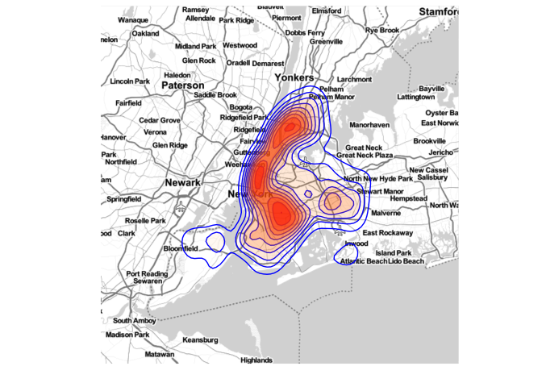
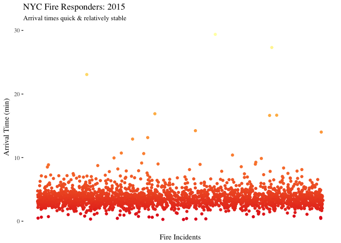
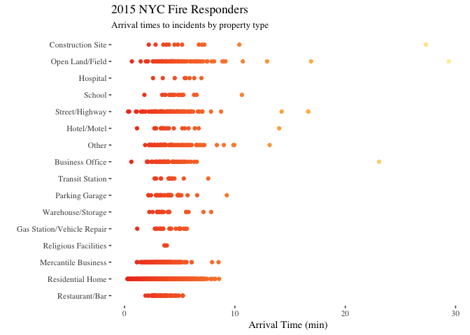
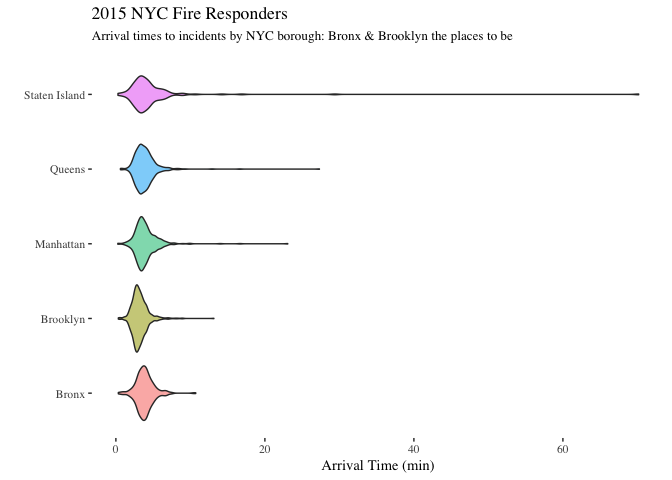
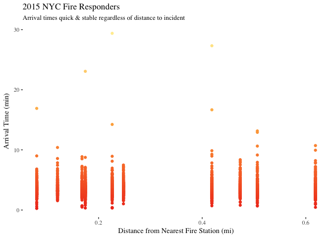
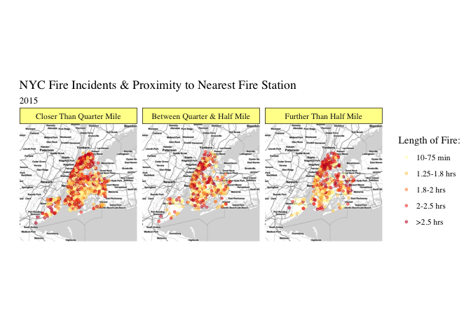
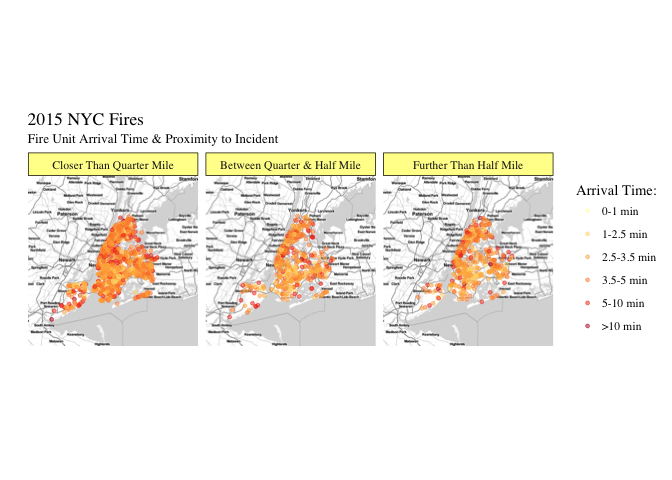
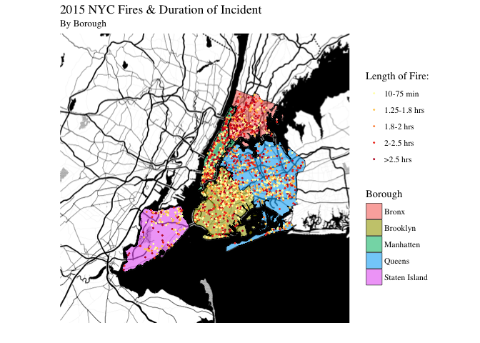
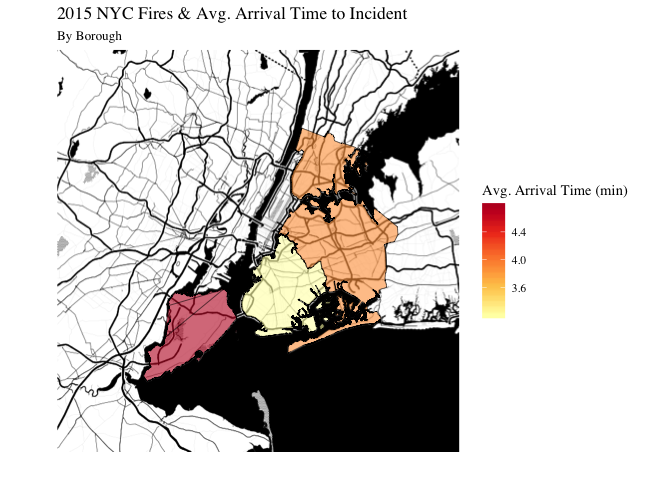

Fires in NYC and FDNY Response
================================


## Overview

For this project, I use NYC Open Data to alleviate my anxieties about living on the top floor of an apartment building and investigate serious incidents requiring the fire department to respond. Using data about the locations of Fire Stations and fires occurring in New York City, I look into whether response times to fires differ across the city. Lastly, I focus on whether distance from a Fire Station affects response times to the scene.

## Data

### Incidents responded to by fire companies

NYC Open Data has data on all [incidents responded to by fire companies](https://data.cityofnewyork.us/Public-Safety/Incidents-Responded-to-by-Fire-Companies/tm6d-hbzd). The following variables are available:

  - IM_INCIDENT_KEY:	Unique identifier for each incident which serves
  - INCIDENT_TYPE_DESC	The code and description of the incident category type
  - INCIDENT_DATE_TIME	The date and time that the incident was logged into the Computer Aided Dispatch system
  - ARRIVAL_DATE_TIME	The date and time that the first unit arrived on scene
  - UNITS_ONSCENE	Total number of units that arrived on scene
  - LAST_UNIT_CLEARED_DATETIME	The date and time that the incident was completed and the last unit cleared the scene
  - HIGHEST_LEVEL_DESC	The highest alarm level that the incident received
  - TOTAL_INCIDENT_DURATION	The total number of seconds from when then incident was created to when the incident was closed
  - ACTION_TAKEN1_DESC	The code and description of the first action taken
  - ACTION_TAKEN2_DESC	The code and description of the second action taken
  - ACTION_TAKEN3_DESC	The code and description of the third action taken
  - PROPERTY_USE_DESC	The code and description of the type of street or building where the incident took place
  - STREET_HIGHWAY	The name of the street where the incident_took place
  - ZIP_CODE	The postal zip code where the incident took place
  - BOROUGH_DESC	The borough where the incident took place
  - FLOOR	The floor of the building where the incident took place
  - CO_DETECTOR_PRESENT_DESC	Indicator for when a CO detector was present
  - FIRE_ORIGIN_BELOW_GRADE_FLAG	Indicator for when the fire originated below grade
  - STORY_FIRE_ORIGIN_COUNT	Story in which the fire originated
  - FIRE_SPREAD_DESC	How far the fire spread from the object of origin
  - DETECTOR_PRESENCE_DESC	Indicator for when a  detector was present
  - AES_PRESENCE_DESC	Indicator for when an Automatic Extinguishing System is present
  - STANDPIPE_SYS_PRESENT_FLAG	Indicator for when a standpipe was present in the area of origin of a fire

This dataset is only updated annually, and thus far only data from 2013 to 2015 is contained. The following analyses are run using just 2015 data and only the most severe fires (Level 7).


```r
# data manipulation (by Thomas Brambor)
fire <- read_csv("./data/Incidents_Responded_to_by_Fire_Companies.csv") 
fire$year <- substr(fire$INCIDENT_DATE_TIME, 7, 10)
fire <- fire%>% 
  filter(HIGHEST_LEVEL_DESC == "7 - Signal 7-5") %>%
  filter(year==2015)


# Geocoding data
# Make list of addresses
address <- str_c( str_to_title(fire$STREET_HIGHWAY),
                  "New York, NY",
                  fire$ZIP_CODE,
                  sep=", ")

# Register Google API Key
register_google(key = Sys.getenv("GOOGLE_MAPS_API_KEY"))

# Geocode Addresses
latlong <- geocode(address, output = c("latlon"))

# Merge on
fire$Latitude  <- latlong$lat
fire$Longitude <- latlong$lon

# Save File
write_csv(fire, "severe_incidents.csv")
```

### FDNY Fire Station Listing

NYC Open Data also provides data on the [location of all 218 Fire Stations in NYC](https://data.cityofnewyork.us/Public-Safety/FDNY-Firehouse-Listing/hc8x-tcnd). Relevant to my analyses are the following variables:

    FacilityName, Borough, Latitude, Longitude
    
In addition, NYC Open Data provides shape files for [NYC Borough boundaries](https://data.cityofnewyork.us/City-Government/Borough-Boundaries/tqmj-j8zm/data). This data is used in the final few plots.  


```r
# Read in both datasets 
library(tidyverse)
fire <- read_csv("../data/severe_incidents.csv") 
locs <- read_csv("../data/FDNY_Firehouse_Listing.csv") 
locs <- locs %>% 
  select(FacilityName, Borough, Latitude, Longitude)
```
## Visualizations

### 1. Location of Severe Fires
#### a. Leaflet Map: Incidents

Below is a `leaflet` map of the severe fires contained in the file `severe_incidents.csv`. Fires that occurred at locations outside the five boroughs of New York City were excluded. The type of incident, date and time of incident, where the fire spread, the number of firemen/women units that came onto scene, whether a detector was present and the total duration of the incident are available as information in interactive popups. 


```r
library(leaflet)
library(RColorBrewer)

# rid of outliers 
outliers <- filter(fire,Latitude == 40.4520226 & Longitude == -74.8161585|Latitude == 40.7436253 & Longitude == -73.6580927|Latitude == 40.701487 & Longitude == -73.349799|Latitude == 40.9206623  & Longitude == -73.787364|Latitude == 40.9179949   & Longitude == -73.8956178)

fire <- fire[!(fire$IM_INCIDENT_KEY %in% outliers$IM_INCIDENT_KEY),]


# popups
fire$INCIDENT_TYPE_DESC <- substring(fire$INCIDENT_TYPE_DESC, 7) # rid of numbers 
fire$FIRE_SPREAD_DESC <- substring(fire$FIRE_SPREAD_DESC, 5)
fire$DETECTOR_PRESENCE_DESC <- substring(fire$DETECTOR_PRESENCE_DESC, 5)
fire$TOTAL_INCIDENT_DURATION <- round(fire$TOTAL_INCIDENT_DURATION/60, 2) # convert to minutes

content <- paste("<b>What:</b>",fire$INCIDENT_TYPE_DESC,"<br/>",
                 "<b>When</b>:",fire$INCIDENT_DATE_TIME,"<br/>",
                 "<b>Location</b>:",fire$FIRE_SPREAD_DESC,"<br/>",
                 "<b>Length of Incident (min)</b>:", fire$TOTAL_INCIDENT_DURATION, "<br/>",
                 "<b>Number of Units On Scene</b>:",fire$UNITS_ONSCENE,"<br/>",
                 "<b>Fire Dectector Status</b>:", fire$DETECTOR_PRESENCE_DESC, "<br/>")

fireIcons <- icons(
  iconUrl = "../images/fire.png",
  iconWidth = 8, iconHeight = 11
  #iconAnchorX = 22, iconAnchorY = 94
)
# legend
html_legend <- "2015 NYC Fires<br>  "

# map 
leaflet(data = fire, options = leafletOptions(minZoom = 10)) %>% 
  setView(lat = 40.730610, lng = -73.935242, zoom = 10) %>%
  addTiles() %>% 
  addProviderTiles("CartoDB.Positron") %>% 
  addMarkers(lat = ~Latitude, lng = ~Longitude, 
             icon = fireIcons, popup = content) %>% 
  addControl(html = html_legend, position = "bottomright")
```

<!--html_preserve--><div id="htmlwidget-727ff96b95ce4a29c9a7" style="width:672px;height:480px;" class="leaflet html-widget"></div>
<script type="application/json" data-for="htmlwidget-727ff96b95ce4a29c9a7">{"x":{"options":{"minZoom":10,"crs":{"crsClass":"L.CRS.EPSG3857","code":null,"proj4def":null,"projectedBounds":null,"options":{}}},"setView":[[40.73061,-73.935242],10,[]],"calls":[{"method":"addTiles","args":["//{s}.tile.openstreetmap.org/{z}/{x}/{y}.png",null,null,{"minZoom":0,"maxZoom":18,"maxNativeZoom":null,"tileSize":256,"subdomains":"abc","errorTileUrl":"","tms":false,"continuousWorld":false,"noWrap":false,"zoomOffset":0,"zoomReverse":false,"opacity":1,"zIndex":null,"unloadInvisibleTiles":null,"updateWhenIdle":null,"detectRetina":false,"reuseTiles":false,"attribution":"&copy; <a href=\"http://openstreetmap.org\">OpenStreetMap<\/a> contributors, <a href=\"http://creativecommons.org/licenses/by-sa/2.0/\">CC-BY-SA<\/a>"}]},{"method":"addProviderTiles","args":["CartoDB.Positron",null,null,{"errorTileUrl":"","noWrap":false,"zIndex":null,"unloadInvisibleTiles":null,"updateWhenIdle":null,"detectRetina":false,"reuseTiles":false}]},{"method":"addMarkers","args":[[40.7896311,40.6537806,40.8376726,40.75533,40.7475915,40.713269,40.8145029,40.6255401,40.8365982,40.5741456,40.7530101,40.6909905,40.693022,40.830181,40.6846619,40.8228961,40.8253285,40.7161881,40.5778906,40.6271013,40.6915487,40.6277816,40.8547742,40.8376726,40.83306,40.8068287,40.6785715,40.683317,40.680294,40.8272518,40.7609205,40.6909686,40.6157166,40.66307,40.7087988,40.6431272,40.7120711,40.8520482,40.6580404,40.6891808,40.892043,40.650969,40.6688844,40.611838,40.7747911,40.629294,40.7123586,40.6325086,40.7518389,40.6938168,40.6785162,40.7792193,40.696354,40.8640865,40.6440977,40.6497724,40.6256834,40.6656761,40.6586479,40.7074026,40.7124464,40.767267,40.7995653,40.7293961,40.798945,40.8341233,40.7482299,40.684389,40.8750651,40.6760051,40.7005923,40.6125807,40.8312965,40.5898361,40.697747,40.8736964,40.7601572,40.8515529,40.678848,40.6440977,40.6981779,40.6832555,40.5977813,40.689161,40.6375197,40.7600597,40.6127771,40.767267,40.6675125,40.6911099,40.8343783,40.6022332,40.6824413,40.7232838,40.7362842,40.8200893,40.8463347,40.6532915,40.7972632,40.694572,40.5898389,40.6462579,40.6468818,40.6965612,40.7672719,40.7667646,40.8802474,40.694746,40.711801,40.681758,40.7021768,40.5987408,40.8272518,40.8956007,40.8252681,40.5925568,40.8660651,40.68221,40.593487,40.7736925,40.7176171,40.6192922,40.6341186,null,40.6695654,40.6644738,40.763368,40.704881,40.7428947,40.8360928,40.69195,40.828552,40.765359,40.6083482,40.6233405,40.664997,40.662835,40.6978113,40.6821237,40.7756059,40.680385,40.7133423,40.8310945,40.5954985,40.6115795,40.6764516,40.675037,40.8411102,40.8259061,40.6250008,40.7660942,40.6813005,40.767267,40.6997926,40.7477997,40.5890391,40.7157032,40.7370037,40.6902272,40.6429175,40.7412434,40.695845,40.7183857,40.8245652,40.6947808,40.75533,40.8283767,40.6263234,40.5689688,40.7064678,40.8445717,40.6288924,40.6234886,40.6798838,40.6331944,40.6580404,40.8062714,40.6331944,40.7507757,40.6366274,40.618243,40.6624144,40.8376036,40.8263483,40.6385162,40.7178006,40.8444033,40.8706786,40.6697368,40.8443458,40.8878455,40.6975765,40.7908156,40.6159856,40.8681819,40.6817799,40.6536517,40.6879578,40.5936492,40.8339028,40.7591376,40.8864651,40.808055,40.6879475,40.7416224,40.830575,40.8696771,40.6799111,40.6911099,40.628564,40.6698156,40.712734,40.8402557,40.8714368,40.6323294,null,40.720046,40.6263679,40.6719316,40.8252492,40.7494974,40.7027385,40.7005923,40.7988378,40.7403608,40.726162,40.8624708,40.8043683,40.623915,40.8231519,40.620722,40.6644957,40.67763,40.7851039,40.8415353,40.6762072,40.797988,40.6709946,40.759637,40.6323136,40.6656761,40.7175758,40.6736824,40.8652023,40.7149319,40.7704844,40.7512121,40.6664226,40.6878827,40.8785105,40.7431861,40.8003236,40.731623,40.6672244,40.6414276,40.7320289,40.8789858,40.6903067,40.6775066,40.7190683,40.764625,40.5955409,40.8852213,40.7217896,40.664997,40.6673735,40.890244,40.7620774,40.766016,40.6386713,40.643285,40.794316,40.7334788,40.8272518,40.8450485,40.6759771,40.7240626,40.7206075,40.7426633,40.7817204,40.6795789,40.69541,40.645458,40.617534,40.8514876,40.6644957,40.7883666,40.6492793,40.7152154,40.7859096,40.678758,40.7458025,40.647344,40.6155781,40.6498807,40.79725,40.7148199,40.690334,40.79935,40.6715889,40.7589541,40.8322246,40.745063,40.8161056,40.7381375,40.5954985,40.7597616,40.8167638,40.7385115,40.6639572,40.7709869,40.7838194,40.679317,40.7636563,40.7896311,40.6735749,40.6166187,40.5885832,40.7040377,40.752913,40.8684188,40.5834881,40.7294057,40.692968,40.8514876,40.7432938,40.6714824,40.6696857,40.6289688,40.8459533,40.697053,40.6733229,40.8262866,40.703688,40.682232,40.6431288,40.8650373,40.6959468,40.5351171,40.6602674,40.7654129,40.7019871,40.6715773,40.6792777,40.5754975,40.5839354,40.603877,40.7390042,40.7047981,40.7004948,40.7498942,40.7678433,40.7564494,40.8339028,40.6027214,40.6032709,40.8789203,40.5859899,40.6859721,40.6706614,40.7144349,40.705253,40.7737724,40.810014,40.8272518,40.669217,40.70689,40.6142588,40.6325086,40.8395224,40.728672,40.728672,40.6945993,40.8424821,40.773813,40.7678433,40.7641402,40.6654891,40.690405,40.6699273,40.6294744,40.6672244,40.7942847,40.675828,40.8578912,40.67087,40.685806,40.7936179,40.6431272,40.765359,40.688928,40.7367202,40.7090269,40.686619,40.6468818,40.705534,40.6826611,40.7037981,40.7584332,40.8299163,40.8603573,40.7123672,40.8624708,40.7621935,40.8610395,40.7250728,40.647905,40.7320289,40.5986499,40.708944,40.711757,40.7352956,40.7088212,40.6257285,40.828552,40.8525255,40.5955794,40.7954774,40.6763835,40.8519846,40.7175486,40.831622,40.6318492,40.6387292,40.697801,40.8296624,40.7504266,40.6487614,40.6674677,40.6589793,40.8231982,40.8517966,40.695139,40.645106,40.767267,40.7306517,40.7507095,40.6975388,40.6764563,40.7245847,40.6504055,40.8465512,40.699736,40.8641484,40.798945,40.6254938,40.7641402,40.7305359,40.6810973,40.7697512,40.7747911,40.834184,40.6537806,40.664827,40.680236,40.6911686,40.6995541,40.7311286,40.7275967,40.704876,40.655555,40.8129648,40.828552,40.6761071,40.654427,40.6689702,40.6761749,40.5449269,40.8145502,40.618243,40.630023,40.6806645,40.6710418,40.7722387,null,40.8179282,40.688535,40.6412196,40.7812786,40.7915751,40.6368996,40.7654129,40.7654129,40.684358,40.6043649,40.7469705,null,40.7314293,40.6976238,40.750294,40.7457829,40.5938867,40.8488503,40.8448026,40.6979208,40.7658305,40.7271055,40.639854,40.7427209,40.6682201,40.7076534,40.5971315,40.559889,40.6832555,40.6913821,40.8084815,40.7523188,40.5487711,40.6263234,40.6935602,40.6953611,40.7015019,40.813845,40.8939239,40.7250601,40.8798952,40.614782,40.699808,40.7272605,40.8211329,40.6329817,40.750276,40.7994739,40.6887901,40.7517421,40.8425918,40.6982354,40.6045554,40.8561652,40.6644869,40.7398435,40.8531747,40.8430514,40.7906046,40.6439853,40.6634371,40.848957,40.7272842,40.6745504,40.6385162,40.6883972,40.798781,40.8721708,40.7869987,40.8871345,40.6675125,40.8084815,40.8206448,40.8180736,40.7020844,40.7875785,40.7464661,40.7988378,40.6717858,40.7857376,40.8156548,40.6674798,40.6663616,40.6551346,40.8312965,null,40.7947798,40.7473337,40.6472084,40.6930761,40.8098689,40.6498807,40.6320152,40.5822632,40.7378448,40.6333991,40.705413,40.8457618,40.6815494,40.6638578,40.747196,40.5643669,40.6768203,40.7717443,40.7623502,40.6117127,40.5504971,40.5765475,40.8157688,40.7024398,40.6698261,40.5826684,40.6486479,40.6690587,40.7001484,40.605946,40.8486926,40.713269,40.6717858,40.869135,40.8514908,40.5883873,40.6012563,40.6385162,40.7041269,40.68024,40.5558469,40.6099786,40.7501752,40.5971315,40.6947925,40.6698261,40.8482605,40.79935,40.8222748,40.671774,40.69394,40.6488379,40.7507757,40.7055303,40.849323,40.6352975,40.7173989,40.8303174,40.7988378,40.743778,40.738445,40.6424793,40.646738,40.6941104,40.6541536,40.7073943,40.7462516,40.763368,40.7092667,40.729446,40.7293685,40.8469612,40.8743665,40.6617965,40.6493774,40.857538,40.6261768,40.7169701,40.8344303,40.733398,40.6686015,40.8256843,40.70303,40.7173109,40.8111677,40.7376317,40.6556633,40.6430688,40.8182115,40.7641402,40.8421711,40.8253285,40.6389001,40.7235068,40.702313,40.8516539,40.6643667,40.752857,40.8369441,40.8339028,40.7250728,40.8395224,40.8365951,40.7584332,40.7636234,40.5878084,40.8023095,40.8253285,40.8253285,40.8404447,40.6989682,40.6208557,40.6704332,40.6779802,40.7058722,40.766016,40.6808089,40.6879475,40.831137,40.8096932,40.657945,40.747243,40.6647137,40.5950465,40.6329817,40.6736824,40.8283767,40.8030321,40.6276706,40.6576614,40.847287,40.6360225,40.8272518,40.593149,40.697053,40.6775334,40.858386,40.6795789,40.7927713,40.7259303,40.745952,null,40.6639572,40.6643667,40.6941331,40.7792193,40.831622,40.6794385,40.8029919,40.8258196,40.7679183,40.7263608,40.7153245,40.806408,40.8241559,40.6708734,40.742261,40.8150973,40.6690558,40.673916,40.712734,40.5643721,40.6233405,40.5558534,40.6886668,40.7123906,40.592559,40.663069,40.7654129,40.6797237,40.786213,40.8557533,40.6785162,40.680569,40.8885459,null,40.6072025,40.6973197,40.6081078,40.62206,40.6423101,40.8285133,40.8870855,40.7280972,40.8387288,40.6598588,40.8489321,40.8895068,40.7657168,40.6870006,40.8224895,40.708214,40.5930865,40.7520899,40.760861,40.6148089,40.7412434,40.7362903,40.8166377,40.608797,40.74655,40.703543,40.8472474,40.8285133,40.8285133,40.828641,40.8523427,40.8145502,40.7634937,40.6720265,40.6598384,40.8477599,40.6441019,40.7046077,40.7487467,40.7095145,40.672837,40.672667,40.6490992,40.7656661,40.643285,40.5485488,40.5870827,40.8743242,40.8595729,40.6988892,40.8145029,40.838928,40.8841897,40.766016,40.670589,40.706237,40.7345398,40.688535,40.7329588,40.7032599,40.6046529,40.8714368,40.683771,40.6211937,40.8087289,40.6407044,40.7714126,40.6914285,40.6232075,40.8977024,40.7024398,40.8600348,40.7242841,40.8387288,40.5444206,40.714069,40.6730326,40.7669761,40.6691924,40.8159328,40.6723159,40.633516,40.699801,40.5794801,40.7370037,40.5998457,40.7472355,40.5826684,40.7383645,40.6806645,40.8487726,40.604486,40.5825499,40.6333453,40.6134788,40.7128658,40.7280054,40.752381,40.7115017,40.680294,40.7656661,40.8236587,40.7718639,40.5906398,40.6227937,40.8741761,40.6467217,40.5700062,40.8743665,40.7011587,42.9807764,40.692902,40.8056135,40.763368,40.6653055,40.684001,40.622585,40.8382585,40.587104,40.824944,40.767267,40.6648752,40.7278553,40.6028516,40.7994169,40.695289,40.8260012,null,40.7417814,40.7432937,40.72866,40.8182385,40.8118668,40.7747911,40.7362278,40.7117748,40.7120711,40.6462657,40.8451638,40.6900255,40.6902493,40.699819,40.790896,40.7657168,40.6720828,40.6374242,40.6933574,40.7040438,40.6752022,40.7261938,40.7019274,40.6688844,40.718648,40.8435424,40.8703483,40.6980091,40.6443876,40.8426459,40.7646961,40.6900255,40.7246172,40.6624144,40.7353898,40.7157032,40.682584,40.637755,40.8517966,40.7360172,40.6782401,40.7168029,40.8289769,40.8624708,40.8707745,40.8593361,40.6255924,40.652109,40.703747,40.8317579,40.7041208,40.7631584,40.7743404,40.7765182,40.749791,40.6997926,40.729446,40.8344303,40.8261291,40.718941,40.7194779,40.6607154,40.6342269,40.7100676,40.6372235,40.7136408,40.683154,40.6300412,40.830575,40.7609205,40.6257285,40.7010602,40.8163934,40.6362546,40.8275641,40.6074203,40.714295,40.7185365,40.7781416,40.8451505,40.7184121,40.7161881,40.8489876,40.6681067,40.7524816,40.7184892,40.740787,40.7789217,40.5837297,40.8411102,40.8697672,40.7608261,40.8627963,40.8298737,40.8538777,40.6879475,40.7609205,40.6872234,40.6955795,40.8203177,40.8516688,40.7665848,40.6916468,40.6904832,40.857538,40.6432112,40.7320369,40.8428815,40.692889,40.790896,40.67921,40.713269,40.664827,40.8456993,40.794316,40.7328809,40.6644957,40.7869151,40.6109061,40.618113,40.8273936,40.6768991,40.6710418,40.8115224,40.6321936,40.6886668,40.8134276,40.5839688,40.820536,40.6848064,40.8739816,40.7384705,40.8053365,40.8231982,40.6150916,40.7422562,40.7534898,40.748801,40.7849942,40.7329221,40.6216239,40.686323,40.8376726,40.7432937,40.870562,40.7064935,40.7164701,40.7804359,40.7581416,40.7273161,40.7126574,40.7209004,40.713269,40.6093424,40.6909905,40.6551008,40.6768236,40.6759771,40.5792193,40.7267622,40.7050871,40.7507757,40.7118647,40.7301456,40.7789952,40.8305358,40.6769442,40.6390582,40.646738,40.683038,40.715766,40.767532,40.8272518,40.833213,40.6864673,40.7543987,40.897626,40.596324,40.6301639,40.68024,40.6647137,40.8231295,40.7261134,40.6921695,40.7101324,40.828296,40.7275248,40.7772491,40.8341233,40.6461399,40.7248137,40.5857119,40.7032286,40.765874,40.6727524,40.7634937,40.830181,40.7599095,40.6955497,40.631034,40.644514,40.6353312,40.6112501,40.7076534,40.6461346,40.7538674,40.790998,40.6366274,40.8216621,40.8663153,40.7174081,40.677303,40.7066508,40.8267557,40.6094882,40.6749963,40.8432448,40.8652468,40.5610776,40.6796276,40.7757218,40.8415353,40.6356541,40.7507095,40.59973,40.706758,40.6063299,40.7075969,40.6835961,40.7115017,40.6706903,40.8139962,40.6564949,40.682308,40.8446428,40.7054161,40.7092667,40.7751216,40.5525017,40.6598217,40.5952746,40.8176818,40.636097,40.8268321,40.747765,40.8106086,40.7240626,40.539421,40.7048245,40.7328746,40.6739875,40.6646102,40.699736,40.8496021,40.8373589,40.7837168,40.7293685,40.7146301,40.8477319,40.7497177,40.6713087,40.8376726,40.6638578,40.8376726,40.7583563,40.6350203,40.8520482,40.7540642,40.641745,40.7060006,40.7313474,40.70968,40.6064816,40.8555207,40.6796276,40.6387292,40.8663153,40.8001992,40.6168401,40.6234544,40.762107,40.8406087,40.7023572,40.701404,40.729446,40.681211,40.8278208,40.8259447,40.6389508,40.6772872,40.6333453,40.605069,40.6766472,40.7132956,40.8221704,40.6321887,40.8669013,40.6879475,40.7267125,40.6768203,40.8672693,40.8154643,40.5780091,40.8504173,40.7752992,40.871423,40.7527625,40.6416829,40.7554039,40.7550402,40.5552269,40.858386,40.8290247,40.684001,40.704825,40.6885626,40.6706903,40.627833,40.6107365,40.818462,40.7554773,40.8122959,40.8320331,40.589285,40.6959468,40.767532,40.695956,40.7124318,40.7362278,40.8349665,40.683154,40.7486451,40.7749409,40.67301,40.7032959,40.8241065,40.8277784,40.7506175,40.7095639,40.7335212,40.7208775,40.838014,40.689354,40.6981779,40.7187073,40.8438329,40.7405375,40.8182115,40.6333101,40.8044031,40.5792193,40.764077,40.8557533,40.6973134,40.7396527,40.682077,40.6512331,40.6516145,40.6674798,40.8377179,40.6204,40.673916,40.7588646,40.603877,40.6770756,40.6189018,40.7779595,40.6320152,40.6267789,40.6663103,40.8023095,40.7579032,40.663818,40.7161,40.8432448,40.7320289,40.6630258,40.6568598,40.834009,40.8392298,40.680312,40.8392298,40.8264347,40.7896311,40.6303834,40.7736925,40.6462657,40.8459533,40.7770587,40.7145257,40.7131237,40.7852539,40.6996768,40.587976,40.6134331,40.8560877,40.840195,40.7152403,40.7059678,40.7339528,40.6735145,40.6597606,40.6389001,40.620131,40.652192,40.7299553,40.690405,40.6044395,40.69538,40.8268321,40.9035599,40.6411325,40.6064568,40.7591565,40.8661734,40.708542,40.5457563,40.6064568,40.7284627,40.6897086,40.6643667,40.6501766,40.6267789,40.8119081,40.5741456,40.7326097,40.6536036,40.8461516,40.8408568,40.7563257,40.6191944,40.6914285,40.733016,40.6369565,40.7230614,40.571728,40.7736925,40.8239304,40.7374733,40.7163828,40.6753358,40.8799393,40.6063299,40.7583563,40.7116977,40.7736711,40.6841283,40.6374784,40.7292376,40.7217267,40.6846619,40.8704351,40.6748242,40.6064568,40.7010204,40.8129648,40.6655332,40.5748797,40.6061616,40.7169131,40.7168212,40.773813,40.6874929,40.6874929,40.6784022,40.7022571,40.618585,40.7782237,40.830503,40.8883378,40.6761024,40.7263496,40.6287633,40.6360425,40.6685763,40.7279634,40.8989352,40.7135157,40.7779595,40.6751974,40.7628454,40.6840453,40.6867667,40.740787,40.629385,40.7390042,40.7601784,40.7235064,40.7019274,40.5806558,40.688245,40.6122987,40.6956898,40.7040202,40.7030717,40.580723,40.6913821,40.7255879,40.8068287,40.7033756,40.6586479,40.706597,40.6888543,40.713655,40.84147,40.8428815,40.798945,40.7025075,40.6508471,40.7908156,40.6323644,40.7608224,40.7591565,40.7802844,40.6490992,40.5926796,40.5560714,40.683742,40.8663153,40.6648458,40.7616323,40.7293685,40.646738,40.6885626,40.8684188,40.635318,40.618644,40.6287633,40.7804471,40.6485533,40.810843,40.6659664,40.6208304,40.6368786,40.6359604,40.6193242,40.6331944,40.7349548,40.6701536,40.6522995,40.6780731,40.6441151,40.8842045,40.703115,40.669543,40.7772491,40.7437594,40.6955795,40.8395224,40.7453976,40.708127,40.8557565,40.7110193,40.6334757,40.6574649,40.8637976,40.8287372,40.6978195,40.7002225,40.7331191,40.7145257,40.679097,40.6689702,40.6562894,40.6760371,40.6072025,40.700187,40.8200893,40.7096559,40.8030321,40.6392915,40.8409932,40.6597606,40.8245652,40.8043683,40.6502296,40.68323,40.8929633,40.7281603,40.7634937,40.6785162,40.831624,40.6706903,40.8312965,40.5955794,40.7197594,40.6720265,40.7458918,40.8275641,40.8130561,40.7927713,40.6471387,40.5497768,40.7020412,40.6635409,40.7482299,40.7326097,40.7361492,40.6411723,40.7024398,40.7653898,40.8884724,40.7466763,40.7082657,40.6516145,40.85277,40.8784403,40.704881,40.6223666,40.8478503,40.5451312,40.701553,40.8287552,40.8285984,40.744031,40.8531747,40.7348847,40.7073943,40.5010869,40.8741761,40.8107804,40.6481094,40.6296178,40.6420002,40.8353918,40.6680968,40.7890023,40.8259021,40.6337817,40.6468818,40.6609752,40.7101325,40.7233958,40.6255401,40.6580417,40.773813,40.7559092,40.667653,40.57654,40.7507757,40.5673593,40.7075969,40.5625625,40.7258739,40.806408,40.752857,40.625115,40.7191315,40.7624101,40.70823,40.7534898,40.8253285,40.7187442,40.7583563,40.8273936,40.6696791,40.8025058,40.6960035,40.8003236,40.7288781,40.6508249,40.7293961,40.7184755,40.6202587,40.699028,40.7262313,40.7589541,40.7777048,40.8362532,40.702705,40.7365564,40.6078381,40.8157958,40.7815475,40.7143082,40.6022332,40.8770007,40.846506,40.6078078,40.7092667,null,40.7992319,40.7190145,40.6512331,40.8140898,40.5552269,40.6705445,40.8167638,40.8455046,40.680294,40.7355638,40.6431272,40.8626711,null,40.6866976,40.6382714,40.7501276,40.7104657,40.6458021,40.6315493,40.654196,40.5507875,40.702259,40.695956,40.699736,40.7739746,40.7326097,40.605069,40.6695654,40.6562187,40.616488,40.6313073,40.7665848,40.6374784,40.6349248,40.6420339,40.7638942,40.6685356,40.7271043,40.7167367,40.7233561,40.602048,40.6221837,40.7053865,40.7002048,40.6485533,40.69321,40.5826684,40.7638942,40.6261555,40.7381375,40.7583563,40.7608924,40.7386908,40.8275641,40.752857,40.709534,40.8134932,40.608797,40.6681067,40.530183,40.8852213,40.813727,40.678694,40.699736,40.7171876,40.7149514,40.7128658,40.8277062,40.6785113,40.7608924,40.790998,40.7597616,40.7352119,40.5973925,40.6664226,40.7817476,40.6923953,40.6044712,40.8341875,40.753474,40.6263679,40.7367202,40.8584228,40.8842749,40.7145257,40.5961147,40.743688,40.8915118,40.8626711,40.6797237,40.70908,40.6320152,40.6959468,40.6006927,40.7255915,40.700169,40.6752372,40.643285,40.8209947,40.8054183,40.608797,40.7048055,40.618243,40.7616404,40.8228961,40.7126587,40.7742944,40.7630596,40.6159856,40.6639572,40.618243,40.8627253,40.5987408,40.767532,40.5987408,40.6424292,40.605946,40.6785162,40.7403608,40.865449,40.706237,40.6427988,40.5952418,40.6888543,40.621032,40.6466888,40.6332284,40.7462516,40.5741456,40.674757,40.7132217,40.7200386,40.6256834,40.6751974,40.6823907,40.5765475,40.8268321,40.7938457,40.7580838,40.7560558,null,40.8526857,40.6190599,40.7559092,40.6690587,40.5489726,40.8341875,40.7143082,40.7396689,40.6447554,null,40.6808948,40.593149,40.8441394,40.8488465,40.626886,40.60032,40.7654129,40.6255401,40.6913821,40.7608261,40.618794,40.8044031,40.8075129,40.8180594,40.712734,40.6431288,40.7155738,null,40.8203235,40.5583359,40.711801,40.7405375,40.6891808,40.8196006,40.688535,40.7896482,40.8628472,40.63581,40.8558189,40.8332882,40.7705947,40.6981779,40.6329817,40.683086,40.6695262,40.5953639,40.8127206,40.8362187,40.8681819,40.692831,40.6659664,40.637755,40.6325086,40.7490692,40.6675125,40.8360928,40.5814726,40.6316525,40.8313939,40.650706,40.6608871,40.6301015,40.70621,40.8241559,40.8217268,40.6318701,40.8552648,40.6956898,40.7267977,40.8256524,40.8283281,40.7082522,40.8584038,40.8313035,40.8341233,40.5643669,40.5390227,40.7065725,40.6879827,40.7778563,40.629006,40.5899815,40.6653055,40.6447554,40.7082284,40.6775066,40.6630185,40.5935963,40.6093424,40.7458471,40.7781416,40.5961734,40.7717443,40.7739133,40.6028314,40.6012266,40.8727853,40.6743731,40.7410705,40.6709946,40.6413111,40.8310945,40.6082574,40.6664954,40.6498807,40.6885422,40.6823907,40.7045598,40.5992839,40.810843,40.660826,40.83363,40.8111677,40.699736,40.8684188,40.6096202,40.676449,40.79725,40.6726018,40.7683708,40.6516145,40.808055,40.760861,40.7069436,40.6609752,40.7169291,40.6345952,40.713269,40.7808121,40.7679106,40.7531456,40.7642415,40.7675028,40.5874526,40.8341233,40.6301639,40.695791,40.7120892,40.693823,40.612487,40.6316969,40.7625684,40.77818,40.6027499,40.7745134,40.8068287,40.7371882,40.7115017,null,40.692902,40.6773215,40.6447451,40.7308661,40.7529668,40.8461516,40.8446428,40.8663153,40.7355638,40.748484,40.809098,40.695587,40.6905434,40.824889,40.6420002,40.6879475,40.629735,40.6826611,40.5935637,40.6755331,40.759478,40.666259,40.6536517,40.6233405,40.6792777,40.8452162,40.8272518,40.835502,40.7658562,40.766016,40.6221146,40.6870422,40.7615144,40.670001,40.6708992,null,40.8259021,40.7942847,40.8672693,40.682914,40.7239497,40.7532711,40.703234,40.7101325,40.608309,40.6616371,40.7285977,40.7620774,40.8511229,40.745156,40.6416461,40.618254,40.6762072,40.7378077,40.7262882,40.689161,40.8158845,40.6496021,40.7410673,40.7851039,40.7113899,40.6726114,40.7204318,40.6655332,40.6889575,40.6516145,40.6221146,40.8714368,40.692346,40.7005049,40.6738334,40.6042819,40.7213974,40.6996768,40.7305597,40.6799111,40.8092586,40.7299748,40.695719,40.708127,40.6146394,40.6516546,40.7095639,40.7168847,40.6255924,40.6738334,40.7987854,40.7278553,40.7406196,40.6553516,40.6229985,40.6165191,40.8667868,40.752913,40.7190145,40.777504,40.6784022,40.899206,40.8451638,40.7607892,40.681521,40.63496,40.8751735,40.619249,40.8824932,40.8172698,40.7292376,40.6863928,40.691737,40.6522995,40.750276,40.6629444,40.6720669,40.8244569,40.683751,40.7082375,40.8849782,40.7339528,40.6300412,40.7536531,40.6461346,40.7875785,40.6685763,40.6062222,40.6016326,40.8211329,40.6532915,40.6639572,40.8426459,40.8377179,40.6691924,40.712798,40.613613,40.7789085,40.8516539,40.72441,40.7641748,40.6245355,40.7916801,40.6387181,40.5520911,40.5520911,40.6340272,40.8659738,40.6502296,40.6609752,40.537285,40.7804359,40.5569742,40.6263519,40.700548,40.7230124,40.8884769,40.6624144,40.6654891,40.5910174,40.7576055,40.7404792,40.7168847,40.8939239,40.684668,40.7421612,40.7602267,40.6405477,40.7432937,40.6934375,40.658504,40.8211329,40.7280054,40.6687934,40.8377728,40.5992839,40.6255401,40.754091,40.8328527,40.8650996,40.731644,40.6423101,40.8241065,40.7636234,40.5782396,40.7548147,40.8272518,40.6430097,40.733398,40.8520482,40.7040202,40.6727437,40.6102789,40.5984009,40.688245,40.6242551,40.8268559,40.7653068,40.7000492,40.7272456,40.6817799,40.7096644,40.5946224,40.7271055,40.7064761,40.8023804,40.7524986,40.8780219,40.8145029,40.7088522,40.6640832,40.6127771,40.7352119,40.8484295,40.6013708,40.689354,40.875393,40.672818,40.7123672,40.7503043,40.8654142,40.7439539,40.8882255,40.6839015,40.8433825,40.6995541,40.6537806,40.6313026,40.693573,40.6941104,40.693161,40.6190599,40.6250705,40.7164701,40.6793184,40.705046,40.8068287,40.696376,40.7175758,40.5545781,40.6941661,40.6654394,40.7340911,40.7069168,40.6287633,40.618553,40.6046104,40.8320331,40.6262732,40.7178343,40.6682201,40.8115341,40.6287633,40.8401202,40.6851356,40.5761121,40.6915487,40.769164,40.730722,40.8904293,40.6955501,40.681521,40.7450136,40.5103735,40.681842,40.7890023,40.6749963,40.8738176,40.757517,40.9035599,40.5940322,40.8073044,40.6191944,40.6502893,40.75814,40.7922522,40.7114079,40.8660651,40.7267125,40.7167288,40.6988381,40.8000771,40.8672693,40.620299,40.5285001,40.7205088,40.70303,40.7507757,40.6763001,40.6954644,40.8470225,40.6738334,40.722338,40.6631068,40.7058634,40.662835,40.7770587,40.6496021,40.6331944,40.7355362,40.7458762,40.7153934,40.6321887,40.6580404,40.9055337,40.6866044,40.7140602,40.6786643,40.6493774,40.6516145,40.824283,40.7581251,40.8551175,40.7454534,40.7253112,40.9055337,40.790998,40.6123951,40.753474,40.7628658,40.630336,40.760446,40.6793184,40.762801,40.6720828,40.69691,40.7593502,40.6622426,40.5914496,40.8272518,40.6316969,40.806408,40.7500842,40.6675125,40.6928842,40.6237545,40.7608224,40.643152,40.7628658,40.580222,40.6127252,40.7588061,40.6474779,40.8182385,40.7792665,40.5959518,40.8421837,40.6620054,40.8301514,40.7096559,40.7646896,40.626711,40.6287633,40.6368996,40.815846,40.6426696,40.6644957,40.6951507,40.6586479,40.8006353,40.7124464,40.7099525,40.6072025,40.8843959,40.6709931,40.7988378,40.6523754,40.7545714,40.6357624,40.6407044,40.680294,40.848957,40.6280227,40.722181,40.6100814,40.7660682,40.7685007,40.6646417,40.6155986,40.6424292,40.6989682,40.7301735,40.6904108,40.899455,40.7457167,40.6324248,40.8663153,40.7868424,40.7146555,40.8529008,40.6213905,40.8774778,40.8342393,40.5938517,40.8339028,40.641745,40.6086933,40.7238572,40.7588061,40.852119,40.5525375,40.7750344,40.763524,40.7915751,40.6766939,40.8295571,40.6731881,40.7315386,40.744009,40.8663153,40.6741919,40.5808716,40.6728948,40.8171409,40.6236767,40.783266,40.6768236,40.8175144,40.8216621,40.7728489,40.7006937,40.712734,40.830181,40.6487614,40.790998,40.8477319,40.8654374,40.704082,40.734791,40.6785162,40.832374,40.655555,40.6537806,40.6768236,40.6102703,40.7295445,40.6306844,40.6708734,40.628564,40.7361492,40.6340272,40.6545334,40.6611692,40.6674061,40.6917829,40.6852363,40.7001484,40.7707671,40.6639572,40.6745829,40.798945,40.790896,40.7187073,40.7646405,40.7493631,40.767267,40.7048245,40.701487,40.8075129,40.859157,40.6690242,40.5267669,40.8885497,40.802373,40.8284364,40.7540172,40.7649838,40.628263,40.8447807,40.6257285,40.8416518,40.744009,40.5868744,40.8471956,null,40.6946376,40.6328349,40.6343884,40.6874929,40.608797,40.6697915,40.754707,40.6395331,40.694968,40.7598871,40.8401258,40.7773266,40.6244003,40.8286684,40.6955795,40.663189,40.6629444,40.831622,40.75533,40.7115625,40.8290547,40.7584749],[-73.94006,-73.956165,-73.8654793,-73.991177,-73.9980082,-73.962081,-73.9554427,-74.0925066,-73.9431735,-73.9891318,-73.8773249,-73.9351495,-73.916257,-73.86406,-73.9790047,-73.9509114,-73.9438167,-73.9865604,-73.9609477,-73.932626,-73.9367547,-74.1211208,-73.8504053,-73.8654793,-73.848147,-73.9174895,-73.9162994,-73.7774044,-73.7545931,-73.9386949,-73.9886647,-73.8143855,-73.9091408,-73.8946201,-73.852385,-73.9054201,-73.7764355,-73.9224459,-73.8901334,-73.9095042,-73.858116,-73.976976,-73.8931265,-74.1384478,-73.9089965,-74.028678,-73.8917096,-74.1374066,-73.9946789,-73.7860061,-73.9639049,-73.9809561,-73.9406945,-73.8924176,-73.9668924,-73.9233941,-74.0301806,-73.8932513,-73.923936,-73.9599578,-73.7398097,-73.9841435,-73.9657474,-73.9980108,-73.9423635,-73.9166594,-73.8634053,-73.986564,-73.8847428,-73.7761177,-73.9428911,-73.9357927,-73.8817387,-73.9296076,-73.754669,-73.9040198,-73.8194193,-73.8620863,-73.866083,-73.9668924,-73.9869842,-73.9845664,-73.7835231,-73.992623,-74.0842046,-73.8233077,-73.939683,-73.9841435,-73.8642554,-73.9169362,-73.8906495,-73.7541611,-73.8804866,-73.9825451,-73.9181725,-73.8561946,-73.8608071,-73.9387889,-73.940519,-73.9561384,-73.8045878,-73.9308123,-73.949147,-73.8280562,-73.9210862,-73.9388098,-73.8549625,-73.785671,-73.942228,-73.816943,-73.8163559,-73.7660256,-73.9386949,-73.8389915,-73.8566642,-73.9879849,-73.9224986,-73.9057905,-73.943484,-73.9456902,-73.8117522,-73.9483698,-73.945864,null,-73.8831719,-73.9051748,-73.95924,-73.944389,-73.8828342,-73.9159082,-73.730665,-73.9422999,-73.9875868,-74.0905372,-73.9559516,-73.9881325,-73.9261458,-73.908023,-73.864994,-73.80379,-73.7578529,-74.0129181,-73.9070236,-73.7782169,-73.9945951,-73.9741058,-73.8699132,-73.9398447,-73.9393239,-74.0304542,-73.9077028,-73.9556916,-73.9841435,-73.7785755,-73.9029142,-73.9445784,-73.9858054,-73.8249982,-73.9072915,-74.083768,-73.8694985,-73.908799,-73.9928301,-73.9480977,-73.8477376,-73.991177,-73.9028321,-74.0328637,-74.1339733,-73.9607713,-73.9153079,-74.118532,-74.0851262,-73.8078643,-73.995162,-73.8901334,-73.9201784,-73.995162,-73.9744533,-74.0241926,-73.9840732,-73.9098626,-73.9275652,-73.9146987,-74.0099788,-73.9852709,-73.8829191,-73.9182743,-73.9874678,-73.9011339,-73.855372,-73.9496477,-73.9764719,-74.0814171,-73.8887972,-73.9238936,-73.933049,-73.9419305,-74.1001259,-73.908766,-73.9902683,-73.8510567,-73.929314,-73.825011,-73.99375,-73.9415003,-73.8850215,-73.9141379,-73.9169362,-74.028976,-73.9841189,-73.9890414,-73.8877444,-73.867155,-74.0942439,null,-73.9553481,-74.0298737,-73.9141333,-73.94761,-73.7755853,-73.744143,-73.9428911,-73.9538699,-73.8973652,-73.8214161,-73.9224251,-73.9353288,-74.00726,-73.8948779,-74.020296,-73.9769418,-73.894388,-73.9769031,-73.8807245,-74.0069476,-73.961981,-73.9847943,-73.8823053,-74.1603606,-73.8932513,-73.7524538,-74.0043837,-73.8238286,-73.8166315,-73.7401518,-73.7630287,-73.9368983,-73.9072304,-73.8710001,-73.778728,-73.9322644,-73.856597,-73.9224614,-74.086807,-73.8158011,-73.8616449,-73.9682473,-73.9470022,-74.0064401,-73.871773,-73.7582909,-73.8793521,-73.9998669,-73.9881325,-73.98781,-73.860298,-73.9186877,-73.9852394,-74.0745703,-73.8924971,-73.96276,-73.9974473,-73.9386949,-73.9130614,-73.8949325,-73.7967066,-73.9047847,-73.9320841,-73.9490041,-73.9783093,-73.741002,-74.006368,-74.0807883,-73.9144786,-73.9769418,-73.9745459,-73.9436024,-73.8066231,-73.7844452,-73.813461,-73.8854808,-74.007988,-74.0337281,-73.9340916,-73.968038,-73.9980331,-73.9920503,-73.9474324,-73.88019,-73.8428948,-73.9445251,-73.9786216,-73.9142894,-74.0060301,-73.7782169,-73.9898077,-73.8647469,-73.9844382,-73.9102483,-73.986982,-73.9799099,-73.787288,-73.8808847,-73.94006,-73.952937,-74.1004474,-74.1463682,-74.0115969,-73.9061839,-73.8925258,-73.9708328,-73.7873784,-73.825103,-73.9144786,-73.9001059,-73.9475632,-73.882362,-74.1371852,-73.8986402,-73.75733,-73.7757158,-73.925671,-73.885026,-73.89486,-73.9506703,-73.9269562,-73.9376266,-74.2383854,-73.8682244,-73.889979,-73.8099833,-73.7517409,-73.955294,-73.9910583,-73.9484803,-73.995429,-73.7337013,-73.9618598,-73.7441142,-73.8549676,-73.7731953,-73.8587667,-73.908766,-74.0025837,-73.9960724,-73.8750607,-73.81657,-73.9266708,-73.7480597,-73.759986,-73.925335,-73.9120261,-73.804705,-73.9386949,-73.9846192,-73.759894,-73.9688702,-74.1374066,-73.8833435,-73.9984634,-73.9984634,-73.9750276,-73.8875485,-73.9561806,-73.7731953,-73.9866172,-73.7523447,-73.805741,-73.8806939,-73.9444744,-73.9224614,-73.951114,-73.9165529,-73.8910777,-73.781422,-73.832577,-73.9494987,-73.9054201,-73.9875868,-73.836346,-73.9857331,-73.7578318,-73.869155,-73.949147,-73.738038,-73.9100217,-73.8234535,-73.9688967,-73.8984806,-73.9015992,-73.9849007,-73.9224251,-73.9936126,-73.8309465,-73.9812178,-74.007405,-73.8158011,-73.978934,-73.941759,-73.7956319,-73.987819,-73.8004512,-73.9276178,-73.9422999,-73.9000091,-73.7645918,-73.965616,-73.85177,-73.9101781,-73.9993157,-73.847812,-74.152217,-74.0133644,-73.8081373,-73.94437,-73.9691367,-73.9349125,-73.9395878,-73.7272481,-73.8894936,-73.9092138,-73.740136,-74.010319,-73.9841435,-73.9830602,-73.9176667,-73.8877695,-73.9585526,-73.8503228,-73.9253925,-73.9015238,-73.9096327,-73.8985704,-73.9423635,-73.9585374,-73.9866172,-74.0017279,-73.808211,-73.9605925,-73.9089965,-73.878572,-73.956165,-73.767003,-73.750831,-73.8636772,-73.8324548,-73.91812,-73.9852947,-73.955704,-73.8840548,-73.9498725,-73.9422999,-73.8488327,-73.7367681,-73.906674,-73.9513004,-74.1485346,-73.886497,-73.9840732,-74.02838,-73.9496252,-73.9392515,-73.9259369,null,-73.9381524,-73.9434948,-73.9644311,-73.9779421,-73.9446725,-73.9110521,-73.889979,-73.889979,-73.832112,-74.1667368,-73.7571222,null,-73.738295,-73.9849705,-73.9967693,-73.9996309,-73.7963187,-73.9083114,-73.8609559,-73.8406704,-73.9819269,-73.9467217,-74.0121899,-73.9845919,-73.9871039,-74.0117945,-73.952211,-74.1069421,-73.9845664,-73.9253448,-73.9448985,-73.739344,-74.1874717,-74.0328637,-73.9649995,-73.7940565,-73.9859472,-73.8021306,-73.8497765,-73.8048103,-73.8805823,-73.9106038,-73.768584,-73.8532226,-73.9088655,-73.9978155,-73.8187618,-73.9553784,-73.9835656,-73.9707907,-73.8523022,-73.9029918,-73.7418829,-73.8975291,-73.8959198,-74.000602,-73.9056095,-73.8828574,-73.946429,-74.0114771,-73.8975741,-73.8904375,-73.993628,-73.8036154,-74.0099788,-73.9511754,-73.9379413,-73.8631858,-73.8091359,-73.8557585,-73.8642554,-73.9448985,-73.9177149,-73.9253907,-74.0126306,-73.9788249,-73.9439002,-73.9538699,-73.9054393,-73.9764445,-73.9062439,-73.9562295,-73.9522086,-73.9163354,-73.8817387,null,-73.9766245,-73.8693524,-73.9557204,-73.9091696,-73.9030954,-73.9340916,-73.941755,-73.8208159,-73.8761959,-73.9109175,-73.73413,-73.8798454,-73.8622574,-73.9517458,-73.86032,-74.1319105,-73.900047,-73.9632455,-73.9151518,-74.1607133,-74.1750834,-73.9999077,-73.8171714,-73.9871631,-73.8867682,-74.0842712,-73.9223355,-73.9366628,-73.912192,-74.0004772,-73.9032682,-73.962081,-73.9054393,-73.865281,-73.9391197,-73.9505275,-73.9993631,-74.0099788,-73.9099238,-73.946749,-74.2016273,-73.9624499,-73.8952934,-73.952211,-73.8477427,-73.8867682,-73.9097514,-73.9474324,-73.8424933,-73.9364146,-73.858108,-73.9330007,-73.9744533,-73.9636908,-73.8594304,-73.9156034,-73.7589493,-73.8717897,-73.9538699,-73.8862069,-73.878235,-73.900729,-73.909434,-73.960156,-73.9499329,-73.968393,-74.0015494,-73.95924,-73.7754397,-73.8610772,-73.8477683,-73.918635,-73.863791,-73.766833,-73.9055537,-73.9096246,-73.9218433,-73.9418146,-73.9266205,-73.87507,-73.7451,-73.8991314,-73.9038982,-73.8492715,-73.9614732,-73.9851673,-73.9598737,-73.9516563,-73.8541532,-73.9866172,-73.9429382,-73.9438167,-74.0167625,-73.9811917,-73.784775,-73.9156201,-73.9074554,-73.9929789,-73.9271227,-73.908766,-73.9812178,-73.8833435,-73.9393254,-73.9688967,-73.9636868,-74.1923175,-73.9532967,-73.9438167,-73.9438167,-73.9403262,-73.944096,-73.9036911,-73.9281875,-73.7840498,-73.9653437,-73.9852394,-73.8748741,-73.825011,-73.9174546,-73.9253951,-73.9368599,-73.8310566,-73.899803,-73.7845305,-73.9978155,-74.0043837,-73.9028321,-73.936328,-74.0832664,-73.9532225,-73.8993097,-74.1443499,-73.9386949,-73.925472,-73.75733,-73.9637207,-73.8906237,-73.9783093,-73.97133,-73.8164878,-73.998009,null,-73.9102483,-73.9074554,-73.9057844,-73.9809561,-73.847812,-73.8682313,-73.9638477,-73.9157313,-73.9284808,-73.983319,-73.8008252,-73.9186323,-73.891913,-73.91979,-73.890698,-73.9194287,-73.87667,-73.873115,-73.9890414,-74.1159703,-73.9559516,-74.1346215,-73.9619203,-73.8037852,-73.9715673,-73.985893,-73.889979,-74.0101098,-73.9496313,-73.8854348,-73.9639049,-73.892328,-73.8549785,null,-73.8208033,-73.7620707,-73.7541296,-73.967572,-74.0132276,-73.8801113,-73.9041614,-73.9864832,-73.9270824,-73.8313889,-73.9422581,-73.8452362,-73.9761894,-73.8283597,-73.8110266,-73.959679,-73.7982003,-73.8818841,-73.9668663,-74.0799652,-73.8694985,-73.9371233,-73.9428531,-74.1536392,-73.864903,-73.922331,-73.9368648,-73.8801113,-73.8801113,-73.853429,-73.8644105,-73.886497,-73.9889648,-73.8605755,-73.91878,-73.895621,-73.9565748,-73.8101685,-73.7085711,-73.9433319,-73.7483755,-73.77737,-73.9464782,-73.8374283,-73.8924971,-74.1577963,-73.8138691,-73.8245523,-73.8874273,-73.796048,-73.9554427,-73.87623,-73.8336069,-73.9852394,-73.9476457,-73.9641218,-73.8106947,-73.9434948,-73.801258,-73.8901156,-73.9465472,-73.867155,-73.9262221,-74.0290066,-73.8849627,-73.9523828,-73.8178092,-73.8126799,-73.9571409,-73.872719,-73.9871631,-73.9086178,-73.898448,-73.9270824,-74.1739916,-73.9900165,-73.9057506,-73.9168932,-73.8856896,-73.9431183,-73.8930328,-74.026951,-73.746775,-73.9419211,-73.8249982,-73.9682156,-73.9991249,-74.0842712,-73.9820398,-73.9496252,-73.8939852,-73.9749052,-73.9636141,-74.0947318,-74.1030323,-73.8014838,-73.8481715,-73.9742534,-73.7909874,-73.7545931,-73.8374283,-73.8938913,-73.9576012,-73.94975,-74.1652396,-73.8258419,-73.9081822,-73.8644731,-73.863791,-73.8052658,-78.8653985,-73.805504,-73.9255888,-73.95924,-73.9931399,-73.950299,-73.962796,-73.8365619,-74.091681,-73.820508,-73.9841435,-73.7834447,-73.9761186,-73.9629869,-73.9374899,-73.943388,-73.9005191,null,-73.9823575,-73.9211468,-73.9095655,-73.9168002,-73.8954395,-73.9089965,-73.722525,-73.9997,-73.7764355,-73.8965501,-73.9075203,-73.9304732,-73.9481901,-73.9848612,-73.9451536,-73.9761894,-73.9419418,-73.8972198,-73.9341197,-73.8964732,-73.9194087,-73.9586676,-73.881,-73.8931265,-73.7955234,-73.8432577,-73.8555654,-73.744023,-73.8797637,-73.9104556,-73.7261973,-73.9304732,-73.8910095,-73.9098626,-73.7597707,-73.9858054,-73.788854,-74.007206,-73.9092138,-73.997813,-73.9405515,-73.8200282,-73.8764098,-73.9224251,-73.8944343,-73.8552809,-73.9314961,-74.017381,-73.954442,-73.8180132,-73.9158559,-73.7861669,-73.8431696,-73.9528276,-73.9084766,-73.7785755,-73.8610772,-73.9266205,-73.8218713,-73.956535,-73.9863391,-73.9466908,-74.0847179,-73.7843173,-74.0185115,-73.796534,-73.9792436,-73.982368,-73.9415003,-73.9886647,-73.9276178,-73.9465648,-73.9483483,-74.0794912,-73.8671927,-74.1175832,-73.9939834,-73.9477009,-73.9544957,-73.8851481,-73.9882771,-73.9865604,-73.8503429,-73.7339739,-73.756081,-73.9223613,-73.7134989,-73.8223106,-73.9605921,-73.9398447,-73.8415662,-73.8039109,-73.9084559,-73.8552757,-73.9147369,-73.825011,-73.9886647,-73.8275399,-73.9327595,-73.9399316,-73.9160001,-73.9846419,-73.9239143,-73.9878747,-73.9096246,-73.903066,-74.0024827,-73.8785713,-73.753752,-73.9451536,-73.9280339,-73.962081,-73.767003,-73.8894105,-73.96276,-73.7994597,-73.9769418,-73.9775615,-74.0090295,-73.959107,-73.9251143,-73.9359257,-73.9392515,-73.9034522,-73.9389225,-73.9619203,-73.88524,-74.0871212,-73.8470898,-73.7313459,-73.9027462,-73.8737046,-73.9356786,-73.8894936,-73.9643849,-73.8531958,-73.9729575,-73.750442,-73.9151081,-73.800377,-74.0886167,-73.9744535,-73.8654793,-73.9211468,-73.8449961,-73.7847092,-73.9570296,-73.949897,-73.8165257,-74.0071492,-73.7638008,-73.995751,-73.962081,-74.006085,-73.9351495,-73.9346418,-73.8683964,-73.8949325,-73.9819464,-73.8487465,-73.7741562,-73.9744533,-73.7996071,-74.0058883,-73.7822193,-73.9032431,-73.7541352,-73.955985,-73.909434,-73.926095,-73.7377386,-73.8270488,-73.9386949,-73.8994401,-73.8158142,-73.9732125,-73.85624,-74.0671162,-74.0007419,-73.946749,-73.899803,-73.9505135,-73.9984096,-73.9824974,-73.8408388,-73.861717,-73.9978625,-73.9824378,-73.9166594,-73.9327156,-74.0111217,-73.8088963,-73.8071528,-73.9573957,-73.7693911,-73.9889648,-73.86406,-73.8316067,-73.7438898,-73.9094074,-73.7473579,-74.1253614,-74.1341889,-74.0117945,-73.9591952,-73.8720535,-73.9421653,-74.0241926,-73.861132,-73.8927783,-73.9339369,-73.80456,-73.7392285,-73.9375027,-74.0842439,-73.808538,-73.9391899,-73.8679186,-74.1613512,-73.9356355,-73.9338854,-73.8807245,-74.0768859,-73.9176667,-73.9691316,-73.941399,-73.9964726,-73.8165963,-73.8268178,-73.7909874,-73.8907167,-73.909835,-73.9530996,-73.925946,-73.93872,-73.9022465,-73.7754397,-73.8474545,-74.1542458,-73.9264759,-74.1042493,-73.898521,-74.0010439,-73.9415319,-73.982957,-73.8534618,-73.7967066,-74.1652642,-73.812774,-73.9563918,-73.8010598,-73.8950177,-73.9096327,-73.9326296,-73.8876616,-73.9141864,-73.8477683,-74.0096768,-73.9162128,-73.9973251,-73.7828401,-73.8654793,-73.9517458,-73.8654793,-73.9903747,-74.1382819,-73.9224459,-73.9152771,-74.013814,-74.008801,-73.9825664,-74.010962,-73.7552298,-73.8406395,-73.9356355,-74.0133644,-73.8927783,-73.9650421,-74.0349011,-73.9549182,-73.9274975,-73.8296706,-73.8187541,-73.918572,-73.8610772,-73.922406,-73.9259438,-73.8859034,-73.9880308,-73.7716985,-74.0947318,-73.942771,-73.9181996,-73.958356,-73.9521101,-74.1167513,-73.8500285,-73.825011,-73.8986573,-73.900047,-73.8692022,-73.904374,-73.9530931,-73.8569959,-73.9536403,-73.866145,-73.9751147,-74.0805481,-73.9794756,-73.9708212,-74.1120594,-73.8906237,-73.9448489,-73.950299,-73.924586,-73.9301862,-73.8907167,-74.029275,-74.1440399,-73.9433135,-73.8246999,-73.909427,-73.9159057,-73.9319934,-73.9376266,-73.8270488,-73.742734,-73.7481101,-73.722525,-73.9190264,-73.9792436,-73.9707525,-73.8135847,-73.8133274,-74.00625,-73.8210246,-73.9457596,-73.9871896,-73.7911422,-73.7976207,-73.986555,-73.868236,-73.936321,-73.9869842,-73.9908008,-73.8879061,-73.759221,-73.8541532,-74.1616495,-73.9372212,-73.9819464,-73.8670503,-73.8854348,-73.9322753,-73.7921397,-73.777614,-74.0106468,-73.9333061,-73.9562295,-73.9399956,-73.960486,-73.873115,-73.8168597,-73.995429,-73.793166,-73.9002097,-73.9880174,-73.941755,-73.946878,-73.7796281,-73.9532967,-73.8604253,-73.9111661,-73.79374,-73.9391899,-73.8158011,-73.9400108,-73.8851687,-73.84098,-73.8666681,-73.83713,-73.8666681,-73.9405896,-73.94006,-73.943491,-73.9456902,-73.8965501,-73.8986402,-73.9890502,-73.9443863,-73.7674396,-73.8411689,-73.8111353,-73.7947956,-73.971261,-73.8861202,-73.8305555,-74.0054243,-73.9421261,-73.9546438,-73.8758792,-73.9199635,-74.0167625,-73.985693,-73.732086,-73.9880663,-73.805741,-74.1337851,-73.830581,-73.9415319,-73.8548211,-73.9046734,-73.9745974,-73.9670062,-73.88731,-73.927407,-74.1788737,-73.9745974,-74.0053451,-73.8034796,-73.9074554,-73.9291978,-73.946878,-73.9101925,-73.9891318,-73.9876848,-74.0032573,-73.8418832,-73.9397731,-73.9699991,-74.1066624,-73.8126799,-73.9935743,-74.0832479,-73.9115834,-74.0907441,-73.9456902,-73.8948616,-73.9198446,-74.0012118,-73.7337986,-73.8662446,-73.9964726,-73.9903747,-73.8170316,-73.9837235,-73.8156274,-73.9931614,-73.9771539,-73.9848505,-73.9790047,-73.8432277,-73.8936743,-73.9745974,-73.9481277,-73.9498725,-73.9370026,-73.9941892,-73.9051746,-73.7417196,-73.9977594,-73.9561806,-73.9329582,-73.9329582,-73.9486606,-73.7489872,-73.9424109,-73.9041558,-73.861619,-73.8517116,-73.7458197,-73.8229783,-73.9182572,-73.9125377,-73.9868078,-73.9881305,-73.897094,-73.9886069,-73.9880174,-73.8734214,-73.9389158,-73.8467911,-73.8291877,-73.7134989,-74.13033,-73.7337013,-73.967329,-73.9792916,-73.881,-74.1343856,-73.8239836,-74.0341134,-73.967345,-73.9397347,-73.9569864,-73.958303,-73.9253448,-73.989893,-73.9174895,-73.8126296,-73.923936,-73.943086,-73.8466225,-73.8196712,-73.7863905,-73.8785713,-73.9423635,-73.956354,-73.9485975,-73.9764719,-73.9952509,-73.8307509,-73.9670062,-73.9514614,-73.9464782,-74.0802896,-74.2006578,-73.7695642,-73.8927783,-73.8988837,-73.9101826,-73.8477683,-73.909434,-73.9301862,-73.8925258,-74.023235,-73.974866,-73.9182572,-73.7849674,-73.9240781,-73.95068,-73.9020319,-74.0818995,-74.1163111,-74.1214836,-73.9206184,-73.995162,-73.8997711,-73.9821898,-73.9401333,-73.9441766,-73.8774771,-73.8660899,-73.92158,-73.911662,-73.9824378,-73.706747,-73.9327595,-73.8833435,-73.9794201,-73.9111765,-73.9316556,-73.7942482,-74.1634122,-73.9445257,-73.9025314,-73.9101751,-73.8956825,-73.8086661,-73.9758174,-73.9443863,-73.798215,-73.906674,-73.9357175,-73.8720675,-73.8208033,-73.9908136,-73.8561946,-73.9963521,-73.936328,-73.984101,-73.8307544,-73.9199635,-73.9480977,-73.9353288,-73.9282622,-73.907126,-73.861014,-73.739311,-73.9889648,-73.9639049,-73.867258,-73.8907167,-73.8817387,-73.7645918,-73.8436824,-73.8605755,-73.9869224,-73.8671927,-73.9081702,-73.97133,-74.0046192,-74.1397897,-73.8886348,-73.9335647,-73.8634053,-73.9876848,-73.9790623,-73.9857061,-73.9871631,-73.9857026,-73.8303507,-73.8748906,-73.9551147,-73.9333061,-73.892167,-73.8803897,-73.944389,-73.9647787,-73.8903989,-74.1666178,-73.8771045,-73.8772968,-73.8791716,-73.858681,-73.9056095,-73.8066038,-73.968393,-74.2516134,-73.8258419,-73.9525943,-74.0107685,-73.9424768,-73.8988312,-73.9178637,-73.9735839,-73.9740865,-73.8887809,-74.1230263,-73.949147,-73.889199,-73.9445168,-73.9340362,-74.0925066,-73.920597,-73.9561806,-73.9944915,-73.885297,-73.9572673,-73.9744533,-74.0990361,-73.8165963,-73.9139053,-73.9416896,-73.9186323,-73.9929789,-74.0807339,-73.8520791,-73.7951972,-73.94164,-73.9729575,-73.9438167,-73.7779405,-73.9903747,-73.9251143,-73.7498377,-73.9088066,-73.9464199,-73.9322644,-73.8220439,-73.94909,-73.9980108,-74.0021904,-73.9417836,-73.916223,-73.9317814,-73.8428948,-73.9183219,-73.853219,-73.9500199,-74.0058348,-73.9619154,-73.9389112,-73.9583152,-73.7819783,-73.7541611,-73.8991768,-73.8856209,-73.759194,-73.7754397,null,-73.9558284,-74.0008184,-74.0106468,-73.9020286,-74.1120594,-73.8208667,-73.8647469,-73.9029302,-73.7545931,-73.7165515,-73.9054201,-73.9076505,null,-73.9268351,-74.1350888,-73.9461276,-73.7372871,-73.9601883,-73.9957317,-73.9220305,-74.1501518,-73.920075,-73.742734,-73.9096327,-73.9310472,-73.9876848,-73.942771,-73.8831719,-73.9187743,-74.022815,-74.1552634,-73.9846419,-73.9931614,-73.994962,-74.0877116,-73.9149929,-73.7419254,-73.8631165,-73.9589105,-73.9957261,-73.9480171,-73.9038005,-73.938755,-73.9538913,-73.9240781,-73.971872,-74.0842712,-73.9149929,-73.9819445,-74.0060301,-73.9903747,-73.9085946,-73.8046086,-73.8671927,-73.9929789,-73.964027,-73.9588772,-74.1536392,-73.7339739,-74.1862199,-73.8793521,-73.9595814,-74.013527,-73.9096327,-73.9801753,-74.0096945,-73.8014838,-73.9114894,-73.9970691,-73.9085946,-73.9421653,-73.9898077,-73.8738251,-74.1622274,-73.9368983,-73.9510075,-73.7314507,-73.9087335,-73.9095987,-73.992528,-74.0298737,-73.9857331,-73.8556336,-73.8624273,-73.9443863,-73.7766028,-73.8870833,-73.836454,-73.9076505,-74.0101098,-73.957488,-73.941755,-73.9376266,-73.9603651,-73.8996058,-73.909204,-73.8008646,-73.8924971,-73.8958907,-73.9656807,-74.1536392,-73.7727391,-73.9840732,-73.9884489,-73.9509114,-73.9900231,-73.9832222,-73.8379593,-74.0814171,-73.9102483,-73.9840732,-73.9022948,-73.7660256,-73.8270488,-73.7660256,-73.9617419,-74.0004772,-73.9639049,-73.8973652,-73.866342,-73.9641218,-73.9794365,-73.7637309,-73.8466225,-74.010257,-73.9541271,-74.1652068,-74.0015494,-73.9891318,-73.9110633,-73.7357705,-73.7575102,-74.0301806,-73.8734214,-73.8766171,-73.9999077,-73.9415319,-73.9440652,-73.9241548,-73.9616049,null,-73.9191233,-74.0348057,-73.9944915,-73.9366628,-74.1801811,-73.9095987,-73.7819783,-73.8517331,-74.0142628,null,-73.8713531,-73.925472,-73.8203651,-73.9320295,-73.945877,-73.9428862,-73.889979,-74.0925066,-73.9253448,-73.8039109,-74.012584,-73.9372212,-73.9170241,-73.8621871,-73.9890414,-73.9506703,-74.0093595,null,-73.9228924,-74.1175218,-73.942228,-73.759221,-73.9095042,-73.9217582,-73.9434948,-73.9717387,-73.8472741,-73.9017542,-73.8826742,-73.9140965,-73.9585348,-73.9869842,-73.9978155,-73.854148,-73.788894,-73.8009353,-73.9019618,-73.9073341,-73.8887972,-73.79516,-73.9020319,-74.007206,-74.1374066,-73.9969217,-73.8642554,-73.9159082,-73.9757493,-74.1467554,-73.8681616,-74.00449,-73.9094681,-73.9712955,-73.939598,-73.891913,-73.8210105,-74.075993,-73.8922573,-73.967345,-73.7857489,-73.8813605,-73.9509245,-73.7486147,-73.892996,-73.9290391,-73.9166594,-74.1319105,-74.2348102,-73.8065597,-73.8052879,-73.7506781,-73.991212,-73.9556725,-73.9931399,-74.0142628,-74.0065358,-73.9470022,-73.839801,-73.7766513,-74.006085,-74.0018474,-73.9544957,-73.7757824,-73.9632455,-73.9842913,-73.7657504,-73.9131273,-73.8634266,-73.843092,-73.9997129,-73.9847943,-73.7781391,-73.9070236,-73.7492286,-73.7694337,-73.9340916,-73.8229309,-73.8766171,-73.9165969,-73.9780191,-73.95068,-73.9506442,-73.9261465,-73.9614732,-73.9096327,-73.8925258,-73.74895,-73.864537,-73.968038,-73.9627541,-73.9821294,-73.9333061,-73.929314,-73.9668663,-73.8753751,-73.889199,-74.0091299,-74.1819311,-73.962081,-73.9274086,-73.9813036,-73.8726024,-73.7753371,-73.9030605,-73.8120701,-73.9166594,-74.0007419,-73.759278,-73.9884895,-73.9431,-74.1663941,-74.1622558,-73.949366,-73.956546,-73.9639138,-73.9158084,-73.9174895,-73.9056081,-73.7909874,null,-73.805504,-73.807595,-74.0991567,-73.8605118,-73.8605253,-73.8418832,-73.93872,-73.8927783,-73.7165515,-73.860989,-73.9526499,-73.920767,-73.8239196,-73.9114049,-73.8988312,-73.825011,-73.940538,-73.9100217,-73.9286448,-73.8173588,-73.866012,-73.876953,-73.933049,-73.9559516,-73.955294,-73.8212543,-73.9386949,-73.8846664,-73.9632002,-73.9852394,-73.8261492,-73.8580115,-73.883592,-73.778586,-73.9531942,null,-73.8887809,-73.951114,-73.8692022,-73.946727,-73.8386716,-73.9749084,-73.7362094,-73.9445168,-73.7551537,-73.9647487,-73.9876718,-73.9186877,-73.8443778,-73.8732963,-73.9780257,-74.02636,-74.0069476,-73.8783059,-73.9803296,-73.992623,-73.855145,-73.9679311,-73.9978679,-73.9769031,-73.9827281,-73.9190887,-73.9998628,-73.9370026,-73.7620478,-73.9333061,-73.8261492,-73.867155,-73.804688,-73.7811834,-73.9083822,-74.1227489,-73.9837535,-73.8111353,-73.8905585,-73.9141379,-73.9474577,-73.726885,-73.753759,-73.9111765,-73.9367995,-74.0045464,-73.7911422,-74.0107864,-73.9314961,-73.9083822,-73.9658493,-73.9761186,-73.7213241,-73.8308366,-73.9590505,-74.141602,-73.9084389,-73.9061839,-74.0008184,-73.9549428,-73.9486606,-73.865092,-73.9075203,-73.9734963,-73.8923275,-73.892354,-73.8375024,-73.970936,-73.8802141,-73.9424014,-73.9771539,-73.7824434,-73.914002,-73.9401333,-73.8187618,-73.953778,-73.9905279,-73.9497648,-73.8397945,-73.843987,-73.8620357,-73.9546438,-73.982368,-73.8629677,-73.9591952,-73.9788249,-73.9868078,-73.7597779,-73.9518433,-73.9088655,-73.9387889,-73.9102483,-73.9104556,-73.9399956,-73.8856896,-73.9586624,-73.9119031,-73.9582618,-73.9156201,-73.9958677,-73.9847444,-74.077031,-73.8398577,-74.1687633,-74.114892,-74.114892,-73.9502225,-73.9200805,-73.9282622,-73.889199,-74.1505721,-73.949897,-74.1043011,-73.9190132,-73.917068,-74.0050623,-73.9100416,-73.9098626,-73.7523447,-73.8906091,-73.7708644,-74.0001448,-74.0107864,-73.8497765,-73.964033,-73.9870435,-73.8118521,-73.9556779,-73.9211468,-73.9967044,-73.844548,-73.9088655,-73.8481715,-73.8775764,-73.9420692,-73.9780191,-74.0925066,-73.992079,-73.8744441,-73.9218805,-74.0060051,-74.0132276,-73.8210246,-73.9636868,-73.9521495,-73.9758316,-73.9386949,-73.963828,-73.87507,-73.9224459,-73.9397347,-73.8720436,-74.183492,-73.9601849,-73.8239836,-74.1382653,-73.9225509,-73.9638425,-73.7413534,-74.0006983,-73.9238936,-74.0048258,-74.0702163,-73.9467217,-74.0082297,-73.9525956,-73.8269005,-73.832023,-73.9554427,-73.8596335,-73.8881241,-73.939683,-73.8738251,-73.9060276,-73.9764678,-73.936321,-73.8733905,-73.781826,-73.9849007,-73.8095799,-73.8529114,-73.8574583,-73.8332194,-73.9609365,-73.9049591,-73.8324548,-73.956165,-73.999565,-73.922748,-73.960156,-73.8091556,-74.0348057,-74.0736698,-73.9570296,-73.7478869,-73.903031,-73.9174895,-73.789004,-73.7524538,-74.1706409,-73.7862636,-73.8190077,-74.0084927,-73.8618987,-73.9182572,-74.080001,-73.9982719,-73.9159057,-74.1169076,-73.7515977,-73.9871039,-73.9426533,-73.9182572,-73.8887858,-73.8205948,-74.1905191,-73.9367547,-73.9962592,-73.880061,-73.903948,-73.7856609,-73.8923275,-73.7866227,-74.2496876,-73.783577,-73.9740865,-73.808538,-73.8186586,-73.9689605,-73.8548211,-74.0947051,-73.9542245,-74.1066624,-73.9273025,-73.9937104,-73.9462817,-73.796432,-73.9224986,-73.8986573,-73.9438923,-73.914072,-73.9371189,-73.8692022,-73.9614276,-74.1583158,-73.9051991,-73.9038982,-73.9744533,-73.8081024,-73.734883,-73.8980633,-73.9083822,-73.8098604,-73.915875,-73.8317036,-73.9261458,-73.9890502,-73.9679311,-73.995162,-73.986602,-73.9121398,-74.0026315,-74.1167513,-73.8901334,-73.9002214,-73.973511,-73.7947411,-73.7717716,-73.9055537,-73.9333061,-73.8242494,-73.9891415,-73.892836,-73.9814397,-73.7496537,-73.9002214,-73.9421653,-74.0659469,-73.992528,-73.9894109,-73.993413,-73.9050667,-73.7478869,-73.965671,-73.9419418,-73.78701,-73.9198034,-73.8771981,-74.0929217,-73.9386949,-74.1622558,-73.9186323,-73.8352436,-73.8642554,-73.9210812,-73.9341323,-73.8307509,-73.975467,-73.9894109,-73.957523,-74.0850018,-73.872541,-73.9704907,-73.9168002,-73.9151287,-73.7389265,-73.9096429,-73.9126937,-73.8918607,-73.9963521,-73.9643068,-74.00435,-73.9182572,-73.9110521,-73.952868,-73.9086747,-73.9769418,-73.97422,-73.923936,-73.9543231,-73.7398097,-73.9280086,-73.8208033,-73.8523717,-73.8737632,-73.9538699,-73.8913823,-73.9716804,-73.9948506,-73.9523828,-73.7545931,-73.8904375,-74.0763857,-74.0066904,-74.0073163,-73.977029,-73.8937881,-73.9370796,-74.0248288,-73.9617419,-73.944096,-73.9944561,-73.813223,-73.8725896,-73.9781195,-73.9983981,-73.8927783,-73.9452772,-73.8429015,-73.9327519,-74.0801616,-73.8425883,-73.8739309,-73.7591081,-73.908766,-74.013814,-74.0243203,-73.9173028,-73.872541,-73.849422,-74.1995509,-73.9665424,-73.9870734,-73.9446725,-73.996828,-73.8687206,-73.8142346,-73.8261657,-73.999422,-73.8927783,-73.8620833,-74.1619244,-73.9782437,-73.947877,-73.9254354,-73.9507404,-73.8683964,-73.9529521,-73.861132,-73.7391109,-73.7832084,-73.9890414,-73.86406,-73.9349125,-73.9421653,-73.9162128,-73.8538268,-73.738118,-73.7201577,-73.9639049,-73.8926669,-73.8840548,-73.956165,-73.8683964,-74.0017501,-73.8985441,-73.9454015,-73.91979,-74.028976,-73.9790623,-73.9502225,-73.8768171,-73.9183129,-73.9861278,-73.9412407,-73.7607673,-73.912192,-73.923291,-73.9102483,-73.7560793,-73.9423635,-73.9451536,-73.9908008,-73.9322383,-73.9193699,-73.9841435,-73.812774,-73.349799,-73.9170241,-73.9275303,-73.7707948,-74.1682465,-73.8322822,-73.964301,-73.8810511,-73.9483979,-73.7668941,-73.999149,-73.9084777,-73.9276178,-73.8722181,-73.999422,-73.9569745,-73.8317639,null,-73.9807197,-74.0059408,-74.0917326,-73.9329582,-74.1536392,-73.8924047,-73.991633,-74.1194925,-73.808341,-73.7247821,-73.8870326,-73.9862967,-74.0802696,-73.8782345,-73.9327595,-73.9372943,-73.953778,-73.847812,-73.991177,-73.9447527,-73.874445,-73.8221195],{"iconUrl":{"data":"data:image/png;base64,iVBORw0KGgoAAAANSUhEUgAAAMIAAAEACAYAAADhtqk6AAAYMWlDQ1BJQ0MgUHJvZmlsZQAAWIWVWQdUFEuz7tnZTN4l55xBcs455wwisKQlSQYBRRBRgiKogKCoiEQVFQVUBEEMKEpQUBERRIKKAnpBJcgbgt77//ec987rc3rmm+rq6qrq7pquGQC4lHwjI8NQjACER8RGO5ga8Lu5e/Dj3gEIkAABCAJRX0pMpL6dnRVAyu/7f5bFQYQbKc9k1mX9u/1/LUz+ATEUACA7BPv5x1DCEXwNALQKJTI6FgDMDEIXSoiNRDAW0RIwRyMKIlh4HQdtYrV17LeJrTZ4nBwMEewDAJ7W1zc6CAD6db344ylBiBz6XKSNFOFPjUBYzyBYhxLs6w8A5yjCIx0evhPBXLQIFvf7h5yg/5Dp90emr2/QH7xpy0bBG1FjIsN8d/0/3fF/l/CwuN9jCCGVNjjazGHd5nW/he60XMeI7tDDCD8bWwSTEPyc6r/Bv44ng+PMnLf4f1BiDBGfAVYAULT+vkaWCOZGsGBEmI3VFl0nkGpijmDE9ygnaqy502ZflH/0Toct+ajEgBhjx9/YN3pjrHWe7LhQZ/0tmWXBAea/Zd5MCnZy3dQT1RtPdbFBMD2Ch2NCHS23eD4mBRva/OaJjnNY1xmZcxgERps4bPLAwuExv+2CNYKp5jZb2Co22Mlssy/sTfHd0I0dwSEBMW5Wv/X0DzAy3rQLTg+IcN7SHy6IjDVw2OKviAyz2+KHWwLCTNfpggh+GhPv+LvvXCyy2DbtRYPIWDunTd3QzCG+FnabOqAlgRUwBEaAH8Qh1Q/sBCGA+nSmaQZ52mwxAb4gGgSBACCzRfndw3WjJQK5OoIk8BlBASDmTz+DjdYAEI/QV/9QN68yIHCjNX6jRyiYRHA4sARhyHPcRq+IP6O5gPcIhfqv0SmIrmFIXW/7F42f4TcNa4w1wpphTbASaE60DloTbYVc9ZCqgFZDq//W629+zCSmD/MOM4AZxbzaQU2P/i/N+YE1GEV0NNmyzu+f1qFFEanKaAO0NiIfkY1mRXMCGbQSMpI+WhcZWxmh/lPXuD8W/+3LLVkEOQKKwEbQI4j/twb0kvTKf6Sse+qfvtjUy++Ptwz/tPy3HYb/8J8/crf8b074INwAP4Db4S64BW4C/HAb3Ax3w7fX8Z+18X5jbfwezWFDn1BEDvVf4/lujbnutRi5OrkPcitbbSA2IDF2fbMY7ozcFU0NCo7l10eidQC/eQRFVppfQU4eiaLrsX8ztHxz2IjpEGvP3zTKfgBU5wAgLP1NC/8GwGUiEvqs/6aJeCPbBwtA9SQlLjp+k4Zev2AAETAgO4UD8CKxSxyxSAGoAE2gB4yBBbAFTsAdeCN+DkbWaTRIACkgDWSCHHAEHAcl4DQ4B6rBRXAVNIEW0A7ug8egFwyA18hamQCfwBxYBMsQBOEgOogMcUB8kAgkBSlAapAOZAxZQQ6QO+QDBUERUByUAu2DcqACqAQ6C9VAV6AbUDvUBfVBr6Ax6AP0FVpCwShaFDOKByWK2oZSQ+mjLFFOqO2oIFQUKgmVgTqMKkaVoy6gGlHtqMeoAdQo6hNqAQYwDcwKC8AysBpsCNvCHnAgHA3vgbPhQrgcvgTfRGb6GTwKz8A/0Vg0Gc2PlkHWqxnaGU1BR6H3oHPRJehqdCO6E/0MPYaeQ//C0GG4MVIYDYw5xg0ThEnAZGIKMZWY65h7yN6ZwCxisVhWrBhWFdl77tgQbDI2F3sKW4+9g+3DjmMXcDgcB04Kp42zxfniYnGZuBO4C7g2XD9uAvcDT4PnwyvgTfAe+Ah8Or4QX4tvxffjp/DLBEaCCEGDYEvwJ+wi5BEqCDcJPYQJwjKRiShG1CY6EUOIacRi4iXiPeIw8RsNDY0gjTqNPQ2VZi9NMc1lmoc0YzQ/aUm0krSGtF60cbSHaato79C+ov1GR0cnSqdH50EXS3eYrobuLt0I3Q96Mr0svTm9P30qfSl9I30//RcGAoMIgz6DN0MSQyFDA0MPwwwjgVGU0ZDRl3EPYynjDcYXjAtMZCZ5JlumcKZcplqmLqZpEo4kSjIm+ZMySOdId0njZJgsRDYkU8j7yBXke+QJZiyzGLM5cwhzDvNF5qfMcywkFiUWF5ZEllKW2yyjrDCrKKs5axhrHutV1kHWJTYeNn22ALYstkts/Wzf2bnY9dgD2LPZ69kH2Jc4+DmMOUI58jmaON5wojklOe05EzjLOO9xznAxc2lyUbiyua5yDXGjuCW5HbiTuc9xd3Mv8PDymPJE8pzgucszw8vKq8cbwnuMt5X3Ax+ZT4ePyneMr43vIz8Lvz5/GH8xfyf/nAC3gJlAnMBZgacCy4Jigs6C6YL1gm+EiEJqQoFCx4Q6hOaE+YSthVOE64SHRAgiaiLBIkUiD0S+i4qJuooeEG0SnRZjFzMXSxKrExsWpxPXFY8SLxd/LoGVUJMIlTgl0SuJklSWDJYsleyRQkmpSFGlTkn1SWOk1aUjpMulX8jQyujLxMvUyYzJsspayabLNsl+2Sa8zWNb/rYH237JKcuFyVXIvZYnyVvIp8vflP+qIKlAUShVeK5Ip2iimKrYrDivJKUUoFSm9FKZrGytfEC5Q3lVRVUlWuWSygdVYVUf1ZOqL9SY1ezUctUeqmPUDdRT1VvUf2qoaMRqXNWY1ZTRDNWs1ZzWEtMK0KrQGtcW1PbVPqs9qsOv46NzRmdUV0DXV7dc952ekJ6/XqXelL6Efoj+Bf0vBnIG0QbXDb4bahjuNrxjBBuZGmUbPTUmGTsblxiPmAiaBJnUmcyZKpsmm94xw5hZmuWbvTDnMaeY15jPWaha7LbotKS1dLQssXxnJWkVbXXTGmVtYX3UethGxCbCpskW2JrbHrV9YydmF2V3yx5rb2dfaj/pIO+Q4vDAkey4w7HWcdHJwCnP6bWzuHOcc4cLg4uXS43Ld1cj1wLXUbdtbrvdHrtzulPdmz1wHi4elR4Lnsaexz0nvJS9Mr0Gt4ttT9ze5c3pHeZ9ewfDDt8dDT4YH1efWp8VX1vfct8FP3O/k35zFENKEeWTv57/Mf8PAdoBBQFTgdqBBYHTQdpBR4M+BOsGFwbPUA2pJdT5ELOQ0yHfQ21Dq0LXwlzD6sPx4T7hNyJIEaERnTt5dybu7IuUisyMHI3SiDoeNRdtGV0ZA8Vsj2mOZUYO2d1x4nH748bideJL438kuCQ0JDIlRiR275LclbVrKskk6XwyOpmS3JEikJKWMrZbf/fZPdAevz0dqUKpGakTe033VqcR00LTnqTLpRek/7XPdd/NDJ6MvRnj+03312XSZ0ZnvjigeeD0QfRB6sGnWYpZJ7J+ZftnP8qRyynMWcml5D46JH+o+NDa4cDDT/NU8sqOYI9EHBnM182vLmAqSCoYP2p9tPEY/7HsY38d33G8q1Cp8HQRsSiuaLTYqrj5hPCJIydWSoJLBkoNSutPcp/MOvn9lP+p/jK9skuneU7nnF46Qz3z8qzp2cZy0fLCc9hz8ecmK1wqHpxXO19TyVmZU7laFVE1Wu1Q3VmjWlNTy12bV4eqi6v7cMHrQu9Fo4vNl2Quna1nrc+5DC7HXf54xefK4FXLqx0Nag2XrolcO3mdfD27EWrc1TjXFNw02uze3HfD4kbHTc2b12/J3qpqEWgpvc1yO6+V2JrRutaW1LZwJ/LOTHtQ+3jHjo7Xd93uPu+073x6z/Lew/sm9+8+0H/Q9lD7YUuXRteNR2qPmh6rPG7sVu6+/kT5yfWnKk8be1R7mnvVe2/2afW19uv2tz8zenb/ufnzxwM2A32DzoMvX3i9GH3p/3L6Vdir+aH4oeXXe4cxw9lvGN8UjnCPlL+VeFs/qjJ6e8xorPud47vX45TxT+9j3q9MZEzSTRZO8U3VTCtMt3ww+dD70fPjxKfIT8szmZ+ZPp/8Iv7l2qzebPec29zEfPT82tfcbxzfqv5S+qtjwW5hZDF8cfl79g+OH9U/1X4+WHJdmlpOWMGtFK9KrN78ZflreC18bS3SN9p34ygAIxUVGAjA1yoA6NwBIPcCQPTczM22CowcPlDI3QWShT6hMpA3ag86E2OChbGPccX4CIIVUYIGRzND20/XRF/FUMlYz9RM6iA/Zu5lecn6lm2a/RPHPOcS1yoPihfHR+SnEyAJkoRYhdlF2ETZxbjFeST4JfmlBKWFZURlxbZJy8nJKyqoKGoo6Sobq5irmquZqJtomGgaaulra+lo6CrpyeqLGvAYMhsRjdaMv5lMmr4y6zZvsai2PGqVah1i42ZrbKdsL+bA5cjohHeGXSBXlBvaneDB6MnhJbxdxltih7APny+nHwuF7E8KIAeyBnEFC1KlQ1RDTcJcwqkRKTsLIiuizkQXx+TH5sZlxWcnHE4s3lWd1Jr8ejfYI526Y++JtNf7BDN27m8/gD0olKWQbZDjmBt4KOlwfl71kTv5QwULx5iOyxRaFAUW7ztRVnKjtP/k+1MLp3FnOM5Klmuds63wOx9bub+qsLq65kbto7qhCx8v/qzHX2a7In5Vt8H9WtT1rMZTTfXNbTe6bvbc6m15fLuj9Upb6Z3U9h0dGndJdyc7b9yrvX/yQc7DxC6/R+aPZbvpu2ee3Ht6siey16CP3Dfef/VZ2nP7AZFB9OCHF90v618VDMW+dhlWe8P5ZmVk5G376PmxrHc7x53fa00II6tscer59LUPRR9TP4XNUD5TvkTO5sxdn5/9pvfX2UXy9+KfUktPV1J/aayt/WP+FeBpdAHGEsuCfYNrwOcSgohGNJK0DLQrdFP0LxleMr5lek/6TP7GvMiyyrrMtsr+i2OVc5HrG/cszyTvMF8//z2BG4KVQjnCYSJWopJiBLGP4l0SNZLZUlRpSxkZWTrZ2W19ctfkixRSFClK9soGKgqqAmoktTX1LxrDml1ajdrlOrm6CXo++hYGCoacRiijD8ZPTS6b5pvFmDtZqFiyWS5bvbW+a1Nrm2+XbB/o4Oio7yTvLOBCdsW5Lrl9ch/26Pa87VW//Yz30R0HfFJ8o/2oFF9/jwCnQPsgm2BLqmWIWahmmGy4QATLTppIVORK1I/onzGrcZh4UoJQosYup6SY5MKUlt2TqTR7+dJk0rX32WT47U/IPHSg8mBb1lD291zmQwqH7fMijhzKryt4ePT9sbVCziLlYrsToSX7S0+fbD7VWzZ9+tdZ5nKJc9oVducplXFVB6qLkTjXXTd7kXRJsd7xctSVvKt1DZ3Xhq9/bcI2c9yQvKlxy6LF7XZga2xb6p209n0d++9mdh64d/B+9oPch4e6Dj069PhQd+6TnKdZPQd6M/rS+nc/i38eNbBzMPJF7MvkV/uHjr4uH254c3/k1dvPY+AdaVzwvfyEzqT5lN/0mQ+fPynPJH9u/fJrTnM+/uulb+8X2Bctv6f+aPg5tcy94rCa/atza/6NUfrwNvgLuh1zAOuIE8fN428QMokONNw0I7Tn6MLp1RlQDO2MGUwWJAZSL/kIsy0LA8sT1mw2E3aIvZkjglOI8yVXDrcO92eeUl4z3r/4yvjN+L8IHBPUEBwW2i3ML9wq4i2yIlospiTWLR4gviJxVFJKsk3KUWpSOk1GROalbO42g21/yVXJeyrQKbQpRioJKPUrp6soqIyp5qlpq31WL9Uw11jQPKdlr/VLu07HXRene12Pok/Sv2MQachv2GuUbqxkPGVSYmqLnDtumUdZSFm8tyyz8rBmtX5mU2DrYEe2G7Q/4eDtKOz40emKc5KLsSuD65BbpXuMh4Enreeg1+ntwd4K3ss77vnk+3r5SfgtUjr9jwb4BioGoYMGg2upqSFOodJhmLC34TcjincmRLpGaUTzxqBjZmIH4trj6xPKEvN2pSUlJIem+O/evsct1WmvQ5p9uv0+hwyn/e6Z2w8EHAzNislOzTmYW3Co7HBNXuORu/l9BSNHvxxHF0oUeRUfOXGvZPmk7Cm/suOnH51ZKVc4F1BRcr6nCl2tVZNQW1/36aLkpZD62suzV1Ua9l7rbuRoCmvuvMl3K7XlXatVW0u7fMeFTql7Vx4YPBx6lNjN96S351Cf0zPRATD46eX7oY9vwFuRsR3jtZOY6aRP4HPFHOWb7qLaT+eV4vX53/xGt16wKgAcPwDA+ncahxoAci8AILYLADYk97SjA8BJHaAETAG00AEgC+0/7w8ISTyJgAx4gCRQA2ZIfhmG5JRFoB50gXGwCrFDypAjFAMdh5qhN0jOJ41yQaWh6lEjMANsACfAF+FJJEvzQpeiXyOZmA/mPOYzVgWbhn2K48GF49rwZDwV307gJMQR+omKxCLiCg2F5gmtOm01HTtdLj2KPpn+O0McwyJjEhPElE1iJVWQ1ci9zCEsOJbzrMask2wH2aXYezliOTk4W7n8uWm4r/J48MK8F/k8kYygTyBP0FaISeiZcJGIp6iA6KTYBfEYCQ1JSLJLKl/aE1mdc7L921rkKuULFPYoUpUclTVU+FQh1VG1FvVjGiGa2lr0WsPaNTqxurp6eL0+/QaDa4ZNRjeNW03umnaZ9ZgPWoxYTlnNWy/b4u1Y7UUd1BytnCjOKS7Frq1u0x5kT32vyO3l3gM+RF99v2RKs//3QLWg5OD2EGKoc1hF+MJOs8iyqNkYrdicuJEEpcQju+aTXVPu79FObU2zTB/PyMrUPgiy+nIuHzqZV5BvdhQ+dq8wvzigxPCkdJngGZFypQqbyqjq0trHF0G96hWbBvfrwU0pN47funq7v22xg7fT7H7swzOPnnav9sj0bX92eODOS/IQZfjiyMwY97jahN6U/Af6jy9mDn/ZNts+b/a18y+FhZLFpR/2P88vza9orKb+urMRPzbnn4TMvwRQBSbAFYSAPeAYqAOdYAT8gMiQHGQDRUBHoAboFQqgJJAsPx11BfUOyeOt4Ay4DV5Ga6P3obsx7JhATCOWgPXGNuIYcWG4x3hpfB5+geBFuE+UJRbRwDRRNGO0zrSP6AzpWum16G8jWexDRnvGESRPXSMdI8uSnzBHIJlnM6svGw1bM3sgByvHA85dXNJcY9xFPLa8eN4Ovr38BgJYgSeChUK+wrLCKyLdomViUeLGElwSXyUfSZ2TTpXxlNXcJiHHLk+QX1GYVRxXeqH8SOWW6gW1EvUDGtGanlqG2pI6jDoLukN6rfr1BlcMG4yajG+ZtJl2mj0y77V4YfnWasp63mbZDm/P6iDmqO5k7ezvstu1xO2G+5DHqpfgdgvv2B1nfHr8IIqKf0RATeBksCg1JORK6FK4aUThzukorejdMW1x6HirhKLEyST15MMpU3uMU6vT6NN37ZtC4knvQYusBzlmud2HHfJG81OP8h67UxhYTH+iudT/FLns/pnd5Srnvp6/UhVXo1WHvTBw6fzllKte11Qa6ZvGb1y7te+2TRv7nbGOms7o+1oPcV2Dj2ue7O3x6tN5JjLANPjwpfOriddJb5hHro46ja2MV0+4TzFMd308OGP5hXH2xfyZbyELKt9RP3qWSleCfiluzT8MsIB2IwKIAxVkBbiBcLAfnAa3wBCy/wUhCygOqoAGUTQoI2Tnd8B42B4+DX9FW6CrMARMNOYt1gnZ7Ta4ATwF/5NQSFQnTtCcoNWjHaZLpuen72JIYJRkHGc6TfIjS5C/Mz9gKWNNZvNk1+OQ4mTnouFGca/wLPGu8AMBHHIC5RGWFdEWdRALEt8rcULyOpJ3z8kyblOQc5Xfo1Ch2KO0rCKh6q5WoN6vyazlrl2hM6unrX/I4K2RonGOyZiZlnmhxVcrO+uLtrR2YfaPHCWdcpw/ulq41XoQPKleD7xFd+z3mfAzpFQGwIH+QXepoiGZodPhVhH1kSxRidGjsUZxlxLYE/fs+pTshuxTldSqNI70wxno/SmZXw96ZF3JXst1OlR1eOmIY/6lo8Rj1OP3i6SKc0/MlrqevF0mejofif3+57rPa1ZWVTPVJNVOXnC82FIvejnvymKD97X7jTJNR5rnbtrfunSb2BrY1tpO6gi423gPfd/uQenD8UcSj6ndlU/Gejh77fv291979m6AOCj3wuFl9KvDQzWv7w4PvJkcmX+7Mga9w41j32MnwMTS5OepkeknH5o/ln86OBPx2fqL1Cxu9u1c83zWV49vEt++/tWykL5o9B37vfNH6k/Nn/NL55c9VogrjauUX3S/rq65r89/TKCiwsbrA6I1AAAzsrb2TRQAXAEAq/lra8vla2ur55BkYxiAO2Gb/3023jWMAJzhWkd9lxf+9f/lfwCo1sVrBeNUUAAAAgRpVFh0WE1MOmNvbS5hZG9iZS54bXAAAAAAADx4OnhtcG1ldGEgeG1sbnM6eD0iYWRvYmU6bnM6bWV0YS8iIHg6eG1wdGs9IlhNUCBDb3JlIDUuNC4wIj4KICAgPHJkZjpSREYgeG1sbnM6cmRmPSJodHRwOi8vd3d3LnczLm9yZy8xOTk5LzAyLzIyLXJkZi1zeW50YXgtbnMjIj4KICAgICAgPHJkZjpEZXNjcmlwdGlvbiByZGY6YWJvdXQ9IiIKICAgICAgICAgICAgeG1sbnM6ZXhpZj0iaHR0cDovL25zLmFkb2JlLmNvbS9leGlmLzEuMC8iCiAgICAgICAgICAgIHhtbG5zOnRpZmY9Imh0dHA6Ly9ucy5hZG9iZS5jb20vdGlmZi8xLjAvIj4KICAgICAgICAgPGV4aWY6UGl4ZWxZRGltZW5zaW9uPjI5MTwvZXhpZjpQaXhlbFlEaW1lbnNpb24+CiAgICAgICAgIDxleGlmOlBpeGVsWERpbWVuc2lvbj4zMjM8L2V4aWY6UGl4ZWxYRGltZW5zaW9uPgogICAgICAgICA8dGlmZjpPcmllbnRhdGlvbj4xPC90aWZmOk9yaWVudGF0aW9uPgogICAgICA8L3JkZjpEZXNjcmlwdGlvbj4KICAgPC9yZGY6UkRGPgo8L3g6eG1wbWV0YT4Kd7TT6AAAOqNJREFUeAHtfQeYI8d15gMmDybnsLO7s7NhNifuMmcxJ5GUKMokTVGmaAXbsuxzkn1nn+3Pd7ZPsnWyz/LZn3ySg2zZ8neSFXiSKAYx7nLzzk7cyTknAJNx/49d7GAwCN1AA9Pd6Po+DDDd1dVVr+qv9169V69sYiXTUsDj8aSgcTkyPlgtfZ1V0te7JClLLbZ7P9pv2kZH2bDUKJ+zHtMxBQCAVJmePiotF56Tvq5j0t26WbpaCyUjq0/ueuQzqLoFhID+s4AQQBAj/+uZni6RmfHH5MSr90pX2z7pbNsufR3p4poVKa+ek9se+pHt+J0vG7mN8aq7BYR4UTZB5WL2t8n8/A4Z7H1UTr9+l7ReOiZtl4pkfNh+rQrZOcty4PhpOXLr/7h2zfqxhgIWENaQwzj/AABp4nTulsuNj0p78wPScn6ftDfmysyUbU0r7Ckeqd01JEdv/aItP79tzT3rn2sUsIBwjRTG+OFVgN0z10vzxeeko/EmaTpbJ52t2RB/1gLA15yScrccuflrMuH8ju+S9b2eAhYQ1tNEl1cAALvMztbLpdNPSXvTEwBAvXS3p8mcK3R9MzI9Un+wSWr3/YGtpmYxdEbrjgUEnY8BACBfpqauAwDug+x/B773SE97tiwuBOcA/u2pqJmS/ce+CRC4/S9bv9dTwALCepro4goAYAMH2CvNZz8lzRfuk4Yz1dLbnqEIAGxBlmNFdu4/Kwdv+IIuGqTzSlhA0FkHAQCZ4praK63n7wcAHpGG04fAATJkYV5dTau2OGXf0ZdtNtuSugeTM7cFBB31u2d+uh7iz4vSeuF+AGALjGAOmZ+LLAIFtiEzyyPbd3fJ7sN/HXjL+j84BSwgBKdLQq96ZmfLZbjnw/LKy89CBzgIAGSGVYIj1a6selnq9lwGN5iMlNW6f4UCFhA2cCR4JicLZW7mQ3Lq9afl3HuHpa2hQNwu9RzAvw0pcC+q3jIrtfXf979s/Q5PAQsI4ekTl7tePWB28jgG/sfk/AnqAcUyMRobAHw1zS9akS07WiW/8Fu+S9Z3ZApYQIhMI81yAAApMje3CXrAM9Jw6llwgTrp70yXlRXN3gGfIrdsq/8exKIx7Qo1f0kWEBLUxwBBuQz2PIvZ/0k5/95eGMXyoAhr+3aKRSWVw1Jc+S/aFmz+0iwgxLmPvWKQc+oWOfnGJ+Tcu/dJ49l8mYmTDpuTvyKV1ZdteXlNcW6W6Yq3gBDHLvW43VvgBvExOfvOM3Lqp7Uy0B1feheVLUj11gtxbJJpi45vx5iWbOEb5tUFpqePScP7n5P333hALp3JFbcz/ENa3C0qcUp5zdtaFJVsZVhA0LjHAYIK6e94Vk6/8zE5/eZO7BBLE49H47cEKS4VXVlQMiFFpW8FuWtdikABCwgRCKTmNgxjh+TMO+ACrz8GpTjfuzNMTQGx5HXkrQAEXVgtGoilmGR91gKCBj0PLpCFZdDH5PX/+BU59dZB7/ZILZdEldQxJ29BCkvOK8lq5VlPAQsI62mi6opnYeEg3CJelHd+8qRcPFkhzhltDGOqaoHMuQUuKS57V+1jVv4rFLCAEOVIABdIl6nx2+Xka78p77xyM4xkGbK8gY6eWdlOKSo4GWVzkv4xCwhRDAGvQjzc/5yceO0TcuL1bTCUMX7QxqbMLKfkl/dsbCWM+3YLCCr7DraBzdgk/8vy1o9egH2gAJvlVZYQh+x2u0cys91QlDeQJcWhXQks0gKCCmJjVeiAXDr1a/LWDz8oTedysFtMxdNxzJqWwR1p1p7kGEhsAUEB8SAKpcn4+F3y7o9+U9595UbpuoyRp6OUli6SmbWsoxoZrioWECJ0GUCQLcMDj8vbP/y8vPvqLgTO2nh9ILDOqakeSUlLgNUu8MXm+d8CQpi+9IyN5SF47jPyxg9+A0rxZnFOb8zSaJg6em/ZUK2U1cB2kbJb99dTwALCepp4r3gmJqAIj74gr37v1+AqUSEupz5BwNpCSxa73UJCiL5UctkiXhAqQRwqlMmhl+RH3/4NOfm6vkHA+tvQjRYQgvSk8ksWRwiglcczUyqtDT8vr37nl7CNsgRhVPTLCXx1p1OfR6xJzUePKL4tIPgRzTM3t00aG39RfvKdn8VWykJZWtQ/CFj/FSwYLS3qT4n3o63ef1pAuNpDOFtgJyJKfx4g+BDiijpk2UCrkXTwW162gBAD2ix2CuJBJyiT7uZflFf+74el8YyxQMDOX1m2wc/JmtQsIERPAY9nqkiazn8Kq0PP4Dtb04gS0VdL3ZN09ltcSAOgrYlNHeWu5U5qwmHgFEh7/0vy2n/8AjbSFHpl7WukMdCPBbh6uF0UjbINVGtdVTVpgQAQ5EvP5Rflte9+Ti6cLJZlA7vqkCPMu1MRM6lIV6PLQJVJSiAABHky0PNxgOA/YWtlqeJQ63ru2Hl3mqzMl+i5inquW9IBASDIlhHsJXj9+78m779ZhpnUGEukkUbR/HyqTM2URcpm3Q9OgaQCAkCQKmPDT8hbP/51r8XYrWO3ieD9FfqqezZNZicqQmew7oSjQFIBAYdwH5HTP/2svP3jGkSbMwcn8PWuczYVruKVvn+tb3UUSBogYGfZVmk+8znsLz4gkxpFnlZH6/jmnp1Ok6mxTfF9iXlLTwogeFyuaulu/VXsLHtEehF92ozJ7UyR6QkLCFH2remB4FWOx4c/Jm/+8DlpueiIkk76f2xxIQVRNTZ7enqy9F9Z/dXQ1EAACOxQju9DyJUXEYo9H45p+usB7WpkAxCqZN51h3ZFJk9JpgaC8IT6hvexp+CNzQkNv7hR42dyrEBGej+8Ua838ntNCwRwgzy53IoIdK8ckZEB07ZzzeCbmkiV4f5ta65Z/yiigCkHCECQgbMInpb3X3tYOprTFFHCDJloFxkdyvM0NJhzQSCOfWRKIIjTeQviD/2SXHi/1JDepNF3uA060SbJsD0UfRHJ+aTpgABuUCVdLT8v77+1y3RGMyVjdGSgQDpbPqIkq5VnlQKmAoJ3lWh08BmEYrwPYEjOjSrT0BP6uraDFjmr3Wz9ikQBUwFB3O5qHNb3KJZK82QJrsnJmLhbbaR/C6Jz352MzY+2zaYBgldB7u98GjGI9sn4SLT0MMdzo4N50tP+pDkak5hWmAYI8LO5GZzg47Ae5yeGdDp+y+R4Gk7w2YXJwVyOhXEkuSmAgA4vkI6257HTbLspNtnE2uHLSzZsPNosLY0PxFpUsjxvCiDI2NDt0nTmTumP8znGRhoVQ33F0nXpWSNVeSPrangggBukSUfrA9h8X2nYzffxGAHTk6nS2brXMzJi7VFQQF9DAwEgSJWRoScQi+hBGe5LzuXSUJ3sWaF4tE26mn4uVBbr+ioFDA0ENKNS2i58AuEZNyXkUO9Vuhnj18igQ9qbHseEYblcROgxYwOhv+tRiERHcHiHtToSrKMZmKC3s0raW44Hu21dW6WAYYHgneXam++W5vMFq82xfq2jwGBXkVy++DHQy5os1hFn9YJhgYDjnO6Uyw2HsBnF6uDV/lz/izaFy413yHDv/vU3rSs+ChgSCJjdMqWv/aPS0rDZ1xDrOwQFyAm6L1dL04UXQuSwLoMChgSCzE7dJO3NN8vooBUKXckwHh/JgAh5r2doaJuS7MmYx3BA8OoGve1PoWO3igfnAlgpMgXoiNfdtkXaz/9M5MzJmcNwQECg22q4UxyS/i7LbqBmzI4NZ0nzxQ/CwFal5rFkyWs8IAx23S+t53fibLNk6SNt2rm0aJfO5p3S3vC0NgWaqxRDAeFKoK72x+E6YC2ZRjMOhwcccun0857xoQPRPG7mZwwFBJlz3iZ9HftlVqcHf+t9pCwu2OXypV3YvPQZvVc10fUzDBCgJNtlqO8m6WyzzgCIZZSMDKbDGn+fZ3TgWCzFmO1ZwwAB2zArEbNnvwz2WEpyLKOQK0jtzRWI8PHxWIox27PGAcK865j0tteJ22m2Pkh8e8ZH0qEr3O/p774v8S/X5xuNA4Shvuuku90Si7QYR3TR7mrdhK2tv+C1y2hRpsHLMAQQ0FklMth7BNHrMgxOb/1Uf3I8FUrzDdLdYi2nolcMAQSZHLsVm9H3QyyyHOy0gpLHIzhVtEjOnngJE03Sh5LXPRDQSYjTA0/T/q5yrcaAVc5VCsxM2aXp7A65dOaeZKdJwoCAAZ2KTzQ7pXJlcnynDPUnTzDfRI7K3s5iuXDilz1zk9sS+Vq9vSshQIBFuAarFM/hnILHVRNgfr4cZ54VyfSk6ketBxRQYM6VIq0N10tT46cV5DZtlrgDAVwgU0b7npMTr/8OlN0nVFNyZqIaG/QLrAgVqimn/IFBHDd17sSjnsmhOuUPmStn3IGAHWS3ysk3n0ekCW6iyVNNvpmpWxDLs1r1c9YDyimwMG+T5nOb5NypT1GEVf6geXLGFQggapmcP/lzcurNbTLnwrvU6Qh43g794DAsykm/qhH3ITc2lAld4Snp7UpKxTluQMAgLoZe8Gl575X7MKOnyvKyIEK12h1l2TI1CmV5zFo2jTcSVmBka2+ukjNvfc4zPZ10hsu4AAEgwNFNnc/Juz/5jLQ1XnGZXkaY9gUcgaomzYxWy+hwEeKZqnnKyhstBWYmU3D44nGcSZ10B43EBQgyM3Fczr73IoLyFl9Tcpfg7LWyrE7+nJk9Am5g6QfRDuxonuvrypUz77zkmRg+HM3jRn1GcyB49YLWhk9gqXSnOGdWRRr+WlrKVEUo99wRLJsWqXrGyhwbBebddmk5Vy+Xzv6Kx/N+0thuNAUCQJAmvZc/gqXSh6S3I5CINpl3Z3v6+7OV9BTKsot7tkZmJwPLUfK4lScWCgwPpIMrPCh9Rbr2Q/J0dBR4J95Y2nr1WU2BAJHoehDwRThzFQatm9uZIytzO4LeW3+xAIeEl8n01CpXWZ/HuhIPCqxgYaOzuUDOvvsJTw9sDHpNTSefxAExnwUYYh4jmgEBlXFI84Xn5PRbu0M6xxEIM5O3KaRrtbhdhQCDwuxWNk0pMDVhl4sn98rU0DOalqtRYZ6OVzPhNPgIDIEfwnHCZbEWqwkQvGJMD2INnXrzMRzWEVqUcbmyIPPfqKjSc3Nl4pzOlaVFRdmtTHGgQG9nATj8ZzyTOvRDWtpUglXIEqxMVktn06dj5QqaAEGmprbCZvACRKKysOHZndOpMjWxTVGXuWaKkFe/bFlRIwyeaX7ODotzvVx87xe9k52emlOcWygFxQ5sMMqWt374vPR03BJL9WIGglckGuh8HmcbH4YYE15Wc2EVaXy4wPO+gtWIOVceVp2i8VaNhR7Ws4EUGBnIgK7wtHR36OuUzsw8h+TlZ3jPzGs+Xy2n3vgvnunR+sDqK/0/ZiDAM/Q4oiJ8RLraIh9wzbOPJ0azpLYi8t6CpeUcWZgLLWYpbaGVLzYK0OLc0VQm5yAiTUzoJ55UWlqmZDmu2KVmplIxEd8iF89+MtrGxgQEcIM8HELxNHxUahXL8lMThTI0+uGIFV5ecMjiojoDXMRCrQxRUWB60o4+PgiL8/NRPR+fhzIkLT1V7FeH8GBvBvSFD3laGx6N5nVRAwEgSJXRgY/CJP84zupSLsJMjjvge/RQxMouLWdF4ZsUsVgrQ5QU6OvMlzNvvuQZH9THOQupqWmSmmoXfHmTl3M1V8p7P/l1zyhcc1SmqIEgMrdJms4/i/PLSlRFpZ6ZtCE2UXFE5WtlOQNAiKF+KilhZQ9PgcUFuGpfrJNz73Pd3hE+c0Lupktqegq4wurL6OHcdO6gNJ382dWLyn5FP9B6+h+Xi6cOyPhIeAU5sB70fR/qK8fZXrcG3lrz/8pKuiyD+FbSDwXGECXv/LsfhD6oBxEpXVJS1wKBlOIBihdOveDp6/qAGsJFBQTMCJk4rfFOab2Yq+Zl1/KODBRL3+XwqF1eTgNHsIBwjWg6+EELbmcrIl+88wLGwEYvbWeIzZYitoAhzEh+Hc1bpeHkJ1BHxeMnoBSFxO5uexR2g6OwEit+0ZqSJ0bhk9R5OCyLXV5KhbIcXflrXmb9oykFGIC5EZEvGk5/XNNy1ReWiQWa1KCLNBNjqagfTlVqeUBpsaqB4JmdrcDhdC+AG0R/ovv8nE36umuxhznMCS6eFOgeFhCU9mQi8/V15MG28EmPa6wmka8NeFcW3PpTZCnYXhVwgu7LlXLxBC3OfkpEQAl+/6oCAgpNwUrRzyAOzo0xh2Yf6MrDzPJcGPaVcm1pzK/C1k8dUIATWcv5Wjl3diN1hWzv8vpCMCCARrPTKVjMuQEK/rNKKKYKCDIPV4q2hg8hxn6+ksLD5pkYs8NQUyODg1uC5rPZbWJXt6EtaDnWxfhQYBju9BdPPu0Z7d8dnxdEKHVlxSHL2PrLnY+hUn9noVx6/7lQt/2vKwaCd+YeGn0QkdF2A23+ZUT3m66+PR0l0t0UfFugnUBQXL3o6mA9FT0FlrGQcbmpDsEZPuOVFKIvKbonlxcdMo+YTOGSaxa+Uhd2eBRE8lM+0hYW6mFZ/DAaHzs38FV+dDAbusZTQb0bU1Js14wlvvzWt74oMD6cATvSo9LXdXvCK+Z05soMxJ9IaaC7TC6+/3NhRHBvCYqAgEIQVmX0KWzEP4ozjrVTYBfmcZRRY720nX9xXUVTYDFMt4JfR+rnDb3P5cmutkrYFuCdivX7BCXvWJl35yjSU93OVCyn3ghD2z3hqqcICCigBlr4XZi9tV87HuzNwib/J2VyeO0BdxlQ9jPUbXEO11DrXpwoMDWRisUTLFVOJPLQEQc8nQtkRtGkDE+G7iqEtfxUOAooA8LU+D3S2bJXxoa04wa+Wi3BVtDWuEUunKGsueptmgpuYDYgkNo5K1c+vvab4bu3nUa259F/ysZT7G2uQsC4IsW66uxMKvYtHPb0th8M9eqIFUfjNkMGfAIn3RfKCjoxHmkUpvsLJx5GlLVHrhVPH5JMRfv8rz2i6x9pHpFqrHDsxI67gjjRcaMI4JxNlZaLN8DI+qEEVaFWZmeKEepH+ev6Osug34ZcSo0IBGjmj4Ab3IiDOiLnVV6ttTm9B9zB5/30Tz97LcpaJqQwR3QeHGsL18F/2QBBHUBwDIek1+DbjAbz/s4SiLiMnRp/xW5lcbdMjxfBs0F5506OZUh7402o36rU4fd02MHtbdRg3+3SDrvBYpz3Dk9PpIC9HpGmM5/Ee9O93MAMQKAoVA+jz3V+IDDjwT9ziIfU1rBbLrx7l9/40vwnxkY2VouOydhwrjeMqNI3LMOTebB3C5b/gx6rGxYIeMdm7DXYKl2XtdcNgjVgoNshJ179jPS0f1zS4VnowKY3n795sPx6v5YLEOzBBHIQQCiG3QSMQWCUFYwZU6bBXhw6cvpXsBxeG8f2bZKpyZ0yOqSeiCMDJZBunglWt/CFTU0dgtGrGqHdgz2r/bVleA62XSqXd1/5bZlAFOxMh01y1EeS175iUZSYBxDsBQD24cPfTGie0LMcmDBlmp9LBVe4SS5fDLtCE2PbEetqIhdAUF/M7HQ69N3rvRJHwNPhgTDScxjadmJDLjJM5Jl3sBn7zZ2SAntJfmJfH0Cf6P4lJyAI9oIb8Lcv8afZPcsZwr/x7MNwzoy8L91HF1XfS9k4KiANK5iqnvJmpt1juL8WSv26rcIhgQDUFMlA70Hp64i/8hPYpNFBG/afpsB2YZNc7QzZga+Jy/8+EFAkon7gn8gJzMoNfO3kxquOpippuaD+mDBfGeG+pwGw4V5H1AfPjw3mYVytc+sJCQREm7gRsvreNYF8w1VQ63t9HSJn3xZVKwNa10FteV7FGAAIBgKWRVyYHQhs51BfrjSfeQ5n523iv1olTM52iERHsZcleEhRJS+anbEDSMWBWYMCwfvCoZ67oFhEv+cg8E1q/+fBIkP9AplO7ZMbk59LpLQRUCTyF4f8awP1ICkSA4O1Nx+UtosvadzeXGwN3oOjhmFkijKtrNhlbKTC09G8JgZSUCDIHDbmD/Repyo6RZT1CvsYXWyNEPIxAyDYdhUE+QHikH8D6SKWLAFqBnuy4d/zoMfTEP2g9acdfy8sVMlInzpDWmAZ/H98tByhSdcY/9YBwatRO2d+BiA4hDDuwYqxrvlTgIO7CtyLnKAoDAj4DPPSwpwMac5tQ5DezdKR8kHNmjs2eA/E9bqYPRymxjNluO9W/3qtAwJu1kIjf1z6Og26bunfvDj/pqhD+8AegKAc35FSCkCQLByBtOjrKgJXoGdxzJ6pnrGxPEzO98LbNfZxybOlx4ZqPTOD16JorwfC8vL1Mja4FbGHInWrdZ+6AK3GWyDCKZH/mScVYFhPdXPScgYR8jpbjmA8fSzmBmZkHMPhM/WInauE0pFfNzFWKIOj1/syru8St/MwtP5CxZ59vpKS7Tvzql6wAyBQI+6QK6jJb2y62iCLF8Ih76OxNMO7eDPc94B0tWxS5VYR7qXTE9mIgXTN3WINEPDCTCCuDiwtLWx493AvSIZ7pFoFRKFdQWwFkdpPxTo7gi4RqQwj3R+DK0RHUynGViwGoQoZ6jkKVx/tbFrTU2kY69t9pFwDBFwsws1CeJr67lvfwShQSBBAJCpToBcEPp8FIOTikyyJq379PeVw3IyeK0yN3wjdYAdcK7Sj2pwzBbayEDrC4mIZDBZ5WF7S7oVmK8nnUr0VIlHgNKKkrQRCThIBgTQZ7s+Ry81RWZrBSbJhQLsXNolrg1YJmSPmYdDgqfFCT8OV5d21XTk9USsjQ0VhQ2REfIOJM3iXSgGAHZjlqCNEk7wcIYlEI9JoGuex9XVUY6/JOotuRBLOzR6Hv9sdYY8ki1hI0Aw2bPWshjvwXby7FgjO6YNYVlJf2aDvMeFFepHScMYl02hTOjkCyuHqUbIkzr6DvVXS3fyQmiaDG6TIYP+j8GjdGpf9ME7se56aeJh1ugYEvBQH/U3sx1KXtWM+WG9xpWcTuMFmfGJZwOOzFK+STzzKhbKrTjxyuythlIOS3Kqdddq/b91OO7iCd+K/BgTcr8GJl5uhH8TSzf6vMdfvYszideAGDg1mcnKEohi4ihEpyxCM/V07VJ3bPDP+IKIq7sVgjU+L3dgqODPhnfhXgeBy1UGLLonavTU+VdVHqZTraTSjK4UWiSJWKcpKrinHJhMjleIcfUIJCT1TU0UIQf8wItXFb0MKDz+ZnfFavVeBQMVhZNAku+WVkFphHg5WDtpacAOtDGFUtOmXlEz2BJJ7bDgPUdCfikR5r27gdj6JyCk34Jl4Thd2cUNPQFoFgnOqCojNilTJpLtPbkDdoEQjbuAjIN0zKG4lU5pCgIah3tKITV5Y2C2dzR+XxjMlEfPGlsEmLlcRxbVVIJAjjI9qZ7mLrYL6eJpzEZ3paDPg0qmWieKR1uDSsn7xKItu9aPDxZ7h4YqwxXMlp/XCPti04skNrlRh3p0n08PVXiCAFeUhpmkNDAyrwAhb0yS5ydUdBuWKZbk0FKnIaUooHuE7eZINQbkqpBfBpEMk71jsZKzSszF7rIZ4xdrLC/PZ4pytujLwl9z7oJnXIoxe/BG4thr6/o8zNpdL4zE9sEyWX4nykylNTzgw069GNPRrO0DAI4ufluazN0FfTcxY5KH28878K13sdN0GG8ImvzpZP+kcR7Eonsuc3M1WiXdopYQbodecM/DxGdmCQb9+3/HCwg5s8XxBLp0tTpjTJyOyu+cy7ahQhricR2BDSAwrMkJnsY6MT8rZWmvdwL/9tDJzRSrSzjb/Z4z+m054k2P5AMM+/6ZgHGbh2nMIBXMA3g2J4QaswAKWUOddaeQIldijXLNh0Sr8qaGX36QK9YJovEvVtoErR9RDrvBmtU8bM//MFNz9R3YHVL4Sm3juhG6QnTBuwAosIvyM25VC8lM3sAxp/r3C9X3O1IlQZPkuike+aHj+9TDrb+dMmkxO1viaB26Qhj3E93mPrR0f8V1OzDejpSwseA8pqwQqciAeJebFRnhLIQYnN94kIlEIIOeJ1YcpEXXV6h2YgeHasGpPWFo6hpOTXoTdoCih3IDt4aLd0hUglMicOwsWNq2aaexy6BVKmT2Rcjt9j6ogHvE7GRIP+Zue8O5YAzdIBzd4Gmex7YOLT+J0Ax+dGQZyaclG0ahAFubTLI5wlTL0CqVYREU2UYm9QK6wKUFcKFHtCvWeeYQDd81ccedxOutxrNMtOBM5Ph6moergu07oeYGwtJQLjpAqi9h6aKUrsjqBkOhEHYGuHMnAFbg/YX7e4eUGY7AbXHy/Hhwi0RRffZ8XCIsL2QjklUxrFqsECPxFKnBAhotWF/iMVv9zmZbLtTxRJ/ECglatUFqODRttHIiWcgQRLh7DxpsN9nFbwaLdynIWKmUBgV1Ir1DaD2hM24hEAFJpDhU7dSPqFJ93AgjzVdhw89s4bmo7lu7j8xalpYJD2WV5JROxYsw/BykhitcjdAPEIl/dOB1xKTUZVpCmJ8sBgnsR6mVjdAMfza9+p8rKUrq1Wf8qNQiERK4WBXSG91/WgUDoRWxIBIozbRrsSYUFGXvndRBfF6fFgiMspyHitMURKKMz3tBGK6sc+17Xb7giMCqeWRPFITXHw8aZDtARVlI0C6MX58rGtfgszMRUlPUwCZMr1IIrlOLbSgmgwDK63bMMrgCiJ3uiO4Ve3BzIn8kVePBIItw8kr3vPXavQQ1kMDELVtrJegu8xZUr6gr86IFLKaWjEfPB08guNtuy+PBgxEZoVWcunW60fhDYFsZYZQgZflsprhTAXGOfwzGuyc0SOOMSCBtlPwjVxawXfZC245NIl49Q9THxdfAEWz84AiidxIk7xAgEPYog1BEYSqYaXMFa24vPIE1NxXGdKfYz+EzG5w0GKZWzLXUEvSZuEtoBXzC9KPN6pVO09fLqCKlpHRCNkhsIaaBgho6XKnnuGj1TqS8kU/DgaAe22udSUiAM2G2zkpY5r/ZZU+Xn4NK7DE7bQh0k2ERtGDJVB0doDDZq2iU1a17SM5NbR+CMqwuPlwgdxvAvPK7KEpEiEErl7dQM6Ajp6UuSka5juUBlo6LJbpQD/si1aFegiJRMIWCi6VM1z3h1BFrT0rFkksppMUkT/YziGbZFS7KSG/DEHktE0oaqNizFeVeNvEDAAnpmtjYFG7EUG2Zau45XjQJpylCRlogUSJXo/k8BA0ijaIQdm5KRuSzZOdEVZIanuD6vRxtCKNpSLOJONirPlogUikrKrqdBOczI9gJhTrKyF8WRxEcjGNFQRRFp+1URyYj1VzZM458rHdJQxhWOMA0dwSU5efF/qV7fQKnIQJLRNTIyyIAlIl0jR1Q/0mBEuioaOcER+sERknflCKFtBIEVDJcoFlmrSLF1WypEo6ysFbvNBk3RkfuG5BWOxVaigZ/mFGDUaYDzF0Uk7nU2IJY3fNSkY006Iwubcphy01+W/IIGuGRveL02pAIUi4wKBBLMEpGiHzYQi6AsXwGCzeYYgI7QhSVUIw+H0MQgvsNhnHZ1I2/bpgnIu4pkGdpCD4IQd6AoS3a2XzyjrLwRyS/kkDBf4oYbRqcItUS6BJRgDBk6+UQky9CmrhvTMpYkyzG9OjRy84aloNh8zncAvPcwQLoxh1pzh3gtOC/C8MkytKnvwvQMp2TmdK0CISenV4pKzRUbnl6l3OG1GyDgIOHmm2CJYpEZgOAztG2zDG3BujnotYzMMcnL614FQm5+m5RUjJlGYeYEz9No9l01OnGQhAPCnAk4AnvaJyIxCoaVwlMgJXVFMrOGsHKKg9R8KTuvTQpL+k3jc0S9gOFQuM7OMU4QOHAtWCI3IBBCMIxgj+j2GtvKEPNsexKbhhT1T2bWMhaJepn3GhCAigkpKOqQkkQcHKaomtFn8jc0+XZ0EQQM8BsscfIkEKg0myH52k8Rydd+M7RL6zZkOxZhP+tgsdeA4H1HXnGLlFQZW0/gWOYGFroq+4d3J0egf06ogUGu4DYJENiZbOs20IC6kZWCUyDLsSA5uW28uRYIhaWnpKJ6yNB6Amd+zoRVATKyL7Yp45sGS+QIONHINImYJnMnGLhyZqX1FMjOcUt+ySXeWNvzOTnnpKy6DeuqxqQcW0MAhNrBxVmS3CJYcuHhGRNxBLaRXJA6UuCkEKz9aq8RXHqO/KGkPVkOlxSWtTDrGiB49YRiIKSsGtOIARMH+hZ0PE/FDJZ4n6spwcQjikV+ZpVgjxvyGlfOyBW0juLH8kjLUCtx+icWLMq5k7bCQm8ElzVA8Na9qOy8VG4yXngXDm7aDOhqECpxzy85QjCg4NxpmQE5zKIw+2hAuvBsNk4Q63vbl0v9N0XNMpRJZz8jpvTMFdgPhn1VX0+agtLTUrm5T7iFzUiJijE7O9KSIV0tGDUusOW4LE6CwWTiEfuQnJBh5rWMoYrivOdJbAa3MaKIlJO3JAUlPSQPU+BwQFiT9DYpr2mW4jIODWMkznqcmTjzRUpk6dXIx8ERmKgsTxplF39g5cP8z16uQJu1tDjztDHOGdQ/eAii0VJO3gI8KZp91V4HBOgJc1JWcUK2bDfOCeR5V9m/krME2HlcTfEZ2nyU4LcT5JhYRxL/HMb9zfWPrRiwWlmcOY+AjF4xk5zYaFzBgRWjwqJzvg4N3usFpa9IzfYWSaVlRueJLShHR1DcUZooPlGXCDSwUWGeQoFGdskORwPqR+QKWgxajgyCgUOE3Jhc1kgpJ98lxdUXfVUODgSHo0GqNr8K3yN4q+k8cVCTPatZFSFXoLsyl1n9Qz2yYwkEsx7ix7ZywGohyvhvb6XuwXL9aannYYM4RthyMCsOx4ivmkGBAPFoGUD4ntTt7vZl1O03I0VHMxsRONziyOC6BIYvceVoLChZfDmM/c0Vsxq0OVYjGzkCP0xcV+Ey7UafSOqtjII/DsjShaVTGOec+rwpdI+XVJyS2l2t2M/sa67vGf18e5dD0RZ/Vwo1taOoQBdtgsmXuGo0BoXZrEdPU5ShKBmrrsBRcW0Y4TfFTJZrhJRf4JHS8jUmgpBAAFpmpWbb27J5u0u3bePKD/frhmxFhJpzgYjcpN7P4ET9YAI3zLiM6iMHZ26usMWqAvpzUrq20K8pVk7jq2M8v/OKlqW0ctT/FeGHUEnVv8n23Y26jYtKTkAgxJKoOFJE8j+eiStHgwazo6ihAQcrOUIsogxHjv9KM/+n2OXPXdXUKVF5GaAiD1uSi8oG/F8ZHgi5uT2yded5KVOyQO9fbAJ+UyxiR0YyoCmpCgFVDxGJS6q0SdDVYhC9bIZda6HaT5me3Rp+BIR6Gs+BToFH75GOsYpcod+ozZ2MLAC2dBH+dB3+BYYlA8Qjl1Ru+3vZe7hNd5bmHHQEZ5+wLfBvaoTf5CwHAQYqkh6UPY6Czaw0M2AJ7SlqVtv8SUi6B9KeZXJy0vPqUUER2l05h9p7vU59TQpsiu/66ndJyeuyc/9rUh7N0sxqMZr/IicI5jMU7YtICS4rHkL8Aq4kcRl1AOIRXmPKRPmegzbafVikl79oRCLxGoEVzGrP+3pIBcXgWtUzqEqjf3VY9bAJXMEjW+telT1HhnHWWti8CbvJTiTBo10tClVRNo94PwwwUHQYBXnM6JHqaz8HLEWZQBHHdz/cdzDRiPmpc+l1oREHgkA3WIF3Nfcpr4nsGBEIXlrkl/5Ydu1/Q0rj4dgejtoh7lHZIwjisUJBMFB2PgowUPwa1Qn4Q5AipstePQtAoIuK2sS1hGAiEN1ctNDb1NZHSX4efVAGF+Wc3KbA7IqAAPSMw/foG7L3aK8uuAK5QaB7RGDLYvmfY58u3Yw0zY7F60ybvOv/AIPaRBAEm4jIEchp/JdW1ZYdr/xFZZjktlIs+nHgKxQBwftQQckrUn/wZanYhNGxwYmbQaJV8pRWnR1JZZxem3idaRPFGBoWuVqmJvFI3mA+SyyHNoVgIFFTfjzyFkMhqtx8CkX/KLB4xUAAV3DKlrpvyIHjrZIWjCcGFh3H/wmERO0mJYVMLB15jWr0FVIr13MIhNqdloiJSu3wSs+AzQlGtMLSPwnUD1iUYiB431tQ8pbsPvxtWJy5/LRxibNNsNlo42pk7DcTBGoMYeSW7INQ8yG5Rah7G0WpwhKPVG/phnH4jWBVUAUEIGlJanaQK5xBIDBQYgMSZ2fOOLG6B2xA1XX7SoqZapaiSXv2QajR4z2uV2etLa92yuYd38YYDirah2pKyFbYcnIuSP3hv4dn6kTITPG8EY4lx/O9Zi6bg5qrcEpncXLjcDoaJyu1Okc86cvjkys29YIjfDnUa1QDwVtQWfW/y8Hrz0huQahy43edBLa4gbb0pahDBVfpsieBEC4vOYKegFBUuiLVtV3gBtOhCBcVEGy5ucOyY98rMLLNij3BmiRrnOBXhiKeqa5zcCu1J9CVIpz12MsRdEMdD2wHo1K745/C1SgqIHgLLCz7mhy56T+wgSeozBXupTHd4+wVfa1jerWpH6Z4RK4QKZH+VA9pbAyV2D96cd7NzFqRqpoztsotXw9VXV6PekjZHI5+qdv3Z3Lk5vM4rDwMVcK9Pop7rHE0LgFRvCqpHiEQwsn9PmJQj2C+cOIpwcKPHlJp1Rw2mJ2MVJWogcCCbfn5J2X/8a/IroOjQj+ORCQ9ETkR7U3UOzjAKR5F6kYlK0xkLFEYqzVvqh0zZvWWXtlR/41IZUdqdqTnMTtn/qMcv+NbUlmTOBEJ/WUljSnACYZgiGQRpm5AS3S4pBcg5BctgRucteWWrPE0DVb1mIFgq6lxy849/yhHb7mUEBGJRDbi4eDBqK+3azSEhQMCV4JobwinKLNN3O+thz3f1ZtnsYXgB0rIHDMQvC/JLXxbDt/4Fdl9aCzuq0h6mW2UUNdoeSj3hwOC1wKNDoikCLOP4KK1oSkbMtzmHY1SvfW7SuqhCRCwPot12m3/LDfc/TXZVBvfzf4WEJT0a3R5IhnCyAmU7BEnCDZ2m6sHovqo7Dz4Vxiba/YdhCJMJGyHem7ddbxw0uOe+LKM3LlLpsYfwCc+q/16YbvrKGCCC15DWIh2UH+gbqDE/Z2RxV1UOjYoZULr31p/ybb30D8orYEmHMH3MltWYZfsv+5v4YvUGTcPVeppZg3J6CPkRn1zNIRamiYAGFYz3LKpr948fYgHr2xUKt/kkt0HX1fzeu1rW17zslx/5/+Cto4ASnGYFQgCEpoikpW0pQC7K1iXkbdTJFISwIv9wv7hZyNSeuaybKs/JQf2/KWa12sOBIhI81JW81W58e4fSCkDjGqcfITeWBlU40bppDjSNthqD/2KuEtXicMxxSJGFYcktSGpvGpa6g991WbLvRbXVEk9NAcCX+o9jmffdf9Hjt3eiJCRJK+2ySuDxqXq2tbTaKV5gRBQaXIDzmdKQ1sxojjjx25E4oax2l3dUrv7O2pfH78a5xe9Itfd+uey5/CY5pHyyHZnN4j1qqWwkfKTGwQenVUAENTCVhrJduBrp/ewlfgNK99rgn5X1rhk39Hv+s5FC5onxMW41di7pLqp9t/lxg98S7bsQEgIDROPeGLcIStpSwH6BpDb+hJtCoz+F+5cOl9eflMcIhA2om/o77b70GXZfuBL/lVS+juuowlgmJAdu/5MbrrnpzhrQTsRiUtzJLZ2JSqll7nzzYOmvmVP4oEKspqDRQgi9kuiFWXGM92ME54O3/jv2CKgSjfwdWhcgcCX2DLzWhAG5m/kutv6NHPBIPumHOqOe/V9dDL/NycVyvc+jkDnOh5LyygeShO5AUNlJjoVFi/JgWM/kW1lX4z21YmpdVHp9+X4bV+F/DYraXRo0SAxAt1IYqqvQW31XwQnFepdFG/okk1OUIePGpMruUGiA6LxeLO6vb2y7/iXbLZSxiyKKiVkJEFEmpWiiv8tt97/r7Jt95zYNHgtiT6MJQ1LPIqq49c9RL2LR2bRsY5hL3mAilIFmYWRkzBocqJDZFZAQT504z9LRfVr69qk4oIGI1LZ27wbebZu/SO57YF/g4947OFgyMZ5sg3XrK0UOwV8CxDY3it7IRKpDQ7MiYlnSiRyYsovWpSjN/1Y9hz9c0y25GVRp4SOIltmwWWpP/KHUJ7fQDBWaGIxJsqjPMfASrFRgDoXZ/J0FLOPofHBEXBJceLgp2sZOXSiEiNT7D7UJUfu/ANEVhmK9bUJBQIra8vLa5aDN3wJOkOL5KjhvUGaylmoH8T3KXhBsliXFFCAugHBQHGIpwepjUBB7jyMviBXSUTibsiabU648nzdVlXFEI4xp4QDwVvj0or/h0b8dzjnDUgGNbMoE/2OOAuNJHAmirKqun6MPcCl0h0AAb1M1SaKqH1qtGq1LwjIX1yxKDfc+bI4iv804E7U/yaw9qt1hDy37PF4viG3PrBFnLO/Lg2ncmQJnRBN4sF/vfjQDUDtTBbN+8z4DL1gGEs2GhDQZjAA+hMMiUiO3GXE1DorB276A1tRUey65tU6bwxHwMsBhkVEy/uq3PXwN6Rujzvqzf9kyzzZxszHPMV7gHE6jAYErBeXS7tQQOwaX+RWpsHUvetAP7jBnwIE5yM/oDzHhnAEX/UAhj6P2/3fAAaHLLiflI4WhCyOIvk6g6fcWFwhCgJG+Qh1M3KDRIimKejYbbsm5Jb7vgIr8reirHHIxzYUCKyVLSurwzM/80fidhXL3NzdMtCtvk50C+jFY1ztqEzE1BSSnsl1g1yY3RXoqKc1FRiWpWbbjNz+0N/Kvuu+iAlU80XaDRON/Glly8htgIn8j+Xmey9JSXl0jeSs1A6rdaL9XPwbkky/KZL2gN7xXjKlfaCqZlbueOjvZOvuPwQINNML/LtLF0DwViin4DU5eusXsZo0iAOh1S9dEACUVckZ1D/tTxPrdyQKcKqi/aYdtI73BqnSSpfccv8/yJ5jv2crjd6FIlKTdAMEIN0jxaXflJs+8D+xj2ECG3rUD2cadVoxS9FVwErxowAdHjtB53j7FRWVuhAZ5Rty7M7/HM0eAzUE0NWIARjcOLnzr+XWB/9aDlzvlEyckq4mUT2gga0NnWQZ2dRQTnle2m7IdTvwiU6IVfau4nKX3HzPv8gdj3weRlhFIVmUFRw8l66AwCoCDJNSWPJluf3Bl2X3kSXh2VdqEl2BCQR2Vjw7Sk2dzJKXPJq6GLluvLZjcm9BWZVLbr//m3L9vb8V7f4CtSTHaNFfgoPegGdx8a/kA4/thH1hnzSdtYtThYctjTtN6CylAan0RwJ91oguLaRrH+gbj0TxuLzaBcfMb8rBWz5vKyuL2YdIaTXj1CKlrw+d7/d+//c7paB4AoSpE89KPgKGpWKJFdOFgsSZi/71zF0CthCtsUjBq5ImC0nfDK+8S/jEQ+y027E6tHUKq0P/INff/TswmA0nkra65AgkgFd5FvlnuGK8K9mOT0t+0XNy4vUyGeiyy4oCmYfLe1xOpfvAbrhvhIvpmUiKG/Fd1AtoLyA3UDgXqWpmCsO3147CTvAXcut9f+rVFVUVEHtmzpm6TwBDpjinn5LzJz8nb/5wj3RialqEp6SSxDCF1yF2gHe3lfqFKCWvMHUe7wIEQHASulpPHObNjMwV2bpjSG5+4Etywx00lkXpdBZbLxgCCL4meubn90lbw+/KT3/wsDSdAzgU6A1sYRUszscABsbm0a0w6Guljr45b9BgdgoguAxuoIARq6p9ds6y1B/sgJ3gC9jG+zcAwYa5BcQB4qpIoSqzLSPjIrjDb0lunl3yix+Rc++myVgEfYqdOYRmnsU318gICgsMkelOuk2AYA3QCTpBP61BUFC8IIduOCW33PtHti07FYVuj1zp6HMYCghsJmaNNoDhj+Xe3EqEiLlezr1jl+42KMdhotFj7HuXU310ssDgo0Toby6PNgIEXCqljqBVolJcWumGB8H35Lpb/isO+WvQquhYytGwhbFUQ92zAALn9sdkYe7z0nV5n5x+M0MaTttkuB8zVxjuSthTPDoCMYmxPENFflZXHfPl5rZNrg5dAgi0tBdweyWd526865/kyG2/6z2mWCfUMyQQfLQDIPbi90tYWr0fQNgsZ97OlHYclzUz5cuy/ptgYJSGwwADw5xbbturNKI4RFsBxSGuENE4qUVi1BLGHqo/1If4Vv8km+r+JN4uE2qrbWggsLEAA9tQL8uLn5X+ngfkzFtlcuFEhvR120LueqOOQPHoMFaeyCGUxPzny8ycCAL6aF0kCPDRapk0A4d2bN7mwjHEb8i+Y1+AXegnEG/5Nl0lwwPBR00AwoHfB8Q1/aw0X3hCzr5bJm2X7F5lOpjdgZMdo7gdABgY35NHqyZroiJMazxBQJ2ANphYEzfYF2Ej9N6j/XL4ZniPHv4zACCqcIyxVkXJ8xq0WMlrEpcHgMiQ5eWnZGL0V6Xx9G5pPJcunS0INwJDZSAg2PpiiEd7sHRdh0+MQTUS10oN30RFeAggoDhERzotrMYMyLt1hwvRSt6D8+RfSHHZtwECrdedNCTCFScETQvUS2EAxCEA4vMyNnynNJ7Jhd2BgLDJBCalQEDQ+rwTQNiFD4FBbpEMiTM/LcZUjBmFAk2PKfF8gqrNOLbpSI8cPP4tqdsEA1n+eExlJuhh03EEf7oBDGX4/3asJN0tI0NH5dLpndJyPhd7owGIUSgYfpMUo8pQRKoHGCrxHUOUGf866PI3pUCuDNFI1ohPrPsK6CJRVDaHjfVN4ADfke37/lVychr1zgX8+8bUQPBvKEBRBE7wLJZYPwpAVEnLxQLp7XBAZEq5plSTE9Alg2DYig8P0DMbhSj60FpMEHCHWazLo7k4SWT7nkHsJf4X2XXkL23l5e3+dDfKb7N1c0S6e3WI+fmtMjlyn1xufBDcYScAUSpDfdnwZ7JjGUqEIdG3gCswIjQVaiVnh0V88wZnIPPj0ih3ll0GABinNFpRiEaxvMJFnKk9Ktv3XoQY9LdwmvuWkThAYG8kHRD8CQBQ2GV6uk762p+SjqZHpfvyLunrzIFekSIrV/UFKtEEBUPFGHGZlWIQAyX79hh3AQjRLo0yBHth6YJsqetHTKrXpW7f12Rs6i3bddeBSMZOSQ0E/67zOJ1V4px8XFovPQqlerv0d5XJyEC2zE/YpBTyxFaAgbaHQoMAwgcArghxIw2VYkYFJGdQm2gRLq+awxFglwGAt2THvq9jF9k74AB8iymSBYSAbgSXsCG+0mbpbf2o9HbeJUP9xdAjNotruEgyB+2CvUJSBtsD9Qc97nHgQKdFmHoAAUDX6WgAQDtATv6KVNZMIqBWOwDwmuw69AVEnh4MIJkp/rWAEKEbAYw0BB37CJTsT8pg3yaZ7cuX1IFcyey3S9qwTRyz0CEw+jBuNjQxrAotw1wBohhEEBAAaufs9IwVKS53S03tBADQJdv2/J1s3/11zP6GF3/C9Y8FhHDU8bsHQDCkRoW4XPfISP8jMtZTIYu9GZI1nCcpg0Wy0JMt9lG7pGBxPlFUpbJL+Z8A4KZ6hl+kEqw2PDtl/9z8JUQQmYZTXBuMYd+Xuv3flZKSFgAASDd/SlSXmZKSXmV7Hsr21NDj4m69FbFkqiVluFQW+kpkfggWbugXNjj3qZ6Ww5CLluAZfLgCxI/vgA4emhLOXdoOkDAEf5ZjRRw5SzjYEZ/cOfx24pyKUTjFNUrVtpelassPEhE+JUwLN+SWBQQNye4Voxan9st85wvi7LhFlofh/zSRJUsTDlmezJLl6TRZwvS9zCkbird/ou+g78ODvynrUxhhgEN+uP7PDx/l4GfcUQJhBRwgHcpKGgZ5evoKDmvEJ2NJMvjJXpCsrAXJzJ7Dx4VBPyU5uWOSWzAsuYU9+G4VR945GL/aMPND8UneBKpaKR4UAChIW4csOrdDbjkk8/gsjW2TxbESgMIhnsUMiFCpsFtgJEPD8MBX2ZNikxUE9lnBACdOODSd+Lhg3HBhhcYF1rJoX8FfwmQZ30uSlsqB7paMrFl8JiUzfVzSHSPicAwi6EE/7vVIZk4X/h/BYI/WcoDXmTv9f/tZ0VDNb+V4AAAAAElFTkSuQmCC","index":0},"iconWidth":8,"iconHeight":11},null,null,{"clickable":true,"draggable":false,"keyboard":true,"title":"","alt":"","zIndexOffset":0,"opacity":1,"riseOnHover":false,"riseOffset":250},["<b>What:<\/b> Fire, other <br/> <b>When<\/b>: 01/01/2015 12:03:05 AM <br/> <b>Location<\/b>: NA <br/> <b>Length of Incident (min)<\/b>: 31.98 <br/> <b>Number of Units On Scene<\/b>: 6 <br/> <b>Fire Dectector Status<\/b>: NA <br/>","<b>What:<\/b> Commercial Compactor fire, confined to rubbish <br/> <b>When<\/b>: 01/01/2015 12:05:10 AM <br/> <b>Location<\/b>: NA <br/> <b>Length of Incident (min)<\/b>: 77.37 <br/> <b>Number of Units On Scene<\/b>: 8 <br/> <b>Fire Dectector Status<\/b>: NA <br/>","<b>What:<\/b> Building fire <br/> <b>When<\/b>: 01/01/2015 01:06:28 AM <br/> <b>Location<\/b>: Confined to room of origin <br/> <b>Length of Incident (min)<\/b>: 134.98 <br/> <b>Number of Units On Scene<\/b>: 9 <br/> <b>Fire Dectector Status<\/b>: None present <br/>","<b>What:<\/b> Building fire <br/> <b>When<\/b>: 01/01/2015 04:51:50 AM <br/> <b>Location<\/b>: Confined to room of origin <br/> <b>Length of Incident (min)<\/b>: 49.47 <br/> <b>Number of Units On Scene<\/b>: 6 <br/> <b>Fire Dectector Status<\/b>: None present <br/>","<b>What:<\/b> Fire, other <br/> <b>When<\/b>: 01/01/2015 08:37:18 AM <br/> <b>Location<\/b>: NA <br/> <b>Length of Incident (min)<\/b>: 98.3 <br/> <b>Number of Units On Scene<\/b>: 14 <br/> <b>Fire Dectector Status<\/b>: NA <br/>","<b>What:<\/b> Fire, other <br/> <b>When<\/b>: 01/01/2015 09:04:34 AM <br/> <b>Location<\/b>: NA <br/> <b>Length of Incident (min)<\/b>: 62.78 <br/> <b>Number of Units On Scene<\/b>: 5 <br/> <b>Fire Dectector Status<\/b>: NA <br/>","<b>What:<\/b> Commercial Compactor fire, confined to rubbish <br/> <b>When<\/b>: 01/01/2015 12:58:33 PM <br/> <b>Location<\/b>: NA <br/> <b>Length of Incident (min)<\/b>: 63.2 <br/> <b>Number of Units On Scene<\/b>: 6 <br/> <b>Fire Dectector Status<\/b>: NA <br/>","<b>What:<\/b> Building fire <br/> <b>When<\/b>: 01/01/2015 02:26:47 PM <br/> <b>Location<\/b>: Confined to building of origin <br/> <b>Length of Incident (min)<\/b>: 100.75 <br/> <b>Number of Units On Scene<\/b>: 16 <br/> <b>Fire Dectector Status<\/b>: Present <br/>","<b>What:<\/b> Building fire <br/> <b>When<\/b>: 01/01/2015 04:24:36 PM <br/> <b>Location<\/b>: Confined to floor of origin <br/> <b>Length of Incident (min)<\/b>: 189.63 <br/> <b>Number of Units On Scene<\/b>: 10 <br/> <b>Fire Dectector Status<\/b>: None present <br/>","<b>What:<\/b> Commercial Compactor fire, confined to rubbish <br/> <b>When<\/b>: 01/01/2015 05:00:31 PM <br/> <b>Location<\/b>: NA <br/> <b>Length of Incident (min)<\/b>: 52.72 <br/> <b>Number of Units On Scene<\/b>: 7 <br/> <b>Fire Dectector Status<\/b>: NA <br/>","<b>What:<\/b> Building fire <br/> <b>When<\/b>: 01/01/2015 05:48:23 PM <br/> <b>Location<\/b>: Confined to room of origin <br/> <b>Length of Incident (min)<\/b>: 127.48 <br/> <b>Number of Units On Scene<\/b>: 11 <br/> <b>Fire Dectector Status<\/b>: Present <br/>","<b>What:<\/b> Building fire <br/> <b>When<\/b>: 01/02/2015 01:22:25 AM <br/> <b>Location<\/b>: Confined to room of origin <br/> <b>Length of Incident (min)<\/b>: 65.82 <br/> <b>Number of Units On Scene<\/b>: 11 <br/> <b>Fire Dectector Status<\/b>: None present <br/>","<b>What:<\/b> Building fire <br/> <b>When<\/b>: 01/02/2015 07:35:52 AM <br/> <b>Location<\/b>: Confined to room of origin <br/> <b>Length of Incident (min)<\/b>: 130.72 <br/> <b>Number of Units On Scene<\/b>: 12 <br/> <b>Fire Dectector Status<\/b>: None present <br/>","<b>What:<\/b> Building fire <br/> <b>When<\/b>: 01/02/2015 09:07:54 AM <br/> <b>Location<\/b>: Confined to room of origin <br/> <b>Length of Incident (min)<\/b>: 137.07 <br/> <b>Number of Units On Scene<\/b>: 9 <br/> <b>Fire Dectector Status<\/b>: None present <br/>","<b>What:<\/b> Passenger vehicle fire <br/> <b>When<\/b>: 01/02/2015 11:28:27 AM <br/> <b>Location<\/b>: NA <br/> <b>Length of Incident (min)<\/b>: 80.92 <br/> <b>Number of Units On Scene<\/b>: 9 <br/> <b>Fire Dectector Status<\/b>: NA <br/>","<b>What:<\/b> Building fire <br/> <b>When<\/b>: 01/02/2015 05:11:50 PM <br/> <b>Location<\/b>: Confined to object of origin <br/> <b>Length of Incident (min)<\/b>: 174.18 <br/> <b>Number of Units On Scene<\/b>: 14 <br/> <b>Fire Dectector Status<\/b>: None present <br/>","<b>What:<\/b> Building fire <br/> <b>When<\/b>: 01/02/2015 06:41:28 PM <br/> <b>Location<\/b>: Confined to floor of origin <br/> <b>Length of Incident (min)<\/b>: 156.22 <br/> <b>Number of Units On Scene<\/b>: 11 <br/> <b>Fire Dectector Status<\/b>: None present <br/>","<b>What:<\/b> Building fire <br/> <b>When<\/b>: 01/02/2015 09:00:42 PM <br/> <b>Location<\/b>: Confined to floor of origin <br/> <b>Length of Incident (min)<\/b>: 127.85 <br/> <b>Number of Units On Scene<\/b>: 14 <br/> <b>Fire Dectector Status<\/b>: Present <br/>","<b>What:<\/b> Extrication, rescue, other <br/> <b>When<\/b>: 01/02/2015 11:20:51 PM <br/> <b>Location<\/b>: NA <br/> <b>Length of Incident (min)<\/b>: 71.42 <br/> <b>Number of Units On Scene<\/b>: 10 <br/> <b>Fire Dectector Status<\/b>: NA <br/>","<b>What:<\/b> Building fire <br/> <b>When<\/b>: 01/03/2015 03:40:12 PM <br/> <b>Location<\/b>: Confined to room of origin <br/> <b>Length of Incident (min)<\/b>: 93.2 <br/> <b>Number of Units On Scene<\/b>: 10 <br/> <b>Fire Dectector Status<\/b>: Present <br/>","<b>What:<\/b> Building fire <br/> <b>When<\/b>: 01/03/2015 11:05:29 PM <br/> <b>Location<\/b>: Confined to room of origin <br/> <b>Length of Incident (min)<\/b>: 70.55 <br/> <b>Number of Units On Scene<\/b>: 11 <br/> <b>Fire Dectector Status<\/b>: Present <br/>","<b>What:<\/b> Building fire <br/> <b>When<\/b>: 01/03/2015 11:19:38 PM <br/> <b>Location<\/b>: Confined to building of origin <br/> <b>Length of Incident (min)<\/b>: 75.25 <br/> <b>Number of Units On Scene<\/b>: 14 <br/> <b>Fire Dectector Status<\/b>: Present <br/>","<b>What:<\/b> Building fire <br/> <b>When<\/b>: 01/04/2015 07:03:07 AM <br/> <b>Location<\/b>: Confined to building of origin <br/> <b>Length of Incident (min)<\/b>: 203.28 <br/> <b>Number of Units On Scene<\/b>: 12 <br/> <b>Fire Dectector Status<\/b>: Present <br/>","<b>What:<\/b> Building fire <br/> <b>When<\/b>: 01/04/2015 11:11:46 AM <br/> <b>Location<\/b>: Confined to room of origin <br/> <b>Length of Incident (min)<\/b>: 47.55 <br/> <b>Number of Units On Scene<\/b>: 5 <br/> <b>Fire Dectector Status<\/b>: Present <br/>","<b>What:<\/b> Building fire <br/> <b>When<\/b>: 01/04/2015 11:56:18 AM <br/> <b>Location<\/b>: Confined to building of origin <br/> <b>Length of Incident (min)<\/b>: 259.78 <br/> <b>Number of Units On Scene<\/b>: 12 <br/> <b>Fire Dectector Status<\/b>: None present <br/>","<b>What:<\/b> Building fire <br/> <b>When<\/b>: 01/04/2015 08:34:35 PM <br/> <b>Location<\/b>: Confined to floor of origin <br/> <b>Length of Incident (min)<\/b>: 143.1 <br/> <b>Number of Units On Scene<\/b>: 11 <br/> <b>Fire Dectector Status<\/b>: Present <br/>","<b>What:<\/b> Building fire <br/> <b>When<\/b>: 01/05/2015 02:41:27 AM <br/> <b>Location<\/b>: Confined to room of origin <br/> <b>Length of Incident (min)<\/b>: 42.58 <br/> <b>Number of Units On Scene<\/b>: 11 <br/> <b>Fire Dectector Status<\/b>: None present <br/>","<b>What:<\/b> Building fire <br/> <b>When<\/b>: 01/05/2015 03:39:45 AM <br/> <b>Location<\/b>: Confined to building of origin <br/> <b>Length of Incident (min)<\/b>: 217.02 <br/> <b>Number of Units On Scene<\/b>: 15 <br/> <b>Fire Dectector Status<\/b>: None present <br/>","<b>What:<\/b> Mobile property (vehicle) fire, other <br/> <b>When<\/b>: 01/05/2015 04:25:39 AM <br/> <b>Location<\/b>: NA <br/> <b>Length of Incident (min)<\/b>: 60.07 <br/> <b>Number of Units On Scene<\/b>: 6 <br/> <b>Fire Dectector Status<\/b>: NA <br/>","<b>What:<\/b> Commercial Compactor fire, confined to rubbish <br/> <b>When<\/b>: 01/05/2015 08:22:55 AM <br/> <b>Location<\/b>: NA <br/> <b>Length of Incident (min)<\/b>: 159.03 <br/> <b>Number of Units On Scene<\/b>: 6 <br/> <b>Fire Dectector Status<\/b>: NA <br/>","<b>What:<\/b> Building fire <br/> <b>When<\/b>: 01/05/2015 09:48:06 AM <br/> <b>Location<\/b>: Confined to room of origin <br/> <b>Length of Incident (min)<\/b>: 132.27 <br/> <b>Number of Units On Scene<\/b>: 16 <br/> <b>Fire Dectector Status<\/b>: Present <br/>","<b>What:<\/b> Building fire <br/> <b>When<\/b>: 01/05/2015 10:20:03 AM <br/> <b>Location<\/b>: Confined to room of origin <br/> <b>Length of Incident (min)<\/b>: 51.93 <br/> <b>Number of Units On Scene<\/b>: 10 <br/> <b>Fire Dectector Status<\/b>: Present <br/>","<b>What:<\/b> Building fire <br/> <b>When<\/b>: 01/05/2015 03:52:45 PM <br/> <b>Location<\/b>: Confined to floor of origin <br/> <b>Length of Incident (min)<\/b>: 47.78 <br/> <b>Number of Units On Scene<\/b>: 10 <br/> <b>Fire Dectector Status<\/b>: Present <br/>","<b>What:<\/b> Building fire <br/> <b>When<\/b>: 01/06/2015 12:08:49 AM <br/> <b>Location<\/b>: Confined to room of origin <br/> <b>Length of Incident (min)<\/b>: 136.4 <br/> <b>Number of Units On Scene<\/b>: 13 <br/> <b>Fire Dectector Status<\/b>: None present <br/>","<b>What:<\/b> Building fire <br/> <b>When<\/b>: 01/06/2015 01:32:43 AM <br/> <b>Location<\/b>: Confined to room of origin <br/> <b>Length of Incident (min)<\/b>: 44.25 <br/> <b>Number of Units On Scene<\/b>: 12 <br/> <b>Fire Dectector Status<\/b>: None present <br/>","<b>What:<\/b> Building fire <br/> <b>When<\/b>: 01/06/2015 09:43:23 AM <br/> <b>Location<\/b>: Confined to floor of origin <br/> <b>Length of Incident (min)<\/b>: 177.1 <br/> <b>Number of Units On Scene<\/b>: 12 <br/> <b>Fire Dectector Status<\/b>: None present <br/>","<b>What:<\/b> Building fire <br/> <b>When<\/b>: 01/06/2015 12:26:22 PM <br/> <b>Location<\/b>: Confined to floor of origin <br/> <b>Length of Incident (min)<\/b>: 112.13 <br/> <b>Number of Units On Scene<\/b>: 12 <br/> <b>Fire Dectector Status<\/b>: None present <br/>","<b>What:<\/b> Building fire <br/> <b>When<\/b>: 01/06/2015 01:28:46 PM <br/> <b>Location<\/b>: Confined to room of origin <br/> <b>Length of Incident (min)<\/b>: 108.47 <br/> <b>Number of Units On Scene<\/b>: 17 <br/> <b>Fire Dectector Status<\/b>: Present <br/>","<b>What:<\/b> Building fire <br/> <b>When<\/b>: 01/06/2015 01:43:29 PM <br/> <b>Location<\/b>: Confined to object of origin <br/> <b>Length of Incident (min)<\/b>: 59.77 <br/> <b>Number of Units On Scene<\/b>: 8 <br/> <b>Fire Dectector Status<\/b>: None present <br/>","<b>What:<\/b> Building fire <br/> <b>When<\/b>: 01/06/2015 04:53:18 PM <br/> <b>Location<\/b>: Beyond building of origin <br/> <b>Length of Incident (min)<\/b>: 132.53 <br/> <b>Number of Units On Scene<\/b>: 13 <br/> <b>Fire Dectector Status<\/b>: None present <br/>","<b>What:<\/b> Building fire <br/> <b>When<\/b>: 01/06/2015 07:27:18 PM <br/> <b>Location<\/b>: Confined to room of origin <br/> <b>Length of Incident (min)<\/b>: 178.93 <br/> <b>Number of Units On Scene<\/b>: 12 <br/> <b>Fire Dectector Status<\/b>: None present <br/>","<b>What:<\/b> Building fire <br/> <b>When<\/b>: 01/06/2015 09:22:45 PM <br/> <b>Location<\/b>: Confined to room of origin <br/> <b>Length of Incident (min)<\/b>: 144.2 <br/> <b>Number of Units On Scene<\/b>: 20 <br/> <b>Fire Dectector Status<\/b>: None present <br/>","<b>What:<\/b> Building fire <br/> <b>When<\/b>: 01/06/2015 10:21:19 PM <br/> <b>Location<\/b>: Confined to room of origin <br/> <b>Length of Incident (min)<\/b>: 124.87 <br/> <b>Number of Units On Scene<\/b>: 12 <br/> <b>Fire Dectector Status<\/b>: None present <br/>","<b>What:<\/b> Fire, other <br/> <b>When<\/b>: 01/06/2015 10:29:00 PM <br/> <b>Location<\/b>: NA <br/> <b>Length of Incident (min)<\/b>: 101.78 <br/> <b>Number of Units On Scene<\/b>: 6 <br/> <b>Fire Dectector Status<\/b>: NA <br/>","<b>What:<\/b> Fire, other <br/> <b>When<\/b>: 01/07/2015 10:48:43 AM <br/> <b>Location<\/b>: NA <br/> <b>Length of Incident (min)<\/b>: 141.08 <br/> <b>Number of Units On Scene<\/b>: 13 <br/> <b>Fire Dectector Status<\/b>: NA <br/>","<b>What:<\/b> Building fire <br/> <b>When<\/b>: 01/07/2015 11:13:14 AM <br/> <b>Location<\/b>: Confined to floor of origin <br/> <b>Length of Incident (min)<\/b>: 104.02 <br/> <b>Number of Units On Scene<\/b>: 9 <br/> <b>Fire Dectector Status<\/b>: None present <br/>","<b>What:<\/b> Building fire <br/> <b>When<\/b>: 01/07/2015 12:02:25 PM <br/> <b>Location<\/b>: Confined to floor of origin <br/> <b>Length of Incident (min)<\/b>: 152.95 <br/> <b>Number of Units On Scene<\/b>: 13 <br/> <b>Fire Dectector Status<\/b>: None present <br/>","<b>What:<\/b> Building fire <br/> <b>When<\/b>: 01/07/2015 05:00:45 PM <br/> <b>Location<\/b>: Confined to building of origin <br/> <b>Length of Incident (min)<\/b>: 155.78 <br/> <b>Number of Units On Scene<\/b>: 12 <br/> <b>Fire Dectector Status<\/b>: Present <br/>","<b>What:<\/b> Smoke scare, odor of smoke <br/> <b>When<\/b>: 01/07/2015 05:21:08 PM <br/> <b>Location<\/b>: NA <br/> <b>Length of Incident (min)<\/b>: 165.58 <br/> <b>Number of Units On Scene<\/b>: 23 <br/> <b>Fire Dectector Status<\/b>: NA <br/>","<b>What:<\/b> Building fire <br/> <b>When<\/b>: 01/07/2015 05:40:18 PM <br/> <b>Location<\/b>: Confined to room of origin <br/> <b>Length of Incident (min)<\/b>: 45.7 <br/> <b>Number of Units On Scene<\/b>: 9 <br/> <b>Fire Dectector Status<\/b>: None present <br/>","<b>What:<\/b> Building fire <br/> <b>When<\/b>: 01/07/2015 07:48:39 PM <br/> <b>Location<\/b>: Confined to building of origin <br/> <b>Length of Incident (min)<\/b>: 81.43 <br/> <b>Number of Units On Scene<\/b>: 9 <br/> <b>Fire Dectector Status<\/b>: None present <br/>","<b>What:<\/b> Building fire <br/> <b>When<\/b>: 01/08/2015 04:45:22 AM <br/> <b>Location<\/b>: Confined to room of origin <br/> <b>Length of Incident (min)<\/b>: 109.57 <br/> <b>Number of Units On Scene<\/b>: 12 <br/> <b>Fire Dectector Status<\/b>: None present <br/>","<b>What:<\/b> Building fire <br/> <b>When<\/b>: 01/08/2015 04:48:35 AM <br/> <b>Location<\/b>: Confined to room of origin <br/> <b>Length of Incident (min)<\/b>: 64.88 <br/> <b>Number of Units On Scene<\/b>: 12 <br/> <b>Fire Dectector Status<\/b>: None present <br/>","<b>What:<\/b> Fire, other <br/> <b>When<\/b>: 01/08/2015 04:57:13 AM <br/> <b>Location<\/b>: NA <br/> <b>Length of Incident (min)<\/b>: 133.85 <br/> <b>Number of Units On Scene<\/b>: 11 <br/> <b>Fire Dectector Status<\/b>: NA <br/>","<b>What:<\/b> Building fire <br/> <b>When<\/b>: 01/08/2015 11:09:26 AM <br/> <b>Location<\/b>: Confined to room of origin <br/> <b>Length of Incident (min)<\/b>: 168.13 <br/> <b>Number of Units On Scene<\/b>: 14 <br/> <b>Fire Dectector Status<\/b>: None present <br/>","<b>What:<\/b> Building fire <br/> <b>When<\/b>: 01/08/2015 04:07:14 PM <br/> <b>Location<\/b>: Confined to building of origin <br/> <b>Length of Incident (min)<\/b>: 139.9 <br/> <b>Number of Units On Scene<\/b>: 14 <br/> <b>Fire Dectector Status<\/b>: Present <br/>","<b>What:<\/b> Building fire <br/> <b>When<\/b>: 01/08/2015 04:35:30 PM <br/> <b>Location<\/b>: Confined to object of origin <br/> <b>Length of Incident (min)<\/b>: 107.02 <br/> <b>Number of Units On Scene<\/b>: 12 <br/> <b>Fire Dectector Status<\/b>: Present <br/>","<b>What:<\/b> Building fire <br/> <b>When<\/b>: 01/08/2015 08:54:04 PM <br/> <b>Location<\/b>: Confined to floor of origin <br/> <b>Length of Incident (min)<\/b>: 84.83 <br/> <b>Number of Units On Scene<\/b>: 13 <br/> <b>Fire Dectector Status<\/b>: None present <br/>","<b>What:<\/b> Building fire <br/> <b>When<\/b>: 01/09/2015 05:35:16 AM <br/> <b>Location<\/b>: Beyond building of origin <br/> <b>Length of Incident (min)<\/b>: 132.48 <br/> <b>Number of Units On Scene<\/b>: 14 <br/> <b>Fire Dectector Status<\/b>: None present <br/>","<b>What:<\/b> Building fire <br/> <b>When<\/b>: 01/09/2015 08:57:28 AM <br/> <b>Location<\/b>: Confined to room of origin <br/> <b>Length of Incident (min)<\/b>: 54.57 <br/> <b>Number of Units On Scene<\/b>: 11 <br/> <b>Fire Dectector Status<\/b>: None present <br/>","<b>What:<\/b> Building fire <br/> <b>When<\/b>: 01/09/2015 12:36:14 PM <br/> <b>Location<\/b>: Confined to building of origin <br/> <b>Length of Incident (min)<\/b>: 138.35 <br/> <b>Number of Units On Scene<\/b>: 10 <br/> <b>Fire Dectector Status<\/b>: None present <br/>","<b>What:<\/b> Building fire <br/> <b>When<\/b>: 01/09/2015 02:38:32 PM <br/> <b>Location<\/b>: Confined to room of origin <br/> <b>Length of Incident (min)<\/b>: 121.43 <br/> <b>Number of Units On Scene<\/b>: 20 <br/> <b>Fire Dectector Status<\/b>: Present <br/>","<b>What:<\/b> Building fire <br/> <b>When<\/b>: 01/09/2015 03:17:10 PM <br/> <b>Location<\/b>: Confined to building of origin <br/> <b>Length of Incident (min)<\/b>: 150.3 <br/> <b>Number of Units On Scene<\/b>: 11 <br/> <b>Fire Dectector Status<\/b>: None present <br/>","<b>What:<\/b> Building fire <br/> <b>When<\/b>: 01/09/2015 06:09:44 PM <br/> <b>Location<\/b>: Confined to object of origin <br/> <b>Length of Incident (min)<\/b>: 49.83 <br/> <b>Number of Units On Scene<\/b>: 11 <br/> <b>Fire Dectector Status<\/b>: None present <br/>","<b>What:<\/b> Building fire <br/> <b>When<\/b>: 01/10/2015 01:12:02 AM <br/> <b>Location<\/b>: Confined to floor of origin <br/> <b>Length of Incident (min)<\/b>: 766.83 <br/> <b>Number of Units On Scene<\/b>: 12 <br/> <b>Fire Dectector Status<\/b>: None present <br/>","<b>What:<\/b> Building fire <br/> <b>When<\/b>: 01/10/2015 06:03:43 AM <br/> <b>Location<\/b>: Confined to room of origin <br/> <b>Length of Incident (min)<\/b>: 167.37 <br/> <b>Number of Units On Scene<\/b>: 13 <br/> <b>Fire Dectector Status<\/b>: None present <br/>","<b>What:<\/b> Building fire <br/> <b>When<\/b>: 01/10/2015 09:00:37 AM <br/> <b>Location<\/b>: Confined to room of origin <br/> <b>Length of Incident (min)<\/b>: 151.82 <br/> <b>Number of Units On Scene<\/b>: 12 <br/> <b>Fire Dectector Status<\/b>: None present <br/>","<b>What:<\/b> Building fire <br/> <b>When<\/b>: 01/10/2015 12:30:47 PM <br/> <b>Location<\/b>: Confined to room of origin <br/> <b>Length of Incident (min)<\/b>: 87.4 <br/> <b>Number of Units On Scene<\/b>: 14 <br/> <b>Fire Dectector Status<\/b>: None present <br/>","<b>What:<\/b> Building fire <br/> <b>When<\/b>: 01/10/2015 02:55:31 PM <br/> <b>Location<\/b>: Confined to floor of origin <br/> <b>Length of Incident (min)<\/b>: 123.8 <br/> <b>Number of Units On Scene<\/b>: 11 <br/> <b>Fire Dectector Status<\/b>: None present <br/>","<b>What:<\/b> Building fire <br/> <b>When<\/b>: 01/10/2015 05:16:50 PM <br/> <b>Location<\/b>: Confined to building of origin <br/> <b>Length of Incident (min)<\/b>: 135.15 <br/> <b>Number of Units On Scene<\/b>: 13 <br/> <b>Fire Dectector Status<\/b>: None present <br/>","<b>What:<\/b> Building fire <br/> <b>When<\/b>: 01/10/2015 06:55:56 PM <br/> <b>Location<\/b>: Confined to floor of origin <br/> <b>Length of Incident (min)<\/b>: 32.65 <br/> <b>Number of Units On Scene<\/b>: 6 <br/> <b>Fire Dectector Status<\/b>: None present <br/>","<b>What:<\/b> Building fire <br/> <b>When<\/b>: 01/10/2015 07:09:00 PM <br/> <b>Location<\/b>: Confined to floor of origin <br/> <b>Length of Incident (min)<\/b>: 152.52 <br/> <b>Number of Units On Scene<\/b>: 13 <br/> <b>Fire Dectector Status<\/b>: None present <br/>","<b>What:<\/b> Building fire <br/> <b>When<\/b>: 01/10/2015 09:30:46 PM <br/> <b>Location<\/b>: Confined to room of origin <br/> <b>Length of Incident (min)<\/b>: 121.42 <br/> <b>Number of Units On Scene<\/b>: 19 <br/> <b>Fire Dectector Status<\/b>: Present <br/>","<b>What:<\/b> Water vehicle fire <br/> <b>When<\/b>: 01/11/2015 10:21:03 AM <br/> <b>Location<\/b>: NA <br/> <b>Length of Incident (min)<\/b>: 156.15 <br/> <b>Number of Units On Scene<\/b>: 14 <br/> <b>Fire Dectector Status<\/b>: NA <br/>","<b>What:<\/b> Building fire <br/> <b>When<\/b>: 01/11/2015 12:31:49 PM <br/> <b>Location<\/b>: Confined to floor of origin <br/> <b>Length of Incident (min)<\/b>: 274.03 <br/> <b>Number of Units On Scene<\/b>: 8 <br/> <b>Fire Dectector Status<\/b>: None present <br/>","<b>What:<\/b> Fire, other <br/> <b>When<\/b>: 01/11/2015 06:19:10 PM <br/> <b>Location<\/b>: NA <br/> <b>Length of Incident (min)<\/b>: 120.95 <br/> <b>Number of Units On Scene<\/b>: 9 <br/> <b>Fire Dectector Status<\/b>: NA <br/>","<b>What:<\/b> Building fire <br/> <b>When<\/b>: 01/11/2015 09:58:36 PM <br/> <b>Location<\/b>: Confined to object of origin <br/> <b>Length of Incident (min)<\/b>: 29.22 <br/> <b>Number of Units On Scene<\/b>: 6 <br/> <b>Fire Dectector Status<\/b>: Present <br/>","<b>What:<\/b> Building fire <br/> <b>When<\/b>: 01/11/2015 11:28:59 PM <br/> <b>Location<\/b>: Confined to room of origin <br/> <b>Length of Incident (min)<\/b>: 91.08 <br/> <b>Number of Units On Scene<\/b>: 10 <br/> <b>Fire Dectector Status<\/b>: None present <br/>","<b>What:<\/b> Building fire <br/> <b>When<\/b>: 01/12/2015 12:26:33 AM <br/> <b>Location<\/b>: Confined to building of origin <br/> <b>Length of Incident (min)<\/b>: 161.45 <br/> <b>Number of Units On Scene<\/b>: 13 <br/> <b>Fire Dectector Status<\/b>: None present <br/>","<b>What:<\/b> Building fire <br/> <b>When<\/b>: 01/12/2015 12:45:30 AM <br/> <b>Location<\/b>: Confined to object of origin <br/> <b>Length of Incident (min)<\/b>: 79.5 <br/> <b>Number of Units On Scene<\/b>: 11 <br/> <b>Fire Dectector Status<\/b>: None present <br/>","<b>What:<\/b> Building fire <br/> <b>When<\/b>: 01/12/2015 07:45:37 AM <br/> <b>Location<\/b>: Confined to building of origin <br/> <b>Length of Incident (min)<\/b>: 104.75 <br/> <b>Number of Units On Scene<\/b>: 12 <br/> <b>Fire Dectector Status<\/b>: None present <br/>","<b>What:<\/b> Commercial Compactor fire, confined to rubbish <br/> <b>When<\/b>: 01/12/2015 10:42:00 AM <br/> <b>Location<\/b>: NA <br/> <b>Length of Incident (min)<\/b>: 24.33 <br/> <b>Number of Units On Scene<\/b>: 6 <br/> <b>Fire Dectector Status<\/b>: NA <br/>","<b>What:<\/b> Sprinkler activation, no fire - unintentional <br/> <b>When<\/b>: 01/12/2015 11:15:03 AM <br/> <b>Location<\/b>: NA <br/> <b>Length of Incident (min)<\/b>: 67.93 <br/> <b>Number of Units On Scene<\/b>: 6 <br/> <b>Fire Dectector Status<\/b>: NA <br/>","<b>What:<\/b> Building fire <br/> <b>When<\/b>: 01/12/2015 12:27:09 PM <br/> <b>Location<\/b>: Confined to building of origin <br/> <b>Length of Incident (min)<\/b>: 83.1 <br/> <b>Number of Units On Scene<\/b>: 11 <br/> <b>Fire Dectector Status<\/b>: None present <br/>","<b>What:<\/b> Building fire <br/> <b>When<\/b>: 01/12/2015 01:09:08 PM <br/> <b>Location<\/b>: Confined to object of origin <br/> <b>Length of Incident (min)<\/b>: 93.13 <br/> <b>Number of Units On Scene<\/b>: 11 <br/> <b>Fire Dectector Status<\/b>: Present <br/>","<b>What:<\/b> Building fire <br/> <b>When<\/b>: 01/12/2015 03:03:30 PM <br/> <b>Location<\/b>: Confined to object of origin <br/> <b>Length of Incident (min)<\/b>: 89.92 <br/> <b>Number of Units On Scene<\/b>: 10 <br/> <b>Fire Dectector Status<\/b>: None present <br/>","<b>What:<\/b> Building fire <br/> <b>When<\/b>: 01/12/2015 03:31:37 PM <br/> <b>Location<\/b>: Confined to building of origin <br/> <b>Length of Incident (min)<\/b>: 90.52 <br/> <b>Number of Units On Scene<\/b>: 8 <br/> <b>Fire Dectector Status<\/b>: Present <br/>","<b>What:<\/b> Building fire <br/> <b>When<\/b>: 01/12/2015 03:31:58 PM <br/> <b>Location<\/b>: Confined to floor of origin <br/> <b>Length of Incident (min)<\/b>: 60.62 <br/> <b>Number of Units On Scene<\/b>: 6 <br/> <b>Fire Dectector Status<\/b>: None present <br/>","<b>What:<\/b> Building fire <br/> <b>When<\/b>: 01/12/2015 05:02:53 PM <br/> <b>Location<\/b>: Confined to room of origin <br/> <b>Length of Incident (min)<\/b>: 133.33 <br/> <b>Number of Units On Scene<\/b>: 10 <br/> <b>Fire Dectector Status<\/b>: None present <br/>","<b>What:<\/b> Confined space rescue <br/> <b>When<\/b>: 01/12/2015 09:29:44 PM <br/> <b>Location<\/b>: NA <br/> <b>Length of Incident (min)<\/b>: 69.2 <br/> <b>Number of Units On Scene<\/b>: 14 <br/> <b>Fire Dectector Status<\/b>: NA <br/>","<b>What:<\/b> Building fire <br/> <b>When<\/b>: 01/13/2015 06:25:40 AM <br/> <b>Location<\/b>: Confined to floor of origin <br/> <b>Length of Incident (min)<\/b>: 156.68 <br/> <b>Number of Units On Scene<\/b>: 12 <br/> <b>Fire Dectector Status<\/b>: None present <br/>","<b>What:<\/b> Building fire <br/> <b>When<\/b>: 01/13/2015 07:57:33 AM <br/> <b>Location<\/b>: Confined to room of origin <br/> <b>Length of Incident (min)<\/b>: 94.98 <br/> <b>Number of Units On Scene<\/b>: 8 <br/> <b>Fire Dectector Status<\/b>: None present <br/>","<b>What:<\/b> Building fire <br/> <b>When<\/b>: 01/13/2015 08:49:06 AM <br/> <b>Location<\/b>: Confined to building of origin <br/> <b>Length of Incident (min)<\/b>: 117.68 <br/> <b>Number of Units On Scene<\/b>: 13 <br/> <b>Fire Dectector Status<\/b>: None present <br/>","<b>What:<\/b> Building fire <br/> <b>When<\/b>: 01/13/2015 10:48:16 AM <br/> <b>Location<\/b>: Confined to floor of origin <br/> <b>Length of Incident (min)<\/b>: 135.98 <br/> <b>Number of Units On Scene<\/b>: 13 <br/> <b>Fire Dectector Status<\/b>: None present <br/>","<b>What:<\/b> Building fire <br/> <b>When<\/b>: 01/13/2015 11:42:02 AM <br/> <b>Location<\/b>: Confined to room of origin <br/> <b>Length of Incident (min)<\/b>: 145.03 <br/> <b>Number of Units On Scene<\/b>: 11 <br/> <b>Fire Dectector Status<\/b>: Present <br/>","<b>What:<\/b> Building fire <br/> <b>When<\/b>: 01/13/2015 01:04:52 PM <br/> <b>Location<\/b>: Confined to floor of origin <br/> <b>Length of Incident (min)<\/b>: 126.45 <br/> <b>Number of Units On Scene<\/b>: 12 <br/> <b>Fire Dectector Status<\/b>: Present <br/>","<b>What:<\/b> Building fire <br/> <b>When<\/b>: 01/13/2015 01:50:27 PM <br/> <b>Location<\/b>: Confined to room of origin <br/> <b>Length of Incident (min)<\/b>: 92.65 <br/> <b>Number of Units On Scene<\/b>: 9 <br/> <b>Fire Dectector Status<\/b>: Present <br/>","<b>What:<\/b> Building fire <br/> <b>When<\/b>: 01/13/2015 05:37:42 PM <br/> <b>Location<\/b>: Confined to building of origin <br/> <b>Length of Incident (min)<\/b>: 134.72 <br/> <b>Number of Units On Scene<\/b>: 11 <br/> <b>Fire Dectector Status<\/b>: Present <br/>","<b>What:<\/b> Commercial Compactor fire, confined to rubbish <br/> <b>When<\/b>: 01/13/2015 05:39:07 PM <br/> <b>Location<\/b>: NA <br/> <b>Length of Incident (min)<\/b>: 110.18 <br/> <b>Number of Units On Scene<\/b>: 10 <br/> <b>Fire Dectector Status<\/b>: NA <br/>","<b>What:<\/b> Building fire <br/> <b>When<\/b>: 01/13/2015 07:30:09 PM <br/> <b>Location<\/b>: Confined to floor of origin <br/> <b>Length of Incident (min)<\/b>: 50.8 <br/> <b>Number of Units On Scene<\/b>: 6 <br/> <b>Fire Dectector Status<\/b>: Present <br/>","<b>What:<\/b> Commercial Compactor fire, confined to rubbish <br/> <b>When<\/b>: 01/13/2015 08:13:53 PM <br/> <b>Location<\/b>: NA <br/> <b>Length of Incident (min)<\/b>: 58.28 <br/> <b>Number of Units On Scene<\/b>: 4 <br/> <b>Fire Dectector Status<\/b>: NA <br/>","<b>What:<\/b> Building fire <br/> <b>When<\/b>: 01/13/2015 09:51:12 PM <br/> <b>Location<\/b>: Confined to floor of origin <br/> <b>Length of Incident (min)<\/b>: 123.63 <br/> <b>Number of Units On Scene<\/b>: 12 <br/> <b>Fire Dectector Status<\/b>: Present <br/>","<b>What:<\/b> Building fire <br/> <b>When<\/b>: 01/14/2015 04:46:42 AM <br/> <b>Location<\/b>: Confined to room of origin <br/> <b>Length of Incident (min)<\/b>: 67.45 <br/> <b>Number of Units On Scene<\/b>: 11 <br/> <b>Fire Dectector Status<\/b>: Present <br/>","<b>What:<\/b> Road freight or transport vehicle fire <br/> <b>When<\/b>: 01/14/2015 09:43:27 AM <br/> <b>Location<\/b>: NA <br/> <b>Length of Incident (min)<\/b>: 78.35 <br/> <b>Number of Units On Scene<\/b>: 7 <br/> <b>Fire Dectector Status<\/b>: NA <br/>","<b>What:<\/b> Building fire <br/> <b>When<\/b>: 01/14/2015 10:18:02 AM <br/> <b>Location<\/b>: Confined to room of origin <br/> <b>Length of Incident (min)<\/b>: 102.88 <br/> <b>Number of Units On Scene<\/b>: 12 <br/> <b>Fire Dectector Status<\/b>: None present <br/>","<b>What:<\/b> Building fire <br/> <b>When<\/b>: 01/14/2015 08:57:50 PM <br/> <b>Location<\/b>: Confined to object of origin <br/> <b>Length of Incident (min)<\/b>: 188.98 <br/> <b>Number of Units On Scene<\/b>: 12 <br/> <b>Fire Dectector Status<\/b>: Present <br/>","<b>What:<\/b> Building fire <br/> <b>When<\/b>: 01/14/2015 09:12:32 PM <br/> <b>Location<\/b>: Confined to building of origin <br/> <b>Length of Incident (min)<\/b>: 164.57 <br/> <b>Number of Units On Scene<\/b>: 14 <br/> <b>Fire Dectector Status<\/b>: None present <br/>","<b>What:<\/b> Building fire <br/> <b>When<\/b>: 01/14/2015 10:19:56 PM <br/> <b>Location<\/b>: Confined to room of origin <br/> <b>Length of Incident (min)<\/b>: 65.27 <br/> <b>Number of Units On Scene<\/b>: 12 <br/> <b>Fire Dectector Status<\/b>: None present <br/>","<b>What:<\/b> Building fire <br/> <b>When<\/b>: 01/15/2015 08:25:21 AM <br/> <b>Location<\/b>: Confined to building of origin <br/> <b>Length of Incident (min)<\/b>: 154.18 <br/> <b>Number of Units On Scene<\/b>: 15 <br/> <b>Fire Dectector Status<\/b>: None present <br/>","<b>What:<\/b> Building fire <br/> <b>When<\/b>: 01/15/2015 01:56:14 PM <br/> <b>Location<\/b>: Confined to floor of origin <br/> <b>Length of Incident (min)<\/b>: 184.93 <br/> <b>Number of Units On Scene<\/b>: 13 <br/> <b>Fire Dectector Status<\/b>: Present <br/>","<b>What:<\/b> Fire, other <br/> <b>When<\/b>: 01/15/2015 07:36:59 PM <br/> <b>Location<\/b>: NA <br/> <b>Length of Incident (min)<\/b>: 27.63 <br/> <b>Number of Units On Scene<\/b>: 9 <br/> <b>Fire Dectector Status<\/b>: NA <br/>","<b>What:<\/b> Building fire <br/> <b>When<\/b>: 01/15/2015 09:49:14 PM <br/> <b>Location<\/b>: Confined to room of origin <br/> <b>Length of Incident (min)<\/b>: 107.95 <br/> <b>Number of Units On Scene<\/b>: 10 <br/> <b>Fire Dectector Status<\/b>: None present <br/>","<b>What:<\/b> Commercial Compactor fire, confined to rubbish <br/> <b>When<\/b>: 01/16/2015 03:27:55 AM <br/> <b>Location<\/b>: NA <br/> <b>Length of Incident (min)<\/b>: 133.08 <br/> <b>Number of Units On Scene<\/b>: 7 <br/> <b>Fire Dectector Status<\/b>: NA <br/>","<b>What:<\/b> Building fire <br/> <b>When<\/b>: 01/16/2015 11:02:34 AM <br/> <b>Location<\/b>: Confined to floor of origin <br/> <b>Length of Incident (min)<\/b>: 149.98 <br/> <b>Number of Units On Scene<\/b>: 10 <br/> <b>Fire Dectector Status<\/b>: None present <br/>","<b>What:<\/b> Building fire <br/> <b>When<\/b>: 01/16/2015 11:32:58 AM <br/> <b>Location<\/b>: Confined to object of origin <br/> <b>Length of Incident (min)<\/b>: 70.08 <br/> <b>Number of Units On Scene<\/b>: 11 <br/> <b>Fire Dectector Status<\/b>: None present <br/>","<b>What:<\/b> Brush or brush-and-grass mixture fire <br/> <b>When<\/b>: 01/16/2015 12:41:17 PM <br/> <b>Location<\/b>: NA <br/> <b>Length of Incident (min)<\/b>: 107.07 <br/> <b>Number of Units On Scene<\/b>: 8 <br/> <b>Fire Dectector Status<\/b>: NA <br/>","<b>What:<\/b> Building fire <br/> <b>When<\/b>: 01/16/2015 02:49:17 PM <br/> <b>Location<\/b>: Confined to building of origin <br/> <b>Length of Incident (min)<\/b>: 205.55 <br/> <b>Number of Units On Scene<\/b>: 11 <br/> <b>Fire Dectector Status<\/b>: Present <br/>","<b>What:<\/b> Fires in structure other than in a building <br/> <b>When<\/b>: 01/16/2015 05:35:53 PM <br/> <b>Location<\/b>: NA <br/> <b>Length of Incident (min)<\/b>: 89.57 <br/> <b>Number of Units On Scene<\/b>: 12 <br/> <b>Fire Dectector Status<\/b>: NA <br/>","<b>What:<\/b> Brush or brush-and-grass mixture fire <br/> <b>When<\/b>: 01/16/2015 06:22:49 PM <br/> <b>Location<\/b>: NA <br/> <b>Length of Incident (min)<\/b>: 170.6 <br/> <b>Number of Units On Scene<\/b>: 13 <br/> <b>Fire Dectector Status<\/b>: NA <br/>","<b>What:<\/b> Building fire <br/> <b>When<\/b>: 01/16/2015 09:33:43 PM <br/> <b>Location<\/b>: Confined to room of origin <br/> <b>Length of Incident (min)<\/b>: 87.05 <br/> <b>Number of Units On Scene<\/b>: 18 <br/> <b>Fire Dectector Status<\/b>: Present <br/>","<b>What:<\/b> Building fire <br/> <b>When<\/b>: 01/17/2015 01:02:34 AM <br/> <b>Location<\/b>: Confined to building of origin <br/> <b>Length of Incident (min)<\/b>: 157.82 <br/> <b>Number of Units On Scene<\/b>: 13 <br/> <b>Fire Dectector Status<\/b>: None present <br/>","<b>What:<\/b> Building fire <br/> <b>When<\/b>: 01/17/2015 03:55:20 AM <br/> <b>Location<\/b>: Confined to building of origin <br/> <b>Length of Incident (min)<\/b>: 160.5 <br/> <b>Number of Units On Scene<\/b>: 13 <br/> <b>Fire Dectector Status<\/b>: None present <br/>","<b>What:<\/b> Building fire <br/> <b>When<\/b>: 01/17/2015 05:37:15 AM <br/> <b>Location<\/b>: Confined to floor of origin <br/> <b>Length of Incident (min)<\/b>: 134.53 <br/> <b>Number of Units On Scene<\/b>: 14 <br/> <b>Fire Dectector Status<\/b>: None present <br/>","<b>What:<\/b> Building fire <br/> <b>When<\/b>: 01/17/2015 09:46:04 AM <br/> <b>Location<\/b>: Confined to room of origin <br/> <b>Length of Incident (min)<\/b>: 81.62 <br/> <b>Number of Units On Scene<\/b>: 14 <br/> <b>Fire Dectector Status<\/b>: None present <br/>","<b>What:<\/b> Building fire <br/> <b>When<\/b>: 01/17/2015 11:26:52 AM <br/> <b>Location<\/b>: Confined to object of origin <br/> <b>Length of Incident (min)<\/b>: 90.57 <br/> <b>Number of Units On Scene<\/b>: 9 <br/> <b>Fire Dectector Status<\/b>: None present <br/>","<b>What:<\/b> Building fire <br/> <b>When<\/b>: 01/17/2015 12:47:59 PM <br/> <b>Location<\/b>: Confined to building of origin <br/> <b>Length of Incident (min)<\/b>: 64.12 <br/> <b>Number of Units On Scene<\/b>: 14 <br/> <b>Fire Dectector Status<\/b>: None present <br/>","<b>What:<\/b> Building fire <br/> <b>When<\/b>: 01/17/2015 01:17:24 PM <br/> <b>Location<\/b>: Confined to object of origin <br/> <b>Length of Incident (min)<\/b>: 73.52 <br/> <b>Number of Units On Scene<\/b>: 10 <br/> <b>Fire Dectector Status<\/b>: None present <br/>","<b>What:<\/b> Building fire <br/> <b>When<\/b>: 01/17/2015 01:57:05 PM <br/> <b>Location<\/b>: Confined to floor of origin <br/> <b>Length of Incident (min)<\/b>: 124.6 <br/> <b>Number of Units On Scene<\/b>: 12 <br/> <b>Fire Dectector Status<\/b>: None present <br/>","<b>What:<\/b> Fire, other <br/> <b>When<\/b>: 01/17/2015 04:51:27 PM <br/> <b>Location<\/b>: NA <br/> <b>Length of Incident (min)<\/b>: 54.62 <br/> <b>Number of Units On Scene<\/b>: 11 <br/> <b>Fire Dectector Status<\/b>: NA <br/>","<b>What:<\/b> Building fire <br/> <b>When<\/b>: 01/17/2015 05:06:02 PM <br/> <b>Location<\/b>: Confined to room of origin <br/> <b>Length of Incident (min)<\/b>: 61.32 <br/> <b>Number of Units On Scene<\/b>: 8 <br/> <b>Fire Dectector Status<\/b>: None present <br/>","<b>What:<\/b> Building fire <br/> <b>When<\/b>: 01/17/2015 08:25:51 PM <br/> <b>Location<\/b>: Confined to floor of origin <br/> <b>Length of Incident (min)<\/b>: 115.08 <br/> <b>Number of Units On Scene<\/b>: 12 <br/> <b>Fire Dectector Status<\/b>: None present <br/>","<b>What:<\/b> Building fire <br/> <b>When<\/b>: 01/17/2015 10:42:43 PM <br/> <b>Location<\/b>: Confined to floor of origin <br/> <b>Length of Incident (min)<\/b>: 139.77 <br/> <b>Number of Units On Scene<\/b>: 11 <br/> <b>Fire Dectector Status<\/b>: None present <br/>","<b>What:<\/b> Building fire <br/> <b>When<\/b>: 01/18/2015 06:52:17 AM <br/> <b>Location<\/b>: Confined to floor of origin <br/> <b>Length of Incident (min)<\/b>: 99.2 <br/> <b>Number of Units On Scene<\/b>: 11 <br/> <b>Fire Dectector Status<\/b>: None present <br/>","<b>What:<\/b> Motor vehicle accident with injuries <br/> <b>When<\/b>: 01/18/2015 07:15:57 AM <br/> <b>Location<\/b>: NA <br/> <b>Length of Incident (min)<\/b>: 112.98 <br/> <b>Number of Units On Scene<\/b>: 7 <br/> <b>Fire Dectector Status<\/b>: NA <br/>","<b>What:<\/b> Building fire <br/> <b>When<\/b>: 01/18/2015 06:11:38 PM <br/> <b>Location<\/b>: Confined to room of origin <br/> <b>Length of Incident (min)<\/b>: 108.92 <br/> <b>Number of Units On Scene<\/b>: 10 <br/> <b>Fire Dectector Status<\/b>: None present <br/>","<b>What:<\/b> Building fire <br/> <b>When<\/b>: 01/18/2015 09:41:00 PM <br/> <b>Location<\/b>: Confined to object of origin <br/> <b>Length of Incident (min)<\/b>: 58.7 <br/> <b>Number of Units On Scene<\/b>: 6 <br/> <b>Fire Dectector Status<\/b>: None present <br/>","<b>What:<\/b> Building fire <br/> <b>When<\/b>: 01/18/2015 10:58:58 PM <br/> <b>Location<\/b>: Confined to building of origin <br/> <b>Length of Incident (min)<\/b>: 128.9 <br/> <b>Number of Units On Scene<\/b>: 14 <br/> <b>Fire Dectector Status<\/b>: None present <br/>","<b>What:<\/b> Building fire <br/> <b>When<\/b>: 01/19/2015 12:39:30 AM <br/> <b>Location<\/b>: Confined to floor of origin <br/> <b>Length of Incident (min)<\/b>: 103.13 <br/> <b>Number of Units On Scene<\/b>: 11 <br/> <b>Fire Dectector Status<\/b>: Present <br/>","<b>What:<\/b> Building fire <br/> <b>When<\/b>: 01/19/2015 11:59:03 AM <br/> <b>Location<\/b>: Confined to room of origin <br/> <b>Length of Incident (min)<\/b>: 71.03 <br/> <b>Number of Units On Scene<\/b>: 9 <br/> <b>Fire Dectector Status<\/b>: Present <br/>","<b>What:<\/b> Building fire <br/> <b>When<\/b>: 01/19/2015 01:22:06 PM <br/> <b>Location<\/b>: Confined to room of origin <br/> <b>Length of Incident (min)<\/b>: 76.97 <br/> <b>Number of Units On Scene<\/b>: 10 <br/> <b>Fire Dectector Status<\/b>: None present <br/>","<b>What:<\/b> Building fire <br/> <b>When<\/b>: 01/19/2015 10:53:37 PM <br/> <b>Location<\/b>: Confined to object of origin <br/> <b>Length of Incident (min)<\/b>: 39.22 <br/> <b>Number of Units On Scene<\/b>: 5 <br/> <b>Fire Dectector Status<\/b>: None present <br/>","<b>What:<\/b> Building fire <br/> <b>When<\/b>: 01/20/2015 12:26:33 AM <br/> <b>Location<\/b>: Confined to object of origin <br/> <b>Length of Incident (min)<\/b>: 42.15 <br/> <b>Number of Units On Scene<\/b>: 9 <br/> <b>Fire Dectector Status<\/b>: Present <br/>","<b>What:<\/b> Building fire <br/> <b>When<\/b>: 01/20/2015 04:30:22 AM <br/> <b>Location<\/b>: Confined to floor of origin <br/> <b>Length of Incident (min)<\/b>: 275.52 <br/> <b>Number of Units On Scene<\/b>: 18 <br/> <b>Fire Dectector Status<\/b>: None present <br/>","<b>What:<\/b> Building fire <br/> <b>When<\/b>: 01/20/2015 11:11:28 AM <br/> <b>Location<\/b>: Confined to building of origin <br/> <b>Length of Incident (min)<\/b>: 156.48 <br/> <b>Number of Units On Scene<\/b>: 11 <br/> <b>Fire Dectector Status<\/b>: None present <br/>","<b>What:<\/b> Building fire <br/> <b>When<\/b>: 01/20/2015 11:38:39 AM <br/> <b>Location<\/b>: Confined to room of origin <br/> <b>Length of Incident (min)<\/b>: 128.57 <br/> <b>Number of Units On Scene<\/b>: 9 <br/> <b>Fire Dectector Status<\/b>: None present <br/>","<b>What:<\/b> Building fire <br/> <b>When<\/b>: 01/20/2015 05:31:13 PM <br/> <b>Location<\/b>: Confined to floor of origin <br/> <b>Length of Incident (min)<\/b>: 131.22 <br/> <b>Number of Units On Scene<\/b>: 12 <br/> <b>Fire Dectector Status<\/b>: None present <br/>","<b>What:<\/b> Fire, other <br/> <b>When<\/b>: 01/20/2015 06:05:56 PM <br/> <b>Location<\/b>: NA <br/> <b>Length of Incident (min)<\/b>: 44.82 <br/> <b>Number of Units On Scene<\/b>: 6 <br/> <b>Fire Dectector Status<\/b>: NA <br/>","<b>What:<\/b> Building fire <br/> <b>When<\/b>: 01/20/2015 06:22:07 PM <br/> <b>Location<\/b>: Confined to room of origin <br/> <b>Length of Incident (min)<\/b>: 135.63 <br/> <b>Number of Units On Scene<\/b>: 10 <br/> <b>Fire Dectector Status<\/b>: Present <br/>","<b>What:<\/b> Fire, other <br/> <b>When<\/b>: 01/20/2015 07:47:51 PM <br/> <b>Location<\/b>: NA <br/> <b>Length of Incident (min)<\/b>: 51.47 <br/> <b>Number of Units On Scene<\/b>: 6 <br/> <b>Fire Dectector Status<\/b>: NA <br/>","<b>What:<\/b> Fire, other <br/> <b>When<\/b>: 01/20/2015 07:56:50 PM <br/> <b>Location<\/b>: NA <br/> <b>Length of Incident (min)<\/b>: 59.32 <br/> <b>Number of Units On Scene<\/b>: 11 <br/> <b>Fire Dectector Status<\/b>: NA <br/>","<b>What:<\/b> Building fire <br/> <b>When<\/b>: 01/20/2015 08:07:51 PM <br/> <b>Location<\/b>: Confined to object of origin <br/> <b>Length of Incident (min)<\/b>: 48.72 <br/> <b>Number of Units On Scene<\/b>: 12 <br/> <b>Fire Dectector Status<\/b>: None present <br/>","<b>What:<\/b> Building fire <br/> <b>When<\/b>: 01/20/2015 11:55:51 PM <br/> <b>Location<\/b>: Confined to building of origin <br/> <b>Length of Incident (min)<\/b>: 127.47 <br/> <b>Number of Units On Scene<\/b>: 14 <br/> <b>Fire Dectector Status<\/b>: None present <br/>","<b>What:<\/b> Building fire <br/> <b>When<\/b>: 01/21/2015 02:31:40 AM <br/> <b>Location<\/b>: Confined to object of origin <br/> <b>Length of Incident (min)<\/b>: 89.38 <br/> <b>Number of Units On Scene<\/b>: 15 <br/> <b>Fire Dectector Status<\/b>: None present <br/>","<b>What:<\/b> Building fire <br/> <b>When<\/b>: 01/21/2015 03:21:54 AM <br/> <b>Location<\/b>: Confined to room of origin <br/> <b>Length of Incident (min)<\/b>: 72.68 <br/> <b>Number of Units On Scene<\/b>: 11 <br/> <b>Fire Dectector Status<\/b>: None present <br/>","<b>What:<\/b> Building fire <br/> <b>When<\/b>: 01/21/2015 08:46:07 AM <br/> <b>Location<\/b>: Confined to building of origin <br/> <b>Length of Incident (min)<\/b>: 109.68 <br/> <b>Number of Units On Scene<\/b>: 13 <br/> <b>Fire Dectector Status<\/b>: Present <br/>","<b>What:<\/b> Building fire <br/> <b>When<\/b>: 01/21/2015 10:48:24 AM <br/> <b>Location<\/b>: Confined to floor of origin <br/> <b>Length of Incident (min)<\/b>: 129.35 <br/> <b>Number of Units On Scene<\/b>: 13 <br/> <b>Fire Dectector Status<\/b>: None present <br/>","<b>What:<\/b> Trench/below-grade rescue <br/> <b>When<\/b>: 01/21/2015 04:07:37 PM <br/> <b>Location<\/b>: NA <br/> <b>Length of Incident (min)<\/b>: 147.98 <br/> <b>Number of Units On Scene<\/b>: 22 <br/> <b>Fire Dectector Status<\/b>: NA <br/>","<b>What:<\/b> Building fire <br/> <b>When<\/b>: 01/21/2015 07:58:01 PM <br/> <b>Location<\/b>: Confined to room of origin <br/> <b>Length of Incident (min)<\/b>: 78.57 <br/> <b>Number of Units On Scene<\/b>: 8 <br/> <b>Fire Dectector Status<\/b>: None present <br/>","<b>What:<\/b> Building fire <br/> <b>When<\/b>: 01/21/2015 09:07:10 PM <br/> <b>Location<\/b>: Confined to floor of origin <br/> <b>Length of Incident (min)<\/b>: 109.55 <br/> <b>Number of Units On Scene<\/b>: 12 <br/> <b>Fire Dectector Status<\/b>: None present <br/>","<b>What:<\/b> Building fire <br/> <b>When<\/b>: 01/21/2015 11:36:57 PM <br/> <b>Location<\/b>: Confined to building of origin <br/> <b>Length of Incident (min)<\/b>: 93.35 <br/> <b>Number of Units On Scene<\/b>: 15 <br/> <b>Fire Dectector Status<\/b>: Present <br/>","<b>What:<\/b> Building fire <br/> <b>When<\/b>: 01/22/2015 03:22:24 PM <br/> <b>Location<\/b>: Confined to room of origin <br/> <b>Length of Incident (min)<\/b>: 157.27 <br/> <b>Number of Units On Scene<\/b>: 12 <br/> <b>Fire Dectector Status<\/b>: None present <br/>","<b>What:<\/b> Building fire <br/> <b>When<\/b>: 01/22/2015 04:06:11 PM <br/> <b>Location<\/b>: Confined to floor of origin <br/> <b>Length of Incident (min)<\/b>: 77.03 <br/> <b>Number of Units On Scene<\/b>: 12 <br/> <b>Fire Dectector Status<\/b>: None present <br/>","<b>What:<\/b> Building fire <br/> <b>When<\/b>: 01/22/2015 09:22:35 PM <br/> <b>Location<\/b>: Beyond building of origin <br/> <b>Length of Incident (min)<\/b>: 121 <br/> <b>Number of Units On Scene<\/b>: 13 <br/> <b>Fire Dectector Status<\/b>: None present <br/>","<b>What:<\/b> Building fire <br/> <b>When<\/b>: 01/23/2015 03:17:39 AM <br/> <b>Location<\/b>: Confined to building of origin <br/> <b>Length of Incident (min)<\/b>: 162.43 <br/> <b>Number of Units On Scene<\/b>: 13 <br/> <b>Fire Dectector Status<\/b>: None present <br/>","<b>What:<\/b> Building fire <br/> <b>When<\/b>: 01/23/2015 09:07:29 AM <br/> <b>Location<\/b>: Confined to room of origin <br/> <b>Length of Incident (min)<\/b>: 79.48 <br/> <b>Number of Units On Scene<\/b>: 10 <br/> <b>Fire Dectector Status<\/b>: None present <br/>","<b>What:<\/b> Building fire <br/> <b>When<\/b>: 01/23/2015 12:56:52 PM <br/> <b>Location<\/b>: Confined to room of origin <br/> <b>Length of Incident (min)<\/b>: 54.73 <br/> <b>Number of Units On Scene<\/b>: 5 <br/> <b>Fire Dectector Status<\/b>: Present <br/>","<b>What:<\/b> Building fire <br/> <b>When<\/b>: 01/23/2015 01:17:29 PM <br/> <b>Location<\/b>: Confined to object of origin <br/> <b>Length of Incident (min)<\/b>: 106.07 <br/> <b>Number of Units On Scene<\/b>: 11 <br/> <b>Fire Dectector Status<\/b>: None present <br/>","<b>What:<\/b> Building fire <br/> <b>When<\/b>: 01/23/2015 02:45:02 PM <br/> <b>Location<\/b>: Confined to room of origin <br/> <b>Length of Incident (min)<\/b>: 143.67 <br/> <b>Number of Units On Scene<\/b>: 12 <br/> <b>Fire Dectector Status<\/b>: None present <br/>","<b>What:<\/b> Building fire <br/> <b>When<\/b>: 01/23/2015 04:44:43 PM <br/> <b>Location<\/b>: Confined to building of origin <br/> <b>Length of Incident (min)<\/b>: 175.5 <br/> <b>Number of Units On Scene<\/b>: 12 <br/> <b>Fire Dectector Status<\/b>: Present <br/>","<b>What:<\/b> Building fire <br/> <b>When<\/b>: 01/23/2015 09:41:54 PM <br/> <b>Location<\/b>: Confined to room of origin <br/> <b>Length of Incident (min)<\/b>: 154.97 <br/> <b>Number of Units On Scene<\/b>: 12 <br/> <b>Fire Dectector Status<\/b>: None present <br/>","<b>What:<\/b> Building fire <br/> <b>When<\/b>: 01/24/2015 11:38:39 AM <br/> <b>Location<\/b>: Confined to room of origin <br/> <b>Length of Incident (min)<\/b>: 78.07 <br/> <b>Number of Units On Scene<\/b>: 12 <br/> <b>Fire Dectector Status<\/b>: None present <br/>","<b>What:<\/b> Building fire <br/> <b>When<\/b>: 01/24/2015 12:20:19 PM <br/> <b>Location<\/b>: Confined to object of origin <br/> <b>Length of Incident (min)<\/b>: 39.72 <br/> <b>Number of Units On Scene<\/b>: 9 <br/> <b>Fire Dectector Status<\/b>: None present <br/>","<b>What:<\/b> Building fire <br/> <b>When<\/b>: 01/24/2015 12:57:17 PM <br/> <b>Location<\/b>: Confined to building of origin <br/> <b>Length of Incident (min)<\/b>: 182.58 <br/> <b>Number of Units On Scene<\/b>: 17 <br/> <b>Fire Dectector Status<\/b>: None present <br/>","<b>What:<\/b> Building fire <br/> <b>When<\/b>: 01/24/2015 02:07:11 PM <br/> <b>Location<\/b>: Confined to room of origin <br/> <b>Length of Incident (min)<\/b>: 70.35 <br/> <b>Number of Units On Scene<\/b>: 11 <br/> <b>Fire Dectector Status<\/b>: Present <br/>","<b>What:<\/b> Building fire <br/> <b>When<\/b>: 01/25/2015 01:32:28 AM <br/> <b>Location<\/b>: Confined to building of origin <br/> <b>Length of Incident (min)<\/b>: 136.02 <br/> <b>Number of Units On Scene<\/b>: 5 <br/> <b>Fire Dectector Status<\/b>: None present <br/>","<b>What:<\/b> Building fire <br/> <b>When<\/b>: 01/25/2015 04:09:37 AM <br/> <b>Location<\/b>: Confined to building of origin <br/> <b>Length of Incident (min)<\/b>: 97.17 <br/> <b>Number of Units On Scene<\/b>: 11 <br/> <b>Fire Dectector Status<\/b>: Present <br/>","<b>What:<\/b> Building fire <br/> <b>When<\/b>: 01/25/2015 04:52:47 AM <br/> <b>Location<\/b>: Confined to room of origin <br/> <b>Length of Incident (min)<\/b>: 85 <br/> <b>Number of Units On Scene<\/b>: 12 <br/> <b>Fire Dectector Status<\/b>: Present <br/>","<b>What:<\/b> Building fire <br/> <b>When<\/b>: 01/25/2015 06:08:32 AM <br/> <b>Location<\/b>: Confined to building of origin <br/> <b>Length of Incident (min)<\/b>: 179.43 <br/> <b>Number of Units On Scene<\/b>: 14 <br/> <b>Fire Dectector Status<\/b>: None present <br/>","<b>What:<\/b> Building fire <br/> <b>When<\/b>: 01/25/2015 02:35:00 PM <br/> <b>Location<\/b>: Confined to room of origin <br/> <b>Length of Incident (min)<\/b>: 122.18 <br/> <b>Number of Units On Scene<\/b>: 28 <br/> <b>Fire Dectector Status<\/b>: Present <br/>","<b>What:<\/b> Building fire <br/> <b>When<\/b>: 01/25/2015 03:27:20 PM <br/> <b>Location<\/b>: Confined to room of origin <br/> <b>Length of Incident (min)<\/b>: 127.13 <br/> <b>Number of Units On Scene<\/b>: 15 <br/> <b>Fire Dectector Status<\/b>: None present <br/>","<b>What:<\/b> Building fire <br/> <b>When<\/b>: 01/26/2015 05:05:30 AM <br/> <b>Location<\/b>: Confined to room of origin <br/> <b>Length of Incident (min)<\/b>: 89.05 <br/> <b>Number of Units On Scene<\/b>: 9 <br/> <b>Fire Dectector Status<\/b>: None present <br/>","<b>What:<\/b> Trash or rubbish fire, contained <br/> <b>When<\/b>: 01/26/2015 06:37:04 AM <br/> <b>Location<\/b>: NA <br/> <b>Length of Incident (min)<\/b>: 38.58 <br/> <b>Number of Units On Scene<\/b>: 5 <br/> <b>Fire Dectector Status<\/b>: NA <br/>","<b>What:<\/b> Building fire <br/> <b>When<\/b>: 01/26/2015 01:36:44 PM <br/> <b>Location<\/b>: Confined to room of origin <br/> <b>Length of Incident (min)<\/b>: 141.73 <br/> <b>Number of Units On Scene<\/b>: 12 <br/> <b>Fire Dectector Status<\/b>: None present <br/>","<b>What:<\/b> Building fire <br/> <b>When<\/b>: 01/26/2015 08:35:25 PM <br/> <b>Location<\/b>: Confined to room of origin <br/> <b>Length of Incident (min)<\/b>: 165.23 <br/> <b>Number of Units On Scene<\/b>: 12 <br/> <b>Fire Dectector Status<\/b>: None present <br/>","<b>What:<\/b> Building fire <br/> <b>When<\/b>: 01/26/2015 09:56:37 PM <br/> <b>Location<\/b>: Confined to room of origin <br/> <b>Length of Incident (min)<\/b>: 97.13 <br/> <b>Number of Units On Scene<\/b>: 10 <br/> <b>Fire Dectector Status<\/b>: None present <br/>","<b>What:<\/b> Building fire <br/> <b>When<\/b>: 01/26/2015 10:49:17 PM <br/> <b>Location<\/b>: Confined to floor of origin <br/> <b>Length of Incident (min)<\/b>: 72.4 <br/> <b>Number of Units On Scene<\/b>: 9 <br/> <b>Fire Dectector Status<\/b>: None present <br/>","<b>What:<\/b> Building fire <br/> <b>When<\/b>: 01/27/2015 10:48:50 AM <br/> <b>Location<\/b>: Confined to floor of origin <br/> <b>Length of Incident (min)<\/b>: 187.9 <br/> <b>Number of Units On Scene<\/b>: 9 <br/> <b>Fire Dectector Status<\/b>: None present <br/>","<b>What:<\/b> Building fire <br/> <b>When<\/b>: 01/27/2015 12:50:27 PM <br/> <b>Location<\/b>: Confined to building of origin <br/> <b>Length of Incident (min)<\/b>: 186.65 <br/> <b>Number of Units On Scene<\/b>: 13 <br/> <b>Fire Dectector Status<\/b>: None present <br/>","<b>What:<\/b> Fires in structure other than in a building <br/> <b>When<\/b>: 01/27/2015 01:22:22 PM <br/> <b>Location<\/b>: NA <br/> <b>Length of Incident (min)<\/b>: 109.68 <br/> <b>Number of Units On Scene<\/b>: 8 <br/> <b>Fire Dectector Status<\/b>: NA <br/>","<b>What:<\/b> Building fire <br/> <b>When<\/b>: 01/27/2015 02:02:49 PM <br/> <b>Location<\/b>: Confined to room of origin <br/> <b>Length of Incident (min)<\/b>: 71.07 <br/> <b>Number of Units On Scene<\/b>: 5 <br/> <b>Fire Dectector Status<\/b>: None present <br/>","<b>What:<\/b> Building fire <br/> <b>When<\/b>: 01/27/2015 05:15:26 PM <br/> <b>Location<\/b>: Confined to floor of origin <br/> <b>Length of Incident (min)<\/b>: 181.97 <br/> <b>Number of Units On Scene<\/b>: 13 <br/> <b>Fire Dectector Status<\/b>: None present <br/>","<b>What:<\/b> Building fire <br/> <b>When<\/b>: 01/28/2015 03:50:58 AM <br/> <b>Location<\/b>: Confined to building of origin <br/> <b>Length of Incident (min)<\/b>: 131.33 <br/> <b>Number of Units On Scene<\/b>: 13 <br/> <b>Fire Dectector Status<\/b>: None present <br/>","<b>What:<\/b> Building fire <br/> <b>When<\/b>: 01/28/2015 08:10:38 AM <br/> <b>Location<\/b>: Confined to room of origin <br/> <b>Length of Incident (min)<\/b>: 131.17 <br/> <b>Number of Units On Scene<\/b>: 17 <br/> <b>Fire Dectector Status<\/b>: Present <br/>","<b>What:<\/b> Building fire <br/> <b>When<\/b>: 01/28/2015 09:47:24 AM <br/> <b>Location<\/b>: Confined to room of origin <br/> <b>Length of Incident (min)<\/b>: 110.2 <br/> <b>Number of Units On Scene<\/b>: 12 <br/> <b>Fire Dectector Status<\/b>: Present <br/>","<b>What:<\/b> Building fire <br/> <b>When<\/b>: 01/28/2015 12:05:41 PM <br/> <b>Location<\/b>: Confined to room of origin <br/> <b>Length of Incident (min)<\/b>: 145.97 <br/> <b>Number of Units On Scene<\/b>: 7 <br/> <b>Fire Dectector Status<\/b>: None present <br/>","<b>What:<\/b> Building fire <br/> <b>When<\/b>: 01/28/2015 01:44:21 PM <br/> <b>Location<\/b>: Confined to object of origin <br/> <b>Length of Incident (min)<\/b>: 28.53 <br/> <b>Number of Units On Scene<\/b>: 5 <br/> <b>Fire Dectector Status<\/b>: None present <br/>","<b>What:<\/b> Building fire <br/> <b>When<\/b>: 01/28/2015 02:54:13 PM <br/> <b>Location<\/b>: Confined to building of origin <br/> <b>Length of Incident (min)<\/b>: 48.28 <br/> <b>Number of Units On Scene<\/b>: 10 <br/> <b>Fire Dectector Status<\/b>: None present <br/>","<b>What:<\/b> Building fire <br/> <b>When<\/b>: 01/28/2015 08:35:50 PM <br/> <b>Location<\/b>: Confined to building of origin <br/> <b>Length of Incident (min)<\/b>: 67.62 <br/> <b>Number of Units On Scene<\/b>: 11 <br/> <b>Fire Dectector Status<\/b>: None present <br/>","<b>What:<\/b> Building fire <br/> <b>When<\/b>: 01/28/2015 11:16:17 PM <br/> <b>Location<\/b>: Confined to floor of origin <br/> <b>Length of Incident (min)<\/b>: 88.85 <br/> <b>Number of Units On Scene<\/b>: 13 <br/> <b>Fire Dectector Status<\/b>: Present <br/>","<b>What:<\/b> Building fire <br/> <b>When<\/b>: 01/28/2015 11:19:05 PM <br/> <b>Location<\/b>: Confined to floor of origin <br/> <b>Length of Incident (min)<\/b>: 151.12 <br/> <b>Number of Units On Scene<\/b>: 18 <br/> <b>Fire Dectector Status<\/b>: None present <br/>","<b>What:<\/b> Building fire <br/> <b>When<\/b>: 01/29/2015 01:52:12 AM <br/> <b>Location<\/b>: Confined to object of origin <br/> <b>Length of Incident (min)<\/b>: 129.95 <br/> <b>Number of Units On Scene<\/b>: 23 <br/> <b>Fire Dectector Status<\/b>: None present <br/>","<b>What:<\/b> Building fire <br/> <b>When<\/b>: 01/29/2015 05:09:49 AM <br/> <b>Location<\/b>: Confined to floor of origin <br/> <b>Length of Incident (min)<\/b>: 123.18 <br/> <b>Number of Units On Scene<\/b>: 13 <br/> <b>Fire Dectector Status<\/b>: None present <br/>","<b>What:<\/b> Mobile property (vehicle) fire, other <br/> <b>When<\/b>: 01/29/2015 05:13:04 AM <br/> <b>Location<\/b>: NA <br/> <b>Length of Incident (min)<\/b>: 204.08 <br/> <b>Number of Units On Scene<\/b>: 9 <br/> <b>Fire Dectector Status<\/b>: NA <br/>","<b>What:<\/b> Building fire <br/> <b>When<\/b>: 01/29/2015 06:02:23 AM <br/> <b>Location<\/b>: Confined to room of origin <br/> <b>Length of Incident (min)<\/b>: 78.37 <br/> <b>Number of Units On Scene<\/b>: 10 <br/> <b>Fire Dectector Status<\/b>: None present <br/>","<b>What:<\/b> Fires in structure other than in a building <br/> <b>When<\/b>: 01/29/2015 08:51:01 AM <br/> <b>Location<\/b>: NA <br/> <b>Length of Incident (min)<\/b>: 63.77 <br/> <b>Number of Units On Scene<\/b>: 5 <br/> <b>Fire Dectector Status<\/b>: NA <br/>","<b>What:<\/b> Building fire <br/> <b>When<\/b>: 01/29/2015 07:29:23 PM <br/> <b>Location<\/b>: Confined to building of origin <br/> <b>Length of Incident (min)<\/b>: 110.03 <br/> <b>Number of Units On Scene<\/b>: 11 <br/> <b>Fire Dectector Status<\/b>: None present <br/>","<b>What:<\/b> Building fire <br/> <b>When<\/b>: 01/30/2015 12:01:38 AM <br/> <b>Location<\/b>: Confined to building of origin <br/> <b>Length of Incident (min)<\/b>: 193.97 <br/> <b>Number of Units On Scene<\/b>: 12 <br/> <b>Fire Dectector Status<\/b>: Present <br/>","<b>What:<\/b> Building fire <br/> <b>When<\/b>: 01/30/2015 08:11:38 AM <br/> <b>Location<\/b>: Confined to room of origin <br/> <b>Length of Incident (min)<\/b>: 62.62 <br/> <b>Number of Units On Scene<\/b>: 9 <br/> <b>Fire Dectector Status<\/b>: None present <br/>","<b>What:<\/b> Fire, other <br/> <b>When<\/b>: 01/30/2015 01:17:12 PM <br/> <b>Location<\/b>: NA <br/> <b>Length of Incident (min)<\/b>: 102.25 <br/> <b>Number of Units On Scene<\/b>: 6 <br/> <b>Fire Dectector Status<\/b>: NA <br/>","<b>What:<\/b> Building fire <br/> <b>When<\/b>: 01/30/2015 03:20:58 PM <br/> <b>Location<\/b>: Confined to object of origin <br/> <b>Length of Incident (min)<\/b>: 92.18 <br/> <b>Number of Units On Scene<\/b>: 15 <br/> <b>Fire Dectector Status<\/b>: None present <br/>","<b>What:<\/b> Building fire <br/> <b>When<\/b>: 01/30/2015 04:31:25 PM <br/> <b>Location<\/b>: Confined to building of origin <br/> <b>Length of Incident (min)<\/b>: 114.32 <br/> <b>Number of Units On Scene<\/b>: 8 <br/> <b>Fire Dectector Status<\/b>: None present <br/>","<b>What:<\/b> Building fire <br/> <b>When<\/b>: 01/30/2015 06:47:05 PM <br/> <b>Location<\/b>: Confined to room of origin <br/> <b>Length of Incident (min)<\/b>: 86.98 <br/> <b>Number of Units On Scene<\/b>: 5 <br/> <b>Fire Dectector Status<\/b>: Present <br/>","<b>What:<\/b> Building fire <br/> <b>When<\/b>: 01/30/2015 10:29:48 PM <br/> <b>Location<\/b>: Confined to object of origin <br/> <b>Length of Incident (min)<\/b>: 60.83 <br/> <b>Number of Units On Scene<\/b>: 6 <br/> <b>Fire Dectector Status<\/b>: None present <br/>","<b>What:<\/b> Building fire <br/> <b>When<\/b>: 01/31/2015 12:58:38 AM <br/> <b>Location<\/b>: Confined to building of origin <br/> <b>Length of Incident (min)<\/b>: 90.55 <br/> <b>Number of Units On Scene<\/b>: 12 <br/> <b>Fire Dectector Status<\/b>: None present <br/>","<b>What:<\/b> Building fire <br/> <b>When<\/b>: 01/31/2015 02:42:44 AM <br/> <b>Location<\/b>: Confined to building of origin <br/> <b>Length of Incident (min)<\/b>: 109.57 <br/> <b>Number of Units On Scene<\/b>: 12 <br/> <b>Fire Dectector Status<\/b>: None present <br/>","<b>What:<\/b> Heat from short circuit (wiring), defective/worn <br/> <b>When<\/b>: 01/31/2015 03:30:24 AM <br/> <b>Location<\/b>: NA <br/> <b>Length of Incident (min)<\/b>: 70.67 <br/> <b>Number of Units On Scene<\/b>: 6 <br/> <b>Fire Dectector Status<\/b>: NA <br/>","<b>What:<\/b> Building fire <br/> <b>When<\/b>: 01/31/2015 04:29:01 AM <br/> <b>Location<\/b>: Confined to room of origin <br/> <b>Length of Incident (min)<\/b>: 82.37 <br/> <b>Number of Units On Scene<\/b>: 6 <br/> <b>Fire Dectector Status<\/b>: None present <br/>","<b>What:<\/b> Dispatched & canceled en route <br/> <b>When<\/b>: 01/31/2015 10:25:43 AM <br/> <b>Location<\/b>: NA <br/> <b>Length of Incident (min)<\/b>: 133.3 <br/> <b>Number of Units On Scene<\/b>: 6 <br/> <b>Fire Dectector Status<\/b>: NA <br/>","<b>What:<\/b> Building fire <br/> <b>When<\/b>: 01/31/2015 10:46:52 AM <br/> <b>Location<\/b>: Confined to object of origin <br/> <b>Length of Incident (min)<\/b>: 76.03 <br/> <b>Number of Units On Scene<\/b>: 13 <br/> <b>Fire Dectector Status<\/b>: None present <br/>","<b>What:<\/b> Building fire <br/> <b>When<\/b>: 01/31/2015 12:58:08 PM <br/> <b>Location<\/b>: Confined to room of origin <br/> <b>Length of Incident (min)<\/b>: 154.98 <br/> <b>Number of Units On Scene<\/b>: 10 <br/> <b>Fire Dectector Status<\/b>: None present <br/>","<b>What:<\/b> Building fire <br/> <b>When<\/b>: 01/31/2015 04:54:43 PM <br/> <b>Location<\/b>: Confined to building of origin <br/> <b>Length of Incident (min)<\/b>: 141.85 <br/> <b>Number of Units On Scene<\/b>: 14 <br/> <b>Fire Dectector Status<\/b>: None present <br/>","<b>What:<\/b> Building fire <br/> <b>When<\/b>: 01/31/2015 06:45:29 PM <br/> <b>Location<\/b>: Confined to room of origin <br/> <b>Length of Incident (min)<\/b>: 59.75 <br/> <b>Number of Units On Scene<\/b>: 8 <br/> <b>Fire Dectector Status<\/b>: None present <br/>","<b>What:<\/b> Building fire <br/> <b>When<\/b>: 01/31/2015 08:13:18 PM <br/> <b>Location<\/b>: Confined to object of origin <br/> <b>Length of Incident (min)<\/b>: 36.33 <br/> <b>Number of Units On Scene<\/b>: 6 <br/> <b>Fire Dectector Status<\/b>: None present <br/>","<b>What:<\/b> Building fire <br/> <b>When<\/b>: 02/01/2015 12:34:40 AM <br/> <b>Location<\/b>: Confined to room of origin <br/> <b>Length of Incident (min)<\/b>: 59.17 <br/> <b>Number of Units On Scene<\/b>: 12 <br/> <b>Fire Dectector Status<\/b>: Present <br/>","<b>What:<\/b> Building fire <br/> <b>When<\/b>: 02/01/2015 03:35:56 AM <br/> <b>Location<\/b>: Confined to floor of origin <br/> <b>Length of Incident (min)<\/b>: 93.75 <br/> <b>Number of Units On Scene<\/b>: 13 <br/> <b>Fire Dectector Status<\/b>: None present <br/>","<b>What:<\/b> Building fire <br/> <b>When<\/b>: 02/01/2015 09:14:21 AM <br/> <b>Location<\/b>: Confined to room of origin <br/> <b>Length of Incident (min)<\/b>: 113.22 <br/> <b>Number of Units On Scene<\/b>: 8 <br/> <b>Fire Dectector Status<\/b>: None present <br/>","<b>What:<\/b> Building fire <br/> <b>When<\/b>: 02/01/2015 11:41:57 AM <br/> <b>Location<\/b>: Confined to room of origin <br/> <b>Length of Incident (min)<\/b>: 105.02 <br/> <b>Number of Units On Scene<\/b>: 17 <br/> <b>Fire Dectector Status<\/b>: None present <br/>","<b>What:<\/b> Building fire <br/> <b>When<\/b>: 02/01/2015 04:17:23 PM <br/> <b>Location<\/b>: Confined to room of origin <br/> <b>Length of Incident (min)<\/b>: 179.58 <br/> <b>Number of Units On Scene<\/b>: 16 <br/> <b>Fire Dectector Status<\/b>: None present <br/>","<b>What:<\/b> Building fire <br/> <b>When<\/b>: 02/01/2015 04:43:52 PM <br/> <b>Location<\/b>: Confined to room of origin <br/> <b>Length of Incident (min)<\/b>: 110.92 <br/> <b>Number of Units On Scene<\/b>: 10 <br/> <b>Fire Dectector Status<\/b>: None present <br/>","<b>What:<\/b> Outside rubbish, trash or waste fire <br/> <b>When<\/b>: 02/01/2015 07:55:06 PM <br/> <b>Location<\/b>: NA <br/> <b>Length of Incident (min)<\/b>: 88.72 <br/> <b>Number of Units On Scene<\/b>: 7 <br/> <b>Fire Dectector Status<\/b>: NA <br/>","<b>What:<\/b> Building fire <br/> <b>When<\/b>: 02/01/2015 09:11:21 PM <br/> <b>Location<\/b>: Confined to floor of origin <br/> <b>Length of Incident (min)<\/b>: 30.8 <br/> <b>Number of Units On Scene<\/b>: 7 <br/> <b>Fire Dectector Status<\/b>: None present <br/>","<b>What:<\/b> Overpressure rupture, explosion, overheat other <br/> <b>When<\/b>: 02/02/2015 11:20:01 AM <br/> <b>Location<\/b>: NA <br/> <b>Length of Incident (min)<\/b>: 193.8 <br/> <b>Number of Units On Scene<\/b>: 14 <br/> <b>Fire Dectector Status<\/b>: NA <br/>","<b>What:<\/b> Building fire <br/> <b>When<\/b>: 02/02/2015 03:58:50 PM <br/> <b>Location<\/b>: Confined to room of origin <br/> <b>Length of Incident (min)<\/b>: 131.02 <br/> <b>Number of Units On Scene<\/b>: 12 <br/> <b>Fire Dectector Status<\/b>: None present <br/>","<b>What:<\/b> Fires in structure other than in a building <br/> <b>When<\/b>: 02/02/2015 05:08:06 PM <br/> <b>Location<\/b>: NA <br/> <b>Length of Incident (min)<\/b>: 71.62 <br/> <b>Number of Units On Scene<\/b>: 5 <br/> <b>Fire Dectector Status<\/b>: NA <br/>","<b>What:<\/b> Fire, other <br/> <b>When<\/b>: 02/02/2015 07:51:10 PM <br/> <b>Location<\/b>: NA <br/> <b>Length of Incident (min)<\/b>: 116.1 <br/> <b>Number of Units On Scene<\/b>: 6 <br/> <b>Fire Dectector Status<\/b>: NA <br/>","<b>What:<\/b> Building fire <br/> <b>When<\/b>: 02/03/2015 12:39:12 AM <br/> <b>Location<\/b>: Confined to room of origin <br/> <b>Length of Incident (min)<\/b>: 139.35 <br/> <b>Number of Units On Scene<\/b>: 15 <br/> <b>Fire Dectector Status<\/b>: None present <br/>","<b>What:<\/b> Building fire <br/> <b>When<\/b>: 02/03/2015 03:13:37 AM <br/> <b>Location<\/b>: Confined to building of origin <br/> <b>Length of Incident (min)<\/b>: 180.73 <br/> <b>Number of Units On Scene<\/b>: 13 <br/> <b>Fire Dectector Status<\/b>: None present <br/>","<b>What:<\/b> Fires in structure other than in a building <br/> <b>When<\/b>: 02/03/2015 04:18:21 AM <br/> <b>Location<\/b>: NA <br/> <b>Length of Incident (min)<\/b>: 317.78 <br/> <b>Number of Units On Scene<\/b>: 10 <br/> <b>Fire Dectector Status<\/b>: NA <br/>","<b>What:<\/b> Building fire <br/> <b>When<\/b>: 02/03/2015 10:34:20 AM <br/> <b>Location<\/b>: Confined to building of origin <br/> <b>Length of Incident (min)<\/b>: 181.33 <br/> <b>Number of Units On Scene<\/b>: 13 <br/> <b>Fire Dectector Status<\/b>: None present <br/>","<b>What:<\/b> Building fire <br/> <b>When<\/b>: 02/03/2015 01:48:20 PM <br/> <b>Location<\/b>: Confined to floor of origin <br/> <b>Length of Incident (min)<\/b>: 54.47 <br/> <b>Number of Units On Scene<\/b>: 11 <br/> <b>Fire Dectector Status<\/b>: None present <br/>","<b>What:<\/b> Building fire <br/> <b>When<\/b>: 02/03/2015 03:12:42 PM <br/> <b>Location<\/b>: Confined to floor of origin <br/> <b>Length of Incident (min)<\/b>: 180.4 <br/> <b>Number of Units On Scene<\/b>: 11 <br/> <b>Fire Dectector Status<\/b>: None present <br/>","<b>What:<\/b> Building fire <br/> <b>When<\/b>: 02/03/2015 04:12:19 PM <br/> <b>Location<\/b>: Confined to building of origin <br/> <b>Length of Incident (min)<\/b>: 140.45 <br/> <b>Number of Units On Scene<\/b>: 10 <br/> <b>Fire Dectector Status<\/b>: None present <br/>","<b>What:<\/b> Building fire <br/> <b>When<\/b>: 02/03/2015 09:40:15 PM <br/> <b>Location<\/b>: Confined to room of origin <br/> <b>Length of Incident (min)<\/b>: 62.2 <br/> <b>Number of Units On Scene<\/b>: 10 <br/> <b>Fire Dectector Status<\/b>: None present <br/>","<b>What:<\/b> Building fire <br/> <b>When<\/b>: 02/04/2015 01:01:29 AM <br/> <b>Location<\/b>: Confined to room of origin <br/> <b>Length of Incident (min)<\/b>: 82.88 <br/> <b>Number of Units On Scene<\/b>: 11 <br/> <b>Fire Dectector Status<\/b>: Present <br/>","<b>What:<\/b> Building fire <br/> <b>When<\/b>: 02/04/2015 02:07:14 AM <br/> <b>Location<\/b>: Confined to floor of origin <br/> <b>Length of Incident (min)<\/b>: 120.62 <br/> <b>Number of Units On Scene<\/b>: 12 <br/> <b>Fire Dectector Status<\/b>: None present <br/>","<b>What:<\/b> Building fire <br/> <b>When<\/b>: 02/04/2015 11:42:29 AM <br/> <b>Location<\/b>: Confined to building of origin <br/> <b>Length of Incident (min)<\/b>: 71.3 <br/> <b>Number of Units On Scene<\/b>: 9 <br/> <b>Fire Dectector Status<\/b>: Present <br/>","<b>What:<\/b> Building fire <br/> <b>When<\/b>: 02/04/2015 12:37:47 PM <br/> <b>Location<\/b>: Confined to building of origin <br/> <b>Length of Incident (min)<\/b>: 39.37 <br/> <b>Number of Units On Scene<\/b>: 6 <br/> <b>Fire Dectector Status<\/b>: None present <br/>","<b>What:<\/b> Building fire <br/> <b>When<\/b>: 02/04/2015 02:03:38 PM <br/> <b>Location<\/b>: Confined to building of origin <br/> <b>Length of Incident (min)<\/b>: 100.48 <br/> <b>Number of Units On Scene<\/b>: 12 <br/> <b>Fire Dectector Status<\/b>: None present <br/>","<b>What:<\/b> Building fire <br/> <b>When<\/b>: 02/04/2015 03:32:44 PM <br/> <b>Location<\/b>: Confined to room of origin <br/> <b>Length of Incident (min)<\/b>: 61.27 <br/> <b>Number of Units On Scene<\/b>: 10 <br/> <b>Fire Dectector Status<\/b>: None present <br/>","<b>What:<\/b> Building fire <br/> <b>When<\/b>: 02/04/2015 10:09:27 PM <br/> <b>Location<\/b>: Confined to room of origin <br/> <b>Length of Incident (min)<\/b>: 129.98 <br/> <b>Number of Units On Scene<\/b>: 18 <br/> <b>Fire Dectector Status<\/b>: Present <br/>","<b>What:<\/b> Building fire <br/> <b>When<\/b>: 02/05/2015 12:50:32 PM <br/> <b>Location<\/b>: Confined to room of origin <br/> <b>Length of Incident (min)<\/b>: 7138.92 <br/> <b>Number of Units On Scene<\/b>: 7 <br/> <b>Fire Dectector Status<\/b>: None present <br/>","<b>What:<\/b> Building fire <br/> <b>When<\/b>: 02/05/2015 01:52:23 PM <br/> <b>Location<\/b>: Confined to floor of origin <br/> <b>Length of Incident (min)<\/b>: 153.18 <br/> <b>Number of Units On Scene<\/b>: 14 <br/> <b>Fire Dectector Status<\/b>: None present <br/>","<b>What:<\/b> Building fire <br/> <b>When<\/b>: 02/05/2015 02:47:53 PM <br/> <b>Location<\/b>: Confined to room of origin <br/> <b>Length of Incident (min)<\/b>: 130.98 <br/> <b>Number of Units On Scene<\/b>: 12 <br/> <b>Fire Dectector Status<\/b>: Present <br/>","<b>What:<\/b> Building fire <br/> <b>When<\/b>: 02/05/2015 04:39:33 PM <br/> <b>Location<\/b>: Confined to room of origin <br/> <b>Length of Incident (min)<\/b>: 39.98 <br/> <b>Number of Units On Scene<\/b>: 6 <br/> <b>Fire Dectector Status<\/b>: None present <br/>","<b>What:<\/b> Incinerator overload or malfunction, fire confined <br/> <b>When<\/b>: 02/05/2015 05:37:39 PM <br/> <b>Location<\/b>: NA <br/> <b>Length of Incident (min)<\/b>: 24.02 <br/> <b>Number of Units On Scene<\/b>: 5 <br/> <b>Fire Dectector Status<\/b>: NA <br/>","<b>What:<\/b> Building fire <br/> <b>When<\/b>: 02/05/2015 07:06:43 PM <br/> <b>Location<\/b>: Confined to room of origin <br/> <b>Length of Incident (min)<\/b>: 104.47 <br/> <b>Number of Units On Scene<\/b>: 12 <br/> <b>Fire Dectector Status<\/b>: None present <br/>","<b>What:<\/b> Building fire <br/> <b>When<\/b>: 02/05/2015 07:59:37 PM <br/> <b>Location<\/b>: Confined to room of origin <br/> <b>Length of Incident (min)<\/b>: 41.28 <br/> <b>Number of Units On Scene<\/b>: 9 <br/> <b>Fire Dectector Status<\/b>: Present <br/>","<b>What:<\/b> Building fire <br/> <b>When<\/b>: 02/05/2015 11:56:04 PM <br/> <b>Location<\/b>: Confined to room of origin <br/> <b>Length of Incident (min)<\/b>: 110.73 <br/> <b>Number of Units On Scene<\/b>: 12 <br/> <b>Fire Dectector Status<\/b>: None present <br/>","<b>What:<\/b> Fire, other <br/> <b>When<\/b>: 02/06/2015 10:45:07 AM <br/> <b>Location<\/b>: NA <br/> <b>Length of Incident (min)<\/b>: 42.32 <br/> <b>Number of Units On Scene<\/b>: 13 <br/> <b>Fire Dectector Status<\/b>: NA <br/>","<b>What:<\/b> Building fire <br/> <b>When<\/b>: 02/06/2015 11:03:42 AM <br/> <b>Location<\/b>: Confined to room of origin <br/> <b>Length of Incident (min)<\/b>: 145.03 <br/> <b>Number of Units On Scene<\/b>: 8 <br/> <b>Fire Dectector Status<\/b>: None present <br/>","<b>What:<\/b> Building fire <br/> <b>When<\/b>: 02/06/2015 11:10:12 AM <br/> <b>Location<\/b>: Confined to room of origin <br/> <b>Length of Incident (min)<\/b>: 141.72 <br/> <b>Number of Units On Scene<\/b>: 11 <br/> <b>Fire Dectector Status<\/b>: Present <br/>","<b>What:<\/b> Gas leak (natural gas or LPG) <br/> <b>When<\/b>: 02/06/2015 01:11:54 PM <br/> <b>Location<\/b>: NA <br/> <b>Length of Incident (min)<\/b>: 75.73 <br/> <b>Number of Units On Scene<\/b>: 6 <br/> <b>Fire Dectector Status<\/b>: NA <br/>","<b>What:<\/b> Fire, other <br/> <b>When<\/b>: 02/06/2015 02:41:53 PM <br/> <b>Location<\/b>: NA <br/> <b>Length of Incident (min)<\/b>: 200.13 <br/> <b>Number of Units On Scene<\/b>: 12 <br/> <b>Fire Dectector Status<\/b>: NA <br/>","<b>What:<\/b> Building fire <br/> <b>When<\/b>: 02/06/2015 06:44:04 PM <br/> <b>Location<\/b>: Confined to room of origin <br/> <b>Length of Incident (min)<\/b>: 129.97 <br/> <b>Number of Units On Scene<\/b>: 10 <br/> <b>Fire Dectector Status<\/b>: None present <br/>","<b>What:<\/b> Building fire <br/> <b>When<\/b>: 02/06/2015 09:51:10 PM <br/> <b>Location<\/b>: Confined to building of origin <br/> <b>Length of Incident (min)<\/b>: 92.77 <br/> <b>Number of Units On Scene<\/b>: 14 <br/> <b>Fire Dectector Status<\/b>: None present <br/>","<b>What:<\/b> Building fire <br/> <b>When<\/b>: 02/07/2015 12:23:47 PM <br/> <b>Location<\/b>: Confined to floor of origin <br/> <b>Length of Incident (min)<\/b>: 121.33 <br/> <b>Number of Units On Scene<\/b>: 9 <br/> <b>Fire Dectector Status<\/b>: None present <br/>","<b>What:<\/b> Building fire <br/> <b>When<\/b>: 02/07/2015 02:21:21 PM <br/> <b>Location<\/b>: Confined to building of origin <br/> <b>Length of Incident (min)<\/b>: 172.65 <br/> <b>Number of Units On Scene<\/b>: 11 <br/> <b>Fire Dectector Status<\/b>: None present <br/>","<b>What:<\/b> Building fire <br/> <b>When<\/b>: 02/07/2015 05:26:39 PM <br/> <b>Location<\/b>: Confined to building of origin <br/> <b>Length of Incident (min)<\/b>: 151.82 <br/> <b>Number of Units On Scene<\/b>: 13 <br/> <b>Fire Dectector Status<\/b>: None present <br/>","<b>What:<\/b> Building fire <br/> <b>When<\/b>: 02/07/2015 06:50:33 PM <br/> <b>Location<\/b>: Confined to room of origin <br/> <b>Length of Incident (min)<\/b>: 68.1 <br/> <b>Number of Units On Scene<\/b>: 10 <br/> <b>Fire Dectector Status<\/b>: Present <br/>","<b>What:<\/b> Building fire <br/> <b>When<\/b>: 02/07/2015 10:53:27 PM <br/> <b>Location<\/b>: Confined to object of origin <br/> <b>Length of Incident (min)<\/b>: 144.7 <br/> <b>Number of Units On Scene<\/b>: 9 <br/> <b>Fire Dectector Status<\/b>: Present <br/>","<b>What:<\/b> Commercial Compactor fire, confined to rubbish <br/> <b>When<\/b>: 02/08/2015 08:13:43 AM <br/> <b>Location<\/b>: NA <br/> <b>Length of Incident (min)<\/b>: 57.95 <br/> <b>Number of Units On Scene<\/b>: 6 <br/> <b>Fire Dectector Status<\/b>: NA <br/>","<b>What:<\/b> Building fire <br/> <b>When<\/b>: 02/08/2015 11:53:42 AM <br/> <b>Location<\/b>: Confined to room of origin <br/> <b>Length of Incident (min)<\/b>: 42.85 <br/> <b>Number of Units On Scene<\/b>: 9 <br/> <b>Fire Dectector Status<\/b>: None present <br/>","<b>What:<\/b> Building fire <br/> <b>When<\/b>: 02/08/2015 01:19:10 PM <br/> <b>Location<\/b>: Confined to building of origin <br/> <b>Length of Incident (min)<\/b>: 110.13 <br/> <b>Number of Units On Scene<\/b>: 12 <br/> <b>Fire Dectector Status<\/b>: None present <br/>","<b>What:<\/b> Commercial Compactor fire, confined to rubbish <br/> <b>When<\/b>: 02/08/2015 08:21:09 PM <br/> <b>Location<\/b>: NA <br/> <b>Length of Incident (min)<\/b>: 59.12 <br/> <b>Number of Units On Scene<\/b>: 5 <br/> <b>Fire Dectector Status<\/b>: NA <br/>","<b>What:<\/b> Building fire <br/> <b>When<\/b>: 02/09/2015 03:41:59 AM <br/> <b>Location<\/b>: Confined to room of origin <br/> <b>Length of Incident (min)<\/b>: 148.65 <br/> <b>Number of Units On Scene<\/b>: 9 <br/> <b>Fire Dectector Status<\/b>: None present <br/>","<b>What:<\/b> Trash or rubbish fire, contained <br/> <b>When<\/b>: 02/09/2015 09:25:26 AM <br/> <b>Location<\/b>: NA <br/> <b>Length of Incident (min)<\/b>: 32.77 <br/> <b>Number of Units On Scene<\/b>: 6 <br/> <b>Fire Dectector Status<\/b>: NA <br/>","<b>What:<\/b> Chemical spill or leak <br/> <b>When<\/b>: 02/09/2015 10:33:35 AM <br/> <b>Location<\/b>: NA <br/> <b>Length of Incident (min)<\/b>: 258.25 <br/> <b>Number of Units On Scene<\/b>: 8 <br/> <b>Fire Dectector Status<\/b>: NA <br/>","<b>What:<\/b> Fire, other <br/> <b>When<\/b>: 02/09/2015 01:59:53 PM <br/> <b>Location<\/b>: NA <br/> <b>Length of Incident (min)<\/b>: 82.97 <br/> <b>Number of Units On Scene<\/b>: 14 <br/> <b>Fire Dectector Status<\/b>: NA <br/>","<b>What:<\/b> Building fire <br/> <b>When<\/b>: 02/09/2015 04:19:20 PM <br/> <b>Location<\/b>: Confined to room of origin <br/> <b>Length of Incident (min)<\/b>: 147.1 <br/> <b>Number of Units On Scene<\/b>: 12 <br/> <b>Fire Dectector Status<\/b>: None present <br/>","<b>What:<\/b> Building fire <br/> <b>When<\/b>: 02/09/2015 04:37:28 PM <br/> <b>Location<\/b>: Confined to building of origin <br/> <b>Length of Incident (min)<\/b>: 89.17 <br/> <b>Number of Units On Scene<\/b>: 11 <br/> <b>Fire Dectector Status<\/b>: None present <br/>","<b>What:<\/b> Building fire <br/> <b>When<\/b>: 02/09/2015 05:27:25 PM <br/> <b>Location<\/b>: Confined to object of origin <br/> <b>Length of Incident (min)<\/b>: 55.1 <br/> <b>Number of Units On Scene<\/b>: 11 <br/> <b>Fire Dectector Status<\/b>: None present <br/>","<b>What:<\/b> Building fire <br/> <b>When<\/b>: 02/09/2015 07:01:01 PM <br/> <b>Location<\/b>: Confined to floor of origin <br/> <b>Length of Incident (min)<\/b>: 73.1 <br/> <b>Number of Units On Scene<\/b>: 9 <br/> <b>Fire Dectector Status<\/b>: None present <br/>","<b>What:<\/b> Overpressure rupture, explosion, overheat other <br/> <b>When<\/b>: 02/09/2015 10:19:26 PM <br/> <b>Location<\/b>: NA <br/> <b>Length of Incident (min)<\/b>: 119.13 <br/> <b>Number of Units On Scene<\/b>: 8 <br/> <b>Fire Dectector Status<\/b>: NA <br/>","<b>What:<\/b> Building fire <br/> <b>When<\/b>: 02/10/2015 12:11:39 AM <br/> <b>Location<\/b>: Confined to floor of origin <br/> <b>Length of Incident (min)<\/b>: 61 <br/> <b>Number of Units On Scene<\/b>: 13 <br/> <b>Fire Dectector Status<\/b>: None present <br/>","<b>What:<\/b> Building fire <br/> <b>When<\/b>: 02/10/2015 12:45:13 AM <br/> <b>Location<\/b>: Confined to floor of origin <br/> <b>Length of Incident (min)<\/b>: 110.05 <br/> <b>Number of Units On Scene<\/b>: 12 <br/> <b>Fire Dectector Status<\/b>: None present <br/>","<b>What:<\/b> Building fire <br/> <b>When<\/b>: 02/10/2015 11:35:35 AM <br/> <b>Location<\/b>: Confined to floor of origin <br/> <b>Length of Incident (min)<\/b>: 150.08 <br/> <b>Number of Units On Scene<\/b>: 11 <br/> <b>Fire Dectector Status<\/b>: Present <br/>","<b>What:<\/b> Building fire <br/> <b>When<\/b>: 02/10/2015 03:23:21 PM <br/> <b>Location<\/b>: Confined to room of origin <br/> <b>Length of Incident (min)<\/b>: 87.77 <br/> <b>Number of Units On Scene<\/b>: 8 <br/> <b>Fire Dectector Status<\/b>: Present <br/>","<b>What:<\/b> Building fire <br/> <b>When<\/b>: 02/10/2015 04:01:56 PM <br/> <b>Location<\/b>: Confined to floor of origin <br/> <b>Length of Incident (min)<\/b>: 112.38 <br/> <b>Number of Units On Scene<\/b>: 11 <br/> <b>Fire Dectector Status<\/b>: None present <br/>","<b>What:<\/b> Building fire <br/> <b>When<\/b>: 02/10/2015 06:34:31 PM <br/> <b>Location<\/b>: Confined to room of origin <br/> <b>Length of Incident (min)<\/b>: 105.32 <br/> <b>Number of Units On Scene<\/b>: 12 <br/> <b>Fire Dectector Status<\/b>: None present <br/>","<b>What:<\/b> Building fire <br/> <b>When<\/b>: 02/11/2015 07:18:43 AM <br/> <b>Location<\/b>: Confined to object of origin <br/> <b>Length of Incident (min)<\/b>: 99.65 <br/> <b>Number of Units On Scene<\/b>: 8 <br/> <b>Fire Dectector Status<\/b>: Present <br/>","<b>What:<\/b> Building fire <br/> <b>When<\/b>: 02/11/2015 01:01:09 PM <br/> <b>Location<\/b>: Confined to building of origin <br/> <b>Length of Incident (min)<\/b>: 100.63 <br/> <b>Number of Units On Scene<\/b>: 12 <br/> <b>Fire Dectector Status<\/b>: Present <br/>","<b>What:<\/b> Building fire <br/> <b>When<\/b>: 02/11/2015 03:04:55 PM <br/> <b>Location<\/b>: Confined to room of origin <br/> <b>Length of Incident (min)<\/b>: 143.37 <br/> <b>Number of Units On Scene<\/b>: 13 <br/> <b>Fire Dectector Status<\/b>: Present <br/>","<b>What:<\/b> Arcing, shorted electrical equipment <br/> <b>When<\/b>: 02/11/2015 04:38:25 PM <br/> <b>Location<\/b>: NA <br/> <b>Length of Incident (min)<\/b>: 85.5 <br/> <b>Number of Units On Scene<\/b>: 7 <br/> <b>Fire Dectector Status<\/b>: NA <br/>","<b>What:<\/b> Building fire <br/> <b>When<\/b>: 02/11/2015 07:27:23 PM <br/> <b>Location<\/b>: Confined to room of origin <br/> <b>Length of Incident (min)<\/b>: 93.53 <br/> <b>Number of Units On Scene<\/b>: 12 <br/> <b>Fire Dectector Status<\/b>: None present <br/>","<b>What:<\/b> Building fire <br/> <b>When<\/b>: 02/11/2015 08:09:46 PM <br/> <b>Location<\/b>: Confined to floor of origin <br/> <b>Length of Incident (min)<\/b>: 105.88 <br/> <b>Number of Units On Scene<\/b>: 12 <br/> <b>Fire Dectector Status<\/b>: None present <br/>","<b>What:<\/b> Building fire <br/> <b>When<\/b>: 02/11/2015 10:03:48 PM <br/> <b>Location<\/b>: Confined to room of origin <br/> <b>Length of Incident (min)<\/b>: 64.38 <br/> <b>Number of Units On Scene<\/b>: 8 <br/> <b>Fire Dectector Status<\/b>: None present <br/>","<b>What:<\/b> Building fire <br/> <b>When<\/b>: 02/12/2015 12:36:00 AM <br/> <b>Location<\/b>: Confined to room of origin <br/> <b>Length of Incident (min)<\/b>: 106.73 <br/> <b>Number of Units On Scene<\/b>: 11 <br/> <b>Fire Dectector Status<\/b>: None present <br/>","<b>What:<\/b> Building fire <br/> <b>When<\/b>: 02/12/2015 03:41:29 AM <br/> <b>Location<\/b>: Confined to floor of origin <br/> <b>Length of Incident (min)<\/b>: 179.45 <br/> <b>Number of Units On Scene<\/b>: 14 <br/> <b>Fire Dectector Status<\/b>: Present <br/>","<b>What:<\/b> Fire, other <br/> <b>When<\/b>: 02/12/2015 05:50:36 AM <br/> <b>Location<\/b>: NA <br/> <b>Length of Incident (min)<\/b>: 118.33 <br/> <b>Number of Units On Scene<\/b>: 20 <br/> <b>Fire Dectector Status<\/b>: NA <br/>","<b>What:<\/b> Building fire <br/> <b>When<\/b>: 02/12/2015 05:50:37 AM <br/> <b>Location<\/b>: Confined to room of origin <br/> <b>Length of Incident (min)<\/b>: 56.27 <br/> <b>Number of Units On Scene<\/b>: 12 <br/> <b>Fire Dectector Status<\/b>: None present <br/>","<b>What:<\/b> Building fire <br/> <b>When<\/b>: 02/12/2015 08:37:10 AM <br/> <b>Location<\/b>: Confined to room of origin <br/> <b>Length of Incident (min)<\/b>: 160.78 <br/> <b>Number of Units On Scene<\/b>: 10 <br/> <b>Fire Dectector Status<\/b>: Present <br/>","<b>What:<\/b> Building fire <br/> <b>When<\/b>: 02/12/2015 09:59:47 AM <br/> <b>Location<\/b>: Confined to room of origin <br/> <b>Length of Incident (min)<\/b>: 105.43 <br/> <b>Number of Units On Scene<\/b>: 10 <br/> <b>Fire Dectector Status<\/b>: Present <br/>","<b>What:<\/b> Gas leak (natural gas or LPG) <br/> <b>When<\/b>: 02/12/2015 05:28:38 PM <br/> <b>Location<\/b>: NA <br/> <b>Length of Incident (min)<\/b>: 83.55 <br/> <b>Number of Units On Scene<\/b>: 11 <br/> <b>Fire Dectector Status<\/b>: NA <br/>","<b>What:<\/b> Building fire <br/> <b>When<\/b>: 02/12/2015 06:00:13 PM <br/> <b>Location<\/b>: Confined to object of origin <br/> <b>Length of Incident (min)<\/b>: 49.88 <br/> <b>Number of Units On Scene<\/b>: 10 <br/> <b>Fire Dectector Status<\/b>: None present <br/>","<b>What:<\/b> Building fire <br/> <b>When<\/b>: 02/12/2015 09:23:24 PM <br/> <b>Location<\/b>: Confined to building of origin <br/> <b>Length of Incident (min)<\/b>: 118.97 <br/> <b>Number of Units On Scene<\/b>: 11 <br/> <b>Fire Dectector Status<\/b>: None present <br/>","<b>What:<\/b> Fires in structure other than in a building <br/> <b>When<\/b>: 02/13/2015 03:18:43 AM <br/> <b>Location<\/b>: NA <br/> <b>Length of Incident (min)<\/b>: 83.75 <br/> <b>Number of Units On Scene<\/b>: 9 <br/> <b>Fire Dectector Status<\/b>: NA <br/>","<b>What:<\/b> Building fire <br/> <b>When<\/b>: 02/13/2015 07:12:28 AM <br/> <b>Location<\/b>: Confined to object of origin <br/> <b>Length of Incident (min)<\/b>: 34.22 <br/> <b>Number of Units On Scene<\/b>: 6 <br/> <b>Fire Dectector Status<\/b>: Present <br/>","<b>What:<\/b> Building fire <br/> <b>When<\/b>: 02/13/2015 07:18:13 PM <br/> <b>Location<\/b>: Confined to room of origin <br/> <b>Length of Incident (min)<\/b>: 89.75 <br/> <b>Number of Units On Scene<\/b>: 11 <br/> <b>Fire Dectector Status<\/b>: None present <br/>","<b>What:<\/b> Building fire <br/> <b>When<\/b>: 02/13/2015 08:37:14 PM <br/> <b>Location<\/b>: Confined to room of origin <br/> <b>Length of Incident (min)<\/b>: 119.5 <br/> <b>Number of Units On Scene<\/b>: 10 <br/> <b>Fire Dectector Status<\/b>: None present <br/>","<b>What:<\/b> Building fire <br/> <b>When<\/b>: 02/13/2015 11:27:41 PM <br/> <b>Location<\/b>: Confined to object of origin <br/> <b>Length of Incident (min)<\/b>: 92.05 <br/> <b>Number of Units On Scene<\/b>: 13 <br/> <b>Fire Dectector Status<\/b>: Present <br/>","<b>What:<\/b> Building fire <br/> <b>When<\/b>: 02/13/2015 11:40:15 PM <br/> <b>Location<\/b>: Confined to room of origin <br/> <b>Length of Incident (min)<\/b>: 72.55 <br/> <b>Number of Units On Scene<\/b>: 5 <br/> <b>Fire Dectector Status<\/b>: Present <br/>","<b>What:<\/b> Building fire <br/> <b>When<\/b>: 02/14/2015 03:12:13 AM <br/> <b>Location<\/b>: Confined to room of origin <br/> <b>Length of Incident (min)<\/b>: 157.18 <br/> <b>Number of Units On Scene<\/b>: 18 <br/> <b>Fire Dectector Status<\/b>: Present <br/>","<b>What:<\/b> Building fire <br/> <b>When<\/b>: 02/14/2015 05:40:44 AM <br/> <b>Location<\/b>: Confined to building of origin <br/> <b>Length of Incident (min)<\/b>: 256.53 <br/> <b>Number of Units On Scene<\/b>: 11 <br/> <b>Fire Dectector Status<\/b>: None present <br/>","<b>What:<\/b> Building fire <br/> <b>When<\/b>: 02/14/2015 07:55:29 AM <br/> <b>Location<\/b>: Confined to room of origin <br/> <b>Length of Incident (min)<\/b>: 138.88 <br/> <b>Number of Units On Scene<\/b>: 13 <br/> <b>Fire Dectector Status<\/b>: None present <br/>","<b>What:<\/b> Fire, other <br/> <b>When<\/b>: 02/14/2015 08:52:31 AM <br/> <b>Location<\/b>: NA <br/> <b>Length of Incident (min)<\/b>: 121.88 <br/> <b>Number of Units On Scene<\/b>: 16 <br/> <b>Fire Dectector Status<\/b>: NA <br/>","<b>What:<\/b> Building fire <br/> <b>When<\/b>: 02/14/2015 11:47:50 AM <br/> <b>Location<\/b>: Confined to floor of origin <br/> <b>Length of Incident (min)<\/b>: 43.77 <br/> <b>Number of Units On Scene<\/b>: 9 <br/> <b>Fire Dectector Status<\/b>: None present <br/>","<b>What:<\/b> Building fire <br/> <b>When<\/b>: 02/14/2015 01:11:29 PM <br/> <b>Location<\/b>: Confined to object of origin <br/> <b>Length of Incident (min)<\/b>: 90.55 <br/> <b>Number of Units On Scene<\/b>: 12 <br/> <b>Fire Dectector Status<\/b>: Present <br/>","<b>What:<\/b> Building fire <br/> <b>When<\/b>: 02/14/2015 03:00:58 PM <br/> <b>Location<\/b>: Confined to room of origin <br/> <b>Length of Incident (min)<\/b>: 194.82 <br/> <b>Number of Units On Scene<\/b>: 11 <br/> <b>Fire Dectector Status<\/b>: Present <br/>","<b>What:<\/b> Building fire <br/> <b>When<\/b>: 02/14/2015 10:25:53 PM <br/> <b>Location<\/b>: Confined to room of origin <br/> <b>Length of Incident (min)<\/b>: 119.4 <br/> <b>Number of Units On Scene<\/b>: 18 <br/> <b>Fire Dectector Status<\/b>: Present <br/>","<b>What:<\/b> Building fire <br/> <b>When<\/b>: 02/15/2015 02:41:24 AM <br/> <b>Location<\/b>: Confined to room of origin <br/> <b>Length of Incident (min)<\/b>: 145.15 <br/> <b>Number of Units On Scene<\/b>: 12 <br/> <b>Fire Dectector Status<\/b>: None present <br/>","<b>What:<\/b> Building fire <br/> <b>When<\/b>: 02/15/2015 03:32:04 AM <br/> <b>Location<\/b>: Confined to room of origin <br/> <b>Length of Incident (min)<\/b>: 128.17 <br/> <b>Number of Units On Scene<\/b>: 8 <br/> <b>Fire Dectector Status<\/b>: Present <br/>","<b>What:<\/b> Building fire <br/> <b>When<\/b>: 02/15/2015 09:26:02 AM <br/> <b>Location<\/b>: Confined to room of origin <br/> <b>Length of Incident (min)<\/b>: 125.32 <br/> <b>Number of Units On Scene<\/b>: 9 <br/> <b>Fire Dectector Status<\/b>: Present <br/>","<b>What:<\/b> Building fire <br/> <b>When<\/b>: 02/15/2015 11:54:34 AM <br/> <b>Location<\/b>: Confined to floor of origin <br/> <b>Length of Incident (min)<\/b>: 146.9 <br/> <b>Number of Units On Scene<\/b>: 10 <br/> <b>Fire Dectector Status<\/b>: None present <br/>","<b>What:<\/b> Building fire <br/> <b>When<\/b>: 02/15/2015 02:38:29 PM <br/> <b>Location<\/b>: Confined to room of origin <br/> <b>Length of Incident (min)<\/b>: 46.38 <br/> <b>Number of Units On Scene<\/b>: 6 <br/> <b>Fire Dectector Status<\/b>: None present <br/>","<b>What:<\/b> Building fire <br/> <b>When<\/b>: 02/15/2015 06:02:29 PM <br/> <b>Location<\/b>: Confined to object of origin <br/> <b>Length of Incident (min)<\/b>: 57.03 <br/> <b>Number of Units On Scene<\/b>: 6 <br/> <b>Fire Dectector Status<\/b>: Present <br/>","<b>What:<\/b> Building fire <br/> <b>When<\/b>: 02/15/2015 08:58:56 PM <br/> <b>Location<\/b>: Confined to room of origin <br/> <b>Length of Incident (min)<\/b>: 108.38 <br/> <b>Number of Units On Scene<\/b>: 10 <br/> <b>Fire Dectector Status<\/b>: None present <br/>","<b>What:<\/b> Building fire <br/> <b>When<\/b>: 02/16/2015 01:47:59 AM <br/> <b>Location<\/b>: Confined to room of origin <br/> <b>Length of Incident (min)<\/b>: 71.72 <br/> <b>Number of Units On Scene<\/b>: 9 <br/> <b>Fire Dectector Status<\/b>: None present <br/>","<b>What:<\/b> Building fire <br/> <b>When<\/b>: 02/16/2015 02:03:37 AM <br/> <b>Location<\/b>: Confined to object of origin <br/> <b>Length of Incident (min)<\/b>: 64.93 <br/> <b>Number of Units On Scene<\/b>: 10 <br/> <b>Fire Dectector Status<\/b>: None present <br/>","<b>What:<\/b> Building fire <br/> <b>When<\/b>: 02/16/2015 03:45:19 AM <br/> <b>Location<\/b>: Confined to room of origin <br/> <b>Length of Incident (min)<\/b>: 44.15 <br/> <b>Number of Units On Scene<\/b>: 8 <br/> <b>Fire Dectector Status<\/b>: None present <br/>","<b>What:<\/b> Fire, other <br/> <b>When<\/b>: 02/16/2015 06:25:49 AM <br/> <b>Location<\/b>: NA <br/> <b>Length of Incident (min)<\/b>: 42.32 <br/> <b>Number of Units On Scene<\/b>: 10 <br/> <b>Fire Dectector Status<\/b>: NA <br/>","<b>What:<\/b> Building fire <br/> <b>When<\/b>: 02/16/2015 07:36:48 AM <br/> <b>Location<\/b>: Confined to floor of origin <br/> <b>Length of Incident (min)<\/b>: 120.13 <br/> <b>Number of Units On Scene<\/b>: 10 <br/> <b>Fire Dectector Status<\/b>: None present <br/>","<b>What:<\/b> Building fire <br/> <b>When<\/b>: 02/16/2015 08:50:36 AM <br/> <b>Location<\/b>: Confined to building of origin <br/> <b>Length of Incident (min)<\/b>: 122.9 <br/> <b>Number of Units On Scene<\/b>: 12 <br/> <b>Fire Dectector Status<\/b>: None present <br/>","<b>What:<\/b> Building fire <br/> <b>When<\/b>: 02/16/2015 08:53:12 AM <br/> <b>Location<\/b>: Confined to room of origin <br/> <b>Length of Incident (min)<\/b>: 125.22 <br/> <b>Number of Units On Scene<\/b>: 11 <br/> <b>Fire Dectector Status<\/b>: None present <br/>","<b>What:<\/b> Building fire <br/> <b>When<\/b>: 02/16/2015 09:34:11 AM <br/> <b>Location<\/b>: Confined to room of origin <br/> <b>Length of Incident (min)<\/b>: 53.77 <br/> <b>Number of Units On Scene<\/b>: 6 <br/> <b>Fire Dectector Status<\/b>: None present <br/>","<b>What:<\/b> Building fire <br/> <b>When<\/b>: 02/16/2015 10:08:26 AM <br/> <b>Location<\/b>: Confined to room of origin <br/> <b>Length of Incident (min)<\/b>: 65.02 <br/> <b>Number of Units On Scene<\/b>: 11 <br/> <b>Fire Dectector Status<\/b>: None present <br/>","<b>What:<\/b> Building fire <br/> <b>When<\/b>: 02/16/2015 11:21:55 AM <br/> <b>Location<\/b>: Confined to building of origin <br/> <b>Length of Incident (min)<\/b>: 83.98 <br/> <b>Number of Units On Scene<\/b>: 12 <br/> <b>Fire Dectector Status<\/b>: None present <br/>","<b>What:<\/b> Building fire <br/> <b>When<\/b>: 02/16/2015 11:49:08 AM <br/> <b>Location<\/b>: Confined to floor of origin <br/> <b>Length of Incident (min)<\/b>: 203.82 <br/> <b>Number of Units On Scene<\/b>: 15 <br/> <b>Fire Dectector Status<\/b>: None present <br/>","<b>What:<\/b> Building fire <br/> <b>When<\/b>: 02/16/2015 12:13:56 PM <br/> <b>Location<\/b>: Confined to object of origin <br/> <b>Length of Incident (min)<\/b>: 81.42 <br/> <b>Number of Units On Scene<\/b>: 18 <br/> <b>Fire Dectector Status<\/b>: None present <br/>","<b>What:<\/b> Fires in structure other than in a building <br/> <b>When<\/b>: 02/16/2015 12:21:51 PM <br/> <b>Location<\/b>: NA <br/> <b>Length of Incident (min)<\/b>: 170.25 <br/> <b>Number of Units On Scene<\/b>: 15 <br/> <b>Fire Dectector Status<\/b>: NA <br/>","<b>What:<\/b> Fire, other <br/> <b>When<\/b>: 02/16/2015 12:55:28 PM <br/> <b>Location<\/b>: NA <br/> <b>Length of Incident (min)<\/b>: 47.9 <br/> <b>Number of Units On Scene<\/b>: 8 <br/> <b>Fire Dectector Status<\/b>: NA <br/>","<b>What:<\/b> Fire, other <br/> <b>When<\/b>: 02/16/2015 01:11:29 PM <br/> <b>Location<\/b>: NA <br/> <b>Length of Incident (min)<\/b>: 85.3 <br/> <b>Number of Units On Scene<\/b>: 12 <br/> <b>Fire Dectector Status<\/b>: NA <br/>","<b>What:<\/b> Building fire <br/> <b>When<\/b>: 02/16/2015 01:41:03 PM <br/> <b>Location<\/b>: Confined to room of origin <br/> <b>Length of Incident (min)<\/b>: 145.82 <br/> <b>Number of Units On Scene<\/b>: 12 <br/> <b>Fire Dectector Status<\/b>: None present <br/>","<b>What:<\/b> Building fire <br/> <b>When<\/b>: 02/16/2015 08:16:18 PM <br/> <b>Location<\/b>: Confined to room of origin <br/> <b>Length of Incident (min)<\/b>: 54.68 <br/> <b>Number of Units On Scene<\/b>: 7 <br/> <b>Fire Dectector Status<\/b>: None present <br/>","<b>What:<\/b> Building fire <br/> <b>When<\/b>: 02/16/2015 10:04:15 PM <br/> <b>Location<\/b>: Confined to room of origin <br/> <b>Length of Incident (min)<\/b>: 69.52 <br/> <b>Number of Units On Scene<\/b>: 10 <br/> <b>Fire Dectector Status<\/b>: None present <br/>","<b>What:<\/b> Commercial Compactor fire, confined to rubbish <br/> <b>When<\/b>: 02/17/2015 02:26:43 AM <br/> <b>Location<\/b>: NA <br/> <b>Length of Incident (min)<\/b>: 91 <br/> <b>Number of Units On Scene<\/b>: 9 <br/> <b>Fire Dectector Status<\/b>: NA <br/>","<b>What:<\/b> Building fire <br/> <b>When<\/b>: 02/17/2015 04:16:49 AM <br/> <b>Location<\/b>: Confined to room of origin <br/> <b>Length of Incident (min)<\/b>: 165.3 <br/> <b>Number of Units On Scene<\/b>: 12 <br/> <b>Fire Dectector Status<\/b>: None present <br/>","<b>What:<\/b> Building fire <br/> <b>When<\/b>: 02/17/2015 07:16:21 AM <br/> <b>Location<\/b>: Confined to floor of origin <br/> <b>Length of Incident (min)<\/b>: 206.13 <br/> <b>Number of Units On Scene<\/b>: 12 <br/> <b>Fire Dectector Status<\/b>: None present <br/>","<b>What:<\/b> Building fire <br/> <b>When<\/b>: 02/17/2015 07:41:48 AM <br/> <b>Location<\/b>: Confined to object of origin <br/> <b>Length of Incident (min)<\/b>: 145.3 <br/> <b>Number of Units On Scene<\/b>: 10 <br/> <b>Fire Dectector Status<\/b>: None present <br/>","<b>What:<\/b> Building fire <br/> <b>When<\/b>: 02/17/2015 08:13:17 AM <br/> <b>Location<\/b>: Confined to room of origin <br/> <b>Length of Incident (min)<\/b>: 99.33 <br/> <b>Number of Units On Scene<\/b>: 12 <br/> <b>Fire Dectector Status<\/b>: None present <br/>","<b>What:<\/b> Building fire <br/> <b>When<\/b>: 02/17/2015 09:00:34 AM <br/> <b>Location<\/b>: Confined to building of origin <br/> <b>Length of Incident (min)<\/b>: 111.53 <br/> <b>Number of Units On Scene<\/b>: 9 <br/> <b>Fire Dectector Status<\/b>: None present <br/>","<b>What:<\/b> Fire, other <br/> <b>When<\/b>: 02/17/2015 09:15:55 AM <br/> <b>Location<\/b>: NA <br/> <b>Length of Incident (min)<\/b>: 111.58 <br/> <b>Number of Units On Scene<\/b>: 13 <br/> <b>Fire Dectector Status<\/b>: NA <br/>","<b>What:<\/b> Building fire <br/> <b>When<\/b>: 02/17/2015 10:39:11 AM <br/> <b>Location<\/b>: Confined to building of origin <br/> <b>Length of Incident (min)<\/b>: 190.03 <br/> <b>Number of Units On Scene<\/b>: 15 <br/> <b>Fire Dectector Status<\/b>: None present <br/>","<b>What:<\/b> Fire, other <br/> <b>When<\/b>: 02/17/2015 02:09:31 PM <br/> <b>Location<\/b>: NA <br/> <b>Length of Incident (min)<\/b>: 61.33 <br/> <b>Number of Units On Scene<\/b>: 7 <br/> <b>Fire Dectector Status<\/b>: NA <br/>","<b>What:<\/b> Fire, other <br/> <b>When<\/b>: 02/17/2015 02:50:06 PM <br/> <b>Location<\/b>: NA <br/> <b>Length of Incident (min)<\/b>: 149.87 <br/> <b>Number of Units On Scene<\/b>: 18 <br/> <b>Fire Dectector Status<\/b>: NA <br/>","<b>What:<\/b> Building fire <br/> <b>When<\/b>: 02/17/2015 03:14:24 PM <br/> <b>Location<\/b>: Confined to building of origin <br/> <b>Length of Incident (min)<\/b>: 66.82 <br/> <b>Number of Units On Scene<\/b>: 10 <br/> <b>Fire Dectector Status<\/b>: None present <br/>","<b>What:<\/b> Building fire <br/> <b>When<\/b>: 02/17/2015 11:38:07 PM <br/> <b>Location<\/b>: Confined to room of origin <br/> <b>Length of Incident (min)<\/b>: 83.23 <br/> <b>Number of Units On Scene<\/b>: 12 <br/> <b>Fire Dectector Status<\/b>: None present <br/>","<b>What:<\/b> Building fire <br/> <b>When<\/b>: 02/18/2015 12:27:47 AM <br/> <b>Location<\/b>: Confined to room of origin <br/> <b>Length of Incident (min)<\/b>: 189.15 <br/> <b>Number of Units On Scene<\/b>: 13 <br/> <b>Fire Dectector Status<\/b>: None present <br/>","<b>What:<\/b> Building fire <br/> <b>When<\/b>: 02/18/2015 03:23:31 AM <br/> <b>Location<\/b>: Confined to room of origin <br/> <b>Length of Incident (min)<\/b>: 143.02 <br/> <b>Number of Units On Scene<\/b>: 9 <br/> <b>Fire Dectector Status<\/b>: None present <br/>","<b>What:<\/b> Building fire <br/> <b>When<\/b>: 02/18/2015 10:37:34 AM <br/> <b>Location<\/b>: Confined to room of origin <br/> <b>Length of Incident (min)<\/b>: 68.03 <br/> <b>Number of Units On Scene<\/b>: 11 <br/> <b>Fire Dectector Status<\/b>: Present <br/>","<b>What:<\/b> Building fire <br/> <b>When<\/b>: 02/18/2015 10:40:42 AM <br/> <b>Location<\/b>: Confined to building of origin <br/> <b>Length of Incident (min)<\/b>: 173.1 <br/> <b>Number of Units On Scene<\/b>: 9 <br/> <b>Fire Dectector Status<\/b>: None present <br/>","<b>What:<\/b> Building fire <br/> <b>When<\/b>: 02/18/2015 12:15:01 PM <br/> <b>Location<\/b>: Confined to room of origin <br/> <b>Length of Incident (min)<\/b>: 78.72 <br/> <b>Number of Units On Scene<\/b>: 10 <br/> <b>Fire Dectector Status<\/b>: None present <br/>","<b>What:<\/b> Building fire <br/> <b>When<\/b>: 02/18/2015 12:33:27 PM <br/> <b>Location<\/b>: Confined to object of origin <br/> <b>Length of Incident (min)<\/b>: 31.92 <br/> <b>Number of Units On Scene<\/b>: 9 <br/> <b>Fire Dectector Status<\/b>: Present <br/>","<b>What:<\/b> Building fire <br/> <b>When<\/b>: 02/18/2015 02:33:45 PM <br/> <b>Location<\/b>: Confined to object of origin <br/> <b>Length of Incident (min)<\/b>: 98.98 <br/> <b>Number of Units On Scene<\/b>: 10 <br/> <b>Fire Dectector Status<\/b>: Present <br/>","<b>What:<\/b> Building fire <br/> <b>When<\/b>: 02/18/2015 03:08:34 PM <br/> <b>Location<\/b>: Confined to room of origin <br/> <b>Length of Incident (min)<\/b>: 176.22 <br/> <b>Number of Units On Scene<\/b>: 9 <br/> <b>Fire Dectector Status<\/b>: None present <br/>","<b>What:<\/b> Commercial Compactor fire, confined to rubbish <br/> <b>When<\/b>: 02/18/2015 07:31:50 PM <br/> <b>Location<\/b>: NA <br/> <b>Length of Incident (min)<\/b>: 129.5 <br/> <b>Number of Units On Scene<\/b>: 7 <br/> <b>Fire Dectector Status<\/b>: NA <br/>","<b>What:<\/b> Fire, other <br/> <b>When<\/b>: 02/18/2015 07:54:27 PM <br/> <b>Location<\/b>: NA <br/> <b>Length of Incident (min)<\/b>: 96.47 <br/> <b>Number of Units On Scene<\/b>: 11 <br/> <b>Fire Dectector Status<\/b>: NA <br/>","<b>What:<\/b> Fire, other <br/> <b>When<\/b>: 02/19/2015 01:17:29 AM <br/> <b>Location<\/b>: NA <br/> <b>Length of Incident (min)<\/b>: 94.75 <br/> <b>Number of Units On Scene<\/b>: 4 <br/> <b>Fire Dectector Status<\/b>: NA <br/>","<b>What:<\/b> Building fire <br/> <b>When<\/b>: 02/19/2015 01:20:12 AM <br/> <b>Location<\/b>: Confined to room of origin <br/> <b>Length of Incident (min)<\/b>: 79.77 <br/> <b>Number of Units On Scene<\/b>: 11 <br/> <b>Fire Dectector Status<\/b>: None present <br/>","<b>What:<\/b> Building fire <br/> <b>When<\/b>: 02/19/2015 01:22:14 AM <br/> <b>Location<\/b>: Confined to building of origin <br/> <b>Length of Incident (min)<\/b>: 93.57 <br/> <b>Number of Units On Scene<\/b>: 14 <br/> <b>Fire Dectector Status<\/b>: None present <br/>","<b>What:<\/b> Building fire <br/> <b>When<\/b>: 02/19/2015 05:39:30 AM <br/> <b>Location<\/b>: Confined to room of origin <br/> <b>Length of Incident (min)<\/b>: 183.52 <br/> <b>Number of Units On Scene<\/b>: 14 <br/> <b>Fire Dectector Status<\/b>: None present <br/>","<b>What:<\/b> Building fire <br/> <b>When<\/b>: 02/19/2015 06:20:46 AM <br/> <b>Location<\/b>: Confined to room of origin <br/> <b>Length of Incident (min)<\/b>: 92.82 <br/> <b>Number of Units On Scene<\/b>: 6 <br/> <b>Fire Dectector Status<\/b>: Present <br/>","<b>What:<\/b> Building fire <br/> <b>When<\/b>: 02/19/2015 08:32:03 AM <br/> <b>Location<\/b>: Confined to building of origin <br/> <b>Length of Incident (min)<\/b>: 217.07 <br/> <b>Number of Units On Scene<\/b>: 16 <br/> <b>Fire Dectector Status<\/b>: Present <br/>","<b>What:<\/b> Building fire <br/> <b>When<\/b>: 02/19/2015 10:10:06 AM <br/> <b>Location<\/b>: Confined to floor of origin <br/> <b>Length of Incident (min)<\/b>: 106.43 <br/> <b>Number of Units On Scene<\/b>: 19 <br/> <b>Fire Dectector Status<\/b>: None present <br/>","<b>What:<\/b> Building fire <br/> <b>When<\/b>: 02/19/2015 10:12:17 AM <br/> <b>Location<\/b>: Confined to room of origin <br/> <b>Length of Incident (min)<\/b>: 122.52 <br/> <b>Number of Units On Scene<\/b>: 11 <br/> <b>Fire Dectector Status<\/b>: None present <br/>","<b>What:<\/b> Building fire <br/> <b>When<\/b>: 02/19/2015 11:38:53 AM <br/> <b>Location<\/b>: Confined to object of origin <br/> <b>Length of Incident (min)<\/b>: 243 <br/> <b>Number of Units On Scene<\/b>: 22 <br/> <b>Fire Dectector Status<\/b>: Present <br/>","<b>What:<\/b> Fire, other <br/> <b>When<\/b>: 02/19/2015 01:21:41 PM <br/> <b>Location<\/b>: NA <br/> <b>Length of Incident (min)<\/b>: 35.67 <br/> <b>Number of Units On Scene<\/b>: 7 <br/> <b>Fire Dectector Status<\/b>: NA <br/>","<b>What:<\/b> Building fire <br/> <b>When<\/b>: 02/19/2015 01:38:09 PM <br/> <b>Location<\/b>: Confined to room of origin <br/> <b>Length of Incident (min)<\/b>: 133.78 <br/> <b>Number of Units On Scene<\/b>: 13 <br/> <b>Fire Dectector Status<\/b>: None present <br/>","<b>What:<\/b> Building fire <br/> <b>When<\/b>: 02/19/2015 02:45:01 PM <br/> <b>Location<\/b>: Confined to building of origin <br/> <b>Length of Incident (min)<\/b>: 54.27 <br/> <b>Number of Units On Scene<\/b>: 8 <br/> <b>Fire Dectector Status<\/b>: None present <br/>","<b>What:<\/b> Building fire <br/> <b>When<\/b>: 02/19/2015 06:04:30 PM <br/> <b>Location<\/b>: Confined to building of origin <br/> <b>Length of Incident (min)<\/b>: 102.18 <br/> <b>Number of Units On Scene<\/b>: 10 <br/> <b>Fire Dectector Status<\/b>: None present <br/>","<b>What:<\/b> Building fire <br/> <b>When<\/b>: 02/19/2015 09:01:02 PM <br/> <b>Location<\/b>: Confined to building of origin <br/> <b>Length of Incident (min)<\/b>: 119.3 <br/> <b>Number of Units On Scene<\/b>: 10 <br/> <b>Fire Dectector Status<\/b>: Present <br/>","<b>What:<\/b> Fire, other <br/> <b>When<\/b>: 02/20/2015 03:03:54 AM <br/> <b>Location<\/b>: NA <br/> <b>Length of Incident (min)<\/b>: 47.38 <br/> <b>Number of Units On Scene<\/b>: 7 <br/> <b>Fire Dectector Status<\/b>: NA <br/>","<b>What:<\/b> Building fire <br/> <b>When<\/b>: 02/20/2015 08:05:27 AM <br/> <b>Location<\/b>: Confined to object of origin <br/> <b>Length of Incident (min)<\/b>: 74.75 <br/> <b>Number of Units On Scene<\/b>: 8 <br/> <b>Fire Dectector Status<\/b>: Present <br/>","<b>What:<\/b> Building fire <br/> <b>When<\/b>: 02/20/2015 09:29:27 AM <br/> <b>Location<\/b>: Confined to room of origin <br/> <b>Length of Incident (min)<\/b>: 78.75 <br/> <b>Number of Units On Scene<\/b>: 8 <br/> <b>Fire Dectector Status<\/b>: Present <br/>","<b>What:<\/b> Building fire <br/> <b>When<\/b>: 02/20/2015 10:15:52 AM <br/> <b>Location<\/b>: Confined to building of origin <br/> <b>Length of Incident (min)<\/b>: 138.58 <br/> <b>Number of Units On Scene<\/b>: 12 <br/> <b>Fire Dectector Status<\/b>: None present <br/>","<b>What:<\/b> Building fire <br/> <b>When<\/b>: 02/20/2015 10:43:58 AM <br/> <b>Location<\/b>: Confined to room of origin <br/> <b>Length of Incident (min)<\/b>: 150.88 <br/> <b>Number of Units On Scene<\/b>: 13 <br/> <b>Fire Dectector Status<\/b>: None present <br/>","<b>What:<\/b> Building fire <br/> <b>When<\/b>: 02/20/2015 02:44:00 PM <br/> <b>Location<\/b>: Confined to floor of origin <br/> <b>Length of Incident (min)<\/b>: 117.83 <br/> <b>Number of Units On Scene<\/b>: 11 <br/> <b>Fire Dectector Status<\/b>: None present <br/>","<b>What:<\/b> Building fire <br/> <b>When<\/b>: 02/20/2015 05:42:20 PM <br/> <b>Location<\/b>: Confined to building of origin <br/> <b>Length of Incident (min)<\/b>: 85.78 <br/> <b>Number of Units On Scene<\/b>: 9 <br/> <b>Fire Dectector Status<\/b>: None present <br/>","<b>What:<\/b> Explosion (no fire), other <br/> <b>When<\/b>: 02/20/2015 05:43:01 PM <br/> <b>Location<\/b>: NA <br/> <b>Length of Incident (min)<\/b>: 128.57 <br/> <b>Number of Units On Scene<\/b>: 16 <br/> <b>Fire Dectector Status<\/b>: NA <br/>","<b>What:<\/b> Building fire <br/> <b>When<\/b>: 02/20/2015 07:46:23 PM <br/> <b>Location<\/b>: Confined to room of origin <br/> <b>Length of Incident (min)<\/b>: 135.92 <br/> <b>Number of Units On Scene<\/b>: 14 <br/> <b>Fire Dectector Status<\/b>: None present <br/>","<b>What:<\/b> Building fire <br/> <b>When<\/b>: 02/20/2015 09:23:38 PM <br/> <b>Location<\/b>: Confined to object of origin <br/> <b>Length of Incident (min)<\/b>: 129.75 <br/> <b>Number of Units On Scene<\/b>: 6 <br/> <b>Fire Dectector Status<\/b>: None present <br/>","<b>What:<\/b> Building fire <br/> <b>When<\/b>: 02/20/2015 09:43:40 PM <br/> <b>Location<\/b>: Confined to floor of origin <br/> <b>Length of Incident (min)<\/b>: 102.2 <br/> <b>Number of Units On Scene<\/b>: 12 <br/> <b>Fire Dectector Status<\/b>: None present <br/>","<b>What:<\/b> Building fire <br/> <b>When<\/b>: 02/20/2015 11:10:57 PM <br/> <b>Location<\/b>: Confined to room of origin <br/> <b>Length of Incident (min)<\/b>: 74.27 <br/> <b>Number of Units On Scene<\/b>: 12 <br/> <b>Fire Dectector Status<\/b>: Present <br/>","<b>What:<\/b> Building fire <br/> <b>When<\/b>: 02/20/2015 11:23:09 PM <br/> <b>Location<\/b>: Confined to building of origin <br/> <b>Length of Incident (min)<\/b>: 165.33 <br/> <b>Number of Units On Scene<\/b>: 14 <br/> <b>Fire Dectector Status<\/b>: None present <br/>","<b>What:<\/b> Building fire <br/> <b>When<\/b>: 02/21/2015 02:13:39 AM <br/> <b>Location<\/b>: Confined to room of origin <br/> <b>Length of Incident (min)<\/b>: 81.55 <br/> <b>Number of Units On Scene<\/b>: 9 <br/> <b>Fire Dectector Status<\/b>: Present <br/>","<b>What:<\/b> Fire, other <br/> <b>When<\/b>: 02/21/2015 02:48:55 AM <br/> <b>Location<\/b>: NA <br/> <b>Length of Incident (min)<\/b>: 134.95 <br/> <b>Number of Units On Scene<\/b>: 14 <br/> <b>Fire Dectector Status<\/b>: NA <br/>","<b>What:<\/b> Building fire <br/> <b>When<\/b>: 02/21/2015 03:53:48 AM <br/> <b>Location<\/b>: Confined to floor of origin <br/> <b>Length of Incident (min)<\/b>: 90.37 <br/> <b>Number of Units On Scene<\/b>: 9 <br/> <b>Fire Dectector Status<\/b>: None present <br/>","<b>What:<\/b> Building fire <br/> <b>When<\/b>: 02/21/2015 11:50:02 AM <br/> <b>Location<\/b>: Confined to object of origin <br/> <b>Length of Incident (min)<\/b>: 39.1 <br/> <b>Number of Units On Scene<\/b>: 12 <br/> <b>Fire Dectector Status<\/b>: None present <br/>","<b>What:<\/b> Building fire <br/> <b>When<\/b>: 02/21/2015 01:53:52 PM <br/> <b>Location<\/b>: Confined to room of origin <br/> <b>Length of Incident (min)<\/b>: 58.37 <br/> <b>Number of Units On Scene<\/b>: 7 <br/> <b>Fire Dectector Status<\/b>: None present <br/>","<b>What:<\/b> Fires in structure other than in a building <br/> <b>When<\/b>: 02/21/2015 04:30:48 PM <br/> <b>Location<\/b>: NA <br/> <b>Length of Incident (min)<\/b>: 106.67 <br/> <b>Number of Units On Scene<\/b>: 7 <br/> <b>Fire Dectector Status<\/b>: NA <br/>","<b>What:<\/b> Building fire <br/> <b>When<\/b>: 02/21/2015 04:33:13 PM <br/> <b>Location<\/b>: Confined to room of origin <br/> <b>Length of Incident (min)<\/b>: 138.32 <br/> <b>Number of Units On Scene<\/b>: 9 <br/> <b>Fire Dectector Status<\/b>: None present <br/>","<b>What:<\/b> Building fire <br/> <b>When<\/b>: 02/21/2015 05:53:38 PM <br/> <b>Location<\/b>: Confined to room of origin <br/> <b>Length of Incident (min)<\/b>: 64.9 <br/> <b>Number of Units On Scene<\/b>: 9 <br/> <b>Fire Dectector Status<\/b>: None present <br/>","<b>What:<\/b> Building fire <br/> <b>When<\/b>: 02/21/2015 06:28:06 PM <br/> <b>Location<\/b>: Confined to room of origin <br/> <b>Length of Incident (min)<\/b>: 110.87 <br/> <b>Number of Units On Scene<\/b>: 15 <br/> <b>Fire Dectector Status<\/b>: Present <br/>","<b>What:<\/b> Fire, other <br/> <b>When<\/b>: 02/21/2015 07:58:17 PM <br/> <b>Location<\/b>: NA <br/> <b>Length of Incident (min)<\/b>: 84.87 <br/> <b>Number of Units On Scene<\/b>: 6 <br/> <b>Fire Dectector Status<\/b>: NA <br/>","<b>What:<\/b> Building fire <br/> <b>When<\/b>: 02/22/2015 09:44:58 AM <br/> <b>Location<\/b>: Confined to building of origin <br/> <b>Length of Incident (min)<\/b>: 182.62 <br/> <b>Number of Units On Scene<\/b>: 23 <br/> <b>Fire Dectector Status<\/b>: Present <br/>","<b>What:<\/b> Building fire <br/> <b>When<\/b>: 02/22/2015 10:51:38 AM <br/> <b>Location<\/b>: Confined to building of origin <br/> <b>Length of Incident (min)<\/b>: 176.27 <br/> <b>Number of Units On Scene<\/b>: 14 <br/> <b>Fire Dectector Status<\/b>: Present <br/>","<b>What:<\/b> Building fire <br/> <b>When<\/b>: 02/22/2015 03:58:59 PM <br/> <b>Location<\/b>: Confined to room of origin <br/> <b>Length of Incident (min)<\/b>: 63.47 <br/> <b>Number of Units On Scene<\/b>: 11 <br/> <b>Fire Dectector Status<\/b>: Present <br/>","<b>What:<\/b> Heat from short circuit (wiring), defective/worn <br/> <b>When<\/b>: 02/22/2015 06:48:13 PM <br/> <b>Location<\/b>: NA <br/> <b>Length of Incident (min)<\/b>: 797.53 <br/> <b>Number of Units On Scene<\/b>: 13 <br/> <b>Fire Dectector Status<\/b>: NA <br/>","<b>What:<\/b> Building fire <br/> <b>When<\/b>: 02/22/2015 07:00:46 PM <br/> <b>Location<\/b>: Confined to building of origin <br/> <b>Length of Incident (min)<\/b>: 157.45 <br/> <b>Number of Units On Scene<\/b>: 11 <br/> <b>Fire Dectector Status<\/b>: None present <br/>","<b>What:<\/b> Fire, other <br/> <b>When<\/b>: 02/22/2015 07:24:23 PM <br/> <b>Location<\/b>: NA <br/> <b>Length of Incident (min)<\/b>: 100.82 <br/> <b>Number of Units On Scene<\/b>: 10 <br/> <b>Fire Dectector Status<\/b>: NA <br/>","<b>What:<\/b> Fires in structure other than in a building <br/> <b>When<\/b>: 02/22/2015 10:17:55 PM <br/> <b>Location<\/b>: NA <br/> <b>Length of Incident (min)<\/b>: 142.07 <br/> <b>Number of Units On Scene<\/b>: 7 <br/> <b>Fire Dectector Status<\/b>: NA <br/>","<b>What:<\/b> Building fire <br/> <b>When<\/b>: 02/22/2015 11:43:03 PM <br/> <b>Location<\/b>: Confined to floor of origin <br/> <b>Length of Incident (min)<\/b>: 93.18 <br/> <b>Number of Units On Scene<\/b>: 11 <br/> <b>Fire Dectector Status<\/b>: None present <br/>","<b>What:<\/b> Building fire <br/> <b>When<\/b>: 02/23/2015 12:06:59 AM <br/> <b>Location<\/b>: Confined to floor of origin <br/> <b>Length of Incident (min)<\/b>: 183.15 <br/> <b>Number of Units On Scene<\/b>: 19 <br/> <b>Fire Dectector Status<\/b>: None present <br/>","<b>What:<\/b> Building fire <br/> <b>When<\/b>: 02/23/2015 02:01:01 AM <br/> <b>Location<\/b>: Confined to room of origin <br/> <b>Length of Incident (min)<\/b>: 84 <br/> <b>Number of Units On Scene<\/b>: 9 <br/> <b>Fire Dectector Status<\/b>: None present <br/>","<b>What:<\/b> Building fire <br/> <b>When<\/b>: 02/23/2015 04:24:15 AM <br/> <b>Location<\/b>: Confined to building of origin <br/> <b>Length of Incident (min)<\/b>: 143.02 <br/> <b>Number of Units On Scene<\/b>: 13 <br/> <b>Fire Dectector Status<\/b>: None present <br/>","<b>What:<\/b> Building fire <br/> <b>When<\/b>: 02/23/2015 08:15:18 AM <br/> <b>Location<\/b>: Confined to floor of origin <br/> <b>Length of Incident (min)<\/b>: 163.83 <br/> <b>Number of Units On Scene<\/b>: 14 <br/> <b>Fire Dectector Status<\/b>: None present <br/>","<b>What:<\/b> Building fire <br/> <b>When<\/b>: 02/23/2015 11:01:56 AM <br/> <b>Location<\/b>: Confined to building of origin <br/> <b>Length of Incident (min)<\/b>: 45.75 <br/> <b>Number of Units On Scene<\/b>: 5 <br/> <b>Fire Dectector Status<\/b>: None present <br/>","<b>What:<\/b> Building fire <br/> <b>When<\/b>: 02/23/2015 02:34:52 PM <br/> <b>Location<\/b>: Confined to floor of origin <br/> <b>Length of Incident (min)<\/b>: 113 <br/> <b>Number of Units On Scene<\/b>: 8 <br/> <b>Fire Dectector Status<\/b>: None present <br/>","<b>What:<\/b> Commercial Compactor fire, confined to rubbish <br/> <b>When<\/b>: 02/23/2015 02:51:50 PM <br/> <b>Location<\/b>: NA <br/> <b>Length of Incident (min)<\/b>: 98.65 <br/> <b>Number of Units On Scene<\/b>: 6 <br/> <b>Fire Dectector Status<\/b>: NA <br/>","<b>What:<\/b> Building fire <br/> <b>When<\/b>: 02/23/2015 03:18:40 PM <br/> <b>Location<\/b>: Confined to building of origin <br/> <b>Length of Incident (min)<\/b>: 58.7 <br/> <b>Number of Units On Scene<\/b>: 10 <br/> <b>Fire Dectector Status<\/b>: None present <br/>","<b>What:<\/b> Building fire <br/> <b>When<\/b>: 02/23/2015 03:20:26 PM <br/> <b>Location<\/b>: Confined to room of origin <br/> <b>Length of Incident (min)<\/b>: 166.78 <br/> <b>Number of Units On Scene<\/b>: 9 <br/> <b>Fire Dectector Status<\/b>: None present <br/>","<b>What:<\/b> Building fire <br/> <b>When<\/b>: 02/23/2015 04:42:50 PM <br/> <b>Location<\/b>: Confined to floor of origin <br/> <b>Length of Incident (min)<\/b>: 161.62 <br/> <b>Number of Units On Scene<\/b>: 8 <br/> <b>Fire Dectector Status<\/b>: None present <br/>","<b>What:<\/b> Fire, other <br/> <b>When<\/b>: 02/23/2015 06:52:16 PM <br/> <b>Location<\/b>: NA <br/> <b>Length of Incident (min)<\/b>: 74.8 <br/> <b>Number of Units On Scene<\/b>: 5 <br/> <b>Fire Dectector Status<\/b>: NA <br/>","<b>What:<\/b> Building fire <br/> <b>When<\/b>: 02/24/2015 07:17:43 AM <br/> <b>Location<\/b>: Confined to building of origin <br/> <b>Length of Incident (min)<\/b>: 228.38 <br/> <b>Number of Units On Scene<\/b>: 13 <br/> <b>Fire Dectector Status<\/b>: None present <br/>","<b>What:<\/b> Fires in structure other than in a building <br/> <b>When<\/b>: 02/24/2015 07:45:18 AM <br/> <b>Location<\/b>: NA <br/> <b>Length of Incident (min)<\/b>: 129.07 <br/> <b>Number of Units On Scene<\/b>: 8 <br/> <b>Fire Dectector Status<\/b>: NA <br/>","<b>What:<\/b> Building fire <br/> <b>When<\/b>: 02/24/2015 08:11:28 AM <br/> <b>Location<\/b>: Confined to building of origin <br/> <b>Length of Incident (min)<\/b>: 125.68 <br/> <b>Number of Units On Scene<\/b>: 13 <br/> <b>Fire Dectector Status<\/b>: None present <br/>","<b>What:<\/b> Building fire <br/> <b>When<\/b>: 02/24/2015 10:39:31 AM <br/> <b>Location<\/b>: Confined to room of origin <br/> <b>Length of Incident (min)<\/b>: 171.35 <br/> <b>Number of Units On Scene<\/b>: 12 <br/> <b>Fire Dectector Status<\/b>: Present <br/>","<b>What:<\/b> Building fire <br/> <b>When<\/b>: 02/24/2015 01:18:46 PM <br/> <b>Location<\/b>: Confined to room of origin <br/> <b>Length of Incident (min)<\/b>: 155.65 <br/> <b>Number of Units On Scene<\/b>: 18 <br/> <b>Fire Dectector Status<\/b>: Present <br/>","<b>What:<\/b> Fires in structure other than in a building <br/> <b>When<\/b>: 02/24/2015 03:15:07 PM <br/> <b>Location<\/b>: NA <br/> <b>Length of Incident (min)<\/b>: 54.53 <br/> <b>Number of Units On Scene<\/b>: 10 <br/> <b>Fire Dectector Status<\/b>: NA <br/>","<b>What:<\/b> Building fire <br/> <b>When<\/b>: 02/24/2015 04:16:16 PM <br/> <b>Location<\/b>: Confined to floor of origin <br/> <b>Length of Incident (min)<\/b>: 127.05 <br/> <b>Number of Units On Scene<\/b>: 12 <br/> <b>Fire Dectector Status<\/b>: None present <br/>","<b>What:<\/b> Building fire <br/> <b>When<\/b>: 02/24/2015 05:18:31 PM <br/> <b>Location<\/b>: Confined to room of origin <br/> <b>Length of Incident (min)<\/b>: 45.63 <br/> <b>Number of Units On Scene<\/b>: 5 <br/> <b>Fire Dectector Status<\/b>: None present <br/>","<b>What:<\/b> Building fire <br/> <b>When<\/b>: 02/24/2015 06:08:32 PM <br/> <b>Location<\/b>: Confined to room of origin <br/> <b>Length of Incident (min)<\/b>: 213.57 <br/> <b>Number of Units On Scene<\/b>: 14 <br/> <b>Fire Dectector Status<\/b>: None present <br/>","<b>What:<\/b> Building fire <br/> <b>When<\/b>: 02/24/2015 07:40:33 PM <br/> <b>Location<\/b>: Confined to building of origin <br/> <b>Length of Incident (min)<\/b>: 189.92 <br/> <b>Number of Units On Scene<\/b>: 14 <br/> <b>Fire Dectector Status<\/b>: None present <br/>","<b>What:<\/b> Building fire <br/> <b>When<\/b>: 02/24/2015 09:04:28 PM <br/> <b>Location<\/b>: Confined to building of origin <br/> <b>Length of Incident (min)<\/b>: 157.68 <br/> <b>Number of Units On Scene<\/b>: 14 <br/> <b>Fire Dectector Status<\/b>: None present <br/>","<b>What:<\/b> Building fire <br/> <b>When<\/b>: 02/25/2015 10:27:32 AM <br/> <b>Location<\/b>: Confined to room of origin <br/> <b>Length of Incident (min)<\/b>: 165.35 <br/> <b>Number of Units On Scene<\/b>: 13 <br/> <b>Fire Dectector Status<\/b>: None present <br/>","<b>What:<\/b> Building or structure weakened or collapsed <br/> <b>When<\/b>: 02/25/2015 02:32:35 PM <br/> <b>Location<\/b>: NA <br/> <b>Length of Incident (min)<\/b>: 296.4 <br/> <b>Number of Units On Scene<\/b>: 27 <br/> <b>Fire Dectector Status<\/b>: NA <br/>","<b>What:<\/b> Fire, other <br/> <b>When<\/b>: 02/25/2015 02:51:12 PM <br/> <b>Location<\/b>: NA <br/> <b>Length of Incident (min)<\/b>: 93.97 <br/> <b>Number of Units On Scene<\/b>: 8 <br/> <b>Fire Dectector Status<\/b>: NA <br/>","<b>What:<\/b> Building fire <br/> <b>When<\/b>: 02/25/2015 05:11:32 PM <br/> <b>Location<\/b>: Confined to floor of origin <br/> <b>Length of Incident (min)<\/b>: 153.97 <br/> <b>Number of Units On Scene<\/b>: 11 <br/> <b>Fire Dectector Status<\/b>: None present <br/>","<b>What:<\/b> Building fire <br/> <b>When<\/b>: 02/25/2015 07:07:41 PM <br/> <b>Location<\/b>: Confined to floor of origin <br/> <b>Length of Incident (min)<\/b>: 56.43 <br/> <b>Number of Units On Scene<\/b>: 10 <br/> <b>Fire Dectector Status<\/b>: None present <br/>","<b>What:<\/b> Building fire <br/> <b>When<\/b>: 02/26/2015 01:32:48 AM <br/> <b>Location<\/b>: Confined to building of origin <br/> <b>Length of Incident (min)<\/b>: 177.32 <br/> <b>Number of Units On Scene<\/b>: 9 <br/> <b>Fire Dectector Status<\/b>: None present <br/>","<b>What:<\/b> Building fire <br/> <b>When<\/b>: 02/26/2015 05:09:03 AM <br/> <b>Location<\/b>: Confined to room of origin <br/> <b>Length of Incident (min)<\/b>: 92.15 <br/> <b>Number of Units On Scene<\/b>: 11 <br/> <b>Fire Dectector Status<\/b>: None present <br/>","<b>What:<\/b> Building fire <br/> <b>When<\/b>: 02/26/2015 07:00:48 AM <br/> <b>Location<\/b>: Confined to room of origin <br/> <b>Length of Incident (min)<\/b>: 150.32 <br/> <b>Number of Units On Scene<\/b>: 11 <br/> <b>Fire Dectector Status<\/b>: None present <br/>","<b>What:<\/b> Building fire <br/> <b>When<\/b>: 02/26/2015 08:59:27 AM <br/> <b>Location<\/b>: Confined to room of origin <br/> <b>Length of Incident (min)<\/b>: 217.13 <br/> <b>Number of Units On Scene<\/b>: 6 <br/> <b>Fire Dectector Status<\/b>: None present <br/>","<b>What:<\/b> Building fire <br/> <b>When<\/b>: 02/26/2015 12:00:42 PM <br/> <b>Location<\/b>: Confined to room of origin <br/> <b>Length of Incident (min)<\/b>: 121.85 <br/> <b>Number of Units On Scene<\/b>: 11 <br/> <b>Fire Dectector Status<\/b>: None present <br/>","<b>What:<\/b> Building fire <br/> <b>When<\/b>: 02/26/2015 03:21:27 PM <br/> <b>Location<\/b>: Confined to room of origin <br/> <b>Length of Incident (min)<\/b>: 111.87 <br/> <b>Number of Units On Scene<\/b>: 7 <br/> <b>Fire Dectector Status<\/b>: None present <br/>","<b>What:<\/b> Building fire <br/> <b>When<\/b>: 02/26/2015 09:08:49 PM <br/> <b>Location<\/b>: Confined to floor of origin <br/> <b>Length of Incident (min)<\/b>: 125.48 <br/> <b>Number of Units On Scene<\/b>: 12 <br/> <b>Fire Dectector Status<\/b>: None present <br/>","<b>What:<\/b> Building fire <br/> <b>When<\/b>: 02/26/2015 10:22:03 PM <br/> <b>Location<\/b>: Confined to building of origin <br/> <b>Length of Incident (min)<\/b>: 143.57 <br/> <b>Number of Units On Scene<\/b>: 13 <br/> <b>Fire Dectector Status<\/b>: None present <br/>","<b>What:<\/b> Building fire <br/> <b>When<\/b>: 02/26/2015 11:11:44 PM <br/> <b>Location<\/b>: Confined to room of origin <br/> <b>Length of Incident (min)<\/b>: 138.87 <br/> <b>Number of Units On Scene<\/b>: 12 <br/> <b>Fire Dectector Status<\/b>: Present <br/>","<b>What:<\/b> Building fire <br/> <b>When<\/b>: 02/27/2015 09:13:20 AM <br/> <b>Location<\/b>: Confined to floor of origin <br/> <b>Length of Incident (min)<\/b>: 93.05 <br/> <b>Number of Units On Scene<\/b>: 6 <br/> <b>Fire Dectector Status<\/b>: None present <br/>","<b>What:<\/b> Fires in structure other than in a building <br/> <b>When<\/b>: 02/27/2015 10:11:51 AM <br/> <b>Location<\/b>: NA <br/> <b>Length of Incident (min)<\/b>: 142.3 <br/> <b>Number of Units On Scene<\/b>: 7 <br/> <b>Fire Dectector Status<\/b>: NA <br/>","<b>What:<\/b> Fire, other <br/> <b>When<\/b>: 02/27/2015 04:20:01 PM <br/> <b>Location<\/b>: NA <br/> <b>Length of Incident (min)<\/b>: 118.95 <br/> <b>Number of Units On Scene<\/b>: 18 <br/> <b>Fire Dectector Status<\/b>: NA <br/>","<b>What:<\/b> Building fire <br/> <b>When<\/b>: 02/27/2015 07:38:04 PM <br/> <b>Location<\/b>: Confined to room of origin <br/> <b>Length of Incident (min)<\/b>: 126.3 <br/> <b>Number of Units On Scene<\/b>: 13 <br/> <b>Fire Dectector Status<\/b>: None present <br/>","<b>What:<\/b> Building fire <br/> <b>When<\/b>: 02/28/2015 10:48:24 AM <br/> <b>Location<\/b>: Confined to object of origin <br/> <b>Length of Incident (min)<\/b>: 181.77 <br/> <b>Number of Units On Scene<\/b>: 6 <br/> <b>Fire Dectector Status<\/b>: None present <br/>","<b>What:<\/b> Building fire <br/> <b>When<\/b>: 02/28/2015 10:55:29 AM <br/> <b>Location<\/b>: Confined to room of origin <br/> <b>Length of Incident (min)<\/b>: 126 <br/> <b>Number of Units On Scene<\/b>: 17 <br/> <b>Fire Dectector Status<\/b>: None present <br/>","<b>What:<\/b> Building fire <br/> <b>When<\/b>: 02/28/2015 11:37:53 AM <br/> <b>Location<\/b>: Confined to room of origin <br/> <b>Length of Incident (min)<\/b>: 27.9 <br/> <b>Number of Units On Scene<\/b>: 6 <br/> <b>Fire Dectector Status<\/b>: None present <br/>","<b>What:<\/b> Building fire <br/> <b>When<\/b>: 02/28/2015 12:18:23 PM <br/> <b>Location<\/b>: Confined to room of origin <br/> <b>Length of Incident (min)<\/b>: 74.55 <br/> <b>Number of Units On Scene<\/b>: 7 <br/> <b>Fire Dectector Status<\/b>: Present <br/>","<b>What:<\/b> Fires in structure other than in a building <br/> <b>When<\/b>: 02/28/2015 12:57:46 PM <br/> <b>Location<\/b>: NA <br/> <b>Length of Incident (min)<\/b>: 76.65 <br/> <b>Number of Units On Scene<\/b>: 8 <br/> <b>Fire Dectector Status<\/b>: NA <br/>","<b>What:<\/b> Building fire <br/> <b>When<\/b>: 02/28/2015 02:02:47 PM <br/> <b>Location<\/b>: Confined to room of origin <br/> <b>Length of Incident (min)<\/b>: 67.55 <br/> <b>Number of Units On Scene<\/b>: 10 <br/> <b>Fire Dectector Status<\/b>: None present <br/>","<b>What:<\/b> Fire, other <br/> <b>When<\/b>: 02/28/2015 02:31:26 PM <br/> <b>Location<\/b>: NA <br/> <b>Length of Incident (min)<\/b>: 76.58 <br/> <b>Number of Units On Scene<\/b>: 5 <br/> <b>Fire Dectector Status<\/b>: NA <br/>","<b>What:<\/b> Building fire <br/> <b>When<\/b>: 02/28/2015 06:52:14 PM <br/> <b>Location<\/b>: Confined to room of origin <br/> <b>Length of Incident (min)<\/b>: 97.17 <br/> <b>Number of Units On Scene<\/b>: 12 <br/> <b>Fire Dectector Status<\/b>: None present <br/>","<b>What:<\/b> Building fire <br/> <b>When<\/b>: 02/28/2015 08:38:57 PM <br/> <b>Location<\/b>: Confined to object of origin <br/> <b>Length of Incident (min)<\/b>: 35.7 <br/> <b>Number of Units On Scene<\/b>: 6 <br/> <b>Fire Dectector Status<\/b>: None present <br/>","<b>What:<\/b> Commercial Compactor fire, confined to rubbish <br/> <b>When<\/b>: 02/28/2015 08:45:28 PM <br/> <b>Location<\/b>: NA <br/> <b>Length of Incident (min)<\/b>: 72.15 <br/> <b>Number of Units On Scene<\/b>: 7 <br/> <b>Fire Dectector Status<\/b>: NA <br/>","<b>What:<\/b> Commercial Compactor fire, confined to rubbish <br/> <b>When<\/b>: 02/28/2015 09:55:59 PM <br/> <b>Location<\/b>: NA <br/> <b>Length of Incident (min)<\/b>: 62.67 <br/> <b>Number of Units On Scene<\/b>: 12 <br/> <b>Fire Dectector Status<\/b>: NA <br/>","<b>What:<\/b> Commercial Compactor fire, confined to rubbish <br/> <b>When<\/b>: 02/28/2015 10:41:10 PM <br/> <b>Location<\/b>: NA <br/> <b>Length of Incident (min)<\/b>: 125.4 <br/> <b>Number of Units On Scene<\/b>: 17 <br/> <b>Fire Dectector Status<\/b>: NA <br/>","<b>What:<\/b> Building fire <br/> <b>When<\/b>: 02/28/2015 10:41:45 PM <br/> <b>Location<\/b>: Confined to building of origin <br/> <b>Length of Incident (min)<\/b>: 92.55 <br/> <b>Number of Units On Scene<\/b>: 11 <br/> <b>Fire Dectector Status<\/b>: None present <br/>","<b>What:<\/b> Building fire <br/> <b>When<\/b>: 02/28/2015 11:05:46 PM <br/> <b>Location<\/b>: Confined to building of origin <br/> <b>Length of Incident (min)<\/b>: 143.77 <br/> <b>Number of Units On Scene<\/b>: 13 <br/> <b>Fire Dectector Status<\/b>: None present <br/>","<b>What:<\/b> Building fire <br/> <b>When<\/b>: 02/28/2015 11:45:51 PM <br/> <b>Location<\/b>: Confined to floor of origin <br/> <b>Length of Incident (min)<\/b>: 75.27 <br/> <b>Number of Units On Scene<\/b>: 12 <br/> <b>Fire Dectector Status<\/b>: None present <br/>","<b>What:<\/b> Commercial Compactor fire, confined to rubbish <br/> <b>When<\/b>: 03/01/2015 02:59:03 AM <br/> <b>Location<\/b>: NA <br/> <b>Length of Incident (min)<\/b>: 46.87 <br/> <b>Number of Units On Scene<\/b>: 7 <br/> <b>Fire Dectector Status<\/b>: NA <br/>","<b>What:<\/b> Building fire <br/> <b>When<\/b>: 03/01/2015 07:11:55 AM <br/> <b>Location<\/b>: Confined to room of origin <br/> <b>Length of Incident (min)<\/b>: 65.95 <br/> <b>Number of Units On Scene<\/b>: 6 <br/> <b>Fire Dectector Status<\/b>: None present <br/>","<b>What:<\/b> Building fire <br/> <b>When<\/b>: 03/01/2015 02:25:32 PM <br/> <b>Location<\/b>: Confined to room of origin <br/> <b>Length of Incident (min)<\/b>: 144.02 <br/> <b>Number of Units On Scene<\/b>: 8 <br/> <b>Fire Dectector Status<\/b>: None present <br/>","<b>What:<\/b> Building fire <br/> <b>When<\/b>: 03/01/2015 03:25:23 PM <br/> <b>Location<\/b>: Confined to room of origin <br/> <b>Length of Incident (min)<\/b>: 55.57 <br/> <b>Number of Units On Scene<\/b>: 7 <br/> <b>Fire Dectector Status<\/b>: None present <br/>","<b>What:<\/b> Building fire <br/> <b>When<\/b>: 03/01/2015 08:00:55 PM <br/> <b>Location<\/b>: Confined to room of origin <br/> <b>Length of Incident (min)<\/b>: 240.33 <br/> <b>Number of Units On Scene<\/b>: 11 <br/> <b>Fire Dectector Status<\/b>: None present <br/>","<b>What:<\/b> Building fire <br/> <b>When<\/b>: 03/02/2015 12:28:32 AM <br/> <b>Location<\/b>: Confined to room of origin <br/> <b>Length of Incident (min)<\/b>: 53.03 <br/> <b>Number of Units On Scene<\/b>: 11 <br/> <b>Fire Dectector Status<\/b>: None present <br/>","<b>What:<\/b> Commercial Compactor fire, confined to rubbish <br/> <b>When<\/b>: 03/02/2015 07:56:40 AM <br/> <b>Location<\/b>: NA <br/> <b>Length of Incident (min)<\/b>: 65.3 <br/> <b>Number of Units On Scene<\/b>: 12 <br/> <b>Fire Dectector Status<\/b>: NA <br/>","<b>What:<\/b> Arcing, shorted electrical equipment <br/> <b>When<\/b>: 03/02/2015 10:20:05 AM <br/> <b>Location<\/b>: NA <br/> <b>Length of Incident (min)<\/b>: 96.33 <br/> <b>Number of Units On Scene<\/b>: 6 <br/> <b>Fire Dectector Status<\/b>: NA <br/>","<b>What:<\/b> Building fire <br/> <b>When<\/b>: 03/02/2015 12:22:45 PM <br/> <b>Location<\/b>: Confined to room of origin <br/> <b>Length of Incident (min)<\/b>: 68 <br/> <b>Number of Units On Scene<\/b>: 5 <br/> <b>Fire Dectector Status<\/b>: None present <br/>","<b>What:<\/b> Building fire <br/> <b>When<\/b>: 03/02/2015 01:31:40 PM <br/> <b>Location<\/b>: Confined to room of origin <br/> <b>Length of Incident (min)<\/b>: 134.58 <br/> <b>Number of Units On Scene<\/b>: 18 <br/> <b>Fire Dectector Status<\/b>: Present <br/>","<b>What:<\/b> Building fire <br/> <b>When<\/b>: 03/02/2015 03:05:32 PM <br/> <b>Location<\/b>: Confined to building of origin <br/> <b>Length of Incident (min)<\/b>: 167.78 <br/> <b>Number of Units On Scene<\/b>: 11 <br/> <b>Fire Dectector Status<\/b>: None present <br/>","<b>What:<\/b> Building fire <br/> <b>When<\/b>: 03/02/2015 04:57:05 PM <br/> <b>Location<\/b>: Confined to object of origin <br/> <b>Length of Incident (min)<\/b>: 30.97 <br/> <b>Number of Units On Scene<\/b>: 8 <br/> <b>Fire Dectector Status<\/b>: None present <br/>","<b>What:<\/b> Building fire <br/> <b>When<\/b>: 03/02/2015 05:54:09 PM <br/> <b>Location<\/b>: Confined to room of origin <br/> <b>Length of Incident (min)<\/b>: 139.45 <br/> <b>Number of Units On Scene<\/b>: 11 <br/> <b>Fire Dectector Status<\/b>: Present <br/>","<b>What:<\/b> Building fire <br/> <b>When<\/b>: 03/02/2015 05:56:07 PM <br/> <b>Location<\/b>: Confined to floor of origin <br/> <b>Length of Incident (min)<\/b>: 174.05 <br/> <b>Number of Units On Scene<\/b>: 12 <br/> <b>Fire Dectector Status<\/b>: None present <br/>","<b>What:<\/b> Building fire <br/> <b>When<\/b>: 03/02/2015 08:47:02 PM <br/> <b>Location<\/b>: Confined to room of origin <br/> <b>Length of Incident (min)<\/b>: 47.53 <br/> <b>Number of Units On Scene<\/b>: 6 <br/> <b>Fire Dectector Status<\/b>: None present <br/>","<b>What:<\/b> Building fire <br/> <b>When<\/b>: 03/03/2015 08:02:57 AM <br/> <b>Location<\/b>: Confined to room of origin <br/> <b>Length of Incident (min)<\/b>: 79.85 <br/> <b>Number of Units On Scene<\/b>: 11 <br/> <b>Fire Dectector Status<\/b>: Present <br/>","<b>What:<\/b> Trash or rubbish fire, contained <br/> <b>When<\/b>: 03/03/2015 09:21:16 AM <br/> <b>Location<\/b>: NA <br/> <b>Length of Incident (min)<\/b>: 138.05 <br/> <b>Number of Units On Scene<\/b>: 9 <br/> <b>Fire Dectector Status<\/b>: NA <br/>","<b>What:<\/b> Building fire <br/> <b>When<\/b>: 03/03/2015 11:08:22 AM <br/> <b>Location<\/b>: Confined to floor of origin <br/> <b>Length of Incident (min)<\/b>: 101.25 <br/> <b>Number of Units On Scene<\/b>: 13 <br/> <b>Fire Dectector Status<\/b>: None present <br/>","<b>What:<\/b> Building fire <br/> <b>When<\/b>: 03/03/2015 03:55:31 PM <br/> <b>Location<\/b>: Confined to room of origin <br/> <b>Length of Incident (min)<\/b>: 45.47 <br/> <b>Number of Units On Scene<\/b>: 9 <br/> <b>Fire Dectector Status<\/b>: None present <br/>","<b>What:<\/b> Building fire <br/> <b>When<\/b>: 03/04/2015 12:21:15 AM <br/> <b>Location<\/b>: Confined to floor of origin <br/> <b>Length of Incident (min)<\/b>: 94.98 <br/> <b>Number of Units On Scene<\/b>: 10 <br/> <b>Fire Dectector Status<\/b>: Present <br/>","<b>What:<\/b> Building fire <br/> <b>When<\/b>: 03/04/2015 02:20:07 AM <br/> <b>Location<\/b>: Confined to building of origin <br/> <b>Length of Incident (min)<\/b>: 72.72 <br/> <b>Number of Units On Scene<\/b>: 14 <br/> <b>Fire Dectector Status<\/b>: None present <br/>","<b>What:<\/b> Building fire <br/> <b>When<\/b>: 03/04/2015 07:54:38 AM <br/> <b>Location<\/b>: Confined to object of origin <br/> <b>Length of Incident (min)<\/b>: 122.88 <br/> <b>Number of Units On Scene<\/b>: 6 <br/> <b>Fire Dectector Status<\/b>: Present <br/>","<b>What:<\/b> Fire, other <br/> <b>When<\/b>: 03/04/2015 10:02:06 AM <br/> <b>Location<\/b>: NA <br/> <b>Length of Incident (min)<\/b>: 116.42 <br/> <b>Number of Units On Scene<\/b>: 11 <br/> <b>Fire Dectector Status<\/b>: NA <br/>","<b>What:<\/b> Building fire <br/> <b>When<\/b>: 03/04/2015 03:00:31 PM <br/> <b>Location<\/b>: Confined to room of origin <br/> <b>Length of Incident (min)<\/b>: 190.95 <br/> <b>Number of Units On Scene<\/b>: 11 <br/> <b>Fire Dectector Status<\/b>: None present <br/>","<b>What:<\/b> Fires in structure other than in a building <br/> <b>When<\/b>: 03/04/2015 03:46:51 PM <br/> <b>Location<\/b>: NA <br/> <b>Length of Incident (min)<\/b>: 161.08 <br/> <b>Number of Units On Scene<\/b>: 3 <br/> <b>Fire Dectector Status<\/b>: NA <br/>","<b>What:<\/b> Building fire <br/> <b>When<\/b>: 03/04/2015 06:28:07 PM <br/> <b>Location<\/b>: Confined to floor of origin <br/> <b>Length of Incident (min)<\/b>: 191.82 <br/> <b>Number of Units On Scene<\/b>: 11 <br/> <b>Fire Dectector Status<\/b>: None present <br/>","<b>What:<\/b> Building fire <br/> <b>When<\/b>: 03/04/2015 06:59:29 PM <br/> <b>Location<\/b>: Confined to object of origin <br/> <b>Length of Incident (min)<\/b>: 101 <br/> <b>Number of Units On Scene<\/b>: 13 <br/> <b>Fire Dectector Status<\/b>: None present <br/>","<b>What:<\/b> Building fire <br/> <b>When<\/b>: 03/04/2015 07:44:58 PM <br/> <b>Location<\/b>: Confined to building of origin <br/> <b>Length of Incident (min)<\/b>: 859.7 <br/> <b>Number of Units On Scene<\/b>: 13 <br/> <b>Fire Dectector Status<\/b>: None present <br/>","<b>What:<\/b> Building fire <br/> <b>When<\/b>: 03/04/2015 11:52:33 PM <br/> <b>Location<\/b>: Confined to building of origin <br/> <b>Length of Incident (min)<\/b>: 178.82 <br/> <b>Number of Units On Scene<\/b>: 12 <br/> <b>Fire Dectector Status<\/b>: None present <br/>","<b>What:<\/b> Building fire <br/> <b>When<\/b>: 03/05/2015 12:14:04 AM <br/> <b>Location<\/b>: Confined to object of origin <br/> <b>Length of Incident (min)<\/b>: 115.8 <br/> <b>Number of Units On Scene<\/b>: 23 <br/> <b>Fire Dectector Status<\/b>: Present <br/>","<b>What:<\/b> Overpressure rupture, explosion, overheat other <br/> <b>When<\/b>: 03/05/2015 02:43:56 AM <br/> <b>Location<\/b>: NA <br/> <b>Length of Incident (min)<\/b>: 221.55 <br/> <b>Number of Units On Scene<\/b>: 11 <br/> <b>Fire Dectector Status<\/b>: NA <br/>","<b>What:<\/b> Overpressure rupture, explosion, overheat other <br/> <b>When<\/b>: 03/05/2015 03:39:17 PM <br/> <b>Location<\/b>: NA <br/> <b>Length of Incident (min)<\/b>: 78.2 <br/> <b>Number of Units On Scene<\/b>: 6 <br/> <b>Fire Dectector Status<\/b>: NA <br/>","<b>What:<\/b> Carbon monoxide incident <br/> <b>When<\/b>: 03/05/2015 03:43:07 PM <br/> <b>Location<\/b>: NA <br/> <b>Length of Incident (min)<\/b>: 189.93 <br/> <b>Number of Units On Scene<\/b>: 5 <br/> <b>Fire Dectector Status<\/b>: NA <br/>","<b>What:<\/b> Fires in structure other than in a building <br/> <b>When<\/b>: 03/05/2015 05:37:23 PM <br/> <b>Location<\/b>: NA <br/> <b>Length of Incident (min)<\/b>: 174.15 <br/> <b>Number of Units On Scene<\/b>: 14 <br/> <b>Fire Dectector Status<\/b>: NA <br/>","<b>What:<\/b> Arcing, shorted electrical equipment <br/> <b>When<\/b>: 03/05/2015 06:03:22 PM <br/> <b>Location<\/b>: NA <br/> <b>Length of Incident (min)<\/b>: 155.13 <br/> <b>Number of Units On Scene<\/b>: 12 <br/> <b>Fire Dectector Status<\/b>: NA <br/>","<b>What:<\/b> Building fire <br/> <b>When<\/b>: 03/05/2015 06:53:00 PM <br/> <b>Location<\/b>: Confined to building of origin <br/> <b>Length of Incident (min)<\/b>: 136.93 <br/> <b>Number of Units On Scene<\/b>: 13 <br/> <b>Fire Dectector Status<\/b>: None present <br/>","<b>What:<\/b> Building fire <br/> <b>When<\/b>: 03/05/2015 08:23:16 PM <br/> <b>Location<\/b>: Confined to room of origin <br/> <b>Length of Incident (min)<\/b>: 122.05 <br/> <b>Number of Units On Scene<\/b>: 11 <br/> <b>Fire Dectector Status<\/b>: None present <br/>","<b>What:<\/b> Fires in structure other than in a building <br/> <b>When<\/b>: 03/05/2015 08:44:09 PM <br/> <b>Location<\/b>: NA <br/> <b>Length of Incident (min)<\/b>: 825.32 <br/> <b>Number of Units On Scene<\/b>: 20 <br/> <b>Fire Dectector Status<\/b>: NA <br/>","<b>What:<\/b> Overpressure rupture, explosion, overheat other <br/> <b>When<\/b>: 03/05/2015 09:49:15 PM <br/> <b>Location<\/b>: NA <br/> <b>Length of Incident (min)<\/b>: 233.85 <br/> <b>Number of Units On Scene<\/b>: 13 <br/> <b>Fire Dectector Status<\/b>: NA <br/>","<b>What:<\/b> Building fire <br/> <b>When<\/b>: 03/06/2015 12:25:51 AM <br/> <b>Location<\/b>: Confined to floor of origin <br/> <b>Length of Incident (min)<\/b>: 127.35 <br/> <b>Number of Units On Scene<\/b>: 9 <br/> <b>Fire Dectector Status<\/b>: None present <br/>","<b>What:<\/b> Building fire <br/> <b>When<\/b>: 03/06/2015 07:58:12 PM <br/> <b>Location<\/b>: Confined to building of origin <br/> <b>Length of Incident (min)<\/b>: 193.77 <br/> <b>Number of Units On Scene<\/b>: 14 <br/> <b>Fire Dectector Status<\/b>: None present <br/>","<b>What:<\/b> Building fire <br/> <b>When<\/b>: 03/07/2015 03:07:36 AM <br/> <b>Location<\/b>: Confined to room of origin <br/> <b>Length of Incident (min)<\/b>: 89.38 <br/> <b>Number of Units On Scene<\/b>: 9 <br/> <b>Fire Dectector Status<\/b>: None present <br/>","<b>What:<\/b> Building fire <br/> <b>When<\/b>: 03/07/2015 08:05:18 AM <br/> <b>Location<\/b>: Confined to room of origin <br/> <b>Length of Incident (min)<\/b>: 122.38 <br/> <b>Number of Units On Scene<\/b>: 10 <br/> <b>Fire Dectector Status<\/b>: None present <br/>","<b>What:<\/b> Fires in structure other than in a building <br/> <b>When<\/b>: 03/07/2015 10:16:47 AM <br/> <b>Location<\/b>: NA <br/> <b>Length of Incident (min)<\/b>: 51.53 <br/> <b>Number of Units On Scene<\/b>: 7 <br/> <b>Fire Dectector Status<\/b>: NA <br/>","<b>What:<\/b> Building fire <br/> <b>When<\/b>: 03/07/2015 11:34:22 AM <br/> <b>Location<\/b>: Confined to building of origin <br/> <b>Length of Incident (min)<\/b>: 72.1 <br/> <b>Number of Units On Scene<\/b>: 5 <br/> <b>Fire Dectector Status<\/b>: None present <br/>","<b>What:<\/b> Cooking fire, confined to container <br/> <b>When<\/b>: 03/07/2015 05:38:33 PM <br/> <b>Location<\/b>: NA <br/> <b>Length of Incident (min)<\/b>: 40.33 <br/> <b>Number of Units On Scene<\/b>: 6 <br/> <b>Fire Dectector Status<\/b>: NA <br/>","<b>What:<\/b> Building fire <br/> <b>When<\/b>: 03/07/2015 09:49:58 PM <br/> <b>Location<\/b>: Confined to room of origin <br/> <b>Length of Incident (min)<\/b>: 115.27 <br/> <b>Number of Units On Scene<\/b>: 11 <br/> <b>Fire Dectector Status<\/b>: Present <br/>","<b>What:<\/b> Building fire <br/> <b>When<\/b>: 03/07/2015 11:49:03 PM <br/> <b>Location<\/b>: Confined to floor of origin <br/> <b>Length of Incident (min)<\/b>: 142.53 <br/> <b>Number of Units On Scene<\/b>: 11 <br/> <b>Fire Dectector Status<\/b>: Present <br/>","<b>What:<\/b> Fire, other <br/> <b>When<\/b>: 03/08/2015 07:49:24 AM <br/> <b>Location<\/b>: NA <br/> <b>Length of Incident (min)<\/b>: 71.73 <br/> <b>Number of Units On Scene<\/b>: 4 <br/> <b>Fire Dectector Status<\/b>: NA <br/>","<b>What:<\/b> Fires in structure other than in a building <br/> <b>When<\/b>: 03/08/2015 01:51:26 PM <br/> <b>Location<\/b>: NA <br/> <b>Length of Incident (min)<\/b>: 150.23 <br/> <b>Number of Units On Scene<\/b>: 15 <br/> <b>Fire Dectector Status<\/b>: NA <br/>","<b>What:<\/b> Fires in structure other than in a building <br/> <b>When<\/b>: 03/08/2015 05:17:21 PM <br/> <b>Location<\/b>: NA <br/> <b>Length of Incident (min)<\/b>: 118.17 <br/> <b>Number of Units On Scene<\/b>: 9 <br/> <b>Fire Dectector Status<\/b>: NA <br/>","<b>What:<\/b> Building fire <br/> <b>When<\/b>: 03/08/2015 06:34:42 PM <br/> <b>Location<\/b>: Confined to room of origin <br/> <b>Length of Incident (min)<\/b>: 51.67 <br/> <b>Number of Units On Scene<\/b>: 11 <br/> <b>Fire Dectector Status<\/b>: None present <br/>","<b>What:<\/b> Building fire <br/> <b>When<\/b>: 03/08/2015 10:26:01 PM <br/> <b>Location<\/b>: Confined to room of origin <br/> <b>Length of Incident (min)<\/b>: 78.85 <br/> <b>Number of Units On Scene<\/b>: 14 <br/> <b>Fire Dectector Status<\/b>: Present <br/>","<b>What:<\/b> Building fire <br/> <b>When<\/b>: 03/08/2015 10:28:10 PM <br/> <b>Location<\/b>: Confined to building of origin <br/> <b>Length of Incident (min)<\/b>: 186.12 <br/> <b>Number of Units On Scene<\/b>: 13 <br/> <b>Fire Dectector Status<\/b>: None present <br/>","<b>What:<\/b> Overpressure rupture, explosion, overheat other <br/> <b>When<\/b>: 03/08/2015 10:40:23 PM <br/> <b>Location<\/b>: NA <br/> <b>Length of Incident (min)<\/b>: 110.55 <br/> <b>Number of Units On Scene<\/b>: 6 <br/> <b>Fire Dectector Status<\/b>: NA <br/>","<b>What:<\/b> Building fire <br/> <b>When<\/b>: 03/09/2015 09:02:08 AM <br/> <b>Location<\/b>: Confined to object of origin <br/> <b>Length of Incident (min)<\/b>: 152.35 <br/> <b>Number of Units On Scene<\/b>: 11 <br/> <b>Fire Dectector Status<\/b>: Present <br/>","<b>What:<\/b> Trash or rubbish fire, contained <br/> <b>When<\/b>: 03/09/2015 10:10:10 AM <br/> <b>Location<\/b>: NA <br/> <b>Length of Incident (min)<\/b>: 96.28 <br/> <b>Number of Units On Scene<\/b>: 4 <br/> <b>Fire Dectector Status<\/b>: NA <br/>","<b>What:<\/b> Fire, other <br/> <b>When<\/b>: 03/09/2015 11:34:24 AM <br/> <b>Location<\/b>: NA <br/> <b>Length of Incident (min)<\/b>: 92.25 <br/> <b>Number of Units On Scene<\/b>: 11 <br/> <b>Fire Dectector Status<\/b>: NA <br/>","<b>What:<\/b> Fire, other <br/> <b>When<\/b>: 03/09/2015 02:11:58 PM <br/> <b>Location<\/b>: NA <br/> <b>Length of Incident (min)<\/b>: 65.75 <br/> <b>Number of Units On Scene<\/b>: 6 <br/> <b>Fire Dectector Status<\/b>: NA <br/>","<b>What:<\/b> Building fire <br/> <b>When<\/b>: 03/09/2015 02:12:29 PM <br/> <b>Location<\/b>: Confined to floor of origin <br/> <b>Length of Incident (min)<\/b>: 135.63 <br/> <b>Number of Units On Scene<\/b>: 13 <br/> <b>Fire Dectector Status<\/b>: None present <br/>","<b>What:<\/b> Fires in structure other than in a building <br/> <b>When<\/b>: 03/09/2015 03:06:39 PM <br/> <b>Location<\/b>: NA <br/> <b>Length of Incident (min)<\/b>: 263.22 <br/> <b>Number of Units On Scene<\/b>: 8 <br/> <b>Fire Dectector Status<\/b>: NA <br/>","<b>What:<\/b> Building fire <br/> <b>When<\/b>: 03/09/2015 04:52:51 PM <br/> <b>Location<\/b>: Confined to room of origin <br/> <b>Length of Incident (min)<\/b>: 89.48 <br/> <b>Number of Units On Scene<\/b>: 8 <br/> <b>Fire Dectector Status<\/b>: None present <br/>","<b>What:<\/b> Building fire <br/> <b>When<\/b>: 03/09/2015 06:29:50 PM <br/> <b>Location<\/b>: Confined to floor of origin <br/> <b>Length of Incident (min)<\/b>: 236.63 <br/> <b>Number of Units On Scene<\/b>: 13 <br/> <b>Fire Dectector Status<\/b>: None present <br/>","<b>What:<\/b> Commercial Compactor fire, confined to rubbish <br/> <b>When<\/b>: 03/09/2015 09:04:00 PM <br/> <b>Location<\/b>: NA <br/> <b>Length of Incident (min)<\/b>: 38.22 <br/> <b>Number of Units On Scene<\/b>: 6 <br/> <b>Fire Dectector Status<\/b>: NA <br/>","<b>What:<\/b> Building fire <br/> <b>When<\/b>: 03/10/2015 01:05:42 AM <br/> <b>Location<\/b>: Confined to room of origin <br/> <b>Length of Incident (min)<\/b>: 49.95 <br/> <b>Number of Units On Scene<\/b>: 12 <br/> <b>Fire Dectector Status<\/b>: None present <br/>","<b>What:<\/b> Building fire <br/> <b>When<\/b>: 03/10/2015 02:49:27 AM <br/> <b>Location<\/b>: Confined to room of origin <br/> <b>Length of Incident (min)<\/b>: 204.62 <br/> <b>Number of Units On Scene<\/b>: 14 <br/> <b>Fire Dectector Status<\/b>: None present <br/>","<b>What:<\/b> Building fire <br/> <b>When<\/b>: 03/10/2015 11:30:07 AM <br/> <b>Location<\/b>: Confined to room of origin <br/> <b>Length of Incident (min)<\/b>: 177.72 <br/> <b>Number of Units On Scene<\/b>: 9 <br/> <b>Fire Dectector Status<\/b>: None present <br/>","<b>What:<\/b> Building fire <br/> <b>When<\/b>: 03/10/2015 01:11:33 PM <br/> <b>Location<\/b>: Confined to building of origin <br/> <b>Length of Incident (min)<\/b>: 186.15 <br/> <b>Number of Units On Scene<\/b>: 11 <br/> <b>Fire Dectector Status<\/b>: None present <br/>","<b>What:<\/b> Building fire <br/> <b>When<\/b>: 03/10/2015 01:21:39 PM <br/> <b>Location<\/b>: Beyond building of origin <br/> <b>Length of Incident (min)<\/b>: 169.75 <br/> <b>Number of Units On Scene<\/b>: 11 <br/> <b>Fire Dectector Status<\/b>: None present <br/>","<b>What:<\/b> Building fire <br/> <b>When<\/b>: 03/10/2015 04:43:05 PM <br/> <b>Location<\/b>: Confined to floor of origin <br/> <b>Length of Incident (min)<\/b>: 96.8 <br/> <b>Number of Units On Scene<\/b>: 12 <br/> <b>Fire Dectector Status<\/b>: None present <br/>","<b>What:<\/b> Building fire <br/> <b>When<\/b>: 03/10/2015 05:40:56 PM <br/> <b>Location<\/b>: Confined to room of origin <br/> <b>Length of Incident (min)<\/b>: 106.6 <br/> <b>Number of Units On Scene<\/b>: 7 <br/> <b>Fire Dectector Status<\/b>: None present <br/>","<b>What:<\/b> Fire, other <br/> <b>When<\/b>: 03/11/2015 12:06:21 AM <br/> <b>Location<\/b>: NA <br/> <b>Length of Incident (min)<\/b>: 83.38 <br/> <b>Number of Units On Scene<\/b>: 3 <br/> <b>Fire Dectector Status<\/b>: NA <br/>","<b>What:<\/b> Building fire <br/> <b>When<\/b>: 03/11/2015 02:43:50 AM <br/> <b>Location<\/b>: Confined to room of origin <br/> <b>Length of Incident (min)<\/b>: 46.77 <br/> <b>Number of Units On Scene<\/b>: 9 <br/> <b>Fire Dectector Status<\/b>: None present <br/>","<b>What:<\/b> Fires in structure other than in a building <br/> <b>When<\/b>: 03/11/2015 08:08:38 AM <br/> <b>Location<\/b>: NA <br/> <b>Length of Incident (min)<\/b>: 184.52 <br/> <b>Number of Units On Scene<\/b>: 5 <br/> <b>Fire Dectector Status<\/b>: NA <br/>","<b>What:<\/b> Building fire <br/> <b>When<\/b>: 03/11/2015 08:45:46 AM <br/> <b>Location<\/b>: Confined to object of origin <br/> <b>Length of Incident (min)<\/b>: 98.17 <br/> <b>Number of Units On Scene<\/b>: 7 <br/> <b>Fire Dectector Status<\/b>: Present <br/>","<b>What:<\/b> Building fire <br/> <b>When<\/b>: 03/11/2015 10:25:28 AM <br/> <b>Location<\/b>: Confined to room of origin <br/> <b>Length of Incident (min)<\/b>: 146.73 <br/> <b>Number of Units On Scene<\/b>: 11 <br/> <b>Fire Dectector Status<\/b>: Present <br/>","<b>What:<\/b> Building fire <br/> <b>When<\/b>: 03/11/2015 11:58:09 AM <br/> <b>Location<\/b>: Beyond building of origin <br/> <b>Length of Incident (min)<\/b>: 139.37 <br/> <b>Number of Units On Scene<\/b>: 11 <br/> <b>Fire Dectector Status<\/b>: None present <br/>","<b>What:<\/b> Fuel burner/boiler malfunction, fire confined <br/> <b>When<\/b>: 03/11/2015 02:41:26 PM <br/> <b>Location<\/b>: NA <br/> <b>Length of Incident (min)<\/b>: 52.6 <br/> <b>Number of Units On Scene<\/b>: 6 <br/> <b>Fire Dectector Status<\/b>: NA <br/>","<b>What:<\/b> Building fire <br/> <b>When<\/b>: 03/11/2015 04:57:40 PM <br/> <b>Location<\/b>: Confined to building of origin <br/> <b>Length of Incident (min)<\/b>: 307.65 <br/> <b>Number of Units On Scene<\/b>: 17 <br/> <b>Fire Dectector Status<\/b>: None present <br/>","<b>What:<\/b> Incinerator overload or malfunction, fire confined <br/> <b>When<\/b>: 03/11/2015 05:16:54 PM <br/> <b>Location<\/b>: NA <br/> <b>Length of Incident (min)<\/b>: 67.83 <br/> <b>Number of Units On Scene<\/b>: 4 <br/> <b>Fire Dectector Status<\/b>: NA <br/>","<b>What:<\/b> Building fire <br/> <b>When<\/b>: 03/11/2015 06:09:23 PM <br/> <b>Location<\/b>: Confined to floor of origin <br/> <b>Length of Incident (min)<\/b>: 187.1 <br/> <b>Number of Units On Scene<\/b>: 10 <br/> <b>Fire Dectector Status<\/b>: None present <br/>","<b>What:<\/b> Building fire <br/> <b>When<\/b>: 03/11/2015 08:12:47 PM <br/> <b>Location<\/b>: Confined to room of origin <br/> <b>Length of Incident (min)<\/b>: 50.92 <br/> <b>Number of Units On Scene<\/b>: 8 <br/> <b>Fire Dectector Status<\/b>: Present <br/>","<b>What:<\/b> Trash or rubbish fire, contained <br/> <b>When<\/b>: 03/11/2015 09:55:12 PM <br/> <b>Location<\/b>: NA <br/> <b>Length of Incident (min)<\/b>: 34.15 <br/> <b>Number of Units On Scene<\/b>: 5 <br/> <b>Fire Dectector Status<\/b>: NA <br/>","<b>What:<\/b> Rescue, EMS incident, other <br/> <b>When<\/b>: 03/12/2015 06:41:19 AM <br/> <b>Location<\/b>: NA <br/> <b>Length of Incident (min)<\/b>: 86.48 <br/> <b>Number of Units On Scene<\/b>: 14 <br/> <b>Fire Dectector Status<\/b>: NA <br/>","<b>What:<\/b> Building fire <br/> <b>When<\/b>: 03/12/2015 09:14:53 AM <br/> <b>Location<\/b>: Confined to floor of origin <br/> <b>Length of Incident (min)<\/b>: 158.8 <br/> <b>Number of Units On Scene<\/b>: 17 <br/> <b>Fire Dectector Status<\/b>: Present <br/>","<b>What:<\/b> Building fire <br/> <b>When<\/b>: 03/12/2015 04:21:06 PM <br/> <b>Location<\/b>: Confined to room of origin <br/> <b>Length of Incident (min)<\/b>: 153.23 <br/> <b>Number of Units On Scene<\/b>: 13 <br/> <b>Fire Dectector Status<\/b>: None present <br/>","<b>What:<\/b> Building fire <br/> <b>When<\/b>: 03/12/2015 04:50:44 PM <br/> <b>Location<\/b>: Confined to floor of origin <br/> <b>Length of Incident (min)<\/b>: 90.87 <br/> <b>Number of Units On Scene<\/b>: 11 <br/> <b>Fire Dectector Status<\/b>: None present <br/>","<b>What:<\/b> Chimney or flue fire, confined to chimney or flue <br/> <b>When<\/b>: 03/12/2015 07:05:02 PM <br/> <b>Location<\/b>: NA <br/> <b>Length of Incident (min)<\/b>: 37.52 <br/> <b>Number of Units On Scene<\/b>: 6 <br/> <b>Fire Dectector Status<\/b>: NA <br/>","<b>What:<\/b> Building fire <br/> <b>When<\/b>: 03/12/2015 08:25:30 PM <br/> <b>Location<\/b>: Confined to room of origin <br/> <b>Length of Incident (min)<\/b>: 95.93 <br/> <b>Number of Units On Scene<\/b>: 12 <br/> <b>Fire Dectector Status<\/b>: None present <br/>","<b>What:<\/b> Building fire <br/> <b>When<\/b>: 03/13/2015 12:01:11 AM <br/> <b>Location<\/b>: Confined to floor of origin <br/> <b>Length of Incident (min)<\/b>: 76.2 <br/> <b>Number of Units On Scene<\/b>: 6 <br/> <b>Fire Dectector Status<\/b>: None present <br/>","<b>What:<\/b> Building fire <br/> <b>When<\/b>: 03/13/2015 06:02:48 AM <br/> <b>Location<\/b>: Confined to floor of origin <br/> <b>Length of Incident (min)<\/b>: 115.97 <br/> <b>Number of Units On Scene<\/b>: 13 <br/> <b>Fire Dectector Status<\/b>: Present <br/>","<b>What:<\/b> Building fire <br/> <b>When<\/b>: 03/13/2015 09:27:32 AM <br/> <b>Location<\/b>: Confined to room of origin <br/> <b>Length of Incident (min)<\/b>: 112.73 <br/> <b>Number of Units On Scene<\/b>: 9 <br/> <b>Fire Dectector Status<\/b>: Present <br/>","<b>What:<\/b> Fire, other <br/> <b>When<\/b>: 03/13/2015 11:32:16 AM <br/> <b>Location<\/b>: NA <br/> <b>Length of Incident (min)<\/b>: 64.32 <br/> <b>Number of Units On Scene<\/b>: 6 <br/> <b>Fire Dectector Status<\/b>: NA <br/>","<b>What:<\/b> Trash or rubbish fire, contained <br/> <b>When<\/b>: 03/13/2015 04:56:18 PM <br/> <b>Location<\/b>: NA <br/> <b>Length of Incident (min)<\/b>: 102.97 <br/> <b>Number of Units On Scene<\/b>: 14 <br/> <b>Fire Dectector Status<\/b>: NA <br/>","<b>What:<\/b> Building fire <br/> <b>When<\/b>: 03/13/2015 08:23:08 PM <br/> <b>Location<\/b>: Confined to room of origin <br/> <b>Length of Incident (min)<\/b>: 63.78 <br/> <b>Number of Units On Scene<\/b>: 13 <br/> <b>Fire Dectector Status<\/b>: Present <br/>","<b>What:<\/b> Building fire <br/> <b>When<\/b>: 03/13/2015 10:26:33 PM <br/> <b>Location<\/b>: Confined to room of origin <br/> <b>Length of Incident (min)<\/b>: 145.13 <br/> <b>Number of Units On Scene<\/b>: 17 <br/> <b>Fire Dectector Status<\/b>: None present <br/>","<b>What:<\/b> Building fire <br/> <b>When<\/b>: 03/14/2015 12:12:14 AM <br/> <b>Location<\/b>: Confined to building of origin <br/> <b>Length of Incident (min)<\/b>: 129.47 <br/> <b>Number of Units On Scene<\/b>: 13 <br/> <b>Fire Dectector Status<\/b>: Present <br/>","<b>What:<\/b> Cooking fire, confined to container <br/> <b>When<\/b>: 03/14/2015 03:19:42 AM <br/> <b>Location<\/b>: NA <br/> <b>Length of Incident (min)<\/b>: 59.18 <br/> <b>Number of Units On Scene<\/b>: 6 <br/> <b>Fire Dectector Status<\/b>: NA <br/>","<b>What:<\/b> Building fire <br/> <b>When<\/b>: 03/14/2015 09:22:21 AM <br/> <b>Location<\/b>: Confined to room of origin <br/> <b>Length of Incident (min)<\/b>: 87.43 <br/> <b>Number of Units On Scene<\/b>: 10 <br/> <b>Fire Dectector Status<\/b>: None present <br/>","<b>What:<\/b> Building fire <br/> <b>When<\/b>: 03/14/2015 10:02:51 AM <br/> <b>Location<\/b>: Confined to room of origin <br/> <b>Length of Incident (min)<\/b>: 158.32 <br/> <b>Number of Units On Scene<\/b>: 16 <br/> <b>Fire Dectector Status<\/b>: Present <br/>","<b>What:<\/b> Building fire <br/> <b>When<\/b>: 03/14/2015 10:46:35 AM <br/> <b>Location<\/b>: Confined to room of origin <br/> <b>Length of Incident (min)<\/b>: 81.18 <br/> <b>Number of Units On Scene<\/b>: 10 <br/> <b>Fire Dectector Status<\/b>: None present <br/>","<b>What:<\/b> Building fire <br/> <b>When<\/b>: 03/14/2015 12:02:06 PM <br/> <b>Location<\/b>: Confined to room of origin <br/> <b>Length of Incident (min)<\/b>: 122.78 <br/> <b>Number of Units On Scene<\/b>: 12 <br/> <b>Fire Dectector Status<\/b>: None present <br/>","<b>What:<\/b> Building fire <br/> <b>When<\/b>: 03/14/2015 01:36:52 PM <br/> <b>Location<\/b>: Confined to room of origin <br/> <b>Length of Incident (min)<\/b>: 144.65 <br/> <b>Number of Units On Scene<\/b>: 15 <br/> <b>Fire Dectector Status<\/b>: Present <br/>","<b>What:<\/b> Building fire <br/> <b>When<\/b>: 03/14/2015 03:47:23 PM <br/> <b>Location<\/b>: Confined to floor of origin <br/> <b>Length of Incident (min)<\/b>: 112.67 <br/> <b>Number of Units On Scene<\/b>: 10 <br/> <b>Fire Dectector Status<\/b>: None present <br/>","<b>What:<\/b> Building fire <br/> <b>When<\/b>: 03/14/2015 04:39:40 PM <br/> <b>Location<\/b>: Confined to room of origin <br/> <b>Length of Incident (min)<\/b>: 74.3 <br/> <b>Number of Units On Scene<\/b>: 11 <br/> <b>Fire Dectector Status<\/b>: None present <br/>","<b>What:<\/b> Building fire <br/> <b>When<\/b>: 03/14/2015 07:43:55 PM <br/> <b>Location<\/b>: Confined to room of origin <br/> <b>Length of Incident (min)<\/b>: 93.33 <br/> <b>Number of Units On Scene<\/b>: 8 <br/> <b>Fire Dectector Status<\/b>: None present <br/>","<b>What:<\/b> Building fire <br/> <b>When<\/b>: 03/15/2015 07:46:34 AM <br/> <b>Location<\/b>: Confined to room of origin <br/> <b>Length of Incident (min)<\/b>: 84.67 <br/> <b>Number of Units On Scene<\/b>: 6 <br/> <b>Fire Dectector Status<\/b>: None present <br/>","<b>What:<\/b> Building fire <br/> <b>When<\/b>: 03/15/2015 02:50:34 PM <br/> <b>Location<\/b>: Confined to room of origin <br/> <b>Length of Incident (min)<\/b>: 51.73 <br/> <b>Number of Units On Scene<\/b>: 8 <br/> <b>Fire Dectector Status<\/b>: Present <br/>","<b>What:<\/b> Fire, other <br/> <b>When<\/b>: 03/15/2015 07:56:20 PM <br/> <b>Location<\/b>: NA <br/> <b>Length of Incident (min)<\/b>: 56.68 <br/> <b>Number of Units On Scene<\/b>: 12 <br/> <b>Fire Dectector Status<\/b>: NA <br/>","<b>What:<\/b> Building fire <br/> <b>When<\/b>: 03/15/2015 11:53:25 PM <br/> <b>Location<\/b>: Confined to floor of origin <br/> <b>Length of Incident (min)<\/b>: 128.45 <br/> <b>Number of Units On Scene<\/b>: 12 <br/> <b>Fire Dectector Status<\/b>: None present <br/>","<b>What:<\/b> Building fire <br/> <b>When<\/b>: 03/16/2015 06:07:05 AM <br/> <b>Location<\/b>: Confined to building of origin <br/> <b>Length of Incident (min)<\/b>: 132.55 <br/> <b>Number of Units On Scene<\/b>: 10 <br/> <b>Fire Dectector Status<\/b>: None present <br/>","<b>What:<\/b> Building fire <br/> <b>When<\/b>: 03/17/2015 06:00:51 AM <br/> <b>Location<\/b>: Confined to room of origin <br/> <b>Length of Incident (min)<\/b>: 79.68 <br/> <b>Number of Units On Scene<\/b>: 5 <br/> <b>Fire Dectector Status<\/b>: Present <br/>","<b>What:<\/b> Building fire <br/> <b>When<\/b>: 03/17/2015 04:33:59 PM <br/> <b>Location<\/b>: Confined to room of origin <br/> <b>Length of Incident (min)<\/b>: 200.43 <br/> <b>Number of Units On Scene<\/b>: 23 <br/> <b>Fire Dectector Status<\/b>: None present <br/>","<b>What:<\/b> Building or structure weakened or collapsed <br/> <b>When<\/b>: 03/17/2015 06:18:13 PM <br/> <b>Location<\/b>: NA <br/> <b>Length of Incident (min)<\/b>: 139.33 <br/> <b>Number of Units On Scene<\/b>: 18 <br/> <b>Fire Dectector Status<\/b>: NA <br/>","<b>What:<\/b> Building fire <br/> <b>When<\/b>: 03/17/2015 08:46:10 PM <br/> <b>Location<\/b>: Confined to room of origin <br/> <b>Length of Incident (min)<\/b>: 82.88 <br/> <b>Number of Units On Scene<\/b>: 11 <br/> <b>Fire Dectector Status<\/b>: None present <br/>","<b>What:<\/b> Building fire <br/> <b>When<\/b>: 03/17/2015 10:42:19 PM <br/> <b>Location<\/b>: Confined to building of origin <br/> <b>Length of Incident (min)<\/b>: 146.12 <br/> <b>Number of Units On Scene<\/b>: 15 <br/> <b>Fire Dectector Status<\/b>: Present <br/>","<b>What:<\/b> Fire, other <br/> <b>When<\/b>: 03/17/2015 11:04:58 PM <br/> <b>Location<\/b>: NA <br/> <b>Length of Incident (min)<\/b>: 60.35 <br/> <b>Number of Units On Scene<\/b>: 14 <br/> <b>Fire Dectector Status<\/b>: NA <br/>","<b>What:<\/b> Building fire <br/> <b>When<\/b>: 03/18/2015 02:19:24 AM <br/> <b>Location<\/b>: Confined to room of origin <br/> <b>Length of Incident (min)<\/b>: 71.62 <br/> <b>Number of Units On Scene<\/b>: 8 <br/> <b>Fire Dectector Status<\/b>: None present <br/>","<b>What:<\/b> Water vehicle fire <br/> <b>When<\/b>: 03/18/2015 11:09:51 AM <br/> <b>Location<\/b>: NA <br/> <b>Length of Incident (min)<\/b>: 1676.08 <br/> <b>Number of Units On Scene<\/b>: 52 <br/> <b>Fire Dectector Status<\/b>: NA <br/>","<b>What:<\/b> Building fire <br/> <b>When<\/b>: 03/18/2015 11:23:07 AM <br/> <b>Location<\/b>: Confined to room of origin <br/> <b>Length of Incident (min)<\/b>: 77.27 <br/> <b>Number of Units On Scene<\/b>: 11 <br/> <b>Fire Dectector Status<\/b>: None present <br/>","<b>What:<\/b> Fires in structure other than in a building <br/> <b>When<\/b>: 03/18/2015 12:17:23 PM <br/> <b>Location<\/b>: NA <br/> <b>Length of Incident (min)<\/b>: 117.08 <br/> <b>Number of Units On Scene<\/b>: 8 <br/> <b>Fire Dectector Status<\/b>: NA <br/>","<b>What:<\/b> Building fire <br/> <b>When<\/b>: 03/18/2015 02:01:16 PM <br/> <b>Location<\/b>: Confined to building of origin <br/> <b>Length of Incident (min)<\/b>: 49.78 <br/> <b>Number of Units On Scene<\/b>: 9 <br/> <b>Fire Dectector Status<\/b>: None present <br/>","<b>What:<\/b> Building fire <br/> <b>When<\/b>: 03/18/2015 02:01:26 PM <br/> <b>Location<\/b>: Confined to room of origin <br/> <b>Length of Incident (min)<\/b>: 125.95 <br/> <b>Number of Units On Scene<\/b>: 9 <br/> <b>Fire Dectector Status<\/b>: Present <br/>","<b>What:<\/b> Arcing, shorted electrical equipment <br/> <b>When<\/b>: 03/18/2015 03:46:20 PM <br/> <b>Location<\/b>: NA <br/> <b>Length of Incident (min)<\/b>: 120.82 <br/> <b>Number of Units On Scene<\/b>: 7 <br/> <b>Fire Dectector Status<\/b>: NA <br/>","<b>What:<\/b> Building fire <br/> <b>When<\/b>: 03/18/2015 07:37:09 PM <br/> <b>Location<\/b>: Confined to building of origin <br/> <b>Length of Incident (min)<\/b>: 217.23 <br/> <b>Number of Units On Scene<\/b>: 12 <br/> <b>Fire Dectector Status<\/b>: Present <br/>","<b>What:<\/b> Building fire <br/> <b>When<\/b>: 03/19/2015 04:09:38 AM <br/> <b>Location<\/b>: Confined to floor of origin <br/> <b>Length of Incident (min)<\/b>: 189.18 <br/> <b>Number of Units On Scene<\/b>: 12 <br/> <b>Fire Dectector Status<\/b>: None present <br/>","<b>What:<\/b> Building fire <br/> <b>When<\/b>: 03/19/2015 07:43:44 AM <br/> <b>Location<\/b>: Confined to room of origin <br/> <b>Length of Incident (min)<\/b>: 527.28 <br/> <b>Number of Units On Scene<\/b>: 10 <br/> <b>Fire Dectector Status<\/b>: None present <br/>","<b>What:<\/b> Commercial Compactor fire, confined to rubbish <br/> <b>When<\/b>: 03/19/2015 08:42:08 AM <br/> <b>Location<\/b>: NA <br/> <b>Length of Incident (min)<\/b>: 55.87 <br/> <b>Number of Units On Scene<\/b>: 6 <br/> <b>Fire Dectector Status<\/b>: NA <br/>","<b>What:<\/b> Building fire <br/> <b>When<\/b>: 03/19/2015 09:33:41 AM <br/> <b>Location<\/b>: Confined to room of origin <br/> <b>Length of Incident (min)<\/b>: 94.83 <br/> <b>Number of Units On Scene<\/b>: 13 <br/> <b>Fire Dectector Status<\/b>: None present <br/>","<b>What:<\/b> Building fire <br/> <b>When<\/b>: 03/19/2015 11:37:17 AM <br/> <b>Location<\/b>: Confined to room of origin <br/> <b>Length of Incident (min)<\/b>: 97.9 <br/> <b>Number of Units On Scene<\/b>: 11 <br/> <b>Fire Dectector Status<\/b>: Present <br/>","<b>What:<\/b> Building fire <br/> <b>When<\/b>: 03/19/2015 01:12:33 PM <br/> <b>Location<\/b>: Confined to object of origin <br/> <b>Length of Incident (min)<\/b>: 47.07 <br/> <b>Number of Units On Scene<\/b>: 8 <br/> <b>Fire Dectector Status<\/b>: None present <br/>","<b>What:<\/b> Building fire <br/> <b>When<\/b>: 03/19/2015 02:44:11 PM <br/> <b>Location<\/b>: Confined to building of origin <br/> <b>Length of Incident (min)<\/b>: 110.1 <br/> <b>Number of Units On Scene<\/b>: 11 <br/> <b>Fire Dectector Status<\/b>: Present <br/>","<b>What:<\/b> Building fire <br/> <b>When<\/b>: 03/19/2015 11:10:55 PM <br/> <b>Location<\/b>: Confined to room of origin <br/> <b>Length of Incident (min)<\/b>: 82.13 <br/> <b>Number of Units On Scene<\/b>: 12 <br/> <b>Fire Dectector Status<\/b>: None present <br/>","<b>What:<\/b> Outside rubbish, trash or waste fire <br/> <b>When<\/b>: 03/19/2015 11:18:53 PM <br/> <b>Location<\/b>: NA <br/> <b>Length of Incident (min)<\/b>: 38.97 <br/> <b>Number of Units On Scene<\/b>: 6 <br/> <b>Fire Dectector Status<\/b>: NA <br/>","<b>What:<\/b> Building fire <br/> <b>When<\/b>: 03/20/2015 04:49:48 AM <br/> <b>Location<\/b>: Confined to room of origin <br/> <b>Length of Incident (min)<\/b>: 375.58 <br/> <b>Number of Units On Scene<\/b>: 12 <br/> <b>Fire Dectector Status<\/b>: None present <br/>","<b>What:<\/b> Extrication of victim(s) from vehicle <br/> <b>When<\/b>: 03/20/2015 04:51:39 AM <br/> <b>Location<\/b>: NA <br/> <b>Length of Incident (min)<\/b>: 126.63 <br/> <b>Number of Units On Scene<\/b>: 9 <br/> <b>Fire Dectector Status<\/b>: NA <br/>","<b>What:<\/b> Building fire <br/> <b>When<\/b>: 03/20/2015 11:05:05 AM <br/> <b>Location<\/b>: Confined to building of origin <br/> <b>Length of Incident (min)<\/b>: 169.95 <br/> <b>Number of Units On Scene<\/b>: 11 <br/> <b>Fire Dectector Status<\/b>: Present <br/>","<b>What:<\/b> Building fire <br/> <b>When<\/b>: 03/20/2015 03:34:00 PM <br/> <b>Location<\/b>: Confined to room of origin <br/> <b>Length of Incident (min)<\/b>: 157.78 <br/> <b>Number of Units On Scene<\/b>: 13 <br/> <b>Fire Dectector Status<\/b>: None present <br/>","<b>What:<\/b> Building fire <br/> <b>When<\/b>: 03/20/2015 04:46:35 PM <br/> <b>Location<\/b>: Confined to building of origin <br/> <b>Length of Incident (min)<\/b>: 140.68 <br/> <b>Number of Units On Scene<\/b>: 13 <br/> <b>Fire Dectector Status<\/b>: Present <br/>","<b>What:<\/b> Building fire <br/> <b>When<\/b>: 03/20/2015 07:24:10 PM <br/> <b>Location<\/b>: Confined to building of origin <br/> <b>Length of Incident (min)<\/b>: 105.77 <br/> <b>Number of Units On Scene<\/b>: 13 <br/> <b>Fire Dectector Status<\/b>: Present <br/>","<b>What:<\/b> Building fire <br/> <b>When<\/b>: 03/21/2015 05:25:22 PM <br/> <b>Location<\/b>: Confined to room of origin <br/> <b>Length of Incident (min)<\/b>: 119.78 <br/> <b>Number of Units On Scene<\/b>: 12 <br/> <b>Fire Dectector Status<\/b>: None present <br/>","<b>What:<\/b> Building fire <br/> <b>When<\/b>: 03/21/2015 10:38:57 PM <br/> <b>Location<\/b>: Confined to room of origin <br/> <b>Length of Incident (min)<\/b>: 124.98 <br/> <b>Number of Units On Scene<\/b>: 12 <br/> <b>Fire Dectector Status<\/b>: None present <br/>","<b>What:<\/b> Cooking fire, confined to container <br/> <b>When<\/b>: 03/22/2015 05:01:58 AM <br/> <b>Location<\/b>: NA <br/> <b>Length of Incident (min)<\/b>: 34.3 <br/> <b>Number of Units On Scene<\/b>: 6 <br/> <b>Fire Dectector Status<\/b>: NA <br/>","<b>What:<\/b> Building fire <br/> <b>When<\/b>: 03/22/2015 07:51:17 AM <br/> <b>Location<\/b>: Confined to building of origin <br/> <b>Length of Incident (min)<\/b>: 225.57 <br/> <b>Number of Units On Scene<\/b>: 14 <br/> <b>Fire Dectector Status<\/b>: Present <br/>","<b>What:<\/b> Building fire <br/> <b>When<\/b>: 03/22/2015 12:46:12 PM <br/> <b>Location<\/b>: Confined to room of origin <br/> <b>Length of Incident (min)<\/b>: 44.28 <br/> <b>Number of Units On Scene<\/b>: 12 <br/> <b>Fire Dectector Status<\/b>: Present <br/>","<b>What:<\/b> Building fire <br/> <b>When<\/b>: 03/22/2015 02:48:05 PM <br/> <b>Location<\/b>: Confined to building of origin <br/> <b>Length of Incident (min)<\/b>: 114.9 <br/> <b>Number of Units On Scene<\/b>: 13 <br/> <b>Fire Dectector Status<\/b>: None present <br/>","<b>What:<\/b> Fire, other <br/> <b>When<\/b>: 03/22/2015 05:58:43 PM <br/> <b>Location<\/b>: NA <br/> <b>Length of Incident (min)<\/b>: 64.83 <br/> <b>Number of Units On Scene<\/b>: 6 <br/> <b>Fire Dectector Status<\/b>: NA <br/>","<b>What:<\/b> Building fire <br/> <b>When<\/b>: 03/22/2015 06:28:36 PM <br/> <b>Location<\/b>: Confined to room of origin <br/> <b>Length of Incident (min)<\/b>: 69.68 <br/> <b>Number of Units On Scene<\/b>: 11 <br/> <b>Fire Dectector Status<\/b>: None present <br/>","<b>What:<\/b> Commercial Compactor fire, confined to rubbish <br/> <b>When<\/b>: 03/22/2015 07:58:26 PM <br/> <b>Location<\/b>: NA <br/> <b>Length of Incident (min)<\/b>: 45.25 <br/> <b>Number of Units On Scene<\/b>: 6 <br/> <b>Fire Dectector Status<\/b>: NA <br/>","<b>What:<\/b> Building fire <br/> <b>When<\/b>: 03/22/2015 08:13:42 PM <br/> <b>Location<\/b>: Confined to room of origin <br/> <b>Length of Incident (min)<\/b>: 42.72 <br/> <b>Number of Units On Scene<\/b>: 9 <br/> <b>Fire Dectector Status<\/b>: Present <br/>","<b>What:<\/b> Building fire <br/> <b>When<\/b>: 03/22/2015 08:44:01 PM <br/> <b>Location<\/b>: Confined to floor of origin <br/> <b>Length of Incident (min)<\/b>: 110.65 <br/> <b>Number of Units On Scene<\/b>: 11 <br/> <b>Fire Dectector Status<\/b>: None present <br/>","<b>What:<\/b> Building fire <br/> <b>When<\/b>: 03/23/2015 02:10:29 AM <br/> <b>Location<\/b>: Confined to building of origin <br/> <b>Length of Incident (min)<\/b>: 139 <br/> <b>Number of Units On Scene<\/b>: 11 <br/> <b>Fire Dectector Status<\/b>: None present <br/>","<b>What:<\/b> Building fire <br/> <b>When<\/b>: 03/23/2015 06:43:10 AM <br/> <b>Location<\/b>: Confined to building of origin <br/> <b>Length of Incident (min)<\/b>: 135.77 <br/> <b>Number of Units On Scene<\/b>: 13 <br/> <b>Fire Dectector Status<\/b>: None present <br/>","<b>What:<\/b> Building fire <br/> <b>When<\/b>: 03/23/2015 09:25:33 PM <br/> <b>Location<\/b>: Confined to room of origin <br/> <b>Length of Incident (min)<\/b>: 167.78 <br/> <b>Number of Units On Scene<\/b>: 11 <br/> <b>Fire Dectector Status<\/b>: None present <br/>","<b>What:<\/b> Building fire <br/> <b>When<\/b>: 03/23/2015 10:29:17 PM <br/> <b>Location<\/b>: Confined to floor of origin <br/> <b>Length of Incident (min)<\/b>: 63.33 <br/> <b>Number of Units On Scene<\/b>: 11 <br/> <b>Fire Dectector Status<\/b>: None present <br/>","<b>What:<\/b> Building fire <br/> <b>When<\/b>: 03/23/2015 10:32:37 PM <br/> <b>Location<\/b>: Confined to floor of origin <br/> <b>Length of Incident (min)<\/b>: 99.63 <br/> <b>Number of Units On Scene<\/b>: 14 <br/> <b>Fire Dectector Status<\/b>: None present <br/>","<b>What:<\/b> Building fire <br/> <b>When<\/b>: 03/23/2015 11:21:58 PM <br/> <b>Location<\/b>: Confined to room of origin <br/> <b>Length of Incident (min)<\/b>: 79.48 <br/> <b>Number of Units On Scene<\/b>: 9 <br/> <b>Fire Dectector Status<\/b>: None present <br/>","<b>What:<\/b> Building fire <br/> <b>When<\/b>: 03/24/2015 01:11:44 AM <br/> <b>Location<\/b>: Confined to room of origin <br/> <b>Length of Incident (min)<\/b>: 52.85 <br/> <b>Number of Units On Scene<\/b>: 9 <br/> <b>Fire Dectector Status<\/b>: None present <br/>","<b>What:<\/b> Building fire <br/> <b>When<\/b>: 03/24/2015 07:11:46 AM <br/> <b>Location<\/b>: Confined to building of origin <br/> <b>Length of Incident (min)<\/b>: 63.48 <br/> <b>Number of Units On Scene<\/b>: 10 <br/> <b>Fire Dectector Status<\/b>: None present <br/>","<b>What:<\/b> Commercial Compactor fire, confined to rubbish <br/> <b>When<\/b>: 03/24/2015 08:01:14 AM <br/> <b>Location<\/b>: NA <br/> <b>Length of Incident (min)<\/b>: 68.05 <br/> <b>Number of Units On Scene<\/b>: 6 <br/> <b>Fire Dectector Status<\/b>: NA <br/>","<b>What:<\/b> Chimney or flue fire, confined to chimney or flue <br/> <b>When<\/b>: 03/24/2015 10:53:27 AM <br/> <b>Location<\/b>: NA <br/> <b>Length of Incident (min)<\/b>: 100.03 <br/> <b>Number of Units On Scene<\/b>: 6 <br/> <b>Fire Dectector Status<\/b>: NA <br/>","<b>What:<\/b> Building fire <br/> <b>When<\/b>: 03/24/2015 11:29:57 AM <br/> <b>Location<\/b>: Confined to room of origin <br/> <b>Length of Incident (min)<\/b>: 67.62 <br/> <b>Number of Units On Scene<\/b>: 11 <br/> <b>Fire Dectector Status<\/b>: None present <br/>","<b>What:<\/b> Building fire <br/> <b>When<\/b>: 03/24/2015 08:16:13 PM <br/> <b>Location<\/b>: Confined to room of origin <br/> <b>Length of Incident (min)<\/b>: 44.18 <br/> <b>Number of Units On Scene<\/b>: 6 <br/> <b>Fire Dectector Status<\/b>: Present <br/>","<b>What:<\/b> Building fire <br/> <b>When<\/b>: 03/24/2015 10:31:43 PM <br/> <b>Location<\/b>: Confined to building of origin <br/> <b>Length of Incident (min)<\/b>: 50.6 <br/> <b>Number of Units On Scene<\/b>: 10 <br/> <b>Fire Dectector Status<\/b>: None present <br/>","<b>What:<\/b> Building fire <br/> <b>When<\/b>: 03/25/2015 03:25:38 AM <br/> <b>Location<\/b>: Confined to object of origin <br/> <b>Length of Incident (min)<\/b>: 59.45 <br/> <b>Number of Units On Scene<\/b>: 12 <br/> <b>Fire Dectector Status<\/b>: Present <br/>","<b>What:<\/b> Building fire <br/> <b>When<\/b>: 03/25/2015 08:40:39 AM <br/> <b>Location<\/b>: Confined to room of origin <br/> <b>Length of Incident (min)<\/b>: 68.12 <br/> <b>Number of Units On Scene<\/b>: 12 <br/> <b>Fire Dectector Status<\/b>: None present <br/>","<b>What:<\/b> Building fire <br/> <b>When<\/b>: 03/25/2015 11:52:31 AM <br/> <b>Location<\/b>: Confined to floor of origin <br/> <b>Length of Incident (min)<\/b>: 197.85 <br/> <b>Number of Units On Scene<\/b>: 18 <br/> <b>Fire Dectector Status<\/b>: None present <br/>","<b>What:<\/b> Building fire <br/> <b>When<\/b>: 03/25/2015 01:05:57 PM <br/> <b>Location<\/b>: Confined to building of origin <br/> <b>Length of Incident (min)<\/b>: 80.83 <br/> <b>Number of Units On Scene<\/b>: 8 <br/> <b>Fire Dectector Status<\/b>: None present <br/>","<b>What:<\/b> Building fire <br/> <b>When<\/b>: 03/25/2015 05:04:35 PM <br/> <b>Location<\/b>: Confined to building of origin <br/> <b>Length of Incident (min)<\/b>: 113 <br/> <b>Number of Units On Scene<\/b>: 10 <br/> <b>Fire Dectector Status<\/b>: None present <br/>","<b>What:<\/b> Building fire <br/> <b>When<\/b>: 03/25/2015 05:10:33 PM <br/> <b>Location<\/b>: Confined to room of origin <br/> <b>Length of Incident (min)<\/b>: 91.78 <br/> <b>Number of Units On Scene<\/b>: 11 <br/> <b>Fire Dectector Status<\/b>: None present <br/>","<b>What:<\/b> Fire, other <br/> <b>When<\/b>: 03/25/2015 10:15:32 PM <br/> <b>Location<\/b>: NA <br/> <b>Length of Incident (min)<\/b>: 121.97 <br/> <b>Number of Units On Scene<\/b>: 12 <br/> <b>Fire Dectector Status<\/b>: NA <br/>","<b>What:<\/b> Building fire <br/> <b>When<\/b>: 03/26/2015 01:18:31 AM <br/> <b>Location<\/b>: Confined to room of origin <br/> <b>Length of Incident (min)<\/b>: 150 <br/> <b>Number of Units On Scene<\/b>: 12 <br/> <b>Fire Dectector Status<\/b>: None present <br/>","<b>What:<\/b> Building fire <br/> <b>When<\/b>: 03/26/2015 01:34:30 AM <br/> <b>Location<\/b>: Confined to room of origin <br/> <b>Length of Incident (min)<\/b>: 43.7 <br/> <b>Number of Units On Scene<\/b>: 6 <br/> <b>Fire Dectector Status<\/b>: None present <br/>","<b>What:<\/b> Building fire <br/> <b>When<\/b>: 03/26/2015 08:44:18 AM <br/> <b>Location<\/b>: Confined to room of origin <br/> <b>Length of Incident (min)<\/b>: 150.4 <br/> <b>Number of Units On Scene<\/b>: 11 <br/> <b>Fire Dectector Status<\/b>: None present <br/>","<b>What:<\/b> Commercial Compactor fire, confined to rubbish <br/> <b>When<\/b>: 03/26/2015 12:49:56 PM <br/> <b>Location<\/b>: NA <br/> <b>Length of Incident (min)<\/b>: 91.65 <br/> <b>Number of Units On Scene<\/b>: 7 <br/> <b>Fire Dectector Status<\/b>: NA <br/>","<b>What:<\/b> Building fire <br/> <b>When<\/b>: 03/26/2015 05:02:18 PM <br/> <b>Location<\/b>: Confined to floor of origin <br/> <b>Length of Incident (min)<\/b>: 118.17 <br/> <b>Number of Units On Scene<\/b>: 8 <br/> <b>Fire Dectector Status<\/b>: None present <br/>","<b>What:<\/b> Building fire <br/> <b>When<\/b>: 03/27/2015 01:10:36 AM <br/> <b>Location<\/b>: Confined to room of origin <br/> <b>Length of Incident (min)<\/b>: 71.13 <br/> <b>Number of Units On Scene<\/b>: 11 <br/> <b>Fire Dectector Status<\/b>: None present <br/>","<b>What:<\/b> Fire, other <br/> <b>When<\/b>: 03/27/2015 10:56:15 AM <br/> <b>Location<\/b>: NA <br/> <b>Length of Incident (min)<\/b>: 106.35 <br/> <b>Number of Units On Scene<\/b>: 6 <br/> <b>Fire Dectector Status<\/b>: NA <br/>","<b>What:<\/b> Fires in structure other than in a building <br/> <b>When<\/b>: 03/27/2015 11:21:30 AM <br/> <b>Location<\/b>: NA <br/> <b>Length of Incident (min)<\/b>: 266.15 <br/> <b>Number of Units On Scene<\/b>: 8 <br/> <b>Fire Dectector Status<\/b>: NA <br/>","<b>What:<\/b> Rescue, EMS incident, other <br/> <b>When<\/b>: 03/27/2015 05:23:26 PM <br/> <b>Location<\/b>: NA <br/> <b>Length of Incident (min)<\/b>: 52.02 <br/> <b>Number of Units On Scene<\/b>: 8 <br/> <b>Fire Dectector Status<\/b>: NA <br/>","<b>What:<\/b> Building fire <br/> <b>When<\/b>: 03/27/2015 06:29:22 PM <br/> <b>Location<\/b>: Confined to object of origin <br/> <b>Length of Incident (min)<\/b>: 56.78 <br/> <b>Number of Units On Scene<\/b>: 9 <br/> <b>Fire Dectector Status<\/b>: Present <br/>","<b>What:<\/b> Building fire <br/> <b>When<\/b>: 03/27/2015 09:46:39 PM <br/> <b>Location<\/b>: Confined to room of origin <br/> <b>Length of Incident (min)<\/b>: 89.4 <br/> <b>Number of Units On Scene<\/b>: 12 <br/> <b>Fire Dectector Status<\/b>: None present <br/>","<b>What:<\/b> Building fire <br/> <b>When<\/b>: 03/28/2015 09:15:56 AM <br/> <b>Location<\/b>: Confined to floor of origin <br/> <b>Length of Incident (min)<\/b>: 167.82 <br/> <b>Number of Units On Scene<\/b>: 16 <br/> <b>Fire Dectector Status<\/b>: Present <br/>","<b>What:<\/b> Building fire <br/> <b>When<\/b>: 03/28/2015 06:51:02 PM <br/> <b>Location<\/b>: Confined to building of origin <br/> <b>Length of Incident (min)<\/b>: 94.68 <br/> <b>Number of Units On Scene<\/b>: 6 <br/> <b>Fire Dectector Status<\/b>: None present <br/>","<b>What:<\/b> Building fire <br/> <b>When<\/b>: 03/28/2015 07:08:29 PM <br/> <b>Location<\/b>: Confined to object of origin <br/> <b>Length of Incident (min)<\/b>: 39.27 <br/> <b>Number of Units On Scene<\/b>: 11 <br/> <b>Fire Dectector Status<\/b>: None present <br/>","<b>What:<\/b> Building fire <br/> <b>When<\/b>: 03/28/2015 07:12:16 PM <br/> <b>Location<\/b>: Confined to object of origin <br/> <b>Length of Incident (min)<\/b>: 110.25 <br/> <b>Number of Units On Scene<\/b>: 13 <br/> <b>Fire Dectector Status<\/b>: None present <br/>","<b>What:<\/b> Building fire <br/> <b>When<\/b>: 03/29/2015 01:40:20 AM <br/> <b>Location<\/b>: Confined to room of origin <br/> <b>Length of Incident (min)<\/b>: 110.87 <br/> <b>Number of Units On Scene<\/b>: 14 <br/> <b>Fire Dectector Status<\/b>: Present <br/>","<b>What:<\/b> Building fire <br/> <b>When<\/b>: 03/29/2015 04:13:56 AM <br/> <b>Location<\/b>: Confined to room of origin <br/> <b>Length of Incident (min)<\/b>: 78.32 <br/> <b>Number of Units On Scene<\/b>: 11 <br/> <b>Fire Dectector Status<\/b>: None present <br/>","<b>What:<\/b> Building fire <br/> <b>When<\/b>: 03/29/2015 09:39:41 AM <br/> <b>Location<\/b>: Confined to room of origin <br/> <b>Length of Incident (min)<\/b>: 114.65 <br/> <b>Number of Units On Scene<\/b>: 10 <br/> <b>Fire Dectector Status<\/b>: Present <br/>","<b>What:<\/b> Building fire <br/> <b>When<\/b>: 03/29/2015 11:38:03 AM <br/> <b>Location<\/b>: Confined to room of origin <br/> <b>Length of Incident (min)<\/b>: 43.7 <br/> <b>Number of Units On Scene<\/b>: 7 <br/> <b>Fire Dectector Status<\/b>: None present <br/>","<b>What:<\/b> Building fire <br/> <b>When<\/b>: 03/29/2015 01:18:31 PM <br/> <b>Location<\/b>: Confined to room of origin <br/> <b>Length of Incident (min)<\/b>: 158.83 <br/> <b>Number of Units On Scene<\/b>: 10 <br/> <b>Fire Dectector Status<\/b>: Present <br/>","<b>What:<\/b> Building fire <br/> <b>When<\/b>: 03/29/2015 01:42:57 PM <br/> <b>Location<\/b>: Confined to floor of origin <br/> <b>Length of Incident (min)<\/b>: 123.73 <br/> <b>Number of Units On Scene<\/b>: 11 <br/> <b>Fire Dectector Status<\/b>: None present <br/>","<b>What:<\/b> Building fire <br/> <b>When<\/b>: 03/29/2015 03:52:04 PM <br/> <b>Location<\/b>: Confined to room of origin <br/> <b>Length of Incident (min)<\/b>: 143.35 <br/> <b>Number of Units On Scene<\/b>: 11 <br/> <b>Fire Dectector Status<\/b>: None present <br/>","<b>What:<\/b> Building fire <br/> <b>When<\/b>: 03/29/2015 05:07:23 PM <br/> <b>Location<\/b>: Confined to floor of origin <br/> <b>Length of Incident (min)<\/b>: 94.7 <br/> <b>Number of Units On Scene<\/b>: 11 <br/> <b>Fire Dectector Status<\/b>: None present <br/>","<b>What:<\/b> Building fire <br/> <b>When<\/b>: 03/29/2015 06:24:07 PM <br/> <b>Location<\/b>: Confined to room of origin <br/> <b>Length of Incident (min)<\/b>: 281.05 <br/> <b>Number of Units On Scene<\/b>: 9 <br/> <b>Fire Dectector Status<\/b>: None present <br/>","<b>What:<\/b> Building fire <br/> <b>When<\/b>: 03/29/2015 06:25:29 PM <br/> <b>Location<\/b>: Confined to room of origin <br/> <b>Length of Incident (min)<\/b>: 86.88 <br/> <b>Number of Units On Scene<\/b>: 9 <br/> <b>Fire Dectector Status<\/b>: Present <br/>","<b>What:<\/b> Fire, other <br/> <b>When<\/b>: 03/29/2015 11:11:24 PM <br/> <b>Location<\/b>: NA <br/> <b>Length of Incident (min)<\/b>: 37.9 <br/> <b>Number of Units On Scene<\/b>: 4 <br/> <b>Fire Dectector Status<\/b>: NA <br/>","<b>What:<\/b> Building fire <br/> <b>When<\/b>: 03/30/2015 04:22:19 AM <br/> <b>Location<\/b>: Confined to building of origin <br/> <b>Length of Incident (min)<\/b>: 139.38 <br/> <b>Number of Units On Scene<\/b>: 13 <br/> <b>Fire Dectector Status<\/b>: None present <br/>","<b>What:<\/b>  Unnecessary alarm/construction activities <br/> <b>When<\/b>: 03/30/2015 01:27:53 PM <br/> <b>Location<\/b>: NA <br/> <b>Length of Incident (min)<\/b>: 103.43 <br/> <b>Number of Units On Scene<\/b>: 6 <br/> <b>Fire Dectector Status<\/b>: NA <br/>","<b>What:<\/b> Building fire <br/> <b>When<\/b>: 03/30/2015 02:46:48 PM <br/> <b>Location<\/b>: Confined to floor of origin <br/> <b>Length of Incident (min)<\/b>: 108.23 <br/> <b>Number of Units On Scene<\/b>: 16 <br/> <b>Fire Dectector Status<\/b>: None present <br/>","<b>What:<\/b> Brush or brush-and-grass mixture fire <br/> <b>When<\/b>: 03/30/2015 06:14:21 PM <br/> <b>Location<\/b>: NA <br/> <b>Length of Incident (min)<\/b>: 153.13 <br/> <b>Number of Units On Scene<\/b>: 22 <br/> <b>Fire Dectector Status<\/b>: NA <br/>","<b>What:<\/b> Building fire <br/> <b>When<\/b>: 03/30/2015 10:35:11 PM <br/> <b>Location<\/b>: Confined to room of origin <br/> <b>Length of Incident (min)<\/b>: 64.2 <br/> <b>Number of Units On Scene<\/b>: 13 <br/> <b>Fire Dectector Status<\/b>: Present <br/>","<b>What:<\/b> Building fire <br/> <b>When<\/b>: 03/31/2015 10:55:45 AM <br/> <b>Location<\/b>: Confined to room of origin <br/> <b>Length of Incident (min)<\/b>: 50.03 <br/> <b>Number of Units On Scene<\/b>: 6 <br/> <b>Fire Dectector Status<\/b>: None present <br/>","<b>What:<\/b> Building fire <br/> <b>When<\/b>: 03/31/2015 11:44:22 AM <br/> <b>Location<\/b>: Confined to room of origin <br/> <b>Length of Incident (min)<\/b>: 75.33 <br/> <b>Number of Units On Scene<\/b>: 8 <br/> <b>Fire Dectector Status<\/b>: None present <br/>","<b>What:<\/b> Trash or rubbish fire, contained <br/> <b>When<\/b>: 03/31/2015 01:05:24 PM <br/> <b>Location<\/b>: NA <br/> <b>Length of Incident (min)<\/b>: 143.23 <br/> <b>Number of Units On Scene<\/b>: 6 <br/> <b>Fire Dectector Status<\/b>: NA <br/>","<b>What:<\/b> Building fire <br/> <b>When<\/b>: 03/31/2015 01:46:58 PM <br/> <b>Location<\/b>: Confined to room of origin <br/> <b>Length of Incident (min)<\/b>: 65.43 <br/> <b>Number of Units On Scene<\/b>: 6 <br/> <b>Fire Dectector Status<\/b>: None present <br/>","<b>What:<\/b> Building fire <br/> <b>When<\/b>: 03/31/2015 03:34:38 PM <br/> <b>Location<\/b>: Confined to room of origin <br/> <b>Length of Incident (min)<\/b>: 36.5 <br/> <b>Number of Units On Scene<\/b>: 7 <br/> <b>Fire Dectector Status<\/b>: None present <br/>","<b>What:<\/b> Building fire <br/> <b>When<\/b>: 03/31/2015 03:43:56 PM <br/> <b>Location<\/b>: Confined to floor of origin <br/> <b>Length of Incident (min)<\/b>: 63.92 <br/> <b>Number of Units On Scene<\/b>: 12 <br/> <b>Fire Dectector Status<\/b>: None present <br/>","<b>What:<\/b> Building fire <br/> <b>When<\/b>: 03/31/2015 07:02:35 PM <br/> <b>Location<\/b>: Confined to building of origin <br/> <b>Length of Incident (min)<\/b>: 60.63 <br/> <b>Number of Units On Scene<\/b>: 9 <br/> <b>Fire Dectector Status<\/b>: None present <br/>","<b>What:<\/b> Fire, other <br/> <b>When<\/b>: 03/31/2015 10:47:01 PM <br/> <b>Location<\/b>: NA <br/> <b>Length of Incident (min)<\/b>: 45.15 <br/> <b>Number of Units On Scene<\/b>: 6 <br/> <b>Fire Dectector Status<\/b>: NA <br/>","<b>What:<\/b> Building fire <br/> <b>When<\/b>: 04/01/2015 12:32:32 AM <br/> <b>Location<\/b>: Confined to room of origin <br/> <b>Length of Incident (min)<\/b>: 63.7 <br/> <b>Number of Units On Scene<\/b>: 8 <br/> <b>Fire Dectector Status<\/b>: Present <br/>","<b>What:<\/b> Building fire <br/> <b>When<\/b>: 04/01/2015 12:45:59 AM <br/> <b>Location<\/b>: Confined to floor of origin <br/> <b>Length of Incident (min)<\/b>: 98.75 <br/> <b>Number of Units On Scene<\/b>: 10 <br/> <b>Fire Dectector Status<\/b>: None present <br/>","<b>What:<\/b> Building fire <br/> <b>When<\/b>: 04/01/2015 01:17:08 AM <br/> <b>Location<\/b>: Confined to building of origin <br/> <b>Length of Incident (min)<\/b>: 159.63 <br/> <b>Number of Units On Scene<\/b>: 13 <br/> <b>Fire Dectector Status<\/b>: None present <br/>","<b>What:<\/b> Building fire <br/> <b>When<\/b>: 04/01/2015 01:56:55 AM <br/> <b>Location<\/b>: Confined to building of origin <br/> <b>Length of Incident (min)<\/b>: 95.68 <br/> <b>Number of Units On Scene<\/b>: 13 <br/> <b>Fire Dectector Status<\/b>: None present <br/>","<b>What:<\/b> Building fire <br/> <b>When<\/b>: 04/01/2015 03:36:01 AM <br/> <b>Location<\/b>: Confined to building of origin <br/> <b>Length of Incident (min)<\/b>: 130.72 <br/> <b>Number of Units On Scene<\/b>: 12 <br/> <b>Fire Dectector Status<\/b>: None present <br/>","<b>What:<\/b> Building fire <br/> <b>When<\/b>: 04/01/2015 06:15:53 AM <br/> <b>Location<\/b>: Confined to floor of origin <br/> <b>Length of Incident (min)<\/b>: 107.75 <br/> <b>Number of Units On Scene<\/b>: 10 <br/> <b>Fire Dectector Status<\/b>: None present <br/>","<b>What:<\/b> Building fire <br/> <b>When<\/b>: 04/01/2015 09:13:20 AM <br/> <b>Location<\/b>: Confined to floor of origin <br/> <b>Length of Incident (min)<\/b>: 142.77 <br/> <b>Number of Units On Scene<\/b>: 12 <br/> <b>Fire Dectector Status<\/b>: Present <br/>","<b>What:<\/b> Building fire <br/> <b>When<\/b>: 04/01/2015 09:24:09 AM <br/> <b>Location<\/b>: Confined to object of origin <br/> <b>Length of Incident (min)<\/b>: 54.52 <br/> <b>Number of Units On Scene<\/b>: 6 <br/> <b>Fire Dectector Status<\/b>: None present <br/>","<b>What:<\/b> Fire, other <br/> <b>When<\/b>: 04/01/2015 11:29:32 AM <br/> <b>Location<\/b>: NA <br/> <b>Length of Incident (min)<\/b>: 66.22 <br/> <b>Number of Units On Scene<\/b>: 5 <br/> <b>Fire Dectector Status<\/b>: NA <br/>","<b>What:<\/b> Building fire <br/> <b>When<\/b>: 04/01/2015 07:21:04 PM <br/> <b>Location<\/b>: Confined to floor of origin <br/> <b>Length of Incident (min)<\/b>: 137.88 <br/> <b>Number of Units On Scene<\/b>: 11 <br/> <b>Fire Dectector Status<\/b>: Present <br/>","<b>What:<\/b> Building fire <br/> <b>When<\/b>: 04/01/2015 08:29:14 PM <br/> <b>Location<\/b>: Confined to room of origin <br/> <b>Length of Incident (min)<\/b>: 69.65 <br/> <b>Number of Units On Scene<\/b>: 12 <br/> <b>Fire Dectector Status<\/b>: None present <br/>","<b>What:<\/b> Building fire <br/> <b>When<\/b>: 04/02/2015 07:00:31 AM <br/> <b>Location<\/b>: Confined to room of origin <br/> <b>Length of Incident (min)<\/b>: 131.23 <br/> <b>Number of Units On Scene<\/b>: 12 <br/> <b>Fire Dectector Status<\/b>: None present <br/>","<b>What:<\/b> Building fire <br/> <b>When<\/b>: 04/02/2015 08:04:16 AM <br/> <b>Location<\/b>: Confined to room of origin <br/> <b>Length of Incident (min)<\/b>: 144.68 <br/> <b>Number of Units On Scene<\/b>: 16 <br/> <b>Fire Dectector Status<\/b>: Present <br/>","<b>What:<\/b> Outside rubbish, trash or waste fire <br/> <b>When<\/b>: 04/02/2015 12:45:47 PM <br/> <b>Location<\/b>: NA <br/> <b>Length of Incident (min)<\/b>: 35.38 <br/> <b>Number of Units On Scene<\/b>: 6 <br/> <b>Fire Dectector Status<\/b>: NA <br/>","<b>What:<\/b> Outside rubbish, trash or waste fire <br/> <b>When<\/b>: 04/02/2015 03:08:31 PM <br/> <b>Location<\/b>: NA <br/> <b>Length of Incident (min)<\/b>: 65.2 <br/> <b>Number of Units On Scene<\/b>: 7 <br/> <b>Fire Dectector Status<\/b>: NA <br/>","<b>What:<\/b> Building fire <br/> <b>When<\/b>: 04/02/2015 04:45:14 PM <br/> <b>Location<\/b>: Confined to room of origin <br/> <b>Length of Incident (min)<\/b>: 133.93 <br/> <b>Number of Units On Scene<\/b>: 11 <br/> <b>Fire Dectector Status<\/b>: None present <br/>","<b>What:<\/b> Brush or brush-and-grass mixture fire <br/> <b>When<\/b>: 04/02/2015 09:10:25 PM <br/> <b>Location<\/b>: NA <br/> <b>Length of Incident (min)<\/b>: 44.53 <br/> <b>Number of Units On Scene<\/b>: 8 <br/> <b>Fire Dectector Status<\/b>: NA <br/>","<b>What:<\/b> Building fire <br/> <b>When<\/b>: 04/02/2015 09:35:15 PM <br/> <b>Location<\/b>: Confined to room of origin <br/> <b>Length of Incident (min)<\/b>: 127.87 <br/> <b>Number of Units On Scene<\/b>: 19 <br/> <b>Fire Dectector Status<\/b>: None present <br/>","<b>What:<\/b> Grass fire <br/> <b>When<\/b>: 04/02/2015 11:20:52 PM <br/> <b>Location<\/b>: NA <br/> <b>Length of Incident (min)<\/b>: 108.83 <br/> <b>Number of Units On Scene<\/b>: 5 <br/> <b>Fire Dectector Status<\/b>: NA <br/>","<b>What:<\/b> Fire, other <br/> <b>When<\/b>: 04/03/2015 12:39:04 AM <br/> <b>Location<\/b>: NA <br/> <b>Length of Incident (min)<\/b>: 40.42 <br/> <b>Number of Units On Scene<\/b>: 11 <br/> <b>Fire Dectector Status<\/b>: NA <br/>","<b>What:<\/b> Building fire <br/> <b>When<\/b>: 04/03/2015 07:36:04 AM <br/> <b>Location<\/b>: Confined to floor of origin <br/> <b>Length of Incident (min)<\/b>: 76.5 <br/> <b>Number of Units On Scene<\/b>: 11 <br/> <b>Fire Dectector Status<\/b>: None present <br/>","<b>What:<\/b> Building fire <br/> <b>When<\/b>: 04/03/2015 08:21:02 AM <br/> <b>Location<\/b>: Confined to room of origin <br/> <b>Length of Incident (min)<\/b>: 83.12 <br/> <b>Number of Units On Scene<\/b>: 10 <br/> <b>Fire Dectector Status<\/b>: None present <br/>","<b>What:<\/b> Building fire <br/> <b>When<\/b>: 04/03/2015 10:10:34 AM <br/> <b>Location<\/b>: Confined to floor of origin <br/> <b>Length of Incident (min)<\/b>: 117.45 <br/> <b>Number of Units On Scene<\/b>: 10 <br/> <b>Fire Dectector Status<\/b>: None present <br/>","<b>What:<\/b> Building fire <br/> <b>When<\/b>: 04/03/2015 10:58:36 AM <br/> <b>Location<\/b>: Confined to building of origin <br/> <b>Length of Incident (min)<\/b>: 67.82 <br/> <b>Number of Units On Scene<\/b>: 11 <br/> <b>Fire Dectector Status<\/b>: None present <br/>","<b>What:<\/b> Building fire <br/> <b>When<\/b>: 04/03/2015 02:12:09 PM <br/> <b>Location<\/b>: Confined to floor of origin <br/> <b>Length of Incident (min)<\/b>: 86.27 <br/> <b>Number of Units On Scene<\/b>: 9 <br/> <b>Fire Dectector Status<\/b>: None present <br/>","<b>What:<\/b> Building or structure weakened or collapsed <br/> <b>When<\/b>: 04/03/2015 02:34:37 PM <br/> <b>Location<\/b>: NA <br/> <b>Length of Incident (min)<\/b>: 110.93 <br/> <b>Number of Units On Scene<\/b>: 7 <br/> <b>Fire Dectector Status<\/b>: NA <br/>","<b>What:<\/b> Building fire <br/> <b>When<\/b>: 04/03/2015 08:24:00 PM <br/> <b>Location<\/b>: Confined to room of origin <br/> <b>Length of Incident (min)<\/b>: 55.2 <br/> <b>Number of Units On Scene<\/b>: 9 <br/> <b>Fire Dectector Status<\/b>: Present <br/>","<b>What:<\/b> Building fire <br/> <b>When<\/b>: 04/03/2015 10:44:11 PM <br/> <b>Location<\/b>: Confined to room of origin <br/> <b>Length of Incident (min)<\/b>: 108.85 <br/> <b>Number of Units On Scene<\/b>: 11 <br/> <b>Fire Dectector Status<\/b>: None present <br/>","<b>What:<\/b> Building fire <br/> <b>When<\/b>: 04/04/2015 12:40:58 AM <br/> <b>Location<\/b>: Confined to room of origin <br/> <b>Length of Incident (min)<\/b>: 91.55 <br/> <b>Number of Units On Scene<\/b>: 13 <br/> <b>Fire Dectector Status<\/b>: None present <br/>","<b>What:<\/b> Building fire <br/> <b>When<\/b>: 04/04/2015 12:42:10 AM <br/> <b>Location<\/b>: Confined to room of origin <br/> <b>Length of Incident (min)<\/b>: 57.88 <br/> <b>Number of Units On Scene<\/b>: 11 <br/> <b>Fire Dectector Status<\/b>: None present <br/>","<b>What:<\/b> Building fire <br/> <b>When<\/b>: 04/04/2015 03:11:16 AM <br/> <b>Location<\/b>: Confined to floor of origin <br/> <b>Length of Incident (min)<\/b>: 85.17 <br/> <b>Number of Units On Scene<\/b>: 12 <br/> <b>Fire Dectector Status<\/b>: Present <br/>","<b>What:<\/b> Building fire <br/> <b>When<\/b>: 04/04/2015 03:38:44 AM <br/> <b>Location<\/b>: Confined to floor of origin <br/> <b>Length of Incident (min)<\/b>: 107.07 <br/> <b>Number of Units On Scene<\/b>: 15 <br/> <b>Fire Dectector Status<\/b>: None present <br/>","<b>What:<\/b> Building fire <br/> <b>When<\/b>: 04/04/2015 11:45:29 AM <br/> <b>Location<\/b>: Confined to building of origin <br/> <b>Length of Incident (min)<\/b>: 57.9 <br/> <b>Number of Units On Scene<\/b>: 17 <br/> <b>Fire Dectector Status<\/b>: None present <br/>","<b>What:<\/b> Building fire <br/> <b>When<\/b>: 04/04/2015 02:05:52 PM <br/> <b>Location<\/b>: Confined to room of origin <br/> <b>Length of Incident (min)<\/b>: 84.5 <br/> <b>Number of Units On Scene<\/b>: 13 <br/> <b>Fire Dectector Status<\/b>: Present <br/>","<b>What:<\/b> Building fire <br/> <b>When<\/b>: 04/04/2015 03:20:18 PM <br/> <b>Location<\/b>: Confined to room of origin <br/> <b>Length of Incident (min)<\/b>: 163.73 <br/> <b>Number of Units On Scene<\/b>: 12 <br/> <b>Fire Dectector Status<\/b>: Present <br/>","<b>What:<\/b> Building fire <br/> <b>When<\/b>: 04/04/2015 04:53:09 PM <br/> <b>Location<\/b>: Confined to building of origin <br/> <b>Length of Incident (min)<\/b>: 139.43 <br/> <b>Number of Units On Scene<\/b>: 11 <br/> <b>Fire Dectector Status<\/b>: Present <br/>","<b>What:<\/b> Building fire <br/> <b>When<\/b>: 04/04/2015 09:38:52 PM <br/> <b>Location<\/b>: Confined to room of origin <br/> <b>Length of Incident (min)<\/b>: 41.87 <br/> <b>Number of Units On Scene<\/b>: 11 <br/> <b>Fire Dectector Status<\/b>: None present <br/>","<b>What:<\/b> Passenger vehicle fire <br/> <b>When<\/b>: 04/05/2015 04:27:27 AM <br/> <b>Location<\/b>: NA <br/> <b>Length of Incident (min)<\/b>: 82.15 <br/> <b>Number of Units On Scene<\/b>: 12 <br/> <b>Fire Dectector Status<\/b>: NA <br/>","<b>What:<\/b> Building fire <br/> <b>When<\/b>: 04/05/2015 11:46:32 AM <br/> <b>Location<\/b>: Confined to room of origin <br/> <b>Length of Incident (min)<\/b>: 127.32 <br/> <b>Number of Units On Scene<\/b>: 20 <br/> <b>Fire Dectector Status<\/b>: Present <br/>","<b>What:<\/b> Building fire <br/> <b>When<\/b>: 04/05/2015 11:58:00 AM <br/> <b>Location<\/b>: Confined to building of origin <br/> <b>Length of Incident (min)<\/b>: 109.25 <br/> <b>Number of Units On Scene<\/b>: 13 <br/> <b>Fire Dectector Status<\/b>: Present <br/>","<b>What:<\/b> Building fire <br/> <b>When<\/b>: 04/05/2015 12:39:17 PM <br/> <b>Location<\/b>: Confined to room of origin <br/> <b>Length of Incident (min)<\/b>: 123.75 <br/> <b>Number of Units On Scene<\/b>: 12 <br/> <b>Fire Dectector Status<\/b>: None present <br/>","<b>What:<\/b> Outside rubbish, trash or waste fire <br/> <b>When<\/b>: 04/05/2015 04:16:54 PM <br/> <b>Location<\/b>: NA <br/> <b>Length of Incident (min)<\/b>: 65.97 <br/> <b>Number of Units On Scene<\/b>: 8 <br/> <b>Fire Dectector Status<\/b>: NA <br/>","<b>What:<\/b> Building fire <br/> <b>When<\/b>: 04/05/2015 07:54:26 PM <br/> <b>Location<\/b>: Confined to room of origin <br/> <b>Length of Incident (min)<\/b>: 160.18 <br/> <b>Number of Units On Scene<\/b>: 11 <br/> <b>Fire Dectector Status<\/b>: Present <br/>","<b>What:<\/b> Building fire <br/> <b>When<\/b>: 04/05/2015 09:31:52 PM <br/> <b>Location<\/b>: Confined to floor of origin <br/> <b>Length of Incident (min)<\/b>: 50.62 <br/> <b>Number of Units On Scene<\/b>: 13 <br/> <b>Fire Dectector Status<\/b>: None present <br/>","<b>What:<\/b> Building fire <br/> <b>When<\/b>: 04/06/2015 01:32:01 AM <br/> <b>Location<\/b>: Confined to floor of origin <br/> <b>Length of Incident (min)<\/b>: 100.48 <br/> <b>Number of Units On Scene<\/b>: 12 <br/> <b>Fire Dectector Status<\/b>: None present <br/>","<b>What:<\/b> Building fire <br/> <b>When<\/b>: 04/06/2015 06:34:47 AM <br/> <b>Location<\/b>: Confined to room of origin <br/> <b>Length of Incident (min)<\/b>: 119.43 <br/> <b>Number of Units On Scene<\/b>: 11 <br/> <b>Fire Dectector Status<\/b>: Present <br/>","<b>What:<\/b> Building fire <br/> <b>When<\/b>: 04/06/2015 11:14:42 AM <br/> <b>Location<\/b>: Confined to room of origin <br/> <b>Length of Incident (min)<\/b>: 53.77 <br/> <b>Number of Units On Scene<\/b>: 10 <br/> <b>Fire Dectector Status<\/b>: None present <br/>","<b>What:<\/b> Building fire <br/> <b>When<\/b>: 04/06/2015 01:52:15 PM <br/> <b>Location<\/b>: Confined to floor of origin <br/> <b>Length of Incident (min)<\/b>: 157.23 <br/> <b>Number of Units On Scene<\/b>: 13 <br/> <b>Fire Dectector Status<\/b>: None present <br/>","<b>What:<\/b> Building fire <br/> <b>When<\/b>: 04/06/2015 02:50:59 PM <br/> <b>Location<\/b>: Confined to room of origin <br/> <b>Length of Incident (min)<\/b>: 100.37 <br/> <b>Number of Units On Scene<\/b>: 10 <br/> <b>Fire Dectector Status<\/b>: None present <br/>","<b>What:<\/b> Fire, other <br/> <b>When<\/b>: 04/06/2015 04:47:14 PM <br/> <b>Location<\/b>: NA <br/> <b>Length of Incident (min)<\/b>: 83.48 <br/> <b>Number of Units On Scene<\/b>: 9 <br/> <b>Fire Dectector Status<\/b>: NA <br/>","<b>What:<\/b> Building fire <br/> <b>When<\/b>: 04/06/2015 05:34:14 PM <br/> <b>Location<\/b>: Confined to building of origin <br/> <b>Length of Incident (min)<\/b>: 105.82 <br/> <b>Number of Units On Scene<\/b>: 11 <br/> <b>Fire Dectector Status<\/b>: None present <br/>","<b>What:<\/b> Building fire <br/> <b>When<\/b>: 04/06/2015 08:10:59 PM <br/> <b>Location<\/b>: Confined to floor of origin <br/> <b>Length of Incident (min)<\/b>: 100.18 <br/> <b>Number of Units On Scene<\/b>: 11 <br/> <b>Fire Dectector Status<\/b>: Present <br/>","<b>What:<\/b> Brush or brush-and-grass mixture fire <br/> <b>When<\/b>: 04/06/2015 08:20:56 PM <br/> <b>Location<\/b>: NA <br/> <b>Length of Incident (min)<\/b>: 117.45 <br/> <b>Number of Units On Scene<\/b>: 6 <br/> <b>Fire Dectector Status<\/b>: NA <br/>","<b>What:<\/b> Building fire <br/> <b>When<\/b>: 04/06/2015 08:42:52 PM <br/> <b>Location<\/b>: Confined to room of origin <br/> <b>Length of Incident (min)<\/b>: 60.72 <br/> <b>Number of Units On Scene<\/b>: 6 <br/> <b>Fire Dectector Status<\/b>: None present <br/>","<b>What:<\/b> Building fire <br/> <b>When<\/b>: 04/07/2015 12:29:37 AM <br/> <b>Location<\/b>: Confined to room of origin <br/> <b>Length of Incident (min)<\/b>: 117.28 <br/> <b>Number of Units On Scene<\/b>: 12 <br/> <b>Fire Dectector Status<\/b>: None present <br/>","<b>What:<\/b> Building fire <br/> <b>When<\/b>: 04/07/2015 03:03:16 AM <br/> <b>Location<\/b>: Confined to room of origin <br/> <b>Length of Incident (min)<\/b>: 112.85 <br/> <b>Number of Units On Scene<\/b>: 10 <br/> <b>Fire Dectector Status<\/b>: None present <br/>","<b>What:<\/b> Building fire <br/> <b>When<\/b>: 04/07/2015 05:30:50 AM <br/> <b>Location<\/b>: Confined to floor of origin <br/> <b>Length of Incident (min)<\/b>: 169.2 <br/> <b>Number of Units On Scene<\/b>: 12 <br/> <b>Fire Dectector Status<\/b>: None present <br/>","<b>What:<\/b> Commercial Compactor fire, confined to rubbish <br/> <b>When<\/b>: 04/07/2015 09:55:00 AM <br/> <b>Location<\/b>: NA <br/> <b>Length of Incident (min)<\/b>: 80.95 <br/> <b>Number of Units On Scene<\/b>: 9 <br/> <b>Fire Dectector Status<\/b>: NA <br/>","<b>What:<\/b> Building fire <br/> <b>When<\/b>: 04/07/2015 08:15:52 PM <br/> <b>Location<\/b>: Confined to room of origin <br/> <b>Length of Incident (min)<\/b>: 83.83 <br/> <b>Number of Units On Scene<\/b>: 9 <br/> <b>Fire Dectector Status<\/b>: Present <br/>","<b>What:<\/b> Fires in structure other than in a building <br/> <b>When<\/b>: 04/07/2015 11:34:15 PM <br/> <b>Location<\/b>: NA <br/> <b>Length of Incident (min)<\/b>: 168.23 <br/> <b>Number of Units On Scene<\/b>: 5 <br/> <b>Fire Dectector Status<\/b>: NA <br/>","<b>What:<\/b> Building fire <br/> <b>When<\/b>: 04/08/2015 05:41:07 AM <br/> <b>Location<\/b>: Confined to building of origin <br/> <b>Length of Incident (min)<\/b>: 205.9 <br/> <b>Number of Units On Scene<\/b>: 11 <br/> <b>Fire Dectector Status<\/b>: None present <br/>","<b>What:<\/b> Building fire <br/> <b>When<\/b>: 04/08/2015 06:11:10 AM <br/> <b>Location<\/b>: Confined to room of origin <br/> <b>Length of Incident (min)<\/b>: 94.23 <br/> <b>Number of Units On Scene<\/b>: 8 <br/> <b>Fire Dectector Status<\/b>: Present <br/>","<b>What:<\/b> Building fire <br/> <b>When<\/b>: 04/08/2015 12:10:45 PM <br/> <b>Location<\/b>: Confined to room of origin <br/> <b>Length of Incident (min)<\/b>: 56.27 <br/> <b>Number of Units On Scene<\/b>: 5 <br/> <b>Fire Dectector Status<\/b>: None present <br/>","<b>What:<\/b> Building fire <br/> <b>When<\/b>: 04/08/2015 01:53:54 PM <br/> <b>Location<\/b>: Confined to building of origin <br/> <b>Length of Incident (min)<\/b>: 125.3 <br/> <b>Number of Units On Scene<\/b>: 10 <br/> <b>Fire Dectector Status<\/b>: None present <br/>","<b>What:<\/b> Building fire <br/> <b>When<\/b>: 04/08/2015 02:28:55 PM <br/> <b>Location<\/b>: Confined to floor of origin <br/> <b>Length of Incident (min)<\/b>: 116.63 <br/> <b>Number of Units On Scene<\/b>: 12 <br/> <b>Fire Dectector Status<\/b>: None present <br/>","<b>What:<\/b> Building fire <br/> <b>When<\/b>: 04/08/2015 04:12:47 PM <br/> <b>Location<\/b>: Confined to room of origin <br/> <b>Length of Incident (min)<\/b>: 41.4 <br/> <b>Number of Units On Scene<\/b>: 9 <br/> <b>Fire Dectector Status<\/b>: None present <br/>","<b>What:<\/b> Building fire <br/> <b>When<\/b>: 04/09/2015 08:22:36 AM <br/> <b>Location<\/b>: Confined to room of origin <br/> <b>Length of Incident (min)<\/b>: 132.75 <br/> <b>Number of Units On Scene<\/b>: 12 <br/> <b>Fire Dectector Status<\/b>: None present <br/>","<b>What:<\/b> Building fire <br/> <b>When<\/b>: 04/09/2015 03:53:59 PM <br/> <b>Location<\/b>: Confined to building of origin <br/> <b>Length of Incident (min)<\/b>: 133.05 <br/> <b>Number of Units On Scene<\/b>: 10 <br/> <b>Fire Dectector Status<\/b>: Present <br/>","<b>What:<\/b> Building fire <br/> <b>When<\/b>: 04/09/2015 09:02:50 PM <br/> <b>Location<\/b>: Confined to floor of origin <br/> <b>Length of Incident (min)<\/b>: 68.45 <br/> <b>Number of Units On Scene<\/b>: 12 <br/> <b>Fire Dectector Status<\/b>: None present <br/>","<b>What:<\/b> Building fire <br/> <b>When<\/b>: 04/09/2015 09:03:02 PM <br/> <b>Location<\/b>: Confined to room of origin <br/> <b>Length of Incident (min)<\/b>: 157.43 <br/> <b>Number of Units On Scene<\/b>: 10 <br/> <b>Fire Dectector Status<\/b>: None present <br/>","<b>What:<\/b> Building fire <br/> <b>When<\/b>: 04/10/2015 03:39:32 AM <br/> <b>Location<\/b>: Confined to room of origin <br/> <b>Length of Incident (min)<\/b>: 102.08 <br/> <b>Number of Units On Scene<\/b>: 12 <br/> <b>Fire Dectector Status<\/b>: None present <br/>","<b>What:<\/b> Motor vehicle accident with injuries <br/> <b>When<\/b>: 04/10/2015 03:39:48 PM <br/> <b>Location<\/b>: NA <br/> <b>Length of Incident (min)<\/b>: 160.67 <br/> <b>Number of Units On Scene<\/b>: 7 <br/> <b>Fire Dectector Status<\/b>: NA <br/>","<b>What:<\/b> Building fire <br/> <b>When<\/b>: 04/10/2015 11:42:24 PM <br/> <b>Location<\/b>: Confined to room of origin <br/> <b>Length of Incident (min)<\/b>: 115.07 <br/> <b>Number of Units On Scene<\/b>: 12 <br/> <b>Fire Dectector Status<\/b>: None present <br/>","<b>What:<\/b> Building fire <br/> <b>When<\/b>: 04/11/2015 11:42:44 AM <br/> <b>Location<\/b>: Confined to room of origin <br/> <b>Length of Incident (min)<\/b>: 214.5 <br/> <b>Number of Units On Scene<\/b>: 23 <br/> <b>Fire Dectector Status<\/b>: Present <br/>","<b>What:<\/b> Building fire <br/> <b>When<\/b>: 04/11/2015 01:11:23 PM <br/> <b>Location<\/b>: Confined to floor of origin <br/> <b>Length of Incident (min)<\/b>: 108.92 <br/> <b>Number of Units On Scene<\/b>: 10 <br/> <b>Fire Dectector Status<\/b>: None present <br/>","<b>What:<\/b> Building fire <br/> <b>When<\/b>: 04/11/2015 03:07:37 PM <br/> <b>Location<\/b>: Confined to building of origin <br/> <b>Length of Incident (min)<\/b>: 100.2 <br/> <b>Number of Units On Scene<\/b>: 12 <br/> <b>Fire Dectector Status<\/b>: None present <br/>","<b>What:<\/b> Outside rubbish, trash or waste fire <br/> <b>When<\/b>: 04/11/2015 06:57:42 PM <br/> <b>Location<\/b>: NA <br/> <b>Length of Incident (min)<\/b>: 28.67 <br/> <b>Number of Units On Scene<\/b>: 7 <br/> <b>Fire Dectector Status<\/b>: NA <br/>","<b>What:<\/b> Building fire <br/> <b>When<\/b>: 04/12/2015 12:36:56 AM <br/> <b>Location<\/b>: Confined to room of origin <br/> <b>Length of Incident (min)<\/b>: 65.9 <br/> <b>Number of Units On Scene<\/b>: 9 <br/> <b>Fire Dectector Status<\/b>: Present <br/>","<b>What:<\/b> Building fire <br/> <b>When<\/b>: 04/12/2015 08:09:49 AM <br/> <b>Location<\/b>: Confined to room of origin <br/> <b>Length of Incident (min)<\/b>: 121.5 <br/> <b>Number of Units On Scene<\/b>: 11 <br/> <b>Fire Dectector Status<\/b>: None present <br/>","<b>What:<\/b> Building fire <br/> <b>When<\/b>: 04/12/2015 10:04:52 AM <br/> <b>Location<\/b>: Confined to object of origin <br/> <b>Length of Incident (min)<\/b>: 89.93 <br/> <b>Number of Units On Scene<\/b>: 11 <br/> <b>Fire Dectector Status<\/b>: None present <br/>","<b>What:<\/b> Building fire <br/> <b>When<\/b>: 04/12/2015 12:04:41 PM <br/> <b>Location<\/b>: Confined to room of origin <br/> <b>Length of Incident (min)<\/b>: 51.47 <br/> <b>Number of Units On Scene<\/b>: 7 <br/> <b>Fire Dectector Status<\/b>: Present <br/>","<b>What:<\/b> Building fire <br/> <b>When<\/b>: 04/12/2015 02:23:24 PM <br/> <b>Location<\/b>: Confined to room of origin <br/> <b>Length of Incident (min)<\/b>: 186.45 <br/> <b>Number of Units On Scene<\/b>: 11 <br/> <b>Fire Dectector Status<\/b>: Present <br/>","<b>What:<\/b> Building fire <br/> <b>When<\/b>: 04/12/2015 07:12:14 PM <br/> <b>Location<\/b>: Confined to building of origin <br/> <b>Length of Incident (min)<\/b>: 144.6 <br/> <b>Number of Units On Scene<\/b>: 12 <br/> <b>Fire Dectector Status<\/b>: None present <br/>","<b>What:<\/b> Building fire <br/> <b>When<\/b>: 04/12/2015 09:05:25 PM <br/> <b>Location<\/b>: Confined to floor of origin <br/> <b>Length of Incident (min)<\/b>: 116.77 <br/> <b>Number of Units On Scene<\/b>: 10 <br/> <b>Fire Dectector Status<\/b>: None present <br/>","<b>What:<\/b> Extrication of victim(s) from vehicle <br/> <b>When<\/b>: 04/13/2015 03:06:59 AM <br/> <b>Location<\/b>: NA <br/> <b>Length of Incident (min)<\/b>: 55.23 <br/> <b>Number of Units On Scene<\/b>: 7 <br/> <b>Fire Dectector Status<\/b>: NA <br/>","<b>What:<\/b> Fire, other <br/> <b>When<\/b>: 04/13/2015 04:55:34 AM <br/> <b>Location<\/b>: NA <br/> <b>Length of Incident (min)<\/b>: 85.92 <br/> <b>Number of Units On Scene<\/b>: 11 <br/> <b>Fire Dectector Status<\/b>: NA <br/>","<b>What:<\/b> Building fire <br/> <b>When<\/b>: 04/13/2015 10:06:05 AM <br/> <b>Location<\/b>: Confined to building of origin <br/> <b>Length of Incident (min)<\/b>: 140.5 <br/> <b>Number of Units On Scene<\/b>: 11 <br/> <b>Fire Dectector Status<\/b>: None present <br/>","<b>What:<\/b> Building fire <br/> <b>When<\/b>: 04/13/2015 11:32:28 AM <br/> <b>Location<\/b>: Confined to building of origin <br/> <b>Length of Incident (min)<\/b>: 163.88 <br/> <b>Number of Units On Scene<\/b>: 12 <br/> <b>Fire Dectector Status<\/b>: Present <br/>","<b>What:<\/b> Building fire <br/> <b>When<\/b>: 04/13/2015 10:58:05 PM <br/> <b>Location<\/b>: Confined to floor of origin <br/> <b>Length of Incident (min)<\/b>: 153.97 <br/> <b>Number of Units On Scene<\/b>: 13 <br/> <b>Fire Dectector Status<\/b>: None present <br/>","<b>What:<\/b> Building fire <br/> <b>When<\/b>: 04/14/2015 01:18:45 AM <br/> <b>Location<\/b>: Confined to building of origin <br/> <b>Length of Incident (min)<\/b>: 125.95 <br/> <b>Number of Units On Scene<\/b>: 12 <br/> <b>Fire Dectector Status<\/b>: None present <br/>","<b>What:<\/b> Building fire <br/> <b>When<\/b>: 04/14/2015 04:29:03 AM <br/> <b>Location<\/b>: Confined to room of origin <br/> <b>Length of Incident (min)<\/b>: 72.85 <br/> <b>Number of Units On Scene<\/b>: 6 <br/> <b>Fire Dectector Status<\/b>: None present <br/>","<b>What:<\/b> Building fire <br/> <b>When<\/b>: 04/14/2015 11:40:11 AM <br/> <b>Location<\/b>: Confined to floor of origin <br/> <b>Length of Incident (min)<\/b>: 188.82 <br/> <b>Number of Units On Scene<\/b>: 11 <br/> <b>Fire Dectector Status<\/b>: None present <br/>","<b>What:<\/b> Building fire <br/> <b>When<\/b>: 04/14/2015 11:53:56 AM <br/> <b>Location<\/b>: Confined to floor of origin <br/> <b>Length of Incident (min)<\/b>: 174.13 <br/> <b>Number of Units On Scene<\/b>: 11 <br/> <b>Fire Dectector Status<\/b>: None present <br/>","<b>What:<\/b> Fire, other <br/> <b>When<\/b>: 04/14/2015 02:39:27 PM <br/> <b>Location<\/b>: NA <br/> <b>Length of Incident (min)<\/b>: 43.52 <br/> <b>Number of Units On Scene<\/b>: 4 <br/> <b>Fire Dectector Status<\/b>: NA <br/>","<b>What:<\/b> Building fire <br/> <b>When<\/b>: 04/14/2015 04:02:10 PM <br/> <b>Location<\/b>: Confined to room of origin <br/> <b>Length of Incident (min)<\/b>: 67.23 <br/> <b>Number of Units On Scene<\/b>: 8 <br/> <b>Fire Dectector Status<\/b>: None present <br/>","<b>What:<\/b> Building fire <br/> <b>When<\/b>: 04/14/2015 04:08:29 PM <br/> <b>Location<\/b>: Confined to floor of origin <br/> <b>Length of Incident (min)<\/b>: 169.35 <br/> <b>Number of Units On Scene<\/b>: 11 <br/> <b>Fire Dectector Status<\/b>: Present <br/>","<b>What:<\/b> Building fire <br/> <b>When<\/b>: 04/14/2015 04:54:48 PM <br/> <b>Location<\/b>: Confined to building of origin <br/> <b>Length of Incident (min)<\/b>: 126.47 <br/> <b>Number of Units On Scene<\/b>: 11 <br/> <b>Fire Dectector Status<\/b>: None present <br/>","<b>What:<\/b> Building fire <br/> <b>When<\/b>: 04/14/2015 06:44:46 PM <br/> <b>Location<\/b>: Confined to building of origin <br/> <b>Length of Incident (min)<\/b>: 124.57 <br/> <b>Number of Units On Scene<\/b>: 14 <br/> <b>Fire Dectector Status<\/b>: Present <br/>","<b>What:<\/b> Building fire <br/> <b>When<\/b>: 04/14/2015 08:10:07 PM <br/> <b>Location<\/b>: Confined to room of origin <br/> <b>Length of Incident (min)<\/b>: 139.3 <br/> <b>Number of Units On Scene<\/b>: 10 <br/> <b>Fire Dectector Status<\/b>: None present <br/>","<b>What:<\/b> Building fire <br/> <b>When<\/b>: 04/15/2015 10:36:08 AM <br/> <b>Location<\/b>: Confined to room of origin <br/> <b>Length of Incident (min)<\/b>: 128.5 <br/> <b>Number of Units On Scene<\/b>: 5 <br/> <b>Fire Dectector Status<\/b>: None present <br/>","<b>What:<\/b> Building fire <br/> <b>When<\/b>: 04/15/2015 02:47:45 PM <br/> <b>Location<\/b>: Confined to room of origin <br/> <b>Length of Incident (min)<\/b>: 34.17 <br/> <b>Number of Units On Scene<\/b>: 1 <br/> <b>Fire Dectector Status<\/b>: None present <br/>","<b>What:<\/b> Building fire <br/> <b>When<\/b>: 04/15/2015 07:33:56 PM <br/> <b>Location<\/b>: Confined to building of origin <br/> <b>Length of Incident (min)<\/b>: 153.37 <br/> <b>Number of Units On Scene<\/b>: 11 <br/> <b>Fire Dectector Status<\/b>: None present <br/>","<b>What:<\/b> Building fire <br/> <b>When<\/b>: 04/15/2015 08:39:52 PM <br/> <b>Location<\/b>: Confined to floor of origin <br/> <b>Length of Incident (min)<\/b>: 67.87 <br/> <b>Number of Units On Scene<\/b>: 12 <br/> <b>Fire Dectector Status<\/b>: None present <br/>","<b>What:<\/b> Building fire <br/> <b>When<\/b>: 04/15/2015 10:01:29 PM <br/> <b>Location<\/b>: Confined to object of origin <br/> <b>Length of Incident (min)<\/b>: 86.47 <br/> <b>Number of Units On Scene<\/b>: 10 <br/> <b>Fire Dectector Status<\/b>: None present <br/>","<b>What:<\/b> Commercial Compactor fire, confined to rubbish <br/> <b>When<\/b>: 04/16/2015 01:00:46 AM <br/> <b>Location<\/b>: NA <br/> <b>Length of Incident (min)<\/b>: 65.63 <br/> <b>Number of Units On Scene<\/b>: 7 <br/> <b>Fire Dectector Status<\/b>: NA <br/>","<b>What:<\/b> Building fire <br/> <b>When<\/b>: 04/16/2015 07:23:10 AM <br/> <b>Location<\/b>: Confined to room of origin <br/> <b>Length of Incident (min)<\/b>: 54.27 <br/> <b>Number of Units On Scene<\/b>: 8 <br/> <b>Fire Dectector Status<\/b>: None present <br/>","<b>What:<\/b> Fire, other <br/> <b>When<\/b>: 04/16/2015 08:42:23 AM <br/> <b>Location<\/b>: NA <br/> <b>Length of Incident (min)<\/b>: 31.88 <br/> <b>Number of Units On Scene<\/b>: 6 <br/> <b>Fire Dectector Status<\/b>: NA <br/>","<b>What:<\/b> Building fire <br/> <b>When<\/b>: 04/16/2015 11:05:32 AM <br/> <b>Location<\/b>: Confined to floor of origin <br/> <b>Length of Incident (min)<\/b>: 139.68 <br/> <b>Number of Units On Scene<\/b>: 10 <br/> <b>Fire Dectector Status<\/b>: None present <br/>","<b>What:<\/b> Arcing, shorted electrical equipment <br/> <b>When<\/b>: 04/17/2015 01:08:07 AM <br/> <b>Location<\/b>: NA <br/> <b>Length of Incident (min)<\/b>: 142.32 <br/> <b>Number of Units On Scene<\/b>: 8 <br/> <b>Fire Dectector Status<\/b>: NA <br/>","<b>What:<\/b> Building fire <br/> <b>When<\/b>: 04/17/2015 03:00:58 AM <br/> <b>Location<\/b>: Confined to room of origin <br/> <b>Length of Incident (min)<\/b>: 229.75 <br/> <b>Number of Units On Scene<\/b>: 13 <br/> <b>Fire Dectector Status<\/b>: Present <br/>","<b>What:<\/b> Fire, other <br/> <b>When<\/b>: 04/17/2015 01:50:13 PM <br/> <b>Location<\/b>: NA <br/> <b>Length of Incident (min)<\/b>: 96.32 <br/> <b>Number of Units On Scene<\/b>: 6 <br/> <b>Fire Dectector Status<\/b>: NA <br/>","<b>What:<\/b> Building fire <br/> <b>When<\/b>: 04/17/2015 07:28:27 PM <br/> <b>Location<\/b>: Confined to room of origin <br/> <b>Length of Incident (min)<\/b>: 138.17 <br/> <b>Number of Units On Scene<\/b>: 19 <br/> <b>Fire Dectector Status<\/b>: Present <br/>","<b>What:<\/b> Building fire <br/> <b>When<\/b>: 04/17/2015 11:14:15 PM <br/> <b>Location<\/b>: Confined to room of origin <br/> <b>Length of Incident (min)<\/b>: 137.37 <br/> <b>Number of Units On Scene<\/b>: 10 <br/> <b>Fire Dectector Status<\/b>: None present <br/>","<b>What:<\/b> Building fire <br/> <b>When<\/b>: 04/18/2015 01:35:15 AM <br/> <b>Location<\/b>: Confined to room of origin <br/> <b>Length of Incident (min)<\/b>: 146.6 <br/> <b>Number of Units On Scene<\/b>: 11 <br/> <b>Fire Dectector Status<\/b>: None present <br/>","<b>What:<\/b> Building fire <br/> <b>When<\/b>: 04/18/2015 07:31:57 AM <br/> <b>Location<\/b>: Confined to room of origin <br/> <b>Length of Incident (min)<\/b>: 142.22 <br/> <b>Number of Units On Scene<\/b>: 20 <br/> <b>Fire Dectector Status<\/b>: None present <br/>","<b>What:<\/b> Building fire <br/> <b>When<\/b>: 04/18/2015 10:15:15 AM <br/> <b>Location<\/b>: Confined to floor of origin <br/> <b>Length of Incident (min)<\/b>: 84.7 <br/> <b>Number of Units On Scene<\/b>: 12 <br/> <b>Fire Dectector Status<\/b>: None present <br/>","<b>What:<\/b> Building fire <br/> <b>When<\/b>: 04/18/2015 11:42:55 AM <br/> <b>Location<\/b>: Confined to object of origin <br/> <b>Length of Incident (min)<\/b>: 113.2 <br/> <b>Number of Units On Scene<\/b>: 8 <br/> <b>Fire Dectector Status<\/b>: None present <br/>","<b>What:<\/b> Building fire <br/> <b>When<\/b>: 04/18/2015 12:01:53 PM <br/> <b>Location<\/b>: Confined to floor of origin <br/> <b>Length of Incident (min)<\/b>: 89.15 <br/> <b>Number of Units On Scene<\/b>: 14 <br/> <b>Fire Dectector Status<\/b>: None present <br/>","<b>What:<\/b> Building fire <br/> <b>When<\/b>: 04/18/2015 12:41:01 PM <br/> <b>Location<\/b>: Confined to building of origin <br/> <b>Length of Incident (min)<\/b>: 93.58 <br/> <b>Number of Units On Scene<\/b>: 10 <br/> <b>Fire Dectector Status<\/b>: None present <br/>","<b>What:<\/b> Brush or brush-and-grass mixture fire <br/> <b>When<\/b>: 04/18/2015 01:02:38 PM <br/> <b>Location<\/b>: NA <br/> <b>Length of Incident (min)<\/b>: 159.22 <br/> <b>Number of Units On Scene<\/b>: 12 <br/> <b>Fire Dectector Status<\/b>: NA <br/>","<b>What:<\/b> Brush or brush-and-grass mixture fire <br/> <b>When<\/b>: 04/18/2015 02:14:35 PM <br/> <b>Location<\/b>: NA <br/> <b>Length of Incident (min)<\/b>: 120.32 <br/> <b>Number of Units On Scene<\/b>: 6 <br/> <b>Fire Dectector Status<\/b>: NA <br/>","<b>What:<\/b> Building fire <br/> <b>When<\/b>: 04/18/2015 05:44:03 PM <br/> <b>Location<\/b>: Confined to building of origin <br/> <b>Length of Incident (min)<\/b>: 118.33 <br/> <b>Number of Units On Scene<\/b>: 11 <br/> <b>Fire Dectector Status<\/b>: Present <br/>","<b>What:<\/b> Building fire <br/> <b>When<\/b>: 04/18/2015 06:25:57 PM <br/> <b>Location<\/b>: Confined to building of origin <br/> <b>Length of Incident (min)<\/b>: 175.27 <br/> <b>Number of Units On Scene<\/b>: 10 <br/> <b>Fire Dectector Status<\/b>: None present <br/>","<b>What:<\/b> Building fire <br/> <b>When<\/b>: 04/18/2015 09:22:23 PM <br/> <b>Location<\/b>: Confined to room of origin <br/> <b>Length of Incident (min)<\/b>: 62.23 <br/> <b>Number of Units On Scene<\/b>: 12 <br/> <b>Fire Dectector Status<\/b>: None present <br/>","<b>What:<\/b> Fire, other <br/> <b>When<\/b>: 04/18/2015 09:38:17 PM <br/> <b>Location<\/b>: NA <br/> <b>Length of Incident (min)<\/b>: 74.98 <br/> <b>Number of Units On Scene<\/b>: 6 <br/> <b>Fire Dectector Status<\/b>: NA <br/>","<b>What:<\/b> Building fire <br/> <b>When<\/b>: 04/18/2015 11:58:20 PM <br/> <b>Location<\/b>: Confined to object of origin <br/> <b>Length of Incident (min)<\/b>: 168.95 <br/> <b>Number of Units On Scene<\/b>: 15 <br/> <b>Fire Dectector Status<\/b>: None present <br/>","<b>What:<\/b> Building fire <br/> <b>When<\/b>: 04/19/2015 12:14:45 AM <br/> <b>Location<\/b>: Confined to room of origin <br/> <b>Length of Incident (min)<\/b>: 113.2 <br/> <b>Number of Units On Scene<\/b>: 13 <br/> <b>Fire Dectector Status<\/b>: None present <br/>","<b>What:<\/b> Building fire <br/> <b>When<\/b>: 04/19/2015 10:18:24 AM <br/> <b>Location<\/b>: Confined to building of origin <br/> <b>Length of Incident (min)<\/b>: 104.73 <br/> <b>Number of Units On Scene<\/b>: 11 <br/> <b>Fire Dectector Status<\/b>: None present <br/>","<b>What:<\/b> Building fire <br/> <b>When<\/b>: 04/19/2015 01:31:32 PM <br/> <b>Location<\/b>: Confined to floor of origin <br/> <b>Length of Incident (min)<\/b>: 116.23 <br/> <b>Number of Units On Scene<\/b>: 11 <br/> <b>Fire Dectector Status<\/b>: None present <br/>","<b>What:<\/b> Building fire <br/> <b>When<\/b>: 04/19/2015 03:45:56 PM <br/> <b>Location<\/b>: Confined to room of origin <br/> <b>Length of Incident (min)<\/b>: 100.78 <br/> <b>Number of Units On Scene<\/b>: 14 <br/> <b>Fire Dectector Status<\/b>: Present <br/>","<b>What:<\/b> Brush or brush-and-grass mixture fire <br/> <b>When<\/b>: 04/19/2015 04:47:45 PM <br/> <b>Location<\/b>: NA <br/> <b>Length of Incident (min)<\/b>: 207.67 <br/> <b>Number of Units On Scene<\/b>: 9 <br/> <b>Fire Dectector Status<\/b>: NA <br/>","<b>What:<\/b> Fire, other <br/> <b>When<\/b>: 04/19/2015 04:59:22 PM <br/> <b>Location<\/b>: NA <br/> <b>Length of Incident (min)<\/b>: 78.62 <br/> <b>Number of Units On Scene<\/b>: 7 <br/> <b>Fire Dectector Status<\/b>: NA <br/>","<b>What:<\/b> Building fire <br/> <b>When<\/b>: 04/19/2015 05:08:25 PM <br/> <b>Location<\/b>: Confined to room of origin <br/> <b>Length of Incident (min)<\/b>: 201.7 <br/> <b>Number of Units On Scene<\/b>: 13 <br/> <b>Fire Dectector Status<\/b>: Present <br/>","<b>What:<\/b> Building fire <br/> <b>When<\/b>: 04/19/2015 07:55:51 PM <br/> <b>Location<\/b>: Confined to room of origin <br/> <b>Length of Incident (min)<\/b>: 83.4 <br/> <b>Number of Units On Scene<\/b>: 11 <br/> <b>Fire Dectector Status<\/b>: None present <br/>","<b>What:<\/b> Trash or rubbish fire, contained <br/> <b>When<\/b>: 04/19/2015 10:57:00 PM <br/> <b>Location<\/b>: NA <br/> <b>Length of Incident (min)<\/b>: 68.7 <br/> <b>Number of Units On Scene<\/b>: 10 <br/> <b>Fire Dectector Status<\/b>: NA <br/>","<b>What:<\/b> Fire, other <br/> <b>When<\/b>: 04/19/2015 11:55:03 PM <br/> <b>Location<\/b>: NA <br/> <b>Length of Incident (min)<\/b>: 75.25 <br/> <b>Number of Units On Scene<\/b>: 9 <br/> <b>Fire Dectector Status<\/b>: NA <br/>","<b>What:<\/b> Building fire <br/> <b>When<\/b>: 04/20/2015 10:35:14 AM <br/> <b>Location<\/b>: Confined to room of origin <br/> <b>Length of Incident (min)<\/b>: 137.25 <br/> <b>Number of Units On Scene<\/b>: 11 <br/> <b>Fire Dectector Status<\/b>: Present <br/>","<b>What:<\/b> Building fire <br/> <b>When<\/b>: 04/20/2015 03:58:06 PM <br/> <b>Location<\/b>: Confined to floor of origin <br/> <b>Length of Incident (min)<\/b>: 142.28 <br/> <b>Number of Units On Scene<\/b>: 13 <br/> <b>Fire Dectector Status<\/b>: Present <br/>","<b>What:<\/b> Building fire <br/> <b>When<\/b>: 04/20/2015 08:27:36 PM <br/> <b>Location<\/b>: Beyond building of origin <br/> <b>Length of Incident (min)<\/b>: 106.32 <br/> <b>Number of Units On Scene<\/b>: 10 <br/> <b>Fire Dectector Status<\/b>: None present <br/>","<b>What:<\/b> Building fire <br/> <b>When<\/b>: 04/20/2015 08:33:10 PM <br/> <b>Location<\/b>: Confined to room of origin <br/> <b>Length of Incident (min)<\/b>: 63.3 <br/> <b>Number of Units On Scene<\/b>: 9 <br/> <b>Fire Dectector Status<\/b>: None present <br/>","<b>What:<\/b> Building fire <br/> <b>When<\/b>: 04/21/2015 02:34:56 AM <br/> <b>Location<\/b>: Confined to room of origin <br/> <b>Length of Incident (min)<\/b>: 155.25 <br/> <b>Number of Units On Scene<\/b>: 12 <br/> <b>Fire Dectector Status<\/b>: None present <br/>","<b>What:<\/b> Building fire <br/> <b>When<\/b>: 04/21/2015 05:18:40 AM <br/> <b>Location<\/b>: Confined to room of origin <br/> <b>Length of Incident (min)<\/b>: 145.55 <br/> <b>Number of Units On Scene<\/b>: 11 <br/> <b>Fire Dectector Status<\/b>: None present <br/>","<b>What:<\/b> Building fire <br/> <b>When<\/b>: 04/21/2015 11:12:05 AM <br/> <b>Location<\/b>: Confined to room of origin <br/> <b>Length of Incident (min)<\/b>: 109.62 <br/> <b>Number of Units On Scene<\/b>: 9 <br/> <b>Fire Dectector Status<\/b>: None present <br/>","<b>What:<\/b> Building fire <br/> <b>When<\/b>: 04/21/2015 12:11:51 PM <br/> <b>Location<\/b>: Confined to room of origin <br/> <b>Length of Incident (min)<\/b>: 145.33 <br/> <b>Number of Units On Scene<\/b>: 9 <br/> <b>Fire Dectector Status<\/b>: None present <br/>","<b>What:<\/b> Building fire <br/> <b>When<\/b>: 04/22/2015 05:35:17 AM <br/> <b>Location<\/b>: Confined to building of origin <br/> <b>Length of Incident (min)<\/b>: 125.28 <br/> <b>Number of Units On Scene<\/b>: 11 <br/> <b>Fire Dectector Status<\/b>: None present <br/>","<b>What:<\/b> Building fire <br/> <b>When<\/b>: 04/22/2015 08:45:55 AM <br/> <b>Location<\/b>: Confined to building of origin <br/> <b>Length of Incident (min)<\/b>: 133.35 <br/> <b>Number of Units On Scene<\/b>: 11 <br/> <b>Fire Dectector Status<\/b>: None present <br/>","<b>What:<\/b> Building fire <br/> <b>When<\/b>: 04/22/2015 09:45:58 AM <br/> <b>Location<\/b>: Confined to building of origin <br/> <b>Length of Incident (min)<\/b>: 104.1 <br/> <b>Number of Units On Scene<\/b>: 10 <br/> <b>Fire Dectector Status<\/b>: Present <br/>","<b>What:<\/b> Fire, other <br/> <b>When<\/b>: 04/22/2015 05:55:42 PM <br/> <b>Location<\/b>: NA <br/> <b>Length of Incident (min)<\/b>: 103.92 <br/> <b>Number of Units On Scene<\/b>: 8 <br/> <b>Fire Dectector Status<\/b>: NA <br/>","<b>What:<\/b> Building fire <br/> <b>When<\/b>: 04/22/2015 06:54:21 PM <br/> <b>Location<\/b>: Confined to floor of origin <br/> <b>Length of Incident (min)<\/b>: 139.28 <br/> <b>Number of Units On Scene<\/b>: 12 <br/> <b>Fire Dectector Status<\/b>: None present <br/>","<b>What:<\/b> Building fire <br/> <b>When<\/b>: 04/22/2015 09:00:51 PM <br/> <b>Location<\/b>: Confined to object of origin <br/> <b>Length of Incident (min)<\/b>: 50.25 <br/> <b>Number of Units On Scene<\/b>: 5 <br/> <b>Fire Dectector Status<\/b>: Present <br/>","<b>What:<\/b> Building fire <br/> <b>When<\/b>: 04/23/2015 12:00:45 AM <br/> <b>Location<\/b>: Confined to building of origin <br/> <b>Length of Incident (min)<\/b>: 102.77 <br/> <b>Number of Units On Scene<\/b>: 12 <br/> <b>Fire Dectector Status<\/b>: Present <br/>","<b>What:<\/b> Building fire <br/> <b>When<\/b>: 04/23/2015 10:34:19 AM <br/> <b>Location<\/b>: Confined to floor of origin <br/> <b>Length of Incident (min)<\/b>: 65.52 <br/> <b>Number of Units On Scene<\/b>: 4 <br/> <b>Fire Dectector Status<\/b>: None present <br/>","<b>What:<\/b> Trash or rubbish fire, contained <br/> <b>When<\/b>: 04/23/2015 06:42:58 PM <br/> <b>Location<\/b>: NA <br/> <b>Length of Incident (min)<\/b>: 29.62 <br/> <b>Number of Units On Scene<\/b>: 6 <br/> <b>Fire Dectector Status<\/b>: NA <br/>","<b>What:<\/b> Oil or other combustible liquid spill <br/> <b>When<\/b>: 04/23/2015 07:56:40 PM <br/> <b>Location<\/b>: NA <br/> <b>Length of Incident (min)<\/b>: 147.77 <br/> <b>Number of Units On Scene<\/b>: 10 <br/> <b>Fire Dectector Status<\/b>: NA <br/>","<b>What:<\/b> Building fire <br/> <b>When<\/b>: 04/23/2015 08:32:29 PM <br/> <b>Location<\/b>: Confined to floor of origin <br/> <b>Length of Incident (min)<\/b>: 89.18 <br/> <b>Number of Units On Scene<\/b>: 11 <br/> <b>Fire Dectector Status<\/b>: None present <br/>","<b>What:<\/b> Building fire <br/> <b>When<\/b>: 04/24/2015 03:08:45 AM <br/> <b>Location<\/b>: Beyond building of origin <br/> <b>Length of Incident (min)<\/b>: 88.1 <br/> <b>Number of Units On Scene<\/b>: 17 <br/> <b>Fire Dectector Status<\/b>: Present <br/>","<b>What:<\/b> Gas leak (natural gas or LPG) <br/> <b>When<\/b>: 04/24/2015 10:14:23 AM <br/> <b>Location<\/b>: NA <br/> <b>Length of Incident (min)<\/b>: 91.92 <br/> <b>Number of Units On Scene<\/b>: 14 <br/> <b>Fire Dectector Status<\/b>: NA <br/>","<b>What:<\/b> Building fire <br/> <b>When<\/b>: 04/24/2015 11:05:40 AM <br/> <b>Location<\/b>: Confined to building of origin <br/> <b>Length of Incident (min)<\/b>: 182.02 <br/> <b>Number of Units On Scene<\/b>: 13 <br/> <b>Fire Dectector Status<\/b>: None present <br/>","<b>What:<\/b> Extrication, rescue, other <br/> <b>When<\/b>: 04/24/2015 11:44:15 AM <br/> <b>Location<\/b>: NA <br/> <b>Length of Incident (min)<\/b>: 138.58 <br/> <b>Number of Units On Scene<\/b>: 13 <br/> <b>Fire Dectector Status<\/b>: NA <br/>","<b>What:<\/b> Building fire <br/> <b>When<\/b>: 04/25/2015 12:27:18 AM <br/> <b>Location<\/b>: Confined to floor of origin <br/> <b>Length of Incident (min)<\/b>: 60.13 <br/> <b>Number of Units On Scene<\/b>: 9 <br/> <b>Fire Dectector Status<\/b>: None present <br/>","<b>What:<\/b> Building fire <br/> <b>When<\/b>: 04/25/2015 12:30:45 AM <br/> <b>Location<\/b>: Confined to building of origin <br/> <b>Length of Incident (min)<\/b>: 112.38 <br/> <b>Number of Units On Scene<\/b>: 13 <br/> <b>Fire Dectector Status<\/b>: None present <br/>","<b>What:<\/b> Building fire <br/> <b>When<\/b>: 04/25/2015 02:48:19 AM <br/> <b>Location<\/b>: Confined to building of origin <br/> <b>Length of Incident (min)<\/b>: 137.22 <br/> <b>Number of Units On Scene<\/b>: 15 <br/> <b>Fire Dectector Status<\/b>: None present <br/>","<b>What:<\/b> Building fire <br/> <b>When<\/b>: 04/25/2015 05:32:25 AM <br/> <b>Location<\/b>: Confined to floor of origin <br/> <b>Length of Incident (min)<\/b>: 127.88 <br/> <b>Number of Units On Scene<\/b>: 10 <br/> <b>Fire Dectector Status<\/b>: Present <br/>","<b>What:<\/b> Building fire <br/> <b>When<\/b>: 04/25/2015 09:48:51 AM <br/> <b>Location<\/b>: Confined to room of origin <br/> <b>Length of Incident (min)<\/b>: 123.77 <br/> <b>Number of Units On Scene<\/b>: 19 <br/> <b>Fire Dectector Status<\/b>: Present <br/>","<b>What:<\/b> Building fire <br/> <b>When<\/b>: 04/25/2015 12:21:47 PM <br/> <b>Location<\/b>: Confined to floor of origin <br/> <b>Length of Incident (min)<\/b>: 168.1 <br/> <b>Number of Units On Scene<\/b>: 13 <br/> <b>Fire Dectector Status<\/b>: None present <br/>","<b>What:<\/b> Brush or brush-and-grass mixture fire <br/> <b>When<\/b>: 04/25/2015 02:01:24 PM <br/> <b>Location<\/b>: NA <br/> <b>Length of Incident (min)<\/b>: 137.23 <br/> <b>Number of Units On Scene<\/b>: 6 <br/> <b>Fire Dectector Status<\/b>: NA <br/>","<b>What:<\/b> Fires in structure other than in a building <br/> <b>When<\/b>: 04/25/2015 03:56:56 PM <br/> <b>Location<\/b>: NA <br/> <b>Length of Incident (min)<\/b>: 128.8 <br/> <b>Number of Units On Scene<\/b>: 6 <br/> <b>Fire Dectector Status<\/b>: NA <br/>","<b>What:<\/b> Building fire <br/> <b>When<\/b>: 04/25/2015 06:00:38 PM <br/> <b>Location<\/b>: Confined to object of origin <br/> <b>Length of Incident (min)<\/b>: 54.22 <br/> <b>Number of Units On Scene<\/b>: 8 <br/> <b>Fire Dectector Status<\/b>: None present <br/>","<b>What:<\/b> Brush or brush-and-grass mixture fire <br/> <b>When<\/b>: 04/25/2015 07:21:09 PM <br/> <b>Location<\/b>: NA <br/> <b>Length of Incident (min)<\/b>: 77.78 <br/> <b>Number of Units On Scene<\/b>: 9 <br/> <b>Fire Dectector Status<\/b>: NA <br/>","<b>What:<\/b> Building fire <br/> <b>When<\/b>: 04/25/2015 09:49:29 PM <br/> <b>Location<\/b>: Confined to object of origin <br/> <b>Length of Incident (min)<\/b>: 104.37 <br/> <b>Number of Units On Scene<\/b>: 10 <br/> <b>Fire Dectector Status<\/b>: None present <br/>","<b>What:<\/b> Fire, other <br/> <b>When<\/b>: 04/25/2015 10:32:07 PM <br/> <b>Location<\/b>: NA <br/> <b>Length of Incident (min)<\/b>: 30.03 <br/> <b>Number of Units On Scene<\/b>: 6 <br/> <b>Fire Dectector Status<\/b>: NA <br/>","<b>What:<\/b> Fire, other <br/> <b>When<\/b>: 04/25/2015 10:47:32 PM <br/> <b>Location<\/b>: NA <br/> <b>Length of Incident (min)<\/b>: 125.22 <br/> <b>Number of Units On Scene<\/b>: 7 <br/> <b>Fire Dectector Status<\/b>: NA <br/>","<b>What:<\/b> Building fire <br/> <b>When<\/b>: 04/26/2015 02:39:17 AM <br/> <b>Location<\/b>: Confined to building of origin <br/> <b>Length of Incident (min)<\/b>: 85.8 <br/> <b>Number of Units On Scene<\/b>: 9 <br/> <b>Fire Dectector Status<\/b>: None present <br/>","<b>What:<\/b> Building fire <br/> <b>When<\/b>: 04/26/2015 02:55:07 AM <br/> <b>Location<\/b>: Confined to floor of origin <br/> <b>Length of Incident (min)<\/b>: 137.1 <br/> <b>Number of Units On Scene<\/b>: 11 <br/> <b>Fire Dectector Status<\/b>: None present <br/>","<b>What:<\/b> Building fire <br/> <b>When<\/b>: 04/26/2015 02:56:08 AM <br/> <b>Location<\/b>: Confined to room of origin <br/> <b>Length of Incident (min)<\/b>: 106.88 <br/> <b>Number of Units On Scene<\/b>: 11 <br/> <b>Fire Dectector Status<\/b>: Present <br/>","<b>What:<\/b> Fire, other <br/> <b>When<\/b>: 04/26/2015 07:20:04 AM <br/> <b>Location<\/b>: NA <br/> <b>Length of Incident (min)<\/b>: 85.25 <br/> <b>Number of Units On Scene<\/b>: 11 <br/> <b>Fire Dectector Status<\/b>: NA <br/>","<b>What:<\/b> Building fire <br/> <b>When<\/b>: 04/26/2015 10:37:04 AM <br/> <b>Location<\/b>: Confined to floor of origin <br/> <b>Length of Incident (min)<\/b>: 47.87 <br/> <b>Number of Units On Scene<\/b>: 6 <br/> <b>Fire Dectector Status<\/b>: None present <br/>","<b>What:<\/b> Building fire <br/> <b>When<\/b>: 04/26/2015 11:46:01 AM <br/> <b>Location<\/b>: Confined to room of origin <br/> <b>Length of Incident (min)<\/b>: 108.4 <br/> <b>Number of Units On Scene<\/b>: 10 <br/> <b>Fire Dectector Status<\/b>: None present <br/>","<b>What:<\/b> Building fire <br/> <b>When<\/b>: 04/26/2015 01:48:50 PM <br/> <b>Location<\/b>: Confined to object of origin <br/> <b>Length of Incident (min)<\/b>: 28.5 <br/> <b>Number of Units On Scene<\/b>: 5 <br/> <b>Fire Dectector Status<\/b>: None present <br/>","<b>What:<\/b> Building fire <br/> <b>When<\/b>: 04/26/2015 03:35:10 PM <br/> <b>Location<\/b>: Confined to room of origin <br/> <b>Length of Incident (min)<\/b>: 60.67 <br/> <b>Number of Units On Scene<\/b>: 11 <br/> <b>Fire Dectector Status<\/b>: None present <br/>","<b>What:<\/b> Building fire <br/> <b>When<\/b>: 04/26/2015 06:07:58 PM <br/> <b>Location<\/b>: Confined to building of origin <br/> <b>Length of Incident (min)<\/b>: 198.85 <br/> <b>Number of Units On Scene<\/b>: 12 <br/> <b>Fire Dectector Status<\/b>: Present <br/>","<b>What:<\/b> Building fire <br/> <b>When<\/b>: 04/26/2015 07:39:45 PM <br/> <b>Location<\/b>: Confined to room of origin <br/> <b>Length of Incident (min)<\/b>: 52.38 <br/> <b>Number of Units On Scene<\/b>: 11 <br/> <b>Fire Dectector Status<\/b>: None present <br/>","<b>What:<\/b> Outside rubbish, trash or waste fire <br/> <b>When<\/b>: 04/26/2015 10:23:57 PM <br/> <b>Location<\/b>: NA <br/> <b>Length of Incident (min)<\/b>: 37.8 <br/> <b>Number of Units On Scene<\/b>: 6 <br/> <b>Fire Dectector Status<\/b>: NA <br/>","<b>What:<\/b> Building fire <br/> <b>When<\/b>: 04/27/2015 01:25:30 AM <br/> <b>Location<\/b>: Confined to object of origin <br/> <b>Length of Incident (min)<\/b>: 46.4 <br/> <b>Number of Units On Scene<\/b>: 8 <br/> <b>Fire Dectector Status<\/b>: Present <br/>","<b>What:<\/b> Building fire <br/> <b>When<\/b>: 04/27/2015 04:02:15 AM <br/> <b>Location<\/b>: Confined to floor of origin <br/> <b>Length of Incident (min)<\/b>: 114.62 <br/> <b>Number of Units On Scene<\/b>: 12 <br/> <b>Fire Dectector Status<\/b>: None present <br/>","<b>What:<\/b> Building fire <br/> <b>When<\/b>: 04/27/2015 12:45:04 PM <br/> <b>Location<\/b>: Confined to room of origin <br/> <b>Length of Incident (min)<\/b>: 116 <br/> <b>Number of Units On Scene<\/b>: 10 <br/> <b>Fire Dectector Status<\/b>: None present <br/>","<b>What:<\/b> Building fire <br/> <b>When<\/b>: 04/28/2015 12:02:58 PM <br/> <b>Location<\/b>: Confined to floor of origin <br/> <b>Length of Incident (min)<\/b>: 127.03 <br/> <b>Number of Units On Scene<\/b>: 12 <br/> <b>Fire Dectector Status<\/b>: None present <br/>","<b>What:<\/b> Building fire <br/> <b>When<\/b>: 04/28/2015 12:08:02 PM <br/> <b>Location<\/b>: Confined to object of origin <br/> <b>Length of Incident (min)<\/b>: 97.97 <br/> <b>Number of Units On Scene<\/b>: 12 <br/> <b>Fire Dectector Status<\/b>: None present <br/>","<b>What:<\/b> Building fire <br/> <b>When<\/b>: 04/28/2015 01:54:43 PM <br/> <b>Location<\/b>: Confined to room of origin <br/> <b>Length of Incident (min)<\/b>: 165.22 <br/> <b>Number of Units On Scene<\/b>: 12 <br/> <b>Fire Dectector Status<\/b>: None present <br/>","<b>What:<\/b> Building fire <br/> <b>When<\/b>: 04/28/2015 05:07:54 PM <br/> <b>Location<\/b>: Confined to room of origin <br/> <b>Length of Incident (min)<\/b>: 146.9 <br/> <b>Number of Units On Scene<\/b>: 14 <br/> <b>Fire Dectector Status<\/b>: Present <br/>","<b>What:<\/b> Building fire <br/> <b>When<\/b>: 04/28/2015 05:48:39 PM <br/> <b>Location<\/b>: Confined to floor of origin <br/> <b>Length of Incident (min)<\/b>: 97.4 <br/> <b>Number of Units On Scene<\/b>: 10 <br/> <b>Fire Dectector Status<\/b>: None present <br/>","<b>What:<\/b> Fire, other <br/> <b>When<\/b>: 04/28/2015 08:15:57 PM <br/> <b>Location<\/b>: NA <br/> <b>Length of Incident (min)<\/b>: 93.8 <br/> <b>Number of Units On Scene<\/b>: 11 <br/> <b>Fire Dectector Status<\/b>: NA <br/>","<b>What:<\/b> Building fire <br/> <b>When<\/b>: 04/28/2015 09:50:17 PM <br/> <b>Location<\/b>: Confined to room of origin <br/> <b>Length of Incident (min)<\/b>: 159.23 <br/> <b>Number of Units On Scene<\/b>: 14 <br/> <b>Fire Dectector Status<\/b>: None present <br/>","<b>What:<\/b> Rail vehicle fire <br/> <b>When<\/b>: 04/29/2015 09:14:46 AM <br/> <b>Location<\/b>: NA <br/> <b>Length of Incident (min)<\/b>: 166.98 <br/> <b>Number of Units On Scene<\/b>: 7 <br/> <b>Fire Dectector Status<\/b>: NA <br/>","<b>What:<\/b> Building fire <br/> <b>When<\/b>: 04/29/2015 11:23:31 AM <br/> <b>Location<\/b>: Confined to building of origin <br/> <b>Length of Incident (min)<\/b>: 148.07 <br/> <b>Number of Units On Scene<\/b>: 11 <br/> <b>Fire Dectector Status<\/b>: None present <br/>","<b>What:<\/b> Brush or brush-and-grass mixture fire <br/> <b>When<\/b>: 04/29/2015 01:45:08 PM <br/> <b>Location<\/b>: NA <br/> <b>Length of Incident (min)<\/b>: 110.33 <br/> <b>Number of Units On Scene<\/b>: 6 <br/> <b>Fire Dectector Status<\/b>: NA <br/>","<b>What:<\/b> Building fire <br/> <b>When<\/b>: 04/29/2015 02:27:17 PM <br/> <b>Location<\/b>: Confined to object of origin <br/> <b>Length of Incident (min)<\/b>: 76.88 <br/> <b>Number of Units On Scene<\/b>: 6 <br/> <b>Fire Dectector Status<\/b>: None present <br/>","<b>What:<\/b> Fire, other <br/> <b>When<\/b>: 04/29/2015 05:01:10 PM <br/> <b>Location<\/b>: NA <br/> <b>Length of Incident (min)<\/b>: 163.22 <br/> <b>Number of Units On Scene<\/b>: 9 <br/> <b>Fire Dectector Status<\/b>: NA <br/>","<b>What:<\/b> Fire, other <br/> <b>When<\/b>: 04/29/2015 10:13:00 PM <br/> <b>Location<\/b>: NA <br/> <b>Length of Incident (min)<\/b>: 52.1 <br/> <b>Number of Units On Scene<\/b>: 6 <br/> <b>Fire Dectector Status<\/b>: NA <br/>","<b>What:<\/b> Building fire <br/> <b>When<\/b>: 04/29/2015 10:50:50 PM <br/> <b>Location<\/b>: Confined to room of origin <br/> <b>Length of Incident (min)<\/b>: 125.15 <br/> <b>Number of Units On Scene<\/b>: 9 <br/> <b>Fire Dectector Status<\/b>: None present <br/>","<b>What:<\/b> Building fire <br/> <b>When<\/b>: 04/30/2015 03:18:08 AM <br/> <b>Location<\/b>: Confined to room of origin <br/> <b>Length of Incident (min)<\/b>: 153.72 <br/> <b>Number of Units On Scene<\/b>: 12 <br/> <b>Fire Dectector Status<\/b>: None present <br/>","<b>What:<\/b> Building fire <br/> <b>When<\/b>: 04/30/2015 03:42:01 AM <br/> <b>Location<\/b>: Beyond building of origin <br/> <b>Length of Incident (min)<\/b>: 119.08 <br/> <b>Number of Units On Scene<\/b>: 10 <br/> <b>Fire Dectector Status<\/b>: None present <br/>","<b>What:<\/b> Building fire <br/> <b>When<\/b>: 04/30/2015 08:27:40 AM <br/> <b>Location<\/b>: Confined to room of origin <br/> <b>Length of Incident (min)<\/b>: 33.23 <br/> <b>Number of Units On Scene<\/b>: 5 <br/> <b>Fire Dectector Status<\/b>: None present <br/>","<b>What:<\/b> Building fire <br/> <b>When<\/b>: 04/30/2015 08:29:13 AM <br/> <b>Location<\/b>: Confined to room of origin <br/> <b>Length of Incident (min)<\/b>: 199.78 <br/> <b>Number of Units On Scene<\/b>: 17 <br/> <b>Fire Dectector Status<\/b>: None present <br/>","<b>What:<\/b> Fires in structure other than in a building <br/> <b>When<\/b>: 04/30/2015 09:29:47 AM <br/> <b>Location<\/b>: NA <br/> <b>Length of Incident (min)<\/b>: 155.75 <br/> <b>Number of Units On Scene<\/b>: 10 <br/> <b>Fire Dectector Status<\/b>: NA <br/>","<b>What:<\/b> Trash or rubbish fire, contained <br/> <b>When<\/b>: 04/30/2015 12:19:56 PM <br/> <b>Location<\/b>: NA <br/> <b>Length of Incident (min)<\/b>: 75.77 <br/> <b>Number of Units On Scene<\/b>: 5 <br/> <b>Fire Dectector Status<\/b>: NA <br/>","<b>What:<\/b> Building fire <br/> <b>When<\/b>: 04/30/2015 02:29:05 PM <br/> <b>Location<\/b>: Confined to room of origin <br/> <b>Length of Incident (min)<\/b>: 41.52 <br/> <b>Number of Units On Scene<\/b>: 7 <br/> <b>Fire Dectector Status<\/b>: None present <br/>","<b>What:<\/b> Building fire <br/> <b>When<\/b>: 04/30/2015 02:51:09 PM <br/> <b>Location<\/b>: Beyond building of origin <br/> <b>Length of Incident (min)<\/b>: 66.22 <br/> <b>Number of Units On Scene<\/b>: 11 <br/> <b>Fire Dectector Status<\/b>: None present <br/>","<b>What:<\/b> Building fire <br/> <b>When<\/b>: 04/30/2015 05:59:48 PM <br/> <b>Location<\/b>: Confined to floor of origin <br/> <b>Length of Incident (min)<\/b>: 81.4 <br/> <b>Number of Units On Scene<\/b>: 10 <br/> <b>Fire Dectector Status<\/b>: None present <br/>","<b>What:<\/b> Trench/below-grade rescue <br/> <b>When<\/b>: 05/01/2015 08:59:19 AM <br/> <b>Location<\/b>: NA <br/> <b>Length of Incident (min)<\/b>: 156.75 <br/> <b>Number of Units On Scene<\/b>: 23 <br/> <b>Fire Dectector Status<\/b>: NA <br/>","<b>What:<\/b> Trash or rubbish fire, contained <br/> <b>When<\/b>: 05/01/2015 10:10:33 AM <br/> <b>Location<\/b>: NA <br/> <b>Length of Incident (min)<\/b>: 129.17 <br/> <b>Number of Units On Scene<\/b>: 8 <br/> <b>Fire Dectector Status<\/b>: NA <br/>","<b>What:<\/b> Building fire <br/> <b>When<\/b>: 05/01/2015 10:18:41 AM <br/> <b>Location<\/b>: Confined to object of origin <br/> <b>Length of Incident (min)<\/b>: 124.9 <br/> <b>Number of Units On Scene<\/b>: 9 <br/> <b>Fire Dectector Status<\/b>: None present <br/>","<b>What:<\/b> Fire, other <br/> <b>When<\/b>: 05/01/2015 01:24:28 PM <br/> <b>Location<\/b>: NA <br/> <b>Length of Incident (min)<\/b>: 101.55 <br/> <b>Number of Units On Scene<\/b>: 7 <br/> <b>Fire Dectector Status<\/b>: NA <br/>","<b>What:<\/b> Building fire <br/> <b>When<\/b>: 05/01/2015 02:01:15 PM <br/> <b>Location<\/b>: Confined to building of origin <br/> <b>Length of Incident (min)<\/b>: 158.88 <br/> <b>Number of Units On Scene<\/b>: 14 <br/> <b>Fire Dectector Status<\/b>: None present <br/>","<b>What:<\/b> Building fire <br/> <b>When<\/b>: 05/01/2015 03:36:04 PM <br/> <b>Location<\/b>: Confined to room of origin <br/> <b>Length of Incident (min)<\/b>: 69.25 <br/> <b>Number of Units On Scene<\/b>: 7 <br/> <b>Fire Dectector Status<\/b>: None present <br/>","<b>What:<\/b> Building fire <br/> <b>When<\/b>: 05/01/2015 09:47:40 PM <br/> <b>Location<\/b>: Confined to room of origin <br/> <b>Length of Incident (min)<\/b>: 141.92 <br/> <b>Number of Units On Scene<\/b>: 10 <br/> <b>Fire Dectector Status<\/b>: Present <br/>","<b>What:<\/b> Building fire <br/> <b>When<\/b>: 05/01/2015 10:56:59 PM <br/> <b>Location<\/b>: Confined to building of origin <br/> <b>Length of Incident (min)<\/b>: 143.93 <br/> <b>Number of Units On Scene<\/b>: 10 <br/> <b>Fire Dectector Status<\/b>: None present <br/>","<b>What:<\/b> Passenger vehicle fire <br/> <b>When<\/b>: 05/02/2015 05:40:09 AM <br/> <b>Location<\/b>: NA <br/> <b>Length of Incident (min)<\/b>: 36.9 <br/> <b>Number of Units On Scene<\/b>: 6 <br/> <b>Fire Dectector Status<\/b>: NA <br/>","<b>What:<\/b> Building fire <br/> <b>When<\/b>: 05/02/2015 08:12:21 AM <br/> <b>Location<\/b>: Confined to room of origin <br/> <b>Length of Incident (min)<\/b>: 152.18 <br/> <b>Number of Units On Scene<\/b>: 13 <br/> <b>Fire Dectector Status<\/b>: Present <br/>","<b>What:<\/b> Passenger vehicle fire <br/> <b>When<\/b>: 05/02/2015 10:48:25 AM <br/> <b>Location<\/b>: NA <br/> <b>Length of Incident (min)<\/b>: 115.52 <br/> <b>Number of Units On Scene<\/b>: 7 <br/> <b>Fire Dectector Status<\/b>: NA <br/>","<b>What:<\/b> Building fire <br/> <b>When<\/b>: 05/02/2015 02:47:24 PM <br/> <b>Location<\/b>: Confined to room of origin <br/> <b>Length of Incident (min)<\/b>: 161.32 <br/> <b>Number of Units On Scene<\/b>: 12 <br/> <b>Fire Dectector Status<\/b>: None present <br/>","<b>What:<\/b> Building fire <br/> <b>When<\/b>: 05/02/2015 06:06:20 PM <br/> <b>Location<\/b>: Confined to floor of origin <br/> <b>Length of Incident (min)<\/b>: 75.57 <br/> <b>Number of Units On Scene<\/b>: 7 <br/> <b>Fire Dectector Status<\/b>: Present <br/>","<b>What:<\/b> Building fire <br/> <b>When<\/b>: 05/02/2015 08:22:28 PM <br/> <b>Location<\/b>: Confined to building of origin <br/> <b>Length of Incident (min)<\/b>: 34.72 <br/> <b>Number of Units On Scene<\/b>: 6 <br/> <b>Fire Dectector Status<\/b>: None present <br/>","<b>What:<\/b> Building fire <br/> <b>When<\/b>: 05/02/2015 10:37:00 PM <br/> <b>Location<\/b>: Confined to floor of origin <br/> <b>Length of Incident (min)<\/b>: 168.12 <br/> <b>Number of Units On Scene<\/b>: 13 <br/> <b>Fire Dectector Status<\/b>: None present <br/>","<b>What:<\/b> Chimney or flue fire, confined to chimney or flue <br/> <b>When<\/b>: 05/02/2015 10:56:23 PM <br/> <b>Location<\/b>: NA <br/> <b>Length of Incident (min)<\/b>: 51.83 <br/> <b>Number of Units On Scene<\/b>: 4 <br/> <b>Fire Dectector Status<\/b>: NA <br/>","<b>What:<\/b> Building fire <br/> <b>When<\/b>: 05/03/2015 12:48:33 AM <br/> <b>Location<\/b>: Confined to building of origin <br/> <b>Length of Incident (min)<\/b>: 128.58 <br/> <b>Number of Units On Scene<\/b>: 12 <br/> <b>Fire Dectector Status<\/b>: Present <br/>","<b>What:<\/b> Building fire <br/> <b>When<\/b>: 05/03/2015 02:03:17 AM <br/> <b>Location<\/b>: Confined to building of origin <br/> <b>Length of Incident (min)<\/b>: 120.02 <br/> <b>Number of Units On Scene<\/b>: 12 <br/> <b>Fire Dectector Status<\/b>: None present <br/>","<b>What:<\/b> Passenger vehicle fire <br/> <b>When<\/b>: 05/03/2015 10:32:11 AM <br/> <b>Location<\/b>: NA <br/> <b>Length of Incident (min)<\/b>: 112.37 <br/> <b>Number of Units On Scene<\/b>: 9 <br/> <b>Fire Dectector Status<\/b>: NA <br/>","<b>What:<\/b> Building fire <br/> <b>When<\/b>: 05/03/2015 11:09:07 AM <br/> <b>Location<\/b>: Confined to room of origin <br/> <b>Length of Incident (min)<\/b>: 81.15 <br/> <b>Number of Units On Scene<\/b>: 8 <br/> <b>Fire Dectector Status<\/b>: Present <br/>","<b>What:<\/b> Fires in structure other than in a building <br/> <b>When<\/b>: 05/03/2015 01:03:11 PM <br/> <b>Location<\/b>: NA <br/> <b>Length of Incident (min)<\/b>: 49.18 <br/> <b>Number of Units On Scene<\/b>: 8 <br/> <b>Fire Dectector Status<\/b>: NA <br/>","<b>What:<\/b> Brush or brush-and-grass mixture fire <br/> <b>When<\/b>: 05/03/2015 06:08:51 PM <br/> <b>Location<\/b>: NA <br/> <b>Length of Incident (min)<\/b>: 142.07 <br/> <b>Number of Units On Scene<\/b>: 3 <br/> <b>Fire Dectector Status<\/b>: NA <br/>","<b>What:<\/b> Building fire <br/> <b>When<\/b>: 05/04/2015 12:18:31 AM <br/> <b>Location<\/b>: Confined to room of origin <br/> <b>Length of Incident (min)<\/b>: 34.35 <br/> <b>Number of Units On Scene<\/b>: 11 <br/> <b>Fire Dectector Status<\/b>: None present <br/>","<b>What:<\/b> Building fire <br/> <b>When<\/b>: 05/04/2015 06:54:40 AM <br/> <b>Location<\/b>: Confined to room of origin <br/> <b>Length of Incident (min)<\/b>: 171.47 <br/> <b>Number of Units On Scene<\/b>: 17 <br/> <b>Fire Dectector Status<\/b>: Present <br/>","<b>What:<\/b> Fires in structure other than in a building <br/> <b>When<\/b>: 05/04/2015 07:36:08 AM <br/> <b>Location<\/b>: NA <br/> <b>Length of Incident (min)<\/b>: 157.22 <br/> <b>Number of Units On Scene<\/b>: 14 <br/> <b>Fire Dectector Status<\/b>: NA <br/>","<b>What:<\/b> Building fire <br/> <b>When<\/b>: 05/04/2015 03:09:18 PM <br/> <b>Location<\/b>: Confined to floor of origin <br/> <b>Length of Incident (min)<\/b>: 124.75 <br/> <b>Number of Units On Scene<\/b>: 12 <br/> <b>Fire Dectector Status<\/b>: Present <br/>","<b>What:<\/b> Outside rubbish, trash or waste fire <br/> <b>When<\/b>: 05/04/2015 03:11:35 PM <br/> <b>Location<\/b>: NA <br/> <b>Length of Incident (min)<\/b>: 37.77 <br/> <b>Number of Units On Scene<\/b>: 7 <br/> <b>Fire Dectector Status<\/b>: NA <br/>","<b>What:<\/b>  Scaffold Incident <br/> <b>When<\/b>: 05/04/2015 03:57:03 PM <br/> <b>Location<\/b>: NA <br/> <b>Length of Incident (min)<\/b>: 86.07 <br/> <b>Number of Units On Scene<\/b>: 8 <br/> <b>Fire Dectector Status<\/b>: NA <br/>","<b>What:<\/b> Building fire <br/> <b>When<\/b>: 05/04/2015 06:22:58 PM <br/> <b>Location<\/b>: Confined to building of origin <br/> <b>Length of Incident (min)<\/b>: 89.15 <br/> <b>Number of Units On Scene<\/b>: 7 <br/> <b>Fire Dectector Status<\/b>: None present <br/>","<b>What:<\/b> Building fire <br/> <b>When<\/b>: 05/04/2015 07:00:27 PM <br/> <b>Location<\/b>: Confined to building of origin <br/> <b>Length of Incident (min)<\/b>: 184.32 <br/> <b>Number of Units On Scene<\/b>: 15 <br/> <b>Fire Dectector Status<\/b>: Present <br/>","<b>What:<\/b> Building fire <br/> <b>When<\/b>: 05/05/2015 01:07:50 AM <br/> <b>Location<\/b>: Confined to floor of origin <br/> <b>Length of Incident (min)<\/b>: 196.9 <br/> <b>Number of Units On Scene<\/b>: 16 <br/> <b>Fire Dectector Status<\/b>: Present <br/>","<b>What:<\/b> Building fire <br/> <b>When<\/b>: 05/05/2015 03:42:10 PM <br/> <b>Location<\/b>: Confined to building of origin <br/> <b>Length of Incident (min)<\/b>: 151.43 <br/> <b>Number of Units On Scene<\/b>: 11 <br/> <b>Fire Dectector Status<\/b>: None present <br/>","<b>What:<\/b> Building fire <br/> <b>When<\/b>: 05/05/2015 05:19:17 PM <br/> <b>Location<\/b>: Confined to room of origin <br/> <b>Length of Incident (min)<\/b>: 126.03 <br/> <b>Number of Units On Scene<\/b>: 8 <br/> <b>Fire Dectector Status<\/b>: None present <br/>","<b>What:<\/b> Building fire <br/> <b>When<\/b>: 05/05/2015 06:51:26 PM <br/> <b>Location<\/b>: Confined to floor of origin <br/> <b>Length of Incident (min)<\/b>: 161.95 <br/> <b>Number of Units On Scene<\/b>: 11 <br/> <b>Fire Dectector Status<\/b>: None present <br/>","<b>What:<\/b> Gas leak (natural gas or LPG) <br/> <b>When<\/b>: 05/05/2015 08:07:48 PM <br/> <b>Location<\/b>: NA <br/> <b>Length of Incident (min)<\/b>: 218.32 <br/> <b>Number of Units On Scene<\/b>: 6 <br/> <b>Fire Dectector Status<\/b>: NA <br/>","<b>What:<\/b> Building fire <br/> <b>When<\/b>: 05/05/2015 09:11:33 PM <br/> <b>Location<\/b>: Confined to room of origin <br/> <b>Length of Incident (min)<\/b>: 29.48 <br/> <b>Number of Units On Scene<\/b>: 6 <br/> <b>Fire Dectector Status<\/b>: None present <br/>","<b>What:<\/b> Building fire <br/> <b>When<\/b>: 05/06/2015 01:56:07 AM <br/> <b>Location<\/b>: Confined to room of origin <br/> <b>Length of Incident (min)<\/b>: 74.2 <br/> <b>Number of Units On Scene<\/b>: 12 <br/> <b>Fire Dectector Status<\/b>: Present <br/>","<b>What:<\/b> Building fire <br/> <b>When<\/b>: 05/06/2015 03:46:07 AM <br/> <b>Location<\/b>: Confined to room of origin <br/> <b>Length of Incident (min)<\/b>: 120.48 <br/> <b>Number of Units On Scene<\/b>: 11 <br/> <b>Fire Dectector Status<\/b>: None present <br/>","<b>What:<\/b> Building fire <br/> <b>When<\/b>: 05/06/2015 04:33:50 AM <br/> <b>Location<\/b>: Confined to floor of origin <br/> <b>Length of Incident (min)<\/b>: 153.57 <br/> <b>Number of Units On Scene<\/b>: 11 <br/> <b>Fire Dectector Status<\/b>: None present <br/>","<b>What:<\/b> Building fire <br/> <b>When<\/b>: 05/06/2015 10:26:06 AM <br/> <b>Location<\/b>: Confined to object of origin <br/> <b>Length of Incident (min)<\/b>: 97 <br/> <b>Number of Units On Scene<\/b>: 12 <br/> <b>Fire Dectector Status<\/b>: None present <br/>","<b>What:<\/b> Building fire <br/> <b>When<\/b>: 05/06/2015 11:08:40 AM <br/> <b>Location<\/b>: Confined to room of origin <br/> <b>Length of Incident (min)<\/b>: 122.9 <br/> <b>Number of Units On Scene<\/b>: 11 <br/> <b>Fire Dectector Status<\/b>: None present <br/>","<b>What:<\/b> Building fire <br/> <b>When<\/b>: 05/06/2015 01:04:53 PM <br/> <b>Location<\/b>: Confined to room of origin <br/> <b>Length of Incident (min)<\/b>: 76.57 <br/> <b>Number of Units On Scene<\/b>: 8 <br/> <b>Fire Dectector Status<\/b>: None present <br/>","<b>What:<\/b> Building fire <br/> <b>When<\/b>: 05/06/2015 01:20:50 PM <br/> <b>Location<\/b>: Confined to room of origin <br/> <b>Length of Incident (min)<\/b>: 44.12 <br/> <b>Number of Units On Scene<\/b>: 4 <br/> <b>Fire Dectector Status<\/b>: None present <br/>","<b>What:<\/b> Building fire <br/> <b>When<\/b>: 05/06/2015 03:02:43 PM <br/> <b>Location<\/b>: Confined to room of origin <br/> <b>Length of Incident (min)<\/b>: 42.48 <br/> <b>Number of Units On Scene<\/b>: 6 <br/> <b>Fire Dectector Status<\/b>: None present <br/>","<b>What:<\/b> Building fire <br/> <b>When<\/b>: 05/06/2015 04:34:12 PM <br/> <b>Location<\/b>: Confined to building of origin <br/> <b>Length of Incident (min)<\/b>: 176.58 <br/> <b>Number of Units On Scene<\/b>: 11 <br/> <b>Fire Dectector Status<\/b>: None present <br/>","<b>What:<\/b> Building fire <br/> <b>When<\/b>: 05/06/2015 04:55:25 PM <br/> <b>Location<\/b>: Confined to room of origin <br/> <b>Length of Incident (min)<\/b>: 112.03 <br/> <b>Number of Units On Scene<\/b>: 11 <br/> <b>Fire Dectector Status<\/b>: None present <br/>","<b>What:<\/b> Building fire <br/> <b>When<\/b>: 05/06/2015 08:16:30 PM <br/> <b>Location<\/b>: Confined to object of origin <br/> <b>Length of Incident (min)<\/b>: 63.82 <br/> <b>Number of Units On Scene<\/b>: 9 <br/> <b>Fire Dectector Status<\/b>: None present <br/>","<b>What:<\/b> Fires in structure other than in a building <br/> <b>When<\/b>: 05/06/2015 11:00:00 PM <br/> <b>Location<\/b>: NA <br/> <b>Length of Incident (min)<\/b>: 100.77 <br/> <b>Number of Units On Scene<\/b>: 6 <br/> <b>Fire Dectector Status<\/b>: NA <br/>","<b>What:<\/b> Building fire <br/> <b>When<\/b>: 05/07/2015 08:28:13 AM <br/> <b>Location<\/b>: Confined to room of origin <br/> <b>Length of Incident (min)<\/b>: 184.72 <br/> <b>Number of Units On Scene<\/b>: 12 <br/> <b>Fire Dectector Status<\/b>: None present <br/>","<b>What:<\/b> Building fire <br/> <b>When<\/b>: 05/07/2015 08:37:52 AM <br/> <b>Location<\/b>: Confined to object of origin <br/> <b>Length of Incident (min)<\/b>: 43.43 <br/> <b>Number of Units On Scene<\/b>: 7 <br/> <b>Fire Dectector Status<\/b>: Present <br/>","<b>What:<\/b> Fire, other <br/> <b>When<\/b>: 05/07/2015 11:42:40 AM <br/> <b>Location<\/b>: NA <br/> <b>Length of Incident (min)<\/b>: 55.25 <br/> <b>Number of Units On Scene<\/b>: 5 <br/> <b>Fire Dectector Status<\/b>: NA <br/>","<b>What:<\/b> Building fire <br/> <b>When<\/b>: 05/07/2015 01:03:20 PM <br/> <b>Location<\/b>: Confined to room of origin <br/> <b>Length of Incident (min)<\/b>: 81.52 <br/> <b>Number of Units On Scene<\/b>: 12 <br/> <b>Fire Dectector Status<\/b>: Present <br/>","<b>What:<\/b> HazMat release investigation w/no HazMat <br/> <b>When<\/b>: 05/07/2015 02:39:56 PM <br/> <b>Location<\/b>: NA <br/> <b>Length of Incident (min)<\/b>: 93.38 <br/> <b>Number of Units On Scene<\/b>: 9 <br/> <b>Fire Dectector Status<\/b>: NA <br/>","<b>What:<\/b> Building fire <br/> <b>When<\/b>: 05/08/2015 10:48:32 AM <br/> <b>Location<\/b>: Confined to room of origin <br/> <b>Length of Incident (min)<\/b>: 88.65 <br/> <b>Number of Units On Scene<\/b>: 10 <br/> <b>Fire Dectector Status<\/b>: Present <br/>","<b>What:<\/b> Building fire <br/> <b>When<\/b>: 05/08/2015 11:37:52 AM <br/> <b>Location<\/b>: Confined to building of origin <br/> <b>Length of Incident (min)<\/b>: 191.3 <br/> <b>Number of Units On Scene<\/b>: 10 <br/> <b>Fire Dectector Status<\/b>: Present <br/>","<b>What:<\/b> Building fire <br/> <b>When<\/b>: 05/08/2015 12:18:10 PM <br/> <b>Location<\/b>: Confined to building of origin <br/> <b>Length of Incident (min)<\/b>: 93.22 <br/> <b>Number of Units On Scene<\/b>: 10 <br/> <b>Fire Dectector Status<\/b>: None present <br/>","<b>What:<\/b> Building or structure weakened or collapsed <br/> <b>When<\/b>: 05/08/2015 01:31:22 PM <br/> <b>Location<\/b>: NA <br/> <b>Length of Incident (min)<\/b>: 55.27 <br/> <b>Number of Units On Scene<\/b>: 9 <br/> <b>Fire Dectector Status<\/b>: NA <br/>","<b>What:<\/b> Building fire <br/> <b>When<\/b>: 05/08/2015 02:16:10 PM <br/> <b>Location<\/b>: Confined to room of origin <br/> <b>Length of Incident (min)<\/b>: 189.98 <br/> <b>Number of Units On Scene<\/b>: 9 <br/> <b>Fire Dectector Status<\/b>: Present <br/>","<b>What:<\/b> Fire, other <br/> <b>When<\/b>: 05/08/2015 02:58:23 PM <br/> <b>Location<\/b>: NA <br/> <b>Length of Incident (min)<\/b>: 113.27 <br/> <b>Number of Units On Scene<\/b>: 6 <br/> <b>Fire Dectector Status<\/b>: NA <br/>","<b>What:<\/b> Building fire <br/> <b>When<\/b>: 05/08/2015 04:54:16 PM <br/> <b>Location<\/b>: Confined to room of origin <br/> <b>Length of Incident (min)<\/b>: 178.37 <br/> <b>Number of Units On Scene<\/b>: 16 <br/> <b>Fire Dectector Status<\/b>: None present <br/>","<b>What:<\/b> Building fire <br/> <b>When<\/b>: 05/08/2015 07:43:30 PM <br/> <b>Location<\/b>: Confined to floor of origin <br/> <b>Length of Incident (min)<\/b>: 91.42 <br/> <b>Number of Units On Scene<\/b>: 8 <br/> <b>Fire Dectector Status<\/b>: None present <br/>","<b>What:<\/b> Building fire <br/> <b>When<\/b>: 05/08/2015 09:08:27 PM <br/> <b>Location<\/b>: Confined to room of origin <br/> <b>Length of Incident (min)<\/b>: 125.52 <br/> <b>Number of Units On Scene<\/b>: 11 <br/> <b>Fire Dectector Status<\/b>: None present <br/>","<b>What:<\/b> Building fire <br/> <b>When<\/b>: 05/08/2015 09:21:32 PM <br/> <b>Location<\/b>: Confined to room of origin <br/> <b>Length of Incident (min)<\/b>: 149.13 <br/> <b>Number of Units On Scene<\/b>: 17 <br/> <b>Fire Dectector Status<\/b>: None present <br/>","<b>What:<\/b> Building fire <br/> <b>When<\/b>: 05/09/2015 01:33:37 AM <br/> <b>Location<\/b>: Confined to floor of origin <br/> <b>Length of Incident (min)<\/b>: 81 <br/> <b>Number of Units On Scene<\/b>: 8 <br/> <b>Fire Dectector Status<\/b>: None present <br/>","<b>What:<\/b> Building fire <br/> <b>When<\/b>: 05/09/2015 12:37:16 PM <br/> <b>Location<\/b>: Confined to room of origin <br/> <b>Length of Incident (min)<\/b>: 50.7 <br/> <b>Number of Units On Scene<\/b>: 8 <br/> <b>Fire Dectector Status<\/b>: Present <br/>","<b>What:<\/b> Fire, other <br/> <b>When<\/b>: 05/09/2015 03:35:10 PM <br/> <b>Location<\/b>: NA <br/> <b>Length of Incident (min)<\/b>: 169.08 <br/> <b>Number of Units On Scene<\/b>: 9 <br/> <b>Fire Dectector Status<\/b>: NA <br/>","<b>What:<\/b> Building fire <br/> <b>When<\/b>: 05/09/2015 09:10:36 PM <br/> <b>Location<\/b>: Confined to room of origin <br/> <b>Length of Incident (min)<\/b>: 127.55 <br/> <b>Number of Units On Scene<\/b>: 8 <br/> <b>Fire Dectector Status<\/b>: None present <br/>","<b>What:<\/b> Building fire <br/> <b>When<\/b>: 05/09/2015 09:21:40 PM <br/> <b>Location<\/b>: Confined to building of origin <br/> <b>Length of Incident (min)<\/b>: 136.12 <br/> <b>Number of Units On Scene<\/b>: 10 <br/> <b>Fire Dectector Status<\/b>: None present <br/>","<b>What:<\/b> Building fire <br/> <b>When<\/b>: 05/09/2015 09:45:14 PM <br/> <b>Location<\/b>: Confined to room of origin <br/> <b>Length of Incident (min)<\/b>: 140.35 <br/> <b>Number of Units On Scene<\/b>: 12 <br/> <b>Fire Dectector Status<\/b>: Present <br/>","<b>What:<\/b> Building fire <br/> <b>When<\/b>: 05/09/2015 10:43:18 PM <br/> <b>Location<\/b>: Confined to object of origin <br/> <b>Length of Incident (min)<\/b>: 127.33 <br/> <b>Number of Units On Scene<\/b>: 10 <br/> <b>Fire Dectector Status<\/b>: Present <br/>","<b>What:<\/b> Building fire <br/> <b>When<\/b>: 05/10/2015 05:35:24 AM <br/> <b>Location<\/b>: Confined to room of origin <br/> <b>Length of Incident (min)<\/b>: 90.32 <br/> <b>Number of Units On Scene<\/b>: 12 <br/> <b>Fire Dectector Status<\/b>: Present <br/>","<b>What:<\/b> Fires in structure other than in a building <br/> <b>When<\/b>: 05/10/2015 12:01:53 PM <br/> <b>Location<\/b>: NA <br/> <b>Length of Incident (min)<\/b>: 39.7 <br/> <b>Number of Units On Scene<\/b>: 6 <br/> <b>Fire Dectector Status<\/b>: NA <br/>","<b>What:<\/b> Building fire <br/> <b>When<\/b>: 05/10/2015 01:11:38 PM <br/> <b>Location<\/b>: Confined to object of origin <br/> <b>Length of Incident (min)<\/b>: 126.27 <br/> <b>Number of Units On Scene<\/b>: 10 <br/> <b>Fire Dectector Status<\/b>: None present <br/>","<b>What:<\/b> Building fire <br/> <b>When<\/b>: 05/10/2015 02:40:22 PM <br/> <b>Location<\/b>: Confined to object of origin <br/> <b>Length of Incident (min)<\/b>: 71.38 <br/> <b>Number of Units On Scene<\/b>: 6 <br/> <b>Fire Dectector Status<\/b>: None present <br/>","<b>What:<\/b> Building fire <br/> <b>When<\/b>: 05/10/2015 07:03:37 PM <br/> <b>Location<\/b>: Confined to floor of origin <br/> <b>Length of Incident (min)<\/b>: 185.68 <br/> <b>Number of Units On Scene<\/b>: 13 <br/> <b>Fire Dectector Status<\/b>: None present <br/>","<b>What:<\/b> Building fire <br/> <b>When<\/b>: 05/10/2015 09:41:21 PM <br/> <b>Location<\/b>: Confined to building of origin <br/> <b>Length of Incident (min)<\/b>: 122.85 <br/> <b>Number of Units On Scene<\/b>: 7 <br/> <b>Fire Dectector Status<\/b>: None present <br/>","<b>What:<\/b> Building fire <br/> <b>When<\/b>: 05/10/2015 11:39:46 PM <br/> <b>Location<\/b>: Confined to room of origin <br/> <b>Length of Incident (min)<\/b>: 109.17 <br/> <b>Number of Units On Scene<\/b>: 6 <br/> <b>Fire Dectector Status<\/b>: Present <br/>","<b>What:<\/b> Building fire <br/> <b>When<\/b>: 05/11/2015 04:12:11 AM <br/> <b>Location<\/b>: Confined to room of origin <br/> <b>Length of Incident (min)<\/b>: 82.87 <br/> <b>Number of Units On Scene<\/b>: 9 <br/> <b>Fire Dectector Status<\/b>: Present <br/>","<b>What:<\/b> Building fire <br/> <b>When<\/b>: 05/11/2015 10:49:34 AM <br/> <b>Location<\/b>: Confined to object of origin <br/> <b>Length of Incident (min)<\/b>: 133.93 <br/> <b>Number of Units On Scene<\/b>: 11 <br/> <b>Fire Dectector Status<\/b>: None present <br/>","<b>What:<\/b> Fire, other <br/> <b>When<\/b>: 05/11/2015 12:05:15 PM <br/> <b>Location<\/b>: NA <br/> <b>Length of Incident (min)<\/b>: 297.87 <br/> <b>Number of Units On Scene<\/b>: 15 <br/> <b>Fire Dectector Status<\/b>: NA <br/>","<b>What:<\/b> Building fire <br/> <b>When<\/b>: 05/11/2015 01:50:44 PM <br/> <b>Location<\/b>: Confined to room of origin <br/> <b>Length of Incident (min)<\/b>: 134.9 <br/> <b>Number of Units On Scene<\/b>: 11 <br/> <b>Fire Dectector Status<\/b>: None present <br/>","<b>What:<\/b> Building fire <br/> <b>When<\/b>: 05/11/2015 03:17:54 PM <br/> <b>Location<\/b>: Confined to room of origin <br/> <b>Length of Incident (min)<\/b>: 55.95 <br/> <b>Number of Units On Scene<\/b>: 10 <br/> <b>Fire Dectector Status<\/b>: None present <br/>","<b>What:<\/b> Building fire <br/> <b>When<\/b>: 05/11/2015 04:33:54 PM <br/> <b>Location<\/b>: Confined to room of origin <br/> <b>Length of Incident (min)<\/b>: 90.8 <br/> <b>Number of Units On Scene<\/b>: 11 <br/> <b>Fire Dectector Status<\/b>: None present <br/>","<b>What:<\/b> Building fire <br/> <b>When<\/b>: 05/11/2015 04:42:11 PM <br/> <b>Location<\/b>: Confined to room of origin <br/> <b>Length of Incident (min)<\/b>: 113.95 <br/> <b>Number of Units On Scene<\/b>: 11 <br/> <b>Fire Dectector Status<\/b>: None present <br/>","<b>What:<\/b> Building fire <br/> <b>When<\/b>: 05/11/2015 05:45:27 PM <br/> <b>Location<\/b>: Confined to room of origin <br/> <b>Length of Incident (min)<\/b>: 73.72 <br/> <b>Number of Units On Scene<\/b>: 12 <br/> <b>Fire Dectector Status<\/b>: None present <br/>","<b>What:<\/b> Fire, other <br/> <b>When<\/b>: 05/11/2015 11:48:27 PM <br/> <b>Location<\/b>: NA <br/> <b>Length of Incident (min)<\/b>: 35.42 <br/> <b>Number of Units On Scene<\/b>: 6 <br/> <b>Fire Dectector Status<\/b>: NA <br/>","<b>What:<\/b> Building fire <br/> <b>When<\/b>: 05/12/2015 08:30:30 AM <br/> <b>Location<\/b>: Confined to object of origin <br/> <b>Length of Incident (min)<\/b>: 111.32 <br/> <b>Number of Units On Scene<\/b>: 12 <br/> <b>Fire Dectector Status<\/b>: Present <br/>","<b>What:<\/b> Building fire <br/> <b>When<\/b>: 05/12/2015 08:52:13 AM <br/> <b>Location<\/b>: Confined to room of origin <br/> <b>Length of Incident (min)<\/b>: 138.12 <br/> <b>Number of Units On Scene<\/b>: 10 <br/> <b>Fire Dectector Status<\/b>: None present <br/>","<b>What:<\/b> Building fire <br/> <b>When<\/b>: 05/12/2015 12:34:43 PM <br/> <b>Location<\/b>: Confined to room of origin <br/> <b>Length of Incident (min)<\/b>: 128.57 <br/> <b>Number of Units On Scene<\/b>: 7 <br/> <b>Fire Dectector Status<\/b>: None present <br/>","<b>What:<\/b> Building fire <br/> <b>When<\/b>: 05/12/2015 12:59:39 PM <br/> <b>Location<\/b>: Confined to floor of origin <br/> <b>Length of Incident (min)<\/b>: 202.6 <br/> <b>Number of Units On Scene<\/b>: 13 <br/> <b>Fire Dectector Status<\/b>: None present <br/>","<b>What:<\/b> Building fire <br/> <b>When<\/b>: 05/12/2015 02:09:10 PM <br/> <b>Location<\/b>: Confined to floor of origin <br/> <b>Length of Incident (min)<\/b>: 122.63 <br/> <b>Number of Units On Scene<\/b>: 12 <br/> <b>Fire Dectector Status<\/b>: None present <br/>","<b>What:<\/b> Building fire <br/> <b>When<\/b>: 05/12/2015 04:29:24 PM <br/> <b>Location<\/b>: Confined to floor of origin <br/> <b>Length of Incident (min)<\/b>: 171.37 <br/> <b>Number of Units On Scene<\/b>: 11 <br/> <b>Fire Dectector Status<\/b>: Present <br/>","<b>What:<\/b> Building fire <br/> <b>When<\/b>: 05/13/2015 12:38:14 AM <br/> <b>Location<\/b>: Confined to building of origin <br/> <b>Length of Incident (min)<\/b>: 98.78 <br/> <b>Number of Units On Scene<\/b>: 11 <br/> <b>Fire Dectector Status<\/b>: None present <br/>","<b>What:<\/b> Building fire <br/> <b>When<\/b>: 05/13/2015 01:51:54 AM <br/> <b>Location<\/b>: Confined to building of origin <br/> <b>Length of Incident (min)<\/b>: 172.22 <br/> <b>Number of Units On Scene<\/b>: 9 <br/> <b>Fire Dectector Status<\/b>: Present <br/>","<b>What:<\/b> Building fire <br/> <b>When<\/b>: 05/13/2015 03:03:15 AM <br/> <b>Location<\/b>: Confined to room of origin <br/> <b>Length of Incident (min)<\/b>: 116.1 <br/> <b>Number of Units On Scene<\/b>: 18 <br/> <b>Fire Dectector Status<\/b>: None present <br/>","<b>What:<\/b> Rescue, EMS incident, other <br/> <b>When<\/b>: 05/13/2015 10:09:22 AM <br/> <b>Location<\/b>: NA <br/> <b>Length of Incident (min)<\/b>: 84.9 <br/> <b>Number of Units On Scene<\/b>: 10 <br/> <b>Fire Dectector Status<\/b>: NA <br/>","<b>What:<\/b> Building fire <br/> <b>When<\/b>: 05/13/2015 10:49:14 AM <br/> <b>Location<\/b>: Confined to object of origin <br/> <b>Length of Incident (min)<\/b>: 71.75 <br/> <b>Number of Units On Scene<\/b>: 5 <br/> <b>Fire Dectector Status<\/b>: None present <br/>","<b>What:<\/b> Building fire <br/> <b>When<\/b>: 05/13/2015 11:53:04 AM <br/> <b>Location<\/b>: Confined to room of origin <br/> <b>Length of Incident (min)<\/b>: 237.68 <br/> <b>Number of Units On Scene<\/b>: 18 <br/> <b>Fire Dectector Status<\/b>: None present <br/>","<b>What:<\/b> Brush or brush-and-grass mixture fire <br/> <b>When<\/b>: 05/13/2015 12:20:57 PM <br/> <b>Location<\/b>: NA <br/> <b>Length of Incident (min)<\/b>: 146.57 <br/> <b>Number of Units On Scene<\/b>: 8 <br/> <b>Fire Dectector Status<\/b>: NA <br/>","<b>What:<\/b> Brush or brush-and-grass mixture fire <br/> <b>When<\/b>: 05/13/2015 12:30:16 PM <br/> <b>Location<\/b>: NA <br/> <b>Length of Incident (min)<\/b>: 70.22 <br/> <b>Number of Units On Scene<\/b>: 5 <br/> <b>Fire Dectector Status<\/b>: NA <br/>","<b>What:<\/b> Building fire <br/> <b>When<\/b>: 05/13/2015 01:26:44 PM <br/> <b>Location<\/b>: Confined to object of origin <br/> <b>Length of Incident (min)<\/b>: 166.72 <br/> <b>Number of Units On Scene<\/b>: 11 <br/> <b>Fire Dectector Status<\/b>: None present <br/>","<b>What:<\/b> Building fire <br/> <b>When<\/b>: 05/13/2015 01:30:01 PM <br/> <b>Location<\/b>: Confined to building of origin <br/> <b>Length of Incident (min)<\/b>: 73.92 <br/> <b>Number of Units On Scene<\/b>: 10 <br/> <b>Fire Dectector Status<\/b>: None present <br/>","<b>What:<\/b> Building fire <br/> <b>When<\/b>: 05/13/2015 05:06:30 PM <br/> <b>Location<\/b>: Confined to building of origin <br/> <b>Length of Incident (min)<\/b>: 140.35 <br/> <b>Number of Units On Scene<\/b>: 12 <br/> <b>Fire Dectector Status<\/b>: None present <br/>","<b>What:<\/b> Building fire <br/> <b>When<\/b>: 05/13/2015 08:50:22 PM <br/> <b>Location<\/b>: Confined to building of origin <br/> <b>Length of Incident (min)<\/b>: 104.88 <br/> <b>Number of Units On Scene<\/b>: 8 <br/> <b>Fire Dectector Status<\/b>: None present <br/>","<b>What:<\/b> Building fire <br/> <b>When<\/b>: 05/13/2015 09:44:15 PM <br/> <b>Location<\/b>: Confined to building of origin <br/> <b>Length of Incident (min)<\/b>: 94.35 <br/> <b>Number of Units On Scene<\/b>: 12 <br/> <b>Fire Dectector Status<\/b>: None present <br/>","<b>What:<\/b> Building fire <br/> <b>When<\/b>: 05/14/2015 03:06:55 AM <br/> <b>Location<\/b>: Confined to room of origin <br/> <b>Length of Incident (min)<\/b>: 136.4 <br/> <b>Number of Units On Scene<\/b>: 11 <br/> <b>Fire Dectector Status<\/b>: None present <br/>","<b>What:<\/b> Building fire <br/> <b>When<\/b>: 05/14/2015 12:57:49 PM <br/> <b>Location<\/b>: Confined to room of origin <br/> <b>Length of Incident (min)<\/b>: 142.13 <br/> <b>Number of Units On Scene<\/b>: 11 <br/> <b>Fire Dectector Status<\/b>: None present <br/>","<b>What:<\/b> Brush or brush-and-grass mixture fire <br/> <b>When<\/b>: 05/14/2015 01:54:32 PM <br/> <b>Location<\/b>: NA <br/> <b>Length of Incident (min)<\/b>: 141.8 <br/> <b>Number of Units On Scene<\/b>: 11 <br/> <b>Fire Dectector Status<\/b>: NA <br/>","<b>What:<\/b> Building fire <br/> <b>When<\/b>: 05/14/2015 04:10:04 PM <br/> <b>Location<\/b>: Confined to floor of origin <br/> <b>Length of Incident (min)<\/b>: 188.12 <br/> <b>Number of Units On Scene<\/b>: 12 <br/> <b>Fire Dectector Status<\/b>: None present <br/>","<b>What:<\/b> Building fire <br/> <b>When<\/b>: 05/15/2015 02:11:46 AM <br/> <b>Location<\/b>: Confined to floor of origin <br/> <b>Length of Incident (min)<\/b>: 167.65 <br/> <b>Number of Units On Scene<\/b>: 10 <br/> <b>Fire Dectector Status<\/b>: None present <br/>","<b>What:<\/b> Building fire <br/> <b>When<\/b>: 05/15/2015 04:26:03 AM <br/> <b>Location<\/b>: Confined to room of origin <br/> <b>Length of Incident (min)<\/b>: 126.12 <br/> <b>Number of Units On Scene<\/b>: 13 <br/> <b>Fire Dectector Status<\/b>: None present <br/>","<b>What:<\/b> Building fire <br/> <b>When<\/b>: 05/15/2015 06:10:42 AM <br/> <b>Location<\/b>: Confined to room of origin <br/> <b>Length of Incident (min)<\/b>: 88.88 <br/> <b>Number of Units On Scene<\/b>: 11 <br/> <b>Fire Dectector Status<\/b>: None present <br/>","<b>What:<\/b> Building fire <br/> <b>When<\/b>: 05/15/2015 09:46:45 AM <br/> <b>Location<\/b>: Confined to room of origin <br/> <b>Length of Incident (min)<\/b>: 178.58 <br/> <b>Number of Units On Scene<\/b>: 12 <br/> <b>Fire Dectector Status<\/b>: Present <br/>","<b>What:<\/b> Building fire <br/> <b>When<\/b>: 05/15/2015 09:55:34 AM <br/> <b>Location<\/b>: Confined to room of origin <br/> <b>Length of Incident (min)<\/b>: 162.93 <br/> <b>Number of Units On Scene<\/b>: 13 <br/> <b>Fire Dectector Status<\/b>: None present <br/>","<b>What:<\/b> Building fire <br/> <b>When<\/b>: 05/15/2015 11:35:03 AM <br/> <b>Location<\/b>: Confined to floor of origin <br/> <b>Length of Incident (min)<\/b>: 111.67 <br/> <b>Number of Units On Scene<\/b>: 11 <br/> <b>Fire Dectector Status<\/b>: Present <br/>","<b>What:<\/b> Building fire <br/> <b>When<\/b>: 05/15/2015 01:39:11 PM <br/> <b>Location<\/b>: Confined to room of origin <br/> <b>Length of Incident (min)<\/b>: 130.13 <br/> <b>Number of Units On Scene<\/b>: 12 <br/> <b>Fire Dectector Status<\/b>: Present <br/>","<b>What:<\/b> Fire, other <br/> <b>When<\/b>: 05/15/2015 03:19:12 PM <br/> <b>Location<\/b>: NA <br/> <b>Length of Incident (min)<\/b>: 56.67 <br/> <b>Number of Units On Scene<\/b>: 6 <br/> <b>Fire Dectector Status<\/b>: NA <br/>","<b>What:<\/b> Brush or brush-and-grass mixture fire <br/> <b>When<\/b>: 05/15/2015 09:39:51 PM <br/> <b>Location<\/b>: NA <br/> <b>Length of Incident (min)<\/b>: 142.33 <br/> <b>Number of Units On Scene<\/b>: 5 <br/> <b>Fire Dectector Status<\/b>: NA <br/>","<b>What:<\/b> Building fire <br/> <b>When<\/b>: 05/16/2015 07:50:23 AM <br/> <b>Location<\/b>: Confined to floor of origin <br/> <b>Length of Incident (min)<\/b>: 146.75 <br/> <b>Number of Units On Scene<\/b>: 11 <br/> <b>Fire Dectector Status<\/b>: None present <br/>","<b>What:<\/b> Building fire <br/> <b>When<\/b>: 05/16/2015 08:15:38 PM <br/> <b>Location<\/b>: Confined to room of origin <br/> <b>Length of Incident (min)<\/b>: 96.07 <br/> <b>Number of Units On Scene<\/b>: 8 <br/> <b>Fire Dectector Status<\/b>: None present <br/>","<b>What:<\/b> Outside equipment fire <br/> <b>When<\/b>: 05/16/2015 08:49:36 PM <br/> <b>Location<\/b>: NA <br/> <b>Length of Incident (min)<\/b>: 255.18 <br/> <b>Number of Units On Scene<\/b>: 18 <br/> <b>Fire Dectector Status<\/b>: NA <br/>","<b>What:<\/b> Building fire <br/> <b>When<\/b>: 05/17/2015 08:05:43 AM <br/> <b>Location<\/b>: Confined to object of origin <br/> <b>Length of Incident (min)<\/b>: 45.97 <br/> <b>Number of Units On Scene<\/b>: 10 <br/> <b>Fire Dectector Status<\/b>: None present <br/>","<b>What:<\/b> Fire, other <br/> <b>When<\/b>: 05/17/2015 09:58:36 AM <br/> <b>Location<\/b>: NA <br/> <b>Length of Incident (min)<\/b>: 222.97 <br/> <b>Number of Units On Scene<\/b>: 6 <br/> <b>Fire Dectector Status<\/b>: NA <br/>","<b>What:<\/b> Building fire <br/> <b>When<\/b>: 05/17/2015 10:13:18 AM <br/> <b>Location<\/b>: Beyond building of origin <br/> <b>Length of Incident (min)<\/b>: 146.3 <br/> <b>Number of Units On Scene<\/b>: 7 <br/> <b>Fire Dectector Status<\/b>: None present <br/>","<b>What:<\/b> Building fire <br/> <b>When<\/b>: 05/17/2015 12:38:01 PM <br/> <b>Location<\/b>: Confined to object of origin <br/> <b>Length of Incident (min)<\/b>: 71.6 <br/> <b>Number of Units On Scene<\/b>: 11 <br/> <b>Fire Dectector Status<\/b>: Present <br/>","<b>What:<\/b> Building fire <br/> <b>When<\/b>: 05/17/2015 06:51:57 PM <br/> <b>Location<\/b>: Confined to building of origin <br/> <b>Length of Incident (min)<\/b>: 85.13 <br/> <b>Number of Units On Scene<\/b>: 11 <br/> <b>Fire Dectector Status<\/b>: None present <br/>","<b>What:<\/b> Building fire <br/> <b>When<\/b>: 05/17/2015 10:23:43 PM <br/> <b>Location<\/b>: Confined to floor of origin <br/> <b>Length of Incident (min)<\/b>: 175.9 <br/> <b>Number of Units On Scene<\/b>: 15 <br/> <b>Fire Dectector Status<\/b>: None present <br/>","<b>What:<\/b> Building fire <br/> <b>When<\/b>: 05/17/2015 11:01:31 PM <br/> <b>Location<\/b>: Confined to room of origin <br/> <b>Length of Incident (min)<\/b>: 119.67 <br/> <b>Number of Units On Scene<\/b>: 10 <br/> <b>Fire Dectector Status<\/b>: None present <br/>","<b>What:<\/b> Passenger vehicle fire <br/> <b>When<\/b>: 05/18/2015 09:34:56 AM <br/> <b>Location<\/b>: NA <br/> <b>Length of Incident (min)<\/b>: 74.28 <br/> <b>Number of Units On Scene<\/b>: 6 <br/> <b>Fire Dectector Status<\/b>: NA <br/>","<b>What:<\/b> Fires in structure other than in a building <br/> <b>When<\/b>: 05/18/2015 09:37:44 AM <br/> <b>Location<\/b>: NA <br/> <b>Length of Incident (min)<\/b>: 98.48 <br/> <b>Number of Units On Scene<\/b>: 10 <br/> <b>Fire Dectector Status<\/b>: NA <br/>","<b>What:<\/b> Building fire <br/> <b>When<\/b>: 05/18/2015 12:04:10 PM <br/> <b>Location<\/b>: Confined to floor of origin <br/> <b>Length of Incident (min)<\/b>: 168.03 <br/> <b>Number of Units On Scene<\/b>: 8 <br/> <b>Fire Dectector Status<\/b>: None present <br/>","<b>What:<\/b> Building fire <br/> <b>When<\/b>: 05/18/2015 03:00:24 PM <br/> <b>Location<\/b>: Confined to room of origin <br/> <b>Length of Incident (min)<\/b>: 146.58 <br/> <b>Number of Units On Scene<\/b>: 9 <br/> <b>Fire Dectector Status<\/b>: None present <br/>","<b>What:<\/b> Building fire <br/> <b>When<\/b>: 05/18/2015 03:14:08 PM <br/> <b>Location<\/b>: Confined to room of origin <br/> <b>Length of Incident (min)<\/b>: 115.95 <br/> <b>Number of Units On Scene<\/b>: 6 <br/> <b>Fire Dectector Status<\/b>: None present <br/>","<b>What:<\/b> Building fire <br/> <b>When<\/b>: 05/18/2015 04:38:29 PM <br/> <b>Location<\/b>: Confined to building of origin <br/> <b>Length of Incident (min)<\/b>: 141.3 <br/> <b>Number of Units On Scene<\/b>: 14 <br/> <b>Fire Dectector Status<\/b>: Present <br/>","<b>What:<\/b> Building fire <br/> <b>When<\/b>: 05/19/2015 12:56:30 AM <br/> <b>Location<\/b>: Confined to room of origin <br/> <b>Length of Incident (min)<\/b>: 73.73 <br/> <b>Number of Units On Scene<\/b>: 12 <br/> <b>Fire Dectector Status<\/b>: None present <br/>","<b>What:<\/b> Building fire <br/> <b>When<\/b>: 05/19/2015 01:27:13 PM <br/> <b>Location<\/b>: Confined to room of origin <br/> <b>Length of Incident (min)<\/b>: 108.67 <br/> <b>Number of Units On Scene<\/b>: 9 <br/> <b>Fire Dectector Status<\/b>: None present <br/>","<b>What:<\/b> Building fire <br/> <b>When<\/b>: 05/20/2015 02:35:05 AM <br/> <b>Location<\/b>: Confined to room of origin <br/> <b>Length of Incident (min)<\/b>: 44.15 <br/> <b>Number of Units On Scene<\/b>: 7 <br/> <b>Fire Dectector Status<\/b>: None present <br/>","<b>What:<\/b> Fires in structure other than in a building <br/> <b>When<\/b>: 05/20/2015 10:16:11 AM <br/> <b>Location<\/b>: NA <br/> <b>Length of Incident (min)<\/b>: 93.13 <br/> <b>Number of Units On Scene<\/b>: 11 <br/> <b>Fire Dectector Status<\/b>: NA <br/>","<b>What:<\/b> Building fire <br/> <b>When<\/b>: 05/20/2015 01:46:36 PM <br/> <b>Location<\/b>: Confined to floor of origin <br/> <b>Length of Incident (min)<\/b>: 175.97 <br/> <b>Number of Units On Scene<\/b>: 13 <br/> <b>Fire Dectector Status<\/b>: None present <br/>","<b>What:<\/b> Building fire <br/> <b>When<\/b>: 05/20/2015 04:18:39 PM <br/> <b>Location<\/b>: Confined to room of origin <br/> <b>Length of Incident (min)<\/b>: 178.38 <br/> <b>Number of Units On Scene<\/b>: 14 <br/> <b>Fire Dectector Status<\/b>: Present <br/>","<b>What:<\/b> Building fire <br/> <b>When<\/b>: 05/20/2015 08:14:59 PM <br/> <b>Location<\/b>: Confined to building of origin <br/> <b>Length of Incident (min)<\/b>: 134.75 <br/> <b>Number of Units On Scene<\/b>: 9 <br/> <b>Fire Dectector Status<\/b>: None present <br/>","<b>What:<\/b> Rescue, EMS incident, other <br/> <b>When<\/b>: 05/21/2015 07:47:40 AM <br/> <b>Location<\/b>: NA <br/> <b>Length of Incident (min)<\/b>: 87.75 <br/> <b>Number of Units On Scene<\/b>: 8 <br/> <b>Fire Dectector Status<\/b>: NA <br/>","<b>What:<\/b> Gas leak (natural gas or LPG) <br/> <b>When<\/b>: 05/21/2015 10:40:59 AM <br/> <b>Location<\/b>: NA <br/> <b>Length of Incident (min)<\/b>: 73.78 <br/> <b>Number of Units On Scene<\/b>: 6 <br/> <b>Fire Dectector Status<\/b>: NA <br/>","<b>What:<\/b> Building fire <br/> <b>When<\/b>: 05/21/2015 01:25:23 PM <br/> <b>Location<\/b>: Confined to building of origin <br/> <b>Length of Incident (min)<\/b>: 172.2 <br/> <b>Number of Units On Scene<\/b>: 11 <br/> <b>Fire Dectector Status<\/b>: None present <br/>","<b>What:<\/b> Fire, other <br/> <b>When<\/b>: 05/21/2015 05:42:21 PM <br/> <b>Location<\/b>: NA <br/> <b>Length of Incident (min)<\/b>: 73.02 <br/> <b>Number of Units On Scene<\/b>: 6 <br/> <b>Fire Dectector Status<\/b>: NA <br/>","<b>What:<\/b> Building fire <br/> <b>When<\/b>: 05/22/2015 12:33:31 AM <br/> <b>Location<\/b>: Confined to building of origin <br/> <b>Length of Incident (min)<\/b>: 146.93 <br/> <b>Number of Units On Scene<\/b>: 13 <br/> <b>Fire Dectector Status<\/b>: None present <br/>","<b>What:<\/b> Building fire <br/> <b>When<\/b>: 05/22/2015 12:46:17 AM <br/> <b>Location<\/b>: Confined to building of origin <br/> <b>Length of Incident (min)<\/b>: 217.85 <br/> <b>Number of Units On Scene<\/b>: 11 <br/> <b>Fire Dectector Status<\/b>: None present <br/>","<b>What:<\/b> Building fire <br/> <b>When<\/b>: 05/22/2015 03:59:30 AM <br/> <b>Location<\/b>: Confined to object of origin <br/> <b>Length of Incident (min)<\/b>: 83.4 <br/> <b>Number of Units On Scene<\/b>: 2 <br/> <b>Fire Dectector Status<\/b>: Present <br/>","<b>What:<\/b> Building fire <br/> <b>When<\/b>: 05/22/2015 04:37:39 AM <br/> <b>Location<\/b>: Confined to room of origin <br/> <b>Length of Incident (min)<\/b>: 128.37 <br/> <b>Number of Units On Scene<\/b>: 10 <br/> <b>Fire Dectector Status<\/b>: None present <br/>","<b>What:<\/b> Building fire <br/> <b>When<\/b>: 05/22/2015 05:43:09 AM <br/> <b>Location<\/b>: Confined to room of origin <br/> <b>Length of Incident (min)<\/b>: 108.22 <br/> <b>Number of Units On Scene<\/b>: 8 <br/> <b>Fire Dectector Status<\/b>: Present <br/>","<b>What:<\/b> Building fire <br/> <b>When<\/b>: 05/22/2015 06:21:35 AM <br/> <b>Location<\/b>: Confined to building of origin <br/> <b>Length of Incident (min)<\/b>: 187.85 <br/> <b>Number of Units On Scene<\/b>: 15 <br/> <b>Fire Dectector Status<\/b>: None present <br/>","<b>What:<\/b> Fires in structure other than in a building <br/> <b>When<\/b>: 05/22/2015 07:27:14 AM <br/> <b>Location<\/b>: NA <br/> <b>Length of Incident (min)<\/b>: 333.75 <br/> <b>Number of Units On Scene<\/b>: 13 <br/> <b>Fire Dectector Status<\/b>: NA <br/>","<b>What:<\/b> Building fire <br/> <b>When<\/b>: 05/22/2015 12:46:46 PM <br/> <b>Location<\/b>: Confined to floor of origin <br/> <b>Length of Incident (min)<\/b>: 151.22 <br/> <b>Number of Units On Scene<\/b>: 17 <br/> <b>Fire Dectector Status<\/b>: None present <br/>","<b>What:<\/b> Building fire <br/> <b>When<\/b>: 05/22/2015 01:32:54 PM <br/> <b>Location<\/b>: Confined to room of origin <br/> <b>Length of Incident (min)<\/b>: 172.08 <br/> <b>Number of Units On Scene<\/b>: 13 <br/> <b>Fire Dectector Status<\/b>: None present <br/>","<b>What:<\/b> Building fire <br/> <b>When<\/b>: 05/22/2015 01:50:21 PM <br/> <b>Location<\/b>: Confined to building of origin <br/> <b>Length of Incident (min)<\/b>: 129 <br/> <b>Number of Units On Scene<\/b>: 13 <br/> <b>Fire Dectector Status<\/b>: None present <br/>","<b>What:<\/b> Building fire <br/> <b>When<\/b>: 05/22/2015 05:04:56 PM <br/> <b>Location<\/b>: Confined to room of origin <br/> <b>Length of Incident (min)<\/b>: 93.15 <br/> <b>Number of Units On Scene<\/b>: 14 <br/> <b>Fire Dectector Status<\/b>: Present <br/>","<b>What:<\/b> Building fire <br/> <b>When<\/b>: 05/22/2015 06:38:18 PM <br/> <b>Location<\/b>: Confined to building of origin <br/> <b>Length of Incident (min)<\/b>: 134.18 <br/> <b>Number of Units On Scene<\/b>: 13 <br/> <b>Fire Dectector Status<\/b>: None present <br/>","<b>What:<\/b> Building fire <br/> <b>When<\/b>: 05/22/2015 08:41:45 PM <br/> <b>Location<\/b>: Confined to room of origin <br/> <b>Length of Incident (min)<\/b>: 52.85 <br/> <b>Number of Units On Scene<\/b>: 11 <br/> <b>Fire Dectector Status<\/b>: None present <br/>","<b>What:<\/b> Building fire <br/> <b>When<\/b>: 05/22/2015 11:01:02 PM <br/> <b>Location<\/b>: Confined to building of origin <br/> <b>Length of Incident (min)<\/b>: 182.35 <br/> <b>Number of Units On Scene<\/b>: 12 <br/> <b>Fire Dectector Status<\/b>: Present <br/>","<b>What:<\/b> Outside rubbish, trash or waste fire <br/> <b>When<\/b>: 05/23/2015 12:37:12 AM <br/> <b>Location<\/b>: NA <br/> <b>Length of Incident (min)<\/b>: 33.18 <br/> <b>Number of Units On Scene<\/b>: 6 <br/> <b>Fire Dectector Status<\/b>: NA <br/>","<b>What:<\/b> Building fire <br/> <b>When<\/b>: 05/23/2015 01:44:01 AM <br/> <b>Location<\/b>: Confined to room of origin <br/> <b>Length of Incident (min)<\/b>: 103.9 <br/> <b>Number of Units On Scene<\/b>: 10 <br/> <b>Fire Dectector Status<\/b>: None present <br/>","<b>What:<\/b> Building fire <br/> <b>When<\/b>: 05/23/2015 01:54:39 AM <br/> <b>Location<\/b>: Confined to room of origin <br/> <b>Length of Incident (min)<\/b>: 125.27 <br/> <b>Number of Units On Scene<\/b>: 11 <br/> <b>Fire Dectector Status<\/b>: None present <br/>","<b>What:<\/b> Building fire <br/> <b>When<\/b>: 05/23/2015 03:16:42 AM <br/> <b>Location<\/b>: Confined to object of origin <br/> <b>Length of Incident (min)<\/b>: 77.62 <br/> <b>Number of Units On Scene<\/b>: 13 <br/> <b>Fire Dectector Status<\/b>: None present <br/>","<b>What:<\/b> Medical assist, assist EMS crew <br/> <b>When<\/b>: 05/23/2015 07:05:28 AM <br/> <b>Location<\/b>: NA <br/> <b>Length of Incident (min)<\/b>: 44.07 <br/> <b>Number of Units On Scene<\/b>: 10 <br/> <b>Fire Dectector Status<\/b>: NA <br/>","<b>What:<\/b> Brush or brush-and-grass mixture fire <br/> <b>When<\/b>: 05/23/2015 04:13:05 PM <br/> <b>Location<\/b>: NA <br/> <b>Length of Incident (min)<\/b>: 141.2 <br/> <b>Number of Units On Scene<\/b>: 8 <br/> <b>Fire Dectector Status<\/b>: NA <br/>","<b>What:<\/b> Fire, other <br/> <b>When<\/b>: 05/23/2015 06:17:22 PM <br/> <b>Location<\/b>: NA <br/> <b>Length of Incident (min)<\/b>: 61.18 <br/> <b>Number of Units On Scene<\/b>: 6 <br/> <b>Fire Dectector Status<\/b>: NA <br/>","<b>What:<\/b> Building fire <br/> <b>When<\/b>: 05/23/2015 07:38:50 PM <br/> <b>Location<\/b>: Confined to room of origin <br/> <b>Length of Incident (min)<\/b>: 103.73 <br/> <b>Number of Units On Scene<\/b>: 16 <br/> <b>Fire Dectector Status<\/b>: Present <br/>","<b>What:<\/b> Building fire <br/> <b>When<\/b>: 05/23/2015 08:00:35 PM <br/> <b>Location<\/b>: Confined to room of origin <br/> <b>Length of Incident (min)<\/b>: 164.45 <br/> <b>Number of Units On Scene<\/b>: 11 <br/> <b>Fire Dectector Status<\/b>: None present <br/>","<b>What:<\/b> Building fire <br/> <b>When<\/b>: 05/23/2015 08:44:15 PM <br/> <b>Location<\/b>: Confined to building of origin <br/> <b>Length of Incident (min)<\/b>: 188.63 <br/> <b>Number of Units On Scene<\/b>: 12 <br/> <b>Fire Dectector Status<\/b>: Present <br/>","<b>What:<\/b> Fire, other <br/> <b>When<\/b>: 05/23/2015 10:44:23 PM <br/> <b>Location<\/b>: NA <br/> <b>Length of Incident (min)<\/b>: 49.7 <br/> <b>Number of Units On Scene<\/b>: 10 <br/> <b>Fire Dectector Status<\/b>: NA <br/>","<b>What:<\/b> Fires in structure other than in a building <br/> <b>When<\/b>: 05/23/2015 10:50:13 PM <br/> <b>Location<\/b>: NA <br/> <b>Length of Incident (min)<\/b>: 66.57 <br/> <b>Number of Units On Scene<\/b>: 8 <br/> <b>Fire Dectector Status<\/b>: NA <br/>","<b>What:<\/b> Building fire <br/> <b>When<\/b>: 05/24/2015 01:01:01 AM <br/> <b>Location<\/b>: Confined to room of origin <br/> <b>Length of Incident (min)<\/b>: 83.42 <br/> <b>Number of Units On Scene<\/b>: 11 <br/> <b>Fire Dectector Status<\/b>: Present <br/>","<b>What:<\/b> Building fire <br/> <b>When<\/b>: 05/24/2015 03:42:41 AM <br/> <b>Location<\/b>: Confined to floor of origin <br/> <b>Length of Incident (min)<\/b>: 146.42 <br/> <b>Number of Units On Scene<\/b>: 12 <br/> <b>Fire Dectector Status<\/b>: None present <br/>","<b>What:<\/b> Building fire <br/> <b>When<\/b>: 05/24/2015 05:17:01 AM <br/> <b>Location<\/b>: Confined to floor of origin <br/> <b>Length of Incident (min)<\/b>: 191.38 <br/> <b>Number of Units On Scene<\/b>: 11 <br/> <b>Fire Dectector Status<\/b>: None present <br/>","<b>What:<\/b> Building fire <br/> <b>When<\/b>: 05/24/2015 10:46:53 AM <br/> <b>Location<\/b>: Confined to floor of origin <br/> <b>Length of Incident (min)<\/b>: 53.35 <br/> <b>Number of Units On Scene<\/b>: 6 <br/> <b>Fire Dectector Status<\/b>: None present <br/>","<b>What:<\/b> Commercial Compactor fire, confined to rubbish <br/> <b>When<\/b>: 05/24/2015 11:28:25 AM <br/> <b>Location<\/b>: NA <br/> <b>Length of Incident (min)<\/b>: 45.87 <br/> <b>Number of Units On Scene<\/b>: 6 <br/> <b>Fire Dectector Status<\/b>: NA <br/>","<b>What:<\/b> Building fire <br/> <b>When<\/b>: 05/24/2015 04:10:10 PM <br/> <b>Location<\/b>: Confined to room of origin <br/> <b>Length of Incident (min)<\/b>: 51.6 <br/> <b>Number of Units On Scene<\/b>: 5 <br/> <b>Fire Dectector Status<\/b>: None present <br/>","<b>What:<\/b> Building fire <br/> <b>When<\/b>: 05/24/2015 04:23:39 PM <br/> <b>Location<\/b>: Confined to object of origin <br/> <b>Length of Incident (min)<\/b>: 122.72 <br/> <b>Number of Units On Scene<\/b>: 12 <br/> <b>Fire Dectector Status<\/b>: None present <br/>","<b>What:<\/b> Building fire <br/> <b>When<\/b>: 05/24/2015 04:49:59 PM <br/> <b>Location<\/b>: Confined to room of origin <br/> <b>Length of Incident (min)<\/b>: 77.37 <br/> <b>Number of Units On Scene<\/b>: 12 <br/> <b>Fire Dectector Status<\/b>: None present <br/>","<b>What:<\/b> Building fire <br/> <b>When<\/b>: 05/24/2015 05:08:37 PM <br/> <b>Location<\/b>: Confined to room of origin <br/> <b>Length of Incident (min)<\/b>: 91.68 <br/> <b>Number of Units On Scene<\/b>: 10 <br/> <b>Fire Dectector Status<\/b>: None present <br/>","<b>What:<\/b> Brush or brush-and-grass mixture fire <br/> <b>When<\/b>: 05/24/2015 05:15:12 PM <br/> <b>Location<\/b>: NA <br/> <b>Length of Incident (min)<\/b>: 93.98 <br/> <b>Number of Units On Scene<\/b>: 9 <br/> <b>Fire Dectector Status<\/b>: NA <br/>","<b>What:<\/b> Fire, other <br/> <b>When<\/b>: 05/24/2015 05:37:43 PM <br/> <b>Location<\/b>: NA <br/> <b>Length of Incident (min)<\/b>: 41.58 <br/> <b>Number of Units On Scene<\/b>: 6 <br/> <b>Fire Dectector Status<\/b>: NA <br/>","<b>What:<\/b> Fires in structure other than in a building <br/> <b>When<\/b>: 05/24/2015 05:47:17 PM <br/> <b>Location<\/b>: NA <br/> <b>Length of Incident (min)<\/b>: 36.1 <br/> <b>Number of Units On Scene<\/b>: 6 <br/> <b>Fire Dectector Status<\/b>: NA <br/>","<b>What:<\/b> Building fire <br/> <b>When<\/b>: 05/24/2015 06:15:14 PM <br/> <b>Location<\/b>: Confined to room of origin <br/> <b>Length of Incident (min)<\/b>: 120.63 <br/> <b>Number of Units On Scene<\/b>: 12 <br/> <b>Fire Dectector Status<\/b>: Present <br/>","<b>What:<\/b> Building fire <br/> <b>When<\/b>: 05/24/2015 06:20:01 PM <br/> <b>Location<\/b>: Confined to room of origin <br/> <b>Length of Incident (min)<\/b>: 91.9 <br/> <b>Number of Units On Scene<\/b>: 10 <br/> <b>Fire Dectector Status<\/b>: None present <br/>","<b>What:<\/b> Fire, other <br/> <b>When<\/b>: 05/25/2015 12:08:25 AM <br/> <b>Location<\/b>: NA <br/> <b>Length of Incident (min)<\/b>: 43.65 <br/> <b>Number of Units On Scene<\/b>: 6 <br/> <b>Fire Dectector Status<\/b>: NA <br/>","<b>What:<\/b> Building fire <br/> <b>When<\/b>: 05/25/2015 02:15:49 AM <br/> <b>Location<\/b>: Confined to room of origin <br/> <b>Length of Incident (min)<\/b>: 75.28 <br/> <b>Number of Units On Scene<\/b>: 10 <br/> <b>Fire Dectector Status<\/b>: None present <br/>","<b>What:<\/b> Building fire <br/> <b>When<\/b>: 05/25/2015 07:03:45 AM <br/> <b>Location<\/b>: Confined to room of origin <br/> <b>Length of Incident (min)<\/b>: 69.13 <br/> <b>Number of Units On Scene<\/b>: 6 <br/> <b>Fire Dectector Status<\/b>: Present <br/>","<b>What:<\/b> Gas leak (natural gas or LPG) <br/> <b>When<\/b>: 05/25/2015 07:40:59 AM <br/> <b>Location<\/b>: NA <br/> <b>Length of Incident (min)<\/b>: 177.53 <br/> <b>Number of Units On Scene<\/b>: 6 <br/> <b>Fire Dectector Status<\/b>: NA <br/>","<b>What:<\/b> Fire, other <br/> <b>When<\/b>: 05/25/2015 09:01:38 AM <br/> <b>Location<\/b>: NA <br/> <b>Length of Incident (min)<\/b>: 158.18 <br/> <b>Number of Units On Scene<\/b>: 11 <br/> <b>Fire Dectector Status<\/b>: NA <br/>","<b>What:<\/b> Trash or rubbish fire, contained <br/> <b>When<\/b>: 05/25/2015 02:14:44 PM <br/> <b>Location<\/b>: NA <br/> <b>Length of Incident (min)<\/b>: 129.33 <br/> <b>Number of Units On Scene<\/b>: 6 <br/> <b>Fire Dectector Status<\/b>: NA <br/>","<b>What:<\/b> Building fire <br/> <b>When<\/b>: 05/25/2015 02:16:08 PM <br/> <b>Location<\/b>: Confined to room of origin <br/> <b>Length of Incident (min)<\/b>: 84.78 <br/> <b>Number of Units On Scene<\/b>: 11 <br/> <b>Fire Dectector Status<\/b>: None present <br/>","<b>What:<\/b> Building fire <br/> <b>When<\/b>: 05/25/2015 06:25:49 PM <br/> <b>Location<\/b>: Beyond building of origin <br/> <b>Length of Incident (min)<\/b>: 100.9 <br/> <b>Number of Units On Scene<\/b>: 9 <br/> <b>Fire Dectector Status<\/b>: None present <br/>","<b>What:<\/b> Building fire <br/> <b>When<\/b>: 05/25/2015 07:52:57 PM <br/> <b>Location<\/b>: Confined to room of origin <br/> <b>Length of Incident (min)<\/b>: 152.57 <br/> <b>Number of Units On Scene<\/b>: 9 <br/> <b>Fire Dectector Status<\/b>: None present <br/>","<b>What:<\/b> Brush or brush-and-grass mixture fire <br/> <b>When<\/b>: 05/25/2015 08:52:40 PM <br/> <b>Location<\/b>: NA <br/> <b>Length of Incident (min)<\/b>: 91.53 <br/> <b>Number of Units On Scene<\/b>: 11 <br/> <b>Fire Dectector Status<\/b>: NA <br/>","<b>What:<\/b> Extrication of victim(s) from vehicle <br/> <b>When<\/b>: 05/26/2015 07:17:38 AM <br/> <b>Location<\/b>: NA <br/> <b>Length of Incident (min)<\/b>: 98.97 <br/> <b>Number of Units On Scene<\/b>: 7 <br/> <b>Fire Dectector Status<\/b>: NA <br/>","<b>What:<\/b> Building fire <br/> <b>When<\/b>: 05/26/2015 10:36:46 AM <br/> <b>Location<\/b>: Confined to room of origin <br/> <b>Length of Incident (min)<\/b>: 159.1 <br/> <b>Number of Units On Scene<\/b>: 8 <br/> <b>Fire Dectector Status<\/b>: None present <br/>","<b>What:<\/b> Brush or brush-and-grass mixture fire <br/> <b>When<\/b>: 05/26/2015 04:25:34 PM <br/> <b>Location<\/b>: NA <br/> <b>Length of Incident (min)<\/b>: 137.18 <br/> <b>Number of Units On Scene<\/b>: 8 <br/> <b>Fire Dectector Status<\/b>: NA <br/>","<b>What:<\/b> Fire, other <br/> <b>When<\/b>: 05/26/2015 10:09:49 PM <br/> <b>Location<\/b>: NA <br/> <b>Length of Incident (min)<\/b>: 58.15 <br/> <b>Number of Units On Scene<\/b>: 9 <br/> <b>Fire Dectector Status<\/b>: NA <br/>","<b>What:<\/b> Building fire <br/> <b>When<\/b>: 05/26/2015 11:17:13 PM <br/> <b>Location<\/b>: Confined to room of origin <br/> <b>Length of Incident (min)<\/b>: 65.9 <br/> <b>Number of Units On Scene<\/b>: 12 <br/> <b>Fire Dectector Status<\/b>: Present <br/>","<b>What:<\/b> Building fire <br/> <b>When<\/b>: 05/27/2015 03:20:14 PM <br/> <b>Location<\/b>: Confined to building of origin <br/> <b>Length of Incident (min)<\/b>: 159.2 <br/> <b>Number of Units On Scene<\/b>: 11 <br/> <b>Fire Dectector Status<\/b>: None present <br/>","<b>What:<\/b> Building fire <br/> <b>When<\/b>: 05/27/2015 04:28:22 PM <br/> <b>Location<\/b>: Confined to room of origin <br/> <b>Length of Incident (min)<\/b>: 154.3 <br/> <b>Number of Units On Scene<\/b>: 12 <br/> <b>Fire Dectector Status<\/b>: Present <br/>","<b>What:<\/b> Building fire <br/> <b>When<\/b>: 05/27/2015 05:07:07 PM <br/> <b>Location<\/b>: Confined to floor of origin <br/> <b>Length of Incident (min)<\/b>: 137.82 <br/> <b>Number of Units On Scene<\/b>: 7 <br/> <b>Fire Dectector Status<\/b>: None present <br/>","<b>What:<\/b> Building fire <br/> <b>When<\/b>: 05/27/2015 07:22:30 PM <br/> <b>Location<\/b>: Confined to floor of origin <br/> <b>Length of Incident (min)<\/b>: 181.83 <br/> <b>Number of Units On Scene<\/b>: 13 <br/> <b>Fire Dectector Status<\/b>: None present <br/>","<b>What:<\/b> Building fire <br/> <b>When<\/b>: 05/27/2015 10:22:31 PM <br/> <b>Location<\/b>: Confined to object of origin <br/> <b>Length of Incident (min)<\/b>: 35.65 <br/> <b>Number of Units On Scene<\/b>: 6 <br/> <b>Fire Dectector Status<\/b>: None present <br/>","<b>What:<\/b> Building fire <br/> <b>When<\/b>: 05/27/2015 10:31:27 PM <br/> <b>Location<\/b>: Confined to room of origin <br/> <b>Length of Incident (min)<\/b>: 47.85 <br/> <b>Number of Units On Scene<\/b>: 6 <br/> <b>Fire Dectector Status<\/b>: None present <br/>","<b>What:<\/b> Building fire <br/> <b>When<\/b>: 05/28/2015 02:54:23 AM <br/> <b>Location<\/b>: Confined to object of origin <br/> <b>Length of Incident (min)<\/b>: 48.08 <br/> <b>Number of Units On Scene<\/b>: 5 <br/> <b>Fire Dectector Status<\/b>: None present <br/>","<b>What:<\/b> Building fire <br/> <b>When<\/b>: 05/28/2015 03:09:33 AM <br/> <b>Location<\/b>: Confined to building of origin <br/> <b>Length of Incident (min)<\/b>: 51.68 <br/> <b>Number of Units On Scene<\/b>: 12 <br/> <b>Fire Dectector Status<\/b>: None present <br/>","<b>What:<\/b> Building fire <br/> <b>When<\/b>: 05/28/2015 07:24:04 AM <br/> <b>Location<\/b>: Confined to building of origin <br/> <b>Length of Incident (min)<\/b>: 130 <br/> <b>Number of Units On Scene<\/b>: 10 <br/> <b>Fire Dectector Status<\/b>: None present <br/>","<b>What:<\/b> Building fire <br/> <b>When<\/b>: 05/28/2015 10:20:07 AM <br/> <b>Location<\/b>: Confined to room of origin <br/> <b>Length of Incident (min)<\/b>: 104.02 <br/> <b>Number of Units On Scene<\/b>: 10 <br/> <b>Fire Dectector Status<\/b>: None present <br/>","<b>What:<\/b> Building fire <br/> <b>When<\/b>: 05/28/2015 01:51:10 PM <br/> <b>Location<\/b>: Confined to room of origin <br/> <b>Length of Incident (min)<\/b>: 75.97 <br/> <b>Number of Units On Scene<\/b>: 6 <br/> <b>Fire Dectector Status<\/b>: None present <br/>","<b>What:<\/b> Building fire <br/> <b>When<\/b>: 05/28/2015 02:14:40 PM <br/> <b>Location<\/b>: Confined to room of origin <br/> <b>Length of Incident (min)<\/b>: 162.18 <br/> <b>Number of Units On Scene<\/b>: 14 <br/> <b>Fire Dectector Status<\/b>: Present <br/>","<b>What:<\/b> Building fire <br/> <b>When<\/b>: 05/29/2015 10:10:35 AM <br/> <b>Location<\/b>: Confined to floor of origin <br/> <b>Length of Incident (min)<\/b>: 150.95 <br/> <b>Number of Units On Scene<\/b>: 13 <br/> <b>Fire Dectector Status<\/b>: Present <br/>","<b>What:<\/b> Building fire <br/> <b>When<\/b>: 05/29/2015 03:53:14 PM <br/> <b>Location<\/b>: Confined to building of origin <br/> <b>Length of Incident (min)<\/b>: 55.4 <br/> <b>Number of Units On Scene<\/b>: 11 <br/> <b>Fire Dectector Status<\/b>: None present <br/>","<b>What:<\/b> Brush or brush-and-grass mixture fire <br/> <b>When<\/b>: 05/29/2015 03:53:17 PM <br/> <b>Location<\/b>: NA <br/> <b>Length of Incident (min)<\/b>: 110.78 <br/> <b>Number of Units On Scene<\/b>: 6 <br/> <b>Fire Dectector Status<\/b>: NA <br/>","<b>What:<\/b> Outside rubbish fire, other <br/> <b>When<\/b>: 05/29/2015 05:35:13 PM <br/> <b>Location<\/b>: NA <br/> <b>Length of Incident (min)<\/b>: 128.62 <br/> <b>Number of Units On Scene<\/b>: 6 <br/> <b>Fire Dectector Status<\/b>: NA <br/>","<b>What:<\/b> Building fire <br/> <b>When<\/b>: 05/29/2015 07:53:28 PM <br/> <b>Location<\/b>: Confined to building of origin <br/> <b>Length of Incident (min)<\/b>: 50.97 <br/> <b>Number of Units On Scene<\/b>: 7 <br/> <b>Fire Dectector Status<\/b>: None present <br/>","<b>What:<\/b> Building fire <br/> <b>When<\/b>: 05/29/2015 11:33:48 PM <br/> <b>Location<\/b>: Confined to floor of origin <br/> <b>Length of Incident (min)<\/b>: 134.85 <br/> <b>Number of Units On Scene<\/b>: 13 <br/> <b>Fire Dectector Status<\/b>: None present <br/>","<b>What:<\/b> Building fire <br/> <b>When<\/b>: 05/30/2015 05:29:56 AM <br/> <b>Location<\/b>: Confined to object of origin <br/> <b>Length of Incident (min)<\/b>: 65.37 <br/> <b>Number of Units On Scene<\/b>: 8 <br/> <b>Fire Dectector Status<\/b>: Present <br/>","<b>What:<\/b> Building fire <br/> <b>When<\/b>: 05/30/2015 11:50:29 AM <br/> <b>Location<\/b>: Confined to building of origin <br/> <b>Length of Incident (min)<\/b>: 91.3 <br/> <b>Number of Units On Scene<\/b>: 10 <br/> <b>Fire Dectector Status<\/b>: None present <br/>","<b>What:<\/b> Brush or brush-and-grass mixture fire <br/> <b>When<\/b>: 05/30/2015 09:38:00 PM <br/> <b>Location<\/b>: NA <br/> <b>Length of Incident (min)<\/b>: 156.13 <br/> <b>Number of Units On Scene<\/b>: 9 <br/> <b>Fire Dectector Status<\/b>: NA <br/>","<b>What:<\/b> Building fire <br/> <b>When<\/b>: 05/30/2015 11:47:19 PM <br/> <b>Location<\/b>: Confined to floor of origin <br/> <b>Length of Incident (min)<\/b>: 191.88 <br/> <b>Number of Units On Scene<\/b>: 15 <br/> <b>Fire Dectector Status<\/b>: None present <br/>","<b>What:<\/b> Building fire <br/> <b>When<\/b>: 05/31/2015 03:10:16 AM <br/> <b>Location<\/b>: Confined to object of origin <br/> <b>Length of Incident (min)<\/b>: 87.35 <br/> <b>Number of Units On Scene<\/b>: 11 <br/> <b>Fire Dectector Status<\/b>: Present <br/>","<b>What:<\/b> Building fire <br/> <b>When<\/b>: 05/31/2015 09:42:43 AM <br/> <b>Location<\/b>: Confined to building of origin <br/> <b>Length of Incident (min)<\/b>: 173.52 <br/> <b>Number of Units On Scene<\/b>: 10 <br/> <b>Fire Dectector Status<\/b>: Present <br/>","<b>What:<\/b> Rescue, EMS incident, other <br/> <b>When<\/b>: 05/31/2015 10:43:42 AM <br/> <b>Location<\/b>: NA <br/> <b>Length of Incident (min)<\/b>: 895.77 <br/> <b>Number of Units On Scene<\/b>: 54 <br/> <b>Fire Dectector Status<\/b>: NA <br/>","<b>What:<\/b> Building fire <br/> <b>When<\/b>: 05/31/2015 12:45:40 PM <br/> <b>Location<\/b>: Confined to room of origin <br/> <b>Length of Incident (min)<\/b>: 101.63 <br/> <b>Number of Units On Scene<\/b>: 11 <br/> <b>Fire Dectector Status<\/b>: Present <br/>","<b>What:<\/b> Passenger vehicle fire <br/> <b>When<\/b>: 05/31/2015 04:16:36 PM <br/> <b>Location<\/b>: NA <br/> <b>Length of Incident (min)<\/b>: 42.4 <br/> <b>Number of Units On Scene<\/b>: 5 <br/> <b>Fire Dectector Status<\/b>: NA <br/>","<b>What:<\/b> Building fire <br/> <b>When<\/b>: 05/31/2015 08:35:33 PM <br/> <b>Location<\/b>: Confined to room of origin <br/> <b>Length of Incident (min)<\/b>: 174.6 <br/> <b>Number of Units On Scene<\/b>: 15 <br/> <b>Fire Dectector Status<\/b>: Present <br/>","<b>What:<\/b> Building fire <br/> <b>When<\/b>: 05/31/2015 08:38:17 PM <br/> <b>Location<\/b>: Confined to room of origin <br/> <b>Length of Incident (min)<\/b>: 53.72 <br/> <b>Number of Units On Scene<\/b>: 8 <br/> <b>Fire Dectector Status<\/b>: None present <br/>","<b>What:<\/b> Building fire <br/> <b>When<\/b>: 06/01/2015 05:08:19 AM <br/> <b>Location<\/b>: Confined to room of origin <br/> <b>Length of Incident (min)<\/b>: 92.22 <br/> <b>Number of Units On Scene<\/b>: 13 <br/> <b>Fire Dectector Status<\/b>: None present <br/>","<b>What:<\/b> Building fire <br/> <b>When<\/b>: 06/01/2015 10:43:17 AM <br/> <b>Location<\/b>: Confined to object of origin <br/> <b>Length of Incident (min)<\/b>: 134.98 <br/> <b>Number of Units On Scene<\/b>: 7 <br/> <b>Fire Dectector Status<\/b>: Present <br/>","<b>What:<\/b> Building fire <br/> <b>When<\/b>: 06/01/2015 12:32:34 PM <br/> <b>Location<\/b>: Confined to room of origin <br/> <b>Length of Incident (min)<\/b>: 50.6 <br/> <b>Number of Units On Scene<\/b>: 12 <br/> <b>Fire Dectector Status<\/b>: None present <br/>","<b>What:<\/b> Building fire <br/> <b>When<\/b>: 06/01/2015 12:33:00 PM <br/> <b>Location<\/b>: Confined to building of origin <br/> <b>Length of Incident (min)<\/b>: 106.92 <br/> <b>Number of Units On Scene<\/b>: 10 <br/> <b>Fire Dectector Status<\/b>: None present <br/>","<b>What:<\/b> Building fire <br/> <b>When<\/b>: 06/01/2015 03:04:39 PM <br/> <b>Location<\/b>: Confined to room of origin <br/> <b>Length of Incident (min)<\/b>: 104.55 <br/> <b>Number of Units On Scene<\/b>: 14 <br/> <b>Fire Dectector Status<\/b>: Present <br/>","<b>What:<\/b> Building fire <br/> <b>When<\/b>: 06/01/2015 11:36:11 PM <br/> <b>Location<\/b>: Confined to room of origin <br/> <b>Length of Incident (min)<\/b>: 165.9 <br/> <b>Number of Units On Scene<\/b>: 10 <br/> <b>Fire Dectector Status<\/b>: None present <br/>","<b>What:<\/b> Building fire <br/> <b>When<\/b>: 06/02/2015 01:17:02 AM <br/> <b>Location<\/b>: Confined to room of origin <br/> <b>Length of Incident (min)<\/b>: 93.33 <br/> <b>Number of Units On Scene<\/b>: 11 <br/> <b>Fire Dectector Status<\/b>: None present <br/>","<b>What:<\/b> Building fire <br/> <b>When<\/b>: 06/02/2015 03:42:55 AM <br/> <b>Location<\/b>: Confined to room of origin <br/> <b>Length of Incident (min)<\/b>: 81.4 <br/> <b>Number of Units On Scene<\/b>: 12 <br/> <b>Fire Dectector Status<\/b>: Present <br/>","<b>What:<\/b> Building fire <br/> <b>When<\/b>: 06/02/2015 09:49:11 AM <br/> <b>Location<\/b>: Confined to building of origin <br/> <b>Length of Incident (min)<\/b>: 97.15 <br/> <b>Number of Units On Scene<\/b>: 10 <br/> <b>Fire Dectector Status<\/b>: None present <br/>","<b>What:<\/b> Building fire <br/> <b>When<\/b>: 06/02/2015 11:37:45 AM <br/> <b>Location<\/b>: Confined to room of origin <br/> <b>Length of Incident (min)<\/b>: 141.1 <br/> <b>Number of Units On Scene<\/b>: 11 <br/> <b>Fire Dectector Status<\/b>: None present <br/>","<b>What:<\/b> Building fire <br/> <b>When<\/b>: 06/03/2015 03:29:16 AM <br/> <b>Location<\/b>: Confined to room of origin <br/> <b>Length of Incident (min)<\/b>: 140.45 <br/> <b>Number of Units On Scene<\/b>: 24 <br/> <b>Fire Dectector Status<\/b>: None present <br/>","<b>What:<\/b> Building fire <br/> <b>When<\/b>: 06/03/2015 05:08:19 AM <br/> <b>Location<\/b>: Confined to floor of origin <br/> <b>Length of Incident (min)<\/b>: 86.25 <br/> <b>Number of Units On Scene<\/b>: 11 <br/> <b>Fire Dectector Status<\/b>: None present <br/>","<b>What:<\/b> Building fire <br/> <b>When<\/b>: 06/03/2015 05:40:54 AM <br/> <b>Location<\/b>: Confined to floor of origin <br/> <b>Length of Incident (min)<\/b>: 174.73 <br/> <b>Number of Units On Scene<\/b>: 9 <br/> <b>Fire Dectector Status<\/b>: None present <br/>","<b>What:<\/b> Building fire <br/> <b>When<\/b>: 06/03/2015 08:02:42 AM <br/> <b>Location<\/b>: Confined to room of origin <br/> <b>Length of Incident (min)<\/b>: 204.53 <br/> <b>Number of Units On Scene<\/b>: 15 <br/> <b>Fire Dectector Status<\/b>: None present <br/>","<b>What:<\/b> Building fire <br/> <b>When<\/b>: 06/03/2015 10:43:04 AM <br/> <b>Location<\/b>: Confined to floor of origin <br/> <b>Length of Incident (min)<\/b>: 225.85 <br/> <b>Number of Units On Scene<\/b>: 12 <br/> <b>Fire Dectector Status<\/b>: None present <br/>","<b>What:<\/b> Building fire <br/> <b>When<\/b>: 06/03/2015 11:06:15 AM <br/> <b>Location<\/b>: Confined to floor of origin <br/> <b>Length of Incident (min)<\/b>: 151.38 <br/> <b>Number of Units On Scene<\/b>: 5 <br/> <b>Fire Dectector Status<\/b>: Present <br/>","<b>What:<\/b> Building fire <br/> <b>When<\/b>: 06/03/2015 03:50:43 PM <br/> <b>Location<\/b>: Confined to floor of origin <br/> <b>Length of Incident (min)<\/b>: 154.08 <br/> <b>Number of Units On Scene<\/b>: 16 <br/> <b>Fire Dectector Status<\/b>: None present <br/>","<b>What:<\/b> Building fire <br/> <b>When<\/b>: 06/03/2015 04:02:32 PM <br/> <b>Location<\/b>: Confined to room of origin <br/> <b>Length of Incident (min)<\/b>: 124.57 <br/> <b>Number of Units On Scene<\/b>: 15 <br/> <b>Fire Dectector Status<\/b>: None present <br/>","<b>What:<\/b> Building fire <br/> <b>When<\/b>: 06/03/2015 05:35:03 PM <br/> <b>Location<\/b>: Confined to room of origin <br/> <b>Length of Incident (min)<\/b>: 140.03 <br/> <b>Number of Units On Scene<\/b>: 11 <br/> <b>Fire Dectector Status<\/b>: None present <br/>","<b>What:<\/b> Building fire <br/> <b>When<\/b>: 06/03/2015 08:26:06 PM <br/> <b>Location<\/b>: Confined to room of origin <br/> <b>Length of Incident (min)<\/b>: 58.58 <br/> <b>Number of Units On Scene<\/b>: 6 <br/> <b>Fire Dectector Status<\/b>: Present <br/>","<b>What:<\/b> Gas leak (natural gas or LPG) <br/> <b>When<\/b>: 06/03/2015 08:36:55 PM <br/> <b>Location<\/b>: NA <br/> <b>Length of Incident (min)<\/b>: 143.88 <br/> <b>Number of Units On Scene<\/b>: 7 <br/> <b>Fire Dectector Status<\/b>: NA <br/>","<b>What:<\/b> Building fire <br/> <b>When<\/b>: 06/03/2015 11:11:59 PM <br/> <b>Location<\/b>: Confined to floor of origin <br/> <b>Length of Incident (min)<\/b>: 108.38 <br/> <b>Number of Units On Scene<\/b>: 10 <br/> <b>Fire Dectector Status<\/b>: Present <br/>","<b>What:<\/b> Building fire <br/> <b>When<\/b>: 06/03/2015 11:12:01 PM <br/> <b>Location<\/b>: Confined to room of origin <br/> <b>Length of Incident (min)<\/b>: 141.45 <br/> <b>Number of Units On Scene<\/b>: 18 <br/> <b>Fire Dectector Status<\/b>: None present <br/>","<b>What:<\/b> Building fire <br/> <b>When<\/b>: 06/05/2015 02:39:53 AM <br/> <b>Location<\/b>: Confined to floor of origin <br/> <b>Length of Incident (min)<\/b>: 93.95 <br/> <b>Number of Units On Scene<\/b>: 8 <br/> <b>Fire Dectector Status<\/b>: None present <br/>","<b>What:<\/b> Building fire <br/> <b>When<\/b>: 06/06/2015 12:08:46 AM <br/> <b>Location<\/b>: Confined to building of origin <br/> <b>Length of Incident (min)<\/b>: 131.87 <br/> <b>Number of Units On Scene<\/b>: 13 <br/> <b>Fire Dectector Status<\/b>: None present <br/>","<b>What:<\/b> Building fire <br/> <b>When<\/b>: 06/06/2015 11:01:24 AM <br/> <b>Location<\/b>: Confined to floor of origin <br/> <b>Length of Incident (min)<\/b>: 72.05 <br/> <b>Number of Units On Scene<\/b>: 5 <br/> <b>Fire Dectector Status<\/b>: None present <br/>","<b>What:<\/b> Building fire <br/> <b>When<\/b>: 06/06/2015 12:25:30 PM <br/> <b>Location<\/b>: Confined to room of origin <br/> <b>Length of Incident (min)<\/b>: 133.13 <br/> <b>Number of Units On Scene<\/b>: 12 <br/> <b>Fire Dectector Status<\/b>: None present <br/>","<b>What:<\/b> Building fire <br/> <b>When<\/b>: 06/06/2015 02:22:51 PM <br/> <b>Location<\/b>: Confined to room of origin <br/> <b>Length of Incident (min)<\/b>: 97.65 <br/> <b>Number of Units On Scene<\/b>: 12 <br/> <b>Fire Dectector Status<\/b>: None present <br/>","<b>What:<\/b> Fire, other <br/> <b>When<\/b>: 06/06/2015 06:58:07 PM <br/> <b>Location<\/b>: NA <br/> <b>Length of Incident (min)<\/b>: 126.7 <br/> <b>Number of Units On Scene<\/b>: 14 <br/> <b>Fire Dectector Status<\/b>: NA <br/>","<b>What:<\/b> Building fire <br/> <b>When<\/b>: 06/06/2015 10:16:49 PM <br/> <b>Location<\/b>: Confined to room of origin <br/> <b>Length of Incident (min)<\/b>: 70.47 <br/> <b>Number of Units On Scene<\/b>: 10 <br/> <b>Fire Dectector Status<\/b>: None present <br/>","<b>What:<\/b> Building fire <br/> <b>When<\/b>: 06/06/2015 11:43:11 PM <br/> <b>Location<\/b>: Confined to floor of origin <br/> <b>Length of Incident (min)<\/b>: 66.38 <br/> <b>Number of Units On Scene<\/b>: 12 <br/> <b>Fire Dectector Status<\/b>: Present <br/>","<b>What:<\/b> Building fire <br/> <b>When<\/b>: 06/07/2015 07:09:15 AM <br/> <b>Location<\/b>: Confined to room of origin <br/> <b>Length of Incident (min)<\/b>: 68.05 <br/> <b>Number of Units On Scene<\/b>: 11 <br/> <b>Fire Dectector Status<\/b>: None present <br/>","<b>What:<\/b> Building fire <br/> <b>When<\/b>: 06/07/2015 08:47:57 AM <br/> <b>Location<\/b>: Confined to room of origin <br/> <b>Length of Incident (min)<\/b>: 152.3 <br/> <b>Number of Units On Scene<\/b>: 10 <br/> <b>Fire Dectector Status<\/b>: Present <br/>","<b>What:<\/b> Building fire <br/> <b>When<\/b>: 06/07/2015 12:14:19 PM <br/> <b>Location<\/b>: Confined to room of origin <br/> <b>Length of Incident (min)<\/b>: 64.67 <br/> <b>Number of Units On Scene<\/b>: 8 <br/> <b>Fire Dectector Status<\/b>: None present <br/>","<b>What:<\/b> Fire, other <br/> <b>When<\/b>: 06/07/2015 06:25:21 PM <br/> <b>Location<\/b>: NA <br/> <b>Length of Incident (min)<\/b>: 50.12 <br/> <b>Number of Units On Scene<\/b>: 6 <br/> <b>Fire Dectector Status<\/b>: NA <br/>","<b>What:<\/b> Water or steam leak <br/> <b>When<\/b>: 06/07/2015 06:53:48 PM <br/> <b>Location<\/b>: NA <br/> <b>Length of Incident (min)<\/b>: 160.72 <br/> <b>Number of Units On Scene<\/b>: 5 <br/> <b>Fire Dectector Status<\/b>: NA <br/>","<b>What:<\/b> Building fire <br/> <b>When<\/b>: 06/07/2015 07:14:56 PM <br/> <b>Location<\/b>: Confined to object of origin <br/> <b>Length of Incident (min)<\/b>: 139.27 <br/> <b>Number of Units On Scene<\/b>: 12 <br/> <b>Fire Dectector Status<\/b>: None present <br/>","<b>What:<\/b> Rescue, EMS incident, other <br/> <b>When<\/b>: 06/07/2015 07:19:42 PM <br/> <b>Location<\/b>: NA <br/> <b>Length of Incident (min)<\/b>: 145.72 <br/> <b>Number of Units On Scene<\/b>: 13 <br/> <b>Fire Dectector Status<\/b>: NA <br/>","<b>What:<\/b> Building fire <br/> <b>When<\/b>: 06/07/2015 11:47:09 PM <br/> <b>Location<\/b>: Confined to building of origin <br/> <b>Length of Incident (min)<\/b>: 180.72 <br/> <b>Number of Units On Scene<\/b>: 12 <br/> <b>Fire Dectector Status<\/b>: None present <br/>","<b>What:<\/b> Building fire <br/> <b>When<\/b>: 06/08/2015 05:53:06 AM <br/> <b>Location<\/b>: Confined to room of origin <br/> <b>Length of Incident (min)<\/b>: 162.82 <br/> <b>Number of Units On Scene<\/b>: 11 <br/> <b>Fire Dectector Status<\/b>: None present <br/>","<b>What:<\/b> Building fire <br/> <b>When<\/b>: 06/08/2015 11:16:03 AM <br/> <b>Location<\/b>: Confined to room of origin <br/> <b>Length of Incident (min)<\/b>: 106.05 <br/> <b>Number of Units On Scene<\/b>: 13 <br/> <b>Fire Dectector Status<\/b>: None present <br/>","<b>What:<\/b> Building fire <br/> <b>When<\/b>: 06/08/2015 03:54:58 PM <br/> <b>Location<\/b>: Confined to object of origin <br/> <b>Length of Incident (min)<\/b>: 61.45 <br/> <b>Number of Units On Scene<\/b>: 13 <br/> <b>Fire Dectector Status<\/b>: None present <br/>","<b>What:<\/b> Building fire <br/> <b>When<\/b>: 06/08/2015 05:22:25 PM <br/> <b>Location<\/b>: Confined to building of origin <br/> <b>Length of Incident (min)<\/b>: 107.9 <br/> <b>Number of Units On Scene<\/b>: 10 <br/> <b>Fire Dectector Status<\/b>: None present <br/>","<b>What:<\/b> Building fire <br/> <b>When<\/b>: 06/09/2015 06:31:58 AM <br/> <b>Location<\/b>: Confined to object of origin <br/> <b>Length of Incident (min)<\/b>: 101.88 <br/> <b>Number of Units On Scene<\/b>: 6 <br/> <b>Fire Dectector Status<\/b>: Present <br/>","<b>What:<\/b> Gas leak (natural gas or LPG) <br/> <b>When<\/b>: 06/09/2015 10:39:12 AM <br/> <b>Location<\/b>: NA <br/> <b>Length of Incident (min)<\/b>: 63.65 <br/> <b>Number of Units On Scene<\/b>: 6 <br/> <b>Fire Dectector Status<\/b>: NA <br/>","<b>What:<\/b> Building fire <br/> <b>When<\/b>: 06/09/2015 01:07:28 PM <br/> <b>Location<\/b>: Confined to room of origin <br/> <b>Length of Incident (min)<\/b>: 128.55 <br/> <b>Number of Units On Scene<\/b>: 11 <br/> <b>Fire Dectector Status<\/b>: None present <br/>","<b>What:<\/b> Building fire <br/> <b>When<\/b>: 06/09/2015 03:12:59 PM <br/> <b>Location<\/b>: Confined to room of origin <br/> <b>Length of Incident (min)<\/b>: 88.13 <br/> <b>Number of Units On Scene<\/b>: 13 <br/> <b>Fire Dectector Status<\/b>: None present <br/>","<b>What:<\/b> Building fire <br/> <b>When<\/b>: 06/10/2015 03:53:17 AM <br/> <b>Location<\/b>: Confined to floor of origin <br/> <b>Length of Incident (min)<\/b>: 96.47 <br/> <b>Number of Units On Scene<\/b>: 11 <br/> <b>Fire Dectector Status<\/b>: None present <br/>","<b>What:<\/b> Building fire <br/> <b>When<\/b>: 06/10/2015 08:50:11 AM <br/> <b>Location<\/b>: Confined to building of origin <br/> <b>Length of Incident (min)<\/b>: 91.73 <br/> <b>Number of Units On Scene<\/b>: 9 <br/> <b>Fire Dectector Status<\/b>: None present <br/>","<b>What:<\/b> Building fire <br/> <b>When<\/b>: 06/10/2015 02:36:08 PM <br/> <b>Location<\/b>: Confined to object of origin <br/> <b>Length of Incident (min)<\/b>: 145.53 <br/> <b>Number of Units On Scene<\/b>: 7 <br/> <b>Fire Dectector Status<\/b>: None present <br/>","<b>What:<\/b> Building fire <br/> <b>When<\/b>: 06/10/2015 04:56:16 PM <br/> <b>Location<\/b>: Confined to room of origin <br/> <b>Length of Incident (min)<\/b>: 137.98 <br/> <b>Number of Units On Scene<\/b>: 19 <br/> <b>Fire Dectector Status<\/b>: None present <br/>","<b>What:<\/b> Building fire <br/> <b>When<\/b>: 06/10/2015 06:14:35 PM <br/> <b>Location<\/b>: Confined to room of origin <br/> <b>Length of Incident (min)<\/b>: 99.93 <br/> <b>Number of Units On Scene<\/b>: 11 <br/> <b>Fire Dectector Status<\/b>: Present <br/>","<b>What:<\/b> Trash or rubbish fire, contained <br/> <b>When<\/b>: 06/10/2015 06:16:10 PM <br/> <b>Location<\/b>: NA <br/> <b>Length of Incident (min)<\/b>: 29.45 <br/> <b>Number of Units On Scene<\/b>: 4 <br/> <b>Fire Dectector Status<\/b>: NA <br/>","<b>What:<\/b> Building fire <br/> <b>When<\/b>: 06/10/2015 07:22:43 PM <br/> <b>Location<\/b>: Confined to room of origin <br/> <b>Length of Incident (min)<\/b>: 56.38 <br/> <b>Number of Units On Scene<\/b>: 5 <br/> <b>Fire Dectector Status<\/b>: Present <br/>","<b>What:<\/b> Building fire <br/> <b>When<\/b>: 06/11/2015 01:29:46 AM <br/> <b>Location<\/b>: Confined to building of origin <br/> <b>Length of Incident (min)<\/b>: 162.3 <br/> <b>Number of Units On Scene<\/b>: 12 <br/> <b>Fire Dectector Status<\/b>: Present <br/>","<b>What:<\/b> Building fire <br/> <b>When<\/b>: 06/11/2015 01:51:21 AM <br/> <b>Location<\/b>: Confined to room of origin <br/> <b>Length of Incident (min)<\/b>: 71.52 <br/> <b>Number of Units On Scene<\/b>: 10 <br/> <b>Fire Dectector Status<\/b>: Present <br/>","<b>What:<\/b> Building fire <br/> <b>When<\/b>: 06/11/2015 08:08:08 PM <br/> <b>Location<\/b>: Confined to room of origin <br/> <b>Length of Incident (min)<\/b>: 108.35 <br/> <b>Number of Units On Scene<\/b>: 11 <br/> <b>Fire Dectector Status<\/b>: Present <br/>","<b>What:<\/b> Building fire <br/> <b>When<\/b>: 06/11/2015 08:11:46 PM <br/> <b>Location<\/b>: Confined to object of origin <br/> <b>Length of Incident (min)<\/b>: 205.73 <br/> <b>Number of Units On Scene<\/b>: 14 <br/> <b>Fire Dectector Status<\/b>: Present <br/>","<b>What:<\/b> Building fire <br/> <b>When<\/b>: 06/12/2015 05:44:42 AM <br/> <b>Location<\/b>: Confined to building of origin <br/> <b>Length of Incident (min)<\/b>: 154.68 <br/> <b>Number of Units On Scene<\/b>: 12 <br/> <b>Fire Dectector Status<\/b>: None present <br/>","<b>What:<\/b> Fires in structure other than in a building <br/> <b>When<\/b>: 06/12/2015 07:08:04 AM <br/> <b>Location<\/b>: NA <br/> <b>Length of Incident (min)<\/b>: 226.13 <br/> <b>Number of Units On Scene<\/b>: 7 <br/> <b>Fire Dectector Status<\/b>: NA <br/>","<b>What:<\/b> Building fire <br/> <b>When<\/b>: 06/12/2015 03:43:52 PM <br/> <b>Location<\/b>: Confined to building of origin <br/> <b>Length of Incident (min)<\/b>: 175.77 <br/> <b>Number of Units On Scene<\/b>: 12 <br/> <b>Fire Dectector Status<\/b>: Present <br/>","<b>What:<\/b> Building fire <br/> <b>When<\/b>: 06/12/2015 06:22:27 PM <br/> <b>Location<\/b>: Confined to floor of origin <br/> <b>Length of Incident (min)<\/b>: 161.35 <br/> <b>Number of Units On Scene<\/b>: 10 <br/> <b>Fire Dectector Status<\/b>: None present <br/>","<b>What:<\/b> Fires in structure other than in a building <br/> <b>When<\/b>: 06/12/2015 08:09:41 PM <br/> <b>Location<\/b>: NA <br/> <b>Length of Incident (min)<\/b>: 291.07 <br/> <b>Number of Units On Scene<\/b>: 10 <br/> <b>Fire Dectector Status<\/b>: NA <br/>","<b>What:<\/b> Building fire <br/> <b>When<\/b>: 06/13/2015 12:09:35 AM <br/> <b>Location<\/b>: Confined to floor of origin <br/> <b>Length of Incident (min)<\/b>: 126.93 <br/> <b>Number of Units On Scene<\/b>: 11 <br/> <b>Fire Dectector Status<\/b>: None present <br/>","<b>What:<\/b> Building fire <br/> <b>When<\/b>: 06/13/2015 02:51:26 PM <br/> <b>Location<\/b>: Confined to floor of origin <br/> <b>Length of Incident (min)<\/b>: 80.15 <br/> <b>Number of Units On Scene<\/b>: 11 <br/> <b>Fire Dectector Status<\/b>: Present <br/>","<b>What:<\/b> Building fire <br/> <b>When<\/b>: 06/13/2015 03:25:37 PM <br/> <b>Location<\/b>: Confined to building of origin <br/> <b>Length of Incident (min)<\/b>: 152.73 <br/> <b>Number of Units On Scene<\/b>: 13 <br/> <b>Fire Dectector Status<\/b>: Present <br/>","<b>What:<\/b> Building fire <br/> <b>When<\/b>: 06/13/2015 03:51:04 PM <br/> <b>Location<\/b>: Confined to building of origin <br/> <b>Length of Incident (min)<\/b>: 205.37 <br/> <b>Number of Units On Scene<\/b>: 15 <br/> <b>Fire Dectector Status<\/b>: None present <br/>","<b>What:<\/b> Building fire <br/> <b>When<\/b>: 06/13/2015 10:18:46 PM <br/> <b>Location<\/b>: Confined to room of origin <br/> <b>Length of Incident (min)<\/b>: 108.32 <br/> <b>Number of Units On Scene<\/b>: 11 <br/> <b>Fire Dectector Status<\/b>: None present <br/>","<b>What:<\/b> Building fire <br/> <b>When<\/b>: 06/14/2015 12:58:28 AM <br/> <b>Location<\/b>: Confined to building of origin <br/> <b>Length of Incident (min)<\/b>: 196.92 <br/> <b>Number of Units On Scene<\/b>: 14 <br/> <b>Fire Dectector Status<\/b>: None present <br/>","<b>What:<\/b> Building fire <br/> <b>When<\/b>: 06/14/2015 03:00:40 PM <br/> <b>Location<\/b>: Confined to room of origin <br/> <b>Length of Incident (min)<\/b>: 60.22 <br/> <b>Number of Units On Scene<\/b>: 5 <br/> <b>Fire Dectector Status<\/b>: None present <br/>","<b>What:<\/b> Trash or rubbish fire, contained <br/> <b>When<\/b>: 06/14/2015 05:42:47 PM <br/> <b>Location<\/b>: NA <br/> <b>Length of Incident (min)<\/b>: 61.08 <br/> <b>Number of Units On Scene<\/b>: 5 <br/> <b>Fire Dectector Status<\/b>: NA <br/>","<b>What:<\/b> Fire, other <br/> <b>When<\/b>: 06/14/2015 05:55:41 PM <br/> <b>Location<\/b>: NA <br/> <b>Length of Incident (min)<\/b>: 79.52 <br/> <b>Number of Units On Scene<\/b>: 8 <br/> <b>Fire Dectector Status<\/b>: NA <br/>","<b>What:<\/b> Building fire <br/> <b>When<\/b>: 06/14/2015 09:30:46 PM <br/> <b>Location<\/b>: Confined to room of origin <br/> <b>Length of Incident (min)<\/b>: 103.55 <br/> <b>Number of Units On Scene<\/b>: 11 <br/> <b>Fire Dectector Status<\/b>: None present <br/>","<b>What:<\/b> Building fire <br/> <b>When<\/b>: 06/14/2015 10:12:29 PM <br/> <b>Location<\/b>: Confined to floor of origin <br/> <b>Length of Incident (min)<\/b>: 136.72 <br/> <b>Number of Units On Scene<\/b>: 11 <br/> <b>Fire Dectector Status<\/b>: None present <br/>","<b>What:<\/b> Building fire <br/> <b>When<\/b>: 06/15/2015 03:03:23 AM <br/> <b>Location<\/b>: Confined to building of origin <br/> <b>Length of Incident (min)<\/b>: 109.07 <br/> <b>Number of Units On Scene<\/b>: 13 <br/> <b>Fire Dectector Status<\/b>: None present <br/>","<b>What:<\/b> Building fire <br/> <b>When<\/b>: 06/15/2015 05:50:52 AM <br/> <b>Location<\/b>: Confined to room of origin <br/> <b>Length of Incident (min)<\/b>: 155.92 <br/> <b>Number of Units On Scene<\/b>: 19 <br/> <b>Fire Dectector Status<\/b>: None present <br/>","<b>What:<\/b> Fires in structure other than in a building <br/> <b>When<\/b>: 06/15/2015 02:14:52 PM <br/> <b>Location<\/b>: NA <br/> <b>Length of Incident (min)<\/b>: 257 <br/> <b>Number of Units On Scene<\/b>: 13 <br/> <b>Fire Dectector Status<\/b>: NA <br/>","<b>What:<\/b> Building fire <br/> <b>When<\/b>: 06/15/2015 03:03:48 PM <br/> <b>Location<\/b>: Confined to floor of origin <br/> <b>Length of Incident (min)<\/b>: 121.02 <br/> <b>Number of Units On Scene<\/b>: 12 <br/> <b>Fire Dectector Status<\/b>: None present <br/>","<b>What:<\/b> Building fire <br/> <b>When<\/b>: 06/16/2015 08:21:08 PM <br/> <b>Location<\/b>: Confined to floor of origin <br/> <b>Length of Incident (min)<\/b>: 89.58 <br/> <b>Number of Units On Scene<\/b>: 10 <br/> <b>Fire Dectector Status<\/b>: None present <br/>","<b>What:<\/b> Building fire <br/> <b>When<\/b>: 06/16/2015 11:07:16 PM <br/> <b>Location<\/b>: Confined to floor of origin <br/> <b>Length of Incident (min)<\/b>: 124.88 <br/> <b>Number of Units On Scene<\/b>: 9 <br/> <b>Fire Dectector Status<\/b>: None present <br/>","<b>What:<\/b> Building fire <br/> <b>When<\/b>: 06/17/2015 12:31:41 AM <br/> <b>Location<\/b>: Confined to building of origin <br/> <b>Length of Incident (min)<\/b>: 149.48 <br/> <b>Number of Units On Scene<\/b>: 12 <br/> <b>Fire Dectector Status<\/b>: None present <br/>","<b>What:<\/b> Incinerator overload or malfunction, fire confined <br/> <b>When<\/b>: 06/17/2015 01:05:12 PM <br/> <b>Location<\/b>: NA <br/> <b>Length of Incident (min)<\/b>: 322.77 <br/> <b>Number of Units On Scene<\/b>: 16 <br/> <b>Fire Dectector Status<\/b>: NA <br/>","<b>What:<\/b> Building fire <br/> <b>When<\/b>: 06/17/2015 02:33:53 PM <br/> <b>Location<\/b>: Confined to room of origin <br/> <b>Length of Incident (min)<\/b>: 103.88 <br/> <b>Number of Units On Scene<\/b>: 10 <br/> <b>Fire Dectector Status<\/b>: None present <br/>","<b>What:<\/b> Building fire <br/> <b>When<\/b>: 06/17/2015 08:36:30 PM <br/> <b>Location<\/b>: Confined to building of origin <br/> <b>Length of Incident (min)<\/b>: 115.87 <br/> <b>Number of Units On Scene<\/b>: 14 <br/> <b>Fire Dectector Status<\/b>: None present <br/>","<b>What:<\/b> Building fire <br/> <b>When<\/b>: 06/18/2015 02:16:01 AM <br/> <b>Location<\/b>: Confined to building of origin <br/> <b>Length of Incident (min)<\/b>: 60.08 <br/> <b>Number of Units On Scene<\/b>: 12 <br/> <b>Fire Dectector Status<\/b>: None present <br/>","<b>What:<\/b> Water vehicle fire <br/> <b>When<\/b>: 06/18/2015 07:47:58 AM <br/> <b>Location<\/b>: NA <br/> <b>Length of Incident (min)<\/b>: 160.55 <br/> <b>Number of Units On Scene<\/b>: 10 <br/> <b>Fire Dectector Status<\/b>: NA <br/>","<b>What:<\/b> Building fire <br/> <b>When<\/b>: 06/18/2015 12:24:24 PM <br/> <b>Location<\/b>: Confined to room of origin <br/> <b>Length of Incident (min)<\/b>: 186.8 <br/> <b>Number of Units On Scene<\/b>: 10 <br/> <b>Fire Dectector Status<\/b>: None present <br/>","<b>What:<\/b> Building fire <br/> <b>When<\/b>: 06/18/2015 03:04:19 PM <br/> <b>Location<\/b>: Confined to room of origin <br/> <b>Length of Incident (min)<\/b>: 139.78 <br/> <b>Number of Units On Scene<\/b>: 11 <br/> <b>Fire Dectector Status<\/b>: None present <br/>","<b>What:<\/b> Fires in structure other than in a building <br/> <b>When<\/b>: 06/18/2015 04:04:18 PM <br/> <b>Location<\/b>: Confined to object of origin <br/> <b>Length of Incident (min)<\/b>: 63.45 <br/> <b>Number of Units On Scene<\/b>: 5 <br/> <b>Fire Dectector Status<\/b>: None present <br/>","<b>What:<\/b> Building fire <br/> <b>When<\/b>: 06/18/2015 05:02:11 PM <br/> <b>Location<\/b>: Confined to room of origin <br/> <b>Length of Incident (min)<\/b>: 165.73 <br/> <b>Number of Units On Scene<\/b>: 9 <br/> <b>Fire Dectector Status<\/b>: Present <br/>","<b>What:<\/b> Building fire <br/> <b>When<\/b>: 06/18/2015 07:39:10 PM <br/> <b>Location<\/b>: Confined to room of origin <br/> <b>Length of Incident (min)<\/b>: 81.02 <br/> <b>Number of Units On Scene<\/b>: 9 <br/> <b>Fire Dectector Status<\/b>: None present <br/>","<b>What:<\/b> Building fire <br/> <b>When<\/b>: 06/18/2015 11:52:27 PM <br/> <b>Location<\/b>: Confined to floor of origin <br/> <b>Length of Incident (min)<\/b>: 227.4 <br/> <b>Number of Units On Scene<\/b>: 14 <br/> <b>Fire Dectector Status<\/b>: Present <br/>","<b>What:<\/b> Building fire <br/> <b>When<\/b>: 06/19/2015 12:23:54 AM <br/> <b>Location<\/b>: Confined to object of origin <br/> <b>Length of Incident (min)<\/b>: 159.03 <br/> <b>Number of Units On Scene<\/b>: 5 <br/> <b>Fire Dectector Status<\/b>: None present <br/>","<b>What:<\/b> Building fire <br/> <b>When<\/b>: 06/19/2015 02:08:25 AM <br/> <b>Location<\/b>: Confined to room of origin <br/> <b>Length of Incident (min)<\/b>: 70.4 <br/> <b>Number of Units On Scene<\/b>: 10 <br/> <b>Fire Dectector Status<\/b>: None present <br/>","<b>What:<\/b> Building fire <br/> <b>When<\/b>: 06/19/2015 06:36:44 AM <br/> <b>Location<\/b>: Confined to room of origin <br/> <b>Length of Incident (min)<\/b>: 41.75 <br/> <b>Number of Units On Scene<\/b>: 6 <br/> <b>Fire Dectector Status<\/b>: None present <br/>","<b>What:<\/b> Building fire <br/> <b>When<\/b>: 06/19/2015 01:50:53 PM <br/> <b>Location<\/b>: Confined to room of origin <br/> <b>Length of Incident (min)<\/b>: 108.82 <br/> <b>Number of Units On Scene<\/b>: 11 <br/> <b>Fire Dectector Status<\/b>: Present <br/>","<b>What:<\/b> Building fire <br/> <b>When<\/b>: 06/19/2015 05:52:31 PM <br/> <b>Location<\/b>: Confined to room of origin <br/> <b>Length of Incident (min)<\/b>: 89.67 <br/> <b>Number of Units On Scene<\/b>: 11 <br/> <b>Fire Dectector Status<\/b>: None present <br/>","<b>What:<\/b> Building fire <br/> <b>When<\/b>: 06/19/2015 06:17:19 PM <br/> <b>Location<\/b>: Confined to room of origin <br/> <b>Length of Incident (min)<\/b>: 106.95 <br/> <b>Number of Units On Scene<\/b>: 10 <br/> <b>Fire Dectector Status<\/b>: None present <br/>","<b>What:<\/b> Building fire <br/> <b>When<\/b>: 06/19/2015 09:23:02 PM <br/> <b>Location<\/b>: Confined to room of origin <br/> <b>Length of Incident (min)<\/b>: 235.32 <br/> <b>Number of Units On Scene<\/b>: 17 <br/> <b>Fire Dectector Status<\/b>: None present <br/>","<b>What:<\/b> Building fire <br/> <b>When<\/b>: 06/20/2015 04:40:27 AM <br/> <b>Location<\/b>: Confined to room of origin <br/> <b>Length of Incident (min)<\/b>: 92.68 <br/> <b>Number of Units On Scene<\/b>: 12 <br/> <b>Fire Dectector Status<\/b>: None present <br/>","<b>What:<\/b> Extrication of victim(s) from vehicle <br/> <b>When<\/b>: 06/20/2015 02:15:59 PM <br/> <b>Location<\/b>: NA <br/> <b>Length of Incident (min)<\/b>: 172.7 <br/> <b>Number of Units On Scene<\/b>: 6 <br/> <b>Fire Dectector Status<\/b>: NA <br/>","<b>What:<\/b> Building fire <br/> <b>When<\/b>: 06/20/2015 04:02:52 PM <br/> <b>Location<\/b>: Confined to floor of origin <br/> <b>Length of Incident (min)<\/b>: 125.95 <br/> <b>Number of Units On Scene<\/b>: 11 <br/> <b>Fire Dectector Status<\/b>: None present <br/>","<b>What:<\/b> Building fire <br/> <b>When<\/b>: 06/21/2015 01:54:55 PM <br/> <b>Location<\/b>: Confined to room of origin <br/> <b>Length of Incident (min)<\/b>: 139.78 <br/> <b>Number of Units On Scene<\/b>: 11 <br/> <b>Fire Dectector Status<\/b>: None present <br/>","<b>What:<\/b> Building fire <br/> <b>When<\/b>: 06/21/2015 02:24:38 PM <br/> <b>Location<\/b>: Confined to room of origin <br/> <b>Length of Incident (min)<\/b>: 136 <br/> <b>Number of Units On Scene<\/b>: 11 <br/> <b>Fire Dectector Status<\/b>: None present <br/>","<b>What:<\/b> Trash or rubbish fire, contained <br/> <b>When<\/b>: 06/21/2015 05:06:57 PM <br/> <b>Location<\/b>: NA <br/> <b>Length of Incident (min)<\/b>: 59.82 <br/> <b>Number of Units On Scene<\/b>: 6 <br/> <b>Fire Dectector Status<\/b>: NA <br/>","<b>What:<\/b> Building fire <br/> <b>When<\/b>: 06/21/2015 05:22:27 PM <br/> <b>Location<\/b>: Confined to floor of origin <br/> <b>Length of Incident (min)<\/b>: 86.2 <br/> <b>Number of Units On Scene<\/b>: 7 <br/> <b>Fire Dectector Status<\/b>: None present <br/>","<b>What:<\/b> Building fire <br/> <b>When<\/b>: 06/22/2015 11:31:07 AM <br/> <b>Location<\/b>: Confined to room of origin <br/> <b>Length of Incident (min)<\/b>: 68.83 <br/> <b>Number of Units On Scene<\/b>: 9 <br/> <b>Fire Dectector Status<\/b>: None present <br/>","<b>What:<\/b> Building fire <br/> <b>When<\/b>: 06/22/2015 01:38:56 PM <br/> <b>Location<\/b>: Confined to floor of origin <br/> <b>Length of Incident (min)<\/b>: 164.53 <br/> <b>Number of Units On Scene<\/b>: 12 <br/> <b>Fire Dectector Status<\/b>: None present <br/>","<b>What:<\/b> Building fire <br/> <b>When<\/b>: 06/22/2015 04:18:53 PM <br/> <b>Location<\/b>: Confined to building of origin <br/> <b>Length of Incident (min)<\/b>: 134.88 <br/> <b>Number of Units On Scene<\/b>: 12 <br/> <b>Fire Dectector Status<\/b>: None present <br/>","<b>What:<\/b> Fire, other <br/> <b>When<\/b>: 06/22/2015 11:12:40 PM <br/> <b>Location<\/b>: NA <br/> <b>Length of Incident (min)<\/b>: 52.45 <br/> <b>Number of Units On Scene<\/b>: 6 <br/> <b>Fire Dectector Status<\/b>: NA <br/>","<b>What:<\/b> Building fire <br/> <b>When<\/b>: 06/23/2015 03:39:42 AM <br/> <b>Location<\/b>: Confined to room of origin <br/> <b>Length of Incident (min)<\/b>: 157.8 <br/> <b>Number of Units On Scene<\/b>: 9 <br/> <b>Fire Dectector Status<\/b>: Present <br/>","<b>What:<\/b> Building fire <br/> <b>When<\/b>: 06/23/2015 02:26:31 PM <br/> <b>Location<\/b>: Confined to floor of origin <br/> <b>Length of Incident (min)<\/b>: 94.4 <br/> <b>Number of Units On Scene<\/b>: 10 <br/> <b>Fire Dectector Status<\/b>: None present <br/>","<b>What:<\/b> Building fire <br/> <b>When<\/b>: 06/23/2015 05:56:07 PM <br/> <b>Location<\/b>: Confined to floor of origin <br/> <b>Length of Incident (min)<\/b>: 121.97 <br/> <b>Number of Units On Scene<\/b>: 12 <br/> <b>Fire Dectector Status<\/b>: None present <br/>","<b>What:<\/b> Building fire <br/> <b>When<\/b>: 06/23/2015 07:37:36 PM <br/> <b>Location<\/b>: Confined to room of origin <br/> <b>Length of Incident (min)<\/b>: 223.75 <br/> <b>Number of Units On Scene<\/b>: 11 <br/> <b>Fire Dectector Status<\/b>: None present <br/>","<b>What:<\/b> Overpressure rupture, explosion, overheat other <br/> <b>When<\/b>: 06/23/2015 08:55:10 PM <br/> <b>Location<\/b>: NA <br/> <b>Length of Incident (min)<\/b>: 27.83 <br/> <b>Number of Units On Scene<\/b>: 6 <br/> <b>Fire Dectector Status<\/b>: NA <br/>","<b>What:<\/b> Building fire <br/> <b>When<\/b>: 06/23/2015 10:31:12 PM <br/> <b>Location<\/b>: Confined to building of origin <br/> <b>Length of Incident (min)<\/b>: 86.72 <br/> <b>Number of Units On Scene<\/b>: 5 <br/> <b>Fire Dectector Status<\/b>: None present <br/>","<b>What:<\/b> Building fire <br/> <b>When<\/b>: 06/24/2015 01:34:17 AM <br/> <b>Location<\/b>: Confined to object of origin <br/> <b>Length of Incident (min)<\/b>: 70.05 <br/> <b>Number of Units On Scene<\/b>: 10 <br/> <b>Fire Dectector Status<\/b>: None present <br/>","<b>What:<\/b> Building fire <br/> <b>When<\/b>: 06/24/2015 10:43:00 AM <br/> <b>Location<\/b>: Confined to floor of origin <br/> <b>Length of Incident (min)<\/b>: 166.4 <br/> <b>Number of Units On Scene<\/b>: 13 <br/> <b>Fire Dectector Status<\/b>: None present <br/>","<b>What:<\/b> Building fire <br/> <b>When<\/b>: 06/24/2015 11:25:37 AM <br/> <b>Location<\/b>: Confined to room of origin <br/> <b>Length of Incident (min)<\/b>: 116.05 <br/> <b>Number of Units On Scene<\/b>: 12 <br/> <b>Fire Dectector Status<\/b>: None present <br/>","<b>What:<\/b> Building fire <br/> <b>When<\/b>: 06/24/2015 01:19:01 PM <br/> <b>Location<\/b>: Confined to room of origin <br/> <b>Length of Incident (min)<\/b>: 127.65 <br/> <b>Number of Units On Scene<\/b>: 13 <br/> <b>Fire Dectector Status<\/b>: None present <br/>","<b>What:<\/b> Building fire <br/> <b>When<\/b>: 06/25/2015 12:42:57 AM <br/> <b>Location<\/b>: Beyond building of origin <br/> <b>Length of Incident (min)<\/b>: 151.62 <br/> <b>Number of Units On Scene<\/b>: 14 <br/> <b>Fire Dectector Status<\/b>: None present <br/>","<b>What:<\/b> Building fire <br/> <b>When<\/b>: 06/25/2015 08:30:25 AM <br/> <b>Location<\/b>: Confined to room of origin <br/> <b>Length of Incident (min)<\/b>: 190.75 <br/> <b>Number of Units On Scene<\/b>: 12 <br/> <b>Fire Dectector Status<\/b>: None present <br/>","<b>What:<\/b> Fires in structure other than in a building <br/> <b>When<\/b>: 06/25/2015 10:31:51 AM <br/> <b>Location<\/b>: NA <br/> <b>Length of Incident (min)<\/b>: 205.67 <br/> <b>Number of Units On Scene<\/b>: 9 <br/> <b>Fire Dectector Status<\/b>: NA <br/>","<b>What:<\/b> Building fire <br/> <b>When<\/b>: 06/25/2015 12:50:41 PM <br/> <b>Location<\/b>: Confined to room of origin <br/> <b>Length of Incident (min)<\/b>: 60.08 <br/> <b>Number of Units On Scene<\/b>: 4 <br/> <b>Fire Dectector Status<\/b>: Present <br/>","<b>What:<\/b> Building fire <br/> <b>When<\/b>: 06/25/2015 02:06:10 PM <br/> <b>Location<\/b>: Confined to room of origin <br/> <b>Length of Incident (min)<\/b>: 89.47 <br/> <b>Number of Units On Scene<\/b>: 12 <br/> <b>Fire Dectector Status<\/b>: None present <br/>","<b>What:<\/b> Building fire <br/> <b>When<\/b>: 06/25/2015 04:37:09 PM <br/> <b>Location<\/b>: Confined to room of origin <br/> <b>Length of Incident (min)<\/b>: 129.75 <br/> <b>Number of Units On Scene<\/b>: 10 <br/> <b>Fire Dectector Status<\/b>: None present <br/>","<b>What:<\/b> Fire, other <br/> <b>When<\/b>: 06/25/2015 08:22:30 PM <br/> <b>Location<\/b>: NA <br/> <b>Length of Incident (min)<\/b>: 61.53 <br/> <b>Number of Units On Scene<\/b>: 6 <br/> <b>Fire Dectector Status<\/b>: NA <br/>","<b>What:<\/b> Fire, other <br/> <b>When<\/b>: 06/25/2015 08:47:45 PM <br/> <b>Location<\/b>: NA <br/> <b>Length of Incident (min)<\/b>: 37.78 <br/> <b>Number of Units On Scene<\/b>: 6 <br/> <b>Fire Dectector Status<\/b>: NA <br/>","<b>What:<\/b> Building fire <br/> <b>When<\/b>: 06/26/2015 08:32:46 AM <br/> <b>Location<\/b>: Confined to room of origin <br/> <b>Length of Incident (min)<\/b>: 129.87 <br/> <b>Number of Units On Scene<\/b>: 15 <br/> <b>Fire Dectector Status<\/b>: Present <br/>","<b>What:<\/b> Building fire <br/> <b>When<\/b>: 06/26/2015 02:46:42 PM <br/> <b>Location<\/b>: Confined to object of origin <br/> <b>Length of Incident (min)<\/b>: 58.82 <br/> <b>Number of Units On Scene<\/b>: 8 <br/> <b>Fire Dectector Status<\/b>: None present <br/>","<b>What:<\/b> Building fire <br/> <b>When<\/b>: 06/26/2015 03:29:29 PM <br/> <b>Location<\/b>: Confined to floor of origin <br/> <b>Length of Incident (min)<\/b>: 159.85 <br/> <b>Number of Units On Scene<\/b>: 17 <br/> <b>Fire Dectector Status<\/b>: None present <br/>","<b>What:<\/b> Electrical  wiring/equipment problem, other <br/> <b>When<\/b>: 06/26/2015 04:30:56 PM <br/> <b>Location<\/b>: NA <br/> <b>Length of Incident (min)<\/b>: 99.25 <br/> <b>Number of Units On Scene<\/b>: 10 <br/> <b>Fire Dectector Status<\/b>: NA <br/>","<b>What:<\/b> Fuel burner/boiler malfunction, fire confined <br/> <b>When<\/b>: 06/26/2015 06:09:25 PM <br/> <b>Location<\/b>: NA <br/> <b>Length of Incident (min)<\/b>: 122.47 <br/> <b>Number of Units On Scene<\/b>: 9 <br/> <b>Fire Dectector Status<\/b>: NA <br/>","<b>What:<\/b> Building fire <br/> <b>When<\/b>: 06/26/2015 09:46:00 PM <br/> <b>Location<\/b>: Confined to floor of origin <br/> <b>Length of Incident (min)<\/b>: 200.2 <br/> <b>Number of Units On Scene<\/b>: 13 <br/> <b>Fire Dectector Status<\/b>: None present <br/>","<b>What:<\/b> Building fire <br/> <b>When<\/b>: 06/26/2015 10:29:27 PM <br/> <b>Location<\/b>: Confined to room of origin <br/> <b>Length of Incident (min)<\/b>: 147 <br/> <b>Number of Units On Scene<\/b>: 12 <br/> <b>Fire Dectector Status<\/b>: Present <br/>","<b>What:<\/b> Building fire <br/> <b>When<\/b>: 06/26/2015 10:30:20 PM <br/> <b>Location<\/b>: Confined to room of origin <br/> <b>Length of Incident (min)<\/b>: 83.18 <br/> <b>Number of Units On Scene<\/b>: 11 <br/> <b>Fire Dectector Status<\/b>: None present <br/>","<b>What:<\/b> Building fire <br/> <b>When<\/b>: 06/27/2015 03:42:40 AM <br/> <b>Location<\/b>: Confined to room of origin <br/> <b>Length of Incident (min)<\/b>: 98.02 <br/> <b>Number of Units On Scene<\/b>: 17 <br/> <b>Fire Dectector Status<\/b>: Present <br/>","<b>What:<\/b> Building fire <br/> <b>When<\/b>: 06/27/2015 10:03:14 AM <br/> <b>Location<\/b>: Confined to room of origin <br/> <b>Length of Incident (min)<\/b>: 132.4 <br/> <b>Number of Units On Scene<\/b>: 10 <br/> <b>Fire Dectector Status<\/b>: None present <br/>","<b>What:<\/b> Building fire <br/> <b>When<\/b>: 06/27/2015 10:50:53 AM <br/> <b>Location<\/b>: Confined to room of origin <br/> <b>Length of Incident (min)<\/b>: 123.65 <br/> <b>Number of Units On Scene<\/b>: 11 <br/> <b>Fire Dectector Status<\/b>: Present <br/>","<b>What:<\/b> Building fire <br/> <b>When<\/b>: 06/27/2015 12:21:15 PM <br/> <b>Location<\/b>: Confined to building of origin <br/> <b>Length of Incident (min)<\/b>: 156.17 <br/> <b>Number of Units On Scene<\/b>: 20 <br/> <b>Fire Dectector Status<\/b>: Present <br/>","<b>What:<\/b> Building fire <br/> <b>When<\/b>: 06/27/2015 02:04:05 PM <br/> <b>Location<\/b>: Confined to object of origin <br/> <b>Length of Incident (min)<\/b>: 50.3 <br/> <b>Number of Units On Scene<\/b>: 8 <br/> <b>Fire Dectector Status<\/b>: None present <br/>","<b>What:<\/b> Building fire <br/> <b>When<\/b>: 06/27/2015 04:45:26 PM <br/> <b>Location<\/b>: Confined to object of origin <br/> <b>Length of Incident (min)<\/b>: 65.48 <br/> <b>Number of Units On Scene<\/b>: 6 <br/> <b>Fire Dectector Status<\/b>: None present <br/>","<b>What:<\/b> Building fire <br/> <b>When<\/b>: 06/28/2015 09:57:45 AM <br/> <b>Location<\/b>: Confined to object of origin <br/> <b>Length of Incident (min)<\/b>: 115.05 <br/> <b>Number of Units On Scene<\/b>: 11 <br/> <b>Fire Dectector Status<\/b>: Present <br/>","<b>What:<\/b> Biological hazard, confirmed or suspected <br/> <b>When<\/b>: 06/28/2015 10:24:19 AM <br/> <b>Location<\/b>: NA <br/> <b>Length of Incident (min)<\/b>: 127.5 <br/> <b>Number of Units On Scene<\/b>: 13 <br/> <b>Fire Dectector Status<\/b>: NA <br/>","<b>What:<\/b> Building fire <br/> <b>When<\/b>: 06/28/2015 10:56:33 AM <br/> <b>Location<\/b>: Confined to room of origin <br/> <b>Length of Incident (min)<\/b>: 104.15 <br/> <b>Number of Units On Scene<\/b>: 8 <br/> <b>Fire Dectector Status<\/b>: None present <br/>","<b>What:<\/b> Building fire <br/> <b>When<\/b>: 06/28/2015 11:10:31 AM <br/> <b>Location<\/b>: Confined to floor of origin <br/> <b>Length of Incident (min)<\/b>: 66.55 <br/> <b>Number of Units On Scene<\/b>: 6 <br/> <b>Fire Dectector Status<\/b>: None present <br/>","<b>What:<\/b> Building fire <br/> <b>When<\/b>: 06/28/2015 12:03:36 PM <br/> <b>Location<\/b>: Confined to room of origin <br/> <b>Length of Incident (min)<\/b>: 61.72 <br/> <b>Number of Units On Scene<\/b>: 10 <br/> <b>Fire Dectector Status<\/b>: None present <br/>","<b>What:<\/b> Building fire <br/> <b>When<\/b>: 06/30/2015 08:11:09 AM <br/> <b>Location<\/b>: Confined to floor of origin <br/> <b>Length of Incident (min)<\/b>: 192.78 <br/> <b>Number of Units On Scene<\/b>: 9 <br/> <b>Fire Dectector Status<\/b>: None present <br/>","<b>What:<\/b> Fire, other <br/> <b>When<\/b>: 06/30/2015 10:51:42 PM <br/> <b>Location<\/b>: NA <br/> <b>Length of Incident (min)<\/b>: 76.4 <br/> <b>Number of Units On Scene<\/b>: 11 <br/> <b>Fire Dectector Status<\/b>: NA <br/>","<b>What:<\/b> Building fire <br/> <b>When<\/b>: 07/01/2015 06:06:44 AM <br/> <b>Location<\/b>: Confined to room of origin <br/> <b>Length of Incident (min)<\/b>: 46.33 <br/> <b>Number of Units On Scene<\/b>: 6 <br/> <b>Fire Dectector Status<\/b>: Present <br/>","<b>What:<\/b> Building fire <br/> <b>When<\/b>: 07/01/2015 03:00:42 PM <br/> <b>Location<\/b>: Confined to floor of origin <br/> <b>Length of Incident (min)<\/b>: 152.77 <br/> <b>Number of Units On Scene<\/b>: 11 <br/> <b>Fire Dectector Status<\/b>: None present <br/>","<b>What:<\/b> Fire, other <br/> <b>When<\/b>: 07/01/2015 08:55:45 PM <br/> <b>Location<\/b>: NA <br/> <b>Length of Incident (min)<\/b>: 39 <br/> <b>Number of Units On Scene<\/b>: 6 <br/> <b>Fire Dectector Status<\/b>: NA <br/>","<b>What:<\/b> Building fire <br/> <b>When<\/b>: 07/02/2015 05:56:52 AM <br/> <b>Location<\/b>: Confined to building of origin <br/> <b>Length of Incident (min)<\/b>: 193.18 <br/> <b>Number of Units On Scene<\/b>: 12 <br/> <b>Fire Dectector Status<\/b>: None present <br/>","<b>What:<\/b> Building fire <br/> <b>When<\/b>: 07/02/2015 11:20:31 AM <br/> <b>Location<\/b>: Confined to building of origin <br/> <b>Length of Incident (min)<\/b>: 82.2 <br/> <b>Number of Units On Scene<\/b>: 7 <br/> <b>Fire Dectector Status<\/b>: None present <br/>","<b>What:<\/b> Building fire <br/> <b>When<\/b>: 07/02/2015 05:02:12 PM <br/> <b>Location<\/b>: Confined to building of origin <br/> <b>Length of Incident (min)<\/b>: 132.42 <br/> <b>Number of Units On Scene<\/b>: 10 <br/> <b>Fire Dectector Status<\/b>: None present <br/>","<b>What:<\/b> Building fire <br/> <b>When<\/b>: 07/02/2015 06:04:17 PM <br/> <b>Location<\/b>: Confined to building of origin <br/> <b>Length of Incident (min)<\/b>: 178.9 <br/> <b>Number of Units On Scene<\/b>: 11 <br/> <b>Fire Dectector Status<\/b>: None present <br/>","<b>What:<\/b> Building fire <br/> <b>When<\/b>: 07/02/2015 08:09:28 PM <br/> <b>Location<\/b>: Confined to room of origin <br/> <b>Length of Incident (min)<\/b>: 139.12 <br/> <b>Number of Units On Scene<\/b>: 11 <br/> <b>Fire Dectector Status<\/b>: Present <br/>","<b>What:<\/b> Building fire <br/> <b>When<\/b>: 07/03/2015 08:52:30 AM <br/> <b>Location<\/b>: Confined to floor of origin <br/> <b>Length of Incident (min)<\/b>: 99.92 <br/> <b>Number of Units On Scene<\/b>: 8 <br/> <b>Fire Dectector Status<\/b>: None present <br/>","<b>What:<\/b> Building fire <br/> <b>When<\/b>: 07/03/2015 02:30:07 PM <br/> <b>Location<\/b>: Confined to building of origin <br/> <b>Length of Incident (min)<\/b>: 240.85 <br/> <b>Number of Units On Scene<\/b>: 12 <br/> <b>Fire Dectector Status<\/b>: None present <br/>","<b>What:<\/b> Building fire <br/> <b>When<\/b>: 07/03/2015 05:01:36 PM <br/> <b>Location<\/b>: Confined to room of origin <br/> <b>Length of Incident (min)<\/b>: 34.9 <br/> <b>Number of Units On Scene<\/b>: 5 <br/> <b>Fire Dectector Status<\/b>: None present <br/>","<b>What:<\/b> Building fire <br/> <b>When<\/b>: 07/03/2015 07:34:52 PM <br/> <b>Location<\/b>: Confined to room of origin <br/> <b>Length of Incident (min)<\/b>: 82.15 <br/> <b>Number of Units On Scene<\/b>: 11 <br/> <b>Fire Dectector Status<\/b>: None present <br/>","<b>What:<\/b> Building fire <br/> <b>When<\/b>: 07/03/2015 09:36:22 PM <br/> <b>Location<\/b>: Confined to room of origin <br/> <b>Length of Incident (min)<\/b>: 99.47 <br/> <b>Number of Units On Scene<\/b>: 10 <br/> <b>Fire Dectector Status<\/b>: None present <br/>","<b>What:<\/b> Building fire <br/> <b>When<\/b>: 07/04/2015 01:23:54 AM <br/> <b>Location<\/b>: Confined to room of origin <br/> <b>Length of Incident (min)<\/b>: 57.97 <br/> <b>Number of Units On Scene<\/b>: 12 <br/> <b>Fire Dectector Status<\/b>: None present <br/>","<b>What:<\/b> Building fire <br/> <b>When<\/b>: 07/04/2015 04:17:27 PM <br/> <b>Location<\/b>: Confined to room of origin <br/> <b>Length of Incident (min)<\/b>: 88.6 <br/> <b>Number of Units On Scene<\/b>: 7 <br/> <b>Fire Dectector Status<\/b>: None present <br/>","<b>What:<\/b> Building fire <br/> <b>When<\/b>: 07/04/2015 07:39:49 PM <br/> <b>Location<\/b>: Confined to room of origin <br/> <b>Length of Incident (min)<\/b>: 164.85 <br/> <b>Number of Units On Scene<\/b>: 15 <br/> <b>Fire Dectector Status<\/b>: None present <br/>","<b>What:<\/b> Building fire <br/> <b>When<\/b>: 07/04/2015 09:45:29 PM <br/> <b>Location<\/b>: Confined to floor of origin <br/> <b>Length of Incident (min)<\/b>: 180.73 <br/> <b>Number of Units On Scene<\/b>: 10 <br/> <b>Fire Dectector Status<\/b>: None present <br/>","<b>What:<\/b> Building fire <br/> <b>When<\/b>: 07/04/2015 09:49:57 PM <br/> <b>Location<\/b>: Confined to building of origin <br/> <b>Length of Incident (min)<\/b>: 67.73 <br/> <b>Number of Units On Scene<\/b>: 10 <br/> <b>Fire Dectector Status<\/b>: None present <br/>","<b>What:<\/b> Building fire <br/> <b>When<\/b>: 07/05/2015 03:23:05 AM <br/> <b>Location<\/b>: Confined to room of origin <br/> <b>Length of Incident (min)<\/b>: 108.87 <br/> <b>Number of Units On Scene<\/b>: 9 <br/> <b>Fire Dectector Status<\/b>: Present <br/>","<b>What:<\/b> Building fire <br/> <b>When<\/b>: 07/05/2015 11:11:07 AM <br/> <b>Location<\/b>: Confined to building of origin <br/> <b>Length of Incident (min)<\/b>: 119.37 <br/> <b>Number of Units On Scene<\/b>: 10 <br/> <b>Fire Dectector Status<\/b>: None present <br/>","<b>What:<\/b> Building fire <br/> <b>When<\/b>: 07/05/2015 03:55:01 PM <br/> <b>Location<\/b>: Confined to object of origin <br/> <b>Length of Incident (min)<\/b>: 105.13 <br/> <b>Number of Units On Scene<\/b>: 11 <br/> <b>Fire Dectector Status<\/b>: Present <br/>","<b>What:<\/b> Building fire <br/> <b>When<\/b>: 07/05/2015 04:45:39 PM <br/> <b>Location<\/b>: Confined to building of origin <br/> <b>Length of Incident (min)<\/b>: 161.1 <br/> <b>Number of Units On Scene<\/b>: 12 <br/> <b>Fire Dectector Status<\/b>: None present <br/>","<b>What:<\/b> Brush or brush-and-grass mixture fire <br/> <b>When<\/b>: 07/05/2015 05:24:53 PM <br/> <b>Location<\/b>: NA <br/> <b>Length of Incident (min)<\/b>: 33.28 <br/> <b>Number of Units On Scene<\/b>: 7 <br/> <b>Fire Dectector Status<\/b>: NA <br/>","<b>What:<\/b> Building fire <br/> <b>When<\/b>: 07/05/2015 10:29:08 PM <br/> <b>Location<\/b>: Confined to building of origin <br/> <b>Length of Incident (min)<\/b>: 132.87 <br/> <b>Number of Units On Scene<\/b>: 14 <br/> <b>Fire Dectector Status<\/b>: None present <br/>","<b>What:<\/b> Building fire <br/> <b>When<\/b>: 07/06/2015 01:46:00 AM <br/> <b>Location<\/b>: Confined to room of origin <br/> <b>Length of Incident (min)<\/b>: 146.13 <br/> <b>Number of Units On Scene<\/b>: 15 <br/> <b>Fire Dectector Status<\/b>: None present <br/>","<b>What:<\/b> Building fire <br/> <b>When<\/b>: 07/06/2015 08:42:16 AM <br/> <b>Location<\/b>: Confined to room of origin <br/> <b>Length of Incident (min)<\/b>: 199.32 <br/> <b>Number of Units On Scene<\/b>: 14 <br/> <b>Fire Dectector Status<\/b>: None present <br/>","<b>What:<\/b> Building fire <br/> <b>When<\/b>: 07/06/2015 10:12:11 AM <br/> <b>Location<\/b>: Confined to room of origin <br/> <b>Length of Incident (min)<\/b>: 88.95 <br/> <b>Number of Units On Scene<\/b>: 8 <br/> <b>Fire Dectector Status<\/b>: Present <br/>","<b>What:<\/b> Building fire <br/> <b>When<\/b>: 07/06/2015 03:00:27 PM <br/> <b>Location<\/b>: Confined to floor of origin <br/> <b>Length of Incident (min)<\/b>: 99.37 <br/> <b>Number of Units On Scene<\/b>: 9 <br/> <b>Fire Dectector Status<\/b>: Present <br/>","<b>What:<\/b> Fires in structure other than in a building <br/> <b>When<\/b>: 07/06/2015 03:30:19 PM <br/> <b>Location<\/b>: NA <br/> <b>Length of Incident (min)<\/b>: 55.98 <br/> <b>Number of Units On Scene<\/b>: 6 <br/> <b>Fire Dectector Status<\/b>: NA <br/>","<b>What:<\/b> Building fire <br/> <b>When<\/b>: 07/06/2015 05:06:13 PM <br/> <b>Location<\/b>: Confined to room of origin <br/> <b>Length of Incident (min)<\/b>: 194.43 <br/> <b>Number of Units On Scene<\/b>: 20 <br/> <b>Fire Dectector Status<\/b>: Present <br/>","<b>What:<\/b> Rescue, EMS incident, other <br/> <b>When<\/b>: 07/06/2015 06:22:44 PM <br/> <b>Location<\/b>: NA <br/> <b>Length of Incident (min)<\/b>: 127.58 <br/> <b>Number of Units On Scene<\/b>: 10 <br/> <b>Fire Dectector Status<\/b>: NA <br/>","<b>What:<\/b> Building fire <br/> <b>When<\/b>: 07/06/2015 11:00:52 PM <br/> <b>Location<\/b>: Confined to room of origin <br/> <b>Length of Incident (min)<\/b>: 163.98 <br/> <b>Number of Units On Scene<\/b>: 12 <br/> <b>Fire Dectector Status<\/b>: None present <br/>","<b>What:<\/b> Building fire <br/> <b>When<\/b>: 07/07/2015 01:13:42 AM <br/> <b>Location<\/b>: Confined to building of origin <br/> <b>Length of Incident (min)<\/b>: 192.05 <br/> <b>Number of Units On Scene<\/b>: 16 <br/> <b>Fire Dectector Status<\/b>: None present <br/>","<b>What:<\/b> Power line down <br/> <b>When<\/b>: 07/07/2015 08:39:43 AM <br/> <b>Location<\/b>: NA <br/> <b>Length of Incident (min)<\/b>: 131.73 <br/> <b>Number of Units On Scene<\/b>: 10 <br/> <b>Fire Dectector Status<\/b>: NA <br/>","<b>What:<\/b> Building fire <br/> <b>When<\/b>: 07/07/2015 08:26:07 PM <br/> <b>Location<\/b>: Confined to room of origin <br/> <b>Length of Incident (min)<\/b>: 90.25 <br/> <b>Number of Units On Scene<\/b>: 9 <br/> <b>Fire Dectector Status<\/b>: None present <br/>","<b>What:<\/b> Building fire <br/> <b>When<\/b>: 07/07/2015 10:33:26 PM <br/> <b>Location<\/b>: Confined to object of origin <br/> <b>Length of Incident (min)<\/b>: 33.28 <br/> <b>Number of Units On Scene<\/b>: 9 <br/> <b>Fire Dectector Status<\/b>: Present <br/>","<b>What:<\/b> Road freight or transport vehicle fire <br/> <b>When<\/b>: 07/08/2015 12:38:57 AM <br/> <b>Location<\/b>: NA <br/> <b>Length of Incident (min)<\/b>: 169.35 <br/> <b>Number of Units On Scene<\/b>: 18 <br/> <b>Fire Dectector Status<\/b>: NA <br/>","<b>What:<\/b> Fire in mobile prop. used as a fixed struc., other <br/> <b>When<\/b>: 07/08/2015 04:34:51 AM <br/> <b>Location<\/b>: Confined to building of origin <br/> <b>Length of Incident (min)<\/b>: 65.08 <br/> <b>Number of Units On Scene<\/b>: 8 <br/> <b>Fire Dectector Status<\/b>: None present <br/>","<b>What:<\/b> Building fire <br/> <b>When<\/b>: 07/08/2015 02:13:03 PM <br/> <b>Location<\/b>: Confined to floor of origin <br/> <b>Length of Incident (min)<\/b>: 166.22 <br/> <b>Number of Units On Scene<\/b>: 11 <br/> <b>Fire Dectector Status<\/b>: Present <br/>","<b>What:<\/b> Outside rubbish, trash or waste fire <br/> <b>When<\/b>: 07/08/2015 03:44:44 PM <br/> <b>Location<\/b>: NA <br/> <b>Length of Incident (min)<\/b>: 139.4 <br/> <b>Number of Units On Scene<\/b>: 6 <br/> <b>Fire Dectector Status<\/b>: NA <br/>","<b>What:<\/b> Building fire <br/> <b>When<\/b>: 07/08/2015 03:58:03 PM <br/> <b>Location<\/b>: Confined to room of origin <br/> <b>Length of Incident (min)<\/b>: 121.87 <br/> <b>Number of Units On Scene<\/b>: 8 <br/> <b>Fire Dectector Status<\/b>: None present <br/>","<b>What:<\/b> Building fire <br/> <b>When<\/b>: 07/08/2015 04:30:45 PM <br/> <b>Location<\/b>: Confined to building of origin <br/> <b>Length of Incident (min)<\/b>: 191.98 <br/> <b>Number of Units On Scene<\/b>: 10 <br/> <b>Fire Dectector Status<\/b>: None present <br/>","<b>What:<\/b> Building fire <br/> <b>When<\/b>: 07/08/2015 05:20:06 PM <br/> <b>Location<\/b>: Confined to floor of origin <br/> <b>Length of Incident (min)<\/b>: 102.02 <br/> <b>Number of Units On Scene<\/b>: 8 <br/> <b>Fire Dectector Status<\/b>: None present <br/>","<b>What:<\/b> Building fire <br/> <b>When<\/b>: 07/08/2015 11:00:59 PM <br/> <b>Location<\/b>: Confined to building of origin <br/> <b>Length of Incident (min)<\/b>: 116.77 <br/> <b>Number of Units On Scene<\/b>: 14 <br/> <b>Fire Dectector Status<\/b>: None present <br/>","<b>What:<\/b> Building fire <br/> <b>When<\/b>: 07/09/2015 08:51:16 AM <br/> <b>Location<\/b>: Confined to building of origin <br/> <b>Length of Incident (min)<\/b>: 346.27 <br/> <b>Number of Units On Scene<\/b>: 14 <br/> <b>Fire Dectector Status<\/b>: Present <br/>","<b>What:<\/b> Building fire <br/> <b>When<\/b>: 07/09/2015 08:08:01 PM <br/> <b>Location<\/b>: Confined to room of origin <br/> <b>Length of Incident (min)<\/b>: 130.83 <br/> <b>Number of Units On Scene<\/b>: 17 <br/> <b>Fire Dectector Status<\/b>: Present <br/>","<b>What:<\/b> Power line down <br/> <b>When<\/b>: 07/09/2015 09:17:00 PM <br/> <b>Location<\/b>: NA <br/> <b>Length of Incident (min)<\/b>: 140.27 <br/> <b>Number of Units On Scene<\/b>: 6 <br/> <b>Fire Dectector Status<\/b>: NA <br/>","<b>What:<\/b> Building fire <br/> <b>When<\/b>: 07/10/2015 02:54:28 AM <br/> <b>Location<\/b>: Confined to floor of origin <br/> <b>Length of Incident (min)<\/b>: 184 <br/> <b>Number of Units On Scene<\/b>: 11 <br/> <b>Fire Dectector Status<\/b>: None present <br/>","<b>What:<\/b> Building fire <br/> <b>When<\/b>: 07/10/2015 07:11:05 AM <br/> <b>Location<\/b>: Confined to room of origin <br/> <b>Length of Incident (min)<\/b>: 112.92 <br/> <b>Number of Units On Scene<\/b>: 10 <br/> <b>Fire Dectector Status<\/b>: None present <br/>","<b>What:<\/b> Building fire <br/> <b>When<\/b>: 07/10/2015 10:59:23 AM <br/> <b>Location<\/b>: Confined to floor of origin <br/> <b>Length of Incident (min)<\/b>: 164.27 <br/> <b>Number of Units On Scene<\/b>: 12 <br/> <b>Fire Dectector Status<\/b>: None present <br/>","<b>What:<\/b> Building fire <br/> <b>When<\/b>: 07/10/2015 09:54:26 PM <br/> <b>Location<\/b>: Confined to object of origin <br/> <b>Length of Incident (min)<\/b>: 108.67 <br/> <b>Number of Units On Scene<\/b>: 6 <br/> <b>Fire Dectector Status<\/b>: Present <br/>","<b>What:<\/b> Fires in structure other than in a building <br/> <b>When<\/b>: 07/11/2015 04:12:22 AM <br/> <b>Location<\/b>: NA <br/> <b>Length of Incident (min)<\/b>: 79.33 <br/> <b>Number of Units On Scene<\/b>: 5 <br/> <b>Fire Dectector Status<\/b>: NA <br/>","<b>What:<\/b> Building fire <br/> <b>When<\/b>: 07/11/2015 10:40:49 AM <br/> <b>Location<\/b>: Confined to floor of origin <br/> <b>Length of Incident (min)<\/b>: 114.42 <br/> <b>Number of Units On Scene<\/b>: 10 <br/> <b>Fire Dectector Status<\/b>: Present <br/>","<b>What:<\/b> Building fire <br/> <b>When<\/b>: 07/11/2015 12:10:56 PM <br/> <b>Location<\/b>: Confined to building of origin <br/> <b>Length of Incident (min)<\/b>: 74.37 <br/> <b>Number of Units On Scene<\/b>: 6 <br/> <b>Fire Dectector Status<\/b>: None present <br/>","<b>What:<\/b> Building fire <br/> <b>When<\/b>: 07/11/2015 12:19:18 PM <br/> <b>Location<\/b>: Confined to room of origin <br/> <b>Length of Incident (min)<\/b>: 43.37 <br/> <b>Number of Units On Scene<\/b>: 6 <br/> <b>Fire Dectector Status<\/b>: None present <br/>","<b>What:<\/b> Building fire <br/> <b>When<\/b>: 07/11/2015 04:19:09 PM <br/> <b>Location<\/b>: Confined to floor of origin <br/> <b>Length of Incident (min)<\/b>: 141.5 <br/> <b>Number of Units On Scene<\/b>: 13 <br/> <b>Fire Dectector Status<\/b>: Present <br/>","<b>What:<\/b> Fire, other <br/> <b>When<\/b>: 07/11/2015 11:12:45 PM <br/> <b>Location<\/b>: NA <br/> <b>Length of Incident (min)<\/b>: 109.8 <br/> <b>Number of Units On Scene<\/b>: 6 <br/> <b>Fire Dectector Status<\/b>: NA <br/>","<b>What:<\/b> Building fire <br/> <b>When<\/b>: 07/11/2015 11:36:32 PM <br/> <b>Location<\/b>: Confined to room of origin <br/> <b>Length of Incident (min)<\/b>: 96.58 <br/> <b>Number of Units On Scene<\/b>: 12 <br/> <b>Fire Dectector Status<\/b>: Present <br/>","<b>What:<\/b> Building fire <br/> <b>When<\/b>: 07/12/2015 12:31:06 AM <br/> <b>Location<\/b>: Confined to floor of origin <br/> <b>Length of Incident (min)<\/b>: 52.05 <br/> <b>Number of Units On Scene<\/b>: 12 <br/> <b>Fire Dectector Status<\/b>: None present <br/>","<b>What:<\/b> Building fire <br/> <b>When<\/b>: 07/12/2015 03:57:02 AM <br/> <b>Location<\/b>: Confined to floor of origin <br/> <b>Length of Incident (min)<\/b>: 99.47 <br/> <b>Number of Units On Scene<\/b>: 13 <br/> <b>Fire Dectector Status<\/b>: None present <br/>","<b>What:<\/b> Water vehicle fire <br/> <b>When<\/b>: 07/12/2015 07:58:06 AM <br/> <b>Location<\/b>: NA <br/> <b>Length of Incident (min)<\/b>: 114.62 <br/> <b>Number of Units On Scene<\/b>: 16 <br/> <b>Fire Dectector Status<\/b>: NA <br/>","<b>What:<\/b> Building fire <br/> <b>When<\/b>: 07/12/2015 08:25:45 PM <br/> <b>Location<\/b>: Confined to room of origin <br/> <b>Length of Incident (min)<\/b>: 39.27 <br/> <b>Number of Units On Scene<\/b>: 8 <br/> <b>Fire Dectector Status<\/b>: None present <br/>","<b>What:<\/b> Building fire <br/> <b>When<\/b>: 07/12/2015 08:59:20 PM <br/> <b>Location<\/b>: Confined to room of origin <br/> <b>Length of Incident (min)<\/b>: 114.83 <br/> <b>Number of Units On Scene<\/b>: 11 <br/> <b>Fire Dectector Status<\/b>: None present <br/>","<b>What:<\/b> Fire, other <br/> <b>When<\/b>: 07/12/2015 10:25:25 PM <br/> <b>Location<\/b>: NA <br/> <b>Length of Incident (min)<\/b>: 59.63 <br/> <b>Number of Units On Scene<\/b>: 6 <br/> <b>Fire Dectector Status<\/b>: NA <br/>","<b>What:<\/b> Building fire <br/> <b>When<\/b>: 07/13/2015 12:25:11 PM <br/> <b>Location<\/b>: Confined to building of origin <br/> <b>Length of Incident (min)<\/b>: 112.72 <br/> <b>Number of Units On Scene<\/b>: 13 <br/> <b>Fire Dectector Status<\/b>: None present <br/>","<b>What:<\/b> Building fire <br/> <b>When<\/b>: 07/13/2015 01:22:44 PM <br/> <b>Location<\/b>: Confined to room of origin <br/> <b>Length of Incident (min)<\/b>: 127.55 <br/> <b>Number of Units On Scene<\/b>: 12 <br/> <b>Fire Dectector Status<\/b>: None present <br/>","<b>What:<\/b> Building fire <br/> <b>When<\/b>: 07/13/2015 09:23:57 PM <br/> <b>Location<\/b>: Confined to floor of origin <br/> <b>Length of Incident (min)<\/b>: 65.3 <br/> <b>Number of Units On Scene<\/b>: 10 <br/> <b>Fire Dectector Status<\/b>: None present <br/>","<b>What:<\/b> Arcing, shorted electrical equipment <br/> <b>When<\/b>: 07/14/2015 12:55:21 AM <br/> <b>Location<\/b>: NA <br/> <b>Length of Incident (min)<\/b>: 73.58 <br/> <b>Number of Units On Scene<\/b>: 6 <br/> <b>Fire Dectector Status<\/b>: NA <br/>","<b>What:<\/b> Building fire <br/> <b>When<\/b>: 07/14/2015 02:19:30 AM <br/> <b>Location<\/b>: Confined to building of origin <br/> <b>Length of Incident (min)<\/b>: 109.9 <br/> <b>Number of Units On Scene<\/b>: 11 <br/> <b>Fire Dectector Status<\/b>: None present <br/>","<b>What:<\/b> Fires in structure other than in a building <br/> <b>When<\/b>: 07/14/2015 02:52:45 PM <br/> <b>Location<\/b>: NA <br/> <b>Length of Incident (min)<\/b>: 97.62 <br/> <b>Number of Units On Scene<\/b>: 6 <br/> <b>Fire Dectector Status<\/b>: NA <br/>","<b>What:<\/b> Building fire <br/> <b>When<\/b>: 07/15/2015 04:17:42 PM <br/> <b>Location<\/b>: Confined to room of origin <br/> <b>Length of Incident (min)<\/b>: 153.13 <br/> <b>Number of Units On Scene<\/b>: 12 <br/> <b>Fire Dectector Status<\/b>: Present <br/>","<b>What:<\/b> Building fire <br/> <b>When<\/b>: 07/15/2015 05:32:25 PM <br/> <b>Location<\/b>: Confined to floor of origin <br/> <b>Length of Incident (min)<\/b>: 95.03 <br/> <b>Number of Units On Scene<\/b>: 11 <br/> <b>Fire Dectector Status<\/b>: None present <br/>","<b>What:<\/b> Building fire <br/> <b>When<\/b>: 07/15/2015 05:51:22 PM <br/> <b>Location<\/b>: Confined to room of origin <br/> <b>Length of Incident (min)<\/b>: 111.08 <br/> <b>Number of Units On Scene<\/b>: 8 <br/> <b>Fire Dectector Status<\/b>: None present <br/>","<b>What:<\/b> Building or structure weakened or collapsed <br/> <b>When<\/b>: 07/16/2015 09:54:35 AM <br/> <b>Location<\/b>: NA <br/> <b>Length of Incident (min)<\/b>: 602.8 <br/> <b>Number of Units On Scene<\/b>: 20 <br/> <b>Fire Dectector Status<\/b>: NA <br/>","<b>What:<\/b> Building fire <br/> <b>When<\/b>: 07/16/2015 11:27:49 AM <br/> <b>Location<\/b>: Confined to object of origin <br/> <b>Length of Incident (min)<\/b>: 61.25 <br/> <b>Number of Units On Scene<\/b>: 7 <br/> <b>Fire Dectector Status<\/b>: None present <br/>","<b>What:<\/b> Building fire <br/> <b>When<\/b>: 07/16/2015 12:48:44 PM <br/> <b>Location<\/b>: Confined to room of origin <br/> <b>Length of Incident (min)<\/b>: 41.7 <br/> <b>Number of Units On Scene<\/b>: 5 <br/> <b>Fire Dectector Status<\/b>: None present <br/>","<b>What:<\/b> Building fire <br/> <b>When<\/b>: 07/16/2015 01:39:33 PM <br/> <b>Location<\/b>: Confined to building of origin <br/> <b>Length of Incident (min)<\/b>: 154.27 <br/> <b>Number of Units On Scene<\/b>: 12 <br/> <b>Fire Dectector Status<\/b>: None present <br/>","<b>What:<\/b> Trash or rubbish fire, contained <br/> <b>When<\/b>: 07/16/2015 07:44:55 PM <br/> <b>Location<\/b>: NA <br/> <b>Length of Incident (min)<\/b>: 97.47 <br/> <b>Number of Units On Scene<\/b>: 4 <br/> <b>Fire Dectector Status<\/b>: NA <br/>","<b>What:<\/b> Arcing, shorted electrical equipment <br/> <b>When<\/b>: 07/17/2015 11:16:01 AM <br/> <b>Location<\/b>: NA <br/> <b>Length of Incident (min)<\/b>: 109.58 <br/> <b>Number of Units On Scene<\/b>: 8 <br/> <b>Fire Dectector Status<\/b>: NA <br/>","<b>What:<\/b> Building fire <br/> <b>When<\/b>: 07/17/2015 11:52:55 AM <br/> <b>Location<\/b>: Confined to room of origin <br/> <b>Length of Incident (min)<\/b>: 123.13 <br/> <b>Number of Units On Scene<\/b>: 10 <br/> <b>Fire Dectector Status<\/b>: None present <br/>","<b>What:<\/b> Building fire <br/> <b>When<\/b>: 07/17/2015 11:39:40 PM <br/> <b>Location<\/b>: Confined to floor of origin <br/> <b>Length of Incident (min)<\/b>: 248.05 <br/> <b>Number of Units On Scene<\/b>: 10 <br/> <b>Fire Dectector Status<\/b>: None present <br/>","<b>What:<\/b> Building fire <br/> <b>When<\/b>: 07/18/2015 12:03:25 AM <br/> <b>Location<\/b>: Confined to room of origin <br/> <b>Length of Incident (min)<\/b>: 34.1 <br/> <b>Number of Units On Scene<\/b>: 7 <br/> <b>Fire Dectector Status<\/b>: Present <br/>","<b>What:<\/b> Building fire <br/> <b>When<\/b>: 07/18/2015 05:12:40 AM <br/> <b>Location<\/b>: Confined to room of origin <br/> <b>Length of Incident (min)<\/b>: 88.58 <br/> <b>Number of Units On Scene<\/b>: 12 <br/> <b>Fire Dectector Status<\/b>: Present <br/>","<b>What:<\/b> Building fire <br/> <b>When<\/b>: 07/18/2015 02:42:36 PM <br/> <b>Location<\/b>: Confined to floor of origin <br/> <b>Length of Incident (min)<\/b>: 57.2 <br/> <b>Number of Units On Scene<\/b>: 5 <br/> <b>Fire Dectector Status<\/b>: None present <br/>","<b>What:<\/b> Fire, other <br/> <b>When<\/b>: 07/18/2015 05:33:52 PM <br/> <b>Location<\/b>: NA <br/> <b>Length of Incident (min)<\/b>: 180.7 <br/> <b>Number of Units On Scene<\/b>: 10 <br/> <b>Fire Dectector Status<\/b>: NA <br/>","<b>What:<\/b> Building fire <br/> <b>When<\/b>: 07/18/2015 08:12:26 PM <br/> <b>Location<\/b>: Confined to building of origin <br/> <b>Length of Incident (min)<\/b>: 184.48 <br/> <b>Number of Units On Scene<\/b>: 14 <br/> <b>Fire Dectector Status<\/b>: None present <br/>","<b>What:<\/b> Building fire <br/> <b>When<\/b>: 07/18/2015 10:35:25 PM <br/> <b>Location<\/b>: Confined to floor of origin <br/> <b>Length of Incident (min)<\/b>: 94.98 <br/> <b>Number of Units On Scene<\/b>: 11 <br/> <b>Fire Dectector Status<\/b>: Present <br/>","<b>What:<\/b> Building fire <br/> <b>When<\/b>: 07/18/2015 11:53:34 PM <br/> <b>Location<\/b>: Confined to room of origin <br/> <b>Length of Incident (min)<\/b>: 104.1 <br/> <b>Number of Units On Scene<\/b>: 13 <br/> <b>Fire Dectector Status<\/b>: None present <br/>","<b>What:<\/b> Carbon monoxide incident <br/> <b>When<\/b>: 07/19/2015 12:42:24 PM <br/> <b>Location<\/b>: NA <br/> <b>Length of Incident (min)<\/b>: 150.73 <br/> <b>Number of Units On Scene<\/b>: 8 <br/> <b>Fire Dectector Status<\/b>: NA <br/>","<b>What:<\/b> Building fire <br/> <b>When<\/b>: 07/19/2015 01:01:50 PM <br/> <b>Location<\/b>: Confined to room of origin <br/> <b>Length of Incident (min)<\/b>: 227.28 <br/> <b>Number of Units On Scene<\/b>: 16 <br/> <b>Fire Dectector Status<\/b>: None present <br/>","<b>What:<\/b> Building fire <br/> <b>When<\/b>: 07/19/2015 02:20:08 PM <br/> <b>Location<\/b>: Confined to room of origin <br/> <b>Length of Incident (min)<\/b>: 77.13 <br/> <b>Number of Units On Scene<\/b>: 10 <br/> <b>Fire Dectector Status<\/b>: None present <br/>","<b>What:<\/b> Fire, other <br/> <b>When<\/b>: 07/19/2015 03:22:00 PM <br/> <b>Location<\/b>: NA <br/> <b>Length of Incident (min)<\/b>: 348.23 <br/> <b>Number of Units On Scene<\/b>: 7 <br/> <b>Fire Dectector Status<\/b>: NA <br/>","<b>What:<\/b> Building fire <br/> <b>When<\/b>: 07/19/2015 03:23:41 PM <br/> <b>Location<\/b>: Confined to building of origin <br/> <b>Length of Incident (min)<\/b>: 177.95 <br/> <b>Number of Units On Scene<\/b>: 14 <br/> <b>Fire Dectector Status<\/b>: None present <br/>","<b>What:<\/b> Fire, other <br/> <b>When<\/b>: 07/19/2015 10:54:11 PM <br/> <b>Location<\/b>: NA <br/> <b>Length of Incident (min)<\/b>: 110.73 <br/> <b>Number of Units On Scene<\/b>: 8 <br/> <b>Fire Dectector Status<\/b>: NA <br/>","<b>What:<\/b> Arcing, shorted electrical equipment <br/> <b>When<\/b>: 07/19/2015 11:22:56 PM <br/> <b>Location<\/b>: NA <br/> <b>Length of Incident (min)<\/b>: 87.87 <br/> <b>Number of Units On Scene<\/b>: 7 <br/> <b>Fire Dectector Status<\/b>: NA <br/>","<b>What:<\/b> Building fire <br/> <b>When<\/b>: 07/20/2015 10:05:58 AM <br/> <b>Location<\/b>: Confined to room of origin <br/> <b>Length of Incident (min)<\/b>: 134.22 <br/> <b>Number of Units On Scene<\/b>: 9 <br/> <b>Fire Dectector Status<\/b>: None present <br/>","<b>What:<\/b> Building fire <br/> <b>When<\/b>: 07/20/2015 12:21:27 PM <br/> <b>Location<\/b>: Confined to room of origin <br/> <b>Length of Incident (min)<\/b>: 81.92 <br/> <b>Number of Units On Scene<\/b>: 11 <br/> <b>Fire Dectector Status<\/b>: Present <br/>","<b>What:<\/b> Building fire <br/> <b>When<\/b>: 07/20/2015 02:58:39 PM <br/> <b>Location<\/b>: Confined to floor of origin <br/> <b>Length of Incident (min)<\/b>: 186.9 <br/> <b>Number of Units On Scene<\/b>: 7 <br/> <b>Fire Dectector Status<\/b>: None present <br/>","<b>What:<\/b> Building fire <br/> <b>When<\/b>: 07/20/2015 03:00:58 PM <br/> <b>Location<\/b>: Confined to room of origin <br/> <b>Length of Incident (min)<\/b>: 64.52 <br/> <b>Number of Units On Scene<\/b>: 13 <br/> <b>Fire Dectector Status<\/b>: None present <br/>","<b>What:<\/b> Building fire <br/> <b>When<\/b>: 07/20/2015 06:35:36 PM <br/> <b>Location<\/b>: Confined to object of origin <br/> <b>Length of Incident (min)<\/b>: 76.35 <br/> <b>Number of Units On Scene<\/b>: 6 <br/> <b>Fire Dectector Status<\/b>: Present <br/>","<b>What:<\/b> Building fire <br/> <b>When<\/b>: 07/20/2015 09:21:48 PM <br/> <b>Location<\/b>: Confined to floor of origin <br/> <b>Length of Incident (min)<\/b>: 132.07 <br/> <b>Number of Units On Scene<\/b>: 12 <br/> <b>Fire Dectector Status<\/b>: None present <br/>","<b>What:<\/b> Building fire <br/> <b>When<\/b>: 07/20/2015 09:40:37 PM <br/> <b>Location<\/b>: Confined to building of origin <br/> <b>Length of Incident (min)<\/b>: 135.77 <br/> <b>Number of Units On Scene<\/b>: 10 <br/> <b>Fire Dectector Status<\/b>: None present <br/>","<b>What:<\/b> Building fire <br/> <b>When<\/b>: 07/21/2015 02:52:37 AM <br/> <b>Location<\/b>: Confined to floor of origin <br/> <b>Length of Incident (min)<\/b>: 88.2 <br/> <b>Number of Units On Scene<\/b>: 11 <br/> <b>Fire Dectector Status<\/b>: None present <br/>","<b>What:<\/b> Building fire <br/> <b>When<\/b>: 07/21/2015 04:35:27 AM <br/> <b>Location<\/b>: Confined to room of origin <br/> <b>Length of Incident (min)<\/b>: 55.83 <br/> <b>Number of Units On Scene<\/b>: 8 <br/> <b>Fire Dectector Status<\/b>: None present <br/>","<b>What:<\/b> Building fire <br/> <b>When<\/b>: 07/21/2015 04:06:49 PM <br/> <b>Location<\/b>: Confined to room of origin <br/> <b>Length of Incident (min)<\/b>: 99.33 <br/> <b>Number of Units On Scene<\/b>: 10 <br/> <b>Fire Dectector Status<\/b>: Present <br/>","<b>What:<\/b> Building fire <br/> <b>When<\/b>: 07/22/2015 02:23:36 AM <br/> <b>Location<\/b>: Confined to floor of origin <br/> <b>Length of Incident (min)<\/b>: 99.1 <br/> <b>Number of Units On Scene<\/b>: 11 <br/> <b>Fire Dectector Status<\/b>: None present <br/>","<b>What:<\/b> Building fire <br/> <b>When<\/b>: 07/22/2015 03:03:08 AM <br/> <b>Location<\/b>: Confined to building of origin <br/> <b>Length of Incident (min)<\/b>: 146.23 <br/> <b>Number of Units On Scene<\/b>: 12 <br/> <b>Fire Dectector Status<\/b>: None present <br/>","<b>What:<\/b> Fire, other <br/> <b>When<\/b>: 07/22/2015 04:10:46 PM <br/> <b>Location<\/b>: NA <br/> <b>Length of Incident (min)<\/b>: 33.35 <br/> <b>Number of Units On Scene<\/b>: 5 <br/> <b>Fire Dectector Status<\/b>: NA <br/>","<b>What:<\/b> Building fire <br/> <b>When<\/b>: 07/22/2015 08:51:47 PM <br/> <b>Location<\/b>: Confined to floor of origin <br/> <b>Length of Incident (min)<\/b>: 177.92 <br/> <b>Number of Units On Scene<\/b>: 14 <br/> <b>Fire Dectector Status<\/b>: None present <br/>","<b>What:<\/b> Building fire <br/> <b>When<\/b>: 07/22/2015 10:37:51 PM <br/> <b>Location<\/b>: Confined to room of origin <br/> <b>Length of Incident (min)<\/b>: 29.28 <br/> <b>Number of Units On Scene<\/b>: 8 <br/> <b>Fire Dectector Status<\/b>: None present <br/>","<b>What:<\/b> Fire, other <br/> <b>When<\/b>: 07/23/2015 03:04:23 AM <br/> <b>Location<\/b>: NA <br/> <b>Length of Incident (min)<\/b>: 67.52 <br/> <b>Number of Units On Scene<\/b>: 12 <br/> <b>Fire Dectector Status<\/b>: NA <br/>","<b>What:<\/b> Building fire <br/> <b>When<\/b>: 07/23/2015 11:08:58 AM <br/> <b>Location<\/b>: Confined to room of origin <br/> <b>Length of Incident (min)<\/b>: 183.03 <br/> <b>Number of Units On Scene<\/b>: 21 <br/> <b>Fire Dectector Status<\/b>: None present <br/>","<b>What:<\/b> Building fire <br/> <b>When<\/b>: 07/23/2015 01:58:33 PM <br/> <b>Location<\/b>: Confined to floor of origin <br/> <b>Length of Incident (min)<\/b>: 125.75 <br/> <b>Number of Units On Scene<\/b>: 3 <br/> <b>Fire Dectector Status<\/b>: Present <br/>","<b>What:<\/b> Fire, other <br/> <b>When<\/b>: 07/23/2015 03:26:44 PM <br/> <b>Location<\/b>: NA <br/> <b>Length of Incident (min)<\/b>: 163.5 <br/> <b>Number of Units On Scene<\/b>: 10 <br/> <b>Fire Dectector Status<\/b>: NA <br/>","<b>What:<\/b> Building fire <br/> <b>When<\/b>: 07/23/2015 06:51:21 PM <br/> <b>Location<\/b>: Confined to room of origin <br/> <b>Length of Incident (min)<\/b>: 189.72 <br/> <b>Number of Units On Scene<\/b>: 16 <br/> <b>Fire Dectector Status<\/b>: Present <br/>","<b>What:<\/b> Building fire <br/> <b>When<\/b>: 07/23/2015 09:11:30 PM <br/> <b>Location<\/b>: Confined to room of origin <br/> <b>Length of Incident (min)<\/b>: 109.15 <br/> <b>Number of Units On Scene<\/b>: 19 <br/> <b>Fire Dectector Status<\/b>: Present <br/>","<b>What:<\/b> Building fire <br/> <b>When<\/b>: 07/24/2015 12:24:16 AM <br/> <b>Location<\/b>: Confined to room of origin <br/> <b>Length of Incident (min)<\/b>: 67.23 <br/> <b>Number of Units On Scene<\/b>: 12 <br/> <b>Fire Dectector Status<\/b>: None present <br/>","<b>What:<\/b> Building fire <br/> <b>When<\/b>: 07/24/2015 10:10:15 AM <br/> <b>Location<\/b>: Confined to room of origin <br/> <b>Length of Incident (min)<\/b>: 96.9 <br/> <b>Number of Units On Scene<\/b>: 11 <br/> <b>Fire Dectector Status<\/b>: None present <br/>","<b>What:<\/b> Brush or brush-and-grass mixture fire <br/> <b>When<\/b>: 07/24/2015 08:54:25 PM <br/> <b>Location<\/b>: NA <br/> <b>Length of Incident (min)<\/b>: 153.13 <br/> <b>Number of Units On Scene<\/b>: 11 <br/> <b>Fire Dectector Status<\/b>: NA <br/>","<b>What:<\/b> Building fire <br/> <b>When<\/b>: 07/24/2015 11:35:21 PM <br/> <b>Location<\/b>: Confined to building of origin <br/> <b>Length of Incident (min)<\/b>: 64.68 <br/> <b>Number of Units On Scene<\/b>: 11 <br/> <b>Fire Dectector Status<\/b>: None present <br/>","<b>What:<\/b> Building fire <br/> <b>When<\/b>: 07/25/2015 02:26:54 PM <br/> <b>Location<\/b>: Confined to floor of origin <br/> <b>Length of Incident (min)<\/b>: 110.3 <br/> <b>Number of Units On Scene<\/b>: 12 <br/> <b>Fire Dectector Status<\/b>: None present <br/>","<b>What:<\/b> Building fire <br/> <b>When<\/b>: 07/25/2015 03:34:31 PM <br/> <b>Location<\/b>: Confined to object of origin <br/> <b>Length of Incident (min)<\/b>: 74.97 <br/> <b>Number of Units On Scene<\/b>: 9 <br/> <b>Fire Dectector Status<\/b>: None present <br/>","<b>What:<\/b> Building fire <br/> <b>When<\/b>: 07/25/2015 08:51:32 PM <br/> <b>Location<\/b>: Confined to floor of origin <br/> <b>Length of Incident (min)<\/b>: 128.33 <br/> <b>Number of Units On Scene<\/b>: 13 <br/> <b>Fire Dectector Status<\/b>: Present <br/>","<b>What:<\/b> Fire, other <br/> <b>When<\/b>: 07/25/2015 11:12:40 PM <br/> <b>Location<\/b>: NA <br/> <b>Length of Incident (min)<\/b>: 76.33 <br/> <b>Number of Units On Scene<\/b>: 6 <br/> <b>Fire Dectector Status<\/b>: NA <br/>","<b>What:<\/b> Building fire <br/> <b>When<\/b>: 07/25/2015 11:12:42 PM <br/> <b>Location<\/b>: Confined to room of origin <br/> <b>Length of Incident (min)<\/b>: 101.72 <br/> <b>Number of Units On Scene<\/b>: 14 <br/> <b>Fire Dectector Status<\/b>: None present <br/>","<b>What:<\/b> Building fire <br/> <b>When<\/b>: 07/26/2015 03:41:25 AM <br/> <b>Location<\/b>: Confined to building of origin <br/> <b>Length of Incident (min)<\/b>: 64.6 <br/> <b>Number of Units On Scene<\/b>: 6 <br/> <b>Fire Dectector Status<\/b>: None present <br/>","<b>What:<\/b> Building fire <br/> <b>When<\/b>: 07/26/2015 04:24:40 AM <br/> <b>Location<\/b>: Confined to room of origin <br/> <b>Length of Incident (min)<\/b>: 152.55 <br/> <b>Number of Units On Scene<\/b>: 13 <br/> <b>Fire Dectector Status<\/b>: Present <br/>","<b>What:<\/b> Building fire <br/> <b>When<\/b>: 07/26/2015 02:01:54 PM <br/> <b>Location<\/b>: Confined to building of origin <br/> <b>Length of Incident (min)<\/b>: 56.15 <br/> <b>Number of Units On Scene<\/b>: 7 <br/> <b>Fire Dectector Status<\/b>: None present <br/>","<b>What:<\/b> Building fire <br/> <b>When<\/b>: 07/27/2015 02:27:20 AM <br/> <b>Location<\/b>: Beyond building of origin <br/> <b>Length of Incident (min)<\/b>: 161.52 <br/> <b>Number of Units On Scene<\/b>: 14 <br/> <b>Fire Dectector Status<\/b>: None present <br/>","<b>What:<\/b> Building fire <br/> <b>When<\/b>: 07/27/2015 09:28:24 AM <br/> <b>Location<\/b>: Confined to building of origin <br/> <b>Length of Incident (min)<\/b>: 157.28 <br/> <b>Number of Units On Scene<\/b>: 13 <br/> <b>Fire Dectector Status<\/b>: None present <br/>","<b>What:<\/b> Brush or brush-and-grass mixture fire <br/> <b>When<\/b>: 07/27/2015 03:15:11 PM <br/> <b>Location<\/b>: NA <br/> <b>Length of Incident (min)<\/b>: 126.55 <br/> <b>Number of Units On Scene<\/b>: 6 <br/> <b>Fire Dectector Status<\/b>: NA <br/>","<b>What:<\/b> Building fire <br/> <b>When<\/b>: 07/27/2015 05:30:23 PM <br/> <b>Location<\/b>: Confined to room of origin <br/> <b>Length of Incident (min)<\/b>: 155.1 <br/> <b>Number of Units On Scene<\/b>: 14 <br/> <b>Fire Dectector Status<\/b>: None present <br/>","<b>What:<\/b> Fire, other <br/> <b>When<\/b>: 07/27/2015 08:15:08 PM <br/> <b>Location<\/b>: NA <br/> <b>Length of Incident (min)<\/b>: 95.33 <br/> <b>Number of Units On Scene<\/b>: 6 <br/> <b>Fire Dectector Status<\/b>: NA <br/>","<b>What:<\/b> Building fire <br/> <b>When<\/b>: 07/27/2015 09:46:58 PM <br/> <b>Location<\/b>: Confined to room of origin <br/> <b>Length of Incident (min)<\/b>: 81.67 <br/> <b>Number of Units On Scene<\/b>: 10 <br/> <b>Fire Dectector Status<\/b>: None present <br/>","<b>What:<\/b> Commercial Compactor fire, confined to rubbish <br/> <b>When<\/b>: 07/27/2015 11:30:51 PM <br/> <b>Location<\/b>: NA <br/> <b>Length of Incident (min)<\/b>: 45.2 <br/> <b>Number of Units On Scene<\/b>: 6 <br/> <b>Fire Dectector Status<\/b>: NA <br/>","<b>What:<\/b> Building fire <br/> <b>When<\/b>: 07/28/2015 04:28:51 PM <br/> <b>Location<\/b>: Confined to object of origin <br/> <b>Length of Incident (min)<\/b>: 49.65 <br/> <b>Number of Units On Scene<\/b>: 5 <br/> <b>Fire Dectector Status<\/b>: None present <br/>","<b>What:<\/b> Building fire <br/> <b>When<\/b>: 07/28/2015 06:20:18 PM <br/> <b>Location<\/b>: Confined to object of origin <br/> <b>Length of Incident (min)<\/b>: 82.43 <br/> <b>Number of Units On Scene<\/b>: 10 <br/> <b>Fire Dectector Status<\/b>: None present <br/>","<b>What:<\/b> Building fire <br/> <b>When<\/b>: 07/28/2015 06:34:17 PM <br/> <b>Location<\/b>: Confined to building of origin <br/> <b>Length of Incident (min)<\/b>: 201.35 <br/> <b>Number of Units On Scene<\/b>: 15 <br/> <b>Fire Dectector Status<\/b>: Present <br/>","<b>What:<\/b> Building fire <br/> <b>When<\/b>: 07/28/2015 06:40:03 PM <br/> <b>Location<\/b>: Confined to building of origin <br/> <b>Length of Incident (min)<\/b>: 95.27 <br/> <b>Number of Units On Scene<\/b>: 10 <br/> <b>Fire Dectector Status<\/b>: None present <br/>","<b>What:<\/b> Building fire <br/> <b>When<\/b>: 07/28/2015 08:20:55 PM <br/> <b>Location<\/b>: Confined to room of origin <br/> <b>Length of Incident (min)<\/b>: 68.65 <br/> <b>Number of Units On Scene<\/b>: 7 <br/> <b>Fire Dectector Status<\/b>: None present <br/>","<b>What:<\/b> Overpressure rupture, explosion, overheat other <br/> <b>When<\/b>: 07/28/2015 10:26:24 PM <br/> <b>Location<\/b>: NA <br/> <b>Length of Incident (min)<\/b>: 90.78 <br/> <b>Number of Units On Scene<\/b>: 6 <br/> <b>Fire Dectector Status<\/b>: NA <br/>","<b>What:<\/b> Building fire <br/> <b>When<\/b>: 07/29/2015 02:31:08 AM <br/> <b>Location<\/b>: Confined to room of origin <br/> <b>Length of Incident (min)<\/b>: 94.13 <br/> <b>Number of Units On Scene<\/b>: 12 <br/> <b>Fire Dectector Status<\/b>: None present <br/>","<b>What:<\/b> Building fire <br/> <b>When<\/b>: 07/29/2015 09:09:27 AM <br/> <b>Location<\/b>: Confined to building of origin <br/> <b>Length of Incident (min)<\/b>: 160.93 <br/> <b>Number of Units On Scene<\/b>: 13 <br/> <b>Fire Dectector Status<\/b>: None present <br/>","<b>What:<\/b> Building fire <br/> <b>When<\/b>: 07/29/2015 11:13:27 AM <br/> <b>Location<\/b>: Confined to room of origin <br/> <b>Length of Incident (min)<\/b>: 100.75 <br/> <b>Number of Units On Scene<\/b>: 12 <br/> <b>Fire Dectector Status<\/b>: None present <br/>","<b>What:<\/b> Building fire <br/> <b>When<\/b>: 07/29/2015 04:35:31 PM <br/> <b>Location<\/b>: Confined to floor of origin <br/> <b>Length of Incident (min)<\/b>: 174.45 <br/> <b>Number of Units On Scene<\/b>: 12 <br/> <b>Fire Dectector Status<\/b>: None present <br/>","<b>What:<\/b> Fires in structure other than in a building <br/> <b>When<\/b>: 07/29/2015 04:36:27 PM <br/> <b>Location<\/b>: NA <br/> <b>Length of Incident (min)<\/b>: 49.38 <br/> <b>Number of Units On Scene<\/b>: 6 <br/> <b>Fire Dectector Status<\/b>: NA <br/>","<b>What:<\/b> Building fire <br/> <b>When<\/b>: 07/29/2015 04:58:33 PM <br/> <b>Location<\/b>: Confined to object of origin <br/> <b>Length of Incident (min)<\/b>: 113.68 <br/> <b>Number of Units On Scene<\/b>: 14 <br/> <b>Fire Dectector Status<\/b>: None present <br/>","<b>What:<\/b> Building fire <br/> <b>When<\/b>: 07/29/2015 06:15:34 PM <br/> <b>Location<\/b>: Confined to floor of origin <br/> <b>Length of Incident (min)<\/b>: 121.05 <br/> <b>Number of Units On Scene<\/b>: 14 <br/> <b>Fire Dectector Status<\/b>: None present <br/>","<b>What:<\/b> Building fire <br/> <b>When<\/b>: 07/29/2015 11:46:44 PM <br/> <b>Location<\/b>: Confined to room of origin <br/> <b>Length of Incident (min)<\/b>: 104.53 <br/> <b>Number of Units On Scene<\/b>: 12 <br/> <b>Fire Dectector Status<\/b>: Present <br/>","<b>What:<\/b> Building fire <br/> <b>When<\/b>: 07/30/2015 01:08:31 AM <br/> <b>Location<\/b>: Confined to room of origin <br/> <b>Length of Incident (min)<\/b>: 84.22 <br/> <b>Number of Units On Scene<\/b>: 6 <br/> <b>Fire Dectector Status<\/b>: Present <br/>","<b>What:<\/b> Building fire <br/> <b>When<\/b>: 07/30/2015 03:12:37 AM <br/> <b>Location<\/b>: Confined to room of origin <br/> <b>Length of Incident (min)<\/b>: 50.03 <br/> <b>Number of Units On Scene<\/b>: 5 <br/> <b>Fire Dectector Status<\/b>: None present <br/>","<b>What:<\/b> Building fire <br/> <b>When<\/b>: 07/30/2015 04:03:52 AM <br/> <b>Location<\/b>: Confined to object of origin <br/> <b>Length of Incident (min)<\/b>: 104.73 <br/> <b>Number of Units On Scene<\/b>: 12 <br/> <b>Fire Dectector Status<\/b>: None present <br/>","<b>What:<\/b> Fire, other <br/> <b>When<\/b>: 07/30/2015 04:19:55 AM <br/> <b>Location<\/b>: NA <br/> <b>Length of Incident (min)<\/b>: 74.23 <br/> <b>Number of Units On Scene<\/b>: 6 <br/> <b>Fire Dectector Status<\/b>: NA <br/>","<b>What:<\/b> Fires in structure other than in a building <br/> <b>When<\/b>: 07/30/2015 05:51:37 AM <br/> <b>Location<\/b>: NA <br/> <b>Length of Incident (min)<\/b>: 167.97 <br/> <b>Number of Units On Scene<\/b>: 7 <br/> <b>Fire Dectector Status<\/b>: NA <br/>","<b>What:<\/b> Building fire <br/> <b>When<\/b>: 07/30/2015 12:22:49 PM <br/> <b>Location<\/b>: Confined to room of origin <br/> <b>Length of Incident (min)<\/b>: 167.23 <br/> <b>Number of Units On Scene<\/b>: 9 <br/> <b>Fire Dectector Status<\/b>: Present <br/>","<b>What:<\/b> Building fire <br/> <b>When<\/b>: 07/30/2015 01:54:15 PM <br/> <b>Location<\/b>: Confined to room of origin <br/> <b>Length of Incident (min)<\/b>: 121.13 <br/> <b>Number of Units On Scene<\/b>: 11 <br/> <b>Fire Dectector Status<\/b>: None present <br/>","<b>What:<\/b> Building fire <br/> <b>When<\/b>: 07/30/2015 04:09:20 PM <br/> <b>Location<\/b>: Confined to room of origin <br/> <b>Length of Incident (min)<\/b>: 110.85 <br/> <b>Number of Units On Scene<\/b>: 13 <br/> <b>Fire Dectector Status<\/b>: None present <br/>","<b>What:<\/b> Building fire <br/> <b>When<\/b>: 07/30/2015 08:30:57 PM <br/> <b>Location<\/b>: Confined to room of origin <br/> <b>Length of Incident (min)<\/b>: 195.63 <br/> <b>Number of Units On Scene<\/b>: 11 <br/> <b>Fire Dectector Status<\/b>: None present <br/>","<b>What:<\/b> Building fire <br/> <b>When<\/b>: 07/31/2015 12:31:27 AM <br/> <b>Location<\/b>: Confined to room of origin <br/> <b>Length of Incident (min)<\/b>: 142.35 <br/> <b>Number of Units On Scene<\/b>: 11 <br/> <b>Fire Dectector Status<\/b>: None present <br/>","<b>What:<\/b> Building fire <br/> <b>When<\/b>: 07/31/2015 04:34:42 AM <br/> <b>Location<\/b>: Confined to floor of origin <br/> <b>Length of Incident (min)<\/b>: 102.23 <br/> <b>Number of Units On Scene<\/b>: 10 <br/> <b>Fire Dectector Status<\/b>: None present <br/>","<b>What:<\/b> Building fire <br/> <b>When<\/b>: 07/31/2015 04:36:08 PM <br/> <b>Location<\/b>: Confined to object of origin <br/> <b>Length of Incident (min)<\/b>: 38.48 <br/> <b>Number of Units On Scene<\/b>: 6 <br/> <b>Fire Dectector Status<\/b>: None present <br/>","<b>What:<\/b> Building fire <br/> <b>When<\/b>: 07/31/2015 05:13:10 PM <br/> <b>Location<\/b>: Confined to room of origin <br/> <b>Length of Incident (min)<\/b>: 125.42 <br/> <b>Number of Units On Scene<\/b>: 13 <br/> <b>Fire Dectector Status<\/b>: Present <br/>","<b>What:<\/b> Building fire <br/> <b>When<\/b>: 07/31/2015 11:11:45 PM <br/> <b>Location<\/b>: Confined to floor of origin <br/> <b>Length of Incident (min)<\/b>: 81.32 <br/> <b>Number of Units On Scene<\/b>: 6 <br/> <b>Fire Dectector Status<\/b>: None present <br/>","<b>What:<\/b> Building fire <br/> <b>When<\/b>: 08/01/2015 12:34:09 AM <br/> <b>Location<\/b>: Confined to room of origin <br/> <b>Length of Incident (min)<\/b>: 69.08 <br/> <b>Number of Units On Scene<\/b>: 12 <br/> <b>Fire Dectector Status<\/b>: None present <br/>","<b>What:<\/b> Building fire <br/> <b>When<\/b>: 08/01/2015 03:00:36 AM <br/> <b>Location<\/b>: Confined to room of origin <br/> <b>Length of Incident (min)<\/b>: 104.63 <br/> <b>Number of Units On Scene<\/b>: 16 <br/> <b>Fire Dectector Status<\/b>: Present <br/>","<b>What:<\/b> Fire, other <br/> <b>When<\/b>: 08/01/2015 05:20:34 PM <br/> <b>Location<\/b>: NA <br/> <b>Length of Incident (min)<\/b>: 94.38 <br/> <b>Number of Units On Scene<\/b>: 5 <br/> <b>Fire Dectector Status<\/b>: NA <br/>","<b>What:<\/b> Building fire <br/> <b>When<\/b>: 08/01/2015 06:28:38 PM <br/> <b>Location<\/b>: Confined to room of origin <br/> <b>Length of Incident (min)<\/b>: 95.18 <br/> <b>Number of Units On Scene<\/b>: 13 <br/> <b>Fire Dectector Status<\/b>: None present <br/>","<b>What:<\/b> Rescue, EMS incident, other <br/> <b>When<\/b>: 08/01/2015 07:08:30 PM <br/> <b>Location<\/b>: NA <br/> <b>Length of Incident (min)<\/b>: 104.25 <br/> <b>Number of Units On Scene<\/b>: 13 <br/> <b>Fire Dectector Status<\/b>: NA <br/>","<b>What:<\/b> Fire, other <br/> <b>When<\/b>: 08/01/2015 09:46:02 PM <br/> <b>Location<\/b>: NA <br/> <b>Length of Incident (min)<\/b>: 49.05 <br/> <b>Number of Units On Scene<\/b>: 7 <br/> <b>Fire Dectector Status<\/b>: NA <br/>","<b>What:<\/b> Building fire <br/> <b>When<\/b>: 08/01/2015 10:16:27 PM <br/> <b>Location<\/b>: Confined to floor of origin <br/> <b>Length of Incident (min)<\/b>: 116.55 <br/> <b>Number of Units On Scene<\/b>: 11 <br/> <b>Fire Dectector Status<\/b>: None present <br/>","<b>What:<\/b> Building fire <br/> <b>When<\/b>: 08/02/2015 03:14:11 AM <br/> <b>Location<\/b>: Confined to room of origin <br/> <b>Length of Incident (min)<\/b>: 158.42 <br/> <b>Number of Units On Scene<\/b>: 16 <br/> <b>Fire Dectector Status<\/b>: None present <br/>","<b>What:<\/b> Building fire <br/> <b>When<\/b>: 08/02/2015 05:49:17 AM <br/> <b>Location<\/b>: Confined to floor of origin <br/> <b>Length of Incident (min)<\/b>: 226.95 <br/> <b>Number of Units On Scene<\/b>: 21 <br/> <b>Fire Dectector Status<\/b>: Present <br/>","<b>What:<\/b> Building fire <br/> <b>When<\/b>: 08/02/2015 08:18:52 AM <br/> <b>Location<\/b>: Confined to floor of origin <br/> <b>Length of Incident (min)<\/b>: 145.88 <br/> <b>Number of Units On Scene<\/b>: 11 <br/> <b>Fire Dectector Status<\/b>: Present <br/>","<b>What:<\/b> Building fire <br/> <b>When<\/b>: 08/02/2015 09:20:06 AM <br/> <b>Location<\/b>: Confined to room of origin <br/> <b>Length of Incident (min)<\/b>: 114.27 <br/> <b>Number of Units On Scene<\/b>: 12 <br/> <b>Fire Dectector Status<\/b>: None present <br/>","<b>What:<\/b> Building fire <br/> <b>When<\/b>: 08/02/2015 12:33:41 PM <br/> <b>Location<\/b>: Confined to building of origin <br/> <b>Length of Incident (min)<\/b>: 147.37 <br/> <b>Number of Units On Scene<\/b>: 12 <br/> <b>Fire Dectector Status<\/b>: None present <br/>","<b>What:<\/b> Building fire <br/> <b>When<\/b>: 08/02/2015 01:09:22 PM <br/> <b>Location<\/b>: Confined to floor of origin <br/> <b>Length of Incident (min)<\/b>: 131.47 <br/> <b>Number of Units On Scene<\/b>: 10 <br/> <b>Fire Dectector Status<\/b>: None present <br/>","<b>What:<\/b> Building fire <br/> <b>When<\/b>: 08/02/2015 02:01:44 PM <br/> <b>Location<\/b>: Confined to room of origin <br/> <b>Length of Incident (min)<\/b>: 156.08 <br/> <b>Number of Units On Scene<\/b>: 12 <br/> <b>Fire Dectector Status<\/b>: None present <br/>","<b>What:<\/b> Building fire <br/> <b>When<\/b>: 08/02/2015 04:26:02 PM <br/> <b>Location<\/b>: Confined to object of origin <br/> <b>Length of Incident (min)<\/b>: 160.43 <br/> <b>Number of Units On Scene<\/b>: 11 <br/> <b>Fire Dectector Status<\/b>: None present <br/>","<b>What:<\/b> Building fire <br/> <b>When<\/b>: 08/02/2015 05:56:27 PM <br/> <b>Location<\/b>: Confined to room of origin <br/> <b>Length of Incident (min)<\/b>: 127.6 <br/> <b>Number of Units On Scene<\/b>: 11 <br/> <b>Fire Dectector Status<\/b>: None present <br/>","<b>What:<\/b> Building fire <br/> <b>When<\/b>: 08/02/2015 07:46:30 PM <br/> <b>Location<\/b>: Confined to building of origin <br/> <b>Length of Incident (min)<\/b>: 159.33 <br/> <b>Number of Units On Scene<\/b>: 13 <br/> <b>Fire Dectector Status<\/b>: None present <br/>","<b>What:<\/b> Building fire <br/> <b>When<\/b>: 08/03/2015 09:19:13 AM <br/> <b>Location<\/b>: Confined to floor of origin <br/> <b>Length of Incident (min)<\/b>: 134.12 <br/> <b>Number of Units On Scene<\/b>: 10 <br/> <b>Fire Dectector Status<\/b>: None present <br/>","<b>What:<\/b> Building fire <br/> <b>When<\/b>: 08/03/2015 11:23:04 AM <br/> <b>Location<\/b>: Confined to room of origin <br/> <b>Length of Incident (min)<\/b>: 120 <br/> <b>Number of Units On Scene<\/b>: 10 <br/> <b>Fire Dectector Status<\/b>: None present <br/>","<b>What:<\/b> Building fire <br/> <b>When<\/b>: 08/03/2015 01:34:29 PM <br/> <b>Location<\/b>: Confined to floor of origin <br/> <b>Length of Incident (min)<\/b>: 112.98 <br/> <b>Number of Units On Scene<\/b>: 11 <br/> <b>Fire Dectector Status<\/b>: None present <br/>","<b>What:<\/b> Building fire <br/> <b>When<\/b>: 08/03/2015 01:52:31 PM <br/> <b>Location<\/b>: Confined to room of origin <br/> <b>Length of Incident (min)<\/b>: 184.47 <br/> <b>Number of Units On Scene<\/b>: 12 <br/> <b>Fire Dectector Status<\/b>: None present <br/>","<b>What:<\/b> Building fire <br/> <b>When<\/b>: 08/03/2015 09:54:56 PM <br/> <b>Location<\/b>: Confined to room of origin <br/> <b>Length of Incident (min)<\/b>: 100.3 <br/> <b>Number of Units On Scene<\/b>: 12 <br/> <b>Fire Dectector Status<\/b>: None present <br/>","<b>What:<\/b> Building fire <br/> <b>When<\/b>: 08/03/2015 10:16:09 PM <br/> <b>Location<\/b>: Confined to room of origin <br/> <b>Length of Incident (min)<\/b>: 173.57 <br/> <b>Number of Units On Scene<\/b>: 14 <br/> <b>Fire Dectector Status<\/b>: None present <br/>","<b>What:<\/b> Building fire <br/> <b>When<\/b>: 08/04/2015 02:27:40 AM <br/> <b>Location<\/b>: Confined to room of origin <br/> <b>Length of Incident (min)<\/b>: 111.08 <br/> <b>Number of Units On Scene<\/b>: 6 <br/> <b>Fire Dectector Status<\/b>: None present <br/>","<b>What:<\/b> Fire, other <br/> <b>When<\/b>: 08/04/2015 03:12:28 AM <br/> <b>Location<\/b>: NA <br/> <b>Length of Incident (min)<\/b>: 69.43 <br/> <b>Number of Units On Scene<\/b>: 9 <br/> <b>Fire Dectector Status<\/b>: NA <br/>","<b>What:<\/b> Building fire <br/> <b>When<\/b>: 08/04/2015 04:42:50 AM <br/> <b>Location<\/b>: Confined to room of origin <br/> <b>Length of Incident (min)<\/b>: 68.85 <br/> <b>Number of Units On Scene<\/b>: 6 <br/> <b>Fire Dectector Status<\/b>: Present <br/>","<b>What:<\/b> Fires in structure other than in a building <br/> <b>When<\/b>: 08/04/2015 12:14:30 PM <br/> <b>Location<\/b>: NA <br/> <b>Length of Incident (min)<\/b>: 114.57 <br/> <b>Number of Units On Scene<\/b>: 9 <br/> <b>Fire Dectector Status<\/b>: NA <br/>","<b>What:<\/b> Building fire <br/> <b>When<\/b>: 08/04/2015 02:46:30 PM <br/> <b>Location<\/b>: Confined to room of origin <br/> <b>Length of Incident (min)<\/b>: 116.48 <br/> <b>Number of Units On Scene<\/b>: 10 <br/> <b>Fire Dectector Status<\/b>: None present <br/>","<b>What:<\/b> Building fire <br/> <b>When<\/b>: 08/04/2015 06:12:29 PM <br/> <b>Location<\/b>: Confined to room of origin <br/> <b>Length of Incident (min)<\/b>: 121.58 <br/> <b>Number of Units On Scene<\/b>: 12 <br/> <b>Fire Dectector Status<\/b>: Present <br/>","<b>What:<\/b> Building fire <br/> <b>When<\/b>: 08/05/2015 01:44:06 PM <br/> <b>Location<\/b>: Confined to room of origin <br/> <b>Length of Incident (min)<\/b>: 44.55 <br/> <b>Number of Units On Scene<\/b>: 5 <br/> <b>Fire Dectector Status<\/b>: None present <br/>","<b>What:<\/b> Building fire <br/> <b>When<\/b>: 08/05/2015 02:03:51 PM <br/> <b>Location<\/b>: Confined to room of origin <br/> <b>Length of Incident (min)<\/b>: 236.15 <br/> <b>Number of Units On Scene<\/b>: 19 <br/> <b>Fire Dectector Status<\/b>: None present <br/>","<b>What:<\/b> Building fire <br/> <b>When<\/b>: 08/05/2015 04:39:21 PM <br/> <b>Location<\/b>: Confined to floor of origin <br/> <b>Length of Incident (min)<\/b>: 93.25 <br/> <b>Number of Units On Scene<\/b>: 9 <br/> <b>Fire Dectector Status<\/b>: None present <br/>","<b>What:<\/b> Building fire <br/> <b>When<\/b>: 08/05/2015 07:16:13 PM <br/> <b>Location<\/b>: Confined to floor of origin <br/> <b>Length of Incident (min)<\/b>: 223.07 <br/> <b>Number of Units On Scene<\/b>: 10 <br/> <b>Fire Dectector Status<\/b>: None present <br/>","<b>What:<\/b> Building fire <br/> <b>When<\/b>: 08/05/2015 11:16:17 PM <br/> <b>Location<\/b>: Confined to object of origin <br/> <b>Length of Incident (min)<\/b>: 98.95 <br/> <b>Number of Units On Scene<\/b>: 14 <br/> <b>Fire Dectector Status<\/b>: None present <br/>","<b>What:<\/b> Building fire <br/> <b>When<\/b>: 08/06/2015 04:38:22 AM <br/> <b>Location<\/b>: Confined to room of origin <br/> <b>Length of Incident (min)<\/b>: 54.53 <br/> <b>Number of Units On Scene<\/b>: 8 <br/> <b>Fire Dectector Status<\/b>: None present <br/>","<b>What:<\/b>  Scaffold Incident <br/> <b>When<\/b>: 08/06/2015 09:22:38 AM <br/> <b>Location<\/b>: NA <br/> <b>Length of Incident (min)<\/b>: 57.83 <br/> <b>Number of Units On Scene<\/b>: 5 <br/> <b>Fire Dectector Status<\/b>: NA <br/>","<b>What:<\/b> Fires in structure other than in a building <br/> <b>When<\/b>: 08/06/2015 03:43:17 PM <br/> <b>Location<\/b>: NA <br/> <b>Length of Incident (min)<\/b>: 255.72 <br/> <b>Number of Units On Scene<\/b>: 24 <br/> <b>Fire Dectector Status<\/b>: NA <br/>","<b>What:<\/b> Building fire <br/> <b>When<\/b>: 08/07/2015 12:11:45 AM <br/> <b>Location<\/b>: Confined to object of origin <br/> <b>Length of Incident (min)<\/b>: 73.23 <br/> <b>Number of Units On Scene<\/b>: 10 <br/> <b>Fire Dectector Status<\/b>: None present <br/>","<b>What:<\/b> Building fire <br/> <b>When<\/b>: 08/07/2015 02:04:44 AM <br/> <b>Location<\/b>: Confined to building of origin <br/> <b>Length of Incident (min)<\/b>: 117.5 <br/> <b>Number of Units On Scene<\/b>: 12 <br/> <b>Fire Dectector Status<\/b>: Present <br/>","<b>What:<\/b> Building fire <br/> <b>When<\/b>: 08/07/2015 04:42:36 PM <br/> <b>Location<\/b>: Confined to floor of origin <br/> <b>Length of Incident (min)<\/b>: 80.03 <br/> <b>Number of Units On Scene<\/b>: 10 <br/> <b>Fire Dectector Status<\/b>: None present <br/>","<b>What:<\/b> Building fire <br/> <b>When<\/b>: 08/07/2015 08:53:20 PM <br/> <b>Location<\/b>: Confined to room of origin <br/> <b>Length of Incident (min)<\/b>: 124.42 <br/> <b>Number of Units On Scene<\/b>: 7 <br/> <b>Fire Dectector Status<\/b>: Present <br/>","<b>What:<\/b> Building fire <br/> <b>When<\/b>: 08/08/2015 09:31:19 AM <br/> <b>Location<\/b>: Confined to room of origin <br/> <b>Length of Incident (min)<\/b>: 111.12 <br/> <b>Number of Units On Scene<\/b>: 14 <br/> <b>Fire Dectector Status<\/b>: None present <br/>","<b>What:<\/b> Building fire <br/> <b>When<\/b>: 08/08/2015 11:44:31 AM <br/> <b>Location<\/b>: Confined to object of origin <br/> <b>Length of Incident (min)<\/b>: 39.95 <br/> <b>Number of Units On Scene<\/b>: 6 <br/> <b>Fire Dectector Status<\/b>: None present <br/>","<b>What:<\/b> Fires in structure other than in a building <br/> <b>When<\/b>: 08/08/2015 04:36:16 PM <br/> <b>Location<\/b>: NA <br/> <b>Length of Incident (min)<\/b>: 116.58 <br/> <b>Number of Units On Scene<\/b>: 11 <br/> <b>Fire Dectector Status<\/b>: NA <br/>","<b>What:<\/b> Building fire <br/> <b>When<\/b>: 08/09/2015 10:35:38 AM <br/> <b>Location<\/b>: Confined to room of origin <br/> <b>Length of Incident (min)<\/b>: 112.43 <br/> <b>Number of Units On Scene<\/b>: 10 <br/> <b>Fire Dectector Status<\/b>: None present <br/>","<b>What:<\/b> Building fire <br/> <b>When<\/b>: 08/09/2015 01:45:22 PM <br/> <b>Location<\/b>: Confined to object of origin <br/> <b>Length of Incident (min)<\/b>: 129.83 <br/> <b>Number of Units On Scene<\/b>: 12 <br/> <b>Fire Dectector Status<\/b>: Present <br/>","<b>What:<\/b> Building fire <br/> <b>When<\/b>: 08/09/2015 04:41:18 PM <br/> <b>Location<\/b>: Confined to building of origin <br/> <b>Length of Incident (min)<\/b>: 125.95 <br/> <b>Number of Units On Scene<\/b>: 15 <br/> <b>Fire Dectector Status<\/b>: None present <br/>","<b>What:<\/b> Building fire <br/> <b>When<\/b>: 08/09/2015 06:53:51 PM <br/> <b>Location<\/b>: Confined to room of origin <br/> <b>Length of Incident (min)<\/b>: 123.48 <br/> <b>Number of Units On Scene<\/b>: 9 <br/> <b>Fire Dectector Status<\/b>: Present <br/>","<b>What:<\/b> Fire, other <br/> <b>When<\/b>: 08/09/2015 09:26:23 PM <br/> <b>Location<\/b>: NA <br/> <b>Length of Incident (min)<\/b>: 87.18 <br/> <b>Number of Units On Scene<\/b>: 3 <br/> <b>Fire Dectector Status<\/b>: NA <br/>","<b>What:<\/b> Building fire <br/> <b>When<\/b>: 08/10/2015 09:56:39 PM <br/> <b>Location<\/b>: Confined to building of origin <br/> <b>Length of Incident (min)<\/b>: 117.23 <br/> <b>Number of Units On Scene<\/b>: 13 <br/> <b>Fire Dectector Status<\/b>: Present <br/>","<b>What:<\/b> Brush or brush-and-grass mixture fire <br/> <b>When<\/b>: 08/11/2015 12:41:01 AM <br/> <b>Location<\/b>: NA <br/> <b>Length of Incident (min)<\/b>: 91.35 <br/> <b>Number of Units On Scene<\/b>: 6 <br/> <b>Fire Dectector Status<\/b>: NA <br/>","<b>What:<\/b> Building fire <br/> <b>When<\/b>: 08/11/2015 05:45:28 AM <br/> <b>Location<\/b>: Confined to room of origin <br/> <b>Length of Incident (min)<\/b>: 123.37 <br/> <b>Number of Units On Scene<\/b>: 9 <br/> <b>Fire Dectector Status<\/b>: None present <br/>","<b>What:<\/b> Building fire <br/> <b>When<\/b>: 08/11/2015 12:34:26 PM <br/> <b>Location<\/b>: Confined to floor of origin <br/> <b>Length of Incident (min)<\/b>: 248.07 <br/> <b>Number of Units On Scene<\/b>: 11 <br/> <b>Fire Dectector Status<\/b>: Present <br/>","<b>What:<\/b> Building fire <br/> <b>When<\/b>: 08/11/2015 02:57:58 PM <br/> <b>Location<\/b>: Confined to room of origin <br/> <b>Length of Incident (min)<\/b>: 106.9 <br/> <b>Number of Units On Scene<\/b>: 12 <br/> <b>Fire Dectector Status<\/b>: None present <br/>","<b>What:<\/b> Fires in structure other than in a building <br/> <b>When<\/b>: 08/11/2015 10:50:18 PM <br/> <b>Location<\/b>: NA <br/> <b>Length of Incident (min)<\/b>: 101.28 <br/> <b>Number of Units On Scene<\/b>: 8 <br/> <b>Fire Dectector Status<\/b>: NA <br/>","<b>What:<\/b> Building fire <br/> <b>When<\/b>: 08/11/2015 11:41:31 PM <br/> <b>Location<\/b>: Confined to object of origin <br/> <b>Length of Incident (min)<\/b>: 143.88 <br/> <b>Number of Units On Scene<\/b>: 12 <br/> <b>Fire Dectector Status<\/b>: Present <br/>","<b>What:<\/b> Fires in structure other than in a building <br/> <b>When<\/b>: 08/12/2015 12:27:23 AM <br/> <b>Location<\/b>: NA <br/> <b>Length of Incident (min)<\/b>: 121.93 <br/> <b>Number of Units On Scene<\/b>: 6 <br/> <b>Fire Dectector Status<\/b>: NA <br/>","<b>What:<\/b> Brush or brush-and-grass mixture fire <br/> <b>When<\/b>: 08/12/2015 12:15:48 PM <br/> <b>Location<\/b>: NA <br/> <b>Length of Incident (min)<\/b>: 157.23 <br/> <b>Number of Units On Scene<\/b>: 8 <br/> <b>Fire Dectector Status<\/b>: NA <br/>","<b>What:<\/b> Building fire <br/> <b>When<\/b>: 08/12/2015 01:02:52 PM <br/> <b>Location<\/b>: Confined to room of origin <br/> <b>Length of Incident (min)<\/b>: 147.08 <br/> <b>Number of Units On Scene<\/b>: 16 <br/> <b>Fire Dectector Status<\/b>: None present <br/>","<b>What:<\/b> Building fire <br/> <b>When<\/b>: 08/12/2015 02:18:46 PM <br/> <b>Location<\/b>: Confined to room of origin <br/> <b>Length of Incident (min)<\/b>: 120.97 <br/> <b>Number of Units On Scene<\/b>: 20 <br/> <b>Fire Dectector Status<\/b>: Present <br/>","<b>What:<\/b> Gas leak (natural gas or LPG) <br/> <b>When<\/b>: 08/12/2015 02:25:18 PM <br/> <b>Location<\/b>: NA <br/> <b>Length of Incident (min)<\/b>: 40.05 <br/> <b>Number of Units On Scene<\/b>: 6 <br/> <b>Fire Dectector Status<\/b>: NA <br/>","<b>What:<\/b> Confined space rescue <br/> <b>When<\/b>: 08/12/2015 09:16:19 PM <br/> <b>Location<\/b>: NA <br/> <b>Length of Incident (min)<\/b>: 175.27 <br/> <b>Number of Units On Scene<\/b>: 22 <br/> <b>Fire Dectector Status<\/b>: NA <br/>","<b>What:<\/b> Building fire <br/> <b>When<\/b>: 08/12/2015 11:55:19 PM <br/> <b>Location<\/b>: Confined to room of origin <br/> <b>Length of Incident (min)<\/b>: 126.9 <br/> <b>Number of Units On Scene<\/b>: 12 <br/> <b>Fire Dectector Status<\/b>: None present <br/>","<b>What:<\/b> Building fire <br/> <b>When<\/b>: 08/13/2015 02:22:57 AM <br/> <b>Location<\/b>: Confined to room of origin <br/> <b>Length of Incident (min)<\/b>: 108.15 <br/> <b>Number of Units On Scene<\/b>: 14 <br/> <b>Fire Dectector Status<\/b>: Present <br/>","<b>What:<\/b> Building fire <br/> <b>When<\/b>: 08/13/2015 07:34:57 AM <br/> <b>Location<\/b>: Confined to floor of origin <br/> <b>Length of Incident (min)<\/b>: 104.08 <br/> <b>Number of Units On Scene<\/b>: 10 <br/> <b>Fire Dectector Status<\/b>: None present <br/>","<b>What:<\/b> Building fire <br/> <b>When<\/b>: 08/13/2015 07:26:19 PM <br/> <b>Location<\/b>: Confined to floor of origin <br/> <b>Length of Incident (min)<\/b>: 160.35 <br/> <b>Number of Units On Scene<\/b>: 12 <br/> <b>Fire Dectector Status<\/b>: None present <br/>","<b>What:<\/b> Building fire <br/> <b>When<\/b>: 08/14/2015 07:48:57 AM <br/> <b>Location<\/b>: Confined to floor of origin <br/> <b>Length of Incident (min)<\/b>: 214.37 <br/> <b>Number of Units On Scene<\/b>: 13 <br/> <b>Fire Dectector Status<\/b>: None present <br/>","<b>What:<\/b> Building fire <br/> <b>When<\/b>: 08/14/2015 09:26:12 AM <br/> <b>Location<\/b>: Confined to room of origin <br/> <b>Length of Incident (min)<\/b>: 85.35 <br/> <b>Number of Units On Scene<\/b>: 10 <br/> <b>Fire Dectector Status<\/b>: None present <br/>","<b>What:<\/b> Building fire <br/> <b>When<\/b>: 08/14/2015 10:37:25 AM <br/> <b>Location<\/b>: Confined to room of origin <br/> <b>Length of Incident (min)<\/b>: 120.6 <br/> <b>Number of Units On Scene<\/b>: 12 <br/> <b>Fire Dectector Status<\/b>: Present <br/>","<b>What:<\/b> Building fire <br/> <b>When<\/b>: 08/14/2015 03:56:14 PM <br/> <b>Location<\/b>: Confined to building of origin <br/> <b>Length of Incident (min)<\/b>: 112.93 <br/> <b>Number of Units On Scene<\/b>: 9 <br/> <b>Fire Dectector Status<\/b>: None present <br/>","<b>What:<\/b> Building fire <br/> <b>When<\/b>: 08/14/2015 03:58:28 PM <br/> <b>Location<\/b>: Confined to room of origin <br/> <b>Length of Incident (min)<\/b>: 70.43 <br/> <b>Number of Units On Scene<\/b>: 5 <br/> <b>Fire Dectector Status<\/b>: None present <br/>","<b>What:<\/b> Fire, other <br/> <b>When<\/b>: 08/14/2015 05:32:25 PM <br/> <b>Location<\/b>: NA <br/> <b>Length of Incident (min)<\/b>: 123.18 <br/> <b>Number of Units On Scene<\/b>: 2 <br/> <b>Fire Dectector Status<\/b>: NA <br/>","<b>What:<\/b> Building fire <br/> <b>When<\/b>: 08/14/2015 06:42:09 PM <br/> <b>Location<\/b>: Confined to room of origin <br/> <b>Length of Incident (min)<\/b>: 98.13 <br/> <b>Number of Units On Scene<\/b>: 12 <br/> <b>Fire Dectector Status<\/b>: None present <br/>","<b>What:<\/b> Building fire <br/> <b>When<\/b>: 08/14/2015 08:57:13 PM <br/> <b>Location<\/b>: Confined to building of origin <br/> <b>Length of Incident (min)<\/b>: 108.98 <br/> <b>Number of Units On Scene<\/b>: 14 <br/> <b>Fire Dectector Status<\/b>: None present <br/>","<b>What:<\/b> Fire, other <br/> <b>When<\/b>: 08/14/2015 09:21:28 PM <br/> <b>Location<\/b>: NA <br/> <b>Length of Incident (min)<\/b>: 55.75 <br/> <b>Number of Units On Scene<\/b>: 5 <br/> <b>Fire Dectector Status<\/b>: NA <br/>","<b>What:<\/b> Gas leak (natural gas or LPG) <br/> <b>When<\/b>: 08/15/2015 09:37:02 AM <br/> <b>Location<\/b>: NA <br/> <b>Length of Incident (min)<\/b>: 76.82 <br/> <b>Number of Units On Scene<\/b>: 7 <br/> <b>Fire Dectector Status<\/b>: NA <br/>","<b>What:<\/b> Fire, other <br/> <b>When<\/b>: 08/15/2015 05:40:00 PM <br/> <b>Location<\/b>: NA <br/> <b>Length of Incident (min)<\/b>: 80.87 <br/> <b>Number of Units On Scene<\/b>: 5 <br/> <b>Fire Dectector Status<\/b>: NA <br/>","<b>What:<\/b> Building fire <br/> <b>When<\/b>: 08/15/2015 08:29:07 PM <br/> <b>Location<\/b>: Confined to floor of origin <br/> <b>Length of Incident (min)<\/b>: 115.98 <br/> <b>Number of Units On Scene<\/b>: 9 <br/> <b>Fire Dectector Status<\/b>: Present <br/>","<b>What:<\/b> Building fire <br/> <b>When<\/b>: 08/15/2015 08:30:15 PM <br/> <b>Location<\/b>: Confined to room of origin <br/> <b>Length of Incident (min)<\/b>: 166.35 <br/> <b>Number of Units On Scene<\/b>: 22 <br/> <b>Fire Dectector Status<\/b>: None present <br/>","<b>What:<\/b> Fire, other <br/> <b>When<\/b>: 08/16/2015 07:23:46 PM <br/> <b>Location<\/b>: NA <br/> <b>Length of Incident (min)<\/b>: 72.65 <br/> <b>Number of Units On Scene<\/b>: 10 <br/> <b>Fire Dectector Status<\/b>: NA <br/>","<b>What:<\/b> Building fire <br/> <b>When<\/b>: 08/16/2015 07:32:45 PM <br/> <b>Location<\/b>: Confined to object of origin <br/> <b>Length of Incident (min)<\/b>: 97.68 <br/> <b>Number of Units On Scene<\/b>: 6 <br/> <b>Fire Dectector Status<\/b>: None present <br/>","<b>What:<\/b> Building fire <br/> <b>When<\/b>: 08/16/2015 07:58:29 PM <br/> <b>Location<\/b>: Confined to floor of origin <br/> <b>Length of Incident (min)<\/b>: 129.95 <br/> <b>Number of Units On Scene<\/b>: 7 <br/> <b>Fire Dectector Status<\/b>: None present <br/>","<b>What:<\/b> Trash or rubbish fire, contained <br/> <b>When<\/b>: 08/16/2015 08:39:12 PM <br/> <b>Location<\/b>: NA <br/> <b>Length of Incident (min)<\/b>: 46.18 <br/> <b>Number of Units On Scene<\/b>: 5 <br/> <b>Fire Dectector Status<\/b>: NA <br/>","<b>What:<\/b> Building fire <br/> <b>When<\/b>: 08/16/2015 08:59:54 PM <br/> <b>Location<\/b>: Confined to room of origin <br/> <b>Length of Incident (min)<\/b>: 175.73 <br/> <b>Number of Units On Scene<\/b>: 17 <br/> <b>Fire Dectector Status<\/b>: None present <br/>","<b>What:<\/b> Building fire <br/> <b>When<\/b>: 08/16/2015 11:18:41 PM <br/> <b>Location<\/b>: Confined to room of origin <br/> <b>Length of Incident (min)<\/b>: 181.12 <br/> <b>Number of Units On Scene<\/b>: 26 <br/> <b>Fire Dectector Status<\/b>: Present <br/>","<b>What:<\/b> Building fire <br/> <b>When<\/b>: 08/17/2015 11:59:39 AM <br/> <b>Location<\/b>: Confined to room of origin <br/> <b>Length of Incident (min)<\/b>: 68.6 <br/> <b>Number of Units On Scene<\/b>: 6 <br/> <b>Fire Dectector Status<\/b>: None present <br/>","<b>What:<\/b> Building fire <br/> <b>When<\/b>: 08/17/2015 09:27:30 PM <br/> <b>Location<\/b>: Confined to object of origin <br/> <b>Length of Incident (min)<\/b>: 124.07 <br/> <b>Number of Units On Scene<\/b>: 9 <br/> <b>Fire Dectector Status<\/b>: None present <br/>","<b>What:<\/b> Building fire <br/> <b>When<\/b>: 08/17/2015 09:53:19 PM <br/> <b>Location<\/b>: Confined to building of origin <br/> <b>Length of Incident (min)<\/b>: 95.47 <br/> <b>Number of Units On Scene<\/b>: 9 <br/> <b>Fire Dectector Status<\/b>: None present <br/>","<b>What:<\/b> Building fire <br/> <b>When<\/b>: 08/18/2015 12:38:46 AM <br/> <b>Location<\/b>: Confined to object of origin <br/> <b>Length of Incident (min)<\/b>: 71.37 <br/> <b>Number of Units On Scene<\/b>: 5 <br/> <b>Fire Dectector Status<\/b>: None present <br/>","<b>What:<\/b> Building fire <br/> <b>When<\/b>: 08/18/2015 03:42:48 AM <br/> <b>Location<\/b>: Confined to floor of origin <br/> <b>Length of Incident (min)<\/b>: 111.53 <br/> <b>Number of Units On Scene<\/b>: 12 <br/> <b>Fire Dectector Status<\/b>: None present <br/>","<b>What:<\/b> Building fire <br/> <b>When<\/b>: 08/18/2015 08:18:03 AM <br/> <b>Location<\/b>: Confined to room of origin <br/> <b>Length of Incident (min)<\/b>: 176.82 <br/> <b>Number of Units On Scene<\/b>: 9 <br/> <b>Fire Dectector Status<\/b>: Present <br/>","<b>What:<\/b> Building fire <br/> <b>When<\/b>: 08/18/2015 11:30:45 AM <br/> <b>Location<\/b>: Confined to floor of origin <br/> <b>Length of Incident (min)<\/b>: 120.53 <br/> <b>Number of Units On Scene<\/b>: 10 <br/> <b>Fire Dectector Status<\/b>: None present <br/>","<b>What:<\/b> Building fire <br/> <b>When<\/b>: 08/18/2015 04:52:22 PM <br/> <b>Location<\/b>: Confined to room of origin <br/> <b>Length of Incident (min)<\/b>: 97.28 <br/> <b>Number of Units On Scene<\/b>: 6 <br/> <b>Fire Dectector Status<\/b>: Present <br/>","<b>What:<\/b> Building fire <br/> <b>When<\/b>: 08/18/2015 05:58:29 PM <br/> <b>Location<\/b>: Confined to room of origin <br/> <b>Length of Incident (min)<\/b>: 202.8 <br/> <b>Number of Units On Scene<\/b>: 12 <br/> <b>Fire Dectector Status<\/b>: None present <br/>","<b>What:<\/b> Fire, other <br/> <b>When<\/b>: 08/18/2015 09:42:15 PM <br/> <b>Location<\/b>: NA <br/> <b>Length of Incident (min)<\/b>: 146.62 <br/> <b>Number of Units On Scene<\/b>: 9 <br/> <b>Fire Dectector Status<\/b>: NA <br/>","<b>What:<\/b> Trash or rubbish fire, contained <br/> <b>When<\/b>: 08/19/2015 05:20:04 AM <br/> <b>Location<\/b>: NA <br/> <b>Length of Incident (min)<\/b>: 99.65 <br/> <b>Number of Units On Scene<\/b>: 6 <br/> <b>Fire Dectector Status<\/b>: NA <br/>","<b>What:<\/b> Building fire <br/> <b>When<\/b>: 08/19/2015 09:18:58 AM <br/> <b>Location<\/b>: Confined to room of origin <br/> <b>Length of Incident (min)<\/b>: 76.77 <br/> <b>Number of Units On Scene<\/b>: 13 <br/> <b>Fire Dectector Status<\/b>: Present <br/>","<b>What:<\/b> Hazardous condition, other <br/> <b>When<\/b>: 08/19/2015 11:59:33 AM <br/> <b>Location<\/b>: NA <br/> <b>Length of Incident (min)<\/b>: 73.32 <br/> <b>Number of Units On Scene<\/b>: 6 <br/> <b>Fire Dectector Status<\/b>: NA <br/>","<b>What:<\/b> Building fire <br/> <b>When<\/b>: 08/19/2015 02:12:06 PM <br/> <b>Location<\/b>: Confined to floor of origin <br/> <b>Length of Incident (min)<\/b>: 133.45 <br/> <b>Number of Units On Scene<\/b>: 13 <br/> <b>Fire Dectector Status<\/b>: None present <br/>","<b>What:<\/b> Extrication, rescue, other <br/> <b>When<\/b>: 08/19/2015 04:12:57 PM <br/> <b>Location<\/b>: NA <br/> <b>Length of Incident (min)<\/b>: 65.03 <br/> <b>Number of Units On Scene<\/b>: 9 <br/> <b>Fire Dectector Status<\/b>: NA <br/>","<b>What:<\/b> Water or steam leak <br/> <b>When<\/b>: 08/19/2015 05:56:01 PM <br/> <b>Location<\/b>: NA <br/> <b>Length of Incident (min)<\/b>: 125.2 <br/> <b>Number of Units On Scene<\/b>: 13 <br/> <b>Fire Dectector Status<\/b>: NA <br/>","<b>What:<\/b> Building fire <br/> <b>When<\/b>: 08/19/2015 08:19:03 PM <br/> <b>Location<\/b>: Confined to room of origin <br/> <b>Length of Incident (min)<\/b>: 120.45 <br/> <b>Number of Units On Scene<\/b>: 12 <br/> <b>Fire Dectector Status<\/b>: None present <br/>","<b>What:<\/b> Rescue, EMS incident, other <br/> <b>When<\/b>: 08/19/2015 10:25:14 PM <br/> <b>Location<\/b>: NA <br/> <b>Length of Incident (min)<\/b>: 82.38 <br/> <b>Number of Units On Scene<\/b>: 7 <br/> <b>Fire Dectector Status<\/b>: NA <br/>","<b>What:<\/b> Fire, other <br/> <b>When<\/b>: 08/20/2015 12:51:54 AM <br/> <b>Location<\/b>: NA <br/> <b>Length of Incident (min)<\/b>: 60.88 <br/> <b>Number of Units On Scene<\/b>: 6 <br/> <b>Fire Dectector Status<\/b>: NA <br/>","<b>What:<\/b> Building fire <br/> <b>When<\/b>: 08/20/2015 03:28:19 PM <br/> <b>Location<\/b>: Confined to floor of origin <br/> <b>Length of Incident (min)<\/b>: 175.58 <br/> <b>Number of Units On Scene<\/b>: 14 <br/> <b>Fire Dectector Status<\/b>: Present <br/>","<b>What:<\/b> Building fire <br/> <b>When<\/b>: 08/20/2015 07:16:24 PM <br/> <b>Location<\/b>: Confined to object of origin <br/> <b>Length of Incident (min)<\/b>: 57.02 <br/> <b>Number of Units On Scene<\/b>: 9 <br/> <b>Fire Dectector Status<\/b>: None present <br/>","<b>What:<\/b> Building fire <br/> <b>When<\/b>: 08/20/2015 11:46:31 PM <br/> <b>Location<\/b>: Confined to building of origin <br/> <b>Length of Incident (min)<\/b>: 110.88 <br/> <b>Number of Units On Scene<\/b>: 10 <br/> <b>Fire Dectector Status<\/b>: None present <br/>","<b>What:<\/b> Building fire <br/> <b>When<\/b>: 08/21/2015 08:15:17 PM <br/> <b>Location<\/b>: Confined to floor of origin <br/> <b>Length of Incident (min)<\/b>: 154.22 <br/> <b>Number of Units On Scene<\/b>: 10 <br/> <b>Fire Dectector Status<\/b>: None present <br/>","<b>What:<\/b> Building fire <br/> <b>When<\/b>: 08/21/2015 09:07:51 PM <br/> <b>Location<\/b>: Confined to room of origin <br/> <b>Length of Incident (min)<\/b>: 61.87 <br/> <b>Number of Units On Scene<\/b>: 10 <br/> <b>Fire Dectector Status<\/b>: Present <br/>","<b>What:<\/b> Building fire <br/> <b>When<\/b>: 08/21/2015 11:14:01 PM <br/> <b>Location<\/b>: Confined to room of origin <br/> <b>Length of Incident (min)<\/b>: 179.35 <br/> <b>Number of Units On Scene<\/b>: 12 <br/> <b>Fire Dectector Status<\/b>: Present <br/>","<b>What:<\/b> Fire, other <br/> <b>When<\/b>: 08/22/2015 12:29:06 AM <br/> <b>Location<\/b>: NA <br/> <b>Length of Incident (min)<\/b>: 49.98 <br/> <b>Number of Units On Scene<\/b>: 5 <br/> <b>Fire Dectector Status<\/b>: NA <br/>","<b>What:<\/b> Building fire <br/> <b>When<\/b>: 08/22/2015 10:49:45 PM <br/> <b>Location<\/b>: Confined to object of origin <br/> <b>Length of Incident (min)<\/b>: 77.72 <br/> <b>Number of Units On Scene<\/b>: 10 <br/> <b>Fire Dectector Status<\/b>: None present <br/>","<b>What:<\/b> Building fire <br/> <b>When<\/b>: 08/22/2015 11:59:17 PM <br/> <b>Location<\/b>: Confined to room of origin <br/> <b>Length of Incident (min)<\/b>: 70.6 <br/> <b>Number of Units On Scene<\/b>: 12 <br/> <b>Fire Dectector Status<\/b>: None present <br/>","<b>What:<\/b> Building fire <br/> <b>When<\/b>: 08/23/2015 06:33:57 AM <br/> <b>Location<\/b>: Confined to floor of origin <br/> <b>Length of Incident (min)<\/b>: 57.38 <br/> <b>Number of Units On Scene<\/b>: 10 <br/> <b>Fire Dectector Status<\/b>: None present <br/>","<b>What:<\/b> Building fire <br/> <b>When<\/b>: 08/23/2015 01:06:21 PM <br/> <b>Location<\/b>: Confined to building of origin <br/> <b>Length of Incident (min)<\/b>: 310.03 <br/> <b>Number of Units On Scene<\/b>: 16 <br/> <b>Fire Dectector Status<\/b>: None present <br/>","<b>What:<\/b> Building fire <br/> <b>When<\/b>: 08/23/2015 08:23:30 PM <br/> <b>Location<\/b>: Confined to object of origin <br/> <b>Length of Incident (min)<\/b>: 130.42 <br/> <b>Number of Units On Scene<\/b>: 10 <br/> <b>Fire Dectector Status<\/b>: None present <br/>","<b>What:<\/b> Building fire <br/> <b>When<\/b>: 08/23/2015 09:18:15 PM <br/> <b>Location<\/b>: Confined to room of origin <br/> <b>Length of Incident (min)<\/b>: 158.25 <br/> <b>Number of Units On Scene<\/b>: 13 <br/> <b>Fire Dectector Status<\/b>: None present <br/>","<b>What:<\/b> Building fire <br/> <b>When<\/b>: 08/23/2015 10:19:25 PM <br/> <b>Location<\/b>: Confined to floor of origin <br/> <b>Length of Incident (min)<\/b>: 118.12 <br/> <b>Number of Units On Scene<\/b>: 7 <br/> <b>Fire Dectector Status<\/b>: None present <br/>","<b>What:<\/b> Building fire <br/> <b>When<\/b>: 08/23/2015 11:51:16 PM <br/> <b>Location<\/b>: Confined to room of origin <br/> <b>Length of Incident (min)<\/b>: 63.37 <br/> <b>Number of Units On Scene<\/b>: 11 <br/> <b>Fire Dectector Status<\/b>: None present <br/>","<b>What:<\/b> Building fire <br/> <b>When<\/b>: 08/24/2015 01:13:15 AM <br/> <b>Location<\/b>: Confined to floor of origin <br/> <b>Length of Incident (min)<\/b>: 155.22 <br/> <b>Number of Units On Scene<\/b>: 12 <br/> <b>Fire Dectector Status<\/b>: Present <br/>","<b>What:<\/b> Building fire <br/> <b>When<\/b>: 08/24/2015 03:36:21 AM <br/> <b>Location<\/b>: Confined to building of origin <br/> <b>Length of Incident (min)<\/b>: 176.3 <br/> <b>Number of Units On Scene<\/b>: 13 <br/> <b>Fire Dectector Status<\/b>: None present <br/>","<b>What:<\/b> Trash or rubbish fire, contained <br/> <b>When<\/b>: 08/24/2015 07:48:11 AM <br/> <b>Location<\/b>: NA <br/> <b>Length of Incident (min)<\/b>: 59.1 <br/> <b>Number of Units On Scene<\/b>: 6 <br/> <b>Fire Dectector Status<\/b>: NA <br/>","<b>What:<\/b> Fire, other <br/> <b>When<\/b>: 08/24/2015 09:52:38 AM <br/> <b>Location<\/b>: NA <br/> <b>Length of Incident (min)<\/b>: 97.38 <br/> <b>Number of Units On Scene<\/b>: 4 <br/> <b>Fire Dectector Status<\/b>: NA <br/>","<b>What:<\/b> Building fire <br/> <b>When<\/b>: 08/24/2015 10:44:49 AM <br/> <b>Location<\/b>: Confined to floor of origin <br/> <b>Length of Incident (min)<\/b>: 136.75 <br/> <b>Number of Units On Scene<\/b>: 12 <br/> <b>Fire Dectector Status<\/b>: None present <br/>","<b>What:<\/b> Building fire <br/> <b>When<\/b>: 08/24/2015 12:34:33 PM <br/> <b>Location<\/b>: Confined to building of origin <br/> <b>Length of Incident (min)<\/b>: 115.33 <br/> <b>Number of Units On Scene<\/b>: 12 <br/> <b>Fire Dectector Status<\/b>: None present <br/>","<b>What:<\/b> Building fire <br/> <b>When<\/b>: 08/24/2015 12:51:54 PM <br/> <b>Location<\/b>: Confined to building of origin <br/> <b>Length of Incident (min)<\/b>: 86.6 <br/> <b>Number of Units On Scene<\/b>: 7 <br/> <b>Fire Dectector Status<\/b>: None present <br/>","<b>What:<\/b> Building fire <br/> <b>When<\/b>: 08/24/2015 05:15:35 PM <br/> <b>Location<\/b>: Confined to room of origin <br/> <b>Length of Incident (min)<\/b>: 121.13 <br/> <b>Number of Units On Scene<\/b>: 5 <br/> <b>Fire Dectector Status<\/b>: None present <br/>","<b>What:<\/b> Building fire <br/> <b>When<\/b>: 08/24/2015 06:55:43 PM <br/> <b>Location<\/b>: Confined to floor of origin <br/> <b>Length of Incident (min)<\/b>: 189.4 <br/> <b>Number of Units On Scene<\/b>: 15 <br/> <b>Fire Dectector Status<\/b>: None present <br/>","<b>What:<\/b> Building fire <br/> <b>When<\/b>: 08/24/2015 07:29:15 PM <br/> <b>Location<\/b>: Confined to floor of origin <br/> <b>Length of Incident (min)<\/b>: 97.92 <br/> <b>Number of Units On Scene<\/b>: 9 <br/> <b>Fire Dectector Status<\/b>: None present <br/>","<b>What:<\/b> Building fire <br/> <b>When<\/b>: 08/24/2015 08:34:39 PM <br/> <b>Location<\/b>: Confined to building of origin <br/> <b>Length of Incident (min)<\/b>: 96.23 <br/> <b>Number of Units On Scene<\/b>: 14 <br/> <b>Fire Dectector Status<\/b>: Present <br/>","<b>What:<\/b> Building fire <br/> <b>When<\/b>: 08/25/2015 05:21:46 AM <br/> <b>Location<\/b>: Confined to room of origin <br/> <b>Length of Incident (min)<\/b>: 29.77 <br/> <b>Number of Units On Scene<\/b>: 6 <br/> <b>Fire Dectector Status<\/b>: Present <br/>","<b>What:<\/b> Building fire <br/> <b>When<\/b>: 08/25/2015 09:43:07 AM <br/> <b>Location<\/b>: Confined to room of origin <br/> <b>Length of Incident (min)<\/b>: 67.48 <br/> <b>Number of Units On Scene<\/b>: 11 <br/> <b>Fire Dectector Status<\/b>: None present <br/>","<b>What:<\/b> Building fire <br/> <b>When<\/b>: 08/25/2015 10:03:29 AM <br/> <b>Location<\/b>: Beyond building of origin <br/> <b>Length of Incident (min)<\/b>: 153.72 <br/> <b>Number of Units On Scene<\/b>: 10 <br/> <b>Fire Dectector Status<\/b>: None present <br/>","<b>What:<\/b> Building fire <br/> <b>When<\/b>: 08/25/2015 11:15:40 AM <br/> <b>Location<\/b>: Confined to room of origin <br/> <b>Length of Incident (min)<\/b>: 94.6 <br/> <b>Number of Units On Scene<\/b>: 14 <br/> <b>Fire Dectector Status<\/b>: None present <br/>","<b>What:<\/b> Building fire <br/> <b>When<\/b>: 08/25/2015 04:43:53 PM <br/> <b>Location<\/b>: Confined to floor of origin <br/> <b>Length of Incident (min)<\/b>: 98.08 <br/> <b>Number of Units On Scene<\/b>: 12 <br/> <b>Fire Dectector Status<\/b>: Present <br/>","<b>What:<\/b> Passenger vehicle fire <br/> <b>When<\/b>: 08/25/2015 06:39:22 PM <br/> <b>Location<\/b>: NA <br/> <b>Length of Incident (min)<\/b>: 88.63 <br/> <b>Number of Units On Scene<\/b>: 6 <br/> <b>Fire Dectector Status<\/b>: NA <br/>","<b>What:<\/b> Building fire <br/> <b>When<\/b>: 08/25/2015 07:49:07 PM <br/> <b>Location<\/b>: Beyond building of origin <br/> <b>Length of Incident (min)<\/b>: 143.27 <br/> <b>Number of Units On Scene<\/b>: 10 <br/> <b>Fire Dectector Status<\/b>: None present <br/>","<b>What:<\/b> Building fire <br/> <b>When<\/b>: 08/25/2015 08:25:45 PM <br/> <b>Location<\/b>: Confined to room of origin <br/> <b>Length of Incident (min)<\/b>: 34.97 <br/> <b>Number of Units On Scene<\/b>: 7 <br/> <b>Fire Dectector Status<\/b>: Present <br/>","<b>What:<\/b> Fire, other <br/> <b>When<\/b>: 08/25/2015 08:56:31 PM <br/> <b>Location<\/b>: NA <br/> <b>Length of Incident (min)<\/b>: 56.85 <br/> <b>Number of Units On Scene<\/b>: 6 <br/> <b>Fire Dectector Status<\/b>: NA <br/>","<b>What:<\/b> Building fire <br/> <b>When<\/b>: 08/25/2015 09:11:24 PM <br/> <b>Location<\/b>: Confined to room of origin <br/> <b>Length of Incident (min)<\/b>: 97.22 <br/> <b>Number of Units On Scene<\/b>: 11 <br/> <b>Fire Dectector Status<\/b>: None present <br/>","<b>What:<\/b> Building fire <br/> <b>When<\/b>: 08/25/2015 09:12:04 PM <br/> <b>Location<\/b>: Confined to building of origin <br/> <b>Length of Incident (min)<\/b>: 83.25 <br/> <b>Number of Units On Scene<\/b>: 14 <br/> <b>Fire Dectector Status<\/b>: None present <br/>","<b>What:<\/b> Fire, other <br/> <b>When<\/b>: 08/26/2015 09:36:46 AM <br/> <b>Location<\/b>: NA <br/> <b>Length of Incident (min)<\/b>: 39.72 <br/> <b>Number of Units On Scene<\/b>: 7 <br/> <b>Fire Dectector Status<\/b>: NA <br/>","<b>What:<\/b> Building fire <br/> <b>When<\/b>: 08/26/2015 03:46:40 PM <br/> <b>Location<\/b>: Confined to building of origin <br/> <b>Length of Incident (min)<\/b>: 92.95 <br/> <b>Number of Units On Scene<\/b>: 9 <br/> <b>Fire Dectector Status<\/b>: None present <br/>","<b>What:<\/b> Commercial Compactor fire, confined to rubbish <br/> <b>When<\/b>: 08/26/2015 11:51:28 PM <br/> <b>Location<\/b>: NA <br/> <b>Length of Incident (min)<\/b>: 36.1 <br/> <b>Number of Units On Scene<\/b>: 6 <br/> <b>Fire Dectector Status<\/b>: NA <br/>","<b>What:<\/b> Building fire <br/> <b>When<\/b>: 08/27/2015 07:56:03 AM <br/> <b>Location<\/b>: Confined to room of origin <br/> <b>Length of Incident (min)<\/b>: 175.08 <br/> <b>Number of Units On Scene<\/b>: 13 <br/> <b>Fire Dectector Status<\/b>: None present <br/>","<b>What:<\/b> Building fire <br/> <b>When<\/b>: 08/27/2015 03:41:43 PM <br/> <b>Location<\/b>: Confined to building of origin <br/> <b>Length of Incident (min)<\/b>: 155.17 <br/> <b>Number of Units On Scene<\/b>: 10 <br/> <b>Fire Dectector Status<\/b>: None present <br/>","<b>What:<\/b> Fire, other <br/> <b>When<\/b>: 08/27/2015 04:49:54 PM <br/> <b>Location<\/b>: NA <br/> <b>Length of Incident (min)<\/b>: 34.05 <br/> <b>Number of Units On Scene<\/b>: 6 <br/> <b>Fire Dectector Status<\/b>: NA <br/>","<b>What:<\/b> Building fire <br/> <b>When<\/b>: 08/27/2015 06:17:18 PM <br/> <b>Location<\/b>: Confined to floor of origin <br/> <b>Length of Incident (min)<\/b>: 105.78 <br/> <b>Number of Units On Scene<\/b>: 12 <br/> <b>Fire Dectector Status<\/b>: None present <br/>","<b>What:<\/b> Building fire <br/> <b>When<\/b>: 08/27/2015 11:03:10 PM <br/> <b>Location<\/b>: Confined to room of origin <br/> <b>Length of Incident (min)<\/b>: 94.63 <br/> <b>Number of Units On Scene<\/b>: 9 <br/> <b>Fire Dectector Status<\/b>: None present <br/>","<b>What:<\/b> Building fire <br/> <b>When<\/b>: 08/28/2015 01:58:27 AM <br/> <b>Location<\/b>: Confined to floor of origin <br/> <b>Length of Incident (min)<\/b>: 139.47 <br/> <b>Number of Units On Scene<\/b>: 12 <br/> <b>Fire Dectector Status<\/b>: Present <br/>","<b>What:<\/b> Building or structure weakened or collapsed <br/> <b>When<\/b>: 08/28/2015 09:46:58 AM <br/> <b>Location<\/b>: NA <br/> <b>Length of Incident (min)<\/b>: 261.32 <br/> <b>Number of Units On Scene<\/b>: 15 <br/> <b>Fire Dectector Status<\/b>: NA <br/>","<b>What:<\/b> Building fire <br/> <b>When<\/b>: 08/28/2015 11:42:24 AM <br/> <b>Location<\/b>: Confined to object of origin <br/> <b>Length of Incident (min)<\/b>: 90.17 <br/> <b>Number of Units On Scene<\/b>: 15 <br/> <b>Fire Dectector Status<\/b>: None present <br/>","<b>What:<\/b> Building fire <br/> <b>When<\/b>: 08/28/2015 12:45:18 PM <br/> <b>Location<\/b>: Confined to room of origin <br/> <b>Length of Incident (min)<\/b>: 210.53 <br/> <b>Number of Units On Scene<\/b>: 9 <br/> <b>Fire Dectector Status<\/b>: None present <br/>","<b>What:<\/b> Building fire <br/> <b>When<\/b>: 08/28/2015 04:14:25 PM <br/> <b>Location<\/b>: Confined to building of origin <br/> <b>Length of Incident (min)<\/b>: 140.53 <br/> <b>Number of Units On Scene<\/b>: 10 <br/> <b>Fire Dectector Status<\/b>: None present <br/>","<b>What:<\/b> Building fire <br/> <b>When<\/b>: 08/28/2015 10:23:38 PM <br/> <b>Location<\/b>: Confined to object of origin <br/> <b>Length of Incident (min)<\/b>: 37.9 <br/> <b>Number of Units On Scene<\/b>: 6 <br/> <b>Fire Dectector Status<\/b>: None present <br/>","<b>What:<\/b> Building fire <br/> <b>When<\/b>: 08/29/2015 12:26:16 AM <br/> <b>Location<\/b>: Confined to room of origin <br/> <b>Length of Incident (min)<\/b>: 179.78 <br/> <b>Number of Units On Scene<\/b>: 11 <br/> <b>Fire Dectector Status<\/b>: None present <br/>","<b>What:<\/b> Building fire <br/> <b>When<\/b>: 08/29/2015 02:43:21 PM <br/> <b>Location<\/b>: Confined to building of origin <br/> <b>Length of Incident (min)<\/b>: 185.63 <br/> <b>Number of Units On Scene<\/b>: 12 <br/> <b>Fire Dectector Status<\/b>: None present <br/>","<b>What:<\/b> Building fire <br/> <b>When<\/b>: 08/29/2015 10:07:20 PM <br/> <b>Location<\/b>: Confined to floor of origin <br/> <b>Length of Incident (min)<\/b>: 127.75 <br/> <b>Number of Units On Scene<\/b>: 13 <br/> <b>Fire Dectector Status<\/b>: None present <br/>","<b>What:<\/b> Water & ice-related rescue, other <br/> <b>When<\/b>: 08/30/2015 12:07:19 AM <br/> <b>Location<\/b>: NA <br/> <b>Length of Incident (min)<\/b>: 60.03 <br/> <b>Number of Units On Scene<\/b>: 13 <br/> <b>Fire Dectector Status<\/b>: NA <br/>","<b>What:<\/b> Building fire <br/> <b>When<\/b>: 08/30/2015 09:03:51 AM <br/> <b>Location<\/b>: Confined to floor of origin <br/> <b>Length of Incident (min)<\/b>: 147.45 <br/> <b>Number of Units On Scene<\/b>: 13 <br/> <b>Fire Dectector Status<\/b>: None present <br/>","<b>What:<\/b> Building fire <br/> <b>When<\/b>: 08/30/2015 10:04:58 PM <br/> <b>Location<\/b>: Confined to room of origin <br/> <b>Length of Incident (min)<\/b>: 81 <br/> <b>Number of Units On Scene<\/b>: 10 <br/> <b>Fire Dectector Status<\/b>: Present <br/>","<b>What:<\/b> Water vehicle fire <br/> <b>When<\/b>: 08/31/2015 12:18:12 AM <br/> <b>Location<\/b>: NA <br/> <b>Length of Incident (min)<\/b>: 92.97 <br/> <b>Number of Units On Scene<\/b>: 10 <br/> <b>Fire Dectector Status<\/b>: NA <br/>","<b>What:<\/b> Building fire <br/> <b>When<\/b>: 08/31/2015 04:09:39 PM <br/> <b>Location<\/b>: Confined to room of origin <br/> <b>Length of Incident (min)<\/b>: 114.57 <br/> <b>Number of Units On Scene<\/b>: 10 <br/> <b>Fire Dectector Status<\/b>: None present <br/>","<b>What:<\/b> Fire, other <br/> <b>When<\/b>: 08/31/2015 04:40:37 PM <br/> <b>Location<\/b>: NA <br/> <b>Length of Incident (min)<\/b>: 93.03 <br/> <b>Number of Units On Scene<\/b>: 6 <br/> <b>Fire Dectector Status<\/b>: NA <br/>","<b>What:<\/b> Building fire <br/> <b>When<\/b>: 08/31/2015 04:43:32 PM <br/> <b>Location<\/b>: Confined to room of origin <br/> <b>Length of Incident (min)<\/b>: 31.2 <br/> <b>Number of Units On Scene<\/b>: 7 <br/> <b>Fire Dectector Status<\/b>: None present <br/>","<b>What:<\/b> Building fire <br/> <b>When<\/b>: 08/31/2015 07:42:08 PM <br/> <b>Location<\/b>: Confined to building of origin <br/> <b>Length of Incident (min)<\/b>: 67.62 <br/> <b>Number of Units On Scene<\/b>: 13 <br/> <b>Fire Dectector Status<\/b>: None present <br/>","<b>What:<\/b> Brush or brush-and-grass mixture fire <br/> <b>When<\/b>: 08/31/2015 09:42:43 PM <br/> <b>Location<\/b>: NA <br/> <b>Length of Incident (min)<\/b>: 54.45 <br/> <b>Number of Units On Scene<\/b>: 6 <br/> <b>Fire Dectector Status<\/b>: NA <br/>","<b>What:<\/b> Building fire <br/> <b>When<\/b>: 08/31/2015 09:51:54 PM <br/> <b>Location<\/b>: Confined to building of origin <br/> <b>Length of Incident (min)<\/b>: 155.97 <br/> <b>Number of Units On Scene<\/b>: 10 <br/> <b>Fire Dectector Status<\/b>: None present <br/>","<b>What:<\/b> Building fire <br/> <b>When<\/b>: 09/01/2015 08:09:15 AM <br/> <b>Location<\/b>: Confined to floor of origin <br/> <b>Length of Incident (min)<\/b>: 115.57 <br/> <b>Number of Units On Scene<\/b>: 13 <br/> <b>Fire Dectector Status<\/b>: None present <br/>","<b>What:<\/b> Building fire <br/> <b>When<\/b>: 09/01/2015 01:23:35 PM <br/> <b>Location<\/b>: Confined to floor of origin <br/> <b>Length of Incident (min)<\/b>: 150.5 <br/> <b>Number of Units On Scene<\/b>: 11 <br/> <b>Fire Dectector Status<\/b>: None present <br/>","<b>What:<\/b> Building fire <br/> <b>When<\/b>: 09/01/2015 04:23:53 PM <br/> <b>Location<\/b>: Confined to room of origin <br/> <b>Length of Incident (min)<\/b>: 255.68 <br/> <b>Number of Units On Scene<\/b>: 15 <br/> <b>Fire Dectector Status<\/b>: Present <br/>","<b>What:<\/b> Building fire <br/> <b>When<\/b>: 09/01/2015 06:07:03 PM <br/> <b>Location<\/b>: Confined to room of origin <br/> <b>Length of Incident (min)<\/b>: 120.65 <br/> <b>Number of Units On Scene<\/b>: 11 <br/> <b>Fire Dectector Status<\/b>: None present <br/>","<b>What:<\/b> Building fire <br/> <b>When<\/b>: 09/01/2015 08:33:30 PM <br/> <b>Location<\/b>: Confined to room of origin <br/> <b>Length of Incident (min)<\/b>: 95.48 <br/> <b>Number of Units On Scene<\/b>: 10 <br/> <b>Fire Dectector Status<\/b>: None present <br/>","<b>What:<\/b> Building fire <br/> <b>When<\/b>: 09/02/2015 06:05:10 AM <br/> <b>Location<\/b>: Confined to room of origin <br/> <b>Length of Incident (min)<\/b>: 87.4 <br/> <b>Number of Units On Scene<\/b>: 10 <br/> <b>Fire Dectector Status<\/b>: None present <br/>","<b>What:<\/b> Building fire <br/> <b>When<\/b>: 09/02/2015 10:03:42 PM <br/> <b>Location<\/b>: Confined to room of origin <br/> <b>Length of Incident (min)<\/b>: 66.37 <br/> <b>Number of Units On Scene<\/b>: 6 <br/> <b>Fire Dectector Status<\/b>: Present <br/>","<b>What:<\/b> Building fire <br/> <b>When<\/b>: 09/02/2015 11:11:55 PM <br/> <b>Location<\/b>: Confined to floor of origin <br/> <b>Length of Incident (min)<\/b>: 175.52 <br/> <b>Number of Units On Scene<\/b>: 10 <br/> <b>Fire Dectector Status<\/b>: None present <br/>","<b>What:<\/b> Building fire <br/> <b>When<\/b>: 09/03/2015 02:51:00 AM <br/> <b>Location<\/b>: Confined to room of origin <br/> <b>Length of Incident (min)<\/b>: 371.38 <br/> <b>Number of Units On Scene<\/b>: 15 <br/> <b>Fire Dectector Status<\/b>: Present <br/>","<b>What:<\/b> Building fire <br/> <b>When<\/b>: 09/03/2015 03:11:31 AM <br/> <b>Location<\/b>: Confined to building of origin <br/> <b>Length of Incident (min)<\/b>: 77.98 <br/> <b>Number of Units On Scene<\/b>: 7 <br/> <b>Fire Dectector Status<\/b>: None present <br/>","<b>What:<\/b> Building fire <br/> <b>When<\/b>: 09/03/2015 06:58:23 AM <br/> <b>Location<\/b>: Confined to room of origin <br/> <b>Length of Incident (min)<\/b>: 130.6 <br/> <b>Number of Units On Scene<\/b>: 10 <br/> <b>Fire Dectector Status<\/b>: None present <br/>","<b>What:<\/b> Building fire <br/> <b>When<\/b>: 09/03/2015 09:11:10 AM <br/> <b>Location<\/b>: Confined to building of origin <br/> <b>Length of Incident (min)<\/b>: 329.63 <br/> <b>Number of Units On Scene<\/b>: 12 <br/> <b>Fire Dectector Status<\/b>: Present <br/>","<b>What:<\/b> Water evacuation <br/> <b>When<\/b>: 09/03/2015 09:31:01 AM <br/> <b>Location<\/b>: NA <br/> <b>Length of Incident (min)<\/b>: 147.32 <br/> <b>Number of Units On Scene<\/b>: 12 <br/> <b>Fire Dectector Status<\/b>: NA <br/>","<b>What:<\/b> Chemical spill or leak <br/> <b>When<\/b>: 09/03/2015 10:38:48 AM <br/> <b>Location<\/b>: NA <br/> <b>Length of Incident (min)<\/b>: 124.82 <br/> <b>Number of Units On Scene<\/b>: 13 <br/> <b>Fire Dectector Status<\/b>: NA <br/>","<b>What:<\/b> Building fire <br/> <b>When<\/b>: 09/03/2015 11:13:10 AM <br/> <b>Location<\/b>: Confined to room of origin <br/> <b>Length of Incident (min)<\/b>: 74.8 <br/> <b>Number of Units On Scene<\/b>: 6 <br/> <b>Fire Dectector Status<\/b>: None present <br/>","<b>What:<\/b> Building or structure weakened or collapsed <br/> <b>When<\/b>: 09/03/2015 11:37:24 AM <br/> <b>Location<\/b>: NA <br/> <b>Length of Incident (min)<\/b>: 179.6 <br/> <b>Number of Units On Scene<\/b>: 12 <br/> <b>Fire Dectector Status<\/b>: NA <br/>","<b>What:<\/b> Building fire <br/> <b>When<\/b>: 09/03/2015 05:42:17 PM <br/> <b>Location<\/b>: Confined to room of origin <br/> <b>Length of Incident (min)<\/b>: 224.63 <br/> <b>Number of Units On Scene<\/b>: 11 <br/> <b>Fire Dectector Status<\/b>: Present <br/>","<b>What:<\/b> Building fire <br/> <b>When<\/b>: 09/03/2015 05:55:44 PM <br/> <b>Location<\/b>: Confined to building of origin <br/> <b>Length of Incident (min)<\/b>: 280.27 <br/> <b>Number of Units On Scene<\/b>: 13 <br/> <b>Fire Dectector Status<\/b>: Present <br/>","<b>What:<\/b> Building fire <br/> <b>When<\/b>: 09/03/2015 08:48:48 PM <br/> <b>Location<\/b>: Confined to building of origin <br/> <b>Length of Incident (min)<\/b>: 126.37 <br/> <b>Number of Units On Scene<\/b>: 10 <br/> <b>Fire Dectector Status<\/b>: None present <br/>","<b>What:<\/b> Building fire <br/> <b>When<\/b>: 09/03/2015 09:37:13 PM <br/> <b>Location<\/b>: Confined to room of origin <br/> <b>Length of Incident (min)<\/b>: 240.15 <br/> <b>Number of Units On Scene<\/b>: 11 <br/> <b>Fire Dectector Status<\/b>: None present <br/>","<b>What:<\/b> Building fire <br/> <b>When<\/b>: 09/03/2015 09:59:33 PM <br/> <b>Location<\/b>: Confined to building of origin <br/> <b>Length of Incident (min)<\/b>: 103.25 <br/> <b>Number of Units On Scene<\/b>: 11 <br/> <b>Fire Dectector Status<\/b>: None present <br/>","<b>What:<\/b> Building fire <br/> <b>When<\/b>: 09/03/2015 10:00:44 PM <br/> <b>Location<\/b>: Confined to room of origin <br/> <b>Length of Incident (min)<\/b>: 180.68 <br/> <b>Number of Units On Scene<\/b>: 14 <br/> <b>Fire Dectector Status<\/b>: Present <br/>","<b>What:<\/b> Fuel burner/boiler malfunction, fire confined <br/> <b>When<\/b>: 09/03/2015 11:49:13 PM <br/> <b>Location<\/b>: NA <br/> <b>Length of Incident (min)<\/b>: 142.38 <br/> <b>Number of Units On Scene<\/b>: 6 <br/> <b>Fire Dectector Status<\/b>: NA <br/>","<b>What:<\/b> Building fire <br/> <b>When<\/b>: 09/04/2015 03:06:20 AM <br/> <b>Location<\/b>: Confined to floor of origin <br/> <b>Length of Incident (min)<\/b>: 76.58 <br/> <b>Number of Units On Scene<\/b>: 11 <br/> <b>Fire Dectector Status<\/b>: Present <br/>","<b>What:<\/b> Building fire <br/> <b>When<\/b>: 09/04/2015 07:46:44 AM <br/> <b>Location<\/b>: Confined to room of origin <br/> <b>Length of Incident (min)<\/b>: 100.02 <br/> <b>Number of Units On Scene<\/b>: 12 <br/> <b>Fire Dectector Status<\/b>: None present <br/>","<b>What:<\/b> Hazardous condition, other <br/> <b>When<\/b>: 09/04/2015 09:54:53 AM <br/> <b>Location<\/b>: NA <br/> <b>Length of Incident (min)<\/b>: 178.37 <br/> <b>Number of Units On Scene<\/b>: 10 <br/> <b>Fire Dectector Status<\/b>: NA <br/>","<b>What:<\/b> Building fire <br/> <b>When<\/b>: 09/04/2015 11:32:14 AM <br/> <b>Location<\/b>: Confined to room of origin <br/> <b>Length of Incident (min)<\/b>: 72.27 <br/> <b>Number of Units On Scene<\/b>: 8 <br/> <b>Fire Dectector Status<\/b>: None present <br/>","<b>What:<\/b> Building fire <br/> <b>When<\/b>: 09/04/2015 05:44:51 PM <br/> <b>Location<\/b>: Confined to room of origin <br/> <b>Length of Incident (min)<\/b>: 145.72 <br/> <b>Number of Units On Scene<\/b>: 13 <br/> <b>Fire Dectector Status<\/b>: Present <br/>","<b>What:<\/b> Building fire <br/> <b>When<\/b>: 09/04/2015 06:39:33 PM <br/> <b>Location<\/b>: Confined to floor of origin <br/> <b>Length of Incident (min)<\/b>: 181.1 <br/> <b>Number of Units On Scene<\/b>: 11 <br/> <b>Fire Dectector Status<\/b>: None present <br/>","<b>What:<\/b> Building fire <br/> <b>When<\/b>: 09/05/2015 11:04:56 AM <br/> <b>Location<\/b>: Confined to floor of origin <br/> <b>Length of Incident (min)<\/b>: 172.98 <br/> <b>Number of Units On Scene<\/b>: 9 <br/> <b>Fire Dectector Status<\/b>: None present <br/>","<b>What:<\/b> Building fire <br/> <b>When<\/b>: 09/05/2015 02:38:11 PM <br/> <b>Location<\/b>: Confined to room of origin <br/> <b>Length of Incident (min)<\/b>: 152.3 <br/> <b>Number of Units On Scene<\/b>: 11 <br/> <b>Fire Dectector Status<\/b>: Present <br/>","<b>What:<\/b> Overpressure rupture, explosion, overheat other <br/> <b>When<\/b>: 09/05/2015 03:01:46 PM <br/> <b>Location<\/b>: NA <br/> <b>Length of Incident (min)<\/b>: 300.77 <br/> <b>Number of Units On Scene<\/b>: 10 <br/> <b>Fire Dectector Status<\/b>: NA <br/>","<b>What:<\/b> Building fire <br/> <b>When<\/b>: 09/05/2015 05:03:47 PM <br/> <b>Location<\/b>: Confined to room of origin <br/> <b>Length of Incident (min)<\/b>: 140.78 <br/> <b>Number of Units On Scene<\/b>: 11 <br/> <b>Fire Dectector Status<\/b>: None present <br/>","<b>What:<\/b> Building fire <br/> <b>When<\/b>: 09/05/2015 06:31:00 PM <br/> <b>Location<\/b>: Confined to building of origin <br/> <b>Length of Incident (min)<\/b>: 97.45 <br/> <b>Number of Units On Scene<\/b>: 9 <br/> <b>Fire Dectector Status<\/b>: Present <br/>","<b>What:<\/b> Building fire <br/> <b>When<\/b>: 09/05/2015 09:53:29 PM <br/> <b>Location<\/b>: Confined to room of origin <br/> <b>Length of Incident (min)<\/b>: 87.28 <br/> <b>Number of Units On Scene<\/b>: 11 <br/> <b>Fire Dectector Status<\/b>: None present <br/>","<b>What:<\/b> Building fire <br/> <b>When<\/b>: 09/05/2015 11:03:38 PM <br/> <b>Location<\/b>: Confined to room of origin <br/> <b>Length of Incident (min)<\/b>: 108.67 <br/> <b>Number of Units On Scene<\/b>: 12 <br/> <b>Fire Dectector Status<\/b>: Present <br/>","<b>What:<\/b> Building fire <br/> <b>When<\/b>: 09/06/2015 03:13:51 AM <br/> <b>Location<\/b>: Confined to floor of origin <br/> <b>Length of Incident (min)<\/b>: 100.25 <br/> <b>Number of Units On Scene<\/b>: 10 <br/> <b>Fire Dectector Status<\/b>: None present <br/>","<b>What:<\/b> Building fire <br/> <b>When<\/b>: 09/06/2015 11:46:34 AM <br/> <b>Location<\/b>: Confined to building of origin <br/> <b>Length of Incident (min)<\/b>: 90.63 <br/> <b>Number of Units On Scene<\/b>: 7 <br/> <b>Fire Dectector Status<\/b>: None present <br/>","<b>What:<\/b> Building fire <br/> <b>When<\/b>: 09/06/2015 12:24:24 PM <br/> <b>Location<\/b>: Confined to room of origin <br/> <b>Length of Incident (min)<\/b>: 159.23 <br/> <b>Number of Units On Scene<\/b>: 11 <br/> <b>Fire Dectector Status<\/b>: Present <br/>","<b>What:<\/b> Building fire <br/> <b>When<\/b>: 09/06/2015 01:34:20 PM <br/> <b>Location<\/b>: Confined to building of origin <br/> <b>Length of Incident (min)<\/b>: 81.27 <br/> <b>Number of Units On Scene<\/b>: 6 <br/> <b>Fire Dectector Status<\/b>: None present <br/>","<b>What:<\/b> Building fire <br/> <b>When<\/b>: 09/06/2015 03:00:20 PM <br/> <b>Location<\/b>: Confined to room of origin <br/> <b>Length of Incident (min)<\/b>: 157.25 <br/> <b>Number of Units On Scene<\/b>: 10 <br/> <b>Fire Dectector Status<\/b>: None present <br/>","<b>What:<\/b> Building fire <br/> <b>When<\/b>: 09/06/2015 03:39:17 PM <br/> <b>Location<\/b>: Confined to object of origin <br/> <b>Length of Incident (min)<\/b>: 62.08 <br/> <b>Number of Units On Scene<\/b>: 11 <br/> <b>Fire Dectector Status<\/b>: Present <br/>","<b>What:<\/b> Building fire <br/> <b>When<\/b>: 09/06/2015 04:41:48 PM <br/> <b>Location<\/b>: Confined to floor of origin <br/> <b>Length of Incident (min)<\/b>: 79.45 <br/> <b>Number of Units On Scene<\/b>: 6 <br/> <b>Fire Dectector Status<\/b>: Present <br/>","<b>What:<\/b> Building fire <br/> <b>When<\/b>: 09/06/2015 06:19:45 PM <br/> <b>Location<\/b>: Confined to room of origin <br/> <b>Length of Incident (min)<\/b>: 107.83 <br/> <b>Number of Units On Scene<\/b>: 5 <br/> <b>Fire Dectector Status<\/b>: None present <br/>","<b>What:<\/b> Building fire <br/> <b>When<\/b>: 09/06/2015 06:42:05 PM <br/> <b>Location<\/b>: Confined to room of origin <br/> <b>Length of Incident (min)<\/b>: 85.27 <br/> <b>Number of Units On Scene<\/b>: 7 <br/> <b>Fire Dectector Status<\/b>: None present <br/>","<b>What:<\/b> Chemical spill or leak <br/> <b>When<\/b>: 09/06/2015 11:26:40 PM <br/> <b>Location<\/b>: NA <br/> <b>Length of Incident (min)<\/b>: 81.35 <br/> <b>Number of Units On Scene<\/b>: 10 <br/> <b>Fire Dectector Status<\/b>: NA <br/>","<b>What:<\/b> Building fire <br/> <b>When<\/b>: 09/06/2015 11:42:22 PM <br/> <b>Location<\/b>: Confined to room of origin <br/> <b>Length of Incident (min)<\/b>: 60.72 <br/> <b>Number of Units On Scene<\/b>: 10 <br/> <b>Fire Dectector Status<\/b>: Present <br/>","<b>What:<\/b> Passenger vehicle fire <br/> <b>When<\/b>: 09/07/2015 02:04:43 AM <br/> <b>Location<\/b>: NA <br/> <b>Length of Incident (min)<\/b>: 50.83 <br/> <b>Number of Units On Scene<\/b>: 6 <br/> <b>Fire Dectector Status<\/b>: NA <br/>","<b>What:<\/b> Fire, other <br/> <b>When<\/b>: 09/07/2015 03:28:44 PM <br/> <b>Location<\/b>: NA <br/> <b>Length of Incident (min)<\/b>: 68.82 <br/> <b>Number of Units On Scene<\/b>: 7 <br/> <b>Fire Dectector Status<\/b>: NA <br/>","<b>What:<\/b> Building fire <br/> <b>When<\/b>: 09/07/2015 07:47:17 PM <br/> <b>Location<\/b>: Confined to room of origin <br/> <b>Length of Incident (min)<\/b>: 28.1 <br/> <b>Number of Units On Scene<\/b>: 6 <br/> <b>Fire Dectector Status<\/b>: None present <br/>","<b>What:<\/b> Building fire <br/> <b>When<\/b>: 09/07/2015 11:39:05 PM <br/> <b>Location<\/b>: Confined to building of origin <br/> <b>Length of Incident (min)<\/b>: 170.87 <br/> <b>Number of Units On Scene<\/b>: 13 <br/> <b>Fire Dectector Status<\/b>: None present <br/>","<b>What:<\/b> Building fire <br/> <b>When<\/b>: 09/08/2015 12:39:32 AM <br/> <b>Location<\/b>: Confined to floor of origin <br/> <b>Length of Incident (min)<\/b>: 123.1 <br/> <b>Number of Units On Scene<\/b>: 12 <br/> <b>Fire Dectector Status<\/b>: None present <br/>","<b>What:<\/b> Building fire <br/> <b>When<\/b>: 09/08/2015 08:28:16 AM <br/> <b>Location<\/b>: Confined to room of origin <br/> <b>Length of Incident (min)<\/b>: 87.22 <br/> <b>Number of Units On Scene<\/b>: 6 <br/> <b>Fire Dectector Status<\/b>: None present <br/>","<b>What:<\/b> Building fire <br/> <b>When<\/b>: 09/08/2015 11:31:49 AM <br/> <b>Location<\/b>: Confined to room of origin <br/> <b>Length of Incident (min)<\/b>: 133.62 <br/> <b>Number of Units On Scene<\/b>: 12 <br/> <b>Fire Dectector Status<\/b>: None present <br/>","<b>What:<\/b> Building fire <br/> <b>When<\/b>: 09/08/2015 01:29:05 PM <br/> <b>Location<\/b>: Confined to building of origin <br/> <b>Length of Incident (min)<\/b>: 99.18 <br/> <b>Number of Units On Scene<\/b>: 9 <br/> <b>Fire Dectector Status<\/b>: None present <br/>","<b>What:<\/b> Building fire <br/> <b>When<\/b>: 09/08/2015 02:48:33 PM <br/> <b>Location<\/b>: Confined to room of origin <br/> <b>Length of Incident (min)<\/b>: 124.13 <br/> <b>Number of Units On Scene<\/b>: 12 <br/> <b>Fire Dectector Status<\/b>: None present <br/>","<b>What:<\/b> Building fire <br/> <b>When<\/b>: 09/09/2015 06:27:54 AM <br/> <b>Location<\/b>: Confined to building of origin <br/> <b>Length of Incident (min)<\/b>: 209.72 <br/> <b>Number of Units On Scene<\/b>: 14 <br/> <b>Fire Dectector Status<\/b>: None present <br/>","<b>What:<\/b> Building fire <br/> <b>When<\/b>: 09/09/2015 07:18:52 AM <br/> <b>Location<\/b>: Confined to floor of origin <br/> <b>Length of Incident (min)<\/b>: 154.72 <br/> <b>Number of Units On Scene<\/b>: 13 <br/> <b>Fire Dectector Status<\/b>: None present <br/>","<b>What:<\/b> Building fire <br/> <b>When<\/b>: 09/09/2015 08:24:25 AM <br/> <b>Location<\/b>: Confined to floor of origin <br/> <b>Length of Incident (min)<\/b>: 152.3 <br/> <b>Number of Units On Scene<\/b>: 19 <br/> <b>Fire Dectector Status<\/b>: Present <br/>","<b>What:<\/b> Building fire <br/> <b>When<\/b>: 09/09/2015 10:51:16 AM <br/> <b>Location<\/b>: Confined to floor of origin <br/> <b>Length of Incident (min)<\/b>: 211.9 <br/> <b>Number of Units On Scene<\/b>: 12 <br/> <b>Fire Dectector Status<\/b>: None present <br/>","<b>What:<\/b> Building fire <br/> <b>When<\/b>: 09/09/2015 04:25:03 PM <br/> <b>Location<\/b>: Confined to floor of origin <br/> <b>Length of Incident (min)<\/b>: 99.17 <br/> <b>Number of Units On Scene<\/b>: 14 <br/> <b>Fire Dectector Status<\/b>: None present <br/>","<b>What:<\/b> Building fire <br/> <b>When<\/b>: 09/09/2015 05:25:00 PM <br/> <b>Location<\/b>: Confined to object of origin <br/> <b>Length of Incident (min)<\/b>: 60.75 <br/> <b>Number of Units On Scene<\/b>: 10 <br/> <b>Fire Dectector Status<\/b>: None present <br/>","<b>What:<\/b> Fires in structure other than in a building <br/> <b>When<\/b>: 09/09/2015 05:43:37 PM <br/> <b>Location<\/b>: NA <br/> <b>Length of Incident (min)<\/b>: 220.67 <br/> <b>Number of Units On Scene<\/b>: 9 <br/> <b>Fire Dectector Status<\/b>: NA <br/>","<b>What:<\/b> Building fire <br/> <b>When<\/b>: 09/09/2015 06:35:24 PM <br/> <b>Location<\/b>: Confined to object of origin <br/> <b>Length of Incident (min)<\/b>: 157.38 <br/> <b>Number of Units On Scene<\/b>: 6 <br/> <b>Fire Dectector Status<\/b>: None present <br/>","<b>What:<\/b> Building fire <br/> <b>When<\/b>: 09/09/2015 07:52:45 PM <br/> <b>Location<\/b>: Confined to room of origin <br/> <b>Length of Incident (min)<\/b>: 143.73 <br/> <b>Number of Units On Scene<\/b>: 8 <br/> <b>Fire Dectector Status<\/b>: None present <br/>","<b>What:<\/b> Building fire <br/> <b>When<\/b>: 09/09/2015 10:00:57 PM <br/> <b>Location<\/b>: Confined to room of origin <br/> <b>Length of Incident (min)<\/b>: 134.48 <br/> <b>Number of Units On Scene<\/b>: 11 <br/> <b>Fire Dectector Status<\/b>: None present <br/>","<b>What:<\/b> Building fire <br/> <b>When<\/b>: 09/09/2015 07:52:45 PM <br/> <b>Location<\/b>: Confined to room of origin <br/> <b>Length of Incident (min)<\/b>: 136.07 <br/> <b>Number of Units On Scene<\/b>: 8 <br/> <b>Fire Dectector Status<\/b>: None present <br/>","<b>What:<\/b> Building fire <br/> <b>When<\/b>: 09/10/2015 04:01:07 AM <br/> <b>Location<\/b>: Confined to room of origin <br/> <b>Length of Incident (min)<\/b>: 141.35 <br/> <b>Number of Units On Scene<\/b>: 11 <br/> <b>Fire Dectector Status<\/b>: None present <br/>","<b>What:<\/b> Building fire <br/> <b>When<\/b>: 09/10/2015 06:50:29 AM <br/> <b>Location<\/b>: Beyond building of origin <br/> <b>Length of Incident (min)<\/b>: 82.43 <br/> <b>Number of Units On Scene<\/b>: 9 <br/> <b>Fire Dectector Status<\/b>: Present <br/>","<b>What:<\/b> Building fire <br/> <b>When<\/b>: 09/10/2015 08:30:36 AM <br/> <b>Location<\/b>: Confined to floor of origin <br/> <b>Length of Incident (min)<\/b>: 105.63 <br/> <b>Number of Units On Scene<\/b>: 12 <br/> <b>Fire Dectector Status<\/b>: Present <br/>","<b>What:<\/b> Motor vehicle accident with injuries <br/> <b>When<\/b>: 09/10/2015 09:21:24 AM <br/> <b>Location<\/b>: NA <br/> <b>Length of Incident (min)<\/b>: 80.87 <br/> <b>Number of Units On Scene<\/b>: 13 <br/> <b>Fire Dectector Status<\/b>: NA <br/>","<b>What:<\/b> Fire, other <br/> <b>When<\/b>: 09/10/2015 11:32:12 AM <br/> <b>Location<\/b>: NA <br/> <b>Length of Incident (min)<\/b>: 87.7 <br/> <b>Number of Units On Scene<\/b>: 10 <br/> <b>Fire Dectector Status<\/b>: NA <br/>","<b>What:<\/b> Building fire <br/> <b>When<\/b>: 09/11/2015 02:09:20 PM <br/> <b>Location<\/b>: Confined to building of origin <br/> <b>Length of Incident (min)<\/b>: 68.32 <br/> <b>Number of Units On Scene<\/b>: 6 <br/> <b>Fire Dectector Status<\/b>: None present <br/>","<b>What:<\/b> Building fire <br/> <b>When<\/b>: 09/11/2015 09:08:28 PM <br/> <b>Location<\/b>: Confined to floor of origin <br/> <b>Length of Incident (min)<\/b>: 142.23 <br/> <b>Number of Units On Scene<\/b>: 15 <br/> <b>Fire Dectector Status<\/b>: None present <br/>","<b>What:<\/b> Building fire <br/> <b>When<\/b>: 09/12/2015 04:41:24 AM <br/> <b>Location<\/b>: Confined to floor of origin <br/> <b>Length of Incident (min)<\/b>: 170.38 <br/> <b>Number of Units On Scene<\/b>: 23 <br/> <b>Fire Dectector Status<\/b>: None present <br/>","<b>What:<\/b> Mobile property (vehicle) fire, other <br/> <b>When<\/b>: 09/12/2015 09:11:34 AM <br/> <b>Location<\/b>: NA <br/> <b>Length of Incident (min)<\/b>: 117.82 <br/> <b>Number of Units On Scene<\/b>: 11 <br/> <b>Fire Dectector Status<\/b>: NA <br/>","<b>What:<\/b> Fire, other <br/> <b>When<\/b>: 09/12/2015 04:27:54 PM <br/> <b>Location<\/b>: NA <br/> <b>Length of Incident (min)<\/b>: 53.2 <br/> <b>Number of Units On Scene<\/b>: 9 <br/> <b>Fire Dectector Status<\/b>: NA <br/>","<b>What:<\/b> Building fire <br/> <b>When<\/b>: 09/12/2015 09:10:02 PM <br/> <b>Location<\/b>: Confined to room of origin <br/> <b>Length of Incident (min)<\/b>: 96.33 <br/> <b>Number of Units On Scene<\/b>: 12 <br/> <b>Fire Dectector Status<\/b>: None present <br/>","<b>What:<\/b> Building fire <br/> <b>When<\/b>: 09/13/2015 12:07:12 AM <br/> <b>Location<\/b>: Confined to floor of origin <br/> <b>Length of Incident (min)<\/b>: 167.4 <br/> <b>Number of Units On Scene<\/b>: 16 <br/> <b>Fire Dectector Status<\/b>: None present <br/>","<b>What:<\/b> Building fire <br/> <b>When<\/b>: 09/13/2015 10:04:27 AM <br/> <b>Location<\/b>: Confined to room of origin <br/> <b>Length of Incident (min)<\/b>: 125.02 <br/> <b>Number of Units On Scene<\/b>: 12 <br/> <b>Fire Dectector Status<\/b>: None present <br/>","<b>What:<\/b> Building fire <br/> <b>When<\/b>: 09/13/2015 12:20:49 PM <br/> <b>Location<\/b>: Confined to room of origin <br/> <b>Length of Incident (min)<\/b>: 93.85 <br/> <b>Number of Units On Scene<\/b>: 17 <br/> <b>Fire Dectector Status<\/b>: None present <br/>","<b>What:<\/b> Building fire <br/> <b>When<\/b>: 09/14/2015 06:09:59 AM <br/> <b>Location<\/b>: Confined to building of origin <br/> <b>Length of Incident (min)<\/b>: 179.3 <br/> <b>Number of Units On Scene<\/b>: 11 <br/> <b>Fire Dectector Status<\/b>: None present <br/>","<b>What:<\/b> Building fire <br/> <b>When<\/b>: 09/14/2015 01:14:08 PM <br/> <b>Location<\/b>: Confined to floor of origin <br/> <b>Length of Incident (min)<\/b>: 105 <br/> <b>Number of Units On Scene<\/b>: 12 <br/> <b>Fire Dectector Status<\/b>: Present <br/>","<b>What:<\/b> Building fire <br/> <b>When<\/b>: 09/14/2015 01:26:35 PM <br/> <b>Location<\/b>: Confined to building of origin <br/> <b>Length of Incident (min)<\/b>: 153.98 <br/> <b>Number of Units On Scene<\/b>: 11 <br/> <b>Fire Dectector Status<\/b>: None present <br/>","<b>What:<\/b> Building fire <br/> <b>When<\/b>: 09/14/2015 03:14:02 PM <br/> <b>Location<\/b>: Confined to building of origin <br/> <b>Length of Incident (min)<\/b>: 156.92 <br/> <b>Number of Units On Scene<\/b>: 14 <br/> <b>Fire Dectector Status<\/b>: None present <br/>","<b>What:<\/b> Building fire <br/> <b>When<\/b>: 09/14/2015 03:52:22 PM <br/> <b>Location<\/b>: Confined to object of origin <br/> <b>Length of Incident (min)<\/b>: 211.07 <br/> <b>Number of Units On Scene<\/b>: 17 <br/> <b>Fire Dectector Status<\/b>: None present <br/>","<b>What:<\/b> Outside rubbish, trash or waste fire <br/> <b>When<\/b>: 09/14/2015 08:00:59 PM <br/> <b>Location<\/b>: NA <br/> <b>Length of Incident (min)<\/b>: 100.2 <br/> <b>Number of Units On Scene<\/b>: 5 <br/> <b>Fire Dectector Status<\/b>: NA <br/>","<b>What:<\/b> Building fire <br/> <b>When<\/b>: 09/14/2015 11:03:41 PM <br/> <b>Location<\/b>: Confined to object of origin <br/> <b>Length of Incident (min)<\/b>: 89.4 <br/> <b>Number of Units On Scene<\/b>: 19 <br/> <b>Fire Dectector Status<\/b>: None present <br/>","<b>What:<\/b> Building fire <br/> <b>When<\/b>: 09/15/2015 12:28:35 AM <br/> <b>Location<\/b>: Confined to room of origin <br/> <b>Length of Incident (min)<\/b>: 180.25 <br/> <b>Number of Units On Scene<\/b>: 12 <br/> <b>Fire Dectector Status<\/b>: None present <br/>","<b>What:<\/b> Fire, other <br/> <b>When<\/b>: 09/15/2015 10:45:01 AM <br/> <b>Location<\/b>: NA <br/> <b>Length of Incident (min)<\/b>: 172.5 <br/> <b>Number of Units On Scene<\/b>: 5 <br/> <b>Fire Dectector Status<\/b>: NA <br/>","<b>What:<\/b> Building fire <br/> <b>When<\/b>: 09/15/2015 11:04:32 AM <br/> <b>Location<\/b>: Confined to room of origin <br/> <b>Length of Incident (min)<\/b>: 133.47 <br/> <b>Number of Units On Scene<\/b>: 14 <br/> <b>Fire Dectector Status<\/b>: Present <br/>","<b>What:<\/b> Building fire <br/> <b>When<\/b>: 09/15/2015 02:03:28 PM <br/> <b>Location<\/b>: Confined to room of origin <br/> <b>Length of Incident (min)<\/b>: 188.37 <br/> <b>Number of Units On Scene<\/b>: 27 <br/> <b>Fire Dectector Status<\/b>: Present <br/>","<b>What:<\/b> Outside rubbish, trash or waste fire <br/> <b>When<\/b>: 09/15/2015 04:41:19 PM <br/> <b>Location<\/b>: NA <br/> <b>Length of Incident (min)<\/b>: 109.68 <br/> <b>Number of Units On Scene<\/b>: 5 <br/> <b>Fire Dectector Status<\/b>: NA <br/>","<b>What:<\/b> Building fire <br/> <b>When<\/b>: 09/15/2015 09:50:05 PM <br/> <b>Location<\/b>: Confined to floor of origin <br/> <b>Length of Incident (min)<\/b>: 152.03 <br/> <b>Number of Units On Scene<\/b>: 16 <br/> <b>Fire Dectector Status<\/b>: Present <br/>","<b>What:<\/b> Building fire <br/> <b>When<\/b>: 09/15/2015 10:18:47 PM <br/> <b>Location<\/b>: Confined to room of origin <br/> <b>Length of Incident (min)<\/b>: 130.38 <br/> <b>Number of Units On Scene<\/b>: 14 <br/> <b>Fire Dectector Status<\/b>: None present <br/>","<b>What:<\/b> Building fire <br/> <b>When<\/b>: 09/16/2015 10:51:47 AM <br/> <b>Location<\/b>: Confined to floor of origin <br/> <b>Length of Incident (min)<\/b>: 207.57 <br/> <b>Number of Units On Scene<\/b>: 14 <br/> <b>Fire Dectector Status<\/b>: None present <br/>","<b>What:<\/b> Building fire <br/> <b>When<\/b>: 09/16/2015 12:29:08 PM <br/> <b>Location<\/b>: Confined to object of origin <br/> <b>Length of Incident (min)<\/b>: 176.73 <br/> <b>Number of Units On Scene<\/b>: 13 <br/> <b>Fire Dectector Status<\/b>: None present <br/>","<b>What:<\/b> Fire, other <br/> <b>When<\/b>: 09/17/2015 10:02:35 AM <br/> <b>Location<\/b>: NA <br/> <b>Length of Incident (min)<\/b>: 98.65 <br/> <b>Number of Units On Scene<\/b>: 11 <br/> <b>Fire Dectector Status<\/b>: NA <br/>","<b>What:<\/b> Building fire <br/> <b>When<\/b>: 09/17/2015 03:50:25 PM <br/> <b>Location<\/b>: Confined to room of origin <br/> <b>Length of Incident (min)<\/b>: 135.33 <br/> <b>Number of Units On Scene<\/b>: 11 <br/> <b>Fire Dectector Status<\/b>: None present <br/>","<b>What:<\/b> Building fire <br/> <b>When<\/b>: 09/17/2015 05:16:55 PM <br/> <b>Location<\/b>: Confined to floor of origin <br/> <b>Length of Incident (min)<\/b>: 172.07 <br/> <b>Number of Units On Scene<\/b>: 13 <br/> <b>Fire Dectector Status<\/b>: None present <br/>","<b>What:<\/b> Building fire <br/> <b>When<\/b>: 09/17/2015 06:17:17 PM <br/> <b>Location<\/b>: Confined to building of origin <br/> <b>Length of Incident (min)<\/b>: 112.25 <br/> <b>Number of Units On Scene<\/b>: 13 <br/> <b>Fire Dectector Status<\/b>: None present <br/>","<b>What:<\/b> Building fire <br/> <b>When<\/b>: 09/17/2015 08:15:10 PM <br/> <b>Location<\/b>: Confined to room of origin <br/> <b>Length of Incident (min)<\/b>: 59.57 <br/> <b>Number of Units On Scene<\/b>: 11 <br/> <b>Fire Dectector Status<\/b>: None present <br/>","<b>What:<\/b> Power line down <br/> <b>When<\/b>: 09/18/2015 12:14:21 PM <br/> <b>Location<\/b>: NA <br/> <b>Length of Incident (min)<\/b>: 246.63 <br/> <b>Number of Units On Scene<\/b>: 7 <br/> <b>Fire Dectector Status<\/b>: NA <br/>","<b>What:<\/b> Building fire <br/> <b>When<\/b>: 09/18/2015 01:26:17 PM <br/> <b>Location<\/b>: Confined to floor of origin <br/> <b>Length of Incident (min)<\/b>: 86.8 <br/> <b>Number of Units On Scene<\/b>: 10 <br/> <b>Fire Dectector Status<\/b>: None present <br/>","<b>What:<\/b> Brush or brush-and-grass mixture fire <br/> <b>When<\/b>: 09/18/2015 02:08:16 PM <br/> <b>Location<\/b>: NA <br/> <b>Length of Incident (min)<\/b>: 152.22 <br/> <b>Number of Units On Scene<\/b>: 13 <br/> <b>Fire Dectector Status<\/b>: NA <br/>","<b>What:<\/b> Building fire <br/> <b>When<\/b>: 09/18/2015 02:15:07 PM <br/> <b>Location<\/b>: Confined to floor of origin <br/> <b>Length of Incident (min)<\/b>: 149.47 <br/> <b>Number of Units On Scene<\/b>: 9 <br/> <b>Fire Dectector Status<\/b>: None present <br/>","<b>What:<\/b> Brush or brush-and-grass mixture fire <br/> <b>When<\/b>: 09/18/2015 02:40:16 PM <br/> <b>Location<\/b>: NA <br/> <b>Length of Incident (min)<\/b>: 129.77 <br/> <b>Number of Units On Scene<\/b>: 7 <br/> <b>Fire Dectector Status<\/b>: NA <br/>","<b>What:<\/b> Building fire <br/> <b>When<\/b>: 09/18/2015 06:58:44 PM <br/> <b>Location<\/b>: Confined to building of origin <br/> <b>Length of Incident (min)<\/b>: 51.38 <br/> <b>Number of Units On Scene<\/b>: 6 <br/> <b>Fire Dectector Status<\/b>: None present <br/>","<b>What:<\/b> Building fire <br/> <b>When<\/b>: 09/19/2015 10:21:17 AM <br/> <b>Location<\/b>: Confined to room of origin <br/> <b>Length of Incident (min)<\/b>: 100.53 <br/> <b>Number of Units On Scene<\/b>: 12 <br/> <b>Fire Dectector Status<\/b>: None present <br/>","<b>What:<\/b> Fire, other <br/> <b>When<\/b>: 09/19/2015 05:25:56 PM <br/> <b>Location<\/b>: NA <br/> <b>Length of Incident (min)<\/b>: 86.35 <br/> <b>Number of Units On Scene<\/b>: 6 <br/> <b>Fire Dectector Status<\/b>: NA <br/>","<b>What:<\/b> Building fire <br/> <b>When<\/b>: 09/19/2015 07:25:47 PM <br/> <b>Location<\/b>: Confined to floor of origin <br/> <b>Length of Incident (min)<\/b>: 102.2 <br/> <b>Number of Units On Scene<\/b>: 11 <br/> <b>Fire Dectector Status<\/b>: None present <br/>","<b>What:<\/b> Building fire <br/> <b>When<\/b>: 09/19/2015 10:35:07 PM <br/> <b>Location<\/b>: Confined to floor of origin <br/> <b>Length of Incident (min)<\/b>: 64.68 <br/> <b>Number of Units On Scene<\/b>: 12 <br/> <b>Fire Dectector Status<\/b>: Present <br/>","<b>What:<\/b> Building fire <br/> <b>When<\/b>: 09/19/2015 10:37:39 PM <br/> <b>Location<\/b>: Confined to room of origin <br/> <b>Length of Incident (min)<\/b>: 113.28 <br/> <b>Number of Units On Scene<\/b>: 10 <br/> <b>Fire Dectector Status<\/b>: None present <br/>","<b>What:<\/b> Fire, other <br/> <b>When<\/b>: 09/20/2015 03:08:17 AM <br/> <b>Location<\/b>: NA <br/> <b>Length of Incident (min)<\/b>: 74.03 <br/> <b>Number of Units On Scene<\/b>: 4 <br/> <b>Fire Dectector Status<\/b>: NA <br/>","<b>What:<\/b> Extrication, rescue, other <br/> <b>When<\/b>: 09/20/2015 04:51:37 AM <br/> <b>Location<\/b>: NA <br/> <b>Length of Incident (min)<\/b>: 100.83 <br/> <b>Number of Units On Scene<\/b>: 9 <br/> <b>Fire Dectector Status<\/b>: NA <br/>","<b>What:<\/b> Building fire <br/> <b>When<\/b>: 09/20/2015 06:44:12 AM <br/> <b>Location<\/b>: Confined to building of origin <br/> <b>Length of Incident (min)<\/b>: 124.58 <br/> <b>Number of Units On Scene<\/b>: 12 <br/> <b>Fire Dectector Status<\/b>: None present <br/>","<b>What:<\/b> Building fire <br/> <b>When<\/b>: 09/20/2015 07:29:29 AM <br/> <b>Location<\/b>: Confined to building of origin <br/> <b>Length of Incident (min)<\/b>: 124.28 <br/> <b>Number of Units On Scene<\/b>: 13 <br/> <b>Fire Dectector Status<\/b>: Present <br/>","<b>What:<\/b> Building fire <br/> <b>When<\/b>: 09/20/2015 02:32:49 PM <br/> <b>Location<\/b>: Confined to room of origin <br/> <b>Length of Incident (min)<\/b>: 100.3 <br/> <b>Number of Units On Scene<\/b>: 10 <br/> <b>Fire Dectector Status<\/b>: None present <br/>","<b>What:<\/b> Building fire <br/> <b>When<\/b>: 09/20/2015 03:21:25 PM <br/> <b>Location<\/b>: Confined to floor of origin <br/> <b>Length of Incident (min)<\/b>: 95.67 <br/> <b>Number of Units On Scene<\/b>: 14 <br/> <b>Fire Dectector Status<\/b>: None present <br/>","<b>What:<\/b> Building fire <br/> <b>When<\/b>: 09/20/2015 05:05:27 PM <br/> <b>Location<\/b>: Confined to object of origin <br/> <b>Length of Incident (min)<\/b>: 103.97 <br/> <b>Number of Units On Scene<\/b>: 12 <br/> <b>Fire Dectector Status<\/b>: Present <br/>","<b>What:<\/b> Fire, other <br/> <b>When<\/b>: 09/20/2015 06:27:21 PM <br/> <b>Location<\/b>: NA <br/> <b>Length of Incident (min)<\/b>: 47.47 <br/> <b>Number of Units On Scene<\/b>: 6 <br/> <b>Fire Dectector Status<\/b>: NA <br/>","<b>What:<\/b> Commercial Compactor fire, confined to rubbish <br/> <b>When<\/b>: 09/20/2015 06:40:19 PM <br/> <b>Location<\/b>: NA <br/> <b>Length of Incident (min)<\/b>: 73.22 <br/> <b>Number of Units On Scene<\/b>: 7 <br/> <b>Fire Dectector Status<\/b>: NA <br/>","<b>What:<\/b> Building fire <br/> <b>When<\/b>: 09/20/2015 11:06:54 PM <br/> <b>Location<\/b>: Confined to building of origin <br/> <b>Length of Incident (min)<\/b>: 152.05 <br/> <b>Number of Units On Scene<\/b>: 16 <br/> <b>Fire Dectector Status<\/b>: None present <br/>","<b>What:<\/b> Building fire <br/> <b>When<\/b>: 09/21/2015 05:51:51 AM <br/> <b>Location<\/b>: Confined to building of origin <br/> <b>Length of Incident (min)<\/b>: 67.72 <br/> <b>Number of Units On Scene<\/b>: 12 <br/> <b>Fire Dectector Status<\/b>: None present <br/>","<b>What:<\/b> Building fire <br/> <b>When<\/b>: 09/21/2015 08:45:14 AM <br/> <b>Location<\/b>: Confined to room of origin <br/> <b>Length of Incident (min)<\/b>: 78.72 <br/> <b>Number of Units On Scene<\/b>: 7 <br/> <b>Fire Dectector Status<\/b>: None present <br/>","<b>What:<\/b> Building fire <br/> <b>When<\/b>: 09/21/2015 01:05:19 PM <br/> <b>Location<\/b>: Confined to room of origin <br/> <b>Length of Incident (min)<\/b>: 35.67 <br/> <b>Number of Units On Scene<\/b>: 4 <br/> <b>Fire Dectector Status<\/b>: None present <br/>","<b>What:<\/b> Building fire <br/> <b>When<\/b>: 09/21/2015 02:23:14 PM <br/> <b>Location<\/b>: Confined to room of origin <br/> <b>Length of Incident (min)<\/b>: 241.98 <br/> <b>Number of Units On Scene<\/b>: 13 <br/> <b>Fire Dectector Status<\/b>: Present <br/>","<b>What:<\/b> Building fire <br/> <b>When<\/b>: 09/21/2015 09:03:42 PM <br/> <b>Location<\/b>: Confined to room of origin <br/> <b>Length of Incident (min)<\/b>: 74.1 <br/> <b>Number of Units On Scene<\/b>: 12 <br/> <b>Fire Dectector Status<\/b>: None present <br/>","<b>What:<\/b> Water & ice-related rescue, other <br/> <b>When<\/b>: 09/22/2015 01:08:13 PM <br/> <b>Location<\/b>: NA <br/> <b>Length of Incident (min)<\/b>: 97.42 <br/> <b>Number of Units On Scene<\/b>: 9 <br/> <b>Fire Dectector Status<\/b>: NA <br/>","<b>What:<\/b> Building fire <br/> <b>When<\/b>: 09/22/2015 01:08:37 PM <br/> <b>Location<\/b>: Confined to room of origin <br/> <b>Length of Incident (min)<\/b>: 118.43 <br/> <b>Number of Units On Scene<\/b>: 10 <br/> <b>Fire Dectector Status<\/b>: Present <br/>","<b>What:<\/b> Building fire <br/> <b>When<\/b>: 09/22/2015 06:16:14 PM <br/> <b>Location<\/b>: Confined to room of origin <br/> <b>Length of Incident (min)<\/b>: 77.87 <br/> <b>Number of Units On Scene<\/b>: 7 <br/> <b>Fire Dectector Status<\/b>: Present <br/>","<b>What:<\/b> Building fire <br/> <b>When<\/b>: 09/22/2015 07:04:59 PM <br/> <b>Location<\/b>: Confined to floor of origin <br/> <b>Length of Incident (min)<\/b>: 99.53 <br/> <b>Number of Units On Scene<\/b>: 11 <br/> <b>Fire Dectector Status<\/b>: Present <br/>","<b>What:<\/b> Building fire <br/> <b>When<\/b>: 09/23/2015 12:04:18 AM <br/> <b>Location<\/b>: Confined to room of origin <br/> <b>Length of Incident (min)<\/b>: 83.7 <br/> <b>Number of Units On Scene<\/b>: 6 <br/> <b>Fire Dectector Status<\/b>: None present <br/>","<b>What:<\/b> Building fire <br/> <b>When<\/b>: 09/23/2015 06:15:55 AM <br/> <b>Location<\/b>: Confined to object of origin <br/> <b>Length of Incident (min)<\/b>: 74.48 <br/> <b>Number of Units On Scene<\/b>: 10 <br/> <b>Fire Dectector Status<\/b>: Present <br/>","<b>What:<\/b> Building fire <br/> <b>When<\/b>: 09/23/2015 09:39:04 AM <br/> <b>Location<\/b>: Confined to room of origin <br/> <b>Length of Incident (min)<\/b>: 146.58 <br/> <b>Number of Units On Scene<\/b>: 8 <br/> <b>Fire Dectector Status<\/b>: None present <br/>","<b>What:<\/b> Building or structure weakened or collapsed <br/> <b>When<\/b>: 09/23/2015 12:10:33 PM <br/> <b>Location<\/b>: NA <br/> <b>Length of Incident (min)<\/b>: 198.62 <br/> <b>Number of Units On Scene<\/b>: 15 <br/> <b>Fire Dectector Status<\/b>: NA <br/>","<b>What:<\/b> Building fire <br/> <b>When<\/b>: 09/23/2015 01:16:39 PM <br/> <b>Location<\/b>: Confined to floor of origin <br/> <b>Length of Incident (min)<\/b>: 120.57 <br/> <b>Number of Units On Scene<\/b>: 10 <br/> <b>Fire Dectector Status<\/b>: Present <br/>","<b>What:<\/b> Building fire <br/> <b>When<\/b>: 09/23/2015 04:17:23 PM <br/> <b>Location<\/b>: Confined to building of origin <br/> <b>Length of Incident (min)<\/b>: 112 <br/> <b>Number of Units On Scene<\/b>: 12 <br/> <b>Fire Dectector Status<\/b>: None present <br/>","<b>What:<\/b> Building fire <br/> <b>When<\/b>: 09/24/2015 02:37:08 AM <br/> <b>Location<\/b>: Confined to room of origin <br/> <b>Length of Incident (min)<\/b>: 98.87 <br/> <b>Number of Units On Scene<\/b>: 6 <br/> <b>Fire Dectector Status<\/b>: None present <br/>","<b>What:<\/b> Building fire <br/> <b>When<\/b>: 09/24/2015 05:48:58 AM <br/> <b>Location<\/b>: Confined to room of origin <br/> <b>Length of Incident (min)<\/b>: 127.32 <br/> <b>Number of Units On Scene<\/b>: 13 <br/> <b>Fire Dectector Status<\/b>: None present <br/>","<b>What:<\/b> Building fire <br/> <b>When<\/b>: 09/24/2015 06:04:59 AM <br/> <b>Location<\/b>: Confined to room of origin <br/> <b>Length of Incident (min)<\/b>: 105.48 <br/> <b>Number of Units On Scene<\/b>: 12 <br/> <b>Fire Dectector Status<\/b>: None present <br/>","<b>What:<\/b> Building fire <br/> <b>When<\/b>: 09/24/2015 12:48:51 PM <br/> <b>Location<\/b>: Confined to room of origin <br/> <b>Length of Incident (min)<\/b>: 74.78 <br/> <b>Number of Units On Scene<\/b>: 9 <br/> <b>Fire Dectector Status<\/b>: None present <br/>","<b>What:<\/b> Building fire <br/> <b>When<\/b>: 09/24/2015 03:57:52 PM <br/> <b>Location<\/b>: Confined to room of origin <br/> <b>Length of Incident (min)<\/b>: 68.42 <br/> <b>Number of Units On Scene<\/b>: 9 <br/> <b>Fire Dectector Status<\/b>: None present <br/>","<b>What:<\/b> Building fire <br/> <b>When<\/b>: 09/24/2015 04:33:30 PM <br/> <b>Location<\/b>: Confined to room of origin <br/> <b>Length of Incident (min)<\/b>: 119.4 <br/> <b>Number of Units On Scene<\/b>: 10 <br/> <b>Fire Dectector Status<\/b>: Present <br/>","<b>What:<\/b> Building fire <br/> <b>When<\/b>: 09/24/2015 06:15:21 PM <br/> <b>Location<\/b>: Beyond building of origin <br/> <b>Length of Incident (min)<\/b>: 151.02 <br/> <b>Number of Units On Scene<\/b>: 14 <br/> <b>Fire Dectector Status<\/b>: None present <br/>","<b>What:<\/b> Building fire <br/> <b>When<\/b>: 09/24/2015 06:23:38 PM <br/> <b>Location<\/b>: Confined to room of origin <br/> <b>Length of Incident (min)<\/b>: 43.97 <br/> <b>Number of Units On Scene<\/b>: 9 <br/> <b>Fire Dectector Status<\/b>: None present <br/>","<b>What:<\/b> Outside rubbish, trash or waste fire <br/> <b>When<\/b>: 09/24/2015 06:35:49 PM <br/> <b>Location<\/b>: NA <br/> <b>Length of Incident (min)<\/b>: 109.33 <br/> <b>Number of Units On Scene<\/b>: 6 <br/> <b>Fire Dectector Status<\/b>: NA <br/>","<b>What:<\/b> Building fire <br/> <b>When<\/b>: 09/24/2015 09:41:53 PM <br/> <b>Location<\/b>: Confined to room of origin <br/> <b>Length of Incident (min)<\/b>: 219.55 <br/> <b>Number of Units On Scene<\/b>: 11 <br/> <b>Fire Dectector Status<\/b>: Present <br/>","<b>What:<\/b> Building fire <br/> <b>When<\/b>: 09/24/2015 11:20:31 PM <br/> <b>Location<\/b>: Confined to object of origin <br/> <b>Length of Incident (min)<\/b>: 103.4 <br/> <b>Number of Units On Scene<\/b>: 6 <br/> <b>Fire Dectector Status<\/b>: None present <br/>","<b>What:<\/b> Fire, other <br/> <b>When<\/b>: 09/25/2015 02:25:44 AM <br/> <b>Location<\/b>: NA <br/> <b>Length of Incident (min)<\/b>: 100.52 <br/> <b>Number of Units On Scene<\/b>: 11 <br/> <b>Fire Dectector Status<\/b>: NA <br/>","<b>What:<\/b> Building fire <br/> <b>When<\/b>: 09/25/2015 07:24:02 AM <br/> <b>Location<\/b>: Confined to room of origin <br/> <b>Length of Incident (min)<\/b>: 90.57 <br/> <b>Number of Units On Scene<\/b>: 11 <br/> <b>Fire Dectector Status<\/b>: None present <br/>","<b>What:<\/b> Building fire <br/> <b>When<\/b>: 09/25/2015 01:59:25 PM <br/> <b>Location<\/b>: Confined to floor of origin <br/> <b>Length of Incident (min)<\/b>: 155.8 <br/> <b>Number of Units On Scene<\/b>: 12 <br/> <b>Fire Dectector Status<\/b>: None present <br/>","<b>What:<\/b> Building fire <br/> <b>When<\/b>: 09/25/2015 03:23:09 PM <br/> <b>Location<\/b>: Confined to room of origin <br/> <b>Length of Incident (min)<\/b>: 51.98 <br/> <b>Number of Units On Scene<\/b>: 8 <br/> <b>Fire Dectector Status<\/b>: None present <br/>","<b>What:<\/b> Rescue, EMS incident, other <br/> <b>When<\/b>: 09/25/2015 06:04:04 PM <br/> <b>Location<\/b>: NA <br/> <b>Length of Incident (min)<\/b>: 100.78 <br/> <b>Number of Units On Scene<\/b>: 10 <br/> <b>Fire Dectector Status<\/b>: NA <br/>","<b>What:<\/b> Building fire <br/> <b>When<\/b>: 09/25/2015 06:58:03 PM <br/> <b>Location<\/b>: Confined to floor of origin <br/> <b>Length of Incident (min)<\/b>: 135.58 <br/> <b>Number of Units On Scene<\/b>: 10 <br/> <b>Fire Dectector Status<\/b>: None present <br/>","<b>What:<\/b> Building fire <br/> <b>When<\/b>: 09/25/2015 10:36:21 PM <br/> <b>Location<\/b>: Confined to room of origin <br/> <b>Length of Incident (min)<\/b>: 107.27 <br/> <b>Number of Units On Scene<\/b>: 9 <br/> <b>Fire Dectector Status<\/b>: None present <br/>","<b>What:<\/b> Building fire <br/> <b>When<\/b>: 09/26/2015 08:02:16 AM <br/> <b>Location<\/b>: Confined to object of origin <br/> <b>Length of Incident (min)<\/b>: 79.35 <br/> <b>Number of Units On Scene<\/b>: 5 <br/> <b>Fire Dectector Status<\/b>: Present <br/>","<b>What:<\/b> Building fire <br/> <b>When<\/b>: 09/26/2015 08:51:02 AM <br/> <b>Location<\/b>: Confined to room of origin <br/> <b>Length of Incident (min)<\/b>: 66.13 <br/> <b>Number of Units On Scene<\/b>: 6 <br/> <b>Fire Dectector Status<\/b>: Present <br/>","<b>What:<\/b> Building fire <br/> <b>When<\/b>: 09/26/2015 12:58:02 PM <br/> <b>Location<\/b>: Confined to floor of origin <br/> <b>Length of Incident (min)<\/b>: 74.08 <br/> <b>Number of Units On Scene<\/b>: 14 <br/> <b>Fire Dectector Status<\/b>: None present <br/>","<b>What:<\/b> Building fire <br/> <b>When<\/b>: 09/26/2015 03:31:29 PM <br/> <b>Location<\/b>: Confined to building of origin <br/> <b>Length of Incident (min)<\/b>: 197.72 <br/> <b>Number of Units On Scene<\/b>: 13 <br/> <b>Fire Dectector Status<\/b>: None present <br/>","<b>What:<\/b> Building fire <br/> <b>When<\/b>: 09/26/2015 06:11:03 PM <br/> <b>Location<\/b>: Confined to building of origin <br/> <b>Length of Incident (min)<\/b>: 200.6 <br/> <b>Number of Units On Scene<\/b>: 12 <br/> <b>Fire Dectector Status<\/b>: Present <br/>","<b>What:<\/b> Chimney or flue fire, confined to chimney or flue <br/> <b>When<\/b>: 09/26/2015 08:48:52 PM <br/> <b>Location<\/b>: NA <br/> <b>Length of Incident (min)<\/b>: 88.68 <br/> <b>Number of Units On Scene<\/b>: 6 <br/> <b>Fire Dectector Status<\/b>: NA <br/>","<b>What:<\/b> Building fire <br/> <b>When<\/b>: 09/27/2015 04:40:51 AM <br/> <b>Location<\/b>: Confined to room of origin <br/> <b>Length of Incident (min)<\/b>: 135.83 <br/> <b>Number of Units On Scene<\/b>: 11 <br/> <b>Fire Dectector Status<\/b>: Present <br/>","<b>What:<\/b> Building fire <br/> <b>When<\/b>: 09/27/2015 05:21:53 AM <br/> <b>Location<\/b>: Confined to room of origin <br/> <b>Length of Incident (min)<\/b>: 186.18 <br/> <b>Number of Units On Scene<\/b>: 12 <br/> <b>Fire Dectector Status<\/b>: None present <br/>","<b>What:<\/b> Building fire <br/> <b>When<\/b>: 09/27/2015 07:18:57 AM <br/> <b>Location<\/b>: Beyond building of origin <br/> <b>Length of Incident (min)<\/b>: 217.52 <br/> <b>Number of Units On Scene<\/b>: 13 <br/> <b>Fire Dectector Status<\/b>: None present <br/>","<b>What:<\/b> Building fire <br/> <b>When<\/b>: 09/27/2015 01:06:49 PM <br/> <b>Location<\/b>: Confined to room of origin <br/> <b>Length of Incident (min)<\/b>: 99.42 <br/> <b>Number of Units On Scene<\/b>: 13 <br/> <b>Fire Dectector Status<\/b>: None present <br/>","<b>What:<\/b> Building fire <br/> <b>When<\/b>: 09/27/2015 01:07:27 PM <br/> <b>Location<\/b>: Confined to room of origin <br/> <b>Length of Incident (min)<\/b>: 136.62 <br/> <b>Number of Units On Scene<\/b>: 12 <br/> <b>Fire Dectector Status<\/b>: None present <br/>","<b>What:<\/b> Building fire <br/> <b>When<\/b>: 09/29/2015 08:21:11 AM <br/> <b>Location<\/b>: Confined to floor of origin <br/> <b>Length of Incident (min)<\/b>: 161.12 <br/> <b>Number of Units On Scene<\/b>: 9 <br/> <b>Fire Dectector Status<\/b>: Present <br/>","<b>What:<\/b> Passenger vehicle fire <br/> <b>When<\/b>: 09/29/2015 08:56:28 AM <br/> <b>Location<\/b>: NA <br/> <b>Length of Incident (min)<\/b>: 122.28 <br/> <b>Number of Units On Scene<\/b>: 6 <br/> <b>Fire Dectector Status<\/b>: NA <br/>","<b>What:<\/b> Building fire <br/> <b>When<\/b>: 09/29/2015 10:37:53 AM <br/> <b>Location<\/b>: Confined to room of origin <br/> <b>Length of Incident (min)<\/b>: 263.87 <br/> <b>Number of Units On Scene<\/b>: 17 <br/> <b>Fire Dectector Status<\/b>: Present <br/>","<b>What:<\/b> Fires in structure other than in a building <br/> <b>When<\/b>: 09/29/2015 03:19:21 PM <br/> <b>Location<\/b>: NA <br/> <b>Length of Incident (min)<\/b>: 56.48 <br/> <b>Number of Units On Scene<\/b>: 6 <br/> <b>Fire Dectector Status<\/b>: NA <br/>","<b>What:<\/b> Building fire <br/> <b>When<\/b>: 09/29/2015 07:15:09 PM <br/> <b>Location<\/b>: Confined to building of origin <br/> <b>Length of Incident (min)<\/b>: 173.13 <br/> <b>Number of Units On Scene<\/b>: 11 <br/> <b>Fire Dectector Status<\/b>: Present <br/>","<b>What:<\/b> Building fire <br/> <b>When<\/b>: 09/29/2015 07:51:01 PM <br/> <b>Location<\/b>: Confined to object of origin <br/> <b>Length of Incident (min)<\/b>: 115.58 <br/> <b>Number of Units On Scene<\/b>: 8 <br/> <b>Fire Dectector Status<\/b>: None present <br/>","<b>What:<\/b> Fires in structure other than in a building <br/> <b>When<\/b>: 09/29/2015 09:44:07 PM <br/> <b>Location<\/b>: NA <br/> <b>Length of Incident (min)<\/b>: 162.53 <br/> <b>Number of Units On Scene<\/b>: 15 <br/> <b>Fire Dectector Status<\/b>: NA <br/>","<b>What:<\/b> Building fire <br/> <b>When<\/b>: 09/30/2015 02:48:52 AM <br/> <b>Location<\/b>: Confined to floor of origin <br/> <b>Length of Incident (min)<\/b>: 116.95 <br/> <b>Number of Units On Scene<\/b>: 9 <br/> <b>Fire Dectector Status<\/b>: Present <br/>","<b>What:<\/b> Building fire <br/> <b>When<\/b>: 09/30/2015 05:44:00 AM <br/> <b>Location<\/b>: Confined to room of origin <br/> <b>Length of Incident (min)<\/b>: 215.17 <br/> <b>Number of Units On Scene<\/b>: 10 <br/> <b>Fire Dectector Status<\/b>: None present <br/>","<b>What:<\/b> Building fire <br/> <b>When<\/b>: 09/30/2015 09:56:18 AM <br/> <b>Location<\/b>: Confined to room of origin <br/> <b>Length of Incident (min)<\/b>: 57.3 <br/> <b>Number of Units On Scene<\/b>: 6 <br/> <b>Fire Dectector Status<\/b>: None present <br/>","<b>What:<\/b> Building fire <br/> <b>When<\/b>: 09/30/2015 07:39:48 PM <br/> <b>Location<\/b>: Confined to room of origin <br/> <b>Length of Incident (min)<\/b>: 119.67 <br/> <b>Number of Units On Scene<\/b>: 19 <br/> <b>Fire Dectector Status<\/b>: None present <br/>","<b>What:<\/b> Building fire <br/> <b>When<\/b>: 10/01/2015 02:13:06 AM <br/> <b>Location<\/b>: Confined to building of origin <br/> <b>Length of Incident (min)<\/b>: 114.9 <br/> <b>Number of Units On Scene<\/b>: 13 <br/> <b>Fire Dectector Status<\/b>: None present <br/>","<b>What:<\/b> Trash or rubbish fire, contained <br/> <b>When<\/b>: 10/01/2015 09:31:15 AM <br/> <b>Location<\/b>: NA <br/> <b>Length of Incident (min)<\/b>: 100.45 <br/> <b>Number of Units On Scene<\/b>: 11 <br/> <b>Fire Dectector Status<\/b>: NA <br/>","<b>What:<\/b> Gas leak (natural gas or LPG) <br/> <b>When<\/b>: 10/01/2015 09:39:45 AM <br/> <b>Location<\/b>: NA <br/> <b>Length of Incident (min)<\/b>: 189.55 <br/> <b>Number of Units On Scene<\/b>: 5 <br/> <b>Fire Dectector Status<\/b>: NA <br/>","<b>What:<\/b> Building fire <br/> <b>When<\/b>: 10/02/2015 02:26:24 AM <br/> <b>Location<\/b>: Confined to room of origin <br/> <b>Length of Incident (min)<\/b>: 65.52 <br/> <b>Number of Units On Scene<\/b>: 12 <br/> <b>Fire Dectector Status<\/b>: Present <br/>","<b>What:<\/b> Building fire <br/> <b>When<\/b>: 10/02/2015 02:46:31 AM <br/> <b>Location<\/b>: Confined to room of origin <br/> <b>Length of Incident (min)<\/b>: 150.75 <br/> <b>Number of Units On Scene<\/b>: 10 <br/> <b>Fire Dectector Status<\/b>: Present <br/>","<b>What:<\/b> Building fire <br/> <b>When<\/b>: 10/02/2015 04:21:25 AM <br/> <b>Location<\/b>: Confined to room of origin <br/> <b>Length of Incident (min)<\/b>: 96.53 <br/> <b>Number of Units On Scene<\/b>: 12 <br/> <b>Fire Dectector Status<\/b>: None present <br/>","<b>What:<\/b> Building fire <br/> <b>When<\/b>: 10/02/2015 08:23:12 AM <br/> <b>Location<\/b>: Confined to building of origin <br/> <b>Length of Incident (min)<\/b>: 108.02 <br/> <b>Number of Units On Scene<\/b>: 11 <br/> <b>Fire Dectector Status<\/b>: None present <br/>","<b>What:<\/b> Building fire <br/> <b>When<\/b>: 10/02/2015 12:46:22 PM <br/> <b>Location<\/b>: Confined to floor of origin <br/> <b>Length of Incident (min)<\/b>: 155.1 <br/> <b>Number of Units On Scene<\/b>: 19 <br/> <b>Fire Dectector Status<\/b>: None present <br/>","<b>What:<\/b> Building fire <br/> <b>When<\/b>: 10/02/2015 01:19:14 PM <br/> <b>Location<\/b>: Confined to room of origin <br/> <b>Length of Incident (min)<\/b>: 156.9 <br/> <b>Number of Units On Scene<\/b>: 13 <br/> <b>Fire Dectector Status<\/b>: Present <br/>","<b>What:<\/b> Building fire <br/> <b>When<\/b>: 10/02/2015 07:28:05 PM <br/> <b>Location<\/b>: Confined to room of origin <br/> <b>Length of Incident (min)<\/b>: 47.65 <br/> <b>Number of Units On Scene<\/b>: 7 <br/> <b>Fire Dectector Status<\/b>: None present <br/>","<b>What:<\/b> Rescue, EMS incident, other <br/> <b>When<\/b>: 10/02/2015 07:45:34 PM <br/> <b>Location<\/b>: NA <br/> <b>Length of Incident (min)<\/b>: 130.8 <br/> <b>Number of Units On Scene<\/b>: 12 <br/> <b>Fire Dectector Status<\/b>: NA <br/>","<b>What:<\/b> Building fire <br/> <b>When<\/b>: 10/02/2015 09:25:48 PM <br/> <b>Location<\/b>: Confined to floor of origin <br/> <b>Length of Incident (min)<\/b>: 132.87 <br/> <b>Number of Units On Scene<\/b>: 9 <br/> <b>Fire Dectector Status<\/b>: None present <br/>","<b>What:<\/b> Building fire <br/> <b>When<\/b>: 10/03/2015 05:10:10 AM <br/> <b>Location<\/b>: Confined to room of origin <br/> <b>Length of Incident (min)<\/b>: 95.42 <br/> <b>Number of Units On Scene<\/b>: 13 <br/> <b>Fire Dectector Status<\/b>: None present <br/>","<b>What:<\/b> Building fire <br/> <b>When<\/b>: 10/03/2015 07:26:24 AM <br/> <b>Location<\/b>: Confined to room of origin <br/> <b>Length of Incident (min)<\/b>: 62.13 <br/> <b>Number of Units On Scene<\/b>: 16 <br/> <b>Fire Dectector Status<\/b>: Present <br/>","<b>What:<\/b> Building fire <br/> <b>When<\/b>: 10/03/2015 09:41:34 AM <br/> <b>Location<\/b>: Confined to room of origin <br/> <b>Length of Incident (min)<\/b>: 79.33 <br/> <b>Number of Units On Scene<\/b>: 12 <br/> <b>Fire Dectector Status<\/b>: None present <br/>","<b>What:<\/b> Passenger vehicle fire <br/> <b>When<\/b>: 10/03/2015 09:50:15 AM <br/> <b>Location<\/b>: NA <br/> <b>Length of Incident (min)<\/b>: 144.87 <br/> <b>Number of Units On Scene<\/b>: 6 <br/> <b>Fire Dectector Status<\/b>: NA <br/>","<b>What:<\/b> Building fire <br/> <b>When<\/b>: 10/03/2015 10:42:34 AM <br/> <b>Location<\/b>: Confined to building of origin <br/> <b>Length of Incident (min)<\/b>: 93.35 <br/> <b>Number of Units On Scene<\/b>: 11 <br/> <b>Fire Dectector Status<\/b>: None present <br/>","<b>What:<\/b> Building fire <br/> <b>When<\/b>: 10/03/2015 04:10:03 PM <br/> <b>Location<\/b>: Confined to floor of origin <br/> <b>Length of Incident (min)<\/b>: 127.45 <br/> <b>Number of Units On Scene<\/b>: 9 <br/> <b>Fire Dectector Status<\/b>: Present <br/>","<b>What:<\/b> Extrication of victim(s) from vehicle <br/> <b>When<\/b>: 10/03/2015 09:35:49 PM <br/> <b>Location<\/b>: NA <br/> <b>Length of Incident (min)<\/b>: 78.5 <br/> <b>Number of Units On Scene<\/b>: 8 <br/> <b>Fire Dectector Status<\/b>: NA <br/>","<b>What:<\/b> Building fire <br/> <b>When<\/b>: 10/04/2015 05:19:17 AM <br/> <b>Location<\/b>: Confined to room of origin <br/> <b>Length of Incident (min)<\/b>: 115.83 <br/> <b>Number of Units On Scene<\/b>: 11 <br/> <b>Fire Dectector Status<\/b>: Present <br/>","<b>What:<\/b> Building fire <br/> <b>When<\/b>: 10/04/2015 08:56:46 AM <br/> <b>Location<\/b>: Confined to floor of origin <br/> <b>Length of Incident (min)<\/b>: 94.47 <br/> <b>Number of Units On Scene<\/b>: 11 <br/> <b>Fire Dectector Status<\/b>: None present <br/>","<b>What:<\/b> Fire, other <br/> <b>When<\/b>: 10/04/2015 11:52:01 AM <br/> <b>Location<\/b>: NA <br/> <b>Length of Incident (min)<\/b>: 43.27 <br/> <b>Number of Units On Scene<\/b>: 5 <br/> <b>Fire Dectector Status<\/b>: NA <br/>","<b>What:<\/b> Building fire <br/> <b>When<\/b>: 10/04/2015 05:06:09 PM <br/> <b>Location<\/b>: Confined to room of origin <br/> <b>Length of Incident (min)<\/b>: 60.05 <br/> <b>Number of Units On Scene<\/b>: 11 <br/> <b>Fire Dectector Status<\/b>: None present <br/>","<b>What:<\/b> Building fire <br/> <b>When<\/b>: 10/04/2015 05:52:21 PM <br/> <b>Location<\/b>: Confined to building of origin <br/> <b>Length of Incident (min)<\/b>: 152.78 <br/> <b>Number of Units On Scene<\/b>: 12 <br/> <b>Fire Dectector Status<\/b>: Present <br/>","<b>What:<\/b> Commercial Compactor fire, confined to rubbish <br/> <b>When<\/b>: 10/04/2015 10:42:38 PM <br/> <b>Location<\/b>: NA <br/> <b>Length of Incident (min)<\/b>: 52.22 <br/> <b>Number of Units On Scene<\/b>: 7 <br/> <b>Fire Dectector Status<\/b>: NA <br/>","<b>What:<\/b> Building fire <br/> <b>When<\/b>: 10/05/2015 11:37:13 AM <br/> <b>Location<\/b>: Confined to building of origin <br/> <b>Length of Incident (min)<\/b>: 172.83 <br/> <b>Number of Units On Scene<\/b>: 13 <br/> <b>Fire Dectector Status<\/b>: Present <br/>","<b>What:<\/b> Building fire <br/> <b>When<\/b>: 10/05/2015 06:09:13 PM <br/> <b>Location<\/b>: Confined to building of origin <br/> <b>Length of Incident (min)<\/b>: 192.82 <br/> <b>Number of Units On Scene<\/b>: 12 <br/> <b>Fire Dectector Status<\/b>: None present <br/>","<b>What:<\/b> Fires in structure other than in a building <br/> <b>When<\/b>: 10/05/2015 09:34:55 PM <br/> <b>Location<\/b>: NA <br/> <b>Length of Incident (min)<\/b>: 68.35 <br/> <b>Number of Units On Scene<\/b>: 7 <br/> <b>Fire Dectector Status<\/b>: NA <br/>","<b>What:<\/b> Bomb scare - no bomb <br/> <b>When<\/b>: 10/06/2015 12:47:56 PM <br/> <b>Location<\/b>: NA <br/> <b>Length of Incident (min)<\/b>: 96.65 <br/> <b>Number of Units On Scene<\/b>: 6 <br/> <b>Fire Dectector Status<\/b>: NA <br/>","<b>What:<\/b> Building fire <br/> <b>When<\/b>: 10/06/2015 01:49:43 PM <br/> <b>Location<\/b>: Confined to room of origin <br/> <b>Length of Incident (min)<\/b>: 143.97 <br/> <b>Number of Units On Scene<\/b>: 14 <br/> <b>Fire Dectector Status<\/b>: Present <br/>","<b>What:<\/b> Building fire <br/> <b>When<\/b>: 10/06/2015 03:17:56 PM <br/> <b>Location<\/b>: Confined to floor of origin <br/> <b>Length of Incident (min)<\/b>: 148.92 <br/> <b>Number of Units On Scene<\/b>: 7 <br/> <b>Fire Dectector Status<\/b>: None present <br/>","<b>What:<\/b> Commercial Compactor fire, confined to rubbish <br/> <b>When<\/b>: 10/06/2015 06:11:29 PM <br/> <b>Location<\/b>: NA <br/> <b>Length of Incident (min)<\/b>: 62.33 <br/> <b>Number of Units On Scene<\/b>: 5 <br/> <b>Fire Dectector Status<\/b>: NA <br/>","<b>What:<\/b> Building fire <br/> <b>When<\/b>: 10/06/2015 07:23:37 PM <br/> <b>Location<\/b>: Confined to building of origin <br/> <b>Length of Incident (min)<\/b>: 200.88 <br/> <b>Number of Units On Scene<\/b>: 22 <br/> <b>Fire Dectector Status<\/b>: Present <br/>","<b>What:<\/b> Building fire <br/> <b>When<\/b>: 10/06/2015 08:33:36 PM <br/> <b>Location<\/b>: Confined to room of origin <br/> <b>Length of Incident (min)<\/b>: 66.4 <br/> <b>Number of Units On Scene<\/b>: 7 <br/> <b>Fire Dectector Status<\/b>: None present <br/>","<b>What:<\/b> Building fire <br/> <b>When<\/b>: 10/06/2015 11:27:47 PM <br/> <b>Location<\/b>: Confined to floor of origin <br/> <b>Length of Incident (min)<\/b>: 85.98 <br/> <b>Number of Units On Scene<\/b>: 3 <br/> <b>Fire Dectector Status<\/b>: Present <br/>","<b>What:<\/b> Building fire <br/> <b>When<\/b>: 10/07/2015 02:59:55 PM <br/> <b>Location<\/b>: Confined to building of origin <br/> <b>Length of Incident (min)<\/b>: 105.67 <br/> <b>Number of Units On Scene<\/b>: 12 <br/> <b>Fire Dectector Status<\/b>: None present <br/>","<b>What:<\/b> Building fire <br/> <b>When<\/b>: 10/07/2015 09:14:29 PM <br/> <b>Location<\/b>: Confined to room of origin <br/> <b>Length of Incident (min)<\/b>: 120.63 <br/> <b>Number of Units On Scene<\/b>: 18 <br/> <b>Fire Dectector Status<\/b>: None present <br/>","<b>What:<\/b> Building fire <br/> <b>When<\/b>: 10/08/2015 07:41:51 PM <br/> <b>Location<\/b>: Confined to object of origin <br/> <b>Length of Incident (min)<\/b>: 178.53 <br/> <b>Number of Units On Scene<\/b>: 10 <br/> <b>Fire Dectector Status<\/b>: None present <br/>","<b>What:<\/b> Fire, other <br/> <b>When<\/b>: 10/09/2015 01:00:17 AM <br/> <b>Location<\/b>: NA <br/> <b>Length of Incident (min)<\/b>: 53.02 <br/> <b>Number of Units On Scene<\/b>: 6 <br/> <b>Fire Dectector Status<\/b>: NA <br/>","<b>What:<\/b> Building fire <br/> <b>When<\/b>: 10/09/2015 07:03:32 AM <br/> <b>Location<\/b>: Confined to room of origin <br/> <b>Length of Incident (min)<\/b>: 250.18 <br/> <b>Number of Units On Scene<\/b>: 12 <br/> <b>Fire Dectector Status<\/b>: None present <br/>","<b>What:<\/b> Building fire <br/> <b>When<\/b>: 10/09/2015 10:57:01 AM <br/> <b>Location<\/b>: Confined to room of origin <br/> <b>Length of Incident (min)<\/b>: 87.03 <br/> <b>Number of Units On Scene<\/b>: 12 <br/> <b>Fire Dectector Status<\/b>: Present <br/>","<b>What:<\/b> Motor vehicle accident with injuries <br/> <b>When<\/b>: 10/09/2015 02:18:09 PM <br/> <b>Location<\/b>: NA <br/> <b>Length of Incident (min)<\/b>: 113.6 <br/> <b>Number of Units On Scene<\/b>: 7 <br/> <b>Fire Dectector Status<\/b>: NA <br/>","<b>What:<\/b> Building fire <br/> <b>When<\/b>: 10/09/2015 03:38:44 PM <br/> <b>Location<\/b>: Confined to floor of origin <br/> <b>Length of Incident (min)<\/b>: 54.43 <br/> <b>Number of Units On Scene<\/b>: 6 <br/> <b>Fire Dectector Status<\/b>: None present <br/>","<b>What:<\/b> Vehicle accident, general cleanup <br/> <b>When<\/b>: 10/09/2015 07:59:42 PM <br/> <b>Location<\/b>: NA <br/> <b>Length of Incident (min)<\/b>: 174.07 <br/> <b>Number of Units On Scene<\/b>: 8 <br/> <b>Fire Dectector Status<\/b>: NA <br/>","<b>What:<\/b> Building fire <br/> <b>When<\/b>: 10/10/2015 01:56:10 PM <br/> <b>Location<\/b>: Confined to room of origin <br/> <b>Length of Incident (min)<\/b>: 108.8 <br/> <b>Number of Units On Scene<\/b>: 15 <br/> <b>Fire Dectector Status<\/b>: None present <br/>","<b>What:<\/b> Building fire <br/> <b>When<\/b>: 10/10/2015 04:13:43 PM <br/> <b>Location<\/b>: Confined to room of origin <br/> <b>Length of Incident (min)<\/b>: 158.77 <br/> <b>Number of Units On Scene<\/b>: 15 <br/> <b>Fire Dectector Status<\/b>: None present <br/>","<b>What:<\/b> Fire, other <br/> <b>When<\/b>: 10/10/2015 04:55:21 PM <br/> <b>Location<\/b>: NA <br/> <b>Length of Incident (min)<\/b>: 95.42 <br/> <b>Number of Units On Scene<\/b>: 9 <br/> <b>Fire Dectector Status<\/b>: NA <br/>","<b>What:<\/b> Building fire <br/> <b>When<\/b>: 10/10/2015 06:51:25 PM <br/> <b>Location<\/b>: Confined to object of origin <br/> <b>Length of Incident (min)<\/b>: 32.3 <br/> <b>Number of Units On Scene<\/b>: 6 <br/> <b>Fire Dectector Status<\/b>: None present <br/>","<b>What:<\/b> Building fire <br/> <b>When<\/b>: 10/11/2015 12:05:51 PM <br/> <b>Location<\/b>: Confined to room of origin <br/> <b>Length of Incident (min)<\/b>: 90.38 <br/> <b>Number of Units On Scene<\/b>: 7 <br/> <b>Fire Dectector Status<\/b>: None present <br/>","<b>What:<\/b> Building fire <br/> <b>When<\/b>: 10/11/2015 12:16:32 PM <br/> <b>Location<\/b>: Confined to room of origin <br/> <b>Length of Incident (min)<\/b>: 142.18 <br/> <b>Number of Units On Scene<\/b>: 12 <br/> <b>Fire Dectector Status<\/b>: None present <br/>","<b>What:<\/b> Fire, other <br/> <b>When<\/b>: 10/11/2015 01:32:29 PM <br/> <b>Location<\/b>: NA <br/> <b>Length of Incident (min)<\/b>: 59.48 <br/> <b>Number of Units On Scene<\/b>: 8 <br/> <b>Fire Dectector Status<\/b>: NA <br/>","<b>What:<\/b> Building fire <br/> <b>When<\/b>: 10/11/2015 01:43:43 PM <br/> <b>Location<\/b>: Confined to floor of origin <br/> <b>Length of Incident (min)<\/b>: 98.33 <br/> <b>Number of Units On Scene<\/b>: 10 <br/> <b>Fire Dectector Status<\/b>: None present <br/>","<b>What:<\/b> Building fire <br/> <b>When<\/b>: 10/11/2015 03:38:12 PM <br/> <b>Location<\/b>: Confined to room of origin <br/> <b>Length of Incident (min)<\/b>: 143.95 <br/> <b>Number of Units On Scene<\/b>: 16 <br/> <b>Fire Dectector Status<\/b>: None present <br/>","<b>What:<\/b> Building fire <br/> <b>When<\/b>: 10/11/2015 04:45:09 PM <br/> <b>Location<\/b>: Confined to floor of origin <br/> <b>Length of Incident (min)<\/b>: 104.97 <br/> <b>Number of Units On Scene<\/b>: 12 <br/> <b>Fire Dectector Status<\/b>: None present <br/>","<b>What:<\/b> Building fire <br/> <b>When<\/b>: 10/11/2015 09:57:42 PM <br/> <b>Location<\/b>: Confined to building of origin <br/> <b>Length of Incident (min)<\/b>: 121.97 <br/> <b>Number of Units On Scene<\/b>: 12 <br/> <b>Fire Dectector Status<\/b>: Present <br/>","<b>What:<\/b> Building fire <br/> <b>When<\/b>: 10/11/2015 11:52:43 PM <br/> <b>Location<\/b>: Confined to room of origin <br/> <b>Length of Incident (min)<\/b>: 127.42 <br/> <b>Number of Units On Scene<\/b>: 14 <br/> <b>Fire Dectector Status<\/b>: Present <br/>","<b>What:<\/b> Building fire <br/> <b>When<\/b>: 10/12/2015 03:46:23 AM <br/> <b>Location<\/b>: Confined to room of origin <br/> <b>Length of Incident (min)<\/b>: 100.07 <br/> <b>Number of Units On Scene<\/b>: 21 <br/> <b>Fire Dectector Status<\/b>: Present <br/>","<b>What:<\/b> Building fire <br/> <b>When<\/b>: 10/12/2015 05:17:33 AM <br/> <b>Location<\/b>: Confined to floor of origin <br/> <b>Length of Incident (min)<\/b>: 158.25 <br/> <b>Number of Units On Scene<\/b>: 9 <br/> <b>Fire Dectector Status<\/b>: Present <br/>","<b>What:<\/b> Building fire <br/> <b>When<\/b>: 10/12/2015 05:38:57 AM <br/> <b>Location<\/b>: Confined to floor of origin <br/> <b>Length of Incident (min)<\/b>: 81.37 <br/> <b>Number of Units On Scene<\/b>: 13 <br/> <b>Fire Dectector Status<\/b>: Present <br/>","<b>What:<\/b> Building fire <br/> <b>When<\/b>: 10/12/2015 02:24:40 PM <br/> <b>Location<\/b>: Confined to floor of origin <br/> <b>Length of Incident (min)<\/b>: 115.73 <br/> <b>Number of Units On Scene<\/b>: 14 <br/> <b>Fire Dectector Status<\/b>: Present <br/>","<b>What:<\/b> Motor vehicle/pedestrian accident (MV Ped) <br/> <b>When<\/b>: 10/12/2015 03:20:01 PM <br/> <b>Location<\/b>: NA <br/> <b>Length of Incident (min)<\/b>: 326.5 <br/> <b>Number of Units On Scene<\/b>: 10 <br/> <b>Fire Dectector Status<\/b>: NA <br/>","<b>What:<\/b> Building fire <br/> <b>When<\/b>: 10/12/2015 05:01:41 PM <br/> <b>Location<\/b>: Confined to room of origin <br/> <b>Length of Incident (min)<\/b>: 97.32 <br/> <b>Number of Units On Scene<\/b>: 12 <br/> <b>Fire Dectector Status<\/b>: None present <br/>","<b>What:<\/b> Building fire <br/> <b>When<\/b>: 10/12/2015 06:14:39 PM <br/> <b>Location<\/b>: Confined to room of origin <br/> <b>Length of Incident (min)<\/b>: 87.68 <br/> <b>Number of Units On Scene<\/b>: 9 <br/> <b>Fire Dectector Status<\/b>: None present <br/>","<b>What:<\/b> Special outside fire, other <br/> <b>When<\/b>: 10/12/2015 10:38:56 PM <br/> <b>Location<\/b>: NA <br/> <b>Length of Incident (min)<\/b>: 42.38 <br/> <b>Number of Units On Scene<\/b>: 6 <br/> <b>Fire Dectector Status<\/b>: NA <br/>","<b>What:<\/b> Building fire <br/> <b>When<\/b>: 10/12/2015 11:27:56 PM <br/> <b>Location<\/b>: Confined to floor of origin <br/> <b>Length of Incident (min)<\/b>: 120.67 <br/> <b>Number of Units On Scene<\/b>: 12 <br/> <b>Fire Dectector Status<\/b>: None present <br/>","<b>What:<\/b> Gas leak (natural gas or LPG) <br/> <b>When<\/b>: 10/12/2015 11:34:18 PM <br/> <b>Location<\/b>: NA <br/> <b>Length of Incident (min)<\/b>: 12.78 <br/> <b>Number of Units On Scene<\/b>: 3 <br/> <b>Fire Dectector Status<\/b>: NA <br/>","<b>What:<\/b> Carbon monoxide incident <br/> <b>When<\/b>: 10/13/2015 10:54:47 AM <br/> <b>Location<\/b>: NA <br/> <b>Length of Incident (min)<\/b>: 142.83 <br/> <b>Number of Units On Scene<\/b>: 8 <br/> <b>Fire Dectector Status<\/b>: NA <br/>","<b>What:<\/b> Fires in structure other than in a building <br/> <b>When<\/b>: 10/14/2015 10:45:10 PM <br/> <b>Location<\/b>: NA <br/> <b>Length of Incident (min)<\/b>: 94.67 <br/> <b>Number of Units On Scene<\/b>: 8 <br/> <b>Fire Dectector Status<\/b>: NA <br/>","<b>What:<\/b> Building fire <br/> <b>When<\/b>: 10/14/2015 10:59:57 PM <br/> <b>Location<\/b>: Confined to room of origin <br/> <b>Length of Incident (min)<\/b>: 63.25 <br/> <b>Number of Units On Scene<\/b>: 11 <br/> <b>Fire Dectector Status<\/b>: None present <br/>","<b>What:<\/b> Passenger vehicle fire <br/> <b>When<\/b>: 10/15/2015 09:17:14 AM <br/> <b>Location<\/b>: NA <br/> <b>Length of Incident (min)<\/b>: 103.55 <br/> <b>Number of Units On Scene<\/b>: 6 <br/> <b>Fire Dectector Status<\/b>: NA <br/>","<b>What:<\/b> Building fire <br/> <b>When<\/b>: 10/15/2015 10:10:01 AM <br/> <b>Location<\/b>: Confined to room of origin <br/> <b>Length of Incident (min)<\/b>: 200.18 <br/> <b>Number of Units On Scene<\/b>: 9 <br/> <b>Fire Dectector Status<\/b>: None present <br/>","<b>What:<\/b> Building fire <br/> <b>When<\/b>: 10/15/2015 10:10:03 AM <br/> <b>Location<\/b>: Confined to room of origin <br/> <b>Length of Incident (min)<\/b>: 97.65 <br/> <b>Number of Units On Scene<\/b>: 12 <br/> <b>Fire Dectector Status<\/b>: None present <br/>","<b>What:<\/b> Building fire <br/> <b>When<\/b>: 10/15/2015 11:13:15 AM <br/> <b>Location<\/b>: Confined to building of origin <br/> <b>Length of Incident (min)<\/b>: 229.92 <br/> <b>Number of Units On Scene<\/b>: 13 <br/> <b>Fire Dectector Status<\/b>: None present <br/>","<b>What:<\/b> Building fire <br/> <b>When<\/b>: 10/15/2015 04:47:21 PM <br/> <b>Location<\/b>: Confined to object of origin <br/> <b>Length of Incident (min)<\/b>: 143.28 <br/> <b>Number of Units On Scene<\/b>: 10 <br/> <b>Fire Dectector Status<\/b>: None present <br/>","<b>What:<\/b> Building fire <br/> <b>When<\/b>: 10/15/2015 08:14:32 PM <br/> <b>Location<\/b>: Confined to floor of origin <br/> <b>Length of Incident (min)<\/b>: 233.2 <br/> <b>Number of Units On Scene<\/b>: 20 <br/> <b>Fire Dectector Status<\/b>: None present <br/>","<b>What:<\/b> Fire, other <br/> <b>When<\/b>: 10/15/2015 08:21:43 PM <br/> <b>Location<\/b>: NA <br/> <b>Length of Incident (min)<\/b>: 114.87 <br/> <b>Number of Units On Scene<\/b>: 12 <br/> <b>Fire Dectector Status<\/b>: NA <br/>","<b>What:<\/b> Building fire <br/> <b>When<\/b>: 10/16/2015 01:03:09 AM <br/> <b>Location<\/b>: Beyond building of origin <br/> <b>Length of Incident (min)<\/b>: 104.22 <br/> <b>Number of Units On Scene<\/b>: 11 <br/> <b>Fire Dectector Status<\/b>: None present <br/>","<b>What:<\/b> Building fire <br/> <b>When<\/b>: 10/16/2015 08:36:04 AM <br/> <b>Location<\/b>: Confined to room of origin <br/> <b>Length of Incident (min)<\/b>: 152.95 <br/> <b>Number of Units On Scene<\/b>: 12 <br/> <b>Fire Dectector Status<\/b>: None present <br/>","<b>What:<\/b> Building fire <br/> <b>When<\/b>: 10/16/2015 09:53:16 AM <br/> <b>Location<\/b>: Confined to building of origin <br/> <b>Length of Incident (min)<\/b>: 158.13 <br/> <b>Number of Units On Scene<\/b>: 14 <br/> <b>Fire Dectector Status<\/b>: None present <br/>","<b>What:<\/b> Building fire <br/> <b>When<\/b>: 10/16/2015 02:56:49 PM <br/> <b>Location<\/b>: Confined to floor of origin <br/> <b>Length of Incident (min)<\/b>: 107.82 <br/> <b>Number of Units On Scene<\/b>: 12 <br/> <b>Fire Dectector Status<\/b>: None present <br/>","<b>What:<\/b> Building fire <br/> <b>When<\/b>: 10/17/2015 12:03:04 AM <br/> <b>Location<\/b>: Confined to building of origin <br/> <b>Length of Incident (min)<\/b>: 45.58 <br/> <b>Number of Units On Scene<\/b>: 12 <br/> <b>Fire Dectector Status<\/b>: Present <br/>","<b>What:<\/b> Fire, other <br/> <b>When<\/b>: 10/17/2015 02:14:39 PM <br/> <b>Location<\/b>: NA <br/> <b>Length of Incident (min)<\/b>: 33.42 <br/> <b>Number of Units On Scene<\/b>: 6 <br/> <b>Fire Dectector Status<\/b>: NA <br/>","<b>What:<\/b> Building fire <br/> <b>When<\/b>: 10/17/2015 03:58:07 PM <br/> <b>Location<\/b>: Confined to building of origin <br/> <b>Length of Incident (min)<\/b>: 153.65 <br/> <b>Number of Units On Scene<\/b>: 12 <br/> <b>Fire Dectector Status<\/b>: Present <br/>","<b>What:<\/b> Building fire <br/> <b>When<\/b>: 10/18/2015 05:55:33 AM <br/> <b>Location<\/b>: Confined to building of origin <br/> <b>Length of Incident (min)<\/b>: 178.72 <br/> <b>Number of Units On Scene<\/b>: 11 <br/> <b>Fire Dectector Status<\/b>: None present <br/>","<b>What:<\/b> Building fire <br/> <b>When<\/b>: 10/18/2015 01:17:22 PM <br/> <b>Location<\/b>: Beyond building of origin <br/> <b>Length of Incident (min)<\/b>: 146.48 <br/> <b>Number of Units On Scene<\/b>: 13 <br/> <b>Fire Dectector Status<\/b>: Present <br/>","<b>What:<\/b> Building fire <br/> <b>When<\/b>: 10/19/2015 12:15:07 AM <br/> <b>Location<\/b>: Confined to object of origin <br/> <b>Length of Incident (min)<\/b>: 52.12 <br/> <b>Number of Units On Scene<\/b>: 13 <br/> <b>Fire Dectector Status<\/b>: None present <br/>","<b>What:<\/b> Building fire <br/> <b>When<\/b>: 10/19/2015 02:30:19 PM <br/> <b>Location<\/b>: Confined to room of origin <br/> <b>Length of Incident (min)<\/b>: 61.22 <br/> <b>Number of Units On Scene<\/b>: 14 <br/> <b>Fire Dectector Status<\/b>: None present <br/>","<b>What:<\/b> Building fire <br/> <b>When<\/b>: 10/19/2015 03:14:36 PM <br/> <b>Location<\/b>: Confined to room of origin <br/> <b>Length of Incident (min)<\/b>: 116.1 <br/> <b>Number of Units On Scene<\/b>: 10 <br/> <b>Fire Dectector Status<\/b>: Present <br/>","<b>What:<\/b> Building fire <br/> <b>When<\/b>: 10/19/2015 04:34:23 PM <br/> <b>Location<\/b>: Confined to object of origin <br/> <b>Length of Incident (min)<\/b>: 91.58 <br/> <b>Number of Units On Scene<\/b>: 12 <br/> <b>Fire Dectector Status<\/b>: None present <br/>","<b>What:<\/b> Building fire <br/> <b>When<\/b>: 10/19/2015 06:07:35 PM <br/> <b>Location<\/b>: Confined to room of origin <br/> <b>Length of Incident (min)<\/b>: 116.22 <br/> <b>Number of Units On Scene<\/b>: 11 <br/> <b>Fire Dectector Status<\/b>: Present <br/>","<b>What:<\/b> Building fire <br/> <b>When<\/b>: 10/19/2015 07:56:56 PM <br/> <b>Location<\/b>: Confined to object of origin <br/> <b>Length of Incident (min)<\/b>: 77.8 <br/> <b>Number of Units On Scene<\/b>: 14 <br/> <b>Fire Dectector Status<\/b>: None present <br/>","<b>What:<\/b> Fuel burner/boiler malfunction, fire confined <br/> <b>When<\/b>: 10/19/2015 08:46:51 PM <br/> <b>Location<\/b>: NA <br/> <b>Length of Incident (min)<\/b>: 36.88 <br/> <b>Number of Units On Scene<\/b>: 6 <br/> <b>Fire Dectector Status<\/b>: NA <br/>","<b>What:<\/b> Building fire <br/> <b>When<\/b>: 10/19/2015 09:30:33 PM <br/> <b>Location<\/b>: Confined to floor of origin <br/> <b>Length of Incident (min)<\/b>: 116.35 <br/> <b>Number of Units On Scene<\/b>: 6 <br/> <b>Fire Dectector Status<\/b>: None present <br/>","<b>What:<\/b> Building fire <br/> <b>When<\/b>: 10/20/2015 12:12:37 AM <br/> <b>Location<\/b>: Confined to object of origin <br/> <b>Length of Incident (min)<\/b>: 79.45 <br/> <b>Number of Units On Scene<\/b>: 20 <br/> <b>Fire Dectector Status<\/b>: Present <br/>","<b>What:<\/b> Building fire <br/> <b>When<\/b>: 10/20/2015 03:02:10 AM <br/> <b>Location<\/b>: Confined to floor of origin <br/> <b>Length of Incident (min)<\/b>: 111.3 <br/> <b>Number of Units On Scene<\/b>: 11 <br/> <b>Fire Dectector Status<\/b>: None present <br/>","<b>What:<\/b> Building fire <br/> <b>When<\/b>: 10/20/2015 09:32:37 AM <br/> <b>Location<\/b>: Confined to floor of origin <br/> <b>Length of Incident (min)<\/b>: 117.43 <br/> <b>Number of Units On Scene<\/b>: 11 <br/> <b>Fire Dectector Status<\/b>: None present <br/>","<b>What:<\/b> Building fire <br/> <b>When<\/b>: 10/20/2015 11:11:36 AM <br/> <b>Location<\/b>: Confined to room of origin <br/> <b>Length of Incident (min)<\/b>: 98.6 <br/> <b>Number of Units On Scene<\/b>: 7 <br/> <b>Fire Dectector Status<\/b>: None present <br/>","<b>What:<\/b> Building fire <br/> <b>When<\/b>: 10/20/2015 01:12:05 PM <br/> <b>Location<\/b>: Confined to room of origin <br/> <b>Length of Incident (min)<\/b>: 92.78 <br/> <b>Number of Units On Scene<\/b>: 12 <br/> <b>Fire Dectector Status<\/b>: None present <br/>","<b>What:<\/b> Building fire <br/> <b>When<\/b>: 10/20/2015 01:18:25 PM <br/> <b>Location<\/b>: Confined to room of origin <br/> <b>Length of Incident (min)<\/b>: 66.72 <br/> <b>Number of Units On Scene<\/b>: 11 <br/> <b>Fire Dectector Status<\/b>: Present <br/>","<b>What:<\/b> Passenger vehicle fire <br/> <b>When<\/b>: 10/20/2015 04:59:21 PM <br/> <b>Location<\/b>: NA <br/> <b>Length of Incident (min)<\/b>: 121.53 <br/> <b>Number of Units On Scene<\/b>: 8 <br/> <b>Fire Dectector Status<\/b>: NA <br/>","<b>What:<\/b> Chimney or flue fire, confined to chimney or flue <br/> <b>When<\/b>: 10/20/2015 06:16:45 PM <br/> <b>Location<\/b>: NA <br/> <b>Length of Incident (min)<\/b>: 70 <br/> <b>Number of Units On Scene<\/b>: 5 <br/> <b>Fire Dectector Status<\/b>: NA <br/>","<b>What:<\/b> Fires in structure other than in a building <br/> <b>When<\/b>: 10/20/2015 07:20:24 PM <br/> <b>Location<\/b>: NA <br/> <b>Length of Incident (min)<\/b>: 145.13 <br/> <b>Number of Units On Scene<\/b>: 10 <br/> <b>Fire Dectector Status<\/b>: NA <br/>","<b>What:<\/b> Building fire <br/> <b>When<\/b>: 10/20/2015 09:37:03 PM <br/> <b>Location<\/b>: Confined to room of origin <br/> <b>Length of Incident (min)<\/b>: 132.57 <br/> <b>Number of Units On Scene<\/b>: 12 <br/> <b>Fire Dectector Status<\/b>: Present <br/>","<b>What:<\/b> Building fire <br/> <b>When<\/b>: 10/20/2015 09:43:15 PM <br/> <b>Location<\/b>: Confined to building of origin <br/> <b>Length of Incident (min)<\/b>: 212.42 <br/> <b>Number of Units On Scene<\/b>: 14 <br/> <b>Fire Dectector Status<\/b>: Present <br/>","<b>What:<\/b> Building fire <br/> <b>When<\/b>: 10/20/2015 10:27:21 PM <br/> <b>Location<\/b>: Confined to room of origin <br/> <b>Length of Incident (min)<\/b>: 178.65 <br/> <b>Number of Units On Scene<\/b>: 16 <br/> <b>Fire Dectector Status<\/b>: None present <br/>","<b>What:<\/b> Person in distress, other <br/> <b>When<\/b>: 10/21/2015 10:14:22 AM <br/> <b>Location<\/b>: NA <br/> <b>Length of Incident (min)<\/b>: 119.35 <br/> <b>Number of Units On Scene<\/b>: 10 <br/> <b>Fire Dectector Status<\/b>: NA <br/>","<b>What:<\/b> Building fire <br/> <b>When<\/b>: 10/21/2015 10:36:46 AM <br/> <b>Location<\/b>: Confined to room of origin <br/> <b>Length of Incident (min)<\/b>: 96.13 <br/> <b>Number of Units On Scene<\/b>: 8 <br/> <b>Fire Dectector Status<\/b>: None present <br/>","<b>What:<\/b> Building fire <br/> <b>When<\/b>: 10/21/2015 01:30:51 PM <br/> <b>Location<\/b>: Confined to floor of origin <br/> <b>Length of Incident (min)<\/b>: 94.85 <br/> <b>Number of Units On Scene<\/b>: 8 <br/> <b>Fire Dectector Status<\/b>: None present <br/>","<b>What:<\/b> Brush or brush-and-grass mixture fire <br/> <b>When<\/b>: 10/21/2015 04:39:58 PM <br/> <b>Location<\/b>: NA <br/> <b>Length of Incident (min)<\/b>: 32.45 <br/> <b>Number of Units On Scene<\/b>: 6 <br/> <b>Fire Dectector Status<\/b>: NA <br/>","<b>What:<\/b> Chemical spill or leak <br/> <b>When<\/b>: 10/21/2015 07:17:45 PM <br/> <b>Location<\/b>: NA <br/> <b>Length of Incident (min)<\/b>: 407.37 <br/> <b>Number of Units On Scene<\/b>: 14 <br/> <b>Fire Dectector Status<\/b>: NA <br/>","<b>What:<\/b> Trash or rubbish fire, contained <br/> <b>When<\/b>: 10/22/2015 02:08:34 AM <br/> <b>Location<\/b>: NA <br/> <b>Length of Incident (min)<\/b>: 67.67 <br/> <b>Number of Units On Scene<\/b>: 5 <br/> <b>Fire Dectector Status<\/b>: NA <br/>","<b>What:<\/b> Building fire <br/> <b>When<\/b>: 10/22/2015 02:29:53 AM <br/> <b>Location<\/b>: Confined to building of origin <br/> <b>Length of Incident (min)<\/b>: 186.17 <br/> <b>Number of Units On Scene<\/b>: 13 <br/> <b>Fire Dectector Status<\/b>: Present <br/>","<b>What:<\/b> Building fire <br/> <b>When<\/b>: 10/22/2015 02:08:53 PM <br/> <b>Location<\/b>: Confined to object of origin <br/> <b>Length of Incident (min)<\/b>: 611 <br/> <b>Number of Units On Scene<\/b>: 32 <br/> <b>Fire Dectector Status<\/b>: Present <br/>","<b>What:<\/b> Building fire <br/> <b>When<\/b>: 10/22/2015 02:46:49 PM <br/> <b>Location<\/b>: Confined to floor of origin <br/> <b>Length of Incident (min)<\/b>: 120.05 <br/> <b>Number of Units On Scene<\/b>: 9 <br/> <b>Fire Dectector Status<\/b>: None present <br/>","<b>What:<\/b> Building fire <br/> <b>When<\/b>: 10/22/2015 04:05:20 PM <br/> <b>Location<\/b>: Confined to room of origin <br/> <b>Length of Incident (min)<\/b>: 128.25 <br/> <b>Number of Units On Scene<\/b>: 13 <br/> <b>Fire Dectector Status<\/b>: None present <br/>","<b>What:<\/b> Building fire <br/> <b>When<\/b>: 10/22/2015 06:57:04 PM <br/> <b>Location<\/b>: Confined to room of origin <br/> <b>Length of Incident (min)<\/b>: 103.93 <br/> <b>Number of Units On Scene<\/b>: 12 <br/> <b>Fire Dectector Status<\/b>: Present <br/>","<b>What:<\/b> Commercial Compactor fire, confined to rubbish <br/> <b>When<\/b>: 10/23/2015 02:37:35 AM <br/> <b>Location<\/b>: NA <br/> <b>Length of Incident (min)<\/b>: 43.1 <br/> <b>Number of Units On Scene<\/b>: 6 <br/> <b>Fire Dectector Status<\/b>: NA <br/>","<b>What:<\/b> Water or steam leak <br/> <b>When<\/b>: 10/23/2015 08:03:15 AM <br/> <b>Location<\/b>: NA <br/> <b>Length of Incident (min)<\/b>: 576.15 <br/> <b>Number of Units On Scene<\/b>: 23 <br/> <b>Fire Dectector Status<\/b>: NA <br/>","<b>What:<\/b> Building fire <br/> <b>When<\/b>: 10/23/2015 09:38:03 PM <br/> <b>Location<\/b>: Confined to room of origin <br/> <b>Length of Incident (min)<\/b>: 103.9 <br/> <b>Number of Units On Scene<\/b>: 10 <br/> <b>Fire Dectector Status<\/b>: Present <br/>","<b>What:<\/b> Building fire <br/> <b>When<\/b>: 10/23/2015 10:00:06 PM <br/> <b>Location<\/b>: Confined to room of origin <br/> <b>Length of Incident (min)<\/b>: 56.83 <br/> <b>Number of Units On Scene<\/b>: 12 <br/> <b>Fire Dectector Status<\/b>: None present <br/>","<b>What:<\/b> Building fire <br/> <b>When<\/b>: 10/24/2015 01:04:43 AM <br/> <b>Location<\/b>: Confined to room of origin <br/> <b>Length of Incident (min)<\/b>: 115.97 <br/> <b>Number of Units On Scene<\/b>: 10 <br/> <b>Fire Dectector Status<\/b>: Present <br/>","<b>What:<\/b> Fire, other <br/> <b>When<\/b>: 10/24/2015 03:17:39 AM <br/> <b>Location<\/b>: NA <br/> <b>Length of Incident (min)<\/b>: 84.63 <br/> <b>Number of Units On Scene<\/b>: 11 <br/> <b>Fire Dectector Status<\/b>: NA <br/>","<b>What:<\/b> Building fire <br/> <b>When<\/b>: 10/24/2015 05:13:52 PM <br/> <b>Location<\/b>: Confined to room of origin <br/> <b>Length of Incident (min)<\/b>: 92.37 <br/> <b>Number of Units On Scene<\/b>: 12 <br/> <b>Fire Dectector Status<\/b>: Present <br/>","<b>What:<\/b> Fuel burner/boiler malfunction, fire confined <br/> <b>When<\/b>: 10/24/2015 05:23:04 PM <br/> <b>Location<\/b>: NA <br/> <b>Length of Incident (min)<\/b>: 55.53 <br/> <b>Number of Units On Scene<\/b>: 10 <br/> <b>Fire Dectector Status<\/b>: NA <br/>","<b>What:<\/b> Building fire <br/> <b>When<\/b>: 10/24/2015 06:21:43 PM <br/> <b>Location<\/b>: Confined to room of origin <br/> <b>Length of Incident (min)<\/b>: 170.93 <br/> <b>Number of Units On Scene<\/b>: 10 <br/> <b>Fire Dectector Status<\/b>: Present <br/>","<b>What:<\/b> Building fire <br/> <b>When<\/b>: 10/24/2015 07:45:30 PM <br/> <b>Location<\/b>: Confined to floor of origin <br/> <b>Length of Incident (min)<\/b>: 118.98 <br/> <b>Number of Units On Scene<\/b>: 11 <br/> <b>Fire Dectector Status<\/b>: None present <br/>","<b>What:<\/b> Building fire <br/> <b>When<\/b>: 10/24/2015 11:24:32 PM <br/> <b>Location<\/b>: Confined to building of origin <br/> <b>Length of Incident (min)<\/b>: 523.62 <br/> <b>Number of Units On Scene<\/b>: 10 <br/> <b>Fire Dectector Status<\/b>: None present <br/>","<b>What:<\/b> Building fire <br/> <b>When<\/b>: 10/25/2015 02:00:37 AM <br/> <b>Location<\/b>: Confined to room of origin <br/> <b>Length of Incident (min)<\/b>: 46.73 <br/> <b>Number of Units On Scene<\/b>: 11 <br/> <b>Fire Dectector Status<\/b>: None present <br/>","<b>What:<\/b> Building fire <br/> <b>When<\/b>: 10/25/2015 03:24:27 AM <br/> <b>Location<\/b>: Beyond building of origin <br/> <b>Length of Incident (min)<\/b>: 135.55 <br/> <b>Number of Units On Scene<\/b>: 13 <br/> <b>Fire Dectector Status<\/b>: None present <br/>","<b>What:<\/b> Building fire <br/> <b>When<\/b>: 10/25/2015 06:44:08 AM <br/> <b>Location<\/b>: Confined to building of origin <br/> <b>Length of Incident (min)<\/b>: 58.6 <br/> <b>Number of Units On Scene<\/b>: 10 <br/> <b>Fire Dectector Status<\/b>: None present <br/>","<b>What:<\/b> Building fire <br/> <b>When<\/b>: 10/25/2015 07:32:43 AM <br/> <b>Location<\/b>: Confined to building of origin <br/> <b>Length of Incident (min)<\/b>: 114.47 <br/> <b>Number of Units On Scene<\/b>: 10 <br/> <b>Fire Dectector Status<\/b>: None present <br/>","<b>What:<\/b> Building fire <br/> <b>When<\/b>: 10/25/2015 11:11:33 AM <br/> <b>Location<\/b>: Confined to room of origin <br/> <b>Length of Incident (min)<\/b>: 50.38 <br/> <b>Number of Units On Scene<\/b>: 7 <br/> <b>Fire Dectector Status<\/b>: None present <br/>","<b>What:<\/b> Building fire <br/> <b>When<\/b>: 10/25/2015 12:03:06 PM <br/> <b>Location<\/b>: Beyond building of origin <br/> <b>Length of Incident (min)<\/b>: 89.45 <br/> <b>Number of Units On Scene<\/b>: 10 <br/> <b>Fire Dectector Status<\/b>: None present <br/>","<b>What:<\/b> Building fire <br/> <b>When<\/b>: 10/25/2015 04:21:20 PM <br/> <b>Location<\/b>: Confined to building of origin <br/> <b>Length of Incident (min)<\/b>: 48.58 <br/> <b>Number of Units On Scene<\/b>: 6 <br/> <b>Fire Dectector Status<\/b>: None present <br/>","<b>What:<\/b> Building fire <br/> <b>When<\/b>: 10/25/2015 09:51:36 PM <br/> <b>Location<\/b>: Confined to room of origin <br/> <b>Length of Incident (min)<\/b>: 113.58 <br/> <b>Number of Units On Scene<\/b>: 11 <br/> <b>Fire Dectector Status<\/b>: None present <br/>","<b>What:<\/b> Building fire <br/> <b>When<\/b>: 10/26/2015 12:20:34 AM <br/> <b>Location<\/b>: Confined to object of origin <br/> <b>Length of Incident (min)<\/b>: 60.98 <br/> <b>Number of Units On Scene<\/b>: 10 <br/> <b>Fire Dectector Status<\/b>: None present <br/>","<b>What:<\/b> Building fire <br/> <b>When<\/b>: 10/26/2015 08:59:28 AM <br/> <b>Location<\/b>: Confined to room of origin <br/> <b>Length of Incident (min)<\/b>: 124.33 <br/> <b>Number of Units On Scene<\/b>: 15 <br/> <b>Fire Dectector Status<\/b>: Present <br/>","<b>What:<\/b> Rescue, EMS incident, other <br/> <b>When<\/b>: 10/26/2015 09:50:59 AM <br/> <b>Location<\/b>: NA <br/> <b>Length of Incident (min)<\/b>: 52.52 <br/> <b>Number of Units On Scene<\/b>: 8 <br/> <b>Fire Dectector Status<\/b>: NA <br/>","<b>What:<\/b> Gas leak (natural gas or LPG) <br/> <b>When<\/b>: 10/26/2015 10:22:30 AM <br/> <b>Location<\/b>: NA <br/> <b>Length of Incident (min)<\/b>: 271.8 <br/> <b>Number of Units On Scene<\/b>: 7 <br/> <b>Fire Dectector Status<\/b>: NA <br/>","<b>What:<\/b> Building fire <br/> <b>When<\/b>: 10/26/2015 11:26:31 AM <br/> <b>Location<\/b>: Beyond building of origin <br/> <b>Length of Incident (min)<\/b>: 82.4 <br/> <b>Number of Units On Scene<\/b>: 11 <br/> <b>Fire Dectector Status<\/b>: None present <br/>","<b>What:<\/b> Brush or brush-and-grass mixture fire <br/> <b>When<\/b>: 10/26/2015 04:22:01 PM <br/> <b>Location<\/b>: NA <br/> <b>Length of Incident (min)<\/b>: 95.42 <br/> <b>Number of Units On Scene<\/b>: 6 <br/> <b>Fire Dectector Status<\/b>: NA <br/>","<b>What:<\/b> Building fire <br/> <b>When<\/b>: 10/26/2015 08:11:56 PM <br/> <b>Location<\/b>: Confined to room of origin <br/> <b>Length of Incident (min)<\/b>: 139.22 <br/> <b>Number of Units On Scene<\/b>: 7 <br/> <b>Fire Dectector Status<\/b>: None present <br/>","<b>What:<\/b> Building fire <br/> <b>When<\/b>: 10/27/2015 02:02:10 AM <br/> <b>Location<\/b>: Beyond building of origin <br/> <b>Length of Incident (min)<\/b>: 127.55 <br/> <b>Number of Units On Scene<\/b>: 11 <br/> <b>Fire Dectector Status<\/b>: None present <br/>","<b>What:<\/b> Fires in structure other than in a building <br/> <b>When<\/b>: 10/27/2015 08:38:09 AM <br/> <b>Location<\/b>: NA <br/> <b>Length of Incident (min)<\/b>: 122.8 <br/> <b>Number of Units On Scene<\/b>: 7 <br/> <b>Fire Dectector Status<\/b>: NA <br/>","<b>What:<\/b> Building fire <br/> <b>When<\/b>: 10/27/2015 09:56:40 AM <br/> <b>Location<\/b>: Confined to building of origin <br/> <b>Length of Incident (min)<\/b>: 180.88 <br/> <b>Number of Units On Scene<\/b>: 13 <br/> <b>Fire Dectector Status<\/b>: None present <br/>","<b>What:<\/b> Building fire <br/> <b>When<\/b>: 10/27/2015 02:04:50 PM <br/> <b>Location<\/b>: Confined to room of origin <br/> <b>Length of Incident (min)<\/b>: 80.97 <br/> <b>Number of Units On Scene<\/b>: 11 <br/> <b>Fire Dectector Status<\/b>: None present <br/>","<b>What:<\/b> Building fire <br/> <b>When<\/b>: 10/27/2015 03:39:06 PM <br/> <b>Location<\/b>: Confined to object of origin <br/> <b>Length of Incident (min)<\/b>: 28.35 <br/> <b>Number of Units On Scene<\/b>: 6 <br/> <b>Fire Dectector Status<\/b>: Present <br/>","<b>What:<\/b> Building fire <br/> <b>When<\/b>: 10/27/2015 05:35:08 PM <br/> <b>Location<\/b>: Confined to object of origin <br/> <b>Length of Incident (min)<\/b>: 161.75 <br/> <b>Number of Units On Scene<\/b>: 12 <br/> <b>Fire Dectector Status<\/b>: None present <br/>","<b>What:<\/b> Building fire <br/> <b>When<\/b>: 10/27/2015 11:13:04 PM <br/> <b>Location<\/b>: Confined to floor of origin <br/> <b>Length of Incident (min)<\/b>: 129.08 <br/> <b>Number of Units On Scene<\/b>: 13 <br/> <b>Fire Dectector Status<\/b>: None present <br/>","<b>What:<\/b> Fire, other <br/> <b>When<\/b>: 10/27/2015 11:34:22 PM <br/> <b>Location<\/b>: NA <br/> <b>Length of Incident (min)<\/b>: 106.55 <br/> <b>Number of Units On Scene<\/b>: 22 <br/> <b>Fire Dectector Status<\/b>: NA <br/>","<b>What:<\/b> Building fire <br/> <b>When<\/b>: 10/28/2015 02:53:27 AM <br/> <b>Location<\/b>: Confined to room of origin <br/> <b>Length of Incident (min)<\/b>: 206.2 <br/> <b>Number of Units On Scene<\/b>: 20 <br/> <b>Fire Dectector Status<\/b>: None present <br/>","<b>What:<\/b> Building fire <br/> <b>When<\/b>: 10/28/2015 07:32:00 AM <br/> <b>Location<\/b>: Confined to room of origin <br/> <b>Length of Incident (min)<\/b>: 51.62 <br/> <b>Number of Units On Scene<\/b>: 6 <br/> <b>Fire Dectector Status<\/b>: Present <br/>","<b>What:<\/b> Building fire <br/> <b>When<\/b>: 10/28/2015 05:01:59 PM <br/> <b>Location<\/b>: Confined to room of origin <br/> <b>Length of Incident (min)<\/b>: 91.92 <br/> <b>Number of Units On Scene<\/b>: 7 <br/> <b>Fire Dectector Status<\/b>: None present <br/>","<b>What:<\/b> Building fire <br/> <b>When<\/b>: 10/28/2015 05:14:41 PM <br/> <b>Location<\/b>: Confined to floor of origin <br/> <b>Length of Incident (min)<\/b>: 77.52 <br/> <b>Number of Units On Scene<\/b>: 9 <br/> <b>Fire Dectector Status<\/b>: Present <br/>","<b>What:<\/b> Building fire <br/> <b>When<\/b>: 10/28/2015 05:22:07 PM <br/> <b>Location<\/b>: Confined to building of origin <br/> <b>Length of Incident (min)<\/b>: 137.15 <br/> <b>Number of Units On Scene<\/b>: 12 <br/> <b>Fire Dectector Status<\/b>: None present <br/>","<b>What:<\/b> Building fire <br/> <b>When<\/b>: 10/29/2015 05:09:59 AM <br/> <b>Location<\/b>: Confined to room of origin <br/> <b>Length of Incident (min)<\/b>: 87.15 <br/> <b>Number of Units On Scene<\/b>: 12 <br/> <b>Fire Dectector Status<\/b>: Present <br/>","<b>What:<\/b> Gas leak (natural gas or LPG) <br/> <b>When<\/b>: 10/29/2015 09:53:40 AM <br/> <b>Location<\/b>: NA <br/> <b>Length of Incident (min)<\/b>: 344.53 <br/> <b>Number of Units On Scene<\/b>: 15 <br/> <b>Fire Dectector Status<\/b>: NA <br/>","<b>What:<\/b> Rescue, EMS incident, other <br/> <b>When<\/b>: 10/29/2015 10:03:41 AM <br/> <b>Location<\/b>: NA <br/> <b>Length of Incident (min)<\/b>: 132.53 <br/> <b>Number of Units On Scene<\/b>: 12 <br/> <b>Fire Dectector Status<\/b>: NA <br/>","<b>What:<\/b> Building fire <br/> <b>When<\/b>: 10/29/2015 01:51:01 PM <br/> <b>Location<\/b>: Confined to room of origin <br/> <b>Length of Incident (min)<\/b>: 118.42 <br/> <b>Number of Units On Scene<\/b>: 17 <br/> <b>Fire Dectector Status<\/b>: None present <br/>","<b>What:<\/b> Water or steam leak <br/> <b>When<\/b>: 10/29/2015 02:57:19 PM <br/> <b>Location<\/b>: NA <br/> <b>Length of Incident (min)<\/b>: 140.67 <br/> <b>Number of Units On Scene<\/b>: 6 <br/> <b>Fire Dectector Status<\/b>: NA <br/>","<b>What:<\/b> Building fire <br/> <b>When<\/b>: 10/29/2015 03:10:31 PM <br/> <b>Location<\/b>: Confined to building of origin <br/> <b>Length of Incident (min)<\/b>: 117.85 <br/> <b>Number of Units On Scene<\/b>: 10 <br/> <b>Fire Dectector Status<\/b>: None present <br/>","<b>What:<\/b> Building fire <br/> <b>When<\/b>: 10/29/2015 07:32:50 PM <br/> <b>Location<\/b>: Confined to room of origin <br/> <b>Length of Incident (min)<\/b>: 145.47 <br/> <b>Number of Units On Scene<\/b>: 11 <br/> <b>Fire Dectector Status<\/b>: Present <br/>","<b>What:<\/b> Building fire <br/> <b>When<\/b>: 10/29/2015 08:08:29 PM <br/> <b>Location<\/b>: Confined to room of origin <br/> <b>Length of Incident (min)<\/b>: 178.35 <br/> <b>Number of Units On Scene<\/b>: 12 <br/> <b>Fire Dectector Status<\/b>: None present <br/>","<b>What:<\/b> Building fire <br/> <b>When<\/b>: 10/29/2015 08:59:05 PM <br/> <b>Location<\/b>: Confined to object of origin <br/> <b>Length of Incident (min)<\/b>: 73.97 <br/> <b>Number of Units On Scene<\/b>: 6 <br/> <b>Fire Dectector Status<\/b>: Present <br/>","<b>What:<\/b> Building fire <br/> <b>When<\/b>: 10/30/2015 07:52:15 AM <br/> <b>Location<\/b>: Confined to room of origin <br/> <b>Length of Incident (min)<\/b>: 73.6 <br/> <b>Number of Units On Scene<\/b>: 13 <br/> <b>Fire Dectector Status<\/b>: None present <br/>","<b>What:<\/b> Fire, other <br/> <b>When<\/b>: 10/30/2015 10:13:23 AM <br/> <b>Location<\/b>: NA <br/> <b>Length of Incident (min)<\/b>: 65.53 <br/> <b>Number of Units On Scene<\/b>: 5 <br/> <b>Fire Dectector Status<\/b>: NA <br/>","<b>What:<\/b> Building fire <br/> <b>When<\/b>: 10/30/2015 01:15:53 PM <br/> <b>Location<\/b>: Confined to room of origin <br/> <b>Length of Incident (min)<\/b>: 72.08 <br/> <b>Number of Units On Scene<\/b>: 10 <br/> <b>Fire Dectector Status<\/b>: None present <br/>","<b>What:<\/b> Fire, other <br/> <b>When<\/b>: 10/30/2015 05:37:07 PM <br/> <b>Location<\/b>: NA <br/> <b>Length of Incident (min)<\/b>: 73.88 <br/> <b>Number of Units On Scene<\/b>: 5 <br/> <b>Fire Dectector Status<\/b>: NA <br/>","<b>What:<\/b> Building fire <br/> <b>When<\/b>: 10/30/2015 06:50:20 PM <br/> <b>Location<\/b>: Confined to room of origin <br/> <b>Length of Incident (min)<\/b>: 211.42 <br/> <b>Number of Units On Scene<\/b>: 7 <br/> <b>Fire Dectector Status<\/b>: Present <br/>","<b>What:<\/b> Building fire <br/> <b>When<\/b>: 10/30/2015 11:30:16 PM <br/> <b>Location<\/b>: Confined to room of origin <br/> <b>Length of Incident (min)<\/b>: 122.77 <br/> <b>Number of Units On Scene<\/b>: 11 <br/> <b>Fire Dectector Status<\/b>: Present <br/>","<b>What:<\/b> Building fire <br/> <b>When<\/b>: 10/31/2015 12:09:30 AM <br/> <b>Location<\/b>: Confined to floor of origin <br/> <b>Length of Incident (min)<\/b>: 129.2 <br/> <b>Number of Units On Scene<\/b>: 10 <br/> <b>Fire Dectector Status<\/b>: Present <br/>","<b>What:<\/b> Fire, other <br/> <b>When<\/b>: 10/31/2015 12:23:48 AM <br/> <b>Location<\/b>: NA <br/> <b>Length of Incident (min)<\/b>: 71.73 <br/> <b>Number of Units On Scene<\/b>: 11 <br/> <b>Fire Dectector Status<\/b>: NA <br/>","<b>What:<\/b> Trash or rubbish fire, contained <br/> <b>When<\/b>: 10/31/2015 02:29:11 AM <br/> <b>Location<\/b>: NA <br/> <b>Length of Incident (min)<\/b>: 70.57 <br/> <b>Number of Units On Scene<\/b>: 10 <br/> <b>Fire Dectector Status<\/b>: NA <br/>","<b>What:<\/b> Building fire <br/> <b>When<\/b>: 10/31/2015 09:46:35 AM <br/> <b>Location<\/b>: Confined to floor of origin <br/> <b>Length of Incident (min)<\/b>: 145.47 <br/> <b>Number of Units On Scene<\/b>: 12 <br/> <b>Fire Dectector Status<\/b>: None present <br/>","<b>What:<\/b> Building fire <br/> <b>When<\/b>: 10/31/2015 11:00:53 AM <br/> <b>Location<\/b>: Confined to building of origin <br/> <b>Length of Incident (min)<\/b>: 113.33 <br/> <b>Number of Units On Scene<\/b>: 6 <br/> <b>Fire Dectector Status<\/b>: Present <br/>","<b>What:<\/b> Building fire <br/> <b>When<\/b>: 10/31/2015 11:18:32 AM <br/> <b>Location<\/b>: Confined to floor of origin <br/> <b>Length of Incident (min)<\/b>: 151.27 <br/> <b>Number of Units On Scene<\/b>: 14 <br/> <b>Fire Dectector Status<\/b>: None present <br/>","<b>What:<\/b> Building fire <br/> <b>When<\/b>: 10/31/2015 02:17:10 PM <br/> <b>Location<\/b>: Confined to floor of origin <br/> <b>Length of Incident (min)<\/b>: 80.88 <br/> <b>Number of Units On Scene<\/b>: 10 <br/> <b>Fire Dectector Status<\/b>: None present <br/>","<b>What:<\/b> Building fire <br/> <b>When<\/b>: 10/31/2015 11:42:03 PM <br/> <b>Location<\/b>: Confined to room of origin <br/> <b>Length of Incident (min)<\/b>: 166.12 <br/> <b>Number of Units On Scene<\/b>: 6 <br/> <b>Fire Dectector Status<\/b>: None present <br/>","<b>What:<\/b> Fire, other <br/> <b>When<\/b>: 11/01/2015 02:05:21 AM <br/> <b>Location<\/b>: NA <br/> <b>Length of Incident (min)<\/b>: 31.47 <br/> <b>Number of Units On Scene<\/b>: 10 <br/> <b>Fire Dectector Status<\/b>: NA <br/>","<b>What:<\/b> Building fire <br/> <b>When<\/b>: 11/01/2015 02:43:12 AM <br/> <b>Location<\/b>: Confined to room of origin <br/> <b>Length of Incident (min)<\/b>: 59.65 <br/> <b>Number of Units On Scene<\/b>: 10 <br/> <b>Fire Dectector Status<\/b>: None present <br/>","<b>What:<\/b> Building fire <br/> <b>When<\/b>: 11/01/2015 03:52:20 AM <br/> <b>Location<\/b>: Confined to building of origin <br/> <b>Length of Incident (min)<\/b>: 125.88 <br/> <b>Number of Units On Scene<\/b>: 9 <br/> <b>Fire Dectector Status<\/b>: Present <br/>","<b>What:<\/b> Building fire <br/> <b>When<\/b>: 11/01/2015 05:31:56 AM <br/> <b>Location<\/b>: Confined to room of origin <br/> <b>Length of Incident (min)<\/b>: 85.55 <br/> <b>Number of Units On Scene<\/b>: 13 <br/> <b>Fire Dectector Status<\/b>: None present <br/>","<b>What:<\/b> Building fire <br/> <b>When<\/b>: 11/01/2015 12:31:20 PM <br/> <b>Location<\/b>: Confined to room of origin <br/> <b>Length of Incident (min)<\/b>: 64.12 <br/> <b>Number of Units On Scene<\/b>: 8 <br/> <b>Fire Dectector Status<\/b>: None present <br/>","<b>What:<\/b> Building fire <br/> <b>When<\/b>: 11/01/2015 04:40:12 PM <br/> <b>Location<\/b>: Confined to floor of origin <br/> <b>Length of Incident (min)<\/b>: 106.57 <br/> <b>Number of Units On Scene<\/b>: 6 <br/> <b>Fire Dectector Status<\/b>: None present <br/>","<b>What:<\/b> Building fire <br/> <b>When<\/b>: 11/01/2015 06:17:15 PM <br/> <b>Location<\/b>: Confined to room of origin <br/> <b>Length of Incident (min)<\/b>: 162.45 <br/> <b>Number of Units On Scene<\/b>: 11 <br/> <b>Fire Dectector Status<\/b>: Present <br/>","<b>What:<\/b> Building or structure weakened or collapsed <br/> <b>When<\/b>: 11/02/2015 07:23:27 AM <br/> <b>Location<\/b>: NA <br/> <b>Length of Incident (min)<\/b>: 123.38 <br/> <b>Number of Units On Scene<\/b>: 14 <br/> <b>Fire Dectector Status<\/b>: NA <br/>","<b>What:<\/b> Building fire <br/> <b>When<\/b>: 11/02/2015 03:30:23 PM <br/> <b>Location<\/b>: Confined to room of origin <br/> <b>Length of Incident (min)<\/b>: 138.98 <br/> <b>Number of Units On Scene<\/b>: 21 <br/> <b>Fire Dectector Status<\/b>: None present <br/>","<b>What:<\/b> Building fire <br/> <b>When<\/b>: 11/02/2015 06:57:49 PM <br/> <b>Location<\/b>: Confined to room of origin <br/> <b>Length of Incident (min)<\/b>: 56.57 <br/> <b>Number of Units On Scene<\/b>: 6 <br/> <b>Fire Dectector Status<\/b>: None present <br/>","<b>What:<\/b> Building fire <br/> <b>When<\/b>: 11/02/2015 08:13:59 PM <br/> <b>Location<\/b>: Confined to room of origin <br/> <b>Length of Incident (min)<\/b>: 51.65 <br/> <b>Number of Units On Scene<\/b>: 7 <br/> <b>Fire Dectector Status<\/b>: Present <br/>","<b>What:<\/b> Building fire <br/> <b>When<\/b>: 11/03/2015 03:13:32 AM <br/> <b>Location<\/b>: Confined to object of origin <br/> <b>Length of Incident (min)<\/b>: 173.52 <br/> <b>Number of Units On Scene<\/b>: 12 <br/> <b>Fire Dectector Status<\/b>: Present <br/>","<b>What:<\/b> Building fire <br/> <b>When<\/b>: 11/03/2015 02:27:11 PM <br/> <b>Location<\/b>: Confined to room of origin <br/> <b>Length of Incident (min)<\/b>: 59.97 <br/> <b>Number of Units On Scene<\/b>: 5 <br/> <b>Fire Dectector Status<\/b>: Present <br/>","<b>What:<\/b> Building fire <br/> <b>When<\/b>: 11/03/2015 04:14:03 PM <br/> <b>Location<\/b>: Confined to building of origin <br/> <b>Length of Incident (min)<\/b>: 111.18 <br/> <b>Number of Units On Scene<\/b>: 11 <br/> <b>Fire Dectector Status<\/b>: None present <br/>","<b>What:<\/b> Building fire <br/> <b>When<\/b>: 11/03/2015 07:50:03 PM <br/> <b>Location<\/b>: Confined to floor of origin <br/> <b>Length of Incident (min)<\/b>: 93.3 <br/> <b>Number of Units On Scene<\/b>: 9 <br/> <b>Fire Dectector Status<\/b>: None present <br/>","<b>What:<\/b> Building fire <br/> <b>When<\/b>: 11/04/2015 10:06:46 AM <br/> <b>Location<\/b>: Confined to object of origin <br/> <b>Length of Incident (min)<\/b>: 127.12 <br/> <b>Number of Units On Scene<\/b>: 11 <br/> <b>Fire Dectector Status<\/b>: Present <br/>","<b>What:<\/b> Building fire <br/> <b>When<\/b>: 11/04/2015 12:41:46 PM <br/> <b>Location<\/b>: Confined to room of origin <br/> <b>Length of Incident (min)<\/b>: 90.02 <br/> <b>Number of Units On Scene<\/b>: 11 <br/> <b>Fire Dectector Status<\/b>: None present <br/>","<b>What:<\/b> Building fire <br/> <b>When<\/b>: 11/04/2015 04:01:24 PM <br/> <b>Location<\/b>: Confined to room of origin <br/> <b>Length of Incident (min)<\/b>: 50.42 <br/> <b>Number of Units On Scene<\/b>: 9 <br/> <b>Fire Dectector Status<\/b>: None present <br/>","<b>What:<\/b> Building fire <br/> <b>When<\/b>: 11/04/2015 07:06:49 PM <br/> <b>Location<\/b>: Confined to room of origin <br/> <b>Length of Incident (min)<\/b>: 116.95 <br/> <b>Number of Units On Scene<\/b>: 14 <br/> <b>Fire Dectector Status<\/b>: None present <br/>","<b>What:<\/b> Building fire <br/> <b>When<\/b>: 11/04/2015 08:00:28 PM <br/> <b>Location<\/b>: Confined to room of origin <br/> <b>Length of Incident (min)<\/b>: 89.97 <br/> <b>Number of Units On Scene<\/b>: 6 <br/> <b>Fire Dectector Status<\/b>: Present <br/>","<b>What:<\/b> Building fire <br/> <b>When<\/b>: 11/04/2015 09:53:19 PM <br/> <b>Location<\/b>: Confined to room of origin <br/> <b>Length of Incident (min)<\/b>: 104.77 <br/> <b>Number of Units On Scene<\/b>: 9 <br/> <b>Fire Dectector Status<\/b>: Present <br/>","<b>What:<\/b> Building fire <br/> <b>When<\/b>: 11/05/2015 02:13:43 AM <br/> <b>Location<\/b>: Confined to floor of origin <br/> <b>Length of Incident (min)<\/b>: 157.98 <br/> <b>Number of Units On Scene<\/b>: 13 <br/> <b>Fire Dectector Status<\/b>: None present <br/>","<b>What:<\/b> Fires in structure other than in a building <br/> <b>When<\/b>: 11/05/2015 08:36:51 AM <br/> <b>Location<\/b>: NA <br/> <b>Length of Incident (min)<\/b>: 179.18 <br/> <b>Number of Units On Scene<\/b>: 12 <br/> <b>Fire Dectector Status<\/b>: NA <br/>","<b>What:<\/b> Fire in motor home, camper, recreational vehicle <br/> <b>When<\/b>: 11/05/2015 09:38:08 AM <br/> <b>Location<\/b>: Confined to object of origin <br/> <b>Length of Incident (min)<\/b>: 43.93 <br/> <b>Number of Units On Scene<\/b>: 12 <br/> <b>Fire Dectector Status<\/b>: None present <br/>","<b>What:<\/b> Building fire <br/> <b>When<\/b>: 11/05/2015 10:54:15 AM <br/> <b>Location<\/b>: Confined to object of origin <br/> <b>Length of Incident (min)<\/b>: 104.2 <br/> <b>Number of Units On Scene<\/b>: 8 <br/> <b>Fire Dectector Status<\/b>: None present <br/>","<b>What:<\/b> Building fire <br/> <b>When<\/b>: 11/05/2015 12:57:35 PM <br/> <b>Location<\/b>: Confined to room of origin <br/> <b>Length of Incident (min)<\/b>: 124.47 <br/> <b>Number of Units On Scene<\/b>: 8 <br/> <b>Fire Dectector Status<\/b>: None present <br/>","<b>What:<\/b> Building fire <br/> <b>When<\/b>: 11/05/2015 05:26:21 PM <br/> <b>Location<\/b>: Confined to building of origin <br/> <b>Length of Incident (min)<\/b>: 88.25 <br/> <b>Number of Units On Scene<\/b>: 9 <br/> <b>Fire Dectector Status<\/b>: None present <br/>","<b>What:<\/b> Building fire <br/> <b>When<\/b>: 11/05/2015 09:43:53 PM <br/> <b>Location<\/b>: Confined to floor of origin <br/> <b>Length of Incident (min)<\/b>: 102.23 <br/> <b>Number of Units On Scene<\/b>: 11 <br/> <b>Fire Dectector Status<\/b>: None present <br/>","<b>What:<\/b> Building fire <br/> <b>When<\/b>: 11/06/2015 05:31:33 AM <br/> <b>Location<\/b>: Confined to room of origin <br/> <b>Length of Incident (min)<\/b>: 60.8 <br/> <b>Number of Units On Scene<\/b>: 9 <br/> <b>Fire Dectector Status<\/b>: Present <br/>","<b>What:<\/b> Building fire <br/> <b>When<\/b>: 11/06/2015 12:05:30 PM <br/> <b>Location<\/b>: Confined to building of origin <br/> <b>Length of Incident (min)<\/b>: 208.25 <br/> <b>Number of Units On Scene<\/b>: 15 <br/> <b>Fire Dectector Status<\/b>: None present <br/>","<b>What:<\/b> Building fire <br/> <b>When<\/b>: 11/06/2015 12:44:51 PM <br/> <b>Location<\/b>: Confined to floor of origin <br/> <b>Length of Incident (min)<\/b>: 78.3 <br/> <b>Number of Units On Scene<\/b>: 11 <br/> <b>Fire Dectector Status<\/b>: None present <br/>","<b>What:<\/b> Building fire <br/> <b>When<\/b>: 11/06/2015 01:49:22 PM <br/> <b>Location<\/b>: Confined to room of origin <br/> <b>Length of Incident (min)<\/b>: 74.42 <br/> <b>Number of Units On Scene<\/b>: 10 <br/> <b>Fire Dectector Status<\/b>: None present <br/>","<b>What:<\/b> Fire, other <br/> <b>When<\/b>: 11/06/2015 02:23:31 PM <br/> <b>Location<\/b>: NA <br/> <b>Length of Incident (min)<\/b>: 91.93 <br/> <b>Number of Units On Scene<\/b>: 9 <br/> <b>Fire Dectector Status<\/b>: NA <br/>","<b>What:<\/b> Building fire <br/> <b>When<\/b>: 11/06/2015 04:50:41 PM <br/> <b>Location<\/b>: Confined to room of origin <br/> <b>Length of Incident (min)<\/b>: 140.52 <br/> <b>Number of Units On Scene<\/b>: 19 <br/> <b>Fire Dectector Status<\/b>: None present <br/>","<b>What:<\/b> Building fire <br/> <b>When<\/b>: 11/06/2015 05:09:24 PM <br/> <b>Location<\/b>: Confined to room of origin <br/> <b>Length of Incident (min)<\/b>: 100.03 <br/> <b>Number of Units On Scene<\/b>: 9 <br/> <b>Fire Dectector Status<\/b>: None present <br/>","<b>What:<\/b> Building fire <br/> <b>When<\/b>: 11/07/2015 02:21:48 AM <br/> <b>Location<\/b>: Confined to floor of origin <br/> <b>Length of Incident (min)<\/b>: 182.15 <br/> <b>Number of Units On Scene<\/b>: 10 <br/> <b>Fire Dectector Status<\/b>: None present <br/>","<b>What:<\/b> Fire, other <br/> <b>When<\/b>: 11/07/2015 03:11:06 AM <br/> <b>Location<\/b>: NA <br/> <b>Length of Incident (min)<\/b>: 56 <br/> <b>Number of Units On Scene<\/b>: 9 <br/> <b>Fire Dectector Status<\/b>: NA <br/>","<b>What:<\/b> Building fire <br/> <b>When<\/b>: 11/07/2015 09:14:34 AM <br/> <b>Location<\/b>: Confined to room of origin <br/> <b>Length of Incident (min)<\/b>: 138.62 <br/> <b>Number of Units On Scene<\/b>: 24 <br/> <b>Fire Dectector Status<\/b>: None present <br/>","<b>What:<\/b> Building fire <br/> <b>When<\/b>: 11/07/2015 09:57:16 AM <br/> <b>Location<\/b>: Confined to room of origin <br/> <b>Length of Incident (min)<\/b>: 195.78 <br/> <b>Number of Units On Scene<\/b>: 8 <br/> <b>Fire Dectector Status<\/b>: Present <br/>","<b>What:<\/b> Building fire <br/> <b>When<\/b>: 11/07/2015 12:16:58 PM <br/> <b>Location<\/b>: Confined to room of origin <br/> <b>Length of Incident (min)<\/b>: 41.92 <br/> <b>Number of Units On Scene<\/b>: 8 <br/> <b>Fire Dectector Status<\/b>: None present <br/>","<b>What:<\/b> Building fire <br/> <b>When<\/b>: 11/07/2015 01:28:40 PM <br/> <b>Location<\/b>: Confined to floor of origin <br/> <b>Length of Incident (min)<\/b>: 94.38 <br/> <b>Number of Units On Scene<\/b>: 8 <br/> <b>Fire Dectector Status<\/b>: None present <br/>","<b>What:<\/b> Refrigeration leak <br/> <b>When<\/b>: 11/07/2015 02:00:11 PM <br/> <b>Location<\/b>: NA <br/> <b>Length of Incident (min)<\/b>: 165.47 <br/> <b>Number of Units On Scene<\/b>: 10 <br/> <b>Fire Dectector Status<\/b>: NA <br/>","<b>What:<\/b> Fire, other <br/> <b>When<\/b>: 11/07/2015 03:36:02 PM <br/> <b>Location<\/b>: NA <br/> <b>Length of Incident (min)<\/b>: 125.7 <br/> <b>Number of Units On Scene<\/b>: 12 <br/> <b>Fire Dectector Status<\/b>: NA <br/>","<b>What:<\/b> Building fire <br/> <b>When<\/b>: 11/07/2015 05:16:01 PM <br/> <b>Location<\/b>: Confined to room of origin <br/> <b>Length of Incident (min)<\/b>: 107.35 <br/> <b>Number of Units On Scene<\/b>: 9 <br/> <b>Fire Dectector Status<\/b>: Present <br/>","<b>What:<\/b> Building fire <br/> <b>When<\/b>: 11/08/2015 03:03:50 AM <br/> <b>Location<\/b>: Confined to building of origin <br/> <b>Length of Incident (min)<\/b>: 104.93 <br/> <b>Number of Units On Scene<\/b>: 10 <br/> <b>Fire Dectector Status<\/b>: None present <br/>","<b>What:<\/b> Building fire <br/> <b>When<\/b>: 11/08/2015 12:54:23 PM <br/> <b>Location<\/b>: Confined to building of origin <br/> <b>Length of Incident (min)<\/b>: 36.85 <br/> <b>Number of Units On Scene<\/b>: 7 <br/> <b>Fire Dectector Status<\/b>: None present <br/>","<b>What:<\/b> Building fire <br/> <b>When<\/b>: 11/09/2015 04:03:18 AM <br/> <b>Location<\/b>: Confined to room of origin <br/> <b>Length of Incident (min)<\/b>: 59.28 <br/> <b>Number of Units On Scene<\/b>: 5 <br/> <b>Fire Dectector Status<\/b>: None present <br/>","<b>What:<\/b> Fires in structure other than in a building <br/> <b>When<\/b>: 11/09/2015 06:01:35 AM <br/> <b>Location<\/b>: NA <br/> <b>Length of Incident (min)<\/b>: 405.6 <br/> <b>Number of Units On Scene<\/b>: 12 <br/> <b>Fire Dectector Status<\/b>: NA <br/>","<b>What:<\/b> Building fire <br/> <b>When<\/b>: 11/09/2015 10:24:03 AM <br/> <b>Location<\/b>: Confined to object of origin <br/> <b>Length of Incident (min)<\/b>: 146.95 <br/> <b>Number of Units On Scene<\/b>: 10 <br/> <b>Fire Dectector Status<\/b>: None present <br/>","<b>What:<\/b> Motor vehicle accident with injuries <br/> <b>When<\/b>: 11/09/2015 05:27:35 PM <br/> <b>Location<\/b>: NA <br/> <b>Length of Incident (min)<\/b>: 74.97 <br/> <b>Number of Units On Scene<\/b>: 6 <br/> <b>Fire Dectector Status<\/b>: NA <br/>","<b>What:<\/b> Building fire <br/> <b>When<\/b>: 11/09/2015 06:40:48 PM <br/> <b>Location<\/b>: Confined to room of origin <br/> <b>Length of Incident (min)<\/b>: 95.07 <br/> <b>Number of Units On Scene<\/b>: 6 <br/> <b>Fire Dectector Status<\/b>: None present <br/>","<b>What:<\/b> Building fire <br/> <b>When<\/b>: 11/09/2015 09:17:32 PM <br/> <b>Location<\/b>: Confined to building of origin <br/> <b>Length of Incident (min)<\/b>: 107.93 <br/> <b>Number of Units On Scene<\/b>: 11 <br/> <b>Fire Dectector Status<\/b>: None present <br/>","<b>What:<\/b> Building fire <br/> <b>When<\/b>: 11/10/2015 04:06:34 AM <br/> <b>Location<\/b>: Confined to room of origin <br/> <b>Length of Incident (min)<\/b>: 127.27 <br/> <b>Number of Units On Scene<\/b>: 12 <br/> <b>Fire Dectector Status<\/b>: Present <br/>","<b>What:<\/b> Building fire <br/> <b>When<\/b>: 11/10/2015 04:35:14 AM <br/> <b>Location<\/b>: Confined to room of origin <br/> <b>Length of Incident (min)<\/b>: 178.8 <br/> <b>Number of Units On Scene<\/b>: 13 <br/> <b>Fire Dectector Status<\/b>: None present <br/>","<b>What:<\/b> Building fire <br/> <b>When<\/b>: 11/10/2015 08:01:25 PM <br/> <b>Location<\/b>: Confined to floor of origin <br/> <b>Length of Incident (min)<\/b>: 164.75 <br/> <b>Number of Units On Scene<\/b>: 13 <br/> <b>Fire Dectector Status<\/b>: None present <br/>","<b>What:<\/b> Building fire <br/> <b>When<\/b>: 11/12/2015 06:13:31 AM <br/> <b>Location<\/b>: Confined to building of origin <br/> <b>Length of Incident (min)<\/b>: 199.15 <br/> <b>Number of Units On Scene<\/b>: 11 <br/> <b>Fire Dectector Status<\/b>: None present <br/>","<b>What:<\/b> Building fire <br/> <b>When<\/b>: 11/12/2015 09:32:32 AM <br/> <b>Location<\/b>: Confined to room of origin <br/> <b>Length of Incident (min)<\/b>: 190.8 <br/> <b>Number of Units On Scene<\/b>: 13 <br/> <b>Fire Dectector Status<\/b>: Present <br/>","<b>What:<\/b> Fire, other <br/> <b>When<\/b>: 11/12/2015 04:22:28 PM <br/> <b>Location<\/b>: NA <br/> <b>Length of Incident (min)<\/b>: 233.15 <br/> <b>Number of Units On Scene<\/b>: 14 <br/> <b>Fire Dectector Status<\/b>: NA <br/>","<b>What:<\/b> Building fire <br/> <b>When<\/b>: 11/12/2015 06:57:14 PM <br/> <b>Location<\/b>: Confined to building of origin <br/> <b>Length of Incident (min)<\/b>: 172.48 <br/> <b>Number of Units On Scene<\/b>: 14 <br/> <b>Fire Dectector Status<\/b>: None present <br/>","<b>What:<\/b> Smoke scare, odor of smoke <br/> <b>When<\/b>: 11/13/2015 08:35:47 AM <br/> <b>Location<\/b>: NA <br/> <b>Length of Incident (min)<\/b>: 96.32 <br/> <b>Number of Units On Scene<\/b>: 11 <br/> <b>Fire Dectector Status<\/b>: NA <br/>","<b>What:<\/b> Building fire <br/> <b>When<\/b>: 11/13/2015 09:34:14 AM <br/> <b>Location<\/b>: Confined to room of origin <br/> <b>Length of Incident (min)<\/b>: 38.35 <br/> <b>Number of Units On Scene<\/b>: 6 <br/> <b>Fire Dectector Status<\/b>: None present <br/>","<b>What:<\/b> Building fire <br/> <b>When<\/b>: 11/13/2015 10:36:27 AM <br/> <b>Location<\/b>: Confined to room of origin <br/> <b>Length of Incident (min)<\/b>: 109.78 <br/> <b>Number of Units On Scene<\/b>: 12 <br/> <b>Fire Dectector Status<\/b>: None present <br/>","<b>What:<\/b> Building fire <br/> <b>When<\/b>: 11/13/2015 10:56:24 AM <br/> <b>Location<\/b>: Confined to room of origin <br/> <b>Length of Incident (min)<\/b>: 145.67 <br/> <b>Number of Units On Scene<\/b>: 10 <br/> <b>Fire Dectector Status<\/b>: None present <br/>","<b>What:<\/b> Power line down <br/> <b>When<\/b>: 11/13/2015 11:28:31 AM <br/> <b>Location<\/b>: NA <br/> <b>Length of Incident (min)<\/b>: 189.82 <br/> <b>Number of Units On Scene<\/b>: 7 <br/> <b>Fire Dectector Status<\/b>: NA <br/>","<b>What:<\/b> Brush or brush-and-grass mixture fire <br/> <b>When<\/b>: 11/13/2015 12:50:37 PM <br/> <b>Location<\/b>: NA <br/> <b>Length of Incident (min)<\/b>: 64.38 <br/> <b>Number of Units On Scene<\/b>: 5 <br/> <b>Fire Dectector Status<\/b>: NA <br/>","<b>What:<\/b> Building fire <br/> <b>When<\/b>: 11/13/2015 05:30:41 PM <br/> <b>Location<\/b>: Confined to room of origin <br/> <b>Length of Incident (min)<\/b>: 156.88 <br/> <b>Number of Units On Scene<\/b>: 21 <br/> <b>Fire Dectector Status<\/b>: Present <br/>","<b>What:<\/b> Building fire <br/> <b>When<\/b>: 11/13/2015 05:33:05 PM <br/> <b>Location<\/b>: Confined to room of origin <br/> <b>Length of Incident (min)<\/b>: 109.83 <br/> <b>Number of Units On Scene<\/b>: 11 <br/> <b>Fire Dectector Status<\/b>: None present <br/>","<b>What:<\/b> Building fire <br/> <b>When<\/b>: 11/13/2015 07:49:30 PM <br/> <b>Location<\/b>: Confined to object of origin <br/> <b>Length of Incident (min)<\/b>: 146.07 <br/> <b>Number of Units On Scene<\/b>: 24 <br/> <b>Fire Dectector Status<\/b>: Present <br/>","<b>What:<\/b> Building fire <br/> <b>When<\/b>: 11/13/2015 09:24:10 PM <br/> <b>Location<\/b>: Confined to room of origin <br/> <b>Length of Incident (min)<\/b>: 121.63 <br/> <b>Number of Units On Scene<\/b>: 16 <br/> <b>Fire Dectector Status<\/b>: Present <br/>","<b>What:<\/b> Building fire <br/> <b>When<\/b>: 11/13/2015 09:37:07 PM <br/> <b>Location<\/b>: Confined to room of origin <br/> <b>Length of Incident (min)<\/b>: 140.65 <br/> <b>Number of Units On Scene<\/b>: 12 <br/> <b>Fire Dectector Status<\/b>: None present <br/>","<b>What:<\/b> Fire, other <br/> <b>When<\/b>: 11/14/2015 12:27:39 AM <br/> <b>Location<\/b>: NA <br/> <b>Length of Incident (min)<\/b>: 123.17 <br/> <b>Number of Units On Scene<\/b>: 16 <br/> <b>Fire Dectector Status<\/b>: NA <br/>","<b>What:<\/b> Commercial Compactor fire, confined to rubbish <br/> <b>When<\/b>: 11/14/2015 12:30:57 AM <br/> <b>Location<\/b>: NA <br/> <b>Length of Incident (min)<\/b>: 74.2 <br/> <b>Number of Units On Scene<\/b>: 7 <br/> <b>Fire Dectector Status<\/b>: NA <br/>","<b>What:<\/b> Building fire <br/> <b>When<\/b>: 11/14/2015 07:26:44 AM <br/> <b>Location<\/b>: Confined to room of origin <br/> <b>Length of Incident (min)<\/b>: 116.62 <br/> <b>Number of Units On Scene<\/b>: 12 <br/> <b>Fire Dectector Status<\/b>: None present <br/>","<b>What:<\/b> Building fire <br/> <b>When<\/b>: 11/14/2015 11:47:07 AM <br/> <b>Location<\/b>: Confined to floor of origin <br/> <b>Length of Incident (min)<\/b>: 96.22 <br/> <b>Number of Units On Scene<\/b>: 10 <br/> <b>Fire Dectector Status<\/b>: None present <br/>","<b>What:<\/b> Brush or brush-and-grass mixture fire <br/> <b>When<\/b>: 11/14/2015 02:48:39 PM <br/> <b>Location<\/b>: NA <br/> <b>Length of Incident (min)<\/b>: 48.55 <br/> <b>Number of Units On Scene<\/b>: 7 <br/> <b>Fire Dectector Status<\/b>: NA <br/>","<b>What:<\/b> Building fire <br/> <b>When<\/b>: 11/14/2015 03:41:45 PM <br/> <b>Location<\/b>: Confined to floor of origin <br/> <b>Length of Incident (min)<\/b>: 61.55 <br/> <b>Number of Units On Scene<\/b>: 13 <br/> <b>Fire Dectector Status<\/b>: Present <br/>","<b>What:<\/b> Building fire <br/> <b>When<\/b>: 11/14/2015 04:58:33 PM <br/> <b>Location<\/b>: Confined to floor of origin <br/> <b>Length of Incident (min)<\/b>: 52.82 <br/> <b>Number of Units On Scene<\/b>: 9 <br/> <b>Fire Dectector Status<\/b>: None present <br/>","<b>What:<\/b> Building fire <br/> <b>When<\/b>: 11/14/2015 05:35:42 PM <br/> <b>Location<\/b>: Confined to object of origin <br/> <b>Length of Incident (min)<\/b>: 65.37 <br/> <b>Number of Units On Scene<\/b>: 5 <br/> <b>Fire Dectector Status<\/b>: None present <br/>","<b>What:<\/b> Building fire <br/> <b>When<\/b>: 11/14/2015 07:20:30 PM <br/> <b>Location<\/b>: Confined to room of origin <br/> <b>Length of Incident (min)<\/b>: 153.82 <br/> <b>Number of Units On Scene<\/b>: 13 <br/> <b>Fire Dectector Status<\/b>: Present <br/>","<b>What:<\/b> Fire, other <br/> <b>When<\/b>: 11/14/2015 08:54:48 PM <br/> <b>Location<\/b>: NA <br/> <b>Length of Incident (min)<\/b>: 62.38 <br/> <b>Number of Units On Scene<\/b>: 11 <br/> <b>Fire Dectector Status<\/b>: NA <br/>","<b>What:<\/b> Building fire <br/> <b>When<\/b>: 11/14/2015 11:29:27 PM <br/> <b>Location<\/b>: Confined to floor of origin <br/> <b>Length of Incident (min)<\/b>: 95.2 <br/> <b>Number of Units On Scene<\/b>: 14 <br/> <b>Fire Dectector Status<\/b>: None present <br/>","<b>What:<\/b> Building fire <br/> <b>When<\/b>: 11/15/2015 05:05:01 PM <br/> <b>Location<\/b>: Confined to room of origin <br/> <b>Length of Incident (min)<\/b>: 98.75 <br/> <b>Number of Units On Scene<\/b>: 12 <br/> <b>Fire Dectector Status<\/b>: None present <br/>","<b>What:<\/b> Building fire <br/> <b>When<\/b>: 11/15/2015 08:39:34 PM <br/> <b>Location<\/b>: Confined to room of origin <br/> <b>Length of Incident (min)<\/b>: 48.3 <br/> <b>Number of Units On Scene<\/b>: 9 <br/> <b>Fire Dectector Status<\/b>: None present <br/>","<b>What:<\/b> Building fire <br/> <b>When<\/b>: 11/16/2015 01:58:09 AM <br/> <b>Location<\/b>: Confined to room of origin <br/> <b>Length of Incident (min)<\/b>: 131.67 <br/> <b>Number of Units On Scene<\/b>: 18 <br/> <b>Fire Dectector Status<\/b>: None present <br/>","<b>What:<\/b> Gas leak (natural gas or LPG) <br/> <b>When<\/b>: 11/16/2015 07:49:55 AM <br/> <b>Location<\/b>: NA <br/> <b>Length of Incident (min)<\/b>: 88.8 <br/> <b>Number of Units On Scene<\/b>: 9 <br/> <b>Fire Dectector Status<\/b>: NA <br/>","<b>What:<\/b> Fire, other <br/> <b>When<\/b>: 11/16/2015 08:56:42 AM <br/> <b>Location<\/b>: NA <br/> <b>Length of Incident (min)<\/b>: 132.75 <br/> <b>Number of Units On Scene<\/b>: 12 <br/> <b>Fire Dectector Status<\/b>: NA <br/>","<b>What:<\/b> Hazardous condition, other <br/> <b>When<\/b>: 11/16/2015 01:54:05 PM <br/> <b>Location<\/b>: NA <br/> <b>Length of Incident (min)<\/b>: 164.37 <br/> <b>Number of Units On Scene<\/b>: 14 <br/> <b>Fire Dectector Status<\/b>: NA <br/>","<b>What:<\/b> Building fire <br/> <b>When<\/b>: 11/16/2015 01:56:55 PM <br/> <b>Location<\/b>: Confined to room of origin <br/> <b>Length of Incident (min)<\/b>: 246.82 <br/> <b>Number of Units On Scene<\/b>: 11 <br/> <b>Fire Dectector Status<\/b>: Present <br/>","<b>What:<\/b> Brush or brush-and-grass mixture fire <br/> <b>When<\/b>: 11/16/2015 03:10:55 PM <br/> <b>Location<\/b>: NA <br/> <b>Length of Incident (min)<\/b>: 38.38 <br/> <b>Number of Units On Scene<\/b>: 5 <br/> <b>Fire Dectector Status<\/b>: NA <br/>","<b>What:<\/b> Fire, other <br/> <b>When<\/b>: 11/16/2015 05:50:06 PM <br/> <b>Location<\/b>: NA <br/> <b>Length of Incident (min)<\/b>: 201.85 <br/> <b>Number of Units On Scene<\/b>: 6 <br/> <b>Fire Dectector Status<\/b>: NA <br/>","<b>What:<\/b> Building fire <br/> <b>When<\/b>: 11/16/2015 05:51:06 PM <br/> <b>Location<\/b>: Confined to room of origin <br/> <b>Length of Incident (min)<\/b>: 121.97 <br/> <b>Number of Units On Scene<\/b>: 5 <br/> <b>Fire Dectector Status<\/b>: Present <br/>","<b>What:<\/b> Building fire <br/> <b>When<\/b>: 11/16/2015 07:29:40 PM <br/> <b>Location<\/b>: Confined to building of origin <br/> <b>Length of Incident (min)<\/b>: 60.13 <br/> <b>Number of Units On Scene<\/b>: 12 <br/> <b>Fire Dectector Status<\/b>: None present <br/>","<b>What:<\/b> Building fire <br/> <b>When<\/b>: 11/16/2015 08:37:43 PM <br/> <b>Location<\/b>: Confined to floor of origin <br/> <b>Length of Incident (min)<\/b>: 92.9 <br/> <b>Number of Units On Scene<\/b>: 10 <br/> <b>Fire Dectector Status<\/b>: None present <br/>","<b>What:<\/b> Fire, other <br/> <b>When<\/b>: 11/16/2015 11:54:16 PM <br/> <b>Location<\/b>: NA <br/> <b>Length of Incident (min)<\/b>: 50.77 <br/> <b>Number of Units On Scene<\/b>: 6 <br/> <b>Fire Dectector Status<\/b>: NA <br/>","<b>What:<\/b> Building fire <br/> <b>When<\/b>: 11/17/2015 12:01:39 AM <br/> <b>Location<\/b>: Confined to building of origin <br/> <b>Length of Incident (min)<\/b>: 101.12 <br/> <b>Number of Units On Scene<\/b>: 12 <br/> <b>Fire Dectector Status<\/b>: None present <br/>","<b>What:<\/b> Building fire <br/> <b>When<\/b>: 11/17/2015 01:22:51 AM <br/> <b>Location<\/b>: Confined to room of origin <br/> <b>Length of Incident (min)<\/b>: 78.27 <br/> <b>Number of Units On Scene<\/b>: 10 <br/> <b>Fire Dectector Status<\/b>: None present <br/>","<b>What:<\/b> Building fire <br/> <b>When<\/b>: 11/17/2015 09:12:06 AM <br/> <b>Location<\/b>: Confined to floor of origin <br/> <b>Length of Incident (min)<\/b>: 71.3 <br/> <b>Number of Units On Scene<\/b>: 6 <br/> <b>Fire Dectector Status<\/b>: Present <br/>","<b>What:<\/b> Building fire <br/> <b>When<\/b>: 11/17/2015 10:00:44 AM <br/> <b>Location<\/b>: Confined to floor of origin <br/> <b>Length of Incident (min)<\/b>: 108.83 <br/> <b>Number of Units On Scene<\/b>: 12 <br/> <b>Fire Dectector Status<\/b>: Present <br/>","<b>What:<\/b> Building fire <br/> <b>When<\/b>: 11/17/2015 11:08:35 AM <br/> <b>Location<\/b>: Confined to floor of origin <br/> <b>Length of Incident (min)<\/b>: 128.25 <br/> <b>Number of Units On Scene<\/b>: 10 <br/> <b>Fire Dectector Status<\/b>: None present <br/>","<b>What:<\/b> Building fire <br/> <b>When<\/b>: 11/17/2015 01:35:44 PM <br/> <b>Location<\/b>: Confined to building of origin <br/> <b>Length of Incident (min)<\/b>: 89.48 <br/> <b>Number of Units On Scene<\/b>: 6 <br/> <b>Fire Dectector Status<\/b>: None present <br/>","<b>What:<\/b> Building fire <br/> <b>When<\/b>: 11/17/2015 07:49:15 PM <br/> <b>Location<\/b>: Confined to room of origin <br/> <b>Length of Incident (min)<\/b>: 110.95 <br/> <b>Number of Units On Scene<\/b>: 11 <br/> <b>Fire Dectector Status<\/b>: Present <br/>","<b>What:<\/b> Building fire <br/> <b>When<\/b>: 11/17/2015 08:39:12 PM <br/> <b>Location<\/b>: Confined to room of origin <br/> <b>Length of Incident (min)<\/b>: 110.13 <br/> <b>Number of Units On Scene<\/b>: 12 <br/> <b>Fire Dectector Status<\/b>: None present <br/>","<b>What:<\/b> Building fire <br/> <b>When<\/b>: 11/17/2015 08:40:38 PM <br/> <b>Location<\/b>: Confined to floor of origin <br/> <b>Length of Incident (min)<\/b>: 152.05 <br/> <b>Number of Units On Scene<\/b>: 12 <br/> <b>Fire Dectector Status<\/b>: None present <br/>","<b>What:<\/b> Building fire <br/> <b>When<\/b>: 11/17/2015 09:31:40 PM <br/> <b>Location<\/b>: Confined to floor of origin <br/> <b>Length of Incident (min)<\/b>: 143.32 <br/> <b>Number of Units On Scene<\/b>: 12 <br/> <b>Fire Dectector Status<\/b>: None present <br/>","<b>What:<\/b> Building fire <br/> <b>When<\/b>: 11/17/2015 10:10:57 PM <br/> <b>Location<\/b>: Confined to floor of origin <br/> <b>Length of Incident (min)<\/b>: 101.05 <br/> <b>Number of Units On Scene<\/b>: 9 <br/> <b>Fire Dectector Status<\/b>: None present <br/>","<b>What:<\/b> Trench/below-grade rescue <br/> <b>When<\/b>: 11/18/2015 11:20:16 AM <br/> <b>Location<\/b>: NA <br/> <b>Length of Incident (min)<\/b>: 104.6 <br/> <b>Number of Units On Scene<\/b>: 16 <br/> <b>Fire Dectector Status<\/b>: NA <br/>","<b>What:<\/b> Building fire <br/> <b>When<\/b>: 11/18/2015 06:49:16 PM <br/> <b>Location<\/b>: Confined to room of origin <br/> <b>Length of Incident (min)<\/b>: 162.42 <br/> <b>Number of Units On Scene<\/b>: 10 <br/> <b>Fire Dectector Status<\/b>: None present <br/>","<b>What:<\/b> Fire, other <br/> <b>When<\/b>: 11/19/2015 02:41:30 PM <br/> <b>Location<\/b>: NA <br/> <b>Length of Incident (min)<\/b>: 81.88 <br/> <b>Number of Units On Scene<\/b>: 6 <br/> <b>Fire Dectector Status<\/b>: NA <br/>","<b>What:<\/b> Building fire <br/> <b>When<\/b>: 11/19/2015 05:31:07 PM <br/> <b>Location<\/b>: Confined to floor of origin <br/> <b>Length of Incident (min)<\/b>: 68.13 <br/> <b>Number of Units On Scene<\/b>: 6 <br/> <b>Fire Dectector Status<\/b>: None present <br/>","<b>What:<\/b> Building fire <br/> <b>When<\/b>: 11/20/2015 12:38:44 AM <br/> <b>Location<\/b>: Confined to building of origin <br/> <b>Length of Incident (min)<\/b>: 186.45 <br/> <b>Number of Units On Scene<\/b>: 10 <br/> <b>Fire Dectector Status<\/b>: Present <br/>","<b>What:<\/b> Building fire <br/> <b>When<\/b>: 11/20/2015 11:39:52 AM <br/> <b>Location<\/b>: Confined to room of origin <br/> <b>Length of Incident (min)<\/b>: 155.87 <br/> <b>Number of Units On Scene<\/b>: 9 <br/> <b>Fire Dectector Status<\/b>: Present <br/>","<b>What:<\/b> Building fire <br/> <b>When<\/b>: 11/20/2015 12:23:09 PM <br/> <b>Location<\/b>: Confined to building of origin <br/> <b>Length of Incident (min)<\/b>: 180.77 <br/> <b>Number of Units On Scene<\/b>: 12 <br/> <b>Fire Dectector Status<\/b>: None present <br/>","<b>What:<\/b> Motor vehicle accident with injuries <br/> <b>When<\/b>: 11/20/2015 03:08:15 PM <br/> <b>Location<\/b>: NA <br/> <b>Length of Incident (min)<\/b>: 41 <br/> <b>Number of Units On Scene<\/b>: 6 <br/> <b>Fire Dectector Status<\/b>: NA <br/>","<b>What:<\/b> Building fire <br/> <b>When<\/b>: 11/20/2015 04:54:10 PM <br/> <b>Location<\/b>: Confined to room of origin <br/> <b>Length of Incident (min)<\/b>: 133.03 <br/> <b>Number of Units On Scene<\/b>: 13 <br/> <b>Fire Dectector Status<\/b>: Present <br/>","<b>What:<\/b> Trash or rubbish fire, contained <br/> <b>When<\/b>: 11/20/2015 08:17:10 PM <br/> <b>Location<\/b>: NA <br/> <b>Length of Incident (min)<\/b>: 45.15 <br/> <b>Number of Units On Scene<\/b>: 5 <br/> <b>Fire Dectector Status<\/b>: NA <br/>","<b>What:<\/b> Building fire <br/> <b>When<\/b>: 11/21/2015 03:56:28 AM <br/> <b>Location<\/b>: Confined to room of origin <br/> <b>Length of Incident (min)<\/b>: 70.92 <br/> <b>Number of Units On Scene<\/b>: 11 <br/> <b>Fire Dectector Status<\/b>: None present <br/>","<b>What:<\/b> Building fire <br/> <b>When<\/b>: 11/21/2015 10:01:38 AM <br/> <b>Location<\/b>: Confined to floor of origin <br/> <b>Length of Incident (min)<\/b>: 95.33 <br/> <b>Number of Units On Scene<\/b>: 8 <br/> <b>Fire Dectector Status<\/b>: None present <br/>","<b>What:<\/b> Building fire <br/> <b>When<\/b>: 11/21/2015 11:32:12 AM <br/> <b>Location<\/b>: Confined to building of origin <br/> <b>Length of Incident (min)<\/b>: 135.82 <br/> <b>Number of Units On Scene<\/b>: 13 <br/> <b>Fire Dectector Status<\/b>: None present <br/>","<b>What:<\/b> Building fire <br/> <b>When<\/b>: 11/21/2015 11:36:10 AM <br/> <b>Location<\/b>: Confined to room of origin <br/> <b>Length of Incident (min)<\/b>: 172.83 <br/> <b>Number of Units On Scene<\/b>: 11 <br/> <b>Fire Dectector Status<\/b>: None present <br/>","<b>What:<\/b> Building fire <br/> <b>When<\/b>: 11/21/2015 11:48:42 AM <br/> <b>Location<\/b>: Confined to floor of origin <br/> <b>Length of Incident (min)<\/b>: 113.97 <br/> <b>Number of Units On Scene<\/b>: 11 <br/> <b>Fire Dectector Status<\/b>: None present <br/>","<b>What:<\/b> Building fire <br/> <b>When<\/b>: 11/21/2015 04:26:15 PM <br/> <b>Location<\/b>: Confined to room of origin <br/> <b>Length of Incident (min)<\/b>: 52.62 <br/> <b>Number of Units On Scene<\/b>: 6 <br/> <b>Fire Dectector Status<\/b>: None present <br/>","<b>What:<\/b> Building fire <br/> <b>When<\/b>: 11/22/2015 01:11:14 AM <br/> <b>Location<\/b>: Confined to room of origin <br/> <b>Length of Incident (min)<\/b>: 88.52 <br/> <b>Number of Units On Scene<\/b>: 9 <br/> <b>Fire Dectector Status<\/b>: None present <br/>","<b>What:<\/b> Building fire <br/> <b>When<\/b>: 11/22/2015 03:09:34 AM <br/> <b>Location<\/b>: Confined to building of origin <br/> <b>Length of Incident (min)<\/b>: 141.47 <br/> <b>Number of Units On Scene<\/b>: 14 <br/> <b>Fire Dectector Status<\/b>: None present <br/>","<b>What:<\/b> Extrication of victim(s) from vehicle <br/> <b>When<\/b>: 11/22/2015 03:21:27 AM <br/> <b>Location<\/b>: NA <br/> <b>Length of Incident (min)<\/b>: 54.27 <br/> <b>Number of Units On Scene<\/b>: 7 <br/> <b>Fire Dectector Status<\/b>: NA <br/>","<b>What:<\/b> Building fire <br/> <b>When<\/b>: 11/22/2015 10:25:15 AM <br/> <b>Location<\/b>: Confined to object of origin <br/> <b>Length of Incident (min)<\/b>: 33.33 <br/> <b>Number of Units On Scene<\/b>: 4 <br/> <b>Fire Dectector Status<\/b>: None present <br/>","<b>What:<\/b> Building fire <br/> <b>When<\/b>: 11/22/2015 10:28:55 AM <br/> <b>Location<\/b>: Confined to building of origin <br/> <b>Length of Incident (min)<\/b>: 143.55 <br/> <b>Number of Units On Scene<\/b>: 14 <br/> <b>Fire Dectector Status<\/b>: None present <br/>","<b>What:<\/b> Building fire <br/> <b>When<\/b>: 11/22/2015 05:23:45 PM <br/> <b>Location<\/b>: Confined to floor of origin <br/> <b>Length of Incident (min)<\/b>: 164.08 <br/> <b>Number of Units On Scene<\/b>: 17 <br/> <b>Fire Dectector Status<\/b>: Present <br/>","<b>What:<\/b> Building fire <br/> <b>When<\/b>: 11/22/2015 09:11:34 PM <br/> <b>Location<\/b>: Confined to building of origin <br/> <b>Length of Incident (min)<\/b>: 100.2 <br/> <b>Number of Units On Scene<\/b>: 15 <br/> <b>Fire Dectector Status<\/b>: None present <br/>","<b>What:<\/b> Building fire <br/> <b>When<\/b>: 11/22/2015 09:43:46 PM <br/> <b>Location<\/b>: Confined to building of origin <br/> <b>Length of Incident (min)<\/b>: 118.42 <br/> <b>Number of Units On Scene<\/b>: 13 <br/> <b>Fire Dectector Status<\/b>: None present <br/>","<b>What:<\/b> Building fire <br/> <b>When<\/b>: 11/22/2015 10:27:19 PM <br/> <b>Location<\/b>: Confined to building of origin <br/> <b>Length of Incident (min)<\/b>: 94.1 <br/> <b>Number of Units On Scene<\/b>: 10 <br/> <b>Fire Dectector Status<\/b>: None present <br/>","<b>What:<\/b> Forest, woods or wildland fire <br/> <b>When<\/b>: 11/22/2015 11:34:51 PM <br/> <b>Location<\/b>: NA <br/> <b>Length of Incident (min)<\/b>: 36.62 <br/> <b>Number of Units On Scene<\/b>: 6 <br/> <b>Fire Dectector Status<\/b>: NA <br/>","<b>What:<\/b> Building fire <br/> <b>When<\/b>: 11/23/2015 05:04:41 PM <br/> <b>Location<\/b>: Confined to building of origin <br/> <b>Length of Incident (min)<\/b>: 115.12 <br/> <b>Number of Units On Scene<\/b>: 11 <br/> <b>Fire Dectector Status<\/b>: None present <br/>","<b>What:<\/b> Building fire <br/> <b>When<\/b>: 11/23/2015 09:26:35 PM <br/> <b>Location<\/b>: Confined to room of origin <br/> <b>Length of Incident (min)<\/b>: 41.02 <br/> <b>Number of Units On Scene<\/b>: 6 <br/> <b>Fire Dectector Status<\/b>: None present <br/>","<b>What:<\/b> Building fire <br/> <b>When<\/b>: 11/23/2015 09:56:43 PM <br/> <b>Location<\/b>: Confined to building of origin <br/> <b>Length of Incident (min)<\/b>: 131.22 <br/> <b>Number of Units On Scene<\/b>: 12 <br/> <b>Fire Dectector Status<\/b>: None present <br/>","<b>What:<\/b> Building fire <br/> <b>When<\/b>: 11/23/2015 10:24:32 PM <br/> <b>Location<\/b>: Confined to building of origin <br/> <b>Length of Incident (min)<\/b>: 96.8 <br/> <b>Number of Units On Scene<\/b>: 12 <br/> <b>Fire Dectector Status<\/b>: None present <br/>","<b>What:<\/b> Building fire <br/> <b>When<\/b>: 11/24/2015 07:19:33 AM <br/> <b>Location<\/b>: Confined to floor of origin <br/> <b>Length of Incident (min)<\/b>: 67.98 <br/> <b>Number of Units On Scene<\/b>: 9 <br/> <b>Fire Dectector Status<\/b>: None present <br/>","<b>What:<\/b> Building fire <br/> <b>When<\/b>: 11/24/2015 09:57:53 AM <br/> <b>Location<\/b>: Confined to floor of origin <br/> <b>Length of Incident (min)<\/b>: 152.9 <br/> <b>Number of Units On Scene<\/b>: 11 <br/> <b>Fire Dectector Status<\/b>: Present <br/>","<b>What:<\/b> Motor vehicle accident with injuries <br/> <b>When<\/b>: 11/24/2015 01:24:37 PM <br/> <b>Location<\/b>: NA <br/> <b>Length of Incident (min)<\/b>: 98.42 <br/> <b>Number of Units On Scene<\/b>: 9 <br/> <b>Fire Dectector Status<\/b>: NA <br/>","<b>What:<\/b> Building fire <br/> <b>When<\/b>: 11/24/2015 01:48:53 PM <br/> <b>Location<\/b>: Confined to room of origin <br/> <b>Length of Incident (min)<\/b>: 38.35 <br/> <b>Number of Units On Scene<\/b>: 6 <br/> <b>Fire Dectector Status<\/b>: None present <br/>","<b>What:<\/b> Building fire <br/> <b>When<\/b>: 11/24/2015 02:36:35 PM <br/> <b>Location<\/b>: Confined to building of origin <br/> <b>Length of Incident (min)<\/b>: 90.35 <br/> <b>Number of Units On Scene<\/b>: 8 <br/> <b>Fire Dectector Status<\/b>: Present <br/>","<b>What:<\/b> Building fire <br/> <b>When<\/b>: 11/24/2015 08:36:12 PM <br/> <b>Location<\/b>: Confined to floor of origin <br/> <b>Length of Incident (min)<\/b>: 161.27 <br/> <b>Number of Units On Scene<\/b>: 12 <br/> <b>Fire Dectector Status<\/b>: None present <br/>","<b>What:<\/b> Building fire <br/> <b>When<\/b>: 11/24/2015 08:42:58 PM <br/> <b>Location<\/b>: Confined to room of origin <br/> <b>Length of Incident (min)<\/b>: 127.02 <br/> <b>Number of Units On Scene<\/b>: 11 <br/> <b>Fire Dectector Status<\/b>: Present <br/>","<b>What:<\/b> Building fire <br/> <b>When<\/b>: 11/24/2015 09:06:57 PM <br/> <b>Location<\/b>: Confined to room of origin <br/> <b>Length of Incident (min)<\/b>: 55.87 <br/> <b>Number of Units On Scene<\/b>: 9 <br/> <b>Fire Dectector Status<\/b>: None present <br/>","<b>What:<\/b> Building fire <br/> <b>When<\/b>: 11/24/2015 11:18:32 PM <br/> <b>Location<\/b>: Confined to object of origin <br/> <b>Length of Incident (min)<\/b>: 42.82 <br/> <b>Number of Units On Scene<\/b>: 6 <br/> <b>Fire Dectector Status<\/b>: None present <br/>","<b>What:<\/b> Building fire <br/> <b>When<\/b>: 11/25/2015 10:56:08 AM <br/> <b>Location<\/b>: Confined to floor of origin <br/> <b>Length of Incident (min)<\/b>: 128.88 <br/> <b>Number of Units On Scene<\/b>: 12 <br/> <b>Fire Dectector Status<\/b>: Present <br/>","<b>What:<\/b> Building fire <br/> <b>When<\/b>: 11/25/2015 03:45:33 PM <br/> <b>Location<\/b>: Confined to room of origin <br/> <b>Length of Incident (min)<\/b>: 142.55 <br/> <b>Number of Units On Scene<\/b>: 10 <br/> <b>Fire Dectector Status<\/b>: None present <br/>","<b>What:<\/b> Building fire <br/> <b>When<\/b>: 11/25/2015 03:49:31 PM <br/> <b>Location<\/b>: Confined to room of origin <br/> <b>Length of Incident (min)<\/b>: 107.88 <br/> <b>Number of Units On Scene<\/b>: 8 <br/> <b>Fire Dectector Status<\/b>: None present <br/>","<b>What:<\/b> Building fire <br/> <b>When<\/b>: 11/26/2015 01:11:29 AM <br/> <b>Location<\/b>: Confined to floor of origin <br/> <b>Length of Incident (min)<\/b>: 170.37 <br/> <b>Number of Units On Scene<\/b>: 14 <br/> <b>Fire Dectector Status<\/b>: Present <br/>","<b>What:<\/b> Building fire <br/> <b>When<\/b>: 11/26/2015 08:45:50 AM <br/> <b>Location<\/b>: Confined to floor of origin <br/> <b>Length of Incident (min)<\/b>: 90.48 <br/> <b>Number of Units On Scene<\/b>: 9 <br/> <b>Fire Dectector Status<\/b>: None present <br/>","<b>What:<\/b> Extrication of victim(s) from vehicle <br/> <b>When<\/b>: 11/26/2015 10:41:38 AM <br/> <b>Location<\/b>: NA <br/> <b>Length of Incident (min)<\/b>: 67.22 <br/> <b>Number of Units On Scene<\/b>: 8 <br/> <b>Fire Dectector Status<\/b>: NA <br/>","<b>What:<\/b> Trash or rubbish fire, contained <br/> <b>When<\/b>: 11/26/2015 10:47:02 AM <br/> <b>Location<\/b>: NA <br/> <b>Length of Incident (min)<\/b>: 91.73 <br/> <b>Number of Units On Scene<\/b>: 6 <br/> <b>Fire Dectector Status<\/b>: NA <br/>","<b>What:<\/b> Building fire <br/> <b>When<\/b>: 11/26/2015 01:15:32 PM <br/> <b>Location<\/b>: Confined to floor of origin <br/> <b>Length of Incident (min)<\/b>: 40.33 <br/> <b>Number of Units On Scene<\/b>: 6 <br/> <b>Fire Dectector Status<\/b>: Present <br/>","<b>What:<\/b> Building fire <br/> <b>When<\/b>: 11/26/2015 02:48:35 PM <br/> <b>Location<\/b>: Confined to building of origin <br/> <b>Length of Incident (min)<\/b>: 63.02 <br/> <b>Number of Units On Scene<\/b>: 11 <br/> <b>Fire Dectector Status<\/b>: None present <br/>","<b>What:<\/b> Building fire <br/> <b>When<\/b>: 11/26/2015 03:08:09 PM <br/> <b>Location<\/b>: Confined to room of origin <br/> <b>Length of Incident (min)<\/b>: 121.42 <br/> <b>Number of Units On Scene<\/b>: 10 <br/> <b>Fire Dectector Status<\/b>: Present <br/>","<b>What:<\/b> Trash or rubbish fire, contained <br/> <b>When<\/b>: 11/26/2015 06:05:24 PM <br/> <b>Location<\/b>: NA <br/> <b>Length of Incident (min)<\/b>: 39.87 <br/> <b>Number of Units On Scene<\/b>: 5 <br/> <b>Fire Dectector Status<\/b>: NA <br/>","<b>What:<\/b> Building fire <br/> <b>When<\/b>: 11/26/2015 06:53:56 PM <br/> <b>Location<\/b>: Confined to floor of origin <br/> <b>Length of Incident (min)<\/b>: 87.15 <br/> <b>Number of Units On Scene<\/b>: 15 <br/> <b>Fire Dectector Status<\/b>: None present <br/>","<b>What:<\/b> Building fire <br/> <b>When<\/b>: 11/26/2015 07:32:26 PM <br/> <b>Location<\/b>: Confined to room of origin <br/> <b>Length of Incident (min)<\/b>: 194.1 <br/> <b>Number of Units On Scene<\/b>: 18 <br/> <b>Fire Dectector Status<\/b>: Present <br/>","<b>What:<\/b> Building fire <br/> <b>When<\/b>: 11/27/2015 09:32:13 AM <br/> <b>Location<\/b>: Confined to floor of origin <br/> <b>Length of Incident (min)<\/b>: 105.62 <br/> <b>Number of Units On Scene<\/b>: 18 <br/> <b>Fire Dectector Status<\/b>: None present <br/>","<b>What:<\/b> Fire, other <br/> <b>When<\/b>: 11/27/2015 12:46:20 PM <br/> <b>Location<\/b>: NA <br/> <b>Length of Incident (min)<\/b>: 47.77 <br/> <b>Number of Units On Scene<\/b>: 6 <br/> <b>Fire Dectector Status<\/b>: NA <br/>","<b>What:<\/b> Building fire <br/> <b>When<\/b>: 11/27/2015 03:50:01 PM <br/> <b>Location<\/b>: Confined to floor of origin <br/> <b>Length of Incident (min)<\/b>: 123.77 <br/> <b>Number of Units On Scene<\/b>: 12 <br/> <b>Fire Dectector Status<\/b>: Present <br/>","<b>What:<\/b> Building fire <br/> <b>When<\/b>: 11/27/2015 05:59:01 PM <br/> <b>Location<\/b>: Confined to floor of origin <br/> <b>Length of Incident (min)<\/b>: 142.73 <br/> <b>Number of Units On Scene<\/b>: 14 <br/> <b>Fire Dectector Status<\/b>: None present <br/>","<b>What:<\/b> Building fire <br/> <b>When<\/b>: 11/27/2015 10:42:28 PM <br/> <b>Location<\/b>: Confined to floor of origin <br/> <b>Length of Incident (min)<\/b>: 100.3 <br/> <b>Number of Units On Scene<\/b>: 17 <br/> <b>Fire Dectector Status<\/b>: None present <br/>","<b>What:<\/b> Building fire <br/> <b>When<\/b>: 11/28/2015 02:19:57 AM <br/> <b>Location<\/b>: Confined to room of origin <br/> <b>Length of Incident (min)<\/b>: 62.47 <br/> <b>Number of Units On Scene<\/b>: 9 <br/> <b>Fire Dectector Status<\/b>: None present <br/>","<b>What:<\/b> Building fire <br/> <b>When<\/b>: 11/28/2015 03:47:36 AM <br/> <b>Location<\/b>: Confined to room of origin <br/> <b>Length of Incident (min)<\/b>: 168.95 <br/> <b>Number of Units On Scene<\/b>: 17 <br/> <b>Fire Dectector Status<\/b>: None present <br/>","<b>What:<\/b> Building fire <br/> <b>When<\/b>: 11/28/2015 05:41:11 AM <br/> <b>Location<\/b>: Confined to room of origin <br/> <b>Length of Incident (min)<\/b>: 60.08 <br/> <b>Number of Units On Scene<\/b>: 12 <br/> <b>Fire Dectector Status<\/b>: None present <br/>","<b>What:<\/b> Building fire <br/> <b>When<\/b>: 11/28/2015 09:23:04 AM <br/> <b>Location<\/b>: Confined to room of origin <br/> <b>Length of Incident (min)<\/b>: 202.03 <br/> <b>Number of Units On Scene<\/b>: 12 <br/> <b>Fire Dectector Status<\/b>: None present <br/>","<b>What:<\/b> Chimney or flue fire, confined to chimney or flue <br/> <b>When<\/b>: 11/28/2015 07:54:16 PM <br/> <b>Location<\/b>: NA <br/> <b>Length of Incident (min)<\/b>: 126.32 <br/> <b>Number of Units On Scene<\/b>: 5 <br/> <b>Fire Dectector Status<\/b>: NA <br/>","<b>What:<\/b> Building fire <br/> <b>When<\/b>: 11/28/2015 08:40:14 PM <br/> <b>Location<\/b>: Confined to building of origin <br/> <b>Length of Incident (min)<\/b>: 105.83 <br/> <b>Number of Units On Scene<\/b>: 11 <br/> <b>Fire Dectector Status<\/b>: None present <br/>","<b>What:<\/b> Building fire <br/> <b>When<\/b>: 11/29/2015 02:50:23 AM <br/> <b>Location<\/b>: Confined to floor of origin <br/> <b>Length of Incident (min)<\/b>: 131.17 <br/> <b>Number of Units On Scene<\/b>: 14 <br/> <b>Fire Dectector Status<\/b>: Present <br/>","<b>What:<\/b> Building fire <br/> <b>When<\/b>: 11/29/2015 04:29:25 AM <br/> <b>Location<\/b>: Confined to object of origin <br/> <b>Length of Incident (min)<\/b>: 192.35 <br/> <b>Number of Units On Scene<\/b>: 11 <br/> <b>Fire Dectector Status<\/b>: Present <br/>","<b>What:<\/b> Building fire <br/> <b>When<\/b>: 11/29/2015 05:19:18 PM <br/> <b>Location<\/b>: Confined to building of origin <br/> <b>Length of Incident (min)<\/b>: 109.25 <br/> <b>Number of Units On Scene<\/b>: 13 <br/> <b>Fire Dectector Status<\/b>: Present <br/>","<b>What:<\/b> Building fire <br/> <b>When<\/b>: 11/29/2015 06:55:39 PM <br/> <b>Location<\/b>: Confined to building of origin <br/> <b>Length of Incident (min)<\/b>: 106.55 <br/> <b>Number of Units On Scene<\/b>: 11 <br/> <b>Fire Dectector Status<\/b>: Present <br/>","<b>What:<\/b> Building fire <br/> <b>When<\/b>: 11/30/2015 10:24:11 AM <br/> <b>Location<\/b>: Confined to object of origin <br/> <b>Length of Incident (min)<\/b>: 77.93 <br/> <b>Number of Units On Scene<\/b>: 6 <br/> <b>Fire Dectector Status<\/b>: None present <br/>","<b>What:<\/b> Building fire <br/> <b>When<\/b>: 11/30/2015 12:20:41 PM <br/> <b>Location<\/b>: Confined to room of origin <br/> <b>Length of Incident (min)<\/b>: 145.28 <br/> <b>Number of Units On Scene<\/b>: 16 <br/> <b>Fire Dectector Status<\/b>: None present <br/>","<b>What:<\/b> Building fire <br/> <b>When<\/b>: 11/30/2015 01:23:04 PM <br/> <b>Location<\/b>: Confined to object of origin <br/> <b>Length of Incident (min)<\/b>: 43.7 <br/> <b>Number of Units On Scene<\/b>: 6 <br/> <b>Fire Dectector Status<\/b>: None present <br/>","<b>What:<\/b> Building fire <br/> <b>When<\/b>: 11/30/2015 05:24:09 PM <br/> <b>Location<\/b>: Confined to floor of origin <br/> <b>Length of Incident (min)<\/b>: 182.72 <br/> <b>Number of Units On Scene<\/b>: 12 <br/> <b>Fire Dectector Status<\/b>: None present <br/>","<b>What:<\/b> Building fire <br/> <b>When<\/b>: 11/30/2015 06:06:40 PM <br/> <b>Location<\/b>: Confined to floor of origin <br/> <b>Length of Incident (min)<\/b>: 136.57 <br/> <b>Number of Units On Scene<\/b>: 14 <br/> <b>Fire Dectector Status<\/b>: None present <br/>","<b>What:<\/b> Fire, other <br/> <b>When<\/b>: 11/30/2015 06:33:58 PM <br/> <b>Location<\/b>: NA <br/> <b>Length of Incident (min)<\/b>: 48.8 <br/> <b>Number of Units On Scene<\/b>: 6 <br/> <b>Fire Dectector Status<\/b>: NA <br/>","<b>What:<\/b> Building fire <br/> <b>When<\/b>: 11/30/2015 07:13:12 PM <br/> <b>Location<\/b>: Confined to object of origin <br/> <b>Length of Incident (min)<\/b>: 95.1 <br/> <b>Number of Units On Scene<\/b>: 17 <br/> <b>Fire Dectector Status<\/b>: Present <br/>","<b>What:<\/b> Building fire <br/> <b>When<\/b>: 11/30/2015 07:27:50 PM <br/> <b>Location<\/b>: Confined to room of origin <br/> <b>Length of Incident (min)<\/b>: 157.07 <br/> <b>Number of Units On Scene<\/b>: 16 <br/> <b>Fire Dectector Status<\/b>: Present <br/>","<b>What:<\/b> Trash or rubbish fire, contained <br/> <b>When<\/b>: 11/30/2015 09:38:57 PM <br/> <b>Location<\/b>: NA <br/> <b>Length of Incident (min)<\/b>: 57.83 <br/> <b>Number of Units On Scene<\/b>: 5 <br/> <b>Fire Dectector Status<\/b>: NA <br/>","<b>What:<\/b> Building fire <br/> <b>When<\/b>: 11/30/2015 11:54:48 PM <br/> <b>Location<\/b>: Confined to object of origin <br/> <b>Length of Incident (min)<\/b>: 55.98 <br/> <b>Number of Units On Scene<\/b>: 6 <br/> <b>Fire Dectector Status<\/b>: None present <br/>","<b>What:<\/b> Building fire <br/> <b>When<\/b>: 12/01/2015 03:58:03 PM <br/> <b>Location<\/b>: Confined to room of origin <br/> <b>Length of Incident (min)<\/b>: 135.68 <br/> <b>Number of Units On Scene<\/b>: 12 <br/> <b>Fire Dectector Status<\/b>: None present <br/>","<b>What:<\/b> Fires in structure other than in a building <br/> <b>When<\/b>: 12/01/2015 05:18:48 PM <br/> <b>Location<\/b>: NA <br/> <b>Length of Incident (min)<\/b>: 148.05 <br/> <b>Number of Units On Scene<\/b>: 9 <br/> <b>Fire Dectector Status<\/b>: NA <br/>","<b>What:<\/b> Motor vehicle accident with no injuries. <br/> <b>When<\/b>: 12/01/2015 06:43:39 PM <br/> <b>Location<\/b>: NA <br/> <b>Length of Incident (min)<\/b>: 202.08 <br/> <b>Number of Units On Scene<\/b>: 12 <br/> <b>Fire Dectector Status<\/b>: NA <br/>","<b>What:<\/b> Building fire <br/> <b>When<\/b>: 12/01/2015 11:18:20 PM <br/> <b>Location<\/b>: Confined to floor of origin <br/> <b>Length of Incident (min)<\/b>: 104.12 <br/> <b>Number of Units On Scene<\/b>: 12 <br/> <b>Fire Dectector Status<\/b>: None present <br/>","<b>What:<\/b> Building fire <br/> <b>When<\/b>: 12/02/2015 09:33:14 AM <br/> <b>Location<\/b>: Confined to room of origin <br/> <b>Length of Incident (min)<\/b>: 126.5 <br/> <b>Number of Units On Scene<\/b>: 10 <br/> <b>Fire Dectector Status<\/b>: Present <br/>","<b>What:<\/b> Gas leak (natural gas or LPG) <br/> <b>When<\/b>: 12/02/2015 11:49:37 AM <br/> <b>Location<\/b>: NA <br/> <b>Length of Incident (min)<\/b>: 75.2 <br/> <b>Number of Units On Scene<\/b>: 6 <br/> <b>Fire Dectector Status<\/b>: NA <br/>","<b>What:<\/b> Fire, other <br/> <b>When<\/b>: 12/02/2015 12:51:31 PM <br/> <b>Location<\/b>: NA <br/> <b>Length of Incident (min)<\/b>: 38.73 <br/> <b>Number of Units On Scene<\/b>: 6 <br/> <b>Fire Dectector Status<\/b>: NA <br/>","<b>What:<\/b> Building fire <br/> <b>When<\/b>: 12/02/2015 12:59:11 PM <br/> <b>Location<\/b>: Confined to room of origin <br/> <b>Length of Incident (min)<\/b>: 84.98 <br/> <b>Number of Units On Scene<\/b>: 9 <br/> <b>Fire Dectector Status<\/b>: None present <br/>","<b>What:<\/b> Building fire <br/> <b>When<\/b>: 12/02/2015 03:13:21 PM <br/> <b>Location<\/b>: Confined to building of origin <br/> <b>Length of Incident (min)<\/b>: 62.58 <br/> <b>Number of Units On Scene<\/b>: 9 <br/> <b>Fire Dectector Status<\/b>: None present <br/>","<b>What:<\/b> Building fire <br/> <b>When<\/b>: 12/02/2015 03:24:48 PM <br/> <b>Location<\/b>: Confined to room of origin <br/> <b>Length of Incident (min)<\/b>: 65.37 <br/> <b>Number of Units On Scene<\/b>: 12 <br/> <b>Fire Dectector Status<\/b>: None present <br/>","<b>What:<\/b> Extrication of victim(s) from vehicle <br/> <b>When<\/b>: 12/02/2015 04:04:34 PM <br/> <b>Location<\/b>: NA <br/> <b>Length of Incident (min)<\/b>: 56.53 <br/> <b>Number of Units On Scene<\/b>: 7 <br/> <b>Fire Dectector Status<\/b>: NA <br/>","<b>What:<\/b> Building fire <br/> <b>When<\/b>: 12/02/2015 04:42:31 PM <br/> <b>Location<\/b>: Confined to room of origin <br/> <b>Length of Incident (min)<\/b>: 90.5 <br/> <b>Number of Units On Scene<\/b>: 8 <br/> <b>Fire Dectector Status<\/b>: Present <br/>","<b>What:<\/b> Building fire <br/> <b>When<\/b>: 12/02/2015 04:51:03 PM <br/> <b>Location<\/b>: Confined to floor of origin <br/> <b>Length of Incident (min)<\/b>: 169.7 <br/> <b>Number of Units On Scene<\/b>: 12 <br/> <b>Fire Dectector Status<\/b>: None present <br/>","<b>What:<\/b> Building fire <br/> <b>When<\/b>: 12/02/2015 11:27:38 PM <br/> <b>Location<\/b>: Confined to floor of origin <br/> <b>Length of Incident (min)<\/b>: 117.07 <br/> <b>Number of Units On Scene<\/b>: 18 <br/> <b>Fire Dectector Status<\/b>: Present <br/>","<b>What:<\/b> Building fire <br/> <b>When<\/b>: 12/03/2015 03:49:18 AM <br/> <b>Location<\/b>: Confined to room of origin <br/> <b>Length of Incident (min)<\/b>: 90.78 <br/> <b>Number of Units On Scene<\/b>: 12 <br/> <b>Fire Dectector Status<\/b>: Present <br/>","<b>What:<\/b> Building fire <br/> <b>When<\/b>: 12/03/2015 07:51:00 AM <br/> <b>Location<\/b>: Confined to floor of origin <br/> <b>Length of Incident (min)<\/b>: 234.9 <br/> <b>Number of Units On Scene<\/b>: 17 <br/> <b>Fire Dectector Status<\/b>: None present <br/>","<b>What:<\/b> Fire, other <br/> <b>When<\/b>: 12/03/2015 08:10:45 AM <br/> <b>Location<\/b>: NA <br/> <b>Length of Incident (min)<\/b>: 176.4 <br/> <b>Number of Units On Scene<\/b>: 7 <br/> <b>Fire Dectector Status<\/b>: NA <br/>","<b>What:<\/b> Building fire <br/> <b>When<\/b>: 12/03/2015 10:15:33 AM <br/> <b>Location<\/b>: Confined to room of origin <br/> <b>Length of Incident (min)<\/b>: 46.25 <br/> <b>Number of Units On Scene<\/b>: 6 <br/> <b>Fire Dectector Status<\/b>: Present <br/>","<b>What:<\/b> Fire, other <br/> <b>When<\/b>: 12/03/2015 01:43:27 PM <br/> <b>Location<\/b>: NA <br/> <b>Length of Incident (min)<\/b>: 87.05 <br/> <b>Number of Units On Scene<\/b>: 8 <br/> <b>Fire Dectector Status<\/b>: NA <br/>","<b>What:<\/b> Building fire <br/> <b>When<\/b>: 12/04/2015 02:42:13 AM <br/> <b>Location<\/b>: Confined to room of origin <br/> <b>Length of Incident (min)<\/b>: 61.83 <br/> <b>Number of Units On Scene<\/b>: 11 <br/> <b>Fire Dectector Status<\/b>: None present <br/>","<b>What:<\/b> Building fire <br/> <b>When<\/b>: 12/04/2015 08:08:05 AM <br/> <b>Location<\/b>: Confined to room of origin <br/> <b>Length of Incident (min)<\/b>: 147.47 <br/> <b>Number of Units On Scene<\/b>: 11 <br/> <b>Fire Dectector Status<\/b>: Present <br/>","<b>What:<\/b> Building fire <br/> <b>When<\/b>: 12/04/2015 11:01:13 AM <br/> <b>Location<\/b>: Confined to room of origin <br/> <b>Length of Incident (min)<\/b>: 112.88 <br/> <b>Number of Units On Scene<\/b>: 12 <br/> <b>Fire Dectector Status<\/b>: Present <br/>","<b>What:<\/b> Fires in structure other than in a building <br/> <b>When<\/b>: 12/04/2015 04:34:10 PM <br/> <b>Location<\/b>: NA <br/> <b>Length of Incident (min)<\/b>: 116.13 <br/> <b>Number of Units On Scene<\/b>: 6 <br/> <b>Fire Dectector Status<\/b>: NA <br/>","<b>What:<\/b> Building fire <br/> <b>When<\/b>: 12/04/2015 06:23:50 PM <br/> <b>Location<\/b>: Confined to object of origin <br/> <b>Length of Incident (min)<\/b>: 54.02 <br/> <b>Number of Units On Scene<\/b>: 11 <br/> <b>Fire Dectector Status<\/b>: None present <br/>","<b>What:<\/b> Building fire <br/> <b>When<\/b>: 12/04/2015 06:50:16 PM <br/> <b>Location<\/b>: Confined to floor of origin <br/> <b>Length of Incident (min)<\/b>: 60.77 <br/> <b>Number of Units On Scene<\/b>: 11 <br/> <b>Fire Dectector Status<\/b>: None present <br/>","<b>What:<\/b> Fires in structure other than in a building <br/> <b>When<\/b>: 12/04/2015 11:27:51 PM <br/> <b>Location<\/b>: NA <br/> <b>Length of Incident (min)<\/b>: 65.07 <br/> <b>Number of Units On Scene<\/b>: 6 <br/> <b>Fire Dectector Status<\/b>: NA <br/>","<b>What:<\/b> Building fire <br/> <b>When<\/b>: 12/04/2015 11:55:13 PM <br/> <b>Location<\/b>: Confined to room of origin <br/> <b>Length of Incident (min)<\/b>: 63.98 <br/> <b>Number of Units On Scene<\/b>: 11 <br/> <b>Fire Dectector Status<\/b>: None present <br/>","<b>What:<\/b> Trash or rubbish fire, contained <br/> <b>When<\/b>: 12/05/2015 12:34:52 AM <br/> <b>Location<\/b>: NA <br/> <b>Length of Incident (min)<\/b>: 42.27 <br/> <b>Number of Units On Scene<\/b>: 10 <br/> <b>Fire Dectector Status<\/b>: NA <br/>","<b>What:<\/b> Building fire <br/> <b>When<\/b>: 12/05/2015 07:11:02 AM <br/> <b>Location<\/b>: Confined to floor of origin <br/> <b>Length of Incident (min)<\/b>: 92.73 <br/> <b>Number of Units On Scene<\/b>: 11 <br/> <b>Fire Dectector Status<\/b>: None present <br/>","<b>What:<\/b> Commercial Compactor fire, confined to rubbish <br/> <b>When<\/b>: 12/05/2015 11:34:43 AM <br/> <b>Location<\/b>: NA <br/> <b>Length of Incident (min)<\/b>: 123.55 <br/> <b>Number of Units On Scene<\/b>: 5 <br/> <b>Fire Dectector Status<\/b>: NA <br/>","<b>What:<\/b> Commercial Compactor fire, confined to rubbish <br/> <b>When<\/b>: 12/05/2015 01:21:11 PM <br/> <b>Location<\/b>: NA <br/> <b>Length of Incident (min)<\/b>: 59.63 <br/> <b>Number of Units On Scene<\/b>: 8 <br/> <b>Fire Dectector Status<\/b>: NA <br/>","<b>What:<\/b> Building fire <br/> <b>When<\/b>: 12/05/2015 02:37:54 PM <br/> <b>Location<\/b>: Confined to room of origin <br/> <b>Length of Incident (min)<\/b>: 100.32 <br/> <b>Number of Units On Scene<\/b>: 21 <br/> <b>Fire Dectector Status<\/b>: Present <br/>","<b>What:<\/b> Building fire <br/> <b>When<\/b>: 12/05/2015 03:57:55 PM <br/> <b>Location<\/b>: Confined to building of origin <br/> <b>Length of Incident (min)<\/b>: 148.32 <br/> <b>Number of Units On Scene<\/b>: 12 <br/> <b>Fire Dectector Status<\/b>: Present <br/>","<b>What:<\/b> Building fire <br/> <b>When<\/b>: 12/05/2015 07:08:43 PM <br/> <b>Location<\/b>: Confined to room of origin <br/> <b>Length of Incident (min)<\/b>: 90.8 <br/> <b>Number of Units On Scene<\/b>: 11 <br/> <b>Fire Dectector Status<\/b>: None present <br/>","<b>What:<\/b> Building fire <br/> <b>When<\/b>: 12/05/2015 10:59:06 PM <br/> <b>Location<\/b>: Confined to object of origin <br/> <b>Length of Incident (min)<\/b>: 29.37 <br/> <b>Number of Units On Scene<\/b>: 5 <br/> <b>Fire Dectector Status<\/b>: None present <br/>","<b>What:<\/b> Building fire <br/> <b>When<\/b>: 12/06/2015 02:31:43 AM <br/> <b>Location<\/b>: Confined to floor of origin <br/> <b>Length of Incident (min)<\/b>: 114.87 <br/> <b>Number of Units On Scene<\/b>: 14 <br/> <b>Fire Dectector Status<\/b>: Present <br/>","<b>What:<\/b> Building fire <br/> <b>When<\/b>: 12/06/2015 05:47:21 AM <br/> <b>Location<\/b>: Confined to floor of origin <br/> <b>Length of Incident (min)<\/b>: 193.3 <br/> <b>Number of Units On Scene<\/b>: 15 <br/> <b>Fire Dectector Status<\/b>: None present <br/>","<b>What:<\/b> Building fire <br/> <b>When<\/b>: 12/06/2015 10:03:26 AM <br/> <b>Location<\/b>: Confined to room of origin <br/> <b>Length of Incident (min)<\/b>: 98.03 <br/> <b>Number of Units On Scene<\/b>: 12 <br/> <b>Fire Dectector Status<\/b>: None present <br/>","<b>What:<\/b> Building fire <br/> <b>When<\/b>: 12/06/2015 10:22:21 AM <br/> <b>Location<\/b>: Confined to room of origin <br/> <b>Length of Incident (min)<\/b>: 148.25 <br/> <b>Number of Units On Scene<\/b>: 17 <br/> <b>Fire Dectector Status<\/b>: Present <br/>","<b>What:<\/b> Building fire <br/> <b>When<\/b>: 12/06/2015 12:00:55 PM <br/> <b>Location<\/b>: Confined to object of origin <br/> <b>Length of Incident (min)<\/b>: 95.1 <br/> <b>Number of Units On Scene<\/b>: 10 <br/> <b>Fire Dectector Status<\/b>: Present <br/>","<b>What:<\/b> Building fire <br/> <b>When<\/b>: 12/06/2015 07:47:33 PM <br/> <b>Location<\/b>: Confined to building of origin <br/> <b>Length of Incident (min)<\/b>: 111.3 <br/> <b>Number of Units On Scene<\/b>: 12 <br/> <b>Fire Dectector Status<\/b>: None present <br/>","<b>What:<\/b> Building fire <br/> <b>When<\/b>: 12/07/2015 12:44:59 AM <br/> <b>Location<\/b>: Confined to building of origin <br/> <b>Length of Incident (min)<\/b>: 72.53 <br/> <b>Number of Units On Scene<\/b>: 10 <br/> <b>Fire Dectector Status<\/b>: None present <br/>","<b>What:<\/b> Building fire <br/> <b>When<\/b>: 12/07/2015 03:10:17 AM <br/> <b>Location<\/b>: Confined to object of origin <br/> <b>Length of Incident (min)<\/b>: 51.55 <br/> <b>Number of Units On Scene<\/b>: 13 <br/> <b>Fire Dectector Status<\/b>: Present <br/>","<b>What:<\/b> Building fire <br/> <b>When<\/b>: 12/07/2015 07:25:15 AM <br/> <b>Location<\/b>: Confined to room of origin <br/> <b>Length of Incident (min)<\/b>: 197.25 <br/> <b>Number of Units On Scene<\/b>: 14 <br/> <b>Fire Dectector Status<\/b>: None present <br/>","<b>What:<\/b> Building fire <br/> <b>When<\/b>: 12/07/2015 01:47:04 PM <br/> <b>Location<\/b>: Confined to room of origin <br/> <b>Length of Incident (min)<\/b>: 134.32 <br/> <b>Number of Units On Scene<\/b>: 12 <br/> <b>Fire Dectector Status<\/b>: None present <br/>","<b>What:<\/b> Fire, other <br/> <b>When<\/b>: 12/07/2015 03:49:26 PM <br/> <b>Location<\/b>: NA <br/> <b>Length of Incident (min)<\/b>: 56.8 <br/> <b>Number of Units On Scene<\/b>: 5 <br/> <b>Fire Dectector Status<\/b>: NA <br/>","<b>What:<\/b> Building fire <br/> <b>When<\/b>: 12/07/2015 05:04:05 PM <br/> <b>Location<\/b>: Confined to room of origin <br/> <b>Length of Incident (min)<\/b>: 91 <br/> <b>Number of Units On Scene<\/b>: 7 <br/> <b>Fire Dectector Status<\/b>: None present <br/>","<b>What:<\/b> Building fire <br/> <b>When<\/b>: 12/07/2015 07:14:12 PM <br/> <b>Location<\/b>: Confined to room of origin <br/> <b>Length of Incident (min)<\/b>: 112.58 <br/> <b>Number of Units On Scene<\/b>: 11 <br/> <b>Fire Dectector Status<\/b>: Present <br/>","<b>What:<\/b> Building fire <br/> <b>When<\/b>: 12/07/2015 07:50:46 PM <br/> <b>Location<\/b>: Confined to room of origin <br/> <b>Length of Incident (min)<\/b>: 61.93 <br/> <b>Number of Units On Scene<\/b>: 13 <br/> <b>Fire Dectector Status<\/b>: None present <br/>","<b>What:<\/b> Commercial Compactor fire, confined to rubbish <br/> <b>When<\/b>: 12/07/2015 08:20:58 PM <br/> <b>Location<\/b>: NA <br/> <b>Length of Incident (min)<\/b>: 63.98 <br/> <b>Number of Units On Scene<\/b>: 6 <br/> <b>Fire Dectector Status<\/b>: NA <br/>","<b>What:<\/b> Building or structure weakened or collapsed <br/> <b>When<\/b>: 12/07/2015 09:55:39 PM <br/> <b>Location<\/b>: NA <br/> <b>Length of Incident (min)<\/b>: 274.03 <br/> <b>Number of Units On Scene<\/b>: 22 <br/> <b>Fire Dectector Status<\/b>: NA <br/>","<b>What:<\/b> Building fire <br/> <b>When<\/b>: 12/07/2015 10:52:39 PM <br/> <b>Location<\/b>: Confined to floor of origin <br/> <b>Length of Incident (min)<\/b>: 90.58 <br/> <b>Number of Units On Scene<\/b>: 12 <br/> <b>Fire Dectector Status<\/b>: None present <br/>","<b>What:<\/b> Fire, other <br/> <b>When<\/b>: 12/08/2015 06:54:17 AM <br/> <b>Location<\/b>: NA <br/> <b>Length of Incident (min)<\/b>: 37.1 <br/> <b>Number of Units On Scene<\/b>: 5 <br/> <b>Fire Dectector Status<\/b>: NA <br/>","<b>What:<\/b> Building fire <br/> <b>When<\/b>: 12/08/2015 09:14:53 AM <br/> <b>Location<\/b>: Confined to floor of origin <br/> <b>Length of Incident (min)<\/b>: 174.75 <br/> <b>Number of Units On Scene<\/b>: 12 <br/> <b>Fire Dectector Status<\/b>: Present <br/>","<b>What:<\/b> Building fire <br/> <b>When<\/b>: 12/08/2015 09:31:19 AM <br/> <b>Location<\/b>: Confined to room of origin <br/> <b>Length of Incident (min)<\/b>: 222.7 <br/> <b>Number of Units On Scene<\/b>: 14 <br/> <b>Fire Dectector Status<\/b>: Present <br/>","<b>What:<\/b> Building fire <br/> <b>When<\/b>: 12/08/2015 01:51:12 PM <br/> <b>Location<\/b>: Confined to floor of origin <br/> <b>Length of Incident (min)<\/b>: 108.58 <br/> <b>Number of Units On Scene<\/b>: 14 <br/> <b>Fire Dectector Status<\/b>: None present <br/>","<b>What:<\/b> Building fire <br/> <b>When<\/b>: 12/08/2015 06:49:50 PM <br/> <b>Location<\/b>: Confined to floor of origin <br/> <b>Length of Incident (min)<\/b>: 97.75 <br/> <b>Number of Units On Scene<\/b>: 14 <br/> <b>Fire Dectector Status<\/b>: None present <br/>","<b>What:<\/b> Building fire <br/> <b>When<\/b>: 12/09/2015 09:28:42 AM <br/> <b>Location<\/b>: Confined to room of origin <br/> <b>Length of Incident (min)<\/b>: 149.82 <br/> <b>Number of Units On Scene<\/b>: 15 <br/> <b>Fire Dectector Status<\/b>: None present <br/>","<b>What:<\/b> Building fire <br/> <b>When<\/b>: 12/09/2015 11:19:35 AM <br/> <b>Location<\/b>: Confined to room of origin <br/> <b>Length of Incident (min)<\/b>: 57.43 <br/> <b>Number of Units On Scene<\/b>: 11 <br/> <b>Fire Dectector Status<\/b>: Present <br/>","<b>What:<\/b> Building fire <br/> <b>When<\/b>: 12/09/2015 11:33:51 AM <br/> <b>Location<\/b>: Confined to floor of origin <br/> <b>Length of Incident (min)<\/b>: 118.73 <br/> <b>Number of Units On Scene<\/b>: 10 <br/> <b>Fire Dectector Status<\/b>: None present <br/>","<b>What:<\/b> Building fire <br/> <b>When<\/b>: 12/09/2015 03:55:11 PM <br/> <b>Location<\/b>: Confined to room of origin <br/> <b>Length of Incident (min)<\/b>: 71 <br/> <b>Number of Units On Scene<\/b>: 6 <br/> <b>Fire Dectector Status<\/b>: Present <br/>","<b>What:<\/b> Fire, other <br/> <b>When<\/b>: 12/09/2015 08:36:04 PM <br/> <b>Location<\/b>: NA <br/> <b>Length of Incident (min)<\/b>: 115.35 <br/> <b>Number of Units On Scene<\/b>: 14 <br/> <b>Fire Dectector Status<\/b>: NA <br/>","<b>What:<\/b> Gas leak (natural gas or LPG) <br/> <b>When<\/b>: 12/10/2015 10:00:36 AM <br/> <b>Location<\/b>: NA <br/> <b>Length of Incident (min)<\/b>: 138.92 <br/> <b>Number of Units On Scene<\/b>: 5 <br/> <b>Fire Dectector Status<\/b>: NA <br/>","<b>What:<\/b> Building fire <br/> <b>When<\/b>: 12/10/2015 11:11:46 AM <br/> <b>Location<\/b>: Confined to room of origin <br/> <b>Length of Incident (min)<\/b>: 141.2 <br/> <b>Number of Units On Scene<\/b>: 14 <br/> <b>Fire Dectector Status<\/b>: None present <br/>","<b>What:<\/b> Fire, other <br/> <b>When<\/b>: 12/11/2015 10:08:51 AM <br/> <b>Location<\/b>: NA <br/> <b>Length of Incident (min)<\/b>: 259.95 <br/> <b>Number of Units On Scene<\/b>: 14 <br/> <b>Fire Dectector Status<\/b>: NA <br/>","<b>What:<\/b> Fire, other <br/> <b>When<\/b>: 12/11/2015 11:11:12 AM <br/> <b>Location<\/b>: NA <br/> <b>Length of Incident (min)<\/b>: 70.38 <br/> <b>Number of Units On Scene<\/b>: 4 <br/> <b>Fire Dectector Status<\/b>: NA <br/>","<b>What:<\/b> Fire, other <br/> <b>When<\/b>: 12/11/2015 01:38:22 PM <br/> <b>Location<\/b>: NA <br/> <b>Length of Incident (min)<\/b>: 59.55 <br/> <b>Number of Units On Scene<\/b>: 7 <br/> <b>Fire Dectector Status<\/b>: NA <br/>","<b>What:<\/b> Trash or rubbish fire, contained <br/> <b>When<\/b>: 12/11/2015 02:05:00 PM <br/> <b>Location<\/b>: NA <br/> <b>Length of Incident (min)<\/b>: 80.5 <br/> <b>Number of Units On Scene<\/b>: 7 <br/> <b>Fire Dectector Status<\/b>: NA <br/>","<b>What:<\/b> Building fire <br/> <b>When<\/b>: 12/11/2015 05:15:19 PM <br/> <b>Location<\/b>: Confined to building of origin <br/> <b>Length of Incident (min)<\/b>: 184.92 <br/> <b>Number of Units On Scene<\/b>: 15 <br/> <b>Fire Dectector Status<\/b>: None present <br/>","<b>What:<\/b> Fire, other <br/> <b>When<\/b>: 12/11/2015 09:43:08 PM <br/> <b>Location<\/b>: NA <br/> <b>Length of Incident (min)<\/b>: 126.47 <br/> <b>Number of Units On Scene<\/b>: 11 <br/> <b>Fire Dectector Status<\/b>: NA <br/>","<b>What:<\/b> Building fire <br/> <b>When<\/b>: 12/12/2015 03:40:36 AM <br/> <b>Location<\/b>: Confined to building of origin <br/> <b>Length of Incident (min)<\/b>: 262.47 <br/> <b>Number of Units On Scene<\/b>: 12 <br/> <b>Fire Dectector Status<\/b>: None present <br/>","<b>What:<\/b> Building fire <br/> <b>When<\/b>: 12/12/2015 10:11:51 AM <br/> <b>Location<\/b>: Confined to object of origin <br/> <b>Length of Incident (min)<\/b>: 74.63 <br/> <b>Number of Units On Scene<\/b>: 6 <br/> <b>Fire Dectector Status<\/b>: Present <br/>","<b>What:<\/b> Building fire <br/> <b>When<\/b>: 12/12/2015 10:13:14 AM <br/> <b>Location<\/b>: Confined to building of origin <br/> <b>Length of Incident (min)<\/b>: 184.47 <br/> <b>Number of Units On Scene<\/b>: 15 <br/> <b>Fire Dectector Status<\/b>: Present <br/>","<b>What:<\/b> Building fire <br/> <b>When<\/b>: 12/12/2015 01:41:54 PM <br/> <b>Location<\/b>: Confined to object of origin <br/> <b>Length of Incident (min)<\/b>: 95.6 <br/> <b>Number of Units On Scene<\/b>: 6 <br/> <b>Fire Dectector Status<\/b>: Present <br/>","<b>What:<\/b> Fire, other <br/> <b>When<\/b>: 12/12/2015 01:48:54 PM <br/> <b>Location<\/b>: NA <br/> <b>Length of Incident (min)<\/b>: 46.7 <br/> <b>Number of Units On Scene<\/b>: 6 <br/> <b>Fire Dectector Status<\/b>: NA <br/>","<b>What:<\/b> Building fire <br/> <b>When<\/b>: 12/12/2015 06:19:23 PM <br/> <b>Location<\/b>: Confined to room of origin <br/> <b>Length of Incident (min)<\/b>: 90.37 <br/> <b>Number of Units On Scene<\/b>: 17 <br/> <b>Fire Dectector Status<\/b>: Present <br/>","<b>What:<\/b> Building fire <br/> <b>When<\/b>: 12/12/2015 08:21:27 PM <br/> <b>Location<\/b>: Confined to room of origin <br/> <b>Length of Incident (min)<\/b>: 92.95 <br/> <b>Number of Units On Scene<\/b>: 13 <br/> <b>Fire Dectector Status<\/b>: None present <br/>","<b>What:<\/b> Building fire <br/> <b>When<\/b>: 12/12/2015 10:01:45 PM <br/> <b>Location<\/b>: Confined to building of origin <br/> <b>Length of Incident (min)<\/b>: 46.03 <br/> <b>Number of Units On Scene<\/b>: 11 <br/> <b>Fire Dectector Status<\/b>: None present <br/>","<b>What:<\/b> Building fire <br/> <b>When<\/b>: 12/13/2015 01:59:39 AM <br/> <b>Location<\/b>: Confined to object of origin <br/> <b>Length of Incident (min)<\/b>: 51.83 <br/> <b>Number of Units On Scene<\/b>: 11 <br/> <b>Fire Dectector Status<\/b>: None present <br/>","<b>What:<\/b> Building fire <br/> <b>When<\/b>: 12/13/2015 02:19:50 AM <br/> <b>Location<\/b>: Confined to room of origin <br/> <b>Length of Incident (min)<\/b>: 54.38 <br/> <b>Number of Units On Scene<\/b>: 6 <br/> <b>Fire Dectector Status<\/b>: None present <br/>","<b>What:<\/b> Building fire <br/> <b>When<\/b>: 12/13/2015 08:59:15 AM <br/> <b>Location<\/b>: Confined to room of origin <br/> <b>Length of Incident (min)<\/b>: 79.23 <br/> <b>Number of Units On Scene<\/b>: 9 <br/> <b>Fire Dectector Status<\/b>: None present <br/>","<b>What:<\/b> Building fire <br/> <b>When<\/b>: 12/13/2015 05:31:14 PM <br/> <b>Location<\/b>: Confined to room of origin <br/> <b>Length of Incident (min)<\/b>: 96.78 <br/> <b>Number of Units On Scene<\/b>: 17 <br/> <b>Fire Dectector Status<\/b>: None present <br/>","<b>What:<\/b> Outside rubbish fire, other <br/> <b>When<\/b>: 12/13/2015 05:31:30 PM <br/> <b>Location<\/b>: NA <br/> <b>Length of Incident (min)<\/b>: 77.53 <br/> <b>Number of Units On Scene<\/b>: 10 <br/> <b>Fire Dectector Status<\/b>: NA <br/>","<b>What:<\/b> Brush or brush-and-grass mixture fire <br/> <b>When<\/b>: 12/13/2015 05:38:26 PM <br/> <b>Location<\/b>: NA <br/> <b>Length of Incident (min)<\/b>: 62.22 <br/> <b>Number of Units On Scene<\/b>: 7 <br/> <b>Fire Dectector Status<\/b>: NA <br/>","<b>What:<\/b> Building fire <br/> <b>When<\/b>: 12/13/2015 06:09:58 PM <br/> <b>Location<\/b>: Confined to room of origin <br/> <b>Length of Incident (min)<\/b>: 120.03 <br/> <b>Number of Units On Scene<\/b>: 9 <br/> <b>Fire Dectector Status<\/b>: None present <br/>","<b>What:<\/b> Building fire <br/> <b>When<\/b>: 12/13/2015 06:20:18 PM <br/> <b>Location<\/b>: Confined to room of origin <br/> <b>Length of Incident (min)<\/b>: 69.5 <br/> <b>Number of Units On Scene<\/b>: 11 <br/> <b>Fire Dectector Status<\/b>: Present <br/>","<b>What:<\/b> Building fire <br/> <b>When<\/b>: 12/13/2015 10:04:47 PM <br/> <b>Location<\/b>: Confined to building of origin <br/> <b>Length of Incident (min)<\/b>: 142.45 <br/> <b>Number of Units On Scene<\/b>: 13 <br/> <b>Fire Dectector Status<\/b>: None present <br/>","<b>What:<\/b> Building fire <br/> <b>When<\/b>: 12/14/2015 12:45:25 AM <br/> <b>Location<\/b>: Confined to room of origin <br/> <b>Length of Incident (min)<\/b>: 137.33 <br/> <b>Number of Units On Scene<\/b>: 9 <br/> <b>Fire Dectector Status<\/b>: Present <br/>","<b>What:<\/b> Hazardous condition, other <br/> <b>When<\/b>: 12/14/2015 10:02:43 AM <br/> <b>Location<\/b>: NA <br/> <b>Length of Incident (min)<\/b>: 71.47 <br/> <b>Number of Units On Scene<\/b>: 8 <br/> <b>Fire Dectector Status<\/b>: NA <br/>","<b>What:<\/b> Building fire <br/> <b>When<\/b>: 12/14/2015 10:22:07 AM <br/> <b>Location<\/b>: Confined to room of origin <br/> <b>Length of Incident (min)<\/b>: 111.52 <br/> <b>Number of Units On Scene<\/b>: 9 <br/> <b>Fire Dectector Status<\/b>: None present <br/>","<b>What:<\/b> Building fire <br/> <b>When<\/b>: 12/14/2015 02:13:22 PM <br/> <b>Location<\/b>: Confined to floor of origin <br/> <b>Length of Incident (min)<\/b>: 112.33 <br/> <b>Number of Units On Scene<\/b>: 14 <br/> <b>Fire Dectector Status<\/b>: None present <br/>","<b>What:<\/b> Building fire <br/> <b>When<\/b>: 12/15/2015 02:00:55 PM <br/> <b>Location<\/b>: Confined to room of origin <br/> <b>Length of Incident (min)<\/b>: 118.32 <br/> <b>Number of Units On Scene<\/b>: 12 <br/> <b>Fire Dectector Status<\/b>: None present <br/>","<b>What:<\/b> Building fire <br/> <b>When<\/b>: 12/15/2015 02:40:02 PM <br/> <b>Location<\/b>: Confined to room of origin <br/> <b>Length of Incident (min)<\/b>: 142.45 <br/> <b>Number of Units On Scene<\/b>: 22 <br/> <b>Fire Dectector Status<\/b>: None present <br/>","<b>What:<\/b> Building fire <br/> <b>When<\/b>: 12/15/2015 03:26:51 PM <br/> <b>Location<\/b>: Confined to building of origin <br/> <b>Length of Incident (min)<\/b>: 60.1 <br/> <b>Number of Units On Scene<\/b>: 6 <br/> <b>Fire Dectector Status<\/b>: None present <br/>","<b>What:<\/b> Building fire <br/> <b>When<\/b>: 12/15/2015 03:43:23 PM <br/> <b>Location<\/b>: Confined to room of origin <br/> <b>Length of Incident (min)<\/b>: 72.98 <br/> <b>Number of Units On Scene<\/b>: 10 <br/> <b>Fire Dectector Status<\/b>: None present <br/>","<b>What:<\/b> Building fire <br/> <b>When<\/b>: 12/15/2015 11:24:19 PM <br/> <b>Location<\/b>: Confined to floor of origin <br/> <b>Length of Incident (min)<\/b>: 101.63 <br/> <b>Number of Units On Scene<\/b>: 13 <br/> <b>Fire Dectector Status<\/b>: None present <br/>","<b>What:<\/b> Building fire <br/> <b>When<\/b>: 12/15/2015 11:51:39 PM <br/> <b>Location<\/b>: Confined to room of origin <br/> <b>Length of Incident (min)<\/b>: 99.8 <br/> <b>Number of Units On Scene<\/b>: 14 <br/> <b>Fire Dectector Status<\/b>: Present <br/>","<b>What:<\/b> Special outside fire, other <br/> <b>When<\/b>: 12/16/2015 08:25:24 AM <br/> <b>Location<\/b>: NA <br/> <b>Length of Incident (min)<\/b>: 233.37 <br/> <b>Number of Units On Scene<\/b>: 5 <br/> <b>Fire Dectector Status<\/b>: NA <br/>","<b>What:<\/b> Building fire <br/> <b>When<\/b>: 12/16/2015 11:23:38 AM <br/> <b>Location<\/b>: Confined to building of origin <br/> <b>Length of Incident (min)<\/b>: 93.18 <br/> <b>Number of Units On Scene<\/b>: 12 <br/> <b>Fire Dectector Status<\/b>: None present <br/>","<b>What:<\/b> Building fire <br/> <b>When<\/b>: 12/16/2015 12:10:00 PM <br/> <b>Location<\/b>: Confined to room of origin <br/> <b>Length of Incident (min)<\/b>: 136.77 <br/> <b>Number of Units On Scene<\/b>: 11 <br/> <b>Fire Dectector Status<\/b>: Present <br/>","<b>What:<\/b> Building fire <br/> <b>When<\/b>: 12/16/2015 12:15:42 PM <br/> <b>Location<\/b>: Confined to room of origin <br/> <b>Length of Incident (min)<\/b>: 100.17 <br/> <b>Number of Units On Scene<\/b>: 10 <br/> <b>Fire Dectector Status<\/b>: None present <br/>","<b>What:<\/b> Brush or brush-and-grass mixture fire <br/> <b>When<\/b>: 12/16/2015 02:53:58 PM <br/> <b>Location<\/b>: NA <br/> <b>Length of Incident (min)<\/b>: 106.5 <br/> <b>Number of Units On Scene<\/b>: 7 <br/> <b>Fire Dectector Status<\/b>: NA <br/>","<b>What:<\/b> Building fire <br/> <b>When<\/b>: 12/16/2015 04:32:43 PM <br/> <b>Location<\/b>: Confined to room of origin <br/> <b>Length of Incident (min)<\/b>: 151.22 <br/> <b>Number of Units On Scene<\/b>: 10 <br/> <b>Fire Dectector Status<\/b>: Present <br/>","<b>What:<\/b> Commercial Compactor fire, confined to rubbish <br/> <b>When<\/b>: 12/16/2015 05:13:34 PM <br/> <b>Location<\/b>: NA <br/> <b>Length of Incident (min)<\/b>: 33.73 <br/> <b>Number of Units On Scene<\/b>: 6 <br/> <b>Fire Dectector Status<\/b>: NA <br/>","<b>What:<\/b> Building fire <br/> <b>When<\/b>: 12/16/2015 05:22:20 PM <br/> <b>Location<\/b>: Confined to room of origin <br/> <b>Length of Incident (min)<\/b>: 127.18 <br/> <b>Number of Units On Scene<\/b>: 11 <br/> <b>Fire Dectector Status<\/b>: None present <br/>","<b>What:<\/b> Building fire <br/> <b>When<\/b>: 12/16/2015 05:24:10 PM <br/> <b>Location<\/b>: Confined to room of origin <br/> <b>Length of Incident (min)<\/b>: 329.68 <br/> <b>Number of Units On Scene<\/b>: 9 <br/> <b>Fire Dectector Status<\/b>: Present <br/>","<b>What:<\/b> Building fire <br/> <b>When<\/b>: 12/17/2015 05:01:14 AM <br/> <b>Location<\/b>: Confined to room of origin <br/> <b>Length of Incident (min)<\/b>: 97.8 <br/> <b>Number of Units On Scene<\/b>: 14 <br/> <b>Fire Dectector Status<\/b>: None present <br/>","<b>What:<\/b> Building fire <br/> <b>When<\/b>: 12/17/2015 04:42:18 PM <br/> <b>Location<\/b>: Confined to floor of origin <br/> <b>Length of Incident (min)<\/b>: 109.38 <br/> <b>Number of Units On Scene<\/b>: 8 <br/> <b>Fire Dectector Status<\/b>: None present <br/>","<b>What:<\/b> Fire, other <br/> <b>When<\/b>: 12/18/2015 01:53:49 AM <br/> <b>Location<\/b>: NA <br/> <b>Length of Incident (min)<\/b>: 149.73 <br/> <b>Number of Units On Scene<\/b>: 12 <br/> <b>Fire Dectector Status<\/b>: NA <br/>","<b>What:<\/b> Building fire <br/> <b>When<\/b>: 12/18/2015 10:06:49 AM <br/> <b>Location<\/b>: Confined to room of origin <br/> <b>Length of Incident (min)<\/b>: 143.37 <br/> <b>Number of Units On Scene<\/b>: 11 <br/> <b>Fire Dectector Status<\/b>: Present <br/>","<b>What:<\/b> Building fire <br/> <b>When<\/b>: 12/18/2015 09:26:55 PM <br/> <b>Location<\/b>: Confined to floor of origin <br/> <b>Length of Incident (min)<\/b>: 76.53 <br/> <b>Number of Units On Scene<\/b>: 10 <br/> <b>Fire Dectector Status<\/b>: None present <br/>","<b>What:<\/b> Building fire <br/> <b>When<\/b>: 12/18/2015 11:37:15 PM <br/> <b>Location<\/b>: Confined to room of origin <br/> <b>Length of Incident (min)<\/b>: 77.35 <br/> <b>Number of Units On Scene<\/b>: 10 <br/> <b>Fire Dectector Status<\/b>: None present <br/>","<b>What:<\/b> Building fire <br/> <b>When<\/b>: 12/19/2015 04:30:50 AM <br/> <b>Location<\/b>: Confined to room of origin <br/> <b>Length of Incident (min)<\/b>: 60.92 <br/> <b>Number of Units On Scene<\/b>: 13 <br/> <b>Fire Dectector Status<\/b>: Present <br/>","<b>What:<\/b> Building fire <br/> <b>When<\/b>: 12/19/2015 09:07:44 AM <br/> <b>Location<\/b>: Confined to room of origin <br/> <b>Length of Incident (min)<\/b>: 69.67 <br/> <b>Number of Units On Scene<\/b>: 10 <br/> <b>Fire Dectector Status<\/b>: None present <br/>","<b>What:<\/b> Building fire <br/> <b>When<\/b>: 12/19/2015 10:16:15 AM <br/> <b>Location<\/b>: Confined to building of origin <br/> <b>Length of Incident (min)<\/b>: 164.2 <br/> <b>Number of Units On Scene<\/b>: 11 <br/> <b>Fire Dectector Status<\/b>: None present <br/>","<b>What:<\/b> Building fire <br/> <b>When<\/b>: 12/19/2015 12:03:20 PM <br/> <b>Location<\/b>: Confined to room of origin <br/> <b>Length of Incident (min)<\/b>: 154.17 <br/> <b>Number of Units On Scene<\/b>: 20 <br/> <b>Fire Dectector Status<\/b>: None present <br/>","<b>What:<\/b> Building fire <br/> <b>When<\/b>: 12/19/2015 06:08:45 PM <br/> <b>Location<\/b>: Confined to room of origin <br/> <b>Length of Incident (min)<\/b>: 54.05 <br/> <b>Number of Units On Scene<\/b>: 8 <br/> <b>Fire Dectector Status<\/b>: Present <br/>","<b>What:<\/b> Building fire <br/> <b>When<\/b>: 12/19/2015 06:18:00 PM <br/> <b>Location<\/b>: Confined to room of origin <br/> <b>Length of Incident (min)<\/b>: 60.63 <br/> <b>Number of Units On Scene<\/b>: 9 <br/> <b>Fire Dectector Status<\/b>: None present <br/>","<b>What:<\/b> Building fire <br/> <b>When<\/b>: 12/20/2015 02:14:40 AM <br/> <b>Location<\/b>: Confined to room of origin <br/> <b>Length of Incident (min)<\/b>: 154.1 <br/> <b>Number of Units On Scene<\/b>: 15 <br/> <b>Fire Dectector Status<\/b>: Present <br/>","<b>What:<\/b> Building fire <br/> <b>When<\/b>: 12/20/2015 04:54:39 AM <br/> <b>Location<\/b>: Confined to floor of origin <br/> <b>Length of Incident (min)<\/b>: 132.53 <br/> <b>Number of Units On Scene<\/b>: 12 <br/> <b>Fire Dectector Status<\/b>: Present <br/>","<b>What:<\/b> Building fire <br/> <b>When<\/b>: 12/20/2015 06:25:58 AM <br/> <b>Location<\/b>: Confined to object of origin <br/> <b>Length of Incident (min)<\/b>: 110.92 <br/> <b>Number of Units On Scene<\/b>: 8 <br/> <b>Fire Dectector Status<\/b>: None present <br/>","<b>What:<\/b> Building fire <br/> <b>When<\/b>: 12/20/2015 07:30:48 AM <br/> <b>Location<\/b>: Confined to room of origin <br/> <b>Length of Incident (min)<\/b>: 101.2 <br/> <b>Number of Units On Scene<\/b>: 7 <br/> <b>Fire Dectector Status<\/b>: Present <br/>","<b>What:<\/b> Building fire <br/> <b>When<\/b>: 12/20/2015 08:45:32 AM <br/> <b>Location<\/b>: Confined to room of origin <br/> <b>Length of Incident (min)<\/b>: 160.02 <br/> <b>Number of Units On Scene<\/b>: 10 <br/> <b>Fire Dectector Status<\/b>: Present <br/>","<b>What:<\/b> Building fire <br/> <b>When<\/b>: 12/20/2015 12:31:20 PM <br/> <b>Location<\/b>: Confined to room of origin <br/> <b>Length of Incident (min)<\/b>: 50.32 <br/> <b>Number of Units On Scene<\/b>: 6 <br/> <b>Fire Dectector Status<\/b>: None present <br/>","<b>What:<\/b> Commercial Compactor fire, confined to rubbish <br/> <b>When<\/b>: 12/20/2015 02:28:16 PM <br/> <b>Location<\/b>: NA <br/> <b>Length of Incident (min)<\/b>: 38.5 <br/> <b>Number of Units On Scene<\/b>: 6 <br/> <b>Fire Dectector Status<\/b>: NA <br/>","<b>What:<\/b> Building fire <br/> <b>When<\/b>: 12/20/2015 02:49:38 PM <br/> <b>Location<\/b>: Confined to room of origin <br/> <b>Length of Incident (min)<\/b>: 80.98 <br/> <b>Number of Units On Scene<\/b>: 11 <br/> <b>Fire Dectector Status<\/b>: None present <br/>","<b>What:<\/b> Building fire <br/> <b>When<\/b>: 12/20/2015 10:57:42 PM <br/> <b>Location<\/b>: Confined to building of origin <br/> <b>Length of Incident (min)<\/b>: 138.83 <br/> <b>Number of Units On Scene<\/b>: 13 <br/> <b>Fire Dectector Status<\/b>: None present <br/>","<b>What:<\/b> Building fire <br/> <b>When<\/b>: 12/21/2015 03:07:00 AM <br/> <b>Location<\/b>: Confined to room of origin <br/> <b>Length of Incident (min)<\/b>: 50.2 <br/> <b>Number of Units On Scene<\/b>: 9 <br/> <b>Fire Dectector Status<\/b>: None present <br/>","<b>What:<\/b> Building fire <br/> <b>When<\/b>: 12/21/2015 07:13:25 AM <br/> <b>Location<\/b>: Confined to building of origin <br/> <b>Length of Incident (min)<\/b>: 158.43 <br/> <b>Number of Units On Scene<\/b>: 12 <br/> <b>Fire Dectector Status<\/b>: Present <br/>","<b>What:<\/b> Building fire <br/> <b>When<\/b>: 12/21/2015 07:51:41 AM <br/> <b>Location<\/b>: Confined to room of origin <br/> <b>Length of Incident (min)<\/b>: 54.85 <br/> <b>Number of Units On Scene<\/b>: 9 <br/> <b>Fire Dectector Status<\/b>: None present <br/>","<b>What:<\/b> Building fire <br/> <b>When<\/b>: 12/21/2015 08:05:50 AM <br/> <b>Location<\/b>: Confined to room of origin <br/> <b>Length of Incident (min)<\/b>: 204.42 <br/> <b>Number of Units On Scene<\/b>: 14 <br/> <b>Fire Dectector Status<\/b>: None present <br/>","<b>What:<\/b> Commercial Compactor fire, confined to rubbish <br/> <b>When<\/b>: 12/21/2015 12:43:34 PM <br/> <b>Location<\/b>: NA <br/> <b>Length of Incident (min)<\/b>: 39.12 <br/> <b>Number of Units On Scene<\/b>: 6 <br/> <b>Fire Dectector Status<\/b>: NA <br/>","<b>What:<\/b> Trash or rubbish fire, contained <br/> <b>When<\/b>: 12/21/2015 02:28:08 PM <br/> <b>Location<\/b>: NA <br/> <b>Length of Incident (min)<\/b>: 23.87 <br/> <b>Number of Units On Scene<\/b>: 6 <br/> <b>Fire Dectector Status<\/b>: NA <br/>","<b>What:<\/b> Building fire <br/> <b>When<\/b>: 12/21/2015 02:44:09 PM <br/> <b>Location<\/b>: Confined to building of origin <br/> <b>Length of Incident (min)<\/b>: 121.78 <br/> <b>Number of Units On Scene<\/b>: 12 <br/> <b>Fire Dectector Status<\/b>: Present <br/>","<b>What:<\/b> Building fire <br/> <b>When<\/b>: 12/21/2015 05:56:53 PM <br/> <b>Location<\/b>: Confined to object of origin <br/> <b>Length of Incident (min)<\/b>: 92.32 <br/> <b>Number of Units On Scene<\/b>: 13 <br/> <b>Fire Dectector Status<\/b>: None present <br/>","<b>What:<\/b> Building fire <br/> <b>When<\/b>: 12/21/2015 06:02:57 PM <br/> <b>Location<\/b>: Confined to room of origin <br/> <b>Length of Incident (min)<\/b>: 114.98 <br/> <b>Number of Units On Scene<\/b>: 10 <br/> <b>Fire Dectector Status<\/b>: None present <br/>","<b>What:<\/b> Building fire <br/> <b>When<\/b>: 12/21/2015 10:15:58 PM <br/> <b>Location<\/b>: Confined to object of origin <br/> <b>Length of Incident (min)<\/b>: 39.47 <br/> <b>Number of Units On Scene<\/b>: 6 <br/> <b>Fire Dectector Status<\/b>: None present <br/>","<b>What:<\/b> Building fire <br/> <b>When<\/b>: 12/21/2015 11:34:16 PM <br/> <b>Location<\/b>: Confined to room of origin <br/> <b>Length of Incident (min)<\/b>: 99.32 <br/> <b>Number of Units On Scene<\/b>: 13 <br/> <b>Fire Dectector Status<\/b>: None present <br/>","<b>What:<\/b> Building fire <br/> <b>When<\/b>: 12/22/2015 01:34:11 AM <br/> <b>Location<\/b>: Confined to room of origin <br/> <b>Length of Incident (min)<\/b>: 142.33 <br/> <b>Number of Units On Scene<\/b>: 10 <br/> <b>Fire Dectector Status<\/b>: Present <br/>","<b>What:<\/b> Building fire <br/> <b>When<\/b>: 12/22/2015 11:46:35 AM <br/> <b>Location<\/b>: Confined to object of origin <br/> <b>Length of Incident (min)<\/b>: 196 <br/> <b>Number of Units On Scene<\/b>: 18 <br/> <b>Fire Dectector Status<\/b>: Present <br/>","<b>What:<\/b> Building fire <br/> <b>When<\/b>: 12/22/2015 03:36:08 PM <br/> <b>Location<\/b>: Confined to room of origin <br/> <b>Length of Incident (min)<\/b>: 99.92 <br/> <b>Number of Units On Scene<\/b>: 10 <br/> <b>Fire Dectector Status<\/b>: None present <br/>","<b>What:<\/b> Building fire <br/> <b>When<\/b>: 12/22/2015 04:27:08 PM <br/> <b>Location<\/b>: Confined to room of origin <br/> <b>Length of Incident (min)<\/b>: 147.1 <br/> <b>Number of Units On Scene<\/b>: 19 <br/> <b>Fire Dectector Status<\/b>: None present <br/>","<b>What:<\/b> Building fire <br/> <b>When<\/b>: 12/22/2015 06:33:34 PM <br/> <b>Location<\/b>: Confined to room of origin <br/> <b>Length of Incident (min)<\/b>: 54.4 <br/> <b>Number of Units On Scene<\/b>: 13 <br/> <b>Fire Dectector Status<\/b>: None present <br/>","<b>What:<\/b> Building fire <br/> <b>When<\/b>: 12/22/2015 10:39:55 PM <br/> <b>Location<\/b>: Confined to object of origin <br/> <b>Length of Incident (min)<\/b>: 43.07 <br/> <b>Number of Units On Scene<\/b>: 11 <br/> <b>Fire Dectector Status<\/b>: None present <br/>","<b>What:<\/b> Building fire <br/> <b>When<\/b>: 12/23/2015 05:30:12 PM <br/> <b>Location<\/b>: Confined to room of origin <br/> <b>Length of Incident (min)<\/b>: 68.92 <br/> <b>Number of Units On Scene<\/b>: 10 <br/> <b>Fire Dectector Status<\/b>: Present <br/>","<b>What:<\/b> Electrical  wiring/equipment problem, other <br/> <b>When<\/b>: 12/23/2015 07:21:03 PM <br/> <b>Location<\/b>: NA <br/> <b>Length of Incident (min)<\/b>: 38.02 <br/> <b>Number of Units On Scene<\/b>: 8 <br/> <b>Fire Dectector Status<\/b>: NA <br/>","<b>What:<\/b> Building fire <br/> <b>When<\/b>: 12/23/2015 08:49:28 PM <br/> <b>Location<\/b>: Confined to floor of origin <br/> <b>Length of Incident (min)<\/b>: 158.8 <br/> <b>Number of Units On Scene<\/b>: 11 <br/> <b>Fire Dectector Status<\/b>: None present <br/>","<b>What:<\/b> Building fire <br/> <b>When<\/b>: 12/23/2015 11:03:20 PM <br/> <b>Location<\/b>: Confined to room of origin <br/> <b>Length of Incident (min)<\/b>: 100.62 <br/> <b>Number of Units On Scene<\/b>: 11 <br/> <b>Fire Dectector Status<\/b>: None present <br/>","<b>What:<\/b> Building fire <br/> <b>When<\/b>: 12/24/2015 04:19:10 AM <br/> <b>Location<\/b>: Confined to room of origin <br/> <b>Length of Incident (min)<\/b>: 120.93 <br/> <b>Number of Units On Scene<\/b>: 19 <br/> <b>Fire Dectector Status<\/b>: Present <br/>","<b>What:<\/b> Building fire <br/> <b>When<\/b>: 12/24/2015 05:39:15 AM <br/> <b>Location<\/b>: Confined to building of origin <br/> <b>Length of Incident (min)<\/b>: 133 <br/> <b>Number of Units On Scene<\/b>: 12 <br/> <b>Fire Dectector Status<\/b>: Present <br/>","<b>What:<\/b> Building fire <br/> <b>When<\/b>: 12/24/2015 03:42:34 PM <br/> <b>Location<\/b>: Confined to room of origin <br/> <b>Length of Incident (min)<\/b>: 88.07 <br/> <b>Number of Units On Scene<\/b>: 11 <br/> <b>Fire Dectector Status<\/b>: Present <br/>","<b>What:<\/b> Building fire <br/> <b>When<\/b>: 12/24/2015 04:46:21 PM <br/> <b>Location<\/b>: Confined to room of origin <br/> <b>Length of Incident (min)<\/b>: 143.18 <br/> <b>Number of Units On Scene<\/b>: 10 <br/> <b>Fire Dectector Status<\/b>: Present <br/>","<b>What:<\/b> Building fire <br/> <b>When<\/b>: 12/24/2015 05:20:55 PM <br/> <b>Location<\/b>: Confined to room of origin <br/> <b>Length of Incident (min)<\/b>: 124.1 <br/> <b>Number of Units On Scene<\/b>: 11 <br/> <b>Fire Dectector Status<\/b>: None present <br/>","<b>What:<\/b> Building fire <br/> <b>When<\/b>: 12/24/2015 06:17:05 PM <br/> <b>Location<\/b>: Confined to room of origin <br/> <b>Length of Incident (min)<\/b>: 97.2 <br/> <b>Number of Units On Scene<\/b>: 10 <br/> <b>Fire Dectector Status<\/b>: Present <br/>","<b>What:<\/b> Building fire <br/> <b>When<\/b>: 12/24/2015 06:50:25 PM <br/> <b>Location<\/b>: Confined to room of origin <br/> <b>Length of Incident (min)<\/b>: 79.12 <br/> <b>Number of Units On Scene<\/b>: 11 <br/> <b>Fire Dectector Status<\/b>: Present <br/>","<b>What:<\/b> Cooking fire, confined to container <br/> <b>When<\/b>: 12/25/2015 03:58:35 AM <br/> <b>Location<\/b>: NA <br/> <b>Length of Incident (min)<\/b>: 46.98 <br/> <b>Number of Units On Scene<\/b>: 12 <br/> <b>Fire Dectector Status<\/b>: NA <br/>","<b>What:<\/b> Building fire <br/> <b>When<\/b>: 12/25/2015 07:54:18 PM <br/> <b>Location<\/b>: Confined to building of origin <br/> <b>Length of Incident (min)<\/b>: 141.65 <br/> <b>Number of Units On Scene<\/b>: 11 <br/> <b>Fire Dectector Status<\/b>: None present <br/>","<b>What:<\/b> Building fire <br/> <b>When<\/b>: 12/25/2015 11:38:25 PM <br/> <b>Location<\/b>: Confined to object of origin <br/> <b>Length of Incident (min)<\/b>: 115.25 <br/> <b>Number of Units On Scene<\/b>: 10 <br/> <b>Fire Dectector Status<\/b>: Present <br/>","<b>What:<\/b> Building fire <br/> <b>When<\/b>: 12/26/2015 06:26:59 AM <br/> <b>Location<\/b>: Confined to floor of origin <br/> <b>Length of Incident (min)<\/b>: 95.3 <br/> <b>Number of Units On Scene<\/b>: 13 <br/> <b>Fire Dectector Status<\/b>: None present <br/>","<b>What:<\/b> Building fire <br/> <b>When<\/b>: 12/26/2015 07:21:23 AM <br/> <b>Location<\/b>: Confined to room of origin <br/> <b>Length of Incident (min)<\/b>: 164.33 <br/> <b>Number of Units On Scene<\/b>: 9 <br/> <b>Fire Dectector Status<\/b>: Present <br/>","<b>What:<\/b> Building fire <br/> <b>When<\/b>: 12/26/2015 01:09:18 PM <br/> <b>Location<\/b>: Confined to floor of origin <br/> <b>Length of Incident (min)<\/b>: 74.35 <br/> <b>Number of Units On Scene<\/b>: 6 <br/> <b>Fire Dectector Status<\/b>: None present <br/>","<b>What:<\/b> Building fire <br/> <b>When<\/b>: 12/26/2015 01:39:01 PM <br/> <b>Location<\/b>: Confined to room of origin <br/> <b>Length of Incident (min)<\/b>: 60.15 <br/> <b>Number of Units On Scene<\/b>: 9 <br/> <b>Fire Dectector Status<\/b>: None present <br/>","<b>What:<\/b> Building fire <br/> <b>When<\/b>: 12/26/2015 05:10:09 PM <br/> <b>Location<\/b>: Confined to room of origin <br/> <b>Length of Incident (min)<\/b>: 135.57 <br/> <b>Number of Units On Scene<\/b>: 12 <br/> <b>Fire Dectector Status<\/b>: Present <br/>","<b>What:<\/b> Building fire <br/> <b>When<\/b>: 12/26/2015 07:00:00 PM <br/> <b>Location<\/b>: Confined to room of origin <br/> <b>Length of Incident (min)<\/b>: 79.5 <br/> <b>Number of Units On Scene<\/b>: 14 <br/> <b>Fire Dectector Status<\/b>: Present <br/>","<b>What:<\/b> Building fire <br/> <b>When<\/b>: 12/27/2015 04:37:25 AM <br/> <b>Location<\/b>: Confined to room of origin <br/> <b>Length of Incident (min)<\/b>: 123.52 <br/> <b>Number of Units On Scene<\/b>: 13 <br/> <b>Fire Dectector Status<\/b>: Present <br/>","<b>What:<\/b> Building fire <br/> <b>When<\/b>: 12/27/2015 11:18:44 AM <br/> <b>Location<\/b>: Confined to room of origin <br/> <b>Length of Incident (min)<\/b>: 39.02 <br/> <b>Number of Units On Scene<\/b>: 6 <br/> <b>Fire Dectector Status<\/b>: None present <br/>","<b>What:<\/b> Building fire <br/> <b>When<\/b>: 12/27/2015 03:24:35 PM <br/> <b>Location<\/b>: Confined to building of origin <br/> <b>Length of Incident (min)<\/b>: 134.2 <br/> <b>Number of Units On Scene<\/b>: 13 <br/> <b>Fire Dectector Status<\/b>: None present <br/>","<b>What:<\/b> Fire, other <br/> <b>When<\/b>: 12/27/2015 04:10:22 PM <br/> <b>Location<\/b>: NA <br/> <b>Length of Incident (min)<\/b>: 171.17 <br/> <b>Number of Units On Scene<\/b>: 8 <br/> <b>Fire Dectector Status<\/b>: NA <br/>","<b>What:<\/b> Building fire <br/> <b>When<\/b>: 12/28/2015 03:26:03 AM <br/> <b>Location<\/b>: Confined to object of origin <br/> <b>Length of Incident (min)<\/b>: 121.32 <br/> <b>Number of Units On Scene<\/b>: 13 <br/> <b>Fire Dectector Status<\/b>: Present <br/>","<b>What:<\/b> Building fire <br/> <b>When<\/b>: 12/28/2015 07:56:18 AM <br/> <b>Location<\/b>: Confined to building of origin <br/> <b>Length of Incident (min)<\/b>: 83.77 <br/> <b>Number of Units On Scene<\/b>: 10 <br/> <b>Fire Dectector Status<\/b>: None present <br/>","<b>What:<\/b> Building fire <br/> <b>When<\/b>: 12/28/2015 12:33:44 PM <br/> <b>Location<\/b>: Confined to room of origin <br/> <b>Length of Incident (min)<\/b>: 198 <br/> <b>Number of Units On Scene<\/b>: 13 <br/> <b>Fire Dectector Status<\/b>: None present <br/>","<b>What:<\/b> Building fire <br/> <b>When<\/b>: 12/28/2015 02:01:33 PM <br/> <b>Location<\/b>: Confined to building of origin <br/> <b>Length of Incident (min)<\/b>: 169.65 <br/> <b>Number of Units On Scene<\/b>: 11 <br/> <b>Fire Dectector Status<\/b>: Present <br/>","<b>What:<\/b> Building fire <br/> <b>When<\/b>: 12/28/2015 02:11:16 PM <br/> <b>Location<\/b>: Confined to room of origin <br/> <b>Length of Incident (min)<\/b>: 92.48 <br/> <b>Number of Units On Scene<\/b>: 10 <br/> <b>Fire Dectector Status<\/b>: None present <br/>","<b>What:<\/b> Building fire <br/> <b>When<\/b>: 12/28/2015 02:13:50 PM <br/> <b>Location<\/b>: Confined to floor of origin <br/> <b>Length of Incident (min)<\/b>: 173.5 <br/> <b>Number of Units On Scene<\/b>: 12 <br/> <b>Fire Dectector Status<\/b>: None present <br/>","<b>What:<\/b> Fire, other <br/> <b>When<\/b>: 12/28/2015 02:41:20 PM <br/> <b>Location<\/b>: NA <br/> <b>Length of Incident (min)<\/b>: 46.25 <br/> <b>Number of Units On Scene<\/b>: 5 <br/> <b>Fire Dectector Status<\/b>: NA <br/>","<b>What:<\/b> Building fire <br/> <b>When<\/b>: 12/28/2015 04:37:05 PM <br/> <b>Location<\/b>: Confined to building of origin <br/> <b>Length of Incident (min)<\/b>: 53.55 <br/> <b>Number of Units On Scene<\/b>: 6 <br/> <b>Fire Dectector Status<\/b>: None present <br/>","<b>What:<\/b> Fire, other <br/> <b>When<\/b>: 12/28/2015 05:15:26 PM <br/> <b>Location<\/b>: NA <br/> <b>Length of Incident (min)<\/b>: 49.52 <br/> <b>Number of Units On Scene<\/b>: 6 <br/> <b>Fire Dectector Status<\/b>: NA <br/>","<b>What:<\/b> Building fire <br/> <b>When<\/b>: 12/28/2015 10:32:43 PM <br/> <b>Location<\/b>: Confined to object of origin <br/> <b>Length of Incident (min)<\/b>: 59.98 <br/> <b>Number of Units On Scene<\/b>: 6 <br/> <b>Fire Dectector Status<\/b>: Present <br/>","<b>What:<\/b> Building fire <br/> <b>When<\/b>: 12/29/2015 12:29:11 AM <br/> <b>Location<\/b>: Confined to floor of origin <br/> <b>Length of Incident (min)<\/b>: 99.45 <br/> <b>Number of Units On Scene<\/b>: 13 <br/> <b>Fire Dectector Status<\/b>: None present <br/>","<b>What:<\/b> Road freight or transport vehicle fire <br/> <b>When<\/b>: 12/29/2015 12:39:59 AM <br/> <b>Location<\/b>: NA <br/> <b>Length of Incident (min)<\/b>: 76.43 <br/> <b>Number of Units On Scene<\/b>: 10 <br/> <b>Fire Dectector Status<\/b>: NA <br/>","<b>What:<\/b> Building fire <br/> <b>When<\/b>: 12/29/2015 06:58:01 AM <br/> <b>Location<\/b>: Confined to floor of origin <br/> <b>Length of Incident (min)<\/b>: 137.75 <br/> <b>Number of Units On Scene<\/b>: 14 <br/> <b>Fire Dectector Status<\/b>: None present <br/>","<b>What:<\/b> Building fire <br/> <b>When<\/b>: 12/29/2015 09:48:19 AM <br/> <b>Location<\/b>: Confined to room of origin <br/> <b>Length of Incident (min)<\/b>: 150.75 <br/> <b>Number of Units On Scene<\/b>: 12 <br/> <b>Fire Dectector Status<\/b>: Present <br/>","<b>What:<\/b> Road freight or transport vehicle fire <br/> <b>When<\/b>: 12/29/2015 09:58:24 AM <br/> <b>Location<\/b>: NA <br/> <b>Length of Incident (min)<\/b>: 116.53 <br/> <b>Number of Units On Scene<\/b>: 6 <br/> <b>Fire Dectector Status<\/b>: NA <br/>","<b>What:<\/b> Building fire <br/> <b>When<\/b>: 12/29/2015 11:53:35 AM <br/> <b>Location<\/b>: Confined to room of origin <br/> <b>Length of Incident (min)<\/b>: 75.97 <br/> <b>Number of Units On Scene<\/b>: 7 <br/> <b>Fire Dectector Status<\/b>: Present <br/>","<b>What:<\/b> Fire, other <br/> <b>When<\/b>: 12/29/2015 12:06:24 PM <br/> <b>Location<\/b>: NA <br/> <b>Length of Incident (min)<\/b>: 57.85 <br/> <b>Number of Units On Scene<\/b>: 6 <br/> <b>Fire Dectector Status<\/b>: NA <br/>","<b>What:<\/b> Building fire <br/> <b>When<\/b>: 12/29/2015 04:42:14 PM <br/> <b>Location<\/b>: Confined to floor of origin <br/> <b>Length of Incident (min)<\/b>: 138.38 <br/> <b>Number of Units On Scene<\/b>: 10 <br/> <b>Fire Dectector Status<\/b>: None present <br/>","<b>What:<\/b> Building fire <br/> <b>When<\/b>: 12/29/2015 06:03:23 PM <br/> <b>Location<\/b>: Confined to room of origin <br/> <b>Length of Incident (min)<\/b>: 81.62 <br/> <b>Number of Units On Scene<\/b>: 5 <br/> <b>Fire Dectector Status<\/b>: Present <br/>","<b>What:<\/b> Building fire <br/> <b>When<\/b>: 12/29/2015 11:54:39 PM <br/> <b>Location<\/b>: Confined to object of origin <br/> <b>Length of Incident (min)<\/b>: 40.55 <br/> <b>Number of Units On Scene<\/b>: 6 <br/> <b>Fire Dectector Status<\/b>: Present <br/>","<b>What:<\/b> Building fire <br/> <b>When<\/b>: 12/30/2015 12:07:06 AM <br/> <b>Location<\/b>: Confined to room of origin <br/> <b>Length of Incident (min)<\/b>: 104.65 <br/> <b>Number of Units On Scene<\/b>: 11 <br/> <b>Fire Dectector Status<\/b>: Present <br/>","<b>What:<\/b> Building fire <br/> <b>When<\/b>: 12/30/2015 07:20:01 AM <br/> <b>Location<\/b>: Confined to room of origin <br/> <b>Length of Incident (min)<\/b>: 123.75 <br/> <b>Number of Units On Scene<\/b>: 11 <br/> <b>Fire Dectector Status<\/b>: None present <br/>","<b>What:<\/b> Building fire <br/> <b>When<\/b>: 12/30/2015 10:23:50 AM <br/> <b>Location<\/b>: Confined to room of origin <br/> <b>Length of Incident (min)<\/b>: 121.45 <br/> <b>Number of Units On Scene<\/b>: 13 <br/> <b>Fire Dectector Status<\/b>: None present <br/>","<b>What:<\/b> Building fire <br/> <b>When<\/b>: 12/30/2015 03:35:33 PM <br/> <b>Location<\/b>: Confined to room of origin <br/> <b>Length of Incident (min)<\/b>: 104.37 <br/> <b>Number of Units On Scene<\/b>: 7 <br/> <b>Fire Dectector Status<\/b>: None present <br/>","<b>What:<\/b> Building fire <br/> <b>When<\/b>: 12/30/2015 05:08:30 PM <br/> <b>Location<\/b>: Confined to floor of origin <br/> <b>Length of Incident (min)<\/b>: 124.03 <br/> <b>Number of Units On Scene<\/b>: 17 <br/> <b>Fire Dectector Status<\/b>: None present <br/>","<b>What:<\/b> Building fire <br/> <b>When<\/b>: 12/30/2015 06:18:38 PM <br/> <b>Location<\/b>: Confined to room of origin <br/> <b>Length of Incident (min)<\/b>: 58.6 <br/> <b>Number of Units On Scene<\/b>: 4 <br/> <b>Fire Dectector Status<\/b>: None present <br/>","<b>What:<\/b> Building fire <br/> <b>When<\/b>: 12/30/2015 07:41:00 PM <br/> <b>Location<\/b>: Confined to room of origin <br/> <b>Length of Incident (min)<\/b>: 137.47 <br/> <b>Number of Units On Scene<\/b>: 12 <br/> <b>Fire Dectector Status<\/b>: None present <br/>","<b>What:<\/b> Building fire <br/> <b>When<\/b>: 12/30/2015 10:59:08 PM <br/> <b>Location<\/b>: Confined to room of origin <br/> <b>Length of Incident (min)<\/b>: 77.93 <br/> <b>Number of Units On Scene<\/b>: 11 <br/> <b>Fire Dectector Status<\/b>: None present <br/>","<b>What:<\/b> Building fire <br/> <b>When<\/b>: 12/31/2015 10:09:03 PM <br/> <b>Location<\/b>: Confined to room of origin <br/> <b>Length of Incident (min)<\/b>: 122.08 <br/> <b>Number of Units On Scene<\/b>: 10 <br/> <b>Fire Dectector Status<\/b>: None present <br/>"],null,null,null,null,null,null]},{"method":"addControl","args":["2015 NYC Fires<br>  ","bottomright",null,"info legend"]}],"limits":{"lat":[40.5010869,42.9807764],"lng":[-78.8653985,-73.349799]}},"evals":[],"jsHooks":[]}</script><!--/html_preserve-->

#### b. Heat Map: Incidents

Out of curiosity, I created a heatmap of the same most severe incidents to investigate whether certain areas in NYC had more 2015 fires than others. From the map we can see Manhattan, the Bronx, and some of Brooklyn experienced the most severe incidents while Queens and Long Island didn't experience quite as many. This is likely due to population density differences between these boroughs. 


```r
incident_map <- get_map(location = c(lon = -73.935242, lat = 40.730610), maptype = "toner-lite", zoom = 10)
ggmap(incident_map) + 
 geom_density2d(aes(x = Longitude, y = Latitude), 
  data = fire, 
  color="blue", 
  size=0.5, 
  bins=10) +
  stat_density2d(aes(x = Longitude, y = Latitude,
    fill = ..level.., 
    alpha = ..level..),
    data = fire, 
    geom = 'polygon', 
    bins = 10,
    show.legend = FALSE) +
  scale_fill_gradient2(low = "yellow", mid = "orange", high = "red") +
  scale_alpha(range = c(0.00, 0.5)) +
  labs(x = '', y = '') +
  theme(axis.text = element_blank()) +
  theme(axis.ticks = element_blank())
```



### 2. Layers and Clusters

#### a. Leaflet Map: Property Type

Beginning with the previous leaflet map, I distinguished the markers of the fire locations by `PROPERTY_USE_DESC`, i.e. what kind of property was affected. There were many categories of properties, so I rounded them down as much as possible while still providing interesting information. Information about the property type as well the same details about the incidents are recorded in interactive popups. AND I changed the map to black for dramatic effect.  

```r
### Data Cleaning

fire$PROPERTY_USE_DESC <- substring(fire$PROPERTY_USE_DESC, 7) # rid of numbers before prop name
tab <- as.data.frame(table(fire$PROPERTY_USE_DESC)) # table to get frequency
colnames(tab) <-  c("PROPERTY_USE_DESC", "Freq")
fireprop <- merge(x = fire, y = tab, by = "PROPERTY_USE_DESC", all = TRUE) # merge df and table 
fireprop$PROPERTY_USE_DESC <- ifelse(fireprop$Freq < 3, "Other", fireprop$PROPERTY_USE_DESC) # all property types with fewer than 10 occurences become "other"

## Renaming and Classifying

# Open spaces
fireprop$PROPERTY_USE_DESC[fireprop$PROPERTY_USE_DESC=="Open land or field"|fireprop$PROPERTY_USE_DESC=="Outside or special property, other"|fireprop$PROPERTY_USE_DESC=="Dock, marina, pier, wharf"|fireprop$PROPERTY_USE_DESC=="Forest, timberland, woodland"] <- "Open Land/Field"


# schools
fireprop$PROPERTY_USE_DESC[fireprop$PROPERTY_USE_DESC=="Schools, non-adult, other"|fireprop$PROPERTY_USE_DESC=="Adult education center, college classroom"] <- "School"


# residential spaces
fireprop$PROPERTY_USE_DESC[fireprop$PROPERTY_USE_DESC=="Residential, other"|fireprop$PROPERTY_USE_DESC=="1 or 2 family dwelling"|fireprop$PROPERTY_USE_DESC=="Multifamily dwelling"|fireprop$PROPERTY_USE_DESC=="Dormitory-type residence, other"] <- "Residential Home"


# streets
fireprop$PROPERTY_USE_DESC[fireprop$PROPERTY_USE_DESC=="Street, other"|fireprop$PROPERTY_USE_DESC=="Residential street, road or residential driveway"|fireprop$PROPERTY_USE_DESC=="Street or road in commercial area"|fireprop$PROPERTY_USE_DESC=="Railroad right-of-way"|fireprop$PROPERTY_USE_DESC=="Highway or divided highway"] <- "Street/Highway"

# parking garages
fireprop$PROPERTY_USE_DESC[fireprop$PROPERTY_USE_DESC=="Parking garage, (detached residential garage)"| fireprop$PROPERTY_USE_DESC=="Vehicle parking area"|fireprop$PROPERTY_USE_DESC=="Vehicle storage, other"] <- "Parking Garage"


# hotels
fireprop$PROPERTY_USE_DESC[fireprop$PROPERTY_USE_DESC=="Hotel/motel, commercial"] <- "Hotel/Motel"
fireprop$PROPERTY_USE_DESC[fireprop$PROPERTY_USE_DESC=="Boarding/rooming house, residential hotels"] <- "Hotel/Motel"

# businesses
fireprop$PROPERTY_USE_DESC[fireprop$PROPERTY_USE_DESC=="Mercantile, business, other"] <- "Mercantile Business"
fireprop$PROPERTY_USE_DESC[fireprop$PROPERTY_USE_DESC=="Laundry, dry cleaning"] <- "Mercantile Business"
fireprop$PROPERTY_USE_DESC[fireprop$PROPERTY_USE_DESC=="Business office"] <- "Business Office"
fireprop$PROPERTY_USE_DESC[fireprop$PROPERTY_USE_DESC=="General retail, other"] <- "Mercantile Business"
fireprop$PROPERTY_USE_DESC[fireprop$PROPERTY_USE_DESC=="Specialty shop"] <- "Mercantile Business"
fireprop$PROPERTY_USE_DESC[fireprop$PROPERTY_USE_DESC=="Professional supplies, services"] <- "Mercantile Business"
fireprop$PROPERTY_USE_DESC[fireprop$PROPERTY_USE_DESC=="Food and beverage sales, grocery store"] <- "Mercantile Business"
fireprop$PROPERTY_USE_DESC[fireprop$PROPERTY_USE_DESC=="Convenience store"] <- "Mercantile Business"

# restaurants
fireprop$PROPERTY_USE_DESC[fireprop$PROPERTY_USE_DESC=="Restaurant or cafeteria"|fireprop$PROPERTY_USE_DESC=="Eating, drinking places, other"|fireprop$PROPERTY_USE_DESC=="Bar or nightclub"] <- "Restaurant/Bar"

# warehouses
fireprop$PROPERTY_USE_DESC[fireprop$PROPERTY_USE_DESC=="Property Use, other"|fireprop$PROPERTY_USE_DESC=="Storage, other"|fireprop$PROPERTY_USE_DESC=="Warehouse"] <- "Warehouse/Storage"

# others
fireprop$PROPERTY_USE_DESC[fireprop$PROPERTY_USE_DESC=="Hospital - medical or psychiatric"] <- "Hospital"

fireprop$PROPERTY_USE_DESC[fireprop$PROPERTY_USE_DESC=="Motor vehicle or boat sales, services, repair"|fireprop$PROPERTY_USE_DESC=="Service station, gas station"] <- "Gas Station/Vehicle Repair"

fireprop$PROPERTY_USE_DESC[fireprop$PROPERTY_USE_DESC=="Rapid transit station"] <- "Transit Station"

fireprop$PROPERTY_USE_DESC[fireprop$PROPERTY_USE_DESC=="Manufacturing, processing"|fireprop$PROPERTY_USE_DESC=="Outbuilding or shed"| fireprop$PROPERTY_USE_DESC=="Undetermined"| fireprop$PROPERTY_USE_DESC=="Industrial plant yard - area"] <- "Other"

fireprop$PROPERTY_USE_DESC[fireprop$PROPERTY_USE_DESC=="Church, mosque, synagogue, temple, chapel"] <- "Religious Facilities"
fireprop$PROPERTY_USE_DESC[fireprop$PROPERTY_USE_DESC=="Construction site"] <- "Construction Site"

outdoors <- c("Open Land/Field", "Street/Highway")
civic <- c( "School", "Parking Garage", "Religious Facilities", "Transit Station", "Hospital", "Construction Site", "Warehouse/Storage")
residential <- c("Residential Home")
commercial <- c("Restaurant/Bar","Hotel/Motel","Gas Station/Vehicle Repair", "Mercantile Business", "Business Office")
other <- c("Other")

# round down categories 
fireprop$property <- ifelse(fireprop$PROPERTY_USE_DESC %in% residential, "Residential", 0)  
fireprop$property <- ifelse(fireprop$PROPERTY_USE_DESC %in% civic , "Civic", fireprop$property)
fireprop$property <- ifelse(fireprop$PROPERTY_USE_DESC %in% commercial, "Commercial", fireprop$property)
fireprop$property <- ifelse(fireprop$PROPERTY_USE_DESC %in% outdoors, "Outdoors", fireprop$property)
fireprop$property <- ifelse(fireprop$PROPERTY_USE_DESC %in% other, "Other", fireprop$property)

### Map
# create order of factor based on how many incidents occured in that type of property
fireprop$property <- factor((fireprop$property), levels = c("Residential", "Commercial", "Civic", "Outdoors", "Other"))
colorCount <- length(unique(fireprop$property)) # number of levels
binpal <- colorFactor(c("#800026","#E31A1C", "#FD8D3C","#FED976","#ffffff"), fireprop$property)

# popups

content <- paste("<b>What:</b>",fireprop$INCIDENT_TYPE_DESC,"<br/>",
                 "<b>When:</b>",fireprop$INCIDENT_DATE_TIME,"<br/>",
                 "<b>Where:</b>",fireprop$PROPERTY_USE_DESC,"<br/>", # added where
                 "<b>Location:</b>",fireprop$FIRE_SPREAD_DESC,"<br/>",
                 "<b>Length of Incident (min):</b>", fireprop$TOTAL_INCIDENT_DURATION, "<br/>",
                 "<b>Number of Units On Scene:</b>",fireprop$UNITS_ONSCENE,"<br/>",
                 "<b>Fire Dectector Status:</b>", fireprop$DETECTOR_PRESENCE_DESC, "<br/>")

# map -- starting with other map but changed data source 
leaflet(data = fireprop, options = leafletOptions(minZoom = 9)) %>% 
  setView(lat = 40.730610, lng = -73.935242, zoom = 9) %>%
  addTiles() %>% 
  addProviderTiles("CartoDB.DarkMatter") %>% 
  addCircles(lat = ~Latitude, lng = ~Longitude, 
             color = ~binpal(property), 
             weight = 5,
             opacity = 0.7,
             fill = TRUE,
             fillOpacity = 0.5,
             popup = content ) %>% 
  addLegend("bottomright", 
            colors = c("#800026","#E31A1C", "#FD8D3C","#FED976","#ffffff"), 
            values = ~fireprop$property, 
            title = "Incident Property Type",
            labels = c("Residential", "Commercial", "Civic", "Outdoors", "Other"))
```

<!--html_preserve--><div id="htmlwidget-b589b69e40096b614e53" style="width:672px;height:480px;" class="leaflet html-widget"></div>
<script type="application/json" data-for="htmlwidget-b589b69e40096b614e53">{"x":{"options":{"minZoom":9,"crs":{"crsClass":"L.CRS.EPSG3857","code":null,"proj4def":null,"projectedBounds":null,"options":{}}},"setView":[[40.73061,-73.935242],9,[]],"calls":[{"method":"addTiles","args":["//{s}.tile.openstreetmap.org/{z}/{x}/{y}.png",null,null,{"minZoom":0,"maxZoom":18,"maxNativeZoom":null,"tileSize":256,"subdomains":"abc","errorTileUrl":"","tms":false,"continuousWorld":false,"noWrap":false,"zoomOffset":0,"zoomReverse":false,"opacity":1,"zIndex":null,"unloadInvisibleTiles":null,"updateWhenIdle":null,"detectRetina":false,"reuseTiles":false,"attribution":"&copy; <a href=\"http://openstreetmap.org\">OpenStreetMap<\/a> contributors, <a href=\"http://creativecommons.org/licenses/by-sa/2.0/\">CC-BY-SA<\/a>"}]},{"method":"addProviderTiles","args":["CartoDB.DarkMatter",null,null,{"errorTileUrl":"","noWrap":false,"zIndex":null,"unloadInvisibleTiles":null,"updateWhenIdle":null,"detectRetina":false,"reuseTiles":false}]},{"method":"addCircles","args":[[40.7087988,40.6044712,40.7124464,40.69541,40.6256834,40.6271013,40.8956007,40.8424821,40.6973197,40.6643667,40.6352975,40.7041269,40.5451312,40.870562,40.618243,40.664997,40.6874929,40.8450485,40.6321936,40.8283767,40.7589541,40.6698156,40.6938168,40.7412434,40.6799111,null,40.6715889,40.690334,40.6323136,40.7267977,40.6532915,40.6808089,40.7301456,40.8478503,40.7756059,40.628564,40.6362546,40.6648752,40.8285133,40.6497724,40.69321,40.8289769,40.6696857,40.6997926,40.6134331,40.688535,40.6909686,40.699808,40.7037981,40.747243,40.759637,40.7173989,40.673916,40.6081078,40.7299553,40.701404,40.6695654,40.6978113,40.6375197,40.6333991,40.7126574,40.678758,40.69195,40.6979208,40.7025075,40.743778,40.681758,40.6353312,40.740787,40.8286684,40.8272518,40.652192,40.7191315,40.8305358,40.8871345,40.831622,40.67087,40.7088212,40.6429175,40.6688844,40.7623502,40.6760051,40.6440977,40.7817476,40.6420002,40.7636563,40.830181,40.6879475,40.8158845,40.713655,40.7040438,40.6072025,40.8303174,40.6798838,40.7320289,40.8277784,40.6763835,40.7314293,40.7704844,40.6461399,40.8727853,40.7152154,40.6221146,40.697053,40.6504055,40.6647137,40.7161,40.8267557,40.6824413,40.6947808,40.745952,40.6117127,40.6112501,40.831622,40.7027385,40.6044395,40.6486479,40.697053,40.7353898,40.5520911,40.6664954,40.7385115,40.7370037,40.7058722,40.6321887,40.8538777,40.6027214,40.5906398,40.6412196,40.8789203,40.697747,40.6368996,40.7751216,40.8167638,40.9035599,40.7482299,40.5444206,40.7233958,40.6980091,40.6349248,40.684001,40.6289688,40.682308,40.664827,40.682077,40.6099786,40.6447554,40.6941661,40.6028516,40.8401258,40.830181,40.6244003,40.6775066,40.6598588,40.8106086,40.764625,40.7178343,40.7048245,40.8448026,40.682232,40.6848064,40.7749409,40.8486926,40.8929633,40.683317,40.8939239,40.7422562,40.6261768,40.683086,40.680312,40.5955794,40.6680968,40.7120711,40.759478,40.810014,40.7242841,40.7352119,40.8157958,40.79935,40.6255401,40.6492793,40.7320289,40.587976,40.5926796,40.6093424,40.7246172,40.602048,40.8525255,40.6498807,40.682584,40.8939239,40.5285001,40.5870827,40.70303,40.7602267,40.690405,40.7789952,40.539421,40.5449269,40.890244,40.6687934,40.7120711,40.6691924,40.8259061,40.695139,40.7743404,40.6046529,40.7048055,40.6125807,40.596324,40.74655,40.8261291,40.8119081,40.8504173,40.6749963,40.8610395,40.6498807,40.8145502,40.617534,40.5552269,40.7143082,40.6022332,40.6369565,40.704825,40.6078078,40.6815494,40.672837,40.8402557,40.699801,40.6107365,40.6323294,40.5998457,40.6823907,40.5826684,40.8167638,40.7494974,40.6256834,40.6640832,40.7523188,40.7789217,40.8802474,40.7280054,40.6589793,40.6208557,40.694746,40.654196,40.7564494,40.5507875,40.831624,40.6690558,40.899206,40.5489726,40.7143082,40.605069,40.7144349,40.6337817,40.7064935,40.692968,40.7136408,40.6835961,40.5497768,40.692889,40.5938867,40.587104,40.612487,40.696376,40.7431861,40.849323,40.7092667,40.7628454,40.8180594,40.6485533,40.6431288,40.690405,40.6770756,40.6223666,40.6773215,40.72866,40.6629444,40.8115341,40.688535,40.8547742,40.6064568,40.677303,40.7384705,40.813845,40.6617965,40.7090269,40.7033756,40.705534,40.7450136,40.6695262,40.5953639,40.7128658,40.6303834,40.6313026,40.592559,40.6698261,40.7149319,40.7540642,40.6045554,40.6263519,40.6664226,40.6490992,40.6923953,40.7859096,40.7267125,40.6439853,40.702313,40.6490992,40.8672693,40.5792193,40.643285,40.7050871,40.7023572,40.625115,40.6763001,40.6318492,40.697801,40.6385162,40.6368786,40.7058634,40.6851356,40.8628472,40.8317579,40.833213,40.7778563,40.6864673,40.679317,40.897626,40.7267125,40.6447554,40.6166187,40.6407044,40.8736964,40.8299163,40.6755331,40.8459533,40.695845,40.8283767,40.6879475,40.7110193,40.7253112,40.9055337,40.705413,40.8272518,40.7032286,40.7000492,40.703688,40.6074203,40.6082574,40.6431288,40.6063299,40.5552269,40.5504971,40.6705445,40.6841283,40.6698261,40.7200386,40.740787,40.6127771,40.6134788,40.6631068,40.6359604,40.6553516,40.7004948,40.7281603,40.5267669,40.7503043,40.5883873,40.7335212,40.5610776,40.7169291,40.5959518,40.6467217,40.6706614,40.5558534,40.6656761,40.6889575,40.626711,40.6341186,40.6761024,40.70689,40.7512121,40.8382585,40.6629444,40.6255401,40.7487467,null,40.683751,40.8884724,40.5525017,40.7069168,40.6423101,40.5485488,40.620131,40.7190683,40.6821237,40.5583359,40.70908,40.7529668,40.6663103,40.5954985,40.7406196,40.83306,40.8068287,40.688928,40.6681067,40.530183,40.7660942,40.6329817,40.6879475,40.6157166,40.6713087,40.6686015,40.5520911,40.7437594,40.7100676,40.6063299,40.6891808,40.718648,40.8452162,40.7852539,40.6502893,40.6086933,40.6360225,40.7588061,40.846506,40.7615144,40.5525375,40.848957,40.5625625,40.5955794,40.646738,40.6466888,40.6332284,40.743688,40.682914,40.7132217,40.6761071,40.8376036,40.6411325,40.7255915,40.8224895,40.6674677,40.6696791,40.6416461,40.7728489,40.7288781,40.8669013,40.6522995,40.6897086,40.689161,40.6580404,40.703115,40.5782396,40.681521,40.6695654,40.666259,40.7294057,40.8864651,40.7075969,40.6191944,40.7295445,40.5984009,40.69394,40.6127771,40.6874929,40.6727524,40.8343783,40.830181,40.627833,40.5794801,40.7299748,40.6300412,40.762107,40.8552648,40.618553,40.646738,40.6407044,40.654427,40.6462579,40.8704351,40.6236767,40.6748242,40.6013708,40.8697672,40.6165191,40.672818,40.6127252,40.8885497,40.6474779,40.695956,40.7540172,40.838014,40.6874929,40.84147,40.7113899,40.8751735,40.7175758,40.6043649,40.6609752,40.7469705,40.6863928,40.764077,40.6580417,40.6685356,40.6316525,40.5689688,40.7175758,40.618794,40.5545781,40.8849782,40.8843959,40.6234544,40.631034,40.6498807,40.7205088,40.6731881,40.5914496,40.6954644,40.6728948,40.7381375,40.664997,40.6115795,40.6739875,40.7355638,40.580723,40.6155986,40.8332882,40.6493774,40.6955501,40.614782,40.618243,40.7916801,40.5935637,40.6630185,40.8663153,40.6607154,40.6342269,40.6440977,40.5961734,40.6323644,40.8703483,40.6221146,40.626886,40.605946,40.7600597,40.7005049,40.840195,40.852119,40.6551008,40.6768236,40.6735145,40.621032,40.62206,40.5457563,40.8406087,40.6690242,40.692902,40.660826,40.695956,40.6392915,40.6255924,40.9035599,40.603877,40.7048245,40.6752372,40.7631584,40.692902,40.7006937,40.6368996,40.6780731,40.7439539,40.6321887,40.7792665,40.7649838,40.9055337,40.6356541,40.7458918,40.684358,40.6947925,40.8842749,40.6313073,40.620722,40.6727437,40.6522995,40.6644957,40.688245,40.6123951,40.664827,40.680236,40.8275641,40.760446,40.7598871,40.7685007,40.63581,40.8774778,40.6148089,40.6879475,40.559889,40.703234,40.5103735,40.6366274,40.630023,40.685806,40.6870006,40.6096202,40.832374,40.7123906,40.6639572,40.5938517,40.8441394,40.681521,40.8882255,40.6343884,40.681842,40.6324248,40.7714126,40.6093424,40.6493774,40.6648458,40.6955497,40.6232075,40.613613,40.7642415,40.7115017,40.6360425,40.6357624,40.6389001,40.6870422,40.8430514,40.6769442,40.6027499,40.63496,40.5971315,40.6159856,40.6808948,40.6879827,40.7705947,40.5899815,40.8654142,40.6487614,40.8593361,40.7386908,40.6387181,40.5487711,40.672667,40.6340272,40.6333101,40.6786643,40.7405375,40.619249,40.7114079,40.7187442,40.6420339,40.8284364,40.734791,40.730722,40.6255924,40.7355638,40.6793184,40.7124318,40.704082,40.686619,40.69538,null,40.695791,40.7362278,40.6706903,40.6715773,40.7773266,40.6042819,40.6216239,40.8411102,40.813727,40.5569742,40.75814,40.7021768,40.7175486,40.7654129,40.7403608,40.6331944,40.765874,40.6331944,40.6516145,40.75533,40.6681067,null,40.7178006,40.7096644,40.7024398,40.7383645,40.699736,40.757517,40.8231295,40.7994739,40.6846619,40.6659664,40.7628658,40.79725,40.7927713,40.7808121,40.680569,40.8404447,40.7599095,40.7163828,40.752857,40.7152403,40.7517421,40.7658305,40.639854,40.6902272,40.7088522,40.7507757,40.6411723,40.8111677,40.6318701,40.6468818,40.7168847,40.6745829,40.722338,40.7416224,40.8411102,40.7657168,40.7464661,40.7284627,40.7427209,40.6462657,40.6768203,40.7230124,40.6331944,40.8425918,40.7548147,40.7507095,40.7591376,40.708542,40.7527625,40.7403608,40.8438329,40.6064568,40.6784022,40.752857,40.70968,40.7739133,40.7683708,40.6374242,40.680385,40.7657168,40.7497177,40.6602674,40.7076534,40.7563257,40.7133423,40.7581251,40.7060006,40.662835,40.6254938,40.8339028,40.6390582,40.7140602,40.715766,40.7583563,40.7608224,40.722181,40.6866044,40.767532,40.7378077,40.7367202,40.6674061,40.7273161,40.749791,40.7128658,40.767532,40.6481094,40.6981779,40.8852213,40.7432937,40.8312965,40.8531747,40.7305359,40.7410673,40.7161881,40.8241559,40.729446,40.7032959,40.7020844,40.7024398,40.6061616,40.5898361,40.7248137,40.6955795,40.7326097,40.729446,40.8145029,40.8489876,40.7620774,40.6981779,40.5837297,40.7792193,40.7432937,40.8743242,40.6839015,40.8163934,40.6913821,40.8470225,40.7148199,40.8627963,40.7507757,40.8341233,40.636097,40.7667646,40.8395224,40.892043,40.6287633,40.6416829,40.6654891,40.679097,40.630336,40.6537806,40.7022571,40.6551346,40.6325086,40.6806645,40.6280227,40.8659738,40.6766472,40.8259021,40.8228961,40.6653055,40.6242551,40.6743731,40.6385162,40.6287633,40.593487,40.899455,40.5952746,40.6012266,40.8446428,40.8182385,40.7271043,40.8376726,40.729446,40.8244569,40.6663616,40.8738176,40.7646961,40.8312965,40.700187,40.5558469,40.7311286,40.5761121,null,40.8239304,40.7153245,40.7804471,40.824283,40.702259,40.7390042,40.7390042,40.7239497,40.6333453,40.8461516,40.6562894,40.7361492,40.6768203,40.7545714,40.7583563,40.7609205,40.7454534,40.7607892,40.75533,40.7534898,40.754707,40.7040377,40.7601784,40.5910174,40.6616371,null,40.7238572,40.7174081,40.7240626,40.7936179,40.7167367,40.8075129,40.6759771,40.7405375,40.8075129,40.6516145,40.6516145,40.7092667,40.675037,40.6462657,40.6795789,40.6766939,40.7126587,40.6826611,40.6644738,40.6191944,40.7398435,40.7678433,40.6328349,40.674757,40.6826611,40.6751974,40.6471387,40.6516546,40.808055,40.6988892,40.7426633,40.611838,40.6502296,40.6653055,40.6955795,40.6914285,40.7654129,40.694572,40.8595729,40.6995541,40.6709931,40.680294,40.8287552,40.8376726,40.7609205,40.7206075,40.6720828,40.6431272,40.693022,40.6852363,40.6997926,40.8176818,40.7250601,40.6762072,40.6733229,40.718941,40.728672,40.60032,40.7272842,40.762801,40.8339028,40.7589541,40.7462516,40.680294,40.760861,40.6257285,40.7161881,40.711801,40.608797,40.750276,40.628263,40.6022332,40.6775334,40.7293685,40.8870855,40.8696771,40.7608224,40.834009,40.7857376,40.8465512,40.7490692,40.6719316,40.6257285,40.6638578,40.6975388,40.6427988,40.6287633,40.752857,40.7782237,40.7065725,40.8376726,40.72441,40.6905434,null,40.7328746,40.7500842,40.604486,40.8127206,40.7630596,40.6192922,40.7992319,40.6726018,40.798945,40.7534898,null,40.7737724,40.709534,40.8514876,40.7597616,42.9807764,40.6580404,40.8841897,40.7660682,40.8707745,40.8259447,40.8555207,40.6257285,40.7653898,40.589285,40.7507095,40.5390227,40.6234886,40.692831,40.5971315,40.8517966,40.8435424,40.6654891,40.618644,40.7536531,40.7896311,40.6537806,40.8376726,40.6142588,40.7475915,40.713269,40.8145029,40.6255401,40.8365982,40.5741456,40.7530101,40.6909905,40.7641402,40.6516145,40.8285133,40.8228961,40.8253285,40.6672244,40.7779595,40.675828,40.6915487,40.6277816,40.8285984,40.744031,40.6431272,40.5930865,40.6785715,40.760861,40.7837168,40.8272518,40.7146301,40.8166377,40.6420002,40.66307,40.703543,40.8472474,40.8603573,40.8520482,40.8624708,40.7621935,40.7101325,40.650969,40.6688844,40.6598384,40.7747911,40.629294,40.711757,40.6325086,40.7095145,40.8663153,40.828552,40.6168401,40.696354,40.8640865,40.8672693,40.8519846,40.744009,40.6656761,40.6586479,40.7074026,40.838928,40.767267,40.7995653,40.7293961,40.798945,40.7345398,40.688535,40.684389,40.8750651,40.645106,40.7005923,40.7306517,40.8312965,40.8672693,40.6764563,40.7245847,40.7601572,40.8515529,40.678848,40.8641484,40.798945,40.6832555,40.5977813,40.8714368,40.714069,40.7697512,40.7747911,40.834184,40.6675125,40.6911099,40.633516,40.7190145,40.818462,40.7232838,40.7362842,40.8200893,40.8463347,40.8129648,40.7972632,40.8487726,40.5898389,40.6689702,40.6468818,40.6866976,40.7672719,40.618243,40.8043683,40.7115017,40.711801,40.869135,null,40.5987408,40.6012563,40.699736,40.8252681,40.7915751,40.8660651,40.7654129,40.7654129,40.7736925,40.7176171,40.8056135,40.763368,40.6946376,40.6976238,40.750294,40.763368,40.704881,40.8488503,40.8360928,40.8003236,40.828552,40.765359,40.7994169,40.6233405,40.8260012,null,40.7417814,40.6189018,40.6941104,40.6320152,40.8084815,40.8310945,40.8023095,40.6263234,40.6764516,40.6953611,40.7015019,40.6900255,40.6250008,40.699819,40.6813005,40.767267,40.6720828,40.7477997,40.5890391,40.7157032,40.750276,40.7261938,40.7608924,40.790998,40.7770587,40.7183857,40.8245652,40.8561652,40.6644869,40.8426459,40.6263234,40.6900255,40.7064678,40.8445717,40.6634371,40.7339528,40.7404792,40.637755,40.6580404,40.8062714,40.798781,40.8721708,40.6366274,40.8624708,40.6624144,40.8268321,40.8263483,40.8180736,40.6064568,40.8444033,40.8706786,40.6697368,40.8443458,40.8878455,40.6975765,40.7908156,40.6159856,40.8681819,40.6817799,40.6536517,40.6879578,40.5936492,40.8339028,40.6930761,40.8098689,40.5987408,40.6320152,40.5822632,40.830575,40.7609205,40.6785162,40.6911099,40.865449,40.7628658,40.712734,40.5952418,40.8714368,40.7717443,40.7781416,40.8451505,40.7184121,40.5765475,40.8252492,40.6374784,40.7292376,40.7005923,40.7988378,40.6690587,40.726162,40.8624708,40.7047981,40.623915,40.8231519,40.6516145,40.8514908,40.67763,40.8150973,40.8415353,40.673916,40.797988,40.8516688,40.7396689,40.7501752,40.6904832,40.857538,40.6432112,40.8652023,40.8428815,40.8222748,40.671774,40.6664226,40.6878827,40.8785105,40.7055303,40.6945993,40.731623,40.6672244,40.6414276,40.7988378,40.8789858,40.6903067,40.6768991,40.6710418,40.8387288,40.6541536,40.6886668,40.7462516,40.763368,40.820536,40.7040202,40.7620774,40.766016,40.6386713,40.643285,40.794316,40.7334788,40.8272518,40.7169701,40.8344303,40.733398,40.7890023,40.8256843,40.7817204,40.7123672,40.6350203,40.7376317,40.6556633,40.6430688,40.6644957,40.7883666,40.7922522,40.8253285,40.713269,40.650706,40.7458025,40.647344,40.6155781,40.8241559,40.8369441,40.7267622,40.7250728,40.79935,40.8365951,40.8256524,40.8322246,40.6485533,40.8161056,40.8253285,40.8253285,40.670589,40.6989682,40.7770587,40.6704332,40.7709869,40.7838194,40.766016,40.7153934,40.7896311,40.6735749,40.8096932,40.5885832,40.7772491,40.752913,40.8684188,40.5834881,40.6736824,40.7275248,40.8514876,40.7432938,40.6714824,40.6574649,40.5857119,40.8459533,40.6978195,40.6537806,40.8262866,40.858386,40.6795789,40.7927713,40.8650373,40.6959468,40.704876,40.6639572,40.6643667,40.6941331,40.7792193,40.6792777,40.5754975,40.5839354,40.8258196,40.7679183,40.7280054,40.68323,40.806408,40.6710418,40.6708734,40.8339028,40.8179282,40.6609752,40.6872234,40.5859899,40.6859721,40.6233405,40.7679106,40.705253,40.706758,40.8182115,40.8272518,40.669217,40.7020412,40.786213,40.8557533,40.6785162,40.6586479,40.6316969,40.767267,40.77818,40.773813,40.7466763,40.6598217,40.7371882,40.85277,40.6699273,40.6294744,40.6261555,40.7381375,40.848957,40.8578912,40.7747911,40.8446428,40.8663153,40.708214,40.7348847,40.7520899,40.8373589,40.8741761,40.7412434,40.790896,40.8477319,40.629735,40.8353918,40.8211329,40.6638578,40.8285133,40.7736925,40.8529008,40.8523427,40.8342393,40.7634937,40.6720265,40.7313474,40.8477599,40.6441019,40.7046077,40.7352956,40.6387292,40.670001,40.8001992,40.7915751,40.7656661,40.7954774,40.6389001,40.7315386,40.8395224,40.8663153,40.681211,40.8145029,40.8253285,40.8296624,40.7504266,40.646738,40.706237,40.745156,40.6960035,40.8221704,40.6762072,40.712734,40.8714368,40.683771,40.6211937,40.6496021,40.8154643,40.5780091,40.7947798,40.7752992,40.699736,40.7365564,40.8600348,40.6768236,40.7641402,40.6300412,40.6306844,40.6730326,40.684001,40.6691924,40.7653068,40.6723159,40.6611692,40.6799111,40.6917829,40.8140898,40.7275967,40.7583563,40.655555,40.6959468,40.828552,40.7168847,40.6431272,40.8626711,40.6761749,40.767267,40.8145502,40.605946,40.7010204,40.6458021,40.6717858,40.8298737,40.8236587,40.7169131,40.7168212,40.8182385,40.7812786,40.689354,40.8447807,40.8743665,40.7011587,40.616488,40.830503,40.7665848,40.7292376,40.8341233,40.691737,40.622585,40.6973134,40.6488379,40.824944,40.8456993,40.794316,40.7278553,40.8377179,40.6204,40.695289,40.7988378,40.6461346,40.6046104,40.8203235,40.8115224,40.7583563,40.6267789,40.8134276,40.8275641,40.7117748,40.8377179,40.8134932,40.8451638,40.7320289,40.6630258,40.6568598,40.857538,40.8392298,40.678694,40.7272605,40.7329221,40.7896311,40.6752022,40.798945,40.6785113,40.6468818,40.7597616,40.7145257,40.7131237,40.8182115,40.7802844,40.700548,40.7209004,40.8560877,40.7906046,40.6624144,40.7059678,40.8584228,40.7576055,40.6597606,40.6885626,40.6883972,40.7360172,40.8626711,40.7869987,40.7636234,40.6675125,40.6959468,40.8206448,40.766016,40.8273936,40.7875785,40.8661734,40.7988378,40.6717858,40.7765182,40.8156548,40.6674798,40.7616404,40.8344303,40.6267789,40.7742944,40.7851039,40.7473337,40.6472084,40.733398,40.6372235,40.7040202,40.683154,40.8341233,40.7378448,40.733016,40.8637976,40.8457618,40.7010602,40.8159328,40.7374733,40.6817799,40.714295,40.7185365,40.7271055,40.6760371,40.8023804,40.7736711,40.8157688,40.6461346,40.7538674,40.831622,40.6794385,40.7352119,40.7001484,40.676449,40.7263608,40.713269,40.859157,40.580222,40.8526857,40.8432448,40.7718639,40.7559092,40.6796276,40.68024,40.6784022,40.6720265,40.8301514,40.693573,40.8130561,40.8883378,40.8482605,40.7320369,40.7164701,40.790896,40.6685763,40.6564949,40.6913821,40.8006353,40.7054161,40.6751974,40.6644957,40.7869151,40.712734,40.806408,40.738445,40.8784403,40.7280972,40.6685763,40.6062222,40.6016326,40.8895068,40.6122987,40.8401202,40.8426459,40.8739816,40.8469612,40.8743665,40.8231982,40.6150916,40.7293685,40.6586479,40.824889,40.7849942,40.8392298,40.6933574,40.686323,40.8277062,40.8681819,40.6340272,40.7908156,40.7164701,40.7804359,40.8272518,40.835502,40.773813,40.6064816,40.8313939,40.6796276,40.6909905,40.8516539,40.6643667,40.70621,40.8217268,40.7259303,40.8684188,40.7472355,40.6956898,40.8200893,40.70823,40.7101325,40.8023095,40.6659664,40.6006927,40.6208304,40.662835,40.8175144,40.8272518,40.7349548,40.7355362,40.7543987,40.7262882,40.6441151,40.831137,40.68024,40.657945,40.6647137,40.7261134,40.5950465,40.6329817,40.828296,40.7717443,40.8030321,40.8387288,40.6334757,40.6102703,40.8290247,40.8287372,40.7410705,40.8268559,40.7634937,40.7145257,40.8310945,40.6689702,40.7082657,40.8122959,40.7115017,40.5992839,40.629385,40.6806645,40.790896,40.7187073,40.6738334,40.8029919,40.8663153,40.7486451,40.701487,40.643152,40.8129648,40.8241065,40.808055,40.7190145,40.6190599,40.7095639,40.773813,40.712734,40.5643721,40.8415353,40.7187073,40.6886668,40.744009,40.8824932,40.5874526,40.8471956,40.6301639,40.6706903,40.8139962,40.705046,40.7279634,40.6697915,40.7233561,40.7779595,40.6674798,40.7745134,40.7258739,40.7145257,40.8295571,40.8273936,40.684668,40.8320331,40.7235064,40.8283281,40.7608924,40.7115625,40.6100814,40.8290547,40.6646102,40.748484,40.8496021,40.6424292,40.6989682,40.8516539,40.8107804,40.7184755,40.7457167,40.6888543,40.7171876,40.7890023,40.8428815,40.8362187,40.871423,40.8520482,40.6609752,40.641745,40.7804359,40.7591565,40.8360928,40.7658562,40.667653,40.8341875,40.7507757,40.6263679,40.7075969,40.6708992,40.6753358,40.8799393,40.6885422,40.7064761,40.6639572,40.5741456,40.8780219,40.7096559,40.6320152,40.6389508,40.8313035,40.6772872,40.8511229,40.7591565,40.8216621,40.8003236,40.8054183,40.8328527,40.8650996,40.6785162,40.790998,40.8477319,40.8654374,40.7326097,40.7194779,40.8362532,40.6562187,40.6655332,40.6537806,40.8520482,40.767532,40.5987408,40.815846,40.6424292,40.6738334,40.628564,40.8068287,40.6706903,40.7272456,40.7213974,40.7053865,40.7339528,40.620299,40.8259021,40.5748797,40.8320331,40.8268321,40.663189,40.8030321,40.790998,40.8349665,40.8216621,40.5765475,40.8268321,40.689354,40.8432448,40.6655332,40.7096559,40.7123672,40.8904293,40.731644,40.802373,40.7739746,40.7636234,40.8433825,40.6620054,40.7326097,40.59973,40.6941104,40.8172698,40.8053365,40.6190599,40.6028314,40.8557533,40.7482299,40.693823,40.8660651,40.7135157,40.7625684,40.6301015,40.6988381,40.8000771,40.763524,40.6233405,40.7789085,40.8068287,40.7707671,40.810843,40.6741919,40.5808716,40.6891808,40.6639572,40.6287633,40.7584749,40.7030717,40.643285,40.79725,40.8073044,40.7772491,40.7458762,40.875393,40.7641748,40.6501766,40.6690587,40.8264347,40.7868424,40.713269,40.6639572,40.6536517,40.8395224,40.8209947,40.618254,40.7781416,40.641745,40.6635409,40.766016,40.6708734,40.6624144,40.8663153,40.7331191,40.7167288,40.7092667,40.6237545,40.8627253,40.5868744,40.6315493,40.8667868,40.7155738,40.7095639,40.8272518,40.658504,40.8171409,40.8211329,40.783266,40.6768236,40.5741456,40.8531747,40.6915487,40.7531456,40.6785162,40.7815475,40.6675125,40.7301735,40.8842045,40.8341875,40.669543,40.7149514,40.8421837,40.6738334,40.8416518,40.7646896,40.7580838,40.7255879,40.7560558,40.7204318,40.8770007,40.7120892,40.6951507,40.6885626,40.8884769,40.6545334,40.8584038,40.8341233,40.6382714,40.6213905,40.655555,40.6255401,40.8558189,40.704881,40.7638942,40.83363,40.8409932,40.7987854,40.8245652,40.809098,40.806408,40.6955795,40.8377728,40.8196006,40.7458471,40.712798,40.8551175,40.702705,40.6426696,40.6775066,40.8451638,40.6496021,40.7453976,40.7646405,40.6597606,40.57654,40.7082284,40.6331944,40.6646417,40.6934375,40.7285977,40.6675125,40.8275641,40.6430097,40.8684188,40.810843,40.6726114,40.8484295,40.8211329,40.6316969,40.8272518,40.7493631,40.6928842,40.6333453,40.5700062,40.7168029,40.7101324,40.6109061,40.7524986,40.5925568,40.5826684,40.5560714,40.7329588,40.6262732,40.7362278,40.644514,40.608309,40.8977024,40.6904108,40.5878084,40.5010869,40.5839688,40.7073943,40.7750344,40.571728,40.6102789,40.663069,40.6227937,40.6576614,40.608797,40.593149,40.593149,40.8488465,40.6779802,40.6935602,40.7588061,40.5351171,40.69691,40.6536036,40.8852213,40.7669761,40.8915118,40.6345952,40.7942847,40.7554773,40.6094882,40.7032599,40.769164,40.618113,40.6785162,40.7217267,40.708127,40.70303,40.6823907,40.6810973,40.6250705,40.7608261,40.695587,40.7069436,40.699028,40.7184892,40.6887901,40.652109,40.748801,40.6245355,40.6078381,40.5814726,40.8241065,40.7361492,40.6965612,40.7123586,40.5986499,40.680294,40.67301,40.6911686,40.5954985,40.7777048,40.6879475,40.7624101,40.7757218,40.692346,40.618585,40.7066508,40.6487614,40.695719,40.5940322,40.6229985,40.6424793,40.635318,40.828641,40.7082522,40.7506175,40.706237,40.6374784,40.6287633,40.7019871,40.7002225,40.694968,40.663818,40.6512331,40.7608261,40.7001484,40.6981779,40.7197594,40.5961147,40.703747,40.6736824,40.6709946,40.7019274,40.5673593,40.7507757,40.6447451,40.7532711,40.6508249,null,40.8092586,40.6921695,40.7230614,40.8118668,40.8278208,40.742261,40.8044031,40.701553,40.8408568,40.5778906,40.7507757,40.8111677,40.7308661,40.8652468,40.8421711,40.6996768,40.7654129,40.6202587,null,40.8044031,null,40.6532915,40.847287,40.7124464,40.68221,40.8068287,40.7116977,40.603877,40.6682201,40.5806558,40.629006,40.6072025,40.7002048,40.6793184,40.6867667,40.6982354,40.700169,40.5946224,40.8376726,40.7584332,40.6423101,40.7173109,40.605069,40.7305597,40.699736,40.8203177,40.6956898,40.7524816,40.6654394,40.708944,40.767267,40.6296178,40.8885459,40.6276706,40.7157032,40.7217896,40.6301639,40.8084815,40.6840453,40.6902493,40.7019274,40.6916468,40.7045598,40.7634937,null,40.6782401,40.8455046,40.7593502,40.6146394,40.6797237,40.608797,40.7076534,40.7498942,40.7367202,40.7041208,40.7073943,40.7104657,40.7340911,40.6193242,40.637755,40.7638942,40.7678433,40.7665848,40.537285,40.6288924,40.7235068,40.699736,40.689161,40.7641402,40.75533,40.765359,40.608797,40.7293685,40.7082375,40.67921,40.728672,40.7518389,40.7024398,40.7428947,40.6032709,40.830575,40.7432937,40.6682201,40.7250728,40.5792193,40.647905,40.7396527,40.6995541,40.7550402,40.6792777,40.6395331,40.6622426,40.683154,40.6608871,40.7875785,40.7938457,40.7736925,40.713269,40.7118647,40.7942847,40.8231982,40.747196,40.753474,40.5973925,40.7208775,40.5643669,40.683742,40.5643669,40.6325086,40.7675028,40.7616323,40.6720669,40.688245,40.8517966,null,40.7262313,40.720046,40.5826684,40.8043683,40.7656661,40.6913821,40.7559092,40.7579032,40.6749963,40.5992839,40.745063,40.693161,40.706597,40.7132956,40.7099525,40.7293961,40.753474,40.777504,40.6329817,40.6508471,40.7421612,40.645458,40.5825499,40.7146555,40.6709946,40.7271055,40.8557565,40.708127,40.6701536,40.6385162,40.6832555,40.618243,40.7457829,40.6644957,40.858386,40.7554039,null,40.8989352,40.5935963,40.6083482,40.7722387,40.6387292,40.6405477,40.5955409,40.6914285,40.7370037,40.8741761,40.683038,40.6996768,40.6263679,40.7328809,40.752381,40.7851039,40.7588646,40.767267,40.7584332,40.6072025,40.754091,40.8489321,40.747765,40.752913,40.790998,40.6846619,40.7240626,40.6443876,40.8461516,40.8798952,40.7581416,40.7501276,40.7263496,40.6413111,40.8025058,40.7278553,40.6673735,40.6888543,40.6523754,40.8087289,40.6745504,40.6759771,40.6502296,40.680294,40.7362903,40.6512331,40.6797237,40.7896482,40.6221837],[-73.852385,-73.9087335,-73.7398097,-73.741002,-74.0301806,-73.932626,-73.8389915,-73.8875485,-73.7620707,-73.9074554,-73.9156034,-73.9099238,-74.1666178,-73.8449961,-73.9840732,-73.9881325,-73.9329582,-73.9130614,-73.9389225,-73.9028321,-73.8428948,-73.9841189,-73.7860061,-73.8694985,-73.9141379,null,-73.88019,-73.9920503,-74.1603606,-73.7857489,-73.9387889,-73.8748741,-74.0058883,-73.8903989,-73.80379,-74.028976,-74.0794912,-73.7834447,-73.8801113,-73.9233941,-73.971872,-73.8764098,-73.882362,-73.7785755,-73.971261,-73.9434948,-73.8143855,-73.768584,-73.8234535,-73.8310566,-73.8823053,-73.7589493,-73.873115,-73.7541296,-73.9880663,-73.918572,-73.8831719,-73.908023,-74.0842046,-73.9109175,-73.7638008,-73.813461,-73.730665,-73.8406704,-73.956354,-73.8862069,-73.816943,-74.1253614,-73.7134989,-73.8782345,-73.9386949,-73.732086,-73.8520791,-73.9032431,-73.8557585,-73.847812,-73.781422,-73.8004512,-74.083768,-73.8931265,-73.9151518,-73.7761177,-73.9668924,-73.9510075,-73.8988312,-73.8808847,-73.86406,-73.825011,-73.855145,-73.8196712,-73.8964732,-73.8208033,-73.8717897,-73.8078643,-73.8158011,-73.9457596,-73.85177,-73.738295,-73.7401518,-73.9327156,-73.8634266,-73.8066231,-73.8261492,-73.75733,-73.9253925,-73.899803,-73.79374,-73.9375027,-73.8804866,-73.8477376,-73.998009,-74.1607133,-74.1341889,-73.847812,-73.744143,-74.1337851,-73.9223355,-73.75733,-73.7597707,-74.114892,-73.7694337,-73.9844382,-73.8249982,-73.9653437,-74.1167513,-73.9147369,-74.0025837,-73.94975,-73.9644311,-73.8750607,-73.754669,-73.9110521,-73.8474545,-73.8647469,-73.8548211,-73.8634053,-74.1739916,-73.9340362,-73.744023,-73.994962,-73.950299,-74.1371852,-73.925946,-73.767003,-73.777614,-73.9624499,-74.0142628,-73.7862636,-73.9629869,-73.8870326,-73.86406,-74.0802696,-73.9470022,-73.8313889,-73.8534618,-73.871773,-73.7515977,-73.812774,-73.8609559,-73.89486,-73.7313459,-73.8135847,-73.9032682,-73.861014,-73.7774044,-73.8497765,-73.8531958,-73.9218433,-73.854148,-73.83713,-73.7645918,-73.9735839,-73.7764355,-73.866012,-73.804705,-73.898448,-73.8738251,-73.9389112,-73.9474324,-74.0925066,-73.9436024,-73.8158011,-73.7947956,-74.0802896,-74.006085,-73.8910095,-73.9480171,-73.9000091,-73.9340916,-73.788854,-73.8497765,-74.1583158,-73.8138691,-73.9038982,-73.8118521,-73.805741,-73.7822193,-74.1652642,-74.1485346,-73.860298,-73.8775764,-73.7764355,-73.8856896,-73.9393239,-73.740136,-73.8431696,-73.9465472,-73.7727391,-73.9357927,-74.0671162,-73.864903,-73.8218713,-73.9101925,-73.8569959,-73.808538,-73.8309465,-73.9340916,-73.886497,-74.0807883,-74.1120594,-73.7819783,-73.7541611,-74.0832479,-73.924586,-73.759194,-73.8622574,-73.7483755,-73.8877444,-73.746775,-74.1440399,-74.0942439,-73.9682156,-73.8766171,-74.0842712,-73.8647469,-73.7755853,-74.0301806,-73.8881241,-73.739344,-73.8223106,-73.8549625,-73.8481715,-73.7272481,-73.9036911,-73.785671,-73.9220305,-73.8587667,-74.1501518,-73.867258,-73.87667,-73.865092,-74.1801811,-73.7819783,-73.942771,-73.759986,-74.1230263,-73.7847092,-73.825103,-73.796534,-73.8268178,-74.1397897,-73.753752,-73.7963187,-74.091681,-74.1663941,-73.789004,-73.778728,-73.8594304,-73.7754397,-73.9389158,-73.8621871,-73.9240781,-73.9506703,-73.805741,-73.793166,-73.9647787,-73.807595,-73.9095655,-73.953778,-73.9426533,-73.9434948,-73.8504053,-73.9745974,-73.80456,-73.8737046,-73.8021306,-73.766833,-73.7578318,-73.8126296,-73.738038,-73.7866227,-73.788894,-73.8009353,-73.8014838,-73.943491,-73.999565,-73.9715673,-73.8867682,-73.8166315,-73.9152771,-73.7418829,-73.9190132,-73.9368983,-73.9464782,-73.7314507,-73.7844452,-73.8986573,-74.0114771,-73.784775,-73.9464782,-73.8692022,-73.9819464,-73.8924971,-73.7741562,-73.8187541,-74.0807339,-73.8081024,-74.152217,-73.8081373,-74.0099788,-74.1163111,-73.8317036,-73.8205948,-73.8472741,-73.8180132,-73.8994401,-73.7506781,-73.8158142,-73.787288,-73.85624,-73.8986573,-74.0142628,-74.1004474,-73.9523828,-73.9040198,-73.8984806,-73.8173588,-73.8986402,-73.908799,-73.9028321,-73.825011,-73.7942482,-73.7496537,-73.9002214,-73.73413,-73.9386949,-73.8071528,-73.7413534,-73.885026,-74.1175832,-73.7492286,-73.9506703,-73.9964726,-74.1120594,-74.1750834,-73.8208667,-73.8156274,-73.8867682,-73.7575102,-73.7134989,-73.939683,-74.1030323,-73.915875,-74.1214836,-73.8308366,-73.7441142,-73.739311,-74.1682465,-73.8095799,-73.9505275,-73.7976207,-74.1613512,-74.0091299,-73.7389265,-73.9081822,-73.7480597,-74.1346215,-73.8932513,-73.7620478,-74.00435,-73.945864,-73.7458197,-73.759894,-73.7630287,-73.8365619,-73.953778,-74.0925066,-73.7085711,null,-73.8397945,-73.8303507,-74.1542458,-73.8618987,-74.0132276,-74.1577963,-73.985693,-74.0064401,-73.864994,-74.1175218,-73.957488,-73.8605253,-73.7796281,-73.7782169,-73.7213241,-73.848147,-73.9174895,-73.836346,-73.7339739,-74.1862199,-73.9077028,-73.9978155,-73.825011,-73.9091408,-73.7828401,-73.7451,-74.114892,-73.706747,-73.7843173,-73.9964726,-73.9095042,-73.7955234,-73.8212543,-73.8411689,-73.9273025,-74.0243203,-74.1443499,-73.872541,-73.8856209,-73.883592,-74.1995509,-73.8904375,-73.9139053,-73.7645918,-73.909434,-73.9541271,-74.1652068,-73.8870833,-73.946727,-73.7357705,-73.8488327,-73.9275652,-73.9046734,-73.8996058,-73.8110266,-73.9395878,-73.7498377,-73.9780257,-73.7391109,-73.8220439,-73.8500285,-73.9401333,-73.8034796,-73.992623,-73.8901334,-73.92158,-73.9521495,-73.8923275,-73.8831719,-73.876953,-73.7873784,-73.8510567,-73.8165963,-74.1066624,-73.8985441,-73.9601849,-73.858108,-73.939683,-73.9329582,-73.7693911,-73.8906495,-73.86406,-74.029275,-73.9419211,-73.726885,-73.982368,-73.9274975,-73.8922573,-74.080001,-73.909434,-73.9523828,-73.7367681,-73.9308123,-73.8432277,-73.9254354,-73.8936743,-73.9764678,-73.8415662,-74.141602,-73.781826,-74.0850018,-73.8322822,-73.9704907,-73.742734,-73.9483979,-73.868236,-73.9329582,-73.7863905,-73.9827281,-73.8375024,-73.7524538,-74.1667368,-73.889199,-73.7571222,-73.7824434,-73.8670503,-73.920597,-73.7419254,-74.1467554,-74.1339733,-73.7524538,-74.012584,-74.1706409,-73.8620357,-73.8523717,-73.9549182,-73.9094074,-73.9340916,-73.9051991,-73.8142346,-74.0929217,-73.734883,-73.9782437,-74.0060301,-73.9881325,-73.9945951,-73.8010598,-73.7165515,-73.958303,-74.0248288,-73.9140965,-73.9055537,-73.7856609,-73.9106038,-73.9840732,-73.8398577,-73.9286448,-73.839801,-73.8927783,-73.9466908,-74.0847179,-73.9668924,-73.7757824,-73.9952509,-73.8555654,-73.8261492,-73.945877,-74.0004772,-73.8233077,-73.7811834,-73.8305555,-73.849422,-73.9346418,-73.8683964,-73.8758792,-74.010257,-73.967572,-74.1788737,-73.8296706,-73.7707948,-73.805504,-73.9506442,-73.742734,-73.984101,-73.9314961,-73.8548211,-73.995429,-73.812774,-73.8008646,-73.7861669,-73.805504,-73.7832084,-73.9110521,-73.9441766,-73.8574583,-74.1167513,-73.9151287,-73.7668941,-73.9002214,-74.0768859,-73.9869224,-73.832112,-73.8477427,-73.8624273,-74.1552634,-74.020296,-73.8720436,-73.9401333,-73.9769418,-73.8239836,-74.0659469,-73.767003,-73.750831,-73.8671927,-73.9050667,-73.7247821,-73.8937881,-73.9017542,-73.8425883,-74.0799652,-73.825011,-74.1069421,-73.7362094,-74.2496876,-74.0241926,-74.02838,-73.832577,-73.8283597,-73.74895,-73.8926669,-73.8037852,-73.9102483,-73.7591081,-73.8203651,-73.8923275,-73.8332194,-74.0917326,-73.783577,-73.9983981,-73.8178092,-74.006085,-73.9055537,-73.8988837,-73.7438898,-73.9571409,-73.9119031,-73.7753371,-73.7909874,-73.9125377,-73.9948506,-74.0167625,-73.8580115,-73.8828574,-73.7541352,-73.9639138,-73.892354,-73.952211,-74.0814171,-73.8713531,-73.8052879,-73.9585348,-73.9556725,-73.8529114,-73.9349125,-73.8552809,-73.8046086,-74.1687633,-74.1874717,-73.77737,-73.9502225,-74.1616495,-73.7717716,-73.759221,-73.970936,-73.796432,-73.7779405,-74.0877116,-73.8810511,-73.7201577,-73.880061,-73.9314961,-73.7165515,-73.7478869,-73.7481101,-73.738118,-73.869155,-73.830581,null,-73.759278,-73.722525,-73.8907167,-73.7517409,-73.9862967,-74.1227489,-74.0886167,-73.9398447,-73.9595814,-74.1043011,-73.9937104,-73.8163559,-73.9993157,-73.889979,-73.8973652,-73.995162,-73.9573957,-73.995162,-73.9333061,-73.991177,-73.7339739,null,-73.9852709,-74.0048258,-73.9871631,-73.9820398,-73.9096327,-73.9689605,-73.9505135,-73.9553784,-73.9790047,-73.9020319,-73.9894109,-73.968038,-73.97133,-73.9274086,-73.892328,-73.9403262,-73.8316067,-74.0012118,-73.9929789,-74.0054243,-73.9707907,-73.9819269,-74.0121899,-73.9072915,-73.8596335,-73.9744533,-73.9857061,-73.9614732,-74.075993,-73.949147,-74.0107864,-73.7560793,-73.8098604,-73.99375,-73.9398447,-73.9761894,-73.9439002,-74.0053451,-73.9845919,-73.8965501,-73.900047,-74.0050623,-73.995162,-73.8523022,-73.9758316,-73.9176667,-73.9902683,-73.927407,-73.9751147,-73.8973652,-73.8879061,-73.9745974,-73.9486606,-73.9929789,-74.010962,-73.9842913,-73.9821294,-73.8972198,-73.7578529,-73.9761894,-73.9973251,-73.8682244,-74.0117945,-73.9699991,-74.0129181,-73.9891415,-74.008801,-73.9261458,-73.9585374,-73.908766,-73.955985,-73.7947411,-73.7377386,-73.9903747,-73.8307509,-74.0066904,-73.973511,-73.8270488,-73.8783059,-73.9857331,-73.9861278,-74.0071492,-73.9084766,-73.8014838,-73.8270488,-74.0107685,-73.9869842,-73.8793521,-73.9211468,-73.8817387,-73.9056095,-74.0017279,-73.9978679,-73.9865604,-73.891913,-73.8610772,-74.00625,-74.0126306,-73.9871631,-73.9051746,-73.9296076,-74.0111217,-73.9327595,-73.9876848,-73.8610772,-73.9554427,-73.8503429,-73.9186877,-73.9869842,-73.9605921,-73.9809561,-73.9211468,-73.8245523,-73.9609365,-73.9483483,-73.9253448,-73.8980633,-73.9980331,-73.9084559,-73.9744533,-73.9166594,-74.0010439,-73.9388098,-73.8833435,-73.858116,-73.9182572,-74.0805481,-73.7523447,-73.798215,-73.993413,-73.956165,-73.7489872,-73.9163354,-74.1374066,-73.9496252,-74.0763857,-73.9200805,-73.9181996,-73.8887809,-73.9509114,-73.9931399,-74.1382653,-73.843092,-74.0099788,-73.9182572,-73.943484,-73.8725896,-74.1042493,-73.9131273,-73.93872,-73.9168002,-73.8631165,-73.8654793,-73.8610772,-73.9497648,-73.9522086,-73.8186586,-73.7261973,-73.8817387,-73.9908136,-74.2016273,-73.91812,-74.1905191,null,-73.8948616,-73.8008252,-73.7849674,-73.8242494,-73.920075,-73.7337013,-73.7337013,-73.8386716,-74.0947318,-73.8418832,-73.9357175,-73.9790623,-73.900047,-73.9716804,-73.9903747,-73.9886647,-73.9814397,-73.9734963,-73.991177,-73.9729575,-73.991633,-74.0115969,-73.967329,-73.8906091,-73.9647487,null,-73.9173028,-73.9339369,-73.7967066,-73.9494987,-73.9589105,-73.9170241,-73.8949325,-73.759221,-73.9170241,-73.9333061,-73.9333061,-73.7754397,-73.8699132,-73.8965501,-73.9783093,-73.996828,-73.9900231,-73.9100217,-73.9051748,-74.1066624,-74.000602,-73.7731953,-74.0059408,-73.9110633,-73.9100217,-73.8734214,-74.0046192,-74.0045464,-73.929314,-73.796048,-73.9320841,-74.1384478,-73.9282622,-73.9931399,-73.9327595,-73.8126799,-73.889979,-73.9561384,-73.8874273,-73.8324548,-73.8737632,-73.7545931,-73.8772968,-73.8654793,-73.9886647,-73.9047847,-73.9419418,-73.9054201,-73.916257,-73.7607673,-73.7785755,-73.898521,-73.8048103,-74.0069476,-73.7757158,-73.956535,-73.9984634,-73.9428862,-73.993628,-73.965671,-73.908766,-73.8428948,-74.0015494,-73.7545931,-73.9668663,-73.9276178,-73.9865604,-73.942228,-74.1536392,-73.8187618,-73.999149,-73.7541611,-73.9637207,-73.8477683,-73.9041614,-73.8850215,-73.8307509,-73.84098,-73.9764445,-73.9015238,-73.9969217,-73.9141333,-73.9276178,-73.9517458,-73.8877695,-73.9794365,-73.9182572,-73.9929789,-73.9041558,-73.8065597,-73.8654793,-73.9958677,-73.8239196,null,-73.9563918,-73.8352436,-73.9749052,-73.9019618,-73.8379593,-73.9483698,-73.9558284,-73.9627541,-73.9423635,-73.9729575,null,-73.9120261,-73.964027,-73.9144786,-73.9898077,-78.8653985,-73.8901334,-73.8336069,-73.977029,-73.8944343,-73.8859034,-73.8406395,-73.9276178,-73.9857026,-73.9319934,-73.9176667,-74.2348102,-74.0851262,-73.79516,-73.952211,-73.9092138,-73.8432577,-73.7523447,-73.974866,-73.8629677,-73.94006,-73.956165,-73.8654793,-73.9688702,-73.9980082,-73.962081,-73.9554427,-74.0925066,-73.9431735,-73.9891318,-73.8773249,-73.9351495,-73.9866172,-73.9333061,-73.8801113,-73.9509114,-73.9438167,-73.9224614,-73.9880174,-73.9165529,-73.9367547,-74.1211208,-73.8791716,-73.858681,-73.9054201,-73.7982003,-73.9162994,-73.9668663,-73.9141864,-73.9386949,-74.0096768,-73.9428531,-73.8988312,-73.8946201,-73.922331,-73.9368648,-73.9015992,-73.9224459,-73.9224251,-73.9936126,-73.9445168,-73.976976,-73.8931265,-73.91878,-73.9089965,-74.028678,-73.7956319,-74.1374066,-73.9433319,-73.8927783,-73.9422999,-74.0349011,-73.9406945,-73.8924176,-73.8692022,-73.9101781,-73.999422,-73.8932513,-73.923936,-73.9599578,-73.87623,-73.9841435,-73.9657474,-73.9980108,-73.9423635,-73.8106947,-73.9434948,-73.986564,-73.8847428,-74.010319,-73.9428911,-73.9830602,-73.8817387,-73.8692022,-73.9585526,-73.8503228,-73.8194193,-73.8620863,-73.866083,-73.8985704,-73.9423635,-73.9845664,-73.7835231,-73.867155,-73.9900165,-73.9605925,-73.9089965,-73.878572,-73.8642554,-73.9169362,-74.026951,-74.0008184,-73.9433135,-73.9825451,-73.9181725,-73.8561946,-73.8608071,-73.9498725,-73.940519,-73.8939852,-73.8045878,-73.906674,-73.949147,-73.9268351,-73.9210862,-73.9840732,-73.9353288,-73.7909874,-73.942228,-73.865281,null,-73.7660256,-73.9993631,-73.9096327,-73.8566642,-73.9446725,-73.9224986,-73.889979,-73.889979,-73.9456902,-73.8117522,-73.9255888,-73.95924,-73.9807197,-73.9849705,-73.9967693,-73.95924,-73.944389,-73.9083114,-73.9159082,-73.9322644,-73.9422999,-73.9875868,-73.9374899,-73.9559516,-73.9005191,null,-73.9823575,-73.9002097,-73.960156,-73.941755,-73.9448985,-73.9070236,-73.9532967,-74.0328637,-73.9741058,-73.7940565,-73.9859472,-73.9304732,-74.0304542,-73.9848612,-73.9556916,-73.9841435,-73.9419418,-73.9029142,-73.9445784,-73.9858054,-73.8187618,-73.9586676,-73.9085946,-73.9421653,-73.9890502,-73.9928301,-73.9480977,-73.8975291,-73.8959198,-73.9104556,-74.0328637,-73.9304732,-73.9607713,-73.9153079,-73.8975741,-73.9546438,-74.0001448,-74.007206,-73.8901334,-73.9201784,-73.9379413,-73.8631858,-74.0241926,-73.9224251,-73.9098626,-73.9415319,-73.9146987,-73.9253907,-73.9745974,-73.8829191,-73.9182743,-73.9874678,-73.9011339,-73.855372,-73.9496477,-73.9764719,-74.0814171,-73.8887972,-73.9238936,-73.933049,-73.9419305,-74.1001259,-73.908766,-73.9091696,-73.9030954,-73.7660256,-73.941755,-73.8208159,-73.9415003,-73.9886647,-73.9639049,-73.9169362,-73.866342,-73.9894109,-73.9890414,-73.7637309,-73.867155,-73.9632455,-73.9544957,-73.8851481,-73.9882771,-73.9999077,-73.94761,-73.9931614,-73.9771539,-73.9428911,-73.9538699,-73.9366628,-73.8214161,-73.9224251,-73.9618598,-74.00726,-73.8948779,-73.9333061,-73.9391197,-73.894388,-73.9194287,-73.8807245,-73.873115,-73.961981,-73.9160001,-73.8517331,-73.8952934,-73.9878747,-73.9096246,-73.903066,-73.8238286,-73.8785713,-73.8424933,-73.9364146,-73.9368983,-73.9072304,-73.8710001,-73.9636908,-73.9750276,-73.856597,-73.9224614,-74.086807,-73.9538699,-73.8616449,-73.9682473,-73.9359257,-73.9392515,-73.9270824,-73.9499329,-73.9619203,-74.0015494,-73.95924,-73.8470898,-73.9397347,-73.9186877,-73.9852394,-74.0745703,-73.8924971,-73.96276,-73.9974473,-73.9386949,-73.9418146,-73.9266205,-73.87507,-73.9740865,-73.8991314,-73.9490041,-73.9849007,-74.1382819,-73.9851673,-73.9598737,-73.9516563,-73.9769418,-73.9745459,-73.9462817,-73.9438167,-73.962081,-74.00449,-73.8854808,-74.007988,-74.0337281,-73.891913,-73.9271227,-73.8487465,-73.9812178,-73.9474324,-73.9393254,-73.8813605,-73.9445251,-73.9240781,-73.9142894,-73.9438167,-73.9438167,-73.9476457,-73.944096,-73.9890502,-73.9281875,-73.986982,-73.9799099,-73.9852394,-74.0026315,-73.94006,-73.952937,-73.9253951,-74.1463682,-73.9824378,-73.9061839,-73.8925258,-73.9708328,-74.0043837,-73.9978625,-73.9144786,-73.9001059,-73.9475632,-73.9445257,-73.8088963,-73.8986402,-73.8956825,-73.956165,-73.925671,-73.8906237,-73.9783093,-73.97133,-73.9269562,-73.9376266,-73.955704,-73.9102483,-73.9074554,-73.9057844,-73.9809561,-73.955294,-73.9910583,-73.9484803,-73.9157313,-73.9284808,-73.8481715,-73.907126,-73.9186323,-73.9392515,-73.91979,-73.908766,-73.9381524,-73.889199,-73.8275399,-73.81657,-73.9266708,-73.9559516,-73.9813036,-73.925335,-73.941399,-73.8541532,-73.9386949,-73.9846192,-73.8886348,-73.9496313,-73.8854348,-73.9639049,-73.923936,-74.1622558,-73.9841435,-73.956546,-73.9561806,-73.8748906,-73.9264759,-73.9056081,-73.892167,-73.8806939,-73.9444744,-73.9819445,-74.0060301,-73.8904375,-73.8910777,-73.9089965,-73.93872,-73.8927783,-73.959679,-73.8066038,-73.8818841,-73.8876616,-73.8258419,-73.8694985,-73.9451536,-73.9162128,-73.940538,-73.9178637,-73.9088655,-73.9517458,-73.8801113,-73.9456902,-73.9327519,-73.8644105,-73.8739309,-73.9889648,-73.8605755,-73.9825664,-73.895621,-73.9565748,-73.8101685,-73.987819,-74.0133644,-73.778586,-73.9650421,-73.9446725,-73.8374283,-73.965616,-74.0167625,-73.8261657,-73.8833435,-73.8927783,-73.922406,-73.9554427,-73.9438167,-73.94437,-73.9691367,-73.909434,-73.9641218,-73.8732963,-73.9464199,-73.9521101,-74.0069476,-73.9890414,-73.867155,-73.9262221,-74.0290066,-73.9679311,-73.904374,-73.9530931,-73.9766245,-73.9536403,-73.9096327,-74.0058348,-73.9086178,-73.8683964,-73.9866172,-73.982368,-73.9454015,-73.9057506,-73.950299,-73.8856896,-73.9638425,-73.8930328,-73.9183129,-73.9141379,-73.9412407,-73.9020286,-73.9852947,-73.9903747,-73.8840548,-73.9376266,-73.9422999,-74.0107864,-73.9054201,-73.9076505,-73.9513004,-73.9841435,-73.886497,-74.0004772,-73.9481277,-73.9601883,-73.9054393,-73.8552757,-73.8938913,-73.7417196,-73.9977594,-73.9168002,-73.9779421,-73.936321,-73.9084777,-73.863791,-73.8052658,-74.022815,-73.861619,-73.9846419,-73.9771539,-73.9166594,-73.914002,-73.962796,-73.9322753,-73.9330007,-73.820508,-73.8894105,-73.96276,-73.9761186,-73.9399956,-73.960486,-73.943388,-73.9538699,-73.9591952,-73.9982719,-73.9228924,-73.9034522,-73.9903747,-73.946878,-73.88524,-73.8671927,-73.9997,-73.9399956,-73.9588772,-73.9075203,-73.8158011,-73.9400108,-73.8851687,-73.9096246,-73.8666681,-74.013527,-73.8532226,-73.800377,-73.94006,-73.9194087,-73.9423635,-73.9970691,-73.949147,-73.9898077,-73.9443863,-73.7674396,-73.8541532,-73.9514614,-73.917068,-73.995751,-73.8861202,-73.946429,-73.9098626,-73.9421261,-73.8556336,-73.7708644,-73.9199635,-73.9301862,-73.9511754,-73.997813,-73.9076505,-73.8091359,-73.9636868,-73.8642554,-73.9376266,-73.9177149,-73.9852394,-73.9251143,-73.9788249,-73.88731,-73.9538699,-73.9054393,-73.9528276,-73.9062439,-73.9562295,-73.9884489,-73.9266205,-73.946878,-73.9832222,-73.9769031,-73.8693524,-73.9557204,-73.87507,-74.0185115,-73.9397347,-73.9792436,-73.9166594,-73.8761959,-73.9935743,-73.9025314,-73.8798454,-73.9465648,-73.9431183,-73.9198446,-73.9238936,-73.9939834,-73.9477009,-73.9467217,-73.8720675,-73.9525956,-73.9837235,-73.8171714,-73.9591952,-73.8720535,-73.847812,-73.8682313,-73.8738251,-73.912192,-73.864537,-73.983319,-73.962081,-73.9275303,-73.957523,-73.9191233,-73.9391899,-73.9576012,-73.9944915,-73.9356355,-73.946749,-73.9486606,-73.8605755,-73.8918607,-73.922748,-73.9081702,-73.8517116,-73.9097514,-74.0024827,-73.9570296,-73.9451536,-73.9868078,-73.9530996,-73.9253448,-73.9543231,-73.9022465,-73.8734214,-73.9769418,-73.9775615,-73.9890414,-73.9186323,-73.878235,-73.8803897,-73.9864832,-73.9868078,-73.7597779,-73.9518433,-73.8452362,-74.0341134,-73.8887858,-73.9104556,-73.9027462,-73.918635,-73.863791,-73.8894936,-73.9643849,-73.8477683,-73.923936,-73.9114049,-73.9151081,-73.8666681,-73.9341197,-73.9744535,-73.9114894,-73.8887972,-73.9502225,-73.9764719,-73.9570296,-73.949897,-73.9386949,-73.8846664,-73.9561806,-73.7552298,-73.8681616,-73.9356355,-73.9351495,-73.9156201,-73.9074554,-73.939598,-73.8210105,-73.8164878,-73.8925258,-73.9991249,-73.967345,-73.8561946,-73.94164,-73.9445168,-73.9532967,-73.9020319,-73.9603651,-74.0818995,-73.9261458,-73.9529521,-73.9386949,-73.8997711,-73.986602,-73.9732125,-73.9803296,-73.8774771,-73.9174546,-73.946749,-73.9368599,-73.899803,-73.9984096,-73.7845305,-73.9978155,-73.861717,-73.9632455,-73.936328,-73.9270824,-74.1634122,-74.0017501,-73.9448489,-73.9101751,-73.9997129,-73.9225509,-73.9889648,-73.9443863,-73.9070236,-73.906674,-73.9551147,-73.909427,-73.7909874,-73.9780191,-74.13033,-73.9496252,-73.9451536,-73.9908008,-73.9083822,-73.9638477,-73.8927783,-73.9707525,-73.349799,-73.975467,-73.9498725,-73.8210246,-73.929314,-74.0008184,-74.0348057,-73.7911422,-73.9561806,-73.9890414,-74.1159703,-73.8807245,-73.9908008,-73.9619203,-73.999422,-73.8802141,-73.8120701,-73.8317639,-74.0007419,-73.8907167,-73.909835,-73.903031,-73.9881305,-73.8924047,-73.9957261,-73.9880174,-73.9562295,-73.9158084,-73.9416896,-73.9443863,-73.8687206,-73.9251143,-73.964033,-73.9159057,-73.9792916,-73.9509245,-73.9085946,-73.9447527,-74.0073163,-73.874445,-73.8950177,-73.860989,-73.9326296,-73.9617419,-73.944096,-73.9156201,-73.9525943,-74.0021904,-73.9781195,-73.8466225,-73.9801753,-73.9740865,-73.8785713,-73.9073341,-73.866145,-73.9224459,-73.889199,-74.013814,-73.949897,-73.9670062,-73.9159082,-73.9632002,-73.885297,-73.9095987,-73.9744533,-74.0298737,-73.8165963,-73.9531942,-73.7337986,-73.8662446,-73.8229309,-74.0082297,-73.9102483,-73.9891318,-73.832023,-73.9963521,-73.941755,-73.9880308,-73.9290391,-73.7716985,-73.8443778,-73.9670062,-73.861132,-73.9322644,-73.9656807,-73.8744441,-73.9218805,-73.9639049,-73.9421653,-73.9162128,-73.8538268,-73.9876848,-73.9863391,-73.853219,-73.9187743,-73.9370026,-73.956165,-73.9224459,-73.8270488,-73.7660256,-73.952868,-73.9617419,-73.9083822,-74.028976,-73.9174895,-73.8907167,-74.0006983,-73.9837535,-73.938755,-73.9546438,-73.9614276,-73.8887809,-73.9941892,-73.9159057,-73.9415319,-73.9372943,-73.936328,-73.9421653,-73.9190264,-73.861132,-73.9999077,-73.9415319,-73.936321,-73.9391899,-73.9370026,-73.9963521,-73.9849007,-73.903948,-74.0060051,-73.964301,-73.9310472,-73.9636868,-73.9049591,-73.9126937,-73.9876848,-73.9691316,-73.960156,-73.9424014,-73.9356786,-74.0348057,-73.7657504,-73.8854348,-73.8634053,-73.9431,-73.9224986,-73.9886069,-73.949366,-73.9712955,-73.914072,-73.9371189,-73.9870734,-73.9559516,-73.9582618,-73.9174895,-73.923291,-73.95068,-73.8620833,-74.1619244,-73.9095042,-73.9102483,-73.9182572,-73.8221195,-73.9569864,-73.8924971,-73.968038,-73.9542245,-73.9824378,-73.9121398,-73.8733905,-73.9847444,-73.9291978,-73.9366628,-73.9405896,-73.9452772,-73.962081,-73.9102483,-73.933049,-73.8833435,-73.8958907,-74.02636,-73.9544957,-74.013814,-73.9335647,-73.9852394,-73.91979,-73.9098626,-73.8927783,-73.9758174,-73.9438923,-73.7754397,-73.9341323,-73.9022948,-73.9569745,-73.9957317,-73.9084389,-74.0093595,-73.7911422,-73.9386949,-73.844548,-73.947877,-73.9088655,-73.9507404,-73.8683964,-73.9891318,-73.9056095,-73.9367547,-73.8726024,-73.9639049,-73.9583152,-73.8642554,-73.9944561,-73.8660899,-73.9095987,-73.911662,-74.0096945,-73.9096429,-73.9083822,-73.8722181,-73.9643068,-73.9241548,-73.989893,-73.9616049,-73.9998628,-73.8991768,-73.9884895,-73.97422,-73.9301862,-73.9100416,-73.8768171,-73.892996,-73.9166594,-74.1350888,-74.0801616,-73.8840548,-74.0925066,-73.8826742,-73.944389,-73.9149929,-73.9261465,-73.8307544,-73.9658493,-73.9480977,-73.9526499,-73.9186323,-73.9327595,-73.9420692,-73.9217582,-74.0018474,-73.9586624,-73.892836,-73.9500199,-73.9086747,-73.9470022,-73.9075203,-73.9679311,-73.9794201,-73.9322383,-73.9199635,-73.9572673,-74.0065358,-73.995162,-73.9370796,-73.9967044,-73.9876718,-73.8642554,-73.8671927,-73.963828,-73.8925258,-73.95068,-73.9190887,-73.9060276,-73.9088655,-74.1622558,-73.9386949,-73.9193699,-73.9210812,-74.0947318,-73.8644731,-73.8200282,-73.8408388,-74.0090295,-73.8269005,-73.9879849,-74.0842712,-74.2006578,-73.801258,-74.1169076,-73.722525,-73.7473579,-73.7551537,-73.872719,-73.813223,-74.1923175,-74.2516134,-74.0871212,-73.968393,-73.9665424,-74.0907441,-74.183492,-73.985893,-74.1652396,-73.9532225,-74.1536392,-73.925472,-73.925472,-73.9320295,-73.7840498,-73.9649995,-73.872541,-74.2383854,-73.78701,-74.0032573,-73.8793521,-73.9168932,-73.836454,-74.1819311,-73.951114,-73.8246999,-74.0842439,-73.8901156,-73.9962592,-73.959107,-73.9639049,-73.9848505,-73.9111765,-73.9038982,-73.8766171,-73.808211,-74.0736698,-73.8039109,-73.920767,-73.8753751,-73.916223,-73.9223613,-73.9835656,-74.017381,-73.750442,-74.077031,-73.9619154,-73.9757493,-73.8210246,-73.9790623,-73.8280562,-73.8917096,-73.978934,-73.7545931,-73.8133274,-73.8636772,-73.7782169,-73.9183219,-73.825011,-73.7951972,-73.9338854,-73.804688,-73.9424109,-73.7392285,-73.9349125,-73.753759,-74.0947051,-73.9590505,-73.900729,-74.023235,-73.853429,-73.7486147,-73.9871896,-73.9641218,-73.9931614,-73.9182572,-73.8099833,-73.8086661,-73.808341,-73.9111661,-74.0106468,-73.8039109,-73.912192,-73.9869842,-73.8436824,-73.7766028,-73.954442,-74.0043837,-73.9847943,-73.881,-74.0990361,-73.9744533,-74.0991567,-73.9749084,-73.94909,null,-73.9474577,-73.9824974,-73.9115834,-73.8954395,-73.9259438,-73.890698,-73.9372212,-73.8771045,-73.9397731,-73.9609477,-73.9744533,-73.9614732,-73.8605118,-73.8679186,-73.9429382,-73.8111353,-73.889979,-73.9417836,null,-73.9372212,null,-73.9387889,-73.8993097,-73.7398097,-73.9057905,-73.9174895,-73.8170316,-73.995429,-73.9871039,-74.1343856,-73.991212,-73.8208033,-73.9538913,-73.7478869,-73.8291877,-73.9029918,-73.909204,-74.0702163,-73.8654793,-73.9688967,-74.0132276,-73.8492715,-73.942771,-73.8905585,-73.9096327,-73.9399316,-73.967345,-73.756081,-73.8190077,-73.941759,-73.9841435,-73.9424768,-73.8549785,-74.0832664,-73.9858054,-73.9998669,-74.0007419,-73.9448985,-73.8467911,-73.9481901,-73.881,-73.9239143,-73.9165969,-73.9889648,null,-73.9405515,-73.9029302,-73.9198034,-73.9367995,-74.0101098,-74.1536392,-74.0117945,-73.8549676,-73.9857331,-73.9158559,-73.968393,-73.7372871,-74.0084927,-73.9206184,-74.007206,-73.9149929,-73.7731953,-73.9846419,-74.1505721,-74.118532,-73.9811917,-73.9096327,-73.992623,-73.9866172,-73.991177,-73.9875868,-74.1536392,-73.8477683,-73.843987,-73.9280339,-73.9984634,-73.9946789,-73.9871631,-73.8828342,-73.9960724,-73.9415003,-73.9211468,-73.9871039,-73.9812178,-73.9819464,-74.007405,-73.7921397,-73.8324548,-73.9708212,-73.955294,-74.1194925,-73.8771981,-73.9792436,-73.9094681,-73.9788249,-73.9440652,-73.9456902,-73.962081,-73.7996071,-73.951114,-73.8894936,-73.86032,-73.992528,-74.1622274,-73.986555,-74.1319105,-73.7695642,-74.1319105,-74.1374066,-73.9030605,-73.9101826,-73.9905279,-73.8239836,-73.9092138,null,-73.9317814,-73.9553481,-74.0842712,-73.9353288,-73.8374283,-73.9253448,-73.9944915,-73.8604253,-73.808538,-73.9780191,-73.9786216,-73.8091556,-73.943086,-73.958356,-73.9280086,-73.9980108,-73.992528,-73.9549428,-73.9978155,-73.9485975,-73.9870435,-74.006368,-73.9636141,-73.8429015,-73.9847943,-73.9467217,-73.9316556,-73.9111765,-73.9821898,-74.0099788,-73.9845664,-73.9840732,-73.9996309,-73.9769418,-73.8906237,-73.9794756,null,-73.897094,-73.7766513,-74.0905372,-73.9259369,-74.0133644,-73.9556779,-73.7582909,-73.8126799,-73.8249982,-73.8258419,-73.926095,-73.8111353,-74.0298737,-73.7994597,-73.9742534,-73.9769031,-73.8168597,-73.9841435,-73.9688967,-73.8208033,-73.992079,-73.9422581,-73.982957,-73.9061839,-73.9421653,-73.9790047,-73.7967066,-73.8797637,-73.8418832,-73.8805823,-73.8165257,-73.9461276,-73.8229783,-73.7781391,-73.9088066,-73.9761186,-73.98781,-73.8466225,-73.8913823,-73.8849627,-73.8036154,-73.8949325,-73.9282622,-73.7545931,-73.9371233,-74.0106468,-74.0101098,-73.9717387,-73.9038005],10,null,null,{"lineCap":null,"lineJoin":null,"clickable":true,"pointerEvents":null,"className":"","stroke":true,"color":["#800026","#800026","#800026","#800026","#800026","#800026","#800026","#800026","#800026","#800026","#800026","#800026","#800026","#800026","#800026","#800026","#800026","#800026","#800026","#800026","#800026","#800026","#800026","#800026","#800026","#800026","#800026","#800026","#800026","#800026","#800026","#800026","#800026","#800026","#800026","#800026","#800026","#800026","#800026","#800026","#800026","#800026","#800026","#800026","#800026","#800026","#800026","#800026","#800026","#800026","#800026","#800026","#800026","#800026","#800026","#800026","#800026","#800026","#800026","#800026","#800026","#800026","#800026","#800026","#800026","#800026","#800026","#800026","#800026","#800026","#800026","#800026","#800026","#800026","#800026","#800026","#800026","#800026","#800026","#800026","#800026","#800026","#800026","#800026","#800026","#800026","#800026","#800026","#800026","#800026","#800026","#800026","#800026","#800026","#800026","#800026","#800026","#800026","#800026","#800026","#800026","#800026","#800026","#800026","#800026","#800026","#800026","#800026","#800026","#800026","#800026","#800026","#800026","#800026","#800026","#800026","#800026","#800026","#800026","#800026","#800026","#800026","#800026","#800026","#800026","#800026","#800026","#800026","#800026","#800026","#800026","#800026","#800026","#800026","#800026","#800026","#800026","#800026","#800026","#800026","#800026","#800026","#800026","#800026","#800026","#800026","#800026","#800026","#800026","#800026","#800026","#800026","#800026","#800026","#800026","#800026","#800026","#800026","#800026","#800026","#800026","#800026","#800026","#800026","#800026","#800026","#800026","#800026","#800026","#800026","#800026","#800026","#800026","#800026","#800026","#800026","#800026","#800026","#800026","#800026","#800026","#800026","#800026","#800026","#800026","#800026","#800026","#800026","#800026","#800026","#800026","#800026","#800026","#800026","#800026","#800026","#800026","#800026","#800026","#800026","#800026","#800026","#800026","#800026","#800026","#800026","#800026","#800026","#800026","#800026","#800026","#800026","#800026","#800026","#800026","#800026","#800026","#800026","#800026","#800026","#800026","#800026","#800026","#800026","#800026","#800026","#800026","#800026","#800026","#800026","#800026","#800026","#800026","#800026","#800026","#800026","#800026","#800026","#800026","#800026","#800026","#800026","#800026","#800026","#800026","#800026","#800026","#800026","#800026","#800026","#800026","#800026","#800026","#800026","#800026","#800026","#800026","#800026","#800026","#800026","#800026","#800026","#800026","#800026","#800026","#800026","#800026","#800026","#800026","#800026","#800026","#800026","#800026","#800026","#800026","#800026","#800026","#800026","#800026","#800026","#800026","#800026","#800026","#800026","#800026","#800026","#800026","#800026","#800026","#800026","#800026","#800026","#800026","#800026","#800026","#800026","#800026","#800026","#800026","#800026","#800026","#800026","#800026","#800026","#800026","#800026","#800026","#800026","#800026","#800026","#800026","#800026","#800026","#800026","#800026","#800026","#800026","#800026","#800026","#800026","#800026","#800026","#800026","#800026","#800026","#800026","#800026","#800026","#800026","#800026","#800026","#800026","#800026","#800026","#800026","#800026","#800026","#800026","#800026","#800026","#800026","#800026","#800026","#800026","#800026","#800026","#800026","#800026","#800026","#800026","#800026","#800026","#800026","#800026","#800026","#800026","#800026","#800026","#800026","#800026","#800026","#800026","#800026","#800026","#800026","#800026","#800026","#800026","#800026","#800026","#800026","#800026","#800026","#800026","#800026","#800026","#800026","#800026","#800026","#800026","#800026","#800026","#800026","#800026","#800026","#800026","#800026","#800026","#800026","#800026","#800026","#800026","#800026","#800026","#800026","#800026","#800026","#800026","#800026","#800026","#800026","#800026","#800026","#800026","#800026","#800026","#800026","#800026","#800026","#800026","#800026","#800026","#800026","#800026","#800026","#800026","#800026","#800026","#800026","#800026","#800026","#800026","#800026","#800026","#800026","#800026","#800026","#800026","#800026","#800026","#800026","#800026","#800026","#800026","#800026","#800026","#800026","#800026","#800026","#800026","#800026","#800026","#800026","#800026","#800026","#800026","#800026","#800026","#800026","#800026","#800026","#800026","#800026","#800026","#800026","#800026","#800026","#800026","#800026","#800026","#800026","#800026","#800026","#800026","#800026","#800026","#800026","#800026","#800026","#800026","#800026","#800026","#800026","#800026","#800026","#800026","#800026","#800026","#800026","#800026","#800026","#800026","#800026","#800026","#800026","#800026","#800026","#800026","#800026","#800026","#800026","#800026","#800026","#800026","#800026","#800026","#800026","#800026","#800026","#800026","#800026","#800026","#800026","#800026","#800026","#800026","#800026","#800026","#800026","#800026","#800026","#800026","#800026","#800026","#800026","#800026","#800026","#800026","#800026","#800026","#800026","#800026","#800026","#800026","#800026","#800026","#800026","#800026","#800026","#800026","#800026","#800026","#800026","#800026","#800026","#800026","#800026","#800026","#800026","#800026","#800026","#800026","#800026","#800026","#800026","#800026","#800026","#800026","#800026","#800026","#800026","#800026","#800026","#800026","#800026","#800026","#800026","#800026","#800026","#800026","#800026","#800026","#800026","#800026","#800026","#800026","#800026","#800026","#800026","#800026","#800026","#800026","#800026","#800026","#800026","#800026","#800026","#800026","#800026","#800026","#800026","#800026","#800026","#800026","#800026","#800026","#800026","#800026","#800026","#800026","#800026","#800026","#800026","#800026","#800026","#800026","#800026","#800026","#800026","#800026","#800026","#800026","#800026","#800026","#800026","#800026","#800026","#800026","#800026","#800026","#800026","#800026","#800026","#800026","#800026","#800026","#800026","#800026","#800026","#800026","#800026","#800026","#800026","#800026","#800026","#800026","#800026","#800026","#800026","#800026","#800026","#800026","#800026","#800026","#800026","#800026","#800026","#800026","#800026","#800026","#800026","#800026","#800026","#800026","#800026","#800026","#800026","#800026","#800026","#800026","#800026","#800026","#800026","#800026","#800026","#800026","#800026","#800026","#800026","#800026","#800026","#800026","#800026","#800026","#800026","#800026","#800026","#800026","#800026","#800026","#800026","#FFFFFF","#FFFFFF","#FD8D3C","#FD8D3C","#FD8D3C","#FFFFFF","#FFFFFF","#FFFFFF","#FFFFFF","#FFFFFF","#FFFFFF","#E31A1C","#E31A1C","#E31A1C","#E31A1C","#E31A1C","#E31A1C","#E31A1C","#E31A1C","#FFFFFF","#FFFFFF","#FFFFFF","#E31A1C","#E31A1C","#E31A1C","#E31A1C","#E31A1C","#E31A1C","#E31A1C","#E31A1C","#E31A1C","#FFFFFF","#FFFFFF","#FFFFFF","#E31A1C","#E31A1C","#E31A1C","#E31A1C","#E31A1C","#E31A1C","#E31A1C","#E31A1C","#E31A1C","#E31A1C","#E31A1C","#E31A1C","#E31A1C","#E31A1C","#E31A1C","#E31A1C","#E31A1C","#E31A1C","#E31A1C","#E31A1C","#E31A1C","#E31A1C","#E31A1C","#E31A1C","#E31A1C","#E31A1C","#E31A1C","#E31A1C","#E31A1C","#E31A1C","#E31A1C","#E31A1C","#E31A1C","#E31A1C","#E31A1C","#E31A1C","#E31A1C","#E31A1C","#E31A1C","#E31A1C","#E31A1C","#E31A1C","#E31A1C","#E31A1C","#E31A1C","#E31A1C","#E31A1C","#E31A1C","#E31A1C","#E31A1C","#E31A1C","#FD8D3C","#FD8D3C","#FD8D3C","#FFFFFF","#FFFFFF","#FFFFFF","#FFFFFF","#FFFFFF","#FD8D3C","#FD8D3C","#FD8D3C","#FD8D3C","#FD8D3C","#FD8D3C","#FD8D3C","#FD8D3C","#FD8D3C","#FD8D3C","#FD8D3C","#FD8D3C","#FD8D3C","#E31A1C","#E31A1C","#E31A1C","#E31A1C","#E31A1C","#E31A1C","#E31A1C","#FFFFFF","#FED976","#FED976","#FED976","#FED976","#FED976","#FED976","#FFFFFF","#800026","#800026","#800026","#E31A1C","#E31A1C","#E31A1C","#E31A1C","#E31A1C","#E31A1C","#FFFFFF","#FFFFFF","#FFFFFF","#E31A1C","#E31A1C","#E31A1C","#E31A1C","#E31A1C","#E31A1C","#E31A1C","#E31A1C","#E31A1C","#E31A1C","#E31A1C","#E31A1C","#E31A1C","#E31A1C","#E31A1C","#E31A1C","#E31A1C","#E31A1C","#E31A1C","#E31A1C","#E31A1C","#E31A1C","#E31A1C","#E31A1C","#E31A1C","#E31A1C","#E31A1C","#E31A1C","#E31A1C","#E31A1C","#FED976","#FED976","#FED976","#FED976","#FED976","#E31A1C","#E31A1C","#E31A1C","#E31A1C","#FFFFFF","#FFFFFF","#FED976","#FED976","#FED976","#FED976","#FED976","#FED976","#FED976","#FED976","#FED976","#FED976","#FED976","#FED976","#FD8D3C","#FD8D3C","#FD8D3C","#FD8D3C","#FD8D3C","#FD8D3C","#FD8D3C","#FD8D3C","#E31A1C","#E31A1C","#E31A1C","#E31A1C","#E31A1C","#E31A1C","#E31A1C","#E31A1C","#E31A1C","#E31A1C","#E31A1C","#FFFFFF","#FFFFFF","#FFFFFF","#FFFFFF","#FFFFFF","#FFFFFF","#FFFFFF","#FFFFFF","#E31A1C","#E31A1C","#E31A1C","#E31A1C","#E31A1C","#E31A1C","#E31A1C","#E31A1C","#E31A1C","#E31A1C","#E31A1C","#E31A1C","#E31A1C","#E31A1C","#E31A1C","#E31A1C","#E31A1C","#E31A1C","#E31A1C","#E31A1C","#FFFFFF","#FFFFFF","#FFFFFF","#FFFFFF","#FFFFFF","#FFFFFF","#FFFFFF","#FFFFFF","#FFFFFF","#E31A1C","#E31A1C","#E31A1C","#E31A1C","#E31A1C","#E31A1C","#E31A1C","#E31A1C","#E31A1C","#E31A1C","#E31A1C","#E31A1C","#E31A1C","#E31A1C","#E31A1C","#E31A1C","#E31A1C","#E31A1C","#E31A1C","#E31A1C","#E31A1C","#E31A1C","#E31A1C","#E31A1C","#E31A1C","#E31A1C","#E31A1C","#E31A1C","#E31A1C","#E31A1C","#E31A1C","#E31A1C","#E31A1C","#E31A1C","#E31A1C","#E31A1C","#E31A1C","#E31A1C","#E31A1C","#E31A1C","#E31A1C","#E31A1C","#E31A1C","#E31A1C","#E31A1C","#E31A1C","#E31A1C","#E31A1C","#E31A1C","#E31A1C","#E31A1C","#E31A1C","#E31A1C","#E31A1C","#E31A1C","#E31A1C","#E31A1C","#E31A1C","#E31A1C","#E31A1C","#E31A1C","#E31A1C","#E31A1C","#E31A1C","#E31A1C","#E31A1C","#E31A1C","#E31A1C","#E31A1C","#E31A1C","#E31A1C","#E31A1C","#E31A1C","#E31A1C","#E31A1C","#E31A1C","#E31A1C","#E31A1C","#E31A1C","#E31A1C","#E31A1C","#E31A1C","#E31A1C","#E31A1C","#E31A1C","#E31A1C","#E31A1C","#E31A1C","#E31A1C","#E31A1C","#E31A1C","#E31A1C","#E31A1C","#E31A1C","#E31A1C","#800026","#800026","#800026","#800026","#800026","#800026","#800026","#800026","#800026","#800026","#800026","#800026","#800026","#800026","#800026","#800026","#800026","#800026","#800026","#800026","#800026","#800026","#800026","#800026","#800026","#800026","#800026","#800026","#800026","#800026","#800026","#800026","#800026","#800026","#800026","#800026","#800026","#800026","#800026","#800026","#800026","#800026","#800026","#800026","#800026","#800026","#800026","#800026","#800026","#800026","#800026","#800026","#800026","#800026","#800026","#800026","#800026","#800026","#800026","#800026","#800026","#800026","#800026","#800026","#800026","#800026","#800026","#800026","#800026","#800026","#800026","#800026","#800026","#800026","#800026","#800026","#800026","#800026","#800026","#800026","#800026","#800026","#800026","#800026","#800026","#800026","#800026","#800026","#800026","#800026","#800026","#800026","#800026","#800026","#800026","#800026","#800026","#800026","#800026","#800026","#800026","#800026","#800026","#800026","#800026","#800026","#800026","#800026","#800026","#800026","#800026","#800026","#800026","#800026","#800026","#800026","#800026","#800026","#800026","#800026","#800026","#800026","#800026","#800026","#800026","#800026","#800026","#800026","#800026","#800026","#800026","#800026","#800026","#800026","#800026","#800026","#800026","#800026","#800026","#800026","#800026","#800026","#800026","#800026","#800026","#800026","#800026","#800026","#800026","#800026","#800026","#800026","#800026","#800026","#800026","#800026","#800026","#800026","#800026","#800026","#800026","#800026","#800026","#800026","#800026","#800026","#800026","#800026","#800026","#800026","#800026","#800026","#800026","#800026","#800026","#800026","#800026","#800026","#800026","#800026","#800026","#800026","#800026","#800026","#800026","#800026","#800026","#800026","#800026","#800026","#800026","#800026","#800026","#800026","#800026","#800026","#800026","#800026","#800026","#800026","#800026","#800026","#800026","#800026","#800026","#800026","#800026","#800026","#800026","#800026","#800026","#800026","#800026","#800026","#800026","#800026","#800026","#800026","#800026","#800026","#800026","#800026","#800026","#800026","#800026","#800026","#800026","#800026","#800026","#800026","#800026","#800026","#800026","#800026","#800026","#800026","#800026","#800026","#800026","#800026","#800026","#800026","#800026","#800026","#800026","#800026","#800026","#800026","#800026","#800026","#800026","#800026","#800026","#800026","#800026","#800026","#800026","#800026","#800026","#800026","#800026","#800026","#800026","#800026","#800026","#800026","#800026","#800026","#800026","#800026","#800026","#800026","#800026","#800026","#800026","#800026","#800026","#800026","#800026","#800026","#800026","#800026","#800026","#800026","#800026","#800026","#800026","#800026","#800026","#800026","#800026","#800026","#800026","#800026","#800026","#800026","#800026","#800026","#800026","#800026","#800026","#800026","#800026","#800026","#800026","#800026","#800026","#800026","#800026","#800026","#800026","#800026","#800026","#800026","#800026","#800026","#800026","#800026","#800026","#800026","#800026","#800026","#800026","#800026","#800026","#800026","#800026","#800026","#800026","#800026","#800026","#800026","#800026","#800026","#800026","#800026","#800026","#800026","#800026","#800026","#800026","#800026","#800026","#800026","#800026","#800026","#800026","#800026","#800026","#800026","#800026","#800026","#800026","#800026","#800026","#800026","#800026","#800026","#800026","#800026","#800026","#800026","#800026","#800026","#800026","#800026","#800026","#800026","#800026","#800026","#800026","#800026","#800026","#800026","#800026","#800026","#800026","#800026","#800026","#800026","#800026","#800026","#800026","#800026","#800026","#800026","#800026","#800026","#800026","#800026","#800026","#800026","#800026","#800026","#800026","#800026","#800026","#800026","#800026","#800026","#800026","#800026","#800026","#800026","#800026","#800026","#800026","#800026","#800026","#800026","#800026","#800026","#800026","#800026","#800026","#800026","#800026","#800026","#800026","#800026","#800026","#800026","#800026","#800026","#800026","#800026","#800026","#800026","#800026","#800026","#800026","#800026","#800026","#800026","#800026","#800026","#800026","#800026","#800026","#800026","#800026","#800026","#800026","#800026","#800026","#800026","#800026","#800026","#800026","#800026","#800026","#800026","#800026","#800026","#800026","#800026","#800026","#800026","#800026","#800026","#800026","#800026","#800026","#800026","#800026","#800026","#800026","#800026","#800026","#800026","#800026","#800026","#800026","#800026","#800026","#800026","#800026","#800026","#800026","#800026","#800026","#800026","#800026","#800026","#800026","#800026","#800026","#800026","#800026","#800026","#800026","#800026","#800026","#800026","#800026","#800026","#800026","#800026","#800026","#800026","#800026","#800026","#800026","#800026","#800026","#800026","#800026","#800026","#800026","#800026","#800026","#800026","#800026","#800026","#800026","#800026","#800026","#800026","#800026","#800026","#800026","#800026","#800026","#800026","#800026","#800026","#800026","#800026","#800026","#800026","#800026","#800026","#800026","#800026","#800026","#800026","#800026","#800026","#800026","#800026","#800026","#800026","#800026","#800026","#800026","#800026","#800026","#800026","#800026","#800026","#800026","#800026","#800026","#800026","#800026","#800026","#800026","#800026","#800026","#800026","#800026","#800026","#800026","#800026","#800026","#800026","#800026","#800026","#800026","#800026","#800026","#800026","#800026","#800026","#800026","#800026","#800026","#800026","#800026","#800026","#800026","#800026","#800026","#800026","#800026","#800026","#800026","#800026","#800026","#800026","#800026","#800026","#800026","#800026","#800026","#800026","#800026","#800026","#800026","#800026","#800026","#800026","#800026","#800026","#800026","#800026","#800026","#800026","#800026","#800026","#800026","#800026","#800026","#800026","#800026","#800026","#800026","#800026","#800026","#800026","#800026","#800026","#800026","#800026","#800026","#800026","#800026","#800026","#800026","#800026","#800026","#800026","#800026","#800026","#800026","#800026","#800026","#800026","#800026","#800026","#800026","#800026","#800026","#800026","#800026","#800026","#800026","#800026","#800026","#800026","#800026","#800026","#800026","#800026","#800026","#800026","#800026","#800026","#800026","#800026","#800026","#800026","#800026","#800026","#800026","#800026","#800026","#800026","#800026","#800026","#800026","#800026","#800026","#800026","#800026","#800026","#800026","#800026","#800026","#800026","#800026","#800026","#800026","#800026","#800026","#800026","#800026","#800026","#800026","#800026","#800026","#800026","#800026","#800026","#800026","#800026","#800026","#800026","#800026","#800026","#800026","#800026","#800026","#800026","#800026","#800026","#800026","#800026","#800026","#800026","#800026","#800026","#800026","#800026","#800026","#800026","#800026","#800026","#800026","#800026","#800026","#800026","#800026","#800026","#800026","#800026","#800026","#800026","#800026","#800026","#800026","#800026","#800026","#800026","#800026","#800026","#800026","#800026","#800026","#800026","#800026","#800026","#800026","#800026","#800026","#800026","#800026","#800026","#800026","#800026","#800026","#800026","#800026","#800026","#800026","#800026","#800026","#800026","#800026","#800026","#800026","#800026","#800026","#800026","#800026","#800026","#800026","#800026","#800026","#800026","#800026","#800026","#800026","#800026","#800026","#800026","#800026","#800026","#800026","#800026","#800026","#800026","#800026","#800026","#800026","#800026","#800026","#800026","#800026","#800026","#800026","#800026","#800026","#800026","#800026","#800026","#800026","#800026","#800026","#800026","#800026","#800026","#800026","#800026","#800026","#800026","#800026","#800026","#800026","#800026","#800026","#800026","#800026","#800026","#800026","#800026","#800026","#800026","#800026","#800026","#800026","#800026","#800026","#800026","#800026","#800026","#800026","#800026","#800026","#800026","#800026","#800026","#800026","#800026","#800026","#800026","#800026","#800026","#800026","#800026","#800026","#800026","#800026","#800026","#800026","#800026","#800026","#800026","#800026","#800026","#800026","#800026","#800026","#800026","#800026","#800026","#800026","#800026","#800026","#800026","#800026","#800026","#800026","#800026","#800026","#800026","#800026","#800026","#800026","#800026","#800026","#800026","#800026","#800026","#800026","#800026","#800026","#800026","#800026","#800026","#800026","#800026","#800026","#800026","#800026","#800026","#800026","#800026","#800026","#800026","#800026","#800026","#800026","#800026","#800026","#800026","#800026","#800026","#800026","#800026","#800026","#800026","#800026","#800026","#800026","#800026","#800026","#800026","#800026","#800026","#800026","#800026","#800026","#800026","#800026","#800026","#800026","#800026","#800026","#800026","#800026","#800026","#800026","#800026","#800026","#800026","#800026","#800026","#800026","#800026","#800026","#800026","#800026","#800026","#800026","#800026","#800026","#800026","#800026","#800026","#800026","#800026","#800026","#800026","#800026","#800026","#800026","#800026","#800026","#800026","#800026","#800026","#800026","#800026","#800026","#800026","#800026","#800026","#800026","#800026","#800026","#800026","#800026","#800026","#800026","#800026","#800026","#800026","#800026","#800026","#800026","#800026","#800026","#800026","#800026","#800026","#800026","#800026","#800026","#800026","#800026","#800026","#800026","#800026","#800026","#800026","#800026","#800026","#FFFFFF","#FED976","#FED976","#FED976","#FED976","#FED976","#FED976","#FED976","#FED976","#FED976","#FED976","#FED976","#FED976","#FED976","#FED976","#FED976","#FED976","#FED976","#FED976","#FED976","#FED976","#FED976","#FED976","#FED976","#FED976","#FED976","#FED976","#FED976","#FED976","#FED976","#FFFFFF","#FFFFFF","#FFFFFF","#FFFFFF","#FFFFFF","#FFFFFF","#FFFFFF","#FFFFFF","#FFFFFF","#FFFFFF","#FED976","#FED976","#FED976","#FED976","#FED976","#FED976","#FED976","#FED976","#FED976","#FED976","#FED976","#FED976","#FED976","#FED976","#FED976","#FED976","#FED976","#FED976","#FED976","#FED976","#FED976","#FED976","#FED976","#FED976","#FED976","#FED976","#FED976","#FED976","#FED976","#FED976","#FD8D3C","#FD8D3C","#FD8D3C","#FD8D3C","#FD8D3C","#FD8D3C","#FD8D3C","#FD8D3C","#FD8D3C","#FD8D3C","#FD8D3C","#FD8D3C","#FD8D3C","#FD8D3C","#FD8D3C","#FD8D3C","#FD8D3C","#FFFFFF","#FFFFFF","#FFFFFF","#FFFFFF","#FFFFFF","#FFFFFF","#FFFFFF","#FFFFFF","#E31A1C","#E31A1C","#E31A1C","#FD8D3C","#FD8D3C","#FD8D3C","#FD8D3C","#FD8D3C","#FD8D3C","#FD8D3C","#FD8D3C","#FD8D3C","#FFFFFF","#FFFFFF","#FED976","#FED976","#FED976","#FED976","#FED976","#FED976","#FED976","#FED976","#FED976","#FED976","#FFFFFF","#FD8D3C","#FD8D3C","#FD8D3C","#FD8D3C","#FD8D3C","#FD8D3C","#FD8D3C","#FD8D3C","#FD8D3C","#FD8D3C","#FD8D3C","#FD8D3C","#FD8D3C","#FFFFFF","#FFFFFF","#FFFFFF","#FFFFFF","#FED976","#FED976","#FED976","#FED976","#FED976","#FED976","#FED976","#FED976","#FED976","#FED976","#FED976","#FED976","#FED976","#FED976","#FED976","#FED976","#FED976","#FED976","#FED976","#FED976","#FED976","#FED976","#FED976","#FED976","#FED976","#FED976","#FED976","#FED976","#FED976","#800026","#800026","#800026","#800026","#800026","#800026","#800026","#800026","#800026","#800026","#800026","#800026","#800026","#E31A1C","#E31A1C","#E31A1C","#E31A1C","#E31A1C","#E31A1C","#E31A1C","#E31A1C","#E31A1C","#E31A1C","#E31A1C","#E31A1C","#E31A1C","#E31A1C","#E31A1C","#E31A1C","#E31A1C","#E31A1C","#E31A1C","#E31A1C","#E31A1C","#E31A1C","#E31A1C","#E31A1C","#E31A1C","#E31A1C","#E31A1C","#E31A1C","#E31A1C","#E31A1C","#E31A1C","#E31A1C","#E31A1C","#E31A1C","#E31A1C","#E31A1C","#E31A1C","#E31A1C","#E31A1C","#E31A1C","#E31A1C","#E31A1C","#E31A1C","#FFFFFF","#FFFFFF","#FD8D3C","#FD8D3C","#FD8D3C","#FD8D3C","#FD8D3C","#FD8D3C","#FD8D3C","#FD8D3C","#FD8D3C","#FD8D3C","#FD8D3C","#FD8D3C","#FD8D3C","#E31A1C","#E31A1C","#E31A1C","#E31A1C","#E31A1C","#E31A1C","#E31A1C","#E31A1C","#E31A1C","#FD8D3C","#FD8D3C","#FD8D3C","#FD8D3C","#FD8D3C","#FD8D3C","#FED976","#FED976","#FED976","#FED976","#FED976","#FED976","#FED976","#FED976","#FED976","#FED976","#FED976","#FED976","#FED976","#FED976","#FED976","#FED976","#FED976","#FED976","#FED976","#FED976","#FED976","#FED976","#FED976","#FED976","#FED976","#FED976","#FED976","#FED976","#FED976","#FED976","#FED976","#FED976","#FED976","#FED976","#FED976","#FED976","#FED976","#FED976","#FED976","#FED976","#FFFFFF","#FFFFFF","#FFFFFF","#FFFFFF","#FFFFFF","#FFFFFF","#FFFFFF","#FFFFFF","#FFFFFF","#FFFFFF","#FFFFFF","#FFFFFF","#FFFFFF","#FFFFFF","#FFFFFF","#FFFFFF","#FFFFFF","#FD8D3C","#FD8D3C","#FD8D3C","#FD8D3C","#FD8D3C","#FD8D3C","#FD8D3C","#FD8D3C","#FD8D3C","#FD8D3C","#FD8D3C","#FD8D3C","#FD8D3C","#FD8D3C","#FD8D3C","#FD8D3C","#FD8D3C","#FD8D3C","#FD8D3C","#FD8D3C","#FD8D3C","#FD8D3C","#FFFFFF","#FFFFFF"],"weight":5,"opacity":0.7,"fill":true,"fillColor":["#800026","#800026","#800026","#800026","#800026","#800026","#800026","#800026","#800026","#800026","#800026","#800026","#800026","#800026","#800026","#800026","#800026","#800026","#800026","#800026","#800026","#800026","#800026","#800026","#800026","#800026","#800026","#800026","#800026","#800026","#800026","#800026","#800026","#800026","#800026","#800026","#800026","#800026","#800026","#800026","#800026","#800026","#800026","#800026","#800026","#800026","#800026","#800026","#800026","#800026","#800026","#800026","#800026","#800026","#800026","#800026","#800026","#800026","#800026","#800026","#800026","#800026","#800026","#800026","#800026","#800026","#800026","#800026","#800026","#800026","#800026","#800026","#800026","#800026","#800026","#800026","#800026","#800026","#800026","#800026","#800026","#800026","#800026","#800026","#800026","#800026","#800026","#800026","#800026","#800026","#800026","#800026","#800026","#800026","#800026","#800026","#800026","#800026","#800026","#800026","#800026","#800026","#800026","#800026","#800026","#800026","#800026","#800026","#800026","#800026","#800026","#800026","#800026","#800026","#800026","#800026","#800026","#800026","#800026","#800026","#800026","#800026","#800026","#800026","#800026","#800026","#800026","#800026","#800026","#800026","#800026","#800026","#800026","#800026","#800026","#800026","#800026","#800026","#800026","#800026","#800026","#800026","#800026","#800026","#800026","#800026","#800026","#800026","#800026","#800026","#800026","#800026","#800026","#800026","#800026","#800026","#800026","#800026","#800026","#800026","#800026","#800026","#800026","#800026","#800026","#800026","#800026","#800026","#800026","#800026","#800026","#800026","#800026","#800026","#800026","#800026","#800026","#800026","#800026","#800026","#800026","#800026","#800026","#800026","#800026","#800026","#800026","#800026","#800026","#800026","#800026","#800026","#800026","#800026","#800026","#800026","#800026","#800026","#800026","#800026","#800026","#800026","#800026","#800026","#800026","#800026","#800026","#800026","#800026","#800026","#800026","#800026","#800026","#800026","#800026","#800026","#800026","#800026","#800026","#800026","#800026","#800026","#800026","#800026","#800026","#800026","#800026","#800026","#800026","#800026","#800026","#800026","#800026","#800026","#800026","#800026","#800026","#800026","#800026","#800026","#800026","#800026","#800026","#800026","#800026","#800026","#800026","#800026","#800026","#800026","#800026","#800026","#800026","#800026","#800026","#800026","#800026","#800026","#800026","#800026","#800026","#800026","#800026","#800026","#800026","#800026","#800026","#800026","#800026","#800026","#800026","#800026","#800026","#800026","#800026","#800026","#800026","#800026","#800026","#800026","#800026","#800026","#800026","#800026","#800026","#800026","#800026","#800026","#800026","#800026","#800026","#800026","#800026","#800026","#800026","#800026","#800026","#800026","#800026","#800026","#800026","#800026","#800026","#800026","#800026","#800026","#800026","#800026","#800026","#800026","#800026","#800026","#800026","#800026","#800026","#800026","#800026","#800026","#800026","#800026","#800026","#800026","#800026","#800026","#800026","#800026","#800026","#800026","#800026","#800026","#800026","#800026","#800026","#800026","#800026","#800026","#800026","#800026","#800026","#800026","#800026","#800026","#800026","#800026","#800026","#800026","#800026","#800026","#800026","#800026","#800026","#800026","#800026","#800026","#800026","#800026","#800026","#800026","#800026","#800026","#800026","#800026","#800026","#800026","#800026","#800026","#800026","#800026","#800026","#800026","#800026","#800026","#800026","#800026","#800026","#800026","#800026","#800026","#800026","#800026","#800026","#800026","#800026","#800026","#800026","#800026","#800026","#800026","#800026","#800026","#800026","#800026","#800026","#800026","#800026","#800026","#800026","#800026","#800026","#800026","#800026","#800026","#800026","#800026","#800026","#800026","#800026","#800026","#800026","#800026","#800026","#800026","#800026","#800026","#800026","#800026","#800026","#800026","#800026","#800026","#800026","#800026","#800026","#800026","#800026","#800026","#800026","#800026","#800026","#800026","#800026","#800026","#800026","#800026","#800026","#800026","#800026","#800026","#800026","#800026","#800026","#800026","#800026","#800026","#800026","#800026","#800026","#800026","#800026","#800026","#800026","#800026","#800026","#800026","#800026","#800026","#800026","#800026","#800026","#800026","#800026","#800026","#800026","#800026","#800026","#800026","#800026","#800026","#800026","#800026","#800026","#800026","#800026","#800026","#800026","#800026","#800026","#800026","#800026","#800026","#800026","#800026","#800026","#800026","#800026","#800026","#800026","#800026","#800026","#800026","#800026","#800026","#800026","#800026","#800026","#800026","#800026","#800026","#800026","#800026","#800026","#800026","#800026","#800026","#800026","#800026","#800026","#800026","#800026","#800026","#800026","#800026","#800026","#800026","#800026","#800026","#800026","#800026","#800026","#800026","#800026","#800026","#800026","#800026","#800026","#800026","#800026","#800026","#800026","#800026","#800026","#800026","#800026","#800026","#800026","#800026","#800026","#800026","#800026","#800026","#800026","#800026","#800026","#800026","#800026","#800026","#800026","#800026","#800026","#800026","#800026","#800026","#800026","#800026","#800026","#800026","#800026","#800026","#800026","#800026","#800026","#800026","#800026","#800026","#800026","#800026","#800026","#800026","#800026","#800026","#800026","#800026","#800026","#800026","#800026","#800026","#800026","#800026","#800026","#800026","#800026","#800026","#800026","#800026","#800026","#800026","#800026","#800026","#800026","#800026","#800026","#800026","#800026","#800026","#800026","#800026","#800026","#800026","#800026","#800026","#800026","#800026","#800026","#800026","#800026","#800026","#800026","#800026","#800026","#800026","#800026","#800026","#800026","#800026","#800026","#800026","#800026","#800026","#800026","#800026","#800026","#800026","#800026","#800026","#800026","#800026","#800026","#800026","#800026","#800026","#800026","#800026","#800026","#800026","#800026","#800026","#800026","#800026","#800026","#800026","#800026","#800026","#800026","#800026","#800026","#800026","#800026","#800026","#800026","#800026","#800026","#800026","#800026","#800026","#800026","#800026","#800026","#800026","#800026","#800026","#800026","#800026","#800026","#800026","#800026","#800026","#800026","#800026","#800026","#800026","#800026","#FFFFFF","#FFFFFF","#FD8D3C","#FD8D3C","#FD8D3C","#FFFFFF","#FFFFFF","#FFFFFF","#FFFFFF","#FFFFFF","#FFFFFF","#E31A1C","#E31A1C","#E31A1C","#E31A1C","#E31A1C","#E31A1C","#E31A1C","#E31A1C","#FFFFFF","#FFFFFF","#FFFFFF","#E31A1C","#E31A1C","#E31A1C","#E31A1C","#E31A1C","#E31A1C","#E31A1C","#E31A1C","#E31A1C","#FFFFFF","#FFFFFF","#FFFFFF","#E31A1C","#E31A1C","#E31A1C","#E31A1C","#E31A1C","#E31A1C","#E31A1C","#E31A1C","#E31A1C","#E31A1C","#E31A1C","#E31A1C","#E31A1C","#E31A1C","#E31A1C","#E31A1C","#E31A1C","#E31A1C","#E31A1C","#E31A1C","#E31A1C","#E31A1C","#E31A1C","#E31A1C","#E31A1C","#E31A1C","#E31A1C","#E31A1C","#E31A1C","#E31A1C","#E31A1C","#E31A1C","#E31A1C","#E31A1C","#E31A1C","#E31A1C","#E31A1C","#E31A1C","#E31A1C","#E31A1C","#E31A1C","#E31A1C","#E31A1C","#E31A1C","#E31A1C","#E31A1C","#E31A1C","#E31A1C","#E31A1C","#E31A1C","#E31A1C","#FD8D3C","#FD8D3C","#FD8D3C","#FFFFFF","#FFFFFF","#FFFFFF","#FFFFFF","#FFFFFF","#FD8D3C","#FD8D3C","#FD8D3C","#FD8D3C","#FD8D3C","#FD8D3C","#FD8D3C","#FD8D3C","#FD8D3C","#FD8D3C","#FD8D3C","#FD8D3C","#FD8D3C","#E31A1C","#E31A1C","#E31A1C","#E31A1C","#E31A1C","#E31A1C","#E31A1C","#FFFFFF","#FED976","#FED976","#FED976","#FED976","#FED976","#FED976","#FFFFFF","#800026","#800026","#800026","#E31A1C","#E31A1C","#E31A1C","#E31A1C","#E31A1C","#E31A1C","#FFFFFF","#FFFFFF","#FFFFFF","#E31A1C","#E31A1C","#E31A1C","#E31A1C","#E31A1C","#E31A1C","#E31A1C","#E31A1C","#E31A1C","#E31A1C","#E31A1C","#E31A1C","#E31A1C","#E31A1C","#E31A1C","#E31A1C","#E31A1C","#E31A1C","#E31A1C","#E31A1C","#E31A1C","#E31A1C","#E31A1C","#E31A1C","#E31A1C","#E31A1C","#E31A1C","#E31A1C","#E31A1C","#E31A1C","#FED976","#FED976","#FED976","#FED976","#FED976","#E31A1C","#E31A1C","#E31A1C","#E31A1C","#FFFFFF","#FFFFFF","#FED976","#FED976","#FED976","#FED976","#FED976","#FED976","#FED976","#FED976","#FED976","#FED976","#FED976","#FED976","#FD8D3C","#FD8D3C","#FD8D3C","#FD8D3C","#FD8D3C","#FD8D3C","#FD8D3C","#FD8D3C","#E31A1C","#E31A1C","#E31A1C","#E31A1C","#E31A1C","#E31A1C","#E31A1C","#E31A1C","#E31A1C","#E31A1C","#E31A1C","#FFFFFF","#FFFFFF","#FFFFFF","#FFFFFF","#FFFFFF","#FFFFFF","#FFFFFF","#FFFFFF","#E31A1C","#E31A1C","#E31A1C","#E31A1C","#E31A1C","#E31A1C","#E31A1C","#E31A1C","#E31A1C","#E31A1C","#E31A1C","#E31A1C","#E31A1C","#E31A1C","#E31A1C","#E31A1C","#E31A1C","#E31A1C","#E31A1C","#E31A1C","#FFFFFF","#FFFFFF","#FFFFFF","#FFFFFF","#FFFFFF","#FFFFFF","#FFFFFF","#FFFFFF","#FFFFFF","#E31A1C","#E31A1C","#E31A1C","#E31A1C","#E31A1C","#E31A1C","#E31A1C","#E31A1C","#E31A1C","#E31A1C","#E31A1C","#E31A1C","#E31A1C","#E31A1C","#E31A1C","#E31A1C","#E31A1C","#E31A1C","#E31A1C","#E31A1C","#E31A1C","#E31A1C","#E31A1C","#E31A1C","#E31A1C","#E31A1C","#E31A1C","#E31A1C","#E31A1C","#E31A1C","#E31A1C","#E31A1C","#E31A1C","#E31A1C","#E31A1C","#E31A1C","#E31A1C","#E31A1C","#E31A1C","#E31A1C","#E31A1C","#E31A1C","#E31A1C","#E31A1C","#E31A1C","#E31A1C","#E31A1C","#E31A1C","#E31A1C","#E31A1C","#E31A1C","#E31A1C","#E31A1C","#E31A1C","#E31A1C","#E31A1C","#E31A1C","#E31A1C","#E31A1C","#E31A1C","#E31A1C","#E31A1C","#E31A1C","#E31A1C","#E31A1C","#E31A1C","#E31A1C","#E31A1C","#E31A1C","#E31A1C","#E31A1C","#E31A1C","#E31A1C","#E31A1C","#E31A1C","#E31A1C","#E31A1C","#E31A1C","#E31A1C","#E31A1C","#E31A1C","#E31A1C","#E31A1C","#E31A1C","#E31A1C","#E31A1C","#E31A1C","#E31A1C","#E31A1C","#E31A1C","#E31A1C","#E31A1C","#E31A1C","#E31A1C","#E31A1C","#800026","#800026","#800026","#800026","#800026","#800026","#800026","#800026","#800026","#800026","#800026","#800026","#800026","#800026","#800026","#800026","#800026","#800026","#800026","#800026","#800026","#800026","#800026","#800026","#800026","#800026","#800026","#800026","#800026","#800026","#800026","#800026","#800026","#800026","#800026","#800026","#800026","#800026","#800026","#800026","#800026","#800026","#800026","#800026","#800026","#800026","#800026","#800026","#800026","#800026","#800026","#800026","#800026","#800026","#800026","#800026","#800026","#800026","#800026","#800026","#800026","#800026","#800026","#800026","#800026","#800026","#800026","#800026","#800026","#800026","#800026","#800026","#800026","#800026","#800026","#800026","#800026","#800026","#800026","#800026","#800026","#800026","#800026","#800026","#800026","#800026","#800026","#800026","#800026","#800026","#800026","#800026","#800026","#800026","#800026","#800026","#800026","#800026","#800026","#800026","#800026","#800026","#800026","#800026","#800026","#800026","#800026","#800026","#800026","#800026","#800026","#800026","#800026","#800026","#800026","#800026","#800026","#800026","#800026","#800026","#800026","#800026","#800026","#800026","#800026","#800026","#800026","#800026","#800026","#800026","#800026","#800026","#800026","#800026","#800026","#800026","#800026","#800026","#800026","#800026","#800026","#800026","#800026","#800026","#800026","#800026","#800026","#800026","#800026","#800026","#800026","#800026","#800026","#800026","#800026","#800026","#800026","#800026","#800026","#800026","#800026","#800026","#800026","#800026","#800026","#800026","#800026","#800026","#800026","#800026","#800026","#800026","#800026","#800026","#800026","#800026","#800026","#800026","#800026","#800026","#800026","#800026","#800026","#800026","#800026","#800026","#800026","#800026","#800026","#800026","#800026","#800026","#800026","#800026","#800026","#800026","#800026","#800026","#800026","#800026","#800026","#800026","#800026","#800026","#800026","#800026","#800026","#800026","#800026","#800026","#800026","#800026","#800026","#800026","#800026","#800026","#800026","#800026","#800026","#800026","#800026","#800026","#800026","#800026","#800026","#800026","#800026","#800026","#800026","#800026","#800026","#800026","#800026","#800026","#800026","#800026","#800026","#800026","#800026","#800026","#800026","#800026","#800026","#800026","#800026","#800026","#800026","#800026","#800026","#800026","#800026","#800026","#800026","#800026","#800026","#800026","#800026","#800026","#800026","#800026","#800026","#800026","#800026","#800026","#800026","#800026","#800026","#800026","#800026","#800026","#800026","#800026","#800026","#800026","#800026","#800026","#800026","#800026","#800026","#800026","#800026","#800026","#800026","#800026","#800026","#800026","#800026","#800026","#800026","#800026","#800026","#800026","#800026","#800026","#800026","#800026","#800026","#800026","#800026","#800026","#800026","#800026","#800026","#800026","#800026","#800026","#800026","#800026","#800026","#800026","#800026","#800026","#800026","#800026","#800026","#800026","#800026","#800026","#800026","#800026","#800026","#800026","#800026","#800026","#800026","#800026","#800026","#800026","#800026","#800026","#800026","#800026","#800026","#800026","#800026","#800026","#800026","#800026","#800026","#800026","#800026","#800026","#800026","#800026","#800026","#800026","#800026","#800026","#800026","#800026","#800026","#800026","#800026","#800026","#800026","#800026","#800026","#800026","#800026","#800026","#800026","#800026","#800026","#800026","#800026","#800026","#800026","#800026","#800026","#800026","#800026","#800026","#800026","#800026","#800026","#800026","#800026","#800026","#800026","#800026","#800026","#800026","#800026","#800026","#800026","#800026","#800026","#800026","#800026","#800026","#800026","#800026","#800026","#800026","#800026","#800026","#800026","#800026","#800026","#800026","#800026","#800026","#800026","#800026","#800026","#800026","#800026","#800026","#800026","#800026","#800026","#800026","#800026","#800026","#800026","#800026","#800026","#800026","#800026","#800026","#800026","#800026","#800026","#800026","#800026","#800026","#800026","#800026","#800026","#800026","#800026","#800026","#800026","#800026","#800026","#800026","#800026","#800026","#800026","#800026","#800026","#800026","#800026","#800026","#800026","#800026","#800026","#800026","#800026","#800026","#800026","#800026","#800026","#800026","#800026","#800026","#800026","#800026","#800026","#800026","#800026","#800026","#800026","#800026","#800026","#800026","#800026","#800026","#800026","#800026","#800026","#800026","#800026","#800026","#800026","#800026","#800026","#800026","#800026","#800026","#800026","#800026","#800026","#800026","#800026","#800026","#800026","#800026","#800026","#800026","#800026","#800026","#800026","#800026","#800026","#800026","#800026","#800026","#800026","#800026","#800026","#800026","#800026","#800026","#800026","#800026","#800026","#800026","#800026","#800026","#800026","#800026","#800026","#800026","#800026","#800026","#800026","#800026","#800026","#800026","#800026","#800026","#800026","#800026","#800026","#800026","#800026","#800026","#800026","#800026","#800026","#800026","#800026","#800026","#800026","#800026","#800026","#800026","#800026","#800026","#800026","#800026","#800026","#800026","#800026","#800026","#800026","#800026","#800026","#800026","#800026","#800026","#800026","#800026","#800026","#800026","#800026","#800026","#800026","#800026","#800026","#800026","#800026","#800026","#800026","#800026","#800026","#800026","#800026","#800026","#800026","#800026","#800026","#800026","#800026","#800026","#800026","#800026","#800026","#800026","#800026","#800026","#800026","#800026","#800026","#800026","#800026","#800026","#800026","#800026","#800026","#800026","#800026","#800026","#800026","#800026","#800026","#800026","#800026","#800026","#800026","#800026","#800026","#800026","#800026","#800026","#800026","#800026","#800026","#800026","#800026","#800026","#800026","#800026","#800026","#800026","#800026","#800026","#800026","#800026","#800026","#800026","#800026","#800026","#800026","#800026","#800026","#800026","#800026","#800026","#800026","#800026","#800026","#800026","#800026","#800026","#800026","#800026","#800026","#800026","#800026","#800026","#800026","#800026","#800026","#800026","#800026","#800026","#800026","#800026","#800026","#800026","#800026","#800026","#800026","#800026","#800026","#800026","#800026","#800026","#800026","#800026","#800026","#800026","#800026","#800026","#800026","#800026","#800026","#800026","#800026","#800026","#800026","#800026","#800026","#800026","#800026","#800026","#800026","#800026","#800026","#800026","#800026","#800026","#800026","#800026","#800026","#800026","#800026","#800026","#800026","#800026","#800026","#800026","#800026","#800026","#800026","#800026","#800026","#800026","#800026","#800026","#800026","#800026","#800026","#800026","#800026","#800026","#800026","#800026","#800026","#800026","#800026","#800026","#800026","#800026","#800026","#800026","#800026","#800026","#800026","#800026","#800026","#800026","#800026","#800026","#800026","#800026","#800026","#800026","#800026","#800026","#800026","#800026","#800026","#800026","#800026","#800026","#800026","#800026","#800026","#800026","#800026","#800026","#800026","#800026","#800026","#800026","#800026","#800026","#800026","#800026","#800026","#800026","#800026","#800026","#800026","#800026","#800026","#800026","#800026","#800026","#800026","#800026","#800026","#800026","#800026","#800026","#800026","#800026","#800026","#800026","#800026","#800026","#800026","#800026","#800026","#800026","#800026","#800026","#800026","#800026","#800026","#800026","#800026","#800026","#800026","#800026","#800026","#800026","#800026","#800026","#800026","#800026","#800026","#800026","#800026","#800026","#800026","#800026","#800026","#800026","#800026","#800026","#800026","#800026","#800026","#800026","#800026","#800026","#800026","#800026","#800026","#800026","#800026","#800026","#800026","#800026","#800026","#800026","#800026","#800026","#800026","#800026","#800026","#800026","#800026","#800026","#800026","#800026","#800026","#800026","#800026","#800026","#800026","#800026","#800026","#800026","#800026","#800026","#800026","#800026","#800026","#800026","#800026","#800026","#800026","#800026","#800026","#800026","#800026","#800026","#800026","#800026","#800026","#800026","#800026","#800026","#800026","#800026","#800026","#800026","#800026","#800026","#800026","#800026","#800026","#800026","#800026","#800026","#800026","#800026","#800026","#800026","#800026","#800026","#800026","#800026","#800026","#800026","#800026","#800026","#800026","#800026","#800026","#800026","#800026","#800026","#800026","#800026","#800026","#800026","#800026","#800026","#800026","#800026","#800026","#800026","#800026","#800026","#800026","#800026","#800026","#800026","#800026","#800026","#800026","#800026","#800026","#800026","#800026","#800026","#800026","#800026","#800026","#800026","#800026","#800026","#800026","#800026","#800026","#800026","#800026","#800026","#800026","#800026","#800026","#800026","#800026","#800026","#800026","#800026","#800026","#800026","#800026","#800026","#800026","#800026","#800026","#800026","#800026","#800026","#800026","#800026","#800026","#800026","#800026","#800026","#800026","#800026","#800026","#800026","#800026","#800026","#800026","#800026","#800026","#800026","#800026","#800026","#800026","#800026","#800026","#800026","#800026","#800026","#800026","#800026","#800026","#800026","#800026","#800026","#800026","#800026","#800026","#800026","#800026","#800026","#800026","#800026","#800026","#800026","#800026","#800026","#800026","#800026","#800026","#800026","#FFFFFF","#FED976","#FED976","#FED976","#FED976","#FED976","#FED976","#FED976","#FED976","#FED976","#FED976","#FED976","#FED976","#FED976","#FED976","#FED976","#FED976","#FED976","#FED976","#FED976","#FED976","#FED976","#FED976","#FED976","#FED976","#FED976","#FED976","#FED976","#FED976","#FED976","#FFFFFF","#FFFFFF","#FFFFFF","#FFFFFF","#FFFFFF","#FFFFFF","#FFFFFF","#FFFFFF","#FFFFFF","#FFFFFF","#FED976","#FED976","#FED976","#FED976","#FED976","#FED976","#FED976","#FED976","#FED976","#FED976","#FED976","#FED976","#FED976","#FED976","#FED976","#FED976","#FED976","#FED976","#FED976","#FED976","#FED976","#FED976","#FED976","#FED976","#FED976","#FED976","#FED976","#FED976","#FED976","#FED976","#FD8D3C","#FD8D3C","#FD8D3C","#FD8D3C","#FD8D3C","#FD8D3C","#FD8D3C","#FD8D3C","#FD8D3C","#FD8D3C","#FD8D3C","#FD8D3C","#FD8D3C","#FD8D3C","#FD8D3C","#FD8D3C","#FD8D3C","#FFFFFF","#FFFFFF","#FFFFFF","#FFFFFF","#FFFFFF","#FFFFFF","#FFFFFF","#FFFFFF","#E31A1C","#E31A1C","#E31A1C","#FD8D3C","#FD8D3C","#FD8D3C","#FD8D3C","#FD8D3C","#FD8D3C","#FD8D3C","#FD8D3C","#FD8D3C","#FFFFFF","#FFFFFF","#FED976","#FED976","#FED976","#FED976","#FED976","#FED976","#FED976","#FED976","#FED976","#FED976","#FFFFFF","#FD8D3C","#FD8D3C","#FD8D3C","#FD8D3C","#FD8D3C","#FD8D3C","#FD8D3C","#FD8D3C","#FD8D3C","#FD8D3C","#FD8D3C","#FD8D3C","#FD8D3C","#FFFFFF","#FFFFFF","#FFFFFF","#FFFFFF","#FED976","#FED976","#FED976","#FED976","#FED976","#FED976","#FED976","#FED976","#FED976","#FED976","#FED976","#FED976","#FED976","#FED976","#FED976","#FED976","#FED976","#FED976","#FED976","#FED976","#FED976","#FED976","#FED976","#FED976","#FED976","#FED976","#FED976","#FED976","#FED976","#800026","#800026","#800026","#800026","#800026","#800026","#800026","#800026","#800026","#800026","#800026","#800026","#800026","#E31A1C","#E31A1C","#E31A1C","#E31A1C","#E31A1C","#E31A1C","#E31A1C","#E31A1C","#E31A1C","#E31A1C","#E31A1C","#E31A1C","#E31A1C","#E31A1C","#E31A1C","#E31A1C","#E31A1C","#E31A1C","#E31A1C","#E31A1C","#E31A1C","#E31A1C","#E31A1C","#E31A1C","#E31A1C","#E31A1C","#E31A1C","#E31A1C","#E31A1C","#E31A1C","#E31A1C","#E31A1C","#E31A1C","#E31A1C","#E31A1C","#E31A1C","#E31A1C","#E31A1C","#E31A1C","#E31A1C","#E31A1C","#E31A1C","#E31A1C","#FFFFFF","#FFFFFF","#FD8D3C","#FD8D3C","#FD8D3C","#FD8D3C","#FD8D3C","#FD8D3C","#FD8D3C","#FD8D3C","#FD8D3C","#FD8D3C","#FD8D3C","#FD8D3C","#FD8D3C","#E31A1C","#E31A1C","#E31A1C","#E31A1C","#E31A1C","#E31A1C","#E31A1C","#E31A1C","#E31A1C","#FD8D3C","#FD8D3C","#FD8D3C","#FD8D3C","#FD8D3C","#FD8D3C","#FED976","#FED976","#FED976","#FED976","#FED976","#FED976","#FED976","#FED976","#FED976","#FED976","#FED976","#FED976","#FED976","#FED976","#FED976","#FED976","#FED976","#FED976","#FED976","#FED976","#FED976","#FED976","#FED976","#FED976","#FED976","#FED976","#FED976","#FED976","#FED976","#FED976","#FED976","#FED976","#FED976","#FED976","#FED976","#FED976","#FED976","#FED976","#FED976","#FED976","#FFFFFF","#FFFFFF","#FFFFFF","#FFFFFF","#FFFFFF","#FFFFFF","#FFFFFF","#FFFFFF","#FFFFFF","#FFFFFF","#FFFFFF","#FFFFFF","#FFFFFF","#FFFFFF","#FFFFFF","#FFFFFF","#FFFFFF","#FD8D3C","#FD8D3C","#FD8D3C","#FD8D3C","#FD8D3C","#FD8D3C","#FD8D3C","#FD8D3C","#FD8D3C","#FD8D3C","#FD8D3C","#FD8D3C","#FD8D3C","#FD8D3C","#FD8D3C","#FD8D3C","#FD8D3C","#FD8D3C","#FD8D3C","#FD8D3C","#FD8D3C","#FD8D3C","#FFFFFF","#FFFFFF"],"fillOpacity":0.5,"dashArray":null},["<b>What:<\/b> Building fire <br/> <b>When:<\/b> 01/06/2015 01:32:43 AM <br/> <b>Where:<\/b> Residential Home <br/> <b>Location:<\/b> Confined to room of origin <br/> <b>Length of Incident (min):<\/b> 44.25 <br/> <b>Number of Units On Scene:<\/b> 12 <br/> <b>Fire Dectector Status:<\/b> None present <br/>","<b>What:<\/b> Building fire <br/> <b>When:<\/b> 09/05/2015 11:04:56 AM <br/> <b>Where:<\/b> Residential Home <br/> <b>Location:<\/b> Confined to floor of origin <br/> <b>Length of Incident (min):<\/b> 172.98 <br/> <b>Number of Units On Scene:<\/b> 9 <br/> <b>Fire Dectector Status:<\/b> None present <br/>","<b>What:<\/b> Building fire <br/> <b>When:<\/b> 01/09/2015 12:36:14 PM <br/> <b>Where:<\/b> Residential Home <br/> <b>Location:<\/b> Confined to building of origin <br/> <b>Length of Incident (min):<\/b> 138.35 <br/> <b>Number of Units On Scene:<\/b> 10 <br/> <b>Fire Dectector Status:<\/b> None present <br/>","<b>What:<\/b> Building fire <br/> <b>When:<\/b> 02/09/2015 07:01:01 PM <br/> <b>Where:<\/b> Residential Home <br/> <b>Location:<\/b> Confined to floor of origin <br/> <b>Length of Incident (min):<\/b> 73.1 <br/> <b>Number of Units On Scene:<\/b> 9 <br/> <b>Fire Dectector Status:<\/b> None present <br/>","<b>What:<\/b> Building fire <br/> <b>When:<\/b> 01/08/2015 04:35:30 PM <br/> <b>Where:<\/b> Residential Home <br/> <b>Location:<\/b> Confined to object of origin <br/> <b>Length of Incident (min):<\/b> 107.02 <br/> <b>Number of Units On Scene:<\/b> 12 <br/> <b>Fire Dectector Status:<\/b> Present <br/>","<b>What:<\/b> Building fire <br/> <b>When:<\/b> 01/03/2015 03:40:12 PM <br/> <b>Where:<\/b> Residential Home <br/> <b>Location:<\/b> Confined to room of origin <br/> <b>Length of Incident (min):<\/b> 93.2 <br/> <b>Number of Units On Scene:<\/b> 10 <br/> <b>Fire Dectector Status:<\/b> Present <br/>","<b>What:<\/b> Building fire <br/> <b>When:<\/b> 01/16/2015 11:02:34 AM <br/> <b>Where:<\/b> Residential Home <br/> <b>Location:<\/b> Confined to floor of origin <br/> <b>Length of Incident (min):<\/b> 149.98 <br/> <b>Number of Units On Scene:<\/b> 10 <br/> <b>Fire Dectector Status:<\/b> None present <br/>","<b>What:<\/b> Building fire <br/> <b>When:<\/b> 02/19/2015 10:12:17 AM <br/> <b>Where:<\/b> Residential Home <br/> <b>Location:<\/b> Confined to room of origin <br/> <b>Length of Incident (min):<\/b> 122.52 <br/> <b>Number of Units On Scene:<\/b> 11 <br/> <b>Fire Dectector Status:<\/b> None present <br/>","<b>What:<\/b> Building fire <br/> <b>When:<\/b> 04/08/2015 12:10:45 PM <br/> <b>Where:<\/b> Residential Home <br/> <b>Location:<\/b> Confined to room of origin <br/> <b>Length of Incident (min):<\/b> 56.27 <br/> <b>Number of Units On Scene:<\/b> 5 <br/> <b>Fire Dectector Status:<\/b> None present <br/>","<b>What:<\/b> Brush or brush-and-grass mixture fire <br/> <b>When:<\/b> 07/05/2015 05:24:53 PM <br/> <b>Where:<\/b> Residential Home <br/> <b>Location:<\/b> NA <br/> <b>Length of Incident (min):<\/b> 33.28 <br/> <b>Number of Units On Scene:<\/b> 7 <br/> <b>Fire Dectector Status:<\/b> NA <br/>","<b>What:<\/b> Building fire <br/> <b>When:<\/b> 03/22/2015 08:44:01 PM <br/> <b>Where:<\/b> Residential Home <br/> <b>Location:<\/b> Confined to floor of origin <br/> <b>Length of Incident (min):<\/b> 110.65 <br/> <b>Number of Units On Scene:<\/b> 11 <br/> <b>Fire Dectector Status:<\/b> None present <br/>","<b>What:<\/b> Outside rubbish, trash or waste fire <br/> <b>When:<\/b> 03/19/2015 11:18:53 PM <br/> <b>Where:<\/b> Residential Home <br/> <b>Location:<\/b> NA <br/> <b>Length of Incident (min):<\/b> 38.97 <br/> <b>Number of Units On Scene:<\/b> 6 <br/> <b>Fire Dectector Status:<\/b> NA <br/>","<b>What:<\/b> Building fire <br/> <b>When:<\/b> 08/10/2015 09:56:39 PM <br/> <b>Where:<\/b> Residential Home <br/> <b>Location:<\/b> Confined to building of origin <br/> <b>Length of Incident (min):<\/b> 117.23 <br/> <b>Number of Units On Scene:<\/b> 13 <br/> <b>Fire Dectector Status:<\/b> Present <br/>","<b>What:<\/b> Building fire <br/> <b>When:<\/b> 05/17/2015 12:38:01 PM <br/> <b>Where:<\/b> Residential Home <br/> <b>Location:<\/b> Confined to object of origin <br/> <b>Length of Incident (min):<\/b> 71.6 <br/> <b>Number of Units On Scene:<\/b> 11 <br/> <b>Fire Dectector Status:<\/b> Present <br/>","<b>What:<\/b> Building fire <br/> <b>When:<\/b> 01/26/2015 05:05:30 AM <br/> <b>Where:<\/b> Residential Home <br/> <b>Location:<\/b> Confined to room of origin <br/> <b>Length of Incident (min):<\/b> 89.05 <br/> <b>Number of Units On Scene:<\/b> 9 <br/> <b>Fire Dectector Status:<\/b> None present <br/>","<b>What:<\/b> Building fire <br/> <b>When:<\/b> 01/18/2015 09:41:00 PM <br/> <b>Where:<\/b> Residential Home <br/> <b>Location:<\/b> Confined to object of origin <br/> <b>Length of Incident (min):<\/b> 58.7 <br/> <b>Number of Units On Scene:<\/b> 6 <br/> <b>Fire Dectector Status:<\/b> None present <br/>","<b>What:<\/b> Building fire <br/> <b>When:<\/b> 07/13/2015 12:25:11 PM <br/> <b>Where:<\/b> Residential Home <br/> <b>Location:<\/b> Confined to building of origin <br/> <b>Length of Incident (min):<\/b> 112.72 <br/> <b>Number of Units On Scene:<\/b> 13 <br/> <b>Fire Dectector Status:<\/b> None present <br/>","<b>What:<\/b> Building fire <br/> <b>When:<\/b> 02/09/2015 03:41:59 AM <br/> <b>Where:<\/b> Residential Home <br/> <b>Location:<\/b> Confined to room of origin <br/> <b>Length of Incident (min):<\/b> 148.65 <br/> <b>Number of Units On Scene:<\/b> 9 <br/> <b>Fire Dectector Status:<\/b> None present <br/>","<b>What:<\/b> Building fire <br/> <b>When:<\/b> 05/13/2015 09:44:15 PM <br/> <b>Where:<\/b> Residential Home <br/> <b>Location:<\/b> Confined to building of origin <br/> <b>Length of Incident (min):<\/b> 94.35 <br/> <b>Number of Units On Scene:<\/b> 12 <br/> <b>Fire Dectector Status:<\/b> None present <br/>","<b>What:<\/b> Building fire <br/> <b>When:<\/b> 01/23/2015 01:17:29 PM <br/> <b>Where:<\/b> Residential Home <br/> <b>Location:<\/b> Confined to object of origin <br/> <b>Length of Incident (min):<\/b> 106.07 <br/> <b>Number of Units On Scene:<\/b> 11 <br/> <b>Fire Dectector Status:<\/b> None present <br/>","<b>What:<\/b> Building fire <br/> <b>When:<\/b> 02/12/2015 08:37:10 AM <br/> <b>Where:<\/b> Residential Home <br/> <b>Location:<\/b> Confined to room of origin <br/> <b>Length of Incident (min):<\/b> 160.78 <br/> <b>Number of Units On Scene:<\/b> 10 <br/> <b>Fire Dectector Status:<\/b> Present <br/>","<b>What:<\/b> Building fire <br/> <b>When:<\/b> 01/30/2015 04:31:25 PM <br/> <b>Where:<\/b> Residential Home <br/> <b>Location:<\/b> Confined to building of origin <br/> <b>Length of Incident (min):<\/b> 114.32 <br/> <b>Number of Units On Scene:<\/b> 8 <br/> <b>Fire Dectector Status:<\/b> None present <br/>","<b>What:<\/b> Building fire <br/> <b>When:<\/b> 01/07/2015 05:40:18 PM <br/> <b>Where:<\/b> Residential Home <br/> <b>Location:<\/b> Confined to room of origin <br/> <b>Length of Incident (min):<\/b> 45.7 <br/> <b>Number of Units On Scene:<\/b> 9 <br/> <b>Fire Dectector Status:<\/b> None present <br/>","<b>What:<\/b> Building fire <br/> <b>When:<\/b> 01/22/2015 03:22:24 PM <br/> <b>Where:<\/b> Residential Home <br/> <b>Location:<\/b> Confined to room of origin <br/> <b>Length of Incident (min):<\/b> 157.27 <br/> <b>Number of Units On Scene:<\/b> 12 <br/> <b>Fire Dectector Status:<\/b> None present <br/>","<b>What:<\/b> Building fire <br/> <b>When:<\/b> 01/30/2015 08:11:38 AM <br/> <b>Where:<\/b> Residential Home <br/> <b>Location:<\/b> Confined to room of origin <br/> <b>Length of Incident (min):<\/b> 62.62 <br/> <b>Number of Units On Scene:<\/b> 9 <br/> <b>Fire Dectector Status:<\/b> None present <br/>","<b>What:<\/b> Building fire <br/> <b>When:<\/b> 04/03/2015 08:24:00 PM <br/> <b>Where:<\/b> Residential Home <br/> <b>Location:<\/b> Confined to room of origin <br/> <b>Length of Incident (min):<\/b> 55.2 <br/> <b>Number of Units On Scene:<\/b> 9 <br/> <b>Fire Dectector Status:<\/b> Present <br/>","<b>What:<\/b> Building fire <br/> <b>When:<\/b> 02/12/2015 05:50:37 AM <br/> <b>Where:<\/b> Residential Home <br/> <b>Location:<\/b> Confined to room of origin <br/> <b>Length of Incident (min):<\/b> 56.27 <br/> <b>Number of Units On Scene:<\/b> 12 <br/> <b>Fire Dectector Status:<\/b> None present <br/>","<b>What:<\/b> Building fire <br/> <b>When:<\/b> 02/12/2015 03:41:29 AM <br/> <b>Where:<\/b> Residential Home <br/> <b>Location:<\/b> Confined to floor of origin <br/> <b>Length of Incident (min):<\/b> 179.45 <br/> <b>Number of Units On Scene:<\/b> 14 <br/> <b>Fire Dectector Status:<\/b> Present <br/>","<b>What:<\/b> Building fire <br/> <b>When:<\/b> 02/03/2015 01:48:20 PM <br/> <b>Where:<\/b> Residential Home <br/> <b>Location:<\/b> Confined to floor of origin <br/> <b>Length of Incident (min):<\/b> 54.47 <br/> <b>Number of Units On Scene:<\/b> 11 <br/> <b>Fire Dectector Status:<\/b> None present <br/>","<b>What:<\/b> Chimney or flue fire, confined to chimney or flue <br/> <b>When:<\/b> 09/26/2015 08:48:52 PM <br/> <b>Where:<\/b> Residential Home <br/> <b>Location:<\/b> NA <br/> <b>Length of Incident (min):<\/b> 88.68 <br/> <b>Number of Units On Scene:<\/b> 6 <br/> <b>Fire Dectector Status:<\/b> NA <br/>","<b>What:<\/b> Building fire <br/> <b>When:<\/b> 01/13/2015 05:37:42 PM <br/> <b>Where:<\/b> Residential Home <br/> <b>Location:<\/b> Confined to building of origin <br/> <b>Length of Incident (min):<\/b> 134.72 <br/> <b>Number of Units On Scene:<\/b> 11 <br/> <b>Fire Dectector Status:<\/b> Present <br/>","<b>What:<\/b> Building fire <br/> <b>When:<\/b> 04/01/2015 12:45:59 AM <br/> <b>Where:<\/b> Residential Home <br/> <b>Location:<\/b> Confined to floor of origin <br/> <b>Length of Incident (min):<\/b> 98.75 <br/> <b>Number of Units On Scene:<\/b> 10 <br/> <b>Fire Dectector Status:<\/b> None present <br/>","<b>What:<\/b> Building fire <br/> <b>When:<\/b> 05/21/2015 01:25:23 PM <br/> <b>Where:<\/b> Residential Home <br/> <b>Location:<\/b> Confined to building of origin <br/> <b>Length of Incident (min):<\/b> 172.2 <br/> <b>Number of Units On Scene:<\/b> 11 <br/> <b>Fire Dectector Status:<\/b> None present <br/>","<b>What:<\/b> Fire, other <br/> <b>When:<\/b> 08/09/2015 09:26:23 PM <br/> <b>Where:<\/b> Residential Home <br/> <b>Location:<\/b> NA <br/> <b>Length of Incident (min):<\/b> 87.18 <br/> <b>Number of Units On Scene:<\/b> 3 <br/> <b>Fire Dectector Status:<\/b> NA <br/>","<b>What:<\/b> Building fire <br/> <b>When:<\/b> 01/19/2015 01:22:06 PM <br/> <b>Where:<\/b> Residential Home <br/> <b>Location:<\/b> Confined to room of origin <br/> <b>Length of Incident (min):<\/b> 76.97 <br/> <b>Number of Units On Scene:<\/b> 10 <br/> <b>Fire Dectector Status:<\/b> None present <br/>","<b>What:<\/b> Building fire <br/> <b>When:<\/b> 01/30/2015 03:20:58 PM <br/> <b>Where:<\/b> Residential Home <br/> <b>Location:<\/b> Confined to object of origin <br/> <b>Length of Incident (min):<\/b> 92.18 <br/> <b>Number of Units On Scene:<\/b> 15 <br/> <b>Fire Dectector Status:<\/b> None present <br/>","<b>What:<\/b> Building fire <br/> <b>When:<\/b> 05/08/2015 10:48:32 AM <br/> <b>Where:<\/b> Residential Home <br/> <b>Location:<\/b> Confined to room of origin <br/> <b>Length of Incident (min):<\/b> 88.65 <br/> <b>Number of Units On Scene:<\/b> 10 <br/> <b>Fire Dectector Status:<\/b> Present <br/>","<b>What:<\/b> Outside rubbish, trash or waste fire <br/> <b>When:<\/b> 04/26/2015 10:23:57 PM <br/> <b>Where:<\/b> Residential Home <br/> <b>Location:<\/b> NA <br/> <b>Length of Incident (min):<\/b> 37.8 <br/> <b>Number of Units On Scene:<\/b> 6 <br/> <b>Fire Dectector Status:<\/b> NA <br/>","<b>What:<\/b> Building fire <br/> <b>When:<\/b> 04/14/2015 01:18:45 AM <br/> <b>Where:<\/b> Residential Home <br/> <b>Location:<\/b> Confined to building of origin <br/> <b>Length of Incident (min):<\/b> 125.95 <br/> <b>Number of Units On Scene:<\/b> 12 <br/> <b>Fire Dectector Status:<\/b> None present <br/>","<b>What:<\/b> Building fire <br/> <b>When:<\/b> 01/08/2015 04:07:14 PM <br/> <b>Where:<\/b> Residential Home <br/> <b>Location:<\/b> Confined to building of origin <br/> <b>Length of Incident (min):<\/b> 139.9 <br/> <b>Number of Units On Scene:<\/b> 14 <br/> <b>Fire Dectector Status:<\/b> Present <br/>","<b>What:<\/b> Building fire <br/> <b>When:<\/b> 08/31/2015 07:42:08 PM <br/> <b>Where:<\/b> Residential Home <br/> <b>Location:<\/b> Confined to building of origin <br/> <b>Length of Incident (min):<\/b> 67.62 <br/> <b>Number of Units On Scene:<\/b> 13 <br/> <b>Fire Dectector Status:<\/b> None present <br/>","<b>What:<\/b> Building fire <br/> <b>When:<\/b> 05/04/2015 12:18:31 AM <br/> <b>Where:<\/b> Residential Home <br/> <b>Location:<\/b> Confined to room of origin <br/> <b>Length of Incident (min):<\/b> 34.35 <br/> <b>Number of Units On Scene:<\/b> 11 <br/> <b>Fire Dectector Status:<\/b> None present <br/>","<b>What:<\/b> Building fire <br/> <b>When:<\/b> 02/16/2015 02:03:37 AM <br/> <b>Where:<\/b> Residential Home <br/> <b>Location:<\/b> Confined to object of origin <br/> <b>Length of Incident (min):<\/b> 64.93 <br/> <b>Number of Units On Scene:<\/b> 10 <br/> <b>Fire Dectector Status:<\/b> None present <br/>","<b>What:<\/b> Building fire <br/> <b>When:<\/b> 01/21/2015 03:21:54 AM <br/> <b>Where:<\/b> Residential Home <br/> <b>Location:<\/b> Confined to room of origin <br/> <b>Length of Incident (min):<\/b> 72.68 <br/> <b>Number of Units On Scene:<\/b> 11 <br/> <b>Fire Dectector Status:<\/b> None present <br/>","<b>What:<\/b> Building fire <br/> <b>When:<\/b> 06/28/2015 11:10:31 AM <br/> <b>Where:<\/b> Residential Home <br/> <b>Location:<\/b> Confined to floor of origin <br/> <b>Length of Incident (min):<\/b> 66.55 <br/> <b>Number of Units On Scene:<\/b> 6 <br/> <b>Fire Dectector Status:<\/b> None present <br/>","<b>What:<\/b> Building fire <br/> <b>When:<\/b> 03/02/2015 03:05:32 PM <br/> <b>Where:<\/b> Residential Home <br/> <b>Location:<\/b> Confined to building of origin <br/> <b>Length of Incident (min):<\/b> 167.78 <br/> <b>Number of Units On Scene:<\/b> 11 <br/> <b>Fire Dectector Status:<\/b> None present <br/>","<b>What:<\/b> Building fire <br/> <b>When:<\/b> 01/05/2015 10:20:03 AM <br/> <b>Where:<\/b> Residential Home <br/> <b>Location:<\/b> Confined to room of origin <br/> <b>Length of Incident (min):<\/b> 51.93 <br/> <b>Number of Units On Scene:<\/b> 10 <br/> <b>Fire Dectector Status:<\/b> Present <br/>","<b>What:<\/b> Building fire <br/> <b>When:<\/b> 03/08/2015 06:34:42 PM <br/> <b>Where:<\/b> Residential Home <br/> <b>Location:<\/b> Confined to room of origin <br/> <b>Length of Incident (min):<\/b> 51.67 <br/> <b>Number of Units On Scene:<\/b> 11 <br/> <b>Fire Dectector Status:<\/b> None present <br/>","<b>What:<\/b> Building fire <br/> <b>When:<\/b> 02/21/2015 01:53:52 PM <br/> <b>Where:<\/b> Residential Home <br/> <b>Location:<\/b> Confined to room of origin <br/> <b>Length of Incident (min):<\/b> 58.37 <br/> <b>Number of Units On Scene:<\/b> 7 <br/> <b>Fire Dectector Status:<\/b> None present <br/>","<b>What:<\/b> Building fire <br/> <b>When:<\/b> 04/01/2015 09:13:20 AM <br/> <b>Where:<\/b> Residential Home <br/> <b>Location:<\/b> Confined to floor of origin <br/> <b>Length of Incident (min):<\/b> 142.77 <br/> <b>Number of Units On Scene:<\/b> 12 <br/> <b>Fire Dectector Status:<\/b> Present <br/>","<b>What:<\/b> Building fire <br/> <b>When:<\/b> 02/03/2015 10:34:20 AM <br/> <b>Where:<\/b> Residential Home <br/> <b>Location:<\/b> Confined to building of origin <br/> <b>Length of Incident (min):<\/b> 181.33 <br/> <b>Number of Units On Scene:<\/b> 13 <br/> <b>Fire Dectector Status:<\/b> None present <br/>","<b>What:<\/b> Building fire <br/> <b>When:<\/b> 03/23/2015 02:10:29 AM <br/> <b>Where:<\/b> Residential Home <br/> <b>Location:<\/b> Confined to building of origin <br/> <b>Length of Incident (min):<\/b> 139 <br/> <b>Number of Units On Scene:<\/b> 11 <br/> <b>Fire Dectector Status:<\/b> None present <br/>","<b>What:<\/b> Building fire <br/> <b>When:<\/b> 06/23/2015 05:56:07 PM <br/> <b>Where:<\/b> Residential Home <br/> <b>Location:<\/b> Confined to floor of origin <br/> <b>Length of Incident (min):<\/b> 121.97 <br/> <b>Number of Units On Scene:<\/b> 12 <br/> <b>Fire Dectector Status:<\/b> None present <br/>","<b>What:<\/b> Building fire <br/> <b>When:<\/b> 04/08/2015 01:53:54 PM <br/> <b>Where:<\/b> Residential Home <br/> <b>Location:<\/b> Confined to building of origin <br/> <b>Length of Incident (min):<\/b> 125.3 <br/> <b>Number of Units On Scene:<\/b> 10 <br/> <b>Fire Dectector Status:<\/b> None present <br/>","<b>What:<\/b> Building fire <br/> <b>When:<\/b> 07/02/2015 08:09:28 PM <br/> <b>Where:<\/b> Residential Home <br/> <b>Location:<\/b> Confined to room of origin <br/> <b>Length of Incident (min):<\/b> 139.12 <br/> <b>Number of Units On Scene:<\/b> 11 <br/> <b>Fire Dectector Status:<\/b> Present <br/>","<b>What:<\/b> Fire, other <br/> <b>When:<\/b> 06/07/2015 06:25:21 PM <br/> <b>Where:<\/b> Residential Home <br/> <b>Location:<\/b> NA <br/> <b>Length of Incident (min):<\/b> 50.12 <br/> <b>Number of Units On Scene:<\/b> 6 <br/> <b>Fire Dectector Status:<\/b> NA <br/>","<b>What:<\/b> Building fire <br/> <b>When:<\/b> 01/17/2015 11:26:52 AM <br/> <b>Where:<\/b> Residential Home <br/> <b>Location:<\/b> Confined to object of origin <br/> <b>Length of Incident (min):<\/b> 90.57 <br/> <b>Number of Units On Scene:<\/b> 9 <br/> <b>Fire Dectector Status:<\/b> None present <br/>","<b>What:<\/b> Building fire <br/> <b>When:<\/b> 01/19/2015 12:39:30 AM <br/> <b>Where:<\/b> Residential Home <br/> <b>Location:<\/b> Confined to floor of origin <br/> <b>Length of Incident (min):<\/b> 103.13 <br/> <b>Number of Units On Scene:<\/b> 11 <br/> <b>Fire Dectector Status:<\/b> Present <br/>","<b>What:<\/b> Building fire <br/> <b>When:<\/b> 01/12/2015 01:09:08 PM <br/> <b>Where:<\/b> Residential Home <br/> <b>Location:<\/b> Confined to object of origin <br/> <b>Length of Incident (min):<\/b> 93.13 <br/> <b>Number of Units On Scene:<\/b> 11 <br/> <b>Fire Dectector Status:<\/b> Present <br/>","<b>What:<\/b> Building fire <br/> <b>When:<\/b> 03/14/2015 04:39:40 PM <br/> <b>Where:<\/b> Residential Home <br/> <b>Location:<\/b> Confined to room of origin <br/> <b>Length of Incident (min):<\/b> 74.3 <br/> <b>Number of Units On Scene:<\/b> 11 <br/> <b>Fire Dectector Status:<\/b> None present <br/>","<b>What:<\/b> Building fire <br/> <b>When:<\/b> 05/18/2015 12:04:10 PM <br/> <b>Where:<\/b> Residential Home <br/> <b>Location:<\/b> Confined to floor of origin <br/> <b>Length of Incident (min):<\/b> 168.03 <br/> <b>Number of Units On Scene:<\/b> 8 <br/> <b>Fire Dectector Status:<\/b> None present <br/>","<b>What:<\/b> Building fire <br/> <b>When:<\/b> 02/11/2015 01:01:09 PM <br/> <b>Where:<\/b> Residential Home <br/> <b>Location:<\/b> Confined to building of origin <br/> <b>Length of Incident (min):<\/b> 100.63 <br/> <b>Number of Units On Scene:<\/b> 12 <br/> <b>Fire Dectector Status:<\/b> Present <br/>","<b>What:<\/b> Building fire <br/> <b>When:<\/b> 01/17/2015 08:25:51 PM <br/> <b>Where:<\/b> Residential Home <br/> <b>Location:<\/b> Confined to floor of origin <br/> <b>Length of Incident (min):<\/b> 115.08 <br/> <b>Number of Units On Scene:<\/b> 12 <br/> <b>Fire Dectector Status:<\/b> None present <br/>","<b>What:<\/b> Building fire <br/> <b>When:<\/b> 03/04/2015 11:52:33 PM <br/> <b>Where:<\/b> Residential Home <br/> <b>Location:<\/b> Confined to building of origin <br/> <b>Length of Incident (min):<\/b> 178.82 <br/> <b>Number of Units On Scene:<\/b> 12 <br/> <b>Fire Dectector Status:<\/b> None present <br/>","<b>What:<\/b> Building fire <br/> <b>When:<\/b> 07/22/2015 10:37:51 PM <br/> <b>Where:<\/b> Residential Home <br/> <b>Location:<\/b> Confined to room of origin <br/> <b>Length of Incident (min):<\/b> 29.28 <br/> <b>Number of Units On Scene:<\/b> 8 <br/> <b>Fire Dectector Status:<\/b> None present <br/>","<b>What:<\/b> Building fire <br/> <b>When:<\/b> 03/23/2015 10:29:17 PM <br/> <b>Where:<\/b> Residential Home <br/> <b>Location:<\/b> Confined to floor of origin <br/> <b>Length of Incident (min):<\/b> 63.33 <br/> <b>Number of Units On Scene:<\/b> 11 <br/> <b>Fire Dectector Status:<\/b> None present <br/>","<b>What:<\/b> Building fire <br/> <b>When:<\/b> 01/15/2015 01:56:14 PM <br/> <b>Where:<\/b> Residential Home <br/> <b>Location:<\/b> Confined to floor of origin <br/> <b>Length of Incident (min):<\/b> 184.93 <br/> <b>Number of Units On Scene:<\/b> 13 <br/> <b>Fire Dectector Status:<\/b> Present <br/>","<b>What:<\/b> Fire, other <br/> <b>When:<\/b> 05/24/2015 05:37:43 PM <br/> <b>Where:<\/b> Residential Home <br/> <b>Location:<\/b> NA <br/> <b>Length of Incident (min):<\/b> 41.58 <br/> <b>Number of Units On Scene:<\/b> 6 <br/> <b>Fire Dectector Status:<\/b> NA <br/>","<b>What:<\/b> Building fire <br/> <b>When:<\/b> 07/18/2015 08:12:26 PM <br/> <b>Where:<\/b> Residential Home <br/> <b>Location:<\/b> Confined to building of origin <br/> <b>Length of Incident (min):<\/b> 184.48 <br/> <b>Number of Units On Scene:<\/b> 14 <br/> <b>Fire Dectector Status:<\/b> None present <br/>","<b>What:<\/b> Building fire <br/> <b>When:<\/b> 12/30/2015 12:07:06 AM <br/> <b>Where:<\/b> Residential Home <br/> <b>Location:<\/b> Confined to room of origin <br/> <b>Length of Incident (min):<\/b> 104.65 <br/> <b>Number of Units On Scene:<\/b> 11 <br/> <b>Fire Dectector Status:<\/b> Present <br/>","<b>What:<\/b> Commercial Compactor fire, confined to rubbish <br/> <b>When:<\/b> 01/16/2015 03:27:55 AM <br/> <b>Where:<\/b> Residential Home <br/> <b>Location:<\/b> NA <br/> <b>Length of Incident (min):<\/b> 133.08 <br/> <b>Number of Units On Scene:<\/b> 7 <br/> <b>Fire Dectector Status:<\/b> NA <br/>","<b>What:<\/b> Building fire <br/> <b>When:<\/b> 07/02/2015 06:04:17 PM <br/> <b>Where:<\/b> Residential Home <br/> <b>Location:<\/b> Confined to building of origin <br/> <b>Length of Incident (min):<\/b> 178.9 <br/> <b>Number of Units On Scene:<\/b> 11 <br/> <b>Fire Dectector Status:<\/b> None present <br/>","<b>What:<\/b> Building fire <br/> <b>When:<\/b> 08/17/2015 09:27:30 PM <br/> <b>Where:<\/b> Residential Home <br/> <b>Location:<\/b> Confined to object of origin <br/> <b>Length of Incident (min):<\/b> 124.07 <br/> <b>Number of Units On Scene:<\/b> 9 <br/> <b>Fire Dectector Status:<\/b> None present <br/>","<b>What:<\/b> Building fire <br/> <b>When:<\/b> 05/22/2015 12:33:31 AM <br/> <b>Where:<\/b> Residential Home <br/> <b>Location:<\/b> Confined to building of origin <br/> <b>Length of Incident (min):<\/b> 146.93 <br/> <b>Number of Units On Scene:<\/b> 13 <br/> <b>Fire Dectector Status:<\/b> None present <br/>","<b>What:<\/b> Building fire <br/> <b>When:<\/b> 03/11/2015 04:57:40 PM <br/> <b>Where:<\/b> Residential Home <br/> <b>Location:<\/b> Confined to building of origin <br/> <b>Length of Incident (min):<\/b> 307.65 <br/> <b>Number of Units On Scene:<\/b> 17 <br/> <b>Fire Dectector Status:<\/b> None present <br/>","<b>What:<\/b> Building fire <br/> <b>When:<\/b> 12/30/2015 05:08:30 PM <br/> <b>Where:<\/b> Residential Home <br/> <b>Location:<\/b> Confined to floor of origin <br/> <b>Length of Incident (min):<\/b> 124.03 <br/> <b>Number of Units On Scene:<\/b> 17 <br/> <b>Fire Dectector Status:<\/b> None present <br/>","<b>What:<\/b> Building fire <br/> <b>When:<\/b> 02/20/2015 02:44:00 PM <br/> <b>Where:<\/b> Residential Home <br/> <b>Location:<\/b> Confined to floor of origin <br/> <b>Length of Incident (min):<\/b> 117.83 <br/> <b>Number of Units On Scene:<\/b> 11 <br/> <b>Fire Dectector Status:<\/b> None present <br/>","<b>What:<\/b> Building fire <br/> <b>When:<\/b> 02/23/2015 02:01:01 AM <br/> <b>Where:<\/b> Residential Home <br/> <b>Location:<\/b> Confined to room of origin <br/> <b>Length of Incident (min):<\/b> 84 <br/> <b>Number of Units On Scene:<\/b> 9 <br/> <b>Fire Dectector Status:<\/b> None present <br/>","<b>What:<\/b> Building fire <br/> <b>When:<\/b> 01/21/2015 11:36:57 PM <br/> <b>Where:<\/b> Residential Home <br/> <b>Location:<\/b> Confined to building of origin <br/> <b>Length of Incident (min):<\/b> 93.35 <br/> <b>Number of Units On Scene:<\/b> 15 <br/> <b>Fire Dectector Status:<\/b> Present <br/>","<b>What:<\/b> Fire, other <br/> <b>When:<\/b> 05/01/2015 01:24:28 PM <br/> <b>Where:<\/b> Residential Home <br/> <b>Location:<\/b> NA <br/> <b>Length of Incident (min):<\/b> 101.55 <br/> <b>Number of Units On Scene:<\/b> 7 <br/> <b>Fire Dectector Status:<\/b> NA <br/>","<b>What:<\/b> Building or structure weakened or collapsed <br/> <b>When:<\/b> 03/17/2015 06:18:13 PM <br/> <b>Where:<\/b> Residential Home <br/> <b>Location:<\/b> NA <br/> <b>Length of Incident (min):<\/b> 139.33 <br/> <b>Number of Units On Scene:<\/b> 18 <br/> <b>Fire Dectector Status:<\/b> NA <br/>","<b>What:<\/b> Building fire <br/> <b>When:<\/b> 01/10/2015 05:16:50 PM <br/> <b>Where:<\/b> Residential Home <br/> <b>Location:<\/b> Confined to building of origin <br/> <b>Length of Incident (min):<\/b> 135.15 <br/> <b>Number of Units On Scene:<\/b> 13 <br/> <b>Fire Dectector Status:<\/b> None present <br/>","<b>What:<\/b> Building fire <br/> <b>When:<\/b> 01/08/2015 11:09:26 AM <br/> <b>Where:<\/b> Residential Home <br/> <b>Location:<\/b> Confined to room of origin <br/> <b>Length of Incident (min):<\/b> 168.13 <br/> <b>Number of Units On Scene:<\/b> 14 <br/> <b>Fire Dectector Status:<\/b> None present <br/>","<b>What:<\/b> Building fire <br/> <b>When:<\/b> 09/04/2015 05:44:51 PM <br/> <b>Where:<\/b> Residential Home <br/> <b>Location:<\/b> Confined to room of origin <br/> <b>Length of Incident (min):<\/b> 145.72 <br/> <b>Number of Units On Scene:<\/b> 13 <br/> <b>Fire Dectector Status:<\/b> Present <br/>","<b>What:<\/b> Building fire <br/> <b>When:<\/b> 10/16/2015 09:53:16 AM <br/> <b>Where:<\/b> Residential Home <br/> <b>Location:<\/b> Confined to building of origin <br/> <b>Length of Incident (min):<\/b> 158.13 <br/> <b>Number of Units On Scene:<\/b> 14 <br/> <b>Fire Dectector Status:<\/b> None present <br/>","<b>What:<\/b> Building fire <br/> <b>When:<\/b> 02/14/2015 07:55:29 AM <br/> <b>Where:<\/b> Residential Home <br/> <b>Location:<\/b> Confined to room of origin <br/> <b>Length of Incident (min):<\/b> 138.88 <br/> <b>Number of Units On Scene:<\/b> 13 <br/> <b>Fire Dectector Status:<\/b> None present <br/>","<b>What:<\/b> Building fire <br/> <b>When:<\/b> 12/20/2015 08:45:32 AM <br/> <b>Where:<\/b> Residential Home <br/> <b>Location:<\/b> Confined to room of origin <br/> <b>Length of Incident (min):<\/b> 160.02 <br/> <b>Number of Units On Scene:<\/b> 10 <br/> <b>Fire Dectector Status:<\/b> Present <br/>","<b>What:<\/b> Building fire <br/> <b>When:<\/b> 04/01/2015 01:17:08 AM <br/> <b>Where:<\/b> Residential Home <br/> <b>Location:<\/b> Confined to building of origin <br/> <b>Length of Incident (min):<\/b> 159.63 <br/> <b>Number of Units On Scene:<\/b> 13 <br/> <b>Fire Dectector Status:<\/b> None present <br/>","<b>What:<\/b> Building fire <br/> <b>When:<\/b> 10/24/2015 01:04:43 AM <br/> <b>Where:<\/b> Residential Home <br/> <b>Location:<\/b> Confined to room of origin <br/> <b>Length of Incident (min):<\/b> 115.97 <br/> <b>Number of Units On Scene:<\/b> 10 <br/> <b>Fire Dectector Status:<\/b> Present <br/>","<b>What:<\/b> Building fire <br/> <b>When:<\/b> 07/22/2015 02:23:36 AM <br/> <b>Where:<\/b> Residential Home <br/> <b>Location:<\/b> Confined to floor of origin <br/> <b>Length of Incident (min):<\/b> 99.1 <br/> <b>Number of Units On Scene:<\/b> 11 <br/> <b>Fire Dectector Status:<\/b> None present <br/>","<b>What:<\/b> Building fire <br/> <b>When:<\/b> 04/30/2015 05:59:48 PM <br/> <b>Where:<\/b> Residential Home <br/> <b>Location:<\/b> Confined to floor of origin <br/> <b>Length of Incident (min):<\/b> 81.4 <br/> <b>Number of Units On Scene:<\/b> 10 <br/> <b>Fire Dectector Status:<\/b> None present <br/>","<b>What:<\/b> Building fire <br/> <b>When:<\/b> 04/08/2015 06:11:10 AM <br/> <b>Where:<\/b> Residential Home <br/> <b>Location:<\/b> Confined to room of origin <br/> <b>Length of Incident (min):<\/b> 94.23 <br/> <b>Number of Units On Scene:<\/b> 8 <br/> <b>Fire Dectector Status:<\/b> Present <br/>","<b>What:<\/b> Building fire <br/> <b>When:<\/b> 03/23/2015 06:43:10 AM <br/> <b>Where:<\/b> Residential Home <br/> <b>Location:<\/b> Confined to building of origin <br/> <b>Length of Incident (min):<\/b> 135.77 <br/> <b>Number of Units On Scene:<\/b> 13 <br/> <b>Fire Dectector Status:<\/b> None present <br/>","<b>What:<\/b> Building fire <br/> <b>When:<\/b> 01/24/2015 02:07:11 PM <br/> <b>Where:<\/b> Residential Home <br/> <b>Location:<\/b> Confined to room of origin <br/> <b>Length of Incident (min):<\/b> 70.35 <br/> <b>Number of Units On Scene:<\/b> 11 <br/> <b>Fire Dectector Status:<\/b> Present <br/>","<b>What:<\/b> Building fire <br/> <b>When:<\/b> 02/05/2015 07:06:43 PM <br/> <b>Where:<\/b> Residential Home <br/> <b>Location:<\/b> Confined to room of origin <br/> <b>Length of Incident (min):<\/b> 104.47 <br/> <b>Number of Units On Scene:<\/b> 12 <br/> <b>Fire Dectector Status:<\/b> None present <br/>","<b>What:<\/b> Building fire <br/> <b>When:<\/b> 06/18/2015 03:04:19 PM <br/> <b>Where:<\/b> Residential Home <br/> <b>Location:<\/b> Confined to room of origin <br/> <b>Length of Incident (min):<\/b> 139.78 <br/> <b>Number of Units On Scene:<\/b> 11 <br/> <b>Fire Dectector Status:<\/b> None present <br/>","<b>What:<\/b> Building fire <br/> <b>When:<\/b> 02/23/2015 03:18:40 PM <br/> <b>Where:<\/b> Residential Home <br/> <b>Location:<\/b> Confined to building of origin <br/> <b>Length of Incident (min):<\/b> 58.7 <br/> <b>Number of Units On Scene:<\/b> 10 <br/> <b>Fire Dectector Status:<\/b> None present <br/>","<b>What:<\/b> Building fire <br/> <b>When:<\/b> 03/04/2015 07:54:38 AM <br/> <b>Where:<\/b> Residential Home <br/> <b>Location:<\/b> Confined to object of origin <br/> <b>Length of Incident (min):<\/b> 122.88 <br/> <b>Number of Units On Scene:<\/b> 6 <br/> <b>Fire Dectector Status:<\/b> Present <br/>","<b>What:<\/b> Building fire <br/> <b>When:<\/b> 02/04/2015 11:42:29 AM <br/> <b>Where:<\/b> Residential Home <br/> <b>Location:<\/b> Confined to building of origin <br/> <b>Length of Incident (min):<\/b> 71.3 <br/> <b>Number of Units On Scene:<\/b> 9 <br/> <b>Fire Dectector Status:<\/b> Present <br/>","<b>What:<\/b> Fire, other <br/> <b>When:<\/b> 05/23/2015 10:44:23 PM <br/> <b>Where:<\/b> Residential Home <br/> <b>Location:<\/b> NA <br/> <b>Length of Incident (min):<\/b> 49.7 <br/> <b>Number of Units On Scene:<\/b> 10 <br/> <b>Fire Dectector Status:<\/b> NA <br/>","<b>What:<\/b> Building fire <br/> <b>When:<\/b> 10/02/2015 09:25:48 PM <br/> <b>Where:<\/b> Residential Home <br/> <b>Location:<\/b> Confined to floor of origin <br/> <b>Length of Incident (min):<\/b> 132.87 <br/> <b>Number of Units On Scene:<\/b> 9 <br/> <b>Fire Dectector Status:<\/b> None present <br/>","<b>What:<\/b> Building fire <br/> <b>When:<\/b> 02/10/2015 06:34:31 PM <br/> <b>Where:<\/b> Residential Home <br/> <b>Location:<\/b> Confined to room of origin <br/> <b>Length of Incident (min):<\/b> 105.32 <br/> <b>Number of Units On Scene:<\/b> 12 <br/> <b>Fire Dectector Status:<\/b> None present <br/>","<b>What:<\/b> Building fire <br/> <b>When:<\/b> 10/20/2015 03:02:10 AM <br/> <b>Where:<\/b> Residential Home <br/> <b>Location:<\/b> Confined to floor of origin <br/> <b>Length of Incident (min):<\/b> 111.3 <br/> <b>Number of Units On Scene:<\/b> 11 <br/> <b>Fire Dectector Status:<\/b> None present <br/>","<b>What:<\/b> Building fire <br/> <b>When:<\/b> 02/16/2015 07:36:48 AM <br/> <b>Where:<\/b> Residential Home <br/> <b>Location:<\/b> Confined to floor of origin <br/> <b>Length of Incident (min):<\/b> 120.13 <br/> <b>Number of Units On Scene:<\/b> 10 <br/> <b>Fire Dectector Status:<\/b> None present <br/>","<b>What:<\/b> Building fire <br/> <b>When:<\/b> 02/26/2015 07:00:48 AM <br/> <b>Where:<\/b> Residential Home <br/> <b>Location:<\/b> Confined to room of origin <br/> <b>Length of Incident (min):<\/b> 150.32 <br/> <b>Number of Units On Scene:<\/b> 11 <br/> <b>Fire Dectector Status:<\/b> None present <br/>","<b>What:<\/b> Building fire <br/> <b>When:<\/b> 04/01/2015 09:24:09 AM <br/> <b>Where:<\/b> Residential Home <br/> <b>Location:<\/b> Confined to object of origin <br/> <b>Length of Incident (min):<\/b> 54.52 <br/> <b>Number of Units On Scene:<\/b> 6 <br/> <b>Fire Dectector Status:<\/b> None present <br/>","<b>What:<\/b> Building fire <br/> <b>When:<\/b> 06/25/2015 02:06:10 PM <br/> <b>Where:<\/b> Residential Home <br/> <b>Location:<\/b> Confined to room of origin <br/> <b>Length of Incident (min):<\/b> 89.47 <br/> <b>Number of Units On Scene:<\/b> 12 <br/> <b>Fire Dectector Status:<\/b> None present <br/>","<b>What:<\/b> Building fire <br/> <b>When:<\/b> 05/25/2015 07:52:57 PM <br/> <b>Where:<\/b> Residential Home <br/> <b>Location:<\/b> Confined to room of origin <br/> <b>Length of Incident (min):<\/b> 152.57 <br/> <b>Number of Units On Scene:<\/b> 9 <br/> <b>Fire Dectector Status:<\/b> None present <br/>","<b>What:<\/b> Building fire <br/> <b>When:<\/b> 01/13/2015 08:49:06 AM <br/> <b>Where:<\/b> Residential Home <br/> <b>Location:<\/b> Confined to building of origin <br/> <b>Length of Incident (min):<\/b> 117.68 <br/> <b>Number of Units On Scene:<\/b> 13 <br/> <b>Fire Dectector Status:<\/b> None present <br/>","<b>What:<\/b> Building fire <br/> <b>When:<\/b> 01/23/2015 09:07:29 AM <br/> <b>Where:<\/b> Residential Home <br/> <b>Location:<\/b> Confined to room of origin <br/> <b>Length of Incident (min):<\/b> 79.48 <br/> <b>Number of Units On Scene:<\/b> 10 <br/> <b>Fire Dectector Status:<\/b> None present <br/>","<b>What:<\/b> Building or structure weakened or collapsed <br/> <b>When:<\/b> 04/03/2015 02:34:37 PM <br/> <b>Where:<\/b> Residential Home <br/> <b>Location:<\/b> NA <br/> <b>Length of Incident (min):<\/b> 110.93 <br/> <b>Number of Units On Scene:<\/b> 7 <br/> <b>Fire Dectector Status:<\/b> NA <br/>","<b>What:<\/b> Building fire <br/> <b>When:<\/b> 03/17/2015 08:46:10 PM <br/> <b>Where:<\/b> Residential Home <br/> <b>Location:<\/b> Confined to room of origin <br/> <b>Length of Incident (min):<\/b> 82.88 <br/> <b>Number of Units On Scene:<\/b> 11 <br/> <b>Fire Dectector Status:<\/b> None present <br/>","<b>What:<\/b> Fires in structure other than in a building <br/> <b>When:<\/b> 05/24/2015 05:47:17 PM <br/> <b>Where:<\/b> Residential Home <br/> <b>Location:<\/b> NA <br/> <b>Length of Incident (min):<\/b> 36.1 <br/> <b>Number of Units On Scene:<\/b> 6 <br/> <b>Fire Dectector Status:<\/b> NA <br/>","<b>What:<\/b> Fire, other <br/> <b>When:<\/b> 02/23/2015 06:52:16 PM <br/> <b>Where:<\/b> Residential Home <br/> <b>Location:<\/b> NA <br/> <b>Length of Incident (min):<\/b> 74.8 <br/> <b>Number of Units On Scene:<\/b> 5 <br/> <b>Fire Dectector Status:<\/b> NA <br/>","<b>What:<\/b> Building fire <br/> <b>When:<\/b> 01/31/2015 06:45:29 PM <br/> <b>Where:<\/b> Residential Home <br/> <b>Location:<\/b> Confined to room of origin <br/> <b>Length of Incident (min):<\/b> 59.75 <br/> <b>Number of Units On Scene:<\/b> 8 <br/> <b>Fire Dectector Status:<\/b> None present <br/>","<b>What:<\/b> Building fire <br/> <b>When:<\/b> 07/03/2015 02:30:07 PM <br/> <b>Where:<\/b> Residential Home <br/> <b>Location:<\/b> Confined to building of origin <br/> <b>Length of Incident (min):<\/b> 240.85 <br/> <b>Number of Units On Scene:<\/b> 12 <br/> <b>Fire Dectector Status:<\/b> None present <br/>","<b>What:<\/b> Building fire <br/> <b>When:<\/b> 03/18/2015 02:01:16 PM <br/> <b>Where:<\/b> Residential Home <br/> <b>Location:<\/b> Confined to building of origin <br/> <b>Length of Incident (min):<\/b> 49.78 <br/> <b>Number of Units On Scene:<\/b> 9 <br/> <b>Fire Dectector Status:<\/b> None present <br/>","<b>What:<\/b> Fire, other <br/> <b>When:<\/b> 04/03/2015 12:39:04 AM <br/> <b>Where:<\/b> Residential Home <br/> <b>Location:<\/b> NA <br/> <b>Length of Incident (min):<\/b> 40.42 <br/> <b>Number of Units On Scene:<\/b> 11 <br/> <b>Fire Dectector Status:<\/b> NA <br/>","<b>What:<\/b> Building fire <br/> <b>When:<\/b> 05/02/2015 10:37:00 PM <br/> <b>Where:<\/b> Residential Home <br/> <b>Location:<\/b> Confined to floor of origin <br/> <b>Length of Incident (min):<\/b> 168.12 <br/> <b>Number of Units On Scene:<\/b> 13 <br/> <b>Fire Dectector Status:<\/b> None present <br/>","<b>What:<\/b> Building fire <br/> <b>When:<\/b> 11/05/2015 09:43:53 PM <br/> <b>Where:<\/b> Residential Home <br/> <b>Location:<\/b> Confined to floor of origin <br/> <b>Length of Incident (min):<\/b> 102.23 <br/> <b>Number of Units On Scene:<\/b> 11 <br/> <b>Fire Dectector Status:<\/b> None present <br/>","<b>What:<\/b> Extrication of victim(s) from vehicle <br/> <b>When:<\/b> 10/03/2015 09:35:49 PM <br/> <b>Where:<\/b> Residential Home <br/> <b>Location:<\/b> NA <br/> <b>Length of Incident (min):<\/b> 78.5 <br/> <b>Number of Units On Scene:<\/b> 8 <br/> <b>Fire Dectector Status:<\/b> NA <br/>","<b>What:<\/b> Building fire <br/> <b>When:<\/b> 02/13/2015 08:37:14 PM <br/> <b>Where:<\/b> Residential Home <br/> <b>Location:<\/b> Confined to room of origin <br/> <b>Length of Incident (min):<\/b> 119.5 <br/> <b>Number of Units On Scene:<\/b> 10 <br/> <b>Fire Dectector Status:<\/b> None present <br/>","<b>What:<\/b> Building fire <br/> <b>When:<\/b> 04/22/2015 08:45:55 AM <br/> <b>Where:<\/b> Residential Home <br/> <b>Location:<\/b> Confined to building of origin <br/> <b>Length of Incident (min):<\/b> 133.35 <br/> <b>Number of Units On Scene:<\/b> 11 <br/> <b>Fire Dectector Status:<\/b> None present <br/>","<b>What:<\/b> Fire, other <br/> <b>When:<\/b> 03/31/2015 10:47:01 PM <br/> <b>Where:<\/b> Residential Home <br/> <b>Location:<\/b> NA <br/> <b>Length of Incident (min):<\/b> 45.15 <br/> <b>Number of Units On Scene:<\/b> 6 <br/> <b>Fire Dectector Status:<\/b> NA <br/>","<b>What:<\/b> Building fire <br/> <b>When:<\/b> 06/09/2015 03:12:59 PM <br/> <b>Where:<\/b> Residential Home <br/> <b>Location:<\/b> Confined to room of origin <br/> <b>Length of Incident (min):<\/b> 88.13 <br/> <b>Number of Units On Scene:<\/b> 13 <br/> <b>Fire Dectector Status:<\/b> None present <br/>","<b>What:<\/b> Building fire <br/> <b>When:<\/b> 05/10/2015 07:03:37 PM <br/> <b>Where:<\/b> Residential Home <br/> <b>Location:<\/b> Confined to floor of origin <br/> <b>Length of Incident (min):<\/b> 185.68 <br/> <b>Number of Units On Scene:<\/b> 13 <br/> <b>Fire Dectector Status:<\/b> None present <br/>","<b>What:<\/b> Building fire <br/> <b>When:<\/b> 02/17/2015 03:14:24 PM <br/> <b>Where:<\/b> Residential Home <br/> <b>Location:<\/b> Confined to building of origin <br/> <b>Length of Incident (min):<\/b> 66.82 <br/> <b>Number of Units On Scene:<\/b> 10 <br/> <b>Fire Dectector Status:<\/b> None present <br/>","<b>What:<\/b> Building fire <br/> <b>When:<\/b> 04/25/2015 12:21:47 PM <br/> <b>Where:<\/b> Residential Home <br/> <b>Location:<\/b> Confined to floor of origin <br/> <b>Length of Incident (min):<\/b> 168.1 <br/> <b>Number of Units On Scene:<\/b> 13 <br/> <b>Fire Dectector Status:<\/b> None present <br/>","<b>What:<\/b> Building fire <br/> <b>When:<\/b> 03/02/2015 04:57:05 PM <br/> <b>Where:<\/b> Residential Home <br/> <b>Location:<\/b> Confined to object of origin <br/> <b>Length of Incident (min):<\/b> 30.97 <br/> <b>Number of Units On Scene:<\/b> 8 <br/> <b>Fire Dectector Status:<\/b> None present <br/>","<b>What:<\/b> Building fire <br/> <b>When:<\/b> 02/18/2015 12:27:47 AM <br/> <b>Where:<\/b> Residential Home <br/> <b>Location:<\/b> Confined to room of origin <br/> <b>Length of Incident (min):<\/b> 189.15 <br/> <b>Number of Units On Scene:<\/b> 13 <br/> <b>Fire Dectector Status:<\/b> None present <br/>","<b>What:<\/b> Building fire <br/> <b>When:<\/b> 01/11/2015 12:31:49 PM <br/> <b>Where:<\/b> Residential Home <br/> <b>Location:<\/b> Confined to floor of origin <br/> <b>Length of Incident (min):<\/b> 274.03 <br/> <b>Number of Units On Scene:<\/b> 8 <br/> <b>Fire Dectector Status:<\/b> None present <br/>","<b>What:<\/b> Building fire <br/> <b>When:<\/b> 03/02/2015 08:47:02 PM <br/> <b>Where:<\/b> Residential Home <br/> <b>Location:<\/b> Confined to room of origin <br/> <b>Length of Incident (min):<\/b> 47.53 <br/> <b>Number of Units On Scene:<\/b> 6 <br/> <b>Fire Dectector Status:<\/b> None present <br/>","<b>What:<\/b> Building fire <br/> <b>When:<\/b> 05/29/2015 11:33:48 PM <br/> <b>Where:<\/b> Residential Home <br/> <b>Location:<\/b> Confined to floor of origin <br/> <b>Length of Incident (min):<\/b> 134.85 <br/> <b>Number of Units On Scene:<\/b> 13 <br/> <b>Fire Dectector Status:<\/b> None present <br/>","<b>What:<\/b> Building fire <br/> <b>When:<\/b> 02/13/2015 07:18:13 PM <br/> <b>Where:<\/b> Residential Home <br/> <b>Location:<\/b> Confined to room of origin <br/> <b>Length of Incident (min):<\/b> 89.75 <br/> <b>Number of Units On Scene:<\/b> 11 <br/> <b>Fire Dectector Status:<\/b> None present <br/>","<b>What:<\/b> Building fire <br/> <b>When:<\/b> 11/26/2015 01:15:32 PM <br/> <b>Where:<\/b> Residential Home <br/> <b>Location:<\/b> Confined to floor of origin <br/> <b>Length of Incident (min):<\/b> 40.33 <br/> <b>Number of Units On Scene:<\/b> 6 <br/> <b>Fire Dectector Status:<\/b> Present <br/>","<b>What:<\/b> Building fire <br/> <b>When:<\/b> 01/10/2015 09:00:37 AM <br/> <b>Where:<\/b> Residential Home <br/> <b>Location:<\/b> Confined to room of origin <br/> <b>Length of Incident (min):<\/b> 151.82 <br/> <b>Number of Units On Scene:<\/b> 12 <br/> <b>Fire Dectector Status:<\/b> None present <br/>","<b>What:<\/b> Fire, other <br/> <b>When:<\/b> 04/19/2015 11:55:03 PM <br/> <b>Where:<\/b> Residential Home <br/> <b>Location:<\/b> NA <br/> <b>Length of Incident (min):<\/b> 75.25 <br/> <b>Number of Units On Scene:<\/b> 9 <br/> <b>Fire Dectector Status:<\/b> NA <br/>","<b>What:<\/b> Fire, other <br/> <b>When:<\/b> 08/14/2015 05:32:25 PM <br/> <b>Where:<\/b> Residential Home <br/> <b>Location:<\/b> NA <br/> <b>Length of Incident (min):<\/b> 123.18 <br/> <b>Number of Units On Scene:<\/b> 2 <br/> <b>Fire Dectector Status:<\/b> NA <br/>","<b>What:<\/b> Building fire <br/> <b>When:<\/b> 05/01/2015 10:56:59 PM <br/> <b>Where:<\/b> Residential Home <br/> <b>Location:<\/b> Confined to building of origin <br/> <b>Length of Incident (min):<\/b> 143.93 <br/> <b>Number of Units On Scene:<\/b> 10 <br/> <b>Fire Dectector Status:<\/b> None present <br/>","<b>What:<\/b> Building fire <br/> <b>When:<\/b> 08/28/2015 04:14:25 PM <br/> <b>Where:<\/b> Residential Home <br/> <b>Location:<\/b> Confined to building of origin <br/> <b>Length of Incident (min):<\/b> 140.53 <br/> <b>Number of Units On Scene:<\/b> 10 <br/> <b>Fire Dectector Status:<\/b> None present <br/>","<b>What:<\/b> Building fire <br/> <b>When:<\/b> 04/26/2015 10:37:04 AM <br/> <b>Where:<\/b> Residential Home <br/> <b>Location:<\/b> Confined to floor of origin <br/> <b>Length of Incident (min):<\/b> 47.87 <br/> <b>Number of Units On Scene:<\/b> 6 <br/> <b>Fire Dectector Status:<\/b> None present <br/>","<b>What:<\/b> Building fire <br/> <b>When:<\/b> 02/16/2015 03:45:19 AM <br/> <b>Where:<\/b> Residential Home <br/> <b>Location:<\/b> Confined to room of origin <br/> <b>Length of Incident (min):<\/b> 44.15 <br/> <b>Number of Units On Scene:<\/b> 8 <br/> <b>Fire Dectector Status:<\/b> None present <br/>","<b>What:<\/b> Building fire <br/> <b>When:<\/b> 05/29/2015 03:53:14 PM <br/> <b>Where:<\/b> Residential Home <br/> <b>Location:<\/b> Confined to building of origin <br/> <b>Length of Incident (min):<\/b> 55.4 <br/> <b>Number of Units On Scene:<\/b> 11 <br/> <b>Fire Dectector Status:<\/b> None present <br/>","<b>What:<\/b> Building fire <br/> <b>When:<\/b> 05/13/2015 12:38:14 AM <br/> <b>Where:<\/b> Residential Home <br/> <b>Location:<\/b> Confined to building of origin <br/> <b>Length of Incident (min):<\/b> 98.78 <br/> <b>Number of Units On Scene:<\/b> 11 <br/> <b>Fire Dectector Status:<\/b> None present <br/>","<b>What:<\/b> Building fire <br/> <b>When:<\/b> 06/22/2015 11:31:07 AM <br/> <b>Where:<\/b> Residential Home <br/> <b>Location:<\/b> Confined to room of origin <br/> <b>Length of Incident (min):<\/b> 68.83 <br/> <b>Number of Units On Scene:<\/b> 9 <br/> <b>Fire Dectector Status:<\/b> None present <br/>","<b>What:<\/b> Building fire <br/> <b>When:<\/b> 03/20/2015 11:05:05 AM <br/> <b>Where:<\/b> Residential Home <br/> <b>Location:<\/b> Confined to building of origin <br/> <b>Length of Incident (min):<\/b> 169.95 <br/> <b>Number of Units On Scene:<\/b> 11 <br/> <b>Fire Dectector Status:<\/b> Present <br/>","<b>What:<\/b> Building fire <br/> <b>When:<\/b> 09/17/2015 08:15:10 PM <br/> <b>Where:<\/b> Residential Home <br/> <b>Location:<\/b> Confined to room of origin <br/> <b>Length of Incident (min):<\/b> 59.57 <br/> <b>Number of Units On Scene:<\/b> 11 <br/> <b>Fire Dectector Status:<\/b> None present <br/>","<b>What:<\/b> Building fire <br/> <b>When:<\/b> 11/22/2015 03:09:34 AM <br/> <b>Where:<\/b> Residential Home <br/> <b>Location:<\/b> Confined to building of origin <br/> <b>Length of Incident (min):<\/b> 141.47 <br/> <b>Number of Units On Scene:<\/b> 14 <br/> <b>Fire Dectector Status:<\/b> None present <br/>","<b>What:<\/b> Building fire <br/> <b>When:<\/b> 04/27/2015 04:02:15 AM <br/> <b>Where:<\/b> Residential Home <br/> <b>Location:<\/b> Confined to floor of origin <br/> <b>Length of Incident (min):<\/b> 114.62 <br/> <b>Number of Units On Scene:<\/b> 12 <br/> <b>Fire Dectector Status:<\/b> None present <br/>","<b>What:<\/b> Building fire <br/> <b>When:<\/b> 12/29/2015 04:42:14 PM <br/> <b>Where:<\/b> Residential Home <br/> <b>Location:<\/b> Confined to floor of origin <br/> <b>Length of Incident (min):<\/b> 138.38 <br/> <b>Number of Units On Scene:<\/b> 10 <br/> <b>Fire Dectector Status:<\/b> None present <br/>","<b>What:<\/b> Building fire <br/> <b>When:<\/b> 01/02/2015 09:07:54 AM <br/> <b>Where:<\/b> Residential Home <br/> <b>Location:<\/b> Confined to room of origin <br/> <b>Length of Incident (min):<\/b> 137.07 <br/> <b>Number of Units On Scene:<\/b> 9 <br/> <b>Fire Dectector Status:<\/b> None present <br/>","<b>What:<\/b> Building fire <br/> <b>When:<\/b> 12/29/2015 11:54:39 PM <br/> <b>Where:<\/b> Residential Home <br/> <b>Location:<\/b> Confined to object of origin <br/> <b>Length of Incident (min):<\/b> 40.55 <br/> <b>Number of Units On Scene:<\/b> 6 <br/> <b>Fire Dectector Status:<\/b> Present <br/>","<b>What:<\/b> Fire, other <br/> <b>When:<\/b> 02/06/2015 10:45:07 AM <br/> <b>Where:<\/b> Residential Home <br/> <b>Location:<\/b> NA <br/> <b>Length of Incident (min):<\/b> 42.32 <br/> <b>Number of Units On Scene:<\/b> 13 <br/> <b>Fire Dectector Status:<\/b> NA <br/>","<b>What:<\/b> Building fire <br/> <b>When:<\/b> 04/10/2015 03:39:32 AM <br/> <b>Where:<\/b> Residential Home <br/> <b>Location:<\/b> Confined to room of origin <br/> <b>Length of Incident (min):<\/b> 102.08 <br/> <b>Number of Units On Scene:<\/b> 12 <br/> <b>Fire Dectector Status:<\/b> None present <br/>","<b>What:<\/b> Building fire <br/> <b>When:<\/b> 05/31/2015 12:45:40 PM <br/> <b>Where:<\/b> Residential Home <br/> <b>Location:<\/b> Confined to room of origin <br/> <b>Length of Incident (min):<\/b> 101.63 <br/> <b>Number of Units On Scene:<\/b> 11 <br/> <b>Fire Dectector Status:<\/b> Present <br/>","<b>What:<\/b> Building fire <br/> <b>When:<\/b> 02/06/2015 11:10:12 AM <br/> <b>Where:<\/b> Residential Home <br/> <b>Location:<\/b> Confined to room of origin <br/> <b>Length of Incident (min):<\/b> 141.72 <br/> <b>Number of Units On Scene:<\/b> 11 <br/> <b>Fire Dectector Status:<\/b> Present <br/>","<b>What:<\/b> Building fire <br/> <b>When:<\/b> 11/23/2015 05:04:41 PM <br/> <b>Where:<\/b> Residential Home <br/> <b>Location:<\/b> Confined to building of origin <br/> <b>Length of Incident (min):<\/b> 115.12 <br/> <b>Number of Units On Scene:<\/b> 11 <br/> <b>Fire Dectector Status:<\/b> None present <br/>","<b>What:<\/b> Building fire <br/> <b>When:<\/b> 05/31/2015 08:38:17 PM <br/> <b>Where:<\/b> Residential Home <br/> <b>Location:<\/b> Confined to room of origin <br/> <b>Length of Incident (min):<\/b> 53.72 <br/> <b>Number of Units On Scene:<\/b> 8 <br/> <b>Fire Dectector Status:<\/b> None present <br/>","<b>What:<\/b> Building fire <br/> <b>When:<\/b> 03/04/2015 07:44:58 PM <br/> <b>Where:<\/b> Residential Home <br/> <b>Location:<\/b> Confined to building of origin <br/> <b>Length of Incident (min):<\/b> 859.7 <br/> <b>Number of Units On Scene:<\/b> 13 <br/> <b>Fire Dectector Status:<\/b> None present <br/>","<b>What:<\/b> Building fire <br/> <b>When:<\/b> 02/16/2015 10:08:26 AM <br/> <b>Where:<\/b> Residential Home <br/> <b>Location:<\/b> Confined to room of origin <br/> <b>Length of Incident (min):<\/b> 65.02 <br/> <b>Number of Units On Scene:<\/b> 11 <br/> <b>Fire Dectector Status:<\/b> None present <br/>","<b>What:<\/b> Building fire <br/> <b>When:<\/b> 05/15/2015 02:11:46 AM <br/> <b>Where:<\/b> Residential Home <br/> <b>Location:<\/b> Confined to floor of origin <br/> <b>Length of Incident (min):<\/b> 167.65 <br/> <b>Number of Units On Scene:<\/b> 10 <br/> <b>Fire Dectector Status:<\/b> None present <br/>","<b>What:<\/b> Building fire <br/> <b>When:<\/b> 06/17/2015 08:36:30 PM <br/> <b>Where:<\/b> Residential Home <br/> <b>Location:<\/b> Confined to building of origin <br/> <b>Length of Incident (min):<\/b> 115.87 <br/> <b>Number of Units On Scene:<\/b> 14 <br/> <b>Fire Dectector Status:<\/b> None present <br/>","<b>What:<\/b> Building fire <br/> <b>When:<\/b> 03/19/2015 04:09:38 AM <br/> <b>Where:<\/b> Residential Home <br/> <b>Location:<\/b> Confined to floor of origin <br/> <b>Length of Incident (min):<\/b> 189.18 <br/> <b>Number of Units On Scene:<\/b> 12 <br/> <b>Fire Dectector Status:<\/b> None present <br/>","<b>What:<\/b> Building fire <br/> <b>When:<\/b> 08/02/2015 07:46:30 PM <br/> <b>Where:<\/b> Residential Home <br/> <b>Location:<\/b> Confined to building of origin <br/> <b>Length of Incident (min):<\/b> 159.33 <br/> <b>Number of Units On Scene:<\/b> 13 <br/> <b>Fire Dectector Status:<\/b> None present <br/>","<b>What:<\/b> Building fire <br/> <b>When:<\/b> 01/05/2015 03:39:45 AM <br/> <b>Where:<\/b> Residential Home <br/> <b>Location:<\/b> Confined to building of origin <br/> <b>Length of Incident (min):<\/b> 217.02 <br/> <b>Number of Units On Scene:<\/b> 15 <br/> <b>Fire Dectector Status:<\/b> None present <br/>","<b>What:<\/b> Building fire <br/> <b>When:<\/b> 03/07/2015 11:49:03 PM <br/> <b>Where:<\/b> Residential Home <br/> <b>Location:<\/b> Confined to floor of origin <br/> <b>Length of Incident (min):<\/b> 142.53 <br/> <b>Number of Units On Scene:<\/b> 11 <br/> <b>Fire Dectector Status:<\/b> Present <br/>","<b>What:<\/b> Building fire <br/> <b>When:<\/b> 05/15/2015 01:39:11 PM <br/> <b>Where:<\/b> Residential Home <br/> <b>Location:<\/b> Confined to room of origin <br/> <b>Length of Incident (min):<\/b> 130.13 <br/> <b>Number of Units On Scene:<\/b> 12 <br/> <b>Fire Dectector Status:<\/b> Present <br/>","<b>What:<\/b> Building fire <br/> <b>When:<\/b> 03/26/2015 01:18:31 AM <br/> <b>Where:<\/b> Residential Home <br/> <b>Location:<\/b> Confined to room of origin <br/> <b>Length of Incident (min):<\/b> 150 <br/> <b>Number of Units On Scene:<\/b> 12 <br/> <b>Fire Dectector Status:<\/b> None present <br/>","<b>What:<\/b> Building fire <br/> <b>When:<\/b> 09/23/2015 01:16:39 PM <br/> <b>Where:<\/b> Residential Home <br/> <b>Location:<\/b> Confined to floor of origin <br/> <b>Length of Incident (min):<\/b> 120.57 <br/> <b>Number of Units On Scene:<\/b> 10 <br/> <b>Fire Dectector Status:<\/b> Present <br/>","<b>What:<\/b> Electrical  wiring/equipment problem, other <br/> <b>When:<\/b> 06/26/2015 04:30:56 PM <br/> <b>Where:<\/b> Residential Home <br/> <b>Location:<\/b> NA <br/> <b>Length of Incident (min):<\/b> 99.25 <br/> <b>Number of Units On Scene:<\/b> 10 <br/> <b>Fire Dectector Status:<\/b> NA <br/>","<b>What:<\/b> Building fire <br/> <b>When:<\/b> 08/04/2015 02:27:40 AM <br/> <b>Where:<\/b> Residential Home <br/> <b>Location:<\/b> Confined to room of origin <br/> <b>Length of Incident (min):<\/b> 111.08 <br/> <b>Number of Units On Scene:<\/b> 6 <br/> <b>Fire Dectector Status:<\/b> None present <br/>","<b>What:<\/b> Building fire <br/> <b>When:<\/b> 08/13/2015 07:34:57 AM <br/> <b>Where:<\/b> Residential Home <br/> <b>Location:<\/b> Confined to floor of origin <br/> <b>Length of Incident (min):<\/b> 104.08 <br/> <b>Number of Units On Scene:<\/b> 10 <br/> <b>Fire Dectector Status:<\/b> None present <br/>","<b>What:<\/b> Building fire <br/> <b>When:<\/b> 01/06/2015 12:26:22 PM <br/> <b>Where:<\/b> Residential Home <br/> <b>Location:<\/b> Confined to floor of origin <br/> <b>Length of Incident (min):<\/b> 112.13 <br/> <b>Number of Units On Scene:<\/b> 12 <br/> <b>Fire Dectector Status:<\/b> None present <br/>","<b>What:<\/b> Building fire <br/> <b>When:<\/b> 10/18/2015 01:17:22 PM <br/> <b>Where:<\/b> Residential Home <br/> <b>Location:<\/b> Beyond building of origin <br/> <b>Length of Incident (min):<\/b> 146.48 <br/> <b>Number of Units On Scene:<\/b> 13 <br/> <b>Fire Dectector Status:<\/b> Present <br/>","<b>What:<\/b> Building fire <br/> <b>When:<\/b> 02/18/2015 03:08:34 PM <br/> <b>Where:<\/b> Residential Home <br/> <b>Location:<\/b> Confined to room of origin <br/> <b>Length of Incident (min):<\/b> 176.22 <br/> <b>Number of Units On Scene:<\/b> 9 <br/> <b>Fire Dectector Status:<\/b> None present <br/>","<b>What:<\/b> Building fire <br/> <b>When:<\/b> 04/19/2015 07:55:51 PM <br/> <b>Where:<\/b> Residential Home <br/> <b>Location:<\/b> Confined to room of origin <br/> <b>Length of Incident (min):<\/b> 83.4 <br/> <b>Number of Units On Scene:<\/b> 11 <br/> <b>Fire Dectector Status:<\/b> None present <br/>","<b>What:<\/b> Building fire <br/> <b>When:<\/b> 09/04/2015 07:46:44 AM <br/> <b>Where:<\/b> Residential Home <br/> <b>Location:<\/b> Confined to room of origin <br/> <b>Length of Incident (min):<\/b> 100.02 <br/> <b>Number of Units On Scene:<\/b> 12 <br/> <b>Fire Dectector Status:<\/b> None present <br/>","<b>What:<\/b> Building fire <br/> <b>When:<\/b> 08/22/2015 10:49:45 PM <br/> <b>Where:<\/b> Residential Home <br/> <b>Location:<\/b> Confined to object of origin <br/> <b>Length of Incident (min):<\/b> 77.72 <br/> <b>Number of Units On Scene:<\/b> 10 <br/> <b>Fire Dectector Status:<\/b> None present <br/>","<b>What:<\/b> Cooking fire, confined to container <br/> <b>When:<\/b> 03/22/2015 05:01:58 AM <br/> <b>Where:<\/b> Residential Home <br/> <b>Location:<\/b> NA <br/> <b>Length of Incident (min):<\/b> 34.3 <br/> <b>Number of Units On Scene:<\/b> 6 <br/> <b>Fire Dectector Status:<\/b> NA <br/>","<b>What:<\/b> Building fire <br/> <b>When:<\/b> 08/14/2015 06:42:09 PM <br/> <b>Where:<\/b> Residential Home <br/> <b>Location:<\/b> Confined to room of origin <br/> <b>Length of Incident (min):<\/b> 98.13 <br/> <b>Number of Units On Scene:<\/b> 12 <br/> <b>Fire Dectector Status:<\/b> None present <br/>","<b>What:<\/b> Building fire <br/> <b>When:<\/b> 02/10/2015 04:01:56 PM <br/> <b>Where:<\/b> Residential Home <br/> <b>Location:<\/b> Confined to floor of origin <br/> <b>Length of Incident (min):<\/b> 112.38 <br/> <b>Number of Units On Scene:<\/b> 11 <br/> <b>Fire Dectector Status:<\/b> None present <br/>","<b>What:<\/b> Building fire <br/> <b>When:<\/b> 02/22/2015 07:00:46 PM <br/> <b>Where:<\/b> Residential Home <br/> <b>Location:<\/b> Confined to building of origin <br/> <b>Length of Incident (min):<\/b> 157.45 <br/> <b>Number of Units On Scene:<\/b> 11 <br/> <b>Fire Dectector Status:<\/b> None present <br/>","<b>What:<\/b> Building fire <br/> <b>When:<\/b> 06/28/2015 10:56:33 AM <br/> <b>Where:<\/b> Residential Home <br/> <b>Location:<\/b> Confined to room of origin <br/> <b>Length of Incident (min):<\/b> 104.15 <br/> <b>Number of Units On Scene:<\/b> 8 <br/> <b>Fire Dectector Status:<\/b> None present <br/>","<b>What:<\/b> Building fire <br/> <b>When:<\/b> 07/24/2015 10:10:15 AM <br/> <b>Where:<\/b> Residential Home <br/> <b>Location:<\/b> Confined to room of origin <br/> <b>Length of Incident (min):<\/b> 96.9 <br/> <b>Number of Units On Scene:<\/b> 11 <br/> <b>Fire Dectector Status:<\/b> None present <br/>","<b>What:<\/b> Building fire <br/> <b>When:<\/b> 05/18/2015 04:38:29 PM <br/> <b>Where:<\/b> Residential Home <br/> <b>Location:<\/b> Confined to building of origin <br/> <b>Length of Incident (min):<\/b> 141.3 <br/> <b>Number of Units On Scene:<\/b> 14 <br/> <b>Fire Dectector Status:<\/b> Present <br/>","<b>What:<\/b> Building fire <br/> <b>When:<\/b> 05/02/2015 06:06:20 PM <br/> <b>Where:<\/b> Residential Home <br/> <b>Location:<\/b> Confined to floor of origin <br/> <b>Length of Incident (min):<\/b> 75.57 <br/> <b>Number of Units On Scene:<\/b> 7 <br/> <b>Fire Dectector Status:<\/b> Present <br/>","<b>What:<\/b> Building fire <br/> <b>When:<\/b> 08/30/2015 10:04:58 PM <br/> <b>Where:<\/b> Residential Home <br/> <b>Location:<\/b> Confined to room of origin <br/> <b>Length of Incident (min):<\/b> 81 <br/> <b>Number of Units On Scene:<\/b> 10 <br/> <b>Fire Dectector Status:<\/b> Present <br/>","<b>What:<\/b> Building fire <br/> <b>When:<\/b> 02/23/2015 11:01:56 AM <br/> <b>Where:<\/b> Residential Home <br/> <b>Location:<\/b> Confined to building of origin <br/> <b>Length of Incident (min):<\/b> 45.75 <br/> <b>Number of Units On Scene:<\/b> 5 <br/> <b>Fire Dectector Status:<\/b> None present <br/>","<b>What:<\/b> Building fire <br/> <b>When:<\/b> 02/11/2015 08:09:46 PM <br/> <b>Where:<\/b> Residential Home <br/> <b>Location:<\/b> Confined to floor of origin <br/> <b>Length of Incident (min):<\/b> 105.88 <br/> <b>Number of Units On Scene:<\/b> 12 <br/> <b>Fire Dectector Status:<\/b> None present <br/>","<b>What:<\/b> Building fire <br/> <b>When:<\/b> 05/03/2015 12:48:33 AM <br/> <b>Where:<\/b> Residential Home <br/> <b>Location:<\/b> Confined to building of origin <br/> <b>Length of Incident (min):<\/b> 128.58 <br/> <b>Number of Units On Scene:<\/b> 12 <br/> <b>Fire Dectector Status:<\/b> Present <br/>","<b>What:<\/b> Building fire <br/> <b>When:<\/b> 11/08/2015 12:54:23 PM <br/> <b>Where:<\/b> Residential Home <br/> <b>Location:<\/b> Confined to building of origin <br/> <b>Length of Incident (min):<\/b> 36.85 <br/> <b>Number of Units On Scene:<\/b> 7 <br/> <b>Fire Dectector Status:<\/b> None present <br/>","<b>What:<\/b> Chimney or flue fire, confined to chimney or flue <br/> <b>When:<\/b> 11/28/2015 07:54:16 PM <br/> <b>Where:<\/b> Residential Home <br/> <b>Location:<\/b> NA <br/> <b>Length of Incident (min):<\/b> 126.32 <br/> <b>Number of Units On Scene:<\/b> 5 <br/> <b>Fire Dectector Status:<\/b> NA <br/>","<b>What:<\/b> Building fire <br/> <b>When:<\/b> 04/16/2015 11:05:32 AM <br/> <b>Where:<\/b> Residential Home <br/> <b>Location:<\/b> Confined to floor of origin <br/> <b>Length of Incident (min):<\/b> 139.68 <br/> <b>Number of Units On Scene:<\/b> 10 <br/> <b>Fire Dectector Status:<\/b> None present <br/>","<b>What:<\/b> Building fire <br/> <b>When:<\/b> 11/29/2015 02:50:23 AM <br/> <b>Where:<\/b> Residential Home <br/> <b>Location:<\/b> Confined to floor of origin <br/> <b>Length of Incident (min):<\/b> 131.17 <br/> <b>Number of Units On Scene:<\/b> 14 <br/> <b>Fire Dectector Status:<\/b> Present <br/>","<b>What:<\/b> Building fire <br/> <b>When:<\/b> 11/09/2015 10:24:03 AM <br/> <b>Where:<\/b> Residential Home <br/> <b>Location:<\/b> Confined to object of origin <br/> <b>Length of Incident (min):<\/b> 146.95 <br/> <b>Number of Units On Scene:<\/b> 10 <br/> <b>Fire Dectector Status:<\/b> None present <br/>","<b>What:<\/b> Building fire <br/> <b>When:<\/b> 07/03/2015 08:52:30 AM <br/> <b>Where:<\/b> Residential Home <br/> <b>Location:<\/b> Confined to floor of origin <br/> <b>Length of Incident (min):<\/b> 99.92 <br/> <b>Number of Units On Scene:<\/b> 8 <br/> <b>Fire Dectector Status:<\/b> None present <br/>","<b>What:<\/b> Fire, other <br/> <b>When:<\/b> 05/21/2015 05:42:21 PM <br/> <b>Where:<\/b> Residential Home <br/> <b>Location:<\/b> NA <br/> <b>Length of Incident (min):<\/b> 73.02 <br/> <b>Number of Units On Scene:<\/b> 6 <br/> <b>Fire Dectector Status:<\/b> NA <br/>","<b>What:<\/b> Building fire <br/> <b>When:<\/b> 05/31/2015 08:35:33 PM <br/> <b>Where:<\/b> Residential Home <br/> <b>Location:<\/b> Confined to room of origin <br/> <b>Length of Incident (min):<\/b> 174.6 <br/> <b>Number of Units On Scene:<\/b> 15 <br/> <b>Fire Dectector Status:<\/b> Present <br/>","<b>What:<\/b> Building fire <br/> <b>When:<\/b> 03/01/2015 07:11:55 AM <br/> <b>Where:<\/b> Residential Home <br/> <b>Location:<\/b> Confined to room of origin <br/> <b>Length of Incident (min):<\/b> 65.95 <br/> <b>Number of Units On Scene:<\/b> 6 <br/> <b>Fire Dectector Status:<\/b> None present <br/>","<b>What:<\/b> Building fire <br/> <b>When:<\/b> 02/07/2015 02:21:21 PM <br/> <b>Where:<\/b> Residential Home <br/> <b>Location:<\/b> Confined to building of origin <br/> <b>Length of Incident (min):<\/b> 172.65 <br/> <b>Number of Units On Scene:<\/b> 11 <br/> <b>Fire Dectector Status:<\/b> None present <br/>","<b>What:<\/b> Building fire <br/> <b>When:<\/b> 11/12/2015 06:13:31 AM <br/> <b>Where:<\/b> Residential Home <br/> <b>Location:<\/b> Confined to building of origin <br/> <b>Length of Incident (min):<\/b> 199.15 <br/> <b>Number of Units On Scene:<\/b> 11 <br/> <b>Fire Dectector Status:<\/b> None present <br/>","<b>What:<\/b> Fire, other <br/> <b>When:<\/b> 04/29/2015 05:01:10 PM <br/> <b>Where:<\/b> Residential Home <br/> <b>Location:<\/b> NA <br/> <b>Length of Incident (min):<\/b> 163.22 <br/> <b>Number of Units On Scene:<\/b> 9 <br/> <b>Fire Dectector Status:<\/b> NA <br/>","<b>What:<\/b> Building fire <br/> <b>When:<\/b> 11/04/2015 12:41:46 PM <br/> <b>Where:<\/b> Residential Home <br/> <b>Location:<\/b> Confined to room of origin <br/> <b>Length of Incident (min):<\/b> 90.02 <br/> <b>Number of Units On Scene:<\/b> 11 <br/> <b>Fire Dectector Status:<\/b> None present <br/>","<b>What:<\/b> Fire, other <br/> <b>When:<\/b> 01/20/2015 07:47:51 PM <br/> <b>Where:<\/b> Residential Home <br/> <b>Location:<\/b> NA <br/> <b>Length of Incident (min):<\/b> 51.47 <br/> <b>Number of Units On Scene:<\/b> 6 <br/> <b>Fire Dectector Status:<\/b> NA <br/>","<b>What:<\/b> Building fire <br/> <b>When:<\/b> 02/24/2015 09:04:28 PM <br/> <b>Where:<\/b> Residential Home <br/> <b>Location:<\/b> Confined to building of origin <br/> <b>Length of Incident (min):<\/b> 157.68 <br/> <b>Number of Units On Scene:<\/b> 14 <br/> <b>Fire Dectector Status:<\/b> None present <br/>","<b>What:<\/b> Building fire <br/> <b>When:<\/b> 05/05/2015 05:19:17 PM <br/> <b>Where:<\/b> Residential Home <br/> <b>Location:<\/b> Confined to room of origin <br/> <b>Length of Incident (min):<\/b> 126.03 <br/> <b>Number of Units On Scene:<\/b> 8 <br/> <b>Fire Dectector Status:<\/b> None present <br/>","<b>What:<\/b> Building fire <br/> <b>When:<\/b> 04/18/2015 05:44:03 PM <br/> <b>Where:<\/b> Residential Home <br/> <b>Location:<\/b> Confined to building of origin <br/> <b>Length of Incident (min):<\/b> 118.33 <br/> <b>Number of Units On Scene:<\/b> 11 <br/> <b>Fire Dectector Status:<\/b> Present <br/>","<b>What:<\/b> Building fire <br/> <b>When:<\/b> 09/08/2015 11:31:49 AM <br/> <b>Where:<\/b> Residential Home <br/> <b>Location:<\/b> Confined to room of origin <br/> <b>Length of Incident (min):<\/b> 133.62 <br/> <b>Number of Units On Scene:<\/b> 12 <br/> <b>Fire Dectector Status:<\/b> None present <br/>","<b>What:<\/b> Building fire <br/> <b>When:<\/b> 01/10/2015 07:09:00 PM <br/> <b>Where:<\/b> Residential Home <br/> <b>Location:<\/b> Confined to floor of origin <br/> <b>Length of Incident (min):<\/b> 152.52 <br/> <b>Number of Units On Scene:<\/b> 13 <br/> <b>Fire Dectector Status:<\/b> None present <br/>","<b>What:<\/b> Building fire <br/> <b>When:<\/b> 05/22/2015 08:41:45 PM <br/> <b>Where:<\/b> Residential Home <br/> <b>Location:<\/b> Confined to room of origin <br/> <b>Length of Incident (min):<\/b> 52.85 <br/> <b>Number of Units On Scene:<\/b> 11 <br/> <b>Fire Dectector Status:<\/b> None present <br/>","<b>What:<\/b> Fire, other <br/> <b>When:<\/b> 04/13/2015 04:55:34 AM <br/> <b>Where:<\/b> Residential Home <br/> <b>Location:<\/b> NA <br/> <b>Length of Incident (min):<\/b> 85.92 <br/> <b>Number of Units On Scene:<\/b> 11 <br/> <b>Fire Dectector Status:<\/b> NA <br/>","<b>What:<\/b> Building fire <br/> <b>When:<\/b> 05/06/2015 04:33:50 AM <br/> <b>Where:<\/b> Residential Home <br/> <b>Location:<\/b> Confined to floor of origin <br/> <b>Length of Incident (min):<\/b> 153.57 <br/> <b>Number of Units On Scene:<\/b> 11 <br/> <b>Fire Dectector Status:<\/b> None present <br/>","<b>What:<\/b> Building fire <br/> <b>When:<\/b> 07/06/2015 08:42:16 AM <br/> <b>Where:<\/b> Residential Home <br/> <b>Location:<\/b> Confined to room of origin <br/> <b>Length of Incident (min):<\/b> 199.32 <br/> <b>Number of Units On Scene:<\/b> 14 <br/> <b>Fire Dectector Status:<\/b> None present <br/>","<b>What:<\/b> Building fire <br/> <b>When:<\/b> 06/11/2015 01:29:46 AM <br/> <b>Where:<\/b> Residential Home <br/> <b>Location:<\/b> Confined to building of origin <br/> <b>Length of Incident (min):<\/b> 162.3 <br/> <b>Number of Units On Scene:<\/b> 12 <br/> <b>Fire Dectector Status:<\/b> Present <br/>","<b>What:<\/b> Building fire <br/> <b>When:<\/b> 11/26/2015 08:45:50 AM <br/> <b>Where:<\/b> Residential Home <br/> <b>Location:<\/b> Confined to floor of origin <br/> <b>Length of Incident (min):<\/b> 90.48 <br/> <b>Number of Units On Scene:<\/b> 9 <br/> <b>Fire Dectector Status:<\/b> None present <br/>","<b>What:<\/b> Building fire <br/> <b>When:<\/b> 02/22/2015 10:51:38 AM <br/> <b>Where:<\/b> Residential Home <br/> <b>Location:<\/b> Confined to building of origin <br/> <b>Length of Incident (min):<\/b> 176.27 <br/> <b>Number of Units On Scene:<\/b> 14 <br/> <b>Fire Dectector Status:<\/b> Present <br/>","<b>What:<\/b> Building fire <br/> <b>When:<\/b> 03/14/2015 10:46:35 AM <br/> <b>Where:<\/b> Residential Home <br/> <b>Location:<\/b> Confined to room of origin <br/> <b>Length of Incident (min):<\/b> 81.18 <br/> <b>Number of Units On Scene:<\/b> 10 <br/> <b>Fire Dectector Status:<\/b> None present <br/>","<b>What:<\/b> Building fire <br/> <b>When:<\/b> 04/14/2015 11:53:56 AM <br/> <b>Where:<\/b> Residential Home <br/> <b>Location:<\/b> Confined to floor of origin <br/> <b>Length of Incident (min):<\/b> 174.13 <br/> <b>Number of Units On Scene:<\/b> 11 <br/> <b>Fire Dectector Status:<\/b> None present <br/>","<b>What:<\/b> Building fire <br/> <b>When:<\/b> 02/10/2015 12:11:39 AM <br/> <b>Where:<\/b> Residential Home <br/> <b>Location:<\/b> Confined to floor of origin <br/> <b>Length of Incident (min):<\/b> 61 <br/> <b>Number of Units On Scene:<\/b> 13 <br/> <b>Fire Dectector Status:<\/b> None present <br/>","<b>What:<\/b> Building fire <br/> <b>When:<\/b> 06/12/2015 06:22:27 PM <br/> <b>Where:<\/b> Residential Home <br/> <b>Location:<\/b> Confined to floor of origin <br/> <b>Length of Incident (min):<\/b> 161.35 <br/> <b>Number of Units On Scene:<\/b> 10 <br/> <b>Fire Dectector Status:<\/b> None present <br/>","<b>What:<\/b> Building fire <br/> <b>When:<\/b> 08/23/2015 06:33:57 AM <br/> <b>Where:<\/b> Residential Home <br/> <b>Location:<\/b> Confined to floor of origin <br/> <b>Length of Incident (min):<\/b> 57.38 <br/> <b>Number of Units On Scene:<\/b> 10 <br/> <b>Fire Dectector Status:<\/b> None present <br/>","<b>What:<\/b> Building fire <br/> <b>When:<\/b> 08/23/2015 01:06:21 PM <br/> <b>Where:<\/b> Residential Home <br/> <b>Location:<\/b> Confined to building of origin <br/> <b>Length of Incident (min):<\/b> 310.03 <br/> <b>Number of Units On Scene:<\/b> 16 <br/> <b>Fire Dectector Status:<\/b> None present <br/>","<b>What:<\/b> Building fire <br/> <b>When:<\/b> 07/07/2015 10:33:26 PM <br/> <b>Where:<\/b> Residential Home <br/> <b>Location:<\/b> Confined to object of origin <br/> <b>Length of Incident (min):<\/b> 33.28 <br/> <b>Number of Units On Scene:<\/b> 9 <br/> <b>Fire Dectector Status:<\/b> Present <br/>","<b>What:<\/b> Building fire <br/> <b>When:<\/b> 06/13/2015 03:25:37 PM <br/> <b>Where:<\/b> Residential Home <br/> <b>Location:<\/b> Confined to building of origin <br/> <b>Length of Incident (min):<\/b> 152.73 <br/> <b>Number of Units On Scene:<\/b> 13 <br/> <b>Fire Dectector Status:<\/b> Present <br/>","<b>What:<\/b> Building fire <br/> <b>When:<\/b> 08/23/2015 10:19:25 PM <br/> <b>Where:<\/b> Residential Home <br/> <b>Location:<\/b> Confined to floor of origin <br/> <b>Length of Incident (min):<\/b> 118.12 <br/> <b>Number of Units On Scene:<\/b> 7 <br/> <b>Fire Dectector Status:<\/b> None present <br/>","<b>What:<\/b> Building fire <br/> <b>When:<\/b> 03/15/2015 02:50:34 PM <br/> <b>Where:<\/b> Residential Home <br/> <b>Location:<\/b> Confined to room of origin <br/> <b>Length of Incident (min):<\/b> 51.73 <br/> <b>Number of Units On Scene:<\/b> 8 <br/> <b>Fire Dectector Status:<\/b> Present <br/>","<b>What:<\/b> Building fire <br/> <b>When:<\/b> 04/15/2015 07:33:56 PM <br/> <b>Where:<\/b> Residential Home <br/> <b>Location:<\/b> Confined to building of origin <br/> <b>Length of Incident (min):<\/b> 153.37 <br/> <b>Number of Units On Scene:<\/b> 11 <br/> <b>Fire Dectector Status:<\/b> None present <br/>","<b>What:<\/b> Building fire <br/> <b>When:<\/b> 01/30/2015 10:29:48 PM <br/> <b>Where:<\/b> Residential Home <br/> <b>Location:<\/b> Confined to object of origin <br/> <b>Length of Incident (min):<\/b> 60.83 <br/> <b>Number of Units On Scene:<\/b> 6 <br/> <b>Fire Dectector Status:<\/b> None present <br/>","<b>What:<\/b> Building fire <br/> <b>When:<\/b> 04/21/2015 12:11:51 PM <br/> <b>Where:<\/b> Residential Home <br/> <b>Location:<\/b> Confined to room of origin <br/> <b>Length of Incident (min):<\/b> 145.33 <br/> <b>Number of Units On Scene:<\/b> 9 <br/> <b>Fire Dectector Status:<\/b> None present <br/>","<b>What:<\/b> Building fire <br/> <b>When:<\/b> 06/14/2015 03:00:40 PM <br/> <b>Where:<\/b> Residential Home <br/> <b>Location:<\/b> Confined to room of origin <br/> <b>Length of Incident (min):<\/b> 60.22 <br/> <b>Number of Units On Scene:<\/b> 5 <br/> <b>Fire Dectector Status:<\/b> None present <br/>","<b>What:<\/b> Building fire <br/> <b>When:<\/b> 01/31/2015 02:42:44 AM <br/> <b>Where:<\/b> Residential Home <br/> <b>Location:<\/b> Confined to building of origin <br/> <b>Length of Incident (min):<\/b> 109.57 <br/> <b>Number of Units On Scene:<\/b> 12 <br/> <b>Fire Dectector Status:<\/b> None present <br/>","<b>What:<\/b> Building fire <br/> <b>When:<\/b> 04/22/2015 09:45:58 AM <br/> <b>Where:<\/b> Residential Home <br/> <b>Location:<\/b> Confined to building of origin <br/> <b>Length of Incident (min):<\/b> 104.1 <br/> <b>Number of Units On Scene:<\/b> 10 <br/> <b>Fire Dectector Status:<\/b> Present <br/>","<b>What:<\/b> Fire, other <br/> <b>When:<\/b> 10/04/2015 11:52:01 AM <br/> <b>Where:<\/b> Residential Home <br/> <b>Location:<\/b> NA <br/> <b>Length of Incident (min):<\/b> 43.27 <br/> <b>Number of Units On Scene:<\/b> 5 <br/> <b>Fire Dectector Status:<\/b> NA <br/>","<b>What:<\/b> Building fire <br/> <b>When:<\/b> 04/22/2015 06:54:21 PM <br/> <b>Where:<\/b> Residential Home <br/> <b>Location:<\/b> Confined to floor of origin <br/> <b>Length of Incident (min):<\/b> 139.28 <br/> <b>Number of Units On Scene:<\/b> 12 <br/> <b>Fire Dectector Status:<\/b> None present <br/>","<b>What:<\/b> Building fire <br/> <b>When:<\/b> 08/24/2015 05:15:35 PM <br/> <b>Where:<\/b> Residential Home <br/> <b>Location:<\/b> Confined to room of origin <br/> <b>Length of Incident (min):<\/b> 121.13 <br/> <b>Number of Units On Scene:<\/b> 5 <br/> <b>Fire Dectector Status:<\/b> None present <br/>","<b>What:<\/b> Building fire <br/> <b>When:<\/b> 01/31/2015 04:54:43 PM <br/> <b>Where:<\/b> Residential Home <br/> <b>Location:<\/b> Confined to building of origin <br/> <b>Length of Incident (min):<\/b> 141.85 <br/> <b>Number of Units On Scene:<\/b> 14 <br/> <b>Fire Dectector Status:<\/b> None present <br/>","<b>What:<\/b> Building fire <br/> <b>When:<\/b> 09/14/2015 03:14:02 PM <br/> <b>Where:<\/b> Residential Home <br/> <b>Location:<\/b> Confined to building of origin <br/> <b>Length of Incident (min):<\/b> 156.92 <br/> <b>Number of Units On Scene:<\/b> 14 <br/> <b>Fire Dectector Status:<\/b> None present <br/>","<b>What:<\/b> Building fire <br/> <b>When:<\/b> 11/16/2015 08:37:43 PM <br/> <b>Where:<\/b> Residential Home <br/> <b>Location:<\/b> Confined to floor of origin <br/> <b>Length of Incident (min):<\/b> 92.9 <br/> <b>Number of Units On Scene:<\/b> 10 <br/> <b>Fire Dectector Status:<\/b> None present <br/>","<b>What:<\/b> Building fire <br/> <b>When:<\/b> 03/06/2015 07:58:12 PM <br/> <b>Where:<\/b> Residential Home <br/> <b>Location:<\/b> Confined to building of origin <br/> <b>Length of Incident (min):<\/b> 193.77 <br/> <b>Number of Units On Scene:<\/b> 14 <br/> <b>Fire Dectector Status:<\/b> None present <br/>","<b>What:<\/b> Building fire <br/> <b>When:<\/b> 05/09/2015 09:21:40 PM <br/> <b>Where:<\/b> Residential Home <br/> <b>Location:<\/b> Confined to building of origin <br/> <b>Length of Incident (min):<\/b> 136.12 <br/> <b>Number of Units On Scene:<\/b> 10 <br/> <b>Fire Dectector Status:<\/b> None present <br/>","<b>What:<\/b> Building fire <br/> <b>When:<\/b> 01/14/2015 09:12:32 PM <br/> <b>Where:<\/b> Residential Home <br/> <b>Location:<\/b> Confined to building of origin <br/> <b>Length of Incident (min):<\/b> 164.57 <br/> <b>Number of Units On Scene:<\/b> 14 <br/> <b>Fire Dectector Status:<\/b> None present <br/>","<b>What:<\/b> Building fire <br/> <b>When:<\/b> 11/10/2015 08:01:25 PM <br/> <b>Where:<\/b> Residential Home <br/> <b>Location:<\/b> Confined to floor of origin <br/> <b>Length of Incident (min):<\/b> 164.75 <br/> <b>Number of Units On Scene:<\/b> 13 <br/> <b>Fire Dectector Status:<\/b> None present <br/>","<b>What:<\/b> Building fire <br/> <b>When:<\/b> 02/24/2015 05:18:31 PM <br/> <b>Where:<\/b> Residential Home <br/> <b>Location:<\/b> Confined to room of origin <br/> <b>Length of Incident (min):<\/b> 45.63 <br/> <b>Number of Units On Scene:<\/b> 5 <br/> <b>Fire Dectector Status:<\/b> None present <br/>","<b>What:<\/b> Building fire <br/> <b>When:<\/b> 03/31/2015 03:34:38 PM <br/> <b>Where:<\/b> Residential Home <br/> <b>Location:<\/b> Confined to room of origin <br/> <b>Length of Incident (min):<\/b> 36.5 <br/> <b>Number of Units On Scene:<\/b> 7 <br/> <b>Fire Dectector Status:<\/b> None present <br/>","<b>What:<\/b> Building fire <br/> <b>When:<\/b> 01/14/2015 10:19:56 PM <br/> <b>Where:<\/b> Residential Home <br/> <b>Location:<\/b> Confined to room of origin <br/> <b>Length of Incident (min):<\/b> 65.27 <br/> <b>Number of Units On Scene:<\/b> 12 <br/> <b>Fire Dectector Status:<\/b> None present <br/>","<b>What:<\/b> Building fire <br/> <b>When:<\/b> 08/25/2015 09:11:24 PM <br/> <b>Where:<\/b> Residential Home <br/> <b>Location:<\/b> Confined to room of origin <br/> <b>Length of Incident (min):<\/b> 97.22 <br/> <b>Number of Units On Scene:<\/b> 11 <br/> <b>Fire Dectector Status:<\/b> None present <br/>","<b>What:<\/b> Fire, other <br/> <b>When:<\/b> 02/17/2015 02:09:31 PM <br/> <b>Where:<\/b> Residential Home <br/> <b>Location:<\/b> NA <br/> <b>Length of Incident (min):<\/b> 61.33 <br/> <b>Number of Units On Scene:<\/b> 7 <br/> <b>Fire Dectector Status:<\/b> NA <br/>","<b>What:<\/b> Building fire <br/> <b>When:<\/b> 08/25/2015 09:12:04 PM <br/> <b>Where:<\/b> Residential Home <br/> <b>Location:<\/b> Confined to building of origin <br/> <b>Length of Incident (min):<\/b> 83.25 <br/> <b>Number of Units On Scene:<\/b> 14 <br/> <b>Fire Dectector Status:<\/b> None present <br/>","<b>What:<\/b> Building fire <br/> <b>When:<\/b> 08/03/2015 01:52:31 PM <br/> <b>Where:<\/b> Residential Home <br/> <b>Location:<\/b> Confined to room of origin <br/> <b>Length of Incident (min):<\/b> 184.47 <br/> <b>Number of Units On Scene:<\/b> 12 <br/> <b>Fire Dectector Status:<\/b> None present <br/>","<b>What:<\/b> Building fire <br/> <b>When:<\/b> 04/05/2015 09:31:52 PM <br/> <b>Where:<\/b> Residential Home <br/> <b>Location:<\/b> Confined to floor of origin <br/> <b>Length of Incident (min):<\/b> 50.62 <br/> <b>Number of Units On Scene:<\/b> 13 <br/> <b>Fire Dectector Status:<\/b> None present <br/>","<b>What:<\/b> Building fire <br/> <b>When:<\/b> 10/29/2015 07:32:50 PM <br/> <b>Where:<\/b> Residential Home <br/> <b>Location:<\/b> Confined to room of origin <br/> <b>Length of Incident (min):<\/b> 145.47 <br/> <b>Number of Units On Scene:<\/b> 11 <br/> <b>Fire Dectector Status:<\/b> Present <br/>","<b>What:<\/b> Fire, other <br/> <b>When:<\/b> 09/17/2015 10:02:35 AM <br/> <b>Where:<\/b> Residential Home <br/> <b>Location:<\/b> NA <br/> <b>Length of Incident (min):<\/b> 98.65 <br/> <b>Number of Units On Scene:<\/b> 11 <br/> <b>Fire Dectector Status:<\/b> NA <br/>","<b>What:<\/b> Building fire <br/> <b>When:<\/b> 09/17/2015 05:16:55 PM <br/> <b>Where:<\/b> Residential Home <br/> <b>Location:<\/b> Confined to floor of origin <br/> <b>Length of Incident (min):<\/b> 172.07 <br/> <b>Number of Units On Scene:<\/b> 13 <br/> <b>Fire Dectector Status:<\/b> None present <br/>","<b>What:<\/b> Fire, other <br/> <b>When:<\/b> 08/27/2015 04:49:54 PM <br/> <b>Where:<\/b> Residential Home <br/> <b>Location:<\/b> NA <br/> <b>Length of Incident (min):<\/b> 34.05 <br/> <b>Number of Units On Scene:<\/b> 6 <br/> <b>Fire Dectector Status:<\/b> NA <br/>","<b>What:<\/b> Building fire <br/> <b>When:<\/b> 02/18/2015 12:15:01 PM <br/> <b>Where:<\/b> Residential Home <br/> <b>Location:<\/b> Confined to room of origin <br/> <b>Length of Incident (min):<\/b> 78.72 <br/> <b>Number of Units On Scene:<\/b> 10 <br/> <b>Fire Dectector Status:<\/b> None present <br/>","<b>What:<\/b> Building fire <br/> <b>When:<\/b> 08/14/2015 09:26:12 AM <br/> <b>Where:<\/b> Residential Home <br/> <b>Location:<\/b> Confined to room of origin <br/> <b>Length of Incident (min):<\/b> 85.35 <br/> <b>Number of Units On Scene:<\/b> 10 <br/> <b>Fire Dectector Status:<\/b> None present <br/>","<b>What:<\/b> Building fire <br/> <b>When:<\/b> 05/17/2015 06:51:57 PM <br/> <b>Where:<\/b> Residential Home <br/> <b>Location:<\/b> Confined to building of origin <br/> <b>Length of Incident (min):<\/b> 85.13 <br/> <b>Number of Units On Scene:<\/b> 11 <br/> <b>Fire Dectector Status:<\/b> None present <br/>","<b>What:<\/b> Building fire <br/> <b>When:<\/b> 02/15/2015 02:38:29 PM <br/> <b>Where:<\/b> Residential Home <br/> <b>Location:<\/b> Confined to room of origin <br/> <b>Length of Incident (min):<\/b> 46.38 <br/> <b>Number of Units On Scene:<\/b> 6 <br/> <b>Fire Dectector Status:<\/b> None present <br/>","<b>What:<\/b> Building fire <br/> <b>When:<\/b> 05/06/2015 04:55:25 PM <br/> <b>Where:<\/b> Residential Home <br/> <b>Location:<\/b> Confined to room of origin <br/> <b>Length of Incident (min):<\/b> 112.03 <br/> <b>Number of Units On Scene:<\/b> 11 <br/> <b>Fire Dectector Status:<\/b> None present <br/>","<b>What:<\/b> Building fire <br/> <b>When:<\/b> 05/28/2015 07:24:04 AM <br/> <b>Where:<\/b> Residential Home <br/> <b>Location:<\/b> Confined to building of origin <br/> <b>Length of Incident (min):<\/b> 130 <br/> <b>Number of Units On Scene:<\/b> 10 <br/> <b>Fire Dectector Status:<\/b> None present <br/>","<b>What:<\/b> Building fire <br/> <b>When:<\/b> 08/05/2015 04:39:21 PM <br/> <b>Where:<\/b> Residential Home <br/> <b>Location:<\/b> Confined to floor of origin <br/> <b>Length of Incident (min):<\/b> 93.25 <br/> <b>Number of Units On Scene:<\/b> 9 <br/> <b>Fire Dectector Status:<\/b> None present <br/>","<b>What:<\/b> Building fire <br/> <b>When:<\/b> 05/12/2015 12:34:43 PM <br/> <b>Where:<\/b> Residential Home <br/> <b>Location:<\/b> Confined to room of origin <br/> <b>Length of Incident (min):<\/b> 128.57 <br/> <b>Number of Units On Scene:<\/b> 7 <br/> <b>Fire Dectector Status:<\/b> None present <br/>","<b>What:<\/b> Building fire <br/> <b>When:<\/b> 03/04/2015 06:28:07 PM <br/> <b>Where:<\/b> Residential Home <br/> <b>Location:<\/b> Confined to floor of origin <br/> <b>Length of Incident (min):<\/b> 191.82 <br/> <b>Number of Units On Scene:<\/b> 11 <br/> <b>Fire Dectector Status:<\/b> None present <br/>","<b>What:<\/b> Building fire <br/> <b>When:<\/b> 04/26/2015 03:35:10 PM <br/> <b>Where:<\/b> Residential Home <br/> <b>Location:<\/b> Confined to room of origin <br/> <b>Length of Incident (min):<\/b> 60.67 <br/> <b>Number of Units On Scene:<\/b> 11 <br/> <b>Fire Dectector Status:<\/b> None present <br/>","<b>What:<\/b> Building fire <br/> <b>When:<\/b> 10/11/2015 09:57:42 PM <br/> <b>Where:<\/b> Residential Home <br/> <b>Location:<\/b> Confined to building of origin <br/> <b>Length of Incident (min):<\/b> 121.97 <br/> <b>Number of Units On Scene:<\/b> 12 <br/> <b>Fire Dectector Status:<\/b> Present <br/>","<b>What:<\/b> Building fire <br/> <b>When:<\/b> 11/21/2015 11:48:42 AM <br/> <b>Where:<\/b> Residential Home <br/> <b>Location:<\/b> Confined to floor of origin <br/> <b>Length of Incident (min):<\/b> 113.97 <br/> <b>Number of Units On Scene:<\/b> 11 <br/> <b>Fire Dectector Status:<\/b> None present <br/>","<b>What:<\/b> Building fire <br/> <b>When:<\/b> 02/05/2015 12:50:32 PM <br/> <b>Where:<\/b> Residential Home <br/> <b>Location:<\/b> Confined to room of origin <br/> <b>Length of Incident (min):<\/b> 7138.92 <br/> <b>Number of Units On Scene:<\/b> 7 <br/> <b>Fire Dectector Status:<\/b> None present <br/>","<b>What:<\/b> Building fire <br/> <b>When:<\/b> 03/22/2015 08:13:42 PM <br/> <b>Where:<\/b> Residential Home <br/> <b>Location:<\/b> Confined to room of origin <br/> <b>Length of Incident (min):<\/b> 42.72 <br/> <b>Number of Units On Scene:<\/b> 9 <br/> <b>Fire Dectector Status:<\/b> Present <br/>","<b>What:<\/b> Building fire <br/> <b>When:<\/b> 05/29/2015 07:53:28 PM <br/> <b>Where:<\/b> Residential Home <br/> <b>Location:<\/b> Confined to building of origin <br/> <b>Length of Incident (min):<\/b> 50.97 <br/> <b>Number of Units On Scene:<\/b> 7 <br/> <b>Fire Dectector Status:<\/b> None present <br/>","<b>What:<\/b> Building fire <br/> <b>When:<\/b> 07/18/2015 05:12:40 AM <br/> <b>Where:<\/b> Residential Home <br/> <b>Location:<\/b> Confined to room of origin <br/> <b>Length of Incident (min):<\/b> 88.58 <br/> <b>Number of Units On Scene:<\/b> 12 <br/> <b>Fire Dectector Status:<\/b> Present <br/>","<b>What:<\/b> Building fire <br/> <b>When:<\/b> 09/20/2015 07:29:29 AM <br/> <b>Where:<\/b> Residential Home <br/> <b>Location:<\/b> Confined to building of origin <br/> <b>Length of Incident (min):<\/b> 124.28 <br/> <b>Number of Units On Scene:<\/b> 13 <br/> <b>Fire Dectector Status:<\/b> Present <br/>","<b>What:<\/b> Building fire <br/> <b>When:<\/b> 08/31/2015 04:43:32 PM <br/> <b>Where:<\/b> Residential Home <br/> <b>Location:<\/b> Confined to room of origin <br/> <b>Length of Incident (min):<\/b> 31.2 <br/> <b>Number of Units On Scene:<\/b> 7 <br/> <b>Fire Dectector Status:<\/b> None present <br/>","<b>What:<\/b> Building fire <br/> <b>When:<\/b> 09/20/2015 03:21:25 PM <br/> <b>Where:<\/b> Residential Home <br/> <b>Location:<\/b> Confined to floor of origin <br/> <b>Length of Incident (min):<\/b> 95.67 <br/> <b>Number of Units On Scene:<\/b> 14 <br/> <b>Fire Dectector Status:<\/b> None present <br/>","<b>What:<\/b> Building fire <br/> <b>When:<\/b> 02/19/2015 06:04:30 PM <br/> <b>Where:<\/b> Residential Home <br/> <b>Location:<\/b> Confined to building of origin <br/> <b>Length of Incident (min):<\/b> 102.18 <br/> <b>Number of Units On Scene:<\/b> 10 <br/> <b>Fire Dectector Status:<\/b> None present <br/>","<b>What:<\/b> Building fire <br/> <b>When:<\/b> 06/23/2015 10:31:12 PM <br/> <b>Where:<\/b> Residential Home <br/> <b>Location:<\/b> Confined to building of origin <br/> <b>Length of Incident (min):<\/b> 86.72 <br/> <b>Number of Units On Scene:<\/b> 5 <br/> <b>Fire Dectector Status:<\/b> None present <br/>","<b>What:<\/b> Building fire <br/> <b>When:<\/b> 08/09/2015 06:53:51 PM <br/> <b>Where:<\/b> Residential Home <br/> <b>Location:<\/b> Confined to room of origin <br/> <b>Length of Incident (min):<\/b> 123.48 <br/> <b>Number of Units On Scene:<\/b> 9 <br/> <b>Fire Dectector Status:<\/b> Present <br/>","<b>What:<\/b> Gas leak (natural gas or LPG) <br/> <b>When:<\/b> 10/12/2015 11:34:18 PM <br/> <b>Where:<\/b> Residential Home <br/> <b>Location:<\/b> NA <br/> <b>Length of Incident (min):<\/b> 12.78 <br/> <b>Number of Units On Scene:<\/b> 3 <br/> <b>Fire Dectector Status:<\/b> NA <br/>","<b>What:<\/b> Fire, other <br/> <b>When:<\/b> 04/28/2015 08:15:57 PM <br/> <b>Where:<\/b> Residential Home <br/> <b>Location:<\/b> NA <br/> <b>Length of Incident (min):<\/b> 93.8 <br/> <b>Number of Units On Scene:<\/b> 11 <br/> <b>Fire Dectector Status:<\/b> NA <br/>","<b>What:<\/b> Building fire <br/> <b>When:<\/b> 12/30/2015 03:35:33 PM <br/> <b>Where:<\/b> Residential Home <br/> <b>Location:<\/b> Confined to room of origin <br/> <b>Length of Incident (min):<\/b> 104.37 <br/> <b>Number of Units On Scene:<\/b> 7 <br/> <b>Fire Dectector Status:<\/b> None present <br/>","<b>What:<\/b> Building fire <br/> <b>When:<\/b> 11/23/2015 09:56:43 PM <br/> <b>Where:<\/b> Residential Home <br/> <b>Location:<\/b> Confined to building of origin <br/> <b>Length of Incident (min):<\/b> 131.22 <br/> <b>Number of Units On Scene:<\/b> 12 <br/> <b>Fire Dectector Status:<\/b> None present <br/>","<b>What:<\/b> Building fire <br/> <b>When:<\/b> 09/21/2015 09:03:42 PM <br/> <b>Where:<\/b> Residential Home <br/> <b>Location:<\/b> Confined to room of origin <br/> <b>Length of Incident (min):<\/b> 74.1 <br/> <b>Number of Units On Scene:<\/b> 12 <br/> <b>Fire Dectector Status:<\/b> None present <br/>","<b>What:<\/b> Building fire <br/> <b>When:<\/b> 01/04/2015 07:03:07 AM <br/> <b>Where:<\/b> Residential Home <br/> <b>Location:<\/b> Confined to building of origin <br/> <b>Length of Incident (min):<\/b> 203.28 <br/> <b>Number of Units On Scene:<\/b> 12 <br/> <b>Fire Dectector Status:<\/b> Present <br/>","<b>What:<\/b> Building fire <br/> <b>When:<\/b> 07/11/2015 04:19:09 PM <br/> <b>Where:<\/b> Residential Home <br/> <b>Location:<\/b> Confined to floor of origin <br/> <b>Length of Incident (min):<\/b> 141.5 <br/> <b>Number of Units On Scene:<\/b> 13 <br/> <b>Fire Dectector Status:<\/b> Present <br/>","<b>What:<\/b> Building fire <br/> <b>When:<\/b> 05/25/2015 02:16:08 PM <br/> <b>Where:<\/b> Residential Home <br/> <b>Location:<\/b> Confined to room of origin <br/> <b>Length of Incident (min):<\/b> 84.78 <br/> <b>Number of Units On Scene:<\/b> 11 <br/> <b>Fire Dectector Status:<\/b> None present <br/>","<b>What:<\/b> Building fire <br/> <b>When:<\/b> 05/15/2015 06:10:42 AM <br/> <b>Where:<\/b> Residential Home <br/> <b>Location:<\/b> Confined to room of origin <br/> <b>Length of Incident (min):<\/b> 88.88 <br/> <b>Number of Units On Scene:<\/b> 11 <br/> <b>Fire Dectector Status:<\/b> None present <br/>","<b>What:<\/b> Building fire <br/> <b>When:<\/b> 03/07/2015 09:49:58 PM <br/> <b>Where:<\/b> Residential Home <br/> <b>Location:<\/b> Confined to room of origin <br/> <b>Length of Incident (min):<\/b> 115.27 <br/> <b>Number of Units On Scene:<\/b> 11 <br/> <b>Fire Dectector Status:<\/b> Present <br/>","<b>What:<\/b> Building fire <br/> <b>When:<\/b> 03/25/2015 05:04:35 PM <br/> <b>Where:<\/b> Residential Home <br/> <b>Location:<\/b> Confined to building of origin <br/> <b>Length of Incident (min):<\/b> 113 <br/> <b>Number of Units On Scene:<\/b> 10 <br/> <b>Fire Dectector Status:<\/b> None present <br/>","<b>What:<\/b> Building fire <br/> <b>When:<\/b> 02/20/2015 11:23:09 PM <br/> <b>Where:<\/b> Residential Home <br/> <b>Location:<\/b> Confined to building of origin <br/> <b>Length of Incident (min):<\/b> 165.33 <br/> <b>Number of Units On Scene:<\/b> 14 <br/> <b>Fire Dectector Status:<\/b> None present <br/>","<b>What:<\/b> Building fire <br/> <b>When:<\/b> 07/20/2015 09:40:37 PM <br/> <b>Where:<\/b> Residential Home <br/> <b>Location:<\/b> Confined to building of origin <br/> <b>Length of Incident (min):<\/b> 135.77 <br/> <b>Number of Units On Scene:<\/b> 10 <br/> <b>Fire Dectector Status:<\/b> None present <br/>","<b>What:<\/b> Building fire <br/> <b>When:<\/b> 02/21/2015 03:53:48 AM <br/> <b>Where:<\/b> Residential Home <br/> <b>Location:<\/b> Confined to floor of origin <br/> <b>Length of Incident (min):<\/b> 90.37 <br/> <b>Number of Units On Scene:<\/b> 9 <br/> <b>Fire Dectector Status:<\/b> None present <br/>","<b>What:<\/b> Building fire <br/> <b>When:<\/b> 11/25/2015 10:56:08 AM <br/> <b>Where:<\/b> Residential Home <br/> <b>Location:<\/b> Confined to floor of origin <br/> <b>Length of Incident (min):<\/b> 128.88 <br/> <b>Number of Units On Scene:<\/b> 12 <br/> <b>Fire Dectector Status:<\/b> Present <br/>","<b>What:<\/b> Building fire <br/> <b>When:<\/b> 09/23/2015 04:17:23 PM <br/> <b>Where:<\/b> Residential Home <br/> <b>Location:<\/b> Confined to building of origin <br/> <b>Length of Incident (min):<\/b> 112 <br/> <b>Number of Units On Scene:<\/b> 12 <br/> <b>Fire Dectector Status:<\/b> None present <br/>","<b>What:<\/b> Building fire <br/> <b>When:<\/b> 09/24/2015 02:37:08 AM <br/> <b>Where:<\/b> Residential Home <br/> <b>Location:<\/b> Confined to room of origin <br/> <b>Length of Incident (min):<\/b> 98.87 <br/> <b>Number of Units On Scene:<\/b> 6 <br/> <b>Fire Dectector Status:<\/b> None present <br/>","<b>What:<\/b> Building fire <br/> <b>When:<\/b> 09/03/2015 08:48:48 PM <br/> <b>Where:<\/b> Residential Home <br/> <b>Location:<\/b> Confined to building of origin <br/> <b>Length of Incident (min):<\/b> 126.37 <br/> <b>Number of Units On Scene:<\/b> 10 <br/> <b>Fire Dectector Status:<\/b> None present <br/>","<b>What:<\/b> Building fire <br/> <b>When:<\/b> 06/26/2015 10:30:20 PM <br/> <b>Where:<\/b> Residential Home <br/> <b>Location:<\/b> Confined to room of origin <br/> <b>Length of Incident (min):<\/b> 83.18 <br/> <b>Number of Units On Scene:<\/b> 11 <br/> <b>Fire Dectector Status:<\/b> None present <br/>","<b>What:<\/b> Building fire <br/> <b>When:<\/b> 11/20/2015 12:38:44 AM <br/> <b>Where:<\/b> Residential Home <br/> <b>Location:<\/b> Confined to building of origin <br/> <b>Length of Incident (min):<\/b> 186.45 <br/> <b>Number of Units On Scene:<\/b> 10 <br/> <b>Fire Dectector Status:<\/b> Present <br/>","<b>What:<\/b> Building fire <br/> <b>When:<\/b> 04/06/2015 08:10:59 PM <br/> <b>Where:<\/b> Residential Home <br/> <b>Location:<\/b> Confined to floor of origin <br/> <b>Length of Incident (min):<\/b> 100.18 <br/> <b>Number of Units On Scene:<\/b> 11 <br/> <b>Fire Dectector Status:<\/b> Present <br/>","<b>What:<\/b> Building fire <br/> <b>When:<\/b> 03/21/2015 05:25:22 PM <br/> <b>Where:<\/b> Residential Home <br/> <b>Location:<\/b> Confined to room of origin <br/> <b>Length of Incident (min):<\/b> 119.78 <br/> <b>Number of Units On Scene:<\/b> 12 <br/> <b>Fire Dectector Status:<\/b> None present <br/>","<b>What:<\/b> Building fire <br/> <b>When:<\/b> 02/04/2015 02:07:14 AM <br/> <b>Where:<\/b> Residential Home <br/> <b>Location:<\/b> Confined to floor of origin <br/> <b>Length of Incident (min):<\/b> 120.62 <br/> <b>Number of Units On Scene:<\/b> 12 <br/> <b>Fire Dectector Status:<\/b> None present <br/>","<b>What:<\/b> Building fire <br/> <b>When:<\/b> 06/03/2015 05:35:03 PM <br/> <b>Where:<\/b> Residential Home <br/> <b>Location:<\/b> Confined to room of origin <br/> <b>Length of Incident (min):<\/b> 140.03 <br/> <b>Number of Units On Scene:<\/b> 11 <br/> <b>Fire Dectector Status:<\/b> None present <br/>","<b>What:<\/b> Building fire <br/> <b>When:<\/b> 03/09/2015 04:52:51 PM <br/> <b>Where:<\/b> Residential Home <br/> <b>Location:<\/b> Confined to room of origin <br/> <b>Length of Incident (min):<\/b> 89.48 <br/> <b>Number of Units On Scene:<\/b> 8 <br/> <b>Fire Dectector Status:<\/b> None present <br/>","<b>What:<\/b> Building fire <br/> <b>When:<\/b> 11/07/2015 02:21:48 AM <br/> <b>Where:<\/b> Residential Home <br/> <b>Location:<\/b> Confined to floor of origin <br/> <b>Length of Incident (min):<\/b> 182.15 <br/> <b>Number of Units On Scene:<\/b> 10 <br/> <b>Fire Dectector Status:<\/b> None present <br/>","<b>What:<\/b> Building fire <br/> <b>When:<\/b> 09/04/2015 11:32:14 AM <br/> <b>Where:<\/b> Residential Home <br/> <b>Location:<\/b> Confined to room of origin <br/> <b>Length of Incident (min):<\/b> 72.27 <br/> <b>Number of Units On Scene:<\/b> 8 <br/> <b>Fire Dectector Status:<\/b> None present <br/>","<b>What:<\/b> Building fire <br/> <b>When:<\/b> 07/24/2015 12:24:16 AM <br/> <b>Where:<\/b> Residential Home <br/> <b>Location:<\/b> Confined to room of origin <br/> <b>Length of Incident (min):<\/b> 67.23 <br/> <b>Number of Units On Scene:<\/b> 12 <br/> <b>Fire Dectector Status:<\/b> None present <br/>","<b>What:<\/b> Building fire <br/> <b>When:<\/b> 09/04/2015 06:39:33 PM <br/> <b>Where:<\/b> Residential Home <br/> <b>Location:<\/b> Confined to floor of origin <br/> <b>Length of Incident (min):<\/b> 181.1 <br/> <b>Number of Units On Scene:<\/b> 11 <br/> <b>Fire Dectector Status:<\/b> None present <br/>","<b>What:<\/b> Building fire <br/> <b>When:<\/b> 02/11/2015 07:18:43 AM <br/> <b>Where:<\/b> Residential Home <br/> <b>Location:<\/b> Confined to object of origin <br/> <b>Length of Incident (min):<\/b> 99.65 <br/> <b>Number of Units On Scene:<\/b> 8 <br/> <b>Fire Dectector Status:<\/b> Present <br/>","<b>What:<\/b> Building fire <br/> <b>When:<\/b> 11/27/2015 05:59:01 PM <br/> <b>Where:<\/b> Residential Home <br/> <b>Location:<\/b> Confined to floor of origin <br/> <b>Length of Incident (min):<\/b> 142.73 <br/> <b>Number of Units On Scene:<\/b> 14 <br/> <b>Fire Dectector Status:<\/b> None present <br/>","<b>What:<\/b> Building fire <br/> <b>When:<\/b> 03/10/2015 01:21:39 PM <br/> <b>Where:<\/b> Residential Home <br/> <b>Location:<\/b> Beyond building of origin <br/> <b>Length of Incident (min):<\/b> 169.75 <br/> <b>Number of Units On Scene:<\/b> 11 <br/> <b>Fire Dectector Status:<\/b> None present <br/>","<b>What:<\/b> Building fire <br/> <b>When:<\/b> 03/29/2015 11:38:03 AM <br/> <b>Where:<\/b> Residential Home <br/> <b>Location:<\/b> Confined to room of origin <br/> <b>Length of Incident (min):<\/b> 43.7 <br/> <b>Number of Units On Scene:<\/b> 7 <br/> <b>Fire Dectector Status:<\/b> None present <br/>","<b>What:<\/b> Building fire <br/> <b>When:<\/b> 04/15/2015 10:01:29 PM <br/> <b>Where:<\/b> Residential Home <br/> <b>Location:<\/b> Confined to object of origin <br/> <b>Length of Incident (min):<\/b> 86.47 <br/> <b>Number of Units On Scene:<\/b> 10 <br/> <b>Fire Dectector Status:<\/b> None present <br/>","<b>What:<\/b> Building fire <br/> <b>When:<\/b> 11/28/2015 05:41:11 AM <br/> <b>Where:<\/b> Residential Home <br/> <b>Location:<\/b> Confined to room of origin <br/> <b>Length of Incident (min):<\/b> 60.08 <br/> <b>Number of Units On Scene:<\/b> 12 <br/> <b>Fire Dectector Status:<\/b> None present <br/>","<b>What:<\/b> Building fire <br/> <b>When:<\/b> 05/20/2015 01:46:36 PM <br/> <b>Where:<\/b> Residential Home <br/> <b>Location:<\/b> Confined to floor of origin <br/> <b>Length of Incident (min):<\/b> 175.97 <br/> <b>Number of Units On Scene:<\/b> 13 <br/> <b>Fire Dectector Status:<\/b> None present <br/>","<b>What:<\/b> Building fire <br/> <b>When:<\/b> 04/16/2015 07:23:10 AM <br/> <b>Where:<\/b> Residential Home <br/> <b>Location:<\/b> Confined to room of origin <br/> <b>Length of Incident (min):<\/b> 54.27 <br/> <b>Number of Units On Scene:<\/b> 8 <br/> <b>Fire Dectector Status:<\/b> None present <br/>","<b>What:<\/b> Building fire <br/> <b>When:<\/b> 05/20/2015 08:14:59 PM <br/> <b>Where:<\/b> Residential Home <br/> <b>Location:<\/b> Confined to building of origin <br/> <b>Length of Incident (min):<\/b> 134.75 <br/> <b>Number of Units On Scene:<\/b> 9 <br/> <b>Fire Dectector Status:<\/b> None present <br/>","<b>What:<\/b> Building fire <br/> <b>When:<\/b> 06/07/2015 12:14:19 PM <br/> <b>Where:<\/b> Residential Home <br/> <b>Location:<\/b> Confined to room of origin <br/> <b>Length of Incident (min):<\/b> 64.67 <br/> <b>Number of Units On Scene:<\/b> 8 <br/> <b>Fire Dectector Status:<\/b> None present <br/>","<b>What:<\/b> Building fire <br/> <b>When:<\/b> 08/17/2015 11:59:39 AM <br/> <b>Where:<\/b> Residential Home <br/> <b>Location:<\/b> Confined to room of origin <br/> <b>Length of Incident (min):<\/b> 68.6 <br/> <b>Number of Units On Scene:<\/b> 6 <br/> <b>Fire Dectector Status:<\/b> None present <br/>","<b>What:<\/b> Building fire <br/> <b>When:<\/b> 11/29/2015 05:19:18 PM <br/> <b>Where:<\/b> Residential Home <br/> <b>Location:<\/b> Confined to building of origin <br/> <b>Length of Incident (min):<\/b> 109.25 <br/> <b>Number of Units On Scene:<\/b> 13 <br/> <b>Fire Dectector Status:<\/b> Present <br/>","<b>What:<\/b> Building fire <br/> <b>When:<\/b> 02/24/2015 07:17:43 AM <br/> <b>Where:<\/b> Residential Home <br/> <b>Location:<\/b> Confined to building of origin <br/> <b>Length of Incident (min):<\/b> 228.38 <br/> <b>Number of Units On Scene:<\/b> 13 <br/> <b>Fire Dectector Status:<\/b> None present <br/>","<b>What:<\/b> Building fire <br/> <b>When:<\/b> 02/24/2015 08:11:28 AM <br/> <b>Where:<\/b> Residential Home <br/> <b>Location:<\/b> Confined to building of origin <br/> <b>Length of Incident (min):<\/b> 125.68 <br/> <b>Number of Units On Scene:<\/b> 13 <br/> <b>Fire Dectector Status:<\/b> None present <br/>","<b>What:<\/b> Building fire <br/> <b>When:<\/b> 01/26/2015 09:56:37 PM <br/> <b>Where:<\/b> Residential Home <br/> <b>Location:<\/b> Confined to room of origin <br/> <b>Length of Incident (min):<\/b> 97.13 <br/> <b>Number of Units On Scene:<\/b> 10 <br/> <b>Fire Dectector Status:<\/b> None present <br/>","<b>What:<\/b> Building fire <br/> <b>When:<\/b> 07/28/2015 04:28:51 PM <br/> <b>Where:<\/b> Residential Home <br/> <b>Location:<\/b> Confined to object of origin <br/> <b>Length of Incident (min):<\/b> 49.65 <br/> <b>Number of Units On Scene:<\/b> 5 <br/> <b>Fire Dectector Status:<\/b> None present <br/>","<b>What:<\/b> Building fire <br/> <b>When:<\/b> 11/30/2015 06:06:40 PM <br/> <b>Where:<\/b> Residential Home <br/> <b>Location:<\/b> Confined to floor of origin <br/> <b>Length of Incident (min):<\/b> 136.57 <br/> <b>Number of Units On Scene:<\/b> 14 <br/> <b>Fire Dectector Status:<\/b> None present <br/>","<b>What:<\/b> Building fire <br/> <b>When:<\/b> 11/24/2015 09:57:53 AM <br/> <b>Where:<\/b> Residential Home <br/> <b>Location:<\/b> Confined to floor of origin <br/> <b>Length of Incident (min):<\/b> 152.9 <br/> <b>Number of Units On Scene:<\/b> 11 <br/> <b>Fire Dectector Status:<\/b> Present <br/>","<b>What:<\/b> Building fire <br/> <b>When:<\/b> 09/22/2015 01:08:37 PM <br/> <b>Where:<\/b> Residential Home <br/> <b>Location:<\/b> Confined to room of origin <br/> <b>Length of Incident (min):<\/b> 118.43 <br/> <b>Number of Units On Scene:<\/b> 10 <br/> <b>Fire Dectector Status:<\/b> Present <br/>","<b>What:<\/b> Building fire <br/> <b>When:<\/b> 05/04/2015 07:00:27 PM <br/> <b>Where:<\/b> Residential Home <br/> <b>Location:<\/b> Confined to building of origin <br/> <b>Length of Incident (min):<\/b> 184.32 <br/> <b>Number of Units On Scene:<\/b> 15 <br/> <b>Fire Dectector Status:<\/b> Present <br/>","<b>What:<\/b> Building fire <br/> <b>When:<\/b> 05/22/2015 01:32:54 PM <br/> <b>Where:<\/b> Residential Home <br/> <b>Location:<\/b> Confined to room of origin <br/> <b>Length of Incident (min):<\/b> 172.08 <br/> <b>Number of Units On Scene:<\/b> 13 <br/> <b>Fire Dectector Status:<\/b> None present <br/>","<b>What:<\/b> Building fire <br/> <b>When:<\/b> 09/29/2015 07:51:01 PM <br/> <b>Where:<\/b> Residential Home <br/> <b>Location:<\/b> Confined to object of origin <br/> <b>Length of Incident (min):<\/b> 115.58 <br/> <b>Number of Units On Scene:<\/b> 8 <br/> <b>Fire Dectector Status:<\/b> None present <br/>","<b>What:<\/b> Building fire <br/> <b>When:<\/b> 05/22/2015 01:50:21 PM <br/> <b>Where:<\/b> Residential Home <br/> <b>Location:<\/b> Confined to building of origin <br/> <b>Length of Incident (min):<\/b> 129 <br/> <b>Number of Units On Scene:<\/b> 13 <br/> <b>Fire Dectector Status:<\/b> None present <br/>","<b>What:<\/b> Building fire <br/> <b>When:<\/b> 02/14/2015 05:40:44 AM <br/> <b>Where:<\/b> Residential Home <br/> <b>Location:<\/b> Confined to building of origin <br/> <b>Length of Incident (min):<\/b> 256.53 <br/> <b>Number of Units On Scene:<\/b> 11 <br/> <b>Fire Dectector Status:<\/b> None present <br/>","<b>What:<\/b> Building fire <br/> <b>When:<\/b> 05/22/2015 06:38:18 PM <br/> <b>Where:<\/b> Residential Home <br/> <b>Location:<\/b> Confined to building of origin <br/> <b>Length of Incident (min):<\/b> 134.18 <br/> <b>Number of Units On Scene:<\/b> 13 <br/> <b>Fire Dectector Status:<\/b> None present <br/>","<b>What:<\/b> Building fire <br/> <b>When:<\/b> 06/10/2015 02:36:08 PM <br/> <b>Where:<\/b> Residential Home <br/> <b>Location:<\/b> Confined to object of origin <br/> <b>Length of Incident (min):<\/b> 145.53 <br/> <b>Number of Units On Scene:<\/b> 7 <br/> <b>Fire Dectector Status:<\/b> None present <br/>","<b>What:<\/b> Building fire <br/> <b>When:<\/b> 09/30/2015 09:56:18 AM <br/> <b>Where:<\/b> Residential Home <br/> <b>Location:<\/b> Confined to room of origin <br/> <b>Length of Incident (min):<\/b> 57.3 <br/> <b>Number of Units On Scene:<\/b> 6 <br/> <b>Fire Dectector Status:<\/b> None present <br/>","<b>What:<\/b> Building fire <br/> <b>When:<\/b> 02/14/2015 01:11:29 PM <br/> <b>Where:<\/b> Residential Home <br/> <b>Location:<\/b> Confined to object of origin <br/> <b>Length of Incident (min):<\/b> 90.55 <br/> <b>Number of Units On Scene:<\/b> 12 <br/> <b>Fire Dectector Status:<\/b> Present <br/>","<b>What:<\/b> Building fire <br/> <b>When:<\/b> 04/19/2015 12:14:45 AM <br/> <b>Where:<\/b> Residential Home <br/> <b>Location:<\/b> Confined to room of origin <br/> <b>Length of Incident (min):<\/b> 113.2 <br/> <b>Number of Units On Scene:<\/b> 13 <br/> <b>Fire Dectector Status:<\/b> None present <br/>","<b>What:<\/b> Fire, other <br/> <b>When:<\/b> 01/11/2015 06:19:10 PM <br/> <b>Where:<\/b> Residential Home <br/> <b>Location:<\/b> NA <br/> <b>Length of Incident (min):<\/b> 120.95 <br/> <b>Number of Units On Scene:<\/b> 9 <br/> <b>Fire Dectector Status:<\/b> NA <br/>","<b>What:<\/b> Building fire <br/> <b>When:<\/b> 02/21/2015 04:33:13 PM <br/> <b>Where:<\/b> Residential Home <br/> <b>Location:<\/b> Confined to room of origin <br/> <b>Length of Incident (min):<\/b> 138.32 <br/> <b>Number of Units On Scene:<\/b> 9 <br/> <b>Fire Dectector Status:<\/b> None present <br/>","<b>What:<\/b> Building fire <br/> <b>When:<\/b> 10/18/2015 05:55:33 AM <br/> <b>Where:<\/b> Residential Home <br/> <b>Location:<\/b> Confined to building of origin <br/> <b>Length of Incident (min):<\/b> 178.72 <br/> <b>Number of Units On Scene:<\/b> 11 <br/> <b>Fire Dectector Status:<\/b> None present <br/>","<b>What:<\/b> Building fire <br/> <b>When:<\/b> 06/27/2015 10:50:53 AM <br/> <b>Where:<\/b> Residential Home <br/> <b>Location:<\/b> Confined to room of origin <br/> <b>Length of Incident (min):<\/b> 123.65 <br/> <b>Number of Units On Scene:<\/b> 11 <br/> <b>Fire Dectector Status:<\/b> Present <br/>","<b>What:<\/b> Building fire <br/> <b>When:<\/b> 01/22/2015 04:06:11 PM <br/> <b>Where:<\/b> Residential Home <br/> <b>Location:<\/b> Confined to floor of origin <br/> <b>Length of Incident (min):<\/b> 77.03 <br/> <b>Number of Units On Scene:<\/b> 12 <br/> <b>Fire Dectector Status:<\/b> None present <br/>","<b>What:<\/b> Building fire <br/> <b>When:<\/b> 04/02/2015 07:00:31 AM <br/> <b>Where:<\/b> Residential Home <br/> <b>Location:<\/b> Confined to room of origin <br/> <b>Length of Incident (min):<\/b> 131.23 <br/> <b>Number of Units On Scene:<\/b> 12 <br/> <b>Fire Dectector Status:<\/b> None present <br/>","<b>What:<\/b> Building fire <br/> <b>When:<\/b> 01/29/2015 06:02:23 AM <br/> <b>Where:<\/b> Residential Home <br/> <b>Location:<\/b> Confined to room of origin <br/> <b>Length of Incident (min):<\/b> 78.37 <br/> <b>Number of Units On Scene:<\/b> 10 <br/> <b>Fire Dectector Status:<\/b> None present <br/>","<b>What:<\/b> Building fire <br/> <b>When:<\/b> 07/30/2015 12:22:49 PM <br/> <b>Where:<\/b> Residential Home <br/> <b>Location:<\/b> Confined to room of origin <br/> <b>Length of Incident (min):<\/b> 167.23 <br/> <b>Number of Units On Scene:<\/b> 9 <br/> <b>Fire Dectector Status:<\/b> Present <br/>","<b>What:<\/b> Building fire <br/> <b>When:<\/b> 12/03/2015 03:49:18 AM <br/> <b>Where:<\/b> Residential Home <br/> <b>Location:<\/b> Confined to room of origin <br/> <b>Length of Incident (min):<\/b> 90.78 <br/> <b>Number of Units On Scene:<\/b> 12 <br/> <b>Fire Dectector Status:<\/b> Present <br/>","<b>What:<\/b> Building fire <br/> <b>When:<\/b> 12/03/2015 07:51:00 AM <br/> <b>Where:<\/b> Residential Home <br/> <b>Location:<\/b> Confined to floor of origin <br/> <b>Length of Incident (min):<\/b> 234.9 <br/> <b>Number of Units On Scene:<\/b> 17 <br/> <b>Fire Dectector Status:<\/b> None present <br/>","<b>What:<\/b> Building fire <br/> <b>When:<\/b> 03/14/2015 07:43:55 PM <br/> <b>Where:<\/b> Residential Home <br/> <b>Location:<\/b> Confined to room of origin <br/> <b>Length of Incident (min):<\/b> 93.33 <br/> <b>Number of Units On Scene:<\/b> 8 <br/> <b>Fire Dectector Status:<\/b> None present <br/>","<b>What:<\/b> Building fire <br/> <b>When:<\/b> 04/02/2015 09:35:15 PM <br/> <b>Where:<\/b> Residential Home <br/> <b>Location:<\/b> Confined to room of origin <br/> <b>Length of Incident (min):<\/b> 127.87 <br/> <b>Number of Units On Scene:<\/b> 19 <br/> <b>Fire Dectector Status:<\/b> None present <br/>","<b>What:<\/b> Building fire <br/> <b>When:<\/b> 05/24/2015 03:42:41 AM <br/> <b>Where:<\/b> Residential Home <br/> <b>Location:<\/b> Confined to floor of origin <br/> <b>Length of Incident (min):<\/b> 146.42 <br/> <b>Number of Units On Scene:<\/b> 12 <br/> <b>Fire Dectector Status:<\/b> None present <br/>","<b>What:<\/b> Building fire <br/> <b>When:<\/b> 11/14/2015 11:29:27 PM <br/> <b>Where:<\/b> Residential Home <br/> <b>Location:<\/b> Confined to floor of origin <br/> <b>Length of Incident (min):<\/b> 95.2 <br/> <b>Number of Units On Scene:<\/b> 14 <br/> <b>Fire Dectector Status:<\/b> None present <br/>","<b>What:<\/b> Building fire <br/> <b>When:<\/b> 02/16/2015 09:34:11 AM <br/> <b>Where:<\/b> Residential Home <br/> <b>Location:<\/b> Confined to room of origin <br/> <b>Length of Incident (min):<\/b> 53.77 <br/> <b>Number of Units On Scene:<\/b> 6 <br/> <b>Fire Dectector Status:<\/b> None present <br/>","<b>What:<\/b> Building fire <br/> <b>When:<\/b> 05/08/2015 12:18:10 PM <br/> <b>Where:<\/b> Residential Home <br/> <b>Location:<\/b> Confined to building of origin <br/> <b>Length of Incident (min):<\/b> 93.22 <br/> <b>Number of Units On Scene:<\/b> 10 <br/> <b>Fire Dectector Status:<\/b> None present <br/>","<b>What:<\/b> Building fire <br/> <b>When:<\/b> 10/03/2015 04:10:03 PM <br/> <b>Where:<\/b> Residential Home <br/> <b>Location:<\/b> Confined to floor of origin <br/> <b>Length of Incident (min):<\/b> 127.45 <br/> <b>Number of Units On Scene:<\/b> 9 <br/> <b>Fire Dectector Status:<\/b> Present <br/>","<b>What:<\/b> Building fire <br/> <b>When:<\/b> 02/16/2015 11:21:55 AM <br/> <b>Where:<\/b> Residential Home <br/> <b>Location:<\/b> Confined to building of origin <br/> <b>Length of Incident (min):<\/b> 83.98 <br/> <b>Number of Units On Scene:<\/b> 12 <br/> <b>Fire Dectector Status:<\/b> None present <br/>","<b>What:<\/b> Building fire <br/> <b>When:<\/b> 07/09/2015 08:51:16 AM <br/> <b>Where:<\/b> Residential Home <br/> <b>Location:<\/b> Confined to building of origin <br/> <b>Length of Incident (min):<\/b> 346.27 <br/> <b>Number of Units On Scene:<\/b> 14 <br/> <b>Fire Dectector Status:<\/b> Present <br/>","<b>What:<\/b> Building fire <br/> <b>When:<\/b> 08/24/2015 12:34:33 PM <br/> <b>Where:<\/b> Residential Home <br/> <b>Location:<\/b> Confined to building of origin <br/> <b>Length of Incident (min):<\/b> 115.33 <br/> <b>Number of Units On Scene:<\/b> 12 <br/> <b>Fire Dectector Status:<\/b> None present <br/>","<b>What:<\/b> Building fire <br/> <b>When:<\/b> 03/17/2015 10:42:19 PM <br/> <b>Where:<\/b> Residential Home <br/> <b>Location:<\/b> Confined to building of origin <br/> <b>Length of Incident (min):<\/b> 146.12 <br/> <b>Number of Units On Scene:<\/b> 15 <br/> <b>Fire Dectector Status:<\/b> Present <br/>","<b>What:<\/b> Building fire <br/> <b>When:<\/b> 08/24/2015 12:51:54 PM <br/> <b>Where:<\/b> Residential Home <br/> <b>Location:<\/b> Confined to building of origin <br/> <b>Length of Incident (min):<\/b> 86.6 <br/> <b>Number of Units On Scene:<\/b> 7 <br/> <b>Fire Dectector Status:<\/b> None present <br/>","<b>What:<\/b> Building fire <br/> <b>When:<\/b> 07/10/2015 07:11:05 AM <br/> <b>Where:<\/b> Residential Home <br/> <b>Location:<\/b> Confined to room of origin <br/> <b>Length of Incident (min):<\/b> 112.92 <br/> <b>Number of Units On Scene:<\/b> 10 <br/> <b>Fire Dectector Status:<\/b> None present <br/>","<b>What:<\/b> Building fire <br/> <b>When:<\/b> 03/18/2015 11:23:07 AM <br/> <b>Where:<\/b> Residential Home <br/> <b>Location:<\/b> Confined to room of origin <br/> <b>Length of Incident (min):<\/b> 77.27 <br/> <b>Number of Units On Scene:<\/b> 11 <br/> <b>Fire Dectector Status:<\/b> None present <br/>","<b>What:<\/b> Building fire <br/> <b>When:<\/b> 09/14/2015 01:26:35 PM <br/> <b>Where:<\/b> Residential Home <br/> <b>Location:<\/b> Confined to building of origin <br/> <b>Length of Incident (min):<\/b> 153.98 <br/> <b>Number of Units On Scene:<\/b> 11 <br/> <b>Fire Dectector Status:<\/b> None present <br/>","<b>What:<\/b> Building fire <br/> <b>When:<\/b> 05/09/2015 09:10:36 PM <br/> <b>Where:<\/b> Residential Home <br/> <b>Location:<\/b> Confined to room of origin <br/> <b>Length of Incident (min):<\/b> 127.55 <br/> <b>Number of Units On Scene:<\/b> 8 <br/> <b>Fire Dectector Status:<\/b> None present <br/>","<b>What:<\/b> Fire, other <br/> <b>When:<\/b> 11/16/2015 11:54:16 PM <br/> <b>Where:<\/b> Residential Home <br/> <b>Location:<\/b> NA <br/> <b>Length of Incident (min):<\/b> 50.77 <br/> <b>Number of Units On Scene:<\/b> 6 <br/> <b>Fire Dectector Status:<\/b> NA <br/>","<b>What:<\/b> Building fire <br/> <b>When:<\/b> 04/24/2015 03:08:45 AM <br/> <b>Where:<\/b> Residential Home <br/> <b>Location:<\/b> Beyond building of origin <br/> <b>Length of Incident (min):<\/b> 88.1 <br/> <b>Number of Units On Scene:<\/b> 17 <br/> <b>Fire Dectector Status:<\/b> Present <br/>","<b>What:<\/b> Building fire <br/> <b>When:<\/b> 11/30/2015 05:24:09 PM <br/> <b>Where:<\/b> Residential Home <br/> <b>Location:<\/b> Confined to floor of origin <br/> <b>Length of Incident (min):<\/b> 182.72 <br/> <b>Number of Units On Scene:<\/b> 12 <br/> <b>Fire Dectector Status:<\/b> None present <br/>","<b>What:<\/b> Building fire <br/> <b>When:<\/b> 07/28/2015 06:20:18 PM <br/> <b>Where:<\/b> Residential Home <br/> <b>Location:<\/b> Confined to object of origin <br/> <b>Length of Incident (min):<\/b> 82.43 <br/> <b>Number of Units On Scene:<\/b> 10 <br/> <b>Fire Dectector Status:<\/b> None present <br/>","<b>What:<\/b> Building fire <br/> <b>When:<\/b> 10/28/2015 05:14:41 PM <br/> <b>Where:<\/b> Residential Home <br/> <b>Location:<\/b> Confined to floor of origin <br/> <b>Length of Incident (min):<\/b> 77.52 <br/> <b>Number of Units On Scene:<\/b> 9 <br/> <b>Fire Dectector Status:<\/b> Present <br/>","<b>What:<\/b> Building fire <br/> <b>When:<\/b> 02/17/2015 09:00:34 AM <br/> <b>Where:<\/b> Residential Home <br/> <b>Location:<\/b> Confined to building of origin <br/> <b>Length of Incident (min):<\/b> 111.53 <br/> <b>Number of Units On Scene:<\/b> 9 <br/> <b>Fire Dectector Status:<\/b> None present <br/>","<b>What:<\/b> Building fire <br/> <b>When:<\/b> 08/03/2015 09:19:13 AM <br/> <b>Where:<\/b> Residential Home <br/> <b>Location:<\/b> Confined to floor of origin <br/> <b>Length of Incident (min):<\/b> 134.12 <br/> <b>Number of Units On Scene:<\/b> 10 <br/> <b>Fire Dectector Status:<\/b> None present <br/>","<b>What:<\/b> Building fire <br/> <b>When:<\/b> 12/26/2015 01:39:01 PM <br/> <b>Where:<\/b> Residential Home <br/> <b>Location:<\/b> Confined to room of origin <br/> <b>Length of Incident (min):<\/b> 60.15 <br/> <b>Number of Units On Scene:<\/b> 9 <br/> <b>Fire Dectector Status:<\/b> None present <br/>","<b>What:<\/b> Building fire <br/> <b>When:<\/b> 11/17/2015 08:39:12 PM <br/> <b>Where:<\/b> Residential Home <br/> <b>Location:<\/b> Confined to room of origin <br/> <b>Length of Incident (min):<\/b> 110.13 <br/> <b>Number of Units On Scene:<\/b> 12 <br/> <b>Fire Dectector Status:<\/b> None present <br/>","<b>What:<\/b> Building fire <br/> <b>When:<\/b> 03/19/2015 01:12:33 PM <br/> <b>Where:<\/b> Residential Home <br/> <b>Location:<\/b> Confined to object of origin <br/> <b>Length of Incident (min):<\/b> 47.07 <br/> <b>Number of Units On Scene:<\/b> 8 <br/> <b>Fire Dectector Status:<\/b> None present <br/>","<b>What:<\/b> Building fire <br/> <b>When:<\/b> 06/18/2015 07:39:10 PM <br/> <b>Where:<\/b> Residential Home <br/> <b>Location:<\/b> Confined to room of origin <br/> <b>Length of Incident (min):<\/b> 81.02 <br/> <b>Number of Units On Scene:<\/b> 9 <br/> <b>Fire Dectector Status:<\/b> None present <br/>","<b>What:<\/b> Fire, other <br/> <b>When:<\/b> 05/26/2015 10:09:49 PM <br/> <b>Where:<\/b> Residential Home <br/> <b>Location:<\/b> NA <br/> <b>Length of Incident (min):<\/b> 58.15 <br/> <b>Number of Units On Scene:<\/b> 9 <br/> <b>Fire Dectector Status:<\/b> NA <br/>","<b>What:<\/b> Building fire <br/> <b>When:<\/b> 10/09/2015 10:57:01 AM <br/> <b>Where:<\/b> Residential Home <br/> <b>Location:<\/b> Confined to room of origin <br/> <b>Length of Incident (min):<\/b> 87.03 <br/> <b>Number of Units On Scene:<\/b> 12 <br/> <b>Fire Dectector Status:<\/b> Present <br/>","<b>What:<\/b> Fire, other <br/> <b>When:<\/b> 12/07/2015 03:49:26 PM <br/> <b>Where:<\/b> Residential Home <br/> <b>Location:<\/b> NA <br/> <b>Length of Incident (min):<\/b> 56.8 <br/> <b>Number of Units On Scene:<\/b> 5 <br/> <b>Fire Dectector Status:<\/b> NA <br/>","<b>What:<\/b> Building fire <br/> <b>When:<\/b> 04/25/2015 06:00:38 PM <br/> <b>Where:<\/b> Residential Home <br/> <b>Location:<\/b> Confined to object of origin <br/> <b>Length of Incident (min):<\/b> 54.22 <br/> <b>Number of Units On Scene:<\/b> 8 <br/> <b>Fire Dectector Status:<\/b> None present <br/>","<b>What:<\/b> Building fire <br/> <b>When:<\/b> 02/18/2015 10:40:42 AM <br/> <b>Where:<\/b> Residential Home <br/> <b>Location:<\/b> Confined to building of origin <br/> <b>Length of Incident (min):<\/b> 173.1 <br/> <b>Number of Units On Scene:<\/b> 9 <br/> <b>Fire Dectector Status:<\/b> None present <br/>","<b>What:<\/b> Building fire <br/> <b>When:<\/b> 04/06/2015 02:50:59 PM <br/> <b>Where:<\/b> Residential Home <br/> <b>Location:<\/b> Confined to room of origin <br/> <b>Length of Incident (min):<\/b> 100.37 <br/> <b>Number of Units On Scene:<\/b> 10 <br/> <b>Fire Dectector Status:<\/b> None present <br/>","<b>What:<\/b> Building fire <br/> <b>When:<\/b> 02/03/2015 03:12:42 PM <br/> <b>Where:<\/b> Residential Home <br/> <b>Location:<\/b> Confined to floor of origin <br/> <b>Length of Incident (min):<\/b> 180.4 <br/> <b>Number of Units On Scene:<\/b> 11 <br/> <b>Fire Dectector Status:<\/b> None present <br/>","<b>What:<\/b> Building fire <br/> <b>When:<\/b> 10/25/2015 03:24:27 AM <br/> <b>Where:<\/b> Residential Home <br/> <b>Location:<\/b> Beyond building of origin <br/> <b>Length of Incident (min):<\/b> 135.55 <br/> <b>Number of Units On Scene:<\/b> 13 <br/> <b>Fire Dectector Status:<\/b> None present <br/>","<b>What:<\/b> Building fire <br/> <b>When:<\/b> 12/07/2015 10:52:39 PM <br/> <b>Where:<\/b> Residential Home <br/> <b>Location:<\/b> Confined to floor of origin <br/> <b>Length of Incident (min):<\/b> 90.58 <br/> <b>Number of Units On Scene:<\/b> 12 <br/> <b>Fire Dectector Status:<\/b> None present <br/>","<b>What:<\/b> Building fire <br/> <b>When:<\/b> 01/17/2015 05:37:15 AM <br/> <b>Where:<\/b> Residential Home <br/> <b>Location:<\/b> Confined to floor of origin <br/> <b>Length of Incident (min):<\/b> 134.53 <br/> <b>Number of Units On Scene:<\/b> 14 <br/> <b>Fire Dectector Status:<\/b> None present <br/>","<b>What:<\/b> Building fire <br/> <b>When:<\/b> 07/15/2015 05:51:22 PM <br/> <b>Where:<\/b> Residential Home <br/> <b>Location:<\/b> Confined to room of origin <br/> <b>Length of Incident (min):<\/b> 111.08 <br/> <b>Number of Units On Scene:<\/b> 8 <br/> <b>Fire Dectector Status:<\/b> None present <br/>","<b>What:<\/b> Fire, other <br/> <b>When:<\/b> 02/19/2015 01:17:29 AM <br/> <b>Where:<\/b> Residential Home <br/> <b>Location:<\/b> NA <br/> <b>Length of Incident (min):<\/b> 94.75 <br/> <b>Number of Units On Scene:<\/b> 4 <br/> <b>Fire Dectector Status:<\/b> NA <br/>","<b>What:<\/b> Building fire <br/> <b>When:<\/b> 02/04/2015 12:37:47 PM <br/> <b>Where:<\/b> Residential Home <br/> <b>Location:<\/b> Confined to building of origin <br/> <b>Length of Incident (min):<\/b> 39.37 <br/> <b>Number of Units On Scene:<\/b> 6 <br/> <b>Fire Dectector Status:<\/b> None present <br/>","<b>What:<\/b> Building fire <br/> <b>When:<\/b> 04/26/2015 01:48:50 PM <br/> <b>Where:<\/b> Residential Home <br/> <b>Location:<\/b> Confined to object of origin <br/> <b>Length of Incident (min):<\/b> 28.5 <br/> <b>Number of Units On Scene:<\/b> 5 <br/> <b>Fire Dectector Status:<\/b> None present <br/>","<b>What:<\/b> Building fire <br/> <b>When:<\/b> 10/31/2015 11:18:32 AM <br/> <b>Where:<\/b> Residential Home <br/> <b>Location:<\/b> Confined to floor of origin <br/> <b>Length of Incident (min):<\/b> 151.27 <br/> <b>Number of Units On Scene:<\/b> 14 <br/> <b>Fire Dectector Status:<\/b> None present <br/>","<b>What:<\/b> Building fire <br/> <b>When:<\/b> 09/19/2015 07:25:47 PM <br/> <b>Where:<\/b> Residential Home <br/> <b>Location:<\/b> Confined to floor of origin <br/> <b>Length of Incident (min):<\/b> 102.2 <br/> <b>Number of Units On Scene:<\/b> 11 <br/> <b>Fire Dectector Status:<\/b> None present <br/>","<b>What:<\/b> Building fire <br/> <b>When:<\/b> 04/15/2015 10:36:08 AM <br/> <b>Where:<\/b> Residential Home <br/> <b>Location:<\/b> Confined to room of origin <br/> <b>Length of Incident (min):<\/b> 128.5 <br/> <b>Number of Units On Scene:<\/b> 5 <br/> <b>Fire Dectector Status:<\/b> None present <br/>","<b>What:<\/b> Building fire <br/> <b>When:<\/b> 04/08/2015 05:41:07 AM <br/> <b>Where:<\/b> Residential Home <br/> <b>Location:<\/b> Confined to building of origin <br/> <b>Length of Incident (min):<\/b> 205.9 <br/> <b>Number of Units On Scene:<\/b> 11 <br/> <b>Fire Dectector Status:<\/b> None present <br/>","<b>What:<\/b> Fire, other <br/> <b>When:<\/b> 11/01/2015 02:05:21 AM <br/> <b>Where:<\/b> Residential Home <br/> <b>Location:<\/b> NA <br/> <b>Length of Incident (min):<\/b> 31.47 <br/> <b>Number of Units On Scene:<\/b> 10 <br/> <b>Fire Dectector Status:<\/b> NA <br/>","<b>What:<\/b> Building fire <br/> <b>When:<\/b> 08/07/2015 08:53:20 PM <br/> <b>Where:<\/b> Residential Home <br/> <b>Location:<\/b> Confined to room of origin <br/> <b>Length of Incident (min):<\/b> 124.42 <br/> <b>Number of Units On Scene:<\/b> 7 <br/> <b>Fire Dectector Status:<\/b> Present <br/>","<b>What:<\/b> Building fire <br/> <b>When:<\/b> 05/30/2015 05:29:56 AM <br/> <b>Where:<\/b> Residential Home <br/> <b>Location:<\/b> Confined to object of origin <br/> <b>Length of Incident (min):<\/b> 65.37 <br/> <b>Number of Units On Scene:<\/b> 8 <br/> <b>Fire Dectector Status:<\/b> Present <br/>","<b>What:<\/b> Building fire <br/> <b>When:<\/b> 11/22/2015 10:28:55 AM <br/> <b>Where:<\/b> Residential Home <br/> <b>Location:<\/b> Confined to building of origin <br/> <b>Length of Incident (min):<\/b> 143.55 <br/> <b>Number of Units On Scene:<\/b> 14 <br/> <b>Fire Dectector Status:<\/b> None present <br/>","<b>What:<\/b> Building fire <br/> <b>When:<\/b> 04/08/2015 04:12:47 PM <br/> <b>Where:<\/b> Residential Home <br/> <b>Location:<\/b> Confined to room of origin <br/> <b>Length of Incident (min):<\/b> 41.4 <br/> <b>Number of Units On Scene:<\/b> 9 <br/> <b>Fire Dectector Status:<\/b> None present <br/>","<b>What:<\/b> Fire, other <br/> <b>When:<\/b> 04/16/2015 08:42:23 AM <br/> <b>Where:<\/b> Residential Home <br/> <b>Location:<\/b> NA <br/> <b>Length of Incident (min):<\/b> 31.88 <br/> <b>Number of Units On Scene:<\/b> 6 <br/> <b>Fire Dectector Status:<\/b> NA <br/>","<b>What:<\/b> Building fire <br/> <b>When:<\/b> 07/02/2015 05:02:12 PM <br/> <b>Where:<\/b> Residential Home <br/> <b>Location:<\/b> Confined to building of origin <br/> <b>Length of Incident (min):<\/b> 132.42 <br/> <b>Number of Units On Scene:<\/b> 10 <br/> <b>Fire Dectector Status:<\/b> None present <br/>","<b>What:<\/b> Building fire <br/> <b>When:<\/b> 02/06/2015 11:03:42 AM <br/> <b>Where:<\/b> Residential Home <br/> <b>Location:<\/b> Confined to room of origin <br/> <b>Length of Incident (min):<\/b> 145.03 <br/> <b>Number of Units On Scene:<\/b> 8 <br/> <b>Fire Dectector Status:<\/b> None present <br/>","<b>What:<\/b> Building fire <br/> <b>When:<\/b> 01/19/2015 11:59:03 AM <br/> <b>Where:<\/b> Residential Home <br/> <b>Location:<\/b> Confined to room of origin <br/> <b>Length of Incident (min):<\/b> 71.03 <br/> <b>Number of Units On Scene:<\/b> 9 <br/> <b>Fire Dectector Status:<\/b> Present <br/>","<b>What:<\/b> Building fire <br/> <b>When:<\/b> 09/20/2015 11:06:54 PM <br/> <b>Where:<\/b> Residential Home <br/> <b>Location:<\/b> Confined to building of origin <br/> <b>Length of Incident (min):<\/b> 152.05 <br/> <b>Number of Units On Scene:<\/b> 16 <br/> <b>Fire Dectector Status:<\/b> None present <br/>","<b>What:<\/b> Building fire <br/> <b>When:<\/b> 09/06/2015 04:41:48 PM <br/> <b>Where:<\/b> Residential Home <br/> <b>Location:<\/b> Confined to floor of origin <br/> <b>Length of Incident (min):<\/b> 79.45 <br/> <b>Number of Units On Scene:<\/b> 6 <br/> <b>Fire Dectector Status:<\/b> Present <br/>","<b>What:<\/b> Building fire <br/> <b>When:<\/b> 10/14/2015 10:59:57 PM <br/> <b>Where:<\/b> Residential Home <br/> <b>Location:<\/b> Confined to room of origin <br/> <b>Length of Incident (min):<\/b> 63.25 <br/> <b>Number of Units On Scene:<\/b> 11 <br/> <b>Fire Dectector Status:<\/b> None present <br/>","<b>What:<\/b> Building fire <br/> <b>When:<\/b> 06/25/2015 12:42:57 AM <br/> <b>Where:<\/b> Residential Home <br/> <b>Location:<\/b> Beyond building of origin <br/> <b>Length of Incident (min):<\/b> 151.62 <br/> <b>Number of Units On Scene:<\/b> 14 <br/> <b>Fire Dectector Status:<\/b> None present <br/>","<b>What:<\/b> Building fire <br/> <b>When:<\/b> 01/20/2015 11:11:28 AM <br/> <b>Where:<\/b> Residential Home <br/> <b>Location:<\/b> Confined to building of origin <br/> <b>Length of Incident (min):<\/b> 156.48 <br/> <b>Number of Units On Scene:<\/b> 11 <br/> <b>Fire Dectector Status:<\/b> None present <br/>","<b>What:<\/b> Building fire <br/> <b>When:<\/b> 10/28/2015 05:01:59 PM <br/> <b>Where:<\/b> Residential Home <br/> <b>Location:<\/b> Confined to room of origin <br/> <b>Length of Incident (min):<\/b> 91.92 <br/> <b>Number of Units On Scene:<\/b> 7 <br/> <b>Fire Dectector Status:<\/b> None present <br/>","<b>What:<\/b> Building fire <br/> <b>When:<\/b> 01/04/2015 11:56:18 AM <br/> <b>Where:<\/b> Residential Home <br/> <b>Location:<\/b> Confined to building of origin <br/> <b>Length of Incident (min):<\/b> 259.78 <br/> <b>Number of Units On Scene:<\/b> 12 <br/> <b>Fire Dectector Status:<\/b> None present <br/>","<b>What:<\/b> Building fire <br/> <b>When:<\/b> 01/04/2015 08:34:35 PM <br/> <b>Where:<\/b> Residential Home <br/> <b>Location:<\/b> Confined to floor of origin <br/> <b>Length of Incident (min):<\/b> 143.1 <br/> <b>Number of Units On Scene:<\/b> 11 <br/> <b>Fire Dectector Status:<\/b> Present <br/>","<b>What:<\/b> Building fire <br/> <b>When:<\/b> 02/20/2015 09:43:40 PM <br/> <b>Where:<\/b> Residential Home <br/> <b>Location:<\/b> Confined to floor of origin <br/> <b>Length of Incident (min):<\/b> 102.2 <br/> <b>Number of Units On Scene:<\/b> 12 <br/> <b>Fire Dectector Status:<\/b> None present <br/>","<b>What:<\/b> Building fire <br/> <b>When:<\/b> 09/03/2015 06:58:23 AM <br/> <b>Where:<\/b> Residential Home <br/> <b>Location:<\/b> Confined to room of origin <br/> <b>Length of Incident (min):<\/b> 130.6 <br/> <b>Number of Units On Scene:<\/b> 10 <br/> <b>Fire Dectector Status:<\/b> None present <br/>","<b>What:<\/b> Building fire <br/> <b>When:<\/b> 09/03/2015 09:11:10 AM <br/> <b>Where:<\/b> Residential Home <br/> <b>Location:<\/b> Confined to building of origin <br/> <b>Length of Incident (min):<\/b> 329.63 <br/> <b>Number of Units On Scene:<\/b> 12 <br/> <b>Fire Dectector Status:<\/b> Present <br/>","<b>What:<\/b> Building fire <br/> <b>When:<\/b> 01/20/2015 08:07:51 PM <br/> <b>Where:<\/b> Residential Home <br/> <b>Location:<\/b> Confined to object of origin <br/> <b>Length of Incident (min):<\/b> 48.72 <br/> <b>Number of Units On Scene:<\/b> 12 <br/> <b>Fire Dectector Status:<\/b> None present <br/>","<b>What:<\/b> Building or structure weakened or collapsed <br/> <b>When:<\/b> 09/23/2015 12:10:33 PM <br/> <b>Where:<\/b> Residential Home <br/> <b>Location:<\/b> NA <br/> <b>Length of Incident (min):<\/b> 198.62 <br/> <b>Number of Units On Scene:<\/b> 15 <br/> <b>Fire Dectector Status:<\/b> NA <br/>","<b>What:<\/b> Building fire <br/> <b>When:<\/b> 10/16/2015 02:56:49 PM <br/> <b>Where:<\/b> Residential Home <br/> <b>Location:<\/b> Confined to floor of origin <br/> <b>Length of Incident (min):<\/b> 107.82 <br/> <b>Number of Units On Scene:<\/b> 12 <br/> <b>Fire Dectector Status:<\/b> None present <br/>","<b>What:<\/b> Building fire <br/> <b>When:<\/b> 01/05/2015 03:52:45 PM <br/> <b>Where:<\/b> Residential Home <br/> <b>Location:<\/b> Confined to floor of origin <br/> <b>Length of Incident (min):<\/b> 47.78 <br/> <b>Number of Units On Scene:<\/b> 10 <br/> <b>Fire Dectector Status:<\/b> Present <br/>","<b>What:<\/b> Building fire <br/> <b>When:<\/b> 06/03/2015 05:08:19 AM <br/> <b>Where:<\/b> Residential Home <br/> <b>Location:<\/b> Confined to floor of origin <br/> <b>Length of Incident (min):<\/b> 86.25 <br/> <b>Number of Units On Scene:<\/b> 11 <br/> <b>Fire Dectector Status:<\/b> None present <br/>","<b>What:<\/b> Building fire <br/> <b>When:<\/b> 03/26/2015 05:02:18 PM <br/> <b>Where:<\/b> Residential Home <br/> <b>Location:<\/b> Confined to floor of origin <br/> <b>Length of Incident (min):<\/b> 118.17 <br/> <b>Number of Units On Scene:<\/b> 8 <br/> <b>Fire Dectector Status:<\/b> None present <br/>","<b>What:<\/b> Building fire <br/> <b>When:<\/b> 11/05/2015 05:26:21 PM <br/> <b>Where:<\/b> Residential Home <br/> <b>Location:<\/b> Confined to building of origin <br/> <b>Length of Incident (min):<\/b> 88.25 <br/> <b>Number of Units On Scene:<\/b> 9 <br/> <b>Fire Dectector Status:<\/b> None present <br/>","<b>What:<\/b> Building fire <br/> <b>When:<\/b> 07/29/2015 11:46:44 PM <br/> <b>Where:<\/b> Residential Home <br/> <b>Location:<\/b> Confined to room of origin <br/> <b>Length of Incident (min):<\/b> 104.53 <br/> <b>Number of Units On Scene:<\/b> 12 <br/> <b>Fire Dectector Status:<\/b> Present <br/>","<b>What:<\/b> Building fire <br/> <b>When:<\/b> 05/06/2015 03:02:43 PM <br/> <b>Where:<\/b> Residential Home <br/> <b>Location:<\/b> Confined to room of origin <br/> <b>Length of Incident (min):<\/b> 42.48 <br/> <b>Number of Units On Scene:<\/b> 6 <br/> <b>Fire Dectector Status:<\/b> None present <br/>","<b>What:<\/b> Building fire <br/> <b>When:<\/b> 05/28/2015 02:54:23 AM <br/> <b>Where:<\/b> Residential Home <br/> <b>Location:<\/b> Confined to object of origin <br/> <b>Length of Incident (min):<\/b> 48.08 <br/> <b>Number of Units On Scene:<\/b> 5 <br/> <b>Fire Dectector Status:<\/b> None present <br/>","<b>What:<\/b> Building fire <br/> <b>When:<\/b> 01/06/2015 04:53:18 PM <br/> <b>Where:<\/b> Residential Home <br/> <b>Location:<\/b> Beyond building of origin <br/> <b>Length of Incident (min):<\/b> 132.53 <br/> <b>Number of Units On Scene:<\/b> 13 <br/> <b>Fire Dectector Status:<\/b> None present <br/>","<b>What:<\/b> Building fire <br/> <b>When:<\/b> 05/01/2015 02:01:15 PM <br/> <b>Where:<\/b> Residential Home <br/> <b>Location:<\/b> Confined to building of origin <br/> <b>Length of Incident (min):<\/b> 158.88 <br/> <b>Number of Units On Scene:<\/b> 14 <br/> <b>Fire Dectector Status:<\/b> None present <br/>","<b>What:<\/b> Building fire <br/> <b>When:<\/b> 10/19/2015 06:07:35 PM <br/> <b>Where:<\/b> Residential Home <br/> <b>Location:<\/b> Confined to room of origin <br/> <b>Length of Incident (min):<\/b> 116.22 <br/> <b>Number of Units On Scene:<\/b> 11 <br/> <b>Fire Dectector Status:<\/b> Present <br/>","<b>What:<\/b> Building fire <br/> <b>When:<\/b> 06/28/2015 09:57:45 AM <br/> <b>Where:<\/b> Residential Home <br/> <b>Location:<\/b> Confined to object of origin <br/> <b>Length of Incident (min):<\/b> 115.05 <br/> <b>Number of Units On Scene:<\/b> 11 <br/> <b>Fire Dectector Status:<\/b> Present <br/>","<b>What:<\/b> Building fire <br/> <b>When:<\/b> 11/26/2015 06:53:56 PM <br/> <b>Where:<\/b> Residential Home <br/> <b>Location:<\/b> Confined to floor of origin <br/> <b>Length of Incident (min):<\/b> 87.15 <br/> <b>Number of Units On Scene:<\/b> 15 <br/> <b>Fire Dectector Status:<\/b> None present <br/>","<b>What:<\/b> Building fire <br/> <b>When:<\/b> 12/15/2015 11:51:39 PM <br/> <b>Where:<\/b> Residential Home <br/> <b>Location:<\/b> Confined to room of origin <br/> <b>Length of Incident (min):<\/b> 99.8 <br/> <b>Number of Units On Scene:<\/b> 14 <br/> <b>Fire Dectector Status:<\/b> Present <br/>","<b>What:<\/b> Brush or brush-and-grass mixture fire <br/> <b>When:<\/b> 04/02/2015 09:10:25 PM <br/> <b>Where:<\/b> Residential Home <br/> <b>Location:<\/b> NA <br/> <b>Length of Incident (min):<\/b> 44.53 <br/> <b>Number of Units On Scene:<\/b> 8 <br/> <b>Fire Dectector Status:<\/b> NA <br/>","<b>What:<\/b> Building fire <br/> <b>When:<\/b> 12/16/2015 11:23:38 AM <br/> <b>Where:<\/b> Residential Home <br/> <b>Location:<\/b> Confined to building of origin <br/> <b>Length of Incident (min):<\/b> 93.18 <br/> <b>Number of Units On Scene:<\/b> 12 <br/> <b>Fire Dectector Status:<\/b> None present <br/>","<b>What:<\/b> Building fire <br/> <b>When:<\/b> 08/23/2015 09:18:15 PM <br/> <b>Where:<\/b> Residential Home <br/> <b>Location:<\/b> Confined to room of origin <br/> <b>Length of Incident (min):<\/b> 158.25 <br/> <b>Number of Units On Scene:<\/b> 13 <br/> <b>Fire Dectector Status:<\/b> None present <br/>","<b>What:<\/b> Building fire <br/> <b>When:<\/b> 10/20/2015 11:11:36 AM <br/> <b>Where:<\/b> Residential Home <br/> <b>Location:<\/b> Confined to room of origin <br/> <b>Length of Incident (min):<\/b> 98.6 <br/> <b>Number of Units On Scene:<\/b> 7 <br/> <b>Fire Dectector Status:<\/b> None present <br/>","<b>What:<\/b> Building fire <br/> <b>When:<\/b> 12/16/2015 12:15:42 PM <br/> <b>Where:<\/b> Residential Home <br/> <b>Location:<\/b> Confined to room of origin <br/> <b>Length of Incident (min):<\/b> 100.17 <br/> <b>Number of Units On Scene:<\/b> 10 <br/> <b>Fire Dectector Status:<\/b> None present <br/>","<b>What:<\/b> Building fire <br/> <b>When:<\/b> 03/10/2015 05:40:56 PM <br/> <b>Where:<\/b> Residential Home <br/> <b>Location:<\/b> Confined to room of origin <br/> <b>Length of Incident (min):<\/b> 106.6 <br/> <b>Number of Units On Scene:<\/b> 7 <br/> <b>Fire Dectector Status:<\/b> None present <br/>","<b>What:<\/b> Building fire <br/> <b>When:<\/b> 08/16/2015 07:58:29 PM <br/> <b>Where:<\/b> Residential Home <br/> <b>Location:<\/b> Confined to floor of origin <br/> <b>Length of Incident (min):<\/b> 129.95 <br/> <b>Number of Units On Scene:<\/b> 7 <br/> <b>Fire Dectector Status:<\/b> None present <br/>","<b>What:<\/b> Building fire <br/> <b>When:<\/b> 02/23/2015 02:34:52 PM <br/> <b>Where:<\/b> Residential Home <br/> <b>Location:<\/b> Confined to floor of origin <br/> <b>Length of Incident (min):<\/b> 113 <br/> <b>Number of Units On Scene:<\/b> 8 <br/> <b>Fire Dectector Status:<\/b> None present <br/>","<b>What:<\/b> Building fire <br/> <b>When:<\/b> 07/25/2015 11:12:42 PM <br/> <b>Where:<\/b> Residential Home <br/> <b>Location:<\/b> Confined to room of origin <br/> <b>Length of Incident (min):<\/b> 101.72 <br/> <b>Number of Units On Scene:<\/b> 14 <br/> <b>Fire Dectector Status:<\/b> None present <br/>","<b>What:<\/b> Building fire <br/> <b>When:<\/b> 09/12/2015 09:10:02 PM <br/> <b>Where:<\/b> Residential Home <br/> <b>Location:<\/b> Confined to room of origin <br/> <b>Length of Incident (min):<\/b> 96.33 <br/> <b>Number of Units On Scene:<\/b> 12 <br/> <b>Fire Dectector Status:<\/b> None present <br/>","<b>What:<\/b> Building fire <br/> <b>When:<\/b> 09/13/2015 12:07:12 AM <br/> <b>Where:<\/b> Residential Home <br/> <b>Location:<\/b> Confined to floor of origin <br/> <b>Length of Incident (min):<\/b> 167.4 <br/> <b>Number of Units On Scene:<\/b> 16 <br/> <b>Fire Dectector Status:<\/b> None present <br/>","<b>What:<\/b> Building fire <br/> <b>When:<\/b> 09/06/2015 12:24:24 PM <br/> <b>Where:<\/b> Residential Home <br/> <b>Location:<\/b> Confined to room of origin <br/> <b>Length of Incident (min):<\/b> 159.23 <br/> <b>Number of Units On Scene:<\/b> 11 <br/> <b>Fire Dectector Status:<\/b> Present <br/>","<b>What:<\/b> Building fire <br/> <b>When:<\/b> 10/20/2015 09:43:15 PM <br/> <b>Where:<\/b> Residential Home <br/> <b>Location:<\/b> Confined to building of origin <br/> <b>Length of Incident (min):<\/b> 212.42 <br/> <b>Number of Units On Scene:<\/b> 14 <br/> <b>Fire Dectector Status:<\/b> Present <br/>","<b>What:<\/b> Building fire <br/> <b>When:<\/b> 09/14/2015 01:14:08 PM <br/> <b>Where:<\/b> Residential Home <br/> <b>Location:<\/b> Confined to floor of origin <br/> <b>Length of Incident (min):<\/b> 105 <br/> <b>Number of Units On Scene:<\/b> 12 <br/> <b>Fire Dectector Status:<\/b> Present <br/>","<b>What:<\/b> Building fire <br/> <b>When:<\/b> 02/28/2015 10:41:45 PM <br/> <b>Where:<\/b> Residential Home <br/> <b>Location:<\/b> Confined to building of origin <br/> <b>Length of Incident (min):<\/b> 92.55 <br/> <b>Number of Units On Scene:<\/b> 11 <br/> <b>Fire Dectector Status:<\/b> None present <br/>","<b>What:<\/b> Building fire <br/> <b>When:<\/b> 01/26/2015 01:36:44 PM <br/> <b>Where:<\/b> Residential Home <br/> <b>Location:<\/b> Confined to room of origin <br/> <b>Length of Incident (min):<\/b> 141.73 <br/> <b>Number of Units On Scene:<\/b> 12 <br/> <b>Fire Dectector Status:<\/b> None present <br/>","<b>What:<\/b> Building fire <br/> <b>When:<\/b> 07/04/2015 01:23:54 AM <br/> <b>Where:<\/b> Residential Home <br/> <b>Location:<\/b> Confined to room of origin <br/> <b>Length of Incident (min):<\/b> 57.97 <br/> <b>Number of Units On Scene:<\/b> 12 <br/> <b>Fire Dectector Status:<\/b> None present <br/>","<b>What:<\/b> Building fire <br/> <b>When:<\/b> 09/06/2015 11:42:22 PM <br/> <b>Where:<\/b> Residential Home <br/> <b>Location:<\/b> Confined to room of origin <br/> <b>Length of Incident (min):<\/b> 60.72 <br/> <b>Number of Units On Scene:<\/b> 10 <br/> <b>Fire Dectector Status:<\/b> Present <br/>","<b>What:<\/b> Building fire <br/> <b>When:<\/b> 04/11/2015 03:07:37 PM <br/> <b>Where:<\/b> Residential Home <br/> <b>Location:<\/b> Confined to building of origin <br/> <b>Length of Incident (min):<\/b> 100.2 <br/> <b>Number of Units On Scene:<\/b> 12 <br/> <b>Fire Dectector Status:<\/b> None present <br/>","<b>What:<\/b> Building fire <br/> <b>When:<\/b> 02/24/2015 04:16:16 PM <br/> <b>Where:<\/b> Residential Home <br/> <b>Location:<\/b> Confined to floor of origin <br/> <b>Length of Incident (min):<\/b> 127.05 <br/> <b>Number of Units On Scene:<\/b> 12 <br/> <b>Fire Dectector Status:<\/b> None present <br/>","<b>What:<\/b> Fire, other <br/> <b>When:<\/b> 08/18/2015 09:42:15 PM <br/> <b>Where:<\/b> Residential Home <br/> <b>Location:<\/b> NA <br/> <b>Length of Incident (min):<\/b> 146.62 <br/> <b>Number of Units On Scene:<\/b> 9 <br/> <b>Fire Dectector Status:<\/b> NA <br/>","<b>What:<\/b> Building fire <br/> <b>When:<\/b> 10/22/2015 04:05:20 PM <br/> <b>Where:<\/b> Residential Home <br/> <b>Location:<\/b> Confined to room of origin <br/> <b>Length of Incident (min):<\/b> 128.25 <br/> <b>Number of Units On Scene:<\/b> 13 <br/> <b>Fire Dectector Status:<\/b> None present <br/>","<b>What:<\/b> Building fire <br/> <b>When:<\/b> 12/20/2015 04:54:39 AM <br/> <b>Where:<\/b> Residential Home <br/> <b>Location:<\/b> Confined to floor of origin <br/> <b>Length of Incident (min):<\/b> 132.53 <br/> <b>Number of Units On Scene:<\/b> 12 <br/> <b>Fire Dectector Status:<\/b> Present <br/>","<b>What:<\/b> Building fire <br/> <b>When:<\/b> 08/19/2015 02:12:06 PM <br/> <b>Where:<\/b> Residential Home <br/> <b>Location:<\/b> Confined to floor of origin <br/> <b>Length of Incident (min):<\/b> 133.45 <br/> <b>Number of Units On Scene:<\/b> 13 <br/> <b>Fire Dectector Status:<\/b> None present <br/>","<b>What:<\/b> Building fire <br/> <b>When:<\/b> 06/10/2015 03:53:17 AM <br/> <b>Where:<\/b> Residential Home <br/> <b>Location:<\/b> Confined to floor of origin <br/> <b>Length of Incident (min):<\/b> 96.47 <br/> <b>Number of Units On Scene:<\/b> 11 <br/> <b>Fire Dectector Status:<\/b> None present <br/>","<b>What:<\/b> Building fire <br/> <b>When:<\/b> 07/29/2015 02:31:08 AM <br/> <b>Where:<\/b> Residential Home <br/> <b>Location:<\/b> Confined to room of origin <br/> <b>Length of Incident (min):<\/b> 94.13 <br/> <b>Number of Units On Scene:<\/b> 12 <br/> <b>Fire Dectector Status:<\/b> None present <br/>","<b>What:<\/b> Building fire <br/> <b>When:<\/b> 07/05/2015 04:45:39 PM <br/> <b>Where:<\/b> Residential Home <br/> <b>Location:<\/b> Confined to building of origin <br/> <b>Length of Incident (min):<\/b> 161.1 <br/> <b>Number of Units On Scene:<\/b> 12 <br/> <b>Fire Dectector Status:<\/b> None present <br/>","<b>What:<\/b> Building fire <br/> <b>When:<\/b> 10/23/2015 10:00:06 PM <br/> <b>Where:<\/b> Residential Home <br/> <b>Location:<\/b> Confined to room of origin <br/> <b>Length of Incident (min):<\/b> 56.83 <br/> <b>Number of Units On Scene:<\/b> 12 <br/> <b>Fire Dectector Status:<\/b> None present <br/>","<b>What:<\/b> Building fire <br/> <b>When:<\/b> 12/01/2015 11:18:20 PM <br/> <b>Where:<\/b> Residential Home <br/> <b>Location:<\/b> Confined to floor of origin <br/> <b>Length of Incident (min):<\/b> 104.12 <br/> <b>Number of Units On Scene:<\/b> 12 <br/> <b>Fire Dectector Status:<\/b> None present <br/>","<b>What:<\/b> Fires in structure other than in a building <br/> <b>When:<\/b> 07/29/2015 04:36:27 PM <br/> <b>Where:<\/b> Residential Home <br/> <b>Location:<\/b> NA <br/> <b>Length of Incident (min):<\/b> 49.38 <br/> <b>Number of Units On Scene:<\/b> 6 <br/> <b>Fire Dectector Status:<\/b> NA <br/>","<b>What:<\/b> Building fire <br/> <b>When:<\/b> 11/13/2015 05:33:05 PM <br/> <b>Where:<\/b> Residential Home <br/> <b>Location:<\/b> Confined to room of origin <br/> <b>Length of Incident (min):<\/b> 109.83 <br/> <b>Number of Units On Scene:<\/b> 11 <br/> <b>Fire Dectector Status:<\/b> None present <br/>","<b>What:<\/b> Building fire <br/> <b>When:<\/b> 10/30/2015 07:52:15 AM <br/> <b>Where:<\/b> Residential Home <br/> <b>Location:<\/b> Confined to room of origin <br/> <b>Length of Incident (min):<\/b> 73.6 <br/> <b>Number of Units On Scene:<\/b> 13 <br/> <b>Fire Dectector Status:<\/b> None present <br/>","<b>What:<\/b> Building fire <br/> <b>When:<\/b> 08/27/2015 06:17:18 PM <br/> <b>Where:<\/b> Residential Home <br/> <b>Location:<\/b> Confined to floor of origin <br/> <b>Length of Incident (min):<\/b> 105.78 <br/> <b>Number of Units On Scene:<\/b> 12 <br/> <b>Fire Dectector Status:<\/b> None present <br/>","<b>What:<\/b> Building fire <br/> <b>When:<\/b> 10/19/2015 12:15:07 AM <br/> <b>Where:<\/b> Residential Home <br/> <b>Location:<\/b> Confined to object of origin <br/> <b>Length of Incident (min):<\/b> 52.12 <br/> <b>Number of Units On Scene:<\/b> 13 <br/> <b>Fire Dectector Status:<\/b> None present <br/>","<b>What:<\/b> Building fire <br/> <b>When:<\/b> 02/15/2015 11:54:34 AM <br/> <b>Where:<\/b> Residential Home <br/> <b>Location:<\/b> Confined to floor of origin <br/> <b>Length of Incident (min):<\/b> 146.9 <br/> <b>Number of Units On Scene:<\/b> 10 <br/> <b>Fire Dectector Status:<\/b> None present <br/>","<b>What:<\/b> Building fire <br/> <b>When:<\/b> 01/29/2015 05:09:49 AM <br/> <b>Where:<\/b> Residential Home <br/> <b>Location:<\/b> Confined to floor of origin <br/> <b>Length of Incident (min):<\/b> 123.18 <br/> <b>Number of Units On Scene:<\/b> 13 <br/> <b>Fire Dectector Status:<\/b> None present <br/>","<b>What:<\/b> Building fire <br/> <b>When:<\/b> 05/28/2015 03:09:33 AM <br/> <b>Where:<\/b> Residential Home <br/> <b>Location:<\/b> Confined to building of origin <br/> <b>Length of Incident (min):<\/b> 51.68 <br/> <b>Number of Units On Scene:<\/b> 12 <br/> <b>Fire Dectector Status:<\/b> None present <br/>","<b>What:<\/b> Building fire <br/> <b>When:<\/b> 07/07/2015 01:13:42 AM <br/> <b>Where:<\/b> Residential Home <br/> <b>Location:<\/b> Confined to building of origin <br/> <b>Length of Incident (min):<\/b> 192.05 <br/> <b>Number of Units On Scene:<\/b> 16 <br/> <b>Fire Dectector Status:<\/b> None present <br/>","<b>What:<\/b> Building fire <br/> <b>When:<\/b> 12/21/2015 06:02:57 PM <br/> <b>Where:<\/b> Residential Home <br/> <b>Location:<\/b> Confined to room of origin <br/> <b>Length of Incident (min):<\/b> 114.98 <br/> <b>Number of Units On Scene:<\/b> 10 <br/> <b>Fire Dectector Status:<\/b> None present <br/>","<b>What:<\/b> Building fire <br/> <b>When:<\/b> 11/14/2015 03:41:45 PM <br/> <b>Where:<\/b> Residential Home <br/> <b>Location:<\/b> Confined to floor of origin <br/> <b>Length of Incident (min):<\/b> 61.55 <br/> <b>Number of Units On Scene:<\/b> 13 <br/> <b>Fire Dectector Status:<\/b> Present <br/>","<b>What:<\/b> Building fire <br/> <b>When:<\/b> 03/22/2015 02:48:05 PM <br/> <b>Where:<\/b> Residential Home <br/> <b>Location:<\/b> Confined to building of origin <br/> <b>Length of Incident (min):<\/b> 114.9 <br/> <b>Number of Units On Scene:<\/b> 13 <br/> <b>Fire Dectector Status:<\/b> None present <br/>","<b>What:<\/b> Building fire <br/> <b>When:<\/b> 01/12/2015 03:31:37 PM <br/> <b>Where:<\/b> Residential Home <br/> <b>Location:<\/b> Confined to building of origin <br/> <b>Length of Incident (min):<\/b> 90.52 <br/> <b>Number of Units On Scene:<\/b> 8 <br/> <b>Fire Dectector Status:<\/b> Present <br/>","<b>What:<\/b> Building fire <br/> <b>When:<\/b> 12/29/2015 12:29:11 AM <br/> <b>Where:<\/b> Residential Home <br/> <b>Location:<\/b> Confined to floor of origin <br/> <b>Length of Incident (min):<\/b> 99.45 <br/> <b>Number of Units On Scene:<\/b> 13 <br/> <b>Fire Dectector Status:<\/b> None present <br/>","<b>What:<\/b> Building fire <br/> <b>When:<\/b> 05/24/2015 10:46:53 AM <br/> <b>Where:<\/b> Residential Home <br/> <b>Location:<\/b> Confined to floor of origin <br/> <b>Length of Incident (min):<\/b> 53.35 <br/> <b>Number of Units On Scene:<\/b> 6 <br/> <b>Fire Dectector Status:<\/b> None present <br/>","<b>What:<\/b> Building fire <br/> <b>When:<\/b> 01/13/2015 06:25:40 AM <br/> <b>Where:<\/b> Residential Home <br/> <b>Location:<\/b> Confined to floor of origin <br/> <b>Length of Incident (min):<\/b> 156.68 <br/> <b>Number of Units On Scene:<\/b> 12 <br/> <b>Fire Dectector Status:<\/b> None present <br/>","<b>What:<\/b> Building fire <br/> <b>When:<\/b> 05/24/2015 04:10:10 PM <br/> <b>Where:<\/b> Residential Home <br/> <b>Location:<\/b> Confined to room of origin <br/> <b>Length of Incident (min):<\/b> 51.6 <br/> <b>Number of Units On Scene:<\/b> 5 <br/> <b>Fire Dectector Status:<\/b> None present <br/>","<b>What:<\/b> Building fire <br/> <b>When:<\/b> 06/14/2015 12:58:28 AM <br/> <b>Where:<\/b> Residential Home <br/> <b>Location:<\/b> Confined to building of origin <br/> <b>Length of Incident (min):<\/b> 196.92 <br/> <b>Number of Units On Scene:<\/b> 14 <br/> <b>Fire Dectector Status:<\/b> None present <br/>","<b>What:<\/b> Building fire <br/> <b>When:<\/b> 04/22/2015 05:35:17 AM <br/> <b>Where:<\/b> Residential Home <br/> <b>Location:<\/b> Confined to building of origin <br/> <b>Length of Incident (min):<\/b> 125.28 <br/> <b>Number of Units On Scene:<\/b> 11 <br/> <b>Fire Dectector Status:<\/b> None present <br/>","<b>What:<\/b> Building fire <br/> <b>When:<\/b> 10/26/2015 08:11:56 PM <br/> <b>Where:<\/b> Residential Home <br/> <b>Location:<\/b> Confined to room of origin <br/> <b>Length of Incident (min):<\/b> 139.22 <br/> <b>Number of Units On Scene:<\/b> 7 <br/> <b>Fire Dectector Status:<\/b> None present <br/>","<b>What:<\/b> Building fire <br/> <b>When:<\/b> 11/01/2015 12:31:20 PM <br/> <b>Where:<\/b> Residential Home <br/> <b>Location:<\/b> Confined to room of origin <br/> <b>Length of Incident (min):<\/b> 64.12 <br/> <b>Number of Units On Scene:<\/b> 8 <br/> <b>Fire Dectector Status:<\/b> None present <br/>","<b>What:<\/b> Building fire <br/> <b>When:<\/b> 06/07/2015 07:09:15 AM <br/> <b>Where:<\/b> Residential Home <br/> <b>Location:<\/b> Confined to room of origin <br/> <b>Length of Incident (min):<\/b> 68.05 <br/> <b>Number of Units On Scene:<\/b> 11 <br/> <b>Fire Dectector Status:<\/b> None present <br/>","<b>What:<\/b> Building fire <br/> <b>When:<\/b> 09/26/2015 03:31:29 PM <br/> <b>Where:<\/b> Residential Home <br/> <b>Location:<\/b> Confined to building of origin <br/> <b>Length of Incident (min):<\/b> 197.72 <br/> <b>Number of Units On Scene:<\/b> 13 <br/> <b>Fire Dectector Status:<\/b> None present <br/>","<b>What:<\/b> Building fire <br/> <b>When:<\/b> 11/22/2015 09:11:34 PM <br/> <b>Where:<\/b> Residential Home <br/> <b>Location:<\/b> Confined to building of origin <br/> <b>Length of Incident (min):<\/b> 100.2 <br/> <b>Number of Units On Scene:<\/b> 15 <br/> <b>Fire Dectector Status:<\/b> None present <br/>","<b>What:<\/b> Building fire <br/> <b>When:<\/b> 03/24/2015 01:11:44 AM <br/> <b>Where:<\/b> Residential Home <br/> <b>Location:<\/b> Confined to room of origin <br/> <b>Length of Incident (min):<\/b> 52.85 <br/> <b>Number of Units On Scene:<\/b> 9 <br/> <b>Fire Dectector Status:<\/b> None present <br/>","<b>What:<\/b> Fire, other <br/> <b>When:<\/b> 12/11/2015 09:43:08 PM <br/> <b>Where:<\/b> Residential Home <br/> <b>Location:<\/b> NA <br/> <b>Length of Incident (min):<\/b> 126.47 <br/> <b>Number of Units On Scene:<\/b> 11 <br/> <b>Fire Dectector Status:<\/b> NA <br/>","<b>What:<\/b> Building fire <br/> <b>When:<\/b> 02/28/2015 11:05:46 PM <br/> <b>Where:<\/b> Residential Home <br/> <b>Location:<\/b> Confined to building of origin <br/> <b>Length of Incident (min):<\/b> 143.77 <br/> <b>Number of Units On Scene:<\/b> 13 <br/> <b>Fire Dectector Status:<\/b> None present <br/>","<b>What:<\/b> Building fire <br/> <b>When:<\/b> 01/13/2015 09:51:12 PM <br/> <b>Where:<\/b> Residential Home <br/> <b>Location:<\/b> Confined to floor of origin <br/> <b>Length of Incident (min):<\/b> 123.63 <br/> <b>Number of Units On Scene:<\/b> 12 <br/> <b>Fire Dectector Status:<\/b> Present <br/>","<b>What:<\/b> Building fire <br/> <b>When:<\/b> 07/11/2015 12:10:56 PM <br/> <b>Where:<\/b> Residential Home <br/> <b>Location:<\/b> Confined to building of origin <br/> <b>Length of Incident (min):<\/b> 74.37 <br/> <b>Number of Units On Scene:<\/b> 6 <br/> <b>Fire Dectector Status:<\/b> None present <br/>","<b>What:<\/b> Building fire <br/> <b>When:<\/b> 12/19/2015 10:16:15 AM <br/> <b>Where:<\/b> Residential Home <br/> <b>Location:<\/b> Confined to building of origin <br/> <b>Length of Incident (min):<\/b> 164.2 <br/> <b>Number of Units On Scene:<\/b> 11 <br/> <b>Fire Dectector Status:<\/b> None present <br/>","<b>What:<\/b> Building fire <br/> <b>When:<\/b> 07/11/2015 12:19:18 PM <br/> <b>Where:<\/b> Residential Home <br/> <b>Location:<\/b> Confined to room of origin <br/> <b>Length of Incident (min):<\/b> 43.37 <br/> <b>Number of Units On Scene:<\/b> 6 <br/> <b>Fire Dectector Status:<\/b> None present <br/>","<b>What:<\/b> Building fire <br/> <b>When:<\/b> 11/17/2015 09:12:06 AM <br/> <b>Where:<\/b> Residential Home <br/> <b>Location:<\/b> Confined to floor of origin <br/> <b>Length of Incident (min):<\/b> 71.3 <br/> <b>Number of Units On Scene:<\/b> 6 <br/> <b>Fire Dectector Status:<\/b> Present <br/>","<b>What:<\/b> Building fire <br/> <b>When:<\/b> 05/10/2015 05:35:24 AM <br/> <b>Where:<\/b> Residential Home <br/> <b>Location:<\/b> Confined to room of origin <br/> <b>Length of Incident (min):<\/b> 90.32 <br/> <b>Number of Units On Scene:<\/b> 12 <br/> <b>Fire Dectector Status:<\/b> Present <br/>","<b>What:<\/b> Building fire <br/> <b>When:<\/b> 10/29/2015 05:09:59 AM <br/> <b>Where:<\/b> Residential Home <br/> <b>Location:<\/b> Confined to room of origin <br/> <b>Length of Incident (min):<\/b> 87.15 <br/> <b>Number of Units On Scene:<\/b> 12 <br/> <b>Fire Dectector Status:<\/b> Present <br/>","<b>What:<\/b> Building fire <br/> <b>When:<\/b> 11/17/2015 01:35:44 PM <br/> <b>Where:<\/b> Residential Home <br/> <b>Location:<\/b> Confined to building of origin <br/> <b>Length of Incident (min):<\/b> 89.48 <br/> <b>Number of Units On Scene:<\/b> 6 <br/> <b>Fire Dectector Status:<\/b> None present <br/>","<b>What:<\/b> Building fire <br/> <b>When:<\/b> 12/06/2015 07:47:33 PM <br/> <b>Where:<\/b> Residential Home <br/> <b>Location:<\/b> Confined to building of origin <br/> <b>Length of Incident (min):<\/b> 111.3 <br/> <b>Number of Units On Scene:<\/b> 12 <br/> <b>Fire Dectector Status:<\/b> None present <br/>","<b>What:<\/b> Building fire <br/> <b>When:<\/b> 12/26/2015 05:10:09 PM <br/> <b>Where:<\/b> Residential Home <br/> <b>Location:<\/b> Confined to room of origin <br/> <b>Length of Incident (min):<\/b> 135.57 <br/> <b>Number of Units On Scene:<\/b> 12 <br/> <b>Fire Dectector Status:<\/b> Present <br/>","<b>What:<\/b> Building fire <br/> <b>When:<\/b> 12/07/2015 03:10:17 AM <br/> <b>Where:<\/b> Residential Home <br/> <b>Location:<\/b> Confined to object of origin <br/> <b>Length of Incident (min):<\/b> 51.55 <br/> <b>Number of Units On Scene:<\/b> 13 <br/> <b>Fire Dectector Status:<\/b> Present <br/>","<b>What:<\/b> Building fire <br/> <b>When:<\/b> 08/26/2015 03:46:40 PM <br/> <b>Where:<\/b> Residential Home <br/> <b>Location:<\/b> Confined to building of origin <br/> <b>Length of Incident (min):<\/b> 92.95 <br/> <b>Number of Units On Scene:<\/b> 9 <br/> <b>Fire Dectector Status:<\/b> None present <br/>","<b>What:<\/b> Building fire <br/> <b>When:<\/b> 12/27/2015 11:18:44 AM <br/> <b>Where:<\/b> Residential Home <br/> <b>Location:<\/b> Confined to room of origin <br/> <b>Length of Incident (min):<\/b> 39.02 <br/> <b>Number of Units On Scene:<\/b> 6 <br/> <b>Fire Dectector Status:<\/b> None present <br/>","<b>What:<\/b> Building fire <br/> <b>When:<\/b> 06/19/2015 12:23:54 AM <br/> <b>Where:<\/b> Residential Home <br/> <b>Location:<\/b> Confined to object of origin <br/> <b>Length of Incident (min):<\/b> 159.03 <br/> <b>Number of Units On Scene:<\/b> 5 <br/> <b>Fire Dectector Status:<\/b> None present <br/>","<b>What:<\/b> Building fire <br/> <b>When:<\/b> 07/13/2015 01:22:44 PM <br/> <b>Where:<\/b> Residential Home <br/> <b>Location:<\/b> Confined to room of origin <br/> <b>Length of Incident (min):<\/b> 127.55 <br/> <b>Number of Units On Scene:<\/b> 12 <br/> <b>Fire Dectector Status:<\/b> None present <br/>","<b>What:<\/b> Building fire <br/> <b>When:<\/b> 07/22/2015 03:03:08 AM <br/> <b>Where:<\/b> Residential Home <br/> <b>Location:<\/b> Confined to building of origin <br/> <b>Length of Incident (min):<\/b> 146.23 <br/> <b>Number of Units On Scene:<\/b> 12 <br/> <b>Fire Dectector Status:<\/b> None present <br/>","<b>What:<\/b> Building fire <br/> <b>When:<\/b> 10/24/2015 06:21:43 PM <br/> <b>Where:<\/b> Residential Home <br/> <b>Location:<\/b> Confined to room of origin <br/> <b>Length of Incident (min):<\/b> 170.93 <br/> <b>Number of Units On Scene:<\/b> 10 <br/> <b>Fire Dectector Status:<\/b> Present <br/>","<b>What:<\/b> Building fire <br/> <b>When:<\/b> 10/30/2015 01:15:53 PM <br/> <b>Where:<\/b> Residential Home <br/> <b>Location:<\/b> Confined to room of origin <br/> <b>Length of Incident (min):<\/b> 72.08 <br/> <b>Number of Units On Scene:<\/b> 10 <br/> <b>Fire Dectector Status:<\/b> None present <br/>","<b>What:<\/b> Building fire <br/> <b>When:<\/b> 02/03/2015 04:12:19 PM <br/> <b>Where:<\/b> Residential Home <br/> <b>Location:<\/b> Confined to building of origin <br/> <b>Length of Incident (min):<\/b> 140.45 <br/> <b>Number of Units On Scene:<\/b> 10 <br/> <b>Fire Dectector Status:<\/b> None present <br/>","<b>What:<\/b> Building fire <br/> <b>When:<\/b> 03/03/2015 03:55:31 PM <br/> <b>Where:<\/b> Residential Home <br/> <b>Location:<\/b> Confined to room of origin <br/> <b>Length of Incident (min):<\/b> 45.47 <br/> <b>Number of Units On Scene:<\/b> 9 <br/> <b>Fire Dectector Status:<\/b> None present <br/>","<b>What:<\/b> Building fire <br/> <b>When:<\/b> 08/14/2015 03:56:14 PM <br/> <b>Where:<\/b> Residential Home <br/> <b>Location:<\/b> Confined to building of origin <br/> <b>Length of Incident (min):<\/b> 112.93 <br/> <b>Number of Units On Scene:<\/b> 9 <br/> <b>Fire Dectector Status:<\/b> None present <br/>","<b>What:<\/b> Building fire <br/> <b>When:<\/b> 03/04/2015 12:21:15 AM <br/> <b>Where:<\/b> Residential Home <br/> <b>Location:<\/b> Confined to floor of origin <br/> <b>Length of Incident (min):<\/b> 94.98 <br/> <b>Number of Units On Scene:<\/b> 10 <br/> <b>Fire Dectector Status:<\/b> Present <br/>","<b>What:<\/b> Fire, other <br/> <b>When:<\/b> 10/31/2015 12:23:48 AM <br/> <b>Where:<\/b> Residential Home <br/> <b>Location:<\/b> NA <br/> <b>Length of Incident (min):<\/b> 71.73 <br/> <b>Number of Units On Scene:<\/b> 11 <br/> <b>Fire Dectector Status:<\/b> NA <br/>","<b>What:<\/b> Building fire <br/> <b>When:<\/b> 06/21/2015 01:54:55 PM <br/> <b>Where:<\/b> Residential Home <br/> <b>Location:<\/b> Confined to room of origin <br/> <b>Length of Incident (min):<\/b> 139.78 <br/> <b>Number of Units On Scene:<\/b> 11 <br/> <b>Fire Dectector Status:<\/b> None present <br/>","<b>What:<\/b> Building fire <br/> <b>When:<\/b> 08/14/2015 08:57:13 PM <br/> <b>Where:<\/b> Residential Home <br/> <b>Location:<\/b> Confined to building of origin <br/> <b>Length of Incident (min):<\/b> 108.98 <br/> <b>Number of Units On Scene:<\/b> 14 <br/> <b>Fire Dectector Status:<\/b> None present <br/>","<b>What:<\/b> Building fire <br/> <b>When:<\/b> 08/29/2015 02:43:21 PM <br/> <b>Where:<\/b> Residential Home <br/> <b>Location:<\/b> Confined to building of origin <br/> <b>Length of Incident (min):<\/b> 185.63 <br/> <b>Number of Units On Scene:<\/b> 12 <br/> <b>Fire Dectector Status:<\/b> None present <br/>","<b>What:<\/b> Building fire <br/> <b>When:<\/b> 09/25/2015 07:24:02 AM <br/> <b>Where:<\/b> Residential Home <br/> <b>Location:<\/b> Confined to room of origin <br/> <b>Length of Incident (min):<\/b> 90.57 <br/> <b>Number of Units On Scene:<\/b> 11 <br/> <b>Fire Dectector Status:<\/b> None present <br/>","<b>What:<\/b> Building fire <br/> <b>When:<\/b> 01/23/2015 04:44:43 PM <br/> <b>Where:<\/b> Residential Home <br/> <b>Location:<\/b> Confined to building of origin <br/> <b>Length of Incident (min):<\/b> 175.5 <br/> <b>Number of Units On Scene:<\/b> 12 <br/> <b>Fire Dectector Status:<\/b> Present <br/>","<b>What:<\/b> Building fire <br/> <b>When:<\/b> 11/21/2015 04:26:15 PM <br/> <b>Where:<\/b> Residential Home <br/> <b>Location:<\/b> Confined to room of origin <br/> <b>Length of Incident (min):<\/b> 52.62 <br/> <b>Number of Units On Scene:<\/b> 6 <br/> <b>Fire Dectector Status:<\/b> None present <br/>","<b>What:<\/b> Fire, other <br/> <b>When:<\/b> 09/20/2015 03:08:17 AM <br/> <b>Where:<\/b> Residential Home <br/> <b>Location:<\/b> NA <br/> <b>Length of Incident (min):<\/b> 74.03 <br/> <b>Number of Units On Scene:<\/b> 4 <br/> <b>Fire Dectector Status:<\/b> NA <br/>","<b>What:<\/b> Building fire <br/> <b>When:<\/b> 11/22/2015 01:11:14 AM <br/> <b>Where:<\/b> Residential Home <br/> <b>Location:<\/b> Confined to room of origin <br/> <b>Length of Incident (min):<\/b> 88.52 <br/> <b>Number of Units On Scene:<\/b> 9 <br/> <b>Fire Dectector Status:<\/b> None present <br/>","<b>What:<\/b> Building fire <br/> <b>When:<\/b> 11/01/2015 03:52:20 AM <br/> <b>Where:<\/b> Residential Home <br/> <b>Location:<\/b> Confined to building of origin <br/> <b>Length of Incident (min):<\/b> 125.88 <br/> <b>Number of Units On Scene:<\/b> 9 <br/> <b>Fire Dectector Status:<\/b> Present <br/>","<b>What:<\/b> Building fire <br/> <b>When:<\/b> 12/10/2015 11:11:46 AM <br/> <b>Where:<\/b> Residential Home <br/> <b>Location:<\/b> Confined to room of origin <br/> <b>Length of Incident (min):<\/b> 141.2 <br/> <b>Number of Units On Scene:<\/b> 14 <br/> <b>Fire Dectector Status:<\/b> None present <br/>","<b>What:<\/b> Building fire <br/> <b>When:<\/b> 06/06/2015 11:43:11 PM <br/> <b>Where:<\/b> Residential Home <br/> <b>Location:<\/b> Confined to floor of origin <br/> <b>Length of Incident (min):<\/b> 66.38 <br/> <b>Number of Units On Scene:<\/b> 12 <br/> <b>Fire Dectector Status:<\/b> Present <br/>","<b>What:<\/b> Building fire <br/> <b>When:<\/b> 05/24/2015 05:08:37 PM <br/> <b>Where:<\/b> Residential Home <br/> <b>Location:<\/b> Confined to room of origin <br/> <b>Length of Incident (min):<\/b> 91.68 <br/> <b>Number of Units On Scene:<\/b> 10 <br/> <b>Fire Dectector Status:<\/b> None present <br/>","<b>What:<\/b> Building fire <br/> <b>When:<\/b> 10/04/2015 05:19:17 AM <br/> <b>Where:<\/b> Residential Home <br/> <b>Location:<\/b> Confined to room of origin <br/> <b>Length of Incident (min):<\/b> 115.83 <br/> <b>Number of Units On Scene:<\/b> 11 <br/> <b>Fire Dectector Status:<\/b> Present <br/>","<b>What:<\/b> Building fire <br/> <b>When:<\/b> 11/28/2015 08:40:14 PM <br/> <b>Where:<\/b> Residential Home <br/> <b>Location:<\/b> Confined to building of origin <br/> <b>Length of Incident (min):<\/b> 105.83 <br/> <b>Number of Units On Scene:<\/b> 11 <br/> <b>Fire Dectector Status:<\/b> None present <br/>","<b>What:<\/b> Building fire <br/> <b>When:<\/b> 12/17/2015 05:01:14 AM <br/> <b>Where:<\/b> Residential Home <br/> <b>Location:<\/b> Confined to room of origin <br/> <b>Length of Incident (min):<\/b> 97.8 <br/> <b>Number of Units On Scene:<\/b> 14 <br/> <b>Fire Dectector Status:<\/b> None present <br/>","<b>What:<\/b> Building fire <br/> <b>When:<\/b> 12/05/2015 07:11:02 AM <br/> <b>Where:<\/b> Residential Home <br/> <b>Location:<\/b> Confined to floor of origin <br/> <b>Length of Incident (min):<\/b> 92.73 <br/> <b>Number of Units On Scene:<\/b> 11 <br/> <b>Fire Dectector Status:<\/b> None present <br/>","<b>What:<\/b> Building fire <br/> <b>When:<\/b> 11/29/2015 06:55:39 PM <br/> <b>Where:<\/b> Residential Home <br/> <b>Location:<\/b> Confined to building of origin <br/> <b>Length of Incident (min):<\/b> 106.55 <br/> <b>Number of Units On Scene:<\/b> 11 <br/> <b>Fire Dectector Status:<\/b> Present <br/>","<b>What:<\/b> Building fire <br/> <b>When:<\/b> 12/19/2015 04:30:50 AM <br/> <b>Where:<\/b> Residential Home <br/> <b>Location:<\/b> Confined to room of origin <br/> <b>Length of Incident (min):<\/b> 60.92 <br/> <b>Number of Units On Scene:<\/b> 13 <br/> <b>Fire Dectector Status:<\/b> Present <br/>","<b>What:<\/b> Building fire <br/> <b>When:<\/b> 02/12/2015 09:23:24 PM <br/> <b>Where:<\/b> Residential Home <br/> <b>Location:<\/b> Confined to building of origin <br/> <b>Length of Incident (min):<\/b> 118.97 <br/> <b>Number of Units On Scene:<\/b> 11 <br/> <b>Fire Dectector Status:<\/b> None present <br/>","<b>What:<\/b> Building fire <br/> <b>When:<\/b> 02/06/2015 09:51:10 PM <br/> <b>Where:<\/b> Residential Home <br/> <b>Location:<\/b> Confined to building of origin <br/> <b>Length of Incident (min):<\/b> 92.77 <br/> <b>Number of Units On Scene:<\/b> 14 <br/> <b>Fire Dectector Status:<\/b> None present <br/>","<b>What:<\/b> Building fire <br/> <b>When:<\/b> 01/20/2015 11:38:39 AM <br/> <b>Where:<\/b> Residential Home <br/> <b>Location:<\/b> Confined to room of origin <br/> <b>Length of Incident (min):<\/b> 128.57 <br/> <b>Number of Units On Scene:<\/b> 9 <br/> <b>Fire Dectector Status:<\/b> None present <br/>","<b>What:<\/b> Building fire <br/> <b>When:<\/b> 06/01/2015 10:43:17 AM <br/> <b>Where:<\/b> Residential Home <br/> <b>Location:<\/b> Confined to object of origin <br/> <b>Length of Incident (min):<\/b> 134.98 <br/> <b>Number of Units On Scene:<\/b> 7 <br/> <b>Fire Dectector Status:<\/b> Present <br/>","<b>What:<\/b> Building fire <br/> <b>When:<\/b> 10/15/2015 11:13:15 AM <br/> <b>Where:<\/b> Residential Home <br/> <b>Location:<\/b> Confined to building of origin <br/> <b>Length of Incident (min):<\/b> 229.92 <br/> <b>Number of Units On Scene:<\/b> 13 <br/> <b>Fire Dectector Status:<\/b> None present <br/>","<b>What:<\/b> Building fire <br/> <b>When:<\/b> 07/20/2015 02:58:39 PM <br/> <b>Where:<\/b> Residential Home <br/> <b>Location:<\/b> Confined to floor of origin <br/> <b>Length of Incident (min):<\/b> 186.9 <br/> <b>Number of Units On Scene:<\/b> 7 <br/> <b>Fire Dectector Status:<\/b> None present <br/>","<b>What:<\/b> Building fire <br/> <b>When:<\/b> 12/13/2015 01:59:39 AM <br/> <b>Where:<\/b> Residential Home <br/> <b>Location:<\/b> Confined to object of origin <br/> <b>Length of Incident (min):<\/b> 51.83 <br/> <b>Number of Units On Scene:<\/b> 11 <br/> <b>Fire Dectector Status:<\/b> None present <br/>","<b>What:<\/b> Building fire <br/> <b>When:<\/b> 09/23/2015 12:04:18 AM <br/> <b>Where:<\/b> Residential Home <br/> <b>Location:<\/b> Confined to room of origin <br/> <b>Length of Incident (min):<\/b> 83.7 <br/> <b>Number of Units On Scene:<\/b> 6 <br/> <b>Fire Dectector Status:<\/b> None present <br/>","<b>What:<\/b> Building fire <br/> <b>When:<\/b> 03/25/2015 05:10:33 PM <br/> <b>Where:<\/b> Residential Home <br/> <b>Location:<\/b> Confined to room of origin <br/> <b>Length of Incident (min):<\/b> 91.78 <br/> <b>Number of Units On Scene:<\/b> 11 <br/> <b>Fire Dectector Status:<\/b> None present <br/>","<b>What:<\/b> Building fire <br/> <b>When:<\/b> 11/24/2015 09:06:57 PM <br/> <b>Where:<\/b> Residential Home <br/> <b>Location:<\/b> Confined to room of origin <br/> <b>Length of Incident (min):<\/b> 55.87 <br/> <b>Number of Units On Scene:<\/b> 9 <br/> <b>Fire Dectector Status:<\/b> None present <br/>","<b>What:<\/b> Fires in structure other than in a building <br/> <b>When:<\/b> 03/08/2015 05:17:21 PM <br/> <b>Where:<\/b> Residential Home <br/> <b>Location:<\/b> NA <br/> <b>Length of Incident (min):<\/b> 118.17 <br/> <b>Number of Units On Scene:<\/b> 9 <br/> <b>Fire Dectector Status:<\/b> NA <br/>","<b>What:<\/b> Building fire <br/> <b>When:<\/b> 09/08/2015 01:29:05 PM <br/> <b>Where:<\/b> Residential Home <br/> <b>Location:<\/b> Confined to building of origin <br/> <b>Length of Incident (min):<\/b> 99.18 <br/> <b>Number of Units On Scene:<\/b> 9 <br/> <b>Fire Dectector Status:<\/b> None present <br/>","<b>What:<\/b> Building fire <br/> <b>When:<\/b> 11/05/2015 10:54:15 AM <br/> <b>Where:<\/b> Residential Home <br/> <b>Location:<\/b> Confined to object of origin <br/> <b>Length of Incident (min):<\/b> 104.2 <br/> <b>Number of Units On Scene:<\/b> 8 <br/> <b>Fire Dectector Status:<\/b> None present <br/>","<b>What:<\/b> Building fire <br/> <b>When:<\/b> 10/17/2015 03:58:07 PM <br/> <b>Where:<\/b> Residential Home <br/> <b>Location:<\/b> Confined to building of origin <br/> <b>Length of Incident (min):<\/b> 153.65 <br/> <b>Number of Units On Scene:<\/b> 12 <br/> <b>Fire Dectector Status:<\/b> Present <br/>","<b>What:<\/b> Trash or rubbish fire, contained <br/> <b>When:<\/b> 10/01/2015 09:31:15 AM <br/> <b>Where:<\/b> Residential Home <br/> <b>Location:<\/b> NA <br/> <b>Length of Incident (min):<\/b> 100.45 <br/> <b>Number of Units On Scene:<\/b> 11 <br/> <b>Fire Dectector Status:<\/b> NA <br/>","<b>What:<\/b> Building fire <br/> <b>When:<\/b> 12/13/2015 10:04:47 PM <br/> <b>Where:<\/b> Residential Home <br/> <b>Location:<\/b> Confined to building of origin <br/> <b>Length of Incident (min):<\/b> 142.45 <br/> <b>Number of Units On Scene:<\/b> 13 <br/> <b>Fire Dectector Status:<\/b> None present <br/>","<b>What:<\/b> Building fire <br/> <b>When:<\/b> 05/06/2015 01:04:53 PM <br/> <b>Where:<\/b> Residential Home <br/> <b>Location:<\/b> Confined to room of origin <br/> <b>Length of Incident (min):<\/b> 76.57 <br/> <b>Number of Units On Scene:<\/b> 8 <br/> <b>Fire Dectector Status:<\/b> None present <br/>","<b>What:<\/b> Building fire <br/> <b>When:<\/b> 05/06/2015 01:20:50 PM <br/> <b>Where:<\/b> Residential Home <br/> <b>Location:<\/b> Confined to room of origin <br/> <b>Length of Incident (min):<\/b> 44.12 <br/> <b>Number of Units On Scene:<\/b> 4 <br/> <b>Fire Dectector Status:<\/b> None present <br/>","<b>What:<\/b> Building fire <br/> <b>When:<\/b> 01/12/2015 12:45:30 AM <br/> <b>Where:<\/b> Residential Home <br/> <b>Location:<\/b> Confined to object of origin <br/> <b>Length of Incident (min):<\/b> 79.5 <br/> <b>Number of Units On Scene:<\/b> 11 <br/> <b>Fire Dectector Status:<\/b> None present <br/>","<b>What:<\/b> Building fire <br/> <b>When:<\/b> 10/02/2015 08:23:12 AM <br/> <b>Where:<\/b> Residential Home <br/> <b>Location:<\/b> Confined to building of origin <br/> <b>Length of Incident (min):<\/b> 108.02 <br/> <b>Number of Units On Scene:<\/b> 11 <br/> <b>Fire Dectector Status:<\/b> None present <br/>","<b>What:<\/b> Building fire <br/> <b>When:<\/b> 07/23/2015 01:58:33 PM <br/> <b>Where:<\/b> Residential Home <br/> <b>Location:<\/b> Confined to floor of origin <br/> <b>Length of Incident (min):<\/b> 125.75 <br/> <b>Number of Units On Scene:<\/b> 3 <br/> <b>Fire Dectector Status:<\/b> Present <br/>","<b>What:<\/b> Building fire <br/> <b>When:<\/b> 05/01/2015 09:47:40 PM <br/> <b>Where:<\/b> Residential Home <br/> <b>Location:<\/b> Confined to room of origin <br/> <b>Length of Incident (min):<\/b> 141.92 <br/> <b>Number of Units On Scene:<\/b> 10 <br/> <b>Fire Dectector Status:<\/b> Present <br/>","<b>What:<\/b> Building fire <br/> <b>When:<\/b> 10/25/2015 07:32:43 AM <br/> <b>Where:<\/b> Residential Home <br/> <b>Location:<\/b> Confined to building of origin <br/> <b>Length of Incident (min):<\/b> 114.47 <br/> <b>Number of Units On Scene:<\/b> 10 <br/> <b>Fire Dectector Status:<\/b> None present <br/>","<b>What:<\/b> Building fire <br/> <b>When:<\/b> 09/18/2015 06:58:44 PM <br/> <b>Where:<\/b> Residential Home <br/> <b>Location:<\/b> Confined to building of origin <br/> <b>Length of Incident (min):<\/b> 51.38 <br/> <b>Number of Units On Scene:<\/b> 6 <br/> <b>Fire Dectector Status:<\/b> None present <br/>","<b>What:<\/b> Building fire <br/> <b>When:<\/b> 09/10/2015 06:50:29 AM <br/> <b>Where:<\/b> Residential Home <br/> <b>Location:<\/b> Beyond building of origin <br/> <b>Length of Incident (min):<\/b> 82.43 <br/> <b>Number of Units On Scene:<\/b> 9 <br/> <b>Fire Dectector Status:<\/b> Present <br/>","<b>What:<\/b> Building fire <br/> <b>When:<\/b> 01/12/2015 03:03:30 PM <br/> <b>Where:<\/b> Residential Home <br/> <b>Location:<\/b> Confined to object of origin <br/> <b>Length of Incident (min):<\/b> 89.92 <br/> <b>Number of Units On Scene:<\/b> 10 <br/> <b>Fire Dectector Status:<\/b> None present <br/>","<b>What:<\/b> Building fire <br/> <b>When:<\/b> 10/25/2015 04:21:20 PM <br/> <b>Where:<\/b> Residential Home <br/> <b>Location:<\/b> Confined to building of origin <br/> <b>Length of Incident (min):<\/b> 48.58 <br/> <b>Number of Units On Scene:<\/b> 6 <br/> <b>Fire Dectector Status:<\/b> None present <br/>","<b>What:<\/b> Building fire <br/> <b>When:<\/b> 06/30/2015 08:11:09 AM <br/> <b>Where:<\/b> Residential Home <br/> <b>Location:<\/b> Confined to floor of origin <br/> <b>Length of Incident (min):<\/b> 192.78 <br/> <b>Number of Units On Scene:<\/b> 9 <br/> <b>Fire Dectector Status:<\/b> None present <br/>","<b>What:<\/b> Building fire <br/> <b>When:<\/b> 12/16/2015 12:10:00 PM <br/> <b>Where:<\/b> Residential Home <br/> <b>Location:<\/b> Confined to room of origin <br/> <b>Length of Incident (min):<\/b> 136.77 <br/> <b>Number of Units On Scene:<\/b> 11 <br/> <b>Fire Dectector Status:<\/b> Present <br/>","<b>What:<\/b> Building fire <br/> <b>When:<\/b> 05/19/2015 01:27:13 PM <br/> <b>Where:<\/b> Residential Home <br/> <b>Location:<\/b> Confined to room of origin <br/> <b>Length of Incident (min):<\/b> 108.67 <br/> <b>Number of Units On Scene:<\/b> 9 <br/> <b>Fire Dectector Status:<\/b> None present <br/>","<b>What:<\/b> Building fire <br/> <b>When:<\/b> 05/20/2015 02:35:05 AM <br/> <b>Where:<\/b> Residential Home <br/> <b>Location:<\/b> Confined to room of origin <br/> <b>Length of Incident (min):<\/b> 44.15 <br/> <b>Number of Units On Scene:<\/b> 7 <br/> <b>Fire Dectector Status:<\/b> None present <br/>","<b>What:<\/b> Fire, other <br/> <b>When:<\/b> 07/01/2015 08:55:45 PM <br/> <b>Where:<\/b> Residential Home <br/> <b>Location:<\/b> NA <br/> <b>Length of Incident (min):<\/b> 39 <br/> <b>Number of Units On Scene:<\/b> 6 <br/> <b>Fire Dectector Status:<\/b> NA <br/>","<b>What:<\/b> Fire, other <br/> <b>When:<\/b> 09/12/2015 04:27:54 PM <br/> <b>Where:<\/b> Residential Home <br/> <b>Location:<\/b> NA <br/> <b>Length of Incident (min):<\/b> 53.2 <br/> <b>Number of Units On Scene:<\/b> 9 <br/> <b>Fire Dectector Status:<\/b> NA <br/>","<b>What:<\/b> Building fire <br/> <b>When:<\/b> 04/08/2015 02:28:55 PM <br/> <b>Where:<\/b> Residential Home <br/> <b>Location:<\/b> Confined to floor of origin <br/> <b>Length of Incident (min):<\/b> 116.63 <br/> <b>Number of Units On Scene:<\/b> 12 <br/> <b>Fire Dectector Status:<\/b> None present <br/>","<b>What:<\/b> Building fire <br/> <b>When:<\/b> 07/05/2015 03:23:05 AM <br/> <b>Where:<\/b> Residential Home <br/> <b>Location:<\/b> Confined to room of origin <br/> <b>Length of Incident (min):<\/b> 108.87 <br/> <b>Number of Units On Scene:<\/b> 9 <br/> <b>Fire Dectector Status:<\/b> Present <br/>","<b>What:<\/b> Building fire <br/> <b>When:<\/b> 06/07/2015 08:47:57 AM <br/> <b>Where:<\/b> Residential Home <br/> <b>Location:<\/b> Confined to room of origin <br/> <b>Length of Incident (min):<\/b> 152.3 <br/> <b>Number of Units On Scene:<\/b> 10 <br/> <b>Fire Dectector Status:<\/b> Present <br/>","<b>What:<\/b> Building fire <br/> <b>When:<\/b> 12/26/2015 01:09:18 PM <br/> <b>Where:<\/b> Residential Home <br/> <b>Location:<\/b> Confined to floor of origin <br/> <b>Length of Incident (min):<\/b> 74.35 <br/> <b>Number of Units On Scene:<\/b> 6 <br/> <b>Fire Dectector Status:<\/b> None present <br/>","<b>What:<\/b> Building fire <br/> <b>When:<\/b> 10/12/2015 11:27:56 PM <br/> <b>Where:<\/b> Residential Home <br/> <b>Location:<\/b> Confined to floor of origin <br/> <b>Length of Incident (min):<\/b> 120.67 <br/> <b>Number of Units On Scene:<\/b> 12 <br/> <b>Fire Dectector Status:<\/b> None present <br/>","<b>What:<\/b> Building fire <br/> <b>When:<\/b> 10/05/2015 11:37:13 AM <br/> <b>Where:<\/b> Residential Home <br/> <b>Location:<\/b> Confined to building of origin <br/> <b>Length of Incident (min):<\/b> 172.83 <br/> <b>Number of Units On Scene:<\/b> 13 <br/> <b>Fire Dectector Status:<\/b> Present <br/>","<b>What:<\/b> Building fire <br/> <b>When:<\/b> 06/15/2015 03:03:48 PM <br/> <b>Where:<\/b> Residential Home <br/> <b>Location:<\/b> Confined to floor of origin <br/> <b>Length of Incident (min):<\/b> 121.02 <br/> <b>Number of Units On Scene:<\/b> 12 <br/> <b>Fire Dectector Status:<\/b> None present <br/>","<b>What:<\/b> Building fire <br/> <b>When:<\/b> 08/02/2015 08:18:52 AM <br/> <b>Where:<\/b> Residential Home <br/> <b>Location:<\/b> Confined to floor of origin <br/> <b>Length of Incident (min):<\/b> 145.88 <br/> <b>Number of Units On Scene:<\/b> 11 <br/> <b>Fire Dectector Status:<\/b> Present <br/>","<b>What:<\/b> Outside rubbish, trash or waste fire <br/> <b>When:<\/b> 05/04/2015 03:11:35 PM <br/> <b>Where:<\/b> Residential Home <br/> <b>Location:<\/b> NA <br/> <b>Length of Incident (min):<\/b> 37.77 <br/> <b>Number of Units On Scene:<\/b> 7 <br/> <b>Fire Dectector Status:<\/b> NA <br/>","<b>What:<\/b> Building fire <br/> <b>When:<\/b> 07/03/2015 09:36:22 PM <br/> <b>Where:<\/b> Residential Home <br/> <b>Location:<\/b> Confined to room of origin <br/> <b>Length of Incident (min):<\/b> 99.47 <br/> <b>Number of Units On Scene:<\/b> 10 <br/> <b>Fire Dectector Status:<\/b> None present <br/>","<b>What:<\/b> Building fire <br/> <b>When:<\/b> 02/17/2015 07:16:21 AM <br/> <b>Where:<\/b> Residential Home <br/> <b>Location:<\/b> Confined to floor of origin <br/> <b>Length of Incident (min):<\/b> 206.13 <br/> <b>Number of Units On Scene:<\/b> 12 <br/> <b>Fire Dectector Status:<\/b> None present <br/>","<b>What:<\/b> Building fire <br/> <b>When:<\/b> 12/25/2015 07:54:18 PM <br/> <b>Where:<\/b> Residential Home <br/> <b>Location:<\/b> Confined to building of origin <br/> <b>Length of Incident (min):<\/b> 141.65 <br/> <b>Number of Units On Scene:<\/b> 11 <br/> <b>Fire Dectector Status:<\/b> None present <br/>","<b>What:<\/b> Fire, other <br/> <b>When:<\/b> 09/07/2015 03:28:44 PM <br/> <b>Where:<\/b> Residential Home <br/> <b>Location:<\/b> NA <br/> <b>Length of Incident (min):<\/b> 68.82 <br/> <b>Number of Units On Scene:<\/b> 7 <br/> <b>Fire Dectector Status:<\/b> NA <br/>","<b>What:<\/b> Building fire <br/> <b>When:<\/b> 05/05/2015 03:42:10 PM <br/> <b>Where:<\/b> Residential Home <br/> <b>Location:<\/b> Confined to building of origin <br/> <b>Length of Incident (min):<\/b> 151.43 <br/> <b>Number of Units On Scene:<\/b> 11 <br/> <b>Fire Dectector Status:<\/b> None present <br/>","<b>What:<\/b> Building fire <br/> <b>When:<\/b> 04/26/2015 02:39:17 AM <br/> <b>Where:<\/b> Residential Home <br/> <b>Location:<\/b> Confined to building of origin <br/> <b>Length of Incident (min):<\/b> 85.8 <br/> <b>Number of Units On Scene:<\/b> 9 <br/> <b>Fire Dectector Status:<\/b> None present <br/>","<b>What:<\/b> Building fire <br/> <b>When:<\/b> 12/20/2015 06:25:58 AM <br/> <b>Where:<\/b> Residential Home <br/> <b>Location:<\/b> Confined to object of origin <br/> <b>Length of Incident (min):<\/b> 110.92 <br/> <b>Number of Units On Scene:<\/b> 8 <br/> <b>Fire Dectector Status:<\/b> None present <br/>","<b>What:<\/b> Building fire <br/> <b>When:<\/b> 12/08/2015 09:14:53 AM <br/> <b>Where:<\/b> Residential Home <br/> <b>Location:<\/b> Confined to floor of origin <br/> <b>Length of Incident (min):<\/b> 174.75 <br/> <b>Number of Units On Scene:<\/b> 12 <br/> <b>Fire Dectector Status:<\/b> Present <br/>","<b>What:<\/b> Building fire <br/> <b>When:<\/b> 07/29/2015 09:09:27 AM <br/> <b>Where:<\/b> Residential Home <br/> <b>Location:<\/b> Confined to building of origin <br/> <b>Length of Incident (min):<\/b> 160.93 <br/> <b>Number of Units On Scene:<\/b> 13 <br/> <b>Fire Dectector Status:<\/b> None present <br/>","<b>What:<\/b> Building fire <br/> <b>When:<\/b> 11/17/2015 09:31:40 PM <br/> <b>Where:<\/b> Residential Home <br/> <b>Location:<\/b> Confined to floor of origin <br/> <b>Length of Incident (min):<\/b> 143.32 <br/> <b>Number of Units On Scene:<\/b> 12 <br/> <b>Fire Dectector Status:<\/b> None present <br/>","<b>What:<\/b> Motor vehicle accident with no injuries. <br/> <b>When:<\/b> 12/01/2015 06:43:39 PM <br/> <b>Where:<\/b> Residential Home <br/> <b>Location:<\/b> NA <br/> <b>Length of Incident (min):<\/b> 202.08 <br/> <b>Number of Units On Scene:<\/b> 12 <br/> <b>Fire Dectector Status:<\/b> NA <br/>","<b>What:<\/b> Building fire <br/> <b>When:<\/b> 12/07/2015 01:47:04 PM <br/> <b>Where:<\/b> Residential Home <br/> <b>Location:<\/b> Confined to room of origin <br/> <b>Length of Incident (min):<\/b> 134.32 <br/> <b>Number of Units On Scene:<\/b> 12 <br/> <b>Fire Dectector Status:<\/b> None present <br/>","<b>What:<\/b> Building fire <br/> <b>When:<\/b> 12/27/2015 03:24:35 PM <br/> <b>Where:<\/b> Residential Home <br/> <b>Location:<\/b> Confined to building of origin <br/> <b>Length of Incident (min):<\/b> 134.2 <br/> <b>Number of Units On Scene:<\/b> 13 <br/> <b>Fire Dectector Status:<\/b> None present <br/>","<b>What:<\/b> Building fire <br/> <b>When:<\/b> 12/02/2015 09:33:14 AM <br/> <b>Where:<\/b> Residential Home <br/> <b>Location:<\/b> Confined to room of origin <br/> <b>Length of Incident (min):<\/b> 126.5 <br/> <b>Number of Units On Scene:<\/b> 10 <br/> <b>Fire Dectector Status:<\/b> Present <br/>","<b>What:<\/b> Building fire <br/> <b>When:<\/b> 05/27/2015 05:07:07 PM <br/> <b>Where:<\/b> Residential Home <br/> <b>Location:<\/b> Confined to floor of origin <br/> <b>Length of Incident (min):<\/b> 137.82 <br/> <b>Number of Units On Scene:<\/b> 7 <br/> <b>Fire Dectector Status:<\/b> None present <br/>","<b>What:<\/b> Fires in structure other than in a building <br/> <b>When:<\/b> 08/04/2015 12:14:30 PM <br/> <b>Where:<\/b> Residential Home <br/> <b>Location:<\/b> NA <br/> <b>Length of Incident (min):<\/b> 114.57 <br/> <b>Number of Units On Scene:<\/b> 9 <br/> <b>Fire Dectector Status:<\/b> NA <br/>","<b>What:<\/b> Building fire <br/> <b>When:<\/b> 03/03/2015 11:08:22 AM <br/> <b>Where:<\/b> Residential Home <br/> <b>Location:<\/b> Confined to floor of origin <br/> <b>Length of Incident (min):<\/b> 101.25 <br/> <b>Number of Units On Scene:<\/b> 13 <br/> <b>Fire Dectector Status:<\/b> None present <br/>","<b>What:<\/b> Building fire <br/> <b>When:<\/b> 03/20/2015 07:24:10 PM <br/> <b>Where:<\/b> Residential Home <br/> <b>Location:<\/b> Confined to building of origin <br/> <b>Length of Incident (min):<\/b> 105.77 <br/> <b>Number of Units On Scene:<\/b> 13 <br/> <b>Fire Dectector Status:<\/b> Present <br/>","<b>What:<\/b> Building fire <br/> <b>When:<\/b> 09/05/2015 11:03:38 PM <br/> <b>Where:<\/b> Residential Home <br/> <b>Location:<\/b> Confined to room of origin <br/> <b>Length of Incident (min):<\/b> 108.67 <br/> <b>Number of Units On Scene:<\/b> 12 <br/> <b>Fire Dectector Status:<\/b> Present <br/>","<b>What:<\/b> Building or structure weakened or collapsed <br/> <b>When:<\/b> 08/28/2015 09:46:58 AM <br/> <b>Where:<\/b> Residential Home <br/> <b>Location:<\/b> NA <br/> <b>Length of Incident (min):<\/b> 261.32 <br/> <b>Number of Units On Scene:<\/b> 15 <br/> <b>Fire Dectector Status:<\/b> NA <br/>","<b>What:<\/b> Building fire <br/> <b>When:<\/b> 02/01/2015 09:11:21 PM <br/> <b>Where:<\/b> Residential Home <br/> <b>Location:<\/b> Confined to floor of origin <br/> <b>Length of Incident (min):<\/b> 30.8 <br/> <b>Number of Units On Scene:<\/b> 7 <br/> <b>Fire Dectector Status:<\/b> None present <br/>","<b>What:<\/b> Building fire <br/> <b>When:<\/b> 11/14/2015 11:47:07 AM <br/> <b>Where:<\/b> Residential Home <br/> <b>Location:<\/b> Confined to floor of origin <br/> <b>Length of Incident (min):<\/b> 96.22 <br/> <b>Number of Units On Scene:<\/b> 10 <br/> <b>Fire Dectector Status:<\/b> None present <br/>","<b>What:<\/b> Building fire <br/> <b>When:<\/b> 10/31/2015 09:46:35 AM <br/> <b>Where:<\/b> Residential Home <br/> <b>Location:<\/b> Confined to floor of origin <br/> <b>Length of Incident (min):<\/b> 145.47 <br/> <b>Number of Units On Scene:<\/b> 12 <br/> <b>Fire Dectector Status:<\/b> None present <br/>","<b>What:<\/b> Building fire <br/> <b>When:<\/b> 12/08/2015 06:49:50 PM <br/> <b>Where:<\/b> Residential Home <br/> <b>Location:<\/b> Confined to floor of origin <br/> <b>Length of Incident (min):<\/b> 97.75 <br/> <b>Number of Units On Scene:<\/b> 14 <br/> <b>Fire Dectector Status:<\/b> None present <br/>","<b>What:<\/b> Building fire <br/> <b>When:<\/b> 11/14/2015 04:58:33 PM <br/> <b>Where:<\/b> Residential Home <br/> <b>Location:<\/b> Confined to floor of origin <br/> <b>Length of Incident (min):<\/b> 52.82 <br/> <b>Number of Units On Scene:<\/b> 9 <br/> <b>Fire Dectector Status:<\/b> None present <br/>","<b>What:<\/b> Building fire <br/> <b>When:<\/b> 12/03/2015 10:15:33 AM <br/> <b>Where:<\/b> Residential Home <br/> <b>Location:<\/b> Confined to room of origin <br/> <b>Length of Incident (min):<\/b> 46.25 <br/> <b>Number of Units On Scene:<\/b> 6 <br/> <b>Fire Dectector Status:<\/b> Present <br/>","<b>What:<\/b> Building fire <br/> <b>When:<\/b> 02/28/2015 11:37:53 AM <br/> <b>Where:<\/b> Residential Home <br/> <b>Location:<\/b> Confined to room of origin <br/> <b>Length of Incident (min):<\/b> 27.9 <br/> <b>Number of Units On Scene:<\/b> 6 <br/> <b>Fire Dectector Status:<\/b> None present <br/>","<b>What:<\/b> Building fire <br/> <b>When:<\/b> 02/28/2015 12:18:23 PM <br/> <b>Where:<\/b> Residential Home <br/> <b>Location:<\/b> Confined to room of origin <br/> <b>Length of Incident (min):<\/b> 74.55 <br/> <b>Number of Units On Scene:<\/b> 7 <br/> <b>Fire Dectector Status:<\/b> Present <br/>","<b>What:<\/b> Building fire <br/> <b>When:<\/b> 05/08/2015 11:37:52 AM <br/> <b>Where:<\/b> Residential Home <br/> <b>Location:<\/b> Confined to building of origin <br/> <b>Length of Incident (min):<\/b> 191.3 <br/> <b>Number of Units On Scene:<\/b> 10 <br/> <b>Fire Dectector Status:<\/b> Present <br/>","<b>What:<\/b> Building fire <br/> <b>When:<\/b> 12/04/2015 11:01:13 AM <br/> <b>Where:<\/b> Residential Home <br/> <b>Location:<\/b> Confined to room of origin <br/> <b>Length of Incident (min):<\/b> 112.88 <br/> <b>Number of Units On Scene:<\/b> 12 <br/> <b>Fire Dectector Status:<\/b> Present <br/>","<b>What:<\/b> Fire, other <br/> <b>When:<\/b> 12/29/2015 12:06:24 PM <br/> <b>Where:<\/b> Residential Home <br/> <b>Location:<\/b> NA <br/> <b>Length of Incident (min):<\/b> 57.85 <br/> <b>Number of Units On Scene:<\/b> 6 <br/> <b>Fire Dectector Status:<\/b> NA <br/>","<b>What:<\/b> Building fire <br/> <b>When:<\/b> 12/12/2015 08:21:27 PM <br/> <b>Where:<\/b> Residential Home <br/> <b>Location:<\/b> Confined to room of origin <br/> <b>Length of Incident (min):<\/b> 92.95 <br/> <b>Number of Units On Scene:<\/b> 13 <br/> <b>Fire Dectector Status:<\/b> None present <br/>","<b>What:<\/b> Building fire <br/> <b>When:<\/b> 09/22/2015 06:16:14 PM <br/> <b>Where:<\/b> Residential Home <br/> <b>Location:<\/b> Confined to room of origin <br/> <b>Length of Incident (min):<\/b> 77.87 <br/> <b>Number of Units On Scene:<\/b> 7 <br/> <b>Fire Dectector Status:<\/b> Present <br/>","<b>What:<\/b> Building fire <br/> <b>When:<\/b> 12/15/2015 02:00:55 PM <br/> <b>Where:<\/b> Residential Home <br/> <b>Location:<\/b> Confined to room of origin <br/> <b>Length of Incident (min):<\/b> 118.32 <br/> <b>Number of Units On Scene:<\/b> 12 <br/> <b>Fire Dectector Status:<\/b> None present <br/>","<b>What:<\/b> Building fire <br/> <b>When:<\/b> 04/12/2015 12:04:41 PM <br/> <b>Where:<\/b> Residential Home <br/> <b>Location:<\/b> Confined to room of origin <br/> <b>Length of Incident (min):<\/b> 51.47 <br/> <b>Number of Units On Scene:<\/b> 7 <br/> <b>Fire Dectector Status:<\/b> Present <br/>","<b>What:<\/b> Building fire <br/> <b>When:<\/b> 05/10/2015 09:41:21 PM <br/> <b>Where:<\/b> Residential Home <br/> <b>Location:<\/b> Confined to building of origin <br/> <b>Length of Incident (min):<\/b> 122.85 <br/> <b>Number of Units On Scene:<\/b> 7 <br/> <b>Fire Dectector Status:<\/b> None present <br/>","<b>What:<\/b> Building fire <br/> <b>When:<\/b> 03/05/2015 08:23:16 PM <br/> <b>Where:<\/b> Residential Home <br/> <b>Location:<\/b> Confined to room of origin <br/> <b>Length of Incident (min):<\/b> 122.05 <br/> <b>Number of Units On Scene:<\/b> 11 <br/> <b>Fire Dectector Status:<\/b> None present <br/>","<b>What:<\/b> Building fire <br/> <b>When:<\/b> 10/21/2015 10:36:46 AM <br/> <b>Where:<\/b> Residential Home <br/> <b>Location:<\/b> Confined to room of origin <br/> <b>Length of Incident (min):<\/b> 96.13 <br/> <b>Number of Units On Scene:<\/b> 8 <br/> <b>Fire Dectector Status:<\/b> None present <br/>","<b>What:<\/b> Building fire <br/> <b>When:<\/b> 11/25/2015 03:45:33 PM <br/> <b>Where:<\/b> Residential Home <br/> <b>Location:<\/b> Confined to room of origin <br/> <b>Length of Incident (min):<\/b> 142.55 <br/> <b>Number of Units On Scene:<\/b> 10 <br/> <b>Fire Dectector Status:<\/b> None present <br/>","<b>What:<\/b> Building fire <br/> <b>When:<\/b> 05/25/2015 07:03:45 AM <br/> <b>Where:<\/b> Residential Home <br/> <b>Location:<\/b> Confined to room of origin <br/> <b>Length of Incident (min):<\/b> 69.13 <br/> <b>Number of Units On Scene:<\/b> 6 <br/> <b>Fire Dectector Status:<\/b> Present <br/>","<b>What:<\/b> Building fire <br/> <b>When:<\/b> 03/01/2015 08:00:55 PM <br/> <b>Where:<\/b> Residential Home <br/> <b>Location:<\/b> Confined to room of origin <br/> <b>Length of Incident (min):<\/b> 240.33 <br/> <b>Number of Units On Scene:<\/b> 11 <br/> <b>Fire Dectector Status:<\/b> None present <br/>","<b>What:<\/b> Building fire <br/> <b>When:<\/b> 02/20/2015 05:42:20 PM <br/> <b>Where:<\/b> Residential Home <br/> <b>Location:<\/b> Confined to building of origin <br/> <b>Length of Incident (min):<\/b> 85.78 <br/> <b>Number of Units On Scene:<\/b> 9 <br/> <b>Fire Dectector Status:<\/b> None present <br/>","<b>What:<\/b> Building fire <br/> <b>When:<\/b> 04/11/2015 01:11:23 PM <br/> <b>Where:<\/b> Residential Home <br/> <b>Location:<\/b> Confined to floor of origin <br/> <b>Length of Incident (min):<\/b> 108.92 <br/> <b>Number of Units On Scene:<\/b> 10 <br/> <b>Fire Dectector Status:<\/b> None present <br/>","<b>What:<\/b> Building fire <br/> <b>When:<\/b> 10/06/2015 03:17:56 PM <br/> <b>Where:<\/b> Residential Home <br/> <b>Location:<\/b> Confined to floor of origin <br/> <b>Length of Incident (min):<\/b> 148.92 <br/> <b>Number of Units On Scene:<\/b> 7 <br/> <b>Fire Dectector Status:<\/b> None present <br/>","<b>What:<\/b> Building fire <br/> <b>When:<\/b> 12/21/2015 08:05:50 AM <br/> <b>Where:<\/b> Residential Home <br/> <b>Location:<\/b> Confined to room of origin <br/> <b>Length of Incident (min):<\/b> 204.42 <br/> <b>Number of Units On Scene:<\/b> 14 <br/> <b>Fire Dectector Status:<\/b> None present <br/>","<b>What:<\/b> Building fire <br/> <b>When:<\/b> 04/06/2015 05:34:14 PM <br/> <b>Where:<\/b> Residential Home <br/> <b>Location:<\/b> Confined to building of origin <br/> <b>Length of Incident (min):<\/b> 105.82 <br/> <b>Number of Units On Scene:<\/b> 11 <br/> <b>Fire Dectector Status:<\/b> None present <br/>","<b>What:<\/b> Building fire <br/> <b>When:<\/b> 02/13/2015 11:27:41 PM <br/> <b>Where:<\/b> Residential Home <br/> <b>Location:<\/b> Confined to object of origin <br/> <b>Length of Incident (min):<\/b> 92.05 <br/> <b>Number of Units On Scene:<\/b> 13 <br/> <b>Fire Dectector Status:<\/b> Present <br/>","<b>What:<\/b> Building fire <br/> <b>When:<\/b> 12/15/2015 03:26:51 PM <br/> <b>Where:<\/b> Residential Home <br/> <b>Location:<\/b> Confined to building of origin <br/> <b>Length of Incident (min):<\/b> 60.1 <br/> <b>Number of Units On Scene:<\/b> 6 <br/> <b>Fire Dectector Status:<\/b> None present <br/>","<b>What:<\/b> Building fire <br/> <b>When:<\/b> 09/18/2015 02:15:07 PM <br/> <b>Where:<\/b> Residential Home <br/> <b>Location:<\/b> Confined to floor of origin <br/> <b>Length of Incident (min):<\/b> 149.47 <br/> <b>Number of Units On Scene:<\/b> 9 <br/> <b>Fire Dectector Status:<\/b> None present <br/>","<b>What:<\/b> Building fire <br/> <b>When:<\/b> 11/24/2015 11:18:32 PM <br/> <b>Where:<\/b> Residential Home <br/> <b>Location:<\/b> Confined to object of origin <br/> <b>Length of Incident (min):<\/b> 42.82 <br/> <b>Number of Units On Scene:<\/b> 6 <br/> <b>Fire Dectector Status:<\/b> None present <br/>","<b>What:<\/b> Building fire <br/> <b>When:<\/b> 11/17/2015 10:10:57 PM <br/> <b>Where:<\/b> Residential Home <br/> <b>Location:<\/b> Confined to floor of origin <br/> <b>Length of Incident (min):<\/b> 101.05 <br/> <b>Number of Units On Scene:<\/b> 9 <br/> <b>Fire Dectector Status:<\/b> None present <br/>","<b>What:<\/b> Building fire <br/> <b>When:<\/b> 12/28/2015 10:32:43 PM <br/> <b>Where:<\/b> Residential Home <br/> <b>Location:<\/b> Confined to object of origin <br/> <b>Length of Incident (min):<\/b> 59.98 <br/> <b>Number of Units On Scene:<\/b> 6 <br/> <b>Fire Dectector Status:<\/b> Present <br/>","<b>What:<\/b> Building fire <br/> <b>When:<\/b> 11/25/2015 03:49:31 PM <br/> <b>Where:<\/b> Residential Home <br/> <b>Location:<\/b> Confined to room of origin <br/> <b>Length of Incident (min):<\/b> 107.88 <br/> <b>Number of Units On Scene:<\/b> 8 <br/> <b>Fire Dectector Status:<\/b> None present <br/>","<b>What:<\/b> Building fire <br/> <b>When:<\/b> 12/13/2015 06:20:18 PM <br/> <b>Where:<\/b> Residential Home <br/> <b>Location:<\/b> Confined to room of origin <br/> <b>Length of Incident (min):<\/b> 69.5 <br/> <b>Number of Units On Scene:<\/b> 11 <br/> <b>Fire Dectector Status:<\/b> Present <br/>","<b>What:<\/b> Building fire <br/> <b>When:<\/b> 04/19/2015 10:18:24 AM <br/> <b>Where:<\/b> Residential Home <br/> <b>Location:<\/b> Confined to building of origin <br/> <b>Length of Incident (min):<\/b> 104.73 <br/> <b>Number of Units On Scene:<\/b> 11 <br/> <b>Fire Dectector Status:<\/b> None present <br/>","<b>What:<\/b> Building fire <br/> <b>When:<\/b> 10/02/2015 02:26:24 AM <br/> <b>Where:<\/b> Residential Home <br/> <b>Location:<\/b> Confined to room of origin <br/> <b>Length of Incident (min):<\/b> 65.52 <br/> <b>Number of Units On Scene:<\/b> 12 <br/> <b>Fire Dectector Status:<\/b> Present <br/>","<b>What:<\/b> Building fire <br/> <b>When:<\/b> 12/02/2015 03:13:21 PM <br/> <b>Where:<\/b> Residential Home <br/> <b>Location:<\/b> Confined to building of origin <br/> <b>Length of Incident (min):<\/b> 62.58 <br/> <b>Number of Units On Scene:<\/b> 9 <br/> <b>Fire Dectector Status:<\/b> None present <br/>","<b>What:<\/b> Building fire <br/> <b>When:<\/b> 07/25/2015 03:34:31 PM <br/> <b>Where:<\/b> Residential Home <br/> <b>Location:<\/b> Confined to object of origin <br/> <b>Length of Incident (min):<\/b> 74.97 <br/> <b>Number of Units On Scene:<\/b> 9 <br/> <b>Fire Dectector Status:<\/b> None present <br/>","<b>What:<\/b> Building fire <br/> <b>When:<\/b> 05/24/2015 04:49:59 PM <br/> <b>Where:<\/b> Residential Home <br/> <b>Location:<\/b> Confined to room of origin <br/> <b>Length of Incident (min):<\/b> 77.37 <br/> <b>Number of Units On Scene:<\/b> 12 <br/> <b>Fire Dectector Status:<\/b> None present <br/>","<b>What:<\/b> Building fire <br/> <b>When:<\/b> 04/19/2015 03:45:56 PM <br/> <b>Where:<\/b> Residential Home <br/> <b>Location:<\/b> Confined to room of origin <br/> <b>Length of Incident (min):<\/b> 100.78 <br/> <b>Number of Units On Scene:<\/b> 14 <br/> <b>Fire Dectector Status:<\/b> Present <br/>","<b>What:<\/b> Building fire <br/> <b>When:<\/b> 11/04/2015 07:06:49 PM <br/> <b>Where:<\/b> Residential Home <br/> <b>Location:<\/b> Confined to room of origin <br/> <b>Length of Incident (min):<\/b> 116.95 <br/> <b>Number of Units On Scene:<\/b> 14 <br/> <b>Fire Dectector Status:<\/b> None present <br/>","<b>What:<\/b> Fire, other <br/> <b>When:<\/b> 10/10/2015 04:55:21 PM <br/> <b>Where:<\/b> Residential Home <br/> <b>Location:<\/b> NA <br/> <b>Length of Incident (min):<\/b> 95.42 <br/> <b>Number of Units On Scene:<\/b> 9 <br/> <b>Fire Dectector Status:<\/b> NA <br/>","<b>What:<\/b> Building fire <br/> <b>When:<\/b> 05/28/2015 10:20:07 AM <br/> <b>Where:<\/b> Residential Home <br/> <b>Location:<\/b> Confined to room of origin <br/> <b>Length of Incident (min):<\/b> 104.02 <br/> <b>Number of Units On Scene:<\/b> 10 <br/> <b>Fire Dectector Status:<\/b> None present <br/>","<b>What:<\/b> Building fire <br/> <b>When:<\/b> 07/16/2015 12:48:44 PM <br/> <b>Where:<\/b> Residential Home <br/> <b>Location:<\/b> Confined to room of origin <br/> <b>Length of Incident (min):<\/b> 41.7 <br/> <b>Number of Units On Scene:<\/b> 5 <br/> <b>Fire Dectector Status:<\/b> None present <br/>","<b>What:<\/b> Building fire <br/> <b>When:<\/b> 12/11/2015 05:15:19 PM <br/> <b>Where:<\/b> Residential Home <br/> <b>Location:<\/b> Confined to building of origin <br/> <b>Length of Incident (min):<\/b> 184.92 <br/> <b>Number of Units On Scene:<\/b> 15 <br/> <b>Fire Dectector Status:<\/b> None present <br/>","<b>What:<\/b> Building fire <br/> <b>When:<\/b> 03/29/2015 04:13:56 AM <br/> <b>Where:<\/b> Residential Home <br/> <b>Location:<\/b> Confined to room of origin <br/> <b>Length of Incident (min):<\/b> 78.32 <br/> <b>Number of Units On Scene:<\/b> 11 <br/> <b>Fire Dectector Status:<\/b> None present <br/>","<b>What:<\/b> Building fire <br/> <b>When:<\/b> 10/20/2015 09:32:37 AM <br/> <b>Where:<\/b> Residential Home <br/> <b>Location:<\/b> Confined to floor of origin <br/> <b>Length of Incident (min):<\/b> 117.43 <br/> <b>Number of Units On Scene:<\/b> 11 <br/> <b>Fire Dectector Status:<\/b> None present <br/>","<b>What:<\/b> Building fire <br/> <b>When:<\/b> 03/10/2015 11:30:07 AM <br/> <b>Where:<\/b> Residential Home <br/> <b>Location:<\/b> Confined to room of origin <br/> <b>Length of Incident (min):<\/b> 177.72 <br/> <b>Number of Units On Scene:<\/b> 9 <br/> <b>Fire Dectector Status:<\/b> None present <br/>","<b>What:<\/b> Building fire <br/> <b>When:<\/b> 05/22/2015 12:46:17 AM <br/> <b>Where:<\/b> Residential Home <br/> <b>Location:<\/b> Confined to building of origin <br/> <b>Length of Incident (min):<\/b> 217.85 <br/> <b>Number of Units On Scene:<\/b> 11 <br/> <b>Fire Dectector Status:<\/b> None present <br/>","<b>What:<\/b> Building fire <br/> <b>When:<\/b> 10/12/2015 05:38:57 AM <br/> <b>Where:<\/b> Residential Home <br/> <b>Location:<\/b> Confined to floor of origin <br/> <b>Length of Incident (min):<\/b> 81.37 <br/> <b>Number of Units On Scene:<\/b> 13 <br/> <b>Fire Dectector Status:<\/b> Present <br/>","<b>What:<\/b> Fire, other <br/> <b>When:<\/b> 10/30/2015 10:13:23 AM <br/> <b>Where:<\/b> Residential Home <br/> <b>Location:<\/b> NA <br/> <b>Length of Incident (min):<\/b> 65.53 <br/> <b>Number of Units On Scene:<\/b> 5 <br/> <b>Fire Dectector Status:<\/b> NA <br/>","<b>What:<\/b> Building fire <br/> <b>When:<\/b> 03/20/2015 04:46:35 PM <br/> <b>Where:<\/b> Residential Home <br/> <b>Location:<\/b> Confined to building of origin <br/> <b>Length of Incident (min):<\/b> 140.68 <br/> <b>Number of Units On Scene:<\/b> 13 <br/> <b>Fire Dectector Status:<\/b> Present <br/>","<b>What:<\/b> Building fire <br/> <b>When:<\/b> 09/09/2015 04:25:03 PM <br/> <b>Where:<\/b> Residential Home <br/> <b>Location:<\/b> Confined to floor of origin <br/> <b>Length of Incident (min):<\/b> 99.17 <br/> <b>Number of Units On Scene:<\/b> 14 <br/> <b>Fire Dectector Status:<\/b> None present <br/>","<b>What:<\/b> Building fire <br/> <b>When:<\/b> 09/18/2015 01:26:17 PM <br/> <b>Where:<\/b> Residential Home <br/> <b>Location:<\/b> Confined to floor of origin <br/> <b>Length of Incident (min):<\/b> 86.8 <br/> <b>Number of Units On Scene:<\/b> 10 <br/> <b>Fire Dectector Status:<\/b> None present <br/>","<b>What:<\/b> Building fire <br/> <b>When:<\/b> 09/29/2015 07:15:09 PM <br/> <b>Where:<\/b> Residential Home <br/> <b>Location:<\/b> Confined to building of origin <br/> <b>Length of Incident (min):<\/b> 173.13 <br/> <b>Number of Units On Scene:<\/b> 11 <br/> <b>Fire Dectector Status:<\/b> Present <br/>","<b>What:<\/b> Building fire <br/> <b>When:<\/b> 09/23/2015 06:15:55 AM <br/> <b>Where:<\/b> Residential Home <br/> <b>Location:<\/b> Confined to object of origin <br/> <b>Length of Incident (min):<\/b> 74.48 <br/> <b>Number of Units On Scene:<\/b> 10 <br/> <b>Fire Dectector Status:<\/b> Present <br/>","<b>What:<\/b> Building fire <br/> <b>When:<\/b> 09/30/2015 02:48:52 AM <br/> <b>Where:<\/b> Residential Home <br/> <b>Location:<\/b> Confined to floor of origin <br/> <b>Length of Incident (min):<\/b> 116.95 <br/> <b>Number of Units On Scene:<\/b> 9 <br/> <b>Fire Dectector Status:<\/b> Present <br/>","<b>What:<\/b> Building fire <br/> <b>When:<\/b> 11/17/2015 08:40:38 PM <br/> <b>Where:<\/b> Residential Home <br/> <b>Location:<\/b> Confined to floor of origin <br/> <b>Length of Incident (min):<\/b> 152.05 <br/> <b>Number of Units On Scene:<\/b> 12 <br/> <b>Fire Dectector Status:<\/b> None present <br/>","<b>What:<\/b> Building fire <br/> <b>When:<\/b> 12/20/2015 12:31:20 PM <br/> <b>Where:<\/b> Residential Home <br/> <b>Location:<\/b> Confined to room of origin <br/> <b>Length of Incident (min):<\/b> 50.32 <br/> <b>Number of Units On Scene:<\/b> 6 <br/> <b>Fire Dectector Status:<\/b> None present <br/>","<b>What:<\/b> Building fire <br/> <b>When:<\/b> 05/04/2015 03:09:18 PM <br/> <b>Where:<\/b> Residential Home <br/> <b>Location:<\/b> Confined to floor of origin <br/> <b>Length of Incident (min):<\/b> 124.75 <br/> <b>Number of Units On Scene:<\/b> 12 <br/> <b>Fire Dectector Status:<\/b> Present <br/>","<b>What:<\/b> Building fire <br/> <b>When:<\/b> 09/01/2015 08:33:30 PM <br/> <b>Where:<\/b> Residential Home <br/> <b>Location:<\/b> Confined to room of origin <br/> <b>Length of Incident (min):<\/b> 95.48 <br/> <b>Number of Units On Scene:<\/b> 10 <br/> <b>Fire Dectector Status:<\/b> None present <br/>","<b>What:<\/b> Building fire <br/> <b>When:<\/b> 11/05/2015 12:57:35 PM <br/> <b>Where:<\/b> Residential Home <br/> <b>Location:<\/b> Confined to room of origin <br/> <b>Length of Incident (min):<\/b> 124.47 <br/> <b>Number of Units On Scene:<\/b> 8 <br/> <b>Fire Dectector Status:<\/b> None present <br/>","<b>What:<\/b> Building fire <br/> <b>When:<\/b> 03/07/2015 03:07:36 AM <br/> <b>Where:<\/b> Residential Home <br/> <b>Location:<\/b> Confined to room of origin <br/> <b>Length of Incident (min):<\/b> 89.38 <br/> <b>Number of Units On Scene:<\/b> 9 <br/> <b>Fire Dectector Status:<\/b> None present <br/>","<b>What:<\/b> Building fire <br/> <b>When:<\/b> 04/15/2015 08:39:52 PM <br/> <b>Where:<\/b> Residential Home <br/> <b>Location:<\/b> Confined to floor of origin <br/> <b>Length of Incident (min):<\/b> 67.87 <br/> <b>Number of Units On Scene:<\/b> 12 <br/> <b>Fire Dectector Status:<\/b> None present <br/>","<b>What:<\/b> Building fire <br/> <b>When:<\/b> 12/22/2015 03:36:08 PM <br/> <b>Where:<\/b> Residential Home <br/> <b>Location:<\/b> Confined to room of origin <br/> <b>Length of Incident (min):<\/b> 99.92 <br/> <b>Number of Units On Scene:<\/b> 10 <br/> <b>Fire Dectector Status:<\/b> None present <br/>","<b>What:<\/b> Building fire <br/> <b>When:<\/b> 06/20/2015 04:40:27 AM <br/> <b>Where:<\/b> Residential Home <br/> <b>Location:<\/b> Confined to room of origin <br/> <b>Length of Incident (min):<\/b> 92.68 <br/> <b>Number of Units On Scene:<\/b> 12 <br/> <b>Fire Dectector Status:<\/b> None present <br/>","<b>What:<\/b> Building fire <br/> <b>When:<\/b> 12/02/2015 12:59:11 PM <br/> <b>Where:<\/b> Residential Home <br/> <b>Location:<\/b> Confined to room of origin <br/> <b>Length of Incident (min):<\/b> 84.98 <br/> <b>Number of Units On Scene:<\/b> 9 <br/> <b>Fire Dectector Status:<\/b> None present <br/>","<b>What:<\/b> Building fire <br/> <b>When:<\/b> 06/19/2015 06:17:19 PM <br/> <b>Where:<\/b> Residential Home <br/> <b>Location:<\/b> Confined to room of origin <br/> <b>Length of Incident (min):<\/b> 106.95 <br/> <b>Number of Units On Scene:<\/b> 10 <br/> <b>Fire Dectector Status:<\/b> None present <br/>","<b>What:<\/b> Fire, other <br/> <b>When:<\/b> 10/30/2015 05:37:07 PM <br/> <b>Where:<\/b> Residential Home <br/> <b>Location:<\/b> NA <br/> <b>Length of Incident (min):<\/b> 73.88 <br/> <b>Number of Units On Scene:<\/b> 5 <br/> <b>Fire Dectector Status:<\/b> NA <br/>","<b>What:<\/b> Fire, other <br/> <b>When:<\/b> 11/27/2015 12:46:20 PM <br/> <b>Where:<\/b> Residential Home <br/> <b>Location:<\/b> NA <br/> <b>Length of Incident (min):<\/b> 47.77 <br/> <b>Number of Units On Scene:<\/b> 6 <br/> <b>Fire Dectector Status:<\/b> NA <br/>","<b>What:<\/b> Building fire <br/> <b>When:<\/b> 08/18/2015 11:30:45 AM <br/> <b>Where:<\/b> Residential Home <br/> <b>Location:<\/b> Confined to floor of origin <br/> <b>Length of Incident (min):<\/b> 120.53 <br/> <b>Number of Units On Scene:<\/b> 10 <br/> <b>Fire Dectector Status:<\/b> None present <br/>","<b>What:<\/b> Building fire <br/> <b>When:<\/b> 08/28/2015 10:23:38 PM <br/> <b>Where:<\/b> Residential Home <br/> <b>Location:<\/b> Confined to object of origin <br/> <b>Length of Incident (min):<\/b> 37.9 <br/> <b>Number of Units On Scene:<\/b> 6 <br/> <b>Fire Dectector Status:<\/b> None present <br/>","<b>What:<\/b> Building fire <br/> <b>When:<\/b> 12/27/2015 04:37:25 AM <br/> <b>Where:<\/b> Residential Home <br/> <b>Location:<\/b> Confined to room of origin <br/> <b>Length of Incident (min):<\/b> 123.52 <br/> <b>Number of Units On Scene:<\/b> 13 <br/> <b>Fire Dectector Status:<\/b> Present <br/>","<b>What:<\/b> Building fire <br/> <b>When:<\/b> 12/21/2015 07:13:25 AM <br/> <b>Where:<\/b> Residential Home <br/> <b>Location:<\/b> Confined to building of origin <br/> <b>Length of Incident (min):<\/b> 158.43 <br/> <b>Number of Units On Scene:<\/b> 12 <br/> <b>Fire Dectector Status:<\/b> Present <br/>","<b>What:<\/b> Building fire <br/> <b>When:<\/b> 11/24/2015 08:36:12 PM <br/> <b>Where:<\/b> Residential Home <br/> <b>Location:<\/b> Confined to floor of origin <br/> <b>Length of Incident (min):<\/b> 161.27 <br/> <b>Number of Units On Scene:<\/b> 12 <br/> <b>Fire Dectector Status:<\/b> None present <br/>","<b>What:<\/b> Building fire <br/> <b>When:<\/b> 10/27/2015 11:13:04 PM <br/> <b>Where:<\/b> Residential Home <br/> <b>Location:<\/b> Confined to floor of origin <br/> <b>Length of Incident (min):<\/b> 129.08 <br/> <b>Number of Units On Scene:<\/b> 13 <br/> <b>Fire Dectector Status:<\/b> None present <br/>","<b>What:<\/b> Building fire <br/> <b>When:<\/b> 08/24/2015 08:34:39 PM <br/> <b>Where:<\/b> Residential Home <br/> <b>Location:<\/b> Confined to building of origin <br/> <b>Length of Incident (min):<\/b> 96.23 <br/> <b>Number of Units On Scene:<\/b> 14 <br/> <b>Fire Dectector Status:<\/b> Present <br/>","<b>What:<\/b> Building fire <br/> <b>When:<\/b> 11/21/2015 10:01:38 AM <br/> <b>Where:<\/b> Residential Home <br/> <b>Location:<\/b> Confined to floor of origin <br/> <b>Length of Incident (min):<\/b> 95.33 <br/> <b>Number of Units On Scene:<\/b> 8 <br/> <b>Fire Dectector Status:<\/b> None present <br/>","<b>What:<\/b> Building fire <br/> <b>When:<\/b> 06/16/2015 08:21:08 PM <br/> <b>Where:<\/b> Residential Home <br/> <b>Location:<\/b> Confined to floor of origin <br/> <b>Length of Incident (min):<\/b> 89.58 <br/> <b>Number of Units On Scene:<\/b> 10 <br/> <b>Fire Dectector Status:<\/b> None present <br/>","<b>What:<\/b> Building fire <br/> <b>When:<\/b> 12/21/2015 03:07:00 AM <br/> <b>Where:<\/b> Residential Home <br/> <b>Location:<\/b> Confined to room of origin <br/> <b>Length of Incident (min):<\/b> 50.2 <br/> <b>Number of Units On Scene:<\/b> 9 <br/> <b>Fire Dectector Status:<\/b> None present <br/>","<b>What:<\/b> Building fire <br/> <b>When:<\/b> 02/21/2015 02:13:39 AM <br/> <b>Where:<\/b> Residential Home <br/> <b>Location:<\/b> Confined to room of origin <br/> <b>Length of Incident (min):<\/b> 81.55 <br/> <b>Number of Units On Scene:<\/b> 9 <br/> <b>Fire Dectector Status:<\/b> Present <br/>","<b>What:<\/b> Building fire <br/> <b>When:<\/b> 07/03/2015 05:01:36 PM <br/> <b>Where:<\/b> Residential Home <br/> <b>Location:<\/b> Confined to room of origin <br/> <b>Length of Incident (min):<\/b> 34.9 <br/> <b>Number of Units On Scene:<\/b> 5 <br/> <b>Fire Dectector Status:<\/b> None present <br/>","<b>What:<\/b> Building fire <br/> <b>When:<\/b> 08/24/2015 01:13:15 AM <br/> <b>Where:<\/b> Residential Home <br/> <b>Location:<\/b> Confined to floor of origin <br/> <b>Length of Incident (min):<\/b> 155.22 <br/> <b>Number of Units On Scene:<\/b> 12 <br/> <b>Fire Dectector Status:<\/b> Present <br/>","<b>What:<\/b> Building fire <br/> <b>When:<\/b> 10/11/2015 01:43:43 PM <br/> <b>Where:<\/b> Residential Home <br/> <b>Location:<\/b> Confined to floor of origin <br/> <b>Length of Incident (min):<\/b> 98.33 <br/> <b>Number of Units On Scene:<\/b> 10 <br/> <b>Fire Dectector Status:<\/b> None present <br/>","<b>What:<\/b> Building fire <br/> <b>When:<\/b> 06/16/2015 11:07:16 PM <br/> <b>Where:<\/b> Residential Home <br/> <b>Location:<\/b> Confined to floor of origin <br/> <b>Length of Incident (min):<\/b> 124.88 <br/> <b>Number of Units On Scene:<\/b> 9 <br/> <b>Fire Dectector Status:<\/b> None present <br/>","<b>What:<\/b> Building fire <br/> <b>When:<\/b> 08/03/2015 09:54:56 PM <br/> <b>Where:<\/b> Residential Home <br/> <b>Location:<\/b> Confined to room of origin <br/> <b>Length of Incident (min):<\/b> 100.3 <br/> <b>Number of Units On Scene:<\/b> 12 <br/> <b>Fire Dectector Status:<\/b> None present <br/>","<b>What:<\/b> Building fire <br/> <b>When:<\/b> 02/16/2015 08:16:18 PM <br/> <b>Where:<\/b> Residential Home <br/> <b>Location:<\/b> Confined to room of origin <br/> <b>Length of Incident (min):<\/b> 54.68 <br/> <b>Number of Units On Scene:<\/b> 7 <br/> <b>Fire Dectector Status:<\/b> None present <br/>","<b>What:<\/b> Building fire <br/> <b>When:<\/b> 12/29/2015 06:03:23 PM <br/> <b>Where:<\/b> Other <br/> <b>Location:<\/b> Confined to room of origin <br/> <b>Length of Incident (min):<\/b> 81.62 <br/> <b>Number of Units On Scene:<\/b> 5 <br/> <b>Fire Dectector Status:<\/b> Present <br/>","<b>What:<\/b> Building fire <br/> <b>When:<\/b> 10/26/2015 12:20:34 AM <br/> <b>Where:<\/b> Other <br/> <b>Location:<\/b> Confined to object of origin <br/> <b>Length of Incident (min):<\/b> 60.98 <br/> <b>Number of Units On Scene:<\/b> 10 <br/> <b>Fire Dectector Status:<\/b> None present <br/>","<b>What:<\/b> Outside equipment fire <br/> <b>When:<\/b> 05/16/2015 08:49:36 PM <br/> <b>Where:<\/b> School <br/> <b>Location:<\/b> NA <br/> <b>Length of Incident (min):<\/b> 255.18 <br/> <b>Number of Units On Scene:<\/b> 18 <br/> <b>Fire Dectector Status:<\/b> NA <br/>","<b>What:<\/b> Building fire <br/> <b>When:<\/b> 05/09/2015 10:43:18 PM <br/> <b>Where:<\/b> School <br/> <b>Location:<\/b> Confined to object of origin <br/> <b>Length of Incident (min):<\/b> 127.33 <br/> <b>Number of Units On Scene:<\/b> 10 <br/> <b>Fire Dectector Status:<\/b> Present <br/>","<b>What:<\/b> Chemical spill or leak <br/> <b>When:<\/b> 09/03/2015 10:38:48 AM <br/> <b>Where:<\/b> School <br/> <b>Location:<\/b> NA <br/> <b>Length of Incident (min):<\/b> 124.82 <br/> <b>Number of Units On Scene:<\/b> 13 <br/> <b>Fire Dectector Status:<\/b> NA <br/>","<b>What:<\/b> Building fire <br/> <b>When:<\/b> 11/06/2015 05:09:24 PM <br/> <b>Where:<\/b> Other <br/> <b>Location:<\/b> Confined to room of origin <br/> <b>Length of Incident (min):<\/b> 100.03 <br/> <b>Number of Units On Scene:<\/b> 9 <br/> <b>Fire Dectector Status:<\/b> None present <br/>","<b>What:<\/b> Building fire <br/> <b>When:<\/b> 11/26/2015 07:32:26 PM <br/> <b>Where:<\/b> Other <br/> <b>Location:<\/b> Confined to room of origin <br/> <b>Length of Incident (min):<\/b> 194.1 <br/> <b>Number of Units On Scene:<\/b> 18 <br/> <b>Fire Dectector Status:<\/b> Present <br/>","<b>What:<\/b> Fire, other <br/> <b>When:<\/b> 01/15/2015 07:36:59 PM <br/> <b>Where:<\/b> Other <br/> <b>Location:<\/b> NA <br/> <b>Length of Incident (min):<\/b> 27.63 <br/> <b>Number of Units On Scene:<\/b> 9 <br/> <b>Fire Dectector Status:<\/b> NA <br/>","<b>What:<\/b> Building fire <br/> <b>When:<\/b> 02/23/2015 04:42:50 PM <br/> <b>Where:<\/b> Other <br/> <b>Location:<\/b> Confined to floor of origin <br/> <b>Length of Incident (min):<\/b> 161.62 <br/> <b>Number of Units On Scene:<\/b> 8 <br/> <b>Fire Dectector Status:<\/b> None present <br/>","<b>What:<\/b> Building fire <br/> <b>When:<\/b> 04/06/2015 08:42:52 PM <br/> <b>Where:<\/b> Other <br/> <b>Location:<\/b> Confined to room of origin <br/> <b>Length of Incident (min):<\/b> 60.72 <br/> <b>Number of Units On Scene:<\/b> 6 <br/> <b>Fire Dectector Status:<\/b> None present <br/>","<b>What:<\/b> Building fire <br/> <b>When:<\/b> 02/01/2015 03:35:56 AM <br/> <b>Where:<\/b> Other <br/> <b>Location:<\/b> Confined to floor of origin <br/> <b>Length of Incident (min):<\/b> 93.75 <br/> <b>Number of Units On Scene:<\/b> 13 <br/> <b>Fire Dectector Status:<\/b> None present <br/>","<b>What:<\/b> Building fire <br/> <b>When:<\/b> 01/25/2015 06:08:32 AM <br/> <b>Where:<\/b> Restaurant/Bar <br/> <b>Location:<\/b> Confined to building of origin <br/> <b>Length of Incident (min):<\/b> 179.43 <br/> <b>Number of Units On Scene:<\/b> 14 <br/> <b>Fire Dectector Status:<\/b> None present <br/>","<b>What:<\/b> Building fire <br/> <b>When:<\/b> 05/24/2015 05:17:01 AM <br/> <b>Where:<\/b> Restaurant/Bar <br/> <b>Location:<\/b> Confined to floor of origin <br/> <b>Length of Incident (min):<\/b> 191.38 <br/> <b>Number of Units On Scene:<\/b> 11 <br/> <b>Fire Dectector Status:<\/b> None present <br/>","<b>What:<\/b> Building fire <br/> <b>When:<\/b> 01/25/2015 01:32:28 AM <br/> <b>Where:<\/b> Restaurant/Bar <br/> <b>Location:<\/b> Confined to building of origin <br/> <b>Length of Incident (min):<\/b> 136.02 <br/> <b>Number of Units On Scene:<\/b> 5 <br/> <b>Fire Dectector Status:<\/b> None present <br/>","<b>What:<\/b> Building fire <br/> <b>When:<\/b> 12/02/2015 03:24:48 PM <br/> <b>Where:<\/b> Restaurant/Bar <br/> <b>Location:<\/b> Confined to room of origin <br/> <b>Length of Incident (min):<\/b> 65.37 <br/> <b>Number of Units On Scene:<\/b> 12 <br/> <b>Fire Dectector Status:<\/b> None present <br/>","<b>What:<\/b> Building fire <br/> <b>When:<\/b> 01/01/2015 04:51:50 AM <br/> <b>Where:<\/b> Restaurant/Bar <br/> <b>Location:<\/b> Confined to room of origin <br/> <b>Length of Incident (min):<\/b> 49.47 <br/> <b>Number of Units On Scene:<\/b> 6 <br/> <b>Fire Dectector Status:<\/b> None present <br/>","<b>What:<\/b> Building fire <br/> <b>When:<\/b> 05/09/2015 01:33:37 AM <br/> <b>Where:<\/b> Restaurant/Bar <br/> <b>Location:<\/b> Confined to floor of origin <br/> <b>Length of Incident (min):<\/b> 81 <br/> <b>Number of Units On Scene:<\/b> 8 <br/> <b>Fire Dectector Status:<\/b> None present <br/>","<b>What:<\/b> Building fire <br/> <b>When:<\/b> 01/17/2015 09:46:04 AM <br/> <b>Where:<\/b> Restaurant/Bar <br/> <b>Location:<\/b> Confined to room of origin <br/> <b>Length of Incident (min):<\/b> 81.62 <br/> <b>Number of Units On Scene:<\/b> 14 <br/> <b>Fire Dectector Status:<\/b> None present <br/>","<b>What:<\/b> Building fire <br/> <b>When:<\/b> 01/26/2015 10:49:17 PM <br/> <b>Where:<\/b> Restaurant/Bar <br/> <b>Location:<\/b> Confined to floor of origin <br/> <b>Length of Incident (min):<\/b> 72.4 <br/> <b>Number of Units On Scene:<\/b> 9 <br/> <b>Fire Dectector Status:<\/b> None present <br/>","<b>What:<\/b> Building fire <br/> <b>When:<\/b> 11/16/2015 01:58:09 AM <br/> <b>Where:<\/b> Other <br/> <b>Location:<\/b> Confined to room of origin <br/> <b>Length of Incident (min):<\/b> 131.67 <br/> <b>Number of Units On Scene:<\/b> 18 <br/> <b>Fire Dectector Status:<\/b> None present <br/>","<b>What:<\/b> Fire, other <br/> <b>When:<\/b> 04/19/2015 04:59:22 PM <br/> <b>Where:<\/b> Other <br/> <b>Location:<\/b> NA <br/> <b>Length of Incident (min):<\/b> 78.62 <br/> <b>Number of Units On Scene:<\/b> 7 <br/> <b>Fire Dectector Status:<\/b> NA <br/>","<b>What:<\/b> Building fire <br/> <b>When:<\/b> 04/22/2015 09:00:51 PM <br/> <b>Where:<\/b> Other <br/> <b>Location:<\/b> Confined to object of origin <br/> <b>Length of Incident (min):<\/b> 50.25 <br/> <b>Number of Units On Scene:<\/b> 5 <br/> <b>Fire Dectector Status:<\/b> Present <br/>","<b>What:<\/b> Bomb scare - no bomb <br/> <b>When:<\/b> 10/06/2015 12:47:56 PM <br/> <b>Where:<\/b> Hotel/Motel <br/> <b>Location:<\/b> NA <br/> <b>Length of Incident (min):<\/b> 96.65 <br/> <b>Number of Units On Scene:<\/b> 6 <br/> <b>Fire Dectector Status:<\/b> NA <br/>","<b>What:<\/b> Trash or rubbish fire, contained <br/> <b>When:<\/b> 11/26/2015 10:47:02 AM <br/> <b>Where:<\/b> Hotel/Motel <br/> <b>Location:<\/b> NA <br/> <b>Length of Incident (min):<\/b> 91.73 <br/> <b>Number of Units On Scene:<\/b> 6 <br/> <b>Fire Dectector Status:<\/b> NA <br/>","<b>What:<\/b> Building fire <br/> <b>When:<\/b> 05/23/2015 01:54:39 AM <br/> <b>Where:<\/b> Hotel/Motel <br/> <b>Location:<\/b> Confined to room of origin <br/> <b>Length of Incident (min):<\/b> 125.27 <br/> <b>Number of Units On Scene:<\/b> 11 <br/> <b>Fire Dectector Status:<\/b> None present <br/>","<b>What:<\/b> Trash or rubbish fire, contained <br/> <b>When:<\/b> 03/09/2015 10:10:10 AM <br/> <b>Where:<\/b> Hotel/Motel <br/> <b>Location:<\/b> NA <br/> <b>Length of Incident (min):<\/b> 96.28 <br/> <b>Number of Units On Scene:<\/b> 4 <br/> <b>Fire Dectector Status:<\/b> NA <br/>","<b>What:<\/b> Building fire <br/> <b>When:<\/b> 07/11/2015 10:40:49 AM <br/> <b>Where:<\/b> Hotel/Motel <br/> <b>Location:<\/b> Confined to floor of origin <br/> <b>Length of Incident (min):<\/b> 114.42 <br/> <b>Number of Units On Scene:<\/b> 10 <br/> <b>Fire Dectector Status:<\/b> Present <br/>","<b>What:<\/b> Building fire <br/> <b>When:<\/b> 09/24/2015 04:33:30 PM <br/> <b>Where:<\/b> Hotel/Motel <br/> <b>Location:<\/b> Confined to room of origin <br/> <b>Length of Incident (min):<\/b> 119.4 <br/> <b>Number of Units On Scene:<\/b> 10 <br/> <b>Fire Dectector Status:<\/b> Present <br/>","<b>What:<\/b> Building fire <br/> <b>When:<\/b> 12/06/2015 10:22:21 AM <br/> <b>Where:<\/b> Hotel/Motel <br/> <b>Location:<\/b> Confined to room of origin <br/> <b>Length of Incident (min):<\/b> 148.25 <br/> <b>Number of Units On Scene:<\/b> 17 <br/> <b>Fire Dectector Status:<\/b> Present <br/>","<b>What:<\/b> Building fire <br/> <b>When:<\/b> 02/11/2015 10:03:48 PM <br/> <b>Where:<\/b> Hotel/Motel <br/> <b>Location:<\/b> Confined to room of origin <br/> <b>Length of Incident (min):<\/b> 64.38 <br/> <b>Number of Units On Scene:<\/b> 8 <br/> <b>Fire Dectector Status:<\/b> None present <br/>","<b>What:<\/b> Building fire <br/> <b>When:<\/b> 08/05/2015 01:44:06 PM <br/> <b>Where:<\/b> Hotel/Motel <br/> <b>Location:<\/b> Confined to room of origin <br/> <b>Length of Incident (min):<\/b> 44.55 <br/> <b>Number of Units On Scene:<\/b> 5 <br/> <b>Fire Dectector Status:<\/b> None present <br/>","<b>What:<\/b> Vehicle accident, general cleanup <br/> <b>When:<\/b> 10/09/2015 07:59:42 PM <br/> <b>Where:<\/b> Other <br/> <b>Location:<\/b> NA <br/> <b>Length of Incident (min):<\/b> 174.07 <br/> <b>Number of Units On Scene:<\/b> 8 <br/> <b>Fire Dectector Status:<\/b> NA <br/>","<b>What:<\/b> Building fire <br/> <b>When:<\/b> 04/07/2015 08:15:52 PM <br/> <b>Where:<\/b> Other <br/> <b>Location:<\/b> Confined to room of origin <br/> <b>Length of Incident (min):<\/b> 83.83 <br/> <b>Number of Units On Scene:<\/b> 9 <br/> <b>Fire Dectector Status:<\/b> Present <br/>","<b>What:<\/b> Trash or rubbish fire, contained <br/> <b>When:<\/b> 03/31/2015 01:05:24 PM <br/> <b>Where:<\/b> Other <br/> <b>Location:<\/b> NA <br/> <b>Length of Incident (min):<\/b> 143.23 <br/> <b>Number of Units On Scene:<\/b> 6 <br/> <b>Fire Dectector Status:<\/b> NA <br/>","<b>What:<\/b> Building fire <br/> <b>When:<\/b> 05/24/2015 04:23:39 PM <br/> <b>Where:<\/b> Business Office <br/> <b>Location:<\/b> Confined to object of origin <br/> <b>Length of Incident (min):<\/b> 122.72 <br/> <b>Number of Units On Scene:<\/b> 12 <br/> <b>Fire Dectector Status:<\/b> None present <br/>","<b>What:<\/b> Building fire <br/> <b>When:<\/b> 07/08/2015 04:30:45 PM <br/> <b>Where:<\/b> Business Office <br/> <b>Location:<\/b> Confined to building of origin <br/> <b>Length of Incident (min):<\/b> 191.98 <br/> <b>Number of Units On Scene:<\/b> 10 <br/> <b>Fire Dectector Status:<\/b> None present <br/>","<b>What:<\/b> Building fire <br/> <b>When:<\/b> 09/02/2015 10:03:42 PM <br/> <b>Where:<\/b> Business Office <br/> <b>Location:<\/b> Confined to room of origin <br/> <b>Length of Incident (min):<\/b> 66.37 <br/> <b>Number of Units On Scene:<\/b> 6 <br/> <b>Fire Dectector Status:<\/b> Present <br/>","<b>What:<\/b> Fire, other <br/> <b>When:<\/b> 06/30/2015 10:51:42 PM <br/> <b>Where:<\/b> Business Office <br/> <b>Location:<\/b> NA <br/> <b>Length of Incident (min):<\/b> 76.4 <br/> <b>Number of Units On Scene:<\/b> 11 <br/> <b>Fire Dectector Status:<\/b> NA <br/>","<b>What:<\/b> Fire, other <br/> <b>When:<\/b> 03/09/2015 02:11:58 PM <br/> <b>Where:<\/b> Business Office <br/> <b>Location:<\/b> NA <br/> <b>Length of Incident (min):<\/b> 65.75 <br/> <b>Number of Units On Scene:<\/b> 6 <br/> <b>Fire Dectector Status:<\/b> NA <br/>","<b>What:<\/b> Building fire <br/> <b>When:<\/b> 03/05/2015 12:14:04 AM <br/> <b>Where:<\/b> Business Office <br/> <b>Location:<\/b> Confined to object of origin <br/> <b>Length of Incident (min):<\/b> 115.8 <br/> <b>Number of Units On Scene:<\/b> 23 <br/> <b>Fire Dectector Status:<\/b> Present <br/>","<b>What:<\/b> Overpressure rupture, explosion, overheat other <br/> <b>When:<\/b> 03/05/2015 03:39:17 PM <br/> <b>Where:<\/b> Business Office <br/> <b>Location:<\/b> NA <br/> <b>Length of Incident (min):<\/b> 78.2 <br/> <b>Number of Units On Scene:<\/b> 6 <br/> <b>Fire Dectector Status:<\/b> NA <br/>","<b>What:<\/b> Building fire <br/> <b>When:<\/b> 01/21/2015 09:07:10 PM <br/> <b>Where:<\/b> Business Office <br/> <b>Location:<\/b> Confined to floor of origin <br/> <b>Length of Incident (min):<\/b> 109.55 <br/> <b>Number of Units On Scene:<\/b> 12 <br/> <b>Fire Dectector Status:<\/b> None present <br/>","<b>What:<\/b> Building fire <br/> <b>When:<\/b> 11/16/2015 07:29:40 PM <br/> <b>Where:<\/b> Business Office <br/> <b>Location:<\/b> Confined to building of origin <br/> <b>Length of Incident (min):<\/b> 60.13 <br/> <b>Number of Units On Scene:<\/b> 12 <br/> <b>Fire Dectector Status:<\/b> None present <br/>","<b>What:<\/b> Building fire <br/> <b>When:<\/b> 01/25/2015 02:35:00 PM <br/> <b>Where:<\/b> Business Office <br/> <b>Location:<\/b> Confined to room of origin <br/> <b>Length of Incident (min):<\/b> 122.18 <br/> <b>Number of Units On Scene:<\/b> 28 <br/> <b>Fire Dectector Status:<\/b> Present <br/>","<b>What:<\/b> Building fire <br/> <b>When:<\/b> 08/07/2015 12:11:45 AM <br/> <b>Where:<\/b> Business Office <br/> <b>Location:<\/b> Confined to object of origin <br/> <b>Length of Incident (min):<\/b> 73.23 <br/> <b>Number of Units On Scene:<\/b> 10 <br/> <b>Fire Dectector Status:<\/b> None present <br/>","<b>What:<\/b> Fires in structure other than in a building <br/> <b>When:<\/b> 10/05/2015 09:34:55 PM <br/> <b>Where:<\/b> Business Office <br/> <b>Location:<\/b> NA <br/> <b>Length of Incident (min):<\/b> 68.35 <br/> <b>Number of Units On Scene:<\/b> 7 <br/> <b>Fire Dectector Status:<\/b> NA <br/>","<b>What:<\/b> Building fire <br/> <b>When:<\/b> 09/26/2015 12:58:02 PM <br/> <b>Where:<\/b> Business Office <br/> <b>Location:<\/b> Confined to floor of origin <br/> <b>Length of Incident (min):<\/b> 74.08 <br/> <b>Number of Units On Scene:<\/b> 14 <br/> <b>Fire Dectector Status:<\/b> None present <br/>","<b>What:<\/b> Fire, other <br/> <b>When:<\/b> 02/21/2015 02:48:55 AM <br/> <b>Where:<\/b> Business Office <br/> <b>Location:<\/b> NA <br/> <b>Length of Incident (min):<\/b> 134.95 <br/> <b>Number of Units On Scene:<\/b> 14 <br/> <b>Fire Dectector Status:<\/b> NA <br/>","<b>What:<\/b> Building fire <br/> <b>When:<\/b> 11/08/2015 03:03:50 AM <br/> <b>Where:<\/b> Business Office <br/> <b>Location:<\/b> Confined to building of origin <br/> <b>Length of Incident (min):<\/b> 104.93 <br/> <b>Number of Units On Scene:<\/b> 10 <br/> <b>Fire Dectector Status:<\/b> None present <br/>","<b>What:<\/b> Building fire <br/> <b>When:<\/b> 12/24/2015 05:39:15 AM <br/> <b>Where:<\/b> Business Office <br/> <b>Location:<\/b> Confined to building of origin <br/> <b>Length of Incident (min):<\/b> 133 <br/> <b>Number of Units On Scene:<\/b> 12 <br/> <b>Fire Dectector Status:<\/b> Present <br/>","<b>What:<\/b> Building fire <br/> <b>When:<\/b> 11/30/2015 01:23:04 PM <br/> <b>Where:<\/b> Business Office <br/> <b>Location:<\/b> Confined to object of origin <br/> <b>Length of Incident (min):<\/b> 43.7 <br/> <b>Number of Units On Scene:<\/b> 6 <br/> <b>Fire Dectector Status:<\/b> None present <br/>","<b>What:<\/b> Fires in structure other than in a building <br/> <b>When:<\/b> 01/29/2015 08:51:01 AM <br/> <b>Where:<\/b> Business Office <br/> <b>Location:<\/b> NA <br/> <b>Length of Incident (min):<\/b> 63.77 <br/> <b>Number of Units On Scene:<\/b> 5 <br/> <b>Fire Dectector Status:<\/b> NA <br/>","<b>What:<\/b> Building fire <br/> <b>When:<\/b> 01/20/2015 06:22:07 PM <br/> <b>Where:<\/b> Business Office <br/> <b>Location:<\/b> Confined to room of origin <br/> <b>Length of Incident (min):<\/b> 135.63 <br/> <b>Number of Units On Scene:<\/b> 10 <br/> <b>Fire Dectector Status:<\/b> Present <br/>","<b>What:<\/b> Building fire <br/> <b>When:<\/b> 04/11/2015 11:42:44 AM <br/> <b>Where:<\/b> Business Office <br/> <b>Location:<\/b> Confined to room of origin <br/> <b>Length of Incident (min):<\/b> 214.5 <br/> <b>Number of Units On Scene:<\/b> 23 <br/> <b>Fire Dectector Status:<\/b> Present <br/>","<b>What:<\/b> Building fire <br/> <b>When:<\/b> 03/12/2015 04:21:06 PM <br/> <b>Where:<\/b> Business Office <br/> <b>Location:<\/b> Confined to room of origin <br/> <b>Length of Incident (min):<\/b> 153.23 <br/> <b>Number of Units On Scene:<\/b> 13 <br/> <b>Fire Dectector Status:<\/b> None present <br/>","<b>What:<\/b> Building fire <br/> <b>When:<\/b> 07/05/2015 03:55:01 PM <br/> <b>Where:<\/b> Business Office <br/> <b>Location:<\/b> Confined to object of origin <br/> <b>Length of Incident (min):<\/b> 105.13 <br/> <b>Number of Units On Scene:<\/b> 11 <br/> <b>Fire Dectector Status:<\/b> Present <br/>","<b>What:<\/b> Carbon monoxide incident <br/> <b>When:<\/b> 03/05/2015 03:43:07 PM <br/> <b>Where:<\/b> Business Office <br/> <b>Location:<\/b> NA <br/> <b>Length of Incident (min):<\/b> 189.93 <br/> <b>Number of Units On Scene:<\/b> 5 <br/> <b>Fire Dectector Status:<\/b> NA <br/>","<b>What:<\/b> Building fire <br/> <b>When:<\/b> 06/27/2015 10:03:14 AM <br/> <b>Where:<\/b> Business Office <br/> <b>Location:<\/b> Confined to room of origin <br/> <b>Length of Incident (min):<\/b> 132.4 <br/> <b>Number of Units On Scene:<\/b> 10 <br/> <b>Fire Dectector Status:<\/b> None present <br/>","<b>What:<\/b> Building fire <br/> <b>When:<\/b> 06/10/2015 04:56:16 PM <br/> <b>Where:<\/b> Business Office <br/> <b>Location:<\/b> Confined to room of origin <br/> <b>Length of Incident (min):<\/b> 137.98 <br/> <b>Number of Units On Scene:<\/b> 19 <br/> <b>Fire Dectector Status:<\/b> None present <br/>","<b>What:<\/b> Building fire <br/> <b>When:<\/b> 11/07/2015 09:14:34 AM <br/> <b>Where:<\/b> Business Office <br/> <b>Location:<\/b> Confined to room of origin <br/> <b>Length of Incident (min):<\/b> 138.62 <br/> <b>Number of Units On Scene:<\/b> 24 <br/> <b>Fire Dectector Status:<\/b> None present <br/>","<b>What:<\/b> Trash or rubbish fire, contained <br/> <b>When:<\/b> 11/30/2015 09:38:57 PM <br/> <b>Where:<\/b> Business Office <br/> <b>Location:<\/b> NA <br/> <b>Length of Incident (min):<\/b> 57.83 <br/> <b>Number of Units On Scene:<\/b> 5 <br/> <b>Fire Dectector Status:<\/b> NA <br/>","<b>What:<\/b> Building fire <br/> <b>When:<\/b> 03/09/2015 02:12:29 PM <br/> <b>Where:<\/b> Business Office <br/> <b>Location:<\/b> Confined to floor of origin <br/> <b>Length of Incident (min):<\/b> 135.63 <br/> <b>Number of Units On Scene:<\/b> 13 <br/> <b>Fire Dectector Status:<\/b> None present <br/>","<b>What:<\/b> Building fire <br/> <b>When:<\/b> 11/13/2015 07:49:30 PM <br/> <b>Where:<\/b> Business Office <br/> <b>Location:<\/b> Confined to object of origin <br/> <b>Length of Incident (min):<\/b> 146.07 <br/> <b>Number of Units On Scene:<\/b> 24 <br/> <b>Fire Dectector Status:<\/b> Present <br/>","<b>What:<\/b> Building fire <br/> <b>When:<\/b> 05/27/2015 07:22:30 PM <br/> <b>Where:<\/b> Business Office <br/> <b>Location:<\/b> Confined to floor of origin <br/> <b>Length of Incident (min):<\/b> 181.83 <br/> <b>Number of Units On Scene:<\/b> 13 <br/> <b>Fire Dectector Status:<\/b> None present <br/>","<b>What:<\/b> Building fire <br/> <b>When:<\/b> 01/29/2015 01:52:12 AM <br/> <b>Where:<\/b> Business Office <br/> <b>Location:<\/b> Confined to object of origin <br/> <b>Length of Incident (min):<\/b> 129.95 <br/> <b>Number of Units On Scene:<\/b> 23 <br/> <b>Fire Dectector Status:<\/b> None present <br/>","<b>What:<\/b> Building fire <br/> <b>When:<\/b> 07/04/2015 09:49:57 PM <br/> <b>Where:<\/b> Business Office <br/> <b>Location:<\/b> Confined to building of origin <br/> <b>Length of Incident (min):<\/b> 67.73 <br/> <b>Number of Units On Scene:<\/b> 10 <br/> <b>Fire Dectector Status:<\/b> None present <br/>","<b>What:<\/b> Building fire <br/> <b>When:<\/b> 06/11/2015 08:11:46 PM <br/> <b>Where:<\/b> Business Office <br/> <b>Location:<\/b> Confined to object of origin <br/> <b>Length of Incident (min):<\/b> 205.73 <br/> <b>Number of Units On Scene:<\/b> 14 <br/> <b>Fire Dectector Status:<\/b> Present <br/>","<b>What:<\/b> Motor vehicle accident with injuries <br/> <b>When:<\/b> 09/10/2015 09:21:24 AM <br/> <b>Where:<\/b> Business Office <br/> <b>Location:<\/b> NA <br/> <b>Length of Incident (min):<\/b> 80.87 <br/> <b>Number of Units On Scene:<\/b> 13 <br/> <b>Fire Dectector Status:<\/b> NA <br/>","<b>What:<\/b> Building fire <br/> <b>When:<\/b> 06/19/2015 05:52:31 PM <br/> <b>Where:<\/b> Business Office <br/> <b>Location:<\/b> Confined to room of origin <br/> <b>Length of Incident (min):<\/b> 89.67 <br/> <b>Number of Units On Scene:<\/b> 11 <br/> <b>Fire Dectector Status:<\/b> None present <br/>","<b>What:<\/b> Building fire <br/> <b>When:<\/b> 07/05/2015 11:11:07 AM <br/> <b>Where:<\/b> Business Office <br/> <b>Location:<\/b> Confined to building of origin <br/> <b>Length of Incident (min):<\/b> 119.37 <br/> <b>Number of Units On Scene:<\/b> 10 <br/> <b>Fire Dectector Status:<\/b> None present <br/>","<b>What:<\/b> Building fire <br/> <b>When:<\/b> 10/29/2015 03:10:31 PM <br/> <b>Where:<\/b> Business Office <br/> <b>Location:<\/b> Confined to building of origin <br/> <b>Length of Incident (min):<\/b> 117.85 <br/> <b>Number of Units On Scene:<\/b> 10 <br/> <b>Fire Dectector Status:<\/b> None present <br/>","<b>What:<\/b> Building fire <br/> <b>When:<\/b> 03/29/2015 03:52:04 PM <br/> <b>Where:<\/b> Business Office <br/> <b>Location:<\/b> Confined to room of origin <br/> <b>Length of Incident (min):<\/b> 143.35 <br/> <b>Number of Units On Scene:<\/b> 11 <br/> <b>Fire Dectector Status:<\/b> None present <br/>","<b>What:<\/b> Building fire <br/> <b>When:<\/b> 06/03/2015 11:12:01 PM <br/> <b>Where:<\/b> Business Office <br/> <b>Location:<\/b> Confined to room of origin <br/> <b>Length of Incident (min):<\/b> 141.45 <br/> <b>Number of Units On Scene:<\/b> 18 <br/> <b>Fire Dectector Status:<\/b> None present <br/>","<b>What:<\/b> Building fire <br/> <b>When:<\/b> 10/02/2015 01:19:14 PM <br/> <b>Where:<\/b> Business Office <br/> <b>Location:<\/b> Confined to room of origin <br/> <b>Length of Incident (min):<\/b> 156.9 <br/> <b>Number of Units On Scene:<\/b> 13 <br/> <b>Fire Dectector Status:<\/b> Present <br/>","<b>What:<\/b> Building fire <br/> <b>When:<\/b> 10/06/2015 11:27:47 PM <br/> <b>Where:<\/b> Business Office <br/> <b>Location:<\/b> Confined to floor of origin <br/> <b>Length of Incident (min):<\/b> 85.98 <br/> <b>Number of Units On Scene:<\/b> 3 <br/> <b>Fire Dectector Status:<\/b> Present <br/>","<b>What:<\/b> Building fire <br/> <b>When:<\/b> 04/30/2015 02:29:05 PM <br/> <b>Where:<\/b> Business Office <br/> <b>Location:<\/b> Confined to room of origin <br/> <b>Length of Incident (min):<\/b> 41.52 <br/> <b>Number of Units On Scene:<\/b> 7 <br/> <b>Fire Dectector Status:<\/b> None present <br/>","<b>What:<\/b> Building fire <br/> <b>When:<\/b> 01/19/2015 10:53:37 PM <br/> <b>Where:<\/b> Business Office <br/> <b>Location:<\/b> Confined to object of origin <br/> <b>Length of Incident (min):<\/b> 39.22 <br/> <b>Number of Units On Scene:<\/b> 5 <br/> <b>Fire Dectector Status:<\/b> None present <br/>","<b>What:<\/b> Fires in structure other than in a building <br/> <b>When:<\/b> 04/30/2015 09:29:47 AM <br/> <b>Where:<\/b> Business Office <br/> <b>Location:<\/b> NA <br/> <b>Length of Incident (min):<\/b> 155.75 <br/> <b>Number of Units On Scene:<\/b> 10 <br/> <b>Fire Dectector Status:<\/b> NA <br/>","<b>What:<\/b> Building fire <br/> <b>When:<\/b> 06/03/2015 03:29:16 AM <br/> <b>Where:<\/b> Business Office <br/> <b>Location:<\/b> Confined to room of origin <br/> <b>Length of Incident (min):<\/b> 140.45 <br/> <b>Number of Units On Scene:<\/b> 24 <br/> <b>Fire Dectector Status:<\/b> None present <br/>","<b>What:<\/b> Fire, other <br/> <b>When:<\/b> 02/16/2015 12:55:28 PM <br/> <b>Where:<\/b> Business Office <br/> <b>Location:<\/b> NA <br/> <b>Length of Incident (min):<\/b> 47.9 <br/> <b>Number of Units On Scene:<\/b> 8 <br/> <b>Fire Dectector Status:<\/b> NA <br/>","<b>What:<\/b> Building fire <br/> <b>When:<\/b> 05/24/2015 06:15:14 PM <br/> <b>Where:<\/b> Business Office <br/> <b>Location:<\/b> Confined to room of origin <br/> <b>Length of Incident (min):<\/b> 120.63 <br/> <b>Number of Units On Scene:<\/b> 12 <br/> <b>Fire Dectector Status:<\/b> Present <br/>","<b>What:<\/b> Building fire <br/> <b>When:<\/b> 07/06/2015 11:00:52 PM <br/> <b>Where:<\/b> Business Office <br/> <b>Location:<\/b> Confined to room of origin <br/> <b>Length of Incident (min):<\/b> 163.98 <br/> <b>Number of Units On Scene:<\/b> 12 <br/> <b>Fire Dectector Status:<\/b> None present <br/>","<b>What:<\/b> Building fire <br/> <b>When:<\/b> 01/20/2015 12:26:33 AM <br/> <b>Where:<\/b> Business Office <br/> <b>Location:<\/b> Confined to object of origin <br/> <b>Length of Incident (min):<\/b> 42.15 <br/> <b>Number of Units On Scene:<\/b> 9 <br/> <b>Fire Dectector Status:<\/b> Present <br/>","<b>What:<\/b> Building fire <br/> <b>When:<\/b> 12/02/2015 04:42:31 PM <br/> <b>Where:<\/b> Business Office <br/> <b>Location:<\/b> Confined to room of origin <br/> <b>Length of Incident (min):<\/b> 90.5 <br/> <b>Number of Units On Scene:<\/b> 8 <br/> <b>Fire Dectector Status:<\/b> Present <br/>","<b>What:<\/b> Gas leak (natural gas or LPG) <br/> <b>When:<\/b> 06/03/2015 08:36:55 PM <br/> <b>Where:<\/b> Business Office <br/> <b>Location:<\/b> NA <br/> <b>Length of Incident (min):<\/b> 143.88 <br/> <b>Number of Units On Scene:<\/b> 7 <br/> <b>Fire Dectector Status:<\/b> NA <br/>","<b>What:<\/b> Building fire <br/> <b>When:<\/b> 01/18/2015 10:58:58 PM <br/> <b>Where:<\/b> Religious Facilities <br/> <b>Location:<\/b> Confined to building of origin <br/> <b>Length of Incident (min):<\/b> 128.9 <br/> <b>Number of Units On Scene:<\/b> 14 <br/> <b>Fire Dectector Status:<\/b> None present <br/>","<b>What:<\/b> Building fire <br/> <b>When:<\/b> 02/26/2015 10:22:03 PM <br/> <b>Where:<\/b> Religious Facilities <br/> <b>Location:<\/b> Confined to building of origin <br/> <b>Length of Incident (min):<\/b> 143.57 <br/> <b>Number of Units On Scene:<\/b> 13 <br/> <b>Fire Dectector Status:<\/b> None present <br/>","<b>What:<\/b> Building fire <br/> <b>When:<\/b> 12/15/2015 03:43:23 PM <br/> <b>Where:<\/b> Religious Facilities <br/> <b>Location:<\/b> Confined to room of origin <br/> <b>Length of Incident (min):<\/b> 72.98 <br/> <b>Number of Units On Scene:<\/b> 10 <br/> <b>Fire Dectector Status:<\/b> None present <br/>","<b>What:<\/b> Building fire <br/> <b>When:<\/b> 05/22/2015 03:59:30 AM <br/> <b>Where:<\/b> Other <br/> <b>Location:<\/b> Confined to object of origin <br/> <b>Length of Incident (min):<\/b> 83.4 <br/> <b>Number of Units On Scene:<\/b> 2 <br/> <b>Fire Dectector Status:<\/b> Present <br/>","<b>What:<\/b> Fire, other <br/> <b>When:<\/b> 12/02/2015 12:51:31 PM <br/> <b>Where:<\/b> Other <br/> <b>Location:<\/b> NA <br/> <b>Length of Incident (min):<\/b> 38.73 <br/> <b>Number of Units On Scene:<\/b> 6 <br/> <b>Fire Dectector Status:<\/b> NA <br/>","<b>What:<\/b> Building fire <br/> <b>When:<\/b> 05/22/2015 06:21:35 AM <br/> <b>Where:<\/b> Other <br/> <b>Location:<\/b> Confined to building of origin <br/> <b>Length of Incident (min):<\/b> 187.85 <br/> <b>Number of Units On Scene:<\/b> 15 <br/> <b>Fire Dectector Status:<\/b> None present <br/>","<b>What:<\/b> Building fire <br/> <b>When:<\/b> 06/03/2015 11:06:15 AM <br/> <b>Where:<\/b> Other <br/> <b>Location:<\/b> Confined to floor of origin <br/> <b>Length of Incident (min):<\/b> 151.38 <br/> <b>Number of Units On Scene:<\/b> 5 <br/> <b>Fire Dectector Status:<\/b> Present <br/>","<b>What:<\/b> Building fire <br/> <b>When:<\/b> 12/06/2015 05:47:21 AM <br/> <b>Where:<\/b> Other <br/> <b>Location:<\/b> Confined to floor of origin <br/> <b>Length of Incident (min):<\/b> 193.3 <br/> <b>Number of Units On Scene:<\/b> 15 <br/> <b>Fire Dectector Status:<\/b> None present <br/>","<b>What:<\/b> Building fire <br/> <b>When:<\/b> 12/12/2015 01:41:54 PM <br/> <b>Where:<\/b> Construction Site <br/> <b>Location:<\/b> Confined to object of origin <br/> <b>Length of Incident (min):<\/b> 95.6 <br/> <b>Number of Units On Scene:<\/b> 6 <br/> <b>Fire Dectector Status:<\/b> Present <br/>","<b>What:<\/b> Gas leak (natural gas or LPG) <br/> <b>When:<\/b> 12/02/2015 11:49:37 AM <br/> <b>Where:<\/b> Construction Site <br/> <b>Location:<\/b> NA <br/> <b>Length of Incident (min):<\/b> 75.2 <br/> <b>Number of Units On Scene:<\/b> 6 <br/> <b>Fire Dectector Status:<\/b> NA <br/>","<b>What:<\/b> Fires in structure other than in a building <br/> <b>When:<\/b> 05/22/2015 07:27:14 AM <br/> <b>Where:<\/b> Construction Site <br/> <b>Location:<\/b> NA <br/> <b>Length of Incident (min):<\/b> 333.75 <br/> <b>Number of Units On Scene:<\/b> 13 <br/> <b>Fire Dectector Status:<\/b> NA <br/>","<b>What:<\/b> Water or steam leak <br/> <b>When:<\/b> 10/23/2015 08:03:15 AM <br/> <b>Where:<\/b> Construction Site <br/> <b>Location:<\/b> NA <br/> <b>Length of Incident (min):<\/b> 576.15 <br/> <b>Number of Units On Scene:<\/b> 23 <br/> <b>Fire Dectector Status:<\/b> NA <br/>","<b>What:<\/b> Building fire <br/> <b>When:<\/b> 09/05/2015 06:31:00 PM <br/> <b>Where:<\/b> Construction Site <br/> <b>Location:<\/b> Confined to building of origin <br/> <b>Length of Incident (min):<\/b> 97.45 <br/> <b>Number of Units On Scene:<\/b> 9 <br/> <b>Fire Dectector Status:<\/b> Present <br/>","<b>What:<\/b> Building fire <br/> <b>When:<\/b> 12/22/2015 10:39:55 PM <br/> <b>Where:<\/b> Construction Site <br/> <b>Location:<\/b> Confined to object of origin <br/> <b>Length of Incident (min):<\/b> 43.07 <br/> <b>Number of Units On Scene:<\/b> 11 <br/> <b>Fire Dectector Status:<\/b> None present <br/>","<b>What:<\/b> Fires in structure other than in a building <br/> <b>When:<\/b> 05/18/2015 09:37:44 AM <br/> <b>Where:<\/b> Construction Site <br/> <b>Location:<\/b> NA <br/> <b>Length of Incident (min):<\/b> 98.48 <br/> <b>Number of Units On Scene:<\/b> 10 <br/> <b>Fire Dectector Status:<\/b> NA <br/>","<b>What:<\/b> Gas leak (natural gas or LPG) <br/> <b>When:<\/b> 05/05/2015 08:07:48 PM <br/> <b>Where:<\/b> Construction Site <br/> <b>Location:<\/b> NA <br/> <b>Length of Incident (min):<\/b> 218.32 <br/> <b>Number of Units On Scene:<\/b> 6 <br/> <b>Fire Dectector Status:<\/b> NA <br/>","<b>What:<\/b> Gas leak (natural gas or LPG) <br/> <b>When:<\/b> 04/24/2015 10:14:23 AM <br/> <b>Where:<\/b> Construction Site <br/> <b>Location:<\/b> NA <br/> <b>Length of Incident (min):<\/b> 91.92 <br/> <b>Number of Units On Scene:<\/b> 14 <br/> <b>Fire Dectector Status:<\/b> NA <br/>","<b>What:<\/b> Fires in structure other than in a building <br/> <b>When:<\/b> 06/15/2015 02:14:52 PM <br/> <b>Where:<\/b> Construction Site <br/> <b>Location:<\/b> NA <br/> <b>Length of Incident (min):<\/b> 257 <br/> <b>Number of Units On Scene:<\/b> 13 <br/> <b>Fire Dectector Status:<\/b> NA <br/>","<b>What:<\/b> Gas leak (natural gas or LPG) <br/> <b>When:<\/b> 08/12/2015 02:25:18 PM <br/> <b>Where:<\/b> Construction Site <br/> <b>Location:<\/b> NA <br/> <b>Length of Incident (min):<\/b> 40.05 <br/> <b>Number of Units On Scene:<\/b> 6 <br/> <b>Fire Dectector Status:<\/b> NA <br/>","<b>What:<\/b> Building fire <br/> <b>When:<\/b> 09/23/2015 09:39:04 AM <br/> <b>Where:<\/b> Construction Site <br/> <b>Location:<\/b> Confined to room of origin <br/> <b>Length of Incident (min):<\/b> 146.58 <br/> <b>Number of Units On Scene:<\/b> 8 <br/> <b>Fire Dectector Status:<\/b> None present <br/>","<b>What:<\/b> Water evacuation <br/> <b>When:<\/b> 09/03/2015 09:31:01 AM <br/> <b>Where:<\/b> Construction Site <br/> <b>Location:<\/b> NA <br/> <b>Length of Incident (min):<\/b> 147.32 <br/> <b>Number of Units On Scene:<\/b> 12 <br/> <b>Fire Dectector Status:<\/b> NA <br/>","<b>What:<\/b> Building fire <br/> <b>When:<\/b> 05/17/2015 10:13:18 AM <br/> <b>Where:<\/b> Mercantile Business <br/> <b>Location:<\/b> Beyond building of origin <br/> <b>Length of Incident (min):<\/b> 146.3 <br/> <b>Number of Units On Scene:<\/b> 7 <br/> <b>Fire Dectector Status:<\/b> None present <br/>","<b>What:<\/b> Building fire <br/> <b>When:<\/b> 08/03/2015 10:16:09 PM <br/> <b>Where:<\/b> Mercantile Business <br/> <b>Location:<\/b> Confined to room of origin <br/> <b>Length of Incident (min):<\/b> 173.57 <br/> <b>Number of Units On Scene:<\/b> 14 <br/> <b>Fire Dectector Status:<\/b> None present <br/>","<b>What:<\/b> Building fire <br/> <b>When:<\/b> 03/10/2015 02:49:27 AM <br/> <b>Where:<\/b> Mercantile Business <br/> <b>Location:<\/b> Confined to room of origin <br/> <b>Length of Incident (min):<\/b> 204.62 <br/> <b>Number of Units On Scene:<\/b> 14 <br/> <b>Fire Dectector Status:<\/b> None present <br/>","<b>What:<\/b> Building fire <br/> <b>When:<\/b> 02/27/2015 09:13:20 AM <br/> <b>Where:<\/b> Mercantile Business <br/> <b>Location:<\/b> Confined to floor of origin <br/> <b>Length of Incident (min):<\/b> 93.05 <br/> <b>Number of Units On Scene:<\/b> 6 <br/> <b>Fire Dectector Status:<\/b> None present <br/>","<b>What:<\/b> Building fire <br/> <b>When:<\/b> 10/24/2015 05:13:52 PM <br/> <b>Where:<\/b> Mercantile Business <br/> <b>Location:<\/b> Confined to room of origin <br/> <b>Length of Incident (min):<\/b> 92.37 <br/> <b>Number of Units On Scene:<\/b> 12 <br/> <b>Fire Dectector Status:<\/b> Present <br/>","<b>What:<\/b> Building fire <br/> <b>When:<\/b> 05/08/2015 09:08:27 PM <br/> <b>Where:<\/b> Mercantile Business <br/> <b>Location:<\/b> Confined to room of origin <br/> <b>Length of Incident (min):<\/b> 125.52 <br/> <b>Number of Units On Scene:<\/b> 11 <br/> <b>Fire Dectector Status:<\/b> None present <br/>","<b>What:<\/b> Building fire <br/> <b>When:<\/b> 04/05/2015 11:58:00 AM <br/> <b>Where:<\/b> Mercantile Business <br/> <b>Location:<\/b> Confined to building of origin <br/> <b>Length of Incident (min):<\/b> 109.25 <br/> <b>Number of Units On Scene:<\/b> 13 <br/> <b>Fire Dectector Status:<\/b> Present <br/>","<b>What:<\/b> Building fire <br/> <b>When:<\/b> 03/25/2015 03:25:38 AM <br/> <b>Where:<\/b> Other <br/> <b>Location:<\/b> Confined to object of origin <br/> <b>Length of Incident (min):<\/b> 59.45 <br/> <b>Number of Units On Scene:<\/b> 12 <br/> <b>Fire Dectector Status:<\/b> Present <br/>","<b>What:<\/b> Water vehicle fire <br/> <b>When:<\/b> 06/18/2015 07:47:58 AM <br/> <b>Where:<\/b> Open Land/Field <br/> <b>Location:<\/b> NA <br/> <b>Length of Incident (min):<\/b> 160.55 <br/> <b>Number of Units On Scene:<\/b> 10 <br/> <b>Fire Dectector Status:<\/b> NA <br/>","<b>What:<\/b> Rescue, EMS incident, other <br/> <b>When:<\/b> 03/12/2015 06:41:19 AM <br/> <b>Where:<\/b> Open Land/Field <br/> <b>Location:<\/b> NA <br/> <b>Length of Incident (min):<\/b> 86.48 <br/> <b>Number of Units On Scene:<\/b> 14 <br/> <b>Fire Dectector Status:<\/b> NA <br/>","<b>What:<\/b> Water vehicle fire <br/> <b>When:<\/b> 03/18/2015 11:09:51 AM <br/> <b>Where:<\/b> Open Land/Field <br/> <b>Location:<\/b> NA <br/> <b>Length of Incident (min):<\/b> 1676.08 <br/> <b>Number of Units On Scene:<\/b> 52 <br/> <b>Fire Dectector Status:<\/b> NA <br/>","<b>What:<\/b> Water vehicle fire <br/> <b>When:<\/b> 07/12/2015 07:58:06 AM <br/> <b>Where:<\/b> Open Land/Field <br/> <b>Location:<\/b> NA <br/> <b>Length of Incident (min):<\/b> 114.62 <br/> <b>Number of Units On Scene:<\/b> 16 <br/> <b>Fire Dectector Status:<\/b> NA <br/>","<b>What:<\/b> Water vehicle fire <br/> <b>When:<\/b> 01/11/2015 10:21:03 AM <br/> <b>Where:<\/b> Open Land/Field <br/> <b>Location:<\/b> NA <br/> <b>Length of Incident (min):<\/b> 156.15 <br/> <b>Number of Units On Scene:<\/b> 14 <br/> <b>Fire Dectector Status:<\/b> NA <br/>","<b>What:<\/b> Fires in structure other than in a building <br/> <b>When:<\/b> 05/23/2015 10:50:13 PM <br/> <b>Where:<\/b> Open Land/Field <br/> <b>Location:<\/b> NA <br/> <b>Length of Incident (min):<\/b> 66.57 <br/> <b>Number of Units On Scene:<\/b> 8 <br/> <b>Fire Dectector Status:<\/b> NA <br/>","<b>What:<\/b> Building fire <br/> <b>When:<\/b> 05/11/2015 10:49:34 AM <br/> <b>Where:<\/b> Other <br/> <b>Location:<\/b> Confined to object of origin <br/> <b>Length of Incident (min):<\/b> 133.93 <br/> <b>Number of Units On Scene:<\/b> 11 <br/> <b>Fire Dectector Status:<\/b> None present <br/>","<b>What:<\/b>  Scaffold Incident <br/> <b>When:<\/b> 08/06/2015 09:22:38 AM <br/> <b>Where:<\/b> Residential Home <br/> <b>Location:<\/b> NA <br/> <b>Length of Incident (min):<\/b> 57.83 <br/> <b>Number of Units On Scene:<\/b> 5 <br/> <b>Fire Dectector Status:<\/b> NA <br/>","<b>What:<\/b> Building fire <br/> <b>When:<\/b> 05/06/2015 01:56:07 AM <br/> <b>Where:<\/b> Residential Home <br/> <b>Location:<\/b> Confined to room of origin <br/> <b>Length of Incident (min):<\/b> 74.2 <br/> <b>Number of Units On Scene:<\/b> 12 <br/> <b>Fire Dectector Status:<\/b> Present <br/>","<b>What:<\/b> Building fire <br/> <b>When:<\/b> 11/16/2015 05:51:06 PM <br/> <b>Where:<\/b> Residential Home <br/> <b>Location:<\/b> Confined to room of origin <br/> <b>Length of Incident (min):<\/b> 121.97 <br/> <b>Number of Units On Scene:<\/b> 5 <br/> <b>Fire Dectector Status:<\/b> Present <br/>","<b>What:<\/b> Building fire <br/> <b>When:<\/b> 05/08/2015 09:21:32 PM <br/> <b>Where:<\/b> Restaurant/Bar <br/> <b>Location:<\/b> Confined to room of origin <br/> <b>Length of Incident (min):<\/b> 149.13 <br/> <b>Number of Units On Scene:<\/b> 17 <br/> <b>Fire Dectector Status:<\/b> None present <br/>","<b>What:<\/b> Building fire <br/> <b>When:<\/b> 10/22/2015 02:29:53 AM <br/> <b>Where:<\/b> Restaurant/Bar <br/> <b>Location:<\/b> Confined to building of origin <br/> <b>Length of Incident (min):<\/b> 186.17 <br/> <b>Number of Units On Scene:<\/b> 13 <br/> <b>Fire Dectector Status:<\/b> Present <br/>","<b>What:<\/b> Building fire <br/> <b>When:<\/b> 06/19/2015 06:36:44 AM <br/> <b>Where:<\/b> Restaurant/Bar <br/> <b>Location:<\/b> Confined to room of origin <br/> <b>Length of Incident (min):<\/b> 41.75 <br/> <b>Number of Units On Scene:<\/b> 6 <br/> <b>Fire Dectector Status:<\/b> None present <br/>","<b>What:<\/b> Building fire <br/> <b>When:<\/b> 05/09/2015 09:45:14 PM <br/> <b>Where:<\/b> Restaurant/Bar <br/> <b>Location:<\/b> Confined to room of origin <br/> <b>Length of Incident (min):<\/b> 140.35 <br/> <b>Number of Units On Scene:<\/b> 12 <br/> <b>Fire Dectector Status:<\/b> Present <br/>","<b>What:<\/b> Building fire <br/> <b>When:<\/b> 01/08/2015 04:45:22 AM <br/> <b>Where:<\/b> Restaurant/Bar <br/> <b>Location:<\/b> Confined to room of origin <br/> <b>Length of Incident (min):<\/b> 109.57 <br/> <b>Number of Units On Scene:<\/b> 12 <br/> <b>Fire Dectector Status:<\/b> None present <br/>","<b>What:<\/b> Building fire <br/> <b>When:<\/b> 04/28/2015 05:48:39 PM <br/> <b>Where:<\/b> Restaurant/Bar <br/> <b>Location:<\/b> Confined to floor of origin <br/> <b>Length of Incident (min):<\/b> 97.4 <br/> <b>Number of Units On Scene:<\/b> 10 <br/> <b>Fire Dectector Status:<\/b> None present <br/>","<b>What:<\/b> Arcing, shorted electrical equipment <br/> <b>When:<\/b> 04/17/2015 01:08:07 AM <br/> <b>Where:<\/b> Other <br/> <b>Location:<\/b> NA <br/> <b>Length of Incident (min):<\/b> 142.32 <br/> <b>Number of Units On Scene:<\/b> 8 <br/> <b>Fire Dectector Status:<\/b> NA <br/>","<b>What:<\/b> Trench/below-grade rescue <br/> <b>When:<\/b> 11/18/2015 11:20:16 AM <br/> <b>Where:<\/b> Other <br/> <b>Location:<\/b> NA <br/> <b>Length of Incident (min):<\/b> 104.6 <br/> <b>Number of Units On Scene:<\/b> 16 <br/> <b>Fire Dectector Status:<\/b> NA <br/>","<b>What:<\/b> HazMat release investigation w/no HazMat <br/> <b>When:<\/b> 05/07/2015 02:39:56 PM <br/> <b>Where:<\/b> Other <br/> <b>Location:<\/b> NA <br/> <b>Length of Incident (min):<\/b> 93.38 <br/> <b>Number of Units On Scene:<\/b> 9 <br/> <b>Fire Dectector Status:<\/b> NA <br/>","<b>What:<\/b> Building fire <br/> <b>When:<\/b> 07/20/2015 03:00:58 PM <br/> <b>Where:<\/b> Mercantile Business <br/> <b>Location:<\/b> Confined to room of origin <br/> <b>Length of Incident (min):<\/b> 64.52 <br/> <b>Number of Units On Scene:<\/b> 13 <br/> <b>Fire Dectector Status:<\/b> None present <br/>","<b>What:<\/b> Building fire <br/> <b>When:<\/b> 11/30/2015 10:24:11 AM <br/> <b>Where:<\/b> Mercantile Business <br/> <b>Location:<\/b> Confined to object of origin <br/> <b>Length of Incident (min):<\/b> 77.93 <br/> <b>Number of Units On Scene:<\/b> 6 <br/> <b>Fire Dectector Status:<\/b> None present <br/>","<b>What:<\/b> Building fire <br/> <b>When:<\/b> 02/12/2015 12:36:00 AM <br/> <b>Where:<\/b> Mercantile Business <br/> <b>Location:<\/b> Confined to room of origin <br/> <b>Length of Incident (min):<\/b> 106.73 <br/> <b>Number of Units On Scene:<\/b> 11 <br/> <b>Fire Dectector Status:<\/b> None present <br/>","<b>What:<\/b> Building fire <br/> <b>When:<\/b> 05/10/2015 01:11:38 PM <br/> <b>Where:<\/b> Mercantile Business <br/> <b>Location:<\/b> Confined to object of origin <br/> <b>Length of Incident (min):<\/b> 126.27 <br/> <b>Number of Units On Scene:<\/b> 10 <br/> <b>Fire Dectector Status:<\/b> None present <br/>","<b>What:<\/b> Building fire <br/> <b>When:<\/b> 11/29/2015 04:29:25 AM <br/> <b>Where:<\/b> Mercantile Business <br/> <b>Location:<\/b> Confined to object of origin <br/> <b>Length of Incident (min):<\/b> 192.35 <br/> <b>Number of Units On Scene:<\/b> 11 <br/> <b>Fire Dectector Status:<\/b> Present <br/>","<b>What:<\/b> Building fire <br/> <b>When:<\/b> 01/10/2015 06:03:43 AM <br/> <b>Where:<\/b> Mercantile Business <br/> <b>Location:<\/b> Confined to room of origin <br/> <b>Length of Incident (min):<\/b> 167.37 <br/> <b>Number of Units On Scene:<\/b> 13 <br/> <b>Fire Dectector Status:<\/b> None present <br/>","<b>What:<\/b> Building fire <br/> <b>When:<\/b> 05/31/2015 03:10:16 AM <br/> <b>Where:<\/b> Mercantile Business <br/> <b>Location:<\/b> Confined to object of origin <br/> <b>Length of Incident (min):<\/b> 87.35 <br/> <b>Number of Units On Scene:<\/b> 11 <br/> <b>Fire Dectector Status:<\/b> Present <br/>","<b>What:<\/b> Building fire <br/> <b>When:<\/b> 01/14/2015 08:57:50 PM <br/> <b>Where:<\/b> Mercantile Business <br/> <b>Location:<\/b> Confined to object of origin <br/> <b>Length of Incident (min):<\/b> 188.98 <br/> <b>Number of Units On Scene:<\/b> 12 <br/> <b>Fire Dectector Status:<\/b> Present <br/>","<b>What:<\/b> Building fire <br/> <b>When:<\/b> 02/19/2015 05:39:30 AM <br/> <b>Where:<\/b> Mercantile Business <br/> <b>Location:<\/b> Confined to room of origin <br/> <b>Length of Incident (min):<\/b> 183.52 <br/> <b>Number of Units On Scene:<\/b> 14 <br/> <b>Fire Dectector Status:<\/b> None present <br/>","<b>What:<\/b> Building fire <br/> <b>When:<\/b> 01/06/2015 07:27:18 PM <br/> <b>Where:<\/b> Mercantile Business <br/> <b>Location:<\/b> Confined to room of origin <br/> <b>Length of Incident (min):<\/b> 178.93 <br/> <b>Number of Units On Scene:<\/b> 12 <br/> <b>Fire Dectector Status:<\/b> None present <br/>","<b>What:<\/b> Building fire <br/> <b>When:<\/b> 11/22/2015 05:23:45 PM <br/> <b>Where:<\/b> Mercantile Business <br/> <b>Location:<\/b> Confined to floor of origin <br/> <b>Length of Incident (min):<\/b> 164.08 <br/> <b>Number of Units On Scene:<\/b> 17 <br/> <b>Fire Dectector Status:<\/b> Present <br/>","<b>What:<\/b> Building fire <br/> <b>When:<\/b> 06/12/2015 05:44:42 AM <br/> <b>Where:<\/b> Mercantile Business <br/> <b>Location:<\/b> Confined to building of origin <br/> <b>Length of Incident (min):<\/b> 154.68 <br/> <b>Number of Units On Scene:<\/b> 12 <br/> <b>Fire Dectector Status:<\/b> None present <br/>","<b>What:<\/b> Building fire <br/> <b>When:<\/b> 11/07/2015 01:28:40 PM <br/> <b>Where:<\/b> Mercantile Business <br/> <b>Location:<\/b> Confined to floor of origin <br/> <b>Length of Incident (min):<\/b> 94.38 <br/> <b>Number of Units On Scene:<\/b> 8 <br/> <b>Fire Dectector Status:<\/b> None present <br/>","<b>What:<\/b> Building fire <br/> <b>When:<\/b> 08/01/2015 12:34:09 AM <br/> <b>Where:<\/b> Mercantile Business <br/> <b>Location:<\/b> Confined to room of origin <br/> <b>Length of Incident (min):<\/b> 69.08 <br/> <b>Number of Units On Scene:<\/b> 12 <br/> <b>Fire Dectector Status:<\/b> None present <br/>","<b>What:<\/b> Building fire <br/> <b>When:<\/b> 12/04/2015 08:08:05 AM <br/> <b>Where:<\/b> Mercantile Business <br/> <b>Location:<\/b> Confined to room of origin <br/> <b>Length of Incident (min):<\/b> 147.47 <br/> <b>Number of Units On Scene:<\/b> 11 <br/> <b>Fire Dectector Status:<\/b> Present <br/>","<b>What:<\/b> Building fire <br/> <b>When:<\/b> 11/19/2015 05:31:07 PM <br/> <b>Where:<\/b> Mercantile Business <br/> <b>Location:<\/b> Confined to floor of origin <br/> <b>Length of Incident (min):<\/b> 68.13 <br/> <b>Number of Units On Scene:<\/b> 6 <br/> <b>Fire Dectector Status:<\/b> None present <br/>","<b>What:<\/b> Arcing, shorted electrical equipment <br/> <b>When:<\/b> 07/14/2015 12:55:21 AM <br/> <b>Where:<\/b> Mercantile Business <br/> <b>Location:<\/b> NA <br/> <b>Length of Incident (min):<\/b> 73.58 <br/> <b>Number of Units On Scene:<\/b> 6 <br/> <b>Fire Dectector Status:<\/b> NA <br/>","<b>What:<\/b> Fire, other <br/> <b>When:<\/b> 03/13/2015 11:32:16 AM <br/> <b>Where:<\/b> Mercantile Business <br/> <b>Location:<\/b> NA <br/> <b>Length of Incident (min):<\/b> 64.32 <br/> <b>Number of Units On Scene:<\/b> 6 <br/> <b>Fire Dectector Status:<\/b> NA <br/>","<b>What:<\/b> Building fire <br/> <b>When:<\/b> 09/24/2015 06:23:38 PM <br/> <b>Where:<\/b> Mercantile Business <br/> <b>Location:<\/b> Confined to room of origin <br/> <b>Length of Incident (min):<\/b> 43.97 <br/> <b>Number of Units On Scene:<\/b> 9 <br/> <b>Fire Dectector Status:<\/b> None present <br/>","<b>What:<\/b> Building fire <br/> <b>When:<\/b> 03/02/2015 12:28:32 AM <br/> <b>Where:<\/b> Mercantile Business <br/> <b>Location:<\/b> Confined to room of origin <br/> <b>Length of Incident (min):<\/b> 53.03 <br/> <b>Number of Units On Scene:<\/b> 11 <br/> <b>Fire Dectector Status:<\/b> None present <br/>","<b>What:<\/b> Building fire <br/> <b>When:<\/b> 12/12/2015 10:13:14 AM <br/> <b>Where:<\/b> Mercantile Business <br/> <b>Location:<\/b> Confined to building of origin <br/> <b>Length of Incident (min):<\/b> 184.47 <br/> <b>Number of Units On Scene:<\/b> 15 <br/> <b>Fire Dectector Status:<\/b> Present <br/>","<b>What:<\/b> Building fire <br/> <b>When:<\/b> 11/06/2015 12:05:30 PM <br/> <b>Where:<\/b> Mercantile Business <br/> <b>Location:<\/b> Confined to building of origin <br/> <b>Length of Incident (min):<\/b> 208.25 <br/> <b>Number of Units On Scene:<\/b> 15 <br/> <b>Fire Dectector Status:<\/b> None present <br/>","<b>What:<\/b> Building fire <br/> <b>When:<\/b> 06/09/2015 06:31:58 AM <br/> <b>Where:<\/b> Mercantile Business <br/> <b>Location:<\/b> Confined to object of origin <br/> <b>Length of Incident (min):<\/b> 101.88 <br/> <b>Number of Units On Scene:<\/b> 6 <br/> <b>Fire Dectector Status:<\/b> Present <br/>","<b>What:<\/b> Building fire <br/> <b>When:<\/b> 08/14/2015 07:48:57 AM <br/> <b>Where:<\/b> Mercantile Business <br/> <b>Location:<\/b> Confined to floor of origin <br/> <b>Length of Incident (min):<\/b> 214.37 <br/> <b>Number of Units On Scene:<\/b> 13 <br/> <b>Fire Dectector Status:<\/b> None present <br/>","<b>What:<\/b> Building fire <br/> <b>When:<\/b> 09/09/2015 06:27:54 AM <br/> <b>Where:<\/b> Mercantile Business <br/> <b>Location:<\/b> Confined to building of origin <br/> <b>Length of Incident (min):<\/b> 209.72 <br/> <b>Number of Units On Scene:<\/b> 14 <br/> <b>Fire Dectector Status:<\/b> None present <br/>","<b>What:<\/b> Building fire <br/> <b>When:<\/b> 09/30/2015 05:44:00 AM <br/> <b>Where:<\/b> Mercantile Business <br/> <b>Location:<\/b> Confined to room of origin <br/> <b>Length of Incident (min):<\/b> 215.17 <br/> <b>Number of Units On Scene:<\/b> 10 <br/> <b>Fire Dectector Status:<\/b> None present <br/>","<b>What:<\/b> Building fire <br/> <b>When:<\/b> 11/14/2015 05:35:42 PM <br/> <b>Where:<\/b> Mercantile Business <br/> <b>Location:<\/b> Confined to object of origin <br/> <b>Length of Incident (min):<\/b> 65.37 <br/> <b>Number of Units On Scene:<\/b> 5 <br/> <b>Fire Dectector Status:<\/b> None present <br/>","<b>What:<\/b> Building fire <br/> <b>When:<\/b> 10/03/2015 05:10:10 AM <br/> <b>Where:<\/b> Mercantile Business <br/> <b>Location:<\/b> Confined to room of origin <br/> <b>Length of Incident (min):<\/b> 95.42 <br/> <b>Number of Units On Scene:<\/b> 13 <br/> <b>Fire Dectector Status:<\/b> None present <br/>","<b>What:<\/b> Building fire <br/> <b>When:<\/b> 03/19/2015 11:10:55 PM <br/> <b>Where:<\/b> Mercantile Business <br/> <b>Location:<\/b> Confined to room of origin <br/> <b>Length of Incident (min):<\/b> 82.13 <br/> <b>Number of Units On Scene:<\/b> 12 <br/> <b>Fire Dectector Status:<\/b> None present <br/>","<b>What:<\/b> Building fire <br/> <b>When:<\/b> 07/16/2015 11:27:49 AM <br/> <b>Where:<\/b> Mercantile Business <br/> <b>Location:<\/b> Confined to object of origin <br/> <b>Length of Incident (min):<\/b> 61.25 <br/> <b>Number of Units On Scene:<\/b> 7 <br/> <b>Fire Dectector Status:<\/b> None present <br/>","<b>What:<\/b> Brush or brush-and-grass mixture fire <br/> <b>When:<\/b> 01/16/2015 06:22:49 PM <br/> <b>Where:<\/b> Open Land/Field <br/> <b>Location:<\/b> NA <br/> <b>Length of Incident (min):<\/b> 170.6 <br/> <b>Number of Units On Scene:<\/b> 13 <br/> <b>Fire Dectector Status:<\/b> NA <br/>","<b>What:<\/b> Brush or brush-and-grass mixture fire <br/> <b>When:<\/b> 12/13/2015 05:38:26 PM <br/> <b>Where:<\/b> Open Land/Field <br/> <b>Location:<\/b> NA <br/> <b>Length of Incident (min):<\/b> 62.22 <br/> <b>Number of Units On Scene:<\/b> 7 <br/> <b>Fire Dectector Status:<\/b> NA <br/>","<b>What:<\/b> Brush or brush-and-grass mixture fire <br/> <b>When:<\/b> 05/30/2015 09:38:00 PM <br/> <b>Where:<\/b> Open Land/Field <br/> <b>Location:<\/b> NA <br/> <b>Length of Incident (min):<\/b> 156.13 <br/> <b>Number of Units On Scene:<\/b> 9 <br/> <b>Fire Dectector Status:<\/b> NA <br/>","<b>What:<\/b> Rescue, EMS incident, other <br/> <b>When:<\/b> 10/02/2015 07:45:34 PM <br/> <b>Where:<\/b> Open Land/Field <br/> <b>Location:<\/b> NA <br/> <b>Length of Incident (min):<\/b> 130.8 <br/> <b>Number of Units On Scene:<\/b> 12 <br/> <b>Fire Dectector Status:<\/b> NA <br/>","<b>What:<\/b> Brush or brush-and-grass mixture fire <br/> <b>When:<\/b> 05/29/2015 03:53:17 PM <br/> <b>Where:<\/b> Open Land/Field <br/> <b>Location:<\/b> NA <br/> <b>Length of Incident (min):<\/b> 110.78 <br/> <b>Number of Units On Scene:<\/b> 6 <br/> <b>Fire Dectector Status:<\/b> NA <br/>","<b>What:<\/b> Building fire <br/> <b>When:<\/b> 04/28/2015 09:50:17 PM <br/> <b>Where:<\/b> Mercantile Business <br/> <b>Location:<\/b> Confined to room of origin <br/> <b>Length of Incident (min):<\/b> 159.23 <br/> <b>Number of Units On Scene:<\/b> 14 <br/> <b>Fire Dectector Status:<\/b> None present <br/>","<b>What:<\/b> Building fire <br/> <b>When:<\/b> 08/29/2015 10:07:20 PM <br/> <b>Where:<\/b> Mercantile Business <br/> <b>Location:<\/b> Confined to floor of origin <br/> <b>Length of Incident (min):<\/b> 127.75 <br/> <b>Number of Units On Scene:<\/b> 13 <br/> <b>Fire Dectector Status:<\/b> None present <br/>","<b>What:<\/b> Building fire <br/> <b>When:<\/b> 06/03/2015 10:43:04 AM <br/> <b>Where:<\/b> Mercantile Business <br/> <b>Location:<\/b> Confined to floor of origin <br/> <b>Length of Incident (min):<\/b> 225.85 <br/> <b>Number of Units On Scene:<\/b> 12 <br/> <b>Fire Dectector Status:<\/b> None present <br/>","<b>What:<\/b> Water or steam leak <br/> <b>When:<\/b> 06/07/2015 06:53:48 PM <br/> <b>Where:<\/b> Mercantile Business <br/> <b>Location:<\/b> NA <br/> <b>Length of Incident (min):<\/b> 160.72 <br/> <b>Number of Units On Scene:<\/b> 5 <br/> <b>Fire Dectector Status:<\/b> NA <br/>","<b>What:<\/b> Building fire <br/> <b>When:<\/b> 10/31/2015 11:42:03 PM <br/> <b>Where:<\/b> Other <br/> <b>Location:<\/b> Confined to room of origin <br/> <b>Length of Incident (min):<\/b> 166.12 <br/> <b>Number of Units On Scene:<\/b> 6 <br/> <b>Fire Dectector Status:<\/b> None present <br/>","<b>What:<\/b> Building fire <br/> <b>When:<\/b> 03/13/2015 09:27:32 AM <br/> <b>Where:<\/b> Other <br/> <b>Location:<\/b> Confined to room of origin <br/> <b>Length of Incident (min):<\/b> 112.73 <br/> <b>Number of Units On Scene:<\/b> 9 <br/> <b>Fire Dectector Status:<\/b> Present <br/>","<b>What:<\/b> Extrication of victim(s) from vehicle <br/> <b>When:<\/b> 11/26/2015 10:41:38 AM <br/> <b>Where:<\/b> Street/Highway <br/> <b>Location:<\/b> NA <br/> <b>Length of Incident (min):<\/b> 67.22 <br/> <b>Number of Units On Scene:<\/b> 8 <br/> <b>Fire Dectector Status:<\/b> NA <br/>","<b>What:<\/b> Passenger vehicle fire <br/> <b>When:<\/b> 05/02/2015 10:48:25 AM <br/> <b>Where:<\/b> Street/Highway <br/> <b>Location:<\/b> NA <br/> <b>Length of Incident (min):<\/b> 115.52 <br/> <b>Number of Units On Scene:<\/b> 7 <br/> <b>Fire Dectector Status:<\/b> NA <br/>","<b>What:<\/b> Trash or rubbish fire, contained <br/> <b>When:<\/b> 03/13/2015 04:56:18 PM <br/> <b>Where:<\/b> Street/Highway <br/> <b>Location:<\/b> NA <br/> <b>Length of Incident (min):<\/b> 102.97 <br/> <b>Number of Units On Scene:<\/b> 14 <br/> <b>Fire Dectector Status:<\/b> NA <br/>","<b>What:<\/b> Fire, other <br/> <b>When:<\/b> 08/01/2015 09:46:02 PM <br/> <b>Where:<\/b> Street/Highway <br/> <b>Location:<\/b> NA <br/> <b>Length of Incident (min):<\/b> 49.05 <br/> <b>Number of Units On Scene:<\/b> 7 <br/> <b>Fire Dectector Status:<\/b> NA <br/>","<b>What:<\/b> Extrication of victim(s) from vehicle <br/> <b>When:<\/b> 03/20/2015 04:51:39 AM <br/> <b>Where:<\/b> Street/Highway <br/> <b>Location:<\/b> NA <br/> <b>Length of Incident (min):<\/b> 126.63 <br/> <b>Number of Units On Scene:<\/b> 9 <br/> <b>Fire Dectector Status:<\/b> NA <br/>","<b>What:<\/b> Fire, other <br/> <b>When:<\/b> 02/28/2015 02:31:26 PM <br/> <b>Where:<\/b> Street/Highway <br/> <b>Location:<\/b> NA <br/> <b>Length of Incident (min):<\/b> 76.58 <br/> <b>Number of Units On Scene:<\/b> 5 <br/> <b>Fire Dectector Status:<\/b> NA <br/>","<b>What:<\/b> Motor vehicle accident with injuries <br/> <b>When:<\/b> 11/24/2015 01:24:37 PM <br/> <b>Where:<\/b> Street/Highway <br/> <b>Location:<\/b> NA <br/> <b>Length of Incident (min):<\/b> 98.42 <br/> <b>Number of Units On Scene:<\/b> 9 <br/> <b>Fire Dectector Status:<\/b> NA <br/>","<b>What:<\/b> Passenger vehicle fire <br/> <b>When:<\/b> 10/20/2015 04:59:21 PM <br/> <b>Where:<\/b> Street/Highway <br/> <b>Location:<\/b> NA <br/> <b>Length of Incident (min):<\/b> 121.53 <br/> <b>Number of Units On Scene:<\/b> 8 <br/> <b>Fire Dectector Status:<\/b> NA <br/>","<b>What:<\/b> Outside rubbish, trash or waste fire <br/> <b>When:<\/b> 07/08/2015 03:44:44 PM <br/> <b>Where:<\/b> Street/Highway <br/> <b>Location:<\/b> NA <br/> <b>Length of Incident (min):<\/b> 139.4 <br/> <b>Number of Units On Scene:<\/b> 6 <br/> <b>Fire Dectector Status:<\/b> NA <br/>","<b>What:<\/b> Passenger vehicle fire <br/> <b>When:<\/b> 04/05/2015 04:27:27 AM <br/> <b>Where:<\/b> Street/Highway <br/> <b>Location:<\/b> NA <br/> <b>Length of Incident (min):<\/b> 82.15 <br/> <b>Number of Units On Scene:<\/b> 12 <br/> <b>Fire Dectector Status:<\/b> NA <br/>","<b>What:<\/b> Brush or brush-and-grass mixture fire <br/> <b>When:<\/b> 07/27/2015 03:15:11 PM <br/> <b>Where:<\/b> Street/Highway <br/> <b>Location:<\/b> NA <br/> <b>Length of Incident (min):<\/b> 126.55 <br/> <b>Number of Units On Scene:<\/b> 6 <br/> <b>Fire Dectector Status:<\/b> NA <br/>","<b>What:<\/b> Extrication of victim(s) from vehicle <br/> <b>When:<\/b> 12/02/2015 04:04:34 PM <br/> <b>Where:<\/b> Street/Highway <br/> <b>Location:<\/b> NA <br/> <b>Length of Incident (min):<\/b> 56.53 <br/> <b>Number of Units On Scene:<\/b> 7 <br/> <b>Fire Dectector Status:<\/b> NA <br/>","<b>What:<\/b> Fire, other <br/> <b>When:<\/b> 08/26/2015 09:36:46 AM <br/> <b>Where:<\/b> Hospital <br/> <b>Location:<\/b> NA <br/> <b>Length of Incident (min):<\/b> 39.72 <br/> <b>Number of Units On Scene:<\/b> 7 <br/> <b>Fire Dectector Status:<\/b> NA <br/>","<b>What:<\/b> Building fire <br/> <b>When:<\/b> 07/18/2015 11:53:34 PM <br/> <b>Where:<\/b> Hospital <br/> <b>Location:<\/b> Confined to room of origin <br/> <b>Length of Incident (min):<\/b> 104.1 <br/> <b>Number of Units On Scene:<\/b> 13 <br/> <b>Fire Dectector Status:<\/b> None present <br/>","<b>What:<\/b> Building fire <br/> <b>When:<\/b> 02/17/2015 07:41:48 AM <br/> <b>Where:<\/b> Hospital <br/> <b>Location:<\/b> Confined to object of origin <br/> <b>Length of Incident (min):<\/b> 145.3 <br/> <b>Number of Units On Scene:<\/b> 10 <br/> <b>Fire Dectector Status:<\/b> None present <br/>","<b>What:<\/b> Building fire <br/> <b>When:<\/b> 10/20/2015 10:27:21 PM <br/> <b>Where:<\/b> Hospital <br/> <b>Location:<\/b> Confined to room of origin <br/> <b>Length of Incident (min):<\/b> 178.65 <br/> <b>Number of Units On Scene:<\/b> 16 <br/> <b>Fire Dectector Status:<\/b> None present <br/>","<b>What:<\/b> Building fire <br/> <b>When:<\/b> 06/08/2015 03:54:58 PM <br/> <b>Where:<\/b> Hospital <br/> <b>Location:<\/b> Confined to object of origin <br/> <b>Length of Incident (min):<\/b> 61.45 <br/> <b>Number of Units On Scene:<\/b> 13 <br/> <b>Fire Dectector Status:<\/b> None present <br/>","<b>What:<\/b> Building fire <br/> <b>When:<\/b> 07/06/2015 05:06:13 PM <br/> <b>Where:<\/b> Hospital <br/> <b>Location:<\/b> Confined to room of origin <br/> <b>Length of Incident (min):<\/b> 194.43 <br/> <b>Number of Units On Scene:<\/b> 20 <br/> <b>Fire Dectector Status:<\/b> Present <br/>","<b>What:<\/b> Fire, other <br/> <b>When:<\/b> 08/01/2015 05:20:34 PM <br/> <b>Where:<\/b> Hospital <br/> <b>Location:<\/b> NA <br/> <b>Length of Incident (min):<\/b> 94.38 <br/> <b>Number of Units On Scene:<\/b> 5 <br/> <b>Fire Dectector Status:<\/b> NA <br/>","<b>What:<\/b> Building fire <br/> <b>When:<\/b> 12/22/2015 11:46:35 AM <br/> <b>Where:<\/b> Hospital <br/> <b>Location:<\/b> Confined to object of origin <br/> <b>Length of Incident (min):<\/b> 196 <br/> <b>Number of Units On Scene:<\/b> 18 <br/> <b>Fire Dectector Status:<\/b> Present <br/>","<b>What:<\/b> Building fire <br/> <b>When:<\/b> 03/17/2015 06:00:51 AM <br/> <b>Where:<\/b> Hotel/Motel <br/> <b>Location:<\/b> Confined to room of origin <br/> <b>Length of Incident (min):<\/b> 79.68 <br/> <b>Number of Units On Scene:<\/b> 5 <br/> <b>Fire Dectector Status:<\/b> Present <br/>","<b>What:<\/b> Trash or rubbish fire, contained <br/> <b>When:<\/b> 12/11/2015 02:05:00 PM <br/> <b>Where:<\/b> Hotel/Motel <br/> <b>Location:<\/b> NA <br/> <b>Length of Incident (min):<\/b> 80.5 <br/> <b>Number of Units On Scene:<\/b> 7 <br/> <b>Fire Dectector Status:<\/b> NA <br/>","<b>What:<\/b> Building fire <br/> <b>When:<\/b> 08/18/2015 04:52:22 PM <br/> <b>Where:<\/b> Hotel/Motel <br/> <b>Location:<\/b> Confined to room of origin <br/> <b>Length of Incident (min):<\/b> 97.28 <br/> <b>Number of Units On Scene:<\/b> 6 <br/> <b>Fire Dectector Status:<\/b> Present <br/>","<b>What:<\/b> Building fire <br/> <b>When:<\/b> 01/05/2015 09:48:06 AM <br/> <b>Where:<\/b> Hotel/Motel <br/> <b>Location:<\/b> Confined to room of origin <br/> <b>Length of Incident (min):<\/b> 132.27 <br/> <b>Number of Units On Scene:<\/b> 16 <br/> <b>Fire Dectector Status:<\/b> Present <br/>","<b>What:<\/b> Building fire <br/> <b>When:<\/b> 12/02/2015 11:27:38 PM <br/> <b>Where:<\/b> Hotel/Motel <br/> <b>Location:<\/b> Confined to floor of origin <br/> <b>Length of Incident (min):<\/b> 117.07 <br/> <b>Number of Units On Scene:<\/b> 18 <br/> <b>Fire Dectector Status:<\/b> Present <br/>","<b>What:<\/b> Building fire <br/> <b>When:<\/b> 10/29/2015 08:59:05 PM <br/> <b>Where:<\/b> Hotel/Motel <br/> <b>Location:<\/b> Confined to object of origin <br/> <b>Length of Incident (min):<\/b> 73.97 <br/> <b>Number of Units On Scene:<\/b> 6 <br/> <b>Fire Dectector Status:<\/b> Present <br/>","<b>What:<\/b> Building fire <br/> <b>When:<\/b> 01/23/2015 12:56:52 PM <br/> <b>Where:<\/b> Hotel/Motel <br/> <b>Location:<\/b> Confined to room of origin <br/> <b>Length of Incident (min):<\/b> 54.73 <br/> <b>Number of Units On Scene:<\/b> 5 <br/> <b>Fire Dectector Status:<\/b> Present <br/>","<b>What:<\/b> Fire, other <br/> <b>When:<\/b> 05/15/2015 03:19:12 PM <br/> <b>Where:<\/b> Hotel/Motel <br/> <b>Location:<\/b> NA <br/> <b>Length of Incident (min):<\/b> 56.67 <br/> <b>Number of Units On Scene:<\/b> 6 <br/> <b>Fire Dectector Status:<\/b> NA <br/>","<b>What:<\/b> Building fire <br/> <b>When:<\/b> 12/29/2015 09:48:19 AM <br/> <b>Where:<\/b> Hotel/Motel <br/> <b>Location:<\/b> Confined to room of origin <br/> <b>Length of Incident (min):<\/b> 150.75 <br/> <b>Number of Units On Scene:<\/b> 12 <br/> <b>Fire Dectector Status:<\/b> Present <br/>","<b>What:<\/b> Building fire <br/> <b>When:<\/b> 02/14/2015 10:25:53 PM <br/> <b>Where:<\/b> Hotel/Motel <br/> <b>Location:<\/b> Confined to room of origin <br/> <b>Length of Incident (min):<\/b> 119.4 <br/> <b>Number of Units On Scene:<\/b> 18 <br/> <b>Fire Dectector Status:<\/b> Present <br/>","<b>What:<\/b> Carbon monoxide incident <br/> <b>When:<\/b> 07/19/2015 12:42:24 PM <br/> <b>Where:<\/b> Hotel/Motel <br/> <b>Location:<\/b> NA <br/> <b>Length of Incident (min):<\/b> 150.73 <br/> <b>Number of Units On Scene:<\/b> 8 <br/> <b>Fire Dectector Status:<\/b> NA <br/>","<b>What:<\/b> Refrigeration leak <br/> <b>When:<\/b> 11/07/2015 02:00:11 PM <br/> <b>Where:<\/b> Other <br/> <b>Location:<\/b> NA <br/> <b>Length of Incident (min):<\/b> 165.47 <br/> <b>Number of Units On Scene:<\/b> 10 <br/> <b>Fire Dectector Status:<\/b> NA <br/>","<b>What:<\/b> Chemical spill or leak <br/> <b>When:<\/b> 10/21/2015 07:17:45 PM <br/> <b>Where:<\/b> Other <br/> <b>Location:<\/b> NA <br/> <b>Length of Incident (min):<\/b> 407.37 <br/> <b>Number of Units On Scene:<\/b> 14 <br/> <b>Fire Dectector Status:<\/b> NA <br/>","<b>What:<\/b> Outside rubbish, trash or waste fire <br/> <b>When:<\/b> 09/15/2015 04:41:19 PM <br/> <b>Where:<\/b> Other <br/> <b>Location:<\/b> NA <br/> <b>Length of Incident (min):<\/b> 109.68 <br/> <b>Number of Units On Scene:<\/b> 5 <br/> <b>Fire Dectector Status:<\/b> NA <br/>","<b>What:<\/b> Special outside fire, other <br/> <b>When:<\/b> 12/16/2015 08:25:24 AM <br/> <b>Where:<\/b> Other <br/> <b>Location:<\/b> NA <br/> <b>Length of Incident (min):<\/b> 233.37 <br/> <b>Number of Units On Scene:<\/b> 5 <br/> <b>Fire Dectector Status:<\/b> NA <br/>","<b>What:<\/b> Trash or rubbish fire, contained <br/> <b>When:<\/b> 05/25/2015 02:14:44 PM <br/> <b>Where:<\/b> Other <br/> <b>Location:<\/b> NA <br/> <b>Length of Incident (min):<\/b> 129.33 <br/> <b>Number of Units On Scene:<\/b> 6 <br/> <b>Fire Dectector Status:<\/b> NA <br/>","<b>What:<\/b> Chemical spill or leak <br/> <b>When:<\/b> 02/09/2015 10:33:35 AM <br/> <b>Where:<\/b> Other <br/> <b>Location:<\/b> NA <br/> <b>Length of Incident (min):<\/b> 258.25 <br/> <b>Number of Units On Scene:<\/b> 8 <br/> <b>Fire Dectector Status:<\/b> NA <br/>","<b>What:<\/b> Explosion (no fire), other <br/> <b>When:<\/b> 02/20/2015 05:43:01 PM <br/> <b>Where:<\/b> Other <br/> <b>Location:<\/b> NA <br/> <b>Length of Incident (min):<\/b> 128.57 <br/> <b>Number of Units On Scene:<\/b> 16 <br/> <b>Fire Dectector Status:<\/b> NA <br/>","<b>What:<\/b> Water & ice-related rescue, other <br/> <b>When:<\/b> 08/30/2015 12:07:19 AM <br/> <b>Where:<\/b> Other <br/> <b>Location:<\/b> NA <br/> <b>Length of Incident (min):<\/b> 60.03 <br/> <b>Number of Units On Scene:<\/b> 13 <br/> <b>Fire Dectector Status:<\/b> NA <br/>","<b>What:<\/b> Building fire <br/> <b>When:<\/b> 12/26/2015 06:26:59 AM <br/> <b>Where:<\/b> Mercantile Business <br/> <b>Location:<\/b> Confined to floor of origin <br/> <b>Length of Incident (min):<\/b> 95.3 <br/> <b>Number of Units On Scene:<\/b> 13 <br/> <b>Fire Dectector Status:<\/b> None present <br/>","<b>What:<\/b> Fires in structure other than in a building <br/> <b>When:<\/b> 05/20/2015 10:16:11 AM <br/> <b>Where:<\/b> Mercantile Business <br/> <b>Location:<\/b> NA <br/> <b>Length of Incident (min):<\/b> 93.13 <br/> <b>Number of Units On Scene:<\/b> 11 <br/> <b>Fire Dectector Status:<\/b> NA <br/>","<b>What:<\/b> Building fire <br/> <b>When:<\/b> 09/21/2015 08:45:14 AM <br/> <b>Where:<\/b> Mercantile Business <br/> <b>Location:<\/b> Confined to room of origin <br/> <b>Length of Incident (min):<\/b> 78.72 <br/> <b>Number of Units On Scene:<\/b> 7 <br/> <b>Fire Dectector Status:<\/b> None present <br/>","<b>What:<\/b> Building fire <br/> <b>When:<\/b> 09/20/2015 06:44:12 AM <br/> <b>Where:<\/b> Mercantile Business <br/> <b>Location:<\/b> Confined to building of origin <br/> <b>Length of Incident (min):<\/b> 124.58 <br/> <b>Number of Units On Scene:<\/b> 12 <br/> <b>Fire Dectector Status:<\/b> None present <br/>","<b>What:<\/b> Building fire <br/> <b>When:<\/b> 10/25/2015 06:44:08 AM <br/> <b>Where:<\/b> Mercantile Business <br/> <b>Location:<\/b> Confined to building of origin <br/> <b>Length of Incident (min):<\/b> 58.6 <br/> <b>Number of Units On Scene:<\/b> 10 <br/> <b>Fire Dectector Status:<\/b> None present <br/>","<b>What:<\/b> Building fire <br/> <b>When:<\/b> 06/22/2015 04:18:53 PM <br/> <b>Where:<\/b> Mercantile Business <br/> <b>Location:<\/b> Confined to building of origin <br/> <b>Length of Incident (min):<\/b> 134.88 <br/> <b>Number of Units On Scene:<\/b> 12 <br/> <b>Fire Dectector Status:<\/b> None present <br/>","<b>What:<\/b> Building fire <br/> <b>When:<\/b> 03/24/2015 10:31:43 PM <br/> <b>Where:<\/b> Mercantile Business <br/> <b>Location:<\/b> Confined to building of origin <br/> <b>Length of Incident (min):<\/b> 50.6 <br/> <b>Number of Units On Scene:<\/b> 10 <br/> <b>Fire Dectector Status:<\/b> None present <br/>","<b>What:<\/b> Fire, other <br/> <b>When:<\/b> 01/20/2015 06:05:56 PM <br/> <b>Where:<\/b> Mercantile Business <br/> <b>Location:<\/b> NA <br/> <b>Length of Incident (min):<\/b> 44.82 <br/> <b>Number of Units On Scene:<\/b> 6 <br/> <b>Fire Dectector Status:<\/b> NA <br/>","<b>What:<\/b> Fire, other <br/> <b>When:<\/b> 04/29/2015 10:13:00 PM <br/> <b>Where:<\/b> Mercantile Business <br/> <b>Location:<\/b> NA <br/> <b>Length of Incident (min):<\/b> 52.1 <br/> <b>Number of Units On Scene:<\/b> 6 <br/> <b>Fire Dectector Status:<\/b> NA <br/>","<b>What:<\/b> Building fire <br/> <b>When:<\/b> 02/09/2015 05:27:25 PM <br/> <b>Where:<\/b> Mercantile Business <br/> <b>Location:<\/b> Confined to object of origin <br/> <b>Length of Incident (min):<\/b> 55.1 <br/> <b>Number of Units On Scene:<\/b> 11 <br/> <b>Fire Dectector Status:<\/b> None present <br/>","<b>What:<\/b> Building fire <br/> <b>When:<\/b> 12/16/2015 05:22:20 PM <br/> <b>Where:<\/b> Mercantile Business <br/> <b>Location:<\/b> Confined to room of origin <br/> <b>Length of Incident (min):<\/b> 127.18 <br/> <b>Number of Units On Scene:<\/b> 11 <br/> <b>Fire Dectector Status:<\/b> None present <br/>","<b>What:<\/b> Building fire <br/> <b>When:<\/b> 09/09/2015 07:18:52 AM <br/> <b>Where:<\/b> Mercantile Business <br/> <b>Location:<\/b> Confined to floor of origin <br/> <b>Length of Incident (min):<\/b> 154.72 <br/> <b>Number of Units On Scene:<\/b> 13 <br/> <b>Fire Dectector Status:<\/b> None present <br/>","<b>What:<\/b> Fire, other <br/> <b>When:<\/b> 10/17/2015 02:14:39 PM <br/> <b>Where:<\/b> Mercantile Business <br/> <b>Location:<\/b> NA <br/> <b>Length of Incident (min):<\/b> 33.42 <br/> <b>Number of Units On Scene:<\/b> 6 <br/> <b>Fire Dectector Status:<\/b> NA <br/>","<b>What:<\/b> Building fire <br/> <b>When:<\/b> 01/17/2015 12:47:59 PM <br/> <b>Where:<\/b> Mercantile Business <br/> <b>Location:<\/b> Confined to building of origin <br/> <b>Length of Incident (min):<\/b> 64.12 <br/> <b>Number of Units On Scene:<\/b> 14 <br/> <b>Fire Dectector Status:<\/b> None present <br/>","<b>What:<\/b> Trash or rubbish fire, contained <br/> <b>When:<\/b> 11/26/2015 06:05:24 PM <br/> <b>Where:<\/b> Mercantile Business <br/> <b>Location:<\/b> NA <br/> <b>Length of Incident (min):<\/b> 39.87 <br/> <b>Number of Units On Scene:<\/b> 5 <br/> <b>Fire Dectector Status:<\/b> NA <br/>","<b>What:<\/b> Building fire <br/> <b>When:<\/b> 03/10/2015 01:05:42 AM <br/> <b>Where:<\/b> Mercantile Business <br/> <b>Location:<\/b> Confined to room of origin <br/> <b>Length of Incident (min):<\/b> 49.95 <br/> <b>Number of Units On Scene:<\/b> 12 <br/> <b>Fire Dectector Status:<\/b> None present <br/>","<b>What:<\/b> Fire, other <br/> <b>When:<\/b> 02/19/2015 01:21:41 PM <br/> <b>Where:<\/b> Mercantile Business <br/> <b>Location:<\/b> NA <br/> <b>Length of Incident (min):<\/b> 35.67 <br/> <b>Number of Units On Scene:<\/b> 7 <br/> <b>Fire Dectector Status:<\/b> NA <br/>","<b>What:<\/b> Fire, other <br/> <b>When:<\/b> 12/28/2015 05:15:26 PM <br/> <b>Where:<\/b> Mercantile Business <br/> <b>Location:<\/b> NA <br/> <b>Length of Incident (min):<\/b> 49.52 <br/> <b>Number of Units On Scene:<\/b> 6 <br/> <b>Fire Dectector Status:<\/b> NA <br/>","<b>What:<\/b> Building fire <br/> <b>When:<\/b> 09/14/2015 06:09:59 AM <br/> <b>Where:<\/b> Mercantile Business <br/> <b>Location:<\/b> Confined to building of origin <br/> <b>Length of Incident (min):<\/b> 179.3 <br/> <b>Number of Units On Scene:<\/b> 11 <br/> <b>Fire Dectector Status:<\/b> None present <br/>","<b>What:<\/b> Building fire <br/> <b>When:<\/b> 02/21/2015 11:50:02 AM <br/> <b>Where:<\/b> Mercantile Business <br/> <b>Location:<\/b> Confined to object of origin <br/> <b>Length of Incident (min):<\/b> 39.1 <br/> <b>Number of Units On Scene:<\/b> 12 <br/> <b>Fire Dectector Status:<\/b> None present <br/>","<b>What:<\/b> Building fire <br/> <b>When:<\/b> 09/14/2015 03:52:22 PM <br/> <b>Where:<\/b> Other <br/> <b>Location:<\/b> Confined to object of origin <br/> <b>Length of Incident (min):<\/b> 211.07 <br/> <b>Number of Units On Scene:<\/b> 17 <br/> <b>Fire Dectector Status:<\/b> None present <br/>","<b>What:<\/b> Building fire <br/> <b>When:<\/b> 08/05/2015 02:03:51 PM <br/> <b>Where:<\/b> Other <br/> <b>Location:<\/b> Confined to room of origin <br/> <b>Length of Incident (min):<\/b> 236.15 <br/> <b>Number of Units On Scene:<\/b> 19 <br/> <b>Fire Dectector Status:<\/b> None present <br/>","<b>What:<\/b> Building fire <br/> <b>When:<\/b> 10/27/2015 02:04:50 PM <br/> <b>Where:<\/b> Other <br/> <b>Location:<\/b> Confined to room of origin <br/> <b>Length of Incident (min):<\/b> 80.97 <br/> <b>Number of Units On Scene:<\/b> 11 <br/> <b>Fire Dectector Status:<\/b> None present <br/>","<b>What:<\/b> Mobile property (vehicle) fire, other <br/> <b>When:<\/b> 01/29/2015 05:13:04 AM <br/> <b>Where:<\/b> Other <br/> <b>Location:<\/b> NA <br/> <b>Length of Incident (min):<\/b> 204.08 <br/> <b>Number of Units On Scene:<\/b> 9 <br/> <b>Fire Dectector Status:<\/b> NA <br/>","<b>What:<\/b> Fire, other <br/> <b>When:<\/b> 04/17/2015 01:50:13 PM <br/> <b>Where:<\/b> Other <br/> <b>Location:<\/b> NA <br/> <b>Length of Incident (min):<\/b> 96.32 <br/> <b>Number of Units On Scene:<\/b> 6 <br/> <b>Fire Dectector Status:<\/b> NA <br/>","<b>What:<\/b> Building fire <br/> <b>When:<\/b> 02/09/2015 04:19:20 PM <br/> <b>Where:<\/b> Other <br/> <b>Location:<\/b> Confined to room of origin <br/> <b>Length of Incident (min):<\/b> 147.1 <br/> <b>Number of Units On Scene:<\/b> 12 <br/> <b>Fire Dectector Status:<\/b> None present <br/>","<b>What:<\/b> Fire, other <br/> <b>When:<\/b> 01/06/2015 10:29:00 PM <br/> <b>Where:<\/b> Other <br/> <b>Location:<\/b> NA <br/> <b>Length of Incident (min):<\/b> 101.78 <br/> <b>Number of Units On Scene:<\/b> 6 <br/> <b>Fire Dectector Status:<\/b> NA <br/>","<b>What:<\/b> Building fire <br/> <b>When:<\/b> 08/02/2015 04:26:02 PM <br/> <b>Where:<\/b> Other <br/> <b>Location:<\/b> Confined to object of origin <br/> <b>Length of Incident (min):<\/b> 160.43 <br/> <b>Number of Units On Scene:<\/b> 11 <br/> <b>Fire Dectector Status:<\/b> None present <br/>","<b>What:<\/b> Fire, other <br/> <b>When:<\/b> 04/26/2015 07:20:04 AM <br/> <b>Where:<\/b> Other <br/> <b>Location:<\/b> NA <br/> <b>Length of Incident (min):<\/b> 85.25 <br/> <b>Number of Units On Scene:<\/b> 11 <br/> <b>Fire Dectector Status:<\/b> NA <br/>","<b>What:<\/b> Building fire <br/> <b>When:<\/b> 12/30/2015 07:20:01 AM <br/> <b>Where:<\/b> Mercantile Business <br/> <b>Location:<\/b> Confined to room of origin <br/> <b>Length of Incident (min):<\/b> 123.75 <br/> <b>Number of Units On Scene:<\/b> 11 <br/> <b>Fire Dectector Status:<\/b> None present <br/>","<b>What:<\/b> Building fire <br/> <b>When:<\/b> 04/19/2015 01:31:32 PM <br/> <b>Where:<\/b> Mercantile Business <br/> <b>Location:<\/b> Confined to floor of origin <br/> <b>Length of Incident (min):<\/b> 116.23 <br/> <b>Number of Units On Scene:<\/b> 11 <br/> <b>Fire Dectector Status:<\/b> None present <br/>","<b>What:<\/b> Fire, other <br/> <b>When:<\/b> 02/16/2015 01:11:29 PM <br/> <b>Where:<\/b> Mercantile Business <br/> <b>Location:<\/b> NA <br/> <b>Length of Incident (min):<\/b> 85.3 <br/> <b>Number of Units On Scene:<\/b> 12 <br/> <b>Fire Dectector Status:<\/b> NA <br/>","<b>What:<\/b> Building fire <br/> <b>When:<\/b> 01/13/2015 07:30:09 PM <br/> <b>Where:<\/b> Mercantile Business <br/> <b>Location:<\/b> Confined to floor of origin <br/> <b>Length of Incident (min):<\/b> 50.8 <br/> <b>Number of Units On Scene:<\/b> 6 <br/> <b>Fire Dectector Status:<\/b> Present <br/>","<b>What:<\/b> Building fire <br/> <b>When:<\/b> 04/17/2015 03:00:58 AM <br/> <b>Where:<\/b> Mercantile Business <br/> <b>Location:<\/b> Confined to room of origin <br/> <b>Length of Incident (min):<\/b> 229.75 <br/> <b>Number of Units On Scene:<\/b> 13 <br/> <b>Fire Dectector Status:<\/b> Present <br/>","<b>What:<\/b> Building fire <br/> <b>When:<\/b> 02/28/2015 02:02:47 PM <br/> <b>Where:<\/b> Mercantile Business <br/> <b>Location:<\/b> Confined to room of origin <br/> <b>Length of Incident (min):<\/b> 67.55 <br/> <b>Number of Units On Scene:<\/b> 10 <br/> <b>Fire Dectector Status:<\/b> None present <br/>","<b>What:<\/b> Fire, other <br/> <b>When:<\/b> 12/11/2015 10:08:51 AM <br/> <b>Where:<\/b> Mercantile Business <br/> <b>Location:<\/b> NA <br/> <b>Length of Incident (min):<\/b> 259.95 <br/> <b>Number of Units On Scene:<\/b> 14 <br/> <b>Fire Dectector Status:<\/b> NA <br/>","<b>What:<\/b> Building fire <br/> <b>When:<\/b> 12/12/2015 03:40:36 AM <br/> <b>Where:<\/b> Mercantile Business <br/> <b>Location:<\/b> Confined to building of origin <br/> <b>Length of Incident (min):<\/b> 262.47 <br/> <b>Number of Units On Scene:<\/b> 12 <br/> <b>Fire Dectector Status:<\/b> None present <br/>","<b>What:<\/b> Building fire <br/> <b>When:<\/b> 08/11/2015 05:45:28 AM <br/> <b>Where:<\/b> Mercantile Business <br/> <b>Location:<\/b> Confined to room of origin <br/> <b>Length of Incident (min):<\/b> 123.37 <br/> <b>Number of Units On Scene:<\/b> 9 <br/> <b>Fire Dectector Status:<\/b> None present <br/>","<b>What:<\/b> Building fire <br/> <b>When:<\/b> 06/03/2015 05:40:54 AM <br/> <b>Where:<\/b> Mercantile Business <br/> <b>Location:<\/b> Confined to floor of origin <br/> <b>Length of Incident (min):<\/b> 174.73 <br/> <b>Number of Units On Scene:<\/b> 9 <br/> <b>Fire Dectector Status:<\/b> None present <br/>","<b>What:<\/b> Building fire <br/> <b>When:<\/b> 05/10/2015 11:39:46 PM <br/> <b>Where:<\/b> Mercantile Business <br/> <b>Location:<\/b> Confined to room of origin <br/> <b>Length of Incident (min):<\/b> 109.17 <br/> <b>Number of Units On Scene:<\/b> 6 <br/> <b>Fire Dectector Status:<\/b> Present <br/>","<b>What:<\/b> Fire, other <br/> <b>When:<\/b> 02/09/2015 01:59:53 PM <br/> <b>Where:<\/b> Mercantile Business <br/> <b>Location:<\/b> NA <br/> <b>Length of Incident (min):<\/b> 82.97 <br/> <b>Number of Units On Scene:<\/b> 14 <br/> <b>Fire Dectector Status:<\/b> NA <br/>","<b>What:<\/b> Building fire <br/> <b>When:<\/b> 12/04/2015 06:50:16 PM <br/> <b>Where:<\/b> Mercantile Business <br/> <b>Location:<\/b> Confined to floor of origin <br/> <b>Length of Incident (min):<\/b> 60.77 <br/> <b>Number of Units On Scene:<\/b> 11 <br/> <b>Fire Dectector Status:<\/b> None present <br/>","<b>What:<\/b> Building fire <br/> <b>When:<\/b> 01/06/2015 09:43:23 AM <br/> <b>Where:<\/b> Mercantile Business <br/> <b>Location:<\/b> Confined to floor of origin <br/> <b>Length of Incident (min):<\/b> 177.1 <br/> <b>Number of Units On Scene:<\/b> 12 <br/> <b>Fire Dectector Status:<\/b> None present <br/>","<b>What:<\/b> Building fire <br/> <b>When:<\/b> 01/02/2015 07:35:52 AM <br/> <b>Where:<\/b> Mercantile Business <br/> <b>Location:<\/b> Confined to room of origin <br/> <b>Length of Incident (min):<\/b> 130.72 <br/> <b>Number of Units On Scene:<\/b> 12 <br/> <b>Fire Dectector Status:<\/b> None present <br/>","<b>What:<\/b> Electrical  wiring/equipment problem, other <br/> <b>When:<\/b> 12/23/2015 07:21:03 PM <br/> <b>Where:<\/b> Mercantile Business <br/> <b>Location:<\/b> NA <br/> <b>Length of Incident (min):<\/b> 38.02 <br/> <b>Number of Units On Scene:<\/b> 8 <br/> <b>Fire Dectector Status:<\/b> NA <br/>","<b>What:<\/b> Building fire <br/> <b>When:<\/b> 05/05/2015 09:11:33 PM <br/> <b>Where:<\/b> Mercantile Business <br/> <b>Location:<\/b> Confined to room of origin <br/> <b>Length of Incident (min):<\/b> 29.48 <br/> <b>Number of Units On Scene:<\/b> 6 <br/> <b>Fire Dectector Status:<\/b> None present <br/>","<b>What:<\/b> Building fire <br/> <b>When:<\/b> 05/30/2015 11:47:19 PM <br/> <b>Where:<\/b> Mercantile Business <br/> <b>Location:<\/b> Confined to floor of origin <br/> <b>Length of Incident (min):<\/b> 191.88 <br/> <b>Number of Units On Scene:<\/b> 15 <br/> <b>Fire Dectector Status:<\/b> None present <br/>","<b>What:<\/b> Fire, other <br/> <b>When:<\/b> 03/08/2015 07:49:24 AM <br/> <b>Where:<\/b> Mercantile Business <br/> <b>Location:<\/b> NA <br/> <b>Length of Incident (min):<\/b> 71.73 <br/> <b>Number of Units On Scene:<\/b> 4 <br/> <b>Fire Dectector Status:<\/b> NA <br/>","<b>What:<\/b> Building fire <br/> <b>When:<\/b> 02/03/2015 12:39:12 AM <br/> <b>Where:<\/b> Mercantile Business <br/> <b>Location:<\/b> Confined to room of origin <br/> <b>Length of Incident (min):<\/b> 139.35 <br/> <b>Number of Units On Scene:<\/b> 15 <br/> <b>Fire Dectector Status:<\/b> None present <br/>","<b>What:<\/b> Building fire <br/> <b>When:<\/b> 02/16/2015 08:50:36 AM <br/> <b>Where:<\/b> Mercantile Business <br/> <b>Location:<\/b> Confined to building of origin <br/> <b>Length of Incident (min):<\/b> 122.9 <br/> <b>Number of Units On Scene:<\/b> 12 <br/> <b>Fire Dectector Status:<\/b> None present <br/>","<b>What:<\/b> Building fire <br/> <b>When:<\/b> 05/06/2015 10:26:06 AM <br/> <b>Where:<\/b> Mercantile Business <br/> <b>Location:<\/b> Confined to object of origin <br/> <b>Length of Incident (min):<\/b> 97 <br/> <b>Number of Units On Scene:<\/b> 12 <br/> <b>Fire Dectector Status:<\/b> None present <br/>","<b>What:<\/b> Building fire <br/> <b>When:<\/b> 02/19/2015 08:32:03 AM <br/> <b>Where:<\/b> Mercantile Business <br/> <b>Location:<\/b> Confined to building of origin <br/> <b>Length of Incident (min):<\/b> 217.07 <br/> <b>Number of Units On Scene:<\/b> 16 <br/> <b>Fire Dectector Status:<\/b> Present <br/>","<b>What:<\/b> Building fire <br/> <b>When:<\/b> 09/19/2015 10:21:17 AM <br/> <b>Where:<\/b> Mercantile Business <br/> <b>Location:<\/b> Confined to room of origin <br/> <b>Length of Incident (min):<\/b> 100.53 <br/> <b>Number of Units On Scene:<\/b> 12 <br/> <b>Fire Dectector Status:<\/b> None present <br/>","<b>What:<\/b> Fire, other <br/> <b>When:<\/b> 03/11/2015 12:06:21 AM <br/> <b>Where:<\/b> Mercantile Business <br/> <b>Location:<\/b> NA <br/> <b>Length of Incident (min):<\/b> 83.38 <br/> <b>Number of Units On Scene:<\/b> 3 <br/> <b>Fire Dectector Status:<\/b> NA <br/>","<b>What:<\/b> Building fire <br/> <b>When:<\/b> 12/04/2015 06:23:50 PM <br/> <b>Where:<\/b> Mercantile Business <br/> <b>Location:<\/b> Confined to object of origin <br/> <b>Length of Incident (min):<\/b> 54.02 <br/> <b>Number of Units On Scene:<\/b> 11 <br/> <b>Fire Dectector Status:<\/b> None present <br/>","<b>What:<\/b> Building fire <br/> <b>When:<\/b> 03/29/2015 06:24:07 PM <br/> <b>Where:<\/b> Mercantile Business <br/> <b>Location:<\/b> Confined to room of origin <br/> <b>Length of Incident (min):<\/b> 281.05 <br/> <b>Number of Units On Scene:<\/b> 9 <br/> <b>Fire Dectector Status:<\/b> None present <br/>","<b>What:<\/b> Building fire <br/> <b>When:<\/b> 08/20/2015 07:16:24 PM <br/> <b>Where:<\/b> Mercantile Business <br/> <b>Location:<\/b> Confined to object of origin <br/> <b>Length of Incident (min):<\/b> 57.02 <br/> <b>Number of Units On Scene:<\/b> 9 <br/> <b>Fire Dectector Status:<\/b> None present <br/>","<b>What:<\/b> Building fire <br/> <b>When:<\/b> 09/13/2015 10:04:27 AM <br/> <b>Where:<\/b> Mercantile Business <br/> <b>Location:<\/b> Confined to room of origin <br/> <b>Length of Incident (min):<\/b> 125.02 <br/> <b>Number of Units On Scene:<\/b> 12 <br/> <b>Fire Dectector Status:<\/b> None present <br/>","<b>What:<\/b> Building fire <br/> <b>When:<\/b> 04/25/2015 12:30:45 AM <br/> <b>Where:<\/b> Mercantile Business <br/> <b>Location:<\/b> Confined to building of origin <br/> <b>Length of Incident (min):<\/b> 112.38 <br/> <b>Number of Units On Scene:<\/b> 13 <br/> <b>Fire Dectector Status:<\/b> None present <br/>","<b>What:<\/b> Building fire <br/> <b>When:<\/b> 10/08/2015 07:41:51 PM <br/> <b>Where:<\/b> Mercantile Business <br/> <b>Location:<\/b> Confined to object of origin <br/> <b>Length of Incident (min):<\/b> 178.53 <br/> <b>Number of Units On Scene:<\/b> 10 <br/> <b>Fire Dectector Status:<\/b> None present <br/>","<b>What:<\/b> Fire, other <br/> <b>When:<\/b> 05/07/2015 11:42:40 AM <br/> <b>Where:<\/b> Mercantile Business <br/> <b>Location:<\/b> NA <br/> <b>Length of Incident (min):<\/b> 55.25 <br/> <b>Number of Units On Scene:<\/b> 5 <br/> <b>Fire Dectector Status:<\/b> NA <br/>","<b>What:<\/b> Building fire <br/> <b>When:<\/b> 01/02/2015 09:00:42 PM <br/> <b>Where:<\/b> Mercantile Business <br/> <b>Location:<\/b> Confined to floor of origin <br/> <b>Length of Incident (min):<\/b> 127.85 <br/> <b>Number of Units On Scene:<\/b> 14 <br/> <b>Fire Dectector Status:<\/b> Present <br/>","<b>What:<\/b> Building fire <br/> <b>When:<\/b> 09/21/2015 05:51:51 AM <br/> <b>Where:<\/b> Mercantile Business <br/> <b>Location:<\/b> Confined to building of origin <br/> <b>Length of Incident (min):<\/b> 67.72 <br/> <b>Number of Units On Scene:<\/b> 12 <br/> <b>Fire Dectector Status:<\/b> None present <br/>","<b>What:<\/b> Extrication of victim(s) from vehicle <br/> <b>When:<\/b> 04/13/2015 03:06:59 AM <br/> <b>Where:<\/b> Mercantile Business <br/> <b>Location:<\/b> NA <br/> <b>Length of Incident (min):<\/b> 55.23 <br/> <b>Number of Units On Scene:<\/b> 7 <br/> <b>Fire Dectector Status:<\/b> NA <br/>","<b>What:<\/b> Building fire <br/> <b>When:<\/b> 10/31/2015 11:00:53 AM <br/> <b>Where:<\/b> Mercantile Business <br/> <b>Location:<\/b> Confined to building of origin <br/> <b>Length of Incident (min):<\/b> 113.33 <br/> <b>Number of Units On Scene:<\/b> 6 <br/> <b>Fire Dectector Status:<\/b> Present <br/>","<b>What:<\/b> Fire, other <br/> <b>When:<\/b> 12/27/2015 04:10:22 PM <br/> <b>Where:<\/b> Mercantile Business <br/> <b>Location:<\/b> NA <br/> <b>Length of Incident (min):<\/b> 171.17 <br/> <b>Number of Units On Scene:<\/b> 8 <br/> <b>Fire Dectector Status:<\/b> NA <br/>","<b>What:<\/b> Building fire <br/> <b>When:<\/b> 01/13/2015 07:57:33 AM <br/> <b>Where:<\/b> Mercantile Business <br/> <b>Location:<\/b> Confined to room of origin <br/> <b>Length of Incident (min):<\/b> 94.98 <br/> <b>Number of Units On Scene:<\/b> 8 <br/> <b>Fire Dectector Status:<\/b> None present <br/>","<b>What:<\/b> Building fire <br/> <b>When:<\/b> 04/03/2015 07:36:04 AM <br/> <b>Where:<\/b> Mercantile Business <br/> <b>Location:<\/b> Confined to floor of origin <br/> <b>Length of Incident (min):<\/b> 76.5 <br/> <b>Number of Units On Scene:<\/b> 11 <br/> <b>Fire Dectector Status:<\/b> None present <br/>","<b>What:<\/b> Fire, other <br/> <b>When:<\/b> 07/25/2015 11:12:40 PM <br/> <b>Where:<\/b> Mercantile Business <br/> <b>Location:<\/b> NA <br/> <b>Length of Incident (min):<\/b> 76.33 <br/> <b>Number of Units On Scene:<\/b> 6 <br/> <b>Fire Dectector Status:<\/b> NA <br/>","<b>What:<\/b> Building fire <br/> <b>When:<\/b> 04/09/2015 03:53:59 PM <br/> <b>Where:<\/b> Mercantile Business <br/> <b>Location:<\/b> Confined to building of origin <br/> <b>Length of Incident (min):<\/b> 133.05 <br/> <b>Number of Units On Scene:<\/b> 10 <br/> <b>Fire Dectector Status:<\/b> Present <br/>","<b>What:<\/b> Building fire <br/> <b>When:<\/b> 01/30/2015 12:01:38 AM <br/> <b>Where:<\/b> Mercantile Business <br/> <b>Location:<\/b> Confined to building of origin <br/> <b>Length of Incident (min):<\/b> 193.97 <br/> <b>Number of Units On Scene:<\/b> 12 <br/> <b>Fire Dectector Status:<\/b> Present <br/>","<b>What:<\/b> Fire, other <br/> <b>When:<\/b> 07/23/2015 03:26:44 PM <br/> <b>Where:<\/b> Mercantile Business <br/> <b>Location:<\/b> NA <br/> <b>Length of Incident (min):<\/b> 163.5 <br/> <b>Number of Units On Scene:<\/b> 10 <br/> <b>Fire Dectector Status:<\/b> NA <br/>","<b>What:<\/b> Building fire <br/> <b>When:<\/b> 06/26/2015 02:46:42 PM <br/> <b>Where:<\/b> Mercantile Business <br/> <b>Location:<\/b> Confined to object of origin <br/> <b>Length of Incident (min):<\/b> 58.82 <br/> <b>Number of Units On Scene:<\/b> 8 <br/> <b>Fire Dectector Status:<\/b> None present <br/>","<b>What:<\/b> Building fire <br/> <b>When:<\/b> 03/12/2015 08:25:30 PM <br/> <b>Where:<\/b> Mercantile Business <br/> <b>Location:<\/b> Confined to room of origin <br/> <b>Length of Incident (min):<\/b> 95.93 <br/> <b>Number of Units On Scene:<\/b> 12 <br/> <b>Fire Dectector Status:<\/b> None present <br/>","<b>What:<\/b> Building fire <br/> <b>When:<\/b> 02/26/2015 08:59:27 AM <br/> <b>Where:<\/b> Mercantile Business <br/> <b>Location:<\/b> Confined to room of origin <br/> <b>Length of Incident (min):<\/b> 217.13 <br/> <b>Number of Units On Scene:<\/b> 6 <br/> <b>Fire Dectector Status:<\/b> None present <br/>","<b>What:<\/b> Outside rubbish, trash or waste fire <br/> <b>When:<\/b> 09/24/2015 06:35:49 PM <br/> <b>Where:<\/b> Mercantile Business <br/> <b>Location:<\/b> NA <br/> <b>Length of Incident (min):<\/b> 109.33 <br/> <b>Number of Units On Scene:<\/b> 6 <br/> <b>Fire Dectector Status:<\/b> NA <br/>","<b>What:<\/b> Building fire <br/> <b>When:<\/b> 01/31/2015 10:46:52 AM <br/> <b>Where:<\/b> Mercantile Business <br/> <b>Location:<\/b> Confined to object of origin <br/> <b>Length of Incident (min):<\/b> 76.03 <br/> <b>Number of Units On Scene:<\/b> 13 <br/> <b>Fire Dectector Status:<\/b> None present <br/>","<b>What:<\/b> Building fire <br/> <b>When:<\/b> 12/28/2015 07:56:18 AM <br/> <b>Where:<\/b> Mercantile Business <br/> <b>Location:<\/b> Confined to building of origin <br/> <b>Length of Incident (min):<\/b> 83.77 <br/> <b>Number of Units On Scene:<\/b> 10 <br/> <b>Fire Dectector Status:<\/b> None present <br/>","<b>What:<\/b> Fire, other <br/> <b>When:<\/b> 03/15/2015 07:56:20 PM <br/> <b>Where:<\/b> Mercantile Business <br/> <b>Location:<\/b> NA <br/> <b>Length of Incident (min):<\/b> 56.68 <br/> <b>Number of Units On Scene:<\/b> 12 <br/> <b>Fire Dectector Status:<\/b> NA <br/>","<b>What:<\/b> Building fire <br/> <b>When:<\/b> 02/25/2015 07:07:41 PM <br/> <b>Where:<\/b> Mercantile Business <br/> <b>Location:<\/b> Confined to floor of origin <br/> <b>Length of Incident (min):<\/b> 56.43 <br/> <b>Number of Units On Scene:<\/b> 10 <br/> <b>Fire Dectector Status:<\/b> None present <br/>","<b>What:<\/b> Building fire <br/> <b>When:<\/b> 09/11/2015 09:08:28 PM <br/> <b>Where:<\/b> Mercantile Business <br/> <b>Location:<\/b> Confined to floor of origin <br/> <b>Length of Incident (min):<\/b> 142.23 <br/> <b>Number of Units On Scene:<\/b> 15 <br/> <b>Fire Dectector Status:<\/b> None present <br/>","<b>What:<\/b> Fire, other <br/> <b>When:<\/b> 12/08/2015 06:54:17 AM <br/> <b>Where:<\/b> Mercantile Business <br/> <b>Location:<\/b> NA <br/> <b>Length of Incident (min):<\/b> 37.1 <br/> <b>Number of Units On Scene:<\/b> 5 <br/> <b>Fire Dectector Status:<\/b> NA <br/>","<b>What:<\/b> Building fire <br/> <b>When:<\/b> 08/16/2015 11:18:41 PM <br/> <b>Where:<\/b> Mercantile Business <br/> <b>Location:<\/b> Confined to room of origin <br/> <b>Length of Incident (min):<\/b> 181.12 <br/> <b>Number of Units On Scene:<\/b> 26 <br/> <b>Fire Dectector Status:<\/b> Present <br/>","<b>What:<\/b> Fires in structure other than in a building <br/> <b>When:<\/b> 07/14/2015 02:52:45 PM <br/> <b>Where:<\/b> Mercantile Business <br/> <b>Location:<\/b> NA <br/> <b>Length of Incident (min):<\/b> 97.62 <br/> <b>Number of Units On Scene:<\/b> 6 <br/> <b>Fire Dectector Status:<\/b> NA <br/>","<b>What:<\/b> Fires in structure other than in a building <br/> <b>When:<\/b> 09/29/2015 03:19:21 PM <br/> <b>Where:<\/b> Mercantile Business <br/> <b>Location:<\/b> NA <br/> <b>Length of Incident (min):<\/b> 56.48 <br/> <b>Number of Units On Scene:<\/b> 6 <br/> <b>Fire Dectector Status:<\/b> NA <br/>","<b>What:<\/b> Building fire <br/> <b>When:<\/b> 01/04/2015 11:11:46 AM <br/> <b>Where:<\/b> Mercantile Business <br/> <b>Location:<\/b> Confined to room of origin <br/> <b>Length of Incident (min):<\/b> 47.55 <br/> <b>Number of Units On Scene:<\/b> 5 <br/> <b>Fire Dectector Status:<\/b> Present <br/>","<b>What:<\/b> Building fire <br/> <b>When:<\/b> 11/05/2015 02:13:43 AM <br/> <b>Where:<\/b> Mercantile Business <br/> <b>Location:<\/b> Confined to floor of origin <br/> <b>Length of Incident (min):<\/b> 157.98 <br/> <b>Number of Units On Scene:<\/b> 13 <br/> <b>Fire Dectector Status:<\/b> None present <br/>","<b>What:<\/b> Building fire <br/> <b>When:<\/b> 10/16/2015 01:03:09 AM <br/> <b>Where:<\/b> Mercantile Business <br/> <b>Location:<\/b> Beyond building of origin <br/> <b>Length of Incident (min):<\/b> 104.22 <br/> <b>Number of Units On Scene:<\/b> 11 <br/> <b>Fire Dectector Status:<\/b> None present <br/>","<b>What:<\/b> Building fire <br/> <b>When:<\/b> 08/25/2015 10:03:29 AM <br/> <b>Where:<\/b> Mercantile Business <br/> <b>Location:<\/b> Beyond building of origin <br/> <b>Length of Incident (min):<\/b> 153.72 <br/> <b>Number of Units On Scene:<\/b> 10 <br/> <b>Fire Dectector Status:<\/b> None present <br/>","<b>What:<\/b> Building fire <br/> <b>When:<\/b> 06/01/2015 05:08:19 AM <br/> <b>Where:<\/b> Mercantile Business <br/> <b>Location:<\/b> Confined to room of origin <br/> <b>Length of Incident (min):<\/b> 92.22 <br/> <b>Number of Units On Scene:<\/b> 13 <br/> <b>Fire Dectector Status:<\/b> None present <br/>","<b>What:<\/b> Building fire <br/> <b>When:<\/b> 12/05/2015 03:57:55 PM <br/> <b>Where:<\/b> Mercantile Business <br/> <b>Location:<\/b> Confined to building of origin <br/> <b>Length of Incident (min):<\/b> 148.32 <br/> <b>Number of Units On Scene:<\/b> 12 <br/> <b>Fire Dectector Status:<\/b> Present <br/>","<b>What:<\/b> Trash or rubbish fire, contained <br/> <b>When:<\/b> 04/23/2015 06:42:58 PM <br/> <b>Where:<\/b> Mercantile Business <br/> <b>Location:<\/b> NA <br/> <b>Length of Incident (min):<\/b> 29.62 <br/> <b>Number of Units On Scene:<\/b> 6 <br/> <b>Fire Dectector Status:<\/b> NA <br/>","<b>What:<\/b> Building fire <br/> <b>When:<\/b> 09/24/2015 05:48:58 AM <br/> <b>Where:<\/b> Mercantile Business <br/> <b>Location:<\/b> Confined to room of origin <br/> <b>Length of Incident (min):<\/b> 127.32 <br/> <b>Number of Units On Scene:<\/b> 13 <br/> <b>Fire Dectector Status:<\/b> None present <br/>","<b>What:<\/b> Building fire <br/> <b>When:<\/b> 09/09/2015 10:51:16 AM <br/> <b>Where:<\/b> Mercantile Business <br/> <b>Location:<\/b> Confined to floor of origin <br/> <b>Length of Incident (min):<\/b> 211.9 <br/> <b>Number of Units On Scene:<\/b> 12 <br/> <b>Fire Dectector Status:<\/b> None present <br/>","<b>What:<\/b> Building fire <br/> <b>When:<\/b> 01/17/2015 03:55:20 AM <br/> <b>Where:<\/b> Mercantile Business <br/> <b>Location:<\/b> Confined to building of origin <br/> <b>Length of Incident (min):<\/b> 160.5 <br/> <b>Number of Units On Scene:<\/b> 13 <br/> <b>Fire Dectector Status:<\/b> None present <br/>","<b>What:<\/b> Building fire <br/> <b>When:<\/b> 08/24/2015 03:36:21 AM <br/> <b>Where:<\/b> Mercantile Business <br/> <b>Location:<\/b> Confined to building of origin <br/> <b>Length of Incident (min):<\/b> 176.3 <br/> <b>Number of Units On Scene:<\/b> 13 <br/> <b>Fire Dectector Status:<\/b> None present <br/>","<b>What:<\/b> Building fire <br/> <b>When:<\/b> 10/06/2015 08:33:36 PM <br/> <b>Where:<\/b> Mercantile Business <br/> <b>Location:<\/b> Confined to room of origin <br/> <b>Length of Incident (min):<\/b> 66.4 <br/> <b>Number of Units On Scene:<\/b> 7 <br/> <b>Fire Dectector Status:<\/b> None present <br/>","<b>What:<\/b> Building fire <br/> <b>When:<\/b> 12/24/2015 03:42:34 PM <br/> <b>Where:<\/b> Mercantile Business <br/> <b>Location:<\/b> Confined to room of origin <br/> <b>Length of Incident (min):<\/b> 88.07 <br/> <b>Number of Units On Scene:<\/b> 11 <br/> <b>Fire Dectector Status:<\/b> Present <br/>","<b>What:<\/b> Building fire <br/> <b>When:<\/b> 08/18/2015 03:42:48 AM <br/> <b>Where:<\/b> Mercantile Business <br/> <b>Location:<\/b> Confined to floor of origin <br/> <b>Length of Incident (min):<\/b> 111.53 <br/> <b>Number of Units On Scene:<\/b> 12 <br/> <b>Fire Dectector Status:<\/b> None present <br/>","<b>What:<\/b> Fire, other <br/> <b>When:<\/b> 12/28/2015 02:41:20 PM <br/> <b>Where:<\/b> Mercantile Business <br/> <b>Location:<\/b> NA <br/> <b>Length of Incident (min):<\/b> 46.25 <br/> <b>Number of Units On Scene:<\/b> 5 <br/> <b>Fire Dectector Status:<\/b> NA <br/>","<b>What:<\/b> Building fire <br/> <b>When:<\/b> 02/18/2015 02:33:45 PM <br/> <b>Where:<\/b> Mercantile Business <br/> <b>Location:<\/b> Confined to object of origin <br/> <b>Length of Incident (min):<\/b> 98.98 <br/> <b>Number of Units On Scene:<\/b> 10 <br/> <b>Fire Dectector Status:<\/b> Present <br/>","<b>What:<\/b> Building fire <br/> <b>When:<\/b> 09/02/2015 11:11:55 PM <br/> <b>Where:<\/b> Mercantile Business <br/> <b>Location:<\/b> Confined to floor of origin <br/> <b>Length of Incident (min):<\/b> 175.52 <br/> <b>Number of Units On Scene:<\/b> 10 <br/> <b>Fire Dectector Status:<\/b> None present <br/>","<b>What:<\/b> Building fire <br/> <b>When:<\/b> 02/10/2015 12:45:13 AM <br/> <b>Where:<\/b> Mercantile Business <br/> <b>Location:<\/b> Confined to floor of origin <br/> <b>Length of Incident (min):<\/b> 110.05 <br/> <b>Number of Units On Scene:<\/b> 12 <br/> <b>Fire Dectector Status:<\/b> None present <br/>","<b>What:<\/b> Building fire <br/> <b>When:<\/b> 02/13/2015 07:12:28 AM <br/> <b>Where:<\/b> Mercantile Business <br/> <b>Location:<\/b> Confined to object of origin <br/> <b>Length of Incident (min):<\/b> 34.22 <br/> <b>Number of Units On Scene:<\/b> 6 <br/> <b>Fire Dectector Status:<\/b> Present <br/>","<b>What:<\/b> Fire, other <br/> <b>When:<\/b> 04/25/2015 10:47:32 PM <br/> <b>Where:<\/b> Mercantile Business <br/> <b>Location:<\/b> NA <br/> <b>Length of Incident (min):<\/b> 125.22 <br/> <b>Number of Units On Scene:<\/b> 7 <br/> <b>Fire Dectector Status:<\/b> NA <br/>","<b>What:<\/b> Building fire <br/> <b>When:<\/b> 01/06/2015 01:43:29 PM <br/> <b>Where:<\/b> Mercantile Business <br/> <b>Location:<\/b> Confined to object of origin <br/> <b>Length of Incident (min):<\/b> 59.77 <br/> <b>Number of Units On Scene:<\/b> 8 <br/> <b>Fire Dectector Status:<\/b> None present <br/>","<b>What:<\/b> Building fire <br/> <b>When:<\/b> 04/18/2015 01:35:15 AM <br/> <b>Where:<\/b> Mercantile Business <br/> <b>Location:<\/b> Confined to room of origin <br/> <b>Length of Incident (min):<\/b> 146.6 <br/> <b>Number of Units On Scene:<\/b> 11 <br/> <b>Fire Dectector Status:<\/b> None present <br/>","<b>What:<\/b> Building fire <br/> <b>When:<\/b> 12/12/2015 06:19:23 PM <br/> <b>Where:<\/b> Mercantile Business <br/> <b>Location:<\/b> Confined to room of origin <br/> <b>Length of Incident (min):<\/b> 90.37 <br/> <b>Number of Units On Scene:<\/b> 17 <br/> <b>Fire Dectector Status:<\/b> Present <br/>","<b>What:<\/b> Fires in structure other than in a building <br/> <b>When:<\/b> 05/04/2015 07:36:08 AM <br/> <b>Where:<\/b> Mercantile Business <br/> <b>Location:<\/b> NA <br/> <b>Length of Incident (min):<\/b> 157.22 <br/> <b>Number of Units On Scene:<\/b> 14 <br/> <b>Fire Dectector Status:<\/b> NA <br/>","<b>What:<\/b> Building fire <br/> <b>When:<\/b> 06/07/2015 11:47:09 PM <br/> <b>Where:<\/b> Gas Station/Vehicle Repair <br/> <b>Location:<\/b> Confined to building of origin <br/> <b>Length of Incident (min):<\/b> 180.72 <br/> <b>Number of Units On Scene:<\/b> 12 <br/> <b>Fire Dectector Status:<\/b> None present <br/>","<b>What:<\/b> Building fire <br/> <b>When:<\/b> 06/06/2015 12:08:46 AM <br/> <b>Where:<\/b> Gas Station/Vehicle Repair <br/> <b>Location:<\/b> Confined to building of origin <br/> <b>Length of Incident (min):<\/b> 131.87 <br/> <b>Number of Units On Scene:<\/b> 13 <br/> <b>Fire Dectector Status:<\/b> None present <br/>","<b>What:<\/b> Building fire <br/> <b>When:<\/b> 02/23/2015 04:24:15 AM <br/> <b>Where:<\/b> Gas Station/Vehicle Repair <br/> <b>Location:<\/b> Confined to building of origin <br/> <b>Length of Incident (min):<\/b> 143.02 <br/> <b>Number of Units On Scene:<\/b> 13 <br/> <b>Fire Dectector Status:<\/b> None present <br/>","<b>What:<\/b> Building fire <br/> <b>When:<\/b> 08/07/2015 04:42:36 PM <br/> <b>Where:<\/b> Gas Station/Vehicle Repair <br/> <b>Location:<\/b> Confined to floor of origin <br/> <b>Length of Incident (min):<\/b> 80.03 <br/> <b>Number of Units On Scene:<\/b> 10 <br/> <b>Fire Dectector Status:<\/b> None present <br/>","<b>What:<\/b> Building fire <br/> <b>When:<\/b> 06/15/2015 03:03:23 AM <br/> <b>Where:<\/b> Gas Station/Vehicle Repair <br/> <b>Location:<\/b> Confined to building of origin <br/> <b>Length of Incident (min):<\/b> 109.07 <br/> <b>Number of Units On Scene:<\/b> 13 <br/> <b>Fire Dectector Status:<\/b> None present <br/>","<b>What:<\/b> Building fire <br/> <b>When:<\/b> 02/25/2015 05:11:32 PM <br/> <b>Where:<\/b> Gas Station/Vehicle Repair <br/> <b>Location:<\/b> Confined to floor of origin <br/> <b>Length of Incident (min):<\/b> 153.97 <br/> <b>Number of Units On Scene:<\/b> 11 <br/> <b>Fire Dectector Status:<\/b> None present <br/>","<b>What:<\/b> Building fire <br/> <b>When:<\/b> 09/29/2015 10:37:53 AM <br/> <b>Where:<\/b> Gas Station/Vehicle Repair <br/> <b>Location:<\/b> Confined to room of origin <br/> <b>Length of Incident (min):<\/b> 263.87 <br/> <b>Number of Units On Scene:<\/b> 17 <br/> <b>Fire Dectector Status:<\/b> Present <br/>","<b>What:<\/b> Building fire <br/> <b>When:<\/b> 01/24/2015 12:57:17 PM <br/> <b>Where:<\/b> Gas Station/Vehicle Repair <br/> <b>Location:<\/b> Confined to building of origin <br/> <b>Length of Incident (min):<\/b> 182.58 <br/> <b>Number of Units On Scene:<\/b> 17 <br/> <b>Fire Dectector Status:<\/b> None present <br/>","<b>What:<\/b> Building fire <br/> <b>When:<\/b> 09/24/2015 03:57:52 PM <br/> <b>Where:<\/b> Gas Station/Vehicle Repair <br/> <b>Location:<\/b> Confined to room of origin <br/> <b>Length of Incident (min):<\/b> 68.42 <br/> <b>Number of Units On Scene:<\/b> 9 <br/> <b>Fire Dectector Status:<\/b> None present <br/>","<b>What:<\/b> Building fire <br/> <b>When:<\/b> 03/05/2015 06:53:00 PM <br/> <b>Where:<\/b> Gas Station/Vehicle Repair <br/> <b>Location:<\/b> Confined to building of origin <br/> <b>Length of Incident (min):<\/b> 136.93 <br/> <b>Number of Units On Scene:<\/b> 13 <br/> <b>Fire Dectector Status:<\/b> None present <br/>","<b>What:<\/b> Passenger vehicle fire <br/> <b>When:<\/b> 05/03/2015 10:32:11 AM <br/> <b>Where:<\/b> Gas Station/Vehicle Repair <br/> <b>Location:<\/b> NA <br/> <b>Length of Incident (min):<\/b> 112.37 <br/> <b>Number of Units On Scene:<\/b> 9 <br/> <b>Fire Dectector Status:<\/b> NA <br/>","<b>What:<\/b> Building fire <br/> <b>When:<\/b> 05/01/2015 03:36:04 PM <br/> <b>Where:<\/b> Gas Station/Vehicle Repair <br/> <b>Location:<\/b> Confined to room of origin <br/> <b>Length of Incident (min):<\/b> 69.25 <br/> <b>Number of Units On Scene:<\/b> 7 <br/> <b>Fire Dectector Status:<\/b> None present <br/>","<b>What:<\/b> Building fire <br/> <b>When:<\/b> 02/19/2015 02:45:01 PM <br/> <b>Where:<\/b> Gas Station/Vehicle Repair <br/> <b>Location:<\/b> Confined to building of origin <br/> <b>Length of Incident (min):<\/b> 54.27 <br/> <b>Number of Units On Scene:<\/b> 8 <br/> <b>Fire Dectector Status:<\/b> None present <br/>","<b>What:<\/b> Building fire <br/> <b>When:<\/b> 07/27/2015 02:27:20 AM <br/> <b>Where:<\/b> Gas Station/Vehicle Repair <br/> <b>Location:<\/b> Beyond building of origin <br/> <b>Length of Incident (min):<\/b> 161.52 <br/> <b>Number of Units On Scene:<\/b> 14 <br/> <b>Fire Dectector Status:<\/b> None present <br/>","<b>What:<\/b> Building fire <br/> <b>When:<\/b> 11/01/2015 04:40:12 PM <br/> <b>Where:<\/b> Gas Station/Vehicle Repair <br/> <b>Location:<\/b> Confined to floor of origin <br/> <b>Length of Incident (min):<\/b> 106.57 <br/> <b>Number of Units On Scene:<\/b> 6 <br/> <b>Fire Dectector Status:<\/b> None present <br/>","<b>What:<\/b> Fire, other <br/> <b>When:<\/b> 01/01/2015 12:03:05 AM <br/> <b>Where:<\/b> Residential Home <br/> <b>Location:<\/b> NA <br/> <b>Length of Incident (min):<\/b> 31.98 <br/> <b>Number of Units On Scene:<\/b> 6 <br/> <b>Fire Dectector Status:<\/b> NA <br/>","<b>What:<\/b> Commercial Compactor fire, confined to rubbish <br/> <b>When:<\/b> 01/01/2015 12:05:10 AM <br/> <b>Where:<\/b> Residential Home <br/> <b>Location:<\/b> NA <br/> <b>Length of Incident (min):<\/b> 77.37 <br/> <b>Number of Units On Scene:<\/b> 8 <br/> <b>Fire Dectector Status:<\/b> NA <br/>","<b>What:<\/b> Building fire <br/> <b>When:<\/b> 01/01/2015 01:06:28 AM <br/> <b>Where:<\/b> Residential Home <br/> <b>Location:<\/b> Confined to room of origin <br/> <b>Length of Incident (min):<\/b> 134.98 <br/> <b>Number of Units On Scene:<\/b> 9 <br/> <b>Fire Dectector Status:<\/b> None present <br/>","<b>What:<\/b> Building fire <br/> <b>When:<\/b> 02/19/2015 01:20:12 AM <br/> <b>Where:<\/b> Residential Home <br/> <b>Location:<\/b> Confined to room of origin <br/> <b>Length of Incident (min):<\/b> 79.77 <br/> <b>Number of Units On Scene:<\/b> 11 <br/> <b>Fire Dectector Status:<\/b> None present <br/>","<b>What:<\/b> Fire, other <br/> <b>When:<\/b> 01/01/2015 08:37:18 AM <br/> <b>Where:<\/b> Residential Home <br/> <b>Location:<\/b> NA <br/> <b>Length of Incident (min):<\/b> 98.3 <br/> <b>Number of Units On Scene:<\/b> 14 <br/> <b>Fire Dectector Status:<\/b> NA <br/>","<b>What:<\/b> Fire, other <br/> <b>When:<\/b> 01/01/2015 09:04:34 AM <br/> <b>Where:<\/b> Residential Home <br/> <b>Location:<\/b> NA <br/> <b>Length of Incident (min):<\/b> 62.78 <br/> <b>Number of Units On Scene:<\/b> 5 <br/> <b>Fire Dectector Status:<\/b> NA <br/>","<b>What:<\/b> Commercial Compactor fire, confined to rubbish <br/> <b>When:<\/b> 01/01/2015 12:58:33 PM <br/> <b>Where:<\/b> Residential Home <br/> <b>Location:<\/b> NA <br/> <b>Length of Incident (min):<\/b> 63.2 <br/> <b>Number of Units On Scene:<\/b> 6 <br/> <b>Fire Dectector Status:<\/b> NA <br/>","<b>What:<\/b> Building fire <br/> <b>When:<\/b> 01/01/2015 02:26:47 PM <br/> <b>Where:<\/b> Residential Home <br/> <b>Location:<\/b> Confined to building of origin <br/> <b>Length of Incident (min):<\/b> 100.75 <br/> <b>Number of Units On Scene:<\/b> 16 <br/> <b>Fire Dectector Status:<\/b> Present <br/>","<b>What:<\/b> Building fire <br/> <b>When:<\/b> 01/01/2015 04:24:36 PM <br/> <b>Where:<\/b> Residential Home <br/> <b>Location:<\/b> Confined to floor of origin <br/> <b>Length of Incident (min):<\/b> 189.63 <br/> <b>Number of Units On Scene:<\/b> 10 <br/> <b>Fire Dectector Status:<\/b> None present <br/>","<b>What:<\/b> Commercial Compactor fire, confined to rubbish <br/> <b>When:<\/b> 01/01/2015 05:00:31 PM <br/> <b>Where:<\/b> Residential Home <br/> <b>Location:<\/b> NA <br/> <b>Length of Incident (min):<\/b> 52.72 <br/> <b>Number of Units On Scene:<\/b> 7 <br/> <b>Fire Dectector Status:<\/b> NA <br/>","<b>What:<\/b> Building fire <br/> <b>When:<\/b> 01/01/2015 05:48:23 PM <br/> <b>Where:<\/b> Residential Home <br/> <b>Location:<\/b> Confined to room of origin <br/> <b>Length of Incident (min):<\/b> 127.48 <br/> <b>Number of Units On Scene:<\/b> 11 <br/> <b>Fire Dectector Status:<\/b> Present <br/>","<b>What:<\/b> Building fire <br/> <b>When:<\/b> 01/02/2015 01:22:25 AM <br/> <b>Where:<\/b> Residential Home <br/> <b>Location:<\/b> Confined to room of origin <br/> <b>Length of Incident (min):<\/b> 65.82 <br/> <b>Number of Units On Scene:<\/b> 11 <br/> <b>Fire Dectector Status:<\/b> None present <br/>","<b>What:<\/b> Building fire <br/> <b>When:<\/b> 02/19/2015 01:38:09 PM <br/> <b>Where:<\/b> Residential Home <br/> <b>Location:<\/b> Confined to room of origin <br/> <b>Length of Incident (min):<\/b> 133.78 <br/> <b>Number of Units On Scene:<\/b> 13 <br/> <b>Fire Dectector Status:<\/b> None present <br/>","<b>What:<\/b> Fires in structure other than in a building <br/> <b>When:<\/b> 08/08/2015 04:36:16 PM <br/> <b>Where:<\/b> Residential Home <br/> <b>Location:<\/b> NA <br/> <b>Length of Incident (min):<\/b> 116.58 <br/> <b>Number of Units On Scene:<\/b> 11 <br/> <b>Fire Dectector Status:<\/b> NA <br/>","<b>What:<\/b> Building fire <br/> <b>When:<\/b> 04/09/2015 08:22:36 AM <br/> <b>Where:<\/b> Residential Home <br/> <b>Location:<\/b> Confined to room of origin <br/> <b>Length of Incident (min):<\/b> 132.75 <br/> <b>Number of Units On Scene:<\/b> 12 <br/> <b>Fire Dectector Status:<\/b> None present <br/>","<b>What:<\/b> Building fire <br/> <b>When:<\/b> 01/02/2015 05:11:50 PM <br/> <b>Where:<\/b> Residential Home <br/> <b>Location:<\/b> Confined to object of origin <br/> <b>Length of Incident (min):<\/b> 174.18 <br/> <b>Number of Units On Scene:<\/b> 14 <br/> <b>Fire Dectector Status:<\/b> None present <br/>","<b>What:<\/b> Building fire <br/> <b>When:<\/b> 01/02/2015 06:41:28 PM <br/> <b>Where:<\/b> Residential Home <br/> <b>Location:<\/b> Confined to floor of origin <br/> <b>Length of Incident (min):<\/b> 156.22 <br/> <b>Number of Units On Scene:<\/b> 11 <br/> <b>Fire Dectector Status:<\/b> None present <br/>","<b>What:<\/b> Building fire <br/> <b>When:<\/b> 02/20/2015 08:05:27 AM <br/> <b>Where:<\/b> Residential Home <br/> <b>Location:<\/b> Confined to object of origin <br/> <b>Length of Incident (min):<\/b> 74.75 <br/> <b>Number of Units On Scene:<\/b> 8 <br/> <b>Fire Dectector Status:<\/b> Present <br/>","<b>What:<\/b> Building fire <br/> <b>When:<\/b> 06/24/2015 10:43:00 AM <br/> <b>Where:<\/b> Residential Home <br/> <b>Location:<\/b> Confined to floor of origin <br/> <b>Length of Incident (min):<\/b> 166.4 <br/> <b>Number of Units On Scene:<\/b> 13 <br/> <b>Fire Dectector Status:<\/b> None present <br/>","<b>What:<\/b> Building fire <br/> <b>When:<\/b> 02/20/2015 10:15:52 AM <br/> <b>Where:<\/b> Residential Home <br/> <b>Location:<\/b> Confined to building of origin <br/> <b>Length of Incident (min):<\/b> 138.58 <br/> <b>Number of Units On Scene:<\/b> 12 <br/> <b>Fire Dectector Status:<\/b> None present <br/>","<b>What:<\/b> Building fire <br/> <b>When:<\/b> 01/03/2015 11:05:29 PM <br/> <b>Where:<\/b> Residential Home <br/> <b>Location:<\/b> Confined to room of origin <br/> <b>Length of Incident (min):<\/b> 70.55 <br/> <b>Number of Units On Scene:<\/b> 11 <br/> <b>Fire Dectector Status:<\/b> Present <br/>","<b>What:<\/b> Building fire <br/> <b>When:<\/b> 01/03/2015 11:19:38 PM <br/> <b>Where:<\/b> Residential Home <br/> <b>Location:<\/b> Confined to building of origin <br/> <b>Length of Incident (min):<\/b> 75.25 <br/> <b>Number of Units On Scene:<\/b> 14 <br/> <b>Fire Dectector Status:<\/b> Present <br/>","<b>What:<\/b> Building fire <br/> <b>When:<\/b> 08/11/2015 12:34:26 PM <br/> <b>Where:<\/b> Residential Home <br/> <b>Location:<\/b> Confined to floor of origin <br/> <b>Length of Incident (min):<\/b> 248.07 <br/> <b>Number of Units On Scene:<\/b> 11 <br/> <b>Fire Dectector Status:<\/b> Present <br/>","<b>What:<\/b> Building fire <br/> <b>When:<\/b> 08/11/2015 02:57:58 PM <br/> <b>Where:<\/b> Residential Home <br/> <b>Location:<\/b> Confined to room of origin <br/> <b>Length of Incident (min):<\/b> 106.9 <br/> <b>Number of Units On Scene:<\/b> 12 <br/> <b>Fire Dectector Status:<\/b> None present <br/>","<b>What:<\/b> Building fire <br/> <b>When:<\/b> 02/20/2015 07:46:23 PM <br/> <b>Where:<\/b> Residential Home <br/> <b>Location:<\/b> Confined to room of origin <br/> <b>Length of Incident (min):<\/b> 135.92 <br/> <b>Number of Units On Scene:<\/b> 14 <br/> <b>Fire Dectector Status:<\/b> None present <br/>","<b>What:<\/b> Building fire <br/> <b>When:<\/b> 04/12/2015 12:36:56 AM <br/> <b>Where:<\/b> Residential Home <br/> <b>Location:<\/b> Confined to room of origin <br/> <b>Length of Incident (min):<\/b> 65.9 <br/> <b>Number of Units On Scene:<\/b> 9 <br/> <b>Fire Dectector Status:<\/b> Present <br/>","<b>What:<\/b> Building fire <br/> <b>When:<\/b> 01/05/2015 02:41:27 AM <br/> <b>Where:<\/b> Residential Home <br/> <b>Location:<\/b> Confined to room of origin <br/> <b>Length of Incident (min):<\/b> 42.58 <br/> <b>Number of Units On Scene:<\/b> 11 <br/> <b>Fire Dectector Status:<\/b> None present <br/>","<b>What:<\/b> Building fire <br/> <b>When:<\/b> 04/12/2015 10:04:52 AM <br/> <b>Where:<\/b> Residential Home <br/> <b>Location:<\/b> Confined to object of origin <br/> <b>Length of Incident (min):<\/b> 89.93 <br/> <b>Number of Units On Scene:<\/b> 11 <br/> <b>Fire Dectector Status:<\/b> None present <br/>","<b>What:<\/b> Building fire <br/> <b>When:<\/b> 06/02/2015 01:17:02 AM <br/> <b>Where:<\/b> Residential Home <br/> <b>Location:<\/b> Confined to room of origin <br/> <b>Length of Incident (min):<\/b> 93.33 <br/> <b>Number of Units On Scene:<\/b> 11 <br/> <b>Fire Dectector Status:<\/b> None present <br/>","<b>What:<\/b> Commercial Compactor fire, confined to rubbish <br/> <b>When:<\/b> 01/05/2015 08:22:55 AM <br/> <b>Where:<\/b> Residential Home <br/> <b>Location:<\/b> NA <br/> <b>Length of Incident (min):<\/b> 159.03 <br/> <b>Number of Units On Scene:<\/b> 6 <br/> <b>Fire Dectector Status:<\/b> NA <br/>","<b>What:<\/b> Building fire <br/> <b>When:<\/b> 06/02/2015 09:49:11 AM <br/> <b>Where:<\/b> Residential Home <br/> <b>Location:<\/b> Confined to building of origin <br/> <b>Length of Incident (min):<\/b> 97.15 <br/> <b>Number of Units On Scene:<\/b> 10 <br/> <b>Fire Dectector Status:<\/b> None present <br/>","<b>What:<\/b> Building fire <br/> <b>When:<\/b> 04/12/2015 09:05:25 PM <br/> <b>Where:<\/b> Residential Home <br/> <b>Location:<\/b> Confined to floor of origin <br/> <b>Length of Incident (min):<\/b> 116.77 <br/> <b>Number of Units On Scene:<\/b> 10 <br/> <b>Fire Dectector Status:<\/b> None present <br/>","<b>What:<\/b> Building fire <br/> <b>When:<\/b> 08/12/2015 11:55:19 PM <br/> <b>Where:<\/b> Residential Home <br/> <b>Location:<\/b> Confined to room of origin <br/> <b>Length of Incident (min):<\/b> 126.9 <br/> <b>Number of Units On Scene:<\/b> 12 <br/> <b>Fire Dectector Status:<\/b> None present <br/>","<b>What:<\/b> Building fire <br/> <b>When:<\/b> 01/06/2015 12:08:49 AM <br/> <b>Where:<\/b> Residential Home <br/> <b>Location:<\/b> Confined to room of origin <br/> <b>Length of Incident (min):<\/b> 136.4 <br/> <b>Number of Units On Scene:<\/b> 13 <br/> <b>Fire Dectector Status:<\/b> None present <br/>","<b>What:<\/b> Building fire <br/> <b>When:<\/b> 04/13/2015 10:06:05 AM <br/> <b>Where:<\/b> Residential Home <br/> <b>Location:<\/b> Confined to building of origin <br/> <b>Length of Incident (min):<\/b> 140.5 <br/> <b>Number of Units On Scene:<\/b> 11 <br/> <b>Fire Dectector Status:<\/b> None present <br/>","<b>What:<\/b> Building fire <br/> <b>When:<\/b> 04/13/2015 11:32:28 AM <br/> <b>Where:<\/b> Residential Home <br/> <b>Location:<\/b> Confined to building of origin <br/> <b>Length of Incident (min):<\/b> 163.88 <br/> <b>Number of Units On Scene:<\/b> 12 <br/> <b>Fire Dectector Status:<\/b> Present <br/>","<b>What:<\/b> Building fire <br/> <b>When:<\/b> 02/21/2015 05:53:38 PM <br/> <b>Where:<\/b> Residential Home <br/> <b>Location:<\/b> Confined to room of origin <br/> <b>Length of Incident (min):<\/b> 64.9 <br/> <b>Number of Units On Scene:<\/b> 9 <br/> <b>Fire Dectector Status:<\/b> None present <br/>","<b>What:<\/b> Building fire <br/> <b>When:<\/b> 01/06/2015 01:28:46 PM <br/> <b>Where:<\/b> Residential Home <br/> <b>Location:<\/b> Confined to room of origin <br/> <b>Length of Incident (min):<\/b> 108.47 <br/> <b>Number of Units On Scene:<\/b> 17 <br/> <b>Fire Dectector Status:<\/b> Present <br/>","<b>What:<\/b> Fire, other <br/> <b>When:<\/b> 02/21/2015 07:58:17 PM <br/> <b>Where:<\/b> Residential Home <br/> <b>Location:<\/b> NA <br/> <b>Length of Incident (min):<\/b> 84.87 <br/> <b>Number of Units On Scene:<\/b> 6 <br/> <b>Fire Dectector Status:<\/b> NA <br/>","<b>What:<\/b> Building fire <br/> <b>When:<\/b> 02/22/2015 09:44:58 AM <br/> <b>Where:<\/b> Residential Home <br/> <b>Location:<\/b> Confined to building of origin <br/> <b>Length of Incident (min):<\/b> 182.62 <br/> <b>Number of Units On Scene:<\/b> 23 <br/> <b>Fire Dectector Status:<\/b> Present <br/>","<b>What:<\/b> Building fire <br/> <b>When:<\/b> 08/14/2015 03:58:28 PM <br/> <b>Where:<\/b> Residential Home <br/> <b>Location:<\/b> Confined to room of origin <br/> <b>Length of Incident (min):<\/b> 70.43 <br/> <b>Number of Units On Scene:<\/b> 5 <br/> <b>Fire Dectector Status:<\/b> None present <br/>","<b>What:<\/b> Building fire <br/> <b>When:<\/b> 01/06/2015 09:22:45 PM <br/> <b>Where:<\/b> Residential Home <br/> <b>Location:<\/b> Confined to room of origin <br/> <b>Length of Incident (min):<\/b> 144.2 <br/> <b>Number of Units On Scene:<\/b> 20 <br/> <b>Fire Dectector Status:<\/b> None present <br/>","<b>What:<\/b> Building fire <br/> <b>When:<\/b> 01/06/2015 10:21:19 PM <br/> <b>Where:<\/b> Residential Home <br/> <b>Location:<\/b> Confined to room of origin <br/> <b>Length of Incident (min):<\/b> 124.87 <br/> <b>Number of Units On Scene:<\/b> 12 <br/> <b>Fire Dectector Status:<\/b> None present <br/>","<b>What:<\/b> Building fire <br/> <b>When:<\/b> 04/14/2015 04:08:29 PM <br/> <b>Where:<\/b> Residential Home <br/> <b>Location:<\/b> Confined to floor of origin <br/> <b>Length of Incident (min):<\/b> 169.35 <br/> <b>Number of Units On Scene:<\/b> 11 <br/> <b>Fire Dectector Status:<\/b> Present <br/>","<b>What:<\/b> Fire, other <br/> <b>When:<\/b> 01/07/2015 10:48:43 AM <br/> <b>Where:<\/b> Residential Home <br/> <b>Location:<\/b> NA <br/> <b>Length of Incident (min):<\/b> 141.08 <br/> <b>Number of Units On Scene:<\/b> 13 <br/> <b>Fire Dectector Status:<\/b> NA <br/>","<b>What:<\/b> Building fire <br/> <b>When:<\/b> 01/07/2015 11:13:14 AM <br/> <b>Where:<\/b> Residential Home <br/> <b>Location:<\/b> Confined to floor of origin <br/> <b>Length of Incident (min):<\/b> 104.02 <br/> <b>Number of Units On Scene:<\/b> 9 <br/> <b>Fire Dectector Status:<\/b> None present <br/>","<b>What:<\/b> Building fire <br/> <b>When:<\/b> 02/22/2015 11:43:03 PM <br/> <b>Where:<\/b> Residential Home <br/> <b>Location:<\/b> Confined to floor of origin <br/> <b>Length of Incident (min):<\/b> 93.18 <br/> <b>Number of Units On Scene:<\/b> 11 <br/> <b>Fire Dectector Status:<\/b> None present <br/>","<b>What:<\/b> Building fire <br/> <b>When:<\/b> 01/07/2015 05:00:45 PM <br/> <b>Where:<\/b> Residential Home <br/> <b>Location:<\/b> Confined to building of origin <br/> <b>Length of Incident (min):<\/b> 155.78 <br/> <b>Number of Units On Scene:<\/b> 12 <br/> <b>Fire Dectector Status:<\/b> Present <br/>","<b>What:<\/b> Building fire <br/> <b>When:<\/b> 04/15/2015 02:47:45 PM <br/> <b>Where:<\/b> Residential Home <br/> <b>Location:<\/b> Confined to room of origin <br/> <b>Length of Incident (min):<\/b> 34.17 <br/> <b>Number of Units On Scene:<\/b> 1 <br/> <b>Fire Dectector Status:<\/b> None present <br/>","<b>What:<\/b> Building fire <br/> <b>When:<\/b> 06/06/2015 02:22:51 PM <br/> <b>Where:<\/b> Residential Home <br/> <b>Location:<\/b> Confined to room of origin <br/> <b>Length of Incident (min):<\/b> 97.65 <br/> <b>Number of Units On Scene:<\/b> 12 <br/> <b>Fire Dectector Status:<\/b> None present <br/>","<b>What:<\/b> Building fire <br/> <b>When:<\/b> 02/23/2015 08:15:18 AM <br/> <b>Where:<\/b> Residential Home <br/> <b>Location:<\/b> Confined to floor of origin <br/> <b>Length of Incident (min):<\/b> 163.83 <br/> <b>Number of Units On Scene:<\/b> 14 <br/> <b>Fire Dectector Status:<\/b> None present <br/>","<b>What:<\/b> Building fire <br/> <b>When:<\/b> 06/06/2015 10:16:49 PM <br/> <b>Where:<\/b> Residential Home <br/> <b>Location:<\/b> Confined to room of origin <br/> <b>Length of Incident (min):<\/b> 70.47 <br/> <b>Number of Units On Scene:<\/b> 10 <br/> <b>Fire Dectector Status:<\/b> None present <br/>","<b>What:<\/b> Building fire <br/> <b>When:<\/b> 01/08/2015 04:48:35 AM <br/> <b>Where:<\/b> Residential Home <br/> <b>Location:<\/b> Confined to room of origin <br/> <b>Length of Incident (min):<\/b> 64.88 <br/> <b>Number of Units On Scene:<\/b> 12 <br/> <b>Fire Dectector Status:<\/b> None present <br/>","<b>What:<\/b> Fire, other <br/> <b>When:<\/b> 01/08/2015 04:57:13 AM <br/> <b>Where:<\/b> Residential Home <br/> <b>Location:<\/b> NA <br/> <b>Length of Incident (min):<\/b> 133.85 <br/> <b>Number of Units On Scene:<\/b> 11 <br/> <b>Fire Dectector Status:<\/b> NA <br/>","<b>What:<\/b> Building fire <br/> <b>When:<\/b> 10/20/2015 09:37:03 PM <br/> <b>Where:<\/b> Residential Home <br/> <b>Location:<\/b> Confined to room of origin <br/> <b>Length of Incident (min):<\/b> 132.57 <br/> <b>Number of Units On Scene:<\/b> 12 <br/> <b>Fire Dectector Status:<\/b> Present <br/>","<b>What:<\/b> Building fire <br/> <b>When:<\/b> 02/23/2015 03:20:26 PM <br/> <b>Where:<\/b> Residential Home <br/> <b>Location:<\/b> Confined to room of origin <br/> <b>Length of Incident (min):<\/b> 166.78 <br/> <b>Number of Units On Scene:<\/b> 9 <br/> <b>Fire Dectector Status:<\/b> None present <br/>","<b>What:<\/b> Fire, other <br/> <b>When:<\/b> 12/18/2015 01:53:49 AM <br/> <b>Where:<\/b> Residential Home <br/> <b>Location:<\/b> NA <br/> <b>Length of Incident (min):<\/b> 149.73 <br/> <b>Number of Units On Scene:<\/b> 12 <br/> <b>Fire Dectector Status:<\/b> NA <br/>","<b>What:<\/b> Building fire <br/> <b>When:<\/b> 01/08/2015 08:54:04 PM <br/> <b>Where:<\/b> Residential Home <br/> <b>Location:<\/b> Confined to floor of origin <br/> <b>Length of Incident (min):<\/b> 84.83 <br/> <b>Number of Units On Scene:<\/b> 13 <br/> <b>Fire Dectector Status:<\/b> None present <br/>","<b>What:<\/b> Building fire <br/> <b>When:<\/b> 01/09/2015 05:35:16 AM <br/> <b>Where:<\/b> Residential Home <br/> <b>Location:<\/b> Beyond building of origin <br/> <b>Length of Incident (min):<\/b> 132.48 <br/> <b>Number of Units On Scene:<\/b> 14 <br/> <b>Fire Dectector Status:<\/b> None present <br/>","<b>What:<\/b> Building fire <br/> <b>When:<\/b> 01/09/2015 08:57:28 AM <br/> <b>Where:<\/b> Residential Home <br/> <b>Location:<\/b> Confined to room of origin <br/> <b>Length of Incident (min):<\/b> 54.57 <br/> <b>Number of Units On Scene:<\/b> 11 <br/> <b>Fire Dectector Status:<\/b> None present <br/>","<b>What:<\/b> Building fire <br/> <b>When:<\/b> 04/17/2015 11:14:15 PM <br/> <b>Where:<\/b> Residential Home <br/> <b>Location:<\/b> Confined to room of origin <br/> <b>Length of Incident (min):<\/b> 137.37 <br/> <b>Number of Units On Scene:<\/b> 10 <br/> <b>Fire Dectector Status:<\/b> None present <br/>","<b>What:<\/b> Building fire <br/> <b>When:<\/b> 01/09/2015 02:38:32 PM <br/> <b>Where:<\/b> Residential Home <br/> <b>Location:<\/b> Confined to room of origin <br/> <b>Length of Incident (min):<\/b> 121.43 <br/> <b>Number of Units On Scene:<\/b> 20 <br/> <b>Fire Dectector Status:<\/b> Present <br/>","<b>What:<\/b> Building fire <br/> <b>When:<\/b> 01/09/2015 03:17:10 PM <br/> <b>Where:<\/b> Residential Home <br/> <b>Location:<\/b> Confined to building of origin <br/> <b>Length of Incident (min):<\/b> 150.3 <br/> <b>Number of Units On Scene:<\/b> 11 <br/> <b>Fire Dectector Status:<\/b> None present <br/>","<b>What:<\/b> Building fire <br/> <b>When:<\/b> 01/09/2015 06:09:44 PM <br/> <b>Where:<\/b> Residential Home <br/> <b>Location:<\/b> Confined to object of origin <br/> <b>Length of Incident (min):<\/b> 49.83 <br/> <b>Number of Units On Scene:<\/b> 11 <br/> <b>Fire Dectector Status:<\/b> None present <br/>","<b>What:<\/b> Building fire <br/> <b>When:<\/b> 01/10/2015 01:12:02 AM <br/> <b>Where:<\/b> Residential Home <br/> <b>Location:<\/b> Confined to floor of origin <br/> <b>Length of Incident (min):<\/b> 766.83 <br/> <b>Number of Units On Scene:<\/b> 12 <br/> <b>Fire Dectector Status:<\/b> None present <br/>","<b>What:<\/b> Building fire <br/> <b>When:<\/b> 04/18/2015 12:01:53 PM <br/> <b>Where:<\/b> Residential Home <br/> <b>Location:<\/b> Confined to floor of origin <br/> <b>Length of Incident (min):<\/b> 89.15 <br/> <b>Number of Units On Scene:<\/b> 14 <br/> <b>Fire Dectector Status:<\/b> None present <br/>","<b>What:<\/b> Building fire <br/> <b>When:<\/b> 04/18/2015 12:41:01 PM <br/> <b>Where:<\/b> Residential Home <br/> <b>Location:<\/b> Confined to building of origin <br/> <b>Length of Incident (min):<\/b> 93.58 <br/> <b>Number of Units On Scene:<\/b> 10 <br/> <b>Fire Dectector Status:<\/b> None present <br/>","<b>What:<\/b> Building fire <br/> <b>When:<\/b> 01/10/2015 12:30:47 PM <br/> <b>Where:<\/b> Residential Home <br/> <b>Location:<\/b> Confined to room of origin <br/> <b>Length of Incident (min):<\/b> 87.4 <br/> <b>Number of Units On Scene:<\/b> 14 <br/> <b>Fire Dectector Status:<\/b> None present <br/>","<b>What:<\/b> Building fire <br/> <b>When:<\/b> 01/10/2015 02:55:31 PM <br/> <b>Where:<\/b> Residential Home <br/> <b>Location:<\/b> Confined to floor of origin <br/> <b>Length of Incident (min):<\/b> 123.8 <br/> <b>Number of Units On Scene:<\/b> 11 <br/> <b>Fire Dectector Status:<\/b> None present <br/>","<b>What:<\/b> Building fire <br/> <b>When:<\/b> 02/25/2015 10:27:32 AM <br/> <b>Where:<\/b> Residential Home <br/> <b>Location:<\/b> Confined to room of origin <br/> <b>Length of Incident (min):<\/b> 165.35 <br/> <b>Number of Units On Scene:<\/b> 13 <br/> <b>Fire Dectector Status:<\/b> None present <br/>","<b>What:<\/b> Building fire <br/> <b>When:<\/b> 01/10/2015 06:55:56 PM <br/> <b>Where:<\/b> Residential Home <br/> <b>Location:<\/b> Confined to floor of origin <br/> <b>Length of Incident (min):<\/b> 32.65 <br/> <b>Number of Units On Scene:<\/b> 6 <br/> <b>Fire Dectector Status:<\/b> None present <br/>","<b>What:<\/b> Fire, other <br/> <b>When:<\/b> 02/25/2015 02:51:12 PM <br/> <b>Where:<\/b> Residential Home <br/> <b>Location:<\/b> NA <br/> <b>Length of Incident (min):<\/b> 93.97 <br/> <b>Number of Units On Scene:<\/b> 8 <br/> <b>Fire Dectector Status:<\/b> NA <br/>","<b>What:<\/b> Building fire <br/> <b>When:<\/b> 01/10/2015 09:30:46 PM <br/> <b>Where:<\/b> Residential Home <br/> <b>Location:<\/b> Confined to room of origin <br/> <b>Length of Incident (min):<\/b> 121.42 <br/> <b>Number of Units On Scene:<\/b> 19 <br/> <b>Fire Dectector Status:<\/b> Present <br/>","<b>What:<\/b> Building fire <br/> <b>When:<\/b> 06/10/2015 06:14:35 PM <br/> <b>Where:<\/b> Residential Home <br/> <b>Location:<\/b> Confined to room of origin <br/> <b>Length of Incident (min):<\/b> 99.93 <br/> <b>Number of Units On Scene:<\/b> 11 <br/> <b>Fire Dectector Status:<\/b> Present <br/>","<b>What:<\/b> Building fire <br/> <b>When:<\/b> 02/26/2015 01:32:48 AM <br/> <b>Where:<\/b> Residential Home <br/> <b>Location:<\/b> Confined to building of origin <br/> <b>Length of Incident (min):<\/b> 177.32 <br/> <b>Number of Units On Scene:<\/b> 9 <br/> <b>Fire Dectector Status:<\/b> None present <br/>","<b>What:<\/b> Building fire <br/> <b>When:<\/b> 02/26/2015 05:09:03 AM <br/> <b>Where:<\/b> Residential Home <br/> <b>Location:<\/b> Confined to room of origin <br/> <b>Length of Incident (min):<\/b> 92.15 <br/> <b>Number of Units On Scene:<\/b> 11 <br/> <b>Fire Dectector Status:<\/b> None present <br/>","<b>What:<\/b> Building fire <br/> <b>When:<\/b> 01/11/2015 09:58:36 PM <br/> <b>Where:<\/b> Residential Home <br/> <b>Location:<\/b> Confined to object of origin <br/> <b>Length of Incident (min):<\/b> 29.22 <br/> <b>Number of Units On Scene:<\/b> 6 <br/> <b>Fire Dectector Status:<\/b> Present <br/>","<b>What:<\/b> Building fire <br/> <b>When:<\/b> 01/11/2015 11:28:59 PM <br/> <b>Where:<\/b> Residential Home <br/> <b>Location:<\/b> Confined to room of origin <br/> <b>Length of Incident (min):<\/b> 91.08 <br/> <b>Number of Units On Scene:<\/b> 10 <br/> <b>Fire Dectector Status:<\/b> None present <br/>","<b>What:<\/b> Building fire <br/> <b>When:<\/b> 01/12/2015 12:26:33 AM <br/> <b>Where:<\/b> Residential Home <br/> <b>Location:<\/b> Confined to building of origin <br/> <b>Length of Incident (min):<\/b> 161.45 <br/> <b>Number of Units On Scene:<\/b> 13 <br/> <b>Fire Dectector Status:<\/b> None present <br/>","<b>What:<\/b> Building fire <br/> <b>When:<\/b> 02/26/2015 03:21:27 PM <br/> <b>Where:<\/b> Residential Home <br/> <b>Location:<\/b> Confined to room of origin <br/> <b>Length of Incident (min):<\/b> 111.87 <br/> <b>Number of Units On Scene:<\/b> 7 <br/> <b>Fire Dectector Status:<\/b> None present <br/>","<b>What:<\/b> Building fire <br/> <b>When:<\/b> 02/26/2015 09:08:49 PM <br/> <b>Where:<\/b> Residential Home <br/> <b>Location:<\/b> Confined to floor of origin <br/> <b>Length of Incident (min):<\/b> 125.48 <br/> <b>Number of Units On Scene:<\/b> 12 <br/> <b>Fire Dectector Status:<\/b> None present <br/>","<b>What:<\/b> Commercial Compactor fire, confined to rubbish <br/> <b>When:<\/b> 01/12/2015 10:42:00 AM <br/> <b>Where:<\/b> Residential Home <br/> <b>Location:<\/b> NA <br/> <b>Length of Incident (min):<\/b> 24.33 <br/> <b>Number of Units On Scene:<\/b> 6 <br/> <b>Fire Dectector Status:<\/b> NA <br/>","<b>What:<\/b> Sprinkler activation, no fire - unintentional <br/> <b>When:<\/b> 01/12/2015 11:15:03 AM <br/> <b>Where:<\/b> Residential Home <br/> <b>Location:<\/b> NA <br/> <b>Length of Incident (min):<\/b> 67.93 <br/> <b>Number of Units On Scene:<\/b> 6 <br/> <b>Fire Dectector Status:<\/b> NA <br/>","<b>What:<\/b> Building fire <br/> <b>When:<\/b> 10/25/2015 11:11:33 AM <br/> <b>Where:<\/b> Residential Home <br/> <b>Location:<\/b> Confined to room of origin <br/> <b>Length of Incident (min):<\/b> 50.38 <br/> <b>Number of Units On Scene:<\/b> 7 <br/> <b>Fire Dectector Status:<\/b> None present <br/>","<b>What:<\/b> Building fire <br/> <b>When:<\/b> 04/20/2015 10:35:14 AM <br/> <b>Where:<\/b> Residential Home <br/> <b>Location:<\/b> Confined to room of origin <br/> <b>Length of Incident (min):<\/b> 137.25 <br/> <b>Number of Units On Scene:<\/b> 11 <br/> <b>Fire Dectector Status:<\/b> Present <br/>","<b>What:<\/b> Fire, other <br/> <b>When:<\/b> 02/27/2015 04:20:01 PM <br/> <b>Where:<\/b> Residential Home <br/> <b>Location:<\/b> NA <br/> <b>Length of Incident (min):<\/b> 118.95 <br/> <b>Number of Units On Scene:<\/b> 18 <br/> <b>Fire Dectector Status:<\/b> NA <br/>","<b>What:<\/b> Building fire <br/> <b>When:<\/b> 02/27/2015 07:38:04 PM <br/> <b>Where:<\/b> Residential Home <br/> <b>Location:<\/b> Confined to room of origin <br/> <b>Length of Incident (min):<\/b> 126.3 <br/> <b>Number of Units On Scene:<\/b> 13 <br/> <b>Fire Dectector Status:<\/b> None present <br/>","<b>What:<\/b> Building fire <br/> <b>When:<\/b> 02/28/2015 10:48:24 AM <br/> <b>Where:<\/b> Residential Home <br/> <b>Location:<\/b> Confined to object of origin <br/> <b>Length of Incident (min):<\/b> 181.77 <br/> <b>Number of Units On Scene:<\/b> 6 <br/> <b>Fire Dectector Status:<\/b> None present <br/>","<b>What:<\/b> Building fire <br/> <b>When:<\/b> 01/12/2015 05:02:53 PM <br/> <b>Where:<\/b> Residential Home <br/> <b>Location:<\/b> Confined to room of origin <br/> <b>Length of Incident (min):<\/b> 133.33 <br/> <b>Number of Units On Scene:<\/b> 10 <br/> <b>Fire Dectector Status:<\/b> None present <br/>","<b>What:<\/b> Confined space rescue <br/> <b>When:<\/b> 01/12/2015 09:29:44 PM <br/> <b>Where:<\/b> Residential Home <br/> <b>Location:<\/b> NA <br/> <b>Length of Incident (min):<\/b> 69.2 <br/> <b>Number of Units On Scene:<\/b> 14 <br/> <b>Fire Dectector Status:<\/b> NA <br/>","<b>What:<\/b> Building fire <br/> <b>When:<\/b> 04/21/2015 11:12:05 AM <br/> <b>Where:<\/b> Residential Home <br/> <b>Location:<\/b> Confined to room of origin <br/> <b>Length of Incident (min):<\/b> 109.62 <br/> <b>Number of Units On Scene:<\/b> 9 <br/> <b>Fire Dectector Status:<\/b> None present <br/>","<b>What:<\/b> Trash or rubbish fire, contained <br/> <b>When:<\/b> 08/24/2015 07:48:11 AM <br/> <b>Where:<\/b> Residential Home <br/> <b>Location:<\/b> NA <br/> <b>Length of Incident (min):<\/b> 59.1 <br/> <b>Number of Units On Scene:<\/b> 6 <br/> <b>Fire Dectector Status:<\/b> NA <br/>","<b>What:<\/b> Trash or rubbish fire, contained <br/> <b>When:<\/b> 06/14/2015 05:42:47 PM <br/> <b>Where:<\/b> Residential Home <br/> <b>Location:<\/b> NA <br/> <b>Length of Incident (min):<\/b> 61.08 <br/> <b>Number of Units On Scene:<\/b> 5 <br/> <b>Fire Dectector Status:<\/b> NA <br/>","<b>What:<\/b> Building fire <br/> <b>When:<\/b> 01/13/2015 10:48:16 AM <br/> <b>Where:<\/b> Residential Home <br/> <b>Location:<\/b> Confined to floor of origin <br/> <b>Length of Incident (min):<\/b> 135.98 <br/> <b>Number of Units On Scene:<\/b> 13 <br/> <b>Fire Dectector Status:<\/b> None present <br/>","<b>What:<\/b> Building fire <br/> <b>When:<\/b> 01/13/2015 11:42:02 AM <br/> <b>Where:<\/b> Residential Home <br/> <b>Location:<\/b> Confined to room of origin <br/> <b>Length of Incident (min):<\/b> 145.03 <br/> <b>Number of Units On Scene:<\/b> 11 <br/> <b>Fire Dectector Status:<\/b> Present <br/>","<b>What:<\/b> Building fire <br/> <b>When:<\/b> 01/13/2015 01:04:52 PM <br/> <b>Where:<\/b> Residential Home <br/> <b>Location:<\/b> Confined to floor of origin <br/> <b>Length of Incident (min):<\/b> 126.45 <br/> <b>Number of Units On Scene:<\/b> 12 <br/> <b>Fire Dectector Status:<\/b> Present <br/>","<b>What:<\/b> Building fire <br/> <b>When:<\/b> 01/13/2015 01:50:27 PM <br/> <b>Where:<\/b> Residential Home <br/> <b>Location:<\/b> Confined to room of origin <br/> <b>Length of Incident (min):<\/b> 92.65 <br/> <b>Number of Units On Scene:<\/b> 9 <br/> <b>Fire Dectector Status:<\/b> Present <br/>","<b>What:<\/b> Commercial Compactor fire, confined to rubbish <br/> <b>When:<\/b> 02/28/2015 09:55:59 PM <br/> <b>Where:<\/b> Residential Home <br/> <b>Location:<\/b> NA <br/> <b>Length of Incident (min):<\/b> 62.67 <br/> <b>Number of Units On Scene:<\/b> 12 <br/> <b>Fire Dectector Status:<\/b> NA <br/>","<b>What:<\/b> Commercial Compactor fire, confined to rubbish <br/> <b>When:<\/b> 01/13/2015 05:39:07 PM <br/> <b>Where:<\/b> Residential Home <br/> <b>Location:<\/b> NA <br/> <b>Length of Incident (min):<\/b> 110.18 <br/> <b>Number of Units On Scene:<\/b> 10 <br/> <b>Fire Dectector Status:<\/b> NA <br/>","<b>What:<\/b> Building fire <br/> <b>When:<\/b> 04/23/2015 10:34:19 AM <br/> <b>Where:<\/b> Residential Home <br/> <b>Location:<\/b> Confined to floor of origin <br/> <b>Length of Incident (min):<\/b> 65.52 <br/> <b>Number of Units On Scene:<\/b> 4 <br/> <b>Fire Dectector Status:<\/b> None present <br/>","<b>What:<\/b> Commercial Compactor fire, confined to rubbish <br/> <b>When:<\/b> 01/13/2015 08:13:53 PM <br/> <b>Where:<\/b> Residential Home <br/> <b>Location:<\/b> NA <br/> <b>Length of Incident (min):<\/b> 58.28 <br/> <b>Number of Units On Scene:<\/b> 4 <br/> <b>Fire Dectector Status:<\/b> NA <br/>","<b>What:<\/b> Building fire <br/> <b>When:<\/b> 02/28/2015 11:45:51 PM <br/> <b>Where:<\/b> Residential Home <br/> <b>Location:<\/b> Confined to floor of origin <br/> <b>Length of Incident (min):<\/b> 75.27 <br/> <b>Number of Units On Scene:<\/b> 12 <br/> <b>Fire Dectector Status:<\/b> None present <br/>","<b>What:<\/b> Building fire <br/> <b>When:<\/b> 01/14/2015 04:46:42 AM <br/> <b>Where:<\/b> Residential Home <br/> <b>Location:<\/b> Confined to room of origin <br/> <b>Length of Incident (min):<\/b> 67.45 <br/> <b>Number of Units On Scene:<\/b> 11 <br/> <b>Fire Dectector Status:<\/b> Present <br/>","<b>What:<\/b> Building fire <br/> <b>When:<\/b> 08/25/2015 11:15:40 AM <br/> <b>Where:<\/b> Residential Home <br/> <b>Location:<\/b> Confined to room of origin <br/> <b>Length of Incident (min):<\/b> 94.6 <br/> <b>Number of Units On Scene:<\/b> 14 <br/> <b>Fire Dectector Status:<\/b> None present <br/>","<b>What:<\/b> Building fire <br/> <b>When:<\/b> 01/14/2015 10:18:02 AM <br/> <b>Where:<\/b> Residential Home <br/> <b>Location:<\/b> Confined to room of origin <br/> <b>Length of Incident (min):<\/b> 102.88 <br/> <b>Number of Units On Scene:<\/b> 12 <br/> <b>Fire Dectector Status:<\/b> None present <br/>","<b>What:<\/b> Building fire <br/> <b>When:<\/b> 03/01/2015 03:25:23 PM <br/> <b>Where:<\/b> Residential Home <br/> <b>Location:<\/b> Confined to room of origin <br/> <b>Length of Incident (min):<\/b> 55.57 <br/> <b>Number of Units On Scene:<\/b> 7 <br/> <b>Fire Dectector Status:<\/b> None present <br/>","<b>What:<\/b> Building fire <br/> <b>When:<\/b> 02/01/2015 04:17:23 PM <br/> <b>Where:<\/b> Residential Home <br/> <b>Location:<\/b> Confined to room of origin <br/> <b>Length of Incident (min):<\/b> 179.58 <br/> <b>Number of Units On Scene:<\/b> 16 <br/> <b>Fire Dectector Status:<\/b> None present <br/>","<b>What:<\/b> Building fire <br/> <b>When:<\/b> 04/25/2015 12:27:18 AM <br/> <b>Where:<\/b> Residential Home <br/> <b>Location:<\/b> Confined to floor of origin <br/> <b>Length of Incident (min):<\/b> 60.13 <br/> <b>Number of Units On Scene:<\/b> 9 <br/> <b>Fire Dectector Status:<\/b> None present <br/>","<b>What:<\/b> Building fire <br/> <b>When:<\/b> 01/15/2015 08:25:21 AM <br/> <b>Where:<\/b> Residential Home <br/> <b>Location:<\/b> Confined to building of origin <br/> <b>Length of Incident (min):<\/b> 154.18 <br/> <b>Number of Units On Scene:<\/b> 15 <br/> <b>Fire Dectector Status:<\/b> None present <br/>","<b>What:<\/b> Building fire <br/> <b>When:<\/b> 03/19/2015 09:33:41 AM <br/> <b>Where:<\/b> Residential Home <br/> <b>Location:<\/b> Confined to room of origin <br/> <b>Length of Incident (min):<\/b> 94.83 <br/> <b>Number of Units On Scene:<\/b> 13 <br/> <b>Fire Dectector Status:<\/b> None present <br/>","<b>What:<\/b> Building fire <br/> <b>When:<\/b> 03/02/2015 12:22:45 PM <br/> <b>Where:<\/b> Residential Home <br/> <b>Location:<\/b> Confined to room of origin <br/> <b>Length of Incident (min):<\/b> 68 <br/> <b>Number of Units On Scene:<\/b> 5 <br/> <b>Fire Dectector Status:<\/b> None present <br/>","<b>What:<\/b> Building fire <br/> <b>When:<\/b> 01/15/2015 09:49:14 PM <br/> <b>Where:<\/b> Residential Home <br/> <b>Location:<\/b> Confined to room of origin <br/> <b>Length of Incident (min):<\/b> 107.95 <br/> <b>Number of Units On Scene:<\/b> 10 <br/> <b>Fire Dectector Status:<\/b> None present <br/>","<b>What:<\/b> Building fire <br/> <b>When:<\/b> 03/19/2015 02:44:11 PM <br/> <b>Where:<\/b> Residential Home <br/> <b>Location:<\/b> Confined to building of origin <br/> <b>Length of Incident (min):<\/b> 110.1 <br/> <b>Number of Units On Scene:<\/b> 11 <br/> <b>Fire Dectector Status:<\/b> Present <br/>","<b>What:<\/b> Commercial Compactor fire, confined to rubbish <br/> <b>When:<\/b> 08/26/2015 11:51:28 PM <br/> <b>Where:<\/b> Residential Home <br/> <b>Location:<\/b> NA <br/> <b>Length of Incident (min):<\/b> 36.1 <br/> <b>Number of Units On Scene:<\/b> 6 <br/> <b>Fire Dectector Status:<\/b> NA <br/>","<b>What:<\/b> Building fire <br/> <b>When:<\/b> 01/16/2015 11:32:58 AM <br/> <b>Where:<\/b> Residential Home <br/> <b>Location:<\/b> Confined to object of origin <br/> <b>Length of Incident (min):<\/b> 70.08 <br/> <b>Number of Units On Scene:<\/b> 11 <br/> <b>Fire Dectector Status:<\/b> None present <br/>","<b>What:<\/b> Building fire <br/> <b>When:<\/b> 03/02/2015 05:56:07 PM <br/> <b>Where:<\/b> Residential Home <br/> <b>Location:<\/b> Confined to floor of origin <br/> <b>Length of Incident (min):<\/b> 174.05 <br/> <b>Number of Units On Scene:<\/b> 12 <br/> <b>Fire Dectector Status:<\/b> None present <br/>","<b>What:<\/b> Building fire <br/> <b>When:<\/b> 01/16/2015 02:49:17 PM <br/> <b>Where:<\/b> Residential Home <br/> <b>Location:<\/b> Confined to building of origin <br/> <b>Length of Incident (min):<\/b> 205.55 <br/> <b>Number of Units On Scene:<\/b> 11 <br/> <b>Fire Dectector Status:<\/b> Present <br/>","<b>What:<\/b> Building fire <br/> <b>When:<\/b> 03/03/2015 08:02:57 AM <br/> <b>Where:<\/b> Residential Home <br/> <b>Location:<\/b> Confined to room of origin <br/> <b>Length of Incident (min):<\/b> 79.85 <br/> <b>Number of Units On Scene:<\/b> 11 <br/> <b>Fire Dectector Status:<\/b> Present <br/>","<b>What:<\/b> Trash or rubbish fire, contained <br/> <b>When:<\/b> 03/03/2015 09:21:16 AM <br/> <b>Where:<\/b> Residential Home <br/> <b>Location:<\/b> NA <br/> <b>Length of Incident (min):<\/b> 138.05 <br/> <b>Number of Units On Scene:<\/b> 9 <br/> <b>Fire Dectector Status:<\/b> NA <br/>","<b>What:<\/b> Building fire <br/> <b>When:<\/b> 01/16/2015 09:33:43 PM <br/> <b>Where:<\/b> Residential Home <br/> <b>Location:<\/b> Confined to room of origin <br/> <b>Length of Incident (min):<\/b> 87.05 <br/> <b>Number of Units On Scene:<\/b> 18 <br/> <b>Fire Dectector Status:<\/b> Present <br/>","<b>What:<\/b> Building fire <br/> <b>When:<\/b> 01/17/2015 01:02:34 AM <br/> <b>Where:<\/b> Residential Home <br/> <b>Location:<\/b> Confined to building of origin <br/> <b>Length of Incident (min):<\/b> 157.82 <br/> <b>Number of Units On Scene:<\/b> 13 <br/> <b>Fire Dectector Status:<\/b> None present <br/>","<b>What:<\/b> Building fire <br/> <b>When:<\/b> 04/26/2015 02:55:07 AM <br/> <b>Where:<\/b> Residential Home <br/> <b>Location:<\/b> Confined to floor of origin <br/> <b>Length of Incident (min):<\/b> 137.1 <br/> <b>Number of Units On Scene:<\/b> 11 <br/> <b>Fire Dectector Status:<\/b> None present <br/>","<b>What:<\/b> Building fire <br/> <b>When:<\/b> 04/26/2015 02:56:08 AM <br/> <b>Where:<\/b> Residential Home <br/> <b>Location:<\/b> Confined to room of origin <br/> <b>Length of Incident (min):<\/b> 106.88 <br/> <b>Number of Units On Scene:<\/b> 11 <br/> <b>Fire Dectector Status:<\/b> Present <br/>","<b>What:<\/b> Building fire <br/> <b>When:<\/b> 12/28/2015 04:37:05 PM <br/> <b>Where:<\/b> Residential Home <br/> <b>Location:<\/b> Confined to building of origin <br/> <b>Length of Incident (min):<\/b> 53.55 <br/> <b>Number of Units On Scene:<\/b> 6 <br/> <b>Fire Dectector Status:<\/b> None present <br/>","<b>What:<\/b> Fire, other <br/> <b>When:<\/b> 03/04/2015 10:02:06 AM <br/> <b>Where:<\/b> Residential Home <br/> <b>Location:<\/b> NA <br/> <b>Length of Incident (min):<\/b> 116.42 <br/> <b>Number of Units On Scene:<\/b> 11 <br/> <b>Fire Dectector Status:<\/b> NA <br/>","<b>What:<\/b> Building fire <br/> <b>When:<\/b> 03/04/2015 03:00:31 PM <br/> <b>Where:<\/b> Residential Home <br/> <b>Location:<\/b> Confined to room of origin <br/> <b>Length of Incident (min):<\/b> 190.95 <br/> <b>Number of Units On Scene:<\/b> 11 <br/> <b>Fire Dectector Status:<\/b> None present <br/>","<b>What:<\/b> Building fire <br/> <b>When:<\/b> 01/17/2015 01:17:24 PM <br/> <b>Where:<\/b> Residential Home <br/> <b>Location:<\/b> Confined to object of origin <br/> <b>Length of Incident (min):<\/b> 73.52 <br/> <b>Number of Units On Scene:<\/b> 10 <br/> <b>Fire Dectector Status:<\/b> None present <br/>","<b>What:<\/b> Building fire <br/> <b>When:<\/b> 01/17/2015 01:57:05 PM <br/> <b>Where:<\/b> Residential Home <br/> <b>Location:<\/b> Confined to floor of origin <br/> <b>Length of Incident (min):<\/b> 124.6 <br/> <b>Number of Units On Scene:<\/b> 12 <br/> <b>Fire Dectector Status:<\/b> None present <br/>","<b>What:<\/b> Building fire <br/> <b>When:<\/b> 03/04/2015 06:59:29 PM <br/> <b>Where:<\/b> Residential Home <br/> <b>Location:<\/b> Confined to object of origin <br/> <b>Length of Incident (min):<\/b> 101 <br/> <b>Number of Units On Scene:<\/b> 13 <br/> <b>Fire Dectector Status:<\/b> None present <br/>","<b>What:<\/b> Building fire <br/> <b>When:<\/b> 01/17/2015 05:06:02 PM <br/> <b>Where:<\/b> Residential Home <br/> <b>Location:<\/b> Confined to room of origin <br/> <b>Length of Incident (min):<\/b> 61.32 <br/> <b>Number of Units On Scene:<\/b> 8 <br/> <b>Fire Dectector Status:<\/b> None present <br/>","<b>What:<\/b> Building fire <br/> <b>When:<\/b> 02/05/2015 01:52:23 PM <br/> <b>Where:<\/b> Residential Home <br/> <b>Location:<\/b> Confined to floor of origin <br/> <b>Length of Incident (min):<\/b> 153.18 <br/> <b>Number of Units On Scene:<\/b> 14 <br/> <b>Fire Dectector Status:<\/b> None present <br/>","<b>What:<\/b> Building fire <br/> <b>When:<\/b> 01/17/2015 10:42:43 PM <br/> <b>Where:<\/b> Residential Home <br/> <b>Location:<\/b> Confined to floor of origin <br/> <b>Length of Incident (min):<\/b> 139.77 <br/> <b>Number of Units On Scene:<\/b> 11 <br/> <b>Fire Dectector Status:<\/b> None present <br/>","<b>What:<\/b> Building fire <br/> <b>When:<\/b> 01/18/2015 06:52:17 AM <br/> <b>Where:<\/b> Residential Home <br/> <b>Location:<\/b> Confined to floor of origin <br/> <b>Length of Incident (min):<\/b> 99.2 <br/> <b>Number of Units On Scene:<\/b> 11 <br/> <b>Fire Dectector Status:<\/b> None present <br/>","<b>What:<\/b> Building fire <br/> <b>When:<\/b> 04/27/2015 12:45:04 PM <br/> <b>Where:<\/b> Residential Home <br/> <b>Location:<\/b> Confined to room of origin <br/> <b>Length of Incident (min):<\/b> 116 <br/> <b>Number of Units On Scene:<\/b> 10 <br/> <b>Fire Dectector Status:<\/b> None present <br/>","<b>What:<\/b> Building fire <br/> <b>When:<\/b> 01/18/2015 06:11:38 PM <br/> <b>Where:<\/b> Residential Home <br/> <b>Location:<\/b> Confined to room of origin <br/> <b>Length of Incident (min):<\/b> 108.92 <br/> <b>Number of Units On Scene:<\/b> 10 <br/> <b>Fire Dectector Status:<\/b> None present <br/>","<b>What:<\/b> Building fire <br/> <b>When:<\/b> 04/28/2015 12:08:02 PM <br/> <b>Where:<\/b> Residential Home <br/> <b>Location:<\/b> Confined to object of origin <br/> <b>Length of Incident (min):<\/b> 97.97 <br/> <b>Number of Units On Scene:<\/b> 12 <br/> <b>Fire Dectector Status:<\/b> None present <br/>","<b>What:<\/b> Building fire <br/> <b>When:<\/b> 04/28/2015 01:54:43 PM <br/> <b>Where:<\/b> Residential Home <br/> <b>Location:<\/b> Confined to room of origin <br/> <b>Length of Incident (min):<\/b> 165.22 <br/> <b>Number of Units On Scene:<\/b> 12 <br/> <b>Fire Dectector Status:<\/b> None present <br/>","<b>What:<\/b> Building fire <br/> <b>When:<\/b> 04/28/2015 05:07:54 PM <br/> <b>Where:<\/b> Residential Home <br/> <b>Location:<\/b> Confined to room of origin <br/> <b>Length of Incident (min):<\/b> 146.9 <br/> <b>Number of Units On Scene:<\/b> 14 <br/> <b>Fire Dectector Status:<\/b> Present <br/>","<b>What:<\/b> Building fire <br/> <b>When:<\/b> 06/24/2015 01:34:17 AM <br/> <b>Where:<\/b> Residential Home <br/> <b>Location:<\/b> Confined to object of origin <br/> <b>Length of Incident (min):<\/b> 70.05 <br/> <b>Number of Units On Scene:<\/b> 10 <br/> <b>Fire Dectector Status:<\/b> None present <br/>","<b>What:<\/b> Building fire <br/> <b>When:<\/b> 03/24/2015 07:11:46 AM <br/> <b>Where:<\/b> Residential Home <br/> <b>Location:<\/b> Confined to building of origin <br/> <b>Length of Incident (min):<\/b> 63.48 <br/> <b>Number of Units On Scene:<\/b> 10 <br/> <b>Fire Dectector Status:<\/b> None present <br/>","<b>What:<\/b> Building fire <br/> <b>When:<\/b> 06/24/2015 11:25:37 AM <br/> <b>Where:<\/b> Residential Home <br/> <b>Location:<\/b> Confined to room of origin <br/> <b>Length of Incident (min):<\/b> 116.05 <br/> <b>Number of Units On Scene:<\/b> 12 <br/> <b>Fire Dectector Status:<\/b> None present <br/>","<b>What:<\/b> Building fire <br/> <b>When:<\/b> 03/06/2015 12:25:51 AM <br/> <b>Where:<\/b> Residential Home <br/> <b>Location:<\/b> Confined to floor of origin <br/> <b>Length of Incident (min):<\/b> 127.35 <br/> <b>Number of Units On Scene:<\/b> 9 <br/> <b>Fire Dectector Status:<\/b> None present <br/>","<b>What:<\/b> Building fire <br/> <b>When:<\/b> 01/20/2015 04:30:22 AM <br/> <b>Where:<\/b> Residential Home <br/> <b>Location:<\/b> Confined to floor of origin <br/> <b>Length of Incident (min):<\/b> 275.52 <br/> <b>Number of Units On Scene:<\/b> 18 <br/> <b>Fire Dectector Status:<\/b> None present <br/>","<b>What:<\/b> Building fire <br/> <b>When:<\/b> 06/25/2015 08:30:25 AM <br/> <b>Where:<\/b> Residential Home <br/> <b>Location:<\/b> Confined to room of origin <br/> <b>Length of Incident (min):<\/b> 190.75 <br/> <b>Number of Units On Scene:<\/b> 12 <br/> <b>Fire Dectector Status:<\/b> None present <br/>","<b>What:<\/b> Building fire <br/> <b>When:<\/b> 03/07/2015 08:05:18 AM <br/> <b>Where:<\/b> Residential Home <br/> <b>Location:<\/b> Confined to room of origin <br/> <b>Length of Incident (min):<\/b> 122.38 <br/> <b>Number of Units On Scene:<\/b> 10 <br/> <b>Fire Dectector Status:<\/b> None present <br/>","<b>What:<\/b> Building fire <br/> <b>When:<\/b> 01/20/2015 05:31:13 PM <br/> <b>Where:<\/b> Residential Home <br/> <b>Location:<\/b> Confined to floor of origin <br/> <b>Length of Incident (min):<\/b> 131.22 <br/> <b>Number of Units On Scene:<\/b> 12 <br/> <b>Fire Dectector Status:<\/b> None present <br/>","<b>What:<\/b> Building fire <br/> <b>When:<\/b> 03/07/2015 11:34:22 AM <br/> <b>Where:<\/b> Residential Home <br/> <b>Location:<\/b> Confined to building of origin <br/> <b>Length of Incident (min):<\/b> 72.1 <br/> <b>Number of Units On Scene:<\/b> 5 <br/> <b>Fire Dectector Status:<\/b> None present <br/>","<b>What:<\/b> Cooking fire, confined to container <br/> <b>When:<\/b> 03/07/2015 05:38:33 PM <br/> <b>Where:<\/b> Residential Home <br/> <b>Location:<\/b> NA <br/> <b>Length of Incident (min):<\/b> 40.33 <br/> <b>Number of Units On Scene:<\/b> 6 <br/> <b>Fire Dectector Status:<\/b> NA <br/>","<b>What:<\/b> Building fire <br/> <b>When:<\/b> 04/30/2015 03:18:08 AM <br/> <b>Where:<\/b> Residential Home <br/> <b>Location:<\/b> Confined to room of origin <br/> <b>Length of Incident (min):<\/b> 153.72 <br/> <b>Number of Units On Scene:<\/b> 12 <br/> <b>Fire Dectector Status:<\/b> None present <br/>","<b>What:<\/b> Fire, other <br/> <b>When:<\/b> 01/20/2015 07:56:50 PM <br/> <b>Where:<\/b> Residential Home <br/> <b>Location:<\/b> NA <br/> <b>Length of Incident (min):<\/b> 59.32 <br/> <b>Number of Units On Scene:<\/b> 11 <br/> <b>Fire Dectector Status:<\/b> NA <br/>","<b>What:<\/b> Building fire <br/> <b>When:<\/b> 04/30/2015 08:27:40 AM <br/> <b>Where:<\/b> Residential Home <br/> <b>Location:<\/b> Confined to room of origin <br/> <b>Length of Incident (min):<\/b> 33.23 <br/> <b>Number of Units On Scene:<\/b> 5 <br/> <b>Fire Dectector Status:<\/b> None present <br/>","<b>What:<\/b> Building fire <br/> <b>When:<\/b> 01/20/2015 11:55:51 PM <br/> <b>Where:<\/b> Residential Home <br/> <b>Location:<\/b> Confined to building of origin <br/> <b>Length of Incident (min):<\/b> 127.47 <br/> <b>Number of Units On Scene:<\/b> 14 <br/> <b>Fire Dectector Status:<\/b> None present <br/>","<b>What:<\/b> Building fire <br/> <b>When:<\/b> 01/21/2015 02:31:40 AM <br/> <b>Where:<\/b> Residential Home <br/> <b>Location:<\/b> Confined to object of origin <br/> <b>Length of Incident (min):<\/b> 89.38 <br/> <b>Number of Units On Scene:<\/b> 15 <br/> <b>Fire Dectector Status:<\/b> None present <br/>","<b>What:<\/b> Trash or rubbish fire, contained <br/> <b>When:<\/b> 04/30/2015 12:19:56 PM <br/> <b>Where:<\/b> Residential Home <br/> <b>Location:<\/b> NA <br/> <b>Length of Incident (min):<\/b> 75.77 <br/> <b>Number of Units On Scene:<\/b> 5 <br/> <b>Fire Dectector Status:<\/b> NA <br/>","<b>What:<\/b> Building fire <br/> <b>When:<\/b> 01/21/2015 08:46:07 AM <br/> <b>Where:<\/b> Residential Home <br/> <b>Location:<\/b> Confined to building of origin <br/> <b>Length of Incident (min):<\/b> 109.68 <br/> <b>Number of Units On Scene:<\/b> 13 <br/> <b>Fire Dectector Status:<\/b> Present <br/>","<b>What:<\/b> Building fire <br/> <b>When:<\/b> 01/21/2015 10:48:24 AM <br/> <b>Where:<\/b> Residential Home <br/> <b>Location:<\/b> Confined to floor of origin <br/> <b>Length of Incident (min):<\/b> 129.35 <br/> <b>Number of Units On Scene:<\/b> 13 <br/> <b>Fire Dectector Status:<\/b> None present <br/>","<b>What:<\/b> Trench/below-grade rescue <br/> <b>When:<\/b> 01/21/2015 04:07:37 PM <br/> <b>Where:<\/b> Residential Home <br/> <b>Location:<\/b> NA <br/> <b>Length of Incident (min):<\/b> 147.98 <br/> <b>Number of Units On Scene:<\/b> 22 <br/> <b>Fire Dectector Status:<\/b> NA <br/>","<b>What:<\/b> Building fire <br/> <b>When:<\/b> 03/09/2015 09:02:08 AM <br/> <b>Where:<\/b> Residential Home <br/> <b>Location:<\/b> Confined to object of origin <br/> <b>Length of Incident (min):<\/b> 152.35 <br/> <b>Number of Units On Scene:<\/b> 11 <br/> <b>Fire Dectector Status:<\/b> Present <br/>","<b>What:<\/b> Trash or rubbish fire, contained <br/> <b>When:<\/b> 05/01/2015 10:10:33 AM <br/> <b>Where:<\/b> Residential Home <br/> <b>Location:<\/b> NA <br/> <b>Length of Incident (min):<\/b> 129.17 <br/> <b>Number of Units On Scene:<\/b> 8 <br/> <b>Fire Dectector Status:<\/b> NA <br/>","<b>What:<\/b> Building fire <br/> <b>When:<\/b> 09/03/2015 10:00:44 PM <br/> <b>Where:<\/b> Residential Home <br/> <b>Location:<\/b> Confined to room of origin <br/> <b>Length of Incident (min):<\/b> 180.68 <br/> <b>Number of Units On Scene:<\/b> 14 <br/> <b>Fire Dectector Status:<\/b> Present <br/>","<b>What:<\/b> Fuel burner/boiler malfunction, fire confined <br/> <b>When:<\/b> 09/03/2015 11:49:13 PM <br/> <b>Where:<\/b> Residential Home <br/> <b>Location:<\/b> NA <br/> <b>Length of Incident (min):<\/b> 142.38 <br/> <b>Number of Units On Scene:<\/b> 6 <br/> <b>Fire Dectector Status:<\/b> NA <br/>","<b>What:<\/b> Building fire <br/> <b>When:<\/b> 06/27/2015 12:21:15 PM <br/> <b>Where:<\/b> Residential Home <br/> <b>Location:<\/b> Confined to building of origin <br/> <b>Length of Incident (min):<\/b> 156.17 <br/> <b>Number of Units On Scene:<\/b> 20 <br/> <b>Fire Dectector Status:<\/b> Present <br/>","<b>What:<\/b> Building fire <br/> <b>When:<\/b> 01/22/2015 09:22:35 PM <br/> <b>Where:<\/b> Residential Home <br/> <b>Location:<\/b> Beyond building of origin <br/> <b>Length of Incident (min):<\/b> 121 <br/> <b>Number of Units On Scene:<\/b> 13 <br/> <b>Fire Dectector Status:<\/b> None present <br/>","<b>What:<\/b> Building fire <br/> <b>When:<\/b> 01/23/2015 03:17:39 AM <br/> <b>Where:<\/b> Residential Home <br/> <b>Location:<\/b> Confined to building of origin <br/> <b>Length of Incident (min):<\/b> 162.43 <br/> <b>Number of Units On Scene:<\/b> 13 <br/> <b>Fire Dectector Status:<\/b> None present <br/>","<b>What:<\/b> Building fire <br/> <b>When:<\/b> 03/09/2015 06:29:50 PM <br/> <b>Where:<\/b> Residential Home <br/> <b>Location:<\/b> Confined to floor of origin <br/> <b>Length of Incident (min):<\/b> 236.63 <br/> <b>Number of Units On Scene:<\/b> 13 <br/> <b>Fire Dectector Status:<\/b> None present <br/>","<b>What:<\/b> Commercial Compactor fire, confined to rubbish <br/> <b>When:<\/b> 03/09/2015 09:04:00 PM <br/> <b>Where:<\/b> Residential Home <br/> <b>Location:<\/b> NA <br/> <b>Length of Incident (min):<\/b> 38.22 <br/> <b>Number of Units On Scene:<\/b> 6 <br/> <b>Fire Dectector Status:<\/b> NA <br/>","<b>What:<\/b> Building fire <br/> <b>When:<\/b> 05/02/2015 08:12:21 AM <br/> <b>Where:<\/b> Residential Home <br/> <b>Location:<\/b> Confined to room of origin <br/> <b>Length of Incident (min):<\/b> 152.18 <br/> <b>Number of Units On Scene:<\/b> 13 <br/> <b>Fire Dectector Status:<\/b> Present <br/>","<b>What:<\/b> Building fire <br/> <b>When:<\/b> 01/23/2015 02:45:02 PM <br/> <b>Where:<\/b> Residential Home <br/> <b>Location:<\/b> Confined to room of origin <br/> <b>Length of Incident (min):<\/b> 143.67 <br/> <b>Number of Units On Scene:<\/b> 12 <br/> <b>Fire Dectector Status:<\/b> None present <br/>","<b>What:<\/b> Building fire <br/> <b>When:<\/b> 05/02/2015 02:47:24 PM <br/> <b>Where:<\/b> Residential Home <br/> <b>Location:<\/b> Confined to room of origin <br/> <b>Length of Incident (min):<\/b> 161.32 <br/> <b>Number of Units On Scene:<\/b> 12 <br/> <b>Fire Dectector Status:<\/b> None present <br/>","<b>What:<\/b> Building fire <br/> <b>When:<\/b> 01/23/2015 09:41:54 PM <br/> <b>Where:<\/b> Residential Home <br/> <b>Location:<\/b> Confined to room of origin <br/> <b>Length of Incident (min):<\/b> 154.97 <br/> <b>Number of Units On Scene:<\/b> 12 <br/> <b>Fire Dectector Status:<\/b> None present <br/>","<b>What:<\/b> Building fire <br/> <b>When:<\/b> 01/24/2015 11:38:39 AM <br/> <b>Where:<\/b> Residential Home <br/> <b>Location:<\/b> Confined to room of origin <br/> <b>Length of Incident (min):<\/b> 78.07 <br/> <b>Number of Units On Scene:<\/b> 12 <br/> <b>Fire Dectector Status:<\/b> None present <br/>","<b>What:<\/b> Building fire <br/> <b>When:<\/b> 03/10/2015 04:43:05 PM <br/> <b>Where:<\/b> Residential Home <br/> <b>Location:<\/b> Confined to floor of origin <br/> <b>Length of Incident (min):<\/b> 96.8 <br/> <b>Number of Units On Scene:<\/b> 12 <br/> <b>Fire Dectector Status:<\/b> None present <br/>","<b>What:<\/b> Building fire <br/> <b>When:<\/b> 07/01/2015 03:00:42 PM <br/> <b>Where:<\/b> Residential Home <br/> <b>Location:<\/b> Confined to floor of origin <br/> <b>Length of Incident (min):<\/b> 152.77 <br/> <b>Number of Units On Scene:<\/b> 11 <br/> <b>Fire Dectector Status:<\/b> None present <br/>","<b>What:<\/b> Building fire <br/> <b>When:<\/b> 11/07/2015 05:16:01 PM <br/> <b>Where:<\/b> Residential Home <br/> <b>Location:<\/b> Confined to room of origin <br/> <b>Length of Incident (min):<\/b> 107.35 <br/> <b>Number of Units On Scene:<\/b> 9 <br/> <b>Fire Dectector Status:<\/b> Present <br/>","<b>What:<\/b> Building fire <br/> <b>When:<\/b> 05/03/2015 02:03:17 AM <br/> <b>Where:<\/b> Residential Home <br/> <b>Location:<\/b> Confined to building of origin <br/> <b>Length of Incident (min):<\/b> 120.02 <br/> <b>Number of Units On Scene:<\/b> 12 <br/> <b>Fire Dectector Status:<\/b> None present <br/>","<b>What:<\/b> Building fire <br/> <b>When:<\/b> 01/25/2015 04:09:37 AM <br/> <b>Where:<\/b> Residential Home <br/> <b>Location:<\/b> Confined to building of origin <br/> <b>Length of Incident (min):<\/b> 97.17 <br/> <b>Number of Units On Scene:<\/b> 11 <br/> <b>Fire Dectector Status:<\/b> Present <br/>","<b>What:<\/b> Building fire <br/> <b>When:<\/b> 01/25/2015 04:52:47 AM <br/> <b>Where:<\/b> Residential Home <br/> <b>Location:<\/b> Confined to room of origin <br/> <b>Length of Incident (min):<\/b> 85 <br/> <b>Number of Units On Scene:<\/b> 12 <br/> <b>Fire Dectector Status:<\/b> Present <br/>","<b>What:<\/b> Building fire <br/> <b>When:<\/b> 03/11/2015 10:25:28 AM <br/> <b>Where:<\/b> Residential Home <br/> <b>Location:<\/b> Confined to room of origin <br/> <b>Length of Incident (min):<\/b> 146.73 <br/> <b>Number of Units On Scene:<\/b> 11 <br/> <b>Fire Dectector Status:<\/b> Present <br/>","<b>What:<\/b> Building fire <br/> <b>When:<\/b> 03/11/2015 11:58:09 AM <br/> <b>Where:<\/b> Residential Home <br/> <b>Location:<\/b> Beyond building of origin <br/> <b>Length of Incident (min):<\/b> 139.37 <br/> <b>Number of Units On Scene:<\/b> 11 <br/> <b>Fire Dectector Status:<\/b> None present <br/>","<b>What:<\/b> Building fire <br/> <b>When:<\/b> 01/25/2015 03:27:20 PM <br/> <b>Where:<\/b> Residential Home <br/> <b>Location:<\/b> Confined to room of origin <br/> <b>Length of Incident (min):<\/b> 127.13 <br/> <b>Number of Units On Scene:<\/b> 15 <br/> <b>Fire Dectector Status:<\/b> None present <br/>","<b>What:<\/b> Building fire <br/> <b>When:<\/b> 05/04/2015 06:54:40 AM <br/> <b>Where:<\/b> Residential Home <br/> <b>Location:<\/b> Confined to room of origin <br/> <b>Length of Incident (min):<\/b> 171.47 <br/> <b>Number of Units On Scene:<\/b> 17 <br/> <b>Fire Dectector Status:<\/b> Present <br/>","<b>What:<\/b> Trash or rubbish fire, contained <br/> <b>When:<\/b> 01/26/2015 06:37:04 AM <br/> <b>Where:<\/b> Residential Home <br/> <b>Location:<\/b> NA <br/> <b>Length of Incident (min):<\/b> 38.58 <br/> <b>Number of Units On Scene:<\/b> 5 <br/> <b>Fire Dectector Status:<\/b> NA <br/>","<b>What:<\/b> Building fire <br/> <b>When:<\/b> 07/03/2015 07:34:52 PM <br/> <b>Where:<\/b> Residential Home <br/> <b>Location:<\/b> Confined to room of origin <br/> <b>Length of Incident (min):<\/b> 82.15 <br/> <b>Number of Units On Scene:<\/b> 11 <br/> <b>Fire Dectector Status:<\/b> None present <br/>","<b>What:<\/b> Building fire <br/> <b>When:<\/b> 01/26/2015 08:35:25 PM <br/> <b>Where:<\/b> Residential Home <br/> <b>Location:<\/b> Confined to room of origin <br/> <b>Length of Incident (min):<\/b> 165.23 <br/> <b>Number of Units On Scene:<\/b> 12 <br/> <b>Fire Dectector Status:<\/b> None present <br/>","<b>What:<\/b> Trash or rubbish fire, contained <br/> <b>When:<\/b> 03/11/2015 09:55:12 PM <br/> <b>Where:<\/b> Residential Home <br/> <b>Location:<\/b> NA <br/> <b>Length of Incident (min):<\/b> 34.15 <br/> <b>Number of Units On Scene:<\/b> 5 <br/> <b>Fire Dectector Status:<\/b> NA <br/>","<b>What:<\/b> Building fire <br/> <b>When:<\/b> 07/04/2015 04:17:27 PM <br/> <b>Where:<\/b> Residential Home <br/> <b>Location:<\/b> Confined to room of origin <br/> <b>Length of Incident (min):<\/b> 88.6 <br/> <b>Number of Units On Scene:<\/b> 7 <br/> <b>Fire Dectector Status:<\/b> None present <br/>","<b>What:<\/b> Building fire <br/> <b>When:<\/b> 01/27/2015 10:48:50 AM <br/> <b>Where:<\/b> Residential Home <br/> <b>Location:<\/b> Confined to floor of origin <br/> <b>Length of Incident (min):<\/b> 187.9 <br/> <b>Number of Units On Scene:<\/b> 9 <br/> <b>Fire Dectector Status:<\/b> None present <br/>","<b>What:<\/b> Building fire <br/> <b>When:<\/b> 01/27/2015 12:50:27 PM <br/> <b>Where:<\/b> Residential Home <br/> <b>Location:<\/b> Confined to building of origin <br/> <b>Length of Incident (min):<\/b> 186.65 <br/> <b>Number of Units On Scene:<\/b> 13 <br/> <b>Fire Dectector Status:<\/b> None present <br/>","<b>What:<\/b> Fires in structure other than in a building <br/> <b>When:<\/b> 01/27/2015 01:22:22 PM <br/> <b>Where:<\/b> Residential Home <br/> <b>Location:<\/b> NA <br/> <b>Length of Incident (min):<\/b> 109.68 <br/> <b>Number of Units On Scene:<\/b> 8 <br/> <b>Fire Dectector Status:<\/b> NA <br/>","<b>What:<\/b> Building fire <br/> <b>When:<\/b> 01/27/2015 02:02:49 PM <br/> <b>Where:<\/b> Residential Home <br/> <b>Location:<\/b> Confined to room of origin <br/> <b>Length of Incident (min):<\/b> 71.07 <br/> <b>Number of Units On Scene:<\/b> 5 <br/> <b>Fire Dectector Status:<\/b> None present <br/>","<b>What:<\/b> Building fire <br/> <b>When:<\/b> 01/27/2015 05:15:26 PM <br/> <b>Where:<\/b> Residential Home <br/> <b>Location:<\/b> Confined to floor of origin <br/> <b>Length of Incident (min):<\/b> 181.97 <br/> <b>Number of Units On Scene:<\/b> 13 <br/> <b>Fire Dectector Status:<\/b> None present <br/>","<b>What:<\/b> Building fire <br/> <b>When:<\/b> 01/28/2015 03:50:58 AM <br/> <b>Where:<\/b> Residential Home <br/> <b>Location:<\/b> Confined to building of origin <br/> <b>Length of Incident (min):<\/b> 131.33 <br/> <b>Number of Units On Scene:<\/b> 13 <br/> <b>Fire Dectector Status:<\/b> None present <br/>","<b>What:<\/b> Building fire <br/> <b>When:<\/b> 01/28/2015 08:10:38 AM <br/> <b>Where:<\/b> Residential Home <br/> <b>Location:<\/b> Confined to room of origin <br/> <b>Length of Incident (min):<\/b> 131.17 <br/> <b>Number of Units On Scene:<\/b> 17 <br/> <b>Fire Dectector Status:<\/b> Present <br/>","<b>What:<\/b> Building fire <br/> <b>When:<\/b> 01/28/2015 09:47:24 AM <br/> <b>Where:<\/b> Residential Home <br/> <b>Location:<\/b> Confined to room of origin <br/> <b>Length of Incident (min):<\/b> 110.2 <br/> <b>Number of Units On Scene:<\/b> 12 <br/> <b>Fire Dectector Status:<\/b> Present <br/>","<b>What:<\/b> Building fire <br/> <b>When:<\/b> 01/28/2015 12:05:41 PM <br/> <b>Where:<\/b> Residential Home <br/> <b>Location:<\/b> Confined to room of origin <br/> <b>Length of Incident (min):<\/b> 145.97 <br/> <b>Number of Units On Scene:<\/b> 7 <br/> <b>Fire Dectector Status:<\/b> None present <br/>","<b>What:<\/b> Building fire <br/> <b>When:<\/b> 01/28/2015 01:44:21 PM <br/> <b>Where:<\/b> Residential Home <br/> <b>Location:<\/b> Confined to object of origin <br/> <b>Length of Incident (min):<\/b> 28.53 <br/> <b>Number of Units On Scene:<\/b> 5 <br/> <b>Fire Dectector Status:<\/b> None present <br/>","<b>What:<\/b> Building fire <br/> <b>When:<\/b> 01/28/2015 02:54:13 PM <br/> <b>Where:<\/b> Residential Home <br/> <b>Location:<\/b> Confined to building of origin <br/> <b>Length of Incident (min):<\/b> 48.28 <br/> <b>Number of Units On Scene:<\/b> 10 <br/> <b>Fire Dectector Status:<\/b> None present <br/>","<b>What:<\/b> Building fire <br/> <b>When:<\/b> 01/28/2015 08:35:50 PM <br/> <b>Where:<\/b> Residential Home <br/> <b>Location:<\/b> Confined to building of origin <br/> <b>Length of Incident (min):<\/b> 67.62 <br/> <b>Number of Units On Scene:<\/b> 11 <br/> <b>Fire Dectector Status:<\/b> None present <br/>","<b>What:<\/b> Building fire <br/> <b>When:<\/b> 01/28/2015 11:16:17 PM <br/> <b>Where:<\/b> Residential Home <br/> <b>Location:<\/b> Confined to floor of origin <br/> <b>Length of Incident (min):<\/b> 88.85 <br/> <b>Number of Units On Scene:<\/b> 13 <br/> <b>Fire Dectector Status:<\/b> Present <br/>","<b>What:<\/b> Building fire <br/> <b>When:<\/b> 01/28/2015 11:19:05 PM <br/> <b>Where:<\/b> Residential Home <br/> <b>Location:<\/b> Confined to floor of origin <br/> <b>Length of Incident (min):<\/b> 151.12 <br/> <b>Number of Units On Scene:<\/b> 18 <br/> <b>Fire Dectector Status:<\/b> None present <br/>","<b>What:<\/b> Building fire <br/> <b>When:<\/b> 03/14/2015 09:22:21 AM <br/> <b>Where:<\/b> Residential Home <br/> <b>Location:<\/b> Confined to room of origin <br/> <b>Length of Incident (min):<\/b> 87.43 <br/> <b>Number of Units On Scene:<\/b> 10 <br/> <b>Fire Dectector Status:<\/b> None present <br/>","<b>What:<\/b> Building fire <br/> <b>When:<\/b> 03/14/2015 10:02:51 AM <br/> <b>Where:<\/b> Residential Home <br/> <b>Location:<\/b> Confined to room of origin <br/> <b>Length of Incident (min):<\/b> 158.32 <br/> <b>Number of Units On Scene:<\/b> 16 <br/> <b>Fire Dectector Status:<\/b> Present <br/>","<b>What:<\/b> Building fire <br/> <b>When:<\/b> 09/09/2015 07:52:45 PM <br/> <b>Where:<\/b> Residential Home <br/> <b>Location:<\/b> Confined to room of origin <br/> <b>Length of Incident (min):<\/b> 143.73 <br/> <b>Number of Units On Scene:<\/b> 8 <br/> <b>Fire Dectector Status:<\/b> None present <br/>","<b>What:<\/b> Building fire <br/> <b>When:<\/b> 03/14/2015 12:02:06 PM <br/> <b>Where:<\/b> Residential Home <br/> <b>Location:<\/b> Confined to room of origin <br/> <b>Length of Incident (min):<\/b> 122.78 <br/> <b>Number of Units On Scene:<\/b> 12 <br/> <b>Fire Dectector Status:<\/b> None present <br/>","<b>What:<\/b> Building fire <br/> <b>When:<\/b> 03/14/2015 01:36:52 PM <br/> <b>Where:<\/b> Residential Home <br/> <b>Location:<\/b> Confined to room of origin <br/> <b>Length of Incident (min):<\/b> 144.65 <br/> <b>Number of Units On Scene:<\/b> 15 <br/> <b>Fire Dectector Status:<\/b> Present <br/>","<b>What:<\/b> Building fire <br/> <b>When:<\/b> 01/29/2015 07:29:23 PM <br/> <b>Where:<\/b> Residential Home <br/> <b>Location:<\/b> Confined to building of origin <br/> <b>Length of Incident (min):<\/b> 110.03 <br/> <b>Number of Units On Scene:<\/b> 11 <br/> <b>Fire Dectector Status:<\/b> None present <br/>","<b>What:<\/b> Building fire <br/> <b>When:<\/b> 05/07/2015 08:37:52 AM <br/> <b>Where:<\/b> Residential Home <br/> <b>Location:<\/b> Confined to object of origin <br/> <b>Length of Incident (min):<\/b> 43.43 <br/> <b>Number of Units On Scene:<\/b> 7 <br/> <b>Fire Dectector Status:<\/b> Present <br/>","<b>What:<\/b> Building fire <br/> <b>When:<\/b> 09/10/2015 08:30:36 AM <br/> <b>Where:<\/b> Residential Home <br/> <b>Location:<\/b> Confined to floor of origin <br/> <b>Length of Incident (min):<\/b> 105.63 <br/> <b>Number of Units On Scene:<\/b> 12 <br/> <b>Fire Dectector Status:<\/b> Present <br/>","<b>What:<\/b> Fire, other <br/> <b>When:<\/b> 01/30/2015 01:17:12 PM <br/> <b>Where:<\/b> Residential Home <br/> <b>Location:<\/b> NA <br/> <b>Length of Incident (min):<\/b> 102.25 <br/> <b>Number of Units On Scene:<\/b> 6 <br/> <b>Fire Dectector Status:<\/b> NA <br/>","<b>What:<\/b> Fire, other <br/> <b>When:<\/b> 09/10/2015 11:32:12 AM <br/> <b>Where:<\/b> Residential Home <br/> <b>Location:<\/b> NA <br/> <b>Length of Incident (min):<\/b> 87.7 <br/> <b>Number of Units On Scene:<\/b> 10 <br/> <b>Fire Dectector Status:<\/b> NA <br/>","<b>What:<\/b> Building fire <br/> <b>When:<\/b> 12/04/2015 02:42:13 AM <br/> <b>Where:<\/b> Residential Home <br/> <b>Location:<\/b> Confined to room of origin <br/> <b>Length of Incident (min):<\/b> 61.83 <br/> <b>Number of Units On Scene:<\/b> 11 <br/> <b>Fire Dectector Status:<\/b> None present <br/>","<b>What:<\/b> Building fire <br/> <b>When:<\/b> 01/30/2015 06:47:05 PM <br/> <b>Where:<\/b> Residential Home <br/> <b>Location:<\/b> Confined to room of origin <br/> <b>Length of Incident (min):<\/b> 86.98 <br/> <b>Number of Units On Scene:<\/b> 5 <br/> <b>Fire Dectector Status:<\/b> Present <br/>","<b>What:<\/b> Building fire <br/> <b>When:<\/b> 09/12/2015 04:41:24 AM <br/> <b>Where:<\/b> Residential Home <br/> <b>Location:<\/b> Confined to floor of origin <br/> <b>Length of Incident (min):<\/b> 170.38 <br/> <b>Number of Units On Scene:<\/b> 23 <br/> <b>Fire Dectector Status:<\/b> None present <br/>","<b>What:<\/b> Building fire <br/> <b>When:<\/b> 01/31/2015 12:58:38 AM <br/> <b>Where:<\/b> Residential Home <br/> <b>Location:<\/b> Confined to building of origin <br/> <b>Length of Incident (min):<\/b> 90.55 <br/> <b>Number of Units On Scene:<\/b> 12 <br/> <b>Fire Dectector Status:<\/b> None present <br/>","<b>What:<\/b> Building fire <br/> <b>When:<\/b> 03/17/2015 04:33:59 PM <br/> <b>Where:<\/b> Residential Home <br/> <b>Location:<\/b> Confined to room of origin <br/> <b>Length of Incident (min):<\/b> 200.43 <br/> <b>Number of Units On Scene:<\/b> 23 <br/> <b>Fire Dectector Status:<\/b> None present <br/>","<b>What:<\/b> Fire, other <br/> <b>When:<\/b> 05/08/2015 02:58:23 PM <br/> <b>Where:<\/b> Residential Home <br/> <b>Location:<\/b> NA <br/> <b>Length of Incident (min):<\/b> 113.27 <br/> <b>Number of Units On Scene:<\/b> 6 <br/> <b>Fire Dectector Status:<\/b> NA <br/>","<b>What:<\/b> Building fire <br/> <b>When:<\/b> 05/08/2015 04:54:16 PM <br/> <b>Where:<\/b> Residential Home <br/> <b>Location:<\/b> Confined to room of origin <br/> <b>Length of Incident (min):<\/b> 178.37 <br/> <b>Number of Units On Scene:<\/b> 16 <br/> <b>Fire Dectector Status:<\/b> None present <br/>","<b>What:<\/b> Building fire <br/> <b>When:<\/b> 05/08/2015 07:43:30 PM <br/> <b>Where:<\/b> Residential Home <br/> <b>Location:<\/b> Confined to floor of origin <br/> <b>Length of Incident (min):<\/b> 91.42 <br/> <b>Number of Units On Scene:<\/b> 8 <br/> <b>Fire Dectector Status:<\/b> None present <br/>","<b>What:<\/b> Fire, other <br/> <b>When:<\/b> 03/17/2015 11:04:58 PM <br/> <b>Where:<\/b> Residential Home <br/> <b>Location:<\/b> NA <br/> <b>Length of Incident (min):<\/b> 60.35 <br/> <b>Number of Units On Scene:<\/b> 14 <br/> <b>Fire Dectector Status:<\/b> NA <br/>","<b>What:<\/b> Building fire <br/> <b>When:<\/b> 01/31/2015 12:58:08 PM <br/> <b>Where:<\/b> Residential Home <br/> <b>Location:<\/b> Confined to room of origin <br/> <b>Length of Incident (min):<\/b> 154.98 <br/> <b>Number of Units On Scene:<\/b> 10 <br/> <b>Fire Dectector Status:<\/b> None present <br/>","<b>What:<\/b> Building fire <br/> <b>When:<\/b> 07/10/2015 10:59:23 AM <br/> <b>Where:<\/b> Residential Home <br/> <b>Location:<\/b> Confined to floor of origin <br/> <b>Length of Incident (min):<\/b> 164.27 <br/> <b>Number of Units On Scene:<\/b> 12 <br/> <b>Fire Dectector Status:<\/b> None present <br/>","<b>What:<\/b> Building fire <br/> <b>When:<\/b> 07/10/2015 09:54:26 PM <br/> <b>Where:<\/b> Residential Home <br/> <b>Location:<\/b> Confined to object of origin <br/> <b>Length of Incident (min):<\/b> 108.67 <br/> <b>Number of Units On Scene:<\/b> 6 <br/> <b>Fire Dectector Status:<\/b> Present <br/>","<b>What:<\/b> Building fire <br/> <b>When:<\/b> 01/31/2015 08:13:18 PM <br/> <b>Where:<\/b> Residential Home <br/> <b>Location:<\/b> Confined to object of origin <br/> <b>Length of Incident (min):<\/b> 36.33 <br/> <b>Number of Units On Scene:<\/b> 6 <br/> <b>Fire Dectector Status:<\/b> None present <br/>","<b>What:<\/b> Building fire <br/> <b>When:<\/b> 02/01/2015 12:34:40 AM <br/> <b>Where:<\/b> Residential Home <br/> <b>Location:<\/b> Confined to room of origin <br/> <b>Length of Incident (min):<\/b> 59.17 <br/> <b>Number of Units On Scene:<\/b> 12 <br/> <b>Fire Dectector Status:<\/b> Present <br/>","<b>What:<\/b> Building fire <br/> <b>When:<\/b> 03/18/2015 02:01:26 PM <br/> <b>Where:<\/b> Residential Home <br/> <b>Location:<\/b> Confined to room of origin <br/> <b>Length of Incident (min):<\/b> 125.95 <br/> <b>Number of Units On Scene:<\/b> 9 <br/> <b>Fire Dectector Status:<\/b> Present <br/>","<b>What:<\/b> Building fire <br/> <b>When:<\/b> 02/01/2015 09:14:21 AM <br/> <b>Where:<\/b> Residential Home <br/> <b>Location:<\/b> Confined to room of origin <br/> <b>Length of Incident (min):<\/b> 113.22 <br/> <b>Number of Units On Scene:<\/b> 8 <br/> <b>Fire Dectector Status:<\/b> None present <br/>","<b>What:<\/b> Building fire <br/> <b>When:<\/b> 02/01/2015 11:41:57 AM <br/> <b>Where:<\/b> Residential Home <br/> <b>Location:<\/b> Confined to room of origin <br/> <b>Length of Incident (min):<\/b> 105.02 <br/> <b>Number of Units On Scene:<\/b> 17 <br/> <b>Fire Dectector Status:<\/b> None present <br/>","<b>What:<\/b> Building fire <br/> <b>When:<\/b> 02/17/2015 08:13:17 AM <br/> <b>Where:<\/b> Residential Home <br/> <b>Location:<\/b> Confined to room of origin <br/> <b>Length of Incident (min):<\/b> 99.33 <br/> <b>Number of Units On Scene:<\/b> 12 <br/> <b>Fire Dectector Status:<\/b> None present <br/>","<b>What:<\/b> Building fire <br/> <b>When:<\/b> 02/01/2015 04:43:52 PM <br/> <b>Where:<\/b> Residential Home <br/> <b>Location:<\/b> Confined to room of origin <br/> <b>Length of Incident (min):<\/b> 110.92 <br/> <b>Number of Units On Scene:<\/b> 10 <br/> <b>Fire Dectector Status:<\/b> None present <br/>","<b>What:<\/b> Outside rubbish, trash or waste fire <br/> <b>When:<\/b> 02/01/2015 07:55:06 PM <br/> <b>Where:<\/b> Residential Home <br/> <b>Location:<\/b> NA <br/> <b>Length of Incident (min):<\/b> 88.72 <br/> <b>Number of Units On Scene:<\/b> 7 <br/> <b>Fire Dectector Status:<\/b> NA <br/>","<b>What:<\/b> Building fire <br/> <b>When:<\/b> 10/07/2015 02:59:55 PM <br/> <b>Where:<\/b> Residential Home <br/> <b>Location:<\/b> Confined to building of origin <br/> <b>Length of Incident (min):<\/b> 105.67 <br/> <b>Number of Units On Scene:<\/b> 12 <br/> <b>Fire Dectector Status:<\/b> None present <br/>","<b>What:<\/b> Building fire <br/> <b>When:<\/b> 03/19/2015 11:37:17 AM <br/> <b>Where:<\/b> Residential Home <br/> <b>Location:<\/b> Confined to room of origin <br/> <b>Length of Incident (min):<\/b> 97.9 <br/> <b>Number of Units On Scene:<\/b> 11 <br/> <b>Fire Dectector Status:<\/b> Present <br/>","<b>What:<\/b> Building fire <br/> <b>When:<\/b> 02/02/2015 03:58:50 PM <br/> <b>Where:<\/b> Residential Home <br/> <b>Location:<\/b> Confined to room of origin <br/> <b>Length of Incident (min):<\/b> 131.02 <br/> <b>Number of Units On Scene:<\/b> 12 <br/> <b>Fire Dectector Status:<\/b> None present <br/>","<b>What:<\/b> Building fire <br/> <b>When:<\/b> 04/05/2015 07:54:26 PM <br/> <b>Where:<\/b> Residential Home <br/> <b>Location:<\/b> Confined to room of origin <br/> <b>Length of Incident (min):<\/b> 160.18 <br/> <b>Number of Units On Scene:<\/b> 11 <br/> <b>Fire Dectector Status:<\/b> Present <br/>","<b>What:<\/b> Fire, other <br/> <b>When:<\/b> 02/02/2015 07:51:10 PM <br/> <b>Where:<\/b> Residential Home <br/> <b>Location:<\/b> NA <br/> <b>Length of Incident (min):<\/b> 116.1 <br/> <b>Number of Units On Scene:<\/b> 6 <br/> <b>Fire Dectector Status:<\/b> NA <br/>","<b>What:<\/b> Building fire <br/> <b>When:<\/b> 04/06/2015 01:32:01 AM <br/> <b>Where:<\/b> Residential Home <br/> <b>Location:<\/b> Confined to floor of origin <br/> <b>Length of Incident (min):<\/b> 100.48 <br/> <b>Number of Units On Scene:<\/b> 12 <br/> <b>Fire Dectector Status:<\/b> None present <br/>","<b>What:<\/b> Building fire <br/> <b>When:<\/b> 02/03/2015 03:13:37 AM <br/> <b>Where:<\/b> Residential Home <br/> <b>Location:<\/b> Confined to building of origin <br/> <b>Length of Incident (min):<\/b> 180.73 <br/> <b>Number of Units On Scene:<\/b> 13 <br/> <b>Fire Dectector Status:<\/b> None present <br/>","<b>What:<\/b> Building fire <br/> <b>When:<\/b> 05/11/2015 01:50:44 PM <br/> <b>Where:<\/b> Residential Home <br/> <b>Location:<\/b> Confined to room of origin <br/> <b>Length of Incident (min):<\/b> 134.9 <br/> <b>Number of Units On Scene:<\/b> 11 <br/> <b>Fire Dectector Status:<\/b> None present <br/>","<b>What:<\/b> Building fire <br/> <b>When:<\/b> 09/17/2015 06:17:17 PM <br/> <b>Where:<\/b> Residential Home <br/> <b>Location:<\/b> Confined to building of origin <br/> <b>Length of Incident (min):<\/b> 112.25 <br/> <b>Number of Units On Scene:<\/b> 13 <br/> <b>Fire Dectector Status:<\/b> None present <br/>","<b>What:<\/b> Building fire <br/> <b>When:<\/b> 03/20/2015 03:34:00 PM <br/> <b>Where:<\/b> Residential Home <br/> <b>Location:<\/b> Confined to room of origin <br/> <b>Length of Incident (min):<\/b> 157.78 <br/> <b>Number of Units On Scene:<\/b> 13 <br/> <b>Fire Dectector Status:<\/b> None present <br/>","<b>What:<\/b> Building fire <br/> <b>When:<\/b> 05/11/2015 04:42:11 PM <br/> <b>Where:<\/b> Residential Home <br/> <b>Location:<\/b> Confined to room of origin <br/> <b>Length of Incident (min):<\/b> 113.95 <br/> <b>Number of Units On Scene:<\/b> 11 <br/> <b>Fire Dectector Status:<\/b> None present <br/>","<b>What:<\/b> Building fire <br/> <b>When:<\/b> 05/11/2015 05:45:27 PM <br/> <b>Where:<\/b> Residential Home <br/> <b>Location:<\/b> Confined to room of origin <br/> <b>Length of Incident (min):<\/b> 73.72 <br/> <b>Number of Units On Scene:<\/b> 12 <br/> <b>Fire Dectector Status:<\/b> None present <br/>","<b>What:<\/b> Fire, other <br/> <b>When:<\/b> 05/11/2015 11:48:27 PM <br/> <b>Where:<\/b> Residential Home <br/> <b>Location:<\/b> NA <br/> <b>Length of Incident (min):<\/b> 35.42 <br/> <b>Number of Units On Scene:<\/b> 6 <br/> <b>Fire Dectector Status:<\/b> NA <br/>","<b>What:<\/b> Building fire <br/> <b>When:<\/b> 02/04/2015 01:01:29 AM <br/> <b>Where:<\/b> Residential Home <br/> <b>Location:<\/b> Confined to room of origin <br/> <b>Length of Incident (min):<\/b> 82.88 <br/> <b>Number of Units On Scene:<\/b> 11 <br/> <b>Fire Dectector Status:<\/b> Present <br/>","<b>What:<\/b> Building fire <br/> <b>When:<\/b> 05/12/2015 08:52:13 AM <br/> <b>Where:<\/b> Residential Home <br/> <b>Location:<\/b> Confined to room of origin <br/> <b>Length of Incident (min):<\/b> 138.12 <br/> <b>Number of Units On Scene:<\/b> 10 <br/> <b>Fire Dectector Status:<\/b> None present <br/>","<b>What:<\/b> Building fire <br/> <b>When:<\/b> 03/22/2015 07:51:17 AM <br/> <b>Where:<\/b> Residential Home <br/> <b>Location:<\/b> Confined to building of origin <br/> <b>Length of Incident (min):<\/b> 225.57 <br/> <b>Number of Units On Scene:<\/b> 14 <br/> <b>Fire Dectector Status:<\/b> Present <br/>","<b>What:<\/b> Building fire <br/> <b>When:<\/b> 03/22/2015 12:46:12 PM <br/> <b>Where:<\/b> Residential Home <br/> <b>Location:<\/b> Confined to room of origin <br/> <b>Length of Incident (min):<\/b> 44.28 <br/> <b>Number of Units On Scene:<\/b> 12 <br/> <b>Fire Dectector Status:<\/b> Present <br/>","<b>What:<\/b> Building fire <br/> <b>When:<\/b> 02/04/2015 02:03:38 PM <br/> <b>Where:<\/b> Residential Home <br/> <b>Location:<\/b> Confined to building of origin <br/> <b>Length of Incident (min):<\/b> 100.48 <br/> <b>Number of Units On Scene:<\/b> 12 <br/> <b>Fire Dectector Status:<\/b> None present <br/>","<b>What:<\/b> Building fire <br/> <b>When:<\/b> 02/04/2015 03:32:44 PM <br/> <b>Where:<\/b> Residential Home <br/> <b>Location:<\/b> Confined to room of origin <br/> <b>Length of Incident (min):<\/b> 61.27 <br/> <b>Number of Units On Scene:<\/b> 10 <br/> <b>Fire Dectector Status:<\/b> None present <br/>","<b>What:<\/b> Building fire <br/> <b>When:<\/b> 02/04/2015 10:09:27 PM <br/> <b>Where:<\/b> Residential Home <br/> <b>Location:<\/b> Confined to room of origin <br/> <b>Length of Incident (min):<\/b> 129.98 <br/> <b>Number of Units On Scene:<\/b> 18 <br/> <b>Fire Dectector Status:<\/b> Present <br/>","<b>What:<\/b> Commercial Compactor fire, confined to rubbish <br/> <b>When:<\/b> 03/22/2015 07:58:26 PM <br/> <b>Where:<\/b> Residential Home <br/> <b>Location:<\/b> NA <br/> <b>Length of Incident (min):<\/b> 45.25 <br/> <b>Number of Units On Scene:<\/b> 6 <br/> <b>Fire Dectector Status:<\/b> NA <br/>","<b>What:<\/b> Building fire <br/> <b>When:<\/b> 02/19/2015 10:10:06 AM <br/> <b>Where:<\/b> Residential Home <br/> <b>Location:<\/b> Confined to floor of origin <br/> <b>Length of Incident (min):<\/b> 106.43 <br/> <b>Number of Units On Scene:<\/b> 19 <br/> <b>Fire Dectector Status:<\/b> None present <br/>","<b>What:<\/b> Building fire <br/> <b>When:<\/b> 02/05/2015 02:47:53 PM <br/> <b>Where:<\/b> Residential Home <br/> <b>Location:<\/b> Confined to room of origin <br/> <b>Length of Incident (min):<\/b> 130.98 <br/> <b>Number of Units On Scene:<\/b> 12 <br/> <b>Fire Dectector Status:<\/b> Present <br/>","<b>What:<\/b> Building fire <br/> <b>When:<\/b> 02/05/2015 04:39:33 PM <br/> <b>Where:<\/b> Residential Home <br/> <b>Location:<\/b> Confined to room of origin <br/> <b>Length of Incident (min):<\/b> 39.98 <br/> <b>Number of Units On Scene:<\/b> 6 <br/> <b>Fire Dectector Status:<\/b> None present <br/>","<b>What:<\/b> Incinerator overload or malfunction, fire confined <br/> <b>When:<\/b> 02/05/2015 05:37:39 PM <br/> <b>Where:<\/b> Residential Home <br/> <b>Location:<\/b> NA <br/> <b>Length of Incident (min):<\/b> 24.02 <br/> <b>Number of Units On Scene:<\/b> 5 <br/> <b>Fire Dectector Status:<\/b> NA <br/>","<b>What:<\/b> Building fire <br/> <b>When:<\/b> 03/23/2015 09:25:33 PM <br/> <b>Where:<\/b> Residential Home <br/> <b>Location:<\/b> Confined to room of origin <br/> <b>Length of Incident (min):<\/b> 167.78 <br/> <b>Number of Units On Scene:<\/b> 11 <br/> <b>Fire Dectector Status:<\/b> None present <br/>","<b>What:<\/b> Building fire <br/> <b>When:<\/b> 02/05/2015 07:59:37 PM <br/> <b>Where:<\/b> Residential Home <br/> <b>Location:<\/b> Confined to room of origin <br/> <b>Length of Incident (min):<\/b> 41.28 <br/> <b>Number of Units On Scene:<\/b> 9 <br/> <b>Fire Dectector Status:<\/b> Present <br/>","<b>What:<\/b> Building fire <br/> <b>When:<\/b> 02/05/2015 11:56:04 PM <br/> <b>Where:<\/b> Residential Home <br/> <b>Location:<\/b> Confined to room of origin <br/> <b>Length of Incident (min):<\/b> 110.73 <br/> <b>Number of Units On Scene:<\/b> 12 <br/> <b>Fire Dectector Status:<\/b> None present <br/>","<b>What:<\/b> Building fire <br/> <b>When:<\/b> 05/13/2015 01:30:01 PM <br/> <b>Where:<\/b> Residential Home <br/> <b>Location:<\/b> Confined to building of origin <br/> <b>Length of Incident (min):<\/b> 73.92 <br/> <b>Number of Units On Scene:<\/b> 10 <br/> <b>Fire Dectector Status:<\/b> None present <br/>","<b>What:<\/b> Building fire <br/> <b>When:<\/b> 05/13/2015 05:06:30 PM <br/> <b>Where:<\/b> Residential Home <br/> <b>Location:<\/b> Confined to building of origin <br/> <b>Length of Incident (min):<\/b> 140.35 <br/> <b>Number of Units On Scene:<\/b> 12 <br/> <b>Fire Dectector Status:<\/b> None present <br/>","<b>What:<\/b> Building fire <br/> <b>When:<\/b> 04/09/2015 09:03:02 PM <br/> <b>Where:<\/b> Residential Home <br/> <b>Location:<\/b> Confined to room of origin <br/> <b>Length of Incident (min):<\/b> 157.43 <br/> <b>Number of Units On Scene:<\/b> 10 <br/> <b>Fire Dectector Status:<\/b> None present <br/>","<b>What:<\/b> Commercial Compactor fire, confined to rubbish <br/> <b>When:<\/b> 03/24/2015 08:01:14 AM <br/> <b>Where:<\/b> Residential Home <br/> <b>Location:<\/b> NA <br/> <b>Length of Incident (min):<\/b> 68.05 <br/> <b>Number of Units On Scene:<\/b> 6 <br/> <b>Fire Dectector Status:<\/b> NA <br/>","<b>What:<\/b> Building fire <br/> <b>When:<\/b> 05/14/2015 03:06:55 AM <br/> <b>Where:<\/b> Residential Home <br/> <b>Location:<\/b> Confined to room of origin <br/> <b>Length of Incident (min):<\/b> 136.4 <br/> <b>Number of Units On Scene:<\/b> 11 <br/> <b>Fire Dectector Status:<\/b> None present <br/>","<b>What:<\/b> Building fire <br/> <b>When:<\/b> 03/24/2015 11:29:57 AM <br/> <b>Where:<\/b> Residential Home <br/> <b>Location:<\/b> Confined to room of origin <br/> <b>Length of Incident (min):<\/b> 67.62 <br/> <b>Number of Units On Scene:<\/b> 11 <br/> <b>Fire Dectector Status:<\/b> None present <br/>","<b>What:<\/b> Building fire <br/> <b>When:<\/b> 03/24/2015 08:16:13 PM <br/> <b>Where:<\/b> Residential Home <br/> <b>Location:<\/b> Confined to room of origin <br/> <b>Length of Incident (min):<\/b> 44.18 <br/> <b>Number of Units On Scene:<\/b> 6 <br/> <b>Fire Dectector Status:<\/b> Present <br/>","<b>What:<\/b> Building fire <br/> <b>When:<\/b> 05/14/2015 04:10:04 PM <br/> <b>Where:<\/b> Residential Home <br/> <b>Location:<\/b> Confined to floor of origin <br/> <b>Length of Incident (min):<\/b> 188.12 <br/> <b>Number of Units On Scene:<\/b> 12 <br/> <b>Fire Dectector Status:<\/b> None present <br/>","<b>What:<\/b> Building fire <br/> <b>When:<\/b> 07/20/2015 10:05:58 AM <br/> <b>Where:<\/b> Residential Home <br/> <b>Location:<\/b> Confined to room of origin <br/> <b>Length of Incident (min):<\/b> 134.22 <br/> <b>Number of Units On Scene:<\/b> 9 <br/> <b>Fire Dectector Status:<\/b> None present <br/>","<b>What:<\/b> Building fire <br/> <b>When:<\/b> 02/07/2015 05:26:39 PM <br/> <b>Where:<\/b> Residential Home <br/> <b>Location:<\/b> Confined to building of origin <br/> <b>Length of Incident (min):<\/b> 151.82 <br/> <b>Number of Units On Scene:<\/b> 13 <br/> <b>Fire Dectector Status:<\/b> None present <br/>","<b>What:<\/b> Building fire <br/> <b>When:<\/b> 02/07/2015 06:50:33 PM <br/> <b>Where:<\/b> Residential Home <br/> <b>Location:<\/b> Confined to room of origin <br/> <b>Length of Incident (min):<\/b> 68.1 <br/> <b>Number of Units On Scene:<\/b> 10 <br/> <b>Fire Dectector Status:<\/b> Present <br/>","<b>What:<\/b> Building fire <br/> <b>When:<\/b> 02/07/2015 10:53:27 PM <br/> <b>Where:<\/b> Residential Home <br/> <b>Location:<\/b> Confined to object of origin <br/> <b>Length of Incident (min):<\/b> 144.7 <br/> <b>Number of Units On Scene:<\/b> 9 <br/> <b>Fire Dectector Status:<\/b> Present <br/>","<b>What:<\/b> Commercial Compactor fire, confined to rubbish <br/> <b>When:<\/b> 02/08/2015 08:13:43 AM <br/> <b>Where:<\/b> Residential Home <br/> <b>Location:<\/b> NA <br/> <b>Length of Incident (min):<\/b> 57.95 <br/> <b>Number of Units On Scene:<\/b> 6 <br/> <b>Fire Dectector Status:<\/b> NA <br/>","<b>What:<\/b> Building fire <br/> <b>When:<\/b> 02/08/2015 11:53:42 AM <br/> <b>Where:<\/b> Residential Home <br/> <b>Location:<\/b> Confined to room of origin <br/> <b>Length of Incident (min):<\/b> 42.85 <br/> <b>Number of Units On Scene:<\/b> 9 <br/> <b>Fire Dectector Status:<\/b> None present <br/>","<b>What:<\/b> Building fire <br/> <b>When:<\/b> 02/08/2015 01:19:10 PM <br/> <b>Where:<\/b> Residential Home <br/> <b>Location:<\/b> Confined to building of origin <br/> <b>Length of Incident (min):<\/b> 110.13 <br/> <b>Number of Units On Scene:<\/b> 12 <br/> <b>Fire Dectector Status:<\/b> None present <br/>","<b>What:<\/b> Commercial Compactor fire, confined to rubbish <br/> <b>When:<\/b> 02/08/2015 08:21:09 PM <br/> <b>Where:<\/b> Residential Home <br/> <b>Location:<\/b> NA <br/> <b>Length of Incident (min):<\/b> 59.12 <br/> <b>Number of Units On Scene:<\/b> 5 <br/> <b>Fire Dectector Status:<\/b> NA <br/>","<b>What:<\/b> Building fire <br/> <b>When:<\/b> 03/26/2015 01:34:30 AM <br/> <b>Where:<\/b> Residential Home <br/> <b>Location:<\/b> Confined to room of origin <br/> <b>Length of Incident (min):<\/b> 43.7 <br/> <b>Number of Units On Scene:<\/b> 6 <br/> <b>Fire Dectector Status:<\/b> None present <br/>","<b>What:<\/b> Building fire <br/> <b>When:<\/b> 03/26/2015 08:44:18 AM <br/> <b>Where:<\/b> Residential Home <br/> <b>Location:<\/b> Confined to room of origin <br/> <b>Length of Incident (min):<\/b> 150.4 <br/> <b>Number of Units On Scene:<\/b> 11 <br/> <b>Fire Dectector Status:<\/b> None present <br/>","<b>What:<\/b> Commercial Compactor fire, confined to rubbish <br/> <b>When:<\/b> 03/26/2015 12:49:56 PM <br/> <b>Where:<\/b> Residential Home <br/> <b>Location:<\/b> NA <br/> <b>Length of Incident (min):<\/b> 91.65 <br/> <b>Number of Units On Scene:<\/b> 7 <br/> <b>Fire Dectector Status:<\/b> NA <br/>","<b>What:<\/b> Building fire <br/> <b>When:<\/b> 11/26/2015 01:11:29 AM <br/> <b>Where:<\/b> Residential Home <br/> <b>Location:<\/b> Confined to floor of origin <br/> <b>Length of Incident (min):<\/b> 170.37 <br/> <b>Number of Units On Scene:<\/b> 14 <br/> <b>Fire Dectector Status:<\/b> Present <br/>","<b>What:<\/b> Building fire <br/> <b>When:<\/b> 03/27/2015 01:10:36 AM <br/> <b>Where:<\/b> Residential Home <br/> <b>Location:<\/b> Confined to room of origin <br/> <b>Length of Incident (min):<\/b> 71.13 <br/> <b>Number of Units On Scene:<\/b> 11 <br/> <b>Fire Dectector Status:<\/b> None present <br/>","<b>What:<\/b> Building fire <br/> <b>When:<\/b> 02/09/2015 04:37:28 PM <br/> <b>Where:<\/b> Residential Home <br/> <b>Location:<\/b> Confined to building of origin <br/> <b>Length of Incident (min):<\/b> 89.17 <br/> <b>Number of Units On Scene:<\/b> 11 <br/> <b>Fire Dectector Status:<\/b> None present <br/>","<b>What:<\/b> Building fire <br/> <b>When:<\/b> 02/21/2015 06:28:06 PM <br/> <b>Where:<\/b> Residential Home <br/> <b>Location:<\/b> Confined to room of origin <br/> <b>Length of Incident (min):<\/b> 110.87 <br/> <b>Number of Units On Scene:<\/b> 15 <br/> <b>Fire Dectector Status:<\/b> Present <br/>","<b>What:<\/b> Building fire <br/> <b>When:<\/b> 06/03/2015 03:50:43 PM <br/> <b>Where:<\/b> Residential Home <br/> <b>Location:<\/b> Confined to floor of origin <br/> <b>Length of Incident (min):<\/b> 154.08 <br/> <b>Number of Units On Scene:<\/b> 16 <br/> <b>Fire Dectector Status:<\/b> None present <br/>","<b>What:<\/b> Building fire <br/> <b>When:<\/b> 03/27/2015 06:29:22 PM <br/> <b>Where:<\/b> Residential Home <br/> <b>Location:<\/b> Confined to object of origin <br/> <b>Length of Incident (min):<\/b> 56.78 <br/> <b>Number of Units On Scene:<\/b> 9 <br/> <b>Fire Dectector Status:<\/b> Present <br/>","<b>What:<\/b> Building fire <br/> <b>When:<\/b> 03/27/2015 09:46:39 PM <br/> <b>Where:<\/b> Residential Home <br/> <b>Location:<\/b> Confined to room of origin <br/> <b>Length of Incident (min):<\/b> 89.4 <br/> <b>Number of Units On Scene:<\/b> 12 <br/> <b>Fire Dectector Status:<\/b> None present <br/>","<b>What:<\/b> Building fire <br/> <b>When:<\/b> 03/28/2015 09:15:56 AM <br/> <b>Where:<\/b> Residential Home <br/> <b>Location:<\/b> Confined to floor of origin <br/> <b>Length of Incident (min):<\/b> 167.82 <br/> <b>Number of Units On Scene:<\/b> 16 <br/> <b>Fire Dectector Status:<\/b> Present <br/>","<b>What:<\/b> Building fire <br/> <b>When:<\/b> 02/10/2015 11:35:35 AM <br/> <b>Where:<\/b> Residential Home <br/> <b>Location:<\/b> Confined to floor of origin <br/> <b>Length of Incident (min):<\/b> 150.08 <br/> <b>Number of Units On Scene:<\/b> 11 <br/> <b>Fire Dectector Status:<\/b> Present <br/>","<b>What:<\/b> Building fire <br/> <b>When:<\/b> 02/10/2015 03:23:21 PM <br/> <b>Where:<\/b> Residential Home <br/> <b>Location:<\/b> Confined to room of origin <br/> <b>Length of Incident (min):<\/b> 87.77 <br/> <b>Number of Units On Scene:<\/b> 8 <br/> <b>Fire Dectector Status:<\/b> Present <br/>","<b>What:<\/b> Building fire <br/> <b>When:<\/b> 11/27/2015 09:32:13 AM <br/> <b>Where:<\/b> Residential Home <br/> <b>Location:<\/b> Confined to floor of origin <br/> <b>Length of Incident (min):<\/b> 105.62 <br/> <b>Number of Units On Scene:<\/b> 18 <br/> <b>Fire Dectector Status:<\/b> None present <br/>","<b>What:<\/b> Building fire <br/> <b>When:<\/b> 03/29/2015 01:40:20 AM <br/> <b>Where:<\/b> Residential Home <br/> <b>Location:<\/b> Confined to room of origin <br/> <b>Length of Incident (min):<\/b> 110.87 <br/> <b>Number of Units On Scene:<\/b> 14 <br/> <b>Fire Dectector Status:<\/b> Present <br/>","<b>What:<\/b> Building fire <br/> <b>When:<\/b> 05/18/2015 03:14:08 PM <br/> <b>Where:<\/b> Residential Home <br/> <b>Location:<\/b> Confined to room of origin <br/> <b>Length of Incident (min):<\/b> 115.95 <br/> <b>Number of Units On Scene:<\/b> 6 <br/> <b>Fire Dectector Status:<\/b> None present <br/>","<b>What:<\/b> Building fire <br/> <b>When:<\/b> 09/25/2015 03:23:09 PM <br/> <b>Where:<\/b> Residential Home <br/> <b>Location:<\/b> Confined to room of origin <br/> <b>Length of Incident (min):<\/b> 51.98 <br/> <b>Number of Units On Scene:<\/b> 8 <br/> <b>Fire Dectector Status:<\/b> None present <br/>","<b>What:<\/b> Building fire <br/> <b>When:<\/b> 02/11/2015 03:04:55 PM <br/> <b>Where:<\/b> Residential Home <br/> <b>Location:<\/b> Confined to room of origin <br/> <b>Length of Incident (min):<\/b> 143.37 <br/> <b>Number of Units On Scene:<\/b> 13 <br/> <b>Fire Dectector Status:<\/b> Present <br/>","<b>What:<\/b> Arcing, shorted electrical equipment <br/> <b>When:<\/b> 02/11/2015 04:38:25 PM <br/> <b>Where:<\/b> Residential Home <br/> <b>Location:<\/b> NA <br/> <b>Length of Incident (min):<\/b> 85.5 <br/> <b>Number of Units On Scene:<\/b> 7 <br/> <b>Fire Dectector Status:<\/b> NA <br/>","<b>What:<\/b> Building fire <br/> <b>When:<\/b> 02/11/2015 07:27:23 PM <br/> <b>Where:<\/b> Residential Home <br/> <b>Location:<\/b> Confined to room of origin <br/> <b>Length of Incident (min):<\/b> 93.53 <br/> <b>Number of Units On Scene:<\/b> 12 <br/> <b>Fire Dectector Status:<\/b> None present <br/>","<b>What:<\/b> Building fire <br/> <b>When:<\/b> 09/26/2015 08:02:16 AM <br/> <b>Where:<\/b> Residential Home <br/> <b>Location:<\/b> Confined to object of origin <br/> <b>Length of Incident (min):<\/b> 79.35 <br/> <b>Number of Units On Scene:<\/b> 5 <br/> <b>Fire Dectector Status:<\/b> Present <br/>","<b>What:<\/b> Building fire <br/> <b>When:<\/b> 03/29/2015 05:07:23 PM <br/> <b>Where:<\/b> Residential Home <br/> <b>Location:<\/b> Confined to floor of origin <br/> <b>Length of Incident (min):<\/b> 94.7 <br/> <b>Number of Units On Scene:<\/b> 11 <br/> <b>Fire Dectector Status:<\/b> None present <br/>","<b>What:<\/b> Building fire <br/> <b>When:<\/b> 05/20/2015 04:18:39 PM <br/> <b>Where:<\/b> Residential Home <br/> <b>Location:<\/b> Confined to room of origin <br/> <b>Length of Incident (min):<\/b> 178.38 <br/> <b>Number of Units On Scene:<\/b> 14 <br/> <b>Fire Dectector Status:<\/b> Present <br/>","<b>What:<\/b> Building fire <br/> <b>When:<\/b> 03/29/2015 06:25:29 PM <br/> <b>Where:<\/b> Residential Home <br/> <b>Location:<\/b> Confined to room of origin <br/> <b>Length of Incident (min):<\/b> 86.88 <br/> <b>Number of Units On Scene:<\/b> 9 <br/> <b>Fire Dectector Status:<\/b> Present <br/>","<b>What:<\/b> Fire, other <br/> <b>When:<\/b> 02/12/2015 05:50:36 AM <br/> <b>Where:<\/b> Residential Home <br/> <b>Location:<\/b> NA <br/> <b>Length of Incident (min):<\/b> 118.33 <br/> <b>Number of Units On Scene:<\/b> 20 <br/> <b>Fire Dectector Status:<\/b> NA <br/>","<b>What:<\/b> Building fire <br/> <b>When:<\/b> 03/30/2015 04:22:19 AM <br/> <b>Where:<\/b> Residential Home <br/> <b>Location:<\/b> Confined to building of origin <br/> <b>Length of Incident (min):<\/b> 139.38 <br/> <b>Number of Units On Scene:<\/b> 13 <br/> <b>Fire Dectector Status:<\/b> None present <br/>","<b>What:<\/b> Building fire <br/> <b>When:<\/b> 09/27/2015 04:40:51 AM <br/> <b>Where:<\/b> Residential Home <br/> <b>Location:<\/b> Confined to room of origin <br/> <b>Length of Incident (min):<\/b> 135.83 <br/> <b>Number of Units On Scene:<\/b> 11 <br/> <b>Fire Dectector Status:<\/b> Present <br/>","<b>What:<\/b> Building fire <br/> <b>When:<\/b> 02/12/2015 09:59:47 AM <br/> <b>Where:<\/b> Residential Home <br/> <b>Location:<\/b> Confined to room of origin <br/> <b>Length of Incident (min):<\/b> 105.43 <br/> <b>Number of Units On Scene:<\/b> 10 <br/> <b>Fire Dectector Status:<\/b> Present <br/>","<b>What:<\/b> Building fire <br/> <b>When:<\/b> 07/27/2015 05:30:23 PM <br/> <b>Where:<\/b> Residential Home <br/> <b>Location:<\/b> Confined to room of origin <br/> <b>Length of Incident (min):<\/b> 155.1 <br/> <b>Number of Units On Scene:<\/b> 14 <br/> <b>Fire Dectector Status:<\/b> None present <br/>","<b>What:<\/b> Building fire <br/> <b>When:<\/b> 02/12/2015 06:00:13 PM <br/> <b>Where:<\/b> Residential Home <br/> <b>Location:<\/b> Confined to object of origin <br/> <b>Length of Incident (min):<\/b> 49.88 <br/> <b>Number of Units On Scene:<\/b> 10 <br/> <b>Fire Dectector Status:<\/b> None present <br/>","<b>What:<\/b> Building fire <br/> <b>When:<\/b> 03/31/2015 10:55:45 AM <br/> <b>Where:<\/b> Residential Home <br/> <b>Location:<\/b> Confined to room of origin <br/> <b>Length of Incident (min):<\/b> 50.03 <br/> <b>Number of Units On Scene:<\/b> 6 <br/> <b>Fire Dectector Status:<\/b> None present <br/>","<b>What:<\/b> Building fire <br/> <b>When:<\/b> 03/31/2015 11:44:22 AM <br/> <b>Where:<\/b> Residential Home <br/> <b>Location:<\/b> Confined to room of origin <br/> <b>Length of Incident (min):<\/b> 75.33 <br/> <b>Number of Units On Scene:<\/b> 8 <br/> <b>Fire Dectector Status:<\/b> None present <br/>","<b>What:<\/b> Building fire <br/> <b>When:<\/b> 04/18/2015 10:15:15 AM <br/> <b>Where:<\/b> Residential Home <br/> <b>Location:<\/b> Confined to floor of origin <br/> <b>Length of Incident (min):<\/b> 84.7 <br/> <b>Number of Units On Scene:<\/b> 12 <br/> <b>Fire Dectector Status:<\/b> None present <br/>","<b>What:<\/b> Building fire <br/> <b>When:<\/b> 03/31/2015 01:46:58 PM <br/> <b>Where:<\/b> Residential Home <br/> <b>Location:<\/b> Confined to room of origin <br/> <b>Length of Incident (min):<\/b> 65.43 <br/> <b>Number of Units On Scene:<\/b> 6 <br/> <b>Fire Dectector Status:<\/b> None present <br/>","<b>What:<\/b> Building fire <br/> <b>When:<\/b> 11/30/2015 07:13:12 PM <br/> <b>Where:<\/b> Residential Home <br/> <b>Location:<\/b> Confined to object of origin <br/> <b>Length of Incident (min):<\/b> 95.1 <br/> <b>Number of Units On Scene:<\/b> 17 <br/> <b>Fire Dectector Status:<\/b> Present <br/>","<b>What:<\/b> Building fire <br/> <b>When:<\/b> 03/31/2015 03:43:56 PM <br/> <b>Where:<\/b> Residential Home <br/> <b>Location:<\/b> Confined to floor of origin <br/> <b>Length of Incident (min):<\/b> 63.92 <br/> <b>Number of Units On Scene:<\/b> 12 <br/> <b>Fire Dectector Status:<\/b> None present <br/>","<b>What:<\/b> Building fire <br/> <b>When:<\/b> 02/13/2015 11:40:15 PM <br/> <b>Where:<\/b> Residential Home <br/> <b>Location:<\/b> Confined to room of origin <br/> <b>Length of Incident (min):<\/b> 72.55 <br/> <b>Number of Units On Scene:<\/b> 5 <br/> <b>Fire Dectector Status:<\/b> Present <br/>","<b>What:<\/b> Building fire <br/> <b>When:<\/b> 02/14/2015 03:12:13 AM <br/> <b>Where:<\/b> Residential Home <br/> <b>Location:<\/b> Confined to room of origin <br/> <b>Length of Incident (min):<\/b> 157.18 <br/> <b>Number of Units On Scene:<\/b> 18 <br/> <b>Fire Dectector Status:<\/b> Present <br/>","<b>What:<\/b> Building fire <br/> <b>When:<\/b> 04/01/2015 12:32:32 AM <br/> <b>Where:<\/b> Residential Home <br/> <b>Location:<\/b> Confined to room of origin <br/> <b>Length of Incident (min):<\/b> 63.7 <br/> <b>Number of Units On Scene:<\/b> 8 <br/> <b>Fire Dectector Status:<\/b> Present <br/>","<b>What:<\/b> Fires in structure other than in a building <br/> <b>When:<\/b> 12/01/2015 05:18:48 PM <br/> <b>Where:<\/b> Residential Home <br/> <b>Location:<\/b> NA <br/> <b>Length of Incident (min):<\/b> 148.05 <br/> <b>Number of Units On Scene:<\/b> 9 <br/> <b>Fire Dectector Status:<\/b> NA <br/>","<b>What:<\/b> Fire, other <br/> <b>When:<\/b> 02/14/2015 08:52:31 AM <br/> <b>Where:<\/b> Residential Home <br/> <b>Location:<\/b> NA <br/> <b>Length of Incident (min):<\/b> 121.88 <br/> <b>Number of Units On Scene:<\/b> 16 <br/> <b>Fire Dectector Status:<\/b> NA <br/>","<b>What:<\/b> Building fire <br/> <b>When:<\/b> 02/14/2015 11:47:50 AM <br/> <b>Where:<\/b> Residential Home <br/> <b>Location:<\/b> Confined to floor of origin <br/> <b>Length of Incident (min):<\/b> 43.77 <br/> <b>Number of Units On Scene:<\/b> 9 <br/> <b>Fire Dectector Status:<\/b> None present <br/>","<b>What:<\/b> Building fire <br/> <b>When:<\/b> 04/01/2015 03:36:01 AM <br/> <b>Where:<\/b> Residential Home <br/> <b>Location:<\/b> Confined to building of origin <br/> <b>Length of Incident (min):<\/b> 130.72 <br/> <b>Number of Units On Scene:<\/b> 12 <br/> <b>Fire Dectector Status:<\/b> None present <br/>","<b>What:<\/b> Building fire <br/> <b>When:<\/b> 02/14/2015 03:00:58 PM <br/> <b>Where:<\/b> Residential Home <br/> <b>Location:<\/b> Confined to room of origin <br/> <b>Length of Incident (min):<\/b> 194.82 <br/> <b>Number of Units On Scene:<\/b> 11 <br/> <b>Fire Dectector Status:<\/b> Present <br/>","<b>What:<\/b> Building fire <br/> <b>When:<\/b> 07/29/2015 06:15:34 PM <br/> <b>Where:<\/b> Residential Home <br/> <b>Location:<\/b> Confined to floor of origin <br/> <b>Length of Incident (min):<\/b> 121.05 <br/> <b>Number of Units On Scene:<\/b> 14 <br/> <b>Fire Dectector Status:<\/b> None present <br/>","<b>What:<\/b> Building fire <br/> <b>When:<\/b> 02/15/2015 02:41:24 AM <br/> <b>Where:<\/b> Residential Home <br/> <b>Location:<\/b> Confined to room of origin <br/> <b>Length of Incident (min):<\/b> 145.15 <br/> <b>Number of Units On Scene:<\/b> 12 <br/> <b>Fire Dectector Status:<\/b> None present <br/>","<b>What:<\/b> Building fire <br/> <b>When:<\/b> 02/15/2015 03:32:04 AM <br/> <b>Where:<\/b> Residential Home <br/> <b>Location:<\/b> Confined to room of origin <br/> <b>Length of Incident (min):<\/b> 128.17 <br/> <b>Number of Units On Scene:<\/b> 8 <br/> <b>Fire Dectector Status:<\/b> Present <br/>","<b>What:<\/b> Building fire <br/> <b>When:<\/b> 02/15/2015 09:26:02 AM <br/> <b>Where:<\/b> Residential Home <br/> <b>Location:<\/b> Confined to room of origin <br/> <b>Length of Incident (min):<\/b> 125.32 <br/> <b>Number of Units On Scene:<\/b> 9 <br/> <b>Fire Dectector Status:<\/b> Present <br/>","<b>What:<\/b> Building fire <br/> <b>When:<\/b> 04/01/2015 08:29:14 PM <br/> <b>Where:<\/b> Residential Home <br/> <b>Location:<\/b> Confined to room of origin <br/> <b>Length of Incident (min):<\/b> 69.65 <br/> <b>Number of Units On Scene:<\/b> 12 <br/> <b>Fire Dectector Status:<\/b> None present <br/>","<b>What:<\/b> Building fire <br/> <b>When:<\/b> 05/23/2015 07:38:50 PM <br/> <b>Where:<\/b> Residential Home <br/> <b>Location:<\/b> Confined to room of origin <br/> <b>Length of Incident (min):<\/b> 103.73 <br/> <b>Number of Units On Scene:<\/b> 16 <br/> <b>Fire Dectector Status:<\/b> Present <br/>","<b>What:<\/b> Building fire <br/> <b>When:<\/b> 02/15/2015 06:02:29 PM <br/> <b>Where:<\/b> Residential Home <br/> <b>Location:<\/b> Confined to object of origin <br/> <b>Length of Incident (min):<\/b> 57.03 <br/> <b>Number of Units On Scene:<\/b> 6 <br/> <b>Fire Dectector Status:<\/b> Present <br/>","<b>What:<\/b> Building fire <br/> <b>When:<\/b> 02/15/2015 08:58:56 PM <br/> <b>Where:<\/b> Residential Home <br/> <b>Location:<\/b> Confined to room of origin <br/> <b>Length of Incident (min):<\/b> 108.38 <br/> <b>Number of Units On Scene:<\/b> 10 <br/> <b>Fire Dectector Status:<\/b> None present <br/>","<b>What:<\/b> Building fire <br/> <b>When:<\/b> 02/16/2015 01:47:59 AM <br/> <b>Where:<\/b> Residential Home <br/> <b>Location:<\/b> Confined to room of origin <br/> <b>Length of Incident (min):<\/b> 71.72 <br/> <b>Number of Units On Scene:<\/b> 9 <br/> <b>Fire Dectector Status:<\/b> None present <br/>","<b>What:<\/b> Building fire <br/> <b>When:<\/b> 07/30/2015 04:09:20 PM <br/> <b>Where:<\/b> Residential Home <br/> <b>Location:<\/b> Confined to room of origin <br/> <b>Length of Incident (min):<\/b> 110.85 <br/> <b>Number of Units On Scene:<\/b> 13 <br/> <b>Fire Dectector Status:<\/b> None present <br/>","<b>What:<\/b> Building fire <br/> <b>When:<\/b> 05/24/2015 01:01:01 AM <br/> <b>Where:<\/b> Residential Home <br/> <b>Location:<\/b> Confined to room of origin <br/> <b>Length of Incident (min):<\/b> 83.42 <br/> <b>Number of Units On Scene:<\/b> 11 <br/> <b>Fire Dectector Status:<\/b> Present <br/>","<b>What:<\/b> Fire, other <br/> <b>When:<\/b> 02/16/2015 06:25:49 AM <br/> <b>Where:<\/b> Residential Home <br/> <b>Location:<\/b> NA <br/> <b>Length of Incident (min):<\/b> 42.32 <br/> <b>Number of Units On Scene:<\/b> 10 <br/> <b>Fire Dectector Status:<\/b> NA <br/>","<b>What:<\/b> Building fire <br/> <b>When:<\/b> 07/31/2015 04:34:42 AM <br/> <b>Where:<\/b> Residential Home <br/> <b>Location:<\/b> Confined to floor of origin <br/> <b>Length of Incident (min):<\/b> 102.23 <br/> <b>Number of Units On Scene:<\/b> 10 <br/> <b>Fire Dectector Status:<\/b> None present <br/>","<b>What:<\/b> Building fire <br/> <b>When:<\/b> 02/28/2015 10:55:29 AM <br/> <b>Where:<\/b> Residential Home <br/> <b>Location:<\/b> Confined to room of origin <br/> <b>Length of Incident (min):<\/b> 126 <br/> <b>Number of Units On Scene:<\/b> 17 <br/> <b>Fire Dectector Status:<\/b> None present <br/>","<b>What:<\/b> Building fire <br/> <b>When:<\/b> 02/16/2015 08:53:12 AM <br/> <b>Where:<\/b> Residential Home <br/> <b>Location:<\/b> Confined to room of origin <br/> <b>Length of Incident (min):<\/b> 125.22 <br/> <b>Number of Units On Scene:<\/b> 11 <br/> <b>Fire Dectector Status:<\/b> None present <br/>","<b>What:<\/b> Building fire <br/> <b>When:<\/b> 04/03/2015 08:21:02 AM <br/> <b>Where:<\/b> Residential Home <br/> <b>Location:<\/b> Confined to room of origin <br/> <b>Length of Incident (min):<\/b> 83.12 <br/> <b>Number of Units On Scene:<\/b> 10 <br/> <b>Fire Dectector Status:<\/b> None present <br/>","<b>What:<\/b> Building fire <br/> <b>When:<\/b> 04/03/2015 10:10:34 AM <br/> <b>Where:<\/b> Residential Home <br/> <b>Location:<\/b> Confined to floor of origin <br/> <b>Length of Incident (min):<\/b> 117.45 <br/> <b>Number of Units On Scene:<\/b> 10 <br/> <b>Fire Dectector Status:<\/b> None present <br/>","<b>What:<\/b> Building fire <br/> <b>When:<\/b> 04/03/2015 10:58:36 AM <br/> <b>Where:<\/b> Residential Home <br/> <b>Location:<\/b> Confined to building of origin <br/> <b>Length of Incident (min):<\/b> 67.82 <br/> <b>Number of Units On Scene:<\/b> 11 <br/> <b>Fire Dectector Status:<\/b> None present <br/>","<b>What:<\/b> Building fire <br/> <b>When:<\/b> 02/16/2015 11:49:08 AM <br/> <b>Where:<\/b> Residential Home <br/> <b>Location:<\/b> Confined to floor of origin <br/> <b>Length of Incident (min):<\/b> 203.82 <br/> <b>Number of Units On Scene:<\/b> 15 <br/> <b>Fire Dectector Status:<\/b> None present <br/>","<b>What:<\/b> Building fire <br/> <b>When:<\/b> 02/16/2015 12:13:56 PM <br/> <b>Where:<\/b> Residential Home <br/> <b>Location:<\/b> Confined to object of origin <br/> <b>Length of Incident (min):<\/b> 81.42 <br/> <b>Number of Units On Scene:<\/b> 18 <br/> <b>Fire Dectector Status:<\/b> None present <br/>","<b>What:<\/b> Building fire <br/> <b>When:<\/b> 02/28/2015 08:38:57 PM <br/> <b>Where:<\/b> Residential Home <br/> <b>Location:<\/b> Confined to object of origin <br/> <b>Length of Incident (min):<\/b> 35.7 <br/> <b>Number of Units On Scene:<\/b> 6 <br/> <b>Fire Dectector Status:<\/b> None present <br/>","<b>What:<\/b> Building fire <br/> <b>When:<\/b> 04/03/2015 10:44:11 PM <br/> <b>Where:<\/b> Residential Home <br/> <b>Location:<\/b> Confined to room of origin <br/> <b>Length of Incident (min):<\/b> 108.85 <br/> <b>Number of Units On Scene:<\/b> 11 <br/> <b>Fire Dectector Status:<\/b> None present <br/>","<b>What:<\/b> Building fire <br/> <b>When:<\/b> 04/04/2015 12:40:58 AM <br/> <b>Where:<\/b> Residential Home <br/> <b>Location:<\/b> Confined to room of origin <br/> <b>Length of Incident (min):<\/b> 91.55 <br/> <b>Number of Units On Scene:<\/b> 13 <br/> <b>Fire Dectector Status:<\/b> None present <br/>","<b>What:<\/b> Building fire <br/> <b>When:<\/b> 04/04/2015 12:42:10 AM <br/> <b>Where:<\/b> Residential Home <br/> <b>Location:<\/b> Confined to room of origin <br/> <b>Length of Incident (min):<\/b> 57.88 <br/> <b>Number of Units On Scene:<\/b> 11 <br/> <b>Fire Dectector Status:<\/b> None present <br/>","<b>What:<\/b> Building fire <br/> <b>When:<\/b> 04/04/2015 03:11:16 AM <br/> <b>Where:<\/b> Residential Home <br/> <b>Location:<\/b> Confined to floor of origin <br/> <b>Length of Incident (min):<\/b> 85.17 <br/> <b>Number of Units On Scene:<\/b> 12 <br/> <b>Fire Dectector Status:<\/b> Present <br/>","<b>What:<\/b> Building fire <br/> <b>When:<\/b> 02/16/2015 10:04:15 PM <br/> <b>Where:<\/b> Residential Home <br/> <b>Location:<\/b> Confined to room of origin <br/> <b>Length of Incident (min):<\/b> 69.52 <br/> <b>Number of Units On Scene:<\/b> 10 <br/> <b>Fire Dectector Status:<\/b> None present <br/>","<b>What:<\/b> Commercial Compactor fire, confined to rubbish <br/> <b>When:<\/b> 02/17/2015 02:26:43 AM <br/> <b>Where:<\/b> Residential Home <br/> <b>Location:<\/b> NA <br/> <b>Length of Incident (min):<\/b> 91 <br/> <b>Number of Units On Scene:<\/b> 9 <br/> <b>Fire Dectector Status:<\/b> NA <br/>","<b>What:<\/b> Building fire <br/> <b>When:<\/b> 02/17/2015 04:16:49 AM <br/> <b>Where:<\/b> Residential Home <br/> <b>Location:<\/b> Confined to room of origin <br/> <b>Length of Incident (min):<\/b> 165.3 <br/> <b>Number of Units On Scene:<\/b> 12 <br/> <b>Fire Dectector Status:<\/b> None present <br/>","<b>What:<\/b> Building fire <br/> <b>When:<\/b> 04/04/2015 03:20:18 PM <br/> <b>Where:<\/b> Residential Home <br/> <b>Location:<\/b> Confined to room of origin <br/> <b>Length of Incident (min):<\/b> 163.73 <br/> <b>Number of Units On Scene:<\/b> 12 <br/> <b>Fire Dectector Status:<\/b> Present <br/>","<b>What:<\/b> Building fire <br/> <b>When:<\/b> 04/04/2015 04:53:09 PM <br/> <b>Where:<\/b> Residential Home <br/> <b>Location:<\/b> Confined to building of origin <br/> <b>Length of Incident (min):<\/b> 139.43 <br/> <b>Number of Units On Scene:<\/b> 11 <br/> <b>Fire Dectector Status:<\/b> Present <br/>","<b>What:<\/b> Building fire <br/> <b>When:<\/b> 04/24/2015 11:05:40 AM <br/> <b>Where:<\/b> Residential Home <br/> <b>Location:<\/b> Confined to building of origin <br/> <b>Length of Incident (min):<\/b> 182.02 <br/> <b>Number of Units On Scene:<\/b> 13 <br/> <b>Fire Dectector Status:<\/b> None present <br/>","<b>What:<\/b> Building fire <br/> <b>When:<\/b> 08/02/2015 05:56:27 PM <br/> <b>Where:<\/b> Residential Home <br/> <b>Location:<\/b> Confined to room of origin <br/> <b>Length of Incident (min):<\/b> 127.6 <br/> <b>Number of Units On Scene:<\/b> 11 <br/> <b>Fire Dectector Status:<\/b> None present <br/>","<b>What:<\/b> Building fire <br/> <b>When:<\/b> 04/05/2015 11:46:32 AM <br/> <b>Where:<\/b> Residential Home <br/> <b>Location:<\/b> Confined to room of origin <br/> <b>Length of Incident (min):<\/b> 127.32 <br/> <b>Number of Units On Scene:<\/b> 20 <br/> <b>Fire Dectector Status:<\/b> Present <br/>","<b>What:<\/b> Commercial Compactor fire, confined to rubbish <br/> <b>When:<\/b> 03/02/2015 07:56:40 AM <br/> <b>Where:<\/b> Residential Home <br/> <b>Location:<\/b> NA <br/> <b>Length of Incident (min):<\/b> 65.3 <br/> <b>Number of Units On Scene:<\/b> 12 <br/> <b>Fire Dectector Status:<\/b> NA <br/>","<b>What:<\/b> Building fire <br/> <b>When:<\/b> 04/05/2015 12:39:17 PM <br/> <b>Where:<\/b> Residential Home <br/> <b>Location:<\/b> Confined to room of origin <br/> <b>Length of Incident (min):<\/b> 123.75 <br/> <b>Number of Units On Scene:<\/b> 12 <br/> <b>Fire Dectector Status:<\/b> None present <br/>","<b>What:<\/b> Fire, other <br/> <b>When:<\/b> 02/17/2015 02:50:06 PM <br/> <b>Where:<\/b> Residential Home <br/> <b>Location:<\/b> NA <br/> <b>Length of Incident (min):<\/b> 149.87 <br/> <b>Number of Units On Scene:<\/b> 18 <br/> <b>Fire Dectector Status:<\/b> NA <br/>","<b>What:<\/b> Building fire <br/> <b>When:<\/b> 03/02/2015 01:31:40 PM <br/> <b>Where:<\/b> Residential Home <br/> <b>Location:<\/b> Confined to room of origin <br/> <b>Length of Incident (min):<\/b> 134.58 <br/> <b>Number of Units On Scene:<\/b> 18 <br/> <b>Fire Dectector Status:<\/b> Present <br/>","<b>What:<\/b> Building fire <br/> <b>When:<\/b> 10/09/2015 07:03:32 AM <br/> <b>Where:<\/b> Residential Home <br/> <b>Location:<\/b> Confined to room of origin <br/> <b>Length of Incident (min):<\/b> 250.18 <br/> <b>Number of Units On Scene:<\/b> 12 <br/> <b>Fire Dectector Status:<\/b> None present <br/>","<b>What:<\/b> Building fire <br/> <b>When:<\/b> 05/11/2015 04:12:11 AM <br/> <b>Where:<\/b> Residential Home <br/> <b>Location:<\/b> Confined to room of origin <br/> <b>Length of Incident (min):<\/b> 82.87 <br/> <b>Number of Units On Scene:<\/b> 9 <br/> <b>Fire Dectector Status:<\/b> Present <br/>","<b>What:<\/b> Building fire <br/> <b>When:<\/b> 02/18/2015 03:23:31 AM <br/> <b>Where:<\/b> Residential Home <br/> <b>Location:<\/b> Confined to room of origin <br/> <b>Length of Incident (min):<\/b> 143.02 <br/> <b>Number of Units On Scene:<\/b> 9 <br/> <b>Fire Dectector Status:<\/b> None present <br/>","<b>What:<\/b> Building fire <br/> <b>When:<\/b> 02/18/2015 10:37:34 AM <br/> <b>Where:<\/b> Residential Home <br/> <b>Location:<\/b> Confined to room of origin <br/> <b>Length of Incident (min):<\/b> 68.03 <br/> <b>Number of Units On Scene:<\/b> 11 <br/> <b>Fire Dectector Status:<\/b> Present <br/>","<b>What:<\/b> Building fire <br/> <b>When:<\/b> 04/06/2015 01:52:15 PM <br/> <b>Where:<\/b> Residential Home <br/> <b>Location:<\/b> Confined to floor of origin <br/> <b>Length of Incident (min):<\/b> 157.23 <br/> <b>Number of Units On Scene:<\/b> 13 <br/> <b>Fire Dectector Status:<\/b> None present <br/>","<b>What:<\/b> Building fire <br/> <b>When:<\/b> 10/10/2015 01:56:10 PM <br/> <b>Where:<\/b> Residential Home <br/> <b>Location:<\/b> Confined to room of origin <br/> <b>Length of Incident (min):<\/b> 108.8 <br/> <b>Number of Units On Scene:<\/b> 15 <br/> <b>Fire Dectector Status:<\/b> None present <br/>","<b>What:<\/b> Building fire <br/> <b>When:<\/b> 02/18/2015 12:33:27 PM <br/> <b>Where:<\/b> Residential Home <br/> <b>Location:<\/b> Confined to object of origin <br/> <b>Length of Incident (min):<\/b> 31.92 <br/> <b>Number of Units On Scene:<\/b> 9 <br/> <b>Fire Dectector Status:<\/b> Present <br/>","<b>What:<\/b> Building fire <br/> <b>When:<\/b> 05/27/2015 10:31:27 PM <br/> <b>Where:<\/b> Residential Home <br/> <b>Location:<\/b> Confined to room of origin <br/> <b>Length of Incident (min):<\/b> 47.85 <br/> <b>Number of Units On Scene:<\/b> 6 <br/> <b>Fire Dectector Status:<\/b> None present <br/>","<b>What:<\/b> Building fire <br/> <b>When:<\/b> 06/19/2015 09:23:02 PM <br/> <b>Where:<\/b> Residential Home <br/> <b>Location:<\/b> Confined to room of origin <br/> <b>Length of Incident (min):<\/b> 235.32 <br/> <b>Number of Units On Scene:<\/b> 17 <br/> <b>Fire Dectector Status:<\/b> None present <br/>","<b>What:<\/b> Commercial Compactor fire, confined to rubbish <br/> <b>When:<\/b> 02/18/2015 07:31:50 PM <br/> <b>Where:<\/b> Residential Home <br/> <b>Location:<\/b> NA <br/> <b>Length of Incident (min):<\/b> 129.5 <br/> <b>Number of Units On Scene:<\/b> 7 <br/> <b>Fire Dectector Status:<\/b> NA <br/>","<b>What:<\/b> Fire, other <br/> <b>When:<\/b> 02/18/2015 07:54:27 PM <br/> <b>Where:<\/b> Residential Home <br/> <b>Location:<\/b> NA <br/> <b>Length of Incident (min):<\/b> 96.47 <br/> <b>Number of Units On Scene:<\/b> 11 <br/> <b>Fire Dectector Status:<\/b> NA <br/>","<b>What:<\/b> Building fire <br/> <b>When:<\/b> 08/05/2015 07:16:13 PM <br/> <b>Where:<\/b> Residential Home <br/> <b>Location:<\/b> Confined to floor of origin <br/> <b>Length of Incident (min):<\/b> 223.07 <br/> <b>Number of Units On Scene:<\/b> 10 <br/> <b>Fire Dectector Status:<\/b> None present <br/>","<b>What:<\/b> Building fire <br/> <b>When:<\/b> 04/07/2015 03:03:16 AM <br/> <b>Where:<\/b> Residential Home <br/> <b>Location:<\/b> Confined to room of origin <br/> <b>Length of Incident (min):<\/b> 112.85 <br/> <b>Number of Units On Scene:<\/b> 10 <br/> <b>Fire Dectector Status:<\/b> None present <br/>","<b>What:<\/b> Building fire <br/> <b>When:<\/b> 04/07/2015 05:30:50 AM <br/> <b>Where:<\/b> Residential Home <br/> <b>Location:<\/b> Confined to floor of origin <br/> <b>Length of Incident (min):<\/b> 169.2 <br/> <b>Number of Units On Scene:<\/b> 12 <br/> <b>Fire Dectector Status:<\/b> None present <br/>","<b>What:<\/b> Commercial Compactor fire, confined to rubbish <br/> <b>When:<\/b> 04/07/2015 09:55:00 AM <br/> <b>Where:<\/b> Residential Home <br/> <b>Location:<\/b> NA <br/> <b>Length of Incident (min):<\/b> 80.95 <br/> <b>Number of Units On Scene:<\/b> 9 <br/> <b>Fire Dectector Status:<\/b> NA <br/>","<b>What:<\/b> Building fire <br/> <b>When:<\/b> 12/09/2015 11:19:35 AM <br/> <b>Where:<\/b> Residential Home <br/> <b>Location:<\/b> Confined to room of origin <br/> <b>Length of Incident (min):<\/b> 57.43 <br/> <b>Number of Units On Scene:<\/b> 11 <br/> <b>Fire Dectector Status:<\/b> Present <br/>","<b>What:<\/b> Building fire <br/> <b>When:<\/b> 10/11/2015 11:52:43 PM <br/> <b>Where:<\/b> Residential Home <br/> <b>Location:<\/b> Confined to room of origin <br/> <b>Length of Incident (min):<\/b> 127.42 <br/> <b>Number of Units On Scene:<\/b> 14 <br/> <b>Fire Dectector Status:<\/b> Present <br/>","<b>What:<\/b> Building fire <br/> <b>When:<\/b> 04/26/2015 07:39:45 PM <br/> <b>Where:<\/b> Residential Home <br/> <b>Location:<\/b> Confined to room of origin <br/> <b>Length of Incident (min):<\/b> 52.38 <br/> <b>Number of Units On Scene:<\/b> 11 <br/> <b>Fire Dectector Status:<\/b> None present <br/>","<b>What:<\/b> Building fire <br/> <b>When:<\/b> 10/12/2015 05:17:33 AM <br/> <b>Where:<\/b> Residential Home <br/> <b>Location:<\/b> Confined to floor of origin <br/> <b>Length of Incident (min):<\/b> 158.25 <br/> <b>Number of Units On Scene:<\/b> 9 <br/> <b>Fire Dectector Status:<\/b> Present <br/>","<b>What:<\/b> Building fire <br/> <b>When:<\/b> 02/19/2015 11:38:53 AM <br/> <b>Where:<\/b> Residential Home <br/> <b>Location:<\/b> Confined to object of origin <br/> <b>Length of Incident (min):<\/b> 243 <br/> <b>Number of Units On Scene:<\/b> 22 <br/> <b>Fire Dectector Status:<\/b> Present <br/>","<b>What:<\/b> Building fire <br/> <b>When:<\/b> 08/08/2015 09:31:19 AM <br/> <b>Where:<\/b> Residential Home <br/> <b>Location:<\/b> Confined to room of origin <br/> <b>Length of Incident (min):<\/b> 111.12 <br/> <b>Number of Units On Scene:<\/b> 14 <br/> <b>Fire Dectector Status:<\/b> None present <br/>","<b>What:<\/b> Building fire <br/> <b>When:<\/b> 05/30/2015 11:50:29 AM <br/> <b>Where:<\/b> Residential Home <br/> <b>Location:<\/b> Confined to building of origin <br/> <b>Length of Incident (min):<\/b> 91.3 <br/> <b>Number of Units On Scene:<\/b> 10 <br/> <b>Fire Dectector Status:<\/b> None present <br/>","<b>What:<\/b> Building fire <br/> <b>When:<\/b> 10/12/2015 05:01:41 PM <br/> <b>Where:<\/b> Residential Home <br/> <b>Location:<\/b> Confined to room of origin <br/> <b>Length of Incident (min):<\/b> 97.32 <br/> <b>Number of Units On Scene:<\/b> 12 <br/> <b>Fire Dectector Status:<\/b> None present <br/>","<b>What:<\/b> Building fire <br/> <b>When:<\/b> 08/09/2015 10:35:38 AM <br/> <b>Where:<\/b> Residential Home <br/> <b>Location:<\/b> Confined to room of origin <br/> <b>Length of Incident (min):<\/b> 112.43 <br/> <b>Number of Units On Scene:<\/b> 10 <br/> <b>Fire Dectector Status:<\/b> None present <br/>","<b>What:<\/b> Building fire <br/> <b>When:<\/b> 02/19/2015 09:01:02 PM <br/> <b>Where:<\/b> Residential Home <br/> <b>Location:<\/b> Confined to building of origin <br/> <b>Length of Incident (min):<\/b> 119.3 <br/> <b>Number of Units On Scene:<\/b> 10 <br/> <b>Fire Dectector Status:<\/b> Present <br/>","<b>What:<\/b> Fire, other <br/> <b>When:<\/b> 02/20/2015 03:03:54 AM <br/> <b>Where:<\/b> Residential Home <br/> <b>Location:<\/b> NA <br/> <b>Length of Incident (min):<\/b> 47.38 <br/> <b>Number of Units On Scene:<\/b> 7 <br/> <b>Fire Dectector Status:<\/b> NA <br/>","<b>What:<\/b> Building fire <br/> <b>When:<\/b> 09/01/2015 08:09:15 AM <br/> <b>Where:<\/b> Residential Home <br/> <b>Location:<\/b> Confined to floor of origin <br/> <b>Length of Incident (min):<\/b> 115.57 <br/> <b>Number of Units On Scene:<\/b> 13 <br/> <b>Fire Dectector Status:<\/b> None present <br/>","<b>What:<\/b> Building fire <br/> <b>When:<\/b> 09/01/2015 01:23:35 PM <br/> <b>Where:<\/b> Residential Home <br/> <b>Location:<\/b> Confined to floor of origin <br/> <b>Length of Incident (min):<\/b> 150.5 <br/> <b>Number of Units On Scene:<\/b> 11 <br/> <b>Fire Dectector Status:<\/b> None present <br/>","<b>What:<\/b> Building fire <br/> <b>When:<\/b> 12/12/2015 10:11:51 AM <br/> <b>Where:<\/b> Residential Home <br/> <b>Location:<\/b> Confined to object of origin <br/> <b>Length of Incident (min):<\/b> 74.63 <br/> <b>Number of Units On Scene:<\/b> 6 <br/> <b>Fire Dectector Status:<\/b> Present <br/>","<b>What:<\/b> Building fire <br/> <b>When:<\/b> 02/20/2015 10:43:58 AM <br/> <b>Where:<\/b> Residential Home <br/> <b>Location:<\/b> Confined to room of origin <br/> <b>Length of Incident (min):<\/b> 150.88 <br/> <b>Number of Units On Scene:<\/b> 13 <br/> <b>Fire Dectector Status:<\/b> None present <br/>","<b>What:<\/b> Building fire <br/> <b>When:<\/b> 04/29/2015 11:23:31 AM <br/> <b>Where:<\/b> Residential Home <br/> <b>Location:<\/b> Confined to building of origin <br/> <b>Length of Incident (min):<\/b> 148.07 <br/> <b>Number of Units On Scene:<\/b> 11 <br/> <b>Fire Dectector Status:<\/b> None present <br/>","<b>What:<\/b> Building fire <br/> <b>When:<\/b> 10/15/2015 10:10:01 AM <br/> <b>Where:<\/b> Residential Home <br/> <b>Location:<\/b> Confined to room of origin <br/> <b>Length of Incident (min):<\/b> 200.18 <br/> <b>Number of Units On Scene:<\/b> 9 <br/> <b>Fire Dectector Status:<\/b> None present <br/>","<b>What:<\/b> Building fire <br/> <b>When:<\/b> 10/15/2015 10:10:03 AM <br/> <b>Where:<\/b> Residential Home <br/> <b>Location:<\/b> Confined to room of origin <br/> <b>Length of Incident (min):<\/b> 97.65 <br/> <b>Number of Units On Scene:<\/b> 12 <br/> <b>Fire Dectector Status:<\/b> None present <br/>","<b>What:<\/b> Outside rubbish, trash or waste fire <br/> <b>When:<\/b> 04/11/2015 06:57:42 PM <br/> <b>Where:<\/b> Residential Home <br/> <b>Location:<\/b> NA <br/> <b>Length of Incident (min):<\/b> 28.67 <br/> <b>Number of Units On Scene:<\/b> 7 <br/> <b>Fire Dectector Status:<\/b> NA <br/>","<b>What:<\/b> Building fire <br/> <b>When:<\/b> 08/11/2015 11:41:31 PM <br/> <b>Where:<\/b> Residential Home <br/> <b>Location:<\/b> Confined to object of origin <br/> <b>Length of Incident (min):<\/b> 143.88 <br/> <b>Number of Units On Scene:<\/b> 12 <br/> <b>Fire Dectector Status:<\/b> Present <br/>","<b>What:<\/b> Building fire <br/> <b>When:<\/b> 04/12/2015 08:09:49 AM <br/> <b>Where:<\/b> Residential Home <br/> <b>Location:<\/b> Confined to room of origin <br/> <b>Length of Incident (min):<\/b> 121.5 <br/> <b>Number of Units On Scene:<\/b> 11 <br/> <b>Fire Dectector Status:<\/b> None present <br/>","<b>What:<\/b> Building fire <br/> <b>When:<\/b> 06/01/2015 11:36:11 PM <br/> <b>Where:<\/b> Residential Home <br/> <b>Location:<\/b> Confined to room of origin <br/> <b>Length of Incident (min):<\/b> 165.9 <br/> <b>Number of Units On Scene:<\/b> 10 <br/> <b>Fire Dectector Status:<\/b> None present <br/>","<b>What:<\/b> Building fire <br/> <b>When:<\/b> 08/12/2015 01:02:52 PM <br/> <b>Where:<\/b> Residential Home <br/> <b>Location:<\/b> Confined to room of origin <br/> <b>Length of Incident (min):<\/b> 147.08 <br/> <b>Number of Units On Scene:<\/b> 16 <br/> <b>Fire Dectector Status:<\/b> None present <br/>","<b>What:<\/b> Building fire <br/> <b>When:<\/b> 04/12/2015 02:23:24 PM <br/> <b>Where:<\/b> Residential Home <br/> <b>Location:<\/b> Confined to room of origin <br/> <b>Length of Incident (min):<\/b> 186.45 <br/> <b>Number of Units On Scene:<\/b> 11 <br/> <b>Fire Dectector Status:<\/b> Present <br/>","<b>What:<\/b> Building fire <br/> <b>When:<\/b> 04/30/2015 08:29:13 AM <br/> <b>Where:<\/b> Residential Home <br/> <b>Location:<\/b> Confined to room of origin <br/> <b>Length of Incident (min):<\/b> 199.78 <br/> <b>Number of Units On Scene:<\/b> 17 <br/> <b>Fire Dectector Status:<\/b> None present <br/>","<b>What:<\/b> Building fire <br/> <b>When:<\/b> 06/02/2015 11:37:45 AM <br/> <b>Where:<\/b> Residential Home <br/> <b>Location:<\/b> Confined to room of origin <br/> <b>Length of Incident (min):<\/b> 141.1 <br/> <b>Number of Units On Scene:<\/b> 11 <br/> <b>Fire Dectector Status:<\/b> None present <br/>","<b>What:<\/b> Building fire <br/> <b>When:<\/b> 10/17/2015 12:03:04 AM <br/> <b>Where:<\/b> Residential Home <br/> <b>Location:<\/b> Confined to building of origin <br/> <b>Length of Incident (min):<\/b> 45.58 <br/> <b>Number of Units On Scene:<\/b> 12 <br/> <b>Fire Dectector Status:<\/b> Present <br/>","<b>What:<\/b> Building fire <br/> <b>When:<\/b> 08/13/2015 02:22:57 AM <br/> <b>Where:<\/b> Residential Home <br/> <b>Location:<\/b> Confined to room of origin <br/> <b>Length of Incident (min):<\/b> 108.15 <br/> <b>Number of Units On Scene:<\/b> 14 <br/> <b>Fire Dectector Status:<\/b> Present <br/>","<b>What:<\/b> Building fire <br/> <b>When:<\/b> 03/08/2015 10:28:10 PM <br/> <b>Where:<\/b> Residential Home <br/> <b>Location:<\/b> Confined to building of origin <br/> <b>Length of Incident (min):<\/b> 186.12 <br/> <b>Number of Units On Scene:<\/b> 13 <br/> <b>Fire Dectector Status:<\/b> None present <br/>","<b>What:<\/b> Building fire <br/> <b>When:<\/b> 06/03/2015 08:02:42 AM <br/> <b>Where:<\/b> Residential Home <br/> <b>Location:<\/b> Confined to room of origin <br/> <b>Length of Incident (min):<\/b> 204.53 <br/> <b>Number of Units On Scene:<\/b> 15 <br/> <b>Fire Dectector Status:<\/b> None present <br/>","<b>What:<\/b> Building fire <br/> <b>When:<\/b> 04/13/2015 10:58:05 PM <br/> <b>Where:<\/b> Residential Home <br/> <b>Location:<\/b> Confined to floor of origin <br/> <b>Length of Incident (min):<\/b> 153.97 <br/> <b>Number of Units On Scene:<\/b> 13 <br/> <b>Fire Dectector Status:<\/b> None present <br/>","<b>What:<\/b> Building fire <br/> <b>When:<\/b> 06/27/2015 03:42:40 AM <br/> <b>Where:<\/b> Residential Home <br/> <b>Location:<\/b> Confined to room of origin <br/> <b>Length of Incident (min):<\/b> 98.02 <br/> <b>Number of Units On Scene:<\/b> 17 <br/> <b>Fire Dectector Status:<\/b> Present <br/>","<b>What:<\/b> Building fire <br/> <b>When:<\/b> 12/14/2015 10:22:07 AM <br/> <b>Where:<\/b> Residential Home <br/> <b>Location:<\/b> Confined to room of origin <br/> <b>Length of Incident (min):<\/b> 111.52 <br/> <b>Number of Units On Scene:<\/b> 9 <br/> <b>Fire Dectector Status:<\/b> None present <br/>","<b>What:<\/b> Building fire <br/> <b>When:<\/b> 04/14/2015 11:40:11 AM <br/> <b>Where:<\/b> Residential Home <br/> <b>Location:<\/b> Confined to floor of origin <br/> <b>Length of Incident (min):<\/b> 188.82 <br/> <b>Number of Units On Scene:<\/b> 11 <br/> <b>Fire Dectector Status:<\/b> None present <br/>","<b>What:<\/b> Building fire <br/> <b>When:<\/b> 12/15/2015 02:40:02 PM <br/> <b>Where:<\/b> Residential Home <br/> <b>Location:<\/b> Confined to room of origin <br/> <b>Length of Incident (min):<\/b> 142.45 <br/> <b>Number of Units On Scene:<\/b> 22 <br/> <b>Fire Dectector Status:<\/b> None present <br/>","<b>What:<\/b> Fire, other <br/> <b>When:<\/b> 04/14/2015 02:39:27 PM <br/> <b>Where:<\/b> Residential Home <br/> <b>Location:<\/b> NA <br/> <b>Length of Incident (min):<\/b> 43.52 <br/> <b>Number of Units On Scene:<\/b> 4 <br/> <b>Fire Dectector Status:<\/b> NA <br/>","<b>What:<\/b> Building fire <br/> <b>When:<\/b> 04/14/2015 04:02:10 PM <br/> <b>Where:<\/b> Residential Home <br/> <b>Location:<\/b> Confined to room of origin <br/> <b>Length of Incident (min):<\/b> 67.23 <br/> <b>Number of Units On Scene:<\/b> 8 <br/> <b>Fire Dectector Status:<\/b> None present <br/>","<b>What:<\/b> Building fire <br/> <b>When:<\/b> 06/03/2015 11:11:59 PM <br/> <b>Where:<\/b> Residential Home <br/> <b>Location:<\/b> Confined to floor of origin <br/> <b>Length of Incident (min):<\/b> 108.38 <br/> <b>Number of Units On Scene:<\/b> 10 <br/> <b>Fire Dectector Status:<\/b> Present <br/>","<b>What:<\/b> Building fire <br/> <b>When:<\/b> 04/14/2015 04:54:48 PM <br/> <b>Where:<\/b> Residential Home <br/> <b>Location:<\/b> Confined to building of origin <br/> <b>Length of Incident (min):<\/b> 126.47 <br/> <b>Number of Units On Scene:<\/b> 11 <br/> <b>Fire Dectector Status:<\/b> None present <br/>","<b>What:<\/b> Building fire <br/> <b>When:<\/b> 04/14/2015 06:44:46 PM <br/> <b>Where:<\/b> Residential Home <br/> <b>Location:<\/b> Confined to building of origin <br/> <b>Length of Incident (min):<\/b> 124.57 <br/> <b>Number of Units On Scene:<\/b> 14 <br/> <b>Fire Dectector Status:<\/b> Present <br/>","<b>What:<\/b> Building fire <br/> <b>When:<\/b> 04/14/2015 08:10:07 PM <br/> <b>Where:<\/b> Residential Home <br/> <b>Location:<\/b> Confined to room of origin <br/> <b>Length of Incident (min):<\/b> 139.3 <br/> <b>Number of Units On Scene:<\/b> 10 <br/> <b>Fire Dectector Status:<\/b> None present <br/>","<b>What:<\/b> Building fire <br/> <b>When:<\/b> 02/23/2015 12:06:59 AM <br/> <b>Where:<\/b> Residential Home <br/> <b>Location:<\/b> Confined to floor of origin <br/> <b>Length of Incident (min):<\/b> 183.15 <br/> <b>Number of Units On Scene:<\/b> 19 <br/> <b>Fire Dectector Status:<\/b> None present <br/>","<b>What:<\/b> Building fire <br/> <b>When:<\/b> 06/06/2015 12:25:30 PM <br/> <b>Where:<\/b> Residential Home <br/> <b>Location:<\/b> Confined to room of origin <br/> <b>Length of Incident (min):<\/b> 133.13 <br/> <b>Number of Units On Scene:<\/b> 12 <br/> <b>Fire Dectector Status:<\/b> None present <br/>","<b>What:<\/b> Building fire <br/> <b>When:<\/b> 10/20/2015 01:12:05 PM <br/> <b>Where:<\/b> Residential Home <br/> <b>Location:<\/b> Confined to room of origin <br/> <b>Length of Incident (min):<\/b> 92.78 <br/> <b>Number of Units On Scene:<\/b> 12 <br/> <b>Fire Dectector Status:<\/b> None present <br/>","<b>What:<\/b> Fire, other <br/> <b>When:<\/b> 06/06/2015 06:58:07 PM <br/> <b>Where:<\/b> Residential Home <br/> <b>Location:<\/b> NA <br/> <b>Length of Incident (min):<\/b> 126.7 <br/> <b>Number of Units On Scene:<\/b> 14 <br/> <b>Fire Dectector Status:<\/b> NA <br/>","<b>What:<\/b> Commercial Compactor fire, confined to rubbish <br/> <b>When:<\/b> 12/16/2015 05:13:34 PM <br/> <b>Where:<\/b> Residential Home <br/> <b>Location:<\/b> NA <br/> <b>Length of Incident (min):<\/b> 33.73 <br/> <b>Number of Units On Scene:<\/b> 6 <br/> <b>Fire Dectector Status:<\/b> NA <br/>","<b>What:<\/b> Commercial Compactor fire, confined to rubbish <br/> <b>When:<\/b> 04/16/2015 01:00:46 AM <br/> <b>Where:<\/b> Residential Home <br/> <b>Location:<\/b> NA <br/> <b>Length of Incident (min):<\/b> 65.63 <br/> <b>Number of Units On Scene:<\/b> 7 <br/> <b>Fire Dectector Status:<\/b> NA <br/>","<b>What:<\/b> Commercial Compactor fire, confined to rubbish <br/> <b>When:<\/b> 02/23/2015 02:51:50 PM <br/> <b>Where:<\/b> Residential Home <br/> <b>Location:<\/b> NA <br/> <b>Length of Incident (min):<\/b> 98.65 <br/> <b>Number of Units On Scene:<\/b> 6 <br/> <b>Fire Dectector Status:<\/b> NA <br/>","<b>What:<\/b> Building fire <br/> <b>When:<\/b> 07/02/2015 11:20:31 AM <br/> <b>Where:<\/b> Residential Home <br/> <b>Location:<\/b> Confined to building of origin <br/> <b>Length of Incident (min):<\/b> 82.2 <br/> <b>Number of Units On Scene:<\/b> 7 <br/> <b>Fire Dectector Status:<\/b> None present <br/>","<b>What:<\/b> Building fire <br/> <b>When:<\/b> 12/17/2015 04:42:18 PM <br/> <b>Where:<\/b> Residential Home <br/> <b>Location:<\/b> Confined to floor of origin <br/> <b>Length of Incident (min):<\/b> 109.38 <br/> <b>Number of Units On Scene:<\/b> 8 <br/> <b>Fire Dectector Status:<\/b> None present <br/>","<b>What:<\/b> Fire, other <br/> <b>When:<\/b> 03/29/2015 11:11:24 PM <br/> <b>Where:<\/b> Residential Home <br/> <b>Location:<\/b> NA <br/> <b>Length of Incident (min):<\/b> 37.9 <br/> <b>Number of Units On Scene:<\/b> 4 <br/> <b>Fire Dectector Status:<\/b> NA <br/>","<b>What:<\/b> Building fire <br/> <b>When:<\/b> 12/18/2015 10:06:49 AM <br/> <b>Where:<\/b> Residential Home <br/> <b>Location:<\/b> Confined to room of origin <br/> <b>Length of Incident (min):<\/b> 143.37 <br/> <b>Number of Units On Scene:<\/b> 11 <br/> <b>Fire Dectector Status:<\/b> Present <br/>","<b>What:<\/b> Building fire <br/> <b>When:<\/b> 06/07/2015 07:14:56 PM <br/> <b>Where:<\/b> Residential Home <br/> <b>Location:<\/b> Confined to object of origin <br/> <b>Length of Incident (min):<\/b> 139.27 <br/> <b>Number of Units On Scene:<\/b> 12 <br/> <b>Fire Dectector Status:<\/b> None present <br/>","<b>What:<\/b> Building fire <br/> <b>When:<\/b> 04/17/2015 07:28:27 PM <br/> <b>Where:<\/b> Residential Home <br/> <b>Location:<\/b> Confined to room of origin <br/> <b>Length of Incident (min):<\/b> 138.17 <br/> <b>Number of Units On Scene:<\/b> 19 <br/> <b>Fire Dectector Status:<\/b> Present <br/>","<b>What:<\/b> Building fire <br/> <b>When:<\/b> 08/18/2015 08:18:03 AM <br/> <b>Where:<\/b> Residential Home <br/> <b>Location:<\/b> Confined to room of origin <br/> <b>Length of Incident (min):<\/b> 176.82 <br/> <b>Number of Units On Scene:<\/b> 9 <br/> <b>Fire Dectector Status:<\/b> Present <br/>","<b>What:<\/b> Building fire <br/> <b>When:<\/b> 02/24/2015 10:39:31 AM <br/> <b>Where:<\/b> Residential Home <br/> <b>Location:<\/b> Confined to room of origin <br/> <b>Length of Incident (min):<\/b> 171.35 <br/> <b>Number of Units On Scene:<\/b> 12 <br/> <b>Fire Dectector Status:<\/b> Present <br/>","<b>What:<\/b> Building fire <br/> <b>When:<\/b> 02/24/2015 01:18:46 PM <br/> <b>Where:<\/b> Residential Home <br/> <b>Location:<\/b> Confined to room of origin <br/> <b>Length of Incident (min):<\/b> 155.65 <br/> <b>Number of Units On Scene:<\/b> 18 <br/> <b>Fire Dectector Status:<\/b> Present <br/>","<b>What:<\/b> Building fire <br/> <b>When:<\/b> 05/22/2015 04:37:39 AM <br/> <b>Where:<\/b> Residential Home <br/> <b>Location:<\/b> Confined to room of origin <br/> <b>Length of Incident (min):<\/b> 128.37 <br/> <b>Number of Units On Scene:<\/b> 10 <br/> <b>Fire Dectector Status:<\/b> None present <br/>","<b>What:<\/b> Building fire <br/> <b>When:<\/b> 04/18/2015 11:42:55 AM <br/> <b>Where:<\/b> Residential Home <br/> <b>Location:<\/b> Confined to object of origin <br/> <b>Length of Incident (min):<\/b> 113.2 <br/> <b>Number of Units On Scene:<\/b> 8 <br/> <b>Fire Dectector Status:<\/b> None present <br/>","<b>What:<\/b> Building fire <br/> <b>When:<\/b> 10/22/2015 02:46:49 PM <br/> <b>Where:<\/b> Residential Home <br/> <b>Location:<\/b> Confined to floor of origin <br/> <b>Length of Incident (min):<\/b> 120.05 <br/> <b>Number of Units On Scene:<\/b> 9 <br/> <b>Fire Dectector Status:<\/b> None present <br/>","<b>What:<\/b> Building fire <br/> <b>When:<\/b> 08/19/2015 09:18:58 AM <br/> <b>Where:<\/b> Residential Home <br/> <b>Location:<\/b> Confined to room of origin <br/> <b>Length of Incident (min):<\/b> 76.77 <br/> <b>Number of Units On Scene:<\/b> 13 <br/> <b>Fire Dectector Status:<\/b> Present <br/>","<b>What:<\/b> Building fire <br/> <b>When:<\/b> 06/09/2015 01:07:28 PM <br/> <b>Where:<\/b> Residential Home <br/> <b>Location:<\/b> Confined to room of origin <br/> <b>Length of Incident (min):<\/b> 128.55 <br/> <b>Number of Units On Scene:<\/b> 11 <br/> <b>Fire Dectector Status:<\/b> None present <br/>","<b>What:<\/b> Commercial Compactor fire, confined to rubbish <br/> <b>When:<\/b> 10/23/2015 02:37:35 AM <br/> <b>Where:<\/b> Residential Home <br/> <b>Location:<\/b> NA <br/> <b>Length of Incident (min):<\/b> 43.1 <br/> <b>Number of Units On Scene:<\/b> 6 <br/> <b>Fire Dectector Status:<\/b> NA <br/>","<b>What:<\/b> Building fire <br/> <b>When:<\/b> 12/20/2015 07:30:48 AM <br/> <b>Where:<\/b> Residential Home <br/> <b>Location:<\/b> Confined to room of origin <br/> <b>Length of Incident (min):<\/b> 101.2 <br/> <b>Number of Units On Scene:<\/b> 7 <br/> <b>Fire Dectector Status:<\/b> Present <br/>","<b>What:<\/b> Building fire <br/> <b>When:<\/b> 04/18/2015 06:25:57 PM <br/> <b>Where:<\/b> Residential Home <br/> <b>Location:<\/b> Confined to building of origin <br/> <b>Length of Incident (min):<\/b> 175.27 <br/> <b>Number of Units On Scene:<\/b> 10 <br/> <b>Fire Dectector Status:<\/b> None present <br/>","<b>What:<\/b> Building fire <br/> <b>When:<\/b> 04/18/2015 09:22:23 PM <br/> <b>Where:<\/b> Residential Home <br/> <b>Location:<\/b> Confined to room of origin <br/> <b>Length of Incident (min):<\/b> 62.23 <br/> <b>Number of Units On Scene:<\/b> 12 <br/> <b>Fire Dectector Status:<\/b> None present <br/>","<b>What:<\/b> Fire, other <br/> <b>When:<\/b> 04/18/2015 09:38:17 PM <br/> <b>Where:<\/b> Residential Home <br/> <b>Location:<\/b> NA <br/> <b>Length of Incident (min):<\/b> 74.98 <br/> <b>Number of Units On Scene:<\/b> 6 <br/> <b>Fire Dectector Status:<\/b> NA <br/>","<b>What:<\/b> Fire, other <br/> <b>When:<\/b> 10/24/2015 03:17:39 AM <br/> <b>Where:<\/b> Residential Home <br/> <b>Location:<\/b> NA <br/> <b>Length of Incident (min):<\/b> 84.63 <br/> <b>Number of Units On Scene:<\/b> 11 <br/> <b>Fire Dectector Status:<\/b> NA <br/>","<b>What:<\/b> Trash or rubbish fire, contained <br/> <b>When:<\/b> 06/10/2015 06:16:10 PM <br/> <b>Where:<\/b> Residential Home <br/> <b>Location:<\/b> NA <br/> <b>Length of Incident (min):<\/b> 29.45 <br/> <b>Number of Units On Scene:<\/b> 4 <br/> <b>Fire Dectector Status:<\/b> NA <br/>","<b>What:<\/b> Building fire <br/> <b>When:<\/b> 06/10/2015 07:22:43 PM <br/> <b>Where:<\/b> Residential Home <br/> <b>Location:<\/b> Confined to room of origin <br/> <b>Length of Incident (min):<\/b> 56.38 <br/> <b>Number of Units On Scene:<\/b> 5 <br/> <b>Fire Dectector Status:<\/b> Present <br/>","<b>What:<\/b> Building fire <br/> <b>When:<\/b> 03/13/2015 10:26:33 PM <br/> <b>Where:<\/b> Residential Home <br/> <b>Location:<\/b> Confined to room of origin <br/> <b>Length of Incident (min):<\/b> 145.13 <br/> <b>Number of Units On Scene:<\/b> 17 <br/> <b>Fire Dectector Status:<\/b> None present <br/>","<b>What:<\/b> Building fire <br/> <b>When:<\/b> 06/11/2015 01:51:21 AM <br/> <b>Where:<\/b> Residential Home <br/> <b>Location:<\/b> Confined to room of origin <br/> <b>Length of Incident (min):<\/b> 71.52 <br/> <b>Number of Units On Scene:<\/b> 10 <br/> <b>Fire Dectector Status:<\/b> Present <br/>","<b>What:<\/b> Building fire <br/> <b>When:<\/b> 02/26/2015 12:00:42 PM <br/> <b>Where:<\/b> Residential Home <br/> <b>Location:<\/b> Confined to room of origin <br/> <b>Length of Incident (min):<\/b> 121.85 <br/> <b>Number of Units On Scene:<\/b> 11 <br/> <b>Fire Dectector Status:<\/b> None present <br/>","<b>What:<\/b> Building fire <br/> <b>When:<\/b> 08/21/2015 11:14:01 PM <br/> <b>Where:<\/b> Residential Home <br/> <b>Location:<\/b> Confined to room of origin <br/> <b>Length of Incident (min):<\/b> 179.35 <br/> <b>Number of Units On Scene:<\/b> 12 <br/> <b>Fire Dectector Status:<\/b> Present <br/>","<b>What:<\/b> Building fire <br/> <b>When:<\/b> 04/19/2015 05:08:25 PM <br/> <b>Where:<\/b> Residential Home <br/> <b>Location:<\/b> Confined to room of origin <br/> <b>Length of Incident (min):<\/b> 201.7 <br/> <b>Number of Units On Scene:<\/b> 13 <br/> <b>Fire Dectector Status:<\/b> Present <br/>","<b>What:<\/b> Building fire <br/> <b>When:<\/b> 12/21/2015 02:44:09 PM <br/> <b>Where:<\/b> Residential Home <br/> <b>Location:<\/b> Confined to building of origin <br/> <b>Length of Incident (min):<\/b> 121.78 <br/> <b>Number of Units On Scene:<\/b> 12 <br/> <b>Fire Dectector Status:<\/b> Present <br/>","<b>What:<\/b> Building fire <br/> <b>When:<\/b> 02/26/2015 11:11:44 PM <br/> <b>Where:<\/b> Residential Home <br/> <b>Location:<\/b> Confined to room of origin <br/> <b>Length of Incident (min):<\/b> 138.87 <br/> <b>Number of Units On Scene:<\/b> 12 <br/> <b>Fire Dectector Status:<\/b> Present <br/>","<b>What:<\/b> Fires in structure other than in a building <br/> <b>When:<\/b> 05/06/2015 11:00:00 PM <br/> <b>Where:<\/b> Residential Home <br/> <b>Location:<\/b> NA <br/> <b>Length of Incident (min):<\/b> 100.77 <br/> <b>Number of Units On Scene:<\/b> 6 <br/> <b>Fire Dectector Status:<\/b> NA <br/>","<b>What:<\/b> Building fire <br/> <b>When:<\/b> 12/21/2015 10:15:58 PM <br/> <b>Where:<\/b> Residential Home <br/> <b>Location:<\/b> Confined to object of origin <br/> <b>Length of Incident (min):<\/b> 39.47 <br/> <b>Number of Units On Scene:<\/b> 6 <br/> <b>Fire Dectector Status:<\/b> None present <br/>","<b>What:<\/b> Building fire <br/> <b>When:<\/b> 04/20/2015 03:58:06 PM <br/> <b>Where:<\/b> Residential Home <br/> <b>Location:<\/b> Confined to floor of origin <br/> <b>Length of Incident (min):<\/b> 142.28 <br/> <b>Number of Units On Scene:<\/b> 13 <br/> <b>Fire Dectector Status:<\/b> Present <br/>","<b>What:<\/b> Building fire <br/> <b>When:<\/b> 06/13/2015 02:51:26 PM <br/> <b>Where:<\/b> Residential Home <br/> <b>Location:<\/b> Confined to floor of origin <br/> <b>Length of Incident (min):<\/b> 80.15 <br/> <b>Number of Units On Scene:<\/b> 11 <br/> <b>Fire Dectector Status:<\/b> Present <br/>","<b>What:<\/b> Building fire <br/> <b>When:<\/b> 04/20/2015 08:33:10 PM <br/> <b>Where:<\/b> Residential Home <br/> <b>Location:<\/b> Confined to room of origin <br/> <b>Length of Incident (min):<\/b> 63.3 <br/> <b>Number of Units On Scene:<\/b> 9 <br/> <b>Fire Dectector Status:<\/b> None present <br/>","<b>What:<\/b> Fire, other <br/> <b>When:<\/b> 11/14/2015 08:54:48 PM <br/> <b>Where:<\/b> Residential Home <br/> <b>Location:<\/b> NA <br/> <b>Length of Incident (min):<\/b> 62.38 <br/> <b>Number of Units On Scene:<\/b> 11 <br/> <b>Fire Dectector Status:<\/b> NA <br/>","<b>What:<\/b> Building fire <br/> <b>When:<\/b> 04/21/2015 05:18:40 AM <br/> <b>Where:<\/b> Residential Home <br/> <b>Location:<\/b> Confined to room of origin <br/> <b>Length of Incident (min):<\/b> 145.55 <br/> <b>Number of Units On Scene:<\/b> 11 <br/> <b>Fire Dectector Status:<\/b> None present <br/>","<b>What:<\/b> Building fire <br/> <b>When:<\/b> 12/22/2015 06:33:34 PM <br/> <b>Where:<\/b> Residential Home <br/> <b>Location:<\/b> Confined to room of origin <br/> <b>Length of Incident (min):<\/b> 54.4 <br/> <b>Number of Units On Scene:<\/b> 13 <br/> <b>Fire Dectector Status:<\/b> None present <br/>","<b>What:<\/b> Building fire <br/> <b>When:<\/b> 10/26/2015 11:26:31 AM <br/> <b>Where:<\/b> Residential Home <br/> <b>Location:<\/b> Beyond building of origin <br/> <b>Length of Incident (min):<\/b> 82.4 <br/> <b>Number of Units On Scene:<\/b> 11 <br/> <b>Fire Dectector Status:<\/b> None present <br/>","<b>What:<\/b> Building fire <br/> <b>When:<\/b> 12/23/2015 05:30:12 PM <br/> <b>Where:<\/b> Residential Home <br/> <b>Location:<\/b> Confined to room of origin <br/> <b>Length of Incident (min):<\/b> 68.92 <br/> <b>Number of Units On Scene:<\/b> 10 <br/> <b>Fire Dectector Status:<\/b> Present <br/>","<b>What:<\/b> Building fire <br/> <b>When:<\/b> 08/24/2015 10:44:49 AM <br/> <b>Where:<\/b> Residential Home <br/> <b>Location:<\/b> Confined to floor of origin <br/> <b>Length of Incident (min):<\/b> 136.75 <br/> <b>Number of Units On Scene:<\/b> 12 <br/> <b>Fire Dectector Status:<\/b> None present <br/>","<b>What:<\/b> Building fire <br/> <b>When:<\/b> 02/28/2015 06:52:14 PM <br/> <b>Where:<\/b> Residential Home <br/> <b>Location:<\/b> Confined to room of origin <br/> <b>Length of Incident (min):<\/b> 97.17 <br/> <b>Number of Units On Scene:<\/b> 12 <br/> <b>Fire Dectector Status:<\/b> None present <br/>","<b>What:<\/b> Building fire <br/> <b>When:<\/b> 07/09/2015 08:08:01 PM <br/> <b>Where:<\/b> Residential Home <br/> <b>Location:<\/b> Confined to room of origin <br/> <b>Length of Incident (min):<\/b> 130.83 <br/> <b>Number of Units On Scene:<\/b> 17 <br/> <b>Fire Dectector Status:<\/b> Present <br/>","<b>What:<\/b> Commercial Compactor fire, confined to rubbish <br/> <b>When:<\/b> 02/28/2015 08:45:28 PM <br/> <b>Where:<\/b> Residential Home <br/> <b>Location:<\/b> NA <br/> <b>Length of Incident (min):<\/b> 72.15 <br/> <b>Number of Units On Scene:<\/b> 7 <br/> <b>Fire Dectector Status:<\/b> NA <br/>","<b>What:<\/b> Building fire <br/> <b>When:<\/b> 06/15/2015 05:50:52 AM <br/> <b>Where:<\/b> Residential Home <br/> <b>Location:<\/b> Confined to room of origin <br/> <b>Length of Incident (min):<\/b> 155.92 <br/> <b>Number of Units On Scene:<\/b> 19 <br/> <b>Fire Dectector Status:<\/b> None present <br/>","<b>What:<\/b> Commercial Compactor fire, confined to rubbish <br/> <b>When:<\/b> 02/28/2015 10:41:10 PM <br/> <b>Where:<\/b> Residential Home <br/> <b>Location:<\/b> NA <br/> <b>Length of Incident (min):<\/b> 125.4 <br/> <b>Number of Units On Scene:<\/b> 17 <br/> <b>Fire Dectector Status:<\/b> NA <br/>","<b>What:<\/b> Building fire <br/> <b>When:<\/b> 10/27/2015 05:35:08 PM <br/> <b>Where:<\/b> Residential Home <br/> <b>Location:<\/b> Confined to object of origin <br/> <b>Length of Incident (min):<\/b> 161.75 <br/> <b>Number of Units On Scene:<\/b> 12 <br/> <b>Fire Dectector Status:<\/b> None present <br/>","<b>What:<\/b> Building fire <br/> <b>When:<\/b> 08/25/2015 05:21:46 AM <br/> <b>Where:<\/b> Residential Home <br/> <b>Location:<\/b> Confined to room of origin <br/> <b>Length of Incident (min):<\/b> 29.77 <br/> <b>Number of Units On Scene:<\/b> 6 <br/> <b>Fire Dectector Status:<\/b> Present <br/>","<b>What:<\/b> Building fire <br/> <b>When:<\/b> 08/25/2015 09:43:07 AM <br/> <b>Where:<\/b> Residential Home <br/> <b>Location:<\/b> Confined to room of origin <br/> <b>Length of Incident (min):<\/b> 67.48 <br/> <b>Number of Units On Scene:<\/b> 11 <br/> <b>Fire Dectector Status:<\/b> None present <br/>","<b>What:<\/b> Commercial Compactor fire, confined to rubbish <br/> <b>When:<\/b> 03/01/2015 02:59:03 AM <br/> <b>Where:<\/b> Residential Home <br/> <b>Location:<\/b> NA <br/> <b>Length of Incident (min):<\/b> 46.87 <br/> <b>Number of Units On Scene:<\/b> 7 <br/> <b>Fire Dectector Status:<\/b> NA <br/>","<b>What:<\/b> Cooking fire, confined to container <br/> <b>When:<\/b> 12/25/2015 03:58:35 AM <br/> <b>Where:<\/b> Residential Home <br/> <b>Location:<\/b> NA <br/> <b>Length of Incident (min):<\/b> 46.98 <br/> <b>Number of Units On Scene:<\/b> 12 <br/> <b>Fire Dectector Status:<\/b> NA <br/>","<b>What:<\/b> Building fire <br/> <b>When:<\/b> 03/01/2015 02:25:32 PM <br/> <b>Where:<\/b> Residential Home <br/> <b>Location:<\/b> Confined to room of origin <br/> <b>Length of Incident (min):<\/b> 144.02 <br/> <b>Number of Units On Scene:<\/b> 8 <br/> <b>Fire Dectector Status:<\/b> None present <br/>","<b>What:<\/b> Building fire <br/> <b>When:<\/b> 03/18/2015 07:37:09 PM <br/> <b>Where:<\/b> Residential Home <br/> <b>Location:<\/b> Confined to building of origin <br/> <b>Length of Incident (min):<\/b> 217.23 <br/> <b>Number of Units On Scene:<\/b> 12 <br/> <b>Fire Dectector Status:<\/b> Present <br/>","<b>What:<\/b> Fire, other <br/> <b>When:<\/b> 07/11/2015 11:12:45 PM <br/> <b>Where:<\/b> Residential Home <br/> <b>Location:<\/b> NA <br/> <b>Length of Incident (min):<\/b> 109.8 <br/> <b>Number of Units On Scene:<\/b> 6 <br/> <b>Fire Dectector Status:<\/b> NA <br/>","<b>What:<\/b> Building fire <br/> <b>When:<\/b> 08/25/2015 08:25:45 PM <br/> <b>Where:<\/b> Residential Home <br/> <b>Location:<\/b> Confined to room of origin <br/> <b>Length of Incident (min):<\/b> 34.97 <br/> <b>Number of Units On Scene:<\/b> 7 <br/> <b>Fire Dectector Status:<\/b> Present <br/>","<b>What:<\/b> Commercial Compactor fire, confined to rubbish <br/> <b>When:<\/b> 03/19/2015 08:42:08 AM <br/> <b>Where:<\/b> Residential Home <br/> <b>Location:<\/b> NA <br/> <b>Length of Incident (min):<\/b> 55.87 <br/> <b>Number of Units On Scene:<\/b> 6 <br/> <b>Fire Dectector Status:<\/b> NA <br/>","<b>What:<\/b> Building fire <br/> <b>When:<\/b> 05/10/2015 02:40:22 PM <br/> <b>Where:<\/b> Residential Home <br/> <b>Location:<\/b> Confined to object of origin <br/> <b>Length of Incident (min):<\/b> 71.38 <br/> <b>Number of Units On Scene:<\/b> 6 <br/> <b>Fire Dectector Status:<\/b> None present <br/>","<b>What:<\/b> Building fire <br/> <b>When:<\/b> 04/25/2015 05:32:25 AM <br/> <b>Where:<\/b> Residential Home <br/> <b>Location:<\/b> Confined to floor of origin <br/> <b>Length of Incident (min):<\/b> 127.88 <br/> <b>Number of Units On Scene:<\/b> 10 <br/> <b>Fire Dectector Status:<\/b> Present <br/>","<b>What:<\/b> Building fire <br/> <b>When:<\/b> 07/12/2015 08:25:45 PM <br/> <b>Where:<\/b> Residential Home <br/> <b>Location:<\/b> Confined to room of origin <br/> <b>Length of Incident (min):<\/b> 39.27 <br/> <b>Number of Units On Scene:<\/b> 8 <br/> <b>Fire Dectector Status:<\/b> None present <br/>","<b>What:<\/b> Building fire <br/> <b>When:<\/b> 07/12/2015 08:59:20 PM <br/> <b>Where:<\/b> Residential Home <br/> <b>Location:<\/b> Confined to room of origin <br/> <b>Length of Incident (min):<\/b> 114.83 <br/> <b>Number of Units On Scene:<\/b> 11 <br/> <b>Fire Dectector Status:<\/b> None present <br/>","<b>What:<\/b> Building fire <br/> <b>When:<\/b> 12/07/2015 07:25:15 AM <br/> <b>Where:<\/b> Residential Home <br/> <b>Location:<\/b> Confined to room of origin <br/> <b>Length of Incident (min):<\/b> 197.25 <br/> <b>Number of Units On Scene:<\/b> 14 <br/> <b>Fire Dectector Status:<\/b> None present <br/>","<b>What:<\/b> Building fire <br/> <b>When:<\/b> 03/02/2015 05:54:09 PM <br/> <b>Where:<\/b> Residential Home <br/> <b>Location:<\/b> Confined to room of origin <br/> <b>Length of Incident (min):<\/b> 139.45 <br/> <b>Number of Units On Scene:<\/b> 11 <br/> <b>Fire Dectector Status:<\/b> Present <br/>","<b>What:<\/b> Building fire <br/> <b>When:<\/b> 06/19/2015 02:08:25 AM <br/> <b>Where:<\/b> Residential Home <br/> <b>Location:<\/b> Confined to room of origin <br/> <b>Length of Incident (min):<\/b> 70.4 <br/> <b>Number of Units On Scene:<\/b> 10 <br/> <b>Fire Dectector Status:<\/b> None present <br/>","<b>What:<\/b> Building fire <br/> <b>When:<\/b> 12/28/2015 03:26:03 AM <br/> <b>Where:<\/b> Residential Home <br/> <b>Location:<\/b> Confined to object of origin <br/> <b>Length of Incident (min):<\/b> 121.32 <br/> <b>Number of Units On Scene:<\/b> 13 <br/> <b>Fire Dectector Status:<\/b> Present <br/>","<b>What:<\/b> Building fire <br/> <b>When:<\/b> 04/25/2015 09:49:29 PM <br/> <b>Where:<\/b> Residential Home <br/> <b>Location:<\/b> Confined to object of origin <br/> <b>Length of Incident (min):<\/b> 104.37 <br/> <b>Number of Units On Scene:<\/b> 10 <br/> <b>Fire Dectector Status:<\/b> None present <br/>","<b>What:<\/b> Fire, other <br/> <b>When:<\/b> 04/25/2015 10:32:07 PM <br/> <b>Where:<\/b> Residential Home <br/> <b>Location:<\/b> NA <br/> <b>Length of Incident (min):<\/b> 30.03 <br/> <b>Number of Units On Scene:<\/b> 6 <br/> <b>Fire Dectector Status:<\/b> NA <br/>","<b>What:<\/b> Building fire <br/> <b>When:<\/b> 08/28/2015 01:58:27 AM <br/> <b>Where:<\/b> Residential Home <br/> <b>Location:<\/b> Confined to floor of origin <br/> <b>Length of Incident (min):<\/b> 139.47 <br/> <b>Number of Units On Scene:<\/b> 12 <br/> <b>Fire Dectector Status:<\/b> Present <br/>","<b>What:<\/b> Building fire <br/> <b>When:<\/b> 07/15/2015 04:17:42 PM <br/> <b>Where:<\/b> Residential Home <br/> <b>Location:<\/b> Confined to room of origin <br/> <b>Length of Incident (min):<\/b> 153.13 <br/> <b>Number of Units On Scene:<\/b> 12 <br/> <b>Fire Dectector Status:<\/b> Present <br/>","<b>What:<\/b> Building fire <br/> <b>When:<\/b> 08/28/2015 11:42:24 AM <br/> <b>Where:<\/b> Residential Home <br/> <b>Location:<\/b> Confined to object of origin <br/> <b>Length of Incident (min):<\/b> 90.17 <br/> <b>Number of Units On Scene:<\/b> 15 <br/> <b>Fire Dectector Status:<\/b> None present <br/>","<b>What:<\/b> Building fire <br/> <b>When:<\/b> 10/31/2015 12:09:30 AM <br/> <b>Where:<\/b> Residential Home <br/> <b>Location:<\/b> Confined to floor of origin <br/> <b>Length of Incident (min):<\/b> 129.2 <br/> <b>Number of Units On Scene:<\/b> 10 <br/> <b>Fire Dectector Status:<\/b> Present <br/>","<b>What:<\/b> Building fire <br/> <b>When:<\/b> 10/11/2015 12:16:32 PM <br/> <b>Where:<\/b> Residential Home <br/> <b>Location:<\/b> Confined to room of origin <br/> <b>Length of Incident (min):<\/b> 142.18 <br/> <b>Number of Units On Scene:<\/b> 12 <br/> <b>Fire Dectector Status:<\/b> None present <br/>","<b>What:<\/b> Trash or rubbish fire, contained <br/> <b>When:<\/b> 10/31/2015 02:29:11 AM <br/> <b>Where:<\/b> Residential Home <br/> <b>Location:<\/b> NA <br/> <b>Length of Incident (min):<\/b> 70.57 <br/> <b>Number of Units On Scene:<\/b> 10 <br/> <b>Fire Dectector Status:<\/b> NA <br/>","<b>What:<\/b> Building fire <br/> <b>When:<\/b> 04/26/2015 11:46:01 AM <br/> <b>Where:<\/b> Residential Home <br/> <b>Location:<\/b> Confined to room of origin <br/> <b>Length of Incident (min):<\/b> 108.4 <br/> <b>Number of Units On Scene:<\/b> 10 <br/> <b>Fire Dectector Status:<\/b> None present <br/>","<b>What:<\/b> Trash or rubbish fire, contained <br/> <b>When:<\/b> 06/21/2015 05:06:57 PM <br/> <b>Where:<\/b> Residential Home <br/> <b>Location:<\/b> NA <br/> <b>Length of Incident (min):<\/b> 59.82 <br/> <b>Number of Units On Scene:<\/b> 6 <br/> <b>Fire Dectector Status:<\/b> NA <br/>","<b>What:<\/b> Fire, other <br/> <b>When:<\/b> 03/22/2015 05:58:43 PM <br/> <b>Where:<\/b> Residential Home <br/> <b>Location:<\/b> NA <br/> <b>Length of Incident (min):<\/b> 64.83 <br/> <b>Number of Units On Scene:<\/b> 6 <br/> <b>Fire Dectector Status:<\/b> NA <br/>","<b>What:<\/b> Building fire <br/> <b>When:<\/b> 04/26/2015 06:07:58 PM <br/> <b>Where:<\/b> Residential Home <br/> <b>Location:<\/b> Confined to building of origin <br/> <b>Length of Incident (min):<\/b> 198.85 <br/> <b>Number of Units On Scene:<\/b> 12 <br/> <b>Fire Dectector Status:<\/b> Present <br/>","<b>What:<\/b> Building fire <br/> <b>When:<\/b> 05/13/2015 01:51:54 AM <br/> <b>Where:<\/b> Residential Home <br/> <b>Location:<\/b> Confined to building of origin <br/> <b>Length of Incident (min):<\/b> 172.22 <br/> <b>Number of Units On Scene:<\/b> 9 <br/> <b>Fire Dectector Status:<\/b> Present <br/>","<b>What:<\/b> Building fire <br/> <b>When:<\/b> 05/13/2015 03:03:15 AM <br/> <b>Where:<\/b> Residential Home <br/> <b>Location:<\/b> Confined to room of origin <br/> <b>Length of Incident (min):<\/b> 116.1 <br/> <b>Number of Units On Scene:<\/b> 18 <br/> <b>Fire Dectector Status:<\/b> None present <br/>","<b>What:<\/b> Building fire <br/> <b>When:<\/b> 04/27/2015 01:25:30 AM <br/> <b>Where:<\/b> Residential Home <br/> <b>Location:<\/b> Confined to object of origin <br/> <b>Length of Incident (min):<\/b> 46.4 <br/> <b>Number of Units On Scene:<\/b> 8 <br/> <b>Fire Dectector Status:<\/b> Present <br/>","<b>What:<\/b> Building fire <br/> <b>When:<\/b> 06/23/2015 03:39:42 AM <br/> <b>Where:<\/b> Residential Home <br/> <b>Location:<\/b> Confined to room of origin <br/> <b>Length of Incident (min):<\/b> 157.8 <br/> <b>Number of Units On Scene:<\/b> 9 <br/> <b>Fire Dectector Status:<\/b> Present <br/>","<b>What:<\/b> Building fire <br/> <b>When:<\/b> 06/23/2015 02:26:31 PM <br/> <b>Where:<\/b> Residential Home <br/> <b>Location:<\/b> Confined to floor of origin <br/> <b>Length of Incident (min):<\/b> 94.4 <br/> <b>Number of Units On Scene:<\/b> 10 <br/> <b>Fire Dectector Status:<\/b> None present <br/>","<b>What:<\/b> Building fire <br/> <b>When:<\/b> 04/28/2015 12:02:58 PM <br/> <b>Where:<\/b> Residential Home <br/> <b>Location:<\/b> Confined to floor of origin <br/> <b>Length of Incident (min):<\/b> 127.03 <br/> <b>Number of Units On Scene:<\/b> 12 <br/> <b>Fire Dectector Status:<\/b> None present <br/>","<b>What:<\/b> Fire, other <br/> <b>When:<\/b> 12/11/2015 11:11:12 AM <br/> <b>Where:<\/b> Residential Home <br/> <b>Location:<\/b> NA <br/> <b>Length of Incident (min):<\/b> 70.38 <br/> <b>Number of Units On Scene:<\/b> 4 <br/> <b>Fire Dectector Status:<\/b> NA <br/>","<b>What:<\/b> Building fire <br/> <b>When:<\/b> 11/01/2015 06:17:15 PM <br/> <b>Where:<\/b> Residential Home <br/> <b>Location:<\/b> Confined to room of origin <br/> <b>Length of Incident (min):<\/b> 162.45 <br/> <b>Number of Units On Scene:<\/b> 11 <br/> <b>Fire Dectector Status:<\/b> Present <br/>","<b>What:<\/b> Building fire <br/> <b>When:<\/b> 11/22/2015 09:43:46 PM <br/> <b>Where:<\/b> Residential Home <br/> <b>Location:<\/b> Confined to building of origin <br/> <b>Length of Incident (min):<\/b> 118.42 <br/> <b>Number of Units On Scene:<\/b> 13 <br/> <b>Fire Dectector Status:<\/b> None present <br/>","<b>What:<\/b> Commercial Compactor fire, confined to rubbish <br/> <b>When:<\/b> 09/20/2015 06:40:19 PM <br/> <b>Where:<\/b> Residential Home <br/> <b>Location:<\/b> NA <br/> <b>Length of Incident (min):<\/b> 73.22 <br/> <b>Number of Units On Scene:<\/b> 7 <br/> <b>Fire Dectector Status:<\/b> NA <br/>","<b>What:<\/b> Building fire <br/> <b>When:<\/b> 05/13/2015 08:50:22 PM <br/> <b>Where:<\/b> Residential Home <br/> <b>Location:<\/b> Confined to building of origin <br/> <b>Length of Incident (min):<\/b> 104.88 <br/> <b>Number of Units On Scene:<\/b> 8 <br/> <b>Fire Dectector Status:<\/b> None present <br/>","<b>What:<\/b> Building fire <br/> <b>When:<\/b> 09/01/2015 04:23:53 PM <br/> <b>Where:<\/b> Residential Home <br/> <b>Location:<\/b> Confined to room of origin <br/> <b>Length of Incident (min):<\/b> 255.68 <br/> <b>Number of Units On Scene:<\/b> 15 <br/> <b>Fire Dectector Status:<\/b> Present <br/>","<b>What:<\/b> Building fire <br/> <b>When:<\/b> 06/24/2015 01:19:01 PM <br/> <b>Where:<\/b> Residential Home <br/> <b>Location:<\/b> Confined to room of origin <br/> <b>Length of Incident (min):<\/b> 127.65 <br/> <b>Number of Units On Scene:<\/b> 13 <br/> <b>Fire Dectector Status:<\/b> None present <br/>","<b>What:<\/b> Building fire <br/> <b>When:<\/b> 05/14/2015 12:57:49 PM <br/> <b>Where:<\/b> Residential Home <br/> <b>Location:<\/b> Confined to room of origin <br/> <b>Length of Incident (min):<\/b> 142.13 <br/> <b>Number of Units On Scene:<\/b> 11 <br/> <b>Fire Dectector Status:<\/b> None present <br/>","<b>What:<\/b> Building fire <br/> <b>When:<\/b> 09/02/2015 06:05:10 AM <br/> <b>Where:<\/b> Residential Home <br/> <b>Location:<\/b> Confined to room of origin <br/> <b>Length of Incident (min):<\/b> 87.4 <br/> <b>Number of Units On Scene:<\/b> 10 <br/> <b>Fire Dectector Status:<\/b> None present <br/>","<b>What:<\/b> Building fire <br/> <b>When:<\/b> 04/29/2015 02:27:17 PM <br/> <b>Where:<\/b> Residential Home <br/> <b>Location:<\/b> Confined to object of origin <br/> <b>Length of Incident (min):<\/b> 76.88 <br/> <b>Number of Units On Scene:<\/b> 6 <br/> <b>Fire Dectector Status:<\/b> None present <br/>","<b>What:<\/b> Building fire <br/> <b>When:<\/b> 11/04/2015 10:06:46 AM <br/> <b>Where:<\/b> Residential Home <br/> <b>Location:<\/b> Confined to object of origin <br/> <b>Length of Incident (min):<\/b> 127.12 <br/> <b>Number of Units On Scene:<\/b> 11 <br/> <b>Fire Dectector Status:<\/b> Present <br/>","<b>What:<\/b> Building fire <br/> <b>When:<\/b> 09/03/2015 02:51:00 AM <br/> <b>Where:<\/b> Residential Home <br/> <b>Location:<\/b> Confined to room of origin <br/> <b>Length of Incident (min):<\/b> 371.38 <br/> <b>Number of Units On Scene:<\/b> 15 <br/> <b>Fire Dectector Status:<\/b> Present <br/>","<b>What:<\/b> Building fire <br/> <b>When:<\/b> 04/29/2015 10:50:50 PM <br/> <b>Where:<\/b> Residential Home <br/> <b>Location:<\/b> Confined to room of origin <br/> <b>Length of Incident (min):<\/b> 125.15 <br/> <b>Number of Units On Scene:<\/b> 9 <br/> <b>Fire Dectector Status:<\/b> None present <br/>","<b>What:<\/b> Fire, other <br/> <b>When:<\/b> 06/25/2015 08:22:30 PM <br/> <b>Where:<\/b> Residential Home <br/> <b>Location:<\/b> NA <br/> <b>Length of Incident (min):<\/b> 61.53 <br/> <b>Number of Units On Scene:<\/b> 6 <br/> <b>Fire Dectector Status:<\/b> NA <br/>","<b>What:<\/b> Fire, other <br/> <b>When:<\/b> 06/25/2015 08:47:45 PM <br/> <b>Where:<\/b> Residential Home <br/> <b>Location:<\/b> NA <br/> <b>Length of Incident (min):<\/b> 37.78 <br/> <b>Number of Units On Scene:<\/b> 6 <br/> <b>Fire Dectector Status:<\/b> NA <br/>","<b>What:<\/b> Building fire <br/> <b>When:<\/b> 06/26/2015 08:32:46 AM <br/> <b>Where:<\/b> Residential Home <br/> <b>Location:<\/b> Confined to room of origin <br/> <b>Length of Incident (min):<\/b> 129.87 <br/> <b>Number of Units On Scene:<\/b> 15 <br/> <b>Fire Dectector Status:<\/b> Present <br/>","<b>What:<\/b> Fire, other <br/> <b>When:<\/b> 03/25/2015 10:15:32 PM <br/> <b>Where:<\/b> Residential Home <br/> <b>Location:<\/b> NA <br/> <b>Length of Incident (min):<\/b> 121.97 <br/> <b>Number of Units On Scene:<\/b> 12 <br/> <b>Fire Dectector Status:<\/b> NA <br/>","<b>What:<\/b> Building fire <br/> <b>When:<\/b> 06/26/2015 03:29:29 PM <br/> <b>Where:<\/b> Residential Home <br/> <b>Location:<\/b> Confined to floor of origin <br/> <b>Length of Incident (min):<\/b> 159.85 <br/> <b>Number of Units On Scene:<\/b> 17 <br/> <b>Fire Dectector Status:<\/b> None present <br/>","<b>What:<\/b> Building fire <br/> <b>When:<\/b> 09/03/2015 11:13:10 AM <br/> <b>Where:<\/b> Residential Home <br/> <b>Location:<\/b> Confined to room of origin <br/> <b>Length of Incident (min):<\/b> 74.8 <br/> <b>Number of Units On Scene:<\/b> 6 <br/> <b>Fire Dectector Status:<\/b> None present <br/>","<b>What:<\/b> Building fire <br/> <b>When:<\/b> 03/08/2015 10:26:01 PM <br/> <b>Where:<\/b> Residential Home <br/> <b>Location:<\/b> Confined to room of origin <br/> <b>Length of Incident (min):<\/b> 78.85 <br/> <b>Number of Units On Scene:<\/b> 14 <br/> <b>Fire Dectector Status:<\/b> Present <br/>","<b>What:<\/b> Building fire <br/> <b>When:<\/b> 05/16/2015 08:15:38 PM <br/> <b>Where:<\/b> Residential Home <br/> <b>Location:<\/b> Confined to room of origin <br/> <b>Length of Incident (min):<\/b> 96.07 <br/> <b>Number of Units On Scene:<\/b> 8 <br/> <b>Fire Dectector Status:<\/b> None present <br/>","<b>What:<\/b> Building fire <br/> <b>When:<\/b> 06/26/2015 10:29:27 PM <br/> <b>Where:<\/b> Residential Home <br/> <b>Location:<\/b> Confined to room of origin <br/> <b>Length of Incident (min):<\/b> 147 <br/> <b>Number of Units On Scene:<\/b> 12 <br/> <b>Fire Dectector Status:<\/b> Present <br/>","<b>What:<\/b> Trench/below-grade rescue <br/> <b>When:<\/b> 05/01/2015 08:59:19 AM <br/> <b>Where:<\/b> Residential Home <br/> <b>Location:<\/b> NA <br/> <b>Length of Incident (min):<\/b> 156.75 <br/> <b>Number of Units On Scene:<\/b> 23 <br/> <b>Fire Dectector Status:<\/b> NA <br/>","<b>What:<\/b> Building fire <br/> <b>When:<\/b> 07/22/2015 08:51:47 PM <br/> <b>Where:<\/b> Residential Home <br/> <b>Location:<\/b> Confined to floor of origin <br/> <b>Length of Incident (min):<\/b> 177.92 <br/> <b>Number of Units On Scene:<\/b> 14 <br/> <b>Fire Dectector Status:<\/b> None present <br/>","<b>What:<\/b> Building fire <br/> <b>When:<\/b> 09/03/2015 09:59:33 PM <br/> <b>Where:<\/b> Residential Home <br/> <b>Location:<\/b> Confined to building of origin <br/> <b>Length of Incident (min):<\/b> 103.25 <br/> <b>Number of Units On Scene:<\/b> 11 <br/> <b>Fire Dectector Status:<\/b> None present <br/>","<b>What:<\/b> Building fire <br/> <b>When:<\/b> 08/14/2015 10:37:25 AM <br/> <b>Where:<\/b> Residential Home <br/> <b>Location:<\/b> Confined to room of origin <br/> <b>Length of Incident (min):<\/b> 120.6 <br/> <b>Number of Units On Scene:<\/b> 12 <br/> <b>Fire Dectector Status:<\/b> Present <br/>","<b>What:<\/b> Building fire <br/> <b>When:<\/b> 09/04/2015 03:06:20 AM <br/> <b>Where:<\/b> Residential Home <br/> <b>Location:<\/b> Confined to floor of origin <br/> <b>Length of Incident (min):<\/b> 76.58 <br/> <b>Number of Units On Scene:<\/b> 11 <br/> <b>Fire Dectector Status:<\/b> Present <br/>","<b>What:<\/b> Building fire <br/> <b>When:<\/b> 06/27/2015 02:04:05 PM <br/> <b>Where:<\/b> Residential Home <br/> <b>Location:<\/b> Confined to object of origin <br/> <b>Length of Incident (min):<\/b> 50.3 <br/> <b>Number of Units On Scene:<\/b> 8 <br/> <b>Fire Dectector Status:<\/b> None present <br/>","<b>What:<\/b> Building fire <br/> <b>When:<\/b> 06/27/2015 04:45:26 PM <br/> <b>Where:<\/b> Residential Home <br/> <b>Location:<\/b> Confined to object of origin <br/> <b>Length of Incident (min):<\/b> 65.48 <br/> <b>Number of Units On Scene:<\/b> 6 <br/> <b>Fire Dectector Status:<\/b> None present <br/>","<b>What:<\/b> Building fire <br/> <b>When:<\/b> 03/28/2015 06:51:02 PM <br/> <b>Where:<\/b> Residential Home <br/> <b>Location:<\/b> Confined to building of origin <br/> <b>Length of Incident (min):<\/b> 94.68 <br/> <b>Number of Units On Scene:<\/b> 6 <br/> <b>Fire Dectector Status:<\/b> None present <br/>","<b>What:<\/b> Building fire <br/> <b>When:<\/b> 07/23/2015 09:11:30 PM <br/> <b>Where:<\/b> Residential Home <br/> <b>Location:<\/b> Confined to room of origin <br/> <b>Length of Incident (min):<\/b> 109.15 <br/> <b>Number of Units On Scene:<\/b> 19 <br/> <b>Fire Dectector Status:<\/b> Present <br/>","<b>What:<\/b> Fire, other <br/> <b>When:<\/b> 11/07/2015 03:11:06 AM <br/> <b>Where:<\/b> Residential Home <br/> <b>Location:<\/b> NA <br/> <b>Length of Incident (min):<\/b> 56 <br/> <b>Number of Units On Scene:<\/b> 9 <br/> <b>Fire Dectector Status:<\/b> NA <br/>","<b>What:<\/b> Building fire <br/> <b>When:<\/b> 05/18/2015 03:00:24 PM <br/> <b>Where:<\/b> Residential Home <br/> <b>Location:<\/b> Confined to room of origin <br/> <b>Length of Incident (min):<\/b> 146.58 <br/> <b>Number of Units On Scene:<\/b> 9 <br/> <b>Fire Dectector Status:<\/b> None present <br/>","<b>What:<\/b> Building fire <br/> <b>When:<\/b> 06/28/2015 12:03:36 PM <br/> <b>Where:<\/b> Residential Home <br/> <b>Location:<\/b> Confined to room of origin <br/> <b>Length of Incident (min):<\/b> 61.72 <br/> <b>Number of Units On Scene:<\/b> 10 <br/> <b>Fire Dectector Status:<\/b> None present <br/>","<b>What:<\/b> Building fire <br/> <b>When:<\/b> 03/10/2015 01:11:33 PM <br/> <b>Where:<\/b> Residential Home <br/> <b>Location:<\/b> Confined to building of origin <br/> <b>Length of Incident (min):<\/b> 186.15 <br/> <b>Number of Units On Scene:<\/b> 11 <br/> <b>Fire Dectector Status:<\/b> None present <br/>","<b>What:<\/b> Building fire <br/> <b>When:<\/b> 05/02/2015 08:22:28 PM <br/> <b>Where:<\/b> Residential Home <br/> <b>Location:<\/b> Confined to building of origin <br/> <b>Length of Incident (min):<\/b> 34.72 <br/> <b>Number of Units On Scene:<\/b> 6 <br/> <b>Fire Dectector Status:<\/b> None present <br/>","<b>What:<\/b> Building fire <br/> <b>When:<\/b> 07/01/2015 06:06:44 AM <br/> <b>Where:<\/b> Residential Home <br/> <b>Location:<\/b> Confined to room of origin <br/> <b>Length of Incident (min):<\/b> 46.33 <br/> <b>Number of Units On Scene:<\/b> 6 <br/> <b>Fire Dectector Status:<\/b> Present <br/>","<b>What:<\/b> Building fire <br/> <b>When:<\/b> 09/05/2015 09:53:29 PM <br/> <b>Where:<\/b> Residential Home <br/> <b>Location:<\/b> Confined to room of origin <br/> <b>Length of Incident (min):<\/b> 87.28 <br/> <b>Number of Units On Scene:<\/b> 11 <br/> <b>Fire Dectector Status:<\/b> None present <br/>","<b>What:<\/b> Fire, other <br/> <b>When:<\/b> 11/07/2015 03:36:02 PM <br/> <b>Where:<\/b> Residential Home <br/> <b>Location:<\/b> NA <br/> <b>Length of Incident (min):<\/b> 125.7 <br/> <b>Number of Units On Scene:<\/b> 12 <br/> <b>Fire Dectector Status:<\/b> NA <br/>","<b>What:<\/b> Building fire <br/> <b>When:<\/b> 07/02/2015 05:56:52 AM <br/> <b>Where:<\/b> Residential Home <br/> <b>Location:<\/b> Confined to building of origin <br/> <b>Length of Incident (min):<\/b> 193.18 <br/> <b>Number of Units On Scene:<\/b> 12 <br/> <b>Fire Dectector Status:<\/b> None present <br/>","<b>What:<\/b> Building fire <br/> <b>When:<\/b> 07/26/2015 03:41:25 AM <br/> <b>Where:<\/b> Residential Home <br/> <b>Location:<\/b> Confined to building of origin <br/> <b>Length of Incident (min):<\/b> 64.6 <br/> <b>Number of Units On Scene:<\/b> 6 <br/> <b>Fire Dectector Status:<\/b> None present <br/>","<b>What:<\/b> Building fire <br/> <b>When:<\/b> 03/11/2015 08:45:46 AM <br/> <b>Where:<\/b> Residential Home <br/> <b>Location:<\/b> Confined to object of origin <br/> <b>Length of Incident (min):<\/b> 98.17 <br/> <b>Number of Units On Scene:<\/b> 7 <br/> <b>Fire Dectector Status:<\/b> Present <br/>","<b>What:<\/b> Building fire <br/> <b>When:<\/b> 05/03/2015 11:09:07 AM <br/> <b>Where:<\/b> Residential Home <br/> <b>Location:<\/b> Confined to room of origin <br/> <b>Length of Incident (min):<\/b> 81.15 <br/> <b>Number of Units On Scene:<\/b> 8 <br/> <b>Fire Dectector Status:<\/b> Present <br/>","<b>What:<\/b> Building fire <br/> <b>When:<\/b> 09/06/2015 03:00:20 PM <br/> <b>Where:<\/b> Residential Home <br/> <b>Location:<\/b> Confined to room of origin <br/> <b>Length of Incident (min):<\/b> 157.25 <br/> <b>Number of Units On Scene:<\/b> 10 <br/> <b>Fire Dectector Status:<\/b> None present <br/>","<b>What:<\/b> Fuel burner/boiler malfunction, fire confined <br/> <b>When:<\/b> 03/11/2015 02:41:26 PM <br/> <b>Where:<\/b> Residential Home <br/> <b>Location:<\/b> NA <br/> <b>Length of Incident (min):<\/b> 52.6 <br/> <b>Number of Units On Scene:<\/b> 6 <br/> <b>Fire Dectector Status:<\/b> NA <br/>","<b>What:<\/b> Building fire <br/> <b>When:<\/b> 03/30/2015 02:46:48 PM <br/> <b>Where:<\/b> Residential Home <br/> <b>Location:<\/b> Confined to floor of origin <br/> <b>Length of Incident (min):<\/b> 108.23 <br/> <b>Number of Units On Scene:<\/b> 16 <br/> <b>Fire Dectector Status:<\/b> None present <br/>","<b>What:<\/b> Incinerator overload or malfunction, fire confined <br/> <b>When:<\/b> 03/11/2015 05:16:54 PM <br/> <b>Where:<\/b> Residential Home <br/> <b>Location:<\/b> NA <br/> <b>Length of Incident (min):<\/b> 67.83 <br/> <b>Number of Units On Scene:<\/b> 4 <br/> <b>Fire Dectector Status:<\/b> NA <br/>","<b>What:<\/b> Building fire <br/> <b>When:<\/b> 09/06/2015 06:42:05 PM <br/> <b>Where:<\/b> Residential Home <br/> <b>Location:<\/b> Confined to room of origin <br/> <b>Length of Incident (min):<\/b> 85.27 <br/> <b>Number of Units On Scene:<\/b> 7 <br/> <b>Fire Dectector Status:<\/b> None present <br/>","<b>What:<\/b> Building fire <br/> <b>When:<\/b> 03/11/2015 08:12:47 PM <br/> <b>Where:<\/b> Residential Home <br/> <b>Location:<\/b> Confined to room of origin <br/> <b>Length of Incident (min):<\/b> 50.92 <br/> <b>Number of Units On Scene:<\/b> 8 <br/> <b>Fire Dectector Status:<\/b> Present <br/>","<b>What:<\/b> Building fire <br/> <b>When:<\/b> 04/18/2015 07:31:57 AM <br/> <b>Where:<\/b> Residential Home <br/> <b>Location:<\/b> Confined to room of origin <br/> <b>Length of Incident (min):<\/b> 142.22 <br/> <b>Number of Units On Scene:<\/b> 20 <br/> <b>Fire Dectector Status:<\/b> None present <br/>","<b>What:<\/b> Building fire <br/> <b>When:<\/b> 08/18/2015 05:58:29 PM <br/> <b>Where:<\/b> Residential Home <br/> <b>Location:<\/b> Confined to room of origin <br/> <b>Length of Incident (min):<\/b> 202.8 <br/> <b>Number of Units On Scene:<\/b> 12 <br/> <b>Fire Dectector Status:<\/b> None present <br/>","<b>What:<\/b> Building fire <br/> <b>When:<\/b> 03/12/2015 09:14:53 AM <br/> <b>Where:<\/b> Residential Home <br/> <b>Location:<\/b> Confined to floor of origin <br/> <b>Length of Incident (min):<\/b> 158.8 <br/> <b>Number of Units On Scene:<\/b> 17 <br/> <b>Fire Dectector Status:<\/b> Present <br/>","<b>What:<\/b> Building fire <br/> <b>When:<\/b> 07/04/2015 09:45:29 PM <br/> <b>Where:<\/b> Residential Home <br/> <b>Location:<\/b> Confined to floor of origin <br/> <b>Length of Incident (min):<\/b> 180.73 <br/> <b>Number of Units On Scene:<\/b> 10 <br/> <b>Fire Dectector Status:<\/b> None present <br/>","<b>What:<\/b> Building fire <br/> <b>When:<\/b> 03/12/2015 04:50:44 PM <br/> <b>Where:<\/b> Residential Home <br/> <b>Location:<\/b> Confined to floor of origin <br/> <b>Length of Incident (min):<\/b> 90.87 <br/> <b>Number of Units On Scene:<\/b> 11 <br/> <b>Fire Dectector Status:<\/b> None present <br/>","<b>What:<\/b> Chimney or flue fire, confined to chimney or flue <br/> <b>When:<\/b> 03/12/2015 07:05:02 PM <br/> <b>Where:<\/b> Residential Home <br/> <b>Location:<\/b> NA <br/> <b>Length of Incident (min):<\/b> 37.52 <br/> <b>Number of Units On Scene:<\/b> 6 <br/> <b>Fire Dectector Status:<\/b> NA <br/>","<b>What:<\/b> Building fire <br/> <b>When:<\/b> 05/05/2015 06:51:26 PM <br/> <b>Where:<\/b> Residential Home <br/> <b>Location:<\/b> Confined to floor of origin <br/> <b>Length of Incident (min):<\/b> 161.95 <br/> <b>Number of Units On Scene:<\/b> 11 <br/> <b>Fire Dectector Status:<\/b> None present <br/>","<b>What:<\/b> Building fire <br/> <b>When:<\/b> 03/13/2015 12:01:11 AM <br/> <b>Where:<\/b> Residential Home <br/> <b>Location:<\/b> Confined to floor of origin <br/> <b>Length of Incident (min):<\/b> 76.2 <br/> <b>Number of Units On Scene:<\/b> 6 <br/> <b>Fire Dectector Status:<\/b> None present <br/>","<b>What:<\/b> Building fire <br/> <b>When:<\/b> 03/13/2015 06:02:48 AM <br/> <b>Where:<\/b> Residential Home <br/> <b>Location:<\/b> Confined to floor of origin <br/> <b>Length of Incident (min):<\/b> 115.97 <br/> <b>Number of Units On Scene:<\/b> 13 <br/> <b>Fire Dectector Status:<\/b> Present <br/>","<b>What:<\/b> Building fire <br/> <b>When:<\/b> 09/08/2015 02:48:33 PM <br/> <b>Where:<\/b> Residential Home <br/> <b>Location:<\/b> Confined to room of origin <br/> <b>Length of Incident (min):<\/b> 124.13 <br/> <b>Number of Units On Scene:<\/b> 12 <br/> <b>Fire Dectector Status:<\/b> None present <br/>","<b>What:<\/b> Building fire <br/> <b>When:<\/b> 05/06/2015 03:46:07 AM <br/> <b>Where:<\/b> Residential Home <br/> <b>Location:<\/b> Confined to room of origin <br/> <b>Length of Incident (min):<\/b> 120.48 <br/> <b>Number of Units On Scene:<\/b> 11 <br/> <b>Fire Dectector Status:<\/b> None present <br/>","<b>What:<\/b> Building fire <br/> <b>When:<\/b> 07/06/2015 01:46:00 AM <br/> <b>Where:<\/b> Residential Home <br/> <b>Location:<\/b> Confined to room of origin <br/> <b>Length of Incident (min):<\/b> 146.13 <br/> <b>Number of Units On Scene:<\/b> 15 <br/> <b>Fire Dectector Status:<\/b> None present <br/>","<b>What:<\/b> Building fire <br/> <b>When:<\/b> 09/09/2015 08:24:25 AM <br/> <b>Where:<\/b> Residential Home <br/> <b>Location:<\/b> Confined to floor of origin <br/> <b>Length of Incident (min):<\/b> 152.3 <br/> <b>Number of Units On Scene:<\/b> 19 <br/> <b>Fire Dectector Status:<\/b> Present <br/>","<b>What:<\/b> Fuel burner/boiler malfunction, fire confined <br/> <b>When:<\/b> 10/24/2015 05:23:04 PM <br/> <b>Where:<\/b> Residential Home <br/> <b>Location:<\/b> NA <br/> <b>Length of Incident (min):<\/b> 55.53 <br/> <b>Number of Units On Scene:<\/b> 10 <br/> <b>Fire Dectector Status:<\/b> NA <br/>","<b>What:<\/b> Building fire <br/> <b>When:<\/b> 03/14/2015 12:12:14 AM <br/> <b>Where:<\/b> Residential Home <br/> <b>Location:<\/b> Confined to building of origin <br/> <b>Length of Incident (min):<\/b> 129.47 <br/> <b>Number of Units On Scene:<\/b> 13 <br/> <b>Fire Dectector Status:<\/b> Present <br/>","<b>What:<\/b> Cooking fire, confined to container <br/> <b>When:<\/b> 03/14/2015 03:19:42 AM <br/> <b>Where:<\/b> Residential Home <br/> <b>Location:<\/b> NA <br/> <b>Length of Incident (min):<\/b> 59.18 <br/> <b>Number of Units On Scene:<\/b> 6 <br/> <b>Fire Dectector Status:<\/b> NA <br/>","<b>What:<\/b> Fire, other <br/> <b>When:<\/b> 11/14/2015 12:27:39 AM <br/> <b>Where:<\/b> Residential Home <br/> <b>Location:<\/b> NA <br/> <b>Length of Incident (min):<\/b> 123.17 <br/> <b>Number of Units On Scene:<\/b> 16 <br/> <b>Fire Dectector Status:<\/b> NA <br/>","<b>What:<\/b> Building fire <br/> <b>When:<\/b> 05/06/2015 04:34:12 PM <br/> <b>Where:<\/b> Residential Home <br/> <b>Location:<\/b> Confined to building of origin <br/> <b>Length of Incident (min):<\/b> 176.58 <br/> <b>Number of Units On Scene:<\/b> 11 <br/> <b>Fire Dectector Status:<\/b> None present <br/>","<b>What:<\/b> Building fire <br/> <b>When:<\/b> 11/14/2015 07:26:44 AM <br/> <b>Where:<\/b> Residential Home <br/> <b>Location:<\/b> Confined to room of origin <br/> <b>Length of Incident (min):<\/b> 116.62 <br/> <b>Number of Units On Scene:<\/b> 12 <br/> <b>Fire Dectector Status:<\/b> None present <br/>","<b>What:<\/b> Building fire <br/> <b>When:<\/b> 05/06/2015 08:16:30 PM <br/> <b>Where:<\/b> Residential Home <br/> <b>Location:<\/b> Confined to object of origin <br/> <b>Length of Incident (min):<\/b> 63.82 <br/> <b>Number of Units On Scene:<\/b> 9 <br/> <b>Fire Dectector Status:<\/b> None present <br/>","<b>What:<\/b> Building fire <br/> <b>When:<\/b> 05/23/2015 08:44:15 PM <br/> <b>Where:<\/b> Residential Home <br/> <b>Location:<\/b> Confined to building of origin <br/> <b>Length of Incident (min):<\/b> 188.63 <br/> <b>Number of Units On Scene:<\/b> 12 <br/> <b>Fire Dectector Status:<\/b> Present <br/>","<b>What:<\/b> Building fire <br/> <b>When:<\/b> 03/14/2015 03:47:23 PM <br/> <b>Where:<\/b> Residential Home <br/> <b>Location:<\/b> Confined to floor of origin <br/> <b>Length of Incident (min):<\/b> 112.67 <br/> <b>Number of Units On Scene:<\/b> 10 <br/> <b>Fire Dectector Status:<\/b> None present <br/>","<b>What:<\/b> Building fire <br/> <b>When:<\/b> 07/07/2015 08:26:07 PM <br/> <b>Where:<\/b> Residential Home <br/> <b>Location:<\/b> Confined to room of origin <br/> <b>Length of Incident (min):<\/b> 90.25 <br/> <b>Number of Units On Scene:<\/b> 9 <br/> <b>Fire Dectector Status:<\/b> None present <br/>","<b>What:<\/b> Building fire <br/> <b>When:<\/b> 07/30/2015 08:30:57 PM <br/> <b>Where:<\/b> Residential Home <br/> <b>Location:<\/b> Confined to room of origin <br/> <b>Length of Incident (min):<\/b> 195.63 <br/> <b>Number of Units On Scene:<\/b> 11 <br/> <b>Fire Dectector Status:<\/b> None present <br/>","<b>What:<\/b> Building fire <br/> <b>When:<\/b> 03/15/2015 07:46:34 AM <br/> <b>Where:<\/b> Residential Home <br/> <b>Location:<\/b> Confined to room of origin <br/> <b>Length of Incident (min):<\/b> 84.67 <br/> <b>Number of Units On Scene:<\/b> 6 <br/> <b>Fire Dectector Status:<\/b> None present <br/>","<b>What:<\/b> Building fire <br/> <b>When:<\/b> 05/07/2015 01:03:20 PM <br/> <b>Where:<\/b> Residential Home <br/> <b>Location:<\/b> Confined to room of origin <br/> <b>Length of Incident (min):<\/b> 81.52 <br/> <b>Number of Units On Scene:<\/b> 12 <br/> <b>Fire Dectector Status:<\/b> Present <br/>","<b>What:<\/b> Building fire <br/> <b>When:<\/b> 04/21/2015 02:34:56 AM <br/> <b>Where:<\/b> Residential Home <br/> <b>Location:<\/b> Confined to room of origin <br/> <b>Length of Incident (min):<\/b> 155.25 <br/> <b>Number of Units On Scene:<\/b> 12 <br/> <b>Fire Dectector Status:<\/b> None present <br/>","<b>What:<\/b> Building fire <br/> <b>When:<\/b> 07/08/2015 03:58:03 PM <br/> <b>Where:<\/b> Residential Home <br/> <b>Location:<\/b> Confined to room of origin <br/> <b>Length of Incident (min):<\/b> 121.87 <br/> <b>Number of Units On Scene:<\/b> 8 <br/> <b>Fire Dectector Status:<\/b> None present <br/>","<b>What:<\/b> Building fire <br/> <b>When:<\/b> 11/15/2015 08:39:34 PM <br/> <b>Where:<\/b> Residential Home <br/> <b>Location:<\/b> Confined to room of origin <br/> <b>Length of Incident (min):<\/b> 48.3 <br/> <b>Number of Units On Scene:<\/b> 9 <br/> <b>Fire Dectector Status:<\/b> None present <br/>","<b>What:<\/b> Building or structure weakened or collapsed <br/> <b>When:<\/b> 05/08/2015 01:31:22 PM <br/> <b>Where:<\/b> Residential Home <br/> <b>Location:<\/b> NA <br/> <b>Length of Incident (min):<\/b> 55.27 <br/> <b>Number of Units On Scene:<\/b> 9 <br/> <b>Fire Dectector Status:<\/b> NA <br/>","<b>What:<\/b> Building fire <br/> <b>When:<\/b> 05/08/2015 02:16:10 PM <br/> <b>Where:<\/b> Residential Home <br/> <b>Location:<\/b> Confined to room of origin <br/> <b>Length of Incident (min):<\/b> 189.98 <br/> <b>Number of Units On Scene:<\/b> 9 <br/> <b>Fire Dectector Status:<\/b> Present <br/>","<b>What:<\/b> Fire, other <br/> <b>When:<\/b> 11/16/2015 08:56:42 AM <br/> <b>Where:<\/b> Residential Home <br/> <b>Location:<\/b> NA <br/> <b>Length of Incident (min):<\/b> 132.75 <br/> <b>Number of Units On Scene:<\/b> 12 <br/> <b>Fire Dectector Status:<\/b> NA <br/>","<b>What:<\/b> Building fire <br/> <b>When:<\/b> 08/01/2015 06:28:38 PM <br/> <b>Where:<\/b> Residential Home <br/> <b>Location:<\/b> Confined to room of origin <br/> <b>Length of Incident (min):<\/b> 95.18 <br/> <b>Number of Units On Scene:<\/b> 13 <br/> <b>Fire Dectector Status:<\/b> None present <br/>","<b>What:<\/b> Building fire <br/> <b>When:<\/b> 11/16/2015 01:56:55 PM <br/> <b>Where:<\/b> Residential Home <br/> <b>Location:<\/b> Confined to room of origin <br/> <b>Length of Incident (min):<\/b> 246.82 <br/> <b>Number of Units On Scene:<\/b> 11 <br/> <b>Fire Dectector Status:<\/b> Present <br/>","<b>What:<\/b> Building fire <br/> <b>When:<\/b> 07/10/2015 02:54:28 AM <br/> <b>Where:<\/b> Residential Home <br/> <b>Location:<\/b> Confined to floor of origin <br/> <b>Length of Incident (min):<\/b> 184 <br/> <b>Number of Units On Scene:<\/b> 11 <br/> <b>Fire Dectector Status:<\/b> None present <br/>","<b>What:<\/b> Building fire <br/> <b>When:<\/b> 03/18/2015 02:19:24 AM <br/> <b>Where:<\/b> Residential Home <br/> <b>Location:<\/b> Confined to room of origin <br/> <b>Length of Incident (min):<\/b> 71.62 <br/> <b>Number of Units On Scene:<\/b> 8 <br/> <b>Fire Dectector Status:<\/b> None present <br/>","<b>What:<\/b> Building fire <br/> <b>When:<\/b> 05/24/2015 06:20:01 PM <br/> <b>Where:<\/b> Residential Home <br/> <b>Location:<\/b> Confined to room of origin <br/> <b>Length of Incident (min):<\/b> 91.9 <br/> <b>Number of Units On Scene:<\/b> 10 <br/> <b>Fire Dectector Status:<\/b> None present <br/>","<b>What:<\/b> Fire, other <br/> <b>When:<\/b> 05/25/2015 12:08:25 AM <br/> <b>Where:<\/b> Residential Home <br/> <b>Location:<\/b> NA <br/> <b>Length of Incident (min):<\/b> 43.65 <br/> <b>Number of Units On Scene:<\/b> 6 <br/> <b>Fire Dectector Status:<\/b> NA <br/>","<b>What:<\/b> Building fire <br/> <b>When:<\/b> 04/04/2015 03:38:44 AM <br/> <b>Where:<\/b> Residential Home <br/> <b>Location:<\/b> Confined to floor of origin <br/> <b>Length of Incident (min):<\/b> 107.07 <br/> <b>Number of Units On Scene:<\/b> 15 <br/> <b>Fire Dectector Status:<\/b> None present <br/>","<b>What:<\/b> Building fire <br/> <b>When:<\/b> 04/04/2015 11:45:29 AM <br/> <b>Where:<\/b> Residential Home <br/> <b>Location:<\/b> Confined to building of origin <br/> <b>Length of Incident (min):<\/b> 57.9 <br/> <b>Number of Units On Scene:<\/b> 17 <br/> <b>Fire Dectector Status:<\/b> None present <br/>","<b>What:<\/b> Building fire <br/> <b>When:<\/b> 11/17/2015 12:01:39 AM <br/> <b>Where:<\/b> Residential Home <br/> <b>Location:<\/b> Confined to building of origin <br/> <b>Length of Incident (min):<\/b> 101.12 <br/> <b>Number of Units On Scene:<\/b> 12 <br/> <b>Fire Dectector Status:<\/b> None present <br/>","<b>What:<\/b> Arcing, shorted electrical equipment <br/> <b>When:<\/b> 03/18/2015 03:46:20 PM <br/> <b>Where:<\/b> Residential Home <br/> <b>Location:<\/b> NA <br/> <b>Length of Incident (min):<\/b> 120.82 <br/> <b>Number of Units On Scene:<\/b> 7 <br/> <b>Fire Dectector Status:<\/b> NA <br/>","<b>What:<\/b> Commercial Compactor fire, confined to rubbish <br/> <b>When:<\/b> 10/06/2015 06:11:29 PM <br/> <b>Where:<\/b> Residential Home <br/> <b>Location:<\/b> NA <br/> <b>Length of Incident (min):<\/b> 62.33 <br/> <b>Number of Units On Scene:<\/b> 5 <br/> <b>Fire Dectector Status:<\/b> NA <br/>","<b>What:<\/b> Building fire <br/> <b>When:<\/b> 04/04/2015 09:38:52 PM <br/> <b>Where:<\/b> Residential Home <br/> <b>Location:<\/b> Confined to room of origin <br/> <b>Length of Incident (min):<\/b> 41.87 <br/> <b>Number of Units On Scene:<\/b> 11 <br/> <b>Fire Dectector Status:<\/b> None present <br/>","<b>What:<\/b> Building fire <br/> <b>When:<\/b> 03/19/2015 07:43:44 AM <br/> <b>Where:<\/b> Residential Home <br/> <b>Location:<\/b> Confined to room of origin <br/> <b>Length of Incident (min):<\/b> 527.28 <br/> <b>Number of Units On Scene:<\/b> 10 <br/> <b>Fire Dectector Status:<\/b> None present <br/>","<b>What:<\/b> Building fire <br/> <b>When:<\/b> 12/26/2015 07:21:23 AM <br/> <b>Where:<\/b> Residential Home <br/> <b>Location:<\/b> Confined to room of origin <br/> <b>Length of Incident (min):<\/b> 164.33 <br/> <b>Number of Units On Scene:<\/b> 9 <br/> <b>Fire Dectector Status:<\/b> Present <br/>","<b>What:<\/b> Building fire <br/> <b>When:<\/b> 12/06/2015 12:00:55 PM <br/> <b>Where:<\/b> Residential Home <br/> <b>Location:<\/b> Confined to object of origin <br/> <b>Length of Incident (min):<\/b> 95.1 <br/> <b>Number of Units On Scene:<\/b> 10 <br/> <b>Fire Dectector Status:<\/b> Present <br/>","<b>What:<\/b> Building fire <br/> <b>When:<\/b> 09/15/2015 09:50:05 PM <br/> <b>Where:<\/b> Residential Home <br/> <b>Location:<\/b> Confined to floor of origin <br/> <b>Length of Incident (min):<\/b> 152.03 <br/> <b>Number of Units On Scene:<\/b> 16 <br/> <b>Fire Dectector Status:<\/b> Present <br/>","<b>What:<\/b> Building fire <br/> <b>When:<\/b> 05/26/2015 10:36:46 AM <br/> <b>Where:<\/b> Residential Home <br/> <b>Location:<\/b> Confined to room of origin <br/> <b>Length of Incident (min):<\/b> 159.1 <br/> <b>Number of Units On Scene:<\/b> 8 <br/> <b>Fire Dectector Status:<\/b> None present <br/>","<b>What:<\/b> Building fire <br/> <b>When:<\/b> 04/25/2015 09:48:51 AM <br/> <b>Where:<\/b> Residential Home <br/> <b>Location:<\/b> Confined to room of origin <br/> <b>Length of Incident (min):<\/b> 123.77 <br/> <b>Number of Units On Scene:<\/b> 19 <br/> <b>Fire Dectector Status:<\/b> Present <br/>","<b>What:<\/b> Building fire <br/> <b>When:<\/b> 09/16/2015 10:51:47 AM <br/> <b>Where:<\/b> Residential Home <br/> <b>Location:<\/b> Confined to floor of origin <br/> <b>Length of Incident (min):<\/b> 207.57 <br/> <b>Number of Units On Scene:<\/b> 14 <br/> <b>Fire Dectector Status:<\/b> None present <br/>","<b>What:<\/b> Building fire <br/> <b>When:<\/b> 05/26/2015 11:17:13 PM <br/> <b>Where:<\/b> Residential Home <br/> <b>Location:<\/b> Confined to room of origin <br/> <b>Length of Incident (min):<\/b> 65.9 <br/> <b>Number of Units On Scene:<\/b> 12 <br/> <b>Fire Dectector Status:<\/b> Present <br/>","<b>What:<\/b> Building fire <br/> <b>When:<\/b> 03/20/2015 04:49:48 AM <br/> <b>Where:<\/b> Residential Home <br/> <b>Location:<\/b> Confined to room of origin <br/> <b>Length of Incident (min):<\/b> 375.58 <br/> <b>Number of Units On Scene:<\/b> 12 <br/> <b>Fire Dectector Status:<\/b> None present <br/>","<b>What:<\/b> Building fire <br/> <b>When:<\/b> 07/13/2015 09:23:57 PM <br/> <b>Where:<\/b> Residential Home <br/> <b>Location:<\/b> Confined to floor of origin <br/> <b>Length of Incident (min):<\/b> 65.3 <br/> <b>Number of Units On Scene:<\/b> 10 <br/> <b>Fire Dectector Status:<\/b> None present <br/>","<b>What:<\/b> Building fire <br/> <b>When:<\/b> 08/04/2015 04:42:50 AM <br/> <b>Where:<\/b> Residential Home <br/> <b>Location:<\/b> Confined to room of origin <br/> <b>Length of Incident (min):<\/b> 68.85 <br/> <b>Number of Units On Scene:<\/b> 6 <br/> <b>Fire Dectector Status:<\/b> Present <br/>","<b>What:<\/b> Building fire <br/> <b>When:<\/b> 12/07/2015 07:50:46 PM <br/> <b>Where:<\/b> Residential Home <br/> <b>Location:<\/b> Confined to room of origin <br/> <b>Length of Incident (min):<\/b> 61.93 <br/> <b>Number of Units On Scene:<\/b> 13 <br/> <b>Fire Dectector Status:<\/b> None present <br/>","<b>What:<\/b> Building fire <br/> <b>When:<\/b> 11/20/2015 11:39:52 AM <br/> <b>Where:<\/b> Residential Home <br/> <b>Location:<\/b> Confined to room of origin <br/> <b>Length of Incident (min):<\/b> 155.87 <br/> <b>Number of Units On Scene:<\/b> 9 <br/> <b>Fire Dectector Status:<\/b> Present <br/>","<b>What:<\/b> Building fire <br/> <b>When:<\/b> 08/04/2015 06:12:29 PM <br/> <b>Where:<\/b> Residential Home <br/> <b>Location:<\/b> Confined to room of origin <br/> <b>Length of Incident (min):<\/b> 121.58 <br/> <b>Number of Units On Scene:<\/b> 12 <br/> <b>Fire Dectector Status:<\/b> Present <br/>","<b>What:<\/b> Building fire <br/> <b>When:<\/b> 07/15/2015 05:32:25 PM <br/> <b>Where:<\/b> Residential Home <br/> <b>Location:<\/b> Confined to floor of origin <br/> <b>Length of Incident (min):<\/b> 95.03 <br/> <b>Number of Units On Scene:<\/b> 11 <br/> <b>Fire Dectector Status:<\/b> None present <br/>","<b>What:<\/b> Building fire <br/> <b>When:<\/b> 03/21/2015 10:38:57 PM <br/> <b>Where:<\/b> Residential Home <br/> <b>Location:<\/b> Confined to room of origin <br/> <b>Length of Incident (min):<\/b> 124.98 <br/> <b>Number of Units On Scene:<\/b> 12 <br/> <b>Fire Dectector Status:<\/b> None present <br/>","<b>What:<\/b> Building fire <br/> <b>When:<\/b> 05/12/2015 08:30:30 AM <br/> <b>Where:<\/b> Residential Home <br/> <b>Location:<\/b> Confined to object of origin <br/> <b>Length of Incident (min):<\/b> 111.32 <br/> <b>Number of Units On Scene:<\/b> 12 <br/> <b>Fire Dectector Status:<\/b> Present <br/>","<b>What:<\/b> Building fire <br/> <b>When:<\/b> 11/21/2015 03:56:28 AM <br/> <b>Where:<\/b> Residential Home <br/> <b>Location:<\/b> Confined to room of origin <br/> <b>Length of Incident (min):<\/b> 70.92 <br/> <b>Number of Units On Scene:<\/b> 11 <br/> <b>Fire Dectector Status:<\/b> None present <br/>","<b>What:<\/b> Building fire <br/> <b>When:<\/b> 05/12/2015 12:59:39 PM <br/> <b>Where:<\/b> Residential Home <br/> <b>Location:<\/b> Confined to floor of origin <br/> <b>Length of Incident (min):<\/b> 202.6 <br/> <b>Number of Units On Scene:<\/b> 13 <br/> <b>Fire Dectector Status:<\/b> None present <br/>","<b>What:<\/b> Building fire <br/> <b>When:<\/b> 07/16/2015 01:39:33 PM <br/> <b>Where:<\/b> Residential Home <br/> <b>Location:<\/b> Confined to building of origin <br/> <b>Length of Incident (min):<\/b> 154.27 <br/> <b>Number of Units On Scene:<\/b> 12 <br/> <b>Fire Dectector Status:<\/b> None present <br/>","<b>What:<\/b> Building fire <br/> <b>When:<\/b> 05/29/2015 10:10:35 AM <br/> <b>Where:<\/b> Residential Home <br/> <b>Location:<\/b> Confined to floor of origin <br/> <b>Length of Incident (min):<\/b> 150.95 <br/> <b>Number of Units On Scene:<\/b> 13 <br/> <b>Fire Dectector Status:<\/b> Present <br/>","<b>What:<\/b> Building fire <br/> <b>When:<\/b> 09/19/2015 10:35:07 PM <br/> <b>Where:<\/b> Residential Home <br/> <b>Location:<\/b> Confined to floor of origin <br/> <b>Length of Incident (min):<\/b> 64.68 <br/> <b>Number of Units On Scene:<\/b> 12 <br/> <b>Fire Dectector Status:<\/b> Present <br/>","<b>What:<\/b> Building fire <br/> <b>When:<\/b> 12/09/2015 11:33:51 AM <br/> <b>Where:<\/b> Residential Home <br/> <b>Location:<\/b> Confined to floor of origin <br/> <b>Length of Incident (min):<\/b> 118.73 <br/> <b>Number of Units On Scene:<\/b> 10 <br/> <b>Fire Dectector Status:<\/b> None present <br/>","<b>What:<\/b> Outside rubbish fire, other <br/> <b>When:<\/b> 05/29/2015 05:35:13 PM <br/> <b>Where:<\/b> Residential Home <br/> <b>Location:<\/b> NA <br/> <b>Length of Incident (min):<\/b> 128.62 <br/> <b>Number of Units On Scene:<\/b> 6 <br/> <b>Fire Dectector Status:<\/b> NA <br/>","<b>What:<\/b> Building fire <br/> <b>When:<\/b> 07/18/2015 12:03:25 AM <br/> <b>Where:<\/b> Residential Home <br/> <b>Location:<\/b> Confined to room of origin <br/> <b>Length of Incident (min):<\/b> 34.1 <br/> <b>Number of Units On Scene:<\/b> 7 <br/> <b>Fire Dectector Status:<\/b> Present <br/>","<b>What:<\/b> Building fire <br/> <b>When:<\/b> 05/13/2015 10:49:14 AM <br/> <b>Where:<\/b> Residential Home <br/> <b>Location:<\/b> Confined to object of origin <br/> <b>Length of Incident (min):<\/b> 71.75 <br/> <b>Number of Units On Scene:<\/b> 5 <br/> <b>Fire Dectector Status:<\/b> None present <br/>","<b>What:<\/b> Building fire <br/> <b>When:<\/b> 05/13/2015 11:53:04 AM <br/> <b>Where:<\/b> Residential Home <br/> <b>Location:<\/b> Confined to room of origin <br/> <b>Length of Incident (min):<\/b> 237.68 <br/> <b>Number of Units On Scene:<\/b> 18 <br/> <b>Fire Dectector Status:<\/b> None present <br/>","<b>What:<\/b> Building fire <br/> <b>When:<\/b> 09/20/2015 02:32:49 PM <br/> <b>Where:<\/b> Residential Home <br/> <b>Location:<\/b> Confined to room of origin <br/> <b>Length of Incident (min):<\/b> 100.3 <br/> <b>Number of Units On Scene:<\/b> 10 <br/> <b>Fire Dectector Status:<\/b> None present <br/>","<b>What:<\/b> Building fire <br/> <b>When:<\/b> 08/16/2015 08:59:54 PM <br/> <b>Where:<\/b> Residential Home <br/> <b>Location:<\/b> Confined to room of origin <br/> <b>Length of Incident (min):<\/b> 175.73 <br/> <b>Number of Units On Scene:<\/b> 17 <br/> <b>Fire Dectector Status:<\/b> None present <br/>","<b>What:<\/b> Building fire <br/> <b>When:<\/b> 03/23/2015 10:32:37 PM <br/> <b>Where:<\/b> Residential Home <br/> <b>Location:<\/b> Confined to floor of origin <br/> <b>Length of Incident (min):<\/b> 99.63 <br/> <b>Number of Units On Scene:<\/b> 14 <br/> <b>Fire Dectector Status:<\/b> None present <br/>","<b>What:<\/b> Building fire <br/> <b>When:<\/b> 08/09/2015 01:45:22 PM <br/> <b>Where:<\/b> Residential Home <br/> <b>Location:<\/b> Confined to object of origin <br/> <b>Length of Incident (min):<\/b> 129.83 <br/> <b>Number of Units On Scene:<\/b> 12 <br/> <b>Fire Dectector Status:<\/b> Present <br/>","<b>What:<\/b> Building fire <br/> <b>When:<\/b> 04/09/2015 09:02:50 PM <br/> <b>Where:<\/b> Residential Home <br/> <b>Location:<\/b> Confined to floor of origin <br/> <b>Length of Incident (min):<\/b> 68.45 <br/> <b>Number of Units On Scene:<\/b> 12 <br/> <b>Fire Dectector Status:<\/b> None present <br/>","<b>What:<\/b> Building fire <br/> <b>When:<\/b> 11/02/2015 03:30:23 PM <br/> <b>Where:<\/b> Residential Home <br/> <b>Location:<\/b> Confined to room of origin <br/> <b>Length of Incident (min):<\/b> 138.98 <br/> <b>Number of Units On Scene:<\/b> 21 <br/> <b>Fire Dectector Status:<\/b> None present <br/>","<b>What:<\/b> Building fire <br/> <b>When:<\/b> 11/02/2015 06:57:49 PM <br/> <b>Where:<\/b> Residential Home <br/> <b>Location:<\/b> Confined to room of origin <br/> <b>Length of Incident (min):<\/b> 56.57 <br/> <b>Number of Units On Scene:<\/b> 6 <br/> <b>Fire Dectector Status:<\/b> None present <br/>","<b>What:<\/b> Building fire <br/> <b>When:<\/b> 11/02/2015 08:13:59 PM <br/> <b>Where:<\/b> Residential Home <br/> <b>Location:<\/b> Confined to room of origin <br/> <b>Length of Incident (min):<\/b> 51.65 <br/> <b>Number of Units On Scene:<\/b> 7 <br/> <b>Fire Dectector Status:<\/b> Present <br/>","<b>What:<\/b> Building fire <br/> <b>When:<\/b> 04/10/2015 11:42:24 PM <br/> <b>Where:<\/b> Residential Home <br/> <b>Location:<\/b> Confined to room of origin <br/> <b>Length of Incident (min):<\/b> 115.07 <br/> <b>Number of Units On Scene:<\/b> 12 <br/> <b>Fire Dectector Status:<\/b> None present <br/>","<b>What:<\/b> Fire, other <br/> <b>When:<\/b> 07/19/2015 10:54:11 PM <br/> <b>Where:<\/b> Residential Home <br/> <b>Location:<\/b> NA <br/> <b>Length of Incident (min):<\/b> 110.73 <br/> <b>Number of Units On Scene:<\/b> 8 <br/> <b>Fire Dectector Status:<\/b> NA <br/>","<b>What:<\/b> Building fire <br/> <b>When:<\/b> 11/24/2015 07:19:33 AM <br/> <b>Where:<\/b> Residential Home <br/> <b>Location:<\/b> Confined to floor of origin <br/> <b>Length of Incident (min):<\/b> 67.98 <br/> <b>Number of Units On Scene:<\/b> 9 <br/> <b>Fire Dectector Status:<\/b> None present <br/>","<b>What:<\/b> Building fire <br/> <b>When:<\/b> 11/03/2015 07:50:03 PM <br/> <b>Where:<\/b> Residential Home <br/> <b>Location:<\/b> Confined to floor of origin <br/> <b>Length of Incident (min):<\/b> 93.3 <br/> <b>Number of Units On Scene:<\/b> 9 <br/> <b>Fire Dectector Status:<\/b> None present <br/>","<b>What:<\/b> Building fire <br/> <b>When:<\/b> 05/15/2015 04:26:03 AM <br/> <b>Where:<\/b> Residential Home <br/> <b>Location:<\/b> Confined to room of origin <br/> <b>Length of Incident (min):<\/b> 126.12 <br/> <b>Number of Units On Scene:<\/b> 13 <br/> <b>Fire Dectector Status:<\/b> None present <br/>","<b>What:<\/b> Building fire <br/> <b>When:<\/b> 03/25/2015 11:52:31 AM <br/> <b>Where:<\/b> Residential Home <br/> <b>Location:<\/b> Confined to floor of origin <br/> <b>Length of Incident (min):<\/b> 197.85 <br/> <b>Number of Units On Scene:<\/b> 18 <br/> <b>Fire Dectector Status:<\/b> None present <br/>","<b>What:<\/b> Building fire <br/> <b>When:<\/b> 03/25/2015 01:05:57 PM <br/> <b>Where:<\/b> Residential Home <br/> <b>Location:<\/b> Confined to building of origin <br/> <b>Length of Incident (min):<\/b> 80.83 <br/> <b>Number of Units On Scene:<\/b> 8 <br/> <b>Fire Dectector Status:<\/b> None present <br/>","<b>What:<\/b> Building fire <br/> <b>When:<\/b> 05/15/2015 09:55:34 AM <br/> <b>Where:<\/b> Residential Home <br/> <b>Location:<\/b> Confined to room of origin <br/> <b>Length of Incident (min):<\/b> 162.93 <br/> <b>Number of Units On Scene:<\/b> 13 <br/> <b>Fire Dectector Status:<\/b> None present <br/>","<b>What:<\/b> Building fire <br/> <b>When:<\/b> 05/15/2015 11:35:03 AM <br/> <b>Where:<\/b> Residential Home <br/> <b>Location:<\/b> Confined to floor of origin <br/> <b>Length of Incident (min):<\/b> 111.67 <br/> <b>Number of Units On Scene:<\/b> 11 <br/> <b>Fire Dectector Status:<\/b> Present <br/>","<b>What:<\/b> Building fire <br/> <b>When:<\/b> 06/02/2015 03:42:55 AM <br/> <b>Where:<\/b> Residential Home <br/> <b>Location:<\/b> Confined to room of origin <br/> <b>Length of Incident (min):<\/b> 81.4 <br/> <b>Number of Units On Scene:<\/b> 12 <br/> <b>Fire Dectector Status:<\/b> Present <br/>","<b>What:<\/b> Building fire <br/> <b>When:<\/b> 07/21/2015 02:52:37 AM <br/> <b>Where:<\/b> Residential Home <br/> <b>Location:<\/b> Confined to floor of origin <br/> <b>Length of Incident (min):<\/b> 88.2 <br/> <b>Number of Units On Scene:<\/b> 11 <br/> <b>Fire Dectector Status:<\/b> None present <br/>","<b>What:<\/b> Building fire <br/> <b>When:<\/b> 10/16/2015 08:36:04 AM <br/> <b>Where:<\/b> Residential Home <br/> <b>Location:<\/b> Confined to room of origin <br/> <b>Length of Incident (min):<\/b> 152.95 <br/> <b>Number of Units On Scene:<\/b> 12 <br/> <b>Fire Dectector Status:<\/b> None present <br/>","<b>What:<\/b> Building fire <br/> <b>When:<\/b> 05/16/2015 07:50:23 AM <br/> <b>Where:<\/b> Residential Home <br/> <b>Location:<\/b> Confined to floor of origin <br/> <b>Length of Incident (min):<\/b> 146.75 <br/> <b>Number of Units On Scene:<\/b> 11 <br/> <b>Fire Dectector Status:<\/b> None present <br/>","<b>What:<\/b> Fuel burner/boiler malfunction, fire confined <br/> <b>When:<\/b> 06/26/2015 06:09:25 PM <br/> <b>Where:<\/b> Residential Home <br/> <b>Location:<\/b> NA <br/> <b>Length of Incident (min):<\/b> 122.47 <br/> <b>Number of Units On Scene:<\/b> 9 <br/> <b>Fire Dectector Status:<\/b> NA <br/>","<b>What:<\/b> Building fire <br/> <b>When:<\/b> 04/30/2015 02:51:09 PM <br/> <b>Where:<\/b> Residential Home <br/> <b>Location:<\/b> Beyond building of origin <br/> <b>Length of Incident (min):<\/b> 66.22 <br/> <b>Number of Units On Scene:<\/b> 11 <br/> <b>Fire Dectector Status:<\/b> None present <br/>","<b>What:<\/b> Building fire <br/> <b>When:<\/b> 05/17/2015 08:05:43 AM <br/> <b>Where:<\/b> Residential Home <br/> <b>Location:<\/b> Confined to object of origin <br/> <b>Length of Incident (min):<\/b> 45.97 <br/> <b>Number of Units On Scene:<\/b> 10 <br/> <b>Fire Dectector Status:<\/b> None present <br/>","<b>What:<\/b> Building fire <br/> <b>When:<\/b> 09/03/2015 09:37:13 PM <br/> <b>Where:<\/b> Residential Home <br/> <b>Location:<\/b> Confined to room of origin <br/> <b>Length of Incident (min):<\/b> 240.15 <br/> <b>Number of Units On Scene:<\/b> 11 <br/> <b>Fire Dectector Status:<\/b> None present <br/>","<b>What:<\/b> Building fire <br/> <b>When:<\/b> 09/24/2015 12:48:51 PM <br/> <b>Where:<\/b> Residential Home <br/> <b>Location:<\/b> Confined to room of origin <br/> <b>Length of Incident (min):<\/b> 74.78 <br/> <b>Number of Units On Scene:<\/b> 9 <br/> <b>Fire Dectector Status:<\/b> None present <br/>","<b>What:<\/b> Building fire <br/> <b>When:<\/b> 11/06/2015 05:31:33 AM <br/> <b>Where:<\/b> Residential Home <br/> <b>Location:<\/b> Confined to room of origin <br/> <b>Length of Incident (min):<\/b> 60.8 <br/> <b>Number of Units On Scene:<\/b> 9 <br/> <b>Fire Dectector Status:<\/b> Present <br/>","<b>What:<\/b> Building fire <br/> <b>When:<\/b> 07/23/2015 11:08:58 AM <br/> <b>Where:<\/b> Residential Home <br/> <b>Location:<\/b> Confined to room of origin <br/> <b>Length of Incident (min):<\/b> 183.03 <br/> <b>Number of Units On Scene:<\/b> 21 <br/> <b>Fire Dectector Status:<\/b> None present <br/>","<b>What:<\/b> Building fire <br/> <b>When:<\/b> 05/17/2015 10:23:43 PM <br/> <b>Where:<\/b> Residential Home <br/> <b>Location:<\/b> Confined to floor of origin <br/> <b>Length of Incident (min):<\/b> 175.9 <br/> <b>Number of Units On Scene:<\/b> 15 <br/> <b>Fire Dectector Status:<\/b> None present <br/>","<b>What:<\/b> Building fire <br/> <b>When:<\/b> 05/17/2015 11:01:31 PM <br/> <b>Where:<\/b> Residential Home <br/> <b>Location:<\/b> Confined to room of origin <br/> <b>Length of Incident (min):<\/b> 119.67 <br/> <b>Number of Units On Scene:<\/b> 10 <br/> <b>Fire Dectector Status:<\/b> None present <br/>","<b>What:<\/b> Building fire <br/> <b>When:<\/b> 10/19/2015 07:56:56 PM <br/> <b>Where:<\/b> Residential Home <br/> <b>Location:<\/b> Confined to object of origin <br/> <b>Length of Incident (min):<\/b> 77.8 <br/> <b>Number of Units On Scene:<\/b> 14 <br/> <b>Fire Dectector Status:<\/b> None present <br/>","<b>What:<\/b> Fuel burner/boiler malfunction, fire confined <br/> <b>When:<\/b> 10/19/2015 08:46:51 PM <br/> <b>Where:<\/b> Residential Home <br/> <b>Location:<\/b> NA <br/> <b>Length of Incident (min):<\/b> 36.88 <br/> <b>Number of Units On Scene:<\/b> 6 <br/> <b>Fire Dectector Status:<\/b> NA <br/>","<b>What:<\/b> Fire, other <br/> <b>When:<\/b> 08/14/2015 09:21:28 PM <br/> <b>Where:<\/b> Residential Home <br/> <b>Location:<\/b> NA <br/> <b>Length of Incident (min):<\/b> 55.75 <br/> <b>Number of Units On Scene:<\/b> 5 <br/> <b>Fire Dectector Status:<\/b> NA <br/>","<b>What:<\/b> Building fire <br/> <b>When:<\/b> 06/05/2015 02:39:53 AM <br/> <b>Where:<\/b> Residential Home <br/> <b>Location:<\/b> Confined to floor of origin <br/> <b>Length of Incident (min):<\/b> 93.95 <br/> <b>Number of Units On Scene:<\/b> 8 <br/> <b>Fire Dectector Status:<\/b> None present <br/>","<b>What:<\/b> Building fire <br/> <b>When:<\/b> 09/25/2015 01:59:25 PM <br/> <b>Where:<\/b> Residential Home <br/> <b>Location:<\/b> Confined to floor of origin <br/> <b>Length of Incident (min):<\/b> 155.8 <br/> <b>Number of Units On Scene:<\/b> 12 <br/> <b>Fire Dectector Status:<\/b> None present <br/>","<b>What:<\/b> Building fire <br/> <b>When:<\/b> 06/06/2015 11:01:24 AM <br/> <b>Where:<\/b> Residential Home <br/> <b>Location:<\/b> Confined to floor of origin <br/> <b>Length of Incident (min):<\/b> 72.05 <br/> <b>Number of Units On Scene:<\/b> 5 <br/> <b>Fire Dectector Status:<\/b> None present <br/>","<b>What:<\/b> Building fire <br/> <b>When:<\/b> 05/19/2015 12:56:30 AM <br/> <b>Where:<\/b> Residential Home <br/> <b>Location:<\/b> Confined to room of origin <br/> <b>Length of Incident (min):<\/b> 73.73 <br/> <b>Number of Units On Scene:<\/b> 12 <br/> <b>Fire Dectector Status:<\/b> None present <br/>","<b>What:<\/b> Building fire <br/> <b>When:<\/b> 03/29/2015 01:18:31 PM <br/> <b>Where:<\/b> Residential Home <br/> <b>Location:<\/b> Confined to room of origin <br/> <b>Length of Incident (min):<\/b> 158.83 <br/> <b>Number of Units On Scene:<\/b> 10 <br/> <b>Fire Dectector Status:<\/b> Present <br/>","<b>What:<\/b> Building fire <br/> <b>When:<\/b> 03/29/2015 01:42:57 PM <br/> <b>Where:<\/b> Residential Home <br/> <b>Location:<\/b> Confined to floor of origin <br/> <b>Length of Incident (min):<\/b> 123.73 <br/> <b>Number of Units On Scene:<\/b> 11 <br/> <b>Fire Dectector Status:<\/b> None present <br/>","<b>What:<\/b> Building fire <br/> <b>When:<\/b> 09/25/2015 10:36:21 PM <br/> <b>Where:<\/b> Residential Home <br/> <b>Location:<\/b> Confined to room of origin <br/> <b>Length of Incident (min):<\/b> 107.27 <br/> <b>Number of Units On Scene:<\/b> 9 <br/> <b>Fire Dectector Status:<\/b> None present <br/>","<b>What:<\/b> Building fire <br/> <b>When:<\/b> 09/26/2015 08:51:02 AM <br/> <b>Where:<\/b> Residential Home <br/> <b>Location:<\/b> Confined to room of origin <br/> <b>Length of Incident (min):<\/b> 66.13 <br/> <b>Number of Units On Scene:<\/b> 6 <br/> <b>Fire Dectector Status:<\/b> Present <br/>","<b>What:<\/b> Building fire <br/> <b>When:<\/b> 04/03/2015 02:12:09 PM <br/> <b>Where:<\/b> Residential Home <br/> <b>Location:<\/b> Confined to floor of origin <br/> <b>Length of Incident (min):<\/b> 86.27 <br/> <b>Number of Units On Scene:<\/b> 9 <br/> <b>Fire Dectector Status:<\/b> None present <br/>","<b>What:<\/b> Building fire <br/> <b>When:<\/b> 07/26/2015 04:24:40 AM <br/> <b>Where:<\/b> Residential Home <br/> <b>Location:<\/b> Confined to room of origin <br/> <b>Length of Incident (min):<\/b> 152.55 <br/> <b>Number of Units On Scene:<\/b> 13 <br/> <b>Fire Dectector Status:<\/b> Present <br/>","<b>What:<\/b> Fire, other <br/> <b>When:<\/b> 04/22/2015 05:55:42 PM <br/> <b>Where:<\/b> Residential Home <br/> <b>Location:<\/b> NA <br/> <b>Length of Incident (min):<\/b> 103.92 <br/> <b>Number of Units On Scene:<\/b> 8 <br/> <b>Fire Dectector Status:<\/b> NA <br/>","<b>What:<\/b> Building fire <br/> <b>When:<\/b> 09/26/2015 06:11:03 PM <br/> <b>Where:<\/b> Residential Home <br/> <b>Location:<\/b> Confined to building of origin <br/> <b>Length of Incident (min):<\/b> 200.6 <br/> <b>Number of Units On Scene:<\/b> 12 <br/> <b>Fire Dectector Status:<\/b> Present <br/>","<b>What:<\/b> Building fire <br/> <b>When:<\/b> 08/01/2015 10:16:27 PM <br/> <b>Where:<\/b> Residential Home <br/> <b>Location:<\/b> Confined to floor of origin <br/> <b>Length of Incident (min):<\/b> 116.55 <br/> <b>Number of Units On Scene:<\/b> 11 <br/> <b>Fire Dectector Status:<\/b> None present <br/>","<b>What:<\/b> Building fire <br/> <b>When:<\/b> 08/18/2015 12:38:46 AM <br/> <b>Where:<\/b> Residential Home <br/> <b>Location:<\/b> Confined to object of origin <br/> <b>Length of Incident (min):<\/b> 71.37 <br/> <b>Number of Units On Scene:<\/b> 5 <br/> <b>Fire Dectector Status:<\/b> None present <br/>","<b>What:<\/b> Building fire <br/> <b>When:<\/b> 10/21/2015 01:30:51 PM <br/> <b>Where:<\/b> Residential Home <br/> <b>Location:<\/b> Confined to floor of origin <br/> <b>Length of Incident (min):<\/b> 94.85 <br/> <b>Number of Units On Scene:<\/b> 8 <br/> <b>Fire Dectector Status:<\/b> None present <br/>","<b>What:<\/b> Building fire <br/> <b>When:<\/b> 03/30/2015 10:35:11 PM <br/> <b>Where:<\/b> Residential Home <br/> <b>Location:<\/b> Confined to room of origin <br/> <b>Length of Incident (min):<\/b> 64.2 <br/> <b>Number of Units On Scene:<\/b> 13 <br/> <b>Fire Dectector Status:<\/b> Present <br/>","<b>What:<\/b> Building fire <br/> <b>When:<\/b> 07/27/2015 09:46:58 PM <br/> <b>Where:<\/b> Residential Home <br/> <b>Location:<\/b> Confined to room of origin <br/> <b>Length of Incident (min):<\/b> 81.67 <br/> <b>Number of Units On Scene:<\/b> 10 <br/> <b>Fire Dectector Status:<\/b> None present <br/>","<b>What:<\/b> Chemical spill or leak <br/> <b>When:<\/b> 09/06/2015 11:26:40 PM <br/> <b>Where:<\/b> Residential Home <br/> <b>Location:<\/b> NA <br/> <b>Length of Incident (min):<\/b> 81.35 <br/> <b>Number of Units On Scene:<\/b> 10 <br/> <b>Fire Dectector Status:<\/b> NA <br/>","<b>What:<\/b> Commercial Compactor fire, confined to rubbish <br/> <b>When:<\/b> 07/27/2015 11:30:51 PM <br/> <b>Where:<\/b> Residential Home <br/> <b>Location:<\/b> NA <br/> <b>Length of Incident (min):<\/b> 45.2 <br/> <b>Number of Units On Scene:<\/b> 6 <br/> <b>Fire Dectector Status:<\/b> NA <br/>","<b>What:<\/b> Fire, other <br/> <b>When:<\/b> 11/30/2015 06:33:58 PM <br/> <b>Where:<\/b> Residential Home <br/> <b>Location:<\/b> NA <br/> <b>Length of Incident (min):<\/b> 48.8 <br/> <b>Number of Units On Scene:<\/b> 6 <br/> <b>Fire Dectector Status:<\/b> NA <br/>","<b>What:<\/b> Building fire <br/> <b>When:<\/b> 12/19/2015 06:18:00 PM <br/> <b>Where:<\/b> Residential Home <br/> <b>Location:<\/b> Confined to room of origin <br/> <b>Length of Incident (min):<\/b> 60.63 <br/> <b>Number of Units On Scene:<\/b> 9 <br/> <b>Fire Dectector Status:<\/b> None present <br/>","<b>What:<\/b> Building fire <br/> <b>When:<\/b> 05/22/2015 12:46:46 PM <br/> <b>Where:<\/b> Residential Home <br/> <b>Location:<\/b> Confined to floor of origin <br/> <b>Length of Incident (min):<\/b> 151.22 <br/> <b>Number of Units On Scene:<\/b> 17 <br/> <b>Fire Dectector Status:<\/b> None present <br/>","<b>What:<\/b> Building fire <br/> <b>When:<\/b> 07/28/2015 08:20:55 PM <br/> <b>Where:<\/b> Residential Home <br/> <b>Location:<\/b> Confined to room of origin <br/> <b>Length of Incident (min):<\/b> 68.65 <br/> <b>Number of Units On Scene:<\/b> 7 <br/> <b>Fire Dectector Status:<\/b> None present <br/>","<b>What:<\/b> Building fire <br/> <b>When:<\/b> 11/30/2015 11:54:48 PM <br/> <b>Where:<\/b> Residential Home <br/> <b>Location:<\/b> Confined to object of origin <br/> <b>Length of Incident (min):<\/b> 55.98 <br/> <b>Number of Units On Scene:<\/b> 6 <br/> <b>Fire Dectector Status:<\/b> None present <br/>","<b>What:<\/b> Building fire <br/> <b>When:<\/b> 05/22/2015 05:04:56 PM <br/> <b>Where:<\/b> Residential Home <br/> <b>Location:<\/b> Confined to room of origin <br/> <b>Length of Incident (min):<\/b> 93.15 <br/> <b>Number of Units On Scene:<\/b> 14 <br/> <b>Fire Dectector Status:<\/b> Present <br/>","<b>What:<\/b> Building fire <br/> <b>When:<\/b> 10/23/2015 09:38:03 PM <br/> <b>Where:<\/b> Residential Home <br/> <b>Location:<\/b> Confined to room of origin <br/> <b>Length of Incident (min):<\/b> 103.9 <br/> <b>Number of Units On Scene:<\/b> 10 <br/> <b>Fire Dectector Status:<\/b> Present <br/>","<b>What:<\/b> Building fire <br/> <b>When:<\/b> 07/29/2015 11:13:27 AM <br/> <b>Where:<\/b> Residential Home <br/> <b>Location:<\/b> Confined to room of origin <br/> <b>Length of Incident (min):<\/b> 100.75 <br/> <b>Number of Units On Scene:<\/b> 12 <br/> <b>Fire Dectector Status:<\/b> None present <br/>","<b>What:<\/b> Building fire <br/> <b>When:<\/b> 04/01/2015 01:56:55 AM <br/> <b>Where:<\/b> Residential Home <br/> <b>Location:<\/b> Confined to building of origin <br/> <b>Length of Incident (min):<\/b> 95.68 <br/> <b>Number of Units On Scene:<\/b> 13 <br/> <b>Fire Dectector Status:<\/b> None present <br/>","<b>What:<\/b> Outside rubbish, trash or waste fire <br/> <b>When:<\/b> 05/23/2015 12:37:12 AM <br/> <b>Where:<\/b> Residential Home <br/> <b>Location:<\/b> NA <br/> <b>Length of Incident (min):<\/b> 33.18 <br/> <b>Number of Units On Scene:<\/b> 6 <br/> <b>Fire Dectector Status:<\/b> NA <br/>","<b>What:<\/b> Building fire <br/> <b>When:<\/b> 04/01/2015 06:15:53 AM <br/> <b>Where:<\/b> Residential Home <br/> <b>Location:<\/b> Confined to floor of origin <br/> <b>Length of Incident (min):<\/b> 107.75 <br/> <b>Number of Units On Scene:<\/b> 10 <br/> <b>Fire Dectector Status:<\/b> None present <br/>","<b>What:<\/b> Building fire <br/> <b>When:<\/b> 05/23/2015 01:44:01 AM <br/> <b>Where:<\/b> Residential Home <br/> <b>Location:<\/b> Confined to room of origin <br/> <b>Length of Incident (min):<\/b> 103.9 <br/> <b>Number of Units On Scene:<\/b> 10 <br/> <b>Fire Dectector Status:<\/b> None present <br/>","<b>What:<\/b> Building fire <br/> <b>When:<\/b> 05/23/2015 03:16:42 AM <br/> <b>Where:<\/b> Residential Home <br/> <b>Location:<\/b> Confined to object of origin <br/> <b>Length of Incident (min):<\/b> 77.62 <br/> <b>Number of Units On Scene:<\/b> 13 <br/> <b>Fire Dectector Status:<\/b> None present <br/>","<b>What:<\/b> Fire, other <br/> <b>When:<\/b> 04/01/2015 11:29:32 AM <br/> <b>Where:<\/b> Residential Home <br/> <b>Location:<\/b> NA <br/> <b>Length of Incident (min):<\/b> 66.22 <br/> <b>Number of Units On Scene:<\/b> 5 <br/> <b>Fire Dectector Status:<\/b> NA <br/>","<b>What:<\/b> Building fire <br/> <b>When:<\/b> 04/01/2015 07:21:04 PM <br/> <b>Where:<\/b> Residential Home <br/> <b>Location:<\/b> Confined to floor of origin <br/> <b>Length of Incident (min):<\/b> 137.88 <br/> <b>Number of Units On Scene:<\/b> 11 <br/> <b>Fire Dectector Status:<\/b> Present <br/>","<b>What:<\/b> Fire, other <br/> <b>When:<\/b> 05/23/2015 06:17:22 PM <br/> <b>Where:<\/b> Residential Home <br/> <b>Location:<\/b> NA <br/> <b>Length of Incident (min):<\/b> 61.18 <br/> <b>Number of Units On Scene:<\/b> 6 <br/> <b>Fire Dectector Status:<\/b> NA <br/>","<b>What:<\/b> Building fire <br/> <b>When:<\/b> 10/02/2015 12:46:22 PM <br/> <b>Where:<\/b> Residential Home <br/> <b>Location:<\/b> Confined to floor of origin <br/> <b>Length of Incident (min):<\/b> 155.1 <br/> <b>Number of Units On Scene:<\/b> 19 <br/> <b>Fire Dectector Status:<\/b> None present <br/>","<b>What:<\/b> Building fire <br/> <b>When:<\/b> 04/02/2015 08:04:16 AM <br/> <b>Where:<\/b> Residential Home <br/> <b>Location:<\/b> Confined to room of origin <br/> <b>Length of Incident (min):<\/b> 144.68 <br/> <b>Number of Units On Scene:<\/b> 16 <br/> <b>Fire Dectector Status:<\/b> Present <br/>","<b>What:<\/b> Trash or rubbish fire, contained <br/> <b>When:<\/b> 04/19/2015 10:57:00 PM <br/> <b>Where:<\/b> Residential Home <br/> <b>Location:<\/b> NA <br/> <b>Length of Incident (min):<\/b> 68.7 <br/> <b>Number of Units On Scene:<\/b> 10 <br/> <b>Fire Dectector Status:<\/b> NA <br/>","<b>What:<\/b> Building fire <br/> <b>When:<\/b> 07/30/2015 01:54:15 PM <br/> <b>Where:<\/b> Residential Home <br/> <b>Location:<\/b> Confined to room of origin <br/> <b>Length of Incident (min):<\/b> 121.13 <br/> <b>Number of Units On Scene:<\/b> 11 <br/> <b>Fire Dectector Status:<\/b> None present <br/>","<b>What:<\/b> Building fire <br/> <b>When:<\/b> 12/21/2015 05:56:53 PM <br/> <b>Where:<\/b> Residential Home <br/> <b>Location:<\/b> Confined to object of origin <br/> <b>Length of Incident (min):<\/b> 92.32 <br/> <b>Number of Units On Scene:<\/b> 13 <br/> <b>Fire Dectector Status:<\/b> None present <br/>","<b>What:<\/b> Building fire <br/> <b>When:<\/b> 06/13/2015 12:09:35 AM <br/> <b>Where:<\/b> Residential Home <br/> <b>Location:<\/b> Confined to floor of origin <br/> <b>Length of Incident (min):<\/b> 126.93 <br/> <b>Number of Units On Scene:<\/b> 11 <br/> <b>Fire Dectector Status:<\/b> None present <br/>","<b>What:<\/b> Building fire <br/> <b>When:<\/b> 07/31/2015 12:31:27 AM <br/> <b>Where:<\/b> Residential Home <br/> <b>Location:<\/b> Confined to room of origin <br/> <b>Length of Incident (min):<\/b> 142.35 <br/> <b>Number of Units On Scene:<\/b> 11 <br/> <b>Fire Dectector Status:<\/b> None present <br/>","<b>What:<\/b> Building fire <br/> <b>When:<\/b> 10/03/2015 07:26:24 AM <br/> <b>Where:<\/b> Residential Home <br/> <b>Location:<\/b> Confined to room of origin <br/> <b>Length of Incident (min):<\/b> 62.13 <br/> <b>Number of Units On Scene:<\/b> 16 <br/> <b>Fire Dectector Status:<\/b> Present <br/>","<b>What:<\/b> Building fire <br/> <b>When:<\/b> 11/14/2015 07:20:30 PM <br/> <b>Where:<\/b> Residential Home <br/> <b>Location:<\/b> Confined to room of origin <br/> <b>Length of Incident (min):<\/b> 153.82 <br/> <b>Number of Units On Scene:<\/b> 13 <br/> <b>Fire Dectector Status:<\/b> Present <br/>","<b>What:<\/b> Commercial Compactor fire, confined to rubbish <br/> <b>When:<\/b> 05/24/2015 11:28:25 AM <br/> <b>Where:<\/b> Residential Home <br/> <b>Location:<\/b> NA <br/> <b>Length of Incident (min):<\/b> 45.87 <br/> <b>Number of Units On Scene:<\/b> 6 <br/> <b>Fire Dectector Status:<\/b> NA <br/>","<b>What:<\/b> Building fire <br/> <b>When:<\/b> 07/31/2015 11:11:45 PM <br/> <b>Where:<\/b> Residential Home <br/> <b>Location:<\/b> Confined to floor of origin <br/> <b>Length of Incident (min):<\/b> 81.32 <br/> <b>Number of Units On Scene:<\/b> 6 <br/> <b>Fire Dectector Status:<\/b> None present <br/>","<b>What:<\/b> Building fire <br/> <b>When:<\/b> 10/03/2015 10:42:34 AM <br/> <b>Where:<\/b> Residential Home <br/> <b>Location:<\/b> Confined to building of origin <br/> <b>Length of Incident (min):<\/b> 93.35 <br/> <b>Number of Units On Scene:<\/b> 11 <br/> <b>Fire Dectector Status:<\/b> None present <br/>","<b>What:<\/b> Building fire <br/> <b>When:<\/b> 08/01/2015 03:00:36 AM <br/> <b>Where:<\/b> Residential Home <br/> <b>Location:<\/b> Confined to room of origin <br/> <b>Length of Incident (min):<\/b> 104.63 <br/> <b>Number of Units On Scene:<\/b> 16 <br/> <b>Fire Dectector Status:<\/b> Present <br/>","<b>What:<\/b> Building fire <br/> <b>When:<\/b> 08/08/2015 11:44:31 AM <br/> <b>Where:<\/b> Residential Home <br/> <b>Location:<\/b> Confined to object of origin <br/> <b>Length of Incident (min):<\/b> 39.95 <br/> <b>Number of Units On Scene:<\/b> 6 <br/> <b>Fire Dectector Status:<\/b> None present <br/>","<b>What:<\/b> Building fire <br/> <b>When:<\/b> 06/14/2015 09:30:46 PM <br/> <b>Where:<\/b> Residential Home <br/> <b>Location:<\/b> Confined to room of origin <br/> <b>Length of Incident (min):<\/b> 103.55 <br/> <b>Number of Units On Scene:<\/b> 11 <br/> <b>Fire Dectector Status:<\/b> None present <br/>","<b>What:<\/b> Building fire <br/> <b>When:<\/b> 10/12/2015 06:14:39 PM <br/> <b>Where:<\/b> Residential Home <br/> <b>Location:<\/b> Confined to room of origin <br/> <b>Length of Incident (min):<\/b> 87.68 <br/> <b>Number of Units On Scene:<\/b> 9 <br/> <b>Fire Dectector Status:<\/b> None present <br/>","<b>What:<\/b> Building fire <br/> <b>When:<\/b> 10/04/2015 05:52:21 PM <br/> <b>Where:<\/b> Residential Home <br/> <b>Location:<\/b> Confined to building of origin <br/> <b>Length of Incident (min):<\/b> 152.78 <br/> <b>Number of Units On Scene:<\/b> 12 <br/> <b>Fire Dectector Status:<\/b> Present <br/>","<b>What:<\/b> Building fire <br/> <b>When:<\/b> 07/18/2015 10:35:25 PM <br/> <b>Where:<\/b> Residential Home <br/> <b>Location:<\/b> Confined to floor of origin <br/> <b>Length of Incident (min):<\/b> 94.98 <br/> <b>Number of Units On Scene:<\/b> 11 <br/> <b>Fire Dectector Status:<\/b> Present <br/>","<b>What:<\/b> Building fire <br/> <b>When:<\/b> 04/23/2015 12:00:45 AM <br/> <b>Where:<\/b> Residential Home <br/> <b>Location:<\/b> Confined to building of origin <br/> <b>Length of Incident (min):<\/b> 102.77 <br/> <b>Number of Units On Scene:<\/b> 12 <br/> <b>Fire Dectector Status:<\/b> Present <br/>","<b>What:<\/b> Building fire <br/> <b>When:<\/b> 12/24/2015 04:46:21 PM <br/> <b>Where:<\/b> Residential Home <br/> <b>Location:<\/b> Confined to room of origin <br/> <b>Length of Incident (min):<\/b> 143.18 <br/> <b>Number of Units On Scene:<\/b> 10 <br/> <b>Fire Dectector Status:<\/b> Present <br/>","<b>What:<\/b> Building fire <br/> <b>When:<\/b> 12/24/2015 05:20:55 PM <br/> <b>Where:<\/b> Residential Home <br/> <b>Location:<\/b> Confined to room of origin <br/> <b>Length of Incident (min):<\/b> 124.1 <br/> <b>Number of Units On Scene:<\/b> 11 <br/> <b>Fire Dectector Status:<\/b> None present <br/>","<b>What:<\/b> Fire, other <br/> <b>When:<\/b> 10/27/2015 11:34:22 PM <br/> <b>Where:<\/b> Residential Home <br/> <b>Location:<\/b> NA <br/> <b>Length of Incident (min):<\/b> 106.55 <br/> <b>Number of Units On Scene:<\/b> 22 <br/> <b>Fire Dectector Status:<\/b> NA <br/>","<b>What:<\/b> Building fire <br/> <b>When:<\/b> 04/04/2015 02:05:52 PM <br/> <b>Where:<\/b> Residential Home <br/> <b>Location:<\/b> Confined to room of origin <br/> <b>Length of Incident (min):<\/b> 84.5 <br/> <b>Number of Units On Scene:<\/b> 13 <br/> <b>Fire Dectector Status:<\/b> Present <br/>","<b>What:<\/b> Fire, other <br/> <b>When:<\/b> 05/25/2015 09:01:38 AM <br/> <b>Where:<\/b> Residential Home <br/> <b>Location:<\/b> NA <br/> <b>Length of Incident (min):<\/b> 158.18 <br/> <b>Number of Units On Scene:<\/b> 11 <br/> <b>Fire Dectector Status:<\/b> NA <br/>","<b>What:<\/b> Building fire <br/> <b>When:<\/b> 06/17/2015 02:33:53 PM <br/> <b>Where:<\/b> Residential Home <br/> <b>Location:<\/b> Confined to room of origin <br/> <b>Length of Incident (min):<\/b> 103.88 <br/> <b>Number of Units On Scene:<\/b> 10 <br/> <b>Fire Dectector Status:<\/b> None present <br/>","<b>What:<\/b> Building fire <br/> <b>When:<\/b> 12/25/2015 11:38:25 PM <br/> <b>Where:<\/b> Residential Home <br/> <b>Location:<\/b> Confined to object of origin <br/> <b>Length of Incident (min):<\/b> 115.25 <br/> <b>Number of Units On Scene:<\/b> 10 <br/> <b>Fire Dectector Status:<\/b> Present <br/>","<b>What:<\/b> Building fire <br/> <b>When:<\/b> 12/06/2015 10:03:26 AM <br/> <b>Where:<\/b> Residential Home <br/> <b>Location:<\/b> Confined to room of origin <br/> <b>Length of Incident (min):<\/b> 98.03 <br/> <b>Number of Units On Scene:<\/b> 12 <br/> <b>Fire Dectector Status:<\/b> None present <br/>","<b>What:<\/b> Building fire <br/> <b>When:<\/b> 07/11/2015 11:36:32 PM <br/> <b>Where:<\/b> Residential Home <br/> <b>Location:<\/b> Confined to room of origin <br/> <b>Length of Incident (min):<\/b> 96.58 <br/> <b>Number of Units On Scene:<\/b> 12 <br/> <b>Fire Dectector Status:<\/b> Present <br/>","<b>What:<\/b> Building fire <br/> <b>When:<\/b> 06/18/2015 12:24:24 PM <br/> <b>Where:<\/b> Residential Home <br/> <b>Location:<\/b> Confined to room of origin <br/> <b>Length of Incident (min):<\/b> 186.8 <br/> <b>Number of Units On Scene:<\/b> 10 <br/> <b>Fire Dectector Status:<\/b> None present <br/>","<b>What:<\/b> Building fire <br/> <b>When:<\/b> 10/07/2015 09:14:29 PM <br/> <b>Where:<\/b> Residential Home <br/> <b>Location:<\/b> Confined to room of origin <br/> <b>Length of Incident (min):<\/b> 120.63 <br/> <b>Number of Units On Scene:<\/b> 18 <br/> <b>Fire Dectector Status:<\/b> None present <br/>","<b>What:<\/b> Building fire <br/> <b>When:<\/b> 10/29/2015 01:51:01 PM <br/> <b>Where:<\/b> Residential Home <br/> <b>Location:<\/b> Confined to room of origin <br/> <b>Length of Incident (min):<\/b> 118.42 <br/> <b>Number of Units On Scene:<\/b> 17 <br/> <b>Fire Dectector Status:<\/b> None present <br/>","<b>What:<\/b> Building fire <br/> <b>When:<\/b> 09/15/2015 10:18:47 PM <br/> <b>Where:<\/b> Residential Home <br/> <b>Location:<\/b> Confined to room of origin <br/> <b>Length of Incident (min):<\/b> 130.38 <br/> <b>Number of Units On Scene:<\/b> 14 <br/> <b>Fire Dectector Status:<\/b> None present <br/>","<b>What:<\/b> Building fire <br/> <b>When:<\/b> 06/18/2015 05:02:11 PM <br/> <b>Where:<\/b> Residential Home <br/> <b>Location:<\/b> Confined to room of origin <br/> <b>Length of Incident (min):<\/b> 165.73 <br/> <b>Number of Units On Scene:<\/b> 9 <br/> <b>Fire Dectector Status:<\/b> Present <br/>","<b>What:<\/b> Fire, other <br/> <b>When:<\/b> 07/12/2015 10:25:25 PM <br/> <b>Where:<\/b> Residential Home <br/> <b>Location:<\/b> NA <br/> <b>Length of Incident (min):<\/b> 59.63 <br/> <b>Number of Units On Scene:<\/b> 6 <br/> <b>Fire Dectector Status:<\/b> NA <br/>","<b>What:<\/b> Building fire <br/> <b>When:<\/b> 04/06/2015 06:34:47 AM <br/> <b>Where:<\/b> Residential Home <br/> <b>Location:<\/b> Confined to room of origin <br/> <b>Length of Incident (min):<\/b> 119.43 <br/> <b>Number of Units On Scene:<\/b> 11 <br/> <b>Fire Dectector Status:<\/b> Present <br/>","<b>What:<\/b> Building fire <br/> <b>When:<\/b> 04/06/2015 11:14:42 AM <br/> <b>Where:<\/b> Residential Home <br/> <b>Location:<\/b> Confined to room of origin <br/> <b>Length of Incident (min):<\/b> 53.77 <br/> <b>Number of Units On Scene:<\/b> 10 <br/> <b>Fire Dectector Status:<\/b> None present <br/>","<b>What:<\/b> Building fire <br/> <b>When:<\/b> 05/27/2015 04:28:22 PM <br/> <b>Where:<\/b> Residential Home <br/> <b>Location:<\/b> Confined to room of origin <br/> <b>Length of Incident (min):<\/b> 154.3 <br/> <b>Number of Units On Scene:<\/b> 12 <br/> <b>Fire Dectector Status:<\/b> Present <br/>","<b>What:<\/b> Building fire <br/> <b>When:<\/b> 06/19/2015 01:50:53 PM <br/> <b>Where:<\/b> Residential Home <br/> <b>Location:<\/b> Confined to room of origin <br/> <b>Length of Incident (min):<\/b> 108.82 <br/> <b>Number of Units On Scene:<\/b> 11 <br/> <b>Fire Dectector Status:<\/b> Present <br/>","<b>What:<\/b> Fire, other <br/> <b>When:<\/b> 04/06/2015 04:47:14 PM <br/> <b>Where:<\/b> Residential Home <br/> <b>Location:<\/b> NA <br/> <b>Length of Incident (min):<\/b> 83.48 <br/> <b>Number of Units On Scene:<\/b> 9 <br/> <b>Fire Dectector Status:<\/b> NA <br/>","<b>What:<\/b> Building fire <br/> <b>When:<\/b> 12/28/2015 02:01:33 PM <br/> <b>Where:<\/b> Residential Home <br/> <b>Location:<\/b> Confined to building of origin <br/> <b>Length of Incident (min):<\/b> 169.65 <br/> <b>Number of Units On Scene:<\/b> 11 <br/> <b>Fire Dectector Status:<\/b> Present <br/>","<b>What:<\/b> Building fire <br/> <b>When:<\/b> 10/30/2015 06:50:20 PM <br/> <b>Where:<\/b> Residential Home <br/> <b>Location:<\/b> Confined to room of origin <br/> <b>Length of Incident (min):<\/b> 211.42 <br/> <b>Number of Units On Scene:<\/b> 7 <br/> <b>Fire Dectector Status:<\/b> Present <br/>","<b>What:<\/b> Building fire <br/> <b>When:<\/b> 10/11/2015 12:05:51 PM <br/> <b>Where:<\/b> Residential Home <br/> <b>Location:<\/b> Confined to room of origin <br/> <b>Length of Incident (min):<\/b> 90.38 <br/> <b>Number of Units On Scene:<\/b> 7 <br/> <b>Fire Dectector Status:<\/b> None present <br/>","<b>What:<\/b> Building fire <br/> <b>When:<\/b> 12/28/2015 02:13:50 PM <br/> <b>Where:<\/b> Residential Home <br/> <b>Location:<\/b> Confined to floor of origin <br/> <b>Length of Incident (min):<\/b> 173.5 <br/> <b>Number of Units On Scene:<\/b> 12 <br/> <b>Fire Dectector Status:<\/b> None present <br/>","<b>What:<\/b> Fire, other <br/> <b>When:<\/b> 10/11/2015 01:32:29 PM <br/> <b>Where:<\/b> Residential Home <br/> <b>Location:<\/b> NA <br/> <b>Length of Incident (min):<\/b> 59.48 <br/> <b>Number of Units On Scene:<\/b> 8 <br/> <b>Fire Dectector Status:<\/b> NA <br/>","<b>What:<\/b> Building fire <br/> <b>When:<\/b> 05/28/2015 01:51:10 PM <br/> <b>Where:<\/b> Residential Home <br/> <b>Location:<\/b> Confined to room of origin <br/> <b>Length of Incident (min):<\/b> 75.97 <br/> <b>Number of Units On Scene:<\/b> 6 <br/> <b>Fire Dectector Status:<\/b> None present <br/>","<b>What:<\/b> Building fire <br/> <b>When:<\/b> 05/28/2015 02:14:40 PM <br/> <b>Where:<\/b> Residential Home <br/> <b>Location:<\/b> Confined to room of origin <br/> <b>Length of Incident (min):<\/b> 162.18 <br/> <b>Number of Units On Scene:<\/b> 14 <br/> <b>Fire Dectector Status:<\/b> Present <br/>","<b>What:<\/b> Building fire <br/> <b>When:<\/b> 11/21/2015 11:32:12 AM <br/> <b>Where:<\/b> Residential Home <br/> <b>Location:<\/b> Confined to building of origin <br/> <b>Length of Incident (min):<\/b> 135.82 <br/> <b>Number of Units On Scene:<\/b> 13 <br/> <b>Fire Dectector Status:<\/b> None present <br/>","<b>What:<\/b> Trash or rubbish fire, contained <br/> <b>When:<\/b> 07/16/2015 07:44:55 PM <br/> <b>Where:<\/b> Residential Home <br/> <b>Location:<\/b> NA <br/> <b>Length of Incident (min):<\/b> 97.47 <br/> <b>Number of Units On Scene:<\/b> 4 <br/> <b>Fire Dectector Status:<\/b> NA <br/>","<b>What:<\/b> Building fire <br/> <b>When:<\/b> 12/29/2015 06:58:01 AM <br/> <b>Where:<\/b> Residential Home <br/> <b>Location:<\/b> Confined to floor of origin <br/> <b>Length of Incident (min):<\/b> 137.75 <br/> <b>Number of Units On Scene:<\/b> 14 <br/> <b>Fire Dectector Status:<\/b> None present <br/>","<b>What:<\/b> Building fire <br/> <b>When:<\/b> 08/30/2015 09:03:51 AM <br/> <b>Where:<\/b> Residential Home <br/> <b>Location:<\/b> Confined to floor of origin <br/> <b>Length of Incident (min):<\/b> 147.45 <br/> <b>Number of Units On Scene:<\/b> 13 <br/> <b>Fire Dectector Status:<\/b> None present <br/>","<b>What:<\/b> Building fire <br/> <b>When:<\/b> 07/17/2015 11:39:40 PM <br/> <b>Where:<\/b> Residential Home <br/> <b>Location:<\/b> Confined to floor of origin <br/> <b>Length of Incident (min):<\/b> 248.05 <br/> <b>Number of Units On Scene:<\/b> 10 <br/> <b>Fire Dectector Status:<\/b> None present <br/>","<b>What:<\/b> Fire, other <br/> <b>When:<\/b> 06/22/2015 11:12:40 PM <br/> <b>Where:<\/b> Residential Home <br/> <b>Location:<\/b> NA <br/> <b>Length of Incident (min):<\/b> 52.45 <br/> <b>Number of Units On Scene:<\/b> 6 <br/> <b>Fire Dectector Status:<\/b> NA <br/>","<b>What:<\/b> Building fire <br/> <b>When:<\/b> 10/12/2015 02:24:40 PM <br/> <b>Where:<\/b> Residential Home <br/> <b>Location:<\/b> Confined to floor of origin <br/> <b>Length of Incident (min):<\/b> 115.73 <br/> <b>Number of Units On Scene:<\/b> 14 <br/> <b>Fire Dectector Status:<\/b> Present <br/>","<b>What:<\/b> Trash or rubbish fire, contained <br/> <b>When:<\/b> 08/16/2015 08:39:12 PM <br/> <b>Where:<\/b> Residential Home <br/> <b>Location:<\/b> NA <br/> <b>Length of Incident (min):<\/b> 46.18 <br/> <b>Number of Units On Scene:<\/b> 5 <br/> <b>Fire Dectector Status:<\/b> NA <br/>","<b>What:<\/b> Building fire <br/> <b>When:<\/b> 09/06/2015 03:13:51 AM <br/> <b>Where:<\/b> Residential Home <br/> <b>Location:<\/b> Confined to floor of origin <br/> <b>Length of Incident (min):<\/b> 100.25 <br/> <b>Number of Units On Scene:<\/b> 10 <br/> <b>Fire Dectector Status:<\/b> None present <br/>","<b>What:<\/b> Building fire <br/> <b>When:<\/b> 12/16/2015 05:24:10 PM <br/> <b>Where:<\/b> Residential Home <br/> <b>Location:<\/b> Confined to room of origin <br/> <b>Length of Incident (min):<\/b> 329.68 <br/> <b>Number of Units On Scene:<\/b> 9 <br/> <b>Fire Dectector Status:<\/b> Present <br/>","<b>What:<\/b> Building fire <br/> <b>When:<\/b> 05/13/2015 01:26:44 PM <br/> <b>Where:<\/b> Residential Home <br/> <b>Location:<\/b> Confined to object of origin <br/> <b>Length of Incident (min):<\/b> 166.72 <br/> <b>Number of Units On Scene:<\/b> 11 <br/> <b>Fire Dectector Status:<\/b> None present <br/>","<b>What:<\/b> Building fire <br/> <b>When:<\/b> 11/09/2015 04:03:18 AM <br/> <b>Where:<\/b> Residential Home <br/> <b>Location:<\/b> Confined to room of origin <br/> <b>Length of Incident (min):<\/b> 59.28 <br/> <b>Number of Units On Scene:<\/b> 5 <br/> <b>Fire Dectector Status:<\/b> None present <br/>","<b>What:<\/b> Building fire <br/> <b>When:<\/b> 11/22/2015 10:27:19 PM <br/> <b>Where:<\/b> Residential Home <br/> <b>Location:<\/b> Confined to building of origin <br/> <b>Length of Incident (min):<\/b> 94.1 <br/> <b>Number of Units On Scene:<\/b> 10 <br/> <b>Fire Dectector Status:<\/b> None present <br/>","<b>What:<\/b> Building fire <br/> <b>When:<\/b> 07/19/2015 01:01:50 PM <br/> <b>Where:<\/b> Residential Home <br/> <b>Location:<\/b> Confined to room of origin <br/> <b>Length of Incident (min):<\/b> 227.28 <br/> <b>Number of Units On Scene:<\/b> 16 <br/> <b>Fire Dectector Status:<\/b> None present <br/>","<b>What:<\/b> Building fire <br/> <b>When:<\/b> 09/27/2015 05:21:53 AM <br/> <b>Where:<\/b> Residential Home <br/> <b>Location:<\/b> Confined to room of origin <br/> <b>Length of Incident (min):<\/b> 186.18 <br/> <b>Number of Units On Scene:<\/b> 12 <br/> <b>Fire Dectector Status:<\/b> None present <br/>","<b>What:<\/b> Building fire <br/> <b>When:<\/b> 09/01/2015 06:07:03 PM <br/> <b>Where:<\/b> Residential Home <br/> <b>Location:<\/b> Confined to room of origin <br/> <b>Length of Incident (min):<\/b> 120.65 <br/> <b>Number of Units On Scene:<\/b> 11 <br/> <b>Fire Dectector Status:<\/b> None present <br/>","<b>What:<\/b> Building fire <br/> <b>When:<\/b> 12/30/2015 07:41:00 PM <br/> <b>Where:<\/b> Residential Home <br/> <b>Location:<\/b> Confined to room of origin <br/> <b>Length of Incident (min):<\/b> 137.47 <br/> <b>Number of Units On Scene:<\/b> 12 <br/> <b>Fire Dectector Status:<\/b> None present <br/>","<b>What:<\/b> Fire, other <br/> <b>When:<\/b> 12/12/2015 01:48:54 PM <br/> <b>Where:<\/b> Residential Home <br/> <b>Location:<\/b> NA <br/> <b>Length of Incident (min):<\/b> 46.7 <br/> <b>Number of Units On Scene:<\/b> 6 <br/> <b>Fire Dectector Status:<\/b> NA <br/>","<b>What:<\/b> Building fire <br/> <b>When:<\/b> 12/30/2015 10:59:08 PM <br/> <b>Where:<\/b> Residential Home <br/> <b>Location:<\/b> Confined to room of origin <br/> <b>Length of Incident (min):<\/b> 77.93 <br/> <b>Number of Units On Scene:<\/b> 11 <br/> <b>Fire Dectector Status:<\/b> None present <br/>","<b>What:<\/b> Building fire <br/> <b>When:<\/b> 06/01/2015 12:32:34 PM <br/> <b>Where:<\/b> Residential Home <br/> <b>Location:<\/b> Confined to room of origin <br/> <b>Length of Incident (min):<\/b> 50.6 <br/> <b>Number of Units On Scene:<\/b> 12 <br/> <b>Fire Dectector Status:<\/b> None present <br/>","<b>What:<\/b> Building fire <br/> <b>When:<\/b> 10/15/2015 04:47:21 PM <br/> <b>Where:<\/b> Residential Home <br/> <b>Location:<\/b> Confined to object of origin <br/> <b>Length of Incident (min):<\/b> 143.28 <br/> <b>Number of Units On Scene:<\/b> 10 <br/> <b>Fire Dectector Status:<\/b> None present <br/>","<b>What:<\/b> Building fire <br/> <b>When:<\/b> 06/01/2015 03:04:39 PM <br/> <b>Where:<\/b> Residential Home <br/> <b>Location:<\/b> Confined to room of origin <br/> <b>Length of Incident (min):<\/b> 104.55 <br/> <b>Number of Units On Scene:<\/b> 14 <br/> <b>Fire Dectector Status:<\/b> Present <br/>","<b>What:<\/b> Building fire <br/> <b>When:<\/b> 12/13/2015 02:19:50 AM <br/> <b>Where:<\/b> Residential Home <br/> <b>Location:<\/b> Confined to room of origin <br/> <b>Length of Incident (min):<\/b> 54.38 <br/> <b>Number of Units On Scene:<\/b> 6 <br/> <b>Fire Dectector Status:<\/b> None present <br/>","<b>What:<\/b> Building fire <br/> <b>When:<\/b> 12/13/2015 08:59:15 AM <br/> <b>Where:<\/b> Residential Home <br/> <b>Location:<\/b> Confined to room of origin <br/> <b>Length of Incident (min):<\/b> 79.23 <br/> <b>Number of Units On Scene:<\/b> 9 <br/> <b>Fire Dectector Status:<\/b> None present <br/>","<b>What:<\/b> Building fire <br/> <b>When:<\/b> 11/04/2015 09:53:19 PM <br/> <b>Where:<\/b> Residential Home <br/> <b>Location:<\/b> Confined to room of origin <br/> <b>Length of Incident (min):<\/b> 104.77 <br/> <b>Number of Units On Scene:<\/b> 9 <br/> <b>Fire Dectector Status:<\/b> Present <br/>","<b>What:<\/b> Building fire <br/> <b>When:<\/b> 08/12/2015 02:18:46 PM <br/> <b>Where:<\/b> Residential Home <br/> <b>Location:<\/b> Confined to room of origin <br/> <b>Length of Incident (min):<\/b> 120.97 <br/> <b>Number of Units On Scene:<\/b> 20 <br/> <b>Fire Dectector Status:<\/b> Present <br/>","<b>What:<\/b> Building fire <br/> <b>When:<\/b> 08/19/2015 08:19:03 PM <br/> <b>Where:<\/b> Residential Home <br/> <b>Location:<\/b> Confined to room of origin <br/> <b>Length of Incident (min):<\/b> 120.45 <br/> <b>Number of Units On Scene:<\/b> 12 <br/> <b>Fire Dectector Status:<\/b> None present <br/>","<b>What:<\/b> Building fire <br/> <b>When:<\/b> 12/13/2015 06:09:58 PM <br/> <b>Where:<\/b> Residential Home <br/> <b>Location:<\/b> Confined to room of origin <br/> <b>Length of Incident (min):<\/b> 120.03 <br/> <b>Number of Units On Scene:<\/b> 9 <br/> <b>Fire Dectector Status:<\/b> None present <br/>","<b>What:<\/b> Building fire <br/> <b>When:<\/b> 07/21/2015 04:06:49 PM <br/> <b>Where:<\/b> Residential Home <br/> <b>Location:<\/b> Confined to room of origin <br/> <b>Length of Incident (min):<\/b> 99.33 <br/> <b>Number of Units On Scene:<\/b> 10 <br/> <b>Fire Dectector Status:<\/b> Present <br/>","<b>What:<\/b> Building fire <br/> <b>When:<\/b> 09/03/2015 05:42:17 PM <br/> <b>Where:<\/b> Residential Home <br/> <b>Location:<\/b> Confined to room of origin <br/> <b>Length of Incident (min):<\/b> 224.63 <br/> <b>Number of Units On Scene:<\/b> 11 <br/> <b>Fire Dectector Status:<\/b> Present <br/>","<b>What:<\/b> Building fire <br/> <b>When:<\/b> 08/13/2015 07:26:19 PM <br/> <b>Where:<\/b> Residential Home <br/> <b>Location:<\/b> Confined to floor of origin <br/> <b>Length of Incident (min):<\/b> 160.35 <br/> <b>Number of Units On Scene:<\/b> 12 <br/> <b>Fire Dectector Status:<\/b> None present <br/>","<b>What:<\/b> Fire, other <br/> <b>When:<\/b> 07/22/2015 04:10:46 PM <br/> <b>Where:<\/b> Residential Home <br/> <b>Location:<\/b> NA <br/> <b>Length of Incident (min):<\/b> 33.35 <br/> <b>Number of Units On Scene:<\/b> 5 <br/> <b>Fire Dectector Status:<\/b> NA <br/>","<b>What:<\/b> Building fire <br/> <b>When:<\/b> 09/24/2015 06:04:59 AM <br/> <b>Where:<\/b> Residential Home <br/> <b>Location:<\/b> Confined to room of origin <br/> <b>Length of Incident (min):<\/b> 105.48 <br/> <b>Number of Units On Scene:<\/b> 12 <br/> <b>Fire Dectector Status:<\/b> None present <br/>","<b>What:<\/b> Building fire <br/> <b>When:<\/b> 06/11/2015 08:08:08 PM <br/> <b>Where:<\/b> Residential Home <br/> <b>Location:<\/b> Confined to room of origin <br/> <b>Length of Incident (min):<\/b> 108.35 <br/> <b>Number of Units On Scene:<\/b> 11 <br/> <b>Fire Dectector Status:<\/b> Present <br/>","<b>What:<\/b> Building fire <br/> <b>When:<\/b> 06/03/2015 04:02:32 PM <br/> <b>Where:<\/b> Residential Home <br/> <b>Location:<\/b> Confined to room of origin <br/> <b>Length of Incident (min):<\/b> 124.57 <br/> <b>Number of Units On Scene:<\/b> 15 <br/> <b>Fire Dectector Status:<\/b> None present <br/>","<b>What:<\/b> Building fire <br/> <b>When:<\/b> 11/06/2015 01:49:22 PM <br/> <b>Where:<\/b> Residential Home <br/> <b>Location:<\/b> Confined to room of origin <br/> <b>Length of Incident (min):<\/b> 74.42 <br/> <b>Number of Units On Scene:<\/b> 10 <br/> <b>Fire Dectector Status:<\/b> None present <br/>","<b>What:<\/b> Building fire <br/> <b>When:<\/b> 06/03/2015 08:26:06 PM <br/> <b>Where:<\/b> Residential Home <br/> <b>Location:<\/b> Confined to room of origin <br/> <b>Length of Incident (min):<\/b> 58.58 <br/> <b>Number of Units On Scene:<\/b> 6 <br/> <b>Fire Dectector Status:<\/b> Present <br/>","<b>What:<\/b> Building fire <br/> <b>When:<\/b> 11/06/2015 04:50:41 PM <br/> <b>Where:<\/b> Residential Home <br/> <b>Location:<\/b> Confined to room of origin <br/> <b>Length of Incident (min):<\/b> 140.52 <br/> <b>Number of Units On Scene:<\/b> 19 <br/> <b>Fire Dectector Status:<\/b> None present <br/>","<b>What:<\/b> Building fire <br/> <b>When:<\/b> 07/23/2015 06:51:21 PM <br/> <b>Where:<\/b> Residential Home <br/> <b>Location:<\/b> Confined to room of origin <br/> <b>Length of Incident (min):<\/b> 189.72 <br/> <b>Number of Units On Scene:<\/b> 16 <br/> <b>Fire Dectector Status:<\/b> Present <br/>","<b>What:<\/b> Building fire <br/> <b>When:<\/b> 09/24/2015 11:20:31 PM <br/> <b>Where:<\/b> Residential Home <br/> <b>Location:<\/b> Confined to object of origin <br/> <b>Length of Incident (min):<\/b> 103.4 <br/> <b>Number of Units On Scene:<\/b> 6 <br/> <b>Fire Dectector Status:<\/b> None present <br/>","<b>What:<\/b> Building fire <br/> <b>When:<\/b> 10/19/2015 09:30:33 PM <br/> <b>Where:<\/b> Residential Home <br/> <b>Location:<\/b> Confined to floor of origin <br/> <b>Length of Incident (min):<\/b> 116.35 <br/> <b>Number of Units On Scene:<\/b> 6 <br/> <b>Fire Dectector Status:<\/b> None present <br/>","<b>What:<\/b> Fire, other <br/> <b>When:<\/b> 08/15/2015 05:40:00 PM <br/> <b>Where:<\/b> Residential Home <br/> <b>Location:<\/b> NA <br/> <b>Length of Incident (min):<\/b> 80.87 <br/> <b>Number of Units On Scene:<\/b> 5 <br/> <b>Fire Dectector Status:<\/b> NA <br/>","<b>What:<\/b> Building fire <br/> <b>When:<\/b> 09/05/2015 02:38:11 PM <br/> <b>Where:<\/b> Residential Home <br/> <b>Location:<\/b> Confined to room of origin <br/> <b>Length of Incident (min):<\/b> 152.3 <br/> <b>Number of Units On Scene:<\/b> 11 <br/> <b>Fire Dectector Status:<\/b> Present <br/>","<b>What:<\/b> Building fire <br/> <b>When:<\/b> 08/15/2015 08:30:15 PM <br/> <b>Where:<\/b> Residential Home <br/> <b>Location:<\/b> Confined to room of origin <br/> <b>Length of Incident (min):<\/b> 166.35 <br/> <b>Number of Units On Scene:<\/b> 22 <br/> <b>Fire Dectector Status:<\/b> None present <br/>","<b>What:<\/b> Building fire <br/> <b>When:<\/b> 09/05/2015 05:03:47 PM <br/> <b>Where:<\/b> Residential Home <br/> <b>Location:<\/b> Confined to room of origin <br/> <b>Length of Incident (min):<\/b> 140.78 <br/> <b>Number of Units On Scene:<\/b> 11 <br/> <b>Fire Dectector Status:<\/b> None present <br/>","<b>What:<\/b> Building fire <br/> <b>When:<\/b> 08/16/2015 07:32:45 PM <br/> <b>Where:<\/b> Residential Home <br/> <b>Location:<\/b> Confined to object of origin <br/> <b>Length of Incident (min):<\/b> 97.68 <br/> <b>Number of Units On Scene:<\/b> 6 <br/> <b>Fire Dectector Status:<\/b> None present <br/>","<b>What:<\/b> Building fire <br/> <b>When:<\/b> 10/20/2015 01:18:25 PM <br/> <b>Where:<\/b> Residential Home <br/> <b>Location:<\/b> Confined to room of origin <br/> <b>Length of Incident (min):<\/b> 66.72 <br/> <b>Number of Units On Scene:<\/b> 11 <br/> <b>Fire Dectector Status:<\/b> Present <br/>","<b>What:<\/b> Building fire <br/> <b>When:<\/b> 07/08/2015 05:20:06 PM <br/> <b>Where:<\/b> Residential Home <br/> <b>Location:<\/b> Confined to floor of origin <br/> <b>Length of Incident (min):<\/b> 102.02 <br/> <b>Number of Units On Scene:<\/b> 8 <br/> <b>Fire Dectector Status:<\/b> None present <br/>","<b>What:<\/b> Building fire <br/> <b>When:<\/b> 07/08/2015 11:00:59 PM <br/> <b>Where:<\/b> Residential Home <br/> <b>Location:<\/b> Confined to building of origin <br/> <b>Length of Incident (min):<\/b> 116.77 <br/> <b>Number of Units On Scene:<\/b> 14 <br/> <b>Fire Dectector Status:<\/b> None present <br/>","<b>What:<\/b> Building fire <br/> <b>When:<\/b> 10/04/2015 08:56:46 AM <br/> <b>Where:<\/b> Residential Home <br/> <b>Location:<\/b> Confined to floor of origin <br/> <b>Length of Incident (min):<\/b> 94.47 <br/> <b>Number of Units On Scene:<\/b> 11 <br/> <b>Fire Dectector Status:<\/b> None present <br/>","<b>What:<\/b> Hazardous condition, other <br/> <b>When:<\/b> 11/16/2015 01:54:05 PM <br/> <b>Where:<\/b> Residential Home <br/> <b>Location:<\/b> NA <br/> <b>Length of Incident (min):<\/b> 164.37 <br/> <b>Number of Units On Scene:<\/b> 14 <br/> <b>Fire Dectector Status:<\/b> NA <br/>","<b>What:<\/b> Building fire <br/> <b>When:<\/b> 12/24/2015 04:19:10 AM <br/> <b>Where:<\/b> Residential Home <br/> <b>Location:<\/b> Confined to room of origin <br/> <b>Length of Incident (min):<\/b> 120.93 <br/> <b>Number of Units On Scene:<\/b> 19 <br/> <b>Fire Dectector Status:<\/b> Present <br/>","<b>What:<\/b> Building fire <br/> <b>When:<\/b> 09/13/2015 12:20:49 PM <br/> <b>Where:<\/b> Residential Home <br/> <b>Location:<\/b> Confined to room of origin <br/> <b>Length of Incident (min):<\/b> 93.85 <br/> <b>Number of Units On Scene:<\/b> 17 <br/> <b>Fire Dectector Status:<\/b> None present <br/>","<b>What:<\/b> Fire, other <br/> <b>When:<\/b> 11/16/2015 05:50:06 PM <br/> <b>Where:<\/b> Residential Home <br/> <b>Location:<\/b> NA <br/> <b>Length of Incident (min):<\/b> 201.85 <br/> <b>Number of Units On Scene:<\/b> 6 <br/> <b>Fire Dectector Status:<\/b> NA <br/>","<b>What:<\/b> Building fire <br/> <b>When:<\/b> 08/02/2015 03:14:11 AM <br/> <b>Where:<\/b> Residential Home <br/> <b>Location:<\/b> Confined to room of origin <br/> <b>Length of Incident (min):<\/b> 158.42 <br/> <b>Number of Units On Scene:<\/b> 16 <br/> <b>Fire Dectector Status:<\/b> None present <br/>","<b>What:<\/b> Building fire <br/> <b>When:<\/b> 09/06/2015 06:19:45 PM <br/> <b>Where:<\/b> Residential Home <br/> <b>Location:<\/b> Confined to room of origin <br/> <b>Length of Incident (min):<\/b> 107.83 <br/> <b>Number of Units On Scene:<\/b> 5 <br/> <b>Fire Dectector Status:<\/b> None present <br/>","<b>What:<\/b> Building fire <br/> <b>When:<\/b> 06/08/2015 05:53:06 AM <br/> <b>Where:<\/b> Residential Home <br/> <b>Location:<\/b> Confined to room of origin <br/> <b>Length of Incident (min):<\/b> 162.82 <br/> <b>Number of Units On Scene:<\/b> 11 <br/> <b>Fire Dectector Status:<\/b> None present <br/>","<b>What:<\/b> Building fire <br/> <b>When:<\/b> 09/27/2015 01:07:27 PM <br/> <b>Where:<\/b> Residential Home <br/> <b>Location:<\/b> Confined to room of origin <br/> <b>Length of Incident (min):<\/b> 136.62 <br/> <b>Number of Units On Scene:<\/b> 12 <br/> <b>Fire Dectector Status:<\/b> None present <br/>","<b>What:<\/b> Building fire <br/> <b>When:<\/b> 06/08/2015 11:16:03 AM <br/> <b>Where:<\/b> Residential Home <br/> <b>Location:<\/b> Confined to room of origin <br/> <b>Length of Incident (min):<\/b> 106.05 <br/> <b>Number of Units On Scene:<\/b> 13 <br/> <b>Fire Dectector Status:<\/b> None present <br/>","<b>What:<\/b> Building fire <br/> <b>When:<\/b> 10/22/2015 02:08:53 PM <br/> <b>Where:<\/b> Residential Home <br/> <b>Location:<\/b> Confined to object of origin <br/> <b>Length of Incident (min):<\/b> 611 <br/> <b>Number of Units On Scene:<\/b> 32 <br/> <b>Fire Dectector Status:<\/b> Present <br/>","<b>What:<\/b> Building fire <br/> <b>When:<\/b> 07/04/2015 07:39:49 PM <br/> <b>Where:<\/b> Residential Home <br/> <b>Location:<\/b> Confined to room of origin <br/> <b>Length of Incident (min):<\/b> 164.85 <br/> <b>Number of Units On Scene:<\/b> 15 <br/> <b>Fire Dectector Status:<\/b> None present <br/>","<b>What:<\/b> Building fire <br/> <b>When:<\/b> 12/20/2015 02:14:40 AM <br/> <b>Where:<\/b> Residential Home <br/> <b>Location:<\/b> Confined to room of origin <br/> <b>Length of Incident (min):<\/b> 154.1 <br/> <b>Number of Units On Scene:<\/b> 15 <br/> <b>Fire Dectector Status:<\/b> Present <br/>","<b>What:<\/b> Hazardous condition, other <br/> <b>When:<\/b> 08/19/2015 11:59:33 AM <br/> <b>Where:<\/b> Residential Home <br/> <b>Location:<\/b> NA <br/> <b>Length of Incident (min):<\/b> 73.32 <br/> <b>Number of Units On Scene:<\/b> 6 <br/> <b>Fire Dectector Status:<\/b> NA <br/>","<b>What:<\/b> Building fire <br/> <b>When:<\/b> 09/08/2015 12:39:32 AM <br/> <b>Where:<\/b> Residential Home <br/> <b>Location:<\/b> Confined to floor of origin <br/> <b>Length of Incident (min):<\/b> 123.1 <br/> <b>Number of Units On Scene:<\/b> 12 <br/> <b>Fire Dectector Status:<\/b> None present <br/>","<b>What:<\/b> Building fire <br/> <b>When:<\/b> 11/13/2015 09:34:14 AM <br/> <b>Where:<\/b> Residential Home <br/> <b>Location:<\/b> Confined to room of origin <br/> <b>Length of Incident (min):<\/b> 38.35 <br/> <b>Number of Units On Scene:<\/b> 6 <br/> <b>Fire Dectector Status:<\/b> None present <br/>","<b>What:<\/b> Building fire <br/> <b>When:<\/b> 11/13/2015 10:36:27 AM <br/> <b>Where:<\/b> Residential Home <br/> <b>Location:<\/b> Confined to room of origin <br/> <b>Length of Incident (min):<\/b> 109.78 <br/> <b>Number of Units On Scene:<\/b> 12 <br/> <b>Fire Dectector Status:<\/b> None present <br/>","<b>What:<\/b> Building fire <br/> <b>When:<\/b> 08/03/2015 01:34:29 PM <br/> <b>Where:<\/b> Residential Home <br/> <b>Location:<\/b> Confined to floor of origin <br/> <b>Length of Incident (min):<\/b> 112.98 <br/> <b>Number of Units On Scene:<\/b> 11 <br/> <b>Fire Dectector Status:<\/b> None present <br/>","<b>What:<\/b> Commercial Compactor fire, confined to rubbish <br/> <b>When:<\/b> 12/20/2015 02:28:16 PM <br/> <b>Where:<\/b> Residential Home <br/> <b>Location:<\/b> NA <br/> <b>Length of Incident (min):<\/b> 38.5 <br/> <b>Number of Units On Scene:<\/b> 6 <br/> <b>Fire Dectector Status:<\/b> NA <br/>","<b>What:<\/b> Building fire <br/> <b>When:<\/b> 12/20/2015 02:49:38 PM <br/> <b>Where:<\/b> Residential Home <br/> <b>Location:<\/b> Confined to room of origin <br/> <b>Length of Incident (min):<\/b> 80.98 <br/> <b>Number of Units On Scene:<\/b> 11 <br/> <b>Fire Dectector Status:<\/b> None present <br/>","<b>What:<\/b> Building fire <br/> <b>When:<\/b> 12/20/2015 10:57:42 PM <br/> <b>Where:<\/b> Residential Home <br/> <b>Location:<\/b> Confined to building of origin <br/> <b>Length of Incident (min):<\/b> 138.83 <br/> <b>Number of Units On Scene:<\/b> 13 <br/> <b>Fire Dectector Status:<\/b> None present <br/>","<b>What:<\/b> Building fire <br/> <b>When:<\/b> 08/27/2015 03:41:43 PM <br/> <b>Where:<\/b> Residential Home <br/> <b>Location:<\/b> Confined to building of origin <br/> <b>Length of Incident (min):<\/b> 155.17 <br/> <b>Number of Units On Scene:<\/b> 10 <br/> <b>Fire Dectector Status:<\/b> None present <br/>","<b>What:<\/b> Building fire <br/> <b>When:<\/b> 05/06/2015 11:08:40 AM <br/> <b>Where:<\/b> Residential Home <br/> <b>Location:<\/b> Confined to room of origin <br/> <b>Length of Incident (min):<\/b> 122.9 <br/> <b>Number of Units On Scene:<\/b> 11 <br/> <b>Fire Dectector Status:<\/b> None present <br/>","<b>What:<\/b> Building fire <br/> <b>When:<\/b> 08/21/2015 08:15:17 PM <br/> <b>Where:<\/b> Residential Home <br/> <b>Location:<\/b> Confined to floor of origin <br/> <b>Length of Incident (min):<\/b> 154.22 <br/> <b>Number of Units On Scene:<\/b> 10 <br/> <b>Fire Dectector Status:<\/b> None present <br/>","<b>What:<\/b> Building fire <br/> <b>When:<\/b> 08/27/2015 11:03:10 PM <br/> <b>Where:<\/b> Residential Home <br/> <b>Location:<\/b> Confined to room of origin <br/> <b>Length of Incident (min):<\/b> 94.63 <br/> <b>Number of Units On Scene:<\/b> 9 <br/> <b>Fire Dectector Status:<\/b> None present <br/>","<b>What:<\/b> Building fire <br/> <b>When:<\/b> 10/25/2015 02:00:37 AM <br/> <b>Where:<\/b> Residential Home <br/> <b>Location:<\/b> Confined to room of origin <br/> <b>Length of Incident (min):<\/b> 46.73 <br/> <b>Number of Units On Scene:<\/b> 11 <br/> <b>Fire Dectector Status:<\/b> None present <br/>","<b>What:<\/b> Trash or rubbish fire, contained <br/> <b>When:<\/b> 12/21/2015 02:28:08 PM <br/> <b>Where:<\/b> Residential Home <br/> <b>Location:<\/b> NA <br/> <b>Length of Incident (min):<\/b> 23.87 <br/> <b>Number of Units On Scene:<\/b> 6 <br/> <b>Fire Dectector Status:<\/b> NA <br/>","<b>What:<\/b> Commercial Compactor fire, confined to rubbish <br/> <b>When:<\/b> 11/14/2015 12:30:57 AM <br/> <b>Where:<\/b> Residential Home <br/> <b>Location:<\/b> NA <br/> <b>Length of Incident (min):<\/b> 74.2 <br/> <b>Number of Units On Scene:<\/b> 7 <br/> <b>Fire Dectector Status:<\/b> NA <br/>","<b>What:<\/b> Building fire <br/> <b>When:<\/b> 09/09/2015 10:00:57 PM <br/> <b>Where:<\/b> Residential Home <br/> <b>Location:<\/b> Confined to room of origin <br/> <b>Length of Incident (min):<\/b> 134.48 <br/> <b>Number of Units On Scene:<\/b> 11 <br/> <b>Fire Dectector Status:<\/b> None present <br/>","<b>What:<\/b> Building fire <br/> <b>When:<\/b> 09/09/2015 07:52:45 PM <br/> <b>Where:<\/b> Residential Home <br/> <b>Location:<\/b> Confined to room of origin <br/> <b>Length of Incident (min):<\/b> 136.07 <br/> <b>Number of Units On Scene:<\/b> 8 <br/> <b>Fire Dectector Status:<\/b> None present <br/>","<b>What:<\/b> Building fire <br/> <b>When:<\/b> 12/08/2015 09:31:19 AM <br/> <b>Where:<\/b> Residential Home <br/> <b>Location:<\/b> Confined to room of origin <br/> <b>Length of Incident (min):<\/b> 222.7 <br/> <b>Number of Units On Scene:<\/b> 14 <br/> <b>Fire Dectector Status:<\/b> Present <br/>","<b>What:<\/b> Building fire <br/> <b>When:<\/b> 09/10/2015 04:01:07 AM <br/> <b>Where:<\/b> Residential Home <br/> <b>Location:<\/b> Confined to room of origin <br/> <b>Length of Incident (min):<\/b> 141.35 <br/> <b>Number of Units On Scene:<\/b> 11 <br/> <b>Fire Dectector Status:<\/b> None present <br/>","<b>What:<\/b> Building fire <br/> <b>When:<\/b> 10/25/2015 09:51:36 PM <br/> <b>Where:<\/b> Residential Home <br/> <b>Location:<\/b> Confined to room of origin <br/> <b>Length of Incident (min):<\/b> 113.58 <br/> <b>Number of Units On Scene:<\/b> 11 <br/> <b>Fire Dectector Status:<\/b> None present <br/>","<b>What:<\/b> Building fire <br/> <b>When:<\/b> 12/22/2015 01:34:11 AM <br/> <b>Where:<\/b> Residential Home <br/> <b>Location:<\/b> Confined to room of origin <br/> <b>Length of Incident (min):<\/b> 142.33 <br/> <b>Number of Units On Scene:<\/b> 10 <br/> <b>Fire Dectector Status:<\/b> Present <br/>","<b>What:<\/b> Building fire <br/> <b>When:<\/b> 11/21/2015 11:36:10 AM <br/> <b>Where:<\/b> Residential Home <br/> <b>Location:<\/b> Confined to room of origin <br/> <b>Length of Incident (min):<\/b> 172.83 <br/> <b>Number of Units On Scene:<\/b> 11 <br/> <b>Fire Dectector Status:<\/b> None present <br/>","<b>What:<\/b> Building fire <br/> <b>When:<\/b> 06/13/2015 10:18:46 PM <br/> <b>Where:<\/b> Residential Home <br/> <b>Location:<\/b> Confined to room of origin <br/> <b>Length of Incident (min):<\/b> 108.32 <br/> <b>Number of Units On Scene:<\/b> 11 <br/> <b>Fire Dectector Status:<\/b> None present <br/>","<b>What:<\/b> Building fire <br/> <b>When:<\/b> 11/15/2015 05:05:01 PM <br/> <b>Where:<\/b> Residential Home <br/> <b>Location:<\/b> Confined to room of origin <br/> <b>Length of Incident (min):<\/b> 98.75 <br/> <b>Number of Units On Scene:<\/b> 12 <br/> <b>Fire Dectector Status:<\/b> None present <br/>","<b>What:<\/b> Building fire <br/> <b>When:<\/b> 10/26/2015 08:59:28 AM <br/> <b>Where:<\/b> Residential Home <br/> <b>Location:<\/b> Confined to room of origin <br/> <b>Length of Incident (min):<\/b> 124.33 <br/> <b>Number of Units On Scene:<\/b> 15 <br/> <b>Fire Dectector Status:<\/b> Present <br/>","<b>What:<\/b> Building fire <br/> <b>When:<\/b> 08/31/2015 04:09:39 PM <br/> <b>Where:<\/b> Residential Home <br/> <b>Location:<\/b> Confined to room of origin <br/> <b>Length of Incident (min):<\/b> 114.57 <br/> <b>Number of Units On Scene:<\/b> 10 <br/> <b>Fire Dectector Status:<\/b> None present <br/>","<b>What:<\/b> Building fire <br/> <b>When:<\/b> 11/01/2015 05:31:56 AM <br/> <b>Where:<\/b> Residential Home <br/> <b>Location:<\/b> Confined to room of origin <br/> <b>Length of Incident (min):<\/b> 85.55 <br/> <b>Number of Units On Scene:<\/b> 13 <br/> <b>Fire Dectector Status:<\/b> None present <br/>","<b>What:<\/b> Building fire <br/> <b>When:<\/b> 11/28/2015 09:23:04 AM <br/> <b>Where:<\/b> Residential Home <br/> <b>Location:<\/b> Confined to room of origin <br/> <b>Length of Incident (min):<\/b> 202.03 <br/> <b>Number of Units On Scene:<\/b> 12 <br/> <b>Fire Dectector Status:<\/b> None present <br/>","<b>What:<\/b> Chimney or flue fire, confined to chimney or flue <br/> <b>When:<\/b> 10/20/2015 06:16:45 PM <br/> <b>Where:<\/b> Residential Home <br/> <b>Location:<\/b> NA <br/> <b>Length of Incident (min):<\/b> 70 <br/> <b>Number of Units On Scene:<\/b> 5 <br/> <b>Fire Dectector Status:<\/b> NA <br/>","<b>What:<\/b> Building fire <br/> <b>When:<\/b> 07/12/2015 03:57:02 AM <br/> <b>Where:<\/b> Residential Home <br/> <b>Location:<\/b> Confined to floor of origin <br/> <b>Length of Incident (min):<\/b> 99.47 <br/> <b>Number of Units On Scene:<\/b> 13 <br/> <b>Fire Dectector Status:<\/b> None present <br/>","<b>What:<\/b> Building fire <br/> <b>When:<\/b> 06/14/2015 10:12:29 PM <br/> <b>Where:<\/b> Residential Home <br/> <b>Location:<\/b> Confined to floor of origin <br/> <b>Length of Incident (min):<\/b> 136.72 <br/> <b>Number of Units On Scene:<\/b> 11 <br/> <b>Fire Dectector Status:<\/b> None present <br/>","<b>What:<\/b> Building fire <br/> <b>When:<\/b> 05/31/2015 09:42:43 AM <br/> <b>Where:<\/b> Residential Home <br/> <b>Location:<\/b> Confined to building of origin <br/> <b>Length of Incident (min):<\/b> 173.52 <br/> <b>Number of Units On Scene:<\/b> 10 <br/> <b>Fire Dectector Status:<\/b> Present <br/>","<b>What:<\/b> Building fire <br/> <b>When:<\/b> 12/30/2015 10:23:50 AM <br/> <b>Where:<\/b> Residential Home <br/> <b>Location:<\/b> Confined to room of origin <br/> <b>Length of Incident (min):<\/b> 121.45 <br/> <b>Number of Units On Scene:<\/b> 13 <br/> <b>Fire Dectector Status:<\/b> None present <br/>","<b>What:<\/b> Building fire <br/> <b>When:<\/b> 08/02/2015 05:49:17 AM <br/> <b>Where:<\/b> Residential Home <br/> <b>Location:<\/b> Confined to floor of origin <br/> <b>Length of Incident (min):<\/b> 226.95 <br/> <b>Number of Units On Scene:<\/b> 21 <br/> <b>Fire Dectector Status:<\/b> Present <br/>","<b>What:<\/b> Building fire <br/> <b>When:<\/b> 05/25/2015 02:15:49 AM <br/> <b>Where:<\/b> Residential Home <br/> <b>Location:<\/b> Confined to room of origin <br/> <b>Length of Incident (min):<\/b> 75.28 <br/> <b>Number of Units On Scene:<\/b> 10 <br/> <b>Fire Dectector Status:<\/b> None present <br/>","<b>What:<\/b> Building fire <br/> <b>When:<\/b> 06/17/2015 12:31:41 AM <br/> <b>Where:<\/b> Residential Home <br/> <b>Location:<\/b> Confined to building of origin <br/> <b>Length of Incident (min):<\/b> 149.48 <br/> <b>Number of Units On Scene:<\/b> 12 <br/> <b>Fire Dectector Status:<\/b> None present <br/>","<b>What:<\/b> Gas leak (natural gas or LPG) <br/> <b>When:<\/b> 05/25/2015 07:40:59 AM <br/> <b>Where:<\/b> Residential Home <br/> <b>Location:<\/b> NA <br/> <b>Length of Incident (min):<\/b> 177.53 <br/> <b>Number of Units On Scene:<\/b> 6 <br/> <b>Fire Dectector Status:<\/b> NA <br/>","<b>What:<\/b> Building fire <br/> <b>When:<\/b> 09/14/2015 11:03:41 PM <br/> <b>Where:<\/b> Residential Home <br/> <b>Location:<\/b> Confined to object of origin <br/> <b>Length of Incident (min):<\/b> 89.4 <br/> <b>Number of Units On Scene:<\/b> 19 <br/> <b>Fire Dectector Status:<\/b> None present <br/>","<b>What:<\/b> Building fire <br/> <b>When:<\/b> 09/15/2015 12:28:35 AM <br/> <b>Where:<\/b> Residential Home <br/> <b>Location:<\/b> Confined to room of origin <br/> <b>Length of Incident (min):<\/b> 180.25 <br/> <b>Number of Units On Scene:<\/b> 12 <br/> <b>Fire Dectector Status:<\/b> None present <br/>","<b>What:<\/b> Building fire <br/> <b>When:<\/b> 11/17/2015 10:00:44 AM <br/> <b>Where:<\/b> Residential Home <br/> <b>Location:<\/b> Confined to floor of origin <br/> <b>Length of Incident (min):<\/b> 108.83 <br/> <b>Number of Units On Scene:<\/b> 12 <br/> <b>Fire Dectector Status:<\/b> Present <br/>","<b>What:<\/b> Building fire <br/> <b>When:<\/b> 06/25/2015 04:37:09 PM <br/> <b>Where:<\/b> Residential Home <br/> <b>Location:<\/b> Confined to room of origin <br/> <b>Length of Incident (min):<\/b> 129.75 <br/> <b>Number of Units On Scene:<\/b> 10 <br/> <b>Fire Dectector Status:<\/b> None present <br/>","<b>What:<\/b> Building fire <br/> <b>When:<\/b> 07/12/2015 12:31:06 AM <br/> <b>Where:<\/b> Residential Home <br/> <b>Location:<\/b> Confined to floor of origin <br/> <b>Length of Incident (min):<\/b> 52.05 <br/> <b>Number of Units On Scene:<\/b> 12 <br/> <b>Fire Dectector Status:<\/b> None present <br/>","<b>What:<\/b> Commercial Compactor fire, confined to rubbish <br/> <b>When:<\/b> 12/07/2015 08:20:58 PM <br/> <b>Where:<\/b> Residential Home <br/> <b>Location:<\/b> NA <br/> <b>Length of Incident (min):<\/b> 63.98 <br/> <b>Number of Units On Scene:<\/b> 6 <br/> <b>Fire Dectector Status:<\/b> NA <br/>","<b>What:<\/b> Building fire <br/> <b>When:<\/b> 11/17/2015 07:49:15 PM <br/> <b>Where:<\/b> Residential Home <br/> <b>Location:<\/b> Confined to room of origin <br/> <b>Length of Incident (min):<\/b> 110.95 <br/> <b>Number of Units On Scene:<\/b> 11 <br/> <b>Fire Dectector Status:<\/b> Present <br/>","<b>What:<\/b> Building fire <br/> <b>When:<\/b> 11/24/2015 08:42:58 PM <br/> <b>Where:<\/b> Residential Home <br/> <b>Location:<\/b> Confined to room of origin <br/> <b>Length of Incident (min):<\/b> 127.02 <br/> <b>Number of Units On Scene:<\/b> 11 <br/> <b>Fire Dectector Status:<\/b> Present <br/>","<b>What:<\/b> Building fire <br/> <b>When:<\/b> 11/13/2015 10:56:24 AM <br/> <b>Where:<\/b> Residential Home <br/> <b>Location:<\/b> Confined to room of origin <br/> <b>Length of Incident (min):<\/b> 145.67 <br/> <b>Number of Units On Scene:<\/b> 10 <br/> <b>Fire Dectector Status:<\/b> None present <br/>","<b>What:<\/b> Building fire <br/> <b>When:<\/b> 12/26/2015 07:00:00 PM <br/> <b>Where:<\/b> Residential Home <br/> <b>Location:<\/b> Confined to room of origin <br/> <b>Length of Incident (min):<\/b> 79.5 <br/> <b>Number of Units On Scene:<\/b> 14 <br/> <b>Fire Dectector Status:<\/b> Present <br/>","<b>What:<\/b> Building fire <br/> <b>When:<\/b> 08/27/2015 07:56:03 AM <br/> <b>Where:<\/b> Residential Home <br/> <b>Location:<\/b> Confined to room of origin <br/> <b>Length of Incident (min):<\/b> 175.08 <br/> <b>Number of Units On Scene:<\/b> 13 <br/> <b>Fire Dectector Status:<\/b> None present <br/>","<b>What:<\/b> Building fire <br/> <b>When:<\/b> 11/13/2015 05:30:41 PM <br/> <b>Where:<\/b> Residential Home <br/> <b>Location:<\/b> Confined to room of origin <br/> <b>Length of Incident (min):<\/b> 156.88 <br/> <b>Number of Units On Scene:<\/b> 21 <br/> <b>Fire Dectector Status:<\/b> Present <br/>","<b>What:<\/b> Building fire <br/> <b>When:<\/b> 11/18/2015 06:49:16 PM <br/> <b>Where:<\/b> Residential Home <br/> <b>Location:<\/b> Confined to room of origin <br/> <b>Length of Incident (min):<\/b> 162.42 <br/> <b>Number of Units On Scene:<\/b> 10 <br/> <b>Fire Dectector Status:<\/b> None present <br/>","<b>What:<\/b> Building fire <br/> <b>When:<\/b> 12/07/2015 07:14:12 PM <br/> <b>Where:<\/b> Residential Home <br/> <b>Location:<\/b> Confined to room of origin <br/> <b>Length of Incident (min):<\/b> 112.58 <br/> <b>Number of Units On Scene:<\/b> 11 <br/> <b>Fire Dectector Status:<\/b> Present <br/>","<b>What:<\/b> Building fire <br/> <b>When:<\/b> 07/06/2015 03:00:27 PM <br/> <b>Where:<\/b> Residential Home <br/> <b>Location:<\/b> Confined to floor of origin <br/> <b>Length of Incident (min):<\/b> 99.37 <br/> <b>Number of Units On Scene:<\/b> 9 <br/> <b>Fire Dectector Status:<\/b> Present <br/>","<b>What:<\/b> Building fire <br/> <b>When:<\/b> 05/27/2015 10:22:31 PM <br/> <b>Where:<\/b> Residential Home <br/> <b>Location:<\/b> Confined to object of origin <br/> <b>Length of Incident (min):<\/b> 35.65 <br/> <b>Number of Units On Scene:<\/b> 6 <br/> <b>Fire Dectector Status:<\/b> None present <br/>","<b>What:<\/b> Building fire <br/> <b>When:<\/b> 11/20/2015 12:23:09 PM <br/> <b>Where:<\/b> Residential Home <br/> <b>Location:<\/b> Confined to building of origin <br/> <b>Length of Incident (min):<\/b> 180.77 <br/> <b>Number of Units On Scene:<\/b> 12 <br/> <b>Fire Dectector Status:<\/b> None present <br/>","<b>What:<\/b> Building fire <br/> <b>When:<\/b> 10/30/2015 11:30:16 PM <br/> <b>Where:<\/b> Residential Home <br/> <b>Location:<\/b> Confined to room of origin <br/> <b>Length of Incident (min):<\/b> 122.77 <br/> <b>Number of Units On Scene:<\/b> 11 <br/> <b>Fire Dectector Status:<\/b> Present <br/>","<b>What:<\/b> Building fire <br/> <b>When:<\/b> 05/15/2015 09:46:45 AM <br/> <b>Where:<\/b> Residential Home <br/> <b>Location:<\/b> Confined to room of origin <br/> <b>Length of Incident (min):<\/b> 178.58 <br/> <b>Number of Units On Scene:<\/b> 12 <br/> <b>Fire Dectector Status:<\/b> Present <br/>","<b>What:<\/b> Building fire <br/> <b>When:<\/b> 11/20/2015 04:54:10 PM <br/> <b>Where:<\/b> Residential Home <br/> <b>Location:<\/b> Confined to room of origin <br/> <b>Length of Incident (min):<\/b> 133.03 <br/> <b>Number of Units On Scene:<\/b> 13 <br/> <b>Fire Dectector Status:<\/b> Present <br/>","<b>What:<\/b> Building fire <br/> <b>When:<\/b> 10/02/2015 07:28:05 PM <br/> <b>Where:<\/b> Residential Home <br/> <b>Location:<\/b> Confined to room of origin <br/> <b>Length of Incident (min):<\/b> 47.65 <br/> <b>Number of Units On Scene:<\/b> 7 <br/> <b>Fire Dectector Status:<\/b> None present <br/>","<b>What:<\/b> Building fire <br/> <b>When:<\/b> 06/21/2015 02:24:38 PM <br/> <b>Where:<\/b> Residential Home <br/> <b>Location:<\/b> Confined to room of origin <br/> <b>Length of Incident (min):<\/b> 136 <br/> <b>Number of Units On Scene:<\/b> 11 <br/> <b>Fire Dectector Status:<\/b> None present <br/>","<b>What:<\/b> Building fire <br/> <b>When:<\/b> 08/06/2015 04:38:22 AM <br/> <b>Where:<\/b> Residential Home <br/> <b>Location:<\/b> Confined to room of origin <br/> <b>Length of Incident (min):<\/b> 54.53 <br/> <b>Number of Units On Scene:<\/b> 8 <br/> <b>Fire Dectector Status:<\/b> None present <br/>","<b>What:<\/b> Building fire <br/> <b>When:<\/b> 10/11/2015 04:45:09 PM <br/> <b>Where:<\/b> Residential Home <br/> <b>Location:<\/b> Confined to floor of origin <br/> <b>Length of Incident (min):<\/b> 104.97 <br/> <b>Number of Units On Scene:<\/b> 12 <br/> <b>Fire Dectector Status:<\/b> None present <br/>","<b>What:<\/b> Building fire <br/> <b>When:<\/b> 11/27/2015 03:50:01 PM <br/> <b>Where:<\/b> Residential Home <br/> <b>Location:<\/b> Confined to floor of origin <br/> <b>Length of Incident (min):<\/b> 123.77 <br/> <b>Number of Units On Scene:<\/b> 12 <br/> <b>Fire Dectector Status:<\/b> Present <br/>","<b>What:<\/b> Building fire <br/> <b>When:<\/b> 07/17/2015 11:52:55 AM <br/> <b>Where:<\/b> Residential Home <br/> <b>Location:<\/b> Confined to room of origin <br/> <b>Length of Incident (min):<\/b> 123.13 <br/> <b>Number of Units On Scene:<\/b> 10 <br/> <b>Fire Dectector Status:<\/b> None present <br/>","<b>What:<\/b> Building fire <br/> <b>When:<\/b> 10/12/2015 03:46:23 AM <br/> <b>Where:<\/b> Residential Home <br/> <b>Location:<\/b> Confined to room of origin <br/> <b>Length of Incident (min):<\/b> 100.07 <br/> <b>Number of Units On Scene:<\/b> 21 <br/> <b>Fire Dectector Status:<\/b> Present <br/>","<b>What:<\/b> Building fire <br/> <b>When:<\/b> 09/25/2015 06:58:03 PM <br/> <b>Where:<\/b> Residential Home <br/> <b>Location:<\/b> Confined to floor of origin <br/> <b>Length of Incident (min):<\/b> 135.58 <br/> <b>Number of Units On Scene:<\/b> 10 <br/> <b>Fire Dectector Status:<\/b> None present <br/>","<b>What:<\/b> Building fire <br/> <b>When:<\/b> 11/28/2015 02:19:57 AM <br/> <b>Where:<\/b> Residential Home <br/> <b>Location:<\/b> Confined to room of origin <br/> <b>Length of Incident (min):<\/b> 62.47 <br/> <b>Number of Units On Scene:<\/b> 9 <br/> <b>Fire Dectector Status:<\/b> None present <br/>","<b>What:<\/b> Building fire <br/> <b>When:<\/b> 11/28/2015 03:47:36 AM <br/> <b>Where:<\/b> Residential Home <br/> <b>Location:<\/b> Confined to room of origin <br/> <b>Length of Incident (min):<\/b> 168.95 <br/> <b>Number of Units On Scene:<\/b> 17 <br/> <b>Fire Dectector Status:<\/b> None present <br/>","<b>What:<\/b> Building fire <br/> <b>When:<\/b> 12/16/2015 04:32:43 PM <br/> <b>Where:<\/b> Residential Home <br/> <b>Location:<\/b> Confined to room of origin <br/> <b>Length of Incident (min):<\/b> 151.22 <br/> <b>Number of Units On Scene:<\/b> 10 <br/> <b>Fire Dectector Status:<\/b> Present <br/>","<b>What:<\/b> Building fire <br/> <b>When:<\/b> 10/19/2015 03:14:36 PM <br/> <b>Where:<\/b> Residential Home <br/> <b>Location:<\/b> Confined to room of origin <br/> <b>Length of Incident (min):<\/b> 116.1 <br/> <b>Number of Units On Scene:<\/b> 10 <br/> <b>Fire Dectector Status:<\/b> Present <br/>","<b>What:<\/b> Building fire <br/> <b>When:<\/b> 11/04/2015 08:00:28 PM <br/> <b>Where:<\/b> Residential Home <br/> <b>Location:<\/b> Confined to room of origin <br/> <b>Length of Incident (min):<\/b> 89.97 <br/> <b>Number of Units On Scene:<\/b> 6 <br/> <b>Fire Dectector Status:<\/b> Present <br/>","<b>What:<\/b> Building fire <br/> <b>When:<\/b> 07/20/2015 09:21:48 PM <br/> <b>Where:<\/b> Residential Home <br/> <b>Location:<\/b> Confined to floor of origin <br/> <b>Length of Incident (min):<\/b> 132.07 <br/> <b>Number of Units On Scene:<\/b> 12 <br/> <b>Fire Dectector Status:<\/b> None present <br/>","<b>What:<\/b> Building fire <br/> <b>When:<\/b> 12/23/2015 11:03:20 PM <br/> <b>Where:<\/b> Residential Home <br/> <b>Location:<\/b> Confined to room of origin <br/> <b>Length of Incident (min):<\/b> 100.62 <br/> <b>Number of Units On Scene:<\/b> 11 <br/> <b>Fire Dectector Status:<\/b> None present <br/>","<b>What:<\/b> Commercial Compactor fire, confined to rubbish <br/> <b>When:<\/b> 10/04/2015 10:42:38 PM <br/> <b>Where:<\/b> Residential Home <br/> <b>Location:<\/b> NA <br/> <b>Length of Incident (min):<\/b> 52.22 <br/> <b>Number of Units On Scene:<\/b> 7 <br/> <b>Fire Dectector Status:<\/b> NA <br/>","<b>What:<\/b> Building fire <br/> <b>When:<\/b> 12/18/2015 09:26:55 PM <br/> <b>Where:<\/b> Residential Home <br/> <b>Location:<\/b> Confined to floor of origin <br/> <b>Length of Incident (min):<\/b> 76.53 <br/> <b>Number of Units On Scene:<\/b> 10 <br/> <b>Fire Dectector Status:<\/b> None present <br/>","<b>What:<\/b> Building fire <br/> <b>When:<\/b> 12/18/2015 11:37:15 PM <br/> <b>Where:<\/b> Residential Home <br/> <b>Location:<\/b> Confined to room of origin <br/> <b>Length of Incident (min):<\/b> 77.35 <br/> <b>Number of Units On Scene:<\/b> 10 <br/> <b>Fire Dectector Status:<\/b> None present <br/>","<b>What:<\/b> Building fire <br/> <b>When:<\/b> 09/21/2015 01:05:19 PM <br/> <b>Where:<\/b> Residential Home <br/> <b>Location:<\/b> Confined to room of origin <br/> <b>Length of Incident (min):<\/b> 35.67 <br/> <b>Number of Units On Scene:<\/b> 4 <br/> <b>Fire Dectector Status:<\/b> None present <br/>","<b>What:<\/b> Building fire <br/> <b>When:<\/b> 11/03/2015 04:14:03 PM <br/> <b>Where:<\/b> Residential Home <br/> <b>Location:<\/b> Confined to building of origin <br/> <b>Length of Incident (min):<\/b> 111.18 <br/> <b>Number of Units On Scene:<\/b> 11 <br/> <b>Fire Dectector Status:<\/b> None present <br/>","<b>What:<\/b> Building fire <br/> <b>When:<\/b> 11/23/2015 10:24:32 PM <br/> <b>Where:<\/b> Residential Home <br/> <b>Location:<\/b> Confined to building of origin <br/> <b>Length of Incident (min):<\/b> 96.8 <br/> <b>Number of Units On Scene:<\/b> 12 <br/> <b>Fire Dectector Status:<\/b> None present <br/>","<b>What:<\/b> Building fire <br/> <b>When:<\/b> 12/31/2015 10:09:03 PM <br/> <b>Where:<\/b> Residential Home <br/> <b>Location:<\/b> Confined to room of origin <br/> <b>Length of Incident (min):<\/b> 122.08 <br/> <b>Number of Units On Scene:<\/b> 10 <br/> <b>Fire Dectector Status:<\/b> None present <br/>","<b>What:<\/b> Building fire <br/> <b>When:<\/b> 07/20/2015 12:21:27 PM <br/> <b>Where:<\/b> Residential Home <br/> <b>Location:<\/b> Confined to room of origin <br/> <b>Length of Incident (min):<\/b> 81.92 <br/> <b>Number of Units On Scene:<\/b> 11 <br/> <b>Fire Dectector Status:<\/b> Present <br/>","<b>What:<\/b> Building fire <br/> <b>When:<\/b> 09/07/2015 07:47:17 PM <br/> <b>Where:<\/b> Residential Home <br/> <b>Location:<\/b> Confined to room of origin <br/> <b>Length of Incident (min):<\/b> 28.1 <br/> <b>Number of Units On Scene:<\/b> 6 <br/> <b>Fire Dectector Status:<\/b> None present <br/>","<b>What:<\/b> Building fire <br/> <b>When:<\/b> 10/06/2015 07:23:37 PM <br/> <b>Where:<\/b> Residential Home <br/> <b>Location:<\/b> Confined to building of origin <br/> <b>Length of Incident (min):<\/b> 200.88 <br/> <b>Number of Units On Scene:<\/b> 22 <br/> <b>Fire Dectector Status:<\/b> Present <br/>","<b>What:<\/b> Building fire <br/> <b>When:<\/b> 11/26/2015 03:08:09 PM <br/> <b>Where:<\/b> Residential Home <br/> <b>Location:<\/b> Confined to room of origin <br/> <b>Length of Incident (min):<\/b> 121.42 <br/> <b>Number of Units On Scene:<\/b> 10 <br/> <b>Fire Dectector Status:<\/b> Present <br/>","<b>What:<\/b> Building fire <br/> <b>When:<\/b> 05/23/2015 08:00:35 PM <br/> <b>Where:<\/b> Residential Home <br/> <b>Location:<\/b> Confined to room of origin <br/> <b>Length of Incident (min):<\/b> 164.45 <br/> <b>Number of Units On Scene:<\/b> 11 <br/> <b>Fire Dectector Status:<\/b> None present <br/>","<b>What:<\/b> Building fire <br/> <b>When:<\/b> 12/01/2015 03:58:03 PM <br/> <b>Where:<\/b> Residential Home <br/> <b>Location:<\/b> Confined to room of origin <br/> <b>Length of Incident (min):<\/b> 135.68 <br/> <b>Number of Units On Scene:<\/b> 12 <br/> <b>Fire Dectector Status:<\/b> None present <br/>","<b>What:<\/b> Building fire <br/> <b>When:<\/b> 11/17/2015 11:08:35 AM <br/> <b>Where:<\/b> Residential Home <br/> <b>Location:<\/b> Confined to floor of origin <br/> <b>Length of Incident (min):<\/b> 128.25 <br/> <b>Number of Units On Scene:<\/b> 10 <br/> <b>Fire Dectector Status:<\/b> None present <br/>","<b>What:<\/b> Fires in structure other than in a building <br/> <b>When:<\/b> 11/05/2015 08:36:51 AM <br/> <b>Where:<\/b> Residential Home <br/> <b>Location:<\/b> NA <br/> <b>Length of Incident (min):<\/b> 179.18 <br/> <b>Number of Units On Scene:<\/b> 12 <br/> <b>Fire Dectector Status:<\/b> NA <br/>","<b>What:<\/b> Building fire <br/> <b>When:<\/b> 07/05/2015 10:29:08 PM <br/> <b>Where:<\/b> Residential Home <br/> <b>Location:<\/b> Confined to building of origin <br/> <b>Length of Incident (min):<\/b> 132.87 <br/> <b>Number of Units On Scene:<\/b> 14 <br/> <b>Fire Dectector Status:<\/b> None present <br/>","<b>What:<\/b> Building fire <br/> <b>When:<\/b> 09/16/2015 12:29:08 PM <br/> <b>Where:<\/b> Residential Home <br/> <b>Location:<\/b> Confined to object of origin <br/> <b>Length of Incident (min):<\/b> 176.73 <br/> <b>Number of Units On Scene:<\/b> 13 <br/> <b>Fire Dectector Status:<\/b> None present <br/>","<b>What:<\/b> Building fire <br/> <b>When:<\/b> 06/26/2015 09:46:00 PM <br/> <b>Where:<\/b> Residential Home <br/> <b>Location:<\/b> Confined to floor of origin <br/> <b>Length of Incident (min):<\/b> 200.2 <br/> <b>Number of Units On Scene:<\/b> 13 <br/> <b>Fire Dectector Status:<\/b> None present <br/>","<b>What:<\/b> Building fire <br/> <b>When:<\/b> 12/14/2015 12:45:25 AM <br/> <b>Where:<\/b> Residential Home <br/> <b>Location:<\/b> Confined to room of origin <br/> <b>Length of Incident (min):<\/b> 137.33 <br/> <b>Number of Units On Scene:<\/b> 9 <br/> <b>Fire Dectector Status:<\/b> Present <br/>","<b>What:<\/b> Building fire <br/> <b>When:<\/b> 10/09/2015 03:38:44 PM <br/> <b>Where:<\/b> Residential Home <br/> <b>Location:<\/b> Confined to floor of origin <br/> <b>Length of Incident (min):<\/b> 54.43 <br/> <b>Number of Units On Scene:<\/b> 6 <br/> <b>Fire Dectector Status:<\/b> None present <br/>","<b>What:<\/b> Building fire <br/> <b>When:<\/b> 09/09/2015 05:25:00 PM <br/> <b>Where:<\/b> Residential Home <br/> <b>Location:<\/b> Confined to object of origin <br/> <b>Length of Incident (min):<\/b> 60.75 <br/> <b>Number of Units On Scene:<\/b> 10 <br/> <b>Fire Dectector Status:<\/b> None present <br/>","<b>What:<\/b> Building fire <br/> <b>When:<\/b> 10/19/2015 02:30:19 PM <br/> <b>Where:<\/b> Residential Home <br/> <b>Location:<\/b> Confined to room of origin <br/> <b>Length of Incident (min):<\/b> 61.22 <br/> <b>Number of Units On Scene:<\/b> 14 <br/> <b>Fire Dectector Status:<\/b> None present <br/>","<b>What:<\/b> Building fire <br/> <b>When:<\/b> 07/30/2015 03:12:37 AM <br/> <b>Where:<\/b> Residential Home <br/> <b>Location:<\/b> Confined to room of origin <br/> <b>Length of Incident (min):<\/b> 50.03 <br/> <b>Number of Units On Scene:<\/b> 5 <br/> <b>Fire Dectector Status:<\/b> None present <br/>","<b>What:<\/b> Building fire <br/> <b>When:<\/b> 09/07/2015 11:39:05 PM <br/> <b>Where:<\/b> Residential Home <br/> <b>Location:<\/b> Confined to building of origin <br/> <b>Length of Incident (min):<\/b> 170.87 <br/> <b>Number of Units On Scene:<\/b> 13 <br/> <b>Fire Dectector Status:<\/b> None present <br/>","<b>What:<\/b> Building fire <br/> <b>When:<\/b> 10/22/2015 06:57:04 PM <br/> <b>Where:<\/b> Residential Home <br/> <b>Location:<\/b> Confined to room of origin <br/> <b>Length of Incident (min):<\/b> 103.93 <br/> <b>Number of Units On Scene:<\/b> 12 <br/> <b>Fire Dectector Status:<\/b> Present <br/>","<b>What:<\/b> Building fire <br/> <b>When:<\/b> 10/02/2015 04:21:25 AM <br/> <b>Where:<\/b> Residential Home <br/> <b>Location:<\/b> Confined to room of origin <br/> <b>Length of Incident (min):<\/b> 96.53 <br/> <b>Number of Units On Scene:<\/b> 12 <br/> <b>Fire Dectector Status:<\/b> None present <br/>","<b>What:<\/b> Building fire <br/> <b>When:<\/b> 12/15/2015 11:24:19 PM <br/> <b>Where:<\/b> Residential Home <br/> <b>Location:<\/b> Confined to floor of origin <br/> <b>Length of Incident (min):<\/b> 101.63 <br/> <b>Number of Units On Scene:<\/b> 13 <br/> <b>Fire Dectector Status:<\/b> None present <br/>","<b>What:<\/b> Building fire <br/> <b>When:<\/b> 08/05/2015 11:16:17 PM <br/> <b>Where:<\/b> Residential Home <br/> <b>Location:<\/b> Confined to object of origin <br/> <b>Length of Incident (min):<\/b> 98.95 <br/> <b>Number of Units On Scene:<\/b> 14 <br/> <b>Fire Dectector Status:<\/b> None present <br/>","<b>What:<\/b> Building fire <br/> <b>When:<\/b> 10/20/2015 12:12:37 AM <br/> <b>Where:<\/b> Residential Home <br/> <b>Location:<\/b> Confined to object of origin <br/> <b>Length of Incident (min):<\/b> 79.45 <br/> <b>Number of Units On Scene:<\/b> 20 <br/> <b>Fire Dectector Status:<\/b> Present <br/>","<b>What:<\/b> Building fire <br/> <b>When:<\/b> 12/21/2015 11:34:16 PM <br/> <b>Where:<\/b> Residential Home <br/> <b>Location:<\/b> Confined to room of origin <br/> <b>Length of Incident (min):<\/b> 99.32 <br/> <b>Number of Units On Scene:<\/b> 13 <br/> <b>Fire Dectector Status:<\/b> None present <br/>","<b>What:<\/b> Building fire <br/> <b>When:<\/b> 11/07/2015 12:16:58 PM <br/> <b>Where:<\/b> Residential Home <br/> <b>Location:<\/b> Confined to room of origin <br/> <b>Length of Incident (min):<\/b> 41.92 <br/> <b>Number of Units On Scene:<\/b> 8 <br/> <b>Fire Dectector Status:<\/b> None present <br/>","<b>What:<\/b> Building fire <br/> <b>When:<\/b> 07/25/2015 02:26:54 PM <br/> <b>Where:<\/b> Residential Home <br/> <b>Location:<\/b> Confined to floor of origin <br/> <b>Length of Incident (min):<\/b> 110.3 <br/> <b>Number of Units On Scene:<\/b> 12 <br/> <b>Fire Dectector Status:<\/b> None present <br/>","<b>What:<\/b> Building fire <br/> <b>When:<\/b> 07/31/2015 05:13:10 PM <br/> <b>Where:<\/b> Residential Home <br/> <b>Location:<\/b> Confined to room of origin <br/> <b>Length of Incident (min):<\/b> 125.42 <br/> <b>Number of Units On Scene:<\/b> 13 <br/> <b>Fire Dectector Status:<\/b> Present <br/>","<b>What:<\/b> Building fire <br/> <b>When:<\/b> 11/27/2015 10:42:28 PM <br/> <b>Where:<\/b> Residential Home <br/> <b>Location:<\/b> Confined to floor of origin <br/> <b>Length of Incident (min):<\/b> 100.3 <br/> <b>Number of Units On Scene:<\/b> 17 <br/> <b>Fire Dectector Status:<\/b> None present <br/>","<b>What:<\/b> Building fire <br/> <b>When:<\/b> 08/23/2015 11:51:16 PM <br/> <b>Where:<\/b> Residential Home <br/> <b>Location:<\/b> Confined to room of origin <br/> <b>Length of Incident (min):<\/b> 63.37 <br/> <b>Number of Units On Scene:<\/b> 11 <br/> <b>Fire Dectector Status:<\/b> None present <br/>","<b>What:<\/b> Building fire <br/> <b>When:<\/b> 12/06/2015 02:31:43 AM <br/> <b>Where:<\/b> Residential Home <br/> <b>Location:<\/b> Confined to floor of origin <br/> <b>Length of Incident (min):<\/b> 114.87 <br/> <b>Number of Units On Scene:<\/b> 14 <br/> <b>Fire Dectector Status:<\/b> Present <br/>","<b>What:<\/b> Building fire <br/> <b>When:<\/b> 09/09/2015 06:35:24 PM <br/> <b>Where:<\/b> Residential Home <br/> <b>Location:<\/b> Confined to object of origin <br/> <b>Length of Incident (min):<\/b> 157.38 <br/> <b>Number of Units On Scene:<\/b> 6 <br/> <b>Fire Dectector Status:<\/b> None present <br/>","<b>What:<\/b> Building fire <br/> <b>When:<\/b> 12/28/2015 02:11:16 PM <br/> <b>Where:<\/b> Residential Home <br/> <b>Location:<\/b> Confined to room of origin <br/> <b>Length of Incident (min):<\/b> 92.48 <br/> <b>Number of Units On Scene:<\/b> 10 <br/> <b>Fire Dectector Status:<\/b> None present <br/>","<b>What:<\/b> Fire, other <br/> <b>When:<\/b> 08/25/2015 08:56:31 PM <br/> <b>Where:<\/b> Residential Home <br/> <b>Location:<\/b> NA <br/> <b>Length of Incident (min):<\/b> 56.85 <br/> <b>Number of Units On Scene:<\/b> 6 <br/> <b>Fire Dectector Status:<\/b> NA <br/>","<b>What:<\/b> Gas leak (natural gas or LPG) <br/> <b>When:<\/b> 10/29/2015 09:53:40 AM <br/> <b>Where:<\/b> Residential Home <br/> <b>Location:<\/b> NA <br/> <b>Length of Incident (min):<\/b> 344.53 <br/> <b>Number of Units On Scene:<\/b> 15 <br/> <b>Fire Dectector Status:<\/b> NA <br/>","<b>What:<\/b> Building fire <br/> <b>When:<\/b> 09/20/2015 05:05:27 PM <br/> <b>Where:<\/b> Residential Home <br/> <b>Location:<\/b> Confined to object of origin <br/> <b>Length of Incident (min):<\/b> 103.97 <br/> <b>Number of Units On Scene:<\/b> 12 <br/> <b>Fire Dectector Status:<\/b> Present <br/>","<b>What:<\/b> Building fire <br/> <b>When:<\/b> 10/27/2015 03:39:06 PM <br/> <b>Where:<\/b> Residential Home <br/> <b>Location:<\/b> Confined to object of origin <br/> <b>Length of Incident (min):<\/b> 28.35 <br/> <b>Number of Units On Scene:<\/b> 6 <br/> <b>Fire Dectector Status:<\/b> Present <br/>","<b>What:<\/b> Commercial Compactor fire, confined to rubbish <br/> <b>When:<\/b> 12/05/2015 11:34:43 AM <br/> <b>Where:<\/b> Residential Home <br/> <b>Location:<\/b> NA <br/> <b>Length of Incident (min):<\/b> 123.55 <br/> <b>Number of Units On Scene:<\/b> 5 <br/> <b>Fire Dectector Status:<\/b> NA <br/>","<b>What:<\/b> Building fire <br/> <b>When:<\/b> 11/10/2015 04:06:34 AM <br/> <b>Where:<\/b> Residential Home <br/> <b>Location:<\/b> Confined to room of origin <br/> <b>Length of Incident (min):<\/b> 127.27 <br/> <b>Number of Units On Scene:<\/b> 12 <br/> <b>Fire Dectector Status:<\/b> Present <br/>","<b>What:<\/b> Building fire <br/> <b>When:<\/b> 12/19/2015 09:07:44 AM <br/> <b>Where:<\/b> Residential Home <br/> <b>Location:<\/b> Confined to room of origin <br/> <b>Length of Incident (min):<\/b> 69.67 <br/> <b>Number of Units On Scene:<\/b> 10 <br/> <b>Fire Dectector Status:<\/b> None present <br/>","<b>What:<\/b> Building fire <br/> <b>When:<\/b> 11/10/2015 04:35:14 AM <br/> <b>Where:<\/b> Residential Home <br/> <b>Location:<\/b> Confined to room of origin <br/> <b>Length of Incident (min):<\/b> 178.8 <br/> <b>Number of Units On Scene:<\/b> 13 <br/> <b>Fire Dectector Status:<\/b> None present <br/>","<b>What:<\/b> Building fire <br/> <b>When:<\/b> 12/19/2015 12:03:20 PM <br/> <b>Where:<\/b> Residential Home <br/> <b>Location:<\/b> Confined to room of origin <br/> <b>Length of Incident (min):<\/b> 154.17 <br/> <b>Number of Units On Scene:<\/b> 20 <br/> <b>Fire Dectector Status:<\/b> None present <br/>","<b>What:<\/b> Building fire <br/> <b>When:<\/b> 12/19/2015 06:08:45 PM <br/> <b>Where:<\/b> Residential Home <br/> <b>Location:<\/b> Confined to room of origin <br/> <b>Length of Incident (min):<\/b> 54.05 <br/> <b>Number of Units On Scene:<\/b> 8 <br/> <b>Fire Dectector Status:<\/b> Present <br/>","<b>What:<\/b> Building fire <br/> <b>When:<\/b> 07/06/2015 10:12:11 AM <br/> <b>Where:<\/b> Residential Home <br/> <b>Location:<\/b> Confined to room of origin <br/> <b>Length of Incident (min):<\/b> 88.95 <br/> <b>Number of Units On Scene:<\/b> 8 <br/> <b>Fire Dectector Status:<\/b> Present <br/>","<b>What:<\/b> Fires in structure other than in a building <br/> <b>When:<\/b> 08/11/2015 10:50:18 PM <br/> <b>Where:<\/b> Residential Home <br/> <b>Location:<\/b> NA <br/> <b>Length of Incident (min):<\/b> 101.28 <br/> <b>Number of Units On Scene:<\/b> 8 <br/> <b>Fire Dectector Status:<\/b> NA <br/>","<b>What:<\/b> Building fire <br/> <b>When:<\/b> 11/24/2015 01:48:53 PM <br/> <b>Where:<\/b> Residential Home <br/> <b>Location:<\/b> Confined to room of origin <br/> <b>Length of Incident (min):<\/b> 38.35 <br/> <b>Number of Units On Scene:<\/b> 6 <br/> <b>Fire Dectector Status:<\/b> None present <br/>","<b>What:<\/b> Building fire <br/> <b>When:<\/b> 10/10/2015 04:13:43 PM <br/> <b>Where:<\/b> Residential Home <br/> <b>Location:<\/b> Confined to room of origin <br/> <b>Length of Incident (min):<\/b> 158.77 <br/> <b>Number of Units On Scene:<\/b> 15 <br/> <b>Fire Dectector Status:<\/b> None present <br/>","<b>What:<\/b> Building fire <br/> <b>When:<\/b> 12/21/2015 07:51:41 AM <br/> <b>Where:<\/b> Residential Home <br/> <b>Location:<\/b> Confined to room of origin <br/> <b>Length of Incident (min):<\/b> 54.85 <br/> <b>Number of Units On Scene:<\/b> 9 <br/> <b>Fire Dectector Status:<\/b> None present <br/>","<b>What:<\/b> Building fire <br/> <b>When:<\/b> 08/22/2015 11:59:17 PM <br/> <b>Where:<\/b> Residential Home <br/> <b>Location:<\/b> Confined to room of origin <br/> <b>Length of Incident (min):<\/b> 70.6 <br/> <b>Number of Units On Scene:<\/b> 12 <br/> <b>Fire Dectector Status:<\/b> None present <br/>","<b>What:<\/b> Building fire <br/> <b>When:<\/b> 09/24/2015 09:41:53 PM <br/> <b>Where:<\/b> Residential Home <br/> <b>Location:<\/b> Confined to room of origin <br/> <b>Length of Incident (min):<\/b> 219.55 <br/> <b>Number of Units On Scene:<\/b> 11 <br/> <b>Fire Dectector Status:<\/b> Present <br/>","<b>What:<\/b> Building fire <br/> <b>When:<\/b> 12/13/2015 05:31:14 PM <br/> <b>Where:<\/b> Residential Home <br/> <b>Location:<\/b> Confined to room of origin <br/> <b>Length of Incident (min):<\/b> 96.78 <br/> <b>Number of Units On Scene:<\/b> 17 <br/> <b>Fire Dectector Status:<\/b> None present <br/>","<b>What:<\/b> Building fire <br/> <b>When:<\/b> 07/29/2015 04:35:31 PM <br/> <b>Where:<\/b> Residential Home <br/> <b>Location:<\/b> Confined to floor of origin <br/> <b>Length of Incident (min):<\/b> 174.45 <br/> <b>Number of Units On Scene:<\/b> 12 <br/> <b>Fire Dectector Status:<\/b> None present <br/>","<b>What:<\/b> Building fire <br/> <b>When:<\/b> 09/17/2015 03:50:25 PM <br/> <b>Where:<\/b> Residential Home <br/> <b>Location:<\/b> Confined to room of origin <br/> <b>Length of Incident (min):<\/b> 135.33 <br/> <b>Number of Units On Scene:<\/b> 11 <br/> <b>Fire Dectector Status:<\/b> None present <br/>","<b>What:<\/b> Building fire <br/> <b>When:<\/b> 07/29/2015 04:58:33 PM <br/> <b>Where:<\/b> Residential Home <br/> <b>Location:<\/b> Confined to object of origin <br/> <b>Length of Incident (min):<\/b> 113.68 <br/> <b>Number of Units On Scene:<\/b> 14 <br/> <b>Fire Dectector Status:<\/b> None present <br/>","<b>What:<\/b> Building fire <br/> <b>When:<\/b> 09/03/2015 05:55:44 PM <br/> <b>Where:<\/b> Residential Home <br/> <b>Location:<\/b> Confined to building of origin <br/> <b>Length of Incident (min):<\/b> 280.27 <br/> <b>Number of Units On Scene:<\/b> 13 <br/> <b>Fire Dectector Status:<\/b> Present <br/>","<b>What:<\/b> Building fire <br/> <b>When:<\/b> 12/07/2015 05:04:05 PM <br/> <b>Where:<\/b> Residential Home <br/> <b>Location:<\/b> Confined to room of origin <br/> <b>Length of Incident (min):<\/b> 91 <br/> <b>Number of Units On Scene:<\/b> 7 <br/> <b>Fire Dectector Status:<\/b> None present <br/>","<b>What:<\/b> Building fire <br/> <b>When:<\/b> 11/30/2015 12:20:41 PM <br/> <b>Where:<\/b> Residential Home <br/> <b>Location:<\/b> Confined to room of origin <br/> <b>Length of Incident (min):<\/b> 145.28 <br/> <b>Number of Units On Scene:<\/b> 16 <br/> <b>Fire Dectector Status:<\/b> None present <br/>","<b>What:<\/b> Building fire <br/> <b>When:<\/b> 12/28/2015 12:33:44 PM <br/> <b>Where:<\/b> Residential Home <br/> <b>Location:<\/b> Confined to room of origin <br/> <b>Length of Incident (min):<\/b> 198 <br/> <b>Number of Units On Scene:<\/b> 13 <br/> <b>Fire Dectector Status:<\/b> None present <br/>","<b>What:<\/b> Building or structure weakened or collapsed <br/> <b>When:<\/b> 12/07/2015 09:55:39 PM <br/> <b>Where:<\/b> Residential Home <br/> <b>Location:<\/b> NA <br/> <b>Length of Incident (min):<\/b> 274.03 <br/> <b>Number of Units On Scene:<\/b> 22 <br/> <b>Fire Dectector Status:<\/b> NA <br/>","<b>What:<\/b> Building fire <br/> <b>When:<\/b> 09/15/2015 11:04:32 AM <br/> <b>Where:<\/b> Residential Home <br/> <b>Location:<\/b> Confined to room of origin <br/> <b>Length of Incident (min):<\/b> 133.47 <br/> <b>Number of Units On Scene:<\/b> 14 <br/> <b>Fire Dectector Status:<\/b> Present <br/>","<b>What:<\/b> Building fire <br/> <b>When:<\/b> 07/20/2015 06:35:36 PM <br/> <b>Where:<\/b> Residential Home <br/> <b>Location:<\/b> Confined to object of origin <br/> <b>Length of Incident (min):<\/b> 76.35 <br/> <b>Number of Units On Scene:<\/b> 6 <br/> <b>Fire Dectector Status:<\/b> Present <br/>","<b>What:<\/b> Building fire <br/> <b>When:<\/b> 09/15/2015 02:03:28 PM <br/> <b>Where:<\/b> Residential Home <br/> <b>Location:<\/b> Confined to room of origin <br/> <b>Length of Incident (min):<\/b> 188.37 <br/> <b>Number of Units On Scene:<\/b> 27 <br/> <b>Fire Dectector Status:<\/b> Present <br/>","<b>What:<\/b> Building fire <br/> <b>When:<\/b> 10/24/2015 11:24:32 PM <br/> <b>Where:<\/b> Residential Home <br/> <b>Location:<\/b> Confined to building of origin <br/> <b>Length of Incident (min):<\/b> 523.62 <br/> <b>Number of Units On Scene:<\/b> 10 <br/> <b>Fire Dectector Status:<\/b> None present <br/>","<b>What:<\/b> Building fire <br/> <b>When:<\/b> 08/23/2015 08:23:30 PM <br/> <b>Where:<\/b> Residential Home <br/> <b>Location:<\/b> Confined to object of origin <br/> <b>Length of Incident (min):<\/b> 130.42 <br/> <b>Number of Units On Scene:<\/b> 10 <br/> <b>Fire Dectector Status:<\/b> None present <br/>","<b>What:<\/b> Building fire <br/> <b>When:<\/b> 10/11/2015 03:38:12 PM <br/> <b>Where:<\/b> Residential Home <br/> <b>Location:<\/b> Confined to room of origin <br/> <b>Length of Incident (min):<\/b> 143.95 <br/> <b>Number of Units On Scene:<\/b> 16 <br/> <b>Fire Dectector Status:<\/b> None present <br/>","<b>What:<\/b> Building fire <br/> <b>When:<\/b> 12/09/2015 09:28:42 AM <br/> <b>Where:<\/b> Residential Home <br/> <b>Location:<\/b> Confined to room of origin <br/> <b>Length of Incident (min):<\/b> 149.82 <br/> <b>Number of Units On Scene:<\/b> 15 <br/> <b>Fire Dectector Status:<\/b> None present <br/>","<b>What:<\/b> Building fire <br/> <b>When:<\/b> 06/13/2015 03:51:04 PM <br/> <b>Where:<\/b> Residential Home <br/> <b>Location:<\/b> Confined to building of origin <br/> <b>Length of Incident (min):<\/b> 205.37 <br/> <b>Number of Units On Scene:<\/b> 15 <br/> <b>Fire Dectector Status:<\/b> None present <br/>","<b>What:<\/b> Building fire <br/> <b>When:<\/b> 11/07/2015 09:57:16 AM <br/> <b>Where:<\/b> Residential Home <br/> <b>Location:<\/b> Confined to room of origin <br/> <b>Length of Incident (min):<\/b> 195.78 <br/> <b>Number of Units On Scene:<\/b> 8 <br/> <b>Fire Dectector Status:<\/b> Present <br/>","<b>What:<\/b> Building fire <br/> <b>When:<\/b> 12/22/2015 04:27:08 PM <br/> <b>Where:<\/b> Residential Home <br/> <b>Location:<\/b> Confined to room of origin <br/> <b>Length of Incident (min):<\/b> 147.1 <br/> <b>Number of Units On Scene:<\/b> 19 <br/> <b>Fire Dectector Status:<\/b> None present <br/>","<b>What:<\/b> Building fire <br/> <b>When:<\/b> 09/27/2015 01:06:49 PM <br/> <b>Where:<\/b> Residential Home <br/> <b>Location:<\/b> Confined to room of origin <br/> <b>Length of Incident (min):<\/b> 99.42 <br/> <b>Number of Units On Scene:<\/b> 13 <br/> <b>Fire Dectector Status:<\/b> None present <br/>","<b>What:<\/b> Building fire <br/> <b>When:<\/b> 09/29/2015 08:21:11 AM <br/> <b>Where:<\/b> Residential Home <br/> <b>Location:<\/b> Confined to floor of origin <br/> <b>Length of Incident (min):<\/b> 161.12 <br/> <b>Number of Units On Scene:<\/b> 9 <br/> <b>Fire Dectector Status:<\/b> Present <br/>","<b>What:<\/b> Building fire <br/> <b>When:<\/b> 08/25/2015 04:43:53 PM <br/> <b>Where:<\/b> Residential Home <br/> <b>Location:<\/b> Confined to floor of origin <br/> <b>Length of Incident (min):<\/b> 98.08 <br/> <b>Number of Units On Scene:<\/b> 12 <br/> <b>Fire Dectector Status:<\/b> Present <br/>","<b>What:<\/b> Building fire <br/> <b>When:<\/b> 12/14/2015 02:13:22 PM <br/> <b>Where:<\/b> Residential Home <br/> <b>Location:<\/b> Confined to floor of origin <br/> <b>Length of Incident (min):<\/b> 112.33 <br/> <b>Number of Units On Scene:<\/b> 14 <br/> <b>Fire Dectector Status:<\/b> None present <br/>","<b>What:<\/b> Commercial Compactor fire, confined to rubbish <br/> <b>When:<\/b> 12/21/2015 12:43:34 PM <br/> <b>Where:<\/b> Residential Home <br/> <b>Location:<\/b> NA <br/> <b>Length of Incident (min):<\/b> 39.12 <br/> <b>Number of Units On Scene:<\/b> 6 <br/> <b>Fire Dectector Status:<\/b> NA <br/>","<b>What:<\/b> Building fire <br/> <b>When:<\/b> 11/12/2015 06:57:14 PM <br/> <b>Where:<\/b> Residential Home <br/> <b>Location:<\/b> Confined to building of origin <br/> <b>Length of Incident (min):<\/b> 172.48 <br/> <b>Number of Units On Scene:<\/b> 14 <br/> <b>Fire Dectector Status:<\/b> None present <br/>","<b>What:<\/b> Building fire <br/> <b>When:<\/b> 09/22/2015 07:04:59 PM <br/> <b>Where:<\/b> Residential Home <br/> <b>Location:<\/b> Confined to floor of origin <br/> <b>Length of Incident (min):<\/b> 99.53 <br/> <b>Number of Units On Scene:<\/b> 11 <br/> <b>Fire Dectector Status:<\/b> Present <br/>","<b>What:<\/b> Building fire <br/> <b>When:<\/b> 08/09/2015 04:41:18 PM <br/> <b>Where:<\/b> Residential Home <br/> <b>Location:<\/b> Confined to building of origin <br/> <b>Length of Incident (min):<\/b> 125.95 <br/> <b>Number of Units On Scene:<\/b> 15 <br/> <b>Fire Dectector Status:<\/b> None present <br/>","<b>What:<\/b> Building fire <br/> <b>When:<\/b> 08/29/2015 12:26:16 AM <br/> <b>Where:<\/b> Residential Home <br/> <b>Location:<\/b> Confined to room of origin <br/> <b>Length of Incident (min):<\/b> 179.78 <br/> <b>Number of Units On Scene:<\/b> 11 <br/> <b>Fire Dectector Status:<\/b> None present <br/>","<b>What:<\/b> Building fire <br/> <b>When:<\/b> 10/05/2015 06:09:13 PM <br/> <b>Where:<\/b> Residential Home <br/> <b>Location:<\/b> Confined to building of origin <br/> <b>Length of Incident (min):<\/b> 192.82 <br/> <b>Number of Units On Scene:<\/b> 12 <br/> <b>Fire Dectector Status:<\/b> None present <br/>","<b>What:<\/b> Building fire <br/> <b>When:<\/b> 08/02/2015 09:20:06 AM <br/> <b>Where:<\/b> Residential Home <br/> <b>Location:<\/b> Confined to room of origin <br/> <b>Length of Incident (min):<\/b> 114.27 <br/> <b>Number of Units On Scene:<\/b> 12 <br/> <b>Fire Dectector Status:<\/b> None present <br/>","<b>What:<\/b> Building fire <br/> <b>When:<\/b> 10/28/2015 02:53:27 AM <br/> <b>Where:<\/b> Residential Home <br/> <b>Location:<\/b> Confined to room of origin <br/> <b>Length of Incident (min):<\/b> 206.2 <br/> <b>Number of Units On Scene:<\/b> 20 <br/> <b>Fire Dectector Status:<\/b> None present <br/>","<b>What:<\/b> Building fire <br/> <b>When:<\/b> 08/02/2015 01:09:22 PM <br/> <b>Where:<\/b> Residential Home <br/> <b>Location:<\/b> Confined to floor of origin <br/> <b>Length of Incident (min):<\/b> 131.47 <br/> <b>Number of Units On Scene:<\/b> 10 <br/> <b>Fire Dectector Status:<\/b> None present <br/>","<b>What:<\/b> Building fire <br/> <b>When:<\/b> 10/15/2015 08:14:32 PM <br/> <b>Where:<\/b> Residential Home <br/> <b>Location:<\/b> Confined to floor of origin <br/> <b>Length of Incident (min):<\/b> 233.2 <br/> <b>Number of Units On Scene:<\/b> 20 <br/> <b>Fire Dectector Status:<\/b> None present <br/>","<b>What:<\/b> Building fire <br/> <b>When:<\/b> 12/05/2015 02:37:54 PM <br/> <b>Where:<\/b> Residential Home <br/> <b>Location:<\/b> Confined to room of origin <br/> <b>Length of Incident (min):<\/b> 100.32 <br/> <b>Number of Units On Scene:<\/b> 21 <br/> <b>Fire Dectector Status:<\/b> Present <br/>","<b>What:<\/b> Building fire <br/> <b>When:<\/b> 07/30/2015 01:08:31 AM <br/> <b>Where:<\/b> Residential Home <br/> <b>Location:<\/b> Confined to room of origin <br/> <b>Length of Incident (min):<\/b> 84.22 <br/> <b>Number of Units On Scene:<\/b> 6 <br/> <b>Fire Dectector Status:<\/b> Present <br/>","<b>What:<\/b> Building fire <br/> <b>When:<\/b> 11/12/2015 09:32:32 AM <br/> <b>Where:<\/b> Residential Home <br/> <b>Location:<\/b> Confined to room of origin <br/> <b>Length of Incident (min):<\/b> 190.8 <br/> <b>Number of Units On Scene:<\/b> 13 <br/> <b>Fire Dectector Status:<\/b> Present <br/>","<b>What:<\/b> Building fire <br/> <b>When:<\/b> 09/21/2015 02:23:14 PM <br/> <b>Where:<\/b> Residential Home <br/> <b>Location:<\/b> Confined to room of origin <br/> <b>Length of Incident (min):<\/b> 241.98 <br/> <b>Number of Units On Scene:<\/b> 13 <br/> <b>Fire Dectector Status:<\/b> Present <br/>","<b>What:<\/b> Building fire <br/> <b>When:<\/b> 10/02/2015 02:46:31 AM <br/> <b>Where:<\/b> Residential Home <br/> <b>Location:<\/b> Confined to room of origin <br/> <b>Length of Incident (min):<\/b> 150.75 <br/> <b>Number of Units On Scene:<\/b> 10 <br/> <b>Fire Dectector Status:<\/b> Present <br/>","<b>What:<\/b> Building fire <br/> <b>When:<\/b> 11/04/2015 04:01:24 PM <br/> <b>Where:<\/b> Residential Home <br/> <b>Location:<\/b> Confined to room of origin <br/> <b>Length of Incident (min):<\/b> 50.42 <br/> <b>Number of Units On Scene:<\/b> 9 <br/> <b>Fire Dectector Status:<\/b> None present <br/>","<b>What:<\/b> Building fire <br/> <b>When:<\/b> 12/02/2015 04:51:03 PM <br/> <b>Where:<\/b> Residential Home <br/> <b>Location:<\/b> Confined to floor of origin <br/> <b>Length of Incident (min):<\/b> 169.7 <br/> <b>Number of Units On Scene:<\/b> 12 <br/> <b>Fire Dectector Status:<\/b> None present <br/>","<b>What:<\/b> Building fire <br/> <b>When:<\/b> 08/21/2015 09:07:51 PM <br/> <b>Where:<\/b> Residential Home <br/> <b>Location:<\/b> Confined to room of origin <br/> <b>Length of Incident (min):<\/b> 61.87 <br/> <b>Number of Units On Scene:<\/b> 10 <br/> <b>Fire Dectector Status:<\/b> Present <br/>","<b>What:<\/b> Building fire <br/> <b>When:<\/b> 12/08/2015 01:51:12 PM <br/> <b>Where:<\/b> Residential Home <br/> <b>Location:<\/b> Confined to floor of origin <br/> <b>Length of Incident (min):<\/b> 108.58 <br/> <b>Number of Units On Scene:<\/b> 14 <br/> <b>Fire Dectector Status:<\/b> None present <br/>","<b>What:<\/b> Building fire <br/> <b>When:<\/b> 10/01/2015 02:13:06 AM <br/> <b>Where:<\/b> Residential Home <br/> <b>Location:<\/b> Confined to building of origin <br/> <b>Length of Incident (min):<\/b> 114.9 <br/> <b>Number of Units On Scene:<\/b> 13 <br/> <b>Fire Dectector Status:<\/b> None present <br/>","<b>What:<\/b> Building fire <br/> <b>When:<\/b> 10/29/2015 08:08:29 PM <br/> <b>Where:<\/b> Residential Home <br/> <b>Location:<\/b> Confined to room of origin <br/> <b>Length of Incident (min):<\/b> 178.35 <br/> <b>Number of Units On Scene:<\/b> 12 <br/> <b>Fire Dectector Status:<\/b> None present <br/>","<b>What:<\/b> Building fire <br/> <b>When:<\/b> 11/30/2015 07:27:50 PM <br/> <b>Where:<\/b> Residential Home <br/> <b>Location:<\/b> Confined to room of origin <br/> <b>Length of Incident (min):<\/b> 157.07 <br/> <b>Number of Units On Scene:<\/b> 16 <br/> <b>Fire Dectector Status:<\/b> Present <br/>","<b>What:<\/b> Building fire <br/> <b>When:<\/b> 07/30/2015 04:03:52 AM <br/> <b>Where:<\/b> Residential Home <br/> <b>Location:<\/b> Confined to object of origin <br/> <b>Length of Incident (min):<\/b> 104.73 <br/> <b>Number of Units On Scene:<\/b> 12 <br/> <b>Fire Dectector Status:<\/b> None present <br/>","<b>What:<\/b> Building fire <br/> <b>When:<\/b> 12/24/2015 06:17:05 PM <br/> <b>Where:<\/b> Residential Home <br/> <b>Location:<\/b> Confined to room of origin <br/> <b>Length of Incident (min):<\/b> 97.2 <br/> <b>Number of Units On Scene:<\/b> 10 <br/> <b>Fire Dectector Status:<\/b> Present <br/>","<b>What:<\/b> Building fire <br/> <b>When:<\/b> 08/02/2015 12:33:41 PM <br/> <b>Where:<\/b> Residential Home <br/> <b>Location:<\/b> Confined to building of origin <br/> <b>Length of Incident (min):<\/b> 147.37 <br/> <b>Number of Units On Scene:<\/b> 12 <br/> <b>Fire Dectector Status:<\/b> None present <br/>","<b>What:<\/b> Building fire <br/> <b>When:<\/b> 08/15/2015 08:29:07 PM <br/> <b>Where:<\/b> Residential Home <br/> <b>Location:<\/b> Confined to floor of origin <br/> <b>Length of Incident (min):<\/b> 115.98 <br/> <b>Number of Units On Scene:<\/b> 9 <br/> <b>Fire Dectector Status:<\/b> Present <br/>","<b>What:<\/b> Building fire <br/> <b>When:<\/b> 09/30/2015 07:39:48 PM <br/> <b>Where:<\/b> Residential Home <br/> <b>Location:<\/b> Confined to room of origin <br/> <b>Length of Incident (min):<\/b> 119.67 <br/> <b>Number of Units On Scene:<\/b> 19 <br/> <b>Fire Dectector Status:<\/b> None present <br/>","<b>What:<\/b> Building fire <br/> <b>When:<\/b> 07/28/2015 06:40:03 PM <br/> <b>Where:<\/b> Residential Home <br/> <b>Location:<\/b> Confined to building of origin <br/> <b>Length of Incident (min):<\/b> 95.27 <br/> <b>Number of Units On Scene:<\/b> 10 <br/> <b>Fire Dectector Status:<\/b> None present <br/>","<b>What:<\/b> Building fire <br/> <b>When:<\/b> 12/12/2015 10:01:45 PM <br/> <b>Where:<\/b> Residential Home <br/> <b>Location:<\/b> Confined to building of origin <br/> <b>Length of Incident (min):<\/b> 46.03 <br/> <b>Number of Units On Scene:<\/b> 11 <br/> <b>Fire Dectector Status:<\/b> None present <br/>","<b>What:<\/b> Building fire <br/> <b>When:<\/b> 11/09/2015 09:17:32 PM <br/> <b>Where:<\/b> Residential Home <br/> <b>Location:<\/b> Confined to building of origin <br/> <b>Length of Incident (min):<\/b> 107.93 <br/> <b>Number of Units On Scene:<\/b> 11 <br/> <b>Fire Dectector Status:<\/b> None present <br/>","<b>What:<\/b> Trash or rubbish fire, contained <br/> <b>When:<\/b> 10/22/2015 02:08:34 AM <br/> <b>Where:<\/b> Residential Home <br/> <b>Location:<\/b> NA <br/> <b>Length of Incident (min):<\/b> 67.67 <br/> <b>Number of Units On Scene:<\/b> 5 <br/> <b>Fire Dectector Status:<\/b> NA <br/>","<b>What:<\/b> Building fire <br/> <b>When:<\/b> 12/05/2015 07:08:43 PM <br/> <b>Where:<\/b> Residential Home <br/> <b>Location:<\/b> Confined to room of origin <br/> <b>Length of Incident (min):<\/b> 90.8 <br/> <b>Number of Units On Scene:<\/b> 11 <br/> <b>Fire Dectector Status:<\/b> None present <br/>","<b>What:<\/b> Building fire <br/> <b>When:<\/b> 08/04/2015 02:46:30 PM <br/> <b>Where:<\/b> Residential Home <br/> <b>Location:<\/b> Confined to room of origin <br/> <b>Length of Incident (min):<\/b> 116.48 <br/> <b>Number of Units On Scene:<\/b> 10 <br/> <b>Fire Dectector Status:<\/b> None present <br/>","<b>What:<\/b> Building fire <br/> <b>When:<\/b> 11/13/2015 09:37:07 PM <br/> <b>Where:<\/b> Residential Home <br/> <b>Location:<\/b> Confined to room of origin <br/> <b>Length of Incident (min):<\/b> 140.65 <br/> <b>Number of Units On Scene:<\/b> 12 <br/> <b>Fire Dectector Status:<\/b> None present <br/>","<b>What:<\/b> Building fire <br/> <b>When:<\/b> 10/06/2015 01:49:43 PM <br/> <b>Where:<\/b> Residential Home <br/> <b>Location:<\/b> Confined to room of origin <br/> <b>Length of Incident (min):<\/b> 143.97 <br/> <b>Number of Units On Scene:<\/b> 14 <br/> <b>Fire Dectector Status:<\/b> Present <br/>","<b>What:<\/b> Fire, other <br/> <b>When:<\/b> 07/27/2015 08:15:08 PM <br/> <b>Where:<\/b> Residential Home <br/> <b>Location:<\/b> NA <br/> <b>Length of Incident (min):<\/b> 95.33 <br/> <b>Number of Units On Scene:<\/b> 6 <br/> <b>Fire Dectector Status:<\/b> NA <br/>","<b>What:<\/b> Building fire <br/> <b>When:<\/b> 10/24/2015 07:45:30 PM <br/> <b>Where:<\/b> Residential Home <br/> <b>Location:<\/b> Confined to floor of origin <br/> <b>Length of Incident (min):<\/b> 118.98 <br/> <b>Number of Units On Scene:<\/b> 11 <br/> <b>Fire Dectector Status:<\/b> None present <br/>","<b>What:<\/b> Building fire <br/> <b>When:<\/b> 11/17/2015 01:22:51 AM <br/> <b>Where:<\/b> Residential Home <br/> <b>Location:<\/b> Confined to room of origin <br/> <b>Length of Incident (min):<\/b> 78.27 <br/> <b>Number of Units On Scene:<\/b> 10 <br/> <b>Fire Dectector Status:<\/b> None present <br/>","<b>What:<\/b> Building fire <br/> <b>When:<\/b> 11/03/2015 03:13:32 AM <br/> <b>Where:<\/b> Residential Home <br/> <b>Location:<\/b> Confined to object of origin <br/> <b>Length of Incident (min):<\/b> 173.52 <br/> <b>Number of Units On Scene:<\/b> 12 <br/> <b>Fire Dectector Status:<\/b> Present <br/>","<b>What:<\/b> Commercial Compactor fire, confined to rubbish <br/> <b>When:<\/b> 12/05/2015 01:21:11 PM <br/> <b>Where:<\/b> Residential Home <br/> <b>Location:<\/b> NA <br/> <b>Length of Incident (min):<\/b> 59.63 <br/> <b>Number of Units On Scene:<\/b> 8 <br/> <b>Fire Dectector Status:<\/b> NA <br/>","<b>What:<\/b> Building fire <br/> <b>When:<\/b> 11/13/2015 09:24:10 PM <br/> <b>Where:<\/b> Residential Home <br/> <b>Location:<\/b> Confined to room of origin <br/> <b>Length of Incident (min):<\/b> 121.63 <br/> <b>Number of Units On Scene:<\/b> 16 <br/> <b>Fire Dectector Status:<\/b> Present <br/>","<b>What:<\/b> Building fire <br/> <b>When:<\/b> 12/24/2015 06:50:25 PM <br/> <b>Where:<\/b> Residential Home <br/> <b>Location:<\/b> Confined to room of origin <br/> <b>Length of Incident (min):<\/b> 79.12 <br/> <b>Number of Units On Scene:<\/b> 11 <br/> <b>Fire Dectector Status:<\/b> Present <br/>","<b>What:<\/b> Building fire <br/> <b>When:<\/b> 12/05/2015 10:59:06 PM <br/> <b>Where:<\/b> Residential Home <br/> <b>Location:<\/b> Confined to object of origin <br/> <b>Length of Incident (min):<\/b> 29.37 <br/> <b>Number of Units On Scene:<\/b> 5 <br/> <b>Fire Dectector Status:<\/b> None present <br/>","<b>What:<\/b> Building fire <br/> <b>When:<\/b> 04/23/2015 08:32:29 PM <br/> <b>Where:<\/b> Other <br/> <b>Location:<\/b> Confined to floor of origin <br/> <b>Length of Incident (min):<\/b> 89.18 <br/> <b>Number of Units On Scene:<\/b> 11 <br/> <b>Fire Dectector Status:<\/b> None present <br/>","<b>What:<\/b> Brush or brush-and-grass mixture fire <br/> <b>When:<\/b> 04/25/2015 07:21:09 PM <br/> <b>Where:<\/b> Open Land/Field <br/> <b>Location:<\/b> NA <br/> <b>Length of Incident (min):<\/b> 77.78 <br/> <b>Number of Units On Scene:<\/b> 9 <br/> <b>Fire Dectector Status:<\/b> NA <br/>","<b>What:<\/b> Brush or brush-and-grass mixture fire <br/> <b>When:<\/b> 05/03/2015 06:08:51 PM <br/> <b>Where:<\/b> Open Land/Field <br/> <b>Location:<\/b> NA <br/> <b>Length of Incident (min):<\/b> 142.07 <br/> <b>Number of Units On Scene:<\/b> 3 <br/> <b>Fire Dectector Status:<\/b> NA <br/>","<b>What:<\/b> Brush or brush-and-grass mixture fire <br/> <b>When:<\/b> 05/23/2015 04:13:05 PM <br/> <b>Where:<\/b> Open Land/Field <br/> <b>Location:<\/b> NA <br/> <b>Length of Incident (min):<\/b> 141.2 <br/> <b>Number of Units On Scene:<\/b> 8 <br/> <b>Fire Dectector Status:<\/b> NA <br/>","<b>What:<\/b> Brush or brush-and-grass mixture fire <br/> <b>When:<\/b> 05/13/2015 12:20:57 PM <br/> <b>Where:<\/b> Open Land/Field <br/> <b>Location:<\/b> NA <br/> <b>Length of Incident (min):<\/b> 146.57 <br/> <b>Number of Units On Scene:<\/b> 8 <br/> <b>Fire Dectector Status:<\/b> NA <br/>","<b>What:<\/b> Brush or brush-and-grass mixture fire <br/> <b>When:<\/b> 11/16/2015 03:10:55 PM <br/> <b>Where:<\/b> Open Land/Field <br/> <b>Location:<\/b> NA <br/> <b>Length of Incident (min):<\/b> 38.38 <br/> <b>Number of Units On Scene:<\/b> 5 <br/> <b>Fire Dectector Status:<\/b> NA <br/>","<b>What:<\/b> Brush or brush-and-grass mixture fire <br/> <b>When:<\/b> 01/16/2015 12:41:17 PM <br/> <b>Where:<\/b> Open Land/Field <br/> <b>Location:<\/b> NA <br/> <b>Length of Incident (min):<\/b> 107.07 <br/> <b>Number of Units On Scene:<\/b> 8 <br/> <b>Fire Dectector Status:<\/b> NA <br/>","<b>What:<\/b> Brush or brush-and-grass mixture fire <br/> <b>When:<\/b> 08/31/2015 09:42:43 PM <br/> <b>Where:<\/b> Open Land/Field <br/> <b>Location:<\/b> NA <br/> <b>Length of Incident (min):<\/b> 54.45 <br/> <b>Number of Units On Scene:<\/b> 6 <br/> <b>Fire Dectector Status:<\/b> NA <br/>","<b>What:<\/b> Brush or brush-and-grass mixture fire <br/> <b>When:<\/b> 07/24/2015 08:54:25 PM <br/> <b>Where:<\/b> Open Land/Field <br/> <b>Location:<\/b> NA <br/> <b>Length of Incident (min):<\/b> 153.13 <br/> <b>Number of Units On Scene:<\/b> 11 <br/> <b>Fire Dectector Status:<\/b> NA <br/>","<b>What:<\/b> Brush or brush-and-grass mixture fire <br/> <b>When:<\/b> 04/18/2015 01:02:38 PM <br/> <b>Where:<\/b> Open Land/Field <br/> <b>Location:<\/b> NA <br/> <b>Length of Incident (min):<\/b> 159.22 <br/> <b>Number of Units On Scene:<\/b> 12 <br/> <b>Fire Dectector Status:<\/b> NA <br/>","<b>What:<\/b> Forest, woods or wildland fire <br/> <b>When:<\/b> 11/22/2015 11:34:51 PM <br/> <b>Where:<\/b> Open Land/Field <br/> <b>Location:<\/b> NA <br/> <b>Length of Incident (min):<\/b> 36.62 <br/> <b>Number of Units On Scene:<\/b> 6 <br/> <b>Fire Dectector Status:<\/b> NA <br/>","<b>What:<\/b> Brush or brush-and-grass mixture fire <br/> <b>When:<\/b> 04/29/2015 01:45:08 PM <br/> <b>Where:<\/b> Open Land/Field <br/> <b>Location:<\/b> NA <br/> <b>Length of Incident (min):<\/b> 110.33 <br/> <b>Number of Units On Scene:<\/b> 6 <br/> <b>Fire Dectector Status:<\/b> NA <br/>","<b>What:<\/b> Brush or brush-and-grass mixture fire <br/> <b>When:<\/b> 05/24/2015 05:15:12 PM <br/> <b>Where:<\/b> Open Land/Field <br/> <b>Location:<\/b> NA <br/> <b>Length of Incident (min):<\/b> 93.98 <br/> <b>Number of Units On Scene:<\/b> 9 <br/> <b>Fire Dectector Status:<\/b> NA <br/>","<b>What:<\/b> Brush or brush-and-grass mixture fire <br/> <b>When:<\/b> 10/21/2015 04:39:58 PM <br/> <b>Where:<\/b> Open Land/Field <br/> <b>Location:<\/b> NA <br/> <b>Length of Incident (min):<\/b> 32.45 <br/> <b>Number of Units On Scene:<\/b> 6 <br/> <b>Fire Dectector Status:<\/b> NA <br/>","<b>What:<\/b> Brush or brush-and-grass mixture fire <br/> <b>When:<\/b> 04/19/2015 04:47:45 PM <br/> <b>Where:<\/b> Open Land/Field <br/> <b>Location:<\/b> NA <br/> <b>Length of Incident (min):<\/b> 207.67 <br/> <b>Number of Units On Scene:<\/b> 9 <br/> <b>Fire Dectector Status:<\/b> NA <br/>","<b>What:<\/b> Outside rubbish fire, other <br/> <b>When:<\/b> 12/13/2015 05:31:30 PM <br/> <b>Where:<\/b> Open Land/Field <br/> <b>Location:<\/b> NA <br/> <b>Length of Incident (min):<\/b> 77.53 <br/> <b>Number of Units On Scene:<\/b> 10 <br/> <b>Fire Dectector Status:<\/b> NA <br/>","<b>What:<\/b> Brush or brush-and-grass mixture fire <br/> <b>When:<\/b> 03/30/2015 06:14:21 PM <br/> <b>Where:<\/b> Open Land/Field <br/> <b>Location:<\/b> NA <br/> <b>Length of Incident (min):<\/b> 153.13 <br/> <b>Number of Units On Scene:<\/b> 22 <br/> <b>Fire Dectector Status:<\/b> NA <br/>","<b>What:<\/b> Brush or brush-and-grass mixture fire <br/> <b>When:<\/b> 08/12/2015 12:15:48 PM <br/> <b>Where:<\/b> Open Land/Field <br/> <b>Location:<\/b> NA <br/> <b>Length of Incident (min):<\/b> 157.23 <br/> <b>Number of Units On Scene:<\/b> 8 <br/> <b>Fire Dectector Status:<\/b> NA <br/>","<b>What:<\/b> Brush or brush-and-grass mixture fire <br/> <b>When:<\/b> 05/14/2015 01:54:32 PM <br/> <b>Where:<\/b> Open Land/Field <br/> <b>Location:<\/b> NA <br/> <b>Length of Incident (min):<\/b> 141.8 <br/> <b>Number of Units On Scene:<\/b> 11 <br/> <b>Fire Dectector Status:<\/b> NA <br/>","<b>What:<\/b> Fires in structure other than in a building <br/> <b>When:<\/b> 08/12/2015 12:27:23 AM <br/> <b>Where:<\/b> Open Land/Field <br/> <b>Location:<\/b> NA <br/> <b>Length of Incident (min):<\/b> 121.93 <br/> <b>Number of Units On Scene:<\/b> 6 <br/> <b>Fire Dectector Status:<\/b> NA <br/>","<b>What:<\/b> Brush or brush-and-grass mixture fire <br/> <b>When:<\/b> 12/16/2015 02:53:58 PM <br/> <b>Where:<\/b> Open Land/Field <br/> <b>Location:<\/b> NA <br/> <b>Length of Incident (min):<\/b> 106.5 <br/> <b>Number of Units On Scene:<\/b> 7 <br/> <b>Fire Dectector Status:<\/b> NA <br/>","<b>What:<\/b> Fire in mobile prop. used as a fixed struc., other <br/> <b>When:<\/b> 07/08/2015 04:34:51 AM <br/> <b>Where:<\/b> Open Land/Field <br/> <b>Location:<\/b> Confined to building of origin <br/> <b>Length of Incident (min):<\/b> 65.08 <br/> <b>Number of Units On Scene:<\/b> 8 <br/> <b>Fire Dectector Status:<\/b> None present <br/>","<b>What:<\/b> Brush or brush-and-grass mixture fire <br/> <b>When:<\/b> 11/14/2015 02:48:39 PM <br/> <b>Where:<\/b> Open Land/Field <br/> <b>Location:<\/b> NA <br/> <b>Length of Incident (min):<\/b> 48.55 <br/> <b>Number of Units On Scene:<\/b> 7 <br/> <b>Fire Dectector Status:<\/b> NA <br/>","<b>What:<\/b> Brush or brush-and-grass mixture fire <br/> <b>When:<\/b> 04/06/2015 08:20:56 PM <br/> <b>Where:<\/b> Open Land/Field <br/> <b>Location:<\/b> NA <br/> <b>Length of Incident (min):<\/b> 117.45 <br/> <b>Number of Units On Scene:<\/b> 6 <br/> <b>Fire Dectector Status:<\/b> NA <br/>","<b>What:<\/b> Brush or brush-and-grass mixture fire <br/> <b>When:<\/b> 04/25/2015 02:01:24 PM <br/> <b>Where:<\/b> Open Land/Field <br/> <b>Location:<\/b> NA <br/> <b>Length of Incident (min):<\/b> 137.23 <br/> <b>Number of Units On Scene:<\/b> 6 <br/> <b>Fire Dectector Status:<\/b> NA <br/>","<b>What:<\/b> Outside rubbish, trash or waste fire <br/> <b>When:<\/b> 04/02/2015 03:08:31 PM <br/> <b>Where:<\/b> Open Land/Field <br/> <b>Location:<\/b> NA <br/> <b>Length of Incident (min):<\/b> 65.2 <br/> <b>Number of Units On Scene:<\/b> 7 <br/> <b>Fire Dectector Status:<\/b> NA <br/>","<b>What:<\/b> Road freight or transport vehicle fire <br/> <b>When:<\/b> 12/29/2015 12:39:59 AM <br/> <b>Where:<\/b> Open Land/Field <br/> <b>Location:<\/b> NA <br/> <b>Length of Incident (min):<\/b> 76.43 <br/> <b>Number of Units On Scene:<\/b> 10 <br/> <b>Fire Dectector Status:<\/b> NA <br/>","<b>What:<\/b> Brush or brush-and-grass mixture fire <br/> <b>When:<\/b> 09/18/2015 02:08:16 PM <br/> <b>Where:<\/b> Open Land/Field <br/> <b>Location:<\/b> NA <br/> <b>Length of Incident (min):<\/b> 152.22 <br/> <b>Number of Units On Scene:<\/b> 13 <br/> <b>Fire Dectector Status:<\/b> NA <br/>","<b>What:<\/b> Grass fire <br/> <b>When:<\/b> 04/02/2015 11:20:52 PM <br/> <b>Where:<\/b> Open Land/Field <br/> <b>Location:<\/b> NA <br/> <b>Length of Incident (min):<\/b> 108.83 <br/> <b>Number of Units On Scene:<\/b> 5 <br/> <b>Fire Dectector Status:<\/b> NA <br/>","<b>What:<\/b> Brush or brush-and-grass mixture fire <br/> <b>When:<\/b> 09/18/2015 02:40:16 PM <br/> <b>Where:<\/b> Open Land/Field <br/> <b>Location:<\/b> NA <br/> <b>Length of Incident (min):<\/b> 129.77 <br/> <b>Number of Units On Scene:<\/b> 7 <br/> <b>Fire Dectector Status:<\/b> NA <br/>","<b>What:<\/b> Building fire <br/> <b>When:<\/b> 03/31/2015 07:02:35 PM <br/> <b>Where:<\/b> Other <br/> <b>Location:<\/b> Confined to building of origin <br/> <b>Length of Incident (min):<\/b> 60.63 <br/> <b>Number of Units On Scene:<\/b> 9 <br/> <b>Fire Dectector Status:<\/b> None present <br/>","<b>What:<\/b> Fires in structure other than in a building <br/> <b>When:<\/b> 03/07/2015 10:16:47 AM <br/> <b>Where:<\/b> Other <br/> <b>Location:<\/b> NA <br/> <b>Length of Incident (min):<\/b> 51.53 <br/> <b>Number of Units On Scene:<\/b> 7 <br/> <b>Fire Dectector Status:<\/b> NA <br/>","<b>What:<\/b> Building fire <br/> <b>When:<\/b> 12/07/2015 12:44:59 AM <br/> <b>Where:<\/b> Other <br/> <b>Location:<\/b> Confined to building of origin <br/> <b>Length of Incident (min):<\/b> 72.53 <br/> <b>Number of Units On Scene:<\/b> 10 <br/> <b>Fire Dectector Status:<\/b> None present <br/>","<b>What:<\/b> Fires in structure other than in a building <br/> <b>When:<\/b> 02/16/2015 12:21:51 PM <br/> <b>Where:<\/b> Other <br/> <b>Location:<\/b> NA <br/> <b>Length of Incident (min):<\/b> 170.25 <br/> <b>Number of Units On Scene:<\/b> 15 <br/> <b>Fire Dectector Status:<\/b> NA <br/>","<b>What:<\/b> Fires in structure other than in a building <br/> <b>When:<\/b> 12/04/2015 11:27:51 PM <br/> <b>Where:<\/b> Other <br/> <b>Location:<\/b> NA <br/> <b>Length of Incident (min):<\/b> 65.07 <br/> <b>Number of Units On Scene:<\/b> 6 <br/> <b>Fire Dectector Status:<\/b> NA <br/>","<b>What:<\/b> Fires in structure other than in a building <br/> <b>When:<\/b> 07/06/2015 03:30:19 PM <br/> <b>Where:<\/b> Other <br/> <b>Location:<\/b> NA <br/> <b>Length of Incident (min):<\/b> 55.98 <br/> <b>Number of Units On Scene:<\/b> 6 <br/> <b>Fire Dectector Status:<\/b> NA <br/>","<b>What:<\/b> Fire, other <br/> <b>When:<\/b> 02/06/2015 02:41:53 PM <br/> <b>Where:<\/b> Other <br/> <b>Location:<\/b> NA <br/> <b>Length of Incident (min):<\/b> 200.13 <br/> <b>Number of Units On Scene:<\/b> 12 <br/> <b>Fire Dectector Status:<\/b> NA <br/>","<b>What:<\/b> Building fire <br/> <b>When:<\/b> 04/20/2015 08:27:36 PM <br/> <b>Where:<\/b> Other <br/> <b>Location:<\/b> Beyond building of origin <br/> <b>Length of Incident (min):<\/b> 106.32 <br/> <b>Number of Units On Scene:<\/b> 10 <br/> <b>Fire Dectector Status:<\/b> None present <br/>","<b>What:<\/b> Building fire <br/> <b>When:<\/b> 09/06/2015 01:34:20 PM <br/> <b>Where:<\/b> Other <br/> <b>Location:<\/b> Confined to building of origin <br/> <b>Length of Incident (min):<\/b> 81.27 <br/> <b>Number of Units On Scene:<\/b> 6 <br/> <b>Fire Dectector Status:<\/b> None present <br/>","<b>What:<\/b> Motor vehicle accident with injuries <br/> <b>When:<\/b> 10/09/2015 02:18:09 PM <br/> <b>Where:<\/b> Other <br/> <b>Location:<\/b> NA <br/> <b>Length of Incident (min):<\/b> 113.6 <br/> <b>Number of Units On Scene:<\/b> 7 <br/> <b>Fire Dectector Status:<\/b> NA <br/>","<b>What:<\/b> Fires in structure other than in a building <br/> <b>When:<\/b> 10/20/2015 07:20:24 PM <br/> <b>Where:<\/b> Open Land/Field <br/> <b>Location:<\/b> NA <br/> <b>Length of Incident (min):<\/b> 145.13 <br/> <b>Number of Units On Scene:<\/b> 10 <br/> <b>Fire Dectector Status:<\/b> NA <br/>","<b>What:<\/b> Fire, other <br/> <b>When:<\/b> 06/14/2015 05:55:41 PM <br/> <b>Where:<\/b> Open Land/Field <br/> <b>Location:<\/b> NA <br/> <b>Length of Incident (min):<\/b> 79.52 <br/> <b>Number of Units On Scene:<\/b> 8 <br/> <b>Fire Dectector Status:<\/b> NA <br/>","<b>What:<\/b> Brush or brush-and-grass mixture fire <br/> <b>When:<\/b> 05/25/2015 08:52:40 PM <br/> <b>Where:<\/b> Open Land/Field <br/> <b>Location:<\/b> NA <br/> <b>Length of Incident (min):<\/b> 91.53 <br/> <b>Number of Units On Scene:<\/b> 11 <br/> <b>Fire Dectector Status:<\/b> NA <br/>","<b>What:<\/b> Brush or brush-and-grass mixture fire <br/> <b>When:<\/b> 04/18/2015 02:14:35 PM <br/> <b>Where:<\/b> Open Land/Field <br/> <b>Location:<\/b> NA <br/> <b>Length of Incident (min):<\/b> 120.32 <br/> <b>Number of Units On Scene:<\/b> 6 <br/> <b>Fire Dectector Status:<\/b> NA <br/>","<b>What:<\/b> Building fire <br/> <b>When:<\/b> 11/24/2015 02:36:35 PM <br/> <b>Where:<\/b> Open Land/Field <br/> <b>Location:<\/b> Confined to building of origin <br/> <b>Length of Incident (min):<\/b> 90.35 <br/> <b>Number of Units On Scene:<\/b> 8 <br/> <b>Fire Dectector Status:<\/b> Present <br/>","<b>What:<\/b> Brush or brush-and-grass mixture fire <br/> <b>When:<\/b> 05/13/2015 12:30:16 PM <br/> <b>Where:<\/b> Open Land/Field <br/> <b>Location:<\/b> NA <br/> <b>Length of Incident (min):<\/b> 70.22 <br/> <b>Number of Units On Scene:<\/b> 5 <br/> <b>Fire Dectector Status:<\/b> NA <br/>","<b>What:<\/b> Building fire <br/> <b>When:<\/b> 01/07/2015 07:48:39 PM <br/> <b>Where:<\/b> Open Land/Field <br/> <b>Location:<\/b> Confined to building of origin <br/> <b>Length of Incident (min):<\/b> 81.43 <br/> <b>Number of Units On Scene:<\/b> 9 <br/> <b>Fire Dectector Status:<\/b> None present <br/>","<b>What:<\/b> Fires in structure other than in a building <br/> <b>When:<\/b> 07/11/2015 04:12:22 AM <br/> <b>Where:<\/b> Open Land/Field <br/> <b>Location:<\/b> NA <br/> <b>Length of Incident (min):<\/b> 79.33 <br/> <b>Number of Units On Scene:<\/b> 5 <br/> <b>Fire Dectector Status:<\/b> NA <br/>","<b>What:<\/b> Fire, other <br/> <b>When:<\/b> 07/30/2015 04:19:55 AM <br/> <b>Where:<\/b> Open Land/Field <br/> <b>Location:<\/b> NA <br/> <b>Length of Incident (min):<\/b> 74.23 <br/> <b>Number of Units On Scene:<\/b> 6 <br/> <b>Fire Dectector Status:<\/b> NA <br/>","<b>What:<\/b> Fire, other <br/> <b>When:<\/b> 03/27/2015 10:56:15 AM <br/> <b>Where:<\/b> Open Land/Field <br/> <b>Location:<\/b> NA <br/> <b>Length of Incident (min):<\/b> 106.35 <br/> <b>Number of Units On Scene:<\/b> 6 <br/> <b>Fire Dectector Status:<\/b> NA <br/>","<b>What:<\/b> Outside rubbish, trash or waste fire <br/> <b>When:<\/b> 09/14/2015 08:00:59 PM <br/> <b>Where:<\/b> Open Land/Field <br/> <b>Location:<\/b> NA <br/> <b>Length of Incident (min):<\/b> 100.2 <br/> <b>Number of Units On Scene:<\/b> 5 <br/> <b>Fire Dectector Status:<\/b> NA <br/>","<b>What:<\/b> Fires in structure other than in a building <br/> <b>When:<\/b> 02/27/2015 10:11:51 AM <br/> <b>Where:<\/b> Open Land/Field <br/> <b>Location:<\/b> NA <br/> <b>Length of Incident (min):<\/b> 142.3 <br/> <b>Number of Units On Scene:<\/b> 7 <br/> <b>Fire Dectector Status:<\/b> NA <br/>","<b>What:<\/b> Trash or rubbish fire, contained <br/> <b>When:<\/b> 11/20/2015 08:17:10 PM <br/> <b>Where:<\/b> Open Land/Field <br/> <b>Location:<\/b> NA <br/> <b>Length of Incident (min):<\/b> 45.15 <br/> <b>Number of Units On Scene:<\/b> 5 <br/> <b>Fire Dectector Status:<\/b> NA <br/>","<b>What:<\/b> Fires in structure other than in a building <br/> <b>When:<\/b> 05/10/2015 12:01:53 PM <br/> <b>Where:<\/b> Open Land/Field <br/> <b>Location:<\/b> NA <br/> <b>Length of Incident (min):<\/b> 39.7 <br/> <b>Number of Units On Scene:<\/b> 6 <br/> <b>Fire Dectector Status:<\/b> NA <br/>","<b>What:<\/b> Fire, other <br/> <b>When:<\/b> 10/15/2015 08:21:43 PM <br/> <b>Where:<\/b> Open Land/Field <br/> <b>Location:<\/b> NA <br/> <b>Length of Incident (min):<\/b> 114.87 <br/> <b>Number of Units On Scene:<\/b> 12 <br/> <b>Fire Dectector Status:<\/b> NA <br/>","<b>What:<\/b> Fire, other <br/> <b>When:<\/b> 10/09/2015 01:00:17 AM <br/> <b>Where:<\/b> Open Land/Field <br/> <b>Location:<\/b> NA <br/> <b>Length of Incident (min):<\/b> 53.02 <br/> <b>Number of Units On Scene:<\/b> 6 <br/> <b>Fire Dectector Status:<\/b> NA <br/>","<b>What:<\/b> Fire, other <br/> <b>When:<\/b> 08/20/2015 12:51:54 AM <br/> <b>Where:<\/b> Open Land/Field <br/> <b>Location:<\/b> NA <br/> <b>Length of Incident (min):<\/b> 60.88 <br/> <b>Number of Units On Scene:<\/b> 6 <br/> <b>Fire Dectector Status:<\/b> NA <br/>","<b>What:<\/b> Fire, other <br/> <b>When:<\/b> 05/09/2015 03:35:10 PM <br/> <b>Where:<\/b> Open Land/Field <br/> <b>Location:<\/b> NA <br/> <b>Length of Incident (min):<\/b> 169.08 <br/> <b>Number of Units On Scene:<\/b> 9 <br/> <b>Fire Dectector Status:<\/b> NA <br/>","<b>What:<\/b> Fire, other <br/> <b>When:<\/b> 03/09/2015 11:34:24 AM <br/> <b>Where:<\/b> Open Land/Field <br/> <b>Location:<\/b> NA <br/> <b>Length of Incident (min):<\/b> 92.25 <br/> <b>Number of Units On Scene:<\/b> 11 <br/> <b>Fire Dectector Status:<\/b> NA <br/>","<b>What:<\/b>  Scaffold Incident <br/> <b>When:<\/b> 05/04/2015 03:57:03 PM <br/> <b>Where:<\/b> Open Land/Field <br/> <b>Location:<\/b> NA <br/> <b>Length of Incident (min):<\/b> 86.07 <br/> <b>Number of Units On Scene:<\/b> 8 <br/> <b>Fire Dectector Status:<\/b> NA <br/>","<b>What:<\/b> Brush or brush-and-grass mixture fire <br/> <b>When:<\/b> 05/15/2015 09:39:51 PM <br/> <b>Where:<\/b> Open Land/Field <br/> <b>Location:<\/b> NA <br/> <b>Length of Incident (min):<\/b> 142.33 <br/> <b>Number of Units On Scene:<\/b> 5 <br/> <b>Fire Dectector Status:<\/b> NA <br/>","<b>What:<\/b> Fire in motor home, camper, recreational vehicle <br/> <b>When:<\/b> 11/05/2015 09:38:08 AM <br/> <b>Where:<\/b> Open Land/Field <br/> <b>Location:<\/b> Confined to object of origin <br/> <b>Length of Incident (min):<\/b> 43.93 <br/> <b>Number of Units On Scene:<\/b> 12 <br/> <b>Fire Dectector Status:<\/b> None present <br/>","<b>What:<\/b> Fire, other <br/> <b>When:<\/b> 08/22/2015 12:29:06 AM <br/> <b>Where:<\/b> Open Land/Field <br/> <b>Location:<\/b> NA <br/> <b>Length of Incident (min):<\/b> 49.98 <br/> <b>Number of Units On Scene:<\/b> 5 <br/> <b>Fire Dectector Status:<\/b> NA <br/>","<b>What:<\/b> Fire, other <br/> <b>When:<\/b> 09/25/2015 02:25:44 AM <br/> <b>Where:<\/b> Open Land/Field <br/> <b>Location:<\/b> NA <br/> <b>Length of Incident (min):<\/b> 100.52 <br/> <b>Number of Units On Scene:<\/b> 11 <br/> <b>Fire Dectector Status:<\/b> NA <br/>","<b>What:<\/b> Brush or brush-and-grass mixture fire <br/> <b>When:<\/b> 11/13/2015 12:50:37 PM <br/> <b>Where:<\/b> Open Land/Field <br/> <b>Location:<\/b> NA <br/> <b>Length of Incident (min):<\/b> 64.38 <br/> <b>Number of Units On Scene:<\/b> 5 <br/> <b>Fire Dectector Status:<\/b> NA <br/>","<b>What:<\/b> Fires in structure other than in a building <br/> <b>When:<\/b> 08/06/2015 03:43:17 PM <br/> <b>Where:<\/b> Open Land/Field <br/> <b>Location:<\/b> NA <br/> <b>Length of Incident (min):<\/b> 255.72 <br/> <b>Number of Units On Scene:<\/b> 24 <br/> <b>Fire Dectector Status:<\/b> NA <br/>","<b>What:<\/b> Road freight or transport vehicle fire <br/> <b>When:<\/b> 01/14/2015 09:43:27 AM <br/> <b>Where:<\/b> Open Land/Field <br/> <b>Location:<\/b> NA <br/> <b>Length of Incident (min):<\/b> 78.35 <br/> <b>Number of Units On Scene:<\/b> 7 <br/> <b>Fire Dectector Status:<\/b> NA <br/>","<b>What:<\/b> Building fire <br/> <b>When:<\/b> 01/07/2015 12:02:25 PM <br/> <b>Where:<\/b> Open Land/Field <br/> <b>Location:<\/b> Confined to floor of origin <br/> <b>Length of Incident (min):<\/b> 152.95 <br/> <b>Number of Units On Scene:<\/b> 13 <br/> <b>Fire Dectector Status:<\/b> None present <br/>","<b>What:<\/b> Fire, other <br/> <b>When:<\/b> 02/22/2015 07:24:23 PM <br/> <b>Where:<\/b> Open Land/Field <br/> <b>Location:<\/b> NA <br/> <b>Length of Incident (min):<\/b> 100.82 <br/> <b>Number of Units On Scene:<\/b> 10 <br/> <b>Fire Dectector Status:<\/b> NA <br/>","<b>What:<\/b> Mobile property (vehicle) fire, other <br/> <b>When:<\/b> 01/05/2015 04:25:39 AM <br/> <b>Where:<\/b> Open Land/Field <br/> <b>Location:<\/b> NA <br/> <b>Length of Incident (min):<\/b> 60.07 <br/> <b>Number of Units On Scene:<\/b> 6 <br/> <b>Fire Dectector Status:<\/b> NA <br/>","<b>What:<\/b> Building fire <br/> <b>When:<\/b> 06/18/2015 02:16:01 AM <br/> <b>Where:<\/b> Parking Garage <br/> <b>Location:<\/b> Confined to building of origin <br/> <b>Length of Incident (min):<\/b> 60.08 <br/> <b>Number of Units On Scene:<\/b> 12 <br/> <b>Fire Dectector Status:<\/b> None present <br/>","<b>What:<\/b> Fires in structure other than in a building <br/> <b>When:<\/b> 02/28/2015 12:57:46 PM <br/> <b>Where:<\/b> Parking Garage <br/> <b>Location:<\/b> NA <br/> <b>Length of Incident (min):<\/b> 76.65 <br/> <b>Number of Units On Scene:<\/b> 8 <br/> <b>Fire Dectector Status:<\/b> NA <br/>","<b>What:<\/b> Fires in structure other than in a building <br/> <b>When:<\/b> 02/13/2015 03:18:43 AM <br/> <b>Where:<\/b> Parking Garage <br/> <b>Location:<\/b> NA <br/> <b>Length of Incident (min):<\/b> 83.75 <br/> <b>Number of Units On Scene:<\/b> 9 <br/> <b>Fire Dectector Status:<\/b> NA <br/>","<b>What:<\/b> Building fire <br/> <b>When:<\/b> 08/20/2015 11:46:31 PM <br/> <b>Where:<\/b> Parking Garage <br/> <b>Location:<\/b> Confined to building of origin <br/> <b>Length of Incident (min):<\/b> 110.88 <br/> <b>Number of Units On Scene:<\/b> 10 <br/> <b>Fire Dectector Status:<\/b> None present <br/>","<b>What:<\/b> Building fire <br/> <b>When:<\/b> 06/10/2015 08:50:11 AM <br/> <b>Where:<\/b> Parking Garage <br/> <b>Location:<\/b> Confined to building of origin <br/> <b>Length of Incident (min):<\/b> 91.73 <br/> <b>Number of Units On Scene:<\/b> 9 <br/> <b>Fire Dectector Status:<\/b> None present <br/>","<b>What:<\/b> Building fire <br/> <b>When:<\/b> 08/17/2015 09:53:19 PM <br/> <b>Where:<\/b> Parking Garage <br/> <b>Location:<\/b> Confined to building of origin <br/> <b>Length of Incident (min):<\/b> 95.47 <br/> <b>Number of Units On Scene:<\/b> 9 <br/> <b>Fire Dectector Status:<\/b> None present <br/>","<b>What:<\/b> Building fire <br/> <b>When:<\/b> 05/27/2015 03:20:14 PM <br/> <b>Where:<\/b> Parking Garage <br/> <b>Location:<\/b> Confined to building of origin <br/> <b>Length of Incident (min):<\/b> 159.2 <br/> <b>Number of Units On Scene:<\/b> 11 <br/> <b>Fire Dectector Status:<\/b> None present <br/>","<b>What:<\/b> Building fire <br/> <b>When:<\/b> 10/25/2015 12:03:06 PM <br/> <b>Where:<\/b> Parking Garage <br/> <b>Location:<\/b> Beyond building of origin <br/> <b>Length of Incident (min):<\/b> 89.45 <br/> <b>Number of Units On Scene:<\/b> 10 <br/> <b>Fire Dectector Status:<\/b> None present <br/>","<b>What:<\/b> Building fire <br/> <b>When:<\/b> 07/14/2015 02:19:30 AM <br/> <b>Where:<\/b> Parking Garage <br/> <b>Location:<\/b> Confined to building of origin <br/> <b>Length of Incident (min):<\/b> 109.9 <br/> <b>Number of Units On Scene:<\/b> 11 <br/> <b>Fire Dectector Status:<\/b> None present <br/>","<b>What:<\/b> Building fire <br/> <b>When:<\/b> 05/25/2015 06:25:49 PM <br/> <b>Where:<\/b> Parking Garage <br/> <b>Location:<\/b> Beyond building of origin <br/> <b>Length of Incident (min):<\/b> 100.9 <br/> <b>Number of Units On Scene:<\/b> 9 <br/> <b>Fire Dectector Status:<\/b> None present <br/>","<b>What:<\/b> Fires in structure other than in a building <br/> <b>When:<\/b> 02/24/2015 03:15:07 PM <br/> <b>Where:<\/b> Parking Garage <br/> <b>Location:<\/b> NA <br/> <b>Length of Incident (min):<\/b> 54.53 <br/> <b>Number of Units On Scene:<\/b> 10 <br/> <b>Fire Dectector Status:<\/b> NA <br/>","<b>What:<\/b> Building fire <br/> <b>When:<\/b> 10/27/2015 02:02:10 AM <br/> <b>Where:<\/b> Parking Garage <br/> <b>Location:<\/b> Beyond building of origin <br/> <b>Length of Incident (min):<\/b> 127.55 <br/> <b>Number of Units On Scene:<\/b> 11 <br/> <b>Fire Dectector Status:<\/b> None present <br/>","<b>What:<\/b> Building fire <br/> <b>When:<\/b> 11/26/2015 02:48:35 PM <br/> <b>Where:<\/b> Parking Garage <br/> <b>Location:<\/b> Confined to building of origin <br/> <b>Length of Incident (min):<\/b> 63.02 <br/> <b>Number of Units On Scene:<\/b> 11 <br/> <b>Fire Dectector Status:<\/b> None present <br/>","<b>What:<\/b> Building fire <br/> <b>When:<\/b> 10/28/2015 05:22:07 PM <br/> <b>Where:<\/b> Parking Garage <br/> <b>Location:<\/b> Confined to building of origin <br/> <b>Length of Incident (min):<\/b> 137.15 <br/> <b>Number of Units On Scene:<\/b> 12 <br/> <b>Fire Dectector Status:<\/b> None present <br/>","<b>What:<\/b> Building fire <br/> <b>When:<\/b> 03/23/2015 11:21:58 PM <br/> <b>Where:<\/b> Parking Garage <br/> <b>Location:<\/b> Confined to room of origin <br/> <b>Length of Incident (min):<\/b> 79.48 <br/> <b>Number of Units On Scene:<\/b> 9 <br/> <b>Fire Dectector Status:<\/b> None present <br/>","<b>What:<\/b> Building fire <br/> <b>When:<\/b> 07/26/2015 02:01:54 PM <br/> <b>Where:<\/b> Parking Garage <br/> <b>Location:<\/b> Confined to building of origin <br/> <b>Length of Incident (min):<\/b> 56.15 <br/> <b>Number of Units On Scene:<\/b> 7 <br/> <b>Fire Dectector Status:<\/b> None present <br/>","<b>What:<\/b> Building fire <br/> <b>When:<\/b> 04/14/2015 04:29:03 AM <br/> <b>Where:<\/b> Parking Garage <br/> <b>Location:<\/b> Confined to room of origin <br/> <b>Length of Incident (min):<\/b> 72.85 <br/> <b>Number of Units On Scene:<\/b> 6 <br/> <b>Fire Dectector Status:<\/b> None present <br/>","<b>What:<\/b> Building fire <br/> <b>When:<\/b> 09/27/2015 07:18:57 AM <br/> <b>Where:<\/b> Other <br/> <b>Location:<\/b> Beyond building of origin <br/> <b>Length of Incident (min):<\/b> 217.52 <br/> <b>Number of Units On Scene:<\/b> 13 <br/> <b>Fire Dectector Status:<\/b> None present <br/>","<b>What:<\/b> Fires in structure other than in a building <br/> <b>When:<\/b> 06/18/2015 04:04:18 PM <br/> <b>Where:<\/b> Other <br/> <b>Location:<\/b> Confined to object of origin <br/> <b>Length of Incident (min):<\/b> 63.45 <br/> <b>Number of Units On Scene:<\/b> 5 <br/> <b>Fire Dectector Status:<\/b> None present <br/>","<b>What:<\/b> Building fire <br/> <b>When:<\/b> 09/11/2015 02:09:20 PM <br/> <b>Where:<\/b> Other <br/> <b>Location:<\/b> Confined to building of origin <br/> <b>Length of Incident (min):<\/b> 68.32 <br/> <b>Number of Units On Scene:<\/b> 6 <br/> <b>Fire Dectector Status:<\/b> None present <br/>","<b>What:<\/b> Building fire <br/> <b>When:<\/b> 08/28/2015 12:45:18 PM <br/> <b>Where:<\/b> Other <br/> <b>Location:<\/b> Confined to room of origin <br/> <b>Length of Incident (min):<\/b> 210.53 <br/> <b>Number of Units On Scene:<\/b> 9 <br/> <b>Fire Dectector Status:<\/b> None present <br/>","<b>What:<\/b> Building fire <br/> <b>When:<\/b> 07/27/2015 09:28:24 AM <br/> <b>Where:<\/b> Other <br/> <b>Location:<\/b> Confined to building of origin <br/> <b>Length of Incident (min):<\/b> 157.28 <br/> <b>Number of Units On Scene:<\/b> 13 <br/> <b>Fire Dectector Status:<\/b> None present <br/>","<b>What:<\/b> Building fire <br/> <b>When:<\/b> 02/16/2015 01:41:03 PM <br/> <b>Where:<\/b> Other <br/> <b>Location:<\/b> Confined to room of origin <br/> <b>Length of Incident (min):<\/b> 145.82 <br/> <b>Number of Units On Scene:<\/b> 12 <br/> <b>Fire Dectector Status:<\/b> None present <br/>","<b>What:<\/b> Building fire <br/> <b>When:<\/b> 07/31/2015 04:36:08 PM <br/> <b>Where:<\/b> Other <br/> <b>Location:<\/b> Confined to object of origin <br/> <b>Length of Incident (min):<\/b> 38.48 <br/> <b>Number of Units On Scene:<\/b> 6 <br/> <b>Fire Dectector Status:<\/b> None present <br/>","<b>What:<\/b> Building fire <br/> <b>When:<\/b> 12/29/2015 11:53:35 AM <br/> <b>Where:<\/b> Other <br/> <b>Location:<\/b> Confined to room of origin <br/> <b>Length of Incident (min):<\/b> 75.97 <br/> <b>Number of Units On Scene:<\/b> 7 <br/> <b>Fire Dectector Status:<\/b> Present <br/>","<b>What:<\/b> Building fire <br/> <b>When:<\/b> 06/25/2015 12:50:41 PM <br/> <b>Where:<\/b> Mercantile Business <br/> <b>Location:<\/b> Confined to room of origin <br/> <b>Length of Incident (min):<\/b> 60.08 <br/> <b>Number of Units On Scene:<\/b> 4 <br/> <b>Fire Dectector Status:<\/b> Present <br/>","<b>What:<\/b> Fire, other <br/> <b>When:<\/b> 08/24/2015 09:52:38 AM <br/> <b>Where:<\/b> Mercantile Business <br/> <b>Location:<\/b> NA <br/> <b>Length of Incident (min):<\/b> 97.38 <br/> <b>Number of Units On Scene:<\/b> 4 <br/> <b>Fire Dectector Status:<\/b> NA <br/>","<b>What:<\/b> Building fire <br/> <b>When:<\/b> 09/19/2015 10:37:39 PM <br/> <b>Where:<\/b> Mercantile Business <br/> <b>Location:<\/b> Confined to room of origin <br/> <b>Length of Incident (min):<\/b> 113.28 <br/> <b>Number of Units On Scene:<\/b> 10 <br/> <b>Fire Dectector Status:<\/b> None present <br/>","<b>What:<\/b> Building fire <br/> <b>When:<\/b> 12/23/2015 08:49:28 PM <br/> <b>Where:<\/b> Warehouse/Storage <br/> <b>Location:<\/b> Confined to floor of origin <br/> <b>Length of Incident (min):<\/b> 158.8 <br/> <b>Number of Units On Scene:<\/b> 11 <br/> <b>Fire Dectector Status:<\/b> None present <br/>","<b>What:<\/b> Building fire <br/> <b>When:<\/b> 01/12/2015 07:45:37 AM <br/> <b>Where:<\/b> Warehouse/Storage <br/> <b>Location:<\/b> Confined to building of origin <br/> <b>Length of Incident (min):<\/b> 104.75 <br/> <b>Number of Units On Scene:<\/b> 12 <br/> <b>Fire Dectector Status:<\/b> None present <br/>","<b>What:<\/b> Fire, other <br/> <b>When:<\/b> 08/04/2015 03:12:28 AM <br/> <b>Where:<\/b> Warehouse/Storage <br/> <b>Location:<\/b> NA <br/> <b>Length of Incident (min):<\/b> 69.43 <br/> <b>Number of Units On Scene:<\/b> 9 <br/> <b>Fire Dectector Status:<\/b> NA <br/>","<b>What:<\/b> Building fire <br/> <b>When:<\/b> 09/06/2015 11:46:34 AM <br/> <b>Where:<\/b> Warehouse/Storage <br/> <b>Location:<\/b> Confined to building of origin <br/> <b>Length of Incident (min):<\/b> 90.63 <br/> <b>Number of Units On Scene:<\/b> 7 <br/> <b>Fire Dectector Status:<\/b> None present <br/>","<b>What:<\/b> Building fire <br/> <b>When:<\/b> 05/04/2015 06:22:58 PM <br/> <b>Where:<\/b> Warehouse/Storage <br/> <b>Location:<\/b> Confined to building of origin <br/> <b>Length of Incident (min):<\/b> 89.15 <br/> <b>Number of Units On Scene:<\/b> 7 <br/> <b>Fire Dectector Status:<\/b> None present <br/>","<b>What:<\/b> Building fire <br/> <b>When:<\/b> 02/03/2015 09:40:15 PM <br/> <b>Where:<\/b> Warehouse/Storage <br/> <b>Location:<\/b> Confined to room of origin <br/> <b>Length of Incident (min):<\/b> 62.2 <br/> <b>Number of Units On Scene:<\/b> 10 <br/> <b>Fire Dectector Status:<\/b> None present <br/>","<b>What:<\/b> Building fire <br/> <b>When:<\/b> 10/03/2015 09:41:34 AM <br/> <b>Where:<\/b> Warehouse/Storage <br/> <b>Location:<\/b> Confined to room of origin <br/> <b>Length of Incident (min):<\/b> 79.33 <br/> <b>Number of Units On Scene:<\/b> 12 <br/> <b>Fire Dectector Status:<\/b> None present <br/>","<b>What:<\/b> Building fire <br/> <b>When:<\/b> 05/01/2015 10:18:41 AM <br/> <b>Where:<\/b> Warehouse/Storage <br/> <b>Location:<\/b> Confined to object of origin <br/> <b>Length of Incident (min):<\/b> 124.9 <br/> <b>Number of Units On Scene:<\/b> 9 <br/> <b>Fire Dectector Status:<\/b> None present <br/>","<b>What:<\/b> Fire, other <br/> <b>When:<\/b> 08/16/2015 07:23:46 PM <br/> <b>Where:<\/b> Warehouse/Storage <br/> <b>Location:<\/b> NA <br/> <b>Length of Incident (min):<\/b> 72.65 <br/> <b>Number of Units On Scene:<\/b> 10 <br/> <b>Fire Dectector Status:<\/b> NA <br/>","<b>What:<\/b> Building fire <br/> <b>When:<\/b> 03/22/2015 06:28:36 PM <br/> <b>Where:<\/b> Other <br/> <b>Location:<\/b> Confined to room of origin <br/> <b>Length of Incident (min):<\/b> 69.68 <br/> <b>Number of Units On Scene:<\/b> 11 <br/> <b>Fire Dectector Status:<\/b> None present <br/>","<b>What:<\/b> Carbon monoxide incident <br/> <b>When:<\/b> 10/13/2015 10:54:47 AM <br/> <b>Where:<\/b> Other <br/> <b>Location:<\/b> NA <br/> <b>Length of Incident (min):<\/b> 142.83 <br/> <b>Number of Units On Scene:<\/b> 8 <br/> <b>Fire Dectector Status:<\/b> NA <br/>","<b>What:<\/b> Person in distress, other <br/> <b>When:<\/b> 10/21/2015 10:14:22 AM <br/> <b>Where:<\/b> Street/Highway <br/> <b>Location:<\/b> NA <br/> <b>Length of Incident (min):<\/b> 119.35 <br/> <b>Number of Units On Scene:<\/b> 10 <br/> <b>Fire Dectector Status:<\/b> NA <br/>","<b>What:<\/b> Extrication, rescue, other <br/> <b>When:<\/b> 08/19/2015 04:12:57 PM <br/> <b>Where:<\/b> Street/Highway <br/> <b>Location:<\/b> NA <br/> <b>Length of Incident (min):<\/b> 65.03 <br/> <b>Number of Units On Scene:<\/b> 9 <br/> <b>Fire Dectector Status:<\/b> NA <br/>","<b>What:<\/b> Special outside fire, other <br/> <b>When:<\/b> 10/12/2015 10:38:56 PM <br/> <b>Where:<\/b> Street/Highway <br/> <b>Location:<\/b> NA <br/> <b>Length of Incident (min):<\/b> 42.38 <br/> <b>Number of Units On Scene:<\/b> 6 <br/> <b>Fire Dectector Status:<\/b> NA <br/>","<b>What:<\/b> Brush or brush-and-grass mixture fire <br/> <b>When:<\/b> 10/26/2015 04:22:01 PM <br/> <b>Where:<\/b> Street/Highway <br/> <b>Location:<\/b> NA <br/> <b>Length of Incident (min):<\/b> 95.42 <br/> <b>Number of Units On Scene:<\/b> 6 <br/> <b>Fire Dectector Status:<\/b> NA <br/>","<b>What:<\/b> Medical assist, assist EMS crew <br/> <b>When:<\/b> 05/23/2015 07:05:28 AM <br/> <b>Where:<\/b> Street/Highway <br/> <b>Location:<\/b> NA <br/> <b>Length of Incident (min):<\/b> 44.07 <br/> <b>Number of Units On Scene:<\/b> 10 <br/> <b>Fire Dectector Status:<\/b> NA <br/>","<b>What:<\/b> Road freight or transport vehicle fire <br/> <b>When:<\/b> 07/08/2015 12:38:57 AM <br/> <b>Where:<\/b> Street/Highway <br/> <b>Location:<\/b> NA <br/> <b>Length of Incident (min):<\/b> 169.35 <br/> <b>Number of Units On Scene:<\/b> 18 <br/> <b>Fire Dectector Status:<\/b> NA <br/>","<b>What:<\/b> Rail vehicle fire <br/> <b>When:<\/b> 04/29/2015 09:14:46 AM <br/> <b>Where:<\/b> Street/Highway <br/> <b>Location:<\/b> NA <br/> <b>Length of Incident (min):<\/b> 166.98 <br/> <b>Number of Units On Scene:<\/b> 7 <br/> <b>Fire Dectector Status:<\/b> NA <br/>","<b>What:<\/b> Rescue, EMS incident, other <br/> <b>When:<\/b> 06/07/2015 07:19:42 PM <br/> <b>Where:<\/b> Street/Highway <br/> <b>Location:<\/b> NA <br/> <b>Length of Incident (min):<\/b> 145.72 <br/> <b>Number of Units On Scene:<\/b> 13 <br/> <b>Fire Dectector Status:<\/b> NA <br/>","<b>What:<\/b> Outside rubbish, trash or waste fire <br/> <b>When:<\/b> 04/05/2015 04:16:54 PM <br/> <b>Where:<\/b> Street/Highway <br/> <b>Location:<\/b> NA <br/> <b>Length of Incident (min):<\/b> 65.97 <br/> <b>Number of Units On Scene:<\/b> 8 <br/> <b>Fire Dectector Status:<\/b> NA <br/>","<b>What:<\/b> Extrication of victim(s) from vehicle <br/> <b>When:<\/b> 06/20/2015 02:15:59 PM <br/> <b>Where:<\/b> Street/Highway <br/> <b>Location:<\/b> NA <br/> <b>Length of Incident (min):<\/b> 172.7 <br/> <b>Number of Units On Scene:<\/b> 6 <br/> <b>Fire Dectector Status:<\/b> NA <br/>","<b>What:<\/b> Brush or brush-and-grass mixture fire <br/> <b>When:<\/b> 08/11/2015 12:41:01 AM <br/> <b>Where:<\/b> Other <br/> <b>Location:<\/b> NA <br/> <b>Length of Incident (min):<\/b> 91.35 <br/> <b>Number of Units On Scene:<\/b> 6 <br/> <b>Fire Dectector Status:<\/b> NA <br/>","<b>What:<\/b> Rescue, EMS incident, other <br/> <b>When:<\/b> 07/06/2015 06:22:44 PM <br/> <b>Where:<\/b> Transit Station <br/> <b>Location:<\/b> NA <br/> <b>Length of Incident (min):<\/b> 127.58 <br/> <b>Number of Units On Scene:<\/b> 10 <br/> <b>Fire Dectector Status:<\/b> NA <br/>","<b>What:<\/b> Extrication, rescue, other <br/> <b>When:<\/b> 01/02/2015 11:20:51 PM <br/> <b>Where:<\/b> Transit Station <br/> <b>Location:<\/b> NA <br/> <b>Length of Incident (min):<\/b> 71.42 <br/> <b>Number of Units On Scene:<\/b> 10 <br/> <b>Fire Dectector Status:<\/b> NA <br/>","<b>What:<\/b> Rescue, EMS incident, other <br/> <b>When:<\/b> 05/21/2015 07:47:40 AM <br/> <b>Where:<\/b> Transit Station <br/> <b>Location:<\/b> NA <br/> <b>Length of Incident (min):<\/b> 87.75 <br/> <b>Number of Units On Scene:<\/b> 8 <br/> <b>Fire Dectector Status:<\/b> NA <br/>","<b>What:<\/b> Rescue, EMS incident, other <br/> <b>When:<\/b> 03/27/2015 05:23:26 PM <br/> <b>Where:<\/b> Transit Station <br/> <b>Location:<\/b> NA <br/> <b>Length of Incident (min):<\/b> 52.02 <br/> <b>Number of Units On Scene:<\/b> 8 <br/> <b>Fire Dectector Status:<\/b> NA <br/>","<b>What:<\/b> Fires in structure other than in a building <br/> <b>When:<\/b> 10/14/2015 10:45:10 PM <br/> <b>Where:<\/b> Transit Station <br/> <b>Location:<\/b> NA <br/> <b>Length of Incident (min):<\/b> 94.67 <br/> <b>Number of Units On Scene:<\/b> 8 <br/> <b>Fire Dectector Status:<\/b> NA <br/>","<b>What:<\/b> Brush or brush-and-grass mixture fire <br/> <b>When:<\/b> 05/26/2015 04:25:34 PM <br/> <b>Where:<\/b> Transit Station <br/> <b>Location:<\/b> NA <br/> <b>Length of Incident (min):<\/b> 137.18 <br/> <b>Number of Units On Scene:<\/b> 8 <br/> <b>Fire Dectector Status:<\/b> NA <br/>","<b>What:<\/b> Building fire <br/> <b>When:<\/b> 03/28/2015 07:12:16 PM <br/> <b>Where:<\/b> Transit Station <br/> <b>Location:<\/b> Confined to object of origin <br/> <b>Length of Incident (min):<\/b> 110.25 <br/> <b>Number of Units On Scene:<\/b> 13 <br/> <b>Fire Dectector Status:<\/b> None present <br/>","<b>What:<\/b> Biological hazard, confirmed or suspected <br/> <b>When:<\/b> 06/28/2015 10:24:19 AM <br/> <b>Where:<\/b> Transit Station <br/> <b>Location:<\/b> NA <br/> <b>Length of Incident (min):<\/b> 127.5 <br/> <b>Number of Units On Scene:<\/b> 13 <br/> <b>Fire Dectector Status:<\/b> NA <br/>","<b>What:<\/b> Fire, other <br/> <b>When:<\/b> 09/19/2015 05:25:56 PM <br/> <b>Where:<\/b> Transit Station <br/> <b>Location:<\/b> NA <br/> <b>Length of Incident (min):<\/b> 86.35 <br/> <b>Number of Units On Scene:<\/b> 6 <br/> <b>Fire Dectector Status:<\/b> NA <br/>","<b>What:<\/b> Rescue, EMS incident, other <br/> <b>When:<\/b> 08/19/2015 10:25:14 PM <br/> <b>Where:<\/b> Transit Station <br/> <b>Location:<\/b> NA <br/> <b>Length of Incident (min):<\/b> 82.38 <br/> <b>Number of Units On Scene:<\/b> 7 <br/> <b>Fire Dectector Status:<\/b> NA <br/>","<b>What:<\/b> Fire, other <br/> <b>When:<\/b> 09/20/2015 06:27:21 PM <br/> <b>Where:<\/b> Transit Station <br/> <b>Location:<\/b> NA <br/> <b>Length of Incident (min):<\/b> 47.47 <br/> <b>Number of Units On Scene:<\/b> 6 <br/> <b>Fire Dectector Status:<\/b> NA <br/>","<b>What:<\/b> Extrication, rescue, other <br/> <b>When:<\/b> 09/20/2015 04:51:37 AM <br/> <b>Where:<\/b> Transit Station <br/> <b>Location:<\/b> NA <br/> <b>Length of Incident (min):<\/b> 100.83 <br/> <b>Number of Units On Scene:<\/b> 9 <br/> <b>Fire Dectector Status:<\/b> NA <br/>","<b>What:<\/b> Heat from short circuit (wiring), defective/worn <br/> <b>When:<\/b> 01/31/2015 03:30:24 AM <br/> <b>Where:<\/b> Transit Station <br/> <b>Location:<\/b> NA <br/> <b>Length of Incident (min):<\/b> 70.67 <br/> <b>Number of Units On Scene:<\/b> 6 <br/> <b>Fire Dectector Status:<\/b> NA <br/>","<b>What:<\/b> Building fire <br/> <b>When:<\/b> 11/03/2015 02:27:11 PM <br/> <b>Where:<\/b> Other <br/> <b>Location:<\/b> Confined to room of origin <br/> <b>Length of Incident (min):<\/b> 59.97 <br/> <b>Number of Units On Scene:<\/b> 5 <br/> <b>Fire Dectector Status:<\/b> Present <br/>","<b>What:<\/b> Building fire <br/> <b>When:<\/b> 04/02/2015 04:45:14 PM <br/> <b>Where:<\/b> Other <br/> <b>Location:<\/b> Confined to room of origin <br/> <b>Length of Incident (min):<\/b> 133.93 <br/> <b>Number of Units On Scene:<\/b> 11 <br/> <b>Fire Dectector Status:<\/b> None present <br/>","<b>What:<\/b> Building fire <br/> <b>When:<\/b> 12/09/2015 03:55:11 PM <br/> <b>Where:<\/b> Other <br/> <b>Location:<\/b> Confined to room of origin <br/> <b>Length of Incident (min):<\/b> 71 <br/> <b>Number of Units On Scene:<\/b> 6 <br/> <b>Fire Dectector Status:<\/b> Present <br/>","<b>What:<\/b> Fires in structure other than in a building <br/> <b>When:<\/b> 01/16/2015 05:35:53 PM <br/> <b>Where:<\/b> Other <br/> <b>Location:<\/b> NA <br/> <b>Length of Incident (min):<\/b> 89.57 <br/> <b>Number of Units On Scene:<\/b> 12 <br/> <b>Fire Dectector Status:<\/b> NA <br/>","<b>What:<\/b> Motor vehicle/pedestrian accident (MV Ped) <br/> <b>When:<\/b> 10/12/2015 03:20:01 PM <br/> <b>Where:<\/b> Street/Highway <br/> <b>Location:<\/b> NA <br/> <b>Length of Incident (min):<\/b> 326.5 <br/> <b>Number of Units On Scene:<\/b> 10 <br/> <b>Fire Dectector Status:<\/b> NA <br/>","<b>What:<\/b> Power line down <br/> <b>When:<\/b> 07/09/2015 09:17:00 PM <br/> <b>Where:<\/b> Street/Highway <br/> <b>Location:<\/b> NA <br/> <b>Length of Incident (min):<\/b> 140.27 <br/> <b>Number of Units On Scene:<\/b> 6 <br/> <b>Fire Dectector Status:<\/b> NA <br/>","<b>What:<\/b> Overpressure rupture, explosion, overheat other <br/> <b>When:<\/b> 06/23/2015 08:55:10 PM <br/> <b>Where:<\/b> Street/Highway <br/> <b>Location:<\/b> NA <br/> <b>Length of Incident (min):<\/b> 27.83 <br/> <b>Number of Units On Scene:<\/b> 6 <br/> <b>Fire Dectector Status:<\/b> NA <br/>","<b>What:<\/b> Fires in structure other than in a building <br/> <b>When:<\/b> 03/05/2015 05:37:23 PM <br/> <b>Where:<\/b> Street/Highway <br/> <b>Location:<\/b> NA <br/> <b>Length of Incident (min):<\/b> 174.15 <br/> <b>Number of Units On Scene:<\/b> 14 <br/> <b>Fire Dectector Status:<\/b> NA <br/>","<b>What:<\/b> Fire, other <br/> <b>When:<\/b> 07/19/2015 03:22:00 PM <br/> <b>Where:<\/b> Street/Highway <br/> <b>Location:<\/b> NA <br/> <b>Length of Incident (min):<\/b> 348.23 <br/> <b>Number of Units On Scene:<\/b> 7 <br/> <b>Fire Dectector Status:<\/b> NA <br/>","<b>What:<\/b> Fires in structure other than in a building <br/> <b>When:<\/b> 09/29/2015 09:44:07 PM <br/> <b>Where:<\/b> Street/Highway <br/> <b>Location:<\/b> NA <br/> <b>Length of Incident (min):<\/b> 162.53 <br/> <b>Number of Units On Scene:<\/b> 15 <br/> <b>Fire Dectector Status:<\/b> NA <br/>","<b>What:<\/b> Gas leak (natural gas or LPG) <br/> <b>When:<\/b> 12/10/2015 10:00:36 AM <br/> <b>Where:<\/b> Street/Highway <br/> <b>Location:<\/b> NA <br/> <b>Length of Incident (min):<\/b> 138.92 <br/> <b>Number of Units On Scene:<\/b> 5 <br/> <b>Fire Dectector Status:<\/b> NA <br/>","<b>What:<\/b> Fire, other <br/> <b>When:<\/b> 08/31/2015 04:40:37 PM <br/> <b>Where:<\/b> Street/Highway <br/> <b>Location:<\/b> NA <br/> <b>Length of Incident (min):<\/b> 93.03 <br/> <b>Number of Units On Scene:<\/b> 6 <br/> <b>Fire Dectector Status:<\/b> NA <br/>","<b>What:<\/b> Fires in structure other than in a building <br/> <b>When:<\/b> 12/04/2015 04:34:10 PM <br/> <b>Where:<\/b> Street/Highway <br/> <b>Location:<\/b> NA <br/> <b>Length of Incident (min):<\/b> 116.13 <br/> <b>Number of Units On Scene:<\/b> 6 <br/> <b>Fire Dectector Status:<\/b> NA <br/>","<b>What:<\/b> Fire, other <br/> <b>When:<\/b> 07/18/2015 05:33:52 PM <br/> <b>Where:<\/b> Street/Highway <br/> <b>Location:<\/b> NA <br/> <b>Length of Incident (min):<\/b> 180.7 <br/> <b>Number of Units On Scene:<\/b> 10 <br/> <b>Fire Dectector Status:<\/b> NA <br/>","<b>What:<\/b> Fires in structure other than in a building <br/> <b>When:<\/b> 03/09/2015 03:06:39 PM <br/> <b>Where:<\/b> Street/Highway <br/> <b>Location:<\/b> NA <br/> <b>Length of Incident (min):<\/b> 263.22 <br/> <b>Number of Units On Scene:<\/b> 8 <br/> <b>Fire Dectector Status:<\/b> NA <br/>","<b>What:<\/b> Passenger vehicle fire <br/> <b>When:<\/b> 09/07/2015 02:04:43 AM <br/> <b>Where:<\/b> Street/Highway <br/> <b>Location:<\/b> NA <br/> <b>Length of Incident (min):<\/b> 50.83 <br/> <b>Number of Units On Scene:<\/b> 6 <br/> <b>Fire Dectector Status:<\/b> NA <br/>","<b>What:<\/b> Gas leak (natural gas or LPG) <br/> <b>When:<\/b> 11/16/2015 07:49:55 AM <br/> <b>Where:<\/b> Street/Highway <br/> <b>Location:<\/b> NA <br/> <b>Length of Incident (min):<\/b> 88.8 <br/> <b>Number of Units On Scene:<\/b> 9 <br/> <b>Fire Dectector Status:<\/b> NA <br/>","<b>What:<\/b> Fire, other <br/> <b>When:<\/b> 05/17/2015 09:58:36 AM <br/> <b>Where:<\/b> Street/Highway <br/> <b>Location:<\/b> NA <br/> <b>Length of Incident (min):<\/b> 222.97 <br/> <b>Number of Units On Scene:<\/b> 6 <br/> <b>Fire Dectector Status:<\/b> NA <br/>","<b>What:<\/b> Fires in structure other than in a building <br/> <b>When:<\/b> 02/21/2015 04:30:48 PM <br/> <b>Where:<\/b> Street/Highway <br/> <b>Location:<\/b> NA <br/> <b>Length of Incident (min):<\/b> 106.67 <br/> <b>Number of Units On Scene:<\/b> 7 <br/> <b>Fire Dectector Status:<\/b> NA <br/>","<b>What:<\/b> Power line down <br/> <b>When:<\/b> 11/13/2015 11:28:31 AM <br/> <b>Where:<\/b> Street/Highway <br/> <b>Location:<\/b> NA <br/> <b>Length of Incident (min):<\/b> 189.82 <br/> <b>Number of Units On Scene:<\/b> 7 <br/> <b>Fire Dectector Status:<\/b> NA <br/>","<b>What:<\/b> Fires in structure other than in a building <br/> <b>When:<\/b> 03/27/2015 11:21:30 AM <br/> <b>Where:<\/b> Street/Highway <br/> <b>Location:<\/b> NA <br/> <b>Length of Incident (min):<\/b> 266.15 <br/> <b>Number of Units On Scene:<\/b> 8 <br/> <b>Fire Dectector Status:<\/b> NA <br/>","<b>What:<\/b> Building fire <br/> <b>When:<\/b> 06/08/2015 05:22:25 PM <br/> <b>Where:<\/b> Street/Highway <br/> <b>Location:<\/b> Confined to building of origin <br/> <b>Length of Incident (min):<\/b> 107.9 <br/> <b>Number of Units On Scene:<\/b> 10 <br/> <b>Fire Dectector Status:<\/b> None present <br/>","<b>What:<\/b> Gas leak (natural gas or LPG) <br/> <b>When:<\/b> 10/26/2015 10:22:30 AM <br/> <b>Where:<\/b> Street/Highway <br/> <b>Location:<\/b> NA <br/> <b>Length of Incident (min):<\/b> 271.8 <br/> <b>Number of Units On Scene:<\/b> 7 <br/> <b>Fire Dectector Status:<\/b> NA <br/>","<b>What:<\/b> Building or structure weakened or collapsed <br/> <b>When:<\/b> 09/03/2015 11:37:24 AM <br/> <b>Where:<\/b> Street/Highway <br/> <b>Location:<\/b> NA <br/> <b>Length of Incident (min):<\/b> 179.6 <br/> <b>Number of Units On Scene:<\/b> 12 <br/> <b>Fire Dectector Status:<\/b> NA <br/>","<b>What:<\/b> Fire, other <br/> <b>When:<\/b> 05/11/2015 12:05:15 PM <br/> <b>Where:<\/b> Street/Highway <br/> <b>Location:<\/b> NA <br/> <b>Length of Incident (min):<\/b> 297.87 <br/> <b>Number of Units On Scene:<\/b> 15 <br/> <b>Fire Dectector Status:<\/b> NA <br/>","<b>What:<\/b> Arcing, shorted electrical equipment <br/> <b>When:<\/b> 07/19/2015 11:22:56 PM <br/> <b>Where:<\/b> Street/Highway <br/> <b>Location:<\/b> NA <br/> <b>Length of Incident (min):<\/b> 87.87 <br/> <b>Number of Units On Scene:<\/b> 7 <br/> <b>Fire Dectector Status:<\/b> NA <br/>","<b>What:<\/b> Building fire <br/> <b>When:<\/b> 05/09/2015 12:37:16 PM <br/> <b>Where:<\/b> Street/Highway <br/> <b>Location:<\/b> Confined to room of origin <br/> <b>Length of Incident (min):<\/b> 50.7 <br/> <b>Number of Units On Scene:<\/b> 8 <br/> <b>Fire Dectector Status:<\/b> Present <br/>","<b>What:<\/b> Extrication of victim(s) from vehicle <br/> <b>When:<\/b> 11/22/2015 03:21:27 AM <br/> <b>Where:<\/b> Street/Highway <br/> <b>Location:<\/b> NA <br/> <b>Length of Incident (min):<\/b> 54.27 <br/> <b>Number of Units On Scene:<\/b> 7 <br/> <b>Fire Dectector Status:<\/b> NA <br/>","<b>What:<\/b> Fires in structure other than in a building <br/> <b>When:<\/b> 02/22/2015 10:17:55 PM <br/> <b>Where:<\/b> Street/Highway <br/> <b>Location:<\/b> NA <br/> <b>Length of Incident (min):<\/b> 142.07 <br/> <b>Number of Units On Scene:<\/b> 7 <br/> <b>Fire Dectector Status:<\/b> NA <br/>","<b>What:<\/b> Building fire <br/> <b>When:<\/b> 01/12/2015 03:31:58 PM <br/> <b>Where:<\/b> Street/Highway <br/> <b>Location:<\/b> Confined to floor of origin <br/> <b>Length of Incident (min):<\/b> 60.62 <br/> <b>Number of Units On Scene:<\/b> 6 <br/> <b>Fire Dectector Status:<\/b> None present <br/>","<b>What:<\/b> Confined space rescue <br/> <b>When:<\/b> 08/12/2015 09:16:19 PM <br/> <b>Where:<\/b> Street/Highway <br/> <b>Location:<\/b> NA <br/> <b>Length of Incident (min):<\/b> 175.27 <br/> <b>Number of Units On Scene:<\/b> 22 <br/> <b>Fire Dectector Status:<\/b> NA <br/>","<b>What:<\/b> Fires in structure other than in a building <br/> <b>When:<\/b> 04/07/2015 11:34:15 PM <br/> <b>Where:<\/b> Street/Highway <br/> <b>Location:<\/b> NA <br/> <b>Length of Incident (min):<\/b> 168.23 <br/> <b>Number of Units On Scene:<\/b> 5 <br/> <b>Fire Dectector Status:<\/b> NA <br/>","<b>What:<\/b> Outside rubbish, trash or waste fire <br/> <b>When:<\/b> 04/02/2015 12:45:47 PM <br/> <b>Where:<\/b> Street/Highway <br/> <b>Location:<\/b> NA <br/> <b>Length of Incident (min):<\/b> 35.38 <br/> <b>Number of Units On Scene:<\/b> 6 <br/> <b>Fire Dectector Status:<\/b> NA <br/>","<b>What:<\/b> Chimney or flue fire, confined to chimney or flue <br/> <b>When:<\/b> 05/02/2015 10:56:23 PM <br/> <b>Where:<\/b> Residential Home <br/> <b>Location:<\/b> NA <br/> <b>Length of Incident (min):<\/b> 51.83 <br/> <b>Number of Units On Scene:<\/b> 4 <br/> <b>Fire Dectector Status:<\/b> NA <br/>","<b>What:<\/b> Building fire <br/> <b>When:<\/b> 02/06/2015 06:44:04 PM <br/> <b>Where:<\/b> Residential Home <br/> <b>Location:<\/b> Confined to room of origin <br/> <b>Length of Incident (min):<\/b> 129.97 <br/> <b>Number of Units On Scene:<\/b> 10 <br/> <b>Fire Dectector Status:<\/b> None present <br/>","<b>What:<\/b> Building fire <br/> <b>When:<\/b> 05/22/2015 11:01:02 PM <br/> <b>Where:<\/b> Residential Home <br/> <b>Location:<\/b> Confined to building of origin <br/> <b>Length of Incident (min):<\/b> 182.35 <br/> <b>Number of Units On Scene:<\/b> 12 <br/> <b>Fire Dectector Status:<\/b> Present <br/>","<b>What:<\/b> Building fire <br/> <b>When:<\/b> 03/11/2015 06:09:23 PM <br/> <b>Where:<\/b> Residential Home <br/> <b>Location:<\/b> Confined to floor of origin <br/> <b>Length of Incident (min):<\/b> 187.1 <br/> <b>Number of Units On Scene:<\/b> 10 <br/> <b>Fire Dectector Status:<\/b> None present <br/>","<b>What:<\/b> Building fire <br/> <b>When:<\/b> 07/18/2015 02:42:36 PM <br/> <b>Where:<\/b> Residential Home <br/> <b>Location:<\/b> Confined to floor of origin <br/> <b>Length of Incident (min):<\/b> 57.2 <br/> <b>Number of Units On Scene:<\/b> 5 <br/> <b>Fire Dectector Status:<\/b> None present <br/>","<b>What:<\/b> Building fire <br/> <b>When:<\/b> 04/30/2015 03:42:01 AM <br/> <b>Where:<\/b> Residential Home <br/> <b>Location:<\/b> Beyond building of origin <br/> <b>Length of Incident (min):<\/b> 119.08 <br/> <b>Number of Units On Scene:<\/b> 10 <br/> <b>Fire Dectector Status:<\/b> None present <br/>","<b>What:<\/b> Building fire <br/> <b>When:<\/b> 07/19/2015 02:20:08 PM <br/> <b>Where:<\/b> Residential Home <br/> <b>Location:<\/b> Confined to room of origin <br/> <b>Length of Incident (min):<\/b> 77.13 <br/> <b>Number of Units On Scene:<\/b> 10 <br/> <b>Fire Dectector Status:<\/b> None present <br/>","<b>What:<\/b> Building fire <br/> <b>When:<\/b> 05/11/2015 04:33:54 PM <br/> <b>Where:<\/b> Residential Home <br/> <b>Location:<\/b> Confined to room of origin <br/> <b>Length of Incident (min):<\/b> 90.8 <br/> <b>Number of Units On Scene:<\/b> 11 <br/> <b>Fire Dectector Status:<\/b> None present <br/>","<b>What:<\/b> Building fire <br/> <b>When:<\/b> 10/04/2015 05:06:09 PM <br/> <b>Where:<\/b> Residential Home <br/> <b>Location:<\/b> Confined to room of origin <br/> <b>Length of Incident (min):<\/b> 60.05 <br/> <b>Number of Units On Scene:<\/b> 11 <br/> <b>Fire Dectector Status:<\/b> None present <br/>","<b>What:<\/b> Building fire <br/> <b>When:<\/b> 08/03/2015 11:23:04 AM <br/> <b>Where:<\/b> Residential Home <br/> <b>Location:<\/b> Confined to room of origin <br/> <b>Length of Incident (min):<\/b> 120 <br/> <b>Number of Units On Scene:<\/b> 10 <br/> <b>Fire Dectector Status:<\/b> None present <br/>","<b>What:<\/b> Building fire <br/> <b>When:<\/b> 03/13/2015 08:23:08 PM <br/> <b>Where:<\/b> Residential Home <br/> <b>Location:<\/b> Confined to room of origin <br/> <b>Length of Incident (min):<\/b> 63.78 <br/> <b>Number of Units On Scene:<\/b> 13 <br/> <b>Fire Dectector Status:<\/b> Present <br/>","<b>What:<\/b> Fires in structure other than in a building <br/> <b>When:<\/b> 05/03/2015 01:03:11 PM <br/> <b>Where:<\/b> Residential Home <br/> <b>Location:<\/b> NA <br/> <b>Length of Incident (min):<\/b> 49.18 <br/> <b>Number of Units On Scene:<\/b> 8 <br/> <b>Fire Dectector Status:<\/b> NA <br/>","<b>What:<\/b> Building fire <br/> <b>When:<\/b> 08/24/2015 06:55:43 PM <br/> <b>Where:<\/b> Residential Home <br/> <b>Location:<\/b> Confined to floor of origin <br/> <b>Length of Incident (min):<\/b> 189.4 <br/> <b>Number of Units On Scene:<\/b> 15 <br/> <b>Fire Dectector Status:<\/b> None present <br/>","<b>What:<\/b> Building fire <br/> <b>When:<\/b> 12/04/2015 11:55:13 PM <br/> <b>Where:<\/b> Restaurant/Bar <br/> <b>Location:<\/b> Confined to room of origin <br/> <b>Length of Incident (min):<\/b> 63.98 <br/> <b>Number of Units On Scene:<\/b> 11 <br/> <b>Fire Dectector Status:<\/b> None present <br/>","<b>What:<\/b> Building fire <br/> <b>When:<\/b> 10/27/2015 09:56:40 AM <br/> <b>Where:<\/b> Restaurant/Bar <br/> <b>Location:<\/b> Confined to building of origin <br/> <b>Length of Incident (min):<\/b> 180.88 <br/> <b>Number of Units On Scene:<\/b> 13 <br/> <b>Fire Dectector Status:<\/b> None present <br/>","<b>What:<\/b> Building fire <br/> <b>When:<\/b> 09/06/2015 03:39:17 PM <br/> <b>Where:<\/b> Restaurant/Bar <br/> <b>Location:<\/b> Confined to object of origin <br/> <b>Length of Incident (min):<\/b> 62.08 <br/> <b>Number of Units On Scene:<\/b> 11 <br/> <b>Fire Dectector Status:<\/b> Present <br/>","<b>What:<\/b> Building fire <br/> <b>When:<\/b> 09/03/2015 03:11:31 AM <br/> <b>Where:<\/b> Restaurant/Bar <br/> <b>Location:<\/b> Confined to building of origin <br/> <b>Length of Incident (min):<\/b> 77.98 <br/> <b>Number of Units On Scene:<\/b> 7 <br/> <b>Fire Dectector Status:<\/b> None present <br/>","<b>What:<\/b> Arcing, shorted electrical equipment <br/> <b>When:<\/b> 03/05/2015 06:03:22 PM <br/> <b>Where:<\/b> Restaurant/Bar <br/> <b>Location:<\/b> NA <br/> <b>Length of Incident (min):<\/b> 155.13 <br/> <b>Number of Units On Scene:<\/b> 12 <br/> <b>Fire Dectector Status:<\/b> NA <br/>","<b>What:<\/b> Fire, other <br/> <b>When:<\/b> 02/17/2015 09:15:55 AM <br/> <b>Where:<\/b> Restaurant/Bar <br/> <b>Location:<\/b> NA <br/> <b>Length of Incident (min):<\/b> 111.58 <br/> <b>Number of Units On Scene:<\/b> 13 <br/> <b>Fire Dectector Status:<\/b> NA <br/>","<b>What:<\/b> Building fire <br/> <b>When:<\/b> 02/20/2015 11:10:57 PM <br/> <b>Where:<\/b> Restaurant/Bar <br/> <b>Location:<\/b> Confined to room of origin <br/> <b>Length of Incident (min):<\/b> 74.27 <br/> <b>Number of Units On Scene:<\/b> 12 <br/> <b>Fire Dectector Status:<\/b> Present <br/>","<b>What:<\/b> Building fire <br/> <b>When:<\/b> 05/05/2015 01:07:50 AM <br/> <b>Where:<\/b> Restaurant/Bar <br/> <b>Location:<\/b> Confined to floor of origin <br/> <b>Length of Incident (min):<\/b> 196.9 <br/> <b>Number of Units On Scene:<\/b> 16 <br/> <b>Fire Dectector Status:<\/b> Present <br/>","<b>What:<\/b> Chimney or flue fire, confined to chimney or flue <br/> <b>When:<\/b> 03/24/2015 10:53:27 AM <br/> <b>Where:<\/b> Restaurant/Bar <br/> <b>Location:<\/b> NA <br/> <b>Length of Incident (min):<\/b> 100.03 <br/> <b>Number of Units On Scene:<\/b> 6 <br/> <b>Fire Dectector Status:<\/b> NA <br/>","<b>What:<\/b> Building fire <br/> <b>When:<\/b> 08/25/2015 07:49:07 PM <br/> <b>Where:<\/b> Restaurant/Bar <br/> <b>Location:<\/b> Beyond building of origin <br/> <b>Length of Incident (min):<\/b> 143.27 <br/> <b>Number of Units On Scene:<\/b> 10 <br/> <b>Fire Dectector Status:<\/b> None present <br/>","<b>What:<\/b> Building fire <br/> <b>When:<\/b> 11/22/2015 10:25:15 AM <br/> <b>Where:<\/b> Restaurant/Bar <br/> <b>Location:<\/b> Confined to object of origin <br/> <b>Length of Incident (min):<\/b> 33.33 <br/> <b>Number of Units On Scene:<\/b> 4 <br/> <b>Fire Dectector Status:<\/b> None present <br/>","<b>What:<\/b> Building fire <br/> <b>When:<\/b> 07/28/2015 06:34:17 PM <br/> <b>Where:<\/b> Restaurant/Bar <br/> <b>Location:<\/b> Confined to building of origin <br/> <b>Length of Incident (min):<\/b> 201.35 <br/> <b>Number of Units On Scene:<\/b> 15 <br/> <b>Fire Dectector Status:<\/b> Present <br/>","<b>What:<\/b> Building fire <br/> <b>When:<\/b> 09/24/2015 06:15:21 PM <br/> <b>Where:<\/b> Restaurant/Bar <br/> <b>Location:<\/b> Beyond building of origin <br/> <b>Length of Incident (min):<\/b> 151.02 <br/> <b>Number of Units On Scene:<\/b> 14 <br/> <b>Fire Dectector Status:<\/b> None present <br/>","<b>What:<\/b> Building fire <br/> <b>When:<\/b> 08/31/2015 09:51:54 PM <br/> <b>Where:<\/b> Restaurant/Bar <br/> <b>Location:<\/b> Confined to building of origin <br/> <b>Length of Incident (min):<\/b> 155.97 <br/> <b>Number of Units On Scene:<\/b> 10 <br/> <b>Fire Dectector Status:<\/b> None present <br/>","<b>What:<\/b> Building fire <br/> <b>When:<\/b> 02/17/2015 10:39:11 AM <br/> <b>Where:<\/b> Restaurant/Bar <br/> <b>Location:<\/b> Confined to building of origin <br/> <b>Length of Incident (min):<\/b> 190.03 <br/> <b>Number of Units On Scene:<\/b> 15 <br/> <b>Fire Dectector Status:<\/b> None present <br/>","<b>What:<\/b> Building fire <br/> <b>When:<\/b> 05/11/2015 03:17:54 PM <br/> <b>Where:<\/b> Restaurant/Bar <br/> <b>Location:<\/b> Confined to room of origin <br/> <b>Length of Incident (min):<\/b> 55.95 <br/> <b>Number of Units On Scene:<\/b> 10 <br/> <b>Fire Dectector Status:<\/b> None present <br/>","<b>What:<\/b> Fire, other <br/> <b>When:<\/b> 11/06/2015 02:23:31 PM <br/> <b>Where:<\/b> Restaurant/Bar <br/> <b>Location:<\/b> NA <br/> <b>Length of Incident (min):<\/b> 91.93 <br/> <b>Number of Units On Scene:<\/b> 9 <br/> <b>Fire Dectector Status:<\/b> NA <br/>","<b>What:<\/b> Building fire <br/> <b>When:<\/b> 01/24/2015 12:20:19 PM <br/> <b>Where:<\/b> Restaurant/Bar <br/> <b>Location:<\/b> Confined to object of origin <br/> <b>Length of Incident (min):<\/b> 39.72 <br/> <b>Number of Units On Scene:<\/b> 9 <br/> <b>Fire Dectector Status:<\/b> None present <br/>","<b>What:<\/b> Building fire <br/> <b>When:<\/b> 03/29/2015 09:39:41 AM <br/> <b>Where:<\/b> Restaurant/Bar <br/> <b>Location:<\/b> Confined to room of origin <br/> <b>Length of Incident (min):<\/b> 114.65 <br/> <b>Number of Units On Scene:<\/b> 10 <br/> <b>Fire Dectector Status:<\/b> Present <br/>","<b>What:<\/b> Building fire <br/> <b>When:<\/b> 06/01/2015 12:33:00 PM <br/> <b>Where:<\/b> Restaurant/Bar <br/> <b>Location:<\/b> Confined to building of origin <br/> <b>Length of Incident (min):<\/b> 106.92 <br/> <b>Number of Units On Scene:<\/b> 10 <br/> <b>Fire Dectector Status:<\/b> None present <br/>","<b>What:<\/b> Building fire <br/> <b>When:<\/b> 01/12/2015 12:27:09 PM <br/> <b>Where:<\/b> Restaurant/Bar <br/> <b>Location:<\/b> Confined to building of origin <br/> <b>Length of Incident (min):<\/b> 83.1 <br/> <b>Number of Units On Scene:<\/b> 11 <br/> <b>Fire Dectector Status:<\/b> None present <br/>","<b>What:<\/b> Building fire <br/> <b>When:<\/b> 03/28/2015 07:08:29 PM <br/> <b>Where:<\/b> Restaurant/Bar <br/> <b>Location:<\/b> Confined to object of origin <br/> <b>Length of Incident (min):<\/b> 39.27 <br/> <b>Number of Units On Scene:<\/b> 11 <br/> <b>Fire Dectector Status:<\/b> None present <br/>","<b>What:<\/b> Building fire <br/> <b>When:<\/b> 12/30/2015 06:18:38 PM <br/> <b>Where:<\/b> Restaurant/Bar <br/> <b>Location:<\/b> Confined to room of origin <br/> <b>Length of Incident (min):<\/b> 58.6 <br/> <b>Number of Units On Scene:<\/b> 4 <br/> <b>Fire Dectector Status:<\/b> None present <br/>","<b>What:<\/b> Building fire <br/> <b>When:<\/b> 02/20/2015 09:23:38 PM <br/> <b>Where:<\/b> Restaurant/Bar <br/> <b>Location:<\/b> Confined to object of origin <br/> <b>Length of Incident (min):<\/b> 129.75 <br/> <b>Number of Units On Scene:<\/b> 6 <br/> <b>Fire Dectector Status:<\/b> None present <br/>","<b>What:<\/b> Building fire <br/> <b>When:<\/b> 09/08/2015 08:28:16 AM <br/> <b>Where:<\/b> Restaurant/Bar <br/> <b>Location:<\/b> Confined to room of origin <br/> <b>Length of Incident (min):<\/b> 87.22 <br/> <b>Number of Units On Scene:<\/b> 6 <br/> <b>Fire Dectector Status:<\/b> None present <br/>","<b>What:<\/b> Building fire <br/> <b>When:<\/b> 03/25/2015 08:40:39 AM <br/> <b>Where:<\/b> Restaurant/Bar <br/> <b>Location:<\/b> Confined to room of origin <br/> <b>Length of Incident (min):<\/b> 68.12 <br/> <b>Number of Units On Scene:<\/b> 12 <br/> <b>Fire Dectector Status:<\/b> None present <br/>","<b>What:<\/b> Building fire <br/> <b>When:<\/b> 11/01/2015 02:43:12 AM <br/> <b>Where:<\/b> Restaurant/Bar <br/> <b>Location:<\/b> Confined to room of origin <br/> <b>Length of Incident (min):<\/b> 59.65 <br/> <b>Number of Units On Scene:<\/b> 10 <br/> <b>Fire Dectector Status:<\/b> None present <br/>","<b>What:<\/b> Building fire <br/> <b>When:<\/b> 05/12/2015 02:09:10 PM <br/> <b>Where:<\/b> Restaurant/Bar <br/> <b>Location:<\/b> Confined to floor of origin <br/> <b>Length of Incident (min):<\/b> 122.63 <br/> <b>Number of Units On Scene:<\/b> 12 <br/> <b>Fire Dectector Status:<\/b> None present <br/>","<b>What:<\/b> Building fire <br/> <b>When:<\/b> 02/19/2015 06:20:46 AM <br/> <b>Where:<\/b> Restaurant/Bar <br/> <b>Location:<\/b> Confined to room of origin <br/> <b>Length of Incident (min):<\/b> 92.82 <br/> <b>Number of Units On Scene:<\/b> 6 <br/> <b>Fire Dectector Status:<\/b> Present <br/>","<b>What:<\/b> Smoke scare, odor of smoke <br/> <b>When:<\/b> 01/07/2015 05:21:08 PM <br/> <b>Where:<\/b> Restaurant/Bar <br/> <b>Location:<\/b> NA <br/> <b>Length of Incident (min):<\/b> 165.58 <br/> <b>Number of Units On Scene:<\/b> 23 <br/> <b>Fire Dectector Status:<\/b> NA <br/>","<b>What:<\/b> Building fire <br/> <b>When:<\/b> 08/07/2015 02:04:44 AM <br/> <b>Where:<\/b> Restaurant/Bar <br/> <b>Location:<\/b> Confined to building of origin <br/> <b>Length of Incident (min):<\/b> 117.5 <br/> <b>Number of Units On Scene:<\/b> 12 <br/> <b>Fire Dectector Status:<\/b> Present <br/>","<b>What:<\/b> Fire, other <br/> <b>When:<\/b> 01/17/2015 04:51:27 PM <br/> <b>Where:<\/b> Restaurant/Bar <br/> <b>Location:<\/b> NA <br/> <b>Length of Incident (min):<\/b> 54.62 <br/> <b>Number of Units On Scene:<\/b> 11 <br/> <b>Fire Dectector Status:<\/b> NA <br/>","<b>What:<\/b> Building fire <br/> <b>When:<\/b> 02/17/2015 11:38:07 PM <br/> <b>Where:<\/b> Restaurant/Bar <br/> <b>Location:<\/b> Confined to room of origin <br/> <b>Length of Incident (min):<\/b> 83.23 <br/> <b>Number of Units On Scene:<\/b> 12 <br/> <b>Fire Dectector Status:<\/b> None present <br/>","<b>What:<\/b> Building fire <br/> <b>When:<\/b> 05/07/2015 08:28:13 AM <br/> <b>Where:<\/b> Restaurant/Bar <br/> <b>Location:<\/b> Confined to room of origin <br/> <b>Length of Incident (min):<\/b> 184.72 <br/> <b>Number of Units On Scene:<\/b> 12 <br/> <b>Fire Dectector Status:<\/b> None present <br/>","<b>What:<\/b> Building fire <br/> <b>When:<\/b> 11/09/2015 06:40:48 PM <br/> <b>Where:<\/b> Restaurant/Bar <br/> <b>Location:<\/b> Confined to room of origin <br/> <b>Length of Incident (min):<\/b> 95.07 <br/> <b>Number of Units On Scene:<\/b> 6 <br/> <b>Fire Dectector Status:<\/b> None present <br/>","<b>What:<\/b> Building fire <br/> <b>When:<\/b> 11/23/2015 09:26:35 PM <br/> <b>Where:<\/b> Restaurant/Bar <br/> <b>Location:<\/b> Confined to room of origin <br/> <b>Length of Incident (min):<\/b> 41.02 <br/> <b>Number of Units On Scene:<\/b> 6 <br/> <b>Fire Dectector Status:<\/b> None present <br/>","<b>What:<\/b> Building fire <br/> <b>When:<\/b> 02/22/2015 03:58:59 PM <br/> <b>Where:<\/b> Restaurant/Bar <br/> <b>Location:<\/b> Confined to room of origin <br/> <b>Length of Incident (min):<\/b> 63.47 <br/> <b>Number of Units On Scene:<\/b> 11 <br/> <b>Fire Dectector Status:<\/b> Present <br/>","<b>What:<\/b> Building fire <br/> <b>When:<\/b> 06/20/2015 04:02:52 PM <br/> <b>Where:<\/b> Restaurant/Bar <br/> <b>Location:<\/b> Confined to floor of origin <br/> <b>Length of Incident (min):<\/b> 125.95 <br/> <b>Number of Units On Scene:<\/b> 11 <br/> <b>Fire Dectector Status:<\/b> None present <br/>","<b>What:<\/b> Heat from short circuit (wiring), defective/worn <br/> <b>When:<\/b> 02/22/2015 06:48:13 PM <br/> <b>Where:<\/b> Restaurant/Bar <br/> <b>Location:<\/b> NA <br/> <b>Length of Incident (min):<\/b> 797.53 <br/> <b>Number of Units On Scene:<\/b> 13 <br/> <b>Fire Dectector Status:<\/b> NA <br/>","<b>What:<\/b> Building fire <br/> <b>When:<\/b> 06/21/2015 05:22:27 PM <br/> <b>Where:<\/b> Restaurant/Bar <br/> <b>Location:<\/b> Confined to floor of origin <br/> <b>Length of Incident (min):<\/b> 86.2 <br/> <b>Number of Units On Scene:<\/b> 7 <br/> <b>Fire Dectector Status:<\/b> None present <br/>","<b>What:<\/b> Fire, other <br/> <b>When:<\/b> 11/19/2015 02:41:30 PM <br/> <b>Where:<\/b> Restaurant/Bar <br/> <b>Location:<\/b> NA <br/> <b>Length of Incident (min):<\/b> 81.88 <br/> <b>Number of Units On Scene:<\/b> 6 <br/> <b>Fire Dectector Status:<\/b> NA <br/>","<b>What:<\/b> Building fire <br/> <b>When:<\/b> 06/12/2015 03:43:52 PM <br/> <b>Where:<\/b> Restaurant/Bar <br/> <b>Location:<\/b> Confined to building of origin <br/> <b>Length of Incident (min):<\/b> 175.77 <br/> <b>Number of Units On Scene:<\/b> 12 <br/> <b>Fire Dectector Status:<\/b> Present <br/>","<b>What:<\/b> Building fire <br/> <b>When:<\/b> 10/19/2015 04:34:23 PM <br/> <b>Where:<\/b> Restaurant/Bar <br/> <b>Location:<\/b> Confined to object of origin <br/> <b>Length of Incident (min):<\/b> 91.58 <br/> <b>Number of Units On Scene:<\/b> 12 <br/> <b>Fire Dectector Status:<\/b> None present <br/>","<b>What:<\/b> Road freight or transport vehicle fire <br/> <b>When:<\/b> 12/29/2015 09:58:24 AM <br/> <b>Where:<\/b> Other <br/> <b>Location:<\/b> NA <br/> <b>Length of Incident (min):<\/b> 116.53 <br/> <b>Number of Units On Scene:<\/b> 6 <br/> <b>Fire Dectector Status:<\/b> NA <br/>","<b>What:<\/b> Trash or rubbish fire, contained <br/> <b>When:<\/b> 12/05/2015 12:34:52 AM <br/> <b>Where:<\/b> Other <br/> <b>Location:<\/b> NA <br/> <b>Length of Incident (min):<\/b> 42.27 <br/> <b>Number of Units On Scene:<\/b> 10 <br/> <b>Fire Dectector Status:<\/b> NA <br/>","<b>What:<\/b> Incinerator overload or malfunction, fire confined <br/> <b>When:<\/b> 06/17/2015 01:05:12 PM <br/> <b>Where:<\/b> School <br/> <b>Location:<\/b> NA <br/> <b>Length of Incident (min):<\/b> 322.77 <br/> <b>Number of Units On Scene:<\/b> 16 <br/> <b>Fire Dectector Status:<\/b> NA <br/>","<b>What:<\/b> Rescue, EMS incident, other <br/> <b>When:<\/b> 09/25/2015 06:04:04 PM <br/> <b>Where:<\/b> School <br/> <b>Location:<\/b> NA <br/> <b>Length of Incident (min):<\/b> 100.78 <br/> <b>Number of Units On Scene:<\/b> 10 <br/> <b>Fire Dectector Status:<\/b> NA <br/>","<b>What:<\/b> Building or structure weakened or collapsed <br/> <b>When:<\/b> 11/02/2015 07:23:27 AM <br/> <b>Where:<\/b> School <br/> <b>Location:<\/b> NA <br/> <b>Length of Incident (min):<\/b> 123.38 <br/> <b>Number of Units On Scene:<\/b> 14 <br/> <b>Fire Dectector Status:<\/b> NA <br/>","<b>What:<\/b> Fire, other <br/> <b>When:<\/b> 09/15/2015 10:45:01 AM <br/> <b>Where:<\/b> School <br/> <b>Location:<\/b> NA <br/> <b>Length of Incident (min):<\/b> 172.5 <br/> <b>Number of Units On Scene:<\/b> 5 <br/> <b>Fire Dectector Status:<\/b> NA <br/>","<b>What:<\/b> Building fire <br/> <b>When:<\/b> 07/08/2015 02:13:03 PM <br/> <b>Where:<\/b> School <br/> <b>Location:<\/b> Confined to floor of origin <br/> <b>Length of Incident (min):<\/b> 166.22 <br/> <b>Number of Units On Scene:<\/b> 11 <br/> <b>Fire Dectector Status:<\/b> Present <br/>","<b>What:<\/b> Building fire <br/> <b>When:<\/b> 05/12/2015 04:29:24 PM <br/> <b>Where:<\/b> School <br/> <b>Location:<\/b> Confined to floor of origin <br/> <b>Length of Incident (min):<\/b> 171.37 <br/> <b>Number of Units On Scene:<\/b> 11 <br/> <b>Fire Dectector Status:<\/b> Present <br/>","<b>What:<\/b> Gas leak (natural gas or LPG) <br/> <b>When:<\/b> 05/21/2015 10:40:59 AM <br/> <b>Where:<\/b> School <br/> <b>Location:<\/b> NA <br/> <b>Length of Incident (min):<\/b> 73.78 <br/> <b>Number of Units On Scene:<\/b> 6 <br/> <b>Fire Dectector Status:<\/b> NA <br/>","<b>What:<\/b> Building fire <br/> <b>When:<\/b> 02/20/2015 09:29:27 AM <br/> <b>Where:<\/b> School <br/> <b>Location:<\/b> Confined to room of origin <br/> <b>Length of Incident (min):<\/b> 78.75 <br/> <b>Number of Units On Scene:<\/b> 8 <br/> <b>Fire Dectector Status:<\/b> Present <br/>","<b>What:<\/b> Building fire <br/> <b>When:<\/b> 02/24/2015 06:08:32 PM <br/> <b>Where:<\/b> School <br/> <b>Location:<\/b> Confined to room of origin <br/> <b>Length of Incident (min):<\/b> 213.57 <br/> <b>Number of Units On Scene:<\/b> 14 <br/> <b>Fire Dectector Status:<\/b> None present <br/>","<b>What:<\/b> Building fire <br/> <b>When:<\/b> 03/15/2015 11:53:25 PM <br/> <b>Where:<\/b> School <br/> <b>Location:<\/b> Confined to floor of origin <br/> <b>Length of Incident (min):<\/b> 128.45 <br/> <b>Number of Units On Scene:<\/b> 12 <br/> <b>Fire Dectector Status:<\/b> None present <br/>","<b>What:<\/b> Fire, other <br/> <b>When:<\/b> 12/03/2015 01:43:27 PM <br/> <b>Where:<\/b> School <br/> <b>Location:<\/b> NA <br/> <b>Length of Incident (min):<\/b> 87.05 <br/> <b>Number of Units On Scene:<\/b> 8 <br/> <b>Fire Dectector Status:<\/b> NA <br/>","<b>What:<\/b> Hazardous condition, other <br/> <b>When:<\/b> 09/04/2015 09:54:53 AM <br/> <b>Where:<\/b> School <br/> <b>Location:<\/b> NA <br/> <b>Length of Incident (min):<\/b> 178.37 <br/> <b>Number of Units On Scene:<\/b> 10 <br/> <b>Fire Dectector Status:<\/b> NA <br/>","<b>What:<\/b> Building fire <br/> <b>When:<\/b> 06/18/2015 11:52:27 PM <br/> <b>Where:<\/b> School <br/> <b>Location:<\/b> Confined to floor of origin <br/> <b>Length of Incident (min):<\/b> 227.4 <br/> <b>Number of Units On Scene:<\/b> 14 <br/> <b>Fire Dectector Status:<\/b> Present <br/>","<b>What:<\/b> Building fire <br/> <b>When:<\/b> 03/16/2015 06:07:05 AM <br/> <b>Where:<\/b> Gas Station/Vehicle Repair <br/> <b>Location:<\/b> Confined to building of origin <br/> <b>Length of Incident (min):<\/b> 132.55 <br/> <b>Number of Units On Scene:<\/b> 10 <br/> <b>Fire Dectector Status:<\/b> None present <br/>","<b>What:<\/b> Building fire <br/> <b>When:<\/b> 07/24/2015 11:35:21 PM <br/> <b>Where:<\/b> Gas Station/Vehicle Repair <br/> <b>Location:<\/b> Confined to building of origin <br/> <b>Length of Incident (min):<\/b> 64.68 <br/> <b>Number of Units On Scene:<\/b> 11 <br/> <b>Fire Dectector Status:<\/b> None present <br/>","<b>What:<\/b> Passenger vehicle fire <br/> <b>When:<\/b> 09/29/2015 08:56:28 AM <br/> <b>Where:<\/b> Gas Station/Vehicle Repair <br/> <b>Location:<\/b> NA <br/> <b>Length of Incident (min):<\/b> 122.28 <br/> <b>Number of Units On Scene:<\/b> 6 <br/> <b>Fire Dectector Status:<\/b> NA <br/>","<b>What:<\/b> Building fire <br/> <b>When:<\/b> 02/19/2015 01:22:14 AM <br/> <b>Where:<\/b> Gas Station/Vehicle Repair <br/> <b>Location:<\/b> Confined to building of origin <br/> <b>Length of Incident (min):<\/b> 93.57 <br/> <b>Number of Units On Scene:<\/b> 14 <br/> <b>Fire Dectector Status:<\/b> None present <br/>","<b>What:<\/b> Building fire <br/> <b>When:<\/b> 10/10/2015 06:51:25 PM <br/> <b>Where:<\/b> Gas Station/Vehicle Repair <br/> <b>Location:<\/b> Confined to object of origin <br/> <b>Length of Incident (min):<\/b> 32.3 <br/> <b>Number of Units On Scene:<\/b> 6 <br/> <b>Fire Dectector Status:<\/b> None present <br/>","<b>What:<\/b> Building fire <br/> <b>When:<\/b> 07/25/2015 08:51:32 PM <br/> <b>Where:<\/b> Mercantile Business <br/> <b>Location:<\/b> Confined to floor of origin <br/> <b>Length of Incident (min):<\/b> 128.33 <br/> <b>Number of Units On Scene:<\/b> 13 <br/> <b>Fire Dectector Status:<\/b> Present <br/>","<b>What:<\/b> Building fire <br/> <b>When:<\/b> 10/31/2015 02:17:10 PM <br/> <b>Where:<\/b> Mercantile Business <br/> <b>Location:<\/b> Confined to floor of origin <br/> <b>Length of Incident (min):<\/b> 80.88 <br/> <b>Number of Units On Scene:<\/b> 10 <br/> <b>Fire Dectector Status:<\/b> None present <br/>","<b>What:<\/b> Building fire <br/> <b>When:<\/b> 07/19/2015 03:23:41 PM <br/> <b>Where:<\/b> Mercantile Business <br/> <b>Location:<\/b> Confined to building of origin <br/> <b>Length of Incident (min):<\/b> 177.95 <br/> <b>Number of Units On Scene:<\/b> 14 <br/> <b>Fire Dectector Status:<\/b> None present <br/>","<b>What:<\/b> Building fire <br/> <b>When:<\/b> 02/24/2015 07:40:33 PM <br/> <b>Where:<\/b> Mercantile Business <br/> <b>Location:<\/b> Confined to building of origin <br/> <b>Length of Incident (min):<\/b> 189.92 <br/> <b>Number of Units On Scene:<\/b> 14 <br/> <b>Fire Dectector Status:<\/b> None present <br/>","<b>What:<\/b> Building fire <br/> <b>When:<\/b> 03/04/2015 02:20:07 AM <br/> <b>Where:<\/b> Warehouse/Storage <br/> <b>Location:<\/b> Confined to building of origin <br/> <b>Length of Incident (min):<\/b> 72.72 <br/> <b>Number of Units On Scene:<\/b> 14 <br/> <b>Fire Dectector Status:<\/b> None present <br/>","<b>What:<\/b> Building fire <br/> <b>When:<\/b> 08/20/2015 03:28:19 PM <br/> <b>Where:<\/b> Warehouse/Storage <br/> <b>Location:<\/b> Confined to floor of origin <br/> <b>Length of Incident (min):<\/b> 175.58 <br/> <b>Number of Units On Scene:<\/b> 14 <br/> <b>Fire Dectector Status:<\/b> Present <br/>","<b>What:<\/b> Building fire <br/> <b>When:<\/b> 01/31/2015 04:29:01 AM <br/> <b>Where:<\/b> Warehouse/Storage <br/> <b>Location:<\/b> Confined to room of origin <br/> <b>Length of Incident (min):<\/b> 82.37 <br/> <b>Number of Units On Scene:<\/b> 6 <br/> <b>Fire Dectector Status:<\/b> None present <br/>","<b>What:<\/b> Fires in structure other than in a building <br/> <b>When:<\/b> 03/18/2015 12:17:23 PM <br/> <b>Where:<\/b> Warehouse/Storage <br/> <b>Location:<\/b> NA <br/> <b>Length of Incident (min):<\/b> 117.08 <br/> <b>Number of Units On Scene:<\/b> 8 <br/> <b>Fire Dectector Status:<\/b> NA <br/>","<b>What:<\/b> Building fire <br/> <b>When:<\/b> 08/02/2015 02:01:44 PM <br/> <b>Where:<\/b> Warehouse/Storage <br/> <b>Location:<\/b> Confined to room of origin <br/> <b>Length of Incident (min):<\/b> 156.08 <br/> <b>Number of Units On Scene:<\/b> 12 <br/> <b>Fire Dectector Status:<\/b> None present <br/>","<b>What:<\/b> Building fire <br/> <b>When:<\/b> 04/25/2015 02:48:19 AM <br/> <b>Where:<\/b> Warehouse/Storage <br/> <b>Location:<\/b> Confined to building of origin <br/> <b>Length of Incident (min):<\/b> 137.22 <br/> <b>Number of Units On Scene:<\/b> 15 <br/> <b>Fire Dectector Status:<\/b> None present <br/>","<b>What:<\/b> Overpressure rupture, explosion, overheat other <br/> <b>When:<\/b> 03/05/2015 09:49:15 PM <br/> <b>Where:<\/b> Street/Highway <br/> <b>Location:<\/b> NA <br/> <b>Length of Incident (min):<\/b> 233.85 <br/> <b>Number of Units On Scene:<\/b> 13 <br/> <b>Fire Dectector Status:<\/b> NA <br/>","<b>What:<\/b> Gas leak (natural gas or LPG) <br/> <b>When:<\/b> 08/15/2015 09:37:02 AM <br/> <b>Where:<\/b> Street/Highway <br/> <b>Location:<\/b> NA <br/> <b>Length of Incident (min):<\/b> 76.82 <br/> <b>Number of Units On Scene:<\/b> 7 <br/> <b>Fire Dectector Status:<\/b> NA <br/>","<b>What:<\/b> Fires in structure other than in a building <br/> <b>When:<\/b> 06/25/2015 10:31:51 AM <br/> <b>Where:<\/b> Street/Highway <br/> <b>Location:<\/b> NA <br/> <b>Length of Incident (min):<\/b> 205.67 <br/> <b>Number of Units On Scene:<\/b> 9 <br/> <b>Fire Dectector Status:<\/b> NA <br/>","<b>What:<\/b> Extrication of victim(s) from vehicle <br/> <b>When:<\/b> 05/26/2015 07:17:38 AM <br/> <b>Where:<\/b> Street/Highway <br/> <b>Location:<\/b> NA <br/> <b>Length of Incident (min):<\/b> 98.97 <br/> <b>Number of Units On Scene:<\/b> 7 <br/> <b>Fire Dectector Status:<\/b> NA <br/>","<b>What:<\/b> Fire, other <br/> <b>When:<\/b> 11/12/2015 04:22:28 PM <br/> <b>Where:<\/b> Street/Highway <br/> <b>Location:<\/b> NA <br/> <b>Length of Incident (min):<\/b> 233.15 <br/> <b>Number of Units On Scene:<\/b> 14 <br/> <b>Fire Dectector Status:<\/b> NA <br/>","<b>What:<\/b> Gas leak (natural gas or LPG) <br/> <b>When:<\/b> 02/12/2015 05:28:38 PM <br/> <b>Where:<\/b> Street/Highway <br/> <b>Location:<\/b> NA <br/> <b>Length of Incident (min):<\/b> 83.55 <br/> <b>Number of Units On Scene:<\/b> 11 <br/> <b>Fire Dectector Status:<\/b> NA <br/>","<b>What:<\/b> Motor vehicle accident with injuries <br/> <b>When:<\/b> 11/20/2015 03:08:15 PM <br/> <b>Where:<\/b> Street/Highway <br/> <b>Location:<\/b> NA <br/> <b>Length of Incident (min):<\/b> 41 <br/> <b>Number of Units On Scene:<\/b> 6 <br/> <b>Fire Dectector Status:<\/b> NA <br/>","<b>What:<\/b> Building fire <br/> <b>When:<\/b> 07/21/2015 04:35:27 AM <br/> <b>Where:<\/b> Street/Highway <br/> <b>Location:<\/b> Confined to room of origin <br/> <b>Length of Incident (min):<\/b> 55.83 <br/> <b>Number of Units On Scene:<\/b> 8 <br/> <b>Fire Dectector Status:<\/b> None present <br/>","<b>What:<\/b> Gas leak (natural gas or LPG) <br/> <b>When:<\/b> 06/09/2015 10:39:12 AM <br/> <b>Where:<\/b> Street/Highway <br/> <b>Location:<\/b> NA <br/> <b>Length of Incident (min):<\/b> 63.65 <br/> <b>Number of Units On Scene:<\/b> 6 <br/> <b>Fire Dectector Status:<\/b> NA <br/>","<b>What:<\/b> Fire, other <br/> <b>When:<\/b> 12/09/2015 08:36:04 PM <br/> <b>Where:<\/b> Street/Highway <br/> <b>Location:<\/b> NA <br/> <b>Length of Incident (min):<\/b> 115.35 <br/> <b>Number of Units On Scene:<\/b> 14 <br/> <b>Fire Dectector Status:<\/b> NA <br/>","<b>What:<\/b> Water or steam leak <br/> <b>When:<\/b> 08/19/2015 05:56:01 PM <br/> <b>Where:<\/b> Street/Highway <br/> <b>Location:<\/b> NA <br/> <b>Length of Incident (min):<\/b> 125.2 <br/> <b>Number of Units On Scene:<\/b> 13 <br/> <b>Fire Dectector Status:<\/b> NA <br/>","<b>What:<\/b> Overpressure rupture, explosion, overheat other <br/> <b>When:<\/b> 09/05/2015 03:01:46 PM <br/> <b>Where:<\/b> Street/Highway <br/> <b>Location:<\/b> NA <br/> <b>Length of Incident (min):<\/b> 300.77 <br/> <b>Number of Units On Scene:<\/b> 10 <br/> <b>Fire Dectector Status:<\/b> NA <br/>","<b>What:<\/b> Water or steam leak <br/> <b>When:<\/b> 10/29/2015 02:57:19 PM <br/> <b>Where:<\/b> Street/Highway <br/> <b>Location:<\/b> NA <br/> <b>Length of Incident (min):<\/b> 140.67 <br/> <b>Number of Units On Scene:<\/b> 6 <br/> <b>Fire Dectector Status:<\/b> NA <br/>","<b>What:<\/b> Overpressure rupture, explosion, overheat other <br/> <b>When:<\/b> 03/08/2015 10:40:23 PM <br/> <b>Where:<\/b> Street/Highway <br/> <b>Location:<\/b> NA <br/> <b>Length of Incident (min):<\/b> 110.55 <br/> <b>Number of Units On Scene:<\/b> 6 <br/> <b>Fire Dectector Status:<\/b> NA <br/>","<b>What:<\/b> Fire, other <br/> <b>When:<\/b> 07/23/2015 03:04:23 AM <br/> <b>Where:<\/b> Street/Highway <br/> <b>Location:<\/b> NA <br/> <b>Length of Incident (min):<\/b> 67.52 <br/> <b>Number of Units On Scene:<\/b> 12 <br/> <b>Fire Dectector Status:<\/b> NA <br/>","<b>What:<\/b> Fires in structure other than in a building <br/> <b>When:<\/b> 11/09/2015 06:01:35 AM <br/> <b>Where:<\/b> Street/Highway <br/> <b>Location:<\/b> NA <br/> <b>Length of Incident (min):<\/b> 405.6 <br/> <b>Number of Units On Scene:<\/b> 12 <br/> <b>Fire Dectector Status:<\/b> NA <br/>","<b>What:<\/b> Overpressure rupture, explosion, overheat other <br/> <b>When:<\/b> 02/09/2015 10:19:26 PM <br/> <b>Where:<\/b> Street/Highway <br/> <b>Location:<\/b> NA <br/> <b>Length of Incident (min):<\/b> 119.13 <br/> <b>Number of Units On Scene:<\/b> 8 <br/> <b>Fire Dectector Status:<\/b> NA <br/>","<b>What:<\/b> Oil or other combustible liquid spill <br/> <b>When:<\/b> 04/23/2015 07:56:40 PM <br/> <b>Where:<\/b> Street/Highway <br/> <b>Location:<\/b> NA <br/> <b>Length of Incident (min):<\/b> 147.77 <br/> <b>Number of Units On Scene:<\/b> 10 <br/> <b>Fire Dectector Status:<\/b> NA <br/>","<b>What:<\/b> Hazardous condition, other <br/> <b>When:<\/b> 12/14/2015 10:02:43 AM <br/> <b>Where:<\/b> Street/Highway <br/> <b>Location:<\/b> NA <br/> <b>Length of Incident (min):<\/b> 71.47 <br/> <b>Number of Units On Scene:<\/b> 8 <br/> <b>Fire Dectector Status:<\/b> NA <br/>","<b>What:<\/b> Fires in structure other than in a building <br/> <b>When:<\/b> 02/03/2015 04:18:21 AM <br/> <b>Where:<\/b> Street/Highway <br/> <b>Location:<\/b> NA <br/> <b>Length of Incident (min):<\/b> 317.78 <br/> <b>Number of Units On Scene:<\/b> 10 <br/> <b>Fire Dectector Status:<\/b> NA <br/>","<b>What:<\/b> Overpressure rupture, explosion, overheat other <br/> <b>When:<\/b> 03/05/2015 02:43:56 AM <br/> <b>Where:<\/b> Street/Highway <br/> <b>Location:<\/b> NA <br/> <b>Length of Incident (min):<\/b> 221.55 <br/> <b>Number of Units On Scene:<\/b> 11 <br/> <b>Fire Dectector Status:<\/b> NA <br/>","<b>What:<\/b> Fires in structure other than in a building <br/> <b>When:<\/b> 07/30/2015 05:51:37 AM <br/> <b>Where:<\/b> Street/Highway <br/> <b>Location:<\/b> NA <br/> <b>Length of Incident (min):<\/b> 167.97 <br/> <b>Number of Units On Scene:<\/b> 7 <br/> <b>Fire Dectector Status:<\/b> NA <br/>","<b>What:<\/b> Fires in structure other than in a building <br/> <b>When:<\/b> 10/27/2015 08:38:09 AM <br/> <b>Where:<\/b> Street/Highway <br/> <b>Location:<\/b> NA <br/> <b>Length of Incident (min):<\/b> 122.8 <br/> <b>Number of Units On Scene:<\/b> 7 <br/> <b>Fire Dectector Status:<\/b> NA <br/>","<b>What:<\/b> Overpressure rupture, explosion, overheat other <br/> <b>When:<\/b> 07/28/2015 10:26:24 PM <br/> <b>Where:<\/b> Street/Highway <br/> <b>Location:<\/b> NA <br/> <b>Length of Incident (min):<\/b> 90.78 <br/> <b>Number of Units On Scene:<\/b> 6 <br/> <b>Fire Dectector Status:<\/b> NA <br/>","<b>What:<\/b> Fires in structure other than in a building <br/> <b>When:<\/b> 03/11/2015 08:08:38 AM <br/> <b>Where:<\/b> Street/Highway <br/> <b>Location:<\/b> NA <br/> <b>Length of Incident (min):<\/b> 184.52 <br/> <b>Number of Units On Scene:<\/b> 5 <br/> <b>Fire Dectector Status:<\/b> NA <br/>","<b>What:<\/b> Fires in structure other than in a building <br/> <b>When:<\/b> 03/05/2015 08:44:09 PM <br/> <b>Where:<\/b> Street/Highway <br/> <b>Location:<\/b> NA <br/> <b>Length of Incident (min):<\/b> 825.32 <br/> <b>Number of Units On Scene:<\/b> 20 <br/> <b>Fire Dectector Status:<\/b> NA <br/>","<b>What:<\/b> Fires in structure other than in a building <br/> <b>When:<\/b> 09/09/2015 05:43:37 PM <br/> <b>Where:<\/b> Street/Highway <br/> <b>Location:<\/b> NA <br/> <b>Length of Incident (min):<\/b> 220.67 <br/> <b>Number of Units On Scene:<\/b> 9 <br/> <b>Fire Dectector Status:<\/b> NA <br/>","<b>What:<\/b> Fires in structure other than in a building <br/> <b>When:<\/b> 03/04/2015 03:46:51 PM <br/> <b>Where:<\/b> Street/Highway <br/> <b>Location:<\/b> NA <br/> <b>Length of Incident (min):<\/b> 161.08 <br/> <b>Number of Units On Scene:<\/b> 3 <br/> <b>Fire Dectector Status:<\/b> NA <br/>","<b>What:<\/b> Overpressure rupture, explosion, overheat other <br/> <b>When:<\/b> 02/02/2015 11:20:01 AM <br/> <b>Where:<\/b> Street/Highway <br/> <b>Location:<\/b> NA <br/> <b>Length of Incident (min):<\/b> 193.8 <br/> <b>Number of Units On Scene:<\/b> 14 <br/> <b>Fire Dectector Status:<\/b> NA <br/>","<b>What:<\/b> Fires in structure other than in a building <br/> <b>When:<\/b> 06/12/2015 08:09:41 PM <br/> <b>Where:<\/b> Street/Highway <br/> <b>Location:<\/b> NA <br/> <b>Length of Incident (min):<\/b> 291.07 <br/> <b>Number of Units On Scene:<\/b> 10 <br/> <b>Fire Dectector Status:<\/b> NA <br/>","<b>What:<\/b> Fires in structure other than in a building <br/> <b>When:<\/b> 06/12/2015 07:08:04 AM <br/> <b>Where:<\/b> Street/Highway <br/> <b>Location:<\/b> NA <br/> <b>Length of Incident (min):<\/b> 226.13 <br/> <b>Number of Units On Scene:<\/b> 7 <br/> <b>Fire Dectector Status:<\/b> NA <br/>","<b>What:<\/b> Power line down <br/> <b>When:<\/b> 09/18/2015 12:14:21 PM <br/> <b>Where:<\/b> Street/Highway <br/> <b>Location:<\/b> NA <br/> <b>Length of Incident (min):<\/b> 246.63 <br/> <b>Number of Units On Scene:<\/b> 7 <br/> <b>Fire Dectector Status:<\/b> NA <br/>","<b>What:<\/b> Arcing, shorted electrical equipment <br/> <b>When:<\/b> 07/17/2015 11:16:01 AM <br/> <b>Where:<\/b> Street/Highway <br/> <b>Location:<\/b> NA <br/> <b>Length of Incident (min):<\/b> 109.58 <br/> <b>Number of Units On Scene:<\/b> 8 <br/> <b>Fire Dectector Status:<\/b> NA <br/>","<b>What:<\/b> Gas leak (natural gas or LPG) <br/> <b>When:<\/b> 10/01/2015 09:39:45 AM <br/> <b>Where:<\/b> Street/Highway <br/> <b>Location:<\/b> NA <br/> <b>Length of Incident (min):<\/b> 189.55 <br/> <b>Number of Units On Scene:<\/b> 5 <br/> <b>Fire Dectector Status:<\/b> NA <br/>","<b>What:<\/b> Motor vehicle accident with injuries <br/> <b>When:<\/b> 01/18/2015 07:15:57 AM <br/> <b>Where:<\/b> Street/Highway <br/> <b>Location:<\/b> NA <br/> <b>Length of Incident (min):<\/b> 112.98 <br/> <b>Number of Units On Scene:<\/b> 7 <br/> <b>Fire Dectector Status:<\/b> NA <br/>","<b>What:<\/b> Arcing, shorted electrical equipment <br/> <b>When:<\/b> 03/02/2015 10:20:05 AM <br/> <b>Where:<\/b> Street/Highway <br/> <b>Location:<\/b> NA <br/> <b>Length of Incident (min):<\/b> 96.33 <br/> <b>Number of Units On Scene:<\/b> 6 <br/> <b>Fire Dectector Status:<\/b> NA <br/>","<b>What:<\/b> Fires in structure other than in a building <br/> <b>When:<\/b> 02/24/2015 07:45:18 AM <br/> <b>Where:<\/b> Street/Highway <br/> <b>Location:<\/b> NA <br/> <b>Length of Incident (min):<\/b> 129.07 <br/> <b>Number of Units On Scene:<\/b> 8 <br/> <b>Fire Dectector Status:<\/b> NA <br/>","<b>What:<\/b> Motor vehicle accident with injuries <br/> <b>When:<\/b> 11/09/2015 05:27:35 PM <br/> <b>Where:<\/b> Street/Highway <br/> <b>Location:<\/b> NA <br/> <b>Length of Incident (min):<\/b> 74.97 <br/> <b>Number of Units On Scene:<\/b> 6 <br/> <b>Fire Dectector Status:<\/b> NA <br/>","<b>What:<\/b> Gas leak (natural gas or LPG) <br/> <b>When:<\/b> 02/06/2015 01:11:54 PM <br/> <b>Where:<\/b> Street/Highway <br/> <b>Location:<\/b> NA <br/> <b>Length of Incident (min):<\/b> 75.73 <br/> <b>Number of Units On Scene:<\/b> 6 <br/> <b>Fire Dectector Status:<\/b> NA <br/>","<b>What:<\/b> Power line down <br/> <b>When:<\/b> 07/07/2015 08:39:43 AM <br/> <b>Where:<\/b> Street/Highway <br/> <b>Location:<\/b> NA <br/> <b>Length of Incident (min):<\/b> 131.73 <br/> <b>Number of Units On Scene:<\/b> 10 <br/> <b>Fire Dectector Status:<\/b> NA <br/>","<b>What:<\/b> Building fire <br/> <b>When:<\/b> 01/21/2015 07:58:01 PM <br/> <b>Where:<\/b> Other <br/> <b>Location:<\/b> Confined to room of origin <br/> <b>Length of Incident (min):<\/b> 78.57 <br/> <b>Number of Units On Scene:<\/b> 8 <br/> <b>Fire Dectector Status:<\/b> None present <br/>","<b>What:<\/b> Fires in structure other than in a building <br/> <b>When:<\/b> 04/25/2015 03:56:56 PM <br/> <b>Where:<\/b> Other <br/> <b>Location:<\/b> NA <br/> <b>Length of Incident (min):<\/b> 128.8 <br/> <b>Number of Units On Scene:<\/b> 6 <br/> <b>Fire Dectector Status:<\/b> NA <br/>","<b>What:<\/b> Building fire <br/> <b>When:<\/b> 05/22/2015 05:43:09 AM <br/> <b>Where:<\/b> Other <br/> <b>Location:<\/b> Confined to room of origin <br/> <b>Length of Incident (min):<\/b> 108.22 <br/> <b>Number of Units On Scene:<\/b> 8 <br/> <b>Fire Dectector Status:<\/b> Present <br/>","<b>What:<\/b> Rescue, EMS incident, other <br/> <b>When:<\/b> 10/26/2015 09:50:59 AM <br/> <b>Where:<\/b> Other <br/> <b>Location:<\/b> NA <br/> <b>Length of Incident (min):<\/b> 52.52 <br/> <b>Number of Units On Scene:<\/b> 8 <br/> <b>Fire Dectector Status:<\/b> NA <br/>","<b>What:<\/b> Dispatched & canceled en route <br/> <b>When:<\/b> 01/31/2015 10:25:43 AM <br/> <b>Where:<\/b> Other <br/> <b>Location:<\/b> NA <br/> <b>Length of Incident (min):<\/b> 133.3 <br/> <b>Number of Units On Scene:<\/b> 6 <br/> <b>Fire Dectector Status:<\/b> NA <br/>","<b>What:<\/b> Rescue, EMS incident, other <br/> <b>When:<\/b> 05/13/2015 10:09:22 AM <br/> <b>Where:<\/b> Other <br/> <b>Location:<\/b> NA <br/> <b>Length of Incident (min):<\/b> 84.9 <br/> <b>Number of Units On Scene:<\/b> 10 <br/> <b>Fire Dectector Status:<\/b> NA <br/>","<b>What:<\/b> Extrication, rescue, other <br/> <b>When:<\/b> 04/24/2015 11:44:15 AM <br/> <b>Where:<\/b> Other <br/> <b>Location:<\/b> NA <br/> <b>Length of Incident (min):<\/b> 138.58 <br/> <b>Number of Units On Scene:<\/b> 13 <br/> <b>Fire Dectector Status:<\/b> NA <br/>","<b>What:<\/b> Fires in structure other than in a building <br/> <b>When:<\/b> 02/02/2015 05:08:06 PM <br/> <b>Where:<\/b> Other <br/> <b>Location:<\/b> NA <br/> <b>Length of Incident (min):<\/b> 71.62 <br/> <b>Number of Units On Scene:<\/b> 5 <br/> <b>Fire Dectector Status:<\/b> NA <br/>","<b>What:<\/b> Building fire <br/> <b>When:<\/b> 06/23/2015 07:37:36 PM <br/> <b>Where:<\/b> Other <br/> <b>Location:<\/b> Confined to room of origin <br/> <b>Length of Incident (min):<\/b> 223.75 <br/> <b>Number of Units On Scene:<\/b> 11 <br/> <b>Fire Dectector Status:<\/b> None present <br/>","<b>What:<\/b> Building or structure weakened or collapsed <br/> <b>When:<\/b> 02/25/2015 02:32:35 PM <br/> <b>Where:<\/b> Other <br/> <b>Location:<\/b> NA <br/> <b>Length of Incident (min):<\/b> 296.4 <br/> <b>Number of Units On Scene:<\/b> 27 <br/> <b>Fire Dectector Status:<\/b> NA <br/>","<b>What:<\/b>  Unnecessary alarm/construction activities <br/> <b>When:<\/b> 03/30/2015 01:27:53 PM <br/> <b>Where:<\/b> Other <br/> <b>Location:<\/b> NA <br/> <b>Length of Incident (min):<\/b> 103.43 <br/> <b>Number of Units On Scene:<\/b> 6 <br/> <b>Fire Dectector Status:<\/b> NA <br/>","<b>What:<\/b> Rescue, EMS incident, other <br/> <b>When:<\/b> 08/01/2015 07:08:30 PM <br/> <b>Where:<\/b> Other <br/> <b>Location:<\/b> NA <br/> <b>Length of Incident (min):<\/b> 104.25 <br/> <b>Number of Units On Scene:<\/b> 13 <br/> <b>Fire Dectector Status:<\/b> NA <br/>","<b>What:<\/b> Smoke scare, odor of smoke <br/> <b>When:<\/b> 11/13/2015 08:35:47 AM <br/> <b>Where:<\/b> Other <br/> <b>Location:<\/b> NA <br/> <b>Length of Incident (min):<\/b> 96.32 <br/> <b>Number of Units On Scene:<\/b> 11 <br/> <b>Fire Dectector Status:<\/b> NA <br/>","<b>What:<\/b> Motor vehicle accident with injuries <br/> <b>When:<\/b> 04/10/2015 03:39:48 PM <br/> <b>Where:<\/b> Other <br/> <b>Location:<\/b> NA <br/> <b>Length of Incident (min):<\/b> 160.67 <br/> <b>Number of Units On Scene:<\/b> 7 <br/> <b>Fire Dectector Status:<\/b> NA <br/>","<b>What:<\/b> Rescue, EMS incident, other <br/> <b>When:<\/b> 05/31/2015 10:43:42 AM <br/> <b>Where:<\/b> Other <br/> <b>Location:<\/b> NA <br/> <b>Length of Incident (min):<\/b> 895.77 <br/> <b>Number of Units On Scene:<\/b> 54 <br/> <b>Fire Dectector Status:<\/b> NA <br/>","<b>What:<\/b> Rescue, EMS incident, other <br/> <b>When:<\/b> 10/29/2015 10:03:41 AM <br/> <b>Where:<\/b> Other <br/> <b>Location:<\/b> NA <br/> <b>Length of Incident (min):<\/b> 132.53 <br/> <b>Number of Units On Scene:<\/b> 12 <br/> <b>Fire Dectector Status:<\/b> NA <br/>","<b>What:<\/b> Fire, other <br/> <b>When:<\/b> 12/03/2015 08:10:45 AM <br/> <b>Where:<\/b> Other <br/> <b>Location:<\/b> NA <br/> <b>Length of Incident (min):<\/b> 176.4 <br/> <b>Number of Units On Scene:<\/b> 7 <br/> <b>Fire Dectector Status:<\/b> NA <br/>","<b>What:<\/b> Passenger vehicle fire <br/> <b>When:<\/b> 01/02/2015 11:28:27 AM <br/> <b>Where:<\/b> Parking Garage <br/> <b>Location:<\/b> NA <br/> <b>Length of Incident (min):<\/b> 80.92 <br/> <b>Number of Units On Scene:<\/b> 9 <br/> <b>Fire Dectector Status:<\/b> NA <br/>","<b>What:<\/b> Passenger vehicle fire <br/> <b>When:<\/b> 05/31/2015 04:16:36 PM <br/> <b>Where:<\/b> Parking Garage <br/> <b>Location:<\/b> NA <br/> <b>Length of Incident (min):<\/b> 42.4 <br/> <b>Number of Units On Scene:<\/b> 5 <br/> <b>Fire Dectector Status:<\/b> NA <br/>","<b>What:<\/b> Passenger vehicle fire <br/> <b>When:<\/b> 05/02/2015 05:40:09 AM <br/> <b>Where:<\/b> Parking Garage <br/> <b>Location:<\/b> NA <br/> <b>Length of Incident (min):<\/b> 36.9 <br/> <b>Number of Units On Scene:<\/b> 6 <br/> <b>Fire Dectector Status:<\/b> NA <br/>","<b>What:<\/b> Passenger vehicle fire <br/> <b>When:<\/b> 10/15/2015 09:17:14 AM <br/> <b>Where:<\/b> Parking Garage <br/> <b>Location:<\/b> NA <br/> <b>Length of Incident (min):<\/b> 103.55 <br/> <b>Number of Units On Scene:<\/b> 6 <br/> <b>Fire Dectector Status:<\/b> NA <br/>","<b>What:<\/b> Fires in structure other than in a building <br/> <b>When:<\/b> 03/08/2015 01:51:26 PM <br/> <b>Where:<\/b> Parking Garage <br/> <b>Location:<\/b> NA <br/> <b>Length of Incident (min):<\/b> 150.23 <br/> <b>Number of Units On Scene:<\/b> 15 <br/> <b>Fire Dectector Status:<\/b> NA <br/>","<b>What:<\/b> Passenger vehicle fire <br/> <b>When:<\/b> 05/18/2015 09:34:56 AM <br/> <b>Where:<\/b> Parking Garage <br/> <b>Location:<\/b> NA <br/> <b>Length of Incident (min):<\/b> 74.28 <br/> <b>Number of Units On Scene:<\/b> 6 <br/> <b>Fire Dectector Status:<\/b> NA <br/>","<b>What:<\/b> Passenger vehicle fire <br/> <b>When:<\/b> 08/25/2015 06:39:22 PM <br/> <b>Where:<\/b> Parking Garage <br/> <b>Location:<\/b> NA <br/> <b>Length of Incident (min):<\/b> 88.63 <br/> <b>Number of Units On Scene:<\/b> 6 <br/> <b>Fire Dectector Status:<\/b> NA <br/>","<b>What:<\/b> Building or structure weakened or collapsed <br/> <b>When:<\/b> 07/16/2015 09:54:35 AM <br/> <b>Where:<\/b> Parking Garage <br/> <b>Location:<\/b> NA <br/> <b>Length of Incident (min):<\/b> 602.8 <br/> <b>Number of Units On Scene:<\/b> 20 <br/> <b>Fire Dectector Status:<\/b> NA <br/>","<b>What:<\/b> Passenger vehicle fire <br/> <b>When:<\/b> 10/03/2015 09:50:15 AM <br/> <b>Where:<\/b> Parking Garage <br/> <b>Location:<\/b> NA <br/> <b>Length of Incident (min):<\/b> 144.87 <br/> <b>Number of Units On Scene:<\/b> 6 <br/> <b>Fire Dectector Status:<\/b> NA <br/>","<b>What:<\/b> Trash or rubbish fire, contained <br/> <b>When:<\/b> 08/19/2015 05:20:04 AM <br/> <b>Where:<\/b> Parking Garage <br/> <b>Location:<\/b> NA <br/> <b>Length of Incident (min):<\/b> 99.65 <br/> <b>Number of Units On Scene:<\/b> 6 <br/> <b>Fire Dectector Status:<\/b> NA <br/>","<b>What:<\/b> Building fire <br/> <b>When:<\/b> 10/28/2015 07:32:00 AM <br/> <b>Where:<\/b> Parking Garage <br/> <b>Location:<\/b> Confined to room of origin <br/> <b>Length of Incident (min):<\/b> 51.62 <br/> <b>Number of Units On Scene:<\/b> 6 <br/> <b>Fire Dectector Status:<\/b> Present <br/>","<b>What:<\/b> Building fire <br/> <b>When:<\/b> 02/07/2015 12:23:47 PM <br/> <b>Where:<\/b> Parking Garage <br/> <b>Location:<\/b> Confined to floor of origin <br/> <b>Length of Incident (min):<\/b> 121.33 <br/> <b>Number of Units On Scene:<\/b> 9 <br/> <b>Fire Dectector Status:<\/b> None present <br/>","<b>What:<\/b> Mobile property (vehicle) fire, other <br/> <b>When:<\/b> 09/12/2015 09:11:34 AM <br/> <b>Where:<\/b> Parking Garage <br/> <b>Location:<\/b> NA <br/> <b>Length of Incident (min):<\/b> 117.82 <br/> <b>Number of Units On Scene:<\/b> 11 <br/> <b>Fire Dectector Status:<\/b> NA <br/>","<b>What:<\/b> Fire, other <br/> <b>When:<\/b> 12/11/2015 01:38:22 PM <br/> <b>Where:<\/b> Parking Garage <br/> <b>Location:<\/b> NA <br/> <b>Length of Incident (min):<\/b> 59.55 <br/> <b>Number of Units On Scene:<\/b> 7 <br/> <b>Fire Dectector Status:<\/b> NA <br/>","<b>What:<\/b> Building fire <br/> <b>When:<\/b> 04/18/2015 11:58:20 PM <br/> <b>Where:<\/b> Parking Garage <br/> <b>Location:<\/b> Confined to object of origin <br/> <b>Length of Incident (min):<\/b> 168.95 <br/> <b>Number of Units On Scene:<\/b> 15 <br/> <b>Fire Dectector Status:<\/b> None present <br/>","<b>What:<\/b> Building fire <br/> <b>When:<\/b> 03/11/2015 02:43:50 AM <br/> <b>Where:<\/b> Parking Garage <br/> <b>Location:<\/b> Confined to room of origin <br/> <b>Length of Incident (min):<\/b> 46.77 <br/> <b>Number of Units On Scene:<\/b> 9 <br/> <b>Fire Dectector Status:<\/b> None present <br/>","<b>What:<\/b> Trash or rubbish fire, contained <br/> <b>When:<\/b> 02/09/2015 09:25:26 AM <br/> <b>Where:<\/b> Warehouse/Storage <br/> <b>Location:<\/b> NA <br/> <b>Length of Incident (min):<\/b> 32.77 <br/> <b>Number of Units On Scene:<\/b> 6 <br/> <b>Fire Dectector Status:<\/b> NA <br/>","<b>What:<\/b> Building fire <br/> <b>When:<\/b> 11/06/2015 12:44:51 PM <br/> <b>Where:<\/b> Warehouse/Storage <br/> <b>Location:<\/b> Confined to floor of origin <br/> <b>Length of Incident (min):<\/b> 78.3 <br/> <b>Number of Units On Scene:<\/b> 11 <br/> <b>Fire Dectector Status:<\/b> None present <br/>","<b>What:<\/b> Building fire <br/> <b>When:<\/b> 08/24/2015 07:29:15 PM <br/> <b>Where:<\/b> Warehouse/Storage <br/> <b>Location:<\/b> Confined to floor of origin <br/> <b>Length of Incident (min):<\/b> 97.92 <br/> <b>Number of Units On Scene:<\/b> 9 <br/> <b>Fire Dectector Status:<\/b> None present <br/>","<b>What:<\/b> Building fire <br/> <b>When:<\/b> 04/12/2015 07:12:14 PM <br/> <b>Where:<\/b> Warehouse/Storage <br/> <b>Location:<\/b> Confined to building of origin <br/> <b>Length of Incident (min):<\/b> 144.6 <br/> <b>Number of Units On Scene:<\/b> 12 <br/> <b>Fire Dectector Status:<\/b> None present <br/>","<b>What:<\/b> Building fire <br/> <b>When:<\/b> 06/22/2015 01:38:56 PM <br/> <b>Where:<\/b> Warehouse/Storage <br/> <b>Location:<\/b> Confined to floor of origin <br/> <b>Length of Incident (min):<\/b> 164.53 <br/> <b>Number of Units On Scene:<\/b> 12 <br/> <b>Fire Dectector Status:<\/b> None present <br/>","<b>What:<\/b> Building fire <br/> <b>When:<\/b> 04/07/2015 12:29:37 AM <br/> <b>Where:<\/b> Warehouse/Storage <br/> <b>Location:<\/b> Confined to room of origin <br/> <b>Length of Incident (min):<\/b> 117.28 <br/> <b>Number of Units On Scene:<\/b> 12 <br/> <b>Fire Dectector Status:<\/b> None present <br/>","<b>What:<\/b> Water & ice-related rescue, other <br/> <b>When:<\/b> 09/22/2015 01:08:13 PM <br/> <b>Where:<\/b> Other <br/> <b>Location:<\/b> NA <br/> <b>Length of Incident (min):<\/b> 97.42 <br/> <b>Number of Units On Scene:<\/b> 9 <br/> <b>Fire Dectector Status:<\/b> NA <br/>","<b>What:<\/b> Water vehicle fire <br/> <b>When:<\/b> 08/31/2015 12:18:12 AM <br/> <b>Where:<\/b> Other <br/> <b>Location:<\/b> NA <br/> <b>Length of Incident (min):<\/b> 92.97 <br/> <b>Number of Units On Scene:<\/b> 10 <br/> <b>Fire Dectector Status:<\/b> NA <br/>"],null,null,null,null,null]},{"method":"addLegend","args":[{"colors":["#800026","#E31A1C","#FD8D3C","#FED976","#ffffff"],"labels":["Residential","Commercial","Civic","Outdoors","Other"],"na_color":null,"na_label":"NA","opacity":0.5,"position":"bottomright","type":"unknown","title":"Incident Property Type","extra":null,"layerId":null,"className":"info legend"}]}],"limits":{"lat":[40.5010869,42.9807764],"lng":[-78.8653985,-73.349799]}},"evals":[],"jsHooks":[]}</script><!--/html_preserve-->

#### b. Clusters

I added marker clustering, so that zooming in reveals the individual locations but the zoomed out map only shows the clusters.


```r
leaflet(data = fireprop, options = leafletOptions(minZoom = 10)) %>% 
  setView(lat = 40.730610, lng = -73.935242, zoom = 10) %>%
  addTiles() %>% 
  addProviderTiles("CartoDB.DarkMatter") %>% 
  addCircleMarkers(lat = ~Latitude, lng = ~Longitude, 
                   color = colors, 
                   popup = content, 
                   clusterOptions = markerClusterOptions()) %>% 
  addLegend("bottomright", 
            colors = c("#FFFFCC", "#FED976", "#FD8D3C", "#E31A1C", "#800026"), 
            values = ~fireprop$property, 
            title = "Incident Property Type",
            labels = c("Residential", "Commercial", "Civic", "Outdoors", "Other"))
```

<!--html_preserve--><div id="htmlwidget-ae410a1faacfa14e5a02" style="width:672px;height:480px;" class="leaflet html-widget"></div>
<script type="application/json" data-for="htmlwidget-ae410a1faacfa14e5a02">{"x":{"options":{"minZoom":10,"crs":{"crsClass":"L.CRS.EPSG3857","code":null,"proj4def":null,"projectedBounds":null,"options":{}}},"setView":[[40.73061,-73.935242],10,[]],"calls":[{"method":"addTiles","args":["//{s}.tile.openstreetmap.org/{z}/{x}/{y}.png",null,null,{"minZoom":0,"maxZoom":18,"maxNativeZoom":null,"tileSize":256,"subdomains":"abc","errorTileUrl":"","tms":false,"continuousWorld":false,"noWrap":false,"zoomOffset":0,"zoomReverse":false,"opacity":1,"zIndex":null,"unloadInvisibleTiles":null,"updateWhenIdle":null,"detectRetina":false,"reuseTiles":false,"attribution":"&copy; <a href=\"http://openstreetmap.org\">OpenStreetMap<\/a> contributors, <a href=\"http://creativecommons.org/licenses/by-sa/2.0/\">CC-BY-SA<\/a>"}]},{"method":"addProviderTiles","args":["CartoDB.DarkMatter",null,null,{"errorTileUrl":"","noWrap":false,"zIndex":null,"unloadInvisibleTiles":null,"updateWhenIdle":null,"detectRetina":false,"reuseTiles":false}]},{"method":"addCircleMarkers","args":[[40.7087988,40.6044712,40.7124464,40.69541,40.6256834,40.6271013,40.8956007,40.8424821,40.6973197,40.6643667,40.6352975,40.7041269,40.5451312,40.870562,40.618243,40.664997,40.6874929,40.8450485,40.6321936,40.8283767,40.7589541,40.6698156,40.6938168,40.7412434,40.6799111,null,40.6715889,40.690334,40.6323136,40.7267977,40.6532915,40.6808089,40.7301456,40.8478503,40.7756059,40.628564,40.6362546,40.6648752,40.8285133,40.6497724,40.69321,40.8289769,40.6696857,40.6997926,40.6134331,40.688535,40.6909686,40.699808,40.7037981,40.747243,40.759637,40.7173989,40.673916,40.6081078,40.7299553,40.701404,40.6695654,40.6978113,40.6375197,40.6333991,40.7126574,40.678758,40.69195,40.6979208,40.7025075,40.743778,40.681758,40.6353312,40.740787,40.8286684,40.8272518,40.652192,40.7191315,40.8305358,40.8871345,40.831622,40.67087,40.7088212,40.6429175,40.6688844,40.7623502,40.6760051,40.6440977,40.7817476,40.6420002,40.7636563,40.830181,40.6879475,40.8158845,40.713655,40.7040438,40.6072025,40.8303174,40.6798838,40.7320289,40.8277784,40.6763835,40.7314293,40.7704844,40.6461399,40.8727853,40.7152154,40.6221146,40.697053,40.6504055,40.6647137,40.7161,40.8267557,40.6824413,40.6947808,40.745952,40.6117127,40.6112501,40.831622,40.7027385,40.6044395,40.6486479,40.697053,40.7353898,40.5520911,40.6664954,40.7385115,40.7370037,40.7058722,40.6321887,40.8538777,40.6027214,40.5906398,40.6412196,40.8789203,40.697747,40.6368996,40.7751216,40.8167638,40.9035599,40.7482299,40.5444206,40.7233958,40.6980091,40.6349248,40.684001,40.6289688,40.682308,40.664827,40.682077,40.6099786,40.6447554,40.6941661,40.6028516,40.8401258,40.830181,40.6244003,40.6775066,40.6598588,40.8106086,40.764625,40.7178343,40.7048245,40.8448026,40.682232,40.6848064,40.7749409,40.8486926,40.8929633,40.683317,40.8939239,40.7422562,40.6261768,40.683086,40.680312,40.5955794,40.6680968,40.7120711,40.759478,40.810014,40.7242841,40.7352119,40.8157958,40.79935,40.6255401,40.6492793,40.7320289,40.587976,40.5926796,40.6093424,40.7246172,40.602048,40.8525255,40.6498807,40.682584,40.8939239,40.5285001,40.5870827,40.70303,40.7602267,40.690405,40.7789952,40.539421,40.5449269,40.890244,40.6687934,40.7120711,40.6691924,40.8259061,40.695139,40.7743404,40.6046529,40.7048055,40.6125807,40.596324,40.74655,40.8261291,40.8119081,40.8504173,40.6749963,40.8610395,40.6498807,40.8145502,40.617534,40.5552269,40.7143082,40.6022332,40.6369565,40.704825,40.6078078,40.6815494,40.672837,40.8402557,40.699801,40.6107365,40.6323294,40.5998457,40.6823907,40.5826684,40.8167638,40.7494974,40.6256834,40.6640832,40.7523188,40.7789217,40.8802474,40.7280054,40.6589793,40.6208557,40.694746,40.654196,40.7564494,40.5507875,40.831624,40.6690558,40.899206,40.5489726,40.7143082,40.605069,40.7144349,40.6337817,40.7064935,40.692968,40.7136408,40.6835961,40.5497768,40.692889,40.5938867,40.587104,40.612487,40.696376,40.7431861,40.849323,40.7092667,40.7628454,40.8180594,40.6485533,40.6431288,40.690405,40.6770756,40.6223666,40.6773215,40.72866,40.6629444,40.8115341,40.688535,40.8547742,40.6064568,40.677303,40.7384705,40.813845,40.6617965,40.7090269,40.7033756,40.705534,40.7450136,40.6695262,40.5953639,40.7128658,40.6303834,40.6313026,40.592559,40.6698261,40.7149319,40.7540642,40.6045554,40.6263519,40.6664226,40.6490992,40.6923953,40.7859096,40.7267125,40.6439853,40.702313,40.6490992,40.8672693,40.5792193,40.643285,40.7050871,40.7023572,40.625115,40.6763001,40.6318492,40.697801,40.6385162,40.6368786,40.7058634,40.6851356,40.8628472,40.8317579,40.833213,40.7778563,40.6864673,40.679317,40.897626,40.7267125,40.6447554,40.6166187,40.6407044,40.8736964,40.8299163,40.6755331,40.8459533,40.695845,40.8283767,40.6879475,40.7110193,40.7253112,40.9055337,40.705413,40.8272518,40.7032286,40.7000492,40.703688,40.6074203,40.6082574,40.6431288,40.6063299,40.5552269,40.5504971,40.6705445,40.6841283,40.6698261,40.7200386,40.740787,40.6127771,40.6134788,40.6631068,40.6359604,40.6553516,40.7004948,40.7281603,40.5267669,40.7503043,40.5883873,40.7335212,40.5610776,40.7169291,40.5959518,40.6467217,40.6706614,40.5558534,40.6656761,40.6889575,40.626711,40.6341186,40.6761024,40.70689,40.7512121,40.8382585,40.6629444,40.6255401,40.7487467,null,40.683751,40.8884724,40.5525017,40.7069168,40.6423101,40.5485488,40.620131,40.7190683,40.6821237,40.5583359,40.70908,40.7529668,40.6663103,40.5954985,40.7406196,40.83306,40.8068287,40.688928,40.6681067,40.530183,40.7660942,40.6329817,40.6879475,40.6157166,40.6713087,40.6686015,40.5520911,40.7437594,40.7100676,40.6063299,40.6891808,40.718648,40.8452162,40.7852539,40.6502893,40.6086933,40.6360225,40.7588061,40.846506,40.7615144,40.5525375,40.848957,40.5625625,40.5955794,40.646738,40.6466888,40.6332284,40.743688,40.682914,40.7132217,40.6761071,40.8376036,40.6411325,40.7255915,40.8224895,40.6674677,40.6696791,40.6416461,40.7728489,40.7288781,40.8669013,40.6522995,40.6897086,40.689161,40.6580404,40.703115,40.5782396,40.681521,40.6695654,40.666259,40.7294057,40.8864651,40.7075969,40.6191944,40.7295445,40.5984009,40.69394,40.6127771,40.6874929,40.6727524,40.8343783,40.830181,40.627833,40.5794801,40.7299748,40.6300412,40.762107,40.8552648,40.618553,40.646738,40.6407044,40.654427,40.6462579,40.8704351,40.6236767,40.6748242,40.6013708,40.8697672,40.6165191,40.672818,40.6127252,40.8885497,40.6474779,40.695956,40.7540172,40.838014,40.6874929,40.84147,40.7113899,40.8751735,40.7175758,40.6043649,40.6609752,40.7469705,40.6863928,40.764077,40.6580417,40.6685356,40.6316525,40.5689688,40.7175758,40.618794,40.5545781,40.8849782,40.8843959,40.6234544,40.631034,40.6498807,40.7205088,40.6731881,40.5914496,40.6954644,40.6728948,40.7381375,40.664997,40.6115795,40.6739875,40.7355638,40.580723,40.6155986,40.8332882,40.6493774,40.6955501,40.614782,40.618243,40.7916801,40.5935637,40.6630185,40.8663153,40.6607154,40.6342269,40.6440977,40.5961734,40.6323644,40.8703483,40.6221146,40.626886,40.605946,40.7600597,40.7005049,40.840195,40.852119,40.6551008,40.6768236,40.6735145,40.621032,40.62206,40.5457563,40.8406087,40.6690242,40.692902,40.660826,40.695956,40.6392915,40.6255924,40.9035599,40.603877,40.7048245,40.6752372,40.7631584,40.692902,40.7006937,40.6368996,40.6780731,40.7439539,40.6321887,40.7792665,40.7649838,40.9055337,40.6356541,40.7458918,40.684358,40.6947925,40.8842749,40.6313073,40.620722,40.6727437,40.6522995,40.6644957,40.688245,40.6123951,40.664827,40.680236,40.8275641,40.760446,40.7598871,40.7685007,40.63581,40.8774778,40.6148089,40.6879475,40.559889,40.703234,40.5103735,40.6366274,40.630023,40.685806,40.6870006,40.6096202,40.832374,40.7123906,40.6639572,40.5938517,40.8441394,40.681521,40.8882255,40.6343884,40.681842,40.6324248,40.7714126,40.6093424,40.6493774,40.6648458,40.6955497,40.6232075,40.613613,40.7642415,40.7115017,40.6360425,40.6357624,40.6389001,40.6870422,40.8430514,40.6769442,40.6027499,40.63496,40.5971315,40.6159856,40.6808948,40.6879827,40.7705947,40.5899815,40.8654142,40.6487614,40.8593361,40.7386908,40.6387181,40.5487711,40.672667,40.6340272,40.6333101,40.6786643,40.7405375,40.619249,40.7114079,40.7187442,40.6420339,40.8284364,40.734791,40.730722,40.6255924,40.7355638,40.6793184,40.7124318,40.704082,40.686619,40.69538,null,40.695791,40.7362278,40.6706903,40.6715773,40.7773266,40.6042819,40.6216239,40.8411102,40.813727,40.5569742,40.75814,40.7021768,40.7175486,40.7654129,40.7403608,40.6331944,40.765874,40.6331944,40.6516145,40.75533,40.6681067,null,40.7178006,40.7096644,40.7024398,40.7383645,40.699736,40.757517,40.8231295,40.7994739,40.6846619,40.6659664,40.7628658,40.79725,40.7927713,40.7808121,40.680569,40.8404447,40.7599095,40.7163828,40.752857,40.7152403,40.7517421,40.7658305,40.639854,40.6902272,40.7088522,40.7507757,40.6411723,40.8111677,40.6318701,40.6468818,40.7168847,40.6745829,40.722338,40.7416224,40.8411102,40.7657168,40.7464661,40.7284627,40.7427209,40.6462657,40.6768203,40.7230124,40.6331944,40.8425918,40.7548147,40.7507095,40.7591376,40.708542,40.7527625,40.7403608,40.8438329,40.6064568,40.6784022,40.752857,40.70968,40.7739133,40.7683708,40.6374242,40.680385,40.7657168,40.7497177,40.6602674,40.7076534,40.7563257,40.7133423,40.7581251,40.7060006,40.662835,40.6254938,40.8339028,40.6390582,40.7140602,40.715766,40.7583563,40.7608224,40.722181,40.6866044,40.767532,40.7378077,40.7367202,40.6674061,40.7273161,40.749791,40.7128658,40.767532,40.6481094,40.6981779,40.8852213,40.7432937,40.8312965,40.8531747,40.7305359,40.7410673,40.7161881,40.8241559,40.729446,40.7032959,40.7020844,40.7024398,40.6061616,40.5898361,40.7248137,40.6955795,40.7326097,40.729446,40.8145029,40.8489876,40.7620774,40.6981779,40.5837297,40.7792193,40.7432937,40.8743242,40.6839015,40.8163934,40.6913821,40.8470225,40.7148199,40.8627963,40.7507757,40.8341233,40.636097,40.7667646,40.8395224,40.892043,40.6287633,40.6416829,40.6654891,40.679097,40.630336,40.6537806,40.7022571,40.6551346,40.6325086,40.6806645,40.6280227,40.8659738,40.6766472,40.8259021,40.8228961,40.6653055,40.6242551,40.6743731,40.6385162,40.6287633,40.593487,40.899455,40.5952746,40.6012266,40.8446428,40.8182385,40.7271043,40.8376726,40.729446,40.8244569,40.6663616,40.8738176,40.7646961,40.8312965,40.700187,40.5558469,40.7311286,40.5761121,null,40.8239304,40.7153245,40.7804471,40.824283,40.702259,40.7390042,40.7390042,40.7239497,40.6333453,40.8461516,40.6562894,40.7361492,40.6768203,40.7545714,40.7583563,40.7609205,40.7454534,40.7607892,40.75533,40.7534898,40.754707,40.7040377,40.7601784,40.5910174,40.6616371,null,40.7238572,40.7174081,40.7240626,40.7936179,40.7167367,40.8075129,40.6759771,40.7405375,40.8075129,40.6516145,40.6516145,40.7092667,40.675037,40.6462657,40.6795789,40.6766939,40.7126587,40.6826611,40.6644738,40.6191944,40.7398435,40.7678433,40.6328349,40.674757,40.6826611,40.6751974,40.6471387,40.6516546,40.808055,40.6988892,40.7426633,40.611838,40.6502296,40.6653055,40.6955795,40.6914285,40.7654129,40.694572,40.8595729,40.6995541,40.6709931,40.680294,40.8287552,40.8376726,40.7609205,40.7206075,40.6720828,40.6431272,40.693022,40.6852363,40.6997926,40.8176818,40.7250601,40.6762072,40.6733229,40.718941,40.728672,40.60032,40.7272842,40.762801,40.8339028,40.7589541,40.7462516,40.680294,40.760861,40.6257285,40.7161881,40.711801,40.608797,40.750276,40.628263,40.6022332,40.6775334,40.7293685,40.8870855,40.8696771,40.7608224,40.834009,40.7857376,40.8465512,40.7490692,40.6719316,40.6257285,40.6638578,40.6975388,40.6427988,40.6287633,40.752857,40.7782237,40.7065725,40.8376726,40.72441,40.6905434,null,40.7328746,40.7500842,40.604486,40.8127206,40.7630596,40.6192922,40.7992319,40.6726018,40.798945,40.7534898,null,40.7737724,40.709534,40.8514876,40.7597616,42.9807764,40.6580404,40.8841897,40.7660682,40.8707745,40.8259447,40.8555207,40.6257285,40.7653898,40.589285,40.7507095,40.5390227,40.6234886,40.692831,40.5971315,40.8517966,40.8435424,40.6654891,40.618644,40.7536531,40.7896311,40.6537806,40.8376726,40.6142588,40.7475915,40.713269,40.8145029,40.6255401,40.8365982,40.5741456,40.7530101,40.6909905,40.7641402,40.6516145,40.8285133,40.8228961,40.8253285,40.6672244,40.7779595,40.675828,40.6915487,40.6277816,40.8285984,40.744031,40.6431272,40.5930865,40.6785715,40.760861,40.7837168,40.8272518,40.7146301,40.8166377,40.6420002,40.66307,40.703543,40.8472474,40.8603573,40.8520482,40.8624708,40.7621935,40.7101325,40.650969,40.6688844,40.6598384,40.7747911,40.629294,40.711757,40.6325086,40.7095145,40.8663153,40.828552,40.6168401,40.696354,40.8640865,40.8672693,40.8519846,40.744009,40.6656761,40.6586479,40.7074026,40.838928,40.767267,40.7995653,40.7293961,40.798945,40.7345398,40.688535,40.684389,40.8750651,40.645106,40.7005923,40.7306517,40.8312965,40.8672693,40.6764563,40.7245847,40.7601572,40.8515529,40.678848,40.8641484,40.798945,40.6832555,40.5977813,40.8714368,40.714069,40.7697512,40.7747911,40.834184,40.6675125,40.6911099,40.633516,40.7190145,40.818462,40.7232838,40.7362842,40.8200893,40.8463347,40.8129648,40.7972632,40.8487726,40.5898389,40.6689702,40.6468818,40.6866976,40.7672719,40.618243,40.8043683,40.7115017,40.711801,40.869135,null,40.5987408,40.6012563,40.699736,40.8252681,40.7915751,40.8660651,40.7654129,40.7654129,40.7736925,40.7176171,40.8056135,40.763368,40.6946376,40.6976238,40.750294,40.763368,40.704881,40.8488503,40.8360928,40.8003236,40.828552,40.765359,40.7994169,40.6233405,40.8260012,null,40.7417814,40.6189018,40.6941104,40.6320152,40.8084815,40.8310945,40.8023095,40.6263234,40.6764516,40.6953611,40.7015019,40.6900255,40.6250008,40.699819,40.6813005,40.767267,40.6720828,40.7477997,40.5890391,40.7157032,40.750276,40.7261938,40.7608924,40.790998,40.7770587,40.7183857,40.8245652,40.8561652,40.6644869,40.8426459,40.6263234,40.6900255,40.7064678,40.8445717,40.6634371,40.7339528,40.7404792,40.637755,40.6580404,40.8062714,40.798781,40.8721708,40.6366274,40.8624708,40.6624144,40.8268321,40.8263483,40.8180736,40.6064568,40.8444033,40.8706786,40.6697368,40.8443458,40.8878455,40.6975765,40.7908156,40.6159856,40.8681819,40.6817799,40.6536517,40.6879578,40.5936492,40.8339028,40.6930761,40.8098689,40.5987408,40.6320152,40.5822632,40.830575,40.7609205,40.6785162,40.6911099,40.865449,40.7628658,40.712734,40.5952418,40.8714368,40.7717443,40.7781416,40.8451505,40.7184121,40.5765475,40.8252492,40.6374784,40.7292376,40.7005923,40.7988378,40.6690587,40.726162,40.8624708,40.7047981,40.623915,40.8231519,40.6516145,40.8514908,40.67763,40.8150973,40.8415353,40.673916,40.797988,40.8516688,40.7396689,40.7501752,40.6904832,40.857538,40.6432112,40.8652023,40.8428815,40.8222748,40.671774,40.6664226,40.6878827,40.8785105,40.7055303,40.6945993,40.731623,40.6672244,40.6414276,40.7988378,40.8789858,40.6903067,40.6768991,40.6710418,40.8387288,40.6541536,40.6886668,40.7462516,40.763368,40.820536,40.7040202,40.7620774,40.766016,40.6386713,40.643285,40.794316,40.7334788,40.8272518,40.7169701,40.8344303,40.733398,40.7890023,40.8256843,40.7817204,40.7123672,40.6350203,40.7376317,40.6556633,40.6430688,40.6644957,40.7883666,40.7922522,40.8253285,40.713269,40.650706,40.7458025,40.647344,40.6155781,40.8241559,40.8369441,40.7267622,40.7250728,40.79935,40.8365951,40.8256524,40.8322246,40.6485533,40.8161056,40.8253285,40.8253285,40.670589,40.6989682,40.7770587,40.6704332,40.7709869,40.7838194,40.766016,40.7153934,40.7896311,40.6735749,40.8096932,40.5885832,40.7772491,40.752913,40.8684188,40.5834881,40.6736824,40.7275248,40.8514876,40.7432938,40.6714824,40.6574649,40.5857119,40.8459533,40.6978195,40.6537806,40.8262866,40.858386,40.6795789,40.7927713,40.8650373,40.6959468,40.704876,40.6639572,40.6643667,40.6941331,40.7792193,40.6792777,40.5754975,40.5839354,40.8258196,40.7679183,40.7280054,40.68323,40.806408,40.6710418,40.6708734,40.8339028,40.8179282,40.6609752,40.6872234,40.5859899,40.6859721,40.6233405,40.7679106,40.705253,40.706758,40.8182115,40.8272518,40.669217,40.7020412,40.786213,40.8557533,40.6785162,40.6586479,40.6316969,40.767267,40.77818,40.773813,40.7466763,40.6598217,40.7371882,40.85277,40.6699273,40.6294744,40.6261555,40.7381375,40.848957,40.8578912,40.7747911,40.8446428,40.8663153,40.708214,40.7348847,40.7520899,40.8373589,40.8741761,40.7412434,40.790896,40.8477319,40.629735,40.8353918,40.8211329,40.6638578,40.8285133,40.7736925,40.8529008,40.8523427,40.8342393,40.7634937,40.6720265,40.7313474,40.8477599,40.6441019,40.7046077,40.7352956,40.6387292,40.670001,40.8001992,40.7915751,40.7656661,40.7954774,40.6389001,40.7315386,40.8395224,40.8663153,40.681211,40.8145029,40.8253285,40.8296624,40.7504266,40.646738,40.706237,40.745156,40.6960035,40.8221704,40.6762072,40.712734,40.8714368,40.683771,40.6211937,40.6496021,40.8154643,40.5780091,40.7947798,40.7752992,40.699736,40.7365564,40.8600348,40.6768236,40.7641402,40.6300412,40.6306844,40.6730326,40.684001,40.6691924,40.7653068,40.6723159,40.6611692,40.6799111,40.6917829,40.8140898,40.7275967,40.7583563,40.655555,40.6959468,40.828552,40.7168847,40.6431272,40.8626711,40.6761749,40.767267,40.8145502,40.605946,40.7010204,40.6458021,40.6717858,40.8298737,40.8236587,40.7169131,40.7168212,40.8182385,40.7812786,40.689354,40.8447807,40.8743665,40.7011587,40.616488,40.830503,40.7665848,40.7292376,40.8341233,40.691737,40.622585,40.6973134,40.6488379,40.824944,40.8456993,40.794316,40.7278553,40.8377179,40.6204,40.695289,40.7988378,40.6461346,40.6046104,40.8203235,40.8115224,40.7583563,40.6267789,40.8134276,40.8275641,40.7117748,40.8377179,40.8134932,40.8451638,40.7320289,40.6630258,40.6568598,40.857538,40.8392298,40.678694,40.7272605,40.7329221,40.7896311,40.6752022,40.798945,40.6785113,40.6468818,40.7597616,40.7145257,40.7131237,40.8182115,40.7802844,40.700548,40.7209004,40.8560877,40.7906046,40.6624144,40.7059678,40.8584228,40.7576055,40.6597606,40.6885626,40.6883972,40.7360172,40.8626711,40.7869987,40.7636234,40.6675125,40.6959468,40.8206448,40.766016,40.8273936,40.7875785,40.8661734,40.7988378,40.6717858,40.7765182,40.8156548,40.6674798,40.7616404,40.8344303,40.6267789,40.7742944,40.7851039,40.7473337,40.6472084,40.733398,40.6372235,40.7040202,40.683154,40.8341233,40.7378448,40.733016,40.8637976,40.8457618,40.7010602,40.8159328,40.7374733,40.6817799,40.714295,40.7185365,40.7271055,40.6760371,40.8023804,40.7736711,40.8157688,40.6461346,40.7538674,40.831622,40.6794385,40.7352119,40.7001484,40.676449,40.7263608,40.713269,40.859157,40.580222,40.8526857,40.8432448,40.7718639,40.7559092,40.6796276,40.68024,40.6784022,40.6720265,40.8301514,40.693573,40.8130561,40.8883378,40.8482605,40.7320369,40.7164701,40.790896,40.6685763,40.6564949,40.6913821,40.8006353,40.7054161,40.6751974,40.6644957,40.7869151,40.712734,40.806408,40.738445,40.8784403,40.7280972,40.6685763,40.6062222,40.6016326,40.8895068,40.6122987,40.8401202,40.8426459,40.8739816,40.8469612,40.8743665,40.8231982,40.6150916,40.7293685,40.6586479,40.824889,40.7849942,40.8392298,40.6933574,40.686323,40.8277062,40.8681819,40.6340272,40.7908156,40.7164701,40.7804359,40.8272518,40.835502,40.773813,40.6064816,40.8313939,40.6796276,40.6909905,40.8516539,40.6643667,40.70621,40.8217268,40.7259303,40.8684188,40.7472355,40.6956898,40.8200893,40.70823,40.7101325,40.8023095,40.6659664,40.6006927,40.6208304,40.662835,40.8175144,40.8272518,40.7349548,40.7355362,40.7543987,40.7262882,40.6441151,40.831137,40.68024,40.657945,40.6647137,40.7261134,40.5950465,40.6329817,40.828296,40.7717443,40.8030321,40.8387288,40.6334757,40.6102703,40.8290247,40.8287372,40.7410705,40.8268559,40.7634937,40.7145257,40.8310945,40.6689702,40.7082657,40.8122959,40.7115017,40.5992839,40.629385,40.6806645,40.790896,40.7187073,40.6738334,40.8029919,40.8663153,40.7486451,40.701487,40.643152,40.8129648,40.8241065,40.808055,40.7190145,40.6190599,40.7095639,40.773813,40.712734,40.5643721,40.8415353,40.7187073,40.6886668,40.744009,40.8824932,40.5874526,40.8471956,40.6301639,40.6706903,40.8139962,40.705046,40.7279634,40.6697915,40.7233561,40.7779595,40.6674798,40.7745134,40.7258739,40.7145257,40.8295571,40.8273936,40.684668,40.8320331,40.7235064,40.8283281,40.7608924,40.7115625,40.6100814,40.8290547,40.6646102,40.748484,40.8496021,40.6424292,40.6989682,40.8516539,40.8107804,40.7184755,40.7457167,40.6888543,40.7171876,40.7890023,40.8428815,40.8362187,40.871423,40.8520482,40.6609752,40.641745,40.7804359,40.7591565,40.8360928,40.7658562,40.667653,40.8341875,40.7507757,40.6263679,40.7075969,40.6708992,40.6753358,40.8799393,40.6885422,40.7064761,40.6639572,40.5741456,40.8780219,40.7096559,40.6320152,40.6389508,40.8313035,40.6772872,40.8511229,40.7591565,40.8216621,40.8003236,40.8054183,40.8328527,40.8650996,40.6785162,40.790998,40.8477319,40.8654374,40.7326097,40.7194779,40.8362532,40.6562187,40.6655332,40.6537806,40.8520482,40.767532,40.5987408,40.815846,40.6424292,40.6738334,40.628564,40.8068287,40.6706903,40.7272456,40.7213974,40.7053865,40.7339528,40.620299,40.8259021,40.5748797,40.8320331,40.8268321,40.663189,40.8030321,40.790998,40.8349665,40.8216621,40.5765475,40.8268321,40.689354,40.8432448,40.6655332,40.7096559,40.7123672,40.8904293,40.731644,40.802373,40.7739746,40.7636234,40.8433825,40.6620054,40.7326097,40.59973,40.6941104,40.8172698,40.8053365,40.6190599,40.6028314,40.8557533,40.7482299,40.693823,40.8660651,40.7135157,40.7625684,40.6301015,40.6988381,40.8000771,40.763524,40.6233405,40.7789085,40.8068287,40.7707671,40.810843,40.6741919,40.5808716,40.6891808,40.6639572,40.6287633,40.7584749,40.7030717,40.643285,40.79725,40.8073044,40.7772491,40.7458762,40.875393,40.7641748,40.6501766,40.6690587,40.8264347,40.7868424,40.713269,40.6639572,40.6536517,40.8395224,40.8209947,40.618254,40.7781416,40.641745,40.6635409,40.766016,40.6708734,40.6624144,40.8663153,40.7331191,40.7167288,40.7092667,40.6237545,40.8627253,40.5868744,40.6315493,40.8667868,40.7155738,40.7095639,40.8272518,40.658504,40.8171409,40.8211329,40.783266,40.6768236,40.5741456,40.8531747,40.6915487,40.7531456,40.6785162,40.7815475,40.6675125,40.7301735,40.8842045,40.8341875,40.669543,40.7149514,40.8421837,40.6738334,40.8416518,40.7646896,40.7580838,40.7255879,40.7560558,40.7204318,40.8770007,40.7120892,40.6951507,40.6885626,40.8884769,40.6545334,40.8584038,40.8341233,40.6382714,40.6213905,40.655555,40.6255401,40.8558189,40.704881,40.7638942,40.83363,40.8409932,40.7987854,40.8245652,40.809098,40.806408,40.6955795,40.8377728,40.8196006,40.7458471,40.712798,40.8551175,40.702705,40.6426696,40.6775066,40.8451638,40.6496021,40.7453976,40.7646405,40.6597606,40.57654,40.7082284,40.6331944,40.6646417,40.6934375,40.7285977,40.6675125,40.8275641,40.6430097,40.8684188,40.810843,40.6726114,40.8484295,40.8211329,40.6316969,40.8272518,40.7493631,40.6928842,40.6333453,40.5700062,40.7168029,40.7101324,40.6109061,40.7524986,40.5925568,40.5826684,40.5560714,40.7329588,40.6262732,40.7362278,40.644514,40.608309,40.8977024,40.6904108,40.5878084,40.5010869,40.5839688,40.7073943,40.7750344,40.571728,40.6102789,40.663069,40.6227937,40.6576614,40.608797,40.593149,40.593149,40.8488465,40.6779802,40.6935602,40.7588061,40.5351171,40.69691,40.6536036,40.8852213,40.7669761,40.8915118,40.6345952,40.7942847,40.7554773,40.6094882,40.7032599,40.769164,40.618113,40.6785162,40.7217267,40.708127,40.70303,40.6823907,40.6810973,40.6250705,40.7608261,40.695587,40.7069436,40.699028,40.7184892,40.6887901,40.652109,40.748801,40.6245355,40.6078381,40.5814726,40.8241065,40.7361492,40.6965612,40.7123586,40.5986499,40.680294,40.67301,40.6911686,40.5954985,40.7777048,40.6879475,40.7624101,40.7757218,40.692346,40.618585,40.7066508,40.6487614,40.695719,40.5940322,40.6229985,40.6424793,40.635318,40.828641,40.7082522,40.7506175,40.706237,40.6374784,40.6287633,40.7019871,40.7002225,40.694968,40.663818,40.6512331,40.7608261,40.7001484,40.6981779,40.7197594,40.5961147,40.703747,40.6736824,40.6709946,40.7019274,40.5673593,40.7507757,40.6447451,40.7532711,40.6508249,null,40.8092586,40.6921695,40.7230614,40.8118668,40.8278208,40.742261,40.8044031,40.701553,40.8408568,40.5778906,40.7507757,40.8111677,40.7308661,40.8652468,40.8421711,40.6996768,40.7654129,40.6202587,null,40.8044031,null,40.6532915,40.847287,40.7124464,40.68221,40.8068287,40.7116977,40.603877,40.6682201,40.5806558,40.629006,40.6072025,40.7002048,40.6793184,40.6867667,40.6982354,40.700169,40.5946224,40.8376726,40.7584332,40.6423101,40.7173109,40.605069,40.7305597,40.699736,40.8203177,40.6956898,40.7524816,40.6654394,40.708944,40.767267,40.6296178,40.8885459,40.6276706,40.7157032,40.7217896,40.6301639,40.8084815,40.6840453,40.6902493,40.7019274,40.6916468,40.7045598,40.7634937,null,40.6782401,40.8455046,40.7593502,40.6146394,40.6797237,40.608797,40.7076534,40.7498942,40.7367202,40.7041208,40.7073943,40.7104657,40.7340911,40.6193242,40.637755,40.7638942,40.7678433,40.7665848,40.537285,40.6288924,40.7235068,40.699736,40.689161,40.7641402,40.75533,40.765359,40.608797,40.7293685,40.7082375,40.67921,40.728672,40.7518389,40.7024398,40.7428947,40.6032709,40.830575,40.7432937,40.6682201,40.7250728,40.5792193,40.647905,40.7396527,40.6995541,40.7550402,40.6792777,40.6395331,40.6622426,40.683154,40.6608871,40.7875785,40.7938457,40.7736925,40.713269,40.7118647,40.7942847,40.8231982,40.747196,40.753474,40.5973925,40.7208775,40.5643669,40.683742,40.5643669,40.6325086,40.7675028,40.7616323,40.6720669,40.688245,40.8517966,null,40.7262313,40.720046,40.5826684,40.8043683,40.7656661,40.6913821,40.7559092,40.7579032,40.6749963,40.5992839,40.745063,40.693161,40.706597,40.7132956,40.7099525,40.7293961,40.753474,40.777504,40.6329817,40.6508471,40.7421612,40.645458,40.5825499,40.7146555,40.6709946,40.7271055,40.8557565,40.708127,40.6701536,40.6385162,40.6832555,40.618243,40.7457829,40.6644957,40.858386,40.7554039,null,40.8989352,40.5935963,40.6083482,40.7722387,40.6387292,40.6405477,40.5955409,40.6914285,40.7370037,40.8741761,40.683038,40.6996768,40.6263679,40.7328809,40.752381,40.7851039,40.7588646,40.767267,40.7584332,40.6072025,40.754091,40.8489321,40.747765,40.752913,40.790998,40.6846619,40.7240626,40.6443876,40.8461516,40.8798952,40.7581416,40.7501276,40.7263496,40.6413111,40.8025058,40.7278553,40.6673735,40.6888543,40.6523754,40.8087289,40.6745504,40.6759771,40.6502296,40.680294,40.7362903,40.6512331,40.6797237,40.7896482,40.6221837],[-73.852385,-73.9087335,-73.7398097,-73.741002,-74.0301806,-73.932626,-73.8389915,-73.8875485,-73.7620707,-73.9074554,-73.9156034,-73.9099238,-74.1666178,-73.8449961,-73.9840732,-73.9881325,-73.9329582,-73.9130614,-73.9389225,-73.9028321,-73.8428948,-73.9841189,-73.7860061,-73.8694985,-73.9141379,null,-73.88019,-73.9920503,-74.1603606,-73.7857489,-73.9387889,-73.8748741,-74.0058883,-73.8903989,-73.80379,-74.028976,-74.0794912,-73.7834447,-73.8801113,-73.9233941,-73.971872,-73.8764098,-73.882362,-73.7785755,-73.971261,-73.9434948,-73.8143855,-73.768584,-73.8234535,-73.8310566,-73.8823053,-73.7589493,-73.873115,-73.7541296,-73.9880663,-73.918572,-73.8831719,-73.908023,-74.0842046,-73.9109175,-73.7638008,-73.813461,-73.730665,-73.8406704,-73.956354,-73.8862069,-73.816943,-74.1253614,-73.7134989,-73.8782345,-73.9386949,-73.732086,-73.8520791,-73.9032431,-73.8557585,-73.847812,-73.781422,-73.8004512,-74.083768,-73.8931265,-73.9151518,-73.7761177,-73.9668924,-73.9510075,-73.8988312,-73.8808847,-73.86406,-73.825011,-73.855145,-73.8196712,-73.8964732,-73.8208033,-73.8717897,-73.8078643,-73.8158011,-73.9457596,-73.85177,-73.738295,-73.7401518,-73.9327156,-73.8634266,-73.8066231,-73.8261492,-73.75733,-73.9253925,-73.899803,-73.79374,-73.9375027,-73.8804866,-73.8477376,-73.998009,-74.1607133,-74.1341889,-73.847812,-73.744143,-74.1337851,-73.9223355,-73.75733,-73.7597707,-74.114892,-73.7694337,-73.9844382,-73.8249982,-73.9653437,-74.1167513,-73.9147369,-74.0025837,-73.94975,-73.9644311,-73.8750607,-73.754669,-73.9110521,-73.8474545,-73.8647469,-73.8548211,-73.8634053,-74.1739916,-73.9340362,-73.744023,-73.994962,-73.950299,-74.1371852,-73.925946,-73.767003,-73.777614,-73.9624499,-74.0142628,-73.7862636,-73.9629869,-73.8870326,-73.86406,-74.0802696,-73.9470022,-73.8313889,-73.8534618,-73.871773,-73.7515977,-73.812774,-73.8609559,-73.89486,-73.7313459,-73.8135847,-73.9032682,-73.861014,-73.7774044,-73.8497765,-73.8531958,-73.9218433,-73.854148,-73.83713,-73.7645918,-73.9735839,-73.7764355,-73.866012,-73.804705,-73.898448,-73.8738251,-73.9389112,-73.9474324,-74.0925066,-73.9436024,-73.8158011,-73.7947956,-74.0802896,-74.006085,-73.8910095,-73.9480171,-73.9000091,-73.9340916,-73.788854,-73.8497765,-74.1583158,-73.8138691,-73.9038982,-73.8118521,-73.805741,-73.7822193,-74.1652642,-74.1485346,-73.860298,-73.8775764,-73.7764355,-73.8856896,-73.9393239,-73.740136,-73.8431696,-73.9465472,-73.7727391,-73.9357927,-74.0671162,-73.864903,-73.8218713,-73.9101925,-73.8569959,-73.808538,-73.8309465,-73.9340916,-73.886497,-74.0807883,-74.1120594,-73.7819783,-73.7541611,-74.0832479,-73.924586,-73.759194,-73.8622574,-73.7483755,-73.8877444,-73.746775,-74.1440399,-74.0942439,-73.9682156,-73.8766171,-74.0842712,-73.8647469,-73.7755853,-74.0301806,-73.8881241,-73.739344,-73.8223106,-73.8549625,-73.8481715,-73.7272481,-73.9036911,-73.785671,-73.9220305,-73.8587667,-74.1501518,-73.867258,-73.87667,-73.865092,-74.1801811,-73.7819783,-73.942771,-73.759986,-74.1230263,-73.7847092,-73.825103,-73.796534,-73.8268178,-74.1397897,-73.753752,-73.7963187,-74.091681,-74.1663941,-73.789004,-73.778728,-73.8594304,-73.7754397,-73.9389158,-73.8621871,-73.9240781,-73.9506703,-73.805741,-73.793166,-73.9647787,-73.807595,-73.9095655,-73.953778,-73.9426533,-73.9434948,-73.8504053,-73.9745974,-73.80456,-73.8737046,-73.8021306,-73.766833,-73.7578318,-73.8126296,-73.738038,-73.7866227,-73.788894,-73.8009353,-73.8014838,-73.943491,-73.999565,-73.9715673,-73.8867682,-73.8166315,-73.9152771,-73.7418829,-73.9190132,-73.9368983,-73.9464782,-73.7314507,-73.7844452,-73.8986573,-74.0114771,-73.784775,-73.9464782,-73.8692022,-73.9819464,-73.8924971,-73.7741562,-73.8187541,-74.0807339,-73.8081024,-74.152217,-73.8081373,-74.0099788,-74.1163111,-73.8317036,-73.8205948,-73.8472741,-73.8180132,-73.8994401,-73.7506781,-73.8158142,-73.787288,-73.85624,-73.8986573,-74.0142628,-74.1004474,-73.9523828,-73.9040198,-73.8984806,-73.8173588,-73.8986402,-73.908799,-73.9028321,-73.825011,-73.7942482,-73.7496537,-73.9002214,-73.73413,-73.9386949,-73.8071528,-73.7413534,-73.885026,-74.1175832,-73.7492286,-73.9506703,-73.9964726,-74.1120594,-74.1750834,-73.8208667,-73.8156274,-73.8867682,-73.7575102,-73.7134989,-73.939683,-74.1030323,-73.915875,-74.1214836,-73.8308366,-73.7441142,-73.739311,-74.1682465,-73.8095799,-73.9505275,-73.7976207,-74.1613512,-74.0091299,-73.7389265,-73.9081822,-73.7480597,-74.1346215,-73.8932513,-73.7620478,-74.00435,-73.945864,-73.7458197,-73.759894,-73.7630287,-73.8365619,-73.953778,-74.0925066,-73.7085711,null,-73.8397945,-73.8303507,-74.1542458,-73.8618987,-74.0132276,-74.1577963,-73.985693,-74.0064401,-73.864994,-74.1175218,-73.957488,-73.8605253,-73.7796281,-73.7782169,-73.7213241,-73.848147,-73.9174895,-73.836346,-73.7339739,-74.1862199,-73.9077028,-73.9978155,-73.825011,-73.9091408,-73.7828401,-73.7451,-74.114892,-73.706747,-73.7843173,-73.9964726,-73.9095042,-73.7955234,-73.8212543,-73.8411689,-73.9273025,-74.0243203,-74.1443499,-73.872541,-73.8856209,-73.883592,-74.1995509,-73.8904375,-73.9139053,-73.7645918,-73.909434,-73.9541271,-74.1652068,-73.8870833,-73.946727,-73.7357705,-73.8488327,-73.9275652,-73.9046734,-73.8996058,-73.8110266,-73.9395878,-73.7498377,-73.9780257,-73.7391109,-73.8220439,-73.8500285,-73.9401333,-73.8034796,-73.992623,-73.8901334,-73.92158,-73.9521495,-73.8923275,-73.8831719,-73.876953,-73.7873784,-73.8510567,-73.8165963,-74.1066624,-73.8985441,-73.9601849,-73.858108,-73.939683,-73.9329582,-73.7693911,-73.8906495,-73.86406,-74.029275,-73.9419211,-73.726885,-73.982368,-73.9274975,-73.8922573,-74.080001,-73.909434,-73.9523828,-73.7367681,-73.9308123,-73.8432277,-73.9254354,-73.8936743,-73.9764678,-73.8415662,-74.141602,-73.781826,-74.0850018,-73.8322822,-73.9704907,-73.742734,-73.9483979,-73.868236,-73.9329582,-73.7863905,-73.9827281,-73.8375024,-73.7524538,-74.1667368,-73.889199,-73.7571222,-73.7824434,-73.8670503,-73.920597,-73.7419254,-74.1467554,-74.1339733,-73.7524538,-74.012584,-74.1706409,-73.8620357,-73.8523717,-73.9549182,-73.9094074,-73.9340916,-73.9051991,-73.8142346,-74.0929217,-73.734883,-73.9782437,-74.0060301,-73.9881325,-73.9945951,-73.8010598,-73.7165515,-73.958303,-74.0248288,-73.9140965,-73.9055537,-73.7856609,-73.9106038,-73.9840732,-73.8398577,-73.9286448,-73.839801,-73.8927783,-73.9466908,-74.0847179,-73.9668924,-73.7757824,-73.9952509,-73.8555654,-73.8261492,-73.945877,-74.0004772,-73.8233077,-73.7811834,-73.8305555,-73.849422,-73.9346418,-73.8683964,-73.8758792,-74.010257,-73.967572,-74.1788737,-73.8296706,-73.7707948,-73.805504,-73.9506442,-73.742734,-73.984101,-73.9314961,-73.8548211,-73.995429,-73.812774,-73.8008646,-73.7861669,-73.805504,-73.7832084,-73.9110521,-73.9441766,-73.8574583,-74.1167513,-73.9151287,-73.7668941,-73.9002214,-74.0768859,-73.9869224,-73.832112,-73.8477427,-73.8624273,-74.1552634,-74.020296,-73.8720436,-73.9401333,-73.9769418,-73.8239836,-74.0659469,-73.767003,-73.750831,-73.8671927,-73.9050667,-73.7247821,-73.8937881,-73.9017542,-73.8425883,-74.0799652,-73.825011,-74.1069421,-73.7362094,-74.2496876,-74.0241926,-74.02838,-73.832577,-73.8283597,-73.74895,-73.8926669,-73.8037852,-73.9102483,-73.7591081,-73.8203651,-73.8923275,-73.8332194,-74.0917326,-73.783577,-73.9983981,-73.8178092,-74.006085,-73.9055537,-73.8988837,-73.7438898,-73.9571409,-73.9119031,-73.7753371,-73.7909874,-73.9125377,-73.9948506,-74.0167625,-73.8580115,-73.8828574,-73.7541352,-73.9639138,-73.892354,-73.952211,-74.0814171,-73.8713531,-73.8052879,-73.9585348,-73.9556725,-73.8529114,-73.9349125,-73.8552809,-73.8046086,-74.1687633,-74.1874717,-73.77737,-73.9502225,-74.1616495,-73.7717716,-73.759221,-73.970936,-73.796432,-73.7779405,-74.0877116,-73.8810511,-73.7201577,-73.880061,-73.9314961,-73.7165515,-73.7478869,-73.7481101,-73.738118,-73.869155,-73.830581,null,-73.759278,-73.722525,-73.8907167,-73.7517409,-73.9862967,-74.1227489,-74.0886167,-73.9398447,-73.9595814,-74.1043011,-73.9937104,-73.8163559,-73.9993157,-73.889979,-73.8973652,-73.995162,-73.9573957,-73.995162,-73.9333061,-73.991177,-73.7339739,null,-73.9852709,-74.0048258,-73.9871631,-73.9820398,-73.9096327,-73.9689605,-73.9505135,-73.9553784,-73.9790047,-73.9020319,-73.9894109,-73.968038,-73.97133,-73.9274086,-73.892328,-73.9403262,-73.8316067,-74.0012118,-73.9929789,-74.0054243,-73.9707907,-73.9819269,-74.0121899,-73.9072915,-73.8596335,-73.9744533,-73.9857061,-73.9614732,-74.075993,-73.949147,-74.0107864,-73.7560793,-73.8098604,-73.99375,-73.9398447,-73.9761894,-73.9439002,-74.0053451,-73.9845919,-73.8965501,-73.900047,-74.0050623,-73.995162,-73.8523022,-73.9758316,-73.9176667,-73.9902683,-73.927407,-73.9751147,-73.8973652,-73.8879061,-73.9745974,-73.9486606,-73.9929789,-74.010962,-73.9842913,-73.9821294,-73.8972198,-73.7578529,-73.9761894,-73.9973251,-73.8682244,-74.0117945,-73.9699991,-74.0129181,-73.9891415,-74.008801,-73.9261458,-73.9585374,-73.908766,-73.955985,-73.7947411,-73.7377386,-73.9903747,-73.8307509,-74.0066904,-73.973511,-73.8270488,-73.8783059,-73.9857331,-73.9861278,-74.0071492,-73.9084766,-73.8014838,-73.8270488,-74.0107685,-73.9869842,-73.8793521,-73.9211468,-73.8817387,-73.9056095,-74.0017279,-73.9978679,-73.9865604,-73.891913,-73.8610772,-74.00625,-74.0126306,-73.9871631,-73.9051746,-73.9296076,-74.0111217,-73.9327595,-73.9876848,-73.8610772,-73.9554427,-73.8503429,-73.9186877,-73.9869842,-73.9605921,-73.9809561,-73.9211468,-73.8245523,-73.9609365,-73.9483483,-73.9253448,-73.8980633,-73.9980331,-73.9084559,-73.9744533,-73.9166594,-74.0010439,-73.9388098,-73.8833435,-73.858116,-73.9182572,-74.0805481,-73.7523447,-73.798215,-73.993413,-73.956165,-73.7489872,-73.9163354,-74.1374066,-73.9496252,-74.0763857,-73.9200805,-73.9181996,-73.8887809,-73.9509114,-73.9931399,-74.1382653,-73.843092,-74.0099788,-73.9182572,-73.943484,-73.8725896,-74.1042493,-73.9131273,-73.93872,-73.9168002,-73.8631165,-73.8654793,-73.8610772,-73.9497648,-73.9522086,-73.8186586,-73.7261973,-73.8817387,-73.9908136,-74.2016273,-73.91812,-74.1905191,null,-73.8948616,-73.8008252,-73.7849674,-73.8242494,-73.920075,-73.7337013,-73.7337013,-73.8386716,-74.0947318,-73.8418832,-73.9357175,-73.9790623,-73.900047,-73.9716804,-73.9903747,-73.9886647,-73.9814397,-73.9734963,-73.991177,-73.9729575,-73.991633,-74.0115969,-73.967329,-73.8906091,-73.9647487,null,-73.9173028,-73.9339369,-73.7967066,-73.9494987,-73.9589105,-73.9170241,-73.8949325,-73.759221,-73.9170241,-73.9333061,-73.9333061,-73.7754397,-73.8699132,-73.8965501,-73.9783093,-73.996828,-73.9900231,-73.9100217,-73.9051748,-74.1066624,-74.000602,-73.7731953,-74.0059408,-73.9110633,-73.9100217,-73.8734214,-74.0046192,-74.0045464,-73.929314,-73.796048,-73.9320841,-74.1384478,-73.9282622,-73.9931399,-73.9327595,-73.8126799,-73.889979,-73.9561384,-73.8874273,-73.8324548,-73.8737632,-73.7545931,-73.8772968,-73.8654793,-73.9886647,-73.9047847,-73.9419418,-73.9054201,-73.916257,-73.7607673,-73.7785755,-73.898521,-73.8048103,-74.0069476,-73.7757158,-73.956535,-73.9984634,-73.9428862,-73.993628,-73.965671,-73.908766,-73.8428948,-74.0015494,-73.7545931,-73.9668663,-73.9276178,-73.9865604,-73.942228,-74.1536392,-73.8187618,-73.999149,-73.7541611,-73.9637207,-73.8477683,-73.9041614,-73.8850215,-73.8307509,-73.84098,-73.9764445,-73.9015238,-73.9969217,-73.9141333,-73.9276178,-73.9517458,-73.8877695,-73.9794365,-73.9182572,-73.9929789,-73.9041558,-73.8065597,-73.8654793,-73.9958677,-73.8239196,null,-73.9563918,-73.8352436,-73.9749052,-73.9019618,-73.8379593,-73.9483698,-73.9558284,-73.9627541,-73.9423635,-73.9729575,null,-73.9120261,-73.964027,-73.9144786,-73.9898077,-78.8653985,-73.8901334,-73.8336069,-73.977029,-73.8944343,-73.8859034,-73.8406395,-73.9276178,-73.9857026,-73.9319934,-73.9176667,-74.2348102,-74.0851262,-73.79516,-73.952211,-73.9092138,-73.8432577,-73.7523447,-73.974866,-73.8629677,-73.94006,-73.956165,-73.8654793,-73.9688702,-73.9980082,-73.962081,-73.9554427,-74.0925066,-73.9431735,-73.9891318,-73.8773249,-73.9351495,-73.9866172,-73.9333061,-73.8801113,-73.9509114,-73.9438167,-73.9224614,-73.9880174,-73.9165529,-73.9367547,-74.1211208,-73.8791716,-73.858681,-73.9054201,-73.7982003,-73.9162994,-73.9668663,-73.9141864,-73.9386949,-74.0096768,-73.9428531,-73.8988312,-73.8946201,-73.922331,-73.9368648,-73.9015992,-73.9224459,-73.9224251,-73.9936126,-73.9445168,-73.976976,-73.8931265,-73.91878,-73.9089965,-74.028678,-73.7956319,-74.1374066,-73.9433319,-73.8927783,-73.9422999,-74.0349011,-73.9406945,-73.8924176,-73.8692022,-73.9101781,-73.999422,-73.8932513,-73.923936,-73.9599578,-73.87623,-73.9841435,-73.9657474,-73.9980108,-73.9423635,-73.8106947,-73.9434948,-73.986564,-73.8847428,-74.010319,-73.9428911,-73.9830602,-73.8817387,-73.8692022,-73.9585526,-73.8503228,-73.8194193,-73.8620863,-73.866083,-73.8985704,-73.9423635,-73.9845664,-73.7835231,-73.867155,-73.9900165,-73.9605925,-73.9089965,-73.878572,-73.8642554,-73.9169362,-74.026951,-74.0008184,-73.9433135,-73.9825451,-73.9181725,-73.8561946,-73.8608071,-73.9498725,-73.940519,-73.8939852,-73.8045878,-73.906674,-73.949147,-73.9268351,-73.9210862,-73.9840732,-73.9353288,-73.7909874,-73.942228,-73.865281,null,-73.7660256,-73.9993631,-73.9096327,-73.8566642,-73.9446725,-73.9224986,-73.889979,-73.889979,-73.9456902,-73.8117522,-73.9255888,-73.95924,-73.9807197,-73.9849705,-73.9967693,-73.95924,-73.944389,-73.9083114,-73.9159082,-73.9322644,-73.9422999,-73.9875868,-73.9374899,-73.9559516,-73.9005191,null,-73.9823575,-73.9002097,-73.960156,-73.941755,-73.9448985,-73.9070236,-73.9532967,-74.0328637,-73.9741058,-73.7940565,-73.9859472,-73.9304732,-74.0304542,-73.9848612,-73.9556916,-73.9841435,-73.9419418,-73.9029142,-73.9445784,-73.9858054,-73.8187618,-73.9586676,-73.9085946,-73.9421653,-73.9890502,-73.9928301,-73.9480977,-73.8975291,-73.8959198,-73.9104556,-74.0328637,-73.9304732,-73.9607713,-73.9153079,-73.8975741,-73.9546438,-74.0001448,-74.007206,-73.8901334,-73.9201784,-73.9379413,-73.8631858,-74.0241926,-73.9224251,-73.9098626,-73.9415319,-73.9146987,-73.9253907,-73.9745974,-73.8829191,-73.9182743,-73.9874678,-73.9011339,-73.855372,-73.9496477,-73.9764719,-74.0814171,-73.8887972,-73.9238936,-73.933049,-73.9419305,-74.1001259,-73.908766,-73.9091696,-73.9030954,-73.7660256,-73.941755,-73.8208159,-73.9415003,-73.9886647,-73.9639049,-73.9169362,-73.866342,-73.9894109,-73.9890414,-73.7637309,-73.867155,-73.9632455,-73.9544957,-73.8851481,-73.9882771,-73.9999077,-73.94761,-73.9931614,-73.9771539,-73.9428911,-73.9538699,-73.9366628,-73.8214161,-73.9224251,-73.9618598,-74.00726,-73.8948779,-73.9333061,-73.9391197,-73.894388,-73.9194287,-73.8807245,-73.873115,-73.961981,-73.9160001,-73.8517331,-73.8952934,-73.9878747,-73.9096246,-73.903066,-73.8238286,-73.8785713,-73.8424933,-73.9364146,-73.9368983,-73.9072304,-73.8710001,-73.9636908,-73.9750276,-73.856597,-73.9224614,-74.086807,-73.9538699,-73.8616449,-73.9682473,-73.9359257,-73.9392515,-73.9270824,-73.9499329,-73.9619203,-74.0015494,-73.95924,-73.8470898,-73.9397347,-73.9186877,-73.9852394,-74.0745703,-73.8924971,-73.96276,-73.9974473,-73.9386949,-73.9418146,-73.9266205,-73.87507,-73.9740865,-73.8991314,-73.9490041,-73.9849007,-74.1382819,-73.9851673,-73.9598737,-73.9516563,-73.9769418,-73.9745459,-73.9462817,-73.9438167,-73.962081,-74.00449,-73.8854808,-74.007988,-74.0337281,-73.891913,-73.9271227,-73.8487465,-73.9812178,-73.9474324,-73.9393254,-73.8813605,-73.9445251,-73.9240781,-73.9142894,-73.9438167,-73.9438167,-73.9476457,-73.944096,-73.9890502,-73.9281875,-73.986982,-73.9799099,-73.9852394,-74.0026315,-73.94006,-73.952937,-73.9253951,-74.1463682,-73.9824378,-73.9061839,-73.8925258,-73.9708328,-74.0043837,-73.9978625,-73.9144786,-73.9001059,-73.9475632,-73.9445257,-73.8088963,-73.8986402,-73.8956825,-73.956165,-73.925671,-73.8906237,-73.9783093,-73.97133,-73.9269562,-73.9376266,-73.955704,-73.9102483,-73.9074554,-73.9057844,-73.9809561,-73.955294,-73.9910583,-73.9484803,-73.9157313,-73.9284808,-73.8481715,-73.907126,-73.9186323,-73.9392515,-73.91979,-73.908766,-73.9381524,-73.889199,-73.8275399,-73.81657,-73.9266708,-73.9559516,-73.9813036,-73.925335,-73.941399,-73.8541532,-73.9386949,-73.9846192,-73.8886348,-73.9496313,-73.8854348,-73.9639049,-73.923936,-74.1622558,-73.9841435,-73.956546,-73.9561806,-73.8748906,-73.9264759,-73.9056081,-73.892167,-73.8806939,-73.9444744,-73.9819445,-74.0060301,-73.8904375,-73.8910777,-73.9089965,-73.93872,-73.8927783,-73.959679,-73.8066038,-73.8818841,-73.8876616,-73.8258419,-73.8694985,-73.9451536,-73.9162128,-73.940538,-73.9178637,-73.9088655,-73.9517458,-73.8801113,-73.9456902,-73.9327519,-73.8644105,-73.8739309,-73.9889648,-73.8605755,-73.9825664,-73.895621,-73.9565748,-73.8101685,-73.987819,-74.0133644,-73.778586,-73.9650421,-73.9446725,-73.8374283,-73.965616,-74.0167625,-73.8261657,-73.8833435,-73.8927783,-73.922406,-73.9554427,-73.9438167,-73.94437,-73.9691367,-73.909434,-73.9641218,-73.8732963,-73.9464199,-73.9521101,-74.0069476,-73.9890414,-73.867155,-73.9262221,-74.0290066,-73.9679311,-73.904374,-73.9530931,-73.9766245,-73.9536403,-73.9096327,-74.0058348,-73.9086178,-73.8683964,-73.9866172,-73.982368,-73.9454015,-73.9057506,-73.950299,-73.8856896,-73.9638425,-73.8930328,-73.9183129,-73.9141379,-73.9412407,-73.9020286,-73.9852947,-73.9903747,-73.8840548,-73.9376266,-73.9422999,-74.0107864,-73.9054201,-73.9076505,-73.9513004,-73.9841435,-73.886497,-74.0004772,-73.9481277,-73.9601883,-73.9054393,-73.8552757,-73.8938913,-73.7417196,-73.9977594,-73.9168002,-73.9779421,-73.936321,-73.9084777,-73.863791,-73.8052658,-74.022815,-73.861619,-73.9846419,-73.9771539,-73.9166594,-73.914002,-73.962796,-73.9322753,-73.9330007,-73.820508,-73.8894105,-73.96276,-73.9761186,-73.9399956,-73.960486,-73.943388,-73.9538699,-73.9591952,-73.9982719,-73.9228924,-73.9034522,-73.9903747,-73.946878,-73.88524,-73.8671927,-73.9997,-73.9399956,-73.9588772,-73.9075203,-73.8158011,-73.9400108,-73.8851687,-73.9096246,-73.8666681,-74.013527,-73.8532226,-73.800377,-73.94006,-73.9194087,-73.9423635,-73.9970691,-73.949147,-73.9898077,-73.9443863,-73.7674396,-73.8541532,-73.9514614,-73.917068,-73.995751,-73.8861202,-73.946429,-73.9098626,-73.9421261,-73.8556336,-73.7708644,-73.9199635,-73.9301862,-73.9511754,-73.997813,-73.9076505,-73.8091359,-73.9636868,-73.8642554,-73.9376266,-73.9177149,-73.9852394,-73.9251143,-73.9788249,-73.88731,-73.9538699,-73.9054393,-73.9528276,-73.9062439,-73.9562295,-73.9884489,-73.9266205,-73.946878,-73.9832222,-73.9769031,-73.8693524,-73.9557204,-73.87507,-74.0185115,-73.9397347,-73.9792436,-73.9166594,-73.8761959,-73.9935743,-73.9025314,-73.8798454,-73.9465648,-73.9431183,-73.9198446,-73.9238936,-73.9939834,-73.9477009,-73.9467217,-73.8720675,-73.9525956,-73.9837235,-73.8171714,-73.9591952,-73.8720535,-73.847812,-73.8682313,-73.8738251,-73.912192,-73.864537,-73.983319,-73.962081,-73.9275303,-73.957523,-73.9191233,-73.9391899,-73.9576012,-73.9944915,-73.9356355,-73.946749,-73.9486606,-73.8605755,-73.8918607,-73.922748,-73.9081702,-73.8517116,-73.9097514,-74.0024827,-73.9570296,-73.9451536,-73.9868078,-73.9530996,-73.9253448,-73.9543231,-73.9022465,-73.8734214,-73.9769418,-73.9775615,-73.9890414,-73.9186323,-73.878235,-73.8803897,-73.9864832,-73.9868078,-73.7597779,-73.9518433,-73.8452362,-74.0341134,-73.8887858,-73.9104556,-73.9027462,-73.918635,-73.863791,-73.8894936,-73.9643849,-73.8477683,-73.923936,-73.9114049,-73.9151081,-73.8666681,-73.9341197,-73.9744535,-73.9114894,-73.8887972,-73.9502225,-73.9764719,-73.9570296,-73.949897,-73.9386949,-73.8846664,-73.9561806,-73.7552298,-73.8681616,-73.9356355,-73.9351495,-73.9156201,-73.9074554,-73.939598,-73.8210105,-73.8164878,-73.8925258,-73.9991249,-73.967345,-73.8561946,-73.94164,-73.9445168,-73.9532967,-73.9020319,-73.9603651,-74.0818995,-73.9261458,-73.9529521,-73.9386949,-73.8997711,-73.986602,-73.9732125,-73.9803296,-73.8774771,-73.9174546,-73.946749,-73.9368599,-73.899803,-73.9984096,-73.7845305,-73.9978155,-73.861717,-73.9632455,-73.936328,-73.9270824,-74.1634122,-74.0017501,-73.9448489,-73.9101751,-73.9997129,-73.9225509,-73.9889648,-73.9443863,-73.9070236,-73.906674,-73.9551147,-73.909427,-73.7909874,-73.9780191,-74.13033,-73.9496252,-73.9451536,-73.9908008,-73.9083822,-73.9638477,-73.8927783,-73.9707525,-73.349799,-73.975467,-73.9498725,-73.8210246,-73.929314,-74.0008184,-74.0348057,-73.7911422,-73.9561806,-73.9890414,-74.1159703,-73.8807245,-73.9908008,-73.9619203,-73.999422,-73.8802141,-73.8120701,-73.8317639,-74.0007419,-73.8907167,-73.909835,-73.903031,-73.9881305,-73.8924047,-73.9957261,-73.9880174,-73.9562295,-73.9158084,-73.9416896,-73.9443863,-73.8687206,-73.9251143,-73.964033,-73.9159057,-73.9792916,-73.9509245,-73.9085946,-73.9447527,-74.0073163,-73.874445,-73.8950177,-73.860989,-73.9326296,-73.9617419,-73.944096,-73.9156201,-73.9525943,-74.0021904,-73.9781195,-73.8466225,-73.9801753,-73.9740865,-73.8785713,-73.9073341,-73.866145,-73.9224459,-73.889199,-74.013814,-73.949897,-73.9670062,-73.9159082,-73.9632002,-73.885297,-73.9095987,-73.9744533,-74.0298737,-73.8165963,-73.9531942,-73.7337986,-73.8662446,-73.8229309,-74.0082297,-73.9102483,-73.9891318,-73.832023,-73.9963521,-73.941755,-73.9880308,-73.9290391,-73.7716985,-73.8443778,-73.9670062,-73.861132,-73.9322644,-73.9656807,-73.8744441,-73.9218805,-73.9639049,-73.9421653,-73.9162128,-73.8538268,-73.9876848,-73.9863391,-73.853219,-73.9187743,-73.9370026,-73.956165,-73.9224459,-73.8270488,-73.7660256,-73.952868,-73.9617419,-73.9083822,-74.028976,-73.9174895,-73.8907167,-74.0006983,-73.9837535,-73.938755,-73.9546438,-73.9614276,-73.8887809,-73.9941892,-73.9159057,-73.9415319,-73.9372943,-73.936328,-73.9421653,-73.9190264,-73.861132,-73.9999077,-73.9415319,-73.936321,-73.9391899,-73.9370026,-73.9963521,-73.9849007,-73.903948,-74.0060051,-73.964301,-73.9310472,-73.9636868,-73.9049591,-73.9126937,-73.9876848,-73.9691316,-73.960156,-73.9424014,-73.9356786,-74.0348057,-73.7657504,-73.8854348,-73.8634053,-73.9431,-73.9224986,-73.9886069,-73.949366,-73.9712955,-73.914072,-73.9371189,-73.9870734,-73.9559516,-73.9582618,-73.9174895,-73.923291,-73.95068,-73.8620833,-74.1619244,-73.9095042,-73.9102483,-73.9182572,-73.8221195,-73.9569864,-73.8924971,-73.968038,-73.9542245,-73.9824378,-73.9121398,-73.8733905,-73.9847444,-73.9291978,-73.9366628,-73.9405896,-73.9452772,-73.962081,-73.9102483,-73.933049,-73.8833435,-73.8958907,-74.02636,-73.9544957,-74.013814,-73.9335647,-73.9852394,-73.91979,-73.9098626,-73.8927783,-73.9758174,-73.9438923,-73.7754397,-73.9341323,-73.9022948,-73.9569745,-73.9957317,-73.9084389,-74.0093595,-73.7911422,-73.9386949,-73.844548,-73.947877,-73.9088655,-73.9507404,-73.8683964,-73.9891318,-73.9056095,-73.9367547,-73.8726024,-73.9639049,-73.9583152,-73.8642554,-73.9944561,-73.8660899,-73.9095987,-73.911662,-74.0096945,-73.9096429,-73.9083822,-73.8722181,-73.9643068,-73.9241548,-73.989893,-73.9616049,-73.9998628,-73.8991768,-73.9884895,-73.97422,-73.9301862,-73.9100416,-73.8768171,-73.892996,-73.9166594,-74.1350888,-74.0801616,-73.8840548,-74.0925066,-73.8826742,-73.944389,-73.9149929,-73.9261465,-73.8307544,-73.9658493,-73.9480977,-73.9526499,-73.9186323,-73.9327595,-73.9420692,-73.9217582,-74.0018474,-73.9586624,-73.892836,-73.9500199,-73.9086747,-73.9470022,-73.9075203,-73.9679311,-73.9794201,-73.9322383,-73.9199635,-73.9572673,-74.0065358,-73.995162,-73.9370796,-73.9967044,-73.9876718,-73.8642554,-73.8671927,-73.963828,-73.8925258,-73.95068,-73.9190887,-73.9060276,-73.9088655,-74.1622558,-73.9386949,-73.9193699,-73.9210812,-74.0947318,-73.8644731,-73.8200282,-73.8408388,-74.0090295,-73.8269005,-73.9879849,-74.0842712,-74.2006578,-73.801258,-74.1169076,-73.722525,-73.7473579,-73.7551537,-73.872719,-73.813223,-74.1923175,-74.2516134,-74.0871212,-73.968393,-73.9665424,-74.0907441,-74.183492,-73.985893,-74.1652396,-73.9532225,-74.1536392,-73.925472,-73.925472,-73.9320295,-73.7840498,-73.9649995,-73.872541,-74.2383854,-73.78701,-74.0032573,-73.8793521,-73.9168932,-73.836454,-74.1819311,-73.951114,-73.8246999,-74.0842439,-73.8901156,-73.9962592,-73.959107,-73.9639049,-73.9848505,-73.9111765,-73.9038982,-73.8766171,-73.808211,-74.0736698,-73.8039109,-73.920767,-73.8753751,-73.916223,-73.9223613,-73.9835656,-74.017381,-73.750442,-74.077031,-73.9619154,-73.9757493,-73.8210246,-73.9790623,-73.8280562,-73.8917096,-73.978934,-73.7545931,-73.8133274,-73.8636772,-73.7782169,-73.9183219,-73.825011,-73.7951972,-73.9338854,-73.804688,-73.9424109,-73.7392285,-73.9349125,-73.753759,-74.0947051,-73.9590505,-73.900729,-74.023235,-73.853429,-73.7486147,-73.9871896,-73.9641218,-73.9931614,-73.9182572,-73.8099833,-73.8086661,-73.808341,-73.9111661,-74.0106468,-73.8039109,-73.912192,-73.9869842,-73.8436824,-73.7766028,-73.954442,-74.0043837,-73.9847943,-73.881,-74.0990361,-73.9744533,-74.0991567,-73.9749084,-73.94909,null,-73.9474577,-73.9824974,-73.9115834,-73.8954395,-73.9259438,-73.890698,-73.9372212,-73.8771045,-73.9397731,-73.9609477,-73.9744533,-73.9614732,-73.8605118,-73.8679186,-73.9429382,-73.8111353,-73.889979,-73.9417836,null,-73.9372212,null,-73.9387889,-73.8993097,-73.7398097,-73.9057905,-73.9174895,-73.8170316,-73.995429,-73.9871039,-74.1343856,-73.991212,-73.8208033,-73.9538913,-73.7478869,-73.8291877,-73.9029918,-73.909204,-74.0702163,-73.8654793,-73.9688967,-74.0132276,-73.8492715,-73.942771,-73.8905585,-73.9096327,-73.9399316,-73.967345,-73.756081,-73.8190077,-73.941759,-73.9841435,-73.9424768,-73.8549785,-74.0832664,-73.9858054,-73.9998669,-74.0007419,-73.9448985,-73.8467911,-73.9481901,-73.881,-73.9239143,-73.9165969,-73.9889648,null,-73.9405515,-73.9029302,-73.9198034,-73.9367995,-74.0101098,-74.1536392,-74.0117945,-73.8549676,-73.9857331,-73.9158559,-73.968393,-73.7372871,-74.0084927,-73.9206184,-74.007206,-73.9149929,-73.7731953,-73.9846419,-74.1505721,-74.118532,-73.9811917,-73.9096327,-73.992623,-73.9866172,-73.991177,-73.9875868,-74.1536392,-73.8477683,-73.843987,-73.9280339,-73.9984634,-73.9946789,-73.9871631,-73.8828342,-73.9960724,-73.9415003,-73.9211468,-73.9871039,-73.9812178,-73.9819464,-74.007405,-73.7921397,-73.8324548,-73.9708212,-73.955294,-74.1194925,-73.8771981,-73.9792436,-73.9094681,-73.9788249,-73.9440652,-73.9456902,-73.962081,-73.7996071,-73.951114,-73.8894936,-73.86032,-73.992528,-74.1622274,-73.986555,-74.1319105,-73.7695642,-74.1319105,-74.1374066,-73.9030605,-73.9101826,-73.9905279,-73.8239836,-73.9092138,null,-73.9317814,-73.9553481,-74.0842712,-73.9353288,-73.8374283,-73.9253448,-73.9944915,-73.8604253,-73.808538,-73.9780191,-73.9786216,-73.8091556,-73.943086,-73.958356,-73.9280086,-73.9980108,-73.992528,-73.9549428,-73.9978155,-73.9485975,-73.9870435,-74.006368,-73.9636141,-73.8429015,-73.9847943,-73.9467217,-73.9316556,-73.9111765,-73.9821898,-74.0099788,-73.9845664,-73.9840732,-73.9996309,-73.9769418,-73.8906237,-73.9794756,null,-73.897094,-73.7766513,-74.0905372,-73.9259369,-74.0133644,-73.9556779,-73.7582909,-73.8126799,-73.8249982,-73.8258419,-73.926095,-73.8111353,-74.0298737,-73.7994597,-73.9742534,-73.9769031,-73.8168597,-73.9841435,-73.9688967,-73.8208033,-73.992079,-73.9422581,-73.982957,-73.9061839,-73.9421653,-73.9790047,-73.7967066,-73.8797637,-73.8418832,-73.8805823,-73.8165257,-73.9461276,-73.8229783,-73.7781391,-73.9088066,-73.9761186,-73.98781,-73.8466225,-73.8913823,-73.8849627,-73.8036154,-73.8949325,-73.9282622,-73.7545931,-73.9371233,-74.0106468,-74.0101098,-73.9717387,-73.9038005],10,null,null,{"lineCap":null,"lineJoin":null,"clickable":true,"pointerEvents":null,"className":"","stroke":true,"color":["function (distinct = FALSE) ","{","    c <- .Call(C_colors)","    if (distinct) ","        c[!duplicated(t(col2rgb(c)))]","    else c","}"],"weight":5,"opacity":0.5,"fill":true,"fillColor":["function (distinct = FALSE) ","{","    c <- .Call(C_colors)","    if (distinct) ","        c[!duplicated(t(col2rgb(c)))]","    else c","}"],"fillOpacity":0.2,"dashArray":null},{"showCoverageOnHover":true,"zoomToBoundsOnClick":true,"spiderfyOnMaxZoom":true,"removeOutsideVisibleBounds":true,"spiderLegPolylineOptions":{"weight":1.5,"color":"#222","opacity":0.5},"freezeAtZoom":false},null,["<b>What:<\/b> Building fire <br/> <b>When:<\/b> 01/06/2015 01:32:43 AM <br/> <b>Where:<\/b> Residential Home <br/> <b>Location:<\/b> Confined to room of origin <br/> <b>Length of Incident (min):<\/b> 44.25 <br/> <b>Number of Units On Scene:<\/b> 12 <br/> <b>Fire Dectector Status:<\/b> None present <br/>","<b>What:<\/b> Building fire <br/> <b>When:<\/b> 09/05/2015 11:04:56 AM <br/> <b>Where:<\/b> Residential Home <br/> <b>Location:<\/b> Confined to floor of origin <br/> <b>Length of Incident (min):<\/b> 172.98 <br/> <b>Number of Units On Scene:<\/b> 9 <br/> <b>Fire Dectector Status:<\/b> None present <br/>","<b>What:<\/b> Building fire <br/> <b>When:<\/b> 01/09/2015 12:36:14 PM <br/> <b>Where:<\/b> Residential Home <br/> <b>Location:<\/b> Confined to building of origin <br/> <b>Length of Incident (min):<\/b> 138.35 <br/> <b>Number of Units On Scene:<\/b> 10 <br/> <b>Fire Dectector Status:<\/b> None present <br/>","<b>What:<\/b> Building fire <br/> <b>When:<\/b> 02/09/2015 07:01:01 PM <br/> <b>Where:<\/b> Residential Home <br/> <b>Location:<\/b> Confined to floor of origin <br/> <b>Length of Incident (min):<\/b> 73.1 <br/> <b>Number of Units On Scene:<\/b> 9 <br/> <b>Fire Dectector Status:<\/b> None present <br/>","<b>What:<\/b> Building fire <br/> <b>When:<\/b> 01/08/2015 04:35:30 PM <br/> <b>Where:<\/b> Residential Home <br/> <b>Location:<\/b> Confined to object of origin <br/> <b>Length of Incident (min):<\/b> 107.02 <br/> <b>Number of Units On Scene:<\/b> 12 <br/> <b>Fire Dectector Status:<\/b> Present <br/>","<b>What:<\/b> Building fire <br/> <b>When:<\/b> 01/03/2015 03:40:12 PM <br/> <b>Where:<\/b> Residential Home <br/> <b>Location:<\/b> Confined to room of origin <br/> <b>Length of Incident (min):<\/b> 93.2 <br/> <b>Number of Units On Scene:<\/b> 10 <br/> <b>Fire Dectector Status:<\/b> Present <br/>","<b>What:<\/b> Building fire <br/> <b>When:<\/b> 01/16/2015 11:02:34 AM <br/> <b>Where:<\/b> Residential Home <br/> <b>Location:<\/b> Confined to floor of origin <br/> <b>Length of Incident (min):<\/b> 149.98 <br/> <b>Number of Units On Scene:<\/b> 10 <br/> <b>Fire Dectector Status:<\/b> None present <br/>","<b>What:<\/b> Building fire <br/> <b>When:<\/b> 02/19/2015 10:12:17 AM <br/> <b>Where:<\/b> Residential Home <br/> <b>Location:<\/b> Confined to room of origin <br/> <b>Length of Incident (min):<\/b> 122.52 <br/> <b>Number of Units On Scene:<\/b> 11 <br/> <b>Fire Dectector Status:<\/b> None present <br/>","<b>What:<\/b> Building fire <br/> <b>When:<\/b> 04/08/2015 12:10:45 PM <br/> <b>Where:<\/b> Residential Home <br/> <b>Location:<\/b> Confined to room of origin <br/> <b>Length of Incident (min):<\/b> 56.27 <br/> <b>Number of Units On Scene:<\/b> 5 <br/> <b>Fire Dectector Status:<\/b> None present <br/>","<b>What:<\/b> Brush or brush-and-grass mixture fire <br/> <b>When:<\/b> 07/05/2015 05:24:53 PM <br/> <b>Where:<\/b> Residential Home <br/> <b>Location:<\/b> NA <br/> <b>Length of Incident (min):<\/b> 33.28 <br/> <b>Number of Units On Scene:<\/b> 7 <br/> <b>Fire Dectector Status:<\/b> NA <br/>","<b>What:<\/b> Building fire <br/> <b>When:<\/b> 03/22/2015 08:44:01 PM <br/> <b>Where:<\/b> Residential Home <br/> <b>Location:<\/b> Confined to floor of origin <br/> <b>Length of Incident (min):<\/b> 110.65 <br/> <b>Number of Units On Scene:<\/b> 11 <br/> <b>Fire Dectector Status:<\/b> None present <br/>","<b>What:<\/b> Outside rubbish, trash or waste fire <br/> <b>When:<\/b> 03/19/2015 11:18:53 PM <br/> <b>Where:<\/b> Residential Home <br/> <b>Location:<\/b> NA <br/> <b>Length of Incident (min):<\/b> 38.97 <br/> <b>Number of Units On Scene:<\/b> 6 <br/> <b>Fire Dectector Status:<\/b> NA <br/>","<b>What:<\/b> Building fire <br/> <b>When:<\/b> 08/10/2015 09:56:39 PM <br/> <b>Where:<\/b> Residential Home <br/> <b>Location:<\/b> Confined to building of origin <br/> <b>Length of Incident (min):<\/b> 117.23 <br/> <b>Number of Units On Scene:<\/b> 13 <br/> <b>Fire Dectector Status:<\/b> Present <br/>","<b>What:<\/b> Building fire <br/> <b>When:<\/b> 05/17/2015 12:38:01 PM <br/> <b>Where:<\/b> Residential Home <br/> <b>Location:<\/b> Confined to object of origin <br/> <b>Length of Incident (min):<\/b> 71.6 <br/> <b>Number of Units On Scene:<\/b> 11 <br/> <b>Fire Dectector Status:<\/b> Present <br/>","<b>What:<\/b> Building fire <br/> <b>When:<\/b> 01/26/2015 05:05:30 AM <br/> <b>Where:<\/b> Residential Home <br/> <b>Location:<\/b> Confined to room of origin <br/> <b>Length of Incident (min):<\/b> 89.05 <br/> <b>Number of Units On Scene:<\/b> 9 <br/> <b>Fire Dectector Status:<\/b> None present <br/>","<b>What:<\/b> Building fire <br/> <b>When:<\/b> 01/18/2015 09:41:00 PM <br/> <b>Where:<\/b> Residential Home <br/> <b>Location:<\/b> Confined to object of origin <br/> <b>Length of Incident (min):<\/b> 58.7 <br/> <b>Number of Units On Scene:<\/b> 6 <br/> <b>Fire Dectector Status:<\/b> None present <br/>","<b>What:<\/b> Building fire <br/> <b>When:<\/b> 07/13/2015 12:25:11 PM <br/> <b>Where:<\/b> Residential Home <br/> <b>Location:<\/b> Confined to building of origin <br/> <b>Length of Incident (min):<\/b> 112.72 <br/> <b>Number of Units On Scene:<\/b> 13 <br/> <b>Fire Dectector Status:<\/b> None present <br/>","<b>What:<\/b> Building fire <br/> <b>When:<\/b> 02/09/2015 03:41:59 AM <br/> <b>Where:<\/b> Residential Home <br/> <b>Location:<\/b> Confined to room of origin <br/> <b>Length of Incident (min):<\/b> 148.65 <br/> <b>Number of Units On Scene:<\/b> 9 <br/> <b>Fire Dectector Status:<\/b> None present <br/>","<b>What:<\/b> Building fire <br/> <b>When:<\/b> 05/13/2015 09:44:15 PM <br/> <b>Where:<\/b> Residential Home <br/> <b>Location:<\/b> Confined to building of origin <br/> <b>Length of Incident (min):<\/b> 94.35 <br/> <b>Number of Units On Scene:<\/b> 12 <br/> <b>Fire Dectector Status:<\/b> None present <br/>","<b>What:<\/b> Building fire <br/> <b>When:<\/b> 01/23/2015 01:17:29 PM <br/> <b>Where:<\/b> Residential Home <br/> <b>Location:<\/b> Confined to object of origin <br/> <b>Length of Incident (min):<\/b> 106.07 <br/> <b>Number of Units On Scene:<\/b> 11 <br/> <b>Fire Dectector Status:<\/b> None present <br/>","<b>What:<\/b> Building fire <br/> <b>When:<\/b> 02/12/2015 08:37:10 AM <br/> <b>Where:<\/b> Residential Home <br/> <b>Location:<\/b> Confined to room of origin <br/> <b>Length of Incident (min):<\/b> 160.78 <br/> <b>Number of Units On Scene:<\/b> 10 <br/> <b>Fire Dectector Status:<\/b> Present <br/>","<b>What:<\/b> Building fire <br/> <b>When:<\/b> 01/30/2015 04:31:25 PM <br/> <b>Where:<\/b> Residential Home <br/> <b>Location:<\/b> Confined to building of origin <br/> <b>Length of Incident (min):<\/b> 114.32 <br/> <b>Number of Units On Scene:<\/b> 8 <br/> <b>Fire Dectector Status:<\/b> None present <br/>","<b>What:<\/b> Building fire <br/> <b>When:<\/b> 01/07/2015 05:40:18 PM <br/> <b>Where:<\/b> Residential Home <br/> <b>Location:<\/b> Confined to room of origin <br/> <b>Length of Incident (min):<\/b> 45.7 <br/> <b>Number of Units On Scene:<\/b> 9 <br/> <b>Fire Dectector Status:<\/b> None present <br/>","<b>What:<\/b> Building fire <br/> <b>When:<\/b> 01/22/2015 03:22:24 PM <br/> <b>Where:<\/b> Residential Home <br/> <b>Location:<\/b> Confined to room of origin <br/> <b>Length of Incident (min):<\/b> 157.27 <br/> <b>Number of Units On Scene:<\/b> 12 <br/> <b>Fire Dectector Status:<\/b> None present <br/>","<b>What:<\/b> Building fire <br/> <b>When:<\/b> 01/30/2015 08:11:38 AM <br/> <b>Where:<\/b> Residential Home <br/> <b>Location:<\/b> Confined to room of origin <br/> <b>Length of Incident (min):<\/b> 62.62 <br/> <b>Number of Units On Scene:<\/b> 9 <br/> <b>Fire Dectector Status:<\/b> None present <br/>","<b>What:<\/b> Building fire <br/> <b>When:<\/b> 04/03/2015 08:24:00 PM <br/> <b>Where:<\/b> Residential Home <br/> <b>Location:<\/b> Confined to room of origin <br/> <b>Length of Incident (min):<\/b> 55.2 <br/> <b>Number of Units On Scene:<\/b> 9 <br/> <b>Fire Dectector Status:<\/b> Present <br/>","<b>What:<\/b> Building fire <br/> <b>When:<\/b> 02/12/2015 05:50:37 AM <br/> <b>Where:<\/b> Residential Home <br/> <b>Location:<\/b> Confined to room of origin <br/> <b>Length of Incident (min):<\/b> 56.27 <br/> <b>Number of Units On Scene:<\/b> 12 <br/> <b>Fire Dectector Status:<\/b> None present <br/>","<b>What:<\/b> Building fire <br/> <b>When:<\/b> 02/12/2015 03:41:29 AM <br/> <b>Where:<\/b> Residential Home <br/> <b>Location:<\/b> Confined to floor of origin <br/> <b>Length of Incident (min):<\/b> 179.45 <br/> <b>Number of Units On Scene:<\/b> 14 <br/> <b>Fire Dectector Status:<\/b> Present <br/>","<b>What:<\/b> Building fire <br/> <b>When:<\/b> 02/03/2015 01:48:20 PM <br/> <b>Where:<\/b> Residential Home <br/> <b>Location:<\/b> Confined to floor of origin <br/> <b>Length of Incident (min):<\/b> 54.47 <br/> <b>Number of Units On Scene:<\/b> 11 <br/> <b>Fire Dectector Status:<\/b> None present <br/>","<b>What:<\/b> Chimney or flue fire, confined to chimney or flue <br/> <b>When:<\/b> 09/26/2015 08:48:52 PM <br/> <b>Where:<\/b> Residential Home <br/> <b>Location:<\/b> NA <br/> <b>Length of Incident (min):<\/b> 88.68 <br/> <b>Number of Units On Scene:<\/b> 6 <br/> <b>Fire Dectector Status:<\/b> NA <br/>","<b>What:<\/b> Building fire <br/> <b>When:<\/b> 01/13/2015 05:37:42 PM <br/> <b>Where:<\/b> Residential Home <br/> <b>Location:<\/b> Confined to building of origin <br/> <b>Length of Incident (min):<\/b> 134.72 <br/> <b>Number of Units On Scene:<\/b> 11 <br/> <b>Fire Dectector Status:<\/b> Present <br/>","<b>What:<\/b> Building fire <br/> <b>When:<\/b> 04/01/2015 12:45:59 AM <br/> <b>Where:<\/b> Residential Home <br/> <b>Location:<\/b> Confined to floor of origin <br/> <b>Length of Incident (min):<\/b> 98.75 <br/> <b>Number of Units On Scene:<\/b> 10 <br/> <b>Fire Dectector Status:<\/b> None present <br/>","<b>What:<\/b> Building fire <br/> <b>When:<\/b> 05/21/2015 01:25:23 PM <br/> <b>Where:<\/b> Residential Home <br/> <b>Location:<\/b> Confined to building of origin <br/> <b>Length of Incident (min):<\/b> 172.2 <br/> <b>Number of Units On Scene:<\/b> 11 <br/> <b>Fire Dectector Status:<\/b> None present <br/>","<b>What:<\/b> Fire, other <br/> <b>When:<\/b> 08/09/2015 09:26:23 PM <br/> <b>Where:<\/b> Residential Home <br/> <b>Location:<\/b> NA <br/> <b>Length of Incident (min):<\/b> 87.18 <br/> <b>Number of Units On Scene:<\/b> 3 <br/> <b>Fire Dectector Status:<\/b> NA <br/>","<b>What:<\/b> Building fire <br/> <b>When:<\/b> 01/19/2015 01:22:06 PM <br/> <b>Where:<\/b> Residential Home <br/> <b>Location:<\/b> Confined to room of origin <br/> <b>Length of Incident (min):<\/b> 76.97 <br/> <b>Number of Units On Scene:<\/b> 10 <br/> <b>Fire Dectector Status:<\/b> None present <br/>","<b>What:<\/b> Building fire <br/> <b>When:<\/b> 01/30/2015 03:20:58 PM <br/> <b>Where:<\/b> Residential Home <br/> <b>Location:<\/b> Confined to object of origin <br/> <b>Length of Incident (min):<\/b> 92.18 <br/> <b>Number of Units On Scene:<\/b> 15 <br/> <b>Fire Dectector Status:<\/b> None present <br/>","<b>What:<\/b> Building fire <br/> <b>When:<\/b> 05/08/2015 10:48:32 AM <br/> <b>Where:<\/b> Residential Home <br/> <b>Location:<\/b> Confined to room of origin <br/> <b>Length of Incident (min):<\/b> 88.65 <br/> <b>Number of Units On Scene:<\/b> 10 <br/> <b>Fire Dectector Status:<\/b> Present <br/>","<b>What:<\/b> Outside rubbish, trash or waste fire <br/> <b>When:<\/b> 04/26/2015 10:23:57 PM <br/> <b>Where:<\/b> Residential Home <br/> <b>Location:<\/b> NA <br/> <b>Length of Incident (min):<\/b> 37.8 <br/> <b>Number of Units On Scene:<\/b> 6 <br/> <b>Fire Dectector Status:<\/b> NA <br/>","<b>What:<\/b> Building fire <br/> <b>When:<\/b> 04/14/2015 01:18:45 AM <br/> <b>Where:<\/b> Residential Home <br/> <b>Location:<\/b> Confined to building of origin <br/> <b>Length of Incident (min):<\/b> 125.95 <br/> <b>Number of Units On Scene:<\/b> 12 <br/> <b>Fire Dectector Status:<\/b> None present <br/>","<b>What:<\/b> Building fire <br/> <b>When:<\/b> 01/08/2015 04:07:14 PM <br/> <b>Where:<\/b> Residential Home <br/> <b>Location:<\/b> Confined to building of origin <br/> <b>Length of Incident (min):<\/b> 139.9 <br/> <b>Number of Units On Scene:<\/b> 14 <br/> <b>Fire Dectector Status:<\/b> Present <br/>","<b>What:<\/b> Building fire <br/> <b>When:<\/b> 08/31/2015 07:42:08 PM <br/> <b>Where:<\/b> Residential Home <br/> <b>Location:<\/b> Confined to building of origin <br/> <b>Length of Incident (min):<\/b> 67.62 <br/> <b>Number of Units On Scene:<\/b> 13 <br/> <b>Fire Dectector Status:<\/b> None present <br/>","<b>What:<\/b> Building fire <br/> <b>When:<\/b> 05/04/2015 12:18:31 AM <br/> <b>Where:<\/b> Residential Home <br/> <b>Location:<\/b> Confined to room of origin <br/> <b>Length of Incident (min):<\/b> 34.35 <br/> <b>Number of Units On Scene:<\/b> 11 <br/> <b>Fire Dectector Status:<\/b> None present <br/>","<b>What:<\/b> Building fire <br/> <b>When:<\/b> 02/16/2015 02:03:37 AM <br/> <b>Where:<\/b> Residential Home <br/> <b>Location:<\/b> Confined to object of origin <br/> <b>Length of Incident (min):<\/b> 64.93 <br/> <b>Number of Units On Scene:<\/b> 10 <br/> <b>Fire Dectector Status:<\/b> None present <br/>","<b>What:<\/b> Building fire <br/> <b>When:<\/b> 01/21/2015 03:21:54 AM <br/> <b>Where:<\/b> Residential Home <br/> <b>Location:<\/b> Confined to room of origin <br/> <b>Length of Incident (min):<\/b> 72.68 <br/> <b>Number of Units On Scene:<\/b> 11 <br/> <b>Fire Dectector Status:<\/b> None present <br/>","<b>What:<\/b> Building fire <br/> <b>When:<\/b> 06/28/2015 11:10:31 AM <br/> <b>Where:<\/b> Residential Home <br/> <b>Location:<\/b> Confined to floor of origin <br/> <b>Length of Incident (min):<\/b> 66.55 <br/> <b>Number of Units On Scene:<\/b> 6 <br/> <b>Fire Dectector Status:<\/b> None present <br/>","<b>What:<\/b> Building fire <br/> <b>When:<\/b> 03/02/2015 03:05:32 PM <br/> <b>Where:<\/b> Residential Home <br/> <b>Location:<\/b> Confined to building of origin <br/> <b>Length of Incident (min):<\/b> 167.78 <br/> <b>Number of Units On Scene:<\/b> 11 <br/> <b>Fire Dectector Status:<\/b> None present <br/>","<b>What:<\/b> Building fire <br/> <b>When:<\/b> 01/05/2015 10:20:03 AM <br/> <b>Where:<\/b> Residential Home <br/> <b>Location:<\/b> Confined to room of origin <br/> <b>Length of Incident (min):<\/b> 51.93 <br/> <b>Number of Units On Scene:<\/b> 10 <br/> <b>Fire Dectector Status:<\/b> Present <br/>","<b>What:<\/b> Building fire <br/> <b>When:<\/b> 03/08/2015 06:34:42 PM <br/> <b>Where:<\/b> Residential Home <br/> <b>Location:<\/b> Confined to room of origin <br/> <b>Length of Incident (min):<\/b> 51.67 <br/> <b>Number of Units On Scene:<\/b> 11 <br/> <b>Fire Dectector Status:<\/b> None present <br/>","<b>What:<\/b> Building fire <br/> <b>When:<\/b> 02/21/2015 01:53:52 PM <br/> <b>Where:<\/b> Residential Home <br/> <b>Location:<\/b> Confined to room of origin <br/> <b>Length of Incident (min):<\/b> 58.37 <br/> <b>Number of Units On Scene:<\/b> 7 <br/> <b>Fire Dectector Status:<\/b> None present <br/>","<b>What:<\/b> Building fire <br/> <b>When:<\/b> 04/01/2015 09:13:20 AM <br/> <b>Where:<\/b> Residential Home <br/> <b>Location:<\/b> Confined to floor of origin <br/> <b>Length of Incident (min):<\/b> 142.77 <br/> <b>Number of Units On Scene:<\/b> 12 <br/> <b>Fire Dectector Status:<\/b> Present <br/>","<b>What:<\/b> Building fire <br/> <b>When:<\/b> 02/03/2015 10:34:20 AM <br/> <b>Where:<\/b> Residential Home <br/> <b>Location:<\/b> Confined to building of origin <br/> <b>Length of Incident (min):<\/b> 181.33 <br/> <b>Number of Units On Scene:<\/b> 13 <br/> <b>Fire Dectector Status:<\/b> None present <br/>","<b>What:<\/b> Building fire <br/> <b>When:<\/b> 03/23/2015 02:10:29 AM <br/> <b>Where:<\/b> Residential Home <br/> <b>Location:<\/b> Confined to building of origin <br/> <b>Length of Incident (min):<\/b> 139 <br/> <b>Number of Units On Scene:<\/b> 11 <br/> <b>Fire Dectector Status:<\/b> None present <br/>","<b>What:<\/b> Building fire <br/> <b>When:<\/b> 06/23/2015 05:56:07 PM <br/> <b>Where:<\/b> Residential Home <br/> <b>Location:<\/b> Confined to floor of origin <br/> <b>Length of Incident (min):<\/b> 121.97 <br/> <b>Number of Units On Scene:<\/b> 12 <br/> <b>Fire Dectector Status:<\/b> None present <br/>","<b>What:<\/b> Building fire <br/> <b>When:<\/b> 04/08/2015 01:53:54 PM <br/> <b>Where:<\/b> Residential Home <br/> <b>Location:<\/b> Confined to building of origin <br/> <b>Length of Incident (min):<\/b> 125.3 <br/> <b>Number of Units On Scene:<\/b> 10 <br/> <b>Fire Dectector Status:<\/b> None present <br/>","<b>What:<\/b> Building fire <br/> <b>When:<\/b> 07/02/2015 08:09:28 PM <br/> <b>Where:<\/b> Residential Home <br/> <b>Location:<\/b> Confined to room of origin <br/> <b>Length of Incident (min):<\/b> 139.12 <br/> <b>Number of Units On Scene:<\/b> 11 <br/> <b>Fire Dectector Status:<\/b> Present <br/>","<b>What:<\/b> Fire, other <br/> <b>When:<\/b> 06/07/2015 06:25:21 PM <br/> <b>Where:<\/b> Residential Home <br/> <b>Location:<\/b> NA <br/> <b>Length of Incident (min):<\/b> 50.12 <br/> <b>Number of Units On Scene:<\/b> 6 <br/> <b>Fire Dectector Status:<\/b> NA <br/>","<b>What:<\/b> Building fire <br/> <b>When:<\/b> 01/17/2015 11:26:52 AM <br/> <b>Where:<\/b> Residential Home <br/> <b>Location:<\/b> Confined to object of origin <br/> <b>Length of Incident (min):<\/b> 90.57 <br/> <b>Number of Units On Scene:<\/b> 9 <br/> <b>Fire Dectector Status:<\/b> None present <br/>","<b>What:<\/b> Building fire <br/> <b>When:<\/b> 01/19/2015 12:39:30 AM <br/> <b>Where:<\/b> Residential Home <br/> <b>Location:<\/b> Confined to floor of origin <br/> <b>Length of Incident (min):<\/b> 103.13 <br/> <b>Number of Units On Scene:<\/b> 11 <br/> <b>Fire Dectector Status:<\/b> Present <br/>","<b>What:<\/b> Building fire <br/> <b>When:<\/b> 01/12/2015 01:09:08 PM <br/> <b>Where:<\/b> Residential Home <br/> <b>Location:<\/b> Confined to object of origin <br/> <b>Length of Incident (min):<\/b> 93.13 <br/> <b>Number of Units On Scene:<\/b> 11 <br/> <b>Fire Dectector Status:<\/b> Present <br/>","<b>What:<\/b> Building fire <br/> <b>When:<\/b> 03/14/2015 04:39:40 PM <br/> <b>Where:<\/b> Residential Home <br/> <b>Location:<\/b> Confined to room of origin <br/> <b>Length of Incident (min):<\/b> 74.3 <br/> <b>Number of Units On Scene:<\/b> 11 <br/> <b>Fire Dectector Status:<\/b> None present <br/>","<b>What:<\/b> Building fire <br/> <b>When:<\/b> 05/18/2015 12:04:10 PM <br/> <b>Where:<\/b> Residential Home <br/> <b>Location:<\/b> Confined to floor of origin <br/> <b>Length of Incident (min):<\/b> 168.03 <br/> <b>Number of Units On Scene:<\/b> 8 <br/> <b>Fire Dectector Status:<\/b> None present <br/>","<b>What:<\/b> Building fire <br/> <b>When:<\/b> 02/11/2015 01:01:09 PM <br/> <b>Where:<\/b> Residential Home <br/> <b>Location:<\/b> Confined to building of origin <br/> <b>Length of Incident (min):<\/b> 100.63 <br/> <b>Number of Units On Scene:<\/b> 12 <br/> <b>Fire Dectector Status:<\/b> Present <br/>","<b>What:<\/b> Building fire <br/> <b>When:<\/b> 01/17/2015 08:25:51 PM <br/> <b>Where:<\/b> Residential Home <br/> <b>Location:<\/b> Confined to floor of origin <br/> <b>Length of Incident (min):<\/b> 115.08 <br/> <b>Number of Units On Scene:<\/b> 12 <br/> <b>Fire Dectector Status:<\/b> None present <br/>","<b>What:<\/b> Building fire <br/> <b>When:<\/b> 03/04/2015 11:52:33 PM <br/> <b>Where:<\/b> Residential Home <br/> <b>Location:<\/b> Confined to building of origin <br/> <b>Length of Incident (min):<\/b> 178.82 <br/> <b>Number of Units On Scene:<\/b> 12 <br/> <b>Fire Dectector Status:<\/b> None present <br/>","<b>What:<\/b> Building fire <br/> <b>When:<\/b> 07/22/2015 10:37:51 PM <br/> <b>Where:<\/b> Residential Home <br/> <b>Location:<\/b> Confined to room of origin <br/> <b>Length of Incident (min):<\/b> 29.28 <br/> <b>Number of Units On Scene:<\/b> 8 <br/> <b>Fire Dectector Status:<\/b> None present <br/>","<b>What:<\/b> Building fire <br/> <b>When:<\/b> 03/23/2015 10:29:17 PM <br/> <b>Where:<\/b> Residential Home <br/> <b>Location:<\/b> Confined to floor of origin <br/> <b>Length of Incident (min):<\/b> 63.33 <br/> <b>Number of Units On Scene:<\/b> 11 <br/> <b>Fire Dectector Status:<\/b> None present <br/>","<b>What:<\/b> Building fire <br/> <b>When:<\/b> 01/15/2015 01:56:14 PM <br/> <b>Where:<\/b> Residential Home <br/> <b>Location:<\/b> Confined to floor of origin <br/> <b>Length of Incident (min):<\/b> 184.93 <br/> <b>Number of Units On Scene:<\/b> 13 <br/> <b>Fire Dectector Status:<\/b> Present <br/>","<b>What:<\/b> Fire, other <br/> <b>When:<\/b> 05/24/2015 05:37:43 PM <br/> <b>Where:<\/b> Residential Home <br/> <b>Location:<\/b> NA <br/> <b>Length of Incident (min):<\/b> 41.58 <br/> <b>Number of Units On Scene:<\/b> 6 <br/> <b>Fire Dectector Status:<\/b> NA <br/>","<b>What:<\/b> Building fire <br/> <b>When:<\/b> 07/18/2015 08:12:26 PM <br/> <b>Where:<\/b> Residential Home <br/> <b>Location:<\/b> Confined to building of origin <br/> <b>Length of Incident (min):<\/b> 184.48 <br/> <b>Number of Units On Scene:<\/b> 14 <br/> <b>Fire Dectector Status:<\/b> None present <br/>","<b>What:<\/b> Building fire <br/> <b>When:<\/b> 12/30/2015 12:07:06 AM <br/> <b>Where:<\/b> Residential Home <br/> <b>Location:<\/b> Confined to room of origin <br/> <b>Length of Incident (min):<\/b> 104.65 <br/> <b>Number of Units On Scene:<\/b> 11 <br/> <b>Fire Dectector Status:<\/b> Present <br/>","<b>What:<\/b> Commercial Compactor fire, confined to rubbish <br/> <b>When:<\/b> 01/16/2015 03:27:55 AM <br/> <b>Where:<\/b> Residential Home <br/> <b>Location:<\/b> NA <br/> <b>Length of Incident (min):<\/b> 133.08 <br/> <b>Number of Units On Scene:<\/b> 7 <br/> <b>Fire Dectector Status:<\/b> NA <br/>","<b>What:<\/b> Building fire <br/> <b>When:<\/b> 07/02/2015 06:04:17 PM <br/> <b>Where:<\/b> Residential Home <br/> <b>Location:<\/b> Confined to building of origin <br/> <b>Length of Incident (min):<\/b> 178.9 <br/> <b>Number of Units On Scene:<\/b> 11 <br/> <b>Fire Dectector Status:<\/b> None present <br/>","<b>What:<\/b> Building fire <br/> <b>When:<\/b> 08/17/2015 09:27:30 PM <br/> <b>Where:<\/b> Residential Home <br/> <b>Location:<\/b> Confined to object of origin <br/> <b>Length of Incident (min):<\/b> 124.07 <br/> <b>Number of Units On Scene:<\/b> 9 <br/> <b>Fire Dectector Status:<\/b> None present <br/>","<b>What:<\/b> Building fire <br/> <b>When:<\/b> 05/22/2015 12:33:31 AM <br/> <b>Where:<\/b> Residential Home <br/> <b>Location:<\/b> Confined to building of origin <br/> <b>Length of Incident (min):<\/b> 146.93 <br/> <b>Number of Units On Scene:<\/b> 13 <br/> <b>Fire Dectector Status:<\/b> None present <br/>","<b>What:<\/b> Building fire <br/> <b>When:<\/b> 03/11/2015 04:57:40 PM <br/> <b>Where:<\/b> Residential Home <br/> <b>Location:<\/b> Confined to building of origin <br/> <b>Length of Incident (min):<\/b> 307.65 <br/> <b>Number of Units On Scene:<\/b> 17 <br/> <b>Fire Dectector Status:<\/b> None present <br/>","<b>What:<\/b> Building fire <br/> <b>When:<\/b> 12/30/2015 05:08:30 PM <br/> <b>Where:<\/b> Residential Home <br/> <b>Location:<\/b> Confined to floor of origin <br/> <b>Length of Incident (min):<\/b> 124.03 <br/> <b>Number of Units On Scene:<\/b> 17 <br/> <b>Fire Dectector Status:<\/b> None present <br/>","<b>What:<\/b> Building fire <br/> <b>When:<\/b> 02/20/2015 02:44:00 PM <br/> <b>Where:<\/b> Residential Home <br/> <b>Location:<\/b> Confined to floor of origin <br/> <b>Length of Incident (min):<\/b> 117.83 <br/> <b>Number of Units On Scene:<\/b> 11 <br/> <b>Fire Dectector Status:<\/b> None present <br/>","<b>What:<\/b> Building fire <br/> <b>When:<\/b> 02/23/2015 02:01:01 AM <br/> <b>Where:<\/b> Residential Home <br/> <b>Location:<\/b> Confined to room of origin <br/> <b>Length of Incident (min):<\/b> 84 <br/> <b>Number of Units On Scene:<\/b> 9 <br/> <b>Fire Dectector Status:<\/b> None present <br/>","<b>What:<\/b> Building fire <br/> <b>When:<\/b> 01/21/2015 11:36:57 PM <br/> <b>Where:<\/b> Residential Home <br/> <b>Location:<\/b> Confined to building of origin <br/> <b>Length of Incident (min):<\/b> 93.35 <br/> <b>Number of Units On Scene:<\/b> 15 <br/> <b>Fire Dectector Status:<\/b> Present <br/>","<b>What:<\/b> Fire, other <br/> <b>When:<\/b> 05/01/2015 01:24:28 PM <br/> <b>Where:<\/b> Residential Home <br/> <b>Location:<\/b> NA <br/> <b>Length of Incident (min):<\/b> 101.55 <br/> <b>Number of Units On Scene:<\/b> 7 <br/> <b>Fire Dectector Status:<\/b> NA <br/>","<b>What:<\/b> Building or structure weakened or collapsed <br/> <b>When:<\/b> 03/17/2015 06:18:13 PM <br/> <b>Where:<\/b> Residential Home <br/> <b>Location:<\/b> NA <br/> <b>Length of Incident (min):<\/b> 139.33 <br/> <b>Number of Units On Scene:<\/b> 18 <br/> <b>Fire Dectector Status:<\/b> NA <br/>","<b>What:<\/b> Building fire <br/> <b>When:<\/b> 01/10/2015 05:16:50 PM <br/> <b>Where:<\/b> Residential Home <br/> <b>Location:<\/b> Confined to building of origin <br/> <b>Length of Incident (min):<\/b> 135.15 <br/> <b>Number of Units On Scene:<\/b> 13 <br/> <b>Fire Dectector Status:<\/b> None present <br/>","<b>What:<\/b> Building fire <br/> <b>When:<\/b> 01/08/2015 11:09:26 AM <br/> <b>Where:<\/b> Residential Home <br/> <b>Location:<\/b> Confined to room of origin <br/> <b>Length of Incident (min):<\/b> 168.13 <br/> <b>Number of Units On Scene:<\/b> 14 <br/> <b>Fire Dectector Status:<\/b> None present <br/>","<b>What:<\/b> Building fire <br/> <b>When:<\/b> 09/04/2015 05:44:51 PM <br/> <b>Where:<\/b> Residential Home <br/> <b>Location:<\/b> Confined to room of origin <br/> <b>Length of Incident (min):<\/b> 145.72 <br/> <b>Number of Units On Scene:<\/b> 13 <br/> <b>Fire Dectector Status:<\/b> Present <br/>","<b>What:<\/b> Building fire <br/> <b>When:<\/b> 10/16/2015 09:53:16 AM <br/> <b>Where:<\/b> Residential Home <br/> <b>Location:<\/b> Confined to building of origin <br/> <b>Length of Incident (min):<\/b> 158.13 <br/> <b>Number of Units On Scene:<\/b> 14 <br/> <b>Fire Dectector Status:<\/b> None present <br/>","<b>What:<\/b> Building fire <br/> <b>When:<\/b> 02/14/2015 07:55:29 AM <br/> <b>Where:<\/b> Residential Home <br/> <b>Location:<\/b> Confined to room of origin <br/> <b>Length of Incident (min):<\/b> 138.88 <br/> <b>Number of Units On Scene:<\/b> 13 <br/> <b>Fire Dectector Status:<\/b> None present <br/>","<b>What:<\/b> Building fire <br/> <b>When:<\/b> 12/20/2015 08:45:32 AM <br/> <b>Where:<\/b> Residential Home <br/> <b>Location:<\/b> Confined to room of origin <br/> <b>Length of Incident (min):<\/b> 160.02 <br/> <b>Number of Units On Scene:<\/b> 10 <br/> <b>Fire Dectector Status:<\/b> Present <br/>","<b>What:<\/b> Building fire <br/> <b>When:<\/b> 04/01/2015 01:17:08 AM <br/> <b>Where:<\/b> Residential Home <br/> <b>Location:<\/b> Confined to building of origin <br/> <b>Length of Incident (min):<\/b> 159.63 <br/> <b>Number of Units On Scene:<\/b> 13 <br/> <b>Fire Dectector Status:<\/b> None present <br/>","<b>What:<\/b> Building fire <br/> <b>When:<\/b> 10/24/2015 01:04:43 AM <br/> <b>Where:<\/b> Residential Home <br/> <b>Location:<\/b> Confined to room of origin <br/> <b>Length of Incident (min):<\/b> 115.97 <br/> <b>Number of Units On Scene:<\/b> 10 <br/> <b>Fire Dectector Status:<\/b> Present <br/>","<b>What:<\/b> Building fire <br/> <b>When:<\/b> 07/22/2015 02:23:36 AM <br/> <b>Where:<\/b> Residential Home <br/> <b>Location:<\/b> Confined to floor of origin <br/> <b>Length of Incident (min):<\/b> 99.1 <br/> <b>Number of Units On Scene:<\/b> 11 <br/> <b>Fire Dectector Status:<\/b> None present <br/>","<b>What:<\/b> Building fire <br/> <b>When:<\/b> 04/30/2015 05:59:48 PM <br/> <b>Where:<\/b> Residential Home <br/> <b>Location:<\/b> Confined to floor of origin <br/> <b>Length of Incident (min):<\/b> 81.4 <br/> <b>Number of Units On Scene:<\/b> 10 <br/> <b>Fire Dectector Status:<\/b> None present <br/>","<b>What:<\/b> Building fire <br/> <b>When:<\/b> 04/08/2015 06:11:10 AM <br/> <b>Where:<\/b> Residential Home <br/> <b>Location:<\/b> Confined to room of origin <br/> <b>Length of Incident (min):<\/b> 94.23 <br/> <b>Number of Units On Scene:<\/b> 8 <br/> <b>Fire Dectector Status:<\/b> Present <br/>","<b>What:<\/b> Building fire <br/> <b>When:<\/b> 03/23/2015 06:43:10 AM <br/> <b>Where:<\/b> Residential Home <br/> <b>Location:<\/b> Confined to building of origin <br/> <b>Length of Incident (min):<\/b> 135.77 <br/> <b>Number of Units On Scene:<\/b> 13 <br/> <b>Fire Dectector Status:<\/b> None present <br/>","<b>What:<\/b> Building fire <br/> <b>When:<\/b> 01/24/2015 02:07:11 PM <br/> <b>Where:<\/b> Residential Home <br/> <b>Location:<\/b> Confined to room of origin <br/> <b>Length of Incident (min):<\/b> 70.35 <br/> <b>Number of Units On Scene:<\/b> 11 <br/> <b>Fire Dectector Status:<\/b> Present <br/>","<b>What:<\/b> Building fire <br/> <b>When:<\/b> 02/05/2015 07:06:43 PM <br/> <b>Where:<\/b> Residential Home <br/> <b>Location:<\/b> Confined to room of origin <br/> <b>Length of Incident (min):<\/b> 104.47 <br/> <b>Number of Units On Scene:<\/b> 12 <br/> <b>Fire Dectector Status:<\/b> None present <br/>","<b>What:<\/b> Building fire <br/> <b>When:<\/b> 06/18/2015 03:04:19 PM <br/> <b>Where:<\/b> Residential Home <br/> <b>Location:<\/b> Confined to room of origin <br/> <b>Length of Incident (min):<\/b> 139.78 <br/> <b>Number of Units On Scene:<\/b> 11 <br/> <b>Fire Dectector Status:<\/b> None present <br/>","<b>What:<\/b> Building fire <br/> <b>When:<\/b> 02/23/2015 03:18:40 PM <br/> <b>Where:<\/b> Residential Home <br/> <b>Location:<\/b> Confined to building of origin <br/> <b>Length of Incident (min):<\/b> 58.7 <br/> <b>Number of Units On Scene:<\/b> 10 <br/> <b>Fire Dectector Status:<\/b> None present <br/>","<b>What:<\/b> Building fire <br/> <b>When:<\/b> 03/04/2015 07:54:38 AM <br/> <b>Where:<\/b> Residential Home <br/> <b>Location:<\/b> Confined to object of origin <br/> <b>Length of Incident (min):<\/b> 122.88 <br/> <b>Number of Units On Scene:<\/b> 6 <br/> <b>Fire Dectector Status:<\/b> Present <br/>","<b>What:<\/b> Building fire <br/> <b>When:<\/b> 02/04/2015 11:42:29 AM <br/> <b>Where:<\/b> Residential Home <br/> <b>Location:<\/b> Confined to building of origin <br/> <b>Length of Incident (min):<\/b> 71.3 <br/> <b>Number of Units On Scene:<\/b> 9 <br/> <b>Fire Dectector Status:<\/b> Present <br/>","<b>What:<\/b> Fire, other <br/> <b>When:<\/b> 05/23/2015 10:44:23 PM <br/> <b>Where:<\/b> Residential Home <br/> <b>Location:<\/b> NA <br/> <b>Length of Incident (min):<\/b> 49.7 <br/> <b>Number of Units On Scene:<\/b> 10 <br/> <b>Fire Dectector Status:<\/b> NA <br/>","<b>What:<\/b> Building fire <br/> <b>When:<\/b> 10/02/2015 09:25:48 PM <br/> <b>Where:<\/b> Residential Home <br/> <b>Location:<\/b> Confined to floor of origin <br/> <b>Length of Incident (min):<\/b> 132.87 <br/> <b>Number of Units On Scene:<\/b> 9 <br/> <b>Fire Dectector Status:<\/b> None present <br/>","<b>What:<\/b> Building fire <br/> <b>When:<\/b> 02/10/2015 06:34:31 PM <br/> <b>Where:<\/b> Residential Home <br/> <b>Location:<\/b> Confined to room of origin <br/> <b>Length of Incident (min):<\/b> 105.32 <br/> <b>Number of Units On Scene:<\/b> 12 <br/> <b>Fire Dectector Status:<\/b> None present <br/>","<b>What:<\/b> Building fire <br/> <b>When:<\/b> 10/20/2015 03:02:10 AM <br/> <b>Where:<\/b> Residential Home <br/> <b>Location:<\/b> Confined to floor of origin <br/> <b>Length of Incident (min):<\/b> 111.3 <br/> <b>Number of Units On Scene:<\/b> 11 <br/> <b>Fire Dectector Status:<\/b> None present <br/>","<b>What:<\/b> Building fire <br/> <b>When:<\/b> 02/16/2015 07:36:48 AM <br/> <b>Where:<\/b> Residential Home <br/> <b>Location:<\/b> Confined to floor of origin <br/> <b>Length of Incident (min):<\/b> 120.13 <br/> <b>Number of Units On Scene:<\/b> 10 <br/> <b>Fire Dectector Status:<\/b> None present <br/>","<b>What:<\/b> Building fire <br/> <b>When:<\/b> 02/26/2015 07:00:48 AM <br/> <b>Where:<\/b> Residential Home <br/> <b>Location:<\/b> Confined to room of origin <br/> <b>Length of Incident (min):<\/b> 150.32 <br/> <b>Number of Units On Scene:<\/b> 11 <br/> <b>Fire Dectector Status:<\/b> None present <br/>","<b>What:<\/b> Building fire <br/> <b>When:<\/b> 04/01/2015 09:24:09 AM <br/> <b>Where:<\/b> Residential Home <br/> <b>Location:<\/b> Confined to object of origin <br/> <b>Length of Incident (min):<\/b> 54.52 <br/> <b>Number of Units On Scene:<\/b> 6 <br/> <b>Fire Dectector Status:<\/b> None present <br/>","<b>What:<\/b> Building fire <br/> <b>When:<\/b> 06/25/2015 02:06:10 PM <br/> <b>Where:<\/b> Residential Home <br/> <b>Location:<\/b> Confined to room of origin <br/> <b>Length of Incident (min):<\/b> 89.47 <br/> <b>Number of Units On Scene:<\/b> 12 <br/> <b>Fire Dectector Status:<\/b> None present <br/>","<b>What:<\/b> Building fire <br/> <b>When:<\/b> 05/25/2015 07:52:57 PM <br/> <b>Where:<\/b> Residential Home <br/> <b>Location:<\/b> Confined to room of origin <br/> <b>Length of Incident (min):<\/b> 152.57 <br/> <b>Number of Units On Scene:<\/b> 9 <br/> <b>Fire Dectector Status:<\/b> None present <br/>","<b>What:<\/b> Building fire <br/> <b>When:<\/b> 01/13/2015 08:49:06 AM <br/> <b>Where:<\/b> Residential Home <br/> <b>Location:<\/b> Confined to building of origin <br/> <b>Length of Incident (min):<\/b> 117.68 <br/> <b>Number of Units On Scene:<\/b> 13 <br/> <b>Fire Dectector Status:<\/b> None present <br/>","<b>What:<\/b> Building fire <br/> <b>When:<\/b> 01/23/2015 09:07:29 AM <br/> <b>Where:<\/b> Residential Home <br/> <b>Location:<\/b> Confined to room of origin <br/> <b>Length of Incident (min):<\/b> 79.48 <br/> <b>Number of Units On Scene:<\/b> 10 <br/> <b>Fire Dectector Status:<\/b> None present <br/>","<b>What:<\/b> Building or structure weakened or collapsed <br/> <b>When:<\/b> 04/03/2015 02:34:37 PM <br/> <b>Where:<\/b> Residential Home <br/> <b>Location:<\/b> NA <br/> <b>Length of Incident (min):<\/b> 110.93 <br/> <b>Number of Units On Scene:<\/b> 7 <br/> <b>Fire Dectector Status:<\/b> NA <br/>","<b>What:<\/b> Building fire <br/> <b>When:<\/b> 03/17/2015 08:46:10 PM <br/> <b>Where:<\/b> Residential Home <br/> <b>Location:<\/b> Confined to room of origin <br/> <b>Length of Incident (min):<\/b> 82.88 <br/> <b>Number of Units On Scene:<\/b> 11 <br/> <b>Fire Dectector Status:<\/b> None present <br/>","<b>What:<\/b> Fires in structure other than in a building <br/> <b>When:<\/b> 05/24/2015 05:47:17 PM <br/> <b>Where:<\/b> Residential Home <br/> <b>Location:<\/b> NA <br/> <b>Length of Incident (min):<\/b> 36.1 <br/> <b>Number of Units On Scene:<\/b> 6 <br/> <b>Fire Dectector Status:<\/b> NA <br/>","<b>What:<\/b> Fire, other <br/> <b>When:<\/b> 02/23/2015 06:52:16 PM <br/> <b>Where:<\/b> Residential Home <br/> <b>Location:<\/b> NA <br/> <b>Length of Incident (min):<\/b> 74.8 <br/> <b>Number of Units On Scene:<\/b> 5 <br/> <b>Fire Dectector Status:<\/b> NA <br/>","<b>What:<\/b> Building fire <br/> <b>When:<\/b> 01/31/2015 06:45:29 PM <br/> <b>Where:<\/b> Residential Home <br/> <b>Location:<\/b> Confined to room of origin <br/> <b>Length of Incident (min):<\/b> 59.75 <br/> <b>Number of Units On Scene:<\/b> 8 <br/> <b>Fire Dectector Status:<\/b> None present <br/>","<b>What:<\/b> Building fire <br/> <b>When:<\/b> 07/03/2015 02:30:07 PM <br/> <b>Where:<\/b> Residential Home <br/> <b>Location:<\/b> Confined to building of origin <br/> <b>Length of Incident (min):<\/b> 240.85 <br/> <b>Number of Units On Scene:<\/b> 12 <br/> <b>Fire Dectector Status:<\/b> None present <br/>","<b>What:<\/b> Building fire <br/> <b>When:<\/b> 03/18/2015 02:01:16 PM <br/> <b>Where:<\/b> Residential Home <br/> <b>Location:<\/b> Confined to building of origin <br/> <b>Length of Incident (min):<\/b> 49.78 <br/> <b>Number of Units On Scene:<\/b> 9 <br/> <b>Fire Dectector Status:<\/b> None present <br/>","<b>What:<\/b> Fire, other <br/> <b>When:<\/b> 04/03/2015 12:39:04 AM <br/> <b>Where:<\/b> Residential Home <br/> <b>Location:<\/b> NA <br/> <b>Length of Incident (min):<\/b> 40.42 <br/> <b>Number of Units On Scene:<\/b> 11 <br/> <b>Fire Dectector Status:<\/b> NA <br/>","<b>What:<\/b> Building fire <br/> <b>When:<\/b> 05/02/2015 10:37:00 PM <br/> <b>Where:<\/b> Residential Home <br/> <b>Location:<\/b> Confined to floor of origin <br/> <b>Length of Incident (min):<\/b> 168.12 <br/> <b>Number of Units On Scene:<\/b> 13 <br/> <b>Fire Dectector Status:<\/b> None present <br/>","<b>What:<\/b> Building fire <br/> <b>When:<\/b> 11/05/2015 09:43:53 PM <br/> <b>Where:<\/b> Residential Home <br/> <b>Location:<\/b> Confined to floor of origin <br/> <b>Length of Incident (min):<\/b> 102.23 <br/> <b>Number of Units On Scene:<\/b> 11 <br/> <b>Fire Dectector Status:<\/b> None present <br/>","<b>What:<\/b> Extrication of victim(s) from vehicle <br/> <b>When:<\/b> 10/03/2015 09:35:49 PM <br/> <b>Where:<\/b> Residential Home <br/> <b>Location:<\/b> NA <br/> <b>Length of Incident (min):<\/b> 78.5 <br/> <b>Number of Units On Scene:<\/b> 8 <br/> <b>Fire Dectector Status:<\/b> NA <br/>","<b>What:<\/b> Building fire <br/> <b>When:<\/b> 02/13/2015 08:37:14 PM <br/> <b>Where:<\/b> Residential Home <br/> <b>Location:<\/b> Confined to room of origin <br/> <b>Length of Incident (min):<\/b> 119.5 <br/> <b>Number of Units On Scene:<\/b> 10 <br/> <b>Fire Dectector Status:<\/b> None present <br/>","<b>What:<\/b> Building fire <br/> <b>When:<\/b> 04/22/2015 08:45:55 AM <br/> <b>Where:<\/b> Residential Home <br/> <b>Location:<\/b> Confined to building of origin <br/> <b>Length of Incident (min):<\/b> 133.35 <br/> <b>Number of Units On Scene:<\/b> 11 <br/> <b>Fire Dectector Status:<\/b> None present <br/>","<b>What:<\/b> Fire, other <br/> <b>When:<\/b> 03/31/2015 10:47:01 PM <br/> <b>Where:<\/b> Residential Home <br/> <b>Location:<\/b> NA <br/> <b>Length of Incident (min):<\/b> 45.15 <br/> <b>Number of Units On Scene:<\/b> 6 <br/> <b>Fire Dectector Status:<\/b> NA <br/>","<b>What:<\/b> Building fire <br/> <b>When:<\/b> 06/09/2015 03:12:59 PM <br/> <b>Where:<\/b> Residential Home <br/> <b>Location:<\/b> Confined to room of origin <br/> <b>Length of Incident (min):<\/b> 88.13 <br/> <b>Number of Units On Scene:<\/b> 13 <br/> <b>Fire Dectector Status:<\/b> None present <br/>","<b>What:<\/b> Building fire <br/> <b>When:<\/b> 05/10/2015 07:03:37 PM <br/> <b>Where:<\/b> Residential Home <br/> <b>Location:<\/b> Confined to floor of origin <br/> <b>Length of Incident (min):<\/b> 185.68 <br/> <b>Number of Units On Scene:<\/b> 13 <br/> <b>Fire Dectector Status:<\/b> None present <br/>","<b>What:<\/b> Building fire <br/> <b>When:<\/b> 02/17/2015 03:14:24 PM <br/> <b>Where:<\/b> Residential Home <br/> <b>Location:<\/b> Confined to building of origin <br/> <b>Length of Incident (min):<\/b> 66.82 <br/> <b>Number of Units On Scene:<\/b> 10 <br/> <b>Fire Dectector Status:<\/b> None present <br/>","<b>What:<\/b> Building fire <br/> <b>When:<\/b> 04/25/2015 12:21:47 PM <br/> <b>Where:<\/b> Residential Home <br/> <b>Location:<\/b> Confined to floor of origin <br/> <b>Length of Incident (min):<\/b> 168.1 <br/> <b>Number of Units On Scene:<\/b> 13 <br/> <b>Fire Dectector Status:<\/b> None present <br/>","<b>What:<\/b> Building fire <br/> <b>When:<\/b> 03/02/2015 04:57:05 PM <br/> <b>Where:<\/b> Residential Home <br/> <b>Location:<\/b> Confined to object of origin <br/> <b>Length of Incident (min):<\/b> 30.97 <br/> <b>Number of Units On Scene:<\/b> 8 <br/> <b>Fire Dectector Status:<\/b> None present <br/>","<b>What:<\/b> Building fire <br/> <b>When:<\/b> 02/18/2015 12:27:47 AM <br/> <b>Where:<\/b> Residential Home <br/> <b>Location:<\/b> Confined to room of origin <br/> <b>Length of Incident (min):<\/b> 189.15 <br/> <b>Number of Units On Scene:<\/b> 13 <br/> <b>Fire Dectector Status:<\/b> None present <br/>","<b>What:<\/b> Building fire <br/> <b>When:<\/b> 01/11/2015 12:31:49 PM <br/> <b>Where:<\/b> Residential Home <br/> <b>Location:<\/b> Confined to floor of origin <br/> <b>Length of Incident (min):<\/b> 274.03 <br/> <b>Number of Units On Scene:<\/b> 8 <br/> <b>Fire Dectector Status:<\/b> None present <br/>","<b>What:<\/b> Building fire <br/> <b>When:<\/b> 03/02/2015 08:47:02 PM <br/> <b>Where:<\/b> Residential Home <br/> <b>Location:<\/b> Confined to room of origin <br/> <b>Length of Incident (min):<\/b> 47.53 <br/> <b>Number of Units On Scene:<\/b> 6 <br/> <b>Fire Dectector Status:<\/b> None present <br/>","<b>What:<\/b> Building fire <br/> <b>When:<\/b> 05/29/2015 11:33:48 PM <br/> <b>Where:<\/b> Residential Home <br/> <b>Location:<\/b> Confined to floor of origin <br/> <b>Length of Incident (min):<\/b> 134.85 <br/> <b>Number of Units On Scene:<\/b> 13 <br/> <b>Fire Dectector Status:<\/b> None present <br/>","<b>What:<\/b> Building fire <br/> <b>When:<\/b> 02/13/2015 07:18:13 PM <br/> <b>Where:<\/b> Residential Home <br/> <b>Location:<\/b> Confined to room of origin <br/> <b>Length of Incident (min):<\/b> 89.75 <br/> <b>Number of Units On Scene:<\/b> 11 <br/> <b>Fire Dectector Status:<\/b> None present <br/>","<b>What:<\/b> Building fire <br/> <b>When:<\/b> 11/26/2015 01:15:32 PM <br/> <b>Where:<\/b> Residential Home <br/> <b>Location:<\/b> Confined to floor of origin <br/> <b>Length of Incident (min):<\/b> 40.33 <br/> <b>Number of Units On Scene:<\/b> 6 <br/> <b>Fire Dectector Status:<\/b> Present <br/>","<b>What:<\/b> Building fire <br/> <b>When:<\/b> 01/10/2015 09:00:37 AM <br/> <b>Where:<\/b> Residential Home <br/> <b>Location:<\/b> Confined to room of origin <br/> <b>Length of Incident (min):<\/b> 151.82 <br/> <b>Number of Units On Scene:<\/b> 12 <br/> <b>Fire Dectector Status:<\/b> None present <br/>","<b>What:<\/b> Fire, other <br/> <b>When:<\/b> 04/19/2015 11:55:03 PM <br/> <b>Where:<\/b> Residential Home <br/> <b>Location:<\/b> NA <br/> <b>Length of Incident (min):<\/b> 75.25 <br/> <b>Number of Units On Scene:<\/b> 9 <br/> <b>Fire Dectector Status:<\/b> NA <br/>","<b>What:<\/b> Fire, other <br/> <b>When:<\/b> 08/14/2015 05:32:25 PM <br/> <b>Where:<\/b> Residential Home <br/> <b>Location:<\/b> NA <br/> <b>Length of Incident (min):<\/b> 123.18 <br/> <b>Number of Units On Scene:<\/b> 2 <br/> <b>Fire Dectector Status:<\/b> NA <br/>","<b>What:<\/b> Building fire <br/> <b>When:<\/b> 05/01/2015 10:56:59 PM <br/> <b>Where:<\/b> Residential Home <br/> <b>Location:<\/b> Confined to building of origin <br/> <b>Length of Incident (min):<\/b> 143.93 <br/> <b>Number of Units On Scene:<\/b> 10 <br/> <b>Fire Dectector Status:<\/b> None present <br/>","<b>What:<\/b> Building fire <br/> <b>When:<\/b> 08/28/2015 04:14:25 PM <br/> <b>Where:<\/b> Residential Home <br/> <b>Location:<\/b> Confined to building of origin <br/> <b>Length of Incident (min):<\/b> 140.53 <br/> <b>Number of Units On Scene:<\/b> 10 <br/> <b>Fire Dectector Status:<\/b> None present <br/>","<b>What:<\/b> Building fire <br/> <b>When:<\/b> 04/26/2015 10:37:04 AM <br/> <b>Where:<\/b> Residential Home <br/> <b>Location:<\/b> Confined to floor of origin <br/> <b>Length of Incident (min):<\/b> 47.87 <br/> <b>Number of Units On Scene:<\/b> 6 <br/> <b>Fire Dectector Status:<\/b> None present <br/>","<b>What:<\/b> Building fire <br/> <b>When:<\/b> 02/16/2015 03:45:19 AM <br/> <b>Where:<\/b> Residential Home <br/> <b>Location:<\/b> Confined to room of origin <br/> <b>Length of Incident (min):<\/b> 44.15 <br/> <b>Number of Units On Scene:<\/b> 8 <br/> <b>Fire Dectector Status:<\/b> None present <br/>","<b>What:<\/b> Building fire <br/> <b>When:<\/b> 05/29/2015 03:53:14 PM <br/> <b>Where:<\/b> Residential Home <br/> <b>Location:<\/b> Confined to building of origin <br/> <b>Length of Incident (min):<\/b> 55.4 <br/> <b>Number of Units On Scene:<\/b> 11 <br/> <b>Fire Dectector Status:<\/b> None present <br/>","<b>What:<\/b> Building fire <br/> <b>When:<\/b> 05/13/2015 12:38:14 AM <br/> <b>Where:<\/b> Residential Home <br/> <b>Location:<\/b> Confined to building of origin <br/> <b>Length of Incident (min):<\/b> 98.78 <br/> <b>Number of Units On Scene:<\/b> 11 <br/> <b>Fire Dectector Status:<\/b> None present <br/>","<b>What:<\/b> Building fire <br/> <b>When:<\/b> 06/22/2015 11:31:07 AM <br/> <b>Where:<\/b> Residential Home <br/> <b>Location:<\/b> Confined to room of origin <br/> <b>Length of Incident (min):<\/b> 68.83 <br/> <b>Number of Units On Scene:<\/b> 9 <br/> <b>Fire Dectector Status:<\/b> None present <br/>","<b>What:<\/b> Building fire <br/> <b>When:<\/b> 03/20/2015 11:05:05 AM <br/> <b>Where:<\/b> Residential Home <br/> <b>Location:<\/b> Confined to building of origin <br/> <b>Length of Incident (min):<\/b> 169.95 <br/> <b>Number of Units On Scene:<\/b> 11 <br/> <b>Fire Dectector Status:<\/b> Present <br/>","<b>What:<\/b> Building fire <br/> <b>When:<\/b> 09/17/2015 08:15:10 PM <br/> <b>Where:<\/b> Residential Home <br/> <b>Location:<\/b> Confined to room of origin <br/> <b>Length of Incident (min):<\/b> 59.57 <br/> <b>Number of Units On Scene:<\/b> 11 <br/> <b>Fire Dectector Status:<\/b> None present <br/>","<b>What:<\/b> Building fire <br/> <b>When:<\/b> 11/22/2015 03:09:34 AM <br/> <b>Where:<\/b> Residential Home <br/> <b>Location:<\/b> Confined to building of origin <br/> <b>Length of Incident (min):<\/b> 141.47 <br/> <b>Number of Units On Scene:<\/b> 14 <br/> <b>Fire Dectector Status:<\/b> None present <br/>","<b>What:<\/b> Building fire <br/> <b>When:<\/b> 04/27/2015 04:02:15 AM <br/> <b>Where:<\/b> Residential Home <br/> <b>Location:<\/b> Confined to floor of origin <br/> <b>Length of Incident (min):<\/b> 114.62 <br/> <b>Number of Units On Scene:<\/b> 12 <br/> <b>Fire Dectector Status:<\/b> None present <br/>","<b>What:<\/b> Building fire <br/> <b>When:<\/b> 12/29/2015 04:42:14 PM <br/> <b>Where:<\/b> Residential Home <br/> <b>Location:<\/b> Confined to floor of origin <br/> <b>Length of Incident (min):<\/b> 138.38 <br/> <b>Number of Units On Scene:<\/b> 10 <br/> <b>Fire Dectector Status:<\/b> None present <br/>","<b>What:<\/b> Building fire <br/> <b>When:<\/b> 01/02/2015 09:07:54 AM <br/> <b>Where:<\/b> Residential Home <br/> <b>Location:<\/b> Confined to room of origin <br/> <b>Length of Incident (min):<\/b> 137.07 <br/> <b>Number of Units On Scene:<\/b> 9 <br/> <b>Fire Dectector Status:<\/b> None present <br/>","<b>What:<\/b> Building fire <br/> <b>When:<\/b> 12/29/2015 11:54:39 PM <br/> <b>Where:<\/b> Residential Home <br/> <b>Location:<\/b> Confined to object of origin <br/> <b>Length of Incident (min):<\/b> 40.55 <br/> <b>Number of Units On Scene:<\/b> 6 <br/> <b>Fire Dectector Status:<\/b> Present <br/>","<b>What:<\/b> Fire, other <br/> <b>When:<\/b> 02/06/2015 10:45:07 AM <br/> <b>Where:<\/b> Residential Home <br/> <b>Location:<\/b> NA <br/> <b>Length of Incident (min):<\/b> 42.32 <br/> <b>Number of Units On Scene:<\/b> 13 <br/> <b>Fire Dectector Status:<\/b> NA <br/>","<b>What:<\/b> Building fire <br/> <b>When:<\/b> 04/10/2015 03:39:32 AM <br/> <b>Where:<\/b> Residential Home <br/> <b>Location:<\/b> Confined to room of origin <br/> <b>Length of Incident (min):<\/b> 102.08 <br/> <b>Number of Units On Scene:<\/b> 12 <br/> <b>Fire Dectector Status:<\/b> None present <br/>","<b>What:<\/b> Building fire <br/> <b>When:<\/b> 05/31/2015 12:45:40 PM <br/> <b>Where:<\/b> Residential Home <br/> <b>Location:<\/b> Confined to room of origin <br/> <b>Length of Incident (min):<\/b> 101.63 <br/> <b>Number of Units On Scene:<\/b> 11 <br/> <b>Fire Dectector Status:<\/b> Present <br/>","<b>What:<\/b> Building fire <br/> <b>When:<\/b> 02/06/2015 11:10:12 AM <br/> <b>Where:<\/b> Residential Home <br/> <b>Location:<\/b> Confined to room of origin <br/> <b>Length of Incident (min):<\/b> 141.72 <br/> <b>Number of Units On Scene:<\/b> 11 <br/> <b>Fire Dectector Status:<\/b> Present <br/>","<b>What:<\/b> Building fire <br/> <b>When:<\/b> 11/23/2015 05:04:41 PM <br/> <b>Where:<\/b> Residential Home <br/> <b>Location:<\/b> Confined to building of origin <br/> <b>Length of Incident (min):<\/b> 115.12 <br/> <b>Number of Units On Scene:<\/b> 11 <br/> <b>Fire Dectector Status:<\/b> None present <br/>","<b>What:<\/b> Building fire <br/> <b>When:<\/b> 05/31/2015 08:38:17 PM <br/> <b>Where:<\/b> Residential Home <br/> <b>Location:<\/b> Confined to room of origin <br/> <b>Length of Incident (min):<\/b> 53.72 <br/> <b>Number of Units On Scene:<\/b> 8 <br/> <b>Fire Dectector Status:<\/b> None present <br/>","<b>What:<\/b> Building fire <br/> <b>When:<\/b> 03/04/2015 07:44:58 PM <br/> <b>Where:<\/b> Residential Home <br/> <b>Location:<\/b> Confined to building of origin <br/> <b>Length of Incident (min):<\/b> 859.7 <br/> <b>Number of Units On Scene:<\/b> 13 <br/> <b>Fire Dectector Status:<\/b> None present <br/>","<b>What:<\/b> Building fire <br/> <b>When:<\/b> 02/16/2015 10:08:26 AM <br/> <b>Where:<\/b> Residential Home <br/> <b>Location:<\/b> Confined to room of origin <br/> <b>Length of Incident (min):<\/b> 65.02 <br/> <b>Number of Units On Scene:<\/b> 11 <br/> <b>Fire Dectector Status:<\/b> None present <br/>","<b>What:<\/b> Building fire <br/> <b>When:<\/b> 05/15/2015 02:11:46 AM <br/> <b>Where:<\/b> Residential Home <br/> <b>Location:<\/b> Confined to floor of origin <br/> <b>Length of Incident (min):<\/b> 167.65 <br/> <b>Number of Units On Scene:<\/b> 10 <br/> <b>Fire Dectector Status:<\/b> None present <br/>","<b>What:<\/b> Building fire <br/> <b>When:<\/b> 06/17/2015 08:36:30 PM <br/> <b>Where:<\/b> Residential Home <br/> <b>Location:<\/b> Confined to building of origin <br/> <b>Length of Incident (min):<\/b> 115.87 <br/> <b>Number of Units On Scene:<\/b> 14 <br/> <b>Fire Dectector Status:<\/b> None present <br/>","<b>What:<\/b> Building fire <br/> <b>When:<\/b> 03/19/2015 04:09:38 AM <br/> <b>Where:<\/b> Residential Home <br/> <b>Location:<\/b> Confined to floor of origin <br/> <b>Length of Incident (min):<\/b> 189.18 <br/> <b>Number of Units On Scene:<\/b> 12 <br/> <b>Fire Dectector Status:<\/b> None present <br/>","<b>What:<\/b> Building fire <br/> <b>When:<\/b> 08/02/2015 07:46:30 PM <br/> <b>Where:<\/b> Residential Home <br/> <b>Location:<\/b> Confined to building of origin <br/> <b>Length of Incident (min):<\/b> 159.33 <br/> <b>Number of Units On Scene:<\/b> 13 <br/> <b>Fire Dectector Status:<\/b> None present <br/>","<b>What:<\/b> Building fire <br/> <b>When:<\/b> 01/05/2015 03:39:45 AM <br/> <b>Where:<\/b> Residential Home <br/> <b>Location:<\/b> Confined to building of origin <br/> <b>Length of Incident (min):<\/b> 217.02 <br/> <b>Number of Units On Scene:<\/b> 15 <br/> <b>Fire Dectector Status:<\/b> None present <br/>","<b>What:<\/b> Building fire <br/> <b>When:<\/b> 03/07/2015 11:49:03 PM <br/> <b>Where:<\/b> Residential Home <br/> <b>Location:<\/b> Confined to floor of origin <br/> <b>Length of Incident (min):<\/b> 142.53 <br/> <b>Number of Units On Scene:<\/b> 11 <br/> <b>Fire Dectector Status:<\/b> Present <br/>","<b>What:<\/b> Building fire <br/> <b>When:<\/b> 05/15/2015 01:39:11 PM <br/> <b>Where:<\/b> Residential Home <br/> <b>Location:<\/b> Confined to room of origin <br/> <b>Length of Incident (min):<\/b> 130.13 <br/> <b>Number of Units On Scene:<\/b> 12 <br/> <b>Fire Dectector Status:<\/b> Present <br/>","<b>What:<\/b> Building fire <br/> <b>When:<\/b> 03/26/2015 01:18:31 AM <br/> <b>Where:<\/b> Residential Home <br/> <b>Location:<\/b> Confined to room of origin <br/> <b>Length of Incident (min):<\/b> 150 <br/> <b>Number of Units On Scene:<\/b> 12 <br/> <b>Fire Dectector Status:<\/b> None present <br/>","<b>What:<\/b> Building fire <br/> <b>When:<\/b> 09/23/2015 01:16:39 PM <br/> <b>Where:<\/b> Residential Home <br/> <b>Location:<\/b> Confined to floor of origin <br/> <b>Length of Incident (min):<\/b> 120.57 <br/> <b>Number of Units On Scene:<\/b> 10 <br/> <b>Fire Dectector Status:<\/b> Present <br/>","<b>What:<\/b> Electrical  wiring/equipment problem, other <br/> <b>When:<\/b> 06/26/2015 04:30:56 PM <br/> <b>Where:<\/b> Residential Home <br/> <b>Location:<\/b> NA <br/> <b>Length of Incident (min):<\/b> 99.25 <br/> <b>Number of Units On Scene:<\/b> 10 <br/> <b>Fire Dectector Status:<\/b> NA <br/>","<b>What:<\/b> Building fire <br/> <b>When:<\/b> 08/04/2015 02:27:40 AM <br/> <b>Where:<\/b> Residential Home <br/> <b>Location:<\/b> Confined to room of origin <br/> <b>Length of Incident (min):<\/b> 111.08 <br/> <b>Number of Units On Scene:<\/b> 6 <br/> <b>Fire Dectector Status:<\/b> None present <br/>","<b>What:<\/b> Building fire <br/> <b>When:<\/b> 08/13/2015 07:34:57 AM <br/> <b>Where:<\/b> Residential Home <br/> <b>Location:<\/b> Confined to floor of origin <br/> <b>Length of Incident (min):<\/b> 104.08 <br/> <b>Number of Units On Scene:<\/b> 10 <br/> <b>Fire Dectector Status:<\/b> None present <br/>","<b>What:<\/b> Building fire <br/> <b>When:<\/b> 01/06/2015 12:26:22 PM <br/> <b>Where:<\/b> Residential Home <br/> <b>Location:<\/b> Confined to floor of origin <br/> <b>Length of Incident (min):<\/b> 112.13 <br/> <b>Number of Units On Scene:<\/b> 12 <br/> <b>Fire Dectector Status:<\/b> None present <br/>","<b>What:<\/b> Building fire <br/> <b>When:<\/b> 10/18/2015 01:17:22 PM <br/> <b>Where:<\/b> Residential Home <br/> <b>Location:<\/b> Beyond building of origin <br/> <b>Length of Incident (min):<\/b> 146.48 <br/> <b>Number of Units On Scene:<\/b> 13 <br/> <b>Fire Dectector Status:<\/b> Present <br/>","<b>What:<\/b> Building fire <br/> <b>When:<\/b> 02/18/2015 03:08:34 PM <br/> <b>Where:<\/b> Residential Home <br/> <b>Location:<\/b> Confined to room of origin <br/> <b>Length of Incident (min):<\/b> 176.22 <br/> <b>Number of Units On Scene:<\/b> 9 <br/> <b>Fire Dectector Status:<\/b> None present <br/>","<b>What:<\/b> Building fire <br/> <b>When:<\/b> 04/19/2015 07:55:51 PM <br/> <b>Where:<\/b> Residential Home <br/> <b>Location:<\/b> Confined to room of origin <br/> <b>Length of Incident (min):<\/b> 83.4 <br/> <b>Number of Units On Scene:<\/b> 11 <br/> <b>Fire Dectector Status:<\/b> None present <br/>","<b>What:<\/b> Building fire <br/> <b>When:<\/b> 09/04/2015 07:46:44 AM <br/> <b>Where:<\/b> Residential Home <br/> <b>Location:<\/b> Confined to room of origin <br/> <b>Length of Incident (min):<\/b> 100.02 <br/> <b>Number of Units On Scene:<\/b> 12 <br/> <b>Fire Dectector Status:<\/b> None present <br/>","<b>What:<\/b> Building fire <br/> <b>When:<\/b> 08/22/2015 10:49:45 PM <br/> <b>Where:<\/b> Residential Home <br/> <b>Location:<\/b> Confined to object of origin <br/> <b>Length of Incident (min):<\/b> 77.72 <br/> <b>Number of Units On Scene:<\/b> 10 <br/> <b>Fire Dectector Status:<\/b> None present <br/>","<b>What:<\/b> Cooking fire, confined to container <br/> <b>When:<\/b> 03/22/2015 05:01:58 AM <br/> <b>Where:<\/b> Residential Home <br/> <b>Location:<\/b> NA <br/> <b>Length of Incident (min):<\/b> 34.3 <br/> <b>Number of Units On Scene:<\/b> 6 <br/> <b>Fire Dectector Status:<\/b> NA <br/>","<b>What:<\/b> Building fire <br/> <b>When:<\/b> 08/14/2015 06:42:09 PM <br/> <b>Where:<\/b> Residential Home <br/> <b>Location:<\/b> Confined to room of origin <br/> <b>Length of Incident (min):<\/b> 98.13 <br/> <b>Number of Units On Scene:<\/b> 12 <br/> <b>Fire Dectector Status:<\/b> None present <br/>","<b>What:<\/b> Building fire <br/> <b>When:<\/b> 02/10/2015 04:01:56 PM <br/> <b>Where:<\/b> Residential Home <br/> <b>Location:<\/b> Confined to floor of origin <br/> <b>Length of Incident (min):<\/b> 112.38 <br/> <b>Number of Units On Scene:<\/b> 11 <br/> <b>Fire Dectector Status:<\/b> None present <br/>","<b>What:<\/b> Building fire <br/> <b>When:<\/b> 02/22/2015 07:00:46 PM <br/> <b>Where:<\/b> Residential Home <br/> <b>Location:<\/b> Confined to building of origin <br/> <b>Length of Incident (min):<\/b> 157.45 <br/> <b>Number of Units On Scene:<\/b> 11 <br/> <b>Fire Dectector Status:<\/b> None present <br/>","<b>What:<\/b> Building fire <br/> <b>When:<\/b> 06/28/2015 10:56:33 AM <br/> <b>Where:<\/b> Residential Home <br/> <b>Location:<\/b> Confined to room of origin <br/> <b>Length of Incident (min):<\/b> 104.15 <br/> <b>Number of Units On Scene:<\/b> 8 <br/> <b>Fire Dectector Status:<\/b> None present <br/>","<b>What:<\/b> Building fire <br/> <b>When:<\/b> 07/24/2015 10:10:15 AM <br/> <b>Where:<\/b> Residential Home <br/> <b>Location:<\/b> Confined to room of origin <br/> <b>Length of Incident (min):<\/b> 96.9 <br/> <b>Number of Units On Scene:<\/b> 11 <br/> <b>Fire Dectector Status:<\/b> None present <br/>","<b>What:<\/b> Building fire <br/> <b>When:<\/b> 05/18/2015 04:38:29 PM <br/> <b>Where:<\/b> Residential Home <br/> <b>Location:<\/b> Confined to building of origin <br/> <b>Length of Incident (min):<\/b> 141.3 <br/> <b>Number of Units On Scene:<\/b> 14 <br/> <b>Fire Dectector Status:<\/b> Present <br/>","<b>What:<\/b> Building fire <br/> <b>When:<\/b> 05/02/2015 06:06:20 PM <br/> <b>Where:<\/b> Residential Home <br/> <b>Location:<\/b> Confined to floor of origin <br/> <b>Length of Incident (min):<\/b> 75.57 <br/> <b>Number of Units On Scene:<\/b> 7 <br/> <b>Fire Dectector Status:<\/b> Present <br/>","<b>What:<\/b> Building fire <br/> <b>When:<\/b> 08/30/2015 10:04:58 PM <br/> <b>Where:<\/b> Residential Home <br/> <b>Location:<\/b> Confined to room of origin <br/> <b>Length of Incident (min):<\/b> 81 <br/> <b>Number of Units On Scene:<\/b> 10 <br/> <b>Fire Dectector Status:<\/b> Present <br/>","<b>What:<\/b> Building fire <br/> <b>When:<\/b> 02/23/2015 11:01:56 AM <br/> <b>Where:<\/b> Residential Home <br/> <b>Location:<\/b> Confined to building of origin <br/> <b>Length of Incident (min):<\/b> 45.75 <br/> <b>Number of Units On Scene:<\/b> 5 <br/> <b>Fire Dectector Status:<\/b> None present <br/>","<b>What:<\/b> Building fire <br/> <b>When:<\/b> 02/11/2015 08:09:46 PM <br/> <b>Where:<\/b> Residential Home <br/> <b>Location:<\/b> Confined to floor of origin <br/> <b>Length of Incident (min):<\/b> 105.88 <br/> <b>Number of Units On Scene:<\/b> 12 <br/> <b>Fire Dectector Status:<\/b> None present <br/>","<b>What:<\/b> Building fire <br/> <b>When:<\/b> 05/03/2015 12:48:33 AM <br/> <b>Where:<\/b> Residential Home <br/> <b>Location:<\/b> Confined to building of origin <br/> <b>Length of Incident (min):<\/b> 128.58 <br/> <b>Number of Units On Scene:<\/b> 12 <br/> <b>Fire Dectector Status:<\/b> Present <br/>","<b>What:<\/b> Building fire <br/> <b>When:<\/b> 11/08/2015 12:54:23 PM <br/> <b>Where:<\/b> Residential Home <br/> <b>Location:<\/b> Confined to building of origin <br/> <b>Length of Incident (min):<\/b> 36.85 <br/> <b>Number of Units On Scene:<\/b> 7 <br/> <b>Fire Dectector Status:<\/b> None present <br/>","<b>What:<\/b> Chimney or flue fire, confined to chimney or flue <br/> <b>When:<\/b> 11/28/2015 07:54:16 PM <br/> <b>Where:<\/b> Residential Home <br/> <b>Location:<\/b> NA <br/> <b>Length of Incident (min):<\/b> 126.32 <br/> <b>Number of Units On Scene:<\/b> 5 <br/> <b>Fire Dectector Status:<\/b> NA <br/>","<b>What:<\/b> Building fire <br/> <b>When:<\/b> 04/16/2015 11:05:32 AM <br/> <b>Where:<\/b> Residential Home <br/> <b>Location:<\/b> Confined to floor of origin <br/> <b>Length of Incident (min):<\/b> 139.68 <br/> <b>Number of Units On Scene:<\/b> 10 <br/> <b>Fire Dectector Status:<\/b> None present <br/>","<b>What:<\/b> Building fire <br/> <b>When:<\/b> 11/29/2015 02:50:23 AM <br/> <b>Where:<\/b> Residential Home <br/> <b>Location:<\/b> Confined to floor of origin <br/> <b>Length of Incident (min):<\/b> 131.17 <br/> <b>Number of Units On Scene:<\/b> 14 <br/> <b>Fire Dectector Status:<\/b> Present <br/>","<b>What:<\/b> Building fire <br/> <b>When:<\/b> 11/09/2015 10:24:03 AM <br/> <b>Where:<\/b> Residential Home <br/> <b>Location:<\/b> Confined to object of origin <br/> <b>Length of Incident (min):<\/b> 146.95 <br/> <b>Number of Units On Scene:<\/b> 10 <br/> <b>Fire Dectector Status:<\/b> None present <br/>","<b>What:<\/b> Building fire <br/> <b>When:<\/b> 07/03/2015 08:52:30 AM <br/> <b>Where:<\/b> Residential Home <br/> <b>Location:<\/b> Confined to floor of origin <br/> <b>Length of Incident (min):<\/b> 99.92 <br/> <b>Number of Units On Scene:<\/b> 8 <br/> <b>Fire Dectector Status:<\/b> None present <br/>","<b>What:<\/b> Fire, other <br/> <b>When:<\/b> 05/21/2015 05:42:21 PM <br/> <b>Where:<\/b> Residential Home <br/> <b>Location:<\/b> NA <br/> <b>Length of Incident (min):<\/b> 73.02 <br/> <b>Number of Units On Scene:<\/b> 6 <br/> <b>Fire Dectector Status:<\/b> NA <br/>","<b>What:<\/b> Building fire <br/> <b>When:<\/b> 05/31/2015 08:35:33 PM <br/> <b>Where:<\/b> Residential Home <br/> <b>Location:<\/b> Confined to room of origin <br/> <b>Length of Incident (min):<\/b> 174.6 <br/> <b>Number of Units On Scene:<\/b> 15 <br/> <b>Fire Dectector Status:<\/b> Present <br/>","<b>What:<\/b> Building fire <br/> <b>When:<\/b> 03/01/2015 07:11:55 AM <br/> <b>Where:<\/b> Residential Home <br/> <b>Location:<\/b> Confined to room of origin <br/> <b>Length of Incident (min):<\/b> 65.95 <br/> <b>Number of Units On Scene:<\/b> 6 <br/> <b>Fire Dectector Status:<\/b> None present <br/>","<b>What:<\/b> Building fire <br/> <b>When:<\/b> 02/07/2015 02:21:21 PM <br/> <b>Where:<\/b> Residential Home <br/> <b>Location:<\/b> Confined to building of origin <br/> <b>Length of Incident (min):<\/b> 172.65 <br/> <b>Number of Units On Scene:<\/b> 11 <br/> <b>Fire Dectector Status:<\/b> None present <br/>","<b>What:<\/b> Building fire <br/> <b>When:<\/b> 11/12/2015 06:13:31 AM <br/> <b>Where:<\/b> Residential Home <br/> <b>Location:<\/b> Confined to building of origin <br/> <b>Length of Incident (min):<\/b> 199.15 <br/> <b>Number of Units On Scene:<\/b> 11 <br/> <b>Fire Dectector Status:<\/b> None present <br/>","<b>What:<\/b> Fire, other <br/> <b>When:<\/b> 04/29/2015 05:01:10 PM <br/> <b>Where:<\/b> Residential Home <br/> <b>Location:<\/b> NA <br/> <b>Length of Incident (min):<\/b> 163.22 <br/> <b>Number of Units On Scene:<\/b> 9 <br/> <b>Fire Dectector Status:<\/b> NA <br/>","<b>What:<\/b> Building fire <br/> <b>When:<\/b> 11/04/2015 12:41:46 PM <br/> <b>Where:<\/b> Residential Home <br/> <b>Location:<\/b> Confined to room of origin <br/> <b>Length of Incident (min):<\/b> 90.02 <br/> <b>Number of Units On Scene:<\/b> 11 <br/> <b>Fire Dectector Status:<\/b> None present <br/>","<b>What:<\/b> Fire, other <br/> <b>When:<\/b> 01/20/2015 07:47:51 PM <br/> <b>Where:<\/b> Residential Home <br/> <b>Location:<\/b> NA <br/> <b>Length of Incident (min):<\/b> 51.47 <br/> <b>Number of Units On Scene:<\/b> 6 <br/> <b>Fire Dectector Status:<\/b> NA <br/>","<b>What:<\/b> Building fire <br/> <b>When:<\/b> 02/24/2015 09:04:28 PM <br/> <b>Where:<\/b> Residential Home <br/> <b>Location:<\/b> Confined to building of origin <br/> <b>Length of Incident (min):<\/b> 157.68 <br/> <b>Number of Units On Scene:<\/b> 14 <br/> <b>Fire Dectector Status:<\/b> None present <br/>","<b>What:<\/b> Building fire <br/> <b>When:<\/b> 05/05/2015 05:19:17 PM <br/> <b>Where:<\/b> Residential Home <br/> <b>Location:<\/b> Confined to room of origin <br/> <b>Length of Incident (min):<\/b> 126.03 <br/> <b>Number of Units On Scene:<\/b> 8 <br/> <b>Fire Dectector Status:<\/b> None present <br/>","<b>What:<\/b> Building fire <br/> <b>When:<\/b> 04/18/2015 05:44:03 PM <br/> <b>Where:<\/b> Residential Home <br/> <b>Location:<\/b> Confined to building of origin <br/> <b>Length of Incident (min):<\/b> 118.33 <br/> <b>Number of Units On Scene:<\/b> 11 <br/> <b>Fire Dectector Status:<\/b> Present <br/>","<b>What:<\/b> Building fire <br/> <b>When:<\/b> 09/08/2015 11:31:49 AM <br/> <b>Where:<\/b> Residential Home <br/> <b>Location:<\/b> Confined to room of origin <br/> <b>Length of Incident (min):<\/b> 133.62 <br/> <b>Number of Units On Scene:<\/b> 12 <br/> <b>Fire Dectector Status:<\/b> None present <br/>","<b>What:<\/b> Building fire <br/> <b>When:<\/b> 01/10/2015 07:09:00 PM <br/> <b>Where:<\/b> Residential Home <br/> <b>Location:<\/b> Confined to floor of origin <br/> <b>Length of Incident (min):<\/b> 152.52 <br/> <b>Number of Units On Scene:<\/b> 13 <br/> <b>Fire Dectector Status:<\/b> None present <br/>","<b>What:<\/b> Building fire <br/> <b>When:<\/b> 05/22/2015 08:41:45 PM <br/> <b>Where:<\/b> Residential Home <br/> <b>Location:<\/b> Confined to room of origin <br/> <b>Length of Incident (min):<\/b> 52.85 <br/> <b>Number of Units On Scene:<\/b> 11 <br/> <b>Fire Dectector Status:<\/b> None present <br/>","<b>What:<\/b> Fire, other <br/> <b>When:<\/b> 04/13/2015 04:55:34 AM <br/> <b>Where:<\/b> Residential Home <br/> <b>Location:<\/b> NA <br/> <b>Length of Incident (min):<\/b> 85.92 <br/> <b>Number of Units On Scene:<\/b> 11 <br/> <b>Fire Dectector Status:<\/b> NA <br/>","<b>What:<\/b> Building fire <br/> <b>When:<\/b> 05/06/2015 04:33:50 AM <br/> <b>Where:<\/b> Residential Home <br/> <b>Location:<\/b> Confined to floor of origin <br/> <b>Length of Incident (min):<\/b> 153.57 <br/> <b>Number of Units On Scene:<\/b> 11 <br/> <b>Fire Dectector Status:<\/b> None present <br/>","<b>What:<\/b> Building fire <br/> <b>When:<\/b> 07/06/2015 08:42:16 AM <br/> <b>Where:<\/b> Residential Home <br/> <b>Location:<\/b> Confined to room of origin <br/> <b>Length of Incident (min):<\/b> 199.32 <br/> <b>Number of Units On Scene:<\/b> 14 <br/> <b>Fire Dectector Status:<\/b> None present <br/>","<b>What:<\/b> Building fire <br/> <b>When:<\/b> 06/11/2015 01:29:46 AM <br/> <b>Where:<\/b> Residential Home <br/> <b>Location:<\/b> Confined to building of origin <br/> <b>Length of Incident (min):<\/b> 162.3 <br/> <b>Number of Units On Scene:<\/b> 12 <br/> <b>Fire Dectector Status:<\/b> Present <br/>","<b>What:<\/b> Building fire <br/> <b>When:<\/b> 11/26/2015 08:45:50 AM <br/> <b>Where:<\/b> Residential Home <br/> <b>Location:<\/b> Confined to floor of origin <br/> <b>Length of Incident (min):<\/b> 90.48 <br/> <b>Number of Units On Scene:<\/b> 9 <br/> <b>Fire Dectector Status:<\/b> None present <br/>","<b>What:<\/b> Building fire <br/> <b>When:<\/b> 02/22/2015 10:51:38 AM <br/> <b>Where:<\/b> Residential Home <br/> <b>Location:<\/b> Confined to building of origin <br/> <b>Length of Incident (min):<\/b> 176.27 <br/> <b>Number of Units On Scene:<\/b> 14 <br/> <b>Fire Dectector Status:<\/b> Present <br/>","<b>What:<\/b> Building fire <br/> <b>When:<\/b> 03/14/2015 10:46:35 AM <br/> <b>Where:<\/b> Residential Home <br/> <b>Location:<\/b> Confined to room of origin <br/> <b>Length of Incident (min):<\/b> 81.18 <br/> <b>Number of Units On Scene:<\/b> 10 <br/> <b>Fire Dectector Status:<\/b> None present <br/>","<b>What:<\/b> Building fire <br/> <b>When:<\/b> 04/14/2015 11:53:56 AM <br/> <b>Where:<\/b> Residential Home <br/> <b>Location:<\/b> Confined to floor of origin <br/> <b>Length of Incident (min):<\/b> 174.13 <br/> <b>Number of Units On Scene:<\/b> 11 <br/> <b>Fire Dectector Status:<\/b> None present <br/>","<b>What:<\/b> Building fire <br/> <b>When:<\/b> 02/10/2015 12:11:39 AM <br/> <b>Where:<\/b> Residential Home <br/> <b>Location:<\/b> Confined to floor of origin <br/> <b>Length of Incident (min):<\/b> 61 <br/> <b>Number of Units On Scene:<\/b> 13 <br/> <b>Fire Dectector Status:<\/b> None present <br/>","<b>What:<\/b> Building fire <br/> <b>When:<\/b> 06/12/2015 06:22:27 PM <br/> <b>Where:<\/b> Residential Home <br/> <b>Location:<\/b> Confined to floor of origin <br/> <b>Length of Incident (min):<\/b> 161.35 <br/> <b>Number of Units On Scene:<\/b> 10 <br/> <b>Fire Dectector Status:<\/b> None present <br/>","<b>What:<\/b> Building fire <br/> <b>When:<\/b> 08/23/2015 06:33:57 AM <br/> <b>Where:<\/b> Residential Home <br/> <b>Location:<\/b> Confined to floor of origin <br/> <b>Length of Incident (min):<\/b> 57.38 <br/> <b>Number of Units On Scene:<\/b> 10 <br/> <b>Fire Dectector Status:<\/b> None present <br/>","<b>What:<\/b> Building fire <br/> <b>When:<\/b> 08/23/2015 01:06:21 PM <br/> <b>Where:<\/b> Residential Home <br/> <b>Location:<\/b> Confined to building of origin <br/> <b>Length of Incident (min):<\/b> 310.03 <br/> <b>Number of Units On Scene:<\/b> 16 <br/> <b>Fire Dectector Status:<\/b> None present <br/>","<b>What:<\/b> Building fire <br/> <b>When:<\/b> 07/07/2015 10:33:26 PM <br/> <b>Where:<\/b> Residential Home <br/> <b>Location:<\/b> Confined to object of origin <br/> <b>Length of Incident (min):<\/b> 33.28 <br/> <b>Number of Units On Scene:<\/b> 9 <br/> <b>Fire Dectector Status:<\/b> Present <br/>","<b>What:<\/b> Building fire <br/> <b>When:<\/b> 06/13/2015 03:25:37 PM <br/> <b>Where:<\/b> Residential Home <br/> <b>Location:<\/b> Confined to building of origin <br/> <b>Length of Incident (min):<\/b> 152.73 <br/> <b>Number of Units On Scene:<\/b> 13 <br/> <b>Fire Dectector Status:<\/b> Present <br/>","<b>What:<\/b> Building fire <br/> <b>When:<\/b> 08/23/2015 10:19:25 PM <br/> <b>Where:<\/b> Residential Home <br/> <b>Location:<\/b> Confined to floor of origin <br/> <b>Length of Incident (min):<\/b> 118.12 <br/> <b>Number of Units On Scene:<\/b> 7 <br/> <b>Fire Dectector Status:<\/b> None present <br/>","<b>What:<\/b> Building fire <br/> <b>When:<\/b> 03/15/2015 02:50:34 PM <br/> <b>Where:<\/b> Residential Home <br/> <b>Location:<\/b> Confined to room of origin <br/> <b>Length of Incident (min):<\/b> 51.73 <br/> <b>Number of Units On Scene:<\/b> 8 <br/> <b>Fire Dectector Status:<\/b> Present <br/>","<b>What:<\/b> Building fire <br/> <b>When:<\/b> 04/15/2015 07:33:56 PM <br/> <b>Where:<\/b> Residential Home <br/> <b>Location:<\/b> Confined to building of origin <br/> <b>Length of Incident (min):<\/b> 153.37 <br/> <b>Number of Units On Scene:<\/b> 11 <br/> <b>Fire Dectector Status:<\/b> None present <br/>","<b>What:<\/b> Building fire <br/> <b>When:<\/b> 01/30/2015 10:29:48 PM <br/> <b>Where:<\/b> Residential Home <br/> <b>Location:<\/b> Confined to object of origin <br/> <b>Length of Incident (min):<\/b> 60.83 <br/> <b>Number of Units On Scene:<\/b> 6 <br/> <b>Fire Dectector Status:<\/b> None present <br/>","<b>What:<\/b> Building fire <br/> <b>When:<\/b> 04/21/2015 12:11:51 PM <br/> <b>Where:<\/b> Residential Home <br/> <b>Location:<\/b> Confined to room of origin <br/> <b>Length of Incident (min):<\/b> 145.33 <br/> <b>Number of Units On Scene:<\/b> 9 <br/> <b>Fire Dectector Status:<\/b> None present <br/>","<b>What:<\/b> Building fire <br/> <b>When:<\/b> 06/14/2015 03:00:40 PM <br/> <b>Where:<\/b> Residential Home <br/> <b>Location:<\/b> Confined to room of origin <br/> <b>Length of Incident (min):<\/b> 60.22 <br/> <b>Number of Units On Scene:<\/b> 5 <br/> <b>Fire Dectector Status:<\/b> None present <br/>","<b>What:<\/b> Building fire <br/> <b>When:<\/b> 01/31/2015 02:42:44 AM <br/> <b>Where:<\/b> Residential Home <br/> <b>Location:<\/b> Confined to building of origin <br/> <b>Length of Incident (min):<\/b> 109.57 <br/> <b>Number of Units On Scene:<\/b> 12 <br/> <b>Fire Dectector Status:<\/b> None present <br/>","<b>What:<\/b> Building fire <br/> <b>When:<\/b> 04/22/2015 09:45:58 AM <br/> <b>Where:<\/b> Residential Home <br/> <b>Location:<\/b> Confined to building of origin <br/> <b>Length of Incident (min):<\/b> 104.1 <br/> <b>Number of Units On Scene:<\/b> 10 <br/> <b>Fire Dectector Status:<\/b> Present <br/>","<b>What:<\/b> Fire, other <br/> <b>When:<\/b> 10/04/2015 11:52:01 AM <br/> <b>Where:<\/b> Residential Home <br/> <b>Location:<\/b> NA <br/> <b>Length of Incident (min):<\/b> 43.27 <br/> <b>Number of Units On Scene:<\/b> 5 <br/> <b>Fire Dectector Status:<\/b> NA <br/>","<b>What:<\/b> Building fire <br/> <b>When:<\/b> 04/22/2015 06:54:21 PM <br/> <b>Where:<\/b> Residential Home <br/> <b>Location:<\/b> Confined to floor of origin <br/> <b>Length of Incident (min):<\/b> 139.28 <br/> <b>Number of Units On Scene:<\/b> 12 <br/> <b>Fire Dectector Status:<\/b> None present <br/>","<b>What:<\/b> Building fire <br/> <b>When:<\/b> 08/24/2015 05:15:35 PM <br/> <b>Where:<\/b> Residential Home <br/> <b>Location:<\/b> Confined to room of origin <br/> <b>Length of Incident (min):<\/b> 121.13 <br/> <b>Number of Units On Scene:<\/b> 5 <br/> <b>Fire Dectector Status:<\/b> None present <br/>","<b>What:<\/b> Building fire <br/> <b>When:<\/b> 01/31/2015 04:54:43 PM <br/> <b>Where:<\/b> Residential Home <br/> <b>Location:<\/b> Confined to building of origin <br/> <b>Length of Incident (min):<\/b> 141.85 <br/> <b>Number of Units On Scene:<\/b> 14 <br/> <b>Fire Dectector Status:<\/b> None present <br/>","<b>What:<\/b> Building fire <br/> <b>When:<\/b> 09/14/2015 03:14:02 PM <br/> <b>Where:<\/b> Residential Home <br/> <b>Location:<\/b> Confined to building of origin <br/> <b>Length of Incident (min):<\/b> 156.92 <br/> <b>Number of Units On Scene:<\/b> 14 <br/> <b>Fire Dectector Status:<\/b> None present <br/>","<b>What:<\/b> Building fire <br/> <b>When:<\/b> 11/16/2015 08:37:43 PM <br/> <b>Where:<\/b> Residential Home <br/> <b>Location:<\/b> Confined to floor of origin <br/> <b>Length of Incident (min):<\/b> 92.9 <br/> <b>Number of Units On Scene:<\/b> 10 <br/> <b>Fire Dectector Status:<\/b> None present <br/>","<b>What:<\/b> Building fire <br/> <b>When:<\/b> 03/06/2015 07:58:12 PM <br/> <b>Where:<\/b> Residential Home <br/> <b>Location:<\/b> Confined to building of origin <br/> <b>Length of Incident (min):<\/b> 193.77 <br/> <b>Number of Units On Scene:<\/b> 14 <br/> <b>Fire Dectector Status:<\/b> None present <br/>","<b>What:<\/b> Building fire <br/> <b>When:<\/b> 05/09/2015 09:21:40 PM <br/> <b>Where:<\/b> Residential Home <br/> <b>Location:<\/b> Confined to building of origin <br/> <b>Length of Incident (min):<\/b> 136.12 <br/> <b>Number of Units On Scene:<\/b> 10 <br/> <b>Fire Dectector Status:<\/b> None present <br/>","<b>What:<\/b> Building fire <br/> <b>When:<\/b> 01/14/2015 09:12:32 PM <br/> <b>Where:<\/b> Residential Home <br/> <b>Location:<\/b> Confined to building of origin <br/> <b>Length of Incident (min):<\/b> 164.57 <br/> <b>Number of Units On Scene:<\/b> 14 <br/> <b>Fire Dectector Status:<\/b> None present <br/>","<b>What:<\/b> Building fire <br/> <b>When:<\/b> 11/10/2015 08:01:25 PM <br/> <b>Where:<\/b> Residential Home <br/> <b>Location:<\/b> Confined to floor of origin <br/> <b>Length of Incident (min):<\/b> 164.75 <br/> <b>Number of Units On Scene:<\/b> 13 <br/> <b>Fire Dectector Status:<\/b> None present <br/>","<b>What:<\/b> Building fire <br/> <b>When:<\/b> 02/24/2015 05:18:31 PM <br/> <b>Where:<\/b> Residential Home <br/> <b>Location:<\/b> Confined to room of origin <br/> <b>Length of Incident (min):<\/b> 45.63 <br/> <b>Number of Units On Scene:<\/b> 5 <br/> <b>Fire Dectector Status:<\/b> None present <br/>","<b>What:<\/b> Building fire <br/> <b>When:<\/b> 03/31/2015 03:34:38 PM <br/> <b>Where:<\/b> Residential Home <br/> <b>Location:<\/b> Confined to room of origin <br/> <b>Length of Incident (min):<\/b> 36.5 <br/> <b>Number of Units On Scene:<\/b> 7 <br/> <b>Fire Dectector Status:<\/b> None present <br/>","<b>What:<\/b> Building fire <br/> <b>When:<\/b> 01/14/2015 10:19:56 PM <br/> <b>Where:<\/b> Residential Home <br/> <b>Location:<\/b> Confined to room of origin <br/> <b>Length of Incident (min):<\/b> 65.27 <br/> <b>Number of Units On Scene:<\/b> 12 <br/> <b>Fire Dectector Status:<\/b> None present <br/>","<b>What:<\/b> Building fire <br/> <b>When:<\/b> 08/25/2015 09:11:24 PM <br/> <b>Where:<\/b> Residential Home <br/> <b>Location:<\/b> Confined to room of origin <br/> <b>Length of Incident (min):<\/b> 97.22 <br/> <b>Number of Units On Scene:<\/b> 11 <br/> <b>Fire Dectector Status:<\/b> None present <br/>","<b>What:<\/b> Fire, other <br/> <b>When:<\/b> 02/17/2015 02:09:31 PM <br/> <b>Where:<\/b> Residential Home <br/> <b>Location:<\/b> NA <br/> <b>Length of Incident (min):<\/b> 61.33 <br/> <b>Number of Units On Scene:<\/b> 7 <br/> <b>Fire Dectector Status:<\/b> NA <br/>","<b>What:<\/b> Building fire <br/> <b>When:<\/b> 08/25/2015 09:12:04 PM <br/> <b>Where:<\/b> Residential Home <br/> <b>Location:<\/b> Confined to building of origin <br/> <b>Length of Incident (min):<\/b> 83.25 <br/> <b>Number of Units On Scene:<\/b> 14 <br/> <b>Fire Dectector Status:<\/b> None present <br/>","<b>What:<\/b> Building fire <br/> <b>When:<\/b> 08/03/2015 01:52:31 PM <br/> <b>Where:<\/b> Residential Home <br/> <b>Location:<\/b> Confined to room of origin <br/> <b>Length of Incident (min):<\/b> 184.47 <br/> <b>Number of Units On Scene:<\/b> 12 <br/> <b>Fire Dectector Status:<\/b> None present <br/>","<b>What:<\/b> Building fire <br/> <b>When:<\/b> 04/05/2015 09:31:52 PM <br/> <b>Where:<\/b> Residential Home <br/> <b>Location:<\/b> Confined to floor of origin <br/> <b>Length of Incident (min):<\/b> 50.62 <br/> <b>Number of Units On Scene:<\/b> 13 <br/> <b>Fire Dectector Status:<\/b> None present <br/>","<b>What:<\/b> Building fire <br/> <b>When:<\/b> 10/29/2015 07:32:50 PM <br/> <b>Where:<\/b> Residential Home <br/> <b>Location:<\/b> Confined to room of origin <br/> <b>Length of Incident (min):<\/b> 145.47 <br/> <b>Number of Units On Scene:<\/b> 11 <br/> <b>Fire Dectector Status:<\/b> Present <br/>","<b>What:<\/b> Fire, other <br/> <b>When:<\/b> 09/17/2015 10:02:35 AM <br/> <b>Where:<\/b> Residential Home <br/> <b>Location:<\/b> NA <br/> <b>Length of Incident (min):<\/b> 98.65 <br/> <b>Number of Units On Scene:<\/b> 11 <br/> <b>Fire Dectector Status:<\/b> NA <br/>","<b>What:<\/b> Building fire <br/> <b>When:<\/b> 09/17/2015 05:16:55 PM <br/> <b>Where:<\/b> Residential Home <br/> <b>Location:<\/b> Confined to floor of origin <br/> <b>Length of Incident (min):<\/b> 172.07 <br/> <b>Number of Units On Scene:<\/b> 13 <br/> <b>Fire Dectector Status:<\/b> None present <br/>","<b>What:<\/b> Fire, other <br/> <b>When:<\/b> 08/27/2015 04:49:54 PM <br/> <b>Where:<\/b> Residential Home <br/> <b>Location:<\/b> NA <br/> <b>Length of Incident (min):<\/b> 34.05 <br/> <b>Number of Units On Scene:<\/b> 6 <br/> <b>Fire Dectector Status:<\/b> NA <br/>","<b>What:<\/b> Building fire <br/> <b>When:<\/b> 02/18/2015 12:15:01 PM <br/> <b>Where:<\/b> Residential Home <br/> <b>Location:<\/b> Confined to room of origin <br/> <b>Length of Incident (min):<\/b> 78.72 <br/> <b>Number of Units On Scene:<\/b> 10 <br/> <b>Fire Dectector Status:<\/b> None present <br/>","<b>What:<\/b> Building fire <br/> <b>When:<\/b> 08/14/2015 09:26:12 AM <br/> <b>Where:<\/b> Residential Home <br/> <b>Location:<\/b> Confined to room of origin <br/> <b>Length of Incident (min):<\/b> 85.35 <br/> <b>Number of Units On Scene:<\/b> 10 <br/> <b>Fire Dectector Status:<\/b> None present <br/>","<b>What:<\/b> Building fire <br/> <b>When:<\/b> 05/17/2015 06:51:57 PM <br/> <b>Where:<\/b> Residential Home <br/> <b>Location:<\/b> Confined to building of origin <br/> <b>Length of Incident (min):<\/b> 85.13 <br/> <b>Number of Units On Scene:<\/b> 11 <br/> <b>Fire Dectector Status:<\/b> None present <br/>","<b>What:<\/b> Building fire <br/> <b>When:<\/b> 02/15/2015 02:38:29 PM <br/> <b>Where:<\/b> Residential Home <br/> <b>Location:<\/b> Confined to room of origin <br/> <b>Length of Incident (min):<\/b> 46.38 <br/> <b>Number of Units On Scene:<\/b> 6 <br/> <b>Fire Dectector Status:<\/b> None present <br/>","<b>What:<\/b> Building fire <br/> <b>When:<\/b> 05/06/2015 04:55:25 PM <br/> <b>Where:<\/b> Residential Home <br/> <b>Location:<\/b> Confined to room of origin <br/> <b>Length of Incident (min):<\/b> 112.03 <br/> <b>Number of Units On Scene:<\/b> 11 <br/> <b>Fire Dectector Status:<\/b> None present <br/>","<b>What:<\/b> Building fire <br/> <b>When:<\/b> 05/28/2015 07:24:04 AM <br/> <b>Where:<\/b> Residential Home <br/> <b>Location:<\/b> Confined to building of origin <br/> <b>Length of Incident (min):<\/b> 130 <br/> <b>Number of Units On Scene:<\/b> 10 <br/> <b>Fire Dectector Status:<\/b> None present <br/>","<b>What:<\/b> Building fire <br/> <b>When:<\/b> 08/05/2015 04:39:21 PM <br/> <b>Where:<\/b> Residential Home <br/> <b>Location:<\/b> Confined to floor of origin <br/> <b>Length of Incident (min):<\/b> 93.25 <br/> <b>Number of Units On Scene:<\/b> 9 <br/> <b>Fire Dectector Status:<\/b> None present <br/>","<b>What:<\/b> Building fire <br/> <b>When:<\/b> 05/12/2015 12:34:43 PM <br/> <b>Where:<\/b> Residential Home <br/> <b>Location:<\/b> Confined to room of origin <br/> <b>Length of Incident (min):<\/b> 128.57 <br/> <b>Number of Units On Scene:<\/b> 7 <br/> <b>Fire Dectector Status:<\/b> None present <br/>","<b>What:<\/b> Building fire <br/> <b>When:<\/b> 03/04/2015 06:28:07 PM <br/> <b>Where:<\/b> Residential Home <br/> <b>Location:<\/b> Confined to floor of origin <br/> <b>Length of Incident (min):<\/b> 191.82 <br/> <b>Number of Units On Scene:<\/b> 11 <br/> <b>Fire Dectector Status:<\/b> None present <br/>","<b>What:<\/b> Building fire <br/> <b>When:<\/b> 04/26/2015 03:35:10 PM <br/> <b>Where:<\/b> Residential Home <br/> <b>Location:<\/b> Confined to room of origin <br/> <b>Length of Incident (min):<\/b> 60.67 <br/> <b>Number of Units On Scene:<\/b> 11 <br/> <b>Fire Dectector Status:<\/b> None present <br/>","<b>What:<\/b> Building fire <br/> <b>When:<\/b> 10/11/2015 09:57:42 PM <br/> <b>Where:<\/b> Residential Home <br/> <b>Location:<\/b> Confined to building of origin <br/> <b>Length of Incident (min):<\/b> 121.97 <br/> <b>Number of Units On Scene:<\/b> 12 <br/> <b>Fire Dectector Status:<\/b> Present <br/>","<b>What:<\/b> Building fire <br/> <b>When:<\/b> 11/21/2015 11:48:42 AM <br/> <b>Where:<\/b> Residential Home <br/> <b>Location:<\/b> Confined to floor of origin <br/> <b>Length of Incident (min):<\/b> 113.97 <br/> <b>Number of Units On Scene:<\/b> 11 <br/> <b>Fire Dectector Status:<\/b> None present <br/>","<b>What:<\/b> Building fire <br/> <b>When:<\/b> 02/05/2015 12:50:32 PM <br/> <b>Where:<\/b> Residential Home <br/> <b>Location:<\/b> Confined to room of origin <br/> <b>Length of Incident (min):<\/b> 7138.92 <br/> <b>Number of Units On Scene:<\/b> 7 <br/> <b>Fire Dectector Status:<\/b> None present <br/>","<b>What:<\/b> Building fire <br/> <b>When:<\/b> 03/22/2015 08:13:42 PM <br/> <b>Where:<\/b> Residential Home <br/> <b>Location:<\/b> Confined to room of origin <br/> <b>Length of Incident (min):<\/b> 42.72 <br/> <b>Number of Units On Scene:<\/b> 9 <br/> <b>Fire Dectector Status:<\/b> Present <br/>","<b>What:<\/b> Building fire <br/> <b>When:<\/b> 05/29/2015 07:53:28 PM <br/> <b>Where:<\/b> Residential Home <br/> <b>Location:<\/b> Confined to building of origin <br/> <b>Length of Incident (min):<\/b> 50.97 <br/> <b>Number of Units On Scene:<\/b> 7 <br/> <b>Fire Dectector Status:<\/b> None present <br/>","<b>What:<\/b> Building fire <br/> <b>When:<\/b> 07/18/2015 05:12:40 AM <br/> <b>Where:<\/b> Residential Home <br/> <b>Location:<\/b> Confined to room of origin <br/> <b>Length of Incident (min):<\/b> 88.58 <br/> <b>Number of Units On Scene:<\/b> 12 <br/> <b>Fire Dectector Status:<\/b> Present <br/>","<b>What:<\/b> Building fire <br/> <b>When:<\/b> 09/20/2015 07:29:29 AM <br/> <b>Where:<\/b> Residential Home <br/> <b>Location:<\/b> Confined to building of origin <br/> <b>Length of Incident (min):<\/b> 124.28 <br/> <b>Number of Units On Scene:<\/b> 13 <br/> <b>Fire Dectector Status:<\/b> Present <br/>","<b>What:<\/b> Building fire <br/> <b>When:<\/b> 08/31/2015 04:43:32 PM <br/> <b>Where:<\/b> Residential Home <br/> <b>Location:<\/b> Confined to room of origin <br/> <b>Length of Incident (min):<\/b> 31.2 <br/> <b>Number of Units On Scene:<\/b> 7 <br/> <b>Fire Dectector Status:<\/b> None present <br/>","<b>What:<\/b> Building fire <br/> <b>When:<\/b> 09/20/2015 03:21:25 PM <br/> <b>Where:<\/b> Residential Home <br/> <b>Location:<\/b> Confined to floor of origin <br/> <b>Length of Incident (min):<\/b> 95.67 <br/> <b>Number of Units On Scene:<\/b> 14 <br/> <b>Fire Dectector Status:<\/b> None present <br/>","<b>What:<\/b> Building fire <br/> <b>When:<\/b> 02/19/2015 06:04:30 PM <br/> <b>Where:<\/b> Residential Home <br/> <b>Location:<\/b> Confined to building of origin <br/> <b>Length of Incident (min):<\/b> 102.18 <br/> <b>Number of Units On Scene:<\/b> 10 <br/> <b>Fire Dectector Status:<\/b> None present <br/>","<b>What:<\/b> Building fire <br/> <b>When:<\/b> 06/23/2015 10:31:12 PM <br/> <b>Where:<\/b> Residential Home <br/> <b>Location:<\/b> Confined to building of origin <br/> <b>Length of Incident (min):<\/b> 86.72 <br/> <b>Number of Units On Scene:<\/b> 5 <br/> <b>Fire Dectector Status:<\/b> None present <br/>","<b>What:<\/b> Building fire <br/> <b>When:<\/b> 08/09/2015 06:53:51 PM <br/> <b>Where:<\/b> Residential Home <br/> <b>Location:<\/b> Confined to room of origin <br/> <b>Length of Incident (min):<\/b> 123.48 <br/> <b>Number of Units On Scene:<\/b> 9 <br/> <b>Fire Dectector Status:<\/b> Present <br/>","<b>What:<\/b> Gas leak (natural gas or LPG) <br/> <b>When:<\/b> 10/12/2015 11:34:18 PM <br/> <b>Where:<\/b> Residential Home <br/> <b>Location:<\/b> NA <br/> <b>Length of Incident (min):<\/b> 12.78 <br/> <b>Number of Units On Scene:<\/b> 3 <br/> <b>Fire Dectector Status:<\/b> NA <br/>","<b>What:<\/b> Fire, other <br/> <b>When:<\/b> 04/28/2015 08:15:57 PM <br/> <b>Where:<\/b> Residential Home <br/> <b>Location:<\/b> NA <br/> <b>Length of Incident (min):<\/b> 93.8 <br/> <b>Number of Units On Scene:<\/b> 11 <br/> <b>Fire Dectector Status:<\/b> NA <br/>","<b>What:<\/b> Building fire <br/> <b>When:<\/b> 12/30/2015 03:35:33 PM <br/> <b>Where:<\/b> Residential Home <br/> <b>Location:<\/b> Confined to room of origin <br/> <b>Length of Incident (min):<\/b> 104.37 <br/> <b>Number of Units On Scene:<\/b> 7 <br/> <b>Fire Dectector Status:<\/b> None present <br/>","<b>What:<\/b> Building fire <br/> <b>When:<\/b> 11/23/2015 09:56:43 PM <br/> <b>Where:<\/b> Residential Home <br/> <b>Location:<\/b> Confined to building of origin <br/> <b>Length of Incident (min):<\/b> 131.22 <br/> <b>Number of Units On Scene:<\/b> 12 <br/> <b>Fire Dectector Status:<\/b> None present <br/>","<b>What:<\/b> Building fire <br/> <b>When:<\/b> 09/21/2015 09:03:42 PM <br/> <b>Where:<\/b> Residential Home <br/> <b>Location:<\/b> Confined to room of origin <br/> <b>Length of Incident (min):<\/b> 74.1 <br/> <b>Number of Units On Scene:<\/b> 12 <br/> <b>Fire Dectector Status:<\/b> None present <br/>","<b>What:<\/b> Building fire <br/> <b>When:<\/b> 01/04/2015 07:03:07 AM <br/> <b>Where:<\/b> Residential Home <br/> <b>Location:<\/b> Confined to building of origin <br/> <b>Length of Incident (min):<\/b> 203.28 <br/> <b>Number of Units On Scene:<\/b> 12 <br/> <b>Fire Dectector Status:<\/b> Present <br/>","<b>What:<\/b> Building fire <br/> <b>When:<\/b> 07/11/2015 04:19:09 PM <br/> <b>Where:<\/b> Residential Home <br/> <b>Location:<\/b> Confined to floor of origin <br/> <b>Length of Incident (min):<\/b> 141.5 <br/> <b>Number of Units On Scene:<\/b> 13 <br/> <b>Fire Dectector Status:<\/b> Present <br/>","<b>What:<\/b> Building fire <br/> <b>When:<\/b> 05/25/2015 02:16:08 PM <br/> <b>Where:<\/b> Residential Home <br/> <b>Location:<\/b> Confined to room of origin <br/> <b>Length of Incident (min):<\/b> 84.78 <br/> <b>Number of Units On Scene:<\/b> 11 <br/> <b>Fire Dectector Status:<\/b> None present <br/>","<b>What:<\/b> Building fire <br/> <b>When:<\/b> 05/15/2015 06:10:42 AM <br/> <b>Where:<\/b> Residential Home <br/> <b>Location:<\/b> Confined to room of origin <br/> <b>Length of Incident (min):<\/b> 88.88 <br/> <b>Number of Units On Scene:<\/b> 11 <br/> <b>Fire Dectector Status:<\/b> None present <br/>","<b>What:<\/b> Building fire <br/> <b>When:<\/b> 03/07/2015 09:49:58 PM <br/> <b>Where:<\/b> Residential Home <br/> <b>Location:<\/b> Confined to room of origin <br/> <b>Length of Incident (min):<\/b> 115.27 <br/> <b>Number of Units On Scene:<\/b> 11 <br/> <b>Fire Dectector Status:<\/b> Present <br/>","<b>What:<\/b> Building fire <br/> <b>When:<\/b> 03/25/2015 05:04:35 PM <br/> <b>Where:<\/b> Residential Home <br/> <b>Location:<\/b> Confined to building of origin <br/> <b>Length of Incident (min):<\/b> 113 <br/> <b>Number of Units On Scene:<\/b> 10 <br/> <b>Fire Dectector Status:<\/b> None present <br/>","<b>What:<\/b> Building fire <br/> <b>When:<\/b> 02/20/2015 11:23:09 PM <br/> <b>Where:<\/b> Residential Home <br/> <b>Location:<\/b> Confined to building of origin <br/> <b>Length of Incident (min):<\/b> 165.33 <br/> <b>Number of Units On Scene:<\/b> 14 <br/> <b>Fire Dectector Status:<\/b> None present <br/>","<b>What:<\/b> Building fire <br/> <b>When:<\/b> 07/20/2015 09:40:37 PM <br/> <b>Where:<\/b> Residential Home <br/> <b>Location:<\/b> Confined to building of origin <br/> <b>Length of Incident (min):<\/b> 135.77 <br/> <b>Number of Units On Scene:<\/b> 10 <br/> <b>Fire Dectector Status:<\/b> None present <br/>","<b>What:<\/b> Building fire <br/> <b>When:<\/b> 02/21/2015 03:53:48 AM <br/> <b>Where:<\/b> Residential Home <br/> <b>Location:<\/b> Confined to floor of origin <br/> <b>Length of Incident (min):<\/b> 90.37 <br/> <b>Number of Units On Scene:<\/b> 9 <br/> <b>Fire Dectector Status:<\/b> None present <br/>","<b>What:<\/b> Building fire <br/> <b>When:<\/b> 11/25/2015 10:56:08 AM <br/> <b>Where:<\/b> Residential Home <br/> <b>Location:<\/b> Confined to floor of origin <br/> <b>Length of Incident (min):<\/b> 128.88 <br/> <b>Number of Units On Scene:<\/b> 12 <br/> <b>Fire Dectector Status:<\/b> Present <br/>","<b>What:<\/b> Building fire <br/> <b>When:<\/b> 09/23/2015 04:17:23 PM <br/> <b>Where:<\/b> Residential Home <br/> <b>Location:<\/b> Confined to building of origin <br/> <b>Length of Incident (min):<\/b> 112 <br/> <b>Number of Units On Scene:<\/b> 12 <br/> <b>Fire Dectector Status:<\/b> None present <br/>","<b>What:<\/b> Building fire <br/> <b>When:<\/b> 09/24/2015 02:37:08 AM <br/> <b>Where:<\/b> Residential Home <br/> <b>Location:<\/b> Confined to room of origin <br/> <b>Length of Incident (min):<\/b> 98.87 <br/> <b>Number of Units On Scene:<\/b> 6 <br/> <b>Fire Dectector Status:<\/b> None present <br/>","<b>What:<\/b> Building fire <br/> <b>When:<\/b> 09/03/2015 08:48:48 PM <br/> <b>Where:<\/b> Residential Home <br/> <b>Location:<\/b> Confined to building of origin <br/> <b>Length of Incident (min):<\/b> 126.37 <br/> <b>Number of Units On Scene:<\/b> 10 <br/> <b>Fire Dectector Status:<\/b> None present <br/>","<b>What:<\/b> Building fire <br/> <b>When:<\/b> 06/26/2015 10:30:20 PM <br/> <b>Where:<\/b> Residential Home <br/> <b>Location:<\/b> Confined to room of origin <br/> <b>Length of Incident (min):<\/b> 83.18 <br/> <b>Number of Units On Scene:<\/b> 11 <br/> <b>Fire Dectector Status:<\/b> None present <br/>","<b>What:<\/b> Building fire <br/> <b>When:<\/b> 11/20/2015 12:38:44 AM <br/> <b>Where:<\/b> Residential Home <br/> <b>Location:<\/b> Confined to building of origin <br/> <b>Length of Incident (min):<\/b> 186.45 <br/> <b>Number of Units On Scene:<\/b> 10 <br/> <b>Fire Dectector Status:<\/b> Present <br/>","<b>What:<\/b> Building fire <br/> <b>When:<\/b> 04/06/2015 08:10:59 PM <br/> <b>Where:<\/b> Residential Home <br/> <b>Location:<\/b> Confined to floor of origin <br/> <b>Length of Incident (min):<\/b> 100.18 <br/> <b>Number of Units On Scene:<\/b> 11 <br/> <b>Fire Dectector Status:<\/b> Present <br/>","<b>What:<\/b> Building fire <br/> <b>When:<\/b> 03/21/2015 05:25:22 PM <br/> <b>Where:<\/b> Residential Home <br/> <b>Location:<\/b> Confined to room of origin <br/> <b>Length of Incident (min):<\/b> 119.78 <br/> <b>Number of Units On Scene:<\/b> 12 <br/> <b>Fire Dectector Status:<\/b> None present <br/>","<b>What:<\/b> Building fire <br/> <b>When:<\/b> 02/04/2015 02:07:14 AM <br/> <b>Where:<\/b> Residential Home <br/> <b>Location:<\/b> Confined to floor of origin <br/> <b>Length of Incident (min):<\/b> 120.62 <br/> <b>Number of Units On Scene:<\/b> 12 <br/> <b>Fire Dectector Status:<\/b> None present <br/>","<b>What:<\/b> Building fire <br/> <b>When:<\/b> 06/03/2015 05:35:03 PM <br/> <b>Where:<\/b> Residential Home <br/> <b>Location:<\/b> Confined to room of origin <br/> <b>Length of Incident (min):<\/b> 140.03 <br/> <b>Number of Units On Scene:<\/b> 11 <br/> <b>Fire Dectector Status:<\/b> None present <br/>","<b>What:<\/b> Building fire <br/> <b>When:<\/b> 03/09/2015 04:52:51 PM <br/> <b>Where:<\/b> Residential Home <br/> <b>Location:<\/b> Confined to room of origin <br/> <b>Length of Incident (min):<\/b> 89.48 <br/> <b>Number of Units On Scene:<\/b> 8 <br/> <b>Fire Dectector Status:<\/b> None present <br/>","<b>What:<\/b> Building fire <br/> <b>When:<\/b> 11/07/2015 02:21:48 AM <br/> <b>Where:<\/b> Residential Home <br/> <b>Location:<\/b> Confined to floor of origin <br/> <b>Length of Incident (min):<\/b> 182.15 <br/> <b>Number of Units On Scene:<\/b> 10 <br/> <b>Fire Dectector Status:<\/b> None present <br/>","<b>What:<\/b> Building fire <br/> <b>When:<\/b> 09/04/2015 11:32:14 AM <br/> <b>Where:<\/b> Residential Home <br/> <b>Location:<\/b> Confined to room of origin <br/> <b>Length of Incident (min):<\/b> 72.27 <br/> <b>Number of Units On Scene:<\/b> 8 <br/> <b>Fire Dectector Status:<\/b> None present <br/>","<b>What:<\/b> Building fire <br/> <b>When:<\/b> 07/24/2015 12:24:16 AM <br/> <b>Where:<\/b> Residential Home <br/> <b>Location:<\/b> Confined to room of origin <br/> <b>Length of Incident (min):<\/b> 67.23 <br/> <b>Number of Units On Scene:<\/b> 12 <br/> <b>Fire Dectector Status:<\/b> None present <br/>","<b>What:<\/b> Building fire <br/> <b>When:<\/b> 09/04/2015 06:39:33 PM <br/> <b>Where:<\/b> Residential Home <br/> <b>Location:<\/b> Confined to floor of origin <br/> <b>Length of Incident (min):<\/b> 181.1 <br/> <b>Number of Units On Scene:<\/b> 11 <br/> <b>Fire Dectector Status:<\/b> None present <br/>","<b>What:<\/b> Building fire <br/> <b>When:<\/b> 02/11/2015 07:18:43 AM <br/> <b>Where:<\/b> Residential Home <br/> <b>Location:<\/b> Confined to object of origin <br/> <b>Length of Incident (min):<\/b> 99.65 <br/> <b>Number of Units On Scene:<\/b> 8 <br/> <b>Fire Dectector Status:<\/b> Present <br/>","<b>What:<\/b> Building fire <br/> <b>When:<\/b> 11/27/2015 05:59:01 PM <br/> <b>Where:<\/b> Residential Home <br/> <b>Location:<\/b> Confined to floor of origin <br/> <b>Length of Incident (min):<\/b> 142.73 <br/> <b>Number of Units On Scene:<\/b> 14 <br/> <b>Fire Dectector Status:<\/b> None present <br/>","<b>What:<\/b> Building fire <br/> <b>When:<\/b> 03/10/2015 01:21:39 PM <br/> <b>Where:<\/b> Residential Home <br/> <b>Location:<\/b> Beyond building of origin <br/> <b>Length of Incident (min):<\/b> 169.75 <br/> <b>Number of Units On Scene:<\/b> 11 <br/> <b>Fire Dectector Status:<\/b> None present <br/>","<b>What:<\/b> Building fire <br/> <b>When:<\/b> 03/29/2015 11:38:03 AM <br/> <b>Where:<\/b> Residential Home <br/> <b>Location:<\/b> Confined to room of origin <br/> <b>Length of Incident (min):<\/b> 43.7 <br/> <b>Number of Units On Scene:<\/b> 7 <br/> <b>Fire Dectector Status:<\/b> None present <br/>","<b>What:<\/b> Building fire <br/> <b>When:<\/b> 04/15/2015 10:01:29 PM <br/> <b>Where:<\/b> Residential Home <br/> <b>Location:<\/b> Confined to object of origin <br/> <b>Length of Incident (min):<\/b> 86.47 <br/> <b>Number of Units On Scene:<\/b> 10 <br/> <b>Fire Dectector Status:<\/b> None present <br/>","<b>What:<\/b> Building fire <br/> <b>When:<\/b> 11/28/2015 05:41:11 AM <br/> <b>Where:<\/b> Residential Home <br/> <b>Location:<\/b> Confined to room of origin <br/> <b>Length of Incident (min):<\/b> 60.08 <br/> <b>Number of Units On Scene:<\/b> 12 <br/> <b>Fire Dectector Status:<\/b> None present <br/>","<b>What:<\/b> Building fire <br/> <b>When:<\/b> 05/20/2015 01:46:36 PM <br/> <b>Where:<\/b> Residential Home <br/> <b>Location:<\/b> Confined to floor of origin <br/> <b>Length of Incident (min):<\/b> 175.97 <br/> <b>Number of Units On Scene:<\/b> 13 <br/> <b>Fire Dectector Status:<\/b> None present <br/>","<b>What:<\/b> Building fire <br/> <b>When:<\/b> 04/16/2015 07:23:10 AM <br/> <b>Where:<\/b> Residential Home <br/> <b>Location:<\/b> Confined to room of origin <br/> <b>Length of Incident (min):<\/b> 54.27 <br/> <b>Number of Units On Scene:<\/b> 8 <br/> <b>Fire Dectector Status:<\/b> None present <br/>","<b>What:<\/b> Building fire <br/> <b>When:<\/b> 05/20/2015 08:14:59 PM <br/> <b>Where:<\/b> Residential Home <br/> <b>Location:<\/b> Confined to building of origin <br/> <b>Length of Incident (min):<\/b> 134.75 <br/> <b>Number of Units On Scene:<\/b> 9 <br/> <b>Fire Dectector Status:<\/b> None present <br/>","<b>What:<\/b> Building fire <br/> <b>When:<\/b> 06/07/2015 12:14:19 PM <br/> <b>Where:<\/b> Residential Home <br/> <b>Location:<\/b> Confined to room of origin <br/> <b>Length of Incident (min):<\/b> 64.67 <br/> <b>Number of Units On Scene:<\/b> 8 <br/> <b>Fire Dectector Status:<\/b> None present <br/>","<b>What:<\/b> Building fire <br/> <b>When:<\/b> 08/17/2015 11:59:39 AM <br/> <b>Where:<\/b> Residential Home <br/> <b>Location:<\/b> Confined to room of origin <br/> <b>Length of Incident (min):<\/b> 68.6 <br/> <b>Number of Units On Scene:<\/b> 6 <br/> <b>Fire Dectector Status:<\/b> None present <br/>","<b>What:<\/b> Building fire <br/> <b>When:<\/b> 11/29/2015 05:19:18 PM <br/> <b>Where:<\/b> Residential Home <br/> <b>Location:<\/b> Confined to building of origin <br/> <b>Length of Incident (min):<\/b> 109.25 <br/> <b>Number of Units On Scene:<\/b> 13 <br/> <b>Fire Dectector Status:<\/b> Present <br/>","<b>What:<\/b> Building fire <br/> <b>When:<\/b> 02/24/2015 07:17:43 AM <br/> <b>Where:<\/b> Residential Home <br/> <b>Location:<\/b> Confined to building of origin <br/> <b>Length of Incident (min):<\/b> 228.38 <br/> <b>Number of Units On Scene:<\/b> 13 <br/> <b>Fire Dectector Status:<\/b> None present <br/>","<b>What:<\/b> Building fire <br/> <b>When:<\/b> 02/24/2015 08:11:28 AM <br/> <b>Where:<\/b> Residential Home <br/> <b>Location:<\/b> Confined to building of origin <br/> <b>Length of Incident (min):<\/b> 125.68 <br/> <b>Number of Units On Scene:<\/b> 13 <br/> <b>Fire Dectector Status:<\/b> None present <br/>","<b>What:<\/b> Building fire <br/> <b>When:<\/b> 01/26/2015 09:56:37 PM <br/> <b>Where:<\/b> Residential Home <br/> <b>Location:<\/b> Confined to room of origin <br/> <b>Length of Incident (min):<\/b> 97.13 <br/> <b>Number of Units On Scene:<\/b> 10 <br/> <b>Fire Dectector Status:<\/b> None present <br/>","<b>What:<\/b> Building fire <br/> <b>When:<\/b> 07/28/2015 04:28:51 PM <br/> <b>Where:<\/b> Residential Home <br/> <b>Location:<\/b> Confined to object of origin <br/> <b>Length of Incident (min):<\/b> 49.65 <br/> <b>Number of Units On Scene:<\/b> 5 <br/> <b>Fire Dectector Status:<\/b> None present <br/>","<b>What:<\/b> Building fire <br/> <b>When:<\/b> 11/30/2015 06:06:40 PM <br/> <b>Where:<\/b> Residential Home <br/> <b>Location:<\/b> Confined to floor of origin <br/> <b>Length of Incident (min):<\/b> 136.57 <br/> <b>Number of Units On Scene:<\/b> 14 <br/> <b>Fire Dectector Status:<\/b> None present <br/>","<b>What:<\/b> Building fire <br/> <b>When:<\/b> 11/24/2015 09:57:53 AM <br/> <b>Where:<\/b> Residential Home <br/> <b>Location:<\/b> Confined to floor of origin <br/> <b>Length of Incident (min):<\/b> 152.9 <br/> <b>Number of Units On Scene:<\/b> 11 <br/> <b>Fire Dectector Status:<\/b> Present <br/>","<b>What:<\/b> Building fire <br/> <b>When:<\/b> 09/22/2015 01:08:37 PM <br/> <b>Where:<\/b> Residential Home <br/> <b>Location:<\/b> Confined to room of origin <br/> <b>Length of Incident (min):<\/b> 118.43 <br/> <b>Number of Units On Scene:<\/b> 10 <br/> <b>Fire Dectector Status:<\/b> Present <br/>","<b>What:<\/b> Building fire <br/> <b>When:<\/b> 05/04/2015 07:00:27 PM <br/> <b>Where:<\/b> Residential Home <br/> <b>Location:<\/b> Confined to building of origin <br/> <b>Length of Incident (min):<\/b> 184.32 <br/> <b>Number of Units On Scene:<\/b> 15 <br/> <b>Fire Dectector Status:<\/b> Present <br/>","<b>What:<\/b> Building fire <br/> <b>When:<\/b> 05/22/2015 01:32:54 PM <br/> <b>Where:<\/b> Residential Home <br/> <b>Location:<\/b> Confined to room of origin <br/> <b>Length of Incident (min):<\/b> 172.08 <br/> <b>Number of Units On Scene:<\/b> 13 <br/> <b>Fire Dectector Status:<\/b> None present <br/>","<b>What:<\/b> Building fire <br/> <b>When:<\/b> 09/29/2015 07:51:01 PM <br/> <b>Where:<\/b> Residential Home <br/> <b>Location:<\/b> Confined to object of origin <br/> <b>Length of Incident (min):<\/b> 115.58 <br/> <b>Number of Units On Scene:<\/b> 8 <br/> <b>Fire Dectector Status:<\/b> None present <br/>","<b>What:<\/b> Building fire <br/> <b>When:<\/b> 05/22/2015 01:50:21 PM <br/> <b>Where:<\/b> Residential Home <br/> <b>Location:<\/b> Confined to building of origin <br/> <b>Length of Incident (min):<\/b> 129 <br/> <b>Number of Units On Scene:<\/b> 13 <br/> <b>Fire Dectector Status:<\/b> None present <br/>","<b>What:<\/b> Building fire <br/> <b>When:<\/b> 02/14/2015 05:40:44 AM <br/> <b>Where:<\/b> Residential Home <br/> <b>Location:<\/b> Confined to building of origin <br/> <b>Length of Incident (min):<\/b> 256.53 <br/> <b>Number of Units On Scene:<\/b> 11 <br/> <b>Fire Dectector Status:<\/b> None present <br/>","<b>What:<\/b> Building fire <br/> <b>When:<\/b> 05/22/2015 06:38:18 PM <br/> <b>Where:<\/b> Residential Home <br/> <b>Location:<\/b> Confined to building of origin <br/> <b>Length of Incident (min):<\/b> 134.18 <br/> <b>Number of Units On Scene:<\/b> 13 <br/> <b>Fire Dectector Status:<\/b> None present <br/>","<b>What:<\/b> Building fire <br/> <b>When:<\/b> 06/10/2015 02:36:08 PM <br/> <b>Where:<\/b> Residential Home <br/> <b>Location:<\/b> Confined to object of origin <br/> <b>Length of Incident (min):<\/b> 145.53 <br/> <b>Number of Units On Scene:<\/b> 7 <br/> <b>Fire Dectector Status:<\/b> None present <br/>","<b>What:<\/b> Building fire <br/> <b>When:<\/b> 09/30/2015 09:56:18 AM <br/> <b>Where:<\/b> Residential Home <br/> <b>Location:<\/b> Confined to room of origin <br/> <b>Length of Incident (min):<\/b> 57.3 <br/> <b>Number of Units On Scene:<\/b> 6 <br/> <b>Fire Dectector Status:<\/b> None present <br/>","<b>What:<\/b> Building fire <br/> <b>When:<\/b> 02/14/2015 01:11:29 PM <br/> <b>Where:<\/b> Residential Home <br/> <b>Location:<\/b> Confined to object of origin <br/> <b>Length of Incident (min):<\/b> 90.55 <br/> <b>Number of Units On Scene:<\/b> 12 <br/> <b>Fire Dectector Status:<\/b> Present <br/>","<b>What:<\/b> Building fire <br/> <b>When:<\/b> 04/19/2015 12:14:45 AM <br/> <b>Where:<\/b> Residential Home <br/> <b>Location:<\/b> Confined to room of origin <br/> <b>Length of Incident (min):<\/b> 113.2 <br/> <b>Number of Units On Scene:<\/b> 13 <br/> <b>Fire Dectector Status:<\/b> None present <br/>","<b>What:<\/b> Fire, other <br/> <b>When:<\/b> 01/11/2015 06:19:10 PM <br/> <b>Where:<\/b> Residential Home <br/> <b>Location:<\/b> NA <br/> <b>Length of Incident (min):<\/b> 120.95 <br/> <b>Number of Units On Scene:<\/b> 9 <br/> <b>Fire Dectector Status:<\/b> NA <br/>","<b>What:<\/b> Building fire <br/> <b>When:<\/b> 02/21/2015 04:33:13 PM <br/> <b>Where:<\/b> Residential Home <br/> <b>Location:<\/b> Confined to room of origin <br/> <b>Length of Incident (min):<\/b> 138.32 <br/> <b>Number of Units On Scene:<\/b> 9 <br/> <b>Fire Dectector Status:<\/b> None present <br/>","<b>What:<\/b> Building fire <br/> <b>When:<\/b> 10/18/2015 05:55:33 AM <br/> <b>Where:<\/b> Residential Home <br/> <b>Location:<\/b> Confined to building of origin <br/> <b>Length of Incident (min):<\/b> 178.72 <br/> <b>Number of Units On Scene:<\/b> 11 <br/> <b>Fire Dectector Status:<\/b> None present <br/>","<b>What:<\/b> Building fire <br/> <b>When:<\/b> 06/27/2015 10:50:53 AM <br/> <b>Where:<\/b> Residential Home <br/> <b>Location:<\/b> Confined to room of origin <br/> <b>Length of Incident (min):<\/b> 123.65 <br/> <b>Number of Units On Scene:<\/b> 11 <br/> <b>Fire Dectector Status:<\/b> Present <br/>","<b>What:<\/b> Building fire <br/> <b>When:<\/b> 01/22/2015 04:06:11 PM <br/> <b>Where:<\/b> Residential Home <br/> <b>Location:<\/b> Confined to floor of origin <br/> <b>Length of Incident (min):<\/b> 77.03 <br/> <b>Number of Units On Scene:<\/b> 12 <br/> <b>Fire Dectector Status:<\/b> None present <br/>","<b>What:<\/b> Building fire <br/> <b>When:<\/b> 04/02/2015 07:00:31 AM <br/> <b>Where:<\/b> Residential Home <br/> <b>Location:<\/b> Confined to room of origin <br/> <b>Length of Incident (min):<\/b> 131.23 <br/> <b>Number of Units On Scene:<\/b> 12 <br/> <b>Fire Dectector Status:<\/b> None present <br/>","<b>What:<\/b> Building fire <br/> <b>When:<\/b> 01/29/2015 06:02:23 AM <br/> <b>Where:<\/b> Residential Home <br/> <b>Location:<\/b> Confined to room of origin <br/> <b>Length of Incident (min):<\/b> 78.37 <br/> <b>Number of Units On Scene:<\/b> 10 <br/> <b>Fire Dectector Status:<\/b> None present <br/>","<b>What:<\/b> Building fire <br/> <b>When:<\/b> 07/30/2015 12:22:49 PM <br/> <b>Where:<\/b> Residential Home <br/> <b>Location:<\/b> Confined to room of origin <br/> <b>Length of Incident (min):<\/b> 167.23 <br/> <b>Number of Units On Scene:<\/b> 9 <br/> <b>Fire Dectector Status:<\/b> Present <br/>","<b>What:<\/b> Building fire <br/> <b>When:<\/b> 12/03/2015 03:49:18 AM <br/> <b>Where:<\/b> Residential Home <br/> <b>Location:<\/b> Confined to room of origin <br/> <b>Length of Incident (min):<\/b> 90.78 <br/> <b>Number of Units On Scene:<\/b> 12 <br/> <b>Fire Dectector Status:<\/b> Present <br/>","<b>What:<\/b> Building fire <br/> <b>When:<\/b> 12/03/2015 07:51:00 AM <br/> <b>Where:<\/b> Residential Home <br/> <b>Location:<\/b> Confined to floor of origin <br/> <b>Length of Incident (min):<\/b> 234.9 <br/> <b>Number of Units On Scene:<\/b> 17 <br/> <b>Fire Dectector Status:<\/b> None present <br/>","<b>What:<\/b> Building fire <br/> <b>When:<\/b> 03/14/2015 07:43:55 PM <br/> <b>Where:<\/b> Residential Home <br/> <b>Location:<\/b> Confined to room of origin <br/> <b>Length of Incident (min):<\/b> 93.33 <br/> <b>Number of Units On Scene:<\/b> 8 <br/> <b>Fire Dectector Status:<\/b> None present <br/>","<b>What:<\/b> Building fire <br/> <b>When:<\/b> 04/02/2015 09:35:15 PM <br/> <b>Where:<\/b> Residential Home <br/> <b>Location:<\/b> Confined to room of origin <br/> <b>Length of Incident (min):<\/b> 127.87 <br/> <b>Number of Units On Scene:<\/b> 19 <br/> <b>Fire Dectector Status:<\/b> None present <br/>","<b>What:<\/b> Building fire <br/> <b>When:<\/b> 05/24/2015 03:42:41 AM <br/> <b>Where:<\/b> Residential Home <br/> <b>Location:<\/b> Confined to floor of origin <br/> <b>Length of Incident (min):<\/b> 146.42 <br/> <b>Number of Units On Scene:<\/b> 12 <br/> <b>Fire Dectector Status:<\/b> None present <br/>","<b>What:<\/b> Building fire <br/> <b>When:<\/b> 11/14/2015 11:29:27 PM <br/> <b>Where:<\/b> Residential Home <br/> <b>Location:<\/b> Confined to floor of origin <br/> <b>Length of Incident (min):<\/b> 95.2 <br/> <b>Number of Units On Scene:<\/b> 14 <br/> <b>Fire Dectector Status:<\/b> None present <br/>","<b>What:<\/b> Building fire <br/> <b>When:<\/b> 02/16/2015 09:34:11 AM <br/> <b>Where:<\/b> Residential Home <br/> <b>Location:<\/b> Confined to room of origin <br/> <b>Length of Incident (min):<\/b> 53.77 <br/> <b>Number of Units On Scene:<\/b> 6 <br/> <b>Fire Dectector Status:<\/b> None present <br/>","<b>What:<\/b> Building fire <br/> <b>When:<\/b> 05/08/2015 12:18:10 PM <br/> <b>Where:<\/b> Residential Home <br/> <b>Location:<\/b> Confined to building of origin <br/> <b>Length of Incident (min):<\/b> 93.22 <br/> <b>Number of Units On Scene:<\/b> 10 <br/> <b>Fire Dectector Status:<\/b> None present <br/>","<b>What:<\/b> Building fire <br/> <b>When:<\/b> 10/03/2015 04:10:03 PM <br/> <b>Where:<\/b> Residential Home <br/> <b>Location:<\/b> Confined to floor of origin <br/> <b>Length of Incident (min):<\/b> 127.45 <br/> <b>Number of Units On Scene:<\/b> 9 <br/> <b>Fire Dectector Status:<\/b> Present <br/>","<b>What:<\/b> Building fire <br/> <b>When:<\/b> 02/16/2015 11:21:55 AM <br/> <b>Where:<\/b> Residential Home <br/> <b>Location:<\/b> Confined to building of origin <br/> <b>Length of Incident (min):<\/b> 83.98 <br/> <b>Number of Units On Scene:<\/b> 12 <br/> <b>Fire Dectector Status:<\/b> None present <br/>","<b>What:<\/b> Building fire <br/> <b>When:<\/b> 07/09/2015 08:51:16 AM <br/> <b>Where:<\/b> Residential Home <br/> <b>Location:<\/b> Confined to building of origin <br/> <b>Length of Incident (min):<\/b> 346.27 <br/> <b>Number of Units On Scene:<\/b> 14 <br/> <b>Fire Dectector Status:<\/b> Present <br/>","<b>What:<\/b> Building fire <br/> <b>When:<\/b> 08/24/2015 12:34:33 PM <br/> <b>Where:<\/b> Residential Home <br/> <b>Location:<\/b> Confined to building of origin <br/> <b>Length of Incident (min):<\/b> 115.33 <br/> <b>Number of Units On Scene:<\/b> 12 <br/> <b>Fire Dectector Status:<\/b> None present <br/>","<b>What:<\/b> Building fire <br/> <b>When:<\/b> 03/17/2015 10:42:19 PM <br/> <b>Where:<\/b> Residential Home <br/> <b>Location:<\/b> Confined to building of origin <br/> <b>Length of Incident (min):<\/b> 146.12 <br/> <b>Number of Units On Scene:<\/b> 15 <br/> <b>Fire Dectector Status:<\/b> Present <br/>","<b>What:<\/b> Building fire <br/> <b>When:<\/b> 08/24/2015 12:51:54 PM <br/> <b>Where:<\/b> Residential Home <br/> <b>Location:<\/b> Confined to building of origin <br/> <b>Length of Incident (min):<\/b> 86.6 <br/> <b>Number of Units On Scene:<\/b> 7 <br/> <b>Fire Dectector Status:<\/b> None present <br/>","<b>What:<\/b> Building fire <br/> <b>When:<\/b> 07/10/2015 07:11:05 AM <br/> <b>Where:<\/b> Residential Home <br/> <b>Location:<\/b> Confined to room of origin <br/> <b>Length of Incident (min):<\/b> 112.92 <br/> <b>Number of Units On Scene:<\/b> 10 <br/> <b>Fire Dectector Status:<\/b> None present <br/>","<b>What:<\/b> Building fire <br/> <b>When:<\/b> 03/18/2015 11:23:07 AM <br/> <b>Where:<\/b> Residential Home <br/> <b>Location:<\/b> Confined to room of origin <br/> <b>Length of Incident (min):<\/b> 77.27 <br/> <b>Number of Units On Scene:<\/b> 11 <br/> <b>Fire Dectector Status:<\/b> None present <br/>","<b>What:<\/b> Building fire <br/> <b>When:<\/b> 09/14/2015 01:26:35 PM <br/> <b>Where:<\/b> Residential Home <br/> <b>Location:<\/b> Confined to building of origin <br/> <b>Length of Incident (min):<\/b> 153.98 <br/> <b>Number of Units On Scene:<\/b> 11 <br/> <b>Fire Dectector Status:<\/b> None present <br/>","<b>What:<\/b> Building fire <br/> <b>When:<\/b> 05/09/2015 09:10:36 PM <br/> <b>Where:<\/b> Residential Home <br/> <b>Location:<\/b> Confined to room of origin <br/> <b>Length of Incident (min):<\/b> 127.55 <br/> <b>Number of Units On Scene:<\/b> 8 <br/> <b>Fire Dectector Status:<\/b> None present <br/>","<b>What:<\/b> Fire, other <br/> <b>When:<\/b> 11/16/2015 11:54:16 PM <br/> <b>Where:<\/b> Residential Home <br/> <b>Location:<\/b> NA <br/> <b>Length of Incident (min):<\/b> 50.77 <br/> <b>Number of Units On Scene:<\/b> 6 <br/> <b>Fire Dectector Status:<\/b> NA <br/>","<b>What:<\/b> Building fire <br/> <b>When:<\/b> 04/24/2015 03:08:45 AM <br/> <b>Where:<\/b> Residential Home <br/> <b>Location:<\/b> Beyond building of origin <br/> <b>Length of Incident (min):<\/b> 88.1 <br/> <b>Number of Units On Scene:<\/b> 17 <br/> <b>Fire Dectector Status:<\/b> Present <br/>","<b>What:<\/b> Building fire <br/> <b>When:<\/b> 11/30/2015 05:24:09 PM <br/> <b>Where:<\/b> Residential Home <br/> <b>Location:<\/b> Confined to floor of origin <br/> <b>Length of Incident (min):<\/b> 182.72 <br/> <b>Number of Units On Scene:<\/b> 12 <br/> <b>Fire Dectector Status:<\/b> None present <br/>","<b>What:<\/b> Building fire <br/> <b>When:<\/b> 07/28/2015 06:20:18 PM <br/> <b>Where:<\/b> Residential Home <br/> <b>Location:<\/b> Confined to object of origin <br/> <b>Length of Incident (min):<\/b> 82.43 <br/> <b>Number of Units On Scene:<\/b> 10 <br/> <b>Fire Dectector Status:<\/b> None present <br/>","<b>What:<\/b> Building fire <br/> <b>When:<\/b> 10/28/2015 05:14:41 PM <br/> <b>Where:<\/b> Residential Home <br/> <b>Location:<\/b> Confined to floor of origin <br/> <b>Length of Incident (min):<\/b> 77.52 <br/> <b>Number of Units On Scene:<\/b> 9 <br/> <b>Fire Dectector Status:<\/b> Present <br/>","<b>What:<\/b> Building fire <br/> <b>When:<\/b> 02/17/2015 09:00:34 AM <br/> <b>Where:<\/b> Residential Home <br/> <b>Location:<\/b> Confined to building of origin <br/> <b>Length of Incident (min):<\/b> 111.53 <br/> <b>Number of Units On Scene:<\/b> 9 <br/> <b>Fire Dectector Status:<\/b> None present <br/>","<b>What:<\/b> Building fire <br/> <b>When:<\/b> 08/03/2015 09:19:13 AM <br/> <b>Where:<\/b> Residential Home <br/> <b>Location:<\/b> Confined to floor of origin <br/> <b>Length of Incident (min):<\/b> 134.12 <br/> <b>Number of Units On Scene:<\/b> 10 <br/> <b>Fire Dectector Status:<\/b> None present <br/>","<b>What:<\/b> Building fire <br/> <b>When:<\/b> 12/26/2015 01:39:01 PM <br/> <b>Where:<\/b> Residential Home <br/> <b>Location:<\/b> Confined to room of origin <br/> <b>Length of Incident (min):<\/b> 60.15 <br/> <b>Number of Units On Scene:<\/b> 9 <br/> <b>Fire Dectector Status:<\/b> None present <br/>","<b>What:<\/b> Building fire <br/> <b>When:<\/b> 11/17/2015 08:39:12 PM <br/> <b>Where:<\/b> Residential Home <br/> <b>Location:<\/b> Confined to room of origin <br/> <b>Length of Incident (min):<\/b> 110.13 <br/> <b>Number of Units On Scene:<\/b> 12 <br/> <b>Fire Dectector Status:<\/b> None present <br/>","<b>What:<\/b> Building fire <br/> <b>When:<\/b> 03/19/2015 01:12:33 PM <br/> <b>Where:<\/b> Residential Home <br/> <b>Location:<\/b> Confined to object of origin <br/> <b>Length of Incident (min):<\/b> 47.07 <br/> <b>Number of Units On Scene:<\/b> 8 <br/> <b>Fire Dectector Status:<\/b> None present <br/>","<b>What:<\/b> Building fire <br/> <b>When:<\/b> 06/18/2015 07:39:10 PM <br/> <b>Where:<\/b> Residential Home <br/> <b>Location:<\/b> Confined to room of origin <br/> <b>Length of Incident (min):<\/b> 81.02 <br/> <b>Number of Units On Scene:<\/b> 9 <br/> <b>Fire Dectector Status:<\/b> None present <br/>","<b>What:<\/b> Fire, other <br/> <b>When:<\/b> 05/26/2015 10:09:49 PM <br/> <b>Where:<\/b> Residential Home <br/> <b>Location:<\/b> NA <br/> <b>Length of Incident (min):<\/b> 58.15 <br/> <b>Number of Units On Scene:<\/b> 9 <br/> <b>Fire Dectector Status:<\/b> NA <br/>","<b>What:<\/b> Building fire <br/> <b>When:<\/b> 10/09/2015 10:57:01 AM <br/> <b>Where:<\/b> Residential Home <br/> <b>Location:<\/b> Confined to room of origin <br/> <b>Length of Incident (min):<\/b> 87.03 <br/> <b>Number of Units On Scene:<\/b> 12 <br/> <b>Fire Dectector Status:<\/b> Present <br/>","<b>What:<\/b> Fire, other <br/> <b>When:<\/b> 12/07/2015 03:49:26 PM <br/> <b>Where:<\/b> Residential Home <br/> <b>Location:<\/b> NA <br/> <b>Length of Incident (min):<\/b> 56.8 <br/> <b>Number of Units On Scene:<\/b> 5 <br/> <b>Fire Dectector Status:<\/b> NA <br/>","<b>What:<\/b> Building fire <br/> <b>When:<\/b> 04/25/2015 06:00:38 PM <br/> <b>Where:<\/b> Residential Home <br/> <b>Location:<\/b> Confined to object of origin <br/> <b>Length of Incident (min):<\/b> 54.22 <br/> <b>Number of Units On Scene:<\/b> 8 <br/> <b>Fire Dectector Status:<\/b> None present <br/>","<b>What:<\/b> Building fire <br/> <b>When:<\/b> 02/18/2015 10:40:42 AM <br/> <b>Where:<\/b> Residential Home <br/> <b>Location:<\/b> Confined to building of origin <br/> <b>Length of Incident (min):<\/b> 173.1 <br/> <b>Number of Units On Scene:<\/b> 9 <br/> <b>Fire Dectector Status:<\/b> None present <br/>","<b>What:<\/b> Building fire <br/> <b>When:<\/b> 04/06/2015 02:50:59 PM <br/> <b>Where:<\/b> Residential Home <br/> <b>Location:<\/b> Confined to room of origin <br/> <b>Length of Incident (min):<\/b> 100.37 <br/> <b>Number of Units On Scene:<\/b> 10 <br/> <b>Fire Dectector Status:<\/b> None present <br/>","<b>What:<\/b> Building fire <br/> <b>When:<\/b> 02/03/2015 03:12:42 PM <br/> <b>Where:<\/b> Residential Home <br/> <b>Location:<\/b> Confined to floor of origin <br/> <b>Length of Incident (min):<\/b> 180.4 <br/> <b>Number of Units On Scene:<\/b> 11 <br/> <b>Fire Dectector Status:<\/b> None present <br/>","<b>What:<\/b> Building fire <br/> <b>When:<\/b> 10/25/2015 03:24:27 AM <br/> <b>Where:<\/b> Residential Home <br/> <b>Location:<\/b> Beyond building of origin <br/> <b>Length of Incident (min):<\/b> 135.55 <br/> <b>Number of Units On Scene:<\/b> 13 <br/> <b>Fire Dectector Status:<\/b> None present <br/>","<b>What:<\/b> Building fire <br/> <b>When:<\/b> 12/07/2015 10:52:39 PM <br/> <b>Where:<\/b> Residential Home <br/> <b>Location:<\/b> Confined to floor of origin <br/> <b>Length of Incident (min):<\/b> 90.58 <br/> <b>Number of Units On Scene:<\/b> 12 <br/> <b>Fire Dectector Status:<\/b> None present <br/>","<b>What:<\/b> Building fire <br/> <b>When:<\/b> 01/17/2015 05:37:15 AM <br/> <b>Where:<\/b> Residential Home <br/> <b>Location:<\/b> Confined to floor of origin <br/> <b>Length of Incident (min):<\/b> 134.53 <br/> <b>Number of Units On Scene:<\/b> 14 <br/> <b>Fire Dectector Status:<\/b> None present <br/>","<b>What:<\/b> Building fire <br/> <b>When:<\/b> 07/15/2015 05:51:22 PM <br/> <b>Where:<\/b> Residential Home <br/> <b>Location:<\/b> Confined to room of origin <br/> <b>Length of Incident (min):<\/b> 111.08 <br/> <b>Number of Units On Scene:<\/b> 8 <br/> <b>Fire Dectector Status:<\/b> None present <br/>","<b>What:<\/b> Fire, other <br/> <b>When:<\/b> 02/19/2015 01:17:29 AM <br/> <b>Where:<\/b> Residential Home <br/> <b>Location:<\/b> NA <br/> <b>Length of Incident (min):<\/b> 94.75 <br/> <b>Number of Units On Scene:<\/b> 4 <br/> <b>Fire Dectector Status:<\/b> NA <br/>","<b>What:<\/b> Building fire <br/> <b>When:<\/b> 02/04/2015 12:37:47 PM <br/> <b>Where:<\/b> Residential Home <br/> <b>Location:<\/b> Confined to building of origin <br/> <b>Length of Incident (min):<\/b> 39.37 <br/> <b>Number of Units On Scene:<\/b> 6 <br/> <b>Fire Dectector Status:<\/b> None present <br/>","<b>What:<\/b> Building fire <br/> <b>When:<\/b> 04/26/2015 01:48:50 PM <br/> <b>Where:<\/b> Residential Home <br/> <b>Location:<\/b> Confined to object of origin <br/> <b>Length of Incident (min):<\/b> 28.5 <br/> <b>Number of Units On Scene:<\/b> 5 <br/> <b>Fire Dectector Status:<\/b> None present <br/>","<b>What:<\/b> Building fire <br/> <b>When:<\/b> 10/31/2015 11:18:32 AM <br/> <b>Where:<\/b> Residential Home <br/> <b>Location:<\/b> Confined to floor of origin <br/> <b>Length of Incident (min):<\/b> 151.27 <br/> <b>Number of Units On Scene:<\/b> 14 <br/> <b>Fire Dectector Status:<\/b> None present <br/>","<b>What:<\/b> Building fire <br/> <b>When:<\/b> 09/19/2015 07:25:47 PM <br/> <b>Where:<\/b> Residential Home <br/> <b>Location:<\/b> Confined to floor of origin <br/> <b>Length of Incident (min):<\/b> 102.2 <br/> <b>Number of Units On Scene:<\/b> 11 <br/> <b>Fire Dectector Status:<\/b> None present <br/>","<b>What:<\/b> Building fire <br/> <b>When:<\/b> 04/15/2015 10:36:08 AM <br/> <b>Where:<\/b> Residential Home <br/> <b>Location:<\/b> Confined to room of origin <br/> <b>Length of Incident (min):<\/b> 128.5 <br/> <b>Number of Units On Scene:<\/b> 5 <br/> <b>Fire Dectector Status:<\/b> None present <br/>","<b>What:<\/b> Building fire <br/> <b>When:<\/b> 04/08/2015 05:41:07 AM <br/> <b>Where:<\/b> Residential Home <br/> <b>Location:<\/b> Confined to building of origin <br/> <b>Length of Incident (min):<\/b> 205.9 <br/> <b>Number of Units On Scene:<\/b> 11 <br/> <b>Fire Dectector Status:<\/b> None present <br/>","<b>What:<\/b> Fire, other <br/> <b>When:<\/b> 11/01/2015 02:05:21 AM <br/> <b>Where:<\/b> Residential Home <br/> <b>Location:<\/b> NA <br/> <b>Length of Incident (min):<\/b> 31.47 <br/> <b>Number of Units On Scene:<\/b> 10 <br/> <b>Fire Dectector Status:<\/b> NA <br/>","<b>What:<\/b> Building fire <br/> <b>When:<\/b> 08/07/2015 08:53:20 PM <br/> <b>Where:<\/b> Residential Home <br/> <b>Location:<\/b> Confined to room of origin <br/> <b>Length of Incident (min):<\/b> 124.42 <br/> <b>Number of Units On Scene:<\/b> 7 <br/> <b>Fire Dectector Status:<\/b> Present <br/>","<b>What:<\/b> Building fire <br/> <b>When:<\/b> 05/30/2015 05:29:56 AM <br/> <b>Where:<\/b> Residential Home <br/> <b>Location:<\/b> Confined to object of origin <br/> <b>Length of Incident (min):<\/b> 65.37 <br/> <b>Number of Units On Scene:<\/b> 8 <br/> <b>Fire Dectector Status:<\/b> Present <br/>","<b>What:<\/b> Building fire <br/> <b>When:<\/b> 11/22/2015 10:28:55 AM <br/> <b>Where:<\/b> Residential Home <br/> <b>Location:<\/b> Confined to building of origin <br/> <b>Length of Incident (min):<\/b> 143.55 <br/> <b>Number of Units On Scene:<\/b> 14 <br/> <b>Fire Dectector Status:<\/b> None present <br/>","<b>What:<\/b> Building fire <br/> <b>When:<\/b> 04/08/2015 04:12:47 PM <br/> <b>Where:<\/b> Residential Home <br/> <b>Location:<\/b> Confined to room of origin <br/> <b>Length of Incident (min):<\/b> 41.4 <br/> <b>Number of Units On Scene:<\/b> 9 <br/> <b>Fire Dectector Status:<\/b> None present <br/>","<b>What:<\/b> Fire, other <br/> <b>When:<\/b> 04/16/2015 08:42:23 AM <br/> <b>Where:<\/b> Residential Home <br/> <b>Location:<\/b> NA <br/> <b>Length of Incident (min):<\/b> 31.88 <br/> <b>Number of Units On Scene:<\/b> 6 <br/> <b>Fire Dectector Status:<\/b> NA <br/>","<b>What:<\/b> Building fire <br/> <b>When:<\/b> 07/02/2015 05:02:12 PM <br/> <b>Where:<\/b> Residential Home <br/> <b>Location:<\/b> Confined to building of origin <br/> <b>Length of Incident (min):<\/b> 132.42 <br/> <b>Number of Units On Scene:<\/b> 10 <br/> <b>Fire Dectector Status:<\/b> None present <br/>","<b>What:<\/b> Building fire <br/> <b>When:<\/b> 02/06/2015 11:03:42 AM <br/> <b>Where:<\/b> Residential Home <br/> <b>Location:<\/b> Confined to room of origin <br/> <b>Length of Incident (min):<\/b> 145.03 <br/> <b>Number of Units On Scene:<\/b> 8 <br/> <b>Fire Dectector Status:<\/b> None present <br/>","<b>What:<\/b> Building fire <br/> <b>When:<\/b> 01/19/2015 11:59:03 AM <br/> <b>Where:<\/b> Residential Home <br/> <b>Location:<\/b> Confined to room of origin <br/> <b>Length of Incident (min):<\/b> 71.03 <br/> <b>Number of Units On Scene:<\/b> 9 <br/> <b>Fire Dectector Status:<\/b> Present <br/>","<b>What:<\/b> Building fire <br/> <b>When:<\/b> 09/20/2015 11:06:54 PM <br/> <b>Where:<\/b> Residential Home <br/> <b>Location:<\/b> Confined to building of origin <br/> <b>Length of Incident (min):<\/b> 152.05 <br/> <b>Number of Units On Scene:<\/b> 16 <br/> <b>Fire Dectector Status:<\/b> None present <br/>","<b>What:<\/b> Building fire <br/> <b>When:<\/b> 09/06/2015 04:41:48 PM <br/> <b>Where:<\/b> Residential Home <br/> <b>Location:<\/b> Confined to floor of origin <br/> <b>Length of Incident (min):<\/b> 79.45 <br/> <b>Number of Units On Scene:<\/b> 6 <br/> <b>Fire Dectector Status:<\/b> Present <br/>","<b>What:<\/b> Building fire <br/> <b>When:<\/b> 10/14/2015 10:59:57 PM <br/> <b>Where:<\/b> Residential Home <br/> <b>Location:<\/b> Confined to room of origin <br/> <b>Length of Incident (min):<\/b> 63.25 <br/> <b>Number of Units On Scene:<\/b> 11 <br/> <b>Fire Dectector Status:<\/b> None present <br/>","<b>What:<\/b> Building fire <br/> <b>When:<\/b> 06/25/2015 12:42:57 AM <br/> <b>Where:<\/b> Residential Home <br/> <b>Location:<\/b> Beyond building of origin <br/> <b>Length of Incident (min):<\/b> 151.62 <br/> <b>Number of Units On Scene:<\/b> 14 <br/> <b>Fire Dectector Status:<\/b> None present <br/>","<b>What:<\/b> Building fire <br/> <b>When:<\/b> 01/20/2015 11:11:28 AM <br/> <b>Where:<\/b> Residential Home <br/> <b>Location:<\/b> Confined to building of origin <br/> <b>Length of Incident (min):<\/b> 156.48 <br/> <b>Number of Units On Scene:<\/b> 11 <br/> <b>Fire Dectector Status:<\/b> None present <br/>","<b>What:<\/b> Building fire <br/> <b>When:<\/b> 10/28/2015 05:01:59 PM <br/> <b>Where:<\/b> Residential Home <br/> <b>Location:<\/b> Confined to room of origin <br/> <b>Length of Incident (min):<\/b> 91.92 <br/> <b>Number of Units On Scene:<\/b> 7 <br/> <b>Fire Dectector Status:<\/b> None present <br/>","<b>What:<\/b> Building fire <br/> <b>When:<\/b> 01/04/2015 11:56:18 AM <br/> <b>Where:<\/b> Residential Home <br/> <b>Location:<\/b> Confined to building of origin <br/> <b>Length of Incident (min):<\/b> 259.78 <br/> <b>Number of Units On Scene:<\/b> 12 <br/> <b>Fire Dectector Status:<\/b> None present <br/>","<b>What:<\/b> Building fire <br/> <b>When:<\/b> 01/04/2015 08:34:35 PM <br/> <b>Where:<\/b> Residential Home <br/> <b>Location:<\/b> Confined to floor of origin <br/> <b>Length of Incident (min):<\/b> 143.1 <br/> <b>Number of Units On Scene:<\/b> 11 <br/> <b>Fire Dectector Status:<\/b> Present <br/>","<b>What:<\/b> Building fire <br/> <b>When:<\/b> 02/20/2015 09:43:40 PM <br/> <b>Where:<\/b> Residential Home <br/> <b>Location:<\/b> Confined to floor of origin <br/> <b>Length of Incident (min):<\/b> 102.2 <br/> <b>Number of Units On Scene:<\/b> 12 <br/> <b>Fire Dectector Status:<\/b> None present <br/>","<b>What:<\/b> Building fire <br/> <b>When:<\/b> 09/03/2015 06:58:23 AM <br/> <b>Where:<\/b> Residential Home <br/> <b>Location:<\/b> Confined to room of origin <br/> <b>Length of Incident (min):<\/b> 130.6 <br/> <b>Number of Units On Scene:<\/b> 10 <br/> <b>Fire Dectector Status:<\/b> None present <br/>","<b>What:<\/b> Building fire <br/> <b>When:<\/b> 09/03/2015 09:11:10 AM <br/> <b>Where:<\/b> Residential Home <br/> <b>Location:<\/b> Confined to building of origin <br/> <b>Length of Incident (min):<\/b> 329.63 <br/> <b>Number of Units On Scene:<\/b> 12 <br/> <b>Fire Dectector Status:<\/b> Present <br/>","<b>What:<\/b> Building fire <br/> <b>When:<\/b> 01/20/2015 08:07:51 PM <br/> <b>Where:<\/b> Residential Home <br/> <b>Location:<\/b> Confined to object of origin <br/> <b>Length of Incident (min):<\/b> 48.72 <br/> <b>Number of Units On Scene:<\/b> 12 <br/> <b>Fire Dectector Status:<\/b> None present <br/>","<b>What:<\/b> Building or structure weakened or collapsed <br/> <b>When:<\/b> 09/23/2015 12:10:33 PM <br/> <b>Where:<\/b> Residential Home <br/> <b>Location:<\/b> NA <br/> <b>Length of Incident (min):<\/b> 198.62 <br/> <b>Number of Units On Scene:<\/b> 15 <br/> <b>Fire Dectector Status:<\/b> NA <br/>","<b>What:<\/b> Building fire <br/> <b>When:<\/b> 10/16/2015 02:56:49 PM <br/> <b>Where:<\/b> Residential Home <br/> <b>Location:<\/b> Confined to floor of origin <br/> <b>Length of Incident (min):<\/b> 107.82 <br/> <b>Number of Units On Scene:<\/b> 12 <br/> <b>Fire Dectector Status:<\/b> None present <br/>","<b>What:<\/b> Building fire <br/> <b>When:<\/b> 01/05/2015 03:52:45 PM <br/> <b>Where:<\/b> Residential Home <br/> <b>Location:<\/b> Confined to floor of origin <br/> <b>Length of Incident (min):<\/b> 47.78 <br/> <b>Number of Units On Scene:<\/b> 10 <br/> <b>Fire Dectector Status:<\/b> Present <br/>","<b>What:<\/b> Building fire <br/> <b>When:<\/b> 06/03/2015 05:08:19 AM <br/> <b>Where:<\/b> Residential Home <br/> <b>Location:<\/b> Confined to floor of origin <br/> <b>Length of Incident (min):<\/b> 86.25 <br/> <b>Number of Units On Scene:<\/b> 11 <br/> <b>Fire Dectector Status:<\/b> None present <br/>","<b>What:<\/b> Building fire <br/> <b>When:<\/b> 03/26/2015 05:02:18 PM <br/> <b>Where:<\/b> Residential Home <br/> <b>Location:<\/b> Confined to floor of origin <br/> <b>Length of Incident (min):<\/b> 118.17 <br/> <b>Number of Units On Scene:<\/b> 8 <br/> <b>Fire Dectector Status:<\/b> None present <br/>","<b>What:<\/b> Building fire <br/> <b>When:<\/b> 11/05/2015 05:26:21 PM <br/> <b>Where:<\/b> Residential Home <br/> <b>Location:<\/b> Confined to building of origin <br/> <b>Length of Incident (min):<\/b> 88.25 <br/> <b>Number of Units On Scene:<\/b> 9 <br/> <b>Fire Dectector Status:<\/b> None present <br/>","<b>What:<\/b> Building fire <br/> <b>When:<\/b> 07/29/2015 11:46:44 PM <br/> <b>Where:<\/b> Residential Home <br/> <b>Location:<\/b> Confined to room of origin <br/> <b>Length of Incident (min):<\/b> 104.53 <br/> <b>Number of Units On Scene:<\/b> 12 <br/> <b>Fire Dectector Status:<\/b> Present <br/>","<b>What:<\/b> Building fire <br/> <b>When:<\/b> 05/06/2015 03:02:43 PM <br/> <b>Where:<\/b> Residential Home <br/> <b>Location:<\/b> Confined to room of origin <br/> <b>Length of Incident (min):<\/b> 42.48 <br/> <b>Number of Units On Scene:<\/b> 6 <br/> <b>Fire Dectector Status:<\/b> None present <br/>","<b>What:<\/b> Building fire <br/> <b>When:<\/b> 05/28/2015 02:54:23 AM <br/> <b>Where:<\/b> Residential Home <br/> <b>Location:<\/b> Confined to object of origin <br/> <b>Length of Incident (min):<\/b> 48.08 <br/> <b>Number of Units On Scene:<\/b> 5 <br/> <b>Fire Dectector Status:<\/b> None present <br/>","<b>What:<\/b> Building fire <br/> <b>When:<\/b> 01/06/2015 04:53:18 PM <br/> <b>Where:<\/b> Residential Home <br/> <b>Location:<\/b> Beyond building of origin <br/> <b>Length of Incident (min):<\/b> 132.53 <br/> <b>Number of Units On Scene:<\/b> 13 <br/> <b>Fire Dectector Status:<\/b> None present <br/>","<b>What:<\/b> Building fire <br/> <b>When:<\/b> 05/01/2015 02:01:15 PM <br/> <b>Where:<\/b> Residential Home <br/> <b>Location:<\/b> Confined to building of origin <br/> <b>Length of Incident (min):<\/b> 158.88 <br/> <b>Number of Units On Scene:<\/b> 14 <br/> <b>Fire Dectector Status:<\/b> None present <br/>","<b>What:<\/b> Building fire <br/> <b>When:<\/b> 10/19/2015 06:07:35 PM <br/> <b>Where:<\/b> Residential Home <br/> <b>Location:<\/b> Confined to room of origin <br/> <b>Length of Incident (min):<\/b> 116.22 <br/> <b>Number of Units On Scene:<\/b> 11 <br/> <b>Fire Dectector Status:<\/b> Present <br/>","<b>What:<\/b> Building fire <br/> <b>When:<\/b> 06/28/2015 09:57:45 AM <br/> <b>Where:<\/b> Residential Home <br/> <b>Location:<\/b> Confined to object of origin <br/> <b>Length of Incident (min):<\/b> 115.05 <br/> <b>Number of Units On Scene:<\/b> 11 <br/> <b>Fire Dectector Status:<\/b> Present <br/>","<b>What:<\/b> Building fire <br/> <b>When:<\/b> 11/26/2015 06:53:56 PM <br/> <b>Where:<\/b> Residential Home <br/> <b>Location:<\/b> Confined to floor of origin <br/> <b>Length of Incident (min):<\/b> 87.15 <br/> <b>Number of Units On Scene:<\/b> 15 <br/> <b>Fire Dectector Status:<\/b> None present <br/>","<b>What:<\/b> Building fire <br/> <b>When:<\/b> 12/15/2015 11:51:39 PM <br/> <b>Where:<\/b> Residential Home <br/> <b>Location:<\/b> Confined to room of origin <br/> <b>Length of Incident (min):<\/b> 99.8 <br/> <b>Number of Units On Scene:<\/b> 14 <br/> <b>Fire Dectector Status:<\/b> Present <br/>","<b>What:<\/b> Brush or brush-and-grass mixture fire <br/> <b>When:<\/b> 04/02/2015 09:10:25 PM <br/> <b>Where:<\/b> Residential Home <br/> <b>Location:<\/b> NA <br/> <b>Length of Incident (min):<\/b> 44.53 <br/> <b>Number of Units On Scene:<\/b> 8 <br/> <b>Fire Dectector Status:<\/b> NA <br/>","<b>What:<\/b> Building fire <br/> <b>When:<\/b> 12/16/2015 11:23:38 AM <br/> <b>Where:<\/b> Residential Home <br/> <b>Location:<\/b> Confined to building of origin <br/> <b>Length of Incident (min):<\/b> 93.18 <br/> <b>Number of Units On Scene:<\/b> 12 <br/> <b>Fire Dectector Status:<\/b> None present <br/>","<b>What:<\/b> Building fire <br/> <b>When:<\/b> 08/23/2015 09:18:15 PM <br/> <b>Where:<\/b> Residential Home <br/> <b>Location:<\/b> Confined to room of origin <br/> <b>Length of Incident (min):<\/b> 158.25 <br/> <b>Number of Units On Scene:<\/b> 13 <br/> <b>Fire Dectector Status:<\/b> None present <br/>","<b>What:<\/b> Building fire <br/> <b>When:<\/b> 10/20/2015 11:11:36 AM <br/> <b>Where:<\/b> Residential Home <br/> <b>Location:<\/b> Confined to room of origin <br/> <b>Length of Incident (min):<\/b> 98.6 <br/> <b>Number of Units On Scene:<\/b> 7 <br/> <b>Fire Dectector Status:<\/b> None present <br/>","<b>What:<\/b> Building fire <br/> <b>When:<\/b> 12/16/2015 12:15:42 PM <br/> <b>Where:<\/b> Residential Home <br/> <b>Location:<\/b> Confined to room of origin <br/> <b>Length of Incident (min):<\/b> 100.17 <br/> <b>Number of Units On Scene:<\/b> 10 <br/> <b>Fire Dectector Status:<\/b> None present <br/>","<b>What:<\/b> Building fire <br/> <b>When:<\/b> 03/10/2015 05:40:56 PM <br/> <b>Where:<\/b> Residential Home <br/> <b>Location:<\/b> Confined to room of origin <br/> <b>Length of Incident (min):<\/b> 106.6 <br/> <b>Number of Units On Scene:<\/b> 7 <br/> <b>Fire Dectector Status:<\/b> None present <br/>","<b>What:<\/b> Building fire <br/> <b>When:<\/b> 08/16/2015 07:58:29 PM <br/> <b>Where:<\/b> Residential Home <br/> <b>Location:<\/b> Confined to floor of origin <br/> <b>Length of Incident (min):<\/b> 129.95 <br/> <b>Number of Units On Scene:<\/b> 7 <br/> <b>Fire Dectector Status:<\/b> None present <br/>","<b>What:<\/b> Building fire <br/> <b>When:<\/b> 02/23/2015 02:34:52 PM <br/> <b>Where:<\/b> Residential Home <br/> <b>Location:<\/b> Confined to floor of origin <br/> <b>Length of Incident (min):<\/b> 113 <br/> <b>Number of Units On Scene:<\/b> 8 <br/> <b>Fire Dectector Status:<\/b> None present <br/>","<b>What:<\/b> Building fire <br/> <b>When:<\/b> 07/25/2015 11:12:42 PM <br/> <b>Where:<\/b> Residential Home <br/> <b>Location:<\/b> Confined to room of origin <br/> <b>Length of Incident (min):<\/b> 101.72 <br/> <b>Number of Units On Scene:<\/b> 14 <br/> <b>Fire Dectector Status:<\/b> None present <br/>","<b>What:<\/b> Building fire <br/> <b>When:<\/b> 09/12/2015 09:10:02 PM <br/> <b>Where:<\/b> Residential Home <br/> <b>Location:<\/b> Confined to room of origin <br/> <b>Length of Incident (min):<\/b> 96.33 <br/> <b>Number of Units On Scene:<\/b> 12 <br/> <b>Fire Dectector Status:<\/b> None present <br/>","<b>What:<\/b> Building fire <br/> <b>When:<\/b> 09/13/2015 12:07:12 AM <br/> <b>Where:<\/b> Residential Home <br/> <b>Location:<\/b> Confined to floor of origin <br/> <b>Length of Incident (min):<\/b> 167.4 <br/> <b>Number of Units On Scene:<\/b> 16 <br/> <b>Fire Dectector Status:<\/b> None present <br/>","<b>What:<\/b> Building fire <br/> <b>When:<\/b> 09/06/2015 12:24:24 PM <br/> <b>Where:<\/b> Residential Home <br/> <b>Location:<\/b> Confined to room of origin <br/> <b>Length of Incident (min):<\/b> 159.23 <br/> <b>Number of Units On Scene:<\/b> 11 <br/> <b>Fire Dectector Status:<\/b> Present <br/>","<b>What:<\/b> Building fire <br/> <b>When:<\/b> 10/20/2015 09:43:15 PM <br/> <b>Where:<\/b> Residential Home <br/> <b>Location:<\/b> Confined to building of origin <br/> <b>Length of Incident (min):<\/b> 212.42 <br/> <b>Number of Units On Scene:<\/b> 14 <br/> <b>Fire Dectector Status:<\/b> Present <br/>","<b>What:<\/b> Building fire <br/> <b>When:<\/b> 09/14/2015 01:14:08 PM <br/> <b>Where:<\/b> Residential Home <br/> <b>Location:<\/b> Confined to floor of origin <br/> <b>Length of Incident (min):<\/b> 105 <br/> <b>Number of Units On Scene:<\/b> 12 <br/> <b>Fire Dectector Status:<\/b> Present <br/>","<b>What:<\/b> Building fire <br/> <b>When:<\/b> 02/28/2015 10:41:45 PM <br/> <b>Where:<\/b> Residential Home <br/> <b>Location:<\/b> Confined to building of origin <br/> <b>Length of Incident (min):<\/b> 92.55 <br/> <b>Number of Units On Scene:<\/b> 11 <br/> <b>Fire Dectector Status:<\/b> None present <br/>","<b>What:<\/b> Building fire <br/> <b>When:<\/b> 01/26/2015 01:36:44 PM <br/> <b>Where:<\/b> Residential Home <br/> <b>Location:<\/b> Confined to room of origin <br/> <b>Length of Incident (min):<\/b> 141.73 <br/> <b>Number of Units On Scene:<\/b> 12 <br/> <b>Fire Dectector Status:<\/b> None present <br/>","<b>What:<\/b> Building fire <br/> <b>When:<\/b> 07/04/2015 01:23:54 AM <br/> <b>Where:<\/b> Residential Home <br/> <b>Location:<\/b> Confined to room of origin <br/> <b>Length of Incident (min):<\/b> 57.97 <br/> <b>Number of Units On Scene:<\/b> 12 <br/> <b>Fire Dectector Status:<\/b> None present <br/>","<b>What:<\/b> Building fire <br/> <b>When:<\/b> 09/06/2015 11:42:22 PM <br/> <b>Where:<\/b> Residential Home <br/> <b>Location:<\/b> Confined to room of origin <br/> <b>Length of Incident (min):<\/b> 60.72 <br/> <b>Number of Units On Scene:<\/b> 10 <br/> <b>Fire Dectector Status:<\/b> Present <br/>","<b>What:<\/b> Building fire <br/> <b>When:<\/b> 04/11/2015 03:07:37 PM <br/> <b>Where:<\/b> Residential Home <br/> <b>Location:<\/b> Confined to building of origin <br/> <b>Length of Incident (min):<\/b> 100.2 <br/> <b>Number of Units On Scene:<\/b> 12 <br/> <b>Fire Dectector Status:<\/b> None present <br/>","<b>What:<\/b> Building fire <br/> <b>When:<\/b> 02/24/2015 04:16:16 PM <br/> <b>Where:<\/b> Residential Home <br/> <b>Location:<\/b> Confined to floor of origin <br/> <b>Length of Incident (min):<\/b> 127.05 <br/> <b>Number of Units On Scene:<\/b> 12 <br/> <b>Fire Dectector Status:<\/b> None present <br/>","<b>What:<\/b> Fire, other <br/> <b>When:<\/b> 08/18/2015 09:42:15 PM <br/> <b>Where:<\/b> Residential Home <br/> <b>Location:<\/b> NA <br/> <b>Length of Incident (min):<\/b> 146.62 <br/> <b>Number of Units On Scene:<\/b> 9 <br/> <b>Fire Dectector Status:<\/b> NA <br/>","<b>What:<\/b> Building fire <br/> <b>When:<\/b> 10/22/2015 04:05:20 PM <br/> <b>Where:<\/b> Residential Home <br/> <b>Location:<\/b> Confined to room of origin <br/> <b>Length of Incident (min):<\/b> 128.25 <br/> <b>Number of Units On Scene:<\/b> 13 <br/> <b>Fire Dectector Status:<\/b> None present <br/>","<b>What:<\/b> Building fire <br/> <b>When:<\/b> 12/20/2015 04:54:39 AM <br/> <b>Where:<\/b> Residential Home <br/> <b>Location:<\/b> Confined to floor of origin <br/> <b>Length of Incident (min):<\/b> 132.53 <br/> <b>Number of Units On Scene:<\/b> 12 <br/> <b>Fire Dectector Status:<\/b> Present <br/>","<b>What:<\/b> Building fire <br/> <b>When:<\/b> 08/19/2015 02:12:06 PM <br/> <b>Where:<\/b> Residential Home <br/> <b>Location:<\/b> Confined to floor of origin <br/> <b>Length of Incident (min):<\/b> 133.45 <br/> <b>Number of Units On Scene:<\/b> 13 <br/> <b>Fire Dectector Status:<\/b> None present <br/>","<b>What:<\/b> Building fire <br/> <b>When:<\/b> 06/10/2015 03:53:17 AM <br/> <b>Where:<\/b> Residential Home <br/> <b>Location:<\/b> Confined to floor of origin <br/> <b>Length of Incident (min):<\/b> 96.47 <br/> <b>Number of Units On Scene:<\/b> 11 <br/> <b>Fire Dectector Status:<\/b> None present <br/>","<b>What:<\/b> Building fire <br/> <b>When:<\/b> 07/29/2015 02:31:08 AM <br/> <b>Where:<\/b> Residential Home <br/> <b>Location:<\/b> Confined to room of origin <br/> <b>Length of Incident (min):<\/b> 94.13 <br/> <b>Number of Units On Scene:<\/b> 12 <br/> <b>Fire Dectector Status:<\/b> None present <br/>","<b>What:<\/b> Building fire <br/> <b>When:<\/b> 07/05/2015 04:45:39 PM <br/> <b>Where:<\/b> Residential Home <br/> <b>Location:<\/b> Confined to building of origin <br/> <b>Length of Incident (min):<\/b> 161.1 <br/> <b>Number of Units On Scene:<\/b> 12 <br/> <b>Fire Dectector Status:<\/b> None present <br/>","<b>What:<\/b> Building fire <br/> <b>When:<\/b> 10/23/2015 10:00:06 PM <br/> <b>Where:<\/b> Residential Home <br/> <b>Location:<\/b> Confined to room of origin <br/> <b>Length of Incident (min):<\/b> 56.83 <br/> <b>Number of Units On Scene:<\/b> 12 <br/> <b>Fire Dectector Status:<\/b> None present <br/>","<b>What:<\/b> Building fire <br/> <b>When:<\/b> 12/01/2015 11:18:20 PM <br/> <b>Where:<\/b> Residential Home <br/> <b>Location:<\/b> Confined to floor of origin <br/> <b>Length of Incident (min):<\/b> 104.12 <br/> <b>Number of Units On Scene:<\/b> 12 <br/> <b>Fire Dectector Status:<\/b> None present <br/>","<b>What:<\/b> Fires in structure other than in a building <br/> <b>When:<\/b> 07/29/2015 04:36:27 PM <br/> <b>Where:<\/b> Residential Home <br/> <b>Location:<\/b> NA <br/> <b>Length of Incident (min):<\/b> 49.38 <br/> <b>Number of Units On Scene:<\/b> 6 <br/> <b>Fire Dectector Status:<\/b> NA <br/>","<b>What:<\/b> Building fire <br/> <b>When:<\/b> 11/13/2015 05:33:05 PM <br/> <b>Where:<\/b> Residential Home <br/> <b>Location:<\/b> Confined to room of origin <br/> <b>Length of Incident (min):<\/b> 109.83 <br/> <b>Number of Units On Scene:<\/b> 11 <br/> <b>Fire Dectector Status:<\/b> None present <br/>","<b>What:<\/b> Building fire <br/> <b>When:<\/b> 10/30/2015 07:52:15 AM <br/> <b>Where:<\/b> Residential Home <br/> <b>Location:<\/b> Confined to room of origin <br/> <b>Length of Incident (min):<\/b> 73.6 <br/> <b>Number of Units On Scene:<\/b> 13 <br/> <b>Fire Dectector Status:<\/b> None present <br/>","<b>What:<\/b> Building fire <br/> <b>When:<\/b> 08/27/2015 06:17:18 PM <br/> <b>Where:<\/b> Residential Home <br/> <b>Location:<\/b> Confined to floor of origin <br/> <b>Length of Incident (min):<\/b> 105.78 <br/> <b>Number of Units On Scene:<\/b> 12 <br/> <b>Fire Dectector Status:<\/b> None present <br/>","<b>What:<\/b> Building fire <br/> <b>When:<\/b> 10/19/2015 12:15:07 AM <br/> <b>Where:<\/b> Residential Home <br/> <b>Location:<\/b> Confined to object of origin <br/> <b>Length of Incident (min):<\/b> 52.12 <br/> <b>Number of Units On Scene:<\/b> 13 <br/> <b>Fire Dectector Status:<\/b> None present <br/>","<b>What:<\/b> Building fire <br/> <b>When:<\/b> 02/15/2015 11:54:34 AM <br/> <b>Where:<\/b> Residential Home <br/> <b>Location:<\/b> Confined to floor of origin <br/> <b>Length of Incident (min):<\/b> 146.9 <br/> <b>Number of Units On Scene:<\/b> 10 <br/> <b>Fire Dectector Status:<\/b> None present <br/>","<b>What:<\/b> Building fire <br/> <b>When:<\/b> 01/29/2015 05:09:49 AM <br/> <b>Where:<\/b> Residential Home <br/> <b>Location:<\/b> Confined to floor of origin <br/> <b>Length of Incident (min):<\/b> 123.18 <br/> <b>Number of Units On Scene:<\/b> 13 <br/> <b>Fire Dectector Status:<\/b> None present <br/>","<b>What:<\/b> Building fire <br/> <b>When:<\/b> 05/28/2015 03:09:33 AM <br/> <b>Where:<\/b> Residential Home <br/> <b>Location:<\/b> Confined to building of origin <br/> <b>Length of Incident (min):<\/b> 51.68 <br/> <b>Number of Units On Scene:<\/b> 12 <br/> <b>Fire Dectector Status:<\/b> None present <br/>","<b>What:<\/b> Building fire <br/> <b>When:<\/b> 07/07/2015 01:13:42 AM <br/> <b>Where:<\/b> Residential Home <br/> <b>Location:<\/b> Confined to building of origin <br/> <b>Length of Incident (min):<\/b> 192.05 <br/> <b>Number of Units On Scene:<\/b> 16 <br/> <b>Fire Dectector Status:<\/b> None present <br/>","<b>What:<\/b> Building fire <br/> <b>When:<\/b> 12/21/2015 06:02:57 PM <br/> <b>Where:<\/b> Residential Home <br/> <b>Location:<\/b> Confined to room of origin <br/> <b>Length of Incident (min):<\/b> 114.98 <br/> <b>Number of Units On Scene:<\/b> 10 <br/> <b>Fire Dectector Status:<\/b> None present <br/>","<b>What:<\/b> Building fire <br/> <b>When:<\/b> 11/14/2015 03:41:45 PM <br/> <b>Where:<\/b> Residential Home <br/> <b>Location:<\/b> Confined to floor of origin <br/> <b>Length of Incident (min):<\/b> 61.55 <br/> <b>Number of Units On Scene:<\/b> 13 <br/> <b>Fire Dectector Status:<\/b> Present <br/>","<b>What:<\/b> Building fire <br/> <b>When:<\/b> 03/22/2015 02:48:05 PM <br/> <b>Where:<\/b> Residential Home <br/> <b>Location:<\/b> Confined to building of origin <br/> <b>Length of Incident (min):<\/b> 114.9 <br/> <b>Number of Units On Scene:<\/b> 13 <br/> <b>Fire Dectector Status:<\/b> None present <br/>","<b>What:<\/b> Building fire <br/> <b>When:<\/b> 01/12/2015 03:31:37 PM <br/> <b>Where:<\/b> Residential Home <br/> <b>Location:<\/b> Confined to building of origin <br/> <b>Length of Incident (min):<\/b> 90.52 <br/> <b>Number of Units On Scene:<\/b> 8 <br/> <b>Fire Dectector Status:<\/b> Present <br/>","<b>What:<\/b> Building fire <br/> <b>When:<\/b> 12/29/2015 12:29:11 AM <br/> <b>Where:<\/b> Residential Home <br/> <b>Location:<\/b> Confined to floor of origin <br/> <b>Length of Incident (min):<\/b> 99.45 <br/> <b>Number of Units On Scene:<\/b> 13 <br/> <b>Fire Dectector Status:<\/b> None present <br/>","<b>What:<\/b> Building fire <br/> <b>When:<\/b> 05/24/2015 10:46:53 AM <br/> <b>Where:<\/b> Residential Home <br/> <b>Location:<\/b> Confined to floor of origin <br/> <b>Length of Incident (min):<\/b> 53.35 <br/> <b>Number of Units On Scene:<\/b> 6 <br/> <b>Fire Dectector Status:<\/b> None present <br/>","<b>What:<\/b> Building fire <br/> <b>When:<\/b> 01/13/2015 06:25:40 AM <br/> <b>Where:<\/b> Residential Home <br/> <b>Location:<\/b> Confined to floor of origin <br/> <b>Length of Incident (min):<\/b> 156.68 <br/> <b>Number of Units On Scene:<\/b> 12 <br/> <b>Fire Dectector Status:<\/b> None present <br/>","<b>What:<\/b> Building fire <br/> <b>When:<\/b> 05/24/2015 04:10:10 PM <br/> <b>Where:<\/b> Residential Home <br/> <b>Location:<\/b> Confined to room of origin <br/> <b>Length of Incident (min):<\/b> 51.6 <br/> <b>Number of Units On Scene:<\/b> 5 <br/> <b>Fire Dectector Status:<\/b> None present <br/>","<b>What:<\/b> Building fire <br/> <b>When:<\/b> 06/14/2015 12:58:28 AM <br/> <b>Where:<\/b> Residential Home <br/> <b>Location:<\/b> Confined to building of origin <br/> <b>Length of Incident (min):<\/b> 196.92 <br/> <b>Number of Units On Scene:<\/b> 14 <br/> <b>Fire Dectector Status:<\/b> None present <br/>","<b>What:<\/b> Building fire <br/> <b>When:<\/b> 04/22/2015 05:35:17 AM <br/> <b>Where:<\/b> Residential Home <br/> <b>Location:<\/b> Confined to building of origin <br/> <b>Length of Incident (min):<\/b> 125.28 <br/> <b>Number of Units On Scene:<\/b> 11 <br/> <b>Fire Dectector Status:<\/b> None present <br/>","<b>What:<\/b> Building fire <br/> <b>When:<\/b> 10/26/2015 08:11:56 PM <br/> <b>Where:<\/b> Residential Home <br/> <b>Location:<\/b> Confined to room of origin <br/> <b>Length of Incident (min):<\/b> 139.22 <br/> <b>Number of Units On Scene:<\/b> 7 <br/> <b>Fire Dectector Status:<\/b> None present <br/>","<b>What:<\/b> Building fire <br/> <b>When:<\/b> 11/01/2015 12:31:20 PM <br/> <b>Where:<\/b> Residential Home <br/> <b>Location:<\/b> Confined to room of origin <br/> <b>Length of Incident (min):<\/b> 64.12 <br/> <b>Number of Units On Scene:<\/b> 8 <br/> <b>Fire Dectector Status:<\/b> None present <br/>","<b>What:<\/b> Building fire <br/> <b>When:<\/b> 06/07/2015 07:09:15 AM <br/> <b>Where:<\/b> Residential Home <br/> <b>Location:<\/b> Confined to room of origin <br/> <b>Length of Incident (min):<\/b> 68.05 <br/> <b>Number of Units On Scene:<\/b> 11 <br/> <b>Fire Dectector Status:<\/b> None present <br/>","<b>What:<\/b> Building fire <br/> <b>When:<\/b> 09/26/2015 03:31:29 PM <br/> <b>Where:<\/b> Residential Home <br/> <b>Location:<\/b> Confined to building of origin <br/> <b>Length of Incident (min):<\/b> 197.72 <br/> <b>Number of Units On Scene:<\/b> 13 <br/> <b>Fire Dectector Status:<\/b> None present <br/>","<b>What:<\/b> Building fire <br/> <b>When:<\/b> 11/22/2015 09:11:34 PM <br/> <b>Where:<\/b> Residential Home <br/> <b>Location:<\/b> Confined to building of origin <br/> <b>Length of Incident (min):<\/b> 100.2 <br/> <b>Number of Units On Scene:<\/b> 15 <br/> <b>Fire Dectector Status:<\/b> None present <br/>","<b>What:<\/b> Building fire <br/> <b>When:<\/b> 03/24/2015 01:11:44 AM <br/> <b>Where:<\/b> Residential Home <br/> <b>Location:<\/b> Confined to room of origin <br/> <b>Length of Incident (min):<\/b> 52.85 <br/> <b>Number of Units On Scene:<\/b> 9 <br/> <b>Fire Dectector Status:<\/b> None present <br/>","<b>What:<\/b> Fire, other <br/> <b>When:<\/b> 12/11/2015 09:43:08 PM <br/> <b>Where:<\/b> Residential Home <br/> <b>Location:<\/b> NA <br/> <b>Length of Incident (min):<\/b> 126.47 <br/> <b>Number of Units On Scene:<\/b> 11 <br/> <b>Fire Dectector Status:<\/b> NA <br/>","<b>What:<\/b> Building fire <br/> <b>When:<\/b> 02/28/2015 11:05:46 PM <br/> <b>Where:<\/b> Residential Home <br/> <b>Location:<\/b> Confined to building of origin <br/> <b>Length of Incident (min):<\/b> 143.77 <br/> <b>Number of Units On Scene:<\/b> 13 <br/> <b>Fire Dectector Status:<\/b> None present <br/>","<b>What:<\/b> Building fire <br/> <b>When:<\/b> 01/13/2015 09:51:12 PM <br/> <b>Where:<\/b> Residential Home <br/> <b>Location:<\/b> Confined to floor of origin <br/> <b>Length of Incident (min):<\/b> 123.63 <br/> <b>Number of Units On Scene:<\/b> 12 <br/> <b>Fire Dectector Status:<\/b> Present <br/>","<b>What:<\/b> Building fire <br/> <b>When:<\/b> 07/11/2015 12:10:56 PM <br/> <b>Where:<\/b> Residential Home <br/> <b>Location:<\/b> Confined to building of origin <br/> <b>Length of Incident (min):<\/b> 74.37 <br/> <b>Number of Units On Scene:<\/b> 6 <br/> <b>Fire Dectector Status:<\/b> None present <br/>","<b>What:<\/b> Building fire <br/> <b>When:<\/b> 12/19/2015 10:16:15 AM <br/> <b>Where:<\/b> Residential Home <br/> <b>Location:<\/b> Confined to building of origin <br/> <b>Length of Incident (min):<\/b> 164.2 <br/> <b>Number of Units On Scene:<\/b> 11 <br/> <b>Fire Dectector Status:<\/b> None present <br/>","<b>What:<\/b> Building fire <br/> <b>When:<\/b> 07/11/2015 12:19:18 PM <br/> <b>Where:<\/b> Residential Home <br/> <b>Location:<\/b> Confined to room of origin <br/> <b>Length of Incident (min):<\/b> 43.37 <br/> <b>Number of Units On Scene:<\/b> 6 <br/> <b>Fire Dectector Status:<\/b> None present <br/>","<b>What:<\/b> Building fire <br/> <b>When:<\/b> 11/17/2015 09:12:06 AM <br/> <b>Where:<\/b> Residential Home <br/> <b>Location:<\/b> Confined to floor of origin <br/> <b>Length of Incident (min):<\/b> 71.3 <br/> <b>Number of Units On Scene:<\/b> 6 <br/> <b>Fire Dectector Status:<\/b> Present <br/>","<b>What:<\/b> Building fire <br/> <b>When:<\/b> 05/10/2015 05:35:24 AM <br/> <b>Where:<\/b> Residential Home <br/> <b>Location:<\/b> Confined to room of origin <br/> <b>Length of Incident (min):<\/b> 90.32 <br/> <b>Number of Units On Scene:<\/b> 12 <br/> <b>Fire Dectector Status:<\/b> Present <br/>","<b>What:<\/b> Building fire <br/> <b>When:<\/b> 10/29/2015 05:09:59 AM <br/> <b>Where:<\/b> Residential Home <br/> <b>Location:<\/b> Confined to room of origin <br/> <b>Length of Incident (min):<\/b> 87.15 <br/> <b>Number of Units On Scene:<\/b> 12 <br/> <b>Fire Dectector Status:<\/b> Present <br/>","<b>What:<\/b> Building fire <br/> <b>When:<\/b> 11/17/2015 01:35:44 PM <br/> <b>Where:<\/b> Residential Home <br/> <b>Location:<\/b> Confined to building of origin <br/> <b>Length of Incident (min):<\/b> 89.48 <br/> <b>Number of Units On Scene:<\/b> 6 <br/> <b>Fire Dectector Status:<\/b> None present <br/>","<b>What:<\/b> Building fire <br/> <b>When:<\/b> 12/06/2015 07:47:33 PM <br/> <b>Where:<\/b> Residential Home <br/> <b>Location:<\/b> Confined to building of origin <br/> <b>Length of Incident (min):<\/b> 111.3 <br/> <b>Number of Units On Scene:<\/b> 12 <br/> <b>Fire Dectector Status:<\/b> None present <br/>","<b>What:<\/b> Building fire <br/> <b>When:<\/b> 12/26/2015 05:10:09 PM <br/> <b>Where:<\/b> Residential Home <br/> <b>Location:<\/b> Confined to room of origin <br/> <b>Length of Incident (min):<\/b> 135.57 <br/> <b>Number of Units On Scene:<\/b> 12 <br/> <b>Fire Dectector Status:<\/b> Present <br/>","<b>What:<\/b> Building fire <br/> <b>When:<\/b> 12/07/2015 03:10:17 AM <br/> <b>Where:<\/b> Residential Home <br/> <b>Location:<\/b> Confined to object of origin <br/> <b>Length of Incident (min):<\/b> 51.55 <br/> <b>Number of Units On Scene:<\/b> 13 <br/> <b>Fire Dectector Status:<\/b> Present <br/>","<b>What:<\/b> Building fire <br/> <b>When:<\/b> 08/26/2015 03:46:40 PM <br/> <b>Where:<\/b> Residential Home <br/> <b>Location:<\/b> Confined to building of origin <br/> <b>Length of Incident (min):<\/b> 92.95 <br/> <b>Number of Units On Scene:<\/b> 9 <br/> <b>Fire Dectector Status:<\/b> None present <br/>","<b>What:<\/b> Building fire <br/> <b>When:<\/b> 12/27/2015 11:18:44 AM <br/> <b>Where:<\/b> Residential Home <br/> <b>Location:<\/b> Confined to room of origin <br/> <b>Length of Incident (min):<\/b> 39.02 <br/> <b>Number of Units On Scene:<\/b> 6 <br/> <b>Fire Dectector Status:<\/b> None present <br/>","<b>What:<\/b> Building fire <br/> <b>When:<\/b> 06/19/2015 12:23:54 AM <br/> <b>Where:<\/b> Residential Home <br/> <b>Location:<\/b> Confined to object of origin <br/> <b>Length of Incident (min):<\/b> 159.03 <br/> <b>Number of Units On Scene:<\/b> 5 <br/> <b>Fire Dectector Status:<\/b> None present <br/>","<b>What:<\/b> Building fire <br/> <b>When:<\/b> 07/13/2015 01:22:44 PM <br/> <b>Where:<\/b> Residential Home <br/> <b>Location:<\/b> Confined to room of origin <br/> <b>Length of Incident (min):<\/b> 127.55 <br/> <b>Number of Units On Scene:<\/b> 12 <br/> <b>Fire Dectector Status:<\/b> None present <br/>","<b>What:<\/b> Building fire <br/> <b>When:<\/b> 07/22/2015 03:03:08 AM <br/> <b>Where:<\/b> Residential Home <br/> <b>Location:<\/b> Confined to building of origin <br/> <b>Length of Incident (min):<\/b> 146.23 <br/> <b>Number of Units On Scene:<\/b> 12 <br/> <b>Fire Dectector Status:<\/b> None present <br/>","<b>What:<\/b> Building fire <br/> <b>When:<\/b> 10/24/2015 06:21:43 PM <br/> <b>Where:<\/b> Residential Home <br/> <b>Location:<\/b> Confined to room of origin <br/> <b>Length of Incident (min):<\/b> 170.93 <br/> <b>Number of Units On Scene:<\/b> 10 <br/> <b>Fire Dectector Status:<\/b> Present <br/>","<b>What:<\/b> Building fire <br/> <b>When:<\/b> 10/30/2015 01:15:53 PM <br/> <b>Where:<\/b> Residential Home <br/> <b>Location:<\/b> Confined to room of origin <br/> <b>Length of Incident (min):<\/b> 72.08 <br/> <b>Number of Units On Scene:<\/b> 10 <br/> <b>Fire Dectector Status:<\/b> None present <br/>","<b>What:<\/b> Building fire <br/> <b>When:<\/b> 02/03/2015 04:12:19 PM <br/> <b>Where:<\/b> Residential Home <br/> <b>Location:<\/b> Confined to building of origin <br/> <b>Length of Incident (min):<\/b> 140.45 <br/> <b>Number of Units On Scene:<\/b> 10 <br/> <b>Fire Dectector Status:<\/b> None present <br/>","<b>What:<\/b> Building fire <br/> <b>When:<\/b> 03/03/2015 03:55:31 PM <br/> <b>Where:<\/b> Residential Home <br/> <b>Location:<\/b> Confined to room of origin <br/> <b>Length of Incident (min):<\/b> 45.47 <br/> <b>Number of Units On Scene:<\/b> 9 <br/> <b>Fire Dectector Status:<\/b> None present <br/>","<b>What:<\/b> Building fire <br/> <b>When:<\/b> 08/14/2015 03:56:14 PM <br/> <b>Where:<\/b> Residential Home <br/> <b>Location:<\/b> Confined to building of origin <br/> <b>Length of Incident (min):<\/b> 112.93 <br/> <b>Number of Units On Scene:<\/b> 9 <br/> <b>Fire Dectector Status:<\/b> None present <br/>","<b>What:<\/b> Building fire <br/> <b>When:<\/b> 03/04/2015 12:21:15 AM <br/> <b>Where:<\/b> Residential Home <br/> <b>Location:<\/b> Confined to floor of origin <br/> <b>Length of Incident (min):<\/b> 94.98 <br/> <b>Number of Units On Scene:<\/b> 10 <br/> <b>Fire Dectector Status:<\/b> Present <br/>","<b>What:<\/b> Fire, other <br/> <b>When:<\/b> 10/31/2015 12:23:48 AM <br/> <b>Where:<\/b> Residential Home <br/> <b>Location:<\/b> NA <br/> <b>Length of Incident (min):<\/b> 71.73 <br/> <b>Number of Units On Scene:<\/b> 11 <br/> <b>Fire Dectector Status:<\/b> NA <br/>","<b>What:<\/b> Building fire <br/> <b>When:<\/b> 06/21/2015 01:54:55 PM <br/> <b>Where:<\/b> Residential Home <br/> <b>Location:<\/b> Confined to room of origin <br/> <b>Length of Incident (min):<\/b> 139.78 <br/> <b>Number of Units On Scene:<\/b> 11 <br/> <b>Fire Dectector Status:<\/b> None present <br/>","<b>What:<\/b> Building fire <br/> <b>When:<\/b> 08/14/2015 08:57:13 PM <br/> <b>Where:<\/b> Residential Home <br/> <b>Location:<\/b> Confined to building of origin <br/> <b>Length of Incident (min):<\/b> 108.98 <br/> <b>Number of Units On Scene:<\/b> 14 <br/> <b>Fire Dectector Status:<\/b> None present <br/>","<b>What:<\/b> Building fire <br/> <b>When:<\/b> 08/29/2015 02:43:21 PM <br/> <b>Where:<\/b> Residential Home <br/> <b>Location:<\/b> Confined to building of origin <br/> <b>Length of Incident (min):<\/b> 185.63 <br/> <b>Number of Units On Scene:<\/b> 12 <br/> <b>Fire Dectector Status:<\/b> None present <br/>","<b>What:<\/b> Building fire <br/> <b>When:<\/b> 09/25/2015 07:24:02 AM <br/> <b>Where:<\/b> Residential Home <br/> <b>Location:<\/b> Confined to room of origin <br/> <b>Length of Incident (min):<\/b> 90.57 <br/> <b>Number of Units On Scene:<\/b> 11 <br/> <b>Fire Dectector Status:<\/b> None present <br/>","<b>What:<\/b> Building fire <br/> <b>When:<\/b> 01/23/2015 04:44:43 PM <br/> <b>Where:<\/b> Residential Home <br/> <b>Location:<\/b> Confined to building of origin <br/> <b>Length of Incident (min):<\/b> 175.5 <br/> <b>Number of Units On Scene:<\/b> 12 <br/> <b>Fire Dectector Status:<\/b> Present <br/>","<b>What:<\/b> Building fire <br/> <b>When:<\/b> 11/21/2015 04:26:15 PM <br/> <b>Where:<\/b> Residential Home <br/> <b>Location:<\/b> Confined to room of origin <br/> <b>Length of Incident (min):<\/b> 52.62 <br/> <b>Number of Units On Scene:<\/b> 6 <br/> <b>Fire Dectector Status:<\/b> None present <br/>","<b>What:<\/b> Fire, other <br/> <b>When:<\/b> 09/20/2015 03:08:17 AM <br/> <b>Where:<\/b> Residential Home <br/> <b>Location:<\/b> NA <br/> <b>Length of Incident (min):<\/b> 74.03 <br/> <b>Number of Units On Scene:<\/b> 4 <br/> <b>Fire Dectector Status:<\/b> NA <br/>","<b>What:<\/b> Building fire <br/> <b>When:<\/b> 11/22/2015 01:11:14 AM <br/> <b>Where:<\/b> Residential Home <br/> <b>Location:<\/b> Confined to room of origin <br/> <b>Length of Incident (min):<\/b> 88.52 <br/> <b>Number of Units On Scene:<\/b> 9 <br/> <b>Fire Dectector Status:<\/b> None present <br/>","<b>What:<\/b> Building fire <br/> <b>When:<\/b> 11/01/2015 03:52:20 AM <br/> <b>Where:<\/b> Residential Home <br/> <b>Location:<\/b> Confined to building of origin <br/> <b>Length of Incident (min):<\/b> 125.88 <br/> <b>Number of Units On Scene:<\/b> 9 <br/> <b>Fire Dectector Status:<\/b> Present <br/>","<b>What:<\/b> Building fire <br/> <b>When:<\/b> 12/10/2015 11:11:46 AM <br/> <b>Where:<\/b> Residential Home <br/> <b>Location:<\/b> Confined to room of origin <br/> <b>Length of Incident (min):<\/b> 141.2 <br/> <b>Number of Units On Scene:<\/b> 14 <br/> <b>Fire Dectector Status:<\/b> None present <br/>","<b>What:<\/b> Building fire <br/> <b>When:<\/b> 06/06/2015 11:43:11 PM <br/> <b>Where:<\/b> Residential Home <br/> <b>Location:<\/b> Confined to floor of origin <br/> <b>Length of Incident (min):<\/b> 66.38 <br/> <b>Number of Units On Scene:<\/b> 12 <br/> <b>Fire Dectector Status:<\/b> Present <br/>","<b>What:<\/b> Building fire <br/> <b>When:<\/b> 05/24/2015 05:08:37 PM <br/> <b>Where:<\/b> Residential Home <br/> <b>Location:<\/b> Confined to room of origin <br/> <b>Length of Incident (min):<\/b> 91.68 <br/> <b>Number of Units On Scene:<\/b> 10 <br/> <b>Fire Dectector Status:<\/b> None present <br/>","<b>What:<\/b> Building fire <br/> <b>When:<\/b> 10/04/2015 05:19:17 AM <br/> <b>Where:<\/b> Residential Home <br/> <b>Location:<\/b> Confined to room of origin <br/> <b>Length of Incident (min):<\/b> 115.83 <br/> <b>Number of Units On Scene:<\/b> 11 <br/> <b>Fire Dectector Status:<\/b> Present <br/>","<b>What:<\/b> Building fire <br/> <b>When:<\/b> 11/28/2015 08:40:14 PM <br/> <b>Where:<\/b> Residential Home <br/> <b>Location:<\/b> Confined to building of origin <br/> <b>Length of Incident (min):<\/b> 105.83 <br/> <b>Number of Units On Scene:<\/b> 11 <br/> <b>Fire Dectector Status:<\/b> None present <br/>","<b>What:<\/b> Building fire <br/> <b>When:<\/b> 12/17/2015 05:01:14 AM <br/> <b>Where:<\/b> Residential Home <br/> <b>Location:<\/b> Confined to room of origin <br/> <b>Length of Incident (min):<\/b> 97.8 <br/> <b>Number of Units On Scene:<\/b> 14 <br/> <b>Fire Dectector Status:<\/b> None present <br/>","<b>What:<\/b> Building fire <br/> <b>When:<\/b> 12/05/2015 07:11:02 AM <br/> <b>Where:<\/b> Residential Home <br/> <b>Location:<\/b> Confined to floor of origin <br/> <b>Length of Incident (min):<\/b> 92.73 <br/> <b>Number of Units On Scene:<\/b> 11 <br/> <b>Fire Dectector Status:<\/b> None present <br/>","<b>What:<\/b> Building fire <br/> <b>When:<\/b> 11/29/2015 06:55:39 PM <br/> <b>Where:<\/b> Residential Home <br/> <b>Location:<\/b> Confined to building of origin <br/> <b>Length of Incident (min):<\/b> 106.55 <br/> <b>Number of Units On Scene:<\/b> 11 <br/> <b>Fire Dectector Status:<\/b> Present <br/>","<b>What:<\/b> Building fire <br/> <b>When:<\/b> 12/19/2015 04:30:50 AM <br/> <b>Where:<\/b> Residential Home <br/> <b>Location:<\/b> Confined to room of origin <br/> <b>Length of Incident (min):<\/b> 60.92 <br/> <b>Number of Units On Scene:<\/b> 13 <br/> <b>Fire Dectector Status:<\/b> Present <br/>","<b>What:<\/b> Building fire <br/> <b>When:<\/b> 02/12/2015 09:23:24 PM <br/> <b>Where:<\/b> Residential Home <br/> <b>Location:<\/b> Confined to building of origin <br/> <b>Length of Incident (min):<\/b> 118.97 <br/> <b>Number of Units On Scene:<\/b> 11 <br/> <b>Fire Dectector Status:<\/b> None present <br/>","<b>What:<\/b> Building fire <br/> <b>When:<\/b> 02/06/2015 09:51:10 PM <br/> <b>Where:<\/b> Residential Home <br/> <b>Location:<\/b> Confined to building of origin <br/> <b>Length of Incident (min):<\/b> 92.77 <br/> <b>Number of Units On Scene:<\/b> 14 <br/> <b>Fire Dectector Status:<\/b> None present <br/>","<b>What:<\/b> Building fire <br/> <b>When:<\/b> 01/20/2015 11:38:39 AM <br/> <b>Where:<\/b> Residential Home <br/> <b>Location:<\/b> Confined to room of origin <br/> <b>Length of Incident (min):<\/b> 128.57 <br/> <b>Number of Units On Scene:<\/b> 9 <br/> <b>Fire Dectector Status:<\/b> None present <br/>","<b>What:<\/b> Building fire <br/> <b>When:<\/b> 06/01/2015 10:43:17 AM <br/> <b>Where:<\/b> Residential Home <br/> <b>Location:<\/b> Confined to object of origin <br/> <b>Length of Incident (min):<\/b> 134.98 <br/> <b>Number of Units On Scene:<\/b> 7 <br/> <b>Fire Dectector Status:<\/b> Present <br/>","<b>What:<\/b> Building fire <br/> <b>When:<\/b> 10/15/2015 11:13:15 AM <br/> <b>Where:<\/b> Residential Home <br/> <b>Location:<\/b> Confined to building of origin <br/> <b>Length of Incident (min):<\/b> 229.92 <br/> <b>Number of Units On Scene:<\/b> 13 <br/> <b>Fire Dectector Status:<\/b> None present <br/>","<b>What:<\/b> Building fire <br/> <b>When:<\/b> 07/20/2015 02:58:39 PM <br/> <b>Where:<\/b> Residential Home <br/> <b>Location:<\/b> Confined to floor of origin <br/> <b>Length of Incident (min):<\/b> 186.9 <br/> <b>Number of Units On Scene:<\/b> 7 <br/> <b>Fire Dectector Status:<\/b> None present <br/>","<b>What:<\/b> Building fire <br/> <b>When:<\/b> 12/13/2015 01:59:39 AM <br/> <b>Where:<\/b> Residential Home <br/> <b>Location:<\/b> Confined to object of origin <br/> <b>Length of Incident (min):<\/b> 51.83 <br/> <b>Number of Units On Scene:<\/b> 11 <br/> <b>Fire Dectector Status:<\/b> None present <br/>","<b>What:<\/b> Building fire <br/> <b>When:<\/b> 09/23/2015 12:04:18 AM <br/> <b>Where:<\/b> Residential Home <br/> <b>Location:<\/b> Confined to room of origin <br/> <b>Length of Incident (min):<\/b> 83.7 <br/> <b>Number of Units On Scene:<\/b> 6 <br/> <b>Fire Dectector Status:<\/b> None present <br/>","<b>What:<\/b> Building fire <br/> <b>When:<\/b> 03/25/2015 05:10:33 PM <br/> <b>Where:<\/b> Residential Home <br/> <b>Location:<\/b> Confined to room of origin <br/> <b>Length of Incident (min):<\/b> 91.78 <br/> <b>Number of Units On Scene:<\/b> 11 <br/> <b>Fire Dectector Status:<\/b> None present <br/>","<b>What:<\/b> Building fire <br/> <b>When:<\/b> 11/24/2015 09:06:57 PM <br/> <b>Where:<\/b> Residential Home <br/> <b>Location:<\/b> Confined to room of origin <br/> <b>Length of Incident (min):<\/b> 55.87 <br/> <b>Number of Units On Scene:<\/b> 9 <br/> <b>Fire Dectector Status:<\/b> None present <br/>","<b>What:<\/b> Fires in structure other than in a building <br/> <b>When:<\/b> 03/08/2015 05:17:21 PM <br/> <b>Where:<\/b> Residential Home <br/> <b>Location:<\/b> NA <br/> <b>Length of Incident (min):<\/b> 118.17 <br/> <b>Number of Units On Scene:<\/b> 9 <br/> <b>Fire Dectector Status:<\/b> NA <br/>","<b>What:<\/b> Building fire <br/> <b>When:<\/b> 09/08/2015 01:29:05 PM <br/> <b>Where:<\/b> Residential Home <br/> <b>Location:<\/b> Confined to building of origin <br/> <b>Length of Incident (min):<\/b> 99.18 <br/> <b>Number of Units On Scene:<\/b> 9 <br/> <b>Fire Dectector Status:<\/b> None present <br/>","<b>What:<\/b> Building fire <br/> <b>When:<\/b> 11/05/2015 10:54:15 AM <br/> <b>Where:<\/b> Residential Home <br/> <b>Location:<\/b> Confined to object of origin <br/> <b>Length of Incident (min):<\/b> 104.2 <br/> <b>Number of Units On Scene:<\/b> 8 <br/> <b>Fire Dectector Status:<\/b> None present <br/>","<b>What:<\/b> Building fire <br/> <b>When:<\/b> 10/17/2015 03:58:07 PM <br/> <b>Where:<\/b> Residential Home <br/> <b>Location:<\/b> Confined to building of origin <br/> <b>Length of Incident (min):<\/b> 153.65 <br/> <b>Number of Units On Scene:<\/b> 12 <br/> <b>Fire Dectector Status:<\/b> Present <br/>","<b>What:<\/b> Trash or rubbish fire, contained <br/> <b>When:<\/b> 10/01/2015 09:31:15 AM <br/> <b>Where:<\/b> Residential Home <br/> <b>Location:<\/b> NA <br/> <b>Length of Incident (min):<\/b> 100.45 <br/> <b>Number of Units On Scene:<\/b> 11 <br/> <b>Fire Dectector Status:<\/b> NA <br/>","<b>What:<\/b> Building fire <br/> <b>When:<\/b> 12/13/2015 10:04:47 PM <br/> <b>Where:<\/b> Residential Home <br/> <b>Location:<\/b> Confined to building of origin <br/> <b>Length of Incident (min):<\/b> 142.45 <br/> <b>Number of Units On Scene:<\/b> 13 <br/> <b>Fire Dectector Status:<\/b> None present <br/>","<b>What:<\/b> Building fire <br/> <b>When:<\/b> 05/06/2015 01:04:53 PM <br/> <b>Where:<\/b> Residential Home <br/> <b>Location:<\/b> Confined to room of origin <br/> <b>Length of Incident (min):<\/b> 76.57 <br/> <b>Number of Units On Scene:<\/b> 8 <br/> <b>Fire Dectector Status:<\/b> None present <br/>","<b>What:<\/b> Building fire <br/> <b>When:<\/b> 05/06/2015 01:20:50 PM <br/> <b>Where:<\/b> Residential Home <br/> <b>Location:<\/b> Confined to room of origin <br/> <b>Length of Incident (min):<\/b> 44.12 <br/> <b>Number of Units On Scene:<\/b> 4 <br/> <b>Fire Dectector Status:<\/b> None present <br/>","<b>What:<\/b> Building fire <br/> <b>When:<\/b> 01/12/2015 12:45:30 AM <br/> <b>Where:<\/b> Residential Home <br/> <b>Location:<\/b> Confined to object of origin <br/> <b>Length of Incident (min):<\/b> 79.5 <br/> <b>Number of Units On Scene:<\/b> 11 <br/> <b>Fire Dectector Status:<\/b> None present <br/>","<b>What:<\/b> Building fire <br/> <b>When:<\/b> 10/02/2015 08:23:12 AM <br/> <b>Where:<\/b> Residential Home <br/> <b>Location:<\/b> Confined to building of origin <br/> <b>Length of Incident (min):<\/b> 108.02 <br/> <b>Number of Units On Scene:<\/b> 11 <br/> <b>Fire Dectector Status:<\/b> None present <br/>","<b>What:<\/b> Building fire <br/> <b>When:<\/b> 07/23/2015 01:58:33 PM <br/> <b>Where:<\/b> Residential Home <br/> <b>Location:<\/b> Confined to floor of origin <br/> <b>Length of Incident (min):<\/b> 125.75 <br/> <b>Number of Units On Scene:<\/b> 3 <br/> <b>Fire Dectector Status:<\/b> Present <br/>","<b>What:<\/b> Building fire <br/> <b>When:<\/b> 05/01/2015 09:47:40 PM <br/> <b>Where:<\/b> Residential Home <br/> <b>Location:<\/b> Confined to room of origin <br/> <b>Length of Incident (min):<\/b> 141.92 <br/> <b>Number of Units On Scene:<\/b> 10 <br/> <b>Fire Dectector Status:<\/b> Present <br/>","<b>What:<\/b> Building fire <br/> <b>When:<\/b> 10/25/2015 07:32:43 AM <br/> <b>Where:<\/b> Residential Home <br/> <b>Location:<\/b> Confined to building of origin <br/> <b>Length of Incident (min):<\/b> 114.47 <br/> <b>Number of Units On Scene:<\/b> 10 <br/> <b>Fire Dectector Status:<\/b> None present <br/>","<b>What:<\/b> Building fire <br/> <b>When:<\/b> 09/18/2015 06:58:44 PM <br/> <b>Where:<\/b> Residential Home <br/> <b>Location:<\/b> Confined to building of origin <br/> <b>Length of Incident (min):<\/b> 51.38 <br/> <b>Number of Units On Scene:<\/b> 6 <br/> <b>Fire Dectector Status:<\/b> None present <br/>","<b>What:<\/b> Building fire <br/> <b>When:<\/b> 09/10/2015 06:50:29 AM <br/> <b>Where:<\/b> Residential Home <br/> <b>Location:<\/b> Beyond building of origin <br/> <b>Length of Incident (min):<\/b> 82.43 <br/> <b>Number of Units On Scene:<\/b> 9 <br/> <b>Fire Dectector Status:<\/b> Present <br/>","<b>What:<\/b> Building fire <br/> <b>When:<\/b> 01/12/2015 03:03:30 PM <br/> <b>Where:<\/b> Residential Home <br/> <b>Location:<\/b> Confined to object of origin <br/> <b>Length of Incident (min):<\/b> 89.92 <br/> <b>Number of Units On Scene:<\/b> 10 <br/> <b>Fire Dectector Status:<\/b> None present <br/>","<b>What:<\/b> Building fire <br/> <b>When:<\/b> 10/25/2015 04:21:20 PM <br/> <b>Where:<\/b> Residential Home <br/> <b>Location:<\/b> Confined to building of origin <br/> <b>Length of Incident (min):<\/b> 48.58 <br/> <b>Number of Units On Scene:<\/b> 6 <br/> <b>Fire Dectector Status:<\/b> None present <br/>","<b>What:<\/b> Building fire <br/> <b>When:<\/b> 06/30/2015 08:11:09 AM <br/> <b>Where:<\/b> Residential Home <br/> <b>Location:<\/b> Confined to floor of origin <br/> <b>Length of Incident (min):<\/b> 192.78 <br/> <b>Number of Units On Scene:<\/b> 9 <br/> <b>Fire Dectector Status:<\/b> None present <br/>","<b>What:<\/b> Building fire <br/> <b>When:<\/b> 12/16/2015 12:10:00 PM <br/> <b>Where:<\/b> Residential Home <br/> <b>Location:<\/b> Confined to room of origin <br/> <b>Length of Incident (min):<\/b> 136.77 <br/> <b>Number of Units On Scene:<\/b> 11 <br/> <b>Fire Dectector Status:<\/b> Present <br/>","<b>What:<\/b> Building fire <br/> <b>When:<\/b> 05/19/2015 01:27:13 PM <br/> <b>Where:<\/b> Residential Home <br/> <b>Location:<\/b> Confined to room of origin <br/> <b>Length of Incident (min):<\/b> 108.67 <br/> <b>Number of Units On Scene:<\/b> 9 <br/> <b>Fire Dectector Status:<\/b> None present <br/>","<b>What:<\/b> Building fire <br/> <b>When:<\/b> 05/20/2015 02:35:05 AM <br/> <b>Where:<\/b> Residential Home <br/> <b>Location:<\/b> Confined to room of origin <br/> <b>Length of Incident (min):<\/b> 44.15 <br/> <b>Number of Units On Scene:<\/b> 7 <br/> <b>Fire Dectector Status:<\/b> None present <br/>","<b>What:<\/b> Fire, other <br/> <b>When:<\/b> 07/01/2015 08:55:45 PM <br/> <b>Where:<\/b> Residential Home <br/> <b>Location:<\/b> NA <br/> <b>Length of Incident (min):<\/b> 39 <br/> <b>Number of Units On Scene:<\/b> 6 <br/> <b>Fire Dectector Status:<\/b> NA <br/>","<b>What:<\/b> Fire, other <br/> <b>When:<\/b> 09/12/2015 04:27:54 PM <br/> <b>Where:<\/b> Residential Home <br/> <b>Location:<\/b> NA <br/> <b>Length of Incident (min):<\/b> 53.2 <br/> <b>Number of Units On Scene:<\/b> 9 <br/> <b>Fire Dectector Status:<\/b> NA <br/>","<b>What:<\/b> Building fire <br/> <b>When:<\/b> 04/08/2015 02:28:55 PM <br/> <b>Where:<\/b> Residential Home <br/> <b>Location:<\/b> Confined to floor of origin <br/> <b>Length of Incident (min):<\/b> 116.63 <br/> <b>Number of Units On Scene:<\/b> 12 <br/> <b>Fire Dectector Status:<\/b> None present <br/>","<b>What:<\/b> Building fire <br/> <b>When:<\/b> 07/05/2015 03:23:05 AM <br/> <b>Where:<\/b> Residential Home <br/> <b>Location:<\/b> Confined to room of origin <br/> <b>Length of Incident (min):<\/b> 108.87 <br/> <b>Number of Units On Scene:<\/b> 9 <br/> <b>Fire Dectector Status:<\/b> Present <br/>","<b>What:<\/b> Building fire <br/> <b>When:<\/b> 06/07/2015 08:47:57 AM <br/> <b>Where:<\/b> Residential Home <br/> <b>Location:<\/b> Confined to room of origin <br/> <b>Length of Incident (min):<\/b> 152.3 <br/> <b>Number of Units On Scene:<\/b> 10 <br/> <b>Fire Dectector Status:<\/b> Present <br/>","<b>What:<\/b> Building fire <br/> <b>When:<\/b> 12/26/2015 01:09:18 PM <br/> <b>Where:<\/b> Residential Home <br/> <b>Location:<\/b> Confined to floor of origin <br/> <b>Length of Incident (min):<\/b> 74.35 <br/> <b>Number of Units On Scene:<\/b> 6 <br/> <b>Fire Dectector Status:<\/b> None present <br/>","<b>What:<\/b> Building fire <br/> <b>When:<\/b> 10/12/2015 11:27:56 PM <br/> <b>Where:<\/b> Residential Home <br/> <b>Location:<\/b> Confined to floor of origin <br/> <b>Length of Incident (min):<\/b> 120.67 <br/> <b>Number of Units On Scene:<\/b> 12 <br/> <b>Fire Dectector Status:<\/b> None present <br/>","<b>What:<\/b> Building fire <br/> <b>When:<\/b> 10/05/2015 11:37:13 AM <br/> <b>Where:<\/b> Residential Home <br/> <b>Location:<\/b> Confined to building of origin <br/> <b>Length of Incident (min):<\/b> 172.83 <br/> <b>Number of Units On Scene:<\/b> 13 <br/> <b>Fire Dectector Status:<\/b> Present <br/>","<b>What:<\/b> Building fire <br/> <b>When:<\/b> 06/15/2015 03:03:48 PM <br/> <b>Where:<\/b> Residential Home <br/> <b>Location:<\/b> Confined to floor of origin <br/> <b>Length of Incident (min):<\/b> 121.02 <br/> <b>Number of Units On Scene:<\/b> 12 <br/> <b>Fire Dectector Status:<\/b> None present <br/>","<b>What:<\/b> Building fire <br/> <b>When:<\/b> 08/02/2015 08:18:52 AM <br/> <b>Where:<\/b> Residential Home <br/> <b>Location:<\/b> Confined to floor of origin <br/> <b>Length of Incident (min):<\/b> 145.88 <br/> <b>Number of Units On Scene:<\/b> 11 <br/> <b>Fire Dectector Status:<\/b> Present <br/>","<b>What:<\/b> Outside rubbish, trash or waste fire <br/> <b>When:<\/b> 05/04/2015 03:11:35 PM <br/> <b>Where:<\/b> Residential Home <br/> <b>Location:<\/b> NA <br/> <b>Length of Incident (min):<\/b> 37.77 <br/> <b>Number of Units On Scene:<\/b> 7 <br/> <b>Fire Dectector Status:<\/b> NA <br/>","<b>What:<\/b> Building fire <br/> <b>When:<\/b> 07/03/2015 09:36:22 PM <br/> <b>Where:<\/b> Residential Home <br/> <b>Location:<\/b> Confined to room of origin <br/> <b>Length of Incident (min):<\/b> 99.47 <br/> <b>Number of Units On Scene:<\/b> 10 <br/> <b>Fire Dectector Status:<\/b> None present <br/>","<b>What:<\/b> Building fire <br/> <b>When:<\/b> 02/17/2015 07:16:21 AM <br/> <b>Where:<\/b> Residential Home <br/> <b>Location:<\/b> Confined to floor of origin <br/> <b>Length of Incident (min):<\/b> 206.13 <br/> <b>Number of Units On Scene:<\/b> 12 <br/> <b>Fire Dectector Status:<\/b> None present <br/>","<b>What:<\/b> Building fire <br/> <b>When:<\/b> 12/25/2015 07:54:18 PM <br/> <b>Where:<\/b> Residential Home <br/> <b>Location:<\/b> Confined to building of origin <br/> <b>Length of Incident (min):<\/b> 141.65 <br/> <b>Number of Units On Scene:<\/b> 11 <br/> <b>Fire Dectector Status:<\/b> None present <br/>","<b>What:<\/b> Fire, other <br/> <b>When:<\/b> 09/07/2015 03:28:44 PM <br/> <b>Where:<\/b> Residential Home <br/> <b>Location:<\/b> NA <br/> <b>Length of Incident (min):<\/b> 68.82 <br/> <b>Number of Units On Scene:<\/b> 7 <br/> <b>Fire Dectector Status:<\/b> NA <br/>","<b>What:<\/b> Building fire <br/> <b>When:<\/b> 05/05/2015 03:42:10 PM <br/> <b>Where:<\/b> Residential Home <br/> <b>Location:<\/b> Confined to building of origin <br/> <b>Length of Incident (min):<\/b> 151.43 <br/> <b>Number of Units On Scene:<\/b> 11 <br/> <b>Fire Dectector Status:<\/b> None present <br/>","<b>What:<\/b> Building fire <br/> <b>When:<\/b> 04/26/2015 02:39:17 AM <br/> <b>Where:<\/b> Residential Home <br/> <b>Location:<\/b> Confined to building of origin <br/> <b>Length of Incident (min):<\/b> 85.8 <br/> <b>Number of Units On Scene:<\/b> 9 <br/> <b>Fire Dectector Status:<\/b> None present <br/>","<b>What:<\/b> Building fire <br/> <b>When:<\/b> 12/20/2015 06:25:58 AM <br/> <b>Where:<\/b> Residential Home <br/> <b>Location:<\/b> Confined to object of origin <br/> <b>Length of Incident (min):<\/b> 110.92 <br/> <b>Number of Units On Scene:<\/b> 8 <br/> <b>Fire Dectector Status:<\/b> None present <br/>","<b>What:<\/b> Building fire <br/> <b>When:<\/b> 12/08/2015 09:14:53 AM <br/> <b>Where:<\/b> Residential Home <br/> <b>Location:<\/b> Confined to floor of origin <br/> <b>Length of Incident (min):<\/b> 174.75 <br/> <b>Number of Units On Scene:<\/b> 12 <br/> <b>Fire Dectector Status:<\/b> Present <br/>","<b>What:<\/b> Building fire <br/> <b>When:<\/b> 07/29/2015 09:09:27 AM <br/> <b>Where:<\/b> Residential Home <br/> <b>Location:<\/b> Confined to building of origin <br/> <b>Length of Incident (min):<\/b> 160.93 <br/> <b>Number of Units On Scene:<\/b> 13 <br/> <b>Fire Dectector Status:<\/b> None present <br/>","<b>What:<\/b> Building fire <br/> <b>When:<\/b> 11/17/2015 09:31:40 PM <br/> <b>Where:<\/b> Residential Home <br/> <b>Location:<\/b> Confined to floor of origin <br/> <b>Length of Incident (min):<\/b> 143.32 <br/> <b>Number of Units On Scene:<\/b> 12 <br/> <b>Fire Dectector Status:<\/b> None present <br/>","<b>What:<\/b> Motor vehicle accident with no injuries. <br/> <b>When:<\/b> 12/01/2015 06:43:39 PM <br/> <b>Where:<\/b> Residential Home <br/> <b>Location:<\/b> NA <br/> <b>Length of Incident (min):<\/b> 202.08 <br/> <b>Number of Units On Scene:<\/b> 12 <br/> <b>Fire Dectector Status:<\/b> NA <br/>","<b>What:<\/b> Building fire <br/> <b>When:<\/b> 12/07/2015 01:47:04 PM <br/> <b>Where:<\/b> Residential Home <br/> <b>Location:<\/b> Confined to room of origin <br/> <b>Length of Incident (min):<\/b> 134.32 <br/> <b>Number of Units On Scene:<\/b> 12 <br/> <b>Fire Dectector Status:<\/b> None present <br/>","<b>What:<\/b> Building fire <br/> <b>When:<\/b> 12/27/2015 03:24:35 PM <br/> <b>Where:<\/b> Residential Home <br/> <b>Location:<\/b> Confined to building of origin <br/> <b>Length of Incident (min):<\/b> 134.2 <br/> <b>Number of Units On Scene:<\/b> 13 <br/> <b>Fire Dectector Status:<\/b> None present <br/>","<b>What:<\/b> Building fire <br/> <b>When:<\/b> 12/02/2015 09:33:14 AM <br/> <b>Where:<\/b> Residential Home <br/> <b>Location:<\/b> Confined to room of origin <br/> <b>Length of Incident (min):<\/b> 126.5 <br/> <b>Number of Units On Scene:<\/b> 10 <br/> <b>Fire Dectector Status:<\/b> Present <br/>","<b>What:<\/b> Building fire <br/> <b>When:<\/b> 05/27/2015 05:07:07 PM <br/> <b>Where:<\/b> Residential Home <br/> <b>Location:<\/b> Confined to floor of origin <br/> <b>Length of Incident (min):<\/b> 137.82 <br/> <b>Number of Units On Scene:<\/b> 7 <br/> <b>Fire Dectector Status:<\/b> None present <br/>","<b>What:<\/b> Fires in structure other than in a building <br/> <b>When:<\/b> 08/04/2015 12:14:30 PM <br/> <b>Where:<\/b> Residential Home <br/> <b>Location:<\/b> NA <br/> <b>Length of Incident (min):<\/b> 114.57 <br/> <b>Number of Units On Scene:<\/b> 9 <br/> <b>Fire Dectector Status:<\/b> NA <br/>","<b>What:<\/b> Building fire <br/> <b>When:<\/b> 03/03/2015 11:08:22 AM <br/> <b>Where:<\/b> Residential Home <br/> <b>Location:<\/b> Confined to floor of origin <br/> <b>Length of Incident (min):<\/b> 101.25 <br/> <b>Number of Units On Scene:<\/b> 13 <br/> <b>Fire Dectector Status:<\/b> None present <br/>","<b>What:<\/b> Building fire <br/> <b>When:<\/b> 03/20/2015 07:24:10 PM <br/> <b>Where:<\/b> Residential Home <br/> <b>Location:<\/b> Confined to building of origin <br/> <b>Length of Incident (min):<\/b> 105.77 <br/> <b>Number of Units On Scene:<\/b> 13 <br/> <b>Fire Dectector Status:<\/b> Present <br/>","<b>What:<\/b> Building fire <br/> <b>When:<\/b> 09/05/2015 11:03:38 PM <br/> <b>Where:<\/b> Residential Home <br/> <b>Location:<\/b> Confined to room of origin <br/> <b>Length of Incident (min):<\/b> 108.67 <br/> <b>Number of Units On Scene:<\/b> 12 <br/> <b>Fire Dectector Status:<\/b> Present <br/>","<b>What:<\/b> Building or structure weakened or collapsed <br/> <b>When:<\/b> 08/28/2015 09:46:58 AM <br/> <b>Where:<\/b> Residential Home <br/> <b>Location:<\/b> NA <br/> <b>Length of Incident (min):<\/b> 261.32 <br/> <b>Number of Units On Scene:<\/b> 15 <br/> <b>Fire Dectector Status:<\/b> NA <br/>","<b>What:<\/b> Building fire <br/> <b>When:<\/b> 02/01/2015 09:11:21 PM <br/> <b>Where:<\/b> Residential Home <br/> <b>Location:<\/b> Confined to floor of origin <br/> <b>Length of Incident (min):<\/b> 30.8 <br/> <b>Number of Units On Scene:<\/b> 7 <br/> <b>Fire Dectector Status:<\/b> None present <br/>","<b>What:<\/b> Building fire <br/> <b>When:<\/b> 11/14/2015 11:47:07 AM <br/> <b>Where:<\/b> Residential Home <br/> <b>Location:<\/b> Confined to floor of origin <br/> <b>Length of Incident (min):<\/b> 96.22 <br/> <b>Number of Units On Scene:<\/b> 10 <br/> <b>Fire Dectector Status:<\/b> None present <br/>","<b>What:<\/b> Building fire <br/> <b>When:<\/b> 10/31/2015 09:46:35 AM <br/> <b>Where:<\/b> Residential Home <br/> <b>Location:<\/b> Confined to floor of origin <br/> <b>Length of Incident (min):<\/b> 145.47 <br/> <b>Number of Units On Scene:<\/b> 12 <br/> <b>Fire Dectector Status:<\/b> None present <br/>","<b>What:<\/b> Building fire <br/> <b>When:<\/b> 12/08/2015 06:49:50 PM <br/> <b>Where:<\/b> Residential Home <br/> <b>Location:<\/b> Confined to floor of origin <br/> <b>Length of Incident (min):<\/b> 97.75 <br/> <b>Number of Units On Scene:<\/b> 14 <br/> <b>Fire Dectector Status:<\/b> None present <br/>","<b>What:<\/b> Building fire <br/> <b>When:<\/b> 11/14/2015 04:58:33 PM <br/> <b>Where:<\/b> Residential Home <br/> <b>Location:<\/b> Confined to floor of origin <br/> <b>Length of Incident (min):<\/b> 52.82 <br/> <b>Number of Units On Scene:<\/b> 9 <br/> <b>Fire Dectector Status:<\/b> None present <br/>","<b>What:<\/b> Building fire <br/> <b>When:<\/b> 12/03/2015 10:15:33 AM <br/> <b>Where:<\/b> Residential Home <br/> <b>Location:<\/b> Confined to room of origin <br/> <b>Length of Incident (min):<\/b> 46.25 <br/> <b>Number of Units On Scene:<\/b> 6 <br/> <b>Fire Dectector Status:<\/b> Present <br/>","<b>What:<\/b> Building fire <br/> <b>When:<\/b> 02/28/2015 11:37:53 AM <br/> <b>Where:<\/b> Residential Home <br/> <b>Location:<\/b> Confined to room of origin <br/> <b>Length of Incident (min):<\/b> 27.9 <br/> <b>Number of Units On Scene:<\/b> 6 <br/> <b>Fire Dectector Status:<\/b> None present <br/>","<b>What:<\/b> Building fire <br/> <b>When:<\/b> 02/28/2015 12:18:23 PM <br/> <b>Where:<\/b> Residential Home <br/> <b>Location:<\/b> Confined to room of origin <br/> <b>Length of Incident (min):<\/b> 74.55 <br/> <b>Number of Units On Scene:<\/b> 7 <br/> <b>Fire Dectector Status:<\/b> Present <br/>","<b>What:<\/b> Building fire <br/> <b>When:<\/b> 05/08/2015 11:37:52 AM <br/> <b>Where:<\/b> Residential Home <br/> <b>Location:<\/b> Confined to building of origin <br/> <b>Length of Incident (min):<\/b> 191.3 <br/> <b>Number of Units On Scene:<\/b> 10 <br/> <b>Fire Dectector Status:<\/b> Present <br/>","<b>What:<\/b> Building fire <br/> <b>When:<\/b> 12/04/2015 11:01:13 AM <br/> <b>Where:<\/b> Residential Home <br/> <b>Location:<\/b> Confined to room of origin <br/> <b>Length of Incident (min):<\/b> 112.88 <br/> <b>Number of Units On Scene:<\/b> 12 <br/> <b>Fire Dectector Status:<\/b> Present <br/>","<b>What:<\/b> Fire, other <br/> <b>When:<\/b> 12/29/2015 12:06:24 PM <br/> <b>Where:<\/b> Residential Home <br/> <b>Location:<\/b> NA <br/> <b>Length of Incident (min):<\/b> 57.85 <br/> <b>Number of Units On Scene:<\/b> 6 <br/> <b>Fire Dectector Status:<\/b> NA <br/>","<b>What:<\/b> Building fire <br/> <b>When:<\/b> 12/12/2015 08:21:27 PM <br/> <b>Where:<\/b> Residential Home <br/> <b>Location:<\/b> Confined to room of origin <br/> <b>Length of Incident (min):<\/b> 92.95 <br/> <b>Number of Units On Scene:<\/b> 13 <br/> <b>Fire Dectector Status:<\/b> None present <br/>","<b>What:<\/b> Building fire <br/> <b>When:<\/b> 09/22/2015 06:16:14 PM <br/> <b>Where:<\/b> Residential Home <br/> <b>Location:<\/b> Confined to room of origin <br/> <b>Length of Incident (min):<\/b> 77.87 <br/> <b>Number of Units On Scene:<\/b> 7 <br/> <b>Fire Dectector Status:<\/b> Present <br/>","<b>What:<\/b> Building fire <br/> <b>When:<\/b> 12/15/2015 02:00:55 PM <br/> <b>Where:<\/b> Residential Home <br/> <b>Location:<\/b> Confined to room of origin <br/> <b>Length of Incident (min):<\/b> 118.32 <br/> <b>Number of Units On Scene:<\/b> 12 <br/> <b>Fire Dectector Status:<\/b> None present <br/>","<b>What:<\/b> Building fire <br/> <b>When:<\/b> 04/12/2015 12:04:41 PM <br/> <b>Where:<\/b> Residential Home <br/> <b>Location:<\/b> Confined to room of origin <br/> <b>Length of Incident (min):<\/b> 51.47 <br/> <b>Number of Units On Scene:<\/b> 7 <br/> <b>Fire Dectector Status:<\/b> Present <br/>","<b>What:<\/b> Building fire <br/> <b>When:<\/b> 05/10/2015 09:41:21 PM <br/> <b>Where:<\/b> Residential Home <br/> <b>Location:<\/b> Confined to building of origin <br/> <b>Length of Incident (min):<\/b> 122.85 <br/> <b>Number of Units On Scene:<\/b> 7 <br/> <b>Fire Dectector Status:<\/b> None present <br/>","<b>What:<\/b> Building fire <br/> <b>When:<\/b> 03/05/2015 08:23:16 PM <br/> <b>Where:<\/b> Residential Home <br/> <b>Location:<\/b> Confined to room of origin <br/> <b>Length of Incident (min):<\/b> 122.05 <br/> <b>Number of Units On Scene:<\/b> 11 <br/> <b>Fire Dectector Status:<\/b> None present <br/>","<b>What:<\/b> Building fire <br/> <b>When:<\/b> 10/21/2015 10:36:46 AM <br/> <b>Where:<\/b> Residential Home <br/> <b>Location:<\/b> Confined to room of origin <br/> <b>Length of Incident (min):<\/b> 96.13 <br/> <b>Number of Units On Scene:<\/b> 8 <br/> <b>Fire Dectector Status:<\/b> None present <br/>","<b>What:<\/b> Building fire <br/> <b>When:<\/b> 11/25/2015 03:45:33 PM <br/> <b>Where:<\/b> Residential Home <br/> <b>Location:<\/b> Confined to room of origin <br/> <b>Length of Incident (min):<\/b> 142.55 <br/> <b>Number of Units On Scene:<\/b> 10 <br/> <b>Fire Dectector Status:<\/b> None present <br/>","<b>What:<\/b> Building fire <br/> <b>When:<\/b> 05/25/2015 07:03:45 AM <br/> <b>Where:<\/b> Residential Home <br/> <b>Location:<\/b> Confined to room of origin <br/> <b>Length of Incident (min):<\/b> 69.13 <br/> <b>Number of Units On Scene:<\/b> 6 <br/> <b>Fire Dectector Status:<\/b> Present <br/>","<b>What:<\/b> Building fire <br/> <b>When:<\/b> 03/01/2015 08:00:55 PM <br/> <b>Where:<\/b> Residential Home <br/> <b>Location:<\/b> Confined to room of origin <br/> <b>Length of Incident (min):<\/b> 240.33 <br/> <b>Number of Units On Scene:<\/b> 11 <br/> <b>Fire Dectector Status:<\/b> None present <br/>","<b>What:<\/b> Building fire <br/> <b>When:<\/b> 02/20/2015 05:42:20 PM <br/> <b>Where:<\/b> Residential Home <br/> <b>Location:<\/b> Confined to building of origin <br/> <b>Length of Incident (min):<\/b> 85.78 <br/> <b>Number of Units On Scene:<\/b> 9 <br/> <b>Fire Dectector Status:<\/b> None present <br/>","<b>What:<\/b> Building fire <br/> <b>When:<\/b> 04/11/2015 01:11:23 PM <br/> <b>Where:<\/b> Residential Home <br/> <b>Location:<\/b> Confined to floor of origin <br/> <b>Length of Incident (min):<\/b> 108.92 <br/> <b>Number of Units On Scene:<\/b> 10 <br/> <b>Fire Dectector Status:<\/b> None present <br/>","<b>What:<\/b> Building fire <br/> <b>When:<\/b> 10/06/2015 03:17:56 PM <br/> <b>Where:<\/b> Residential Home <br/> <b>Location:<\/b> Confined to floor of origin <br/> <b>Length of Incident (min):<\/b> 148.92 <br/> <b>Number of Units On Scene:<\/b> 7 <br/> <b>Fire Dectector Status:<\/b> None present <br/>","<b>What:<\/b> Building fire <br/> <b>When:<\/b> 12/21/2015 08:05:50 AM <br/> <b>Where:<\/b> Residential Home <br/> <b>Location:<\/b> Confined to room of origin <br/> <b>Length of Incident (min):<\/b> 204.42 <br/> <b>Number of Units On Scene:<\/b> 14 <br/> <b>Fire Dectector Status:<\/b> None present <br/>","<b>What:<\/b> Building fire <br/> <b>When:<\/b> 04/06/2015 05:34:14 PM <br/> <b>Where:<\/b> Residential Home <br/> <b>Location:<\/b> Confined to building of origin <br/> <b>Length of Incident (min):<\/b> 105.82 <br/> <b>Number of Units On Scene:<\/b> 11 <br/> <b>Fire Dectector Status:<\/b> None present <br/>","<b>What:<\/b> Building fire <br/> <b>When:<\/b> 02/13/2015 11:27:41 PM <br/> <b>Where:<\/b> Residential Home <br/> <b>Location:<\/b> Confined to object of origin <br/> <b>Length of Incident (min):<\/b> 92.05 <br/> <b>Number of Units On Scene:<\/b> 13 <br/> <b>Fire Dectector Status:<\/b> Present <br/>","<b>What:<\/b> Building fire <br/> <b>When:<\/b> 12/15/2015 03:26:51 PM <br/> <b>Where:<\/b> Residential Home <br/> <b>Location:<\/b> Confined to building of origin <br/> <b>Length of Incident (min):<\/b> 60.1 <br/> <b>Number of Units On Scene:<\/b> 6 <br/> <b>Fire Dectector Status:<\/b> None present <br/>","<b>What:<\/b> Building fire <br/> <b>When:<\/b> 09/18/2015 02:15:07 PM <br/> <b>Where:<\/b> Residential Home <br/> <b>Location:<\/b> Confined to floor of origin <br/> <b>Length of Incident (min):<\/b> 149.47 <br/> <b>Number of Units On Scene:<\/b> 9 <br/> <b>Fire Dectector Status:<\/b> None present <br/>","<b>What:<\/b> Building fire <br/> <b>When:<\/b> 11/24/2015 11:18:32 PM <br/> <b>Where:<\/b> Residential Home <br/> <b>Location:<\/b> Confined to object of origin <br/> <b>Length of Incident (min):<\/b> 42.82 <br/> <b>Number of Units On Scene:<\/b> 6 <br/> <b>Fire Dectector Status:<\/b> None present <br/>","<b>What:<\/b> Building fire <br/> <b>When:<\/b> 11/17/2015 10:10:57 PM <br/> <b>Where:<\/b> Residential Home <br/> <b>Location:<\/b> Confined to floor of origin <br/> <b>Length of Incident (min):<\/b> 101.05 <br/> <b>Number of Units On Scene:<\/b> 9 <br/> <b>Fire Dectector Status:<\/b> None present <br/>","<b>What:<\/b> Building fire <br/> <b>When:<\/b> 12/28/2015 10:32:43 PM <br/> <b>Where:<\/b> Residential Home <br/> <b>Location:<\/b> Confined to object of origin <br/> <b>Length of Incident (min):<\/b> 59.98 <br/> <b>Number of Units On Scene:<\/b> 6 <br/> <b>Fire Dectector Status:<\/b> Present <br/>","<b>What:<\/b> Building fire <br/> <b>When:<\/b> 11/25/2015 03:49:31 PM <br/> <b>Where:<\/b> Residential Home <br/> <b>Location:<\/b> Confined to room of origin <br/> <b>Length of Incident (min):<\/b> 107.88 <br/> <b>Number of Units On Scene:<\/b> 8 <br/> <b>Fire Dectector Status:<\/b> None present <br/>","<b>What:<\/b> Building fire <br/> <b>When:<\/b> 12/13/2015 06:20:18 PM <br/> <b>Where:<\/b> Residential Home <br/> <b>Location:<\/b> Confined to room of origin <br/> <b>Length of Incident (min):<\/b> 69.5 <br/> <b>Number of Units On Scene:<\/b> 11 <br/> <b>Fire Dectector Status:<\/b> Present <br/>","<b>What:<\/b> Building fire <br/> <b>When:<\/b> 04/19/2015 10:18:24 AM <br/> <b>Where:<\/b> Residential Home <br/> <b>Location:<\/b> Confined to building of origin <br/> <b>Length of Incident (min):<\/b> 104.73 <br/> <b>Number of Units On Scene:<\/b> 11 <br/> <b>Fire Dectector Status:<\/b> None present <br/>","<b>What:<\/b> Building fire <br/> <b>When:<\/b> 10/02/2015 02:26:24 AM <br/> <b>Where:<\/b> Residential Home <br/> <b>Location:<\/b> Confined to room of origin <br/> <b>Length of Incident (min):<\/b> 65.52 <br/> <b>Number of Units On Scene:<\/b> 12 <br/> <b>Fire Dectector Status:<\/b> Present <br/>","<b>What:<\/b> Building fire <br/> <b>When:<\/b> 12/02/2015 03:13:21 PM <br/> <b>Where:<\/b> Residential Home <br/> <b>Location:<\/b> Confined to building of origin <br/> <b>Length of Incident (min):<\/b> 62.58 <br/> <b>Number of Units On Scene:<\/b> 9 <br/> <b>Fire Dectector Status:<\/b> None present <br/>","<b>What:<\/b> Building fire <br/> <b>When:<\/b> 07/25/2015 03:34:31 PM <br/> <b>Where:<\/b> Residential Home <br/> <b>Location:<\/b> Confined to object of origin <br/> <b>Length of Incident (min):<\/b> 74.97 <br/> <b>Number of Units On Scene:<\/b> 9 <br/> <b>Fire Dectector Status:<\/b> None present <br/>","<b>What:<\/b> Building fire <br/> <b>When:<\/b> 05/24/2015 04:49:59 PM <br/> <b>Where:<\/b> Residential Home <br/> <b>Location:<\/b> Confined to room of origin <br/> <b>Length of Incident (min):<\/b> 77.37 <br/> <b>Number of Units On Scene:<\/b> 12 <br/> <b>Fire Dectector Status:<\/b> None present <br/>","<b>What:<\/b> Building fire <br/> <b>When:<\/b> 04/19/2015 03:45:56 PM <br/> <b>Where:<\/b> Residential Home <br/> <b>Location:<\/b> Confined to room of origin <br/> <b>Length of Incident (min):<\/b> 100.78 <br/> <b>Number of Units On Scene:<\/b> 14 <br/> <b>Fire Dectector Status:<\/b> Present <br/>","<b>What:<\/b> Building fire <br/> <b>When:<\/b> 11/04/2015 07:06:49 PM <br/> <b>Where:<\/b> Residential Home <br/> <b>Location:<\/b> Confined to room of origin <br/> <b>Length of Incident (min):<\/b> 116.95 <br/> <b>Number of Units On Scene:<\/b> 14 <br/> <b>Fire Dectector Status:<\/b> None present <br/>","<b>What:<\/b> Fire, other <br/> <b>When:<\/b> 10/10/2015 04:55:21 PM <br/> <b>Where:<\/b> Residential Home <br/> <b>Location:<\/b> NA <br/> <b>Length of Incident (min):<\/b> 95.42 <br/> <b>Number of Units On Scene:<\/b> 9 <br/> <b>Fire Dectector Status:<\/b> NA <br/>","<b>What:<\/b> Building fire <br/> <b>When:<\/b> 05/28/2015 10:20:07 AM <br/> <b>Where:<\/b> Residential Home <br/> <b>Location:<\/b> Confined to room of origin <br/> <b>Length of Incident (min):<\/b> 104.02 <br/> <b>Number of Units On Scene:<\/b> 10 <br/> <b>Fire Dectector Status:<\/b> None present <br/>","<b>What:<\/b> Building fire <br/> <b>When:<\/b> 07/16/2015 12:48:44 PM <br/> <b>Where:<\/b> Residential Home <br/> <b>Location:<\/b> Confined to room of origin <br/> <b>Length of Incident (min):<\/b> 41.7 <br/> <b>Number of Units On Scene:<\/b> 5 <br/> <b>Fire Dectector Status:<\/b> None present <br/>","<b>What:<\/b> Building fire <br/> <b>When:<\/b> 12/11/2015 05:15:19 PM <br/> <b>Where:<\/b> Residential Home <br/> <b>Location:<\/b> Confined to building of origin <br/> <b>Length of Incident (min):<\/b> 184.92 <br/> <b>Number of Units On Scene:<\/b> 15 <br/> <b>Fire Dectector Status:<\/b> None present <br/>","<b>What:<\/b> Building fire <br/> <b>When:<\/b> 03/29/2015 04:13:56 AM <br/> <b>Where:<\/b> Residential Home <br/> <b>Location:<\/b> Confined to room of origin <br/> <b>Length of Incident (min):<\/b> 78.32 <br/> <b>Number of Units On Scene:<\/b> 11 <br/> <b>Fire Dectector Status:<\/b> None present <br/>","<b>What:<\/b> Building fire <br/> <b>When:<\/b> 10/20/2015 09:32:37 AM <br/> <b>Where:<\/b> Residential Home <br/> <b>Location:<\/b> Confined to floor of origin <br/> <b>Length of Incident (min):<\/b> 117.43 <br/> <b>Number of Units On Scene:<\/b> 11 <br/> <b>Fire Dectector Status:<\/b> None present <br/>","<b>What:<\/b> Building fire <br/> <b>When:<\/b> 03/10/2015 11:30:07 AM <br/> <b>Where:<\/b> Residential Home <br/> <b>Location:<\/b> Confined to room of origin <br/> <b>Length of Incident (min):<\/b> 177.72 <br/> <b>Number of Units On Scene:<\/b> 9 <br/> <b>Fire Dectector Status:<\/b> None present <br/>","<b>What:<\/b> Building fire <br/> <b>When:<\/b> 05/22/2015 12:46:17 AM <br/> <b>Where:<\/b> Residential Home <br/> <b>Location:<\/b> Confined to building of origin <br/> <b>Length of Incident (min):<\/b> 217.85 <br/> <b>Number of Units On Scene:<\/b> 11 <br/> <b>Fire Dectector Status:<\/b> None present <br/>","<b>What:<\/b> Building fire <br/> <b>When:<\/b> 10/12/2015 05:38:57 AM <br/> <b>Where:<\/b> Residential Home <br/> <b>Location:<\/b> Confined to floor of origin <br/> <b>Length of Incident (min):<\/b> 81.37 <br/> <b>Number of Units On Scene:<\/b> 13 <br/> <b>Fire Dectector Status:<\/b> Present <br/>","<b>What:<\/b> Fire, other <br/> <b>When:<\/b> 10/30/2015 10:13:23 AM <br/> <b>Where:<\/b> Residential Home <br/> <b>Location:<\/b> NA <br/> <b>Length of Incident (min):<\/b> 65.53 <br/> <b>Number of Units On Scene:<\/b> 5 <br/> <b>Fire Dectector Status:<\/b> NA <br/>","<b>What:<\/b> Building fire <br/> <b>When:<\/b> 03/20/2015 04:46:35 PM <br/> <b>Where:<\/b> Residential Home <br/> <b>Location:<\/b> Confined to building of origin <br/> <b>Length of Incident (min):<\/b> 140.68 <br/> <b>Number of Units On Scene:<\/b> 13 <br/> <b>Fire Dectector Status:<\/b> Present <br/>","<b>What:<\/b> Building fire <br/> <b>When:<\/b> 09/09/2015 04:25:03 PM <br/> <b>Where:<\/b> Residential Home <br/> <b>Location:<\/b> Confined to floor of origin <br/> <b>Length of Incident (min):<\/b> 99.17 <br/> <b>Number of Units On Scene:<\/b> 14 <br/> <b>Fire Dectector Status:<\/b> None present <br/>","<b>What:<\/b> Building fire <br/> <b>When:<\/b> 09/18/2015 01:26:17 PM <br/> <b>Where:<\/b> Residential Home <br/> <b>Location:<\/b> Confined to floor of origin <br/> <b>Length of Incident (min):<\/b> 86.8 <br/> <b>Number of Units On Scene:<\/b> 10 <br/> <b>Fire Dectector Status:<\/b> None present <br/>","<b>What:<\/b> Building fire <br/> <b>When:<\/b> 09/29/2015 07:15:09 PM <br/> <b>Where:<\/b> Residential Home <br/> <b>Location:<\/b> Confined to building of origin <br/> <b>Length of Incident (min):<\/b> 173.13 <br/> <b>Number of Units On Scene:<\/b> 11 <br/> <b>Fire Dectector Status:<\/b> Present <br/>","<b>What:<\/b> Building fire <br/> <b>When:<\/b> 09/23/2015 06:15:55 AM <br/> <b>Where:<\/b> Residential Home <br/> <b>Location:<\/b> Confined to object of origin <br/> <b>Length of Incident (min):<\/b> 74.48 <br/> <b>Number of Units On Scene:<\/b> 10 <br/> <b>Fire Dectector Status:<\/b> Present <br/>","<b>What:<\/b> Building fire <br/> <b>When:<\/b> 09/30/2015 02:48:52 AM <br/> <b>Where:<\/b> Residential Home <br/> <b>Location:<\/b> Confined to floor of origin <br/> <b>Length of Incident (min):<\/b> 116.95 <br/> <b>Number of Units On Scene:<\/b> 9 <br/> <b>Fire Dectector Status:<\/b> Present <br/>","<b>What:<\/b> Building fire <br/> <b>When:<\/b> 11/17/2015 08:40:38 PM <br/> <b>Where:<\/b> Residential Home <br/> <b>Location:<\/b> Confined to floor of origin <br/> <b>Length of Incident (min):<\/b> 152.05 <br/> <b>Number of Units On Scene:<\/b> 12 <br/> <b>Fire Dectector Status:<\/b> None present <br/>","<b>What:<\/b> Building fire <br/> <b>When:<\/b> 12/20/2015 12:31:20 PM <br/> <b>Where:<\/b> Residential Home <br/> <b>Location:<\/b> Confined to room of origin <br/> <b>Length of Incident (min):<\/b> 50.32 <br/> <b>Number of Units On Scene:<\/b> 6 <br/> <b>Fire Dectector Status:<\/b> None present <br/>","<b>What:<\/b> Building fire <br/> <b>When:<\/b> 05/04/2015 03:09:18 PM <br/> <b>Where:<\/b> Residential Home <br/> <b>Location:<\/b> Confined to floor of origin <br/> <b>Length of Incident (min):<\/b> 124.75 <br/> <b>Number of Units On Scene:<\/b> 12 <br/> <b>Fire Dectector Status:<\/b> Present <br/>","<b>What:<\/b> Building fire <br/> <b>When:<\/b> 09/01/2015 08:33:30 PM <br/> <b>Where:<\/b> Residential Home <br/> <b>Location:<\/b> Confined to room of origin <br/> <b>Length of Incident (min):<\/b> 95.48 <br/> <b>Number of Units On Scene:<\/b> 10 <br/> <b>Fire Dectector Status:<\/b> None present <br/>","<b>What:<\/b> Building fire <br/> <b>When:<\/b> 11/05/2015 12:57:35 PM <br/> <b>Where:<\/b> Residential Home <br/> <b>Location:<\/b> Confined to room of origin <br/> <b>Length of Incident (min):<\/b> 124.47 <br/> <b>Number of Units On Scene:<\/b> 8 <br/> <b>Fire Dectector Status:<\/b> None present <br/>","<b>What:<\/b> Building fire <br/> <b>When:<\/b> 03/07/2015 03:07:36 AM <br/> <b>Where:<\/b> Residential Home <br/> <b>Location:<\/b> Confined to room of origin <br/> <b>Length of Incident (min):<\/b> 89.38 <br/> <b>Number of Units On Scene:<\/b> 9 <br/> <b>Fire Dectector Status:<\/b> None present <br/>","<b>What:<\/b> Building fire <br/> <b>When:<\/b> 04/15/2015 08:39:52 PM <br/> <b>Where:<\/b> Residential Home <br/> <b>Location:<\/b> Confined to floor of origin <br/> <b>Length of Incident (min):<\/b> 67.87 <br/> <b>Number of Units On Scene:<\/b> 12 <br/> <b>Fire Dectector Status:<\/b> None present <br/>","<b>What:<\/b> Building fire <br/> <b>When:<\/b> 12/22/2015 03:36:08 PM <br/> <b>Where:<\/b> Residential Home <br/> <b>Location:<\/b> Confined to room of origin <br/> <b>Length of Incident (min):<\/b> 99.92 <br/> <b>Number of Units On Scene:<\/b> 10 <br/> <b>Fire Dectector Status:<\/b> None present <br/>","<b>What:<\/b> Building fire <br/> <b>When:<\/b> 06/20/2015 04:40:27 AM <br/> <b>Where:<\/b> Residential Home <br/> <b>Location:<\/b> Confined to room of origin <br/> <b>Length of Incident (min):<\/b> 92.68 <br/> <b>Number of Units On Scene:<\/b> 12 <br/> <b>Fire Dectector Status:<\/b> None present <br/>","<b>What:<\/b> Building fire <br/> <b>When:<\/b> 12/02/2015 12:59:11 PM <br/> <b>Where:<\/b> Residential Home <br/> <b>Location:<\/b> Confined to room of origin <br/> <b>Length of Incident (min):<\/b> 84.98 <br/> <b>Number of Units On Scene:<\/b> 9 <br/> <b>Fire Dectector Status:<\/b> None present <br/>","<b>What:<\/b> Building fire <br/> <b>When:<\/b> 06/19/2015 06:17:19 PM <br/> <b>Where:<\/b> Residential Home <br/> <b>Location:<\/b> Confined to room of origin <br/> <b>Length of Incident (min):<\/b> 106.95 <br/> <b>Number of Units On Scene:<\/b> 10 <br/> <b>Fire Dectector Status:<\/b> None present <br/>","<b>What:<\/b> Fire, other <br/> <b>When:<\/b> 10/30/2015 05:37:07 PM <br/> <b>Where:<\/b> Residential Home <br/> <b>Location:<\/b> NA <br/> <b>Length of Incident (min):<\/b> 73.88 <br/> <b>Number of Units On Scene:<\/b> 5 <br/> <b>Fire Dectector Status:<\/b> NA <br/>","<b>What:<\/b> Fire, other <br/> <b>When:<\/b> 11/27/2015 12:46:20 PM <br/> <b>Where:<\/b> Residential Home <br/> <b>Location:<\/b> NA <br/> <b>Length of Incident (min):<\/b> 47.77 <br/> <b>Number of Units On Scene:<\/b> 6 <br/> <b>Fire Dectector Status:<\/b> NA <br/>","<b>What:<\/b> Building fire <br/> <b>When:<\/b> 08/18/2015 11:30:45 AM <br/> <b>Where:<\/b> Residential Home <br/> <b>Location:<\/b> Confined to floor of origin <br/> <b>Length of Incident (min):<\/b> 120.53 <br/> <b>Number of Units On Scene:<\/b> 10 <br/> <b>Fire Dectector Status:<\/b> None present <br/>","<b>What:<\/b> Building fire <br/> <b>When:<\/b> 08/28/2015 10:23:38 PM <br/> <b>Where:<\/b> Residential Home <br/> <b>Location:<\/b> Confined to object of origin <br/> <b>Length of Incident (min):<\/b> 37.9 <br/> <b>Number of Units On Scene:<\/b> 6 <br/> <b>Fire Dectector Status:<\/b> None present <br/>","<b>What:<\/b> Building fire <br/> <b>When:<\/b> 12/27/2015 04:37:25 AM <br/> <b>Where:<\/b> Residential Home <br/> <b>Location:<\/b> Confined to room of origin <br/> <b>Length of Incident (min):<\/b> 123.52 <br/> <b>Number of Units On Scene:<\/b> 13 <br/> <b>Fire Dectector Status:<\/b> Present <br/>","<b>What:<\/b> Building fire <br/> <b>When:<\/b> 12/21/2015 07:13:25 AM <br/> <b>Where:<\/b> Residential Home <br/> <b>Location:<\/b> Confined to building of origin <br/> <b>Length of Incident (min):<\/b> 158.43 <br/> <b>Number of Units On Scene:<\/b> 12 <br/> <b>Fire Dectector Status:<\/b> Present <br/>","<b>What:<\/b> Building fire <br/> <b>When:<\/b> 11/24/2015 08:36:12 PM <br/> <b>Where:<\/b> Residential Home <br/> <b>Location:<\/b> Confined to floor of origin <br/> <b>Length of Incident (min):<\/b> 161.27 <br/> <b>Number of Units On Scene:<\/b> 12 <br/> <b>Fire Dectector Status:<\/b> None present <br/>","<b>What:<\/b> Building fire <br/> <b>When:<\/b> 10/27/2015 11:13:04 PM <br/> <b>Where:<\/b> Residential Home <br/> <b>Location:<\/b> Confined to floor of origin <br/> <b>Length of Incident (min):<\/b> 129.08 <br/> <b>Number of Units On Scene:<\/b> 13 <br/> <b>Fire Dectector Status:<\/b> None present <br/>","<b>What:<\/b> Building fire <br/> <b>When:<\/b> 08/24/2015 08:34:39 PM <br/> <b>Where:<\/b> Residential Home <br/> <b>Location:<\/b> Confined to building of origin <br/> <b>Length of Incident (min):<\/b> 96.23 <br/> <b>Number of Units On Scene:<\/b> 14 <br/> <b>Fire Dectector Status:<\/b> Present <br/>","<b>What:<\/b> Building fire <br/> <b>When:<\/b> 11/21/2015 10:01:38 AM <br/> <b>Where:<\/b> Residential Home <br/> <b>Location:<\/b> Confined to floor of origin <br/> <b>Length of Incident (min):<\/b> 95.33 <br/> <b>Number of Units On Scene:<\/b> 8 <br/> <b>Fire Dectector Status:<\/b> None present <br/>","<b>What:<\/b> Building fire <br/> <b>When:<\/b> 06/16/2015 08:21:08 PM <br/> <b>Where:<\/b> Residential Home <br/> <b>Location:<\/b> Confined to floor of origin <br/> <b>Length of Incident (min):<\/b> 89.58 <br/> <b>Number of Units On Scene:<\/b> 10 <br/> <b>Fire Dectector Status:<\/b> None present <br/>","<b>What:<\/b> Building fire <br/> <b>When:<\/b> 12/21/2015 03:07:00 AM <br/> <b>Where:<\/b> Residential Home <br/> <b>Location:<\/b> Confined to room of origin <br/> <b>Length of Incident (min):<\/b> 50.2 <br/> <b>Number of Units On Scene:<\/b> 9 <br/> <b>Fire Dectector Status:<\/b> None present <br/>","<b>What:<\/b> Building fire <br/> <b>When:<\/b> 02/21/2015 02:13:39 AM <br/> <b>Where:<\/b> Residential Home <br/> <b>Location:<\/b> Confined to room of origin <br/> <b>Length of Incident (min):<\/b> 81.55 <br/> <b>Number of Units On Scene:<\/b> 9 <br/> <b>Fire Dectector Status:<\/b> Present <br/>","<b>What:<\/b> Building fire <br/> <b>When:<\/b> 07/03/2015 05:01:36 PM <br/> <b>Where:<\/b> Residential Home <br/> <b>Location:<\/b> Confined to room of origin <br/> <b>Length of Incident (min):<\/b> 34.9 <br/> <b>Number of Units On Scene:<\/b> 5 <br/> <b>Fire Dectector Status:<\/b> None present <br/>","<b>What:<\/b> Building fire <br/> <b>When:<\/b> 08/24/2015 01:13:15 AM <br/> <b>Where:<\/b> Residential Home <br/> <b>Location:<\/b> Confined to floor of origin <br/> <b>Length of Incident (min):<\/b> 155.22 <br/> <b>Number of Units On Scene:<\/b> 12 <br/> <b>Fire Dectector Status:<\/b> Present <br/>","<b>What:<\/b> Building fire <br/> <b>When:<\/b> 10/11/2015 01:43:43 PM <br/> <b>Where:<\/b> Residential Home <br/> <b>Location:<\/b> Confined to floor of origin <br/> <b>Length of Incident (min):<\/b> 98.33 <br/> <b>Number of Units On Scene:<\/b> 10 <br/> <b>Fire Dectector Status:<\/b> None present <br/>","<b>What:<\/b> Building fire <br/> <b>When:<\/b> 06/16/2015 11:07:16 PM <br/> <b>Where:<\/b> Residential Home <br/> <b>Location:<\/b> Confined to floor of origin <br/> <b>Length of Incident (min):<\/b> 124.88 <br/> <b>Number of Units On Scene:<\/b> 9 <br/> <b>Fire Dectector Status:<\/b> None present <br/>","<b>What:<\/b> Building fire <br/> <b>When:<\/b> 08/03/2015 09:54:56 PM <br/> <b>Where:<\/b> Residential Home <br/> <b>Location:<\/b> Confined to room of origin <br/> <b>Length of Incident (min):<\/b> 100.3 <br/> <b>Number of Units On Scene:<\/b> 12 <br/> <b>Fire Dectector Status:<\/b> None present <br/>","<b>What:<\/b> Building fire <br/> <b>When:<\/b> 02/16/2015 08:16:18 PM <br/> <b>Where:<\/b> Residential Home <br/> <b>Location:<\/b> Confined to room of origin <br/> <b>Length of Incident (min):<\/b> 54.68 <br/> <b>Number of Units On Scene:<\/b> 7 <br/> <b>Fire Dectector Status:<\/b> None present <br/>","<b>What:<\/b> Building fire <br/> <b>When:<\/b> 12/29/2015 06:03:23 PM <br/> <b>Where:<\/b> Other <br/> <b>Location:<\/b> Confined to room of origin <br/> <b>Length of Incident (min):<\/b> 81.62 <br/> <b>Number of Units On Scene:<\/b> 5 <br/> <b>Fire Dectector Status:<\/b> Present <br/>","<b>What:<\/b> Building fire <br/> <b>When:<\/b> 10/26/2015 12:20:34 AM <br/> <b>Where:<\/b> Other <br/> <b>Location:<\/b> Confined to object of origin <br/> <b>Length of Incident (min):<\/b> 60.98 <br/> <b>Number of Units On Scene:<\/b> 10 <br/> <b>Fire Dectector Status:<\/b> None present <br/>","<b>What:<\/b> Outside equipment fire <br/> <b>When:<\/b> 05/16/2015 08:49:36 PM <br/> <b>Where:<\/b> School <br/> <b>Location:<\/b> NA <br/> <b>Length of Incident (min):<\/b> 255.18 <br/> <b>Number of Units On Scene:<\/b> 18 <br/> <b>Fire Dectector Status:<\/b> NA <br/>","<b>What:<\/b> Building fire <br/> <b>When:<\/b> 05/09/2015 10:43:18 PM <br/> <b>Where:<\/b> School <br/> <b>Location:<\/b> Confined to object of origin <br/> <b>Length of Incident (min):<\/b> 127.33 <br/> <b>Number of Units On Scene:<\/b> 10 <br/> <b>Fire Dectector Status:<\/b> Present <br/>","<b>What:<\/b> Chemical spill or leak <br/> <b>When:<\/b> 09/03/2015 10:38:48 AM <br/> <b>Where:<\/b> School <br/> <b>Location:<\/b> NA <br/> <b>Length of Incident (min):<\/b> 124.82 <br/> <b>Number of Units On Scene:<\/b> 13 <br/> <b>Fire Dectector Status:<\/b> NA <br/>","<b>What:<\/b> Building fire <br/> <b>When:<\/b> 11/06/2015 05:09:24 PM <br/> <b>Where:<\/b> Other <br/> <b>Location:<\/b> Confined to room of origin <br/> <b>Length of Incident (min):<\/b> 100.03 <br/> <b>Number of Units On Scene:<\/b> 9 <br/> <b>Fire Dectector Status:<\/b> None present <br/>","<b>What:<\/b> Building fire <br/> <b>When:<\/b> 11/26/2015 07:32:26 PM <br/> <b>Where:<\/b> Other <br/> <b>Location:<\/b> Confined to room of origin <br/> <b>Length of Incident (min):<\/b> 194.1 <br/> <b>Number of Units On Scene:<\/b> 18 <br/> <b>Fire Dectector Status:<\/b> Present <br/>","<b>What:<\/b> Fire, other <br/> <b>When:<\/b> 01/15/2015 07:36:59 PM <br/> <b>Where:<\/b> Other <br/> <b>Location:<\/b> NA <br/> <b>Length of Incident (min):<\/b> 27.63 <br/> <b>Number of Units On Scene:<\/b> 9 <br/> <b>Fire Dectector Status:<\/b> NA <br/>","<b>What:<\/b> Building fire <br/> <b>When:<\/b> 02/23/2015 04:42:50 PM <br/> <b>Where:<\/b> Other <br/> <b>Location:<\/b> Confined to floor of origin <br/> <b>Length of Incident (min):<\/b> 161.62 <br/> <b>Number of Units On Scene:<\/b> 8 <br/> <b>Fire Dectector Status:<\/b> None present <br/>","<b>What:<\/b> Building fire <br/> <b>When:<\/b> 04/06/2015 08:42:52 PM <br/> <b>Where:<\/b> Other <br/> <b>Location:<\/b> Confined to room of origin <br/> <b>Length of Incident (min):<\/b> 60.72 <br/> <b>Number of Units On Scene:<\/b> 6 <br/> <b>Fire Dectector Status:<\/b> None present <br/>","<b>What:<\/b> Building fire <br/> <b>When:<\/b> 02/01/2015 03:35:56 AM <br/> <b>Where:<\/b> Other <br/> <b>Location:<\/b> Confined to floor of origin <br/> <b>Length of Incident (min):<\/b> 93.75 <br/> <b>Number of Units On Scene:<\/b> 13 <br/> <b>Fire Dectector Status:<\/b> None present <br/>","<b>What:<\/b> Building fire <br/> <b>When:<\/b> 01/25/2015 06:08:32 AM <br/> <b>Where:<\/b> Restaurant/Bar <br/> <b>Location:<\/b> Confined to building of origin <br/> <b>Length of Incident (min):<\/b> 179.43 <br/> <b>Number of Units On Scene:<\/b> 14 <br/> <b>Fire Dectector Status:<\/b> None present <br/>","<b>What:<\/b> Building fire <br/> <b>When:<\/b> 05/24/2015 05:17:01 AM <br/> <b>Where:<\/b> Restaurant/Bar <br/> <b>Location:<\/b> Confined to floor of origin <br/> <b>Length of Incident (min):<\/b> 191.38 <br/> <b>Number of Units On Scene:<\/b> 11 <br/> <b>Fire Dectector Status:<\/b> None present <br/>","<b>What:<\/b> Building fire <br/> <b>When:<\/b> 01/25/2015 01:32:28 AM <br/> <b>Where:<\/b> Restaurant/Bar <br/> <b>Location:<\/b> Confined to building of origin <br/> <b>Length of Incident (min):<\/b> 136.02 <br/> <b>Number of Units On Scene:<\/b> 5 <br/> <b>Fire Dectector Status:<\/b> None present <br/>","<b>What:<\/b> Building fire <br/> <b>When:<\/b> 12/02/2015 03:24:48 PM <br/> <b>Where:<\/b> Restaurant/Bar <br/> <b>Location:<\/b> Confined to room of origin <br/> <b>Length of Incident (min):<\/b> 65.37 <br/> <b>Number of Units On Scene:<\/b> 12 <br/> <b>Fire Dectector Status:<\/b> None present <br/>","<b>What:<\/b> Building fire <br/> <b>When:<\/b> 01/01/2015 04:51:50 AM <br/> <b>Where:<\/b> Restaurant/Bar <br/> <b>Location:<\/b> Confined to room of origin <br/> <b>Length of Incident (min):<\/b> 49.47 <br/> <b>Number of Units On Scene:<\/b> 6 <br/> <b>Fire Dectector Status:<\/b> None present <br/>","<b>What:<\/b> Building fire <br/> <b>When:<\/b> 05/09/2015 01:33:37 AM <br/> <b>Where:<\/b> Restaurant/Bar <br/> <b>Location:<\/b> Confined to floor of origin <br/> <b>Length of Incident (min):<\/b> 81 <br/> <b>Number of Units On Scene:<\/b> 8 <br/> <b>Fire Dectector Status:<\/b> None present <br/>","<b>What:<\/b> Building fire <br/> <b>When:<\/b> 01/17/2015 09:46:04 AM <br/> <b>Where:<\/b> Restaurant/Bar <br/> <b>Location:<\/b> Confined to room of origin <br/> <b>Length of Incident (min):<\/b> 81.62 <br/> <b>Number of Units On Scene:<\/b> 14 <br/> <b>Fire Dectector Status:<\/b> None present <br/>","<b>What:<\/b> Building fire <br/> <b>When:<\/b> 01/26/2015 10:49:17 PM <br/> <b>Where:<\/b> Restaurant/Bar <br/> <b>Location:<\/b> Confined to floor of origin <br/> <b>Length of Incident (min):<\/b> 72.4 <br/> <b>Number of Units On Scene:<\/b> 9 <br/> <b>Fire Dectector Status:<\/b> None present <br/>","<b>What:<\/b> Building fire <br/> <b>When:<\/b> 11/16/2015 01:58:09 AM <br/> <b>Where:<\/b> Other <br/> <b>Location:<\/b> Confined to room of origin <br/> <b>Length of Incident (min):<\/b> 131.67 <br/> <b>Number of Units On Scene:<\/b> 18 <br/> <b>Fire Dectector Status:<\/b> None present <br/>","<b>What:<\/b> Fire, other <br/> <b>When:<\/b> 04/19/2015 04:59:22 PM <br/> <b>Where:<\/b> Other <br/> <b>Location:<\/b> NA <br/> <b>Length of Incident (min):<\/b> 78.62 <br/> <b>Number of Units On Scene:<\/b> 7 <br/> <b>Fire Dectector Status:<\/b> NA <br/>","<b>What:<\/b> Building fire <br/> <b>When:<\/b> 04/22/2015 09:00:51 PM <br/> <b>Where:<\/b> Other <br/> <b>Location:<\/b> Confined to object of origin <br/> <b>Length of Incident (min):<\/b> 50.25 <br/> <b>Number of Units On Scene:<\/b> 5 <br/> <b>Fire Dectector Status:<\/b> Present <br/>","<b>What:<\/b> Bomb scare - no bomb <br/> <b>When:<\/b> 10/06/2015 12:47:56 PM <br/> <b>Where:<\/b> Hotel/Motel <br/> <b>Location:<\/b> NA <br/> <b>Length of Incident (min):<\/b> 96.65 <br/> <b>Number of Units On Scene:<\/b> 6 <br/> <b>Fire Dectector Status:<\/b> NA <br/>","<b>What:<\/b> Trash or rubbish fire, contained <br/> <b>When:<\/b> 11/26/2015 10:47:02 AM <br/> <b>Where:<\/b> Hotel/Motel <br/> <b>Location:<\/b> NA <br/> <b>Length of Incident (min):<\/b> 91.73 <br/> <b>Number of Units On Scene:<\/b> 6 <br/> <b>Fire Dectector Status:<\/b> NA <br/>","<b>What:<\/b> Building fire <br/> <b>When:<\/b> 05/23/2015 01:54:39 AM <br/> <b>Where:<\/b> Hotel/Motel <br/> <b>Location:<\/b> Confined to room of origin <br/> <b>Length of Incident (min):<\/b> 125.27 <br/> <b>Number of Units On Scene:<\/b> 11 <br/> <b>Fire Dectector Status:<\/b> None present <br/>","<b>What:<\/b> Trash or rubbish fire, contained <br/> <b>When:<\/b> 03/09/2015 10:10:10 AM <br/> <b>Where:<\/b> Hotel/Motel <br/> <b>Location:<\/b> NA <br/> <b>Length of Incident (min):<\/b> 96.28 <br/> <b>Number of Units On Scene:<\/b> 4 <br/> <b>Fire Dectector Status:<\/b> NA <br/>","<b>What:<\/b> Building fire <br/> <b>When:<\/b> 07/11/2015 10:40:49 AM <br/> <b>Where:<\/b> Hotel/Motel <br/> <b>Location:<\/b> Confined to floor of origin <br/> <b>Length of Incident (min):<\/b> 114.42 <br/> <b>Number of Units On Scene:<\/b> 10 <br/> <b>Fire Dectector Status:<\/b> Present <br/>","<b>What:<\/b> Building fire <br/> <b>When:<\/b> 09/24/2015 04:33:30 PM <br/> <b>Where:<\/b> Hotel/Motel <br/> <b>Location:<\/b> Confined to room of origin <br/> <b>Length of Incident (min):<\/b> 119.4 <br/> <b>Number of Units On Scene:<\/b> 10 <br/> <b>Fire Dectector Status:<\/b> Present <br/>","<b>What:<\/b> Building fire <br/> <b>When:<\/b> 12/06/2015 10:22:21 AM <br/> <b>Where:<\/b> Hotel/Motel <br/> <b>Location:<\/b> Confined to room of origin <br/> <b>Length of Incident (min):<\/b> 148.25 <br/> <b>Number of Units On Scene:<\/b> 17 <br/> <b>Fire Dectector Status:<\/b> Present <br/>","<b>What:<\/b> Building fire <br/> <b>When:<\/b> 02/11/2015 10:03:48 PM <br/> <b>Where:<\/b> Hotel/Motel <br/> <b>Location:<\/b> Confined to room of origin <br/> <b>Length of Incident (min):<\/b> 64.38 <br/> <b>Number of Units On Scene:<\/b> 8 <br/> <b>Fire Dectector Status:<\/b> None present <br/>","<b>What:<\/b> Building fire <br/> <b>When:<\/b> 08/05/2015 01:44:06 PM <br/> <b>Where:<\/b> Hotel/Motel <br/> <b>Location:<\/b> Confined to room of origin <br/> <b>Length of Incident (min):<\/b> 44.55 <br/> <b>Number of Units On Scene:<\/b> 5 <br/> <b>Fire Dectector Status:<\/b> None present <br/>","<b>What:<\/b> Vehicle accident, general cleanup <br/> <b>When:<\/b> 10/09/2015 07:59:42 PM <br/> <b>Where:<\/b> Other <br/> <b>Location:<\/b> NA <br/> <b>Length of Incident (min):<\/b> 174.07 <br/> <b>Number of Units On Scene:<\/b> 8 <br/> <b>Fire Dectector Status:<\/b> NA <br/>","<b>What:<\/b> Building fire <br/> <b>When:<\/b> 04/07/2015 08:15:52 PM <br/> <b>Where:<\/b> Other <br/> <b>Location:<\/b> Confined to room of origin <br/> <b>Length of Incident (min):<\/b> 83.83 <br/> <b>Number of Units On Scene:<\/b> 9 <br/> <b>Fire Dectector Status:<\/b> Present <br/>","<b>What:<\/b> Trash or rubbish fire, contained <br/> <b>When:<\/b> 03/31/2015 01:05:24 PM <br/> <b>Where:<\/b> Other <br/> <b>Location:<\/b> NA <br/> <b>Length of Incident (min):<\/b> 143.23 <br/> <b>Number of Units On Scene:<\/b> 6 <br/> <b>Fire Dectector Status:<\/b> NA <br/>","<b>What:<\/b> Building fire <br/> <b>When:<\/b> 05/24/2015 04:23:39 PM <br/> <b>Where:<\/b> Business Office <br/> <b>Location:<\/b> Confined to object of origin <br/> <b>Length of Incident (min):<\/b> 122.72 <br/> <b>Number of Units On Scene:<\/b> 12 <br/> <b>Fire Dectector Status:<\/b> None present <br/>","<b>What:<\/b> Building fire <br/> <b>When:<\/b> 07/08/2015 04:30:45 PM <br/> <b>Where:<\/b> Business Office <br/> <b>Location:<\/b> Confined to building of origin <br/> <b>Length of Incident (min):<\/b> 191.98 <br/> <b>Number of Units On Scene:<\/b> 10 <br/> <b>Fire Dectector Status:<\/b> None present <br/>","<b>What:<\/b> Building fire <br/> <b>When:<\/b> 09/02/2015 10:03:42 PM <br/> <b>Where:<\/b> Business Office <br/> <b>Location:<\/b> Confined to room of origin <br/> <b>Length of Incident (min):<\/b> 66.37 <br/> <b>Number of Units On Scene:<\/b> 6 <br/> <b>Fire Dectector Status:<\/b> Present <br/>","<b>What:<\/b> Fire, other <br/> <b>When:<\/b> 06/30/2015 10:51:42 PM <br/> <b>Where:<\/b> Business Office <br/> <b>Location:<\/b> NA <br/> <b>Length of Incident (min):<\/b> 76.4 <br/> <b>Number of Units On Scene:<\/b> 11 <br/> <b>Fire Dectector Status:<\/b> NA <br/>","<b>What:<\/b> Fire, other <br/> <b>When:<\/b> 03/09/2015 02:11:58 PM <br/> <b>Where:<\/b> Business Office <br/> <b>Location:<\/b> NA <br/> <b>Length of Incident (min):<\/b> 65.75 <br/> <b>Number of Units On Scene:<\/b> 6 <br/> <b>Fire Dectector Status:<\/b> NA <br/>","<b>What:<\/b> Building fire <br/> <b>When:<\/b> 03/05/2015 12:14:04 AM <br/> <b>Where:<\/b> Business Office <br/> <b>Location:<\/b> Confined to object of origin <br/> <b>Length of Incident (min):<\/b> 115.8 <br/> <b>Number of Units On Scene:<\/b> 23 <br/> <b>Fire Dectector Status:<\/b> Present <br/>","<b>What:<\/b> Overpressure rupture, explosion, overheat other <br/> <b>When:<\/b> 03/05/2015 03:39:17 PM <br/> <b>Where:<\/b> Business Office <br/> <b>Location:<\/b> NA <br/> <b>Length of Incident (min):<\/b> 78.2 <br/> <b>Number of Units On Scene:<\/b> 6 <br/> <b>Fire Dectector Status:<\/b> NA <br/>","<b>What:<\/b> Building fire <br/> <b>When:<\/b> 01/21/2015 09:07:10 PM <br/> <b>Where:<\/b> Business Office <br/> <b>Location:<\/b> Confined to floor of origin <br/> <b>Length of Incident (min):<\/b> 109.55 <br/> <b>Number of Units On Scene:<\/b> 12 <br/> <b>Fire Dectector Status:<\/b> None present <br/>","<b>What:<\/b> Building fire <br/> <b>When:<\/b> 11/16/2015 07:29:40 PM <br/> <b>Where:<\/b> Business Office <br/> <b>Location:<\/b> Confined to building of origin <br/> <b>Length of Incident (min):<\/b> 60.13 <br/> <b>Number of Units On Scene:<\/b> 12 <br/> <b>Fire Dectector Status:<\/b> None present <br/>","<b>What:<\/b> Building fire <br/> <b>When:<\/b> 01/25/2015 02:35:00 PM <br/> <b>Where:<\/b> Business Office <br/> <b>Location:<\/b> Confined to room of origin <br/> <b>Length of Incident (min):<\/b> 122.18 <br/> <b>Number of Units On Scene:<\/b> 28 <br/> <b>Fire Dectector Status:<\/b> Present <br/>","<b>What:<\/b> Building fire <br/> <b>When:<\/b> 08/07/2015 12:11:45 AM <br/> <b>Where:<\/b> Business Office <br/> <b>Location:<\/b> Confined to object of origin <br/> <b>Length of Incident (min):<\/b> 73.23 <br/> <b>Number of Units On Scene:<\/b> 10 <br/> <b>Fire Dectector Status:<\/b> None present <br/>","<b>What:<\/b> Fires in structure other than in a building <br/> <b>When:<\/b> 10/05/2015 09:34:55 PM <br/> <b>Where:<\/b> Business Office <br/> <b>Location:<\/b> NA <br/> <b>Length of Incident (min):<\/b> 68.35 <br/> <b>Number of Units On Scene:<\/b> 7 <br/> <b>Fire Dectector Status:<\/b> NA <br/>","<b>What:<\/b> Building fire <br/> <b>When:<\/b> 09/26/2015 12:58:02 PM <br/> <b>Where:<\/b> Business Office <br/> <b>Location:<\/b> Confined to floor of origin <br/> <b>Length of Incident (min):<\/b> 74.08 <br/> <b>Number of Units On Scene:<\/b> 14 <br/> <b>Fire Dectector Status:<\/b> None present <br/>","<b>What:<\/b> Fire, other <br/> <b>When:<\/b> 02/21/2015 02:48:55 AM <br/> <b>Where:<\/b> Business Office <br/> <b>Location:<\/b> NA <br/> <b>Length of Incident (min):<\/b> 134.95 <br/> <b>Number of Units On Scene:<\/b> 14 <br/> <b>Fire Dectector Status:<\/b> NA <br/>","<b>What:<\/b> Building fire <br/> <b>When:<\/b> 11/08/2015 03:03:50 AM <br/> <b>Where:<\/b> Business Office <br/> <b>Location:<\/b> Confined to building of origin <br/> <b>Length of Incident (min):<\/b> 104.93 <br/> <b>Number of Units On Scene:<\/b> 10 <br/> <b>Fire Dectector Status:<\/b> None present <br/>","<b>What:<\/b> Building fire <br/> <b>When:<\/b> 12/24/2015 05:39:15 AM <br/> <b>Where:<\/b> Business Office <br/> <b>Location:<\/b> Confined to building of origin <br/> <b>Length of Incident (min):<\/b> 133 <br/> <b>Number of Units On Scene:<\/b> 12 <br/> <b>Fire Dectector Status:<\/b> Present <br/>","<b>What:<\/b> Building fire <br/> <b>When:<\/b> 11/30/2015 01:23:04 PM <br/> <b>Where:<\/b> Business Office <br/> <b>Location:<\/b> Confined to object of origin <br/> <b>Length of Incident (min):<\/b> 43.7 <br/> <b>Number of Units On Scene:<\/b> 6 <br/> <b>Fire Dectector Status:<\/b> None present <br/>","<b>What:<\/b> Fires in structure other than in a building <br/> <b>When:<\/b> 01/29/2015 08:51:01 AM <br/> <b>Where:<\/b> Business Office <br/> <b>Location:<\/b> NA <br/> <b>Length of Incident (min):<\/b> 63.77 <br/> <b>Number of Units On Scene:<\/b> 5 <br/> <b>Fire Dectector Status:<\/b> NA <br/>","<b>What:<\/b> Building fire <br/> <b>When:<\/b> 01/20/2015 06:22:07 PM <br/> <b>Where:<\/b> Business Office <br/> <b>Location:<\/b> Confined to room of origin <br/> <b>Length of Incident (min):<\/b> 135.63 <br/> <b>Number of Units On Scene:<\/b> 10 <br/> <b>Fire Dectector Status:<\/b> Present <br/>","<b>What:<\/b> Building fire <br/> <b>When:<\/b> 04/11/2015 11:42:44 AM <br/> <b>Where:<\/b> Business Office <br/> <b>Location:<\/b> Confined to room of origin <br/> <b>Length of Incident (min):<\/b> 214.5 <br/> <b>Number of Units On Scene:<\/b> 23 <br/> <b>Fire Dectector Status:<\/b> Present <br/>","<b>What:<\/b> Building fire <br/> <b>When:<\/b> 03/12/2015 04:21:06 PM <br/> <b>Where:<\/b> Business Office <br/> <b>Location:<\/b> Confined to room of origin <br/> <b>Length of Incident (min):<\/b> 153.23 <br/> <b>Number of Units On Scene:<\/b> 13 <br/> <b>Fire Dectector Status:<\/b> None present <br/>","<b>What:<\/b> Building fire <br/> <b>When:<\/b> 07/05/2015 03:55:01 PM <br/> <b>Where:<\/b> Business Office <br/> <b>Location:<\/b> Confined to object of origin <br/> <b>Length of Incident (min):<\/b> 105.13 <br/> <b>Number of Units On Scene:<\/b> 11 <br/> <b>Fire Dectector Status:<\/b> Present <br/>","<b>What:<\/b> Carbon monoxide incident <br/> <b>When:<\/b> 03/05/2015 03:43:07 PM <br/> <b>Where:<\/b> Business Office <br/> <b>Location:<\/b> NA <br/> <b>Length of Incident (min):<\/b> 189.93 <br/> <b>Number of Units On Scene:<\/b> 5 <br/> <b>Fire Dectector Status:<\/b> NA <br/>","<b>What:<\/b> Building fire <br/> <b>When:<\/b> 06/27/2015 10:03:14 AM <br/> <b>Where:<\/b> Business Office <br/> <b>Location:<\/b> Confined to room of origin <br/> <b>Length of Incident (min):<\/b> 132.4 <br/> <b>Number of Units On Scene:<\/b> 10 <br/> <b>Fire Dectector Status:<\/b> None present <br/>","<b>What:<\/b> Building fire <br/> <b>When:<\/b> 06/10/2015 04:56:16 PM <br/> <b>Where:<\/b> Business Office <br/> <b>Location:<\/b> Confined to room of origin <br/> <b>Length of Incident (min):<\/b> 137.98 <br/> <b>Number of Units On Scene:<\/b> 19 <br/> <b>Fire Dectector Status:<\/b> None present <br/>","<b>What:<\/b> Building fire <br/> <b>When:<\/b> 11/07/2015 09:14:34 AM <br/> <b>Where:<\/b> Business Office <br/> <b>Location:<\/b> Confined to room of origin <br/> <b>Length of Incident (min):<\/b> 138.62 <br/> <b>Number of Units On Scene:<\/b> 24 <br/> <b>Fire Dectector Status:<\/b> None present <br/>","<b>What:<\/b> Trash or rubbish fire, contained <br/> <b>When:<\/b> 11/30/2015 09:38:57 PM <br/> <b>Where:<\/b> Business Office <br/> <b>Location:<\/b> NA <br/> <b>Length of Incident (min):<\/b> 57.83 <br/> <b>Number of Units On Scene:<\/b> 5 <br/> <b>Fire Dectector Status:<\/b> NA <br/>","<b>What:<\/b> Building fire <br/> <b>When:<\/b> 03/09/2015 02:12:29 PM <br/> <b>Where:<\/b> Business Office <br/> <b>Location:<\/b> Confined to floor of origin <br/> <b>Length of Incident (min):<\/b> 135.63 <br/> <b>Number of Units On Scene:<\/b> 13 <br/> <b>Fire Dectector Status:<\/b> None present <br/>","<b>What:<\/b> Building fire <br/> <b>When:<\/b> 11/13/2015 07:49:30 PM <br/> <b>Where:<\/b> Business Office <br/> <b>Location:<\/b> Confined to object of origin <br/> <b>Length of Incident (min):<\/b> 146.07 <br/> <b>Number of Units On Scene:<\/b> 24 <br/> <b>Fire Dectector Status:<\/b> Present <br/>","<b>What:<\/b> Building fire <br/> <b>When:<\/b> 05/27/2015 07:22:30 PM <br/> <b>Where:<\/b> Business Office <br/> <b>Location:<\/b> Confined to floor of origin <br/> <b>Length of Incident (min):<\/b> 181.83 <br/> <b>Number of Units On Scene:<\/b> 13 <br/> <b>Fire Dectector Status:<\/b> None present <br/>","<b>What:<\/b> Building fire <br/> <b>When:<\/b> 01/29/2015 01:52:12 AM <br/> <b>Where:<\/b> Business Office <br/> <b>Location:<\/b> Confined to object of origin <br/> <b>Length of Incident (min):<\/b> 129.95 <br/> <b>Number of Units On Scene:<\/b> 23 <br/> <b>Fire Dectector Status:<\/b> None present <br/>","<b>What:<\/b> Building fire <br/> <b>When:<\/b> 07/04/2015 09:49:57 PM <br/> <b>Where:<\/b> Business Office <br/> <b>Location:<\/b> Confined to building of origin <br/> <b>Length of Incident (min):<\/b> 67.73 <br/> <b>Number of Units On Scene:<\/b> 10 <br/> <b>Fire Dectector Status:<\/b> None present <br/>","<b>What:<\/b> Building fire <br/> <b>When:<\/b> 06/11/2015 08:11:46 PM <br/> <b>Where:<\/b> Business Office <br/> <b>Location:<\/b> Confined to object of origin <br/> <b>Length of Incident (min):<\/b> 205.73 <br/> <b>Number of Units On Scene:<\/b> 14 <br/> <b>Fire Dectector Status:<\/b> Present <br/>","<b>What:<\/b> Motor vehicle accident with injuries <br/> <b>When:<\/b> 09/10/2015 09:21:24 AM <br/> <b>Where:<\/b> Business Office <br/> <b>Location:<\/b> NA <br/> <b>Length of Incident (min):<\/b> 80.87 <br/> <b>Number of Units On Scene:<\/b> 13 <br/> <b>Fire Dectector Status:<\/b> NA <br/>","<b>What:<\/b> Building fire <br/> <b>When:<\/b> 06/19/2015 05:52:31 PM <br/> <b>Where:<\/b> Business Office <br/> <b>Location:<\/b> Confined to room of origin <br/> <b>Length of Incident (min):<\/b> 89.67 <br/> <b>Number of Units On Scene:<\/b> 11 <br/> <b>Fire Dectector Status:<\/b> None present <br/>","<b>What:<\/b> Building fire <br/> <b>When:<\/b> 07/05/2015 11:11:07 AM <br/> <b>Where:<\/b> Business Office <br/> <b>Location:<\/b> Confined to building of origin <br/> <b>Length of Incident (min):<\/b> 119.37 <br/> <b>Number of Units On Scene:<\/b> 10 <br/> <b>Fire Dectector Status:<\/b> None present <br/>","<b>What:<\/b> Building fire <br/> <b>When:<\/b> 10/29/2015 03:10:31 PM <br/> <b>Where:<\/b> Business Office <br/> <b>Location:<\/b> Confined to building of origin <br/> <b>Length of Incident (min):<\/b> 117.85 <br/> <b>Number of Units On Scene:<\/b> 10 <br/> <b>Fire Dectector Status:<\/b> None present <br/>","<b>What:<\/b> Building fire <br/> <b>When:<\/b> 03/29/2015 03:52:04 PM <br/> <b>Where:<\/b> Business Office <br/> <b>Location:<\/b> Confined to room of origin <br/> <b>Length of Incident (min):<\/b> 143.35 <br/> <b>Number of Units On Scene:<\/b> 11 <br/> <b>Fire Dectector Status:<\/b> None present <br/>","<b>What:<\/b> Building fire <br/> <b>When:<\/b> 06/03/2015 11:12:01 PM <br/> <b>Where:<\/b> Business Office <br/> <b>Location:<\/b> Confined to room of origin <br/> <b>Length of Incident (min):<\/b> 141.45 <br/> <b>Number of Units On Scene:<\/b> 18 <br/> <b>Fire Dectector Status:<\/b> None present <br/>","<b>What:<\/b> Building fire <br/> <b>When:<\/b> 10/02/2015 01:19:14 PM <br/> <b>Where:<\/b> Business Office <br/> <b>Location:<\/b> Confined to room of origin <br/> <b>Length of Incident (min):<\/b> 156.9 <br/> <b>Number of Units On Scene:<\/b> 13 <br/> <b>Fire Dectector Status:<\/b> Present <br/>","<b>What:<\/b> Building fire <br/> <b>When:<\/b> 10/06/2015 11:27:47 PM <br/> <b>Where:<\/b> Business Office <br/> <b>Location:<\/b> Confined to floor of origin <br/> <b>Length of Incident (min):<\/b> 85.98 <br/> <b>Number of Units On Scene:<\/b> 3 <br/> <b>Fire Dectector Status:<\/b> Present <br/>","<b>What:<\/b> Building fire <br/> <b>When:<\/b> 04/30/2015 02:29:05 PM <br/> <b>Where:<\/b> Business Office <br/> <b>Location:<\/b> Confined to room of origin <br/> <b>Length of Incident (min):<\/b> 41.52 <br/> <b>Number of Units On Scene:<\/b> 7 <br/> <b>Fire Dectector Status:<\/b> None present <br/>","<b>What:<\/b> Building fire <br/> <b>When:<\/b> 01/19/2015 10:53:37 PM <br/> <b>Where:<\/b> Business Office <br/> <b>Location:<\/b> Confined to object of origin <br/> <b>Length of Incident (min):<\/b> 39.22 <br/> <b>Number of Units On Scene:<\/b> 5 <br/> <b>Fire Dectector Status:<\/b> None present <br/>","<b>What:<\/b> Fires in structure other than in a building <br/> <b>When:<\/b> 04/30/2015 09:29:47 AM <br/> <b>Where:<\/b> Business Office <br/> <b>Location:<\/b> NA <br/> <b>Length of Incident (min):<\/b> 155.75 <br/> <b>Number of Units On Scene:<\/b> 10 <br/> <b>Fire Dectector Status:<\/b> NA <br/>","<b>What:<\/b> Building fire <br/> <b>When:<\/b> 06/03/2015 03:29:16 AM <br/> <b>Where:<\/b> Business Office <br/> <b>Location:<\/b> Confined to room of origin <br/> <b>Length of Incident (min):<\/b> 140.45 <br/> <b>Number of Units On Scene:<\/b> 24 <br/> <b>Fire Dectector Status:<\/b> None present <br/>","<b>What:<\/b> Fire, other <br/> <b>When:<\/b> 02/16/2015 12:55:28 PM <br/> <b>Where:<\/b> Business Office <br/> <b>Location:<\/b> NA <br/> <b>Length of Incident (min):<\/b> 47.9 <br/> <b>Number of Units On Scene:<\/b> 8 <br/> <b>Fire Dectector Status:<\/b> NA <br/>","<b>What:<\/b> Building fire <br/> <b>When:<\/b> 05/24/2015 06:15:14 PM <br/> <b>Where:<\/b> Business Office <br/> <b>Location:<\/b> Confined to room of origin <br/> <b>Length of Incident (min):<\/b> 120.63 <br/> <b>Number of Units On Scene:<\/b> 12 <br/> <b>Fire Dectector Status:<\/b> Present <br/>","<b>What:<\/b> Building fire <br/> <b>When:<\/b> 07/06/2015 11:00:52 PM <br/> <b>Where:<\/b> Business Office <br/> <b>Location:<\/b> Confined to room of origin <br/> <b>Length of Incident (min):<\/b> 163.98 <br/> <b>Number of Units On Scene:<\/b> 12 <br/> <b>Fire Dectector Status:<\/b> None present <br/>","<b>What:<\/b> Building fire <br/> <b>When:<\/b> 01/20/2015 12:26:33 AM <br/> <b>Where:<\/b> Business Office <br/> <b>Location:<\/b> Confined to object of origin <br/> <b>Length of Incident (min):<\/b> 42.15 <br/> <b>Number of Units On Scene:<\/b> 9 <br/> <b>Fire Dectector Status:<\/b> Present <br/>","<b>What:<\/b> Building fire <br/> <b>When:<\/b> 12/02/2015 04:42:31 PM <br/> <b>Where:<\/b> Business Office <br/> <b>Location:<\/b> Confined to room of origin <br/> <b>Length of Incident (min):<\/b> 90.5 <br/> <b>Number of Units On Scene:<\/b> 8 <br/> <b>Fire Dectector Status:<\/b> Present <br/>","<b>What:<\/b> Gas leak (natural gas or LPG) <br/> <b>When:<\/b> 06/03/2015 08:36:55 PM <br/> <b>Where:<\/b> Business Office <br/> <b>Location:<\/b> NA <br/> <b>Length of Incident (min):<\/b> 143.88 <br/> <b>Number of Units On Scene:<\/b> 7 <br/> <b>Fire Dectector Status:<\/b> NA <br/>","<b>What:<\/b> Building fire <br/> <b>When:<\/b> 01/18/2015 10:58:58 PM <br/> <b>Where:<\/b> Religious Facilities <br/> <b>Location:<\/b> Confined to building of origin <br/> <b>Length of Incident (min):<\/b> 128.9 <br/> <b>Number of Units On Scene:<\/b> 14 <br/> <b>Fire Dectector Status:<\/b> None present <br/>","<b>What:<\/b> Building fire <br/> <b>When:<\/b> 02/26/2015 10:22:03 PM <br/> <b>Where:<\/b> Religious Facilities <br/> <b>Location:<\/b> Confined to building of origin <br/> <b>Length of Incident (min):<\/b> 143.57 <br/> <b>Number of Units On Scene:<\/b> 13 <br/> <b>Fire Dectector Status:<\/b> None present <br/>","<b>What:<\/b> Building fire <br/> <b>When:<\/b> 12/15/2015 03:43:23 PM <br/> <b>Where:<\/b> Religious Facilities <br/> <b>Location:<\/b> Confined to room of origin <br/> <b>Length of Incident (min):<\/b> 72.98 <br/> <b>Number of Units On Scene:<\/b> 10 <br/> <b>Fire Dectector Status:<\/b> None present <br/>","<b>What:<\/b> Building fire <br/> <b>When:<\/b> 05/22/2015 03:59:30 AM <br/> <b>Where:<\/b> Other <br/> <b>Location:<\/b> Confined to object of origin <br/> <b>Length of Incident (min):<\/b> 83.4 <br/> <b>Number of Units On Scene:<\/b> 2 <br/> <b>Fire Dectector Status:<\/b> Present <br/>","<b>What:<\/b> Fire, other <br/> <b>When:<\/b> 12/02/2015 12:51:31 PM <br/> <b>Where:<\/b> Other <br/> <b>Location:<\/b> NA <br/> <b>Length of Incident (min):<\/b> 38.73 <br/> <b>Number of Units On Scene:<\/b> 6 <br/> <b>Fire Dectector Status:<\/b> NA <br/>","<b>What:<\/b> Building fire <br/> <b>When:<\/b> 05/22/2015 06:21:35 AM <br/> <b>Where:<\/b> Other <br/> <b>Location:<\/b> Confined to building of origin <br/> <b>Length of Incident (min):<\/b> 187.85 <br/> <b>Number of Units On Scene:<\/b> 15 <br/> <b>Fire Dectector Status:<\/b> None present <br/>","<b>What:<\/b> Building fire <br/> <b>When:<\/b> 06/03/2015 11:06:15 AM <br/> <b>Where:<\/b> Other <br/> <b>Location:<\/b> Confined to floor of origin <br/> <b>Length of Incident (min):<\/b> 151.38 <br/> <b>Number of Units On Scene:<\/b> 5 <br/> <b>Fire Dectector Status:<\/b> Present <br/>","<b>What:<\/b> Building fire <br/> <b>When:<\/b> 12/06/2015 05:47:21 AM <br/> <b>Where:<\/b> Other <br/> <b>Location:<\/b> Confined to floor of origin <br/> <b>Length of Incident (min):<\/b> 193.3 <br/> <b>Number of Units On Scene:<\/b> 15 <br/> <b>Fire Dectector Status:<\/b> None present <br/>","<b>What:<\/b> Building fire <br/> <b>When:<\/b> 12/12/2015 01:41:54 PM <br/> <b>Where:<\/b> Construction Site <br/> <b>Location:<\/b> Confined to object of origin <br/> <b>Length of Incident (min):<\/b> 95.6 <br/> <b>Number of Units On Scene:<\/b> 6 <br/> <b>Fire Dectector Status:<\/b> Present <br/>","<b>What:<\/b> Gas leak (natural gas or LPG) <br/> <b>When:<\/b> 12/02/2015 11:49:37 AM <br/> <b>Where:<\/b> Construction Site <br/> <b>Location:<\/b> NA <br/> <b>Length of Incident (min):<\/b> 75.2 <br/> <b>Number of Units On Scene:<\/b> 6 <br/> <b>Fire Dectector Status:<\/b> NA <br/>","<b>What:<\/b> Fires in structure other than in a building <br/> <b>When:<\/b> 05/22/2015 07:27:14 AM <br/> <b>Where:<\/b> Construction Site <br/> <b>Location:<\/b> NA <br/> <b>Length of Incident (min):<\/b> 333.75 <br/> <b>Number of Units On Scene:<\/b> 13 <br/> <b>Fire Dectector Status:<\/b> NA <br/>","<b>What:<\/b> Water or steam leak <br/> <b>When:<\/b> 10/23/2015 08:03:15 AM <br/> <b>Where:<\/b> Construction Site <br/> <b>Location:<\/b> NA <br/> <b>Length of Incident (min):<\/b> 576.15 <br/> <b>Number of Units On Scene:<\/b> 23 <br/> <b>Fire Dectector Status:<\/b> NA <br/>","<b>What:<\/b> Building fire <br/> <b>When:<\/b> 09/05/2015 06:31:00 PM <br/> <b>Where:<\/b> Construction Site <br/> <b>Location:<\/b> Confined to building of origin <br/> <b>Length of Incident (min):<\/b> 97.45 <br/> <b>Number of Units On Scene:<\/b> 9 <br/> <b>Fire Dectector Status:<\/b> Present <br/>","<b>What:<\/b> Building fire <br/> <b>When:<\/b> 12/22/2015 10:39:55 PM <br/> <b>Where:<\/b> Construction Site <br/> <b>Location:<\/b> Confined to object of origin <br/> <b>Length of Incident (min):<\/b> 43.07 <br/> <b>Number of Units On Scene:<\/b> 11 <br/> <b>Fire Dectector Status:<\/b> None present <br/>","<b>What:<\/b> Fires in structure other than in a building <br/> <b>When:<\/b> 05/18/2015 09:37:44 AM <br/> <b>Where:<\/b> Construction Site <br/> <b>Location:<\/b> NA <br/> <b>Length of Incident (min):<\/b> 98.48 <br/> <b>Number of Units On Scene:<\/b> 10 <br/> <b>Fire Dectector Status:<\/b> NA <br/>","<b>What:<\/b> Gas leak (natural gas or LPG) <br/> <b>When:<\/b> 05/05/2015 08:07:48 PM <br/> <b>Where:<\/b> Construction Site <br/> <b>Location:<\/b> NA <br/> <b>Length of Incident (min):<\/b> 218.32 <br/> <b>Number of Units On Scene:<\/b> 6 <br/> <b>Fire Dectector Status:<\/b> NA <br/>","<b>What:<\/b> Gas leak (natural gas or LPG) <br/> <b>When:<\/b> 04/24/2015 10:14:23 AM <br/> <b>Where:<\/b> Construction Site <br/> <b>Location:<\/b> NA <br/> <b>Length of Incident (min):<\/b> 91.92 <br/> <b>Number of Units On Scene:<\/b> 14 <br/> <b>Fire Dectector Status:<\/b> NA <br/>","<b>What:<\/b> Fires in structure other than in a building <br/> <b>When:<\/b> 06/15/2015 02:14:52 PM <br/> <b>Where:<\/b> Construction Site <br/> <b>Location:<\/b> NA <br/> <b>Length of Incident (min):<\/b> 257 <br/> <b>Number of Units On Scene:<\/b> 13 <br/> <b>Fire Dectector Status:<\/b> NA <br/>","<b>What:<\/b> Gas leak (natural gas or LPG) <br/> <b>When:<\/b> 08/12/2015 02:25:18 PM <br/> <b>Where:<\/b> Construction Site <br/> <b>Location:<\/b> NA <br/> <b>Length of Incident (min):<\/b> 40.05 <br/> <b>Number of Units On Scene:<\/b> 6 <br/> <b>Fire Dectector Status:<\/b> NA <br/>","<b>What:<\/b> Building fire <br/> <b>When:<\/b> 09/23/2015 09:39:04 AM <br/> <b>Where:<\/b> Construction Site <br/> <b>Location:<\/b> Confined to room of origin <br/> <b>Length of Incident (min):<\/b> 146.58 <br/> <b>Number of Units On Scene:<\/b> 8 <br/> <b>Fire Dectector Status:<\/b> None present <br/>","<b>What:<\/b> Water evacuation <br/> <b>When:<\/b> 09/03/2015 09:31:01 AM <br/> <b>Where:<\/b> Construction Site <br/> <b>Location:<\/b> NA <br/> <b>Length of Incident (min):<\/b> 147.32 <br/> <b>Number of Units On Scene:<\/b> 12 <br/> <b>Fire Dectector Status:<\/b> NA <br/>","<b>What:<\/b> Building fire <br/> <b>When:<\/b> 05/17/2015 10:13:18 AM <br/> <b>Where:<\/b> Mercantile Business <br/> <b>Location:<\/b> Beyond building of origin <br/> <b>Length of Incident (min):<\/b> 146.3 <br/> <b>Number of Units On Scene:<\/b> 7 <br/> <b>Fire Dectector Status:<\/b> None present <br/>","<b>What:<\/b> Building fire <br/> <b>When:<\/b> 08/03/2015 10:16:09 PM <br/> <b>Where:<\/b> Mercantile Business <br/> <b>Location:<\/b> Confined to room of origin <br/> <b>Length of Incident (min):<\/b> 173.57 <br/> <b>Number of Units On Scene:<\/b> 14 <br/> <b>Fire Dectector Status:<\/b> None present <br/>","<b>What:<\/b> Building fire <br/> <b>When:<\/b> 03/10/2015 02:49:27 AM <br/> <b>Where:<\/b> Mercantile Business <br/> <b>Location:<\/b> Confined to room of origin <br/> <b>Length of Incident (min):<\/b> 204.62 <br/> <b>Number of Units On Scene:<\/b> 14 <br/> <b>Fire Dectector Status:<\/b> None present <br/>","<b>What:<\/b> Building fire <br/> <b>When:<\/b> 02/27/2015 09:13:20 AM <br/> <b>Where:<\/b> Mercantile Business <br/> <b>Location:<\/b> Confined to floor of origin <br/> <b>Length of Incident (min):<\/b> 93.05 <br/> <b>Number of Units On Scene:<\/b> 6 <br/> <b>Fire Dectector Status:<\/b> None present <br/>","<b>What:<\/b> Building fire <br/> <b>When:<\/b> 10/24/2015 05:13:52 PM <br/> <b>Where:<\/b> Mercantile Business <br/> <b>Location:<\/b> Confined to room of origin <br/> <b>Length of Incident (min):<\/b> 92.37 <br/> <b>Number of Units On Scene:<\/b> 12 <br/> <b>Fire Dectector Status:<\/b> Present <br/>","<b>What:<\/b> Building fire <br/> <b>When:<\/b> 05/08/2015 09:08:27 PM <br/> <b>Where:<\/b> Mercantile Business <br/> <b>Location:<\/b> Confined to room of origin <br/> <b>Length of Incident (min):<\/b> 125.52 <br/> <b>Number of Units On Scene:<\/b> 11 <br/> <b>Fire Dectector Status:<\/b> None present <br/>","<b>What:<\/b> Building fire <br/> <b>When:<\/b> 04/05/2015 11:58:00 AM <br/> <b>Where:<\/b> Mercantile Business <br/> <b>Location:<\/b> Confined to building of origin <br/> <b>Length of Incident (min):<\/b> 109.25 <br/> <b>Number of Units On Scene:<\/b> 13 <br/> <b>Fire Dectector Status:<\/b> Present <br/>","<b>What:<\/b> Building fire <br/> <b>When:<\/b> 03/25/2015 03:25:38 AM <br/> <b>Where:<\/b> Other <br/> <b>Location:<\/b> Confined to object of origin <br/> <b>Length of Incident (min):<\/b> 59.45 <br/> <b>Number of Units On Scene:<\/b> 12 <br/> <b>Fire Dectector Status:<\/b> Present <br/>","<b>What:<\/b> Water vehicle fire <br/> <b>When:<\/b> 06/18/2015 07:47:58 AM <br/> <b>Where:<\/b> Open Land/Field <br/> <b>Location:<\/b> NA <br/> <b>Length of Incident (min):<\/b> 160.55 <br/> <b>Number of Units On Scene:<\/b> 10 <br/> <b>Fire Dectector Status:<\/b> NA <br/>","<b>What:<\/b> Rescue, EMS incident, other <br/> <b>When:<\/b> 03/12/2015 06:41:19 AM <br/> <b>Where:<\/b> Open Land/Field <br/> <b>Location:<\/b> NA <br/> <b>Length of Incident (min):<\/b> 86.48 <br/> <b>Number of Units On Scene:<\/b> 14 <br/> <b>Fire Dectector Status:<\/b> NA <br/>","<b>What:<\/b> Water vehicle fire <br/> <b>When:<\/b> 03/18/2015 11:09:51 AM <br/> <b>Where:<\/b> Open Land/Field <br/> <b>Location:<\/b> NA <br/> <b>Length of Incident (min):<\/b> 1676.08 <br/> <b>Number of Units On Scene:<\/b> 52 <br/> <b>Fire Dectector Status:<\/b> NA <br/>","<b>What:<\/b> Water vehicle fire <br/> <b>When:<\/b> 07/12/2015 07:58:06 AM <br/> <b>Where:<\/b> Open Land/Field <br/> <b>Location:<\/b> NA <br/> <b>Length of Incident (min):<\/b> 114.62 <br/> <b>Number of Units On Scene:<\/b> 16 <br/> <b>Fire Dectector Status:<\/b> NA <br/>","<b>What:<\/b> Water vehicle fire <br/> <b>When:<\/b> 01/11/2015 10:21:03 AM <br/> <b>Where:<\/b> Open Land/Field <br/> <b>Location:<\/b> NA <br/> <b>Length of Incident (min):<\/b> 156.15 <br/> <b>Number of Units On Scene:<\/b> 14 <br/> <b>Fire Dectector Status:<\/b> NA <br/>","<b>What:<\/b> Fires in structure other than in a building <br/> <b>When:<\/b> 05/23/2015 10:50:13 PM <br/> <b>Where:<\/b> Open Land/Field <br/> <b>Location:<\/b> NA <br/> <b>Length of Incident (min):<\/b> 66.57 <br/> <b>Number of Units On Scene:<\/b> 8 <br/> <b>Fire Dectector Status:<\/b> NA <br/>","<b>What:<\/b> Building fire <br/> <b>When:<\/b> 05/11/2015 10:49:34 AM <br/> <b>Where:<\/b> Other <br/> <b>Location:<\/b> Confined to object of origin <br/> <b>Length of Incident (min):<\/b> 133.93 <br/> <b>Number of Units On Scene:<\/b> 11 <br/> <b>Fire Dectector Status:<\/b> None present <br/>","<b>What:<\/b>  Scaffold Incident <br/> <b>When:<\/b> 08/06/2015 09:22:38 AM <br/> <b>Where:<\/b> Residential Home <br/> <b>Location:<\/b> NA <br/> <b>Length of Incident (min):<\/b> 57.83 <br/> <b>Number of Units On Scene:<\/b> 5 <br/> <b>Fire Dectector Status:<\/b> NA <br/>","<b>What:<\/b> Building fire <br/> <b>When:<\/b> 05/06/2015 01:56:07 AM <br/> <b>Where:<\/b> Residential Home <br/> <b>Location:<\/b> Confined to room of origin <br/> <b>Length of Incident (min):<\/b> 74.2 <br/> <b>Number of Units On Scene:<\/b> 12 <br/> <b>Fire Dectector Status:<\/b> Present <br/>","<b>What:<\/b> Building fire <br/> <b>When:<\/b> 11/16/2015 05:51:06 PM <br/> <b>Where:<\/b> Residential Home <br/> <b>Location:<\/b> Confined to room of origin <br/> <b>Length of Incident (min):<\/b> 121.97 <br/> <b>Number of Units On Scene:<\/b> 5 <br/> <b>Fire Dectector Status:<\/b> Present <br/>","<b>What:<\/b> Building fire <br/> <b>When:<\/b> 05/08/2015 09:21:32 PM <br/> <b>Where:<\/b> Restaurant/Bar <br/> <b>Location:<\/b> Confined to room of origin <br/> <b>Length of Incident (min):<\/b> 149.13 <br/> <b>Number of Units On Scene:<\/b> 17 <br/> <b>Fire Dectector Status:<\/b> None present <br/>","<b>What:<\/b> Building fire <br/> <b>When:<\/b> 10/22/2015 02:29:53 AM <br/> <b>Where:<\/b> Restaurant/Bar <br/> <b>Location:<\/b> Confined to building of origin <br/> <b>Length of Incident (min):<\/b> 186.17 <br/> <b>Number of Units On Scene:<\/b> 13 <br/> <b>Fire Dectector Status:<\/b> Present <br/>","<b>What:<\/b> Building fire <br/> <b>When:<\/b> 06/19/2015 06:36:44 AM <br/> <b>Where:<\/b> Restaurant/Bar <br/> <b>Location:<\/b> Confined to room of origin <br/> <b>Length of Incident (min):<\/b> 41.75 <br/> <b>Number of Units On Scene:<\/b> 6 <br/> <b>Fire Dectector Status:<\/b> None present <br/>","<b>What:<\/b> Building fire <br/> <b>When:<\/b> 05/09/2015 09:45:14 PM <br/> <b>Where:<\/b> Restaurant/Bar <br/> <b>Location:<\/b> Confined to room of origin <br/> <b>Length of Incident (min):<\/b> 140.35 <br/> <b>Number of Units On Scene:<\/b> 12 <br/> <b>Fire Dectector Status:<\/b> Present <br/>","<b>What:<\/b> Building fire <br/> <b>When:<\/b> 01/08/2015 04:45:22 AM <br/> <b>Where:<\/b> Restaurant/Bar <br/> <b>Location:<\/b> Confined to room of origin <br/> <b>Length of Incident (min):<\/b> 109.57 <br/> <b>Number of Units On Scene:<\/b> 12 <br/> <b>Fire Dectector Status:<\/b> None present <br/>","<b>What:<\/b> Building fire <br/> <b>When:<\/b> 04/28/2015 05:48:39 PM <br/> <b>Where:<\/b> Restaurant/Bar <br/> <b>Location:<\/b> Confined to floor of origin <br/> <b>Length of Incident (min):<\/b> 97.4 <br/> <b>Number of Units On Scene:<\/b> 10 <br/> <b>Fire Dectector Status:<\/b> None present <br/>","<b>What:<\/b> Arcing, shorted electrical equipment <br/> <b>When:<\/b> 04/17/2015 01:08:07 AM <br/> <b>Where:<\/b> Other <br/> <b>Location:<\/b> NA <br/> <b>Length of Incident (min):<\/b> 142.32 <br/> <b>Number of Units On Scene:<\/b> 8 <br/> <b>Fire Dectector Status:<\/b> NA <br/>","<b>What:<\/b> Trench/below-grade rescue <br/> <b>When:<\/b> 11/18/2015 11:20:16 AM <br/> <b>Where:<\/b> Other <br/> <b>Location:<\/b> NA <br/> <b>Length of Incident (min):<\/b> 104.6 <br/> <b>Number of Units On Scene:<\/b> 16 <br/> <b>Fire Dectector Status:<\/b> NA <br/>","<b>What:<\/b> HazMat release investigation w/no HazMat <br/> <b>When:<\/b> 05/07/2015 02:39:56 PM <br/> <b>Where:<\/b> Other <br/> <b>Location:<\/b> NA <br/> <b>Length of Incident (min):<\/b> 93.38 <br/> <b>Number of Units On Scene:<\/b> 9 <br/> <b>Fire Dectector Status:<\/b> NA <br/>","<b>What:<\/b> Building fire <br/> <b>When:<\/b> 07/20/2015 03:00:58 PM <br/> <b>Where:<\/b> Mercantile Business <br/> <b>Location:<\/b> Confined to room of origin <br/> <b>Length of Incident (min):<\/b> 64.52 <br/> <b>Number of Units On Scene:<\/b> 13 <br/> <b>Fire Dectector Status:<\/b> None present <br/>","<b>What:<\/b> Building fire <br/> <b>When:<\/b> 11/30/2015 10:24:11 AM <br/> <b>Where:<\/b> Mercantile Business <br/> <b>Location:<\/b> Confined to object of origin <br/> <b>Length of Incident (min):<\/b> 77.93 <br/> <b>Number of Units On Scene:<\/b> 6 <br/> <b>Fire Dectector Status:<\/b> None present <br/>","<b>What:<\/b> Building fire <br/> <b>When:<\/b> 02/12/2015 12:36:00 AM <br/> <b>Where:<\/b> Mercantile Business <br/> <b>Location:<\/b> Confined to room of origin <br/> <b>Length of Incident (min):<\/b> 106.73 <br/> <b>Number of Units On Scene:<\/b> 11 <br/> <b>Fire Dectector Status:<\/b> None present <br/>","<b>What:<\/b> Building fire <br/> <b>When:<\/b> 05/10/2015 01:11:38 PM <br/> <b>Where:<\/b> Mercantile Business <br/> <b>Location:<\/b> Confined to object of origin <br/> <b>Length of Incident (min):<\/b> 126.27 <br/> <b>Number of Units On Scene:<\/b> 10 <br/> <b>Fire Dectector Status:<\/b> None present <br/>","<b>What:<\/b> Building fire <br/> <b>When:<\/b> 11/29/2015 04:29:25 AM <br/> <b>Where:<\/b> Mercantile Business <br/> <b>Location:<\/b> Confined to object of origin <br/> <b>Length of Incident (min):<\/b> 192.35 <br/> <b>Number of Units On Scene:<\/b> 11 <br/> <b>Fire Dectector Status:<\/b> Present <br/>","<b>What:<\/b> Building fire <br/> <b>When:<\/b> 01/10/2015 06:03:43 AM <br/> <b>Where:<\/b> Mercantile Business <br/> <b>Location:<\/b> Confined to room of origin <br/> <b>Length of Incident (min):<\/b> 167.37 <br/> <b>Number of Units On Scene:<\/b> 13 <br/> <b>Fire Dectector Status:<\/b> None present <br/>","<b>What:<\/b> Building fire <br/> <b>When:<\/b> 05/31/2015 03:10:16 AM <br/> <b>Where:<\/b> Mercantile Business <br/> <b>Location:<\/b> Confined to object of origin <br/> <b>Length of Incident (min):<\/b> 87.35 <br/> <b>Number of Units On Scene:<\/b> 11 <br/> <b>Fire Dectector Status:<\/b> Present <br/>","<b>What:<\/b> Building fire <br/> <b>When:<\/b> 01/14/2015 08:57:50 PM <br/> <b>Where:<\/b> Mercantile Business <br/> <b>Location:<\/b> Confined to object of origin <br/> <b>Length of Incident (min):<\/b> 188.98 <br/> <b>Number of Units On Scene:<\/b> 12 <br/> <b>Fire Dectector Status:<\/b> Present <br/>","<b>What:<\/b> Building fire <br/> <b>When:<\/b> 02/19/2015 05:39:30 AM <br/> <b>Where:<\/b> Mercantile Business <br/> <b>Location:<\/b> Confined to room of origin <br/> <b>Length of Incident (min):<\/b> 183.52 <br/> <b>Number of Units On Scene:<\/b> 14 <br/> <b>Fire Dectector Status:<\/b> None present <br/>","<b>What:<\/b> Building fire <br/> <b>When:<\/b> 01/06/2015 07:27:18 PM <br/> <b>Where:<\/b> Mercantile Business <br/> <b>Location:<\/b> Confined to room of origin <br/> <b>Length of Incident (min):<\/b> 178.93 <br/> <b>Number of Units On Scene:<\/b> 12 <br/> <b>Fire Dectector Status:<\/b> None present <br/>","<b>What:<\/b> Building fire <br/> <b>When:<\/b> 11/22/2015 05:23:45 PM <br/> <b>Where:<\/b> Mercantile Business <br/> <b>Location:<\/b> Confined to floor of origin <br/> <b>Length of Incident (min):<\/b> 164.08 <br/> <b>Number of Units On Scene:<\/b> 17 <br/> <b>Fire Dectector Status:<\/b> Present <br/>","<b>What:<\/b> Building fire <br/> <b>When:<\/b> 06/12/2015 05:44:42 AM <br/> <b>Where:<\/b> Mercantile Business <br/> <b>Location:<\/b> Confined to building of origin <br/> <b>Length of Incident (min):<\/b> 154.68 <br/> <b>Number of Units On Scene:<\/b> 12 <br/> <b>Fire Dectector Status:<\/b> None present <br/>","<b>What:<\/b> Building fire <br/> <b>When:<\/b> 11/07/2015 01:28:40 PM <br/> <b>Where:<\/b> Mercantile Business <br/> <b>Location:<\/b> Confined to floor of origin <br/> <b>Length of Incident (min):<\/b> 94.38 <br/> <b>Number of Units On Scene:<\/b> 8 <br/> <b>Fire Dectector Status:<\/b> None present <br/>","<b>What:<\/b> Building fire <br/> <b>When:<\/b> 08/01/2015 12:34:09 AM <br/> <b>Where:<\/b> Mercantile Business <br/> <b>Location:<\/b> Confined to room of origin <br/> <b>Length of Incident (min):<\/b> 69.08 <br/> <b>Number of Units On Scene:<\/b> 12 <br/> <b>Fire Dectector Status:<\/b> None present <br/>","<b>What:<\/b> Building fire <br/> <b>When:<\/b> 12/04/2015 08:08:05 AM <br/> <b>Where:<\/b> Mercantile Business <br/> <b>Location:<\/b> Confined to room of origin <br/> <b>Length of Incident (min):<\/b> 147.47 <br/> <b>Number of Units On Scene:<\/b> 11 <br/> <b>Fire Dectector Status:<\/b> Present <br/>","<b>What:<\/b> Building fire <br/> <b>When:<\/b> 11/19/2015 05:31:07 PM <br/> <b>Where:<\/b> Mercantile Business <br/> <b>Location:<\/b> Confined to floor of origin <br/> <b>Length of Incident (min):<\/b> 68.13 <br/> <b>Number of Units On Scene:<\/b> 6 <br/> <b>Fire Dectector Status:<\/b> None present <br/>","<b>What:<\/b> Arcing, shorted electrical equipment <br/> <b>When:<\/b> 07/14/2015 12:55:21 AM <br/> <b>Where:<\/b> Mercantile Business <br/> <b>Location:<\/b> NA <br/> <b>Length of Incident (min):<\/b> 73.58 <br/> <b>Number of Units On Scene:<\/b> 6 <br/> <b>Fire Dectector Status:<\/b> NA <br/>","<b>What:<\/b> Fire, other <br/> <b>When:<\/b> 03/13/2015 11:32:16 AM <br/> <b>Where:<\/b> Mercantile Business <br/> <b>Location:<\/b> NA <br/> <b>Length of Incident (min):<\/b> 64.32 <br/> <b>Number of Units On Scene:<\/b> 6 <br/> <b>Fire Dectector Status:<\/b> NA <br/>","<b>What:<\/b> Building fire <br/> <b>When:<\/b> 09/24/2015 06:23:38 PM <br/> <b>Where:<\/b> Mercantile Business <br/> <b>Location:<\/b> Confined to room of origin <br/> <b>Length of Incident (min):<\/b> 43.97 <br/> <b>Number of Units On Scene:<\/b> 9 <br/> <b>Fire Dectector Status:<\/b> None present <br/>","<b>What:<\/b> Building fire <br/> <b>When:<\/b> 03/02/2015 12:28:32 AM <br/> <b>Where:<\/b> Mercantile Business <br/> <b>Location:<\/b> Confined to room of origin <br/> <b>Length of Incident (min):<\/b> 53.03 <br/> <b>Number of Units On Scene:<\/b> 11 <br/> <b>Fire Dectector Status:<\/b> None present <br/>","<b>What:<\/b> Building fire <br/> <b>When:<\/b> 12/12/2015 10:13:14 AM <br/> <b>Where:<\/b> Mercantile Business <br/> <b>Location:<\/b> Confined to building of origin <br/> <b>Length of Incident (min):<\/b> 184.47 <br/> <b>Number of Units On Scene:<\/b> 15 <br/> <b>Fire Dectector Status:<\/b> Present <br/>","<b>What:<\/b> Building fire <br/> <b>When:<\/b> 11/06/2015 12:05:30 PM <br/> <b>Where:<\/b> Mercantile Business <br/> <b>Location:<\/b> Confined to building of origin <br/> <b>Length of Incident (min):<\/b> 208.25 <br/> <b>Number of Units On Scene:<\/b> 15 <br/> <b>Fire Dectector Status:<\/b> None present <br/>","<b>What:<\/b> Building fire <br/> <b>When:<\/b> 06/09/2015 06:31:58 AM <br/> <b>Where:<\/b> Mercantile Business <br/> <b>Location:<\/b> Confined to object of origin <br/> <b>Length of Incident (min):<\/b> 101.88 <br/> <b>Number of Units On Scene:<\/b> 6 <br/> <b>Fire Dectector Status:<\/b> Present <br/>","<b>What:<\/b> Building fire <br/> <b>When:<\/b> 08/14/2015 07:48:57 AM <br/> <b>Where:<\/b> Mercantile Business <br/> <b>Location:<\/b> Confined to floor of origin <br/> <b>Length of Incident (min):<\/b> 214.37 <br/> <b>Number of Units On Scene:<\/b> 13 <br/> <b>Fire Dectector Status:<\/b> None present <br/>","<b>What:<\/b> Building fire <br/> <b>When:<\/b> 09/09/2015 06:27:54 AM <br/> <b>Where:<\/b> Mercantile Business <br/> <b>Location:<\/b> Confined to building of origin <br/> <b>Length of Incident (min):<\/b> 209.72 <br/> <b>Number of Units On Scene:<\/b> 14 <br/> <b>Fire Dectector Status:<\/b> None present <br/>","<b>What:<\/b> Building fire <br/> <b>When:<\/b> 09/30/2015 05:44:00 AM <br/> <b>Where:<\/b> Mercantile Business <br/> <b>Location:<\/b> Confined to room of origin <br/> <b>Length of Incident (min):<\/b> 215.17 <br/> <b>Number of Units On Scene:<\/b> 10 <br/> <b>Fire Dectector Status:<\/b> None present <br/>","<b>What:<\/b> Building fire <br/> <b>When:<\/b> 11/14/2015 05:35:42 PM <br/> <b>Where:<\/b> Mercantile Business <br/> <b>Location:<\/b> Confined to object of origin <br/> <b>Length of Incident (min):<\/b> 65.37 <br/> <b>Number of Units On Scene:<\/b> 5 <br/> <b>Fire Dectector Status:<\/b> None present <br/>","<b>What:<\/b> Building fire <br/> <b>When:<\/b> 10/03/2015 05:10:10 AM <br/> <b>Where:<\/b> Mercantile Business <br/> <b>Location:<\/b> Confined to room of origin <br/> <b>Length of Incident (min):<\/b> 95.42 <br/> <b>Number of Units On Scene:<\/b> 13 <br/> <b>Fire Dectector Status:<\/b> None present <br/>","<b>What:<\/b> Building fire <br/> <b>When:<\/b> 03/19/2015 11:10:55 PM <br/> <b>Where:<\/b> Mercantile Business <br/> <b>Location:<\/b> Confined to room of origin <br/> <b>Length of Incident (min):<\/b> 82.13 <br/> <b>Number of Units On Scene:<\/b> 12 <br/> <b>Fire Dectector Status:<\/b> None present <br/>","<b>What:<\/b> Building fire <br/> <b>When:<\/b> 07/16/2015 11:27:49 AM <br/> <b>Where:<\/b> Mercantile Business <br/> <b>Location:<\/b> Confined to object of origin <br/> <b>Length of Incident (min):<\/b> 61.25 <br/> <b>Number of Units On Scene:<\/b> 7 <br/> <b>Fire Dectector Status:<\/b> None present <br/>","<b>What:<\/b> Brush or brush-and-grass mixture fire <br/> <b>When:<\/b> 01/16/2015 06:22:49 PM <br/> <b>Where:<\/b> Open Land/Field <br/> <b>Location:<\/b> NA <br/> <b>Length of Incident (min):<\/b> 170.6 <br/> <b>Number of Units On Scene:<\/b> 13 <br/> <b>Fire Dectector Status:<\/b> NA <br/>","<b>What:<\/b> Brush or brush-and-grass mixture fire <br/> <b>When:<\/b> 12/13/2015 05:38:26 PM <br/> <b>Where:<\/b> Open Land/Field <br/> <b>Location:<\/b> NA <br/> <b>Length of Incident (min):<\/b> 62.22 <br/> <b>Number of Units On Scene:<\/b> 7 <br/> <b>Fire Dectector Status:<\/b> NA <br/>","<b>What:<\/b> Brush or brush-and-grass mixture fire <br/> <b>When:<\/b> 05/30/2015 09:38:00 PM <br/> <b>Where:<\/b> Open Land/Field <br/> <b>Location:<\/b> NA <br/> <b>Length of Incident (min):<\/b> 156.13 <br/> <b>Number of Units On Scene:<\/b> 9 <br/> <b>Fire Dectector Status:<\/b> NA <br/>","<b>What:<\/b> Rescue, EMS incident, other <br/> <b>When:<\/b> 10/02/2015 07:45:34 PM <br/> <b>Where:<\/b> Open Land/Field <br/> <b>Location:<\/b> NA <br/> <b>Length of Incident (min):<\/b> 130.8 <br/> <b>Number of Units On Scene:<\/b> 12 <br/> <b>Fire Dectector Status:<\/b> NA <br/>","<b>What:<\/b> Brush or brush-and-grass mixture fire <br/> <b>When:<\/b> 05/29/2015 03:53:17 PM <br/> <b>Where:<\/b> Open Land/Field <br/> <b>Location:<\/b> NA <br/> <b>Length of Incident (min):<\/b> 110.78 <br/> <b>Number of Units On Scene:<\/b> 6 <br/> <b>Fire Dectector Status:<\/b> NA <br/>","<b>What:<\/b> Building fire <br/> <b>When:<\/b> 04/28/2015 09:50:17 PM <br/> <b>Where:<\/b> Mercantile Business <br/> <b>Location:<\/b> Confined to room of origin <br/> <b>Length of Incident (min):<\/b> 159.23 <br/> <b>Number of Units On Scene:<\/b> 14 <br/> <b>Fire Dectector Status:<\/b> None present <br/>","<b>What:<\/b> Building fire <br/> <b>When:<\/b> 08/29/2015 10:07:20 PM <br/> <b>Where:<\/b> Mercantile Business <br/> <b>Location:<\/b> Confined to floor of origin <br/> <b>Length of Incident (min):<\/b> 127.75 <br/> <b>Number of Units On Scene:<\/b> 13 <br/> <b>Fire Dectector Status:<\/b> None present <br/>","<b>What:<\/b> Building fire <br/> <b>When:<\/b> 06/03/2015 10:43:04 AM <br/> <b>Where:<\/b> Mercantile Business <br/> <b>Location:<\/b> Confined to floor of origin <br/> <b>Length of Incident (min):<\/b> 225.85 <br/> <b>Number of Units On Scene:<\/b> 12 <br/> <b>Fire Dectector Status:<\/b> None present <br/>","<b>What:<\/b> Water or steam leak <br/> <b>When:<\/b> 06/07/2015 06:53:48 PM <br/> <b>Where:<\/b> Mercantile Business <br/> <b>Location:<\/b> NA <br/> <b>Length of Incident (min):<\/b> 160.72 <br/> <b>Number of Units On Scene:<\/b> 5 <br/> <b>Fire Dectector Status:<\/b> NA <br/>","<b>What:<\/b> Building fire <br/> <b>When:<\/b> 10/31/2015 11:42:03 PM <br/> <b>Where:<\/b> Other <br/> <b>Location:<\/b> Confined to room of origin <br/> <b>Length of Incident (min):<\/b> 166.12 <br/> <b>Number of Units On Scene:<\/b> 6 <br/> <b>Fire Dectector Status:<\/b> None present <br/>","<b>What:<\/b> Building fire <br/> <b>When:<\/b> 03/13/2015 09:27:32 AM <br/> <b>Where:<\/b> Other <br/> <b>Location:<\/b> Confined to room of origin <br/> <b>Length of Incident (min):<\/b> 112.73 <br/> <b>Number of Units On Scene:<\/b> 9 <br/> <b>Fire Dectector Status:<\/b> Present <br/>","<b>What:<\/b> Extrication of victim(s) from vehicle <br/> <b>When:<\/b> 11/26/2015 10:41:38 AM <br/> <b>Where:<\/b> Street/Highway <br/> <b>Location:<\/b> NA <br/> <b>Length of Incident (min):<\/b> 67.22 <br/> <b>Number of Units On Scene:<\/b> 8 <br/> <b>Fire Dectector Status:<\/b> NA <br/>","<b>What:<\/b> Passenger vehicle fire <br/> <b>When:<\/b> 05/02/2015 10:48:25 AM <br/> <b>Where:<\/b> Street/Highway <br/> <b>Location:<\/b> NA <br/> <b>Length of Incident (min):<\/b> 115.52 <br/> <b>Number of Units On Scene:<\/b> 7 <br/> <b>Fire Dectector Status:<\/b> NA <br/>","<b>What:<\/b> Trash or rubbish fire, contained <br/> <b>When:<\/b> 03/13/2015 04:56:18 PM <br/> <b>Where:<\/b> Street/Highway <br/> <b>Location:<\/b> NA <br/> <b>Length of Incident (min):<\/b> 102.97 <br/> <b>Number of Units On Scene:<\/b> 14 <br/> <b>Fire Dectector Status:<\/b> NA <br/>","<b>What:<\/b> Fire, other <br/> <b>When:<\/b> 08/01/2015 09:46:02 PM <br/> <b>Where:<\/b> Street/Highway <br/> <b>Location:<\/b> NA <br/> <b>Length of Incident (min):<\/b> 49.05 <br/> <b>Number of Units On Scene:<\/b> 7 <br/> <b>Fire Dectector Status:<\/b> NA <br/>","<b>What:<\/b> Extrication of victim(s) from vehicle <br/> <b>When:<\/b> 03/20/2015 04:51:39 AM <br/> <b>Where:<\/b> Street/Highway <br/> <b>Location:<\/b> NA <br/> <b>Length of Incident (min):<\/b> 126.63 <br/> <b>Number of Units On Scene:<\/b> 9 <br/> <b>Fire Dectector Status:<\/b> NA <br/>","<b>What:<\/b> Fire, other <br/> <b>When:<\/b> 02/28/2015 02:31:26 PM <br/> <b>Where:<\/b> Street/Highway <br/> <b>Location:<\/b> NA <br/> <b>Length of Incident (min):<\/b> 76.58 <br/> <b>Number of Units On Scene:<\/b> 5 <br/> <b>Fire Dectector Status:<\/b> NA <br/>","<b>What:<\/b> Motor vehicle accident with injuries <br/> <b>When:<\/b> 11/24/2015 01:24:37 PM <br/> <b>Where:<\/b> Street/Highway <br/> <b>Location:<\/b> NA <br/> <b>Length of Incident (min):<\/b> 98.42 <br/> <b>Number of Units On Scene:<\/b> 9 <br/> <b>Fire Dectector Status:<\/b> NA <br/>","<b>What:<\/b> Passenger vehicle fire <br/> <b>When:<\/b> 10/20/2015 04:59:21 PM <br/> <b>Where:<\/b> Street/Highway <br/> <b>Location:<\/b> NA <br/> <b>Length of Incident (min):<\/b> 121.53 <br/> <b>Number of Units On Scene:<\/b> 8 <br/> <b>Fire Dectector Status:<\/b> NA <br/>","<b>What:<\/b> Outside rubbish, trash or waste fire <br/> <b>When:<\/b> 07/08/2015 03:44:44 PM <br/> <b>Where:<\/b> Street/Highway <br/> <b>Location:<\/b> NA <br/> <b>Length of Incident (min):<\/b> 139.4 <br/> <b>Number of Units On Scene:<\/b> 6 <br/> <b>Fire Dectector Status:<\/b> NA <br/>","<b>What:<\/b> Passenger vehicle fire <br/> <b>When:<\/b> 04/05/2015 04:27:27 AM <br/> <b>Where:<\/b> Street/Highway <br/> <b>Location:<\/b> NA <br/> <b>Length of Incident (min):<\/b> 82.15 <br/> <b>Number of Units On Scene:<\/b> 12 <br/> <b>Fire Dectector Status:<\/b> NA <br/>","<b>What:<\/b> Brush or brush-and-grass mixture fire <br/> <b>When:<\/b> 07/27/2015 03:15:11 PM <br/> <b>Where:<\/b> Street/Highway <br/> <b>Location:<\/b> NA <br/> <b>Length of Incident (min):<\/b> 126.55 <br/> <b>Number of Units On Scene:<\/b> 6 <br/> <b>Fire Dectector Status:<\/b> NA <br/>","<b>What:<\/b> Extrication of victim(s) from vehicle <br/> <b>When:<\/b> 12/02/2015 04:04:34 PM <br/> <b>Where:<\/b> Street/Highway <br/> <b>Location:<\/b> NA <br/> <b>Length of Incident (min):<\/b> 56.53 <br/> <b>Number of Units On Scene:<\/b> 7 <br/> <b>Fire Dectector Status:<\/b> NA <br/>","<b>What:<\/b> Fire, other <br/> <b>When:<\/b> 08/26/2015 09:36:46 AM <br/> <b>Where:<\/b> Hospital <br/> <b>Location:<\/b> NA <br/> <b>Length of Incident (min):<\/b> 39.72 <br/> <b>Number of Units On Scene:<\/b> 7 <br/> <b>Fire Dectector Status:<\/b> NA <br/>","<b>What:<\/b> Building fire <br/> <b>When:<\/b> 07/18/2015 11:53:34 PM <br/> <b>Where:<\/b> Hospital <br/> <b>Location:<\/b> Confined to room of origin <br/> <b>Length of Incident (min):<\/b> 104.1 <br/> <b>Number of Units On Scene:<\/b> 13 <br/> <b>Fire Dectector Status:<\/b> None present <br/>","<b>What:<\/b> Building fire <br/> <b>When:<\/b> 02/17/2015 07:41:48 AM <br/> <b>Where:<\/b> Hospital <br/> <b>Location:<\/b> Confined to object of origin <br/> <b>Length of Incident (min):<\/b> 145.3 <br/> <b>Number of Units On Scene:<\/b> 10 <br/> <b>Fire Dectector Status:<\/b> None present <br/>","<b>What:<\/b> Building fire <br/> <b>When:<\/b> 10/20/2015 10:27:21 PM <br/> <b>Where:<\/b> Hospital <br/> <b>Location:<\/b> Confined to room of origin <br/> <b>Length of Incident (min):<\/b> 178.65 <br/> <b>Number of Units On Scene:<\/b> 16 <br/> <b>Fire Dectector Status:<\/b> None present <br/>","<b>What:<\/b> Building fire <br/> <b>When:<\/b> 06/08/2015 03:54:58 PM <br/> <b>Where:<\/b> Hospital <br/> <b>Location:<\/b> Confined to object of origin <br/> <b>Length of Incident (min):<\/b> 61.45 <br/> <b>Number of Units On Scene:<\/b> 13 <br/> <b>Fire Dectector Status:<\/b> None present <br/>","<b>What:<\/b> Building fire <br/> <b>When:<\/b> 07/06/2015 05:06:13 PM <br/> <b>Where:<\/b> Hospital <br/> <b>Location:<\/b> Confined to room of origin <br/> <b>Length of Incident (min):<\/b> 194.43 <br/> <b>Number of Units On Scene:<\/b> 20 <br/> <b>Fire Dectector Status:<\/b> Present <br/>","<b>What:<\/b> Fire, other <br/> <b>When:<\/b> 08/01/2015 05:20:34 PM <br/> <b>Where:<\/b> Hospital <br/> <b>Location:<\/b> NA <br/> <b>Length of Incident (min):<\/b> 94.38 <br/> <b>Number of Units On Scene:<\/b> 5 <br/> <b>Fire Dectector Status:<\/b> NA <br/>","<b>What:<\/b> Building fire <br/> <b>When:<\/b> 12/22/2015 11:46:35 AM <br/> <b>Where:<\/b> Hospital <br/> <b>Location:<\/b> Confined to object of origin <br/> <b>Length of Incident (min):<\/b> 196 <br/> <b>Number of Units On Scene:<\/b> 18 <br/> <b>Fire Dectector Status:<\/b> Present <br/>","<b>What:<\/b> Building fire <br/> <b>When:<\/b> 03/17/2015 06:00:51 AM <br/> <b>Where:<\/b> Hotel/Motel <br/> <b>Location:<\/b> Confined to room of origin <br/> <b>Length of Incident (min):<\/b> 79.68 <br/> <b>Number of Units On Scene:<\/b> 5 <br/> <b>Fire Dectector Status:<\/b> Present <br/>","<b>What:<\/b> Trash or rubbish fire, contained <br/> <b>When:<\/b> 12/11/2015 02:05:00 PM <br/> <b>Where:<\/b> Hotel/Motel <br/> <b>Location:<\/b> NA <br/> <b>Length of Incident (min):<\/b> 80.5 <br/> <b>Number of Units On Scene:<\/b> 7 <br/> <b>Fire Dectector Status:<\/b> NA <br/>","<b>What:<\/b> Building fire <br/> <b>When:<\/b> 08/18/2015 04:52:22 PM <br/> <b>Where:<\/b> Hotel/Motel <br/> <b>Location:<\/b> Confined to room of origin <br/> <b>Length of Incident (min):<\/b> 97.28 <br/> <b>Number of Units On Scene:<\/b> 6 <br/> <b>Fire Dectector Status:<\/b> Present <br/>","<b>What:<\/b> Building fire <br/> <b>When:<\/b> 01/05/2015 09:48:06 AM <br/> <b>Where:<\/b> Hotel/Motel <br/> <b>Location:<\/b> Confined to room of origin <br/> <b>Length of Incident (min):<\/b> 132.27 <br/> <b>Number of Units On Scene:<\/b> 16 <br/> <b>Fire Dectector Status:<\/b> Present <br/>","<b>What:<\/b> Building fire <br/> <b>When:<\/b> 12/02/2015 11:27:38 PM <br/> <b>Where:<\/b> Hotel/Motel <br/> <b>Location:<\/b> Confined to floor of origin <br/> <b>Length of Incident (min):<\/b> 117.07 <br/> <b>Number of Units On Scene:<\/b> 18 <br/> <b>Fire Dectector Status:<\/b> Present <br/>","<b>What:<\/b> Building fire <br/> <b>When:<\/b> 10/29/2015 08:59:05 PM <br/> <b>Where:<\/b> Hotel/Motel <br/> <b>Location:<\/b> Confined to object of origin <br/> <b>Length of Incident (min):<\/b> 73.97 <br/> <b>Number of Units On Scene:<\/b> 6 <br/> <b>Fire Dectector Status:<\/b> Present <br/>","<b>What:<\/b> Building fire <br/> <b>When:<\/b> 01/23/2015 12:56:52 PM <br/> <b>Where:<\/b> Hotel/Motel <br/> <b>Location:<\/b> Confined to room of origin <br/> <b>Length of Incident (min):<\/b> 54.73 <br/> <b>Number of Units On Scene:<\/b> 5 <br/> <b>Fire Dectector Status:<\/b> Present <br/>","<b>What:<\/b> Fire, other <br/> <b>When:<\/b> 05/15/2015 03:19:12 PM <br/> <b>Where:<\/b> Hotel/Motel <br/> <b>Location:<\/b> NA <br/> <b>Length of Incident (min):<\/b> 56.67 <br/> <b>Number of Units On Scene:<\/b> 6 <br/> <b>Fire Dectector Status:<\/b> NA <br/>","<b>What:<\/b> Building fire <br/> <b>When:<\/b> 12/29/2015 09:48:19 AM <br/> <b>Where:<\/b> Hotel/Motel <br/> <b>Location:<\/b> Confined to room of origin <br/> <b>Length of Incident (min):<\/b> 150.75 <br/> <b>Number of Units On Scene:<\/b> 12 <br/> <b>Fire Dectector Status:<\/b> Present <br/>","<b>What:<\/b> Building fire <br/> <b>When:<\/b> 02/14/2015 10:25:53 PM <br/> <b>Where:<\/b> Hotel/Motel <br/> <b>Location:<\/b> Confined to room of origin <br/> <b>Length of Incident (min):<\/b> 119.4 <br/> <b>Number of Units On Scene:<\/b> 18 <br/> <b>Fire Dectector Status:<\/b> Present <br/>","<b>What:<\/b> Carbon monoxide incident <br/> <b>When:<\/b> 07/19/2015 12:42:24 PM <br/> <b>Where:<\/b> Hotel/Motel <br/> <b>Location:<\/b> NA <br/> <b>Length of Incident (min):<\/b> 150.73 <br/> <b>Number of Units On Scene:<\/b> 8 <br/> <b>Fire Dectector Status:<\/b> NA <br/>","<b>What:<\/b> Refrigeration leak <br/> <b>When:<\/b> 11/07/2015 02:00:11 PM <br/> <b>Where:<\/b> Other <br/> <b>Location:<\/b> NA <br/> <b>Length of Incident (min):<\/b> 165.47 <br/> <b>Number of Units On Scene:<\/b> 10 <br/> <b>Fire Dectector Status:<\/b> NA <br/>","<b>What:<\/b> Chemical spill or leak <br/> <b>When:<\/b> 10/21/2015 07:17:45 PM <br/> <b>Where:<\/b> Other <br/> <b>Location:<\/b> NA <br/> <b>Length of Incident (min):<\/b> 407.37 <br/> <b>Number of Units On Scene:<\/b> 14 <br/> <b>Fire Dectector Status:<\/b> NA <br/>","<b>What:<\/b> Outside rubbish, trash or waste fire <br/> <b>When:<\/b> 09/15/2015 04:41:19 PM <br/> <b>Where:<\/b> Other <br/> <b>Location:<\/b> NA <br/> <b>Length of Incident (min):<\/b> 109.68 <br/> <b>Number of Units On Scene:<\/b> 5 <br/> <b>Fire Dectector Status:<\/b> NA <br/>","<b>What:<\/b> Special outside fire, other <br/> <b>When:<\/b> 12/16/2015 08:25:24 AM <br/> <b>Where:<\/b> Other <br/> <b>Location:<\/b> NA <br/> <b>Length of Incident (min):<\/b> 233.37 <br/> <b>Number of Units On Scene:<\/b> 5 <br/> <b>Fire Dectector Status:<\/b> NA <br/>","<b>What:<\/b> Trash or rubbish fire, contained <br/> <b>When:<\/b> 05/25/2015 02:14:44 PM <br/> <b>Where:<\/b> Other <br/> <b>Location:<\/b> NA <br/> <b>Length of Incident (min):<\/b> 129.33 <br/> <b>Number of Units On Scene:<\/b> 6 <br/> <b>Fire Dectector Status:<\/b> NA <br/>","<b>What:<\/b> Chemical spill or leak <br/> <b>When:<\/b> 02/09/2015 10:33:35 AM <br/> <b>Where:<\/b> Other <br/> <b>Location:<\/b> NA <br/> <b>Length of Incident (min):<\/b> 258.25 <br/> <b>Number of Units On Scene:<\/b> 8 <br/> <b>Fire Dectector Status:<\/b> NA <br/>","<b>What:<\/b> Explosion (no fire), other <br/> <b>When:<\/b> 02/20/2015 05:43:01 PM <br/> <b>Where:<\/b> Other <br/> <b>Location:<\/b> NA <br/> <b>Length of Incident (min):<\/b> 128.57 <br/> <b>Number of Units On Scene:<\/b> 16 <br/> <b>Fire Dectector Status:<\/b> NA <br/>","<b>What:<\/b> Water & ice-related rescue, other <br/> <b>When:<\/b> 08/30/2015 12:07:19 AM <br/> <b>Where:<\/b> Other <br/> <b>Location:<\/b> NA <br/> <b>Length of Incident (min):<\/b> 60.03 <br/> <b>Number of Units On Scene:<\/b> 13 <br/> <b>Fire Dectector Status:<\/b> NA <br/>","<b>What:<\/b> Building fire <br/> <b>When:<\/b> 12/26/2015 06:26:59 AM <br/> <b>Where:<\/b> Mercantile Business <br/> <b>Location:<\/b> Confined to floor of origin <br/> <b>Length of Incident (min):<\/b> 95.3 <br/> <b>Number of Units On Scene:<\/b> 13 <br/> <b>Fire Dectector Status:<\/b> None present <br/>","<b>What:<\/b> Fires in structure other than in a building <br/> <b>When:<\/b> 05/20/2015 10:16:11 AM <br/> <b>Where:<\/b> Mercantile Business <br/> <b>Location:<\/b> NA <br/> <b>Length of Incident (min):<\/b> 93.13 <br/> <b>Number of Units On Scene:<\/b> 11 <br/> <b>Fire Dectector Status:<\/b> NA <br/>","<b>What:<\/b> Building fire <br/> <b>When:<\/b> 09/21/2015 08:45:14 AM <br/> <b>Where:<\/b> Mercantile Business <br/> <b>Location:<\/b> Confined to room of origin <br/> <b>Length of Incident (min):<\/b> 78.72 <br/> <b>Number of Units On Scene:<\/b> 7 <br/> <b>Fire Dectector Status:<\/b> None present <br/>","<b>What:<\/b> Building fire <br/> <b>When:<\/b> 09/20/2015 06:44:12 AM <br/> <b>Where:<\/b> Mercantile Business <br/> <b>Location:<\/b> Confined to building of origin <br/> <b>Length of Incident (min):<\/b> 124.58 <br/> <b>Number of Units On Scene:<\/b> 12 <br/> <b>Fire Dectector Status:<\/b> None present <br/>","<b>What:<\/b> Building fire <br/> <b>When:<\/b> 10/25/2015 06:44:08 AM <br/> <b>Where:<\/b> Mercantile Business <br/> <b>Location:<\/b> Confined to building of origin <br/> <b>Length of Incident (min):<\/b> 58.6 <br/> <b>Number of Units On Scene:<\/b> 10 <br/> <b>Fire Dectector Status:<\/b> None present <br/>","<b>What:<\/b> Building fire <br/> <b>When:<\/b> 06/22/2015 04:18:53 PM <br/> <b>Where:<\/b> Mercantile Business <br/> <b>Location:<\/b> Confined to building of origin <br/> <b>Length of Incident (min):<\/b> 134.88 <br/> <b>Number of Units On Scene:<\/b> 12 <br/> <b>Fire Dectector Status:<\/b> None present <br/>","<b>What:<\/b> Building fire <br/> <b>When:<\/b> 03/24/2015 10:31:43 PM <br/> <b>Where:<\/b> Mercantile Business <br/> <b>Location:<\/b> Confined to building of origin <br/> <b>Length of Incident (min):<\/b> 50.6 <br/> <b>Number of Units On Scene:<\/b> 10 <br/> <b>Fire Dectector Status:<\/b> None present <br/>","<b>What:<\/b> Fire, other <br/> <b>When:<\/b> 01/20/2015 06:05:56 PM <br/> <b>Where:<\/b> Mercantile Business <br/> <b>Location:<\/b> NA <br/> <b>Length of Incident (min):<\/b> 44.82 <br/> <b>Number of Units On Scene:<\/b> 6 <br/> <b>Fire Dectector Status:<\/b> NA <br/>","<b>What:<\/b> Fire, other <br/> <b>When:<\/b> 04/29/2015 10:13:00 PM <br/> <b>Where:<\/b> Mercantile Business <br/> <b>Location:<\/b> NA <br/> <b>Length of Incident (min):<\/b> 52.1 <br/> <b>Number of Units On Scene:<\/b> 6 <br/> <b>Fire Dectector Status:<\/b> NA <br/>","<b>What:<\/b> Building fire <br/> <b>When:<\/b> 02/09/2015 05:27:25 PM <br/> <b>Where:<\/b> Mercantile Business <br/> <b>Location:<\/b> Confined to object of origin <br/> <b>Length of Incident (min):<\/b> 55.1 <br/> <b>Number of Units On Scene:<\/b> 11 <br/> <b>Fire Dectector Status:<\/b> None present <br/>","<b>What:<\/b> Building fire <br/> <b>When:<\/b> 12/16/2015 05:22:20 PM <br/> <b>Where:<\/b> Mercantile Business <br/> <b>Location:<\/b> Confined to room of origin <br/> <b>Length of Incident (min):<\/b> 127.18 <br/> <b>Number of Units On Scene:<\/b> 11 <br/> <b>Fire Dectector Status:<\/b> None present <br/>","<b>What:<\/b> Building fire <br/> <b>When:<\/b> 09/09/2015 07:18:52 AM <br/> <b>Where:<\/b> Mercantile Business <br/> <b>Location:<\/b> Confined to floor of origin <br/> <b>Length of Incident (min):<\/b> 154.72 <br/> <b>Number of Units On Scene:<\/b> 13 <br/> <b>Fire Dectector Status:<\/b> None present <br/>","<b>What:<\/b> Fire, other <br/> <b>When:<\/b> 10/17/2015 02:14:39 PM <br/> <b>Where:<\/b> Mercantile Business <br/> <b>Location:<\/b> NA <br/> <b>Length of Incident (min):<\/b> 33.42 <br/> <b>Number of Units On Scene:<\/b> 6 <br/> <b>Fire Dectector Status:<\/b> NA <br/>","<b>What:<\/b> Building fire <br/> <b>When:<\/b> 01/17/2015 12:47:59 PM <br/> <b>Where:<\/b> Mercantile Business <br/> <b>Location:<\/b> Confined to building of origin <br/> <b>Length of Incident (min):<\/b> 64.12 <br/> <b>Number of Units On Scene:<\/b> 14 <br/> <b>Fire Dectector Status:<\/b> None present <br/>","<b>What:<\/b> Trash or rubbish fire, contained <br/> <b>When:<\/b> 11/26/2015 06:05:24 PM <br/> <b>Where:<\/b> Mercantile Business <br/> <b>Location:<\/b> NA <br/> <b>Length of Incident (min):<\/b> 39.87 <br/> <b>Number of Units On Scene:<\/b> 5 <br/> <b>Fire Dectector Status:<\/b> NA <br/>","<b>What:<\/b> Building fire <br/> <b>When:<\/b> 03/10/2015 01:05:42 AM <br/> <b>Where:<\/b> Mercantile Business <br/> <b>Location:<\/b> Confined to room of origin <br/> <b>Length of Incident (min):<\/b> 49.95 <br/> <b>Number of Units On Scene:<\/b> 12 <br/> <b>Fire Dectector Status:<\/b> None present <br/>","<b>What:<\/b> Fire, other <br/> <b>When:<\/b> 02/19/2015 01:21:41 PM <br/> <b>Where:<\/b> Mercantile Business <br/> <b>Location:<\/b> NA <br/> <b>Length of Incident (min):<\/b> 35.67 <br/> <b>Number of Units On Scene:<\/b> 7 <br/> <b>Fire Dectector Status:<\/b> NA <br/>","<b>What:<\/b> Fire, other <br/> <b>When:<\/b> 12/28/2015 05:15:26 PM <br/> <b>Where:<\/b> Mercantile Business <br/> <b>Location:<\/b> NA <br/> <b>Length of Incident (min):<\/b> 49.52 <br/> <b>Number of Units On Scene:<\/b> 6 <br/> <b>Fire Dectector Status:<\/b> NA <br/>","<b>What:<\/b> Building fire <br/> <b>When:<\/b> 09/14/2015 06:09:59 AM <br/> <b>Where:<\/b> Mercantile Business <br/> <b>Location:<\/b> Confined to building of origin <br/> <b>Length of Incident (min):<\/b> 179.3 <br/> <b>Number of Units On Scene:<\/b> 11 <br/> <b>Fire Dectector Status:<\/b> None present <br/>","<b>What:<\/b> Building fire <br/> <b>When:<\/b> 02/21/2015 11:50:02 AM <br/> <b>Where:<\/b> Mercantile Business <br/> <b>Location:<\/b> Confined to object of origin <br/> <b>Length of Incident (min):<\/b> 39.1 <br/> <b>Number of Units On Scene:<\/b> 12 <br/> <b>Fire Dectector Status:<\/b> None present <br/>","<b>What:<\/b> Building fire <br/> <b>When:<\/b> 09/14/2015 03:52:22 PM <br/> <b>Where:<\/b> Other <br/> <b>Location:<\/b> Confined to object of origin <br/> <b>Length of Incident (min):<\/b> 211.07 <br/> <b>Number of Units On Scene:<\/b> 17 <br/> <b>Fire Dectector Status:<\/b> None present <br/>","<b>What:<\/b> Building fire <br/> <b>When:<\/b> 08/05/2015 02:03:51 PM <br/> <b>Where:<\/b> Other <br/> <b>Location:<\/b> Confined to room of origin <br/> <b>Length of Incident (min):<\/b> 236.15 <br/> <b>Number of Units On Scene:<\/b> 19 <br/> <b>Fire Dectector Status:<\/b> None present <br/>","<b>What:<\/b> Building fire <br/> <b>When:<\/b> 10/27/2015 02:04:50 PM <br/> <b>Where:<\/b> Other <br/> <b>Location:<\/b> Confined to room of origin <br/> <b>Length of Incident (min):<\/b> 80.97 <br/> <b>Number of Units On Scene:<\/b> 11 <br/> <b>Fire Dectector Status:<\/b> None present <br/>","<b>What:<\/b> Mobile property (vehicle) fire, other <br/> <b>When:<\/b> 01/29/2015 05:13:04 AM <br/> <b>Where:<\/b> Other <br/> <b>Location:<\/b> NA <br/> <b>Length of Incident (min):<\/b> 204.08 <br/> <b>Number of Units On Scene:<\/b> 9 <br/> <b>Fire Dectector Status:<\/b> NA <br/>","<b>What:<\/b> Fire, other <br/> <b>When:<\/b> 04/17/2015 01:50:13 PM <br/> <b>Where:<\/b> Other <br/> <b>Location:<\/b> NA <br/> <b>Length of Incident (min):<\/b> 96.32 <br/> <b>Number of Units On Scene:<\/b> 6 <br/> <b>Fire Dectector Status:<\/b> NA <br/>","<b>What:<\/b> Building fire <br/> <b>When:<\/b> 02/09/2015 04:19:20 PM <br/> <b>Where:<\/b> Other <br/> <b>Location:<\/b> Confined to room of origin <br/> <b>Length of Incident (min):<\/b> 147.1 <br/> <b>Number of Units On Scene:<\/b> 12 <br/> <b>Fire Dectector Status:<\/b> None present <br/>","<b>What:<\/b> Fire, other <br/> <b>When:<\/b> 01/06/2015 10:29:00 PM <br/> <b>Where:<\/b> Other <br/> <b>Location:<\/b> NA <br/> <b>Length of Incident (min):<\/b> 101.78 <br/> <b>Number of Units On Scene:<\/b> 6 <br/> <b>Fire Dectector Status:<\/b> NA <br/>","<b>What:<\/b> Building fire <br/> <b>When:<\/b> 08/02/2015 04:26:02 PM <br/> <b>Where:<\/b> Other <br/> <b>Location:<\/b> Confined to object of origin <br/> <b>Length of Incident (min):<\/b> 160.43 <br/> <b>Number of Units On Scene:<\/b> 11 <br/> <b>Fire Dectector Status:<\/b> None present <br/>","<b>What:<\/b> Fire, other <br/> <b>When:<\/b> 04/26/2015 07:20:04 AM <br/> <b>Where:<\/b> Other <br/> <b>Location:<\/b> NA <br/> <b>Length of Incident (min):<\/b> 85.25 <br/> <b>Number of Units On Scene:<\/b> 11 <br/> <b>Fire Dectector Status:<\/b> NA <br/>","<b>What:<\/b> Building fire <br/> <b>When:<\/b> 12/30/2015 07:20:01 AM <br/> <b>Where:<\/b> Mercantile Business <br/> <b>Location:<\/b> Confined to room of origin <br/> <b>Length of Incident (min):<\/b> 123.75 <br/> <b>Number of Units On Scene:<\/b> 11 <br/> <b>Fire Dectector Status:<\/b> None present <br/>","<b>What:<\/b> Building fire <br/> <b>When:<\/b> 04/19/2015 01:31:32 PM <br/> <b>Where:<\/b> Mercantile Business <br/> <b>Location:<\/b> Confined to floor of origin <br/> <b>Length of Incident (min):<\/b> 116.23 <br/> <b>Number of Units On Scene:<\/b> 11 <br/> <b>Fire Dectector Status:<\/b> None present <br/>","<b>What:<\/b> Fire, other <br/> <b>When:<\/b> 02/16/2015 01:11:29 PM <br/> <b>Where:<\/b> Mercantile Business <br/> <b>Location:<\/b> NA <br/> <b>Length of Incident (min):<\/b> 85.3 <br/> <b>Number of Units On Scene:<\/b> 12 <br/> <b>Fire Dectector Status:<\/b> NA <br/>","<b>What:<\/b> Building fire <br/> <b>When:<\/b> 01/13/2015 07:30:09 PM <br/> <b>Where:<\/b> Mercantile Business <br/> <b>Location:<\/b> Confined to floor of origin <br/> <b>Length of Incident (min):<\/b> 50.8 <br/> <b>Number of Units On Scene:<\/b> 6 <br/> <b>Fire Dectector Status:<\/b> Present <br/>","<b>What:<\/b> Building fire <br/> <b>When:<\/b> 04/17/2015 03:00:58 AM <br/> <b>Where:<\/b> Mercantile Business <br/> <b>Location:<\/b> Confined to room of origin <br/> <b>Length of Incident (min):<\/b> 229.75 <br/> <b>Number of Units On Scene:<\/b> 13 <br/> <b>Fire Dectector Status:<\/b> Present <br/>","<b>What:<\/b> Building fire <br/> <b>When:<\/b> 02/28/2015 02:02:47 PM <br/> <b>Where:<\/b> Mercantile Business <br/> <b>Location:<\/b> Confined to room of origin <br/> <b>Length of Incident (min):<\/b> 67.55 <br/> <b>Number of Units On Scene:<\/b> 10 <br/> <b>Fire Dectector Status:<\/b> None present <br/>","<b>What:<\/b> Fire, other <br/> <b>When:<\/b> 12/11/2015 10:08:51 AM <br/> <b>Where:<\/b> Mercantile Business <br/> <b>Location:<\/b> NA <br/> <b>Length of Incident (min):<\/b> 259.95 <br/> <b>Number of Units On Scene:<\/b> 14 <br/> <b>Fire Dectector Status:<\/b> NA <br/>","<b>What:<\/b> Building fire <br/> <b>When:<\/b> 12/12/2015 03:40:36 AM <br/> <b>Where:<\/b> Mercantile Business <br/> <b>Location:<\/b> Confined to building of origin <br/> <b>Length of Incident (min):<\/b> 262.47 <br/> <b>Number of Units On Scene:<\/b> 12 <br/> <b>Fire Dectector Status:<\/b> None present <br/>","<b>What:<\/b> Building fire <br/> <b>When:<\/b> 08/11/2015 05:45:28 AM <br/> <b>Where:<\/b> Mercantile Business <br/> <b>Location:<\/b> Confined to room of origin <br/> <b>Length of Incident (min):<\/b> 123.37 <br/> <b>Number of Units On Scene:<\/b> 9 <br/> <b>Fire Dectector Status:<\/b> None present <br/>","<b>What:<\/b> Building fire <br/> <b>When:<\/b> 06/03/2015 05:40:54 AM <br/> <b>Where:<\/b> Mercantile Business <br/> <b>Location:<\/b> Confined to floor of origin <br/> <b>Length of Incident (min):<\/b> 174.73 <br/> <b>Number of Units On Scene:<\/b> 9 <br/> <b>Fire Dectector Status:<\/b> None present <br/>","<b>What:<\/b> Building fire <br/> <b>When:<\/b> 05/10/2015 11:39:46 PM <br/> <b>Where:<\/b> Mercantile Business <br/> <b>Location:<\/b> Confined to room of origin <br/> <b>Length of Incident (min):<\/b> 109.17 <br/> <b>Number of Units On Scene:<\/b> 6 <br/> <b>Fire Dectector Status:<\/b> Present <br/>","<b>What:<\/b> Fire, other <br/> <b>When:<\/b> 02/09/2015 01:59:53 PM <br/> <b>Where:<\/b> Mercantile Business <br/> <b>Location:<\/b> NA <br/> <b>Length of Incident (min):<\/b> 82.97 <br/> <b>Number of Units On Scene:<\/b> 14 <br/> <b>Fire Dectector Status:<\/b> NA <br/>","<b>What:<\/b> Building fire <br/> <b>When:<\/b> 12/04/2015 06:50:16 PM <br/> <b>Where:<\/b> Mercantile Business <br/> <b>Location:<\/b> Confined to floor of origin <br/> <b>Length of Incident (min):<\/b> 60.77 <br/> <b>Number of Units On Scene:<\/b> 11 <br/> <b>Fire Dectector Status:<\/b> None present <br/>","<b>What:<\/b> Building fire <br/> <b>When:<\/b> 01/06/2015 09:43:23 AM <br/> <b>Where:<\/b> Mercantile Business <br/> <b>Location:<\/b> Confined to floor of origin <br/> <b>Length of Incident (min):<\/b> 177.1 <br/> <b>Number of Units On Scene:<\/b> 12 <br/> <b>Fire Dectector Status:<\/b> None present <br/>","<b>What:<\/b> Building fire <br/> <b>When:<\/b> 01/02/2015 07:35:52 AM <br/> <b>Where:<\/b> Mercantile Business <br/> <b>Location:<\/b> Confined to room of origin <br/> <b>Length of Incident (min):<\/b> 130.72 <br/> <b>Number of Units On Scene:<\/b> 12 <br/> <b>Fire Dectector Status:<\/b> None present <br/>","<b>What:<\/b> Electrical  wiring/equipment problem, other <br/> <b>When:<\/b> 12/23/2015 07:21:03 PM <br/> <b>Where:<\/b> Mercantile Business <br/> <b>Location:<\/b> NA <br/> <b>Length of Incident (min):<\/b> 38.02 <br/> <b>Number of Units On Scene:<\/b> 8 <br/> <b>Fire Dectector Status:<\/b> NA <br/>","<b>What:<\/b> Building fire <br/> <b>When:<\/b> 05/05/2015 09:11:33 PM <br/> <b>Where:<\/b> Mercantile Business <br/> <b>Location:<\/b> Confined to room of origin <br/> <b>Length of Incident (min):<\/b> 29.48 <br/> <b>Number of Units On Scene:<\/b> 6 <br/> <b>Fire Dectector Status:<\/b> None present <br/>","<b>What:<\/b> Building fire <br/> <b>When:<\/b> 05/30/2015 11:47:19 PM <br/> <b>Where:<\/b> Mercantile Business <br/> <b>Location:<\/b> Confined to floor of origin <br/> <b>Length of Incident (min):<\/b> 191.88 <br/> <b>Number of Units On Scene:<\/b> 15 <br/> <b>Fire Dectector Status:<\/b> None present <br/>","<b>What:<\/b> Fire, other <br/> <b>When:<\/b> 03/08/2015 07:49:24 AM <br/> <b>Where:<\/b> Mercantile Business <br/> <b>Location:<\/b> NA <br/> <b>Length of Incident (min):<\/b> 71.73 <br/> <b>Number of Units On Scene:<\/b> 4 <br/> <b>Fire Dectector Status:<\/b> NA <br/>","<b>What:<\/b> Building fire <br/> <b>When:<\/b> 02/03/2015 12:39:12 AM <br/> <b>Where:<\/b> Mercantile Business <br/> <b>Location:<\/b> Confined to room of origin <br/> <b>Length of Incident (min):<\/b> 139.35 <br/> <b>Number of Units On Scene:<\/b> 15 <br/> <b>Fire Dectector Status:<\/b> None present <br/>","<b>What:<\/b> Building fire <br/> <b>When:<\/b> 02/16/2015 08:50:36 AM <br/> <b>Where:<\/b> Mercantile Business <br/> <b>Location:<\/b> Confined to building of origin <br/> <b>Length of Incident (min):<\/b> 122.9 <br/> <b>Number of Units On Scene:<\/b> 12 <br/> <b>Fire Dectector Status:<\/b> None present <br/>","<b>What:<\/b> Building fire <br/> <b>When:<\/b> 05/06/2015 10:26:06 AM <br/> <b>Where:<\/b> Mercantile Business <br/> <b>Location:<\/b> Confined to object of origin <br/> <b>Length of Incident (min):<\/b> 97 <br/> <b>Number of Units On Scene:<\/b> 12 <br/> <b>Fire Dectector Status:<\/b> None present <br/>","<b>What:<\/b> Building fire <br/> <b>When:<\/b> 02/19/2015 08:32:03 AM <br/> <b>Where:<\/b> Mercantile Business <br/> <b>Location:<\/b> Confined to building of origin <br/> <b>Length of Incident (min):<\/b> 217.07 <br/> <b>Number of Units On Scene:<\/b> 16 <br/> <b>Fire Dectector Status:<\/b> Present <br/>","<b>What:<\/b> Building fire <br/> <b>When:<\/b> 09/19/2015 10:21:17 AM <br/> <b>Where:<\/b> Mercantile Business <br/> <b>Location:<\/b> Confined to room of origin <br/> <b>Length of Incident (min):<\/b> 100.53 <br/> <b>Number of Units On Scene:<\/b> 12 <br/> <b>Fire Dectector Status:<\/b> None present <br/>","<b>What:<\/b> Fire, other <br/> <b>When:<\/b> 03/11/2015 12:06:21 AM <br/> <b>Where:<\/b> Mercantile Business <br/> <b>Location:<\/b> NA <br/> <b>Length of Incident (min):<\/b> 83.38 <br/> <b>Number of Units On Scene:<\/b> 3 <br/> <b>Fire Dectector Status:<\/b> NA <br/>","<b>What:<\/b> Building fire <br/> <b>When:<\/b> 12/04/2015 06:23:50 PM <br/> <b>Where:<\/b> Mercantile Business <br/> <b>Location:<\/b> Confined to object of origin <br/> <b>Length of Incident (min):<\/b> 54.02 <br/> <b>Number of Units On Scene:<\/b> 11 <br/> <b>Fire Dectector Status:<\/b> None present <br/>","<b>What:<\/b> Building fire <br/> <b>When:<\/b> 03/29/2015 06:24:07 PM <br/> <b>Where:<\/b> Mercantile Business <br/> <b>Location:<\/b> Confined to room of origin <br/> <b>Length of Incident (min):<\/b> 281.05 <br/> <b>Number of Units On Scene:<\/b> 9 <br/> <b>Fire Dectector Status:<\/b> None present <br/>","<b>What:<\/b> Building fire <br/> <b>When:<\/b> 08/20/2015 07:16:24 PM <br/> <b>Where:<\/b> Mercantile Business <br/> <b>Location:<\/b> Confined to object of origin <br/> <b>Length of Incident (min):<\/b> 57.02 <br/> <b>Number of Units On Scene:<\/b> 9 <br/> <b>Fire Dectector Status:<\/b> None present <br/>","<b>What:<\/b> Building fire <br/> <b>When:<\/b> 09/13/2015 10:04:27 AM <br/> <b>Where:<\/b> Mercantile Business <br/> <b>Location:<\/b> Confined to room of origin <br/> <b>Length of Incident (min):<\/b> 125.02 <br/> <b>Number of Units On Scene:<\/b> 12 <br/> <b>Fire Dectector Status:<\/b> None present <br/>","<b>What:<\/b> Building fire <br/> <b>When:<\/b> 04/25/2015 12:30:45 AM <br/> <b>Where:<\/b> Mercantile Business <br/> <b>Location:<\/b> Confined to building of origin <br/> <b>Length of Incident (min):<\/b> 112.38 <br/> <b>Number of Units On Scene:<\/b> 13 <br/> <b>Fire Dectector Status:<\/b> None present <br/>","<b>What:<\/b> Building fire <br/> <b>When:<\/b> 10/08/2015 07:41:51 PM <br/> <b>Where:<\/b> Mercantile Business <br/> <b>Location:<\/b> Confined to object of origin <br/> <b>Length of Incident (min):<\/b> 178.53 <br/> <b>Number of Units On Scene:<\/b> 10 <br/> <b>Fire Dectector Status:<\/b> None present <br/>","<b>What:<\/b> Fire, other <br/> <b>When:<\/b> 05/07/2015 11:42:40 AM <br/> <b>Where:<\/b> Mercantile Business <br/> <b>Location:<\/b> NA <br/> <b>Length of Incident (min):<\/b> 55.25 <br/> <b>Number of Units On Scene:<\/b> 5 <br/> <b>Fire Dectector Status:<\/b> NA <br/>","<b>What:<\/b> Building fire <br/> <b>When:<\/b> 01/02/2015 09:00:42 PM <br/> <b>Where:<\/b> Mercantile Business <br/> <b>Location:<\/b> Confined to floor of origin <br/> <b>Length of Incident (min):<\/b> 127.85 <br/> <b>Number of Units On Scene:<\/b> 14 <br/> <b>Fire Dectector Status:<\/b> Present <br/>","<b>What:<\/b> Building fire <br/> <b>When:<\/b> 09/21/2015 05:51:51 AM <br/> <b>Where:<\/b> Mercantile Business <br/> <b>Location:<\/b> Confined to building of origin <br/> <b>Length of Incident (min):<\/b> 67.72 <br/> <b>Number of Units On Scene:<\/b> 12 <br/> <b>Fire Dectector Status:<\/b> None present <br/>","<b>What:<\/b> Extrication of victim(s) from vehicle <br/> <b>When:<\/b> 04/13/2015 03:06:59 AM <br/> <b>Where:<\/b> Mercantile Business <br/> <b>Location:<\/b> NA <br/> <b>Length of Incident (min):<\/b> 55.23 <br/> <b>Number of Units On Scene:<\/b> 7 <br/> <b>Fire Dectector Status:<\/b> NA <br/>","<b>What:<\/b> Building fire <br/> <b>When:<\/b> 10/31/2015 11:00:53 AM <br/> <b>Where:<\/b> Mercantile Business <br/> <b>Location:<\/b> Confined to building of origin <br/> <b>Length of Incident (min):<\/b> 113.33 <br/> <b>Number of Units On Scene:<\/b> 6 <br/> <b>Fire Dectector Status:<\/b> Present <br/>","<b>What:<\/b> Fire, other <br/> <b>When:<\/b> 12/27/2015 04:10:22 PM <br/> <b>Where:<\/b> Mercantile Business <br/> <b>Location:<\/b> NA <br/> <b>Length of Incident (min):<\/b> 171.17 <br/> <b>Number of Units On Scene:<\/b> 8 <br/> <b>Fire Dectector Status:<\/b> NA <br/>","<b>What:<\/b> Building fire <br/> <b>When:<\/b> 01/13/2015 07:57:33 AM <br/> <b>Where:<\/b> Mercantile Business <br/> <b>Location:<\/b> Confined to room of origin <br/> <b>Length of Incident (min):<\/b> 94.98 <br/> <b>Number of Units On Scene:<\/b> 8 <br/> <b>Fire Dectector Status:<\/b> None present <br/>","<b>What:<\/b> Building fire <br/> <b>When:<\/b> 04/03/2015 07:36:04 AM <br/> <b>Where:<\/b> Mercantile Business <br/> <b>Location:<\/b> Confined to floor of origin <br/> <b>Length of Incident (min):<\/b> 76.5 <br/> <b>Number of Units On Scene:<\/b> 11 <br/> <b>Fire Dectector Status:<\/b> None present <br/>","<b>What:<\/b> Fire, other <br/> <b>When:<\/b> 07/25/2015 11:12:40 PM <br/> <b>Where:<\/b> Mercantile Business <br/> <b>Location:<\/b> NA <br/> <b>Length of Incident (min):<\/b> 76.33 <br/> <b>Number of Units On Scene:<\/b> 6 <br/> <b>Fire Dectector Status:<\/b> NA <br/>","<b>What:<\/b> Building fire <br/> <b>When:<\/b> 04/09/2015 03:53:59 PM <br/> <b>Where:<\/b> Mercantile Business <br/> <b>Location:<\/b> Confined to building of origin <br/> <b>Length of Incident (min):<\/b> 133.05 <br/> <b>Number of Units On Scene:<\/b> 10 <br/> <b>Fire Dectector Status:<\/b> Present <br/>","<b>What:<\/b> Building fire <br/> <b>When:<\/b> 01/30/2015 12:01:38 AM <br/> <b>Where:<\/b> Mercantile Business <br/> <b>Location:<\/b> Confined to building of origin <br/> <b>Length of Incident (min):<\/b> 193.97 <br/> <b>Number of Units On Scene:<\/b> 12 <br/> <b>Fire Dectector Status:<\/b> Present <br/>","<b>What:<\/b> Fire, other <br/> <b>When:<\/b> 07/23/2015 03:26:44 PM <br/> <b>Where:<\/b> Mercantile Business <br/> <b>Location:<\/b> NA <br/> <b>Length of Incident (min):<\/b> 163.5 <br/> <b>Number of Units On Scene:<\/b> 10 <br/> <b>Fire Dectector Status:<\/b> NA <br/>","<b>What:<\/b> Building fire <br/> <b>When:<\/b> 06/26/2015 02:46:42 PM <br/> <b>Where:<\/b> Mercantile Business <br/> <b>Location:<\/b> Confined to object of origin <br/> <b>Length of Incident (min):<\/b> 58.82 <br/> <b>Number of Units On Scene:<\/b> 8 <br/> <b>Fire Dectector Status:<\/b> None present <br/>","<b>What:<\/b> Building fire <br/> <b>When:<\/b> 03/12/2015 08:25:30 PM <br/> <b>Where:<\/b> Mercantile Business <br/> <b>Location:<\/b> Confined to room of origin <br/> <b>Length of Incident (min):<\/b> 95.93 <br/> <b>Number of Units On Scene:<\/b> 12 <br/> <b>Fire Dectector Status:<\/b> None present <br/>","<b>What:<\/b> Building fire <br/> <b>When:<\/b> 02/26/2015 08:59:27 AM <br/> <b>Where:<\/b> Mercantile Business <br/> <b>Location:<\/b> Confined to room of origin <br/> <b>Length of Incident (min):<\/b> 217.13 <br/> <b>Number of Units On Scene:<\/b> 6 <br/> <b>Fire Dectector Status:<\/b> None present <br/>","<b>What:<\/b> Outside rubbish, trash or waste fire <br/> <b>When:<\/b> 09/24/2015 06:35:49 PM <br/> <b>Where:<\/b> Mercantile Business <br/> <b>Location:<\/b> NA <br/> <b>Length of Incident (min):<\/b> 109.33 <br/> <b>Number of Units On Scene:<\/b> 6 <br/> <b>Fire Dectector Status:<\/b> NA <br/>","<b>What:<\/b> Building fire <br/> <b>When:<\/b> 01/31/2015 10:46:52 AM <br/> <b>Where:<\/b> Mercantile Business <br/> <b>Location:<\/b> Confined to object of origin <br/> <b>Length of Incident (min):<\/b> 76.03 <br/> <b>Number of Units On Scene:<\/b> 13 <br/> <b>Fire Dectector Status:<\/b> None present <br/>","<b>What:<\/b> Building fire <br/> <b>When:<\/b> 12/28/2015 07:56:18 AM <br/> <b>Where:<\/b> Mercantile Business <br/> <b>Location:<\/b> Confined to building of origin <br/> <b>Length of Incident (min):<\/b> 83.77 <br/> <b>Number of Units On Scene:<\/b> 10 <br/> <b>Fire Dectector Status:<\/b> None present <br/>","<b>What:<\/b> Fire, other <br/> <b>When:<\/b> 03/15/2015 07:56:20 PM <br/> <b>Where:<\/b> Mercantile Business <br/> <b>Location:<\/b> NA <br/> <b>Length of Incident (min):<\/b> 56.68 <br/> <b>Number of Units On Scene:<\/b> 12 <br/> <b>Fire Dectector Status:<\/b> NA <br/>","<b>What:<\/b> Building fire <br/> <b>When:<\/b> 02/25/2015 07:07:41 PM <br/> <b>Where:<\/b> Mercantile Business <br/> <b>Location:<\/b> Confined to floor of origin <br/> <b>Length of Incident (min):<\/b> 56.43 <br/> <b>Number of Units On Scene:<\/b> 10 <br/> <b>Fire Dectector Status:<\/b> None present <br/>","<b>What:<\/b> Building fire <br/> <b>When:<\/b> 09/11/2015 09:08:28 PM <br/> <b>Where:<\/b> Mercantile Business <br/> <b>Location:<\/b> Confined to floor of origin <br/> <b>Length of Incident (min):<\/b> 142.23 <br/> <b>Number of Units On Scene:<\/b> 15 <br/> <b>Fire Dectector Status:<\/b> None present <br/>","<b>What:<\/b> Fire, other <br/> <b>When:<\/b> 12/08/2015 06:54:17 AM <br/> <b>Where:<\/b> Mercantile Business <br/> <b>Location:<\/b> NA <br/> <b>Length of Incident (min):<\/b> 37.1 <br/> <b>Number of Units On Scene:<\/b> 5 <br/> <b>Fire Dectector Status:<\/b> NA <br/>","<b>What:<\/b> Building fire <br/> <b>When:<\/b> 08/16/2015 11:18:41 PM <br/> <b>Where:<\/b> Mercantile Business <br/> <b>Location:<\/b> Confined to room of origin <br/> <b>Length of Incident (min):<\/b> 181.12 <br/> <b>Number of Units On Scene:<\/b> 26 <br/> <b>Fire Dectector Status:<\/b> Present <br/>","<b>What:<\/b> Fires in structure other than in a building <br/> <b>When:<\/b> 07/14/2015 02:52:45 PM <br/> <b>Where:<\/b> Mercantile Business <br/> <b>Location:<\/b> NA <br/> <b>Length of Incident (min):<\/b> 97.62 <br/> <b>Number of Units On Scene:<\/b> 6 <br/> <b>Fire Dectector Status:<\/b> NA <br/>","<b>What:<\/b> Fires in structure other than in a building <br/> <b>When:<\/b> 09/29/2015 03:19:21 PM <br/> <b>Where:<\/b> Mercantile Business <br/> <b>Location:<\/b> NA <br/> <b>Length of Incident (min):<\/b> 56.48 <br/> <b>Number of Units On Scene:<\/b> 6 <br/> <b>Fire Dectector Status:<\/b> NA <br/>","<b>What:<\/b> Building fire <br/> <b>When:<\/b> 01/04/2015 11:11:46 AM <br/> <b>Where:<\/b> Mercantile Business <br/> <b>Location:<\/b> Confined to room of origin <br/> <b>Length of Incident (min):<\/b> 47.55 <br/> <b>Number of Units On Scene:<\/b> 5 <br/> <b>Fire Dectector Status:<\/b> Present <br/>","<b>What:<\/b> Building fire <br/> <b>When:<\/b> 11/05/2015 02:13:43 AM <br/> <b>Where:<\/b> Mercantile Business <br/> <b>Location:<\/b> Confined to floor of origin <br/> <b>Length of Incident (min):<\/b> 157.98 <br/> <b>Number of Units On Scene:<\/b> 13 <br/> <b>Fire Dectector Status:<\/b> None present <br/>","<b>What:<\/b> Building fire <br/> <b>When:<\/b> 10/16/2015 01:03:09 AM <br/> <b>Where:<\/b> Mercantile Business <br/> <b>Location:<\/b> Beyond building of origin <br/> <b>Length of Incident (min):<\/b> 104.22 <br/> <b>Number of Units On Scene:<\/b> 11 <br/> <b>Fire Dectector Status:<\/b> None present <br/>","<b>What:<\/b> Building fire <br/> <b>When:<\/b> 08/25/2015 10:03:29 AM <br/> <b>Where:<\/b> Mercantile Business <br/> <b>Location:<\/b> Beyond building of origin <br/> <b>Length of Incident (min):<\/b> 153.72 <br/> <b>Number of Units On Scene:<\/b> 10 <br/> <b>Fire Dectector Status:<\/b> None present <br/>","<b>What:<\/b> Building fire <br/> <b>When:<\/b> 06/01/2015 05:08:19 AM <br/> <b>Where:<\/b> Mercantile Business <br/> <b>Location:<\/b> Confined to room of origin <br/> <b>Length of Incident (min):<\/b> 92.22 <br/> <b>Number of Units On Scene:<\/b> 13 <br/> <b>Fire Dectector Status:<\/b> None present <br/>","<b>What:<\/b> Building fire <br/> <b>When:<\/b> 12/05/2015 03:57:55 PM <br/> <b>Where:<\/b> Mercantile Business <br/> <b>Location:<\/b> Confined to building of origin <br/> <b>Length of Incident (min):<\/b> 148.32 <br/> <b>Number of Units On Scene:<\/b> 12 <br/> <b>Fire Dectector Status:<\/b> Present <br/>","<b>What:<\/b> Trash or rubbish fire, contained <br/> <b>When:<\/b> 04/23/2015 06:42:58 PM <br/> <b>Where:<\/b> Mercantile Business <br/> <b>Location:<\/b> NA <br/> <b>Length of Incident (min):<\/b> 29.62 <br/> <b>Number of Units On Scene:<\/b> 6 <br/> <b>Fire Dectector Status:<\/b> NA <br/>","<b>What:<\/b> Building fire <br/> <b>When:<\/b> 09/24/2015 05:48:58 AM <br/> <b>Where:<\/b> Mercantile Business <br/> <b>Location:<\/b> Confined to room of origin <br/> <b>Length of Incident (min):<\/b> 127.32 <br/> <b>Number of Units On Scene:<\/b> 13 <br/> <b>Fire Dectector Status:<\/b> None present <br/>","<b>What:<\/b> Building fire <br/> <b>When:<\/b> 09/09/2015 10:51:16 AM <br/> <b>Where:<\/b> Mercantile Business <br/> <b>Location:<\/b> Confined to floor of origin <br/> <b>Length of Incident (min):<\/b> 211.9 <br/> <b>Number of Units On Scene:<\/b> 12 <br/> <b>Fire Dectector Status:<\/b> None present <br/>","<b>What:<\/b> Building fire <br/> <b>When:<\/b> 01/17/2015 03:55:20 AM <br/> <b>Where:<\/b> Mercantile Business <br/> <b>Location:<\/b> Confined to building of origin <br/> <b>Length of Incident (min):<\/b> 160.5 <br/> <b>Number of Units On Scene:<\/b> 13 <br/> <b>Fire Dectector Status:<\/b> None present <br/>","<b>What:<\/b> Building fire <br/> <b>When:<\/b> 08/24/2015 03:36:21 AM <br/> <b>Where:<\/b> Mercantile Business <br/> <b>Location:<\/b> Confined to building of origin <br/> <b>Length of Incident (min):<\/b> 176.3 <br/> <b>Number of Units On Scene:<\/b> 13 <br/> <b>Fire Dectector Status:<\/b> None present <br/>","<b>What:<\/b> Building fire <br/> <b>When:<\/b> 10/06/2015 08:33:36 PM <br/> <b>Where:<\/b> Mercantile Business <br/> <b>Location:<\/b> Confined to room of origin <br/> <b>Length of Incident (min):<\/b> 66.4 <br/> <b>Number of Units On Scene:<\/b> 7 <br/> <b>Fire Dectector Status:<\/b> None present <br/>","<b>What:<\/b> Building fire <br/> <b>When:<\/b> 12/24/2015 03:42:34 PM <br/> <b>Where:<\/b> Mercantile Business <br/> <b>Location:<\/b> Confined to room of origin <br/> <b>Length of Incident (min):<\/b> 88.07 <br/> <b>Number of Units On Scene:<\/b> 11 <br/> <b>Fire Dectector Status:<\/b> Present <br/>","<b>What:<\/b> Building fire <br/> <b>When:<\/b> 08/18/2015 03:42:48 AM <br/> <b>Where:<\/b> Mercantile Business <br/> <b>Location:<\/b> Confined to floor of origin <br/> <b>Length of Incident (min):<\/b> 111.53 <br/> <b>Number of Units On Scene:<\/b> 12 <br/> <b>Fire Dectector Status:<\/b> None present <br/>","<b>What:<\/b> Fire, other <br/> <b>When:<\/b> 12/28/2015 02:41:20 PM <br/> <b>Where:<\/b> Mercantile Business <br/> <b>Location:<\/b> NA <br/> <b>Length of Incident (min):<\/b> 46.25 <br/> <b>Number of Units On Scene:<\/b> 5 <br/> <b>Fire Dectector Status:<\/b> NA <br/>","<b>What:<\/b> Building fire <br/> <b>When:<\/b> 02/18/2015 02:33:45 PM <br/> <b>Where:<\/b> Mercantile Business <br/> <b>Location:<\/b> Confined to object of origin <br/> <b>Length of Incident (min):<\/b> 98.98 <br/> <b>Number of Units On Scene:<\/b> 10 <br/> <b>Fire Dectector Status:<\/b> Present <br/>","<b>What:<\/b> Building fire <br/> <b>When:<\/b> 09/02/2015 11:11:55 PM <br/> <b>Where:<\/b> Mercantile Business <br/> <b>Location:<\/b> Confined to floor of origin <br/> <b>Length of Incident (min):<\/b> 175.52 <br/> <b>Number of Units On Scene:<\/b> 10 <br/> <b>Fire Dectector Status:<\/b> None present <br/>","<b>What:<\/b> Building fire <br/> <b>When:<\/b> 02/10/2015 12:45:13 AM <br/> <b>Where:<\/b> Mercantile Business <br/> <b>Location:<\/b> Confined to floor of origin <br/> <b>Length of Incident (min):<\/b> 110.05 <br/> <b>Number of Units On Scene:<\/b> 12 <br/> <b>Fire Dectector Status:<\/b> None present <br/>","<b>What:<\/b> Building fire <br/> <b>When:<\/b> 02/13/2015 07:12:28 AM <br/> <b>Where:<\/b> Mercantile Business <br/> <b>Location:<\/b> Confined to object of origin <br/> <b>Length of Incident (min):<\/b> 34.22 <br/> <b>Number of Units On Scene:<\/b> 6 <br/> <b>Fire Dectector Status:<\/b> Present <br/>","<b>What:<\/b> Fire, other <br/> <b>When:<\/b> 04/25/2015 10:47:32 PM <br/> <b>Where:<\/b> Mercantile Business <br/> <b>Location:<\/b> NA <br/> <b>Length of Incident (min):<\/b> 125.22 <br/> <b>Number of Units On Scene:<\/b> 7 <br/> <b>Fire Dectector Status:<\/b> NA <br/>","<b>What:<\/b> Building fire <br/> <b>When:<\/b> 01/06/2015 01:43:29 PM <br/> <b>Where:<\/b> Mercantile Business <br/> <b>Location:<\/b> Confined to object of origin <br/> <b>Length of Incident (min):<\/b> 59.77 <br/> <b>Number of Units On Scene:<\/b> 8 <br/> <b>Fire Dectector Status:<\/b> None present <br/>","<b>What:<\/b> Building fire <br/> <b>When:<\/b> 04/18/2015 01:35:15 AM <br/> <b>Where:<\/b> Mercantile Business <br/> <b>Location:<\/b> Confined to room of origin <br/> <b>Length of Incident (min):<\/b> 146.6 <br/> <b>Number of Units On Scene:<\/b> 11 <br/> <b>Fire Dectector Status:<\/b> None present <br/>","<b>What:<\/b> Building fire <br/> <b>When:<\/b> 12/12/2015 06:19:23 PM <br/> <b>Where:<\/b> Mercantile Business <br/> <b>Location:<\/b> Confined to room of origin <br/> <b>Length of Incident (min):<\/b> 90.37 <br/> <b>Number of Units On Scene:<\/b> 17 <br/> <b>Fire Dectector Status:<\/b> Present <br/>","<b>What:<\/b> Fires in structure other than in a building <br/> <b>When:<\/b> 05/04/2015 07:36:08 AM <br/> <b>Where:<\/b> Mercantile Business <br/> <b>Location:<\/b> NA <br/> <b>Length of Incident (min):<\/b> 157.22 <br/> <b>Number of Units On Scene:<\/b> 14 <br/> <b>Fire Dectector Status:<\/b> NA <br/>","<b>What:<\/b> Building fire <br/> <b>When:<\/b> 06/07/2015 11:47:09 PM <br/> <b>Where:<\/b> Gas Station/Vehicle Repair <br/> <b>Location:<\/b> Confined to building of origin <br/> <b>Length of Incident (min):<\/b> 180.72 <br/> <b>Number of Units On Scene:<\/b> 12 <br/> <b>Fire Dectector Status:<\/b> None present <br/>","<b>What:<\/b> Building fire <br/> <b>When:<\/b> 06/06/2015 12:08:46 AM <br/> <b>Where:<\/b> Gas Station/Vehicle Repair <br/> <b>Location:<\/b> Confined to building of origin <br/> <b>Length of Incident (min):<\/b> 131.87 <br/> <b>Number of Units On Scene:<\/b> 13 <br/> <b>Fire Dectector Status:<\/b> None present <br/>","<b>What:<\/b> Building fire <br/> <b>When:<\/b> 02/23/2015 04:24:15 AM <br/> <b>Where:<\/b> Gas Station/Vehicle Repair <br/> <b>Location:<\/b> Confined to building of origin <br/> <b>Length of Incident (min):<\/b> 143.02 <br/> <b>Number of Units On Scene:<\/b> 13 <br/> <b>Fire Dectector Status:<\/b> None present <br/>","<b>What:<\/b> Building fire <br/> <b>When:<\/b> 08/07/2015 04:42:36 PM <br/> <b>Where:<\/b> Gas Station/Vehicle Repair <br/> <b>Location:<\/b> Confined to floor of origin <br/> <b>Length of Incident (min):<\/b> 80.03 <br/> <b>Number of Units On Scene:<\/b> 10 <br/> <b>Fire Dectector Status:<\/b> None present <br/>","<b>What:<\/b> Building fire <br/> <b>When:<\/b> 06/15/2015 03:03:23 AM <br/> <b>Where:<\/b> Gas Station/Vehicle Repair <br/> <b>Location:<\/b> Confined to building of origin <br/> <b>Length of Incident (min):<\/b> 109.07 <br/> <b>Number of Units On Scene:<\/b> 13 <br/> <b>Fire Dectector Status:<\/b> None present <br/>","<b>What:<\/b> Building fire <br/> <b>When:<\/b> 02/25/2015 05:11:32 PM <br/> <b>Where:<\/b> Gas Station/Vehicle Repair <br/> <b>Location:<\/b> Confined to floor of origin <br/> <b>Length of Incident (min):<\/b> 153.97 <br/> <b>Number of Units On Scene:<\/b> 11 <br/> <b>Fire Dectector Status:<\/b> None present <br/>","<b>What:<\/b> Building fire <br/> <b>When:<\/b> 09/29/2015 10:37:53 AM <br/> <b>Where:<\/b> Gas Station/Vehicle Repair <br/> <b>Location:<\/b> Confined to room of origin <br/> <b>Length of Incident (min):<\/b> 263.87 <br/> <b>Number of Units On Scene:<\/b> 17 <br/> <b>Fire Dectector Status:<\/b> Present <br/>","<b>What:<\/b> Building fire <br/> <b>When:<\/b> 01/24/2015 12:57:17 PM <br/> <b>Where:<\/b> Gas Station/Vehicle Repair <br/> <b>Location:<\/b> Confined to building of origin <br/> <b>Length of Incident (min):<\/b> 182.58 <br/> <b>Number of Units On Scene:<\/b> 17 <br/> <b>Fire Dectector Status:<\/b> None present <br/>","<b>What:<\/b> Building fire <br/> <b>When:<\/b> 09/24/2015 03:57:52 PM <br/> <b>Where:<\/b> Gas Station/Vehicle Repair <br/> <b>Location:<\/b> Confined to room of origin <br/> <b>Length of Incident (min):<\/b> 68.42 <br/> <b>Number of Units On Scene:<\/b> 9 <br/> <b>Fire Dectector Status:<\/b> None present <br/>","<b>What:<\/b> Building fire <br/> <b>When:<\/b> 03/05/2015 06:53:00 PM <br/> <b>Where:<\/b> Gas Station/Vehicle Repair <br/> <b>Location:<\/b> Confined to building of origin <br/> <b>Length of Incident (min):<\/b> 136.93 <br/> <b>Number of Units On Scene:<\/b> 13 <br/> <b>Fire Dectector Status:<\/b> None present <br/>","<b>What:<\/b> Passenger vehicle fire <br/> <b>When:<\/b> 05/03/2015 10:32:11 AM <br/> <b>Where:<\/b> Gas Station/Vehicle Repair <br/> <b>Location:<\/b> NA <br/> <b>Length of Incident (min):<\/b> 112.37 <br/> <b>Number of Units On Scene:<\/b> 9 <br/> <b>Fire Dectector Status:<\/b> NA <br/>","<b>What:<\/b> Building fire <br/> <b>When:<\/b> 05/01/2015 03:36:04 PM <br/> <b>Where:<\/b> Gas Station/Vehicle Repair <br/> <b>Location:<\/b> Confined to room of origin <br/> <b>Length of Incident (min):<\/b> 69.25 <br/> <b>Number of Units On Scene:<\/b> 7 <br/> <b>Fire Dectector Status:<\/b> None present <br/>","<b>What:<\/b> Building fire <br/> <b>When:<\/b> 02/19/2015 02:45:01 PM <br/> <b>Where:<\/b> Gas Station/Vehicle Repair <br/> <b>Location:<\/b> Confined to building of origin <br/> <b>Length of Incident (min):<\/b> 54.27 <br/> <b>Number of Units On Scene:<\/b> 8 <br/> <b>Fire Dectector Status:<\/b> None present <br/>","<b>What:<\/b> Building fire <br/> <b>When:<\/b> 07/27/2015 02:27:20 AM <br/> <b>Where:<\/b> Gas Station/Vehicle Repair <br/> <b>Location:<\/b> Beyond building of origin <br/> <b>Length of Incident (min):<\/b> 161.52 <br/> <b>Number of Units On Scene:<\/b> 14 <br/> <b>Fire Dectector Status:<\/b> None present <br/>","<b>What:<\/b> Building fire <br/> <b>When:<\/b> 11/01/2015 04:40:12 PM <br/> <b>Where:<\/b> Gas Station/Vehicle Repair <br/> <b>Location:<\/b> Confined to floor of origin <br/> <b>Length of Incident (min):<\/b> 106.57 <br/> <b>Number of Units On Scene:<\/b> 6 <br/> <b>Fire Dectector Status:<\/b> None present <br/>","<b>What:<\/b> Fire, other <br/> <b>When:<\/b> 01/01/2015 12:03:05 AM <br/> <b>Where:<\/b> Residential Home <br/> <b>Location:<\/b> NA <br/> <b>Length of Incident (min):<\/b> 31.98 <br/> <b>Number of Units On Scene:<\/b> 6 <br/> <b>Fire Dectector Status:<\/b> NA <br/>","<b>What:<\/b> Commercial Compactor fire, confined to rubbish <br/> <b>When:<\/b> 01/01/2015 12:05:10 AM <br/> <b>Where:<\/b> Residential Home <br/> <b>Location:<\/b> NA <br/> <b>Length of Incident (min):<\/b> 77.37 <br/> <b>Number of Units On Scene:<\/b> 8 <br/> <b>Fire Dectector Status:<\/b> NA <br/>","<b>What:<\/b> Building fire <br/> <b>When:<\/b> 01/01/2015 01:06:28 AM <br/> <b>Where:<\/b> Residential Home <br/> <b>Location:<\/b> Confined to room of origin <br/> <b>Length of Incident (min):<\/b> 134.98 <br/> <b>Number of Units On Scene:<\/b> 9 <br/> <b>Fire Dectector Status:<\/b> None present <br/>","<b>What:<\/b> Building fire <br/> <b>When:<\/b> 02/19/2015 01:20:12 AM <br/> <b>Where:<\/b> Residential Home <br/> <b>Location:<\/b> Confined to room of origin <br/> <b>Length of Incident (min):<\/b> 79.77 <br/> <b>Number of Units On Scene:<\/b> 11 <br/> <b>Fire Dectector Status:<\/b> None present <br/>","<b>What:<\/b> Fire, other <br/> <b>When:<\/b> 01/01/2015 08:37:18 AM <br/> <b>Where:<\/b> Residential Home <br/> <b>Location:<\/b> NA <br/> <b>Length of Incident (min):<\/b> 98.3 <br/> <b>Number of Units On Scene:<\/b> 14 <br/> <b>Fire Dectector Status:<\/b> NA <br/>","<b>What:<\/b> Fire, other <br/> <b>When:<\/b> 01/01/2015 09:04:34 AM <br/> <b>Where:<\/b> Residential Home <br/> <b>Location:<\/b> NA <br/> <b>Length of Incident (min):<\/b> 62.78 <br/> <b>Number of Units On Scene:<\/b> 5 <br/> <b>Fire Dectector Status:<\/b> NA <br/>","<b>What:<\/b> Commercial Compactor fire, confined to rubbish <br/> <b>When:<\/b> 01/01/2015 12:58:33 PM <br/> <b>Where:<\/b> Residential Home <br/> <b>Location:<\/b> NA <br/> <b>Length of Incident (min):<\/b> 63.2 <br/> <b>Number of Units On Scene:<\/b> 6 <br/> <b>Fire Dectector Status:<\/b> NA <br/>","<b>What:<\/b> Building fire <br/> <b>When:<\/b> 01/01/2015 02:26:47 PM <br/> <b>Where:<\/b> Residential Home <br/> <b>Location:<\/b> Confined to building of origin <br/> <b>Length of Incident (min):<\/b> 100.75 <br/> <b>Number of Units On Scene:<\/b> 16 <br/> <b>Fire Dectector Status:<\/b> Present <br/>","<b>What:<\/b> Building fire <br/> <b>When:<\/b> 01/01/2015 04:24:36 PM <br/> <b>Where:<\/b> Residential Home <br/> <b>Location:<\/b> Confined to floor of origin <br/> <b>Length of Incident (min):<\/b> 189.63 <br/> <b>Number of Units On Scene:<\/b> 10 <br/> <b>Fire Dectector Status:<\/b> None present <br/>","<b>What:<\/b> Commercial Compactor fire, confined to rubbish <br/> <b>When:<\/b> 01/01/2015 05:00:31 PM <br/> <b>Where:<\/b> Residential Home <br/> <b>Location:<\/b> NA <br/> <b>Length of Incident (min):<\/b> 52.72 <br/> <b>Number of Units On Scene:<\/b> 7 <br/> <b>Fire Dectector Status:<\/b> NA <br/>","<b>What:<\/b> Building fire <br/> <b>When:<\/b> 01/01/2015 05:48:23 PM <br/> <b>Where:<\/b> Residential Home <br/> <b>Location:<\/b> Confined to room of origin <br/> <b>Length of Incident (min):<\/b> 127.48 <br/> <b>Number of Units On Scene:<\/b> 11 <br/> <b>Fire Dectector Status:<\/b> Present <br/>","<b>What:<\/b> Building fire <br/> <b>When:<\/b> 01/02/2015 01:22:25 AM <br/> <b>Where:<\/b> Residential Home <br/> <b>Location:<\/b> Confined to room of origin <br/> <b>Length of Incident (min):<\/b> 65.82 <br/> <b>Number of Units On Scene:<\/b> 11 <br/> <b>Fire Dectector Status:<\/b> None present <br/>","<b>What:<\/b> Building fire <br/> <b>When:<\/b> 02/19/2015 01:38:09 PM <br/> <b>Where:<\/b> Residential Home <br/> <b>Location:<\/b> Confined to room of origin <br/> <b>Length of Incident (min):<\/b> 133.78 <br/> <b>Number of Units On Scene:<\/b> 13 <br/> <b>Fire Dectector Status:<\/b> None present <br/>","<b>What:<\/b> Fires in structure other than in a building <br/> <b>When:<\/b> 08/08/2015 04:36:16 PM <br/> <b>Where:<\/b> Residential Home <br/> <b>Location:<\/b> NA <br/> <b>Length of Incident (min):<\/b> 116.58 <br/> <b>Number of Units On Scene:<\/b> 11 <br/> <b>Fire Dectector Status:<\/b> NA <br/>","<b>What:<\/b> Building fire <br/> <b>When:<\/b> 04/09/2015 08:22:36 AM <br/> <b>Where:<\/b> Residential Home <br/> <b>Location:<\/b> Confined to room of origin <br/> <b>Length of Incident (min):<\/b> 132.75 <br/> <b>Number of Units On Scene:<\/b> 12 <br/> <b>Fire Dectector Status:<\/b> None present <br/>","<b>What:<\/b> Building fire <br/> <b>When:<\/b> 01/02/2015 05:11:50 PM <br/> <b>Where:<\/b> Residential Home <br/> <b>Location:<\/b> Confined to object of origin <br/> <b>Length of Incident (min):<\/b> 174.18 <br/> <b>Number of Units On Scene:<\/b> 14 <br/> <b>Fire Dectector Status:<\/b> None present <br/>","<b>What:<\/b> Building fire <br/> <b>When:<\/b> 01/02/2015 06:41:28 PM <br/> <b>Where:<\/b> Residential Home <br/> <b>Location:<\/b> Confined to floor of origin <br/> <b>Length of Incident (min):<\/b> 156.22 <br/> <b>Number of Units On Scene:<\/b> 11 <br/> <b>Fire Dectector Status:<\/b> None present <br/>","<b>What:<\/b> Building fire <br/> <b>When:<\/b> 02/20/2015 08:05:27 AM <br/> <b>Where:<\/b> Residential Home <br/> <b>Location:<\/b> Confined to object of origin <br/> <b>Length of Incident (min):<\/b> 74.75 <br/> <b>Number of Units On Scene:<\/b> 8 <br/> <b>Fire Dectector Status:<\/b> Present <br/>","<b>What:<\/b> Building fire <br/> <b>When:<\/b> 06/24/2015 10:43:00 AM <br/> <b>Where:<\/b> Residential Home <br/> <b>Location:<\/b> Confined to floor of origin <br/> <b>Length of Incident (min):<\/b> 166.4 <br/> <b>Number of Units On Scene:<\/b> 13 <br/> <b>Fire Dectector Status:<\/b> None present <br/>","<b>What:<\/b> Building fire <br/> <b>When:<\/b> 02/20/2015 10:15:52 AM <br/> <b>Where:<\/b> Residential Home <br/> <b>Location:<\/b> Confined to building of origin <br/> <b>Length of Incident (min):<\/b> 138.58 <br/> <b>Number of Units On Scene:<\/b> 12 <br/> <b>Fire Dectector Status:<\/b> None present <br/>","<b>What:<\/b> Building fire <br/> <b>When:<\/b> 01/03/2015 11:05:29 PM <br/> <b>Where:<\/b> Residential Home <br/> <b>Location:<\/b> Confined to room of origin <br/> <b>Length of Incident (min):<\/b> 70.55 <br/> <b>Number of Units On Scene:<\/b> 11 <br/> <b>Fire Dectector Status:<\/b> Present <br/>","<b>What:<\/b> Building fire <br/> <b>When:<\/b> 01/03/2015 11:19:38 PM <br/> <b>Where:<\/b> Residential Home <br/> <b>Location:<\/b> Confined to building of origin <br/> <b>Length of Incident (min):<\/b> 75.25 <br/> <b>Number of Units On Scene:<\/b> 14 <br/> <b>Fire Dectector Status:<\/b> Present <br/>","<b>What:<\/b> Building fire <br/> <b>When:<\/b> 08/11/2015 12:34:26 PM <br/> <b>Where:<\/b> Residential Home <br/> <b>Location:<\/b> Confined to floor of origin <br/> <b>Length of Incident (min):<\/b> 248.07 <br/> <b>Number of Units On Scene:<\/b> 11 <br/> <b>Fire Dectector Status:<\/b> Present <br/>","<b>What:<\/b> Building fire <br/> <b>When:<\/b> 08/11/2015 02:57:58 PM <br/> <b>Where:<\/b> Residential Home <br/> <b>Location:<\/b> Confined to room of origin <br/> <b>Length of Incident (min):<\/b> 106.9 <br/> <b>Number of Units On Scene:<\/b> 12 <br/> <b>Fire Dectector Status:<\/b> None present <br/>","<b>What:<\/b> Building fire <br/> <b>When:<\/b> 02/20/2015 07:46:23 PM <br/> <b>Where:<\/b> Residential Home <br/> <b>Location:<\/b> Confined to room of origin <br/> <b>Length of Incident (min):<\/b> 135.92 <br/> <b>Number of Units On Scene:<\/b> 14 <br/> <b>Fire Dectector Status:<\/b> None present <br/>","<b>What:<\/b> Building fire <br/> <b>When:<\/b> 04/12/2015 12:36:56 AM <br/> <b>Where:<\/b> Residential Home <br/> <b>Location:<\/b> Confined to room of origin <br/> <b>Length of Incident (min):<\/b> 65.9 <br/> <b>Number of Units On Scene:<\/b> 9 <br/> <b>Fire Dectector Status:<\/b> Present <br/>","<b>What:<\/b> Building fire <br/> <b>When:<\/b> 01/05/2015 02:41:27 AM <br/> <b>Where:<\/b> Residential Home <br/> <b>Location:<\/b> Confined to room of origin <br/> <b>Length of Incident (min):<\/b> 42.58 <br/> <b>Number of Units On Scene:<\/b> 11 <br/> <b>Fire Dectector Status:<\/b> None present <br/>","<b>What:<\/b> Building fire <br/> <b>When:<\/b> 04/12/2015 10:04:52 AM <br/> <b>Where:<\/b> Residential Home <br/> <b>Location:<\/b> Confined to object of origin <br/> <b>Length of Incident (min):<\/b> 89.93 <br/> <b>Number of Units On Scene:<\/b> 11 <br/> <b>Fire Dectector Status:<\/b> None present <br/>","<b>What:<\/b> Building fire <br/> <b>When:<\/b> 06/02/2015 01:17:02 AM <br/> <b>Where:<\/b> Residential Home <br/> <b>Location:<\/b> Confined to room of origin <br/> <b>Length of Incident (min):<\/b> 93.33 <br/> <b>Number of Units On Scene:<\/b> 11 <br/> <b>Fire Dectector Status:<\/b> None present <br/>","<b>What:<\/b> Commercial Compactor fire, confined to rubbish <br/> <b>When:<\/b> 01/05/2015 08:22:55 AM <br/> <b>Where:<\/b> Residential Home <br/> <b>Location:<\/b> NA <br/> <b>Length of Incident (min):<\/b> 159.03 <br/> <b>Number of Units On Scene:<\/b> 6 <br/> <b>Fire Dectector Status:<\/b> NA <br/>","<b>What:<\/b> Building fire <br/> <b>When:<\/b> 06/02/2015 09:49:11 AM <br/> <b>Where:<\/b> Residential Home <br/> <b>Location:<\/b> Confined to building of origin <br/> <b>Length of Incident (min):<\/b> 97.15 <br/> <b>Number of Units On Scene:<\/b> 10 <br/> <b>Fire Dectector Status:<\/b> None present <br/>","<b>What:<\/b> Building fire <br/> <b>When:<\/b> 04/12/2015 09:05:25 PM <br/> <b>Where:<\/b> Residential Home <br/> <b>Location:<\/b> Confined to floor of origin <br/> <b>Length of Incident (min):<\/b> 116.77 <br/> <b>Number of Units On Scene:<\/b> 10 <br/> <b>Fire Dectector Status:<\/b> None present <br/>","<b>What:<\/b> Building fire <br/> <b>When:<\/b> 08/12/2015 11:55:19 PM <br/> <b>Where:<\/b> Residential Home <br/> <b>Location:<\/b> Confined to room of origin <br/> <b>Length of Incident (min):<\/b> 126.9 <br/> <b>Number of Units On Scene:<\/b> 12 <br/> <b>Fire Dectector Status:<\/b> None present <br/>","<b>What:<\/b> Building fire <br/> <b>When:<\/b> 01/06/2015 12:08:49 AM <br/> <b>Where:<\/b> Residential Home <br/> <b>Location:<\/b> Confined to room of origin <br/> <b>Length of Incident (min):<\/b> 136.4 <br/> <b>Number of Units On Scene:<\/b> 13 <br/> <b>Fire Dectector Status:<\/b> None present <br/>","<b>What:<\/b> Building fire <br/> <b>When:<\/b> 04/13/2015 10:06:05 AM <br/> <b>Where:<\/b> Residential Home <br/> <b>Location:<\/b> Confined to building of origin <br/> <b>Length of Incident (min):<\/b> 140.5 <br/> <b>Number of Units On Scene:<\/b> 11 <br/> <b>Fire Dectector Status:<\/b> None present <br/>","<b>What:<\/b> Building fire <br/> <b>When:<\/b> 04/13/2015 11:32:28 AM <br/> <b>Where:<\/b> Residential Home <br/> <b>Location:<\/b> Confined to building of origin <br/> <b>Length of Incident (min):<\/b> 163.88 <br/> <b>Number of Units On Scene:<\/b> 12 <br/> <b>Fire Dectector Status:<\/b> Present <br/>","<b>What:<\/b> Building fire <br/> <b>When:<\/b> 02/21/2015 05:53:38 PM <br/> <b>Where:<\/b> Residential Home <br/> <b>Location:<\/b> Confined to room of origin <br/> <b>Length of Incident (min):<\/b> 64.9 <br/> <b>Number of Units On Scene:<\/b> 9 <br/> <b>Fire Dectector Status:<\/b> None present <br/>","<b>What:<\/b> Building fire <br/> <b>When:<\/b> 01/06/2015 01:28:46 PM <br/> <b>Where:<\/b> Residential Home <br/> <b>Location:<\/b> Confined to room of origin <br/> <b>Length of Incident (min):<\/b> 108.47 <br/> <b>Number of Units On Scene:<\/b> 17 <br/> <b>Fire Dectector Status:<\/b> Present <br/>","<b>What:<\/b> Fire, other <br/> <b>When:<\/b> 02/21/2015 07:58:17 PM <br/> <b>Where:<\/b> Residential Home <br/> <b>Location:<\/b> NA <br/> <b>Length of Incident (min):<\/b> 84.87 <br/> <b>Number of Units On Scene:<\/b> 6 <br/> <b>Fire Dectector Status:<\/b> NA <br/>","<b>What:<\/b> Building fire <br/> <b>When:<\/b> 02/22/2015 09:44:58 AM <br/> <b>Where:<\/b> Residential Home <br/> <b>Location:<\/b> Confined to building of origin <br/> <b>Length of Incident (min):<\/b> 182.62 <br/> <b>Number of Units On Scene:<\/b> 23 <br/> <b>Fire Dectector Status:<\/b> Present <br/>","<b>What:<\/b> Building fire <br/> <b>When:<\/b> 08/14/2015 03:58:28 PM <br/> <b>Where:<\/b> Residential Home <br/> <b>Location:<\/b> Confined to room of origin <br/> <b>Length of Incident (min):<\/b> 70.43 <br/> <b>Number of Units On Scene:<\/b> 5 <br/> <b>Fire Dectector Status:<\/b> None present <br/>","<b>What:<\/b> Building fire <br/> <b>When:<\/b> 01/06/2015 09:22:45 PM <br/> <b>Where:<\/b> Residential Home <br/> <b>Location:<\/b> Confined to room of origin <br/> <b>Length of Incident (min):<\/b> 144.2 <br/> <b>Number of Units On Scene:<\/b> 20 <br/> <b>Fire Dectector Status:<\/b> None present <br/>","<b>What:<\/b> Building fire <br/> <b>When:<\/b> 01/06/2015 10:21:19 PM <br/> <b>Where:<\/b> Residential Home <br/> <b>Location:<\/b> Confined to room of origin <br/> <b>Length of Incident (min):<\/b> 124.87 <br/> <b>Number of Units On Scene:<\/b> 12 <br/> <b>Fire Dectector Status:<\/b> None present <br/>","<b>What:<\/b> Building fire <br/> <b>When:<\/b> 04/14/2015 04:08:29 PM <br/> <b>Where:<\/b> Residential Home <br/> <b>Location:<\/b> Confined to floor of origin <br/> <b>Length of Incident (min):<\/b> 169.35 <br/> <b>Number of Units On Scene:<\/b> 11 <br/> <b>Fire Dectector Status:<\/b> Present <br/>","<b>What:<\/b> Fire, other <br/> <b>When:<\/b> 01/07/2015 10:48:43 AM <br/> <b>Where:<\/b> Residential Home <br/> <b>Location:<\/b> NA <br/> <b>Length of Incident (min):<\/b> 141.08 <br/> <b>Number of Units On Scene:<\/b> 13 <br/> <b>Fire Dectector Status:<\/b> NA <br/>","<b>What:<\/b> Building fire <br/> <b>When:<\/b> 01/07/2015 11:13:14 AM <br/> <b>Where:<\/b> Residential Home <br/> <b>Location:<\/b> Confined to floor of origin <br/> <b>Length of Incident (min):<\/b> 104.02 <br/> <b>Number of Units On Scene:<\/b> 9 <br/> <b>Fire Dectector Status:<\/b> None present <br/>","<b>What:<\/b> Building fire <br/> <b>When:<\/b> 02/22/2015 11:43:03 PM <br/> <b>Where:<\/b> Residential Home <br/> <b>Location:<\/b> Confined to floor of origin <br/> <b>Length of Incident (min):<\/b> 93.18 <br/> <b>Number of Units On Scene:<\/b> 11 <br/> <b>Fire Dectector Status:<\/b> None present <br/>","<b>What:<\/b> Building fire <br/> <b>When:<\/b> 01/07/2015 05:00:45 PM <br/> <b>Where:<\/b> Residential Home <br/> <b>Location:<\/b> Confined to building of origin <br/> <b>Length of Incident (min):<\/b> 155.78 <br/> <b>Number of Units On Scene:<\/b> 12 <br/> <b>Fire Dectector Status:<\/b> Present <br/>","<b>What:<\/b> Building fire <br/> <b>When:<\/b> 04/15/2015 02:47:45 PM <br/> <b>Where:<\/b> Residential Home <br/> <b>Location:<\/b> Confined to room of origin <br/> <b>Length of Incident (min):<\/b> 34.17 <br/> <b>Number of Units On Scene:<\/b> 1 <br/> <b>Fire Dectector Status:<\/b> None present <br/>","<b>What:<\/b> Building fire <br/> <b>When:<\/b> 06/06/2015 02:22:51 PM <br/> <b>Where:<\/b> Residential Home <br/> <b>Location:<\/b> Confined to room of origin <br/> <b>Length of Incident (min):<\/b> 97.65 <br/> <b>Number of Units On Scene:<\/b> 12 <br/> <b>Fire Dectector Status:<\/b> None present <br/>","<b>What:<\/b> Building fire <br/> <b>When:<\/b> 02/23/2015 08:15:18 AM <br/> <b>Where:<\/b> Residential Home <br/> <b>Location:<\/b> Confined to floor of origin <br/> <b>Length of Incident (min):<\/b> 163.83 <br/> <b>Number of Units On Scene:<\/b> 14 <br/> <b>Fire Dectector Status:<\/b> None present <br/>","<b>What:<\/b> Building fire <br/> <b>When:<\/b> 06/06/2015 10:16:49 PM <br/> <b>Where:<\/b> Residential Home <br/> <b>Location:<\/b> Confined to room of origin <br/> <b>Length of Incident (min):<\/b> 70.47 <br/> <b>Number of Units On Scene:<\/b> 10 <br/> <b>Fire Dectector Status:<\/b> None present <br/>","<b>What:<\/b> Building fire <br/> <b>When:<\/b> 01/08/2015 04:48:35 AM <br/> <b>Where:<\/b> Residential Home <br/> <b>Location:<\/b> Confined to room of origin <br/> <b>Length of Incident (min):<\/b> 64.88 <br/> <b>Number of Units On Scene:<\/b> 12 <br/> <b>Fire Dectector Status:<\/b> None present <br/>","<b>What:<\/b> Fire, other <br/> <b>When:<\/b> 01/08/2015 04:57:13 AM <br/> <b>Where:<\/b> Residential Home <br/> <b>Location:<\/b> NA <br/> <b>Length of Incident (min):<\/b> 133.85 <br/> <b>Number of Units On Scene:<\/b> 11 <br/> <b>Fire Dectector Status:<\/b> NA <br/>","<b>What:<\/b> Building fire <br/> <b>When:<\/b> 10/20/2015 09:37:03 PM <br/> <b>Where:<\/b> Residential Home <br/> <b>Location:<\/b> Confined to room of origin <br/> <b>Length of Incident (min):<\/b> 132.57 <br/> <b>Number of Units On Scene:<\/b> 12 <br/> <b>Fire Dectector Status:<\/b> Present <br/>","<b>What:<\/b> Building fire <br/> <b>When:<\/b> 02/23/2015 03:20:26 PM <br/> <b>Where:<\/b> Residential Home <br/> <b>Location:<\/b> Confined to room of origin <br/> <b>Length of Incident (min):<\/b> 166.78 <br/> <b>Number of Units On Scene:<\/b> 9 <br/> <b>Fire Dectector Status:<\/b> None present <br/>","<b>What:<\/b> Fire, other <br/> <b>When:<\/b> 12/18/2015 01:53:49 AM <br/> <b>Where:<\/b> Residential Home <br/> <b>Location:<\/b> NA <br/> <b>Length of Incident (min):<\/b> 149.73 <br/> <b>Number of Units On Scene:<\/b> 12 <br/> <b>Fire Dectector Status:<\/b> NA <br/>","<b>What:<\/b> Building fire <br/> <b>When:<\/b> 01/08/2015 08:54:04 PM <br/> <b>Where:<\/b> Residential Home <br/> <b>Location:<\/b> Confined to floor of origin <br/> <b>Length of Incident (min):<\/b> 84.83 <br/> <b>Number of Units On Scene:<\/b> 13 <br/> <b>Fire Dectector Status:<\/b> None present <br/>","<b>What:<\/b> Building fire <br/> <b>When:<\/b> 01/09/2015 05:35:16 AM <br/> <b>Where:<\/b> Residential Home <br/> <b>Location:<\/b> Beyond building of origin <br/> <b>Length of Incident (min):<\/b> 132.48 <br/> <b>Number of Units On Scene:<\/b> 14 <br/> <b>Fire Dectector Status:<\/b> None present <br/>","<b>What:<\/b> Building fire <br/> <b>When:<\/b> 01/09/2015 08:57:28 AM <br/> <b>Where:<\/b> Residential Home <br/> <b>Location:<\/b> Confined to room of origin <br/> <b>Length of Incident (min):<\/b> 54.57 <br/> <b>Number of Units On Scene:<\/b> 11 <br/> <b>Fire Dectector Status:<\/b> None present <br/>","<b>What:<\/b> Building fire <br/> <b>When:<\/b> 04/17/2015 11:14:15 PM <br/> <b>Where:<\/b> Residential Home <br/> <b>Location:<\/b> Confined to room of origin <br/> <b>Length of Incident (min):<\/b> 137.37 <br/> <b>Number of Units On Scene:<\/b> 10 <br/> <b>Fire Dectector Status:<\/b> None present <br/>","<b>What:<\/b> Building fire <br/> <b>When:<\/b> 01/09/2015 02:38:32 PM <br/> <b>Where:<\/b> Residential Home <br/> <b>Location:<\/b> Confined to room of origin <br/> <b>Length of Incident (min):<\/b> 121.43 <br/> <b>Number of Units On Scene:<\/b> 20 <br/> <b>Fire Dectector Status:<\/b> Present <br/>","<b>What:<\/b> Building fire <br/> <b>When:<\/b> 01/09/2015 03:17:10 PM <br/> <b>Where:<\/b> Residential Home <br/> <b>Location:<\/b> Confined to building of origin <br/> <b>Length of Incident (min):<\/b> 150.3 <br/> <b>Number of Units On Scene:<\/b> 11 <br/> <b>Fire Dectector Status:<\/b> None present <br/>","<b>What:<\/b> Building fire <br/> <b>When:<\/b> 01/09/2015 06:09:44 PM <br/> <b>Where:<\/b> Residential Home <br/> <b>Location:<\/b> Confined to object of origin <br/> <b>Length of Incident (min):<\/b> 49.83 <br/> <b>Number of Units On Scene:<\/b> 11 <br/> <b>Fire Dectector Status:<\/b> None present <br/>","<b>What:<\/b> Building fire <br/> <b>When:<\/b> 01/10/2015 01:12:02 AM <br/> <b>Where:<\/b> Residential Home <br/> <b>Location:<\/b> Confined to floor of origin <br/> <b>Length of Incident (min):<\/b> 766.83 <br/> <b>Number of Units On Scene:<\/b> 12 <br/> <b>Fire Dectector Status:<\/b> None present <br/>","<b>What:<\/b> Building fire <br/> <b>When:<\/b> 04/18/2015 12:01:53 PM <br/> <b>Where:<\/b> Residential Home <br/> <b>Location:<\/b> Confined to floor of origin <br/> <b>Length of Incident (min):<\/b> 89.15 <br/> <b>Number of Units On Scene:<\/b> 14 <br/> <b>Fire Dectector Status:<\/b> None present <br/>","<b>What:<\/b> Building fire <br/> <b>When:<\/b> 04/18/2015 12:41:01 PM <br/> <b>Where:<\/b> Residential Home <br/> <b>Location:<\/b> Confined to building of origin <br/> <b>Length of Incident (min):<\/b> 93.58 <br/> <b>Number of Units On Scene:<\/b> 10 <br/> <b>Fire Dectector Status:<\/b> None present <br/>","<b>What:<\/b> Building fire <br/> <b>When:<\/b> 01/10/2015 12:30:47 PM <br/> <b>Where:<\/b> Residential Home <br/> <b>Location:<\/b> Confined to room of origin <br/> <b>Length of Incident (min):<\/b> 87.4 <br/> <b>Number of Units On Scene:<\/b> 14 <br/> <b>Fire Dectector Status:<\/b> None present <br/>","<b>What:<\/b> Building fire <br/> <b>When:<\/b> 01/10/2015 02:55:31 PM <br/> <b>Where:<\/b> Residential Home <br/> <b>Location:<\/b> Confined to floor of origin <br/> <b>Length of Incident (min):<\/b> 123.8 <br/> <b>Number of Units On Scene:<\/b> 11 <br/> <b>Fire Dectector Status:<\/b> None present <br/>","<b>What:<\/b> Building fire <br/> <b>When:<\/b> 02/25/2015 10:27:32 AM <br/> <b>Where:<\/b> Residential Home <br/> <b>Location:<\/b> Confined to room of origin <br/> <b>Length of Incident (min):<\/b> 165.35 <br/> <b>Number of Units On Scene:<\/b> 13 <br/> <b>Fire Dectector Status:<\/b> None present <br/>","<b>What:<\/b> Building fire <br/> <b>When:<\/b> 01/10/2015 06:55:56 PM <br/> <b>Where:<\/b> Residential Home <br/> <b>Location:<\/b> Confined to floor of origin <br/> <b>Length of Incident (min):<\/b> 32.65 <br/> <b>Number of Units On Scene:<\/b> 6 <br/> <b>Fire Dectector Status:<\/b> None present <br/>","<b>What:<\/b> Fire, other <br/> <b>When:<\/b> 02/25/2015 02:51:12 PM <br/> <b>Where:<\/b> Residential Home <br/> <b>Location:<\/b> NA <br/> <b>Length of Incident (min):<\/b> 93.97 <br/> <b>Number of Units On Scene:<\/b> 8 <br/> <b>Fire Dectector Status:<\/b> NA <br/>","<b>What:<\/b> Building fire <br/> <b>When:<\/b> 01/10/2015 09:30:46 PM <br/> <b>Where:<\/b> Residential Home <br/> <b>Location:<\/b> Confined to room of origin <br/> <b>Length of Incident (min):<\/b> 121.42 <br/> <b>Number of Units On Scene:<\/b> 19 <br/> <b>Fire Dectector Status:<\/b> Present <br/>","<b>What:<\/b> Building fire <br/> <b>When:<\/b> 06/10/2015 06:14:35 PM <br/> <b>Where:<\/b> Residential Home <br/> <b>Location:<\/b> Confined to room of origin <br/> <b>Length of Incident (min):<\/b> 99.93 <br/> <b>Number of Units On Scene:<\/b> 11 <br/> <b>Fire Dectector Status:<\/b> Present <br/>","<b>What:<\/b> Building fire <br/> <b>When:<\/b> 02/26/2015 01:32:48 AM <br/> <b>Where:<\/b> Residential Home <br/> <b>Location:<\/b> Confined to building of origin <br/> <b>Length of Incident (min):<\/b> 177.32 <br/> <b>Number of Units On Scene:<\/b> 9 <br/> <b>Fire Dectector Status:<\/b> None present <br/>","<b>What:<\/b> Building fire <br/> <b>When:<\/b> 02/26/2015 05:09:03 AM <br/> <b>Where:<\/b> Residential Home <br/> <b>Location:<\/b> Confined to room of origin <br/> <b>Length of Incident (min):<\/b> 92.15 <br/> <b>Number of Units On Scene:<\/b> 11 <br/> <b>Fire Dectector Status:<\/b> None present <br/>","<b>What:<\/b> Building fire <br/> <b>When:<\/b> 01/11/2015 09:58:36 PM <br/> <b>Where:<\/b> Residential Home <br/> <b>Location:<\/b> Confined to object of origin <br/> <b>Length of Incident (min):<\/b> 29.22 <br/> <b>Number of Units On Scene:<\/b> 6 <br/> <b>Fire Dectector Status:<\/b> Present <br/>","<b>What:<\/b> Building fire <br/> <b>When:<\/b> 01/11/2015 11:28:59 PM <br/> <b>Where:<\/b> Residential Home <br/> <b>Location:<\/b> Confined to room of origin <br/> <b>Length of Incident (min):<\/b> 91.08 <br/> <b>Number of Units On Scene:<\/b> 10 <br/> <b>Fire Dectector Status:<\/b> None present <br/>","<b>What:<\/b> Building fire <br/> <b>When:<\/b> 01/12/2015 12:26:33 AM <br/> <b>Where:<\/b> Residential Home <br/> <b>Location:<\/b> Confined to building of origin <br/> <b>Length of Incident (min):<\/b> 161.45 <br/> <b>Number of Units On Scene:<\/b> 13 <br/> <b>Fire Dectector Status:<\/b> None present <br/>","<b>What:<\/b> Building fire <br/> <b>When:<\/b> 02/26/2015 03:21:27 PM <br/> <b>Where:<\/b> Residential Home <br/> <b>Location:<\/b> Confined to room of origin <br/> <b>Length of Incident (min):<\/b> 111.87 <br/> <b>Number of Units On Scene:<\/b> 7 <br/> <b>Fire Dectector Status:<\/b> None present <br/>","<b>What:<\/b> Building fire <br/> <b>When:<\/b> 02/26/2015 09:08:49 PM <br/> <b>Where:<\/b> Residential Home <br/> <b>Location:<\/b> Confined to floor of origin <br/> <b>Length of Incident (min):<\/b> 125.48 <br/> <b>Number of Units On Scene:<\/b> 12 <br/> <b>Fire Dectector Status:<\/b> None present <br/>","<b>What:<\/b> Commercial Compactor fire, confined to rubbish <br/> <b>When:<\/b> 01/12/2015 10:42:00 AM <br/> <b>Where:<\/b> Residential Home <br/> <b>Location:<\/b> NA <br/> <b>Length of Incident (min):<\/b> 24.33 <br/> <b>Number of Units On Scene:<\/b> 6 <br/> <b>Fire Dectector Status:<\/b> NA <br/>","<b>What:<\/b> Sprinkler activation, no fire - unintentional <br/> <b>When:<\/b> 01/12/2015 11:15:03 AM <br/> <b>Where:<\/b> Residential Home <br/> <b>Location:<\/b> NA <br/> <b>Length of Incident (min):<\/b> 67.93 <br/> <b>Number of Units On Scene:<\/b> 6 <br/> <b>Fire Dectector Status:<\/b> NA <br/>","<b>What:<\/b> Building fire <br/> <b>When:<\/b> 10/25/2015 11:11:33 AM <br/> <b>Where:<\/b> Residential Home <br/> <b>Location:<\/b> Confined to room of origin <br/> <b>Length of Incident (min):<\/b> 50.38 <br/> <b>Number of Units On Scene:<\/b> 7 <br/> <b>Fire Dectector Status:<\/b> None present <br/>","<b>What:<\/b> Building fire <br/> <b>When:<\/b> 04/20/2015 10:35:14 AM <br/> <b>Where:<\/b> Residential Home <br/> <b>Location:<\/b> Confined to room of origin <br/> <b>Length of Incident (min):<\/b> 137.25 <br/> <b>Number of Units On Scene:<\/b> 11 <br/> <b>Fire Dectector Status:<\/b> Present <br/>","<b>What:<\/b> Fire, other <br/> <b>When:<\/b> 02/27/2015 04:20:01 PM <br/> <b>Where:<\/b> Residential Home <br/> <b>Location:<\/b> NA <br/> <b>Length of Incident (min):<\/b> 118.95 <br/> <b>Number of Units On Scene:<\/b> 18 <br/> <b>Fire Dectector Status:<\/b> NA <br/>","<b>What:<\/b> Building fire <br/> <b>When:<\/b> 02/27/2015 07:38:04 PM <br/> <b>Where:<\/b> Residential Home <br/> <b>Location:<\/b> Confined to room of origin <br/> <b>Length of Incident (min):<\/b> 126.3 <br/> <b>Number of Units On Scene:<\/b> 13 <br/> <b>Fire Dectector Status:<\/b> None present <br/>","<b>What:<\/b> Building fire <br/> <b>When:<\/b> 02/28/2015 10:48:24 AM <br/> <b>Where:<\/b> Residential Home <br/> <b>Location:<\/b> Confined to object of origin <br/> <b>Length of Incident (min):<\/b> 181.77 <br/> <b>Number of Units On Scene:<\/b> 6 <br/> <b>Fire Dectector Status:<\/b> None present <br/>","<b>What:<\/b> Building fire <br/> <b>When:<\/b> 01/12/2015 05:02:53 PM <br/> <b>Where:<\/b> Residential Home <br/> <b>Location:<\/b> Confined to room of origin <br/> <b>Length of Incident (min):<\/b> 133.33 <br/> <b>Number of Units On Scene:<\/b> 10 <br/> <b>Fire Dectector Status:<\/b> None present <br/>","<b>What:<\/b> Confined space rescue <br/> <b>When:<\/b> 01/12/2015 09:29:44 PM <br/> <b>Where:<\/b> Residential Home <br/> <b>Location:<\/b> NA <br/> <b>Length of Incident (min):<\/b> 69.2 <br/> <b>Number of Units On Scene:<\/b> 14 <br/> <b>Fire Dectector Status:<\/b> NA <br/>","<b>What:<\/b> Building fire <br/> <b>When:<\/b> 04/21/2015 11:12:05 AM <br/> <b>Where:<\/b> Residential Home <br/> <b>Location:<\/b> Confined to room of origin <br/> <b>Length of Incident (min):<\/b> 109.62 <br/> <b>Number of Units On Scene:<\/b> 9 <br/> <b>Fire Dectector Status:<\/b> None present <br/>","<b>What:<\/b> Trash or rubbish fire, contained <br/> <b>When:<\/b> 08/24/2015 07:48:11 AM <br/> <b>Where:<\/b> Residential Home <br/> <b>Location:<\/b> NA <br/> <b>Length of Incident (min):<\/b> 59.1 <br/> <b>Number of Units On Scene:<\/b> 6 <br/> <b>Fire Dectector Status:<\/b> NA <br/>","<b>What:<\/b> Trash or rubbish fire, contained <br/> <b>When:<\/b> 06/14/2015 05:42:47 PM <br/> <b>Where:<\/b> Residential Home <br/> <b>Location:<\/b> NA <br/> <b>Length of Incident (min):<\/b> 61.08 <br/> <b>Number of Units On Scene:<\/b> 5 <br/> <b>Fire Dectector Status:<\/b> NA <br/>","<b>What:<\/b> Building fire <br/> <b>When:<\/b> 01/13/2015 10:48:16 AM <br/> <b>Where:<\/b> Residential Home <br/> <b>Location:<\/b> Confined to floor of origin <br/> <b>Length of Incident (min):<\/b> 135.98 <br/> <b>Number of Units On Scene:<\/b> 13 <br/> <b>Fire Dectector Status:<\/b> None present <br/>","<b>What:<\/b> Building fire <br/> <b>When:<\/b> 01/13/2015 11:42:02 AM <br/> <b>Where:<\/b> Residential Home <br/> <b>Location:<\/b> Confined to room of origin <br/> <b>Length of Incident (min):<\/b> 145.03 <br/> <b>Number of Units On Scene:<\/b> 11 <br/> <b>Fire Dectector Status:<\/b> Present <br/>","<b>What:<\/b> Building fire <br/> <b>When:<\/b> 01/13/2015 01:04:52 PM <br/> <b>Where:<\/b> Residential Home <br/> <b>Location:<\/b> Confined to floor of origin <br/> <b>Length of Incident (min):<\/b> 126.45 <br/> <b>Number of Units On Scene:<\/b> 12 <br/> <b>Fire Dectector Status:<\/b> Present <br/>","<b>What:<\/b> Building fire <br/> <b>When:<\/b> 01/13/2015 01:50:27 PM <br/> <b>Where:<\/b> Residential Home <br/> <b>Location:<\/b> Confined to room of origin <br/> <b>Length of Incident (min):<\/b> 92.65 <br/> <b>Number of Units On Scene:<\/b> 9 <br/> <b>Fire Dectector Status:<\/b> Present <br/>","<b>What:<\/b> Commercial Compactor fire, confined to rubbish <br/> <b>When:<\/b> 02/28/2015 09:55:59 PM <br/> <b>Where:<\/b> Residential Home <br/> <b>Location:<\/b> NA <br/> <b>Length of Incident (min):<\/b> 62.67 <br/> <b>Number of Units On Scene:<\/b> 12 <br/> <b>Fire Dectector Status:<\/b> NA <br/>","<b>What:<\/b> Commercial Compactor fire, confined to rubbish <br/> <b>When:<\/b> 01/13/2015 05:39:07 PM <br/> <b>Where:<\/b> Residential Home <br/> <b>Location:<\/b> NA <br/> <b>Length of Incident (min):<\/b> 110.18 <br/> <b>Number of Units On Scene:<\/b> 10 <br/> <b>Fire Dectector Status:<\/b> NA <br/>","<b>What:<\/b> Building fire <br/> <b>When:<\/b> 04/23/2015 10:34:19 AM <br/> <b>Where:<\/b> Residential Home <br/> <b>Location:<\/b> Confined to floor of origin <br/> <b>Length of Incident (min):<\/b> 65.52 <br/> <b>Number of Units On Scene:<\/b> 4 <br/> <b>Fire Dectector Status:<\/b> None present <br/>","<b>What:<\/b> Commercial Compactor fire, confined to rubbish <br/> <b>When:<\/b> 01/13/2015 08:13:53 PM <br/> <b>Where:<\/b> Residential Home <br/> <b>Location:<\/b> NA <br/> <b>Length of Incident (min):<\/b> 58.28 <br/> <b>Number of Units On Scene:<\/b> 4 <br/> <b>Fire Dectector Status:<\/b> NA <br/>","<b>What:<\/b> Building fire <br/> <b>When:<\/b> 02/28/2015 11:45:51 PM <br/> <b>Where:<\/b> Residential Home <br/> <b>Location:<\/b> Confined to floor of origin <br/> <b>Length of Incident (min):<\/b> 75.27 <br/> <b>Number of Units On Scene:<\/b> 12 <br/> <b>Fire Dectector Status:<\/b> None present <br/>","<b>What:<\/b> Building fire <br/> <b>When:<\/b> 01/14/2015 04:46:42 AM <br/> <b>Where:<\/b> Residential Home <br/> <b>Location:<\/b> Confined to room of origin <br/> <b>Length of Incident (min):<\/b> 67.45 <br/> <b>Number of Units On Scene:<\/b> 11 <br/> <b>Fire Dectector Status:<\/b> Present <br/>","<b>What:<\/b> Building fire <br/> <b>When:<\/b> 08/25/2015 11:15:40 AM <br/> <b>Where:<\/b> Residential Home <br/> <b>Location:<\/b> Confined to room of origin <br/> <b>Length of Incident (min):<\/b> 94.6 <br/> <b>Number of Units On Scene:<\/b> 14 <br/> <b>Fire Dectector Status:<\/b> None present <br/>","<b>What:<\/b> Building fire <br/> <b>When:<\/b> 01/14/2015 10:18:02 AM <br/> <b>Where:<\/b> Residential Home <br/> <b>Location:<\/b> Confined to room of origin <br/> <b>Length of Incident (min):<\/b> 102.88 <br/> <b>Number of Units On Scene:<\/b> 12 <br/> <b>Fire Dectector Status:<\/b> None present <br/>","<b>What:<\/b> Building fire <br/> <b>When:<\/b> 03/01/2015 03:25:23 PM <br/> <b>Where:<\/b> Residential Home <br/> <b>Location:<\/b> Confined to room of origin <br/> <b>Length of Incident (min):<\/b> 55.57 <br/> <b>Number of Units On Scene:<\/b> 7 <br/> <b>Fire Dectector Status:<\/b> None present <br/>","<b>What:<\/b> Building fire <br/> <b>When:<\/b> 02/01/2015 04:17:23 PM <br/> <b>Where:<\/b> Residential Home <br/> <b>Location:<\/b> Confined to room of origin <br/> <b>Length of Incident (min):<\/b> 179.58 <br/> <b>Number of Units On Scene:<\/b> 16 <br/> <b>Fire Dectector Status:<\/b> None present <br/>","<b>What:<\/b> Building fire <br/> <b>When:<\/b> 04/25/2015 12:27:18 AM <br/> <b>Where:<\/b> Residential Home <br/> <b>Location:<\/b> Confined to floor of origin <br/> <b>Length of Incident (min):<\/b> 60.13 <br/> <b>Number of Units On Scene:<\/b> 9 <br/> <b>Fire Dectector Status:<\/b> None present <br/>","<b>What:<\/b> Building fire <br/> <b>When:<\/b> 01/15/2015 08:25:21 AM <br/> <b>Where:<\/b> Residential Home <br/> <b>Location:<\/b> Confined to building of origin <br/> <b>Length of Incident (min):<\/b> 154.18 <br/> <b>Number of Units On Scene:<\/b> 15 <br/> <b>Fire Dectector Status:<\/b> None present <br/>","<b>What:<\/b> Building fire <br/> <b>When:<\/b> 03/19/2015 09:33:41 AM <br/> <b>Where:<\/b> Residential Home <br/> <b>Location:<\/b> Confined to room of origin <br/> <b>Length of Incident (min):<\/b> 94.83 <br/> <b>Number of Units On Scene:<\/b> 13 <br/> <b>Fire Dectector Status:<\/b> None present <br/>","<b>What:<\/b> Building fire <br/> <b>When:<\/b> 03/02/2015 12:22:45 PM <br/> <b>Where:<\/b> Residential Home <br/> <b>Location:<\/b> Confined to room of origin <br/> <b>Length of Incident (min):<\/b> 68 <br/> <b>Number of Units On Scene:<\/b> 5 <br/> <b>Fire Dectector Status:<\/b> None present <br/>","<b>What:<\/b> Building fire <br/> <b>When:<\/b> 01/15/2015 09:49:14 PM <br/> <b>Where:<\/b> Residential Home <br/> <b>Location:<\/b> Confined to room of origin <br/> <b>Length of Incident (min):<\/b> 107.95 <br/> <b>Number of Units On Scene:<\/b> 10 <br/> <b>Fire Dectector Status:<\/b> None present <br/>","<b>What:<\/b> Building fire <br/> <b>When:<\/b> 03/19/2015 02:44:11 PM <br/> <b>Where:<\/b> Residential Home <br/> <b>Location:<\/b> Confined to building of origin <br/> <b>Length of Incident (min):<\/b> 110.1 <br/> <b>Number of Units On Scene:<\/b> 11 <br/> <b>Fire Dectector Status:<\/b> Present <br/>","<b>What:<\/b> Commercial Compactor fire, confined to rubbish <br/> <b>When:<\/b> 08/26/2015 11:51:28 PM <br/> <b>Where:<\/b> Residential Home <br/> <b>Location:<\/b> NA <br/> <b>Length of Incident (min):<\/b> 36.1 <br/> <b>Number of Units On Scene:<\/b> 6 <br/> <b>Fire Dectector Status:<\/b> NA <br/>","<b>What:<\/b> Building fire <br/> <b>When:<\/b> 01/16/2015 11:32:58 AM <br/> <b>Where:<\/b> Residential Home <br/> <b>Location:<\/b> Confined to object of origin <br/> <b>Length of Incident (min):<\/b> 70.08 <br/> <b>Number of Units On Scene:<\/b> 11 <br/> <b>Fire Dectector Status:<\/b> None present <br/>","<b>What:<\/b> Building fire <br/> <b>When:<\/b> 03/02/2015 05:56:07 PM <br/> <b>Where:<\/b> Residential Home <br/> <b>Location:<\/b> Confined to floor of origin <br/> <b>Length of Incident (min):<\/b> 174.05 <br/> <b>Number of Units On Scene:<\/b> 12 <br/> <b>Fire Dectector Status:<\/b> None present <br/>","<b>What:<\/b> Building fire <br/> <b>When:<\/b> 01/16/2015 02:49:17 PM <br/> <b>Where:<\/b> Residential Home <br/> <b>Location:<\/b> Confined to building of origin <br/> <b>Length of Incident (min):<\/b> 205.55 <br/> <b>Number of Units On Scene:<\/b> 11 <br/> <b>Fire Dectector Status:<\/b> Present <br/>","<b>What:<\/b> Building fire <br/> <b>When:<\/b> 03/03/2015 08:02:57 AM <br/> <b>Where:<\/b> Residential Home <br/> <b>Location:<\/b> Confined to room of origin <br/> <b>Length of Incident (min):<\/b> 79.85 <br/> <b>Number of Units On Scene:<\/b> 11 <br/> <b>Fire Dectector Status:<\/b> Present <br/>","<b>What:<\/b> Trash or rubbish fire, contained <br/> <b>When:<\/b> 03/03/2015 09:21:16 AM <br/> <b>Where:<\/b> Residential Home <br/> <b>Location:<\/b> NA <br/> <b>Length of Incident (min):<\/b> 138.05 <br/> <b>Number of Units On Scene:<\/b> 9 <br/> <b>Fire Dectector Status:<\/b> NA <br/>","<b>What:<\/b> Building fire <br/> <b>When:<\/b> 01/16/2015 09:33:43 PM <br/> <b>Where:<\/b> Residential Home <br/> <b>Location:<\/b> Confined to room of origin <br/> <b>Length of Incident (min):<\/b> 87.05 <br/> <b>Number of Units On Scene:<\/b> 18 <br/> <b>Fire Dectector Status:<\/b> Present <br/>","<b>What:<\/b> Building fire <br/> <b>When:<\/b> 01/17/2015 01:02:34 AM <br/> <b>Where:<\/b> Residential Home <br/> <b>Location:<\/b> Confined to building of origin <br/> <b>Length of Incident (min):<\/b> 157.82 <br/> <b>Number of Units On Scene:<\/b> 13 <br/> <b>Fire Dectector Status:<\/b> None present <br/>","<b>What:<\/b> Building fire <br/> <b>When:<\/b> 04/26/2015 02:55:07 AM <br/> <b>Where:<\/b> Residential Home <br/> <b>Location:<\/b> Confined to floor of origin <br/> <b>Length of Incident (min):<\/b> 137.1 <br/> <b>Number of Units On Scene:<\/b> 11 <br/> <b>Fire Dectector Status:<\/b> None present <br/>","<b>What:<\/b> Building fire <br/> <b>When:<\/b> 04/26/2015 02:56:08 AM <br/> <b>Where:<\/b> Residential Home <br/> <b>Location:<\/b> Confined to room of origin <br/> <b>Length of Incident (min):<\/b> 106.88 <br/> <b>Number of Units On Scene:<\/b> 11 <br/> <b>Fire Dectector Status:<\/b> Present <br/>","<b>What:<\/b> Building fire <br/> <b>When:<\/b> 12/28/2015 04:37:05 PM <br/> <b>Where:<\/b> Residential Home <br/> <b>Location:<\/b> Confined to building of origin <br/> <b>Length of Incident (min):<\/b> 53.55 <br/> <b>Number of Units On Scene:<\/b> 6 <br/> <b>Fire Dectector Status:<\/b> None present <br/>","<b>What:<\/b> Fire, other <br/> <b>When:<\/b> 03/04/2015 10:02:06 AM <br/> <b>Where:<\/b> Residential Home <br/> <b>Location:<\/b> NA <br/> <b>Length of Incident (min):<\/b> 116.42 <br/> <b>Number of Units On Scene:<\/b> 11 <br/> <b>Fire Dectector Status:<\/b> NA <br/>","<b>What:<\/b> Building fire <br/> <b>When:<\/b> 03/04/2015 03:00:31 PM <br/> <b>Where:<\/b> Residential Home <br/> <b>Location:<\/b> Confined to room of origin <br/> <b>Length of Incident (min):<\/b> 190.95 <br/> <b>Number of Units On Scene:<\/b> 11 <br/> <b>Fire Dectector Status:<\/b> None present <br/>","<b>What:<\/b> Building fire <br/> <b>When:<\/b> 01/17/2015 01:17:24 PM <br/> <b>Where:<\/b> Residential Home <br/> <b>Location:<\/b> Confined to object of origin <br/> <b>Length of Incident (min):<\/b> 73.52 <br/> <b>Number of Units On Scene:<\/b> 10 <br/> <b>Fire Dectector Status:<\/b> None present <br/>","<b>What:<\/b> Building fire <br/> <b>When:<\/b> 01/17/2015 01:57:05 PM <br/> <b>Where:<\/b> Residential Home <br/> <b>Location:<\/b> Confined to floor of origin <br/> <b>Length of Incident (min):<\/b> 124.6 <br/> <b>Number of Units On Scene:<\/b> 12 <br/> <b>Fire Dectector Status:<\/b> None present <br/>","<b>What:<\/b> Building fire <br/> <b>When:<\/b> 03/04/2015 06:59:29 PM <br/> <b>Where:<\/b> Residential Home <br/> <b>Location:<\/b> Confined to object of origin <br/> <b>Length of Incident (min):<\/b> 101 <br/> <b>Number of Units On Scene:<\/b> 13 <br/> <b>Fire Dectector Status:<\/b> None present <br/>","<b>What:<\/b> Building fire <br/> <b>When:<\/b> 01/17/2015 05:06:02 PM <br/> <b>Where:<\/b> Residential Home <br/> <b>Location:<\/b> Confined to room of origin <br/> <b>Length of Incident (min):<\/b> 61.32 <br/> <b>Number of Units On Scene:<\/b> 8 <br/> <b>Fire Dectector Status:<\/b> None present <br/>","<b>What:<\/b> Building fire <br/> <b>When:<\/b> 02/05/2015 01:52:23 PM <br/> <b>Where:<\/b> Residential Home <br/> <b>Location:<\/b> Confined to floor of origin <br/> <b>Length of Incident (min):<\/b> 153.18 <br/> <b>Number of Units On Scene:<\/b> 14 <br/> <b>Fire Dectector Status:<\/b> None present <br/>","<b>What:<\/b> Building fire <br/> <b>When:<\/b> 01/17/2015 10:42:43 PM <br/> <b>Where:<\/b> Residential Home <br/> <b>Location:<\/b> Confined to floor of origin <br/> <b>Length of Incident (min):<\/b> 139.77 <br/> <b>Number of Units On Scene:<\/b> 11 <br/> <b>Fire Dectector Status:<\/b> None present <br/>","<b>What:<\/b> Building fire <br/> <b>When:<\/b> 01/18/2015 06:52:17 AM <br/> <b>Where:<\/b> Residential Home <br/> <b>Location:<\/b> Confined to floor of origin <br/> <b>Length of Incident (min):<\/b> 99.2 <br/> <b>Number of Units On Scene:<\/b> 11 <br/> <b>Fire Dectector Status:<\/b> None present <br/>","<b>What:<\/b> Building fire <br/> <b>When:<\/b> 04/27/2015 12:45:04 PM <br/> <b>Where:<\/b> Residential Home <br/> <b>Location:<\/b> Confined to room of origin <br/> <b>Length of Incident (min):<\/b> 116 <br/> <b>Number of Units On Scene:<\/b> 10 <br/> <b>Fire Dectector Status:<\/b> None present <br/>","<b>What:<\/b> Building fire <br/> <b>When:<\/b> 01/18/2015 06:11:38 PM <br/> <b>Where:<\/b> Residential Home <br/> <b>Location:<\/b> Confined to room of origin <br/> <b>Length of Incident (min):<\/b> 108.92 <br/> <b>Number of Units On Scene:<\/b> 10 <br/> <b>Fire Dectector Status:<\/b> None present <br/>","<b>What:<\/b> Building fire <br/> <b>When:<\/b> 04/28/2015 12:08:02 PM <br/> <b>Where:<\/b> Residential Home <br/> <b>Location:<\/b> Confined to object of origin <br/> <b>Length of Incident (min):<\/b> 97.97 <br/> <b>Number of Units On Scene:<\/b> 12 <br/> <b>Fire Dectector Status:<\/b> None present <br/>","<b>What:<\/b> Building fire <br/> <b>When:<\/b> 04/28/2015 01:54:43 PM <br/> <b>Where:<\/b> Residential Home <br/> <b>Location:<\/b> Confined to room of origin <br/> <b>Length of Incident (min):<\/b> 165.22 <br/> <b>Number of Units On Scene:<\/b> 12 <br/> <b>Fire Dectector Status:<\/b> None present <br/>","<b>What:<\/b> Building fire <br/> <b>When:<\/b> 04/28/2015 05:07:54 PM <br/> <b>Where:<\/b> Residential Home <br/> <b>Location:<\/b> Confined to room of origin <br/> <b>Length of Incident (min):<\/b> 146.9 <br/> <b>Number of Units On Scene:<\/b> 14 <br/> <b>Fire Dectector Status:<\/b> Present <br/>","<b>What:<\/b> Building fire <br/> <b>When:<\/b> 06/24/2015 01:34:17 AM <br/> <b>Where:<\/b> Residential Home <br/> <b>Location:<\/b> Confined to object of origin <br/> <b>Length of Incident (min):<\/b> 70.05 <br/> <b>Number of Units On Scene:<\/b> 10 <br/> <b>Fire Dectector Status:<\/b> None present <br/>","<b>What:<\/b> Building fire <br/> <b>When:<\/b> 03/24/2015 07:11:46 AM <br/> <b>Where:<\/b> Residential Home <br/> <b>Location:<\/b> Confined to building of origin <br/> <b>Length of Incident (min):<\/b> 63.48 <br/> <b>Number of Units On Scene:<\/b> 10 <br/> <b>Fire Dectector Status:<\/b> None present <br/>","<b>What:<\/b> Building fire <br/> <b>When:<\/b> 06/24/2015 11:25:37 AM <br/> <b>Where:<\/b> Residential Home <br/> <b>Location:<\/b> Confined to room of origin <br/> <b>Length of Incident (min):<\/b> 116.05 <br/> <b>Number of Units On Scene:<\/b> 12 <br/> <b>Fire Dectector Status:<\/b> None present <br/>","<b>What:<\/b> Building fire <br/> <b>When:<\/b> 03/06/2015 12:25:51 AM <br/> <b>Where:<\/b> Residential Home <br/> <b>Location:<\/b> Confined to floor of origin <br/> <b>Length of Incident (min):<\/b> 127.35 <br/> <b>Number of Units On Scene:<\/b> 9 <br/> <b>Fire Dectector Status:<\/b> None present <br/>","<b>What:<\/b> Building fire <br/> <b>When:<\/b> 01/20/2015 04:30:22 AM <br/> <b>Where:<\/b> Residential Home <br/> <b>Location:<\/b> Confined to floor of origin <br/> <b>Length of Incident (min):<\/b> 275.52 <br/> <b>Number of Units On Scene:<\/b> 18 <br/> <b>Fire Dectector Status:<\/b> None present <br/>","<b>What:<\/b> Building fire <br/> <b>When:<\/b> 06/25/2015 08:30:25 AM <br/> <b>Where:<\/b> Residential Home <br/> <b>Location:<\/b> Confined to room of origin <br/> <b>Length of Incident (min):<\/b> 190.75 <br/> <b>Number of Units On Scene:<\/b> 12 <br/> <b>Fire Dectector Status:<\/b> None present <br/>","<b>What:<\/b> Building fire <br/> <b>When:<\/b> 03/07/2015 08:05:18 AM <br/> <b>Where:<\/b> Residential Home <br/> <b>Location:<\/b> Confined to room of origin <br/> <b>Length of Incident (min):<\/b> 122.38 <br/> <b>Number of Units On Scene:<\/b> 10 <br/> <b>Fire Dectector Status:<\/b> None present <br/>","<b>What:<\/b> Building fire <br/> <b>When:<\/b> 01/20/2015 05:31:13 PM <br/> <b>Where:<\/b> Residential Home <br/> <b>Location:<\/b> Confined to floor of origin <br/> <b>Length of Incident (min):<\/b> 131.22 <br/> <b>Number of Units On Scene:<\/b> 12 <br/> <b>Fire Dectector Status:<\/b> None present <br/>","<b>What:<\/b> Building fire <br/> <b>When:<\/b> 03/07/2015 11:34:22 AM <br/> <b>Where:<\/b> Residential Home <br/> <b>Location:<\/b> Confined to building of origin <br/> <b>Length of Incident (min):<\/b> 72.1 <br/> <b>Number of Units On Scene:<\/b> 5 <br/> <b>Fire Dectector Status:<\/b> None present <br/>","<b>What:<\/b> Cooking fire, confined to container <br/> <b>When:<\/b> 03/07/2015 05:38:33 PM <br/> <b>Where:<\/b> Residential Home <br/> <b>Location:<\/b> NA <br/> <b>Length of Incident (min):<\/b> 40.33 <br/> <b>Number of Units On Scene:<\/b> 6 <br/> <b>Fire Dectector Status:<\/b> NA <br/>","<b>What:<\/b> Building fire <br/> <b>When:<\/b> 04/30/2015 03:18:08 AM <br/> <b>Where:<\/b> Residential Home <br/> <b>Location:<\/b> Confined to room of origin <br/> <b>Length of Incident (min):<\/b> 153.72 <br/> <b>Number of Units On Scene:<\/b> 12 <br/> <b>Fire Dectector Status:<\/b> None present <br/>","<b>What:<\/b> Fire, other <br/> <b>When:<\/b> 01/20/2015 07:56:50 PM <br/> <b>Where:<\/b> Residential Home <br/> <b>Location:<\/b> NA <br/> <b>Length of Incident (min):<\/b> 59.32 <br/> <b>Number of Units On Scene:<\/b> 11 <br/> <b>Fire Dectector Status:<\/b> NA <br/>","<b>What:<\/b> Building fire <br/> <b>When:<\/b> 04/30/2015 08:27:40 AM <br/> <b>Where:<\/b> Residential Home <br/> <b>Location:<\/b> Confined to room of origin <br/> <b>Length of Incident (min):<\/b> 33.23 <br/> <b>Number of Units On Scene:<\/b> 5 <br/> <b>Fire Dectector Status:<\/b> None present <br/>","<b>What:<\/b> Building fire <br/> <b>When:<\/b> 01/20/2015 11:55:51 PM <br/> <b>Where:<\/b> Residential Home <br/> <b>Location:<\/b> Confined to building of origin <br/> <b>Length of Incident (min):<\/b> 127.47 <br/> <b>Number of Units On Scene:<\/b> 14 <br/> <b>Fire Dectector Status:<\/b> None present <br/>","<b>What:<\/b> Building fire <br/> <b>When:<\/b> 01/21/2015 02:31:40 AM <br/> <b>Where:<\/b> Residential Home <br/> <b>Location:<\/b> Confined to object of origin <br/> <b>Length of Incident (min):<\/b> 89.38 <br/> <b>Number of Units On Scene:<\/b> 15 <br/> <b>Fire Dectector Status:<\/b> None present <br/>","<b>What:<\/b> Trash or rubbish fire, contained <br/> <b>When:<\/b> 04/30/2015 12:19:56 PM <br/> <b>Where:<\/b> Residential Home <br/> <b>Location:<\/b> NA <br/> <b>Length of Incident (min):<\/b> 75.77 <br/> <b>Number of Units On Scene:<\/b> 5 <br/> <b>Fire Dectector Status:<\/b> NA <br/>","<b>What:<\/b> Building fire <br/> <b>When:<\/b> 01/21/2015 08:46:07 AM <br/> <b>Where:<\/b> Residential Home <br/> <b>Location:<\/b> Confined to building of origin <br/> <b>Length of Incident (min):<\/b> 109.68 <br/> <b>Number of Units On Scene:<\/b> 13 <br/> <b>Fire Dectector Status:<\/b> Present <br/>","<b>What:<\/b> Building fire <br/> <b>When:<\/b> 01/21/2015 10:48:24 AM <br/> <b>Where:<\/b> Residential Home <br/> <b>Location:<\/b> Confined to floor of origin <br/> <b>Length of Incident (min):<\/b> 129.35 <br/> <b>Number of Units On Scene:<\/b> 13 <br/> <b>Fire Dectector Status:<\/b> None present <br/>","<b>What:<\/b> Trench/below-grade rescue <br/> <b>When:<\/b> 01/21/2015 04:07:37 PM <br/> <b>Where:<\/b> Residential Home <br/> <b>Location:<\/b> NA <br/> <b>Length of Incident (min):<\/b> 147.98 <br/> <b>Number of Units On Scene:<\/b> 22 <br/> <b>Fire Dectector Status:<\/b> NA <br/>","<b>What:<\/b> Building fire <br/> <b>When:<\/b> 03/09/2015 09:02:08 AM <br/> <b>Where:<\/b> Residential Home <br/> <b>Location:<\/b> Confined to object of origin <br/> <b>Length of Incident (min):<\/b> 152.35 <br/> <b>Number of Units On Scene:<\/b> 11 <br/> <b>Fire Dectector Status:<\/b> Present <br/>","<b>What:<\/b> Trash or rubbish fire, contained <br/> <b>When:<\/b> 05/01/2015 10:10:33 AM <br/> <b>Where:<\/b> Residential Home <br/> <b>Location:<\/b> NA <br/> <b>Length of Incident (min):<\/b> 129.17 <br/> <b>Number of Units On Scene:<\/b> 8 <br/> <b>Fire Dectector Status:<\/b> NA <br/>","<b>What:<\/b> Building fire <br/> <b>When:<\/b> 09/03/2015 10:00:44 PM <br/> <b>Where:<\/b> Residential Home <br/> <b>Location:<\/b> Confined to room of origin <br/> <b>Length of Incident (min):<\/b> 180.68 <br/> <b>Number of Units On Scene:<\/b> 14 <br/> <b>Fire Dectector Status:<\/b> Present <br/>","<b>What:<\/b> Fuel burner/boiler malfunction, fire confined <br/> <b>When:<\/b> 09/03/2015 11:49:13 PM <br/> <b>Where:<\/b> Residential Home <br/> <b>Location:<\/b> NA <br/> <b>Length of Incident (min):<\/b> 142.38 <br/> <b>Number of Units On Scene:<\/b> 6 <br/> <b>Fire Dectector Status:<\/b> NA <br/>","<b>What:<\/b> Building fire <br/> <b>When:<\/b> 06/27/2015 12:21:15 PM <br/> <b>Where:<\/b> Residential Home <br/> <b>Location:<\/b> Confined to building of origin <br/> <b>Length of Incident (min):<\/b> 156.17 <br/> <b>Number of Units On Scene:<\/b> 20 <br/> <b>Fire Dectector Status:<\/b> Present <br/>","<b>What:<\/b> Building fire <br/> <b>When:<\/b> 01/22/2015 09:22:35 PM <br/> <b>Where:<\/b> Residential Home <br/> <b>Location:<\/b> Beyond building of origin <br/> <b>Length of Incident (min):<\/b> 121 <br/> <b>Number of Units On Scene:<\/b> 13 <br/> <b>Fire Dectector Status:<\/b> None present <br/>","<b>What:<\/b> Building fire <br/> <b>When:<\/b> 01/23/2015 03:17:39 AM <br/> <b>Where:<\/b> Residential Home <br/> <b>Location:<\/b> Confined to building of origin <br/> <b>Length of Incident (min):<\/b> 162.43 <br/> <b>Number of Units On Scene:<\/b> 13 <br/> <b>Fire Dectector Status:<\/b> None present <br/>","<b>What:<\/b> Building fire <br/> <b>When:<\/b> 03/09/2015 06:29:50 PM <br/> <b>Where:<\/b> Residential Home <br/> <b>Location:<\/b> Confined to floor of origin <br/> <b>Length of Incident (min):<\/b> 236.63 <br/> <b>Number of Units On Scene:<\/b> 13 <br/> <b>Fire Dectector Status:<\/b> None present <br/>","<b>What:<\/b> Commercial Compactor fire, confined to rubbish <br/> <b>When:<\/b> 03/09/2015 09:04:00 PM <br/> <b>Where:<\/b> Residential Home <br/> <b>Location:<\/b> NA <br/> <b>Length of Incident (min):<\/b> 38.22 <br/> <b>Number of Units On Scene:<\/b> 6 <br/> <b>Fire Dectector Status:<\/b> NA <br/>","<b>What:<\/b> Building fire <br/> <b>When:<\/b> 05/02/2015 08:12:21 AM <br/> <b>Where:<\/b> Residential Home <br/> <b>Location:<\/b> Confined to room of origin <br/> <b>Length of Incident (min):<\/b> 152.18 <br/> <b>Number of Units On Scene:<\/b> 13 <br/> <b>Fire Dectector Status:<\/b> Present <br/>","<b>What:<\/b> Building fire <br/> <b>When:<\/b> 01/23/2015 02:45:02 PM <br/> <b>Where:<\/b> Residential Home <br/> <b>Location:<\/b> Confined to room of origin <br/> <b>Length of Incident (min):<\/b> 143.67 <br/> <b>Number of Units On Scene:<\/b> 12 <br/> <b>Fire Dectector Status:<\/b> None present <br/>","<b>What:<\/b> Building fire <br/> <b>When:<\/b> 05/02/2015 02:47:24 PM <br/> <b>Where:<\/b> Residential Home <br/> <b>Location:<\/b> Confined to room of origin <br/> <b>Length of Incident (min):<\/b> 161.32 <br/> <b>Number of Units On Scene:<\/b> 12 <br/> <b>Fire Dectector Status:<\/b> None present <br/>","<b>What:<\/b> Building fire <br/> <b>When:<\/b> 01/23/2015 09:41:54 PM <br/> <b>Where:<\/b> Residential Home <br/> <b>Location:<\/b> Confined to room of origin <br/> <b>Length of Incident (min):<\/b> 154.97 <br/> <b>Number of Units On Scene:<\/b> 12 <br/> <b>Fire Dectector Status:<\/b> None present <br/>","<b>What:<\/b> Building fire <br/> <b>When:<\/b> 01/24/2015 11:38:39 AM <br/> <b>Where:<\/b> Residential Home <br/> <b>Location:<\/b> Confined to room of origin <br/> <b>Length of Incident (min):<\/b> 78.07 <br/> <b>Number of Units On Scene:<\/b> 12 <br/> <b>Fire Dectector Status:<\/b> None present <br/>","<b>What:<\/b> Building fire <br/> <b>When:<\/b> 03/10/2015 04:43:05 PM <br/> <b>Where:<\/b> Residential Home <br/> <b>Location:<\/b> Confined to floor of origin <br/> <b>Length of Incident (min):<\/b> 96.8 <br/> <b>Number of Units On Scene:<\/b> 12 <br/> <b>Fire Dectector Status:<\/b> None present <br/>","<b>What:<\/b> Building fire <br/> <b>When:<\/b> 07/01/2015 03:00:42 PM <br/> <b>Where:<\/b> Residential Home <br/> <b>Location:<\/b> Confined to floor of origin <br/> <b>Length of Incident (min):<\/b> 152.77 <br/> <b>Number of Units On Scene:<\/b> 11 <br/> <b>Fire Dectector Status:<\/b> None present <br/>","<b>What:<\/b> Building fire <br/> <b>When:<\/b> 11/07/2015 05:16:01 PM <br/> <b>Where:<\/b> Residential Home <br/> <b>Location:<\/b> Confined to room of origin <br/> <b>Length of Incident (min):<\/b> 107.35 <br/> <b>Number of Units On Scene:<\/b> 9 <br/> <b>Fire Dectector Status:<\/b> Present <br/>","<b>What:<\/b> Building fire <br/> <b>When:<\/b> 05/03/2015 02:03:17 AM <br/> <b>Where:<\/b> Residential Home <br/> <b>Location:<\/b> Confined to building of origin <br/> <b>Length of Incident (min):<\/b> 120.02 <br/> <b>Number of Units On Scene:<\/b> 12 <br/> <b>Fire Dectector Status:<\/b> None present <br/>","<b>What:<\/b> Building fire <br/> <b>When:<\/b> 01/25/2015 04:09:37 AM <br/> <b>Where:<\/b> Residential Home <br/> <b>Location:<\/b> Confined to building of origin <br/> <b>Length of Incident (min):<\/b> 97.17 <br/> <b>Number of Units On Scene:<\/b> 11 <br/> <b>Fire Dectector Status:<\/b> Present <br/>","<b>What:<\/b> Building fire <br/> <b>When:<\/b> 01/25/2015 04:52:47 AM <br/> <b>Where:<\/b> Residential Home <br/> <b>Location:<\/b> Confined to room of origin <br/> <b>Length of Incident (min):<\/b> 85 <br/> <b>Number of Units On Scene:<\/b> 12 <br/> <b>Fire Dectector Status:<\/b> Present <br/>","<b>What:<\/b> Building fire <br/> <b>When:<\/b> 03/11/2015 10:25:28 AM <br/> <b>Where:<\/b> Residential Home <br/> <b>Location:<\/b> Confined to room of origin <br/> <b>Length of Incident (min):<\/b> 146.73 <br/> <b>Number of Units On Scene:<\/b> 11 <br/> <b>Fire Dectector Status:<\/b> Present <br/>","<b>What:<\/b> Building fire <br/> <b>When:<\/b> 03/11/2015 11:58:09 AM <br/> <b>Where:<\/b> Residential Home <br/> <b>Location:<\/b> Beyond building of origin <br/> <b>Length of Incident (min):<\/b> 139.37 <br/> <b>Number of Units On Scene:<\/b> 11 <br/> <b>Fire Dectector Status:<\/b> None present <br/>","<b>What:<\/b> Building fire <br/> <b>When:<\/b> 01/25/2015 03:27:20 PM <br/> <b>Where:<\/b> Residential Home <br/> <b>Location:<\/b> Confined to room of origin <br/> <b>Length of Incident (min):<\/b> 127.13 <br/> <b>Number of Units On Scene:<\/b> 15 <br/> <b>Fire Dectector Status:<\/b> None present <br/>","<b>What:<\/b> Building fire <br/> <b>When:<\/b> 05/04/2015 06:54:40 AM <br/> <b>Where:<\/b> Residential Home <br/> <b>Location:<\/b> Confined to room of origin <br/> <b>Length of Incident (min):<\/b> 171.47 <br/> <b>Number of Units On Scene:<\/b> 17 <br/> <b>Fire Dectector Status:<\/b> Present <br/>","<b>What:<\/b> Trash or rubbish fire, contained <br/> <b>When:<\/b> 01/26/2015 06:37:04 AM <br/> <b>Where:<\/b> Residential Home <br/> <b>Location:<\/b> NA <br/> <b>Length of Incident (min):<\/b> 38.58 <br/> <b>Number of Units On Scene:<\/b> 5 <br/> <b>Fire Dectector Status:<\/b> NA <br/>","<b>What:<\/b> Building fire <br/> <b>When:<\/b> 07/03/2015 07:34:52 PM <br/> <b>Where:<\/b> Residential Home <br/> <b>Location:<\/b> Confined to room of origin <br/> <b>Length of Incident (min):<\/b> 82.15 <br/> <b>Number of Units On Scene:<\/b> 11 <br/> <b>Fire Dectector Status:<\/b> None present <br/>","<b>What:<\/b> Building fire <br/> <b>When:<\/b> 01/26/2015 08:35:25 PM <br/> <b>Where:<\/b> Residential Home <br/> <b>Location:<\/b> Confined to room of origin <br/> <b>Length of Incident (min):<\/b> 165.23 <br/> <b>Number of Units On Scene:<\/b> 12 <br/> <b>Fire Dectector Status:<\/b> None present <br/>","<b>What:<\/b> Trash or rubbish fire, contained <br/> <b>When:<\/b> 03/11/2015 09:55:12 PM <br/> <b>Where:<\/b> Residential Home <br/> <b>Location:<\/b> NA <br/> <b>Length of Incident (min):<\/b> 34.15 <br/> <b>Number of Units On Scene:<\/b> 5 <br/> <b>Fire Dectector Status:<\/b> NA <br/>","<b>What:<\/b> Building fire <br/> <b>When:<\/b> 07/04/2015 04:17:27 PM <br/> <b>Where:<\/b> Residential Home <br/> <b>Location:<\/b> Confined to room of origin <br/> <b>Length of Incident (min):<\/b> 88.6 <br/> <b>Number of Units On Scene:<\/b> 7 <br/> <b>Fire Dectector Status:<\/b> None present <br/>","<b>What:<\/b> Building fire <br/> <b>When:<\/b> 01/27/2015 10:48:50 AM <br/> <b>Where:<\/b> Residential Home <br/> <b>Location:<\/b> Confined to floor of origin <br/> <b>Length of Incident (min):<\/b> 187.9 <br/> <b>Number of Units On Scene:<\/b> 9 <br/> <b>Fire Dectector Status:<\/b> None present <br/>","<b>What:<\/b> Building fire <br/> <b>When:<\/b> 01/27/2015 12:50:27 PM <br/> <b>Where:<\/b> Residential Home <br/> <b>Location:<\/b> Confined to building of origin <br/> <b>Length of Incident (min):<\/b> 186.65 <br/> <b>Number of Units On Scene:<\/b> 13 <br/> <b>Fire Dectector Status:<\/b> None present <br/>","<b>What:<\/b> Fires in structure other than in a building <br/> <b>When:<\/b> 01/27/2015 01:22:22 PM <br/> <b>Where:<\/b> Residential Home <br/> <b>Location:<\/b> NA <br/> <b>Length of Incident (min):<\/b> 109.68 <br/> <b>Number of Units On Scene:<\/b> 8 <br/> <b>Fire Dectector Status:<\/b> NA <br/>","<b>What:<\/b> Building fire <br/> <b>When:<\/b> 01/27/2015 02:02:49 PM <br/> <b>Where:<\/b> Residential Home <br/> <b>Location:<\/b> Confined to room of origin <br/> <b>Length of Incident (min):<\/b> 71.07 <br/> <b>Number of Units On Scene:<\/b> 5 <br/> <b>Fire Dectector Status:<\/b> None present <br/>","<b>What:<\/b> Building fire <br/> <b>When:<\/b> 01/27/2015 05:15:26 PM <br/> <b>Where:<\/b> Residential Home <br/> <b>Location:<\/b> Confined to floor of origin <br/> <b>Length of Incident (min):<\/b> 181.97 <br/> <b>Number of Units On Scene:<\/b> 13 <br/> <b>Fire Dectector Status:<\/b> None present <br/>","<b>What:<\/b> Building fire <br/> <b>When:<\/b> 01/28/2015 03:50:58 AM <br/> <b>Where:<\/b> Residential Home <br/> <b>Location:<\/b> Confined to building of origin <br/> <b>Length of Incident (min):<\/b> 131.33 <br/> <b>Number of Units On Scene:<\/b> 13 <br/> <b>Fire Dectector Status:<\/b> None present <br/>","<b>What:<\/b> Building fire <br/> <b>When:<\/b> 01/28/2015 08:10:38 AM <br/> <b>Where:<\/b> Residential Home <br/> <b>Location:<\/b> Confined to room of origin <br/> <b>Length of Incident (min):<\/b> 131.17 <br/> <b>Number of Units On Scene:<\/b> 17 <br/> <b>Fire Dectector Status:<\/b> Present <br/>","<b>What:<\/b> Building fire <br/> <b>When:<\/b> 01/28/2015 09:47:24 AM <br/> <b>Where:<\/b> Residential Home <br/> <b>Location:<\/b> Confined to room of origin <br/> <b>Length of Incident (min):<\/b> 110.2 <br/> <b>Number of Units On Scene:<\/b> 12 <br/> <b>Fire Dectector Status:<\/b> Present <br/>","<b>What:<\/b> Building fire <br/> <b>When:<\/b> 01/28/2015 12:05:41 PM <br/> <b>Where:<\/b> Residential Home <br/> <b>Location:<\/b> Confined to room of origin <br/> <b>Length of Incident (min):<\/b> 145.97 <br/> <b>Number of Units On Scene:<\/b> 7 <br/> <b>Fire Dectector Status:<\/b> None present <br/>","<b>What:<\/b> Building fire <br/> <b>When:<\/b> 01/28/2015 01:44:21 PM <br/> <b>Where:<\/b> Residential Home <br/> <b>Location:<\/b> Confined to object of origin <br/> <b>Length of Incident (min):<\/b> 28.53 <br/> <b>Number of Units On Scene:<\/b> 5 <br/> <b>Fire Dectector Status:<\/b> None present <br/>","<b>What:<\/b> Building fire <br/> <b>When:<\/b> 01/28/2015 02:54:13 PM <br/> <b>Where:<\/b> Residential Home <br/> <b>Location:<\/b> Confined to building of origin <br/> <b>Length of Incident (min):<\/b> 48.28 <br/> <b>Number of Units On Scene:<\/b> 10 <br/> <b>Fire Dectector Status:<\/b> None present <br/>","<b>What:<\/b> Building fire <br/> <b>When:<\/b> 01/28/2015 08:35:50 PM <br/> <b>Where:<\/b> Residential Home <br/> <b>Location:<\/b> Confined to building of origin <br/> <b>Length of Incident (min):<\/b> 67.62 <br/> <b>Number of Units On Scene:<\/b> 11 <br/> <b>Fire Dectector Status:<\/b> None present <br/>","<b>What:<\/b> Building fire <br/> <b>When:<\/b> 01/28/2015 11:16:17 PM <br/> <b>Where:<\/b> Residential Home <br/> <b>Location:<\/b> Confined to floor of origin <br/> <b>Length of Incident (min):<\/b> 88.85 <br/> <b>Number of Units On Scene:<\/b> 13 <br/> <b>Fire Dectector Status:<\/b> Present <br/>","<b>What:<\/b> Building fire <br/> <b>When:<\/b> 01/28/2015 11:19:05 PM <br/> <b>Where:<\/b> Residential Home <br/> <b>Location:<\/b> Confined to floor of origin <br/> <b>Length of Incident (min):<\/b> 151.12 <br/> <b>Number of Units On Scene:<\/b> 18 <br/> <b>Fire Dectector Status:<\/b> None present <br/>","<b>What:<\/b> Building fire <br/> <b>When:<\/b> 03/14/2015 09:22:21 AM <br/> <b>Where:<\/b> Residential Home <br/> <b>Location:<\/b> Confined to room of origin <br/> <b>Length of Incident (min):<\/b> 87.43 <br/> <b>Number of Units On Scene:<\/b> 10 <br/> <b>Fire Dectector Status:<\/b> None present <br/>","<b>What:<\/b> Building fire <br/> <b>When:<\/b> 03/14/2015 10:02:51 AM <br/> <b>Where:<\/b> Residential Home <br/> <b>Location:<\/b> Confined to room of origin <br/> <b>Length of Incident (min):<\/b> 158.32 <br/> <b>Number of Units On Scene:<\/b> 16 <br/> <b>Fire Dectector Status:<\/b> Present <br/>","<b>What:<\/b> Building fire <br/> <b>When:<\/b> 09/09/2015 07:52:45 PM <br/> <b>Where:<\/b> Residential Home <br/> <b>Location:<\/b> Confined to room of origin <br/> <b>Length of Incident (min):<\/b> 143.73 <br/> <b>Number of Units On Scene:<\/b> 8 <br/> <b>Fire Dectector Status:<\/b> None present <br/>","<b>What:<\/b> Building fire <br/> <b>When:<\/b> 03/14/2015 12:02:06 PM <br/> <b>Where:<\/b> Residential Home <br/> <b>Location:<\/b> Confined to room of origin <br/> <b>Length of Incident (min):<\/b> 122.78 <br/> <b>Number of Units On Scene:<\/b> 12 <br/> <b>Fire Dectector Status:<\/b> None present <br/>","<b>What:<\/b> Building fire <br/> <b>When:<\/b> 03/14/2015 01:36:52 PM <br/> <b>Where:<\/b> Residential Home <br/> <b>Location:<\/b> Confined to room of origin <br/> <b>Length of Incident (min):<\/b> 144.65 <br/> <b>Number of Units On Scene:<\/b> 15 <br/> <b>Fire Dectector Status:<\/b> Present <br/>","<b>What:<\/b> Building fire <br/> <b>When:<\/b> 01/29/2015 07:29:23 PM <br/> <b>Where:<\/b> Residential Home <br/> <b>Location:<\/b> Confined to building of origin <br/> <b>Length of Incident (min):<\/b> 110.03 <br/> <b>Number of Units On Scene:<\/b> 11 <br/> <b>Fire Dectector Status:<\/b> None present <br/>","<b>What:<\/b> Building fire <br/> <b>When:<\/b> 05/07/2015 08:37:52 AM <br/> <b>Where:<\/b> Residential Home <br/> <b>Location:<\/b> Confined to object of origin <br/> <b>Length of Incident (min):<\/b> 43.43 <br/> <b>Number of Units On Scene:<\/b> 7 <br/> <b>Fire Dectector Status:<\/b> Present <br/>","<b>What:<\/b> Building fire <br/> <b>When:<\/b> 09/10/2015 08:30:36 AM <br/> <b>Where:<\/b> Residential Home <br/> <b>Location:<\/b> Confined to floor of origin <br/> <b>Length of Incident (min):<\/b> 105.63 <br/> <b>Number of Units On Scene:<\/b> 12 <br/> <b>Fire Dectector Status:<\/b> Present <br/>","<b>What:<\/b> Fire, other <br/> <b>When:<\/b> 01/30/2015 01:17:12 PM <br/> <b>Where:<\/b> Residential Home <br/> <b>Location:<\/b> NA <br/> <b>Length of Incident (min):<\/b> 102.25 <br/> <b>Number of Units On Scene:<\/b> 6 <br/> <b>Fire Dectector Status:<\/b> NA <br/>","<b>What:<\/b> Fire, other <br/> <b>When:<\/b> 09/10/2015 11:32:12 AM <br/> <b>Where:<\/b> Residential Home <br/> <b>Location:<\/b> NA <br/> <b>Length of Incident (min):<\/b> 87.7 <br/> <b>Number of Units On Scene:<\/b> 10 <br/> <b>Fire Dectector Status:<\/b> NA <br/>","<b>What:<\/b> Building fire <br/> <b>When:<\/b> 12/04/2015 02:42:13 AM <br/> <b>Where:<\/b> Residential Home <br/> <b>Location:<\/b> Confined to room of origin <br/> <b>Length of Incident (min):<\/b> 61.83 <br/> <b>Number of Units On Scene:<\/b> 11 <br/> <b>Fire Dectector Status:<\/b> None present <br/>","<b>What:<\/b> Building fire <br/> <b>When:<\/b> 01/30/2015 06:47:05 PM <br/> <b>Where:<\/b> Residential Home <br/> <b>Location:<\/b> Confined to room of origin <br/> <b>Length of Incident (min):<\/b> 86.98 <br/> <b>Number of Units On Scene:<\/b> 5 <br/> <b>Fire Dectector Status:<\/b> Present <br/>","<b>What:<\/b> Building fire <br/> <b>When:<\/b> 09/12/2015 04:41:24 AM <br/> <b>Where:<\/b> Residential Home <br/> <b>Location:<\/b> Confined to floor of origin <br/> <b>Length of Incident (min):<\/b> 170.38 <br/> <b>Number of Units On Scene:<\/b> 23 <br/> <b>Fire Dectector Status:<\/b> None present <br/>","<b>What:<\/b> Building fire <br/> <b>When:<\/b> 01/31/2015 12:58:38 AM <br/> <b>Where:<\/b> Residential Home <br/> <b>Location:<\/b> Confined to building of origin <br/> <b>Length of Incident (min):<\/b> 90.55 <br/> <b>Number of Units On Scene:<\/b> 12 <br/> <b>Fire Dectector Status:<\/b> None present <br/>","<b>What:<\/b> Building fire <br/> <b>When:<\/b> 03/17/2015 04:33:59 PM <br/> <b>Where:<\/b> Residential Home <br/> <b>Location:<\/b> Confined to room of origin <br/> <b>Length of Incident (min):<\/b> 200.43 <br/> <b>Number of Units On Scene:<\/b> 23 <br/> <b>Fire Dectector Status:<\/b> None present <br/>","<b>What:<\/b> Fire, other <br/> <b>When:<\/b> 05/08/2015 02:58:23 PM <br/> <b>Where:<\/b> Residential Home <br/> <b>Location:<\/b> NA <br/> <b>Length of Incident (min):<\/b> 113.27 <br/> <b>Number of Units On Scene:<\/b> 6 <br/> <b>Fire Dectector Status:<\/b> NA <br/>","<b>What:<\/b> Building fire <br/> <b>When:<\/b> 05/08/2015 04:54:16 PM <br/> <b>Where:<\/b> Residential Home <br/> <b>Location:<\/b> Confined to room of origin <br/> <b>Length of Incident (min):<\/b> 178.37 <br/> <b>Number of Units On Scene:<\/b> 16 <br/> <b>Fire Dectector Status:<\/b> None present <br/>","<b>What:<\/b> Building fire <br/> <b>When:<\/b> 05/08/2015 07:43:30 PM <br/> <b>Where:<\/b> Residential Home <br/> <b>Location:<\/b> Confined to floor of origin <br/> <b>Length of Incident (min):<\/b> 91.42 <br/> <b>Number of Units On Scene:<\/b> 8 <br/> <b>Fire Dectector Status:<\/b> None present <br/>","<b>What:<\/b> Fire, other <br/> <b>When:<\/b> 03/17/2015 11:04:58 PM <br/> <b>Where:<\/b> Residential Home <br/> <b>Location:<\/b> NA <br/> <b>Length of Incident (min):<\/b> 60.35 <br/> <b>Number of Units On Scene:<\/b> 14 <br/> <b>Fire Dectector Status:<\/b> NA <br/>","<b>What:<\/b> Building fire <br/> <b>When:<\/b> 01/31/2015 12:58:08 PM <br/> <b>Where:<\/b> Residential Home <br/> <b>Location:<\/b> Confined to room of origin <br/> <b>Length of Incident (min):<\/b> 154.98 <br/> <b>Number of Units On Scene:<\/b> 10 <br/> <b>Fire Dectector Status:<\/b> None present <br/>","<b>What:<\/b> Building fire <br/> <b>When:<\/b> 07/10/2015 10:59:23 AM <br/> <b>Where:<\/b> Residential Home <br/> <b>Location:<\/b> Confined to floor of origin <br/> <b>Length of Incident (min):<\/b> 164.27 <br/> <b>Number of Units On Scene:<\/b> 12 <br/> <b>Fire Dectector Status:<\/b> None present <br/>","<b>What:<\/b> Building fire <br/> <b>When:<\/b> 07/10/2015 09:54:26 PM <br/> <b>Where:<\/b> Residential Home <br/> <b>Location:<\/b> Confined to object of origin <br/> <b>Length of Incident (min):<\/b> 108.67 <br/> <b>Number of Units On Scene:<\/b> 6 <br/> <b>Fire Dectector Status:<\/b> Present <br/>","<b>What:<\/b> Building fire <br/> <b>When:<\/b> 01/31/2015 08:13:18 PM <br/> <b>Where:<\/b> Residential Home <br/> <b>Location:<\/b> Confined to object of origin <br/> <b>Length of Incident (min):<\/b> 36.33 <br/> <b>Number of Units On Scene:<\/b> 6 <br/> <b>Fire Dectector Status:<\/b> None present <br/>","<b>What:<\/b> Building fire <br/> <b>When:<\/b> 02/01/2015 12:34:40 AM <br/> <b>Where:<\/b> Residential Home <br/> <b>Location:<\/b> Confined to room of origin <br/> <b>Length of Incident (min):<\/b> 59.17 <br/> <b>Number of Units On Scene:<\/b> 12 <br/> <b>Fire Dectector Status:<\/b> Present <br/>","<b>What:<\/b> Building fire <br/> <b>When:<\/b> 03/18/2015 02:01:26 PM <br/> <b>Where:<\/b> Residential Home <br/> <b>Location:<\/b> Confined to room of origin <br/> <b>Length of Incident (min):<\/b> 125.95 <br/> <b>Number of Units On Scene:<\/b> 9 <br/> <b>Fire Dectector Status:<\/b> Present <br/>","<b>What:<\/b> Building fire <br/> <b>When:<\/b> 02/01/2015 09:14:21 AM <br/> <b>Where:<\/b> Residential Home <br/> <b>Location:<\/b> Confined to room of origin <br/> <b>Length of Incident (min):<\/b> 113.22 <br/> <b>Number of Units On Scene:<\/b> 8 <br/> <b>Fire Dectector Status:<\/b> None present <br/>","<b>What:<\/b> Building fire <br/> <b>When:<\/b> 02/01/2015 11:41:57 AM <br/> <b>Where:<\/b> Residential Home <br/> <b>Location:<\/b> Confined to room of origin <br/> <b>Length of Incident (min):<\/b> 105.02 <br/> <b>Number of Units On Scene:<\/b> 17 <br/> <b>Fire Dectector Status:<\/b> None present <br/>","<b>What:<\/b> Building fire <br/> <b>When:<\/b> 02/17/2015 08:13:17 AM <br/> <b>Where:<\/b> Residential Home <br/> <b>Location:<\/b> Confined to room of origin <br/> <b>Length of Incident (min):<\/b> 99.33 <br/> <b>Number of Units On Scene:<\/b> 12 <br/> <b>Fire Dectector Status:<\/b> None present <br/>","<b>What:<\/b> Building fire <br/> <b>When:<\/b> 02/01/2015 04:43:52 PM <br/> <b>Where:<\/b> Residential Home <br/> <b>Location:<\/b> Confined to room of origin <br/> <b>Length of Incident (min):<\/b> 110.92 <br/> <b>Number of Units On Scene:<\/b> 10 <br/> <b>Fire Dectector Status:<\/b> None present <br/>","<b>What:<\/b> Outside rubbish, trash or waste fire <br/> <b>When:<\/b> 02/01/2015 07:55:06 PM <br/> <b>Where:<\/b> Residential Home <br/> <b>Location:<\/b> NA <br/> <b>Length of Incident (min):<\/b> 88.72 <br/> <b>Number of Units On Scene:<\/b> 7 <br/> <b>Fire Dectector Status:<\/b> NA <br/>","<b>What:<\/b> Building fire <br/> <b>When:<\/b> 10/07/2015 02:59:55 PM <br/> <b>Where:<\/b> Residential Home <br/> <b>Location:<\/b> Confined to building of origin <br/> <b>Length of Incident (min):<\/b> 105.67 <br/> <b>Number of Units On Scene:<\/b> 12 <br/> <b>Fire Dectector Status:<\/b> None present <br/>","<b>What:<\/b> Building fire <br/> <b>When:<\/b> 03/19/2015 11:37:17 AM <br/> <b>Where:<\/b> Residential Home <br/> <b>Location:<\/b> Confined to room of origin <br/> <b>Length of Incident (min):<\/b> 97.9 <br/> <b>Number of Units On Scene:<\/b> 11 <br/> <b>Fire Dectector Status:<\/b> Present <br/>","<b>What:<\/b> Building fire <br/> <b>When:<\/b> 02/02/2015 03:58:50 PM <br/> <b>Where:<\/b> Residential Home <br/> <b>Location:<\/b> Confined to room of origin <br/> <b>Length of Incident (min):<\/b> 131.02 <br/> <b>Number of Units On Scene:<\/b> 12 <br/> <b>Fire Dectector Status:<\/b> None present <br/>","<b>What:<\/b> Building fire <br/> <b>When:<\/b> 04/05/2015 07:54:26 PM <br/> <b>Where:<\/b> Residential Home <br/> <b>Location:<\/b> Confined to room of origin <br/> <b>Length of Incident (min):<\/b> 160.18 <br/> <b>Number of Units On Scene:<\/b> 11 <br/> <b>Fire Dectector Status:<\/b> Present <br/>","<b>What:<\/b> Fire, other <br/> <b>When:<\/b> 02/02/2015 07:51:10 PM <br/> <b>Where:<\/b> Residential Home <br/> <b>Location:<\/b> NA <br/> <b>Length of Incident (min):<\/b> 116.1 <br/> <b>Number of Units On Scene:<\/b> 6 <br/> <b>Fire Dectector Status:<\/b> NA <br/>","<b>What:<\/b> Building fire <br/> <b>When:<\/b> 04/06/2015 01:32:01 AM <br/> <b>Where:<\/b> Residential Home <br/> <b>Location:<\/b> Confined to floor of origin <br/> <b>Length of Incident (min):<\/b> 100.48 <br/> <b>Number of Units On Scene:<\/b> 12 <br/> <b>Fire Dectector Status:<\/b> None present <br/>","<b>What:<\/b> Building fire <br/> <b>When:<\/b> 02/03/2015 03:13:37 AM <br/> <b>Where:<\/b> Residential Home <br/> <b>Location:<\/b> Confined to building of origin <br/> <b>Length of Incident (min):<\/b> 180.73 <br/> <b>Number of Units On Scene:<\/b> 13 <br/> <b>Fire Dectector Status:<\/b> None present <br/>","<b>What:<\/b> Building fire <br/> <b>When:<\/b> 05/11/2015 01:50:44 PM <br/> <b>Where:<\/b> Residential Home <br/> <b>Location:<\/b> Confined to room of origin <br/> <b>Length of Incident (min):<\/b> 134.9 <br/> <b>Number of Units On Scene:<\/b> 11 <br/> <b>Fire Dectector Status:<\/b> None present <br/>","<b>What:<\/b> Building fire <br/> <b>When:<\/b> 09/17/2015 06:17:17 PM <br/> <b>Where:<\/b> Residential Home <br/> <b>Location:<\/b> Confined to building of origin <br/> <b>Length of Incident (min):<\/b> 112.25 <br/> <b>Number of Units On Scene:<\/b> 13 <br/> <b>Fire Dectector Status:<\/b> None present <br/>","<b>What:<\/b> Building fire <br/> <b>When:<\/b> 03/20/2015 03:34:00 PM <br/> <b>Where:<\/b> Residential Home <br/> <b>Location:<\/b> Confined to room of origin <br/> <b>Length of Incident (min):<\/b> 157.78 <br/> <b>Number of Units On Scene:<\/b> 13 <br/> <b>Fire Dectector Status:<\/b> None present <br/>","<b>What:<\/b> Building fire <br/> <b>When:<\/b> 05/11/2015 04:42:11 PM <br/> <b>Where:<\/b> Residential Home <br/> <b>Location:<\/b> Confined to room of origin <br/> <b>Length of Incident (min):<\/b> 113.95 <br/> <b>Number of Units On Scene:<\/b> 11 <br/> <b>Fire Dectector Status:<\/b> None present <br/>","<b>What:<\/b> Building fire <br/> <b>When:<\/b> 05/11/2015 05:45:27 PM <br/> <b>Where:<\/b> Residential Home <br/> <b>Location:<\/b> Confined to room of origin <br/> <b>Length of Incident (min):<\/b> 73.72 <br/> <b>Number of Units On Scene:<\/b> 12 <br/> <b>Fire Dectector Status:<\/b> None present <br/>","<b>What:<\/b> Fire, other <br/> <b>When:<\/b> 05/11/2015 11:48:27 PM <br/> <b>Where:<\/b> Residential Home <br/> <b>Location:<\/b> NA <br/> <b>Length of Incident (min):<\/b> 35.42 <br/> <b>Number of Units On Scene:<\/b> 6 <br/> <b>Fire Dectector Status:<\/b> NA <br/>","<b>What:<\/b> Building fire <br/> <b>When:<\/b> 02/04/2015 01:01:29 AM <br/> <b>Where:<\/b> Residential Home <br/> <b>Location:<\/b> Confined to room of origin <br/> <b>Length of Incident (min):<\/b> 82.88 <br/> <b>Number of Units On Scene:<\/b> 11 <br/> <b>Fire Dectector Status:<\/b> Present <br/>","<b>What:<\/b> Building fire <br/> <b>When:<\/b> 05/12/2015 08:52:13 AM <br/> <b>Where:<\/b> Residential Home <br/> <b>Location:<\/b> Confined to room of origin <br/> <b>Length of Incident (min):<\/b> 138.12 <br/> <b>Number of Units On Scene:<\/b> 10 <br/> <b>Fire Dectector Status:<\/b> None present <br/>","<b>What:<\/b> Building fire <br/> <b>When:<\/b> 03/22/2015 07:51:17 AM <br/> <b>Where:<\/b> Residential Home <br/> <b>Location:<\/b> Confined to building of origin <br/> <b>Length of Incident (min):<\/b> 225.57 <br/> <b>Number of Units On Scene:<\/b> 14 <br/> <b>Fire Dectector Status:<\/b> Present <br/>","<b>What:<\/b> Building fire <br/> <b>When:<\/b> 03/22/2015 12:46:12 PM <br/> <b>Where:<\/b> Residential Home <br/> <b>Location:<\/b> Confined to room of origin <br/> <b>Length of Incident (min):<\/b> 44.28 <br/> <b>Number of Units On Scene:<\/b> 12 <br/> <b>Fire Dectector Status:<\/b> Present <br/>","<b>What:<\/b> Building fire <br/> <b>When:<\/b> 02/04/2015 02:03:38 PM <br/> <b>Where:<\/b> Residential Home <br/> <b>Location:<\/b> Confined to building of origin <br/> <b>Length of Incident (min):<\/b> 100.48 <br/> <b>Number of Units On Scene:<\/b> 12 <br/> <b>Fire Dectector Status:<\/b> None present <br/>","<b>What:<\/b> Building fire <br/> <b>When:<\/b> 02/04/2015 03:32:44 PM <br/> <b>Where:<\/b> Residential Home <br/> <b>Location:<\/b> Confined to room of origin <br/> <b>Length of Incident (min):<\/b> 61.27 <br/> <b>Number of Units On Scene:<\/b> 10 <br/> <b>Fire Dectector Status:<\/b> None present <br/>","<b>What:<\/b> Building fire <br/> <b>When:<\/b> 02/04/2015 10:09:27 PM <br/> <b>Where:<\/b> Residential Home <br/> <b>Location:<\/b> Confined to room of origin <br/> <b>Length of Incident (min):<\/b> 129.98 <br/> <b>Number of Units On Scene:<\/b> 18 <br/> <b>Fire Dectector Status:<\/b> Present <br/>","<b>What:<\/b> Commercial Compactor fire, confined to rubbish <br/> <b>When:<\/b> 03/22/2015 07:58:26 PM <br/> <b>Where:<\/b> Residential Home <br/> <b>Location:<\/b> NA <br/> <b>Length of Incident (min):<\/b> 45.25 <br/> <b>Number of Units On Scene:<\/b> 6 <br/> <b>Fire Dectector Status:<\/b> NA <br/>","<b>What:<\/b> Building fire <br/> <b>When:<\/b> 02/19/2015 10:10:06 AM <br/> <b>Where:<\/b> Residential Home <br/> <b>Location:<\/b> Confined to floor of origin <br/> <b>Length of Incident (min):<\/b> 106.43 <br/> <b>Number of Units On Scene:<\/b> 19 <br/> <b>Fire Dectector Status:<\/b> None present <br/>","<b>What:<\/b> Building fire <br/> <b>When:<\/b> 02/05/2015 02:47:53 PM <br/> <b>Where:<\/b> Residential Home <br/> <b>Location:<\/b> Confined to room of origin <br/> <b>Length of Incident (min):<\/b> 130.98 <br/> <b>Number of Units On Scene:<\/b> 12 <br/> <b>Fire Dectector Status:<\/b> Present <br/>","<b>What:<\/b> Building fire <br/> <b>When:<\/b> 02/05/2015 04:39:33 PM <br/> <b>Where:<\/b> Residential Home <br/> <b>Location:<\/b> Confined to room of origin <br/> <b>Length of Incident (min):<\/b> 39.98 <br/> <b>Number of Units On Scene:<\/b> 6 <br/> <b>Fire Dectector Status:<\/b> None present <br/>","<b>What:<\/b> Incinerator overload or malfunction, fire confined <br/> <b>When:<\/b> 02/05/2015 05:37:39 PM <br/> <b>Where:<\/b> Residential Home <br/> <b>Location:<\/b> NA <br/> <b>Length of Incident (min):<\/b> 24.02 <br/> <b>Number of Units On Scene:<\/b> 5 <br/> <b>Fire Dectector Status:<\/b> NA <br/>","<b>What:<\/b> Building fire <br/> <b>When:<\/b> 03/23/2015 09:25:33 PM <br/> <b>Where:<\/b> Residential Home <br/> <b>Location:<\/b> Confined to room of origin <br/> <b>Length of Incident (min):<\/b> 167.78 <br/> <b>Number of Units On Scene:<\/b> 11 <br/> <b>Fire Dectector Status:<\/b> None present <br/>","<b>What:<\/b> Building fire <br/> <b>When:<\/b> 02/05/2015 07:59:37 PM <br/> <b>Where:<\/b> Residential Home <br/> <b>Location:<\/b> Confined to room of origin <br/> <b>Length of Incident (min):<\/b> 41.28 <br/> <b>Number of Units On Scene:<\/b> 9 <br/> <b>Fire Dectector Status:<\/b> Present <br/>","<b>What:<\/b> Building fire <br/> <b>When:<\/b> 02/05/2015 11:56:04 PM <br/> <b>Where:<\/b> Residential Home <br/> <b>Location:<\/b> Confined to room of origin <br/> <b>Length of Incident (min):<\/b> 110.73 <br/> <b>Number of Units On Scene:<\/b> 12 <br/> <b>Fire Dectector Status:<\/b> None present <br/>","<b>What:<\/b> Building fire <br/> <b>When:<\/b> 05/13/2015 01:30:01 PM <br/> <b>Where:<\/b> Residential Home <br/> <b>Location:<\/b> Confined to building of origin <br/> <b>Length of Incident (min):<\/b> 73.92 <br/> <b>Number of Units On Scene:<\/b> 10 <br/> <b>Fire Dectector Status:<\/b> None present <br/>","<b>What:<\/b> Building fire <br/> <b>When:<\/b> 05/13/2015 05:06:30 PM <br/> <b>Where:<\/b> Residential Home <br/> <b>Location:<\/b> Confined to building of origin <br/> <b>Length of Incident (min):<\/b> 140.35 <br/> <b>Number of Units On Scene:<\/b> 12 <br/> <b>Fire Dectector Status:<\/b> None present <br/>","<b>What:<\/b> Building fire <br/> <b>When:<\/b> 04/09/2015 09:03:02 PM <br/> <b>Where:<\/b> Residential Home <br/> <b>Location:<\/b> Confined to room of origin <br/> <b>Length of Incident (min):<\/b> 157.43 <br/> <b>Number of Units On Scene:<\/b> 10 <br/> <b>Fire Dectector Status:<\/b> None present <br/>","<b>What:<\/b> Commercial Compactor fire, confined to rubbish <br/> <b>When:<\/b> 03/24/2015 08:01:14 AM <br/> <b>Where:<\/b> Residential Home <br/> <b>Location:<\/b> NA <br/> <b>Length of Incident (min):<\/b> 68.05 <br/> <b>Number of Units On Scene:<\/b> 6 <br/> <b>Fire Dectector Status:<\/b> NA <br/>","<b>What:<\/b> Building fire <br/> <b>When:<\/b> 05/14/2015 03:06:55 AM <br/> <b>Where:<\/b> Residential Home <br/> <b>Location:<\/b> Confined to room of origin <br/> <b>Length of Incident (min):<\/b> 136.4 <br/> <b>Number of Units On Scene:<\/b> 11 <br/> <b>Fire Dectector Status:<\/b> None present <br/>","<b>What:<\/b> Building fire <br/> <b>When:<\/b> 03/24/2015 11:29:57 AM <br/> <b>Where:<\/b> Residential Home <br/> <b>Location:<\/b> Confined to room of origin <br/> <b>Length of Incident (min):<\/b> 67.62 <br/> <b>Number of Units On Scene:<\/b> 11 <br/> <b>Fire Dectector Status:<\/b> None present <br/>","<b>What:<\/b> Building fire <br/> <b>When:<\/b> 03/24/2015 08:16:13 PM <br/> <b>Where:<\/b> Residential Home <br/> <b>Location:<\/b> Confined to room of origin <br/> <b>Length of Incident (min):<\/b> 44.18 <br/> <b>Number of Units On Scene:<\/b> 6 <br/> <b>Fire Dectector Status:<\/b> Present <br/>","<b>What:<\/b> Building fire <br/> <b>When:<\/b> 05/14/2015 04:10:04 PM <br/> <b>Where:<\/b> Residential Home <br/> <b>Location:<\/b> Confined to floor of origin <br/> <b>Length of Incident (min):<\/b> 188.12 <br/> <b>Number of Units On Scene:<\/b> 12 <br/> <b>Fire Dectector Status:<\/b> None present <br/>","<b>What:<\/b> Building fire <br/> <b>When:<\/b> 07/20/2015 10:05:58 AM <br/> <b>Where:<\/b> Residential Home <br/> <b>Location:<\/b> Confined to room of origin <br/> <b>Length of Incident (min):<\/b> 134.22 <br/> <b>Number of Units On Scene:<\/b> 9 <br/> <b>Fire Dectector Status:<\/b> None present <br/>","<b>What:<\/b> Building fire <br/> <b>When:<\/b> 02/07/2015 05:26:39 PM <br/> <b>Where:<\/b> Residential Home <br/> <b>Location:<\/b> Confined to building of origin <br/> <b>Length of Incident (min):<\/b> 151.82 <br/> <b>Number of Units On Scene:<\/b> 13 <br/> <b>Fire Dectector Status:<\/b> None present <br/>","<b>What:<\/b> Building fire <br/> <b>When:<\/b> 02/07/2015 06:50:33 PM <br/> <b>Where:<\/b> Residential Home <br/> <b>Location:<\/b> Confined to room of origin <br/> <b>Length of Incident (min):<\/b> 68.1 <br/> <b>Number of Units On Scene:<\/b> 10 <br/> <b>Fire Dectector Status:<\/b> Present <br/>","<b>What:<\/b> Building fire <br/> <b>When:<\/b> 02/07/2015 10:53:27 PM <br/> <b>Where:<\/b> Residential Home <br/> <b>Location:<\/b> Confined to object of origin <br/> <b>Length of Incident (min):<\/b> 144.7 <br/> <b>Number of Units On Scene:<\/b> 9 <br/> <b>Fire Dectector Status:<\/b> Present <br/>","<b>What:<\/b> Commercial Compactor fire, confined to rubbish <br/> <b>When:<\/b> 02/08/2015 08:13:43 AM <br/> <b>Where:<\/b> Residential Home <br/> <b>Location:<\/b> NA <br/> <b>Length of Incident (min):<\/b> 57.95 <br/> <b>Number of Units On Scene:<\/b> 6 <br/> <b>Fire Dectector Status:<\/b> NA <br/>","<b>What:<\/b> Building fire <br/> <b>When:<\/b> 02/08/2015 11:53:42 AM <br/> <b>Where:<\/b> Residential Home <br/> <b>Location:<\/b> Confined to room of origin <br/> <b>Length of Incident (min):<\/b> 42.85 <br/> <b>Number of Units On Scene:<\/b> 9 <br/> <b>Fire Dectector Status:<\/b> None present <br/>","<b>What:<\/b> Building fire <br/> <b>When:<\/b> 02/08/2015 01:19:10 PM <br/> <b>Where:<\/b> Residential Home <br/> <b>Location:<\/b> Confined to building of origin <br/> <b>Length of Incident (min):<\/b> 110.13 <br/> <b>Number of Units On Scene:<\/b> 12 <br/> <b>Fire Dectector Status:<\/b> None present <br/>","<b>What:<\/b> Commercial Compactor fire, confined to rubbish <br/> <b>When:<\/b> 02/08/2015 08:21:09 PM <br/> <b>Where:<\/b> Residential Home <br/> <b>Location:<\/b> NA <br/> <b>Length of Incident (min):<\/b> 59.12 <br/> <b>Number of Units On Scene:<\/b> 5 <br/> <b>Fire Dectector Status:<\/b> NA <br/>","<b>What:<\/b> Building fire <br/> <b>When:<\/b> 03/26/2015 01:34:30 AM <br/> <b>Where:<\/b> Residential Home <br/> <b>Location:<\/b> Confined to room of origin <br/> <b>Length of Incident (min):<\/b> 43.7 <br/> <b>Number of Units On Scene:<\/b> 6 <br/> <b>Fire Dectector Status:<\/b> None present <br/>","<b>What:<\/b> Building fire <br/> <b>When:<\/b> 03/26/2015 08:44:18 AM <br/> <b>Where:<\/b> Residential Home <br/> <b>Location:<\/b> Confined to room of origin <br/> <b>Length of Incident (min):<\/b> 150.4 <br/> <b>Number of Units On Scene:<\/b> 11 <br/> <b>Fire Dectector Status:<\/b> None present <br/>","<b>What:<\/b> Commercial Compactor fire, confined to rubbish <br/> <b>When:<\/b> 03/26/2015 12:49:56 PM <br/> <b>Where:<\/b> Residential Home <br/> <b>Location:<\/b> NA <br/> <b>Length of Incident (min):<\/b> 91.65 <br/> <b>Number of Units On Scene:<\/b> 7 <br/> <b>Fire Dectector Status:<\/b> NA <br/>","<b>What:<\/b> Building fire <br/> <b>When:<\/b> 11/26/2015 01:11:29 AM <br/> <b>Where:<\/b> Residential Home <br/> <b>Location:<\/b> Confined to floor of origin <br/> <b>Length of Incident (min):<\/b> 170.37 <br/> <b>Number of Units On Scene:<\/b> 14 <br/> <b>Fire Dectector Status:<\/b> Present <br/>","<b>What:<\/b> Building fire <br/> <b>When:<\/b> 03/27/2015 01:10:36 AM <br/> <b>Where:<\/b> Residential Home <br/> <b>Location:<\/b> Confined to room of origin <br/> <b>Length of Incident (min):<\/b> 71.13 <br/> <b>Number of Units On Scene:<\/b> 11 <br/> <b>Fire Dectector Status:<\/b> None present <br/>","<b>What:<\/b> Building fire <br/> <b>When:<\/b> 02/09/2015 04:37:28 PM <br/> <b>Where:<\/b> Residential Home <br/> <b>Location:<\/b> Confined to building of origin <br/> <b>Length of Incident (min):<\/b> 89.17 <br/> <b>Number of Units On Scene:<\/b> 11 <br/> <b>Fire Dectector Status:<\/b> None present <br/>","<b>What:<\/b> Building fire <br/> <b>When:<\/b> 02/21/2015 06:28:06 PM <br/> <b>Where:<\/b> Residential Home <br/> <b>Location:<\/b> Confined to room of origin <br/> <b>Length of Incident (min):<\/b> 110.87 <br/> <b>Number of Units On Scene:<\/b> 15 <br/> <b>Fire Dectector Status:<\/b> Present <br/>","<b>What:<\/b> Building fire <br/> <b>When:<\/b> 06/03/2015 03:50:43 PM <br/> <b>Where:<\/b> Residential Home <br/> <b>Location:<\/b> Confined to floor of origin <br/> <b>Length of Incident (min):<\/b> 154.08 <br/> <b>Number of Units On Scene:<\/b> 16 <br/> <b>Fire Dectector Status:<\/b> None present <br/>","<b>What:<\/b> Building fire <br/> <b>When:<\/b> 03/27/2015 06:29:22 PM <br/> <b>Where:<\/b> Residential Home <br/> <b>Location:<\/b> Confined to object of origin <br/> <b>Length of Incident (min):<\/b> 56.78 <br/> <b>Number of Units On Scene:<\/b> 9 <br/> <b>Fire Dectector Status:<\/b> Present <br/>","<b>What:<\/b> Building fire <br/> <b>When:<\/b> 03/27/2015 09:46:39 PM <br/> <b>Where:<\/b> Residential Home <br/> <b>Location:<\/b> Confined to room of origin <br/> <b>Length of Incident (min):<\/b> 89.4 <br/> <b>Number of Units On Scene:<\/b> 12 <br/> <b>Fire Dectector Status:<\/b> None present <br/>","<b>What:<\/b> Building fire <br/> <b>When:<\/b> 03/28/2015 09:15:56 AM <br/> <b>Where:<\/b> Residential Home <br/> <b>Location:<\/b> Confined to floor of origin <br/> <b>Length of Incident (min):<\/b> 167.82 <br/> <b>Number of Units On Scene:<\/b> 16 <br/> <b>Fire Dectector Status:<\/b> Present <br/>","<b>What:<\/b> Building fire <br/> <b>When:<\/b> 02/10/2015 11:35:35 AM <br/> <b>Where:<\/b> Residential Home <br/> <b>Location:<\/b> Confined to floor of origin <br/> <b>Length of Incident (min):<\/b> 150.08 <br/> <b>Number of Units On Scene:<\/b> 11 <br/> <b>Fire Dectector Status:<\/b> Present <br/>","<b>What:<\/b> Building fire <br/> <b>When:<\/b> 02/10/2015 03:23:21 PM <br/> <b>Where:<\/b> Residential Home <br/> <b>Location:<\/b> Confined to room of origin <br/> <b>Length of Incident (min):<\/b> 87.77 <br/> <b>Number of Units On Scene:<\/b> 8 <br/> <b>Fire Dectector Status:<\/b> Present <br/>","<b>What:<\/b> Building fire <br/> <b>When:<\/b> 11/27/2015 09:32:13 AM <br/> <b>Where:<\/b> Residential Home <br/> <b>Location:<\/b> Confined to floor of origin <br/> <b>Length of Incident (min):<\/b> 105.62 <br/> <b>Number of Units On Scene:<\/b> 18 <br/> <b>Fire Dectector Status:<\/b> None present <br/>","<b>What:<\/b> Building fire <br/> <b>When:<\/b> 03/29/2015 01:40:20 AM <br/> <b>Where:<\/b> Residential Home <br/> <b>Location:<\/b> Confined to room of origin <br/> <b>Length of Incident (min):<\/b> 110.87 <br/> <b>Number of Units On Scene:<\/b> 14 <br/> <b>Fire Dectector Status:<\/b> Present <br/>","<b>What:<\/b> Building fire <br/> <b>When:<\/b> 05/18/2015 03:14:08 PM <br/> <b>Where:<\/b> Residential Home <br/> <b>Location:<\/b> Confined to room of origin <br/> <b>Length of Incident (min):<\/b> 115.95 <br/> <b>Number of Units On Scene:<\/b> 6 <br/> <b>Fire Dectector Status:<\/b> None present <br/>","<b>What:<\/b> Building fire <br/> <b>When:<\/b> 09/25/2015 03:23:09 PM <br/> <b>Where:<\/b> Residential Home <br/> <b>Location:<\/b> Confined to room of origin <br/> <b>Length of Incident (min):<\/b> 51.98 <br/> <b>Number of Units On Scene:<\/b> 8 <br/> <b>Fire Dectector Status:<\/b> None present <br/>","<b>What:<\/b> Building fire <br/> <b>When:<\/b> 02/11/2015 03:04:55 PM <br/> <b>Where:<\/b> Residential Home <br/> <b>Location:<\/b> Confined to room of origin <br/> <b>Length of Incident (min):<\/b> 143.37 <br/> <b>Number of Units On Scene:<\/b> 13 <br/> <b>Fire Dectector Status:<\/b> Present <br/>","<b>What:<\/b> Arcing, shorted electrical equipment <br/> <b>When:<\/b> 02/11/2015 04:38:25 PM <br/> <b>Where:<\/b> Residential Home <br/> <b>Location:<\/b> NA <br/> <b>Length of Incident (min):<\/b> 85.5 <br/> <b>Number of Units On Scene:<\/b> 7 <br/> <b>Fire Dectector Status:<\/b> NA <br/>","<b>What:<\/b> Building fire <br/> <b>When:<\/b> 02/11/2015 07:27:23 PM <br/> <b>Where:<\/b> Residential Home <br/> <b>Location:<\/b> Confined to room of origin <br/> <b>Length of Incident (min):<\/b> 93.53 <br/> <b>Number of Units On Scene:<\/b> 12 <br/> <b>Fire Dectector Status:<\/b> None present <br/>","<b>What:<\/b> Building fire <br/> <b>When:<\/b> 09/26/2015 08:02:16 AM <br/> <b>Where:<\/b> Residential Home <br/> <b>Location:<\/b> Confined to object of origin <br/> <b>Length of Incident (min):<\/b> 79.35 <br/> <b>Number of Units On Scene:<\/b> 5 <br/> <b>Fire Dectector Status:<\/b> Present <br/>","<b>What:<\/b> Building fire <br/> <b>When:<\/b> 03/29/2015 05:07:23 PM <br/> <b>Where:<\/b> Residential Home <br/> <b>Location:<\/b> Confined to floor of origin <br/> <b>Length of Incident (min):<\/b> 94.7 <br/> <b>Number of Units On Scene:<\/b> 11 <br/> <b>Fire Dectector Status:<\/b> None present <br/>","<b>What:<\/b> Building fire <br/> <b>When:<\/b> 05/20/2015 04:18:39 PM <br/> <b>Where:<\/b> Residential Home <br/> <b>Location:<\/b> Confined to room of origin <br/> <b>Length of Incident (min):<\/b> 178.38 <br/> <b>Number of Units On Scene:<\/b> 14 <br/> <b>Fire Dectector Status:<\/b> Present <br/>","<b>What:<\/b> Building fire <br/> <b>When:<\/b> 03/29/2015 06:25:29 PM <br/> <b>Where:<\/b> Residential Home <br/> <b>Location:<\/b> Confined to room of origin <br/> <b>Length of Incident (min):<\/b> 86.88 <br/> <b>Number of Units On Scene:<\/b> 9 <br/> <b>Fire Dectector Status:<\/b> Present <br/>","<b>What:<\/b> Fire, other <br/> <b>When:<\/b> 02/12/2015 05:50:36 AM <br/> <b>Where:<\/b> Residential Home <br/> <b>Location:<\/b> NA <br/> <b>Length of Incident (min):<\/b> 118.33 <br/> <b>Number of Units On Scene:<\/b> 20 <br/> <b>Fire Dectector Status:<\/b> NA <br/>","<b>What:<\/b> Building fire <br/> <b>When:<\/b> 03/30/2015 04:22:19 AM <br/> <b>Where:<\/b> Residential Home <br/> <b>Location:<\/b> Confined to building of origin <br/> <b>Length of Incident (min):<\/b> 139.38 <br/> <b>Number of Units On Scene:<\/b> 13 <br/> <b>Fire Dectector Status:<\/b> None present <br/>","<b>What:<\/b> Building fire <br/> <b>When:<\/b> 09/27/2015 04:40:51 AM <br/> <b>Where:<\/b> Residential Home <br/> <b>Location:<\/b> Confined to room of origin <br/> <b>Length of Incident (min):<\/b> 135.83 <br/> <b>Number of Units On Scene:<\/b> 11 <br/> <b>Fire Dectector Status:<\/b> Present <br/>","<b>What:<\/b> Building fire <br/> <b>When:<\/b> 02/12/2015 09:59:47 AM <br/> <b>Where:<\/b> Residential Home <br/> <b>Location:<\/b> Confined to room of origin <br/> <b>Length of Incident (min):<\/b> 105.43 <br/> <b>Number of Units On Scene:<\/b> 10 <br/> <b>Fire Dectector Status:<\/b> Present <br/>","<b>What:<\/b> Building fire <br/> <b>When:<\/b> 07/27/2015 05:30:23 PM <br/> <b>Where:<\/b> Residential Home <br/> <b>Location:<\/b> Confined to room of origin <br/> <b>Length of Incident (min):<\/b> 155.1 <br/> <b>Number of Units On Scene:<\/b> 14 <br/> <b>Fire Dectector Status:<\/b> None present <br/>","<b>What:<\/b> Building fire <br/> <b>When:<\/b> 02/12/2015 06:00:13 PM <br/> <b>Where:<\/b> Residential Home <br/> <b>Location:<\/b> Confined to object of origin <br/> <b>Length of Incident (min):<\/b> 49.88 <br/> <b>Number of Units On Scene:<\/b> 10 <br/> <b>Fire Dectector Status:<\/b> None present <br/>","<b>What:<\/b> Building fire <br/> <b>When:<\/b> 03/31/2015 10:55:45 AM <br/> <b>Where:<\/b> Residential Home <br/> <b>Location:<\/b> Confined to room of origin <br/> <b>Length of Incident (min):<\/b> 50.03 <br/> <b>Number of Units On Scene:<\/b> 6 <br/> <b>Fire Dectector Status:<\/b> None present <br/>","<b>What:<\/b> Building fire <br/> <b>When:<\/b> 03/31/2015 11:44:22 AM <br/> <b>Where:<\/b> Residential Home <br/> <b>Location:<\/b> Confined to room of origin <br/> <b>Length of Incident (min):<\/b> 75.33 <br/> <b>Number of Units On Scene:<\/b> 8 <br/> <b>Fire Dectector Status:<\/b> None present <br/>","<b>What:<\/b> Building fire <br/> <b>When:<\/b> 04/18/2015 10:15:15 AM <br/> <b>Where:<\/b> Residential Home <br/> <b>Location:<\/b> Confined to floor of origin <br/> <b>Length of Incident (min):<\/b> 84.7 <br/> <b>Number of Units On Scene:<\/b> 12 <br/> <b>Fire Dectector Status:<\/b> None present <br/>","<b>What:<\/b> Building fire <br/> <b>When:<\/b> 03/31/2015 01:46:58 PM <br/> <b>Where:<\/b> Residential Home <br/> <b>Location:<\/b> Confined to room of origin <br/> <b>Length of Incident (min):<\/b> 65.43 <br/> <b>Number of Units On Scene:<\/b> 6 <br/> <b>Fire Dectector Status:<\/b> None present <br/>","<b>What:<\/b> Building fire <br/> <b>When:<\/b> 11/30/2015 07:13:12 PM <br/> <b>Where:<\/b> Residential Home <br/> <b>Location:<\/b> Confined to object of origin <br/> <b>Length of Incident (min):<\/b> 95.1 <br/> <b>Number of Units On Scene:<\/b> 17 <br/> <b>Fire Dectector Status:<\/b> Present <br/>","<b>What:<\/b> Building fire <br/> <b>When:<\/b> 03/31/2015 03:43:56 PM <br/> <b>Where:<\/b> Residential Home <br/> <b>Location:<\/b> Confined to floor of origin <br/> <b>Length of Incident (min):<\/b> 63.92 <br/> <b>Number of Units On Scene:<\/b> 12 <br/> <b>Fire Dectector Status:<\/b> None present <br/>","<b>What:<\/b> Building fire <br/> <b>When:<\/b> 02/13/2015 11:40:15 PM <br/> <b>Where:<\/b> Residential Home <br/> <b>Location:<\/b> Confined to room of origin <br/> <b>Length of Incident (min):<\/b> 72.55 <br/> <b>Number of Units On Scene:<\/b> 5 <br/> <b>Fire Dectector Status:<\/b> Present <br/>","<b>What:<\/b> Building fire <br/> <b>When:<\/b> 02/14/2015 03:12:13 AM <br/> <b>Where:<\/b> Residential Home <br/> <b>Location:<\/b> Confined to room of origin <br/> <b>Length of Incident (min):<\/b> 157.18 <br/> <b>Number of Units On Scene:<\/b> 18 <br/> <b>Fire Dectector Status:<\/b> Present <br/>","<b>What:<\/b> Building fire <br/> <b>When:<\/b> 04/01/2015 12:32:32 AM <br/> <b>Where:<\/b> Residential Home <br/> <b>Location:<\/b> Confined to room of origin <br/> <b>Length of Incident (min):<\/b> 63.7 <br/> <b>Number of Units On Scene:<\/b> 8 <br/> <b>Fire Dectector Status:<\/b> Present <br/>","<b>What:<\/b> Fires in structure other than in a building <br/> <b>When:<\/b> 12/01/2015 05:18:48 PM <br/> <b>Where:<\/b> Residential Home <br/> <b>Location:<\/b> NA <br/> <b>Length of Incident (min):<\/b> 148.05 <br/> <b>Number of Units On Scene:<\/b> 9 <br/> <b>Fire Dectector Status:<\/b> NA <br/>","<b>What:<\/b> Fire, other <br/> <b>When:<\/b> 02/14/2015 08:52:31 AM <br/> <b>Where:<\/b> Residential Home <br/> <b>Location:<\/b> NA <br/> <b>Length of Incident (min):<\/b> 121.88 <br/> <b>Number of Units On Scene:<\/b> 16 <br/> <b>Fire Dectector Status:<\/b> NA <br/>","<b>What:<\/b> Building fire <br/> <b>When:<\/b> 02/14/2015 11:47:50 AM <br/> <b>Where:<\/b> Residential Home <br/> <b>Location:<\/b> Confined to floor of origin <br/> <b>Length of Incident (min):<\/b> 43.77 <br/> <b>Number of Units On Scene:<\/b> 9 <br/> <b>Fire Dectector Status:<\/b> None present <br/>","<b>What:<\/b> Building fire <br/> <b>When:<\/b> 04/01/2015 03:36:01 AM <br/> <b>Where:<\/b> Residential Home <br/> <b>Location:<\/b> Confined to building of origin <br/> <b>Length of Incident (min):<\/b> 130.72 <br/> <b>Number of Units On Scene:<\/b> 12 <br/> <b>Fire Dectector Status:<\/b> None present <br/>","<b>What:<\/b> Building fire <br/> <b>When:<\/b> 02/14/2015 03:00:58 PM <br/> <b>Where:<\/b> Residential Home <br/> <b>Location:<\/b> Confined to room of origin <br/> <b>Length of Incident (min):<\/b> 194.82 <br/> <b>Number of Units On Scene:<\/b> 11 <br/> <b>Fire Dectector Status:<\/b> Present <br/>","<b>What:<\/b> Building fire <br/> <b>When:<\/b> 07/29/2015 06:15:34 PM <br/> <b>Where:<\/b> Residential Home <br/> <b>Location:<\/b> Confined to floor of origin <br/> <b>Length of Incident (min):<\/b> 121.05 <br/> <b>Number of Units On Scene:<\/b> 14 <br/> <b>Fire Dectector Status:<\/b> None present <br/>","<b>What:<\/b> Building fire <br/> <b>When:<\/b> 02/15/2015 02:41:24 AM <br/> <b>Where:<\/b> Residential Home <br/> <b>Location:<\/b> Confined to room of origin <br/> <b>Length of Incident (min):<\/b> 145.15 <br/> <b>Number of Units On Scene:<\/b> 12 <br/> <b>Fire Dectector Status:<\/b> None present <br/>","<b>What:<\/b> Building fire <br/> <b>When:<\/b> 02/15/2015 03:32:04 AM <br/> <b>Where:<\/b> Residential Home <br/> <b>Location:<\/b> Confined to room of origin <br/> <b>Length of Incident (min):<\/b> 128.17 <br/> <b>Number of Units On Scene:<\/b> 8 <br/> <b>Fire Dectector Status:<\/b> Present <br/>","<b>What:<\/b> Building fire <br/> <b>When:<\/b> 02/15/2015 09:26:02 AM <br/> <b>Where:<\/b> Residential Home <br/> <b>Location:<\/b> Confined to room of origin <br/> <b>Length of Incident (min):<\/b> 125.32 <br/> <b>Number of Units On Scene:<\/b> 9 <br/> <b>Fire Dectector Status:<\/b> Present <br/>","<b>What:<\/b> Building fire <br/> <b>When:<\/b> 04/01/2015 08:29:14 PM <br/> <b>Where:<\/b> Residential Home <br/> <b>Location:<\/b> Confined to room of origin <br/> <b>Length of Incident (min):<\/b> 69.65 <br/> <b>Number of Units On Scene:<\/b> 12 <br/> <b>Fire Dectector Status:<\/b> None present <br/>","<b>What:<\/b> Building fire <br/> <b>When:<\/b> 05/23/2015 07:38:50 PM <br/> <b>Where:<\/b> Residential Home <br/> <b>Location:<\/b> Confined to room of origin <br/> <b>Length of Incident (min):<\/b> 103.73 <br/> <b>Number of Units On Scene:<\/b> 16 <br/> <b>Fire Dectector Status:<\/b> Present <br/>","<b>What:<\/b> Building fire <br/> <b>When:<\/b> 02/15/2015 06:02:29 PM <br/> <b>Where:<\/b> Residential Home <br/> <b>Location:<\/b> Confined to object of origin <br/> <b>Length of Incident (min):<\/b> 57.03 <br/> <b>Number of Units On Scene:<\/b> 6 <br/> <b>Fire Dectector Status:<\/b> Present <br/>","<b>What:<\/b> Building fire <br/> <b>When:<\/b> 02/15/2015 08:58:56 PM <br/> <b>Where:<\/b> Residential Home <br/> <b>Location:<\/b> Confined to room of origin <br/> <b>Length of Incident (min):<\/b> 108.38 <br/> <b>Number of Units On Scene:<\/b> 10 <br/> <b>Fire Dectector Status:<\/b> None present <br/>","<b>What:<\/b> Building fire <br/> <b>When:<\/b> 02/16/2015 01:47:59 AM <br/> <b>Where:<\/b> Residential Home <br/> <b>Location:<\/b> Confined to room of origin <br/> <b>Length of Incident (min):<\/b> 71.72 <br/> <b>Number of Units On Scene:<\/b> 9 <br/> <b>Fire Dectector Status:<\/b> None present <br/>","<b>What:<\/b> Building fire <br/> <b>When:<\/b> 07/30/2015 04:09:20 PM <br/> <b>Where:<\/b> Residential Home <br/> <b>Location:<\/b> Confined to room of origin <br/> <b>Length of Incident (min):<\/b> 110.85 <br/> <b>Number of Units On Scene:<\/b> 13 <br/> <b>Fire Dectector Status:<\/b> None present <br/>","<b>What:<\/b> Building fire <br/> <b>When:<\/b> 05/24/2015 01:01:01 AM <br/> <b>Where:<\/b> Residential Home <br/> <b>Location:<\/b> Confined to room of origin <br/> <b>Length of Incident (min):<\/b> 83.42 <br/> <b>Number of Units On Scene:<\/b> 11 <br/> <b>Fire Dectector Status:<\/b> Present <br/>","<b>What:<\/b> Fire, other <br/> <b>When:<\/b> 02/16/2015 06:25:49 AM <br/> <b>Where:<\/b> Residential Home <br/> <b>Location:<\/b> NA <br/> <b>Length of Incident (min):<\/b> 42.32 <br/> <b>Number of Units On Scene:<\/b> 10 <br/> <b>Fire Dectector Status:<\/b> NA <br/>","<b>What:<\/b> Building fire <br/> <b>When:<\/b> 07/31/2015 04:34:42 AM <br/> <b>Where:<\/b> Residential Home <br/> <b>Location:<\/b> Confined to floor of origin <br/> <b>Length of Incident (min):<\/b> 102.23 <br/> <b>Number of Units On Scene:<\/b> 10 <br/> <b>Fire Dectector Status:<\/b> None present <br/>","<b>What:<\/b> Building fire <br/> <b>When:<\/b> 02/28/2015 10:55:29 AM <br/> <b>Where:<\/b> Residential Home <br/> <b>Location:<\/b> Confined to room of origin <br/> <b>Length of Incident (min):<\/b> 126 <br/> <b>Number of Units On Scene:<\/b> 17 <br/> <b>Fire Dectector Status:<\/b> None present <br/>","<b>What:<\/b> Building fire <br/> <b>When:<\/b> 02/16/2015 08:53:12 AM <br/> <b>Where:<\/b> Residential Home <br/> <b>Location:<\/b> Confined to room of origin <br/> <b>Length of Incident (min):<\/b> 125.22 <br/> <b>Number of Units On Scene:<\/b> 11 <br/> <b>Fire Dectector Status:<\/b> None present <br/>","<b>What:<\/b> Building fire <br/> <b>When:<\/b> 04/03/2015 08:21:02 AM <br/> <b>Where:<\/b> Residential Home <br/> <b>Location:<\/b> Confined to room of origin <br/> <b>Length of Incident (min):<\/b> 83.12 <br/> <b>Number of Units On Scene:<\/b> 10 <br/> <b>Fire Dectector Status:<\/b> None present <br/>","<b>What:<\/b> Building fire <br/> <b>When:<\/b> 04/03/2015 10:10:34 AM <br/> <b>Where:<\/b> Residential Home <br/> <b>Location:<\/b> Confined to floor of origin <br/> <b>Length of Incident (min):<\/b> 117.45 <br/> <b>Number of Units On Scene:<\/b> 10 <br/> <b>Fire Dectector Status:<\/b> None present <br/>","<b>What:<\/b> Building fire <br/> <b>When:<\/b> 04/03/2015 10:58:36 AM <br/> <b>Where:<\/b> Residential Home <br/> <b>Location:<\/b> Confined to building of origin <br/> <b>Length of Incident (min):<\/b> 67.82 <br/> <b>Number of Units On Scene:<\/b> 11 <br/> <b>Fire Dectector Status:<\/b> None present <br/>","<b>What:<\/b> Building fire <br/> <b>When:<\/b> 02/16/2015 11:49:08 AM <br/> <b>Where:<\/b> Residential Home <br/> <b>Location:<\/b> Confined to floor of origin <br/> <b>Length of Incident (min):<\/b> 203.82 <br/> <b>Number of Units On Scene:<\/b> 15 <br/> <b>Fire Dectector Status:<\/b> None present <br/>","<b>What:<\/b> Building fire <br/> <b>When:<\/b> 02/16/2015 12:13:56 PM <br/> <b>Where:<\/b> Residential Home <br/> <b>Location:<\/b> Confined to object of origin <br/> <b>Length of Incident (min):<\/b> 81.42 <br/> <b>Number of Units On Scene:<\/b> 18 <br/> <b>Fire Dectector Status:<\/b> None present <br/>","<b>What:<\/b> Building fire <br/> <b>When:<\/b> 02/28/2015 08:38:57 PM <br/> <b>Where:<\/b> Residential Home <br/> <b>Location:<\/b> Confined to object of origin <br/> <b>Length of Incident (min):<\/b> 35.7 <br/> <b>Number of Units On Scene:<\/b> 6 <br/> <b>Fire Dectector Status:<\/b> None present <br/>","<b>What:<\/b> Building fire <br/> <b>When:<\/b> 04/03/2015 10:44:11 PM <br/> <b>Where:<\/b> Residential Home <br/> <b>Location:<\/b> Confined to room of origin <br/> <b>Length of Incident (min):<\/b> 108.85 <br/> <b>Number of Units On Scene:<\/b> 11 <br/> <b>Fire Dectector Status:<\/b> None present <br/>","<b>What:<\/b> Building fire <br/> <b>When:<\/b> 04/04/2015 12:40:58 AM <br/> <b>Where:<\/b> Residential Home <br/> <b>Location:<\/b> Confined to room of origin <br/> <b>Length of Incident (min):<\/b> 91.55 <br/> <b>Number of Units On Scene:<\/b> 13 <br/> <b>Fire Dectector Status:<\/b> None present <br/>","<b>What:<\/b> Building fire <br/> <b>When:<\/b> 04/04/2015 12:42:10 AM <br/> <b>Where:<\/b> Residential Home <br/> <b>Location:<\/b> Confined to room of origin <br/> <b>Length of Incident (min):<\/b> 57.88 <br/> <b>Number of Units On Scene:<\/b> 11 <br/> <b>Fire Dectector Status:<\/b> None present <br/>","<b>What:<\/b> Building fire <br/> <b>When:<\/b> 04/04/2015 03:11:16 AM <br/> <b>Where:<\/b> Residential Home <br/> <b>Location:<\/b> Confined to floor of origin <br/> <b>Length of Incident (min):<\/b> 85.17 <br/> <b>Number of Units On Scene:<\/b> 12 <br/> <b>Fire Dectector Status:<\/b> Present <br/>","<b>What:<\/b> Building fire <br/> <b>When:<\/b> 02/16/2015 10:04:15 PM <br/> <b>Where:<\/b> Residential Home <br/> <b>Location:<\/b> Confined to room of origin <br/> <b>Length of Incident (min):<\/b> 69.52 <br/> <b>Number of Units On Scene:<\/b> 10 <br/> <b>Fire Dectector Status:<\/b> None present <br/>","<b>What:<\/b> Commercial Compactor fire, confined to rubbish <br/> <b>When:<\/b> 02/17/2015 02:26:43 AM <br/> <b>Where:<\/b> Residential Home <br/> <b>Location:<\/b> NA <br/> <b>Length of Incident (min):<\/b> 91 <br/> <b>Number of Units On Scene:<\/b> 9 <br/> <b>Fire Dectector Status:<\/b> NA <br/>","<b>What:<\/b> Building fire <br/> <b>When:<\/b> 02/17/2015 04:16:49 AM <br/> <b>Where:<\/b> Residential Home <br/> <b>Location:<\/b> Confined to room of origin <br/> <b>Length of Incident (min):<\/b> 165.3 <br/> <b>Number of Units On Scene:<\/b> 12 <br/> <b>Fire Dectector Status:<\/b> None present <br/>","<b>What:<\/b> Building fire <br/> <b>When:<\/b> 04/04/2015 03:20:18 PM <br/> <b>Where:<\/b> Residential Home <br/> <b>Location:<\/b> Confined to room of origin <br/> <b>Length of Incident (min):<\/b> 163.73 <br/> <b>Number of Units On Scene:<\/b> 12 <br/> <b>Fire Dectector Status:<\/b> Present <br/>","<b>What:<\/b> Building fire <br/> <b>When:<\/b> 04/04/2015 04:53:09 PM <br/> <b>Where:<\/b> Residential Home <br/> <b>Location:<\/b> Confined to building of origin <br/> <b>Length of Incident (min):<\/b> 139.43 <br/> <b>Number of Units On Scene:<\/b> 11 <br/> <b>Fire Dectector Status:<\/b> Present <br/>","<b>What:<\/b> Building fire <br/> <b>When:<\/b> 04/24/2015 11:05:40 AM <br/> <b>Where:<\/b> Residential Home <br/> <b>Location:<\/b> Confined to building of origin <br/> <b>Length of Incident (min):<\/b> 182.02 <br/> <b>Number of Units On Scene:<\/b> 13 <br/> <b>Fire Dectector Status:<\/b> None present <br/>","<b>What:<\/b> Building fire <br/> <b>When:<\/b> 08/02/2015 05:56:27 PM <br/> <b>Where:<\/b> Residential Home <br/> <b>Location:<\/b> Confined to room of origin <br/> <b>Length of Incident (min):<\/b> 127.6 <br/> <b>Number of Units On Scene:<\/b> 11 <br/> <b>Fire Dectector Status:<\/b> None present <br/>","<b>What:<\/b> Building fire <br/> <b>When:<\/b> 04/05/2015 11:46:32 AM <br/> <b>Where:<\/b> Residential Home <br/> <b>Location:<\/b> Confined to room of origin <br/> <b>Length of Incident (min):<\/b> 127.32 <br/> <b>Number of Units On Scene:<\/b> 20 <br/> <b>Fire Dectector Status:<\/b> Present <br/>","<b>What:<\/b> Commercial Compactor fire, confined to rubbish <br/> <b>When:<\/b> 03/02/2015 07:56:40 AM <br/> <b>Where:<\/b> Residential Home <br/> <b>Location:<\/b> NA <br/> <b>Length of Incident (min):<\/b> 65.3 <br/> <b>Number of Units On Scene:<\/b> 12 <br/> <b>Fire Dectector Status:<\/b> NA <br/>","<b>What:<\/b> Building fire <br/> <b>When:<\/b> 04/05/2015 12:39:17 PM <br/> <b>Where:<\/b> Residential Home <br/> <b>Location:<\/b> Confined to room of origin <br/> <b>Length of Incident (min):<\/b> 123.75 <br/> <b>Number of Units On Scene:<\/b> 12 <br/> <b>Fire Dectector Status:<\/b> None present <br/>","<b>What:<\/b> Fire, other <br/> <b>When:<\/b> 02/17/2015 02:50:06 PM <br/> <b>Where:<\/b> Residential Home <br/> <b>Location:<\/b> NA <br/> <b>Length of Incident (min):<\/b> 149.87 <br/> <b>Number of Units On Scene:<\/b> 18 <br/> <b>Fire Dectector Status:<\/b> NA <br/>","<b>What:<\/b> Building fire <br/> <b>When:<\/b> 03/02/2015 01:31:40 PM <br/> <b>Where:<\/b> Residential Home <br/> <b>Location:<\/b> Confined to room of origin <br/> <b>Length of Incident (min):<\/b> 134.58 <br/> <b>Number of Units On Scene:<\/b> 18 <br/> <b>Fire Dectector Status:<\/b> Present <br/>","<b>What:<\/b> Building fire <br/> <b>When:<\/b> 10/09/2015 07:03:32 AM <br/> <b>Where:<\/b> Residential Home <br/> <b>Location:<\/b> Confined to room of origin <br/> <b>Length of Incident (min):<\/b> 250.18 <br/> <b>Number of Units On Scene:<\/b> 12 <br/> <b>Fire Dectector Status:<\/b> None present <br/>","<b>What:<\/b> Building fire <br/> <b>When:<\/b> 05/11/2015 04:12:11 AM <br/> <b>Where:<\/b> Residential Home <br/> <b>Location:<\/b> Confined to room of origin <br/> <b>Length of Incident (min):<\/b> 82.87 <br/> <b>Number of Units On Scene:<\/b> 9 <br/> <b>Fire Dectector Status:<\/b> Present <br/>","<b>What:<\/b> Building fire <br/> <b>When:<\/b> 02/18/2015 03:23:31 AM <br/> <b>Where:<\/b> Residential Home <br/> <b>Location:<\/b> Confined to room of origin <br/> <b>Length of Incident (min):<\/b> 143.02 <br/> <b>Number of Units On Scene:<\/b> 9 <br/> <b>Fire Dectector Status:<\/b> None present <br/>","<b>What:<\/b> Building fire <br/> <b>When:<\/b> 02/18/2015 10:37:34 AM <br/> <b>Where:<\/b> Residential Home <br/> <b>Location:<\/b> Confined to room of origin <br/> <b>Length of Incident (min):<\/b> 68.03 <br/> <b>Number of Units On Scene:<\/b> 11 <br/> <b>Fire Dectector Status:<\/b> Present <br/>","<b>What:<\/b> Building fire <br/> <b>When:<\/b> 04/06/2015 01:52:15 PM <br/> <b>Where:<\/b> Residential Home <br/> <b>Location:<\/b> Confined to floor of origin <br/> <b>Length of Incident (min):<\/b> 157.23 <br/> <b>Number of Units On Scene:<\/b> 13 <br/> <b>Fire Dectector Status:<\/b> None present <br/>","<b>What:<\/b> Building fire <br/> <b>When:<\/b> 10/10/2015 01:56:10 PM <br/> <b>Where:<\/b> Residential Home <br/> <b>Location:<\/b> Confined to room of origin <br/> <b>Length of Incident (min):<\/b> 108.8 <br/> <b>Number of Units On Scene:<\/b> 15 <br/> <b>Fire Dectector Status:<\/b> None present <br/>","<b>What:<\/b> Building fire <br/> <b>When:<\/b> 02/18/2015 12:33:27 PM <br/> <b>Where:<\/b> Residential Home <br/> <b>Location:<\/b> Confined to object of origin <br/> <b>Length of Incident (min):<\/b> 31.92 <br/> <b>Number of Units On Scene:<\/b> 9 <br/> <b>Fire Dectector Status:<\/b> Present <br/>","<b>What:<\/b> Building fire <br/> <b>When:<\/b> 05/27/2015 10:31:27 PM <br/> <b>Where:<\/b> Residential Home <br/> <b>Location:<\/b> Confined to room of origin <br/> <b>Length of Incident (min):<\/b> 47.85 <br/> <b>Number of Units On Scene:<\/b> 6 <br/> <b>Fire Dectector Status:<\/b> None present <br/>","<b>What:<\/b> Building fire <br/> <b>When:<\/b> 06/19/2015 09:23:02 PM <br/> <b>Where:<\/b> Residential Home <br/> <b>Location:<\/b> Confined to room of origin <br/> <b>Length of Incident (min):<\/b> 235.32 <br/> <b>Number of Units On Scene:<\/b> 17 <br/> <b>Fire Dectector Status:<\/b> None present <br/>","<b>What:<\/b> Commercial Compactor fire, confined to rubbish <br/> <b>When:<\/b> 02/18/2015 07:31:50 PM <br/> <b>Where:<\/b> Residential Home <br/> <b>Location:<\/b> NA <br/> <b>Length of Incident (min):<\/b> 129.5 <br/> <b>Number of Units On Scene:<\/b> 7 <br/> <b>Fire Dectector Status:<\/b> NA <br/>","<b>What:<\/b> Fire, other <br/> <b>When:<\/b> 02/18/2015 07:54:27 PM <br/> <b>Where:<\/b> Residential Home <br/> <b>Location:<\/b> NA <br/> <b>Length of Incident (min):<\/b> 96.47 <br/> <b>Number of Units On Scene:<\/b> 11 <br/> <b>Fire Dectector Status:<\/b> NA <br/>","<b>What:<\/b> Building fire <br/> <b>When:<\/b> 08/05/2015 07:16:13 PM <br/> <b>Where:<\/b> Residential Home <br/> <b>Location:<\/b> Confined to floor of origin <br/> <b>Length of Incident (min):<\/b> 223.07 <br/> <b>Number of Units On Scene:<\/b> 10 <br/> <b>Fire Dectector Status:<\/b> None present <br/>","<b>What:<\/b> Building fire <br/> <b>When:<\/b> 04/07/2015 03:03:16 AM <br/> <b>Where:<\/b> Residential Home <br/> <b>Location:<\/b> Confined to room of origin <br/> <b>Length of Incident (min):<\/b> 112.85 <br/> <b>Number of Units On Scene:<\/b> 10 <br/> <b>Fire Dectector Status:<\/b> None present <br/>","<b>What:<\/b> Building fire <br/> <b>When:<\/b> 04/07/2015 05:30:50 AM <br/> <b>Where:<\/b> Residential Home <br/> <b>Location:<\/b> Confined to floor of origin <br/> <b>Length of Incident (min):<\/b> 169.2 <br/> <b>Number of Units On Scene:<\/b> 12 <br/> <b>Fire Dectector Status:<\/b> None present <br/>","<b>What:<\/b> Commercial Compactor fire, confined to rubbish <br/> <b>When:<\/b> 04/07/2015 09:55:00 AM <br/> <b>Where:<\/b> Residential Home <br/> <b>Location:<\/b> NA <br/> <b>Length of Incident (min):<\/b> 80.95 <br/> <b>Number of Units On Scene:<\/b> 9 <br/> <b>Fire Dectector Status:<\/b> NA <br/>","<b>What:<\/b> Building fire <br/> <b>When:<\/b> 12/09/2015 11:19:35 AM <br/> <b>Where:<\/b> Residential Home <br/> <b>Location:<\/b> Confined to room of origin <br/> <b>Length of Incident (min):<\/b> 57.43 <br/> <b>Number of Units On Scene:<\/b> 11 <br/> <b>Fire Dectector Status:<\/b> Present <br/>","<b>What:<\/b> Building fire <br/> <b>When:<\/b> 10/11/2015 11:52:43 PM <br/> <b>Where:<\/b> Residential Home <br/> <b>Location:<\/b> Confined to room of origin <br/> <b>Length of Incident (min):<\/b> 127.42 <br/> <b>Number of Units On Scene:<\/b> 14 <br/> <b>Fire Dectector Status:<\/b> Present <br/>","<b>What:<\/b> Building fire <br/> <b>When:<\/b> 04/26/2015 07:39:45 PM <br/> <b>Where:<\/b> Residential Home <br/> <b>Location:<\/b> Confined to room of origin <br/> <b>Length of Incident (min):<\/b> 52.38 <br/> <b>Number of Units On Scene:<\/b> 11 <br/> <b>Fire Dectector Status:<\/b> None present <br/>","<b>What:<\/b> Building fire <br/> <b>When:<\/b> 10/12/2015 05:17:33 AM <br/> <b>Where:<\/b> Residential Home <br/> <b>Location:<\/b> Confined to floor of origin <br/> <b>Length of Incident (min):<\/b> 158.25 <br/> <b>Number of Units On Scene:<\/b> 9 <br/> <b>Fire Dectector Status:<\/b> Present <br/>","<b>What:<\/b> Building fire <br/> <b>When:<\/b> 02/19/2015 11:38:53 AM <br/> <b>Where:<\/b> Residential Home <br/> <b>Location:<\/b> Confined to object of origin <br/> <b>Length of Incident (min):<\/b> 243 <br/> <b>Number of Units On Scene:<\/b> 22 <br/> <b>Fire Dectector Status:<\/b> Present <br/>","<b>What:<\/b> Building fire <br/> <b>When:<\/b> 08/08/2015 09:31:19 AM <br/> <b>Where:<\/b> Residential Home <br/> <b>Location:<\/b> Confined to room of origin <br/> <b>Length of Incident (min):<\/b> 111.12 <br/> <b>Number of Units On Scene:<\/b> 14 <br/> <b>Fire Dectector Status:<\/b> None present <br/>","<b>What:<\/b> Building fire <br/> <b>When:<\/b> 05/30/2015 11:50:29 AM <br/> <b>Where:<\/b> Residential Home <br/> <b>Location:<\/b> Confined to building of origin <br/> <b>Length of Incident (min):<\/b> 91.3 <br/> <b>Number of Units On Scene:<\/b> 10 <br/> <b>Fire Dectector Status:<\/b> None present <br/>","<b>What:<\/b> Building fire <br/> <b>When:<\/b> 10/12/2015 05:01:41 PM <br/> <b>Where:<\/b> Residential Home <br/> <b>Location:<\/b> Confined to room of origin <br/> <b>Length of Incident (min):<\/b> 97.32 <br/> <b>Number of Units On Scene:<\/b> 12 <br/> <b>Fire Dectector Status:<\/b> None present <br/>","<b>What:<\/b> Building fire <br/> <b>When:<\/b> 08/09/2015 10:35:38 AM <br/> <b>Where:<\/b> Residential Home <br/> <b>Location:<\/b> Confined to room of origin <br/> <b>Length of Incident (min):<\/b> 112.43 <br/> <b>Number of Units On Scene:<\/b> 10 <br/> <b>Fire Dectector Status:<\/b> None present <br/>","<b>What:<\/b> Building fire <br/> <b>When:<\/b> 02/19/2015 09:01:02 PM <br/> <b>Where:<\/b> Residential Home <br/> <b>Location:<\/b> Confined to building of origin <br/> <b>Length of Incident (min):<\/b> 119.3 <br/> <b>Number of Units On Scene:<\/b> 10 <br/> <b>Fire Dectector Status:<\/b> Present <br/>","<b>What:<\/b> Fire, other <br/> <b>When:<\/b> 02/20/2015 03:03:54 AM <br/> <b>Where:<\/b> Residential Home <br/> <b>Location:<\/b> NA <br/> <b>Length of Incident (min):<\/b> 47.38 <br/> <b>Number of Units On Scene:<\/b> 7 <br/> <b>Fire Dectector Status:<\/b> NA <br/>","<b>What:<\/b> Building fire <br/> <b>When:<\/b> 09/01/2015 08:09:15 AM <br/> <b>Where:<\/b> Residential Home <br/> <b>Location:<\/b> Confined to floor of origin <br/> <b>Length of Incident (min):<\/b> 115.57 <br/> <b>Number of Units On Scene:<\/b> 13 <br/> <b>Fire Dectector Status:<\/b> None present <br/>","<b>What:<\/b> Building fire <br/> <b>When:<\/b> 09/01/2015 01:23:35 PM <br/> <b>Where:<\/b> Residential Home <br/> <b>Location:<\/b> Confined to floor of origin <br/> <b>Length of Incident (min):<\/b> 150.5 <br/> <b>Number of Units On Scene:<\/b> 11 <br/> <b>Fire Dectector Status:<\/b> None present <br/>","<b>What:<\/b> Building fire <br/> <b>When:<\/b> 12/12/2015 10:11:51 AM <br/> <b>Where:<\/b> Residential Home <br/> <b>Location:<\/b> Confined to object of origin <br/> <b>Length of Incident (min):<\/b> 74.63 <br/> <b>Number of Units On Scene:<\/b> 6 <br/> <b>Fire Dectector Status:<\/b> Present <br/>","<b>What:<\/b> Building fire <br/> <b>When:<\/b> 02/20/2015 10:43:58 AM <br/> <b>Where:<\/b> Residential Home <br/> <b>Location:<\/b> Confined to room of origin <br/> <b>Length of Incident (min):<\/b> 150.88 <br/> <b>Number of Units On Scene:<\/b> 13 <br/> <b>Fire Dectector Status:<\/b> None present <br/>","<b>What:<\/b> Building fire <br/> <b>When:<\/b> 04/29/2015 11:23:31 AM <br/> <b>Where:<\/b> Residential Home <br/> <b>Location:<\/b> Confined to building of origin <br/> <b>Length of Incident (min):<\/b> 148.07 <br/> <b>Number of Units On Scene:<\/b> 11 <br/> <b>Fire Dectector Status:<\/b> None present <br/>","<b>What:<\/b> Building fire <br/> <b>When:<\/b> 10/15/2015 10:10:01 AM <br/> <b>Where:<\/b> Residential Home <br/> <b>Location:<\/b> Confined to room of origin <br/> <b>Length of Incident (min):<\/b> 200.18 <br/> <b>Number of Units On Scene:<\/b> 9 <br/> <b>Fire Dectector Status:<\/b> None present <br/>","<b>What:<\/b> Building fire <br/> <b>When:<\/b> 10/15/2015 10:10:03 AM <br/> <b>Where:<\/b> Residential Home <br/> <b>Location:<\/b> Confined to room of origin <br/> <b>Length of Incident (min):<\/b> 97.65 <br/> <b>Number of Units On Scene:<\/b> 12 <br/> <b>Fire Dectector Status:<\/b> None present <br/>","<b>What:<\/b> Outside rubbish, trash or waste fire <br/> <b>When:<\/b> 04/11/2015 06:57:42 PM <br/> <b>Where:<\/b> Residential Home <br/> <b>Location:<\/b> NA <br/> <b>Length of Incident (min):<\/b> 28.67 <br/> <b>Number of Units On Scene:<\/b> 7 <br/> <b>Fire Dectector Status:<\/b> NA <br/>","<b>What:<\/b> Building fire <br/> <b>When:<\/b> 08/11/2015 11:41:31 PM <br/> <b>Where:<\/b> Residential Home <br/> <b>Location:<\/b> Confined to object of origin <br/> <b>Length of Incident (min):<\/b> 143.88 <br/> <b>Number of Units On Scene:<\/b> 12 <br/> <b>Fire Dectector Status:<\/b> Present <br/>","<b>What:<\/b> Building fire <br/> <b>When:<\/b> 04/12/2015 08:09:49 AM <br/> <b>Where:<\/b> Residential Home <br/> <b>Location:<\/b> Confined to room of origin <br/> <b>Length of Incident (min):<\/b> 121.5 <br/> <b>Number of Units On Scene:<\/b> 11 <br/> <b>Fire Dectector Status:<\/b> None present <br/>","<b>What:<\/b> Building fire <br/> <b>When:<\/b> 06/01/2015 11:36:11 PM <br/> <b>Where:<\/b> Residential Home <br/> <b>Location:<\/b> Confined to room of origin <br/> <b>Length of Incident (min):<\/b> 165.9 <br/> <b>Number of Units On Scene:<\/b> 10 <br/> <b>Fire Dectector Status:<\/b> None present <br/>","<b>What:<\/b> Building fire <br/> <b>When:<\/b> 08/12/2015 01:02:52 PM <br/> <b>Where:<\/b> Residential Home <br/> <b>Location:<\/b> Confined to room of origin <br/> <b>Length of Incident (min):<\/b> 147.08 <br/> <b>Number of Units On Scene:<\/b> 16 <br/> <b>Fire Dectector Status:<\/b> None present <br/>","<b>What:<\/b> Building fire <br/> <b>When:<\/b> 04/12/2015 02:23:24 PM <br/> <b>Where:<\/b> Residential Home <br/> <b>Location:<\/b> Confined to room of origin <br/> <b>Length of Incident (min):<\/b> 186.45 <br/> <b>Number of Units On Scene:<\/b> 11 <br/> <b>Fire Dectector Status:<\/b> Present <br/>","<b>What:<\/b> Building fire <br/> <b>When:<\/b> 04/30/2015 08:29:13 AM <br/> <b>Where:<\/b> Residential Home <br/> <b>Location:<\/b> Confined to room of origin <br/> <b>Length of Incident (min):<\/b> 199.78 <br/> <b>Number of Units On Scene:<\/b> 17 <br/> <b>Fire Dectector Status:<\/b> None present <br/>","<b>What:<\/b> Building fire <br/> <b>When:<\/b> 06/02/2015 11:37:45 AM <br/> <b>Where:<\/b> Residential Home <br/> <b>Location:<\/b> Confined to room of origin <br/> <b>Length of Incident (min):<\/b> 141.1 <br/> <b>Number of Units On Scene:<\/b> 11 <br/> <b>Fire Dectector Status:<\/b> None present <br/>","<b>What:<\/b> Building fire <br/> <b>When:<\/b> 10/17/2015 12:03:04 AM <br/> <b>Where:<\/b> Residential Home <br/> <b>Location:<\/b> Confined to building of origin <br/> <b>Length of Incident (min):<\/b> 45.58 <br/> <b>Number of Units On Scene:<\/b> 12 <br/> <b>Fire Dectector Status:<\/b> Present <br/>","<b>What:<\/b> Building fire <br/> <b>When:<\/b> 08/13/2015 02:22:57 AM <br/> <b>Where:<\/b> Residential Home <br/> <b>Location:<\/b> Confined to room of origin <br/> <b>Length of Incident (min):<\/b> 108.15 <br/> <b>Number of Units On Scene:<\/b> 14 <br/> <b>Fire Dectector Status:<\/b> Present <br/>","<b>What:<\/b> Building fire <br/> <b>When:<\/b> 03/08/2015 10:28:10 PM <br/> <b>Where:<\/b> Residential Home <br/> <b>Location:<\/b> Confined to building of origin <br/> <b>Length of Incident (min):<\/b> 186.12 <br/> <b>Number of Units On Scene:<\/b> 13 <br/> <b>Fire Dectector Status:<\/b> None present <br/>","<b>What:<\/b> Building fire <br/> <b>When:<\/b> 06/03/2015 08:02:42 AM <br/> <b>Where:<\/b> Residential Home <br/> <b>Location:<\/b> Confined to room of origin <br/> <b>Length of Incident (min):<\/b> 204.53 <br/> <b>Number of Units On Scene:<\/b> 15 <br/> <b>Fire Dectector Status:<\/b> None present <br/>","<b>What:<\/b> Building fire <br/> <b>When:<\/b> 04/13/2015 10:58:05 PM <br/> <b>Where:<\/b> Residential Home <br/> <b>Location:<\/b> Confined to floor of origin <br/> <b>Length of Incident (min):<\/b> 153.97 <br/> <b>Number of Units On Scene:<\/b> 13 <br/> <b>Fire Dectector Status:<\/b> None present <br/>","<b>What:<\/b> Building fire <br/> <b>When:<\/b> 06/27/2015 03:42:40 AM <br/> <b>Where:<\/b> Residential Home <br/> <b>Location:<\/b> Confined to room of origin <br/> <b>Length of Incident (min):<\/b> 98.02 <br/> <b>Number of Units On Scene:<\/b> 17 <br/> <b>Fire Dectector Status:<\/b> Present <br/>","<b>What:<\/b> Building fire <br/> <b>When:<\/b> 12/14/2015 10:22:07 AM <br/> <b>Where:<\/b> Residential Home <br/> <b>Location:<\/b> Confined to room of origin <br/> <b>Length of Incident (min):<\/b> 111.52 <br/> <b>Number of Units On Scene:<\/b> 9 <br/> <b>Fire Dectector Status:<\/b> None present <br/>","<b>What:<\/b> Building fire <br/> <b>When:<\/b> 04/14/2015 11:40:11 AM <br/> <b>Where:<\/b> Residential Home <br/> <b>Location:<\/b> Confined to floor of origin <br/> <b>Length of Incident (min):<\/b> 188.82 <br/> <b>Number of Units On Scene:<\/b> 11 <br/> <b>Fire Dectector Status:<\/b> None present <br/>","<b>What:<\/b> Building fire <br/> <b>When:<\/b> 12/15/2015 02:40:02 PM <br/> <b>Where:<\/b> Residential Home <br/> <b>Location:<\/b> Confined to room of origin <br/> <b>Length of Incident (min):<\/b> 142.45 <br/> <b>Number of Units On Scene:<\/b> 22 <br/> <b>Fire Dectector Status:<\/b> None present <br/>","<b>What:<\/b> Fire, other <br/> <b>When:<\/b> 04/14/2015 02:39:27 PM <br/> <b>Where:<\/b> Residential Home <br/> <b>Location:<\/b> NA <br/> <b>Length of Incident (min):<\/b> 43.52 <br/> <b>Number of Units On Scene:<\/b> 4 <br/> <b>Fire Dectector Status:<\/b> NA <br/>","<b>What:<\/b> Building fire <br/> <b>When:<\/b> 04/14/2015 04:02:10 PM <br/> <b>Where:<\/b> Residential Home <br/> <b>Location:<\/b> Confined to room of origin <br/> <b>Length of Incident (min):<\/b> 67.23 <br/> <b>Number of Units On Scene:<\/b> 8 <br/> <b>Fire Dectector Status:<\/b> None present <br/>","<b>What:<\/b> Building fire <br/> <b>When:<\/b> 06/03/2015 11:11:59 PM <br/> <b>Where:<\/b> Residential Home <br/> <b>Location:<\/b> Confined to floor of origin <br/> <b>Length of Incident (min):<\/b> 108.38 <br/> <b>Number of Units On Scene:<\/b> 10 <br/> <b>Fire Dectector Status:<\/b> Present <br/>","<b>What:<\/b> Building fire <br/> <b>When:<\/b> 04/14/2015 04:54:48 PM <br/> <b>Where:<\/b> Residential Home <br/> <b>Location:<\/b> Confined to building of origin <br/> <b>Length of Incident (min):<\/b> 126.47 <br/> <b>Number of Units On Scene:<\/b> 11 <br/> <b>Fire Dectector Status:<\/b> None present <br/>","<b>What:<\/b> Building fire <br/> <b>When:<\/b> 04/14/2015 06:44:46 PM <br/> <b>Where:<\/b> Residential Home <br/> <b>Location:<\/b> Confined to building of origin <br/> <b>Length of Incident (min):<\/b> 124.57 <br/> <b>Number of Units On Scene:<\/b> 14 <br/> <b>Fire Dectector Status:<\/b> Present <br/>","<b>What:<\/b> Building fire <br/> <b>When:<\/b> 04/14/2015 08:10:07 PM <br/> <b>Where:<\/b> Residential Home <br/> <b>Location:<\/b> Confined to room of origin <br/> <b>Length of Incident (min):<\/b> 139.3 <br/> <b>Number of Units On Scene:<\/b> 10 <br/> <b>Fire Dectector Status:<\/b> None present <br/>","<b>What:<\/b> Building fire <br/> <b>When:<\/b> 02/23/2015 12:06:59 AM <br/> <b>Where:<\/b> Residential Home <br/> <b>Location:<\/b> Confined to floor of origin <br/> <b>Length of Incident (min):<\/b> 183.15 <br/> <b>Number of Units On Scene:<\/b> 19 <br/> <b>Fire Dectector Status:<\/b> None present <br/>","<b>What:<\/b> Building fire <br/> <b>When:<\/b> 06/06/2015 12:25:30 PM <br/> <b>Where:<\/b> Residential Home <br/> <b>Location:<\/b> Confined to room of origin <br/> <b>Length of Incident (min):<\/b> 133.13 <br/> <b>Number of Units On Scene:<\/b> 12 <br/> <b>Fire Dectector Status:<\/b> None present <br/>","<b>What:<\/b> Building fire <br/> <b>When:<\/b> 10/20/2015 01:12:05 PM <br/> <b>Where:<\/b> Residential Home <br/> <b>Location:<\/b> Confined to room of origin <br/> <b>Length of Incident (min):<\/b> 92.78 <br/> <b>Number of Units On Scene:<\/b> 12 <br/> <b>Fire Dectector Status:<\/b> None present <br/>","<b>What:<\/b> Fire, other <br/> <b>When:<\/b> 06/06/2015 06:58:07 PM <br/> <b>Where:<\/b> Residential Home <br/> <b>Location:<\/b> NA <br/> <b>Length of Incident (min):<\/b> 126.7 <br/> <b>Number of Units On Scene:<\/b> 14 <br/> <b>Fire Dectector Status:<\/b> NA <br/>","<b>What:<\/b> Commercial Compactor fire, confined to rubbish <br/> <b>When:<\/b> 12/16/2015 05:13:34 PM <br/> <b>Where:<\/b> Residential Home <br/> <b>Location:<\/b> NA <br/> <b>Length of Incident (min):<\/b> 33.73 <br/> <b>Number of Units On Scene:<\/b> 6 <br/> <b>Fire Dectector Status:<\/b> NA <br/>","<b>What:<\/b> Commercial Compactor fire, confined to rubbish <br/> <b>When:<\/b> 04/16/2015 01:00:46 AM <br/> <b>Where:<\/b> Residential Home <br/> <b>Location:<\/b> NA <br/> <b>Length of Incident (min):<\/b> 65.63 <br/> <b>Number of Units On Scene:<\/b> 7 <br/> <b>Fire Dectector Status:<\/b> NA <br/>","<b>What:<\/b> Commercial Compactor fire, confined to rubbish <br/> <b>When:<\/b> 02/23/2015 02:51:50 PM <br/> <b>Where:<\/b> Residential Home <br/> <b>Location:<\/b> NA <br/> <b>Length of Incident (min):<\/b> 98.65 <br/> <b>Number of Units On Scene:<\/b> 6 <br/> <b>Fire Dectector Status:<\/b> NA <br/>","<b>What:<\/b> Building fire <br/> <b>When:<\/b> 07/02/2015 11:20:31 AM <br/> <b>Where:<\/b> Residential Home <br/> <b>Location:<\/b> Confined to building of origin <br/> <b>Length of Incident (min):<\/b> 82.2 <br/> <b>Number of Units On Scene:<\/b> 7 <br/> <b>Fire Dectector Status:<\/b> None present <br/>","<b>What:<\/b> Building fire <br/> <b>When:<\/b> 12/17/2015 04:42:18 PM <br/> <b>Where:<\/b> Residential Home <br/> <b>Location:<\/b> Confined to floor of origin <br/> <b>Length of Incident (min):<\/b> 109.38 <br/> <b>Number of Units On Scene:<\/b> 8 <br/> <b>Fire Dectector Status:<\/b> None present <br/>","<b>What:<\/b> Fire, other <br/> <b>When:<\/b> 03/29/2015 11:11:24 PM <br/> <b>Where:<\/b> Residential Home <br/> <b>Location:<\/b> NA <br/> <b>Length of Incident (min):<\/b> 37.9 <br/> <b>Number of Units On Scene:<\/b> 4 <br/> <b>Fire Dectector Status:<\/b> NA <br/>","<b>What:<\/b> Building fire <br/> <b>When:<\/b> 12/18/2015 10:06:49 AM <br/> <b>Where:<\/b> Residential Home <br/> <b>Location:<\/b> Confined to room of origin <br/> <b>Length of Incident (min):<\/b> 143.37 <br/> <b>Number of Units On Scene:<\/b> 11 <br/> <b>Fire Dectector Status:<\/b> Present <br/>","<b>What:<\/b> Building fire <br/> <b>When:<\/b> 06/07/2015 07:14:56 PM <br/> <b>Where:<\/b> Residential Home <br/> <b>Location:<\/b> Confined to object of origin <br/> <b>Length of Incident (min):<\/b> 139.27 <br/> <b>Number of Units On Scene:<\/b> 12 <br/> <b>Fire Dectector Status:<\/b> None present <br/>","<b>What:<\/b> Building fire <br/> <b>When:<\/b> 04/17/2015 07:28:27 PM <br/> <b>Where:<\/b> Residential Home <br/> <b>Location:<\/b> Confined to room of origin <br/> <b>Length of Incident (min):<\/b> 138.17 <br/> <b>Number of Units On Scene:<\/b> 19 <br/> <b>Fire Dectector Status:<\/b> Present <br/>","<b>What:<\/b> Building fire <br/> <b>When:<\/b> 08/18/2015 08:18:03 AM <br/> <b>Where:<\/b> Residential Home <br/> <b>Location:<\/b> Confined to room of origin <br/> <b>Length of Incident (min):<\/b> 176.82 <br/> <b>Number of Units On Scene:<\/b> 9 <br/> <b>Fire Dectector Status:<\/b> Present <br/>","<b>What:<\/b> Building fire <br/> <b>When:<\/b> 02/24/2015 10:39:31 AM <br/> <b>Where:<\/b> Residential Home <br/> <b>Location:<\/b> Confined to room of origin <br/> <b>Length of Incident (min):<\/b> 171.35 <br/> <b>Number of Units On Scene:<\/b> 12 <br/> <b>Fire Dectector Status:<\/b> Present <br/>","<b>What:<\/b> Building fire <br/> <b>When:<\/b> 02/24/2015 01:18:46 PM <br/> <b>Where:<\/b> Residential Home <br/> <b>Location:<\/b> Confined to room of origin <br/> <b>Length of Incident (min):<\/b> 155.65 <br/> <b>Number of Units On Scene:<\/b> 18 <br/> <b>Fire Dectector Status:<\/b> Present <br/>","<b>What:<\/b> Building fire <br/> <b>When:<\/b> 05/22/2015 04:37:39 AM <br/> <b>Where:<\/b> Residential Home <br/> <b>Location:<\/b> Confined to room of origin <br/> <b>Length of Incident (min):<\/b> 128.37 <br/> <b>Number of Units On Scene:<\/b> 10 <br/> <b>Fire Dectector Status:<\/b> None present <br/>","<b>What:<\/b> Building fire <br/> <b>When:<\/b> 04/18/2015 11:42:55 AM <br/> <b>Where:<\/b> Residential Home <br/> <b>Location:<\/b> Confined to object of origin <br/> <b>Length of Incident (min):<\/b> 113.2 <br/> <b>Number of Units On Scene:<\/b> 8 <br/> <b>Fire Dectector Status:<\/b> None present <br/>","<b>What:<\/b> Building fire <br/> <b>When:<\/b> 10/22/2015 02:46:49 PM <br/> <b>Where:<\/b> Residential Home <br/> <b>Location:<\/b> Confined to floor of origin <br/> <b>Length of Incident (min):<\/b> 120.05 <br/> <b>Number of Units On Scene:<\/b> 9 <br/> <b>Fire Dectector Status:<\/b> None present <br/>","<b>What:<\/b> Building fire <br/> <b>When:<\/b> 08/19/2015 09:18:58 AM <br/> <b>Where:<\/b> Residential Home <br/> <b>Location:<\/b> Confined to room of origin <br/> <b>Length of Incident (min):<\/b> 76.77 <br/> <b>Number of Units On Scene:<\/b> 13 <br/> <b>Fire Dectector Status:<\/b> Present <br/>","<b>What:<\/b> Building fire <br/> <b>When:<\/b> 06/09/2015 01:07:28 PM <br/> <b>Where:<\/b> Residential Home <br/> <b>Location:<\/b> Confined to room of origin <br/> <b>Length of Incident (min):<\/b> 128.55 <br/> <b>Number of Units On Scene:<\/b> 11 <br/> <b>Fire Dectector Status:<\/b> None present <br/>","<b>What:<\/b> Commercial Compactor fire, confined to rubbish <br/> <b>When:<\/b> 10/23/2015 02:37:35 AM <br/> <b>Where:<\/b> Residential Home <br/> <b>Location:<\/b> NA <br/> <b>Length of Incident (min):<\/b> 43.1 <br/> <b>Number of Units On Scene:<\/b> 6 <br/> <b>Fire Dectector Status:<\/b> NA <br/>","<b>What:<\/b> Building fire <br/> <b>When:<\/b> 12/20/2015 07:30:48 AM <br/> <b>Where:<\/b> Residential Home <br/> <b>Location:<\/b> Confined to room of origin <br/> <b>Length of Incident (min):<\/b> 101.2 <br/> <b>Number of Units On Scene:<\/b> 7 <br/> <b>Fire Dectector Status:<\/b> Present <br/>","<b>What:<\/b> Building fire <br/> <b>When:<\/b> 04/18/2015 06:25:57 PM <br/> <b>Where:<\/b> Residential Home <br/> <b>Location:<\/b> Confined to building of origin <br/> <b>Length of Incident (min):<\/b> 175.27 <br/> <b>Number of Units On Scene:<\/b> 10 <br/> <b>Fire Dectector Status:<\/b> None present <br/>","<b>What:<\/b> Building fire <br/> <b>When:<\/b> 04/18/2015 09:22:23 PM <br/> <b>Where:<\/b> Residential Home <br/> <b>Location:<\/b> Confined to room of origin <br/> <b>Length of Incident (min):<\/b> 62.23 <br/> <b>Number of Units On Scene:<\/b> 12 <br/> <b>Fire Dectector Status:<\/b> None present <br/>","<b>What:<\/b> Fire, other <br/> <b>When:<\/b> 04/18/2015 09:38:17 PM <br/> <b>Where:<\/b> Residential Home <br/> <b>Location:<\/b> NA <br/> <b>Length of Incident (min):<\/b> 74.98 <br/> <b>Number of Units On Scene:<\/b> 6 <br/> <b>Fire Dectector Status:<\/b> NA <br/>","<b>What:<\/b> Fire, other <br/> <b>When:<\/b> 10/24/2015 03:17:39 AM <br/> <b>Where:<\/b> Residential Home <br/> <b>Location:<\/b> NA <br/> <b>Length of Incident (min):<\/b> 84.63 <br/> <b>Number of Units On Scene:<\/b> 11 <br/> <b>Fire Dectector Status:<\/b> NA <br/>","<b>What:<\/b> Trash or rubbish fire, contained <br/> <b>When:<\/b> 06/10/2015 06:16:10 PM <br/> <b>Where:<\/b> Residential Home <br/> <b>Location:<\/b> NA <br/> <b>Length of Incident (min):<\/b> 29.45 <br/> <b>Number of Units On Scene:<\/b> 4 <br/> <b>Fire Dectector Status:<\/b> NA <br/>","<b>What:<\/b> Building fire <br/> <b>When:<\/b> 06/10/2015 07:22:43 PM <br/> <b>Where:<\/b> Residential Home <br/> <b>Location:<\/b> Confined to room of origin <br/> <b>Length of Incident (min):<\/b> 56.38 <br/> <b>Number of Units On Scene:<\/b> 5 <br/> <b>Fire Dectector Status:<\/b> Present <br/>","<b>What:<\/b> Building fire <br/> <b>When:<\/b> 03/13/2015 10:26:33 PM <br/> <b>Where:<\/b> Residential Home <br/> <b>Location:<\/b> Confined to room of origin <br/> <b>Length of Incident (min):<\/b> 145.13 <br/> <b>Number of Units On Scene:<\/b> 17 <br/> <b>Fire Dectector Status:<\/b> None present <br/>","<b>What:<\/b> Building fire <br/> <b>When:<\/b> 06/11/2015 01:51:21 AM <br/> <b>Where:<\/b> Residential Home <br/> <b>Location:<\/b> Confined to room of origin <br/> <b>Length of Incident (min):<\/b> 71.52 <br/> <b>Number of Units On Scene:<\/b> 10 <br/> <b>Fire Dectector Status:<\/b> Present <br/>","<b>What:<\/b> Building fire <br/> <b>When:<\/b> 02/26/2015 12:00:42 PM <br/> <b>Where:<\/b> Residential Home <br/> <b>Location:<\/b> Confined to room of origin <br/> <b>Length of Incident (min):<\/b> 121.85 <br/> <b>Number of Units On Scene:<\/b> 11 <br/> <b>Fire Dectector Status:<\/b> None present <br/>","<b>What:<\/b> Building fire <br/> <b>When:<\/b> 08/21/2015 11:14:01 PM <br/> <b>Where:<\/b> Residential Home <br/> <b>Location:<\/b> Confined to room of origin <br/> <b>Length of Incident (min):<\/b> 179.35 <br/> <b>Number of Units On Scene:<\/b> 12 <br/> <b>Fire Dectector Status:<\/b> Present <br/>","<b>What:<\/b> Building fire <br/> <b>When:<\/b> 04/19/2015 05:08:25 PM <br/> <b>Where:<\/b> Residential Home <br/> <b>Location:<\/b> Confined to room of origin <br/> <b>Length of Incident (min):<\/b> 201.7 <br/> <b>Number of Units On Scene:<\/b> 13 <br/> <b>Fire Dectector Status:<\/b> Present <br/>","<b>What:<\/b> Building fire <br/> <b>When:<\/b> 12/21/2015 02:44:09 PM <br/> <b>Where:<\/b> Residential Home <br/> <b>Location:<\/b> Confined to building of origin <br/> <b>Length of Incident (min):<\/b> 121.78 <br/> <b>Number of Units On Scene:<\/b> 12 <br/> <b>Fire Dectector Status:<\/b> Present <br/>","<b>What:<\/b> Building fire <br/> <b>When:<\/b> 02/26/2015 11:11:44 PM <br/> <b>Where:<\/b> Residential Home <br/> <b>Location:<\/b> Confined to room of origin <br/> <b>Length of Incident (min):<\/b> 138.87 <br/> <b>Number of Units On Scene:<\/b> 12 <br/> <b>Fire Dectector Status:<\/b> Present <br/>","<b>What:<\/b> Fires in structure other than in a building <br/> <b>When:<\/b> 05/06/2015 11:00:00 PM <br/> <b>Where:<\/b> Residential Home <br/> <b>Location:<\/b> NA <br/> <b>Length of Incident (min):<\/b> 100.77 <br/> <b>Number of Units On Scene:<\/b> 6 <br/> <b>Fire Dectector Status:<\/b> NA <br/>","<b>What:<\/b> Building fire <br/> <b>When:<\/b> 12/21/2015 10:15:58 PM <br/> <b>Where:<\/b> Residential Home <br/> <b>Location:<\/b> Confined to object of origin <br/> <b>Length of Incident (min):<\/b> 39.47 <br/> <b>Number of Units On Scene:<\/b> 6 <br/> <b>Fire Dectector Status:<\/b> None present <br/>","<b>What:<\/b> Building fire <br/> <b>When:<\/b> 04/20/2015 03:58:06 PM <br/> <b>Where:<\/b> Residential Home <br/> <b>Location:<\/b> Confined to floor of origin <br/> <b>Length of Incident (min):<\/b> 142.28 <br/> <b>Number of Units On Scene:<\/b> 13 <br/> <b>Fire Dectector Status:<\/b> Present <br/>","<b>What:<\/b> Building fire <br/> <b>When:<\/b> 06/13/2015 02:51:26 PM <br/> <b>Where:<\/b> Residential Home <br/> <b>Location:<\/b> Confined to floor of origin <br/> <b>Length of Incident (min):<\/b> 80.15 <br/> <b>Number of Units On Scene:<\/b> 11 <br/> <b>Fire Dectector Status:<\/b> Present <br/>","<b>What:<\/b> Building fire <br/> <b>When:<\/b> 04/20/2015 08:33:10 PM <br/> <b>Where:<\/b> Residential Home <br/> <b>Location:<\/b> Confined to room of origin <br/> <b>Length of Incident (min):<\/b> 63.3 <br/> <b>Number of Units On Scene:<\/b> 9 <br/> <b>Fire Dectector Status:<\/b> None present <br/>","<b>What:<\/b> Fire, other <br/> <b>When:<\/b> 11/14/2015 08:54:48 PM <br/> <b>Where:<\/b> Residential Home <br/> <b>Location:<\/b> NA <br/> <b>Length of Incident (min):<\/b> 62.38 <br/> <b>Number of Units On Scene:<\/b> 11 <br/> <b>Fire Dectector Status:<\/b> NA <br/>","<b>What:<\/b> Building fire <br/> <b>When:<\/b> 04/21/2015 05:18:40 AM <br/> <b>Where:<\/b> Residential Home <br/> <b>Location:<\/b> Confined to room of origin <br/> <b>Length of Incident (min):<\/b> 145.55 <br/> <b>Number of Units On Scene:<\/b> 11 <br/> <b>Fire Dectector Status:<\/b> None present <br/>","<b>What:<\/b> Building fire <br/> <b>When:<\/b> 12/22/2015 06:33:34 PM <br/> <b>Where:<\/b> Residential Home <br/> <b>Location:<\/b> Confined to room of origin <br/> <b>Length of Incident (min):<\/b> 54.4 <br/> <b>Number of Units On Scene:<\/b> 13 <br/> <b>Fire Dectector Status:<\/b> None present <br/>","<b>What:<\/b> Building fire <br/> <b>When:<\/b> 10/26/2015 11:26:31 AM <br/> <b>Where:<\/b> Residential Home <br/> <b>Location:<\/b> Beyond building of origin <br/> <b>Length of Incident (min):<\/b> 82.4 <br/> <b>Number of Units On Scene:<\/b> 11 <br/> <b>Fire Dectector Status:<\/b> None present <br/>","<b>What:<\/b> Building fire <br/> <b>When:<\/b> 12/23/2015 05:30:12 PM <br/> <b>Where:<\/b> Residential Home <br/> <b>Location:<\/b> Confined to room of origin <br/> <b>Length of Incident (min):<\/b> 68.92 <br/> <b>Number of Units On Scene:<\/b> 10 <br/> <b>Fire Dectector Status:<\/b> Present <br/>","<b>What:<\/b> Building fire <br/> <b>When:<\/b> 08/24/2015 10:44:49 AM <br/> <b>Where:<\/b> Residential Home <br/> <b>Location:<\/b> Confined to floor of origin <br/> <b>Length of Incident (min):<\/b> 136.75 <br/> <b>Number of Units On Scene:<\/b> 12 <br/> <b>Fire Dectector Status:<\/b> None present <br/>","<b>What:<\/b> Building fire <br/> <b>When:<\/b> 02/28/2015 06:52:14 PM <br/> <b>Where:<\/b> Residential Home <br/> <b>Location:<\/b> Confined to room of origin <br/> <b>Length of Incident (min):<\/b> 97.17 <br/> <b>Number of Units On Scene:<\/b> 12 <br/> <b>Fire Dectector Status:<\/b> None present <br/>","<b>What:<\/b> Building fire <br/> <b>When:<\/b> 07/09/2015 08:08:01 PM <br/> <b>Where:<\/b> Residential Home <br/> <b>Location:<\/b> Confined to room of origin <br/> <b>Length of Incident (min):<\/b> 130.83 <br/> <b>Number of Units On Scene:<\/b> 17 <br/> <b>Fire Dectector Status:<\/b> Present <br/>","<b>What:<\/b> Commercial Compactor fire, confined to rubbish <br/> <b>When:<\/b> 02/28/2015 08:45:28 PM <br/> <b>Where:<\/b> Residential Home <br/> <b>Location:<\/b> NA <br/> <b>Length of Incident (min):<\/b> 72.15 <br/> <b>Number of Units On Scene:<\/b> 7 <br/> <b>Fire Dectector Status:<\/b> NA <br/>","<b>What:<\/b> Building fire <br/> <b>When:<\/b> 06/15/2015 05:50:52 AM <br/> <b>Where:<\/b> Residential Home <br/> <b>Location:<\/b> Confined to room of origin <br/> <b>Length of Incident (min):<\/b> 155.92 <br/> <b>Number of Units On Scene:<\/b> 19 <br/> <b>Fire Dectector Status:<\/b> None present <br/>","<b>What:<\/b> Commercial Compactor fire, confined to rubbish <br/> <b>When:<\/b> 02/28/2015 10:41:10 PM <br/> <b>Where:<\/b> Residential Home <br/> <b>Location:<\/b> NA <br/> <b>Length of Incident (min):<\/b> 125.4 <br/> <b>Number of Units On Scene:<\/b> 17 <br/> <b>Fire Dectector Status:<\/b> NA <br/>","<b>What:<\/b> Building fire <br/> <b>When:<\/b> 10/27/2015 05:35:08 PM <br/> <b>Where:<\/b> Residential Home <br/> <b>Location:<\/b> Confined to object of origin <br/> <b>Length of Incident (min):<\/b> 161.75 <br/> <b>Number of Units On Scene:<\/b> 12 <br/> <b>Fire Dectector Status:<\/b> None present <br/>","<b>What:<\/b> Building fire <br/> <b>When:<\/b> 08/25/2015 05:21:46 AM <br/> <b>Where:<\/b> Residential Home <br/> <b>Location:<\/b> Confined to room of origin <br/> <b>Length of Incident (min):<\/b> 29.77 <br/> <b>Number of Units On Scene:<\/b> 6 <br/> <b>Fire Dectector Status:<\/b> Present <br/>","<b>What:<\/b> Building fire <br/> <b>When:<\/b> 08/25/2015 09:43:07 AM <br/> <b>Where:<\/b> Residential Home <br/> <b>Location:<\/b> Confined to room of origin <br/> <b>Length of Incident (min):<\/b> 67.48 <br/> <b>Number of Units On Scene:<\/b> 11 <br/> <b>Fire Dectector Status:<\/b> None present <br/>","<b>What:<\/b> Commercial Compactor fire, confined to rubbish <br/> <b>When:<\/b> 03/01/2015 02:59:03 AM <br/> <b>Where:<\/b> Residential Home <br/> <b>Location:<\/b> NA <br/> <b>Length of Incident (min):<\/b> 46.87 <br/> <b>Number of Units On Scene:<\/b> 7 <br/> <b>Fire Dectector Status:<\/b> NA <br/>","<b>What:<\/b> Cooking fire, confined to container <br/> <b>When:<\/b> 12/25/2015 03:58:35 AM <br/> <b>Where:<\/b> Residential Home <br/> <b>Location:<\/b> NA <br/> <b>Length of Incident (min):<\/b> 46.98 <br/> <b>Number of Units On Scene:<\/b> 12 <br/> <b>Fire Dectector Status:<\/b> NA <br/>","<b>What:<\/b> Building fire <br/> <b>When:<\/b> 03/01/2015 02:25:32 PM <br/> <b>Where:<\/b> Residential Home <br/> <b>Location:<\/b> Confined to room of origin <br/> <b>Length of Incident (min):<\/b> 144.02 <br/> <b>Number of Units On Scene:<\/b> 8 <br/> <b>Fire Dectector Status:<\/b> None present <br/>","<b>What:<\/b> Building fire <br/> <b>When:<\/b> 03/18/2015 07:37:09 PM <br/> <b>Where:<\/b> Residential Home <br/> <b>Location:<\/b> Confined to building of origin <br/> <b>Length of Incident (min):<\/b> 217.23 <br/> <b>Number of Units On Scene:<\/b> 12 <br/> <b>Fire Dectector Status:<\/b> Present <br/>","<b>What:<\/b> Fire, other <br/> <b>When:<\/b> 07/11/2015 11:12:45 PM <br/> <b>Where:<\/b> Residential Home <br/> <b>Location:<\/b> NA <br/> <b>Length of Incident (min):<\/b> 109.8 <br/> <b>Number of Units On Scene:<\/b> 6 <br/> <b>Fire Dectector Status:<\/b> NA <br/>","<b>What:<\/b> Building fire <br/> <b>When:<\/b> 08/25/2015 08:25:45 PM <br/> <b>Where:<\/b> Residential Home <br/> <b>Location:<\/b> Confined to room of origin <br/> <b>Length of Incident (min):<\/b> 34.97 <br/> <b>Number of Units On Scene:<\/b> 7 <br/> <b>Fire Dectector Status:<\/b> Present <br/>","<b>What:<\/b> Commercial Compactor fire, confined to rubbish <br/> <b>When:<\/b> 03/19/2015 08:42:08 AM <br/> <b>Where:<\/b> Residential Home <br/> <b>Location:<\/b> NA <br/> <b>Length of Incident (min):<\/b> 55.87 <br/> <b>Number of Units On Scene:<\/b> 6 <br/> <b>Fire Dectector Status:<\/b> NA <br/>","<b>What:<\/b> Building fire <br/> <b>When:<\/b> 05/10/2015 02:40:22 PM <br/> <b>Where:<\/b> Residential Home <br/> <b>Location:<\/b> Confined to object of origin <br/> <b>Length of Incident (min):<\/b> 71.38 <br/> <b>Number of Units On Scene:<\/b> 6 <br/> <b>Fire Dectector Status:<\/b> None present <br/>","<b>What:<\/b> Building fire <br/> <b>When:<\/b> 04/25/2015 05:32:25 AM <br/> <b>Where:<\/b> Residential Home <br/> <b>Location:<\/b> Confined to floor of origin <br/> <b>Length of Incident (min):<\/b> 127.88 <br/> <b>Number of Units On Scene:<\/b> 10 <br/> <b>Fire Dectector Status:<\/b> Present <br/>","<b>What:<\/b> Building fire <br/> <b>When:<\/b> 07/12/2015 08:25:45 PM <br/> <b>Where:<\/b> Residential Home <br/> <b>Location:<\/b> Confined to room of origin <br/> <b>Length of Incident (min):<\/b> 39.27 <br/> <b>Number of Units On Scene:<\/b> 8 <br/> <b>Fire Dectector Status:<\/b> None present <br/>","<b>What:<\/b> Building fire <br/> <b>When:<\/b> 07/12/2015 08:59:20 PM <br/> <b>Where:<\/b> Residential Home <br/> <b>Location:<\/b> Confined to room of origin <br/> <b>Length of Incident (min):<\/b> 114.83 <br/> <b>Number of Units On Scene:<\/b> 11 <br/> <b>Fire Dectector Status:<\/b> None present <br/>","<b>What:<\/b> Building fire <br/> <b>When:<\/b> 12/07/2015 07:25:15 AM <br/> <b>Where:<\/b> Residential Home <br/> <b>Location:<\/b> Confined to room of origin <br/> <b>Length of Incident (min):<\/b> 197.25 <br/> <b>Number of Units On Scene:<\/b> 14 <br/> <b>Fire Dectector Status:<\/b> None present <br/>","<b>What:<\/b> Building fire <br/> <b>When:<\/b> 03/02/2015 05:54:09 PM <br/> <b>Where:<\/b> Residential Home <br/> <b>Location:<\/b> Confined to room of origin <br/> <b>Length of Incident (min):<\/b> 139.45 <br/> <b>Number of Units On Scene:<\/b> 11 <br/> <b>Fire Dectector Status:<\/b> Present <br/>","<b>What:<\/b> Building fire <br/> <b>When:<\/b> 06/19/2015 02:08:25 AM <br/> <b>Where:<\/b> Residential Home <br/> <b>Location:<\/b> Confined to room of origin <br/> <b>Length of Incident (min):<\/b> 70.4 <br/> <b>Number of Units On Scene:<\/b> 10 <br/> <b>Fire Dectector Status:<\/b> None present <br/>","<b>What:<\/b> Building fire <br/> <b>When:<\/b> 12/28/2015 03:26:03 AM <br/> <b>Where:<\/b> Residential Home <br/> <b>Location:<\/b> Confined to object of origin <br/> <b>Length of Incident (min):<\/b> 121.32 <br/> <b>Number of Units On Scene:<\/b> 13 <br/> <b>Fire Dectector Status:<\/b> Present <br/>","<b>What:<\/b> Building fire <br/> <b>When:<\/b> 04/25/2015 09:49:29 PM <br/> <b>Where:<\/b> Residential Home <br/> <b>Location:<\/b> Confined to object of origin <br/> <b>Length of Incident (min):<\/b> 104.37 <br/> <b>Number of Units On Scene:<\/b> 10 <br/> <b>Fire Dectector Status:<\/b> None present <br/>","<b>What:<\/b> Fire, other <br/> <b>When:<\/b> 04/25/2015 10:32:07 PM <br/> <b>Where:<\/b> Residential Home <br/> <b>Location:<\/b> NA <br/> <b>Length of Incident (min):<\/b> 30.03 <br/> <b>Number of Units On Scene:<\/b> 6 <br/> <b>Fire Dectector Status:<\/b> NA <br/>","<b>What:<\/b> Building fire <br/> <b>When:<\/b> 08/28/2015 01:58:27 AM <br/> <b>Where:<\/b> Residential Home <br/> <b>Location:<\/b> Confined to floor of origin <br/> <b>Length of Incident (min):<\/b> 139.47 <br/> <b>Number of Units On Scene:<\/b> 12 <br/> <b>Fire Dectector Status:<\/b> Present <br/>","<b>What:<\/b> Building fire <br/> <b>When:<\/b> 07/15/2015 04:17:42 PM <br/> <b>Where:<\/b> Residential Home <br/> <b>Location:<\/b> Confined to room of origin <br/> <b>Length of Incident (min):<\/b> 153.13 <br/> <b>Number of Units On Scene:<\/b> 12 <br/> <b>Fire Dectector Status:<\/b> Present <br/>","<b>What:<\/b> Building fire <br/> <b>When:<\/b> 08/28/2015 11:42:24 AM <br/> <b>Where:<\/b> Residential Home <br/> <b>Location:<\/b> Confined to object of origin <br/> <b>Length of Incident (min):<\/b> 90.17 <br/> <b>Number of Units On Scene:<\/b> 15 <br/> <b>Fire Dectector Status:<\/b> None present <br/>","<b>What:<\/b> Building fire <br/> <b>When:<\/b> 10/31/2015 12:09:30 AM <br/> <b>Where:<\/b> Residential Home <br/> <b>Location:<\/b> Confined to floor of origin <br/> <b>Length of Incident (min):<\/b> 129.2 <br/> <b>Number of Units On Scene:<\/b> 10 <br/> <b>Fire Dectector Status:<\/b> Present <br/>","<b>What:<\/b> Building fire <br/> <b>When:<\/b> 10/11/2015 12:16:32 PM <br/> <b>Where:<\/b> Residential Home <br/> <b>Location:<\/b> Confined to room of origin <br/> <b>Length of Incident (min):<\/b> 142.18 <br/> <b>Number of Units On Scene:<\/b> 12 <br/> <b>Fire Dectector Status:<\/b> None present <br/>","<b>What:<\/b> Trash or rubbish fire, contained <br/> <b>When:<\/b> 10/31/2015 02:29:11 AM <br/> <b>Where:<\/b> Residential Home <br/> <b>Location:<\/b> NA <br/> <b>Length of Incident (min):<\/b> 70.57 <br/> <b>Number of Units On Scene:<\/b> 10 <br/> <b>Fire Dectector Status:<\/b> NA <br/>","<b>What:<\/b> Building fire <br/> <b>When:<\/b> 04/26/2015 11:46:01 AM <br/> <b>Where:<\/b> Residential Home <br/> <b>Location:<\/b> Confined to room of origin <br/> <b>Length of Incident (min):<\/b> 108.4 <br/> <b>Number of Units On Scene:<\/b> 10 <br/> <b>Fire Dectector Status:<\/b> None present <br/>","<b>What:<\/b> Trash or rubbish fire, contained <br/> <b>When:<\/b> 06/21/2015 05:06:57 PM <br/> <b>Where:<\/b> Residential Home <br/> <b>Location:<\/b> NA <br/> <b>Length of Incident (min):<\/b> 59.82 <br/> <b>Number of Units On Scene:<\/b> 6 <br/> <b>Fire Dectector Status:<\/b> NA <br/>","<b>What:<\/b> Fire, other <br/> <b>When:<\/b> 03/22/2015 05:58:43 PM <br/> <b>Where:<\/b> Residential Home <br/> <b>Location:<\/b> NA <br/> <b>Length of Incident (min):<\/b> 64.83 <br/> <b>Number of Units On Scene:<\/b> 6 <br/> <b>Fire Dectector Status:<\/b> NA <br/>","<b>What:<\/b> Building fire <br/> <b>When:<\/b> 04/26/2015 06:07:58 PM <br/> <b>Where:<\/b> Residential Home <br/> <b>Location:<\/b> Confined to building of origin <br/> <b>Length of Incident (min):<\/b> 198.85 <br/> <b>Number of Units On Scene:<\/b> 12 <br/> <b>Fire Dectector Status:<\/b> Present <br/>","<b>What:<\/b> Building fire <br/> <b>When:<\/b> 05/13/2015 01:51:54 AM <br/> <b>Where:<\/b> Residential Home <br/> <b>Location:<\/b> Confined to building of origin <br/> <b>Length of Incident (min):<\/b> 172.22 <br/> <b>Number of Units On Scene:<\/b> 9 <br/> <b>Fire Dectector Status:<\/b> Present <br/>","<b>What:<\/b> Building fire <br/> <b>When:<\/b> 05/13/2015 03:03:15 AM <br/> <b>Where:<\/b> Residential Home <br/> <b>Location:<\/b> Confined to room of origin <br/> <b>Length of Incident (min):<\/b> 116.1 <br/> <b>Number of Units On Scene:<\/b> 18 <br/> <b>Fire Dectector Status:<\/b> None present <br/>","<b>What:<\/b> Building fire <br/> <b>When:<\/b> 04/27/2015 01:25:30 AM <br/> <b>Where:<\/b> Residential Home <br/> <b>Location:<\/b> Confined to object of origin <br/> <b>Length of Incident (min):<\/b> 46.4 <br/> <b>Number of Units On Scene:<\/b> 8 <br/> <b>Fire Dectector Status:<\/b> Present <br/>","<b>What:<\/b> Building fire <br/> <b>When:<\/b> 06/23/2015 03:39:42 AM <br/> <b>Where:<\/b> Residential Home <br/> <b>Location:<\/b> Confined to room of origin <br/> <b>Length of Incident (min):<\/b> 157.8 <br/> <b>Number of Units On Scene:<\/b> 9 <br/> <b>Fire Dectector Status:<\/b> Present <br/>","<b>What:<\/b> Building fire <br/> <b>When:<\/b> 06/23/2015 02:26:31 PM <br/> <b>Where:<\/b> Residential Home <br/> <b>Location:<\/b> Confined to floor of origin <br/> <b>Length of Incident (min):<\/b> 94.4 <br/> <b>Number of Units On Scene:<\/b> 10 <br/> <b>Fire Dectector Status:<\/b> None present <br/>","<b>What:<\/b> Building fire <br/> <b>When:<\/b> 04/28/2015 12:02:58 PM <br/> <b>Where:<\/b> Residential Home <br/> <b>Location:<\/b> Confined to floor of origin <br/> <b>Length of Incident (min):<\/b> 127.03 <br/> <b>Number of Units On Scene:<\/b> 12 <br/> <b>Fire Dectector Status:<\/b> None present <br/>","<b>What:<\/b> Fire, other <br/> <b>When:<\/b> 12/11/2015 11:11:12 AM <br/> <b>Where:<\/b> Residential Home <br/> <b>Location:<\/b> NA <br/> <b>Length of Incident (min):<\/b> 70.38 <br/> <b>Number of Units On Scene:<\/b> 4 <br/> <b>Fire Dectector Status:<\/b> NA <br/>","<b>What:<\/b> Building fire <br/> <b>When:<\/b> 11/01/2015 06:17:15 PM <br/> <b>Where:<\/b> Residential Home <br/> <b>Location:<\/b> Confined to room of origin <br/> <b>Length of Incident (min):<\/b> 162.45 <br/> <b>Number of Units On Scene:<\/b> 11 <br/> <b>Fire Dectector Status:<\/b> Present <br/>","<b>What:<\/b> Building fire <br/> <b>When:<\/b> 11/22/2015 09:43:46 PM <br/> <b>Where:<\/b> Residential Home <br/> <b>Location:<\/b> Confined to building of origin <br/> <b>Length of Incident (min):<\/b> 118.42 <br/> <b>Number of Units On Scene:<\/b> 13 <br/> <b>Fire Dectector Status:<\/b> None present <br/>","<b>What:<\/b> Commercial Compactor fire, confined to rubbish <br/> <b>When:<\/b> 09/20/2015 06:40:19 PM <br/> <b>Where:<\/b> Residential Home <br/> <b>Location:<\/b> NA <br/> <b>Length of Incident (min):<\/b> 73.22 <br/> <b>Number of Units On Scene:<\/b> 7 <br/> <b>Fire Dectector Status:<\/b> NA <br/>","<b>What:<\/b> Building fire <br/> <b>When:<\/b> 05/13/2015 08:50:22 PM <br/> <b>Where:<\/b> Residential Home <br/> <b>Location:<\/b> Confined to building of origin <br/> <b>Length of Incident (min):<\/b> 104.88 <br/> <b>Number of Units On Scene:<\/b> 8 <br/> <b>Fire Dectector Status:<\/b> None present <br/>","<b>What:<\/b> Building fire <br/> <b>When:<\/b> 09/01/2015 04:23:53 PM <br/> <b>Where:<\/b> Residential Home <br/> <b>Location:<\/b> Confined to room of origin <br/> <b>Length of Incident (min):<\/b> 255.68 <br/> <b>Number of Units On Scene:<\/b> 15 <br/> <b>Fire Dectector Status:<\/b> Present <br/>","<b>What:<\/b> Building fire <br/> <b>When:<\/b> 06/24/2015 01:19:01 PM <br/> <b>Where:<\/b> Residential Home <br/> <b>Location:<\/b> Confined to room of origin <br/> <b>Length of Incident (min):<\/b> 127.65 <br/> <b>Number of Units On Scene:<\/b> 13 <br/> <b>Fire Dectector Status:<\/b> None present <br/>","<b>What:<\/b> Building fire <br/> <b>When:<\/b> 05/14/2015 12:57:49 PM <br/> <b>Where:<\/b> Residential Home <br/> <b>Location:<\/b> Confined to room of origin <br/> <b>Length of Incident (min):<\/b> 142.13 <br/> <b>Number of Units On Scene:<\/b> 11 <br/> <b>Fire Dectector Status:<\/b> None present <br/>","<b>What:<\/b> Building fire <br/> <b>When:<\/b> 09/02/2015 06:05:10 AM <br/> <b>Where:<\/b> Residential Home <br/> <b>Location:<\/b> Confined to room of origin <br/> <b>Length of Incident (min):<\/b> 87.4 <br/> <b>Number of Units On Scene:<\/b> 10 <br/> <b>Fire Dectector Status:<\/b> None present <br/>","<b>What:<\/b> Building fire <br/> <b>When:<\/b> 04/29/2015 02:27:17 PM <br/> <b>Where:<\/b> Residential Home <br/> <b>Location:<\/b> Confined to object of origin <br/> <b>Length of Incident (min):<\/b> 76.88 <br/> <b>Number of Units On Scene:<\/b> 6 <br/> <b>Fire Dectector Status:<\/b> None present <br/>","<b>What:<\/b> Building fire <br/> <b>When:<\/b> 11/04/2015 10:06:46 AM <br/> <b>Where:<\/b> Residential Home <br/> <b>Location:<\/b> Confined to object of origin <br/> <b>Length of Incident (min):<\/b> 127.12 <br/> <b>Number of Units On Scene:<\/b> 11 <br/> <b>Fire Dectector Status:<\/b> Present <br/>","<b>What:<\/b> Building fire <br/> <b>When:<\/b> 09/03/2015 02:51:00 AM <br/> <b>Where:<\/b> Residential Home <br/> <b>Location:<\/b> Confined to room of origin <br/> <b>Length of Incident (min):<\/b> 371.38 <br/> <b>Number of Units On Scene:<\/b> 15 <br/> <b>Fire Dectector Status:<\/b> Present <br/>","<b>What:<\/b> Building fire <br/> <b>When:<\/b> 04/29/2015 10:50:50 PM <br/> <b>Where:<\/b> Residential Home <br/> <b>Location:<\/b> Confined to room of origin <br/> <b>Length of Incident (min):<\/b> 125.15 <br/> <b>Number of Units On Scene:<\/b> 9 <br/> <b>Fire Dectector Status:<\/b> None present <br/>","<b>What:<\/b> Fire, other <br/> <b>When:<\/b> 06/25/2015 08:22:30 PM <br/> <b>Where:<\/b> Residential Home <br/> <b>Location:<\/b> NA <br/> <b>Length of Incident (min):<\/b> 61.53 <br/> <b>Number of Units On Scene:<\/b> 6 <br/> <b>Fire Dectector Status:<\/b> NA <br/>","<b>What:<\/b> Fire, other <br/> <b>When:<\/b> 06/25/2015 08:47:45 PM <br/> <b>Where:<\/b> Residential Home <br/> <b>Location:<\/b> NA <br/> <b>Length of Incident (min):<\/b> 37.78 <br/> <b>Number of Units On Scene:<\/b> 6 <br/> <b>Fire Dectector Status:<\/b> NA <br/>","<b>What:<\/b> Building fire <br/> <b>When:<\/b> 06/26/2015 08:32:46 AM <br/> <b>Where:<\/b> Residential Home <br/> <b>Location:<\/b> Confined to room of origin <br/> <b>Length of Incident (min):<\/b> 129.87 <br/> <b>Number of Units On Scene:<\/b> 15 <br/> <b>Fire Dectector Status:<\/b> Present <br/>","<b>What:<\/b> Fire, other <br/> <b>When:<\/b> 03/25/2015 10:15:32 PM <br/> <b>Where:<\/b> Residential Home <br/> <b>Location:<\/b> NA <br/> <b>Length of Incident (min):<\/b> 121.97 <br/> <b>Number of Units On Scene:<\/b> 12 <br/> <b>Fire Dectector Status:<\/b> NA <br/>","<b>What:<\/b> Building fire <br/> <b>When:<\/b> 06/26/2015 03:29:29 PM <br/> <b>Where:<\/b> Residential Home <br/> <b>Location:<\/b> Confined to floor of origin <br/> <b>Length of Incident (min):<\/b> 159.85 <br/> <b>Number of Units On Scene:<\/b> 17 <br/> <b>Fire Dectector Status:<\/b> None present <br/>","<b>What:<\/b> Building fire <br/> <b>When:<\/b> 09/03/2015 11:13:10 AM <br/> <b>Where:<\/b> Residential Home <br/> <b>Location:<\/b> Confined to room of origin <br/> <b>Length of Incident (min):<\/b> 74.8 <br/> <b>Number of Units On Scene:<\/b> 6 <br/> <b>Fire Dectector Status:<\/b> None present <br/>","<b>What:<\/b> Building fire <br/> <b>When:<\/b> 03/08/2015 10:26:01 PM <br/> <b>Where:<\/b> Residential Home <br/> <b>Location:<\/b> Confined to room of origin <br/> <b>Length of Incident (min):<\/b> 78.85 <br/> <b>Number of Units On Scene:<\/b> 14 <br/> <b>Fire Dectector Status:<\/b> Present <br/>","<b>What:<\/b> Building fire <br/> <b>When:<\/b> 05/16/2015 08:15:38 PM <br/> <b>Where:<\/b> Residential Home <br/> <b>Location:<\/b> Confined to room of origin <br/> <b>Length of Incident (min):<\/b> 96.07 <br/> <b>Number of Units On Scene:<\/b> 8 <br/> <b>Fire Dectector Status:<\/b> None present <br/>","<b>What:<\/b> Building fire <br/> <b>When:<\/b> 06/26/2015 10:29:27 PM <br/> <b>Where:<\/b> Residential Home <br/> <b>Location:<\/b> Confined to room of origin <br/> <b>Length of Incident (min):<\/b> 147 <br/> <b>Number of Units On Scene:<\/b> 12 <br/> <b>Fire Dectector Status:<\/b> Present <br/>","<b>What:<\/b> Trench/below-grade rescue <br/> <b>When:<\/b> 05/01/2015 08:59:19 AM <br/> <b>Where:<\/b> Residential Home <br/> <b>Location:<\/b> NA <br/> <b>Length of Incident (min):<\/b> 156.75 <br/> <b>Number of Units On Scene:<\/b> 23 <br/> <b>Fire Dectector Status:<\/b> NA <br/>","<b>What:<\/b> Building fire <br/> <b>When:<\/b> 07/22/2015 08:51:47 PM <br/> <b>Where:<\/b> Residential Home <br/> <b>Location:<\/b> Confined to floor of origin <br/> <b>Length of Incident (min):<\/b> 177.92 <br/> <b>Number of Units On Scene:<\/b> 14 <br/> <b>Fire Dectector Status:<\/b> None present <br/>","<b>What:<\/b> Building fire <br/> <b>When:<\/b> 09/03/2015 09:59:33 PM <br/> <b>Where:<\/b> Residential Home <br/> <b>Location:<\/b> Confined to building of origin <br/> <b>Length of Incident (min):<\/b> 103.25 <br/> <b>Number of Units On Scene:<\/b> 11 <br/> <b>Fire Dectector Status:<\/b> None present <br/>","<b>What:<\/b> Building fire <br/> <b>When:<\/b> 08/14/2015 10:37:25 AM <br/> <b>Where:<\/b> Residential Home <br/> <b>Location:<\/b> Confined to room of origin <br/> <b>Length of Incident (min):<\/b> 120.6 <br/> <b>Number of Units On Scene:<\/b> 12 <br/> <b>Fire Dectector Status:<\/b> Present <br/>","<b>What:<\/b> Building fire <br/> <b>When:<\/b> 09/04/2015 03:06:20 AM <br/> <b>Where:<\/b> Residential Home <br/> <b>Location:<\/b> Confined to floor of origin <br/> <b>Length of Incident (min):<\/b> 76.58 <br/> <b>Number of Units On Scene:<\/b> 11 <br/> <b>Fire Dectector Status:<\/b> Present <br/>","<b>What:<\/b> Building fire <br/> <b>When:<\/b> 06/27/2015 02:04:05 PM <br/> <b>Where:<\/b> Residential Home <br/> <b>Location:<\/b> Confined to object of origin <br/> <b>Length of Incident (min):<\/b> 50.3 <br/> <b>Number of Units On Scene:<\/b> 8 <br/> <b>Fire Dectector Status:<\/b> None present <br/>","<b>What:<\/b> Building fire <br/> <b>When:<\/b> 06/27/2015 04:45:26 PM <br/> <b>Where:<\/b> Residential Home <br/> <b>Location:<\/b> Confined to object of origin <br/> <b>Length of Incident (min):<\/b> 65.48 <br/> <b>Number of Units On Scene:<\/b> 6 <br/> <b>Fire Dectector Status:<\/b> None present <br/>","<b>What:<\/b> Building fire <br/> <b>When:<\/b> 03/28/2015 06:51:02 PM <br/> <b>Where:<\/b> Residential Home <br/> <b>Location:<\/b> Confined to building of origin <br/> <b>Length of Incident (min):<\/b> 94.68 <br/> <b>Number of Units On Scene:<\/b> 6 <br/> <b>Fire Dectector Status:<\/b> None present <br/>","<b>What:<\/b> Building fire <br/> <b>When:<\/b> 07/23/2015 09:11:30 PM <br/> <b>Where:<\/b> Residential Home <br/> <b>Location:<\/b> Confined to room of origin <br/> <b>Length of Incident (min):<\/b> 109.15 <br/> <b>Number of Units On Scene:<\/b> 19 <br/> <b>Fire Dectector Status:<\/b> Present <br/>","<b>What:<\/b> Fire, other <br/> <b>When:<\/b> 11/07/2015 03:11:06 AM <br/> <b>Where:<\/b> Residential Home <br/> <b>Location:<\/b> NA <br/> <b>Length of Incident (min):<\/b> 56 <br/> <b>Number of Units On Scene:<\/b> 9 <br/> <b>Fire Dectector Status:<\/b> NA <br/>","<b>What:<\/b> Building fire <br/> <b>When:<\/b> 05/18/2015 03:00:24 PM <br/> <b>Where:<\/b> Residential Home <br/> <b>Location:<\/b> Confined to room of origin <br/> <b>Length of Incident (min):<\/b> 146.58 <br/> <b>Number of Units On Scene:<\/b> 9 <br/> <b>Fire Dectector Status:<\/b> None present <br/>","<b>What:<\/b> Building fire <br/> <b>When:<\/b> 06/28/2015 12:03:36 PM <br/> <b>Where:<\/b> Residential Home <br/> <b>Location:<\/b> Confined to room of origin <br/> <b>Length of Incident (min):<\/b> 61.72 <br/> <b>Number of Units On Scene:<\/b> 10 <br/> <b>Fire Dectector Status:<\/b> None present <br/>","<b>What:<\/b> Building fire <br/> <b>When:<\/b> 03/10/2015 01:11:33 PM <br/> <b>Where:<\/b> Residential Home <br/> <b>Location:<\/b> Confined to building of origin <br/> <b>Length of Incident (min):<\/b> 186.15 <br/> <b>Number of Units On Scene:<\/b> 11 <br/> <b>Fire Dectector Status:<\/b> None present <br/>","<b>What:<\/b> Building fire <br/> <b>When:<\/b> 05/02/2015 08:22:28 PM <br/> <b>Where:<\/b> Residential Home <br/> <b>Location:<\/b> Confined to building of origin <br/> <b>Length of Incident (min):<\/b> 34.72 <br/> <b>Number of Units On Scene:<\/b> 6 <br/> <b>Fire Dectector Status:<\/b> None present <br/>","<b>What:<\/b> Building fire <br/> <b>When:<\/b> 07/01/2015 06:06:44 AM <br/> <b>Where:<\/b> Residential Home <br/> <b>Location:<\/b> Confined to room of origin <br/> <b>Length of Incident (min):<\/b> 46.33 <br/> <b>Number of Units On Scene:<\/b> 6 <br/> <b>Fire Dectector Status:<\/b> Present <br/>","<b>What:<\/b> Building fire <br/> <b>When:<\/b> 09/05/2015 09:53:29 PM <br/> <b>Where:<\/b> Residential Home <br/> <b>Location:<\/b> Confined to room of origin <br/> <b>Length of Incident (min):<\/b> 87.28 <br/> <b>Number of Units On Scene:<\/b> 11 <br/> <b>Fire Dectector Status:<\/b> None present <br/>","<b>What:<\/b> Fire, other <br/> <b>When:<\/b> 11/07/2015 03:36:02 PM <br/> <b>Where:<\/b> Residential Home <br/> <b>Location:<\/b> NA <br/> <b>Length of Incident (min):<\/b> 125.7 <br/> <b>Number of Units On Scene:<\/b> 12 <br/> <b>Fire Dectector Status:<\/b> NA <br/>","<b>What:<\/b> Building fire <br/> <b>When:<\/b> 07/02/2015 05:56:52 AM <br/> <b>Where:<\/b> Residential Home <br/> <b>Location:<\/b> Confined to building of origin <br/> <b>Length of Incident (min):<\/b> 193.18 <br/> <b>Number of Units On Scene:<\/b> 12 <br/> <b>Fire Dectector Status:<\/b> None present <br/>","<b>What:<\/b> Building fire <br/> <b>When:<\/b> 07/26/2015 03:41:25 AM <br/> <b>Where:<\/b> Residential Home <br/> <b>Location:<\/b> Confined to building of origin <br/> <b>Length of Incident (min):<\/b> 64.6 <br/> <b>Number of Units On Scene:<\/b> 6 <br/> <b>Fire Dectector Status:<\/b> None present <br/>","<b>What:<\/b> Building fire <br/> <b>When:<\/b> 03/11/2015 08:45:46 AM <br/> <b>Where:<\/b> Residential Home <br/> <b>Location:<\/b> Confined to object of origin <br/> <b>Length of Incident (min):<\/b> 98.17 <br/> <b>Number of Units On Scene:<\/b> 7 <br/> <b>Fire Dectector Status:<\/b> Present <br/>","<b>What:<\/b> Building fire <br/> <b>When:<\/b> 05/03/2015 11:09:07 AM <br/> <b>Where:<\/b> Residential Home <br/> <b>Location:<\/b> Confined to room of origin <br/> <b>Length of Incident (min):<\/b> 81.15 <br/> <b>Number of Units On Scene:<\/b> 8 <br/> <b>Fire Dectector Status:<\/b> Present <br/>","<b>What:<\/b> Building fire <br/> <b>When:<\/b> 09/06/2015 03:00:20 PM <br/> <b>Where:<\/b> Residential Home <br/> <b>Location:<\/b> Confined to room of origin <br/> <b>Length of Incident (min):<\/b> 157.25 <br/> <b>Number of Units On Scene:<\/b> 10 <br/> <b>Fire Dectector Status:<\/b> None present <br/>","<b>What:<\/b> Fuel burner/boiler malfunction, fire confined <br/> <b>When:<\/b> 03/11/2015 02:41:26 PM <br/> <b>Where:<\/b> Residential Home <br/> <b>Location:<\/b> NA <br/> <b>Length of Incident (min):<\/b> 52.6 <br/> <b>Number of Units On Scene:<\/b> 6 <br/> <b>Fire Dectector Status:<\/b> NA <br/>","<b>What:<\/b> Building fire <br/> <b>When:<\/b> 03/30/2015 02:46:48 PM <br/> <b>Where:<\/b> Residential Home <br/> <b>Location:<\/b> Confined to floor of origin <br/> <b>Length of Incident (min):<\/b> 108.23 <br/> <b>Number of Units On Scene:<\/b> 16 <br/> <b>Fire Dectector Status:<\/b> None present <br/>","<b>What:<\/b> Incinerator overload or malfunction, fire confined <br/> <b>When:<\/b> 03/11/2015 05:16:54 PM <br/> <b>Where:<\/b> Residential Home <br/> <b>Location:<\/b> NA <br/> <b>Length of Incident (min):<\/b> 67.83 <br/> <b>Number of Units On Scene:<\/b> 4 <br/> <b>Fire Dectector Status:<\/b> NA <br/>","<b>What:<\/b> Building fire <br/> <b>When:<\/b> 09/06/2015 06:42:05 PM <br/> <b>Where:<\/b> Residential Home <br/> <b>Location:<\/b> Confined to room of origin <br/> <b>Length of Incident (min):<\/b> 85.27 <br/> <b>Number of Units On Scene:<\/b> 7 <br/> <b>Fire Dectector Status:<\/b> None present <br/>","<b>What:<\/b> Building fire <br/> <b>When:<\/b> 03/11/2015 08:12:47 PM <br/> <b>Where:<\/b> Residential Home <br/> <b>Location:<\/b> Confined to room of origin <br/> <b>Length of Incident (min):<\/b> 50.92 <br/> <b>Number of Units On Scene:<\/b> 8 <br/> <b>Fire Dectector Status:<\/b> Present <br/>","<b>What:<\/b> Building fire <br/> <b>When:<\/b> 04/18/2015 07:31:57 AM <br/> <b>Where:<\/b> Residential Home <br/> <b>Location:<\/b> Confined to room of origin <br/> <b>Length of Incident (min):<\/b> 142.22 <br/> <b>Number of Units On Scene:<\/b> 20 <br/> <b>Fire Dectector Status:<\/b> None present <br/>","<b>What:<\/b> Building fire <br/> <b>When:<\/b> 08/18/2015 05:58:29 PM <br/> <b>Where:<\/b> Residential Home <br/> <b>Location:<\/b> Confined to room of origin <br/> <b>Length of Incident (min):<\/b> 202.8 <br/> <b>Number of Units On Scene:<\/b> 12 <br/> <b>Fire Dectector Status:<\/b> None present <br/>","<b>What:<\/b> Building fire <br/> <b>When:<\/b> 03/12/2015 09:14:53 AM <br/> <b>Where:<\/b> Residential Home <br/> <b>Location:<\/b> Confined to floor of origin <br/> <b>Length of Incident (min):<\/b> 158.8 <br/> <b>Number of Units On Scene:<\/b> 17 <br/> <b>Fire Dectector Status:<\/b> Present <br/>","<b>What:<\/b> Building fire <br/> <b>When:<\/b> 07/04/2015 09:45:29 PM <br/> <b>Where:<\/b> Residential Home <br/> <b>Location:<\/b> Confined to floor of origin <br/> <b>Length of Incident (min):<\/b> 180.73 <br/> <b>Number of Units On Scene:<\/b> 10 <br/> <b>Fire Dectector Status:<\/b> None present <br/>","<b>What:<\/b> Building fire <br/> <b>When:<\/b> 03/12/2015 04:50:44 PM <br/> <b>Where:<\/b> Residential Home <br/> <b>Location:<\/b> Confined to floor of origin <br/> <b>Length of Incident (min):<\/b> 90.87 <br/> <b>Number of Units On Scene:<\/b> 11 <br/> <b>Fire Dectector Status:<\/b> None present <br/>","<b>What:<\/b> Chimney or flue fire, confined to chimney or flue <br/> <b>When:<\/b> 03/12/2015 07:05:02 PM <br/> <b>Where:<\/b> Residential Home <br/> <b>Location:<\/b> NA <br/> <b>Length of Incident (min):<\/b> 37.52 <br/> <b>Number of Units On Scene:<\/b> 6 <br/> <b>Fire Dectector Status:<\/b> NA <br/>","<b>What:<\/b> Building fire <br/> <b>When:<\/b> 05/05/2015 06:51:26 PM <br/> <b>Where:<\/b> Residential Home <br/> <b>Location:<\/b> Confined to floor of origin <br/> <b>Length of Incident (min):<\/b> 161.95 <br/> <b>Number of Units On Scene:<\/b> 11 <br/> <b>Fire Dectector Status:<\/b> None present <br/>","<b>What:<\/b> Building fire <br/> <b>When:<\/b> 03/13/2015 12:01:11 AM <br/> <b>Where:<\/b> Residential Home <br/> <b>Location:<\/b> Confined to floor of origin <br/> <b>Length of Incident (min):<\/b> 76.2 <br/> <b>Number of Units On Scene:<\/b> 6 <br/> <b>Fire Dectector Status:<\/b> None present <br/>","<b>What:<\/b> Building fire <br/> <b>When:<\/b> 03/13/2015 06:02:48 AM <br/> <b>Where:<\/b> Residential Home <br/> <b>Location:<\/b> Confined to floor of origin <br/> <b>Length of Incident (min):<\/b> 115.97 <br/> <b>Number of Units On Scene:<\/b> 13 <br/> <b>Fire Dectector Status:<\/b> Present <br/>","<b>What:<\/b> Building fire <br/> <b>When:<\/b> 09/08/2015 02:48:33 PM <br/> <b>Where:<\/b> Residential Home <br/> <b>Location:<\/b> Confined to room of origin <br/> <b>Length of Incident (min):<\/b> 124.13 <br/> <b>Number of Units On Scene:<\/b> 12 <br/> <b>Fire Dectector Status:<\/b> None present <br/>","<b>What:<\/b> Building fire <br/> <b>When:<\/b> 05/06/2015 03:46:07 AM <br/> <b>Where:<\/b> Residential Home <br/> <b>Location:<\/b> Confined to room of origin <br/> <b>Length of Incident (min):<\/b> 120.48 <br/> <b>Number of Units On Scene:<\/b> 11 <br/> <b>Fire Dectector Status:<\/b> None present <br/>","<b>What:<\/b> Building fire <br/> <b>When:<\/b> 07/06/2015 01:46:00 AM <br/> <b>Where:<\/b> Residential Home <br/> <b>Location:<\/b> Confined to room of origin <br/> <b>Length of Incident (min):<\/b> 146.13 <br/> <b>Number of Units On Scene:<\/b> 15 <br/> <b>Fire Dectector Status:<\/b> None present <br/>","<b>What:<\/b> Building fire <br/> <b>When:<\/b> 09/09/2015 08:24:25 AM <br/> <b>Where:<\/b> Residential Home <br/> <b>Location:<\/b> Confined to floor of origin <br/> <b>Length of Incident (min):<\/b> 152.3 <br/> <b>Number of Units On Scene:<\/b> 19 <br/> <b>Fire Dectector Status:<\/b> Present <br/>","<b>What:<\/b> Fuel burner/boiler malfunction, fire confined <br/> <b>When:<\/b> 10/24/2015 05:23:04 PM <br/> <b>Where:<\/b> Residential Home <br/> <b>Location:<\/b> NA <br/> <b>Length of Incident (min):<\/b> 55.53 <br/> <b>Number of Units On Scene:<\/b> 10 <br/> <b>Fire Dectector Status:<\/b> NA <br/>","<b>What:<\/b> Building fire <br/> <b>When:<\/b> 03/14/2015 12:12:14 AM <br/> <b>Where:<\/b> Residential Home <br/> <b>Location:<\/b> Confined to building of origin <br/> <b>Length of Incident (min):<\/b> 129.47 <br/> <b>Number of Units On Scene:<\/b> 13 <br/> <b>Fire Dectector Status:<\/b> Present <br/>","<b>What:<\/b> Cooking fire, confined to container <br/> <b>When:<\/b> 03/14/2015 03:19:42 AM <br/> <b>Where:<\/b> Residential Home <br/> <b>Location:<\/b> NA <br/> <b>Length of Incident (min):<\/b> 59.18 <br/> <b>Number of Units On Scene:<\/b> 6 <br/> <b>Fire Dectector Status:<\/b> NA <br/>","<b>What:<\/b> Fire, other <br/> <b>When:<\/b> 11/14/2015 12:27:39 AM <br/> <b>Where:<\/b> Residential Home <br/> <b>Location:<\/b> NA <br/> <b>Length of Incident (min):<\/b> 123.17 <br/> <b>Number of Units On Scene:<\/b> 16 <br/> <b>Fire Dectector Status:<\/b> NA <br/>","<b>What:<\/b> Building fire <br/> <b>When:<\/b> 05/06/2015 04:34:12 PM <br/> <b>Where:<\/b> Residential Home <br/> <b>Location:<\/b> Confined to building of origin <br/> <b>Length of Incident (min):<\/b> 176.58 <br/> <b>Number of Units On Scene:<\/b> 11 <br/> <b>Fire Dectector Status:<\/b> None present <br/>","<b>What:<\/b> Building fire <br/> <b>When:<\/b> 11/14/2015 07:26:44 AM <br/> <b>Where:<\/b> Residential Home <br/> <b>Location:<\/b> Confined to room of origin <br/> <b>Length of Incident (min):<\/b> 116.62 <br/> <b>Number of Units On Scene:<\/b> 12 <br/> <b>Fire Dectector Status:<\/b> None present <br/>","<b>What:<\/b> Building fire <br/> <b>When:<\/b> 05/06/2015 08:16:30 PM <br/> <b>Where:<\/b> Residential Home <br/> <b>Location:<\/b> Confined to object of origin <br/> <b>Length of Incident (min):<\/b> 63.82 <br/> <b>Number of Units On Scene:<\/b> 9 <br/> <b>Fire Dectector Status:<\/b> None present <br/>","<b>What:<\/b> Building fire <br/> <b>When:<\/b> 05/23/2015 08:44:15 PM <br/> <b>Where:<\/b> Residential Home <br/> <b>Location:<\/b> Confined to building of origin <br/> <b>Length of Incident (min):<\/b> 188.63 <br/> <b>Number of Units On Scene:<\/b> 12 <br/> <b>Fire Dectector Status:<\/b> Present <br/>","<b>What:<\/b> Building fire <br/> <b>When:<\/b> 03/14/2015 03:47:23 PM <br/> <b>Where:<\/b> Residential Home <br/> <b>Location:<\/b> Confined to floor of origin <br/> <b>Length of Incident (min):<\/b> 112.67 <br/> <b>Number of Units On Scene:<\/b> 10 <br/> <b>Fire Dectector Status:<\/b> None present <br/>","<b>What:<\/b> Building fire <br/> <b>When:<\/b> 07/07/2015 08:26:07 PM <br/> <b>Where:<\/b> Residential Home <br/> <b>Location:<\/b> Confined to room of origin <br/> <b>Length of Incident (min):<\/b> 90.25 <br/> <b>Number of Units On Scene:<\/b> 9 <br/> <b>Fire Dectector Status:<\/b> None present <br/>","<b>What:<\/b> Building fire <br/> <b>When:<\/b> 07/30/2015 08:30:57 PM <br/> <b>Where:<\/b> Residential Home <br/> <b>Location:<\/b> Confined to room of origin <br/> <b>Length of Incident (min):<\/b> 195.63 <br/> <b>Number of Units On Scene:<\/b> 11 <br/> <b>Fire Dectector Status:<\/b> None present <br/>","<b>What:<\/b> Building fire <br/> <b>When:<\/b> 03/15/2015 07:46:34 AM <br/> <b>Where:<\/b> Residential Home <br/> <b>Location:<\/b> Confined to room of origin <br/> <b>Length of Incident (min):<\/b> 84.67 <br/> <b>Number of Units On Scene:<\/b> 6 <br/> <b>Fire Dectector Status:<\/b> None present <br/>","<b>What:<\/b> Building fire <br/> <b>When:<\/b> 05/07/2015 01:03:20 PM <br/> <b>Where:<\/b> Residential Home <br/> <b>Location:<\/b> Confined to room of origin <br/> <b>Length of Incident (min):<\/b> 81.52 <br/> <b>Number of Units On Scene:<\/b> 12 <br/> <b>Fire Dectector Status:<\/b> Present <br/>","<b>What:<\/b> Building fire <br/> <b>When:<\/b> 04/21/2015 02:34:56 AM <br/> <b>Where:<\/b> Residential Home <br/> <b>Location:<\/b> Confined to room of origin <br/> <b>Length of Incident (min):<\/b> 155.25 <br/> <b>Number of Units On Scene:<\/b> 12 <br/> <b>Fire Dectector Status:<\/b> None present <br/>","<b>What:<\/b> Building fire <br/> <b>When:<\/b> 07/08/2015 03:58:03 PM <br/> <b>Where:<\/b> Residential Home <br/> <b>Location:<\/b> Confined to room of origin <br/> <b>Length of Incident (min):<\/b> 121.87 <br/> <b>Number of Units On Scene:<\/b> 8 <br/> <b>Fire Dectector Status:<\/b> None present <br/>","<b>What:<\/b> Building fire <br/> <b>When:<\/b> 11/15/2015 08:39:34 PM <br/> <b>Where:<\/b> Residential Home <br/> <b>Location:<\/b> Confined to room of origin <br/> <b>Length of Incident (min):<\/b> 48.3 <br/> <b>Number of Units On Scene:<\/b> 9 <br/> <b>Fire Dectector Status:<\/b> None present <br/>","<b>What:<\/b> Building or structure weakened or collapsed <br/> <b>When:<\/b> 05/08/2015 01:31:22 PM <br/> <b>Where:<\/b> Residential Home <br/> <b>Location:<\/b> NA <br/> <b>Length of Incident (min):<\/b> 55.27 <br/> <b>Number of Units On Scene:<\/b> 9 <br/> <b>Fire Dectector Status:<\/b> NA <br/>","<b>What:<\/b> Building fire <br/> <b>When:<\/b> 05/08/2015 02:16:10 PM <br/> <b>Where:<\/b> Residential Home <br/> <b>Location:<\/b> Confined to room of origin <br/> <b>Length of Incident (min):<\/b> 189.98 <br/> <b>Number of Units On Scene:<\/b> 9 <br/> <b>Fire Dectector Status:<\/b> Present <br/>","<b>What:<\/b> Fire, other <br/> <b>When:<\/b> 11/16/2015 08:56:42 AM <br/> <b>Where:<\/b> Residential Home <br/> <b>Location:<\/b> NA <br/> <b>Length of Incident (min):<\/b> 132.75 <br/> <b>Number of Units On Scene:<\/b> 12 <br/> <b>Fire Dectector Status:<\/b> NA <br/>","<b>What:<\/b> Building fire <br/> <b>When:<\/b> 08/01/2015 06:28:38 PM <br/> <b>Where:<\/b> Residential Home <br/> <b>Location:<\/b> Confined to room of origin <br/> <b>Length of Incident (min):<\/b> 95.18 <br/> <b>Number of Units On Scene:<\/b> 13 <br/> <b>Fire Dectector Status:<\/b> None present <br/>","<b>What:<\/b> Building fire <br/> <b>When:<\/b> 11/16/2015 01:56:55 PM <br/> <b>Where:<\/b> Residential Home <br/> <b>Location:<\/b> Confined to room of origin <br/> <b>Length of Incident (min):<\/b> 246.82 <br/> <b>Number of Units On Scene:<\/b> 11 <br/> <b>Fire Dectector Status:<\/b> Present <br/>","<b>What:<\/b> Building fire <br/> <b>When:<\/b> 07/10/2015 02:54:28 AM <br/> <b>Where:<\/b> Residential Home <br/> <b>Location:<\/b> Confined to floor of origin <br/> <b>Length of Incident (min):<\/b> 184 <br/> <b>Number of Units On Scene:<\/b> 11 <br/> <b>Fire Dectector Status:<\/b> None present <br/>","<b>What:<\/b> Building fire <br/> <b>When:<\/b> 03/18/2015 02:19:24 AM <br/> <b>Where:<\/b> Residential Home <br/> <b>Location:<\/b> Confined to room of origin <br/> <b>Length of Incident (min):<\/b> 71.62 <br/> <b>Number of Units On Scene:<\/b> 8 <br/> <b>Fire Dectector Status:<\/b> None present <br/>","<b>What:<\/b> Building fire <br/> <b>When:<\/b> 05/24/2015 06:20:01 PM <br/> <b>Where:<\/b> Residential Home <br/> <b>Location:<\/b> Confined to room of origin <br/> <b>Length of Incident (min):<\/b> 91.9 <br/> <b>Number of Units On Scene:<\/b> 10 <br/> <b>Fire Dectector Status:<\/b> None present <br/>","<b>What:<\/b> Fire, other <br/> <b>When:<\/b> 05/25/2015 12:08:25 AM <br/> <b>Where:<\/b> Residential Home <br/> <b>Location:<\/b> NA <br/> <b>Length of Incident (min):<\/b> 43.65 <br/> <b>Number of Units On Scene:<\/b> 6 <br/> <b>Fire Dectector Status:<\/b> NA <br/>","<b>What:<\/b> Building fire <br/> <b>When:<\/b> 04/04/2015 03:38:44 AM <br/> <b>Where:<\/b> Residential Home <br/> <b>Location:<\/b> Confined to floor of origin <br/> <b>Length of Incident (min):<\/b> 107.07 <br/> <b>Number of Units On Scene:<\/b> 15 <br/> <b>Fire Dectector Status:<\/b> None present <br/>","<b>What:<\/b> Building fire <br/> <b>When:<\/b> 04/04/2015 11:45:29 AM <br/> <b>Where:<\/b> Residential Home <br/> <b>Location:<\/b> Confined to building of origin <br/> <b>Length of Incident (min):<\/b> 57.9 <br/> <b>Number of Units On Scene:<\/b> 17 <br/> <b>Fire Dectector Status:<\/b> None present <br/>","<b>What:<\/b> Building fire <br/> <b>When:<\/b> 11/17/2015 12:01:39 AM <br/> <b>Where:<\/b> Residential Home <br/> <b>Location:<\/b> Confined to building of origin <br/> <b>Length of Incident (min):<\/b> 101.12 <br/> <b>Number of Units On Scene:<\/b> 12 <br/> <b>Fire Dectector Status:<\/b> None present <br/>","<b>What:<\/b> Arcing, shorted electrical equipment <br/> <b>When:<\/b> 03/18/2015 03:46:20 PM <br/> <b>Where:<\/b> Residential Home <br/> <b>Location:<\/b> NA <br/> <b>Length of Incident (min):<\/b> 120.82 <br/> <b>Number of Units On Scene:<\/b> 7 <br/> <b>Fire Dectector Status:<\/b> NA <br/>","<b>What:<\/b> Commercial Compactor fire, confined to rubbish <br/> <b>When:<\/b> 10/06/2015 06:11:29 PM <br/> <b>Where:<\/b> Residential Home <br/> <b>Location:<\/b> NA <br/> <b>Length of Incident (min):<\/b> 62.33 <br/> <b>Number of Units On Scene:<\/b> 5 <br/> <b>Fire Dectector Status:<\/b> NA <br/>","<b>What:<\/b> Building fire <br/> <b>When:<\/b> 04/04/2015 09:38:52 PM <br/> <b>Where:<\/b> Residential Home <br/> <b>Location:<\/b> Confined to room of origin <br/> <b>Length of Incident (min):<\/b> 41.87 <br/> <b>Number of Units On Scene:<\/b> 11 <br/> <b>Fire Dectector Status:<\/b> None present <br/>","<b>What:<\/b> Building fire <br/> <b>When:<\/b> 03/19/2015 07:43:44 AM <br/> <b>Where:<\/b> Residential Home <br/> <b>Location:<\/b> Confined to room of origin <br/> <b>Length of Incident (min):<\/b> 527.28 <br/> <b>Number of Units On Scene:<\/b> 10 <br/> <b>Fire Dectector Status:<\/b> None present <br/>","<b>What:<\/b> Building fire <br/> <b>When:<\/b> 12/26/2015 07:21:23 AM <br/> <b>Where:<\/b> Residential Home <br/> <b>Location:<\/b> Confined to room of origin <br/> <b>Length of Incident (min):<\/b> 164.33 <br/> <b>Number of Units On Scene:<\/b> 9 <br/> <b>Fire Dectector Status:<\/b> Present <br/>","<b>What:<\/b> Building fire <br/> <b>When:<\/b> 12/06/2015 12:00:55 PM <br/> <b>Where:<\/b> Residential Home <br/> <b>Location:<\/b> Confined to object of origin <br/> <b>Length of Incident (min):<\/b> 95.1 <br/> <b>Number of Units On Scene:<\/b> 10 <br/> <b>Fire Dectector Status:<\/b> Present <br/>","<b>What:<\/b> Building fire <br/> <b>When:<\/b> 09/15/2015 09:50:05 PM <br/> <b>Where:<\/b> Residential Home <br/> <b>Location:<\/b> Confined to floor of origin <br/> <b>Length of Incident (min):<\/b> 152.03 <br/> <b>Number of Units On Scene:<\/b> 16 <br/> <b>Fire Dectector Status:<\/b> Present <br/>","<b>What:<\/b> Building fire <br/> <b>When:<\/b> 05/26/2015 10:36:46 AM <br/> <b>Where:<\/b> Residential Home <br/> <b>Location:<\/b> Confined to room of origin <br/> <b>Length of Incident (min):<\/b> 159.1 <br/> <b>Number of Units On Scene:<\/b> 8 <br/> <b>Fire Dectector Status:<\/b> None present <br/>","<b>What:<\/b> Building fire <br/> <b>When:<\/b> 04/25/2015 09:48:51 AM <br/> <b>Where:<\/b> Residential Home <br/> <b>Location:<\/b> Confined to room of origin <br/> <b>Length of Incident (min):<\/b> 123.77 <br/> <b>Number of Units On Scene:<\/b> 19 <br/> <b>Fire Dectector Status:<\/b> Present <br/>","<b>What:<\/b> Building fire <br/> <b>When:<\/b> 09/16/2015 10:51:47 AM <br/> <b>Where:<\/b> Residential Home <br/> <b>Location:<\/b> Confined to floor of origin <br/> <b>Length of Incident (min):<\/b> 207.57 <br/> <b>Number of Units On Scene:<\/b> 14 <br/> <b>Fire Dectector Status:<\/b> None present <br/>","<b>What:<\/b> Building fire <br/> <b>When:<\/b> 05/26/2015 11:17:13 PM <br/> <b>Where:<\/b> Residential Home <br/> <b>Location:<\/b> Confined to room of origin <br/> <b>Length of Incident (min):<\/b> 65.9 <br/> <b>Number of Units On Scene:<\/b> 12 <br/> <b>Fire Dectector Status:<\/b> Present <br/>","<b>What:<\/b> Building fire <br/> <b>When:<\/b> 03/20/2015 04:49:48 AM <br/> <b>Where:<\/b> Residential Home <br/> <b>Location:<\/b> Confined to room of origin <br/> <b>Length of Incident (min):<\/b> 375.58 <br/> <b>Number of Units On Scene:<\/b> 12 <br/> <b>Fire Dectector Status:<\/b> None present <br/>","<b>What:<\/b> Building fire <br/> <b>When:<\/b> 07/13/2015 09:23:57 PM <br/> <b>Where:<\/b> Residential Home <br/> <b>Location:<\/b> Confined to floor of origin <br/> <b>Length of Incident (min):<\/b> 65.3 <br/> <b>Number of Units On Scene:<\/b> 10 <br/> <b>Fire Dectector Status:<\/b> None present <br/>","<b>What:<\/b> Building fire <br/> <b>When:<\/b> 08/04/2015 04:42:50 AM <br/> <b>Where:<\/b> Residential Home <br/> <b>Location:<\/b> Confined to room of origin <br/> <b>Length of Incident (min):<\/b> 68.85 <br/> <b>Number of Units On Scene:<\/b> 6 <br/> <b>Fire Dectector Status:<\/b> Present <br/>","<b>What:<\/b> Building fire <br/> <b>When:<\/b> 12/07/2015 07:50:46 PM <br/> <b>Where:<\/b> Residential Home <br/> <b>Location:<\/b> Confined to room of origin <br/> <b>Length of Incident (min):<\/b> 61.93 <br/> <b>Number of Units On Scene:<\/b> 13 <br/> <b>Fire Dectector Status:<\/b> None present <br/>","<b>What:<\/b> Building fire <br/> <b>When:<\/b> 11/20/2015 11:39:52 AM <br/> <b>Where:<\/b> Residential Home <br/> <b>Location:<\/b> Confined to room of origin <br/> <b>Length of Incident (min):<\/b> 155.87 <br/> <b>Number of Units On Scene:<\/b> 9 <br/> <b>Fire Dectector Status:<\/b> Present <br/>","<b>What:<\/b> Building fire <br/> <b>When:<\/b> 08/04/2015 06:12:29 PM <br/> <b>Where:<\/b> Residential Home <br/> <b>Location:<\/b> Confined to room of origin <br/> <b>Length of Incident (min):<\/b> 121.58 <br/> <b>Number of Units On Scene:<\/b> 12 <br/> <b>Fire Dectector Status:<\/b> Present <br/>","<b>What:<\/b> Building fire <br/> <b>When:<\/b> 07/15/2015 05:32:25 PM <br/> <b>Where:<\/b> Residential Home <br/> <b>Location:<\/b> Confined to floor of origin <br/> <b>Length of Incident (min):<\/b> 95.03 <br/> <b>Number of Units On Scene:<\/b> 11 <br/> <b>Fire Dectector Status:<\/b> None present <br/>","<b>What:<\/b> Building fire <br/> <b>When:<\/b> 03/21/2015 10:38:57 PM <br/> <b>Where:<\/b> Residential Home <br/> <b>Location:<\/b> Confined to room of origin <br/> <b>Length of Incident (min):<\/b> 124.98 <br/> <b>Number of Units On Scene:<\/b> 12 <br/> <b>Fire Dectector Status:<\/b> None present <br/>","<b>What:<\/b> Building fire <br/> <b>When:<\/b> 05/12/2015 08:30:30 AM <br/> <b>Where:<\/b> Residential Home <br/> <b>Location:<\/b> Confined to object of origin <br/> <b>Length of Incident (min):<\/b> 111.32 <br/> <b>Number of Units On Scene:<\/b> 12 <br/> <b>Fire Dectector Status:<\/b> Present <br/>","<b>What:<\/b> Building fire <br/> <b>When:<\/b> 11/21/2015 03:56:28 AM <br/> <b>Where:<\/b> Residential Home <br/> <b>Location:<\/b> Confined to room of origin <br/> <b>Length of Incident (min):<\/b> 70.92 <br/> <b>Number of Units On Scene:<\/b> 11 <br/> <b>Fire Dectector Status:<\/b> None present <br/>","<b>What:<\/b> Building fire <br/> <b>When:<\/b> 05/12/2015 12:59:39 PM <br/> <b>Where:<\/b> Residential Home <br/> <b>Location:<\/b> Confined to floor of origin <br/> <b>Length of Incident (min):<\/b> 202.6 <br/> <b>Number of Units On Scene:<\/b> 13 <br/> <b>Fire Dectector Status:<\/b> None present <br/>","<b>What:<\/b> Building fire <br/> <b>When:<\/b> 07/16/2015 01:39:33 PM <br/> <b>Where:<\/b> Residential Home <br/> <b>Location:<\/b> Confined to building of origin <br/> <b>Length of Incident (min):<\/b> 154.27 <br/> <b>Number of Units On Scene:<\/b> 12 <br/> <b>Fire Dectector Status:<\/b> None present <br/>","<b>What:<\/b> Building fire <br/> <b>When:<\/b> 05/29/2015 10:10:35 AM <br/> <b>Where:<\/b> Residential Home <br/> <b>Location:<\/b> Confined to floor of origin <br/> <b>Length of Incident (min):<\/b> 150.95 <br/> <b>Number of Units On Scene:<\/b> 13 <br/> <b>Fire Dectector Status:<\/b> Present <br/>","<b>What:<\/b> Building fire <br/> <b>When:<\/b> 09/19/2015 10:35:07 PM <br/> <b>Where:<\/b> Residential Home <br/> <b>Location:<\/b> Confined to floor of origin <br/> <b>Length of Incident (min):<\/b> 64.68 <br/> <b>Number of Units On Scene:<\/b> 12 <br/> <b>Fire Dectector Status:<\/b> Present <br/>","<b>What:<\/b> Building fire <br/> <b>When:<\/b> 12/09/2015 11:33:51 AM <br/> <b>Where:<\/b> Residential Home <br/> <b>Location:<\/b> Confined to floor of origin <br/> <b>Length of Incident (min):<\/b> 118.73 <br/> <b>Number of Units On Scene:<\/b> 10 <br/> <b>Fire Dectector Status:<\/b> None present <br/>","<b>What:<\/b> Outside rubbish fire, other <br/> <b>When:<\/b> 05/29/2015 05:35:13 PM <br/> <b>Where:<\/b> Residential Home <br/> <b>Location:<\/b> NA <br/> <b>Length of Incident (min):<\/b> 128.62 <br/> <b>Number of Units On Scene:<\/b> 6 <br/> <b>Fire Dectector Status:<\/b> NA <br/>","<b>What:<\/b> Building fire <br/> <b>When:<\/b> 07/18/2015 12:03:25 AM <br/> <b>Where:<\/b> Residential Home <br/> <b>Location:<\/b> Confined to room of origin <br/> <b>Length of Incident (min):<\/b> 34.1 <br/> <b>Number of Units On Scene:<\/b> 7 <br/> <b>Fire Dectector Status:<\/b> Present <br/>","<b>What:<\/b> Building fire <br/> <b>When:<\/b> 05/13/2015 10:49:14 AM <br/> <b>Where:<\/b> Residential Home <br/> <b>Location:<\/b> Confined to object of origin <br/> <b>Length of Incident (min):<\/b> 71.75 <br/> <b>Number of Units On Scene:<\/b> 5 <br/> <b>Fire Dectector Status:<\/b> None present <br/>","<b>What:<\/b> Building fire <br/> <b>When:<\/b> 05/13/2015 11:53:04 AM <br/> <b>Where:<\/b> Residential Home <br/> <b>Location:<\/b> Confined to room of origin <br/> <b>Length of Incident (min):<\/b> 237.68 <br/> <b>Number of Units On Scene:<\/b> 18 <br/> <b>Fire Dectector Status:<\/b> None present <br/>","<b>What:<\/b> Building fire <br/> <b>When:<\/b> 09/20/2015 02:32:49 PM <br/> <b>Where:<\/b> Residential Home <br/> <b>Location:<\/b> Confined to room of origin <br/> <b>Length of Incident (min):<\/b> 100.3 <br/> <b>Number of Units On Scene:<\/b> 10 <br/> <b>Fire Dectector Status:<\/b> None present <br/>","<b>What:<\/b> Building fire <br/> <b>When:<\/b> 08/16/2015 08:59:54 PM <br/> <b>Where:<\/b> Residential Home <br/> <b>Location:<\/b> Confined to room of origin <br/> <b>Length of Incident (min):<\/b> 175.73 <br/> <b>Number of Units On Scene:<\/b> 17 <br/> <b>Fire Dectector Status:<\/b> None present <br/>","<b>What:<\/b> Building fire <br/> <b>When:<\/b> 03/23/2015 10:32:37 PM <br/> <b>Where:<\/b> Residential Home <br/> <b>Location:<\/b> Confined to floor of origin <br/> <b>Length of Incident (min):<\/b> 99.63 <br/> <b>Number of Units On Scene:<\/b> 14 <br/> <b>Fire Dectector Status:<\/b> None present <br/>","<b>What:<\/b> Building fire <br/> <b>When:<\/b> 08/09/2015 01:45:22 PM <br/> <b>Where:<\/b> Residential Home <br/> <b>Location:<\/b> Confined to object of origin <br/> <b>Length of Incident (min):<\/b> 129.83 <br/> <b>Number of Units On Scene:<\/b> 12 <br/> <b>Fire Dectector Status:<\/b> Present <br/>","<b>What:<\/b> Building fire <br/> <b>When:<\/b> 04/09/2015 09:02:50 PM <br/> <b>Where:<\/b> Residential Home <br/> <b>Location:<\/b> Confined to floor of origin <br/> <b>Length of Incident (min):<\/b> 68.45 <br/> <b>Number of Units On Scene:<\/b> 12 <br/> <b>Fire Dectector Status:<\/b> None present <br/>","<b>What:<\/b> Building fire <br/> <b>When:<\/b> 11/02/2015 03:30:23 PM <br/> <b>Where:<\/b> Residential Home <br/> <b>Location:<\/b> Confined to room of origin <br/> <b>Length of Incident (min):<\/b> 138.98 <br/> <b>Number of Units On Scene:<\/b> 21 <br/> <b>Fire Dectector Status:<\/b> None present <br/>","<b>What:<\/b> Building fire <br/> <b>When:<\/b> 11/02/2015 06:57:49 PM <br/> <b>Where:<\/b> Residential Home <br/> <b>Location:<\/b> Confined to room of origin <br/> <b>Length of Incident (min):<\/b> 56.57 <br/> <b>Number of Units On Scene:<\/b> 6 <br/> <b>Fire Dectector Status:<\/b> None present <br/>","<b>What:<\/b> Building fire <br/> <b>When:<\/b> 11/02/2015 08:13:59 PM <br/> <b>Where:<\/b> Residential Home <br/> <b>Location:<\/b> Confined to room of origin <br/> <b>Length of Incident (min):<\/b> 51.65 <br/> <b>Number of Units On Scene:<\/b> 7 <br/> <b>Fire Dectector Status:<\/b> Present <br/>","<b>What:<\/b> Building fire <br/> <b>When:<\/b> 04/10/2015 11:42:24 PM <br/> <b>Where:<\/b> Residential Home <br/> <b>Location:<\/b> Confined to room of origin <br/> <b>Length of Incident (min):<\/b> 115.07 <br/> <b>Number of Units On Scene:<\/b> 12 <br/> <b>Fire Dectector Status:<\/b> None present <br/>","<b>What:<\/b> Fire, other <br/> <b>When:<\/b> 07/19/2015 10:54:11 PM <br/> <b>Where:<\/b> Residential Home <br/> <b>Location:<\/b> NA <br/> <b>Length of Incident (min):<\/b> 110.73 <br/> <b>Number of Units On Scene:<\/b> 8 <br/> <b>Fire Dectector Status:<\/b> NA <br/>","<b>What:<\/b> Building fire <br/> <b>When:<\/b> 11/24/2015 07:19:33 AM <br/> <b>Where:<\/b> Residential Home <br/> <b>Location:<\/b> Confined to floor of origin <br/> <b>Length of Incident (min):<\/b> 67.98 <br/> <b>Number of Units On Scene:<\/b> 9 <br/> <b>Fire Dectector Status:<\/b> None present <br/>","<b>What:<\/b> Building fire <br/> <b>When:<\/b> 11/03/2015 07:50:03 PM <br/> <b>Where:<\/b> Residential Home <br/> <b>Location:<\/b> Confined to floor of origin <br/> <b>Length of Incident (min):<\/b> 93.3 <br/> <b>Number of Units On Scene:<\/b> 9 <br/> <b>Fire Dectector Status:<\/b> None present <br/>","<b>What:<\/b> Building fire <br/> <b>When:<\/b> 05/15/2015 04:26:03 AM <br/> <b>Where:<\/b> Residential Home <br/> <b>Location:<\/b> Confined to room of origin <br/> <b>Length of Incident (min):<\/b> 126.12 <br/> <b>Number of Units On Scene:<\/b> 13 <br/> <b>Fire Dectector Status:<\/b> None present <br/>","<b>What:<\/b> Building fire <br/> <b>When:<\/b> 03/25/2015 11:52:31 AM <br/> <b>Where:<\/b> Residential Home <br/> <b>Location:<\/b> Confined to floor of origin <br/> <b>Length of Incident (min):<\/b> 197.85 <br/> <b>Number of Units On Scene:<\/b> 18 <br/> <b>Fire Dectector Status:<\/b> None present <br/>","<b>What:<\/b> Building fire <br/> <b>When:<\/b> 03/25/2015 01:05:57 PM <br/> <b>Where:<\/b> Residential Home <br/> <b>Location:<\/b> Confined to building of origin <br/> <b>Length of Incident (min):<\/b> 80.83 <br/> <b>Number of Units On Scene:<\/b> 8 <br/> <b>Fire Dectector Status:<\/b> None present <br/>","<b>What:<\/b> Building fire <br/> <b>When:<\/b> 05/15/2015 09:55:34 AM <br/> <b>Where:<\/b> Residential Home <br/> <b>Location:<\/b> Confined to room of origin <br/> <b>Length of Incident (min):<\/b> 162.93 <br/> <b>Number of Units On Scene:<\/b> 13 <br/> <b>Fire Dectector Status:<\/b> None present <br/>","<b>What:<\/b> Building fire <br/> <b>When:<\/b> 05/15/2015 11:35:03 AM <br/> <b>Where:<\/b> Residential Home <br/> <b>Location:<\/b> Confined to floor of origin <br/> <b>Length of Incident (min):<\/b> 111.67 <br/> <b>Number of Units On Scene:<\/b> 11 <br/> <b>Fire Dectector Status:<\/b> Present <br/>","<b>What:<\/b> Building fire <br/> <b>When:<\/b> 06/02/2015 03:42:55 AM <br/> <b>Where:<\/b> Residential Home <br/> <b>Location:<\/b> Confined to room of origin <br/> <b>Length of Incident (min):<\/b> 81.4 <br/> <b>Number of Units On Scene:<\/b> 12 <br/> <b>Fire Dectector Status:<\/b> Present <br/>","<b>What:<\/b> Building fire <br/> <b>When:<\/b> 07/21/2015 02:52:37 AM <br/> <b>Where:<\/b> Residential Home <br/> <b>Location:<\/b> Confined to floor of origin <br/> <b>Length of Incident (min):<\/b> 88.2 <br/> <b>Number of Units On Scene:<\/b> 11 <br/> <b>Fire Dectector Status:<\/b> None present <br/>","<b>What:<\/b> Building fire <br/> <b>When:<\/b> 10/16/2015 08:36:04 AM <br/> <b>Where:<\/b> Residential Home <br/> <b>Location:<\/b> Confined to room of origin <br/> <b>Length of Incident (min):<\/b> 152.95 <br/> <b>Number of Units On Scene:<\/b> 12 <br/> <b>Fire Dectector Status:<\/b> None present <br/>","<b>What:<\/b> Building fire <br/> <b>When:<\/b> 05/16/2015 07:50:23 AM <br/> <b>Where:<\/b> Residential Home <br/> <b>Location:<\/b> Confined to floor of origin <br/> <b>Length of Incident (min):<\/b> 146.75 <br/> <b>Number of Units On Scene:<\/b> 11 <br/> <b>Fire Dectector Status:<\/b> None present <br/>","<b>What:<\/b> Fuel burner/boiler malfunction, fire confined <br/> <b>When:<\/b> 06/26/2015 06:09:25 PM <br/> <b>Where:<\/b> Residential Home <br/> <b>Location:<\/b> NA <br/> <b>Length of Incident (min):<\/b> 122.47 <br/> <b>Number of Units On Scene:<\/b> 9 <br/> <b>Fire Dectector Status:<\/b> NA <br/>","<b>What:<\/b> Building fire <br/> <b>When:<\/b> 04/30/2015 02:51:09 PM <br/> <b>Where:<\/b> Residential Home <br/> <b>Location:<\/b> Beyond building of origin <br/> <b>Length of Incident (min):<\/b> 66.22 <br/> <b>Number of Units On Scene:<\/b> 11 <br/> <b>Fire Dectector Status:<\/b> None present <br/>","<b>What:<\/b> Building fire <br/> <b>When:<\/b> 05/17/2015 08:05:43 AM <br/> <b>Where:<\/b> Residential Home <br/> <b>Location:<\/b> Confined to object of origin <br/> <b>Length of Incident (min):<\/b> 45.97 <br/> <b>Number of Units On Scene:<\/b> 10 <br/> <b>Fire Dectector Status:<\/b> None present <br/>","<b>What:<\/b> Building fire <br/> <b>When:<\/b> 09/03/2015 09:37:13 PM <br/> <b>Where:<\/b> Residential Home <br/> <b>Location:<\/b> Confined to room of origin <br/> <b>Length of Incident (min):<\/b> 240.15 <br/> <b>Number of Units On Scene:<\/b> 11 <br/> <b>Fire Dectector Status:<\/b> None present <br/>","<b>What:<\/b> Building fire <br/> <b>When:<\/b> 09/24/2015 12:48:51 PM <br/> <b>Where:<\/b> Residential Home <br/> <b>Location:<\/b> Confined to room of origin <br/> <b>Length of Incident (min):<\/b> 74.78 <br/> <b>Number of Units On Scene:<\/b> 9 <br/> <b>Fire Dectector Status:<\/b> None present <br/>","<b>What:<\/b> Building fire <br/> <b>When:<\/b> 11/06/2015 05:31:33 AM <br/> <b>Where:<\/b> Residential Home <br/> <b>Location:<\/b> Confined to room of origin <br/> <b>Length of Incident (min):<\/b> 60.8 <br/> <b>Number of Units On Scene:<\/b> 9 <br/> <b>Fire Dectector Status:<\/b> Present <br/>","<b>What:<\/b> Building fire <br/> <b>When:<\/b> 07/23/2015 11:08:58 AM <br/> <b>Where:<\/b> Residential Home <br/> <b>Location:<\/b> Confined to room of origin <br/> <b>Length of Incident (min):<\/b> 183.03 <br/> <b>Number of Units On Scene:<\/b> 21 <br/> <b>Fire Dectector Status:<\/b> None present <br/>","<b>What:<\/b> Building fire <br/> <b>When:<\/b> 05/17/2015 10:23:43 PM <br/> <b>Where:<\/b> Residential Home <br/> <b>Location:<\/b> Confined to floor of origin <br/> <b>Length of Incident (min):<\/b> 175.9 <br/> <b>Number of Units On Scene:<\/b> 15 <br/> <b>Fire Dectector Status:<\/b> None present <br/>","<b>What:<\/b> Building fire <br/> <b>When:<\/b> 05/17/2015 11:01:31 PM <br/> <b>Where:<\/b> Residential Home <br/> <b>Location:<\/b> Confined to room of origin <br/> <b>Length of Incident (min):<\/b> 119.67 <br/> <b>Number of Units On Scene:<\/b> 10 <br/> <b>Fire Dectector Status:<\/b> None present <br/>","<b>What:<\/b> Building fire <br/> <b>When:<\/b> 10/19/2015 07:56:56 PM <br/> <b>Where:<\/b> Residential Home <br/> <b>Location:<\/b> Confined to object of origin <br/> <b>Length of Incident (min):<\/b> 77.8 <br/> <b>Number of Units On Scene:<\/b> 14 <br/> <b>Fire Dectector Status:<\/b> None present <br/>","<b>What:<\/b> Fuel burner/boiler malfunction, fire confined <br/> <b>When:<\/b> 10/19/2015 08:46:51 PM <br/> <b>Where:<\/b> Residential Home <br/> <b>Location:<\/b> NA <br/> <b>Length of Incident (min):<\/b> 36.88 <br/> <b>Number of Units On Scene:<\/b> 6 <br/> <b>Fire Dectector Status:<\/b> NA <br/>","<b>What:<\/b> Fire, other <br/> <b>When:<\/b> 08/14/2015 09:21:28 PM <br/> <b>Where:<\/b> Residential Home <br/> <b>Location:<\/b> NA <br/> <b>Length of Incident (min):<\/b> 55.75 <br/> <b>Number of Units On Scene:<\/b> 5 <br/> <b>Fire Dectector Status:<\/b> NA <br/>","<b>What:<\/b> Building fire <br/> <b>When:<\/b> 06/05/2015 02:39:53 AM <br/> <b>Where:<\/b> Residential Home <br/> <b>Location:<\/b> Confined to floor of origin <br/> <b>Length of Incident (min):<\/b> 93.95 <br/> <b>Number of Units On Scene:<\/b> 8 <br/> <b>Fire Dectector Status:<\/b> None present <br/>","<b>What:<\/b> Building fire <br/> <b>When:<\/b> 09/25/2015 01:59:25 PM <br/> <b>Where:<\/b> Residential Home <br/> <b>Location:<\/b> Confined to floor of origin <br/> <b>Length of Incident (min):<\/b> 155.8 <br/> <b>Number of Units On Scene:<\/b> 12 <br/> <b>Fire Dectector Status:<\/b> None present <br/>","<b>What:<\/b> Building fire <br/> <b>When:<\/b> 06/06/2015 11:01:24 AM <br/> <b>Where:<\/b> Residential Home <br/> <b>Location:<\/b> Confined to floor of origin <br/> <b>Length of Incident (min):<\/b> 72.05 <br/> <b>Number of Units On Scene:<\/b> 5 <br/> <b>Fire Dectector Status:<\/b> None present <br/>","<b>What:<\/b> Building fire <br/> <b>When:<\/b> 05/19/2015 12:56:30 AM <br/> <b>Where:<\/b> Residential Home <br/> <b>Location:<\/b> Confined to room of origin <br/> <b>Length of Incident (min):<\/b> 73.73 <br/> <b>Number of Units On Scene:<\/b> 12 <br/> <b>Fire Dectector Status:<\/b> None present <br/>","<b>What:<\/b> Building fire <br/> <b>When:<\/b> 03/29/2015 01:18:31 PM <br/> <b>Where:<\/b> Residential Home <br/> <b>Location:<\/b> Confined to room of origin <br/> <b>Length of Incident (min):<\/b> 158.83 <br/> <b>Number of Units On Scene:<\/b> 10 <br/> <b>Fire Dectector Status:<\/b> Present <br/>","<b>What:<\/b> Building fire <br/> <b>When:<\/b> 03/29/2015 01:42:57 PM <br/> <b>Where:<\/b> Residential Home <br/> <b>Location:<\/b> Confined to floor of origin <br/> <b>Length of Incident (min):<\/b> 123.73 <br/> <b>Number of Units On Scene:<\/b> 11 <br/> <b>Fire Dectector Status:<\/b> None present <br/>","<b>What:<\/b> Building fire <br/> <b>When:<\/b> 09/25/2015 10:36:21 PM <br/> <b>Where:<\/b> Residential Home <br/> <b>Location:<\/b> Confined to room of origin <br/> <b>Length of Incident (min):<\/b> 107.27 <br/> <b>Number of Units On Scene:<\/b> 9 <br/> <b>Fire Dectector Status:<\/b> None present <br/>","<b>What:<\/b> Building fire <br/> <b>When:<\/b> 09/26/2015 08:51:02 AM <br/> <b>Where:<\/b> Residential Home <br/> <b>Location:<\/b> Confined to room of origin <br/> <b>Length of Incident (min):<\/b> 66.13 <br/> <b>Number of Units On Scene:<\/b> 6 <br/> <b>Fire Dectector Status:<\/b> Present <br/>","<b>What:<\/b> Building fire <br/> <b>When:<\/b> 04/03/2015 02:12:09 PM <br/> <b>Where:<\/b> Residential Home <br/> <b>Location:<\/b> Confined to floor of origin <br/> <b>Length of Incident (min):<\/b> 86.27 <br/> <b>Number of Units On Scene:<\/b> 9 <br/> <b>Fire Dectector Status:<\/b> None present <br/>","<b>What:<\/b> Building fire <br/> <b>When:<\/b> 07/26/2015 04:24:40 AM <br/> <b>Where:<\/b> Residential Home <br/> <b>Location:<\/b> Confined to room of origin <br/> <b>Length of Incident (min):<\/b> 152.55 <br/> <b>Number of Units On Scene:<\/b> 13 <br/> <b>Fire Dectector Status:<\/b> Present <br/>","<b>What:<\/b> Fire, other <br/> <b>When:<\/b> 04/22/2015 05:55:42 PM <br/> <b>Where:<\/b> Residential Home <br/> <b>Location:<\/b> NA <br/> <b>Length of Incident (min):<\/b> 103.92 <br/> <b>Number of Units On Scene:<\/b> 8 <br/> <b>Fire Dectector Status:<\/b> NA <br/>","<b>What:<\/b> Building fire <br/> <b>When:<\/b> 09/26/2015 06:11:03 PM <br/> <b>Where:<\/b> Residential Home <br/> <b>Location:<\/b> Confined to building of origin <br/> <b>Length of Incident (min):<\/b> 200.6 <br/> <b>Number of Units On Scene:<\/b> 12 <br/> <b>Fire Dectector Status:<\/b> Present <br/>","<b>What:<\/b> Building fire <br/> <b>When:<\/b> 08/01/2015 10:16:27 PM <br/> <b>Where:<\/b> Residential Home <br/> <b>Location:<\/b> Confined to floor of origin <br/> <b>Length of Incident (min):<\/b> 116.55 <br/> <b>Number of Units On Scene:<\/b> 11 <br/> <b>Fire Dectector Status:<\/b> None present <br/>","<b>What:<\/b> Building fire <br/> <b>When:<\/b> 08/18/2015 12:38:46 AM <br/> <b>Where:<\/b> Residential Home <br/> <b>Location:<\/b> Confined to object of origin <br/> <b>Length of Incident (min):<\/b> 71.37 <br/> <b>Number of Units On Scene:<\/b> 5 <br/> <b>Fire Dectector Status:<\/b> None present <br/>","<b>What:<\/b> Building fire <br/> <b>When:<\/b> 10/21/2015 01:30:51 PM <br/> <b>Where:<\/b> Residential Home <br/> <b>Location:<\/b> Confined to floor of origin <br/> <b>Length of Incident (min):<\/b> 94.85 <br/> <b>Number of Units On Scene:<\/b> 8 <br/> <b>Fire Dectector Status:<\/b> None present <br/>","<b>What:<\/b> Building fire <br/> <b>When:<\/b> 03/30/2015 10:35:11 PM <br/> <b>Where:<\/b> Residential Home <br/> <b>Location:<\/b> Confined to room of origin <br/> <b>Length of Incident (min):<\/b> 64.2 <br/> <b>Number of Units On Scene:<\/b> 13 <br/> <b>Fire Dectector Status:<\/b> Present <br/>","<b>What:<\/b> Building fire <br/> <b>When:<\/b> 07/27/2015 09:46:58 PM <br/> <b>Where:<\/b> Residential Home <br/> <b>Location:<\/b> Confined to room of origin <br/> <b>Length of Incident (min):<\/b> 81.67 <br/> <b>Number of Units On Scene:<\/b> 10 <br/> <b>Fire Dectector Status:<\/b> None present <br/>","<b>What:<\/b> Chemical spill or leak <br/> <b>When:<\/b> 09/06/2015 11:26:40 PM <br/> <b>Where:<\/b> Residential Home <br/> <b>Location:<\/b> NA <br/> <b>Length of Incident (min):<\/b> 81.35 <br/> <b>Number of Units On Scene:<\/b> 10 <br/> <b>Fire Dectector Status:<\/b> NA <br/>","<b>What:<\/b> Commercial Compactor fire, confined to rubbish <br/> <b>When:<\/b> 07/27/2015 11:30:51 PM <br/> <b>Where:<\/b> Residential Home <br/> <b>Location:<\/b> NA <br/> <b>Length of Incident (min):<\/b> 45.2 <br/> <b>Number of Units On Scene:<\/b> 6 <br/> <b>Fire Dectector Status:<\/b> NA <br/>","<b>What:<\/b> Fire, other <br/> <b>When:<\/b> 11/30/2015 06:33:58 PM <br/> <b>Where:<\/b> Residential Home <br/> <b>Location:<\/b> NA <br/> <b>Length of Incident (min):<\/b> 48.8 <br/> <b>Number of Units On Scene:<\/b> 6 <br/> <b>Fire Dectector Status:<\/b> NA <br/>","<b>What:<\/b> Building fire <br/> <b>When:<\/b> 12/19/2015 06:18:00 PM <br/> <b>Where:<\/b> Residential Home <br/> <b>Location:<\/b> Confined to room of origin <br/> <b>Length of Incident (min):<\/b> 60.63 <br/> <b>Number of Units On Scene:<\/b> 9 <br/> <b>Fire Dectector Status:<\/b> None present <br/>","<b>What:<\/b> Building fire <br/> <b>When:<\/b> 05/22/2015 12:46:46 PM <br/> <b>Where:<\/b> Residential Home <br/> <b>Location:<\/b> Confined to floor of origin <br/> <b>Length of Incident (min):<\/b> 151.22 <br/> <b>Number of Units On Scene:<\/b> 17 <br/> <b>Fire Dectector Status:<\/b> None present <br/>","<b>What:<\/b> Building fire <br/> <b>When:<\/b> 07/28/2015 08:20:55 PM <br/> <b>Where:<\/b> Residential Home <br/> <b>Location:<\/b> Confined to room of origin <br/> <b>Length of Incident (min):<\/b> 68.65 <br/> <b>Number of Units On Scene:<\/b> 7 <br/> <b>Fire Dectector Status:<\/b> None present <br/>","<b>What:<\/b> Building fire <br/> <b>When:<\/b> 11/30/2015 11:54:48 PM <br/> <b>Where:<\/b> Residential Home <br/> <b>Location:<\/b> Confined to object of origin <br/> <b>Length of Incident (min):<\/b> 55.98 <br/> <b>Number of Units On Scene:<\/b> 6 <br/> <b>Fire Dectector Status:<\/b> None present <br/>","<b>What:<\/b> Building fire <br/> <b>When:<\/b> 05/22/2015 05:04:56 PM <br/> <b>Where:<\/b> Residential Home <br/> <b>Location:<\/b> Confined to room of origin <br/> <b>Length of Incident (min):<\/b> 93.15 <br/> <b>Number of Units On Scene:<\/b> 14 <br/> <b>Fire Dectector Status:<\/b> Present <br/>","<b>What:<\/b> Building fire <br/> <b>When:<\/b> 10/23/2015 09:38:03 PM <br/> <b>Where:<\/b> Residential Home <br/> <b>Location:<\/b> Confined to room of origin <br/> <b>Length of Incident (min):<\/b> 103.9 <br/> <b>Number of Units On Scene:<\/b> 10 <br/> <b>Fire Dectector Status:<\/b> Present <br/>","<b>What:<\/b> Building fire <br/> <b>When:<\/b> 07/29/2015 11:13:27 AM <br/> <b>Where:<\/b> Residential Home <br/> <b>Location:<\/b> Confined to room of origin <br/> <b>Length of Incident (min):<\/b> 100.75 <br/> <b>Number of Units On Scene:<\/b> 12 <br/> <b>Fire Dectector Status:<\/b> None present <br/>","<b>What:<\/b> Building fire <br/> <b>When:<\/b> 04/01/2015 01:56:55 AM <br/> <b>Where:<\/b> Residential Home <br/> <b>Location:<\/b> Confined to building of origin <br/> <b>Length of Incident (min):<\/b> 95.68 <br/> <b>Number of Units On Scene:<\/b> 13 <br/> <b>Fire Dectector Status:<\/b> None present <br/>","<b>What:<\/b> Outside rubbish, trash or waste fire <br/> <b>When:<\/b> 05/23/2015 12:37:12 AM <br/> <b>Where:<\/b> Residential Home <br/> <b>Location:<\/b> NA <br/> <b>Length of Incident (min):<\/b> 33.18 <br/> <b>Number of Units On Scene:<\/b> 6 <br/> <b>Fire Dectector Status:<\/b> NA <br/>","<b>What:<\/b> Building fire <br/> <b>When:<\/b> 04/01/2015 06:15:53 AM <br/> <b>Where:<\/b> Residential Home <br/> <b>Location:<\/b> Confined to floor of origin <br/> <b>Length of Incident (min):<\/b> 107.75 <br/> <b>Number of Units On Scene:<\/b> 10 <br/> <b>Fire Dectector Status:<\/b> None present <br/>","<b>What:<\/b> Building fire <br/> <b>When:<\/b> 05/23/2015 01:44:01 AM <br/> <b>Where:<\/b> Residential Home <br/> <b>Location:<\/b> Confined to room of origin <br/> <b>Length of Incident (min):<\/b> 103.9 <br/> <b>Number of Units On Scene:<\/b> 10 <br/> <b>Fire Dectector Status:<\/b> None present <br/>","<b>What:<\/b> Building fire <br/> <b>When:<\/b> 05/23/2015 03:16:42 AM <br/> <b>Where:<\/b> Residential Home <br/> <b>Location:<\/b> Confined to object of origin <br/> <b>Length of Incident (min):<\/b> 77.62 <br/> <b>Number of Units On Scene:<\/b> 13 <br/> <b>Fire Dectector Status:<\/b> None present <br/>","<b>What:<\/b> Fire, other <br/> <b>When:<\/b> 04/01/2015 11:29:32 AM <br/> <b>Where:<\/b> Residential Home <br/> <b>Location:<\/b> NA <br/> <b>Length of Incident (min):<\/b> 66.22 <br/> <b>Number of Units On Scene:<\/b> 5 <br/> <b>Fire Dectector Status:<\/b> NA <br/>","<b>What:<\/b> Building fire <br/> <b>When:<\/b> 04/01/2015 07:21:04 PM <br/> <b>Where:<\/b> Residential Home <br/> <b>Location:<\/b> Confined to floor of origin <br/> <b>Length of Incident (min):<\/b> 137.88 <br/> <b>Number of Units On Scene:<\/b> 11 <br/> <b>Fire Dectector Status:<\/b> Present <br/>","<b>What:<\/b> Fire, other <br/> <b>When:<\/b> 05/23/2015 06:17:22 PM <br/> <b>Where:<\/b> Residential Home <br/> <b>Location:<\/b> NA <br/> <b>Length of Incident (min):<\/b> 61.18 <br/> <b>Number of Units On Scene:<\/b> 6 <br/> <b>Fire Dectector Status:<\/b> NA <br/>","<b>What:<\/b> Building fire <br/> <b>When:<\/b> 10/02/2015 12:46:22 PM <br/> <b>Where:<\/b> Residential Home <br/> <b>Location:<\/b> Confined to floor of origin <br/> <b>Length of Incident (min):<\/b> 155.1 <br/> <b>Number of Units On Scene:<\/b> 19 <br/> <b>Fire Dectector Status:<\/b> None present <br/>","<b>What:<\/b> Building fire <br/> <b>When:<\/b> 04/02/2015 08:04:16 AM <br/> <b>Where:<\/b> Residential Home <br/> <b>Location:<\/b> Confined to room of origin <br/> <b>Length of Incident (min):<\/b> 144.68 <br/> <b>Number of Units On Scene:<\/b> 16 <br/> <b>Fire Dectector Status:<\/b> Present <br/>","<b>What:<\/b> Trash or rubbish fire, contained <br/> <b>When:<\/b> 04/19/2015 10:57:00 PM <br/> <b>Where:<\/b> Residential Home <br/> <b>Location:<\/b> NA <br/> <b>Length of Incident (min):<\/b> 68.7 <br/> <b>Number of Units On Scene:<\/b> 10 <br/> <b>Fire Dectector Status:<\/b> NA <br/>","<b>What:<\/b> Building fire <br/> <b>When:<\/b> 07/30/2015 01:54:15 PM <br/> <b>Where:<\/b> Residential Home <br/> <b>Location:<\/b> Confined to room of origin <br/> <b>Length of Incident (min):<\/b> 121.13 <br/> <b>Number of Units On Scene:<\/b> 11 <br/> <b>Fire Dectector Status:<\/b> None present <br/>","<b>What:<\/b> Building fire <br/> <b>When:<\/b> 12/21/2015 05:56:53 PM <br/> <b>Where:<\/b> Residential Home <br/> <b>Location:<\/b> Confined to object of origin <br/> <b>Length of Incident (min):<\/b> 92.32 <br/> <b>Number of Units On Scene:<\/b> 13 <br/> <b>Fire Dectector Status:<\/b> None present <br/>","<b>What:<\/b> Building fire <br/> <b>When:<\/b> 06/13/2015 12:09:35 AM <br/> <b>Where:<\/b> Residential Home <br/> <b>Location:<\/b> Confined to floor of origin <br/> <b>Length of Incident (min):<\/b> 126.93 <br/> <b>Number of Units On Scene:<\/b> 11 <br/> <b>Fire Dectector Status:<\/b> None present <br/>","<b>What:<\/b> Building fire <br/> <b>When:<\/b> 07/31/2015 12:31:27 AM <br/> <b>Where:<\/b> Residential Home <br/> <b>Location:<\/b> Confined to room of origin <br/> <b>Length of Incident (min):<\/b> 142.35 <br/> <b>Number of Units On Scene:<\/b> 11 <br/> <b>Fire Dectector Status:<\/b> None present <br/>","<b>What:<\/b> Building fire <br/> <b>When:<\/b> 10/03/2015 07:26:24 AM <br/> <b>Where:<\/b> Residential Home <br/> <b>Location:<\/b> Confined to room of origin <br/> <b>Length of Incident (min):<\/b> 62.13 <br/> <b>Number of Units On Scene:<\/b> 16 <br/> <b>Fire Dectector Status:<\/b> Present <br/>","<b>What:<\/b> Building fire <br/> <b>When:<\/b> 11/14/2015 07:20:30 PM <br/> <b>Where:<\/b> Residential Home <br/> <b>Location:<\/b> Confined to room of origin <br/> <b>Length of Incident (min):<\/b> 153.82 <br/> <b>Number of Units On Scene:<\/b> 13 <br/> <b>Fire Dectector Status:<\/b> Present <br/>","<b>What:<\/b> Commercial Compactor fire, confined to rubbish <br/> <b>When:<\/b> 05/24/2015 11:28:25 AM <br/> <b>Where:<\/b> Residential Home <br/> <b>Location:<\/b> NA <br/> <b>Length of Incident (min):<\/b> 45.87 <br/> <b>Number of Units On Scene:<\/b> 6 <br/> <b>Fire Dectector Status:<\/b> NA <br/>","<b>What:<\/b> Building fire <br/> <b>When:<\/b> 07/31/2015 11:11:45 PM <br/> <b>Where:<\/b> Residential Home <br/> <b>Location:<\/b> Confined to floor of origin <br/> <b>Length of Incident (min):<\/b> 81.32 <br/> <b>Number of Units On Scene:<\/b> 6 <br/> <b>Fire Dectector Status:<\/b> None present <br/>","<b>What:<\/b> Building fire <br/> <b>When:<\/b> 10/03/2015 10:42:34 AM <br/> <b>Where:<\/b> Residential Home <br/> <b>Location:<\/b> Confined to building of origin <br/> <b>Length of Incident (min):<\/b> 93.35 <br/> <b>Number of Units On Scene:<\/b> 11 <br/> <b>Fire Dectector Status:<\/b> None present <br/>","<b>What:<\/b> Building fire <br/> <b>When:<\/b> 08/01/2015 03:00:36 AM <br/> <b>Where:<\/b> Residential Home <br/> <b>Location:<\/b> Confined to room of origin <br/> <b>Length of Incident (min):<\/b> 104.63 <br/> <b>Number of Units On Scene:<\/b> 16 <br/> <b>Fire Dectector Status:<\/b> Present <br/>","<b>What:<\/b> Building fire <br/> <b>When:<\/b> 08/08/2015 11:44:31 AM <br/> <b>Where:<\/b> Residential Home <br/> <b>Location:<\/b> Confined to object of origin <br/> <b>Length of Incident (min):<\/b> 39.95 <br/> <b>Number of Units On Scene:<\/b> 6 <br/> <b>Fire Dectector Status:<\/b> None present <br/>","<b>What:<\/b> Building fire <br/> <b>When:<\/b> 06/14/2015 09:30:46 PM <br/> <b>Where:<\/b> Residential Home <br/> <b>Location:<\/b> Confined to room of origin <br/> <b>Length of Incident (min):<\/b> 103.55 <br/> <b>Number of Units On Scene:<\/b> 11 <br/> <b>Fire Dectector Status:<\/b> None present <br/>","<b>What:<\/b> Building fire <br/> <b>When:<\/b> 10/12/2015 06:14:39 PM <br/> <b>Where:<\/b> Residential Home <br/> <b>Location:<\/b> Confined to room of origin <br/> <b>Length of Incident (min):<\/b> 87.68 <br/> <b>Number of Units On Scene:<\/b> 9 <br/> <b>Fire Dectector Status:<\/b> None present <br/>","<b>What:<\/b> Building fire <br/> <b>When:<\/b> 10/04/2015 05:52:21 PM <br/> <b>Where:<\/b> Residential Home <br/> <b>Location:<\/b> Confined to building of origin <br/> <b>Length of Incident (min):<\/b> 152.78 <br/> <b>Number of Units On Scene:<\/b> 12 <br/> <b>Fire Dectector Status:<\/b> Present <br/>","<b>What:<\/b> Building fire <br/> <b>When:<\/b> 07/18/2015 10:35:25 PM <br/> <b>Where:<\/b> Residential Home <br/> <b>Location:<\/b> Confined to floor of origin <br/> <b>Length of Incident (min):<\/b> 94.98 <br/> <b>Number of Units On Scene:<\/b> 11 <br/> <b>Fire Dectector Status:<\/b> Present <br/>","<b>What:<\/b> Building fire <br/> <b>When:<\/b> 04/23/2015 12:00:45 AM <br/> <b>Where:<\/b> Residential Home <br/> <b>Location:<\/b> Confined to building of origin <br/> <b>Length of Incident (min):<\/b> 102.77 <br/> <b>Number of Units On Scene:<\/b> 12 <br/> <b>Fire Dectector Status:<\/b> Present <br/>","<b>What:<\/b> Building fire <br/> <b>When:<\/b> 12/24/2015 04:46:21 PM <br/> <b>Where:<\/b> Residential Home <br/> <b>Location:<\/b> Confined to room of origin <br/> <b>Length of Incident (min):<\/b> 143.18 <br/> <b>Number of Units On Scene:<\/b> 10 <br/> <b>Fire Dectector Status:<\/b> Present <br/>","<b>What:<\/b> Building fire <br/> <b>When:<\/b> 12/24/2015 05:20:55 PM <br/> <b>Where:<\/b> Residential Home <br/> <b>Location:<\/b> Confined to room of origin <br/> <b>Length of Incident (min):<\/b> 124.1 <br/> <b>Number of Units On Scene:<\/b> 11 <br/> <b>Fire Dectector Status:<\/b> None present <br/>","<b>What:<\/b> Fire, other <br/> <b>When:<\/b> 10/27/2015 11:34:22 PM <br/> <b>Where:<\/b> Residential Home <br/> <b>Location:<\/b> NA <br/> <b>Length of Incident (min):<\/b> 106.55 <br/> <b>Number of Units On Scene:<\/b> 22 <br/> <b>Fire Dectector Status:<\/b> NA <br/>","<b>What:<\/b> Building fire <br/> <b>When:<\/b> 04/04/2015 02:05:52 PM <br/> <b>Where:<\/b> Residential Home <br/> <b>Location:<\/b> Confined to room of origin <br/> <b>Length of Incident (min):<\/b> 84.5 <br/> <b>Number of Units On Scene:<\/b> 13 <br/> <b>Fire Dectector Status:<\/b> Present <br/>","<b>What:<\/b> Fire, other <br/> <b>When:<\/b> 05/25/2015 09:01:38 AM <br/> <b>Where:<\/b> Residential Home <br/> <b>Location:<\/b> NA <br/> <b>Length of Incident (min):<\/b> 158.18 <br/> <b>Number of Units On Scene:<\/b> 11 <br/> <b>Fire Dectector Status:<\/b> NA <br/>","<b>What:<\/b> Building fire <br/> <b>When:<\/b> 06/17/2015 02:33:53 PM <br/> <b>Where:<\/b> Residential Home <br/> <b>Location:<\/b> Confined to room of origin <br/> <b>Length of Incident (min):<\/b> 103.88 <br/> <b>Number of Units On Scene:<\/b> 10 <br/> <b>Fire Dectector Status:<\/b> None present <br/>","<b>What:<\/b> Building fire <br/> <b>When:<\/b> 12/25/2015 11:38:25 PM <br/> <b>Where:<\/b> Residential Home <br/> <b>Location:<\/b> Confined to object of origin <br/> <b>Length of Incident (min):<\/b> 115.25 <br/> <b>Number of Units On Scene:<\/b> 10 <br/> <b>Fire Dectector Status:<\/b> Present <br/>","<b>What:<\/b> Building fire <br/> <b>When:<\/b> 12/06/2015 10:03:26 AM <br/> <b>Where:<\/b> Residential Home <br/> <b>Location:<\/b> Confined to room of origin <br/> <b>Length of Incident (min):<\/b> 98.03 <br/> <b>Number of Units On Scene:<\/b> 12 <br/> <b>Fire Dectector Status:<\/b> None present <br/>","<b>What:<\/b> Building fire <br/> <b>When:<\/b> 07/11/2015 11:36:32 PM <br/> <b>Where:<\/b> Residential Home <br/> <b>Location:<\/b> Confined to room of origin <br/> <b>Length of Incident (min):<\/b> 96.58 <br/> <b>Number of Units On Scene:<\/b> 12 <br/> <b>Fire Dectector Status:<\/b> Present <br/>","<b>What:<\/b> Building fire <br/> <b>When:<\/b> 06/18/2015 12:24:24 PM <br/> <b>Where:<\/b> Residential Home <br/> <b>Location:<\/b> Confined to room of origin <br/> <b>Length of Incident (min):<\/b> 186.8 <br/> <b>Number of Units On Scene:<\/b> 10 <br/> <b>Fire Dectector Status:<\/b> None present <br/>","<b>What:<\/b> Building fire <br/> <b>When:<\/b> 10/07/2015 09:14:29 PM <br/> <b>Where:<\/b> Residential Home <br/> <b>Location:<\/b> Confined to room of origin <br/> <b>Length of Incident (min):<\/b> 120.63 <br/> <b>Number of Units On Scene:<\/b> 18 <br/> <b>Fire Dectector Status:<\/b> None present <br/>","<b>What:<\/b> Building fire <br/> <b>When:<\/b> 10/29/2015 01:51:01 PM <br/> <b>Where:<\/b> Residential Home <br/> <b>Location:<\/b> Confined to room of origin <br/> <b>Length of Incident (min):<\/b> 118.42 <br/> <b>Number of Units On Scene:<\/b> 17 <br/> <b>Fire Dectector Status:<\/b> None present <br/>","<b>What:<\/b> Building fire <br/> <b>When:<\/b> 09/15/2015 10:18:47 PM <br/> <b>Where:<\/b> Residential Home <br/> <b>Location:<\/b> Confined to room of origin <br/> <b>Length of Incident (min):<\/b> 130.38 <br/> <b>Number of Units On Scene:<\/b> 14 <br/> <b>Fire Dectector Status:<\/b> None present <br/>","<b>What:<\/b> Building fire <br/> <b>When:<\/b> 06/18/2015 05:02:11 PM <br/> <b>Where:<\/b> Residential Home <br/> <b>Location:<\/b> Confined to room of origin <br/> <b>Length of Incident (min):<\/b> 165.73 <br/> <b>Number of Units On Scene:<\/b> 9 <br/> <b>Fire Dectector Status:<\/b> Present <br/>","<b>What:<\/b> Fire, other <br/> <b>When:<\/b> 07/12/2015 10:25:25 PM <br/> <b>Where:<\/b> Residential Home <br/> <b>Location:<\/b> NA <br/> <b>Length of Incident (min):<\/b> 59.63 <br/> <b>Number of Units On Scene:<\/b> 6 <br/> <b>Fire Dectector Status:<\/b> NA <br/>","<b>What:<\/b> Building fire <br/> <b>When:<\/b> 04/06/2015 06:34:47 AM <br/> <b>Where:<\/b> Residential Home <br/> <b>Location:<\/b> Confined to room of origin <br/> <b>Length of Incident (min):<\/b> 119.43 <br/> <b>Number of Units On Scene:<\/b> 11 <br/> <b>Fire Dectector Status:<\/b> Present <br/>","<b>What:<\/b> Building fire <br/> <b>When:<\/b> 04/06/2015 11:14:42 AM <br/> <b>Where:<\/b> Residential Home <br/> <b>Location:<\/b> Confined to room of origin <br/> <b>Length of Incident (min):<\/b> 53.77 <br/> <b>Number of Units On Scene:<\/b> 10 <br/> <b>Fire Dectector Status:<\/b> None present <br/>","<b>What:<\/b> Building fire <br/> <b>When:<\/b> 05/27/2015 04:28:22 PM <br/> <b>Where:<\/b> Residential Home <br/> <b>Location:<\/b> Confined to room of origin <br/> <b>Length of Incident (min):<\/b> 154.3 <br/> <b>Number of Units On Scene:<\/b> 12 <br/> <b>Fire Dectector Status:<\/b> Present <br/>","<b>What:<\/b> Building fire <br/> <b>When:<\/b> 06/19/2015 01:50:53 PM <br/> <b>Where:<\/b> Residential Home <br/> <b>Location:<\/b> Confined to room of origin <br/> <b>Length of Incident (min):<\/b> 108.82 <br/> <b>Number of Units On Scene:<\/b> 11 <br/> <b>Fire Dectector Status:<\/b> Present <br/>","<b>What:<\/b> Fire, other <br/> <b>When:<\/b> 04/06/2015 04:47:14 PM <br/> <b>Where:<\/b> Residential Home <br/> <b>Location:<\/b> NA <br/> <b>Length of Incident (min):<\/b> 83.48 <br/> <b>Number of Units On Scene:<\/b> 9 <br/> <b>Fire Dectector Status:<\/b> NA <br/>","<b>What:<\/b> Building fire <br/> <b>When:<\/b> 12/28/2015 02:01:33 PM <br/> <b>Where:<\/b> Residential Home <br/> <b>Location:<\/b> Confined to building of origin <br/> <b>Length of Incident (min):<\/b> 169.65 <br/> <b>Number of Units On Scene:<\/b> 11 <br/> <b>Fire Dectector Status:<\/b> Present <br/>","<b>What:<\/b> Building fire <br/> <b>When:<\/b> 10/30/2015 06:50:20 PM <br/> <b>Where:<\/b> Residential Home <br/> <b>Location:<\/b> Confined to room of origin <br/> <b>Length of Incident (min):<\/b> 211.42 <br/> <b>Number of Units On Scene:<\/b> 7 <br/> <b>Fire Dectector Status:<\/b> Present <br/>","<b>What:<\/b> Building fire <br/> <b>When:<\/b> 10/11/2015 12:05:51 PM <br/> <b>Where:<\/b> Residential Home <br/> <b>Location:<\/b> Confined to room of origin <br/> <b>Length of Incident (min):<\/b> 90.38 <br/> <b>Number of Units On Scene:<\/b> 7 <br/> <b>Fire Dectector Status:<\/b> None present <br/>","<b>What:<\/b> Building fire <br/> <b>When:<\/b> 12/28/2015 02:13:50 PM <br/> <b>Where:<\/b> Residential Home <br/> <b>Location:<\/b> Confined to floor of origin <br/> <b>Length of Incident (min):<\/b> 173.5 <br/> <b>Number of Units On Scene:<\/b> 12 <br/> <b>Fire Dectector Status:<\/b> None present <br/>","<b>What:<\/b> Fire, other <br/> <b>When:<\/b> 10/11/2015 01:32:29 PM <br/> <b>Where:<\/b> Residential Home <br/> <b>Location:<\/b> NA <br/> <b>Length of Incident (min):<\/b> 59.48 <br/> <b>Number of Units On Scene:<\/b> 8 <br/> <b>Fire Dectector Status:<\/b> NA <br/>","<b>What:<\/b> Building fire <br/> <b>When:<\/b> 05/28/2015 01:51:10 PM <br/> <b>Where:<\/b> Residential Home <br/> <b>Location:<\/b> Confined to room of origin <br/> <b>Length of Incident (min):<\/b> 75.97 <br/> <b>Number of Units On Scene:<\/b> 6 <br/> <b>Fire Dectector Status:<\/b> None present <br/>","<b>What:<\/b> Building fire <br/> <b>When:<\/b> 05/28/2015 02:14:40 PM <br/> <b>Where:<\/b> Residential Home <br/> <b>Location:<\/b> Confined to room of origin <br/> <b>Length of Incident (min):<\/b> 162.18 <br/> <b>Number of Units On Scene:<\/b> 14 <br/> <b>Fire Dectector Status:<\/b> Present <br/>","<b>What:<\/b> Building fire <br/> <b>When:<\/b> 11/21/2015 11:32:12 AM <br/> <b>Where:<\/b> Residential Home <br/> <b>Location:<\/b> Confined to building of origin <br/> <b>Length of Incident (min):<\/b> 135.82 <br/> <b>Number of Units On Scene:<\/b> 13 <br/> <b>Fire Dectector Status:<\/b> None present <br/>","<b>What:<\/b> Trash or rubbish fire, contained <br/> <b>When:<\/b> 07/16/2015 07:44:55 PM <br/> <b>Where:<\/b> Residential Home <br/> <b>Location:<\/b> NA <br/> <b>Length of Incident (min):<\/b> 97.47 <br/> <b>Number of Units On Scene:<\/b> 4 <br/> <b>Fire Dectector Status:<\/b> NA <br/>","<b>What:<\/b> Building fire <br/> <b>When:<\/b> 12/29/2015 06:58:01 AM <br/> <b>Where:<\/b> Residential Home <br/> <b>Location:<\/b> Confined to floor of origin <br/> <b>Length of Incident (min):<\/b> 137.75 <br/> <b>Number of Units On Scene:<\/b> 14 <br/> <b>Fire Dectector Status:<\/b> None present <br/>","<b>What:<\/b> Building fire <br/> <b>When:<\/b> 08/30/2015 09:03:51 AM <br/> <b>Where:<\/b> Residential Home <br/> <b>Location:<\/b> Confined to floor of origin <br/> <b>Length of Incident (min):<\/b> 147.45 <br/> <b>Number of Units On Scene:<\/b> 13 <br/> <b>Fire Dectector Status:<\/b> None present <br/>","<b>What:<\/b> Building fire <br/> <b>When:<\/b> 07/17/2015 11:39:40 PM <br/> <b>Where:<\/b> Residential Home <br/> <b>Location:<\/b> Confined to floor of origin <br/> <b>Length of Incident (min):<\/b> 248.05 <br/> <b>Number of Units On Scene:<\/b> 10 <br/> <b>Fire Dectector Status:<\/b> None present <br/>","<b>What:<\/b> Fire, other <br/> <b>When:<\/b> 06/22/2015 11:12:40 PM <br/> <b>Where:<\/b> Residential Home <br/> <b>Location:<\/b> NA <br/> <b>Length of Incident (min):<\/b> 52.45 <br/> <b>Number of Units On Scene:<\/b> 6 <br/> <b>Fire Dectector Status:<\/b> NA <br/>","<b>What:<\/b> Building fire <br/> <b>When:<\/b> 10/12/2015 02:24:40 PM <br/> <b>Where:<\/b> Residential Home <br/> <b>Location:<\/b> Confined to floor of origin <br/> <b>Length of Incident (min):<\/b> 115.73 <br/> <b>Number of Units On Scene:<\/b> 14 <br/> <b>Fire Dectector Status:<\/b> Present <br/>","<b>What:<\/b> Trash or rubbish fire, contained <br/> <b>When:<\/b> 08/16/2015 08:39:12 PM <br/> <b>Where:<\/b> Residential Home <br/> <b>Location:<\/b> NA <br/> <b>Length of Incident (min):<\/b> 46.18 <br/> <b>Number of Units On Scene:<\/b> 5 <br/> <b>Fire Dectector Status:<\/b> NA <br/>","<b>What:<\/b> Building fire <br/> <b>When:<\/b> 09/06/2015 03:13:51 AM <br/> <b>Where:<\/b> Residential Home <br/> <b>Location:<\/b> Confined to floor of origin <br/> <b>Length of Incident (min):<\/b> 100.25 <br/> <b>Number of Units On Scene:<\/b> 10 <br/> <b>Fire Dectector Status:<\/b> None present <br/>","<b>What:<\/b> Building fire <br/> <b>When:<\/b> 12/16/2015 05:24:10 PM <br/> <b>Where:<\/b> Residential Home <br/> <b>Location:<\/b> Confined to room of origin <br/> <b>Length of Incident (min):<\/b> 329.68 <br/> <b>Number of Units On Scene:<\/b> 9 <br/> <b>Fire Dectector Status:<\/b> Present <br/>","<b>What:<\/b> Building fire <br/> <b>When:<\/b> 05/13/2015 01:26:44 PM <br/> <b>Where:<\/b> Residential Home <br/> <b>Location:<\/b> Confined to object of origin <br/> <b>Length of Incident (min):<\/b> 166.72 <br/> <b>Number of Units On Scene:<\/b> 11 <br/> <b>Fire Dectector Status:<\/b> None present <br/>","<b>What:<\/b> Building fire <br/> <b>When:<\/b> 11/09/2015 04:03:18 AM <br/> <b>Where:<\/b> Residential Home <br/> <b>Location:<\/b> Confined to room of origin <br/> <b>Length of Incident (min):<\/b> 59.28 <br/> <b>Number of Units On Scene:<\/b> 5 <br/> <b>Fire Dectector Status:<\/b> None present <br/>","<b>What:<\/b> Building fire <br/> <b>When:<\/b> 11/22/2015 10:27:19 PM <br/> <b>Where:<\/b> Residential Home <br/> <b>Location:<\/b> Confined to building of origin <br/> <b>Length of Incident (min):<\/b> 94.1 <br/> <b>Number of Units On Scene:<\/b> 10 <br/> <b>Fire Dectector Status:<\/b> None present <br/>","<b>What:<\/b> Building fire <br/> <b>When:<\/b> 07/19/2015 01:01:50 PM <br/> <b>Where:<\/b> Residential Home <br/> <b>Location:<\/b> Confined to room of origin <br/> <b>Length of Incident (min):<\/b> 227.28 <br/> <b>Number of Units On Scene:<\/b> 16 <br/> <b>Fire Dectector Status:<\/b> None present <br/>","<b>What:<\/b> Building fire <br/> <b>When:<\/b> 09/27/2015 05:21:53 AM <br/> <b>Where:<\/b> Residential Home <br/> <b>Location:<\/b> Confined to room of origin <br/> <b>Length of Incident (min):<\/b> 186.18 <br/> <b>Number of Units On Scene:<\/b> 12 <br/> <b>Fire Dectector Status:<\/b> None present <br/>","<b>What:<\/b> Building fire <br/> <b>When:<\/b> 09/01/2015 06:07:03 PM <br/> <b>Where:<\/b> Residential Home <br/> <b>Location:<\/b> Confined to room of origin <br/> <b>Length of Incident (min):<\/b> 120.65 <br/> <b>Number of Units On Scene:<\/b> 11 <br/> <b>Fire Dectector Status:<\/b> None present <br/>","<b>What:<\/b> Building fire <br/> <b>When:<\/b> 12/30/2015 07:41:00 PM <br/> <b>Where:<\/b> Residential Home <br/> <b>Location:<\/b> Confined to room of origin <br/> <b>Length of Incident (min):<\/b> 137.47 <br/> <b>Number of Units On Scene:<\/b> 12 <br/> <b>Fire Dectector Status:<\/b> None present <br/>","<b>What:<\/b> Fire, other <br/> <b>When:<\/b> 12/12/2015 01:48:54 PM <br/> <b>Where:<\/b> Residential Home <br/> <b>Location:<\/b> NA <br/> <b>Length of Incident (min):<\/b> 46.7 <br/> <b>Number of Units On Scene:<\/b> 6 <br/> <b>Fire Dectector Status:<\/b> NA <br/>","<b>What:<\/b> Building fire <br/> <b>When:<\/b> 12/30/2015 10:59:08 PM <br/> <b>Where:<\/b> Residential Home <br/> <b>Location:<\/b> Confined to room of origin <br/> <b>Length of Incident (min):<\/b> 77.93 <br/> <b>Number of Units On Scene:<\/b> 11 <br/> <b>Fire Dectector Status:<\/b> None present <br/>","<b>What:<\/b> Building fire <br/> <b>When:<\/b> 06/01/2015 12:32:34 PM <br/> <b>Where:<\/b> Residential Home <br/> <b>Location:<\/b> Confined to room of origin <br/> <b>Length of Incident (min):<\/b> 50.6 <br/> <b>Number of Units On Scene:<\/b> 12 <br/> <b>Fire Dectector Status:<\/b> None present <br/>","<b>What:<\/b> Building fire <br/> <b>When:<\/b> 10/15/2015 04:47:21 PM <br/> <b>Where:<\/b> Residential Home <br/> <b>Location:<\/b> Confined to object of origin <br/> <b>Length of Incident (min):<\/b> 143.28 <br/> <b>Number of Units On Scene:<\/b> 10 <br/> <b>Fire Dectector Status:<\/b> None present <br/>","<b>What:<\/b> Building fire <br/> <b>When:<\/b> 06/01/2015 03:04:39 PM <br/> <b>Where:<\/b> Residential Home <br/> <b>Location:<\/b> Confined to room of origin <br/> <b>Length of Incident (min):<\/b> 104.55 <br/> <b>Number of Units On Scene:<\/b> 14 <br/> <b>Fire Dectector Status:<\/b> Present <br/>","<b>What:<\/b> Building fire <br/> <b>When:<\/b> 12/13/2015 02:19:50 AM <br/> <b>Where:<\/b> Residential Home <br/> <b>Location:<\/b> Confined to room of origin <br/> <b>Length of Incident (min):<\/b> 54.38 <br/> <b>Number of Units On Scene:<\/b> 6 <br/> <b>Fire Dectector Status:<\/b> None present <br/>","<b>What:<\/b> Building fire <br/> <b>When:<\/b> 12/13/2015 08:59:15 AM <br/> <b>Where:<\/b> Residential Home <br/> <b>Location:<\/b> Confined to room of origin <br/> <b>Length of Incident (min):<\/b> 79.23 <br/> <b>Number of Units On Scene:<\/b> 9 <br/> <b>Fire Dectector Status:<\/b> None present <br/>","<b>What:<\/b> Building fire <br/> <b>When:<\/b> 11/04/2015 09:53:19 PM <br/> <b>Where:<\/b> Residential Home <br/> <b>Location:<\/b> Confined to room of origin <br/> <b>Length of Incident (min):<\/b> 104.77 <br/> <b>Number of Units On Scene:<\/b> 9 <br/> <b>Fire Dectector Status:<\/b> Present <br/>","<b>What:<\/b> Building fire <br/> <b>When:<\/b> 08/12/2015 02:18:46 PM <br/> <b>Where:<\/b> Residential Home <br/> <b>Location:<\/b> Confined to room of origin <br/> <b>Length of Incident (min):<\/b> 120.97 <br/> <b>Number of Units On Scene:<\/b> 20 <br/> <b>Fire Dectector Status:<\/b> Present <br/>","<b>What:<\/b> Building fire <br/> <b>When:<\/b> 08/19/2015 08:19:03 PM <br/> <b>Where:<\/b> Residential Home <br/> <b>Location:<\/b> Confined to room of origin <br/> <b>Length of Incident (min):<\/b> 120.45 <br/> <b>Number of Units On Scene:<\/b> 12 <br/> <b>Fire Dectector Status:<\/b> None present <br/>","<b>What:<\/b> Building fire <br/> <b>When:<\/b> 12/13/2015 06:09:58 PM <br/> <b>Where:<\/b> Residential Home <br/> <b>Location:<\/b> Confined to room of origin <br/> <b>Length of Incident (min):<\/b> 120.03 <br/> <b>Number of Units On Scene:<\/b> 9 <br/> <b>Fire Dectector Status:<\/b> None present <br/>","<b>What:<\/b> Building fire <br/> <b>When:<\/b> 07/21/2015 04:06:49 PM <br/> <b>Where:<\/b> Residential Home <br/> <b>Location:<\/b> Confined to room of origin <br/> <b>Length of Incident (min):<\/b> 99.33 <br/> <b>Number of Units On Scene:<\/b> 10 <br/> <b>Fire Dectector Status:<\/b> Present <br/>","<b>What:<\/b> Building fire <br/> <b>When:<\/b> 09/03/2015 05:42:17 PM <br/> <b>Where:<\/b> Residential Home <br/> <b>Location:<\/b> Confined to room of origin <br/> <b>Length of Incident (min):<\/b> 224.63 <br/> <b>Number of Units On Scene:<\/b> 11 <br/> <b>Fire Dectector Status:<\/b> Present <br/>","<b>What:<\/b> Building fire <br/> <b>When:<\/b> 08/13/2015 07:26:19 PM <br/> <b>Where:<\/b> Residential Home <br/> <b>Location:<\/b> Confined to floor of origin <br/> <b>Length of Incident (min):<\/b> 160.35 <br/> <b>Number of Units On Scene:<\/b> 12 <br/> <b>Fire Dectector Status:<\/b> None present <br/>","<b>What:<\/b> Fire, other <br/> <b>When:<\/b> 07/22/2015 04:10:46 PM <br/> <b>Where:<\/b> Residential Home <br/> <b>Location:<\/b> NA <br/> <b>Length of Incident (min):<\/b> 33.35 <br/> <b>Number of Units On Scene:<\/b> 5 <br/> <b>Fire Dectector Status:<\/b> NA <br/>","<b>What:<\/b> Building fire <br/> <b>When:<\/b> 09/24/2015 06:04:59 AM <br/> <b>Where:<\/b> Residential Home <br/> <b>Location:<\/b> Confined to room of origin <br/> <b>Length of Incident (min):<\/b> 105.48 <br/> <b>Number of Units On Scene:<\/b> 12 <br/> <b>Fire Dectector Status:<\/b> None present <br/>","<b>What:<\/b> Building fire <br/> <b>When:<\/b> 06/11/2015 08:08:08 PM <br/> <b>Where:<\/b> Residential Home <br/> <b>Location:<\/b> Confined to room of origin <br/> <b>Length of Incident (min):<\/b> 108.35 <br/> <b>Number of Units On Scene:<\/b> 11 <br/> <b>Fire Dectector Status:<\/b> Present <br/>","<b>What:<\/b> Building fire <br/> <b>When:<\/b> 06/03/2015 04:02:32 PM <br/> <b>Where:<\/b> Residential Home <br/> <b>Location:<\/b> Confined to room of origin <br/> <b>Length of Incident (min):<\/b> 124.57 <br/> <b>Number of Units On Scene:<\/b> 15 <br/> <b>Fire Dectector Status:<\/b> None present <br/>","<b>What:<\/b> Building fire <br/> <b>When:<\/b> 11/06/2015 01:49:22 PM <br/> <b>Where:<\/b> Residential Home <br/> <b>Location:<\/b> Confined to room of origin <br/> <b>Length of Incident (min):<\/b> 74.42 <br/> <b>Number of Units On Scene:<\/b> 10 <br/> <b>Fire Dectector Status:<\/b> None present <br/>","<b>What:<\/b> Building fire <br/> <b>When:<\/b> 06/03/2015 08:26:06 PM <br/> <b>Where:<\/b> Residential Home <br/> <b>Location:<\/b> Confined to room of origin <br/> <b>Length of Incident (min):<\/b> 58.58 <br/> <b>Number of Units On Scene:<\/b> 6 <br/> <b>Fire Dectector Status:<\/b> Present <br/>","<b>What:<\/b> Building fire <br/> <b>When:<\/b> 11/06/2015 04:50:41 PM <br/> <b>Where:<\/b> Residential Home <br/> <b>Location:<\/b> Confined to room of origin <br/> <b>Length of Incident (min):<\/b> 140.52 <br/> <b>Number of Units On Scene:<\/b> 19 <br/> <b>Fire Dectector Status:<\/b> None present <br/>","<b>What:<\/b> Building fire <br/> <b>When:<\/b> 07/23/2015 06:51:21 PM <br/> <b>Where:<\/b> Residential Home <br/> <b>Location:<\/b> Confined to room of origin <br/> <b>Length of Incident (min):<\/b> 189.72 <br/> <b>Number of Units On Scene:<\/b> 16 <br/> <b>Fire Dectector Status:<\/b> Present <br/>","<b>What:<\/b> Building fire <br/> <b>When:<\/b> 09/24/2015 11:20:31 PM <br/> <b>Where:<\/b> Residential Home <br/> <b>Location:<\/b> Confined to object of origin <br/> <b>Length of Incident (min):<\/b> 103.4 <br/> <b>Number of Units On Scene:<\/b> 6 <br/> <b>Fire Dectector Status:<\/b> None present <br/>","<b>What:<\/b> Building fire <br/> <b>When:<\/b> 10/19/2015 09:30:33 PM <br/> <b>Where:<\/b> Residential Home <br/> <b>Location:<\/b> Confined to floor of origin <br/> <b>Length of Incident (min):<\/b> 116.35 <br/> <b>Number of Units On Scene:<\/b> 6 <br/> <b>Fire Dectector Status:<\/b> None present <br/>","<b>What:<\/b> Fire, other <br/> <b>When:<\/b> 08/15/2015 05:40:00 PM <br/> <b>Where:<\/b> Residential Home <br/> <b>Location:<\/b> NA <br/> <b>Length of Incident (min):<\/b> 80.87 <br/> <b>Number of Units On Scene:<\/b> 5 <br/> <b>Fire Dectector Status:<\/b> NA <br/>","<b>What:<\/b> Building fire <br/> <b>When:<\/b> 09/05/2015 02:38:11 PM <br/> <b>Where:<\/b> Residential Home <br/> <b>Location:<\/b> Confined to room of origin <br/> <b>Length of Incident (min):<\/b> 152.3 <br/> <b>Number of Units On Scene:<\/b> 11 <br/> <b>Fire Dectector Status:<\/b> Present <br/>","<b>What:<\/b> Building fire <br/> <b>When:<\/b> 08/15/2015 08:30:15 PM <br/> <b>Where:<\/b> Residential Home <br/> <b>Location:<\/b> Confined to room of origin <br/> <b>Length of Incident (min):<\/b> 166.35 <br/> <b>Number of Units On Scene:<\/b> 22 <br/> <b>Fire Dectector Status:<\/b> None present <br/>","<b>What:<\/b> Building fire <br/> <b>When:<\/b> 09/05/2015 05:03:47 PM <br/> <b>Where:<\/b> Residential Home <br/> <b>Location:<\/b> Confined to room of origin <br/> <b>Length of Incident (min):<\/b> 140.78 <br/> <b>Number of Units On Scene:<\/b> 11 <br/> <b>Fire Dectector Status:<\/b> None present <br/>","<b>What:<\/b> Building fire <br/> <b>When:<\/b> 08/16/2015 07:32:45 PM <br/> <b>Where:<\/b> Residential Home <br/> <b>Location:<\/b> Confined to object of origin <br/> <b>Length of Incident (min):<\/b> 97.68 <br/> <b>Number of Units On Scene:<\/b> 6 <br/> <b>Fire Dectector Status:<\/b> None present <br/>","<b>What:<\/b> Building fire <br/> <b>When:<\/b> 10/20/2015 01:18:25 PM <br/> <b>Where:<\/b> Residential Home <br/> <b>Location:<\/b> Confined to room of origin <br/> <b>Length of Incident (min):<\/b> 66.72 <br/> <b>Number of Units On Scene:<\/b> 11 <br/> <b>Fire Dectector Status:<\/b> Present <br/>","<b>What:<\/b> Building fire <br/> <b>When:<\/b> 07/08/2015 05:20:06 PM <br/> <b>Where:<\/b> Residential Home <br/> <b>Location:<\/b> Confined to floor of origin <br/> <b>Length of Incident (min):<\/b> 102.02 <br/> <b>Number of Units On Scene:<\/b> 8 <br/> <b>Fire Dectector Status:<\/b> None present <br/>","<b>What:<\/b> Building fire <br/> <b>When:<\/b> 07/08/2015 11:00:59 PM <br/> <b>Where:<\/b> Residential Home <br/> <b>Location:<\/b> Confined to building of origin <br/> <b>Length of Incident (min):<\/b> 116.77 <br/> <b>Number of Units On Scene:<\/b> 14 <br/> <b>Fire Dectector Status:<\/b> None present <br/>","<b>What:<\/b> Building fire <br/> <b>When:<\/b> 10/04/2015 08:56:46 AM <br/> <b>Where:<\/b> Residential Home <br/> <b>Location:<\/b> Confined to floor of origin <br/> <b>Length of Incident (min):<\/b> 94.47 <br/> <b>Number of Units On Scene:<\/b> 11 <br/> <b>Fire Dectector Status:<\/b> None present <br/>","<b>What:<\/b> Hazardous condition, other <br/> <b>When:<\/b> 11/16/2015 01:54:05 PM <br/> <b>Where:<\/b> Residential Home <br/> <b>Location:<\/b> NA <br/> <b>Length of Incident (min):<\/b> 164.37 <br/> <b>Number of Units On Scene:<\/b> 14 <br/> <b>Fire Dectector Status:<\/b> NA <br/>","<b>What:<\/b> Building fire <br/> <b>When:<\/b> 12/24/2015 04:19:10 AM <br/> <b>Where:<\/b> Residential Home <br/> <b>Location:<\/b> Confined to room of origin <br/> <b>Length of Incident (min):<\/b> 120.93 <br/> <b>Number of Units On Scene:<\/b> 19 <br/> <b>Fire Dectector Status:<\/b> Present <br/>","<b>What:<\/b> Building fire <br/> <b>When:<\/b> 09/13/2015 12:20:49 PM <br/> <b>Where:<\/b> Residential Home <br/> <b>Location:<\/b> Confined to room of origin <br/> <b>Length of Incident (min):<\/b> 93.85 <br/> <b>Number of Units On Scene:<\/b> 17 <br/> <b>Fire Dectector Status:<\/b> None present <br/>","<b>What:<\/b> Fire, other <br/> <b>When:<\/b> 11/16/2015 05:50:06 PM <br/> <b>Where:<\/b> Residential Home <br/> <b>Location:<\/b> NA <br/> <b>Length of Incident (min):<\/b> 201.85 <br/> <b>Number of Units On Scene:<\/b> 6 <br/> <b>Fire Dectector Status:<\/b> NA <br/>","<b>What:<\/b> Building fire <br/> <b>When:<\/b> 08/02/2015 03:14:11 AM <br/> <b>Where:<\/b> Residential Home <br/> <b>Location:<\/b> Confined to room of origin <br/> <b>Length of Incident (min):<\/b> 158.42 <br/> <b>Number of Units On Scene:<\/b> 16 <br/> <b>Fire Dectector Status:<\/b> None present <br/>","<b>What:<\/b> Building fire <br/> <b>When:<\/b> 09/06/2015 06:19:45 PM <br/> <b>Where:<\/b> Residential Home <br/> <b>Location:<\/b> Confined to room of origin <br/> <b>Length of Incident (min):<\/b> 107.83 <br/> <b>Number of Units On Scene:<\/b> 5 <br/> <b>Fire Dectector Status:<\/b> None present <br/>","<b>What:<\/b> Building fire <br/> <b>When:<\/b> 06/08/2015 05:53:06 AM <br/> <b>Where:<\/b> Residential Home <br/> <b>Location:<\/b> Confined to room of origin <br/> <b>Length of Incident (min):<\/b> 162.82 <br/> <b>Number of Units On Scene:<\/b> 11 <br/> <b>Fire Dectector Status:<\/b> None present <br/>","<b>What:<\/b> Building fire <br/> <b>When:<\/b> 09/27/2015 01:07:27 PM <br/> <b>Where:<\/b> Residential Home <br/> <b>Location:<\/b> Confined to room of origin <br/> <b>Length of Incident (min):<\/b> 136.62 <br/> <b>Number of Units On Scene:<\/b> 12 <br/> <b>Fire Dectector Status:<\/b> None present <br/>","<b>What:<\/b> Building fire <br/> <b>When:<\/b> 06/08/2015 11:16:03 AM <br/> <b>Where:<\/b> Residential Home <br/> <b>Location:<\/b> Confined to room of origin <br/> <b>Length of Incident (min):<\/b> 106.05 <br/> <b>Number of Units On Scene:<\/b> 13 <br/> <b>Fire Dectector Status:<\/b> None present <br/>","<b>What:<\/b> Building fire <br/> <b>When:<\/b> 10/22/2015 02:08:53 PM <br/> <b>Where:<\/b> Residential Home <br/> <b>Location:<\/b> Confined to object of origin <br/> <b>Length of Incident (min):<\/b> 611 <br/> <b>Number of Units On Scene:<\/b> 32 <br/> <b>Fire Dectector Status:<\/b> Present <br/>","<b>What:<\/b> Building fire <br/> <b>When:<\/b> 07/04/2015 07:39:49 PM <br/> <b>Where:<\/b> Residential Home <br/> <b>Location:<\/b> Confined to room of origin <br/> <b>Length of Incident (min):<\/b> 164.85 <br/> <b>Number of Units On Scene:<\/b> 15 <br/> <b>Fire Dectector Status:<\/b> None present <br/>","<b>What:<\/b> Building fire <br/> <b>When:<\/b> 12/20/2015 02:14:40 AM <br/> <b>Where:<\/b> Residential Home <br/> <b>Location:<\/b> Confined to room of origin <br/> <b>Length of Incident (min):<\/b> 154.1 <br/> <b>Number of Units On Scene:<\/b> 15 <br/> <b>Fire Dectector Status:<\/b> Present <br/>","<b>What:<\/b> Hazardous condition, other <br/> <b>When:<\/b> 08/19/2015 11:59:33 AM <br/> <b>Where:<\/b> Residential Home <br/> <b>Location:<\/b> NA <br/> <b>Length of Incident (min):<\/b> 73.32 <br/> <b>Number of Units On Scene:<\/b> 6 <br/> <b>Fire Dectector Status:<\/b> NA <br/>","<b>What:<\/b> Building fire <br/> <b>When:<\/b> 09/08/2015 12:39:32 AM <br/> <b>Where:<\/b> Residential Home <br/> <b>Location:<\/b> Confined to floor of origin <br/> <b>Length of Incident (min):<\/b> 123.1 <br/> <b>Number of Units On Scene:<\/b> 12 <br/> <b>Fire Dectector Status:<\/b> None present <br/>","<b>What:<\/b> Building fire <br/> <b>When:<\/b> 11/13/2015 09:34:14 AM <br/> <b>Where:<\/b> Residential Home <br/> <b>Location:<\/b> Confined to room of origin <br/> <b>Length of Incident (min):<\/b> 38.35 <br/> <b>Number of Units On Scene:<\/b> 6 <br/> <b>Fire Dectector Status:<\/b> None present <br/>","<b>What:<\/b> Building fire <br/> <b>When:<\/b> 11/13/2015 10:36:27 AM <br/> <b>Where:<\/b> Residential Home <br/> <b>Location:<\/b> Confined to room of origin <br/> <b>Length of Incident (min):<\/b> 109.78 <br/> <b>Number of Units On Scene:<\/b> 12 <br/> <b>Fire Dectector Status:<\/b> None present <br/>","<b>What:<\/b> Building fire <br/> <b>When:<\/b> 08/03/2015 01:34:29 PM <br/> <b>Where:<\/b> Residential Home <br/> <b>Location:<\/b> Confined to floor of origin <br/> <b>Length of Incident (min):<\/b> 112.98 <br/> <b>Number of Units On Scene:<\/b> 11 <br/> <b>Fire Dectector Status:<\/b> None present <br/>","<b>What:<\/b> Commercial Compactor fire, confined to rubbish <br/> <b>When:<\/b> 12/20/2015 02:28:16 PM <br/> <b>Where:<\/b> Residential Home <br/> <b>Location:<\/b> NA <br/> <b>Length of Incident (min):<\/b> 38.5 <br/> <b>Number of Units On Scene:<\/b> 6 <br/> <b>Fire Dectector Status:<\/b> NA <br/>","<b>What:<\/b> Building fire <br/> <b>When:<\/b> 12/20/2015 02:49:38 PM <br/> <b>Where:<\/b> Residential Home <br/> <b>Location:<\/b> Confined to room of origin <br/> <b>Length of Incident (min):<\/b> 80.98 <br/> <b>Number of Units On Scene:<\/b> 11 <br/> <b>Fire Dectector Status:<\/b> None present <br/>","<b>What:<\/b> Building fire <br/> <b>When:<\/b> 12/20/2015 10:57:42 PM <br/> <b>Where:<\/b> Residential Home <br/> <b>Location:<\/b> Confined to building of origin <br/> <b>Length of Incident (min):<\/b> 138.83 <br/> <b>Number of Units On Scene:<\/b> 13 <br/> <b>Fire Dectector Status:<\/b> None present <br/>","<b>What:<\/b> Building fire <br/> <b>When:<\/b> 08/27/2015 03:41:43 PM <br/> <b>Where:<\/b> Residential Home <br/> <b>Location:<\/b> Confined to building of origin <br/> <b>Length of Incident (min):<\/b> 155.17 <br/> <b>Number of Units On Scene:<\/b> 10 <br/> <b>Fire Dectector Status:<\/b> None present <br/>","<b>What:<\/b> Building fire <br/> <b>When:<\/b> 05/06/2015 11:08:40 AM <br/> <b>Where:<\/b> Residential Home <br/> <b>Location:<\/b> Confined to room of origin <br/> <b>Length of Incident (min):<\/b> 122.9 <br/> <b>Number of Units On Scene:<\/b> 11 <br/> <b>Fire Dectector Status:<\/b> None present <br/>","<b>What:<\/b> Building fire <br/> <b>When:<\/b> 08/21/2015 08:15:17 PM <br/> <b>Where:<\/b> Residential Home <br/> <b>Location:<\/b> Confined to floor of origin <br/> <b>Length of Incident (min):<\/b> 154.22 <br/> <b>Number of Units On Scene:<\/b> 10 <br/> <b>Fire Dectector Status:<\/b> None present <br/>","<b>What:<\/b> Building fire <br/> <b>When:<\/b> 08/27/2015 11:03:10 PM <br/> <b>Where:<\/b> Residential Home <br/> <b>Location:<\/b> Confined to room of origin <br/> <b>Length of Incident (min):<\/b> 94.63 <br/> <b>Number of Units On Scene:<\/b> 9 <br/> <b>Fire Dectector Status:<\/b> None present <br/>","<b>What:<\/b> Building fire <br/> <b>When:<\/b> 10/25/2015 02:00:37 AM <br/> <b>Where:<\/b> Residential Home <br/> <b>Location:<\/b> Confined to room of origin <br/> <b>Length of Incident (min):<\/b> 46.73 <br/> <b>Number of Units On Scene:<\/b> 11 <br/> <b>Fire Dectector Status:<\/b> None present <br/>","<b>What:<\/b> Trash or rubbish fire, contained <br/> <b>When:<\/b> 12/21/2015 02:28:08 PM <br/> <b>Where:<\/b> Residential Home <br/> <b>Location:<\/b> NA <br/> <b>Length of Incident (min):<\/b> 23.87 <br/> <b>Number of Units On Scene:<\/b> 6 <br/> <b>Fire Dectector Status:<\/b> NA <br/>","<b>What:<\/b> Commercial Compactor fire, confined to rubbish <br/> <b>When:<\/b> 11/14/2015 12:30:57 AM <br/> <b>Where:<\/b> Residential Home <br/> <b>Location:<\/b> NA <br/> <b>Length of Incident (min):<\/b> 74.2 <br/> <b>Number of Units On Scene:<\/b> 7 <br/> <b>Fire Dectector Status:<\/b> NA <br/>","<b>What:<\/b> Building fire <br/> <b>When:<\/b> 09/09/2015 10:00:57 PM <br/> <b>Where:<\/b> Residential Home <br/> <b>Location:<\/b> Confined to room of origin <br/> <b>Length of Incident (min):<\/b> 134.48 <br/> <b>Number of Units On Scene:<\/b> 11 <br/> <b>Fire Dectector Status:<\/b> None present <br/>","<b>What:<\/b> Building fire <br/> <b>When:<\/b> 09/09/2015 07:52:45 PM <br/> <b>Where:<\/b> Residential Home <br/> <b>Location:<\/b> Confined to room of origin <br/> <b>Length of Incident (min):<\/b> 136.07 <br/> <b>Number of Units On Scene:<\/b> 8 <br/> <b>Fire Dectector Status:<\/b> None present <br/>","<b>What:<\/b> Building fire <br/> <b>When:<\/b> 12/08/2015 09:31:19 AM <br/> <b>Where:<\/b> Residential Home <br/> <b>Location:<\/b> Confined to room of origin <br/> <b>Length of Incident (min):<\/b> 222.7 <br/> <b>Number of Units On Scene:<\/b> 14 <br/> <b>Fire Dectector Status:<\/b> Present <br/>","<b>What:<\/b> Building fire <br/> <b>When:<\/b> 09/10/2015 04:01:07 AM <br/> <b>Where:<\/b> Residential Home <br/> <b>Location:<\/b> Confined to room of origin <br/> <b>Length of Incident (min):<\/b> 141.35 <br/> <b>Number of Units On Scene:<\/b> 11 <br/> <b>Fire Dectector Status:<\/b> None present <br/>","<b>What:<\/b> Building fire <br/> <b>When:<\/b> 10/25/2015 09:51:36 PM <br/> <b>Where:<\/b> Residential Home <br/> <b>Location:<\/b> Confined to room of origin <br/> <b>Length of Incident (min):<\/b> 113.58 <br/> <b>Number of Units On Scene:<\/b> 11 <br/> <b>Fire Dectector Status:<\/b> None present <br/>","<b>What:<\/b> Building fire <br/> <b>When:<\/b> 12/22/2015 01:34:11 AM <br/> <b>Where:<\/b> Residential Home <br/> <b>Location:<\/b> Confined to room of origin <br/> <b>Length of Incident (min):<\/b> 142.33 <br/> <b>Number of Units On Scene:<\/b> 10 <br/> <b>Fire Dectector Status:<\/b> Present <br/>","<b>What:<\/b> Building fire <br/> <b>When:<\/b> 11/21/2015 11:36:10 AM <br/> <b>Where:<\/b> Residential Home <br/> <b>Location:<\/b> Confined to room of origin <br/> <b>Length of Incident (min):<\/b> 172.83 <br/> <b>Number of Units On Scene:<\/b> 11 <br/> <b>Fire Dectector Status:<\/b> None present <br/>","<b>What:<\/b> Building fire <br/> <b>When:<\/b> 06/13/2015 10:18:46 PM <br/> <b>Where:<\/b> Residential Home <br/> <b>Location:<\/b> Confined to room of origin <br/> <b>Length of Incident (min):<\/b> 108.32 <br/> <b>Number of Units On Scene:<\/b> 11 <br/> <b>Fire Dectector Status:<\/b> None present <br/>","<b>What:<\/b> Building fire <br/> <b>When:<\/b> 11/15/2015 05:05:01 PM <br/> <b>Where:<\/b> Residential Home <br/> <b>Location:<\/b> Confined to room of origin <br/> <b>Length of Incident (min):<\/b> 98.75 <br/> <b>Number of Units On Scene:<\/b> 12 <br/> <b>Fire Dectector Status:<\/b> None present <br/>","<b>What:<\/b> Building fire <br/> <b>When:<\/b> 10/26/2015 08:59:28 AM <br/> <b>Where:<\/b> Residential Home <br/> <b>Location:<\/b> Confined to room of origin <br/> <b>Length of Incident (min):<\/b> 124.33 <br/> <b>Number of Units On Scene:<\/b> 15 <br/> <b>Fire Dectector Status:<\/b> Present <br/>","<b>What:<\/b> Building fire <br/> <b>When:<\/b> 08/31/2015 04:09:39 PM <br/> <b>Where:<\/b> Residential Home <br/> <b>Location:<\/b> Confined to room of origin <br/> <b>Length of Incident (min):<\/b> 114.57 <br/> <b>Number of Units On Scene:<\/b> 10 <br/> <b>Fire Dectector Status:<\/b> None present <br/>","<b>What:<\/b> Building fire <br/> <b>When:<\/b> 11/01/2015 05:31:56 AM <br/> <b>Where:<\/b> Residential Home <br/> <b>Location:<\/b> Confined to room of origin <br/> <b>Length of Incident (min):<\/b> 85.55 <br/> <b>Number of Units On Scene:<\/b> 13 <br/> <b>Fire Dectector Status:<\/b> None present <br/>","<b>What:<\/b> Building fire <br/> <b>When:<\/b> 11/28/2015 09:23:04 AM <br/> <b>Where:<\/b> Residential Home <br/> <b>Location:<\/b> Confined to room of origin <br/> <b>Length of Incident (min):<\/b> 202.03 <br/> <b>Number of Units On Scene:<\/b> 12 <br/> <b>Fire Dectector Status:<\/b> None present <br/>","<b>What:<\/b> Chimney or flue fire, confined to chimney or flue <br/> <b>When:<\/b> 10/20/2015 06:16:45 PM <br/> <b>Where:<\/b> Residential Home <br/> <b>Location:<\/b> NA <br/> <b>Length of Incident (min):<\/b> 70 <br/> <b>Number of Units On Scene:<\/b> 5 <br/> <b>Fire Dectector Status:<\/b> NA <br/>","<b>What:<\/b> Building fire <br/> <b>When:<\/b> 07/12/2015 03:57:02 AM <br/> <b>Where:<\/b> Residential Home <br/> <b>Location:<\/b> Confined to floor of origin <br/> <b>Length of Incident (min):<\/b> 99.47 <br/> <b>Number of Units On Scene:<\/b> 13 <br/> <b>Fire Dectector Status:<\/b> None present <br/>","<b>What:<\/b> Building fire <br/> <b>When:<\/b> 06/14/2015 10:12:29 PM <br/> <b>Where:<\/b> Residential Home <br/> <b>Location:<\/b> Confined to floor of origin <br/> <b>Length of Incident (min):<\/b> 136.72 <br/> <b>Number of Units On Scene:<\/b> 11 <br/> <b>Fire Dectector Status:<\/b> None present <br/>","<b>What:<\/b> Building fire <br/> <b>When:<\/b> 05/31/2015 09:42:43 AM <br/> <b>Where:<\/b> Residential Home <br/> <b>Location:<\/b> Confined to building of origin <br/> <b>Length of Incident (min):<\/b> 173.52 <br/> <b>Number of Units On Scene:<\/b> 10 <br/> <b>Fire Dectector Status:<\/b> Present <br/>","<b>What:<\/b> Building fire <br/> <b>When:<\/b> 12/30/2015 10:23:50 AM <br/> <b>Where:<\/b> Residential Home <br/> <b>Location:<\/b> Confined to room of origin <br/> <b>Length of Incident (min):<\/b> 121.45 <br/> <b>Number of Units On Scene:<\/b> 13 <br/> <b>Fire Dectector Status:<\/b> None present <br/>","<b>What:<\/b> Building fire <br/> <b>When:<\/b> 08/02/2015 05:49:17 AM <br/> <b>Where:<\/b> Residential Home <br/> <b>Location:<\/b> Confined to floor of origin <br/> <b>Length of Incident (min):<\/b> 226.95 <br/> <b>Number of Units On Scene:<\/b> 21 <br/> <b>Fire Dectector Status:<\/b> Present <br/>","<b>What:<\/b> Building fire <br/> <b>When:<\/b> 05/25/2015 02:15:49 AM <br/> <b>Where:<\/b> Residential Home <br/> <b>Location:<\/b> Confined to room of origin <br/> <b>Length of Incident (min):<\/b> 75.28 <br/> <b>Number of Units On Scene:<\/b> 10 <br/> <b>Fire Dectector Status:<\/b> None present <br/>","<b>What:<\/b> Building fire <br/> <b>When:<\/b> 06/17/2015 12:31:41 AM <br/> <b>Where:<\/b> Residential Home <br/> <b>Location:<\/b> Confined to building of origin <br/> <b>Length of Incident (min):<\/b> 149.48 <br/> <b>Number of Units On Scene:<\/b> 12 <br/> <b>Fire Dectector Status:<\/b> None present <br/>","<b>What:<\/b> Gas leak (natural gas or LPG) <br/> <b>When:<\/b> 05/25/2015 07:40:59 AM <br/> <b>Where:<\/b> Residential Home <br/> <b>Location:<\/b> NA <br/> <b>Length of Incident (min):<\/b> 177.53 <br/> <b>Number of Units On Scene:<\/b> 6 <br/> <b>Fire Dectector Status:<\/b> NA <br/>","<b>What:<\/b> Building fire <br/> <b>When:<\/b> 09/14/2015 11:03:41 PM <br/> <b>Where:<\/b> Residential Home <br/> <b>Location:<\/b> Confined to object of origin <br/> <b>Length of Incident (min):<\/b> 89.4 <br/> <b>Number of Units On Scene:<\/b> 19 <br/> <b>Fire Dectector Status:<\/b> None present <br/>","<b>What:<\/b> Building fire <br/> <b>When:<\/b> 09/15/2015 12:28:35 AM <br/> <b>Where:<\/b> Residential Home <br/> <b>Location:<\/b> Confined to room of origin <br/> <b>Length of Incident (min):<\/b> 180.25 <br/> <b>Number of Units On Scene:<\/b> 12 <br/> <b>Fire Dectector Status:<\/b> None present <br/>","<b>What:<\/b> Building fire <br/> <b>When:<\/b> 11/17/2015 10:00:44 AM <br/> <b>Where:<\/b> Residential Home <br/> <b>Location:<\/b> Confined to floor of origin <br/> <b>Length of Incident (min):<\/b> 108.83 <br/> <b>Number of Units On Scene:<\/b> 12 <br/> <b>Fire Dectector Status:<\/b> Present <br/>","<b>What:<\/b> Building fire <br/> <b>When:<\/b> 06/25/2015 04:37:09 PM <br/> <b>Where:<\/b> Residential Home <br/> <b>Location:<\/b> Confined to room of origin <br/> <b>Length of Incident (min):<\/b> 129.75 <br/> <b>Number of Units On Scene:<\/b> 10 <br/> <b>Fire Dectector Status:<\/b> None present <br/>","<b>What:<\/b> Building fire <br/> <b>When:<\/b> 07/12/2015 12:31:06 AM <br/> <b>Where:<\/b> Residential Home <br/> <b>Location:<\/b> Confined to floor of origin <br/> <b>Length of Incident (min):<\/b> 52.05 <br/> <b>Number of Units On Scene:<\/b> 12 <br/> <b>Fire Dectector Status:<\/b> None present <br/>","<b>What:<\/b> Commercial Compactor fire, confined to rubbish <br/> <b>When:<\/b> 12/07/2015 08:20:58 PM <br/> <b>Where:<\/b> Residential Home <br/> <b>Location:<\/b> NA <br/> <b>Length of Incident (min):<\/b> 63.98 <br/> <b>Number of Units On Scene:<\/b> 6 <br/> <b>Fire Dectector Status:<\/b> NA <br/>","<b>What:<\/b> Building fire <br/> <b>When:<\/b> 11/17/2015 07:49:15 PM <br/> <b>Where:<\/b> Residential Home <br/> <b>Location:<\/b> Confined to room of origin <br/> <b>Length of Incident (min):<\/b> 110.95 <br/> <b>Number of Units On Scene:<\/b> 11 <br/> <b>Fire Dectector Status:<\/b> Present <br/>","<b>What:<\/b> Building fire <br/> <b>When:<\/b> 11/24/2015 08:42:58 PM <br/> <b>Where:<\/b> Residential Home <br/> <b>Location:<\/b> Confined to room of origin <br/> <b>Length of Incident (min):<\/b> 127.02 <br/> <b>Number of Units On Scene:<\/b> 11 <br/> <b>Fire Dectector Status:<\/b> Present <br/>","<b>What:<\/b> Building fire <br/> <b>When:<\/b> 11/13/2015 10:56:24 AM <br/> <b>Where:<\/b> Residential Home <br/> <b>Location:<\/b> Confined to room of origin <br/> <b>Length of Incident (min):<\/b> 145.67 <br/> <b>Number of Units On Scene:<\/b> 10 <br/> <b>Fire Dectector Status:<\/b> None present <br/>","<b>What:<\/b> Building fire <br/> <b>When:<\/b> 12/26/2015 07:00:00 PM <br/> <b>Where:<\/b> Residential Home <br/> <b>Location:<\/b> Confined to room of origin <br/> <b>Length of Incident (min):<\/b> 79.5 <br/> <b>Number of Units On Scene:<\/b> 14 <br/> <b>Fire Dectector Status:<\/b> Present <br/>","<b>What:<\/b> Building fire <br/> <b>When:<\/b> 08/27/2015 07:56:03 AM <br/> <b>Where:<\/b> Residential Home <br/> <b>Location:<\/b> Confined to room of origin <br/> <b>Length of Incident (min):<\/b> 175.08 <br/> <b>Number of Units On Scene:<\/b> 13 <br/> <b>Fire Dectector Status:<\/b> None present <br/>","<b>What:<\/b> Building fire <br/> <b>When:<\/b> 11/13/2015 05:30:41 PM <br/> <b>Where:<\/b> Residential Home <br/> <b>Location:<\/b> Confined to room of origin <br/> <b>Length of Incident (min):<\/b> 156.88 <br/> <b>Number of Units On Scene:<\/b> 21 <br/> <b>Fire Dectector Status:<\/b> Present <br/>","<b>What:<\/b> Building fire <br/> <b>When:<\/b> 11/18/2015 06:49:16 PM <br/> <b>Where:<\/b> Residential Home <br/> <b>Location:<\/b> Confined to room of origin <br/> <b>Length of Incident (min):<\/b> 162.42 <br/> <b>Number of Units On Scene:<\/b> 10 <br/> <b>Fire Dectector Status:<\/b> None present <br/>","<b>What:<\/b> Building fire <br/> <b>When:<\/b> 12/07/2015 07:14:12 PM <br/> <b>Where:<\/b> Residential Home <br/> <b>Location:<\/b> Confined to room of origin <br/> <b>Length of Incident (min):<\/b> 112.58 <br/> <b>Number of Units On Scene:<\/b> 11 <br/> <b>Fire Dectector Status:<\/b> Present <br/>","<b>What:<\/b> Building fire <br/> <b>When:<\/b> 07/06/2015 03:00:27 PM <br/> <b>Where:<\/b> Residential Home <br/> <b>Location:<\/b> Confined to floor of origin <br/> <b>Length of Incident (min):<\/b> 99.37 <br/> <b>Number of Units On Scene:<\/b> 9 <br/> <b>Fire Dectector Status:<\/b> Present <br/>","<b>What:<\/b> Building fire <br/> <b>When:<\/b> 05/27/2015 10:22:31 PM <br/> <b>Where:<\/b> Residential Home <br/> <b>Location:<\/b> Confined to object of origin <br/> <b>Length of Incident (min):<\/b> 35.65 <br/> <b>Number of Units On Scene:<\/b> 6 <br/> <b>Fire Dectector Status:<\/b> None present <br/>","<b>What:<\/b> Building fire <br/> <b>When:<\/b> 11/20/2015 12:23:09 PM <br/> <b>Where:<\/b> Residential Home <br/> <b>Location:<\/b> Confined to building of origin <br/> <b>Length of Incident (min):<\/b> 180.77 <br/> <b>Number of Units On Scene:<\/b> 12 <br/> <b>Fire Dectector Status:<\/b> None present <br/>","<b>What:<\/b> Building fire <br/> <b>When:<\/b> 10/30/2015 11:30:16 PM <br/> <b>Where:<\/b> Residential Home <br/> <b>Location:<\/b> Confined to room of origin <br/> <b>Length of Incident (min):<\/b> 122.77 <br/> <b>Number of Units On Scene:<\/b> 11 <br/> <b>Fire Dectector Status:<\/b> Present <br/>","<b>What:<\/b> Building fire <br/> <b>When:<\/b> 05/15/2015 09:46:45 AM <br/> <b>Where:<\/b> Residential Home <br/> <b>Location:<\/b> Confined to room of origin <br/> <b>Length of Incident (min):<\/b> 178.58 <br/> <b>Number of Units On Scene:<\/b> 12 <br/> <b>Fire Dectector Status:<\/b> Present <br/>","<b>What:<\/b> Building fire <br/> <b>When:<\/b> 11/20/2015 04:54:10 PM <br/> <b>Where:<\/b> Residential Home <br/> <b>Location:<\/b> Confined to room of origin <br/> <b>Length of Incident (min):<\/b> 133.03 <br/> <b>Number of Units On Scene:<\/b> 13 <br/> <b>Fire Dectector Status:<\/b> Present <br/>","<b>What:<\/b> Building fire <br/> <b>When:<\/b> 10/02/2015 07:28:05 PM <br/> <b>Where:<\/b> Residential Home <br/> <b>Location:<\/b> Confined to room of origin <br/> <b>Length of Incident (min):<\/b> 47.65 <br/> <b>Number of Units On Scene:<\/b> 7 <br/> <b>Fire Dectector Status:<\/b> None present <br/>","<b>What:<\/b> Building fire <br/> <b>When:<\/b> 06/21/2015 02:24:38 PM <br/> <b>Where:<\/b> Residential Home <br/> <b>Location:<\/b> Confined to room of origin <br/> <b>Length of Incident (min):<\/b> 136 <br/> <b>Number of Units On Scene:<\/b> 11 <br/> <b>Fire Dectector Status:<\/b> None present <br/>","<b>What:<\/b> Building fire <br/> <b>When:<\/b> 08/06/2015 04:38:22 AM <br/> <b>Where:<\/b> Residential Home <br/> <b>Location:<\/b> Confined to room of origin <br/> <b>Length of Incident (min):<\/b> 54.53 <br/> <b>Number of Units On Scene:<\/b> 8 <br/> <b>Fire Dectector Status:<\/b> None present <br/>","<b>What:<\/b> Building fire <br/> <b>When:<\/b> 10/11/2015 04:45:09 PM <br/> <b>Where:<\/b> Residential Home <br/> <b>Location:<\/b> Confined to floor of origin <br/> <b>Length of Incident (min):<\/b> 104.97 <br/> <b>Number of Units On Scene:<\/b> 12 <br/> <b>Fire Dectector Status:<\/b> None present <br/>","<b>What:<\/b> Building fire <br/> <b>When:<\/b> 11/27/2015 03:50:01 PM <br/> <b>Where:<\/b> Residential Home <br/> <b>Location:<\/b> Confined to floor of origin <br/> <b>Length of Incident (min):<\/b> 123.77 <br/> <b>Number of Units On Scene:<\/b> 12 <br/> <b>Fire Dectector Status:<\/b> Present <br/>","<b>What:<\/b> Building fire <br/> <b>When:<\/b> 07/17/2015 11:52:55 AM <br/> <b>Where:<\/b> Residential Home <br/> <b>Location:<\/b> Confined to room of origin <br/> <b>Length of Incident (min):<\/b> 123.13 <br/> <b>Number of Units On Scene:<\/b> 10 <br/> <b>Fire Dectector Status:<\/b> None present <br/>","<b>What:<\/b> Building fire <br/> <b>When:<\/b> 10/12/2015 03:46:23 AM <br/> <b>Where:<\/b> Residential Home <br/> <b>Location:<\/b> Confined to room of origin <br/> <b>Length of Incident (min):<\/b> 100.07 <br/> <b>Number of Units On Scene:<\/b> 21 <br/> <b>Fire Dectector Status:<\/b> Present <br/>","<b>What:<\/b> Building fire <br/> <b>When:<\/b> 09/25/2015 06:58:03 PM <br/> <b>Where:<\/b> Residential Home <br/> <b>Location:<\/b> Confined to floor of origin <br/> <b>Length of Incident (min):<\/b> 135.58 <br/> <b>Number of Units On Scene:<\/b> 10 <br/> <b>Fire Dectector Status:<\/b> None present <br/>","<b>What:<\/b> Building fire <br/> <b>When:<\/b> 11/28/2015 02:19:57 AM <br/> <b>Where:<\/b> Residential Home <br/> <b>Location:<\/b> Confined to room of origin <br/> <b>Length of Incident (min):<\/b> 62.47 <br/> <b>Number of Units On Scene:<\/b> 9 <br/> <b>Fire Dectector Status:<\/b> None present <br/>","<b>What:<\/b> Building fire <br/> <b>When:<\/b> 11/28/2015 03:47:36 AM <br/> <b>Where:<\/b> Residential Home <br/> <b>Location:<\/b> Confined to room of origin <br/> <b>Length of Incident (min):<\/b> 168.95 <br/> <b>Number of Units On Scene:<\/b> 17 <br/> <b>Fire Dectector Status:<\/b> None present <br/>","<b>What:<\/b> Building fire <br/> <b>When:<\/b> 12/16/2015 04:32:43 PM <br/> <b>Where:<\/b> Residential Home <br/> <b>Location:<\/b> Confined to room of origin <br/> <b>Length of Incident (min):<\/b> 151.22 <br/> <b>Number of Units On Scene:<\/b> 10 <br/> <b>Fire Dectector Status:<\/b> Present <br/>","<b>What:<\/b> Building fire <br/> <b>When:<\/b> 10/19/2015 03:14:36 PM <br/> <b>Where:<\/b> Residential Home <br/> <b>Location:<\/b> Confined to room of origin <br/> <b>Length of Incident (min):<\/b> 116.1 <br/> <b>Number of Units On Scene:<\/b> 10 <br/> <b>Fire Dectector Status:<\/b> Present <br/>","<b>What:<\/b> Building fire <br/> <b>When:<\/b> 11/04/2015 08:00:28 PM <br/> <b>Where:<\/b> Residential Home <br/> <b>Location:<\/b> Confined to room of origin <br/> <b>Length of Incident (min):<\/b> 89.97 <br/> <b>Number of Units On Scene:<\/b> 6 <br/> <b>Fire Dectector Status:<\/b> Present <br/>","<b>What:<\/b> Building fire <br/> <b>When:<\/b> 07/20/2015 09:21:48 PM <br/> <b>Where:<\/b> Residential Home <br/> <b>Location:<\/b> Confined to floor of origin <br/> <b>Length of Incident (min):<\/b> 132.07 <br/> <b>Number of Units On Scene:<\/b> 12 <br/> <b>Fire Dectector Status:<\/b> None present <br/>","<b>What:<\/b> Building fire <br/> <b>When:<\/b> 12/23/2015 11:03:20 PM <br/> <b>Where:<\/b> Residential Home <br/> <b>Location:<\/b> Confined to room of origin <br/> <b>Length of Incident (min):<\/b> 100.62 <br/> <b>Number of Units On Scene:<\/b> 11 <br/> <b>Fire Dectector Status:<\/b> None present <br/>","<b>What:<\/b> Commercial Compactor fire, confined to rubbish <br/> <b>When:<\/b> 10/04/2015 10:42:38 PM <br/> <b>Where:<\/b> Residential Home <br/> <b>Location:<\/b> NA <br/> <b>Length of Incident (min):<\/b> 52.22 <br/> <b>Number of Units On Scene:<\/b> 7 <br/> <b>Fire Dectector Status:<\/b> NA <br/>","<b>What:<\/b> Building fire <br/> <b>When:<\/b> 12/18/2015 09:26:55 PM <br/> <b>Where:<\/b> Residential Home <br/> <b>Location:<\/b> Confined to floor of origin <br/> <b>Length of Incident (min):<\/b> 76.53 <br/> <b>Number of Units On Scene:<\/b> 10 <br/> <b>Fire Dectector Status:<\/b> None present <br/>","<b>What:<\/b> Building fire <br/> <b>When:<\/b> 12/18/2015 11:37:15 PM <br/> <b>Where:<\/b> Residential Home <br/> <b>Location:<\/b> Confined to room of origin <br/> <b>Length of Incident (min):<\/b> 77.35 <br/> <b>Number of Units On Scene:<\/b> 10 <br/> <b>Fire Dectector Status:<\/b> None present <br/>","<b>What:<\/b> Building fire <br/> <b>When:<\/b> 09/21/2015 01:05:19 PM <br/> <b>Where:<\/b> Residential Home <br/> <b>Location:<\/b> Confined to room of origin <br/> <b>Length of Incident (min):<\/b> 35.67 <br/> <b>Number of Units On Scene:<\/b> 4 <br/> <b>Fire Dectector Status:<\/b> None present <br/>","<b>What:<\/b> Building fire <br/> <b>When:<\/b> 11/03/2015 04:14:03 PM <br/> <b>Where:<\/b> Residential Home <br/> <b>Location:<\/b> Confined to building of origin <br/> <b>Length of Incident (min):<\/b> 111.18 <br/> <b>Number of Units On Scene:<\/b> 11 <br/> <b>Fire Dectector Status:<\/b> None present <br/>","<b>What:<\/b> Building fire <br/> <b>When:<\/b> 11/23/2015 10:24:32 PM <br/> <b>Where:<\/b> Residential Home <br/> <b>Location:<\/b> Confined to building of origin <br/> <b>Length of Incident (min):<\/b> 96.8 <br/> <b>Number of Units On Scene:<\/b> 12 <br/> <b>Fire Dectector Status:<\/b> None present <br/>","<b>What:<\/b> Building fire <br/> <b>When:<\/b> 12/31/2015 10:09:03 PM <br/> <b>Where:<\/b> Residential Home <br/> <b>Location:<\/b> Confined to room of origin <br/> <b>Length of Incident (min):<\/b> 122.08 <br/> <b>Number of Units On Scene:<\/b> 10 <br/> <b>Fire Dectector Status:<\/b> None present <br/>","<b>What:<\/b> Building fire <br/> <b>When:<\/b> 07/20/2015 12:21:27 PM <br/> <b>Where:<\/b> Residential Home <br/> <b>Location:<\/b> Confined to room of origin <br/> <b>Length of Incident (min):<\/b> 81.92 <br/> <b>Number of Units On Scene:<\/b> 11 <br/> <b>Fire Dectector Status:<\/b> Present <br/>","<b>What:<\/b> Building fire <br/> <b>When:<\/b> 09/07/2015 07:47:17 PM <br/> <b>Where:<\/b> Residential Home <br/> <b>Location:<\/b> Confined to room of origin <br/> <b>Length of Incident (min):<\/b> 28.1 <br/> <b>Number of Units On Scene:<\/b> 6 <br/> <b>Fire Dectector Status:<\/b> None present <br/>","<b>What:<\/b> Building fire <br/> <b>When:<\/b> 10/06/2015 07:23:37 PM <br/> <b>Where:<\/b> Residential Home <br/> <b>Location:<\/b> Confined to building of origin <br/> <b>Length of Incident (min):<\/b> 200.88 <br/> <b>Number of Units On Scene:<\/b> 22 <br/> <b>Fire Dectector Status:<\/b> Present <br/>","<b>What:<\/b> Building fire <br/> <b>When:<\/b> 11/26/2015 03:08:09 PM <br/> <b>Where:<\/b> Residential Home <br/> <b>Location:<\/b> Confined to room of origin <br/> <b>Length of Incident (min):<\/b> 121.42 <br/> <b>Number of Units On Scene:<\/b> 10 <br/> <b>Fire Dectector Status:<\/b> Present <br/>","<b>What:<\/b> Building fire <br/> <b>When:<\/b> 05/23/2015 08:00:35 PM <br/> <b>Where:<\/b> Residential Home <br/> <b>Location:<\/b> Confined to room of origin <br/> <b>Length of Incident (min):<\/b> 164.45 <br/> <b>Number of Units On Scene:<\/b> 11 <br/> <b>Fire Dectector Status:<\/b> None present <br/>","<b>What:<\/b> Building fire <br/> <b>When:<\/b> 12/01/2015 03:58:03 PM <br/> <b>Where:<\/b> Residential Home <br/> <b>Location:<\/b> Confined to room of origin <br/> <b>Length of Incident (min):<\/b> 135.68 <br/> <b>Number of Units On Scene:<\/b> 12 <br/> <b>Fire Dectector Status:<\/b> None present <br/>","<b>What:<\/b> Building fire <br/> <b>When:<\/b> 11/17/2015 11:08:35 AM <br/> <b>Where:<\/b> Residential Home <br/> <b>Location:<\/b> Confined to floor of origin <br/> <b>Length of Incident (min):<\/b> 128.25 <br/> <b>Number of Units On Scene:<\/b> 10 <br/> <b>Fire Dectector Status:<\/b> None present <br/>","<b>What:<\/b> Fires in structure other than in a building <br/> <b>When:<\/b> 11/05/2015 08:36:51 AM <br/> <b>Where:<\/b> Residential Home <br/> <b>Location:<\/b> NA <br/> <b>Length of Incident (min):<\/b> 179.18 <br/> <b>Number of Units On Scene:<\/b> 12 <br/> <b>Fire Dectector Status:<\/b> NA <br/>","<b>What:<\/b> Building fire <br/> <b>When:<\/b> 07/05/2015 10:29:08 PM <br/> <b>Where:<\/b> Residential Home <br/> <b>Location:<\/b> Confined to building of origin <br/> <b>Length of Incident (min):<\/b> 132.87 <br/> <b>Number of Units On Scene:<\/b> 14 <br/> <b>Fire Dectector Status:<\/b> None present <br/>","<b>What:<\/b> Building fire <br/> <b>When:<\/b> 09/16/2015 12:29:08 PM <br/> <b>Where:<\/b> Residential Home <br/> <b>Location:<\/b> Confined to object of origin <br/> <b>Length of Incident (min):<\/b> 176.73 <br/> <b>Number of Units On Scene:<\/b> 13 <br/> <b>Fire Dectector Status:<\/b> None present <br/>","<b>What:<\/b> Building fire <br/> <b>When:<\/b> 06/26/2015 09:46:00 PM <br/> <b>Where:<\/b> Residential Home <br/> <b>Location:<\/b> Confined to floor of origin <br/> <b>Length of Incident (min):<\/b> 200.2 <br/> <b>Number of Units On Scene:<\/b> 13 <br/> <b>Fire Dectector Status:<\/b> None present <br/>","<b>What:<\/b> Building fire <br/> <b>When:<\/b> 12/14/2015 12:45:25 AM <br/> <b>Where:<\/b> Residential Home <br/> <b>Location:<\/b> Confined to room of origin <br/> <b>Length of Incident (min):<\/b> 137.33 <br/> <b>Number of Units On Scene:<\/b> 9 <br/> <b>Fire Dectector Status:<\/b> Present <br/>","<b>What:<\/b> Building fire <br/> <b>When:<\/b> 10/09/2015 03:38:44 PM <br/> <b>Where:<\/b> Residential Home <br/> <b>Location:<\/b> Confined to floor of origin <br/> <b>Length of Incident (min):<\/b> 54.43 <br/> <b>Number of Units On Scene:<\/b> 6 <br/> <b>Fire Dectector Status:<\/b> None present <br/>","<b>What:<\/b> Building fire <br/> <b>When:<\/b> 09/09/2015 05:25:00 PM <br/> <b>Where:<\/b> Residential Home <br/> <b>Location:<\/b> Confined to object of origin <br/> <b>Length of Incident (min):<\/b> 60.75 <br/> <b>Number of Units On Scene:<\/b> 10 <br/> <b>Fire Dectector Status:<\/b> None present <br/>","<b>What:<\/b> Building fire <br/> <b>When:<\/b> 10/19/2015 02:30:19 PM <br/> <b>Where:<\/b> Residential Home <br/> <b>Location:<\/b> Confined to room of origin <br/> <b>Length of Incident (min):<\/b> 61.22 <br/> <b>Number of Units On Scene:<\/b> 14 <br/> <b>Fire Dectector Status:<\/b> None present <br/>","<b>What:<\/b> Building fire <br/> <b>When:<\/b> 07/30/2015 03:12:37 AM <br/> <b>Where:<\/b> Residential Home <br/> <b>Location:<\/b> Confined to room of origin <br/> <b>Length of Incident (min):<\/b> 50.03 <br/> <b>Number of Units On Scene:<\/b> 5 <br/> <b>Fire Dectector Status:<\/b> None present <br/>","<b>What:<\/b> Building fire <br/> <b>When:<\/b> 09/07/2015 11:39:05 PM <br/> <b>Where:<\/b> Residential Home <br/> <b>Location:<\/b> Confined to building of origin <br/> <b>Length of Incident (min):<\/b> 170.87 <br/> <b>Number of Units On Scene:<\/b> 13 <br/> <b>Fire Dectector Status:<\/b> None present <br/>","<b>What:<\/b> Building fire <br/> <b>When:<\/b> 10/22/2015 06:57:04 PM <br/> <b>Where:<\/b> Residential Home <br/> <b>Location:<\/b> Confined to room of origin <br/> <b>Length of Incident (min):<\/b> 103.93 <br/> <b>Number of Units On Scene:<\/b> 12 <br/> <b>Fire Dectector Status:<\/b> Present <br/>","<b>What:<\/b> Building fire <br/> <b>When:<\/b> 10/02/2015 04:21:25 AM <br/> <b>Where:<\/b> Residential Home <br/> <b>Location:<\/b> Confined to room of origin <br/> <b>Length of Incident (min):<\/b> 96.53 <br/> <b>Number of Units On Scene:<\/b> 12 <br/> <b>Fire Dectector Status:<\/b> None present <br/>","<b>What:<\/b> Building fire <br/> <b>When:<\/b> 12/15/2015 11:24:19 PM <br/> <b>Where:<\/b> Residential Home <br/> <b>Location:<\/b> Confined to floor of origin <br/> <b>Length of Incident (min):<\/b> 101.63 <br/> <b>Number of Units On Scene:<\/b> 13 <br/> <b>Fire Dectector Status:<\/b> None present <br/>","<b>What:<\/b> Building fire <br/> <b>When:<\/b> 08/05/2015 11:16:17 PM <br/> <b>Where:<\/b> Residential Home <br/> <b>Location:<\/b> Confined to object of origin <br/> <b>Length of Incident (min):<\/b> 98.95 <br/> <b>Number of Units On Scene:<\/b> 14 <br/> <b>Fire Dectector Status:<\/b> None present <br/>","<b>What:<\/b> Building fire <br/> <b>When:<\/b> 10/20/2015 12:12:37 AM <br/> <b>Where:<\/b> Residential Home <br/> <b>Location:<\/b> Confined to object of origin <br/> <b>Length of Incident (min):<\/b> 79.45 <br/> <b>Number of Units On Scene:<\/b> 20 <br/> <b>Fire Dectector Status:<\/b> Present <br/>","<b>What:<\/b> Building fire <br/> <b>When:<\/b> 12/21/2015 11:34:16 PM <br/> <b>Where:<\/b> Residential Home <br/> <b>Location:<\/b> Confined to room of origin <br/> <b>Length of Incident (min):<\/b> 99.32 <br/> <b>Number of Units On Scene:<\/b> 13 <br/> <b>Fire Dectector Status:<\/b> None present <br/>","<b>What:<\/b> Building fire <br/> <b>When:<\/b> 11/07/2015 12:16:58 PM <br/> <b>Where:<\/b> Residential Home <br/> <b>Location:<\/b> Confined to room of origin <br/> <b>Length of Incident (min):<\/b> 41.92 <br/> <b>Number of Units On Scene:<\/b> 8 <br/> <b>Fire Dectector Status:<\/b> None present <br/>","<b>What:<\/b> Building fire <br/> <b>When:<\/b> 07/25/2015 02:26:54 PM <br/> <b>Where:<\/b> Residential Home <br/> <b>Location:<\/b> Confined to floor of origin <br/> <b>Length of Incident (min):<\/b> 110.3 <br/> <b>Number of Units On Scene:<\/b> 12 <br/> <b>Fire Dectector Status:<\/b> None present <br/>","<b>What:<\/b> Building fire <br/> <b>When:<\/b> 07/31/2015 05:13:10 PM <br/> <b>Where:<\/b> Residential Home <br/> <b>Location:<\/b> Confined to room of origin <br/> <b>Length of Incident (min):<\/b> 125.42 <br/> <b>Number of Units On Scene:<\/b> 13 <br/> <b>Fire Dectector Status:<\/b> Present <br/>","<b>What:<\/b> Building fire <br/> <b>When:<\/b> 11/27/2015 10:42:28 PM <br/> <b>Where:<\/b> Residential Home <br/> <b>Location:<\/b> Confined to floor of origin <br/> <b>Length of Incident (min):<\/b> 100.3 <br/> <b>Number of Units On Scene:<\/b> 17 <br/> <b>Fire Dectector Status:<\/b> None present <br/>","<b>What:<\/b> Building fire <br/> <b>When:<\/b> 08/23/2015 11:51:16 PM <br/> <b>Where:<\/b> Residential Home <br/> <b>Location:<\/b> Confined to room of origin <br/> <b>Length of Incident (min):<\/b> 63.37 <br/> <b>Number of Units On Scene:<\/b> 11 <br/> <b>Fire Dectector Status:<\/b> None present <br/>","<b>What:<\/b> Building fire <br/> <b>When:<\/b> 12/06/2015 02:31:43 AM <br/> <b>Where:<\/b> Residential Home <br/> <b>Location:<\/b> Confined to floor of origin <br/> <b>Length of Incident (min):<\/b> 114.87 <br/> <b>Number of Units On Scene:<\/b> 14 <br/> <b>Fire Dectector Status:<\/b> Present <br/>","<b>What:<\/b> Building fire <br/> <b>When:<\/b> 09/09/2015 06:35:24 PM <br/> <b>Where:<\/b> Residential Home <br/> <b>Location:<\/b> Confined to object of origin <br/> <b>Length of Incident (min):<\/b> 157.38 <br/> <b>Number of Units On Scene:<\/b> 6 <br/> <b>Fire Dectector Status:<\/b> None present <br/>","<b>What:<\/b> Building fire <br/> <b>When:<\/b> 12/28/2015 02:11:16 PM <br/> <b>Where:<\/b> Residential Home <br/> <b>Location:<\/b> Confined to room of origin <br/> <b>Length of Incident (min):<\/b> 92.48 <br/> <b>Number of Units On Scene:<\/b> 10 <br/> <b>Fire Dectector Status:<\/b> None present <br/>","<b>What:<\/b> Fire, other <br/> <b>When:<\/b> 08/25/2015 08:56:31 PM <br/> <b>Where:<\/b> Residential Home <br/> <b>Location:<\/b> NA <br/> <b>Length of Incident (min):<\/b> 56.85 <br/> <b>Number of Units On Scene:<\/b> 6 <br/> <b>Fire Dectector Status:<\/b> NA <br/>","<b>What:<\/b> Gas leak (natural gas or LPG) <br/> <b>When:<\/b> 10/29/2015 09:53:40 AM <br/> <b>Where:<\/b> Residential Home <br/> <b>Location:<\/b> NA <br/> <b>Length of Incident (min):<\/b> 344.53 <br/> <b>Number of Units On Scene:<\/b> 15 <br/> <b>Fire Dectector Status:<\/b> NA <br/>","<b>What:<\/b> Building fire <br/> <b>When:<\/b> 09/20/2015 05:05:27 PM <br/> <b>Where:<\/b> Residential Home <br/> <b>Location:<\/b> Confined to object of origin <br/> <b>Length of Incident (min):<\/b> 103.97 <br/> <b>Number of Units On Scene:<\/b> 12 <br/> <b>Fire Dectector Status:<\/b> Present <br/>","<b>What:<\/b> Building fire <br/> <b>When:<\/b> 10/27/2015 03:39:06 PM <br/> <b>Where:<\/b> Residential Home <br/> <b>Location:<\/b> Confined to object of origin <br/> <b>Length of Incident (min):<\/b> 28.35 <br/> <b>Number of Units On Scene:<\/b> 6 <br/> <b>Fire Dectector Status:<\/b> Present <br/>","<b>What:<\/b> Commercial Compactor fire, confined to rubbish <br/> <b>When:<\/b> 12/05/2015 11:34:43 AM <br/> <b>Where:<\/b> Residential Home <br/> <b>Location:<\/b> NA <br/> <b>Length of Incident (min):<\/b> 123.55 <br/> <b>Number of Units On Scene:<\/b> 5 <br/> <b>Fire Dectector Status:<\/b> NA <br/>","<b>What:<\/b> Building fire <br/> <b>When:<\/b> 11/10/2015 04:06:34 AM <br/> <b>Where:<\/b> Residential Home <br/> <b>Location:<\/b> Confined to room of origin <br/> <b>Length of Incident (min):<\/b> 127.27 <br/> <b>Number of Units On Scene:<\/b> 12 <br/> <b>Fire Dectector Status:<\/b> Present <br/>","<b>What:<\/b> Building fire <br/> <b>When:<\/b> 12/19/2015 09:07:44 AM <br/> <b>Where:<\/b> Residential Home <br/> <b>Location:<\/b> Confined to room of origin <br/> <b>Length of Incident (min):<\/b> 69.67 <br/> <b>Number of Units On Scene:<\/b> 10 <br/> <b>Fire Dectector Status:<\/b> None present <br/>","<b>What:<\/b> Building fire <br/> <b>When:<\/b> 11/10/2015 04:35:14 AM <br/> <b>Where:<\/b> Residential Home <br/> <b>Location:<\/b> Confined to room of origin <br/> <b>Length of Incident (min):<\/b> 178.8 <br/> <b>Number of Units On Scene:<\/b> 13 <br/> <b>Fire Dectector Status:<\/b> None present <br/>","<b>What:<\/b> Building fire <br/> <b>When:<\/b> 12/19/2015 12:03:20 PM <br/> <b>Where:<\/b> Residential Home <br/> <b>Location:<\/b> Confined to room of origin <br/> <b>Length of Incident (min):<\/b> 154.17 <br/> <b>Number of Units On Scene:<\/b> 20 <br/> <b>Fire Dectector Status:<\/b> None present <br/>","<b>What:<\/b> Building fire <br/> <b>When:<\/b> 12/19/2015 06:08:45 PM <br/> <b>Where:<\/b> Residential Home <br/> <b>Location:<\/b> Confined to room of origin <br/> <b>Length of Incident (min):<\/b> 54.05 <br/> <b>Number of Units On Scene:<\/b> 8 <br/> <b>Fire Dectector Status:<\/b> Present <br/>","<b>What:<\/b> Building fire <br/> <b>When:<\/b> 07/06/2015 10:12:11 AM <br/> <b>Where:<\/b> Residential Home <br/> <b>Location:<\/b> Confined to room of origin <br/> <b>Length of Incident (min):<\/b> 88.95 <br/> <b>Number of Units On Scene:<\/b> 8 <br/> <b>Fire Dectector Status:<\/b> Present <br/>","<b>What:<\/b> Fires in structure other than in a building <br/> <b>When:<\/b> 08/11/2015 10:50:18 PM <br/> <b>Where:<\/b> Residential Home <br/> <b>Location:<\/b> NA <br/> <b>Length of Incident (min):<\/b> 101.28 <br/> <b>Number of Units On Scene:<\/b> 8 <br/> <b>Fire Dectector Status:<\/b> NA <br/>","<b>What:<\/b> Building fire <br/> <b>When:<\/b> 11/24/2015 01:48:53 PM <br/> <b>Where:<\/b> Residential Home <br/> <b>Location:<\/b> Confined to room of origin <br/> <b>Length of Incident (min):<\/b> 38.35 <br/> <b>Number of Units On Scene:<\/b> 6 <br/> <b>Fire Dectector Status:<\/b> None present <br/>","<b>What:<\/b> Building fire <br/> <b>When:<\/b> 10/10/2015 04:13:43 PM <br/> <b>Where:<\/b> Residential Home <br/> <b>Location:<\/b> Confined to room of origin <br/> <b>Length of Incident (min):<\/b> 158.77 <br/> <b>Number of Units On Scene:<\/b> 15 <br/> <b>Fire Dectector Status:<\/b> None present <br/>","<b>What:<\/b> Building fire <br/> <b>When:<\/b> 12/21/2015 07:51:41 AM <br/> <b>Where:<\/b> Residential Home <br/> <b>Location:<\/b> Confined to room of origin <br/> <b>Length of Incident (min):<\/b> 54.85 <br/> <b>Number of Units On Scene:<\/b> 9 <br/> <b>Fire Dectector Status:<\/b> None present <br/>","<b>What:<\/b> Building fire <br/> <b>When:<\/b> 08/22/2015 11:59:17 PM <br/> <b>Where:<\/b> Residential Home <br/> <b>Location:<\/b> Confined to room of origin <br/> <b>Length of Incident (min):<\/b> 70.6 <br/> <b>Number of Units On Scene:<\/b> 12 <br/> <b>Fire Dectector Status:<\/b> None present <br/>","<b>What:<\/b> Building fire <br/> <b>When:<\/b> 09/24/2015 09:41:53 PM <br/> <b>Where:<\/b> Residential Home <br/> <b>Location:<\/b> Confined to room of origin <br/> <b>Length of Incident (min):<\/b> 219.55 <br/> <b>Number of Units On Scene:<\/b> 11 <br/> <b>Fire Dectector Status:<\/b> Present <br/>","<b>What:<\/b> Building fire <br/> <b>When:<\/b> 12/13/2015 05:31:14 PM <br/> <b>Where:<\/b> Residential Home <br/> <b>Location:<\/b> Confined to room of origin <br/> <b>Length of Incident (min):<\/b> 96.78 <br/> <b>Number of Units On Scene:<\/b> 17 <br/> <b>Fire Dectector Status:<\/b> None present <br/>","<b>What:<\/b> Building fire <br/> <b>When:<\/b> 07/29/2015 04:35:31 PM <br/> <b>Where:<\/b> Residential Home <br/> <b>Location:<\/b> Confined to floor of origin <br/> <b>Length of Incident (min):<\/b> 174.45 <br/> <b>Number of Units On Scene:<\/b> 12 <br/> <b>Fire Dectector Status:<\/b> None present <br/>","<b>What:<\/b> Building fire <br/> <b>When:<\/b> 09/17/2015 03:50:25 PM <br/> <b>Where:<\/b> Residential Home <br/> <b>Location:<\/b> Confined to room of origin <br/> <b>Length of Incident (min):<\/b> 135.33 <br/> <b>Number of Units On Scene:<\/b> 11 <br/> <b>Fire Dectector Status:<\/b> None present <br/>","<b>What:<\/b> Building fire <br/> <b>When:<\/b> 07/29/2015 04:58:33 PM <br/> <b>Where:<\/b> Residential Home <br/> <b>Location:<\/b> Confined to object of origin <br/> <b>Length of Incident (min):<\/b> 113.68 <br/> <b>Number of Units On Scene:<\/b> 14 <br/> <b>Fire Dectector Status:<\/b> None present <br/>","<b>What:<\/b> Building fire <br/> <b>When:<\/b> 09/03/2015 05:55:44 PM <br/> <b>Where:<\/b> Residential Home <br/> <b>Location:<\/b> Confined to building of origin <br/> <b>Length of Incident (min):<\/b> 280.27 <br/> <b>Number of Units On Scene:<\/b> 13 <br/> <b>Fire Dectector Status:<\/b> Present <br/>","<b>What:<\/b> Building fire <br/> <b>When:<\/b> 12/07/2015 05:04:05 PM <br/> <b>Where:<\/b> Residential Home <br/> <b>Location:<\/b> Confined to room of origin <br/> <b>Length of Incident (min):<\/b> 91 <br/> <b>Number of Units On Scene:<\/b> 7 <br/> <b>Fire Dectector Status:<\/b> None present <br/>","<b>What:<\/b> Building fire <br/> <b>When:<\/b> 11/30/2015 12:20:41 PM <br/> <b>Where:<\/b> Residential Home <br/> <b>Location:<\/b> Confined to room of origin <br/> <b>Length of Incident (min):<\/b> 145.28 <br/> <b>Number of Units On Scene:<\/b> 16 <br/> <b>Fire Dectector Status:<\/b> None present <br/>","<b>What:<\/b> Building fire <br/> <b>When:<\/b> 12/28/2015 12:33:44 PM <br/> <b>Where:<\/b> Residential Home <br/> <b>Location:<\/b> Confined to room of origin <br/> <b>Length of Incident (min):<\/b> 198 <br/> <b>Number of Units On Scene:<\/b> 13 <br/> <b>Fire Dectector Status:<\/b> None present <br/>","<b>What:<\/b> Building or structure weakened or collapsed <br/> <b>When:<\/b> 12/07/2015 09:55:39 PM <br/> <b>Where:<\/b> Residential Home <br/> <b>Location:<\/b> NA <br/> <b>Length of Incident (min):<\/b> 274.03 <br/> <b>Number of Units On Scene:<\/b> 22 <br/> <b>Fire Dectector Status:<\/b> NA <br/>","<b>What:<\/b> Building fire <br/> <b>When:<\/b> 09/15/2015 11:04:32 AM <br/> <b>Where:<\/b> Residential Home <br/> <b>Location:<\/b> Confined to room of origin <br/> <b>Length of Incident (min):<\/b> 133.47 <br/> <b>Number of Units On Scene:<\/b> 14 <br/> <b>Fire Dectector Status:<\/b> Present <br/>","<b>What:<\/b> Building fire <br/> <b>When:<\/b> 07/20/2015 06:35:36 PM <br/> <b>Where:<\/b> Residential Home <br/> <b>Location:<\/b> Confined to object of origin <br/> <b>Length of Incident (min):<\/b> 76.35 <br/> <b>Number of Units On Scene:<\/b> 6 <br/> <b>Fire Dectector Status:<\/b> Present <br/>","<b>What:<\/b> Building fire <br/> <b>When:<\/b> 09/15/2015 02:03:28 PM <br/> <b>Where:<\/b> Residential Home <br/> <b>Location:<\/b> Confined to room of origin <br/> <b>Length of Incident (min):<\/b> 188.37 <br/> <b>Number of Units On Scene:<\/b> 27 <br/> <b>Fire Dectector Status:<\/b> Present <br/>","<b>What:<\/b> Building fire <br/> <b>When:<\/b> 10/24/2015 11:24:32 PM <br/> <b>Where:<\/b> Residential Home <br/> <b>Location:<\/b> Confined to building of origin <br/> <b>Length of Incident (min):<\/b> 523.62 <br/> <b>Number of Units On Scene:<\/b> 10 <br/> <b>Fire Dectector Status:<\/b> None present <br/>","<b>What:<\/b> Building fire <br/> <b>When:<\/b> 08/23/2015 08:23:30 PM <br/> <b>Where:<\/b> Residential Home <br/> <b>Location:<\/b> Confined to object of origin <br/> <b>Length of Incident (min):<\/b> 130.42 <br/> <b>Number of Units On Scene:<\/b> 10 <br/> <b>Fire Dectector Status:<\/b> None present <br/>","<b>What:<\/b> Building fire <br/> <b>When:<\/b> 10/11/2015 03:38:12 PM <br/> <b>Where:<\/b> Residential Home <br/> <b>Location:<\/b> Confined to room of origin <br/> <b>Length of Incident (min):<\/b> 143.95 <br/> <b>Number of Units On Scene:<\/b> 16 <br/> <b>Fire Dectector Status:<\/b> None present <br/>","<b>What:<\/b> Building fire <br/> <b>When:<\/b> 12/09/2015 09:28:42 AM <br/> <b>Where:<\/b> Residential Home <br/> <b>Location:<\/b> Confined to room of origin <br/> <b>Length of Incident (min):<\/b> 149.82 <br/> <b>Number of Units On Scene:<\/b> 15 <br/> <b>Fire Dectector Status:<\/b> None present <br/>","<b>What:<\/b> Building fire <br/> <b>When:<\/b> 06/13/2015 03:51:04 PM <br/> <b>Where:<\/b> Residential Home <br/> <b>Location:<\/b> Confined to building of origin <br/> <b>Length of Incident (min):<\/b> 205.37 <br/> <b>Number of Units On Scene:<\/b> 15 <br/> <b>Fire Dectector Status:<\/b> None present <br/>","<b>What:<\/b> Building fire <br/> <b>When:<\/b> 11/07/2015 09:57:16 AM <br/> <b>Where:<\/b> Residential Home <br/> <b>Location:<\/b> Confined to room of origin <br/> <b>Length of Incident (min):<\/b> 195.78 <br/> <b>Number of Units On Scene:<\/b> 8 <br/> <b>Fire Dectector Status:<\/b> Present <br/>","<b>What:<\/b> Building fire <br/> <b>When:<\/b> 12/22/2015 04:27:08 PM <br/> <b>Where:<\/b> Residential Home <br/> <b>Location:<\/b> Confined to room of origin <br/> <b>Length of Incident (min):<\/b> 147.1 <br/> <b>Number of Units On Scene:<\/b> 19 <br/> <b>Fire Dectector Status:<\/b> None present <br/>","<b>What:<\/b> Building fire <br/> <b>When:<\/b> 09/27/2015 01:06:49 PM <br/> <b>Where:<\/b> Residential Home <br/> <b>Location:<\/b> Confined to room of origin <br/> <b>Length of Incident (min):<\/b> 99.42 <br/> <b>Number of Units On Scene:<\/b> 13 <br/> <b>Fire Dectector Status:<\/b> None present <br/>","<b>What:<\/b> Building fire <br/> <b>When:<\/b> 09/29/2015 08:21:11 AM <br/> <b>Where:<\/b> Residential Home <br/> <b>Location:<\/b> Confined to floor of origin <br/> <b>Length of Incident (min):<\/b> 161.12 <br/> <b>Number of Units On Scene:<\/b> 9 <br/> <b>Fire Dectector Status:<\/b> Present <br/>","<b>What:<\/b> Building fire <br/> <b>When:<\/b> 08/25/2015 04:43:53 PM <br/> <b>Where:<\/b> Residential Home <br/> <b>Location:<\/b> Confined to floor of origin <br/> <b>Length of Incident (min):<\/b> 98.08 <br/> <b>Number of Units On Scene:<\/b> 12 <br/> <b>Fire Dectector Status:<\/b> Present <br/>","<b>What:<\/b> Building fire <br/> <b>When:<\/b> 12/14/2015 02:13:22 PM <br/> <b>Where:<\/b> Residential Home <br/> <b>Location:<\/b> Confined to floor of origin <br/> <b>Length of Incident (min):<\/b> 112.33 <br/> <b>Number of Units On Scene:<\/b> 14 <br/> <b>Fire Dectector Status:<\/b> None present <br/>","<b>What:<\/b> Commercial Compactor fire, confined to rubbish <br/> <b>When:<\/b> 12/21/2015 12:43:34 PM <br/> <b>Where:<\/b> Residential Home <br/> <b>Location:<\/b> NA <br/> <b>Length of Incident (min):<\/b> 39.12 <br/> <b>Number of Units On Scene:<\/b> 6 <br/> <b>Fire Dectector Status:<\/b> NA <br/>","<b>What:<\/b> Building fire <br/> <b>When:<\/b> 11/12/2015 06:57:14 PM <br/> <b>Where:<\/b> Residential Home <br/> <b>Location:<\/b> Confined to building of origin <br/> <b>Length of Incident (min):<\/b> 172.48 <br/> <b>Number of Units On Scene:<\/b> 14 <br/> <b>Fire Dectector Status:<\/b> None present <br/>","<b>What:<\/b> Building fire <br/> <b>When:<\/b> 09/22/2015 07:04:59 PM <br/> <b>Where:<\/b> Residential Home <br/> <b>Location:<\/b> Confined to floor of origin <br/> <b>Length of Incident (min):<\/b> 99.53 <br/> <b>Number of Units On Scene:<\/b> 11 <br/> <b>Fire Dectector Status:<\/b> Present <br/>","<b>What:<\/b> Building fire <br/> <b>When:<\/b> 08/09/2015 04:41:18 PM <br/> <b>Where:<\/b> Residential Home <br/> <b>Location:<\/b> Confined to building of origin <br/> <b>Length of Incident (min):<\/b> 125.95 <br/> <b>Number of Units On Scene:<\/b> 15 <br/> <b>Fire Dectector Status:<\/b> None present <br/>","<b>What:<\/b> Building fire <br/> <b>When:<\/b> 08/29/2015 12:26:16 AM <br/> <b>Where:<\/b> Residential Home <br/> <b>Location:<\/b> Confined to room of origin <br/> <b>Length of Incident (min):<\/b> 179.78 <br/> <b>Number of Units On Scene:<\/b> 11 <br/> <b>Fire Dectector Status:<\/b> None present <br/>","<b>What:<\/b> Building fire <br/> <b>When:<\/b> 10/05/2015 06:09:13 PM <br/> <b>Where:<\/b> Residential Home <br/> <b>Location:<\/b> Confined to building of origin <br/> <b>Length of Incident (min):<\/b> 192.82 <br/> <b>Number of Units On Scene:<\/b> 12 <br/> <b>Fire Dectector Status:<\/b> None present <br/>","<b>What:<\/b> Building fire <br/> <b>When:<\/b> 08/02/2015 09:20:06 AM <br/> <b>Where:<\/b> Residential Home <br/> <b>Location:<\/b> Confined to room of origin <br/> <b>Length of Incident (min):<\/b> 114.27 <br/> <b>Number of Units On Scene:<\/b> 12 <br/> <b>Fire Dectector Status:<\/b> None present <br/>","<b>What:<\/b> Building fire <br/> <b>When:<\/b> 10/28/2015 02:53:27 AM <br/> <b>Where:<\/b> Residential Home <br/> <b>Location:<\/b> Confined to room of origin <br/> <b>Length of Incident (min):<\/b> 206.2 <br/> <b>Number of Units On Scene:<\/b> 20 <br/> <b>Fire Dectector Status:<\/b> None present <br/>","<b>What:<\/b> Building fire <br/> <b>When:<\/b> 08/02/2015 01:09:22 PM <br/> <b>Where:<\/b> Residential Home <br/> <b>Location:<\/b> Confined to floor of origin <br/> <b>Length of Incident (min):<\/b> 131.47 <br/> <b>Number of Units On Scene:<\/b> 10 <br/> <b>Fire Dectector Status:<\/b> None present <br/>","<b>What:<\/b> Building fire <br/> <b>When:<\/b> 10/15/2015 08:14:32 PM <br/> <b>Where:<\/b> Residential Home <br/> <b>Location:<\/b> Confined to floor of origin <br/> <b>Length of Incident (min):<\/b> 233.2 <br/> <b>Number of Units On Scene:<\/b> 20 <br/> <b>Fire Dectector Status:<\/b> None present <br/>","<b>What:<\/b> Building fire <br/> <b>When:<\/b> 12/05/2015 02:37:54 PM <br/> <b>Where:<\/b> Residential Home <br/> <b>Location:<\/b> Confined to room of origin <br/> <b>Length of Incident (min):<\/b> 100.32 <br/> <b>Number of Units On Scene:<\/b> 21 <br/> <b>Fire Dectector Status:<\/b> Present <br/>","<b>What:<\/b> Building fire <br/> <b>When:<\/b> 07/30/2015 01:08:31 AM <br/> <b>Where:<\/b> Residential Home <br/> <b>Location:<\/b> Confined to room of origin <br/> <b>Length of Incident (min):<\/b> 84.22 <br/> <b>Number of Units On Scene:<\/b> 6 <br/> <b>Fire Dectector Status:<\/b> Present <br/>","<b>What:<\/b> Building fire <br/> <b>When:<\/b> 11/12/2015 09:32:32 AM <br/> <b>Where:<\/b> Residential Home <br/> <b>Location:<\/b> Confined to room of origin <br/> <b>Length of Incident (min):<\/b> 190.8 <br/> <b>Number of Units On Scene:<\/b> 13 <br/> <b>Fire Dectector Status:<\/b> Present <br/>","<b>What:<\/b> Building fire <br/> <b>When:<\/b> 09/21/2015 02:23:14 PM <br/> <b>Where:<\/b> Residential Home <br/> <b>Location:<\/b> Confined to room of origin <br/> <b>Length of Incident (min):<\/b> 241.98 <br/> <b>Number of Units On Scene:<\/b> 13 <br/> <b>Fire Dectector Status:<\/b> Present <br/>","<b>What:<\/b> Building fire <br/> <b>When:<\/b> 10/02/2015 02:46:31 AM <br/> <b>Where:<\/b> Residential Home <br/> <b>Location:<\/b> Confined to room of origin <br/> <b>Length of Incident (min):<\/b> 150.75 <br/> <b>Number of Units On Scene:<\/b> 10 <br/> <b>Fire Dectector Status:<\/b> Present <br/>","<b>What:<\/b> Building fire <br/> <b>When:<\/b> 11/04/2015 04:01:24 PM <br/> <b>Where:<\/b> Residential Home <br/> <b>Location:<\/b> Confined to room of origin <br/> <b>Length of Incident (min):<\/b> 50.42 <br/> <b>Number of Units On Scene:<\/b> 9 <br/> <b>Fire Dectector Status:<\/b> None present <br/>","<b>What:<\/b> Building fire <br/> <b>When:<\/b> 12/02/2015 04:51:03 PM <br/> <b>Where:<\/b> Residential Home <br/> <b>Location:<\/b> Confined to floor of origin <br/> <b>Length of Incident (min):<\/b> 169.7 <br/> <b>Number of Units On Scene:<\/b> 12 <br/> <b>Fire Dectector Status:<\/b> None present <br/>","<b>What:<\/b> Building fire <br/> <b>When:<\/b> 08/21/2015 09:07:51 PM <br/> <b>Where:<\/b> Residential Home <br/> <b>Location:<\/b> Confined to room of origin <br/> <b>Length of Incident (min):<\/b> 61.87 <br/> <b>Number of Units On Scene:<\/b> 10 <br/> <b>Fire Dectector Status:<\/b> Present <br/>","<b>What:<\/b> Building fire <br/> <b>When:<\/b> 12/08/2015 01:51:12 PM <br/> <b>Where:<\/b> Residential Home <br/> <b>Location:<\/b> Confined to floor of origin <br/> <b>Length of Incident (min):<\/b> 108.58 <br/> <b>Number of Units On Scene:<\/b> 14 <br/> <b>Fire Dectector Status:<\/b> None present <br/>","<b>What:<\/b> Building fire <br/> <b>When:<\/b> 10/01/2015 02:13:06 AM <br/> <b>Where:<\/b> Residential Home <br/> <b>Location:<\/b> Confined to building of origin <br/> <b>Length of Incident (min):<\/b> 114.9 <br/> <b>Number of Units On Scene:<\/b> 13 <br/> <b>Fire Dectector Status:<\/b> None present <br/>","<b>What:<\/b> Building fire <br/> <b>When:<\/b> 10/29/2015 08:08:29 PM <br/> <b>Where:<\/b> Residential Home <br/> <b>Location:<\/b> Confined to room of origin <br/> <b>Length of Incident (min):<\/b> 178.35 <br/> <b>Number of Units On Scene:<\/b> 12 <br/> <b>Fire Dectector Status:<\/b> None present <br/>","<b>What:<\/b> Building fire <br/> <b>When:<\/b> 11/30/2015 07:27:50 PM <br/> <b>Where:<\/b> Residential Home <br/> <b>Location:<\/b> Confined to room of origin <br/> <b>Length of Incident (min):<\/b> 157.07 <br/> <b>Number of Units On Scene:<\/b> 16 <br/> <b>Fire Dectector Status:<\/b> Present <br/>","<b>What:<\/b> Building fire <br/> <b>When:<\/b> 07/30/2015 04:03:52 AM <br/> <b>Where:<\/b> Residential Home <br/> <b>Location:<\/b> Confined to object of origin <br/> <b>Length of Incident (min):<\/b> 104.73 <br/> <b>Number of Units On Scene:<\/b> 12 <br/> <b>Fire Dectector Status:<\/b> None present <br/>","<b>What:<\/b> Building fire <br/> <b>When:<\/b> 12/24/2015 06:17:05 PM <br/> <b>Where:<\/b> Residential Home <br/> <b>Location:<\/b> Confined to room of origin <br/> <b>Length of Incident (min):<\/b> 97.2 <br/> <b>Number of Units On Scene:<\/b> 10 <br/> <b>Fire Dectector Status:<\/b> Present <br/>","<b>What:<\/b> Building fire <br/> <b>When:<\/b> 08/02/2015 12:33:41 PM <br/> <b>Where:<\/b> Residential Home <br/> <b>Location:<\/b> Confined to building of origin <br/> <b>Length of Incident (min):<\/b> 147.37 <br/> <b>Number of Units On Scene:<\/b> 12 <br/> <b>Fire Dectector Status:<\/b> None present <br/>","<b>What:<\/b> Building fire <br/> <b>When:<\/b> 08/15/2015 08:29:07 PM <br/> <b>Where:<\/b> Residential Home <br/> <b>Location:<\/b> Confined to floor of origin <br/> <b>Length of Incident (min):<\/b> 115.98 <br/> <b>Number of Units On Scene:<\/b> 9 <br/> <b>Fire Dectector Status:<\/b> Present <br/>","<b>What:<\/b> Building fire <br/> <b>When:<\/b> 09/30/2015 07:39:48 PM <br/> <b>Where:<\/b> Residential Home <br/> <b>Location:<\/b> Confined to room of origin <br/> <b>Length of Incident (min):<\/b> 119.67 <br/> <b>Number of Units On Scene:<\/b> 19 <br/> <b>Fire Dectector Status:<\/b> None present <br/>","<b>What:<\/b> Building fire <br/> <b>When:<\/b> 07/28/2015 06:40:03 PM <br/> <b>Where:<\/b> Residential Home <br/> <b>Location:<\/b> Confined to building of origin <br/> <b>Length of Incident (min):<\/b> 95.27 <br/> <b>Number of Units On Scene:<\/b> 10 <br/> <b>Fire Dectector Status:<\/b> None present <br/>","<b>What:<\/b> Building fire <br/> <b>When:<\/b> 12/12/2015 10:01:45 PM <br/> <b>Where:<\/b> Residential Home <br/> <b>Location:<\/b> Confined to building of origin <br/> <b>Length of Incident (min):<\/b> 46.03 <br/> <b>Number of Units On Scene:<\/b> 11 <br/> <b>Fire Dectector Status:<\/b> None present <br/>","<b>What:<\/b> Building fire <br/> <b>When:<\/b> 11/09/2015 09:17:32 PM <br/> <b>Where:<\/b> Residential Home <br/> <b>Location:<\/b> Confined to building of origin <br/> <b>Length of Incident (min):<\/b> 107.93 <br/> <b>Number of Units On Scene:<\/b> 11 <br/> <b>Fire Dectector Status:<\/b> None present <br/>","<b>What:<\/b> Trash or rubbish fire, contained <br/> <b>When:<\/b> 10/22/2015 02:08:34 AM <br/> <b>Where:<\/b> Residential Home <br/> <b>Location:<\/b> NA <br/> <b>Length of Incident (min):<\/b> 67.67 <br/> <b>Number of Units On Scene:<\/b> 5 <br/> <b>Fire Dectector Status:<\/b> NA <br/>","<b>What:<\/b> Building fire <br/> <b>When:<\/b> 12/05/2015 07:08:43 PM <br/> <b>Where:<\/b> Residential Home <br/> <b>Location:<\/b> Confined to room of origin <br/> <b>Length of Incident (min):<\/b> 90.8 <br/> <b>Number of Units On Scene:<\/b> 11 <br/> <b>Fire Dectector Status:<\/b> None present <br/>","<b>What:<\/b> Building fire <br/> <b>When:<\/b> 08/04/2015 02:46:30 PM <br/> <b>Where:<\/b> Residential Home <br/> <b>Location:<\/b> Confined to room of origin <br/> <b>Length of Incident (min):<\/b> 116.48 <br/> <b>Number of Units On Scene:<\/b> 10 <br/> <b>Fire Dectector Status:<\/b> None present <br/>","<b>What:<\/b> Building fire <br/> <b>When:<\/b> 11/13/2015 09:37:07 PM <br/> <b>Where:<\/b> Residential Home <br/> <b>Location:<\/b> Confined to room of origin <br/> <b>Length of Incident (min):<\/b> 140.65 <br/> <b>Number of Units On Scene:<\/b> 12 <br/> <b>Fire Dectector Status:<\/b> None present <br/>","<b>What:<\/b> Building fire <br/> <b>When:<\/b> 10/06/2015 01:49:43 PM <br/> <b>Where:<\/b> Residential Home <br/> <b>Location:<\/b> Confined to room of origin <br/> <b>Length of Incident (min):<\/b> 143.97 <br/> <b>Number of Units On Scene:<\/b> 14 <br/> <b>Fire Dectector Status:<\/b> Present <br/>","<b>What:<\/b> Fire, other <br/> <b>When:<\/b> 07/27/2015 08:15:08 PM <br/> <b>Where:<\/b> Residential Home <br/> <b>Location:<\/b> NA <br/> <b>Length of Incident (min):<\/b> 95.33 <br/> <b>Number of Units On Scene:<\/b> 6 <br/> <b>Fire Dectector Status:<\/b> NA <br/>","<b>What:<\/b> Building fire <br/> <b>When:<\/b> 10/24/2015 07:45:30 PM <br/> <b>Where:<\/b> Residential Home <br/> <b>Location:<\/b> Confined to floor of origin <br/> <b>Length of Incident (min):<\/b> 118.98 <br/> <b>Number of Units On Scene:<\/b> 11 <br/> <b>Fire Dectector Status:<\/b> None present <br/>","<b>What:<\/b> Building fire <br/> <b>When:<\/b> 11/17/2015 01:22:51 AM <br/> <b>Where:<\/b> Residential Home <br/> <b>Location:<\/b> Confined to room of origin <br/> <b>Length of Incident (min):<\/b> 78.27 <br/> <b>Number of Units On Scene:<\/b> 10 <br/> <b>Fire Dectector Status:<\/b> None present <br/>","<b>What:<\/b> Building fire <br/> <b>When:<\/b> 11/03/2015 03:13:32 AM <br/> <b>Where:<\/b> Residential Home <br/> <b>Location:<\/b> Confined to object of origin <br/> <b>Length of Incident (min):<\/b> 173.52 <br/> <b>Number of Units On Scene:<\/b> 12 <br/> <b>Fire Dectector Status:<\/b> Present <br/>","<b>What:<\/b> Commercial Compactor fire, confined to rubbish <br/> <b>When:<\/b> 12/05/2015 01:21:11 PM <br/> <b>Where:<\/b> Residential Home <br/> <b>Location:<\/b> NA <br/> <b>Length of Incident (min):<\/b> 59.63 <br/> <b>Number of Units On Scene:<\/b> 8 <br/> <b>Fire Dectector Status:<\/b> NA <br/>","<b>What:<\/b> Building fire <br/> <b>When:<\/b> 11/13/2015 09:24:10 PM <br/> <b>Where:<\/b> Residential Home <br/> <b>Location:<\/b> Confined to room of origin <br/> <b>Length of Incident (min):<\/b> 121.63 <br/> <b>Number of Units On Scene:<\/b> 16 <br/> <b>Fire Dectector Status:<\/b> Present <br/>","<b>What:<\/b> Building fire <br/> <b>When:<\/b> 12/24/2015 06:50:25 PM <br/> <b>Where:<\/b> Residential Home <br/> <b>Location:<\/b> Confined to room of origin <br/> <b>Length of Incident (min):<\/b> 79.12 <br/> <b>Number of Units On Scene:<\/b> 11 <br/> <b>Fire Dectector Status:<\/b> Present <br/>","<b>What:<\/b> Building fire <br/> <b>When:<\/b> 12/05/2015 10:59:06 PM <br/> <b>Where:<\/b> Residential Home <br/> <b>Location:<\/b> Confined to object of origin <br/> <b>Length of Incident (min):<\/b> 29.37 <br/> <b>Number of Units On Scene:<\/b> 5 <br/> <b>Fire Dectector Status:<\/b> None present <br/>","<b>What:<\/b> Building fire <br/> <b>When:<\/b> 04/23/2015 08:32:29 PM <br/> <b>Where:<\/b> Other <br/> <b>Location:<\/b> Confined to floor of origin <br/> <b>Length of Incident (min):<\/b> 89.18 <br/> <b>Number of Units On Scene:<\/b> 11 <br/> <b>Fire Dectector Status:<\/b> None present <br/>","<b>What:<\/b> Brush or brush-and-grass mixture fire <br/> <b>When:<\/b> 04/25/2015 07:21:09 PM <br/> <b>Where:<\/b> Open Land/Field <br/> <b>Location:<\/b> NA <br/> <b>Length of Incident (min):<\/b> 77.78 <br/> <b>Number of Units On Scene:<\/b> 9 <br/> <b>Fire Dectector Status:<\/b> NA <br/>","<b>What:<\/b> Brush or brush-and-grass mixture fire <br/> <b>When:<\/b> 05/03/2015 06:08:51 PM <br/> <b>Where:<\/b> Open Land/Field <br/> <b>Location:<\/b> NA <br/> <b>Length of Incident (min):<\/b> 142.07 <br/> <b>Number of Units On Scene:<\/b> 3 <br/> <b>Fire Dectector Status:<\/b> NA <br/>","<b>What:<\/b> Brush or brush-and-grass mixture fire <br/> <b>When:<\/b> 05/23/2015 04:13:05 PM <br/> <b>Where:<\/b> Open Land/Field <br/> <b>Location:<\/b> NA <br/> <b>Length of Incident (min):<\/b> 141.2 <br/> <b>Number of Units On Scene:<\/b> 8 <br/> <b>Fire Dectector Status:<\/b> NA <br/>","<b>What:<\/b> Brush or brush-and-grass mixture fire <br/> <b>When:<\/b> 05/13/2015 12:20:57 PM <br/> <b>Where:<\/b> Open Land/Field <br/> <b>Location:<\/b> NA <br/> <b>Length of Incident (min):<\/b> 146.57 <br/> <b>Number of Units On Scene:<\/b> 8 <br/> <b>Fire Dectector Status:<\/b> NA <br/>","<b>What:<\/b> Brush or brush-and-grass mixture fire <br/> <b>When:<\/b> 11/16/2015 03:10:55 PM <br/> <b>Where:<\/b> Open Land/Field <br/> <b>Location:<\/b> NA <br/> <b>Length of Incident (min):<\/b> 38.38 <br/> <b>Number of Units On Scene:<\/b> 5 <br/> <b>Fire Dectector Status:<\/b> NA <br/>","<b>What:<\/b> Brush or brush-and-grass mixture fire <br/> <b>When:<\/b> 01/16/2015 12:41:17 PM <br/> <b>Where:<\/b> Open Land/Field <br/> <b>Location:<\/b> NA <br/> <b>Length of Incident (min):<\/b> 107.07 <br/> <b>Number of Units On Scene:<\/b> 8 <br/> <b>Fire Dectector Status:<\/b> NA <br/>","<b>What:<\/b> Brush or brush-and-grass mixture fire <br/> <b>When:<\/b> 08/31/2015 09:42:43 PM <br/> <b>Where:<\/b> Open Land/Field <br/> <b>Location:<\/b> NA <br/> <b>Length of Incident (min):<\/b> 54.45 <br/> <b>Number of Units On Scene:<\/b> 6 <br/> <b>Fire Dectector Status:<\/b> NA <br/>","<b>What:<\/b> Brush or brush-and-grass mixture fire <br/> <b>When:<\/b> 07/24/2015 08:54:25 PM <br/> <b>Where:<\/b> Open Land/Field <br/> <b>Location:<\/b> NA <br/> <b>Length of Incident (min):<\/b> 153.13 <br/> <b>Number of Units On Scene:<\/b> 11 <br/> <b>Fire Dectector Status:<\/b> NA <br/>","<b>What:<\/b> Brush or brush-and-grass mixture fire <br/> <b>When:<\/b> 04/18/2015 01:02:38 PM <br/> <b>Where:<\/b> Open Land/Field <br/> <b>Location:<\/b> NA <br/> <b>Length of Incident (min):<\/b> 159.22 <br/> <b>Number of Units On Scene:<\/b> 12 <br/> <b>Fire Dectector Status:<\/b> NA <br/>","<b>What:<\/b> Forest, woods or wildland fire <br/> <b>When:<\/b> 11/22/2015 11:34:51 PM <br/> <b>Where:<\/b> Open Land/Field <br/> <b>Location:<\/b> NA <br/> <b>Length of Incident (min):<\/b> 36.62 <br/> <b>Number of Units On Scene:<\/b> 6 <br/> <b>Fire Dectector Status:<\/b> NA <br/>","<b>What:<\/b> Brush or brush-and-grass mixture fire <br/> <b>When:<\/b> 04/29/2015 01:45:08 PM <br/> <b>Where:<\/b> Open Land/Field <br/> <b>Location:<\/b> NA <br/> <b>Length of Incident (min):<\/b> 110.33 <br/> <b>Number of Units On Scene:<\/b> 6 <br/> <b>Fire Dectector Status:<\/b> NA <br/>","<b>What:<\/b> Brush or brush-and-grass mixture fire <br/> <b>When:<\/b> 05/24/2015 05:15:12 PM <br/> <b>Where:<\/b> Open Land/Field <br/> <b>Location:<\/b> NA <br/> <b>Length of Incident (min):<\/b> 93.98 <br/> <b>Number of Units On Scene:<\/b> 9 <br/> <b>Fire Dectector Status:<\/b> NA <br/>","<b>What:<\/b> Brush or brush-and-grass mixture fire <br/> <b>When:<\/b> 10/21/2015 04:39:58 PM <br/> <b>Where:<\/b> Open Land/Field <br/> <b>Location:<\/b> NA <br/> <b>Length of Incident (min):<\/b> 32.45 <br/> <b>Number of Units On Scene:<\/b> 6 <br/> <b>Fire Dectector Status:<\/b> NA <br/>","<b>What:<\/b> Brush or brush-and-grass mixture fire <br/> <b>When:<\/b> 04/19/2015 04:47:45 PM <br/> <b>Where:<\/b> Open Land/Field <br/> <b>Location:<\/b> NA <br/> <b>Length of Incident (min):<\/b> 207.67 <br/> <b>Number of Units On Scene:<\/b> 9 <br/> <b>Fire Dectector Status:<\/b> NA <br/>","<b>What:<\/b> Outside rubbish fire, other <br/> <b>When:<\/b> 12/13/2015 05:31:30 PM <br/> <b>Where:<\/b> Open Land/Field <br/> <b>Location:<\/b> NA <br/> <b>Length of Incident (min):<\/b> 77.53 <br/> <b>Number of Units On Scene:<\/b> 10 <br/> <b>Fire Dectector Status:<\/b> NA <br/>","<b>What:<\/b> Brush or brush-and-grass mixture fire <br/> <b>When:<\/b> 03/30/2015 06:14:21 PM <br/> <b>Where:<\/b> Open Land/Field <br/> <b>Location:<\/b> NA <br/> <b>Length of Incident (min):<\/b> 153.13 <br/> <b>Number of Units On Scene:<\/b> 22 <br/> <b>Fire Dectector Status:<\/b> NA <br/>","<b>What:<\/b> Brush or brush-and-grass mixture fire <br/> <b>When:<\/b> 08/12/2015 12:15:48 PM <br/> <b>Where:<\/b> Open Land/Field <br/> <b>Location:<\/b> NA <br/> <b>Length of Incident (min):<\/b> 157.23 <br/> <b>Number of Units On Scene:<\/b> 8 <br/> <b>Fire Dectector Status:<\/b> NA <br/>","<b>What:<\/b> Brush or brush-and-grass mixture fire <br/> <b>When:<\/b> 05/14/2015 01:54:32 PM <br/> <b>Where:<\/b> Open Land/Field <br/> <b>Location:<\/b> NA <br/> <b>Length of Incident (min):<\/b> 141.8 <br/> <b>Number of Units On Scene:<\/b> 11 <br/> <b>Fire Dectector Status:<\/b> NA <br/>","<b>What:<\/b> Fires in structure other than in a building <br/> <b>When:<\/b> 08/12/2015 12:27:23 AM <br/> <b>Where:<\/b> Open Land/Field <br/> <b>Location:<\/b> NA <br/> <b>Length of Incident (min):<\/b> 121.93 <br/> <b>Number of Units On Scene:<\/b> 6 <br/> <b>Fire Dectector Status:<\/b> NA <br/>","<b>What:<\/b> Brush or brush-and-grass mixture fire <br/> <b>When:<\/b> 12/16/2015 02:53:58 PM <br/> <b>Where:<\/b> Open Land/Field <br/> <b>Location:<\/b> NA <br/> <b>Length of Incident (min):<\/b> 106.5 <br/> <b>Number of Units On Scene:<\/b> 7 <br/> <b>Fire Dectector Status:<\/b> NA <br/>","<b>What:<\/b> Fire in mobile prop. used as a fixed struc., other <br/> <b>When:<\/b> 07/08/2015 04:34:51 AM <br/> <b>Where:<\/b> Open Land/Field <br/> <b>Location:<\/b> Confined to building of origin <br/> <b>Length of Incident (min):<\/b> 65.08 <br/> <b>Number of Units On Scene:<\/b> 8 <br/> <b>Fire Dectector Status:<\/b> None present <br/>","<b>What:<\/b> Brush or brush-and-grass mixture fire <br/> <b>When:<\/b> 11/14/2015 02:48:39 PM <br/> <b>Where:<\/b> Open Land/Field <br/> <b>Location:<\/b> NA <br/> <b>Length of Incident (min):<\/b> 48.55 <br/> <b>Number of Units On Scene:<\/b> 7 <br/> <b>Fire Dectector Status:<\/b> NA <br/>","<b>What:<\/b> Brush or brush-and-grass mixture fire <br/> <b>When:<\/b> 04/06/2015 08:20:56 PM <br/> <b>Where:<\/b> Open Land/Field <br/> <b>Location:<\/b> NA <br/> <b>Length of Incident (min):<\/b> 117.45 <br/> <b>Number of Units On Scene:<\/b> 6 <br/> <b>Fire Dectector Status:<\/b> NA <br/>","<b>What:<\/b> Brush or brush-and-grass mixture fire <br/> <b>When:<\/b> 04/25/2015 02:01:24 PM <br/> <b>Where:<\/b> Open Land/Field <br/> <b>Location:<\/b> NA <br/> <b>Length of Incident (min):<\/b> 137.23 <br/> <b>Number of Units On Scene:<\/b> 6 <br/> <b>Fire Dectector Status:<\/b> NA <br/>","<b>What:<\/b> Outside rubbish, trash or waste fire <br/> <b>When:<\/b> 04/02/2015 03:08:31 PM <br/> <b>Where:<\/b> Open Land/Field <br/> <b>Location:<\/b> NA <br/> <b>Length of Incident (min):<\/b> 65.2 <br/> <b>Number of Units On Scene:<\/b> 7 <br/> <b>Fire Dectector Status:<\/b> NA <br/>","<b>What:<\/b> Road freight or transport vehicle fire <br/> <b>When:<\/b> 12/29/2015 12:39:59 AM <br/> <b>Where:<\/b> Open Land/Field <br/> <b>Location:<\/b> NA <br/> <b>Length of Incident (min):<\/b> 76.43 <br/> <b>Number of Units On Scene:<\/b> 10 <br/> <b>Fire Dectector Status:<\/b> NA <br/>","<b>What:<\/b> Brush or brush-and-grass mixture fire <br/> <b>When:<\/b> 09/18/2015 02:08:16 PM <br/> <b>Where:<\/b> Open Land/Field <br/> <b>Location:<\/b> NA <br/> <b>Length of Incident (min):<\/b> 152.22 <br/> <b>Number of Units On Scene:<\/b> 13 <br/> <b>Fire Dectector Status:<\/b> NA <br/>","<b>What:<\/b> Grass fire <br/> <b>When:<\/b> 04/02/2015 11:20:52 PM <br/> <b>Where:<\/b> Open Land/Field <br/> <b>Location:<\/b> NA <br/> <b>Length of Incident (min):<\/b> 108.83 <br/> <b>Number of Units On Scene:<\/b> 5 <br/> <b>Fire Dectector Status:<\/b> NA <br/>","<b>What:<\/b> Brush or brush-and-grass mixture fire <br/> <b>When:<\/b> 09/18/2015 02:40:16 PM <br/> <b>Where:<\/b> Open Land/Field <br/> <b>Location:<\/b> NA <br/> <b>Length of Incident (min):<\/b> 129.77 <br/> <b>Number of Units On Scene:<\/b> 7 <br/> <b>Fire Dectector Status:<\/b> NA <br/>","<b>What:<\/b> Building fire <br/> <b>When:<\/b> 03/31/2015 07:02:35 PM <br/> <b>Where:<\/b> Other <br/> <b>Location:<\/b> Confined to building of origin <br/> <b>Length of Incident (min):<\/b> 60.63 <br/> <b>Number of Units On Scene:<\/b> 9 <br/> <b>Fire Dectector Status:<\/b> None present <br/>","<b>What:<\/b> Fires in structure other than in a building <br/> <b>When:<\/b> 03/07/2015 10:16:47 AM <br/> <b>Where:<\/b> Other <br/> <b>Location:<\/b> NA <br/> <b>Length of Incident (min):<\/b> 51.53 <br/> <b>Number of Units On Scene:<\/b> 7 <br/> <b>Fire Dectector Status:<\/b> NA <br/>","<b>What:<\/b> Building fire <br/> <b>When:<\/b> 12/07/2015 12:44:59 AM <br/> <b>Where:<\/b> Other <br/> <b>Location:<\/b> Confined to building of origin <br/> <b>Length of Incident (min):<\/b> 72.53 <br/> <b>Number of Units On Scene:<\/b> 10 <br/> <b>Fire Dectector Status:<\/b> None present <br/>","<b>What:<\/b> Fires in structure other than in a building <br/> <b>When:<\/b> 02/16/2015 12:21:51 PM <br/> <b>Where:<\/b> Other <br/> <b>Location:<\/b> NA <br/> <b>Length of Incident (min):<\/b> 170.25 <br/> <b>Number of Units On Scene:<\/b> 15 <br/> <b>Fire Dectector Status:<\/b> NA <br/>","<b>What:<\/b> Fires in structure other than in a building <br/> <b>When:<\/b> 12/04/2015 11:27:51 PM <br/> <b>Where:<\/b> Other <br/> <b>Location:<\/b> NA <br/> <b>Length of Incident (min):<\/b> 65.07 <br/> <b>Number of Units On Scene:<\/b> 6 <br/> <b>Fire Dectector Status:<\/b> NA <br/>","<b>What:<\/b> Fires in structure other than in a building <br/> <b>When:<\/b> 07/06/2015 03:30:19 PM <br/> <b>Where:<\/b> Other <br/> <b>Location:<\/b> NA <br/> <b>Length of Incident (min):<\/b> 55.98 <br/> <b>Number of Units On Scene:<\/b> 6 <br/> <b>Fire Dectector Status:<\/b> NA <br/>","<b>What:<\/b> Fire, other <br/> <b>When:<\/b> 02/06/2015 02:41:53 PM <br/> <b>Where:<\/b> Other <br/> <b>Location:<\/b> NA <br/> <b>Length of Incident (min):<\/b> 200.13 <br/> <b>Number of Units On Scene:<\/b> 12 <br/> <b>Fire Dectector Status:<\/b> NA <br/>","<b>What:<\/b> Building fire <br/> <b>When:<\/b> 04/20/2015 08:27:36 PM <br/> <b>Where:<\/b> Other <br/> <b>Location:<\/b> Beyond building of origin <br/> <b>Length of Incident (min):<\/b> 106.32 <br/> <b>Number of Units On Scene:<\/b> 10 <br/> <b>Fire Dectector Status:<\/b> None present <br/>","<b>What:<\/b> Building fire <br/> <b>When:<\/b> 09/06/2015 01:34:20 PM <br/> <b>Where:<\/b> Other <br/> <b>Location:<\/b> Confined to building of origin <br/> <b>Length of Incident (min):<\/b> 81.27 <br/> <b>Number of Units On Scene:<\/b> 6 <br/> <b>Fire Dectector Status:<\/b> None present <br/>","<b>What:<\/b> Motor vehicle accident with injuries <br/> <b>When:<\/b> 10/09/2015 02:18:09 PM <br/> <b>Where:<\/b> Other <br/> <b>Location:<\/b> NA <br/> <b>Length of Incident (min):<\/b> 113.6 <br/> <b>Number of Units On Scene:<\/b> 7 <br/> <b>Fire Dectector Status:<\/b> NA <br/>","<b>What:<\/b> Fires in structure other than in a building <br/> <b>When:<\/b> 10/20/2015 07:20:24 PM <br/> <b>Where:<\/b> Open Land/Field <br/> <b>Location:<\/b> NA <br/> <b>Length of Incident (min):<\/b> 145.13 <br/> <b>Number of Units On Scene:<\/b> 10 <br/> <b>Fire Dectector Status:<\/b> NA <br/>","<b>What:<\/b> Fire, other <br/> <b>When:<\/b> 06/14/2015 05:55:41 PM <br/> <b>Where:<\/b> Open Land/Field <br/> <b>Location:<\/b> NA <br/> <b>Length of Incident (min):<\/b> 79.52 <br/> <b>Number of Units On Scene:<\/b> 8 <br/> <b>Fire Dectector Status:<\/b> NA <br/>","<b>What:<\/b> Brush or brush-and-grass mixture fire <br/> <b>When:<\/b> 05/25/2015 08:52:40 PM <br/> <b>Where:<\/b> Open Land/Field <br/> <b>Location:<\/b> NA <br/> <b>Length of Incident (min):<\/b> 91.53 <br/> <b>Number of Units On Scene:<\/b> 11 <br/> <b>Fire Dectector Status:<\/b> NA <br/>","<b>What:<\/b> Brush or brush-and-grass mixture fire <br/> <b>When:<\/b> 04/18/2015 02:14:35 PM <br/> <b>Where:<\/b> Open Land/Field <br/> <b>Location:<\/b> NA <br/> <b>Length of Incident (min):<\/b> 120.32 <br/> <b>Number of Units On Scene:<\/b> 6 <br/> <b>Fire Dectector Status:<\/b> NA <br/>","<b>What:<\/b> Building fire <br/> <b>When:<\/b> 11/24/2015 02:36:35 PM <br/> <b>Where:<\/b> Open Land/Field <br/> <b>Location:<\/b> Confined to building of origin <br/> <b>Length of Incident (min):<\/b> 90.35 <br/> <b>Number of Units On Scene:<\/b> 8 <br/> <b>Fire Dectector Status:<\/b> Present <br/>","<b>What:<\/b> Brush or brush-and-grass mixture fire <br/> <b>When:<\/b> 05/13/2015 12:30:16 PM <br/> <b>Where:<\/b> Open Land/Field <br/> <b>Location:<\/b> NA <br/> <b>Length of Incident (min):<\/b> 70.22 <br/> <b>Number of Units On Scene:<\/b> 5 <br/> <b>Fire Dectector Status:<\/b> NA <br/>","<b>What:<\/b> Building fire <br/> <b>When:<\/b> 01/07/2015 07:48:39 PM <br/> <b>Where:<\/b> Open Land/Field <br/> <b>Location:<\/b> Confined to building of origin <br/> <b>Length of Incident (min):<\/b> 81.43 <br/> <b>Number of Units On Scene:<\/b> 9 <br/> <b>Fire Dectector Status:<\/b> None present <br/>","<b>What:<\/b> Fires in structure other than in a building <br/> <b>When:<\/b> 07/11/2015 04:12:22 AM <br/> <b>Where:<\/b> Open Land/Field <br/> <b>Location:<\/b> NA <br/> <b>Length of Incident (min):<\/b> 79.33 <br/> <b>Number of Units On Scene:<\/b> 5 <br/> <b>Fire Dectector Status:<\/b> NA <br/>","<b>What:<\/b> Fire, other <br/> <b>When:<\/b> 07/30/2015 04:19:55 AM <br/> <b>Where:<\/b> Open Land/Field <br/> <b>Location:<\/b> NA <br/> <b>Length of Incident (min):<\/b> 74.23 <br/> <b>Number of Units On Scene:<\/b> 6 <br/> <b>Fire Dectector Status:<\/b> NA <br/>","<b>What:<\/b> Fire, other <br/> <b>When:<\/b> 03/27/2015 10:56:15 AM <br/> <b>Where:<\/b> Open Land/Field <br/> <b>Location:<\/b> NA <br/> <b>Length of Incident (min):<\/b> 106.35 <br/> <b>Number of Units On Scene:<\/b> 6 <br/> <b>Fire Dectector Status:<\/b> NA <br/>","<b>What:<\/b> Outside rubbish, trash or waste fire <br/> <b>When:<\/b> 09/14/2015 08:00:59 PM <br/> <b>Where:<\/b> Open Land/Field <br/> <b>Location:<\/b> NA <br/> <b>Length of Incident (min):<\/b> 100.2 <br/> <b>Number of Units On Scene:<\/b> 5 <br/> <b>Fire Dectector Status:<\/b> NA <br/>","<b>What:<\/b> Fires in structure other than in a building <br/> <b>When:<\/b> 02/27/2015 10:11:51 AM <br/> <b>Where:<\/b> Open Land/Field <br/> <b>Location:<\/b> NA <br/> <b>Length of Incident (min):<\/b> 142.3 <br/> <b>Number of Units On Scene:<\/b> 7 <br/> <b>Fire Dectector Status:<\/b> NA <br/>","<b>What:<\/b> Trash or rubbish fire, contained <br/> <b>When:<\/b> 11/20/2015 08:17:10 PM <br/> <b>Where:<\/b> Open Land/Field <br/> <b>Location:<\/b> NA <br/> <b>Length of Incident (min):<\/b> 45.15 <br/> <b>Number of Units On Scene:<\/b> 5 <br/> <b>Fire Dectector Status:<\/b> NA <br/>","<b>What:<\/b> Fires in structure other than in a building <br/> <b>When:<\/b> 05/10/2015 12:01:53 PM <br/> <b>Where:<\/b> Open Land/Field <br/> <b>Location:<\/b> NA <br/> <b>Length of Incident (min):<\/b> 39.7 <br/> <b>Number of Units On Scene:<\/b> 6 <br/> <b>Fire Dectector Status:<\/b> NA <br/>","<b>What:<\/b> Fire, other <br/> <b>When:<\/b> 10/15/2015 08:21:43 PM <br/> <b>Where:<\/b> Open Land/Field <br/> <b>Location:<\/b> NA <br/> <b>Length of Incident (min):<\/b> 114.87 <br/> <b>Number of Units On Scene:<\/b> 12 <br/> <b>Fire Dectector Status:<\/b> NA <br/>","<b>What:<\/b> Fire, other <br/> <b>When:<\/b> 10/09/2015 01:00:17 AM <br/> <b>Where:<\/b> Open Land/Field <br/> <b>Location:<\/b> NA <br/> <b>Length of Incident (min):<\/b> 53.02 <br/> <b>Number of Units On Scene:<\/b> 6 <br/> <b>Fire Dectector Status:<\/b> NA <br/>","<b>What:<\/b> Fire, other <br/> <b>When:<\/b> 08/20/2015 12:51:54 AM <br/> <b>Where:<\/b> Open Land/Field <br/> <b>Location:<\/b> NA <br/> <b>Length of Incident (min):<\/b> 60.88 <br/> <b>Number of Units On Scene:<\/b> 6 <br/> <b>Fire Dectector Status:<\/b> NA <br/>","<b>What:<\/b> Fire, other <br/> <b>When:<\/b> 05/09/2015 03:35:10 PM <br/> <b>Where:<\/b> Open Land/Field <br/> <b>Location:<\/b> NA <br/> <b>Length of Incident (min):<\/b> 169.08 <br/> <b>Number of Units On Scene:<\/b> 9 <br/> <b>Fire Dectector Status:<\/b> NA <br/>","<b>What:<\/b> Fire, other <br/> <b>When:<\/b> 03/09/2015 11:34:24 AM <br/> <b>Where:<\/b> Open Land/Field <br/> <b>Location:<\/b> NA <br/> <b>Length of Incident (min):<\/b> 92.25 <br/> <b>Number of Units On Scene:<\/b> 11 <br/> <b>Fire Dectector Status:<\/b> NA <br/>","<b>What:<\/b>  Scaffold Incident <br/> <b>When:<\/b> 05/04/2015 03:57:03 PM <br/> <b>Where:<\/b> Open Land/Field <br/> <b>Location:<\/b> NA <br/> <b>Length of Incident (min):<\/b> 86.07 <br/> <b>Number of Units On Scene:<\/b> 8 <br/> <b>Fire Dectector Status:<\/b> NA <br/>","<b>What:<\/b> Brush or brush-and-grass mixture fire <br/> <b>When:<\/b> 05/15/2015 09:39:51 PM <br/> <b>Where:<\/b> Open Land/Field <br/> <b>Location:<\/b> NA <br/> <b>Length of Incident (min):<\/b> 142.33 <br/> <b>Number of Units On Scene:<\/b> 5 <br/> <b>Fire Dectector Status:<\/b> NA <br/>","<b>What:<\/b> Fire in motor home, camper, recreational vehicle <br/> <b>When:<\/b> 11/05/2015 09:38:08 AM <br/> <b>Where:<\/b> Open Land/Field <br/> <b>Location:<\/b> Confined to object of origin <br/> <b>Length of Incident (min):<\/b> 43.93 <br/> <b>Number of Units On Scene:<\/b> 12 <br/> <b>Fire Dectector Status:<\/b> None present <br/>","<b>What:<\/b> Fire, other <br/> <b>When:<\/b> 08/22/2015 12:29:06 AM <br/> <b>Where:<\/b> Open Land/Field <br/> <b>Location:<\/b> NA <br/> <b>Length of Incident (min):<\/b> 49.98 <br/> <b>Number of Units On Scene:<\/b> 5 <br/> <b>Fire Dectector Status:<\/b> NA <br/>","<b>What:<\/b> Fire, other <br/> <b>When:<\/b> 09/25/2015 02:25:44 AM <br/> <b>Where:<\/b> Open Land/Field <br/> <b>Location:<\/b> NA <br/> <b>Length of Incident (min):<\/b> 100.52 <br/> <b>Number of Units On Scene:<\/b> 11 <br/> <b>Fire Dectector Status:<\/b> NA <br/>","<b>What:<\/b> Brush or brush-and-grass mixture fire <br/> <b>When:<\/b> 11/13/2015 12:50:37 PM <br/> <b>Where:<\/b> Open Land/Field <br/> <b>Location:<\/b> NA <br/> <b>Length of Incident (min):<\/b> 64.38 <br/> <b>Number of Units On Scene:<\/b> 5 <br/> <b>Fire Dectector Status:<\/b> NA <br/>","<b>What:<\/b> Fires in structure other than in a building <br/> <b>When:<\/b> 08/06/2015 03:43:17 PM <br/> <b>Where:<\/b> Open Land/Field <br/> <b>Location:<\/b> NA <br/> <b>Length of Incident (min):<\/b> 255.72 <br/> <b>Number of Units On Scene:<\/b> 24 <br/> <b>Fire Dectector Status:<\/b> NA <br/>","<b>What:<\/b> Road freight or transport vehicle fire <br/> <b>When:<\/b> 01/14/2015 09:43:27 AM <br/> <b>Where:<\/b> Open Land/Field <br/> <b>Location:<\/b> NA <br/> <b>Length of Incident (min):<\/b> 78.35 <br/> <b>Number of Units On Scene:<\/b> 7 <br/> <b>Fire Dectector Status:<\/b> NA <br/>","<b>What:<\/b> Building fire <br/> <b>When:<\/b> 01/07/2015 12:02:25 PM <br/> <b>Where:<\/b> Open Land/Field <br/> <b>Location:<\/b> Confined to floor of origin <br/> <b>Length of Incident (min):<\/b> 152.95 <br/> <b>Number of Units On Scene:<\/b> 13 <br/> <b>Fire Dectector Status:<\/b> None present <br/>","<b>What:<\/b> Fire, other <br/> <b>When:<\/b> 02/22/2015 07:24:23 PM <br/> <b>Where:<\/b> Open Land/Field <br/> <b>Location:<\/b> NA <br/> <b>Length of Incident (min):<\/b> 100.82 <br/> <b>Number of Units On Scene:<\/b> 10 <br/> <b>Fire Dectector Status:<\/b> NA <br/>","<b>What:<\/b> Mobile property (vehicle) fire, other <br/> <b>When:<\/b> 01/05/2015 04:25:39 AM <br/> <b>Where:<\/b> Open Land/Field <br/> <b>Location:<\/b> NA <br/> <b>Length of Incident (min):<\/b> 60.07 <br/> <b>Number of Units On Scene:<\/b> 6 <br/> <b>Fire Dectector Status:<\/b> NA <br/>","<b>What:<\/b> Building fire <br/> <b>When:<\/b> 06/18/2015 02:16:01 AM <br/> <b>Where:<\/b> Parking Garage <br/> <b>Location:<\/b> Confined to building of origin <br/> <b>Length of Incident (min):<\/b> 60.08 <br/> <b>Number of Units On Scene:<\/b> 12 <br/> <b>Fire Dectector Status:<\/b> None present <br/>","<b>What:<\/b> Fires in structure other than in a building <br/> <b>When:<\/b> 02/28/2015 12:57:46 PM <br/> <b>Where:<\/b> Parking Garage <br/> <b>Location:<\/b> NA <br/> <b>Length of Incident (min):<\/b> 76.65 <br/> <b>Number of Units On Scene:<\/b> 8 <br/> <b>Fire Dectector Status:<\/b> NA <br/>","<b>What:<\/b> Fires in structure other than in a building <br/> <b>When:<\/b> 02/13/2015 03:18:43 AM <br/> <b>Where:<\/b> Parking Garage <br/> <b>Location:<\/b> NA <br/> <b>Length of Incident (min):<\/b> 83.75 <br/> <b>Number of Units On Scene:<\/b> 9 <br/> <b>Fire Dectector Status:<\/b> NA <br/>","<b>What:<\/b> Building fire <br/> <b>When:<\/b> 08/20/2015 11:46:31 PM <br/> <b>Where:<\/b> Parking Garage <br/> <b>Location:<\/b> Confined to building of origin <br/> <b>Length of Incident (min):<\/b> 110.88 <br/> <b>Number of Units On Scene:<\/b> 10 <br/> <b>Fire Dectector Status:<\/b> None present <br/>","<b>What:<\/b> Building fire <br/> <b>When:<\/b> 06/10/2015 08:50:11 AM <br/> <b>Where:<\/b> Parking Garage <br/> <b>Location:<\/b> Confined to building of origin <br/> <b>Length of Incident (min):<\/b> 91.73 <br/> <b>Number of Units On Scene:<\/b> 9 <br/> <b>Fire Dectector Status:<\/b> None present <br/>","<b>What:<\/b> Building fire <br/> <b>When:<\/b> 08/17/2015 09:53:19 PM <br/> <b>Where:<\/b> Parking Garage <br/> <b>Location:<\/b> Confined to building of origin <br/> <b>Length of Incident (min):<\/b> 95.47 <br/> <b>Number of Units On Scene:<\/b> 9 <br/> <b>Fire Dectector Status:<\/b> None present <br/>","<b>What:<\/b> Building fire <br/> <b>When:<\/b> 05/27/2015 03:20:14 PM <br/> <b>Where:<\/b> Parking Garage <br/> <b>Location:<\/b> Confined to building of origin <br/> <b>Length of Incident (min):<\/b> 159.2 <br/> <b>Number of Units On Scene:<\/b> 11 <br/> <b>Fire Dectector Status:<\/b> None present <br/>","<b>What:<\/b> Building fire <br/> <b>When:<\/b> 10/25/2015 12:03:06 PM <br/> <b>Where:<\/b> Parking Garage <br/> <b>Location:<\/b> Beyond building of origin <br/> <b>Length of Incident (min):<\/b> 89.45 <br/> <b>Number of Units On Scene:<\/b> 10 <br/> <b>Fire Dectector Status:<\/b> None present <br/>","<b>What:<\/b> Building fire <br/> <b>When:<\/b> 07/14/2015 02:19:30 AM <br/> <b>Where:<\/b> Parking Garage <br/> <b>Location:<\/b> Confined to building of origin <br/> <b>Length of Incident (min):<\/b> 109.9 <br/> <b>Number of Units On Scene:<\/b> 11 <br/> <b>Fire Dectector Status:<\/b> None present <br/>","<b>What:<\/b> Building fire <br/> <b>When:<\/b> 05/25/2015 06:25:49 PM <br/> <b>Where:<\/b> Parking Garage <br/> <b>Location:<\/b> Beyond building of origin <br/> <b>Length of Incident (min):<\/b> 100.9 <br/> <b>Number of Units On Scene:<\/b> 9 <br/> <b>Fire Dectector Status:<\/b> None present <br/>","<b>What:<\/b> Fires in structure other than in a building <br/> <b>When:<\/b> 02/24/2015 03:15:07 PM <br/> <b>Where:<\/b> Parking Garage <br/> <b>Location:<\/b> NA <br/> <b>Length of Incident (min):<\/b> 54.53 <br/> <b>Number of Units On Scene:<\/b> 10 <br/> <b>Fire Dectector Status:<\/b> NA <br/>","<b>What:<\/b> Building fire <br/> <b>When:<\/b> 10/27/2015 02:02:10 AM <br/> <b>Where:<\/b> Parking Garage <br/> <b>Location:<\/b> Beyond building of origin <br/> <b>Length of Incident (min):<\/b> 127.55 <br/> <b>Number of Units On Scene:<\/b> 11 <br/> <b>Fire Dectector Status:<\/b> None present <br/>","<b>What:<\/b> Building fire <br/> <b>When:<\/b> 11/26/2015 02:48:35 PM <br/> <b>Where:<\/b> Parking Garage <br/> <b>Location:<\/b> Confined to building of origin <br/> <b>Length of Incident (min):<\/b> 63.02 <br/> <b>Number of Units On Scene:<\/b> 11 <br/> <b>Fire Dectector Status:<\/b> None present <br/>","<b>What:<\/b> Building fire <br/> <b>When:<\/b> 10/28/2015 05:22:07 PM <br/> <b>Where:<\/b> Parking Garage <br/> <b>Location:<\/b> Confined to building of origin <br/> <b>Length of Incident (min):<\/b> 137.15 <br/> <b>Number of Units On Scene:<\/b> 12 <br/> <b>Fire Dectector Status:<\/b> None present <br/>","<b>What:<\/b> Building fire <br/> <b>When:<\/b> 03/23/2015 11:21:58 PM <br/> <b>Where:<\/b> Parking Garage <br/> <b>Location:<\/b> Confined to room of origin <br/> <b>Length of Incident (min):<\/b> 79.48 <br/> <b>Number of Units On Scene:<\/b> 9 <br/> <b>Fire Dectector Status:<\/b> None present <br/>","<b>What:<\/b> Building fire <br/> <b>When:<\/b> 07/26/2015 02:01:54 PM <br/> <b>Where:<\/b> Parking Garage <br/> <b>Location:<\/b> Confined to building of origin <br/> <b>Length of Incident (min):<\/b> 56.15 <br/> <b>Number of Units On Scene:<\/b> 7 <br/> <b>Fire Dectector Status:<\/b> None present <br/>","<b>What:<\/b> Building fire <br/> <b>When:<\/b> 04/14/2015 04:29:03 AM <br/> <b>Where:<\/b> Parking Garage <br/> <b>Location:<\/b> Confined to room of origin <br/> <b>Length of Incident (min):<\/b> 72.85 <br/> <b>Number of Units On Scene:<\/b> 6 <br/> <b>Fire Dectector Status:<\/b> None present <br/>","<b>What:<\/b> Building fire <br/> <b>When:<\/b> 09/27/2015 07:18:57 AM <br/> <b>Where:<\/b> Other <br/> <b>Location:<\/b> Beyond building of origin <br/> <b>Length of Incident (min):<\/b> 217.52 <br/> <b>Number of Units On Scene:<\/b> 13 <br/> <b>Fire Dectector Status:<\/b> None present <br/>","<b>What:<\/b> Fires in structure other than in a building <br/> <b>When:<\/b> 06/18/2015 04:04:18 PM <br/> <b>Where:<\/b> Other <br/> <b>Location:<\/b> Confined to object of origin <br/> <b>Length of Incident (min):<\/b> 63.45 <br/> <b>Number of Units On Scene:<\/b> 5 <br/> <b>Fire Dectector Status:<\/b> None present <br/>","<b>What:<\/b> Building fire <br/> <b>When:<\/b> 09/11/2015 02:09:20 PM <br/> <b>Where:<\/b> Other <br/> <b>Location:<\/b> Confined to building of origin <br/> <b>Length of Incident (min):<\/b> 68.32 <br/> <b>Number of Units On Scene:<\/b> 6 <br/> <b>Fire Dectector Status:<\/b> None present <br/>","<b>What:<\/b> Building fire <br/> <b>When:<\/b> 08/28/2015 12:45:18 PM <br/> <b>Where:<\/b> Other <br/> <b>Location:<\/b> Confined to room of origin <br/> <b>Length of Incident (min):<\/b> 210.53 <br/> <b>Number of Units On Scene:<\/b> 9 <br/> <b>Fire Dectector Status:<\/b> None present <br/>","<b>What:<\/b> Building fire <br/> <b>When:<\/b> 07/27/2015 09:28:24 AM <br/> <b>Where:<\/b> Other <br/> <b>Location:<\/b> Confined to building of origin <br/> <b>Length of Incident (min):<\/b> 157.28 <br/> <b>Number of Units On Scene:<\/b> 13 <br/> <b>Fire Dectector Status:<\/b> None present <br/>","<b>What:<\/b> Building fire <br/> <b>When:<\/b> 02/16/2015 01:41:03 PM <br/> <b>Where:<\/b> Other <br/> <b>Location:<\/b> Confined to room of origin <br/> <b>Length of Incident (min):<\/b> 145.82 <br/> <b>Number of Units On Scene:<\/b> 12 <br/> <b>Fire Dectector Status:<\/b> None present <br/>","<b>What:<\/b> Building fire <br/> <b>When:<\/b> 07/31/2015 04:36:08 PM <br/> <b>Where:<\/b> Other <br/> <b>Location:<\/b> Confined to object of origin <br/> <b>Length of Incident (min):<\/b> 38.48 <br/> <b>Number of Units On Scene:<\/b> 6 <br/> <b>Fire Dectector Status:<\/b> None present <br/>","<b>What:<\/b> Building fire <br/> <b>When:<\/b> 12/29/2015 11:53:35 AM <br/> <b>Where:<\/b> Other <br/> <b>Location:<\/b> Confined to room of origin <br/> <b>Length of Incident (min):<\/b> 75.97 <br/> <b>Number of Units On Scene:<\/b> 7 <br/> <b>Fire Dectector Status:<\/b> Present <br/>","<b>What:<\/b> Building fire <br/> <b>When:<\/b> 06/25/2015 12:50:41 PM <br/> <b>Where:<\/b> Mercantile Business <br/> <b>Location:<\/b> Confined to room of origin <br/> <b>Length of Incident (min):<\/b> 60.08 <br/> <b>Number of Units On Scene:<\/b> 4 <br/> <b>Fire Dectector Status:<\/b> Present <br/>","<b>What:<\/b> Fire, other <br/> <b>When:<\/b> 08/24/2015 09:52:38 AM <br/> <b>Where:<\/b> Mercantile Business <br/> <b>Location:<\/b> NA <br/> <b>Length of Incident (min):<\/b> 97.38 <br/> <b>Number of Units On Scene:<\/b> 4 <br/> <b>Fire Dectector Status:<\/b> NA <br/>","<b>What:<\/b> Building fire <br/> <b>When:<\/b> 09/19/2015 10:37:39 PM <br/> <b>Where:<\/b> Mercantile Business <br/> <b>Location:<\/b> Confined to room of origin <br/> <b>Length of Incident (min):<\/b> 113.28 <br/> <b>Number of Units On Scene:<\/b> 10 <br/> <b>Fire Dectector Status:<\/b> None present <br/>","<b>What:<\/b> Building fire <br/> <b>When:<\/b> 12/23/2015 08:49:28 PM <br/> <b>Where:<\/b> Warehouse/Storage <br/> <b>Location:<\/b> Confined to floor of origin <br/> <b>Length of Incident (min):<\/b> 158.8 <br/> <b>Number of Units On Scene:<\/b> 11 <br/> <b>Fire Dectector Status:<\/b> None present <br/>","<b>What:<\/b> Building fire <br/> <b>When:<\/b> 01/12/2015 07:45:37 AM <br/> <b>Where:<\/b> Warehouse/Storage <br/> <b>Location:<\/b> Confined to building of origin <br/> <b>Length of Incident (min):<\/b> 104.75 <br/> <b>Number of Units On Scene:<\/b> 12 <br/> <b>Fire Dectector Status:<\/b> None present <br/>","<b>What:<\/b> Fire, other <br/> <b>When:<\/b> 08/04/2015 03:12:28 AM <br/> <b>Where:<\/b> Warehouse/Storage <br/> <b>Location:<\/b> NA <br/> <b>Length of Incident (min):<\/b> 69.43 <br/> <b>Number of Units On Scene:<\/b> 9 <br/> <b>Fire Dectector Status:<\/b> NA <br/>","<b>What:<\/b> Building fire <br/> <b>When:<\/b> 09/06/2015 11:46:34 AM <br/> <b>Where:<\/b> Warehouse/Storage <br/> <b>Location:<\/b> Confined to building of origin <br/> <b>Length of Incident (min):<\/b> 90.63 <br/> <b>Number of Units On Scene:<\/b> 7 <br/> <b>Fire Dectector Status:<\/b> None present <br/>","<b>What:<\/b> Building fire <br/> <b>When:<\/b> 05/04/2015 06:22:58 PM <br/> <b>Where:<\/b> Warehouse/Storage <br/> <b>Location:<\/b> Confined to building of origin <br/> <b>Length of Incident (min):<\/b> 89.15 <br/> <b>Number of Units On Scene:<\/b> 7 <br/> <b>Fire Dectector Status:<\/b> None present <br/>","<b>What:<\/b> Building fire <br/> <b>When:<\/b> 02/03/2015 09:40:15 PM <br/> <b>Where:<\/b> Warehouse/Storage <br/> <b>Location:<\/b> Confined to room of origin <br/> <b>Length of Incident (min):<\/b> 62.2 <br/> <b>Number of Units On Scene:<\/b> 10 <br/> <b>Fire Dectector Status:<\/b> None present <br/>","<b>What:<\/b> Building fire <br/> <b>When:<\/b> 10/03/2015 09:41:34 AM <br/> <b>Where:<\/b> Warehouse/Storage <br/> <b>Location:<\/b> Confined to room of origin <br/> <b>Length of Incident (min):<\/b> 79.33 <br/> <b>Number of Units On Scene:<\/b> 12 <br/> <b>Fire Dectector Status:<\/b> None present <br/>","<b>What:<\/b> Building fire <br/> <b>When:<\/b> 05/01/2015 10:18:41 AM <br/> <b>Where:<\/b> Warehouse/Storage <br/> <b>Location:<\/b> Confined to object of origin <br/> <b>Length of Incident (min):<\/b> 124.9 <br/> <b>Number of Units On Scene:<\/b> 9 <br/> <b>Fire Dectector Status:<\/b> None present <br/>","<b>What:<\/b> Fire, other <br/> <b>When:<\/b> 08/16/2015 07:23:46 PM <br/> <b>Where:<\/b> Warehouse/Storage <br/> <b>Location:<\/b> NA <br/> <b>Length of Incident (min):<\/b> 72.65 <br/> <b>Number of Units On Scene:<\/b> 10 <br/> <b>Fire Dectector Status:<\/b> NA <br/>","<b>What:<\/b> Building fire <br/> <b>When:<\/b> 03/22/2015 06:28:36 PM <br/> <b>Where:<\/b> Other <br/> <b>Location:<\/b> Confined to room of origin <br/> <b>Length of Incident (min):<\/b> 69.68 <br/> <b>Number of Units On Scene:<\/b> 11 <br/> <b>Fire Dectector Status:<\/b> None present <br/>","<b>What:<\/b> Carbon monoxide incident <br/> <b>When:<\/b> 10/13/2015 10:54:47 AM <br/> <b>Where:<\/b> Other <br/> <b>Location:<\/b> NA <br/> <b>Length of Incident (min):<\/b> 142.83 <br/> <b>Number of Units On Scene:<\/b> 8 <br/> <b>Fire Dectector Status:<\/b> NA <br/>","<b>What:<\/b> Person in distress, other <br/> <b>When:<\/b> 10/21/2015 10:14:22 AM <br/> <b>Where:<\/b> Street/Highway <br/> <b>Location:<\/b> NA <br/> <b>Length of Incident (min):<\/b> 119.35 <br/> <b>Number of Units On Scene:<\/b> 10 <br/> <b>Fire Dectector Status:<\/b> NA <br/>","<b>What:<\/b> Extrication, rescue, other <br/> <b>When:<\/b> 08/19/2015 04:12:57 PM <br/> <b>Where:<\/b> Street/Highway <br/> <b>Location:<\/b> NA <br/> <b>Length of Incident (min):<\/b> 65.03 <br/> <b>Number of Units On Scene:<\/b> 9 <br/> <b>Fire Dectector Status:<\/b> NA <br/>","<b>What:<\/b> Special outside fire, other <br/> <b>When:<\/b> 10/12/2015 10:38:56 PM <br/> <b>Where:<\/b> Street/Highway <br/> <b>Location:<\/b> NA <br/> <b>Length of Incident (min):<\/b> 42.38 <br/> <b>Number of Units On Scene:<\/b> 6 <br/> <b>Fire Dectector Status:<\/b> NA <br/>","<b>What:<\/b> Brush or brush-and-grass mixture fire <br/> <b>When:<\/b> 10/26/2015 04:22:01 PM <br/> <b>Where:<\/b> Street/Highway <br/> <b>Location:<\/b> NA <br/> <b>Length of Incident (min):<\/b> 95.42 <br/> <b>Number of Units On Scene:<\/b> 6 <br/> <b>Fire Dectector Status:<\/b> NA <br/>","<b>What:<\/b> Medical assist, assist EMS crew <br/> <b>When:<\/b> 05/23/2015 07:05:28 AM <br/> <b>Where:<\/b> Street/Highway <br/> <b>Location:<\/b> NA <br/> <b>Length of Incident (min):<\/b> 44.07 <br/> <b>Number of Units On Scene:<\/b> 10 <br/> <b>Fire Dectector Status:<\/b> NA <br/>","<b>What:<\/b> Road freight or transport vehicle fire <br/> <b>When:<\/b> 07/08/2015 12:38:57 AM <br/> <b>Where:<\/b> Street/Highway <br/> <b>Location:<\/b> NA <br/> <b>Length of Incident (min):<\/b> 169.35 <br/> <b>Number of Units On Scene:<\/b> 18 <br/> <b>Fire Dectector Status:<\/b> NA <br/>","<b>What:<\/b> Rail vehicle fire <br/> <b>When:<\/b> 04/29/2015 09:14:46 AM <br/> <b>Where:<\/b> Street/Highway <br/> <b>Location:<\/b> NA <br/> <b>Length of Incident (min):<\/b> 166.98 <br/> <b>Number of Units On Scene:<\/b> 7 <br/> <b>Fire Dectector Status:<\/b> NA <br/>","<b>What:<\/b> Rescue, EMS incident, other <br/> <b>When:<\/b> 06/07/2015 07:19:42 PM <br/> <b>Where:<\/b> Street/Highway <br/> <b>Location:<\/b> NA <br/> <b>Length of Incident (min):<\/b> 145.72 <br/> <b>Number of Units On Scene:<\/b> 13 <br/> <b>Fire Dectector Status:<\/b> NA <br/>","<b>What:<\/b> Outside rubbish, trash or waste fire <br/> <b>When:<\/b> 04/05/2015 04:16:54 PM <br/> <b>Where:<\/b> Street/Highway <br/> <b>Location:<\/b> NA <br/> <b>Length of Incident (min):<\/b> 65.97 <br/> <b>Number of Units On Scene:<\/b> 8 <br/> <b>Fire Dectector Status:<\/b> NA <br/>","<b>What:<\/b> Extrication of victim(s) from vehicle <br/> <b>When:<\/b> 06/20/2015 02:15:59 PM <br/> <b>Where:<\/b> Street/Highway <br/> <b>Location:<\/b> NA <br/> <b>Length of Incident (min):<\/b> 172.7 <br/> <b>Number of Units On Scene:<\/b> 6 <br/> <b>Fire Dectector Status:<\/b> NA <br/>","<b>What:<\/b> Brush or brush-and-grass mixture fire <br/> <b>When:<\/b> 08/11/2015 12:41:01 AM <br/> <b>Where:<\/b> Other <br/> <b>Location:<\/b> NA <br/> <b>Length of Incident (min):<\/b> 91.35 <br/> <b>Number of Units On Scene:<\/b> 6 <br/> <b>Fire Dectector Status:<\/b> NA <br/>","<b>What:<\/b> Rescue, EMS incident, other <br/> <b>When:<\/b> 07/06/2015 06:22:44 PM <br/> <b>Where:<\/b> Transit Station <br/> <b>Location:<\/b> NA <br/> <b>Length of Incident (min):<\/b> 127.58 <br/> <b>Number of Units On Scene:<\/b> 10 <br/> <b>Fire Dectector Status:<\/b> NA <br/>","<b>What:<\/b> Extrication, rescue, other <br/> <b>When:<\/b> 01/02/2015 11:20:51 PM <br/> <b>Where:<\/b> Transit Station <br/> <b>Location:<\/b> NA <br/> <b>Length of Incident (min):<\/b> 71.42 <br/> <b>Number of Units On Scene:<\/b> 10 <br/> <b>Fire Dectector Status:<\/b> NA <br/>","<b>What:<\/b> Rescue, EMS incident, other <br/> <b>When:<\/b> 05/21/2015 07:47:40 AM <br/> <b>Where:<\/b> Transit Station <br/> <b>Location:<\/b> NA <br/> <b>Length of Incident (min):<\/b> 87.75 <br/> <b>Number of Units On Scene:<\/b> 8 <br/> <b>Fire Dectector Status:<\/b> NA <br/>","<b>What:<\/b> Rescue, EMS incident, other <br/> <b>When:<\/b> 03/27/2015 05:23:26 PM <br/> <b>Where:<\/b> Transit Station <br/> <b>Location:<\/b> NA <br/> <b>Length of Incident (min):<\/b> 52.02 <br/> <b>Number of Units On Scene:<\/b> 8 <br/> <b>Fire Dectector Status:<\/b> NA <br/>","<b>What:<\/b> Fires in structure other than in a building <br/> <b>When:<\/b> 10/14/2015 10:45:10 PM <br/> <b>Where:<\/b> Transit Station <br/> <b>Location:<\/b> NA <br/> <b>Length of Incident (min):<\/b> 94.67 <br/> <b>Number of Units On Scene:<\/b> 8 <br/> <b>Fire Dectector Status:<\/b> NA <br/>","<b>What:<\/b> Brush or brush-and-grass mixture fire <br/> <b>When:<\/b> 05/26/2015 04:25:34 PM <br/> <b>Where:<\/b> Transit Station <br/> <b>Location:<\/b> NA <br/> <b>Length of Incident (min):<\/b> 137.18 <br/> <b>Number of Units On Scene:<\/b> 8 <br/> <b>Fire Dectector Status:<\/b> NA <br/>","<b>What:<\/b> Building fire <br/> <b>When:<\/b> 03/28/2015 07:12:16 PM <br/> <b>Where:<\/b> Transit Station <br/> <b>Location:<\/b> Confined to object of origin <br/> <b>Length of Incident (min):<\/b> 110.25 <br/> <b>Number of Units On Scene:<\/b> 13 <br/> <b>Fire Dectector Status:<\/b> None present <br/>","<b>What:<\/b> Biological hazard, confirmed or suspected <br/> <b>When:<\/b> 06/28/2015 10:24:19 AM <br/> <b>Where:<\/b> Transit Station <br/> <b>Location:<\/b> NA <br/> <b>Length of Incident (min):<\/b> 127.5 <br/> <b>Number of Units On Scene:<\/b> 13 <br/> <b>Fire Dectector Status:<\/b> NA <br/>","<b>What:<\/b> Fire, other <br/> <b>When:<\/b> 09/19/2015 05:25:56 PM <br/> <b>Where:<\/b> Transit Station <br/> <b>Location:<\/b> NA <br/> <b>Length of Incident (min):<\/b> 86.35 <br/> <b>Number of Units On Scene:<\/b> 6 <br/> <b>Fire Dectector Status:<\/b> NA <br/>","<b>What:<\/b> Rescue, EMS incident, other <br/> <b>When:<\/b> 08/19/2015 10:25:14 PM <br/> <b>Where:<\/b> Transit Station <br/> <b>Location:<\/b> NA <br/> <b>Length of Incident (min):<\/b> 82.38 <br/> <b>Number of Units On Scene:<\/b> 7 <br/> <b>Fire Dectector Status:<\/b> NA <br/>","<b>What:<\/b> Fire, other <br/> <b>When:<\/b> 09/20/2015 06:27:21 PM <br/> <b>Where:<\/b> Transit Station <br/> <b>Location:<\/b> NA <br/> <b>Length of Incident (min):<\/b> 47.47 <br/> <b>Number of Units On Scene:<\/b> 6 <br/> <b>Fire Dectector Status:<\/b> NA <br/>","<b>What:<\/b> Extrication, rescue, other <br/> <b>When:<\/b> 09/20/2015 04:51:37 AM <br/> <b>Where:<\/b> Transit Station <br/> <b>Location:<\/b> NA <br/> <b>Length of Incident (min):<\/b> 100.83 <br/> <b>Number of Units On Scene:<\/b> 9 <br/> <b>Fire Dectector Status:<\/b> NA <br/>","<b>What:<\/b> Heat from short circuit (wiring), defective/worn <br/> <b>When:<\/b> 01/31/2015 03:30:24 AM <br/> <b>Where:<\/b> Transit Station <br/> <b>Location:<\/b> NA <br/> <b>Length of Incident (min):<\/b> 70.67 <br/> <b>Number of Units On Scene:<\/b> 6 <br/> <b>Fire Dectector Status:<\/b> NA <br/>","<b>What:<\/b> Building fire <br/> <b>When:<\/b> 11/03/2015 02:27:11 PM <br/> <b>Where:<\/b> Other <br/> <b>Location:<\/b> Confined to room of origin <br/> <b>Length of Incident (min):<\/b> 59.97 <br/> <b>Number of Units On Scene:<\/b> 5 <br/> <b>Fire Dectector Status:<\/b> Present <br/>","<b>What:<\/b> Building fire <br/> <b>When:<\/b> 04/02/2015 04:45:14 PM <br/> <b>Where:<\/b> Other <br/> <b>Location:<\/b> Confined to room of origin <br/> <b>Length of Incident (min):<\/b> 133.93 <br/> <b>Number of Units On Scene:<\/b> 11 <br/> <b>Fire Dectector Status:<\/b> None present <br/>","<b>What:<\/b> Building fire <br/> <b>When:<\/b> 12/09/2015 03:55:11 PM <br/> <b>Where:<\/b> Other <br/> <b>Location:<\/b> Confined to room of origin <br/> <b>Length of Incident (min):<\/b> 71 <br/> <b>Number of Units On Scene:<\/b> 6 <br/> <b>Fire Dectector Status:<\/b> Present <br/>","<b>What:<\/b> Fires in structure other than in a building <br/> <b>When:<\/b> 01/16/2015 05:35:53 PM <br/> <b>Where:<\/b> Other <br/> <b>Location:<\/b> NA <br/> <b>Length of Incident (min):<\/b> 89.57 <br/> <b>Number of Units On Scene:<\/b> 12 <br/> <b>Fire Dectector Status:<\/b> NA <br/>","<b>What:<\/b> Motor vehicle/pedestrian accident (MV Ped) <br/> <b>When:<\/b> 10/12/2015 03:20:01 PM <br/> <b>Where:<\/b> Street/Highway <br/> <b>Location:<\/b> NA <br/> <b>Length of Incident (min):<\/b> 326.5 <br/> <b>Number of Units On Scene:<\/b> 10 <br/> <b>Fire Dectector Status:<\/b> NA <br/>","<b>What:<\/b> Power line down <br/> <b>When:<\/b> 07/09/2015 09:17:00 PM <br/> <b>Where:<\/b> Street/Highway <br/> <b>Location:<\/b> NA <br/> <b>Length of Incident (min):<\/b> 140.27 <br/> <b>Number of Units On Scene:<\/b> 6 <br/> <b>Fire Dectector Status:<\/b> NA <br/>","<b>What:<\/b> Overpressure rupture, explosion, overheat other <br/> <b>When:<\/b> 06/23/2015 08:55:10 PM <br/> <b>Where:<\/b> Street/Highway <br/> <b>Location:<\/b> NA <br/> <b>Length of Incident (min):<\/b> 27.83 <br/> <b>Number of Units On Scene:<\/b> 6 <br/> <b>Fire Dectector Status:<\/b> NA <br/>","<b>What:<\/b> Fires in structure other than in a building <br/> <b>When:<\/b> 03/05/2015 05:37:23 PM <br/> <b>Where:<\/b> Street/Highway <br/> <b>Location:<\/b> NA <br/> <b>Length of Incident (min):<\/b> 174.15 <br/> <b>Number of Units On Scene:<\/b> 14 <br/> <b>Fire Dectector Status:<\/b> NA <br/>","<b>What:<\/b> Fire, other <br/> <b>When:<\/b> 07/19/2015 03:22:00 PM <br/> <b>Where:<\/b> Street/Highway <br/> <b>Location:<\/b> NA <br/> <b>Length of Incident (min):<\/b> 348.23 <br/> <b>Number of Units On Scene:<\/b> 7 <br/> <b>Fire Dectector Status:<\/b> NA <br/>","<b>What:<\/b> Fires in structure other than in a building <br/> <b>When:<\/b> 09/29/2015 09:44:07 PM <br/> <b>Where:<\/b> Street/Highway <br/> <b>Location:<\/b> NA <br/> <b>Length of Incident (min):<\/b> 162.53 <br/> <b>Number of Units On Scene:<\/b> 15 <br/> <b>Fire Dectector Status:<\/b> NA <br/>","<b>What:<\/b> Gas leak (natural gas or LPG) <br/> <b>When:<\/b> 12/10/2015 10:00:36 AM <br/> <b>Where:<\/b> Street/Highway <br/> <b>Location:<\/b> NA <br/> <b>Length of Incident (min):<\/b> 138.92 <br/> <b>Number of Units On Scene:<\/b> 5 <br/> <b>Fire Dectector Status:<\/b> NA <br/>","<b>What:<\/b> Fire, other <br/> <b>When:<\/b> 08/31/2015 04:40:37 PM <br/> <b>Where:<\/b> Street/Highway <br/> <b>Location:<\/b> NA <br/> <b>Length of Incident (min):<\/b> 93.03 <br/> <b>Number of Units On Scene:<\/b> 6 <br/> <b>Fire Dectector Status:<\/b> NA <br/>","<b>What:<\/b> Fires in structure other than in a building <br/> <b>When:<\/b> 12/04/2015 04:34:10 PM <br/> <b>Where:<\/b> Street/Highway <br/> <b>Location:<\/b> NA <br/> <b>Length of Incident (min):<\/b> 116.13 <br/> <b>Number of Units On Scene:<\/b> 6 <br/> <b>Fire Dectector Status:<\/b> NA <br/>","<b>What:<\/b> Fire, other <br/> <b>When:<\/b> 07/18/2015 05:33:52 PM <br/> <b>Where:<\/b> Street/Highway <br/> <b>Location:<\/b> NA <br/> <b>Length of Incident (min):<\/b> 180.7 <br/> <b>Number of Units On Scene:<\/b> 10 <br/> <b>Fire Dectector Status:<\/b> NA <br/>","<b>What:<\/b> Fires in structure other than in a building <br/> <b>When:<\/b> 03/09/2015 03:06:39 PM <br/> <b>Where:<\/b> Street/Highway <br/> <b>Location:<\/b> NA <br/> <b>Length of Incident (min):<\/b> 263.22 <br/> <b>Number of Units On Scene:<\/b> 8 <br/> <b>Fire Dectector Status:<\/b> NA <br/>","<b>What:<\/b> Passenger vehicle fire <br/> <b>When:<\/b> 09/07/2015 02:04:43 AM <br/> <b>Where:<\/b> Street/Highway <br/> <b>Location:<\/b> NA <br/> <b>Length of Incident (min):<\/b> 50.83 <br/> <b>Number of Units On Scene:<\/b> 6 <br/> <b>Fire Dectector Status:<\/b> NA <br/>","<b>What:<\/b> Gas leak (natural gas or LPG) <br/> <b>When:<\/b> 11/16/2015 07:49:55 AM <br/> <b>Where:<\/b> Street/Highway <br/> <b>Location:<\/b> NA <br/> <b>Length of Incident (min):<\/b> 88.8 <br/> <b>Number of Units On Scene:<\/b> 9 <br/> <b>Fire Dectector Status:<\/b> NA <br/>","<b>What:<\/b> Fire, other <br/> <b>When:<\/b> 05/17/2015 09:58:36 AM <br/> <b>Where:<\/b> Street/Highway <br/> <b>Location:<\/b> NA <br/> <b>Length of Incident (min):<\/b> 222.97 <br/> <b>Number of Units On Scene:<\/b> 6 <br/> <b>Fire Dectector Status:<\/b> NA <br/>","<b>What:<\/b> Fires in structure other than in a building <br/> <b>When:<\/b> 02/21/2015 04:30:48 PM <br/> <b>Where:<\/b> Street/Highway <br/> <b>Location:<\/b> NA <br/> <b>Length of Incident (min):<\/b> 106.67 <br/> <b>Number of Units On Scene:<\/b> 7 <br/> <b>Fire Dectector Status:<\/b> NA <br/>","<b>What:<\/b> Power line down <br/> <b>When:<\/b> 11/13/2015 11:28:31 AM <br/> <b>Where:<\/b> Street/Highway <br/> <b>Location:<\/b> NA <br/> <b>Length of Incident (min):<\/b> 189.82 <br/> <b>Number of Units On Scene:<\/b> 7 <br/> <b>Fire Dectector Status:<\/b> NA <br/>","<b>What:<\/b> Fires in structure other than in a building <br/> <b>When:<\/b> 03/27/2015 11:21:30 AM <br/> <b>Where:<\/b> Street/Highway <br/> <b>Location:<\/b> NA <br/> <b>Length of Incident (min):<\/b> 266.15 <br/> <b>Number of Units On Scene:<\/b> 8 <br/> <b>Fire Dectector Status:<\/b> NA <br/>","<b>What:<\/b> Building fire <br/> <b>When:<\/b> 06/08/2015 05:22:25 PM <br/> <b>Where:<\/b> Street/Highway <br/> <b>Location:<\/b> Confined to building of origin <br/> <b>Length of Incident (min):<\/b> 107.9 <br/> <b>Number of Units On Scene:<\/b> 10 <br/> <b>Fire Dectector Status:<\/b> None present <br/>","<b>What:<\/b> Gas leak (natural gas or LPG) <br/> <b>When:<\/b> 10/26/2015 10:22:30 AM <br/> <b>Where:<\/b> Street/Highway <br/> <b>Location:<\/b> NA <br/> <b>Length of Incident (min):<\/b> 271.8 <br/> <b>Number of Units On Scene:<\/b> 7 <br/> <b>Fire Dectector Status:<\/b> NA <br/>","<b>What:<\/b> Building or structure weakened or collapsed <br/> <b>When:<\/b> 09/03/2015 11:37:24 AM <br/> <b>Where:<\/b> Street/Highway <br/> <b>Location:<\/b> NA <br/> <b>Length of Incident (min):<\/b> 179.6 <br/> <b>Number of Units On Scene:<\/b> 12 <br/> <b>Fire Dectector Status:<\/b> NA <br/>","<b>What:<\/b> Fire, other <br/> <b>When:<\/b> 05/11/2015 12:05:15 PM <br/> <b>Where:<\/b> Street/Highway <br/> <b>Location:<\/b> NA <br/> <b>Length of Incident (min):<\/b> 297.87 <br/> <b>Number of Units On Scene:<\/b> 15 <br/> <b>Fire Dectector Status:<\/b> NA <br/>","<b>What:<\/b> Arcing, shorted electrical equipment <br/> <b>When:<\/b> 07/19/2015 11:22:56 PM <br/> <b>Where:<\/b> Street/Highway <br/> <b>Location:<\/b> NA <br/> <b>Length of Incident (min):<\/b> 87.87 <br/> <b>Number of Units On Scene:<\/b> 7 <br/> <b>Fire Dectector Status:<\/b> NA <br/>","<b>What:<\/b> Building fire <br/> <b>When:<\/b> 05/09/2015 12:37:16 PM <br/> <b>Where:<\/b> Street/Highway <br/> <b>Location:<\/b> Confined to room of origin <br/> <b>Length of Incident (min):<\/b> 50.7 <br/> <b>Number of Units On Scene:<\/b> 8 <br/> <b>Fire Dectector Status:<\/b> Present <br/>","<b>What:<\/b> Extrication of victim(s) from vehicle <br/> <b>When:<\/b> 11/22/2015 03:21:27 AM <br/> <b>Where:<\/b> Street/Highway <br/> <b>Location:<\/b> NA <br/> <b>Length of Incident (min):<\/b> 54.27 <br/> <b>Number of Units On Scene:<\/b> 7 <br/> <b>Fire Dectector Status:<\/b> NA <br/>","<b>What:<\/b> Fires in structure other than in a building <br/> <b>When:<\/b> 02/22/2015 10:17:55 PM <br/> <b>Where:<\/b> Street/Highway <br/> <b>Location:<\/b> NA <br/> <b>Length of Incident (min):<\/b> 142.07 <br/> <b>Number of Units On Scene:<\/b> 7 <br/> <b>Fire Dectector Status:<\/b> NA <br/>","<b>What:<\/b> Building fire <br/> <b>When:<\/b> 01/12/2015 03:31:58 PM <br/> <b>Where:<\/b> Street/Highway <br/> <b>Location:<\/b> Confined to floor of origin <br/> <b>Length of Incident (min):<\/b> 60.62 <br/> <b>Number of Units On Scene:<\/b> 6 <br/> <b>Fire Dectector Status:<\/b> None present <br/>","<b>What:<\/b> Confined space rescue <br/> <b>When:<\/b> 08/12/2015 09:16:19 PM <br/> <b>Where:<\/b> Street/Highway <br/> <b>Location:<\/b> NA <br/> <b>Length of Incident (min):<\/b> 175.27 <br/> <b>Number of Units On Scene:<\/b> 22 <br/> <b>Fire Dectector Status:<\/b> NA <br/>","<b>What:<\/b> Fires in structure other than in a building <br/> <b>When:<\/b> 04/07/2015 11:34:15 PM <br/> <b>Where:<\/b> Street/Highway <br/> <b>Location:<\/b> NA <br/> <b>Length of Incident (min):<\/b> 168.23 <br/> <b>Number of Units On Scene:<\/b> 5 <br/> <b>Fire Dectector Status:<\/b> NA <br/>","<b>What:<\/b> Outside rubbish, trash or waste fire <br/> <b>When:<\/b> 04/02/2015 12:45:47 PM <br/> <b>Where:<\/b> Street/Highway <br/> <b>Location:<\/b> NA <br/> <b>Length of Incident (min):<\/b> 35.38 <br/> <b>Number of Units On Scene:<\/b> 6 <br/> <b>Fire Dectector Status:<\/b> NA <br/>","<b>What:<\/b> Chimney or flue fire, confined to chimney or flue <br/> <b>When:<\/b> 05/02/2015 10:56:23 PM <br/> <b>Where:<\/b> Residential Home <br/> <b>Location:<\/b> NA <br/> <b>Length of Incident (min):<\/b> 51.83 <br/> <b>Number of Units On Scene:<\/b> 4 <br/> <b>Fire Dectector Status:<\/b> NA <br/>","<b>What:<\/b> Building fire <br/> <b>When:<\/b> 02/06/2015 06:44:04 PM <br/> <b>Where:<\/b> Residential Home <br/> <b>Location:<\/b> Confined to room of origin <br/> <b>Length of Incident (min):<\/b> 129.97 <br/> <b>Number of Units On Scene:<\/b> 10 <br/> <b>Fire Dectector Status:<\/b> None present <br/>","<b>What:<\/b> Building fire <br/> <b>When:<\/b> 05/22/2015 11:01:02 PM <br/> <b>Where:<\/b> Residential Home <br/> <b>Location:<\/b> Confined to building of origin <br/> <b>Length of Incident (min):<\/b> 182.35 <br/> <b>Number of Units On Scene:<\/b> 12 <br/> <b>Fire Dectector Status:<\/b> Present <br/>","<b>What:<\/b> Building fire <br/> <b>When:<\/b> 03/11/2015 06:09:23 PM <br/> <b>Where:<\/b> Residential Home <br/> <b>Location:<\/b> Confined to floor of origin <br/> <b>Length of Incident (min):<\/b> 187.1 <br/> <b>Number of Units On Scene:<\/b> 10 <br/> <b>Fire Dectector Status:<\/b> None present <br/>","<b>What:<\/b> Building fire <br/> <b>When:<\/b> 07/18/2015 02:42:36 PM <br/> <b>Where:<\/b> Residential Home <br/> <b>Location:<\/b> Confined to floor of origin <br/> <b>Length of Incident (min):<\/b> 57.2 <br/> <b>Number of Units On Scene:<\/b> 5 <br/> <b>Fire Dectector Status:<\/b> None present <br/>","<b>What:<\/b> Building fire <br/> <b>When:<\/b> 04/30/2015 03:42:01 AM <br/> <b>Where:<\/b> Residential Home <br/> <b>Location:<\/b> Beyond building of origin <br/> <b>Length of Incident (min):<\/b> 119.08 <br/> <b>Number of Units On Scene:<\/b> 10 <br/> <b>Fire Dectector Status:<\/b> None present <br/>","<b>What:<\/b> Building fire <br/> <b>When:<\/b> 07/19/2015 02:20:08 PM <br/> <b>Where:<\/b> Residential Home <br/> <b>Location:<\/b> Confined to room of origin <br/> <b>Length of Incident (min):<\/b> 77.13 <br/> <b>Number of Units On Scene:<\/b> 10 <br/> <b>Fire Dectector Status:<\/b> None present <br/>","<b>What:<\/b> Building fire <br/> <b>When:<\/b> 05/11/2015 04:33:54 PM <br/> <b>Where:<\/b> Residential Home <br/> <b>Location:<\/b> Confined to room of origin <br/> <b>Length of Incident (min):<\/b> 90.8 <br/> <b>Number of Units On Scene:<\/b> 11 <br/> <b>Fire Dectector Status:<\/b> None present <br/>","<b>What:<\/b> Building fire <br/> <b>When:<\/b> 10/04/2015 05:06:09 PM <br/> <b>Where:<\/b> Residential Home <br/> <b>Location:<\/b> Confined to room of origin <br/> <b>Length of Incident (min):<\/b> 60.05 <br/> <b>Number of Units On Scene:<\/b> 11 <br/> <b>Fire Dectector Status:<\/b> None present <br/>","<b>What:<\/b> Building fire <br/> <b>When:<\/b> 08/03/2015 11:23:04 AM <br/> <b>Where:<\/b> Residential Home <br/> <b>Location:<\/b> Confined to room of origin <br/> <b>Length of Incident (min):<\/b> 120 <br/> <b>Number of Units On Scene:<\/b> 10 <br/> <b>Fire Dectector Status:<\/b> None present <br/>","<b>What:<\/b> Building fire <br/> <b>When:<\/b> 03/13/2015 08:23:08 PM <br/> <b>Where:<\/b> Residential Home <br/> <b>Location:<\/b> Confined to room of origin <br/> <b>Length of Incident (min):<\/b> 63.78 <br/> <b>Number of Units On Scene:<\/b> 13 <br/> <b>Fire Dectector Status:<\/b> Present <br/>","<b>What:<\/b> Fires in structure other than in a building <br/> <b>When:<\/b> 05/03/2015 01:03:11 PM <br/> <b>Where:<\/b> Residential Home <br/> <b>Location:<\/b> NA <br/> <b>Length of Incident (min):<\/b> 49.18 <br/> <b>Number of Units On Scene:<\/b> 8 <br/> <b>Fire Dectector Status:<\/b> NA <br/>","<b>What:<\/b> Building fire <br/> <b>When:<\/b> 08/24/2015 06:55:43 PM <br/> <b>Where:<\/b> Residential Home <br/> <b>Location:<\/b> Confined to floor of origin <br/> <b>Length of Incident (min):<\/b> 189.4 <br/> <b>Number of Units On Scene:<\/b> 15 <br/> <b>Fire Dectector Status:<\/b> None present <br/>","<b>What:<\/b> Building fire <br/> <b>When:<\/b> 12/04/2015 11:55:13 PM <br/> <b>Where:<\/b> Restaurant/Bar <br/> <b>Location:<\/b> Confined to room of origin <br/> <b>Length of Incident (min):<\/b> 63.98 <br/> <b>Number of Units On Scene:<\/b> 11 <br/> <b>Fire Dectector Status:<\/b> None present <br/>","<b>What:<\/b> Building fire <br/> <b>When:<\/b> 10/27/2015 09:56:40 AM <br/> <b>Where:<\/b> Restaurant/Bar <br/> <b>Location:<\/b> Confined to building of origin <br/> <b>Length of Incident (min):<\/b> 180.88 <br/> <b>Number of Units On Scene:<\/b> 13 <br/> <b>Fire Dectector Status:<\/b> None present <br/>","<b>What:<\/b> Building fire <br/> <b>When:<\/b> 09/06/2015 03:39:17 PM <br/> <b>Where:<\/b> Restaurant/Bar <br/> <b>Location:<\/b> Confined to object of origin <br/> <b>Length of Incident (min):<\/b> 62.08 <br/> <b>Number of Units On Scene:<\/b> 11 <br/> <b>Fire Dectector Status:<\/b> Present <br/>","<b>What:<\/b> Building fire <br/> <b>When:<\/b> 09/03/2015 03:11:31 AM <br/> <b>Where:<\/b> Restaurant/Bar <br/> <b>Location:<\/b> Confined to building of origin <br/> <b>Length of Incident (min):<\/b> 77.98 <br/> <b>Number of Units On Scene:<\/b> 7 <br/> <b>Fire Dectector Status:<\/b> None present <br/>","<b>What:<\/b> Arcing, shorted electrical equipment <br/> <b>When:<\/b> 03/05/2015 06:03:22 PM <br/> <b>Where:<\/b> Restaurant/Bar <br/> <b>Location:<\/b> NA <br/> <b>Length of Incident (min):<\/b> 155.13 <br/> <b>Number of Units On Scene:<\/b> 12 <br/> <b>Fire Dectector Status:<\/b> NA <br/>","<b>What:<\/b> Fire, other <br/> <b>When:<\/b> 02/17/2015 09:15:55 AM <br/> <b>Where:<\/b> Restaurant/Bar <br/> <b>Location:<\/b> NA <br/> <b>Length of Incident (min):<\/b> 111.58 <br/> <b>Number of Units On Scene:<\/b> 13 <br/> <b>Fire Dectector Status:<\/b> NA <br/>","<b>What:<\/b> Building fire <br/> <b>When:<\/b> 02/20/2015 11:10:57 PM <br/> <b>Where:<\/b> Restaurant/Bar <br/> <b>Location:<\/b> Confined to room of origin <br/> <b>Length of Incident (min):<\/b> 74.27 <br/> <b>Number of Units On Scene:<\/b> 12 <br/> <b>Fire Dectector Status:<\/b> Present <br/>","<b>What:<\/b> Building fire <br/> <b>When:<\/b> 05/05/2015 01:07:50 AM <br/> <b>Where:<\/b> Restaurant/Bar <br/> <b>Location:<\/b> Confined to floor of origin <br/> <b>Length of Incident (min):<\/b> 196.9 <br/> <b>Number of Units On Scene:<\/b> 16 <br/> <b>Fire Dectector Status:<\/b> Present <br/>","<b>What:<\/b> Chimney or flue fire, confined to chimney or flue <br/> <b>When:<\/b> 03/24/2015 10:53:27 AM <br/> <b>Where:<\/b> Restaurant/Bar <br/> <b>Location:<\/b> NA <br/> <b>Length of Incident (min):<\/b> 100.03 <br/> <b>Number of Units On Scene:<\/b> 6 <br/> <b>Fire Dectector Status:<\/b> NA <br/>","<b>What:<\/b> Building fire <br/> <b>When:<\/b> 08/25/2015 07:49:07 PM <br/> <b>Where:<\/b> Restaurant/Bar <br/> <b>Location:<\/b> Beyond building of origin <br/> <b>Length of Incident (min):<\/b> 143.27 <br/> <b>Number of Units On Scene:<\/b> 10 <br/> <b>Fire Dectector Status:<\/b> None present <br/>","<b>What:<\/b> Building fire <br/> <b>When:<\/b> 11/22/2015 10:25:15 AM <br/> <b>Where:<\/b> Restaurant/Bar <br/> <b>Location:<\/b> Confined to object of origin <br/> <b>Length of Incident (min):<\/b> 33.33 <br/> <b>Number of Units On Scene:<\/b> 4 <br/> <b>Fire Dectector Status:<\/b> None present <br/>","<b>What:<\/b> Building fire <br/> <b>When:<\/b> 07/28/2015 06:34:17 PM <br/> <b>Where:<\/b> Restaurant/Bar <br/> <b>Location:<\/b> Confined to building of origin <br/> <b>Length of Incident (min):<\/b> 201.35 <br/> <b>Number of Units On Scene:<\/b> 15 <br/> <b>Fire Dectector Status:<\/b> Present <br/>","<b>What:<\/b> Building fire <br/> <b>When:<\/b> 09/24/2015 06:15:21 PM <br/> <b>Where:<\/b> Restaurant/Bar <br/> <b>Location:<\/b> Beyond building of origin <br/> <b>Length of Incident (min):<\/b> 151.02 <br/> <b>Number of Units On Scene:<\/b> 14 <br/> <b>Fire Dectector Status:<\/b> None present <br/>","<b>What:<\/b> Building fire <br/> <b>When:<\/b> 08/31/2015 09:51:54 PM <br/> <b>Where:<\/b> Restaurant/Bar <br/> <b>Location:<\/b> Confined to building of origin <br/> <b>Length of Incident (min):<\/b> 155.97 <br/> <b>Number of Units On Scene:<\/b> 10 <br/> <b>Fire Dectector Status:<\/b> None present <br/>","<b>What:<\/b> Building fire <br/> <b>When:<\/b> 02/17/2015 10:39:11 AM <br/> <b>Where:<\/b> Restaurant/Bar <br/> <b>Location:<\/b> Confined to building of origin <br/> <b>Length of Incident (min):<\/b> 190.03 <br/> <b>Number of Units On Scene:<\/b> 15 <br/> <b>Fire Dectector Status:<\/b> None present <br/>","<b>What:<\/b> Building fire <br/> <b>When:<\/b> 05/11/2015 03:17:54 PM <br/> <b>Where:<\/b> Restaurant/Bar <br/> <b>Location:<\/b> Confined to room of origin <br/> <b>Length of Incident (min):<\/b> 55.95 <br/> <b>Number of Units On Scene:<\/b> 10 <br/> <b>Fire Dectector Status:<\/b> None present <br/>","<b>What:<\/b> Fire, other <br/> <b>When:<\/b> 11/06/2015 02:23:31 PM <br/> <b>Where:<\/b> Restaurant/Bar <br/> <b>Location:<\/b> NA <br/> <b>Length of Incident (min):<\/b> 91.93 <br/> <b>Number of Units On Scene:<\/b> 9 <br/> <b>Fire Dectector Status:<\/b> NA <br/>","<b>What:<\/b> Building fire <br/> <b>When:<\/b> 01/24/2015 12:20:19 PM <br/> <b>Where:<\/b> Restaurant/Bar <br/> <b>Location:<\/b> Confined to object of origin <br/> <b>Length of Incident (min):<\/b> 39.72 <br/> <b>Number of Units On Scene:<\/b> 9 <br/> <b>Fire Dectector Status:<\/b> None present <br/>","<b>What:<\/b> Building fire <br/> <b>When:<\/b> 03/29/2015 09:39:41 AM <br/> <b>Where:<\/b> Restaurant/Bar <br/> <b>Location:<\/b> Confined to room of origin <br/> <b>Length of Incident (min):<\/b> 114.65 <br/> <b>Number of Units On Scene:<\/b> 10 <br/> <b>Fire Dectector Status:<\/b> Present <br/>","<b>What:<\/b> Building fire <br/> <b>When:<\/b> 06/01/2015 12:33:00 PM <br/> <b>Where:<\/b> Restaurant/Bar <br/> <b>Location:<\/b> Confined to building of origin <br/> <b>Length of Incident (min):<\/b> 106.92 <br/> <b>Number of Units On Scene:<\/b> 10 <br/> <b>Fire Dectector Status:<\/b> None present <br/>","<b>What:<\/b> Building fire <br/> <b>When:<\/b> 01/12/2015 12:27:09 PM <br/> <b>Where:<\/b> Restaurant/Bar <br/> <b>Location:<\/b> Confined to building of origin <br/> <b>Length of Incident (min):<\/b> 83.1 <br/> <b>Number of Units On Scene:<\/b> 11 <br/> <b>Fire Dectector Status:<\/b> None present <br/>","<b>What:<\/b> Building fire <br/> <b>When:<\/b> 03/28/2015 07:08:29 PM <br/> <b>Where:<\/b> Restaurant/Bar <br/> <b>Location:<\/b> Confined to object of origin <br/> <b>Length of Incident (min):<\/b> 39.27 <br/> <b>Number of Units On Scene:<\/b> 11 <br/> <b>Fire Dectector Status:<\/b> None present <br/>","<b>What:<\/b> Building fire <br/> <b>When:<\/b> 12/30/2015 06:18:38 PM <br/> <b>Where:<\/b> Restaurant/Bar <br/> <b>Location:<\/b> Confined to room of origin <br/> <b>Length of Incident (min):<\/b> 58.6 <br/> <b>Number of Units On Scene:<\/b> 4 <br/> <b>Fire Dectector Status:<\/b> None present <br/>","<b>What:<\/b> Building fire <br/> <b>When:<\/b> 02/20/2015 09:23:38 PM <br/> <b>Where:<\/b> Restaurant/Bar <br/> <b>Location:<\/b> Confined to object of origin <br/> <b>Length of Incident (min):<\/b> 129.75 <br/> <b>Number of Units On Scene:<\/b> 6 <br/> <b>Fire Dectector Status:<\/b> None present <br/>","<b>What:<\/b> Building fire <br/> <b>When:<\/b> 09/08/2015 08:28:16 AM <br/> <b>Where:<\/b> Restaurant/Bar <br/> <b>Location:<\/b> Confined to room of origin <br/> <b>Length of Incident (min):<\/b> 87.22 <br/> <b>Number of Units On Scene:<\/b> 6 <br/> <b>Fire Dectector Status:<\/b> None present <br/>","<b>What:<\/b> Building fire <br/> <b>When:<\/b> 03/25/2015 08:40:39 AM <br/> <b>Where:<\/b> Restaurant/Bar <br/> <b>Location:<\/b> Confined to room of origin <br/> <b>Length of Incident (min):<\/b> 68.12 <br/> <b>Number of Units On Scene:<\/b> 12 <br/> <b>Fire Dectector Status:<\/b> None present <br/>","<b>What:<\/b> Building fire <br/> <b>When:<\/b> 11/01/2015 02:43:12 AM <br/> <b>Where:<\/b> Restaurant/Bar <br/> <b>Location:<\/b> Confined to room of origin <br/> <b>Length of Incident (min):<\/b> 59.65 <br/> <b>Number of Units On Scene:<\/b> 10 <br/> <b>Fire Dectector Status:<\/b> None present <br/>","<b>What:<\/b> Building fire <br/> <b>When:<\/b> 05/12/2015 02:09:10 PM <br/> <b>Where:<\/b> Restaurant/Bar <br/> <b>Location:<\/b> Confined to floor of origin <br/> <b>Length of Incident (min):<\/b> 122.63 <br/> <b>Number of Units On Scene:<\/b> 12 <br/> <b>Fire Dectector Status:<\/b> None present <br/>","<b>What:<\/b> Building fire <br/> <b>When:<\/b> 02/19/2015 06:20:46 AM <br/> <b>Where:<\/b> Restaurant/Bar <br/> <b>Location:<\/b> Confined to room of origin <br/> <b>Length of Incident (min):<\/b> 92.82 <br/> <b>Number of Units On Scene:<\/b> 6 <br/> <b>Fire Dectector Status:<\/b> Present <br/>","<b>What:<\/b> Smoke scare, odor of smoke <br/> <b>When:<\/b> 01/07/2015 05:21:08 PM <br/> <b>Where:<\/b> Restaurant/Bar <br/> <b>Location:<\/b> NA <br/> <b>Length of Incident (min):<\/b> 165.58 <br/> <b>Number of Units On Scene:<\/b> 23 <br/> <b>Fire Dectector Status:<\/b> NA <br/>","<b>What:<\/b> Building fire <br/> <b>When:<\/b> 08/07/2015 02:04:44 AM <br/> <b>Where:<\/b> Restaurant/Bar <br/> <b>Location:<\/b> Confined to building of origin <br/> <b>Length of Incident (min):<\/b> 117.5 <br/> <b>Number of Units On Scene:<\/b> 12 <br/> <b>Fire Dectector Status:<\/b> Present <br/>","<b>What:<\/b> Fire, other <br/> <b>When:<\/b> 01/17/2015 04:51:27 PM <br/> <b>Where:<\/b> Restaurant/Bar <br/> <b>Location:<\/b> NA <br/> <b>Length of Incident (min):<\/b> 54.62 <br/> <b>Number of Units On Scene:<\/b> 11 <br/> <b>Fire Dectector Status:<\/b> NA <br/>","<b>What:<\/b> Building fire <br/> <b>When:<\/b> 02/17/2015 11:38:07 PM <br/> <b>Where:<\/b> Restaurant/Bar <br/> <b>Location:<\/b> Confined to room of origin <br/> <b>Length of Incident (min):<\/b> 83.23 <br/> <b>Number of Units On Scene:<\/b> 12 <br/> <b>Fire Dectector Status:<\/b> None present <br/>","<b>What:<\/b> Building fire <br/> <b>When:<\/b> 05/07/2015 08:28:13 AM <br/> <b>Where:<\/b> Restaurant/Bar <br/> <b>Location:<\/b> Confined to room of origin <br/> <b>Length of Incident (min):<\/b> 184.72 <br/> <b>Number of Units On Scene:<\/b> 12 <br/> <b>Fire Dectector Status:<\/b> None present <br/>","<b>What:<\/b> Building fire <br/> <b>When:<\/b> 11/09/2015 06:40:48 PM <br/> <b>Where:<\/b> Restaurant/Bar <br/> <b>Location:<\/b> Confined to room of origin <br/> <b>Length of Incident (min):<\/b> 95.07 <br/> <b>Number of Units On Scene:<\/b> 6 <br/> <b>Fire Dectector Status:<\/b> None present <br/>","<b>What:<\/b> Building fire <br/> <b>When:<\/b> 11/23/2015 09:26:35 PM <br/> <b>Where:<\/b> Restaurant/Bar <br/> <b>Location:<\/b> Confined to room of origin <br/> <b>Length of Incident (min):<\/b> 41.02 <br/> <b>Number of Units On Scene:<\/b> 6 <br/> <b>Fire Dectector Status:<\/b> None present <br/>","<b>What:<\/b> Building fire <br/> <b>When:<\/b> 02/22/2015 03:58:59 PM <br/> <b>Where:<\/b> Restaurant/Bar <br/> <b>Location:<\/b> Confined to room of origin <br/> <b>Length of Incident (min):<\/b> 63.47 <br/> <b>Number of Units On Scene:<\/b> 11 <br/> <b>Fire Dectector Status:<\/b> Present <br/>","<b>What:<\/b> Building fire <br/> <b>When:<\/b> 06/20/2015 04:02:52 PM <br/> <b>Where:<\/b> Restaurant/Bar <br/> <b>Location:<\/b> Confined to floor of origin <br/> <b>Length of Incident (min):<\/b> 125.95 <br/> <b>Number of Units On Scene:<\/b> 11 <br/> <b>Fire Dectector Status:<\/b> None present <br/>","<b>What:<\/b> Heat from short circuit (wiring), defective/worn <br/> <b>When:<\/b> 02/22/2015 06:48:13 PM <br/> <b>Where:<\/b> Restaurant/Bar <br/> <b>Location:<\/b> NA <br/> <b>Length of Incident (min):<\/b> 797.53 <br/> <b>Number of Units On Scene:<\/b> 13 <br/> <b>Fire Dectector Status:<\/b> NA <br/>","<b>What:<\/b> Building fire <br/> <b>When:<\/b> 06/21/2015 05:22:27 PM <br/> <b>Where:<\/b> Restaurant/Bar <br/> <b>Location:<\/b> Confined to floor of origin <br/> <b>Length of Incident (min):<\/b> 86.2 <br/> <b>Number of Units On Scene:<\/b> 7 <br/> <b>Fire Dectector Status:<\/b> None present <br/>","<b>What:<\/b> Fire, other <br/> <b>When:<\/b> 11/19/2015 02:41:30 PM <br/> <b>Where:<\/b> Restaurant/Bar <br/> <b>Location:<\/b> NA <br/> <b>Length of Incident (min):<\/b> 81.88 <br/> <b>Number of Units On Scene:<\/b> 6 <br/> <b>Fire Dectector Status:<\/b> NA <br/>","<b>What:<\/b> Building fire <br/> <b>When:<\/b> 06/12/2015 03:43:52 PM <br/> <b>Where:<\/b> Restaurant/Bar <br/> <b>Location:<\/b> Confined to building of origin <br/> <b>Length of Incident (min):<\/b> 175.77 <br/> <b>Number of Units On Scene:<\/b> 12 <br/> <b>Fire Dectector Status:<\/b> Present <br/>","<b>What:<\/b> Building fire <br/> <b>When:<\/b> 10/19/2015 04:34:23 PM <br/> <b>Where:<\/b> Restaurant/Bar <br/> <b>Location:<\/b> Confined to object of origin <br/> <b>Length of Incident (min):<\/b> 91.58 <br/> <b>Number of Units On Scene:<\/b> 12 <br/> <b>Fire Dectector Status:<\/b> None present <br/>","<b>What:<\/b> Road freight or transport vehicle fire <br/> <b>When:<\/b> 12/29/2015 09:58:24 AM <br/> <b>Where:<\/b> Other <br/> <b>Location:<\/b> NA <br/> <b>Length of Incident (min):<\/b> 116.53 <br/> <b>Number of Units On Scene:<\/b> 6 <br/> <b>Fire Dectector Status:<\/b> NA <br/>","<b>What:<\/b> Trash or rubbish fire, contained <br/> <b>When:<\/b> 12/05/2015 12:34:52 AM <br/> <b>Where:<\/b> Other <br/> <b>Location:<\/b> NA <br/> <b>Length of Incident (min):<\/b> 42.27 <br/> <b>Number of Units On Scene:<\/b> 10 <br/> <b>Fire Dectector Status:<\/b> NA <br/>","<b>What:<\/b> Incinerator overload or malfunction, fire confined <br/> <b>When:<\/b> 06/17/2015 01:05:12 PM <br/> <b>Where:<\/b> School <br/> <b>Location:<\/b> NA <br/> <b>Length of Incident (min):<\/b> 322.77 <br/> <b>Number of Units On Scene:<\/b> 16 <br/> <b>Fire Dectector Status:<\/b> NA <br/>","<b>What:<\/b> Rescue, EMS incident, other <br/> <b>When:<\/b> 09/25/2015 06:04:04 PM <br/> <b>Where:<\/b> School <br/> <b>Location:<\/b> NA <br/> <b>Length of Incident (min):<\/b> 100.78 <br/> <b>Number of Units On Scene:<\/b> 10 <br/> <b>Fire Dectector Status:<\/b> NA <br/>","<b>What:<\/b> Building or structure weakened or collapsed <br/> <b>When:<\/b> 11/02/2015 07:23:27 AM <br/> <b>Where:<\/b> School <br/> <b>Location:<\/b> NA <br/> <b>Length of Incident (min):<\/b> 123.38 <br/> <b>Number of Units On Scene:<\/b> 14 <br/> <b>Fire Dectector Status:<\/b> NA <br/>","<b>What:<\/b> Fire, other <br/> <b>When:<\/b> 09/15/2015 10:45:01 AM <br/> <b>Where:<\/b> School <br/> <b>Location:<\/b> NA <br/> <b>Length of Incident (min):<\/b> 172.5 <br/> <b>Number of Units On Scene:<\/b> 5 <br/> <b>Fire Dectector Status:<\/b> NA <br/>","<b>What:<\/b> Building fire <br/> <b>When:<\/b> 07/08/2015 02:13:03 PM <br/> <b>Where:<\/b> School <br/> <b>Location:<\/b> Confined to floor of origin <br/> <b>Length of Incident (min):<\/b> 166.22 <br/> <b>Number of Units On Scene:<\/b> 11 <br/> <b>Fire Dectector Status:<\/b> Present <br/>","<b>What:<\/b> Building fire <br/> <b>When:<\/b> 05/12/2015 04:29:24 PM <br/> <b>Where:<\/b> School <br/> <b>Location:<\/b> Confined to floor of origin <br/> <b>Length of Incident (min):<\/b> 171.37 <br/> <b>Number of Units On Scene:<\/b> 11 <br/> <b>Fire Dectector Status:<\/b> Present <br/>","<b>What:<\/b> Gas leak (natural gas or LPG) <br/> <b>When:<\/b> 05/21/2015 10:40:59 AM <br/> <b>Where:<\/b> School <br/> <b>Location:<\/b> NA <br/> <b>Length of Incident (min):<\/b> 73.78 <br/> <b>Number of Units On Scene:<\/b> 6 <br/> <b>Fire Dectector Status:<\/b> NA <br/>","<b>What:<\/b> Building fire <br/> <b>When:<\/b> 02/20/2015 09:29:27 AM <br/> <b>Where:<\/b> School <br/> <b>Location:<\/b> Confined to room of origin <br/> <b>Length of Incident (min):<\/b> 78.75 <br/> <b>Number of Units On Scene:<\/b> 8 <br/> <b>Fire Dectector Status:<\/b> Present <br/>","<b>What:<\/b> Building fire <br/> <b>When:<\/b> 02/24/2015 06:08:32 PM <br/> <b>Where:<\/b> School <br/> <b>Location:<\/b> Confined to room of origin <br/> <b>Length of Incident (min):<\/b> 213.57 <br/> <b>Number of Units On Scene:<\/b> 14 <br/> <b>Fire Dectector Status:<\/b> None present <br/>","<b>What:<\/b> Building fire <br/> <b>When:<\/b> 03/15/2015 11:53:25 PM <br/> <b>Where:<\/b> School <br/> <b>Location:<\/b> Confined to floor of origin <br/> <b>Length of Incident (min):<\/b> 128.45 <br/> <b>Number of Units On Scene:<\/b> 12 <br/> <b>Fire Dectector Status:<\/b> None present <br/>","<b>What:<\/b> Fire, other <br/> <b>When:<\/b> 12/03/2015 01:43:27 PM <br/> <b>Where:<\/b> School <br/> <b>Location:<\/b> NA <br/> <b>Length of Incident (min):<\/b> 87.05 <br/> <b>Number of Units On Scene:<\/b> 8 <br/> <b>Fire Dectector Status:<\/b> NA <br/>","<b>What:<\/b> Hazardous condition, other <br/> <b>When:<\/b> 09/04/2015 09:54:53 AM <br/> <b>Where:<\/b> School <br/> <b>Location:<\/b> NA <br/> <b>Length of Incident (min):<\/b> 178.37 <br/> <b>Number of Units On Scene:<\/b> 10 <br/> <b>Fire Dectector Status:<\/b> NA <br/>","<b>What:<\/b> Building fire <br/> <b>When:<\/b> 06/18/2015 11:52:27 PM <br/> <b>Where:<\/b> School <br/> <b>Location:<\/b> Confined to floor of origin <br/> <b>Length of Incident (min):<\/b> 227.4 <br/> <b>Number of Units On Scene:<\/b> 14 <br/> <b>Fire Dectector Status:<\/b> Present <br/>","<b>What:<\/b> Building fire <br/> <b>When:<\/b> 03/16/2015 06:07:05 AM <br/> <b>Where:<\/b> Gas Station/Vehicle Repair <br/> <b>Location:<\/b> Confined to building of origin <br/> <b>Length of Incident (min):<\/b> 132.55 <br/> <b>Number of Units On Scene:<\/b> 10 <br/> <b>Fire Dectector Status:<\/b> None present <br/>","<b>What:<\/b> Building fire <br/> <b>When:<\/b> 07/24/2015 11:35:21 PM <br/> <b>Where:<\/b> Gas Station/Vehicle Repair <br/> <b>Location:<\/b> Confined to building of origin <br/> <b>Length of Incident (min):<\/b> 64.68 <br/> <b>Number of Units On Scene:<\/b> 11 <br/> <b>Fire Dectector Status:<\/b> None present <br/>","<b>What:<\/b> Passenger vehicle fire <br/> <b>When:<\/b> 09/29/2015 08:56:28 AM <br/> <b>Where:<\/b> Gas Station/Vehicle Repair <br/> <b>Location:<\/b> NA <br/> <b>Length of Incident (min):<\/b> 122.28 <br/> <b>Number of Units On Scene:<\/b> 6 <br/> <b>Fire Dectector Status:<\/b> NA <br/>","<b>What:<\/b> Building fire <br/> <b>When:<\/b> 02/19/2015 01:22:14 AM <br/> <b>Where:<\/b> Gas Station/Vehicle Repair <br/> <b>Location:<\/b> Confined to building of origin <br/> <b>Length of Incident (min):<\/b> 93.57 <br/> <b>Number of Units On Scene:<\/b> 14 <br/> <b>Fire Dectector Status:<\/b> None present <br/>","<b>What:<\/b> Building fire <br/> <b>When:<\/b> 10/10/2015 06:51:25 PM <br/> <b>Where:<\/b> Gas Station/Vehicle Repair <br/> <b>Location:<\/b> Confined to object of origin <br/> <b>Length of Incident (min):<\/b> 32.3 <br/> <b>Number of Units On Scene:<\/b> 6 <br/> <b>Fire Dectector Status:<\/b> None present <br/>","<b>What:<\/b> Building fire <br/> <b>When:<\/b> 07/25/2015 08:51:32 PM <br/> <b>Where:<\/b> Mercantile Business <br/> <b>Location:<\/b> Confined to floor of origin <br/> <b>Length of Incident (min):<\/b> 128.33 <br/> <b>Number of Units On Scene:<\/b> 13 <br/> <b>Fire Dectector Status:<\/b> Present <br/>","<b>What:<\/b> Building fire <br/> <b>When:<\/b> 10/31/2015 02:17:10 PM <br/> <b>Where:<\/b> Mercantile Business <br/> <b>Location:<\/b> Confined to floor of origin <br/> <b>Length of Incident (min):<\/b> 80.88 <br/> <b>Number of Units On Scene:<\/b> 10 <br/> <b>Fire Dectector Status:<\/b> None present <br/>","<b>What:<\/b> Building fire <br/> <b>When:<\/b> 07/19/2015 03:23:41 PM <br/> <b>Where:<\/b> Mercantile Business <br/> <b>Location:<\/b> Confined to building of origin <br/> <b>Length of Incident (min):<\/b> 177.95 <br/> <b>Number of Units On Scene:<\/b> 14 <br/> <b>Fire Dectector Status:<\/b> None present <br/>","<b>What:<\/b> Building fire <br/> <b>When:<\/b> 02/24/2015 07:40:33 PM <br/> <b>Where:<\/b> Mercantile Business <br/> <b>Location:<\/b> Confined to building of origin <br/> <b>Length of Incident (min):<\/b> 189.92 <br/> <b>Number of Units On Scene:<\/b> 14 <br/> <b>Fire Dectector Status:<\/b> None present <br/>","<b>What:<\/b> Building fire <br/> <b>When:<\/b> 03/04/2015 02:20:07 AM <br/> <b>Where:<\/b> Warehouse/Storage <br/> <b>Location:<\/b> Confined to building of origin <br/> <b>Length of Incident (min):<\/b> 72.72 <br/> <b>Number of Units On Scene:<\/b> 14 <br/> <b>Fire Dectector Status:<\/b> None present <br/>","<b>What:<\/b> Building fire <br/> <b>When:<\/b> 08/20/2015 03:28:19 PM <br/> <b>Where:<\/b> Warehouse/Storage <br/> <b>Location:<\/b> Confined to floor of origin <br/> <b>Length of Incident (min):<\/b> 175.58 <br/> <b>Number of Units On Scene:<\/b> 14 <br/> <b>Fire Dectector Status:<\/b> Present <br/>","<b>What:<\/b> Building fire <br/> <b>When:<\/b> 01/31/2015 04:29:01 AM <br/> <b>Where:<\/b> Warehouse/Storage <br/> <b>Location:<\/b> Confined to room of origin <br/> <b>Length of Incident (min):<\/b> 82.37 <br/> <b>Number of Units On Scene:<\/b> 6 <br/> <b>Fire Dectector Status:<\/b> None present <br/>","<b>What:<\/b> Fires in structure other than in a building <br/> <b>When:<\/b> 03/18/2015 12:17:23 PM <br/> <b>Where:<\/b> Warehouse/Storage <br/> <b>Location:<\/b> NA <br/> <b>Length of Incident (min):<\/b> 117.08 <br/> <b>Number of Units On Scene:<\/b> 8 <br/> <b>Fire Dectector Status:<\/b> NA <br/>","<b>What:<\/b> Building fire <br/> <b>When:<\/b> 08/02/2015 02:01:44 PM <br/> <b>Where:<\/b> Warehouse/Storage <br/> <b>Location:<\/b> Confined to room of origin <br/> <b>Length of Incident (min):<\/b> 156.08 <br/> <b>Number of Units On Scene:<\/b> 12 <br/> <b>Fire Dectector Status:<\/b> None present <br/>","<b>What:<\/b> Building fire <br/> <b>When:<\/b> 04/25/2015 02:48:19 AM <br/> <b>Where:<\/b> Warehouse/Storage <br/> <b>Location:<\/b> Confined to building of origin <br/> <b>Length of Incident (min):<\/b> 137.22 <br/> <b>Number of Units On Scene:<\/b> 15 <br/> <b>Fire Dectector Status:<\/b> None present <br/>","<b>What:<\/b> Overpressure rupture, explosion, overheat other <br/> <b>When:<\/b> 03/05/2015 09:49:15 PM <br/> <b>Where:<\/b> Street/Highway <br/> <b>Location:<\/b> NA <br/> <b>Length of Incident (min):<\/b> 233.85 <br/> <b>Number of Units On Scene:<\/b> 13 <br/> <b>Fire Dectector Status:<\/b> NA <br/>","<b>What:<\/b> Gas leak (natural gas or LPG) <br/> <b>When:<\/b> 08/15/2015 09:37:02 AM <br/> <b>Where:<\/b> Street/Highway <br/> <b>Location:<\/b> NA <br/> <b>Length of Incident (min):<\/b> 76.82 <br/> <b>Number of Units On Scene:<\/b> 7 <br/> <b>Fire Dectector Status:<\/b> NA <br/>","<b>What:<\/b> Fires in structure other than in a building <br/> <b>When:<\/b> 06/25/2015 10:31:51 AM <br/> <b>Where:<\/b> Street/Highway <br/> <b>Location:<\/b> NA <br/> <b>Length of Incident (min):<\/b> 205.67 <br/> <b>Number of Units On Scene:<\/b> 9 <br/> <b>Fire Dectector Status:<\/b> NA <br/>","<b>What:<\/b> Extrication of victim(s) from vehicle <br/> <b>When:<\/b> 05/26/2015 07:17:38 AM <br/> <b>Where:<\/b> Street/Highway <br/> <b>Location:<\/b> NA <br/> <b>Length of Incident (min):<\/b> 98.97 <br/> <b>Number of Units On Scene:<\/b> 7 <br/> <b>Fire Dectector Status:<\/b> NA <br/>","<b>What:<\/b> Fire, other <br/> <b>When:<\/b> 11/12/2015 04:22:28 PM <br/> <b>Where:<\/b> Street/Highway <br/> <b>Location:<\/b> NA <br/> <b>Length of Incident (min):<\/b> 233.15 <br/> <b>Number of Units On Scene:<\/b> 14 <br/> <b>Fire Dectector Status:<\/b> NA <br/>","<b>What:<\/b> Gas leak (natural gas or LPG) <br/> <b>When:<\/b> 02/12/2015 05:28:38 PM <br/> <b>Where:<\/b> Street/Highway <br/> <b>Location:<\/b> NA <br/> <b>Length of Incident (min):<\/b> 83.55 <br/> <b>Number of Units On Scene:<\/b> 11 <br/> <b>Fire Dectector Status:<\/b> NA <br/>","<b>What:<\/b> Motor vehicle accident with injuries <br/> <b>When:<\/b> 11/20/2015 03:08:15 PM <br/> <b>Where:<\/b> Street/Highway <br/> <b>Location:<\/b> NA <br/> <b>Length of Incident (min):<\/b> 41 <br/> <b>Number of Units On Scene:<\/b> 6 <br/> <b>Fire Dectector Status:<\/b> NA <br/>","<b>What:<\/b> Building fire <br/> <b>When:<\/b> 07/21/2015 04:35:27 AM <br/> <b>Where:<\/b> Street/Highway <br/> <b>Location:<\/b> Confined to room of origin <br/> <b>Length of Incident (min):<\/b> 55.83 <br/> <b>Number of Units On Scene:<\/b> 8 <br/> <b>Fire Dectector Status:<\/b> None present <br/>","<b>What:<\/b> Gas leak (natural gas or LPG) <br/> <b>When:<\/b> 06/09/2015 10:39:12 AM <br/> <b>Where:<\/b> Street/Highway <br/> <b>Location:<\/b> NA <br/> <b>Length of Incident (min):<\/b> 63.65 <br/> <b>Number of Units On Scene:<\/b> 6 <br/> <b>Fire Dectector Status:<\/b> NA <br/>","<b>What:<\/b> Fire, other <br/> <b>When:<\/b> 12/09/2015 08:36:04 PM <br/> <b>Where:<\/b> Street/Highway <br/> <b>Location:<\/b> NA <br/> <b>Length of Incident (min):<\/b> 115.35 <br/> <b>Number of Units On Scene:<\/b> 14 <br/> <b>Fire Dectector Status:<\/b> NA <br/>","<b>What:<\/b> Water or steam leak <br/> <b>When:<\/b> 08/19/2015 05:56:01 PM <br/> <b>Where:<\/b> Street/Highway <br/> <b>Location:<\/b> NA <br/> <b>Length of Incident (min):<\/b> 125.2 <br/> <b>Number of Units On Scene:<\/b> 13 <br/> <b>Fire Dectector Status:<\/b> NA <br/>","<b>What:<\/b> Overpressure rupture, explosion, overheat other <br/> <b>When:<\/b> 09/05/2015 03:01:46 PM <br/> <b>Where:<\/b> Street/Highway <br/> <b>Location:<\/b> NA <br/> <b>Length of Incident (min):<\/b> 300.77 <br/> <b>Number of Units On Scene:<\/b> 10 <br/> <b>Fire Dectector Status:<\/b> NA <br/>","<b>What:<\/b> Water or steam leak <br/> <b>When:<\/b> 10/29/2015 02:57:19 PM <br/> <b>Where:<\/b> Street/Highway <br/> <b>Location:<\/b> NA <br/> <b>Length of Incident (min):<\/b> 140.67 <br/> <b>Number of Units On Scene:<\/b> 6 <br/> <b>Fire Dectector Status:<\/b> NA <br/>","<b>What:<\/b> Overpressure rupture, explosion, overheat other <br/> <b>When:<\/b> 03/08/2015 10:40:23 PM <br/> <b>Where:<\/b> Street/Highway <br/> <b>Location:<\/b> NA <br/> <b>Length of Incident (min):<\/b> 110.55 <br/> <b>Number of Units On Scene:<\/b> 6 <br/> <b>Fire Dectector Status:<\/b> NA <br/>","<b>What:<\/b> Fire, other <br/> <b>When:<\/b> 07/23/2015 03:04:23 AM <br/> <b>Where:<\/b> Street/Highway <br/> <b>Location:<\/b> NA <br/> <b>Length of Incident (min):<\/b> 67.52 <br/> <b>Number of Units On Scene:<\/b> 12 <br/> <b>Fire Dectector Status:<\/b> NA <br/>","<b>What:<\/b> Fires in structure other than in a building <br/> <b>When:<\/b> 11/09/2015 06:01:35 AM <br/> <b>Where:<\/b> Street/Highway <br/> <b>Location:<\/b> NA <br/> <b>Length of Incident (min):<\/b> 405.6 <br/> <b>Number of Units On Scene:<\/b> 12 <br/> <b>Fire Dectector Status:<\/b> NA <br/>","<b>What:<\/b> Overpressure rupture, explosion, overheat other <br/> <b>When:<\/b> 02/09/2015 10:19:26 PM <br/> <b>Where:<\/b> Street/Highway <br/> <b>Location:<\/b> NA <br/> <b>Length of Incident (min):<\/b> 119.13 <br/> <b>Number of Units On Scene:<\/b> 8 <br/> <b>Fire Dectector Status:<\/b> NA <br/>","<b>What:<\/b> Oil or other combustible liquid spill <br/> <b>When:<\/b> 04/23/2015 07:56:40 PM <br/> <b>Where:<\/b> Street/Highway <br/> <b>Location:<\/b> NA <br/> <b>Length of Incident (min):<\/b> 147.77 <br/> <b>Number of Units On Scene:<\/b> 10 <br/> <b>Fire Dectector Status:<\/b> NA <br/>","<b>What:<\/b> Hazardous condition, other <br/> <b>When:<\/b> 12/14/2015 10:02:43 AM <br/> <b>Where:<\/b> Street/Highway <br/> <b>Location:<\/b> NA <br/> <b>Length of Incident (min):<\/b> 71.47 <br/> <b>Number of Units On Scene:<\/b> 8 <br/> <b>Fire Dectector Status:<\/b> NA <br/>","<b>What:<\/b> Fires in structure other than in a building <br/> <b>When:<\/b> 02/03/2015 04:18:21 AM <br/> <b>Where:<\/b> Street/Highway <br/> <b>Location:<\/b> NA <br/> <b>Length of Incident (min):<\/b> 317.78 <br/> <b>Number of Units On Scene:<\/b> 10 <br/> <b>Fire Dectector Status:<\/b> NA <br/>","<b>What:<\/b> Overpressure rupture, explosion, overheat other <br/> <b>When:<\/b> 03/05/2015 02:43:56 AM <br/> <b>Where:<\/b> Street/Highway <br/> <b>Location:<\/b> NA <br/> <b>Length of Incident (min):<\/b> 221.55 <br/> <b>Number of Units On Scene:<\/b> 11 <br/> <b>Fire Dectector Status:<\/b> NA <br/>","<b>What:<\/b> Fires in structure other than in a building <br/> <b>When:<\/b> 07/30/2015 05:51:37 AM <br/> <b>Where:<\/b> Street/Highway <br/> <b>Location:<\/b> NA <br/> <b>Length of Incident (min):<\/b> 167.97 <br/> <b>Number of Units On Scene:<\/b> 7 <br/> <b>Fire Dectector Status:<\/b> NA <br/>","<b>What:<\/b> Fires in structure other than in a building <br/> <b>When:<\/b> 10/27/2015 08:38:09 AM <br/> <b>Where:<\/b> Street/Highway <br/> <b>Location:<\/b> NA <br/> <b>Length of Incident (min):<\/b> 122.8 <br/> <b>Number of Units On Scene:<\/b> 7 <br/> <b>Fire Dectector Status:<\/b> NA <br/>","<b>What:<\/b> Overpressure rupture, explosion, overheat other <br/> <b>When:<\/b> 07/28/2015 10:26:24 PM <br/> <b>Where:<\/b> Street/Highway <br/> <b>Location:<\/b> NA <br/> <b>Length of Incident (min):<\/b> 90.78 <br/> <b>Number of Units On Scene:<\/b> 6 <br/> <b>Fire Dectector Status:<\/b> NA <br/>","<b>What:<\/b> Fires in structure other than in a building <br/> <b>When:<\/b> 03/11/2015 08:08:38 AM <br/> <b>Where:<\/b> Street/Highway <br/> <b>Location:<\/b> NA <br/> <b>Length of Incident (min):<\/b> 184.52 <br/> <b>Number of Units On Scene:<\/b> 5 <br/> <b>Fire Dectector Status:<\/b> NA <br/>","<b>What:<\/b> Fires in structure other than in a building <br/> <b>When:<\/b> 03/05/2015 08:44:09 PM <br/> <b>Where:<\/b> Street/Highway <br/> <b>Location:<\/b> NA <br/> <b>Length of Incident (min):<\/b> 825.32 <br/> <b>Number of Units On Scene:<\/b> 20 <br/> <b>Fire Dectector Status:<\/b> NA <br/>","<b>What:<\/b> Fires in structure other than in a building <br/> <b>When:<\/b> 09/09/2015 05:43:37 PM <br/> <b>Where:<\/b> Street/Highway <br/> <b>Location:<\/b> NA <br/> <b>Length of Incident (min):<\/b> 220.67 <br/> <b>Number of Units On Scene:<\/b> 9 <br/> <b>Fire Dectector Status:<\/b> NA <br/>","<b>What:<\/b> Fires in structure other than in a building <br/> <b>When:<\/b> 03/04/2015 03:46:51 PM <br/> <b>Where:<\/b> Street/Highway <br/> <b>Location:<\/b> NA <br/> <b>Length of Incident (min):<\/b> 161.08 <br/> <b>Number of Units On Scene:<\/b> 3 <br/> <b>Fire Dectector Status:<\/b> NA <br/>","<b>What:<\/b> Overpressure rupture, explosion, overheat other <br/> <b>When:<\/b> 02/02/2015 11:20:01 AM <br/> <b>Where:<\/b> Street/Highway <br/> <b>Location:<\/b> NA <br/> <b>Length of Incident (min):<\/b> 193.8 <br/> <b>Number of Units On Scene:<\/b> 14 <br/> <b>Fire Dectector Status:<\/b> NA <br/>","<b>What:<\/b> Fires in structure other than in a building <br/> <b>When:<\/b> 06/12/2015 08:09:41 PM <br/> <b>Where:<\/b> Street/Highway <br/> <b>Location:<\/b> NA <br/> <b>Length of Incident (min):<\/b> 291.07 <br/> <b>Number of Units On Scene:<\/b> 10 <br/> <b>Fire Dectector Status:<\/b> NA <br/>","<b>What:<\/b> Fires in structure other than in a building <br/> <b>When:<\/b> 06/12/2015 07:08:04 AM <br/> <b>Where:<\/b> Street/Highway <br/> <b>Location:<\/b> NA <br/> <b>Length of Incident (min):<\/b> 226.13 <br/> <b>Number of Units On Scene:<\/b> 7 <br/> <b>Fire Dectector Status:<\/b> NA <br/>","<b>What:<\/b> Power line down <br/> <b>When:<\/b> 09/18/2015 12:14:21 PM <br/> <b>Where:<\/b> Street/Highway <br/> <b>Location:<\/b> NA <br/> <b>Length of Incident (min):<\/b> 246.63 <br/> <b>Number of Units On Scene:<\/b> 7 <br/> <b>Fire Dectector Status:<\/b> NA <br/>","<b>What:<\/b> Arcing, shorted electrical equipment <br/> <b>When:<\/b> 07/17/2015 11:16:01 AM <br/> <b>Where:<\/b> Street/Highway <br/> <b>Location:<\/b> NA <br/> <b>Length of Incident (min):<\/b> 109.58 <br/> <b>Number of Units On Scene:<\/b> 8 <br/> <b>Fire Dectector Status:<\/b> NA <br/>","<b>What:<\/b> Gas leak (natural gas or LPG) <br/> <b>When:<\/b> 10/01/2015 09:39:45 AM <br/> <b>Where:<\/b> Street/Highway <br/> <b>Location:<\/b> NA <br/> <b>Length of Incident (min):<\/b> 189.55 <br/> <b>Number of Units On Scene:<\/b> 5 <br/> <b>Fire Dectector Status:<\/b> NA <br/>","<b>What:<\/b> Motor vehicle accident with injuries <br/> <b>When:<\/b> 01/18/2015 07:15:57 AM <br/> <b>Where:<\/b> Street/Highway <br/> <b>Location:<\/b> NA <br/> <b>Length of Incident (min):<\/b> 112.98 <br/> <b>Number of Units On Scene:<\/b> 7 <br/> <b>Fire Dectector Status:<\/b> NA <br/>","<b>What:<\/b> Arcing, shorted electrical equipment <br/> <b>When:<\/b> 03/02/2015 10:20:05 AM <br/> <b>Where:<\/b> Street/Highway <br/> <b>Location:<\/b> NA <br/> <b>Length of Incident (min):<\/b> 96.33 <br/> <b>Number of Units On Scene:<\/b> 6 <br/> <b>Fire Dectector Status:<\/b> NA <br/>","<b>What:<\/b> Fires in structure other than in a building <br/> <b>When:<\/b> 02/24/2015 07:45:18 AM <br/> <b>Where:<\/b> Street/Highway <br/> <b>Location:<\/b> NA <br/> <b>Length of Incident (min):<\/b> 129.07 <br/> <b>Number of Units On Scene:<\/b> 8 <br/> <b>Fire Dectector Status:<\/b> NA <br/>","<b>What:<\/b> Motor vehicle accident with injuries <br/> <b>When:<\/b> 11/09/2015 05:27:35 PM <br/> <b>Where:<\/b> Street/Highway <br/> <b>Location:<\/b> NA <br/> <b>Length of Incident (min):<\/b> 74.97 <br/> <b>Number of Units On Scene:<\/b> 6 <br/> <b>Fire Dectector Status:<\/b> NA <br/>","<b>What:<\/b> Gas leak (natural gas or LPG) <br/> <b>When:<\/b> 02/06/2015 01:11:54 PM <br/> <b>Where:<\/b> Street/Highway <br/> <b>Location:<\/b> NA <br/> <b>Length of Incident (min):<\/b> 75.73 <br/> <b>Number of Units On Scene:<\/b> 6 <br/> <b>Fire Dectector Status:<\/b> NA <br/>","<b>What:<\/b> Power line down <br/> <b>When:<\/b> 07/07/2015 08:39:43 AM <br/> <b>Where:<\/b> Street/Highway <br/> <b>Location:<\/b> NA <br/> <b>Length of Incident (min):<\/b> 131.73 <br/> <b>Number of Units On Scene:<\/b> 10 <br/> <b>Fire Dectector Status:<\/b> NA <br/>","<b>What:<\/b> Building fire <br/> <b>When:<\/b> 01/21/2015 07:58:01 PM <br/> <b>Where:<\/b> Other <br/> <b>Location:<\/b> Confined to room of origin <br/> <b>Length of Incident (min):<\/b> 78.57 <br/> <b>Number of Units On Scene:<\/b> 8 <br/> <b>Fire Dectector Status:<\/b> None present <br/>","<b>What:<\/b> Fires in structure other than in a building <br/> <b>When:<\/b> 04/25/2015 03:56:56 PM <br/> <b>Where:<\/b> Other <br/> <b>Location:<\/b> NA <br/> <b>Length of Incident (min):<\/b> 128.8 <br/> <b>Number of Units On Scene:<\/b> 6 <br/> <b>Fire Dectector Status:<\/b> NA <br/>","<b>What:<\/b> Building fire <br/> <b>When:<\/b> 05/22/2015 05:43:09 AM <br/> <b>Where:<\/b> Other <br/> <b>Location:<\/b> Confined to room of origin <br/> <b>Length of Incident (min):<\/b> 108.22 <br/> <b>Number of Units On Scene:<\/b> 8 <br/> <b>Fire Dectector Status:<\/b> Present <br/>","<b>What:<\/b> Rescue, EMS incident, other <br/> <b>When:<\/b> 10/26/2015 09:50:59 AM <br/> <b>Where:<\/b> Other <br/> <b>Location:<\/b> NA <br/> <b>Length of Incident (min):<\/b> 52.52 <br/> <b>Number of Units On Scene:<\/b> 8 <br/> <b>Fire Dectector Status:<\/b> NA <br/>","<b>What:<\/b> Dispatched & canceled en route <br/> <b>When:<\/b> 01/31/2015 10:25:43 AM <br/> <b>Where:<\/b> Other <br/> <b>Location:<\/b> NA <br/> <b>Length of Incident (min):<\/b> 133.3 <br/> <b>Number of Units On Scene:<\/b> 6 <br/> <b>Fire Dectector Status:<\/b> NA <br/>","<b>What:<\/b> Rescue, EMS incident, other <br/> <b>When:<\/b> 05/13/2015 10:09:22 AM <br/> <b>Where:<\/b> Other <br/> <b>Location:<\/b> NA <br/> <b>Length of Incident (min):<\/b> 84.9 <br/> <b>Number of Units On Scene:<\/b> 10 <br/> <b>Fire Dectector Status:<\/b> NA <br/>","<b>What:<\/b> Extrication, rescue, other <br/> <b>When:<\/b> 04/24/2015 11:44:15 AM <br/> <b>Where:<\/b> Other <br/> <b>Location:<\/b> NA <br/> <b>Length of Incident (min):<\/b> 138.58 <br/> <b>Number of Units On Scene:<\/b> 13 <br/> <b>Fire Dectector Status:<\/b> NA <br/>","<b>What:<\/b> Fires in structure other than in a building <br/> <b>When:<\/b> 02/02/2015 05:08:06 PM <br/> <b>Where:<\/b> Other <br/> <b>Location:<\/b> NA <br/> <b>Length of Incident (min):<\/b> 71.62 <br/> <b>Number of Units On Scene:<\/b> 5 <br/> <b>Fire Dectector Status:<\/b> NA <br/>","<b>What:<\/b> Building fire <br/> <b>When:<\/b> 06/23/2015 07:37:36 PM <br/> <b>Where:<\/b> Other <br/> <b>Location:<\/b> Confined to room of origin <br/> <b>Length of Incident (min):<\/b> 223.75 <br/> <b>Number of Units On Scene:<\/b> 11 <br/> <b>Fire Dectector Status:<\/b> None present <br/>","<b>What:<\/b> Building or structure weakened or collapsed <br/> <b>When:<\/b> 02/25/2015 02:32:35 PM <br/> <b>Where:<\/b> Other <br/> <b>Location:<\/b> NA <br/> <b>Length of Incident (min):<\/b> 296.4 <br/> <b>Number of Units On Scene:<\/b> 27 <br/> <b>Fire Dectector Status:<\/b> NA <br/>","<b>What:<\/b>  Unnecessary alarm/construction activities <br/> <b>When:<\/b> 03/30/2015 01:27:53 PM <br/> <b>Where:<\/b> Other <br/> <b>Location:<\/b> NA <br/> <b>Length of Incident (min):<\/b> 103.43 <br/> <b>Number of Units On Scene:<\/b> 6 <br/> <b>Fire Dectector Status:<\/b> NA <br/>","<b>What:<\/b> Rescue, EMS incident, other <br/> <b>When:<\/b> 08/01/2015 07:08:30 PM <br/> <b>Where:<\/b> Other <br/> <b>Location:<\/b> NA <br/> <b>Length of Incident (min):<\/b> 104.25 <br/> <b>Number of Units On Scene:<\/b> 13 <br/> <b>Fire Dectector Status:<\/b> NA <br/>","<b>What:<\/b> Smoke scare, odor of smoke <br/> <b>When:<\/b> 11/13/2015 08:35:47 AM <br/> <b>Where:<\/b> Other <br/> <b>Location:<\/b> NA <br/> <b>Length of Incident (min):<\/b> 96.32 <br/> <b>Number of Units On Scene:<\/b> 11 <br/> <b>Fire Dectector Status:<\/b> NA <br/>","<b>What:<\/b> Motor vehicle accident with injuries <br/> <b>When:<\/b> 04/10/2015 03:39:48 PM <br/> <b>Where:<\/b> Other <br/> <b>Location:<\/b> NA <br/> <b>Length of Incident (min):<\/b> 160.67 <br/> <b>Number of Units On Scene:<\/b> 7 <br/> <b>Fire Dectector Status:<\/b> NA <br/>","<b>What:<\/b> Rescue, EMS incident, other <br/> <b>When:<\/b> 05/31/2015 10:43:42 AM <br/> <b>Where:<\/b> Other <br/> <b>Location:<\/b> NA <br/> <b>Length of Incident (min):<\/b> 895.77 <br/> <b>Number of Units On Scene:<\/b> 54 <br/> <b>Fire Dectector Status:<\/b> NA <br/>","<b>What:<\/b> Rescue, EMS incident, other <br/> <b>When:<\/b> 10/29/2015 10:03:41 AM <br/> <b>Where:<\/b> Other <br/> <b>Location:<\/b> NA <br/> <b>Length of Incident (min):<\/b> 132.53 <br/> <b>Number of Units On Scene:<\/b> 12 <br/> <b>Fire Dectector Status:<\/b> NA <br/>","<b>What:<\/b> Fire, other <br/> <b>When:<\/b> 12/03/2015 08:10:45 AM <br/> <b>Where:<\/b> Other <br/> <b>Location:<\/b> NA <br/> <b>Length of Incident (min):<\/b> 176.4 <br/> <b>Number of Units On Scene:<\/b> 7 <br/> <b>Fire Dectector Status:<\/b> NA <br/>","<b>What:<\/b> Passenger vehicle fire <br/> <b>When:<\/b> 01/02/2015 11:28:27 AM <br/> <b>Where:<\/b> Parking Garage <br/> <b>Location:<\/b> NA <br/> <b>Length of Incident (min):<\/b> 80.92 <br/> <b>Number of Units On Scene:<\/b> 9 <br/> <b>Fire Dectector Status:<\/b> NA <br/>","<b>What:<\/b> Passenger vehicle fire <br/> <b>When:<\/b> 05/31/2015 04:16:36 PM <br/> <b>Where:<\/b> Parking Garage <br/> <b>Location:<\/b> NA <br/> <b>Length of Incident (min):<\/b> 42.4 <br/> <b>Number of Units On Scene:<\/b> 5 <br/> <b>Fire Dectector Status:<\/b> NA <br/>","<b>What:<\/b> Passenger vehicle fire <br/> <b>When:<\/b> 05/02/2015 05:40:09 AM <br/> <b>Where:<\/b> Parking Garage <br/> <b>Location:<\/b> NA <br/> <b>Length of Incident (min):<\/b> 36.9 <br/> <b>Number of Units On Scene:<\/b> 6 <br/> <b>Fire Dectector Status:<\/b> NA <br/>","<b>What:<\/b> Passenger vehicle fire <br/> <b>When:<\/b> 10/15/2015 09:17:14 AM <br/> <b>Where:<\/b> Parking Garage <br/> <b>Location:<\/b> NA <br/> <b>Length of Incident (min):<\/b> 103.55 <br/> <b>Number of Units On Scene:<\/b> 6 <br/> <b>Fire Dectector Status:<\/b> NA <br/>","<b>What:<\/b> Fires in structure other than in a building <br/> <b>When:<\/b> 03/08/2015 01:51:26 PM <br/> <b>Where:<\/b> Parking Garage <br/> <b>Location:<\/b> NA <br/> <b>Length of Incident (min):<\/b> 150.23 <br/> <b>Number of Units On Scene:<\/b> 15 <br/> <b>Fire Dectector Status:<\/b> NA <br/>","<b>What:<\/b> Passenger vehicle fire <br/> <b>When:<\/b> 05/18/2015 09:34:56 AM <br/> <b>Where:<\/b> Parking Garage <br/> <b>Location:<\/b> NA <br/> <b>Length of Incident (min):<\/b> 74.28 <br/> <b>Number of Units On Scene:<\/b> 6 <br/> <b>Fire Dectector Status:<\/b> NA <br/>","<b>What:<\/b> Passenger vehicle fire <br/> <b>When:<\/b> 08/25/2015 06:39:22 PM <br/> <b>Where:<\/b> Parking Garage <br/> <b>Location:<\/b> NA <br/> <b>Length of Incident (min):<\/b> 88.63 <br/> <b>Number of Units On Scene:<\/b> 6 <br/> <b>Fire Dectector Status:<\/b> NA <br/>","<b>What:<\/b> Building or structure weakened or collapsed <br/> <b>When:<\/b> 07/16/2015 09:54:35 AM <br/> <b>Where:<\/b> Parking Garage <br/> <b>Location:<\/b> NA <br/> <b>Length of Incident (min):<\/b> 602.8 <br/> <b>Number of Units On Scene:<\/b> 20 <br/> <b>Fire Dectector Status:<\/b> NA <br/>","<b>What:<\/b> Passenger vehicle fire <br/> <b>When:<\/b> 10/03/2015 09:50:15 AM <br/> <b>Where:<\/b> Parking Garage <br/> <b>Location:<\/b> NA <br/> <b>Length of Incident (min):<\/b> 144.87 <br/> <b>Number of Units On Scene:<\/b> 6 <br/> <b>Fire Dectector Status:<\/b> NA <br/>","<b>What:<\/b> Trash or rubbish fire, contained <br/> <b>When:<\/b> 08/19/2015 05:20:04 AM <br/> <b>Where:<\/b> Parking Garage <br/> <b>Location:<\/b> NA <br/> <b>Length of Incident (min):<\/b> 99.65 <br/> <b>Number of Units On Scene:<\/b> 6 <br/> <b>Fire Dectector Status:<\/b> NA <br/>","<b>What:<\/b> Building fire <br/> <b>When:<\/b> 10/28/2015 07:32:00 AM <br/> <b>Where:<\/b> Parking Garage <br/> <b>Location:<\/b> Confined to room of origin <br/> <b>Length of Incident (min):<\/b> 51.62 <br/> <b>Number of Units On Scene:<\/b> 6 <br/> <b>Fire Dectector Status:<\/b> Present <br/>","<b>What:<\/b> Building fire <br/> <b>When:<\/b> 02/07/2015 12:23:47 PM <br/> <b>Where:<\/b> Parking Garage <br/> <b>Location:<\/b> Confined to floor of origin <br/> <b>Length of Incident (min):<\/b> 121.33 <br/> <b>Number of Units On Scene:<\/b> 9 <br/> <b>Fire Dectector Status:<\/b> None present <br/>","<b>What:<\/b> Mobile property (vehicle) fire, other <br/> <b>When:<\/b> 09/12/2015 09:11:34 AM <br/> <b>Where:<\/b> Parking Garage <br/> <b>Location:<\/b> NA <br/> <b>Length of Incident (min):<\/b> 117.82 <br/> <b>Number of Units On Scene:<\/b> 11 <br/> <b>Fire Dectector Status:<\/b> NA <br/>","<b>What:<\/b> Fire, other <br/> <b>When:<\/b> 12/11/2015 01:38:22 PM <br/> <b>Where:<\/b> Parking Garage <br/> <b>Location:<\/b> NA <br/> <b>Length of Incident (min):<\/b> 59.55 <br/> <b>Number of Units On Scene:<\/b> 7 <br/> <b>Fire Dectector Status:<\/b> NA <br/>","<b>What:<\/b> Building fire <br/> <b>When:<\/b> 04/18/2015 11:58:20 PM <br/> <b>Where:<\/b> Parking Garage <br/> <b>Location:<\/b> Confined to object of origin <br/> <b>Length of Incident (min):<\/b> 168.95 <br/> <b>Number of Units On Scene:<\/b> 15 <br/> <b>Fire Dectector Status:<\/b> None present <br/>","<b>What:<\/b> Building fire <br/> <b>When:<\/b> 03/11/2015 02:43:50 AM <br/> <b>Where:<\/b> Parking Garage <br/> <b>Location:<\/b> Confined to room of origin <br/> <b>Length of Incident (min):<\/b> 46.77 <br/> <b>Number of Units On Scene:<\/b> 9 <br/> <b>Fire Dectector Status:<\/b> None present <br/>","<b>What:<\/b> Trash or rubbish fire, contained <br/> <b>When:<\/b> 02/09/2015 09:25:26 AM <br/> <b>Where:<\/b> Warehouse/Storage <br/> <b>Location:<\/b> NA <br/> <b>Length of Incident (min):<\/b> 32.77 <br/> <b>Number of Units On Scene:<\/b> 6 <br/> <b>Fire Dectector Status:<\/b> NA <br/>","<b>What:<\/b> Building fire <br/> <b>When:<\/b> 11/06/2015 12:44:51 PM <br/> <b>Where:<\/b> Warehouse/Storage <br/> <b>Location:<\/b> Confined to floor of origin <br/> <b>Length of Incident (min):<\/b> 78.3 <br/> <b>Number of Units On Scene:<\/b> 11 <br/> <b>Fire Dectector Status:<\/b> None present <br/>","<b>What:<\/b> Building fire <br/> <b>When:<\/b> 08/24/2015 07:29:15 PM <br/> <b>Where:<\/b> Warehouse/Storage <br/> <b>Location:<\/b> Confined to floor of origin <br/> <b>Length of Incident (min):<\/b> 97.92 <br/> <b>Number of Units On Scene:<\/b> 9 <br/> <b>Fire Dectector Status:<\/b> None present <br/>","<b>What:<\/b> Building fire <br/> <b>When:<\/b> 04/12/2015 07:12:14 PM <br/> <b>Where:<\/b> Warehouse/Storage <br/> <b>Location:<\/b> Confined to building of origin <br/> <b>Length of Incident (min):<\/b> 144.6 <br/> <b>Number of Units On Scene:<\/b> 12 <br/> <b>Fire Dectector Status:<\/b> None present <br/>","<b>What:<\/b> Building fire <br/> <b>When:<\/b> 06/22/2015 01:38:56 PM <br/> <b>Where:<\/b> Warehouse/Storage <br/> <b>Location:<\/b> Confined to floor of origin <br/> <b>Length of Incident (min):<\/b> 164.53 <br/> <b>Number of Units On Scene:<\/b> 12 <br/> <b>Fire Dectector Status:<\/b> None present <br/>","<b>What:<\/b> Building fire <br/> <b>When:<\/b> 04/07/2015 12:29:37 AM <br/> <b>Where:<\/b> Warehouse/Storage <br/> <b>Location:<\/b> Confined to room of origin <br/> <b>Length of Incident (min):<\/b> 117.28 <br/> <b>Number of Units On Scene:<\/b> 12 <br/> <b>Fire Dectector Status:<\/b> None present <br/>","<b>What:<\/b> Water & ice-related rescue, other <br/> <b>When:<\/b> 09/22/2015 01:08:13 PM <br/> <b>Where:<\/b> Other <br/> <b>Location:<\/b> NA <br/> <b>Length of Incident (min):<\/b> 97.42 <br/> <b>Number of Units On Scene:<\/b> 9 <br/> <b>Fire Dectector Status:<\/b> NA <br/>","<b>What:<\/b> Water vehicle fire <br/> <b>When:<\/b> 08/31/2015 12:18:12 AM <br/> <b>Where:<\/b> Other <br/> <b>Location:<\/b> NA <br/> <b>Length of Incident (min):<\/b> 92.97 <br/> <b>Number of Units On Scene:<\/b> 10 <br/> <b>Fire Dectector Status:<\/b> NA <br/>"],null,null,null,null]},{"method":"addLegend","args":[{"colors":["#FFFFCC","#FED976","#FD8D3C","#E31A1C","#800026"],"labels":["Residential","Commercial","Civic","Outdoors","Other"],"na_color":null,"na_label":"NA","opacity":0.5,"position":"bottomright","type":"unknown","title":"Incident Property Type","extra":null,"layerId":null,"className":"info legend"}]}],"limits":{"lat":[40.5010869,42.9807764],"lng":[-78.8653985,-73.349799]}},"evals":[],"jsHooks":[]}</script><!--/html_preserve-->


### 3. Fire Stations

Next, I adjusted the initial leaflet map such that the size of the circle markers indicate severity (by the number of units that came on to the scene) and colors indicated the length of time the fire persisted. Fire station locations were also added. There are two layers to the map ("Incidents", "Firehouses") that allow the user to select which information to show. 


```r
# colors
fireprop$brks <- cut(fireprop$TOTAL_INCIDENT_DURATION, 
                   breaks=c(0, 75, 110, 120, 150, 7140), 
                   labels=c("10-75 min", "1.25-1.8 hrs", "1.8-2 hrs", 
                            "2-2.5 hrs", ">2.5 hrs"))
bins <- c(0, 75, 110, 120, 150, 7140)
pal <- colorBin("YlOrRd", domain = fireprop$TOTAL_INCIDENT_DURATION, bins = bins)
color <- pal(fireprop$TOTAL_INCIDENT_DURATION)

# icon
firehouseIcons <- icons(
  iconUrl = "http://icons.iconarchive.com/icons/icons8/windows-8/48/Maps-Marker-icon.png",
  iconWidth = 15, iconHeight = 20
)

# popup content

content <- paste("<b>What:</b>",fireprop$INCIDENT_TYPE_DESC,"<br/>",
                 "<b>When:</b>",fireprop$INCIDENT_DATE_TIME,"<br/>",
                 "<b>Where:</b>",fireprop$PROPERTY_USE_DESC,"<br/>", # added where
                 "<b>Location:</b>",fireprop$FIRE_SPREAD_DESC,"<br/>",
                 "<b>Length of Incident:</b>", fireprop$brks, "<br/>",
                 "<b>Number of Units On Scene:</b>",fireprop$UNITS_ONSCENE,"<br/>",
                 "<b>Fire Dectector Status:</b>", fireprop$DETECTOR_PRESENCE_DESC, "<br/>")
 
# new content for firehouse popups
loc_content <- paste("<b>Facility Name:</b>",locs$FacilityName,"<br/>",
                     "<b>Borough:</b>", locs$Borough, "<br/>")

                 
# map
leaflet(options = leafletOptions(minZoom = 8)) %>% 
  setView(lat = 40.730610, lng = -73.935242, zoom = 10) %>%
  addTiles() %>% 
  addProviderTiles("CartoDB.Positron", group = "New York City") %>% 
  addCircleMarkers(data = fireprop, 
                   lat = ~Latitude, lng = ~Longitude, 
                   color = color,
                   opacity = 0.8,
                   fillOpacity = 0.7,
                   weight = 1,
                   radius = ~fireprop$UNITS_ONSCENE/1.8, # make radius smaller
                   popup = content, 
                   group = "Incidents") %>% 
  addMarkers(data = locs, 
             lat = ~Latitude, lng = ~Longitude, 
             popup = loc_content,
             icon = firehouseIcons,
             group = "Fire Stations") %>% 
   addLegend("bottomright", 
            colors = c("#FFFFB2", "#FECC5C", "#FD8D3C", "#F03B20", "#BD0026"), 
            values = ~fireprop$brks, 
            title = "Length of Incident", 
            labels = c("10-75 min", "1.25-1.8 hrs", "1.8-2 hrs", 
                            "2-2.5 hrs", ">2.5 hrs")) %>% 
  addLayersControl(
    baseGroups = "New York City",
    overlayGroups = c("Incidents", "Fire Stations"))
```

<!--html_preserve--><div id="htmlwidget-4a8473ae082b5f575a5d" style="width:672px;height:480px;" class="leaflet html-widget"></div>
<script type="application/json" data-for="htmlwidget-4a8473ae082b5f575a5d">{"x":{"options":{"minZoom":8,"crs":{"crsClass":"L.CRS.EPSG3857","code":null,"proj4def":null,"projectedBounds":null,"options":{}}},"setView":[[40.73061,-73.935242],10,[]],"calls":[{"method":"addTiles","args":["//{s}.tile.openstreetmap.org/{z}/{x}/{y}.png",null,null,{"minZoom":0,"maxZoom":18,"maxNativeZoom":null,"tileSize":256,"subdomains":"abc","errorTileUrl":"","tms":false,"continuousWorld":false,"noWrap":false,"zoomOffset":0,"zoomReverse":false,"opacity":1,"zIndex":null,"unloadInvisibleTiles":null,"updateWhenIdle":null,"detectRetina":false,"reuseTiles":false,"attribution":"&copy; <a href=\"http://openstreetmap.org\">OpenStreetMap<\/a> contributors, <a href=\"http://creativecommons.org/licenses/by-sa/2.0/\">CC-BY-SA<\/a>"}]},{"method":"addProviderTiles","args":["CartoDB.Positron",null,"New York City",{"errorTileUrl":"","noWrap":false,"zIndex":null,"unloadInvisibleTiles":null,"updateWhenIdle":null,"detectRetina":false,"reuseTiles":false}]},{"method":"addCircleMarkers","args":[[40.7087988,40.6044712,40.7124464,40.69541,40.6256834,40.6271013,40.8956007,40.8424821,40.6973197,40.6643667,40.6352975,40.7041269,40.5451312,40.870562,40.618243,40.664997,40.6874929,40.8450485,40.6321936,40.8283767,40.7589541,40.6698156,40.6938168,40.7412434,40.6799111,null,40.6715889,40.690334,40.6323136,40.7267977,40.6532915,40.6808089,40.7301456,40.8478503,40.7756059,40.628564,40.6362546,40.6648752,40.8285133,40.6497724,40.69321,40.8289769,40.6696857,40.6997926,40.6134331,40.688535,40.6909686,40.699808,40.7037981,40.747243,40.759637,40.7173989,40.673916,40.6081078,40.7299553,40.701404,40.6695654,40.6978113,40.6375197,40.6333991,40.7126574,40.678758,40.69195,40.6979208,40.7025075,40.743778,40.681758,40.6353312,40.740787,40.8286684,40.8272518,40.652192,40.7191315,40.8305358,40.8871345,40.831622,40.67087,40.7088212,40.6429175,40.6688844,40.7623502,40.6760051,40.6440977,40.7817476,40.6420002,40.7636563,40.830181,40.6879475,40.8158845,40.713655,40.7040438,40.6072025,40.8303174,40.6798838,40.7320289,40.8277784,40.6763835,40.7314293,40.7704844,40.6461399,40.8727853,40.7152154,40.6221146,40.697053,40.6504055,40.6647137,40.7161,40.8267557,40.6824413,40.6947808,40.745952,40.6117127,40.6112501,40.831622,40.7027385,40.6044395,40.6486479,40.697053,40.7353898,40.5520911,40.6664954,40.7385115,40.7370037,40.7058722,40.6321887,40.8538777,40.6027214,40.5906398,40.6412196,40.8789203,40.697747,40.6368996,40.7751216,40.8167638,40.9035599,40.7482299,40.5444206,40.7233958,40.6980091,40.6349248,40.684001,40.6289688,40.682308,40.664827,40.682077,40.6099786,40.6447554,40.6941661,40.6028516,40.8401258,40.830181,40.6244003,40.6775066,40.6598588,40.8106086,40.764625,40.7178343,40.7048245,40.8448026,40.682232,40.6848064,40.7749409,40.8486926,40.8929633,40.683317,40.8939239,40.7422562,40.6261768,40.683086,40.680312,40.5955794,40.6680968,40.7120711,40.759478,40.810014,40.7242841,40.7352119,40.8157958,40.79935,40.6255401,40.6492793,40.7320289,40.587976,40.5926796,40.6093424,40.7246172,40.602048,40.8525255,40.6498807,40.682584,40.8939239,40.5285001,40.5870827,40.70303,40.7602267,40.690405,40.7789952,40.539421,40.5449269,40.890244,40.6687934,40.7120711,40.6691924,40.8259061,40.695139,40.7743404,40.6046529,40.7048055,40.6125807,40.596324,40.74655,40.8261291,40.8119081,40.8504173,40.6749963,40.8610395,40.6498807,40.8145502,40.617534,40.5552269,40.7143082,40.6022332,40.6369565,40.704825,40.6078078,40.6815494,40.672837,40.8402557,40.699801,40.6107365,40.6323294,40.5998457,40.6823907,40.5826684,40.8167638,40.7494974,40.6256834,40.6640832,40.7523188,40.7789217,40.8802474,40.7280054,40.6589793,40.6208557,40.694746,40.654196,40.7564494,40.5507875,40.831624,40.6690558,40.899206,40.5489726,40.7143082,40.605069,40.7144349,40.6337817,40.7064935,40.692968,40.7136408,40.6835961,40.5497768,40.692889,40.5938867,40.587104,40.612487,40.696376,40.7431861,40.849323,40.7092667,40.7628454,40.8180594,40.6485533,40.6431288,40.690405,40.6770756,40.6223666,40.6773215,40.72866,40.6629444,40.8115341,40.688535,40.8547742,40.6064568,40.677303,40.7384705,40.813845,40.6617965,40.7090269,40.7033756,40.705534,40.7450136,40.6695262,40.5953639,40.7128658,40.6303834,40.6313026,40.592559,40.6698261,40.7149319,40.7540642,40.6045554,40.6263519,40.6664226,40.6490992,40.6923953,40.7859096,40.7267125,40.6439853,40.702313,40.6490992,40.8672693,40.5792193,40.643285,40.7050871,40.7023572,40.625115,40.6763001,40.6318492,40.697801,40.6385162,40.6368786,40.7058634,40.6851356,40.8628472,40.8317579,40.833213,40.7778563,40.6864673,40.679317,40.897626,40.7267125,40.6447554,40.6166187,40.6407044,40.8736964,40.8299163,40.6755331,40.8459533,40.695845,40.8283767,40.6879475,40.7110193,40.7253112,40.9055337,40.705413,40.8272518,40.7032286,40.7000492,40.703688,40.6074203,40.6082574,40.6431288,40.6063299,40.5552269,40.5504971,40.6705445,40.6841283,40.6698261,40.7200386,40.740787,40.6127771,40.6134788,40.6631068,40.6359604,40.6553516,40.7004948,40.7281603,40.5267669,40.7503043,40.5883873,40.7335212,40.5610776,40.7169291,40.5959518,40.6467217,40.6706614,40.5558534,40.6656761,40.6889575,40.626711,40.6341186,40.6761024,40.70689,40.7512121,40.8382585,40.6629444,40.6255401,40.7487467,null,40.683751,40.8884724,40.5525017,40.7069168,40.6423101,40.5485488,40.620131,40.7190683,40.6821237,40.5583359,40.70908,40.7529668,40.6663103,40.5954985,40.7406196,40.83306,40.8068287,40.688928,40.6681067,40.530183,40.7660942,40.6329817,40.6879475,40.6157166,40.6713087,40.6686015,40.5520911,40.7437594,40.7100676,40.6063299,40.6891808,40.718648,40.8452162,40.7852539,40.6502893,40.6086933,40.6360225,40.7588061,40.846506,40.7615144,40.5525375,40.848957,40.5625625,40.5955794,40.646738,40.6466888,40.6332284,40.743688,40.682914,40.7132217,40.6761071,40.8376036,40.6411325,40.7255915,40.8224895,40.6674677,40.6696791,40.6416461,40.7728489,40.7288781,40.8669013,40.6522995,40.6897086,40.689161,40.6580404,40.703115,40.5782396,40.681521,40.6695654,40.666259,40.7294057,40.8864651,40.7075969,40.6191944,40.7295445,40.5984009,40.69394,40.6127771,40.6874929,40.6727524,40.8343783,40.830181,40.627833,40.5794801,40.7299748,40.6300412,40.762107,40.8552648,40.618553,40.646738,40.6407044,40.654427,40.6462579,40.8704351,40.6236767,40.6748242,40.6013708,40.8697672,40.6165191,40.672818,40.6127252,40.8885497,40.6474779,40.695956,40.7540172,40.838014,40.6874929,40.84147,40.7113899,40.8751735,40.7175758,40.6043649,40.6609752,40.7469705,40.6863928,40.764077,40.6580417,40.6685356,40.6316525,40.5689688,40.7175758,40.618794,40.5545781,40.8849782,40.8843959,40.6234544,40.631034,40.6498807,40.7205088,40.6731881,40.5914496,40.6954644,40.6728948,40.7381375,40.664997,40.6115795,40.6739875,40.7355638,40.580723,40.6155986,40.8332882,40.6493774,40.6955501,40.614782,40.618243,40.7916801,40.5935637,40.6630185,40.8663153,40.6607154,40.6342269,40.6440977,40.5961734,40.6323644,40.8703483,40.6221146,40.626886,40.605946,40.7600597,40.7005049,40.840195,40.852119,40.6551008,40.6768236,40.6735145,40.621032,40.62206,40.5457563,40.8406087,40.6690242,40.692902,40.660826,40.695956,40.6392915,40.6255924,40.9035599,40.603877,40.7048245,40.6752372,40.7631584,40.692902,40.7006937,40.6368996,40.6780731,40.7439539,40.6321887,40.7792665,40.7649838,40.9055337,40.6356541,40.7458918,40.684358,40.6947925,40.8842749,40.6313073,40.620722,40.6727437,40.6522995,40.6644957,40.688245,40.6123951,40.664827,40.680236,40.8275641,40.760446,40.7598871,40.7685007,40.63581,40.8774778,40.6148089,40.6879475,40.559889,40.703234,40.5103735,40.6366274,40.630023,40.685806,40.6870006,40.6096202,40.832374,40.7123906,40.6639572,40.5938517,40.8441394,40.681521,40.8882255,40.6343884,40.681842,40.6324248,40.7714126,40.6093424,40.6493774,40.6648458,40.6955497,40.6232075,40.613613,40.7642415,40.7115017,40.6360425,40.6357624,40.6389001,40.6870422,40.8430514,40.6769442,40.6027499,40.63496,40.5971315,40.6159856,40.6808948,40.6879827,40.7705947,40.5899815,40.8654142,40.6487614,40.8593361,40.7386908,40.6387181,40.5487711,40.672667,40.6340272,40.6333101,40.6786643,40.7405375,40.619249,40.7114079,40.7187442,40.6420339,40.8284364,40.734791,40.730722,40.6255924,40.7355638,40.6793184,40.7124318,40.704082,40.686619,40.69538,null,40.695791,40.7362278,40.6706903,40.6715773,40.7773266,40.6042819,40.6216239,40.8411102,40.813727,40.5569742,40.75814,40.7021768,40.7175486,40.7654129,40.7403608,40.6331944,40.765874,40.6331944,40.6516145,40.75533,40.6681067,null,40.7178006,40.7096644,40.7024398,40.7383645,40.699736,40.757517,40.8231295,40.7994739,40.6846619,40.6659664,40.7628658,40.79725,40.7927713,40.7808121,40.680569,40.8404447,40.7599095,40.7163828,40.752857,40.7152403,40.7517421,40.7658305,40.639854,40.6902272,40.7088522,40.7507757,40.6411723,40.8111677,40.6318701,40.6468818,40.7168847,40.6745829,40.722338,40.7416224,40.8411102,40.7657168,40.7464661,40.7284627,40.7427209,40.6462657,40.6768203,40.7230124,40.6331944,40.8425918,40.7548147,40.7507095,40.7591376,40.708542,40.7527625,40.7403608,40.8438329,40.6064568,40.6784022,40.752857,40.70968,40.7739133,40.7683708,40.6374242,40.680385,40.7657168,40.7497177,40.6602674,40.7076534,40.7563257,40.7133423,40.7581251,40.7060006,40.662835,40.6254938,40.8339028,40.6390582,40.7140602,40.715766,40.7583563,40.7608224,40.722181,40.6866044,40.767532,40.7378077,40.7367202,40.6674061,40.7273161,40.749791,40.7128658,40.767532,40.6481094,40.6981779,40.8852213,40.7432937,40.8312965,40.8531747,40.7305359,40.7410673,40.7161881,40.8241559,40.729446,40.7032959,40.7020844,40.7024398,40.6061616,40.5898361,40.7248137,40.6955795,40.7326097,40.729446,40.8145029,40.8489876,40.7620774,40.6981779,40.5837297,40.7792193,40.7432937,40.8743242,40.6839015,40.8163934,40.6913821,40.8470225,40.7148199,40.8627963,40.7507757,40.8341233,40.636097,40.7667646,40.8395224,40.892043,40.6287633,40.6416829,40.6654891,40.679097,40.630336,40.6537806,40.7022571,40.6551346,40.6325086,40.6806645,40.6280227,40.8659738,40.6766472,40.8259021,40.8228961,40.6653055,40.6242551,40.6743731,40.6385162,40.6287633,40.593487,40.899455,40.5952746,40.6012266,40.8446428,40.8182385,40.7271043,40.8376726,40.729446,40.8244569,40.6663616,40.8738176,40.7646961,40.8312965,40.700187,40.5558469,40.7311286,40.5761121,null,40.8239304,40.7153245,40.7804471,40.824283,40.702259,40.7390042,40.7390042,40.7239497,40.6333453,40.8461516,40.6562894,40.7361492,40.6768203,40.7545714,40.7583563,40.7609205,40.7454534,40.7607892,40.75533,40.7534898,40.754707,40.7040377,40.7601784,40.5910174,40.6616371,null,40.7238572,40.7174081,40.7240626,40.7936179,40.7167367,40.8075129,40.6759771,40.7405375,40.8075129,40.6516145,40.6516145,40.7092667,40.675037,40.6462657,40.6795789,40.6766939,40.7126587,40.6826611,40.6644738,40.6191944,40.7398435,40.7678433,40.6328349,40.674757,40.6826611,40.6751974,40.6471387,40.6516546,40.808055,40.6988892,40.7426633,40.611838,40.6502296,40.6653055,40.6955795,40.6914285,40.7654129,40.694572,40.8595729,40.6995541,40.6709931,40.680294,40.8287552,40.8376726,40.7609205,40.7206075,40.6720828,40.6431272,40.693022,40.6852363,40.6997926,40.8176818,40.7250601,40.6762072,40.6733229,40.718941,40.728672,40.60032,40.7272842,40.762801,40.8339028,40.7589541,40.7462516,40.680294,40.760861,40.6257285,40.7161881,40.711801,40.608797,40.750276,40.628263,40.6022332,40.6775334,40.7293685,40.8870855,40.8696771,40.7608224,40.834009,40.7857376,40.8465512,40.7490692,40.6719316,40.6257285,40.6638578,40.6975388,40.6427988,40.6287633,40.752857,40.7782237,40.7065725,40.8376726,40.72441,40.6905434,null,40.7328746,40.7500842,40.604486,40.8127206,40.7630596,40.6192922,40.7992319,40.6726018,40.798945,40.7534898,null,40.7737724,40.709534,40.8514876,40.7597616,42.9807764,40.6580404,40.8841897,40.7660682,40.8707745,40.8259447,40.8555207,40.6257285,40.7653898,40.589285,40.7507095,40.5390227,40.6234886,40.692831,40.5971315,40.8517966,40.8435424,40.6654891,40.618644,40.7536531,40.7896311,40.6537806,40.8376726,40.6142588,40.7475915,40.713269,40.8145029,40.6255401,40.8365982,40.5741456,40.7530101,40.6909905,40.7641402,40.6516145,40.8285133,40.8228961,40.8253285,40.6672244,40.7779595,40.675828,40.6915487,40.6277816,40.8285984,40.744031,40.6431272,40.5930865,40.6785715,40.760861,40.7837168,40.8272518,40.7146301,40.8166377,40.6420002,40.66307,40.703543,40.8472474,40.8603573,40.8520482,40.8624708,40.7621935,40.7101325,40.650969,40.6688844,40.6598384,40.7747911,40.629294,40.711757,40.6325086,40.7095145,40.8663153,40.828552,40.6168401,40.696354,40.8640865,40.8672693,40.8519846,40.744009,40.6656761,40.6586479,40.7074026,40.838928,40.767267,40.7995653,40.7293961,40.798945,40.7345398,40.688535,40.684389,40.8750651,40.645106,40.7005923,40.7306517,40.8312965,40.8672693,40.6764563,40.7245847,40.7601572,40.8515529,40.678848,40.8641484,40.798945,40.6832555,40.5977813,40.8714368,40.714069,40.7697512,40.7747911,40.834184,40.6675125,40.6911099,40.633516,40.7190145,40.818462,40.7232838,40.7362842,40.8200893,40.8463347,40.8129648,40.7972632,40.8487726,40.5898389,40.6689702,40.6468818,40.6866976,40.7672719,40.618243,40.8043683,40.7115017,40.711801,40.869135,null,40.5987408,40.6012563,40.699736,40.8252681,40.7915751,40.8660651,40.7654129,40.7654129,40.7736925,40.7176171,40.8056135,40.763368,40.6946376,40.6976238,40.750294,40.763368,40.704881,40.8488503,40.8360928,40.8003236,40.828552,40.765359,40.7994169,40.6233405,40.8260012,null,40.7417814,40.6189018,40.6941104,40.6320152,40.8084815,40.8310945,40.8023095,40.6263234,40.6764516,40.6953611,40.7015019,40.6900255,40.6250008,40.699819,40.6813005,40.767267,40.6720828,40.7477997,40.5890391,40.7157032,40.750276,40.7261938,40.7608924,40.790998,40.7770587,40.7183857,40.8245652,40.8561652,40.6644869,40.8426459,40.6263234,40.6900255,40.7064678,40.8445717,40.6634371,40.7339528,40.7404792,40.637755,40.6580404,40.8062714,40.798781,40.8721708,40.6366274,40.8624708,40.6624144,40.8268321,40.8263483,40.8180736,40.6064568,40.8444033,40.8706786,40.6697368,40.8443458,40.8878455,40.6975765,40.7908156,40.6159856,40.8681819,40.6817799,40.6536517,40.6879578,40.5936492,40.8339028,40.6930761,40.8098689,40.5987408,40.6320152,40.5822632,40.830575,40.7609205,40.6785162,40.6911099,40.865449,40.7628658,40.712734,40.5952418,40.8714368,40.7717443,40.7781416,40.8451505,40.7184121,40.5765475,40.8252492,40.6374784,40.7292376,40.7005923,40.7988378,40.6690587,40.726162,40.8624708,40.7047981,40.623915,40.8231519,40.6516145,40.8514908,40.67763,40.8150973,40.8415353,40.673916,40.797988,40.8516688,40.7396689,40.7501752,40.6904832,40.857538,40.6432112,40.8652023,40.8428815,40.8222748,40.671774,40.6664226,40.6878827,40.8785105,40.7055303,40.6945993,40.731623,40.6672244,40.6414276,40.7988378,40.8789858,40.6903067,40.6768991,40.6710418,40.8387288,40.6541536,40.6886668,40.7462516,40.763368,40.820536,40.7040202,40.7620774,40.766016,40.6386713,40.643285,40.794316,40.7334788,40.8272518,40.7169701,40.8344303,40.733398,40.7890023,40.8256843,40.7817204,40.7123672,40.6350203,40.7376317,40.6556633,40.6430688,40.6644957,40.7883666,40.7922522,40.8253285,40.713269,40.650706,40.7458025,40.647344,40.6155781,40.8241559,40.8369441,40.7267622,40.7250728,40.79935,40.8365951,40.8256524,40.8322246,40.6485533,40.8161056,40.8253285,40.8253285,40.670589,40.6989682,40.7770587,40.6704332,40.7709869,40.7838194,40.766016,40.7153934,40.7896311,40.6735749,40.8096932,40.5885832,40.7772491,40.752913,40.8684188,40.5834881,40.6736824,40.7275248,40.8514876,40.7432938,40.6714824,40.6574649,40.5857119,40.8459533,40.6978195,40.6537806,40.8262866,40.858386,40.6795789,40.7927713,40.8650373,40.6959468,40.704876,40.6639572,40.6643667,40.6941331,40.7792193,40.6792777,40.5754975,40.5839354,40.8258196,40.7679183,40.7280054,40.68323,40.806408,40.6710418,40.6708734,40.8339028,40.8179282,40.6609752,40.6872234,40.5859899,40.6859721,40.6233405,40.7679106,40.705253,40.706758,40.8182115,40.8272518,40.669217,40.7020412,40.786213,40.8557533,40.6785162,40.6586479,40.6316969,40.767267,40.77818,40.773813,40.7466763,40.6598217,40.7371882,40.85277,40.6699273,40.6294744,40.6261555,40.7381375,40.848957,40.8578912,40.7747911,40.8446428,40.8663153,40.708214,40.7348847,40.7520899,40.8373589,40.8741761,40.7412434,40.790896,40.8477319,40.629735,40.8353918,40.8211329,40.6638578,40.8285133,40.7736925,40.8529008,40.8523427,40.8342393,40.7634937,40.6720265,40.7313474,40.8477599,40.6441019,40.7046077,40.7352956,40.6387292,40.670001,40.8001992,40.7915751,40.7656661,40.7954774,40.6389001,40.7315386,40.8395224,40.8663153,40.681211,40.8145029,40.8253285,40.8296624,40.7504266,40.646738,40.706237,40.745156,40.6960035,40.8221704,40.6762072,40.712734,40.8714368,40.683771,40.6211937,40.6496021,40.8154643,40.5780091,40.7947798,40.7752992,40.699736,40.7365564,40.8600348,40.6768236,40.7641402,40.6300412,40.6306844,40.6730326,40.684001,40.6691924,40.7653068,40.6723159,40.6611692,40.6799111,40.6917829,40.8140898,40.7275967,40.7583563,40.655555,40.6959468,40.828552,40.7168847,40.6431272,40.8626711,40.6761749,40.767267,40.8145502,40.605946,40.7010204,40.6458021,40.6717858,40.8298737,40.8236587,40.7169131,40.7168212,40.8182385,40.7812786,40.689354,40.8447807,40.8743665,40.7011587,40.616488,40.830503,40.7665848,40.7292376,40.8341233,40.691737,40.622585,40.6973134,40.6488379,40.824944,40.8456993,40.794316,40.7278553,40.8377179,40.6204,40.695289,40.7988378,40.6461346,40.6046104,40.8203235,40.8115224,40.7583563,40.6267789,40.8134276,40.8275641,40.7117748,40.8377179,40.8134932,40.8451638,40.7320289,40.6630258,40.6568598,40.857538,40.8392298,40.678694,40.7272605,40.7329221,40.7896311,40.6752022,40.798945,40.6785113,40.6468818,40.7597616,40.7145257,40.7131237,40.8182115,40.7802844,40.700548,40.7209004,40.8560877,40.7906046,40.6624144,40.7059678,40.8584228,40.7576055,40.6597606,40.6885626,40.6883972,40.7360172,40.8626711,40.7869987,40.7636234,40.6675125,40.6959468,40.8206448,40.766016,40.8273936,40.7875785,40.8661734,40.7988378,40.6717858,40.7765182,40.8156548,40.6674798,40.7616404,40.8344303,40.6267789,40.7742944,40.7851039,40.7473337,40.6472084,40.733398,40.6372235,40.7040202,40.683154,40.8341233,40.7378448,40.733016,40.8637976,40.8457618,40.7010602,40.8159328,40.7374733,40.6817799,40.714295,40.7185365,40.7271055,40.6760371,40.8023804,40.7736711,40.8157688,40.6461346,40.7538674,40.831622,40.6794385,40.7352119,40.7001484,40.676449,40.7263608,40.713269,40.859157,40.580222,40.8526857,40.8432448,40.7718639,40.7559092,40.6796276,40.68024,40.6784022,40.6720265,40.8301514,40.693573,40.8130561,40.8883378,40.8482605,40.7320369,40.7164701,40.790896,40.6685763,40.6564949,40.6913821,40.8006353,40.7054161,40.6751974,40.6644957,40.7869151,40.712734,40.806408,40.738445,40.8784403,40.7280972,40.6685763,40.6062222,40.6016326,40.8895068,40.6122987,40.8401202,40.8426459,40.8739816,40.8469612,40.8743665,40.8231982,40.6150916,40.7293685,40.6586479,40.824889,40.7849942,40.8392298,40.6933574,40.686323,40.8277062,40.8681819,40.6340272,40.7908156,40.7164701,40.7804359,40.8272518,40.835502,40.773813,40.6064816,40.8313939,40.6796276,40.6909905,40.8516539,40.6643667,40.70621,40.8217268,40.7259303,40.8684188,40.7472355,40.6956898,40.8200893,40.70823,40.7101325,40.8023095,40.6659664,40.6006927,40.6208304,40.662835,40.8175144,40.8272518,40.7349548,40.7355362,40.7543987,40.7262882,40.6441151,40.831137,40.68024,40.657945,40.6647137,40.7261134,40.5950465,40.6329817,40.828296,40.7717443,40.8030321,40.8387288,40.6334757,40.6102703,40.8290247,40.8287372,40.7410705,40.8268559,40.7634937,40.7145257,40.8310945,40.6689702,40.7082657,40.8122959,40.7115017,40.5992839,40.629385,40.6806645,40.790896,40.7187073,40.6738334,40.8029919,40.8663153,40.7486451,40.701487,40.643152,40.8129648,40.8241065,40.808055,40.7190145,40.6190599,40.7095639,40.773813,40.712734,40.5643721,40.8415353,40.7187073,40.6886668,40.744009,40.8824932,40.5874526,40.8471956,40.6301639,40.6706903,40.8139962,40.705046,40.7279634,40.6697915,40.7233561,40.7779595,40.6674798,40.7745134,40.7258739,40.7145257,40.8295571,40.8273936,40.684668,40.8320331,40.7235064,40.8283281,40.7608924,40.7115625,40.6100814,40.8290547,40.6646102,40.748484,40.8496021,40.6424292,40.6989682,40.8516539,40.8107804,40.7184755,40.7457167,40.6888543,40.7171876,40.7890023,40.8428815,40.8362187,40.871423,40.8520482,40.6609752,40.641745,40.7804359,40.7591565,40.8360928,40.7658562,40.667653,40.8341875,40.7507757,40.6263679,40.7075969,40.6708992,40.6753358,40.8799393,40.6885422,40.7064761,40.6639572,40.5741456,40.8780219,40.7096559,40.6320152,40.6389508,40.8313035,40.6772872,40.8511229,40.7591565,40.8216621,40.8003236,40.8054183,40.8328527,40.8650996,40.6785162,40.790998,40.8477319,40.8654374,40.7326097,40.7194779,40.8362532,40.6562187,40.6655332,40.6537806,40.8520482,40.767532,40.5987408,40.815846,40.6424292,40.6738334,40.628564,40.8068287,40.6706903,40.7272456,40.7213974,40.7053865,40.7339528,40.620299,40.8259021,40.5748797,40.8320331,40.8268321,40.663189,40.8030321,40.790998,40.8349665,40.8216621,40.5765475,40.8268321,40.689354,40.8432448,40.6655332,40.7096559,40.7123672,40.8904293,40.731644,40.802373,40.7739746,40.7636234,40.8433825,40.6620054,40.7326097,40.59973,40.6941104,40.8172698,40.8053365,40.6190599,40.6028314,40.8557533,40.7482299,40.693823,40.8660651,40.7135157,40.7625684,40.6301015,40.6988381,40.8000771,40.763524,40.6233405,40.7789085,40.8068287,40.7707671,40.810843,40.6741919,40.5808716,40.6891808,40.6639572,40.6287633,40.7584749,40.7030717,40.643285,40.79725,40.8073044,40.7772491,40.7458762,40.875393,40.7641748,40.6501766,40.6690587,40.8264347,40.7868424,40.713269,40.6639572,40.6536517,40.8395224,40.8209947,40.618254,40.7781416,40.641745,40.6635409,40.766016,40.6708734,40.6624144,40.8663153,40.7331191,40.7167288,40.7092667,40.6237545,40.8627253,40.5868744,40.6315493,40.8667868,40.7155738,40.7095639,40.8272518,40.658504,40.8171409,40.8211329,40.783266,40.6768236,40.5741456,40.8531747,40.6915487,40.7531456,40.6785162,40.7815475,40.6675125,40.7301735,40.8842045,40.8341875,40.669543,40.7149514,40.8421837,40.6738334,40.8416518,40.7646896,40.7580838,40.7255879,40.7560558,40.7204318,40.8770007,40.7120892,40.6951507,40.6885626,40.8884769,40.6545334,40.8584038,40.8341233,40.6382714,40.6213905,40.655555,40.6255401,40.8558189,40.704881,40.7638942,40.83363,40.8409932,40.7987854,40.8245652,40.809098,40.806408,40.6955795,40.8377728,40.8196006,40.7458471,40.712798,40.8551175,40.702705,40.6426696,40.6775066,40.8451638,40.6496021,40.7453976,40.7646405,40.6597606,40.57654,40.7082284,40.6331944,40.6646417,40.6934375,40.7285977,40.6675125,40.8275641,40.6430097,40.8684188,40.810843,40.6726114,40.8484295,40.8211329,40.6316969,40.8272518,40.7493631,40.6928842,40.6333453,40.5700062,40.7168029,40.7101324,40.6109061,40.7524986,40.5925568,40.5826684,40.5560714,40.7329588,40.6262732,40.7362278,40.644514,40.608309,40.8977024,40.6904108,40.5878084,40.5010869,40.5839688,40.7073943,40.7750344,40.571728,40.6102789,40.663069,40.6227937,40.6576614,40.608797,40.593149,40.593149,40.8488465,40.6779802,40.6935602,40.7588061,40.5351171,40.69691,40.6536036,40.8852213,40.7669761,40.8915118,40.6345952,40.7942847,40.7554773,40.6094882,40.7032599,40.769164,40.618113,40.6785162,40.7217267,40.708127,40.70303,40.6823907,40.6810973,40.6250705,40.7608261,40.695587,40.7069436,40.699028,40.7184892,40.6887901,40.652109,40.748801,40.6245355,40.6078381,40.5814726,40.8241065,40.7361492,40.6965612,40.7123586,40.5986499,40.680294,40.67301,40.6911686,40.5954985,40.7777048,40.6879475,40.7624101,40.7757218,40.692346,40.618585,40.7066508,40.6487614,40.695719,40.5940322,40.6229985,40.6424793,40.635318,40.828641,40.7082522,40.7506175,40.706237,40.6374784,40.6287633,40.7019871,40.7002225,40.694968,40.663818,40.6512331,40.7608261,40.7001484,40.6981779,40.7197594,40.5961147,40.703747,40.6736824,40.6709946,40.7019274,40.5673593,40.7507757,40.6447451,40.7532711,40.6508249,null,40.8092586,40.6921695,40.7230614,40.8118668,40.8278208,40.742261,40.8044031,40.701553,40.8408568,40.5778906,40.7507757,40.8111677,40.7308661,40.8652468,40.8421711,40.6996768,40.7654129,40.6202587,null,40.8044031,null,40.6532915,40.847287,40.7124464,40.68221,40.8068287,40.7116977,40.603877,40.6682201,40.5806558,40.629006,40.6072025,40.7002048,40.6793184,40.6867667,40.6982354,40.700169,40.5946224,40.8376726,40.7584332,40.6423101,40.7173109,40.605069,40.7305597,40.699736,40.8203177,40.6956898,40.7524816,40.6654394,40.708944,40.767267,40.6296178,40.8885459,40.6276706,40.7157032,40.7217896,40.6301639,40.8084815,40.6840453,40.6902493,40.7019274,40.6916468,40.7045598,40.7634937,null,40.6782401,40.8455046,40.7593502,40.6146394,40.6797237,40.608797,40.7076534,40.7498942,40.7367202,40.7041208,40.7073943,40.7104657,40.7340911,40.6193242,40.637755,40.7638942,40.7678433,40.7665848,40.537285,40.6288924,40.7235068,40.699736,40.689161,40.7641402,40.75533,40.765359,40.608797,40.7293685,40.7082375,40.67921,40.728672,40.7518389,40.7024398,40.7428947,40.6032709,40.830575,40.7432937,40.6682201,40.7250728,40.5792193,40.647905,40.7396527,40.6995541,40.7550402,40.6792777,40.6395331,40.6622426,40.683154,40.6608871,40.7875785,40.7938457,40.7736925,40.713269,40.7118647,40.7942847,40.8231982,40.747196,40.753474,40.5973925,40.7208775,40.5643669,40.683742,40.5643669,40.6325086,40.7675028,40.7616323,40.6720669,40.688245,40.8517966,null,40.7262313,40.720046,40.5826684,40.8043683,40.7656661,40.6913821,40.7559092,40.7579032,40.6749963,40.5992839,40.745063,40.693161,40.706597,40.7132956,40.7099525,40.7293961,40.753474,40.777504,40.6329817,40.6508471,40.7421612,40.645458,40.5825499,40.7146555,40.6709946,40.7271055,40.8557565,40.708127,40.6701536,40.6385162,40.6832555,40.618243,40.7457829,40.6644957,40.858386,40.7554039,null,40.8989352,40.5935963,40.6083482,40.7722387,40.6387292,40.6405477,40.5955409,40.6914285,40.7370037,40.8741761,40.683038,40.6996768,40.6263679,40.7328809,40.752381,40.7851039,40.7588646,40.767267,40.7584332,40.6072025,40.754091,40.8489321,40.747765,40.752913,40.790998,40.6846619,40.7240626,40.6443876,40.8461516,40.8798952,40.7581416,40.7501276,40.7263496,40.6413111,40.8025058,40.7278553,40.6673735,40.6888543,40.6523754,40.8087289,40.6745504,40.6759771,40.6502296,40.680294,40.7362903,40.6512331,40.6797237,40.7896482,40.6221837],[-73.852385,-73.9087335,-73.7398097,-73.741002,-74.0301806,-73.932626,-73.8389915,-73.8875485,-73.7620707,-73.9074554,-73.9156034,-73.9099238,-74.1666178,-73.8449961,-73.9840732,-73.9881325,-73.9329582,-73.9130614,-73.9389225,-73.9028321,-73.8428948,-73.9841189,-73.7860061,-73.8694985,-73.9141379,null,-73.88019,-73.9920503,-74.1603606,-73.7857489,-73.9387889,-73.8748741,-74.0058883,-73.8903989,-73.80379,-74.028976,-74.0794912,-73.7834447,-73.8801113,-73.9233941,-73.971872,-73.8764098,-73.882362,-73.7785755,-73.971261,-73.9434948,-73.8143855,-73.768584,-73.8234535,-73.8310566,-73.8823053,-73.7589493,-73.873115,-73.7541296,-73.9880663,-73.918572,-73.8831719,-73.908023,-74.0842046,-73.9109175,-73.7638008,-73.813461,-73.730665,-73.8406704,-73.956354,-73.8862069,-73.816943,-74.1253614,-73.7134989,-73.8782345,-73.9386949,-73.732086,-73.8520791,-73.9032431,-73.8557585,-73.847812,-73.781422,-73.8004512,-74.083768,-73.8931265,-73.9151518,-73.7761177,-73.9668924,-73.9510075,-73.8988312,-73.8808847,-73.86406,-73.825011,-73.855145,-73.8196712,-73.8964732,-73.8208033,-73.8717897,-73.8078643,-73.8158011,-73.9457596,-73.85177,-73.738295,-73.7401518,-73.9327156,-73.8634266,-73.8066231,-73.8261492,-73.75733,-73.9253925,-73.899803,-73.79374,-73.9375027,-73.8804866,-73.8477376,-73.998009,-74.1607133,-74.1341889,-73.847812,-73.744143,-74.1337851,-73.9223355,-73.75733,-73.7597707,-74.114892,-73.7694337,-73.9844382,-73.8249982,-73.9653437,-74.1167513,-73.9147369,-74.0025837,-73.94975,-73.9644311,-73.8750607,-73.754669,-73.9110521,-73.8474545,-73.8647469,-73.8548211,-73.8634053,-74.1739916,-73.9340362,-73.744023,-73.994962,-73.950299,-74.1371852,-73.925946,-73.767003,-73.777614,-73.9624499,-74.0142628,-73.7862636,-73.9629869,-73.8870326,-73.86406,-74.0802696,-73.9470022,-73.8313889,-73.8534618,-73.871773,-73.7515977,-73.812774,-73.8609559,-73.89486,-73.7313459,-73.8135847,-73.9032682,-73.861014,-73.7774044,-73.8497765,-73.8531958,-73.9218433,-73.854148,-73.83713,-73.7645918,-73.9735839,-73.7764355,-73.866012,-73.804705,-73.898448,-73.8738251,-73.9389112,-73.9474324,-74.0925066,-73.9436024,-73.8158011,-73.7947956,-74.0802896,-74.006085,-73.8910095,-73.9480171,-73.9000091,-73.9340916,-73.788854,-73.8497765,-74.1583158,-73.8138691,-73.9038982,-73.8118521,-73.805741,-73.7822193,-74.1652642,-74.1485346,-73.860298,-73.8775764,-73.7764355,-73.8856896,-73.9393239,-73.740136,-73.8431696,-73.9465472,-73.7727391,-73.9357927,-74.0671162,-73.864903,-73.8218713,-73.9101925,-73.8569959,-73.808538,-73.8309465,-73.9340916,-73.886497,-74.0807883,-74.1120594,-73.7819783,-73.7541611,-74.0832479,-73.924586,-73.759194,-73.8622574,-73.7483755,-73.8877444,-73.746775,-74.1440399,-74.0942439,-73.9682156,-73.8766171,-74.0842712,-73.8647469,-73.7755853,-74.0301806,-73.8881241,-73.739344,-73.8223106,-73.8549625,-73.8481715,-73.7272481,-73.9036911,-73.785671,-73.9220305,-73.8587667,-74.1501518,-73.867258,-73.87667,-73.865092,-74.1801811,-73.7819783,-73.942771,-73.759986,-74.1230263,-73.7847092,-73.825103,-73.796534,-73.8268178,-74.1397897,-73.753752,-73.7963187,-74.091681,-74.1663941,-73.789004,-73.778728,-73.8594304,-73.7754397,-73.9389158,-73.8621871,-73.9240781,-73.9506703,-73.805741,-73.793166,-73.9647787,-73.807595,-73.9095655,-73.953778,-73.9426533,-73.9434948,-73.8504053,-73.9745974,-73.80456,-73.8737046,-73.8021306,-73.766833,-73.7578318,-73.8126296,-73.738038,-73.7866227,-73.788894,-73.8009353,-73.8014838,-73.943491,-73.999565,-73.9715673,-73.8867682,-73.8166315,-73.9152771,-73.7418829,-73.9190132,-73.9368983,-73.9464782,-73.7314507,-73.7844452,-73.8986573,-74.0114771,-73.784775,-73.9464782,-73.8692022,-73.9819464,-73.8924971,-73.7741562,-73.8187541,-74.0807339,-73.8081024,-74.152217,-73.8081373,-74.0099788,-74.1163111,-73.8317036,-73.8205948,-73.8472741,-73.8180132,-73.8994401,-73.7506781,-73.8158142,-73.787288,-73.85624,-73.8986573,-74.0142628,-74.1004474,-73.9523828,-73.9040198,-73.8984806,-73.8173588,-73.8986402,-73.908799,-73.9028321,-73.825011,-73.7942482,-73.7496537,-73.9002214,-73.73413,-73.9386949,-73.8071528,-73.7413534,-73.885026,-74.1175832,-73.7492286,-73.9506703,-73.9964726,-74.1120594,-74.1750834,-73.8208667,-73.8156274,-73.8867682,-73.7575102,-73.7134989,-73.939683,-74.1030323,-73.915875,-74.1214836,-73.8308366,-73.7441142,-73.739311,-74.1682465,-73.8095799,-73.9505275,-73.7976207,-74.1613512,-74.0091299,-73.7389265,-73.9081822,-73.7480597,-74.1346215,-73.8932513,-73.7620478,-74.00435,-73.945864,-73.7458197,-73.759894,-73.7630287,-73.8365619,-73.953778,-74.0925066,-73.7085711,null,-73.8397945,-73.8303507,-74.1542458,-73.8618987,-74.0132276,-74.1577963,-73.985693,-74.0064401,-73.864994,-74.1175218,-73.957488,-73.8605253,-73.7796281,-73.7782169,-73.7213241,-73.848147,-73.9174895,-73.836346,-73.7339739,-74.1862199,-73.9077028,-73.9978155,-73.825011,-73.9091408,-73.7828401,-73.7451,-74.114892,-73.706747,-73.7843173,-73.9964726,-73.9095042,-73.7955234,-73.8212543,-73.8411689,-73.9273025,-74.0243203,-74.1443499,-73.872541,-73.8856209,-73.883592,-74.1995509,-73.8904375,-73.9139053,-73.7645918,-73.909434,-73.9541271,-74.1652068,-73.8870833,-73.946727,-73.7357705,-73.8488327,-73.9275652,-73.9046734,-73.8996058,-73.8110266,-73.9395878,-73.7498377,-73.9780257,-73.7391109,-73.8220439,-73.8500285,-73.9401333,-73.8034796,-73.992623,-73.8901334,-73.92158,-73.9521495,-73.8923275,-73.8831719,-73.876953,-73.7873784,-73.8510567,-73.8165963,-74.1066624,-73.8985441,-73.9601849,-73.858108,-73.939683,-73.9329582,-73.7693911,-73.8906495,-73.86406,-74.029275,-73.9419211,-73.726885,-73.982368,-73.9274975,-73.8922573,-74.080001,-73.909434,-73.9523828,-73.7367681,-73.9308123,-73.8432277,-73.9254354,-73.8936743,-73.9764678,-73.8415662,-74.141602,-73.781826,-74.0850018,-73.8322822,-73.9704907,-73.742734,-73.9483979,-73.868236,-73.9329582,-73.7863905,-73.9827281,-73.8375024,-73.7524538,-74.1667368,-73.889199,-73.7571222,-73.7824434,-73.8670503,-73.920597,-73.7419254,-74.1467554,-74.1339733,-73.7524538,-74.012584,-74.1706409,-73.8620357,-73.8523717,-73.9549182,-73.9094074,-73.9340916,-73.9051991,-73.8142346,-74.0929217,-73.734883,-73.9782437,-74.0060301,-73.9881325,-73.9945951,-73.8010598,-73.7165515,-73.958303,-74.0248288,-73.9140965,-73.9055537,-73.7856609,-73.9106038,-73.9840732,-73.8398577,-73.9286448,-73.839801,-73.8927783,-73.9466908,-74.0847179,-73.9668924,-73.7757824,-73.9952509,-73.8555654,-73.8261492,-73.945877,-74.0004772,-73.8233077,-73.7811834,-73.8305555,-73.849422,-73.9346418,-73.8683964,-73.8758792,-74.010257,-73.967572,-74.1788737,-73.8296706,-73.7707948,-73.805504,-73.9506442,-73.742734,-73.984101,-73.9314961,-73.8548211,-73.995429,-73.812774,-73.8008646,-73.7861669,-73.805504,-73.7832084,-73.9110521,-73.9441766,-73.8574583,-74.1167513,-73.9151287,-73.7668941,-73.9002214,-74.0768859,-73.9869224,-73.832112,-73.8477427,-73.8624273,-74.1552634,-74.020296,-73.8720436,-73.9401333,-73.9769418,-73.8239836,-74.0659469,-73.767003,-73.750831,-73.8671927,-73.9050667,-73.7247821,-73.8937881,-73.9017542,-73.8425883,-74.0799652,-73.825011,-74.1069421,-73.7362094,-74.2496876,-74.0241926,-74.02838,-73.832577,-73.8283597,-73.74895,-73.8926669,-73.8037852,-73.9102483,-73.7591081,-73.8203651,-73.8923275,-73.8332194,-74.0917326,-73.783577,-73.9983981,-73.8178092,-74.006085,-73.9055537,-73.8988837,-73.7438898,-73.9571409,-73.9119031,-73.7753371,-73.7909874,-73.9125377,-73.9948506,-74.0167625,-73.8580115,-73.8828574,-73.7541352,-73.9639138,-73.892354,-73.952211,-74.0814171,-73.8713531,-73.8052879,-73.9585348,-73.9556725,-73.8529114,-73.9349125,-73.8552809,-73.8046086,-74.1687633,-74.1874717,-73.77737,-73.9502225,-74.1616495,-73.7717716,-73.759221,-73.970936,-73.796432,-73.7779405,-74.0877116,-73.8810511,-73.7201577,-73.880061,-73.9314961,-73.7165515,-73.7478869,-73.7481101,-73.738118,-73.869155,-73.830581,null,-73.759278,-73.722525,-73.8907167,-73.7517409,-73.9862967,-74.1227489,-74.0886167,-73.9398447,-73.9595814,-74.1043011,-73.9937104,-73.8163559,-73.9993157,-73.889979,-73.8973652,-73.995162,-73.9573957,-73.995162,-73.9333061,-73.991177,-73.7339739,null,-73.9852709,-74.0048258,-73.9871631,-73.9820398,-73.9096327,-73.9689605,-73.9505135,-73.9553784,-73.9790047,-73.9020319,-73.9894109,-73.968038,-73.97133,-73.9274086,-73.892328,-73.9403262,-73.8316067,-74.0012118,-73.9929789,-74.0054243,-73.9707907,-73.9819269,-74.0121899,-73.9072915,-73.8596335,-73.9744533,-73.9857061,-73.9614732,-74.075993,-73.949147,-74.0107864,-73.7560793,-73.8098604,-73.99375,-73.9398447,-73.9761894,-73.9439002,-74.0053451,-73.9845919,-73.8965501,-73.900047,-74.0050623,-73.995162,-73.8523022,-73.9758316,-73.9176667,-73.9902683,-73.927407,-73.9751147,-73.8973652,-73.8879061,-73.9745974,-73.9486606,-73.9929789,-74.010962,-73.9842913,-73.9821294,-73.8972198,-73.7578529,-73.9761894,-73.9973251,-73.8682244,-74.0117945,-73.9699991,-74.0129181,-73.9891415,-74.008801,-73.9261458,-73.9585374,-73.908766,-73.955985,-73.7947411,-73.7377386,-73.9903747,-73.8307509,-74.0066904,-73.973511,-73.8270488,-73.8783059,-73.9857331,-73.9861278,-74.0071492,-73.9084766,-73.8014838,-73.8270488,-74.0107685,-73.9869842,-73.8793521,-73.9211468,-73.8817387,-73.9056095,-74.0017279,-73.9978679,-73.9865604,-73.891913,-73.8610772,-74.00625,-74.0126306,-73.9871631,-73.9051746,-73.9296076,-74.0111217,-73.9327595,-73.9876848,-73.8610772,-73.9554427,-73.8503429,-73.9186877,-73.9869842,-73.9605921,-73.9809561,-73.9211468,-73.8245523,-73.9609365,-73.9483483,-73.9253448,-73.8980633,-73.9980331,-73.9084559,-73.9744533,-73.9166594,-74.0010439,-73.9388098,-73.8833435,-73.858116,-73.9182572,-74.0805481,-73.7523447,-73.798215,-73.993413,-73.956165,-73.7489872,-73.9163354,-74.1374066,-73.9496252,-74.0763857,-73.9200805,-73.9181996,-73.8887809,-73.9509114,-73.9931399,-74.1382653,-73.843092,-74.0099788,-73.9182572,-73.943484,-73.8725896,-74.1042493,-73.9131273,-73.93872,-73.9168002,-73.8631165,-73.8654793,-73.8610772,-73.9497648,-73.9522086,-73.8186586,-73.7261973,-73.8817387,-73.9908136,-74.2016273,-73.91812,-74.1905191,null,-73.8948616,-73.8008252,-73.7849674,-73.8242494,-73.920075,-73.7337013,-73.7337013,-73.8386716,-74.0947318,-73.8418832,-73.9357175,-73.9790623,-73.900047,-73.9716804,-73.9903747,-73.9886647,-73.9814397,-73.9734963,-73.991177,-73.9729575,-73.991633,-74.0115969,-73.967329,-73.8906091,-73.9647487,null,-73.9173028,-73.9339369,-73.7967066,-73.9494987,-73.9589105,-73.9170241,-73.8949325,-73.759221,-73.9170241,-73.9333061,-73.9333061,-73.7754397,-73.8699132,-73.8965501,-73.9783093,-73.996828,-73.9900231,-73.9100217,-73.9051748,-74.1066624,-74.000602,-73.7731953,-74.0059408,-73.9110633,-73.9100217,-73.8734214,-74.0046192,-74.0045464,-73.929314,-73.796048,-73.9320841,-74.1384478,-73.9282622,-73.9931399,-73.9327595,-73.8126799,-73.889979,-73.9561384,-73.8874273,-73.8324548,-73.8737632,-73.7545931,-73.8772968,-73.8654793,-73.9886647,-73.9047847,-73.9419418,-73.9054201,-73.916257,-73.7607673,-73.7785755,-73.898521,-73.8048103,-74.0069476,-73.7757158,-73.956535,-73.9984634,-73.9428862,-73.993628,-73.965671,-73.908766,-73.8428948,-74.0015494,-73.7545931,-73.9668663,-73.9276178,-73.9865604,-73.942228,-74.1536392,-73.8187618,-73.999149,-73.7541611,-73.9637207,-73.8477683,-73.9041614,-73.8850215,-73.8307509,-73.84098,-73.9764445,-73.9015238,-73.9969217,-73.9141333,-73.9276178,-73.9517458,-73.8877695,-73.9794365,-73.9182572,-73.9929789,-73.9041558,-73.8065597,-73.8654793,-73.9958677,-73.8239196,null,-73.9563918,-73.8352436,-73.9749052,-73.9019618,-73.8379593,-73.9483698,-73.9558284,-73.9627541,-73.9423635,-73.9729575,null,-73.9120261,-73.964027,-73.9144786,-73.9898077,-78.8653985,-73.8901334,-73.8336069,-73.977029,-73.8944343,-73.8859034,-73.8406395,-73.9276178,-73.9857026,-73.9319934,-73.9176667,-74.2348102,-74.0851262,-73.79516,-73.952211,-73.9092138,-73.8432577,-73.7523447,-73.974866,-73.8629677,-73.94006,-73.956165,-73.8654793,-73.9688702,-73.9980082,-73.962081,-73.9554427,-74.0925066,-73.9431735,-73.9891318,-73.8773249,-73.9351495,-73.9866172,-73.9333061,-73.8801113,-73.9509114,-73.9438167,-73.9224614,-73.9880174,-73.9165529,-73.9367547,-74.1211208,-73.8791716,-73.858681,-73.9054201,-73.7982003,-73.9162994,-73.9668663,-73.9141864,-73.9386949,-74.0096768,-73.9428531,-73.8988312,-73.8946201,-73.922331,-73.9368648,-73.9015992,-73.9224459,-73.9224251,-73.9936126,-73.9445168,-73.976976,-73.8931265,-73.91878,-73.9089965,-74.028678,-73.7956319,-74.1374066,-73.9433319,-73.8927783,-73.9422999,-74.0349011,-73.9406945,-73.8924176,-73.8692022,-73.9101781,-73.999422,-73.8932513,-73.923936,-73.9599578,-73.87623,-73.9841435,-73.9657474,-73.9980108,-73.9423635,-73.8106947,-73.9434948,-73.986564,-73.8847428,-74.010319,-73.9428911,-73.9830602,-73.8817387,-73.8692022,-73.9585526,-73.8503228,-73.8194193,-73.8620863,-73.866083,-73.8985704,-73.9423635,-73.9845664,-73.7835231,-73.867155,-73.9900165,-73.9605925,-73.9089965,-73.878572,-73.8642554,-73.9169362,-74.026951,-74.0008184,-73.9433135,-73.9825451,-73.9181725,-73.8561946,-73.8608071,-73.9498725,-73.940519,-73.8939852,-73.8045878,-73.906674,-73.949147,-73.9268351,-73.9210862,-73.9840732,-73.9353288,-73.7909874,-73.942228,-73.865281,null,-73.7660256,-73.9993631,-73.9096327,-73.8566642,-73.9446725,-73.9224986,-73.889979,-73.889979,-73.9456902,-73.8117522,-73.9255888,-73.95924,-73.9807197,-73.9849705,-73.9967693,-73.95924,-73.944389,-73.9083114,-73.9159082,-73.9322644,-73.9422999,-73.9875868,-73.9374899,-73.9559516,-73.9005191,null,-73.9823575,-73.9002097,-73.960156,-73.941755,-73.9448985,-73.9070236,-73.9532967,-74.0328637,-73.9741058,-73.7940565,-73.9859472,-73.9304732,-74.0304542,-73.9848612,-73.9556916,-73.9841435,-73.9419418,-73.9029142,-73.9445784,-73.9858054,-73.8187618,-73.9586676,-73.9085946,-73.9421653,-73.9890502,-73.9928301,-73.9480977,-73.8975291,-73.8959198,-73.9104556,-74.0328637,-73.9304732,-73.9607713,-73.9153079,-73.8975741,-73.9546438,-74.0001448,-74.007206,-73.8901334,-73.9201784,-73.9379413,-73.8631858,-74.0241926,-73.9224251,-73.9098626,-73.9415319,-73.9146987,-73.9253907,-73.9745974,-73.8829191,-73.9182743,-73.9874678,-73.9011339,-73.855372,-73.9496477,-73.9764719,-74.0814171,-73.8887972,-73.9238936,-73.933049,-73.9419305,-74.1001259,-73.908766,-73.9091696,-73.9030954,-73.7660256,-73.941755,-73.8208159,-73.9415003,-73.9886647,-73.9639049,-73.9169362,-73.866342,-73.9894109,-73.9890414,-73.7637309,-73.867155,-73.9632455,-73.9544957,-73.8851481,-73.9882771,-73.9999077,-73.94761,-73.9931614,-73.9771539,-73.9428911,-73.9538699,-73.9366628,-73.8214161,-73.9224251,-73.9618598,-74.00726,-73.8948779,-73.9333061,-73.9391197,-73.894388,-73.9194287,-73.8807245,-73.873115,-73.961981,-73.9160001,-73.8517331,-73.8952934,-73.9878747,-73.9096246,-73.903066,-73.8238286,-73.8785713,-73.8424933,-73.9364146,-73.9368983,-73.9072304,-73.8710001,-73.9636908,-73.9750276,-73.856597,-73.9224614,-74.086807,-73.9538699,-73.8616449,-73.9682473,-73.9359257,-73.9392515,-73.9270824,-73.9499329,-73.9619203,-74.0015494,-73.95924,-73.8470898,-73.9397347,-73.9186877,-73.9852394,-74.0745703,-73.8924971,-73.96276,-73.9974473,-73.9386949,-73.9418146,-73.9266205,-73.87507,-73.9740865,-73.8991314,-73.9490041,-73.9849007,-74.1382819,-73.9851673,-73.9598737,-73.9516563,-73.9769418,-73.9745459,-73.9462817,-73.9438167,-73.962081,-74.00449,-73.8854808,-74.007988,-74.0337281,-73.891913,-73.9271227,-73.8487465,-73.9812178,-73.9474324,-73.9393254,-73.8813605,-73.9445251,-73.9240781,-73.9142894,-73.9438167,-73.9438167,-73.9476457,-73.944096,-73.9890502,-73.9281875,-73.986982,-73.9799099,-73.9852394,-74.0026315,-73.94006,-73.952937,-73.9253951,-74.1463682,-73.9824378,-73.9061839,-73.8925258,-73.9708328,-74.0043837,-73.9978625,-73.9144786,-73.9001059,-73.9475632,-73.9445257,-73.8088963,-73.8986402,-73.8956825,-73.956165,-73.925671,-73.8906237,-73.9783093,-73.97133,-73.9269562,-73.9376266,-73.955704,-73.9102483,-73.9074554,-73.9057844,-73.9809561,-73.955294,-73.9910583,-73.9484803,-73.9157313,-73.9284808,-73.8481715,-73.907126,-73.9186323,-73.9392515,-73.91979,-73.908766,-73.9381524,-73.889199,-73.8275399,-73.81657,-73.9266708,-73.9559516,-73.9813036,-73.925335,-73.941399,-73.8541532,-73.9386949,-73.9846192,-73.8886348,-73.9496313,-73.8854348,-73.9639049,-73.923936,-74.1622558,-73.9841435,-73.956546,-73.9561806,-73.8748906,-73.9264759,-73.9056081,-73.892167,-73.8806939,-73.9444744,-73.9819445,-74.0060301,-73.8904375,-73.8910777,-73.9089965,-73.93872,-73.8927783,-73.959679,-73.8066038,-73.8818841,-73.8876616,-73.8258419,-73.8694985,-73.9451536,-73.9162128,-73.940538,-73.9178637,-73.9088655,-73.9517458,-73.8801113,-73.9456902,-73.9327519,-73.8644105,-73.8739309,-73.9889648,-73.8605755,-73.9825664,-73.895621,-73.9565748,-73.8101685,-73.987819,-74.0133644,-73.778586,-73.9650421,-73.9446725,-73.8374283,-73.965616,-74.0167625,-73.8261657,-73.8833435,-73.8927783,-73.922406,-73.9554427,-73.9438167,-73.94437,-73.9691367,-73.909434,-73.9641218,-73.8732963,-73.9464199,-73.9521101,-74.0069476,-73.9890414,-73.867155,-73.9262221,-74.0290066,-73.9679311,-73.904374,-73.9530931,-73.9766245,-73.9536403,-73.9096327,-74.0058348,-73.9086178,-73.8683964,-73.9866172,-73.982368,-73.9454015,-73.9057506,-73.950299,-73.8856896,-73.9638425,-73.8930328,-73.9183129,-73.9141379,-73.9412407,-73.9020286,-73.9852947,-73.9903747,-73.8840548,-73.9376266,-73.9422999,-74.0107864,-73.9054201,-73.9076505,-73.9513004,-73.9841435,-73.886497,-74.0004772,-73.9481277,-73.9601883,-73.9054393,-73.8552757,-73.8938913,-73.7417196,-73.9977594,-73.9168002,-73.9779421,-73.936321,-73.9084777,-73.863791,-73.8052658,-74.022815,-73.861619,-73.9846419,-73.9771539,-73.9166594,-73.914002,-73.962796,-73.9322753,-73.9330007,-73.820508,-73.8894105,-73.96276,-73.9761186,-73.9399956,-73.960486,-73.943388,-73.9538699,-73.9591952,-73.9982719,-73.9228924,-73.9034522,-73.9903747,-73.946878,-73.88524,-73.8671927,-73.9997,-73.9399956,-73.9588772,-73.9075203,-73.8158011,-73.9400108,-73.8851687,-73.9096246,-73.8666681,-74.013527,-73.8532226,-73.800377,-73.94006,-73.9194087,-73.9423635,-73.9970691,-73.949147,-73.9898077,-73.9443863,-73.7674396,-73.8541532,-73.9514614,-73.917068,-73.995751,-73.8861202,-73.946429,-73.9098626,-73.9421261,-73.8556336,-73.7708644,-73.9199635,-73.9301862,-73.9511754,-73.997813,-73.9076505,-73.8091359,-73.9636868,-73.8642554,-73.9376266,-73.9177149,-73.9852394,-73.9251143,-73.9788249,-73.88731,-73.9538699,-73.9054393,-73.9528276,-73.9062439,-73.9562295,-73.9884489,-73.9266205,-73.946878,-73.9832222,-73.9769031,-73.8693524,-73.9557204,-73.87507,-74.0185115,-73.9397347,-73.9792436,-73.9166594,-73.8761959,-73.9935743,-73.9025314,-73.8798454,-73.9465648,-73.9431183,-73.9198446,-73.9238936,-73.9939834,-73.9477009,-73.9467217,-73.8720675,-73.9525956,-73.9837235,-73.8171714,-73.9591952,-73.8720535,-73.847812,-73.8682313,-73.8738251,-73.912192,-73.864537,-73.983319,-73.962081,-73.9275303,-73.957523,-73.9191233,-73.9391899,-73.9576012,-73.9944915,-73.9356355,-73.946749,-73.9486606,-73.8605755,-73.8918607,-73.922748,-73.9081702,-73.8517116,-73.9097514,-74.0024827,-73.9570296,-73.9451536,-73.9868078,-73.9530996,-73.9253448,-73.9543231,-73.9022465,-73.8734214,-73.9769418,-73.9775615,-73.9890414,-73.9186323,-73.878235,-73.8803897,-73.9864832,-73.9868078,-73.7597779,-73.9518433,-73.8452362,-74.0341134,-73.8887858,-73.9104556,-73.9027462,-73.918635,-73.863791,-73.8894936,-73.9643849,-73.8477683,-73.923936,-73.9114049,-73.9151081,-73.8666681,-73.9341197,-73.9744535,-73.9114894,-73.8887972,-73.9502225,-73.9764719,-73.9570296,-73.949897,-73.9386949,-73.8846664,-73.9561806,-73.7552298,-73.8681616,-73.9356355,-73.9351495,-73.9156201,-73.9074554,-73.939598,-73.8210105,-73.8164878,-73.8925258,-73.9991249,-73.967345,-73.8561946,-73.94164,-73.9445168,-73.9532967,-73.9020319,-73.9603651,-74.0818995,-73.9261458,-73.9529521,-73.9386949,-73.8997711,-73.986602,-73.9732125,-73.9803296,-73.8774771,-73.9174546,-73.946749,-73.9368599,-73.899803,-73.9984096,-73.7845305,-73.9978155,-73.861717,-73.9632455,-73.936328,-73.9270824,-74.1634122,-74.0017501,-73.9448489,-73.9101751,-73.9997129,-73.9225509,-73.9889648,-73.9443863,-73.9070236,-73.906674,-73.9551147,-73.909427,-73.7909874,-73.9780191,-74.13033,-73.9496252,-73.9451536,-73.9908008,-73.9083822,-73.9638477,-73.8927783,-73.9707525,-73.349799,-73.975467,-73.9498725,-73.8210246,-73.929314,-74.0008184,-74.0348057,-73.7911422,-73.9561806,-73.9890414,-74.1159703,-73.8807245,-73.9908008,-73.9619203,-73.999422,-73.8802141,-73.8120701,-73.8317639,-74.0007419,-73.8907167,-73.909835,-73.903031,-73.9881305,-73.8924047,-73.9957261,-73.9880174,-73.9562295,-73.9158084,-73.9416896,-73.9443863,-73.8687206,-73.9251143,-73.964033,-73.9159057,-73.9792916,-73.9509245,-73.9085946,-73.9447527,-74.0073163,-73.874445,-73.8950177,-73.860989,-73.9326296,-73.9617419,-73.944096,-73.9156201,-73.9525943,-74.0021904,-73.9781195,-73.8466225,-73.9801753,-73.9740865,-73.8785713,-73.9073341,-73.866145,-73.9224459,-73.889199,-74.013814,-73.949897,-73.9670062,-73.9159082,-73.9632002,-73.885297,-73.9095987,-73.9744533,-74.0298737,-73.8165963,-73.9531942,-73.7337986,-73.8662446,-73.8229309,-74.0082297,-73.9102483,-73.9891318,-73.832023,-73.9963521,-73.941755,-73.9880308,-73.9290391,-73.7716985,-73.8443778,-73.9670062,-73.861132,-73.9322644,-73.9656807,-73.8744441,-73.9218805,-73.9639049,-73.9421653,-73.9162128,-73.8538268,-73.9876848,-73.9863391,-73.853219,-73.9187743,-73.9370026,-73.956165,-73.9224459,-73.8270488,-73.7660256,-73.952868,-73.9617419,-73.9083822,-74.028976,-73.9174895,-73.8907167,-74.0006983,-73.9837535,-73.938755,-73.9546438,-73.9614276,-73.8887809,-73.9941892,-73.9159057,-73.9415319,-73.9372943,-73.936328,-73.9421653,-73.9190264,-73.861132,-73.9999077,-73.9415319,-73.936321,-73.9391899,-73.9370026,-73.9963521,-73.9849007,-73.903948,-74.0060051,-73.964301,-73.9310472,-73.9636868,-73.9049591,-73.9126937,-73.9876848,-73.9691316,-73.960156,-73.9424014,-73.9356786,-74.0348057,-73.7657504,-73.8854348,-73.8634053,-73.9431,-73.9224986,-73.9886069,-73.949366,-73.9712955,-73.914072,-73.9371189,-73.9870734,-73.9559516,-73.9582618,-73.9174895,-73.923291,-73.95068,-73.8620833,-74.1619244,-73.9095042,-73.9102483,-73.9182572,-73.8221195,-73.9569864,-73.8924971,-73.968038,-73.9542245,-73.9824378,-73.9121398,-73.8733905,-73.9847444,-73.9291978,-73.9366628,-73.9405896,-73.9452772,-73.962081,-73.9102483,-73.933049,-73.8833435,-73.8958907,-74.02636,-73.9544957,-74.013814,-73.9335647,-73.9852394,-73.91979,-73.9098626,-73.8927783,-73.9758174,-73.9438923,-73.7754397,-73.9341323,-73.9022948,-73.9569745,-73.9957317,-73.9084389,-74.0093595,-73.7911422,-73.9386949,-73.844548,-73.947877,-73.9088655,-73.9507404,-73.8683964,-73.9891318,-73.9056095,-73.9367547,-73.8726024,-73.9639049,-73.9583152,-73.8642554,-73.9944561,-73.8660899,-73.9095987,-73.911662,-74.0096945,-73.9096429,-73.9083822,-73.8722181,-73.9643068,-73.9241548,-73.989893,-73.9616049,-73.9998628,-73.8991768,-73.9884895,-73.97422,-73.9301862,-73.9100416,-73.8768171,-73.892996,-73.9166594,-74.1350888,-74.0801616,-73.8840548,-74.0925066,-73.8826742,-73.944389,-73.9149929,-73.9261465,-73.8307544,-73.9658493,-73.9480977,-73.9526499,-73.9186323,-73.9327595,-73.9420692,-73.9217582,-74.0018474,-73.9586624,-73.892836,-73.9500199,-73.9086747,-73.9470022,-73.9075203,-73.9679311,-73.9794201,-73.9322383,-73.9199635,-73.9572673,-74.0065358,-73.995162,-73.9370796,-73.9967044,-73.9876718,-73.8642554,-73.8671927,-73.963828,-73.8925258,-73.95068,-73.9190887,-73.9060276,-73.9088655,-74.1622558,-73.9386949,-73.9193699,-73.9210812,-74.0947318,-73.8644731,-73.8200282,-73.8408388,-74.0090295,-73.8269005,-73.9879849,-74.0842712,-74.2006578,-73.801258,-74.1169076,-73.722525,-73.7473579,-73.7551537,-73.872719,-73.813223,-74.1923175,-74.2516134,-74.0871212,-73.968393,-73.9665424,-74.0907441,-74.183492,-73.985893,-74.1652396,-73.9532225,-74.1536392,-73.925472,-73.925472,-73.9320295,-73.7840498,-73.9649995,-73.872541,-74.2383854,-73.78701,-74.0032573,-73.8793521,-73.9168932,-73.836454,-74.1819311,-73.951114,-73.8246999,-74.0842439,-73.8901156,-73.9962592,-73.959107,-73.9639049,-73.9848505,-73.9111765,-73.9038982,-73.8766171,-73.808211,-74.0736698,-73.8039109,-73.920767,-73.8753751,-73.916223,-73.9223613,-73.9835656,-74.017381,-73.750442,-74.077031,-73.9619154,-73.9757493,-73.8210246,-73.9790623,-73.8280562,-73.8917096,-73.978934,-73.7545931,-73.8133274,-73.8636772,-73.7782169,-73.9183219,-73.825011,-73.7951972,-73.9338854,-73.804688,-73.9424109,-73.7392285,-73.9349125,-73.753759,-74.0947051,-73.9590505,-73.900729,-74.023235,-73.853429,-73.7486147,-73.9871896,-73.9641218,-73.9931614,-73.9182572,-73.8099833,-73.8086661,-73.808341,-73.9111661,-74.0106468,-73.8039109,-73.912192,-73.9869842,-73.8436824,-73.7766028,-73.954442,-74.0043837,-73.9847943,-73.881,-74.0990361,-73.9744533,-74.0991567,-73.9749084,-73.94909,null,-73.9474577,-73.9824974,-73.9115834,-73.8954395,-73.9259438,-73.890698,-73.9372212,-73.8771045,-73.9397731,-73.9609477,-73.9744533,-73.9614732,-73.8605118,-73.8679186,-73.9429382,-73.8111353,-73.889979,-73.9417836,null,-73.9372212,null,-73.9387889,-73.8993097,-73.7398097,-73.9057905,-73.9174895,-73.8170316,-73.995429,-73.9871039,-74.1343856,-73.991212,-73.8208033,-73.9538913,-73.7478869,-73.8291877,-73.9029918,-73.909204,-74.0702163,-73.8654793,-73.9688967,-74.0132276,-73.8492715,-73.942771,-73.8905585,-73.9096327,-73.9399316,-73.967345,-73.756081,-73.8190077,-73.941759,-73.9841435,-73.9424768,-73.8549785,-74.0832664,-73.9858054,-73.9998669,-74.0007419,-73.9448985,-73.8467911,-73.9481901,-73.881,-73.9239143,-73.9165969,-73.9889648,null,-73.9405515,-73.9029302,-73.9198034,-73.9367995,-74.0101098,-74.1536392,-74.0117945,-73.8549676,-73.9857331,-73.9158559,-73.968393,-73.7372871,-74.0084927,-73.9206184,-74.007206,-73.9149929,-73.7731953,-73.9846419,-74.1505721,-74.118532,-73.9811917,-73.9096327,-73.992623,-73.9866172,-73.991177,-73.9875868,-74.1536392,-73.8477683,-73.843987,-73.9280339,-73.9984634,-73.9946789,-73.9871631,-73.8828342,-73.9960724,-73.9415003,-73.9211468,-73.9871039,-73.9812178,-73.9819464,-74.007405,-73.7921397,-73.8324548,-73.9708212,-73.955294,-74.1194925,-73.8771981,-73.9792436,-73.9094681,-73.9788249,-73.9440652,-73.9456902,-73.962081,-73.7996071,-73.951114,-73.8894936,-73.86032,-73.992528,-74.1622274,-73.986555,-74.1319105,-73.7695642,-74.1319105,-74.1374066,-73.9030605,-73.9101826,-73.9905279,-73.8239836,-73.9092138,null,-73.9317814,-73.9553481,-74.0842712,-73.9353288,-73.8374283,-73.9253448,-73.9944915,-73.8604253,-73.808538,-73.9780191,-73.9786216,-73.8091556,-73.943086,-73.958356,-73.9280086,-73.9980108,-73.992528,-73.9549428,-73.9978155,-73.9485975,-73.9870435,-74.006368,-73.9636141,-73.8429015,-73.9847943,-73.9467217,-73.9316556,-73.9111765,-73.9821898,-74.0099788,-73.9845664,-73.9840732,-73.9996309,-73.9769418,-73.8906237,-73.9794756,null,-73.897094,-73.7766513,-74.0905372,-73.9259369,-74.0133644,-73.9556779,-73.7582909,-73.8126799,-73.8249982,-73.8258419,-73.926095,-73.8111353,-74.0298737,-73.7994597,-73.9742534,-73.9769031,-73.8168597,-73.9841435,-73.9688967,-73.8208033,-73.992079,-73.9422581,-73.982957,-73.9061839,-73.9421653,-73.9790047,-73.7967066,-73.8797637,-73.8418832,-73.8805823,-73.8165257,-73.9461276,-73.8229783,-73.7781391,-73.9088066,-73.9761186,-73.98781,-73.8466225,-73.8913823,-73.8849627,-73.8036154,-73.8949325,-73.9282622,-73.7545931,-73.9371233,-74.0106468,-74.0101098,-73.9717387,-73.9038005],[6.66666666666667,5,5.55555555555556,5,6.66666666666667,5.55555555555556,5.55555555555556,6.11111111111111,2.77777777777778,3.88888888888889,6.11111111111111,3.33333333333333,7.22222222222222,6.11111111111111,5,3.33333333333333,7.22222222222222,5,6.66666666666667,6.11111111111111,5.55555555555556,4.44444444444444,5,6.66666666666667,5,5,6.66666666666667,7.77777777777778,6.11111111111111,3.33333333333333,6.11111111111111,5.55555555555556,6.11111111111111,1.66666666666667,5.55555555555556,8.33333333333333,5.55555555555556,3.33333333333333,6.66666666666667,7.77777777777778,7.22222222222222,6.11111111111111,5.55555555555556,6.11111111111111,3.33333333333333,6.11111111111111,5.55555555555556,6.11111111111111,3.88888888888889,6.66666666666667,7.22222222222222,6.11111111111111,6.66666666666667,5.55555555555556,6.11111111111111,3.33333333333333,5,6.11111111111111,6.11111111111111,6.11111111111111,4.44444444444444,6.66666666666667,6.66666666666667,6.66666666666667,4.44444444444444,6.11111111111111,7.22222222222222,3.33333333333333,7.77777777777778,6.11111111111111,3.88888888888889,6.11111111111111,5,7.22222222222222,9.44444444444444,9.44444444444444,6.11111111111111,5,8.33333333333333,3.88888888888889,10,7.22222222222222,7.77777777777778,7.22222222222222,7.77777777777778,7.22222222222222,5.55555555555556,7.22222222222222,5.55555555555556,6.11111111111111,5.55555555555556,4.44444444444444,7.22222222222222,6.11111111111111,6.66666666666667,6.11111111111111,5.55555555555556,3.33333333333333,5,5.55555555555556,5,6.66666666666667,6.11111111111111,5.55555555555556,6.11111111111111,3.33333333333333,6.66666666666667,5,7.22222222222222,5.55555555555556,3.88888888888889,6.11111111111111,3.33333333333333,2.77777777777778,4.44444444444444,6.66666666666667,5,6.11111111111111,7.22222222222222,6.11111111111111,4.44444444444444,5.55555555555556,6.11111111111111,3.33333333333333,7.22222222222222,7.22222222222222,5.55555555555556,7.22222222222222,4.44444444444444,7.22222222222222,4.44444444444444,3.33333333333333,7.22222222222222,6.11111111111111,3.33333333333333,6.66666666666667,5,1.11111111111111,5.55555555555556,5.55555555555556,3.33333333333333,4.44444444444444,6.11111111111111,6.11111111111111,5,6.11111111111111,6.11111111111111,7.77777777777778,6.66666666666667,5.55555555555556,5,3.33333333333333,7.22222222222222,6.66666666666667,6.11111111111111,6.11111111111111,6.11111111111111,4.44444444444444,7.22222222222222,6.11111111111111,5.55555555555556,7.77777777777778,6.66666666666667,7.22222222222222,8.33333333333333,6.11111111111111,6.66666666666667,6.66666666666667,5.55555555555556,5.55555555555556,3.33333333333333,5.55555555555556,6.66666666666667,7.22222222222222,5,6.11111111111111,6.66666666666667,5.55555555555556,3.33333333333333,6.66666666666667,6.11111111111111,6.11111111111111,4.44444444444444,6.11111111111111,7.77777777777778,3.88888888888889,5.55555555555556,2.77777777777778,6.66666666666667,6.66666666666667,3.88888888888889,2.77777777777778,5.55555555555556,7.77777777777778,5.55555555555556,4.44444444444444,3.33333333333333,8.33333333333333,3.33333333333333,6.11111111111111,6.11111111111111,5,6.11111111111111,3.33333333333333,7.77777777777778,4.44444444444444,6.11111111111111,6.66666666666667,7.22222222222222,6.11111111111111,6.11111111111111,6.11111111111111,7.77777777777778,6.66666666666667,5,7.77777777777778,5.55555555555556,6.11111111111111,7.22222222222222,5.55555555555556,5.55555555555556,8.88888888888889,5,7.22222222222222,3.88888888888889,4.44444444444444,6.11111111111111,3.33333333333333,5,2.77777777777778,6.66666666666667,5.55555555555556,2.77777777777778,6.66666666666667,2.77777777777778,7.77777777777778,7.77777777777778,5.55555555555556,7.77777777777778,5.55555555555556,7.77777777777778,7.22222222222222,2.77777777777778,3.88888888888889,6.66666666666667,6.11111111111111,3.88888888888889,7.77777777777778,6.66666666666667,7.22222222222222,6.11111111111111,6.11111111111111,7.22222222222222,3.33333333333333,5.55555555555556,5.55555555555556,6.11111111111111,3.33333333333333,6.11111111111111,5.55555555555556,5,3.88888888888889,6.11111111111111,6.11111111111111,6.66666666666667,6.11111111111111,3.88888888888889,5,3.88888888888889,6.66666666666667,7.22222222222222,3.88888888888889,7.77777777777778,5.55555555555556,2.77777777777778,5,1.66666666666667,6.11111111111111,3.88888888888889,6.66666666666667,6.66666666666667,6.66666666666667,7.22222222222222,6.11111111111111,6.11111111111111,6.11111111111111,5.55555555555556,7.77777777777778,5.55555555555556,5,6.66666666666667,6.66666666666667,3.33333333333333,5.55555555555556,6.11111111111111,5.55555555555556,6.11111111111111,6.66666666666667,6.66666666666667,6.11111111111111,4.44444444444444,5.55555555555556,4.44444444444444,6.66666666666667,6.11111111111111,4.44444444444444,7.77777777777778,6.11111111111111,3.88888888888889,5.55555555555556,6.66666666666667,7.22222222222222,4.44444444444444,5,4.44444444444444,3.33333333333333,7.22222222222222,7.22222222222222,7.22222222222222,5.55555555555556,2.77777777777778,7.77777777777778,6.11111111111111,5.55555555555556,8.33333333333333,7.22222222222222,4.44444444444444,7.22222222222222,6.11111111111111,7.22222222222222,3.88888888888889,3.33333333333333,6.66666666666667,7.22222222222222,5,5,6.11111111111111,6.11111111111111,6.66666666666667,6.66666666666667,5.55555555555556,5,6.66666666666667,9.44444444444444,4.44444444444444,10.5555555555556,6.66666666666667,7.77777777777778,3.33333333333333,5.55555555555556,5,6.66666666666667,7.77777777777778,6.66666666666667,8.33333333333333,3.88888888888889,5.55555555555556,6.11111111111111,6.11111111111111,4.44444444444444,3.33333333333333,9.44444444444444,6.66666666666667,5.55555555555556,5,5,5.55555555555556,5,6.66666666666667,4.44444444444444,5,5,6.66666666666667,2.77777777777778,4.44444444444444,5,5.55555555555556,6.11111111111111,7.22222222222222,6.66666666666667,7.77777777777778,4.44444444444444,2.22222222222222,3.33333333333333,2.77777777777778,7.77777777777778,6.11111111111111,2.77777777777778,6.11111111111111,5.55555555555556,3.88888888888889,4.44444444444444,7.77777777777778,5,3.33333333333333,5.55555555555556,4.44444444444444,5,8.88888888888889,3.33333333333333,6.11111111111111,7.77777777777778,6.11111111111111,3.88888888888889,6.66666666666667,6.11111111111111,6.66666666666667,5.55555555555556,6.66666666666667,6.66666666666667,8.33333333333333,6.66666666666667,5.55555555555556,6.11111111111111,4.44444444444444,5,6.66666666666667,3.33333333333333,2.77777777777778,7.22222222222222,7.77777777777778,6.11111111111111,6.11111111111111,8.33333333333333,7.77777777777778,4.44444444444444,6.66666666666667,7.22222222222222,3.88888888888889,5.55555555555556,3.88888888888889,3.88888888888889,4.44444444444444,7.77777777777778,6.66666666666667,8.88888888888889,6.11111111111111,7.77777777777778,6.66666666666667,6.11111111111111,6.66666666666667,6.66666666666667,5.55555555555556,6.66666666666667,6.66666666666667,5,7.22222222222222,6.66666666666667,7.22222222222222,6.11111111111111,6.66666666666667,6.66666666666667,6.66666666666667,6.66666666666667,3.33333333333333,6.11111111111111,7.22222222222222,6.66666666666667,7.22222222222222,5.55555555555556,7.22222222222222,6.66666666666667,8.88888888888889,5.55555555555556,7.22222222222222,7.22222222222222,4.44444444444444,7.22222222222222,3.33333333333333,6.66666666666667,2.77777777777778,7.77777777777778,6.11111111111111,3.88888888888889,4.44444444444444,6.11111111111111,7.22222222222222,8.33333333333333,5,6.11111111111111,7.22222222222222,6.66666666666667,3.33333333333333,6.11111111111111,3.33333333333333,3.33333333333333,6.66666666666667,6.66666666666667,3.33333333333333,6.66666666666667,6.66666666666667,7.22222222222222,5,3.33333333333333,2.77777777777778,6.66666666666667,6.66666666666667,5.55555555555556,5.55555555555556,5.55555555555556,5,5,5.55555555555556,6.11111111111111,6.11111111111111,7.77777777777778,6.66666666666667,6.11111111111111,6.66666666666667,3.33333333333333,2.22222222222222,5,5,7.77777777777778,6.66666666666667,5.55555555555556,6.11111111111111,6.11111111111111,7.77777777777778,6.11111111111111,6.11111111111111,7.22222222222222,6.11111111111111,7.77777777777778,5,3.88888888888889,7.22222222222222,3.88888888888889,6.11111111111111,3.33333333333333,6.11111111111111,5,5,5,4.44444444444444,6.66666666666667,6.11111111111111,7.22222222222222,4.44444444444444,2.22222222222222,6.11111111111111,6.11111111111111,1.66666666666667,5.55555555555556,5.55555555555556,3.33333333333333,5,5.55555555555556,3.33333333333333,5,6.11111111111111,5,3.88888888888889,3.33333333333333,5,6.66666666666667,5,5.55555555555556,3.33333333333333,6.66666666666667,7.22222222222222,6.66666666666667,6.11111111111111,3.88888888888889,5.55555555555556,6.66666666666667,6.11111111111111,3.88888888888889,6.11111111111111,5,4.44444444444444,6.66666666666667,7.22222222222222,6.66666666666667,6.66666666666667,6.66666666666667,7.22222222222222,5.55555555555556,3.88888888888889,5,7.22222222222222,7.22222222222222,6.66666666666667,8.33333333333333,3.88888888888889,5.55555555555556,6.66666666666667,7.77777777777778,5,3.33333333333333,3.33333333333333,3.88888888888889,5.55555555555556,6.66666666666667,3.33333333333333,7.22222222222222,3.88888888888889,6.66666666666667,3.88888888888889,3.88888888888889,6.11111111111111,4.44444444444444,5.55555555555556,3.33333333333333,6.11111111111111,5,5.55555555555556,3.88888888888889,7.77777777777778,6.11111111111111,7.22222222222222,3.33333333333333,5,3.33333333333333,5,3.33333333333333,4.44444444444444,6.11111111111111,6.11111111111111,6.66666666666667,5,5,6.66666666666667,7.77777777777778,7.77777777777778,5,5.55555555555556,2.77777777777778,8.33333333333333,6.11111111111111,6.11111111111111,5,6.11111111111111,7.22222222222222,2.77777777777778,7.22222222222222,7.77777777777778,5.55555555555556,6.11111111111111,5.55555555555556,5,6.66666666666667,3.33333333333333,6.66666666666667,5.55555555555556,4.44444444444444,5,6.66666666666667,5.55555555555556,6.66666666666667,5,5.55555555555556,2.77777777777778,3.33333333333333,5.55555555555556,3.33333333333333,7.22222222222222,6.66666666666667,6.66666666666667,7.22222222222222,7.77777777777778,4.44444444444444,5.55555555555556,5,5,2.77777777777778,6.66666666666667,5.55555555555556,5,6.66666666666667,3.88888888888889,2.77777777777778,5.55555555555556,10,5.55555555555556,7.22222222222222,5,10,5,4.44444444444444,3.33333333333333,7.22222222222222,7.77777777777778,6.11111111111111,2.77777777777778,6.66666666666667,3.33333333333333,4.44444444444444,7.77777777777778,5,10,3.88888888888889,2.77777777777778,3.33333333333333,3.33333333333333,6.11111111111111,2.22222222222222,5.55555555555556,5.55555555555556,9.44444444444444,4.44444444444444,2.77777777777778,4.44444444444444,5,3.33333333333333,6.66666666666667,5.55555555555556,3.33333333333333,6.11111111111111,3.33333333333333,12.7777777777778,3.33333333333333,6.66666666666667,6.66666666666667,15.5555555555556,5.55555555555556,3.88888888888889,7.77777777777778,7.77777777777778,5.55555555555556,6.66666666666667,3.33333333333333,2.77777777777778,5.55555555555556,12.7777777777778,7.22222222222222,6.11111111111111,2.77777777777778,5.55555555555556,10.5555555555556,13.3333333333333,2.77777777777778,7.22222222222222,13.3333333333333,7.22222222222222,12.7777777777778,5.55555555555556,7.77777777777778,7.22222222222222,6.11111111111111,5.55555555555556,5.55555555555556,6.11111111111111,10,7.22222222222222,1.66666666666667,3.88888888888889,2.77777777777778,5.55555555555556,13.3333333333333,4.44444444444444,6.66666666666667,6.66666666666667,5,4.44444444444444,3.88888888888889,7.77777777777778,7.22222222222222,5.55555555555556,1.11111111111111,3.33333333333333,8.33333333333333,2.77777777777778,8.33333333333333,3.33333333333333,3.33333333333333,7.22222222222222,12.7777777777778,5,6.11111111111111,5.55555555555556,3.33333333333333,7.77777777777778,7.22222222222222,3.33333333333333,4.44444444444444,6.66666666666667,3.88888888888889,7.77777777777778,7.77777777777778,3.33333333333333,6.66666666666667,6.11111111111111,7.22222222222222,6.66666666666667,5.55555555555556,7.77777777777778,28.8888888888889,8.88888888888889,7.77777777777778,4.44444444444444,6.11111111111111,2.77777777777778,6.66666666666667,2.77777777777778,9.44444444444444,7.22222222222222,3.33333333333333,6.66666666666667,6.66666666666667,5.55555555555556,4.44444444444444,8.88888888888889,5,7.22222222222222,3.33333333333333,6.11111111111111,5.55555555555556,6.11111111111111,7.22222222222222,6.11111111111111,6.66666666666667,7.77777777777778,6.66666666666667,9.44444444444444,6.66666666666667,4.44444444444444,6.66666666666667,6.11111111111111,3.33333333333333,3.33333333333333,3.33333333333333,5,6.11111111111111,8.33333333333333,8.33333333333333,3.33333333333333,7.22222222222222,7.77777777777778,5.55555555555556,2.77777777777778,7.22222222222222,6.66666666666667,3.88888888888889,7.22222222222222,3.88888888888889,5,6.66666666666667,3.33333333333333,7.77777777777778,7.22222222222222,6.66666666666667,2.77777777777778,3.33333333333333,5,4.44444444444444,3.88888888888889,7.77777777777778,3.88888888888889,5,2.77777777777778,5,4.44444444444444,3.33333333333333,6.66666666666667,3.33333333333333,3.88888888888889,3.88888888888889,7.22222222222222,5.55555555555556,8.88888888888889,7.22222222222222,11.1111111111111,2.77777777777778,10,2.77777777777778,3.88888888888889,3.33333333333333,8.88888888888889,10,3.33333333333333,2.77777777777778,3.33333333333333,6.66666666666667,10,4.44444444444444,5.55555555555556,7.77777777777778,2.77777777777778,2.77777777777778,3.33333333333333,4.44444444444444,8.88888888888889,7.22222222222222,7.22222222222222,6.11111111111111,3.88888888888889,6.66666666666667,5.55555555555556,6.66666666666667,5.55555555555556,3.33333333333333,3.33333333333333,6.11111111111111,6.11111111111111,7.22222222222222,3.33333333333333,7.77777777777778,2.77777777777778,6.66666666666667,3.88888888888889,3.33333333333333,6.11111111111111,6.66666666666667,9.44444444444444,10.5555555555556,6.11111111111111,5,3.33333333333333,6.66666666666667,3.33333333333333,6.11111111111111,6.11111111111111,6.11111111111111,6.11111111111111,6.66666666666667,3.33333333333333,7.22222222222222,5.55555555555556,7.77777777777778,6.66666666666667,5,5,3.33333333333333,7.77777777777778,6.11111111111111,6.66666666666667,6.66666666666667,4.44444444444444,3.33333333333333,8.33333333333333,2.22222222222222,8.33333333333333,6.66666666666667,6.66666666666667,8.88888888888889,6.66666666666667,1.66666666666667,6.11111111111111,5,5,6.66666666666667,7.22222222222222,5.55555555555556,2.77777777777778,7.77777777777778,6.66666666666667,3.88888888888889,3.33333333333333,4.44444444444444,4.44444444444444,6.11111111111111,3.33333333333333,5.55555555555556,6.66666666666667,5.55555555555556,4.44444444444444,6.66666666666667,3.33333333333333,3.33333333333333,7.22222222222222,5.55555555555556,6.66666666666667,5.55555555555556,8.33333333333333,2.77777777777778,14.4444444444444,3.33333333333333,3.33333333333333,2.77777777777778,7.22222222222222,6.11111111111111,5.55555555555556,7.22222222222222,6.66666666666667,3.33333333333333,7.22222222222222,6.66666666666667,7.22222222222222,7.22222222222222,3.88888888888889,6.11111111111111,6.66666666666667,2.77777777777778,5.55555555555556,5.55555555555556,6.66666666666667,3.33333333333333,3.88888888888889,4.44444444444444,6.11111111111111,9.44444444444444,7.77777777777778,6.66666666666667,7.22222222222222,7.22222222222222,5.55555555555556,7.22222222222222,6.11111111111111,9.44444444444444,9.44444444444444,5,7.22222222222222,5,3.88888888888889,4.44444444444444,7.77777777777778,3.33333333333333,3.33333333333333,4.44444444444444,5,6.11111111111111,7.77777777777778,2.77777777777778,3.33333333333333,8.88888888888889,5.55555555555556,3.88888888888889,6.11111111111111,6.11111111111111,7.22222222222222,6.11111111111111,6.66666666666667,7.77777777777778,6.11111111111111,4.44444444444444,7.22222222222222,6.66666666666667,6.11111111111111,7.77777777777778,6.11111111111111,6.66666666666667,7.77777777777778,5,6.11111111111111,6.11111111111111,6.11111111111111,3.33333333333333,5.55555555555556,5.55555555555556,6.66666666666667,7.22222222222222,6.11111111111111,6.66666666666667,5,9.44444444444444,3.33333333333333,12.7777777777778,2.77777777777778,11.1111111111111,6.66666666666667,6.11111111111111,7.22222222222222,5,6.11111111111111,6.66666666666667,0.555555555555556,6.66666666666667,7.77777777777778,5.55555555555556,6.66666666666667,6.11111111111111,6.66666666666667,5,6.66666666666667,7.22222222222222,7.77777777777778,6.11111111111111,5.55555555555556,11.1111111111111,6.11111111111111,6.11111111111111,6.66666666666667,7.77777777777778,5.55555555555556,7.77777777777778,6.11111111111111,7.22222222222222,3.33333333333333,4.44444444444444,10.5555555555556,6.11111111111111,5,6.11111111111111,3.33333333333333,5.55555555555556,7.22222222222222,3.88888888888889,6.66666666666667,3.33333333333333,3.33333333333333,3.88888888888889,6.11111111111111,10,7.22222222222222,3.33333333333333,5.55555555555556,7.77777777777778,5,3.33333333333333,2.77777777777778,7.22222222222222,6.11111111111111,6.66666666666667,5,6.66666666666667,5.55555555555556,2.22222222222222,2.22222222222222,6.66666666666667,6.11111111111111,7.77777777777778,6.66666666666667,3.88888888888889,8.88888888888889,5,8.33333333333333,7.22222222222222,2.77777777777778,5.55555555555556,6.11111111111111,3.33333333333333,6.11111111111111,6.66666666666667,6.11111111111111,6.11111111111111,5,10,7.22222222222222,6.11111111111111,6.11111111111111,3.33333333333333,6.11111111111111,6.11111111111111,5.55555555555556,6.66666666666667,7.22222222222222,4.44444444444444,7.77777777777778,6.11111111111111,6.11111111111111,5.55555555555556,5.55555555555556,6.66666666666667,6.66666666666667,7.77777777777778,5.55555555555556,5.55555555555556,6.66666666666667,5,10,6.66666666666667,5.55555555555556,6.66666666666667,2.77777777777778,3.33333333333333,6.66666666666667,6.11111111111111,2.77777777777778,7.77777777777778,8.33333333333333,2.77777777777778,7.22222222222222,7.22222222222222,12.2222222222222,6.11111111111111,4.44444444444444,7.77777777777778,3.33333333333333,11.1111111111111,7.22222222222222,7.22222222222222,7.22222222222222,3.33333333333333,7.22222222222222,6.66666666666667,6.66666666666667,6.66666666666667,6.66666666666667,6.66666666666667,6.11111111111111,5,6.66666666666667,6.11111111111111,6.66666666666667,6.11111111111111,6.11111111111111,8.33333333333333,9.44444444444444,2.77777777777778,6.11111111111111,6.66666666666667,2.77777777777778,3.88888888888889,5,7.22222222222222,4.44444444444444,2.77777777777778,7.22222222222222,7.22222222222222,9.44444444444444,6.66666666666667,3.88888888888889,2.77777777777778,5.55555555555556,6.11111111111111,7.22222222222222,10,5.55555555555556,8.88888888888889,4.44444444444444,6.66666666666667,8.33333333333333,6.11111111111111,3.88888888888889,6.66666666666667,3.33333333333333,5.55555555555556,6.11111111111111,2.77777777777778,12.7777777777778,6.66666666666667,12.7777777777778,3.33333333333333,8.88888888888889,4.44444444444444,7.77777777777778,5.55555555555556,6.66666666666667,3.33333333333333,3.33333333333333,6.66666666666667,5,4.44444444444444,9.44444444444444,6.66666666666667,5.55555555555556,3.88888888888889,6.66666666666667,6.11111111111111,6.66666666666667,6.11111111111111,3.33333333333333,6.66666666666667,7.22222222222222,6.11111111111111,7.22222222222222,7.22222222222222,6.11111111111111,6.66666666666667,3.33333333333333,6.11111111111111,5.55555555555556,7.77777777777778,6.66666666666667,6.66666666666667,5.55555555555556,10,3.33333333333333,10.5555555555556,6.66666666666667,3.33333333333333,2.77777777777778,6.11111111111111,5,6.66666666666667,5.55555555555556,6.66666666666667,5.55555555555556,3.33333333333333,6.11111111111111,6.11111111111111,3.33333333333333,6.66666666666667,5,7.22222222222222,5.55555555555556,5,3.33333333333333,5,6.66666666666667,2.77777777777778,3.33333333333333,6.11111111111111,3.88888888888889,7.77777777777778,6.11111111111111,6.11111111111111,8.33333333333333,8.88888888888889,5,6.66666666666667,8.88888888888889,6.11111111111111,4.44444444444444,10,7.77777777777778,3.33333333333333,4.44444444444444,7.22222222222222,3.88888888888889,6.66666666666667,2.77777777777778,6.11111111111111,7.77777777777778,5,11.1111111111111,7.22222222222222,6.11111111111111,5.55555555555556,7.77777777777778,5.55555555555556,3.33333333333333,4.44444444444444,6.66666666666667,3.33333333333333,9.44444444444444,6.66666666666667,2.77777777777778,10,4.44444444444444,5,8.88888888888889,5,6.66666666666667,6.11111111111111,7.77777777777778,6.66666666666667,4.44444444444444,5,6.66666666666667,8.88888888888889,3.33333333333333,5.55555555555556,5,7.22222222222222,6.11111111111111,5.55555555555556,5.55555555555556,9.44444444444444,6.11111111111111,5.55555555555556,5.55555555555556,6.11111111111111,8.33333333333333,10,3.33333333333333,6.11111111111111,7.22222222222222,6.11111111111111,6.66666666666667,5.55555555555556,5,6.66666666666667,6.66666666666667,6.11111111111111,7.22222222222222,6.11111111111111,11.1111111111111,6.66666666666667,6.66666666666667,10,10,6.66666666666667,5,5,6.11111111111111,7.22222222222222,8.33333333333333,5,3.33333333333333,9.44444444444444,3.88888888888889,6.11111111111111,5.55555555555556,5.55555555555556,6.66666666666667,5,6.11111111111111,7.77777777777778,6.11111111111111,5,12.2222222222222,7.77777777777778,5.55555555555556,6.66666666666667,5.55555555555556,5.55555555555556,3.88888888888889,7.22222222222222,6.11111111111111,3.33333333333333,7.22222222222222,6.11111111111111,5,6.66666666666667,3.88888888888889,6.66666666666667,6.11111111111111,5.55555555555556,8.88888888888889,6.11111111111111,9.44444444444444,6.11111111111111,6.66666666666667,7.77777777777778,7.22222222222222,8.33333333333333,7.22222222222222,9.44444444444444,5,6.11111111111111,12.2222222222222,2.22222222222222,4.44444444444444,5.55555555555556,6.11111111111111,7.77777777777778,5.55555555555556,10.5555555555556,6.66666666666667,6.66666666666667,7.77777777777778,3.33333333333333,3.88888888888889,3.33333333333333,3.88888888888889,4.44444444444444,2.22222222222222,6.11111111111111,6.66666666666667,10.5555555555556,5,6.66666666666667,10,5.55555555555556,4.44444444444444,5,7.22222222222222,6.11111111111111,3.33333333333333,3.88888888888889,5.55555555555556,6.66666666666667,3.33333333333333,6.11111111111111,2.22222222222222,2.77777777777778,9.44444444444444,5.55555555555556,6.11111111111111,6.66666666666667,7.22222222222222,6.66666666666667,6.66666666666667,3.33333333333333,3.33333333333333,7.22222222222222,6.11111111111111,5,6.11111111111111,6.11111111111111,7.22222222222222,6.11111111111111,5.55555555555556,6.66666666666667,6.66666666666667,9.44444444444444,3.88888888888889,10.5555555555556,9.44444444444444,6.66666666666667,3.33333333333333,6.11111111111111,3.88888888888889,6.66666666666667,4.44444444444444,6.66666666666667,3.33333333333333,3.88888888888889,3.33333333333333,3.33333333333333,5.55555555555556,4.44444444444444,6.11111111111111,7.77777777777778,6.11111111111111,5.55555555555556,7.22222222222222,5.55555555555556,3.33333333333333,6.66666666666667,6.66666666666667,8.33333333333333,5.55555555555556,6.66666666666667,5.55555555555556,5.55555555555556,3.33333333333333,3.33333333333333,6.66666666666667,5,10,4.44444444444444,5,5.55555555555556,6.66666666666667,2.22222222222222,6.11111111111111,7.22222222222222,3.88888888888889,4.44444444444444,8.33333333333333,7.22222222222222,6.11111111111111,5.55555555555556,3.33333333333333,6.11111111111111,8.33333333333333,5,3.33333333333333,3.33333333333333,8.33333333333333,6.66666666666667,9.44444444444444,3.33333333333333,7.77777777777778,4.44444444444444,6.66666666666667,12.7777777777778,7.77777777777778,6.11111111111111,6.66666666666667,6.11111111111111,4.44444444444444,3.33333333333333,3.33333333333333,10.5555555555556,5,5,5.55555555555556,6.11111111111111,3.33333333333333,3.33333333333333,6.11111111111111,6.66666666666667,6.66666666666667,3.33333333333333,3.88888888888889,4.44444444444444,5.55555555555556,3.33333333333333,8.88888888888889,2.22222222222222,3.88888888888889,4.44444444444444,11.1111111111111,6.66666666666667,9.44444444444444,5.55555555555556,6.11111111111111,3.33333333333333,6.11111111111111,3.33333333333333,7.22222222222222,6.66666666666667,6.11111111111111,8.33333333333333,10.5555555555556,5.55555555555556,7.22222222222222,3.33333333333333,8.88888888888889,6.11111111111111,6.66666666666667,5,6.66666666666667,5.55555555555556,5,6.11111111111111,3.33333333333333,6.66666666666667,6.66666666666667,4.44444444444444,5,5,5,6.66666666666667,7.22222222222222,6.11111111111111,6.11111111111111,4.44444444444444,5.55555555555556,3.33333333333333,8.33333333333333,9.44444444444444,6.66666666666667,3.88888888888889,2.77777777777778,6.11111111111111,5.55555555555556,5,5.55555555555556,8.88888888888889,4.44444444444444,10.5555555555556,7.77777777777778,6.66666666666667,6.66666666666667,5.55555555555556,3.33333333333333,7.22222222222222,5,6.66666666666667,6.11111111111111,6.66666666666667,6.66666666666667,6.11111111111111,7.22222222222222,6.66666666666667,7.22222222222222,6.66666666666667,5.55555555555556,3.33333333333333,3.88888888888889,2.77777777777778,10,5.55555555555556,9.44444444444444,7.77777777777778,6.66666666666667,6.66666666666667,11.6666666666667,3.33333333333333,3.88888888888889,6.66666666666667,4.44444444444444,5,5,7.22222222222222,10,4.44444444444444,7.22222222222222,6.11111111111111,6.66666666666667,6.11111111111111,6.66666666666667,6.11111111111111,5,6.11111111111111,5.55555555555556,6.11111111111111,5,5,11.6666666666667,8.33333333333333,5.55555555555556,7.77777777777778,3.33333333333333,2.77777777777778,4.44444444444444,6.66666666666667,2.77777777777778,6.66666666666667,5.55555555555556,6.11111111111111,5,3.33333333333333,5,7.22222222222222,4.44444444444444,6.66666666666667,6.11111111111111,2.77777777777778,4.44444444444444,7.22222222222222,5.55555555555556,5.55555555555556,3.33333333333333,3.33333333333333,5,9.44444444444444,3.88888888888889,3.33333333333333,7.77777777777778,5.55555555555556,6.66666666666667,7.22222222222222,3.33333333333333,5.55555555555556,5.55555555555556,7.22222222222222,2.77777777777778,6.11111111111111,3.33333333333333,10.5555555555556,8.88888888888889,5.55555555555556,6.11111111111111,7.22222222222222,6.11111111111111,6.11111111111111,8.88888888888889,7.22222222222222,3.33333333333333,3.33333333333333,6.11111111111111,8.88888888888889,3.33333333333333,6.11111111111111,5,6.66666666666667,6.11111111111111,6.66666666666667,5.55555555555556,6.11111111111111,12.2222222222222,7.22222222222222,6.11111111111111,5.55555555555556,5.55555555555556,6.66666666666667,6.66666666666667,5.55555555555556,10,9.44444444444444,7.77777777777778,5,3.33333333333333,6.11111111111111,5.55555555555556,6.66666666666667,6.11111111111111,5,6.11111111111111,3.88888888888889,3.88888888888889,6.66666666666667,4.44444444444444,3.33333333333333,7.77777777777778,7.22222222222222,2.22222222222222,7.77777777777778,7.22222222222222,5.55555555555556,3.33333333333333,7.77777777777778,2.77777777777778,5.55555555555556,5,6.11111111111111,2.77777777777778,5.55555555555556,8.88888888888889,6.66666666666667,6.11111111111111,6.66666666666667,3.33333333333333,6.11111111111111,6.66666666666667,5.55555555555556,7.77777777777778,3.33333333333333,5,5,11.1111111111111,6.66666666666667,5,5.55555555555556,6.11111111111111,6.66666666666667,2.77777777777778,6.66666666666667,6.11111111111111,8.33333333333333,5.55555555555556,3.33333333333333,10.5555555555556,8.88888888888889,3.33333333333333,3.33333333333333,2.77777777777778,6.11111111111111,12.2222222222222,6.11111111111111,3.33333333333333,6.11111111111111,4.44444444444444,7.77777777777778,6.11111111111111,7.77777777777778,10.5555555555556,9.44444444444444,3.33333333333333,8.88888888888889,2.77777777777778,6.11111111111111,6.66666666666667,7.22222222222222,17.7777777777778,8.33333333333333,8.33333333333333,3.33333333333333,6.66666666666667,3.33333333333333,6.66666666666667,6.11111111111111,3.33333333333333,6.11111111111111,7.22222222222222,5.55555555555556,6.11111111111111,5.55555555555556,5,6.11111111111111,3.33333333333333,3.88888888888889,6.11111111111111,4.44444444444444,7.77777777777778,6.11111111111111,6.11111111111111,5.55555555555556,6.11111111111111,6.11111111111111,6.66666666666667,8.33333333333333,5.55555555555556,7.22222222222222,6.66666666666667,2.77777777777778,7.22222222222222,6.11111111111111,5.55555555555556,7.22222222222222,11.6666666666667,5.55555555555556,6.66666666666667,3.33333333333333,10.5555555555556,6.66666666666667,6.66666666666667,5.55555555555556,6.66666666666667,3.33333333333333,6.11111111111111,6.11111111111111,5.55555555555556,7.77777777777778,7.22222222222222,11.6666666666667,5.55555555555556,6.11111111111111,5,3.33333333333333,6.66666666666667,6.11111111111111,6.66666666666667,7.22222222222222,3.88888888888889,6.11111111111111,4.44444444444444,6.66666666666667,6.66666666666667,5.55555555555556,11.6666666666667,5.55555555555556,5,9.44444444444444,5.55555555555556,5.55555555555556,3.33333333333333,6.66666666666667,6.11111111111111,3.88888888888889,5.55555555555556,5.55555555555556,2.22222222222222,6.11111111111111,6.66666666666667,5.55555555555556,6.11111111111111,3.33333333333333,12.2222222222222,5.55555555555556,6.11111111111111,6.66666666666667,5.55555555555556,6.66666666666667,7.77777777777778,7.22222222222222,7.22222222222222,5,3.33333333333333,5.55555555555556,7.77777777777778,2.77777777777778,7.22222222222222,6.66666666666667,6.66666666666667,7.22222222222222,7.77777777777778,11.1111111111111,7.22222222222222,4.44444444444444,6.66666666666667,7.22222222222222,9.44444444444444,6.11111111111111,7.77777777777778,3.33333333333333,5.55555555555556,3.33333333333333,8.33333333333333,6.66666666666667,3.33333333333333,2.77777777777778,6.66666666666667,5.55555555555556,7.22222222222222,11.1111111111111,4.44444444444444,4.44444444444444,4.44444444444444,3.33333333333333,8.33333333333333,5,6.66666666666667,6.11111111111111,9.44444444444444,6.66666666666667,6.11111111111111,7.77777777777778,7.22222222222222,3.88888888888889,8.88888888888889,7.22222222222222,12.2222222222222,7.77777777777778,3.33333333333333,15,5.55555555555556,5.55555555555556,8.88888888888889,8.33333333333333,8.33333333333333,4.44444444444444,10.5555555555556,7.22222222222222,5,6.66666666666667,7.77777777777778,3.33333333333333,7.77777777777778,6.11111111111111,8.33333333333333,6.11111111111111,6.66666666666667,6.66666666666667,11.1111111111111,5.55555555555556,11.1111111111111,11.6666666666667,3.33333333333333,7.22222222222222,7.22222222222222,5.55555555555556,5,6.66666666666667,5.55555555555556,7.77777777777778,7.22222222222222,6.66666666666667,8.88888888888889,6.66666666666667,5.55555555555556,6.66666666666667,5,10.5555555555556,5.55555555555556,6.11111111111111,6.11111111111111,2.77777777777778,6.11111111111111,5.55555555555556,6.66666666666667,7.77777777777778,3.33333333333333,6.11111111111111,5.55555555555556,6.66666666666667,4.44444444444444,8.88888888888889,6.11111111111111,2.77777777777778,6.11111111111111,5,1.66666666666667,4.44444444444444,4.44444444444444,2.77777777777778,4.44444444444444,3.33333333333333,6.11111111111111,6.66666666666667,3.33333333333333,3.33333333333333,5,3.33333333333333,5,5.55555555555556,12.2222222222222,4.44444444444444,6.11111111111111,3.33333333333333,3.88888888888889,4.44444444444444,3.88888888888889,3.33333333333333,3.33333333333333,3.88888888888889,5.55555555555556,7.22222222222222,2.77777777777778,3.88888888888889,5,3.88888888888889,5.55555555555556,8.33333333333333,3.33333333333333,3.33333333333333,6.66666666666667,5.55555555555556,3.33333333333333,3.88888888888889,5.55555555555556,4.44444444444444,6.11111111111111,3.33333333333333,4.44444444444444,2.77777777777778,5,2.77777777777778,3.33333333333333,3.33333333333333,2.77777777777778,3.88888888888889,2.77777777777778,3.33333333333333,6.66666666666667,3.33333333333333,3.33333333333333,5,6.11111111111111,4.44444444444444,2.77777777777778,6.66666666666667,2.77777777777778,6.11111111111111,2.77777777777778,13.3333333333333,3.88888888888889,7.22222222222222,5.55555555555556,3.33333333333333,6.66666666666667,4.44444444444444,5,5.55555555555556,5,5,6.11111111111111,5.55555555555556,6.11111111111111,5,5.55555555555556,6.11111111111111,6.11111111111111,6.66666666666667,5,3.88888888888889,3.33333333333333,7.22222222222222,2.77777777777778,3.33333333333333,5,7.22222222222222,6.66666666666667,3.33333333333333,3.88888888888889,2.22222222222222,2.22222222222222,5.55555555555556,6.11111111111111,6.66666666666667,5,3.88888888888889,3.88888888888889,5.55555555555556,6.66666666666667,5,5.55555555555556,6.11111111111111,4.44444444444444,5.55555555555556,5,3.33333333333333,3.33333333333333,5.55555555555556,10,3.88888888888889,7.22222222222222,4.44444444444444,3.33333333333333,3.33333333333333,5.55555555555556,5.55555555555556,4.44444444444444,4.44444444444444,4.44444444444444,4.44444444444444,7.22222222222222,7.22222222222222,3.33333333333333,3.88888888888889,3.33333333333333,5,3.33333333333333,2.77777777777778,6.11111111111111,3.33333333333333,6.66666666666667,5.55555555555556,3.33333333333333,3.33333333333333,7.77777777777778,3.88888888888889,8.33333333333333,2.77777777777778,3.33333333333333,3.33333333333333,5.55555555555556,4.44444444444444,3.33333333333333,5,3.33333333333333,3.88888888888889,3.88888888888889,4.44444444444444,5.55555555555556,3.88888888888889,6.66666666666667,8.33333333333333,3.88888888888889,4.44444444444444,3.88888888888889,3.88888888888889,3.33333333333333,12.2222222222222,2.77777777777778,3.33333333333333,2.22222222222222,5.55555555555556,6.66666666666667,5.55555555555556,2.77777777777778,5.55555555555556,5.55555555555556,6.11111111111111,6.11111111111111,5.55555555555556,7.22222222222222,4.44444444444444,8.33333333333333,6.11111111111111,7.22222222222222,6.11111111111111,3.88888888888889,6.66666666666667,7.22222222222222,6.66666666666667,8.88888888888889,3.33333333333333,5.55555555555556,2.22222222222222,8.33333333333333,7.77777777777778,5.55555555555556,8.33333333333333,5.55555555555556,5,5,5.55555555555556,5.55555555555556,6.11111111111111,6.11111111111111,2.22222222222222,3.33333333333333,3.33333333333333,6.66666666666667,5.55555555555556,6.66666666666667,3.33333333333333,12.7777777777778,6.66666666666667,6.11111111111111,6.66666666666667,6.66666666666667,3.33333333333333,3.33333333333333,6.11111111111111,6.11111111111111,7.22222222222222,3.88888888888889,3.33333333333333,6.66666666666667,6.66666666666667,3.33333333333333,5.55555555555556,8.88888888888889,5.55555555555556,7.77777777777778,2.77777777777778,6.11111111111111,6.11111111111111,3.33333333333333,4.44444444444444,7.77777777777778,6.66666666666667,4.44444444444444,5.55555555555556,7.77777777777778,5.55555555555556,6.11111111111111,3.33333333333333,7.77777777777778,3.33333333333333,7.22222222222222,5.55555555555556,7.77777777777778,7.77777777777778,7.77777777777778,7.77777777777778,3.33333333333333,4.44444444444444,6.66666666666667,8.33333333333333,7.22222222222222,3.88888888888889,5,3.88888888888889,7.77777777777778,6.11111111111111,3.33333333333333,4.44444444444444,3.33333333333333,7.77777777777778,7.22222222222222,5.55555555555556,3.33333333333333,3.33333333333333,6.66666666666667,6.66666666666667,4.44444444444444,5.55555555555556,4.44444444444444,5.55555555555556,6.11111111111111,3.88888888888889,3.88888888888889,3.33333333333333,2.77777777777778,11.1111111111111,5,1.66666666666667,7.77777777777778,5.55555555555556,3.88888888888889,3.88888888888889,4.44444444444444,2.77777777777778,3.88888888888889,3.33333333333333,4.44444444444444,3.33333333333333,3.33333333333333,5.55555555555556,4.44444444444444,3.33333333333333,4.44444444444444,4.44444444444444,3.33333333333333,5.55555555555556,7.22222222222222,2.77777777777778,6.11111111111111,15,3.33333333333333,7.22222222222222,6.11111111111111,3.88888888888889,30,6.66666666666667,3.88888888888889,5,2.77777777777778,3.33333333333333,3.33333333333333,8.33333333333333,3.33333333333333,3.33333333333333,11.1111111111111,3.33333333333333,3.33333333333333,3.33333333333333,5,6.11111111111111,3.88888888888889,8.33333333333333,5,3.33333333333333,6.11111111111111,5,6.66666666666667,6.66666666666667,6.66666666666667,5,5.55555555555556],null,"Incidents",{"lineCap":null,"lineJoin":null,"clickable":true,"pointerEvents":null,"className":"","stroke":true,"color":["#FFFFB2","#BD0026","#F03B20","#FFFFB2","#FECC5C","#FECC5C","#F03B20","#F03B20","#FFFFB2","#FFFFB2","#FD8D3C","#FFFFB2","#FD8D3C","#FFFFB2","#FECC5C","#FFFFB2","#FD8D3C","#F03B20","#FECC5C","#FECC5C","#BD0026","#FD8D3C","#FFFFB2","#BD0026","#FFFFB2","#FFFFB2","#FFFFB2","#BD0026","#FFFFB2","#FECC5C","#F03B20","#FECC5C","#BD0026","#FECC5C","#FECC5C","#FECC5C","#FECC5C","#FFFFB2","#F03B20","#F03B20","#FFFFB2","#FFFFB2","#FFFFB2","#FFFFB2","#FFFFB2","#BD0026","#FFFFB2","#FFFFB2","#FFFFB2","#F03B20","#BD0026","#F03B20","#F03B20","#F03B20","#F03B20","#FFFFB2","#FECC5C","#FECC5C","#FECC5C","#FFFFB2","#BD0026","#FECC5C","#FD8D3C","#BD0026","#FFFFB2","#FFFFB2","#BD0026","#FFFFB2","#BD0026","#FECC5C","#F03B20","#BD0026","#F03B20","#F03B20","#BD0026","#F03B20","#FD8D3C","#FECC5C","#FECC5C","#FECC5C","#F03B20","#F03B20","#BD0026","#F03B20","#BD0026","#F03B20","#BD0026","#BD0026","#FD8D3C","#FECC5C","#FECC5C","#FECC5C","#F03B20","#FFFFB2","#FECC5C","#F03B20","#FFFFB2","#F03B20","#FFFFB2","#FFFFB2","#F03B20","#FECC5C","#FD8D3C","#F03B20","#BD0026","#FFFFB2","#FECC5C","#BD0026","#FD8D3C","#FECC5C","#FD8D3C","#FECC5C","#FFFFB2","#FFFFB2","#FFFFB2","#BD0026","#FFFFB2","#FFFFB2","#BD0026","#FECC5C","#FECC5C","#FD8D3C","#F03B20","#FFFFB2","#FECC5C","#BD0026","#FFFFB2","#BD0026","#FFFFB2","#BD0026","#BD0026","#FFFFB2","#F03B20","#FECC5C","#FFFFB2","#BD0026","#FECC5C","#F03B20","#F03B20","#F03B20","#FFFFB2","#FFFFB2","#FFFFB2","#FECC5C","#FFFFB2","#BD0026","#FFFFB2","#F03B20","#FD8D3C","#F03B20","#F03B20","#FFFFB2","#FFFFB2","#FECC5C","#FECC5C","#F03B20","#FD8D3C","#FFFFB2","#BD0026","#FFFFB2","#BD0026","#FD8D3C","#BD0026","#BD0026","#BD0026","#F03B20","#F03B20","#BD0026","#F03B20","#FECC5C","#FD8D3C","#FECC5C","#FD8D3C","#F03B20","#BD0026","#FECC5C","#FECC5C","#FECC5C","#FFFFB2","#FECC5C","#FD8D3C","#BD0026","#FECC5C","#FECC5C","#F03B20","#FECC5C","#FECC5C","#FFFFB2","#FECC5C","#F03B20","#FFFFB2","#F03B20","#F03B20","#F03B20","#F03B20","#FECC5C","#FFFFB2","#BD0026","#FFFFB2","#BD0026","#BD0026","#BD0026","#FECC5C","#FFFFB2","#BD0026","#F03B20","#FD8D3C","#F03B20","#BD0026","#FFFFB2","#FECC5C","#BD0026","#BD0026","#BD0026","#FECC5C","#BD0026","#FECC5C","#BD0026","#FFFFB2","#BD0026","#FFFFB2","#BD0026","#FFFFB2","#BD0026","#FD8D3C","#FFFFB2","#BD0026","#FFFFB2","#F03B20","#FFFFB2","#FECC5C","#FECC5C","#FFFFB2","#F03B20","#F03B20","#F03B20","#BD0026","#FECC5C","#BD0026","#F03B20","#BD0026","#BD0026","#FFFFB2","#FFFFB2","#FFFFB2","#FECC5C","#FFFFB2","#FECC5C","#BD0026","#FFFFB2","#F03B20","#FECC5C","#BD0026","#FFFFB2","#FECC5C","#FECC5C","#FECC5C","#FFFFB2","#FD8D3C","#F03B20","#FECC5C","#F03B20","#BD0026","#FFFFB2","#F03B20","#FD8D3C","#BD0026","#FFFFB2","#FFFFB2","#FECC5C","#F03B20","#FFFFB2","#FECC5C","#FECC5C","#FECC5C","#F03B20","#FFFFB2","#FECC5C","#FECC5C","#F03B20","#FFFFB2","#BD0026","#F03B20","#FECC5C","#FECC5C","#FD8D3C","#FD8D3C","#BD0026","#F03B20","#FECC5C","#F03B20","#FD8D3C","#FECC5C","#F03B20","#FECC5C","#BD0026","#FECC5C","#FD8D3C","#F03B20","#F03B20","#FECC5C","#BD0026","#FFFFB2","#FFFFB2","#BD0026","#FECC5C","#F03B20","#BD0026","#FFFFB2","#FECC5C","#FFFFB2","#BD0026","#FFFFB2","#F03B20","#FFFFB2","#FFFFB2","#FECC5C","#BD0026","#F03B20","#FECC5C","#FFFFB2","#F03B20","#BD0026","#FD8D3C","#BD0026","#BD0026","#FD8D3C","#F03B20","#BD0026","#F03B20","#F03B20","#FFFFB2","#FECC5C","#FD8D3C","#F03B20","#F03B20","#BD0026","#F03B20","#FECC5C","#F03B20","#FECC5C","#BD0026","#FECC5C","#BD0026","#FECC5C","#F03B20","#F03B20","#FECC5C","#FFFFB2","#FECC5C","#F03B20","#FECC5C","#BD0026","#FD8D3C","#F03B20","#FECC5C","#FD8D3C","#FECC5C","#BD0026","#F03B20","#FFFFB2","#FECC5C","#BD0026","#FECC5C","#FECC5C","#FD8D3C","#F03B20","#FFFFB2","#FD8D3C","#FFFFB2","#FECC5C","#FFFFB2","#FECC5C","#FFFFB2","#FFFFB2","#BD0026","#FECC5C","#BD0026","#F03B20","#FECC5C","#F03B20","#FD8D3C","#FECC5C","#FFFFB2","#FFFFB2","#BD0026","#FECC5C","#F03B20","#BD0026","#FFFFB2","#F03B20","#FFFFB2","#F03B20","#FFFFB2","#FFFFB2","#F03B20","#F03B20","#FFFFB2","#BD0026","#FECC5C","#FFFFB2","#BD0026","#BD0026","#FECC5C","#BD0026","#F03B20","#FECC5C","#F03B20","#BD0026","#FFFFB2","#BD0026","#FECC5C","#FFFFB2","#FECC5C","#FD8D3C","#FECC5C","#FECC5C","#FFFFB2","#FFFFB2","#F03B20","#BD0026","#FD8D3C","#FD8D3C","#FECC5C","#FECC5C","#FFFFB2","#FECC5C","#BD0026","#FECC5C","#FECC5C","#FECC5C","#F03B20","#FD8D3C","#FECC5C","#FECC5C","#BD0026","#BD0026","#BD0026","#FECC5C","#FECC5C","#F03B20","#FFFFB2","#FFFFB2","#FECC5C","#F03B20","#F03B20","#F03B20","#F03B20","#F03B20","#FECC5C","#FECC5C","#BD0026","#FFFFB2","#FECC5C","#FFFFB2","#FECC5C","#FFFFB2","#FECC5C","#FFFFB2","#F03B20","#F03B20","#FFFFB2","#BD0026","#FD8D3C","#FFFFB2","#FD8D3C","#FECC5C","#FECC5C","#FFFFB2","#BD0026","#FFFFB2","#BD0026","#F03B20","#F03B20","#FFFFB2","#FFFFB2","#BD0026","#FECC5C","#FFFFB2","#F03B20","#F03B20","#F03B20","#FFFFB2","#BD0026","#FFFFB2","#FFFFB2","#FECC5C","#FECC5C","#FECC5C","#FD8D3C","#F03B20","#FFFFB2","#FECC5C","#FFFFB2","#BD0026","#F03B20","#F03B20","#BD0026","#FFFFB2","#F03B20","#FFFFB2","#FD8D3C","#FECC5C","#FFFFB2","#F03B20","#FECC5C","#BD0026","#FECC5C","#BD0026","#FFFFB2","#FFFFB2","#FECC5C","#F03B20","#F03B20","#FFFFB2","#FECC5C","#FD8D3C","#FECC5C","#FECC5C","#FECC5C","#FECC5C","#FFFFB2","#FD8D3C","#FECC5C","#F03B20","#F03B20","#BD0026","#BD0026","#FFFFB2","#FECC5C","#FECC5C","#FFFFB2","#FD8D3C","#FECC5C","#FECC5C","#BD0026","#FECC5C","#F03B20","#FECC5C","#FFFFB2","#FECC5C","#FECC5C","#F03B20","#F03B20","#FD8D3C","#FFFFB2","#FECC5C","#FECC5C","#FFFFB2","#BD0026","#F03B20","#FECC5C","#FFFFB2","#FFFFB2","#FFFFB2","#FD8D3C","#FECC5C","#BD0026","#FFFFB2","#F03B20","#BD0026","#F03B20","#F03B20","#FFFFB2","#FECC5C","#BD0026","#F03B20","#FFFFB2","#BD0026","#FECC5C","#FD8D3C","#BD0026","#BD0026","#F03B20","#BD0026","#F03B20","#F03B20","#F03B20","#F03B20","#FD8D3C","#FECC5C","#FECC5C","#FECC5C","#BD0026","#FFFFB2","#FECC5C","#F03B20","#FECC5C","#FFFFB2","#FFFFB2","#FFFFB2","#FFFFB2","#BD0026","#FD8D3C","#FFFFB2","#FECC5C","#FECC5C","#FD8D3C","#FFFFB2","#F03B20","#F03B20","#FECC5C","#F03B20","#FFFFB2","#BD0026","#FECC5C","#FECC5C","#F03B20","#BD0026","#FECC5C","#FECC5C","#FFFFB2","#F03B20","#FFFFB2","#FECC5C","#FFFFB2","#FECC5C","#FFFFB2","#FECC5C","#FFFFB2","#FFFFB2","#FFFFB2","#FECC5C","#FECC5C","#FD8D3C","#FECC5C","#FECC5C","#FFFFB2","#BD0026","#FECC5C","#FD8D3C","#BD0026","#BD0026","#FECC5C","#FFFFB2","#F03B20","#FECC5C","#FECC5C","#BD0026","#FFFFB2","#FD8D3C","#BD0026","#FFFFB2","#F03B20","#FECC5C","#F03B20","#FECC5C","#FFFFB2","#FECC5C","#FECC5C","#FECC5C","#FECC5C","#FFFFB2","#FFFFB2","#F03B20","#FFFFB2","#F03B20","#BD0026","#BD0026","#F03B20","#FECC5C","#FECC5C","#FECC5C","#FFFFB2","#FECC5C","#FFFFB2","#BD0026","#FECC5C","#F03B20","#FECC5C","#FFFFB2","#FECC5C","#FFFFB2","#BD0026","#F03B20","#F03B20","#FECC5C","#BD0026","#FFFFB2","#BD0026","#FFFFB2","#FECC5C","#BD0026","#BD0026","#F03B20","#FFFFB2","#FFFFB2","#FECC5C","#FECC5C","#FFFFB2","#F03B20","#FECC5C","#FFFFB2","#FECC5C","#FECC5C","#F03B20","#FECC5C","#FD8D3C","#FD8D3C","#F03B20","#FFFFB2","#FFFFB2","#BD0026","#FECC5C","#F03B20","#F03B20","#BD0026","#FFFFB2","#FECC5C","#FFFFB2","#FD8D3C","#FECC5C","#FECC5C","#FFFFB2","#F03B20","#FFFFB2","#FFFFB2","#FFFFB2","#F03B20","#FECC5C","#F03B20","#FFFFB2","#FFFFB2","#F03B20","#BD0026","#BD0026","#FECC5C","#BD0026","#F03B20","#F03B20","#F03B20","#FFFFB2","#F03B20","#F03B20","#BD0026","#F03B20","#FFFFB2","#BD0026","#FECC5C","#FECC5C","#FD8D3C","#FD8D3C","#F03B20","#F03B20","#BD0026","#FECC5C","#FFFFB2","#FFFFB2","#BD0026","#F03B20","#FFFFB2","#F03B20","#BD0026","#FFFFB2","#FECC5C","#F03B20","#F03B20","#F03B20","#FFFFB2","#FECC5C","#FFFFB2","#BD0026","#BD0026","#BD0026","#FECC5C","#FECC5C","#BD0026","#BD0026","#FECC5C","#FFFFB2","#FECC5C","#BD0026","#FECC5C","#BD0026","#FFFFB2","#F03B20","#F03B20","#F03B20","#BD0026","#BD0026","#FECC5C","#FECC5C","#F03B20","#FECC5C","#FFFFB2","#BD0026","#FECC5C","#BD0026","#FD8D3C","#BD0026","#FFFFB2","#F03B20","#FFFFB2","#FFFFB2","#F03B20","#F03B20","#BD0026","#FFFFB2","#F03B20","#FECC5C","#FECC5C","#F03B20","#FECC5C","#FECC5C","#FFFFB2","#FECC5C","#FECC5C","#F03B20","#BD0026","#BD0026","#FECC5C","#BD0026","#BD0026","#BD0026","#BD0026","#BD0026","#FECC5C","#FFFFB2","#F03B20","#FFFFB2","#FFFFB2","#FFFFB2","#FFFFB2","#FFFFB2","#BD0026","#BD0026","#FECC5C","#BD0026","#BD0026","#BD0026","#FFFFB2","#FECC5C","#FECC5C","#FFFFB2","#BD0026","#FFFFB2","#BD0026","#F03B20","#FD8D3C","#BD0026","#F03B20","#BD0026","#BD0026","#BD0026","#FD8D3C","#FFFFB2","#FD8D3C","#FECC5C","#FFFFB2","#F03B20","#FECC5C","#FECC5C","#F03B20","#F03B20","#FECC5C","#F03B20","#FFFFB2","#FFFFB2","#FECC5C","#F03B20","#BD0026","#FFFFB2","#BD0026","#FECC5C","#BD0026","#FECC5C","#FECC5C","#FECC5C","#F03B20","#FD8D3C","#FFFFB2","#FFFFB2","#FFFFB2","#BD0026","#FD8D3C","#BD0026","#BD0026","#BD0026","#FECC5C","#BD0026","#F03B20","#BD0026","#F03B20","#FFFFB2","#FECC5C","#FECC5C","#FECC5C","#F03B20","#FFFFB2","#F03B20","#FFFFB2","#FFFFB2","#FFFFB2","#FFFFB2","#F03B20","#BD0026","#FFFFB2","#FFFFB2","#FFFFB2","#FFFFB2","#FFFFB2","#FFFFB2","#BD0026","#FFFFB2","#BD0026","#BD0026","#FECC5C","#BD0026","#FECC5C","#F03B20","#FECC5C","#BD0026","#FECC5C","#F03B20","#FD8D3C","#FECC5C","#FFFFB2","#BD0026","#FFFFB2","#BD0026","#BD0026","#F03B20","#BD0026","#FECC5C","#FECC5C","#FFFFB2","#BD0026","#F03B20","#FFFFB2","#FFFFB2","#BD0026","#FFFFB2","#F03B20","#F03B20","#FECC5C","#BD0026","#FECC5C","#FECC5C","#FFFFB2","#BD0026","#FFFFB2","#F03B20","#FD8D3C","#BD0026","#FFFFB2","#F03B20","#FFFFB2","#FFFFB2","#FD8D3C","#BD0026","#FECC5C","#FECC5C","#FECC5C","#F03B20","#BD0026","#BD0026","#FFFFB2","#FECC5C","#BD0026","#FECC5C","#FECC5C","#FECC5C","#FFFFB2","#FFFFB2","#F03B20","#FFFFB2","#BD0026","#FECC5C","#FFFFB2","#FFFFB2","#BD0026","#FECC5C","#BD0026","#FECC5C","#F03B20","#FFFFB2","#F03B20","#BD0026","#BD0026","#BD0026","#FFFFB2","#FECC5C","#FD8D3C","#FFFFB2","#FECC5C","#BD0026","#FD8D3C","#FFFFB2","#F03B20","#FFFFB2","#F03B20","#FECC5C","#BD0026","#BD0026","#F03B20","#F03B20","#FECC5C","#FECC5C","#BD0026","#BD0026","#BD0026","#FFFFB2","#F03B20","#FD8D3C","#FFFFB2","#FFFFB2","#BD0026","#FECC5C","#FFFFB2","#FECC5C","#F03B20","#FECC5C","#FECC5C","#FFFFB2","#FFFFB2","#FECC5C","#BD0026","#FFFFB2","#F03B20","#FFFFB2","#F03B20","#FD8D3C","#F03B20","#BD0026","#BD0026","#FFFFB2","#BD0026","#F03B20","#FFFFB2","#FECC5C","#BD0026","#FECC5C","#F03B20","#FFFFB2","#FFFFB2","#FECC5C","#FECC5C","#BD0026","#FECC5C","#FD8D3C","#F03B20","#F03B20","#F03B20","#BD0026","#FFFFB2","#FECC5C","#FECC5C","#BD0026","#FFFFB2","#F03B20","#F03B20","#BD0026","#F03B20","#FECC5C","#FECC5C","#BD0026","#FFFFB2","#FECC5C","#BD0026","#FFFFB2","#FFFFB2","#F03B20","#F03B20","#BD0026","#F03B20","#FECC5C","#F03B20","#FFFFB2","#F03B20","#F03B20","#BD0026","#FFFFB2","#BD0026","#FECC5C","#FECC5C","#FECC5C","#F03B20","#BD0026","#FFFFB2","#FECC5C","#F03B20","#FECC5C","#BD0026","#FECC5C","#FFFFB2","#FECC5C","#BD0026","#FD8D3C","#F03B20","#FFFFB2","#FFFFB2","#FFFFB2","#F03B20","#FD8D3C","#F03B20","#BD0026","#F03B20","#FFFFB2","#FECC5C","#FFFFB2","#FFFFB2","#F03B20","#F03B20","#F03B20","#FECC5C","#FFFFB2","#FD8D3C","#FFFFB2","#FFFFB2","#FECC5C","#FFFFB2","#FECC5C","#FECC5C","#FFFFB2","#BD0026","#FFFFB2","#BD0026","#FECC5C","#FFFFB2","#FECC5C","#FD8D3C","#FFFFB2","#FFFFB2","#BD0026","#BD0026","#FECC5C","#F03B20","#FECC5C","#BD0026","#F03B20","#FECC5C","#FFFFB2","#FD8D3C","#BD0026","#FFFFB2","#F03B20","#FECC5C","#FFFFB2","#BD0026","#F03B20","#FECC5C","#FD8D3C","#FECC5C","#FECC5C","#BD0026","#F03B20","#FFFFB2","#FFFFB2","#FD8D3C","#F03B20","#BD0026","#BD0026","#F03B20","#F03B20","#FFFFB2","#FFFFB2","#BD0026","#FFFFB2","#FFFFB2","#F03B20","#FECC5C","#FECC5C","#FECC5C","#F03B20","#F03B20","#BD0026","#F03B20","#BD0026","#F03B20","#BD0026","#F03B20","#BD0026","#BD0026","#FFFFB2","#BD0026","#F03B20","#BD0026","#BD0026","#FECC5C","#FECC5C","#BD0026","#FECC5C","#F03B20","#FECC5C","#FECC5C","#F03B20","#F03B20","#F03B20","#BD0026","#FFFFB2","#FECC5C","#BD0026","#FFFFB2","#FECC5C","#BD0026","#BD0026","#FECC5C","#FFFFB2","#BD0026","#F03B20","#F03B20","#FD8D3C","#F03B20","#FFFFB2","#FFFFB2","#FFFFB2","#FECC5C","#BD0026","#FECC5C","#BD0026","#F03B20","#F03B20","#F03B20","#FD8D3C","#FFFFB2","#FECC5C","#FECC5C","#FECC5C","#FFFFB2","#FECC5C","#BD0026","#FECC5C","#BD0026","#FD8D3C","#BD0026","#FECC5C","#FFFFB2","#BD0026","#BD0026","#FECC5C","#FFFFB2","#FFFFB2","#F03B20","#FD8D3C","#FECC5C","#FECC5C","#FD8D3C","#FECC5C","#FECC5C","#FECC5C","#F03B20","#BD0026","#FD8D3C","#FECC5C","#BD0026","#F03B20","#FD8D3C","#BD0026","#FD8D3C","#FFFFB2","#FFFFB2","#FECC5C","#F03B20","#BD0026","#FFFFB2","#FECC5C","#FFFFB2","#F03B20","#FFFFB2","#FECC5C","#F03B20","#FFFFB2","#FFFFB2","#BD0026","#FFFFB2","#FD8D3C","#FFFFB2","#F03B20","#BD0026","#FFFFB2","#F03B20","#FFFFB2","#FFFFB2","#BD0026","#F03B20","#BD0026","#FFFFB2","#F03B20","#FFFFB2","#FFFFB2","#FD8D3C","#FFFFB2","#FFFFB2","#BD0026","#FECC5C","#BD0026","#FFFFB2","#FECC5C","#FD8D3C","#BD0026","#FFFFB2","#FECC5C","#BD0026","#BD0026","#FECC5C","#FECC5C","#FD8D3C","#FD8D3C","#FFFFB2","#F03B20","#FECC5C","#FECC5C","#FECC5C","#FECC5C","#BD0026","#FECC5C","#FD8D3C","#F03B20","#F03B20","#FECC5C","#BD0026","#FFFFB2","#FFFFB2","#FECC5C","#FECC5C","#FFFFB2","#FECC5C","#FFFFB2","#FFFFB2","#BD0026","#FFFFB2","#F03B20","#F03B20","#FFFFB2","#F03B20","#BD0026","#F03B20","#F03B20","#F03B20","#F03B20","#FFFFB2","#FECC5C","#FFFFB2","#FECC5C","#FFFFB2","#FD8D3C","#FECC5C","#FFFFB2","#FECC5C","#F03B20","#F03B20","#FECC5C","#FD8D3C","#FFFFB2","#BD0026","#FECC5C","#FFFFB2","#FECC5C","#FECC5C","#FFFFB2","#FECC5C","#FFFFB2","#FECC5C","#BD0026","#BD0026","#F03B20","#BD0026","#F03B20","#F03B20","#FFFFB2","#F03B20","#F03B20","#F03B20","#BD0026","#FECC5C","#F03B20","#FFFFB2","#BD0026","#FECC5C","#FFFFB2","#FFFFB2","#BD0026","#F03B20","#FECC5C","#BD0026","#FD8D3C","#BD0026","#FECC5C","#FFFFB2","#F03B20","#FFFFB2","#BD0026","#BD0026","#FD8D3C","#FECC5C","#FECC5C","#FD8D3C","#FD8D3C","#FFFFB2","#FD8D3C","#BD0026","#FFFFB2","#BD0026","#F03B20","#BD0026","#FECC5C","#FFFFB2","#F03B20","#F03B20","#BD0026","#F03B20","#BD0026","#BD0026","#F03B20","#FFFFB2","#FECC5C","#BD0026","#BD0026","#BD0026","#FECC5C","#FD8D3C","#BD0026","#F03B20","#FFFFB2","#FFFFB2","#FECC5C","#F03B20","#F03B20","#F03B20","#BD0026","#F03B20","#FECC5C","#F03B20","#FFFFB2","#FFFFB2","#FECC5C","#FECC5C","#FECC5C","#FFFFB2","#F03B20","#F03B20","#F03B20","#BD0026","#BD0026","#BD0026","#F03B20","#FD8D3C","#F03B20","#FECC5C","#F03B20","#FFFFB2","#FECC5C","#BD0026","#FFFFB2","#FFFFB2","#FECC5C","#FFFFB2","#FFFFB2","#F03B20","#FFFFB2","#F03B20","#BD0026","#BD0026","#F03B20","#F03B20","#FECC5C","#FFFFB2","#F03B20","#FECC5C","#FFFFB2","#FFFFB2","#F03B20","#FFFFB2","#FECC5C","#FFFFB2","#F03B20","#FECC5C","#F03B20","#FFFFB2","#BD0026","#F03B20","#BD0026","#FFFFB2","#FFFFB2","#FFFFB2","#FFFFB2","#F03B20","#BD0026","#FECC5C","#FFFFB2","#FFFFB2","#FFFFB2","#F03B20","#FFFFB2","#FD8D3C","#BD0026","#F03B20","#FFFFB2","#F03B20","#FECC5C","#FFFFB2","#F03B20","#BD0026","#FECC5C","#F03B20","#F03B20","#FFFFB2","#FECC5C","#FFFFB2","#FFFFB2","#BD0026","#BD0026","#FD8D3C","#FFFFB2","#BD0026","#FECC5C","#F03B20","#FFFFB2","#BD0026","#FD8D3C","#FFFFB2","#FECC5C","#BD0026","#F03B20","#F03B20","#FECC5C","#FECC5C","#F03B20","#BD0026","#F03B20","#FFFFB2","#FFFFB2","#F03B20","#F03B20","#BD0026","#FFFFB2","#FECC5C","#FECC5C","#F03B20","#BD0026","#BD0026","#FECC5C","#F03B20","#FECC5C","#FFFFB2","#FFFFB2","#FECC5C","#FECC5C","#FFFFB2","#F03B20","#FFFFB2","#BD0026","#FFFFB2","#FFFFB2","#FECC5C","#F03B20","#BD0026","#FFFFB2","#FECC5C","#FECC5C","#BD0026","#FFFFB2","#FECC5C","#FFFFB2","#FECC5C","#FFFFB2","#F03B20","#BD0026","#BD0026","#BD0026","#FECC5C","#FFFFB2","#BD0026","#FECC5C","#FD8D3C","#F03B20","#F03B20","#F03B20","#BD0026","#FFFFB2","#F03B20","#FFFFB2","#F03B20","#BD0026","#FD8D3C","#FFFFB2","#BD0026","#FD8D3C","#FECC5C","#BD0026","#FECC5C","#FECC5C","#BD0026","#F03B20","#FFFFB2","#FFFFB2","#BD0026","#F03B20","#FECC5C","#BD0026","#BD0026","#FFFFB2","#FECC5C","#FFFFB2","#FECC5C","#FFFFB2","#FECC5C","#F03B20","#FFFFB2","#FFFFB2","#BD0026","#BD0026","#FECC5C","#BD0026","#BD0026","#F03B20","#BD0026","#FFFFB2","#BD0026","#FFFFB2","#FFFFB2","#FFFFB2","#BD0026","#F03B20","#FECC5C","#F03B20","#FD8D3C","#FFFFB2","#BD0026","#BD0026","#BD0026","#FFFFB2","#FD8D3C","#F03B20","#FFFFB2","#FFFFB2","#BD0026","#FECC5C","#BD0026","#FECC5C","#F03B20","#FFFFB2","#F03B20","#FFFFB2","#FFFFB2","#FD8D3C","#FD8D3C","#FFFFB2","#FECC5C","#F03B20","#BD0026","#FECC5C","#BD0026","#FD8D3C","#FECC5C","#FECC5C","#BD0026","#F03B20","#F03B20","#FFFFB2","#FFFFB2","#BD0026","#FFFFB2","#FFFFB2","#BD0026","#BD0026","#FD8D3C","#FECC5C","#FFFFB2","#FFFFB2","#FECC5C","#BD0026","#FFFFB2","#FFFFB2","#BD0026","#F03B20","#FECC5C","#FFFFB2","#FECC5C","#BD0026","#FECC5C","#BD0026","#FD8D3C","#FFFFB2","#FECC5C","#FFFFB2","#FECC5C","#FECC5C","#FFFFB2","#FFFFB2","#FFFFB2","#BD0026","#FFFFB2","#FFFFB2","#FECC5C","#FECC5C","#FECC5C","#FECC5C","#FFFFB2","#FECC5C","#FECC5C","#FECC5C","#FFFFB2","#F03B20","#FFFFB2","#BD0026","#F03B20","#FFFFB2","#F03B20","#FECC5C","#F03B20","#F03B20","#FFFFB2","#BD0026","#FFFFB2","#FECC5C","#FECC5C","#FECC5C","#FFFFB2","#FECC5C","#FECC5C","#BD0026","#FECC5C","#FECC5C","#F03B20","#F03B20","#FECC5C","#FECC5C","#BD0026","#FECC5C","#FD8D3C","#FECC5C","#FECC5C","#BD0026","#F03B20","#FD8D3C","#F03B20","#BD0026","#FFFFB2","#FD8D3C","#FFFFB2","#BD0026","#FECC5C","#FECC5C","#BD0026","#BD0026","#FECC5C","#BD0026","#FFFFB2","#FECC5C","#BD0026","#F03B20","#FECC5C","#F03B20","#F03B20","#BD0026","#FFFFB2","#FD8D3C","#FFFFB2","#FECC5C","#BD0026","#BD0026","#FFFFB2","#FECC5C","#BD0026","#BD0026","#F03B20","#F03B20","#FFFFB2","#FECC5C","#FFFFB2","#F03B20","#FECC5C","#FFFFB2","#FECC5C","#FECC5C","#F03B20","#F03B20","#F03B20","#FECC5C","#BD0026","#BD0026","#FFFFB2","#FECC5C","#FECC5C","#F03B20","#FFFFB2","#FFFFB2","#F03B20","#BD0026","#FECC5C","#FD8D3C","#FECC5C","#BD0026","#BD0026","#F03B20","#FECC5C","#FFFFB2","#FECC5C","#FD8D3C","#FECC5C","#BD0026","#F03B20","#FECC5C","#BD0026","#BD0026","#FECC5C","#BD0026","#F03B20","#FECC5C","#BD0026","#BD0026","#BD0026","#FFFFB2","#F03B20","#FFFFB2","#FECC5C","#FD8D3C","#FFFFB2","#FECC5C","#F03B20","#BD0026","#F03B20","#BD0026","#FECC5C","#FFFFB2","#FFFFB2","#FFFFB2","#F03B20","#F03B20","#BD0026","#F03B20","#FD8D3C","#F03B20","#BD0026","#FECC5C","#FECC5C","#F03B20","#FD8D3C","#FECC5C","#BD0026","#FFFFB2","#FECC5C","#F03B20","#BD0026","#F03B20","#BD0026","#FECC5C","#F03B20","#BD0026","#FECC5C","#BD0026","#FECC5C","#F03B20","#FFFFB2","#FFFFB2","#FD8D3C","#F03B20","#F03B20","#FECC5C","#BD0026","#BD0026","#BD0026","#FD8D3C","#FECC5C","#FFFFB2","#BD0026","#F03B20","#BD0026","#F03B20","#FFFFB2","#F03B20","#FFFFB2","#FECC5C","#F03B20","#F03B20","#FECC5C","#F03B20","#FFFFB2","#BD0026","#BD0026","#FD8D3C","#FECC5C","#F03B20","#FECC5C","#FFFFB2","#FECC5C","#FECC5C","#FFFFB2","#FD8D3C","#FECC5C","#F03B20","#FECC5C","#FFFFB2","#BD0026","#F03B20","#BD0026","#F03B20","#F03B20","#BD0026","#F03B20","#BD0026","#BD0026","#F03B20","#FFFFB2","#FFFFB2","#FFFFB2","#FFFFB2","#BD0026","#FECC5C","#FECC5C","#FECC5C","#FECC5C","#FECC5C","#FECC5C","#FFFFB2","#FD8D3C","#F03B20","#FECC5C","#FFFFB2","#FD8D3C","#BD0026","#FECC5C","#FFFFB2","#BD0026","#FECC5C","#FFFFB2","#F03B20","#F03B20","#FFFFB2","#BD0026","#BD0026","#FFFFB2","#FECC5C","#FECC5C","#FFFFB2","#BD0026","#FFFFB2","#FFFFB2","#BD0026","#FECC5C","#BD0026","#F03B20","#FD8D3C","#BD0026","#FECC5C","#F03B20","#BD0026","#BD0026","#F03B20","#FECC5C","#BD0026","#BD0026","#F03B20","#F03B20","#F03B20","#BD0026","#BD0026","#F03B20","#FECC5C","#BD0026","#FECC5C","#FD8D3C","#FFFFB2","#BD0026","#FECC5C","#F03B20","#BD0026","#BD0026","#FD8D3C","#BD0026","#F03B20","#BD0026","#FECC5C","#FECC5C","#BD0026","#BD0026","#BD0026","#FFFFB2","#BD0026","#FFFFB2","#FECC5C","#FD8D3C","#BD0026","#BD0026","#FECC5C","#FECC5C","#F03B20","#FD8D3C","#FD8D3C","#FECC5C","#FFFFB2","#FECC5C","#FFFFB2","#FECC5C","#FD8D3C","#F03B20","#F03B20","#FECC5C","#FD8D3C","#FECC5C","#BD0026","#FFFFB2","#F03B20","#FECC5C","#FFFFB2","#FECC5C","#FECC5C","#F03B20","#F03B20","#F03B20","#FFFFB2","#FECC5C","#FFFFB2","#BD0026","#BD0026","#FFFFB2","#FD8D3C","#FECC5C","#FFFFB2","#BD0026","#FECC5C","#BD0026","#BD0026","#F03B20","#F03B20","#FECC5C","#FFFFB2","#FFFFB2","#FD8D3C","#F03B20","#FFFFB2","#FECC5C","#BD0026","#FECC5C","#F03B20","#FFFFB2","#FFFFB2","#FFFFB2","#BD0026","#FFFFB2","#FFFFB2","#BD0026","#FECC5C","#FECC5C","#FD8D3C","#F03B20","#FECC5C","#FECC5C","#F03B20","#FECC5C","#FFFFB2","#FECC5C","#FECC5C","#FFFFB2","#FECC5C","#FECC5C","#F03B20","#FFFFB2","#FFFFB2","#FD8D3C","#FFFFB2","#FFFFB2","#BD0026","#FECC5C","#FECC5C","#F03B20","#FFFFB2","#FFFFB2","#FECC5C","#FFFFB2","#BD0026","#FECC5C","#BD0026","#FECC5C","#FFFFB2","#FFFFB2","#FECC5C","#FECC5C","#FD8D3C","#FECC5C","#FECC5C","#BD0026","#FECC5C","#FECC5C","#FECC5C","#FFFFB2","#F03B20","#FFFFB2","#F03B20","#FECC5C","#FFFFB2","#FFFFB2","#BD0026","#FFFFB2","#FFFFB2","#BD0026","#BD0026","#F03B20","#FFFFB2","#FECC5C","#FFFFB2","#FECC5C","#FD8D3C","#BD0026","#FECC5C","#FFFFB2","#FECC5C","#FECC5C","#FFFFB2","#FECC5C","#F03B20","#FFFFB2","#FFFFB2","#F03B20","#FD8D3C","#FFFFB2","#FFFFB2","#FECC5C","#FFFFB2","#BD0026","#BD0026","#F03B20","#FFFFB2","#BD0026","#FECC5C","#F03B20","#FFFFB2","#FECC5C","#FFFFB2","#FECC5C","#F03B20","#FD8D3C","#F03B20","#FECC5C","#FECC5C","#FFFFB2","#FECC5C","#FFFFB2","#FFFFB2","#F03B20","#FFFFB2","#FECC5C","#BD0026","#F03B20","#FFFFB2","#BD0026","#BD0026","#BD0026","#F03B20","#FECC5C","#FD8D3C","#BD0026","#BD0026","#FFFFB2","#FECC5C","#BD0026","#FECC5C","#BD0026","#BD0026","#FECC5C","#BD0026","#BD0026","#BD0026","#FECC5C","#FFFFB2","#FFFFB2","#F03B20","#FFFFB2","#BD0026","#BD0026","#FFFFB2","#FFFFB2","#F03B20","#BD0026","#BD0026","#FFFFB2","#FD8D3C","#FECC5C","#FECC5C","#FFFFB2","#F03B20","#FFFFB2","#FFFFB2","#BD0026","#FFFFB2","#BD0026","#FFFFB2","#FECC5C","#BD0026","#FD8D3C","#FFFFB2","#BD0026","#FECC5C","#F03B20","#FFFFB2","#BD0026","#BD0026","#BD0026","#BD0026","#FFFFB2","#FECC5C","#FFFFB2","#FD8D3C","#FECC5C","#FECC5C","#FFFFB2","#FFFFB2","#F03B20","#FECC5C","#FFFFB2","#FFFFB2","#F03B20","#FECC5C","#BD0026","#FD8D3C","#FFFFB2","#FECC5C","#BD0026","#FECC5C","#FFFFB2","#FFFFB2","#F03B20","#BD0026","#FECC5C","#FECC5C","#BD0026","#FECC5C","#FD8D3C","#FFFFB2","#BD0026","#FECC5C","#F03B20","#BD0026","#BD0026","#BD0026","#FFFFB2","#FECC5C","#BD0026","#F03B20","#FECC5C","#BD0026","#BD0026","#F03B20","#FFFFB2","#F03B20","#FECC5C","#FFFFB2","#F03B20","#FECC5C","#BD0026","#BD0026","#FFFFB2","#BD0026","#FECC5C","#FD8D3C","#BD0026","#F03B20","#BD0026","#FECC5C","#BD0026","#FECC5C","#BD0026","#FECC5C","#FFFFB2","#FFFFB2","#FFFFB2","#FD8D3C","#F03B20","#BD0026","#F03B20","#FD8D3C","#FFFFB2","#BD0026","#FD8D3C","#F03B20","#FFFFB2","#BD0026","#BD0026","#BD0026","#F03B20","#FECC5C","#BD0026","#BD0026","#BD0026","#BD0026","#BD0026","#BD0026","#BD0026","#BD0026","#FECC5C","#BD0026","#FD8D3C","#FECC5C","#F03B20","#FFFFB2","#FECC5C","#F03B20","#FECC5C","#F03B20","#FECC5C","#FFFFB2","#F03B20","#FECC5C","#F03B20","#FFFFB2","#BD0026","#BD0026","#FECC5C","#FECC5C","#FECC5C","#BD0026","#BD0026","#F03B20","#BD0026","#FECC5C","#FFFFB2","#FFFFB2","#FECC5C","#BD0026","#FFFFB2","#FECC5C","#BD0026","#F03B20","#FECC5C","#FFFFB2","#F03B20","#FD8D3C","#FFFFB2","#BD0026","#FFFFB2","#FFFFB2","#FECC5C","#FECC5C","#F03B20","#BD0026","#FD8D3C","#FECC5C","#FECC5C"],"weight":1,"opacity":0.8,"fill":true,"fillColor":["#FFFFB2","#BD0026","#F03B20","#FFFFB2","#FECC5C","#FECC5C","#F03B20","#F03B20","#FFFFB2","#FFFFB2","#FD8D3C","#FFFFB2","#FD8D3C","#FFFFB2","#FECC5C","#FFFFB2","#FD8D3C","#F03B20","#FECC5C","#FECC5C","#BD0026","#FD8D3C","#FFFFB2","#BD0026","#FFFFB2","#FFFFB2","#FFFFB2","#BD0026","#FFFFB2","#FECC5C","#F03B20","#FECC5C","#BD0026","#FECC5C","#FECC5C","#FECC5C","#FECC5C","#FFFFB2","#F03B20","#F03B20","#FFFFB2","#FFFFB2","#FFFFB2","#FFFFB2","#FFFFB2","#BD0026","#FFFFB2","#FFFFB2","#FFFFB2","#F03B20","#BD0026","#F03B20","#F03B20","#F03B20","#F03B20","#FFFFB2","#FECC5C","#FECC5C","#FECC5C","#FFFFB2","#BD0026","#FECC5C","#FD8D3C","#BD0026","#FFFFB2","#FFFFB2","#BD0026","#FFFFB2","#BD0026","#FECC5C","#F03B20","#BD0026","#F03B20","#F03B20","#BD0026","#F03B20","#FD8D3C","#FECC5C","#FECC5C","#FECC5C","#F03B20","#F03B20","#BD0026","#F03B20","#BD0026","#F03B20","#BD0026","#BD0026","#FD8D3C","#FECC5C","#FECC5C","#FECC5C","#F03B20","#FFFFB2","#FECC5C","#F03B20","#FFFFB2","#F03B20","#FFFFB2","#FFFFB2","#F03B20","#FECC5C","#FD8D3C","#F03B20","#BD0026","#FFFFB2","#FECC5C","#BD0026","#FD8D3C","#FECC5C","#FD8D3C","#FECC5C","#FFFFB2","#FFFFB2","#FFFFB2","#BD0026","#FFFFB2","#FFFFB2","#BD0026","#FECC5C","#FECC5C","#FD8D3C","#F03B20","#FFFFB2","#FECC5C","#BD0026","#FFFFB2","#BD0026","#FFFFB2","#BD0026","#BD0026","#FFFFB2","#F03B20","#FECC5C","#FFFFB2","#BD0026","#FECC5C","#F03B20","#F03B20","#F03B20","#FFFFB2","#FFFFB2","#FFFFB2","#FECC5C","#FFFFB2","#BD0026","#FFFFB2","#F03B20","#FD8D3C","#F03B20","#F03B20","#FFFFB2","#FFFFB2","#FECC5C","#FECC5C","#F03B20","#FD8D3C","#FFFFB2","#BD0026","#FFFFB2","#BD0026","#FD8D3C","#BD0026","#BD0026","#BD0026","#F03B20","#F03B20","#BD0026","#F03B20","#FECC5C","#FD8D3C","#FECC5C","#FD8D3C","#F03B20","#BD0026","#FECC5C","#FECC5C","#FECC5C","#FFFFB2","#FECC5C","#FD8D3C","#BD0026","#FECC5C","#FECC5C","#F03B20","#FECC5C","#FECC5C","#FFFFB2","#FECC5C","#F03B20","#FFFFB2","#F03B20","#F03B20","#F03B20","#F03B20","#FECC5C","#FFFFB2","#BD0026","#FFFFB2","#BD0026","#BD0026","#BD0026","#FECC5C","#FFFFB2","#BD0026","#F03B20","#FD8D3C","#F03B20","#BD0026","#FFFFB2","#FECC5C","#BD0026","#BD0026","#BD0026","#FECC5C","#BD0026","#FECC5C","#BD0026","#FFFFB2","#BD0026","#FFFFB2","#BD0026","#FFFFB2","#BD0026","#FD8D3C","#FFFFB2","#BD0026","#FFFFB2","#F03B20","#FFFFB2","#FECC5C","#FECC5C","#FFFFB2","#F03B20","#F03B20","#F03B20","#BD0026","#FECC5C","#BD0026","#F03B20","#BD0026","#BD0026","#FFFFB2","#FFFFB2","#FFFFB2","#FECC5C","#FFFFB2","#FECC5C","#BD0026","#FFFFB2","#F03B20","#FECC5C","#BD0026","#FFFFB2","#FECC5C","#FECC5C","#FECC5C","#FFFFB2","#FD8D3C","#F03B20","#FECC5C","#F03B20","#BD0026","#FFFFB2","#F03B20","#FD8D3C","#BD0026","#FFFFB2","#FFFFB2","#FECC5C","#F03B20","#FFFFB2","#FECC5C","#FECC5C","#FECC5C","#F03B20","#FFFFB2","#FECC5C","#FECC5C","#F03B20","#FFFFB2","#BD0026","#F03B20","#FECC5C","#FECC5C","#FD8D3C","#FD8D3C","#BD0026","#F03B20","#FECC5C","#F03B20","#FD8D3C","#FECC5C","#F03B20","#FECC5C","#BD0026","#FECC5C","#FD8D3C","#F03B20","#F03B20","#FECC5C","#BD0026","#FFFFB2","#FFFFB2","#BD0026","#FECC5C","#F03B20","#BD0026","#FFFFB2","#FECC5C","#FFFFB2","#BD0026","#FFFFB2","#F03B20","#FFFFB2","#FFFFB2","#FECC5C","#BD0026","#F03B20","#FECC5C","#FFFFB2","#F03B20","#BD0026","#FD8D3C","#BD0026","#BD0026","#FD8D3C","#F03B20","#BD0026","#F03B20","#F03B20","#FFFFB2","#FECC5C","#FD8D3C","#F03B20","#F03B20","#BD0026","#F03B20","#FECC5C","#F03B20","#FECC5C","#BD0026","#FECC5C","#BD0026","#FECC5C","#F03B20","#F03B20","#FECC5C","#FFFFB2","#FECC5C","#F03B20","#FECC5C","#BD0026","#FD8D3C","#F03B20","#FECC5C","#FD8D3C","#FECC5C","#BD0026","#F03B20","#FFFFB2","#FECC5C","#BD0026","#FECC5C","#FECC5C","#FD8D3C","#F03B20","#FFFFB2","#FD8D3C","#FFFFB2","#FECC5C","#FFFFB2","#FECC5C","#FFFFB2","#FFFFB2","#BD0026","#FECC5C","#BD0026","#F03B20","#FECC5C","#F03B20","#FD8D3C","#FECC5C","#FFFFB2","#FFFFB2","#BD0026","#FECC5C","#F03B20","#BD0026","#FFFFB2","#F03B20","#FFFFB2","#F03B20","#FFFFB2","#FFFFB2","#F03B20","#F03B20","#FFFFB2","#BD0026","#FECC5C","#FFFFB2","#BD0026","#BD0026","#FECC5C","#BD0026","#F03B20","#FECC5C","#F03B20","#BD0026","#FFFFB2","#BD0026","#FECC5C","#FFFFB2","#FECC5C","#FD8D3C","#FECC5C","#FECC5C","#FFFFB2","#FFFFB2","#F03B20","#BD0026","#FD8D3C","#FD8D3C","#FECC5C","#FECC5C","#FFFFB2","#FECC5C","#BD0026","#FECC5C","#FECC5C","#FECC5C","#F03B20","#FD8D3C","#FECC5C","#FECC5C","#BD0026","#BD0026","#BD0026","#FECC5C","#FECC5C","#F03B20","#FFFFB2","#FFFFB2","#FECC5C","#F03B20","#F03B20","#F03B20","#F03B20","#F03B20","#FECC5C","#FECC5C","#BD0026","#FFFFB2","#FECC5C","#FFFFB2","#FECC5C","#FFFFB2","#FECC5C","#FFFFB2","#F03B20","#F03B20","#FFFFB2","#BD0026","#FD8D3C","#FFFFB2","#FD8D3C","#FECC5C","#FECC5C","#FFFFB2","#BD0026","#FFFFB2","#BD0026","#F03B20","#F03B20","#FFFFB2","#FFFFB2","#BD0026","#FECC5C","#FFFFB2","#F03B20","#F03B20","#F03B20","#FFFFB2","#BD0026","#FFFFB2","#FFFFB2","#FECC5C","#FECC5C","#FECC5C","#FD8D3C","#F03B20","#FFFFB2","#FECC5C","#FFFFB2","#BD0026","#F03B20","#F03B20","#BD0026","#FFFFB2","#F03B20","#FFFFB2","#FD8D3C","#FECC5C","#FFFFB2","#F03B20","#FECC5C","#BD0026","#FECC5C","#BD0026","#FFFFB2","#FFFFB2","#FECC5C","#F03B20","#F03B20","#FFFFB2","#FECC5C","#FD8D3C","#FECC5C","#FECC5C","#FECC5C","#FECC5C","#FFFFB2","#FD8D3C","#FECC5C","#F03B20","#F03B20","#BD0026","#BD0026","#FFFFB2","#FECC5C","#FECC5C","#FFFFB2","#FD8D3C","#FECC5C","#FECC5C","#BD0026","#FECC5C","#F03B20","#FECC5C","#FFFFB2","#FECC5C","#FECC5C","#F03B20","#F03B20","#FD8D3C","#FFFFB2","#FECC5C","#FECC5C","#FFFFB2","#BD0026","#F03B20","#FECC5C","#FFFFB2","#FFFFB2","#FFFFB2","#FD8D3C","#FECC5C","#BD0026","#FFFFB2","#F03B20","#BD0026","#F03B20","#F03B20","#FFFFB2","#FECC5C","#BD0026","#F03B20","#FFFFB2","#BD0026","#FECC5C","#FD8D3C","#BD0026","#BD0026","#F03B20","#BD0026","#F03B20","#F03B20","#F03B20","#F03B20","#FD8D3C","#FECC5C","#FECC5C","#FECC5C","#BD0026","#FFFFB2","#FECC5C","#F03B20","#FECC5C","#FFFFB2","#FFFFB2","#FFFFB2","#FFFFB2","#BD0026","#FD8D3C","#FFFFB2","#FECC5C","#FECC5C","#FD8D3C","#FFFFB2","#F03B20","#F03B20","#FECC5C","#F03B20","#FFFFB2","#BD0026","#FECC5C","#FECC5C","#F03B20","#BD0026","#FECC5C","#FECC5C","#FFFFB2","#F03B20","#FFFFB2","#FECC5C","#FFFFB2","#FECC5C","#FFFFB2","#FECC5C","#FFFFB2","#FFFFB2","#FFFFB2","#FECC5C","#FECC5C","#FD8D3C","#FECC5C","#FECC5C","#FFFFB2","#BD0026","#FECC5C","#FD8D3C","#BD0026","#BD0026","#FECC5C","#FFFFB2","#F03B20","#FECC5C","#FECC5C","#BD0026","#FFFFB2","#FD8D3C","#BD0026","#FFFFB2","#F03B20","#FECC5C","#F03B20","#FECC5C","#FFFFB2","#FECC5C","#FECC5C","#FECC5C","#FECC5C","#FFFFB2","#FFFFB2","#F03B20","#FFFFB2","#F03B20","#BD0026","#BD0026","#F03B20","#FECC5C","#FECC5C","#FECC5C","#FFFFB2","#FECC5C","#FFFFB2","#BD0026","#FECC5C","#F03B20","#FECC5C","#FFFFB2","#FECC5C","#FFFFB2","#BD0026","#F03B20","#F03B20","#FECC5C","#BD0026","#FFFFB2","#BD0026","#FFFFB2","#FECC5C","#BD0026","#BD0026","#F03B20","#FFFFB2","#FFFFB2","#FECC5C","#FECC5C","#FFFFB2","#F03B20","#FECC5C","#FFFFB2","#FECC5C","#FECC5C","#F03B20","#FECC5C","#FD8D3C","#FD8D3C","#F03B20","#FFFFB2","#FFFFB2","#BD0026","#FECC5C","#F03B20","#F03B20","#BD0026","#FFFFB2","#FECC5C","#FFFFB2","#FD8D3C","#FECC5C","#FECC5C","#FFFFB2","#F03B20","#FFFFB2","#FFFFB2","#FFFFB2","#F03B20","#FECC5C","#F03B20","#FFFFB2","#FFFFB2","#F03B20","#BD0026","#BD0026","#FECC5C","#BD0026","#F03B20","#F03B20","#F03B20","#FFFFB2","#F03B20","#F03B20","#BD0026","#F03B20","#FFFFB2","#BD0026","#FECC5C","#FECC5C","#FD8D3C","#FD8D3C","#F03B20","#F03B20","#BD0026","#FECC5C","#FFFFB2","#FFFFB2","#BD0026","#F03B20","#FFFFB2","#F03B20","#BD0026","#FFFFB2","#FECC5C","#F03B20","#F03B20","#F03B20","#FFFFB2","#FECC5C","#FFFFB2","#BD0026","#BD0026","#BD0026","#FECC5C","#FECC5C","#BD0026","#BD0026","#FECC5C","#FFFFB2","#FECC5C","#BD0026","#FECC5C","#BD0026","#FFFFB2","#F03B20","#F03B20","#F03B20","#BD0026","#BD0026","#FECC5C","#FECC5C","#F03B20","#FECC5C","#FFFFB2","#BD0026","#FECC5C","#BD0026","#FD8D3C","#BD0026","#FFFFB2","#F03B20","#FFFFB2","#FFFFB2","#F03B20","#F03B20","#BD0026","#FFFFB2","#F03B20","#FECC5C","#FECC5C","#F03B20","#FECC5C","#FECC5C","#FFFFB2","#FECC5C","#FECC5C","#F03B20","#BD0026","#BD0026","#FECC5C","#BD0026","#BD0026","#BD0026","#BD0026","#BD0026","#FECC5C","#FFFFB2","#F03B20","#FFFFB2","#FFFFB2","#FFFFB2","#FFFFB2","#FFFFB2","#BD0026","#BD0026","#FECC5C","#BD0026","#BD0026","#BD0026","#FFFFB2","#FECC5C","#FECC5C","#FFFFB2","#BD0026","#FFFFB2","#BD0026","#F03B20","#FD8D3C","#BD0026","#F03B20","#BD0026","#BD0026","#BD0026","#FD8D3C","#FFFFB2","#FD8D3C","#FECC5C","#FFFFB2","#F03B20","#FECC5C","#FECC5C","#F03B20","#F03B20","#FECC5C","#F03B20","#FFFFB2","#FFFFB2","#FECC5C","#F03B20","#BD0026","#FFFFB2","#BD0026","#FECC5C","#BD0026","#FECC5C","#FECC5C","#FECC5C","#F03B20","#FD8D3C","#FFFFB2","#FFFFB2","#FFFFB2","#BD0026","#FD8D3C","#BD0026","#BD0026","#BD0026","#FECC5C","#BD0026","#F03B20","#BD0026","#F03B20","#FFFFB2","#FECC5C","#FECC5C","#FECC5C","#F03B20","#FFFFB2","#F03B20","#FFFFB2","#FFFFB2","#FFFFB2","#FFFFB2","#F03B20","#BD0026","#FFFFB2","#FFFFB2","#FFFFB2","#FFFFB2","#FFFFB2","#FFFFB2","#BD0026","#FFFFB2","#BD0026","#BD0026","#FECC5C","#BD0026","#FECC5C","#F03B20","#FECC5C","#BD0026","#FECC5C","#F03B20","#FD8D3C","#FECC5C","#FFFFB2","#BD0026","#FFFFB2","#BD0026","#BD0026","#F03B20","#BD0026","#FECC5C","#FECC5C","#FFFFB2","#BD0026","#F03B20","#FFFFB2","#FFFFB2","#BD0026","#FFFFB2","#F03B20","#F03B20","#FECC5C","#BD0026","#FECC5C","#FECC5C","#FFFFB2","#BD0026","#FFFFB2","#F03B20","#FD8D3C","#BD0026","#FFFFB2","#F03B20","#FFFFB2","#FFFFB2","#FD8D3C","#BD0026","#FECC5C","#FECC5C","#FECC5C","#F03B20","#BD0026","#BD0026","#FFFFB2","#FECC5C","#BD0026","#FECC5C","#FECC5C","#FECC5C","#FFFFB2","#FFFFB2","#F03B20","#FFFFB2","#BD0026","#FECC5C","#FFFFB2","#FFFFB2","#BD0026","#FECC5C","#BD0026","#FECC5C","#F03B20","#FFFFB2","#F03B20","#BD0026","#BD0026","#BD0026","#FFFFB2","#FECC5C","#FD8D3C","#FFFFB2","#FECC5C","#BD0026","#FD8D3C","#FFFFB2","#F03B20","#FFFFB2","#F03B20","#FECC5C","#BD0026","#BD0026","#F03B20","#F03B20","#FECC5C","#FECC5C","#BD0026","#BD0026","#BD0026","#FFFFB2","#F03B20","#FD8D3C","#FFFFB2","#FFFFB2","#BD0026","#FECC5C","#FFFFB2","#FECC5C","#F03B20","#FECC5C","#FECC5C","#FFFFB2","#FFFFB2","#FECC5C","#BD0026","#FFFFB2","#F03B20","#FFFFB2","#F03B20","#FD8D3C","#F03B20","#BD0026","#BD0026","#FFFFB2","#BD0026","#F03B20","#FFFFB2","#FECC5C","#BD0026","#FECC5C","#F03B20","#FFFFB2","#FFFFB2","#FECC5C","#FECC5C","#BD0026","#FECC5C","#FD8D3C","#F03B20","#F03B20","#F03B20","#BD0026","#FFFFB2","#FECC5C","#FECC5C","#BD0026","#FFFFB2","#F03B20","#F03B20","#BD0026","#F03B20","#FECC5C","#FECC5C","#BD0026","#FFFFB2","#FECC5C","#BD0026","#FFFFB2","#FFFFB2","#F03B20","#F03B20","#BD0026","#F03B20","#FECC5C","#F03B20","#FFFFB2","#F03B20","#F03B20","#BD0026","#FFFFB2","#BD0026","#FECC5C","#FECC5C","#FECC5C","#F03B20","#BD0026","#FFFFB2","#FECC5C","#F03B20","#FECC5C","#BD0026","#FECC5C","#FFFFB2","#FECC5C","#BD0026","#FD8D3C","#F03B20","#FFFFB2","#FFFFB2","#FFFFB2","#F03B20","#FD8D3C","#F03B20","#BD0026","#F03B20","#FFFFB2","#FECC5C","#FFFFB2","#FFFFB2","#F03B20","#F03B20","#F03B20","#FECC5C","#FFFFB2","#FD8D3C","#FFFFB2","#FFFFB2","#FECC5C","#FFFFB2","#FECC5C","#FECC5C","#FFFFB2","#BD0026","#FFFFB2","#BD0026","#FECC5C","#FFFFB2","#FECC5C","#FD8D3C","#FFFFB2","#FFFFB2","#BD0026","#BD0026","#FECC5C","#F03B20","#FECC5C","#BD0026","#F03B20","#FECC5C","#FFFFB2","#FD8D3C","#BD0026","#FFFFB2","#F03B20","#FECC5C","#FFFFB2","#BD0026","#F03B20","#FECC5C","#FD8D3C","#FECC5C","#FECC5C","#BD0026","#F03B20","#FFFFB2","#FFFFB2","#FD8D3C","#F03B20","#BD0026","#BD0026","#F03B20","#F03B20","#FFFFB2","#FFFFB2","#BD0026","#FFFFB2","#FFFFB2","#F03B20","#FECC5C","#FECC5C","#FECC5C","#F03B20","#F03B20","#BD0026","#F03B20","#BD0026","#F03B20","#BD0026","#F03B20","#BD0026","#BD0026","#FFFFB2","#BD0026","#F03B20","#BD0026","#BD0026","#FECC5C","#FECC5C","#BD0026","#FECC5C","#F03B20","#FECC5C","#FECC5C","#F03B20","#F03B20","#F03B20","#BD0026","#FFFFB2","#FECC5C","#BD0026","#FFFFB2","#FECC5C","#BD0026","#BD0026","#FECC5C","#FFFFB2","#BD0026","#F03B20","#F03B20","#FD8D3C","#F03B20","#FFFFB2","#FFFFB2","#FFFFB2","#FECC5C","#BD0026","#FECC5C","#BD0026","#F03B20","#F03B20","#F03B20","#FD8D3C","#FFFFB2","#FECC5C","#FECC5C","#FECC5C","#FFFFB2","#FECC5C","#BD0026","#FECC5C","#BD0026","#FD8D3C","#BD0026","#FECC5C","#FFFFB2","#BD0026","#BD0026","#FECC5C","#FFFFB2","#FFFFB2","#F03B20","#FD8D3C","#FECC5C","#FECC5C","#FD8D3C","#FECC5C","#FECC5C","#FECC5C","#F03B20","#BD0026","#FD8D3C","#FECC5C","#BD0026","#F03B20","#FD8D3C","#BD0026","#FD8D3C","#FFFFB2","#FFFFB2","#FECC5C","#F03B20","#BD0026","#FFFFB2","#FECC5C","#FFFFB2","#F03B20","#FFFFB2","#FECC5C","#F03B20","#FFFFB2","#FFFFB2","#BD0026","#FFFFB2","#FD8D3C","#FFFFB2","#F03B20","#BD0026","#FFFFB2","#F03B20","#FFFFB2","#FFFFB2","#BD0026","#F03B20","#BD0026","#FFFFB2","#F03B20","#FFFFB2","#FFFFB2","#FD8D3C","#FFFFB2","#FFFFB2","#BD0026","#FECC5C","#BD0026","#FFFFB2","#FECC5C","#FD8D3C","#BD0026","#FFFFB2","#FECC5C","#BD0026","#BD0026","#FECC5C","#FECC5C","#FD8D3C","#FD8D3C","#FFFFB2","#F03B20","#FECC5C","#FECC5C","#FECC5C","#FECC5C","#BD0026","#FECC5C","#FD8D3C","#F03B20","#F03B20","#FECC5C","#BD0026","#FFFFB2","#FFFFB2","#FECC5C","#FECC5C","#FFFFB2","#FECC5C","#FFFFB2","#FFFFB2","#BD0026","#FFFFB2","#F03B20","#F03B20","#FFFFB2","#F03B20","#BD0026","#F03B20","#F03B20","#F03B20","#F03B20","#FFFFB2","#FECC5C","#FFFFB2","#FECC5C","#FFFFB2","#FD8D3C","#FECC5C","#FFFFB2","#FECC5C","#F03B20","#F03B20","#FECC5C","#FD8D3C","#FFFFB2","#BD0026","#FECC5C","#FFFFB2","#FECC5C","#FECC5C","#FFFFB2","#FECC5C","#FFFFB2","#FECC5C","#BD0026","#BD0026","#F03B20","#BD0026","#F03B20","#F03B20","#FFFFB2","#F03B20","#F03B20","#F03B20","#BD0026","#FECC5C","#F03B20","#FFFFB2","#BD0026","#FECC5C","#FFFFB2","#FFFFB2","#BD0026","#F03B20","#FECC5C","#BD0026","#FD8D3C","#BD0026","#FECC5C","#FFFFB2","#F03B20","#FFFFB2","#BD0026","#BD0026","#FD8D3C","#FECC5C","#FECC5C","#FD8D3C","#FD8D3C","#FFFFB2","#FD8D3C","#BD0026","#FFFFB2","#BD0026","#F03B20","#BD0026","#FECC5C","#FFFFB2","#F03B20","#F03B20","#BD0026","#F03B20","#BD0026","#BD0026","#F03B20","#FFFFB2","#FECC5C","#BD0026","#BD0026","#BD0026","#FECC5C","#FD8D3C","#BD0026","#F03B20","#FFFFB2","#FFFFB2","#FECC5C","#F03B20","#F03B20","#F03B20","#BD0026","#F03B20","#FECC5C","#F03B20","#FFFFB2","#FFFFB2","#FECC5C","#FECC5C","#FECC5C","#FFFFB2","#F03B20","#F03B20","#F03B20","#BD0026","#BD0026","#BD0026","#F03B20","#FD8D3C","#F03B20","#FECC5C","#F03B20","#FFFFB2","#FECC5C","#BD0026","#FFFFB2","#FFFFB2","#FECC5C","#FFFFB2","#FFFFB2","#F03B20","#FFFFB2","#F03B20","#BD0026","#BD0026","#F03B20","#F03B20","#FECC5C","#FFFFB2","#F03B20","#FECC5C","#FFFFB2","#FFFFB2","#F03B20","#FFFFB2","#FECC5C","#FFFFB2","#F03B20","#FECC5C","#F03B20","#FFFFB2","#BD0026","#F03B20","#BD0026","#FFFFB2","#FFFFB2","#FFFFB2","#FFFFB2","#F03B20","#BD0026","#FECC5C","#FFFFB2","#FFFFB2","#FFFFB2","#F03B20","#FFFFB2","#FD8D3C","#BD0026","#F03B20","#FFFFB2","#F03B20","#FECC5C","#FFFFB2","#F03B20","#BD0026","#FECC5C","#F03B20","#F03B20","#FFFFB2","#FECC5C","#FFFFB2","#FFFFB2","#BD0026","#BD0026","#FD8D3C","#FFFFB2","#BD0026","#FECC5C","#F03B20","#FFFFB2","#BD0026","#FD8D3C","#FFFFB2","#FECC5C","#BD0026","#F03B20","#F03B20","#FECC5C","#FECC5C","#F03B20","#BD0026","#F03B20","#FFFFB2","#FFFFB2","#F03B20","#F03B20","#BD0026","#FFFFB2","#FECC5C","#FECC5C","#F03B20","#BD0026","#BD0026","#FECC5C","#F03B20","#FECC5C","#FFFFB2","#FFFFB2","#FECC5C","#FECC5C","#FFFFB2","#F03B20","#FFFFB2","#BD0026","#FFFFB2","#FFFFB2","#FECC5C","#F03B20","#BD0026","#FFFFB2","#FECC5C","#FECC5C","#BD0026","#FFFFB2","#FECC5C","#FFFFB2","#FECC5C","#FFFFB2","#F03B20","#BD0026","#BD0026","#BD0026","#FECC5C","#FFFFB2","#BD0026","#FECC5C","#FD8D3C","#F03B20","#F03B20","#F03B20","#BD0026","#FFFFB2","#F03B20","#FFFFB2","#F03B20","#BD0026","#FD8D3C","#FFFFB2","#BD0026","#FD8D3C","#FECC5C","#BD0026","#FECC5C","#FECC5C","#BD0026","#F03B20","#FFFFB2","#FFFFB2","#BD0026","#F03B20","#FECC5C","#BD0026","#BD0026","#FFFFB2","#FECC5C","#FFFFB2","#FECC5C","#FFFFB2","#FECC5C","#F03B20","#FFFFB2","#FFFFB2","#BD0026","#BD0026","#FECC5C","#BD0026","#BD0026","#F03B20","#BD0026","#FFFFB2","#BD0026","#FFFFB2","#FFFFB2","#FFFFB2","#BD0026","#F03B20","#FECC5C","#F03B20","#FD8D3C","#FFFFB2","#BD0026","#BD0026","#BD0026","#FFFFB2","#FD8D3C","#F03B20","#FFFFB2","#FFFFB2","#BD0026","#FECC5C","#BD0026","#FECC5C","#F03B20","#FFFFB2","#F03B20","#FFFFB2","#FFFFB2","#FD8D3C","#FD8D3C","#FFFFB2","#FECC5C","#F03B20","#BD0026","#FECC5C","#BD0026","#FD8D3C","#FECC5C","#FECC5C","#BD0026","#F03B20","#F03B20","#FFFFB2","#FFFFB2","#BD0026","#FFFFB2","#FFFFB2","#BD0026","#BD0026","#FD8D3C","#FECC5C","#FFFFB2","#FFFFB2","#FECC5C","#BD0026","#FFFFB2","#FFFFB2","#BD0026","#F03B20","#FECC5C","#FFFFB2","#FECC5C","#BD0026","#FECC5C","#BD0026","#FD8D3C","#FFFFB2","#FECC5C","#FFFFB2","#FECC5C","#FECC5C","#FFFFB2","#FFFFB2","#FFFFB2","#BD0026","#FFFFB2","#FFFFB2","#FECC5C","#FECC5C","#FECC5C","#FECC5C","#FFFFB2","#FECC5C","#FECC5C","#FECC5C","#FFFFB2","#F03B20","#FFFFB2","#BD0026","#F03B20","#FFFFB2","#F03B20","#FECC5C","#F03B20","#F03B20","#FFFFB2","#BD0026","#FFFFB2","#FECC5C","#FECC5C","#FECC5C","#FFFFB2","#FECC5C","#FECC5C","#BD0026","#FECC5C","#FECC5C","#F03B20","#F03B20","#FECC5C","#FECC5C","#BD0026","#FECC5C","#FD8D3C","#FECC5C","#FECC5C","#BD0026","#F03B20","#FD8D3C","#F03B20","#BD0026","#FFFFB2","#FD8D3C","#FFFFB2","#BD0026","#FECC5C","#FECC5C","#BD0026","#BD0026","#FECC5C","#BD0026","#FFFFB2","#FECC5C","#BD0026","#F03B20","#FECC5C","#F03B20","#F03B20","#BD0026","#FFFFB2","#FD8D3C","#FFFFB2","#FECC5C","#BD0026","#BD0026","#FFFFB2","#FECC5C","#BD0026","#BD0026","#F03B20","#F03B20","#FFFFB2","#FECC5C","#FFFFB2","#F03B20","#FECC5C","#FFFFB2","#FECC5C","#FECC5C","#F03B20","#F03B20","#F03B20","#FECC5C","#BD0026","#BD0026","#FFFFB2","#FECC5C","#FECC5C","#F03B20","#FFFFB2","#FFFFB2","#F03B20","#BD0026","#FECC5C","#FD8D3C","#FECC5C","#BD0026","#BD0026","#F03B20","#FECC5C","#FFFFB2","#FECC5C","#FD8D3C","#FECC5C","#BD0026","#F03B20","#FECC5C","#BD0026","#BD0026","#FECC5C","#BD0026","#F03B20","#FECC5C","#BD0026","#BD0026","#BD0026","#FFFFB2","#F03B20","#FFFFB2","#FECC5C","#FD8D3C","#FFFFB2","#FECC5C","#F03B20","#BD0026","#F03B20","#BD0026","#FECC5C","#FFFFB2","#FFFFB2","#FFFFB2","#F03B20","#F03B20","#BD0026","#F03B20","#FD8D3C","#F03B20","#BD0026","#FECC5C","#FECC5C","#F03B20","#FD8D3C","#FECC5C","#BD0026","#FFFFB2","#FECC5C","#F03B20","#BD0026","#F03B20","#BD0026","#FECC5C","#F03B20","#BD0026","#FECC5C","#BD0026","#FECC5C","#F03B20","#FFFFB2","#FFFFB2","#FD8D3C","#F03B20","#F03B20","#FECC5C","#BD0026","#BD0026","#BD0026","#FD8D3C","#FECC5C","#FFFFB2","#BD0026","#F03B20","#BD0026","#F03B20","#FFFFB2","#F03B20","#FFFFB2","#FECC5C","#F03B20","#F03B20","#FECC5C","#F03B20","#FFFFB2","#BD0026","#BD0026","#FD8D3C","#FECC5C","#F03B20","#FECC5C","#FFFFB2","#FECC5C","#FECC5C","#FFFFB2","#FD8D3C","#FECC5C","#F03B20","#FECC5C","#FFFFB2","#BD0026","#F03B20","#BD0026","#F03B20","#F03B20","#BD0026","#F03B20","#BD0026","#BD0026","#F03B20","#FFFFB2","#FFFFB2","#FFFFB2","#FFFFB2","#BD0026","#FECC5C","#FECC5C","#FECC5C","#FECC5C","#FECC5C","#FECC5C","#FFFFB2","#FD8D3C","#F03B20","#FECC5C","#FFFFB2","#FD8D3C","#BD0026","#FECC5C","#FFFFB2","#BD0026","#FECC5C","#FFFFB2","#F03B20","#F03B20","#FFFFB2","#BD0026","#BD0026","#FFFFB2","#FECC5C","#FECC5C","#FFFFB2","#BD0026","#FFFFB2","#FFFFB2","#BD0026","#FECC5C","#BD0026","#F03B20","#FD8D3C","#BD0026","#FECC5C","#F03B20","#BD0026","#BD0026","#F03B20","#FECC5C","#BD0026","#BD0026","#F03B20","#F03B20","#F03B20","#BD0026","#BD0026","#F03B20","#FECC5C","#BD0026","#FECC5C","#FD8D3C","#FFFFB2","#BD0026","#FECC5C","#F03B20","#BD0026","#BD0026","#FD8D3C","#BD0026","#F03B20","#BD0026","#FECC5C","#FECC5C","#BD0026","#BD0026","#BD0026","#FFFFB2","#BD0026","#FFFFB2","#FECC5C","#FD8D3C","#BD0026","#BD0026","#FECC5C","#FECC5C","#F03B20","#FD8D3C","#FD8D3C","#FECC5C","#FFFFB2","#FECC5C","#FFFFB2","#FECC5C","#FD8D3C","#F03B20","#F03B20","#FECC5C","#FD8D3C","#FECC5C","#BD0026","#FFFFB2","#F03B20","#FECC5C","#FFFFB2","#FECC5C","#FECC5C","#F03B20","#F03B20","#F03B20","#FFFFB2","#FECC5C","#FFFFB2","#BD0026","#BD0026","#FFFFB2","#FD8D3C","#FECC5C","#FFFFB2","#BD0026","#FECC5C","#BD0026","#BD0026","#F03B20","#F03B20","#FECC5C","#FFFFB2","#FFFFB2","#FD8D3C","#F03B20","#FFFFB2","#FECC5C","#BD0026","#FECC5C","#F03B20","#FFFFB2","#FFFFB2","#FFFFB2","#BD0026","#FFFFB2","#FFFFB2","#BD0026","#FECC5C","#FECC5C","#FD8D3C","#F03B20","#FECC5C","#FECC5C","#F03B20","#FECC5C","#FFFFB2","#FECC5C","#FECC5C","#FFFFB2","#FECC5C","#FECC5C","#F03B20","#FFFFB2","#FFFFB2","#FD8D3C","#FFFFB2","#FFFFB2","#BD0026","#FECC5C","#FECC5C","#F03B20","#FFFFB2","#FFFFB2","#FECC5C","#FFFFB2","#BD0026","#FECC5C","#BD0026","#FECC5C","#FFFFB2","#FFFFB2","#FECC5C","#FECC5C","#FD8D3C","#FECC5C","#FECC5C","#BD0026","#FECC5C","#FECC5C","#FECC5C","#FFFFB2","#F03B20","#FFFFB2","#F03B20","#FECC5C","#FFFFB2","#FFFFB2","#BD0026","#FFFFB2","#FFFFB2","#BD0026","#BD0026","#F03B20","#FFFFB2","#FECC5C","#FFFFB2","#FECC5C","#FD8D3C","#BD0026","#FECC5C","#FFFFB2","#FECC5C","#FECC5C","#FFFFB2","#FECC5C","#F03B20","#FFFFB2","#FFFFB2","#F03B20","#FD8D3C","#FFFFB2","#FFFFB2","#FECC5C","#FFFFB2","#BD0026","#BD0026","#F03B20","#FFFFB2","#BD0026","#FECC5C","#F03B20","#FFFFB2","#FECC5C","#FFFFB2","#FECC5C","#F03B20","#FD8D3C","#F03B20","#FECC5C","#FECC5C","#FFFFB2","#FECC5C","#FFFFB2","#FFFFB2","#F03B20","#FFFFB2","#FECC5C","#BD0026","#F03B20","#FFFFB2","#BD0026","#BD0026","#BD0026","#F03B20","#FECC5C","#FD8D3C","#BD0026","#BD0026","#FFFFB2","#FECC5C","#BD0026","#FECC5C","#BD0026","#BD0026","#FECC5C","#BD0026","#BD0026","#BD0026","#FECC5C","#FFFFB2","#FFFFB2","#F03B20","#FFFFB2","#BD0026","#BD0026","#FFFFB2","#FFFFB2","#F03B20","#BD0026","#BD0026","#FFFFB2","#FD8D3C","#FECC5C","#FECC5C","#FFFFB2","#F03B20","#FFFFB2","#FFFFB2","#BD0026","#FFFFB2","#BD0026","#FFFFB2","#FECC5C","#BD0026","#FD8D3C","#FFFFB2","#BD0026","#FECC5C","#F03B20","#FFFFB2","#BD0026","#BD0026","#BD0026","#BD0026","#FFFFB2","#FECC5C","#FFFFB2","#FD8D3C","#FECC5C","#FECC5C","#FFFFB2","#FFFFB2","#F03B20","#FECC5C","#FFFFB2","#FFFFB2","#F03B20","#FECC5C","#BD0026","#FD8D3C","#FFFFB2","#FECC5C","#BD0026","#FECC5C","#FFFFB2","#FFFFB2","#F03B20","#BD0026","#FECC5C","#FECC5C","#BD0026","#FECC5C","#FD8D3C","#FFFFB2","#BD0026","#FECC5C","#F03B20","#BD0026","#BD0026","#BD0026","#FFFFB2","#FECC5C","#BD0026","#F03B20","#FECC5C","#BD0026","#BD0026","#F03B20","#FFFFB2","#F03B20","#FECC5C","#FFFFB2","#F03B20","#FECC5C","#BD0026","#BD0026","#FFFFB2","#BD0026","#FECC5C","#FD8D3C","#BD0026","#F03B20","#BD0026","#FECC5C","#BD0026","#FECC5C","#BD0026","#FECC5C","#FFFFB2","#FFFFB2","#FFFFB2","#FD8D3C","#F03B20","#BD0026","#F03B20","#FD8D3C","#FFFFB2","#BD0026","#FD8D3C","#F03B20","#FFFFB2","#BD0026","#BD0026","#BD0026","#F03B20","#FECC5C","#BD0026","#BD0026","#BD0026","#BD0026","#BD0026","#BD0026","#BD0026","#BD0026","#FECC5C","#BD0026","#FD8D3C","#FECC5C","#F03B20","#FFFFB2","#FECC5C","#F03B20","#FECC5C","#F03B20","#FECC5C","#FFFFB2","#F03B20","#FECC5C","#F03B20","#FFFFB2","#BD0026","#BD0026","#FECC5C","#FECC5C","#FECC5C","#BD0026","#BD0026","#F03B20","#BD0026","#FECC5C","#FFFFB2","#FFFFB2","#FECC5C","#BD0026","#FFFFB2","#FECC5C","#BD0026","#F03B20","#FECC5C","#FFFFB2","#F03B20","#FD8D3C","#FFFFB2","#BD0026","#FFFFB2","#FFFFB2","#FECC5C","#FECC5C","#F03B20","#BD0026","#FD8D3C","#FECC5C","#FECC5C"],"fillOpacity":0.7,"dashArray":null},null,null,["<b>What:<\/b> Building fire <br/> <b>When:<\/b> 01/06/2015 01:32:43 AM <br/> <b>Where:<\/b> Residential Home <br/> <b>Location:<\/b> Confined to room of origin <br/> <b>Length of Incident:<\/b> 10-75 min <br/> <b>Number of Units On Scene:<\/b> 12 <br/> <b>Fire Dectector Status:<\/b> None present <br/>","<b>What:<\/b> Building fire <br/> <b>When:<\/b> 09/05/2015 11:04:56 AM <br/> <b>Where:<\/b> Residential Home <br/> <b>Location:<\/b> Confined to floor of origin <br/> <b>Length of Incident:<\/b> >2.5 hrs <br/> <b>Number of Units On Scene:<\/b> 9 <br/> <b>Fire Dectector Status:<\/b> None present <br/>","<b>What:<\/b> Building fire <br/> <b>When:<\/b> 01/09/2015 12:36:14 PM <br/> <b>Where:<\/b> Residential Home <br/> <b>Location:<\/b> Confined to building of origin <br/> <b>Length of Incident:<\/b> 2-2.5 hrs <br/> <b>Number of Units On Scene:<\/b> 10 <br/> <b>Fire Dectector Status:<\/b> None present <br/>","<b>What:<\/b> Building fire <br/> <b>When:<\/b> 02/09/2015 07:01:01 PM <br/> <b>Where:<\/b> Residential Home <br/> <b>Location:<\/b> Confined to floor of origin <br/> <b>Length of Incident:<\/b> 10-75 min <br/> <b>Number of Units On Scene:<\/b> 9 <br/> <b>Fire Dectector Status:<\/b> None present <br/>","<b>What:<\/b> Building fire <br/> <b>When:<\/b> 01/08/2015 04:35:30 PM <br/> <b>Where:<\/b> Residential Home <br/> <b>Location:<\/b> Confined to object of origin <br/> <b>Length of Incident:<\/b> 1.25-1.8 hrs <br/> <b>Number of Units On Scene:<\/b> 12 <br/> <b>Fire Dectector Status:<\/b> Present <br/>","<b>What:<\/b> Building fire <br/> <b>When:<\/b> 01/03/2015 03:40:12 PM <br/> <b>Where:<\/b> Residential Home <br/> <b>Location:<\/b> Confined to room of origin <br/> <b>Length of Incident:<\/b> 1.25-1.8 hrs <br/> <b>Number of Units On Scene:<\/b> 10 <br/> <b>Fire Dectector Status:<\/b> Present <br/>","<b>What:<\/b> Building fire <br/> <b>When:<\/b> 01/16/2015 11:02:34 AM <br/> <b>Where:<\/b> Residential Home <br/> <b>Location:<\/b> Confined to floor of origin <br/> <b>Length of Incident:<\/b> 2-2.5 hrs <br/> <b>Number of Units On Scene:<\/b> 10 <br/> <b>Fire Dectector Status:<\/b> None present <br/>","<b>What:<\/b> Building fire <br/> <b>When:<\/b> 02/19/2015 10:12:17 AM <br/> <b>Where:<\/b> Residential Home <br/> <b>Location:<\/b> Confined to room of origin <br/> <b>Length of Incident:<\/b> 2-2.5 hrs <br/> <b>Number of Units On Scene:<\/b> 11 <br/> <b>Fire Dectector Status:<\/b> None present <br/>","<b>What:<\/b> Building fire <br/> <b>When:<\/b> 04/08/2015 12:10:45 PM <br/> <b>Where:<\/b> Residential Home <br/> <b>Location:<\/b> Confined to room of origin <br/> <b>Length of Incident:<\/b> 10-75 min <br/> <b>Number of Units On Scene:<\/b> 5 <br/> <b>Fire Dectector Status:<\/b> None present <br/>","<b>What:<\/b> Brush or brush-and-grass mixture fire <br/> <b>When:<\/b> 07/05/2015 05:24:53 PM <br/> <b>Where:<\/b> Residential Home <br/> <b>Location:<\/b> NA <br/> <b>Length of Incident:<\/b> 10-75 min <br/> <b>Number of Units On Scene:<\/b> 7 <br/> <b>Fire Dectector Status:<\/b> NA <br/>","<b>What:<\/b> Building fire <br/> <b>When:<\/b> 03/22/2015 08:44:01 PM <br/> <b>Where:<\/b> Residential Home <br/> <b>Location:<\/b> Confined to floor of origin <br/> <b>Length of Incident:<\/b> 1.8-2 hrs <br/> <b>Number of Units On Scene:<\/b> 11 <br/> <b>Fire Dectector Status:<\/b> None present <br/>","<b>What:<\/b> Outside rubbish, trash or waste fire <br/> <b>When:<\/b> 03/19/2015 11:18:53 PM <br/> <b>Where:<\/b> Residential Home <br/> <b>Location:<\/b> NA <br/> <b>Length of Incident:<\/b> 10-75 min <br/> <b>Number of Units On Scene:<\/b> 6 <br/> <b>Fire Dectector Status:<\/b> NA <br/>","<b>What:<\/b> Building fire <br/> <b>When:<\/b> 08/10/2015 09:56:39 PM <br/> <b>Where:<\/b> Residential Home <br/> <b>Location:<\/b> Confined to building of origin <br/> <b>Length of Incident:<\/b> 1.8-2 hrs <br/> <b>Number of Units On Scene:<\/b> 13 <br/> <b>Fire Dectector Status:<\/b> Present <br/>","<b>What:<\/b> Building fire <br/> <b>When:<\/b> 05/17/2015 12:38:01 PM <br/> <b>Where:<\/b> Residential Home <br/> <b>Location:<\/b> Confined to object of origin <br/> <b>Length of Incident:<\/b> 10-75 min <br/> <b>Number of Units On Scene:<\/b> 11 <br/> <b>Fire Dectector Status:<\/b> Present <br/>","<b>What:<\/b> Building fire <br/> <b>When:<\/b> 01/26/2015 05:05:30 AM <br/> <b>Where:<\/b> Residential Home <br/> <b>Location:<\/b> Confined to room of origin <br/> <b>Length of Incident:<\/b> 1.25-1.8 hrs <br/> <b>Number of Units On Scene:<\/b> 9 <br/> <b>Fire Dectector Status:<\/b> None present <br/>","<b>What:<\/b> Building fire <br/> <b>When:<\/b> 01/18/2015 09:41:00 PM <br/> <b>Where:<\/b> Residential Home <br/> <b>Location:<\/b> Confined to object of origin <br/> <b>Length of Incident:<\/b> 10-75 min <br/> <b>Number of Units On Scene:<\/b> 6 <br/> <b>Fire Dectector Status:<\/b> None present <br/>","<b>What:<\/b> Building fire <br/> <b>When:<\/b> 07/13/2015 12:25:11 PM <br/> <b>Where:<\/b> Residential Home <br/> <b>Location:<\/b> Confined to building of origin <br/> <b>Length of Incident:<\/b> 1.8-2 hrs <br/> <b>Number of Units On Scene:<\/b> 13 <br/> <b>Fire Dectector Status:<\/b> None present <br/>","<b>What:<\/b> Building fire <br/> <b>When:<\/b> 02/09/2015 03:41:59 AM <br/> <b>Where:<\/b> Residential Home <br/> <b>Location:<\/b> Confined to room of origin <br/> <b>Length of Incident:<\/b> 2-2.5 hrs <br/> <b>Number of Units On Scene:<\/b> 9 <br/> <b>Fire Dectector Status:<\/b> None present <br/>","<b>What:<\/b> Building fire <br/> <b>When:<\/b> 05/13/2015 09:44:15 PM <br/> <b>Where:<\/b> Residential Home <br/> <b>Location:<\/b> Confined to building of origin <br/> <b>Length of Incident:<\/b> 1.25-1.8 hrs <br/> <b>Number of Units On Scene:<\/b> 12 <br/> <b>Fire Dectector Status:<\/b> None present <br/>","<b>What:<\/b> Building fire <br/> <b>When:<\/b> 01/23/2015 01:17:29 PM <br/> <b>Where:<\/b> Residential Home <br/> <b>Location:<\/b> Confined to object of origin <br/> <b>Length of Incident:<\/b> 1.25-1.8 hrs <br/> <b>Number of Units On Scene:<\/b> 11 <br/> <b>Fire Dectector Status:<\/b> None present <br/>","<b>What:<\/b> Building fire <br/> <b>When:<\/b> 02/12/2015 08:37:10 AM <br/> <b>Where:<\/b> Residential Home <br/> <b>Location:<\/b> Confined to room of origin <br/> <b>Length of Incident:<\/b> >2.5 hrs <br/> <b>Number of Units On Scene:<\/b> 10 <br/> <b>Fire Dectector Status:<\/b> Present <br/>","<b>What:<\/b> Building fire <br/> <b>When:<\/b> 01/30/2015 04:31:25 PM <br/> <b>Where:<\/b> Residential Home <br/> <b>Location:<\/b> Confined to building of origin <br/> <b>Length of Incident:<\/b> 1.8-2 hrs <br/> <b>Number of Units On Scene:<\/b> 8 <br/> <b>Fire Dectector Status:<\/b> None present <br/>","<b>What:<\/b> Building fire <br/> <b>When:<\/b> 01/07/2015 05:40:18 PM <br/> <b>Where:<\/b> Residential Home <br/> <b>Location:<\/b> Confined to room of origin <br/> <b>Length of Incident:<\/b> 10-75 min <br/> <b>Number of Units On Scene:<\/b> 9 <br/> <b>Fire Dectector Status:<\/b> None present <br/>","<b>What:<\/b> Building fire <br/> <b>When:<\/b> 01/22/2015 03:22:24 PM <br/> <b>Where:<\/b> Residential Home <br/> <b>Location:<\/b> Confined to room of origin <br/> <b>Length of Incident:<\/b> >2.5 hrs <br/> <b>Number of Units On Scene:<\/b> 12 <br/> <b>Fire Dectector Status:<\/b> None present <br/>","<b>What:<\/b> Building fire <br/> <b>When:<\/b> 01/30/2015 08:11:38 AM <br/> <b>Where:<\/b> Residential Home <br/> <b>Location:<\/b> Confined to room of origin <br/> <b>Length of Incident:<\/b> 10-75 min <br/> <b>Number of Units On Scene:<\/b> 9 <br/> <b>Fire Dectector Status:<\/b> None present <br/>","<b>What:<\/b> Building fire <br/> <b>When:<\/b> 04/03/2015 08:24:00 PM <br/> <b>Where:<\/b> Residential Home <br/> <b>Location:<\/b> Confined to room of origin <br/> <b>Length of Incident:<\/b> 10-75 min <br/> <b>Number of Units On Scene:<\/b> 9 <br/> <b>Fire Dectector Status:<\/b> Present <br/>","<b>What:<\/b> Building fire <br/> <b>When:<\/b> 02/12/2015 05:50:37 AM <br/> <b>Where:<\/b> Residential Home <br/> <b>Location:<\/b> Confined to room of origin <br/> <b>Length of Incident:<\/b> 10-75 min <br/> <b>Number of Units On Scene:<\/b> 12 <br/> <b>Fire Dectector Status:<\/b> None present <br/>","<b>What:<\/b> Building fire <br/> <b>When:<\/b> 02/12/2015 03:41:29 AM <br/> <b>Where:<\/b> Residential Home <br/> <b>Location:<\/b> Confined to floor of origin <br/> <b>Length of Incident:<\/b> >2.5 hrs <br/> <b>Number of Units On Scene:<\/b> 14 <br/> <b>Fire Dectector Status:<\/b> Present <br/>","<b>What:<\/b> Building fire <br/> <b>When:<\/b> 02/03/2015 01:48:20 PM <br/> <b>Where:<\/b> Residential Home <br/> <b>Location:<\/b> Confined to floor of origin <br/> <b>Length of Incident:<\/b> 10-75 min <br/> <b>Number of Units On Scene:<\/b> 11 <br/> <b>Fire Dectector Status:<\/b> None present <br/>","<b>What:<\/b> Chimney or flue fire, confined to chimney or flue <br/> <b>When:<\/b> 09/26/2015 08:48:52 PM <br/> <b>Where:<\/b> Residential Home <br/> <b>Location:<\/b> NA <br/> <b>Length of Incident:<\/b> 1.25-1.8 hrs <br/> <b>Number of Units On Scene:<\/b> 6 <br/> <b>Fire Dectector Status:<\/b> NA <br/>","<b>What:<\/b> Building fire <br/> <b>When:<\/b> 01/13/2015 05:37:42 PM <br/> <b>Where:<\/b> Residential Home <br/> <b>Location:<\/b> Confined to building of origin <br/> <b>Length of Incident:<\/b> 2-2.5 hrs <br/> <b>Number of Units On Scene:<\/b> 11 <br/> <b>Fire Dectector Status:<\/b> Present <br/>","<b>What:<\/b> Building fire <br/> <b>When:<\/b> 04/01/2015 12:45:59 AM <br/> <b>Where:<\/b> Residential Home <br/> <b>Location:<\/b> Confined to floor of origin <br/> <b>Length of Incident:<\/b> 1.25-1.8 hrs <br/> <b>Number of Units On Scene:<\/b> 10 <br/> <b>Fire Dectector Status:<\/b> None present <br/>","<b>What:<\/b> Building fire <br/> <b>When:<\/b> 05/21/2015 01:25:23 PM <br/> <b>Where:<\/b> Residential Home <br/> <b>Location:<\/b> Confined to building of origin <br/> <b>Length of Incident:<\/b> >2.5 hrs <br/> <b>Number of Units On Scene:<\/b> 11 <br/> <b>Fire Dectector Status:<\/b> None present <br/>","<b>What:<\/b> Fire, other <br/> <b>When:<\/b> 08/09/2015 09:26:23 PM <br/> <b>Where:<\/b> Residential Home <br/> <b>Location:<\/b> NA <br/> <b>Length of Incident:<\/b> 1.25-1.8 hrs <br/> <b>Number of Units On Scene:<\/b> 3 <br/> <b>Fire Dectector Status:<\/b> NA <br/>","<b>What:<\/b> Building fire <br/> <b>When:<\/b> 01/19/2015 01:22:06 PM <br/> <b>Where:<\/b> Residential Home <br/> <b>Location:<\/b> Confined to room of origin <br/> <b>Length of Incident:<\/b> 1.25-1.8 hrs <br/> <b>Number of Units On Scene:<\/b> 10 <br/> <b>Fire Dectector Status:<\/b> None present <br/>","<b>What:<\/b> Building fire <br/> <b>When:<\/b> 01/30/2015 03:20:58 PM <br/> <b>Where:<\/b> Residential Home <br/> <b>Location:<\/b> Confined to object of origin <br/> <b>Length of Incident:<\/b> 1.25-1.8 hrs <br/> <b>Number of Units On Scene:<\/b> 15 <br/> <b>Fire Dectector Status:<\/b> None present <br/>","<b>What:<\/b> Building fire <br/> <b>When:<\/b> 05/08/2015 10:48:32 AM <br/> <b>Where:<\/b> Residential Home <br/> <b>Location:<\/b> Confined to room of origin <br/> <b>Length of Incident:<\/b> 1.25-1.8 hrs <br/> <b>Number of Units On Scene:<\/b> 10 <br/> <b>Fire Dectector Status:<\/b> Present <br/>","<b>What:<\/b> Outside rubbish, trash or waste fire <br/> <b>When:<\/b> 04/26/2015 10:23:57 PM <br/> <b>Where:<\/b> Residential Home <br/> <b>Location:<\/b> NA <br/> <b>Length of Incident:<\/b> 10-75 min <br/> <b>Number of Units On Scene:<\/b> 6 <br/> <b>Fire Dectector Status:<\/b> NA <br/>","<b>What:<\/b> Building fire <br/> <b>When:<\/b> 04/14/2015 01:18:45 AM <br/> <b>Where:<\/b> Residential Home <br/> <b>Location:<\/b> Confined to building of origin <br/> <b>Length of Incident:<\/b> 2-2.5 hrs <br/> <b>Number of Units On Scene:<\/b> 12 <br/> <b>Fire Dectector Status:<\/b> None present <br/>","<b>What:<\/b> Building fire <br/> <b>When:<\/b> 01/08/2015 04:07:14 PM <br/> <b>Where:<\/b> Residential Home <br/> <b>Location:<\/b> Confined to building of origin <br/> <b>Length of Incident:<\/b> 2-2.5 hrs <br/> <b>Number of Units On Scene:<\/b> 14 <br/> <b>Fire Dectector Status:<\/b> Present <br/>","<b>What:<\/b> Building fire <br/> <b>When:<\/b> 08/31/2015 07:42:08 PM <br/> <b>Where:<\/b> Residential Home <br/> <b>Location:<\/b> Confined to building of origin <br/> <b>Length of Incident:<\/b> 10-75 min <br/> <b>Number of Units On Scene:<\/b> 13 <br/> <b>Fire Dectector Status:<\/b> None present <br/>","<b>What:<\/b> Building fire <br/> <b>When:<\/b> 05/04/2015 12:18:31 AM <br/> <b>Where:<\/b> Residential Home <br/> <b>Location:<\/b> Confined to room of origin <br/> <b>Length of Incident:<\/b> 10-75 min <br/> <b>Number of Units On Scene:<\/b> 11 <br/> <b>Fire Dectector Status:<\/b> None present <br/>","<b>What:<\/b> Building fire <br/> <b>When:<\/b> 02/16/2015 02:03:37 AM <br/> <b>Where:<\/b> Residential Home <br/> <b>Location:<\/b> Confined to object of origin <br/> <b>Length of Incident:<\/b> 10-75 min <br/> <b>Number of Units On Scene:<\/b> 10 <br/> <b>Fire Dectector Status:<\/b> None present <br/>","<b>What:<\/b> Building fire <br/> <b>When:<\/b> 01/21/2015 03:21:54 AM <br/> <b>Where:<\/b> Residential Home <br/> <b>Location:<\/b> Confined to room of origin <br/> <b>Length of Incident:<\/b> 10-75 min <br/> <b>Number of Units On Scene:<\/b> 11 <br/> <b>Fire Dectector Status:<\/b> None present <br/>","<b>What:<\/b> Building fire <br/> <b>When:<\/b> 06/28/2015 11:10:31 AM <br/> <b>Where:<\/b> Residential Home <br/> <b>Location:<\/b> Confined to floor of origin <br/> <b>Length of Incident:<\/b> 10-75 min <br/> <b>Number of Units On Scene:<\/b> 6 <br/> <b>Fire Dectector Status:<\/b> None present <br/>","<b>What:<\/b> Building fire <br/> <b>When:<\/b> 03/02/2015 03:05:32 PM <br/> <b>Where:<\/b> Residential Home <br/> <b>Location:<\/b> Confined to building of origin <br/> <b>Length of Incident:<\/b> >2.5 hrs <br/> <b>Number of Units On Scene:<\/b> 11 <br/> <b>Fire Dectector Status:<\/b> None present <br/>","<b>What:<\/b> Building fire <br/> <b>When:<\/b> 01/05/2015 10:20:03 AM <br/> <b>Where:<\/b> Residential Home <br/> <b>Location:<\/b> Confined to room of origin <br/> <b>Length of Incident:<\/b> 10-75 min <br/> <b>Number of Units On Scene:<\/b> 10 <br/> <b>Fire Dectector Status:<\/b> Present <br/>","<b>What:<\/b> Building fire <br/> <b>When:<\/b> 03/08/2015 06:34:42 PM <br/> <b>Where:<\/b> Residential Home <br/> <b>Location:<\/b> Confined to room of origin <br/> <b>Length of Incident:<\/b> 10-75 min <br/> <b>Number of Units On Scene:<\/b> 11 <br/> <b>Fire Dectector Status:<\/b> None present <br/>","<b>What:<\/b> Building fire <br/> <b>When:<\/b> 02/21/2015 01:53:52 PM <br/> <b>Where:<\/b> Residential Home <br/> <b>Location:<\/b> Confined to room of origin <br/> <b>Length of Incident:<\/b> 10-75 min <br/> <b>Number of Units On Scene:<\/b> 7 <br/> <b>Fire Dectector Status:<\/b> None present <br/>","<b>What:<\/b> Building fire <br/> <b>When:<\/b> 04/01/2015 09:13:20 AM <br/> <b>Where:<\/b> Residential Home <br/> <b>Location:<\/b> Confined to floor of origin <br/> <b>Length of Incident:<\/b> 2-2.5 hrs <br/> <b>Number of Units On Scene:<\/b> 12 <br/> <b>Fire Dectector Status:<\/b> Present <br/>","<b>What:<\/b> Building fire <br/> <b>When:<\/b> 02/03/2015 10:34:20 AM <br/> <b>Where:<\/b> Residential Home <br/> <b>Location:<\/b> Confined to building of origin <br/> <b>Length of Incident:<\/b> >2.5 hrs <br/> <b>Number of Units On Scene:<\/b> 13 <br/> <b>Fire Dectector Status:<\/b> None present <br/>","<b>What:<\/b> Building fire <br/> <b>When:<\/b> 03/23/2015 02:10:29 AM <br/> <b>Where:<\/b> Residential Home <br/> <b>Location:<\/b> Confined to building of origin <br/> <b>Length of Incident:<\/b> 2-2.5 hrs <br/> <b>Number of Units On Scene:<\/b> 11 <br/> <b>Fire Dectector Status:<\/b> None present <br/>","<b>What:<\/b> Building fire <br/> <b>When:<\/b> 06/23/2015 05:56:07 PM <br/> <b>Where:<\/b> Residential Home <br/> <b>Location:<\/b> Confined to floor of origin <br/> <b>Length of Incident:<\/b> 2-2.5 hrs <br/> <b>Number of Units On Scene:<\/b> 12 <br/> <b>Fire Dectector Status:<\/b> None present <br/>","<b>What:<\/b> Building fire <br/> <b>When:<\/b> 04/08/2015 01:53:54 PM <br/> <b>Where:<\/b> Residential Home <br/> <b>Location:<\/b> Confined to building of origin <br/> <b>Length of Incident:<\/b> 2-2.5 hrs <br/> <b>Number of Units On Scene:<\/b> 10 <br/> <b>Fire Dectector Status:<\/b> None present <br/>","<b>What:<\/b> Building fire <br/> <b>When:<\/b> 07/02/2015 08:09:28 PM <br/> <b>Where:<\/b> Residential Home <br/> <b>Location:<\/b> Confined to room of origin <br/> <b>Length of Incident:<\/b> 2-2.5 hrs <br/> <b>Number of Units On Scene:<\/b> 11 <br/> <b>Fire Dectector Status:<\/b> Present <br/>","<b>What:<\/b> Fire, other <br/> <b>When:<\/b> 06/07/2015 06:25:21 PM <br/> <b>Where:<\/b> Residential Home <br/> <b>Location:<\/b> NA <br/> <b>Length of Incident:<\/b> 10-75 min <br/> <b>Number of Units On Scene:<\/b> 6 <br/> <b>Fire Dectector Status:<\/b> NA <br/>","<b>What:<\/b> Building fire <br/> <b>When:<\/b> 01/17/2015 11:26:52 AM <br/> <b>Where:<\/b> Residential Home <br/> <b>Location:<\/b> Confined to object of origin <br/> <b>Length of Incident:<\/b> 1.25-1.8 hrs <br/> <b>Number of Units On Scene:<\/b> 9 <br/> <b>Fire Dectector Status:<\/b> None present <br/>","<b>What:<\/b> Building fire <br/> <b>When:<\/b> 01/19/2015 12:39:30 AM <br/> <b>Where:<\/b> Residential Home <br/> <b>Location:<\/b> Confined to floor of origin <br/> <b>Length of Incident:<\/b> 1.25-1.8 hrs <br/> <b>Number of Units On Scene:<\/b> 11 <br/> <b>Fire Dectector Status:<\/b> Present <br/>","<b>What:<\/b> Building fire <br/> <b>When:<\/b> 01/12/2015 01:09:08 PM <br/> <b>Where:<\/b> Residential Home <br/> <b>Location:<\/b> Confined to object of origin <br/> <b>Length of Incident:<\/b> 1.25-1.8 hrs <br/> <b>Number of Units On Scene:<\/b> 11 <br/> <b>Fire Dectector Status:<\/b> Present <br/>","<b>What:<\/b> Building fire <br/> <b>When:<\/b> 03/14/2015 04:39:40 PM <br/> <b>Where:<\/b> Residential Home <br/> <b>Location:<\/b> Confined to room of origin <br/> <b>Length of Incident:<\/b> 10-75 min <br/> <b>Number of Units On Scene:<\/b> 11 <br/> <b>Fire Dectector Status:<\/b> None present <br/>","<b>What:<\/b> Building fire <br/> <b>When:<\/b> 05/18/2015 12:04:10 PM <br/> <b>Where:<\/b> Residential Home <br/> <b>Location:<\/b> Confined to floor of origin <br/> <b>Length of Incident:<\/b> >2.5 hrs <br/> <b>Number of Units On Scene:<\/b> 8 <br/> <b>Fire Dectector Status:<\/b> None present <br/>","<b>What:<\/b> Building fire <br/> <b>When:<\/b> 02/11/2015 01:01:09 PM <br/> <b>Where:<\/b> Residential Home <br/> <b>Location:<\/b> Confined to building of origin <br/> <b>Length of Incident:<\/b> 1.25-1.8 hrs <br/> <b>Number of Units On Scene:<\/b> 12 <br/> <b>Fire Dectector Status:<\/b> Present <br/>","<b>What:<\/b> Building fire <br/> <b>When:<\/b> 01/17/2015 08:25:51 PM <br/> <b>Where:<\/b> Residential Home <br/> <b>Location:<\/b> Confined to floor of origin <br/> <b>Length of Incident:<\/b> 1.8-2 hrs <br/> <b>Number of Units On Scene:<\/b> 12 <br/> <b>Fire Dectector Status:<\/b> None present <br/>","<b>What:<\/b> Building fire <br/> <b>When:<\/b> 03/04/2015 11:52:33 PM <br/> <b>Where:<\/b> Residential Home <br/> <b>Location:<\/b> Confined to building of origin <br/> <b>Length of Incident:<\/b> >2.5 hrs <br/> <b>Number of Units On Scene:<\/b> 12 <br/> <b>Fire Dectector Status:<\/b> None present <br/>","<b>What:<\/b> Building fire <br/> <b>When:<\/b> 07/22/2015 10:37:51 PM <br/> <b>Where:<\/b> Residential Home <br/> <b>Location:<\/b> Confined to room of origin <br/> <b>Length of Incident:<\/b> 10-75 min <br/> <b>Number of Units On Scene:<\/b> 8 <br/> <b>Fire Dectector Status:<\/b> None present <br/>","<b>What:<\/b> Building fire <br/> <b>When:<\/b> 03/23/2015 10:29:17 PM <br/> <b>Where:<\/b> Residential Home <br/> <b>Location:<\/b> Confined to floor of origin <br/> <b>Length of Incident:<\/b> 10-75 min <br/> <b>Number of Units On Scene:<\/b> 11 <br/> <b>Fire Dectector Status:<\/b> None present <br/>","<b>What:<\/b> Building fire <br/> <b>When:<\/b> 01/15/2015 01:56:14 PM <br/> <b>Where:<\/b> Residential Home <br/> <b>Location:<\/b> Confined to floor of origin <br/> <b>Length of Incident:<\/b> >2.5 hrs <br/> <b>Number of Units On Scene:<\/b> 13 <br/> <b>Fire Dectector Status:<\/b> Present <br/>","<b>What:<\/b> Fire, other <br/> <b>When:<\/b> 05/24/2015 05:37:43 PM <br/> <b>Where:<\/b> Residential Home <br/> <b>Location:<\/b> NA <br/> <b>Length of Incident:<\/b> 10-75 min <br/> <b>Number of Units On Scene:<\/b> 6 <br/> <b>Fire Dectector Status:<\/b> NA <br/>","<b>What:<\/b> Building fire <br/> <b>When:<\/b> 07/18/2015 08:12:26 PM <br/> <b>Where:<\/b> Residential Home <br/> <b>Location:<\/b> Confined to building of origin <br/> <b>Length of Incident:<\/b> >2.5 hrs <br/> <b>Number of Units On Scene:<\/b> 14 <br/> <b>Fire Dectector Status:<\/b> None present <br/>","<b>What:<\/b> Building fire <br/> <b>When:<\/b> 12/30/2015 12:07:06 AM <br/> <b>Where:<\/b> Residential Home <br/> <b>Location:<\/b> Confined to room of origin <br/> <b>Length of Incident:<\/b> 1.25-1.8 hrs <br/> <b>Number of Units On Scene:<\/b> 11 <br/> <b>Fire Dectector Status:<\/b> Present <br/>","<b>What:<\/b> Commercial Compactor fire, confined to rubbish <br/> <b>When:<\/b> 01/16/2015 03:27:55 AM <br/> <b>Where:<\/b> Residential Home <br/> <b>Location:<\/b> NA <br/> <b>Length of Incident:<\/b> 2-2.5 hrs <br/> <b>Number of Units On Scene:<\/b> 7 <br/> <b>Fire Dectector Status:<\/b> NA <br/>","<b>What:<\/b> Building fire <br/> <b>When:<\/b> 07/02/2015 06:04:17 PM <br/> <b>Where:<\/b> Residential Home <br/> <b>Location:<\/b> Confined to building of origin <br/> <b>Length of Incident:<\/b> >2.5 hrs <br/> <b>Number of Units On Scene:<\/b> 11 <br/> <b>Fire Dectector Status:<\/b> None present <br/>","<b>What:<\/b> Building fire <br/> <b>When:<\/b> 08/17/2015 09:27:30 PM <br/> <b>Where:<\/b> Residential Home <br/> <b>Location:<\/b> Confined to object of origin <br/> <b>Length of Incident:<\/b> 2-2.5 hrs <br/> <b>Number of Units On Scene:<\/b> 9 <br/> <b>Fire Dectector Status:<\/b> None present <br/>","<b>What:<\/b> Building fire <br/> <b>When:<\/b> 05/22/2015 12:33:31 AM <br/> <b>Where:<\/b> Residential Home <br/> <b>Location:<\/b> Confined to building of origin <br/> <b>Length of Incident:<\/b> 2-2.5 hrs <br/> <b>Number of Units On Scene:<\/b> 13 <br/> <b>Fire Dectector Status:<\/b> None present <br/>","<b>What:<\/b> Building fire <br/> <b>When:<\/b> 03/11/2015 04:57:40 PM <br/> <b>Where:<\/b> Residential Home <br/> <b>Location:<\/b> Confined to building of origin <br/> <b>Length of Incident:<\/b> >2.5 hrs <br/> <b>Number of Units On Scene:<\/b> 17 <br/> <b>Fire Dectector Status:<\/b> None present <br/>","<b>What:<\/b> Building fire <br/> <b>When:<\/b> 12/30/2015 05:08:30 PM <br/> <b>Where:<\/b> Residential Home <br/> <b>Location:<\/b> Confined to floor of origin <br/> <b>Length of Incident:<\/b> 2-2.5 hrs <br/> <b>Number of Units On Scene:<\/b> 17 <br/> <b>Fire Dectector Status:<\/b> None present <br/>","<b>What:<\/b> Building fire <br/> <b>When:<\/b> 02/20/2015 02:44:00 PM <br/> <b>Where:<\/b> Residential Home <br/> <b>Location:<\/b> Confined to floor of origin <br/> <b>Length of Incident:<\/b> 1.8-2 hrs <br/> <b>Number of Units On Scene:<\/b> 11 <br/> <b>Fire Dectector Status:<\/b> None present <br/>","<b>What:<\/b> Building fire <br/> <b>When:<\/b> 02/23/2015 02:01:01 AM <br/> <b>Where:<\/b> Residential Home <br/> <b>Location:<\/b> Confined to room of origin <br/> <b>Length of Incident:<\/b> 1.25-1.8 hrs <br/> <b>Number of Units On Scene:<\/b> 9 <br/> <b>Fire Dectector Status:<\/b> None present <br/>","<b>What:<\/b> Building fire <br/> <b>When:<\/b> 01/21/2015 11:36:57 PM <br/> <b>Where:<\/b> Residential Home <br/> <b>Location:<\/b> Confined to building of origin <br/> <b>Length of Incident:<\/b> 1.25-1.8 hrs <br/> <b>Number of Units On Scene:<\/b> 15 <br/> <b>Fire Dectector Status:<\/b> Present <br/>","<b>What:<\/b> Fire, other <br/> <b>When:<\/b> 05/01/2015 01:24:28 PM <br/> <b>Where:<\/b> Residential Home <br/> <b>Location:<\/b> NA <br/> <b>Length of Incident:<\/b> 1.25-1.8 hrs <br/> <b>Number of Units On Scene:<\/b> 7 <br/> <b>Fire Dectector Status:<\/b> NA <br/>","<b>What:<\/b> Building or structure weakened or collapsed <br/> <b>When:<\/b> 03/17/2015 06:18:13 PM <br/> <b>Where:<\/b> Residential Home <br/> <b>Location:<\/b> NA <br/> <b>Length of Incident:<\/b> 2-2.5 hrs <br/> <b>Number of Units On Scene:<\/b> 18 <br/> <b>Fire Dectector Status:<\/b> NA <br/>","<b>What:<\/b> Building fire <br/> <b>When:<\/b> 01/10/2015 05:16:50 PM <br/> <b>Where:<\/b> Residential Home <br/> <b>Location:<\/b> Confined to building of origin <br/> <b>Length of Incident:<\/b> 2-2.5 hrs <br/> <b>Number of Units On Scene:<\/b> 13 <br/> <b>Fire Dectector Status:<\/b> None present <br/>","<b>What:<\/b> Building fire <br/> <b>When:<\/b> 01/08/2015 11:09:26 AM <br/> <b>Where:<\/b> Residential Home <br/> <b>Location:<\/b> Confined to room of origin <br/> <b>Length of Incident:<\/b> >2.5 hrs <br/> <b>Number of Units On Scene:<\/b> 14 <br/> <b>Fire Dectector Status:<\/b> None present <br/>","<b>What:<\/b> Building fire <br/> <b>When:<\/b> 09/04/2015 05:44:51 PM <br/> <b>Where:<\/b> Residential Home <br/> <b>Location:<\/b> Confined to room of origin <br/> <b>Length of Incident:<\/b> 2-2.5 hrs <br/> <b>Number of Units On Scene:<\/b> 13 <br/> <b>Fire Dectector Status:<\/b> Present <br/>","<b>What:<\/b> Building fire <br/> <b>When:<\/b> 10/16/2015 09:53:16 AM <br/> <b>Where:<\/b> Residential Home <br/> <b>Location:<\/b> Confined to building of origin <br/> <b>Length of Incident:<\/b> >2.5 hrs <br/> <b>Number of Units On Scene:<\/b> 14 <br/> <b>Fire Dectector Status:<\/b> None present <br/>","<b>What:<\/b> Building fire <br/> <b>When:<\/b> 02/14/2015 07:55:29 AM <br/> <b>Where:<\/b> Residential Home <br/> <b>Location:<\/b> Confined to room of origin <br/> <b>Length of Incident:<\/b> 2-2.5 hrs <br/> <b>Number of Units On Scene:<\/b> 13 <br/> <b>Fire Dectector Status:<\/b> None present <br/>","<b>What:<\/b> Building fire <br/> <b>When:<\/b> 12/20/2015 08:45:32 AM <br/> <b>Where:<\/b> Residential Home <br/> <b>Location:<\/b> Confined to room of origin <br/> <b>Length of Incident:<\/b> >2.5 hrs <br/> <b>Number of Units On Scene:<\/b> 10 <br/> <b>Fire Dectector Status:<\/b> Present <br/>","<b>What:<\/b> Building fire <br/> <b>When:<\/b> 04/01/2015 01:17:08 AM <br/> <b>Where:<\/b> Residential Home <br/> <b>Location:<\/b> Confined to building of origin <br/> <b>Length of Incident:<\/b> >2.5 hrs <br/> <b>Number of Units On Scene:<\/b> 13 <br/> <b>Fire Dectector Status:<\/b> None present <br/>","<b>What:<\/b> Building fire <br/> <b>When:<\/b> 10/24/2015 01:04:43 AM <br/> <b>Where:<\/b> Residential Home <br/> <b>Location:<\/b> Confined to room of origin <br/> <b>Length of Incident:<\/b> 1.8-2 hrs <br/> <b>Number of Units On Scene:<\/b> 10 <br/> <b>Fire Dectector Status:<\/b> Present <br/>","<b>What:<\/b> Building fire <br/> <b>When:<\/b> 07/22/2015 02:23:36 AM <br/> <b>Where:<\/b> Residential Home <br/> <b>Location:<\/b> Confined to floor of origin <br/> <b>Length of Incident:<\/b> 1.25-1.8 hrs <br/> <b>Number of Units On Scene:<\/b> 11 <br/> <b>Fire Dectector Status:<\/b> None present <br/>","<b>What:<\/b> Building fire <br/> <b>When:<\/b> 04/30/2015 05:59:48 PM <br/> <b>Where:<\/b> Residential Home <br/> <b>Location:<\/b> Confined to floor of origin <br/> <b>Length of Incident:<\/b> 1.25-1.8 hrs <br/> <b>Number of Units On Scene:<\/b> 10 <br/> <b>Fire Dectector Status:<\/b> None present <br/>","<b>What:<\/b> Building fire <br/> <b>When:<\/b> 04/08/2015 06:11:10 AM <br/> <b>Where:<\/b> Residential Home <br/> <b>Location:<\/b> Confined to room of origin <br/> <b>Length of Incident:<\/b> 1.25-1.8 hrs <br/> <b>Number of Units On Scene:<\/b> 8 <br/> <b>Fire Dectector Status:<\/b> Present <br/>","<b>What:<\/b> Building fire <br/> <b>When:<\/b> 03/23/2015 06:43:10 AM <br/> <b>Where:<\/b> Residential Home <br/> <b>Location:<\/b> Confined to building of origin <br/> <b>Length of Incident:<\/b> 2-2.5 hrs <br/> <b>Number of Units On Scene:<\/b> 13 <br/> <b>Fire Dectector Status:<\/b> None present <br/>","<b>What:<\/b> Building fire <br/> <b>When:<\/b> 01/24/2015 02:07:11 PM <br/> <b>Where:<\/b> Residential Home <br/> <b>Location:<\/b> Confined to room of origin <br/> <b>Length of Incident:<\/b> 10-75 min <br/> <b>Number of Units On Scene:<\/b> 11 <br/> <b>Fire Dectector Status:<\/b> Present <br/>","<b>What:<\/b> Building fire <br/> <b>When:<\/b> 02/05/2015 07:06:43 PM <br/> <b>Where:<\/b> Residential Home <br/> <b>Location:<\/b> Confined to room of origin <br/> <b>Length of Incident:<\/b> 1.25-1.8 hrs <br/> <b>Number of Units On Scene:<\/b> 12 <br/> <b>Fire Dectector Status:<\/b> None present <br/>","<b>What:<\/b> Building fire <br/> <b>When:<\/b> 06/18/2015 03:04:19 PM <br/> <b>Where:<\/b> Residential Home <br/> <b>Location:<\/b> Confined to room of origin <br/> <b>Length of Incident:<\/b> 2-2.5 hrs <br/> <b>Number of Units On Scene:<\/b> 11 <br/> <b>Fire Dectector Status:<\/b> None present <br/>","<b>What:<\/b> Building fire <br/> <b>When:<\/b> 02/23/2015 03:18:40 PM <br/> <b>Where:<\/b> Residential Home <br/> <b>Location:<\/b> Confined to building of origin <br/> <b>Length of Incident:<\/b> 10-75 min <br/> <b>Number of Units On Scene:<\/b> 10 <br/> <b>Fire Dectector Status:<\/b> None present <br/>","<b>What:<\/b> Building fire <br/> <b>When:<\/b> 03/04/2015 07:54:38 AM <br/> <b>Where:<\/b> Residential Home <br/> <b>Location:<\/b> Confined to object of origin <br/> <b>Length of Incident:<\/b> 2-2.5 hrs <br/> <b>Number of Units On Scene:<\/b> 6 <br/> <b>Fire Dectector Status:<\/b> Present <br/>","<b>What:<\/b> Building fire <br/> <b>When:<\/b> 02/04/2015 11:42:29 AM <br/> <b>Where:<\/b> Residential Home <br/> <b>Location:<\/b> Confined to building of origin <br/> <b>Length of Incident:<\/b> 10-75 min <br/> <b>Number of Units On Scene:<\/b> 9 <br/> <b>Fire Dectector Status:<\/b> Present <br/>","<b>What:<\/b> Fire, other <br/> <b>When:<\/b> 05/23/2015 10:44:23 PM <br/> <b>Where:<\/b> Residential Home <br/> <b>Location:<\/b> NA <br/> <b>Length of Incident:<\/b> 10-75 min <br/> <b>Number of Units On Scene:<\/b> 10 <br/> <b>Fire Dectector Status:<\/b> NA <br/>","<b>What:<\/b> Building fire <br/> <b>When:<\/b> 10/02/2015 09:25:48 PM <br/> <b>Where:<\/b> Residential Home <br/> <b>Location:<\/b> Confined to floor of origin <br/> <b>Length of Incident:<\/b> 2-2.5 hrs <br/> <b>Number of Units On Scene:<\/b> 9 <br/> <b>Fire Dectector Status:<\/b> None present <br/>","<b>What:<\/b> Building fire <br/> <b>When:<\/b> 02/10/2015 06:34:31 PM <br/> <b>Where:<\/b> Residential Home <br/> <b>Location:<\/b> Confined to room of origin <br/> <b>Length of Incident:<\/b> 1.25-1.8 hrs <br/> <b>Number of Units On Scene:<\/b> 12 <br/> <b>Fire Dectector Status:<\/b> None present <br/>","<b>What:<\/b> Building fire <br/> <b>When:<\/b> 10/20/2015 03:02:10 AM <br/> <b>Where:<\/b> Residential Home <br/> <b>Location:<\/b> Confined to floor of origin <br/> <b>Length of Incident:<\/b> 1.8-2 hrs <br/> <b>Number of Units On Scene:<\/b> 11 <br/> <b>Fire Dectector Status:<\/b> None present <br/>","<b>What:<\/b> Building fire <br/> <b>When:<\/b> 02/16/2015 07:36:48 AM <br/> <b>Where:<\/b> Residential Home <br/> <b>Location:<\/b> Confined to floor of origin <br/> <b>Length of Incident:<\/b> 2-2.5 hrs <br/> <b>Number of Units On Scene:<\/b> 10 <br/> <b>Fire Dectector Status:<\/b> None present <br/>","<b>What:<\/b> Building fire <br/> <b>When:<\/b> 02/26/2015 07:00:48 AM <br/> <b>Where:<\/b> Residential Home <br/> <b>Location:<\/b> Confined to room of origin <br/> <b>Length of Incident:<\/b> >2.5 hrs <br/> <b>Number of Units On Scene:<\/b> 11 <br/> <b>Fire Dectector Status:<\/b> None present <br/>","<b>What:<\/b> Building fire <br/> <b>When:<\/b> 04/01/2015 09:24:09 AM <br/> <b>Where:<\/b> Residential Home <br/> <b>Location:<\/b> Confined to object of origin <br/> <b>Length of Incident:<\/b> 10-75 min <br/> <b>Number of Units On Scene:<\/b> 6 <br/> <b>Fire Dectector Status:<\/b> None present <br/>","<b>What:<\/b> Building fire <br/> <b>When:<\/b> 06/25/2015 02:06:10 PM <br/> <b>Where:<\/b> Residential Home <br/> <b>Location:<\/b> Confined to room of origin <br/> <b>Length of Incident:<\/b> 1.25-1.8 hrs <br/> <b>Number of Units On Scene:<\/b> 12 <br/> <b>Fire Dectector Status:<\/b> None present <br/>","<b>What:<\/b> Building fire <br/> <b>When:<\/b> 05/25/2015 07:52:57 PM <br/> <b>Where:<\/b> Residential Home <br/> <b>Location:<\/b> Confined to room of origin <br/> <b>Length of Incident:<\/b> >2.5 hrs <br/> <b>Number of Units On Scene:<\/b> 9 <br/> <b>Fire Dectector Status:<\/b> None present <br/>","<b>What:<\/b> Building fire <br/> <b>When:<\/b> 01/13/2015 08:49:06 AM <br/> <b>Where:<\/b> Residential Home <br/> <b>Location:<\/b> Confined to building of origin <br/> <b>Length of Incident:<\/b> 1.8-2 hrs <br/> <b>Number of Units On Scene:<\/b> 13 <br/> <b>Fire Dectector Status:<\/b> None present <br/>","<b>What:<\/b> Building fire <br/> <b>When:<\/b> 01/23/2015 09:07:29 AM <br/> <b>Where:<\/b> Residential Home <br/> <b>Location:<\/b> Confined to room of origin <br/> <b>Length of Incident:<\/b> 1.25-1.8 hrs <br/> <b>Number of Units On Scene:<\/b> 10 <br/> <b>Fire Dectector Status:<\/b> None present <br/>","<b>What:<\/b> Building or structure weakened or collapsed <br/> <b>When:<\/b> 04/03/2015 02:34:37 PM <br/> <b>Where:<\/b> Residential Home <br/> <b>Location:<\/b> NA <br/> <b>Length of Incident:<\/b> 1.8-2 hrs <br/> <b>Number of Units On Scene:<\/b> 7 <br/> <b>Fire Dectector Status:<\/b> NA <br/>","<b>What:<\/b> Building fire <br/> <b>When:<\/b> 03/17/2015 08:46:10 PM <br/> <b>Where:<\/b> Residential Home <br/> <b>Location:<\/b> Confined to room of origin <br/> <b>Length of Incident:<\/b> 1.25-1.8 hrs <br/> <b>Number of Units On Scene:<\/b> 11 <br/> <b>Fire Dectector Status:<\/b> None present <br/>","<b>What:<\/b> Fires in structure other than in a building <br/> <b>When:<\/b> 05/24/2015 05:47:17 PM <br/> <b>Where:<\/b> Residential Home <br/> <b>Location:<\/b> NA <br/> <b>Length of Incident:<\/b> 10-75 min <br/> <b>Number of Units On Scene:<\/b> 6 <br/> <b>Fire Dectector Status:<\/b> NA <br/>","<b>What:<\/b> Fire, other <br/> <b>When:<\/b> 02/23/2015 06:52:16 PM <br/> <b>Where:<\/b> Residential Home <br/> <b>Location:<\/b> NA <br/> <b>Length of Incident:<\/b> 10-75 min <br/> <b>Number of Units On Scene:<\/b> 5 <br/> <b>Fire Dectector Status:<\/b> NA <br/>","<b>What:<\/b> Building fire <br/> <b>When:<\/b> 01/31/2015 06:45:29 PM <br/> <b>Where:<\/b> Residential Home <br/> <b>Location:<\/b> Confined to room of origin <br/> <b>Length of Incident:<\/b> 10-75 min <br/> <b>Number of Units On Scene:<\/b> 8 <br/> <b>Fire Dectector Status:<\/b> None present <br/>","<b>What:<\/b> Building fire <br/> <b>When:<\/b> 07/03/2015 02:30:07 PM <br/> <b>Where:<\/b> Residential Home <br/> <b>Location:<\/b> Confined to building of origin <br/> <b>Length of Incident:<\/b> >2.5 hrs <br/> <b>Number of Units On Scene:<\/b> 12 <br/> <b>Fire Dectector Status:<\/b> None present <br/>","<b>What:<\/b> Building fire <br/> <b>When:<\/b> 03/18/2015 02:01:16 PM <br/> <b>Where:<\/b> Residential Home <br/> <b>Location:<\/b> Confined to building of origin <br/> <b>Length of Incident:<\/b> 10-75 min <br/> <b>Number of Units On Scene:<\/b> 9 <br/> <b>Fire Dectector Status:<\/b> None present <br/>","<b>What:<\/b> Fire, other <br/> <b>When:<\/b> 04/03/2015 12:39:04 AM <br/> <b>Where:<\/b> Residential Home <br/> <b>Location:<\/b> NA <br/> <b>Length of Incident:<\/b> 10-75 min <br/> <b>Number of Units On Scene:<\/b> 11 <br/> <b>Fire Dectector Status:<\/b> NA <br/>","<b>What:<\/b> Building fire <br/> <b>When:<\/b> 05/02/2015 10:37:00 PM <br/> <b>Where:<\/b> Residential Home <br/> <b>Location:<\/b> Confined to floor of origin <br/> <b>Length of Incident:<\/b> >2.5 hrs <br/> <b>Number of Units On Scene:<\/b> 13 <br/> <b>Fire Dectector Status:<\/b> None present <br/>","<b>What:<\/b> Building fire <br/> <b>When:<\/b> 11/05/2015 09:43:53 PM <br/> <b>Where:<\/b> Residential Home <br/> <b>Location:<\/b> Confined to floor of origin <br/> <b>Length of Incident:<\/b> 1.25-1.8 hrs <br/> <b>Number of Units On Scene:<\/b> 11 <br/> <b>Fire Dectector Status:<\/b> None present <br/>","<b>What:<\/b> Extrication of victim(s) from vehicle <br/> <b>When:<\/b> 10/03/2015 09:35:49 PM <br/> <b>Where:<\/b> Residential Home <br/> <b>Location:<\/b> NA <br/> <b>Length of Incident:<\/b> 1.25-1.8 hrs <br/> <b>Number of Units On Scene:<\/b> 8 <br/> <b>Fire Dectector Status:<\/b> NA <br/>","<b>What:<\/b> Building fire <br/> <b>When:<\/b> 02/13/2015 08:37:14 PM <br/> <b>Where:<\/b> Residential Home <br/> <b>Location:<\/b> Confined to room of origin <br/> <b>Length of Incident:<\/b> 1.8-2 hrs <br/> <b>Number of Units On Scene:<\/b> 10 <br/> <b>Fire Dectector Status:<\/b> None present <br/>","<b>What:<\/b> Building fire <br/> <b>When:<\/b> 04/22/2015 08:45:55 AM <br/> <b>Where:<\/b> Residential Home <br/> <b>Location:<\/b> Confined to building of origin <br/> <b>Length of Incident:<\/b> 2-2.5 hrs <br/> <b>Number of Units On Scene:<\/b> 11 <br/> <b>Fire Dectector Status:<\/b> None present <br/>","<b>What:<\/b> Fire, other <br/> <b>When:<\/b> 03/31/2015 10:47:01 PM <br/> <b>Where:<\/b> Residential Home <br/> <b>Location:<\/b> NA <br/> <b>Length of Incident:<\/b> 10-75 min <br/> <b>Number of Units On Scene:<\/b> 6 <br/> <b>Fire Dectector Status:<\/b> NA <br/>","<b>What:<\/b> Building fire <br/> <b>When:<\/b> 06/09/2015 03:12:59 PM <br/> <b>Where:<\/b> Residential Home <br/> <b>Location:<\/b> Confined to room of origin <br/> <b>Length of Incident:<\/b> 1.25-1.8 hrs <br/> <b>Number of Units On Scene:<\/b> 13 <br/> <b>Fire Dectector Status:<\/b> None present <br/>","<b>What:<\/b> Building fire <br/> <b>When:<\/b> 05/10/2015 07:03:37 PM <br/> <b>Where:<\/b> Residential Home <br/> <b>Location:<\/b> Confined to floor of origin <br/> <b>Length of Incident:<\/b> >2.5 hrs <br/> <b>Number of Units On Scene:<\/b> 13 <br/> <b>Fire Dectector Status:<\/b> None present <br/>","<b>What:<\/b> Building fire <br/> <b>When:<\/b> 02/17/2015 03:14:24 PM <br/> <b>Where:<\/b> Residential Home <br/> <b>Location:<\/b> Confined to building of origin <br/> <b>Length of Incident:<\/b> 10-75 min <br/> <b>Number of Units On Scene:<\/b> 10 <br/> <b>Fire Dectector Status:<\/b> None present <br/>","<b>What:<\/b> Building fire <br/> <b>When:<\/b> 04/25/2015 12:21:47 PM <br/> <b>Where:<\/b> Residential Home <br/> <b>Location:<\/b> Confined to floor of origin <br/> <b>Length of Incident:<\/b> >2.5 hrs <br/> <b>Number of Units On Scene:<\/b> 13 <br/> <b>Fire Dectector Status:<\/b> None present <br/>","<b>What:<\/b> Building fire <br/> <b>When:<\/b> 03/02/2015 04:57:05 PM <br/> <b>Where:<\/b> Residential Home <br/> <b>Location:<\/b> Confined to object of origin <br/> <b>Length of Incident:<\/b> 10-75 min <br/> <b>Number of Units On Scene:<\/b> 8 <br/> <b>Fire Dectector Status:<\/b> None present <br/>","<b>What:<\/b> Building fire <br/> <b>When:<\/b> 02/18/2015 12:27:47 AM <br/> <b>Where:<\/b> Residential Home <br/> <b>Location:<\/b> Confined to room of origin <br/> <b>Length of Incident:<\/b> >2.5 hrs <br/> <b>Number of Units On Scene:<\/b> 13 <br/> <b>Fire Dectector Status:<\/b> None present <br/>","<b>What:<\/b> Building fire <br/> <b>When:<\/b> 01/11/2015 12:31:49 PM <br/> <b>Where:<\/b> Residential Home <br/> <b>Location:<\/b> Confined to floor of origin <br/> <b>Length of Incident:<\/b> >2.5 hrs <br/> <b>Number of Units On Scene:<\/b> 8 <br/> <b>Fire Dectector Status:<\/b> None present <br/>","<b>What:<\/b> Building fire <br/> <b>When:<\/b> 03/02/2015 08:47:02 PM <br/> <b>Where:<\/b> Residential Home <br/> <b>Location:<\/b> Confined to room of origin <br/> <b>Length of Incident:<\/b> 10-75 min <br/> <b>Number of Units On Scene:<\/b> 6 <br/> <b>Fire Dectector Status:<\/b> None present <br/>","<b>What:<\/b> Building fire <br/> <b>When:<\/b> 05/29/2015 11:33:48 PM <br/> <b>Where:<\/b> Residential Home <br/> <b>Location:<\/b> Confined to floor of origin <br/> <b>Length of Incident:<\/b> 2-2.5 hrs <br/> <b>Number of Units On Scene:<\/b> 13 <br/> <b>Fire Dectector Status:<\/b> None present <br/>","<b>What:<\/b> Building fire <br/> <b>When:<\/b> 02/13/2015 07:18:13 PM <br/> <b>Where:<\/b> Residential Home <br/> <b>Location:<\/b> Confined to room of origin <br/> <b>Length of Incident:<\/b> 1.25-1.8 hrs <br/> <b>Number of Units On Scene:<\/b> 11 <br/> <b>Fire Dectector Status:<\/b> None present <br/>","<b>What:<\/b> Building fire <br/> <b>When:<\/b> 11/26/2015 01:15:32 PM <br/> <b>Where:<\/b> Residential Home <br/> <b>Location:<\/b> Confined to floor of origin <br/> <b>Length of Incident:<\/b> 10-75 min <br/> <b>Number of Units On Scene:<\/b> 6 <br/> <b>Fire Dectector Status:<\/b> Present <br/>","<b>What:<\/b> Building fire <br/> <b>When:<\/b> 01/10/2015 09:00:37 AM <br/> <b>Where:<\/b> Residential Home <br/> <b>Location:<\/b> Confined to room of origin <br/> <b>Length of Incident:<\/b> >2.5 hrs <br/> <b>Number of Units On Scene:<\/b> 12 <br/> <b>Fire Dectector Status:<\/b> None present <br/>","<b>What:<\/b> Fire, other <br/> <b>When:<\/b> 04/19/2015 11:55:03 PM <br/> <b>Where:<\/b> Residential Home <br/> <b>Location:<\/b> NA <br/> <b>Length of Incident:<\/b> 1.25-1.8 hrs <br/> <b>Number of Units On Scene:<\/b> 9 <br/> <b>Fire Dectector Status:<\/b> NA <br/>","<b>What:<\/b> Fire, other <br/> <b>When:<\/b> 08/14/2015 05:32:25 PM <br/> <b>Where:<\/b> Residential Home <br/> <b>Location:<\/b> NA <br/> <b>Length of Incident:<\/b> 2-2.5 hrs <br/> <b>Number of Units On Scene:<\/b> 2 <br/> <b>Fire Dectector Status:<\/b> NA <br/>","<b>What:<\/b> Building fire <br/> <b>When:<\/b> 05/01/2015 10:56:59 PM <br/> <b>Where:<\/b> Residential Home <br/> <b>Location:<\/b> Confined to building of origin <br/> <b>Length of Incident:<\/b> 2-2.5 hrs <br/> <b>Number of Units On Scene:<\/b> 10 <br/> <b>Fire Dectector Status:<\/b> None present <br/>","<b>What:<\/b> Building fire <br/> <b>When:<\/b> 08/28/2015 04:14:25 PM <br/> <b>Where:<\/b> Residential Home <br/> <b>Location:<\/b> Confined to building of origin <br/> <b>Length of Incident:<\/b> 2-2.5 hrs <br/> <b>Number of Units On Scene:<\/b> 10 <br/> <b>Fire Dectector Status:<\/b> None present <br/>","<b>What:<\/b> Building fire <br/> <b>When:<\/b> 04/26/2015 10:37:04 AM <br/> <b>Where:<\/b> Residential Home <br/> <b>Location:<\/b> Confined to floor of origin <br/> <b>Length of Incident:<\/b> 10-75 min <br/> <b>Number of Units On Scene:<\/b> 6 <br/> <b>Fire Dectector Status:<\/b> None present <br/>","<b>What:<\/b> Building fire <br/> <b>When:<\/b> 02/16/2015 03:45:19 AM <br/> <b>Where:<\/b> Residential Home <br/> <b>Location:<\/b> Confined to room of origin <br/> <b>Length of Incident:<\/b> 10-75 min <br/> <b>Number of Units On Scene:<\/b> 8 <br/> <b>Fire Dectector Status:<\/b> None present <br/>","<b>What:<\/b> Building fire <br/> <b>When:<\/b> 05/29/2015 03:53:14 PM <br/> <b>Where:<\/b> Residential Home <br/> <b>Location:<\/b> Confined to building of origin <br/> <b>Length of Incident:<\/b> 10-75 min <br/> <b>Number of Units On Scene:<\/b> 11 <br/> <b>Fire Dectector Status:<\/b> None present <br/>","<b>What:<\/b> Building fire <br/> <b>When:<\/b> 05/13/2015 12:38:14 AM <br/> <b>Where:<\/b> Residential Home <br/> <b>Location:<\/b> Confined to building of origin <br/> <b>Length of Incident:<\/b> 1.25-1.8 hrs <br/> <b>Number of Units On Scene:<\/b> 11 <br/> <b>Fire Dectector Status:<\/b> None present <br/>","<b>What:<\/b> Building fire <br/> <b>When:<\/b> 06/22/2015 11:31:07 AM <br/> <b>Where:<\/b> Residential Home <br/> <b>Location:<\/b> Confined to room of origin <br/> <b>Length of Incident:<\/b> 10-75 min <br/> <b>Number of Units On Scene:<\/b> 9 <br/> <b>Fire Dectector Status:<\/b> None present <br/>","<b>What:<\/b> Building fire <br/> <b>When:<\/b> 03/20/2015 11:05:05 AM <br/> <b>Where:<\/b> Residential Home <br/> <b>Location:<\/b> Confined to building of origin <br/> <b>Length of Incident:<\/b> >2.5 hrs <br/> <b>Number of Units On Scene:<\/b> 11 <br/> <b>Fire Dectector Status:<\/b> Present <br/>","<b>What:<\/b> Building fire <br/> <b>When:<\/b> 09/17/2015 08:15:10 PM <br/> <b>Where:<\/b> Residential Home <br/> <b>Location:<\/b> Confined to room of origin <br/> <b>Length of Incident:<\/b> 10-75 min <br/> <b>Number of Units On Scene:<\/b> 11 <br/> <b>Fire Dectector Status:<\/b> None present <br/>","<b>What:<\/b> Building fire <br/> <b>When:<\/b> 11/22/2015 03:09:34 AM <br/> <b>Where:<\/b> Residential Home <br/> <b>Location:<\/b> Confined to building of origin <br/> <b>Length of Incident:<\/b> 2-2.5 hrs <br/> <b>Number of Units On Scene:<\/b> 14 <br/> <b>Fire Dectector Status:<\/b> None present <br/>","<b>What:<\/b> Building fire <br/> <b>When:<\/b> 04/27/2015 04:02:15 AM <br/> <b>Where:<\/b> Residential Home <br/> <b>Location:<\/b> Confined to floor of origin <br/> <b>Length of Incident:<\/b> 1.8-2 hrs <br/> <b>Number of Units On Scene:<\/b> 12 <br/> <b>Fire Dectector Status:<\/b> None present <br/>","<b>What:<\/b> Building fire <br/> <b>When:<\/b> 12/29/2015 04:42:14 PM <br/> <b>Where:<\/b> Residential Home <br/> <b>Location:<\/b> Confined to floor of origin <br/> <b>Length of Incident:<\/b> 2-2.5 hrs <br/> <b>Number of Units On Scene:<\/b> 10 <br/> <b>Fire Dectector Status:<\/b> None present <br/>","<b>What:<\/b> Building fire <br/> <b>When:<\/b> 01/02/2015 09:07:54 AM <br/> <b>Where:<\/b> Residential Home <br/> <b>Location:<\/b> Confined to room of origin <br/> <b>Length of Incident:<\/b> 2-2.5 hrs <br/> <b>Number of Units On Scene:<\/b> 9 <br/> <b>Fire Dectector Status:<\/b> None present <br/>","<b>What:<\/b> Building fire <br/> <b>When:<\/b> 12/29/2015 11:54:39 PM <br/> <b>Where:<\/b> Residential Home <br/> <b>Location:<\/b> Confined to object of origin <br/> <b>Length of Incident:<\/b> 10-75 min <br/> <b>Number of Units On Scene:<\/b> 6 <br/> <b>Fire Dectector Status:<\/b> Present <br/>","<b>What:<\/b> Fire, other <br/> <b>When:<\/b> 02/06/2015 10:45:07 AM <br/> <b>Where:<\/b> Residential Home <br/> <b>Location:<\/b> NA <br/> <b>Length of Incident:<\/b> 10-75 min <br/> <b>Number of Units On Scene:<\/b> 13 <br/> <b>Fire Dectector Status:<\/b> NA <br/>","<b>What:<\/b> Building fire <br/> <b>When:<\/b> 04/10/2015 03:39:32 AM <br/> <b>Where:<\/b> Residential Home <br/> <b>Location:<\/b> Confined to room of origin <br/> <b>Length of Incident:<\/b> 1.25-1.8 hrs <br/> <b>Number of Units On Scene:<\/b> 12 <br/> <b>Fire Dectector Status:<\/b> None present <br/>","<b>What:<\/b> Building fire <br/> <b>When:<\/b> 05/31/2015 12:45:40 PM <br/> <b>Where:<\/b> Residential Home <br/> <b>Location:<\/b> Confined to room of origin <br/> <b>Length of Incident:<\/b> 1.25-1.8 hrs <br/> <b>Number of Units On Scene:<\/b> 11 <br/> <b>Fire Dectector Status:<\/b> Present <br/>","<b>What:<\/b> Building fire <br/> <b>When:<\/b> 02/06/2015 11:10:12 AM <br/> <b>Where:<\/b> Residential Home <br/> <b>Location:<\/b> Confined to room of origin <br/> <b>Length of Incident:<\/b> 2-2.5 hrs <br/> <b>Number of Units On Scene:<\/b> 11 <br/> <b>Fire Dectector Status:<\/b> Present <br/>","<b>What:<\/b> Building fire <br/> <b>When:<\/b> 11/23/2015 05:04:41 PM <br/> <b>Where:<\/b> Residential Home <br/> <b>Location:<\/b> Confined to building of origin <br/> <b>Length of Incident:<\/b> 1.8-2 hrs <br/> <b>Number of Units On Scene:<\/b> 11 <br/> <b>Fire Dectector Status:<\/b> None present <br/>","<b>What:<\/b> Building fire <br/> <b>When:<\/b> 05/31/2015 08:38:17 PM <br/> <b>Where:<\/b> Residential Home <br/> <b>Location:<\/b> Confined to room of origin <br/> <b>Length of Incident:<\/b> 10-75 min <br/> <b>Number of Units On Scene:<\/b> 8 <br/> <b>Fire Dectector Status:<\/b> None present <br/>","<b>What:<\/b> Building fire <br/> <b>When:<\/b> 03/04/2015 07:44:58 PM <br/> <b>Where:<\/b> Residential Home <br/> <b>Location:<\/b> Confined to building of origin <br/> <b>Length of Incident:<\/b> >2.5 hrs <br/> <b>Number of Units On Scene:<\/b> 13 <br/> <b>Fire Dectector Status:<\/b> None present <br/>","<b>What:<\/b> Building fire <br/> <b>When:<\/b> 02/16/2015 10:08:26 AM <br/> <b>Where:<\/b> Residential Home <br/> <b>Location:<\/b> Confined to room of origin <br/> <b>Length of Incident:<\/b> 10-75 min <br/> <b>Number of Units On Scene:<\/b> 11 <br/> <b>Fire Dectector Status:<\/b> None present <br/>","<b>What:<\/b> Building fire <br/> <b>When:<\/b> 05/15/2015 02:11:46 AM <br/> <b>Where:<\/b> Residential Home <br/> <b>Location:<\/b> Confined to floor of origin <br/> <b>Length of Incident:<\/b> >2.5 hrs <br/> <b>Number of Units On Scene:<\/b> 10 <br/> <b>Fire Dectector Status:<\/b> None present <br/>","<b>What:<\/b> Building fire <br/> <b>When:<\/b> 06/17/2015 08:36:30 PM <br/> <b>Where:<\/b> Residential Home <br/> <b>Location:<\/b> Confined to building of origin <br/> <b>Length of Incident:<\/b> 1.8-2 hrs <br/> <b>Number of Units On Scene:<\/b> 14 <br/> <b>Fire Dectector Status:<\/b> None present <br/>","<b>What:<\/b> Building fire <br/> <b>When:<\/b> 03/19/2015 04:09:38 AM <br/> <b>Where:<\/b> Residential Home <br/> <b>Location:<\/b> Confined to floor of origin <br/> <b>Length of Incident:<\/b> >2.5 hrs <br/> <b>Number of Units On Scene:<\/b> 12 <br/> <b>Fire Dectector Status:<\/b> None present <br/>","<b>What:<\/b> Building fire <br/> <b>When:<\/b> 08/02/2015 07:46:30 PM <br/> <b>Where:<\/b> Residential Home <br/> <b>Location:<\/b> Confined to building of origin <br/> <b>Length of Incident:<\/b> >2.5 hrs <br/> <b>Number of Units On Scene:<\/b> 13 <br/> <b>Fire Dectector Status:<\/b> None present <br/>","<b>What:<\/b> Building fire <br/> <b>When:<\/b> 01/05/2015 03:39:45 AM <br/> <b>Where:<\/b> Residential Home <br/> <b>Location:<\/b> Confined to building of origin <br/> <b>Length of Incident:<\/b> >2.5 hrs <br/> <b>Number of Units On Scene:<\/b> 15 <br/> <b>Fire Dectector Status:<\/b> None present <br/>","<b>What:<\/b> Building fire <br/> <b>When:<\/b> 03/07/2015 11:49:03 PM <br/> <b>Where:<\/b> Residential Home <br/> <b>Location:<\/b> Confined to floor of origin <br/> <b>Length of Incident:<\/b> 2-2.5 hrs <br/> <b>Number of Units On Scene:<\/b> 11 <br/> <b>Fire Dectector Status:<\/b> Present <br/>","<b>What:<\/b> Building fire <br/> <b>When:<\/b> 05/15/2015 01:39:11 PM <br/> <b>Where:<\/b> Residential Home <br/> <b>Location:<\/b> Confined to room of origin <br/> <b>Length of Incident:<\/b> 2-2.5 hrs <br/> <b>Number of Units On Scene:<\/b> 12 <br/> <b>Fire Dectector Status:<\/b> Present <br/>","<b>What:<\/b> Building fire <br/> <b>When:<\/b> 03/26/2015 01:18:31 AM <br/> <b>Where:<\/b> Residential Home <br/> <b>Location:<\/b> Confined to room of origin <br/> <b>Length of Incident:<\/b> 2-2.5 hrs <br/> <b>Number of Units On Scene:<\/b> 12 <br/> <b>Fire Dectector Status:<\/b> None present <br/>","<b>What:<\/b> Building fire <br/> <b>When:<\/b> 09/23/2015 01:16:39 PM <br/> <b>Where:<\/b> Residential Home <br/> <b>Location:<\/b> Confined to floor of origin <br/> <b>Length of Incident:<\/b> 2-2.5 hrs <br/> <b>Number of Units On Scene:<\/b> 10 <br/> <b>Fire Dectector Status:<\/b> Present <br/>","<b>What:<\/b> Electrical  wiring/equipment problem, other <br/> <b>When:<\/b> 06/26/2015 04:30:56 PM <br/> <b>Where:<\/b> Residential Home <br/> <b>Location:<\/b> NA <br/> <b>Length of Incident:<\/b> 1.25-1.8 hrs <br/> <b>Number of Units On Scene:<\/b> 10 <br/> <b>Fire Dectector Status:<\/b> NA <br/>","<b>What:<\/b> Building fire <br/> <b>When:<\/b> 08/04/2015 02:27:40 AM <br/> <b>Where:<\/b> Residential Home <br/> <b>Location:<\/b> Confined to room of origin <br/> <b>Length of Incident:<\/b> 1.8-2 hrs <br/> <b>Number of Units On Scene:<\/b> 6 <br/> <b>Fire Dectector Status:<\/b> None present <br/>","<b>What:<\/b> Building fire <br/> <b>When:<\/b> 08/13/2015 07:34:57 AM <br/> <b>Where:<\/b> Residential Home <br/> <b>Location:<\/b> Confined to floor of origin <br/> <b>Length of Incident:<\/b> 1.25-1.8 hrs <br/> <b>Number of Units On Scene:<\/b> 10 <br/> <b>Fire Dectector Status:<\/b> None present <br/>","<b>What:<\/b> Building fire <br/> <b>When:<\/b> 01/06/2015 12:26:22 PM <br/> <b>Where:<\/b> Residential Home <br/> <b>Location:<\/b> Confined to floor of origin <br/> <b>Length of Incident:<\/b> 1.8-2 hrs <br/> <b>Number of Units On Scene:<\/b> 12 <br/> <b>Fire Dectector Status:<\/b> None present <br/>","<b>What:<\/b> Building fire <br/> <b>When:<\/b> 10/18/2015 01:17:22 PM <br/> <b>Where:<\/b> Residential Home <br/> <b>Location:<\/b> Beyond building of origin <br/> <b>Length of Incident:<\/b> 2-2.5 hrs <br/> <b>Number of Units On Scene:<\/b> 13 <br/> <b>Fire Dectector Status:<\/b> Present <br/>","<b>What:<\/b> Building fire <br/> <b>When:<\/b> 02/18/2015 03:08:34 PM <br/> <b>Where:<\/b> Residential Home <br/> <b>Location:<\/b> Confined to room of origin <br/> <b>Length of Incident:<\/b> >2.5 hrs <br/> <b>Number of Units On Scene:<\/b> 9 <br/> <b>Fire Dectector Status:<\/b> None present <br/>","<b>What:<\/b> Building fire <br/> <b>When:<\/b> 04/19/2015 07:55:51 PM <br/> <b>Where:<\/b> Residential Home <br/> <b>Location:<\/b> Confined to room of origin <br/> <b>Length of Incident:<\/b> 1.25-1.8 hrs <br/> <b>Number of Units On Scene:<\/b> 11 <br/> <b>Fire Dectector Status:<\/b> None present <br/>","<b>What:<\/b> Building fire <br/> <b>When:<\/b> 09/04/2015 07:46:44 AM <br/> <b>Where:<\/b> Residential Home <br/> <b>Location:<\/b> Confined to room of origin <br/> <b>Length of Incident:<\/b> 1.25-1.8 hrs <br/> <b>Number of Units On Scene:<\/b> 12 <br/> <b>Fire Dectector Status:<\/b> None present <br/>","<b>What:<\/b> Building fire <br/> <b>When:<\/b> 08/22/2015 10:49:45 PM <br/> <b>Where:<\/b> Residential Home <br/> <b>Location:<\/b> Confined to object of origin <br/> <b>Length of Incident:<\/b> 1.25-1.8 hrs <br/> <b>Number of Units On Scene:<\/b> 10 <br/> <b>Fire Dectector Status:<\/b> None present <br/>","<b>What:<\/b> Cooking fire, confined to container <br/> <b>When:<\/b> 03/22/2015 05:01:58 AM <br/> <b>Where:<\/b> Residential Home <br/> <b>Location:<\/b> NA <br/> <b>Length of Incident:<\/b> 10-75 min <br/> <b>Number of Units On Scene:<\/b> 6 <br/> <b>Fire Dectector Status:<\/b> NA <br/>","<b>What:<\/b> Building fire <br/> <b>When:<\/b> 08/14/2015 06:42:09 PM <br/> <b>Where:<\/b> Residential Home <br/> <b>Location:<\/b> Confined to room of origin <br/> <b>Length of Incident:<\/b> 1.25-1.8 hrs <br/> <b>Number of Units On Scene:<\/b> 12 <br/> <b>Fire Dectector Status:<\/b> None present <br/>","<b>What:<\/b> Building fire <br/> <b>When:<\/b> 02/10/2015 04:01:56 PM <br/> <b>Where:<\/b> Residential Home <br/> <b>Location:<\/b> Confined to floor of origin <br/> <b>Length of Incident:<\/b> 1.8-2 hrs <br/> <b>Number of Units On Scene:<\/b> 11 <br/> <b>Fire Dectector Status:<\/b> None present <br/>","<b>What:<\/b> Building fire <br/> <b>When:<\/b> 02/22/2015 07:00:46 PM <br/> <b>Where:<\/b> Residential Home <br/> <b>Location:<\/b> Confined to building of origin <br/> <b>Length of Incident:<\/b> >2.5 hrs <br/> <b>Number of Units On Scene:<\/b> 11 <br/> <b>Fire Dectector Status:<\/b> None present <br/>","<b>What:<\/b> Building fire <br/> <b>When:<\/b> 06/28/2015 10:56:33 AM <br/> <b>Where:<\/b> Residential Home <br/> <b>Location:<\/b> Confined to room of origin <br/> <b>Length of Incident:<\/b> 1.25-1.8 hrs <br/> <b>Number of Units On Scene:<\/b> 8 <br/> <b>Fire Dectector Status:<\/b> None present <br/>","<b>What:<\/b> Building fire <br/> <b>When:<\/b> 07/24/2015 10:10:15 AM <br/> <b>Where:<\/b> Residential Home <br/> <b>Location:<\/b> Confined to room of origin <br/> <b>Length of Incident:<\/b> 1.25-1.8 hrs <br/> <b>Number of Units On Scene:<\/b> 11 <br/> <b>Fire Dectector Status:<\/b> None present <br/>","<b>What:<\/b> Building fire <br/> <b>When:<\/b> 05/18/2015 04:38:29 PM <br/> <b>Where:<\/b> Residential Home <br/> <b>Location:<\/b> Confined to building of origin <br/> <b>Length of Incident:<\/b> 2-2.5 hrs <br/> <b>Number of Units On Scene:<\/b> 14 <br/> <b>Fire Dectector Status:<\/b> Present <br/>","<b>What:<\/b> Building fire <br/> <b>When:<\/b> 05/02/2015 06:06:20 PM <br/> <b>Where:<\/b> Residential Home <br/> <b>Location:<\/b> Confined to floor of origin <br/> <b>Length of Incident:<\/b> 1.25-1.8 hrs <br/> <b>Number of Units On Scene:<\/b> 7 <br/> <b>Fire Dectector Status:<\/b> Present <br/>","<b>What:<\/b> Building fire <br/> <b>When:<\/b> 08/30/2015 10:04:58 PM <br/> <b>Where:<\/b> Residential Home <br/> <b>Location:<\/b> Confined to room of origin <br/> <b>Length of Incident:<\/b> 1.25-1.8 hrs <br/> <b>Number of Units On Scene:<\/b> 10 <br/> <b>Fire Dectector Status:<\/b> Present <br/>","<b>What:<\/b> Building fire <br/> <b>When:<\/b> 02/23/2015 11:01:56 AM <br/> <b>Where:<\/b> Residential Home <br/> <b>Location:<\/b> Confined to building of origin <br/> <b>Length of Incident:<\/b> 10-75 min <br/> <b>Number of Units On Scene:<\/b> 5 <br/> <b>Fire Dectector Status:<\/b> None present <br/>","<b>What:<\/b> Building fire <br/> <b>When:<\/b> 02/11/2015 08:09:46 PM <br/> <b>Where:<\/b> Residential Home <br/> <b>Location:<\/b> Confined to floor of origin <br/> <b>Length of Incident:<\/b> 1.25-1.8 hrs <br/> <b>Number of Units On Scene:<\/b> 12 <br/> <b>Fire Dectector Status:<\/b> None present <br/>","<b>What:<\/b> Building fire <br/> <b>When:<\/b> 05/03/2015 12:48:33 AM <br/> <b>Where:<\/b> Residential Home <br/> <b>Location:<\/b> Confined to building of origin <br/> <b>Length of Incident:<\/b> 2-2.5 hrs <br/> <b>Number of Units On Scene:<\/b> 12 <br/> <b>Fire Dectector Status:<\/b> Present <br/>","<b>What:<\/b> Building fire <br/> <b>When:<\/b> 11/08/2015 12:54:23 PM <br/> <b>Where:<\/b> Residential Home <br/> <b>Location:<\/b> Confined to building of origin <br/> <b>Length of Incident:<\/b> 10-75 min <br/> <b>Number of Units On Scene:<\/b> 7 <br/> <b>Fire Dectector Status:<\/b> None present <br/>","<b>What:<\/b> Chimney or flue fire, confined to chimney or flue <br/> <b>When:<\/b> 11/28/2015 07:54:16 PM <br/> <b>Where:<\/b> Residential Home <br/> <b>Location:<\/b> NA <br/> <b>Length of Incident:<\/b> 2-2.5 hrs <br/> <b>Number of Units On Scene:<\/b> 5 <br/> <b>Fire Dectector Status:<\/b> NA <br/>","<b>What:<\/b> Building fire <br/> <b>When:<\/b> 04/16/2015 11:05:32 AM <br/> <b>Where:<\/b> Residential Home <br/> <b>Location:<\/b> Confined to floor of origin <br/> <b>Length of Incident:<\/b> 2-2.5 hrs <br/> <b>Number of Units On Scene:<\/b> 10 <br/> <b>Fire Dectector Status:<\/b> None present <br/>","<b>What:<\/b> Building fire <br/> <b>When:<\/b> 11/29/2015 02:50:23 AM <br/> <b>Where:<\/b> Residential Home <br/> <b>Location:<\/b> Confined to floor of origin <br/> <b>Length of Incident:<\/b> 2-2.5 hrs <br/> <b>Number of Units On Scene:<\/b> 14 <br/> <b>Fire Dectector Status:<\/b> Present <br/>","<b>What:<\/b> Building fire <br/> <b>When:<\/b> 11/09/2015 10:24:03 AM <br/> <b>Where:<\/b> Residential Home <br/> <b>Location:<\/b> Confined to object of origin <br/> <b>Length of Incident:<\/b> 2-2.5 hrs <br/> <b>Number of Units On Scene:<\/b> 10 <br/> <b>Fire Dectector Status:<\/b> None present <br/>","<b>What:<\/b> Building fire <br/> <b>When:<\/b> 07/03/2015 08:52:30 AM <br/> <b>Where:<\/b> Residential Home <br/> <b>Location:<\/b> Confined to floor of origin <br/> <b>Length of Incident:<\/b> 1.25-1.8 hrs <br/> <b>Number of Units On Scene:<\/b> 8 <br/> <b>Fire Dectector Status:<\/b> None present <br/>","<b>What:<\/b> Fire, other <br/> <b>When:<\/b> 05/21/2015 05:42:21 PM <br/> <b>Where:<\/b> Residential Home <br/> <b>Location:<\/b> NA <br/> <b>Length of Incident:<\/b> 10-75 min <br/> <b>Number of Units On Scene:<\/b> 6 <br/> <b>Fire Dectector Status:<\/b> NA <br/>","<b>What:<\/b> Building fire <br/> <b>When:<\/b> 05/31/2015 08:35:33 PM <br/> <b>Where:<\/b> Residential Home <br/> <b>Location:<\/b> Confined to room of origin <br/> <b>Length of Incident:<\/b> >2.5 hrs <br/> <b>Number of Units On Scene:<\/b> 15 <br/> <b>Fire Dectector Status:<\/b> Present <br/>","<b>What:<\/b> Building fire <br/> <b>When:<\/b> 03/01/2015 07:11:55 AM <br/> <b>Where:<\/b> Residential Home <br/> <b>Location:<\/b> Confined to room of origin <br/> <b>Length of Incident:<\/b> 10-75 min <br/> <b>Number of Units On Scene:<\/b> 6 <br/> <b>Fire Dectector Status:<\/b> None present <br/>","<b>What:<\/b> Building fire <br/> <b>When:<\/b> 02/07/2015 02:21:21 PM <br/> <b>Where:<\/b> Residential Home <br/> <b>Location:<\/b> Confined to building of origin <br/> <b>Length of Incident:<\/b> >2.5 hrs <br/> <b>Number of Units On Scene:<\/b> 11 <br/> <b>Fire Dectector Status:<\/b> None present <br/>","<b>What:<\/b> Building fire <br/> <b>When:<\/b> 11/12/2015 06:13:31 AM <br/> <b>Where:<\/b> Residential Home <br/> <b>Location:<\/b> Confined to building of origin <br/> <b>Length of Incident:<\/b> >2.5 hrs <br/> <b>Number of Units On Scene:<\/b> 11 <br/> <b>Fire Dectector Status:<\/b> None present <br/>","<b>What:<\/b> Fire, other <br/> <b>When:<\/b> 04/29/2015 05:01:10 PM <br/> <b>Where:<\/b> Residential Home <br/> <b>Location:<\/b> NA <br/> <b>Length of Incident:<\/b> >2.5 hrs <br/> <b>Number of Units On Scene:<\/b> 9 <br/> <b>Fire Dectector Status:<\/b> NA <br/>","<b>What:<\/b> Building fire <br/> <b>When:<\/b> 11/04/2015 12:41:46 PM <br/> <b>Where:<\/b> Residential Home <br/> <b>Location:<\/b> Confined to room of origin <br/> <b>Length of Incident:<\/b> 1.25-1.8 hrs <br/> <b>Number of Units On Scene:<\/b> 11 <br/> <b>Fire Dectector Status:<\/b> None present <br/>","<b>What:<\/b> Fire, other <br/> <b>When:<\/b> 01/20/2015 07:47:51 PM <br/> <b>Where:<\/b> Residential Home <br/> <b>Location:<\/b> NA <br/> <b>Length of Incident:<\/b> 10-75 min <br/> <b>Number of Units On Scene:<\/b> 6 <br/> <b>Fire Dectector Status:<\/b> NA <br/>","<b>What:<\/b> Building fire <br/> <b>When:<\/b> 02/24/2015 09:04:28 PM <br/> <b>Where:<\/b> Residential Home <br/> <b>Location:<\/b> Confined to building of origin <br/> <b>Length of Incident:<\/b> >2.5 hrs <br/> <b>Number of Units On Scene:<\/b> 14 <br/> <b>Fire Dectector Status:<\/b> None present <br/>","<b>What:<\/b> Building fire <br/> <b>When:<\/b> 05/05/2015 05:19:17 PM <br/> <b>Where:<\/b> Residential Home <br/> <b>Location:<\/b> Confined to room of origin <br/> <b>Length of Incident:<\/b> 2-2.5 hrs <br/> <b>Number of Units On Scene:<\/b> 8 <br/> <b>Fire Dectector Status:<\/b> None present <br/>","<b>What:<\/b> Building fire <br/> <b>When:<\/b> 04/18/2015 05:44:03 PM <br/> <b>Where:<\/b> Residential Home <br/> <b>Location:<\/b> Confined to building of origin <br/> <b>Length of Incident:<\/b> 1.8-2 hrs <br/> <b>Number of Units On Scene:<\/b> 11 <br/> <b>Fire Dectector Status:<\/b> Present <br/>","<b>What:<\/b> Building fire <br/> <b>When:<\/b> 09/08/2015 11:31:49 AM <br/> <b>Where:<\/b> Residential Home <br/> <b>Location:<\/b> Confined to room of origin <br/> <b>Length of Incident:<\/b> 2-2.5 hrs <br/> <b>Number of Units On Scene:<\/b> 12 <br/> <b>Fire Dectector Status:<\/b> None present <br/>","<b>What:<\/b> Building fire <br/> <b>When:<\/b> 01/10/2015 07:09:00 PM <br/> <b>Where:<\/b> Residential Home <br/> <b>Location:<\/b> Confined to floor of origin <br/> <b>Length of Incident:<\/b> >2.5 hrs <br/> <b>Number of Units On Scene:<\/b> 13 <br/> <b>Fire Dectector Status:<\/b> None present <br/>","<b>What:<\/b> Building fire <br/> <b>When:<\/b> 05/22/2015 08:41:45 PM <br/> <b>Where:<\/b> Residential Home <br/> <b>Location:<\/b> Confined to room of origin <br/> <b>Length of Incident:<\/b> 10-75 min <br/> <b>Number of Units On Scene:<\/b> 11 <br/> <b>Fire Dectector Status:<\/b> None present <br/>","<b>What:<\/b> Fire, other <br/> <b>When:<\/b> 04/13/2015 04:55:34 AM <br/> <b>Where:<\/b> Residential Home <br/> <b>Location:<\/b> NA <br/> <b>Length of Incident:<\/b> 1.25-1.8 hrs <br/> <b>Number of Units On Scene:<\/b> 11 <br/> <b>Fire Dectector Status:<\/b> NA <br/>","<b>What:<\/b> Building fire <br/> <b>When:<\/b> 05/06/2015 04:33:50 AM <br/> <b>Where:<\/b> Residential Home <br/> <b>Location:<\/b> Confined to floor of origin <br/> <b>Length of Incident:<\/b> >2.5 hrs <br/> <b>Number of Units On Scene:<\/b> 11 <br/> <b>Fire Dectector Status:<\/b> None present <br/>","<b>What:<\/b> Building fire <br/> <b>When:<\/b> 07/06/2015 08:42:16 AM <br/> <b>Where:<\/b> Residential Home <br/> <b>Location:<\/b> Confined to room of origin <br/> <b>Length of Incident:<\/b> >2.5 hrs <br/> <b>Number of Units On Scene:<\/b> 14 <br/> <b>Fire Dectector Status:<\/b> None present <br/>","<b>What:<\/b> Building fire <br/> <b>When:<\/b> 06/11/2015 01:29:46 AM <br/> <b>Where:<\/b> Residential Home <br/> <b>Location:<\/b> Confined to building of origin <br/> <b>Length of Incident:<\/b> >2.5 hrs <br/> <b>Number of Units On Scene:<\/b> 12 <br/> <b>Fire Dectector Status:<\/b> Present <br/>","<b>What:<\/b> Building fire <br/> <b>When:<\/b> 11/26/2015 08:45:50 AM <br/> <b>Where:<\/b> Residential Home <br/> <b>Location:<\/b> Confined to floor of origin <br/> <b>Length of Incident:<\/b> 1.25-1.8 hrs <br/> <b>Number of Units On Scene:<\/b> 9 <br/> <b>Fire Dectector Status:<\/b> None present <br/>","<b>What:<\/b> Building fire <br/> <b>When:<\/b> 02/22/2015 10:51:38 AM <br/> <b>Where:<\/b> Residential Home <br/> <b>Location:<\/b> Confined to building of origin <br/> <b>Length of Incident:<\/b> >2.5 hrs <br/> <b>Number of Units On Scene:<\/b> 14 <br/> <b>Fire Dectector Status:<\/b> Present <br/>","<b>What:<\/b> Building fire <br/> <b>When:<\/b> 03/14/2015 10:46:35 AM <br/> <b>Where:<\/b> Residential Home <br/> <b>Location:<\/b> Confined to room of origin <br/> <b>Length of Incident:<\/b> 1.25-1.8 hrs <br/> <b>Number of Units On Scene:<\/b> 10 <br/> <b>Fire Dectector Status:<\/b> None present <br/>","<b>What:<\/b> Building fire <br/> <b>When:<\/b> 04/14/2015 11:53:56 AM <br/> <b>Where:<\/b> Residential Home <br/> <b>Location:<\/b> Confined to floor of origin <br/> <b>Length of Incident:<\/b> >2.5 hrs <br/> <b>Number of Units On Scene:<\/b> 11 <br/> <b>Fire Dectector Status:<\/b> None present <br/>","<b>What:<\/b> Building fire <br/> <b>When:<\/b> 02/10/2015 12:11:39 AM <br/> <b>Where:<\/b> Residential Home <br/> <b>Location:<\/b> Confined to floor of origin <br/> <b>Length of Incident:<\/b> 10-75 min <br/> <b>Number of Units On Scene:<\/b> 13 <br/> <b>Fire Dectector Status:<\/b> None present <br/>","<b>What:<\/b> Building fire <br/> <b>When:<\/b> 06/12/2015 06:22:27 PM <br/> <b>Where:<\/b> Residential Home <br/> <b>Location:<\/b> Confined to floor of origin <br/> <b>Length of Incident:<\/b> >2.5 hrs <br/> <b>Number of Units On Scene:<\/b> 10 <br/> <b>Fire Dectector Status:<\/b> None present <br/>","<b>What:<\/b> Building fire <br/> <b>When:<\/b> 08/23/2015 06:33:57 AM <br/> <b>Where:<\/b> Residential Home <br/> <b>Location:<\/b> Confined to floor of origin <br/> <b>Length of Incident:<\/b> 10-75 min <br/> <b>Number of Units On Scene:<\/b> 10 <br/> <b>Fire Dectector Status:<\/b> None present <br/>","<b>What:<\/b> Building fire <br/> <b>When:<\/b> 08/23/2015 01:06:21 PM <br/> <b>Where:<\/b> Residential Home <br/> <b>Location:<\/b> Confined to building of origin <br/> <b>Length of Incident:<\/b> >2.5 hrs <br/> <b>Number of Units On Scene:<\/b> 16 <br/> <b>Fire Dectector Status:<\/b> None present <br/>","<b>What:<\/b> Building fire <br/> <b>When:<\/b> 07/07/2015 10:33:26 PM <br/> <b>Where:<\/b> Residential Home <br/> <b>Location:<\/b> Confined to object of origin <br/> <b>Length of Incident:<\/b> 10-75 min <br/> <b>Number of Units On Scene:<\/b> 9 <br/> <b>Fire Dectector Status:<\/b> Present <br/>","<b>What:<\/b> Building fire <br/> <b>When:<\/b> 06/13/2015 03:25:37 PM <br/> <b>Where:<\/b> Residential Home <br/> <b>Location:<\/b> Confined to building of origin <br/> <b>Length of Incident:<\/b> >2.5 hrs <br/> <b>Number of Units On Scene:<\/b> 13 <br/> <b>Fire Dectector Status:<\/b> Present <br/>","<b>What:<\/b> Building fire <br/> <b>When:<\/b> 08/23/2015 10:19:25 PM <br/> <b>Where:<\/b> Residential Home <br/> <b>Location:<\/b> Confined to floor of origin <br/> <b>Length of Incident:<\/b> 1.8-2 hrs <br/> <b>Number of Units On Scene:<\/b> 7 <br/> <b>Fire Dectector Status:<\/b> None present <br/>","<b>What:<\/b> Building fire <br/> <b>When:<\/b> 03/15/2015 02:50:34 PM <br/> <b>Where:<\/b> Residential Home <br/> <b>Location:<\/b> Confined to room of origin <br/> <b>Length of Incident:<\/b> 10-75 min <br/> <b>Number of Units On Scene:<\/b> 8 <br/> <b>Fire Dectector Status:<\/b> Present <br/>","<b>What:<\/b> Building fire <br/> <b>When:<\/b> 04/15/2015 07:33:56 PM <br/> <b>Where:<\/b> Residential Home <br/> <b>Location:<\/b> Confined to building of origin <br/> <b>Length of Incident:<\/b> >2.5 hrs <br/> <b>Number of Units On Scene:<\/b> 11 <br/> <b>Fire Dectector Status:<\/b> None present <br/>","<b>What:<\/b> Building fire <br/> <b>When:<\/b> 01/30/2015 10:29:48 PM <br/> <b>Where:<\/b> Residential Home <br/> <b>Location:<\/b> Confined to object of origin <br/> <b>Length of Incident:<\/b> 10-75 min <br/> <b>Number of Units On Scene:<\/b> 6 <br/> <b>Fire Dectector Status:<\/b> None present <br/>","<b>What:<\/b> Building fire <br/> <b>When:<\/b> 04/21/2015 12:11:51 PM <br/> <b>Where:<\/b> Residential Home <br/> <b>Location:<\/b> Confined to room of origin <br/> <b>Length of Incident:<\/b> 2-2.5 hrs <br/> <b>Number of Units On Scene:<\/b> 9 <br/> <b>Fire Dectector Status:<\/b> None present <br/>","<b>What:<\/b> Building fire <br/> <b>When:<\/b> 06/14/2015 03:00:40 PM <br/> <b>Where:<\/b> Residential Home <br/> <b>Location:<\/b> Confined to room of origin <br/> <b>Length of Incident:<\/b> 10-75 min <br/> <b>Number of Units On Scene:<\/b> 5 <br/> <b>Fire Dectector Status:<\/b> None present <br/>","<b>What:<\/b> Building fire <br/> <b>When:<\/b> 01/31/2015 02:42:44 AM <br/> <b>Where:<\/b> Residential Home <br/> <b>Location:<\/b> Confined to building of origin <br/> <b>Length of Incident:<\/b> 1.25-1.8 hrs <br/> <b>Number of Units On Scene:<\/b> 12 <br/> <b>Fire Dectector Status:<\/b> None present <br/>","<b>What:<\/b> Building fire <br/> <b>When:<\/b> 04/22/2015 09:45:58 AM <br/> <b>Where:<\/b> Residential Home <br/> <b>Location:<\/b> Confined to building of origin <br/> <b>Length of Incident:<\/b> 1.25-1.8 hrs <br/> <b>Number of Units On Scene:<\/b> 10 <br/> <b>Fire Dectector Status:<\/b> Present <br/>","<b>What:<\/b> Fire, other <br/> <b>When:<\/b> 10/04/2015 11:52:01 AM <br/> <b>Where:<\/b> Residential Home <br/> <b>Location:<\/b> NA <br/> <b>Length of Incident:<\/b> 10-75 min <br/> <b>Number of Units On Scene:<\/b> 5 <br/> <b>Fire Dectector Status:<\/b> NA <br/>","<b>What:<\/b> Building fire <br/> <b>When:<\/b> 04/22/2015 06:54:21 PM <br/> <b>Where:<\/b> Residential Home <br/> <b>Location:<\/b> Confined to floor of origin <br/> <b>Length of Incident:<\/b> 2-2.5 hrs <br/> <b>Number of Units On Scene:<\/b> 12 <br/> <b>Fire Dectector Status:<\/b> None present <br/>","<b>What:<\/b> Building fire <br/> <b>When:<\/b> 08/24/2015 05:15:35 PM <br/> <b>Where:<\/b> Residential Home <br/> <b>Location:<\/b> Confined to room of origin <br/> <b>Length of Incident:<\/b> 2-2.5 hrs <br/> <b>Number of Units On Scene:<\/b> 5 <br/> <b>Fire Dectector Status:<\/b> None present <br/>","<b>What:<\/b> Building fire <br/> <b>When:<\/b> 01/31/2015 04:54:43 PM <br/> <b>Where:<\/b> Residential Home <br/> <b>Location:<\/b> Confined to building of origin <br/> <b>Length of Incident:<\/b> 2-2.5 hrs <br/> <b>Number of Units On Scene:<\/b> 14 <br/> <b>Fire Dectector Status:<\/b> None present <br/>","<b>What:<\/b> Building fire <br/> <b>When:<\/b> 09/14/2015 03:14:02 PM <br/> <b>Where:<\/b> Residential Home <br/> <b>Location:<\/b> Confined to building of origin <br/> <b>Length of Incident:<\/b> >2.5 hrs <br/> <b>Number of Units On Scene:<\/b> 14 <br/> <b>Fire Dectector Status:<\/b> None present <br/>","<b>What:<\/b> Building fire <br/> <b>When:<\/b> 11/16/2015 08:37:43 PM <br/> <b>Where:<\/b> Residential Home <br/> <b>Location:<\/b> Confined to floor of origin <br/> <b>Length of Incident:<\/b> 1.25-1.8 hrs <br/> <b>Number of Units On Scene:<\/b> 10 <br/> <b>Fire Dectector Status:<\/b> None present <br/>","<b>What:<\/b> Building fire <br/> <b>When:<\/b> 03/06/2015 07:58:12 PM <br/> <b>Where:<\/b> Residential Home <br/> <b>Location:<\/b> Confined to building of origin <br/> <b>Length of Incident:<\/b> >2.5 hrs <br/> <b>Number of Units On Scene:<\/b> 14 <br/> <b>Fire Dectector Status:<\/b> None present <br/>","<b>What:<\/b> Building fire <br/> <b>When:<\/b> 05/09/2015 09:21:40 PM <br/> <b>Where:<\/b> Residential Home <br/> <b>Location:<\/b> Confined to building of origin <br/> <b>Length of Incident:<\/b> 2-2.5 hrs <br/> <b>Number of Units On Scene:<\/b> 10 <br/> <b>Fire Dectector Status:<\/b> None present <br/>","<b>What:<\/b> Building fire <br/> <b>When:<\/b> 01/14/2015 09:12:32 PM <br/> <b>Where:<\/b> Residential Home <br/> <b>Location:<\/b> Confined to building of origin <br/> <b>Length of Incident:<\/b> >2.5 hrs <br/> <b>Number of Units On Scene:<\/b> 14 <br/> <b>Fire Dectector Status:<\/b> None present <br/>","<b>What:<\/b> Building fire <br/> <b>When:<\/b> 11/10/2015 08:01:25 PM <br/> <b>Where:<\/b> Residential Home <br/> <b>Location:<\/b> Confined to floor of origin <br/> <b>Length of Incident:<\/b> >2.5 hrs <br/> <b>Number of Units On Scene:<\/b> 13 <br/> <b>Fire Dectector Status:<\/b> None present <br/>","<b>What:<\/b> Building fire <br/> <b>When:<\/b> 02/24/2015 05:18:31 PM <br/> <b>Where:<\/b> Residential Home <br/> <b>Location:<\/b> Confined to room of origin <br/> <b>Length of Incident:<\/b> 10-75 min <br/> <b>Number of Units On Scene:<\/b> 5 <br/> <b>Fire Dectector Status:<\/b> None present <br/>","<b>What:<\/b> Building fire <br/> <b>When:<\/b> 03/31/2015 03:34:38 PM <br/> <b>Where:<\/b> Residential Home <br/> <b>Location:<\/b> Confined to room of origin <br/> <b>Length of Incident:<\/b> 10-75 min <br/> <b>Number of Units On Scene:<\/b> 7 <br/> <b>Fire Dectector Status:<\/b> None present <br/>","<b>What:<\/b> Building fire <br/> <b>When:<\/b> 01/14/2015 10:19:56 PM <br/> <b>Where:<\/b> Residential Home <br/> <b>Location:<\/b> Confined to room of origin <br/> <b>Length of Incident:<\/b> 10-75 min <br/> <b>Number of Units On Scene:<\/b> 12 <br/> <b>Fire Dectector Status:<\/b> None present <br/>","<b>What:<\/b> Building fire <br/> <b>When:<\/b> 08/25/2015 09:11:24 PM <br/> <b>Where:<\/b> Residential Home <br/> <b>Location:<\/b> Confined to room of origin <br/> <b>Length of Incident:<\/b> 1.25-1.8 hrs <br/> <b>Number of Units On Scene:<\/b> 11 <br/> <b>Fire Dectector Status:<\/b> None present <br/>","<b>What:<\/b> Fire, other <br/> <b>When:<\/b> 02/17/2015 02:09:31 PM <br/> <b>Where:<\/b> Residential Home <br/> <b>Location:<\/b> NA <br/> <b>Length of Incident:<\/b> 10-75 min <br/> <b>Number of Units On Scene:<\/b> 7 <br/> <b>Fire Dectector Status:<\/b> NA <br/>","<b>What:<\/b> Building fire <br/> <b>When:<\/b> 08/25/2015 09:12:04 PM <br/> <b>Where:<\/b> Residential Home <br/> <b>Location:<\/b> Confined to building of origin <br/> <b>Length of Incident:<\/b> 1.25-1.8 hrs <br/> <b>Number of Units On Scene:<\/b> 14 <br/> <b>Fire Dectector Status:<\/b> None present <br/>","<b>What:<\/b> Building fire <br/> <b>When:<\/b> 08/03/2015 01:52:31 PM <br/> <b>Where:<\/b> Residential Home <br/> <b>Location:<\/b> Confined to room of origin <br/> <b>Length of Incident:<\/b> >2.5 hrs <br/> <b>Number of Units On Scene:<\/b> 12 <br/> <b>Fire Dectector Status:<\/b> None present <br/>","<b>What:<\/b> Building fire <br/> <b>When:<\/b> 04/05/2015 09:31:52 PM <br/> <b>Where:<\/b> Residential Home <br/> <b>Location:<\/b> Confined to floor of origin <br/> <b>Length of Incident:<\/b> 10-75 min <br/> <b>Number of Units On Scene:<\/b> 13 <br/> <b>Fire Dectector Status:<\/b> None present <br/>","<b>What:<\/b> Building fire <br/> <b>When:<\/b> 10/29/2015 07:32:50 PM <br/> <b>Where:<\/b> Residential Home <br/> <b>Location:<\/b> Confined to room of origin <br/> <b>Length of Incident:<\/b> 2-2.5 hrs <br/> <b>Number of Units On Scene:<\/b> 11 <br/> <b>Fire Dectector Status:<\/b> Present <br/>","<b>What:<\/b> Fire, other <br/> <b>When:<\/b> 09/17/2015 10:02:35 AM <br/> <b>Where:<\/b> Residential Home <br/> <b>Location:<\/b> NA <br/> <b>Length of Incident:<\/b> 1.25-1.8 hrs <br/> <b>Number of Units On Scene:<\/b> 11 <br/> <b>Fire Dectector Status:<\/b> NA <br/>","<b>What:<\/b> Building fire <br/> <b>When:<\/b> 09/17/2015 05:16:55 PM <br/> <b>Where:<\/b> Residential Home <br/> <b>Location:<\/b> Confined to floor of origin <br/> <b>Length of Incident:<\/b> >2.5 hrs <br/> <b>Number of Units On Scene:<\/b> 13 <br/> <b>Fire Dectector Status:<\/b> None present <br/>","<b>What:<\/b> Fire, other <br/> <b>When:<\/b> 08/27/2015 04:49:54 PM <br/> <b>Where:<\/b> Residential Home <br/> <b>Location:<\/b> NA <br/> <b>Length of Incident:<\/b> 10-75 min <br/> <b>Number of Units On Scene:<\/b> 6 <br/> <b>Fire Dectector Status:<\/b> NA <br/>","<b>What:<\/b> Building fire <br/> <b>When:<\/b> 02/18/2015 12:15:01 PM <br/> <b>Where:<\/b> Residential Home <br/> <b>Location:<\/b> Confined to room of origin <br/> <b>Length of Incident:<\/b> 1.25-1.8 hrs <br/> <b>Number of Units On Scene:<\/b> 10 <br/> <b>Fire Dectector Status:<\/b> None present <br/>","<b>What:<\/b> Building fire <br/> <b>When:<\/b> 08/14/2015 09:26:12 AM <br/> <b>Where:<\/b> Residential Home <br/> <b>Location:<\/b> Confined to room of origin <br/> <b>Length of Incident:<\/b> 1.25-1.8 hrs <br/> <b>Number of Units On Scene:<\/b> 10 <br/> <b>Fire Dectector Status:<\/b> None present <br/>","<b>What:<\/b> Building fire <br/> <b>When:<\/b> 05/17/2015 06:51:57 PM <br/> <b>Where:<\/b> Residential Home <br/> <b>Location:<\/b> Confined to building of origin <br/> <b>Length of Incident:<\/b> 1.25-1.8 hrs <br/> <b>Number of Units On Scene:<\/b> 11 <br/> <b>Fire Dectector Status:<\/b> None present <br/>","<b>What:<\/b> Building fire <br/> <b>When:<\/b> 02/15/2015 02:38:29 PM <br/> <b>Where:<\/b> Residential Home <br/> <b>Location:<\/b> Confined to room of origin <br/> <b>Length of Incident:<\/b> 10-75 min <br/> <b>Number of Units On Scene:<\/b> 6 <br/> <b>Fire Dectector Status:<\/b> None present <br/>","<b>What:<\/b> Building fire <br/> <b>When:<\/b> 05/06/2015 04:55:25 PM <br/> <b>Where:<\/b> Residential Home <br/> <b>Location:<\/b> Confined to room of origin <br/> <b>Length of Incident:<\/b> 1.8-2 hrs <br/> <b>Number of Units On Scene:<\/b> 11 <br/> <b>Fire Dectector Status:<\/b> None present <br/>","<b>What:<\/b> Building fire <br/> <b>When:<\/b> 05/28/2015 07:24:04 AM <br/> <b>Where:<\/b> Residential Home <br/> <b>Location:<\/b> Confined to building of origin <br/> <b>Length of Incident:<\/b> 2-2.5 hrs <br/> <b>Number of Units On Scene:<\/b> 10 <br/> <b>Fire Dectector Status:<\/b> None present <br/>","<b>What:<\/b> Building fire <br/> <b>When:<\/b> 08/05/2015 04:39:21 PM <br/> <b>Where:<\/b> Residential Home <br/> <b>Location:<\/b> Confined to floor of origin <br/> <b>Length of Incident:<\/b> 1.25-1.8 hrs <br/> <b>Number of Units On Scene:<\/b> 9 <br/> <b>Fire Dectector Status:<\/b> None present <br/>","<b>What:<\/b> Building fire <br/> <b>When:<\/b> 05/12/2015 12:34:43 PM <br/> <b>Where:<\/b> Residential Home <br/> <b>Location:<\/b> Confined to room of origin <br/> <b>Length of Incident:<\/b> 2-2.5 hrs <br/> <b>Number of Units On Scene:<\/b> 7 <br/> <b>Fire Dectector Status:<\/b> None present <br/>","<b>What:<\/b> Building fire <br/> <b>When:<\/b> 03/04/2015 06:28:07 PM <br/> <b>Where:<\/b> Residential Home <br/> <b>Location:<\/b> Confined to floor of origin <br/> <b>Length of Incident:<\/b> >2.5 hrs <br/> <b>Number of Units On Scene:<\/b> 11 <br/> <b>Fire Dectector Status:<\/b> None present <br/>","<b>What:<\/b> Building fire <br/> <b>When:<\/b> 04/26/2015 03:35:10 PM <br/> <b>Where:<\/b> Residential Home <br/> <b>Location:<\/b> Confined to room of origin <br/> <b>Length of Incident:<\/b> 10-75 min <br/> <b>Number of Units On Scene:<\/b> 11 <br/> <b>Fire Dectector Status:<\/b> None present <br/>","<b>What:<\/b> Building fire <br/> <b>When:<\/b> 10/11/2015 09:57:42 PM <br/> <b>Where:<\/b> Residential Home <br/> <b>Location:<\/b> Confined to building of origin <br/> <b>Length of Incident:<\/b> 2-2.5 hrs <br/> <b>Number of Units On Scene:<\/b> 12 <br/> <b>Fire Dectector Status:<\/b> Present <br/>","<b>What:<\/b> Building fire <br/> <b>When:<\/b> 11/21/2015 11:48:42 AM <br/> <b>Where:<\/b> Residential Home <br/> <b>Location:<\/b> Confined to floor of origin <br/> <b>Length of Incident:<\/b> 1.8-2 hrs <br/> <b>Number of Units On Scene:<\/b> 11 <br/> <b>Fire Dectector Status:<\/b> None present <br/>","<b>What:<\/b> Building fire <br/> <b>When:<\/b> 02/05/2015 12:50:32 PM <br/> <b>Where:<\/b> Residential Home <br/> <b>Location:<\/b> Confined to room of origin <br/> <b>Length of Incident:<\/b> >2.5 hrs <br/> <b>Number of Units On Scene:<\/b> 7 <br/> <b>Fire Dectector Status:<\/b> None present <br/>","<b>What:<\/b> Building fire <br/> <b>When:<\/b> 03/22/2015 08:13:42 PM <br/> <b>Where:<\/b> Residential Home <br/> <b>Location:<\/b> Confined to room of origin <br/> <b>Length of Incident:<\/b> 10-75 min <br/> <b>Number of Units On Scene:<\/b> 9 <br/> <b>Fire Dectector Status:<\/b> Present <br/>","<b>What:<\/b> Building fire <br/> <b>When:<\/b> 05/29/2015 07:53:28 PM <br/> <b>Where:<\/b> Residential Home <br/> <b>Location:<\/b> Confined to building of origin <br/> <b>Length of Incident:<\/b> 10-75 min <br/> <b>Number of Units On Scene:<\/b> 7 <br/> <b>Fire Dectector Status:<\/b> None present <br/>","<b>What:<\/b> Building fire <br/> <b>When:<\/b> 07/18/2015 05:12:40 AM <br/> <b>Where:<\/b> Residential Home <br/> <b>Location:<\/b> Confined to room of origin <br/> <b>Length of Incident:<\/b> 1.25-1.8 hrs <br/> <b>Number of Units On Scene:<\/b> 12 <br/> <b>Fire Dectector Status:<\/b> Present <br/>","<b>What:<\/b> Building fire <br/> <b>When:<\/b> 09/20/2015 07:29:29 AM <br/> <b>Where:<\/b> Residential Home <br/> <b>Location:<\/b> Confined to building of origin <br/> <b>Length of Incident:<\/b> 2-2.5 hrs <br/> <b>Number of Units On Scene:<\/b> 13 <br/> <b>Fire Dectector Status:<\/b> Present <br/>","<b>What:<\/b> Building fire <br/> <b>When:<\/b> 08/31/2015 04:43:32 PM <br/> <b>Where:<\/b> Residential Home <br/> <b>Location:<\/b> Confined to room of origin <br/> <b>Length of Incident:<\/b> 10-75 min <br/> <b>Number of Units On Scene:<\/b> 7 <br/> <b>Fire Dectector Status:<\/b> None present <br/>","<b>What:<\/b> Building fire <br/> <b>When:<\/b> 09/20/2015 03:21:25 PM <br/> <b>Where:<\/b> Residential Home <br/> <b>Location:<\/b> Confined to floor of origin <br/> <b>Length of Incident:<\/b> 1.25-1.8 hrs <br/> <b>Number of Units On Scene:<\/b> 14 <br/> <b>Fire Dectector Status:<\/b> None present <br/>","<b>What:<\/b> Building fire <br/> <b>When:<\/b> 02/19/2015 06:04:30 PM <br/> <b>Where:<\/b> Residential Home <br/> <b>Location:<\/b> Confined to building of origin <br/> <b>Length of Incident:<\/b> 1.25-1.8 hrs <br/> <b>Number of Units On Scene:<\/b> 10 <br/> <b>Fire Dectector Status:<\/b> None present <br/>","<b>What:<\/b> Building fire <br/> <b>When:<\/b> 06/23/2015 10:31:12 PM <br/> <b>Where:<\/b> Residential Home <br/> <b>Location:<\/b> Confined to building of origin <br/> <b>Length of Incident:<\/b> 1.25-1.8 hrs <br/> <b>Number of Units On Scene:<\/b> 5 <br/> <b>Fire Dectector Status:<\/b> None present <br/>","<b>What:<\/b> Building fire <br/> <b>When:<\/b> 08/09/2015 06:53:51 PM <br/> <b>Where:<\/b> Residential Home <br/> <b>Location:<\/b> Confined to room of origin <br/> <b>Length of Incident:<\/b> 2-2.5 hrs <br/> <b>Number of Units On Scene:<\/b> 9 <br/> <b>Fire Dectector Status:<\/b> Present <br/>","<b>What:<\/b> Gas leak (natural gas or LPG) <br/> <b>When:<\/b> 10/12/2015 11:34:18 PM <br/> <b>Where:<\/b> Residential Home <br/> <b>Location:<\/b> NA <br/> <b>Length of Incident:<\/b> 10-75 min <br/> <b>Number of Units On Scene:<\/b> 3 <br/> <b>Fire Dectector Status:<\/b> NA <br/>","<b>What:<\/b> Fire, other <br/> <b>When:<\/b> 04/28/2015 08:15:57 PM <br/> <b>Where:<\/b> Residential Home <br/> <b>Location:<\/b> NA <br/> <b>Length of Incident:<\/b> 1.25-1.8 hrs <br/> <b>Number of Units On Scene:<\/b> 11 <br/> <b>Fire Dectector Status:<\/b> NA <br/>","<b>What:<\/b> Building fire <br/> <b>When:<\/b> 12/30/2015 03:35:33 PM <br/> <b>Where:<\/b> Residential Home <br/> <b>Location:<\/b> Confined to room of origin <br/> <b>Length of Incident:<\/b> 1.25-1.8 hrs <br/> <b>Number of Units On Scene:<\/b> 7 <br/> <b>Fire Dectector Status:<\/b> None present <br/>","<b>What:<\/b> Building fire <br/> <b>When:<\/b> 11/23/2015 09:56:43 PM <br/> <b>Where:<\/b> Residential Home <br/> <b>Location:<\/b> Confined to building of origin <br/> <b>Length of Incident:<\/b> 2-2.5 hrs <br/> <b>Number of Units On Scene:<\/b> 12 <br/> <b>Fire Dectector Status:<\/b> None present <br/>","<b>What:<\/b> Building fire <br/> <b>When:<\/b> 09/21/2015 09:03:42 PM <br/> <b>Where:<\/b> Residential Home <br/> <b>Location:<\/b> Confined to room of origin <br/> <b>Length of Incident:<\/b> 10-75 min <br/> <b>Number of Units On Scene:<\/b> 12 <br/> <b>Fire Dectector Status:<\/b> None present <br/>","<b>What:<\/b> Building fire <br/> <b>When:<\/b> 01/04/2015 07:03:07 AM <br/> <b>Where:<\/b> Residential Home <br/> <b>Location:<\/b> Confined to building of origin <br/> <b>Length of Incident:<\/b> >2.5 hrs <br/> <b>Number of Units On Scene:<\/b> 12 <br/> <b>Fire Dectector Status:<\/b> Present <br/>","<b>What:<\/b> Building fire <br/> <b>When:<\/b> 07/11/2015 04:19:09 PM <br/> <b>Where:<\/b> Residential Home <br/> <b>Location:<\/b> Confined to floor of origin <br/> <b>Length of Incident:<\/b> 2-2.5 hrs <br/> <b>Number of Units On Scene:<\/b> 13 <br/> <b>Fire Dectector Status:<\/b> Present <br/>","<b>What:<\/b> Building fire <br/> <b>When:<\/b> 05/25/2015 02:16:08 PM <br/> <b>Where:<\/b> Residential Home <br/> <b>Location:<\/b> Confined to room of origin <br/> <b>Length of Incident:<\/b> 1.25-1.8 hrs <br/> <b>Number of Units On Scene:<\/b> 11 <br/> <b>Fire Dectector Status:<\/b> None present <br/>","<b>What:<\/b> Building fire <br/> <b>When:<\/b> 05/15/2015 06:10:42 AM <br/> <b>Where:<\/b> Residential Home <br/> <b>Location:<\/b> Confined to room of origin <br/> <b>Length of Incident:<\/b> 1.25-1.8 hrs <br/> <b>Number of Units On Scene:<\/b> 11 <br/> <b>Fire Dectector Status:<\/b> None present <br/>","<b>What:<\/b> Building fire <br/> <b>When:<\/b> 03/07/2015 09:49:58 PM <br/> <b>Where:<\/b> Residential Home <br/> <b>Location:<\/b> Confined to room of origin <br/> <b>Length of Incident:<\/b> 1.8-2 hrs <br/> <b>Number of Units On Scene:<\/b> 11 <br/> <b>Fire Dectector Status:<\/b> Present <br/>","<b>What:<\/b> Building fire <br/> <b>When:<\/b> 03/25/2015 05:04:35 PM <br/> <b>Where:<\/b> Residential Home <br/> <b>Location:<\/b> Confined to building of origin <br/> <b>Length of Incident:<\/b> 1.8-2 hrs <br/> <b>Number of Units On Scene:<\/b> 10 <br/> <b>Fire Dectector Status:<\/b> None present <br/>","<b>What:<\/b> Building fire <br/> <b>When:<\/b> 02/20/2015 11:23:09 PM <br/> <b>Where:<\/b> Residential Home <br/> <b>Location:<\/b> Confined to building of origin <br/> <b>Length of Incident:<\/b> >2.5 hrs <br/> <b>Number of Units On Scene:<\/b> 14 <br/> <b>Fire Dectector Status:<\/b> None present <br/>","<b>What:<\/b> Building fire <br/> <b>When:<\/b> 07/20/2015 09:40:37 PM <br/> <b>Where:<\/b> Residential Home <br/> <b>Location:<\/b> Confined to building of origin <br/> <b>Length of Incident:<\/b> 2-2.5 hrs <br/> <b>Number of Units On Scene:<\/b> 10 <br/> <b>Fire Dectector Status:<\/b> None present <br/>","<b>What:<\/b> Building fire <br/> <b>When:<\/b> 02/21/2015 03:53:48 AM <br/> <b>Where:<\/b> Residential Home <br/> <b>Location:<\/b> Confined to floor of origin <br/> <b>Length of Incident:<\/b> 1.25-1.8 hrs <br/> <b>Number of Units On Scene:<\/b> 9 <br/> <b>Fire Dectector Status:<\/b> None present <br/>","<b>What:<\/b> Building fire <br/> <b>When:<\/b> 11/25/2015 10:56:08 AM <br/> <b>Where:<\/b> Residential Home <br/> <b>Location:<\/b> Confined to floor of origin <br/> <b>Length of Incident:<\/b> 2-2.5 hrs <br/> <b>Number of Units On Scene:<\/b> 12 <br/> <b>Fire Dectector Status:<\/b> Present <br/>","<b>What:<\/b> Building fire <br/> <b>When:<\/b> 09/23/2015 04:17:23 PM <br/> <b>Where:<\/b> Residential Home <br/> <b>Location:<\/b> Confined to building of origin <br/> <b>Length of Incident:<\/b> 1.8-2 hrs <br/> <b>Number of Units On Scene:<\/b> 12 <br/> <b>Fire Dectector Status:<\/b> None present <br/>","<b>What:<\/b> Building fire <br/> <b>When:<\/b> 09/24/2015 02:37:08 AM <br/> <b>Where:<\/b> Residential Home <br/> <b>Location:<\/b> Confined to room of origin <br/> <b>Length of Incident:<\/b> 1.25-1.8 hrs <br/> <b>Number of Units On Scene:<\/b> 6 <br/> <b>Fire Dectector Status:<\/b> None present <br/>","<b>What:<\/b> Building fire <br/> <b>When:<\/b> 09/03/2015 08:48:48 PM <br/> <b>Where:<\/b> Residential Home <br/> <b>Location:<\/b> Confined to building of origin <br/> <b>Length of Incident:<\/b> 2-2.5 hrs <br/> <b>Number of Units On Scene:<\/b> 10 <br/> <b>Fire Dectector Status:<\/b> None present <br/>","<b>What:<\/b> Building fire <br/> <b>When:<\/b> 06/26/2015 10:30:20 PM <br/> <b>Where:<\/b> Residential Home <br/> <b>Location:<\/b> Confined to room of origin <br/> <b>Length of Incident:<\/b> 1.25-1.8 hrs <br/> <b>Number of Units On Scene:<\/b> 11 <br/> <b>Fire Dectector Status:<\/b> None present <br/>","<b>What:<\/b> Building fire <br/> <b>When:<\/b> 11/20/2015 12:38:44 AM <br/> <b>Where:<\/b> Residential Home <br/> <b>Location:<\/b> Confined to building of origin <br/> <b>Length of Incident:<\/b> >2.5 hrs <br/> <b>Number of Units On Scene:<\/b> 10 <br/> <b>Fire Dectector Status:<\/b> Present <br/>","<b>What:<\/b> Building fire <br/> <b>When:<\/b> 04/06/2015 08:10:59 PM <br/> <b>Where:<\/b> Residential Home <br/> <b>Location:<\/b> Confined to floor of origin <br/> <b>Length of Incident:<\/b> 1.25-1.8 hrs <br/> <b>Number of Units On Scene:<\/b> 11 <br/> <b>Fire Dectector Status:<\/b> Present <br/>","<b>What:<\/b> Building fire <br/> <b>When:<\/b> 03/21/2015 05:25:22 PM <br/> <b>Where:<\/b> Residential Home <br/> <b>Location:<\/b> Confined to room of origin <br/> <b>Length of Incident:<\/b> 1.8-2 hrs <br/> <b>Number of Units On Scene:<\/b> 12 <br/> <b>Fire Dectector Status:<\/b> None present <br/>","<b>What:<\/b> Building fire <br/> <b>When:<\/b> 02/04/2015 02:07:14 AM <br/> <b>Where:<\/b> Residential Home <br/> <b>Location:<\/b> Confined to floor of origin <br/> <b>Length of Incident:<\/b> 2-2.5 hrs <br/> <b>Number of Units On Scene:<\/b> 12 <br/> <b>Fire Dectector Status:<\/b> None present <br/>","<b>What:<\/b> Building fire <br/> <b>When:<\/b> 06/03/2015 05:35:03 PM <br/> <b>Where:<\/b> Residential Home <br/> <b>Location:<\/b> Confined to room of origin <br/> <b>Length of Incident:<\/b> 2-2.5 hrs <br/> <b>Number of Units On Scene:<\/b> 11 <br/> <b>Fire Dectector Status:<\/b> None present <br/>","<b>What:<\/b> Building fire <br/> <b>When:<\/b> 03/09/2015 04:52:51 PM <br/> <b>Where:<\/b> Residential Home <br/> <b>Location:<\/b> Confined to room of origin <br/> <b>Length of Incident:<\/b> 1.25-1.8 hrs <br/> <b>Number of Units On Scene:<\/b> 8 <br/> <b>Fire Dectector Status:<\/b> None present <br/>","<b>What:<\/b> Building fire <br/> <b>When:<\/b> 11/07/2015 02:21:48 AM <br/> <b>Where:<\/b> Residential Home <br/> <b>Location:<\/b> Confined to floor of origin <br/> <b>Length of Incident:<\/b> >2.5 hrs <br/> <b>Number of Units On Scene:<\/b> 10 <br/> <b>Fire Dectector Status:<\/b> None present <br/>","<b>What:<\/b> Building fire <br/> <b>When:<\/b> 09/04/2015 11:32:14 AM <br/> <b>Where:<\/b> Residential Home <br/> <b>Location:<\/b> Confined to room of origin <br/> <b>Length of Incident:<\/b> 10-75 min <br/> <b>Number of Units On Scene:<\/b> 8 <br/> <b>Fire Dectector Status:<\/b> None present <br/>","<b>What:<\/b> Building fire <br/> <b>When:<\/b> 07/24/2015 12:24:16 AM <br/> <b>Where:<\/b> Residential Home <br/> <b>Location:<\/b> Confined to room of origin <br/> <b>Length of Incident:<\/b> 10-75 min <br/> <b>Number of Units On Scene:<\/b> 12 <br/> <b>Fire Dectector Status:<\/b> None present <br/>","<b>What:<\/b> Building fire <br/> <b>When:<\/b> 09/04/2015 06:39:33 PM <br/> <b>Where:<\/b> Residential Home <br/> <b>Location:<\/b> Confined to floor of origin <br/> <b>Length of Incident:<\/b> >2.5 hrs <br/> <b>Number of Units On Scene:<\/b> 11 <br/> <b>Fire Dectector Status:<\/b> None present <br/>","<b>What:<\/b> Building fire <br/> <b>When:<\/b> 02/11/2015 07:18:43 AM <br/> <b>Where:<\/b> Residential Home <br/> <b>Location:<\/b> Confined to object of origin <br/> <b>Length of Incident:<\/b> 1.25-1.8 hrs <br/> <b>Number of Units On Scene:<\/b> 8 <br/> <b>Fire Dectector Status:<\/b> Present <br/>","<b>What:<\/b> Building fire <br/> <b>When:<\/b> 11/27/2015 05:59:01 PM <br/> <b>Where:<\/b> Residential Home <br/> <b>Location:<\/b> Confined to floor of origin <br/> <b>Length of Incident:<\/b> 2-2.5 hrs <br/> <b>Number of Units On Scene:<\/b> 14 <br/> <b>Fire Dectector Status:<\/b> None present <br/>","<b>What:<\/b> Building fire <br/> <b>When:<\/b> 03/10/2015 01:21:39 PM <br/> <b>Where:<\/b> Residential Home <br/> <b>Location:<\/b> Beyond building of origin <br/> <b>Length of Incident:<\/b> >2.5 hrs <br/> <b>Number of Units On Scene:<\/b> 11 <br/> <b>Fire Dectector Status:<\/b> None present <br/>","<b>What:<\/b> Building fire <br/> <b>When:<\/b> 03/29/2015 11:38:03 AM <br/> <b>Where:<\/b> Residential Home <br/> <b>Location:<\/b> Confined to room of origin <br/> <b>Length of Incident:<\/b> 10-75 min <br/> <b>Number of Units On Scene:<\/b> 7 <br/> <b>Fire Dectector Status:<\/b> None present <br/>","<b>What:<\/b> Building fire <br/> <b>When:<\/b> 04/15/2015 10:01:29 PM <br/> <b>Where:<\/b> Residential Home <br/> <b>Location:<\/b> Confined to object of origin <br/> <b>Length of Incident:<\/b> 1.25-1.8 hrs <br/> <b>Number of Units On Scene:<\/b> 10 <br/> <b>Fire Dectector Status:<\/b> None present <br/>","<b>What:<\/b> Building fire <br/> <b>When:<\/b> 11/28/2015 05:41:11 AM <br/> <b>Where:<\/b> Residential Home <br/> <b>Location:<\/b> Confined to room of origin <br/> <b>Length of Incident:<\/b> 10-75 min <br/> <b>Number of Units On Scene:<\/b> 12 <br/> <b>Fire Dectector Status:<\/b> None present <br/>","<b>What:<\/b> Building fire <br/> <b>When:<\/b> 05/20/2015 01:46:36 PM <br/> <b>Where:<\/b> Residential Home <br/> <b>Location:<\/b> Confined to floor of origin <br/> <b>Length of Incident:<\/b> >2.5 hrs <br/> <b>Number of Units On Scene:<\/b> 13 <br/> <b>Fire Dectector Status:<\/b> None present <br/>","<b>What:<\/b> Building fire <br/> <b>When:<\/b> 04/16/2015 07:23:10 AM <br/> <b>Where:<\/b> Residential Home <br/> <b>Location:<\/b> Confined to room of origin <br/> <b>Length of Incident:<\/b> 10-75 min <br/> <b>Number of Units On Scene:<\/b> 8 <br/> <b>Fire Dectector Status:<\/b> None present <br/>","<b>What:<\/b> Building fire <br/> <b>When:<\/b> 05/20/2015 08:14:59 PM <br/> <b>Where:<\/b> Residential Home <br/> <b>Location:<\/b> Confined to building of origin <br/> <b>Length of Incident:<\/b> 2-2.5 hrs <br/> <b>Number of Units On Scene:<\/b> 9 <br/> <b>Fire Dectector Status:<\/b> None present <br/>","<b>What:<\/b> Building fire <br/> <b>When:<\/b> 06/07/2015 12:14:19 PM <br/> <b>Where:<\/b> Residential Home <br/> <b>Location:<\/b> Confined to room of origin <br/> <b>Length of Incident:<\/b> 10-75 min <br/> <b>Number of Units On Scene:<\/b> 8 <br/> <b>Fire Dectector Status:<\/b> None present <br/>","<b>What:<\/b> Building fire <br/> <b>When:<\/b> 08/17/2015 11:59:39 AM <br/> <b>Where:<\/b> Residential Home <br/> <b>Location:<\/b> Confined to room of origin <br/> <b>Length of Incident:<\/b> 10-75 min <br/> <b>Number of Units On Scene:<\/b> 6 <br/> <b>Fire Dectector Status:<\/b> None present <br/>","<b>What:<\/b> Building fire <br/> <b>When:<\/b> 11/29/2015 05:19:18 PM <br/> <b>Where:<\/b> Residential Home <br/> <b>Location:<\/b> Confined to building of origin <br/> <b>Length of Incident:<\/b> 1.25-1.8 hrs <br/> <b>Number of Units On Scene:<\/b> 13 <br/> <b>Fire Dectector Status:<\/b> Present <br/>","<b>What:<\/b> Building fire <br/> <b>When:<\/b> 02/24/2015 07:17:43 AM <br/> <b>Where:<\/b> Residential Home <br/> <b>Location:<\/b> Confined to building of origin <br/> <b>Length of Incident:<\/b> >2.5 hrs <br/> <b>Number of Units On Scene:<\/b> 13 <br/> <b>Fire Dectector Status:<\/b> None present <br/>","<b>What:<\/b> Building fire <br/> <b>When:<\/b> 02/24/2015 08:11:28 AM <br/> <b>Where:<\/b> Residential Home <br/> <b>Location:<\/b> Confined to building of origin <br/> <b>Length of Incident:<\/b> 2-2.5 hrs <br/> <b>Number of Units On Scene:<\/b> 13 <br/> <b>Fire Dectector Status:<\/b> None present <br/>","<b>What:<\/b> Building fire <br/> <b>When:<\/b> 01/26/2015 09:56:37 PM <br/> <b>Where:<\/b> Residential Home <br/> <b>Location:<\/b> Confined to room of origin <br/> <b>Length of Incident:<\/b> 1.25-1.8 hrs <br/> <b>Number of Units On Scene:<\/b> 10 <br/> <b>Fire Dectector Status:<\/b> None present <br/>","<b>What:<\/b> Building fire <br/> <b>When:<\/b> 07/28/2015 04:28:51 PM <br/> <b>Where:<\/b> Residential Home <br/> <b>Location:<\/b> Confined to object of origin <br/> <b>Length of Incident:<\/b> 10-75 min <br/> <b>Number of Units On Scene:<\/b> 5 <br/> <b>Fire Dectector Status:<\/b> None present <br/>","<b>What:<\/b> Building fire <br/> <b>When:<\/b> 11/30/2015 06:06:40 PM <br/> <b>Where:<\/b> Residential Home <br/> <b>Location:<\/b> Confined to floor of origin <br/> <b>Length of Incident:<\/b> 2-2.5 hrs <br/> <b>Number of Units On Scene:<\/b> 14 <br/> <b>Fire Dectector Status:<\/b> None present <br/>","<b>What:<\/b> Building fire <br/> <b>When:<\/b> 11/24/2015 09:57:53 AM <br/> <b>Where:<\/b> Residential Home <br/> <b>Location:<\/b> Confined to floor of origin <br/> <b>Length of Incident:<\/b> >2.5 hrs <br/> <b>Number of Units On Scene:<\/b> 11 <br/> <b>Fire Dectector Status:<\/b> Present <br/>","<b>What:<\/b> Building fire <br/> <b>When:<\/b> 09/22/2015 01:08:37 PM <br/> <b>Where:<\/b> Residential Home <br/> <b>Location:<\/b> Confined to room of origin <br/> <b>Length of Incident:<\/b> 1.8-2 hrs <br/> <b>Number of Units On Scene:<\/b> 10 <br/> <b>Fire Dectector Status:<\/b> Present <br/>","<b>What:<\/b> Building fire <br/> <b>When:<\/b> 05/04/2015 07:00:27 PM <br/> <b>Where:<\/b> Residential Home <br/> <b>Location:<\/b> Confined to building of origin <br/> <b>Length of Incident:<\/b> >2.5 hrs <br/> <b>Number of Units On Scene:<\/b> 15 <br/> <b>Fire Dectector Status:<\/b> Present <br/>","<b>What:<\/b> Building fire <br/> <b>When:<\/b> 05/22/2015 01:32:54 PM <br/> <b>Where:<\/b> Residential Home <br/> <b>Location:<\/b> Confined to room of origin <br/> <b>Length of Incident:<\/b> >2.5 hrs <br/> <b>Number of Units On Scene:<\/b> 13 <br/> <b>Fire Dectector Status:<\/b> None present <br/>","<b>What:<\/b> Building fire <br/> <b>When:<\/b> 09/29/2015 07:51:01 PM <br/> <b>Where:<\/b> Residential Home <br/> <b>Location:<\/b> Confined to object of origin <br/> <b>Length of Incident:<\/b> 1.8-2 hrs <br/> <b>Number of Units On Scene:<\/b> 8 <br/> <b>Fire Dectector Status:<\/b> None present <br/>","<b>What:<\/b> Building fire <br/> <b>When:<\/b> 05/22/2015 01:50:21 PM <br/> <b>Where:<\/b> Residential Home <br/> <b>Location:<\/b> Confined to building of origin <br/> <b>Length of Incident:<\/b> 2-2.5 hrs <br/> <b>Number of Units On Scene:<\/b> 13 <br/> <b>Fire Dectector Status:<\/b> None present <br/>","<b>What:<\/b> Building fire <br/> <b>When:<\/b> 02/14/2015 05:40:44 AM <br/> <b>Where:<\/b> Residential Home <br/> <b>Location:<\/b> Confined to building of origin <br/> <b>Length of Incident:<\/b> >2.5 hrs <br/> <b>Number of Units On Scene:<\/b> 11 <br/> <b>Fire Dectector Status:<\/b> None present <br/>","<b>What:<\/b> Building fire <br/> <b>When:<\/b> 05/22/2015 06:38:18 PM <br/> <b>Where:<\/b> Residential Home <br/> <b>Location:<\/b> Confined to building of origin <br/> <b>Length of Incident:<\/b> 2-2.5 hrs <br/> <b>Number of Units On Scene:<\/b> 13 <br/> <b>Fire Dectector Status:<\/b> None present <br/>","<b>What:<\/b> Building fire <br/> <b>When:<\/b> 06/10/2015 02:36:08 PM <br/> <b>Where:<\/b> Residential Home <br/> <b>Location:<\/b> Confined to object of origin <br/> <b>Length of Incident:<\/b> 2-2.5 hrs <br/> <b>Number of Units On Scene:<\/b> 7 <br/> <b>Fire Dectector Status:<\/b> None present <br/>","<b>What:<\/b> Building fire <br/> <b>When:<\/b> 09/30/2015 09:56:18 AM <br/> <b>Where:<\/b> Residential Home <br/> <b>Location:<\/b> Confined to room of origin <br/> <b>Length of Incident:<\/b> 10-75 min <br/> <b>Number of Units On Scene:<\/b> 6 <br/> <b>Fire Dectector Status:<\/b> None present <br/>","<b>What:<\/b> Building fire <br/> <b>When:<\/b> 02/14/2015 01:11:29 PM <br/> <b>Where:<\/b> Residential Home <br/> <b>Location:<\/b> Confined to object of origin <br/> <b>Length of Incident:<\/b> 1.25-1.8 hrs <br/> <b>Number of Units On Scene:<\/b> 12 <br/> <b>Fire Dectector Status:<\/b> Present <br/>","<b>What:<\/b> Building fire <br/> <b>When:<\/b> 04/19/2015 12:14:45 AM <br/> <b>Where:<\/b> Residential Home <br/> <b>Location:<\/b> Confined to room of origin <br/> <b>Length of Incident:<\/b> 1.8-2 hrs <br/> <b>Number of Units On Scene:<\/b> 13 <br/> <b>Fire Dectector Status:<\/b> None present <br/>","<b>What:<\/b> Fire, other <br/> <b>When:<\/b> 01/11/2015 06:19:10 PM <br/> <b>Where:<\/b> Residential Home <br/> <b>Location:<\/b> NA <br/> <b>Length of Incident:<\/b> 2-2.5 hrs <br/> <b>Number of Units On Scene:<\/b> 9 <br/> <b>Fire Dectector Status:<\/b> NA <br/>","<b>What:<\/b> Building fire <br/> <b>When:<\/b> 02/21/2015 04:33:13 PM <br/> <b>Where:<\/b> Residential Home <br/> <b>Location:<\/b> Confined to room of origin <br/> <b>Length of Incident:<\/b> 2-2.5 hrs <br/> <b>Number of Units On Scene:<\/b> 9 <br/> <b>Fire Dectector Status:<\/b> None present <br/>","<b>What:<\/b> Building fire <br/> <b>When:<\/b> 10/18/2015 05:55:33 AM <br/> <b>Where:<\/b> Residential Home <br/> <b>Location:<\/b> Confined to building of origin <br/> <b>Length of Incident:<\/b> >2.5 hrs <br/> <b>Number of Units On Scene:<\/b> 11 <br/> <b>Fire Dectector Status:<\/b> None present <br/>","<b>What:<\/b> Building fire <br/> <b>When:<\/b> 06/27/2015 10:50:53 AM <br/> <b>Where:<\/b> Residential Home <br/> <b>Location:<\/b> Confined to room of origin <br/> <b>Length of Incident:<\/b> 2-2.5 hrs <br/> <b>Number of Units On Scene:<\/b> 11 <br/> <b>Fire Dectector Status:<\/b> Present <br/>","<b>What:<\/b> Building fire <br/> <b>When:<\/b> 01/22/2015 04:06:11 PM <br/> <b>Where:<\/b> Residential Home <br/> <b>Location:<\/b> Confined to floor of origin <br/> <b>Length of Incident:<\/b> 1.25-1.8 hrs <br/> <b>Number of Units On Scene:<\/b> 12 <br/> <b>Fire Dectector Status:<\/b> None present <br/>","<b>What:<\/b> Building fire <br/> <b>When:<\/b> 04/02/2015 07:00:31 AM <br/> <b>Where:<\/b> Residential Home <br/> <b>Location:<\/b> Confined to room of origin <br/> <b>Length of Incident:<\/b> 2-2.5 hrs <br/> <b>Number of Units On Scene:<\/b> 12 <br/> <b>Fire Dectector Status:<\/b> None present <br/>","<b>What:<\/b> Building fire <br/> <b>When:<\/b> 01/29/2015 06:02:23 AM <br/> <b>Where:<\/b> Residential Home <br/> <b>Location:<\/b> Confined to room of origin <br/> <b>Length of Incident:<\/b> 1.25-1.8 hrs <br/> <b>Number of Units On Scene:<\/b> 10 <br/> <b>Fire Dectector Status:<\/b> None present <br/>","<b>What:<\/b> Building fire <br/> <b>When:<\/b> 07/30/2015 12:22:49 PM <br/> <b>Where:<\/b> Residential Home <br/> <b>Location:<\/b> Confined to room of origin <br/> <b>Length of Incident:<\/b> >2.5 hrs <br/> <b>Number of Units On Scene:<\/b> 9 <br/> <b>Fire Dectector Status:<\/b> Present <br/>","<b>What:<\/b> Building fire <br/> <b>When:<\/b> 12/03/2015 03:49:18 AM <br/> <b>Where:<\/b> Residential Home <br/> <b>Location:<\/b> Confined to room of origin <br/> <b>Length of Incident:<\/b> 1.25-1.8 hrs <br/> <b>Number of Units On Scene:<\/b> 12 <br/> <b>Fire Dectector Status:<\/b> Present <br/>","<b>What:<\/b> Building fire <br/> <b>When:<\/b> 12/03/2015 07:51:00 AM <br/> <b>Where:<\/b> Residential Home <br/> <b>Location:<\/b> Confined to floor of origin <br/> <b>Length of Incident:<\/b> >2.5 hrs <br/> <b>Number of Units On Scene:<\/b> 17 <br/> <b>Fire Dectector Status:<\/b> None present <br/>","<b>What:<\/b> Building fire <br/> <b>When:<\/b> 03/14/2015 07:43:55 PM <br/> <b>Where:<\/b> Residential Home <br/> <b>Location:<\/b> Confined to room of origin <br/> <b>Length of Incident:<\/b> 1.25-1.8 hrs <br/> <b>Number of Units On Scene:<\/b> 8 <br/> <b>Fire Dectector Status:<\/b> None present <br/>","<b>What:<\/b> Building fire <br/> <b>When:<\/b> 04/02/2015 09:35:15 PM <br/> <b>Where:<\/b> Residential Home <br/> <b>Location:<\/b> Confined to room of origin <br/> <b>Length of Incident:<\/b> 2-2.5 hrs <br/> <b>Number of Units On Scene:<\/b> 19 <br/> <b>Fire Dectector Status:<\/b> None present <br/>","<b>What:<\/b> Building fire <br/> <b>When:<\/b> 05/24/2015 03:42:41 AM <br/> <b>Where:<\/b> Residential Home <br/> <b>Location:<\/b> Confined to floor of origin <br/> <b>Length of Incident:<\/b> 2-2.5 hrs <br/> <b>Number of Units On Scene:<\/b> 12 <br/> <b>Fire Dectector Status:<\/b> None present <br/>","<b>What:<\/b> Building fire <br/> <b>When:<\/b> 11/14/2015 11:29:27 PM <br/> <b>Where:<\/b> Residential Home <br/> <b>Location:<\/b> Confined to floor of origin <br/> <b>Length of Incident:<\/b> 1.25-1.8 hrs <br/> <b>Number of Units On Scene:<\/b> 14 <br/> <b>Fire Dectector Status:<\/b> None present <br/>","<b>What:<\/b> Building fire <br/> <b>When:<\/b> 02/16/2015 09:34:11 AM <br/> <b>Where:<\/b> Residential Home <br/> <b>Location:<\/b> Confined to room of origin <br/> <b>Length of Incident:<\/b> 10-75 min <br/> <b>Number of Units On Scene:<\/b> 6 <br/> <b>Fire Dectector Status:<\/b> None present <br/>","<b>What:<\/b> Building fire <br/> <b>When:<\/b> 05/08/2015 12:18:10 PM <br/> <b>Where:<\/b> Residential Home <br/> <b>Location:<\/b> Confined to building of origin <br/> <b>Length of Incident:<\/b> 1.25-1.8 hrs <br/> <b>Number of Units On Scene:<\/b> 10 <br/> <b>Fire Dectector Status:<\/b> None present <br/>","<b>What:<\/b> Building fire <br/> <b>When:<\/b> 10/03/2015 04:10:03 PM <br/> <b>Where:<\/b> Residential Home <br/> <b>Location:<\/b> Confined to floor of origin <br/> <b>Length of Incident:<\/b> 2-2.5 hrs <br/> <b>Number of Units On Scene:<\/b> 9 <br/> <b>Fire Dectector Status:<\/b> Present <br/>","<b>What:<\/b> Building fire <br/> <b>When:<\/b> 02/16/2015 11:21:55 AM <br/> <b>Where:<\/b> Residential Home <br/> <b>Location:<\/b> Confined to building of origin <br/> <b>Length of Incident:<\/b> 1.25-1.8 hrs <br/> <b>Number of Units On Scene:<\/b> 12 <br/> <b>Fire Dectector Status:<\/b> None present <br/>","<b>What:<\/b> Building fire <br/> <b>When:<\/b> 07/09/2015 08:51:16 AM <br/> <b>Where:<\/b> Residential Home <br/> <b>Location:<\/b> Confined to building of origin <br/> <b>Length of Incident:<\/b> >2.5 hrs <br/> <b>Number of Units On Scene:<\/b> 14 <br/> <b>Fire Dectector Status:<\/b> Present <br/>","<b>What:<\/b> Building fire <br/> <b>When:<\/b> 08/24/2015 12:34:33 PM <br/> <b>Where:<\/b> Residential Home <br/> <b>Location:<\/b> Confined to building of origin <br/> <b>Length of Incident:<\/b> 1.8-2 hrs <br/> <b>Number of Units On Scene:<\/b> 12 <br/> <b>Fire Dectector Status:<\/b> None present <br/>","<b>What:<\/b> Building fire <br/> <b>When:<\/b> 03/17/2015 10:42:19 PM <br/> <b>Where:<\/b> Residential Home <br/> <b>Location:<\/b> Confined to building of origin <br/> <b>Length of Incident:<\/b> 2-2.5 hrs <br/> <b>Number of Units On Scene:<\/b> 15 <br/> <b>Fire Dectector Status:<\/b> Present <br/>","<b>What:<\/b> Building fire <br/> <b>When:<\/b> 08/24/2015 12:51:54 PM <br/> <b>Where:<\/b> Residential Home <br/> <b>Location:<\/b> Confined to building of origin <br/> <b>Length of Incident:<\/b> 1.25-1.8 hrs <br/> <b>Number of Units On Scene:<\/b> 7 <br/> <b>Fire Dectector Status:<\/b> None present <br/>","<b>What:<\/b> Building fire <br/> <b>When:<\/b> 07/10/2015 07:11:05 AM <br/> <b>Where:<\/b> Residential Home <br/> <b>Location:<\/b> Confined to room of origin <br/> <b>Length of Incident:<\/b> 1.8-2 hrs <br/> <b>Number of Units On Scene:<\/b> 10 <br/> <b>Fire Dectector Status:<\/b> None present <br/>","<b>What:<\/b> Building fire <br/> <b>When:<\/b> 03/18/2015 11:23:07 AM <br/> <b>Where:<\/b> Residential Home <br/> <b>Location:<\/b> Confined to room of origin <br/> <b>Length of Incident:<\/b> 1.25-1.8 hrs <br/> <b>Number of Units On Scene:<\/b> 11 <br/> <b>Fire Dectector Status:<\/b> None present <br/>","<b>What:<\/b> Building fire <br/> <b>When:<\/b> 09/14/2015 01:26:35 PM <br/> <b>Where:<\/b> Residential Home <br/> <b>Location:<\/b> Confined to building of origin <br/> <b>Length of Incident:<\/b> >2.5 hrs <br/> <b>Number of Units On Scene:<\/b> 11 <br/> <b>Fire Dectector Status:<\/b> None present <br/>","<b>What:<\/b> Building fire <br/> <b>When:<\/b> 05/09/2015 09:10:36 PM <br/> <b>Where:<\/b> Residential Home <br/> <b>Location:<\/b> Confined to room of origin <br/> <b>Length of Incident:<\/b> 2-2.5 hrs <br/> <b>Number of Units On Scene:<\/b> 8 <br/> <b>Fire Dectector Status:<\/b> None present <br/>","<b>What:<\/b> Fire, other <br/> <b>When:<\/b> 11/16/2015 11:54:16 PM <br/> <b>Where:<\/b> Residential Home <br/> <b>Location:<\/b> NA <br/> <b>Length of Incident:<\/b> 10-75 min <br/> <b>Number of Units On Scene:<\/b> 6 <br/> <b>Fire Dectector Status:<\/b> NA <br/>","<b>What:<\/b> Building fire <br/> <b>When:<\/b> 04/24/2015 03:08:45 AM <br/> <b>Where:<\/b> Residential Home <br/> <b>Location:<\/b> Beyond building of origin <br/> <b>Length of Incident:<\/b> 1.25-1.8 hrs <br/> <b>Number of Units On Scene:<\/b> 17 <br/> <b>Fire Dectector Status:<\/b> Present <br/>","<b>What:<\/b> Building fire <br/> <b>When:<\/b> 11/30/2015 05:24:09 PM <br/> <b>Where:<\/b> Residential Home <br/> <b>Location:<\/b> Confined to floor of origin <br/> <b>Length of Incident:<\/b> >2.5 hrs <br/> <b>Number of Units On Scene:<\/b> 12 <br/> <b>Fire Dectector Status:<\/b> None present <br/>","<b>What:<\/b> Building fire <br/> <b>When:<\/b> 07/28/2015 06:20:18 PM <br/> <b>Where:<\/b> Residential Home <br/> <b>Location:<\/b> Confined to object of origin <br/> <b>Length of Incident:<\/b> 1.25-1.8 hrs <br/> <b>Number of Units On Scene:<\/b> 10 <br/> <b>Fire Dectector Status:<\/b> None present <br/>","<b>What:<\/b> Building fire <br/> <b>When:<\/b> 10/28/2015 05:14:41 PM <br/> <b>Where:<\/b> Residential Home <br/> <b>Location:<\/b> Confined to floor of origin <br/> <b>Length of Incident:<\/b> 1.25-1.8 hrs <br/> <b>Number of Units On Scene:<\/b> 9 <br/> <b>Fire Dectector Status:<\/b> Present <br/>","<b>What:<\/b> Building fire <br/> <b>When:<\/b> 02/17/2015 09:00:34 AM <br/> <b>Where:<\/b> Residential Home <br/> <b>Location:<\/b> Confined to building of origin <br/> <b>Length of Incident:<\/b> 1.8-2 hrs <br/> <b>Number of Units On Scene:<\/b> 9 <br/> <b>Fire Dectector Status:<\/b> None present <br/>","<b>What:<\/b> Building fire <br/> <b>When:<\/b> 08/03/2015 09:19:13 AM <br/> <b>Where:<\/b> Residential Home <br/> <b>Location:<\/b> Confined to floor of origin <br/> <b>Length of Incident:<\/b> 2-2.5 hrs <br/> <b>Number of Units On Scene:<\/b> 10 <br/> <b>Fire Dectector Status:<\/b> None present <br/>","<b>What:<\/b> Building fire <br/> <b>When:<\/b> 12/26/2015 01:39:01 PM <br/> <b>Where:<\/b> Residential Home <br/> <b>Location:<\/b> Confined to room of origin <br/> <b>Length of Incident:<\/b> 10-75 min <br/> <b>Number of Units On Scene:<\/b> 9 <br/> <b>Fire Dectector Status:<\/b> None present <br/>","<b>What:<\/b> Building fire <br/> <b>When:<\/b> 11/17/2015 08:39:12 PM <br/> <b>Where:<\/b> Residential Home <br/> <b>Location:<\/b> Confined to room of origin <br/> <b>Length of Incident:<\/b> 1.8-2 hrs <br/> <b>Number of Units On Scene:<\/b> 12 <br/> <b>Fire Dectector Status:<\/b> None present <br/>","<b>What:<\/b> Building fire <br/> <b>When:<\/b> 03/19/2015 01:12:33 PM <br/> <b>Where:<\/b> Residential Home <br/> <b>Location:<\/b> Confined to object of origin <br/> <b>Length of Incident:<\/b> 10-75 min <br/> <b>Number of Units On Scene:<\/b> 8 <br/> <b>Fire Dectector Status:<\/b> None present <br/>","<b>What:<\/b> Building fire <br/> <b>When:<\/b> 06/18/2015 07:39:10 PM <br/> <b>Where:<\/b> Residential Home <br/> <b>Location:<\/b> Confined to room of origin <br/> <b>Length of Incident:<\/b> 1.25-1.8 hrs <br/> <b>Number of Units On Scene:<\/b> 9 <br/> <b>Fire Dectector Status:<\/b> None present <br/>","<b>What:<\/b> Fire, other <br/> <b>When:<\/b> 05/26/2015 10:09:49 PM <br/> <b>Where:<\/b> Residential Home <br/> <b>Location:<\/b> NA <br/> <b>Length of Incident:<\/b> 10-75 min <br/> <b>Number of Units On Scene:<\/b> 9 <br/> <b>Fire Dectector Status:<\/b> NA <br/>","<b>What:<\/b> Building fire <br/> <b>When:<\/b> 10/09/2015 10:57:01 AM <br/> <b>Where:<\/b> Residential Home <br/> <b>Location:<\/b> Confined to room of origin <br/> <b>Length of Incident:<\/b> 1.25-1.8 hrs <br/> <b>Number of Units On Scene:<\/b> 12 <br/> <b>Fire Dectector Status:<\/b> Present <br/>","<b>What:<\/b> Fire, other <br/> <b>When:<\/b> 12/07/2015 03:49:26 PM <br/> <b>Where:<\/b> Residential Home <br/> <b>Location:<\/b> NA <br/> <b>Length of Incident:<\/b> 10-75 min <br/> <b>Number of Units On Scene:<\/b> 5 <br/> <b>Fire Dectector Status:<\/b> NA <br/>","<b>What:<\/b> Building fire <br/> <b>When:<\/b> 04/25/2015 06:00:38 PM <br/> <b>Where:<\/b> Residential Home <br/> <b>Location:<\/b> Confined to object of origin <br/> <b>Length of Incident:<\/b> 10-75 min <br/> <b>Number of Units On Scene:<\/b> 8 <br/> <b>Fire Dectector Status:<\/b> None present <br/>","<b>What:<\/b> Building fire <br/> <b>When:<\/b> 02/18/2015 10:40:42 AM <br/> <b>Where:<\/b> Residential Home <br/> <b>Location:<\/b> Confined to building of origin <br/> <b>Length of Incident:<\/b> >2.5 hrs <br/> <b>Number of Units On Scene:<\/b> 9 <br/> <b>Fire Dectector Status:<\/b> None present <br/>","<b>What:<\/b> Building fire <br/> <b>When:<\/b> 04/06/2015 02:50:59 PM <br/> <b>Where:<\/b> Residential Home <br/> <b>Location:<\/b> Confined to room of origin <br/> <b>Length of Incident:<\/b> 1.25-1.8 hrs <br/> <b>Number of Units On Scene:<\/b> 10 <br/> <b>Fire Dectector Status:<\/b> None present <br/>","<b>What:<\/b> Building fire <br/> <b>When:<\/b> 02/03/2015 03:12:42 PM <br/> <b>Where:<\/b> Residential Home <br/> <b>Location:<\/b> Confined to floor of origin <br/> <b>Length of Incident:<\/b> >2.5 hrs <br/> <b>Number of Units On Scene:<\/b> 11 <br/> <b>Fire Dectector Status:<\/b> None present <br/>","<b>What:<\/b> Building fire <br/> <b>When:<\/b> 10/25/2015 03:24:27 AM <br/> <b>Where:<\/b> Residential Home <br/> <b>Location:<\/b> Beyond building of origin <br/> <b>Length of Incident:<\/b> 2-2.5 hrs <br/> <b>Number of Units On Scene:<\/b> 13 <br/> <b>Fire Dectector Status:<\/b> None present <br/>","<b>What:<\/b> Building fire <br/> <b>When:<\/b> 12/07/2015 10:52:39 PM <br/> <b>Where:<\/b> Residential Home <br/> <b>Location:<\/b> Confined to floor of origin <br/> <b>Length of Incident:<\/b> 1.25-1.8 hrs <br/> <b>Number of Units On Scene:<\/b> 12 <br/> <b>Fire Dectector Status:<\/b> None present <br/>","<b>What:<\/b> Building fire <br/> <b>When:<\/b> 01/17/2015 05:37:15 AM <br/> <b>Where:<\/b> Residential Home <br/> <b>Location:<\/b> Confined to floor of origin <br/> <b>Length of Incident:<\/b> 2-2.5 hrs <br/> <b>Number of Units On Scene:<\/b> 14 <br/> <b>Fire Dectector Status:<\/b> None present <br/>","<b>What:<\/b> Building fire <br/> <b>When:<\/b> 07/15/2015 05:51:22 PM <br/> <b>Where:<\/b> Residential Home <br/> <b>Location:<\/b> Confined to room of origin <br/> <b>Length of Incident:<\/b> 1.8-2 hrs <br/> <b>Number of Units On Scene:<\/b> 8 <br/> <b>Fire Dectector Status:<\/b> None present <br/>","<b>What:<\/b> Fire, other <br/> <b>When:<\/b> 02/19/2015 01:17:29 AM <br/> <b>Where:<\/b> Residential Home <br/> <b>Location:<\/b> NA <br/> <b>Length of Incident:<\/b> 1.25-1.8 hrs <br/> <b>Number of Units On Scene:<\/b> 4 <br/> <b>Fire Dectector Status:<\/b> NA <br/>","<b>What:<\/b> Building fire <br/> <b>When:<\/b> 02/04/2015 12:37:47 PM <br/> <b>Where:<\/b> Residential Home <br/> <b>Location:<\/b> Confined to building of origin <br/> <b>Length of Incident:<\/b> 10-75 min <br/> <b>Number of Units On Scene:<\/b> 6 <br/> <b>Fire Dectector Status:<\/b> None present <br/>","<b>What:<\/b> Building fire <br/> <b>When:<\/b> 04/26/2015 01:48:50 PM <br/> <b>Where:<\/b> Residential Home <br/> <b>Location:<\/b> Confined to object of origin <br/> <b>Length of Incident:<\/b> 10-75 min <br/> <b>Number of Units On Scene:<\/b> 5 <br/> <b>Fire Dectector Status:<\/b> None present <br/>","<b>What:<\/b> Building fire <br/> <b>When:<\/b> 10/31/2015 11:18:32 AM <br/> <b>Where:<\/b> Residential Home <br/> <b>Location:<\/b> Confined to floor of origin <br/> <b>Length of Incident:<\/b> >2.5 hrs <br/> <b>Number of Units On Scene:<\/b> 14 <br/> <b>Fire Dectector Status:<\/b> None present <br/>","<b>What:<\/b> Building fire <br/> <b>When:<\/b> 09/19/2015 07:25:47 PM <br/> <b>Where:<\/b> Residential Home <br/> <b>Location:<\/b> Confined to floor of origin <br/> <b>Length of Incident:<\/b> 1.25-1.8 hrs <br/> <b>Number of Units On Scene:<\/b> 11 <br/> <b>Fire Dectector Status:<\/b> None present <br/>","<b>What:<\/b> Building fire <br/> <b>When:<\/b> 04/15/2015 10:36:08 AM <br/> <b>Where:<\/b> Residential Home <br/> <b>Location:<\/b> Confined to room of origin <br/> <b>Length of Incident:<\/b> 2-2.5 hrs <br/> <b>Number of Units On Scene:<\/b> 5 <br/> <b>Fire Dectector Status:<\/b> None present <br/>","<b>What:<\/b> Building fire <br/> <b>When:<\/b> 04/08/2015 05:41:07 AM <br/> <b>Where:<\/b> Residential Home <br/> <b>Location:<\/b> Confined to building of origin <br/> <b>Length of Incident:<\/b> >2.5 hrs <br/> <b>Number of Units On Scene:<\/b> 11 <br/> <b>Fire Dectector Status:<\/b> None present <br/>","<b>What:<\/b> Fire, other <br/> <b>When:<\/b> 11/01/2015 02:05:21 AM <br/> <b>Where:<\/b> Residential Home <br/> <b>Location:<\/b> NA <br/> <b>Length of Incident:<\/b> 10-75 min <br/> <b>Number of Units On Scene:<\/b> 10 <br/> <b>Fire Dectector Status:<\/b> NA <br/>","<b>What:<\/b> Building fire <br/> <b>When:<\/b> 08/07/2015 08:53:20 PM <br/> <b>Where:<\/b> Residential Home <br/> <b>Location:<\/b> Confined to room of origin <br/> <b>Length of Incident:<\/b> 2-2.5 hrs <br/> <b>Number of Units On Scene:<\/b> 7 <br/> <b>Fire Dectector Status:<\/b> Present <br/>","<b>What:<\/b> Building fire <br/> <b>When:<\/b> 05/30/2015 05:29:56 AM <br/> <b>Where:<\/b> Residential Home <br/> <b>Location:<\/b> Confined to object of origin <br/> <b>Length of Incident:<\/b> 10-75 min <br/> <b>Number of Units On Scene:<\/b> 8 <br/> <b>Fire Dectector Status:<\/b> Present <br/>","<b>What:<\/b> Building fire <br/> <b>When:<\/b> 11/22/2015 10:28:55 AM <br/> <b>Where:<\/b> Residential Home <br/> <b>Location:<\/b> Confined to building of origin <br/> <b>Length of Incident:<\/b> 2-2.5 hrs <br/> <b>Number of Units On Scene:<\/b> 14 <br/> <b>Fire Dectector Status:<\/b> None present <br/>","<b>What:<\/b> Building fire <br/> <b>When:<\/b> 04/08/2015 04:12:47 PM <br/> <b>Where:<\/b> Residential Home <br/> <b>Location:<\/b> Confined to room of origin <br/> <b>Length of Incident:<\/b> 10-75 min <br/> <b>Number of Units On Scene:<\/b> 9 <br/> <b>Fire Dectector Status:<\/b> None present <br/>","<b>What:<\/b> Fire, other <br/> <b>When:<\/b> 04/16/2015 08:42:23 AM <br/> <b>Where:<\/b> Residential Home <br/> <b>Location:<\/b> NA <br/> <b>Length of Incident:<\/b> 10-75 min <br/> <b>Number of Units On Scene:<\/b> 6 <br/> <b>Fire Dectector Status:<\/b> NA <br/>","<b>What:<\/b> Building fire <br/> <b>When:<\/b> 07/02/2015 05:02:12 PM <br/> <b>Where:<\/b> Residential Home <br/> <b>Location:<\/b> Confined to building of origin <br/> <b>Length of Incident:<\/b> 2-2.5 hrs <br/> <b>Number of Units On Scene:<\/b> 10 <br/> <b>Fire Dectector Status:<\/b> None present <br/>","<b>What:<\/b> Building fire <br/> <b>When:<\/b> 02/06/2015 11:03:42 AM <br/> <b>Where:<\/b> Residential Home <br/> <b>Location:<\/b> Confined to room of origin <br/> <b>Length of Incident:<\/b> 2-2.5 hrs <br/> <b>Number of Units On Scene:<\/b> 8 <br/> <b>Fire Dectector Status:<\/b> None present <br/>","<b>What:<\/b> Building fire <br/> <b>When:<\/b> 01/19/2015 11:59:03 AM <br/> <b>Where:<\/b> Residential Home <br/> <b>Location:<\/b> Confined to room of origin <br/> <b>Length of Incident:<\/b> 10-75 min <br/> <b>Number of Units On Scene:<\/b> 9 <br/> <b>Fire Dectector Status:<\/b> Present <br/>","<b>What:<\/b> Building fire <br/> <b>When:<\/b> 09/20/2015 11:06:54 PM <br/> <b>Where:<\/b> Residential Home <br/> <b>Location:<\/b> Confined to building of origin <br/> <b>Length of Incident:<\/b> >2.5 hrs <br/> <b>Number of Units On Scene:<\/b> 16 <br/> <b>Fire Dectector Status:<\/b> None present <br/>","<b>What:<\/b> Building fire <br/> <b>When:<\/b> 09/06/2015 04:41:48 PM <br/> <b>Where:<\/b> Residential Home <br/> <b>Location:<\/b> Confined to floor of origin <br/> <b>Length of Incident:<\/b> 1.25-1.8 hrs <br/> <b>Number of Units On Scene:<\/b> 6 <br/> <b>Fire Dectector Status:<\/b> Present <br/>","<b>What:<\/b> Building fire <br/> <b>When:<\/b> 10/14/2015 10:59:57 PM <br/> <b>Where:<\/b> Residential Home <br/> <b>Location:<\/b> Confined to room of origin <br/> <b>Length of Incident:<\/b> 10-75 min <br/> <b>Number of Units On Scene:<\/b> 11 <br/> <b>Fire Dectector Status:<\/b> None present <br/>","<b>What:<\/b> Building fire <br/> <b>When:<\/b> 06/25/2015 12:42:57 AM <br/> <b>Where:<\/b> Residential Home <br/> <b>Location:<\/b> Beyond building of origin <br/> <b>Length of Incident:<\/b> >2.5 hrs <br/> <b>Number of Units On Scene:<\/b> 14 <br/> <b>Fire Dectector Status:<\/b> None present <br/>","<b>What:<\/b> Building fire <br/> <b>When:<\/b> 01/20/2015 11:11:28 AM <br/> <b>Where:<\/b> Residential Home <br/> <b>Location:<\/b> Confined to building of origin <br/> <b>Length of Incident:<\/b> >2.5 hrs <br/> <b>Number of Units On Scene:<\/b> 11 <br/> <b>Fire Dectector Status:<\/b> None present <br/>","<b>What:<\/b> Building fire <br/> <b>When:<\/b> 10/28/2015 05:01:59 PM <br/> <b>Where:<\/b> Residential Home <br/> <b>Location:<\/b> Confined to room of origin <br/> <b>Length of Incident:<\/b> 1.25-1.8 hrs <br/> <b>Number of Units On Scene:<\/b> 7 <br/> <b>Fire Dectector Status:<\/b> None present <br/>","<b>What:<\/b> Building fire <br/> <b>When:<\/b> 01/04/2015 11:56:18 AM <br/> <b>Where:<\/b> Residential Home <br/> <b>Location:<\/b> Confined to building of origin <br/> <b>Length of Incident:<\/b> >2.5 hrs <br/> <b>Number of Units On Scene:<\/b> 12 <br/> <b>Fire Dectector Status:<\/b> None present <br/>","<b>What:<\/b> Building fire <br/> <b>When:<\/b> 01/04/2015 08:34:35 PM <br/> <b>Where:<\/b> Residential Home <br/> <b>Location:<\/b> Confined to floor of origin <br/> <b>Length of Incident:<\/b> 2-2.5 hrs <br/> <b>Number of Units On Scene:<\/b> 11 <br/> <b>Fire Dectector Status:<\/b> Present <br/>","<b>What:<\/b> Building fire <br/> <b>When:<\/b> 02/20/2015 09:43:40 PM <br/> <b>Where:<\/b> Residential Home <br/> <b>Location:<\/b> Confined to floor of origin <br/> <b>Length of Incident:<\/b> 1.25-1.8 hrs <br/> <b>Number of Units On Scene:<\/b> 12 <br/> <b>Fire Dectector Status:<\/b> None present <br/>","<b>What:<\/b> Building fire <br/> <b>When:<\/b> 09/03/2015 06:58:23 AM <br/> <b>Where:<\/b> Residential Home <br/> <b>Location:<\/b> Confined to room of origin <br/> <b>Length of Incident:<\/b> 2-2.5 hrs <br/> <b>Number of Units On Scene:<\/b> 10 <br/> <b>Fire Dectector Status:<\/b> None present <br/>","<b>What:<\/b> Building fire <br/> <b>When:<\/b> 09/03/2015 09:11:10 AM <br/> <b>Where:<\/b> Residential Home <br/> <b>Location:<\/b> Confined to building of origin <br/> <b>Length of Incident:<\/b> >2.5 hrs <br/> <b>Number of Units On Scene:<\/b> 12 <br/> <b>Fire Dectector Status:<\/b> Present <br/>","<b>What:<\/b> Building fire <br/> <b>When:<\/b> 01/20/2015 08:07:51 PM <br/> <b>Where:<\/b> Residential Home <br/> <b>Location:<\/b> Confined to object of origin <br/> <b>Length of Incident:<\/b> 10-75 min <br/> <b>Number of Units On Scene:<\/b> 12 <br/> <b>Fire Dectector Status:<\/b> None present <br/>","<b>What:<\/b> Building or structure weakened or collapsed <br/> <b>When:<\/b> 09/23/2015 12:10:33 PM <br/> <b>Where:<\/b> Residential Home <br/> <b>Location:<\/b> NA <br/> <b>Length of Incident:<\/b> >2.5 hrs <br/> <b>Number of Units On Scene:<\/b> 15 <br/> <b>Fire Dectector Status:<\/b> NA <br/>","<b>What:<\/b> Building fire <br/> <b>When:<\/b> 10/16/2015 02:56:49 PM <br/> <b>Where:<\/b> Residential Home <br/> <b>Location:<\/b> Confined to floor of origin <br/> <b>Length of Incident:<\/b> 1.25-1.8 hrs <br/> <b>Number of Units On Scene:<\/b> 12 <br/> <b>Fire Dectector Status:<\/b> None present <br/>","<b>What:<\/b> Building fire <br/> <b>When:<\/b> 01/05/2015 03:52:45 PM <br/> <b>Where:<\/b> Residential Home <br/> <b>Location:<\/b> Confined to floor of origin <br/> <b>Length of Incident:<\/b> 10-75 min <br/> <b>Number of Units On Scene:<\/b> 10 <br/> <b>Fire Dectector Status:<\/b> Present <br/>","<b>What:<\/b> Building fire <br/> <b>When:<\/b> 06/03/2015 05:08:19 AM <br/> <b>Where:<\/b> Residential Home <br/> <b>Location:<\/b> Confined to floor of origin <br/> <b>Length of Incident:<\/b> 1.25-1.8 hrs <br/> <b>Number of Units On Scene:<\/b> 11 <br/> <b>Fire Dectector Status:<\/b> None present <br/>","<b>What:<\/b> Building fire <br/> <b>When:<\/b> 03/26/2015 05:02:18 PM <br/> <b>Where:<\/b> Residential Home <br/> <b>Location:<\/b> Confined to floor of origin <br/> <b>Length of Incident:<\/b> 1.8-2 hrs <br/> <b>Number of Units On Scene:<\/b> 8 <br/> <b>Fire Dectector Status:<\/b> None present <br/>","<b>What:<\/b> Building fire <br/> <b>When:<\/b> 11/05/2015 05:26:21 PM <br/> <b>Where:<\/b> Residential Home <br/> <b>Location:<\/b> Confined to building of origin <br/> <b>Length of Incident:<\/b> 1.25-1.8 hrs <br/> <b>Number of Units On Scene:<\/b> 9 <br/> <b>Fire Dectector Status:<\/b> None present <br/>","<b>What:<\/b> Building fire <br/> <b>When:<\/b> 07/29/2015 11:46:44 PM <br/> <b>Where:<\/b> Residential Home <br/> <b>Location:<\/b> Confined to room of origin <br/> <b>Length of Incident:<\/b> 1.25-1.8 hrs <br/> <b>Number of Units On Scene:<\/b> 12 <br/> <b>Fire Dectector Status:<\/b> Present <br/>","<b>What:<\/b> Building fire <br/> <b>When:<\/b> 05/06/2015 03:02:43 PM <br/> <b>Where:<\/b> Residential Home <br/> <b>Location:<\/b> Confined to room of origin <br/> <b>Length of Incident:<\/b> 10-75 min <br/> <b>Number of Units On Scene:<\/b> 6 <br/> <b>Fire Dectector Status:<\/b> None present <br/>","<b>What:<\/b> Building fire <br/> <b>When:<\/b> 05/28/2015 02:54:23 AM <br/> <b>Where:<\/b> Residential Home <br/> <b>Location:<\/b> Confined to object of origin <br/> <b>Length of Incident:<\/b> 10-75 min <br/> <b>Number of Units On Scene:<\/b> 5 <br/> <b>Fire Dectector Status:<\/b> None present <br/>","<b>What:<\/b> Building fire <br/> <b>When:<\/b> 01/06/2015 04:53:18 PM <br/> <b>Where:<\/b> Residential Home <br/> <b>Location:<\/b> Beyond building of origin <br/> <b>Length of Incident:<\/b> 2-2.5 hrs <br/> <b>Number of Units On Scene:<\/b> 13 <br/> <b>Fire Dectector Status:<\/b> None present <br/>","<b>What:<\/b> Building fire <br/> <b>When:<\/b> 05/01/2015 02:01:15 PM <br/> <b>Where:<\/b> Residential Home <br/> <b>Location:<\/b> Confined to building of origin <br/> <b>Length of Incident:<\/b> >2.5 hrs <br/> <b>Number of Units On Scene:<\/b> 14 <br/> <b>Fire Dectector Status:<\/b> None present <br/>","<b>What:<\/b> Building fire <br/> <b>When:<\/b> 10/19/2015 06:07:35 PM <br/> <b>Where:<\/b> Residential Home <br/> <b>Location:<\/b> Confined to room of origin <br/> <b>Length of Incident:<\/b> 1.8-2 hrs <br/> <b>Number of Units On Scene:<\/b> 11 <br/> <b>Fire Dectector Status:<\/b> Present <br/>","<b>What:<\/b> Building fire <br/> <b>When:<\/b> 06/28/2015 09:57:45 AM <br/> <b>Where:<\/b> Residential Home <br/> <b>Location:<\/b> Confined to object of origin <br/> <b>Length of Incident:<\/b> 1.8-2 hrs <br/> <b>Number of Units On Scene:<\/b> 11 <br/> <b>Fire Dectector Status:<\/b> Present <br/>","<b>What:<\/b> Building fire <br/> <b>When:<\/b> 11/26/2015 06:53:56 PM <br/> <b>Where:<\/b> Residential Home <br/> <b>Location:<\/b> Confined to floor of origin <br/> <b>Length of Incident:<\/b> 1.25-1.8 hrs <br/> <b>Number of Units On Scene:<\/b> 15 <br/> <b>Fire Dectector Status:<\/b> None present <br/>","<b>What:<\/b> Building fire <br/> <b>When:<\/b> 12/15/2015 11:51:39 PM <br/> <b>Where:<\/b> Residential Home <br/> <b>Location:<\/b> Confined to room of origin <br/> <b>Length of Incident:<\/b> 1.25-1.8 hrs <br/> <b>Number of Units On Scene:<\/b> 14 <br/> <b>Fire Dectector Status:<\/b> Present <br/>","<b>What:<\/b> Brush or brush-and-grass mixture fire <br/> <b>When:<\/b> 04/02/2015 09:10:25 PM <br/> <b>Where:<\/b> Residential Home <br/> <b>Location:<\/b> NA <br/> <b>Length of Incident:<\/b> 10-75 min <br/> <b>Number of Units On Scene:<\/b> 8 <br/> <b>Fire Dectector Status:<\/b> NA <br/>","<b>What:<\/b> Building fire <br/> <b>When:<\/b> 12/16/2015 11:23:38 AM <br/> <b>Where:<\/b> Residential Home <br/> <b>Location:<\/b> Confined to building of origin <br/> <b>Length of Incident:<\/b> 1.25-1.8 hrs <br/> <b>Number of Units On Scene:<\/b> 12 <br/> <b>Fire Dectector Status:<\/b> None present <br/>","<b>What:<\/b> Building fire <br/> <b>When:<\/b> 08/23/2015 09:18:15 PM <br/> <b>Where:<\/b> Residential Home <br/> <b>Location:<\/b> Confined to room of origin <br/> <b>Length of Incident:<\/b> >2.5 hrs <br/> <b>Number of Units On Scene:<\/b> 13 <br/> <b>Fire Dectector Status:<\/b> None present <br/>","<b>What:<\/b> Building fire <br/> <b>When:<\/b> 10/20/2015 11:11:36 AM <br/> <b>Where:<\/b> Residential Home <br/> <b>Location:<\/b> Confined to room of origin <br/> <b>Length of Incident:<\/b> 1.25-1.8 hrs <br/> <b>Number of Units On Scene:<\/b> 7 <br/> <b>Fire Dectector Status:<\/b> None present <br/>","<b>What:<\/b> Building fire <br/> <b>When:<\/b> 12/16/2015 12:15:42 PM <br/> <b>Where:<\/b> Residential Home <br/> <b>Location:<\/b> Confined to room of origin <br/> <b>Length of Incident:<\/b> 1.25-1.8 hrs <br/> <b>Number of Units On Scene:<\/b> 10 <br/> <b>Fire Dectector Status:<\/b> None present <br/>","<b>What:<\/b> Building fire <br/> <b>When:<\/b> 03/10/2015 05:40:56 PM <br/> <b>Where:<\/b> Residential Home <br/> <b>Location:<\/b> Confined to room of origin <br/> <b>Length of Incident:<\/b> 1.25-1.8 hrs <br/> <b>Number of Units On Scene:<\/b> 7 <br/> <b>Fire Dectector Status:<\/b> None present <br/>","<b>What:<\/b> Building fire <br/> <b>When:<\/b> 08/16/2015 07:58:29 PM <br/> <b>Where:<\/b> Residential Home <br/> <b>Location:<\/b> Confined to floor of origin <br/> <b>Length of Incident:<\/b> 2-2.5 hrs <br/> <b>Number of Units On Scene:<\/b> 7 <br/> <b>Fire Dectector Status:<\/b> None present <br/>","<b>What:<\/b> Building fire <br/> <b>When:<\/b> 02/23/2015 02:34:52 PM <br/> <b>Where:<\/b> Residential Home <br/> <b>Location:<\/b> Confined to floor of origin <br/> <b>Length of Incident:<\/b> 1.8-2 hrs <br/> <b>Number of Units On Scene:<\/b> 8 <br/> <b>Fire Dectector Status:<\/b> None present <br/>","<b>What:<\/b> Building fire <br/> <b>When:<\/b> 07/25/2015 11:12:42 PM <br/> <b>Where:<\/b> Residential Home <br/> <b>Location:<\/b> Confined to room of origin <br/> <b>Length of Incident:<\/b> 1.25-1.8 hrs <br/> <b>Number of Units On Scene:<\/b> 14 <br/> <b>Fire Dectector Status:<\/b> None present <br/>","<b>What:<\/b> Building fire <br/> <b>When:<\/b> 09/12/2015 09:10:02 PM <br/> <b>Where:<\/b> Residential Home <br/> <b>Location:<\/b> Confined to room of origin <br/> <b>Length of Incident:<\/b> 1.25-1.8 hrs <br/> <b>Number of Units On Scene:<\/b> 12 <br/> <b>Fire Dectector Status:<\/b> None present <br/>","<b>What:<\/b> Building fire <br/> <b>When:<\/b> 09/13/2015 12:07:12 AM <br/> <b>Where:<\/b> Residential Home <br/> <b>Location:<\/b> Confined to floor of origin <br/> <b>Length of Incident:<\/b> >2.5 hrs <br/> <b>Number of Units On Scene:<\/b> 16 <br/> <b>Fire Dectector Status:<\/b> None present <br/>","<b>What:<\/b> Building fire <br/> <b>When:<\/b> 09/06/2015 12:24:24 PM <br/> <b>Where:<\/b> Residential Home <br/> <b>Location:<\/b> Confined to room of origin <br/> <b>Length of Incident:<\/b> >2.5 hrs <br/> <b>Number of Units On Scene:<\/b> 11 <br/> <b>Fire Dectector Status:<\/b> Present <br/>","<b>What:<\/b> Building fire <br/> <b>When:<\/b> 10/20/2015 09:43:15 PM <br/> <b>Where:<\/b> Residential Home <br/> <b>Location:<\/b> Confined to building of origin <br/> <b>Length of Incident:<\/b> >2.5 hrs <br/> <b>Number of Units On Scene:<\/b> 14 <br/> <b>Fire Dectector Status:<\/b> Present <br/>","<b>What:<\/b> Building fire <br/> <b>When:<\/b> 09/14/2015 01:14:08 PM <br/> <b>Where:<\/b> Residential Home <br/> <b>Location:<\/b> Confined to floor of origin <br/> <b>Length of Incident:<\/b> 1.25-1.8 hrs <br/> <b>Number of Units On Scene:<\/b> 12 <br/> <b>Fire Dectector Status:<\/b> Present <br/>","<b>What:<\/b> Building fire <br/> <b>When:<\/b> 02/28/2015 10:41:45 PM <br/> <b>Where:<\/b> Residential Home <br/> <b>Location:<\/b> Confined to building of origin <br/> <b>Length of Incident:<\/b> 1.25-1.8 hrs <br/> <b>Number of Units On Scene:<\/b> 11 <br/> <b>Fire Dectector Status:<\/b> None present <br/>","<b>What:<\/b> Building fire <br/> <b>When:<\/b> 01/26/2015 01:36:44 PM <br/> <b>Where:<\/b> Residential Home <br/> <b>Location:<\/b> Confined to room of origin <br/> <b>Length of Incident:<\/b> 2-2.5 hrs <br/> <b>Number of Units On Scene:<\/b> 12 <br/> <b>Fire Dectector Status:<\/b> None present <br/>","<b>What:<\/b> Building fire <br/> <b>When:<\/b> 07/04/2015 01:23:54 AM <br/> <b>Where:<\/b> Residential Home <br/> <b>Location:<\/b> Confined to room of origin <br/> <b>Length of Incident:<\/b> 10-75 min <br/> <b>Number of Units On Scene:<\/b> 12 <br/> <b>Fire Dectector Status:<\/b> None present <br/>","<b>What:<\/b> Building fire <br/> <b>When:<\/b> 09/06/2015 11:42:22 PM <br/> <b>Where:<\/b> Residential Home <br/> <b>Location:<\/b> Confined to room of origin <br/> <b>Length of Incident:<\/b> 10-75 min <br/> <b>Number of Units On Scene:<\/b> 10 <br/> <b>Fire Dectector Status:<\/b> Present <br/>","<b>What:<\/b> Building fire <br/> <b>When:<\/b> 04/11/2015 03:07:37 PM <br/> <b>Where:<\/b> Residential Home <br/> <b>Location:<\/b> Confined to building of origin <br/> <b>Length of Incident:<\/b> 1.25-1.8 hrs <br/> <b>Number of Units On Scene:<\/b> 12 <br/> <b>Fire Dectector Status:<\/b> None present <br/>","<b>What:<\/b> Building fire <br/> <b>When:<\/b> 02/24/2015 04:16:16 PM <br/> <b>Where:<\/b> Residential Home <br/> <b>Location:<\/b> Confined to floor of origin <br/> <b>Length of Incident:<\/b> 2-2.5 hrs <br/> <b>Number of Units On Scene:<\/b> 12 <br/> <b>Fire Dectector Status:<\/b> None present <br/>","<b>What:<\/b> Fire, other <br/> <b>When:<\/b> 08/18/2015 09:42:15 PM <br/> <b>Where:<\/b> Residential Home <br/> <b>Location:<\/b> NA <br/> <b>Length of Incident:<\/b> 2-2.5 hrs <br/> <b>Number of Units On Scene:<\/b> 9 <br/> <b>Fire Dectector Status:<\/b> NA <br/>","<b>What:<\/b> Building fire <br/> <b>When:<\/b> 10/22/2015 04:05:20 PM <br/> <b>Where:<\/b> Residential Home <br/> <b>Location:<\/b> Confined to room of origin <br/> <b>Length of Incident:<\/b> 2-2.5 hrs <br/> <b>Number of Units On Scene:<\/b> 13 <br/> <b>Fire Dectector Status:<\/b> None present <br/>","<b>What:<\/b> Building fire <br/> <b>When:<\/b> 12/20/2015 04:54:39 AM <br/> <b>Where:<\/b> Residential Home <br/> <b>Location:<\/b> Confined to floor of origin <br/> <b>Length of Incident:<\/b> 2-2.5 hrs <br/> <b>Number of Units On Scene:<\/b> 12 <br/> <b>Fire Dectector Status:<\/b> Present <br/>","<b>What:<\/b> Building fire <br/> <b>When:<\/b> 08/19/2015 02:12:06 PM <br/> <b>Where:<\/b> Residential Home <br/> <b>Location:<\/b> Confined to floor of origin <br/> <b>Length of Incident:<\/b> 2-2.5 hrs <br/> <b>Number of Units On Scene:<\/b> 13 <br/> <b>Fire Dectector Status:<\/b> None present <br/>","<b>What:<\/b> Building fire <br/> <b>When:<\/b> 06/10/2015 03:53:17 AM <br/> <b>Where:<\/b> Residential Home <br/> <b>Location:<\/b> Confined to floor of origin <br/> <b>Length of Incident:<\/b> 1.25-1.8 hrs <br/> <b>Number of Units On Scene:<\/b> 11 <br/> <b>Fire Dectector Status:<\/b> None present <br/>","<b>What:<\/b> Building fire <br/> <b>When:<\/b> 07/29/2015 02:31:08 AM <br/> <b>Where:<\/b> Residential Home <br/> <b>Location:<\/b> Confined to room of origin <br/> <b>Length of Incident:<\/b> 1.25-1.8 hrs <br/> <b>Number of Units On Scene:<\/b> 12 <br/> <b>Fire Dectector Status:<\/b> None present <br/>","<b>What:<\/b> Building fire <br/> <b>When:<\/b> 07/05/2015 04:45:39 PM <br/> <b>Where:<\/b> Residential Home <br/> <b>Location:<\/b> Confined to building of origin <br/> <b>Length of Incident:<\/b> >2.5 hrs <br/> <b>Number of Units On Scene:<\/b> 12 <br/> <b>Fire Dectector Status:<\/b> None present <br/>","<b>What:<\/b> Building fire <br/> <b>When:<\/b> 10/23/2015 10:00:06 PM <br/> <b>Where:<\/b> Residential Home <br/> <b>Location:<\/b> Confined to room of origin <br/> <b>Length of Incident:<\/b> 10-75 min <br/> <b>Number of Units On Scene:<\/b> 12 <br/> <b>Fire Dectector Status:<\/b> None present <br/>","<b>What:<\/b> Building fire <br/> <b>When:<\/b> 12/01/2015 11:18:20 PM <br/> <b>Where:<\/b> Residential Home <br/> <b>Location:<\/b> Confined to floor of origin <br/> <b>Length of Incident:<\/b> 1.25-1.8 hrs <br/> <b>Number of Units On Scene:<\/b> 12 <br/> <b>Fire Dectector Status:<\/b> None present <br/>","<b>What:<\/b> Fires in structure other than in a building <br/> <b>When:<\/b> 07/29/2015 04:36:27 PM <br/> <b>Where:<\/b> Residential Home <br/> <b>Location:<\/b> NA <br/> <b>Length of Incident:<\/b> 10-75 min <br/> <b>Number of Units On Scene:<\/b> 6 <br/> <b>Fire Dectector Status:<\/b> NA <br/>","<b>What:<\/b> Building fire <br/> <b>When:<\/b> 11/13/2015 05:33:05 PM <br/> <b>Where:<\/b> Residential Home <br/> <b>Location:<\/b> Confined to room of origin <br/> <b>Length of Incident:<\/b> 1.25-1.8 hrs <br/> <b>Number of Units On Scene:<\/b> 11 <br/> <b>Fire Dectector Status:<\/b> None present <br/>","<b>What:<\/b> Building fire <br/> <b>When:<\/b> 10/30/2015 07:52:15 AM <br/> <b>Where:<\/b> Residential Home <br/> <b>Location:<\/b> Confined to room of origin <br/> <b>Length of Incident:<\/b> 10-75 min <br/> <b>Number of Units On Scene:<\/b> 13 <br/> <b>Fire Dectector Status:<\/b> None present <br/>","<b>What:<\/b> Building fire <br/> <b>When:<\/b> 08/27/2015 06:17:18 PM <br/> <b>Where:<\/b> Residential Home <br/> <b>Location:<\/b> Confined to floor of origin <br/> <b>Length of Incident:<\/b> 1.25-1.8 hrs <br/> <b>Number of Units On Scene:<\/b> 12 <br/> <b>Fire Dectector Status:<\/b> None present <br/>","<b>What:<\/b> Building fire <br/> <b>When:<\/b> 10/19/2015 12:15:07 AM <br/> <b>Where:<\/b> Residential Home <br/> <b>Location:<\/b> Confined to object of origin <br/> <b>Length of Incident:<\/b> 10-75 min <br/> <b>Number of Units On Scene:<\/b> 13 <br/> <b>Fire Dectector Status:<\/b> None present <br/>","<b>What:<\/b> Building fire <br/> <b>When:<\/b> 02/15/2015 11:54:34 AM <br/> <b>Where:<\/b> Residential Home <br/> <b>Location:<\/b> Confined to floor of origin <br/> <b>Length of Incident:<\/b> 2-2.5 hrs <br/> <b>Number of Units On Scene:<\/b> 10 <br/> <b>Fire Dectector Status:<\/b> None present <br/>","<b>What:<\/b> Building fire <br/> <b>When:<\/b> 01/29/2015 05:09:49 AM <br/> <b>Where:<\/b> Residential Home <br/> <b>Location:<\/b> Confined to floor of origin <br/> <b>Length of Incident:<\/b> 2-2.5 hrs <br/> <b>Number of Units On Scene:<\/b> 13 <br/> <b>Fire Dectector Status:<\/b> None present <br/>","<b>What:<\/b> Building fire <br/> <b>When:<\/b> 05/28/2015 03:09:33 AM <br/> <b>Where:<\/b> Residential Home <br/> <b>Location:<\/b> Confined to building of origin <br/> <b>Length of Incident:<\/b> 10-75 min <br/> <b>Number of Units On Scene:<\/b> 12 <br/> <b>Fire Dectector Status:<\/b> None present <br/>","<b>What:<\/b> Building fire <br/> <b>When:<\/b> 07/07/2015 01:13:42 AM <br/> <b>Where:<\/b> Residential Home <br/> <b>Location:<\/b> Confined to building of origin <br/> <b>Length of Incident:<\/b> >2.5 hrs <br/> <b>Number of Units On Scene:<\/b> 16 <br/> <b>Fire Dectector Status:<\/b> None present <br/>","<b>What:<\/b> Building fire <br/> <b>When:<\/b> 12/21/2015 06:02:57 PM <br/> <b>Where:<\/b> Residential Home <br/> <b>Location:<\/b> Confined to room of origin <br/> <b>Length of Incident:<\/b> 1.8-2 hrs <br/> <b>Number of Units On Scene:<\/b> 10 <br/> <b>Fire Dectector Status:<\/b> None present <br/>","<b>What:<\/b> Building fire <br/> <b>When:<\/b> 11/14/2015 03:41:45 PM <br/> <b>Where:<\/b> Residential Home <br/> <b>Location:<\/b> Confined to floor of origin <br/> <b>Length of Incident:<\/b> 10-75 min <br/> <b>Number of Units On Scene:<\/b> 13 <br/> <b>Fire Dectector Status:<\/b> Present <br/>","<b>What:<\/b> Building fire <br/> <b>When:<\/b> 03/22/2015 02:48:05 PM <br/> <b>Where:<\/b> Residential Home <br/> <b>Location:<\/b> Confined to building of origin <br/> <b>Length of Incident:<\/b> 1.8-2 hrs <br/> <b>Number of Units On Scene:<\/b> 13 <br/> <b>Fire Dectector Status:<\/b> None present <br/>","<b>What:<\/b> Building fire <br/> <b>When:<\/b> 01/12/2015 03:31:37 PM <br/> <b>Where:<\/b> Residential Home <br/> <b>Location:<\/b> Confined to building of origin <br/> <b>Length of Incident:<\/b> 1.25-1.8 hrs <br/> <b>Number of Units On Scene:<\/b> 8 <br/> <b>Fire Dectector Status:<\/b> Present <br/>","<b>What:<\/b> Building fire <br/> <b>When:<\/b> 12/29/2015 12:29:11 AM <br/> <b>Where:<\/b> Residential Home <br/> <b>Location:<\/b> Confined to floor of origin <br/> <b>Length of Incident:<\/b> 1.25-1.8 hrs <br/> <b>Number of Units On Scene:<\/b> 13 <br/> <b>Fire Dectector Status:<\/b> None present <br/>","<b>What:<\/b> Building fire <br/> <b>When:<\/b> 05/24/2015 10:46:53 AM <br/> <b>Where:<\/b> Residential Home <br/> <b>Location:<\/b> Confined to floor of origin <br/> <b>Length of Incident:<\/b> 10-75 min <br/> <b>Number of Units On Scene:<\/b> 6 <br/> <b>Fire Dectector Status:<\/b> None present <br/>","<b>What:<\/b> Building fire <br/> <b>When:<\/b> 01/13/2015 06:25:40 AM <br/> <b>Where:<\/b> Residential Home <br/> <b>Location:<\/b> Confined to floor of origin <br/> <b>Length of Incident:<\/b> >2.5 hrs <br/> <b>Number of Units On Scene:<\/b> 12 <br/> <b>Fire Dectector Status:<\/b> None present <br/>","<b>What:<\/b> Building fire <br/> <b>When:<\/b> 05/24/2015 04:10:10 PM <br/> <b>Where:<\/b> Residential Home <br/> <b>Location:<\/b> Confined to room of origin <br/> <b>Length of Incident:<\/b> 10-75 min <br/> <b>Number of Units On Scene:<\/b> 5 <br/> <b>Fire Dectector Status:<\/b> None present <br/>","<b>What:<\/b> Building fire <br/> <b>When:<\/b> 06/14/2015 12:58:28 AM <br/> <b>Where:<\/b> Residential Home <br/> <b>Location:<\/b> Confined to building of origin <br/> <b>Length of Incident:<\/b> >2.5 hrs <br/> <b>Number of Units On Scene:<\/b> 14 <br/> <b>Fire Dectector Status:<\/b> None present <br/>","<b>What:<\/b> Building fire <br/> <b>When:<\/b> 04/22/2015 05:35:17 AM <br/> <b>Where:<\/b> Residential Home <br/> <b>Location:<\/b> Confined to building of origin <br/> <b>Length of Incident:<\/b> 2-2.5 hrs <br/> <b>Number of Units On Scene:<\/b> 11 <br/> <b>Fire Dectector Status:<\/b> None present <br/>","<b>What:<\/b> Building fire <br/> <b>When:<\/b> 10/26/2015 08:11:56 PM <br/> <b>Where:<\/b> Residential Home <br/> <b>Location:<\/b> Confined to room of origin <br/> <b>Length of Incident:<\/b> 2-2.5 hrs <br/> <b>Number of Units On Scene:<\/b> 7 <br/> <b>Fire Dectector Status:<\/b> None present <br/>","<b>What:<\/b> Building fire <br/> <b>When:<\/b> 11/01/2015 12:31:20 PM <br/> <b>Where:<\/b> Residential Home <br/> <b>Location:<\/b> Confined to room of origin <br/> <b>Length of Incident:<\/b> 10-75 min <br/> <b>Number of Units On Scene:<\/b> 8 <br/> <b>Fire Dectector Status:<\/b> None present <br/>","<b>What:<\/b> Building fire <br/> <b>When:<\/b> 06/07/2015 07:09:15 AM <br/> <b>Where:<\/b> Residential Home <br/> <b>Location:<\/b> Confined to room of origin <br/> <b>Length of Incident:<\/b> 10-75 min <br/> <b>Number of Units On Scene:<\/b> 11 <br/> <b>Fire Dectector Status:<\/b> None present <br/>","<b>What:<\/b> Building fire <br/> <b>When:<\/b> 09/26/2015 03:31:29 PM <br/> <b>Where:<\/b> Residential Home <br/> <b>Location:<\/b> Confined to building of origin <br/> <b>Length of Incident:<\/b> >2.5 hrs <br/> <b>Number of Units On Scene:<\/b> 13 <br/> <b>Fire Dectector Status:<\/b> None present <br/>","<b>What:<\/b> Building fire <br/> <b>When:<\/b> 11/22/2015 09:11:34 PM <br/> <b>Where:<\/b> Residential Home <br/> <b>Location:<\/b> Confined to building of origin <br/> <b>Length of Incident:<\/b> 1.25-1.8 hrs <br/> <b>Number of Units On Scene:<\/b> 15 <br/> <b>Fire Dectector Status:<\/b> None present <br/>","<b>What:<\/b> Building fire <br/> <b>When:<\/b> 03/24/2015 01:11:44 AM <br/> <b>Where:<\/b> Residential Home <br/> <b>Location:<\/b> Confined to room of origin <br/> <b>Length of Incident:<\/b> 10-75 min <br/> <b>Number of Units On Scene:<\/b> 9 <br/> <b>Fire Dectector Status:<\/b> None present <br/>","<b>What:<\/b> Fire, other <br/> <b>When:<\/b> 12/11/2015 09:43:08 PM <br/> <b>Where:<\/b> Residential Home <br/> <b>Location:<\/b> NA <br/> <b>Length of Incident:<\/b> 2-2.5 hrs <br/> <b>Number of Units On Scene:<\/b> 11 <br/> <b>Fire Dectector Status:<\/b> NA <br/>","<b>What:<\/b> Building fire <br/> <b>When:<\/b> 02/28/2015 11:05:46 PM <br/> <b>Where:<\/b> Residential Home <br/> <b>Location:<\/b> Confined to building of origin <br/> <b>Length of Incident:<\/b> 2-2.5 hrs <br/> <b>Number of Units On Scene:<\/b> 13 <br/> <b>Fire Dectector Status:<\/b> None present <br/>","<b>What:<\/b> Building fire <br/> <b>When:<\/b> 01/13/2015 09:51:12 PM <br/> <b>Where:<\/b> Residential Home <br/> <b>Location:<\/b> Confined to floor of origin <br/> <b>Length of Incident:<\/b> 2-2.5 hrs <br/> <b>Number of Units On Scene:<\/b> 12 <br/> <b>Fire Dectector Status:<\/b> Present <br/>","<b>What:<\/b> Building fire <br/> <b>When:<\/b> 07/11/2015 12:10:56 PM <br/> <b>Where:<\/b> Residential Home <br/> <b>Location:<\/b> Confined to building of origin <br/> <b>Length of Incident:<\/b> 10-75 min <br/> <b>Number of Units On Scene:<\/b> 6 <br/> <b>Fire Dectector Status:<\/b> None present <br/>","<b>What:<\/b> Building fire <br/> <b>When:<\/b> 12/19/2015 10:16:15 AM <br/> <b>Where:<\/b> Residential Home <br/> <b>Location:<\/b> Confined to building of origin <br/> <b>Length of Incident:<\/b> >2.5 hrs <br/> <b>Number of Units On Scene:<\/b> 11 <br/> <b>Fire Dectector Status:<\/b> None present <br/>","<b>What:<\/b> Building fire <br/> <b>When:<\/b> 07/11/2015 12:19:18 PM <br/> <b>Where:<\/b> Residential Home <br/> <b>Location:<\/b> Confined to room of origin <br/> <b>Length of Incident:<\/b> 10-75 min <br/> <b>Number of Units On Scene:<\/b> 6 <br/> <b>Fire Dectector Status:<\/b> None present <br/>","<b>What:<\/b> Building fire <br/> <b>When:<\/b> 11/17/2015 09:12:06 AM <br/> <b>Where:<\/b> Residential Home <br/> <b>Location:<\/b> Confined to floor of origin <br/> <b>Length of Incident:<\/b> 10-75 min <br/> <b>Number of Units On Scene:<\/b> 6 <br/> <b>Fire Dectector Status:<\/b> Present <br/>","<b>What:<\/b> Building fire <br/> <b>When:<\/b> 05/10/2015 05:35:24 AM <br/> <b>Where:<\/b> Residential Home <br/> <b>Location:<\/b> Confined to room of origin <br/> <b>Length of Incident:<\/b> 1.25-1.8 hrs <br/> <b>Number of Units On Scene:<\/b> 12 <br/> <b>Fire Dectector Status:<\/b> Present <br/>","<b>What:<\/b> Building fire <br/> <b>When:<\/b> 10/29/2015 05:09:59 AM <br/> <b>Where:<\/b> Residential Home <br/> <b>Location:<\/b> Confined to room of origin <br/> <b>Length of Incident:<\/b> 1.25-1.8 hrs <br/> <b>Number of Units On Scene:<\/b> 12 <br/> <b>Fire Dectector Status:<\/b> Present <br/>","<b>What:<\/b> Building fire <br/> <b>When:<\/b> 11/17/2015 01:35:44 PM <br/> <b>Where:<\/b> Residential Home <br/> <b>Location:<\/b> Confined to building of origin <br/> <b>Length of Incident:<\/b> 1.25-1.8 hrs <br/> <b>Number of Units On Scene:<\/b> 6 <br/> <b>Fire Dectector Status:<\/b> None present <br/>","<b>What:<\/b> Building fire <br/> <b>When:<\/b> 12/06/2015 07:47:33 PM <br/> <b>Where:<\/b> Residential Home <br/> <b>Location:<\/b> Confined to building of origin <br/> <b>Length of Incident:<\/b> 1.8-2 hrs <br/> <b>Number of Units On Scene:<\/b> 12 <br/> <b>Fire Dectector Status:<\/b> None present <br/>","<b>What:<\/b> Building fire <br/> <b>When:<\/b> 12/26/2015 05:10:09 PM <br/> <b>Where:<\/b> Residential Home <br/> <b>Location:<\/b> Confined to room of origin <br/> <b>Length of Incident:<\/b> 2-2.5 hrs <br/> <b>Number of Units On Scene:<\/b> 12 <br/> <b>Fire Dectector Status:<\/b> Present <br/>","<b>What:<\/b> Building fire <br/> <b>When:<\/b> 12/07/2015 03:10:17 AM <br/> <b>Where:<\/b> Residential Home <br/> <b>Location:<\/b> Confined to object of origin <br/> <b>Length of Incident:<\/b> 10-75 min <br/> <b>Number of Units On Scene:<\/b> 13 <br/> <b>Fire Dectector Status:<\/b> Present <br/>","<b>What:<\/b> Building fire <br/> <b>When:<\/b> 08/26/2015 03:46:40 PM <br/> <b>Where:<\/b> Residential Home <br/> <b>Location:<\/b> Confined to building of origin <br/> <b>Length of Incident:<\/b> 1.25-1.8 hrs <br/> <b>Number of Units On Scene:<\/b> 9 <br/> <b>Fire Dectector Status:<\/b> None present <br/>","<b>What:<\/b> Building fire <br/> <b>When:<\/b> 12/27/2015 11:18:44 AM <br/> <b>Where:<\/b> Residential Home <br/> <b>Location:<\/b> Confined to room of origin <br/> <b>Length of Incident:<\/b> 10-75 min <br/> <b>Number of Units On Scene:<\/b> 6 <br/> <b>Fire Dectector Status:<\/b> None present <br/>","<b>What:<\/b> Building fire <br/> <b>When:<\/b> 06/19/2015 12:23:54 AM <br/> <b>Where:<\/b> Residential Home <br/> <b>Location:<\/b> Confined to object of origin <br/> <b>Length of Incident:<\/b> >2.5 hrs <br/> <b>Number of Units On Scene:<\/b> 5 <br/> <b>Fire Dectector Status:<\/b> None present <br/>","<b>What:<\/b> Building fire <br/> <b>When:<\/b> 07/13/2015 01:22:44 PM <br/> <b>Where:<\/b> Residential Home <br/> <b>Location:<\/b> Confined to room of origin <br/> <b>Length of Incident:<\/b> 2-2.5 hrs <br/> <b>Number of Units On Scene:<\/b> 12 <br/> <b>Fire Dectector Status:<\/b> None present <br/>","<b>What:<\/b> Building fire <br/> <b>When:<\/b> 07/22/2015 03:03:08 AM <br/> <b>Where:<\/b> Residential Home <br/> <b>Location:<\/b> Confined to building of origin <br/> <b>Length of Incident:<\/b> 2-2.5 hrs <br/> <b>Number of Units On Scene:<\/b> 12 <br/> <b>Fire Dectector Status:<\/b> None present <br/>","<b>What:<\/b> Building fire <br/> <b>When:<\/b> 10/24/2015 06:21:43 PM <br/> <b>Where:<\/b> Residential Home <br/> <b>Location:<\/b> Confined to room of origin <br/> <b>Length of Incident:<\/b> >2.5 hrs <br/> <b>Number of Units On Scene:<\/b> 10 <br/> <b>Fire Dectector Status:<\/b> Present <br/>","<b>What:<\/b> Building fire <br/> <b>When:<\/b> 10/30/2015 01:15:53 PM <br/> <b>Where:<\/b> Residential Home <br/> <b>Location:<\/b> Confined to room of origin <br/> <b>Length of Incident:<\/b> 10-75 min <br/> <b>Number of Units On Scene:<\/b> 10 <br/> <b>Fire Dectector Status:<\/b> None present <br/>","<b>What:<\/b> Building fire <br/> <b>When:<\/b> 02/03/2015 04:12:19 PM <br/> <b>Where:<\/b> Residential Home <br/> <b>Location:<\/b> Confined to building of origin <br/> <b>Length of Incident:<\/b> 2-2.5 hrs <br/> <b>Number of Units On Scene:<\/b> 10 <br/> <b>Fire Dectector Status:<\/b> None present <br/>","<b>What:<\/b> Building fire <br/> <b>When:<\/b> 03/03/2015 03:55:31 PM <br/> <b>Where:<\/b> Residential Home <br/> <b>Location:<\/b> Confined to room of origin <br/> <b>Length of Incident:<\/b> 10-75 min <br/> <b>Number of Units On Scene:<\/b> 9 <br/> <b>Fire Dectector Status:<\/b> None present <br/>","<b>What:<\/b> Building fire <br/> <b>When:<\/b> 08/14/2015 03:56:14 PM <br/> <b>Where:<\/b> Residential Home <br/> <b>Location:<\/b> Confined to building of origin <br/> <b>Length of Incident:<\/b> 1.8-2 hrs <br/> <b>Number of Units On Scene:<\/b> 9 <br/> <b>Fire Dectector Status:<\/b> None present <br/>","<b>What:<\/b> Building fire <br/> <b>When:<\/b> 03/04/2015 12:21:15 AM <br/> <b>Where:<\/b> Residential Home <br/> <b>Location:<\/b> Confined to floor of origin <br/> <b>Length of Incident:<\/b> 1.25-1.8 hrs <br/> <b>Number of Units On Scene:<\/b> 10 <br/> <b>Fire Dectector Status:<\/b> Present <br/>","<b>What:<\/b> Fire, other <br/> <b>When:<\/b> 10/31/2015 12:23:48 AM <br/> <b>Where:<\/b> Residential Home <br/> <b>Location:<\/b> NA <br/> <b>Length of Incident:<\/b> 10-75 min <br/> <b>Number of Units On Scene:<\/b> 11 <br/> <b>Fire Dectector Status:<\/b> NA <br/>","<b>What:<\/b> Building fire <br/> <b>When:<\/b> 06/21/2015 01:54:55 PM <br/> <b>Where:<\/b> Residential Home <br/> <b>Location:<\/b> Confined to room of origin <br/> <b>Length of Incident:<\/b> 2-2.5 hrs <br/> <b>Number of Units On Scene:<\/b> 11 <br/> <b>Fire Dectector Status:<\/b> None present <br/>","<b>What:<\/b> Building fire <br/> <b>When:<\/b> 08/14/2015 08:57:13 PM <br/> <b>Where:<\/b> Residential Home <br/> <b>Location:<\/b> Confined to building of origin <br/> <b>Length of Incident:<\/b> 1.25-1.8 hrs <br/> <b>Number of Units On Scene:<\/b> 14 <br/> <b>Fire Dectector Status:<\/b> None present <br/>","<b>What:<\/b> Building fire <br/> <b>When:<\/b> 08/29/2015 02:43:21 PM <br/> <b>Where:<\/b> Residential Home <br/> <b>Location:<\/b> Confined to building of origin <br/> <b>Length of Incident:<\/b> >2.5 hrs <br/> <b>Number of Units On Scene:<\/b> 12 <br/> <b>Fire Dectector Status:<\/b> None present <br/>","<b>What:<\/b> Building fire <br/> <b>When:<\/b> 09/25/2015 07:24:02 AM <br/> <b>Where:<\/b> Residential Home <br/> <b>Location:<\/b> Confined to room of origin <br/> <b>Length of Incident:<\/b> 1.25-1.8 hrs <br/> <b>Number of Units On Scene:<\/b> 11 <br/> <b>Fire Dectector Status:<\/b> None present <br/>","<b>What:<\/b> Building fire <br/> <b>When:<\/b> 01/23/2015 04:44:43 PM <br/> <b>Where:<\/b> Residential Home <br/> <b>Location:<\/b> Confined to building of origin <br/> <b>Length of Incident:<\/b> >2.5 hrs <br/> <b>Number of Units On Scene:<\/b> 12 <br/> <b>Fire Dectector Status:<\/b> Present <br/>","<b>What:<\/b> Building fire <br/> <b>When:<\/b> 11/21/2015 04:26:15 PM <br/> <b>Where:<\/b> Residential Home <br/> <b>Location:<\/b> Confined to room of origin <br/> <b>Length of Incident:<\/b> 10-75 min <br/> <b>Number of Units On Scene:<\/b> 6 <br/> <b>Fire Dectector Status:<\/b> None present <br/>","<b>What:<\/b> Fire, other <br/> <b>When:<\/b> 09/20/2015 03:08:17 AM <br/> <b>Where:<\/b> Residential Home <br/> <b>Location:<\/b> NA <br/> <b>Length of Incident:<\/b> 10-75 min <br/> <b>Number of Units On Scene:<\/b> 4 <br/> <b>Fire Dectector Status:<\/b> NA <br/>","<b>What:<\/b> Building fire <br/> <b>When:<\/b> 11/22/2015 01:11:14 AM <br/> <b>Where:<\/b> Residential Home <br/> <b>Location:<\/b> Confined to room of origin <br/> <b>Length of Incident:<\/b> 1.25-1.8 hrs <br/> <b>Number of Units On Scene:<\/b> 9 <br/> <b>Fire Dectector Status:<\/b> None present <br/>","<b>What:<\/b> Building fire <br/> <b>When:<\/b> 11/01/2015 03:52:20 AM <br/> <b>Where:<\/b> Residential Home <br/> <b>Location:<\/b> Confined to building of origin <br/> <b>Length of Incident:<\/b> 2-2.5 hrs <br/> <b>Number of Units On Scene:<\/b> 9 <br/> <b>Fire Dectector Status:<\/b> Present <br/>","<b>What:<\/b> Building fire <br/> <b>When:<\/b> 12/10/2015 11:11:46 AM <br/> <b>Where:<\/b> Residential Home <br/> <b>Location:<\/b> Confined to room of origin <br/> <b>Length of Incident:<\/b> 2-2.5 hrs <br/> <b>Number of Units On Scene:<\/b> 14 <br/> <b>Fire Dectector Status:<\/b> None present <br/>","<b>What:<\/b> Building fire <br/> <b>When:<\/b> 06/06/2015 11:43:11 PM <br/> <b>Where:<\/b> Residential Home <br/> <b>Location:<\/b> Confined to floor of origin <br/> <b>Length of Incident:<\/b> 10-75 min <br/> <b>Number of Units On Scene:<\/b> 12 <br/> <b>Fire Dectector Status:<\/b> Present <br/>","<b>What:<\/b> Building fire <br/> <b>When:<\/b> 05/24/2015 05:08:37 PM <br/> <b>Where:<\/b> Residential Home <br/> <b>Location:<\/b> Confined to room of origin <br/> <b>Length of Incident:<\/b> 1.25-1.8 hrs <br/> <b>Number of Units On Scene:<\/b> 10 <br/> <b>Fire Dectector Status:<\/b> None present <br/>","<b>What:<\/b> Building fire <br/> <b>When:<\/b> 10/04/2015 05:19:17 AM <br/> <b>Where:<\/b> Residential Home <br/> <b>Location:<\/b> Confined to room of origin <br/> <b>Length of Incident:<\/b> 1.8-2 hrs <br/> <b>Number of Units On Scene:<\/b> 11 <br/> <b>Fire Dectector Status:<\/b> Present <br/>","<b>What:<\/b> Building fire <br/> <b>When:<\/b> 11/28/2015 08:40:14 PM <br/> <b>Where:<\/b> Residential Home <br/> <b>Location:<\/b> Confined to building of origin <br/> <b>Length of Incident:<\/b> 1.25-1.8 hrs <br/> <b>Number of Units On Scene:<\/b> 11 <br/> <b>Fire Dectector Status:<\/b> None present <br/>","<b>What:<\/b> Building fire <br/> <b>When:<\/b> 12/17/2015 05:01:14 AM <br/> <b>Where:<\/b> Residential Home <br/> <b>Location:<\/b> Confined to room of origin <br/> <b>Length of Incident:<\/b> 1.25-1.8 hrs <br/> <b>Number of Units On Scene:<\/b> 14 <br/> <b>Fire Dectector Status:<\/b> None present <br/>","<b>What:<\/b> Building fire <br/> <b>When:<\/b> 12/05/2015 07:11:02 AM <br/> <b>Where:<\/b> Residential Home <br/> <b>Location:<\/b> Confined to floor of origin <br/> <b>Length of Incident:<\/b> 1.25-1.8 hrs <br/> <b>Number of Units On Scene:<\/b> 11 <br/> <b>Fire Dectector Status:<\/b> None present <br/>","<b>What:<\/b> Building fire <br/> <b>When:<\/b> 11/29/2015 06:55:39 PM <br/> <b>Where:<\/b> Residential Home <br/> <b>Location:<\/b> Confined to building of origin <br/> <b>Length of Incident:<\/b> 1.25-1.8 hrs <br/> <b>Number of Units On Scene:<\/b> 11 <br/> <b>Fire Dectector Status:<\/b> Present <br/>","<b>What:<\/b> Building fire <br/> <b>When:<\/b> 12/19/2015 04:30:50 AM <br/> <b>Where:<\/b> Residential Home <br/> <b>Location:<\/b> Confined to room of origin <br/> <b>Length of Incident:<\/b> 10-75 min <br/> <b>Number of Units On Scene:<\/b> 13 <br/> <b>Fire Dectector Status:<\/b> Present <br/>","<b>What:<\/b> Building fire <br/> <b>When:<\/b> 02/12/2015 09:23:24 PM <br/> <b>Where:<\/b> Residential Home <br/> <b>Location:<\/b> Confined to building of origin <br/> <b>Length of Incident:<\/b> 1.8-2 hrs <br/> <b>Number of Units On Scene:<\/b> 11 <br/> <b>Fire Dectector Status:<\/b> None present <br/>","<b>What:<\/b> Building fire <br/> <b>When:<\/b> 02/06/2015 09:51:10 PM <br/> <b>Where:<\/b> Residential Home <br/> <b>Location:<\/b> Confined to building of origin <br/> <b>Length of Incident:<\/b> 1.25-1.8 hrs <br/> <b>Number of Units On Scene:<\/b> 14 <br/> <b>Fire Dectector Status:<\/b> None present <br/>","<b>What:<\/b> Building fire <br/> <b>When:<\/b> 01/20/2015 11:38:39 AM <br/> <b>Where:<\/b> Residential Home <br/> <b>Location:<\/b> Confined to room of origin <br/> <b>Length of Incident:<\/b> 2-2.5 hrs <br/> <b>Number of Units On Scene:<\/b> 9 <br/> <b>Fire Dectector Status:<\/b> None present <br/>","<b>What:<\/b> Building fire <br/> <b>When:<\/b> 06/01/2015 10:43:17 AM <br/> <b>Where:<\/b> Residential Home <br/> <b>Location:<\/b> Confined to object of origin <br/> <b>Length of Incident:<\/b> 2-2.5 hrs <br/> <b>Number of Units On Scene:<\/b> 7 <br/> <b>Fire Dectector Status:<\/b> Present <br/>","<b>What:<\/b> Building fire <br/> <b>When:<\/b> 10/15/2015 11:13:15 AM <br/> <b>Where:<\/b> Residential Home <br/> <b>Location:<\/b> Confined to building of origin <br/> <b>Length of Incident:<\/b> >2.5 hrs <br/> <b>Number of Units On Scene:<\/b> 13 <br/> <b>Fire Dectector Status:<\/b> None present <br/>","<b>What:<\/b> Building fire <br/> <b>When:<\/b> 07/20/2015 02:58:39 PM <br/> <b>Where:<\/b> Residential Home <br/> <b>Location:<\/b> Confined to floor of origin <br/> <b>Length of Incident:<\/b> >2.5 hrs <br/> <b>Number of Units On Scene:<\/b> 7 <br/> <b>Fire Dectector Status:<\/b> None present <br/>","<b>What:<\/b> Building fire <br/> <b>When:<\/b> 12/13/2015 01:59:39 AM <br/> <b>Where:<\/b> Residential Home <br/> <b>Location:<\/b> Confined to object of origin <br/> <b>Length of Incident:<\/b> 10-75 min <br/> <b>Number of Units On Scene:<\/b> 11 <br/> <b>Fire Dectector Status:<\/b> None present <br/>","<b>What:<\/b> Building fire <br/> <b>When:<\/b> 09/23/2015 12:04:18 AM <br/> <b>Where:<\/b> Residential Home <br/> <b>Location:<\/b> Confined to room of origin <br/> <b>Length of Incident:<\/b> 1.25-1.8 hrs <br/> <b>Number of Units On Scene:<\/b> 6 <br/> <b>Fire Dectector Status:<\/b> None present <br/>","<b>What:<\/b> Building fire <br/> <b>When:<\/b> 03/25/2015 05:10:33 PM <br/> <b>Where:<\/b> Residential Home <br/> <b>Location:<\/b> Confined to room of origin <br/> <b>Length of Incident:<\/b> 1.25-1.8 hrs <br/> <b>Number of Units On Scene:<\/b> 11 <br/> <b>Fire Dectector Status:<\/b> None present <br/>","<b>What:<\/b> Building fire <br/> <b>When:<\/b> 11/24/2015 09:06:57 PM <br/> <b>Where:<\/b> Residential Home <br/> <b>Location:<\/b> Confined to room of origin <br/> <b>Length of Incident:<\/b> 10-75 min <br/> <b>Number of Units On Scene:<\/b> 9 <br/> <b>Fire Dectector Status:<\/b> None present <br/>","<b>What:<\/b> Fires in structure other than in a building <br/> <b>When:<\/b> 03/08/2015 05:17:21 PM <br/> <b>Where:<\/b> Residential Home <br/> <b>Location:<\/b> NA <br/> <b>Length of Incident:<\/b> 1.8-2 hrs <br/> <b>Number of Units On Scene:<\/b> 9 <br/> <b>Fire Dectector Status:<\/b> NA <br/>","<b>What:<\/b> Building fire <br/> <b>When:<\/b> 09/08/2015 01:29:05 PM <br/> <b>Where:<\/b> Residential Home <br/> <b>Location:<\/b> Confined to building of origin <br/> <b>Length of Incident:<\/b> 1.25-1.8 hrs <br/> <b>Number of Units On Scene:<\/b> 9 <br/> <b>Fire Dectector Status:<\/b> None present <br/>","<b>What:<\/b> Building fire <br/> <b>When:<\/b> 11/05/2015 10:54:15 AM <br/> <b>Where:<\/b> Residential Home <br/> <b>Location:<\/b> Confined to object of origin <br/> <b>Length of Incident:<\/b> 1.25-1.8 hrs <br/> <b>Number of Units On Scene:<\/b> 8 <br/> <b>Fire Dectector Status:<\/b> None present <br/>","<b>What:<\/b> Building fire <br/> <b>When:<\/b> 10/17/2015 03:58:07 PM <br/> <b>Where:<\/b> Residential Home <br/> <b>Location:<\/b> Confined to building of origin <br/> <b>Length of Incident:<\/b> >2.5 hrs <br/> <b>Number of Units On Scene:<\/b> 12 <br/> <b>Fire Dectector Status:<\/b> Present <br/>","<b>What:<\/b> Trash or rubbish fire, contained <br/> <b>When:<\/b> 10/01/2015 09:31:15 AM <br/> <b>Where:<\/b> Residential Home <br/> <b>Location:<\/b> NA <br/> <b>Length of Incident:<\/b> 1.25-1.8 hrs <br/> <b>Number of Units On Scene:<\/b> 11 <br/> <b>Fire Dectector Status:<\/b> NA <br/>","<b>What:<\/b> Building fire <br/> <b>When:<\/b> 12/13/2015 10:04:47 PM <br/> <b>Where:<\/b> Residential Home <br/> <b>Location:<\/b> Confined to building of origin <br/> <b>Length of Incident:<\/b> 2-2.5 hrs <br/> <b>Number of Units On Scene:<\/b> 13 <br/> <b>Fire Dectector Status:<\/b> None present <br/>","<b>What:<\/b> Building fire <br/> <b>When:<\/b> 05/06/2015 01:04:53 PM <br/> <b>Where:<\/b> Residential Home <br/> <b>Location:<\/b> Confined to room of origin <br/> <b>Length of Incident:<\/b> 1.25-1.8 hrs <br/> <b>Number of Units On Scene:<\/b> 8 <br/> <b>Fire Dectector Status:<\/b> None present <br/>","<b>What:<\/b> Building fire <br/> <b>When:<\/b> 05/06/2015 01:20:50 PM <br/> <b>Where:<\/b> Residential Home <br/> <b>Location:<\/b> Confined to room of origin <br/> <b>Length of Incident:<\/b> 10-75 min <br/> <b>Number of Units On Scene:<\/b> 4 <br/> <b>Fire Dectector Status:<\/b> None present <br/>","<b>What:<\/b> Building fire <br/> <b>When:<\/b> 01/12/2015 12:45:30 AM <br/> <b>Where:<\/b> Residential Home <br/> <b>Location:<\/b> Confined to object of origin <br/> <b>Length of Incident:<\/b> 1.25-1.8 hrs <br/> <b>Number of Units On Scene:<\/b> 11 <br/> <b>Fire Dectector Status:<\/b> None present <br/>","<b>What:<\/b> Building fire <br/> <b>When:<\/b> 10/02/2015 08:23:12 AM <br/> <b>Where:<\/b> Residential Home <br/> <b>Location:<\/b> Confined to building of origin <br/> <b>Length of Incident:<\/b> 1.25-1.8 hrs <br/> <b>Number of Units On Scene:<\/b> 11 <br/> <b>Fire Dectector Status:<\/b> None present <br/>","<b>What:<\/b> Building fire <br/> <b>When:<\/b> 07/23/2015 01:58:33 PM <br/> <b>Where:<\/b> Residential Home <br/> <b>Location:<\/b> Confined to floor of origin <br/> <b>Length of Incident:<\/b> 2-2.5 hrs <br/> <b>Number of Units On Scene:<\/b> 3 <br/> <b>Fire Dectector Status:<\/b> Present <br/>","<b>What:<\/b> Building fire <br/> <b>When:<\/b> 05/01/2015 09:47:40 PM <br/> <b>Where:<\/b> Residential Home <br/> <b>Location:<\/b> Confined to room of origin <br/> <b>Length of Incident:<\/b> 2-2.5 hrs <br/> <b>Number of Units On Scene:<\/b> 10 <br/> <b>Fire Dectector Status:<\/b> Present <br/>","<b>What:<\/b> Building fire <br/> <b>When:<\/b> 10/25/2015 07:32:43 AM <br/> <b>Where:<\/b> Residential Home <br/> <b>Location:<\/b> Confined to building of origin <br/> <b>Length of Incident:<\/b> 1.8-2 hrs <br/> <b>Number of Units On Scene:<\/b> 10 <br/> <b>Fire Dectector Status:<\/b> None present <br/>","<b>What:<\/b> Building fire <br/> <b>When:<\/b> 09/18/2015 06:58:44 PM <br/> <b>Where:<\/b> Residential Home <br/> <b>Location:<\/b> Confined to building of origin <br/> <b>Length of Incident:<\/b> 10-75 min <br/> <b>Number of Units On Scene:<\/b> 6 <br/> <b>Fire Dectector Status:<\/b> None present <br/>","<b>What:<\/b> Building fire <br/> <b>When:<\/b> 09/10/2015 06:50:29 AM <br/> <b>Where:<\/b> Residential Home <br/> <b>Location:<\/b> Beyond building of origin <br/> <b>Length of Incident:<\/b> 1.25-1.8 hrs <br/> <b>Number of Units On Scene:<\/b> 9 <br/> <b>Fire Dectector Status:<\/b> Present <br/>","<b>What:<\/b> Building fire <br/> <b>When:<\/b> 01/12/2015 03:03:30 PM <br/> <b>Where:<\/b> Residential Home <br/> <b>Location:<\/b> Confined to object of origin <br/> <b>Length of Incident:<\/b> 1.25-1.8 hrs <br/> <b>Number of Units On Scene:<\/b> 10 <br/> <b>Fire Dectector Status:<\/b> None present <br/>","<b>What:<\/b> Building fire <br/> <b>When:<\/b> 10/25/2015 04:21:20 PM <br/> <b>Where:<\/b> Residential Home <br/> <b>Location:<\/b> Confined to building of origin <br/> <b>Length of Incident:<\/b> 10-75 min <br/> <b>Number of Units On Scene:<\/b> 6 <br/> <b>Fire Dectector Status:<\/b> None present <br/>","<b>What:<\/b> Building fire <br/> <b>When:<\/b> 06/30/2015 08:11:09 AM <br/> <b>Where:<\/b> Residential Home <br/> <b>Location:<\/b> Confined to floor of origin <br/> <b>Length of Incident:<\/b> >2.5 hrs <br/> <b>Number of Units On Scene:<\/b> 9 <br/> <b>Fire Dectector Status:<\/b> None present <br/>","<b>What:<\/b> Building fire <br/> <b>When:<\/b> 12/16/2015 12:10:00 PM <br/> <b>Where:<\/b> Residential Home <br/> <b>Location:<\/b> Confined to room of origin <br/> <b>Length of Incident:<\/b> 2-2.5 hrs <br/> <b>Number of Units On Scene:<\/b> 11 <br/> <b>Fire Dectector Status:<\/b> Present <br/>","<b>What:<\/b> Building fire <br/> <b>When:<\/b> 05/19/2015 01:27:13 PM <br/> <b>Where:<\/b> Residential Home <br/> <b>Location:<\/b> Confined to room of origin <br/> <b>Length of Incident:<\/b> 1.25-1.8 hrs <br/> <b>Number of Units On Scene:<\/b> 9 <br/> <b>Fire Dectector Status:<\/b> None present <br/>","<b>What:<\/b> Building fire <br/> <b>When:<\/b> 05/20/2015 02:35:05 AM <br/> <b>Where:<\/b> Residential Home <br/> <b>Location:<\/b> Confined to room of origin <br/> <b>Length of Incident:<\/b> 10-75 min <br/> <b>Number of Units On Scene:<\/b> 7 <br/> <b>Fire Dectector Status:<\/b> None present <br/>","<b>What:<\/b> Fire, other <br/> <b>When:<\/b> 07/01/2015 08:55:45 PM <br/> <b>Where:<\/b> Residential Home <br/> <b>Location:<\/b> NA <br/> <b>Length of Incident:<\/b> 10-75 min <br/> <b>Number of Units On Scene:<\/b> 6 <br/> <b>Fire Dectector Status:<\/b> NA <br/>","<b>What:<\/b> Fire, other <br/> <b>When:<\/b> 09/12/2015 04:27:54 PM <br/> <b>Where:<\/b> Residential Home <br/> <b>Location:<\/b> NA <br/> <b>Length of Incident:<\/b> 10-75 min <br/> <b>Number of Units On Scene:<\/b> 9 <br/> <b>Fire Dectector Status:<\/b> NA <br/>","<b>What:<\/b> Building fire <br/> <b>When:<\/b> 04/08/2015 02:28:55 PM <br/> <b>Where:<\/b> Residential Home <br/> <b>Location:<\/b> Confined to floor of origin <br/> <b>Length of Incident:<\/b> 1.8-2 hrs <br/> <b>Number of Units On Scene:<\/b> 12 <br/> <b>Fire Dectector Status:<\/b> None present <br/>","<b>What:<\/b> Building fire <br/> <b>When:<\/b> 07/05/2015 03:23:05 AM <br/> <b>Where:<\/b> Residential Home <br/> <b>Location:<\/b> Confined to room of origin <br/> <b>Length of Incident:<\/b> 1.25-1.8 hrs <br/> <b>Number of Units On Scene:<\/b> 9 <br/> <b>Fire Dectector Status:<\/b> Present <br/>","<b>What:<\/b> Building fire <br/> <b>When:<\/b> 06/07/2015 08:47:57 AM <br/> <b>Where:<\/b> Residential Home <br/> <b>Location:<\/b> Confined to room of origin <br/> <b>Length of Incident:<\/b> >2.5 hrs <br/> <b>Number of Units On Scene:<\/b> 10 <br/> <b>Fire Dectector Status:<\/b> Present <br/>","<b>What:<\/b> Building fire <br/> <b>When:<\/b> 12/26/2015 01:09:18 PM <br/> <b>Where:<\/b> Residential Home <br/> <b>Location:<\/b> Confined to floor of origin <br/> <b>Length of Incident:<\/b> 10-75 min <br/> <b>Number of Units On Scene:<\/b> 6 <br/> <b>Fire Dectector Status:<\/b> None present <br/>","<b>What:<\/b> Building fire <br/> <b>When:<\/b> 10/12/2015 11:27:56 PM <br/> <b>Where:<\/b> Residential Home <br/> <b>Location:<\/b> Confined to floor of origin <br/> <b>Length of Incident:<\/b> 2-2.5 hrs <br/> <b>Number of Units On Scene:<\/b> 12 <br/> <b>Fire Dectector Status:<\/b> None present <br/>","<b>What:<\/b> Building fire <br/> <b>When:<\/b> 10/05/2015 11:37:13 AM <br/> <b>Where:<\/b> Residential Home <br/> <b>Location:<\/b> Confined to building of origin <br/> <b>Length of Incident:<\/b> >2.5 hrs <br/> <b>Number of Units On Scene:<\/b> 13 <br/> <b>Fire Dectector Status:<\/b> Present <br/>","<b>What:<\/b> Building fire <br/> <b>When:<\/b> 06/15/2015 03:03:48 PM <br/> <b>Where:<\/b> Residential Home <br/> <b>Location:<\/b> Confined to floor of origin <br/> <b>Length of Incident:<\/b> 2-2.5 hrs <br/> <b>Number of Units On Scene:<\/b> 12 <br/> <b>Fire Dectector Status:<\/b> None present <br/>","<b>What:<\/b> Building fire <br/> <b>When:<\/b> 08/02/2015 08:18:52 AM <br/> <b>Where:<\/b> Residential Home <br/> <b>Location:<\/b> Confined to floor of origin <br/> <b>Length of Incident:<\/b> 2-2.5 hrs <br/> <b>Number of Units On Scene:<\/b> 11 <br/> <b>Fire Dectector Status:<\/b> Present <br/>","<b>What:<\/b> Outside rubbish, trash or waste fire <br/> <b>When:<\/b> 05/04/2015 03:11:35 PM <br/> <b>Where:<\/b> Residential Home <br/> <b>Location:<\/b> NA <br/> <b>Length of Incident:<\/b> 10-75 min <br/> <b>Number of Units On Scene:<\/b> 7 <br/> <b>Fire Dectector Status:<\/b> NA <br/>","<b>What:<\/b> Building fire <br/> <b>When:<\/b> 07/03/2015 09:36:22 PM <br/> <b>Where:<\/b> Residential Home <br/> <b>Location:<\/b> Confined to room of origin <br/> <b>Length of Incident:<\/b> 1.25-1.8 hrs <br/> <b>Number of Units On Scene:<\/b> 10 <br/> <b>Fire Dectector Status:<\/b> None present <br/>","<b>What:<\/b> Building fire <br/> <b>When:<\/b> 02/17/2015 07:16:21 AM <br/> <b>Where:<\/b> Residential Home <br/> <b>Location:<\/b> Confined to floor of origin <br/> <b>Length of Incident:<\/b> >2.5 hrs <br/> <b>Number of Units On Scene:<\/b> 12 <br/> <b>Fire Dectector Status:<\/b> None present <br/>","<b>What:<\/b> Building fire <br/> <b>When:<\/b> 12/25/2015 07:54:18 PM <br/> <b>Where:<\/b> Residential Home <br/> <b>Location:<\/b> Confined to building of origin <br/> <b>Length of Incident:<\/b> 2-2.5 hrs <br/> <b>Number of Units On Scene:<\/b> 11 <br/> <b>Fire Dectector Status:<\/b> None present <br/>","<b>What:<\/b> Fire, other <br/> <b>When:<\/b> 09/07/2015 03:28:44 PM <br/> <b>Where:<\/b> Residential Home <br/> <b>Location:<\/b> NA <br/> <b>Length of Incident:<\/b> 10-75 min <br/> <b>Number of Units On Scene:<\/b> 7 <br/> <b>Fire Dectector Status:<\/b> NA <br/>","<b>What:<\/b> Building fire <br/> <b>When:<\/b> 05/05/2015 03:42:10 PM <br/> <b>Where:<\/b> Residential Home <br/> <b>Location:<\/b> Confined to building of origin <br/> <b>Length of Incident:<\/b> >2.5 hrs <br/> <b>Number of Units On Scene:<\/b> 11 <br/> <b>Fire Dectector Status:<\/b> None present <br/>","<b>What:<\/b> Building fire <br/> <b>When:<\/b> 04/26/2015 02:39:17 AM <br/> <b>Where:<\/b> Residential Home <br/> <b>Location:<\/b> Confined to building of origin <br/> <b>Length of Incident:<\/b> 1.25-1.8 hrs <br/> <b>Number of Units On Scene:<\/b> 9 <br/> <b>Fire Dectector Status:<\/b> None present <br/>","<b>What:<\/b> Building fire <br/> <b>When:<\/b> 12/20/2015 06:25:58 AM <br/> <b>Where:<\/b> Residential Home <br/> <b>Location:<\/b> Confined to object of origin <br/> <b>Length of Incident:<\/b> 1.8-2 hrs <br/> <b>Number of Units On Scene:<\/b> 8 <br/> <b>Fire Dectector Status:<\/b> None present <br/>","<b>What:<\/b> Building fire <br/> <b>When:<\/b> 12/08/2015 09:14:53 AM <br/> <b>Where:<\/b> Residential Home <br/> <b>Location:<\/b> Confined to floor of origin <br/> <b>Length of Incident:<\/b> >2.5 hrs <br/> <b>Number of Units On Scene:<\/b> 12 <br/> <b>Fire Dectector Status:<\/b> Present <br/>","<b>What:<\/b> Building fire <br/> <b>When:<\/b> 07/29/2015 09:09:27 AM <br/> <b>Where:<\/b> Residential Home <br/> <b>Location:<\/b> Confined to building of origin <br/> <b>Length of Incident:<\/b> >2.5 hrs <br/> <b>Number of Units On Scene:<\/b> 13 <br/> <b>Fire Dectector Status:<\/b> None present <br/>","<b>What:<\/b> Building fire <br/> <b>When:<\/b> 11/17/2015 09:31:40 PM <br/> <b>Where:<\/b> Residential Home <br/> <b>Location:<\/b> Confined to floor of origin <br/> <b>Length of Incident:<\/b> 2-2.5 hrs <br/> <b>Number of Units On Scene:<\/b> 12 <br/> <b>Fire Dectector Status:<\/b> None present <br/>","<b>What:<\/b> Motor vehicle accident with no injuries. <br/> <b>When:<\/b> 12/01/2015 06:43:39 PM <br/> <b>Where:<\/b> Residential Home <br/> <b>Location:<\/b> NA <br/> <b>Length of Incident:<\/b> >2.5 hrs <br/> <b>Number of Units On Scene:<\/b> 12 <br/> <b>Fire Dectector Status:<\/b> NA <br/>","<b>What:<\/b> Building fire <br/> <b>When:<\/b> 12/07/2015 01:47:04 PM <br/> <b>Where:<\/b> Residential Home <br/> <b>Location:<\/b> Confined to room of origin <br/> <b>Length of Incident:<\/b> 2-2.5 hrs <br/> <b>Number of Units On Scene:<\/b> 12 <br/> <b>Fire Dectector Status:<\/b> None present <br/>","<b>What:<\/b> Building fire <br/> <b>When:<\/b> 12/27/2015 03:24:35 PM <br/> <b>Where:<\/b> Residential Home <br/> <b>Location:<\/b> Confined to building of origin <br/> <b>Length of Incident:<\/b> 2-2.5 hrs <br/> <b>Number of Units On Scene:<\/b> 13 <br/> <b>Fire Dectector Status:<\/b> None present <br/>","<b>What:<\/b> Building fire <br/> <b>When:<\/b> 12/02/2015 09:33:14 AM <br/> <b>Where:<\/b> Residential Home <br/> <b>Location:<\/b> Confined to room of origin <br/> <b>Length of Incident:<\/b> 2-2.5 hrs <br/> <b>Number of Units On Scene:<\/b> 10 <br/> <b>Fire Dectector Status:<\/b> Present <br/>","<b>What:<\/b> Building fire <br/> <b>When:<\/b> 05/27/2015 05:07:07 PM <br/> <b>Where:<\/b> Residential Home <br/> <b>Location:<\/b> Confined to floor of origin <br/> <b>Length of Incident:<\/b> 2-2.5 hrs <br/> <b>Number of Units On Scene:<\/b> 7 <br/> <b>Fire Dectector Status:<\/b> None present <br/>","<b>What:<\/b> Fires in structure other than in a building <br/> <b>When:<\/b> 08/04/2015 12:14:30 PM <br/> <b>Where:<\/b> Residential Home <br/> <b>Location:<\/b> NA <br/> <b>Length of Incident:<\/b> 1.8-2 hrs <br/> <b>Number of Units On Scene:<\/b> 9 <br/> <b>Fire Dectector Status:<\/b> NA <br/>","<b>What:<\/b> Building fire <br/> <b>When:<\/b> 03/03/2015 11:08:22 AM <br/> <b>Where:<\/b> Residential Home <br/> <b>Location:<\/b> Confined to floor of origin <br/> <b>Length of Incident:<\/b> 1.25-1.8 hrs <br/> <b>Number of Units On Scene:<\/b> 13 <br/> <b>Fire Dectector Status:<\/b> None present <br/>","<b>What:<\/b> Building fire <br/> <b>When:<\/b> 03/20/2015 07:24:10 PM <br/> <b>Where:<\/b> Residential Home <br/> <b>Location:<\/b> Confined to building of origin <br/> <b>Length of Incident:<\/b> 1.25-1.8 hrs <br/> <b>Number of Units On Scene:<\/b> 13 <br/> <b>Fire Dectector Status:<\/b> Present <br/>","<b>What:<\/b> Building fire <br/> <b>When:<\/b> 09/05/2015 11:03:38 PM <br/> <b>Where:<\/b> Residential Home <br/> <b>Location:<\/b> Confined to room of origin <br/> <b>Length of Incident:<\/b> 1.25-1.8 hrs <br/> <b>Number of Units On Scene:<\/b> 12 <br/> <b>Fire Dectector Status:<\/b> Present <br/>","<b>What:<\/b> Building or structure weakened or collapsed <br/> <b>When:<\/b> 08/28/2015 09:46:58 AM <br/> <b>Where:<\/b> Residential Home <br/> <b>Location:<\/b> NA <br/> <b>Length of Incident:<\/b> >2.5 hrs <br/> <b>Number of Units On Scene:<\/b> 15 <br/> <b>Fire Dectector Status:<\/b> NA <br/>","<b>What:<\/b> Building fire <br/> <b>When:<\/b> 02/01/2015 09:11:21 PM <br/> <b>Where:<\/b> Residential Home <br/> <b>Location:<\/b> Confined to floor of origin <br/> <b>Length of Incident:<\/b> 10-75 min <br/> <b>Number of Units On Scene:<\/b> 7 <br/> <b>Fire Dectector Status:<\/b> None present <br/>","<b>What:<\/b> Building fire <br/> <b>When:<\/b> 11/14/2015 11:47:07 AM <br/> <b>Where:<\/b> Residential Home <br/> <b>Location:<\/b> Confined to floor of origin <br/> <b>Length of Incident:<\/b> 1.25-1.8 hrs <br/> <b>Number of Units On Scene:<\/b> 10 <br/> <b>Fire Dectector Status:<\/b> None present <br/>","<b>What:<\/b> Building fire <br/> <b>When:<\/b> 10/31/2015 09:46:35 AM <br/> <b>Where:<\/b> Residential Home <br/> <b>Location:<\/b> Confined to floor of origin <br/> <b>Length of Incident:<\/b> 2-2.5 hrs <br/> <b>Number of Units On Scene:<\/b> 12 <br/> <b>Fire Dectector Status:<\/b> None present <br/>","<b>What:<\/b> Building fire <br/> <b>When:<\/b> 12/08/2015 06:49:50 PM <br/> <b>Where:<\/b> Residential Home <br/> <b>Location:<\/b> Confined to floor of origin <br/> <b>Length of Incident:<\/b> 1.25-1.8 hrs <br/> <b>Number of Units On Scene:<\/b> 14 <br/> <b>Fire Dectector Status:<\/b> None present <br/>","<b>What:<\/b> Building fire <br/> <b>When:<\/b> 11/14/2015 04:58:33 PM <br/> <b>Where:<\/b> Residential Home <br/> <b>Location:<\/b> Confined to floor of origin <br/> <b>Length of Incident:<\/b> 10-75 min <br/> <b>Number of Units On Scene:<\/b> 9 <br/> <b>Fire Dectector Status:<\/b> None present <br/>","<b>What:<\/b> Building fire <br/> <b>When:<\/b> 12/03/2015 10:15:33 AM <br/> <b>Where:<\/b> Residential Home <br/> <b>Location:<\/b> Confined to room of origin <br/> <b>Length of Incident:<\/b> 10-75 min <br/> <b>Number of Units On Scene:<\/b> 6 <br/> <b>Fire Dectector Status:<\/b> Present <br/>","<b>What:<\/b> Building fire <br/> <b>When:<\/b> 02/28/2015 11:37:53 AM <br/> <b>Where:<\/b> Residential Home <br/> <b>Location:<\/b> Confined to room of origin <br/> <b>Length of Incident:<\/b> 10-75 min <br/> <b>Number of Units On Scene:<\/b> 6 <br/> <b>Fire Dectector Status:<\/b> None present <br/>","<b>What:<\/b> Building fire <br/> <b>When:<\/b> 02/28/2015 12:18:23 PM <br/> <b>Where:<\/b> Residential Home <br/> <b>Location:<\/b> Confined to room of origin <br/> <b>Length of Incident:<\/b> 10-75 min <br/> <b>Number of Units On Scene:<\/b> 7 <br/> <b>Fire Dectector Status:<\/b> Present <br/>","<b>What:<\/b> Building fire <br/> <b>When:<\/b> 05/08/2015 11:37:52 AM <br/> <b>Where:<\/b> Residential Home <br/> <b>Location:<\/b> Confined to building of origin <br/> <b>Length of Incident:<\/b> >2.5 hrs <br/> <b>Number of Units On Scene:<\/b> 10 <br/> <b>Fire Dectector Status:<\/b> Present <br/>","<b>What:<\/b> Building fire <br/> <b>When:<\/b> 12/04/2015 11:01:13 AM <br/> <b>Where:<\/b> Residential Home <br/> <b>Location:<\/b> Confined to room of origin <br/> <b>Length of Incident:<\/b> 1.8-2 hrs <br/> <b>Number of Units On Scene:<\/b> 12 <br/> <b>Fire Dectector Status:<\/b> Present <br/>","<b>What:<\/b> Fire, other <br/> <b>When:<\/b> 12/29/2015 12:06:24 PM <br/> <b>Where:<\/b> Residential Home <br/> <b>Location:<\/b> NA <br/> <b>Length of Incident:<\/b> 10-75 min <br/> <b>Number of Units On Scene:<\/b> 6 <br/> <b>Fire Dectector Status:<\/b> NA <br/>","<b>What:<\/b> Building fire <br/> <b>When:<\/b> 12/12/2015 08:21:27 PM <br/> <b>Where:<\/b> Residential Home <br/> <b>Location:<\/b> Confined to room of origin <br/> <b>Length of Incident:<\/b> 1.25-1.8 hrs <br/> <b>Number of Units On Scene:<\/b> 13 <br/> <b>Fire Dectector Status:<\/b> None present <br/>","<b>What:<\/b> Building fire <br/> <b>When:<\/b> 09/22/2015 06:16:14 PM <br/> <b>Where:<\/b> Residential Home <br/> <b>Location:<\/b> Confined to room of origin <br/> <b>Length of Incident:<\/b> 1.25-1.8 hrs <br/> <b>Number of Units On Scene:<\/b> 7 <br/> <b>Fire Dectector Status:<\/b> Present <br/>","<b>What:<\/b> Building fire <br/> <b>When:<\/b> 12/15/2015 02:00:55 PM <br/> <b>Where:<\/b> Residential Home <br/> <b>Location:<\/b> Confined to room of origin <br/> <b>Length of Incident:<\/b> 1.8-2 hrs <br/> <b>Number of Units On Scene:<\/b> 12 <br/> <b>Fire Dectector Status:<\/b> None present <br/>","<b>What:<\/b> Building fire <br/> <b>When:<\/b> 04/12/2015 12:04:41 PM <br/> <b>Where:<\/b> Residential Home <br/> <b>Location:<\/b> Confined to room of origin <br/> <b>Length of Incident:<\/b> 10-75 min <br/> <b>Number of Units On Scene:<\/b> 7 <br/> <b>Fire Dectector Status:<\/b> Present <br/>","<b>What:<\/b> Building fire <br/> <b>When:<\/b> 05/10/2015 09:41:21 PM <br/> <b>Where:<\/b> Residential Home <br/> <b>Location:<\/b> Confined to building of origin <br/> <b>Length of Incident:<\/b> 2-2.5 hrs <br/> <b>Number of Units On Scene:<\/b> 7 <br/> <b>Fire Dectector Status:<\/b> None present <br/>","<b>What:<\/b> Building fire <br/> <b>When:<\/b> 03/05/2015 08:23:16 PM <br/> <b>Where:<\/b> Residential Home <br/> <b>Location:<\/b> Confined to room of origin <br/> <b>Length of Incident:<\/b> 2-2.5 hrs <br/> <b>Number of Units On Scene:<\/b> 11 <br/> <b>Fire Dectector Status:<\/b> None present <br/>","<b>What:<\/b> Building fire <br/> <b>When:<\/b> 10/21/2015 10:36:46 AM <br/> <b>Where:<\/b> Residential Home <br/> <b>Location:<\/b> Confined to room of origin <br/> <b>Length of Incident:<\/b> 1.25-1.8 hrs <br/> <b>Number of Units On Scene:<\/b> 8 <br/> <b>Fire Dectector Status:<\/b> None present <br/>","<b>What:<\/b> Building fire <br/> <b>When:<\/b> 11/25/2015 03:45:33 PM <br/> <b>Where:<\/b> Residential Home <br/> <b>Location:<\/b> Confined to room of origin <br/> <b>Length of Incident:<\/b> 2-2.5 hrs <br/> <b>Number of Units On Scene:<\/b> 10 <br/> <b>Fire Dectector Status:<\/b> None present <br/>","<b>What:<\/b> Building fire <br/> <b>When:<\/b> 05/25/2015 07:03:45 AM <br/> <b>Where:<\/b> Residential Home <br/> <b>Location:<\/b> Confined to room of origin <br/> <b>Length of Incident:<\/b> 10-75 min <br/> <b>Number of Units On Scene:<\/b> 6 <br/> <b>Fire Dectector Status:<\/b> Present <br/>","<b>What:<\/b> Building fire <br/> <b>When:<\/b> 03/01/2015 08:00:55 PM <br/> <b>Where:<\/b> Residential Home <br/> <b>Location:<\/b> Confined to room of origin <br/> <b>Length of Incident:<\/b> >2.5 hrs <br/> <b>Number of Units On Scene:<\/b> 11 <br/> <b>Fire Dectector Status:<\/b> None present <br/>","<b>What:<\/b> Building fire <br/> <b>When:<\/b> 02/20/2015 05:42:20 PM <br/> <b>Where:<\/b> Residential Home <br/> <b>Location:<\/b> Confined to building of origin <br/> <b>Length of Incident:<\/b> 1.25-1.8 hrs <br/> <b>Number of Units On Scene:<\/b> 9 <br/> <b>Fire Dectector Status:<\/b> None present <br/>","<b>What:<\/b> Building fire <br/> <b>When:<\/b> 04/11/2015 01:11:23 PM <br/> <b>Where:<\/b> Residential Home <br/> <b>Location:<\/b> Confined to floor of origin <br/> <b>Length of Incident:<\/b> 1.25-1.8 hrs <br/> <b>Number of Units On Scene:<\/b> 10 <br/> <b>Fire Dectector Status:<\/b> None present <br/>","<b>What:<\/b> Building fire <br/> <b>When:<\/b> 10/06/2015 03:17:56 PM <br/> <b>Where:<\/b> Residential Home <br/> <b>Location:<\/b> Confined to floor of origin <br/> <b>Length of Incident:<\/b> 2-2.5 hrs <br/> <b>Number of Units On Scene:<\/b> 7 <br/> <b>Fire Dectector Status:<\/b> None present <br/>","<b>What:<\/b> Building fire <br/> <b>When:<\/b> 12/21/2015 08:05:50 AM <br/> <b>Where:<\/b> Residential Home <br/> <b>Location:<\/b> Confined to room of origin <br/> <b>Length of Incident:<\/b> >2.5 hrs <br/> <b>Number of Units On Scene:<\/b> 14 <br/> <b>Fire Dectector Status:<\/b> None present <br/>","<b>What:<\/b> Building fire <br/> <b>When:<\/b> 04/06/2015 05:34:14 PM <br/> <b>Where:<\/b> Residential Home <br/> <b>Location:<\/b> Confined to building of origin <br/> <b>Length of Incident:<\/b> 1.25-1.8 hrs <br/> <b>Number of Units On Scene:<\/b> 11 <br/> <b>Fire Dectector Status:<\/b> None present <br/>","<b>What:<\/b> Building fire <br/> <b>When:<\/b> 02/13/2015 11:27:41 PM <br/> <b>Where:<\/b> Residential Home <br/> <b>Location:<\/b> Confined to object of origin <br/> <b>Length of Incident:<\/b> 1.25-1.8 hrs <br/> <b>Number of Units On Scene:<\/b> 13 <br/> <b>Fire Dectector Status:<\/b> Present <br/>","<b>What:<\/b> Building fire <br/> <b>When:<\/b> 12/15/2015 03:26:51 PM <br/> <b>Where:<\/b> Residential Home <br/> <b>Location:<\/b> Confined to building of origin <br/> <b>Length of Incident:<\/b> 10-75 min <br/> <b>Number of Units On Scene:<\/b> 6 <br/> <b>Fire Dectector Status:<\/b> None present <br/>","<b>What:<\/b> Building fire <br/> <b>When:<\/b> 09/18/2015 02:15:07 PM <br/> <b>Where:<\/b> Residential Home <br/> <b>Location:<\/b> Confined to floor of origin <br/> <b>Length of Incident:<\/b> 2-2.5 hrs <br/> <b>Number of Units On Scene:<\/b> 9 <br/> <b>Fire Dectector Status:<\/b> None present <br/>","<b>What:<\/b> Building fire <br/> <b>When:<\/b> 11/24/2015 11:18:32 PM <br/> <b>Where:<\/b> Residential Home <br/> <b>Location:<\/b> Confined to object of origin <br/> <b>Length of Incident:<\/b> 10-75 min <br/> <b>Number of Units On Scene:<\/b> 6 <br/> <b>Fire Dectector Status:<\/b> None present <br/>","<b>What:<\/b> Building fire <br/> <b>When:<\/b> 11/17/2015 10:10:57 PM <br/> <b>Where:<\/b> Residential Home <br/> <b>Location:<\/b> Confined to floor of origin <br/> <b>Length of Incident:<\/b> 1.25-1.8 hrs <br/> <b>Number of Units On Scene:<\/b> 9 <br/> <b>Fire Dectector Status:<\/b> None present <br/>","<b>What:<\/b> Building fire <br/> <b>When:<\/b> 12/28/2015 10:32:43 PM <br/> <b>Where:<\/b> Residential Home <br/> <b>Location:<\/b> Confined to object of origin <br/> <b>Length of Incident:<\/b> 10-75 min <br/> <b>Number of Units On Scene:<\/b> 6 <br/> <b>Fire Dectector Status:<\/b> Present <br/>","<b>What:<\/b> Building fire <br/> <b>When:<\/b> 11/25/2015 03:49:31 PM <br/> <b>Where:<\/b> Residential Home <br/> <b>Location:<\/b> Confined to room of origin <br/> <b>Length of Incident:<\/b> 1.25-1.8 hrs <br/> <b>Number of Units On Scene:<\/b> 8 <br/> <b>Fire Dectector Status:<\/b> None present <br/>","<b>What:<\/b> Building fire <br/> <b>When:<\/b> 12/13/2015 06:20:18 PM <br/> <b>Where:<\/b> Residential Home <br/> <b>Location:<\/b> Confined to room of origin <br/> <b>Length of Incident:<\/b> 10-75 min <br/> <b>Number of Units On Scene:<\/b> 11 <br/> <b>Fire Dectector Status:<\/b> Present <br/>","<b>What:<\/b> Building fire <br/> <b>When:<\/b> 04/19/2015 10:18:24 AM <br/> <b>Where:<\/b> Residential Home <br/> <b>Location:<\/b> Confined to building of origin <br/> <b>Length of Incident:<\/b> 1.25-1.8 hrs <br/> <b>Number of Units On Scene:<\/b> 11 <br/> <b>Fire Dectector Status:<\/b> None present <br/>","<b>What:<\/b> Building fire <br/> <b>When:<\/b> 10/02/2015 02:26:24 AM <br/> <b>Where:<\/b> Residential Home <br/> <b>Location:<\/b> Confined to room of origin <br/> <b>Length of Incident:<\/b> 10-75 min <br/> <b>Number of Units On Scene:<\/b> 12 <br/> <b>Fire Dectector Status:<\/b> Present <br/>","<b>What:<\/b> Building fire <br/> <b>When:<\/b> 12/02/2015 03:13:21 PM <br/> <b>Where:<\/b> Residential Home <br/> <b>Location:<\/b> Confined to building of origin <br/> <b>Length of Incident:<\/b> 10-75 min <br/> <b>Number of Units On Scene:<\/b> 9 <br/> <b>Fire Dectector Status:<\/b> None present <br/>","<b>What:<\/b> Building fire <br/> <b>When:<\/b> 07/25/2015 03:34:31 PM <br/> <b>Where:<\/b> Residential Home <br/> <b>Location:<\/b> Confined to object of origin <br/> <b>Length of Incident:<\/b> 10-75 min <br/> <b>Number of Units On Scene:<\/b> 9 <br/> <b>Fire Dectector Status:<\/b> None present <br/>","<b>What:<\/b> Building fire <br/> <b>When:<\/b> 05/24/2015 04:49:59 PM <br/> <b>Where:<\/b> Residential Home <br/> <b>Location:<\/b> Confined to room of origin <br/> <b>Length of Incident:<\/b> 1.25-1.8 hrs <br/> <b>Number of Units On Scene:<\/b> 12 <br/> <b>Fire Dectector Status:<\/b> None present <br/>","<b>What:<\/b> Building fire <br/> <b>When:<\/b> 04/19/2015 03:45:56 PM <br/> <b>Where:<\/b> Residential Home <br/> <b>Location:<\/b> Confined to room of origin <br/> <b>Length of Incident:<\/b> 1.25-1.8 hrs <br/> <b>Number of Units On Scene:<\/b> 14 <br/> <b>Fire Dectector Status:<\/b> Present <br/>","<b>What:<\/b> Building fire <br/> <b>When:<\/b> 11/04/2015 07:06:49 PM <br/> <b>Where:<\/b> Residential Home <br/> <b>Location:<\/b> Confined to room of origin <br/> <b>Length of Incident:<\/b> 1.8-2 hrs <br/> <b>Number of Units On Scene:<\/b> 14 <br/> <b>Fire Dectector Status:<\/b> None present <br/>","<b>What:<\/b> Fire, other <br/> <b>When:<\/b> 10/10/2015 04:55:21 PM <br/> <b>Where:<\/b> Residential Home <br/> <b>Location:<\/b> NA <br/> <b>Length of Incident:<\/b> 1.25-1.8 hrs <br/> <b>Number of Units On Scene:<\/b> 9 <br/> <b>Fire Dectector Status:<\/b> NA <br/>","<b>What:<\/b> Building fire <br/> <b>When:<\/b> 05/28/2015 10:20:07 AM <br/> <b>Where:<\/b> Residential Home <br/> <b>Location:<\/b> Confined to room of origin <br/> <b>Length of Incident:<\/b> 1.25-1.8 hrs <br/> <b>Number of Units On Scene:<\/b> 10 <br/> <b>Fire Dectector Status:<\/b> None present <br/>","<b>What:<\/b> Building fire <br/> <b>When:<\/b> 07/16/2015 12:48:44 PM <br/> <b>Where:<\/b> Residential Home <br/> <b>Location:<\/b> Confined to room of origin <br/> <b>Length of Incident:<\/b> 10-75 min <br/> <b>Number of Units On Scene:<\/b> 5 <br/> <b>Fire Dectector Status:<\/b> None present <br/>","<b>What:<\/b> Building fire <br/> <b>When:<\/b> 12/11/2015 05:15:19 PM <br/> <b>Where:<\/b> Residential Home <br/> <b>Location:<\/b> Confined to building of origin <br/> <b>Length of Incident:<\/b> >2.5 hrs <br/> <b>Number of Units On Scene:<\/b> 15 <br/> <b>Fire Dectector Status:<\/b> None present <br/>","<b>What:<\/b> Building fire <br/> <b>When:<\/b> 03/29/2015 04:13:56 AM <br/> <b>Where:<\/b> Residential Home <br/> <b>Location:<\/b> Confined to room of origin <br/> <b>Length of Incident:<\/b> 1.25-1.8 hrs <br/> <b>Number of Units On Scene:<\/b> 11 <br/> <b>Fire Dectector Status:<\/b> None present <br/>","<b>What:<\/b> Building fire <br/> <b>When:<\/b> 10/20/2015 09:32:37 AM <br/> <b>Where:<\/b> Residential Home <br/> <b>Location:<\/b> Confined to floor of origin <br/> <b>Length of Incident:<\/b> 1.8-2 hrs <br/> <b>Number of Units On Scene:<\/b> 11 <br/> <b>Fire Dectector Status:<\/b> None present <br/>","<b>What:<\/b> Building fire <br/> <b>When:<\/b> 03/10/2015 11:30:07 AM <br/> <b>Where:<\/b> Residential Home <br/> <b>Location:<\/b> Confined to room of origin <br/> <b>Length of Incident:<\/b> >2.5 hrs <br/> <b>Number of Units On Scene:<\/b> 9 <br/> <b>Fire Dectector Status:<\/b> None present <br/>","<b>What:<\/b> Building fire <br/> <b>When:<\/b> 05/22/2015 12:46:17 AM <br/> <b>Where:<\/b> Residential Home <br/> <b>Location:<\/b> Confined to building of origin <br/> <b>Length of Incident:<\/b> >2.5 hrs <br/> <b>Number of Units On Scene:<\/b> 11 <br/> <b>Fire Dectector Status:<\/b> None present <br/>","<b>What:<\/b> Building fire <br/> <b>When:<\/b> 10/12/2015 05:38:57 AM <br/> <b>Where:<\/b> Residential Home <br/> <b>Location:<\/b> Confined to floor of origin <br/> <b>Length of Incident:<\/b> 1.25-1.8 hrs <br/> <b>Number of Units On Scene:<\/b> 13 <br/> <b>Fire Dectector Status:<\/b> Present <br/>","<b>What:<\/b> Fire, other <br/> <b>When:<\/b> 10/30/2015 10:13:23 AM <br/> <b>Where:<\/b> Residential Home <br/> <b>Location:<\/b> NA <br/> <b>Length of Incident:<\/b> 10-75 min <br/> <b>Number of Units On Scene:<\/b> 5 <br/> <b>Fire Dectector Status:<\/b> NA <br/>","<b>What:<\/b> Building fire <br/> <b>When:<\/b> 03/20/2015 04:46:35 PM <br/> <b>Where:<\/b> Residential Home <br/> <b>Location:<\/b> Confined to building of origin <br/> <b>Length of Incident:<\/b> 2-2.5 hrs <br/> <b>Number of Units On Scene:<\/b> 13 <br/> <b>Fire Dectector Status:<\/b> Present <br/>","<b>What:<\/b> Building fire <br/> <b>When:<\/b> 09/09/2015 04:25:03 PM <br/> <b>Where:<\/b> Residential Home <br/> <b>Location:<\/b> Confined to floor of origin <br/> <b>Length of Incident:<\/b> 1.25-1.8 hrs <br/> <b>Number of Units On Scene:<\/b> 14 <br/> <b>Fire Dectector Status:<\/b> None present <br/>","<b>What:<\/b> Building fire <br/> <b>When:<\/b> 09/18/2015 01:26:17 PM <br/> <b>Where:<\/b> Residential Home <br/> <b>Location:<\/b> Confined to floor of origin <br/> <b>Length of Incident:<\/b> 1.25-1.8 hrs <br/> <b>Number of Units On Scene:<\/b> 10 <br/> <b>Fire Dectector Status:<\/b> None present <br/>","<b>What:<\/b> Building fire <br/> <b>When:<\/b> 09/29/2015 07:15:09 PM <br/> <b>Where:<\/b> Residential Home <br/> <b>Location:<\/b> Confined to building of origin <br/> <b>Length of Incident:<\/b> >2.5 hrs <br/> <b>Number of Units On Scene:<\/b> 11 <br/> <b>Fire Dectector Status:<\/b> Present <br/>","<b>What:<\/b> Building fire <br/> <b>When:<\/b> 09/23/2015 06:15:55 AM <br/> <b>Where:<\/b> Residential Home <br/> <b>Location:<\/b> Confined to object of origin <br/> <b>Length of Incident:<\/b> 10-75 min <br/> <b>Number of Units On Scene:<\/b> 10 <br/> <b>Fire Dectector Status:<\/b> Present <br/>","<b>What:<\/b> Building fire <br/> <b>When:<\/b> 09/30/2015 02:48:52 AM <br/> <b>Where:<\/b> Residential Home <br/> <b>Location:<\/b> Confined to floor of origin <br/> <b>Length of Incident:<\/b> 1.8-2 hrs <br/> <b>Number of Units On Scene:<\/b> 9 <br/> <b>Fire Dectector Status:<\/b> Present <br/>","<b>What:<\/b> Building fire <br/> <b>When:<\/b> 11/17/2015 08:40:38 PM <br/> <b>Where:<\/b> Residential Home <br/> <b>Location:<\/b> Confined to floor of origin <br/> <b>Length of Incident:<\/b> >2.5 hrs <br/> <b>Number of Units On Scene:<\/b> 12 <br/> <b>Fire Dectector Status:<\/b> None present <br/>","<b>What:<\/b> Building fire <br/> <b>When:<\/b> 12/20/2015 12:31:20 PM <br/> <b>Where:<\/b> Residential Home <br/> <b>Location:<\/b> Confined to room of origin <br/> <b>Length of Incident:<\/b> 10-75 min <br/> <b>Number of Units On Scene:<\/b> 6 <br/> <b>Fire Dectector Status:<\/b> None present <br/>","<b>What:<\/b> Building fire <br/> <b>When:<\/b> 05/04/2015 03:09:18 PM <br/> <b>Where:<\/b> Residential Home <br/> <b>Location:<\/b> Confined to floor of origin <br/> <b>Length of Incident:<\/b> 2-2.5 hrs <br/> <b>Number of Units On Scene:<\/b> 12 <br/> <b>Fire Dectector Status:<\/b> Present <br/>","<b>What:<\/b> Building fire <br/> <b>When:<\/b> 09/01/2015 08:33:30 PM <br/> <b>Where:<\/b> Residential Home <br/> <b>Location:<\/b> Confined to room of origin <br/> <b>Length of Incident:<\/b> 1.25-1.8 hrs <br/> <b>Number of Units On Scene:<\/b> 10 <br/> <b>Fire Dectector Status:<\/b> None present <br/>","<b>What:<\/b> Building fire <br/> <b>When:<\/b> 11/05/2015 12:57:35 PM <br/> <b>Where:<\/b> Residential Home <br/> <b>Location:<\/b> Confined to room of origin <br/> <b>Length of Incident:<\/b> 2-2.5 hrs <br/> <b>Number of Units On Scene:<\/b> 8 <br/> <b>Fire Dectector Status:<\/b> None present <br/>","<b>What:<\/b> Building fire <br/> <b>When:<\/b> 03/07/2015 03:07:36 AM <br/> <b>Where:<\/b> Residential Home <br/> <b>Location:<\/b> Confined to room of origin <br/> <b>Length of Incident:<\/b> 1.25-1.8 hrs <br/> <b>Number of Units On Scene:<\/b> 9 <br/> <b>Fire Dectector Status:<\/b> None present <br/>","<b>What:<\/b> Building fire <br/> <b>When:<\/b> 04/15/2015 08:39:52 PM <br/> <b>Where:<\/b> Residential Home <br/> <b>Location:<\/b> Confined to floor of origin <br/> <b>Length of Incident:<\/b> 10-75 min <br/> <b>Number of Units On Scene:<\/b> 12 <br/> <b>Fire Dectector Status:<\/b> None present <br/>","<b>What:<\/b> Building fire <br/> <b>When:<\/b> 12/22/2015 03:36:08 PM <br/> <b>Where:<\/b> Residential Home <br/> <b>Location:<\/b> Confined to room of origin <br/> <b>Length of Incident:<\/b> 1.25-1.8 hrs <br/> <b>Number of Units On Scene:<\/b> 10 <br/> <b>Fire Dectector Status:<\/b> None present <br/>","<b>What:<\/b> Building fire <br/> <b>When:<\/b> 06/20/2015 04:40:27 AM <br/> <b>Where:<\/b> Residential Home <br/> <b>Location:<\/b> Confined to room of origin <br/> <b>Length of Incident:<\/b> 1.25-1.8 hrs <br/> <b>Number of Units On Scene:<\/b> 12 <br/> <b>Fire Dectector Status:<\/b> None present <br/>","<b>What:<\/b> Building fire <br/> <b>When:<\/b> 12/02/2015 12:59:11 PM <br/> <b>Where:<\/b> Residential Home <br/> <b>Location:<\/b> Confined to room of origin <br/> <b>Length of Incident:<\/b> 1.25-1.8 hrs <br/> <b>Number of Units On Scene:<\/b> 9 <br/> <b>Fire Dectector Status:<\/b> None present <br/>","<b>What:<\/b> Building fire <br/> <b>When:<\/b> 06/19/2015 06:17:19 PM <br/> <b>Where:<\/b> Residential Home <br/> <b>Location:<\/b> Confined to room of origin <br/> <b>Length of Incident:<\/b> 1.25-1.8 hrs <br/> <b>Number of Units On Scene:<\/b> 10 <br/> <b>Fire Dectector Status:<\/b> None present <br/>","<b>What:<\/b> Fire, other <br/> <b>When:<\/b> 10/30/2015 05:37:07 PM <br/> <b>Where:<\/b> Residential Home <br/> <b>Location:<\/b> NA <br/> <b>Length of Incident:<\/b> 10-75 min <br/> <b>Number of Units On Scene:<\/b> 5 <br/> <b>Fire Dectector Status:<\/b> NA <br/>","<b>What:<\/b> Fire, other <br/> <b>When:<\/b> 11/27/2015 12:46:20 PM <br/> <b>Where:<\/b> Residential Home <br/> <b>Location:<\/b> NA <br/> <b>Length of Incident:<\/b> 10-75 min <br/> <b>Number of Units On Scene:<\/b> 6 <br/> <b>Fire Dectector Status:<\/b> NA <br/>","<b>What:<\/b> Building fire <br/> <b>When:<\/b> 08/18/2015 11:30:45 AM <br/> <b>Where:<\/b> Residential Home <br/> <b>Location:<\/b> Confined to floor of origin <br/> <b>Length of Incident:<\/b> 2-2.5 hrs <br/> <b>Number of Units On Scene:<\/b> 10 <br/> <b>Fire Dectector Status:<\/b> None present <br/>","<b>What:<\/b> Building fire <br/> <b>When:<\/b> 08/28/2015 10:23:38 PM <br/> <b>Where:<\/b> Residential Home <br/> <b>Location:<\/b> Confined to object of origin <br/> <b>Length of Incident:<\/b> 10-75 min <br/> <b>Number of Units On Scene:<\/b> 6 <br/> <b>Fire Dectector Status:<\/b> None present <br/>","<b>What:<\/b> Building fire <br/> <b>When:<\/b> 12/27/2015 04:37:25 AM <br/> <b>Where:<\/b> Residential Home <br/> <b>Location:<\/b> Confined to room of origin <br/> <b>Length of Incident:<\/b> 2-2.5 hrs <br/> <b>Number of Units On Scene:<\/b> 13 <br/> <b>Fire Dectector Status:<\/b> Present <br/>","<b>What:<\/b> Building fire <br/> <b>When:<\/b> 12/21/2015 07:13:25 AM <br/> <b>Where:<\/b> Residential Home <br/> <b>Location:<\/b> Confined to building of origin <br/> <b>Length of Incident:<\/b> >2.5 hrs <br/> <b>Number of Units On Scene:<\/b> 12 <br/> <b>Fire Dectector Status:<\/b> Present <br/>","<b>What:<\/b> Building fire <br/> <b>When:<\/b> 11/24/2015 08:36:12 PM <br/> <b>Where:<\/b> Residential Home <br/> <b>Location:<\/b> Confined to floor of origin <br/> <b>Length of Incident:<\/b> >2.5 hrs <br/> <b>Number of Units On Scene:<\/b> 12 <br/> <b>Fire Dectector Status:<\/b> None present <br/>","<b>What:<\/b> Building fire <br/> <b>When:<\/b> 10/27/2015 11:13:04 PM <br/> <b>Where:<\/b> Residential Home <br/> <b>Location:<\/b> Confined to floor of origin <br/> <b>Length of Incident:<\/b> 2-2.5 hrs <br/> <b>Number of Units On Scene:<\/b> 13 <br/> <b>Fire Dectector Status:<\/b> None present <br/>","<b>What:<\/b> Building fire <br/> <b>When:<\/b> 08/24/2015 08:34:39 PM <br/> <b>Where:<\/b> Residential Home <br/> <b>Location:<\/b> Confined to building of origin <br/> <b>Length of Incident:<\/b> 1.25-1.8 hrs <br/> <b>Number of Units On Scene:<\/b> 14 <br/> <b>Fire Dectector Status:<\/b> Present <br/>","<b>What:<\/b> Building fire <br/> <b>When:<\/b> 11/21/2015 10:01:38 AM <br/> <b>Where:<\/b> Residential Home <br/> <b>Location:<\/b> Confined to floor of origin <br/> <b>Length of Incident:<\/b> 1.25-1.8 hrs <br/> <b>Number of Units On Scene:<\/b> 8 <br/> <b>Fire Dectector Status:<\/b> None present <br/>","<b>What:<\/b> Building fire <br/> <b>When:<\/b> 06/16/2015 08:21:08 PM <br/> <b>Where:<\/b> Residential Home <br/> <b>Location:<\/b> Confined to floor of origin <br/> <b>Length of Incident:<\/b> 1.25-1.8 hrs <br/> <b>Number of Units On Scene:<\/b> 10 <br/> <b>Fire Dectector Status:<\/b> None present <br/>","<b>What:<\/b> Building fire <br/> <b>When:<\/b> 12/21/2015 03:07:00 AM <br/> <b>Where:<\/b> Residential Home <br/> <b>Location:<\/b> Confined to room of origin <br/> <b>Length of Incident:<\/b> 10-75 min <br/> <b>Number of Units On Scene:<\/b> 9 <br/> <b>Fire Dectector Status:<\/b> None present <br/>","<b>What:<\/b> Building fire <br/> <b>When:<\/b> 02/21/2015 02:13:39 AM <br/> <b>Where:<\/b> Residential Home <br/> <b>Location:<\/b> Confined to room of origin <br/> <b>Length of Incident:<\/b> 1.25-1.8 hrs <br/> <b>Number of Units On Scene:<\/b> 9 <br/> <b>Fire Dectector Status:<\/b> Present <br/>","<b>What:<\/b> Building fire <br/> <b>When:<\/b> 07/03/2015 05:01:36 PM <br/> <b>Where:<\/b> Residential Home <br/> <b>Location:<\/b> Confined to room of origin <br/> <b>Length of Incident:<\/b> 10-75 min <br/> <b>Number of Units On Scene:<\/b> 5 <br/> <b>Fire Dectector Status:<\/b> None present <br/>","<b>What:<\/b> Building fire <br/> <b>When:<\/b> 08/24/2015 01:13:15 AM <br/> <b>Where:<\/b> Residential Home <br/> <b>Location:<\/b> Confined to floor of origin <br/> <b>Length of Incident:<\/b> >2.5 hrs <br/> <b>Number of Units On Scene:<\/b> 12 <br/> <b>Fire Dectector Status:<\/b> Present <br/>","<b>What:<\/b> Building fire <br/> <b>When:<\/b> 10/11/2015 01:43:43 PM <br/> <b>Where:<\/b> Residential Home <br/> <b>Location:<\/b> Confined to floor of origin <br/> <b>Length of Incident:<\/b> 1.25-1.8 hrs <br/> <b>Number of Units On Scene:<\/b> 10 <br/> <b>Fire Dectector Status:<\/b> None present <br/>","<b>What:<\/b> Building fire <br/> <b>When:<\/b> 06/16/2015 11:07:16 PM <br/> <b>Where:<\/b> Residential Home <br/> <b>Location:<\/b> Confined to floor of origin <br/> <b>Length of Incident:<\/b> 2-2.5 hrs <br/> <b>Number of Units On Scene:<\/b> 9 <br/> <b>Fire Dectector Status:<\/b> None present <br/>","<b>What:<\/b> Building fire <br/> <b>When:<\/b> 08/03/2015 09:54:56 PM <br/> <b>Where:<\/b> Residential Home <br/> <b>Location:<\/b> Confined to room of origin <br/> <b>Length of Incident:<\/b> 1.25-1.8 hrs <br/> <b>Number of Units On Scene:<\/b> 12 <br/> <b>Fire Dectector Status:<\/b> None present <br/>","<b>What:<\/b> Building fire <br/> <b>When:<\/b> 02/16/2015 08:16:18 PM <br/> <b>Where:<\/b> Residential Home <br/> <b>Location:<\/b> Confined to room of origin <br/> <b>Length of Incident:<\/b> 10-75 min <br/> <b>Number of Units On Scene:<\/b> 7 <br/> <b>Fire Dectector Status:<\/b> None present <br/>","<b>What:<\/b> Building fire <br/> <b>When:<\/b> 12/29/2015 06:03:23 PM <br/> <b>Where:<\/b> Other <br/> <b>Location:<\/b> Confined to room of origin <br/> <b>Length of Incident:<\/b> 1.25-1.8 hrs <br/> <b>Number of Units On Scene:<\/b> 5 <br/> <b>Fire Dectector Status:<\/b> Present <br/>","<b>What:<\/b> Building fire <br/> <b>When:<\/b> 10/26/2015 12:20:34 AM <br/> <b>Where:<\/b> Other <br/> <b>Location:<\/b> Confined to object of origin <br/> <b>Length of Incident:<\/b> 10-75 min <br/> <b>Number of Units On Scene:<\/b> 10 <br/> <b>Fire Dectector Status:<\/b> None present <br/>","<b>What:<\/b> Outside equipment fire <br/> <b>When:<\/b> 05/16/2015 08:49:36 PM <br/> <b>Where:<\/b> School <br/> <b>Location:<\/b> NA <br/> <b>Length of Incident:<\/b> >2.5 hrs <br/> <b>Number of Units On Scene:<\/b> 18 <br/> <b>Fire Dectector Status:<\/b> NA <br/>","<b>What:<\/b> Building fire <br/> <b>When:<\/b> 05/09/2015 10:43:18 PM <br/> <b>Where:<\/b> School <br/> <b>Location:<\/b> Confined to object of origin <br/> <b>Length of Incident:<\/b> 2-2.5 hrs <br/> <b>Number of Units On Scene:<\/b> 10 <br/> <b>Fire Dectector Status:<\/b> Present <br/>","<b>What:<\/b> Chemical spill or leak <br/> <b>When:<\/b> 09/03/2015 10:38:48 AM <br/> <b>Where:<\/b> School <br/> <b>Location:<\/b> NA <br/> <b>Length of Incident:<\/b> 2-2.5 hrs <br/> <b>Number of Units On Scene:<\/b> 13 <br/> <b>Fire Dectector Status:<\/b> NA <br/>","<b>What:<\/b> Building fire <br/> <b>When:<\/b> 11/06/2015 05:09:24 PM <br/> <b>Where:<\/b> Other <br/> <b>Location:<\/b> Confined to room of origin <br/> <b>Length of Incident:<\/b> 1.25-1.8 hrs <br/> <b>Number of Units On Scene:<\/b> 9 <br/> <b>Fire Dectector Status:<\/b> None present <br/>","<b>What:<\/b> Building fire <br/> <b>When:<\/b> 11/26/2015 07:32:26 PM <br/> <b>Where:<\/b> Other <br/> <b>Location:<\/b> Confined to room of origin <br/> <b>Length of Incident:<\/b> >2.5 hrs <br/> <b>Number of Units On Scene:<\/b> 18 <br/> <b>Fire Dectector Status:<\/b> Present <br/>","<b>What:<\/b> Fire, other <br/> <b>When:<\/b> 01/15/2015 07:36:59 PM <br/> <b>Where:<\/b> Other <br/> <b>Location:<\/b> NA <br/> <b>Length of Incident:<\/b> 10-75 min <br/> <b>Number of Units On Scene:<\/b> 9 <br/> <b>Fire Dectector Status:<\/b> NA <br/>","<b>What:<\/b> Building fire <br/> <b>When:<\/b> 02/23/2015 04:42:50 PM <br/> <b>Where:<\/b> Other <br/> <b>Location:<\/b> Confined to floor of origin <br/> <b>Length of Incident:<\/b> >2.5 hrs <br/> <b>Number of Units On Scene:<\/b> 8 <br/> <b>Fire Dectector Status:<\/b> None present <br/>","<b>What:<\/b> Building fire <br/> <b>When:<\/b> 04/06/2015 08:42:52 PM <br/> <b>Where:<\/b> Other <br/> <b>Location:<\/b> Confined to room of origin <br/> <b>Length of Incident:<\/b> 10-75 min <br/> <b>Number of Units On Scene:<\/b> 6 <br/> <b>Fire Dectector Status:<\/b> None present <br/>","<b>What:<\/b> Building fire <br/> <b>When:<\/b> 02/01/2015 03:35:56 AM <br/> <b>Where:<\/b> Other <br/> <b>Location:<\/b> Confined to floor of origin <br/> <b>Length of Incident:<\/b> 1.25-1.8 hrs <br/> <b>Number of Units On Scene:<\/b> 13 <br/> <b>Fire Dectector Status:<\/b> None present <br/>","<b>What:<\/b> Building fire <br/> <b>When:<\/b> 01/25/2015 06:08:32 AM <br/> <b>Where:<\/b> Restaurant/Bar <br/> <b>Location:<\/b> Confined to building of origin <br/> <b>Length of Incident:<\/b> >2.5 hrs <br/> <b>Number of Units On Scene:<\/b> 14 <br/> <b>Fire Dectector Status:<\/b> None present <br/>","<b>What:<\/b> Building fire <br/> <b>When:<\/b> 05/24/2015 05:17:01 AM <br/> <b>Where:<\/b> Restaurant/Bar <br/> <b>Location:<\/b> Confined to floor of origin <br/> <b>Length of Incident:<\/b> >2.5 hrs <br/> <b>Number of Units On Scene:<\/b> 11 <br/> <b>Fire Dectector Status:<\/b> None present <br/>","<b>What:<\/b> Building fire <br/> <b>When:<\/b> 01/25/2015 01:32:28 AM <br/> <b>Where:<\/b> Restaurant/Bar <br/> <b>Location:<\/b> Confined to building of origin <br/> <b>Length of Incident:<\/b> 2-2.5 hrs <br/> <b>Number of Units On Scene:<\/b> 5 <br/> <b>Fire Dectector Status:<\/b> None present <br/>","<b>What:<\/b> Building fire <br/> <b>When:<\/b> 12/02/2015 03:24:48 PM <br/> <b>Where:<\/b> Restaurant/Bar <br/> <b>Location:<\/b> Confined to room of origin <br/> <b>Length of Incident:<\/b> 10-75 min <br/> <b>Number of Units On Scene:<\/b> 12 <br/> <b>Fire Dectector Status:<\/b> None present <br/>","<b>What:<\/b> Building fire <br/> <b>When:<\/b> 01/01/2015 04:51:50 AM <br/> <b>Where:<\/b> Restaurant/Bar <br/> <b>Location:<\/b> Confined to room of origin <br/> <b>Length of Incident:<\/b> 10-75 min <br/> <b>Number of Units On Scene:<\/b> 6 <br/> <b>Fire Dectector Status:<\/b> None present <br/>","<b>What:<\/b> Building fire <br/> <b>When:<\/b> 05/09/2015 01:33:37 AM <br/> <b>Where:<\/b> Restaurant/Bar <br/> <b>Location:<\/b> Confined to floor of origin <br/> <b>Length of Incident:<\/b> 1.25-1.8 hrs <br/> <b>Number of Units On Scene:<\/b> 8 <br/> <b>Fire Dectector Status:<\/b> None present <br/>","<b>What:<\/b> Building fire <br/> <b>When:<\/b> 01/17/2015 09:46:04 AM <br/> <b>Where:<\/b> Restaurant/Bar <br/> <b>Location:<\/b> Confined to room of origin <br/> <b>Length of Incident:<\/b> 1.25-1.8 hrs <br/> <b>Number of Units On Scene:<\/b> 14 <br/> <b>Fire Dectector Status:<\/b> None present <br/>","<b>What:<\/b> Building fire <br/> <b>When:<\/b> 01/26/2015 10:49:17 PM <br/> <b>Where:<\/b> Restaurant/Bar <br/> <b>Location:<\/b> Confined to floor of origin <br/> <b>Length of Incident:<\/b> 10-75 min <br/> <b>Number of Units On Scene:<\/b> 9 <br/> <b>Fire Dectector Status:<\/b> None present <br/>","<b>What:<\/b> Building fire <br/> <b>When:<\/b> 11/16/2015 01:58:09 AM <br/> <b>Where:<\/b> Other <br/> <b>Location:<\/b> Confined to room of origin <br/> <b>Length of Incident:<\/b> 2-2.5 hrs <br/> <b>Number of Units On Scene:<\/b> 18 <br/> <b>Fire Dectector Status:<\/b> None present <br/>","<b>What:<\/b> Fire, other <br/> <b>When:<\/b> 04/19/2015 04:59:22 PM <br/> <b>Where:<\/b> Other <br/> <b>Location:<\/b> NA <br/> <b>Length of Incident:<\/b> 1.25-1.8 hrs <br/> <b>Number of Units On Scene:<\/b> 7 <br/> <b>Fire Dectector Status:<\/b> NA <br/>","<b>What:<\/b> Building fire <br/> <b>When:<\/b> 04/22/2015 09:00:51 PM <br/> <b>Where:<\/b> Other <br/> <b>Location:<\/b> Confined to object of origin <br/> <b>Length of Incident:<\/b> 10-75 min <br/> <b>Number of Units On Scene:<\/b> 5 <br/> <b>Fire Dectector Status:<\/b> Present <br/>","<b>What:<\/b> Bomb scare - no bomb <br/> <b>When:<\/b> 10/06/2015 12:47:56 PM <br/> <b>Where:<\/b> Hotel/Motel <br/> <b>Location:<\/b> NA <br/> <b>Length of Incident:<\/b> 1.25-1.8 hrs <br/> <b>Number of Units On Scene:<\/b> 6 <br/> <b>Fire Dectector Status:<\/b> NA <br/>","<b>What:<\/b> Trash or rubbish fire, contained <br/> <b>When:<\/b> 11/26/2015 10:47:02 AM <br/> <b>Where:<\/b> Hotel/Motel <br/> <b>Location:<\/b> NA <br/> <b>Length of Incident:<\/b> 1.25-1.8 hrs <br/> <b>Number of Units On Scene:<\/b> 6 <br/> <b>Fire Dectector Status:<\/b> NA <br/>","<b>What:<\/b> Building fire <br/> <b>When:<\/b> 05/23/2015 01:54:39 AM <br/> <b>Where:<\/b> Hotel/Motel <br/> <b>Location:<\/b> Confined to room of origin <br/> <b>Length of Incident:<\/b> 2-2.5 hrs <br/> <b>Number of Units On Scene:<\/b> 11 <br/> <b>Fire Dectector Status:<\/b> None present <br/>","<b>What:<\/b> Trash or rubbish fire, contained <br/> <b>When:<\/b> 03/09/2015 10:10:10 AM <br/> <b>Where:<\/b> Hotel/Motel <br/> <b>Location:<\/b> NA <br/> <b>Length of Incident:<\/b> 1.25-1.8 hrs <br/> <b>Number of Units On Scene:<\/b> 4 <br/> <b>Fire Dectector Status:<\/b> NA <br/>","<b>What:<\/b> Building fire <br/> <b>When:<\/b> 07/11/2015 10:40:49 AM <br/> <b>Where:<\/b> Hotel/Motel <br/> <b>Location:<\/b> Confined to floor of origin <br/> <b>Length of Incident:<\/b> 1.8-2 hrs <br/> <b>Number of Units On Scene:<\/b> 10 <br/> <b>Fire Dectector Status:<\/b> Present <br/>","<b>What:<\/b> Building fire <br/> <b>When:<\/b> 09/24/2015 04:33:30 PM <br/> <b>Where:<\/b> Hotel/Motel <br/> <b>Location:<\/b> Confined to room of origin <br/> <b>Length of Incident:<\/b> 1.8-2 hrs <br/> <b>Number of Units On Scene:<\/b> 10 <br/> <b>Fire Dectector Status:<\/b> Present <br/>","<b>What:<\/b> Building fire <br/> <b>When:<\/b> 12/06/2015 10:22:21 AM <br/> <b>Where:<\/b> Hotel/Motel <br/> <b>Location:<\/b> Confined to room of origin <br/> <b>Length of Incident:<\/b> 2-2.5 hrs <br/> <b>Number of Units On Scene:<\/b> 17 <br/> <b>Fire Dectector Status:<\/b> Present <br/>","<b>What:<\/b> Building fire <br/> <b>When:<\/b> 02/11/2015 10:03:48 PM <br/> <b>Where:<\/b> Hotel/Motel <br/> <b>Location:<\/b> Confined to room of origin <br/> <b>Length of Incident:<\/b> 10-75 min <br/> <b>Number of Units On Scene:<\/b> 8 <br/> <b>Fire Dectector Status:<\/b> None present <br/>","<b>What:<\/b> Building fire <br/> <b>When:<\/b> 08/05/2015 01:44:06 PM <br/> <b>Where:<\/b> Hotel/Motel <br/> <b>Location:<\/b> Confined to room of origin <br/> <b>Length of Incident:<\/b> 10-75 min <br/> <b>Number of Units On Scene:<\/b> 5 <br/> <b>Fire Dectector Status:<\/b> None present <br/>","<b>What:<\/b> Vehicle accident, general cleanup <br/> <b>When:<\/b> 10/09/2015 07:59:42 PM <br/> <b>Where:<\/b> Other <br/> <b>Location:<\/b> NA <br/> <b>Length of Incident:<\/b> >2.5 hrs <br/> <b>Number of Units On Scene:<\/b> 8 <br/> <b>Fire Dectector Status:<\/b> NA <br/>","<b>What:<\/b> Building fire <br/> <b>When:<\/b> 04/07/2015 08:15:52 PM <br/> <b>Where:<\/b> Other <br/> <b>Location:<\/b> Confined to room of origin <br/> <b>Length of Incident:<\/b> 1.25-1.8 hrs <br/> <b>Number of Units On Scene:<\/b> 9 <br/> <b>Fire Dectector Status:<\/b> Present <br/>","<b>What:<\/b> Trash or rubbish fire, contained <br/> <b>When:<\/b> 03/31/2015 01:05:24 PM <br/> <b>Where:<\/b> Other <br/> <b>Location:<\/b> NA <br/> <b>Length of Incident:<\/b> 2-2.5 hrs <br/> <b>Number of Units On Scene:<\/b> 6 <br/> <b>Fire Dectector Status:<\/b> NA <br/>","<b>What:<\/b> Building fire <br/> <b>When:<\/b> 05/24/2015 04:23:39 PM <br/> <b>Where:<\/b> Business Office <br/> <b>Location:<\/b> Confined to object of origin <br/> <b>Length of Incident:<\/b> 2-2.5 hrs <br/> <b>Number of Units On Scene:<\/b> 12 <br/> <b>Fire Dectector Status:<\/b> None present <br/>","<b>What:<\/b> Building fire <br/> <b>When:<\/b> 07/08/2015 04:30:45 PM <br/> <b>Where:<\/b> Business Office <br/> <b>Location:<\/b> Confined to building of origin <br/> <b>Length of Incident:<\/b> >2.5 hrs <br/> <b>Number of Units On Scene:<\/b> 10 <br/> <b>Fire Dectector Status:<\/b> None present <br/>","<b>What:<\/b> Building fire <br/> <b>When:<\/b> 09/02/2015 10:03:42 PM <br/> <b>Where:<\/b> Business Office <br/> <b>Location:<\/b> Confined to room of origin <br/> <b>Length of Incident:<\/b> 10-75 min <br/> <b>Number of Units On Scene:<\/b> 6 <br/> <b>Fire Dectector Status:<\/b> Present <br/>","<b>What:<\/b> Fire, other <br/> <b>When:<\/b> 06/30/2015 10:51:42 PM <br/> <b>Where:<\/b> Business Office <br/> <b>Location:<\/b> NA <br/> <b>Length of Incident:<\/b> 1.25-1.8 hrs <br/> <b>Number of Units On Scene:<\/b> 11 <br/> <b>Fire Dectector Status:<\/b> NA <br/>","<b>What:<\/b> Fire, other <br/> <b>When:<\/b> 03/09/2015 02:11:58 PM <br/> <b>Where:<\/b> Business Office <br/> <b>Location:<\/b> NA <br/> <b>Length of Incident:<\/b> 10-75 min <br/> <b>Number of Units On Scene:<\/b> 6 <br/> <b>Fire Dectector Status:<\/b> NA <br/>","<b>What:<\/b> Building fire <br/> <b>When:<\/b> 03/05/2015 12:14:04 AM <br/> <b>Where:<\/b> Business Office <br/> <b>Location:<\/b> Confined to object of origin <br/> <b>Length of Incident:<\/b> 1.8-2 hrs <br/> <b>Number of Units On Scene:<\/b> 23 <br/> <b>Fire Dectector Status:<\/b> Present <br/>","<b>What:<\/b> Overpressure rupture, explosion, overheat other <br/> <b>When:<\/b> 03/05/2015 03:39:17 PM <br/> <b>Where:<\/b> Business Office <br/> <b>Location:<\/b> NA <br/> <b>Length of Incident:<\/b> 1.25-1.8 hrs <br/> <b>Number of Units On Scene:<\/b> 6 <br/> <b>Fire Dectector Status:<\/b> NA <br/>","<b>What:<\/b> Building fire <br/> <b>When:<\/b> 01/21/2015 09:07:10 PM <br/> <b>Where:<\/b> Business Office <br/> <b>Location:<\/b> Confined to floor of origin <br/> <b>Length of Incident:<\/b> 1.25-1.8 hrs <br/> <b>Number of Units On Scene:<\/b> 12 <br/> <b>Fire Dectector Status:<\/b> None present <br/>","<b>What:<\/b> Building fire <br/> <b>When:<\/b> 11/16/2015 07:29:40 PM <br/> <b>Where:<\/b> Business Office <br/> <b>Location:<\/b> Confined to building of origin <br/> <b>Length of Incident:<\/b> 10-75 min <br/> <b>Number of Units On Scene:<\/b> 12 <br/> <b>Fire Dectector Status:<\/b> None present <br/>","<b>What:<\/b> Building fire <br/> <b>When:<\/b> 01/25/2015 02:35:00 PM <br/> <b>Where:<\/b> Business Office <br/> <b>Location:<\/b> Confined to room of origin <br/> <b>Length of Incident:<\/b> 2-2.5 hrs <br/> <b>Number of Units On Scene:<\/b> 28 <br/> <b>Fire Dectector Status:<\/b> Present <br/>","<b>What:<\/b> Building fire <br/> <b>When:<\/b> 08/07/2015 12:11:45 AM <br/> <b>Where:<\/b> Business Office <br/> <b>Location:<\/b> Confined to object of origin <br/> <b>Length of Incident:<\/b> 10-75 min <br/> <b>Number of Units On Scene:<\/b> 10 <br/> <b>Fire Dectector Status:<\/b> None present <br/>","<b>What:<\/b> Fires in structure other than in a building <br/> <b>When:<\/b> 10/05/2015 09:34:55 PM <br/> <b>Where:<\/b> Business Office <br/> <b>Location:<\/b> NA <br/> <b>Length of Incident:<\/b> 10-75 min <br/> <b>Number of Units On Scene:<\/b> 7 <br/> <b>Fire Dectector Status:<\/b> NA <br/>","<b>What:<\/b> Building fire <br/> <b>When:<\/b> 09/26/2015 12:58:02 PM <br/> <b>Where:<\/b> Business Office <br/> <b>Location:<\/b> Confined to floor of origin <br/> <b>Length of Incident:<\/b> 10-75 min <br/> <b>Number of Units On Scene:<\/b> 14 <br/> <b>Fire Dectector Status:<\/b> None present <br/>","<b>What:<\/b> Fire, other <br/> <b>When:<\/b> 02/21/2015 02:48:55 AM <br/> <b>Where:<\/b> Business Office <br/> <b>Location:<\/b> NA <br/> <b>Length of Incident:<\/b> 2-2.5 hrs <br/> <b>Number of Units On Scene:<\/b> 14 <br/> <b>Fire Dectector Status:<\/b> NA <br/>","<b>What:<\/b> Building fire <br/> <b>When:<\/b> 11/08/2015 03:03:50 AM <br/> <b>Where:<\/b> Business Office <br/> <b>Location:<\/b> Confined to building of origin <br/> <b>Length of Incident:<\/b> 1.25-1.8 hrs <br/> <b>Number of Units On Scene:<\/b> 10 <br/> <b>Fire Dectector Status:<\/b> None present <br/>","<b>What:<\/b> Building fire <br/> <b>When:<\/b> 12/24/2015 05:39:15 AM <br/> <b>Where:<\/b> Business Office <br/> <b>Location:<\/b> Confined to building of origin <br/> <b>Length of Incident:<\/b> 2-2.5 hrs <br/> <b>Number of Units On Scene:<\/b> 12 <br/> <b>Fire Dectector Status:<\/b> Present <br/>","<b>What:<\/b> Building fire <br/> <b>When:<\/b> 11/30/2015 01:23:04 PM <br/> <b>Where:<\/b> Business Office <br/> <b>Location:<\/b> Confined to object of origin <br/> <b>Length of Incident:<\/b> 10-75 min <br/> <b>Number of Units On Scene:<\/b> 6 <br/> <b>Fire Dectector Status:<\/b> None present <br/>","<b>What:<\/b> Fires in structure other than in a building <br/> <b>When:<\/b> 01/29/2015 08:51:01 AM <br/> <b>Where:<\/b> Business Office <br/> <b>Location:<\/b> NA <br/> <b>Length of Incident:<\/b> 10-75 min <br/> <b>Number of Units On Scene:<\/b> 5 <br/> <b>Fire Dectector Status:<\/b> NA <br/>","<b>What:<\/b> Building fire <br/> <b>When:<\/b> 01/20/2015 06:22:07 PM <br/> <b>Where:<\/b> Business Office <br/> <b>Location:<\/b> Confined to room of origin <br/> <b>Length of Incident:<\/b> 2-2.5 hrs <br/> <b>Number of Units On Scene:<\/b> 10 <br/> <b>Fire Dectector Status:<\/b> Present <br/>","<b>What:<\/b> Building fire <br/> <b>When:<\/b> 04/11/2015 11:42:44 AM <br/> <b>Where:<\/b> Business Office <br/> <b>Location:<\/b> Confined to room of origin <br/> <b>Length of Incident:<\/b> >2.5 hrs <br/> <b>Number of Units On Scene:<\/b> 23 <br/> <b>Fire Dectector Status:<\/b> Present <br/>","<b>What:<\/b> Building fire <br/> <b>When:<\/b> 03/12/2015 04:21:06 PM <br/> <b>Where:<\/b> Business Office <br/> <b>Location:<\/b> Confined to room of origin <br/> <b>Length of Incident:<\/b> >2.5 hrs <br/> <b>Number of Units On Scene:<\/b> 13 <br/> <b>Fire Dectector Status:<\/b> None present <br/>","<b>What:<\/b> Building fire <br/> <b>When:<\/b> 07/05/2015 03:55:01 PM <br/> <b>Where:<\/b> Business Office <br/> <b>Location:<\/b> Confined to object of origin <br/> <b>Length of Incident:<\/b> 1.25-1.8 hrs <br/> <b>Number of Units On Scene:<\/b> 11 <br/> <b>Fire Dectector Status:<\/b> Present <br/>","<b>What:<\/b> Carbon monoxide incident <br/> <b>When:<\/b> 03/05/2015 03:43:07 PM <br/> <b>Where:<\/b> Business Office <br/> <b>Location:<\/b> NA <br/> <b>Length of Incident:<\/b> >2.5 hrs <br/> <b>Number of Units On Scene:<\/b> 5 <br/> <b>Fire Dectector Status:<\/b> NA <br/>","<b>What:<\/b> Building fire <br/> <b>When:<\/b> 06/27/2015 10:03:14 AM <br/> <b>Where:<\/b> Business Office <br/> <b>Location:<\/b> Confined to room of origin <br/> <b>Length of Incident:<\/b> 2-2.5 hrs <br/> <b>Number of Units On Scene:<\/b> 10 <br/> <b>Fire Dectector Status:<\/b> None present <br/>","<b>What:<\/b> Building fire <br/> <b>When:<\/b> 06/10/2015 04:56:16 PM <br/> <b>Where:<\/b> Business Office <br/> <b>Location:<\/b> Confined to room of origin <br/> <b>Length of Incident:<\/b> 2-2.5 hrs <br/> <b>Number of Units On Scene:<\/b> 19 <br/> <b>Fire Dectector Status:<\/b> None present <br/>","<b>What:<\/b> Building fire <br/> <b>When:<\/b> 11/07/2015 09:14:34 AM <br/> <b>Where:<\/b> Business Office <br/> <b>Location:<\/b> Confined to room of origin <br/> <b>Length of Incident:<\/b> 2-2.5 hrs <br/> <b>Number of Units On Scene:<\/b> 24 <br/> <b>Fire Dectector Status:<\/b> None present <br/>","<b>What:<\/b> Trash or rubbish fire, contained <br/> <b>When:<\/b> 11/30/2015 09:38:57 PM <br/> <b>Where:<\/b> Business Office <br/> <b>Location:<\/b> NA <br/> <b>Length of Incident:<\/b> 10-75 min <br/> <b>Number of Units On Scene:<\/b> 5 <br/> <b>Fire Dectector Status:<\/b> NA <br/>","<b>What:<\/b> Building fire <br/> <b>When:<\/b> 03/09/2015 02:12:29 PM <br/> <b>Where:<\/b> Business Office <br/> <b>Location:<\/b> Confined to floor of origin <br/> <b>Length of Incident:<\/b> 2-2.5 hrs <br/> <b>Number of Units On Scene:<\/b> 13 <br/> <b>Fire Dectector Status:<\/b> None present <br/>","<b>What:<\/b> Building fire <br/> <b>When:<\/b> 11/13/2015 07:49:30 PM <br/> <b>Where:<\/b> Business Office <br/> <b>Location:<\/b> Confined to object of origin <br/> <b>Length of Incident:<\/b> 2-2.5 hrs <br/> <b>Number of Units On Scene:<\/b> 24 <br/> <b>Fire Dectector Status:<\/b> Present <br/>","<b>What:<\/b> Building fire <br/> <b>When:<\/b> 05/27/2015 07:22:30 PM <br/> <b>Where:<\/b> Business Office <br/> <b>Location:<\/b> Confined to floor of origin <br/> <b>Length of Incident:<\/b> >2.5 hrs <br/> <b>Number of Units On Scene:<\/b> 13 <br/> <b>Fire Dectector Status:<\/b> None present <br/>","<b>What:<\/b> Building fire <br/> <b>When:<\/b> 01/29/2015 01:52:12 AM <br/> <b>Where:<\/b> Business Office <br/> <b>Location:<\/b> Confined to object of origin <br/> <b>Length of Incident:<\/b> 2-2.5 hrs <br/> <b>Number of Units On Scene:<\/b> 23 <br/> <b>Fire Dectector Status:<\/b> None present <br/>","<b>What:<\/b> Building fire <br/> <b>When:<\/b> 07/04/2015 09:49:57 PM <br/> <b>Where:<\/b> Business Office <br/> <b>Location:<\/b> Confined to building of origin <br/> <b>Length of Incident:<\/b> 10-75 min <br/> <b>Number of Units On Scene:<\/b> 10 <br/> <b>Fire Dectector Status:<\/b> None present <br/>","<b>What:<\/b> Building fire <br/> <b>When:<\/b> 06/11/2015 08:11:46 PM <br/> <b>Where:<\/b> Business Office <br/> <b>Location:<\/b> Confined to object of origin <br/> <b>Length of Incident:<\/b> >2.5 hrs <br/> <b>Number of Units On Scene:<\/b> 14 <br/> <b>Fire Dectector Status:<\/b> Present <br/>","<b>What:<\/b> Motor vehicle accident with injuries <br/> <b>When:<\/b> 09/10/2015 09:21:24 AM <br/> <b>Where:<\/b> Business Office <br/> <b>Location:<\/b> NA <br/> <b>Length of Incident:<\/b> 1.25-1.8 hrs <br/> <b>Number of Units On Scene:<\/b> 13 <br/> <b>Fire Dectector Status:<\/b> NA <br/>","<b>What:<\/b> Building fire <br/> <b>When:<\/b> 06/19/2015 05:52:31 PM <br/> <b>Where:<\/b> Business Office <br/> <b>Location:<\/b> Confined to room of origin <br/> <b>Length of Incident:<\/b> 1.25-1.8 hrs <br/> <b>Number of Units On Scene:<\/b> 11 <br/> <b>Fire Dectector Status:<\/b> None present <br/>","<b>What:<\/b> Building fire <br/> <b>When:<\/b> 07/05/2015 11:11:07 AM <br/> <b>Where:<\/b> Business Office <br/> <b>Location:<\/b> Confined to building of origin <br/> <b>Length of Incident:<\/b> 1.8-2 hrs <br/> <b>Number of Units On Scene:<\/b> 10 <br/> <b>Fire Dectector Status:<\/b> None present <br/>","<b>What:<\/b> Building fire <br/> <b>When:<\/b> 10/29/2015 03:10:31 PM <br/> <b>Where:<\/b> Business Office <br/> <b>Location:<\/b> Confined to building of origin <br/> <b>Length of Incident:<\/b> 1.8-2 hrs <br/> <b>Number of Units On Scene:<\/b> 10 <br/> <b>Fire Dectector Status:<\/b> None present <br/>","<b>What:<\/b> Building fire <br/> <b>When:<\/b> 03/29/2015 03:52:04 PM <br/> <b>Where:<\/b> Business Office <br/> <b>Location:<\/b> Confined to room of origin <br/> <b>Length of Incident:<\/b> 2-2.5 hrs <br/> <b>Number of Units On Scene:<\/b> 11 <br/> <b>Fire Dectector Status:<\/b> None present <br/>","<b>What:<\/b> Building fire <br/> <b>When:<\/b> 06/03/2015 11:12:01 PM <br/> <b>Where:<\/b> Business Office <br/> <b>Location:<\/b> Confined to room of origin <br/> <b>Length of Incident:<\/b> 2-2.5 hrs <br/> <b>Number of Units On Scene:<\/b> 18 <br/> <b>Fire Dectector Status:<\/b> None present <br/>","<b>What:<\/b> Building fire <br/> <b>When:<\/b> 10/02/2015 01:19:14 PM <br/> <b>Where:<\/b> Business Office <br/> <b>Location:<\/b> Confined to room of origin <br/> <b>Length of Incident:<\/b> >2.5 hrs <br/> <b>Number of Units On Scene:<\/b> 13 <br/> <b>Fire Dectector Status:<\/b> Present <br/>","<b>What:<\/b> Building fire <br/> <b>When:<\/b> 10/06/2015 11:27:47 PM <br/> <b>Where:<\/b> Business Office <br/> <b>Location:<\/b> Confined to floor of origin <br/> <b>Length of Incident:<\/b> 1.25-1.8 hrs <br/> <b>Number of Units On Scene:<\/b> 3 <br/> <b>Fire Dectector Status:<\/b> Present <br/>","<b>What:<\/b> Building fire <br/> <b>When:<\/b> 04/30/2015 02:29:05 PM <br/> <b>Where:<\/b> Business Office <br/> <b>Location:<\/b> Confined to room of origin <br/> <b>Length of Incident:<\/b> 10-75 min <br/> <b>Number of Units On Scene:<\/b> 7 <br/> <b>Fire Dectector Status:<\/b> None present <br/>","<b>What:<\/b> Building fire <br/> <b>When:<\/b> 01/19/2015 10:53:37 PM <br/> <b>Where:<\/b> Business Office <br/> <b>Location:<\/b> Confined to object of origin <br/> <b>Length of Incident:<\/b> 10-75 min <br/> <b>Number of Units On Scene:<\/b> 5 <br/> <b>Fire Dectector Status:<\/b> None present <br/>","<b>What:<\/b> Fires in structure other than in a building <br/> <b>When:<\/b> 04/30/2015 09:29:47 AM <br/> <b>Where:<\/b> Business Office <br/> <b>Location:<\/b> NA <br/> <b>Length of Incident:<\/b> >2.5 hrs <br/> <b>Number of Units On Scene:<\/b> 10 <br/> <b>Fire Dectector Status:<\/b> NA <br/>","<b>What:<\/b> Building fire <br/> <b>When:<\/b> 06/03/2015 03:29:16 AM <br/> <b>Where:<\/b> Business Office <br/> <b>Location:<\/b> Confined to room of origin <br/> <b>Length of Incident:<\/b> 2-2.5 hrs <br/> <b>Number of Units On Scene:<\/b> 24 <br/> <b>Fire Dectector Status:<\/b> None present <br/>","<b>What:<\/b> Fire, other <br/> <b>When:<\/b> 02/16/2015 12:55:28 PM <br/> <b>Where:<\/b> Business Office <br/> <b>Location:<\/b> NA <br/> <b>Length of Incident:<\/b> 10-75 min <br/> <b>Number of Units On Scene:<\/b> 8 <br/> <b>Fire Dectector Status:<\/b> NA <br/>","<b>What:<\/b> Building fire <br/> <b>When:<\/b> 05/24/2015 06:15:14 PM <br/> <b>Where:<\/b> Business Office <br/> <b>Location:<\/b> Confined to room of origin <br/> <b>Length of Incident:<\/b> 2-2.5 hrs <br/> <b>Number of Units On Scene:<\/b> 12 <br/> <b>Fire Dectector Status:<\/b> Present <br/>","<b>What:<\/b> Building fire <br/> <b>When:<\/b> 07/06/2015 11:00:52 PM <br/> <b>Where:<\/b> Business Office <br/> <b>Location:<\/b> Confined to room of origin <br/> <b>Length of Incident:<\/b> >2.5 hrs <br/> <b>Number of Units On Scene:<\/b> 12 <br/> <b>Fire Dectector Status:<\/b> None present <br/>","<b>What:<\/b> Building fire <br/> <b>When:<\/b> 01/20/2015 12:26:33 AM <br/> <b>Where:<\/b> Business Office <br/> <b>Location:<\/b> Confined to object of origin <br/> <b>Length of Incident:<\/b> 10-75 min <br/> <b>Number of Units On Scene:<\/b> 9 <br/> <b>Fire Dectector Status:<\/b> Present <br/>","<b>What:<\/b> Building fire <br/> <b>When:<\/b> 12/02/2015 04:42:31 PM <br/> <b>Where:<\/b> Business Office <br/> <b>Location:<\/b> Confined to room of origin <br/> <b>Length of Incident:<\/b> 1.25-1.8 hrs <br/> <b>Number of Units On Scene:<\/b> 8 <br/> <b>Fire Dectector Status:<\/b> Present <br/>","<b>What:<\/b> Gas leak (natural gas or LPG) <br/> <b>When:<\/b> 06/03/2015 08:36:55 PM <br/> <b>Where:<\/b> Business Office <br/> <b>Location:<\/b> NA <br/> <b>Length of Incident:<\/b> 2-2.5 hrs <br/> <b>Number of Units On Scene:<\/b> 7 <br/> <b>Fire Dectector Status:<\/b> NA <br/>","<b>What:<\/b> Building fire <br/> <b>When:<\/b> 01/18/2015 10:58:58 PM <br/> <b>Where:<\/b> Religious Facilities <br/> <b>Location:<\/b> Confined to building of origin <br/> <b>Length of Incident:<\/b> 2-2.5 hrs <br/> <b>Number of Units On Scene:<\/b> 14 <br/> <b>Fire Dectector Status:<\/b> None present <br/>","<b>What:<\/b> Building fire <br/> <b>When:<\/b> 02/26/2015 10:22:03 PM <br/> <b>Where:<\/b> Religious Facilities <br/> <b>Location:<\/b> Confined to building of origin <br/> <b>Length of Incident:<\/b> 2-2.5 hrs <br/> <b>Number of Units On Scene:<\/b> 13 <br/> <b>Fire Dectector Status:<\/b> None present <br/>","<b>What:<\/b> Building fire <br/> <b>When:<\/b> 12/15/2015 03:43:23 PM <br/> <b>Where:<\/b> Religious Facilities <br/> <b>Location:<\/b> Confined to room of origin <br/> <b>Length of Incident:<\/b> 10-75 min <br/> <b>Number of Units On Scene:<\/b> 10 <br/> <b>Fire Dectector Status:<\/b> None present <br/>","<b>What:<\/b> Building fire <br/> <b>When:<\/b> 05/22/2015 03:59:30 AM <br/> <b>Where:<\/b> Other <br/> <b>Location:<\/b> Confined to object of origin <br/> <b>Length of Incident:<\/b> 1.25-1.8 hrs <br/> <b>Number of Units On Scene:<\/b> 2 <br/> <b>Fire Dectector Status:<\/b> Present <br/>","<b>What:<\/b> Fire, other <br/> <b>When:<\/b> 12/02/2015 12:51:31 PM <br/> <b>Where:<\/b> Other <br/> <b>Location:<\/b> NA <br/> <b>Length of Incident:<\/b> 10-75 min <br/> <b>Number of Units On Scene:<\/b> 6 <br/> <b>Fire Dectector Status:<\/b> NA <br/>","<b>What:<\/b> Building fire <br/> <b>When:<\/b> 05/22/2015 06:21:35 AM <br/> <b>Where:<\/b> Other <br/> <b>Location:<\/b> Confined to building of origin <br/> <b>Length of Incident:<\/b> >2.5 hrs <br/> <b>Number of Units On Scene:<\/b> 15 <br/> <b>Fire Dectector Status:<\/b> None present <br/>","<b>What:<\/b> Building fire <br/> <b>When:<\/b> 06/03/2015 11:06:15 AM <br/> <b>Where:<\/b> Other <br/> <b>Location:<\/b> Confined to floor of origin <br/> <b>Length of Incident:<\/b> >2.5 hrs <br/> <b>Number of Units On Scene:<\/b> 5 <br/> <b>Fire Dectector Status:<\/b> Present <br/>","<b>What:<\/b> Building fire <br/> <b>When:<\/b> 12/06/2015 05:47:21 AM <br/> <b>Where:<\/b> Other <br/> <b>Location:<\/b> Confined to floor of origin <br/> <b>Length of Incident:<\/b> >2.5 hrs <br/> <b>Number of Units On Scene:<\/b> 15 <br/> <b>Fire Dectector Status:<\/b> None present <br/>","<b>What:<\/b> Building fire <br/> <b>When:<\/b> 12/12/2015 01:41:54 PM <br/> <b>Where:<\/b> Construction Site <br/> <b>Location:<\/b> Confined to object of origin <br/> <b>Length of Incident:<\/b> 1.25-1.8 hrs <br/> <b>Number of Units On Scene:<\/b> 6 <br/> <b>Fire Dectector Status:<\/b> Present <br/>","<b>What:<\/b> Gas leak (natural gas or LPG) <br/> <b>When:<\/b> 12/02/2015 11:49:37 AM <br/> <b>Where:<\/b> Construction Site <br/> <b>Location:<\/b> NA <br/> <b>Length of Incident:<\/b> 1.25-1.8 hrs <br/> <b>Number of Units On Scene:<\/b> 6 <br/> <b>Fire Dectector Status:<\/b> NA <br/>","<b>What:<\/b> Fires in structure other than in a building <br/> <b>When:<\/b> 05/22/2015 07:27:14 AM <br/> <b>Where:<\/b> Construction Site <br/> <b>Location:<\/b> NA <br/> <b>Length of Incident:<\/b> >2.5 hrs <br/> <b>Number of Units On Scene:<\/b> 13 <br/> <b>Fire Dectector Status:<\/b> NA <br/>","<b>What:<\/b> Water or steam leak <br/> <b>When:<\/b> 10/23/2015 08:03:15 AM <br/> <b>Where:<\/b> Construction Site <br/> <b>Location:<\/b> NA <br/> <b>Length of Incident:<\/b> >2.5 hrs <br/> <b>Number of Units On Scene:<\/b> 23 <br/> <b>Fire Dectector Status:<\/b> NA <br/>","<b>What:<\/b> Building fire <br/> <b>When:<\/b> 09/05/2015 06:31:00 PM <br/> <b>Where:<\/b> Construction Site <br/> <b>Location:<\/b> Confined to building of origin <br/> <b>Length of Incident:<\/b> 1.25-1.8 hrs <br/> <b>Number of Units On Scene:<\/b> 9 <br/> <b>Fire Dectector Status:<\/b> Present <br/>","<b>What:<\/b> Building fire <br/> <b>When:<\/b> 12/22/2015 10:39:55 PM <br/> <b>Where:<\/b> Construction Site <br/> <b>Location:<\/b> Confined to object of origin <br/> <b>Length of Incident:<\/b> 10-75 min <br/> <b>Number of Units On Scene:<\/b> 11 <br/> <b>Fire Dectector Status:<\/b> None present <br/>","<b>What:<\/b> Fires in structure other than in a building <br/> <b>When:<\/b> 05/18/2015 09:37:44 AM <br/> <b>Where:<\/b> Construction Site <br/> <b>Location:<\/b> NA <br/> <b>Length of Incident:<\/b> 1.25-1.8 hrs <br/> <b>Number of Units On Scene:<\/b> 10 <br/> <b>Fire Dectector Status:<\/b> NA <br/>","<b>What:<\/b> Gas leak (natural gas or LPG) <br/> <b>When:<\/b> 05/05/2015 08:07:48 PM <br/> <b>Where:<\/b> Construction Site <br/> <b>Location:<\/b> NA <br/> <b>Length of Incident:<\/b> >2.5 hrs <br/> <b>Number of Units On Scene:<\/b> 6 <br/> <b>Fire Dectector Status:<\/b> NA <br/>","<b>What:<\/b> Gas leak (natural gas or LPG) <br/> <b>When:<\/b> 04/24/2015 10:14:23 AM <br/> <b>Where:<\/b> Construction Site <br/> <b>Location:<\/b> NA <br/> <b>Length of Incident:<\/b> 1.25-1.8 hrs <br/> <b>Number of Units On Scene:<\/b> 14 <br/> <b>Fire Dectector Status:<\/b> NA <br/>","<b>What:<\/b> Fires in structure other than in a building <br/> <b>When:<\/b> 06/15/2015 02:14:52 PM <br/> <b>Where:<\/b> Construction Site <br/> <b>Location:<\/b> NA <br/> <b>Length of Incident:<\/b> >2.5 hrs <br/> <b>Number of Units On Scene:<\/b> 13 <br/> <b>Fire Dectector Status:<\/b> NA <br/>","<b>What:<\/b> Gas leak (natural gas or LPG) <br/> <b>When:<\/b> 08/12/2015 02:25:18 PM <br/> <b>Where:<\/b> Construction Site <br/> <b>Location:<\/b> NA <br/> <b>Length of Incident:<\/b> 10-75 min <br/> <b>Number of Units On Scene:<\/b> 6 <br/> <b>Fire Dectector Status:<\/b> NA <br/>","<b>What:<\/b> Building fire <br/> <b>When:<\/b> 09/23/2015 09:39:04 AM <br/> <b>Where:<\/b> Construction Site <br/> <b>Location:<\/b> Confined to room of origin <br/> <b>Length of Incident:<\/b> 2-2.5 hrs <br/> <b>Number of Units On Scene:<\/b> 8 <br/> <b>Fire Dectector Status:<\/b> None present <br/>","<b>What:<\/b> Water evacuation <br/> <b>When:<\/b> 09/03/2015 09:31:01 AM <br/> <b>Where:<\/b> Construction Site <br/> <b>Location:<\/b> NA <br/> <b>Length of Incident:<\/b> 2-2.5 hrs <br/> <b>Number of Units On Scene:<\/b> 12 <br/> <b>Fire Dectector Status:<\/b> NA <br/>","<b>What:<\/b> Building fire <br/> <b>When:<\/b> 05/17/2015 10:13:18 AM <br/> <b>Where:<\/b> Mercantile Business <br/> <b>Location:<\/b> Beyond building of origin <br/> <b>Length of Incident:<\/b> 2-2.5 hrs <br/> <b>Number of Units On Scene:<\/b> 7 <br/> <b>Fire Dectector Status:<\/b> None present <br/>","<b>What:<\/b> Building fire <br/> <b>When:<\/b> 08/03/2015 10:16:09 PM <br/> <b>Where:<\/b> Mercantile Business <br/> <b>Location:<\/b> Confined to room of origin <br/> <b>Length of Incident:<\/b> >2.5 hrs <br/> <b>Number of Units On Scene:<\/b> 14 <br/> <b>Fire Dectector Status:<\/b> None present <br/>","<b>What:<\/b> Building fire <br/> <b>When:<\/b> 03/10/2015 02:49:27 AM <br/> <b>Where:<\/b> Mercantile Business <br/> <b>Location:<\/b> Confined to room of origin <br/> <b>Length of Incident:<\/b> >2.5 hrs <br/> <b>Number of Units On Scene:<\/b> 14 <br/> <b>Fire Dectector Status:<\/b> None present <br/>","<b>What:<\/b> Building fire <br/> <b>When:<\/b> 02/27/2015 09:13:20 AM <br/> <b>Where:<\/b> Mercantile Business <br/> <b>Location:<\/b> Confined to floor of origin <br/> <b>Length of Incident:<\/b> 1.25-1.8 hrs <br/> <b>Number of Units On Scene:<\/b> 6 <br/> <b>Fire Dectector Status:<\/b> None present <br/>","<b>What:<\/b> Building fire <br/> <b>When:<\/b> 10/24/2015 05:13:52 PM <br/> <b>Where:<\/b> Mercantile Business <br/> <b>Location:<\/b> Confined to room of origin <br/> <b>Length of Incident:<\/b> 1.25-1.8 hrs <br/> <b>Number of Units On Scene:<\/b> 12 <br/> <b>Fire Dectector Status:<\/b> Present <br/>","<b>What:<\/b> Building fire <br/> <b>When:<\/b> 05/08/2015 09:08:27 PM <br/> <b>Where:<\/b> Mercantile Business <br/> <b>Location:<\/b> Confined to room of origin <br/> <b>Length of Incident:<\/b> 2-2.5 hrs <br/> <b>Number of Units On Scene:<\/b> 11 <br/> <b>Fire Dectector Status:<\/b> None present <br/>","<b>What:<\/b> Building fire <br/> <b>When:<\/b> 04/05/2015 11:58:00 AM <br/> <b>Where:<\/b> Mercantile Business <br/> <b>Location:<\/b> Confined to building of origin <br/> <b>Length of Incident:<\/b> 1.25-1.8 hrs <br/> <b>Number of Units On Scene:<\/b> 13 <br/> <b>Fire Dectector Status:<\/b> Present <br/>","<b>What:<\/b> Building fire <br/> <b>When:<\/b> 03/25/2015 03:25:38 AM <br/> <b>Where:<\/b> Other <br/> <b>Location:<\/b> Confined to object of origin <br/> <b>Length of Incident:<\/b> 10-75 min <br/> <b>Number of Units On Scene:<\/b> 12 <br/> <b>Fire Dectector Status:<\/b> Present <br/>","<b>What:<\/b> Water vehicle fire <br/> <b>When:<\/b> 06/18/2015 07:47:58 AM <br/> <b>Where:<\/b> Open Land/Field <br/> <b>Location:<\/b> NA <br/> <b>Length of Incident:<\/b> >2.5 hrs <br/> <b>Number of Units On Scene:<\/b> 10 <br/> <b>Fire Dectector Status:<\/b> NA <br/>","<b>What:<\/b> Rescue, EMS incident, other <br/> <b>When:<\/b> 03/12/2015 06:41:19 AM <br/> <b>Where:<\/b> Open Land/Field <br/> <b>Location:<\/b> NA <br/> <b>Length of Incident:<\/b> 1.25-1.8 hrs <br/> <b>Number of Units On Scene:<\/b> 14 <br/> <b>Fire Dectector Status:<\/b> NA <br/>","<b>What:<\/b> Water vehicle fire <br/> <b>When:<\/b> 03/18/2015 11:09:51 AM <br/> <b>Where:<\/b> Open Land/Field <br/> <b>Location:<\/b> NA <br/> <b>Length of Incident:<\/b> >2.5 hrs <br/> <b>Number of Units On Scene:<\/b> 52 <br/> <b>Fire Dectector Status:<\/b> NA <br/>","<b>What:<\/b> Water vehicle fire <br/> <b>When:<\/b> 07/12/2015 07:58:06 AM <br/> <b>Where:<\/b> Open Land/Field <br/> <b>Location:<\/b> NA <br/> <b>Length of Incident:<\/b> 1.8-2 hrs <br/> <b>Number of Units On Scene:<\/b> 16 <br/> <b>Fire Dectector Status:<\/b> NA <br/>","<b>What:<\/b> Water vehicle fire <br/> <b>When:<\/b> 01/11/2015 10:21:03 AM <br/> <b>Where:<\/b> Open Land/Field <br/> <b>Location:<\/b> NA <br/> <b>Length of Incident:<\/b> >2.5 hrs <br/> <b>Number of Units On Scene:<\/b> 14 <br/> <b>Fire Dectector Status:<\/b> NA <br/>","<b>What:<\/b> Fires in structure other than in a building <br/> <b>When:<\/b> 05/23/2015 10:50:13 PM <br/> <b>Where:<\/b> Open Land/Field <br/> <b>Location:<\/b> NA <br/> <b>Length of Incident:<\/b> 10-75 min <br/> <b>Number of Units On Scene:<\/b> 8 <br/> <b>Fire Dectector Status:<\/b> NA <br/>","<b>What:<\/b> Building fire <br/> <b>When:<\/b> 05/11/2015 10:49:34 AM <br/> <b>Where:<\/b> Other <br/> <b>Location:<\/b> Confined to object of origin <br/> <b>Length of Incident:<\/b> 2-2.5 hrs <br/> <b>Number of Units On Scene:<\/b> 11 <br/> <b>Fire Dectector Status:<\/b> None present <br/>","<b>What:<\/b>  Scaffold Incident <br/> <b>When:<\/b> 08/06/2015 09:22:38 AM <br/> <b>Where:<\/b> Residential Home <br/> <b>Location:<\/b> NA <br/> <b>Length of Incident:<\/b> 10-75 min <br/> <b>Number of Units On Scene:<\/b> 5 <br/> <b>Fire Dectector Status:<\/b> NA <br/>","<b>What:<\/b> Building fire <br/> <b>When:<\/b> 05/06/2015 01:56:07 AM <br/> <b>Where:<\/b> Residential Home <br/> <b>Location:<\/b> Confined to room of origin <br/> <b>Length of Incident:<\/b> 10-75 min <br/> <b>Number of Units On Scene:<\/b> 12 <br/> <b>Fire Dectector Status:<\/b> Present <br/>","<b>What:<\/b> Building fire <br/> <b>When:<\/b> 11/16/2015 05:51:06 PM <br/> <b>Where:<\/b> Residential Home <br/> <b>Location:<\/b> Confined to room of origin <br/> <b>Length of Incident:<\/b> 2-2.5 hrs <br/> <b>Number of Units On Scene:<\/b> 5 <br/> <b>Fire Dectector Status:<\/b> Present <br/>","<b>What:<\/b> Building fire <br/> <b>When:<\/b> 05/08/2015 09:21:32 PM <br/> <b>Where:<\/b> Restaurant/Bar <br/> <b>Location:<\/b> Confined to room of origin <br/> <b>Length of Incident:<\/b> 2-2.5 hrs <br/> <b>Number of Units On Scene:<\/b> 17 <br/> <b>Fire Dectector Status:<\/b> None present <br/>","<b>What:<\/b> Building fire <br/> <b>When:<\/b> 10/22/2015 02:29:53 AM <br/> <b>Where:<\/b> Restaurant/Bar <br/> <b>Location:<\/b> Confined to building of origin <br/> <b>Length of Incident:<\/b> >2.5 hrs <br/> <b>Number of Units On Scene:<\/b> 13 <br/> <b>Fire Dectector Status:<\/b> Present <br/>","<b>What:<\/b> Building fire <br/> <b>When:<\/b> 06/19/2015 06:36:44 AM <br/> <b>Where:<\/b> Restaurant/Bar <br/> <b>Location:<\/b> Confined to room of origin <br/> <b>Length of Incident:<\/b> 10-75 min <br/> <b>Number of Units On Scene:<\/b> 6 <br/> <b>Fire Dectector Status:<\/b> None present <br/>","<b>What:<\/b> Building fire <br/> <b>When:<\/b> 05/09/2015 09:45:14 PM <br/> <b>Where:<\/b> Restaurant/Bar <br/> <b>Location:<\/b> Confined to room of origin <br/> <b>Length of Incident:<\/b> 2-2.5 hrs <br/> <b>Number of Units On Scene:<\/b> 12 <br/> <b>Fire Dectector Status:<\/b> Present <br/>","<b>What:<\/b> Building fire <br/> <b>When:<\/b> 01/08/2015 04:45:22 AM <br/> <b>Where:<\/b> Restaurant/Bar <br/> <b>Location:<\/b> Confined to room of origin <br/> <b>Length of Incident:<\/b> 1.25-1.8 hrs <br/> <b>Number of Units On Scene:<\/b> 12 <br/> <b>Fire Dectector Status:<\/b> None present <br/>","<b>What:<\/b> Building fire <br/> <b>When:<\/b> 04/28/2015 05:48:39 PM <br/> <b>Where:<\/b> Restaurant/Bar <br/> <b>Location:<\/b> Confined to floor of origin <br/> <b>Length of Incident:<\/b> 1.25-1.8 hrs <br/> <b>Number of Units On Scene:<\/b> 10 <br/> <b>Fire Dectector Status:<\/b> None present <br/>","<b>What:<\/b> Arcing, shorted electrical equipment <br/> <b>When:<\/b> 04/17/2015 01:08:07 AM <br/> <b>Where:<\/b> Other <br/> <b>Location:<\/b> NA <br/> <b>Length of Incident:<\/b> 2-2.5 hrs <br/> <b>Number of Units On Scene:<\/b> 8 <br/> <b>Fire Dectector Status:<\/b> NA <br/>","<b>What:<\/b> Trench/below-grade rescue <br/> <b>When:<\/b> 11/18/2015 11:20:16 AM <br/> <b>Where:<\/b> Other <br/> <b>Location:<\/b> NA <br/> <b>Length of Incident:<\/b> 1.25-1.8 hrs <br/> <b>Number of Units On Scene:<\/b> 16 <br/> <b>Fire Dectector Status:<\/b> NA <br/>","<b>What:<\/b> HazMat release investigation w/no HazMat <br/> <b>When:<\/b> 05/07/2015 02:39:56 PM <br/> <b>Where:<\/b> Other <br/> <b>Location:<\/b> NA <br/> <b>Length of Incident:<\/b> 1.25-1.8 hrs <br/> <b>Number of Units On Scene:<\/b> 9 <br/> <b>Fire Dectector Status:<\/b> NA <br/>","<b>What:<\/b> Building fire <br/> <b>When:<\/b> 07/20/2015 03:00:58 PM <br/> <b>Where:<\/b> Mercantile Business <br/> <b>Location:<\/b> Confined to room of origin <br/> <b>Length of Incident:<\/b> 10-75 min <br/> <b>Number of Units On Scene:<\/b> 13 <br/> <b>Fire Dectector Status:<\/b> None present <br/>","<b>What:<\/b> Building fire <br/> <b>When:<\/b> 11/30/2015 10:24:11 AM <br/> <b>Where:<\/b> Mercantile Business <br/> <b>Location:<\/b> Confined to object of origin <br/> <b>Length of Incident:<\/b> 1.25-1.8 hrs <br/> <b>Number of Units On Scene:<\/b> 6 <br/> <b>Fire Dectector Status:<\/b> None present <br/>","<b>What:<\/b> Building fire <br/> <b>When:<\/b> 02/12/2015 12:36:00 AM <br/> <b>Where:<\/b> Mercantile Business <br/> <b>Location:<\/b> Confined to room of origin <br/> <b>Length of Incident:<\/b> 1.25-1.8 hrs <br/> <b>Number of Units On Scene:<\/b> 11 <br/> <b>Fire Dectector Status:<\/b> None present <br/>","<b>What:<\/b> Building fire <br/> <b>When:<\/b> 05/10/2015 01:11:38 PM <br/> <b>Where:<\/b> Mercantile Business <br/> <b>Location:<\/b> Confined to object of origin <br/> <b>Length of Incident:<\/b> 2-2.5 hrs <br/> <b>Number of Units On Scene:<\/b> 10 <br/> <b>Fire Dectector Status:<\/b> None present <br/>","<b>What:<\/b> Building fire <br/> <b>When:<\/b> 11/29/2015 04:29:25 AM <br/> <b>Where:<\/b> Mercantile Business <br/> <b>Location:<\/b> Confined to object of origin <br/> <b>Length of Incident:<\/b> >2.5 hrs <br/> <b>Number of Units On Scene:<\/b> 11 <br/> <b>Fire Dectector Status:<\/b> Present <br/>","<b>What:<\/b> Building fire <br/> <b>When:<\/b> 01/10/2015 06:03:43 AM <br/> <b>Where:<\/b> Mercantile Business <br/> <b>Location:<\/b> Confined to room of origin <br/> <b>Length of Incident:<\/b> >2.5 hrs <br/> <b>Number of Units On Scene:<\/b> 13 <br/> <b>Fire Dectector Status:<\/b> None present <br/>","<b>What:<\/b> Building fire <br/> <b>When:<\/b> 05/31/2015 03:10:16 AM <br/> <b>Where:<\/b> Mercantile Business <br/> <b>Location:<\/b> Confined to object of origin <br/> <b>Length of Incident:<\/b> 1.25-1.8 hrs <br/> <b>Number of Units On Scene:<\/b> 11 <br/> <b>Fire Dectector Status:<\/b> Present <br/>","<b>What:<\/b> Building fire <br/> <b>When:<\/b> 01/14/2015 08:57:50 PM <br/> <b>Where:<\/b> Mercantile Business <br/> <b>Location:<\/b> Confined to object of origin <br/> <b>Length of Incident:<\/b> >2.5 hrs <br/> <b>Number of Units On Scene:<\/b> 12 <br/> <b>Fire Dectector Status:<\/b> Present <br/>","<b>What:<\/b> Building fire <br/> <b>When:<\/b> 02/19/2015 05:39:30 AM <br/> <b>Where:<\/b> Mercantile Business <br/> <b>Location:<\/b> Confined to room of origin <br/> <b>Length of Incident:<\/b> >2.5 hrs <br/> <b>Number of Units On Scene:<\/b> 14 <br/> <b>Fire Dectector Status:<\/b> None present <br/>","<b>What:<\/b> Building fire <br/> <b>When:<\/b> 01/06/2015 07:27:18 PM <br/> <b>Where:<\/b> Mercantile Business <br/> <b>Location:<\/b> Confined to room of origin <br/> <b>Length of Incident:<\/b> >2.5 hrs <br/> <b>Number of Units On Scene:<\/b> 12 <br/> <b>Fire Dectector Status:<\/b> None present <br/>","<b>What:<\/b> Building fire <br/> <b>When:<\/b> 11/22/2015 05:23:45 PM <br/> <b>Where:<\/b> Mercantile Business <br/> <b>Location:<\/b> Confined to floor of origin <br/> <b>Length of Incident:<\/b> >2.5 hrs <br/> <b>Number of Units On Scene:<\/b> 17 <br/> <b>Fire Dectector Status:<\/b> Present <br/>","<b>What:<\/b> Building fire <br/> <b>When:<\/b> 06/12/2015 05:44:42 AM <br/> <b>Where:<\/b> Mercantile Business <br/> <b>Location:<\/b> Confined to building of origin <br/> <b>Length of Incident:<\/b> >2.5 hrs <br/> <b>Number of Units On Scene:<\/b> 12 <br/> <b>Fire Dectector Status:<\/b> None present <br/>","<b>What:<\/b> Building fire <br/> <b>When:<\/b> 11/07/2015 01:28:40 PM <br/> <b>Where:<\/b> Mercantile Business <br/> <b>Location:<\/b> Confined to floor of origin <br/> <b>Length of Incident:<\/b> 1.25-1.8 hrs <br/> <b>Number of Units On Scene:<\/b> 8 <br/> <b>Fire Dectector Status:<\/b> None present <br/>","<b>What:<\/b> Building fire <br/> <b>When:<\/b> 08/01/2015 12:34:09 AM <br/> <b>Where:<\/b> Mercantile Business <br/> <b>Location:<\/b> Confined to room of origin <br/> <b>Length of Incident:<\/b> 10-75 min <br/> <b>Number of Units On Scene:<\/b> 12 <br/> <b>Fire Dectector Status:<\/b> None present <br/>","<b>What:<\/b> Building fire <br/> <b>When:<\/b> 12/04/2015 08:08:05 AM <br/> <b>Where:<\/b> Mercantile Business <br/> <b>Location:<\/b> Confined to room of origin <br/> <b>Length of Incident:<\/b> 2-2.5 hrs <br/> <b>Number of Units On Scene:<\/b> 11 <br/> <b>Fire Dectector Status:<\/b> Present <br/>","<b>What:<\/b> Building fire <br/> <b>When:<\/b> 11/19/2015 05:31:07 PM <br/> <b>Where:<\/b> Mercantile Business <br/> <b>Location:<\/b> Confined to floor of origin <br/> <b>Length of Incident:<\/b> 10-75 min <br/> <b>Number of Units On Scene:<\/b> 6 <br/> <b>Fire Dectector Status:<\/b> None present <br/>","<b>What:<\/b> Arcing, shorted electrical equipment <br/> <b>When:<\/b> 07/14/2015 12:55:21 AM <br/> <b>Where:<\/b> Mercantile Business <br/> <b>Location:<\/b> NA <br/> <b>Length of Incident:<\/b> 10-75 min <br/> <b>Number of Units On Scene:<\/b> 6 <br/> <b>Fire Dectector Status:<\/b> NA <br/>","<b>What:<\/b> Fire, other <br/> <b>When:<\/b> 03/13/2015 11:32:16 AM <br/> <b>Where:<\/b> Mercantile Business <br/> <b>Location:<\/b> NA <br/> <b>Length of Incident:<\/b> 10-75 min <br/> <b>Number of Units On Scene:<\/b> 6 <br/> <b>Fire Dectector Status:<\/b> NA <br/>","<b>What:<\/b> Building fire <br/> <b>When:<\/b> 09/24/2015 06:23:38 PM <br/> <b>Where:<\/b> Mercantile Business <br/> <b>Location:<\/b> Confined to room of origin <br/> <b>Length of Incident:<\/b> 10-75 min <br/> <b>Number of Units On Scene:<\/b> 9 <br/> <b>Fire Dectector Status:<\/b> None present <br/>","<b>What:<\/b> Building fire <br/> <b>When:<\/b> 03/02/2015 12:28:32 AM <br/> <b>Where:<\/b> Mercantile Business <br/> <b>Location:<\/b> Confined to room of origin <br/> <b>Length of Incident:<\/b> 10-75 min <br/> <b>Number of Units On Scene:<\/b> 11 <br/> <b>Fire Dectector Status:<\/b> None present <br/>","<b>What:<\/b> Building fire <br/> <b>When:<\/b> 12/12/2015 10:13:14 AM <br/> <b>Where:<\/b> Mercantile Business <br/> <b>Location:<\/b> Confined to building of origin <br/> <b>Length of Incident:<\/b> >2.5 hrs <br/> <b>Number of Units On Scene:<\/b> 15 <br/> <b>Fire Dectector Status:<\/b> Present <br/>","<b>What:<\/b> Building fire <br/> <b>When:<\/b> 11/06/2015 12:05:30 PM <br/> <b>Where:<\/b> Mercantile Business <br/> <b>Location:<\/b> Confined to building of origin <br/> <b>Length of Incident:<\/b> >2.5 hrs <br/> <b>Number of Units On Scene:<\/b> 15 <br/> <b>Fire Dectector Status:<\/b> None present <br/>","<b>What:<\/b> Building fire <br/> <b>When:<\/b> 06/09/2015 06:31:58 AM <br/> <b>Where:<\/b> Mercantile Business <br/> <b>Location:<\/b> Confined to object of origin <br/> <b>Length of Incident:<\/b> 1.25-1.8 hrs <br/> <b>Number of Units On Scene:<\/b> 6 <br/> <b>Fire Dectector Status:<\/b> Present <br/>","<b>What:<\/b> Building fire <br/> <b>When:<\/b> 08/14/2015 07:48:57 AM <br/> <b>Where:<\/b> Mercantile Business <br/> <b>Location:<\/b> Confined to floor of origin <br/> <b>Length of Incident:<\/b> >2.5 hrs <br/> <b>Number of Units On Scene:<\/b> 13 <br/> <b>Fire Dectector Status:<\/b> None present <br/>","<b>What:<\/b> Building fire <br/> <b>When:<\/b> 09/09/2015 06:27:54 AM <br/> <b>Where:<\/b> Mercantile Business <br/> <b>Location:<\/b> Confined to building of origin <br/> <b>Length of Incident:<\/b> >2.5 hrs <br/> <b>Number of Units On Scene:<\/b> 14 <br/> <b>Fire Dectector Status:<\/b> None present <br/>","<b>What:<\/b> Building fire <br/> <b>When:<\/b> 09/30/2015 05:44:00 AM <br/> <b>Where:<\/b> Mercantile Business <br/> <b>Location:<\/b> Confined to room of origin <br/> <b>Length of Incident:<\/b> >2.5 hrs <br/> <b>Number of Units On Scene:<\/b> 10 <br/> <b>Fire Dectector Status:<\/b> None present <br/>","<b>What:<\/b> Building fire <br/> <b>When:<\/b> 11/14/2015 05:35:42 PM <br/> <b>Where:<\/b> Mercantile Business <br/> <b>Location:<\/b> Confined to object of origin <br/> <b>Length of Incident:<\/b> 10-75 min <br/> <b>Number of Units On Scene:<\/b> 5 <br/> <b>Fire Dectector Status:<\/b> None present <br/>","<b>What:<\/b> Building fire <br/> <b>When:<\/b> 10/03/2015 05:10:10 AM <br/> <b>Where:<\/b> Mercantile Business <br/> <b>Location:<\/b> Confined to room of origin <br/> <b>Length of Incident:<\/b> 1.25-1.8 hrs <br/> <b>Number of Units On Scene:<\/b> 13 <br/> <b>Fire Dectector Status:<\/b> None present <br/>","<b>What:<\/b> Building fire <br/> <b>When:<\/b> 03/19/2015 11:10:55 PM <br/> <b>Where:<\/b> Mercantile Business <br/> <b>Location:<\/b> Confined to room of origin <br/> <b>Length of Incident:<\/b> 1.25-1.8 hrs <br/> <b>Number of Units On Scene:<\/b> 12 <br/> <b>Fire Dectector Status:<\/b> None present <br/>","<b>What:<\/b> Building fire <br/> <b>When:<\/b> 07/16/2015 11:27:49 AM <br/> <b>Where:<\/b> Mercantile Business <br/> <b>Location:<\/b> Confined to object of origin <br/> <b>Length of Incident:<\/b> 10-75 min <br/> <b>Number of Units On Scene:<\/b> 7 <br/> <b>Fire Dectector Status:<\/b> None present <br/>","<b>What:<\/b> Brush or brush-and-grass mixture fire <br/> <b>When:<\/b> 01/16/2015 06:22:49 PM <br/> <b>Where:<\/b> Open Land/Field <br/> <b>Location:<\/b> NA <br/> <b>Length of Incident:<\/b> >2.5 hrs <br/> <b>Number of Units On Scene:<\/b> 13 <br/> <b>Fire Dectector Status:<\/b> NA <br/>","<b>What:<\/b> Brush or brush-and-grass mixture fire <br/> <b>When:<\/b> 12/13/2015 05:38:26 PM <br/> <b>Where:<\/b> Open Land/Field <br/> <b>Location:<\/b> NA <br/> <b>Length of Incident:<\/b> 10-75 min <br/> <b>Number of Units On Scene:<\/b> 7 <br/> <b>Fire Dectector Status:<\/b> NA <br/>","<b>What:<\/b> Brush or brush-and-grass mixture fire <br/> <b>When:<\/b> 05/30/2015 09:38:00 PM <br/> <b>Where:<\/b> Open Land/Field <br/> <b>Location:<\/b> NA <br/> <b>Length of Incident:<\/b> >2.5 hrs <br/> <b>Number of Units On Scene:<\/b> 9 <br/> <b>Fire Dectector Status:<\/b> NA <br/>","<b>What:<\/b> Rescue, EMS incident, other <br/> <b>When:<\/b> 10/02/2015 07:45:34 PM <br/> <b>Where:<\/b> Open Land/Field <br/> <b>Location:<\/b> NA <br/> <b>Length of Incident:<\/b> 2-2.5 hrs <br/> <b>Number of Units On Scene:<\/b> 12 <br/> <b>Fire Dectector Status:<\/b> NA <br/>","<b>What:<\/b> Brush or brush-and-grass mixture fire <br/> <b>When:<\/b> 05/29/2015 03:53:17 PM <br/> <b>Where:<\/b> Open Land/Field <br/> <b>Location:<\/b> NA <br/> <b>Length of Incident:<\/b> 1.8-2 hrs <br/> <b>Number of Units On Scene:<\/b> 6 <br/> <b>Fire Dectector Status:<\/b> NA <br/>","<b>What:<\/b> Building fire <br/> <b>When:<\/b> 04/28/2015 09:50:17 PM <br/> <b>Where:<\/b> Mercantile Business <br/> <b>Location:<\/b> Confined to room of origin <br/> <b>Length of Incident:<\/b> >2.5 hrs <br/> <b>Number of Units On Scene:<\/b> 14 <br/> <b>Fire Dectector Status:<\/b> None present <br/>","<b>What:<\/b> Building fire <br/> <b>When:<\/b> 08/29/2015 10:07:20 PM <br/> <b>Where:<\/b> Mercantile Business <br/> <b>Location:<\/b> Confined to floor of origin <br/> <b>Length of Incident:<\/b> 2-2.5 hrs <br/> <b>Number of Units On Scene:<\/b> 13 <br/> <b>Fire Dectector Status:<\/b> None present <br/>","<b>What:<\/b> Building fire <br/> <b>When:<\/b> 06/03/2015 10:43:04 AM <br/> <b>Where:<\/b> Mercantile Business <br/> <b>Location:<\/b> Confined to floor of origin <br/> <b>Length of Incident:<\/b> >2.5 hrs <br/> <b>Number of Units On Scene:<\/b> 12 <br/> <b>Fire Dectector Status:<\/b> None present <br/>","<b>What:<\/b> Water or steam leak <br/> <b>When:<\/b> 06/07/2015 06:53:48 PM <br/> <b>Where:<\/b> Mercantile Business <br/> <b>Location:<\/b> NA <br/> <b>Length of Incident:<\/b> >2.5 hrs <br/> <b>Number of Units On Scene:<\/b> 5 <br/> <b>Fire Dectector Status:<\/b> NA <br/>","<b>What:<\/b> Building fire <br/> <b>When:<\/b> 10/31/2015 11:42:03 PM <br/> <b>Where:<\/b> Other <br/> <b>Location:<\/b> Confined to room of origin <br/> <b>Length of Incident:<\/b> >2.5 hrs <br/> <b>Number of Units On Scene:<\/b> 6 <br/> <b>Fire Dectector Status:<\/b> None present <br/>","<b>What:<\/b> Building fire <br/> <b>When:<\/b> 03/13/2015 09:27:32 AM <br/> <b>Where:<\/b> Other <br/> <b>Location:<\/b> Confined to room of origin <br/> <b>Length of Incident:<\/b> 1.8-2 hrs <br/> <b>Number of Units On Scene:<\/b> 9 <br/> <b>Fire Dectector Status:<\/b> Present <br/>","<b>What:<\/b> Extrication of victim(s) from vehicle <br/> <b>When:<\/b> 11/26/2015 10:41:38 AM <br/> <b>Where:<\/b> Street/Highway <br/> <b>Location:<\/b> NA <br/> <b>Length of Incident:<\/b> 10-75 min <br/> <b>Number of Units On Scene:<\/b> 8 <br/> <b>Fire Dectector Status:<\/b> NA <br/>","<b>What:<\/b> Passenger vehicle fire <br/> <b>When:<\/b> 05/02/2015 10:48:25 AM <br/> <b>Where:<\/b> Street/Highway <br/> <b>Location:<\/b> NA <br/> <b>Length of Incident:<\/b> 1.8-2 hrs <br/> <b>Number of Units On Scene:<\/b> 7 <br/> <b>Fire Dectector Status:<\/b> NA <br/>","<b>What:<\/b> Trash or rubbish fire, contained <br/> <b>When:<\/b> 03/13/2015 04:56:18 PM <br/> <b>Where:<\/b> Street/Highway <br/> <b>Location:<\/b> NA <br/> <b>Length of Incident:<\/b> 1.25-1.8 hrs <br/> <b>Number of Units On Scene:<\/b> 14 <br/> <b>Fire Dectector Status:<\/b> NA <br/>","<b>What:<\/b> Fire, other <br/> <b>When:<\/b> 08/01/2015 09:46:02 PM <br/> <b>Where:<\/b> Street/Highway <br/> <b>Location:<\/b> NA <br/> <b>Length of Incident:<\/b> 10-75 min <br/> <b>Number of Units On Scene:<\/b> 7 <br/> <b>Fire Dectector Status:<\/b> NA <br/>","<b>What:<\/b> Extrication of victim(s) from vehicle <br/> <b>When:<\/b> 03/20/2015 04:51:39 AM <br/> <b>Where:<\/b> Street/Highway <br/> <b>Location:<\/b> NA <br/> <b>Length of Incident:<\/b> 2-2.5 hrs <br/> <b>Number of Units On Scene:<\/b> 9 <br/> <b>Fire Dectector Status:<\/b> NA <br/>","<b>What:<\/b> Fire, other <br/> <b>When:<\/b> 02/28/2015 02:31:26 PM <br/> <b>Where:<\/b> Street/Highway <br/> <b>Location:<\/b> NA <br/> <b>Length of Incident:<\/b> 1.25-1.8 hrs <br/> <b>Number of Units On Scene:<\/b> 5 <br/> <b>Fire Dectector Status:<\/b> NA <br/>","<b>What:<\/b> Motor vehicle accident with injuries <br/> <b>When:<\/b> 11/24/2015 01:24:37 PM <br/> <b>Where:<\/b> Street/Highway <br/> <b>Location:<\/b> NA <br/> <b>Length of Incident:<\/b> 1.25-1.8 hrs <br/> <b>Number of Units On Scene:<\/b> 9 <br/> <b>Fire Dectector Status:<\/b> NA <br/>","<b>What:<\/b> Passenger vehicle fire <br/> <b>When:<\/b> 10/20/2015 04:59:21 PM <br/> <b>Where:<\/b> Street/Highway <br/> <b>Location:<\/b> NA <br/> <b>Length of Incident:<\/b> 2-2.5 hrs <br/> <b>Number of Units On Scene:<\/b> 8 <br/> <b>Fire Dectector Status:<\/b> NA <br/>","<b>What:<\/b> Outside rubbish, trash or waste fire <br/> <b>When:<\/b> 07/08/2015 03:44:44 PM <br/> <b>Where:<\/b> Street/Highway <br/> <b>Location:<\/b> NA <br/> <b>Length of Incident:<\/b> 2-2.5 hrs <br/> <b>Number of Units On Scene:<\/b> 6 <br/> <b>Fire Dectector Status:<\/b> NA <br/>","<b>What:<\/b> Passenger vehicle fire <br/> <b>When:<\/b> 04/05/2015 04:27:27 AM <br/> <b>Where:<\/b> Street/Highway <br/> <b>Location:<\/b> NA <br/> <b>Length of Incident:<\/b> 1.25-1.8 hrs <br/> <b>Number of Units On Scene:<\/b> 12 <br/> <b>Fire Dectector Status:<\/b> NA <br/>","<b>What:<\/b> Brush or brush-and-grass mixture fire <br/> <b>When:<\/b> 07/27/2015 03:15:11 PM <br/> <b>Where:<\/b> Street/Highway <br/> <b>Location:<\/b> NA <br/> <b>Length of Incident:<\/b> 2-2.5 hrs <br/> <b>Number of Units On Scene:<\/b> 6 <br/> <b>Fire Dectector Status:<\/b> NA <br/>","<b>What:<\/b> Extrication of victim(s) from vehicle <br/> <b>When:<\/b> 12/02/2015 04:04:34 PM <br/> <b>Where:<\/b> Street/Highway <br/> <b>Location:<\/b> NA <br/> <b>Length of Incident:<\/b> 10-75 min <br/> <b>Number of Units On Scene:<\/b> 7 <br/> <b>Fire Dectector Status:<\/b> NA <br/>","<b>What:<\/b> Fire, other <br/> <b>When:<\/b> 08/26/2015 09:36:46 AM <br/> <b>Where:<\/b> Hospital <br/> <b>Location:<\/b> NA <br/> <b>Length of Incident:<\/b> 10-75 min <br/> <b>Number of Units On Scene:<\/b> 7 <br/> <b>Fire Dectector Status:<\/b> NA <br/>","<b>What:<\/b> Building fire <br/> <b>When:<\/b> 07/18/2015 11:53:34 PM <br/> <b>Where:<\/b> Hospital <br/> <b>Location:<\/b> Confined to room of origin <br/> <b>Length of Incident:<\/b> 1.25-1.8 hrs <br/> <b>Number of Units On Scene:<\/b> 13 <br/> <b>Fire Dectector Status:<\/b> None present <br/>","<b>What:<\/b> Building fire <br/> <b>When:<\/b> 02/17/2015 07:41:48 AM <br/> <b>Where:<\/b> Hospital <br/> <b>Location:<\/b> Confined to object of origin <br/> <b>Length of Incident:<\/b> 2-2.5 hrs <br/> <b>Number of Units On Scene:<\/b> 10 <br/> <b>Fire Dectector Status:<\/b> None present <br/>","<b>What:<\/b> Building fire <br/> <b>When:<\/b> 10/20/2015 10:27:21 PM <br/> <b>Where:<\/b> Hospital <br/> <b>Location:<\/b> Confined to room of origin <br/> <b>Length of Incident:<\/b> >2.5 hrs <br/> <b>Number of Units On Scene:<\/b> 16 <br/> <b>Fire Dectector Status:<\/b> None present <br/>","<b>What:<\/b> Building fire <br/> <b>When:<\/b> 06/08/2015 03:54:58 PM <br/> <b>Where:<\/b> Hospital <br/> <b>Location:<\/b> Confined to object of origin <br/> <b>Length of Incident:<\/b> 10-75 min <br/> <b>Number of Units On Scene:<\/b> 13 <br/> <b>Fire Dectector Status:<\/b> None present <br/>","<b>What:<\/b> Building fire <br/> <b>When:<\/b> 07/06/2015 05:06:13 PM <br/> <b>Where:<\/b> Hospital <br/> <b>Location:<\/b> Confined to room of origin <br/> <b>Length of Incident:<\/b> >2.5 hrs <br/> <b>Number of Units On Scene:<\/b> 20 <br/> <b>Fire Dectector Status:<\/b> Present <br/>","<b>What:<\/b> Fire, other <br/> <b>When:<\/b> 08/01/2015 05:20:34 PM <br/> <b>Where:<\/b> Hospital <br/> <b>Location:<\/b> NA <br/> <b>Length of Incident:<\/b> 1.25-1.8 hrs <br/> <b>Number of Units On Scene:<\/b> 5 <br/> <b>Fire Dectector Status:<\/b> NA <br/>","<b>What:<\/b> Building fire <br/> <b>When:<\/b> 12/22/2015 11:46:35 AM <br/> <b>Where:<\/b> Hospital <br/> <b>Location:<\/b> Confined to object of origin <br/> <b>Length of Incident:<\/b> >2.5 hrs <br/> <b>Number of Units On Scene:<\/b> 18 <br/> <b>Fire Dectector Status:<\/b> Present <br/>","<b>What:<\/b> Building fire <br/> <b>When:<\/b> 03/17/2015 06:00:51 AM <br/> <b>Where:<\/b> Hotel/Motel <br/> <b>Location:<\/b> Confined to room of origin <br/> <b>Length of Incident:<\/b> 1.25-1.8 hrs <br/> <b>Number of Units On Scene:<\/b> 5 <br/> <b>Fire Dectector Status:<\/b> Present <br/>","<b>What:<\/b> Trash or rubbish fire, contained <br/> <b>When:<\/b> 12/11/2015 02:05:00 PM <br/> <b>Where:<\/b> Hotel/Motel <br/> <b>Location:<\/b> NA <br/> <b>Length of Incident:<\/b> 1.25-1.8 hrs <br/> <b>Number of Units On Scene:<\/b> 7 <br/> <b>Fire Dectector Status:<\/b> NA <br/>","<b>What:<\/b> Building fire <br/> <b>When:<\/b> 08/18/2015 04:52:22 PM <br/> <b>Where:<\/b> Hotel/Motel <br/> <b>Location:<\/b> Confined to room of origin <br/> <b>Length of Incident:<\/b> 1.25-1.8 hrs <br/> <b>Number of Units On Scene:<\/b> 6 <br/> <b>Fire Dectector Status:<\/b> Present <br/>","<b>What:<\/b> Building fire <br/> <b>When:<\/b> 01/05/2015 09:48:06 AM <br/> <b>Where:<\/b> Hotel/Motel <br/> <b>Location:<\/b> Confined to room of origin <br/> <b>Length of Incident:<\/b> 2-2.5 hrs <br/> <b>Number of Units On Scene:<\/b> 16 <br/> <b>Fire Dectector Status:<\/b> Present <br/>","<b>What:<\/b> Building fire <br/> <b>When:<\/b> 12/02/2015 11:27:38 PM <br/> <b>Where:<\/b> Hotel/Motel <br/> <b>Location:<\/b> Confined to floor of origin <br/> <b>Length of Incident:<\/b> 1.8-2 hrs <br/> <b>Number of Units On Scene:<\/b> 18 <br/> <b>Fire Dectector Status:<\/b> Present <br/>","<b>What:<\/b> Building fire <br/> <b>When:<\/b> 10/29/2015 08:59:05 PM <br/> <b>Where:<\/b> Hotel/Motel <br/> <b>Location:<\/b> Confined to object of origin <br/> <b>Length of Incident:<\/b> 10-75 min <br/> <b>Number of Units On Scene:<\/b> 6 <br/> <b>Fire Dectector Status:<\/b> Present <br/>","<b>What:<\/b> Building fire <br/> <b>When:<\/b> 01/23/2015 12:56:52 PM <br/> <b>Where:<\/b> Hotel/Motel <br/> <b>Location:<\/b> Confined to room of origin <br/> <b>Length of Incident:<\/b> 10-75 min <br/> <b>Number of Units On Scene:<\/b> 5 <br/> <b>Fire Dectector Status:<\/b> Present <br/>","<b>What:<\/b> Fire, other <br/> <b>When:<\/b> 05/15/2015 03:19:12 PM <br/> <b>Where:<\/b> Hotel/Motel <br/> <b>Location:<\/b> NA <br/> <b>Length of Incident:<\/b> 10-75 min <br/> <b>Number of Units On Scene:<\/b> 6 <br/> <b>Fire Dectector Status:<\/b> NA <br/>","<b>What:<\/b> Building fire <br/> <b>When:<\/b> 12/29/2015 09:48:19 AM <br/> <b>Where:<\/b> Hotel/Motel <br/> <b>Location:<\/b> Confined to room of origin <br/> <b>Length of Incident:<\/b> >2.5 hrs <br/> <b>Number of Units On Scene:<\/b> 12 <br/> <b>Fire Dectector Status:<\/b> Present <br/>","<b>What:<\/b> Building fire <br/> <b>When:<\/b> 02/14/2015 10:25:53 PM <br/> <b>Where:<\/b> Hotel/Motel <br/> <b>Location:<\/b> Confined to room of origin <br/> <b>Length of Incident:<\/b> 1.8-2 hrs <br/> <b>Number of Units On Scene:<\/b> 18 <br/> <b>Fire Dectector Status:<\/b> Present <br/>","<b>What:<\/b> Carbon monoxide incident <br/> <b>When:<\/b> 07/19/2015 12:42:24 PM <br/> <b>Where:<\/b> Hotel/Motel <br/> <b>Location:<\/b> NA <br/> <b>Length of Incident:<\/b> >2.5 hrs <br/> <b>Number of Units On Scene:<\/b> 8 <br/> <b>Fire Dectector Status:<\/b> NA <br/>","<b>What:<\/b> Refrigeration leak <br/> <b>When:<\/b> 11/07/2015 02:00:11 PM <br/> <b>Where:<\/b> Other <br/> <b>Location:<\/b> NA <br/> <b>Length of Incident:<\/b> >2.5 hrs <br/> <b>Number of Units On Scene:<\/b> 10 <br/> <b>Fire Dectector Status:<\/b> NA <br/>","<b>What:<\/b> Chemical spill or leak <br/> <b>When:<\/b> 10/21/2015 07:17:45 PM <br/> <b>Where:<\/b> Other <br/> <b>Location:<\/b> NA <br/> <b>Length of Incident:<\/b> >2.5 hrs <br/> <b>Number of Units On Scene:<\/b> 14 <br/> <b>Fire Dectector Status:<\/b> NA <br/>","<b>What:<\/b> Outside rubbish, trash or waste fire <br/> <b>When:<\/b> 09/15/2015 04:41:19 PM <br/> <b>Where:<\/b> Other <br/> <b>Location:<\/b> NA <br/> <b>Length of Incident:<\/b> 1.25-1.8 hrs <br/> <b>Number of Units On Scene:<\/b> 5 <br/> <b>Fire Dectector Status:<\/b> NA <br/>","<b>What:<\/b> Special outside fire, other <br/> <b>When:<\/b> 12/16/2015 08:25:24 AM <br/> <b>Where:<\/b> Other <br/> <b>Location:<\/b> NA <br/> <b>Length of Incident:<\/b> >2.5 hrs <br/> <b>Number of Units On Scene:<\/b> 5 <br/> <b>Fire Dectector Status:<\/b> NA <br/>","<b>What:<\/b> Trash or rubbish fire, contained <br/> <b>When:<\/b> 05/25/2015 02:14:44 PM <br/> <b>Where:<\/b> Other <br/> <b>Location:<\/b> NA <br/> <b>Length of Incident:<\/b> 2-2.5 hrs <br/> <b>Number of Units On Scene:<\/b> 6 <br/> <b>Fire Dectector Status:<\/b> NA <br/>","<b>What:<\/b> Chemical spill or leak <br/> <b>When:<\/b> 02/09/2015 10:33:35 AM <br/> <b>Where:<\/b> Other <br/> <b>Location:<\/b> NA <br/> <b>Length of Incident:<\/b> >2.5 hrs <br/> <b>Number of Units On Scene:<\/b> 8 <br/> <b>Fire Dectector Status:<\/b> NA <br/>","<b>What:<\/b> Explosion (no fire), other <br/> <b>When:<\/b> 02/20/2015 05:43:01 PM <br/> <b>Where:<\/b> Other <br/> <b>Location:<\/b> NA <br/> <b>Length of Incident:<\/b> 2-2.5 hrs <br/> <b>Number of Units On Scene:<\/b> 16 <br/> <b>Fire Dectector Status:<\/b> NA <br/>","<b>What:<\/b> Water & ice-related rescue, other <br/> <b>When:<\/b> 08/30/2015 12:07:19 AM <br/> <b>Where:<\/b> Other <br/> <b>Location:<\/b> NA <br/> <b>Length of Incident:<\/b> 10-75 min <br/> <b>Number of Units On Scene:<\/b> 13 <br/> <b>Fire Dectector Status:<\/b> NA <br/>","<b>What:<\/b> Building fire <br/> <b>When:<\/b> 12/26/2015 06:26:59 AM <br/> <b>Where:<\/b> Mercantile Business <br/> <b>Location:<\/b> Confined to floor of origin <br/> <b>Length of Incident:<\/b> 1.25-1.8 hrs <br/> <b>Number of Units On Scene:<\/b> 13 <br/> <b>Fire Dectector Status:<\/b> None present <br/>","<b>What:<\/b> Fires in structure other than in a building <br/> <b>When:<\/b> 05/20/2015 10:16:11 AM <br/> <b>Where:<\/b> Mercantile Business <br/> <b>Location:<\/b> NA <br/> <b>Length of Incident:<\/b> 1.25-1.8 hrs <br/> <b>Number of Units On Scene:<\/b> 11 <br/> <b>Fire Dectector Status:<\/b> NA <br/>","<b>What:<\/b> Building fire <br/> <b>When:<\/b> 09/21/2015 08:45:14 AM <br/> <b>Where:<\/b> Mercantile Business <br/> <b>Location:<\/b> Confined to room of origin <br/> <b>Length of Incident:<\/b> 1.25-1.8 hrs <br/> <b>Number of Units On Scene:<\/b> 7 <br/> <b>Fire Dectector Status:<\/b> None present <br/>","<b>What:<\/b> Building fire <br/> <b>When:<\/b> 09/20/2015 06:44:12 AM <br/> <b>Where:<\/b> Mercantile Business <br/> <b>Location:<\/b> Confined to building of origin <br/> <b>Length of Incident:<\/b> 2-2.5 hrs <br/> <b>Number of Units On Scene:<\/b> 12 <br/> <b>Fire Dectector Status:<\/b> None present <br/>","<b>What:<\/b> Building fire <br/> <b>When:<\/b> 10/25/2015 06:44:08 AM <br/> <b>Where:<\/b> Mercantile Business <br/> <b>Location:<\/b> Confined to building of origin <br/> <b>Length of Incident:<\/b> 10-75 min <br/> <b>Number of Units On Scene:<\/b> 10 <br/> <b>Fire Dectector Status:<\/b> None present <br/>","<b>What:<\/b> Building fire <br/> <b>When:<\/b> 06/22/2015 04:18:53 PM <br/> <b>Where:<\/b> Mercantile Business <br/> <b>Location:<\/b> Confined to building of origin <br/> <b>Length of Incident:<\/b> 2-2.5 hrs <br/> <b>Number of Units On Scene:<\/b> 12 <br/> <b>Fire Dectector Status:<\/b> None present <br/>","<b>What:<\/b> Building fire <br/> <b>When:<\/b> 03/24/2015 10:31:43 PM <br/> <b>Where:<\/b> Mercantile Business <br/> <b>Location:<\/b> Confined to building of origin <br/> <b>Length of Incident:<\/b> 10-75 min <br/> <b>Number of Units On Scene:<\/b> 10 <br/> <b>Fire Dectector Status:<\/b> None present <br/>","<b>What:<\/b> Fire, other <br/> <b>When:<\/b> 01/20/2015 06:05:56 PM <br/> <b>Where:<\/b> Mercantile Business <br/> <b>Location:<\/b> NA <br/> <b>Length of Incident:<\/b> 10-75 min <br/> <b>Number of Units On Scene:<\/b> 6 <br/> <b>Fire Dectector Status:<\/b> NA <br/>","<b>What:<\/b> Fire, other <br/> <b>When:<\/b> 04/29/2015 10:13:00 PM <br/> <b>Where:<\/b> Mercantile Business <br/> <b>Location:<\/b> NA <br/> <b>Length of Incident:<\/b> 10-75 min <br/> <b>Number of Units On Scene:<\/b> 6 <br/> <b>Fire Dectector Status:<\/b> NA <br/>","<b>What:<\/b> Building fire <br/> <b>When:<\/b> 02/09/2015 05:27:25 PM <br/> <b>Where:<\/b> Mercantile Business <br/> <b>Location:<\/b> Confined to object of origin <br/> <b>Length of Incident:<\/b> 10-75 min <br/> <b>Number of Units On Scene:<\/b> 11 <br/> <b>Fire Dectector Status:<\/b> None present <br/>","<b>What:<\/b> Building fire <br/> <b>When:<\/b> 12/16/2015 05:22:20 PM <br/> <b>Where:<\/b> Mercantile Business <br/> <b>Location:<\/b> Confined to room of origin <br/> <b>Length of Incident:<\/b> 2-2.5 hrs <br/> <b>Number of Units On Scene:<\/b> 11 <br/> <b>Fire Dectector Status:<\/b> None present <br/>","<b>What:<\/b> Building fire <br/> <b>When:<\/b> 09/09/2015 07:18:52 AM <br/> <b>Where:<\/b> Mercantile Business <br/> <b>Location:<\/b> Confined to floor of origin <br/> <b>Length of Incident:<\/b> >2.5 hrs <br/> <b>Number of Units On Scene:<\/b> 13 <br/> <b>Fire Dectector Status:<\/b> None present <br/>","<b>What:<\/b> Fire, other <br/> <b>When:<\/b> 10/17/2015 02:14:39 PM <br/> <b>Where:<\/b> Mercantile Business <br/> <b>Location:<\/b> NA <br/> <b>Length of Incident:<\/b> 10-75 min <br/> <b>Number of Units On Scene:<\/b> 6 <br/> <b>Fire Dectector Status:<\/b> NA <br/>","<b>What:<\/b> Building fire <br/> <b>When:<\/b> 01/17/2015 12:47:59 PM <br/> <b>Where:<\/b> Mercantile Business <br/> <b>Location:<\/b> Confined to building of origin <br/> <b>Length of Incident:<\/b> 10-75 min <br/> <b>Number of Units On Scene:<\/b> 14 <br/> <b>Fire Dectector Status:<\/b> None present <br/>","<b>What:<\/b> Trash or rubbish fire, contained <br/> <b>When:<\/b> 11/26/2015 06:05:24 PM <br/> <b>Where:<\/b> Mercantile Business <br/> <b>Location:<\/b> NA <br/> <b>Length of Incident:<\/b> 10-75 min <br/> <b>Number of Units On Scene:<\/b> 5 <br/> <b>Fire Dectector Status:<\/b> NA <br/>","<b>What:<\/b> Building fire <br/> <b>When:<\/b> 03/10/2015 01:05:42 AM <br/> <b>Where:<\/b> Mercantile Business <br/> <b>Location:<\/b> Confined to room of origin <br/> <b>Length of Incident:<\/b> 10-75 min <br/> <b>Number of Units On Scene:<\/b> 12 <br/> <b>Fire Dectector Status:<\/b> None present <br/>","<b>What:<\/b> Fire, other <br/> <b>When:<\/b> 02/19/2015 01:21:41 PM <br/> <b>Where:<\/b> Mercantile Business <br/> <b>Location:<\/b> NA <br/> <b>Length of Incident:<\/b> 10-75 min <br/> <b>Number of Units On Scene:<\/b> 7 <br/> <b>Fire Dectector Status:<\/b> NA <br/>","<b>What:<\/b> Fire, other <br/> <b>When:<\/b> 12/28/2015 05:15:26 PM <br/> <b>Where:<\/b> Mercantile Business <br/> <b>Location:<\/b> NA <br/> <b>Length of Incident:<\/b> 10-75 min <br/> <b>Number of Units On Scene:<\/b> 6 <br/> <b>Fire Dectector Status:<\/b> NA <br/>","<b>What:<\/b> Building fire <br/> <b>When:<\/b> 09/14/2015 06:09:59 AM <br/> <b>Where:<\/b> Mercantile Business <br/> <b>Location:<\/b> Confined to building of origin <br/> <b>Length of Incident:<\/b> >2.5 hrs <br/> <b>Number of Units On Scene:<\/b> 11 <br/> <b>Fire Dectector Status:<\/b> None present <br/>","<b>What:<\/b> Building fire <br/> <b>When:<\/b> 02/21/2015 11:50:02 AM <br/> <b>Where:<\/b> Mercantile Business <br/> <b>Location:<\/b> Confined to object of origin <br/> <b>Length of Incident:<\/b> 10-75 min <br/> <b>Number of Units On Scene:<\/b> 12 <br/> <b>Fire Dectector Status:<\/b> None present <br/>","<b>What:<\/b> Building fire <br/> <b>When:<\/b> 09/14/2015 03:52:22 PM <br/> <b>Where:<\/b> Other <br/> <b>Location:<\/b> Confined to object of origin <br/> <b>Length of Incident:<\/b> >2.5 hrs <br/> <b>Number of Units On Scene:<\/b> 17 <br/> <b>Fire Dectector Status:<\/b> None present <br/>","<b>What:<\/b> Building fire <br/> <b>When:<\/b> 08/05/2015 02:03:51 PM <br/> <b>Where:<\/b> Other <br/> <b>Location:<\/b> Confined to room of origin <br/> <b>Length of Incident:<\/b> >2.5 hrs <br/> <b>Number of Units On Scene:<\/b> 19 <br/> <b>Fire Dectector Status:<\/b> None present <br/>","<b>What:<\/b> Building fire <br/> <b>When:<\/b> 10/27/2015 02:04:50 PM <br/> <b>Where:<\/b> Other <br/> <b>Location:<\/b> Confined to room of origin <br/> <b>Length of Incident:<\/b> 1.25-1.8 hrs <br/> <b>Number of Units On Scene:<\/b> 11 <br/> <b>Fire Dectector Status:<\/b> None present <br/>","<b>What:<\/b> Mobile property (vehicle) fire, other <br/> <b>When:<\/b> 01/29/2015 05:13:04 AM <br/> <b>Where:<\/b> Other <br/> <b>Location:<\/b> NA <br/> <b>Length of Incident:<\/b> >2.5 hrs <br/> <b>Number of Units On Scene:<\/b> 9 <br/> <b>Fire Dectector Status:<\/b> NA <br/>","<b>What:<\/b> Fire, other <br/> <b>When:<\/b> 04/17/2015 01:50:13 PM <br/> <b>Where:<\/b> Other <br/> <b>Location:<\/b> NA <br/> <b>Length of Incident:<\/b> 1.25-1.8 hrs <br/> <b>Number of Units On Scene:<\/b> 6 <br/> <b>Fire Dectector Status:<\/b> NA <br/>","<b>What:<\/b> Building fire <br/> <b>When:<\/b> 02/09/2015 04:19:20 PM <br/> <b>Where:<\/b> Other <br/> <b>Location:<\/b> Confined to room of origin <br/> <b>Length of Incident:<\/b> 2-2.5 hrs <br/> <b>Number of Units On Scene:<\/b> 12 <br/> <b>Fire Dectector Status:<\/b> None present <br/>","<b>What:<\/b> Fire, other <br/> <b>When:<\/b> 01/06/2015 10:29:00 PM <br/> <b>Where:<\/b> Other <br/> <b>Location:<\/b> NA <br/> <b>Length of Incident:<\/b> 1.25-1.8 hrs <br/> <b>Number of Units On Scene:<\/b> 6 <br/> <b>Fire Dectector Status:<\/b> NA <br/>","<b>What:<\/b> Building fire <br/> <b>When:<\/b> 08/02/2015 04:26:02 PM <br/> <b>Where:<\/b> Other <br/> <b>Location:<\/b> Confined to object of origin <br/> <b>Length of Incident:<\/b> >2.5 hrs <br/> <b>Number of Units On Scene:<\/b> 11 <br/> <b>Fire Dectector Status:<\/b> None present <br/>","<b>What:<\/b> Fire, other <br/> <b>When:<\/b> 04/26/2015 07:20:04 AM <br/> <b>Where:<\/b> Other <br/> <b>Location:<\/b> NA <br/> <b>Length of Incident:<\/b> 1.25-1.8 hrs <br/> <b>Number of Units On Scene:<\/b> 11 <br/> <b>Fire Dectector Status:<\/b> NA <br/>","<b>What:<\/b> Building fire <br/> <b>When:<\/b> 12/30/2015 07:20:01 AM <br/> <b>Where:<\/b> Mercantile Business <br/> <b>Location:<\/b> Confined to room of origin <br/> <b>Length of Incident:<\/b> 2-2.5 hrs <br/> <b>Number of Units On Scene:<\/b> 11 <br/> <b>Fire Dectector Status:<\/b> None present <br/>","<b>What:<\/b> Building fire <br/> <b>When:<\/b> 04/19/2015 01:31:32 PM <br/> <b>Where:<\/b> Mercantile Business <br/> <b>Location:<\/b> Confined to floor of origin <br/> <b>Length of Incident:<\/b> 1.8-2 hrs <br/> <b>Number of Units On Scene:<\/b> 11 <br/> <b>Fire Dectector Status:<\/b> None present <br/>","<b>What:<\/b> Fire, other <br/> <b>When:<\/b> 02/16/2015 01:11:29 PM <br/> <b>Where:<\/b> Mercantile Business <br/> <b>Location:<\/b> NA <br/> <b>Length of Incident:<\/b> 1.25-1.8 hrs <br/> <b>Number of Units On Scene:<\/b> 12 <br/> <b>Fire Dectector Status:<\/b> NA <br/>","<b>What:<\/b> Building fire <br/> <b>When:<\/b> 01/13/2015 07:30:09 PM <br/> <b>Where:<\/b> Mercantile Business <br/> <b>Location:<\/b> Confined to floor of origin <br/> <b>Length of Incident:<\/b> 10-75 min <br/> <b>Number of Units On Scene:<\/b> 6 <br/> <b>Fire Dectector Status:<\/b> Present <br/>","<b>What:<\/b> Building fire <br/> <b>When:<\/b> 04/17/2015 03:00:58 AM <br/> <b>Where:<\/b> Mercantile Business <br/> <b>Location:<\/b> Confined to room of origin <br/> <b>Length of Incident:<\/b> >2.5 hrs <br/> <b>Number of Units On Scene:<\/b> 13 <br/> <b>Fire Dectector Status:<\/b> Present <br/>","<b>What:<\/b> Building fire <br/> <b>When:<\/b> 02/28/2015 02:02:47 PM <br/> <b>Where:<\/b> Mercantile Business <br/> <b>Location:<\/b> Confined to room of origin <br/> <b>Length of Incident:<\/b> 10-75 min <br/> <b>Number of Units On Scene:<\/b> 10 <br/> <b>Fire Dectector Status:<\/b> None present <br/>","<b>What:<\/b> Fire, other <br/> <b>When:<\/b> 12/11/2015 10:08:51 AM <br/> <b>Where:<\/b> Mercantile Business <br/> <b>Location:<\/b> NA <br/> <b>Length of Incident:<\/b> >2.5 hrs <br/> <b>Number of Units On Scene:<\/b> 14 <br/> <b>Fire Dectector Status:<\/b> NA <br/>","<b>What:<\/b> Building fire <br/> <b>When:<\/b> 12/12/2015 03:40:36 AM <br/> <b>Where:<\/b> Mercantile Business <br/> <b>Location:<\/b> Confined to building of origin <br/> <b>Length of Incident:<\/b> >2.5 hrs <br/> <b>Number of Units On Scene:<\/b> 12 <br/> <b>Fire Dectector Status:<\/b> None present <br/>","<b>What:<\/b> Building fire <br/> <b>When:<\/b> 08/11/2015 05:45:28 AM <br/> <b>Where:<\/b> Mercantile Business <br/> <b>Location:<\/b> Confined to room of origin <br/> <b>Length of Incident:<\/b> 2-2.5 hrs <br/> <b>Number of Units On Scene:<\/b> 9 <br/> <b>Fire Dectector Status:<\/b> None present <br/>","<b>What:<\/b> Building fire <br/> <b>When:<\/b> 06/03/2015 05:40:54 AM <br/> <b>Where:<\/b> Mercantile Business <br/> <b>Location:<\/b> Confined to floor of origin <br/> <b>Length of Incident:<\/b> >2.5 hrs <br/> <b>Number of Units On Scene:<\/b> 9 <br/> <b>Fire Dectector Status:<\/b> None present <br/>","<b>What:<\/b> Building fire <br/> <b>When:<\/b> 05/10/2015 11:39:46 PM <br/> <b>Where:<\/b> Mercantile Business <br/> <b>Location:<\/b> Confined to room of origin <br/> <b>Length of Incident:<\/b> 1.25-1.8 hrs <br/> <b>Number of Units On Scene:<\/b> 6 <br/> <b>Fire Dectector Status:<\/b> Present <br/>","<b>What:<\/b> Fire, other <br/> <b>When:<\/b> 02/09/2015 01:59:53 PM <br/> <b>Where:<\/b> Mercantile Business <br/> <b>Location:<\/b> NA <br/> <b>Length of Incident:<\/b> 1.25-1.8 hrs <br/> <b>Number of Units On Scene:<\/b> 14 <br/> <b>Fire Dectector Status:<\/b> NA <br/>","<b>What:<\/b> Building fire <br/> <b>When:<\/b> 12/04/2015 06:50:16 PM <br/> <b>Where:<\/b> Mercantile Business <br/> <b>Location:<\/b> Confined to floor of origin <br/> <b>Length of Incident:<\/b> 10-75 min <br/> <b>Number of Units On Scene:<\/b> 11 <br/> <b>Fire Dectector Status:<\/b> None present <br/>","<b>What:<\/b> Building fire <br/> <b>When:<\/b> 01/06/2015 09:43:23 AM <br/> <b>Where:<\/b> Mercantile Business <br/> <b>Location:<\/b> Confined to floor of origin <br/> <b>Length of Incident:<\/b> >2.5 hrs <br/> <b>Number of Units On Scene:<\/b> 12 <br/> <b>Fire Dectector Status:<\/b> None present <br/>","<b>What:<\/b> Building fire <br/> <b>When:<\/b> 01/02/2015 07:35:52 AM <br/> <b>Where:<\/b> Mercantile Business <br/> <b>Location:<\/b> Confined to room of origin <br/> <b>Length of Incident:<\/b> 2-2.5 hrs <br/> <b>Number of Units On Scene:<\/b> 12 <br/> <b>Fire Dectector Status:<\/b> None present <br/>","<b>What:<\/b> Electrical  wiring/equipment problem, other <br/> <b>When:<\/b> 12/23/2015 07:21:03 PM <br/> <b>Where:<\/b> Mercantile Business <br/> <b>Location:<\/b> NA <br/> <b>Length of Incident:<\/b> 10-75 min <br/> <b>Number of Units On Scene:<\/b> 8 <br/> <b>Fire Dectector Status:<\/b> NA <br/>","<b>What:<\/b> Building fire <br/> <b>When:<\/b> 05/05/2015 09:11:33 PM <br/> <b>Where:<\/b> Mercantile Business <br/> <b>Location:<\/b> Confined to room of origin <br/> <b>Length of Incident:<\/b> 10-75 min <br/> <b>Number of Units On Scene:<\/b> 6 <br/> <b>Fire Dectector Status:<\/b> None present <br/>","<b>What:<\/b> Building fire <br/> <b>When:<\/b> 05/30/2015 11:47:19 PM <br/> <b>Where:<\/b> Mercantile Business <br/> <b>Location:<\/b> Confined to floor of origin <br/> <b>Length of Incident:<\/b> >2.5 hrs <br/> <b>Number of Units On Scene:<\/b> 15 <br/> <b>Fire Dectector Status:<\/b> None present <br/>","<b>What:<\/b> Fire, other <br/> <b>When:<\/b> 03/08/2015 07:49:24 AM <br/> <b>Where:<\/b> Mercantile Business <br/> <b>Location:<\/b> NA <br/> <b>Length of Incident:<\/b> 10-75 min <br/> <b>Number of Units On Scene:<\/b> 4 <br/> <b>Fire Dectector Status:<\/b> NA <br/>","<b>What:<\/b> Building fire <br/> <b>When:<\/b> 02/03/2015 12:39:12 AM <br/> <b>Where:<\/b> Mercantile Business <br/> <b>Location:<\/b> Confined to room of origin <br/> <b>Length of Incident:<\/b> 2-2.5 hrs <br/> <b>Number of Units On Scene:<\/b> 15 <br/> <b>Fire Dectector Status:<\/b> None present <br/>","<b>What:<\/b> Building fire <br/> <b>When:<\/b> 02/16/2015 08:50:36 AM <br/> <b>Where:<\/b> Mercantile Business <br/> <b>Location:<\/b> Confined to building of origin <br/> <b>Length of Incident:<\/b> 2-2.5 hrs <br/> <b>Number of Units On Scene:<\/b> 12 <br/> <b>Fire Dectector Status:<\/b> None present <br/>","<b>What:<\/b> Building fire <br/> <b>When:<\/b> 05/06/2015 10:26:06 AM <br/> <b>Where:<\/b> Mercantile Business <br/> <b>Location:<\/b> Confined to object of origin <br/> <b>Length of Incident:<\/b> 1.25-1.8 hrs <br/> <b>Number of Units On Scene:<\/b> 12 <br/> <b>Fire Dectector Status:<\/b> None present <br/>","<b>What:<\/b> Building fire <br/> <b>When:<\/b> 02/19/2015 08:32:03 AM <br/> <b>Where:<\/b> Mercantile Business <br/> <b>Location:<\/b> Confined to building of origin <br/> <b>Length of Incident:<\/b> >2.5 hrs <br/> <b>Number of Units On Scene:<\/b> 16 <br/> <b>Fire Dectector Status:<\/b> Present <br/>","<b>What:<\/b> Building fire <br/> <b>When:<\/b> 09/19/2015 10:21:17 AM <br/> <b>Where:<\/b> Mercantile Business <br/> <b>Location:<\/b> Confined to room of origin <br/> <b>Length of Incident:<\/b> 1.25-1.8 hrs <br/> <b>Number of Units On Scene:<\/b> 12 <br/> <b>Fire Dectector Status:<\/b> None present <br/>","<b>What:<\/b> Fire, other <br/> <b>When:<\/b> 03/11/2015 12:06:21 AM <br/> <b>Where:<\/b> Mercantile Business <br/> <b>Location:<\/b> NA <br/> <b>Length of Incident:<\/b> 1.25-1.8 hrs <br/> <b>Number of Units On Scene:<\/b> 3 <br/> <b>Fire Dectector Status:<\/b> NA <br/>","<b>What:<\/b> Building fire <br/> <b>When:<\/b> 12/04/2015 06:23:50 PM <br/> <b>Where:<\/b> Mercantile Business <br/> <b>Location:<\/b> Confined to object of origin <br/> <b>Length of Incident:<\/b> 10-75 min <br/> <b>Number of Units On Scene:<\/b> 11 <br/> <b>Fire Dectector Status:<\/b> None present <br/>","<b>What:<\/b> Building fire <br/> <b>When:<\/b> 03/29/2015 06:24:07 PM <br/> <b>Where:<\/b> Mercantile Business <br/> <b>Location:<\/b> Confined to room of origin <br/> <b>Length of Incident:<\/b> >2.5 hrs <br/> <b>Number of Units On Scene:<\/b> 9 <br/> <b>Fire Dectector Status:<\/b> None present <br/>","<b>What:<\/b> Building fire <br/> <b>When:<\/b> 08/20/2015 07:16:24 PM <br/> <b>Where:<\/b> Mercantile Business <br/> <b>Location:<\/b> Confined to object of origin <br/> <b>Length of Incident:<\/b> 10-75 min <br/> <b>Number of Units On Scene:<\/b> 9 <br/> <b>Fire Dectector Status:<\/b> None present <br/>","<b>What:<\/b> Building fire <br/> <b>When:<\/b> 09/13/2015 10:04:27 AM <br/> <b>Where:<\/b> Mercantile Business <br/> <b>Location:<\/b> Confined to room of origin <br/> <b>Length of Incident:<\/b> 2-2.5 hrs <br/> <b>Number of Units On Scene:<\/b> 12 <br/> <b>Fire Dectector Status:<\/b> None present <br/>","<b>What:<\/b> Building fire <br/> <b>When:<\/b> 04/25/2015 12:30:45 AM <br/> <b>Where:<\/b> Mercantile Business <br/> <b>Location:<\/b> Confined to building of origin <br/> <b>Length of Incident:<\/b> 1.8-2 hrs <br/> <b>Number of Units On Scene:<\/b> 13 <br/> <b>Fire Dectector Status:<\/b> None present <br/>","<b>What:<\/b> Building fire <br/> <b>When:<\/b> 10/08/2015 07:41:51 PM <br/> <b>Where:<\/b> Mercantile Business <br/> <b>Location:<\/b> Confined to object of origin <br/> <b>Length of Incident:<\/b> >2.5 hrs <br/> <b>Number of Units On Scene:<\/b> 10 <br/> <b>Fire Dectector Status:<\/b> None present <br/>","<b>What:<\/b> Fire, other <br/> <b>When:<\/b> 05/07/2015 11:42:40 AM <br/> <b>Where:<\/b> Mercantile Business <br/> <b>Location:<\/b> NA <br/> <b>Length of Incident:<\/b> 10-75 min <br/> <b>Number of Units On Scene:<\/b> 5 <br/> <b>Fire Dectector Status:<\/b> NA <br/>","<b>What:<\/b> Building fire <br/> <b>When:<\/b> 01/02/2015 09:00:42 PM <br/> <b>Where:<\/b> Mercantile Business <br/> <b>Location:<\/b> Confined to floor of origin <br/> <b>Length of Incident:<\/b> 2-2.5 hrs <br/> <b>Number of Units On Scene:<\/b> 14 <br/> <b>Fire Dectector Status:<\/b> Present <br/>","<b>What:<\/b> Building fire <br/> <b>When:<\/b> 09/21/2015 05:51:51 AM <br/> <b>Where:<\/b> Mercantile Business <br/> <b>Location:<\/b> Confined to building of origin <br/> <b>Length of Incident:<\/b> 10-75 min <br/> <b>Number of Units On Scene:<\/b> 12 <br/> <b>Fire Dectector Status:<\/b> None present <br/>","<b>What:<\/b> Extrication of victim(s) from vehicle <br/> <b>When:<\/b> 04/13/2015 03:06:59 AM <br/> <b>Where:<\/b> Mercantile Business <br/> <b>Location:<\/b> NA <br/> <b>Length of Incident:<\/b> 10-75 min <br/> <b>Number of Units On Scene:<\/b> 7 <br/> <b>Fire Dectector Status:<\/b> NA <br/>","<b>What:<\/b> Building fire <br/> <b>When:<\/b> 10/31/2015 11:00:53 AM <br/> <b>Where:<\/b> Mercantile Business <br/> <b>Location:<\/b> Confined to building of origin <br/> <b>Length of Incident:<\/b> 1.8-2 hrs <br/> <b>Number of Units On Scene:<\/b> 6 <br/> <b>Fire Dectector Status:<\/b> Present <br/>","<b>What:<\/b> Fire, other <br/> <b>When:<\/b> 12/27/2015 04:10:22 PM <br/> <b>Where:<\/b> Mercantile Business <br/> <b>Location:<\/b> NA <br/> <b>Length of Incident:<\/b> >2.5 hrs <br/> <b>Number of Units On Scene:<\/b> 8 <br/> <b>Fire Dectector Status:<\/b> NA <br/>","<b>What:<\/b> Building fire <br/> <b>When:<\/b> 01/13/2015 07:57:33 AM <br/> <b>Where:<\/b> Mercantile Business <br/> <b>Location:<\/b> Confined to room of origin <br/> <b>Length of Incident:<\/b> 1.25-1.8 hrs <br/> <b>Number of Units On Scene:<\/b> 8 <br/> <b>Fire Dectector Status:<\/b> None present <br/>","<b>What:<\/b> Building fire <br/> <b>When:<\/b> 04/03/2015 07:36:04 AM <br/> <b>Where:<\/b> Mercantile Business <br/> <b>Location:<\/b> Confined to floor of origin <br/> <b>Length of Incident:<\/b> 1.25-1.8 hrs <br/> <b>Number of Units On Scene:<\/b> 11 <br/> <b>Fire Dectector Status:<\/b> None present <br/>","<b>What:<\/b> Fire, other <br/> <b>When:<\/b> 07/25/2015 11:12:40 PM <br/> <b>Where:<\/b> Mercantile Business <br/> <b>Location:<\/b> NA <br/> <b>Length of Incident:<\/b> 1.25-1.8 hrs <br/> <b>Number of Units On Scene:<\/b> 6 <br/> <b>Fire Dectector Status:<\/b> NA <br/>","<b>What:<\/b> Building fire <br/> <b>When:<\/b> 04/09/2015 03:53:59 PM <br/> <b>Where:<\/b> Mercantile Business <br/> <b>Location:<\/b> Confined to building of origin <br/> <b>Length of Incident:<\/b> 2-2.5 hrs <br/> <b>Number of Units On Scene:<\/b> 10 <br/> <b>Fire Dectector Status:<\/b> Present <br/>","<b>What:<\/b> Building fire <br/> <b>When:<\/b> 01/30/2015 12:01:38 AM <br/> <b>Where:<\/b> Mercantile Business <br/> <b>Location:<\/b> Confined to building of origin <br/> <b>Length of Incident:<\/b> >2.5 hrs <br/> <b>Number of Units On Scene:<\/b> 12 <br/> <b>Fire Dectector Status:<\/b> Present <br/>","<b>What:<\/b> Fire, other <br/> <b>When:<\/b> 07/23/2015 03:26:44 PM <br/> <b>Where:<\/b> Mercantile Business <br/> <b>Location:<\/b> NA <br/> <b>Length of Incident:<\/b> >2.5 hrs <br/> <b>Number of Units On Scene:<\/b> 10 <br/> <b>Fire Dectector Status:<\/b> NA <br/>","<b>What:<\/b> Building fire <br/> <b>When:<\/b> 06/26/2015 02:46:42 PM <br/> <b>Where:<\/b> Mercantile Business <br/> <b>Location:<\/b> Confined to object of origin <br/> <b>Length of Incident:<\/b> 10-75 min <br/> <b>Number of Units On Scene:<\/b> 8 <br/> <b>Fire Dectector Status:<\/b> None present <br/>","<b>What:<\/b> Building fire <br/> <b>When:<\/b> 03/12/2015 08:25:30 PM <br/> <b>Where:<\/b> Mercantile Business <br/> <b>Location:<\/b> Confined to room of origin <br/> <b>Length of Incident:<\/b> 1.25-1.8 hrs <br/> <b>Number of Units On Scene:<\/b> 12 <br/> <b>Fire Dectector Status:<\/b> None present <br/>","<b>What:<\/b> Building fire <br/> <b>When:<\/b> 02/26/2015 08:59:27 AM <br/> <b>Where:<\/b> Mercantile Business <br/> <b>Location:<\/b> Confined to room of origin <br/> <b>Length of Incident:<\/b> >2.5 hrs <br/> <b>Number of Units On Scene:<\/b> 6 <br/> <b>Fire Dectector Status:<\/b> None present <br/>","<b>What:<\/b> Outside rubbish, trash or waste fire <br/> <b>When:<\/b> 09/24/2015 06:35:49 PM <br/> <b>Where:<\/b> Mercantile Business <br/> <b>Location:<\/b> NA <br/> <b>Length of Incident:<\/b> 1.25-1.8 hrs <br/> <b>Number of Units On Scene:<\/b> 6 <br/> <b>Fire Dectector Status:<\/b> NA <br/>","<b>What:<\/b> Building fire <br/> <b>When:<\/b> 01/31/2015 10:46:52 AM <br/> <b>Where:<\/b> Mercantile Business <br/> <b>Location:<\/b> Confined to object of origin <br/> <b>Length of Incident:<\/b> 1.25-1.8 hrs <br/> <b>Number of Units On Scene:<\/b> 13 <br/> <b>Fire Dectector Status:<\/b> None present <br/>","<b>What:<\/b> Building fire <br/> <b>When:<\/b> 12/28/2015 07:56:18 AM <br/> <b>Where:<\/b> Mercantile Business <br/> <b>Location:<\/b> Confined to building of origin <br/> <b>Length of Incident:<\/b> 1.25-1.8 hrs <br/> <b>Number of Units On Scene:<\/b> 10 <br/> <b>Fire Dectector Status:<\/b> None present <br/>","<b>What:<\/b> Fire, other <br/> <b>When:<\/b> 03/15/2015 07:56:20 PM <br/> <b>Where:<\/b> Mercantile Business <br/> <b>Location:<\/b> NA <br/> <b>Length of Incident:<\/b> 10-75 min <br/> <b>Number of Units On Scene:<\/b> 12 <br/> <b>Fire Dectector Status:<\/b> NA <br/>","<b>What:<\/b> Building fire <br/> <b>When:<\/b> 02/25/2015 07:07:41 PM <br/> <b>Where:<\/b> Mercantile Business <br/> <b>Location:<\/b> Confined to floor of origin <br/> <b>Length of Incident:<\/b> 10-75 min <br/> <b>Number of Units On Scene:<\/b> 10 <br/> <b>Fire Dectector Status:<\/b> None present <br/>","<b>What:<\/b> Building fire <br/> <b>When:<\/b> 09/11/2015 09:08:28 PM <br/> <b>Where:<\/b> Mercantile Business <br/> <b>Location:<\/b> Confined to floor of origin <br/> <b>Length of Incident:<\/b> 2-2.5 hrs <br/> <b>Number of Units On Scene:<\/b> 15 <br/> <b>Fire Dectector Status:<\/b> None present <br/>","<b>What:<\/b> Fire, other <br/> <b>When:<\/b> 12/08/2015 06:54:17 AM <br/> <b>Where:<\/b> Mercantile Business <br/> <b>Location:<\/b> NA <br/> <b>Length of Incident:<\/b> 10-75 min <br/> <b>Number of Units On Scene:<\/b> 5 <br/> <b>Fire Dectector Status:<\/b> NA <br/>","<b>What:<\/b> Building fire <br/> <b>When:<\/b> 08/16/2015 11:18:41 PM <br/> <b>Where:<\/b> Mercantile Business <br/> <b>Location:<\/b> Confined to room of origin <br/> <b>Length of Incident:<\/b> >2.5 hrs <br/> <b>Number of Units On Scene:<\/b> 26 <br/> <b>Fire Dectector Status:<\/b> Present <br/>","<b>What:<\/b> Fires in structure other than in a building <br/> <b>When:<\/b> 07/14/2015 02:52:45 PM <br/> <b>Where:<\/b> Mercantile Business <br/> <b>Location:<\/b> NA <br/> <b>Length of Incident:<\/b> 1.25-1.8 hrs <br/> <b>Number of Units On Scene:<\/b> 6 <br/> <b>Fire Dectector Status:<\/b> NA <br/>","<b>What:<\/b> Fires in structure other than in a building <br/> <b>When:<\/b> 09/29/2015 03:19:21 PM <br/> <b>Where:<\/b> Mercantile Business <br/> <b>Location:<\/b> NA <br/> <b>Length of Incident:<\/b> 10-75 min <br/> <b>Number of Units On Scene:<\/b> 6 <br/> <b>Fire Dectector Status:<\/b> NA <br/>","<b>What:<\/b> Building fire <br/> <b>When:<\/b> 01/04/2015 11:11:46 AM <br/> <b>Where:<\/b> Mercantile Business <br/> <b>Location:<\/b> Confined to room of origin <br/> <b>Length of Incident:<\/b> 10-75 min <br/> <b>Number of Units On Scene:<\/b> 5 <br/> <b>Fire Dectector Status:<\/b> Present <br/>","<b>What:<\/b> Building fire <br/> <b>When:<\/b> 11/05/2015 02:13:43 AM <br/> <b>Where:<\/b> Mercantile Business <br/> <b>Location:<\/b> Confined to floor of origin <br/> <b>Length of Incident:<\/b> >2.5 hrs <br/> <b>Number of Units On Scene:<\/b> 13 <br/> <b>Fire Dectector Status:<\/b> None present <br/>","<b>What:<\/b> Building fire <br/> <b>When:<\/b> 10/16/2015 01:03:09 AM <br/> <b>Where:<\/b> Mercantile Business <br/> <b>Location:<\/b> Beyond building of origin <br/> <b>Length of Incident:<\/b> 1.25-1.8 hrs <br/> <b>Number of Units On Scene:<\/b> 11 <br/> <b>Fire Dectector Status:<\/b> None present <br/>","<b>What:<\/b> Building fire <br/> <b>When:<\/b> 08/25/2015 10:03:29 AM <br/> <b>Where:<\/b> Mercantile Business <br/> <b>Location:<\/b> Beyond building of origin <br/> <b>Length of Incident:<\/b> >2.5 hrs <br/> <b>Number of Units On Scene:<\/b> 10 <br/> <b>Fire Dectector Status:<\/b> None present <br/>","<b>What:<\/b> Building fire <br/> <b>When:<\/b> 06/01/2015 05:08:19 AM <br/> <b>Where:<\/b> Mercantile Business <br/> <b>Location:<\/b> Confined to room of origin <br/> <b>Length of Incident:<\/b> 1.25-1.8 hrs <br/> <b>Number of Units On Scene:<\/b> 13 <br/> <b>Fire Dectector Status:<\/b> None present <br/>","<b>What:<\/b> Building fire <br/> <b>When:<\/b> 12/05/2015 03:57:55 PM <br/> <b>Where:<\/b> Mercantile Business <br/> <b>Location:<\/b> Confined to building of origin <br/> <b>Length of Incident:<\/b> 2-2.5 hrs <br/> <b>Number of Units On Scene:<\/b> 12 <br/> <b>Fire Dectector Status:<\/b> Present <br/>","<b>What:<\/b> Trash or rubbish fire, contained <br/> <b>When:<\/b> 04/23/2015 06:42:58 PM <br/> <b>Where:<\/b> Mercantile Business <br/> <b>Location:<\/b> NA <br/> <b>Length of Incident:<\/b> 10-75 min <br/> <b>Number of Units On Scene:<\/b> 6 <br/> <b>Fire Dectector Status:<\/b> NA <br/>","<b>What:<\/b> Building fire <br/> <b>When:<\/b> 09/24/2015 05:48:58 AM <br/> <b>Where:<\/b> Mercantile Business <br/> <b>Location:<\/b> Confined to room of origin <br/> <b>Length of Incident:<\/b> 2-2.5 hrs <br/> <b>Number of Units On Scene:<\/b> 13 <br/> <b>Fire Dectector Status:<\/b> None present <br/>","<b>What:<\/b> Building fire <br/> <b>When:<\/b> 09/09/2015 10:51:16 AM <br/> <b>Where:<\/b> Mercantile Business <br/> <b>Location:<\/b> Confined to floor of origin <br/> <b>Length of Incident:<\/b> >2.5 hrs <br/> <b>Number of Units On Scene:<\/b> 12 <br/> <b>Fire Dectector Status:<\/b> None present <br/>","<b>What:<\/b> Building fire <br/> <b>When:<\/b> 01/17/2015 03:55:20 AM <br/> <b>Where:<\/b> Mercantile Business <br/> <b>Location:<\/b> Confined to building of origin <br/> <b>Length of Incident:<\/b> >2.5 hrs <br/> <b>Number of Units On Scene:<\/b> 13 <br/> <b>Fire Dectector Status:<\/b> None present <br/>","<b>What:<\/b> Building fire <br/> <b>When:<\/b> 08/24/2015 03:36:21 AM <br/> <b>Where:<\/b> Mercantile Business <br/> <b>Location:<\/b> Confined to building of origin <br/> <b>Length of Incident:<\/b> >2.5 hrs <br/> <b>Number of Units On Scene:<\/b> 13 <br/> <b>Fire Dectector Status:<\/b> None present <br/>","<b>What:<\/b> Building fire <br/> <b>When:<\/b> 10/06/2015 08:33:36 PM <br/> <b>Where:<\/b> Mercantile Business <br/> <b>Location:<\/b> Confined to room of origin <br/> <b>Length of Incident:<\/b> 10-75 min <br/> <b>Number of Units On Scene:<\/b> 7 <br/> <b>Fire Dectector Status:<\/b> None present <br/>","<b>What:<\/b> Building fire <br/> <b>When:<\/b> 12/24/2015 03:42:34 PM <br/> <b>Where:<\/b> Mercantile Business <br/> <b>Location:<\/b> Confined to room of origin <br/> <b>Length of Incident:<\/b> 1.25-1.8 hrs <br/> <b>Number of Units On Scene:<\/b> 11 <br/> <b>Fire Dectector Status:<\/b> Present <br/>","<b>What:<\/b> Building fire <br/> <b>When:<\/b> 08/18/2015 03:42:48 AM <br/> <b>Where:<\/b> Mercantile Business <br/> <b>Location:<\/b> Confined to floor of origin <br/> <b>Length of Incident:<\/b> 1.8-2 hrs <br/> <b>Number of Units On Scene:<\/b> 12 <br/> <b>Fire Dectector Status:<\/b> None present <br/>","<b>What:<\/b> Fire, other <br/> <b>When:<\/b> 12/28/2015 02:41:20 PM <br/> <b>Where:<\/b> Mercantile Business <br/> <b>Location:<\/b> NA <br/> <b>Length of Incident:<\/b> 10-75 min <br/> <b>Number of Units On Scene:<\/b> 5 <br/> <b>Fire Dectector Status:<\/b> NA <br/>","<b>What:<\/b> Building fire <br/> <b>When:<\/b> 02/18/2015 02:33:45 PM <br/> <b>Where:<\/b> Mercantile Business <br/> <b>Location:<\/b> Confined to object of origin <br/> <b>Length of Incident:<\/b> 1.25-1.8 hrs <br/> <b>Number of Units On Scene:<\/b> 10 <br/> <b>Fire Dectector Status:<\/b> Present <br/>","<b>What:<\/b> Building fire <br/> <b>When:<\/b> 09/02/2015 11:11:55 PM <br/> <b>Where:<\/b> Mercantile Business <br/> <b>Location:<\/b> Confined to floor of origin <br/> <b>Length of Incident:<\/b> >2.5 hrs <br/> <b>Number of Units On Scene:<\/b> 10 <br/> <b>Fire Dectector Status:<\/b> None present <br/>","<b>What:<\/b> Building fire <br/> <b>When:<\/b> 02/10/2015 12:45:13 AM <br/> <b>Where:<\/b> Mercantile Business <br/> <b>Location:<\/b> Confined to floor of origin <br/> <b>Length of Incident:<\/b> 1.8-2 hrs <br/> <b>Number of Units On Scene:<\/b> 12 <br/> <b>Fire Dectector Status:<\/b> None present <br/>","<b>What:<\/b> Building fire <br/> <b>When:<\/b> 02/13/2015 07:12:28 AM <br/> <b>Where:<\/b> Mercantile Business <br/> <b>Location:<\/b> Confined to object of origin <br/> <b>Length of Incident:<\/b> 10-75 min <br/> <b>Number of Units On Scene:<\/b> 6 <br/> <b>Fire Dectector Status:<\/b> Present <br/>","<b>What:<\/b> Fire, other <br/> <b>When:<\/b> 04/25/2015 10:47:32 PM <br/> <b>Where:<\/b> Mercantile Business <br/> <b>Location:<\/b> NA <br/> <b>Length of Incident:<\/b> 2-2.5 hrs <br/> <b>Number of Units On Scene:<\/b> 7 <br/> <b>Fire Dectector Status:<\/b> NA <br/>","<b>What:<\/b> Building fire <br/> <b>When:<\/b> 01/06/2015 01:43:29 PM <br/> <b>Where:<\/b> Mercantile Business <br/> <b>Location:<\/b> Confined to object of origin <br/> <b>Length of Incident:<\/b> 10-75 min <br/> <b>Number of Units On Scene:<\/b> 8 <br/> <b>Fire Dectector Status:<\/b> None present <br/>","<b>What:<\/b> Building fire <br/> <b>When:<\/b> 04/18/2015 01:35:15 AM <br/> <b>Where:<\/b> Mercantile Business <br/> <b>Location:<\/b> Confined to room of origin <br/> <b>Length of Incident:<\/b> 2-2.5 hrs <br/> <b>Number of Units On Scene:<\/b> 11 <br/> <b>Fire Dectector Status:<\/b> None present <br/>","<b>What:<\/b> Building fire <br/> <b>When:<\/b> 12/12/2015 06:19:23 PM <br/> <b>Where:<\/b> Mercantile Business <br/> <b>Location:<\/b> Confined to room of origin <br/> <b>Length of Incident:<\/b> 1.25-1.8 hrs <br/> <b>Number of Units On Scene:<\/b> 17 <br/> <b>Fire Dectector Status:<\/b> Present <br/>","<b>What:<\/b> Fires in structure other than in a building <br/> <b>When:<\/b> 05/04/2015 07:36:08 AM <br/> <b>Where:<\/b> Mercantile Business <br/> <b>Location:<\/b> NA <br/> <b>Length of Incident:<\/b> >2.5 hrs <br/> <b>Number of Units On Scene:<\/b> 14 <br/> <b>Fire Dectector Status:<\/b> NA <br/>","<b>What:<\/b> Building fire <br/> <b>When:<\/b> 06/07/2015 11:47:09 PM <br/> <b>Where:<\/b> Gas Station/Vehicle Repair <br/> <b>Location:<\/b> Confined to building of origin <br/> <b>Length of Incident:<\/b> >2.5 hrs <br/> <b>Number of Units On Scene:<\/b> 12 <br/> <b>Fire Dectector Status:<\/b> None present <br/>","<b>What:<\/b> Building fire <br/> <b>When:<\/b> 06/06/2015 12:08:46 AM <br/> <b>Where:<\/b> Gas Station/Vehicle Repair <br/> <b>Location:<\/b> Confined to building of origin <br/> <b>Length of Incident:<\/b> 2-2.5 hrs <br/> <b>Number of Units On Scene:<\/b> 13 <br/> <b>Fire Dectector Status:<\/b> None present <br/>","<b>What:<\/b> Building fire <br/> <b>When:<\/b> 02/23/2015 04:24:15 AM <br/> <b>Where:<\/b> Gas Station/Vehicle Repair <br/> <b>Location:<\/b> Confined to building of origin <br/> <b>Length of Incident:<\/b> 2-2.5 hrs <br/> <b>Number of Units On Scene:<\/b> 13 <br/> <b>Fire Dectector Status:<\/b> None present <br/>","<b>What:<\/b> Building fire <br/> <b>When:<\/b> 08/07/2015 04:42:36 PM <br/> <b>Where:<\/b> Gas Station/Vehicle Repair <br/> <b>Location:<\/b> Confined to floor of origin <br/> <b>Length of Incident:<\/b> 1.25-1.8 hrs <br/> <b>Number of Units On Scene:<\/b> 10 <br/> <b>Fire Dectector Status:<\/b> None present <br/>","<b>What:<\/b> Building fire <br/> <b>When:<\/b> 06/15/2015 03:03:23 AM <br/> <b>Where:<\/b> Gas Station/Vehicle Repair <br/> <b>Location:<\/b> Confined to building of origin <br/> <b>Length of Incident:<\/b> 1.25-1.8 hrs <br/> <b>Number of Units On Scene:<\/b> 13 <br/> <b>Fire Dectector Status:<\/b> None present <br/>","<b>What:<\/b> Building fire <br/> <b>When:<\/b> 02/25/2015 05:11:32 PM <br/> <b>Where:<\/b> Gas Station/Vehicle Repair <br/> <b>Location:<\/b> Confined to floor of origin <br/> <b>Length of Incident:<\/b> >2.5 hrs <br/> <b>Number of Units On Scene:<\/b> 11 <br/> <b>Fire Dectector Status:<\/b> None present <br/>","<b>What:<\/b> Building fire <br/> <b>When:<\/b> 09/29/2015 10:37:53 AM <br/> <b>Where:<\/b> Gas Station/Vehicle Repair <br/> <b>Location:<\/b> Confined to room of origin <br/> <b>Length of Incident:<\/b> >2.5 hrs <br/> <b>Number of Units On Scene:<\/b> 17 <br/> <b>Fire Dectector Status:<\/b> Present <br/>","<b>What:<\/b> Building fire <br/> <b>When:<\/b> 01/24/2015 12:57:17 PM <br/> <b>Where:<\/b> Gas Station/Vehicle Repair <br/> <b>Location:<\/b> Confined to building of origin <br/> <b>Length of Incident:<\/b> >2.5 hrs <br/> <b>Number of Units On Scene:<\/b> 17 <br/> <b>Fire Dectector Status:<\/b> None present <br/>","<b>What:<\/b> Building fire <br/> <b>When:<\/b> 09/24/2015 03:57:52 PM <br/> <b>Where:<\/b> Gas Station/Vehicle Repair <br/> <b>Location:<\/b> Confined to room of origin <br/> <b>Length of Incident:<\/b> 10-75 min <br/> <b>Number of Units On Scene:<\/b> 9 <br/> <b>Fire Dectector Status:<\/b> None present <br/>","<b>What:<\/b> Building fire <br/> <b>When:<\/b> 03/05/2015 06:53:00 PM <br/> <b>Where:<\/b> Gas Station/Vehicle Repair <br/> <b>Location:<\/b> Confined to building of origin <br/> <b>Length of Incident:<\/b> 2-2.5 hrs <br/> <b>Number of Units On Scene:<\/b> 13 <br/> <b>Fire Dectector Status:<\/b> None present <br/>","<b>What:<\/b> Passenger vehicle fire <br/> <b>When:<\/b> 05/03/2015 10:32:11 AM <br/> <b>Where:<\/b> Gas Station/Vehicle Repair <br/> <b>Location:<\/b> NA <br/> <b>Length of Incident:<\/b> 1.8-2 hrs <br/> <b>Number of Units On Scene:<\/b> 9 <br/> <b>Fire Dectector Status:<\/b> NA <br/>","<b>What:<\/b> Building fire <br/> <b>When:<\/b> 05/01/2015 03:36:04 PM <br/> <b>Where:<\/b> Gas Station/Vehicle Repair <br/> <b>Location:<\/b> Confined to room of origin <br/> <b>Length of Incident:<\/b> 10-75 min <br/> <b>Number of Units On Scene:<\/b> 7 <br/> <b>Fire Dectector Status:<\/b> None present <br/>","<b>What:<\/b> Building fire <br/> <b>When:<\/b> 02/19/2015 02:45:01 PM <br/> <b>Where:<\/b> Gas Station/Vehicle Repair <br/> <b>Location:<\/b> Confined to building of origin <br/> <b>Length of Incident:<\/b> 10-75 min <br/> <b>Number of Units On Scene:<\/b> 8 <br/> <b>Fire Dectector Status:<\/b> None present <br/>","<b>What:<\/b> Building fire <br/> <b>When:<\/b> 07/27/2015 02:27:20 AM <br/> <b>Where:<\/b> Gas Station/Vehicle Repair <br/> <b>Location:<\/b> Beyond building of origin <br/> <b>Length of Incident:<\/b> >2.5 hrs <br/> <b>Number of Units On Scene:<\/b> 14 <br/> <b>Fire Dectector Status:<\/b> None present <br/>","<b>What:<\/b> Building fire <br/> <b>When:<\/b> 11/01/2015 04:40:12 PM <br/> <b>Where:<\/b> Gas Station/Vehicle Repair <br/> <b>Location:<\/b> Confined to floor of origin <br/> <b>Length of Incident:<\/b> 1.25-1.8 hrs <br/> <b>Number of Units On Scene:<\/b> 6 <br/> <b>Fire Dectector Status:<\/b> None present <br/>","<b>What:<\/b> Fire, other <br/> <b>When:<\/b> 01/01/2015 12:03:05 AM <br/> <b>Where:<\/b> Residential Home <br/> <b>Location:<\/b> NA <br/> <b>Length of Incident:<\/b> 10-75 min <br/> <b>Number of Units On Scene:<\/b> 6 <br/> <b>Fire Dectector Status:<\/b> NA <br/>","<b>What:<\/b> Commercial Compactor fire, confined to rubbish <br/> <b>When:<\/b> 01/01/2015 12:05:10 AM <br/> <b>Where:<\/b> Residential Home <br/> <b>Location:<\/b> NA <br/> <b>Length of Incident:<\/b> 1.25-1.8 hrs <br/> <b>Number of Units On Scene:<\/b> 8 <br/> <b>Fire Dectector Status:<\/b> NA <br/>","<b>What:<\/b> Building fire <br/> <b>When:<\/b> 01/01/2015 01:06:28 AM <br/> <b>Where:<\/b> Residential Home <br/> <b>Location:<\/b> Confined to room of origin <br/> <b>Length of Incident:<\/b> 2-2.5 hrs <br/> <b>Number of Units On Scene:<\/b> 9 <br/> <b>Fire Dectector Status:<\/b> None present <br/>","<b>What:<\/b> Building fire <br/> <b>When:<\/b> 02/19/2015 01:20:12 AM <br/> <b>Where:<\/b> Residential Home <br/> <b>Location:<\/b> Confined to room of origin <br/> <b>Length of Incident:<\/b> 1.25-1.8 hrs <br/> <b>Number of Units On Scene:<\/b> 11 <br/> <b>Fire Dectector Status:<\/b> None present <br/>","<b>What:<\/b> Fire, other <br/> <b>When:<\/b> 01/01/2015 08:37:18 AM <br/> <b>Where:<\/b> Residential Home <br/> <b>Location:<\/b> NA <br/> <b>Length of Incident:<\/b> 1.25-1.8 hrs <br/> <b>Number of Units On Scene:<\/b> 14 <br/> <b>Fire Dectector Status:<\/b> NA <br/>","<b>What:<\/b> Fire, other <br/> <b>When:<\/b> 01/01/2015 09:04:34 AM <br/> <b>Where:<\/b> Residential Home <br/> <b>Location:<\/b> NA <br/> <b>Length of Incident:<\/b> 10-75 min <br/> <b>Number of Units On Scene:<\/b> 5 <br/> <b>Fire Dectector Status:<\/b> NA <br/>","<b>What:<\/b> Commercial Compactor fire, confined to rubbish <br/> <b>When:<\/b> 01/01/2015 12:58:33 PM <br/> <b>Where:<\/b> Residential Home <br/> <b>Location:<\/b> NA <br/> <b>Length of Incident:<\/b> 10-75 min <br/> <b>Number of Units On Scene:<\/b> 6 <br/> <b>Fire Dectector Status:<\/b> NA <br/>","<b>What:<\/b> Building fire <br/> <b>When:<\/b> 01/01/2015 02:26:47 PM <br/> <b>Where:<\/b> Residential Home <br/> <b>Location:<\/b> Confined to building of origin <br/> <b>Length of Incident:<\/b> 1.25-1.8 hrs <br/> <b>Number of Units On Scene:<\/b> 16 <br/> <b>Fire Dectector Status:<\/b> Present <br/>","<b>What:<\/b> Building fire <br/> <b>When:<\/b> 01/01/2015 04:24:36 PM <br/> <b>Where:<\/b> Residential Home <br/> <b>Location:<\/b> Confined to floor of origin <br/> <b>Length of Incident:<\/b> >2.5 hrs <br/> <b>Number of Units On Scene:<\/b> 10 <br/> <b>Fire Dectector Status:<\/b> None present <br/>","<b>What:<\/b> Commercial Compactor fire, confined to rubbish <br/> <b>When:<\/b> 01/01/2015 05:00:31 PM <br/> <b>Where:<\/b> Residential Home <br/> <b>Location:<\/b> NA <br/> <b>Length of Incident:<\/b> 10-75 min <br/> <b>Number of Units On Scene:<\/b> 7 <br/> <b>Fire Dectector Status:<\/b> NA <br/>","<b>What:<\/b> Building fire <br/> <b>When:<\/b> 01/01/2015 05:48:23 PM <br/> <b>Where:<\/b> Residential Home <br/> <b>Location:<\/b> Confined to room of origin <br/> <b>Length of Incident:<\/b> 2-2.5 hrs <br/> <b>Number of Units On Scene:<\/b> 11 <br/> <b>Fire Dectector Status:<\/b> Present <br/>","<b>What:<\/b> Building fire <br/> <b>When:<\/b> 01/02/2015 01:22:25 AM <br/> <b>Where:<\/b> Residential Home <br/> <b>Location:<\/b> Confined to room of origin <br/> <b>Length of Incident:<\/b> 10-75 min <br/> <b>Number of Units On Scene:<\/b> 11 <br/> <b>Fire Dectector Status:<\/b> None present <br/>","<b>What:<\/b> Building fire <br/> <b>When:<\/b> 02/19/2015 01:38:09 PM <br/> <b>Where:<\/b> Residential Home <br/> <b>Location:<\/b> Confined to room of origin <br/> <b>Length of Incident:<\/b> 2-2.5 hrs <br/> <b>Number of Units On Scene:<\/b> 13 <br/> <b>Fire Dectector Status:<\/b> None present <br/>","<b>What:<\/b> Fires in structure other than in a building <br/> <b>When:<\/b> 08/08/2015 04:36:16 PM <br/> <b>Where:<\/b> Residential Home <br/> <b>Location:<\/b> NA <br/> <b>Length of Incident:<\/b> 1.8-2 hrs <br/> <b>Number of Units On Scene:<\/b> 11 <br/> <b>Fire Dectector Status:<\/b> NA <br/>","<b>What:<\/b> Building fire <br/> <b>When:<\/b> 04/09/2015 08:22:36 AM <br/> <b>Where:<\/b> Residential Home <br/> <b>Location:<\/b> Confined to room of origin <br/> <b>Length of Incident:<\/b> 2-2.5 hrs <br/> <b>Number of Units On Scene:<\/b> 12 <br/> <b>Fire Dectector Status:<\/b> None present <br/>","<b>What:<\/b> Building fire <br/> <b>When:<\/b> 01/02/2015 05:11:50 PM <br/> <b>Where:<\/b> Residential Home <br/> <b>Location:<\/b> Confined to object of origin <br/> <b>Length of Incident:<\/b> >2.5 hrs <br/> <b>Number of Units On Scene:<\/b> 14 <br/> <b>Fire Dectector Status:<\/b> None present <br/>","<b>What:<\/b> Building fire <br/> <b>When:<\/b> 01/02/2015 06:41:28 PM <br/> <b>Where:<\/b> Residential Home <br/> <b>Location:<\/b> Confined to floor of origin <br/> <b>Length of Incident:<\/b> >2.5 hrs <br/> <b>Number of Units On Scene:<\/b> 11 <br/> <b>Fire Dectector Status:<\/b> None present <br/>","<b>What:<\/b> Building fire <br/> <b>When:<\/b> 02/20/2015 08:05:27 AM <br/> <b>Where:<\/b> Residential Home <br/> <b>Location:<\/b> Confined to object of origin <br/> <b>Length of Incident:<\/b> 10-75 min <br/> <b>Number of Units On Scene:<\/b> 8 <br/> <b>Fire Dectector Status:<\/b> Present <br/>","<b>What:<\/b> Building fire <br/> <b>When:<\/b> 06/24/2015 10:43:00 AM <br/> <b>Where:<\/b> Residential Home <br/> <b>Location:<\/b> Confined to floor of origin <br/> <b>Length of Incident:<\/b> >2.5 hrs <br/> <b>Number of Units On Scene:<\/b> 13 <br/> <b>Fire Dectector Status:<\/b> None present <br/>","<b>What:<\/b> Building fire <br/> <b>When:<\/b> 02/20/2015 10:15:52 AM <br/> <b>Where:<\/b> Residential Home <br/> <b>Location:<\/b> Confined to building of origin <br/> <b>Length of Incident:<\/b> 2-2.5 hrs <br/> <b>Number of Units On Scene:<\/b> 12 <br/> <b>Fire Dectector Status:<\/b> None present <br/>","<b>What:<\/b> Building fire <br/> <b>When:<\/b> 01/03/2015 11:05:29 PM <br/> <b>Where:<\/b> Residential Home <br/> <b>Location:<\/b> Confined to room of origin <br/> <b>Length of Incident:<\/b> 10-75 min <br/> <b>Number of Units On Scene:<\/b> 11 <br/> <b>Fire Dectector Status:<\/b> Present <br/>","<b>What:<\/b> Building fire <br/> <b>When:<\/b> 01/03/2015 11:19:38 PM <br/> <b>Where:<\/b> Residential Home <br/> <b>Location:<\/b> Confined to building of origin <br/> <b>Length of Incident:<\/b> 1.25-1.8 hrs <br/> <b>Number of Units On Scene:<\/b> 14 <br/> <b>Fire Dectector Status:<\/b> Present <br/>","<b>What:<\/b> Building fire <br/> <b>When:<\/b> 08/11/2015 12:34:26 PM <br/> <b>Where:<\/b> Residential Home <br/> <b>Location:<\/b> Confined to floor of origin <br/> <b>Length of Incident:<\/b> >2.5 hrs <br/> <b>Number of Units On Scene:<\/b> 11 <br/> <b>Fire Dectector Status:<\/b> Present <br/>","<b>What:<\/b> Building fire <br/> <b>When:<\/b> 08/11/2015 02:57:58 PM <br/> <b>Where:<\/b> Residential Home <br/> <b>Location:<\/b> Confined to room of origin <br/> <b>Length of Incident:<\/b> 1.25-1.8 hrs <br/> <b>Number of Units On Scene:<\/b> 12 <br/> <b>Fire Dectector Status:<\/b> None present <br/>","<b>What:<\/b> Building fire <br/> <b>When:<\/b> 02/20/2015 07:46:23 PM <br/> <b>Where:<\/b> Residential Home <br/> <b>Location:<\/b> Confined to room of origin <br/> <b>Length of Incident:<\/b> 2-2.5 hrs <br/> <b>Number of Units On Scene:<\/b> 14 <br/> <b>Fire Dectector Status:<\/b> None present <br/>","<b>What:<\/b> Building fire <br/> <b>When:<\/b> 04/12/2015 12:36:56 AM <br/> <b>Where:<\/b> Residential Home <br/> <b>Location:<\/b> Confined to room of origin <br/> <b>Length of Incident:<\/b> 10-75 min <br/> <b>Number of Units On Scene:<\/b> 9 <br/> <b>Fire Dectector Status:<\/b> Present <br/>","<b>What:<\/b> Building fire <br/> <b>When:<\/b> 01/05/2015 02:41:27 AM <br/> <b>Where:<\/b> Residential Home <br/> <b>Location:<\/b> Confined to room of origin <br/> <b>Length of Incident:<\/b> 10-75 min <br/> <b>Number of Units On Scene:<\/b> 11 <br/> <b>Fire Dectector Status:<\/b> None present <br/>","<b>What:<\/b> Building fire <br/> <b>When:<\/b> 04/12/2015 10:04:52 AM <br/> <b>Where:<\/b> Residential Home <br/> <b>Location:<\/b> Confined to object of origin <br/> <b>Length of Incident:<\/b> 1.25-1.8 hrs <br/> <b>Number of Units On Scene:<\/b> 11 <br/> <b>Fire Dectector Status:<\/b> None present <br/>","<b>What:<\/b> Building fire <br/> <b>When:<\/b> 06/02/2015 01:17:02 AM <br/> <b>Where:<\/b> Residential Home <br/> <b>Location:<\/b> Confined to room of origin <br/> <b>Length of Incident:<\/b> 1.25-1.8 hrs <br/> <b>Number of Units On Scene:<\/b> 11 <br/> <b>Fire Dectector Status:<\/b> None present <br/>","<b>What:<\/b> Commercial Compactor fire, confined to rubbish <br/> <b>When:<\/b> 01/05/2015 08:22:55 AM <br/> <b>Where:<\/b> Residential Home <br/> <b>Location:<\/b> NA <br/> <b>Length of Incident:<\/b> >2.5 hrs <br/> <b>Number of Units On Scene:<\/b> 6 <br/> <b>Fire Dectector Status:<\/b> NA <br/>","<b>What:<\/b> Building fire <br/> <b>When:<\/b> 06/02/2015 09:49:11 AM <br/> <b>Where:<\/b> Residential Home <br/> <b>Location:<\/b> Confined to building of origin <br/> <b>Length of Incident:<\/b> 1.25-1.8 hrs <br/> <b>Number of Units On Scene:<\/b> 10 <br/> <b>Fire Dectector Status:<\/b> None present <br/>","<b>What:<\/b> Building fire <br/> <b>When:<\/b> 04/12/2015 09:05:25 PM <br/> <b>Where:<\/b> Residential Home <br/> <b>Location:<\/b> Confined to floor of origin <br/> <b>Length of Incident:<\/b> 1.8-2 hrs <br/> <b>Number of Units On Scene:<\/b> 10 <br/> <b>Fire Dectector Status:<\/b> None present <br/>","<b>What:<\/b> Building fire <br/> <b>When:<\/b> 08/12/2015 11:55:19 PM <br/> <b>Where:<\/b> Residential Home <br/> <b>Location:<\/b> Confined to room of origin <br/> <b>Length of Incident:<\/b> 2-2.5 hrs <br/> <b>Number of Units On Scene:<\/b> 12 <br/> <b>Fire Dectector Status:<\/b> None present <br/>","<b>What:<\/b> Building fire <br/> <b>When:<\/b> 01/06/2015 12:08:49 AM <br/> <b>Where:<\/b> Residential Home <br/> <b>Location:<\/b> Confined to room of origin <br/> <b>Length of Incident:<\/b> 2-2.5 hrs <br/> <b>Number of Units On Scene:<\/b> 13 <br/> <b>Fire Dectector Status:<\/b> None present <br/>","<b>What:<\/b> Building fire <br/> <b>When:<\/b> 04/13/2015 10:06:05 AM <br/> <b>Where:<\/b> Residential Home <br/> <b>Location:<\/b> Confined to building of origin <br/> <b>Length of Incident:<\/b> 2-2.5 hrs <br/> <b>Number of Units On Scene:<\/b> 11 <br/> <b>Fire Dectector Status:<\/b> None present <br/>","<b>What:<\/b> Building fire <br/> <b>When:<\/b> 04/13/2015 11:32:28 AM <br/> <b>Where:<\/b> Residential Home <br/> <b>Location:<\/b> Confined to building of origin <br/> <b>Length of Incident:<\/b> >2.5 hrs <br/> <b>Number of Units On Scene:<\/b> 12 <br/> <b>Fire Dectector Status:<\/b> Present <br/>","<b>What:<\/b> Building fire <br/> <b>When:<\/b> 02/21/2015 05:53:38 PM <br/> <b>Where:<\/b> Residential Home <br/> <b>Location:<\/b> Confined to room of origin <br/> <b>Length of Incident:<\/b> 10-75 min <br/> <b>Number of Units On Scene:<\/b> 9 <br/> <b>Fire Dectector Status:<\/b> None present <br/>","<b>What:<\/b> Building fire <br/> <b>When:<\/b> 01/06/2015 01:28:46 PM <br/> <b>Where:<\/b> Residential Home <br/> <b>Location:<\/b> Confined to room of origin <br/> <b>Length of Incident:<\/b> 1.25-1.8 hrs <br/> <b>Number of Units On Scene:<\/b> 17 <br/> <b>Fire Dectector Status:<\/b> Present <br/>","<b>What:<\/b> Fire, other <br/> <b>When:<\/b> 02/21/2015 07:58:17 PM <br/> <b>Where:<\/b> Residential Home <br/> <b>Location:<\/b> NA <br/> <b>Length of Incident:<\/b> 1.25-1.8 hrs <br/> <b>Number of Units On Scene:<\/b> 6 <br/> <b>Fire Dectector Status:<\/b> NA <br/>","<b>What:<\/b> Building fire <br/> <b>When:<\/b> 02/22/2015 09:44:58 AM <br/> <b>Where:<\/b> Residential Home <br/> <b>Location:<\/b> Confined to building of origin <br/> <b>Length of Incident:<\/b> >2.5 hrs <br/> <b>Number of Units On Scene:<\/b> 23 <br/> <b>Fire Dectector Status:<\/b> Present <br/>","<b>What:<\/b> Building fire <br/> <b>When:<\/b> 08/14/2015 03:58:28 PM <br/> <b>Where:<\/b> Residential Home <br/> <b>Location:<\/b> Confined to room of origin <br/> <b>Length of Incident:<\/b> 10-75 min <br/> <b>Number of Units On Scene:<\/b> 5 <br/> <b>Fire Dectector Status:<\/b> None present <br/>","<b>What:<\/b> Building fire <br/> <b>When:<\/b> 01/06/2015 09:22:45 PM <br/> <b>Where:<\/b> Residential Home <br/> <b>Location:<\/b> Confined to room of origin <br/> <b>Length of Incident:<\/b> 2-2.5 hrs <br/> <b>Number of Units On Scene:<\/b> 20 <br/> <b>Fire Dectector Status:<\/b> None present <br/>","<b>What:<\/b> Building fire <br/> <b>When:<\/b> 01/06/2015 10:21:19 PM <br/> <b>Where:<\/b> Residential Home <br/> <b>Location:<\/b> Confined to room of origin <br/> <b>Length of Incident:<\/b> 2-2.5 hrs <br/> <b>Number of Units On Scene:<\/b> 12 <br/> <b>Fire Dectector Status:<\/b> None present <br/>","<b>What:<\/b> Building fire <br/> <b>When:<\/b> 04/14/2015 04:08:29 PM <br/> <b>Where:<\/b> Residential Home <br/> <b>Location:<\/b> Confined to floor of origin <br/> <b>Length of Incident:<\/b> >2.5 hrs <br/> <b>Number of Units On Scene:<\/b> 11 <br/> <b>Fire Dectector Status:<\/b> Present <br/>","<b>What:<\/b> Fire, other <br/> <b>When:<\/b> 01/07/2015 10:48:43 AM <br/> <b>Where:<\/b> Residential Home <br/> <b>Location:<\/b> NA <br/> <b>Length of Incident:<\/b> 2-2.5 hrs <br/> <b>Number of Units On Scene:<\/b> 13 <br/> <b>Fire Dectector Status:<\/b> NA <br/>","<b>What:<\/b> Building fire <br/> <b>When:<\/b> 01/07/2015 11:13:14 AM <br/> <b>Where:<\/b> Residential Home <br/> <b>Location:<\/b> Confined to floor of origin <br/> <b>Length of Incident:<\/b> 1.25-1.8 hrs <br/> <b>Number of Units On Scene:<\/b> 9 <br/> <b>Fire Dectector Status:<\/b> None present <br/>","<b>What:<\/b> Building fire <br/> <b>When:<\/b> 02/22/2015 11:43:03 PM <br/> <b>Where:<\/b> Residential Home <br/> <b>Location:<\/b> Confined to floor of origin <br/> <b>Length of Incident:<\/b> 1.25-1.8 hrs <br/> <b>Number of Units On Scene:<\/b> 11 <br/> <b>Fire Dectector Status:<\/b> None present <br/>","<b>What:<\/b> Building fire <br/> <b>When:<\/b> 01/07/2015 05:00:45 PM <br/> <b>Where:<\/b> Residential Home <br/> <b>Location:<\/b> Confined to building of origin <br/> <b>Length of Incident:<\/b> >2.5 hrs <br/> <b>Number of Units On Scene:<\/b> 12 <br/> <b>Fire Dectector Status:<\/b> Present <br/>","<b>What:<\/b> Building fire <br/> <b>When:<\/b> 04/15/2015 02:47:45 PM <br/> <b>Where:<\/b> Residential Home <br/> <b>Location:<\/b> Confined to room of origin <br/> <b>Length of Incident:<\/b> 10-75 min <br/> <b>Number of Units On Scene:<\/b> 1 <br/> <b>Fire Dectector Status:<\/b> None present <br/>","<b>What:<\/b> Building fire <br/> <b>When:<\/b> 06/06/2015 02:22:51 PM <br/> <b>Where:<\/b> Residential Home <br/> <b>Location:<\/b> Confined to room of origin <br/> <b>Length of Incident:<\/b> 1.25-1.8 hrs <br/> <b>Number of Units On Scene:<\/b> 12 <br/> <b>Fire Dectector Status:<\/b> None present <br/>","<b>What:<\/b> Building fire <br/> <b>When:<\/b> 02/23/2015 08:15:18 AM <br/> <b>Where:<\/b> Residential Home <br/> <b>Location:<\/b> Confined to floor of origin <br/> <b>Length of Incident:<\/b> >2.5 hrs <br/> <b>Number of Units On Scene:<\/b> 14 <br/> <b>Fire Dectector Status:<\/b> None present <br/>","<b>What:<\/b> Building fire <br/> <b>When:<\/b> 06/06/2015 10:16:49 PM <br/> <b>Where:<\/b> Residential Home <br/> <b>Location:<\/b> Confined to room of origin <br/> <b>Length of Incident:<\/b> 10-75 min <br/> <b>Number of Units On Scene:<\/b> 10 <br/> <b>Fire Dectector Status:<\/b> None present <br/>","<b>What:<\/b> Building fire <br/> <b>When:<\/b> 01/08/2015 04:48:35 AM <br/> <b>Where:<\/b> Residential Home <br/> <b>Location:<\/b> Confined to room of origin <br/> <b>Length of Incident:<\/b> 10-75 min <br/> <b>Number of Units On Scene:<\/b> 12 <br/> <b>Fire Dectector Status:<\/b> None present <br/>","<b>What:<\/b> Fire, other <br/> <b>When:<\/b> 01/08/2015 04:57:13 AM <br/> <b>Where:<\/b> Residential Home <br/> <b>Location:<\/b> NA <br/> <b>Length of Incident:<\/b> 2-2.5 hrs <br/> <b>Number of Units On Scene:<\/b> 11 <br/> <b>Fire Dectector Status:<\/b> NA <br/>","<b>What:<\/b> Building fire <br/> <b>When:<\/b> 10/20/2015 09:37:03 PM <br/> <b>Where:<\/b> Residential Home <br/> <b>Location:<\/b> Confined to room of origin <br/> <b>Length of Incident:<\/b> 2-2.5 hrs <br/> <b>Number of Units On Scene:<\/b> 12 <br/> <b>Fire Dectector Status:<\/b> Present <br/>","<b>What:<\/b> Building fire <br/> <b>When:<\/b> 02/23/2015 03:20:26 PM <br/> <b>Where:<\/b> Residential Home <br/> <b>Location:<\/b> Confined to room of origin <br/> <b>Length of Incident:<\/b> >2.5 hrs <br/> <b>Number of Units On Scene:<\/b> 9 <br/> <b>Fire Dectector Status:<\/b> None present <br/>","<b>What:<\/b> Fire, other <br/> <b>When:<\/b> 12/18/2015 01:53:49 AM <br/> <b>Where:<\/b> Residential Home <br/> <b>Location:<\/b> NA <br/> <b>Length of Incident:<\/b> 2-2.5 hrs <br/> <b>Number of Units On Scene:<\/b> 12 <br/> <b>Fire Dectector Status:<\/b> NA <br/>","<b>What:<\/b> Building fire <br/> <b>When:<\/b> 01/08/2015 08:54:04 PM <br/> <b>Where:<\/b> Residential Home <br/> <b>Location:<\/b> Confined to floor of origin <br/> <b>Length of Incident:<\/b> 1.25-1.8 hrs <br/> <b>Number of Units On Scene:<\/b> 13 <br/> <b>Fire Dectector Status:<\/b> None present <br/>","<b>What:<\/b> Building fire <br/> <b>When:<\/b> 01/09/2015 05:35:16 AM <br/> <b>Where:<\/b> Residential Home <br/> <b>Location:<\/b> Beyond building of origin <br/> <b>Length of Incident:<\/b> 2-2.5 hrs <br/> <b>Number of Units On Scene:<\/b> 14 <br/> <b>Fire Dectector Status:<\/b> None present <br/>","<b>What:<\/b> Building fire <br/> <b>When:<\/b> 01/09/2015 08:57:28 AM <br/> <b>Where:<\/b> Residential Home <br/> <b>Location:<\/b> Confined to room of origin <br/> <b>Length of Incident:<\/b> 10-75 min <br/> <b>Number of Units On Scene:<\/b> 11 <br/> <b>Fire Dectector Status:<\/b> None present <br/>","<b>What:<\/b> Building fire <br/> <b>When:<\/b> 04/17/2015 11:14:15 PM <br/> <b>Where:<\/b> Residential Home <br/> <b>Location:<\/b> Confined to room of origin <br/> <b>Length of Incident:<\/b> 2-2.5 hrs <br/> <b>Number of Units On Scene:<\/b> 10 <br/> <b>Fire Dectector Status:<\/b> None present <br/>","<b>What:<\/b> Building fire <br/> <b>When:<\/b> 01/09/2015 02:38:32 PM <br/> <b>Where:<\/b> Residential Home <br/> <b>Location:<\/b> Confined to room of origin <br/> <b>Length of Incident:<\/b> 2-2.5 hrs <br/> <b>Number of Units On Scene:<\/b> 20 <br/> <b>Fire Dectector Status:<\/b> Present <br/>","<b>What:<\/b> Building fire <br/> <b>When:<\/b> 01/09/2015 03:17:10 PM <br/> <b>Where:<\/b> Residential Home <br/> <b>Location:<\/b> Confined to building of origin <br/> <b>Length of Incident:<\/b> >2.5 hrs <br/> <b>Number of Units On Scene:<\/b> 11 <br/> <b>Fire Dectector Status:<\/b> None present <br/>","<b>What:<\/b> Building fire <br/> <b>When:<\/b> 01/09/2015 06:09:44 PM <br/> <b>Where:<\/b> Residential Home <br/> <b>Location:<\/b> Confined to object of origin <br/> <b>Length of Incident:<\/b> 10-75 min <br/> <b>Number of Units On Scene:<\/b> 11 <br/> <b>Fire Dectector Status:<\/b> None present <br/>","<b>What:<\/b> Building fire <br/> <b>When:<\/b> 01/10/2015 01:12:02 AM <br/> <b>Where:<\/b> Residential Home <br/> <b>Location:<\/b> Confined to floor of origin <br/> <b>Length of Incident:<\/b> >2.5 hrs <br/> <b>Number of Units On Scene:<\/b> 12 <br/> <b>Fire Dectector Status:<\/b> None present <br/>","<b>What:<\/b> Building fire <br/> <b>When:<\/b> 04/18/2015 12:01:53 PM <br/> <b>Where:<\/b> Residential Home <br/> <b>Location:<\/b> Confined to floor of origin <br/> <b>Length of Incident:<\/b> 1.25-1.8 hrs <br/> <b>Number of Units On Scene:<\/b> 14 <br/> <b>Fire Dectector Status:<\/b> None present <br/>","<b>What:<\/b> Building fire <br/> <b>When:<\/b> 04/18/2015 12:41:01 PM <br/> <b>Where:<\/b> Residential Home <br/> <b>Location:<\/b> Confined to building of origin <br/> <b>Length of Incident:<\/b> 1.25-1.8 hrs <br/> <b>Number of Units On Scene:<\/b> 10 <br/> <b>Fire Dectector Status:<\/b> None present <br/>","<b>What:<\/b> Building fire <br/> <b>When:<\/b> 01/10/2015 12:30:47 PM <br/> <b>Where:<\/b> Residential Home <br/> <b>Location:<\/b> Confined to room of origin <br/> <b>Length of Incident:<\/b> 1.25-1.8 hrs <br/> <b>Number of Units On Scene:<\/b> 14 <br/> <b>Fire Dectector Status:<\/b> None present <br/>","<b>What:<\/b> Building fire <br/> <b>When:<\/b> 01/10/2015 02:55:31 PM <br/> <b>Where:<\/b> Residential Home <br/> <b>Location:<\/b> Confined to floor of origin <br/> <b>Length of Incident:<\/b> 2-2.5 hrs <br/> <b>Number of Units On Scene:<\/b> 11 <br/> <b>Fire Dectector Status:<\/b> None present <br/>","<b>What:<\/b> Building fire <br/> <b>When:<\/b> 02/25/2015 10:27:32 AM <br/> <b>Where:<\/b> Residential Home <br/> <b>Location:<\/b> Confined to room of origin <br/> <b>Length of Incident:<\/b> >2.5 hrs <br/> <b>Number of Units On Scene:<\/b> 13 <br/> <b>Fire Dectector Status:<\/b> None present <br/>","<b>What:<\/b> Building fire <br/> <b>When:<\/b> 01/10/2015 06:55:56 PM <br/> <b>Where:<\/b> Residential Home <br/> <b>Location:<\/b> Confined to floor of origin <br/> <b>Length of Incident:<\/b> 10-75 min <br/> <b>Number of Units On Scene:<\/b> 6 <br/> <b>Fire Dectector Status:<\/b> None present <br/>","<b>What:<\/b> Fire, other <br/> <b>When:<\/b> 02/25/2015 02:51:12 PM <br/> <b>Where:<\/b> Residential Home <br/> <b>Location:<\/b> NA <br/> <b>Length of Incident:<\/b> 1.25-1.8 hrs <br/> <b>Number of Units On Scene:<\/b> 8 <br/> <b>Fire Dectector Status:<\/b> NA <br/>","<b>What:<\/b> Building fire <br/> <b>When:<\/b> 01/10/2015 09:30:46 PM <br/> <b>Where:<\/b> Residential Home <br/> <b>Location:<\/b> Confined to room of origin <br/> <b>Length of Incident:<\/b> 2-2.5 hrs <br/> <b>Number of Units On Scene:<\/b> 19 <br/> <b>Fire Dectector Status:<\/b> Present <br/>","<b>What:<\/b> Building fire <br/> <b>When:<\/b> 06/10/2015 06:14:35 PM <br/> <b>Where:<\/b> Residential Home <br/> <b>Location:<\/b> Confined to room of origin <br/> <b>Length of Incident:<\/b> 1.25-1.8 hrs <br/> <b>Number of Units On Scene:<\/b> 11 <br/> <b>Fire Dectector Status:<\/b> Present <br/>","<b>What:<\/b> Building fire <br/> <b>When:<\/b> 02/26/2015 01:32:48 AM <br/> <b>Where:<\/b> Residential Home <br/> <b>Location:<\/b> Confined to building of origin <br/> <b>Length of Incident:<\/b> >2.5 hrs <br/> <b>Number of Units On Scene:<\/b> 9 <br/> <b>Fire Dectector Status:<\/b> None present <br/>","<b>What:<\/b> Building fire <br/> <b>When:<\/b> 02/26/2015 05:09:03 AM <br/> <b>Where:<\/b> Residential Home <br/> <b>Location:<\/b> Confined to room of origin <br/> <b>Length of Incident:<\/b> 1.25-1.8 hrs <br/> <b>Number of Units On Scene:<\/b> 11 <br/> <b>Fire Dectector Status:<\/b> None present <br/>","<b>What:<\/b> Building fire <br/> <b>When:<\/b> 01/11/2015 09:58:36 PM <br/> <b>Where:<\/b> Residential Home <br/> <b>Location:<\/b> Confined to object of origin <br/> <b>Length of Incident:<\/b> 10-75 min <br/> <b>Number of Units On Scene:<\/b> 6 <br/> <b>Fire Dectector Status:<\/b> Present <br/>","<b>What:<\/b> Building fire <br/> <b>When:<\/b> 01/11/2015 11:28:59 PM <br/> <b>Where:<\/b> Residential Home <br/> <b>Location:<\/b> Confined to room of origin <br/> <b>Length of Incident:<\/b> 1.25-1.8 hrs <br/> <b>Number of Units On Scene:<\/b> 10 <br/> <b>Fire Dectector Status:<\/b> None present <br/>","<b>What:<\/b> Building fire <br/> <b>When:<\/b> 01/12/2015 12:26:33 AM <br/> <b>Where:<\/b> Residential Home <br/> <b>Location:<\/b> Confined to building of origin <br/> <b>Length of Incident:<\/b> >2.5 hrs <br/> <b>Number of Units On Scene:<\/b> 13 <br/> <b>Fire Dectector Status:<\/b> None present <br/>","<b>What:<\/b> Building fire <br/> <b>When:<\/b> 02/26/2015 03:21:27 PM <br/> <b>Where:<\/b> Residential Home <br/> <b>Location:<\/b> Confined to room of origin <br/> <b>Length of Incident:<\/b> 1.8-2 hrs <br/> <b>Number of Units On Scene:<\/b> 7 <br/> <b>Fire Dectector Status:<\/b> None present <br/>","<b>What:<\/b> Building fire <br/> <b>When:<\/b> 02/26/2015 09:08:49 PM <br/> <b>Where:<\/b> Residential Home <br/> <b>Location:<\/b> Confined to floor of origin <br/> <b>Length of Incident:<\/b> 2-2.5 hrs <br/> <b>Number of Units On Scene:<\/b> 12 <br/> <b>Fire Dectector Status:<\/b> None present <br/>","<b>What:<\/b> Commercial Compactor fire, confined to rubbish <br/> <b>When:<\/b> 01/12/2015 10:42:00 AM <br/> <b>Where:<\/b> Residential Home <br/> <b>Location:<\/b> NA <br/> <b>Length of Incident:<\/b> 10-75 min <br/> <b>Number of Units On Scene:<\/b> 6 <br/> <b>Fire Dectector Status:<\/b> NA <br/>","<b>What:<\/b> Sprinkler activation, no fire - unintentional <br/> <b>When:<\/b> 01/12/2015 11:15:03 AM <br/> <b>Where:<\/b> Residential Home <br/> <b>Location:<\/b> NA <br/> <b>Length of Incident:<\/b> 10-75 min <br/> <b>Number of Units On Scene:<\/b> 6 <br/> <b>Fire Dectector Status:<\/b> NA <br/>","<b>What:<\/b> Building fire <br/> <b>When:<\/b> 10/25/2015 11:11:33 AM <br/> <b>Where:<\/b> Residential Home <br/> <b>Location:<\/b> Confined to room of origin <br/> <b>Length of Incident:<\/b> 10-75 min <br/> <b>Number of Units On Scene:<\/b> 7 <br/> <b>Fire Dectector Status:<\/b> None present <br/>","<b>What:<\/b> Building fire <br/> <b>When:<\/b> 04/20/2015 10:35:14 AM <br/> <b>Where:<\/b> Residential Home <br/> <b>Location:<\/b> Confined to room of origin <br/> <b>Length of Incident:<\/b> 2-2.5 hrs <br/> <b>Number of Units On Scene:<\/b> 11 <br/> <b>Fire Dectector Status:<\/b> Present <br/>","<b>What:<\/b> Fire, other <br/> <b>When:<\/b> 02/27/2015 04:20:01 PM <br/> <b>Where:<\/b> Residential Home <br/> <b>Location:<\/b> NA <br/> <b>Length of Incident:<\/b> 1.8-2 hrs <br/> <b>Number of Units On Scene:<\/b> 18 <br/> <b>Fire Dectector Status:<\/b> NA <br/>","<b>What:<\/b> Building fire <br/> <b>When:<\/b> 02/27/2015 07:38:04 PM <br/> <b>Where:<\/b> Residential Home <br/> <b>Location:<\/b> Confined to room of origin <br/> <b>Length of Incident:<\/b> 2-2.5 hrs <br/> <b>Number of Units On Scene:<\/b> 13 <br/> <b>Fire Dectector Status:<\/b> None present <br/>","<b>What:<\/b> Building fire <br/> <b>When:<\/b> 02/28/2015 10:48:24 AM <br/> <b>Where:<\/b> Residential Home <br/> <b>Location:<\/b> Confined to object of origin <br/> <b>Length of Incident:<\/b> >2.5 hrs <br/> <b>Number of Units On Scene:<\/b> 6 <br/> <b>Fire Dectector Status:<\/b> None present <br/>","<b>What:<\/b> Building fire <br/> <b>When:<\/b> 01/12/2015 05:02:53 PM <br/> <b>Where:<\/b> Residential Home <br/> <b>Location:<\/b> Confined to room of origin <br/> <b>Length of Incident:<\/b> 2-2.5 hrs <br/> <b>Number of Units On Scene:<\/b> 10 <br/> <b>Fire Dectector Status:<\/b> None present <br/>","<b>What:<\/b> Confined space rescue <br/> <b>When:<\/b> 01/12/2015 09:29:44 PM <br/> <b>Where:<\/b> Residential Home <br/> <b>Location:<\/b> NA <br/> <b>Length of Incident:<\/b> 10-75 min <br/> <b>Number of Units On Scene:<\/b> 14 <br/> <b>Fire Dectector Status:<\/b> NA <br/>","<b>What:<\/b> Building fire <br/> <b>When:<\/b> 04/21/2015 11:12:05 AM <br/> <b>Where:<\/b> Residential Home <br/> <b>Location:<\/b> Confined to room of origin <br/> <b>Length of Incident:<\/b> 1.25-1.8 hrs <br/> <b>Number of Units On Scene:<\/b> 9 <br/> <b>Fire Dectector Status:<\/b> None present <br/>","<b>What:<\/b> Trash or rubbish fire, contained <br/> <b>When:<\/b> 08/24/2015 07:48:11 AM <br/> <b>Where:<\/b> Residential Home <br/> <b>Location:<\/b> NA <br/> <b>Length of Incident:<\/b> 10-75 min <br/> <b>Number of Units On Scene:<\/b> 6 <br/> <b>Fire Dectector Status:<\/b> NA <br/>","<b>What:<\/b> Trash or rubbish fire, contained <br/> <b>When:<\/b> 06/14/2015 05:42:47 PM <br/> <b>Where:<\/b> Residential Home <br/> <b>Location:<\/b> NA <br/> <b>Length of Incident:<\/b> 10-75 min <br/> <b>Number of Units On Scene:<\/b> 5 <br/> <b>Fire Dectector Status:<\/b> NA <br/>","<b>What:<\/b> Building fire <br/> <b>When:<\/b> 01/13/2015 10:48:16 AM <br/> <b>Where:<\/b> Residential Home <br/> <b>Location:<\/b> Confined to floor of origin <br/> <b>Length of Incident:<\/b> 2-2.5 hrs <br/> <b>Number of Units On Scene:<\/b> 13 <br/> <b>Fire Dectector Status:<\/b> None present <br/>","<b>What:<\/b> Building fire <br/> <b>When:<\/b> 01/13/2015 11:42:02 AM <br/> <b>Where:<\/b> Residential Home <br/> <b>Location:<\/b> Confined to room of origin <br/> <b>Length of Incident:<\/b> 2-2.5 hrs <br/> <b>Number of Units On Scene:<\/b> 11 <br/> <b>Fire Dectector Status:<\/b> Present <br/>","<b>What:<\/b> Building fire <br/> <b>When:<\/b> 01/13/2015 01:04:52 PM <br/> <b>Where:<\/b> Residential Home <br/> <b>Location:<\/b> Confined to floor of origin <br/> <b>Length of Incident:<\/b> 2-2.5 hrs <br/> <b>Number of Units On Scene:<\/b> 12 <br/> <b>Fire Dectector Status:<\/b> Present <br/>","<b>What:<\/b> Building fire <br/> <b>When:<\/b> 01/13/2015 01:50:27 PM <br/> <b>Where:<\/b> Residential Home <br/> <b>Location:<\/b> Confined to room of origin <br/> <b>Length of Incident:<\/b> 1.25-1.8 hrs <br/> <b>Number of Units On Scene:<\/b> 9 <br/> <b>Fire Dectector Status:<\/b> Present <br/>","<b>What:<\/b> Commercial Compactor fire, confined to rubbish <br/> <b>When:<\/b> 02/28/2015 09:55:59 PM <br/> <b>Where:<\/b> Residential Home <br/> <b>Location:<\/b> NA <br/> <b>Length of Incident:<\/b> 10-75 min <br/> <b>Number of Units On Scene:<\/b> 12 <br/> <b>Fire Dectector Status:<\/b> NA <br/>","<b>What:<\/b> Commercial Compactor fire, confined to rubbish <br/> <b>When:<\/b> 01/13/2015 05:39:07 PM <br/> <b>Where:<\/b> Residential Home <br/> <b>Location:<\/b> NA <br/> <b>Length of Incident:<\/b> 1.8-2 hrs <br/> <b>Number of Units On Scene:<\/b> 10 <br/> <b>Fire Dectector Status:<\/b> NA <br/>","<b>What:<\/b> Building fire <br/> <b>When:<\/b> 04/23/2015 10:34:19 AM <br/> <b>Where:<\/b> Residential Home <br/> <b>Location:<\/b> Confined to floor of origin <br/> <b>Length of Incident:<\/b> 10-75 min <br/> <b>Number of Units On Scene:<\/b> 4 <br/> <b>Fire Dectector Status:<\/b> None present <br/>","<b>What:<\/b> Commercial Compactor fire, confined to rubbish <br/> <b>When:<\/b> 01/13/2015 08:13:53 PM <br/> <b>Where:<\/b> Residential Home <br/> <b>Location:<\/b> NA <br/> <b>Length of Incident:<\/b> 10-75 min <br/> <b>Number of Units On Scene:<\/b> 4 <br/> <b>Fire Dectector Status:<\/b> NA <br/>","<b>What:<\/b> Building fire <br/> <b>When:<\/b> 02/28/2015 11:45:51 PM <br/> <b>Where:<\/b> Residential Home <br/> <b>Location:<\/b> Confined to floor of origin <br/> <b>Length of Incident:<\/b> 1.25-1.8 hrs <br/> <b>Number of Units On Scene:<\/b> 12 <br/> <b>Fire Dectector Status:<\/b> None present <br/>","<b>What:<\/b> Building fire <br/> <b>When:<\/b> 01/14/2015 04:46:42 AM <br/> <b>Where:<\/b> Residential Home <br/> <b>Location:<\/b> Confined to room of origin <br/> <b>Length of Incident:<\/b> 10-75 min <br/> <b>Number of Units On Scene:<\/b> 11 <br/> <b>Fire Dectector Status:<\/b> Present <br/>","<b>What:<\/b> Building fire <br/> <b>When:<\/b> 08/25/2015 11:15:40 AM <br/> <b>Where:<\/b> Residential Home <br/> <b>Location:<\/b> Confined to room of origin <br/> <b>Length of Incident:<\/b> 1.25-1.8 hrs <br/> <b>Number of Units On Scene:<\/b> 14 <br/> <b>Fire Dectector Status:<\/b> None present <br/>","<b>What:<\/b> Building fire <br/> <b>When:<\/b> 01/14/2015 10:18:02 AM <br/> <b>Where:<\/b> Residential Home <br/> <b>Location:<\/b> Confined to room of origin <br/> <b>Length of Incident:<\/b> 1.25-1.8 hrs <br/> <b>Number of Units On Scene:<\/b> 12 <br/> <b>Fire Dectector Status:<\/b> None present <br/>","<b>What:<\/b> Building fire <br/> <b>When:<\/b> 03/01/2015 03:25:23 PM <br/> <b>Where:<\/b> Residential Home <br/> <b>Location:<\/b> Confined to room of origin <br/> <b>Length of Incident:<\/b> 10-75 min <br/> <b>Number of Units On Scene:<\/b> 7 <br/> <b>Fire Dectector Status:<\/b> None present <br/>","<b>What:<\/b> Building fire <br/> <b>When:<\/b> 02/01/2015 04:17:23 PM <br/> <b>Where:<\/b> Residential Home <br/> <b>Location:<\/b> Confined to room of origin <br/> <b>Length of Incident:<\/b> >2.5 hrs <br/> <b>Number of Units On Scene:<\/b> 16 <br/> <b>Fire Dectector Status:<\/b> None present <br/>","<b>What:<\/b> Building fire <br/> <b>When:<\/b> 04/25/2015 12:27:18 AM <br/> <b>Where:<\/b> Residential Home <br/> <b>Location:<\/b> Confined to floor of origin <br/> <b>Length of Incident:<\/b> 10-75 min <br/> <b>Number of Units On Scene:<\/b> 9 <br/> <b>Fire Dectector Status:<\/b> None present <br/>","<b>What:<\/b> Building fire <br/> <b>When:<\/b> 01/15/2015 08:25:21 AM <br/> <b>Where:<\/b> Residential Home <br/> <b>Location:<\/b> Confined to building of origin <br/> <b>Length of Incident:<\/b> >2.5 hrs <br/> <b>Number of Units On Scene:<\/b> 15 <br/> <b>Fire Dectector Status:<\/b> None present <br/>","<b>What:<\/b> Building fire <br/> <b>When:<\/b> 03/19/2015 09:33:41 AM <br/> <b>Where:<\/b> Residential Home <br/> <b>Location:<\/b> Confined to room of origin <br/> <b>Length of Incident:<\/b> 1.25-1.8 hrs <br/> <b>Number of Units On Scene:<\/b> 13 <br/> <b>Fire Dectector Status:<\/b> None present <br/>","<b>What:<\/b> Building fire <br/> <b>When:<\/b> 03/02/2015 12:22:45 PM <br/> <b>Where:<\/b> Residential Home <br/> <b>Location:<\/b> Confined to room of origin <br/> <b>Length of Incident:<\/b> 10-75 min <br/> <b>Number of Units On Scene:<\/b> 5 <br/> <b>Fire Dectector Status:<\/b> None present <br/>","<b>What:<\/b> Building fire <br/> <b>When:<\/b> 01/15/2015 09:49:14 PM <br/> <b>Where:<\/b> Residential Home <br/> <b>Location:<\/b> Confined to room of origin <br/> <b>Length of Incident:<\/b> 1.25-1.8 hrs <br/> <b>Number of Units On Scene:<\/b> 10 <br/> <b>Fire Dectector Status:<\/b> None present <br/>","<b>What:<\/b> Building fire <br/> <b>When:<\/b> 03/19/2015 02:44:11 PM <br/> <b>Where:<\/b> Residential Home <br/> <b>Location:<\/b> Confined to building of origin <br/> <b>Length of Incident:<\/b> 1.8-2 hrs <br/> <b>Number of Units On Scene:<\/b> 11 <br/> <b>Fire Dectector Status:<\/b> Present <br/>","<b>What:<\/b> Commercial Compactor fire, confined to rubbish <br/> <b>When:<\/b> 08/26/2015 11:51:28 PM <br/> <b>Where:<\/b> Residential Home <br/> <b>Location:<\/b> NA <br/> <b>Length of Incident:<\/b> 10-75 min <br/> <b>Number of Units On Scene:<\/b> 6 <br/> <b>Fire Dectector Status:<\/b> NA <br/>","<b>What:<\/b> Building fire <br/> <b>When:<\/b> 01/16/2015 11:32:58 AM <br/> <b>Where:<\/b> Residential Home <br/> <b>Location:<\/b> Confined to object of origin <br/> <b>Length of Incident:<\/b> 10-75 min <br/> <b>Number of Units On Scene:<\/b> 11 <br/> <b>Fire Dectector Status:<\/b> None present <br/>","<b>What:<\/b> Building fire <br/> <b>When:<\/b> 03/02/2015 05:56:07 PM <br/> <b>Where:<\/b> Residential Home <br/> <b>Location:<\/b> Confined to floor of origin <br/> <b>Length of Incident:<\/b> >2.5 hrs <br/> <b>Number of Units On Scene:<\/b> 12 <br/> <b>Fire Dectector Status:<\/b> None present <br/>","<b>What:<\/b> Building fire <br/> <b>When:<\/b> 01/16/2015 02:49:17 PM <br/> <b>Where:<\/b> Residential Home <br/> <b>Location:<\/b> Confined to building of origin <br/> <b>Length of Incident:<\/b> >2.5 hrs <br/> <b>Number of Units On Scene:<\/b> 11 <br/> <b>Fire Dectector Status:<\/b> Present <br/>","<b>What:<\/b> Building fire <br/> <b>When:<\/b> 03/03/2015 08:02:57 AM <br/> <b>Where:<\/b> Residential Home <br/> <b>Location:<\/b> Confined to room of origin <br/> <b>Length of Incident:<\/b> 1.25-1.8 hrs <br/> <b>Number of Units On Scene:<\/b> 11 <br/> <b>Fire Dectector Status:<\/b> Present <br/>","<b>What:<\/b> Trash or rubbish fire, contained <br/> <b>When:<\/b> 03/03/2015 09:21:16 AM <br/> <b>Where:<\/b> Residential Home <br/> <b>Location:<\/b> NA <br/> <b>Length of Incident:<\/b> 2-2.5 hrs <br/> <b>Number of Units On Scene:<\/b> 9 <br/> <b>Fire Dectector Status:<\/b> NA <br/>","<b>What:<\/b> Building fire <br/> <b>When:<\/b> 01/16/2015 09:33:43 PM <br/> <b>Where:<\/b> Residential Home <br/> <b>Location:<\/b> Confined to room of origin <br/> <b>Length of Incident:<\/b> 1.25-1.8 hrs <br/> <b>Number of Units On Scene:<\/b> 18 <br/> <b>Fire Dectector Status:<\/b> Present <br/>","<b>What:<\/b> Building fire <br/> <b>When:<\/b> 01/17/2015 01:02:34 AM <br/> <b>Where:<\/b> Residential Home <br/> <b>Location:<\/b> Confined to building of origin <br/> <b>Length of Incident:<\/b> >2.5 hrs <br/> <b>Number of Units On Scene:<\/b> 13 <br/> <b>Fire Dectector Status:<\/b> None present <br/>","<b>What:<\/b> Building fire <br/> <b>When:<\/b> 04/26/2015 02:55:07 AM <br/> <b>Where:<\/b> Residential Home <br/> <b>Location:<\/b> Confined to floor of origin <br/> <b>Length of Incident:<\/b> 2-2.5 hrs <br/> <b>Number of Units On Scene:<\/b> 11 <br/> <b>Fire Dectector Status:<\/b> None present <br/>","<b>What:<\/b> Building fire <br/> <b>When:<\/b> 04/26/2015 02:56:08 AM <br/> <b>Where:<\/b> Residential Home <br/> <b>Location:<\/b> Confined to room of origin <br/> <b>Length of Incident:<\/b> 1.25-1.8 hrs <br/> <b>Number of Units On Scene:<\/b> 11 <br/> <b>Fire Dectector Status:<\/b> Present <br/>","<b>What:<\/b> Building fire <br/> <b>When:<\/b> 12/28/2015 04:37:05 PM <br/> <b>Where:<\/b> Residential Home <br/> <b>Location:<\/b> Confined to building of origin <br/> <b>Length of Incident:<\/b> 10-75 min <br/> <b>Number of Units On Scene:<\/b> 6 <br/> <b>Fire Dectector Status:<\/b> None present <br/>","<b>What:<\/b> Fire, other <br/> <b>When:<\/b> 03/04/2015 10:02:06 AM <br/> <b>Where:<\/b> Residential Home <br/> <b>Location:<\/b> NA <br/> <b>Length of Incident:<\/b> 1.8-2 hrs <br/> <b>Number of Units On Scene:<\/b> 11 <br/> <b>Fire Dectector Status:<\/b> NA <br/>","<b>What:<\/b> Building fire <br/> <b>When:<\/b> 03/04/2015 03:00:31 PM <br/> <b>Where:<\/b> Residential Home <br/> <b>Location:<\/b> Confined to room of origin <br/> <b>Length of Incident:<\/b> >2.5 hrs <br/> <b>Number of Units On Scene:<\/b> 11 <br/> <b>Fire Dectector Status:<\/b> None present <br/>","<b>What:<\/b> Building fire <br/> <b>When:<\/b> 01/17/2015 01:17:24 PM <br/> <b>Where:<\/b> Residential Home <br/> <b>Location:<\/b> Confined to object of origin <br/> <b>Length of Incident:<\/b> 10-75 min <br/> <b>Number of Units On Scene:<\/b> 10 <br/> <b>Fire Dectector Status:<\/b> None present <br/>","<b>What:<\/b> Building fire <br/> <b>When:<\/b> 01/17/2015 01:57:05 PM <br/> <b>Where:<\/b> Residential Home <br/> <b>Location:<\/b> Confined to floor of origin <br/> <b>Length of Incident:<\/b> 2-2.5 hrs <br/> <b>Number of Units On Scene:<\/b> 12 <br/> <b>Fire Dectector Status:<\/b> None present <br/>","<b>What:<\/b> Building fire <br/> <b>When:<\/b> 03/04/2015 06:59:29 PM <br/> <b>Where:<\/b> Residential Home <br/> <b>Location:<\/b> Confined to object of origin <br/> <b>Length of Incident:<\/b> 1.25-1.8 hrs <br/> <b>Number of Units On Scene:<\/b> 13 <br/> <b>Fire Dectector Status:<\/b> None present <br/>","<b>What:<\/b> Building fire <br/> <b>When:<\/b> 01/17/2015 05:06:02 PM <br/> <b>Where:<\/b> Residential Home <br/> <b>Location:<\/b> Confined to room of origin <br/> <b>Length of Incident:<\/b> 10-75 min <br/> <b>Number of Units On Scene:<\/b> 8 <br/> <b>Fire Dectector Status:<\/b> None present <br/>","<b>What:<\/b> Building fire <br/> <b>When:<\/b> 02/05/2015 01:52:23 PM <br/> <b>Where:<\/b> Residential Home <br/> <b>Location:<\/b> Confined to floor of origin <br/> <b>Length of Incident:<\/b> >2.5 hrs <br/> <b>Number of Units On Scene:<\/b> 14 <br/> <b>Fire Dectector Status:<\/b> None present <br/>","<b>What:<\/b> Building fire <br/> <b>When:<\/b> 01/17/2015 10:42:43 PM <br/> <b>Where:<\/b> Residential Home <br/> <b>Location:<\/b> Confined to floor of origin <br/> <b>Length of Incident:<\/b> 2-2.5 hrs <br/> <b>Number of Units On Scene:<\/b> 11 <br/> <b>Fire Dectector Status:<\/b> None present <br/>","<b>What:<\/b> Building fire <br/> <b>When:<\/b> 01/18/2015 06:52:17 AM <br/> <b>Where:<\/b> Residential Home <br/> <b>Location:<\/b> Confined to floor of origin <br/> <b>Length of Incident:<\/b> 1.25-1.8 hrs <br/> <b>Number of Units On Scene:<\/b> 11 <br/> <b>Fire Dectector Status:<\/b> None present <br/>","<b>What:<\/b> Building fire <br/> <b>When:<\/b> 04/27/2015 12:45:04 PM <br/> <b>Where:<\/b> Residential Home <br/> <b>Location:<\/b> Confined to room of origin <br/> <b>Length of Incident:<\/b> 1.8-2 hrs <br/> <b>Number of Units On Scene:<\/b> 10 <br/> <b>Fire Dectector Status:<\/b> None present <br/>","<b>What:<\/b> Building fire <br/> <b>When:<\/b> 01/18/2015 06:11:38 PM <br/> <b>Where:<\/b> Residential Home <br/> <b>Location:<\/b> Confined to room of origin <br/> <b>Length of Incident:<\/b> 1.25-1.8 hrs <br/> <b>Number of Units On Scene:<\/b> 10 <br/> <b>Fire Dectector Status:<\/b> None present <br/>","<b>What:<\/b> Building fire <br/> <b>When:<\/b> 04/28/2015 12:08:02 PM <br/> <b>Where:<\/b> Residential Home <br/> <b>Location:<\/b> Confined to object of origin <br/> <b>Length of Incident:<\/b> 1.25-1.8 hrs <br/> <b>Number of Units On Scene:<\/b> 12 <br/> <b>Fire Dectector Status:<\/b> None present <br/>","<b>What:<\/b> Building fire <br/> <b>When:<\/b> 04/28/2015 01:54:43 PM <br/> <b>Where:<\/b> Residential Home <br/> <b>Location:<\/b> Confined to room of origin <br/> <b>Length of Incident:<\/b> >2.5 hrs <br/> <b>Number of Units On Scene:<\/b> 12 <br/> <b>Fire Dectector Status:<\/b> None present <br/>","<b>What:<\/b> Building fire <br/> <b>When:<\/b> 04/28/2015 05:07:54 PM <br/> <b>Where:<\/b> Residential Home <br/> <b>Location:<\/b> Confined to room of origin <br/> <b>Length of Incident:<\/b> 2-2.5 hrs <br/> <b>Number of Units On Scene:<\/b> 14 <br/> <b>Fire Dectector Status:<\/b> Present <br/>","<b>What:<\/b> Building fire <br/> <b>When:<\/b> 06/24/2015 01:34:17 AM <br/> <b>Where:<\/b> Residential Home <br/> <b>Location:<\/b> Confined to object of origin <br/> <b>Length of Incident:<\/b> 10-75 min <br/> <b>Number of Units On Scene:<\/b> 10 <br/> <b>Fire Dectector Status:<\/b> None present <br/>","<b>What:<\/b> Building fire <br/> <b>When:<\/b> 03/24/2015 07:11:46 AM <br/> <b>Where:<\/b> Residential Home <br/> <b>Location:<\/b> Confined to building of origin <br/> <b>Length of Incident:<\/b> 10-75 min <br/> <b>Number of Units On Scene:<\/b> 10 <br/> <b>Fire Dectector Status:<\/b> None present <br/>","<b>What:<\/b> Building fire <br/> <b>When:<\/b> 06/24/2015 11:25:37 AM <br/> <b>Where:<\/b> Residential Home <br/> <b>Location:<\/b> Confined to room of origin <br/> <b>Length of Incident:<\/b> 1.8-2 hrs <br/> <b>Number of Units On Scene:<\/b> 12 <br/> <b>Fire Dectector Status:<\/b> None present <br/>","<b>What:<\/b> Building fire <br/> <b>When:<\/b> 03/06/2015 12:25:51 AM <br/> <b>Where:<\/b> Residential Home <br/> <b>Location:<\/b> Confined to floor of origin <br/> <b>Length of Incident:<\/b> 2-2.5 hrs <br/> <b>Number of Units On Scene:<\/b> 9 <br/> <b>Fire Dectector Status:<\/b> None present <br/>","<b>What:<\/b> Building fire <br/> <b>When:<\/b> 01/20/2015 04:30:22 AM <br/> <b>Where:<\/b> Residential Home <br/> <b>Location:<\/b> Confined to floor of origin <br/> <b>Length of Incident:<\/b> >2.5 hrs <br/> <b>Number of Units On Scene:<\/b> 18 <br/> <b>Fire Dectector Status:<\/b> None present <br/>","<b>What:<\/b> Building fire <br/> <b>When:<\/b> 06/25/2015 08:30:25 AM <br/> <b>Where:<\/b> Residential Home <br/> <b>Location:<\/b> Confined to room of origin <br/> <b>Length of Incident:<\/b> >2.5 hrs <br/> <b>Number of Units On Scene:<\/b> 12 <br/> <b>Fire Dectector Status:<\/b> None present <br/>","<b>What:<\/b> Building fire <br/> <b>When:<\/b> 03/07/2015 08:05:18 AM <br/> <b>Where:<\/b> Residential Home <br/> <b>Location:<\/b> Confined to room of origin <br/> <b>Length of Incident:<\/b> 2-2.5 hrs <br/> <b>Number of Units On Scene:<\/b> 10 <br/> <b>Fire Dectector Status:<\/b> None present <br/>","<b>What:<\/b> Building fire <br/> <b>When:<\/b> 01/20/2015 05:31:13 PM <br/> <b>Where:<\/b> Residential Home <br/> <b>Location:<\/b> Confined to floor of origin <br/> <b>Length of Incident:<\/b> 2-2.5 hrs <br/> <b>Number of Units On Scene:<\/b> 12 <br/> <b>Fire Dectector Status:<\/b> None present <br/>","<b>What:<\/b> Building fire <br/> <b>When:<\/b> 03/07/2015 11:34:22 AM <br/> <b>Where:<\/b> Residential Home <br/> <b>Location:<\/b> Confined to building of origin <br/> <b>Length of Incident:<\/b> 10-75 min <br/> <b>Number of Units On Scene:<\/b> 5 <br/> <b>Fire Dectector Status:<\/b> None present <br/>","<b>What:<\/b> Cooking fire, confined to container <br/> <b>When:<\/b> 03/07/2015 05:38:33 PM <br/> <b>Where:<\/b> Residential Home <br/> <b>Location:<\/b> NA <br/> <b>Length of Incident:<\/b> 10-75 min <br/> <b>Number of Units On Scene:<\/b> 6 <br/> <b>Fire Dectector Status:<\/b> NA <br/>","<b>What:<\/b> Building fire <br/> <b>When:<\/b> 04/30/2015 03:18:08 AM <br/> <b>Where:<\/b> Residential Home <br/> <b>Location:<\/b> Confined to room of origin <br/> <b>Length of Incident:<\/b> >2.5 hrs <br/> <b>Number of Units On Scene:<\/b> 12 <br/> <b>Fire Dectector Status:<\/b> None present <br/>","<b>What:<\/b> Fire, other <br/> <b>When:<\/b> 01/20/2015 07:56:50 PM <br/> <b>Where:<\/b> Residential Home <br/> <b>Location:<\/b> NA <br/> <b>Length of Incident:<\/b> 10-75 min <br/> <b>Number of Units On Scene:<\/b> 11 <br/> <b>Fire Dectector Status:<\/b> NA <br/>","<b>What:<\/b> Building fire <br/> <b>When:<\/b> 04/30/2015 08:27:40 AM <br/> <b>Where:<\/b> Residential Home <br/> <b>Location:<\/b> Confined to room of origin <br/> <b>Length of Incident:<\/b> 10-75 min <br/> <b>Number of Units On Scene:<\/b> 5 <br/> <b>Fire Dectector Status:<\/b> None present <br/>","<b>What:<\/b> Building fire <br/> <b>When:<\/b> 01/20/2015 11:55:51 PM <br/> <b>Where:<\/b> Residential Home <br/> <b>Location:<\/b> Confined to building of origin <br/> <b>Length of Incident:<\/b> 2-2.5 hrs <br/> <b>Number of Units On Scene:<\/b> 14 <br/> <b>Fire Dectector Status:<\/b> None present <br/>","<b>What:<\/b> Building fire <br/> <b>When:<\/b> 01/21/2015 02:31:40 AM <br/> <b>Where:<\/b> Residential Home <br/> <b>Location:<\/b> Confined to object of origin <br/> <b>Length of Incident:<\/b> 1.25-1.8 hrs <br/> <b>Number of Units On Scene:<\/b> 15 <br/> <b>Fire Dectector Status:<\/b> None present <br/>","<b>What:<\/b> Trash or rubbish fire, contained <br/> <b>When:<\/b> 04/30/2015 12:19:56 PM <br/> <b>Where:<\/b> Residential Home <br/> <b>Location:<\/b> NA <br/> <b>Length of Incident:<\/b> 1.25-1.8 hrs <br/> <b>Number of Units On Scene:<\/b> 5 <br/> <b>Fire Dectector Status:<\/b> NA <br/>","<b>What:<\/b> Building fire <br/> <b>When:<\/b> 01/21/2015 08:46:07 AM <br/> <b>Where:<\/b> Residential Home <br/> <b>Location:<\/b> Confined to building of origin <br/> <b>Length of Incident:<\/b> 1.25-1.8 hrs <br/> <b>Number of Units On Scene:<\/b> 13 <br/> <b>Fire Dectector Status:<\/b> Present <br/>","<b>What:<\/b> Building fire <br/> <b>When:<\/b> 01/21/2015 10:48:24 AM <br/> <b>Where:<\/b> Residential Home <br/> <b>Location:<\/b> Confined to floor of origin <br/> <b>Length of Incident:<\/b> 2-2.5 hrs <br/> <b>Number of Units On Scene:<\/b> 13 <br/> <b>Fire Dectector Status:<\/b> None present <br/>","<b>What:<\/b> Trench/below-grade rescue <br/> <b>When:<\/b> 01/21/2015 04:07:37 PM <br/> <b>Where:<\/b> Residential Home <br/> <b>Location:<\/b> NA <br/> <b>Length of Incident:<\/b> 2-2.5 hrs <br/> <b>Number of Units On Scene:<\/b> 22 <br/> <b>Fire Dectector Status:<\/b> NA <br/>","<b>What:<\/b> Building fire <br/> <b>When:<\/b> 03/09/2015 09:02:08 AM <br/> <b>Where:<\/b> Residential Home <br/> <b>Location:<\/b> Confined to object of origin <br/> <b>Length of Incident:<\/b> >2.5 hrs <br/> <b>Number of Units On Scene:<\/b> 11 <br/> <b>Fire Dectector Status:<\/b> Present <br/>","<b>What:<\/b> Trash or rubbish fire, contained <br/> <b>When:<\/b> 05/01/2015 10:10:33 AM <br/> <b>Where:<\/b> Residential Home <br/> <b>Location:<\/b> NA <br/> <b>Length of Incident:<\/b> 2-2.5 hrs <br/> <b>Number of Units On Scene:<\/b> 8 <br/> <b>Fire Dectector Status:<\/b> NA <br/>","<b>What:<\/b> Building fire <br/> <b>When:<\/b> 09/03/2015 10:00:44 PM <br/> <b>Where:<\/b> Residential Home <br/> <b>Location:<\/b> Confined to room of origin <br/> <b>Length of Incident:<\/b> >2.5 hrs <br/> <b>Number of Units On Scene:<\/b> 14 <br/> <b>Fire Dectector Status:<\/b> Present <br/>","<b>What:<\/b> Fuel burner/boiler malfunction, fire confined <br/> <b>When:<\/b> 09/03/2015 11:49:13 PM <br/> <b>Where:<\/b> Residential Home <br/> <b>Location:<\/b> NA <br/> <b>Length of Incident:<\/b> 2-2.5 hrs <br/> <b>Number of Units On Scene:<\/b> 6 <br/> <b>Fire Dectector Status:<\/b> NA <br/>","<b>What:<\/b> Building fire <br/> <b>When:<\/b> 06/27/2015 12:21:15 PM <br/> <b>Where:<\/b> Residential Home <br/> <b>Location:<\/b> Confined to building of origin <br/> <b>Length of Incident:<\/b> >2.5 hrs <br/> <b>Number of Units On Scene:<\/b> 20 <br/> <b>Fire Dectector Status:<\/b> Present <br/>","<b>What:<\/b> Building fire <br/> <b>When:<\/b> 01/22/2015 09:22:35 PM <br/> <b>Where:<\/b> Residential Home <br/> <b>Location:<\/b> Beyond building of origin <br/> <b>Length of Incident:<\/b> 2-2.5 hrs <br/> <b>Number of Units On Scene:<\/b> 13 <br/> <b>Fire Dectector Status:<\/b> None present <br/>","<b>What:<\/b> Building fire <br/> <b>When:<\/b> 01/23/2015 03:17:39 AM <br/> <b>Where:<\/b> Residential Home <br/> <b>Location:<\/b> Confined to building of origin <br/> <b>Length of Incident:<\/b> >2.5 hrs <br/> <b>Number of Units On Scene:<\/b> 13 <br/> <b>Fire Dectector Status:<\/b> None present <br/>","<b>What:<\/b> Building fire <br/> <b>When:<\/b> 03/09/2015 06:29:50 PM <br/> <b>Where:<\/b> Residential Home <br/> <b>Location:<\/b> Confined to floor of origin <br/> <b>Length of Incident:<\/b> >2.5 hrs <br/> <b>Number of Units On Scene:<\/b> 13 <br/> <b>Fire Dectector Status:<\/b> None present <br/>","<b>What:<\/b> Commercial Compactor fire, confined to rubbish <br/> <b>When:<\/b> 03/09/2015 09:04:00 PM <br/> <b>Where:<\/b> Residential Home <br/> <b>Location:<\/b> NA <br/> <b>Length of Incident:<\/b> 10-75 min <br/> <b>Number of Units On Scene:<\/b> 6 <br/> <b>Fire Dectector Status:<\/b> NA <br/>","<b>What:<\/b> Building fire <br/> <b>When:<\/b> 05/02/2015 08:12:21 AM <br/> <b>Where:<\/b> Residential Home <br/> <b>Location:<\/b> Confined to room of origin <br/> <b>Length of Incident:<\/b> >2.5 hrs <br/> <b>Number of Units On Scene:<\/b> 13 <br/> <b>Fire Dectector Status:<\/b> Present <br/>","<b>What:<\/b> Building fire <br/> <b>When:<\/b> 01/23/2015 02:45:02 PM <br/> <b>Where:<\/b> Residential Home <br/> <b>Location:<\/b> Confined to room of origin <br/> <b>Length of Incident:<\/b> 2-2.5 hrs <br/> <b>Number of Units On Scene:<\/b> 12 <br/> <b>Fire Dectector Status:<\/b> None present <br/>","<b>What:<\/b> Building fire <br/> <b>When:<\/b> 05/02/2015 02:47:24 PM <br/> <b>Where:<\/b> Residential Home <br/> <b>Location:<\/b> Confined to room of origin <br/> <b>Length of Incident:<\/b> >2.5 hrs <br/> <b>Number of Units On Scene:<\/b> 12 <br/> <b>Fire Dectector Status:<\/b> None present <br/>","<b>What:<\/b> Building fire <br/> <b>When:<\/b> 01/23/2015 09:41:54 PM <br/> <b>Where:<\/b> Residential Home <br/> <b>Location:<\/b> Confined to room of origin <br/> <b>Length of Incident:<\/b> >2.5 hrs <br/> <b>Number of Units On Scene:<\/b> 12 <br/> <b>Fire Dectector Status:<\/b> None present <br/>","<b>What:<\/b> Building fire <br/> <b>When:<\/b> 01/24/2015 11:38:39 AM <br/> <b>Where:<\/b> Residential Home <br/> <b>Location:<\/b> Confined to room of origin <br/> <b>Length of Incident:<\/b> 1.25-1.8 hrs <br/> <b>Number of Units On Scene:<\/b> 12 <br/> <b>Fire Dectector Status:<\/b> None present <br/>","<b>What:<\/b> Building fire <br/> <b>When:<\/b> 03/10/2015 04:43:05 PM <br/> <b>Where:<\/b> Residential Home <br/> <b>Location:<\/b> Confined to floor of origin <br/> <b>Length of Incident:<\/b> 1.25-1.8 hrs <br/> <b>Number of Units On Scene:<\/b> 12 <br/> <b>Fire Dectector Status:<\/b> None present <br/>","<b>What:<\/b> Building fire <br/> <b>When:<\/b> 07/01/2015 03:00:42 PM <br/> <b>Where:<\/b> Residential Home <br/> <b>Location:<\/b> Confined to floor of origin <br/> <b>Length of Incident:<\/b> >2.5 hrs <br/> <b>Number of Units On Scene:<\/b> 11 <br/> <b>Fire Dectector Status:<\/b> None present <br/>","<b>What:<\/b> Building fire <br/> <b>When:<\/b> 11/07/2015 05:16:01 PM <br/> <b>Where:<\/b> Residential Home <br/> <b>Location:<\/b> Confined to room of origin <br/> <b>Length of Incident:<\/b> 1.25-1.8 hrs <br/> <b>Number of Units On Scene:<\/b> 9 <br/> <b>Fire Dectector Status:<\/b> Present <br/>","<b>What:<\/b> Building fire <br/> <b>When:<\/b> 05/03/2015 02:03:17 AM <br/> <b>Where:<\/b> Residential Home <br/> <b>Location:<\/b> Confined to building of origin <br/> <b>Length of Incident:<\/b> 2-2.5 hrs <br/> <b>Number of Units On Scene:<\/b> 12 <br/> <b>Fire Dectector Status:<\/b> None present <br/>","<b>What:<\/b> Building fire <br/> <b>When:<\/b> 01/25/2015 04:09:37 AM <br/> <b>Where:<\/b> Residential Home <br/> <b>Location:<\/b> Confined to building of origin <br/> <b>Length of Incident:<\/b> 1.25-1.8 hrs <br/> <b>Number of Units On Scene:<\/b> 11 <br/> <b>Fire Dectector Status:<\/b> Present <br/>","<b>What:<\/b> Building fire <br/> <b>When:<\/b> 01/25/2015 04:52:47 AM <br/> <b>Where:<\/b> Residential Home <br/> <b>Location:<\/b> Confined to room of origin <br/> <b>Length of Incident:<\/b> 1.25-1.8 hrs <br/> <b>Number of Units On Scene:<\/b> 12 <br/> <b>Fire Dectector Status:<\/b> Present <br/>","<b>What:<\/b> Building fire <br/> <b>When:<\/b> 03/11/2015 10:25:28 AM <br/> <b>Where:<\/b> Residential Home <br/> <b>Location:<\/b> Confined to room of origin <br/> <b>Length of Incident:<\/b> 2-2.5 hrs <br/> <b>Number of Units On Scene:<\/b> 11 <br/> <b>Fire Dectector Status:<\/b> Present <br/>","<b>What:<\/b> Building fire <br/> <b>When:<\/b> 03/11/2015 11:58:09 AM <br/> <b>Where:<\/b> Residential Home <br/> <b>Location:<\/b> Beyond building of origin <br/> <b>Length of Incident:<\/b> 2-2.5 hrs <br/> <b>Number of Units On Scene:<\/b> 11 <br/> <b>Fire Dectector Status:<\/b> None present <br/>","<b>What:<\/b> Building fire <br/> <b>When:<\/b> 01/25/2015 03:27:20 PM <br/> <b>Where:<\/b> Residential Home <br/> <b>Location:<\/b> Confined to room of origin <br/> <b>Length of Incident:<\/b> 2-2.5 hrs <br/> <b>Number of Units On Scene:<\/b> 15 <br/> <b>Fire Dectector Status:<\/b> None present <br/>","<b>What:<\/b> Building fire <br/> <b>When:<\/b> 05/04/2015 06:54:40 AM <br/> <b>Where:<\/b> Residential Home <br/> <b>Location:<\/b> Confined to room of origin <br/> <b>Length of Incident:<\/b> >2.5 hrs <br/> <b>Number of Units On Scene:<\/b> 17 <br/> <b>Fire Dectector Status:<\/b> Present <br/>","<b>What:<\/b> Trash or rubbish fire, contained <br/> <b>When:<\/b> 01/26/2015 06:37:04 AM <br/> <b>Where:<\/b> Residential Home <br/> <b>Location:<\/b> NA <br/> <b>Length of Incident:<\/b> 10-75 min <br/> <b>Number of Units On Scene:<\/b> 5 <br/> <b>Fire Dectector Status:<\/b> NA <br/>","<b>What:<\/b> Building fire <br/> <b>When:<\/b> 07/03/2015 07:34:52 PM <br/> <b>Where:<\/b> Residential Home <br/> <b>Location:<\/b> Confined to room of origin <br/> <b>Length of Incident:<\/b> 1.25-1.8 hrs <br/> <b>Number of Units On Scene:<\/b> 11 <br/> <b>Fire Dectector Status:<\/b> None present <br/>","<b>What:<\/b> Building fire <br/> <b>When:<\/b> 01/26/2015 08:35:25 PM <br/> <b>Where:<\/b> Residential Home <br/> <b>Location:<\/b> Confined to room of origin <br/> <b>Length of Incident:<\/b> >2.5 hrs <br/> <b>Number of Units On Scene:<\/b> 12 <br/> <b>Fire Dectector Status:<\/b> None present <br/>","<b>What:<\/b> Trash or rubbish fire, contained <br/> <b>When:<\/b> 03/11/2015 09:55:12 PM <br/> <b>Where:<\/b> Residential Home <br/> <b>Location:<\/b> NA <br/> <b>Length of Incident:<\/b> 10-75 min <br/> <b>Number of Units On Scene:<\/b> 5 <br/> <b>Fire Dectector Status:<\/b> NA <br/>","<b>What:<\/b> Building fire <br/> <b>When:<\/b> 07/04/2015 04:17:27 PM <br/> <b>Where:<\/b> Residential Home <br/> <b>Location:<\/b> Confined to room of origin <br/> <b>Length of Incident:<\/b> 1.25-1.8 hrs <br/> <b>Number of Units On Scene:<\/b> 7 <br/> <b>Fire Dectector Status:<\/b> None present <br/>","<b>What:<\/b> Building fire <br/> <b>When:<\/b> 01/27/2015 10:48:50 AM <br/> <b>Where:<\/b> Residential Home <br/> <b>Location:<\/b> Confined to floor of origin <br/> <b>Length of Incident:<\/b> >2.5 hrs <br/> <b>Number of Units On Scene:<\/b> 9 <br/> <b>Fire Dectector Status:<\/b> None present <br/>","<b>What:<\/b> Building fire <br/> <b>When:<\/b> 01/27/2015 12:50:27 PM <br/> <b>Where:<\/b> Residential Home <br/> <b>Location:<\/b> Confined to building of origin <br/> <b>Length of Incident:<\/b> >2.5 hrs <br/> <b>Number of Units On Scene:<\/b> 13 <br/> <b>Fire Dectector Status:<\/b> None present <br/>","<b>What:<\/b> Fires in structure other than in a building <br/> <b>When:<\/b> 01/27/2015 01:22:22 PM <br/> <b>Where:<\/b> Residential Home <br/> <b>Location:<\/b> NA <br/> <b>Length of Incident:<\/b> 1.25-1.8 hrs <br/> <b>Number of Units On Scene:<\/b> 8 <br/> <b>Fire Dectector Status:<\/b> NA <br/>","<b>What:<\/b> Building fire <br/> <b>When:<\/b> 01/27/2015 02:02:49 PM <br/> <b>Where:<\/b> Residential Home <br/> <b>Location:<\/b> Confined to room of origin <br/> <b>Length of Incident:<\/b> 10-75 min <br/> <b>Number of Units On Scene:<\/b> 5 <br/> <b>Fire Dectector Status:<\/b> None present <br/>","<b>What:<\/b> Building fire <br/> <b>When:<\/b> 01/27/2015 05:15:26 PM <br/> <b>Where:<\/b> Residential Home <br/> <b>Location:<\/b> Confined to floor of origin <br/> <b>Length of Incident:<\/b> >2.5 hrs <br/> <b>Number of Units On Scene:<\/b> 13 <br/> <b>Fire Dectector Status:<\/b> None present <br/>","<b>What:<\/b> Building fire <br/> <b>When:<\/b> 01/28/2015 03:50:58 AM <br/> <b>Where:<\/b> Residential Home <br/> <b>Location:<\/b> Confined to building of origin <br/> <b>Length of Incident:<\/b> 2-2.5 hrs <br/> <b>Number of Units On Scene:<\/b> 13 <br/> <b>Fire Dectector Status:<\/b> None present <br/>","<b>What:<\/b> Building fire <br/> <b>When:<\/b> 01/28/2015 08:10:38 AM <br/> <b>Where:<\/b> Residential Home <br/> <b>Location:<\/b> Confined to room of origin <br/> <b>Length of Incident:<\/b> 2-2.5 hrs <br/> <b>Number of Units On Scene:<\/b> 17 <br/> <b>Fire Dectector Status:<\/b> Present <br/>","<b>What:<\/b> Building fire <br/> <b>When:<\/b> 01/28/2015 09:47:24 AM <br/> <b>Where:<\/b> Residential Home <br/> <b>Location:<\/b> Confined to room of origin <br/> <b>Length of Incident:<\/b> 1.8-2 hrs <br/> <b>Number of Units On Scene:<\/b> 12 <br/> <b>Fire Dectector Status:<\/b> Present <br/>","<b>What:<\/b> Building fire <br/> <b>When:<\/b> 01/28/2015 12:05:41 PM <br/> <b>Where:<\/b> Residential Home <br/> <b>Location:<\/b> Confined to room of origin <br/> <b>Length of Incident:<\/b> 2-2.5 hrs <br/> <b>Number of Units On Scene:<\/b> 7 <br/> <b>Fire Dectector Status:<\/b> None present <br/>","<b>What:<\/b> Building fire <br/> <b>When:<\/b> 01/28/2015 01:44:21 PM <br/> <b>Where:<\/b> Residential Home <br/> <b>Location:<\/b> Confined to object of origin <br/> <b>Length of Incident:<\/b> 10-75 min <br/> <b>Number of Units On Scene:<\/b> 5 <br/> <b>Fire Dectector Status:<\/b> None present <br/>","<b>What:<\/b> Building fire <br/> <b>When:<\/b> 01/28/2015 02:54:13 PM <br/> <b>Where:<\/b> Residential Home <br/> <b>Location:<\/b> Confined to building of origin <br/> <b>Length of Incident:<\/b> 10-75 min <br/> <b>Number of Units On Scene:<\/b> 10 <br/> <b>Fire Dectector Status:<\/b> None present <br/>","<b>What:<\/b> Building fire <br/> <b>When:<\/b> 01/28/2015 08:35:50 PM <br/> <b>Where:<\/b> Residential Home <br/> <b>Location:<\/b> Confined to building of origin <br/> <b>Length of Incident:<\/b> 10-75 min <br/> <b>Number of Units On Scene:<\/b> 11 <br/> <b>Fire Dectector Status:<\/b> None present <br/>","<b>What:<\/b> Building fire <br/> <b>When:<\/b> 01/28/2015 11:16:17 PM <br/> <b>Where:<\/b> Residential Home <br/> <b>Location:<\/b> Confined to floor of origin <br/> <b>Length of Incident:<\/b> 1.25-1.8 hrs <br/> <b>Number of Units On Scene:<\/b> 13 <br/> <b>Fire Dectector Status:<\/b> Present <br/>","<b>What:<\/b> Building fire <br/> <b>When:<\/b> 01/28/2015 11:19:05 PM <br/> <b>Where:<\/b> Residential Home <br/> <b>Location:<\/b> Confined to floor of origin <br/> <b>Length of Incident:<\/b> >2.5 hrs <br/> <b>Number of Units On Scene:<\/b> 18 <br/> <b>Fire Dectector Status:<\/b> None present <br/>","<b>What:<\/b> Building fire <br/> <b>When:<\/b> 03/14/2015 09:22:21 AM <br/> <b>Where:<\/b> Residential Home <br/> <b>Location:<\/b> Confined to room of origin <br/> <b>Length of Incident:<\/b> 1.25-1.8 hrs <br/> <b>Number of Units On Scene:<\/b> 10 <br/> <b>Fire Dectector Status:<\/b> None present <br/>","<b>What:<\/b> Building fire <br/> <b>When:<\/b> 03/14/2015 10:02:51 AM <br/> <b>Where:<\/b> Residential Home <br/> <b>Location:<\/b> Confined to room of origin <br/> <b>Length of Incident:<\/b> >2.5 hrs <br/> <b>Number of Units On Scene:<\/b> 16 <br/> <b>Fire Dectector Status:<\/b> Present <br/>","<b>What:<\/b> Building fire <br/> <b>When:<\/b> 09/09/2015 07:52:45 PM <br/> <b>Where:<\/b> Residential Home <br/> <b>Location:<\/b> Confined to room of origin <br/> <b>Length of Incident:<\/b> 2-2.5 hrs <br/> <b>Number of Units On Scene:<\/b> 8 <br/> <b>Fire Dectector Status:<\/b> None present <br/>","<b>What:<\/b> Building fire <br/> <b>When:<\/b> 03/14/2015 12:02:06 PM <br/> <b>Where:<\/b> Residential Home <br/> <b>Location:<\/b> Confined to room of origin <br/> <b>Length of Incident:<\/b> 2-2.5 hrs <br/> <b>Number of Units On Scene:<\/b> 12 <br/> <b>Fire Dectector Status:<\/b> None present <br/>","<b>What:<\/b> Building fire <br/> <b>When:<\/b> 03/14/2015 01:36:52 PM <br/> <b>Where:<\/b> Residential Home <br/> <b>Location:<\/b> Confined to room of origin <br/> <b>Length of Incident:<\/b> 2-2.5 hrs <br/> <b>Number of Units On Scene:<\/b> 15 <br/> <b>Fire Dectector Status:<\/b> Present <br/>","<b>What:<\/b> Building fire <br/> <b>When:<\/b> 01/29/2015 07:29:23 PM <br/> <b>Where:<\/b> Residential Home <br/> <b>Location:<\/b> Confined to building of origin <br/> <b>Length of Incident:<\/b> 1.8-2 hrs <br/> <b>Number of Units On Scene:<\/b> 11 <br/> <b>Fire Dectector Status:<\/b> None present <br/>","<b>What:<\/b> Building fire <br/> <b>When:<\/b> 05/07/2015 08:37:52 AM <br/> <b>Where:<\/b> Residential Home <br/> <b>Location:<\/b> Confined to object of origin <br/> <b>Length of Incident:<\/b> 10-75 min <br/> <b>Number of Units On Scene:<\/b> 7 <br/> <b>Fire Dectector Status:<\/b> Present <br/>","<b>What:<\/b> Building fire <br/> <b>When:<\/b> 09/10/2015 08:30:36 AM <br/> <b>Where:<\/b> Residential Home <br/> <b>Location:<\/b> Confined to floor of origin <br/> <b>Length of Incident:<\/b> 1.25-1.8 hrs <br/> <b>Number of Units On Scene:<\/b> 12 <br/> <b>Fire Dectector Status:<\/b> Present <br/>","<b>What:<\/b> Fire, other <br/> <b>When:<\/b> 01/30/2015 01:17:12 PM <br/> <b>Where:<\/b> Residential Home <br/> <b>Location:<\/b> NA <br/> <b>Length of Incident:<\/b> 1.25-1.8 hrs <br/> <b>Number of Units On Scene:<\/b> 6 <br/> <b>Fire Dectector Status:<\/b> NA <br/>","<b>What:<\/b> Fire, other <br/> <b>When:<\/b> 09/10/2015 11:32:12 AM <br/> <b>Where:<\/b> Residential Home <br/> <b>Location:<\/b> NA <br/> <b>Length of Incident:<\/b> 1.25-1.8 hrs <br/> <b>Number of Units On Scene:<\/b> 10 <br/> <b>Fire Dectector Status:<\/b> NA <br/>","<b>What:<\/b> Building fire <br/> <b>When:<\/b> 12/04/2015 02:42:13 AM <br/> <b>Where:<\/b> Residential Home <br/> <b>Location:<\/b> Confined to room of origin <br/> <b>Length of Incident:<\/b> 10-75 min <br/> <b>Number of Units On Scene:<\/b> 11 <br/> <b>Fire Dectector Status:<\/b> None present <br/>","<b>What:<\/b> Building fire <br/> <b>When:<\/b> 01/30/2015 06:47:05 PM <br/> <b>Where:<\/b> Residential Home <br/> <b>Location:<\/b> Confined to room of origin <br/> <b>Length of Incident:<\/b> 1.25-1.8 hrs <br/> <b>Number of Units On Scene:<\/b> 5 <br/> <b>Fire Dectector Status:<\/b> Present <br/>","<b>What:<\/b> Building fire <br/> <b>When:<\/b> 09/12/2015 04:41:24 AM <br/> <b>Where:<\/b> Residential Home <br/> <b>Location:<\/b> Confined to floor of origin <br/> <b>Length of Incident:<\/b> >2.5 hrs <br/> <b>Number of Units On Scene:<\/b> 23 <br/> <b>Fire Dectector Status:<\/b> None present <br/>","<b>What:<\/b> Building fire <br/> <b>When:<\/b> 01/31/2015 12:58:38 AM <br/> <b>Where:<\/b> Residential Home <br/> <b>Location:<\/b> Confined to building of origin <br/> <b>Length of Incident:<\/b> 1.25-1.8 hrs <br/> <b>Number of Units On Scene:<\/b> 12 <br/> <b>Fire Dectector Status:<\/b> None present <br/>","<b>What:<\/b> Building fire <br/> <b>When:<\/b> 03/17/2015 04:33:59 PM <br/> <b>Where:<\/b> Residential Home <br/> <b>Location:<\/b> Confined to room of origin <br/> <b>Length of Incident:<\/b> >2.5 hrs <br/> <b>Number of Units On Scene:<\/b> 23 <br/> <b>Fire Dectector Status:<\/b> None present <br/>","<b>What:<\/b> Fire, other <br/> <b>When:<\/b> 05/08/2015 02:58:23 PM <br/> <b>Where:<\/b> Residential Home <br/> <b>Location:<\/b> NA <br/> <b>Length of Incident:<\/b> 1.8-2 hrs <br/> <b>Number of Units On Scene:<\/b> 6 <br/> <b>Fire Dectector Status:<\/b> NA <br/>","<b>What:<\/b> Building fire <br/> <b>When:<\/b> 05/08/2015 04:54:16 PM <br/> <b>Where:<\/b> Residential Home <br/> <b>Location:<\/b> Confined to room of origin <br/> <b>Length of Incident:<\/b> >2.5 hrs <br/> <b>Number of Units On Scene:<\/b> 16 <br/> <b>Fire Dectector Status:<\/b> None present <br/>","<b>What:<\/b> Building fire <br/> <b>When:<\/b> 05/08/2015 07:43:30 PM <br/> <b>Where:<\/b> Residential Home <br/> <b>Location:<\/b> Confined to floor of origin <br/> <b>Length of Incident:<\/b> 1.25-1.8 hrs <br/> <b>Number of Units On Scene:<\/b> 8 <br/> <b>Fire Dectector Status:<\/b> None present <br/>","<b>What:<\/b> Fire, other <br/> <b>When:<\/b> 03/17/2015 11:04:58 PM <br/> <b>Where:<\/b> Residential Home <br/> <b>Location:<\/b> NA <br/> <b>Length of Incident:<\/b> 10-75 min <br/> <b>Number of Units On Scene:<\/b> 14 <br/> <b>Fire Dectector Status:<\/b> NA <br/>","<b>What:<\/b> Building fire <br/> <b>When:<\/b> 01/31/2015 12:58:08 PM <br/> <b>Where:<\/b> Residential Home <br/> <b>Location:<\/b> Confined to room of origin <br/> <b>Length of Incident:<\/b> >2.5 hrs <br/> <b>Number of Units On Scene:<\/b> 10 <br/> <b>Fire Dectector Status:<\/b> None present <br/>","<b>What:<\/b> Building fire <br/> <b>When:<\/b> 07/10/2015 10:59:23 AM <br/> <b>Where:<\/b> Residential Home <br/> <b>Location:<\/b> Confined to floor of origin <br/> <b>Length of Incident:<\/b> >2.5 hrs <br/> <b>Number of Units On Scene:<\/b> 12 <br/> <b>Fire Dectector Status:<\/b> None present <br/>","<b>What:<\/b> Building fire <br/> <b>When:<\/b> 07/10/2015 09:54:26 PM <br/> <b>Where:<\/b> Residential Home <br/> <b>Location:<\/b> Confined to object of origin <br/> <b>Length of Incident:<\/b> 1.25-1.8 hrs <br/> <b>Number of Units On Scene:<\/b> 6 <br/> <b>Fire Dectector Status:<\/b> Present <br/>","<b>What:<\/b> Building fire <br/> <b>When:<\/b> 01/31/2015 08:13:18 PM <br/> <b>Where:<\/b> Residential Home <br/> <b>Location:<\/b> Confined to object of origin <br/> <b>Length of Incident:<\/b> 10-75 min <br/> <b>Number of Units On Scene:<\/b> 6 <br/> <b>Fire Dectector Status:<\/b> None present <br/>","<b>What:<\/b> Building fire <br/> <b>When:<\/b> 02/01/2015 12:34:40 AM <br/> <b>Where:<\/b> Residential Home <br/> <b>Location:<\/b> Confined to room of origin <br/> <b>Length of Incident:<\/b> 10-75 min <br/> <b>Number of Units On Scene:<\/b> 12 <br/> <b>Fire Dectector Status:<\/b> Present <br/>","<b>What:<\/b> Building fire <br/> <b>When:<\/b> 03/18/2015 02:01:26 PM <br/> <b>Where:<\/b> Residential Home <br/> <b>Location:<\/b> Confined to room of origin <br/> <b>Length of Incident:<\/b> 2-2.5 hrs <br/> <b>Number of Units On Scene:<\/b> 9 <br/> <b>Fire Dectector Status:<\/b> Present <br/>","<b>What:<\/b> Building fire <br/> <b>When:<\/b> 02/01/2015 09:14:21 AM <br/> <b>Where:<\/b> Residential Home <br/> <b>Location:<\/b> Confined to room of origin <br/> <b>Length of Incident:<\/b> 1.8-2 hrs <br/> <b>Number of Units On Scene:<\/b> 8 <br/> <b>Fire Dectector Status:<\/b> None present <br/>","<b>What:<\/b> Building fire <br/> <b>When:<\/b> 02/01/2015 11:41:57 AM <br/> <b>Where:<\/b> Residential Home <br/> <b>Location:<\/b> Confined to room of origin <br/> <b>Length of Incident:<\/b> 1.25-1.8 hrs <br/> <b>Number of Units On Scene:<\/b> 17 <br/> <b>Fire Dectector Status:<\/b> None present <br/>","<b>What:<\/b> Building fire <br/> <b>When:<\/b> 02/17/2015 08:13:17 AM <br/> <b>Where:<\/b> Residential Home <br/> <b>Location:<\/b> Confined to room of origin <br/> <b>Length of Incident:<\/b> 1.25-1.8 hrs <br/> <b>Number of Units On Scene:<\/b> 12 <br/> <b>Fire Dectector Status:<\/b> None present <br/>","<b>What:<\/b> Building fire <br/> <b>When:<\/b> 02/01/2015 04:43:52 PM <br/> <b>Where:<\/b> Residential Home <br/> <b>Location:<\/b> Confined to room of origin <br/> <b>Length of Incident:<\/b> 1.8-2 hrs <br/> <b>Number of Units On Scene:<\/b> 10 <br/> <b>Fire Dectector Status:<\/b> None present <br/>","<b>What:<\/b> Outside rubbish, trash or waste fire <br/> <b>When:<\/b> 02/01/2015 07:55:06 PM <br/> <b>Where:<\/b> Residential Home <br/> <b>Location:<\/b> NA <br/> <b>Length of Incident:<\/b> 1.25-1.8 hrs <br/> <b>Number of Units On Scene:<\/b> 7 <br/> <b>Fire Dectector Status:<\/b> NA <br/>","<b>What:<\/b> Building fire <br/> <b>When:<\/b> 10/07/2015 02:59:55 PM <br/> <b>Where:<\/b> Residential Home <br/> <b>Location:<\/b> Confined to building of origin <br/> <b>Length of Incident:<\/b> 1.25-1.8 hrs <br/> <b>Number of Units On Scene:<\/b> 12 <br/> <b>Fire Dectector Status:<\/b> None present <br/>","<b>What:<\/b> Building fire <br/> <b>When:<\/b> 03/19/2015 11:37:17 AM <br/> <b>Where:<\/b> Residential Home <br/> <b>Location:<\/b> Confined to room of origin <br/> <b>Length of Incident:<\/b> 1.25-1.8 hrs <br/> <b>Number of Units On Scene:<\/b> 11 <br/> <b>Fire Dectector Status:<\/b> Present <br/>","<b>What:<\/b> Building fire <br/> <b>When:<\/b> 02/02/2015 03:58:50 PM <br/> <b>Where:<\/b> Residential Home <br/> <b>Location:<\/b> Confined to room of origin <br/> <b>Length of Incident:<\/b> 2-2.5 hrs <br/> <b>Number of Units On Scene:<\/b> 12 <br/> <b>Fire Dectector Status:<\/b> None present <br/>","<b>What:<\/b> Building fire <br/> <b>When:<\/b> 04/05/2015 07:54:26 PM <br/> <b>Where:<\/b> Residential Home <br/> <b>Location:<\/b> Confined to room of origin <br/> <b>Length of Incident:<\/b> >2.5 hrs <br/> <b>Number of Units On Scene:<\/b> 11 <br/> <b>Fire Dectector Status:<\/b> Present <br/>","<b>What:<\/b> Fire, other <br/> <b>When:<\/b> 02/02/2015 07:51:10 PM <br/> <b>Where:<\/b> Residential Home <br/> <b>Location:<\/b> NA <br/> <b>Length of Incident:<\/b> 1.8-2 hrs <br/> <b>Number of Units On Scene:<\/b> 6 <br/> <b>Fire Dectector Status:<\/b> NA <br/>","<b>What:<\/b> Building fire <br/> <b>When:<\/b> 04/06/2015 01:32:01 AM <br/> <b>Where:<\/b> Residential Home <br/> <b>Location:<\/b> Confined to floor of origin <br/> <b>Length of Incident:<\/b> 1.25-1.8 hrs <br/> <b>Number of Units On Scene:<\/b> 12 <br/> <b>Fire Dectector Status:<\/b> None present <br/>","<b>What:<\/b> Building fire <br/> <b>When:<\/b> 02/03/2015 03:13:37 AM <br/> <b>Where:<\/b> Residential Home <br/> <b>Location:<\/b> Confined to building of origin <br/> <b>Length of Incident:<\/b> >2.5 hrs <br/> <b>Number of Units On Scene:<\/b> 13 <br/> <b>Fire Dectector Status:<\/b> None present <br/>","<b>What:<\/b> Building fire <br/> <b>When:<\/b> 05/11/2015 01:50:44 PM <br/> <b>Where:<\/b> Residential Home <br/> <b>Location:<\/b> Confined to room of origin <br/> <b>Length of Incident:<\/b> 2-2.5 hrs <br/> <b>Number of Units On Scene:<\/b> 11 <br/> <b>Fire Dectector Status:<\/b> None present <br/>","<b>What:<\/b> Building fire <br/> <b>When:<\/b> 09/17/2015 06:17:17 PM <br/> <b>Where:<\/b> Residential Home <br/> <b>Location:<\/b> Confined to building of origin <br/> <b>Length of Incident:<\/b> 1.8-2 hrs <br/> <b>Number of Units On Scene:<\/b> 13 <br/> <b>Fire Dectector Status:<\/b> None present <br/>","<b>What:<\/b> Building fire <br/> <b>When:<\/b> 03/20/2015 03:34:00 PM <br/> <b>Where:<\/b> Residential Home <br/> <b>Location:<\/b> Confined to room of origin <br/> <b>Length of Incident:<\/b> >2.5 hrs <br/> <b>Number of Units On Scene:<\/b> 13 <br/> <b>Fire Dectector Status:<\/b> None present <br/>","<b>What:<\/b> Building fire <br/> <b>When:<\/b> 05/11/2015 04:42:11 PM <br/> <b>Where:<\/b> Residential Home <br/> <b>Location:<\/b> Confined to room of origin <br/> <b>Length of Incident:<\/b> 1.8-2 hrs <br/> <b>Number of Units On Scene:<\/b> 11 <br/> <b>Fire Dectector Status:<\/b> None present <br/>","<b>What:<\/b> Building fire <br/> <b>When:<\/b> 05/11/2015 05:45:27 PM <br/> <b>Where:<\/b> Residential Home <br/> <b>Location:<\/b> Confined to room of origin <br/> <b>Length of Incident:<\/b> 10-75 min <br/> <b>Number of Units On Scene:<\/b> 12 <br/> <b>Fire Dectector Status:<\/b> None present <br/>","<b>What:<\/b> Fire, other <br/> <b>When:<\/b> 05/11/2015 11:48:27 PM <br/> <b>Where:<\/b> Residential Home <br/> <b>Location:<\/b> NA <br/> <b>Length of Incident:<\/b> 10-75 min <br/> <b>Number of Units On Scene:<\/b> 6 <br/> <b>Fire Dectector Status:<\/b> NA <br/>","<b>What:<\/b> Building fire <br/> <b>When:<\/b> 02/04/2015 01:01:29 AM <br/> <b>Where:<\/b> Residential Home <br/> <b>Location:<\/b> Confined to room of origin <br/> <b>Length of Incident:<\/b> 1.25-1.8 hrs <br/> <b>Number of Units On Scene:<\/b> 11 <br/> <b>Fire Dectector Status:<\/b> Present <br/>","<b>What:<\/b> Building fire <br/> <b>When:<\/b> 05/12/2015 08:52:13 AM <br/> <b>Where:<\/b> Residential Home <br/> <b>Location:<\/b> Confined to room of origin <br/> <b>Length of Incident:<\/b> 2-2.5 hrs <br/> <b>Number of Units On Scene:<\/b> 10 <br/> <b>Fire Dectector Status:<\/b> None present <br/>","<b>What:<\/b> Building fire <br/> <b>When:<\/b> 03/22/2015 07:51:17 AM <br/> <b>Where:<\/b> Residential Home <br/> <b>Location:<\/b> Confined to building of origin <br/> <b>Length of Incident:<\/b> >2.5 hrs <br/> <b>Number of Units On Scene:<\/b> 14 <br/> <b>Fire Dectector Status:<\/b> Present <br/>","<b>What:<\/b> Building fire <br/> <b>When:<\/b> 03/22/2015 12:46:12 PM <br/> <b>Where:<\/b> Residential Home <br/> <b>Location:<\/b> Confined to room of origin <br/> <b>Length of Incident:<\/b> 10-75 min <br/> <b>Number of Units On Scene:<\/b> 12 <br/> <b>Fire Dectector Status:<\/b> Present <br/>","<b>What:<\/b> Building fire <br/> <b>When:<\/b> 02/04/2015 02:03:38 PM <br/> <b>Where:<\/b> Residential Home <br/> <b>Location:<\/b> Confined to building of origin <br/> <b>Length of Incident:<\/b> 1.25-1.8 hrs <br/> <b>Number of Units On Scene:<\/b> 12 <br/> <b>Fire Dectector Status:<\/b> None present <br/>","<b>What:<\/b> Building fire <br/> <b>When:<\/b> 02/04/2015 03:32:44 PM <br/> <b>Where:<\/b> Residential Home <br/> <b>Location:<\/b> Confined to room of origin <br/> <b>Length of Incident:<\/b> 10-75 min <br/> <b>Number of Units On Scene:<\/b> 10 <br/> <b>Fire Dectector Status:<\/b> None present <br/>","<b>What:<\/b> Building fire <br/> <b>When:<\/b> 02/04/2015 10:09:27 PM <br/> <b>Where:<\/b> Residential Home <br/> <b>Location:<\/b> Confined to room of origin <br/> <b>Length of Incident:<\/b> 2-2.5 hrs <br/> <b>Number of Units On Scene:<\/b> 18 <br/> <b>Fire Dectector Status:<\/b> Present <br/>","<b>What:<\/b> Commercial Compactor fire, confined to rubbish <br/> <b>When:<\/b> 03/22/2015 07:58:26 PM <br/> <b>Where:<\/b> Residential Home <br/> <b>Location:<\/b> NA <br/> <b>Length of Incident:<\/b> 10-75 min <br/> <b>Number of Units On Scene:<\/b> 6 <br/> <b>Fire Dectector Status:<\/b> NA <br/>","<b>What:<\/b> Building fire <br/> <b>When:<\/b> 02/19/2015 10:10:06 AM <br/> <b>Where:<\/b> Residential Home <br/> <b>Location:<\/b> Confined to floor of origin <br/> <b>Length of Incident:<\/b> 1.25-1.8 hrs <br/> <b>Number of Units On Scene:<\/b> 19 <br/> <b>Fire Dectector Status:<\/b> None present <br/>","<b>What:<\/b> Building fire <br/> <b>When:<\/b> 02/05/2015 02:47:53 PM <br/> <b>Where:<\/b> Residential Home <br/> <b>Location:<\/b> Confined to room of origin <br/> <b>Length of Incident:<\/b> 2-2.5 hrs <br/> <b>Number of Units On Scene:<\/b> 12 <br/> <b>Fire Dectector Status:<\/b> Present <br/>","<b>What:<\/b> Building fire <br/> <b>When:<\/b> 02/05/2015 04:39:33 PM <br/> <b>Where:<\/b> Residential Home <br/> <b>Location:<\/b> Confined to room of origin <br/> <b>Length of Incident:<\/b> 10-75 min <br/> <b>Number of Units On Scene:<\/b> 6 <br/> <b>Fire Dectector Status:<\/b> None present <br/>","<b>What:<\/b> Incinerator overload or malfunction, fire confined <br/> <b>When:<\/b> 02/05/2015 05:37:39 PM <br/> <b>Where:<\/b> Residential Home <br/> <b>Location:<\/b> NA <br/> <b>Length of Incident:<\/b> 10-75 min <br/> <b>Number of Units On Scene:<\/b> 5 <br/> <b>Fire Dectector Status:<\/b> NA <br/>","<b>What:<\/b> Building fire <br/> <b>When:<\/b> 03/23/2015 09:25:33 PM <br/> <b>Where:<\/b> Residential Home <br/> <b>Location:<\/b> Confined to room of origin <br/> <b>Length of Incident:<\/b> >2.5 hrs <br/> <b>Number of Units On Scene:<\/b> 11 <br/> <b>Fire Dectector Status:<\/b> None present <br/>","<b>What:<\/b> Building fire <br/> <b>When:<\/b> 02/05/2015 07:59:37 PM <br/> <b>Where:<\/b> Residential Home <br/> <b>Location:<\/b> Confined to room of origin <br/> <b>Length of Incident:<\/b> 10-75 min <br/> <b>Number of Units On Scene:<\/b> 9 <br/> <b>Fire Dectector Status:<\/b> Present <br/>","<b>What:<\/b> Building fire <br/> <b>When:<\/b> 02/05/2015 11:56:04 PM <br/> <b>Where:<\/b> Residential Home <br/> <b>Location:<\/b> Confined to room of origin <br/> <b>Length of Incident:<\/b> 1.8-2 hrs <br/> <b>Number of Units On Scene:<\/b> 12 <br/> <b>Fire Dectector Status:<\/b> None present <br/>","<b>What:<\/b> Building fire <br/> <b>When:<\/b> 05/13/2015 01:30:01 PM <br/> <b>Where:<\/b> Residential Home <br/> <b>Location:<\/b> Confined to building of origin <br/> <b>Length of Incident:<\/b> 10-75 min <br/> <b>Number of Units On Scene:<\/b> 10 <br/> <b>Fire Dectector Status:<\/b> None present <br/>","<b>What:<\/b> Building fire <br/> <b>When:<\/b> 05/13/2015 05:06:30 PM <br/> <b>Where:<\/b> Residential Home <br/> <b>Location:<\/b> Confined to building of origin <br/> <b>Length of Incident:<\/b> 2-2.5 hrs <br/> <b>Number of Units On Scene:<\/b> 12 <br/> <b>Fire Dectector Status:<\/b> None present <br/>","<b>What:<\/b> Building fire <br/> <b>When:<\/b> 04/09/2015 09:03:02 PM <br/> <b>Where:<\/b> Residential Home <br/> <b>Location:<\/b> Confined to room of origin <br/> <b>Length of Incident:<\/b> >2.5 hrs <br/> <b>Number of Units On Scene:<\/b> 10 <br/> <b>Fire Dectector Status:<\/b> None present <br/>","<b>What:<\/b> Commercial Compactor fire, confined to rubbish <br/> <b>When:<\/b> 03/24/2015 08:01:14 AM <br/> <b>Where:<\/b> Residential Home <br/> <b>Location:<\/b> NA <br/> <b>Length of Incident:<\/b> 10-75 min <br/> <b>Number of Units On Scene:<\/b> 6 <br/> <b>Fire Dectector Status:<\/b> NA <br/>","<b>What:<\/b> Building fire <br/> <b>When:<\/b> 05/14/2015 03:06:55 AM <br/> <b>Where:<\/b> Residential Home <br/> <b>Location:<\/b> Confined to room of origin <br/> <b>Length of Incident:<\/b> 2-2.5 hrs <br/> <b>Number of Units On Scene:<\/b> 11 <br/> <b>Fire Dectector Status:<\/b> None present <br/>","<b>What:<\/b> Building fire <br/> <b>When:<\/b> 03/24/2015 11:29:57 AM <br/> <b>Where:<\/b> Residential Home <br/> <b>Location:<\/b> Confined to room of origin <br/> <b>Length of Incident:<\/b> 10-75 min <br/> <b>Number of Units On Scene:<\/b> 11 <br/> <b>Fire Dectector Status:<\/b> None present <br/>","<b>What:<\/b> Building fire <br/> <b>When:<\/b> 03/24/2015 08:16:13 PM <br/> <b>Where:<\/b> Residential Home <br/> <b>Location:<\/b> Confined to room of origin <br/> <b>Length of Incident:<\/b> 10-75 min <br/> <b>Number of Units On Scene:<\/b> 6 <br/> <b>Fire Dectector Status:<\/b> Present <br/>","<b>What:<\/b> Building fire <br/> <b>When:<\/b> 05/14/2015 04:10:04 PM <br/> <b>Where:<\/b> Residential Home <br/> <b>Location:<\/b> Confined to floor of origin <br/> <b>Length of Incident:<\/b> >2.5 hrs <br/> <b>Number of Units On Scene:<\/b> 12 <br/> <b>Fire Dectector Status:<\/b> None present <br/>","<b>What:<\/b> Building fire <br/> <b>When:<\/b> 07/20/2015 10:05:58 AM <br/> <b>Where:<\/b> Residential Home <br/> <b>Location:<\/b> Confined to room of origin <br/> <b>Length of Incident:<\/b> 2-2.5 hrs <br/> <b>Number of Units On Scene:<\/b> 9 <br/> <b>Fire Dectector Status:<\/b> None present <br/>","<b>What:<\/b> Building fire <br/> <b>When:<\/b> 02/07/2015 05:26:39 PM <br/> <b>Where:<\/b> Residential Home <br/> <b>Location:<\/b> Confined to building of origin <br/> <b>Length of Incident:<\/b> >2.5 hrs <br/> <b>Number of Units On Scene:<\/b> 13 <br/> <b>Fire Dectector Status:<\/b> None present <br/>","<b>What:<\/b> Building fire <br/> <b>When:<\/b> 02/07/2015 06:50:33 PM <br/> <b>Where:<\/b> Residential Home <br/> <b>Location:<\/b> Confined to room of origin <br/> <b>Length of Incident:<\/b> 10-75 min <br/> <b>Number of Units On Scene:<\/b> 10 <br/> <b>Fire Dectector Status:<\/b> Present <br/>","<b>What:<\/b> Building fire <br/> <b>When:<\/b> 02/07/2015 10:53:27 PM <br/> <b>Where:<\/b> Residential Home <br/> <b>Location:<\/b> Confined to object of origin <br/> <b>Length of Incident:<\/b> 2-2.5 hrs <br/> <b>Number of Units On Scene:<\/b> 9 <br/> <b>Fire Dectector Status:<\/b> Present <br/>","<b>What:<\/b> Commercial Compactor fire, confined to rubbish <br/> <b>When:<\/b> 02/08/2015 08:13:43 AM <br/> <b>Where:<\/b> Residential Home <br/> <b>Location:<\/b> NA <br/> <b>Length of Incident:<\/b> 10-75 min <br/> <b>Number of Units On Scene:<\/b> 6 <br/> <b>Fire Dectector Status:<\/b> NA <br/>","<b>What:<\/b> Building fire <br/> <b>When:<\/b> 02/08/2015 11:53:42 AM <br/> <b>Where:<\/b> Residential Home <br/> <b>Location:<\/b> Confined to room of origin <br/> <b>Length of Incident:<\/b> 10-75 min <br/> <b>Number of Units On Scene:<\/b> 9 <br/> <b>Fire Dectector Status:<\/b> None present <br/>","<b>What:<\/b> Building fire <br/> <b>When:<\/b> 02/08/2015 01:19:10 PM <br/> <b>Where:<\/b> Residential Home <br/> <b>Location:<\/b> Confined to building of origin <br/> <b>Length of Incident:<\/b> 1.8-2 hrs <br/> <b>Number of Units On Scene:<\/b> 12 <br/> <b>Fire Dectector Status:<\/b> None present <br/>","<b>What:<\/b> Commercial Compactor fire, confined to rubbish <br/> <b>When:<\/b> 02/08/2015 08:21:09 PM <br/> <b>Where:<\/b> Residential Home <br/> <b>Location:<\/b> NA <br/> <b>Length of Incident:<\/b> 10-75 min <br/> <b>Number of Units On Scene:<\/b> 5 <br/> <b>Fire Dectector Status:<\/b> NA <br/>","<b>What:<\/b> Building fire <br/> <b>When:<\/b> 03/26/2015 01:34:30 AM <br/> <b>Where:<\/b> Residential Home <br/> <b>Location:<\/b> Confined to room of origin <br/> <b>Length of Incident:<\/b> 10-75 min <br/> <b>Number of Units On Scene:<\/b> 6 <br/> <b>Fire Dectector Status:<\/b> None present <br/>","<b>What:<\/b> Building fire <br/> <b>When:<\/b> 03/26/2015 08:44:18 AM <br/> <b>Where:<\/b> Residential Home <br/> <b>Location:<\/b> Confined to room of origin <br/> <b>Length of Incident:<\/b> >2.5 hrs <br/> <b>Number of Units On Scene:<\/b> 11 <br/> <b>Fire Dectector Status:<\/b> None present <br/>","<b>What:<\/b> Commercial Compactor fire, confined to rubbish <br/> <b>When:<\/b> 03/26/2015 12:49:56 PM <br/> <b>Where:<\/b> Residential Home <br/> <b>Location:<\/b> NA <br/> <b>Length of Incident:<\/b> 1.25-1.8 hrs <br/> <b>Number of Units On Scene:<\/b> 7 <br/> <b>Fire Dectector Status:<\/b> NA <br/>","<b>What:<\/b> Building fire <br/> <b>When:<\/b> 11/26/2015 01:11:29 AM <br/> <b>Where:<\/b> Residential Home <br/> <b>Location:<\/b> Confined to floor of origin <br/> <b>Length of Incident:<\/b> >2.5 hrs <br/> <b>Number of Units On Scene:<\/b> 14 <br/> <b>Fire Dectector Status:<\/b> Present <br/>","<b>What:<\/b> Building fire <br/> <b>When:<\/b> 03/27/2015 01:10:36 AM <br/> <b>Where:<\/b> Residential Home <br/> <b>Location:<\/b> Confined to room of origin <br/> <b>Length of Incident:<\/b> 10-75 min <br/> <b>Number of Units On Scene:<\/b> 11 <br/> <b>Fire Dectector Status:<\/b> None present <br/>","<b>What:<\/b> Building fire <br/> <b>When:<\/b> 02/09/2015 04:37:28 PM <br/> <b>Where:<\/b> Residential Home <br/> <b>Location:<\/b> Confined to building of origin <br/> <b>Length of Incident:<\/b> 1.25-1.8 hrs <br/> <b>Number of Units On Scene:<\/b> 11 <br/> <b>Fire Dectector Status:<\/b> None present <br/>","<b>What:<\/b> Building fire <br/> <b>When:<\/b> 02/21/2015 06:28:06 PM <br/> <b>Where:<\/b> Residential Home <br/> <b>Location:<\/b> Confined to room of origin <br/> <b>Length of Incident:<\/b> 1.8-2 hrs <br/> <b>Number of Units On Scene:<\/b> 15 <br/> <b>Fire Dectector Status:<\/b> Present <br/>","<b>What:<\/b> Building fire <br/> <b>When:<\/b> 06/03/2015 03:50:43 PM <br/> <b>Where:<\/b> Residential Home <br/> <b>Location:<\/b> Confined to floor of origin <br/> <b>Length of Incident:<\/b> >2.5 hrs <br/> <b>Number of Units On Scene:<\/b> 16 <br/> <b>Fire Dectector Status:<\/b> None present <br/>","<b>What:<\/b> Building fire <br/> <b>When:<\/b> 03/27/2015 06:29:22 PM <br/> <b>Where:<\/b> Residential Home <br/> <b>Location:<\/b> Confined to object of origin <br/> <b>Length of Incident:<\/b> 10-75 min <br/> <b>Number of Units On Scene:<\/b> 9 <br/> <b>Fire Dectector Status:<\/b> Present <br/>","<b>What:<\/b> Building fire <br/> <b>When:<\/b> 03/27/2015 09:46:39 PM <br/> <b>Where:<\/b> Residential Home <br/> <b>Location:<\/b> Confined to room of origin <br/> <b>Length of Incident:<\/b> 1.25-1.8 hrs <br/> <b>Number of Units On Scene:<\/b> 12 <br/> <b>Fire Dectector Status:<\/b> None present <br/>","<b>What:<\/b> Building fire <br/> <b>When:<\/b> 03/28/2015 09:15:56 AM <br/> <b>Where:<\/b> Residential Home <br/> <b>Location:<\/b> Confined to floor of origin <br/> <b>Length of Incident:<\/b> >2.5 hrs <br/> <b>Number of Units On Scene:<\/b> 16 <br/> <b>Fire Dectector Status:<\/b> Present <br/>","<b>What:<\/b> Building fire <br/> <b>When:<\/b> 02/10/2015 11:35:35 AM <br/> <b>Where:<\/b> Residential Home <br/> <b>Location:<\/b> Confined to floor of origin <br/> <b>Length of Incident:<\/b> >2.5 hrs <br/> <b>Number of Units On Scene:<\/b> 11 <br/> <b>Fire Dectector Status:<\/b> Present <br/>","<b>What:<\/b> Building fire <br/> <b>When:<\/b> 02/10/2015 03:23:21 PM <br/> <b>Where:<\/b> Residential Home <br/> <b>Location:<\/b> Confined to room of origin <br/> <b>Length of Incident:<\/b> 1.25-1.8 hrs <br/> <b>Number of Units On Scene:<\/b> 8 <br/> <b>Fire Dectector Status:<\/b> Present <br/>","<b>What:<\/b> Building fire <br/> <b>When:<\/b> 11/27/2015 09:32:13 AM <br/> <b>Where:<\/b> Residential Home <br/> <b>Location:<\/b> Confined to floor of origin <br/> <b>Length of Incident:<\/b> 1.25-1.8 hrs <br/> <b>Number of Units On Scene:<\/b> 18 <br/> <b>Fire Dectector Status:<\/b> None present <br/>","<b>What:<\/b> Building fire <br/> <b>When:<\/b> 03/29/2015 01:40:20 AM <br/> <b>Where:<\/b> Residential Home <br/> <b>Location:<\/b> Confined to room of origin <br/> <b>Length of Incident:<\/b> 1.8-2 hrs <br/> <b>Number of Units On Scene:<\/b> 14 <br/> <b>Fire Dectector Status:<\/b> Present <br/>","<b>What:<\/b> Building fire <br/> <b>When:<\/b> 05/18/2015 03:14:08 PM <br/> <b>Where:<\/b> Residential Home <br/> <b>Location:<\/b> Confined to room of origin <br/> <b>Length of Incident:<\/b> 1.8-2 hrs <br/> <b>Number of Units On Scene:<\/b> 6 <br/> <b>Fire Dectector Status:<\/b> None present <br/>","<b>What:<\/b> Building fire <br/> <b>When:<\/b> 09/25/2015 03:23:09 PM <br/> <b>Where:<\/b> Residential Home <br/> <b>Location:<\/b> Confined to room of origin <br/> <b>Length of Incident:<\/b> 10-75 min <br/> <b>Number of Units On Scene:<\/b> 8 <br/> <b>Fire Dectector Status:<\/b> None present <br/>","<b>What:<\/b> Building fire <br/> <b>When:<\/b> 02/11/2015 03:04:55 PM <br/> <b>Where:<\/b> Residential Home <br/> <b>Location:<\/b> Confined to room of origin <br/> <b>Length of Incident:<\/b> 2-2.5 hrs <br/> <b>Number of Units On Scene:<\/b> 13 <br/> <b>Fire Dectector Status:<\/b> Present <br/>","<b>What:<\/b> Arcing, shorted electrical equipment <br/> <b>When:<\/b> 02/11/2015 04:38:25 PM <br/> <b>Where:<\/b> Residential Home <br/> <b>Location:<\/b> NA <br/> <b>Length of Incident:<\/b> 1.25-1.8 hrs <br/> <b>Number of Units On Scene:<\/b> 7 <br/> <b>Fire Dectector Status:<\/b> NA <br/>","<b>What:<\/b> Building fire <br/> <b>When:<\/b> 02/11/2015 07:27:23 PM <br/> <b>Where:<\/b> Residential Home <br/> <b>Location:<\/b> Confined to room of origin <br/> <b>Length of Incident:<\/b> 1.25-1.8 hrs <br/> <b>Number of Units On Scene:<\/b> 12 <br/> <b>Fire Dectector Status:<\/b> None present <br/>","<b>What:<\/b> Building fire <br/> <b>When:<\/b> 09/26/2015 08:02:16 AM <br/> <b>Where:<\/b> Residential Home <br/> <b>Location:<\/b> Confined to object of origin <br/> <b>Length of Incident:<\/b> 1.25-1.8 hrs <br/> <b>Number of Units On Scene:<\/b> 5 <br/> <b>Fire Dectector Status:<\/b> Present <br/>","<b>What:<\/b> Building fire <br/> <b>When:<\/b> 03/29/2015 05:07:23 PM <br/> <b>Where:<\/b> Residential Home <br/> <b>Location:<\/b> Confined to floor of origin <br/> <b>Length of Incident:<\/b> 1.25-1.8 hrs <br/> <b>Number of Units On Scene:<\/b> 11 <br/> <b>Fire Dectector Status:<\/b> None present <br/>","<b>What:<\/b> Building fire <br/> <b>When:<\/b> 05/20/2015 04:18:39 PM <br/> <b>Where:<\/b> Residential Home <br/> <b>Location:<\/b> Confined to room of origin <br/> <b>Length of Incident:<\/b> >2.5 hrs <br/> <b>Number of Units On Scene:<\/b> 14 <br/> <b>Fire Dectector Status:<\/b> Present <br/>","<b>What:<\/b> Building fire <br/> <b>When:<\/b> 03/29/2015 06:25:29 PM <br/> <b>Where:<\/b> Residential Home <br/> <b>Location:<\/b> Confined to room of origin <br/> <b>Length of Incident:<\/b> 1.25-1.8 hrs <br/> <b>Number of Units On Scene:<\/b> 9 <br/> <b>Fire Dectector Status:<\/b> Present <br/>","<b>What:<\/b> Fire, other <br/> <b>When:<\/b> 02/12/2015 05:50:36 AM <br/> <b>Where:<\/b> Residential Home <br/> <b>Location:<\/b> NA <br/> <b>Length of Incident:<\/b> 1.8-2 hrs <br/> <b>Number of Units On Scene:<\/b> 20 <br/> <b>Fire Dectector Status:<\/b> NA <br/>","<b>What:<\/b> Building fire <br/> <b>When:<\/b> 03/30/2015 04:22:19 AM <br/> <b>Where:<\/b> Residential Home <br/> <b>Location:<\/b> Confined to building of origin <br/> <b>Length of Incident:<\/b> 2-2.5 hrs <br/> <b>Number of Units On Scene:<\/b> 13 <br/> <b>Fire Dectector Status:<\/b> None present <br/>","<b>What:<\/b> Building fire <br/> <b>When:<\/b> 09/27/2015 04:40:51 AM <br/> <b>Where:<\/b> Residential Home <br/> <b>Location:<\/b> Confined to room of origin <br/> <b>Length of Incident:<\/b> 2-2.5 hrs <br/> <b>Number of Units On Scene:<\/b> 11 <br/> <b>Fire Dectector Status:<\/b> Present <br/>","<b>What:<\/b> Building fire <br/> <b>When:<\/b> 02/12/2015 09:59:47 AM <br/> <b>Where:<\/b> Residential Home <br/> <b>Location:<\/b> Confined to room of origin <br/> <b>Length of Incident:<\/b> 1.25-1.8 hrs <br/> <b>Number of Units On Scene:<\/b> 10 <br/> <b>Fire Dectector Status:<\/b> Present <br/>","<b>What:<\/b> Building fire <br/> <b>When:<\/b> 07/27/2015 05:30:23 PM <br/> <b>Where:<\/b> Residential Home <br/> <b>Location:<\/b> Confined to room of origin <br/> <b>Length of Incident:<\/b> >2.5 hrs <br/> <b>Number of Units On Scene:<\/b> 14 <br/> <b>Fire Dectector Status:<\/b> None present <br/>","<b>What:<\/b> Building fire <br/> <b>When:<\/b> 02/12/2015 06:00:13 PM <br/> <b>Where:<\/b> Residential Home <br/> <b>Location:<\/b> Confined to object of origin <br/> <b>Length of Incident:<\/b> 10-75 min <br/> <b>Number of Units On Scene:<\/b> 10 <br/> <b>Fire Dectector Status:<\/b> None present <br/>","<b>What:<\/b> Building fire <br/> <b>When:<\/b> 03/31/2015 10:55:45 AM <br/> <b>Where:<\/b> Residential Home <br/> <b>Location:<\/b> Confined to room of origin <br/> <b>Length of Incident:<\/b> 10-75 min <br/> <b>Number of Units On Scene:<\/b> 6 <br/> <b>Fire Dectector Status:<\/b> None present <br/>","<b>What:<\/b> Building fire <br/> <b>When:<\/b> 03/31/2015 11:44:22 AM <br/> <b>Where:<\/b> Residential Home <br/> <b>Location:<\/b> Confined to room of origin <br/> <b>Length of Incident:<\/b> 1.25-1.8 hrs <br/> <b>Number of Units On Scene:<\/b> 8 <br/> <b>Fire Dectector Status:<\/b> None present <br/>","<b>What:<\/b> Building fire <br/> <b>When:<\/b> 04/18/2015 10:15:15 AM <br/> <b>Where:<\/b> Residential Home <br/> <b>Location:<\/b> Confined to floor of origin <br/> <b>Length of Incident:<\/b> 1.25-1.8 hrs <br/> <b>Number of Units On Scene:<\/b> 12 <br/> <b>Fire Dectector Status:<\/b> None present <br/>","<b>What:<\/b> Building fire <br/> <b>When:<\/b> 03/31/2015 01:46:58 PM <br/> <b>Where:<\/b> Residential Home <br/> <b>Location:<\/b> Confined to room of origin <br/> <b>Length of Incident:<\/b> 10-75 min <br/> <b>Number of Units On Scene:<\/b> 6 <br/> <b>Fire Dectector Status:<\/b> None present <br/>","<b>What:<\/b> Building fire <br/> <b>When:<\/b> 11/30/2015 07:13:12 PM <br/> <b>Where:<\/b> Residential Home <br/> <b>Location:<\/b> Confined to object of origin <br/> <b>Length of Incident:<\/b> 1.25-1.8 hrs <br/> <b>Number of Units On Scene:<\/b> 17 <br/> <b>Fire Dectector Status:<\/b> Present <br/>","<b>What:<\/b> Building fire <br/> <b>When:<\/b> 03/31/2015 03:43:56 PM <br/> <b>Where:<\/b> Residential Home <br/> <b>Location:<\/b> Confined to floor of origin <br/> <b>Length of Incident:<\/b> 10-75 min <br/> <b>Number of Units On Scene:<\/b> 12 <br/> <b>Fire Dectector Status:<\/b> None present <br/>","<b>What:<\/b> Building fire <br/> <b>When:<\/b> 02/13/2015 11:40:15 PM <br/> <b>Where:<\/b> Residential Home <br/> <b>Location:<\/b> Confined to room of origin <br/> <b>Length of Incident:<\/b> 10-75 min <br/> <b>Number of Units On Scene:<\/b> 5 <br/> <b>Fire Dectector Status:<\/b> Present <br/>","<b>What:<\/b> Building fire <br/> <b>When:<\/b> 02/14/2015 03:12:13 AM <br/> <b>Where:<\/b> Residential Home <br/> <b>Location:<\/b> Confined to room of origin <br/> <b>Length of Incident:<\/b> >2.5 hrs <br/> <b>Number of Units On Scene:<\/b> 18 <br/> <b>Fire Dectector Status:<\/b> Present <br/>","<b>What:<\/b> Building fire <br/> <b>When:<\/b> 04/01/2015 12:32:32 AM <br/> <b>Where:<\/b> Residential Home <br/> <b>Location:<\/b> Confined to room of origin <br/> <b>Length of Incident:<\/b> 10-75 min <br/> <b>Number of Units On Scene:<\/b> 8 <br/> <b>Fire Dectector Status:<\/b> Present <br/>","<b>What:<\/b> Fires in structure other than in a building <br/> <b>When:<\/b> 12/01/2015 05:18:48 PM <br/> <b>Where:<\/b> Residential Home <br/> <b>Location:<\/b> NA <br/> <b>Length of Incident:<\/b> 2-2.5 hrs <br/> <b>Number of Units On Scene:<\/b> 9 <br/> <b>Fire Dectector Status:<\/b> NA <br/>","<b>What:<\/b> Fire, other <br/> <b>When:<\/b> 02/14/2015 08:52:31 AM <br/> <b>Where:<\/b> Residential Home <br/> <b>Location:<\/b> NA <br/> <b>Length of Incident:<\/b> 2-2.5 hrs <br/> <b>Number of Units On Scene:<\/b> 16 <br/> <b>Fire Dectector Status:<\/b> NA <br/>","<b>What:<\/b> Building fire <br/> <b>When:<\/b> 02/14/2015 11:47:50 AM <br/> <b>Where:<\/b> Residential Home <br/> <b>Location:<\/b> Confined to floor of origin <br/> <b>Length of Incident:<\/b> 10-75 min <br/> <b>Number of Units On Scene:<\/b> 9 <br/> <b>Fire Dectector Status:<\/b> None present <br/>","<b>What:<\/b> Building fire <br/> <b>When:<\/b> 04/01/2015 03:36:01 AM <br/> <b>Where:<\/b> Residential Home <br/> <b>Location:<\/b> Confined to building of origin <br/> <b>Length of Incident:<\/b> 2-2.5 hrs <br/> <b>Number of Units On Scene:<\/b> 12 <br/> <b>Fire Dectector Status:<\/b> None present <br/>","<b>What:<\/b> Building fire <br/> <b>When:<\/b> 02/14/2015 03:00:58 PM <br/> <b>Where:<\/b> Residential Home <br/> <b>Location:<\/b> Confined to room of origin <br/> <b>Length of Incident:<\/b> >2.5 hrs <br/> <b>Number of Units On Scene:<\/b> 11 <br/> <b>Fire Dectector Status:<\/b> Present <br/>","<b>What:<\/b> Building fire <br/> <b>When:<\/b> 07/29/2015 06:15:34 PM <br/> <b>Where:<\/b> Residential Home <br/> <b>Location:<\/b> Confined to floor of origin <br/> <b>Length of Incident:<\/b> 2-2.5 hrs <br/> <b>Number of Units On Scene:<\/b> 14 <br/> <b>Fire Dectector Status:<\/b> None present <br/>","<b>What:<\/b> Building fire <br/> <b>When:<\/b> 02/15/2015 02:41:24 AM <br/> <b>Where:<\/b> Residential Home <br/> <b>Location:<\/b> Confined to room of origin <br/> <b>Length of Incident:<\/b> 2-2.5 hrs <br/> <b>Number of Units On Scene:<\/b> 12 <br/> <b>Fire Dectector Status:<\/b> None present <br/>","<b>What:<\/b> Building fire <br/> <b>When:<\/b> 02/15/2015 03:32:04 AM <br/> <b>Where:<\/b> Residential Home <br/> <b>Location:<\/b> Confined to room of origin <br/> <b>Length of Incident:<\/b> 2-2.5 hrs <br/> <b>Number of Units On Scene:<\/b> 8 <br/> <b>Fire Dectector Status:<\/b> Present <br/>","<b>What:<\/b> Building fire <br/> <b>When:<\/b> 02/15/2015 09:26:02 AM <br/> <b>Where:<\/b> Residential Home <br/> <b>Location:<\/b> Confined to room of origin <br/> <b>Length of Incident:<\/b> 2-2.5 hrs <br/> <b>Number of Units On Scene:<\/b> 9 <br/> <b>Fire Dectector Status:<\/b> Present <br/>","<b>What:<\/b> Building fire <br/> <b>When:<\/b> 04/01/2015 08:29:14 PM <br/> <b>Where:<\/b> Residential Home <br/> <b>Location:<\/b> Confined to room of origin <br/> <b>Length of Incident:<\/b> 10-75 min <br/> <b>Number of Units On Scene:<\/b> 12 <br/> <b>Fire Dectector Status:<\/b> None present <br/>","<b>What:<\/b> Building fire <br/> <b>When:<\/b> 05/23/2015 07:38:50 PM <br/> <b>Where:<\/b> Residential Home <br/> <b>Location:<\/b> Confined to room of origin <br/> <b>Length of Incident:<\/b> 1.25-1.8 hrs <br/> <b>Number of Units On Scene:<\/b> 16 <br/> <b>Fire Dectector Status:<\/b> Present <br/>","<b>What:<\/b> Building fire <br/> <b>When:<\/b> 02/15/2015 06:02:29 PM <br/> <b>Where:<\/b> Residential Home <br/> <b>Location:<\/b> Confined to object of origin <br/> <b>Length of Incident:<\/b> 10-75 min <br/> <b>Number of Units On Scene:<\/b> 6 <br/> <b>Fire Dectector Status:<\/b> Present <br/>","<b>What:<\/b> Building fire <br/> <b>When:<\/b> 02/15/2015 08:58:56 PM <br/> <b>Where:<\/b> Residential Home <br/> <b>Location:<\/b> Confined to room of origin <br/> <b>Length of Incident:<\/b> 1.25-1.8 hrs <br/> <b>Number of Units On Scene:<\/b> 10 <br/> <b>Fire Dectector Status:<\/b> None present <br/>","<b>What:<\/b> Building fire <br/> <b>When:<\/b> 02/16/2015 01:47:59 AM <br/> <b>Where:<\/b> Residential Home <br/> <b>Location:<\/b> Confined to room of origin <br/> <b>Length of Incident:<\/b> 10-75 min <br/> <b>Number of Units On Scene:<\/b> 9 <br/> <b>Fire Dectector Status:<\/b> None present <br/>","<b>What:<\/b> Building fire <br/> <b>When:<\/b> 07/30/2015 04:09:20 PM <br/> <b>Where:<\/b> Residential Home <br/> <b>Location:<\/b> Confined to room of origin <br/> <b>Length of Incident:<\/b> 1.8-2 hrs <br/> <b>Number of Units On Scene:<\/b> 13 <br/> <b>Fire Dectector Status:<\/b> None present <br/>","<b>What:<\/b> Building fire <br/> <b>When:<\/b> 05/24/2015 01:01:01 AM <br/> <b>Where:<\/b> Residential Home <br/> <b>Location:<\/b> Confined to room of origin <br/> <b>Length of Incident:<\/b> 1.25-1.8 hrs <br/> <b>Number of Units On Scene:<\/b> 11 <br/> <b>Fire Dectector Status:<\/b> Present <br/>","<b>What:<\/b> Fire, other <br/> <b>When:<\/b> 02/16/2015 06:25:49 AM <br/> <b>Where:<\/b> Residential Home <br/> <b>Location:<\/b> NA <br/> <b>Length of Incident:<\/b> 10-75 min <br/> <b>Number of Units On Scene:<\/b> 10 <br/> <b>Fire Dectector Status:<\/b> NA <br/>","<b>What:<\/b> Building fire <br/> <b>When:<\/b> 07/31/2015 04:34:42 AM <br/> <b>Where:<\/b> Residential Home <br/> <b>Location:<\/b> Confined to floor of origin <br/> <b>Length of Incident:<\/b> 1.25-1.8 hrs <br/> <b>Number of Units On Scene:<\/b> 10 <br/> <b>Fire Dectector Status:<\/b> None present <br/>","<b>What:<\/b> Building fire <br/> <b>When:<\/b> 02/28/2015 10:55:29 AM <br/> <b>Where:<\/b> Residential Home <br/> <b>Location:<\/b> Confined to room of origin <br/> <b>Length of Incident:<\/b> 2-2.5 hrs <br/> <b>Number of Units On Scene:<\/b> 17 <br/> <b>Fire Dectector Status:<\/b> None present <br/>","<b>What:<\/b> Building fire <br/> <b>When:<\/b> 02/16/2015 08:53:12 AM <br/> <b>Where:<\/b> Residential Home <br/> <b>Location:<\/b> Confined to room of origin <br/> <b>Length of Incident:<\/b> 2-2.5 hrs <br/> <b>Number of Units On Scene:<\/b> 11 <br/> <b>Fire Dectector Status:<\/b> None present <br/>","<b>What:<\/b> Building fire <br/> <b>When:<\/b> 04/03/2015 08:21:02 AM <br/> <b>Where:<\/b> Residential Home <br/> <b>Location:<\/b> Confined to room of origin <br/> <b>Length of Incident:<\/b> 1.25-1.8 hrs <br/> <b>Number of Units On Scene:<\/b> 10 <br/> <b>Fire Dectector Status:<\/b> None present <br/>","<b>What:<\/b> Building fire <br/> <b>When:<\/b> 04/03/2015 10:10:34 AM <br/> <b>Where:<\/b> Residential Home <br/> <b>Location:<\/b> Confined to floor of origin <br/> <b>Length of Incident:<\/b> 1.8-2 hrs <br/> <b>Number of Units On Scene:<\/b> 10 <br/> <b>Fire Dectector Status:<\/b> None present <br/>","<b>What:<\/b> Building fire <br/> <b>When:<\/b> 04/03/2015 10:58:36 AM <br/> <b>Where:<\/b> Residential Home <br/> <b>Location:<\/b> Confined to building of origin <br/> <b>Length of Incident:<\/b> 10-75 min <br/> <b>Number of Units On Scene:<\/b> 11 <br/> <b>Fire Dectector Status:<\/b> None present <br/>","<b>What:<\/b> Building fire <br/> <b>When:<\/b> 02/16/2015 11:49:08 AM <br/> <b>Where:<\/b> Residential Home <br/> <b>Location:<\/b> Confined to floor of origin <br/> <b>Length of Incident:<\/b> >2.5 hrs <br/> <b>Number of Units On Scene:<\/b> 15 <br/> <b>Fire Dectector Status:<\/b> None present <br/>","<b>What:<\/b> Building fire <br/> <b>When:<\/b> 02/16/2015 12:13:56 PM <br/> <b>Where:<\/b> Residential Home <br/> <b>Location:<\/b> Confined to object of origin <br/> <b>Length of Incident:<\/b> 1.25-1.8 hrs <br/> <b>Number of Units On Scene:<\/b> 18 <br/> <b>Fire Dectector Status:<\/b> None present <br/>","<b>What:<\/b> Building fire <br/> <b>When:<\/b> 02/28/2015 08:38:57 PM <br/> <b>Where:<\/b> Residential Home <br/> <b>Location:<\/b> Confined to object of origin <br/> <b>Length of Incident:<\/b> 10-75 min <br/> <b>Number of Units On Scene:<\/b> 6 <br/> <b>Fire Dectector Status:<\/b> None present <br/>","<b>What:<\/b> Building fire <br/> <b>When:<\/b> 04/03/2015 10:44:11 PM <br/> <b>Where:<\/b> Residential Home <br/> <b>Location:<\/b> Confined to room of origin <br/> <b>Length of Incident:<\/b> 1.25-1.8 hrs <br/> <b>Number of Units On Scene:<\/b> 11 <br/> <b>Fire Dectector Status:<\/b> None present <br/>","<b>What:<\/b> Building fire <br/> <b>When:<\/b> 04/04/2015 12:40:58 AM <br/> <b>Where:<\/b> Residential Home <br/> <b>Location:<\/b> Confined to room of origin <br/> <b>Length of Incident:<\/b> 1.25-1.8 hrs <br/> <b>Number of Units On Scene:<\/b> 13 <br/> <b>Fire Dectector Status:<\/b> None present <br/>","<b>What:<\/b> Building fire <br/> <b>When:<\/b> 04/04/2015 12:42:10 AM <br/> <b>Where:<\/b> Residential Home <br/> <b>Location:<\/b> Confined to room of origin <br/> <b>Length of Incident:<\/b> 10-75 min <br/> <b>Number of Units On Scene:<\/b> 11 <br/> <b>Fire Dectector Status:<\/b> None present <br/>","<b>What:<\/b> Building fire <br/> <b>When:<\/b> 04/04/2015 03:11:16 AM <br/> <b>Where:<\/b> Residential Home <br/> <b>Location:<\/b> Confined to floor of origin <br/> <b>Length of Incident:<\/b> 1.25-1.8 hrs <br/> <b>Number of Units On Scene:<\/b> 12 <br/> <b>Fire Dectector Status:<\/b> Present <br/>","<b>What:<\/b> Building fire <br/> <b>When:<\/b> 02/16/2015 10:04:15 PM <br/> <b>Where:<\/b> Residential Home <br/> <b>Location:<\/b> Confined to room of origin <br/> <b>Length of Incident:<\/b> 10-75 min <br/> <b>Number of Units On Scene:<\/b> 10 <br/> <b>Fire Dectector Status:<\/b> None present <br/>","<b>What:<\/b> Commercial Compactor fire, confined to rubbish <br/> <b>When:<\/b> 02/17/2015 02:26:43 AM <br/> <b>Where:<\/b> Residential Home <br/> <b>Location:<\/b> NA <br/> <b>Length of Incident:<\/b> 1.25-1.8 hrs <br/> <b>Number of Units On Scene:<\/b> 9 <br/> <b>Fire Dectector Status:<\/b> NA <br/>","<b>What:<\/b> Building fire <br/> <b>When:<\/b> 02/17/2015 04:16:49 AM <br/> <b>Where:<\/b> Residential Home <br/> <b>Location:<\/b> Confined to room of origin <br/> <b>Length of Incident:<\/b> >2.5 hrs <br/> <b>Number of Units On Scene:<\/b> 12 <br/> <b>Fire Dectector Status:<\/b> None present <br/>","<b>What:<\/b> Building fire <br/> <b>When:<\/b> 04/04/2015 03:20:18 PM <br/> <b>Where:<\/b> Residential Home <br/> <b>Location:<\/b> Confined to room of origin <br/> <b>Length of Incident:<\/b> >2.5 hrs <br/> <b>Number of Units On Scene:<\/b> 12 <br/> <b>Fire Dectector Status:<\/b> Present <br/>","<b>What:<\/b> Building fire <br/> <b>When:<\/b> 04/04/2015 04:53:09 PM <br/> <b>Where:<\/b> Residential Home <br/> <b>Location:<\/b> Confined to building of origin <br/> <b>Length of Incident:<\/b> 2-2.5 hrs <br/> <b>Number of Units On Scene:<\/b> 11 <br/> <b>Fire Dectector Status:<\/b> Present <br/>","<b>What:<\/b> Building fire <br/> <b>When:<\/b> 04/24/2015 11:05:40 AM <br/> <b>Where:<\/b> Residential Home <br/> <b>Location:<\/b> Confined to building of origin <br/> <b>Length of Incident:<\/b> >2.5 hrs <br/> <b>Number of Units On Scene:<\/b> 13 <br/> <b>Fire Dectector Status:<\/b> None present <br/>","<b>What:<\/b> Building fire <br/> <b>When:<\/b> 08/02/2015 05:56:27 PM <br/> <b>Where:<\/b> Residential Home <br/> <b>Location:<\/b> Confined to room of origin <br/> <b>Length of Incident:<\/b> 2-2.5 hrs <br/> <b>Number of Units On Scene:<\/b> 11 <br/> <b>Fire Dectector Status:<\/b> None present <br/>","<b>What:<\/b> Building fire <br/> <b>When:<\/b> 04/05/2015 11:46:32 AM <br/> <b>Where:<\/b> Residential Home <br/> <b>Location:<\/b> Confined to room of origin <br/> <b>Length of Incident:<\/b> 2-2.5 hrs <br/> <b>Number of Units On Scene:<\/b> 20 <br/> <b>Fire Dectector Status:<\/b> Present <br/>","<b>What:<\/b> Commercial Compactor fire, confined to rubbish <br/> <b>When:<\/b> 03/02/2015 07:56:40 AM <br/> <b>Where:<\/b> Residential Home <br/> <b>Location:<\/b> NA <br/> <b>Length of Incident:<\/b> 10-75 min <br/> <b>Number of Units On Scene:<\/b> 12 <br/> <b>Fire Dectector Status:<\/b> NA <br/>","<b>What:<\/b> Building fire <br/> <b>When:<\/b> 04/05/2015 12:39:17 PM <br/> <b>Where:<\/b> Residential Home <br/> <b>Location:<\/b> Confined to room of origin <br/> <b>Length of Incident:<\/b> 2-2.5 hrs <br/> <b>Number of Units On Scene:<\/b> 12 <br/> <b>Fire Dectector Status:<\/b> None present <br/>","<b>What:<\/b> Fire, other <br/> <b>When:<\/b> 02/17/2015 02:50:06 PM <br/> <b>Where:<\/b> Residential Home <br/> <b>Location:<\/b> NA <br/> <b>Length of Incident:<\/b> 2-2.5 hrs <br/> <b>Number of Units On Scene:<\/b> 18 <br/> <b>Fire Dectector Status:<\/b> NA <br/>","<b>What:<\/b> Building fire <br/> <b>When:<\/b> 03/02/2015 01:31:40 PM <br/> <b>Where:<\/b> Residential Home <br/> <b>Location:<\/b> Confined to room of origin <br/> <b>Length of Incident:<\/b> 2-2.5 hrs <br/> <b>Number of Units On Scene:<\/b> 18 <br/> <b>Fire Dectector Status:<\/b> Present <br/>","<b>What:<\/b> Building fire <br/> <b>When:<\/b> 10/09/2015 07:03:32 AM <br/> <b>Where:<\/b> Residential Home <br/> <b>Location:<\/b> Confined to room of origin <br/> <b>Length of Incident:<\/b> >2.5 hrs <br/> <b>Number of Units On Scene:<\/b> 12 <br/> <b>Fire Dectector Status:<\/b> None present <br/>","<b>What:<\/b> Building fire <br/> <b>When:<\/b> 05/11/2015 04:12:11 AM <br/> <b>Where:<\/b> Residential Home <br/> <b>Location:<\/b> Confined to room of origin <br/> <b>Length of Incident:<\/b> 1.25-1.8 hrs <br/> <b>Number of Units On Scene:<\/b> 9 <br/> <b>Fire Dectector Status:<\/b> Present <br/>","<b>What:<\/b> Building fire <br/> <b>When:<\/b> 02/18/2015 03:23:31 AM <br/> <b>Where:<\/b> Residential Home <br/> <b>Location:<\/b> Confined to room of origin <br/> <b>Length of Incident:<\/b> 2-2.5 hrs <br/> <b>Number of Units On Scene:<\/b> 9 <br/> <b>Fire Dectector Status:<\/b> None present <br/>","<b>What:<\/b> Building fire <br/> <b>When:<\/b> 02/18/2015 10:37:34 AM <br/> <b>Where:<\/b> Residential Home <br/> <b>Location:<\/b> Confined to room of origin <br/> <b>Length of Incident:<\/b> 10-75 min <br/> <b>Number of Units On Scene:<\/b> 11 <br/> <b>Fire Dectector Status:<\/b> Present <br/>","<b>What:<\/b> Building fire <br/> <b>When:<\/b> 04/06/2015 01:52:15 PM <br/> <b>Where:<\/b> Residential Home <br/> <b>Location:<\/b> Confined to floor of origin <br/> <b>Length of Incident:<\/b> >2.5 hrs <br/> <b>Number of Units On Scene:<\/b> 13 <br/> <b>Fire Dectector Status:<\/b> None present <br/>","<b>What:<\/b> Building fire <br/> <b>When:<\/b> 10/10/2015 01:56:10 PM <br/> <b>Where:<\/b> Residential Home <br/> <b>Location:<\/b> Confined to room of origin <br/> <b>Length of Incident:<\/b> 1.25-1.8 hrs <br/> <b>Number of Units On Scene:<\/b> 15 <br/> <b>Fire Dectector Status:<\/b> None present <br/>","<b>What:<\/b> Building fire <br/> <b>When:<\/b> 02/18/2015 12:33:27 PM <br/> <b>Where:<\/b> Residential Home <br/> <b>Location:<\/b> Confined to object of origin <br/> <b>Length of Incident:<\/b> 10-75 min <br/> <b>Number of Units On Scene:<\/b> 9 <br/> <b>Fire Dectector Status:<\/b> Present <br/>","<b>What:<\/b> Building fire <br/> <b>When:<\/b> 05/27/2015 10:31:27 PM <br/> <b>Where:<\/b> Residential Home <br/> <b>Location:<\/b> Confined to room of origin <br/> <b>Length of Incident:<\/b> 10-75 min <br/> <b>Number of Units On Scene:<\/b> 6 <br/> <b>Fire Dectector Status:<\/b> None present <br/>","<b>What:<\/b> Building fire <br/> <b>When:<\/b> 06/19/2015 09:23:02 PM <br/> <b>Where:<\/b> Residential Home <br/> <b>Location:<\/b> Confined to room of origin <br/> <b>Length of Incident:<\/b> >2.5 hrs <br/> <b>Number of Units On Scene:<\/b> 17 <br/> <b>Fire Dectector Status:<\/b> None present <br/>","<b>What:<\/b> Commercial Compactor fire, confined to rubbish <br/> <b>When:<\/b> 02/18/2015 07:31:50 PM <br/> <b>Where:<\/b> Residential Home <br/> <b>Location:<\/b> NA <br/> <b>Length of Incident:<\/b> 2-2.5 hrs <br/> <b>Number of Units On Scene:<\/b> 7 <br/> <b>Fire Dectector Status:<\/b> NA <br/>","<b>What:<\/b> Fire, other <br/> <b>When:<\/b> 02/18/2015 07:54:27 PM <br/> <b>Where:<\/b> Residential Home <br/> <b>Location:<\/b> NA <br/> <b>Length of Incident:<\/b> 1.25-1.8 hrs <br/> <b>Number of Units On Scene:<\/b> 11 <br/> <b>Fire Dectector Status:<\/b> NA <br/>","<b>What:<\/b> Building fire <br/> <b>When:<\/b> 08/05/2015 07:16:13 PM <br/> <b>Where:<\/b> Residential Home <br/> <b>Location:<\/b> Confined to floor of origin <br/> <b>Length of Incident:<\/b> >2.5 hrs <br/> <b>Number of Units On Scene:<\/b> 10 <br/> <b>Fire Dectector Status:<\/b> None present <br/>","<b>What:<\/b> Building fire <br/> <b>When:<\/b> 04/07/2015 03:03:16 AM <br/> <b>Where:<\/b> Residential Home <br/> <b>Location:<\/b> Confined to room of origin <br/> <b>Length of Incident:<\/b> 1.8-2 hrs <br/> <b>Number of Units On Scene:<\/b> 10 <br/> <b>Fire Dectector Status:<\/b> None present <br/>","<b>What:<\/b> Building fire <br/> <b>When:<\/b> 04/07/2015 05:30:50 AM <br/> <b>Where:<\/b> Residential Home <br/> <b>Location:<\/b> Confined to floor of origin <br/> <b>Length of Incident:<\/b> >2.5 hrs <br/> <b>Number of Units On Scene:<\/b> 12 <br/> <b>Fire Dectector Status:<\/b> None present <br/>","<b>What:<\/b> Commercial Compactor fire, confined to rubbish <br/> <b>When:<\/b> 04/07/2015 09:55:00 AM <br/> <b>Where:<\/b> Residential Home <br/> <b>Location:<\/b> NA <br/> <b>Length of Incident:<\/b> 1.25-1.8 hrs <br/> <b>Number of Units On Scene:<\/b> 9 <br/> <b>Fire Dectector Status:<\/b> NA <br/>","<b>What:<\/b> Building fire <br/> <b>When:<\/b> 12/09/2015 11:19:35 AM <br/> <b>Where:<\/b> Residential Home <br/> <b>Location:<\/b> Confined to room of origin <br/> <b>Length of Incident:<\/b> 10-75 min <br/> <b>Number of Units On Scene:<\/b> 11 <br/> <b>Fire Dectector Status:<\/b> Present <br/>","<b>What:<\/b> Building fire <br/> <b>When:<\/b> 10/11/2015 11:52:43 PM <br/> <b>Where:<\/b> Residential Home <br/> <b>Location:<\/b> Confined to room of origin <br/> <b>Length of Incident:<\/b> 2-2.5 hrs <br/> <b>Number of Units On Scene:<\/b> 14 <br/> <b>Fire Dectector Status:<\/b> Present <br/>","<b>What:<\/b> Building fire <br/> <b>When:<\/b> 04/26/2015 07:39:45 PM <br/> <b>Where:<\/b> Residential Home <br/> <b>Location:<\/b> Confined to room of origin <br/> <b>Length of Incident:<\/b> 10-75 min <br/> <b>Number of Units On Scene:<\/b> 11 <br/> <b>Fire Dectector Status:<\/b> None present <br/>","<b>What:<\/b> Building fire <br/> <b>When:<\/b> 10/12/2015 05:17:33 AM <br/> <b>Where:<\/b> Residential Home <br/> <b>Location:<\/b> Confined to floor of origin <br/> <b>Length of Incident:<\/b> >2.5 hrs <br/> <b>Number of Units On Scene:<\/b> 9 <br/> <b>Fire Dectector Status:<\/b> Present <br/>","<b>What:<\/b> Building fire <br/> <b>When:<\/b> 02/19/2015 11:38:53 AM <br/> <b>Where:<\/b> Residential Home <br/> <b>Location:<\/b> Confined to object of origin <br/> <b>Length of Incident:<\/b> >2.5 hrs <br/> <b>Number of Units On Scene:<\/b> 22 <br/> <b>Fire Dectector Status:<\/b> Present <br/>","<b>What:<\/b> Building fire <br/> <b>When:<\/b> 08/08/2015 09:31:19 AM <br/> <b>Where:<\/b> Residential Home <br/> <b>Location:<\/b> Confined to room of origin <br/> <b>Length of Incident:<\/b> 1.8-2 hrs <br/> <b>Number of Units On Scene:<\/b> 14 <br/> <b>Fire Dectector Status:<\/b> None present <br/>","<b>What:<\/b> Building fire <br/> <b>When:<\/b> 05/30/2015 11:50:29 AM <br/> <b>Where:<\/b> Residential Home <br/> <b>Location:<\/b> Confined to building of origin <br/> <b>Length of Incident:<\/b> 1.25-1.8 hrs <br/> <b>Number of Units On Scene:<\/b> 10 <br/> <b>Fire Dectector Status:<\/b> None present <br/>","<b>What:<\/b> Building fire <br/> <b>When:<\/b> 10/12/2015 05:01:41 PM <br/> <b>Where:<\/b> Residential Home <br/> <b>Location:<\/b> Confined to room of origin <br/> <b>Length of Incident:<\/b> 1.25-1.8 hrs <br/> <b>Number of Units On Scene:<\/b> 12 <br/> <b>Fire Dectector Status:<\/b> None present <br/>","<b>What:<\/b> Building fire <br/> <b>When:<\/b> 08/09/2015 10:35:38 AM <br/> <b>Where:<\/b> Residential Home <br/> <b>Location:<\/b> Confined to room of origin <br/> <b>Length of Incident:<\/b> 1.8-2 hrs <br/> <b>Number of Units On Scene:<\/b> 10 <br/> <b>Fire Dectector Status:<\/b> None present <br/>","<b>What:<\/b> Building fire <br/> <b>When:<\/b> 02/19/2015 09:01:02 PM <br/> <b>Where:<\/b> Residential Home <br/> <b>Location:<\/b> Confined to building of origin <br/> <b>Length of Incident:<\/b> 1.8-2 hrs <br/> <b>Number of Units On Scene:<\/b> 10 <br/> <b>Fire Dectector Status:<\/b> Present <br/>","<b>What:<\/b> Fire, other <br/> <b>When:<\/b> 02/20/2015 03:03:54 AM <br/> <b>Where:<\/b> Residential Home <br/> <b>Location:<\/b> NA <br/> <b>Length of Incident:<\/b> 10-75 min <br/> <b>Number of Units On Scene:<\/b> 7 <br/> <b>Fire Dectector Status:<\/b> NA <br/>","<b>What:<\/b> Building fire <br/> <b>When:<\/b> 09/01/2015 08:09:15 AM <br/> <b>Where:<\/b> Residential Home <br/> <b>Location:<\/b> Confined to floor of origin <br/> <b>Length of Incident:<\/b> 1.8-2 hrs <br/> <b>Number of Units On Scene:<\/b> 13 <br/> <b>Fire Dectector Status:<\/b> None present <br/>","<b>What:<\/b> Building fire <br/> <b>When:<\/b> 09/01/2015 01:23:35 PM <br/> <b>Where:<\/b> Residential Home <br/> <b>Location:<\/b> Confined to floor of origin <br/> <b>Length of Incident:<\/b> >2.5 hrs <br/> <b>Number of Units On Scene:<\/b> 11 <br/> <b>Fire Dectector Status:<\/b> None present <br/>","<b>What:<\/b> Building fire <br/> <b>When:<\/b> 12/12/2015 10:11:51 AM <br/> <b>Where:<\/b> Residential Home <br/> <b>Location:<\/b> Confined to object of origin <br/> <b>Length of Incident:<\/b> 10-75 min <br/> <b>Number of Units On Scene:<\/b> 6 <br/> <b>Fire Dectector Status:<\/b> Present <br/>","<b>What:<\/b> Building fire <br/> <b>When:<\/b> 02/20/2015 10:43:58 AM <br/> <b>Where:<\/b> Residential Home <br/> <b>Location:<\/b> Confined to room of origin <br/> <b>Length of Incident:<\/b> >2.5 hrs <br/> <b>Number of Units On Scene:<\/b> 13 <br/> <b>Fire Dectector Status:<\/b> None present <br/>","<b>What:<\/b> Building fire <br/> <b>When:<\/b> 04/29/2015 11:23:31 AM <br/> <b>Where:<\/b> Residential Home <br/> <b>Location:<\/b> Confined to building of origin <br/> <b>Length of Incident:<\/b> 2-2.5 hrs <br/> <b>Number of Units On Scene:<\/b> 11 <br/> <b>Fire Dectector Status:<\/b> None present <br/>","<b>What:<\/b> Building fire <br/> <b>When:<\/b> 10/15/2015 10:10:01 AM <br/> <b>Where:<\/b> Residential Home <br/> <b>Location:<\/b> Confined to room of origin <br/> <b>Length of Incident:<\/b> >2.5 hrs <br/> <b>Number of Units On Scene:<\/b> 9 <br/> <b>Fire Dectector Status:<\/b> None present <br/>","<b>What:<\/b> Building fire <br/> <b>When:<\/b> 10/15/2015 10:10:03 AM <br/> <b>Where:<\/b> Residential Home <br/> <b>Location:<\/b> Confined to room of origin <br/> <b>Length of Incident:<\/b> 1.25-1.8 hrs <br/> <b>Number of Units On Scene:<\/b> 12 <br/> <b>Fire Dectector Status:<\/b> None present <br/>","<b>What:<\/b> Outside rubbish, trash or waste fire <br/> <b>When:<\/b> 04/11/2015 06:57:42 PM <br/> <b>Where:<\/b> Residential Home <br/> <b>Location:<\/b> NA <br/> <b>Length of Incident:<\/b> 10-75 min <br/> <b>Number of Units On Scene:<\/b> 7 <br/> <b>Fire Dectector Status:<\/b> NA <br/>","<b>What:<\/b> Building fire <br/> <b>When:<\/b> 08/11/2015 11:41:31 PM <br/> <b>Where:<\/b> Residential Home <br/> <b>Location:<\/b> Confined to object of origin <br/> <b>Length of Incident:<\/b> 2-2.5 hrs <br/> <b>Number of Units On Scene:<\/b> 12 <br/> <b>Fire Dectector Status:<\/b> Present <br/>","<b>What:<\/b> Building fire <br/> <b>When:<\/b> 04/12/2015 08:09:49 AM <br/> <b>Where:<\/b> Residential Home <br/> <b>Location:<\/b> Confined to room of origin <br/> <b>Length of Incident:<\/b> 2-2.5 hrs <br/> <b>Number of Units On Scene:<\/b> 11 <br/> <b>Fire Dectector Status:<\/b> None present <br/>","<b>What:<\/b> Building fire <br/> <b>When:<\/b> 06/01/2015 11:36:11 PM <br/> <b>Where:<\/b> Residential Home <br/> <b>Location:<\/b> Confined to room of origin <br/> <b>Length of Incident:<\/b> >2.5 hrs <br/> <b>Number of Units On Scene:<\/b> 10 <br/> <b>Fire Dectector Status:<\/b> None present <br/>","<b>What:<\/b> Building fire <br/> <b>When:<\/b> 08/12/2015 01:02:52 PM <br/> <b>Where:<\/b> Residential Home <br/> <b>Location:<\/b> Confined to room of origin <br/> <b>Length of Incident:<\/b> 2-2.5 hrs <br/> <b>Number of Units On Scene:<\/b> 16 <br/> <b>Fire Dectector Status:<\/b> None present <br/>","<b>What:<\/b> Building fire <br/> <b>When:<\/b> 04/12/2015 02:23:24 PM <br/> <b>Where:<\/b> Residential Home <br/> <b>Location:<\/b> Confined to room of origin <br/> <b>Length of Incident:<\/b> >2.5 hrs <br/> <b>Number of Units On Scene:<\/b> 11 <br/> <b>Fire Dectector Status:<\/b> Present <br/>","<b>What:<\/b> Building fire <br/> <b>When:<\/b> 04/30/2015 08:29:13 AM <br/> <b>Where:<\/b> Residential Home <br/> <b>Location:<\/b> Confined to room of origin <br/> <b>Length of Incident:<\/b> >2.5 hrs <br/> <b>Number of Units On Scene:<\/b> 17 <br/> <b>Fire Dectector Status:<\/b> None present <br/>","<b>What:<\/b> Building fire <br/> <b>When:<\/b> 06/02/2015 11:37:45 AM <br/> <b>Where:<\/b> Residential Home <br/> <b>Location:<\/b> Confined to room of origin <br/> <b>Length of Incident:<\/b> 2-2.5 hrs <br/> <b>Number of Units On Scene:<\/b> 11 <br/> <b>Fire Dectector Status:<\/b> None present <br/>","<b>What:<\/b> Building fire <br/> <b>When:<\/b> 10/17/2015 12:03:04 AM <br/> <b>Where:<\/b> Residential Home <br/> <b>Location:<\/b> Confined to building of origin <br/> <b>Length of Incident:<\/b> 10-75 min <br/> <b>Number of Units On Scene:<\/b> 12 <br/> <b>Fire Dectector Status:<\/b> Present <br/>","<b>What:<\/b> Building fire <br/> <b>When:<\/b> 08/13/2015 02:22:57 AM <br/> <b>Where:<\/b> Residential Home <br/> <b>Location:<\/b> Confined to room of origin <br/> <b>Length of Incident:<\/b> 1.25-1.8 hrs <br/> <b>Number of Units On Scene:<\/b> 14 <br/> <b>Fire Dectector Status:<\/b> Present <br/>","<b>What:<\/b> Building fire <br/> <b>When:<\/b> 03/08/2015 10:28:10 PM <br/> <b>Where:<\/b> Residential Home <br/> <b>Location:<\/b> Confined to building of origin <br/> <b>Length of Incident:<\/b> >2.5 hrs <br/> <b>Number of Units On Scene:<\/b> 13 <br/> <b>Fire Dectector Status:<\/b> None present <br/>","<b>What:<\/b> Building fire <br/> <b>When:<\/b> 06/03/2015 08:02:42 AM <br/> <b>Where:<\/b> Residential Home <br/> <b>Location:<\/b> Confined to room of origin <br/> <b>Length of Incident:<\/b> >2.5 hrs <br/> <b>Number of Units On Scene:<\/b> 15 <br/> <b>Fire Dectector Status:<\/b> None present <br/>","<b>What:<\/b> Building fire <br/> <b>When:<\/b> 04/13/2015 10:58:05 PM <br/> <b>Where:<\/b> Residential Home <br/> <b>Location:<\/b> Confined to floor of origin <br/> <b>Length of Incident:<\/b> >2.5 hrs <br/> <b>Number of Units On Scene:<\/b> 13 <br/> <b>Fire Dectector Status:<\/b> None present <br/>","<b>What:<\/b> Building fire <br/> <b>When:<\/b> 06/27/2015 03:42:40 AM <br/> <b>Where:<\/b> Residential Home <br/> <b>Location:<\/b> Confined to room of origin <br/> <b>Length of Incident:<\/b> 1.25-1.8 hrs <br/> <b>Number of Units On Scene:<\/b> 17 <br/> <b>Fire Dectector Status:<\/b> Present <br/>","<b>What:<\/b> Building fire <br/> <b>When:<\/b> 12/14/2015 10:22:07 AM <br/> <b>Where:<\/b> Residential Home <br/> <b>Location:<\/b> Confined to room of origin <br/> <b>Length of Incident:<\/b> 1.8-2 hrs <br/> <b>Number of Units On Scene:<\/b> 9 <br/> <b>Fire Dectector Status:<\/b> None present <br/>","<b>What:<\/b> Building fire <br/> <b>When:<\/b> 04/14/2015 11:40:11 AM <br/> <b>Where:<\/b> Residential Home <br/> <b>Location:<\/b> Confined to floor of origin <br/> <b>Length of Incident:<\/b> >2.5 hrs <br/> <b>Number of Units On Scene:<\/b> 11 <br/> <b>Fire Dectector Status:<\/b> None present <br/>","<b>What:<\/b> Building fire <br/> <b>When:<\/b> 12/15/2015 02:40:02 PM <br/> <b>Where:<\/b> Residential Home <br/> <b>Location:<\/b> Confined to room of origin <br/> <b>Length of Incident:<\/b> 2-2.5 hrs <br/> <b>Number of Units On Scene:<\/b> 22 <br/> <b>Fire Dectector Status:<\/b> None present <br/>","<b>What:<\/b> Fire, other <br/> <b>When:<\/b> 04/14/2015 02:39:27 PM <br/> <b>Where:<\/b> Residential Home <br/> <b>Location:<\/b> NA <br/> <b>Length of Incident:<\/b> 10-75 min <br/> <b>Number of Units On Scene:<\/b> 4 <br/> <b>Fire Dectector Status:<\/b> NA <br/>","<b>What:<\/b> Building fire <br/> <b>When:<\/b> 04/14/2015 04:02:10 PM <br/> <b>Where:<\/b> Residential Home <br/> <b>Location:<\/b> Confined to room of origin <br/> <b>Length of Incident:<\/b> 10-75 min <br/> <b>Number of Units On Scene:<\/b> 8 <br/> <b>Fire Dectector Status:<\/b> None present <br/>","<b>What:<\/b> Building fire <br/> <b>When:<\/b> 06/03/2015 11:11:59 PM <br/> <b>Where:<\/b> Residential Home <br/> <b>Location:<\/b> Confined to floor of origin <br/> <b>Length of Incident:<\/b> 1.25-1.8 hrs <br/> <b>Number of Units On Scene:<\/b> 10 <br/> <b>Fire Dectector Status:<\/b> Present <br/>","<b>What:<\/b> Building fire <br/> <b>When:<\/b> 04/14/2015 04:54:48 PM <br/> <b>Where:<\/b> Residential Home <br/> <b>Location:<\/b> Confined to building of origin <br/> <b>Length of Incident:<\/b> 2-2.5 hrs <br/> <b>Number of Units On Scene:<\/b> 11 <br/> <b>Fire Dectector Status:<\/b> None present <br/>","<b>What:<\/b> Building fire <br/> <b>When:<\/b> 04/14/2015 06:44:46 PM <br/> <b>Where:<\/b> Residential Home <br/> <b>Location:<\/b> Confined to building of origin <br/> <b>Length of Incident:<\/b> 2-2.5 hrs <br/> <b>Number of Units On Scene:<\/b> 14 <br/> <b>Fire Dectector Status:<\/b> Present <br/>","<b>What:<\/b> Building fire <br/> <b>When:<\/b> 04/14/2015 08:10:07 PM <br/> <b>Where:<\/b> Residential Home <br/> <b>Location:<\/b> Confined to room of origin <br/> <b>Length of Incident:<\/b> 2-2.5 hrs <br/> <b>Number of Units On Scene:<\/b> 10 <br/> <b>Fire Dectector Status:<\/b> None present <br/>","<b>What:<\/b> Building fire <br/> <b>When:<\/b> 02/23/2015 12:06:59 AM <br/> <b>Where:<\/b> Residential Home <br/> <b>Location:<\/b> Confined to floor of origin <br/> <b>Length of Incident:<\/b> >2.5 hrs <br/> <b>Number of Units On Scene:<\/b> 19 <br/> <b>Fire Dectector Status:<\/b> None present <br/>","<b>What:<\/b> Building fire <br/> <b>When:<\/b> 06/06/2015 12:25:30 PM <br/> <b>Where:<\/b> Residential Home <br/> <b>Location:<\/b> Confined to room of origin <br/> <b>Length of Incident:<\/b> 2-2.5 hrs <br/> <b>Number of Units On Scene:<\/b> 12 <br/> <b>Fire Dectector Status:<\/b> None present <br/>","<b>What:<\/b> Building fire <br/> <b>When:<\/b> 10/20/2015 01:12:05 PM <br/> <b>Where:<\/b> Residential Home <br/> <b>Location:<\/b> Confined to room of origin <br/> <b>Length of Incident:<\/b> 1.25-1.8 hrs <br/> <b>Number of Units On Scene:<\/b> 12 <br/> <b>Fire Dectector Status:<\/b> None present <br/>","<b>What:<\/b> Fire, other <br/> <b>When:<\/b> 06/06/2015 06:58:07 PM <br/> <b>Where:<\/b> Residential Home <br/> <b>Location:<\/b> NA <br/> <b>Length of Incident:<\/b> 2-2.5 hrs <br/> <b>Number of Units On Scene:<\/b> 14 <br/> <b>Fire Dectector Status:<\/b> NA <br/>","<b>What:<\/b> Commercial Compactor fire, confined to rubbish <br/> <b>When:<\/b> 12/16/2015 05:13:34 PM <br/> <b>Where:<\/b> Residential Home <br/> <b>Location:<\/b> NA <br/> <b>Length of Incident:<\/b> 10-75 min <br/> <b>Number of Units On Scene:<\/b> 6 <br/> <b>Fire Dectector Status:<\/b> NA <br/>","<b>What:<\/b> Commercial Compactor fire, confined to rubbish <br/> <b>When:<\/b> 04/16/2015 01:00:46 AM <br/> <b>Where:<\/b> Residential Home <br/> <b>Location:<\/b> NA <br/> <b>Length of Incident:<\/b> 10-75 min <br/> <b>Number of Units On Scene:<\/b> 7 <br/> <b>Fire Dectector Status:<\/b> NA <br/>","<b>What:<\/b> Commercial Compactor fire, confined to rubbish <br/> <b>When:<\/b> 02/23/2015 02:51:50 PM <br/> <b>Where:<\/b> Residential Home <br/> <b>Location:<\/b> NA <br/> <b>Length of Incident:<\/b> 1.25-1.8 hrs <br/> <b>Number of Units On Scene:<\/b> 6 <br/> <b>Fire Dectector Status:<\/b> NA <br/>","<b>What:<\/b> Building fire <br/> <b>When:<\/b> 07/02/2015 11:20:31 AM <br/> <b>Where:<\/b> Residential Home <br/> <b>Location:<\/b> Confined to building of origin <br/> <b>Length of Incident:<\/b> 1.25-1.8 hrs <br/> <b>Number of Units On Scene:<\/b> 7 <br/> <b>Fire Dectector Status:<\/b> None present <br/>","<b>What:<\/b> Building fire <br/> <b>When:<\/b> 12/17/2015 04:42:18 PM <br/> <b>Where:<\/b> Residential Home <br/> <b>Location:<\/b> Confined to floor of origin <br/> <b>Length of Incident:<\/b> 1.25-1.8 hrs <br/> <b>Number of Units On Scene:<\/b> 8 <br/> <b>Fire Dectector Status:<\/b> None present <br/>","<b>What:<\/b> Fire, other <br/> <b>When:<\/b> 03/29/2015 11:11:24 PM <br/> <b>Where:<\/b> Residential Home <br/> <b>Location:<\/b> NA <br/> <b>Length of Incident:<\/b> 10-75 min <br/> <b>Number of Units On Scene:<\/b> 4 <br/> <b>Fire Dectector Status:<\/b> NA <br/>","<b>What:<\/b> Building fire <br/> <b>When:<\/b> 12/18/2015 10:06:49 AM <br/> <b>Where:<\/b> Residential Home <br/> <b>Location:<\/b> Confined to room of origin <br/> <b>Length of Incident:<\/b> 2-2.5 hrs <br/> <b>Number of Units On Scene:<\/b> 11 <br/> <b>Fire Dectector Status:<\/b> Present <br/>","<b>What:<\/b> Building fire <br/> <b>When:<\/b> 06/07/2015 07:14:56 PM <br/> <b>Where:<\/b> Residential Home <br/> <b>Location:<\/b> Confined to object of origin <br/> <b>Length of Incident:<\/b> 2-2.5 hrs <br/> <b>Number of Units On Scene:<\/b> 12 <br/> <b>Fire Dectector Status:<\/b> None present <br/>","<b>What:<\/b> Building fire <br/> <b>When:<\/b> 04/17/2015 07:28:27 PM <br/> <b>Where:<\/b> Residential Home <br/> <b>Location:<\/b> Confined to room of origin <br/> <b>Length of Incident:<\/b> 2-2.5 hrs <br/> <b>Number of Units On Scene:<\/b> 19 <br/> <b>Fire Dectector Status:<\/b> Present <br/>","<b>What:<\/b> Building fire <br/> <b>When:<\/b> 08/18/2015 08:18:03 AM <br/> <b>Where:<\/b> Residential Home <br/> <b>Location:<\/b> Confined to room of origin <br/> <b>Length of Incident:<\/b> >2.5 hrs <br/> <b>Number of Units On Scene:<\/b> 9 <br/> <b>Fire Dectector Status:<\/b> Present <br/>","<b>What:<\/b> Building fire <br/> <b>When:<\/b> 02/24/2015 10:39:31 AM <br/> <b>Where:<\/b> Residential Home <br/> <b>Location:<\/b> Confined to room of origin <br/> <b>Length of Incident:<\/b> >2.5 hrs <br/> <b>Number of Units On Scene:<\/b> 12 <br/> <b>Fire Dectector Status:<\/b> Present <br/>","<b>What:<\/b> Building fire <br/> <b>When:<\/b> 02/24/2015 01:18:46 PM <br/> <b>Where:<\/b> Residential Home <br/> <b>Location:<\/b> Confined to room of origin <br/> <b>Length of Incident:<\/b> >2.5 hrs <br/> <b>Number of Units On Scene:<\/b> 18 <br/> <b>Fire Dectector Status:<\/b> Present <br/>","<b>What:<\/b> Building fire <br/> <b>When:<\/b> 05/22/2015 04:37:39 AM <br/> <b>Where:<\/b> Residential Home <br/> <b>Location:<\/b> Confined to room of origin <br/> <b>Length of Incident:<\/b> 2-2.5 hrs <br/> <b>Number of Units On Scene:<\/b> 10 <br/> <b>Fire Dectector Status:<\/b> None present <br/>","<b>What:<\/b> Building fire <br/> <b>When:<\/b> 04/18/2015 11:42:55 AM <br/> <b>Where:<\/b> Residential Home <br/> <b>Location:<\/b> Confined to object of origin <br/> <b>Length of Incident:<\/b> 1.8-2 hrs <br/> <b>Number of Units On Scene:<\/b> 8 <br/> <b>Fire Dectector Status:<\/b> None present <br/>","<b>What:<\/b> Building fire <br/> <b>When:<\/b> 10/22/2015 02:46:49 PM <br/> <b>Where:<\/b> Residential Home <br/> <b>Location:<\/b> Confined to floor of origin <br/> <b>Length of Incident:<\/b> 2-2.5 hrs <br/> <b>Number of Units On Scene:<\/b> 9 <br/> <b>Fire Dectector Status:<\/b> None present <br/>","<b>What:<\/b> Building fire <br/> <b>When:<\/b> 08/19/2015 09:18:58 AM <br/> <b>Where:<\/b> Residential Home <br/> <b>Location:<\/b> Confined to room of origin <br/> <b>Length of Incident:<\/b> 1.25-1.8 hrs <br/> <b>Number of Units On Scene:<\/b> 13 <br/> <b>Fire Dectector Status:<\/b> Present <br/>","<b>What:<\/b> Building fire <br/> <b>When:<\/b> 06/09/2015 01:07:28 PM <br/> <b>Where:<\/b> Residential Home <br/> <b>Location:<\/b> Confined to room of origin <br/> <b>Length of Incident:<\/b> 2-2.5 hrs <br/> <b>Number of Units On Scene:<\/b> 11 <br/> <b>Fire Dectector Status:<\/b> None present <br/>","<b>What:<\/b> Commercial Compactor fire, confined to rubbish <br/> <b>When:<\/b> 10/23/2015 02:37:35 AM <br/> <b>Where:<\/b> Residential Home <br/> <b>Location:<\/b> NA <br/> <b>Length of Incident:<\/b> 10-75 min <br/> <b>Number of Units On Scene:<\/b> 6 <br/> <b>Fire Dectector Status:<\/b> NA <br/>","<b>What:<\/b> Building fire <br/> <b>When:<\/b> 12/20/2015 07:30:48 AM <br/> <b>Where:<\/b> Residential Home <br/> <b>Location:<\/b> Confined to room of origin <br/> <b>Length of Incident:<\/b> 1.25-1.8 hrs <br/> <b>Number of Units On Scene:<\/b> 7 <br/> <b>Fire Dectector Status:<\/b> Present <br/>","<b>What:<\/b> Building fire <br/> <b>When:<\/b> 04/18/2015 06:25:57 PM <br/> <b>Where:<\/b> Residential Home <br/> <b>Location:<\/b> Confined to building of origin <br/> <b>Length of Incident:<\/b> >2.5 hrs <br/> <b>Number of Units On Scene:<\/b> 10 <br/> <b>Fire Dectector Status:<\/b> None present <br/>","<b>What:<\/b> Building fire <br/> <b>When:<\/b> 04/18/2015 09:22:23 PM <br/> <b>Where:<\/b> Residential Home <br/> <b>Location:<\/b> Confined to room of origin <br/> <b>Length of Incident:<\/b> 10-75 min <br/> <b>Number of Units On Scene:<\/b> 12 <br/> <b>Fire Dectector Status:<\/b> None present <br/>","<b>What:<\/b> Fire, other <br/> <b>When:<\/b> 04/18/2015 09:38:17 PM <br/> <b>Where:<\/b> Residential Home <br/> <b>Location:<\/b> NA <br/> <b>Length of Incident:<\/b> 10-75 min <br/> <b>Number of Units On Scene:<\/b> 6 <br/> <b>Fire Dectector Status:<\/b> NA <br/>","<b>What:<\/b> Fire, other <br/> <b>When:<\/b> 10/24/2015 03:17:39 AM <br/> <b>Where:<\/b> Residential Home <br/> <b>Location:<\/b> NA <br/> <b>Length of Incident:<\/b> 1.25-1.8 hrs <br/> <b>Number of Units On Scene:<\/b> 11 <br/> <b>Fire Dectector Status:<\/b> NA <br/>","<b>What:<\/b> Trash or rubbish fire, contained <br/> <b>When:<\/b> 06/10/2015 06:16:10 PM <br/> <b>Where:<\/b> Residential Home <br/> <b>Location:<\/b> NA <br/> <b>Length of Incident:<\/b> 10-75 min <br/> <b>Number of Units On Scene:<\/b> 4 <br/> <b>Fire Dectector Status:<\/b> NA <br/>","<b>What:<\/b> Building fire <br/> <b>When:<\/b> 06/10/2015 07:22:43 PM <br/> <b>Where:<\/b> Residential Home <br/> <b>Location:<\/b> Confined to room of origin <br/> <b>Length of Incident:<\/b> 10-75 min <br/> <b>Number of Units On Scene:<\/b> 5 <br/> <b>Fire Dectector Status:<\/b> Present <br/>","<b>What:<\/b> Building fire <br/> <b>When:<\/b> 03/13/2015 10:26:33 PM <br/> <b>Where:<\/b> Residential Home <br/> <b>Location:<\/b> Confined to room of origin <br/> <b>Length of Incident:<\/b> 2-2.5 hrs <br/> <b>Number of Units On Scene:<\/b> 17 <br/> <b>Fire Dectector Status:<\/b> None present <br/>","<b>What:<\/b> Building fire <br/> <b>When:<\/b> 06/11/2015 01:51:21 AM <br/> <b>Where:<\/b> Residential Home <br/> <b>Location:<\/b> Confined to room of origin <br/> <b>Length of Incident:<\/b> 10-75 min <br/> <b>Number of Units On Scene:<\/b> 10 <br/> <b>Fire Dectector Status:<\/b> Present <br/>","<b>What:<\/b> Building fire <br/> <b>When:<\/b> 02/26/2015 12:00:42 PM <br/> <b>Where:<\/b> Residential Home <br/> <b>Location:<\/b> Confined to room of origin <br/> <b>Length of Incident:<\/b> 2-2.5 hrs <br/> <b>Number of Units On Scene:<\/b> 11 <br/> <b>Fire Dectector Status:<\/b> None present <br/>","<b>What:<\/b> Building fire <br/> <b>When:<\/b> 08/21/2015 11:14:01 PM <br/> <b>Where:<\/b> Residential Home <br/> <b>Location:<\/b> Confined to room of origin <br/> <b>Length of Incident:<\/b> >2.5 hrs <br/> <b>Number of Units On Scene:<\/b> 12 <br/> <b>Fire Dectector Status:<\/b> Present <br/>","<b>What:<\/b> Building fire <br/> <b>When:<\/b> 04/19/2015 05:08:25 PM <br/> <b>Where:<\/b> Residential Home <br/> <b>Location:<\/b> Confined to room of origin <br/> <b>Length of Incident:<\/b> >2.5 hrs <br/> <b>Number of Units On Scene:<\/b> 13 <br/> <b>Fire Dectector Status:<\/b> Present <br/>","<b>What:<\/b> Building fire <br/> <b>When:<\/b> 12/21/2015 02:44:09 PM <br/> <b>Where:<\/b> Residential Home <br/> <b>Location:<\/b> Confined to building of origin <br/> <b>Length of Incident:<\/b> 2-2.5 hrs <br/> <b>Number of Units On Scene:<\/b> 12 <br/> <b>Fire Dectector Status:<\/b> Present <br/>","<b>What:<\/b> Building fire <br/> <b>When:<\/b> 02/26/2015 11:11:44 PM <br/> <b>Where:<\/b> Residential Home <br/> <b>Location:<\/b> Confined to room of origin <br/> <b>Length of Incident:<\/b> 2-2.5 hrs <br/> <b>Number of Units On Scene:<\/b> 12 <br/> <b>Fire Dectector Status:<\/b> Present <br/>","<b>What:<\/b> Fires in structure other than in a building <br/> <b>When:<\/b> 05/06/2015 11:00:00 PM <br/> <b>Where:<\/b> Residential Home <br/> <b>Location:<\/b> NA <br/> <b>Length of Incident:<\/b> 1.25-1.8 hrs <br/> <b>Number of Units On Scene:<\/b> 6 <br/> <b>Fire Dectector Status:<\/b> NA <br/>","<b>What:<\/b> Building fire <br/> <b>When:<\/b> 12/21/2015 10:15:58 PM <br/> <b>Where:<\/b> Residential Home <br/> <b>Location:<\/b> Confined to object of origin <br/> <b>Length of Incident:<\/b> 10-75 min <br/> <b>Number of Units On Scene:<\/b> 6 <br/> <b>Fire Dectector Status:<\/b> None present <br/>","<b>What:<\/b> Building fire <br/> <b>When:<\/b> 04/20/2015 03:58:06 PM <br/> <b>Where:<\/b> Residential Home <br/> <b>Location:<\/b> Confined to floor of origin <br/> <b>Length of Incident:<\/b> 2-2.5 hrs <br/> <b>Number of Units On Scene:<\/b> 13 <br/> <b>Fire Dectector Status:<\/b> Present <br/>","<b>What:<\/b> Building fire <br/> <b>When:<\/b> 06/13/2015 02:51:26 PM <br/> <b>Where:<\/b> Residential Home <br/> <b>Location:<\/b> Confined to floor of origin <br/> <b>Length of Incident:<\/b> 1.25-1.8 hrs <br/> <b>Number of Units On Scene:<\/b> 11 <br/> <b>Fire Dectector Status:<\/b> Present <br/>","<b>What:<\/b> Building fire <br/> <b>When:<\/b> 04/20/2015 08:33:10 PM <br/> <b>Where:<\/b> Residential Home <br/> <b>Location:<\/b> Confined to room of origin <br/> <b>Length of Incident:<\/b> 10-75 min <br/> <b>Number of Units On Scene:<\/b> 9 <br/> <b>Fire Dectector Status:<\/b> None present <br/>","<b>What:<\/b> Fire, other <br/> <b>When:<\/b> 11/14/2015 08:54:48 PM <br/> <b>Where:<\/b> Residential Home <br/> <b>Location:<\/b> NA <br/> <b>Length of Incident:<\/b> 10-75 min <br/> <b>Number of Units On Scene:<\/b> 11 <br/> <b>Fire Dectector Status:<\/b> NA <br/>","<b>What:<\/b> Building fire <br/> <b>When:<\/b> 04/21/2015 05:18:40 AM <br/> <b>Where:<\/b> Residential Home <br/> <b>Location:<\/b> Confined to room of origin <br/> <b>Length of Incident:<\/b> 2-2.5 hrs <br/> <b>Number of Units On Scene:<\/b> 11 <br/> <b>Fire Dectector Status:<\/b> None present <br/>","<b>What:<\/b> Building fire <br/> <b>When:<\/b> 12/22/2015 06:33:34 PM <br/> <b>Where:<\/b> Residential Home <br/> <b>Location:<\/b> Confined to room of origin <br/> <b>Length of Incident:<\/b> 10-75 min <br/> <b>Number of Units On Scene:<\/b> 13 <br/> <b>Fire Dectector Status:<\/b> None present <br/>","<b>What:<\/b> Building fire <br/> <b>When:<\/b> 10/26/2015 11:26:31 AM <br/> <b>Where:<\/b> Residential Home <br/> <b>Location:<\/b> Beyond building of origin <br/> <b>Length of Incident:<\/b> 1.25-1.8 hrs <br/> <b>Number of Units On Scene:<\/b> 11 <br/> <b>Fire Dectector Status:<\/b> None present <br/>","<b>What:<\/b> Building fire <br/> <b>When:<\/b> 12/23/2015 05:30:12 PM <br/> <b>Where:<\/b> Residential Home <br/> <b>Location:<\/b> Confined to room of origin <br/> <b>Length of Incident:<\/b> 10-75 min <br/> <b>Number of Units On Scene:<\/b> 10 <br/> <b>Fire Dectector Status:<\/b> Present <br/>","<b>What:<\/b> Building fire <br/> <b>When:<\/b> 08/24/2015 10:44:49 AM <br/> <b>Where:<\/b> Residential Home <br/> <b>Location:<\/b> Confined to floor of origin <br/> <b>Length of Incident:<\/b> 2-2.5 hrs <br/> <b>Number of Units On Scene:<\/b> 12 <br/> <b>Fire Dectector Status:<\/b> None present <br/>","<b>What:<\/b> Building fire <br/> <b>When:<\/b> 02/28/2015 06:52:14 PM <br/> <b>Where:<\/b> Residential Home <br/> <b>Location:<\/b> Confined to room of origin <br/> <b>Length of Incident:<\/b> 1.25-1.8 hrs <br/> <b>Number of Units On Scene:<\/b> 12 <br/> <b>Fire Dectector Status:<\/b> None present <br/>","<b>What:<\/b> Building fire <br/> <b>When:<\/b> 07/09/2015 08:08:01 PM <br/> <b>Where:<\/b> Residential Home <br/> <b>Location:<\/b> Confined to room of origin <br/> <b>Length of Incident:<\/b> 2-2.5 hrs <br/> <b>Number of Units On Scene:<\/b> 17 <br/> <b>Fire Dectector Status:<\/b> Present <br/>","<b>What:<\/b> Commercial Compactor fire, confined to rubbish <br/> <b>When:<\/b> 02/28/2015 08:45:28 PM <br/> <b>Where:<\/b> Residential Home <br/> <b>Location:<\/b> NA <br/> <b>Length of Incident:<\/b> 10-75 min <br/> <b>Number of Units On Scene:<\/b> 7 <br/> <b>Fire Dectector Status:<\/b> NA <br/>","<b>What:<\/b> Building fire <br/> <b>When:<\/b> 06/15/2015 05:50:52 AM <br/> <b>Where:<\/b> Residential Home <br/> <b>Location:<\/b> Confined to room of origin <br/> <b>Length of Incident:<\/b> >2.5 hrs <br/> <b>Number of Units On Scene:<\/b> 19 <br/> <b>Fire Dectector Status:<\/b> None present <br/>","<b>What:<\/b> Commercial Compactor fire, confined to rubbish <br/> <b>When:<\/b> 02/28/2015 10:41:10 PM <br/> <b>Where:<\/b> Residential Home <br/> <b>Location:<\/b> NA <br/> <b>Length of Incident:<\/b> 2-2.5 hrs <br/> <b>Number of Units On Scene:<\/b> 17 <br/> <b>Fire Dectector Status:<\/b> NA <br/>","<b>What:<\/b> Building fire <br/> <b>When:<\/b> 10/27/2015 05:35:08 PM <br/> <b>Where:<\/b> Residential Home <br/> <b>Location:<\/b> Confined to object of origin <br/> <b>Length of Incident:<\/b> >2.5 hrs <br/> <b>Number of Units On Scene:<\/b> 12 <br/> <b>Fire Dectector Status:<\/b> None present <br/>","<b>What:<\/b> Building fire <br/> <b>When:<\/b> 08/25/2015 05:21:46 AM <br/> <b>Where:<\/b> Residential Home <br/> <b>Location:<\/b> Confined to room of origin <br/> <b>Length of Incident:<\/b> 10-75 min <br/> <b>Number of Units On Scene:<\/b> 6 <br/> <b>Fire Dectector Status:<\/b> Present <br/>","<b>What:<\/b> Building fire <br/> <b>When:<\/b> 08/25/2015 09:43:07 AM <br/> <b>Where:<\/b> Residential Home <br/> <b>Location:<\/b> Confined to room of origin <br/> <b>Length of Incident:<\/b> 10-75 min <br/> <b>Number of Units On Scene:<\/b> 11 <br/> <b>Fire Dectector Status:<\/b> None present <br/>","<b>What:<\/b> Commercial Compactor fire, confined to rubbish <br/> <b>When:<\/b> 03/01/2015 02:59:03 AM <br/> <b>Where:<\/b> Residential Home <br/> <b>Location:<\/b> NA <br/> <b>Length of Incident:<\/b> 10-75 min <br/> <b>Number of Units On Scene:<\/b> 7 <br/> <b>Fire Dectector Status:<\/b> NA <br/>","<b>What:<\/b> Cooking fire, confined to container <br/> <b>When:<\/b> 12/25/2015 03:58:35 AM <br/> <b>Where:<\/b> Residential Home <br/> <b>Location:<\/b> NA <br/> <b>Length of Incident:<\/b> 10-75 min <br/> <b>Number of Units On Scene:<\/b> 12 <br/> <b>Fire Dectector Status:<\/b> NA <br/>","<b>What:<\/b> Building fire <br/> <b>When:<\/b> 03/01/2015 02:25:32 PM <br/> <b>Where:<\/b> Residential Home <br/> <b>Location:<\/b> Confined to room of origin <br/> <b>Length of Incident:<\/b> 2-2.5 hrs <br/> <b>Number of Units On Scene:<\/b> 8 <br/> <b>Fire Dectector Status:<\/b> None present <br/>","<b>What:<\/b> Building fire <br/> <b>When:<\/b> 03/18/2015 07:37:09 PM <br/> <b>Where:<\/b> Residential Home <br/> <b>Location:<\/b> Confined to building of origin <br/> <b>Length of Incident:<\/b> >2.5 hrs <br/> <b>Number of Units On Scene:<\/b> 12 <br/> <b>Fire Dectector Status:<\/b> Present <br/>","<b>What:<\/b> Fire, other <br/> <b>When:<\/b> 07/11/2015 11:12:45 PM <br/> <b>Where:<\/b> Residential Home <br/> <b>Location:<\/b> NA <br/> <b>Length of Incident:<\/b> 1.25-1.8 hrs <br/> <b>Number of Units On Scene:<\/b> 6 <br/> <b>Fire Dectector Status:<\/b> NA <br/>","<b>What:<\/b> Building fire <br/> <b>When:<\/b> 08/25/2015 08:25:45 PM <br/> <b>Where:<\/b> Residential Home <br/> <b>Location:<\/b> Confined to room of origin <br/> <b>Length of Incident:<\/b> 10-75 min <br/> <b>Number of Units On Scene:<\/b> 7 <br/> <b>Fire Dectector Status:<\/b> Present <br/>","<b>What:<\/b> Commercial Compactor fire, confined to rubbish <br/> <b>When:<\/b> 03/19/2015 08:42:08 AM <br/> <b>Where:<\/b> Residential Home <br/> <b>Location:<\/b> NA <br/> <b>Length of Incident:<\/b> 10-75 min <br/> <b>Number of Units On Scene:<\/b> 6 <br/> <b>Fire Dectector Status:<\/b> NA <br/>","<b>What:<\/b> Building fire <br/> <b>When:<\/b> 05/10/2015 02:40:22 PM <br/> <b>Where:<\/b> Residential Home <br/> <b>Location:<\/b> Confined to object of origin <br/> <b>Length of Incident:<\/b> 10-75 min <br/> <b>Number of Units On Scene:<\/b> 6 <br/> <b>Fire Dectector Status:<\/b> None present <br/>","<b>What:<\/b> Building fire <br/> <b>When:<\/b> 04/25/2015 05:32:25 AM <br/> <b>Where:<\/b> Residential Home <br/> <b>Location:<\/b> Confined to floor of origin <br/> <b>Length of Incident:<\/b> 2-2.5 hrs <br/> <b>Number of Units On Scene:<\/b> 10 <br/> <b>Fire Dectector Status:<\/b> Present <br/>","<b>What:<\/b> Building fire <br/> <b>When:<\/b> 07/12/2015 08:25:45 PM <br/> <b>Where:<\/b> Residential Home <br/> <b>Location:<\/b> Confined to room of origin <br/> <b>Length of Incident:<\/b> 10-75 min <br/> <b>Number of Units On Scene:<\/b> 8 <br/> <b>Fire Dectector Status:<\/b> None present <br/>","<b>What:<\/b> Building fire <br/> <b>When:<\/b> 07/12/2015 08:59:20 PM <br/> <b>Where:<\/b> Residential Home <br/> <b>Location:<\/b> Confined to room of origin <br/> <b>Length of Incident:<\/b> 1.8-2 hrs <br/> <b>Number of Units On Scene:<\/b> 11 <br/> <b>Fire Dectector Status:<\/b> None present <br/>","<b>What:<\/b> Building fire <br/> <b>When:<\/b> 12/07/2015 07:25:15 AM <br/> <b>Where:<\/b> Residential Home <br/> <b>Location:<\/b> Confined to room of origin <br/> <b>Length of Incident:<\/b> >2.5 hrs <br/> <b>Number of Units On Scene:<\/b> 14 <br/> <b>Fire Dectector Status:<\/b> None present <br/>","<b>What:<\/b> Building fire <br/> <b>When:<\/b> 03/02/2015 05:54:09 PM <br/> <b>Where:<\/b> Residential Home <br/> <b>Location:<\/b> Confined to room of origin <br/> <b>Length of Incident:<\/b> 2-2.5 hrs <br/> <b>Number of Units On Scene:<\/b> 11 <br/> <b>Fire Dectector Status:<\/b> Present <br/>","<b>What:<\/b> Building fire <br/> <b>When:<\/b> 06/19/2015 02:08:25 AM <br/> <b>Where:<\/b> Residential Home <br/> <b>Location:<\/b> Confined to room of origin <br/> <b>Length of Incident:<\/b> 10-75 min <br/> <b>Number of Units On Scene:<\/b> 10 <br/> <b>Fire Dectector Status:<\/b> None present <br/>","<b>What:<\/b> Building fire <br/> <b>When:<\/b> 12/28/2015 03:26:03 AM <br/> <b>Where:<\/b> Residential Home <br/> <b>Location:<\/b> Confined to object of origin <br/> <b>Length of Incident:<\/b> 2-2.5 hrs <br/> <b>Number of Units On Scene:<\/b> 13 <br/> <b>Fire Dectector Status:<\/b> Present <br/>","<b>What:<\/b> Building fire <br/> <b>When:<\/b> 04/25/2015 09:49:29 PM <br/> <b>Where:<\/b> Residential Home <br/> <b>Location:<\/b> Confined to object of origin <br/> <b>Length of Incident:<\/b> 1.25-1.8 hrs <br/> <b>Number of Units On Scene:<\/b> 10 <br/> <b>Fire Dectector Status:<\/b> None present <br/>","<b>What:<\/b> Fire, other <br/> <b>When:<\/b> 04/25/2015 10:32:07 PM <br/> <b>Where:<\/b> Residential Home <br/> <b>Location:<\/b> NA <br/> <b>Length of Incident:<\/b> 10-75 min <br/> <b>Number of Units On Scene:<\/b> 6 <br/> <b>Fire Dectector Status:<\/b> NA <br/>","<b>What:<\/b> Building fire <br/> <b>When:<\/b> 08/28/2015 01:58:27 AM <br/> <b>Where:<\/b> Residential Home <br/> <b>Location:<\/b> Confined to floor of origin <br/> <b>Length of Incident:<\/b> 2-2.5 hrs <br/> <b>Number of Units On Scene:<\/b> 12 <br/> <b>Fire Dectector Status:<\/b> Present <br/>","<b>What:<\/b> Building fire <br/> <b>When:<\/b> 07/15/2015 04:17:42 PM <br/> <b>Where:<\/b> Residential Home <br/> <b>Location:<\/b> Confined to room of origin <br/> <b>Length of Incident:<\/b> >2.5 hrs <br/> <b>Number of Units On Scene:<\/b> 12 <br/> <b>Fire Dectector Status:<\/b> Present <br/>","<b>What:<\/b> Building fire <br/> <b>When:<\/b> 08/28/2015 11:42:24 AM <br/> <b>Where:<\/b> Residential Home <br/> <b>Location:<\/b> Confined to object of origin <br/> <b>Length of Incident:<\/b> 1.25-1.8 hrs <br/> <b>Number of Units On Scene:<\/b> 15 <br/> <b>Fire Dectector Status:<\/b> None present <br/>","<b>What:<\/b> Building fire <br/> <b>When:<\/b> 10/31/2015 12:09:30 AM <br/> <b>Where:<\/b> Residential Home <br/> <b>Location:<\/b> Confined to floor of origin <br/> <b>Length of Incident:<\/b> 2-2.5 hrs <br/> <b>Number of Units On Scene:<\/b> 10 <br/> <b>Fire Dectector Status:<\/b> Present <br/>","<b>What:<\/b> Building fire <br/> <b>When:<\/b> 10/11/2015 12:16:32 PM <br/> <b>Where:<\/b> Residential Home <br/> <b>Location:<\/b> Confined to room of origin <br/> <b>Length of Incident:<\/b> 2-2.5 hrs <br/> <b>Number of Units On Scene:<\/b> 12 <br/> <b>Fire Dectector Status:<\/b> None present <br/>","<b>What:<\/b> Trash or rubbish fire, contained <br/> <b>When:<\/b> 10/31/2015 02:29:11 AM <br/> <b>Where:<\/b> Residential Home <br/> <b>Location:<\/b> NA <br/> <b>Length of Incident:<\/b> 10-75 min <br/> <b>Number of Units On Scene:<\/b> 10 <br/> <b>Fire Dectector Status:<\/b> NA <br/>","<b>What:<\/b> Building fire <br/> <b>When:<\/b> 04/26/2015 11:46:01 AM <br/> <b>Where:<\/b> Residential Home <br/> <b>Location:<\/b> Confined to room of origin <br/> <b>Length of Incident:<\/b> 1.25-1.8 hrs <br/> <b>Number of Units On Scene:<\/b> 10 <br/> <b>Fire Dectector Status:<\/b> None present <br/>","<b>What:<\/b> Trash or rubbish fire, contained <br/> <b>When:<\/b> 06/21/2015 05:06:57 PM <br/> <b>Where:<\/b> Residential Home <br/> <b>Location:<\/b> NA <br/> <b>Length of Incident:<\/b> 10-75 min <br/> <b>Number of Units On Scene:<\/b> 6 <br/> <b>Fire Dectector Status:<\/b> NA <br/>","<b>What:<\/b> Fire, other <br/> <b>When:<\/b> 03/22/2015 05:58:43 PM <br/> <b>Where:<\/b> Residential Home <br/> <b>Location:<\/b> NA <br/> <b>Length of Incident:<\/b> 10-75 min <br/> <b>Number of Units On Scene:<\/b> 6 <br/> <b>Fire Dectector Status:<\/b> NA <br/>","<b>What:<\/b> Building fire <br/> <b>When:<\/b> 04/26/2015 06:07:58 PM <br/> <b>Where:<\/b> Residential Home <br/> <b>Location:<\/b> Confined to building of origin <br/> <b>Length of Incident:<\/b> >2.5 hrs <br/> <b>Number of Units On Scene:<\/b> 12 <br/> <b>Fire Dectector Status:<\/b> Present <br/>","<b>What:<\/b> Building fire <br/> <b>When:<\/b> 05/13/2015 01:51:54 AM <br/> <b>Where:<\/b> Residential Home <br/> <b>Location:<\/b> Confined to building of origin <br/> <b>Length of Incident:<\/b> >2.5 hrs <br/> <b>Number of Units On Scene:<\/b> 9 <br/> <b>Fire Dectector Status:<\/b> Present <br/>","<b>What:<\/b> Building fire <br/> <b>When:<\/b> 05/13/2015 03:03:15 AM <br/> <b>Where:<\/b> Residential Home <br/> <b>Location:<\/b> Confined to room of origin <br/> <b>Length of Incident:<\/b> 1.8-2 hrs <br/> <b>Number of Units On Scene:<\/b> 18 <br/> <b>Fire Dectector Status:<\/b> None present <br/>","<b>What:<\/b> Building fire <br/> <b>When:<\/b> 04/27/2015 01:25:30 AM <br/> <b>Where:<\/b> Residential Home <br/> <b>Location:<\/b> Confined to object of origin <br/> <b>Length of Incident:<\/b> 10-75 min <br/> <b>Number of Units On Scene:<\/b> 8 <br/> <b>Fire Dectector Status:<\/b> Present <br/>","<b>What:<\/b> Building fire <br/> <b>When:<\/b> 06/23/2015 03:39:42 AM <br/> <b>Where:<\/b> Residential Home <br/> <b>Location:<\/b> Confined to room of origin <br/> <b>Length of Incident:<\/b> >2.5 hrs <br/> <b>Number of Units On Scene:<\/b> 9 <br/> <b>Fire Dectector Status:<\/b> Present <br/>","<b>What:<\/b> Building fire <br/> <b>When:<\/b> 06/23/2015 02:26:31 PM <br/> <b>Where:<\/b> Residential Home <br/> <b>Location:<\/b> Confined to floor of origin <br/> <b>Length of Incident:<\/b> 1.25-1.8 hrs <br/> <b>Number of Units On Scene:<\/b> 10 <br/> <b>Fire Dectector Status:<\/b> None present <br/>","<b>What:<\/b> Building fire <br/> <b>When:<\/b> 04/28/2015 12:02:58 PM <br/> <b>Where:<\/b> Residential Home <br/> <b>Location:<\/b> Confined to floor of origin <br/> <b>Length of Incident:<\/b> 2-2.5 hrs <br/> <b>Number of Units On Scene:<\/b> 12 <br/> <b>Fire Dectector Status:<\/b> None present <br/>","<b>What:<\/b> Fire, other <br/> <b>When:<\/b> 12/11/2015 11:11:12 AM <br/> <b>Where:<\/b> Residential Home <br/> <b>Location:<\/b> NA <br/> <b>Length of Incident:<\/b> 10-75 min <br/> <b>Number of Units On Scene:<\/b> 4 <br/> <b>Fire Dectector Status:<\/b> NA <br/>","<b>What:<\/b> Building fire <br/> <b>When:<\/b> 11/01/2015 06:17:15 PM <br/> <b>Where:<\/b> Residential Home <br/> <b>Location:<\/b> Confined to room of origin <br/> <b>Length of Incident:<\/b> >2.5 hrs <br/> <b>Number of Units On Scene:<\/b> 11 <br/> <b>Fire Dectector Status:<\/b> Present <br/>","<b>What:<\/b> Building fire <br/> <b>When:<\/b> 11/22/2015 09:43:46 PM <br/> <b>Where:<\/b> Residential Home <br/> <b>Location:<\/b> Confined to building of origin <br/> <b>Length of Incident:<\/b> 1.8-2 hrs <br/> <b>Number of Units On Scene:<\/b> 13 <br/> <b>Fire Dectector Status:<\/b> None present <br/>","<b>What:<\/b> Commercial Compactor fire, confined to rubbish <br/> <b>When:<\/b> 09/20/2015 06:40:19 PM <br/> <b>Where:<\/b> Residential Home <br/> <b>Location:<\/b> NA <br/> <b>Length of Incident:<\/b> 10-75 min <br/> <b>Number of Units On Scene:<\/b> 7 <br/> <b>Fire Dectector Status:<\/b> NA <br/>","<b>What:<\/b> Building fire <br/> <b>When:<\/b> 05/13/2015 08:50:22 PM <br/> <b>Where:<\/b> Residential Home <br/> <b>Location:<\/b> Confined to building of origin <br/> <b>Length of Incident:<\/b> 1.25-1.8 hrs <br/> <b>Number of Units On Scene:<\/b> 8 <br/> <b>Fire Dectector Status:<\/b> None present <br/>","<b>What:<\/b> Building fire <br/> <b>When:<\/b> 09/01/2015 04:23:53 PM <br/> <b>Where:<\/b> Residential Home <br/> <b>Location:<\/b> Confined to room of origin <br/> <b>Length of Incident:<\/b> >2.5 hrs <br/> <b>Number of Units On Scene:<\/b> 15 <br/> <b>Fire Dectector Status:<\/b> Present <br/>","<b>What:<\/b> Building fire <br/> <b>When:<\/b> 06/24/2015 01:19:01 PM <br/> <b>Where:<\/b> Residential Home <br/> <b>Location:<\/b> Confined to room of origin <br/> <b>Length of Incident:<\/b> 2-2.5 hrs <br/> <b>Number of Units On Scene:<\/b> 13 <br/> <b>Fire Dectector Status:<\/b> None present <br/>","<b>What:<\/b> Building fire <br/> <b>When:<\/b> 05/14/2015 12:57:49 PM <br/> <b>Where:<\/b> Residential Home <br/> <b>Location:<\/b> Confined to room of origin <br/> <b>Length of Incident:<\/b> 2-2.5 hrs <br/> <b>Number of Units On Scene:<\/b> 11 <br/> <b>Fire Dectector Status:<\/b> None present <br/>","<b>What:<\/b> Building fire <br/> <b>When:<\/b> 09/02/2015 06:05:10 AM <br/> <b>Where:<\/b> Residential Home <br/> <b>Location:<\/b> Confined to room of origin <br/> <b>Length of Incident:<\/b> 1.25-1.8 hrs <br/> <b>Number of Units On Scene:<\/b> 10 <br/> <b>Fire Dectector Status:<\/b> None present <br/>","<b>What:<\/b> Building fire <br/> <b>When:<\/b> 04/29/2015 02:27:17 PM <br/> <b>Where:<\/b> Residential Home <br/> <b>Location:<\/b> Confined to object of origin <br/> <b>Length of Incident:<\/b> 1.25-1.8 hrs <br/> <b>Number of Units On Scene:<\/b> 6 <br/> <b>Fire Dectector Status:<\/b> None present <br/>","<b>What:<\/b> Building fire <br/> <b>When:<\/b> 11/04/2015 10:06:46 AM <br/> <b>Where:<\/b> Residential Home <br/> <b>Location:<\/b> Confined to object of origin <br/> <b>Length of Incident:<\/b> 2-2.5 hrs <br/> <b>Number of Units On Scene:<\/b> 11 <br/> <b>Fire Dectector Status:<\/b> Present <br/>","<b>What:<\/b> Building fire <br/> <b>When:<\/b> 09/03/2015 02:51:00 AM <br/> <b>Where:<\/b> Residential Home <br/> <b>Location:<\/b> Confined to room of origin <br/> <b>Length of Incident:<\/b> >2.5 hrs <br/> <b>Number of Units On Scene:<\/b> 15 <br/> <b>Fire Dectector Status:<\/b> Present <br/>","<b>What:<\/b> Building fire <br/> <b>When:<\/b> 04/29/2015 10:50:50 PM <br/> <b>Where:<\/b> Residential Home <br/> <b>Location:<\/b> Confined to room of origin <br/> <b>Length of Incident:<\/b> 2-2.5 hrs <br/> <b>Number of Units On Scene:<\/b> 9 <br/> <b>Fire Dectector Status:<\/b> None present <br/>","<b>What:<\/b> Fire, other <br/> <b>When:<\/b> 06/25/2015 08:22:30 PM <br/> <b>Where:<\/b> Residential Home <br/> <b>Location:<\/b> NA <br/> <b>Length of Incident:<\/b> 10-75 min <br/> <b>Number of Units On Scene:<\/b> 6 <br/> <b>Fire Dectector Status:<\/b> NA <br/>","<b>What:<\/b> Fire, other <br/> <b>When:<\/b> 06/25/2015 08:47:45 PM <br/> <b>Where:<\/b> Residential Home <br/> <b>Location:<\/b> NA <br/> <b>Length of Incident:<\/b> 10-75 min <br/> <b>Number of Units On Scene:<\/b> 6 <br/> <b>Fire Dectector Status:<\/b> NA <br/>","<b>What:<\/b> Building fire <br/> <b>When:<\/b> 06/26/2015 08:32:46 AM <br/> <b>Where:<\/b> Residential Home <br/> <b>Location:<\/b> Confined to room of origin <br/> <b>Length of Incident:<\/b> 2-2.5 hrs <br/> <b>Number of Units On Scene:<\/b> 15 <br/> <b>Fire Dectector Status:<\/b> Present <br/>","<b>What:<\/b> Fire, other <br/> <b>When:<\/b> 03/25/2015 10:15:32 PM <br/> <b>Where:<\/b> Residential Home <br/> <b>Location:<\/b> NA <br/> <b>Length of Incident:<\/b> 2-2.5 hrs <br/> <b>Number of Units On Scene:<\/b> 12 <br/> <b>Fire Dectector Status:<\/b> NA <br/>","<b>What:<\/b> Building fire <br/> <b>When:<\/b> 06/26/2015 03:29:29 PM <br/> <b>Where:<\/b> Residential Home <br/> <b>Location:<\/b> Confined to floor of origin <br/> <b>Length of Incident:<\/b> >2.5 hrs <br/> <b>Number of Units On Scene:<\/b> 17 <br/> <b>Fire Dectector Status:<\/b> None present <br/>","<b>What:<\/b> Building fire <br/> <b>When:<\/b> 09/03/2015 11:13:10 AM <br/> <b>Where:<\/b> Residential Home <br/> <b>Location:<\/b> Confined to room of origin <br/> <b>Length of Incident:<\/b> 10-75 min <br/> <b>Number of Units On Scene:<\/b> 6 <br/> <b>Fire Dectector Status:<\/b> None present <br/>","<b>What:<\/b> Building fire <br/> <b>When:<\/b> 03/08/2015 10:26:01 PM <br/> <b>Where:<\/b> Residential Home <br/> <b>Location:<\/b> Confined to room of origin <br/> <b>Length of Incident:<\/b> 1.25-1.8 hrs <br/> <b>Number of Units On Scene:<\/b> 14 <br/> <b>Fire Dectector Status:<\/b> Present <br/>","<b>What:<\/b> Building fire <br/> <b>When:<\/b> 05/16/2015 08:15:38 PM <br/> <b>Where:<\/b> Residential Home <br/> <b>Location:<\/b> Confined to room of origin <br/> <b>Length of Incident:<\/b> 1.25-1.8 hrs <br/> <b>Number of Units On Scene:<\/b> 8 <br/> <b>Fire Dectector Status:<\/b> None present <br/>","<b>What:<\/b> Building fire <br/> <b>When:<\/b> 06/26/2015 10:29:27 PM <br/> <b>Where:<\/b> Residential Home <br/> <b>Location:<\/b> Confined to room of origin <br/> <b>Length of Incident:<\/b> 2-2.5 hrs <br/> <b>Number of Units On Scene:<\/b> 12 <br/> <b>Fire Dectector Status:<\/b> Present <br/>","<b>What:<\/b> Trench/below-grade rescue <br/> <b>When:<\/b> 05/01/2015 08:59:19 AM <br/> <b>Where:<\/b> Residential Home <br/> <b>Location:<\/b> NA <br/> <b>Length of Incident:<\/b> >2.5 hrs <br/> <b>Number of Units On Scene:<\/b> 23 <br/> <b>Fire Dectector Status:<\/b> NA <br/>","<b>What:<\/b> Building fire <br/> <b>When:<\/b> 07/22/2015 08:51:47 PM <br/> <b>Where:<\/b> Residential Home <br/> <b>Location:<\/b> Confined to floor of origin <br/> <b>Length of Incident:<\/b> >2.5 hrs <br/> <b>Number of Units On Scene:<\/b> 14 <br/> <b>Fire Dectector Status:<\/b> None present <br/>","<b>What:<\/b> Building fire <br/> <b>When:<\/b> 09/03/2015 09:59:33 PM <br/> <b>Where:<\/b> Residential Home <br/> <b>Location:<\/b> Confined to building of origin <br/> <b>Length of Incident:<\/b> 1.25-1.8 hrs <br/> <b>Number of Units On Scene:<\/b> 11 <br/> <b>Fire Dectector Status:<\/b> None present <br/>","<b>What:<\/b> Building fire <br/> <b>When:<\/b> 08/14/2015 10:37:25 AM <br/> <b>Where:<\/b> Residential Home <br/> <b>Location:<\/b> Confined to room of origin <br/> <b>Length of Incident:<\/b> 2-2.5 hrs <br/> <b>Number of Units On Scene:<\/b> 12 <br/> <b>Fire Dectector Status:<\/b> Present <br/>","<b>What:<\/b> Building fire <br/> <b>When:<\/b> 09/04/2015 03:06:20 AM <br/> <b>Where:<\/b> Residential Home <br/> <b>Location:<\/b> Confined to floor of origin <br/> <b>Length of Incident:<\/b> 1.25-1.8 hrs <br/> <b>Number of Units On Scene:<\/b> 11 <br/> <b>Fire Dectector Status:<\/b> Present <br/>","<b>What:<\/b> Building fire <br/> <b>When:<\/b> 06/27/2015 02:04:05 PM <br/> <b>Where:<\/b> Residential Home <br/> <b>Location:<\/b> Confined to object of origin <br/> <b>Length of Incident:<\/b> 10-75 min <br/> <b>Number of Units On Scene:<\/b> 8 <br/> <b>Fire Dectector Status:<\/b> None present <br/>","<b>What:<\/b> Building fire <br/> <b>When:<\/b> 06/27/2015 04:45:26 PM <br/> <b>Where:<\/b> Residential Home <br/> <b>Location:<\/b> Confined to object of origin <br/> <b>Length of Incident:<\/b> 10-75 min <br/> <b>Number of Units On Scene:<\/b> 6 <br/> <b>Fire Dectector Status:<\/b> None present <br/>","<b>What:<\/b> Building fire <br/> <b>When:<\/b> 03/28/2015 06:51:02 PM <br/> <b>Where:<\/b> Residential Home <br/> <b>Location:<\/b> Confined to building of origin <br/> <b>Length of Incident:<\/b> 1.25-1.8 hrs <br/> <b>Number of Units On Scene:<\/b> 6 <br/> <b>Fire Dectector Status:<\/b> None present <br/>","<b>What:<\/b> Building fire <br/> <b>When:<\/b> 07/23/2015 09:11:30 PM <br/> <b>Where:<\/b> Residential Home <br/> <b>Location:<\/b> Confined to room of origin <br/> <b>Length of Incident:<\/b> 1.25-1.8 hrs <br/> <b>Number of Units On Scene:<\/b> 19 <br/> <b>Fire Dectector Status:<\/b> Present <br/>","<b>What:<\/b> Fire, other <br/> <b>When:<\/b> 11/07/2015 03:11:06 AM <br/> <b>Where:<\/b> Residential Home <br/> <b>Location:<\/b> NA <br/> <b>Length of Incident:<\/b> 10-75 min <br/> <b>Number of Units On Scene:<\/b> 9 <br/> <b>Fire Dectector Status:<\/b> NA <br/>","<b>What:<\/b> Building fire <br/> <b>When:<\/b> 05/18/2015 03:00:24 PM <br/> <b>Where:<\/b> Residential Home <br/> <b>Location:<\/b> Confined to room of origin <br/> <b>Length of Incident:<\/b> 2-2.5 hrs <br/> <b>Number of Units On Scene:<\/b> 9 <br/> <b>Fire Dectector Status:<\/b> None present <br/>","<b>What:<\/b> Building fire <br/> <b>When:<\/b> 06/28/2015 12:03:36 PM <br/> <b>Where:<\/b> Residential Home <br/> <b>Location:<\/b> Confined to room of origin <br/> <b>Length of Incident:<\/b> 10-75 min <br/> <b>Number of Units On Scene:<\/b> 10 <br/> <b>Fire Dectector Status:<\/b> None present <br/>","<b>What:<\/b> Building fire <br/> <b>When:<\/b> 03/10/2015 01:11:33 PM <br/> <b>Where:<\/b> Residential Home <br/> <b>Location:<\/b> Confined to building of origin <br/> <b>Length of Incident:<\/b> >2.5 hrs <br/> <b>Number of Units On Scene:<\/b> 11 <br/> <b>Fire Dectector Status:<\/b> None present <br/>","<b>What:<\/b> Building fire <br/> <b>When:<\/b> 05/02/2015 08:22:28 PM <br/> <b>Where:<\/b> Residential Home <br/> <b>Location:<\/b> Confined to building of origin <br/> <b>Length of Incident:<\/b> 10-75 min <br/> <b>Number of Units On Scene:<\/b> 6 <br/> <b>Fire Dectector Status:<\/b> None present <br/>","<b>What:<\/b> Building fire <br/> <b>When:<\/b> 07/01/2015 06:06:44 AM <br/> <b>Where:<\/b> Residential Home <br/> <b>Location:<\/b> Confined to room of origin <br/> <b>Length of Incident:<\/b> 10-75 min <br/> <b>Number of Units On Scene:<\/b> 6 <br/> <b>Fire Dectector Status:<\/b> Present <br/>","<b>What:<\/b> Building fire <br/> <b>When:<\/b> 09/05/2015 09:53:29 PM <br/> <b>Where:<\/b> Residential Home <br/> <b>Location:<\/b> Confined to room of origin <br/> <b>Length of Incident:<\/b> 1.25-1.8 hrs <br/> <b>Number of Units On Scene:<\/b> 11 <br/> <b>Fire Dectector Status:<\/b> None present <br/>","<b>What:<\/b> Fire, other <br/> <b>When:<\/b> 11/07/2015 03:36:02 PM <br/> <b>Where:<\/b> Residential Home <br/> <b>Location:<\/b> NA <br/> <b>Length of Incident:<\/b> 2-2.5 hrs <br/> <b>Number of Units On Scene:<\/b> 12 <br/> <b>Fire Dectector Status:<\/b> NA <br/>","<b>What:<\/b> Building fire <br/> <b>When:<\/b> 07/02/2015 05:56:52 AM <br/> <b>Where:<\/b> Residential Home <br/> <b>Location:<\/b> Confined to building of origin <br/> <b>Length of Incident:<\/b> >2.5 hrs <br/> <b>Number of Units On Scene:<\/b> 12 <br/> <b>Fire Dectector Status:<\/b> None present <br/>","<b>What:<\/b> Building fire <br/> <b>When:<\/b> 07/26/2015 03:41:25 AM <br/> <b>Where:<\/b> Residential Home <br/> <b>Location:<\/b> Confined to building of origin <br/> <b>Length of Incident:<\/b> 10-75 min <br/> <b>Number of Units On Scene:<\/b> 6 <br/> <b>Fire Dectector Status:<\/b> None present <br/>","<b>What:<\/b> Building fire <br/> <b>When:<\/b> 03/11/2015 08:45:46 AM <br/> <b>Where:<\/b> Residential Home <br/> <b>Location:<\/b> Confined to object of origin <br/> <b>Length of Incident:<\/b> 1.25-1.8 hrs <br/> <b>Number of Units On Scene:<\/b> 7 <br/> <b>Fire Dectector Status:<\/b> Present <br/>","<b>What:<\/b> Building fire <br/> <b>When:<\/b> 05/03/2015 11:09:07 AM <br/> <b>Where:<\/b> Residential Home <br/> <b>Location:<\/b> Confined to room of origin <br/> <b>Length of Incident:<\/b> 1.25-1.8 hrs <br/> <b>Number of Units On Scene:<\/b> 8 <br/> <b>Fire Dectector Status:<\/b> Present <br/>","<b>What:<\/b> Building fire <br/> <b>When:<\/b> 09/06/2015 03:00:20 PM <br/> <b>Where:<\/b> Residential Home <br/> <b>Location:<\/b> Confined to room of origin <br/> <b>Length of Incident:<\/b> >2.5 hrs <br/> <b>Number of Units On Scene:<\/b> 10 <br/> <b>Fire Dectector Status:<\/b> None present <br/>","<b>What:<\/b> Fuel burner/boiler malfunction, fire confined <br/> <b>When:<\/b> 03/11/2015 02:41:26 PM <br/> <b>Where:<\/b> Residential Home <br/> <b>Location:<\/b> NA <br/> <b>Length of Incident:<\/b> 10-75 min <br/> <b>Number of Units On Scene:<\/b> 6 <br/> <b>Fire Dectector Status:<\/b> NA <br/>","<b>What:<\/b> Building fire <br/> <b>When:<\/b> 03/30/2015 02:46:48 PM <br/> <b>Where:<\/b> Residential Home <br/> <b>Location:<\/b> Confined to floor of origin <br/> <b>Length of Incident:<\/b> 1.25-1.8 hrs <br/> <b>Number of Units On Scene:<\/b> 16 <br/> <b>Fire Dectector Status:<\/b> None present <br/>","<b>What:<\/b> Incinerator overload or malfunction, fire confined <br/> <b>When:<\/b> 03/11/2015 05:16:54 PM <br/> <b>Where:<\/b> Residential Home <br/> <b>Location:<\/b> NA <br/> <b>Length of Incident:<\/b> 10-75 min <br/> <b>Number of Units On Scene:<\/b> 4 <br/> <b>Fire Dectector Status:<\/b> NA <br/>","<b>What:<\/b> Building fire <br/> <b>When:<\/b> 09/06/2015 06:42:05 PM <br/> <b>Where:<\/b> Residential Home <br/> <b>Location:<\/b> Confined to room of origin <br/> <b>Length of Incident:<\/b> 1.25-1.8 hrs <br/> <b>Number of Units On Scene:<\/b> 7 <br/> <b>Fire Dectector Status:<\/b> None present <br/>","<b>What:<\/b> Building fire <br/> <b>When:<\/b> 03/11/2015 08:12:47 PM <br/> <b>Where:<\/b> Residential Home <br/> <b>Location:<\/b> Confined to room of origin <br/> <b>Length of Incident:<\/b> 10-75 min <br/> <b>Number of Units On Scene:<\/b> 8 <br/> <b>Fire Dectector Status:<\/b> Present <br/>","<b>What:<\/b> Building fire <br/> <b>When:<\/b> 04/18/2015 07:31:57 AM <br/> <b>Where:<\/b> Residential Home <br/> <b>Location:<\/b> Confined to room of origin <br/> <b>Length of Incident:<\/b> 2-2.5 hrs <br/> <b>Number of Units On Scene:<\/b> 20 <br/> <b>Fire Dectector Status:<\/b> None present <br/>","<b>What:<\/b> Building fire <br/> <b>When:<\/b> 08/18/2015 05:58:29 PM <br/> <b>Where:<\/b> Residential Home <br/> <b>Location:<\/b> Confined to room of origin <br/> <b>Length of Incident:<\/b> >2.5 hrs <br/> <b>Number of Units On Scene:<\/b> 12 <br/> <b>Fire Dectector Status:<\/b> None present <br/>","<b>What:<\/b> Building fire <br/> <b>When:<\/b> 03/12/2015 09:14:53 AM <br/> <b>Where:<\/b> Residential Home <br/> <b>Location:<\/b> Confined to floor of origin <br/> <b>Length of Incident:<\/b> >2.5 hrs <br/> <b>Number of Units On Scene:<\/b> 17 <br/> <b>Fire Dectector Status:<\/b> Present <br/>","<b>What:<\/b> Building fire <br/> <b>When:<\/b> 07/04/2015 09:45:29 PM <br/> <b>Where:<\/b> Residential Home <br/> <b>Location:<\/b> Confined to floor of origin <br/> <b>Length of Incident:<\/b> >2.5 hrs <br/> <b>Number of Units On Scene:<\/b> 10 <br/> <b>Fire Dectector Status:<\/b> None present <br/>","<b>What:<\/b> Building fire <br/> <b>When:<\/b> 03/12/2015 04:50:44 PM <br/> <b>Where:<\/b> Residential Home <br/> <b>Location:<\/b> Confined to floor of origin <br/> <b>Length of Incident:<\/b> 1.25-1.8 hrs <br/> <b>Number of Units On Scene:<\/b> 11 <br/> <b>Fire Dectector Status:<\/b> None present <br/>","<b>What:<\/b> Chimney or flue fire, confined to chimney or flue <br/> <b>When:<\/b> 03/12/2015 07:05:02 PM <br/> <b>Where:<\/b> Residential Home <br/> <b>Location:<\/b> NA <br/> <b>Length of Incident:<\/b> 10-75 min <br/> <b>Number of Units On Scene:<\/b> 6 <br/> <b>Fire Dectector Status:<\/b> NA <br/>","<b>What:<\/b> Building fire <br/> <b>When:<\/b> 05/05/2015 06:51:26 PM <br/> <b>Where:<\/b> Residential Home <br/> <b>Location:<\/b> Confined to floor of origin <br/> <b>Length of Incident:<\/b> >2.5 hrs <br/> <b>Number of Units On Scene:<\/b> 11 <br/> <b>Fire Dectector Status:<\/b> None present <br/>","<b>What:<\/b> Building fire <br/> <b>When:<\/b> 03/13/2015 12:01:11 AM <br/> <b>Where:<\/b> Residential Home <br/> <b>Location:<\/b> Confined to floor of origin <br/> <b>Length of Incident:<\/b> 1.25-1.8 hrs <br/> <b>Number of Units On Scene:<\/b> 6 <br/> <b>Fire Dectector Status:<\/b> None present <br/>","<b>What:<\/b> Building fire <br/> <b>When:<\/b> 03/13/2015 06:02:48 AM <br/> <b>Where:<\/b> Residential Home <br/> <b>Location:<\/b> Confined to floor of origin <br/> <b>Length of Incident:<\/b> 1.8-2 hrs <br/> <b>Number of Units On Scene:<\/b> 13 <br/> <b>Fire Dectector Status:<\/b> Present <br/>","<b>What:<\/b> Building fire <br/> <b>When:<\/b> 09/08/2015 02:48:33 PM <br/> <b>Where:<\/b> Residential Home <br/> <b>Location:<\/b> Confined to room of origin <br/> <b>Length of Incident:<\/b> 2-2.5 hrs <br/> <b>Number of Units On Scene:<\/b> 12 <br/> <b>Fire Dectector Status:<\/b> None present <br/>","<b>What:<\/b> Building fire <br/> <b>When:<\/b> 05/06/2015 03:46:07 AM <br/> <b>Where:<\/b> Residential Home <br/> <b>Location:<\/b> Confined to room of origin <br/> <b>Length of Incident:<\/b> 2-2.5 hrs <br/> <b>Number of Units On Scene:<\/b> 11 <br/> <b>Fire Dectector Status:<\/b> None present <br/>","<b>What:<\/b> Building fire <br/> <b>When:<\/b> 07/06/2015 01:46:00 AM <br/> <b>Where:<\/b> Residential Home <br/> <b>Location:<\/b> Confined to room of origin <br/> <b>Length of Incident:<\/b> 2-2.5 hrs <br/> <b>Number of Units On Scene:<\/b> 15 <br/> <b>Fire Dectector Status:<\/b> None present <br/>","<b>What:<\/b> Building fire <br/> <b>When:<\/b> 09/09/2015 08:24:25 AM <br/> <b>Where:<\/b> Residential Home <br/> <b>Location:<\/b> Confined to floor of origin <br/> <b>Length of Incident:<\/b> >2.5 hrs <br/> <b>Number of Units On Scene:<\/b> 19 <br/> <b>Fire Dectector Status:<\/b> Present <br/>","<b>What:<\/b> Fuel burner/boiler malfunction, fire confined <br/> <b>When:<\/b> 10/24/2015 05:23:04 PM <br/> <b>Where:<\/b> Residential Home <br/> <b>Location:<\/b> NA <br/> <b>Length of Incident:<\/b> 10-75 min <br/> <b>Number of Units On Scene:<\/b> 10 <br/> <b>Fire Dectector Status:<\/b> NA <br/>","<b>What:<\/b> Building fire <br/> <b>When:<\/b> 03/14/2015 12:12:14 AM <br/> <b>Where:<\/b> Residential Home <br/> <b>Location:<\/b> Confined to building of origin <br/> <b>Length of Incident:<\/b> 2-2.5 hrs <br/> <b>Number of Units On Scene:<\/b> 13 <br/> <b>Fire Dectector Status:<\/b> Present <br/>","<b>What:<\/b> Cooking fire, confined to container <br/> <b>When:<\/b> 03/14/2015 03:19:42 AM <br/> <b>Where:<\/b> Residential Home <br/> <b>Location:<\/b> NA <br/> <b>Length of Incident:<\/b> 10-75 min <br/> <b>Number of Units On Scene:<\/b> 6 <br/> <b>Fire Dectector Status:<\/b> NA <br/>","<b>What:<\/b> Fire, other <br/> <b>When:<\/b> 11/14/2015 12:27:39 AM <br/> <b>Where:<\/b> Residential Home <br/> <b>Location:<\/b> NA <br/> <b>Length of Incident:<\/b> 2-2.5 hrs <br/> <b>Number of Units On Scene:<\/b> 16 <br/> <b>Fire Dectector Status:<\/b> NA <br/>","<b>What:<\/b> Building fire <br/> <b>When:<\/b> 05/06/2015 04:34:12 PM <br/> <b>Where:<\/b> Residential Home <br/> <b>Location:<\/b> Confined to building of origin <br/> <b>Length of Incident:<\/b> >2.5 hrs <br/> <b>Number of Units On Scene:<\/b> 11 <br/> <b>Fire Dectector Status:<\/b> None present <br/>","<b>What:<\/b> Building fire <br/> <b>When:<\/b> 11/14/2015 07:26:44 AM <br/> <b>Where:<\/b> Residential Home <br/> <b>Location:<\/b> Confined to room of origin <br/> <b>Length of Incident:<\/b> 1.8-2 hrs <br/> <b>Number of Units On Scene:<\/b> 12 <br/> <b>Fire Dectector Status:<\/b> None present <br/>","<b>What:<\/b> Building fire <br/> <b>When:<\/b> 05/06/2015 08:16:30 PM <br/> <b>Where:<\/b> Residential Home <br/> <b>Location:<\/b> Confined to object of origin <br/> <b>Length of Incident:<\/b> 10-75 min <br/> <b>Number of Units On Scene:<\/b> 9 <br/> <b>Fire Dectector Status:<\/b> None present <br/>","<b>What:<\/b> Building fire <br/> <b>When:<\/b> 05/23/2015 08:44:15 PM <br/> <b>Where:<\/b> Residential Home <br/> <b>Location:<\/b> Confined to building of origin <br/> <b>Length of Incident:<\/b> >2.5 hrs <br/> <b>Number of Units On Scene:<\/b> 12 <br/> <b>Fire Dectector Status:<\/b> Present <br/>","<b>What:<\/b> Building fire <br/> <b>When:<\/b> 03/14/2015 03:47:23 PM <br/> <b>Where:<\/b> Residential Home <br/> <b>Location:<\/b> Confined to floor of origin <br/> <b>Length of Incident:<\/b> 1.8-2 hrs <br/> <b>Number of Units On Scene:<\/b> 10 <br/> <b>Fire Dectector Status:<\/b> None present <br/>","<b>What:<\/b> Building fire <br/> <b>When:<\/b> 07/07/2015 08:26:07 PM <br/> <b>Where:<\/b> Residential Home <br/> <b>Location:<\/b> Confined to room of origin <br/> <b>Length of Incident:<\/b> 1.25-1.8 hrs <br/> <b>Number of Units On Scene:<\/b> 9 <br/> <b>Fire Dectector Status:<\/b> None present <br/>","<b>What:<\/b> Building fire <br/> <b>When:<\/b> 07/30/2015 08:30:57 PM <br/> <b>Where:<\/b> Residential Home <br/> <b>Location:<\/b> Confined to room of origin <br/> <b>Length of Incident:<\/b> >2.5 hrs <br/> <b>Number of Units On Scene:<\/b> 11 <br/> <b>Fire Dectector Status:<\/b> None present <br/>","<b>What:<\/b> Building fire <br/> <b>When:<\/b> 03/15/2015 07:46:34 AM <br/> <b>Where:<\/b> Residential Home <br/> <b>Location:<\/b> Confined to room of origin <br/> <b>Length of Incident:<\/b> 1.25-1.8 hrs <br/> <b>Number of Units On Scene:<\/b> 6 <br/> <b>Fire Dectector Status:<\/b> None present <br/>","<b>What:<\/b> Building fire <br/> <b>When:<\/b> 05/07/2015 01:03:20 PM <br/> <b>Where:<\/b> Residential Home <br/> <b>Location:<\/b> Confined to room of origin <br/> <b>Length of Incident:<\/b> 1.25-1.8 hrs <br/> <b>Number of Units On Scene:<\/b> 12 <br/> <b>Fire Dectector Status:<\/b> Present <br/>","<b>What:<\/b> Building fire <br/> <b>When:<\/b> 04/21/2015 02:34:56 AM <br/> <b>Where:<\/b> Residential Home <br/> <b>Location:<\/b> Confined to room of origin <br/> <b>Length of Incident:<\/b> >2.5 hrs <br/> <b>Number of Units On Scene:<\/b> 12 <br/> <b>Fire Dectector Status:<\/b> None present <br/>","<b>What:<\/b> Building fire <br/> <b>When:<\/b> 07/08/2015 03:58:03 PM <br/> <b>Where:<\/b> Residential Home <br/> <b>Location:<\/b> Confined to room of origin <br/> <b>Length of Incident:<\/b> 2-2.5 hrs <br/> <b>Number of Units On Scene:<\/b> 8 <br/> <b>Fire Dectector Status:<\/b> None present <br/>","<b>What:<\/b> Building fire <br/> <b>When:<\/b> 11/15/2015 08:39:34 PM <br/> <b>Where:<\/b> Residential Home <br/> <b>Location:<\/b> Confined to room of origin <br/> <b>Length of Incident:<\/b> 10-75 min <br/> <b>Number of Units On Scene:<\/b> 9 <br/> <b>Fire Dectector Status:<\/b> None present <br/>","<b>What:<\/b> Building or structure weakened or collapsed <br/> <b>When:<\/b> 05/08/2015 01:31:22 PM <br/> <b>Where:<\/b> Residential Home <br/> <b>Location:<\/b> NA <br/> <b>Length of Incident:<\/b> 10-75 min <br/> <b>Number of Units On Scene:<\/b> 9 <br/> <b>Fire Dectector Status:<\/b> NA <br/>","<b>What:<\/b> Building fire <br/> <b>When:<\/b> 05/08/2015 02:16:10 PM <br/> <b>Where:<\/b> Residential Home <br/> <b>Location:<\/b> Confined to room of origin <br/> <b>Length of Incident:<\/b> >2.5 hrs <br/> <b>Number of Units On Scene:<\/b> 9 <br/> <b>Fire Dectector Status:<\/b> Present <br/>","<b>What:<\/b> Fire, other <br/> <b>When:<\/b> 11/16/2015 08:56:42 AM <br/> <b>Where:<\/b> Residential Home <br/> <b>Location:<\/b> NA <br/> <b>Length of Incident:<\/b> 2-2.5 hrs <br/> <b>Number of Units On Scene:<\/b> 12 <br/> <b>Fire Dectector Status:<\/b> NA <br/>","<b>What:<\/b> Building fire <br/> <b>When:<\/b> 08/01/2015 06:28:38 PM <br/> <b>Where:<\/b> Residential Home <br/> <b>Location:<\/b> Confined to room of origin <br/> <b>Length of Incident:<\/b> 1.25-1.8 hrs <br/> <b>Number of Units On Scene:<\/b> 13 <br/> <b>Fire Dectector Status:<\/b> None present <br/>","<b>What:<\/b> Building fire <br/> <b>When:<\/b> 11/16/2015 01:56:55 PM <br/> <b>Where:<\/b> Residential Home <br/> <b>Location:<\/b> Confined to room of origin <br/> <b>Length of Incident:<\/b> >2.5 hrs <br/> <b>Number of Units On Scene:<\/b> 11 <br/> <b>Fire Dectector Status:<\/b> Present <br/>","<b>What:<\/b> Building fire <br/> <b>When:<\/b> 07/10/2015 02:54:28 AM <br/> <b>Where:<\/b> Residential Home <br/> <b>Location:<\/b> Confined to floor of origin <br/> <b>Length of Incident:<\/b> >2.5 hrs <br/> <b>Number of Units On Scene:<\/b> 11 <br/> <b>Fire Dectector Status:<\/b> None present <br/>","<b>What:<\/b> Building fire <br/> <b>When:<\/b> 03/18/2015 02:19:24 AM <br/> <b>Where:<\/b> Residential Home <br/> <b>Location:<\/b> Confined to room of origin <br/> <b>Length of Incident:<\/b> 10-75 min <br/> <b>Number of Units On Scene:<\/b> 8 <br/> <b>Fire Dectector Status:<\/b> None present <br/>","<b>What:<\/b> Building fire <br/> <b>When:<\/b> 05/24/2015 06:20:01 PM <br/> <b>Where:<\/b> Residential Home <br/> <b>Location:<\/b> Confined to room of origin <br/> <b>Length of Incident:<\/b> 1.25-1.8 hrs <br/> <b>Number of Units On Scene:<\/b> 10 <br/> <b>Fire Dectector Status:<\/b> None present <br/>","<b>What:<\/b> Fire, other <br/> <b>When:<\/b> 05/25/2015 12:08:25 AM <br/> <b>Where:<\/b> Residential Home <br/> <b>Location:<\/b> NA <br/> <b>Length of Incident:<\/b> 10-75 min <br/> <b>Number of Units On Scene:<\/b> 6 <br/> <b>Fire Dectector Status:<\/b> NA <br/>","<b>What:<\/b> Building fire <br/> <b>When:<\/b> 04/04/2015 03:38:44 AM <br/> <b>Where:<\/b> Residential Home <br/> <b>Location:<\/b> Confined to floor of origin <br/> <b>Length of Incident:<\/b> 1.25-1.8 hrs <br/> <b>Number of Units On Scene:<\/b> 15 <br/> <b>Fire Dectector Status:<\/b> None present <br/>","<b>What:<\/b> Building fire <br/> <b>When:<\/b> 04/04/2015 11:45:29 AM <br/> <b>Where:<\/b> Residential Home <br/> <b>Location:<\/b> Confined to building of origin <br/> <b>Length of Incident:<\/b> 10-75 min <br/> <b>Number of Units On Scene:<\/b> 17 <br/> <b>Fire Dectector Status:<\/b> None present <br/>","<b>What:<\/b> Building fire <br/> <b>When:<\/b> 11/17/2015 12:01:39 AM <br/> <b>Where:<\/b> Residential Home <br/> <b>Location:<\/b> Confined to building of origin <br/> <b>Length of Incident:<\/b> 1.25-1.8 hrs <br/> <b>Number of Units On Scene:<\/b> 12 <br/> <b>Fire Dectector Status:<\/b> None present <br/>","<b>What:<\/b> Arcing, shorted electrical equipment <br/> <b>When:<\/b> 03/18/2015 03:46:20 PM <br/> <b>Where:<\/b> Residential Home <br/> <b>Location:<\/b> NA <br/> <b>Length of Incident:<\/b> 2-2.5 hrs <br/> <b>Number of Units On Scene:<\/b> 7 <br/> <b>Fire Dectector Status:<\/b> NA <br/>","<b>What:<\/b> Commercial Compactor fire, confined to rubbish <br/> <b>When:<\/b> 10/06/2015 06:11:29 PM <br/> <b>Where:<\/b> Residential Home <br/> <b>Location:<\/b> NA <br/> <b>Length of Incident:<\/b> 10-75 min <br/> <b>Number of Units On Scene:<\/b> 5 <br/> <b>Fire Dectector Status:<\/b> NA <br/>","<b>What:<\/b> Building fire <br/> <b>When:<\/b> 04/04/2015 09:38:52 PM <br/> <b>Where:<\/b> Residential Home <br/> <b>Location:<\/b> Confined to room of origin <br/> <b>Length of Incident:<\/b> 10-75 min <br/> <b>Number of Units On Scene:<\/b> 11 <br/> <b>Fire Dectector Status:<\/b> None present <br/>","<b>What:<\/b> Building fire <br/> <b>When:<\/b> 03/19/2015 07:43:44 AM <br/> <b>Where:<\/b> Residential Home <br/> <b>Location:<\/b> Confined to room of origin <br/> <b>Length of Incident:<\/b> >2.5 hrs <br/> <b>Number of Units On Scene:<\/b> 10 <br/> <b>Fire Dectector Status:<\/b> None present <br/>","<b>What:<\/b> Building fire <br/> <b>When:<\/b> 12/26/2015 07:21:23 AM <br/> <b>Where:<\/b> Residential Home <br/> <b>Location:<\/b> Confined to room of origin <br/> <b>Length of Incident:<\/b> >2.5 hrs <br/> <b>Number of Units On Scene:<\/b> 9 <br/> <b>Fire Dectector Status:<\/b> Present <br/>","<b>What:<\/b> Building fire <br/> <b>When:<\/b> 12/06/2015 12:00:55 PM <br/> <b>Where:<\/b> Residential Home <br/> <b>Location:<\/b> Confined to object of origin <br/> <b>Length of Incident:<\/b> 1.25-1.8 hrs <br/> <b>Number of Units On Scene:<\/b> 10 <br/> <b>Fire Dectector Status:<\/b> Present <br/>","<b>What:<\/b> Building fire <br/> <b>When:<\/b> 09/15/2015 09:50:05 PM <br/> <b>Where:<\/b> Residential Home <br/> <b>Location:<\/b> Confined to floor of origin <br/> <b>Length of Incident:<\/b> >2.5 hrs <br/> <b>Number of Units On Scene:<\/b> 16 <br/> <b>Fire Dectector Status:<\/b> Present <br/>","<b>What:<\/b> Building fire <br/> <b>When:<\/b> 05/26/2015 10:36:46 AM <br/> <b>Where:<\/b> Residential Home <br/> <b>Location:<\/b> Confined to room of origin <br/> <b>Length of Incident:<\/b> >2.5 hrs <br/> <b>Number of Units On Scene:<\/b> 8 <br/> <b>Fire Dectector Status:<\/b> None present <br/>","<b>What:<\/b> Building fire <br/> <b>When:<\/b> 04/25/2015 09:48:51 AM <br/> <b>Where:<\/b> Residential Home <br/> <b>Location:<\/b> Confined to room of origin <br/> <b>Length of Incident:<\/b> 2-2.5 hrs <br/> <b>Number of Units On Scene:<\/b> 19 <br/> <b>Fire Dectector Status:<\/b> Present <br/>","<b>What:<\/b> Building fire <br/> <b>When:<\/b> 09/16/2015 10:51:47 AM <br/> <b>Where:<\/b> Residential Home <br/> <b>Location:<\/b> Confined to floor of origin <br/> <b>Length of Incident:<\/b> >2.5 hrs <br/> <b>Number of Units On Scene:<\/b> 14 <br/> <b>Fire Dectector Status:<\/b> None present <br/>","<b>What:<\/b> Building fire <br/> <b>When:<\/b> 05/26/2015 11:17:13 PM <br/> <b>Where:<\/b> Residential Home <br/> <b>Location:<\/b> Confined to room of origin <br/> <b>Length of Incident:<\/b> 10-75 min <br/> <b>Number of Units On Scene:<\/b> 12 <br/> <b>Fire Dectector Status:<\/b> Present <br/>","<b>What:<\/b> Building fire <br/> <b>When:<\/b> 03/20/2015 04:49:48 AM <br/> <b>Where:<\/b> Residential Home <br/> <b>Location:<\/b> Confined to room of origin <br/> <b>Length of Incident:<\/b> >2.5 hrs <br/> <b>Number of Units On Scene:<\/b> 12 <br/> <b>Fire Dectector Status:<\/b> None present <br/>","<b>What:<\/b> Building fire <br/> <b>When:<\/b> 07/13/2015 09:23:57 PM <br/> <b>Where:<\/b> Residential Home <br/> <b>Location:<\/b> Confined to floor of origin <br/> <b>Length of Incident:<\/b> 10-75 min <br/> <b>Number of Units On Scene:<\/b> 10 <br/> <b>Fire Dectector Status:<\/b> None present <br/>","<b>What:<\/b> Building fire <br/> <b>When:<\/b> 08/04/2015 04:42:50 AM <br/> <b>Where:<\/b> Residential Home <br/> <b>Location:<\/b> Confined to room of origin <br/> <b>Length of Incident:<\/b> 10-75 min <br/> <b>Number of Units On Scene:<\/b> 6 <br/> <b>Fire Dectector Status:<\/b> Present <br/>","<b>What:<\/b> Building fire <br/> <b>When:<\/b> 12/07/2015 07:50:46 PM <br/> <b>Where:<\/b> Residential Home <br/> <b>Location:<\/b> Confined to room of origin <br/> <b>Length of Incident:<\/b> 10-75 min <br/> <b>Number of Units On Scene:<\/b> 13 <br/> <b>Fire Dectector Status:<\/b> None present <br/>","<b>What:<\/b> Building fire <br/> <b>When:<\/b> 11/20/2015 11:39:52 AM <br/> <b>Where:<\/b> Residential Home <br/> <b>Location:<\/b> Confined to room of origin <br/> <b>Length of Incident:<\/b> >2.5 hrs <br/> <b>Number of Units On Scene:<\/b> 9 <br/> <b>Fire Dectector Status:<\/b> Present <br/>","<b>What:<\/b> Building fire <br/> <b>When:<\/b> 08/04/2015 06:12:29 PM <br/> <b>Where:<\/b> Residential Home <br/> <b>Location:<\/b> Confined to room of origin <br/> <b>Length of Incident:<\/b> 2-2.5 hrs <br/> <b>Number of Units On Scene:<\/b> 12 <br/> <b>Fire Dectector Status:<\/b> Present <br/>","<b>What:<\/b> Building fire <br/> <b>When:<\/b> 07/15/2015 05:32:25 PM <br/> <b>Where:<\/b> Residential Home <br/> <b>Location:<\/b> Confined to floor of origin <br/> <b>Length of Incident:<\/b> 1.25-1.8 hrs <br/> <b>Number of Units On Scene:<\/b> 11 <br/> <b>Fire Dectector Status:<\/b> None present <br/>","<b>What:<\/b> Building fire <br/> <b>When:<\/b> 03/21/2015 10:38:57 PM <br/> <b>Where:<\/b> Residential Home <br/> <b>Location:<\/b> Confined to room of origin <br/> <b>Length of Incident:<\/b> 2-2.5 hrs <br/> <b>Number of Units On Scene:<\/b> 12 <br/> <b>Fire Dectector Status:<\/b> None present <br/>","<b>What:<\/b> Building fire <br/> <b>When:<\/b> 05/12/2015 08:30:30 AM <br/> <b>Where:<\/b> Residential Home <br/> <b>Location:<\/b> Confined to object of origin <br/> <b>Length of Incident:<\/b> 1.8-2 hrs <br/> <b>Number of Units On Scene:<\/b> 12 <br/> <b>Fire Dectector Status:<\/b> Present <br/>","<b>What:<\/b> Building fire <br/> <b>When:<\/b> 11/21/2015 03:56:28 AM <br/> <b>Where:<\/b> Residential Home <br/> <b>Location:<\/b> Confined to room of origin <br/> <b>Length of Incident:<\/b> 10-75 min <br/> <b>Number of Units On Scene:<\/b> 11 <br/> <b>Fire Dectector Status:<\/b> None present <br/>","<b>What:<\/b> Building fire <br/> <b>When:<\/b> 05/12/2015 12:59:39 PM <br/> <b>Where:<\/b> Residential Home <br/> <b>Location:<\/b> Confined to floor of origin <br/> <b>Length of Incident:<\/b> >2.5 hrs <br/> <b>Number of Units On Scene:<\/b> 13 <br/> <b>Fire Dectector Status:<\/b> None present <br/>","<b>What:<\/b> Building fire <br/> <b>When:<\/b> 07/16/2015 01:39:33 PM <br/> <b>Where:<\/b> Residential Home <br/> <b>Location:<\/b> Confined to building of origin <br/> <b>Length of Incident:<\/b> >2.5 hrs <br/> <b>Number of Units On Scene:<\/b> 12 <br/> <b>Fire Dectector Status:<\/b> None present <br/>","<b>What:<\/b> Building fire <br/> <b>When:<\/b> 05/29/2015 10:10:35 AM <br/> <b>Where:<\/b> Residential Home <br/> <b>Location:<\/b> Confined to floor of origin <br/> <b>Length of Incident:<\/b> >2.5 hrs <br/> <b>Number of Units On Scene:<\/b> 13 <br/> <b>Fire Dectector Status:<\/b> Present <br/>","<b>What:<\/b> Building fire <br/> <b>When:<\/b> 09/19/2015 10:35:07 PM <br/> <b>Where:<\/b> Residential Home <br/> <b>Location:<\/b> Confined to floor of origin <br/> <b>Length of Incident:<\/b> 10-75 min <br/> <b>Number of Units On Scene:<\/b> 12 <br/> <b>Fire Dectector Status:<\/b> Present <br/>","<b>What:<\/b> Building fire <br/> <b>When:<\/b> 12/09/2015 11:33:51 AM <br/> <b>Where:<\/b> Residential Home <br/> <b>Location:<\/b> Confined to floor of origin <br/> <b>Length of Incident:<\/b> 1.8-2 hrs <br/> <b>Number of Units On Scene:<\/b> 10 <br/> <b>Fire Dectector Status:<\/b> None present <br/>","<b>What:<\/b> Outside rubbish fire, other <br/> <b>When:<\/b> 05/29/2015 05:35:13 PM <br/> <b>Where:<\/b> Residential Home <br/> <b>Location:<\/b> NA <br/> <b>Length of Incident:<\/b> 2-2.5 hrs <br/> <b>Number of Units On Scene:<\/b> 6 <br/> <b>Fire Dectector Status:<\/b> NA <br/>","<b>What:<\/b> Building fire <br/> <b>When:<\/b> 07/18/2015 12:03:25 AM <br/> <b>Where:<\/b> Residential Home <br/> <b>Location:<\/b> Confined to room of origin <br/> <b>Length of Incident:<\/b> 10-75 min <br/> <b>Number of Units On Scene:<\/b> 7 <br/> <b>Fire Dectector Status:<\/b> Present <br/>","<b>What:<\/b> Building fire <br/> <b>When:<\/b> 05/13/2015 10:49:14 AM <br/> <b>Where:<\/b> Residential Home <br/> <b>Location:<\/b> Confined to object of origin <br/> <b>Length of Incident:<\/b> 10-75 min <br/> <b>Number of Units On Scene:<\/b> 5 <br/> <b>Fire Dectector Status:<\/b> None present <br/>","<b>What:<\/b> Building fire <br/> <b>When:<\/b> 05/13/2015 11:53:04 AM <br/> <b>Where:<\/b> Residential Home <br/> <b>Location:<\/b> Confined to room of origin <br/> <b>Length of Incident:<\/b> >2.5 hrs <br/> <b>Number of Units On Scene:<\/b> 18 <br/> <b>Fire Dectector Status:<\/b> None present <br/>","<b>What:<\/b> Building fire <br/> <b>When:<\/b> 09/20/2015 02:32:49 PM <br/> <b>Where:<\/b> Residential Home <br/> <b>Location:<\/b> Confined to room of origin <br/> <b>Length of Incident:<\/b> 1.25-1.8 hrs <br/> <b>Number of Units On Scene:<\/b> 10 <br/> <b>Fire Dectector Status:<\/b> None present <br/>","<b>What:<\/b> Building fire <br/> <b>When:<\/b> 08/16/2015 08:59:54 PM <br/> <b>Where:<\/b> Residential Home <br/> <b>Location:<\/b> Confined to room of origin <br/> <b>Length of Incident:<\/b> >2.5 hrs <br/> <b>Number of Units On Scene:<\/b> 17 <br/> <b>Fire Dectector Status:<\/b> None present <br/>","<b>What:<\/b> Building fire <br/> <b>When:<\/b> 03/23/2015 10:32:37 PM <br/> <b>Where:<\/b> Residential Home <br/> <b>Location:<\/b> Confined to floor of origin <br/> <b>Length of Incident:<\/b> 1.25-1.8 hrs <br/> <b>Number of Units On Scene:<\/b> 14 <br/> <b>Fire Dectector Status:<\/b> None present <br/>","<b>What:<\/b> Building fire <br/> <b>When:<\/b> 08/09/2015 01:45:22 PM <br/> <b>Where:<\/b> Residential Home <br/> <b>Location:<\/b> Confined to object of origin <br/> <b>Length of Incident:<\/b> 2-2.5 hrs <br/> <b>Number of Units On Scene:<\/b> 12 <br/> <b>Fire Dectector Status:<\/b> Present <br/>","<b>What:<\/b> Building fire <br/> <b>When:<\/b> 04/09/2015 09:02:50 PM <br/> <b>Where:<\/b> Residential Home <br/> <b>Location:<\/b> Confined to floor of origin <br/> <b>Length of Incident:<\/b> 10-75 min <br/> <b>Number of Units On Scene:<\/b> 12 <br/> <b>Fire Dectector Status:<\/b> None present <br/>","<b>What:<\/b> Building fire <br/> <b>When:<\/b> 11/02/2015 03:30:23 PM <br/> <b>Where:<\/b> Residential Home <br/> <b>Location:<\/b> Confined to room of origin <br/> <b>Length of Incident:<\/b> 2-2.5 hrs <br/> <b>Number of Units On Scene:<\/b> 21 <br/> <b>Fire Dectector Status:<\/b> None present <br/>","<b>What:<\/b> Building fire <br/> <b>When:<\/b> 11/02/2015 06:57:49 PM <br/> <b>Where:<\/b> Residential Home <br/> <b>Location:<\/b> Confined to room of origin <br/> <b>Length of Incident:<\/b> 10-75 min <br/> <b>Number of Units On Scene:<\/b> 6 <br/> <b>Fire Dectector Status:<\/b> None present <br/>","<b>What:<\/b> Building fire <br/> <b>When:<\/b> 11/02/2015 08:13:59 PM <br/> <b>Where:<\/b> Residential Home <br/> <b>Location:<\/b> Confined to room of origin <br/> <b>Length of Incident:<\/b> 10-75 min <br/> <b>Number of Units On Scene:<\/b> 7 <br/> <b>Fire Dectector Status:<\/b> Present <br/>","<b>What:<\/b> Building fire <br/> <b>When:<\/b> 04/10/2015 11:42:24 PM <br/> <b>Where:<\/b> Residential Home <br/> <b>Location:<\/b> Confined to room of origin <br/> <b>Length of Incident:<\/b> 1.8-2 hrs <br/> <b>Number of Units On Scene:<\/b> 12 <br/> <b>Fire Dectector Status:<\/b> None present <br/>","<b>What:<\/b> Fire, other <br/> <b>When:<\/b> 07/19/2015 10:54:11 PM <br/> <b>Where:<\/b> Residential Home <br/> <b>Location:<\/b> NA <br/> <b>Length of Incident:<\/b> 1.8-2 hrs <br/> <b>Number of Units On Scene:<\/b> 8 <br/> <b>Fire Dectector Status:<\/b> NA <br/>","<b>What:<\/b> Building fire <br/> <b>When:<\/b> 11/24/2015 07:19:33 AM <br/> <b>Where:<\/b> Residential Home <br/> <b>Location:<\/b> Confined to floor of origin <br/> <b>Length of Incident:<\/b> 10-75 min <br/> <b>Number of Units On Scene:<\/b> 9 <br/> <b>Fire Dectector Status:<\/b> None present <br/>","<b>What:<\/b> Building fire <br/> <b>When:<\/b> 11/03/2015 07:50:03 PM <br/> <b>Where:<\/b> Residential Home <br/> <b>Location:<\/b> Confined to floor of origin <br/> <b>Length of Incident:<\/b> 1.25-1.8 hrs <br/> <b>Number of Units On Scene:<\/b> 9 <br/> <b>Fire Dectector Status:<\/b> None present <br/>","<b>What:<\/b> Building fire <br/> <b>When:<\/b> 05/15/2015 04:26:03 AM <br/> <b>Where:<\/b> Residential Home <br/> <b>Location:<\/b> Confined to room of origin <br/> <b>Length of Incident:<\/b> 2-2.5 hrs <br/> <b>Number of Units On Scene:<\/b> 13 <br/> <b>Fire Dectector Status:<\/b> None present <br/>","<b>What:<\/b> Building fire <br/> <b>When:<\/b> 03/25/2015 11:52:31 AM <br/> <b>Where:<\/b> Residential Home <br/> <b>Location:<\/b> Confined to floor of origin <br/> <b>Length of Incident:<\/b> >2.5 hrs <br/> <b>Number of Units On Scene:<\/b> 18 <br/> <b>Fire Dectector Status:<\/b> None present <br/>","<b>What:<\/b> Building fire <br/> <b>When:<\/b> 03/25/2015 01:05:57 PM <br/> <b>Where:<\/b> Residential Home <br/> <b>Location:<\/b> Confined to building of origin <br/> <b>Length of Incident:<\/b> 1.25-1.8 hrs <br/> <b>Number of Units On Scene:<\/b> 8 <br/> <b>Fire Dectector Status:<\/b> None present <br/>","<b>What:<\/b> Building fire <br/> <b>When:<\/b> 05/15/2015 09:55:34 AM <br/> <b>Where:<\/b> Residential Home <br/> <b>Location:<\/b> Confined to room of origin <br/> <b>Length of Incident:<\/b> >2.5 hrs <br/> <b>Number of Units On Scene:<\/b> 13 <br/> <b>Fire Dectector Status:<\/b> None present <br/>","<b>What:<\/b> Building fire <br/> <b>When:<\/b> 05/15/2015 11:35:03 AM <br/> <b>Where:<\/b> Residential Home <br/> <b>Location:<\/b> Confined to floor of origin <br/> <b>Length of Incident:<\/b> 1.8-2 hrs <br/> <b>Number of Units On Scene:<\/b> 11 <br/> <b>Fire Dectector Status:<\/b> Present <br/>","<b>What:<\/b> Building fire <br/> <b>When:<\/b> 06/02/2015 03:42:55 AM <br/> <b>Where:<\/b> Residential Home <br/> <b>Location:<\/b> Confined to room of origin <br/> <b>Length of Incident:<\/b> 1.25-1.8 hrs <br/> <b>Number of Units On Scene:<\/b> 12 <br/> <b>Fire Dectector Status:<\/b> Present <br/>","<b>What:<\/b> Building fire <br/> <b>When:<\/b> 07/21/2015 02:52:37 AM <br/> <b>Where:<\/b> Residential Home <br/> <b>Location:<\/b> Confined to floor of origin <br/> <b>Length of Incident:<\/b> 1.25-1.8 hrs <br/> <b>Number of Units On Scene:<\/b> 11 <br/> <b>Fire Dectector Status:<\/b> None present <br/>","<b>What:<\/b> Building fire <br/> <b>When:<\/b> 10/16/2015 08:36:04 AM <br/> <b>Where:<\/b> Residential Home <br/> <b>Location:<\/b> Confined to room of origin <br/> <b>Length of Incident:<\/b> >2.5 hrs <br/> <b>Number of Units On Scene:<\/b> 12 <br/> <b>Fire Dectector Status:<\/b> None present <br/>","<b>What:<\/b> Building fire <br/> <b>When:<\/b> 05/16/2015 07:50:23 AM <br/> <b>Where:<\/b> Residential Home <br/> <b>Location:<\/b> Confined to floor of origin <br/> <b>Length of Incident:<\/b> 2-2.5 hrs <br/> <b>Number of Units On Scene:<\/b> 11 <br/> <b>Fire Dectector Status:<\/b> None present <br/>","<b>What:<\/b> Fuel burner/boiler malfunction, fire confined <br/> <b>When:<\/b> 06/26/2015 06:09:25 PM <br/> <b>Where:<\/b> Residential Home <br/> <b>Location:<\/b> NA <br/> <b>Length of Incident:<\/b> 2-2.5 hrs <br/> <b>Number of Units On Scene:<\/b> 9 <br/> <b>Fire Dectector Status:<\/b> NA <br/>","<b>What:<\/b> Building fire <br/> <b>When:<\/b> 04/30/2015 02:51:09 PM <br/> <b>Where:<\/b> Residential Home <br/> <b>Location:<\/b> Beyond building of origin <br/> <b>Length of Incident:<\/b> 10-75 min <br/> <b>Number of Units On Scene:<\/b> 11 <br/> <b>Fire Dectector Status:<\/b> None present <br/>","<b>What:<\/b> Building fire <br/> <b>When:<\/b> 05/17/2015 08:05:43 AM <br/> <b>Where:<\/b> Residential Home <br/> <b>Location:<\/b> Confined to object of origin <br/> <b>Length of Incident:<\/b> 10-75 min <br/> <b>Number of Units On Scene:<\/b> 10 <br/> <b>Fire Dectector Status:<\/b> None present <br/>","<b>What:<\/b> Building fire <br/> <b>When:<\/b> 09/03/2015 09:37:13 PM <br/> <b>Where:<\/b> Residential Home <br/> <b>Location:<\/b> Confined to room of origin <br/> <b>Length of Incident:<\/b> >2.5 hrs <br/> <b>Number of Units On Scene:<\/b> 11 <br/> <b>Fire Dectector Status:<\/b> None present <br/>","<b>What:<\/b> Building fire <br/> <b>When:<\/b> 09/24/2015 12:48:51 PM <br/> <b>Where:<\/b> Residential Home <br/> <b>Location:<\/b> Confined to room of origin <br/> <b>Length of Incident:<\/b> 10-75 min <br/> <b>Number of Units On Scene:<\/b> 9 <br/> <b>Fire Dectector Status:<\/b> None present <br/>","<b>What:<\/b> Building fire <br/> <b>When:<\/b> 11/06/2015 05:31:33 AM <br/> <b>Where:<\/b> Residential Home <br/> <b>Location:<\/b> Confined to room of origin <br/> <b>Length of Incident:<\/b> 10-75 min <br/> <b>Number of Units On Scene:<\/b> 9 <br/> <b>Fire Dectector Status:<\/b> Present <br/>","<b>What:<\/b> Building fire <br/> <b>When:<\/b> 07/23/2015 11:08:58 AM <br/> <b>Where:<\/b> Residential Home <br/> <b>Location:<\/b> Confined to room of origin <br/> <b>Length of Incident:<\/b> >2.5 hrs <br/> <b>Number of Units On Scene:<\/b> 21 <br/> <b>Fire Dectector Status:<\/b> None present <br/>","<b>What:<\/b> Building fire <br/> <b>When:<\/b> 05/17/2015 10:23:43 PM <br/> <b>Where:<\/b> Residential Home <br/> <b>Location:<\/b> Confined to floor of origin <br/> <b>Length of Incident:<\/b> >2.5 hrs <br/> <b>Number of Units On Scene:<\/b> 15 <br/> <b>Fire Dectector Status:<\/b> None present <br/>","<b>What:<\/b> Building fire <br/> <b>When:<\/b> 05/17/2015 11:01:31 PM <br/> <b>Where:<\/b> Residential Home <br/> <b>Location:<\/b> Confined to room of origin <br/> <b>Length of Incident:<\/b> 1.8-2 hrs <br/> <b>Number of Units On Scene:<\/b> 10 <br/> <b>Fire Dectector Status:<\/b> None present <br/>","<b>What:<\/b> Building fire <br/> <b>When:<\/b> 10/19/2015 07:56:56 PM <br/> <b>Where:<\/b> Residential Home <br/> <b>Location:<\/b> Confined to object of origin <br/> <b>Length of Incident:<\/b> 1.25-1.8 hrs <br/> <b>Number of Units On Scene:<\/b> 14 <br/> <b>Fire Dectector Status:<\/b> None present <br/>","<b>What:<\/b> Fuel burner/boiler malfunction, fire confined <br/> <b>When:<\/b> 10/19/2015 08:46:51 PM <br/> <b>Where:<\/b> Residential Home <br/> <b>Location:<\/b> NA <br/> <b>Length of Incident:<\/b> 10-75 min <br/> <b>Number of Units On Scene:<\/b> 6 <br/> <b>Fire Dectector Status:<\/b> NA <br/>","<b>What:<\/b> Fire, other <br/> <b>When:<\/b> 08/14/2015 09:21:28 PM <br/> <b>Where:<\/b> Residential Home <br/> <b>Location:<\/b> NA <br/> <b>Length of Incident:<\/b> 10-75 min <br/> <b>Number of Units On Scene:<\/b> 5 <br/> <b>Fire Dectector Status:<\/b> NA <br/>","<b>What:<\/b> Building fire <br/> <b>When:<\/b> 06/05/2015 02:39:53 AM <br/> <b>Where:<\/b> Residential Home <br/> <b>Location:<\/b> Confined to floor of origin <br/> <b>Length of Incident:<\/b> 1.25-1.8 hrs <br/> <b>Number of Units On Scene:<\/b> 8 <br/> <b>Fire Dectector Status:<\/b> None present <br/>","<b>What:<\/b> Building fire <br/> <b>When:<\/b> 09/25/2015 01:59:25 PM <br/> <b>Where:<\/b> Residential Home <br/> <b>Location:<\/b> Confined to floor of origin <br/> <b>Length of Incident:<\/b> >2.5 hrs <br/> <b>Number of Units On Scene:<\/b> 12 <br/> <b>Fire Dectector Status:<\/b> None present <br/>","<b>What:<\/b> Building fire <br/> <b>When:<\/b> 06/06/2015 11:01:24 AM <br/> <b>Where:<\/b> Residential Home <br/> <b>Location:<\/b> Confined to floor of origin <br/> <b>Length of Incident:<\/b> 10-75 min <br/> <b>Number of Units On Scene:<\/b> 5 <br/> <b>Fire Dectector Status:<\/b> None present <br/>","<b>What:<\/b> Building fire <br/> <b>When:<\/b> 05/19/2015 12:56:30 AM <br/> <b>Where:<\/b> Residential Home <br/> <b>Location:<\/b> Confined to room of origin <br/> <b>Length of Incident:<\/b> 10-75 min <br/> <b>Number of Units On Scene:<\/b> 12 <br/> <b>Fire Dectector Status:<\/b> None present <br/>","<b>What:<\/b> Building fire <br/> <b>When:<\/b> 03/29/2015 01:18:31 PM <br/> <b>Where:<\/b> Residential Home <br/> <b>Location:<\/b> Confined to room of origin <br/> <b>Length of Incident:<\/b> >2.5 hrs <br/> <b>Number of Units On Scene:<\/b> 10 <br/> <b>Fire Dectector Status:<\/b> Present <br/>","<b>What:<\/b> Building fire <br/> <b>When:<\/b> 03/29/2015 01:42:57 PM <br/> <b>Where:<\/b> Residential Home <br/> <b>Location:<\/b> Confined to floor of origin <br/> <b>Length of Incident:<\/b> 2-2.5 hrs <br/> <b>Number of Units On Scene:<\/b> 11 <br/> <b>Fire Dectector Status:<\/b> None present <br/>","<b>What:<\/b> Building fire <br/> <b>When:<\/b> 09/25/2015 10:36:21 PM <br/> <b>Where:<\/b> Residential Home <br/> <b>Location:<\/b> Confined to room of origin <br/> <b>Length of Incident:<\/b> 1.25-1.8 hrs <br/> <b>Number of Units On Scene:<\/b> 9 <br/> <b>Fire Dectector Status:<\/b> None present <br/>","<b>What:<\/b> Building fire <br/> <b>When:<\/b> 09/26/2015 08:51:02 AM <br/> <b>Where:<\/b> Residential Home <br/> <b>Location:<\/b> Confined to room of origin <br/> <b>Length of Incident:<\/b> 10-75 min <br/> <b>Number of Units On Scene:<\/b> 6 <br/> <b>Fire Dectector Status:<\/b> Present <br/>","<b>What:<\/b> Building fire <br/> <b>When:<\/b> 04/03/2015 02:12:09 PM <br/> <b>Where:<\/b> Residential Home <br/> <b>Location:<\/b> Confined to floor of origin <br/> <b>Length of Incident:<\/b> 1.25-1.8 hrs <br/> <b>Number of Units On Scene:<\/b> 9 <br/> <b>Fire Dectector Status:<\/b> None present <br/>","<b>What:<\/b> Building fire <br/> <b>When:<\/b> 07/26/2015 04:24:40 AM <br/> <b>Where:<\/b> Residential Home <br/> <b>Location:<\/b> Confined to room of origin <br/> <b>Length of Incident:<\/b> >2.5 hrs <br/> <b>Number of Units On Scene:<\/b> 13 <br/> <b>Fire Dectector Status:<\/b> Present <br/>","<b>What:<\/b> Fire, other <br/> <b>When:<\/b> 04/22/2015 05:55:42 PM <br/> <b>Where:<\/b> Residential Home <br/> <b>Location:<\/b> NA <br/> <b>Length of Incident:<\/b> 1.25-1.8 hrs <br/> <b>Number of Units On Scene:<\/b> 8 <br/> <b>Fire Dectector Status:<\/b> NA <br/>","<b>What:<\/b> Building fire <br/> <b>When:<\/b> 09/26/2015 06:11:03 PM <br/> <b>Where:<\/b> Residential Home <br/> <b>Location:<\/b> Confined to building of origin <br/> <b>Length of Incident:<\/b> >2.5 hrs <br/> <b>Number of Units On Scene:<\/b> 12 <br/> <b>Fire Dectector Status:<\/b> Present <br/>","<b>What:<\/b> Building fire <br/> <b>When:<\/b> 08/01/2015 10:16:27 PM <br/> <b>Where:<\/b> Residential Home <br/> <b>Location:<\/b> Confined to floor of origin <br/> <b>Length of Incident:<\/b> 1.8-2 hrs <br/> <b>Number of Units On Scene:<\/b> 11 <br/> <b>Fire Dectector Status:<\/b> None present <br/>","<b>What:<\/b> Building fire <br/> <b>When:<\/b> 08/18/2015 12:38:46 AM <br/> <b>Where:<\/b> Residential Home <br/> <b>Location:<\/b> Confined to object of origin <br/> <b>Length of Incident:<\/b> 10-75 min <br/> <b>Number of Units On Scene:<\/b> 5 <br/> <b>Fire Dectector Status:<\/b> None present <br/>","<b>What:<\/b> Building fire <br/> <b>When:<\/b> 10/21/2015 01:30:51 PM <br/> <b>Where:<\/b> Residential Home <br/> <b>Location:<\/b> Confined to floor of origin <br/> <b>Length of Incident:<\/b> 1.25-1.8 hrs <br/> <b>Number of Units On Scene:<\/b> 8 <br/> <b>Fire Dectector Status:<\/b> None present <br/>","<b>What:<\/b> Building fire <br/> <b>When:<\/b> 03/30/2015 10:35:11 PM <br/> <b>Where:<\/b> Residential Home <br/> <b>Location:<\/b> Confined to room of origin <br/> <b>Length of Incident:<\/b> 10-75 min <br/> <b>Number of Units On Scene:<\/b> 13 <br/> <b>Fire Dectector Status:<\/b> Present <br/>","<b>What:<\/b> Building fire <br/> <b>When:<\/b> 07/27/2015 09:46:58 PM <br/> <b>Where:<\/b> Residential Home <br/> <b>Location:<\/b> Confined to room of origin <br/> <b>Length of Incident:<\/b> 1.25-1.8 hrs <br/> <b>Number of Units On Scene:<\/b> 10 <br/> <b>Fire Dectector Status:<\/b> None present <br/>","<b>What:<\/b> Chemical spill or leak <br/> <b>When:<\/b> 09/06/2015 11:26:40 PM <br/> <b>Where:<\/b> Residential Home <br/> <b>Location:<\/b> NA <br/> <b>Length of Incident:<\/b> 1.25-1.8 hrs <br/> <b>Number of Units On Scene:<\/b> 10 <br/> <b>Fire Dectector Status:<\/b> NA <br/>","<b>What:<\/b> Commercial Compactor fire, confined to rubbish <br/> <b>When:<\/b> 07/27/2015 11:30:51 PM <br/> <b>Where:<\/b> Residential Home <br/> <b>Location:<\/b> NA <br/> <b>Length of Incident:<\/b> 10-75 min <br/> <b>Number of Units On Scene:<\/b> 6 <br/> <b>Fire Dectector Status:<\/b> NA <br/>","<b>What:<\/b> Fire, other <br/> <b>When:<\/b> 11/30/2015 06:33:58 PM <br/> <b>Where:<\/b> Residential Home <br/> <b>Location:<\/b> NA <br/> <b>Length of Incident:<\/b> 10-75 min <br/> <b>Number of Units On Scene:<\/b> 6 <br/> <b>Fire Dectector Status:<\/b> NA <br/>","<b>What:<\/b> Building fire <br/> <b>When:<\/b> 12/19/2015 06:18:00 PM <br/> <b>Where:<\/b> Residential Home <br/> <b>Location:<\/b> Confined to room of origin <br/> <b>Length of Incident:<\/b> 10-75 min <br/> <b>Number of Units On Scene:<\/b> 9 <br/> <b>Fire Dectector Status:<\/b> None present <br/>","<b>What:<\/b> Building fire <br/> <b>When:<\/b> 05/22/2015 12:46:46 PM <br/> <b>Where:<\/b> Residential Home <br/> <b>Location:<\/b> Confined to floor of origin <br/> <b>Length of Incident:<\/b> >2.5 hrs <br/> <b>Number of Units On Scene:<\/b> 17 <br/> <b>Fire Dectector Status:<\/b> None present <br/>","<b>What:<\/b> Building fire <br/> <b>When:<\/b> 07/28/2015 08:20:55 PM <br/> <b>Where:<\/b> Residential Home <br/> <b>Location:<\/b> Confined to room of origin <br/> <b>Length of Incident:<\/b> 10-75 min <br/> <b>Number of Units On Scene:<\/b> 7 <br/> <b>Fire Dectector Status:<\/b> None present <br/>","<b>What:<\/b> Building fire <br/> <b>When:<\/b> 11/30/2015 11:54:48 PM <br/> <b>Where:<\/b> Residential Home <br/> <b>Location:<\/b> Confined to object of origin <br/> <b>Length of Incident:<\/b> 10-75 min <br/> <b>Number of Units On Scene:<\/b> 6 <br/> <b>Fire Dectector Status:<\/b> None present <br/>","<b>What:<\/b> Building fire <br/> <b>When:<\/b> 05/22/2015 05:04:56 PM <br/> <b>Where:<\/b> Residential Home <br/> <b>Location:<\/b> Confined to room of origin <br/> <b>Length of Incident:<\/b> 1.25-1.8 hrs <br/> <b>Number of Units On Scene:<\/b> 14 <br/> <b>Fire Dectector Status:<\/b> Present <br/>","<b>What:<\/b> Building fire <br/> <b>When:<\/b> 10/23/2015 09:38:03 PM <br/> <b>Where:<\/b> Residential Home <br/> <b>Location:<\/b> Confined to room of origin <br/> <b>Length of Incident:<\/b> 1.25-1.8 hrs <br/> <b>Number of Units On Scene:<\/b> 10 <br/> <b>Fire Dectector Status:<\/b> Present <br/>","<b>What:<\/b> Building fire <br/> <b>When:<\/b> 07/29/2015 11:13:27 AM <br/> <b>Where:<\/b> Residential Home <br/> <b>Location:<\/b> Confined to room of origin <br/> <b>Length of Incident:<\/b> 1.25-1.8 hrs <br/> <b>Number of Units On Scene:<\/b> 12 <br/> <b>Fire Dectector Status:<\/b> None present <br/>","<b>What:<\/b> Building fire <br/> <b>When:<\/b> 04/01/2015 01:56:55 AM <br/> <b>Where:<\/b> Residential Home <br/> <b>Location:<\/b> Confined to building of origin <br/> <b>Length of Incident:<\/b> 1.25-1.8 hrs <br/> <b>Number of Units On Scene:<\/b> 13 <br/> <b>Fire Dectector Status:<\/b> None present <br/>","<b>What:<\/b> Outside rubbish, trash or waste fire <br/> <b>When:<\/b> 05/23/2015 12:37:12 AM <br/> <b>Where:<\/b> Residential Home <br/> <b>Location:<\/b> NA <br/> <b>Length of Incident:<\/b> 10-75 min <br/> <b>Number of Units On Scene:<\/b> 6 <br/> <b>Fire Dectector Status:<\/b> NA <br/>","<b>What:<\/b> Building fire <br/> <b>When:<\/b> 04/01/2015 06:15:53 AM <br/> <b>Where:<\/b> Residential Home <br/> <b>Location:<\/b> Confined to floor of origin <br/> <b>Length of Incident:<\/b> 1.25-1.8 hrs <br/> <b>Number of Units On Scene:<\/b> 10 <br/> <b>Fire Dectector Status:<\/b> None present <br/>","<b>What:<\/b> Building fire <br/> <b>When:<\/b> 05/23/2015 01:44:01 AM <br/> <b>Where:<\/b> Residential Home <br/> <b>Location:<\/b> Confined to room of origin <br/> <b>Length of Incident:<\/b> 1.25-1.8 hrs <br/> <b>Number of Units On Scene:<\/b> 10 <br/> <b>Fire Dectector Status:<\/b> None present <br/>","<b>What:<\/b> Building fire <br/> <b>When:<\/b> 05/23/2015 03:16:42 AM <br/> <b>Where:<\/b> Residential Home <br/> <b>Location:<\/b> Confined to object of origin <br/> <b>Length of Incident:<\/b> 1.25-1.8 hrs <br/> <b>Number of Units On Scene:<\/b> 13 <br/> <b>Fire Dectector Status:<\/b> None present <br/>","<b>What:<\/b> Fire, other <br/> <b>When:<\/b> 04/01/2015 11:29:32 AM <br/> <b>Where:<\/b> Residential Home <br/> <b>Location:<\/b> NA <br/> <b>Length of Incident:<\/b> 10-75 min <br/> <b>Number of Units On Scene:<\/b> 5 <br/> <b>Fire Dectector Status:<\/b> NA <br/>","<b>What:<\/b> Building fire <br/> <b>When:<\/b> 04/01/2015 07:21:04 PM <br/> <b>Where:<\/b> Residential Home <br/> <b>Location:<\/b> Confined to floor of origin <br/> <b>Length of Incident:<\/b> 2-2.5 hrs <br/> <b>Number of Units On Scene:<\/b> 11 <br/> <b>Fire Dectector Status:<\/b> Present <br/>","<b>What:<\/b> Fire, other <br/> <b>When:<\/b> 05/23/2015 06:17:22 PM <br/> <b>Where:<\/b> Residential Home <br/> <b>Location:<\/b> NA <br/> <b>Length of Incident:<\/b> 10-75 min <br/> <b>Number of Units On Scene:<\/b> 6 <br/> <b>Fire Dectector Status:<\/b> NA <br/>","<b>What:<\/b> Building fire <br/> <b>When:<\/b> 10/02/2015 12:46:22 PM <br/> <b>Where:<\/b> Residential Home <br/> <b>Location:<\/b> Confined to floor of origin <br/> <b>Length of Incident:<\/b> >2.5 hrs <br/> <b>Number of Units On Scene:<\/b> 19 <br/> <b>Fire Dectector Status:<\/b> None present <br/>","<b>What:<\/b> Building fire <br/> <b>When:<\/b> 04/02/2015 08:04:16 AM <br/> <b>Where:<\/b> Residential Home <br/> <b>Location:<\/b> Confined to room of origin <br/> <b>Length of Incident:<\/b> 2-2.5 hrs <br/> <b>Number of Units On Scene:<\/b> 16 <br/> <b>Fire Dectector Status:<\/b> Present <br/>","<b>What:<\/b> Trash or rubbish fire, contained <br/> <b>When:<\/b> 04/19/2015 10:57:00 PM <br/> <b>Where:<\/b> Residential Home <br/> <b>Location:<\/b> NA <br/> <b>Length of Incident:<\/b> 10-75 min <br/> <b>Number of Units On Scene:<\/b> 10 <br/> <b>Fire Dectector Status:<\/b> NA <br/>","<b>What:<\/b> Building fire <br/> <b>When:<\/b> 07/30/2015 01:54:15 PM <br/> <b>Where:<\/b> Residential Home <br/> <b>Location:<\/b> Confined to room of origin <br/> <b>Length of Incident:<\/b> 2-2.5 hrs <br/> <b>Number of Units On Scene:<\/b> 11 <br/> <b>Fire Dectector Status:<\/b> None present <br/>","<b>What:<\/b> Building fire <br/> <b>When:<\/b> 12/21/2015 05:56:53 PM <br/> <b>Where:<\/b> Residential Home <br/> <b>Location:<\/b> Confined to object of origin <br/> <b>Length of Incident:<\/b> 1.25-1.8 hrs <br/> <b>Number of Units On Scene:<\/b> 13 <br/> <b>Fire Dectector Status:<\/b> None present <br/>","<b>What:<\/b> Building fire <br/> <b>When:<\/b> 06/13/2015 12:09:35 AM <br/> <b>Where:<\/b> Residential Home <br/> <b>Location:<\/b> Confined to floor of origin <br/> <b>Length of Incident:<\/b> 2-2.5 hrs <br/> <b>Number of Units On Scene:<\/b> 11 <br/> <b>Fire Dectector Status:<\/b> None present <br/>","<b>What:<\/b> Building fire <br/> <b>When:<\/b> 07/31/2015 12:31:27 AM <br/> <b>Where:<\/b> Residential Home <br/> <b>Location:<\/b> Confined to room of origin <br/> <b>Length of Incident:<\/b> 2-2.5 hrs <br/> <b>Number of Units On Scene:<\/b> 11 <br/> <b>Fire Dectector Status:<\/b> None present <br/>","<b>What:<\/b> Building fire <br/> <b>When:<\/b> 10/03/2015 07:26:24 AM <br/> <b>Where:<\/b> Residential Home <br/> <b>Location:<\/b> Confined to room of origin <br/> <b>Length of Incident:<\/b> 10-75 min <br/> <b>Number of Units On Scene:<\/b> 16 <br/> <b>Fire Dectector Status:<\/b> Present <br/>","<b>What:<\/b> Building fire <br/> <b>When:<\/b> 11/14/2015 07:20:30 PM <br/> <b>Where:<\/b> Residential Home <br/> <b>Location:<\/b> Confined to room of origin <br/> <b>Length of Incident:<\/b> >2.5 hrs <br/> <b>Number of Units On Scene:<\/b> 13 <br/> <b>Fire Dectector Status:<\/b> Present <br/>","<b>What:<\/b> Commercial Compactor fire, confined to rubbish <br/> <b>When:<\/b> 05/24/2015 11:28:25 AM <br/> <b>Where:<\/b> Residential Home <br/> <b>Location:<\/b> NA <br/> <b>Length of Incident:<\/b> 10-75 min <br/> <b>Number of Units On Scene:<\/b> 6 <br/> <b>Fire Dectector Status:<\/b> NA <br/>","<b>What:<\/b> Building fire <br/> <b>When:<\/b> 07/31/2015 11:11:45 PM <br/> <b>Where:<\/b> Residential Home <br/> <b>Location:<\/b> Confined to floor of origin <br/> <b>Length of Incident:<\/b> 1.25-1.8 hrs <br/> <b>Number of Units On Scene:<\/b> 6 <br/> <b>Fire Dectector Status:<\/b> None present <br/>","<b>What:<\/b> Building fire <br/> <b>When:<\/b> 10/03/2015 10:42:34 AM <br/> <b>Where:<\/b> Residential Home <br/> <b>Location:<\/b> Confined to building of origin <br/> <b>Length of Incident:<\/b> 1.25-1.8 hrs <br/> <b>Number of Units On Scene:<\/b> 11 <br/> <b>Fire Dectector Status:<\/b> None present <br/>","<b>What:<\/b> Building fire <br/> <b>When:<\/b> 08/01/2015 03:00:36 AM <br/> <b>Where:<\/b> Residential Home <br/> <b>Location:<\/b> Confined to room of origin <br/> <b>Length of Incident:<\/b> 1.25-1.8 hrs <br/> <b>Number of Units On Scene:<\/b> 16 <br/> <b>Fire Dectector Status:<\/b> Present <br/>","<b>What:<\/b> Building fire <br/> <b>When:<\/b> 08/08/2015 11:44:31 AM <br/> <b>Where:<\/b> Residential Home <br/> <b>Location:<\/b> Confined to object of origin <br/> <b>Length of Incident:<\/b> 10-75 min <br/> <b>Number of Units On Scene:<\/b> 6 <br/> <b>Fire Dectector Status:<\/b> None present <br/>","<b>What:<\/b> Building fire <br/> <b>When:<\/b> 06/14/2015 09:30:46 PM <br/> <b>Where:<\/b> Residential Home <br/> <b>Location:<\/b> Confined to room of origin <br/> <b>Length of Incident:<\/b> 1.25-1.8 hrs <br/> <b>Number of Units On Scene:<\/b> 11 <br/> <b>Fire Dectector Status:<\/b> None present <br/>","<b>What:<\/b> Building fire <br/> <b>When:<\/b> 10/12/2015 06:14:39 PM <br/> <b>Where:<\/b> Residential Home <br/> <b>Location:<\/b> Confined to room of origin <br/> <b>Length of Incident:<\/b> 1.25-1.8 hrs <br/> <b>Number of Units On Scene:<\/b> 9 <br/> <b>Fire Dectector Status:<\/b> None present <br/>","<b>What:<\/b> Building fire <br/> <b>When:<\/b> 10/04/2015 05:52:21 PM <br/> <b>Where:<\/b> Residential Home <br/> <b>Location:<\/b> Confined to building of origin <br/> <b>Length of Incident:<\/b> >2.5 hrs <br/> <b>Number of Units On Scene:<\/b> 12 <br/> <b>Fire Dectector Status:<\/b> Present <br/>","<b>What:<\/b> Building fire <br/> <b>When:<\/b> 07/18/2015 10:35:25 PM <br/> <b>Where:<\/b> Residential Home <br/> <b>Location:<\/b> Confined to floor of origin <br/> <b>Length of Incident:<\/b> 1.25-1.8 hrs <br/> <b>Number of Units On Scene:<\/b> 11 <br/> <b>Fire Dectector Status:<\/b> Present <br/>","<b>What:<\/b> Building fire <br/> <b>When:<\/b> 04/23/2015 12:00:45 AM <br/> <b>Where:<\/b> Residential Home <br/> <b>Location:<\/b> Confined to building of origin <br/> <b>Length of Incident:<\/b> 1.25-1.8 hrs <br/> <b>Number of Units On Scene:<\/b> 12 <br/> <b>Fire Dectector Status:<\/b> Present <br/>","<b>What:<\/b> Building fire <br/> <b>When:<\/b> 12/24/2015 04:46:21 PM <br/> <b>Where:<\/b> Residential Home <br/> <b>Location:<\/b> Confined to room of origin <br/> <b>Length of Incident:<\/b> 2-2.5 hrs <br/> <b>Number of Units On Scene:<\/b> 10 <br/> <b>Fire Dectector Status:<\/b> Present <br/>","<b>What:<\/b> Building fire <br/> <b>When:<\/b> 12/24/2015 05:20:55 PM <br/> <b>Where:<\/b> Residential Home <br/> <b>Location:<\/b> Confined to room of origin <br/> <b>Length of Incident:<\/b> 2-2.5 hrs <br/> <b>Number of Units On Scene:<\/b> 11 <br/> <b>Fire Dectector Status:<\/b> None present <br/>","<b>What:<\/b> Fire, other <br/> <b>When:<\/b> 10/27/2015 11:34:22 PM <br/> <b>Where:<\/b> Residential Home <br/> <b>Location:<\/b> NA <br/> <b>Length of Incident:<\/b> 1.25-1.8 hrs <br/> <b>Number of Units On Scene:<\/b> 22 <br/> <b>Fire Dectector Status:<\/b> NA <br/>","<b>What:<\/b> Building fire <br/> <b>When:<\/b> 04/04/2015 02:05:52 PM <br/> <b>Where:<\/b> Residential Home <br/> <b>Location:<\/b> Confined to room of origin <br/> <b>Length of Incident:<\/b> 1.25-1.8 hrs <br/> <b>Number of Units On Scene:<\/b> 13 <br/> <b>Fire Dectector Status:<\/b> Present <br/>","<b>What:<\/b> Fire, other <br/> <b>When:<\/b> 05/25/2015 09:01:38 AM <br/> <b>Where:<\/b> Residential Home <br/> <b>Location:<\/b> NA <br/> <b>Length of Incident:<\/b> >2.5 hrs <br/> <b>Number of Units On Scene:<\/b> 11 <br/> <b>Fire Dectector Status:<\/b> NA <br/>","<b>What:<\/b> Building fire <br/> <b>When:<\/b> 06/17/2015 02:33:53 PM <br/> <b>Where:<\/b> Residential Home <br/> <b>Location:<\/b> Confined to room of origin <br/> <b>Length of Incident:<\/b> 1.25-1.8 hrs <br/> <b>Number of Units On Scene:<\/b> 10 <br/> <b>Fire Dectector Status:<\/b> None present <br/>","<b>What:<\/b> Building fire <br/> <b>When:<\/b> 12/25/2015 11:38:25 PM <br/> <b>Where:<\/b> Residential Home <br/> <b>Location:<\/b> Confined to object of origin <br/> <b>Length of Incident:<\/b> 1.8-2 hrs <br/> <b>Number of Units On Scene:<\/b> 10 <br/> <b>Fire Dectector Status:<\/b> Present <br/>","<b>What:<\/b> Building fire <br/> <b>When:<\/b> 12/06/2015 10:03:26 AM <br/> <b>Where:<\/b> Residential Home <br/> <b>Location:<\/b> Confined to room of origin <br/> <b>Length of Incident:<\/b> 1.25-1.8 hrs <br/> <b>Number of Units On Scene:<\/b> 12 <br/> <b>Fire Dectector Status:<\/b> None present <br/>","<b>What:<\/b> Building fire <br/> <b>When:<\/b> 07/11/2015 11:36:32 PM <br/> <b>Where:<\/b> Residential Home <br/> <b>Location:<\/b> Confined to room of origin <br/> <b>Length of Incident:<\/b> 1.25-1.8 hrs <br/> <b>Number of Units On Scene:<\/b> 12 <br/> <b>Fire Dectector Status:<\/b> Present <br/>","<b>What:<\/b> Building fire <br/> <b>When:<\/b> 06/18/2015 12:24:24 PM <br/> <b>Where:<\/b> Residential Home <br/> <b>Location:<\/b> Confined to room of origin <br/> <b>Length of Incident:<\/b> >2.5 hrs <br/> <b>Number of Units On Scene:<\/b> 10 <br/> <b>Fire Dectector Status:<\/b> None present <br/>","<b>What:<\/b> Building fire <br/> <b>When:<\/b> 10/07/2015 09:14:29 PM <br/> <b>Where:<\/b> Residential Home <br/> <b>Location:<\/b> Confined to room of origin <br/> <b>Length of Incident:<\/b> 2-2.5 hrs <br/> <b>Number of Units On Scene:<\/b> 18 <br/> <b>Fire Dectector Status:<\/b> None present <br/>","<b>What:<\/b> Building fire <br/> <b>When:<\/b> 10/29/2015 01:51:01 PM <br/> <b>Where:<\/b> Residential Home <br/> <b>Location:<\/b> Confined to room of origin <br/> <b>Length of Incident:<\/b> 1.8-2 hrs <br/> <b>Number of Units On Scene:<\/b> 17 <br/> <b>Fire Dectector Status:<\/b> None present <br/>","<b>What:<\/b> Building fire <br/> <b>When:<\/b> 09/15/2015 10:18:47 PM <br/> <b>Where:<\/b> Residential Home <br/> <b>Location:<\/b> Confined to room of origin <br/> <b>Length of Incident:<\/b> 2-2.5 hrs <br/> <b>Number of Units On Scene:<\/b> 14 <br/> <b>Fire Dectector Status:<\/b> None present <br/>","<b>What:<\/b> Building fire <br/> <b>When:<\/b> 06/18/2015 05:02:11 PM <br/> <b>Where:<\/b> Residential Home <br/> <b>Location:<\/b> Confined to room of origin <br/> <b>Length of Incident:<\/b> >2.5 hrs <br/> <b>Number of Units On Scene:<\/b> 9 <br/> <b>Fire Dectector Status:<\/b> Present <br/>","<b>What:<\/b> Fire, other <br/> <b>When:<\/b> 07/12/2015 10:25:25 PM <br/> <b>Where:<\/b> Residential Home <br/> <b>Location:<\/b> NA <br/> <b>Length of Incident:<\/b> 10-75 min <br/> <b>Number of Units On Scene:<\/b> 6 <br/> <b>Fire Dectector Status:<\/b> NA <br/>","<b>What:<\/b> Building fire <br/> <b>When:<\/b> 04/06/2015 06:34:47 AM <br/> <b>Where:<\/b> Residential Home <br/> <b>Location:<\/b> Confined to room of origin <br/> <b>Length of Incident:<\/b> 1.8-2 hrs <br/> <b>Number of Units On Scene:<\/b> 11 <br/> <b>Fire Dectector Status:<\/b> Present <br/>","<b>What:<\/b> Building fire <br/> <b>When:<\/b> 04/06/2015 11:14:42 AM <br/> <b>Where:<\/b> Residential Home <br/> <b>Location:<\/b> Confined to room of origin <br/> <b>Length of Incident:<\/b> 10-75 min <br/> <b>Number of Units On Scene:<\/b> 10 <br/> <b>Fire Dectector Status:<\/b> None present <br/>","<b>What:<\/b> Building fire <br/> <b>When:<\/b> 05/27/2015 04:28:22 PM <br/> <b>Where:<\/b> Residential Home <br/> <b>Location:<\/b> Confined to room of origin <br/> <b>Length of Incident:<\/b> >2.5 hrs <br/> <b>Number of Units On Scene:<\/b> 12 <br/> <b>Fire Dectector Status:<\/b> Present <br/>","<b>What:<\/b> Building fire <br/> <b>When:<\/b> 06/19/2015 01:50:53 PM <br/> <b>Where:<\/b> Residential Home <br/> <b>Location:<\/b> Confined to room of origin <br/> <b>Length of Incident:<\/b> 1.25-1.8 hrs <br/> <b>Number of Units On Scene:<\/b> 11 <br/> <b>Fire Dectector Status:<\/b> Present <br/>","<b>What:<\/b> Fire, other <br/> <b>When:<\/b> 04/06/2015 04:47:14 PM <br/> <b>Where:<\/b> Residential Home <br/> <b>Location:<\/b> NA <br/> <b>Length of Incident:<\/b> 1.25-1.8 hrs <br/> <b>Number of Units On Scene:<\/b> 9 <br/> <b>Fire Dectector Status:<\/b> NA <br/>","<b>What:<\/b> Building fire <br/> <b>When:<\/b> 12/28/2015 02:01:33 PM <br/> <b>Where:<\/b> Residential Home <br/> <b>Location:<\/b> Confined to building of origin <br/> <b>Length of Incident:<\/b> >2.5 hrs <br/> <b>Number of Units On Scene:<\/b> 11 <br/> <b>Fire Dectector Status:<\/b> Present <br/>","<b>What:<\/b> Building fire <br/> <b>When:<\/b> 10/30/2015 06:50:20 PM <br/> <b>Where:<\/b> Residential Home <br/> <b>Location:<\/b> Confined to room of origin <br/> <b>Length of Incident:<\/b> >2.5 hrs <br/> <b>Number of Units On Scene:<\/b> 7 <br/> <b>Fire Dectector Status:<\/b> Present <br/>","<b>What:<\/b> Building fire <br/> <b>When:<\/b> 10/11/2015 12:05:51 PM <br/> <b>Where:<\/b> Residential Home <br/> <b>Location:<\/b> Confined to room of origin <br/> <b>Length of Incident:<\/b> 1.25-1.8 hrs <br/> <b>Number of Units On Scene:<\/b> 7 <br/> <b>Fire Dectector Status:<\/b> None present <br/>","<b>What:<\/b> Building fire <br/> <b>When:<\/b> 12/28/2015 02:13:50 PM <br/> <b>Where:<\/b> Residential Home <br/> <b>Location:<\/b> Confined to floor of origin <br/> <b>Length of Incident:<\/b> >2.5 hrs <br/> <b>Number of Units On Scene:<\/b> 12 <br/> <b>Fire Dectector Status:<\/b> None present <br/>","<b>What:<\/b> Fire, other <br/> <b>When:<\/b> 10/11/2015 01:32:29 PM <br/> <b>Where:<\/b> Residential Home <br/> <b>Location:<\/b> NA <br/> <b>Length of Incident:<\/b> 10-75 min <br/> <b>Number of Units On Scene:<\/b> 8 <br/> <b>Fire Dectector Status:<\/b> NA <br/>","<b>What:<\/b> Building fire <br/> <b>When:<\/b> 05/28/2015 01:51:10 PM <br/> <b>Where:<\/b> Residential Home <br/> <b>Location:<\/b> Confined to room of origin <br/> <b>Length of Incident:<\/b> 1.25-1.8 hrs <br/> <b>Number of Units On Scene:<\/b> 6 <br/> <b>Fire Dectector Status:<\/b> None present <br/>","<b>What:<\/b> Building fire <br/> <b>When:<\/b> 05/28/2015 02:14:40 PM <br/> <b>Where:<\/b> Residential Home <br/> <b>Location:<\/b> Confined to room of origin <br/> <b>Length of Incident:<\/b> >2.5 hrs <br/> <b>Number of Units On Scene:<\/b> 14 <br/> <b>Fire Dectector Status:<\/b> Present <br/>","<b>What:<\/b> Building fire <br/> <b>When:<\/b> 11/21/2015 11:32:12 AM <br/> <b>Where:<\/b> Residential Home <br/> <b>Location:<\/b> Confined to building of origin <br/> <b>Length of Incident:<\/b> 2-2.5 hrs <br/> <b>Number of Units On Scene:<\/b> 13 <br/> <b>Fire Dectector Status:<\/b> None present <br/>","<b>What:<\/b> Trash or rubbish fire, contained <br/> <b>When:<\/b> 07/16/2015 07:44:55 PM <br/> <b>Where:<\/b> Residential Home <br/> <b>Location:<\/b> NA <br/> <b>Length of Incident:<\/b> 1.25-1.8 hrs <br/> <b>Number of Units On Scene:<\/b> 4 <br/> <b>Fire Dectector Status:<\/b> NA <br/>","<b>What:<\/b> Building fire <br/> <b>When:<\/b> 12/29/2015 06:58:01 AM <br/> <b>Where:<\/b> Residential Home <br/> <b>Location:<\/b> Confined to floor of origin <br/> <b>Length of Incident:<\/b> 2-2.5 hrs <br/> <b>Number of Units On Scene:<\/b> 14 <br/> <b>Fire Dectector Status:<\/b> None present <br/>","<b>What:<\/b> Building fire <br/> <b>When:<\/b> 08/30/2015 09:03:51 AM <br/> <b>Where:<\/b> Residential Home <br/> <b>Location:<\/b> Confined to floor of origin <br/> <b>Length of Incident:<\/b> 2-2.5 hrs <br/> <b>Number of Units On Scene:<\/b> 13 <br/> <b>Fire Dectector Status:<\/b> None present <br/>","<b>What:<\/b> Building fire <br/> <b>When:<\/b> 07/17/2015 11:39:40 PM <br/> <b>Where:<\/b> Residential Home <br/> <b>Location:<\/b> Confined to floor of origin <br/> <b>Length of Incident:<\/b> >2.5 hrs <br/> <b>Number of Units On Scene:<\/b> 10 <br/> <b>Fire Dectector Status:<\/b> None present <br/>","<b>What:<\/b> Fire, other <br/> <b>When:<\/b> 06/22/2015 11:12:40 PM <br/> <b>Where:<\/b> Residential Home <br/> <b>Location:<\/b> NA <br/> <b>Length of Incident:<\/b> 10-75 min <br/> <b>Number of Units On Scene:<\/b> 6 <br/> <b>Fire Dectector Status:<\/b> NA <br/>","<b>What:<\/b> Building fire <br/> <b>When:<\/b> 10/12/2015 02:24:40 PM <br/> <b>Where:<\/b> Residential Home <br/> <b>Location:<\/b> Confined to floor of origin <br/> <b>Length of Incident:<\/b> 1.8-2 hrs <br/> <b>Number of Units On Scene:<\/b> 14 <br/> <b>Fire Dectector Status:<\/b> Present <br/>","<b>What:<\/b> Trash or rubbish fire, contained <br/> <b>When:<\/b> 08/16/2015 08:39:12 PM <br/> <b>Where:<\/b> Residential Home <br/> <b>Location:<\/b> NA <br/> <b>Length of Incident:<\/b> 10-75 min <br/> <b>Number of Units On Scene:<\/b> 5 <br/> <b>Fire Dectector Status:<\/b> NA <br/>","<b>What:<\/b> Building fire <br/> <b>When:<\/b> 09/06/2015 03:13:51 AM <br/> <b>Where:<\/b> Residential Home <br/> <b>Location:<\/b> Confined to floor of origin <br/> <b>Length of Incident:<\/b> 1.25-1.8 hrs <br/> <b>Number of Units On Scene:<\/b> 10 <br/> <b>Fire Dectector Status:<\/b> None present <br/>","<b>What:<\/b> Building fire <br/> <b>When:<\/b> 12/16/2015 05:24:10 PM <br/> <b>Where:<\/b> Residential Home <br/> <b>Location:<\/b> Confined to room of origin <br/> <b>Length of Incident:<\/b> >2.5 hrs <br/> <b>Number of Units On Scene:<\/b> 9 <br/> <b>Fire Dectector Status:<\/b> Present <br/>","<b>What:<\/b> Building fire <br/> <b>When:<\/b> 05/13/2015 01:26:44 PM <br/> <b>Where:<\/b> Residential Home <br/> <b>Location:<\/b> Confined to object of origin <br/> <b>Length of Incident:<\/b> >2.5 hrs <br/> <b>Number of Units On Scene:<\/b> 11 <br/> <b>Fire Dectector Status:<\/b> None present <br/>","<b>What:<\/b> Building fire <br/> <b>When:<\/b> 11/09/2015 04:03:18 AM <br/> <b>Where:<\/b> Residential Home <br/> <b>Location:<\/b> Confined to room of origin <br/> <b>Length of Incident:<\/b> 10-75 min <br/> <b>Number of Units On Scene:<\/b> 5 <br/> <b>Fire Dectector Status:<\/b> None present <br/>","<b>What:<\/b> Building fire <br/> <b>When:<\/b> 11/22/2015 10:27:19 PM <br/> <b>Where:<\/b> Residential Home <br/> <b>Location:<\/b> Confined to building of origin <br/> <b>Length of Incident:<\/b> 1.25-1.8 hrs <br/> <b>Number of Units On Scene:<\/b> 10 <br/> <b>Fire Dectector Status:<\/b> None present <br/>","<b>What:<\/b> Building fire <br/> <b>When:<\/b> 07/19/2015 01:01:50 PM <br/> <b>Where:<\/b> Residential Home <br/> <b>Location:<\/b> Confined to room of origin <br/> <b>Length of Incident:<\/b> >2.5 hrs <br/> <b>Number of Units On Scene:<\/b> 16 <br/> <b>Fire Dectector Status:<\/b> None present <br/>","<b>What:<\/b> Building fire <br/> <b>When:<\/b> 09/27/2015 05:21:53 AM <br/> <b>Where:<\/b> Residential Home <br/> <b>Location:<\/b> Confined to room of origin <br/> <b>Length of Incident:<\/b> >2.5 hrs <br/> <b>Number of Units On Scene:<\/b> 12 <br/> <b>Fire Dectector Status:<\/b> None present <br/>","<b>What:<\/b> Building fire <br/> <b>When:<\/b> 09/01/2015 06:07:03 PM <br/> <b>Where:<\/b> Residential Home <br/> <b>Location:<\/b> Confined to room of origin <br/> <b>Length of Incident:<\/b> 2-2.5 hrs <br/> <b>Number of Units On Scene:<\/b> 11 <br/> <b>Fire Dectector Status:<\/b> None present <br/>","<b>What:<\/b> Building fire <br/> <b>When:<\/b> 12/30/2015 07:41:00 PM <br/> <b>Where:<\/b> Residential Home <br/> <b>Location:<\/b> Confined to room of origin <br/> <b>Length of Incident:<\/b> 2-2.5 hrs <br/> <b>Number of Units On Scene:<\/b> 12 <br/> <b>Fire Dectector Status:<\/b> None present <br/>","<b>What:<\/b> Fire, other <br/> <b>When:<\/b> 12/12/2015 01:48:54 PM <br/> <b>Where:<\/b> Residential Home <br/> <b>Location:<\/b> NA <br/> <b>Length of Incident:<\/b> 10-75 min <br/> <b>Number of Units On Scene:<\/b> 6 <br/> <b>Fire Dectector Status:<\/b> NA <br/>","<b>What:<\/b> Building fire <br/> <b>When:<\/b> 12/30/2015 10:59:08 PM <br/> <b>Where:<\/b> Residential Home <br/> <b>Location:<\/b> Confined to room of origin <br/> <b>Length of Incident:<\/b> 1.25-1.8 hrs <br/> <b>Number of Units On Scene:<\/b> 11 <br/> <b>Fire Dectector Status:<\/b> None present <br/>","<b>What:<\/b> Building fire <br/> <b>When:<\/b> 06/01/2015 12:32:34 PM <br/> <b>Where:<\/b> Residential Home <br/> <b>Location:<\/b> Confined to room of origin <br/> <b>Length of Incident:<\/b> 10-75 min <br/> <b>Number of Units On Scene:<\/b> 12 <br/> <b>Fire Dectector Status:<\/b> None present <br/>","<b>What:<\/b> Building fire <br/> <b>When:<\/b> 10/15/2015 04:47:21 PM <br/> <b>Where:<\/b> Residential Home <br/> <b>Location:<\/b> Confined to object of origin <br/> <b>Length of Incident:<\/b> 2-2.5 hrs <br/> <b>Number of Units On Scene:<\/b> 10 <br/> <b>Fire Dectector Status:<\/b> None present <br/>","<b>What:<\/b> Building fire <br/> <b>When:<\/b> 06/01/2015 03:04:39 PM <br/> <b>Where:<\/b> Residential Home <br/> <b>Location:<\/b> Confined to room of origin <br/> <b>Length of Incident:<\/b> 1.25-1.8 hrs <br/> <b>Number of Units On Scene:<\/b> 14 <br/> <b>Fire Dectector Status:<\/b> Present <br/>","<b>What:<\/b> Building fire <br/> <b>When:<\/b> 12/13/2015 02:19:50 AM <br/> <b>Where:<\/b> Residential Home <br/> <b>Location:<\/b> Confined to room of origin <br/> <b>Length of Incident:<\/b> 10-75 min <br/> <b>Number of Units On Scene:<\/b> 6 <br/> <b>Fire Dectector Status:<\/b> None present <br/>","<b>What:<\/b> Building fire <br/> <b>When:<\/b> 12/13/2015 08:59:15 AM <br/> <b>Where:<\/b> Residential Home <br/> <b>Location:<\/b> Confined to room of origin <br/> <b>Length of Incident:<\/b> 1.25-1.8 hrs <br/> <b>Number of Units On Scene:<\/b> 9 <br/> <b>Fire Dectector Status:<\/b> None present <br/>","<b>What:<\/b> Building fire <br/> <b>When:<\/b> 11/04/2015 09:53:19 PM <br/> <b>Where:<\/b> Residential Home <br/> <b>Location:<\/b> Confined to room of origin <br/> <b>Length of Incident:<\/b> 1.25-1.8 hrs <br/> <b>Number of Units On Scene:<\/b> 9 <br/> <b>Fire Dectector Status:<\/b> Present <br/>","<b>What:<\/b> Building fire <br/> <b>When:<\/b> 08/12/2015 02:18:46 PM <br/> <b>Where:<\/b> Residential Home <br/> <b>Location:<\/b> Confined to room of origin <br/> <b>Length of Incident:<\/b> 2-2.5 hrs <br/> <b>Number of Units On Scene:<\/b> 20 <br/> <b>Fire Dectector Status:<\/b> Present <br/>","<b>What:<\/b> Building fire <br/> <b>When:<\/b> 08/19/2015 08:19:03 PM <br/> <b>Where:<\/b> Residential Home <br/> <b>Location:<\/b> Confined to room of origin <br/> <b>Length of Incident:<\/b> 2-2.5 hrs <br/> <b>Number of Units On Scene:<\/b> 12 <br/> <b>Fire Dectector Status:<\/b> None present <br/>","<b>What:<\/b> Building fire <br/> <b>When:<\/b> 12/13/2015 06:09:58 PM <br/> <b>Where:<\/b> Residential Home <br/> <b>Location:<\/b> Confined to room of origin <br/> <b>Length of Incident:<\/b> 2-2.5 hrs <br/> <b>Number of Units On Scene:<\/b> 9 <br/> <b>Fire Dectector Status:<\/b> None present <br/>","<b>What:<\/b> Building fire <br/> <b>When:<\/b> 07/21/2015 04:06:49 PM <br/> <b>Where:<\/b> Residential Home <br/> <b>Location:<\/b> Confined to room of origin <br/> <b>Length of Incident:<\/b> 1.25-1.8 hrs <br/> <b>Number of Units On Scene:<\/b> 10 <br/> <b>Fire Dectector Status:<\/b> Present <br/>","<b>What:<\/b> Building fire <br/> <b>When:<\/b> 09/03/2015 05:42:17 PM <br/> <b>Where:<\/b> Residential Home <br/> <b>Location:<\/b> Confined to room of origin <br/> <b>Length of Incident:<\/b> >2.5 hrs <br/> <b>Number of Units On Scene:<\/b> 11 <br/> <b>Fire Dectector Status:<\/b> Present <br/>","<b>What:<\/b> Building fire <br/> <b>When:<\/b> 08/13/2015 07:26:19 PM <br/> <b>Where:<\/b> Residential Home <br/> <b>Location:<\/b> Confined to floor of origin <br/> <b>Length of Incident:<\/b> >2.5 hrs <br/> <b>Number of Units On Scene:<\/b> 12 <br/> <b>Fire Dectector Status:<\/b> None present <br/>","<b>What:<\/b> Fire, other <br/> <b>When:<\/b> 07/22/2015 04:10:46 PM <br/> <b>Where:<\/b> Residential Home <br/> <b>Location:<\/b> NA <br/> <b>Length of Incident:<\/b> 10-75 min <br/> <b>Number of Units On Scene:<\/b> 5 <br/> <b>Fire Dectector Status:<\/b> NA <br/>","<b>What:<\/b> Building fire <br/> <b>When:<\/b> 09/24/2015 06:04:59 AM <br/> <b>Where:<\/b> Residential Home <br/> <b>Location:<\/b> Confined to room of origin <br/> <b>Length of Incident:<\/b> 1.25-1.8 hrs <br/> <b>Number of Units On Scene:<\/b> 12 <br/> <b>Fire Dectector Status:<\/b> None present <br/>","<b>What:<\/b> Building fire <br/> <b>When:<\/b> 06/11/2015 08:08:08 PM <br/> <b>Where:<\/b> Residential Home <br/> <b>Location:<\/b> Confined to room of origin <br/> <b>Length of Incident:<\/b> 1.25-1.8 hrs <br/> <b>Number of Units On Scene:<\/b> 11 <br/> <b>Fire Dectector Status:<\/b> Present <br/>","<b>What:<\/b> Building fire <br/> <b>When:<\/b> 06/03/2015 04:02:32 PM <br/> <b>Where:<\/b> Residential Home <br/> <b>Location:<\/b> Confined to room of origin <br/> <b>Length of Incident:<\/b> 2-2.5 hrs <br/> <b>Number of Units On Scene:<\/b> 15 <br/> <b>Fire Dectector Status:<\/b> None present <br/>","<b>What:<\/b> Building fire <br/> <b>When:<\/b> 11/06/2015 01:49:22 PM <br/> <b>Where:<\/b> Residential Home <br/> <b>Location:<\/b> Confined to room of origin <br/> <b>Length of Incident:<\/b> 10-75 min <br/> <b>Number of Units On Scene:<\/b> 10 <br/> <b>Fire Dectector Status:<\/b> None present <br/>","<b>What:<\/b> Building fire <br/> <b>When:<\/b> 06/03/2015 08:26:06 PM <br/> <b>Where:<\/b> Residential Home <br/> <b>Location:<\/b> Confined to room of origin <br/> <b>Length of Incident:<\/b> 10-75 min <br/> <b>Number of Units On Scene:<\/b> 6 <br/> <b>Fire Dectector Status:<\/b> Present <br/>","<b>What:<\/b> Building fire <br/> <b>When:<\/b> 11/06/2015 04:50:41 PM <br/> <b>Where:<\/b> Residential Home <br/> <b>Location:<\/b> Confined to room of origin <br/> <b>Length of Incident:<\/b> 2-2.5 hrs <br/> <b>Number of Units On Scene:<\/b> 19 <br/> <b>Fire Dectector Status:<\/b> None present <br/>","<b>What:<\/b> Building fire <br/> <b>When:<\/b> 07/23/2015 06:51:21 PM <br/> <b>Where:<\/b> Residential Home <br/> <b>Location:<\/b> Confined to room of origin <br/> <b>Length of Incident:<\/b> >2.5 hrs <br/> <b>Number of Units On Scene:<\/b> 16 <br/> <b>Fire Dectector Status:<\/b> Present <br/>","<b>What:<\/b> Building fire <br/> <b>When:<\/b> 09/24/2015 11:20:31 PM <br/> <b>Where:<\/b> Residential Home <br/> <b>Location:<\/b> Confined to object of origin <br/> <b>Length of Incident:<\/b> 1.25-1.8 hrs <br/> <b>Number of Units On Scene:<\/b> 6 <br/> <b>Fire Dectector Status:<\/b> None present <br/>","<b>What:<\/b> Building fire <br/> <b>When:<\/b> 10/19/2015 09:30:33 PM <br/> <b>Where:<\/b> Residential Home <br/> <b>Location:<\/b> Confined to floor of origin <br/> <b>Length of Incident:<\/b> 1.8-2 hrs <br/> <b>Number of Units On Scene:<\/b> 6 <br/> <b>Fire Dectector Status:<\/b> None present <br/>","<b>What:<\/b> Fire, other <br/> <b>When:<\/b> 08/15/2015 05:40:00 PM <br/> <b>Where:<\/b> Residential Home <br/> <b>Location:<\/b> NA <br/> <b>Length of Incident:<\/b> 1.25-1.8 hrs <br/> <b>Number of Units On Scene:<\/b> 5 <br/> <b>Fire Dectector Status:<\/b> NA <br/>","<b>What:<\/b> Building fire <br/> <b>When:<\/b> 09/05/2015 02:38:11 PM <br/> <b>Where:<\/b> Residential Home <br/> <b>Location:<\/b> Confined to room of origin <br/> <b>Length of Incident:<\/b> >2.5 hrs <br/> <b>Number of Units On Scene:<\/b> 11 <br/> <b>Fire Dectector Status:<\/b> Present <br/>","<b>What:<\/b> Building fire <br/> <b>When:<\/b> 08/15/2015 08:30:15 PM <br/> <b>Where:<\/b> Residential Home <br/> <b>Location:<\/b> Confined to room of origin <br/> <b>Length of Incident:<\/b> >2.5 hrs <br/> <b>Number of Units On Scene:<\/b> 22 <br/> <b>Fire Dectector Status:<\/b> None present <br/>","<b>What:<\/b> Building fire <br/> <b>When:<\/b> 09/05/2015 05:03:47 PM <br/> <b>Where:<\/b> Residential Home <br/> <b>Location:<\/b> Confined to room of origin <br/> <b>Length of Incident:<\/b> 2-2.5 hrs <br/> <b>Number of Units On Scene:<\/b> 11 <br/> <b>Fire Dectector Status:<\/b> None present <br/>","<b>What:<\/b> Building fire <br/> <b>When:<\/b> 08/16/2015 07:32:45 PM <br/> <b>Where:<\/b> Residential Home <br/> <b>Location:<\/b> Confined to object of origin <br/> <b>Length of Incident:<\/b> 1.25-1.8 hrs <br/> <b>Number of Units On Scene:<\/b> 6 <br/> <b>Fire Dectector Status:<\/b> None present <br/>","<b>What:<\/b> Building fire <br/> <b>When:<\/b> 10/20/2015 01:18:25 PM <br/> <b>Where:<\/b> Residential Home <br/> <b>Location:<\/b> Confined to room of origin <br/> <b>Length of Incident:<\/b> 10-75 min <br/> <b>Number of Units On Scene:<\/b> 11 <br/> <b>Fire Dectector Status:<\/b> Present <br/>","<b>What:<\/b> Building fire <br/> <b>When:<\/b> 07/08/2015 05:20:06 PM <br/> <b>Where:<\/b> Residential Home <br/> <b>Location:<\/b> Confined to floor of origin <br/> <b>Length of Incident:<\/b> 1.25-1.8 hrs <br/> <b>Number of Units On Scene:<\/b> 8 <br/> <b>Fire Dectector Status:<\/b> None present <br/>","<b>What:<\/b> Building fire <br/> <b>When:<\/b> 07/08/2015 11:00:59 PM <br/> <b>Where:<\/b> Residential Home <br/> <b>Location:<\/b> Confined to building of origin <br/> <b>Length of Incident:<\/b> 1.8-2 hrs <br/> <b>Number of Units On Scene:<\/b> 14 <br/> <b>Fire Dectector Status:<\/b> None present <br/>","<b>What:<\/b> Building fire <br/> <b>When:<\/b> 10/04/2015 08:56:46 AM <br/> <b>Where:<\/b> Residential Home <br/> <b>Location:<\/b> Confined to floor of origin <br/> <b>Length of Incident:<\/b> 1.25-1.8 hrs <br/> <b>Number of Units On Scene:<\/b> 11 <br/> <b>Fire Dectector Status:<\/b> None present <br/>","<b>What:<\/b> Hazardous condition, other <br/> <b>When:<\/b> 11/16/2015 01:54:05 PM <br/> <b>Where:<\/b> Residential Home <br/> <b>Location:<\/b> NA <br/> <b>Length of Incident:<\/b> >2.5 hrs <br/> <b>Number of Units On Scene:<\/b> 14 <br/> <b>Fire Dectector Status:<\/b> NA <br/>","<b>What:<\/b> Building fire <br/> <b>When:<\/b> 12/24/2015 04:19:10 AM <br/> <b>Where:<\/b> Residential Home <br/> <b>Location:<\/b> Confined to room of origin <br/> <b>Length of Incident:<\/b> 2-2.5 hrs <br/> <b>Number of Units On Scene:<\/b> 19 <br/> <b>Fire Dectector Status:<\/b> Present <br/>","<b>What:<\/b> Building fire <br/> <b>When:<\/b> 09/13/2015 12:20:49 PM <br/> <b>Where:<\/b> Residential Home <br/> <b>Location:<\/b> Confined to room of origin <br/> <b>Length of Incident:<\/b> 1.25-1.8 hrs <br/> <b>Number of Units On Scene:<\/b> 17 <br/> <b>Fire Dectector Status:<\/b> None present <br/>","<b>What:<\/b> Fire, other <br/> <b>When:<\/b> 11/16/2015 05:50:06 PM <br/> <b>Where:<\/b> Residential Home <br/> <b>Location:<\/b> NA <br/> <b>Length of Incident:<\/b> >2.5 hrs <br/> <b>Number of Units On Scene:<\/b> 6 <br/> <b>Fire Dectector Status:<\/b> NA <br/>","<b>What:<\/b> Building fire <br/> <b>When:<\/b> 08/02/2015 03:14:11 AM <br/> <b>Where:<\/b> Residential Home <br/> <b>Location:<\/b> Confined to room of origin <br/> <b>Length of Incident:<\/b> >2.5 hrs <br/> <b>Number of Units On Scene:<\/b> 16 <br/> <b>Fire Dectector Status:<\/b> None present <br/>","<b>What:<\/b> Building fire <br/> <b>When:<\/b> 09/06/2015 06:19:45 PM <br/> <b>Where:<\/b> Residential Home <br/> <b>Location:<\/b> Confined to room of origin <br/> <b>Length of Incident:<\/b> 1.25-1.8 hrs <br/> <b>Number of Units On Scene:<\/b> 5 <br/> <b>Fire Dectector Status:<\/b> None present <br/>","<b>What:<\/b> Building fire <br/> <b>When:<\/b> 06/08/2015 05:53:06 AM <br/> <b>Where:<\/b> Residential Home <br/> <b>Location:<\/b> Confined to room of origin <br/> <b>Length of Incident:<\/b> >2.5 hrs <br/> <b>Number of Units On Scene:<\/b> 11 <br/> <b>Fire Dectector Status:<\/b> None present <br/>","<b>What:<\/b> Building fire <br/> <b>When:<\/b> 09/27/2015 01:07:27 PM <br/> <b>Where:<\/b> Residential Home <br/> <b>Location:<\/b> Confined to room of origin <br/> <b>Length of Incident:<\/b> 2-2.5 hrs <br/> <b>Number of Units On Scene:<\/b> 12 <br/> <b>Fire Dectector Status:<\/b> None present <br/>","<b>What:<\/b> Building fire <br/> <b>When:<\/b> 06/08/2015 11:16:03 AM <br/> <b>Where:<\/b> Residential Home <br/> <b>Location:<\/b> Confined to room of origin <br/> <b>Length of Incident:<\/b> 1.25-1.8 hrs <br/> <b>Number of Units On Scene:<\/b> 13 <br/> <b>Fire Dectector Status:<\/b> None present <br/>","<b>What:<\/b> Building fire <br/> <b>When:<\/b> 10/22/2015 02:08:53 PM <br/> <b>Where:<\/b> Residential Home <br/> <b>Location:<\/b> Confined to object of origin <br/> <b>Length of Incident:<\/b> >2.5 hrs <br/> <b>Number of Units On Scene:<\/b> 32 <br/> <b>Fire Dectector Status:<\/b> Present <br/>","<b>What:<\/b> Building fire <br/> <b>When:<\/b> 07/04/2015 07:39:49 PM <br/> <b>Where:<\/b> Residential Home <br/> <b>Location:<\/b> Confined to room of origin <br/> <b>Length of Incident:<\/b> >2.5 hrs <br/> <b>Number of Units On Scene:<\/b> 15 <br/> <b>Fire Dectector Status:<\/b> None present <br/>","<b>What:<\/b> Building fire <br/> <b>When:<\/b> 12/20/2015 02:14:40 AM <br/> <b>Where:<\/b> Residential Home <br/> <b>Location:<\/b> Confined to room of origin <br/> <b>Length of Incident:<\/b> >2.5 hrs <br/> <b>Number of Units On Scene:<\/b> 15 <br/> <b>Fire Dectector Status:<\/b> Present <br/>","<b>What:<\/b> Hazardous condition, other <br/> <b>When:<\/b> 08/19/2015 11:59:33 AM <br/> <b>Where:<\/b> Residential Home <br/> <b>Location:<\/b> NA <br/> <b>Length of Incident:<\/b> 10-75 min <br/> <b>Number of Units On Scene:<\/b> 6 <br/> <b>Fire Dectector Status:<\/b> NA <br/>","<b>What:<\/b> Building fire <br/> <b>When:<\/b> 09/08/2015 12:39:32 AM <br/> <b>Where:<\/b> Residential Home <br/> <b>Location:<\/b> Confined to floor of origin <br/> <b>Length of Incident:<\/b> 2-2.5 hrs <br/> <b>Number of Units On Scene:<\/b> 12 <br/> <b>Fire Dectector Status:<\/b> None present <br/>","<b>What:<\/b> Building fire <br/> <b>When:<\/b> 11/13/2015 09:34:14 AM <br/> <b>Where:<\/b> Residential Home <br/> <b>Location:<\/b> Confined to room of origin <br/> <b>Length of Incident:<\/b> 10-75 min <br/> <b>Number of Units On Scene:<\/b> 6 <br/> <b>Fire Dectector Status:<\/b> None present <br/>","<b>What:<\/b> Building fire <br/> <b>When:<\/b> 11/13/2015 10:36:27 AM <br/> <b>Where:<\/b> Residential Home <br/> <b>Location:<\/b> Confined to room of origin <br/> <b>Length of Incident:<\/b> 1.25-1.8 hrs <br/> <b>Number of Units On Scene:<\/b> 12 <br/> <b>Fire Dectector Status:<\/b> None present <br/>","<b>What:<\/b> Building fire <br/> <b>When:<\/b> 08/03/2015 01:34:29 PM <br/> <b>Where:<\/b> Residential Home <br/> <b>Location:<\/b> Confined to floor of origin <br/> <b>Length of Incident:<\/b> 1.8-2 hrs <br/> <b>Number of Units On Scene:<\/b> 11 <br/> <b>Fire Dectector Status:<\/b> None present <br/>","<b>What:<\/b> Commercial Compactor fire, confined to rubbish <br/> <b>When:<\/b> 12/20/2015 02:28:16 PM <br/> <b>Where:<\/b> Residential Home <br/> <b>Location:<\/b> NA <br/> <b>Length of Incident:<\/b> 10-75 min <br/> <b>Number of Units On Scene:<\/b> 6 <br/> <b>Fire Dectector Status:<\/b> NA <br/>","<b>What:<\/b> Building fire <br/> <b>When:<\/b> 12/20/2015 02:49:38 PM <br/> <b>Where:<\/b> Residential Home <br/> <b>Location:<\/b> Confined to room of origin <br/> <b>Length of Incident:<\/b> 1.25-1.8 hrs <br/> <b>Number of Units On Scene:<\/b> 11 <br/> <b>Fire Dectector Status:<\/b> None present <br/>","<b>What:<\/b> Building fire <br/> <b>When:<\/b> 12/20/2015 10:57:42 PM <br/> <b>Where:<\/b> Residential Home <br/> <b>Location:<\/b> Confined to building of origin <br/> <b>Length of Incident:<\/b> 2-2.5 hrs <br/> <b>Number of Units On Scene:<\/b> 13 <br/> <b>Fire Dectector Status:<\/b> None present <br/>","<b>What:<\/b> Building fire <br/> <b>When:<\/b> 08/27/2015 03:41:43 PM <br/> <b>Where:<\/b> Residential Home <br/> <b>Location:<\/b> Confined to building of origin <br/> <b>Length of Incident:<\/b> >2.5 hrs <br/> <b>Number of Units On Scene:<\/b> 10 <br/> <b>Fire Dectector Status:<\/b> None present <br/>","<b>What:<\/b> Building fire <br/> <b>When:<\/b> 05/06/2015 11:08:40 AM <br/> <b>Where:<\/b> Residential Home <br/> <b>Location:<\/b> Confined to room of origin <br/> <b>Length of Incident:<\/b> 2-2.5 hrs <br/> <b>Number of Units On Scene:<\/b> 11 <br/> <b>Fire Dectector Status:<\/b> None present <br/>","<b>What:<\/b> Building fire <br/> <b>When:<\/b> 08/21/2015 08:15:17 PM <br/> <b>Where:<\/b> Residential Home <br/> <b>Location:<\/b> Confined to floor of origin <br/> <b>Length of Incident:<\/b> >2.5 hrs <br/> <b>Number of Units On Scene:<\/b> 10 <br/> <b>Fire Dectector Status:<\/b> None present <br/>","<b>What:<\/b> Building fire <br/> <b>When:<\/b> 08/27/2015 11:03:10 PM <br/> <b>Where:<\/b> Residential Home <br/> <b>Location:<\/b> Confined to room of origin <br/> <b>Length of Incident:<\/b> 1.25-1.8 hrs <br/> <b>Number of Units On Scene:<\/b> 9 <br/> <b>Fire Dectector Status:<\/b> None present <br/>","<b>What:<\/b> Building fire <br/> <b>When:<\/b> 10/25/2015 02:00:37 AM <br/> <b>Where:<\/b> Residential Home <br/> <b>Location:<\/b> Confined to room of origin <br/> <b>Length of Incident:<\/b> 10-75 min <br/> <b>Number of Units On Scene:<\/b> 11 <br/> <b>Fire Dectector Status:<\/b> None present <br/>","<b>What:<\/b> Trash or rubbish fire, contained <br/> <b>When:<\/b> 12/21/2015 02:28:08 PM <br/> <b>Where:<\/b> Residential Home <br/> <b>Location:<\/b> NA <br/> <b>Length of Incident:<\/b> 10-75 min <br/> <b>Number of Units On Scene:<\/b> 6 <br/> <b>Fire Dectector Status:<\/b> NA <br/>","<b>What:<\/b> Commercial Compactor fire, confined to rubbish <br/> <b>When:<\/b> 11/14/2015 12:30:57 AM <br/> <b>Where:<\/b> Residential Home <br/> <b>Location:<\/b> NA <br/> <b>Length of Incident:<\/b> 10-75 min <br/> <b>Number of Units On Scene:<\/b> 7 <br/> <b>Fire Dectector Status:<\/b> NA <br/>","<b>What:<\/b> Building fire <br/> <b>When:<\/b> 09/09/2015 10:00:57 PM <br/> <b>Where:<\/b> Residential Home <br/> <b>Location:<\/b> Confined to room of origin <br/> <b>Length of Incident:<\/b> 2-2.5 hrs <br/> <b>Number of Units On Scene:<\/b> 11 <br/> <b>Fire Dectector Status:<\/b> None present <br/>","<b>What:<\/b> Building fire <br/> <b>When:<\/b> 09/09/2015 07:52:45 PM <br/> <b>Where:<\/b> Residential Home <br/> <b>Location:<\/b> Confined to room of origin <br/> <b>Length of Incident:<\/b> 2-2.5 hrs <br/> <b>Number of Units On Scene:<\/b> 8 <br/> <b>Fire Dectector Status:<\/b> None present <br/>","<b>What:<\/b> Building fire <br/> <b>When:<\/b> 12/08/2015 09:31:19 AM <br/> <b>Where:<\/b> Residential Home <br/> <b>Location:<\/b> Confined to room of origin <br/> <b>Length of Incident:<\/b> >2.5 hrs <br/> <b>Number of Units On Scene:<\/b> 14 <br/> <b>Fire Dectector Status:<\/b> Present <br/>","<b>What:<\/b> Building fire <br/> <b>When:<\/b> 09/10/2015 04:01:07 AM <br/> <b>Where:<\/b> Residential Home <br/> <b>Location:<\/b> Confined to room of origin <br/> <b>Length of Incident:<\/b> 2-2.5 hrs <br/> <b>Number of Units On Scene:<\/b> 11 <br/> <b>Fire Dectector Status:<\/b> None present <br/>","<b>What:<\/b> Building fire <br/> <b>When:<\/b> 10/25/2015 09:51:36 PM <br/> <b>Where:<\/b> Residential Home <br/> <b>Location:<\/b> Confined to room of origin <br/> <b>Length of Incident:<\/b> 1.8-2 hrs <br/> <b>Number of Units On Scene:<\/b> 11 <br/> <b>Fire Dectector Status:<\/b> None present <br/>","<b>What:<\/b> Building fire <br/> <b>When:<\/b> 12/22/2015 01:34:11 AM <br/> <b>Where:<\/b> Residential Home <br/> <b>Location:<\/b> Confined to room of origin <br/> <b>Length of Incident:<\/b> 2-2.5 hrs <br/> <b>Number of Units On Scene:<\/b> 10 <br/> <b>Fire Dectector Status:<\/b> Present <br/>","<b>What:<\/b> Building fire <br/> <b>When:<\/b> 11/21/2015 11:36:10 AM <br/> <b>Where:<\/b> Residential Home <br/> <b>Location:<\/b> Confined to room of origin <br/> <b>Length of Incident:<\/b> >2.5 hrs <br/> <b>Number of Units On Scene:<\/b> 11 <br/> <b>Fire Dectector Status:<\/b> None present <br/>","<b>What:<\/b> Building fire <br/> <b>When:<\/b> 06/13/2015 10:18:46 PM <br/> <b>Where:<\/b> Residential Home <br/> <b>Location:<\/b> Confined to room of origin <br/> <b>Length of Incident:<\/b> 1.25-1.8 hrs <br/> <b>Number of Units On Scene:<\/b> 11 <br/> <b>Fire Dectector Status:<\/b> None present <br/>","<b>What:<\/b> Building fire <br/> <b>When:<\/b> 11/15/2015 05:05:01 PM <br/> <b>Where:<\/b> Residential Home <br/> <b>Location:<\/b> Confined to room of origin <br/> <b>Length of Incident:<\/b> 1.25-1.8 hrs <br/> <b>Number of Units On Scene:<\/b> 12 <br/> <b>Fire Dectector Status:<\/b> None present <br/>","<b>What:<\/b> Building fire <br/> <b>When:<\/b> 10/26/2015 08:59:28 AM <br/> <b>Where:<\/b> Residential Home <br/> <b>Location:<\/b> Confined to room of origin <br/> <b>Length of Incident:<\/b> 2-2.5 hrs <br/> <b>Number of Units On Scene:<\/b> 15 <br/> <b>Fire Dectector Status:<\/b> Present <br/>","<b>What:<\/b> Building fire <br/> <b>When:<\/b> 08/31/2015 04:09:39 PM <br/> <b>Where:<\/b> Residential Home <br/> <b>Location:<\/b> Confined to room of origin <br/> <b>Length of Incident:<\/b> 1.8-2 hrs <br/> <b>Number of Units On Scene:<\/b> 10 <br/> <b>Fire Dectector Status:<\/b> None present <br/>","<b>What:<\/b> Building fire <br/> <b>When:<\/b> 11/01/2015 05:31:56 AM <br/> <b>Where:<\/b> Residential Home <br/> <b>Location:<\/b> Confined to room of origin <br/> <b>Length of Incident:<\/b> 1.25-1.8 hrs <br/> <b>Number of Units On Scene:<\/b> 13 <br/> <b>Fire Dectector Status:<\/b> None present <br/>","<b>What:<\/b> Building fire <br/> <b>When:<\/b> 11/28/2015 09:23:04 AM <br/> <b>Where:<\/b> Residential Home <br/> <b>Location:<\/b> Confined to room of origin <br/> <b>Length of Incident:<\/b> >2.5 hrs <br/> <b>Number of Units On Scene:<\/b> 12 <br/> <b>Fire Dectector Status:<\/b> None present <br/>","<b>What:<\/b> Chimney or flue fire, confined to chimney or flue <br/> <b>When:<\/b> 10/20/2015 06:16:45 PM <br/> <b>Where:<\/b> Residential Home <br/> <b>Location:<\/b> NA <br/> <b>Length of Incident:<\/b> 10-75 min <br/> <b>Number of Units On Scene:<\/b> 5 <br/> <b>Fire Dectector Status:<\/b> NA <br/>","<b>What:<\/b> Building fire <br/> <b>When:<\/b> 07/12/2015 03:57:02 AM <br/> <b>Where:<\/b> Residential Home <br/> <b>Location:<\/b> Confined to floor of origin <br/> <b>Length of Incident:<\/b> 1.25-1.8 hrs <br/> <b>Number of Units On Scene:<\/b> 13 <br/> <b>Fire Dectector Status:<\/b> None present <br/>","<b>What:<\/b> Building fire <br/> <b>When:<\/b> 06/14/2015 10:12:29 PM <br/> <b>Where:<\/b> Residential Home <br/> <b>Location:<\/b> Confined to floor of origin <br/> <b>Length of Incident:<\/b> 2-2.5 hrs <br/> <b>Number of Units On Scene:<\/b> 11 <br/> <b>Fire Dectector Status:<\/b> None present <br/>","<b>What:<\/b> Building fire <br/> <b>When:<\/b> 05/31/2015 09:42:43 AM <br/> <b>Where:<\/b> Residential Home <br/> <b>Location:<\/b> Confined to building of origin <br/> <b>Length of Incident:<\/b> >2.5 hrs <br/> <b>Number of Units On Scene:<\/b> 10 <br/> <b>Fire Dectector Status:<\/b> Present <br/>","<b>What:<\/b> Building fire <br/> <b>When:<\/b> 12/30/2015 10:23:50 AM <br/> <b>Where:<\/b> Residential Home <br/> <b>Location:<\/b> Confined to room of origin <br/> <b>Length of Incident:<\/b> 2-2.5 hrs <br/> <b>Number of Units On Scene:<\/b> 13 <br/> <b>Fire Dectector Status:<\/b> None present <br/>","<b>What:<\/b> Building fire <br/> <b>When:<\/b> 08/02/2015 05:49:17 AM <br/> <b>Where:<\/b> Residential Home <br/> <b>Location:<\/b> Confined to floor of origin <br/> <b>Length of Incident:<\/b> >2.5 hrs <br/> <b>Number of Units On Scene:<\/b> 21 <br/> <b>Fire Dectector Status:<\/b> Present <br/>","<b>What:<\/b> Building fire <br/> <b>When:<\/b> 05/25/2015 02:15:49 AM <br/> <b>Where:<\/b> Residential Home <br/> <b>Location:<\/b> Confined to room of origin <br/> <b>Length of Incident:<\/b> 1.25-1.8 hrs <br/> <b>Number of Units On Scene:<\/b> 10 <br/> <b>Fire Dectector Status:<\/b> None present <br/>","<b>What:<\/b> Building fire <br/> <b>When:<\/b> 06/17/2015 12:31:41 AM <br/> <b>Where:<\/b> Residential Home <br/> <b>Location:<\/b> Confined to building of origin <br/> <b>Length of Incident:<\/b> 2-2.5 hrs <br/> <b>Number of Units On Scene:<\/b> 12 <br/> <b>Fire Dectector Status:<\/b> None present <br/>","<b>What:<\/b> Gas leak (natural gas or LPG) <br/> <b>When:<\/b> 05/25/2015 07:40:59 AM <br/> <b>Where:<\/b> Residential Home <br/> <b>Location:<\/b> NA <br/> <b>Length of Incident:<\/b> >2.5 hrs <br/> <b>Number of Units On Scene:<\/b> 6 <br/> <b>Fire Dectector Status:<\/b> NA <br/>","<b>What:<\/b> Building fire <br/> <b>When:<\/b> 09/14/2015 11:03:41 PM <br/> <b>Where:<\/b> Residential Home <br/> <b>Location:<\/b> Confined to object of origin <br/> <b>Length of Incident:<\/b> 1.25-1.8 hrs <br/> <b>Number of Units On Scene:<\/b> 19 <br/> <b>Fire Dectector Status:<\/b> None present <br/>","<b>What:<\/b> Building fire <br/> <b>When:<\/b> 09/15/2015 12:28:35 AM <br/> <b>Where:<\/b> Residential Home <br/> <b>Location:<\/b> Confined to room of origin <br/> <b>Length of Incident:<\/b> >2.5 hrs <br/> <b>Number of Units On Scene:<\/b> 12 <br/> <b>Fire Dectector Status:<\/b> None present <br/>","<b>What:<\/b> Building fire <br/> <b>When:<\/b> 11/17/2015 10:00:44 AM <br/> <b>Where:<\/b> Residential Home <br/> <b>Location:<\/b> Confined to floor of origin <br/> <b>Length of Incident:<\/b> 1.25-1.8 hrs <br/> <b>Number of Units On Scene:<\/b> 12 <br/> <b>Fire Dectector Status:<\/b> Present <br/>","<b>What:<\/b> Building fire <br/> <b>When:<\/b> 06/25/2015 04:37:09 PM <br/> <b>Where:<\/b> Residential Home <br/> <b>Location:<\/b> Confined to room of origin <br/> <b>Length of Incident:<\/b> 2-2.5 hrs <br/> <b>Number of Units On Scene:<\/b> 10 <br/> <b>Fire Dectector Status:<\/b> None present <br/>","<b>What:<\/b> Building fire <br/> <b>When:<\/b> 07/12/2015 12:31:06 AM <br/> <b>Where:<\/b> Residential Home <br/> <b>Location:<\/b> Confined to floor of origin <br/> <b>Length of Incident:<\/b> 10-75 min <br/> <b>Number of Units On Scene:<\/b> 12 <br/> <b>Fire Dectector Status:<\/b> None present <br/>","<b>What:<\/b> Commercial Compactor fire, confined to rubbish <br/> <b>When:<\/b> 12/07/2015 08:20:58 PM <br/> <b>Where:<\/b> Residential Home <br/> <b>Location:<\/b> NA <br/> <b>Length of Incident:<\/b> 10-75 min <br/> <b>Number of Units On Scene:<\/b> 6 <br/> <b>Fire Dectector Status:<\/b> NA <br/>","<b>What:<\/b> Building fire <br/> <b>When:<\/b> 11/17/2015 07:49:15 PM <br/> <b>Where:<\/b> Residential Home <br/> <b>Location:<\/b> Confined to room of origin <br/> <b>Length of Incident:<\/b> 1.8-2 hrs <br/> <b>Number of Units On Scene:<\/b> 11 <br/> <b>Fire Dectector Status:<\/b> Present <br/>","<b>What:<\/b> Building fire <br/> <b>When:<\/b> 11/24/2015 08:42:58 PM <br/> <b>Where:<\/b> Residential Home <br/> <b>Location:<\/b> Confined to room of origin <br/> <b>Length of Incident:<\/b> 2-2.5 hrs <br/> <b>Number of Units On Scene:<\/b> 11 <br/> <b>Fire Dectector Status:<\/b> Present <br/>","<b>What:<\/b> Building fire <br/> <b>When:<\/b> 11/13/2015 10:56:24 AM <br/> <b>Where:<\/b> Residential Home <br/> <b>Location:<\/b> Confined to room of origin <br/> <b>Length of Incident:<\/b> 2-2.5 hrs <br/> <b>Number of Units On Scene:<\/b> 10 <br/> <b>Fire Dectector Status:<\/b> None present <br/>","<b>What:<\/b> Building fire <br/> <b>When:<\/b> 12/26/2015 07:00:00 PM <br/> <b>Where:<\/b> Residential Home <br/> <b>Location:<\/b> Confined to room of origin <br/> <b>Length of Incident:<\/b> 1.25-1.8 hrs <br/> <b>Number of Units On Scene:<\/b> 14 <br/> <b>Fire Dectector Status:<\/b> Present <br/>","<b>What:<\/b> Building fire <br/> <b>When:<\/b> 08/27/2015 07:56:03 AM <br/> <b>Where:<\/b> Residential Home <br/> <b>Location:<\/b> Confined to room of origin <br/> <b>Length of Incident:<\/b> >2.5 hrs <br/> <b>Number of Units On Scene:<\/b> 13 <br/> <b>Fire Dectector Status:<\/b> None present <br/>","<b>What:<\/b> Building fire <br/> <b>When:<\/b> 11/13/2015 05:30:41 PM <br/> <b>Where:<\/b> Residential Home <br/> <b>Location:<\/b> Confined to room of origin <br/> <b>Length of Incident:<\/b> >2.5 hrs <br/> <b>Number of Units On Scene:<\/b> 21 <br/> <b>Fire Dectector Status:<\/b> Present <br/>","<b>What:<\/b> Building fire <br/> <b>When:<\/b> 11/18/2015 06:49:16 PM <br/> <b>Where:<\/b> Residential Home <br/> <b>Location:<\/b> Confined to room of origin <br/> <b>Length of Incident:<\/b> >2.5 hrs <br/> <b>Number of Units On Scene:<\/b> 10 <br/> <b>Fire Dectector Status:<\/b> None present <br/>","<b>What:<\/b> Building fire <br/> <b>When:<\/b> 12/07/2015 07:14:12 PM <br/> <b>Where:<\/b> Residential Home <br/> <b>Location:<\/b> Confined to room of origin <br/> <b>Length of Incident:<\/b> 1.8-2 hrs <br/> <b>Number of Units On Scene:<\/b> 11 <br/> <b>Fire Dectector Status:<\/b> Present <br/>","<b>What:<\/b> Building fire <br/> <b>When:<\/b> 07/06/2015 03:00:27 PM <br/> <b>Where:<\/b> Residential Home <br/> <b>Location:<\/b> Confined to floor of origin <br/> <b>Length of Incident:<\/b> 1.25-1.8 hrs <br/> <b>Number of Units On Scene:<\/b> 9 <br/> <b>Fire Dectector Status:<\/b> Present <br/>","<b>What:<\/b> Building fire <br/> <b>When:<\/b> 05/27/2015 10:22:31 PM <br/> <b>Where:<\/b> Residential Home <br/> <b>Location:<\/b> Confined to object of origin <br/> <b>Length of Incident:<\/b> 10-75 min <br/> <b>Number of Units On Scene:<\/b> 6 <br/> <b>Fire Dectector Status:<\/b> None present <br/>","<b>What:<\/b> Building fire <br/> <b>When:<\/b> 11/20/2015 12:23:09 PM <br/> <b>Where:<\/b> Residential Home <br/> <b>Location:<\/b> Confined to building of origin <br/> <b>Length of Incident:<\/b> >2.5 hrs <br/> <b>Number of Units On Scene:<\/b> 12 <br/> <b>Fire Dectector Status:<\/b> None present <br/>","<b>What:<\/b> Building fire <br/> <b>When:<\/b> 10/30/2015 11:30:16 PM <br/> <b>Where:<\/b> Residential Home <br/> <b>Location:<\/b> Confined to room of origin <br/> <b>Length of Incident:<\/b> 2-2.5 hrs <br/> <b>Number of Units On Scene:<\/b> 11 <br/> <b>Fire Dectector Status:<\/b> Present <br/>","<b>What:<\/b> Building fire <br/> <b>When:<\/b> 05/15/2015 09:46:45 AM <br/> <b>Where:<\/b> Residential Home <br/> <b>Location:<\/b> Confined to room of origin <br/> <b>Length of Incident:<\/b> >2.5 hrs <br/> <b>Number of Units On Scene:<\/b> 12 <br/> <b>Fire Dectector Status:<\/b> Present <br/>","<b>What:<\/b> Building fire <br/> <b>When:<\/b> 11/20/2015 04:54:10 PM <br/> <b>Where:<\/b> Residential Home <br/> <b>Location:<\/b> Confined to room of origin <br/> <b>Length of Incident:<\/b> 2-2.5 hrs <br/> <b>Number of Units On Scene:<\/b> 13 <br/> <b>Fire Dectector Status:<\/b> Present <br/>","<b>What:<\/b> Building fire <br/> <b>When:<\/b> 10/02/2015 07:28:05 PM <br/> <b>Where:<\/b> Residential Home <br/> <b>Location:<\/b> Confined to room of origin <br/> <b>Length of Incident:<\/b> 10-75 min <br/> <b>Number of Units On Scene:<\/b> 7 <br/> <b>Fire Dectector Status:<\/b> None present <br/>","<b>What:<\/b> Building fire <br/> <b>When:<\/b> 06/21/2015 02:24:38 PM <br/> <b>Where:<\/b> Residential Home <br/> <b>Location:<\/b> Confined to room of origin <br/> <b>Length of Incident:<\/b> 2-2.5 hrs <br/> <b>Number of Units On Scene:<\/b> 11 <br/> <b>Fire Dectector Status:<\/b> None present <br/>","<b>What:<\/b> Building fire <br/> <b>When:<\/b> 08/06/2015 04:38:22 AM <br/> <b>Where:<\/b> Residential Home <br/> <b>Location:<\/b> Confined to room of origin <br/> <b>Length of Incident:<\/b> 10-75 min <br/> <b>Number of Units On Scene:<\/b> 8 <br/> <b>Fire Dectector Status:<\/b> None present <br/>","<b>What:<\/b> Building fire <br/> <b>When:<\/b> 10/11/2015 04:45:09 PM <br/> <b>Where:<\/b> Residential Home <br/> <b>Location:<\/b> Confined to floor of origin <br/> <b>Length of Incident:<\/b> 1.25-1.8 hrs <br/> <b>Number of Units On Scene:<\/b> 12 <br/> <b>Fire Dectector Status:<\/b> None present <br/>","<b>What:<\/b> Building fire <br/> <b>When:<\/b> 11/27/2015 03:50:01 PM <br/> <b>Where:<\/b> Residential Home <br/> <b>Location:<\/b> Confined to floor of origin <br/> <b>Length of Incident:<\/b> 2-2.5 hrs <br/> <b>Number of Units On Scene:<\/b> 12 <br/> <b>Fire Dectector Status:<\/b> Present <br/>","<b>What:<\/b> Building fire <br/> <b>When:<\/b> 07/17/2015 11:52:55 AM <br/> <b>Where:<\/b> Residential Home <br/> <b>Location:<\/b> Confined to room of origin <br/> <b>Length of Incident:<\/b> 2-2.5 hrs <br/> <b>Number of Units On Scene:<\/b> 10 <br/> <b>Fire Dectector Status:<\/b> None present <br/>","<b>What:<\/b> Building fire <br/> <b>When:<\/b> 10/12/2015 03:46:23 AM <br/> <b>Where:<\/b> Residential Home <br/> <b>Location:<\/b> Confined to room of origin <br/> <b>Length of Incident:<\/b> 1.25-1.8 hrs <br/> <b>Number of Units On Scene:<\/b> 21 <br/> <b>Fire Dectector Status:<\/b> Present <br/>","<b>What:<\/b> Building fire <br/> <b>When:<\/b> 09/25/2015 06:58:03 PM <br/> <b>Where:<\/b> Residential Home <br/> <b>Location:<\/b> Confined to floor of origin <br/> <b>Length of Incident:<\/b> 2-2.5 hrs <br/> <b>Number of Units On Scene:<\/b> 10 <br/> <b>Fire Dectector Status:<\/b> None present <br/>","<b>What:<\/b> Building fire <br/> <b>When:<\/b> 11/28/2015 02:19:57 AM <br/> <b>Where:<\/b> Residential Home <br/> <b>Location:<\/b> Confined to room of origin <br/> <b>Length of Incident:<\/b> 10-75 min <br/> <b>Number of Units On Scene:<\/b> 9 <br/> <b>Fire Dectector Status:<\/b> None present <br/>","<b>What:<\/b> Building fire <br/> <b>When:<\/b> 11/28/2015 03:47:36 AM <br/> <b>Where:<\/b> Residential Home <br/> <b>Location:<\/b> Confined to room of origin <br/> <b>Length of Incident:<\/b> >2.5 hrs <br/> <b>Number of Units On Scene:<\/b> 17 <br/> <b>Fire Dectector Status:<\/b> None present <br/>","<b>What:<\/b> Building fire <br/> <b>When:<\/b> 12/16/2015 04:32:43 PM <br/> <b>Where:<\/b> Residential Home <br/> <b>Location:<\/b> Confined to room of origin <br/> <b>Length of Incident:<\/b> >2.5 hrs <br/> <b>Number of Units On Scene:<\/b> 10 <br/> <b>Fire Dectector Status:<\/b> Present <br/>","<b>What:<\/b> Building fire <br/> <b>When:<\/b> 10/19/2015 03:14:36 PM <br/> <b>Where:<\/b> Residential Home <br/> <b>Location:<\/b> Confined to room of origin <br/> <b>Length of Incident:<\/b> 1.8-2 hrs <br/> <b>Number of Units On Scene:<\/b> 10 <br/> <b>Fire Dectector Status:<\/b> Present <br/>","<b>What:<\/b> Building fire <br/> <b>When:<\/b> 11/04/2015 08:00:28 PM <br/> <b>Where:<\/b> Residential Home <br/> <b>Location:<\/b> Confined to room of origin <br/> <b>Length of Incident:<\/b> 1.25-1.8 hrs <br/> <b>Number of Units On Scene:<\/b> 6 <br/> <b>Fire Dectector Status:<\/b> Present <br/>","<b>What:<\/b> Building fire <br/> <b>When:<\/b> 07/20/2015 09:21:48 PM <br/> <b>Where:<\/b> Residential Home <br/> <b>Location:<\/b> Confined to floor of origin <br/> <b>Length of Incident:<\/b> 2-2.5 hrs <br/> <b>Number of Units On Scene:<\/b> 12 <br/> <b>Fire Dectector Status:<\/b> None present <br/>","<b>What:<\/b> Building fire <br/> <b>When:<\/b> 12/23/2015 11:03:20 PM <br/> <b>Where:<\/b> Residential Home <br/> <b>Location:<\/b> Confined to room of origin <br/> <b>Length of Incident:<\/b> 1.25-1.8 hrs <br/> <b>Number of Units On Scene:<\/b> 11 <br/> <b>Fire Dectector Status:<\/b> None present <br/>","<b>What:<\/b> Commercial Compactor fire, confined to rubbish <br/> <b>When:<\/b> 10/04/2015 10:42:38 PM <br/> <b>Where:<\/b> Residential Home <br/> <b>Location:<\/b> NA <br/> <b>Length of Incident:<\/b> 10-75 min <br/> <b>Number of Units On Scene:<\/b> 7 <br/> <b>Fire Dectector Status:<\/b> NA <br/>","<b>What:<\/b> Building fire <br/> <b>When:<\/b> 12/18/2015 09:26:55 PM <br/> <b>Where:<\/b> Residential Home <br/> <b>Location:<\/b> Confined to floor of origin <br/> <b>Length of Incident:<\/b> 1.25-1.8 hrs <br/> <b>Number of Units On Scene:<\/b> 10 <br/> <b>Fire Dectector Status:<\/b> None present <br/>","<b>What:<\/b> Building fire <br/> <b>When:<\/b> 12/18/2015 11:37:15 PM <br/> <b>Where:<\/b> Residential Home <br/> <b>Location:<\/b> Confined to room of origin <br/> <b>Length of Incident:<\/b> 1.25-1.8 hrs <br/> <b>Number of Units On Scene:<\/b> 10 <br/> <b>Fire Dectector Status:<\/b> None present <br/>","<b>What:<\/b> Building fire <br/> <b>When:<\/b> 09/21/2015 01:05:19 PM <br/> <b>Where:<\/b> Residential Home <br/> <b>Location:<\/b> Confined to room of origin <br/> <b>Length of Incident:<\/b> 10-75 min <br/> <b>Number of Units On Scene:<\/b> 4 <br/> <b>Fire Dectector Status:<\/b> None present <br/>","<b>What:<\/b> Building fire <br/> <b>When:<\/b> 11/03/2015 04:14:03 PM <br/> <b>Where:<\/b> Residential Home <br/> <b>Location:<\/b> Confined to building of origin <br/> <b>Length of Incident:<\/b> 1.8-2 hrs <br/> <b>Number of Units On Scene:<\/b> 11 <br/> <b>Fire Dectector Status:<\/b> None present <br/>","<b>What:<\/b> Building fire <br/> <b>When:<\/b> 11/23/2015 10:24:32 PM <br/> <b>Where:<\/b> Residential Home <br/> <b>Location:<\/b> Confined to building of origin <br/> <b>Length of Incident:<\/b> 1.25-1.8 hrs <br/> <b>Number of Units On Scene:<\/b> 12 <br/> <b>Fire Dectector Status:<\/b> None present <br/>","<b>What:<\/b> Building fire <br/> <b>When:<\/b> 12/31/2015 10:09:03 PM <br/> <b>Where:<\/b> Residential Home <br/> <b>Location:<\/b> Confined to room of origin <br/> <b>Length of Incident:<\/b> 2-2.5 hrs <br/> <b>Number of Units On Scene:<\/b> 10 <br/> <b>Fire Dectector Status:<\/b> None present <br/>","<b>What:<\/b> Building fire <br/> <b>When:<\/b> 07/20/2015 12:21:27 PM <br/> <b>Where:<\/b> Residential Home <br/> <b>Location:<\/b> Confined to room of origin <br/> <b>Length of Incident:<\/b> 1.25-1.8 hrs <br/> <b>Number of Units On Scene:<\/b> 11 <br/> <b>Fire Dectector Status:<\/b> Present <br/>","<b>What:<\/b> Building fire <br/> <b>When:<\/b> 09/07/2015 07:47:17 PM <br/> <b>Where:<\/b> Residential Home <br/> <b>Location:<\/b> Confined to room of origin <br/> <b>Length of Incident:<\/b> 10-75 min <br/> <b>Number of Units On Scene:<\/b> 6 <br/> <b>Fire Dectector Status:<\/b> None present <br/>","<b>What:<\/b> Building fire <br/> <b>When:<\/b> 10/06/2015 07:23:37 PM <br/> <b>Where:<\/b> Residential Home <br/> <b>Location:<\/b> Confined to building of origin <br/> <b>Length of Incident:<\/b> >2.5 hrs <br/> <b>Number of Units On Scene:<\/b> 22 <br/> <b>Fire Dectector Status:<\/b> Present <br/>","<b>What:<\/b> Building fire <br/> <b>When:<\/b> 11/26/2015 03:08:09 PM <br/> <b>Where:<\/b> Residential Home <br/> <b>Location:<\/b> Confined to room of origin <br/> <b>Length of Incident:<\/b> 2-2.5 hrs <br/> <b>Number of Units On Scene:<\/b> 10 <br/> <b>Fire Dectector Status:<\/b> Present <br/>","<b>What:<\/b> Building fire <br/> <b>When:<\/b> 05/23/2015 08:00:35 PM <br/> <b>Where:<\/b> Residential Home <br/> <b>Location:<\/b> Confined to room of origin <br/> <b>Length of Incident:<\/b> >2.5 hrs <br/> <b>Number of Units On Scene:<\/b> 11 <br/> <b>Fire Dectector Status:<\/b> None present <br/>","<b>What:<\/b> Building fire <br/> <b>When:<\/b> 12/01/2015 03:58:03 PM <br/> <b>Where:<\/b> Residential Home <br/> <b>Location:<\/b> Confined to room of origin <br/> <b>Length of Incident:<\/b> 2-2.5 hrs <br/> <b>Number of Units On Scene:<\/b> 12 <br/> <b>Fire Dectector Status:<\/b> None present <br/>","<b>What:<\/b> Building fire <br/> <b>When:<\/b> 11/17/2015 11:08:35 AM <br/> <b>Where:<\/b> Residential Home <br/> <b>Location:<\/b> Confined to floor of origin <br/> <b>Length of Incident:<\/b> 2-2.5 hrs <br/> <b>Number of Units On Scene:<\/b> 10 <br/> <b>Fire Dectector Status:<\/b> None present <br/>","<b>What:<\/b> Fires in structure other than in a building <br/> <b>When:<\/b> 11/05/2015 08:36:51 AM <br/> <b>Where:<\/b> Residential Home <br/> <b>Location:<\/b> NA <br/> <b>Length of Incident:<\/b> >2.5 hrs <br/> <b>Number of Units On Scene:<\/b> 12 <br/> <b>Fire Dectector Status:<\/b> NA <br/>","<b>What:<\/b> Building fire <br/> <b>When:<\/b> 07/05/2015 10:29:08 PM <br/> <b>Where:<\/b> Residential Home <br/> <b>Location:<\/b> Confined to building of origin <br/> <b>Length of Incident:<\/b> 2-2.5 hrs <br/> <b>Number of Units On Scene:<\/b> 14 <br/> <b>Fire Dectector Status:<\/b> None present <br/>","<b>What:<\/b> Building fire <br/> <b>When:<\/b> 09/16/2015 12:29:08 PM <br/> <b>Where:<\/b> Residential Home <br/> <b>Location:<\/b> Confined to object of origin <br/> <b>Length of Incident:<\/b> >2.5 hrs <br/> <b>Number of Units On Scene:<\/b> 13 <br/> <b>Fire Dectector Status:<\/b> None present <br/>","<b>What:<\/b> Building fire <br/> <b>When:<\/b> 06/26/2015 09:46:00 PM <br/> <b>Where:<\/b> Residential Home <br/> <b>Location:<\/b> Confined to floor of origin <br/> <b>Length of Incident:<\/b> >2.5 hrs <br/> <b>Number of Units On Scene:<\/b> 13 <br/> <b>Fire Dectector Status:<\/b> None present <br/>","<b>What:<\/b> Building fire <br/> <b>When:<\/b> 12/14/2015 12:45:25 AM <br/> <b>Where:<\/b> Residential Home <br/> <b>Location:<\/b> Confined to room of origin <br/> <b>Length of Incident:<\/b> 2-2.5 hrs <br/> <b>Number of Units On Scene:<\/b> 9 <br/> <b>Fire Dectector Status:<\/b> Present <br/>","<b>What:<\/b> Building fire <br/> <b>When:<\/b> 10/09/2015 03:38:44 PM <br/> <b>Where:<\/b> Residential Home <br/> <b>Location:<\/b> Confined to floor of origin <br/> <b>Length of Incident:<\/b> 10-75 min <br/> <b>Number of Units On Scene:<\/b> 6 <br/> <b>Fire Dectector Status:<\/b> None present <br/>","<b>What:<\/b> Building fire <br/> <b>When:<\/b> 09/09/2015 05:25:00 PM <br/> <b>Where:<\/b> Residential Home <br/> <b>Location:<\/b> Confined to object of origin <br/> <b>Length of Incident:<\/b> 10-75 min <br/> <b>Number of Units On Scene:<\/b> 10 <br/> <b>Fire Dectector Status:<\/b> None present <br/>","<b>What:<\/b> Building fire <br/> <b>When:<\/b> 10/19/2015 02:30:19 PM <br/> <b>Where:<\/b> Residential Home <br/> <b>Location:<\/b> Confined to room of origin <br/> <b>Length of Incident:<\/b> 10-75 min <br/> <b>Number of Units On Scene:<\/b> 14 <br/> <b>Fire Dectector Status:<\/b> None present <br/>","<b>What:<\/b> Building fire <br/> <b>When:<\/b> 07/30/2015 03:12:37 AM <br/> <b>Where:<\/b> Residential Home <br/> <b>Location:<\/b> Confined to room of origin <br/> <b>Length of Incident:<\/b> 10-75 min <br/> <b>Number of Units On Scene:<\/b> 5 <br/> <b>Fire Dectector Status:<\/b> None present <br/>","<b>What:<\/b> Building fire <br/> <b>When:<\/b> 09/07/2015 11:39:05 PM <br/> <b>Where:<\/b> Residential Home <br/> <b>Location:<\/b> Confined to building of origin <br/> <b>Length of Incident:<\/b> >2.5 hrs <br/> <b>Number of Units On Scene:<\/b> 13 <br/> <b>Fire Dectector Status:<\/b> None present <br/>","<b>What:<\/b> Building fire <br/> <b>When:<\/b> 10/22/2015 06:57:04 PM <br/> <b>Where:<\/b> Residential Home <br/> <b>Location:<\/b> Confined to room of origin <br/> <b>Length of Incident:<\/b> 1.25-1.8 hrs <br/> <b>Number of Units On Scene:<\/b> 12 <br/> <b>Fire Dectector Status:<\/b> Present <br/>","<b>What:<\/b> Building fire <br/> <b>When:<\/b> 10/02/2015 04:21:25 AM <br/> <b>Where:<\/b> Residential Home <br/> <b>Location:<\/b> Confined to room of origin <br/> <b>Length of Incident:<\/b> 1.25-1.8 hrs <br/> <b>Number of Units On Scene:<\/b> 12 <br/> <b>Fire Dectector Status:<\/b> None present <br/>","<b>What:<\/b> Building fire <br/> <b>When:<\/b> 12/15/2015 11:24:19 PM <br/> <b>Where:<\/b> Residential Home <br/> <b>Location:<\/b> Confined to floor of origin <br/> <b>Length of Incident:<\/b> 1.25-1.8 hrs <br/> <b>Number of Units On Scene:<\/b> 13 <br/> <b>Fire Dectector Status:<\/b> None present <br/>","<b>What:<\/b> Building fire <br/> <b>When:<\/b> 08/05/2015 11:16:17 PM <br/> <b>Where:<\/b> Residential Home <br/> <b>Location:<\/b> Confined to object of origin <br/> <b>Length of Incident:<\/b> 1.25-1.8 hrs <br/> <b>Number of Units On Scene:<\/b> 14 <br/> <b>Fire Dectector Status:<\/b> None present <br/>","<b>What:<\/b> Building fire <br/> <b>When:<\/b> 10/20/2015 12:12:37 AM <br/> <b>Where:<\/b> Residential Home <br/> <b>Location:<\/b> Confined to object of origin <br/> <b>Length of Incident:<\/b> 1.25-1.8 hrs <br/> <b>Number of Units On Scene:<\/b> 20 <br/> <b>Fire Dectector Status:<\/b> Present <br/>","<b>What:<\/b> Building fire <br/> <b>When:<\/b> 12/21/2015 11:34:16 PM <br/> <b>Where:<\/b> Residential Home <br/> <b>Location:<\/b> Confined to room of origin <br/> <b>Length of Incident:<\/b> 1.25-1.8 hrs <br/> <b>Number of Units On Scene:<\/b> 13 <br/> <b>Fire Dectector Status:<\/b> None present <br/>","<b>What:<\/b> Building fire <br/> <b>When:<\/b> 11/07/2015 12:16:58 PM <br/> <b>Where:<\/b> Residential Home <br/> <b>Location:<\/b> Confined to room of origin <br/> <b>Length of Incident:<\/b> 10-75 min <br/> <b>Number of Units On Scene:<\/b> 8 <br/> <b>Fire Dectector Status:<\/b> None present <br/>","<b>What:<\/b> Building fire <br/> <b>When:<\/b> 07/25/2015 02:26:54 PM <br/> <b>Where:<\/b> Residential Home <br/> <b>Location:<\/b> Confined to floor of origin <br/> <b>Length of Incident:<\/b> 1.8-2 hrs <br/> <b>Number of Units On Scene:<\/b> 12 <br/> <b>Fire Dectector Status:<\/b> None present <br/>","<b>What:<\/b> Building fire <br/> <b>When:<\/b> 07/31/2015 05:13:10 PM <br/> <b>Where:<\/b> Residential Home <br/> <b>Location:<\/b> Confined to room of origin <br/> <b>Length of Incident:<\/b> 2-2.5 hrs <br/> <b>Number of Units On Scene:<\/b> 13 <br/> <b>Fire Dectector Status:<\/b> Present <br/>","<b>What:<\/b> Building fire <br/> <b>When:<\/b> 11/27/2015 10:42:28 PM <br/> <b>Where:<\/b> Residential Home <br/> <b>Location:<\/b> Confined to floor of origin <br/> <b>Length of Incident:<\/b> 1.25-1.8 hrs <br/> <b>Number of Units On Scene:<\/b> 17 <br/> <b>Fire Dectector Status:<\/b> None present <br/>","<b>What:<\/b> Building fire <br/> <b>When:<\/b> 08/23/2015 11:51:16 PM <br/> <b>Where:<\/b> Residential Home <br/> <b>Location:<\/b> Confined to room of origin <br/> <b>Length of Incident:<\/b> 10-75 min <br/> <b>Number of Units On Scene:<\/b> 11 <br/> <b>Fire Dectector Status:<\/b> None present <br/>","<b>What:<\/b> Building fire <br/> <b>When:<\/b> 12/06/2015 02:31:43 AM <br/> <b>Where:<\/b> Residential Home <br/> <b>Location:<\/b> Confined to floor of origin <br/> <b>Length of Incident:<\/b> 1.8-2 hrs <br/> <b>Number of Units On Scene:<\/b> 14 <br/> <b>Fire Dectector Status:<\/b> Present <br/>","<b>What:<\/b> Building fire <br/> <b>When:<\/b> 09/09/2015 06:35:24 PM <br/> <b>Where:<\/b> Residential Home <br/> <b>Location:<\/b> Confined to object of origin <br/> <b>Length of Incident:<\/b> >2.5 hrs <br/> <b>Number of Units On Scene:<\/b> 6 <br/> <b>Fire Dectector Status:<\/b> None present <br/>","<b>What:<\/b> Building fire <br/> <b>When:<\/b> 12/28/2015 02:11:16 PM <br/> <b>Where:<\/b> Residential Home <br/> <b>Location:<\/b> Confined to room of origin <br/> <b>Length of Incident:<\/b> 1.25-1.8 hrs <br/> <b>Number of Units On Scene:<\/b> 10 <br/> <b>Fire Dectector Status:<\/b> None present <br/>","<b>What:<\/b> Fire, other <br/> <b>When:<\/b> 08/25/2015 08:56:31 PM <br/> <b>Where:<\/b> Residential Home <br/> <b>Location:<\/b> NA <br/> <b>Length of Incident:<\/b> 10-75 min <br/> <b>Number of Units On Scene:<\/b> 6 <br/> <b>Fire Dectector Status:<\/b> NA <br/>","<b>What:<\/b> Gas leak (natural gas or LPG) <br/> <b>When:<\/b> 10/29/2015 09:53:40 AM <br/> <b>Where:<\/b> Residential Home <br/> <b>Location:<\/b> NA <br/> <b>Length of Incident:<\/b> >2.5 hrs <br/> <b>Number of Units On Scene:<\/b> 15 <br/> <b>Fire Dectector Status:<\/b> NA <br/>","<b>What:<\/b> Building fire <br/> <b>When:<\/b> 09/20/2015 05:05:27 PM <br/> <b>Where:<\/b> Residential Home <br/> <b>Location:<\/b> Confined to object of origin <br/> <b>Length of Incident:<\/b> 1.25-1.8 hrs <br/> <b>Number of Units On Scene:<\/b> 12 <br/> <b>Fire Dectector Status:<\/b> Present <br/>","<b>What:<\/b> Building fire <br/> <b>When:<\/b> 10/27/2015 03:39:06 PM <br/> <b>Where:<\/b> Residential Home <br/> <b>Location:<\/b> Confined to object of origin <br/> <b>Length of Incident:<\/b> 10-75 min <br/> <b>Number of Units On Scene:<\/b> 6 <br/> <b>Fire Dectector Status:<\/b> Present <br/>","<b>What:<\/b> Commercial Compactor fire, confined to rubbish <br/> <b>When:<\/b> 12/05/2015 11:34:43 AM <br/> <b>Where:<\/b> Residential Home <br/> <b>Location:<\/b> NA <br/> <b>Length of Incident:<\/b> 2-2.5 hrs <br/> <b>Number of Units On Scene:<\/b> 5 <br/> <b>Fire Dectector Status:<\/b> NA <br/>","<b>What:<\/b> Building fire <br/> <b>When:<\/b> 11/10/2015 04:06:34 AM <br/> <b>Where:<\/b> Residential Home <br/> <b>Location:<\/b> Confined to room of origin <br/> <b>Length of Incident:<\/b> 2-2.5 hrs <br/> <b>Number of Units On Scene:<\/b> 12 <br/> <b>Fire Dectector Status:<\/b> Present <br/>","<b>What:<\/b> Building fire <br/> <b>When:<\/b> 12/19/2015 09:07:44 AM <br/> <b>Where:<\/b> Residential Home <br/> <b>Location:<\/b> Confined to room of origin <br/> <b>Length of Incident:<\/b> 10-75 min <br/> <b>Number of Units On Scene:<\/b> 10 <br/> <b>Fire Dectector Status:<\/b> None present <br/>","<b>What:<\/b> Building fire <br/> <b>When:<\/b> 11/10/2015 04:35:14 AM <br/> <b>Where:<\/b> Residential Home <br/> <b>Location:<\/b> Confined to room of origin <br/> <b>Length of Incident:<\/b> >2.5 hrs <br/> <b>Number of Units On Scene:<\/b> 13 <br/> <b>Fire Dectector Status:<\/b> None present <br/>","<b>What:<\/b> Building fire <br/> <b>When:<\/b> 12/19/2015 12:03:20 PM <br/> <b>Where:<\/b> Residential Home <br/> <b>Location:<\/b> Confined to room of origin <br/> <b>Length of Incident:<\/b> >2.5 hrs <br/> <b>Number of Units On Scene:<\/b> 20 <br/> <b>Fire Dectector Status:<\/b> None present <br/>","<b>What:<\/b> Building fire <br/> <b>When:<\/b> 12/19/2015 06:08:45 PM <br/> <b>Where:<\/b> Residential Home <br/> <b>Location:<\/b> Confined to room of origin <br/> <b>Length of Incident:<\/b> 10-75 min <br/> <b>Number of Units On Scene:<\/b> 8 <br/> <b>Fire Dectector Status:<\/b> Present <br/>","<b>What:<\/b> Building fire <br/> <b>When:<\/b> 07/06/2015 10:12:11 AM <br/> <b>Where:<\/b> Residential Home <br/> <b>Location:<\/b> Confined to room of origin <br/> <b>Length of Incident:<\/b> 1.25-1.8 hrs <br/> <b>Number of Units On Scene:<\/b> 8 <br/> <b>Fire Dectector Status:<\/b> Present <br/>","<b>What:<\/b> Fires in structure other than in a building <br/> <b>When:<\/b> 08/11/2015 10:50:18 PM <br/> <b>Where:<\/b> Residential Home <br/> <b>Location:<\/b> NA <br/> <b>Length of Incident:<\/b> 1.25-1.8 hrs <br/> <b>Number of Units On Scene:<\/b> 8 <br/> <b>Fire Dectector Status:<\/b> NA <br/>","<b>What:<\/b> Building fire <br/> <b>When:<\/b> 11/24/2015 01:48:53 PM <br/> <b>Where:<\/b> Residential Home <br/> <b>Location:<\/b> Confined to room of origin <br/> <b>Length of Incident:<\/b> 10-75 min <br/> <b>Number of Units On Scene:<\/b> 6 <br/> <b>Fire Dectector Status:<\/b> None present <br/>","<b>What:<\/b> Building fire <br/> <b>When:<\/b> 10/10/2015 04:13:43 PM <br/> <b>Where:<\/b> Residential Home <br/> <b>Location:<\/b> Confined to room of origin <br/> <b>Length of Incident:<\/b> >2.5 hrs <br/> <b>Number of Units On Scene:<\/b> 15 <br/> <b>Fire Dectector Status:<\/b> None present <br/>","<b>What:<\/b> Building fire <br/> <b>When:<\/b> 12/21/2015 07:51:41 AM <br/> <b>Where:<\/b> Residential Home <br/> <b>Location:<\/b> Confined to room of origin <br/> <b>Length of Incident:<\/b> 10-75 min <br/> <b>Number of Units On Scene:<\/b> 9 <br/> <b>Fire Dectector Status:<\/b> None present <br/>","<b>What:<\/b> Building fire <br/> <b>When:<\/b> 08/22/2015 11:59:17 PM <br/> <b>Where:<\/b> Residential Home <br/> <b>Location:<\/b> Confined to room of origin <br/> <b>Length of Incident:<\/b> 10-75 min <br/> <b>Number of Units On Scene:<\/b> 12 <br/> <b>Fire Dectector Status:<\/b> None present <br/>","<b>What:<\/b> Building fire <br/> <b>When:<\/b> 09/24/2015 09:41:53 PM <br/> <b>Where:<\/b> Residential Home <br/> <b>Location:<\/b> Confined to room of origin <br/> <b>Length of Incident:<\/b> >2.5 hrs <br/> <b>Number of Units On Scene:<\/b> 11 <br/> <b>Fire Dectector Status:<\/b> Present <br/>","<b>What:<\/b> Building fire <br/> <b>When:<\/b> 12/13/2015 05:31:14 PM <br/> <b>Where:<\/b> Residential Home <br/> <b>Location:<\/b> Confined to room of origin <br/> <b>Length of Incident:<\/b> 1.25-1.8 hrs <br/> <b>Number of Units On Scene:<\/b> 17 <br/> <b>Fire Dectector Status:<\/b> None present <br/>","<b>What:<\/b> Building fire <br/> <b>When:<\/b> 07/29/2015 04:35:31 PM <br/> <b>Where:<\/b> Residential Home <br/> <b>Location:<\/b> Confined to floor of origin <br/> <b>Length of Incident:<\/b> >2.5 hrs <br/> <b>Number of Units On Scene:<\/b> 12 <br/> <b>Fire Dectector Status:<\/b> None present <br/>","<b>What:<\/b> Building fire <br/> <b>When:<\/b> 09/17/2015 03:50:25 PM <br/> <b>Where:<\/b> Residential Home <br/> <b>Location:<\/b> Confined to room of origin <br/> <b>Length of Incident:<\/b> 2-2.5 hrs <br/> <b>Number of Units On Scene:<\/b> 11 <br/> <b>Fire Dectector Status:<\/b> None present <br/>","<b>What:<\/b> Building fire <br/> <b>When:<\/b> 07/29/2015 04:58:33 PM <br/> <b>Where:<\/b> Residential Home <br/> <b>Location:<\/b> Confined to object of origin <br/> <b>Length of Incident:<\/b> 1.8-2 hrs <br/> <b>Number of Units On Scene:<\/b> 14 <br/> <b>Fire Dectector Status:<\/b> None present <br/>","<b>What:<\/b> Building fire <br/> <b>When:<\/b> 09/03/2015 05:55:44 PM <br/> <b>Where:<\/b> Residential Home <br/> <b>Location:<\/b> Confined to building of origin <br/> <b>Length of Incident:<\/b> >2.5 hrs <br/> <b>Number of Units On Scene:<\/b> 13 <br/> <b>Fire Dectector Status:<\/b> Present <br/>","<b>What:<\/b> Building fire <br/> <b>When:<\/b> 12/07/2015 05:04:05 PM <br/> <b>Where:<\/b> Residential Home <br/> <b>Location:<\/b> Confined to room of origin <br/> <b>Length of Incident:<\/b> 1.25-1.8 hrs <br/> <b>Number of Units On Scene:<\/b> 7 <br/> <b>Fire Dectector Status:<\/b> None present <br/>","<b>What:<\/b> Building fire <br/> <b>When:<\/b> 11/30/2015 12:20:41 PM <br/> <b>Where:<\/b> Residential Home <br/> <b>Location:<\/b> Confined to room of origin <br/> <b>Length of Incident:<\/b> 2-2.5 hrs <br/> <b>Number of Units On Scene:<\/b> 16 <br/> <b>Fire Dectector Status:<\/b> None present <br/>","<b>What:<\/b> Building fire <br/> <b>When:<\/b> 12/28/2015 12:33:44 PM <br/> <b>Where:<\/b> Residential Home <br/> <b>Location:<\/b> Confined to room of origin <br/> <b>Length of Incident:<\/b> >2.5 hrs <br/> <b>Number of Units On Scene:<\/b> 13 <br/> <b>Fire Dectector Status:<\/b> None present <br/>","<b>What:<\/b> Building or structure weakened or collapsed <br/> <b>When:<\/b> 12/07/2015 09:55:39 PM <br/> <b>Where:<\/b> Residential Home <br/> <b>Location:<\/b> NA <br/> <b>Length of Incident:<\/b> >2.5 hrs <br/> <b>Number of Units On Scene:<\/b> 22 <br/> <b>Fire Dectector Status:<\/b> NA <br/>","<b>What:<\/b> Building fire <br/> <b>When:<\/b> 09/15/2015 11:04:32 AM <br/> <b>Where:<\/b> Residential Home <br/> <b>Location:<\/b> Confined to room of origin <br/> <b>Length of Incident:<\/b> 2-2.5 hrs <br/> <b>Number of Units On Scene:<\/b> 14 <br/> <b>Fire Dectector Status:<\/b> Present <br/>","<b>What:<\/b> Building fire <br/> <b>When:<\/b> 07/20/2015 06:35:36 PM <br/> <b>Where:<\/b> Residential Home <br/> <b>Location:<\/b> Confined to object of origin <br/> <b>Length of Incident:<\/b> 1.25-1.8 hrs <br/> <b>Number of Units On Scene:<\/b> 6 <br/> <b>Fire Dectector Status:<\/b> Present <br/>","<b>What:<\/b> Building fire <br/> <b>When:<\/b> 09/15/2015 02:03:28 PM <br/> <b>Where:<\/b> Residential Home <br/> <b>Location:<\/b> Confined to room of origin <br/> <b>Length of Incident:<\/b> >2.5 hrs <br/> <b>Number of Units On Scene:<\/b> 27 <br/> <b>Fire Dectector Status:<\/b> Present <br/>","<b>What:<\/b> Building fire <br/> <b>When:<\/b> 10/24/2015 11:24:32 PM <br/> <b>Where:<\/b> Residential Home <br/> <b>Location:<\/b> Confined to building of origin <br/> <b>Length of Incident:<\/b> >2.5 hrs <br/> <b>Number of Units On Scene:<\/b> 10 <br/> <b>Fire Dectector Status:<\/b> None present <br/>","<b>What:<\/b> Building fire <br/> <b>When:<\/b> 08/23/2015 08:23:30 PM <br/> <b>Where:<\/b> Residential Home <br/> <b>Location:<\/b> Confined to object of origin <br/> <b>Length of Incident:<\/b> 2-2.5 hrs <br/> <b>Number of Units On Scene:<\/b> 10 <br/> <b>Fire Dectector Status:<\/b> None present <br/>","<b>What:<\/b> Building fire <br/> <b>When:<\/b> 10/11/2015 03:38:12 PM <br/> <b>Where:<\/b> Residential Home <br/> <b>Location:<\/b> Confined to room of origin <br/> <b>Length of Incident:<\/b> 2-2.5 hrs <br/> <b>Number of Units On Scene:<\/b> 16 <br/> <b>Fire Dectector Status:<\/b> None present <br/>","<b>What:<\/b> Building fire <br/> <b>When:<\/b> 12/09/2015 09:28:42 AM <br/> <b>Where:<\/b> Residential Home <br/> <b>Location:<\/b> Confined to room of origin <br/> <b>Length of Incident:<\/b> 2-2.5 hrs <br/> <b>Number of Units On Scene:<\/b> 15 <br/> <b>Fire Dectector Status:<\/b> None present <br/>","<b>What:<\/b> Building fire <br/> <b>When:<\/b> 06/13/2015 03:51:04 PM <br/> <b>Where:<\/b> Residential Home <br/> <b>Location:<\/b> Confined to building of origin <br/> <b>Length of Incident:<\/b> >2.5 hrs <br/> <b>Number of Units On Scene:<\/b> 15 <br/> <b>Fire Dectector Status:<\/b> None present <br/>","<b>What:<\/b> Building fire <br/> <b>When:<\/b> 11/07/2015 09:57:16 AM <br/> <b>Where:<\/b> Residential Home <br/> <b>Location:<\/b> Confined to room of origin <br/> <b>Length of Incident:<\/b> >2.5 hrs <br/> <b>Number of Units On Scene:<\/b> 8 <br/> <b>Fire Dectector Status:<\/b> Present <br/>","<b>What:<\/b> Building fire <br/> <b>When:<\/b> 12/22/2015 04:27:08 PM <br/> <b>Where:<\/b> Residential Home <br/> <b>Location:<\/b> Confined to room of origin <br/> <b>Length of Incident:<\/b> 2-2.5 hrs <br/> <b>Number of Units On Scene:<\/b> 19 <br/> <b>Fire Dectector Status:<\/b> None present <br/>","<b>What:<\/b> Building fire <br/> <b>When:<\/b> 09/27/2015 01:06:49 PM <br/> <b>Where:<\/b> Residential Home <br/> <b>Location:<\/b> Confined to room of origin <br/> <b>Length of Incident:<\/b> 1.25-1.8 hrs <br/> <b>Number of Units On Scene:<\/b> 13 <br/> <b>Fire Dectector Status:<\/b> None present <br/>","<b>What:<\/b> Building fire <br/> <b>When:<\/b> 09/29/2015 08:21:11 AM <br/> <b>Where:<\/b> Residential Home <br/> <b>Location:<\/b> Confined to floor of origin <br/> <b>Length of Incident:<\/b> >2.5 hrs <br/> <b>Number of Units On Scene:<\/b> 9 <br/> <b>Fire Dectector Status:<\/b> Present <br/>","<b>What:<\/b> Building fire <br/> <b>When:<\/b> 08/25/2015 04:43:53 PM <br/> <b>Where:<\/b> Residential Home <br/> <b>Location:<\/b> Confined to floor of origin <br/> <b>Length of Incident:<\/b> 1.25-1.8 hrs <br/> <b>Number of Units On Scene:<\/b> 12 <br/> <b>Fire Dectector Status:<\/b> Present <br/>","<b>What:<\/b> Building fire <br/> <b>When:<\/b> 12/14/2015 02:13:22 PM <br/> <b>Where:<\/b> Residential Home <br/> <b>Location:<\/b> Confined to floor of origin <br/> <b>Length of Incident:<\/b> 1.8-2 hrs <br/> <b>Number of Units On Scene:<\/b> 14 <br/> <b>Fire Dectector Status:<\/b> None present <br/>","<b>What:<\/b> Commercial Compactor fire, confined to rubbish <br/> <b>When:<\/b> 12/21/2015 12:43:34 PM <br/> <b>Where:<\/b> Residential Home <br/> <b>Location:<\/b> NA <br/> <b>Length of Incident:<\/b> 10-75 min <br/> <b>Number of Units On Scene:<\/b> 6 <br/> <b>Fire Dectector Status:<\/b> NA <br/>","<b>What:<\/b> Building fire <br/> <b>When:<\/b> 11/12/2015 06:57:14 PM <br/> <b>Where:<\/b> Residential Home <br/> <b>Location:<\/b> Confined to building of origin <br/> <b>Length of Incident:<\/b> >2.5 hrs <br/> <b>Number of Units On Scene:<\/b> 14 <br/> <b>Fire Dectector Status:<\/b> None present <br/>","<b>What:<\/b> Building fire <br/> <b>When:<\/b> 09/22/2015 07:04:59 PM <br/> <b>Where:<\/b> Residential Home <br/> <b>Location:<\/b> Confined to floor of origin <br/> <b>Length of Incident:<\/b> 1.25-1.8 hrs <br/> <b>Number of Units On Scene:<\/b> 11 <br/> <b>Fire Dectector Status:<\/b> Present <br/>","<b>What:<\/b> Building fire <br/> <b>When:<\/b> 08/09/2015 04:41:18 PM <br/> <b>Where:<\/b> Residential Home <br/> <b>Location:<\/b> Confined to building of origin <br/> <b>Length of Incident:<\/b> 2-2.5 hrs <br/> <b>Number of Units On Scene:<\/b> 15 <br/> <b>Fire Dectector Status:<\/b> None present <br/>","<b>What:<\/b> Building fire <br/> <b>When:<\/b> 08/29/2015 12:26:16 AM <br/> <b>Where:<\/b> Residential Home <br/> <b>Location:<\/b> Confined to room of origin <br/> <b>Length of Incident:<\/b> >2.5 hrs <br/> <b>Number of Units On Scene:<\/b> 11 <br/> <b>Fire Dectector Status:<\/b> None present <br/>","<b>What:<\/b> Building fire <br/> <b>When:<\/b> 10/05/2015 06:09:13 PM <br/> <b>Where:<\/b> Residential Home <br/> <b>Location:<\/b> Confined to building of origin <br/> <b>Length of Incident:<\/b> >2.5 hrs <br/> <b>Number of Units On Scene:<\/b> 12 <br/> <b>Fire Dectector Status:<\/b> None present <br/>","<b>What:<\/b> Building fire <br/> <b>When:<\/b> 08/02/2015 09:20:06 AM <br/> <b>Where:<\/b> Residential Home <br/> <b>Location:<\/b> Confined to room of origin <br/> <b>Length of Incident:<\/b> 1.8-2 hrs <br/> <b>Number of Units On Scene:<\/b> 12 <br/> <b>Fire Dectector Status:<\/b> None present <br/>","<b>What:<\/b> Building fire <br/> <b>When:<\/b> 10/28/2015 02:53:27 AM <br/> <b>Where:<\/b> Residential Home <br/> <b>Location:<\/b> Confined to room of origin <br/> <b>Length of Incident:<\/b> >2.5 hrs <br/> <b>Number of Units On Scene:<\/b> 20 <br/> <b>Fire Dectector Status:<\/b> None present <br/>","<b>What:<\/b> Building fire <br/> <b>When:<\/b> 08/02/2015 01:09:22 PM <br/> <b>Where:<\/b> Residential Home <br/> <b>Location:<\/b> Confined to floor of origin <br/> <b>Length of Incident:<\/b> 2-2.5 hrs <br/> <b>Number of Units On Scene:<\/b> 10 <br/> <b>Fire Dectector Status:<\/b> None present <br/>","<b>What:<\/b> Building fire <br/> <b>When:<\/b> 10/15/2015 08:14:32 PM <br/> <b>Where:<\/b> Residential Home <br/> <b>Location:<\/b> Confined to floor of origin <br/> <b>Length of Incident:<\/b> >2.5 hrs <br/> <b>Number of Units On Scene:<\/b> 20 <br/> <b>Fire Dectector Status:<\/b> None present <br/>","<b>What:<\/b> Building fire <br/> <b>When:<\/b> 12/05/2015 02:37:54 PM <br/> <b>Where:<\/b> Residential Home <br/> <b>Location:<\/b> Confined to room of origin <br/> <b>Length of Incident:<\/b> 1.25-1.8 hrs <br/> <b>Number of Units On Scene:<\/b> 21 <br/> <b>Fire Dectector Status:<\/b> Present <br/>","<b>What:<\/b> Building fire <br/> <b>When:<\/b> 07/30/2015 01:08:31 AM <br/> <b>Where:<\/b> Residential Home <br/> <b>Location:<\/b> Confined to room of origin <br/> <b>Length of Incident:<\/b> 1.25-1.8 hrs <br/> <b>Number of Units On Scene:<\/b> 6 <br/> <b>Fire Dectector Status:<\/b> Present <br/>","<b>What:<\/b> Building fire <br/> <b>When:<\/b> 11/12/2015 09:32:32 AM <br/> <b>Where:<\/b> Residential Home <br/> <b>Location:<\/b> Confined to room of origin <br/> <b>Length of Incident:<\/b> >2.5 hrs <br/> <b>Number of Units On Scene:<\/b> 13 <br/> <b>Fire Dectector Status:<\/b> Present <br/>","<b>What:<\/b> Building fire <br/> <b>When:<\/b> 09/21/2015 02:23:14 PM <br/> <b>Where:<\/b> Residential Home <br/> <b>Location:<\/b> Confined to room of origin <br/> <b>Length of Incident:<\/b> >2.5 hrs <br/> <b>Number of Units On Scene:<\/b> 13 <br/> <b>Fire Dectector Status:<\/b> Present <br/>","<b>What:<\/b> Building fire <br/> <b>When:<\/b> 10/02/2015 02:46:31 AM <br/> <b>Where:<\/b> Residential Home <br/> <b>Location:<\/b> Confined to room of origin <br/> <b>Length of Incident:<\/b> >2.5 hrs <br/> <b>Number of Units On Scene:<\/b> 10 <br/> <b>Fire Dectector Status:<\/b> Present <br/>","<b>What:<\/b> Building fire <br/> <b>When:<\/b> 11/04/2015 04:01:24 PM <br/> <b>Where:<\/b> Residential Home <br/> <b>Location:<\/b> Confined to room of origin <br/> <b>Length of Incident:<\/b> 10-75 min <br/> <b>Number of Units On Scene:<\/b> 9 <br/> <b>Fire Dectector Status:<\/b> None present <br/>","<b>What:<\/b> Building fire <br/> <b>When:<\/b> 12/02/2015 04:51:03 PM <br/> <b>Where:<\/b> Residential Home <br/> <b>Location:<\/b> Confined to floor of origin <br/> <b>Length of Incident:<\/b> >2.5 hrs <br/> <b>Number of Units On Scene:<\/b> 12 <br/> <b>Fire Dectector Status:<\/b> None present <br/>","<b>What:<\/b> Building fire <br/> <b>When:<\/b> 08/21/2015 09:07:51 PM <br/> <b>Where:<\/b> Residential Home <br/> <b>Location:<\/b> Confined to room of origin <br/> <b>Length of Incident:<\/b> 10-75 min <br/> <b>Number of Units On Scene:<\/b> 10 <br/> <b>Fire Dectector Status:<\/b> Present <br/>","<b>What:<\/b> Building fire <br/> <b>When:<\/b> 12/08/2015 01:51:12 PM <br/> <b>Where:<\/b> Residential Home <br/> <b>Location:<\/b> Confined to floor of origin <br/> <b>Length of Incident:<\/b> 1.25-1.8 hrs <br/> <b>Number of Units On Scene:<\/b> 14 <br/> <b>Fire Dectector Status:<\/b> None present <br/>","<b>What:<\/b> Building fire <br/> <b>When:<\/b> 10/01/2015 02:13:06 AM <br/> <b>Where:<\/b> Residential Home <br/> <b>Location:<\/b> Confined to building of origin <br/> <b>Length of Incident:<\/b> 1.8-2 hrs <br/> <b>Number of Units On Scene:<\/b> 13 <br/> <b>Fire Dectector Status:<\/b> None present <br/>","<b>What:<\/b> Building fire <br/> <b>When:<\/b> 10/29/2015 08:08:29 PM <br/> <b>Where:<\/b> Residential Home <br/> <b>Location:<\/b> Confined to room of origin <br/> <b>Length of Incident:<\/b> >2.5 hrs <br/> <b>Number of Units On Scene:<\/b> 12 <br/> <b>Fire Dectector Status:<\/b> None present <br/>","<b>What:<\/b> Building fire <br/> <b>When:<\/b> 11/30/2015 07:27:50 PM <br/> <b>Where:<\/b> Residential Home <br/> <b>Location:<\/b> Confined to room of origin <br/> <b>Length of Incident:<\/b> >2.5 hrs <br/> <b>Number of Units On Scene:<\/b> 16 <br/> <b>Fire Dectector Status:<\/b> Present <br/>","<b>What:<\/b> Building fire <br/> <b>When:<\/b> 07/30/2015 04:03:52 AM <br/> <b>Where:<\/b> Residential Home <br/> <b>Location:<\/b> Confined to object of origin <br/> <b>Length of Incident:<\/b> 1.25-1.8 hrs <br/> <b>Number of Units On Scene:<\/b> 12 <br/> <b>Fire Dectector Status:<\/b> None present <br/>","<b>What:<\/b> Building fire <br/> <b>When:<\/b> 12/24/2015 06:17:05 PM <br/> <b>Where:<\/b> Residential Home <br/> <b>Location:<\/b> Confined to room of origin <br/> <b>Length of Incident:<\/b> 1.25-1.8 hrs <br/> <b>Number of Units On Scene:<\/b> 10 <br/> <b>Fire Dectector Status:<\/b> Present <br/>","<b>What:<\/b> Building fire <br/> <b>When:<\/b> 08/02/2015 12:33:41 PM <br/> <b>Where:<\/b> Residential Home <br/> <b>Location:<\/b> Confined to building of origin <br/> <b>Length of Incident:<\/b> 2-2.5 hrs <br/> <b>Number of Units On Scene:<\/b> 12 <br/> <b>Fire Dectector Status:<\/b> None present <br/>","<b>What:<\/b> Building fire <br/> <b>When:<\/b> 08/15/2015 08:29:07 PM <br/> <b>Where:<\/b> Residential Home <br/> <b>Location:<\/b> Confined to floor of origin <br/> <b>Length of Incident:<\/b> 1.8-2 hrs <br/> <b>Number of Units On Scene:<\/b> 9 <br/> <b>Fire Dectector Status:<\/b> Present <br/>","<b>What:<\/b> Building fire <br/> <b>When:<\/b> 09/30/2015 07:39:48 PM <br/> <b>Where:<\/b> Residential Home <br/> <b>Location:<\/b> Confined to room of origin <br/> <b>Length of Incident:<\/b> 1.8-2 hrs <br/> <b>Number of Units On Scene:<\/b> 19 <br/> <b>Fire Dectector Status:<\/b> None present <br/>","<b>What:<\/b> Building fire <br/> <b>When:<\/b> 07/28/2015 06:40:03 PM <br/> <b>Where:<\/b> Residential Home <br/> <b>Location:<\/b> Confined to building of origin <br/> <b>Length of Incident:<\/b> 1.25-1.8 hrs <br/> <b>Number of Units On Scene:<\/b> 10 <br/> <b>Fire Dectector Status:<\/b> None present <br/>","<b>What:<\/b> Building fire <br/> <b>When:<\/b> 12/12/2015 10:01:45 PM <br/> <b>Where:<\/b> Residential Home <br/> <b>Location:<\/b> Confined to building of origin <br/> <b>Length of Incident:<\/b> 10-75 min <br/> <b>Number of Units On Scene:<\/b> 11 <br/> <b>Fire Dectector Status:<\/b> None present <br/>","<b>What:<\/b> Building fire <br/> <b>When:<\/b> 11/09/2015 09:17:32 PM <br/> <b>Where:<\/b> Residential Home <br/> <b>Location:<\/b> Confined to building of origin <br/> <b>Length of Incident:<\/b> 1.25-1.8 hrs <br/> <b>Number of Units On Scene:<\/b> 11 <br/> <b>Fire Dectector Status:<\/b> None present <br/>","<b>What:<\/b> Trash or rubbish fire, contained <br/> <b>When:<\/b> 10/22/2015 02:08:34 AM <br/> <b>Where:<\/b> Residential Home <br/> <b>Location:<\/b> NA <br/> <b>Length of Incident:<\/b> 10-75 min <br/> <b>Number of Units On Scene:<\/b> 5 <br/> <b>Fire Dectector Status:<\/b> NA <br/>","<b>What:<\/b> Building fire <br/> <b>When:<\/b> 12/05/2015 07:08:43 PM <br/> <b>Where:<\/b> Residential Home <br/> <b>Location:<\/b> Confined to room of origin <br/> <b>Length of Incident:<\/b> 1.25-1.8 hrs <br/> <b>Number of Units On Scene:<\/b> 11 <br/> <b>Fire Dectector Status:<\/b> None present <br/>","<b>What:<\/b> Building fire <br/> <b>When:<\/b> 08/04/2015 02:46:30 PM <br/> <b>Where:<\/b> Residential Home <br/> <b>Location:<\/b> Confined to room of origin <br/> <b>Length of Incident:<\/b> 1.8-2 hrs <br/> <b>Number of Units On Scene:<\/b> 10 <br/> <b>Fire Dectector Status:<\/b> None present <br/>","<b>What:<\/b> Building fire <br/> <b>When:<\/b> 11/13/2015 09:37:07 PM <br/> <b>Where:<\/b> Residential Home <br/> <b>Location:<\/b> Confined to room of origin <br/> <b>Length of Incident:<\/b> 2-2.5 hrs <br/> <b>Number of Units On Scene:<\/b> 12 <br/> <b>Fire Dectector Status:<\/b> None present <br/>","<b>What:<\/b> Building fire <br/> <b>When:<\/b> 10/06/2015 01:49:43 PM <br/> <b>Where:<\/b> Residential Home <br/> <b>Location:<\/b> Confined to room of origin <br/> <b>Length of Incident:<\/b> 2-2.5 hrs <br/> <b>Number of Units On Scene:<\/b> 14 <br/> <b>Fire Dectector Status:<\/b> Present <br/>","<b>What:<\/b> Fire, other <br/> <b>When:<\/b> 07/27/2015 08:15:08 PM <br/> <b>Where:<\/b> Residential Home <br/> <b>Location:<\/b> NA <br/> <b>Length of Incident:<\/b> 1.25-1.8 hrs <br/> <b>Number of Units On Scene:<\/b> 6 <br/> <b>Fire Dectector Status:<\/b> NA <br/>","<b>What:<\/b> Building fire <br/> <b>When:<\/b> 10/24/2015 07:45:30 PM <br/> <b>Where:<\/b> Residential Home <br/> <b>Location:<\/b> Confined to floor of origin <br/> <b>Length of Incident:<\/b> 1.8-2 hrs <br/> <b>Number of Units On Scene:<\/b> 11 <br/> <b>Fire Dectector Status:<\/b> None present <br/>","<b>What:<\/b> Building fire <br/> <b>When:<\/b> 11/17/2015 01:22:51 AM <br/> <b>Where:<\/b> Residential Home <br/> <b>Location:<\/b> Confined to room of origin <br/> <b>Length of Incident:<\/b> 1.25-1.8 hrs <br/> <b>Number of Units On Scene:<\/b> 10 <br/> <b>Fire Dectector Status:<\/b> None present <br/>","<b>What:<\/b> Building fire <br/> <b>When:<\/b> 11/03/2015 03:13:32 AM <br/> <b>Where:<\/b> Residential Home <br/> <b>Location:<\/b> Confined to object of origin <br/> <b>Length of Incident:<\/b> >2.5 hrs <br/> <b>Number of Units On Scene:<\/b> 12 <br/> <b>Fire Dectector Status:<\/b> Present <br/>","<b>What:<\/b> Commercial Compactor fire, confined to rubbish <br/> <b>When:<\/b> 12/05/2015 01:21:11 PM <br/> <b>Where:<\/b> Residential Home <br/> <b>Location:<\/b> NA <br/> <b>Length of Incident:<\/b> 10-75 min <br/> <b>Number of Units On Scene:<\/b> 8 <br/> <b>Fire Dectector Status:<\/b> NA <br/>","<b>What:<\/b> Building fire <br/> <b>When:<\/b> 11/13/2015 09:24:10 PM <br/> <b>Where:<\/b> Residential Home <br/> <b>Location:<\/b> Confined to room of origin <br/> <b>Length of Incident:<\/b> 2-2.5 hrs <br/> <b>Number of Units On Scene:<\/b> 16 <br/> <b>Fire Dectector Status:<\/b> Present <br/>","<b>What:<\/b> Building fire <br/> <b>When:<\/b> 12/24/2015 06:50:25 PM <br/> <b>Where:<\/b> Residential Home <br/> <b>Location:<\/b> Confined to room of origin <br/> <b>Length of Incident:<\/b> 1.25-1.8 hrs <br/> <b>Number of Units On Scene:<\/b> 11 <br/> <b>Fire Dectector Status:<\/b> Present <br/>","<b>What:<\/b> Building fire <br/> <b>When:<\/b> 12/05/2015 10:59:06 PM <br/> <b>Where:<\/b> Residential Home <br/> <b>Location:<\/b> Confined to object of origin <br/> <b>Length of Incident:<\/b> 10-75 min <br/> <b>Number of Units On Scene:<\/b> 5 <br/> <b>Fire Dectector Status:<\/b> None present <br/>","<b>What:<\/b> Building fire <br/> <b>When:<\/b> 04/23/2015 08:32:29 PM <br/> <b>Where:<\/b> Other <br/> <b>Location:<\/b> Confined to floor of origin <br/> <b>Length of Incident:<\/b> 1.25-1.8 hrs <br/> <b>Number of Units On Scene:<\/b> 11 <br/> <b>Fire Dectector Status:<\/b> None present <br/>","<b>What:<\/b> Brush or brush-and-grass mixture fire <br/> <b>When:<\/b> 04/25/2015 07:21:09 PM <br/> <b>Where:<\/b> Open Land/Field <br/> <b>Location:<\/b> NA <br/> <b>Length of Incident:<\/b> 1.25-1.8 hrs <br/> <b>Number of Units On Scene:<\/b> 9 <br/> <b>Fire Dectector Status:<\/b> NA <br/>","<b>What:<\/b> Brush or brush-and-grass mixture fire <br/> <b>When:<\/b> 05/03/2015 06:08:51 PM <br/> <b>Where:<\/b> Open Land/Field <br/> <b>Location:<\/b> NA <br/> <b>Length of Incident:<\/b> 2-2.5 hrs <br/> <b>Number of Units On Scene:<\/b> 3 <br/> <b>Fire Dectector Status:<\/b> NA <br/>","<b>What:<\/b> Brush or brush-and-grass mixture fire <br/> <b>When:<\/b> 05/23/2015 04:13:05 PM <br/> <b>Where:<\/b> Open Land/Field <br/> <b>Location:<\/b> NA <br/> <b>Length of Incident:<\/b> 2-2.5 hrs <br/> <b>Number of Units On Scene:<\/b> 8 <br/> <b>Fire Dectector Status:<\/b> NA <br/>","<b>What:<\/b> Brush or brush-and-grass mixture fire <br/> <b>When:<\/b> 05/13/2015 12:20:57 PM <br/> <b>Where:<\/b> Open Land/Field <br/> <b>Location:<\/b> NA <br/> <b>Length of Incident:<\/b> 2-2.5 hrs <br/> <b>Number of Units On Scene:<\/b> 8 <br/> <b>Fire Dectector Status:<\/b> NA <br/>","<b>What:<\/b> Brush or brush-and-grass mixture fire <br/> <b>When:<\/b> 11/16/2015 03:10:55 PM <br/> <b>Where:<\/b> Open Land/Field <br/> <b>Location:<\/b> NA <br/> <b>Length of Incident:<\/b> 10-75 min <br/> <b>Number of Units On Scene:<\/b> 5 <br/> <b>Fire Dectector Status:<\/b> NA <br/>","<b>What:<\/b> Brush or brush-and-grass mixture fire <br/> <b>When:<\/b> 01/16/2015 12:41:17 PM <br/> <b>Where:<\/b> Open Land/Field <br/> <b>Location:<\/b> NA <br/> <b>Length of Incident:<\/b> 1.25-1.8 hrs <br/> <b>Number of Units On Scene:<\/b> 8 <br/> <b>Fire Dectector Status:<\/b> NA <br/>","<b>What:<\/b> Brush or brush-and-grass mixture fire <br/> <b>When:<\/b> 08/31/2015 09:42:43 PM <br/> <b>Where:<\/b> Open Land/Field <br/> <b>Location:<\/b> NA <br/> <b>Length of Incident:<\/b> 10-75 min <br/> <b>Number of Units On Scene:<\/b> 6 <br/> <b>Fire Dectector Status:<\/b> NA <br/>","<b>What:<\/b> Brush or brush-and-grass mixture fire <br/> <b>When:<\/b> 07/24/2015 08:54:25 PM <br/> <b>Where:<\/b> Open Land/Field <br/> <b>Location:<\/b> NA <br/> <b>Length of Incident:<\/b> >2.5 hrs <br/> <b>Number of Units On Scene:<\/b> 11 <br/> <b>Fire Dectector Status:<\/b> NA <br/>","<b>What:<\/b> Brush or brush-and-grass mixture fire <br/> <b>When:<\/b> 04/18/2015 01:02:38 PM <br/> <b>Where:<\/b> Open Land/Field <br/> <b>Location:<\/b> NA <br/> <b>Length of Incident:<\/b> >2.5 hrs <br/> <b>Number of Units On Scene:<\/b> 12 <br/> <b>Fire Dectector Status:<\/b> NA <br/>","<b>What:<\/b> Forest, woods or wildland fire <br/> <b>When:<\/b> 11/22/2015 11:34:51 PM <br/> <b>Where:<\/b> Open Land/Field <br/> <b>Location:<\/b> NA <br/> <b>Length of Incident:<\/b> 10-75 min <br/> <b>Number of Units On Scene:<\/b> 6 <br/> <b>Fire Dectector Status:<\/b> NA <br/>","<b>What:<\/b> Brush or brush-and-grass mixture fire <br/> <b>When:<\/b> 04/29/2015 01:45:08 PM <br/> <b>Where:<\/b> Open Land/Field <br/> <b>Location:<\/b> NA <br/> <b>Length of Incident:<\/b> 1.8-2 hrs <br/> <b>Number of Units On Scene:<\/b> 6 <br/> <b>Fire Dectector Status:<\/b> NA <br/>","<b>What:<\/b> Brush or brush-and-grass mixture fire <br/> <b>When:<\/b> 05/24/2015 05:15:12 PM <br/> <b>Where:<\/b> Open Land/Field <br/> <b>Location:<\/b> NA <br/> <b>Length of Incident:<\/b> 1.25-1.8 hrs <br/> <b>Number of Units On Scene:<\/b> 9 <br/> <b>Fire Dectector Status:<\/b> NA <br/>","<b>What:<\/b> Brush or brush-and-grass mixture fire <br/> <b>When:<\/b> 10/21/2015 04:39:58 PM <br/> <b>Where:<\/b> Open Land/Field <br/> <b>Location:<\/b> NA <br/> <b>Length of Incident:<\/b> 10-75 min <br/> <b>Number of Units On Scene:<\/b> 6 <br/> <b>Fire Dectector Status:<\/b> NA <br/>","<b>What:<\/b> Brush or brush-and-grass mixture fire <br/> <b>When:<\/b> 04/19/2015 04:47:45 PM <br/> <b>Where:<\/b> Open Land/Field <br/> <b>Location:<\/b> NA <br/> <b>Length of Incident:<\/b> >2.5 hrs <br/> <b>Number of Units On Scene:<\/b> 9 <br/> <b>Fire Dectector Status:<\/b> NA <br/>","<b>What:<\/b> Outside rubbish fire, other <br/> <b>When:<\/b> 12/13/2015 05:31:30 PM <br/> <b>Where:<\/b> Open Land/Field <br/> <b>Location:<\/b> NA <br/> <b>Length of Incident:<\/b> 1.25-1.8 hrs <br/> <b>Number of Units On Scene:<\/b> 10 <br/> <b>Fire Dectector Status:<\/b> NA <br/>","<b>What:<\/b> Brush or brush-and-grass mixture fire <br/> <b>When:<\/b> 03/30/2015 06:14:21 PM <br/> <b>Where:<\/b> Open Land/Field <br/> <b>Location:<\/b> NA <br/> <b>Length of Incident:<\/b> >2.5 hrs <br/> <b>Number of Units On Scene:<\/b> 22 <br/> <b>Fire Dectector Status:<\/b> NA <br/>","<b>What:<\/b> Brush or brush-and-grass mixture fire <br/> <b>When:<\/b> 08/12/2015 12:15:48 PM <br/> <b>Where:<\/b> Open Land/Field <br/> <b>Location:<\/b> NA <br/> <b>Length of Incident:<\/b> >2.5 hrs <br/> <b>Number of Units On Scene:<\/b> 8 <br/> <b>Fire Dectector Status:<\/b> NA <br/>","<b>What:<\/b> Brush or brush-and-grass mixture fire <br/> <b>When:<\/b> 05/14/2015 01:54:32 PM <br/> <b>Where:<\/b> Open Land/Field <br/> <b>Location:<\/b> NA <br/> <b>Length of Incident:<\/b> 2-2.5 hrs <br/> <b>Number of Units On Scene:<\/b> 11 <br/> <b>Fire Dectector Status:<\/b> NA <br/>","<b>What:<\/b> Fires in structure other than in a building <br/> <b>When:<\/b> 08/12/2015 12:27:23 AM <br/> <b>Where:<\/b> Open Land/Field <br/> <b>Location:<\/b> NA <br/> <b>Length of Incident:<\/b> 2-2.5 hrs <br/> <b>Number of Units On Scene:<\/b> 6 <br/> <b>Fire Dectector Status:<\/b> NA <br/>","<b>What:<\/b> Brush or brush-and-grass mixture fire <br/> <b>When:<\/b> 12/16/2015 02:53:58 PM <br/> <b>Where:<\/b> Open Land/Field <br/> <b>Location:<\/b> NA <br/> <b>Length of Incident:<\/b> 1.25-1.8 hrs <br/> <b>Number of Units On Scene:<\/b> 7 <br/> <b>Fire Dectector Status:<\/b> NA <br/>","<b>What:<\/b> Fire in mobile prop. used as a fixed struc., other <br/> <b>When:<\/b> 07/08/2015 04:34:51 AM <br/> <b>Where:<\/b> Open Land/Field <br/> <b>Location:<\/b> Confined to building of origin <br/> <b>Length of Incident:<\/b> 10-75 min <br/> <b>Number of Units On Scene:<\/b> 8 <br/> <b>Fire Dectector Status:<\/b> None present <br/>","<b>What:<\/b> Brush or brush-and-grass mixture fire <br/> <b>When:<\/b> 11/14/2015 02:48:39 PM <br/> <b>Where:<\/b> Open Land/Field <br/> <b>Location:<\/b> NA <br/> <b>Length of Incident:<\/b> 10-75 min <br/> <b>Number of Units On Scene:<\/b> 7 <br/> <b>Fire Dectector Status:<\/b> NA <br/>","<b>What:<\/b> Brush or brush-and-grass mixture fire <br/> <b>When:<\/b> 04/06/2015 08:20:56 PM <br/> <b>Where:<\/b> Open Land/Field <br/> <b>Location:<\/b> NA <br/> <b>Length of Incident:<\/b> 1.8-2 hrs <br/> <b>Number of Units On Scene:<\/b> 6 <br/> <b>Fire Dectector Status:<\/b> NA <br/>","<b>What:<\/b> Brush or brush-and-grass mixture fire <br/> <b>When:<\/b> 04/25/2015 02:01:24 PM <br/> <b>Where:<\/b> Open Land/Field <br/> <b>Location:<\/b> NA <br/> <b>Length of Incident:<\/b> 2-2.5 hrs <br/> <b>Number of Units On Scene:<\/b> 6 <br/> <b>Fire Dectector Status:<\/b> NA <br/>","<b>What:<\/b> Outside rubbish, trash or waste fire <br/> <b>When:<\/b> 04/02/2015 03:08:31 PM <br/> <b>Where:<\/b> Open Land/Field <br/> <b>Location:<\/b> NA <br/> <b>Length of Incident:<\/b> 10-75 min <br/> <b>Number of Units On Scene:<\/b> 7 <br/> <b>Fire Dectector Status:<\/b> NA <br/>","<b>What:<\/b> Road freight or transport vehicle fire <br/> <b>When:<\/b> 12/29/2015 12:39:59 AM <br/> <b>Where:<\/b> Open Land/Field <br/> <b>Location:<\/b> NA <br/> <b>Length of Incident:<\/b> 1.25-1.8 hrs <br/> <b>Number of Units On Scene:<\/b> 10 <br/> <b>Fire Dectector Status:<\/b> NA <br/>","<b>What:<\/b> Brush or brush-and-grass mixture fire <br/> <b>When:<\/b> 09/18/2015 02:08:16 PM <br/> <b>Where:<\/b> Open Land/Field <br/> <b>Location:<\/b> NA <br/> <b>Length of Incident:<\/b> >2.5 hrs <br/> <b>Number of Units On Scene:<\/b> 13 <br/> <b>Fire Dectector Status:<\/b> NA <br/>","<b>What:<\/b> Grass fire <br/> <b>When:<\/b> 04/02/2015 11:20:52 PM <br/> <b>Where:<\/b> Open Land/Field <br/> <b>Location:<\/b> NA <br/> <b>Length of Incident:<\/b> 1.25-1.8 hrs <br/> <b>Number of Units On Scene:<\/b> 5 <br/> <b>Fire Dectector Status:<\/b> NA <br/>","<b>What:<\/b> Brush or brush-and-grass mixture fire <br/> <b>When:<\/b> 09/18/2015 02:40:16 PM <br/> <b>Where:<\/b> Open Land/Field <br/> <b>Location:<\/b> NA <br/> <b>Length of Incident:<\/b> 2-2.5 hrs <br/> <b>Number of Units On Scene:<\/b> 7 <br/> <b>Fire Dectector Status:<\/b> NA <br/>","<b>What:<\/b> Building fire <br/> <b>When:<\/b> 03/31/2015 07:02:35 PM <br/> <b>Where:<\/b> Other <br/> <b>Location:<\/b> Confined to building of origin <br/> <b>Length of Incident:<\/b> 10-75 min <br/> <b>Number of Units On Scene:<\/b> 9 <br/> <b>Fire Dectector Status:<\/b> None present <br/>","<b>What:<\/b> Fires in structure other than in a building <br/> <b>When:<\/b> 03/07/2015 10:16:47 AM <br/> <b>Where:<\/b> Other <br/> <b>Location:<\/b> NA <br/> <b>Length of Incident:<\/b> 10-75 min <br/> <b>Number of Units On Scene:<\/b> 7 <br/> <b>Fire Dectector Status:<\/b> NA <br/>","<b>What:<\/b> Building fire <br/> <b>When:<\/b> 12/07/2015 12:44:59 AM <br/> <b>Where:<\/b> Other <br/> <b>Location:<\/b> Confined to building of origin <br/> <b>Length of Incident:<\/b> 10-75 min <br/> <b>Number of Units On Scene:<\/b> 10 <br/> <b>Fire Dectector Status:<\/b> None present <br/>","<b>What:<\/b> Fires in structure other than in a building <br/> <b>When:<\/b> 02/16/2015 12:21:51 PM <br/> <b>Where:<\/b> Other <br/> <b>Location:<\/b> NA <br/> <b>Length of Incident:<\/b> >2.5 hrs <br/> <b>Number of Units On Scene:<\/b> 15 <br/> <b>Fire Dectector Status:<\/b> NA <br/>","<b>What:<\/b> Fires in structure other than in a building <br/> <b>When:<\/b> 12/04/2015 11:27:51 PM <br/> <b>Where:<\/b> Other <br/> <b>Location:<\/b> NA <br/> <b>Length of Incident:<\/b> 10-75 min <br/> <b>Number of Units On Scene:<\/b> 6 <br/> <b>Fire Dectector Status:<\/b> NA <br/>","<b>What:<\/b> Fires in structure other than in a building <br/> <b>When:<\/b> 07/06/2015 03:30:19 PM <br/> <b>Where:<\/b> Other <br/> <b>Location:<\/b> NA <br/> <b>Length of Incident:<\/b> 10-75 min <br/> <b>Number of Units On Scene:<\/b> 6 <br/> <b>Fire Dectector Status:<\/b> NA <br/>","<b>What:<\/b> Fire, other <br/> <b>When:<\/b> 02/06/2015 02:41:53 PM <br/> <b>Where:<\/b> Other <br/> <b>Location:<\/b> NA <br/> <b>Length of Incident:<\/b> >2.5 hrs <br/> <b>Number of Units On Scene:<\/b> 12 <br/> <b>Fire Dectector Status:<\/b> NA <br/>","<b>What:<\/b> Building fire <br/> <b>When:<\/b> 04/20/2015 08:27:36 PM <br/> <b>Where:<\/b> Other <br/> <b>Location:<\/b> Beyond building of origin <br/> <b>Length of Incident:<\/b> 1.25-1.8 hrs <br/> <b>Number of Units On Scene:<\/b> 10 <br/> <b>Fire Dectector Status:<\/b> None present <br/>","<b>What:<\/b> Building fire <br/> <b>When:<\/b> 09/06/2015 01:34:20 PM <br/> <b>Where:<\/b> Other <br/> <b>Location:<\/b> Confined to building of origin <br/> <b>Length of Incident:<\/b> 1.25-1.8 hrs <br/> <b>Number of Units On Scene:<\/b> 6 <br/> <b>Fire Dectector Status:<\/b> None present <br/>","<b>What:<\/b> Motor vehicle accident with injuries <br/> <b>When:<\/b> 10/09/2015 02:18:09 PM <br/> <b>Where:<\/b> Other <br/> <b>Location:<\/b> NA <br/> <b>Length of Incident:<\/b> 1.8-2 hrs <br/> <b>Number of Units On Scene:<\/b> 7 <br/> <b>Fire Dectector Status:<\/b> NA <br/>","<b>What:<\/b> Fires in structure other than in a building <br/> <b>When:<\/b> 10/20/2015 07:20:24 PM <br/> <b>Where:<\/b> Open Land/Field <br/> <b>Location:<\/b> NA <br/> <b>Length of Incident:<\/b> 2-2.5 hrs <br/> <b>Number of Units On Scene:<\/b> 10 <br/> <b>Fire Dectector Status:<\/b> NA <br/>","<b>What:<\/b> Fire, other <br/> <b>When:<\/b> 06/14/2015 05:55:41 PM <br/> <b>Where:<\/b> Open Land/Field <br/> <b>Location:<\/b> NA <br/> <b>Length of Incident:<\/b> 1.25-1.8 hrs <br/> <b>Number of Units On Scene:<\/b> 8 <br/> <b>Fire Dectector Status:<\/b> NA <br/>","<b>What:<\/b> Brush or brush-and-grass mixture fire <br/> <b>When:<\/b> 05/25/2015 08:52:40 PM <br/> <b>Where:<\/b> Open Land/Field <br/> <b>Location:<\/b> NA <br/> <b>Length of Incident:<\/b> 1.25-1.8 hrs <br/> <b>Number of Units On Scene:<\/b> 11 <br/> <b>Fire Dectector Status:<\/b> NA <br/>","<b>What:<\/b> Brush or brush-and-grass mixture fire <br/> <b>When:<\/b> 04/18/2015 02:14:35 PM <br/> <b>Where:<\/b> Open Land/Field <br/> <b>Location:<\/b> NA <br/> <b>Length of Incident:<\/b> 2-2.5 hrs <br/> <b>Number of Units On Scene:<\/b> 6 <br/> <b>Fire Dectector Status:<\/b> NA <br/>","<b>What:<\/b> Building fire <br/> <b>When:<\/b> 11/24/2015 02:36:35 PM <br/> <b>Where:<\/b> Open Land/Field <br/> <b>Location:<\/b> Confined to building of origin <br/> <b>Length of Incident:<\/b> 1.25-1.8 hrs <br/> <b>Number of Units On Scene:<\/b> 8 <br/> <b>Fire Dectector Status:<\/b> Present <br/>","<b>What:<\/b> Brush or brush-and-grass mixture fire <br/> <b>When:<\/b> 05/13/2015 12:30:16 PM <br/> <b>Where:<\/b> Open Land/Field <br/> <b>Location:<\/b> NA <br/> <b>Length of Incident:<\/b> 10-75 min <br/> <b>Number of Units On Scene:<\/b> 5 <br/> <b>Fire Dectector Status:<\/b> NA <br/>","<b>What:<\/b> Building fire <br/> <b>When:<\/b> 01/07/2015 07:48:39 PM <br/> <b>Where:<\/b> Open Land/Field <br/> <b>Location:<\/b> Confined to building of origin <br/> <b>Length of Incident:<\/b> 1.25-1.8 hrs <br/> <b>Number of Units On Scene:<\/b> 9 <br/> <b>Fire Dectector Status:<\/b> None present <br/>","<b>What:<\/b> Fires in structure other than in a building <br/> <b>When:<\/b> 07/11/2015 04:12:22 AM <br/> <b>Where:<\/b> Open Land/Field <br/> <b>Location:<\/b> NA <br/> <b>Length of Incident:<\/b> 1.25-1.8 hrs <br/> <b>Number of Units On Scene:<\/b> 5 <br/> <b>Fire Dectector Status:<\/b> NA <br/>","<b>What:<\/b> Fire, other <br/> <b>When:<\/b> 07/30/2015 04:19:55 AM <br/> <b>Where:<\/b> Open Land/Field <br/> <b>Location:<\/b> NA <br/> <b>Length of Incident:<\/b> 10-75 min <br/> <b>Number of Units On Scene:<\/b> 6 <br/> <b>Fire Dectector Status:<\/b> NA <br/>","<b>What:<\/b> Fire, other <br/> <b>When:<\/b> 03/27/2015 10:56:15 AM <br/> <b>Where:<\/b> Open Land/Field <br/> <b>Location:<\/b> NA <br/> <b>Length of Incident:<\/b> 1.25-1.8 hrs <br/> <b>Number of Units On Scene:<\/b> 6 <br/> <b>Fire Dectector Status:<\/b> NA <br/>","<b>What:<\/b> Outside rubbish, trash or waste fire <br/> <b>When:<\/b> 09/14/2015 08:00:59 PM <br/> <b>Where:<\/b> Open Land/Field <br/> <b>Location:<\/b> NA <br/> <b>Length of Incident:<\/b> 1.25-1.8 hrs <br/> <b>Number of Units On Scene:<\/b> 5 <br/> <b>Fire Dectector Status:<\/b> NA <br/>","<b>What:<\/b> Fires in structure other than in a building <br/> <b>When:<\/b> 02/27/2015 10:11:51 AM <br/> <b>Where:<\/b> Open Land/Field <br/> <b>Location:<\/b> NA <br/> <b>Length of Incident:<\/b> 2-2.5 hrs <br/> <b>Number of Units On Scene:<\/b> 7 <br/> <b>Fire Dectector Status:<\/b> NA <br/>","<b>What:<\/b> Trash or rubbish fire, contained <br/> <b>When:<\/b> 11/20/2015 08:17:10 PM <br/> <b>Where:<\/b> Open Land/Field <br/> <b>Location:<\/b> NA <br/> <b>Length of Incident:<\/b> 10-75 min <br/> <b>Number of Units On Scene:<\/b> 5 <br/> <b>Fire Dectector Status:<\/b> NA <br/>","<b>What:<\/b> Fires in structure other than in a building <br/> <b>When:<\/b> 05/10/2015 12:01:53 PM <br/> <b>Where:<\/b> Open Land/Field <br/> <b>Location:<\/b> NA <br/> <b>Length of Incident:<\/b> 10-75 min <br/> <b>Number of Units On Scene:<\/b> 6 <br/> <b>Fire Dectector Status:<\/b> NA <br/>","<b>What:<\/b> Fire, other <br/> <b>When:<\/b> 10/15/2015 08:21:43 PM <br/> <b>Where:<\/b> Open Land/Field <br/> <b>Location:<\/b> NA <br/> <b>Length of Incident:<\/b> 1.8-2 hrs <br/> <b>Number of Units On Scene:<\/b> 12 <br/> <b>Fire Dectector Status:<\/b> NA <br/>","<b>What:<\/b> Fire, other <br/> <b>When:<\/b> 10/09/2015 01:00:17 AM <br/> <b>Where:<\/b> Open Land/Field <br/> <b>Location:<\/b> NA <br/> <b>Length of Incident:<\/b> 10-75 min <br/> <b>Number of Units On Scene:<\/b> 6 <br/> <b>Fire Dectector Status:<\/b> NA <br/>","<b>What:<\/b> Fire, other <br/> <b>When:<\/b> 08/20/2015 12:51:54 AM <br/> <b>Where:<\/b> Open Land/Field <br/> <b>Location:<\/b> NA <br/> <b>Length of Incident:<\/b> 10-75 min <br/> <b>Number of Units On Scene:<\/b> 6 <br/> <b>Fire Dectector Status:<\/b> NA <br/>","<b>What:<\/b> Fire, other <br/> <b>When:<\/b> 05/09/2015 03:35:10 PM <br/> <b>Where:<\/b> Open Land/Field <br/> <b>Location:<\/b> NA <br/> <b>Length of Incident:<\/b> >2.5 hrs <br/> <b>Number of Units On Scene:<\/b> 9 <br/> <b>Fire Dectector Status:<\/b> NA <br/>","<b>What:<\/b> Fire, other <br/> <b>When:<\/b> 03/09/2015 11:34:24 AM <br/> <b>Where:<\/b> Open Land/Field <br/> <b>Location:<\/b> NA <br/> <b>Length of Incident:<\/b> 1.25-1.8 hrs <br/> <b>Number of Units On Scene:<\/b> 11 <br/> <b>Fire Dectector Status:<\/b> NA <br/>","<b>What:<\/b>  Scaffold Incident <br/> <b>When:<\/b> 05/04/2015 03:57:03 PM <br/> <b>Where:<\/b> Open Land/Field <br/> <b>Location:<\/b> NA <br/> <b>Length of Incident:<\/b> 1.25-1.8 hrs <br/> <b>Number of Units On Scene:<\/b> 8 <br/> <b>Fire Dectector Status:<\/b> NA <br/>","<b>What:<\/b> Brush or brush-and-grass mixture fire <br/> <b>When:<\/b> 05/15/2015 09:39:51 PM <br/> <b>Where:<\/b> Open Land/Field <br/> <b>Location:<\/b> NA <br/> <b>Length of Incident:<\/b> 2-2.5 hrs <br/> <b>Number of Units On Scene:<\/b> 5 <br/> <b>Fire Dectector Status:<\/b> NA <br/>","<b>What:<\/b> Fire in motor home, camper, recreational vehicle <br/> <b>When:<\/b> 11/05/2015 09:38:08 AM <br/> <b>Where:<\/b> Open Land/Field <br/> <b>Location:<\/b> Confined to object of origin <br/> <b>Length of Incident:<\/b> 10-75 min <br/> <b>Number of Units On Scene:<\/b> 12 <br/> <b>Fire Dectector Status:<\/b> None present <br/>","<b>What:<\/b> Fire, other <br/> <b>When:<\/b> 08/22/2015 12:29:06 AM <br/> <b>Where:<\/b> Open Land/Field <br/> <b>Location:<\/b> NA <br/> <b>Length of Incident:<\/b> 10-75 min <br/> <b>Number of Units On Scene:<\/b> 5 <br/> <b>Fire Dectector Status:<\/b> NA <br/>","<b>What:<\/b> Fire, other <br/> <b>When:<\/b> 09/25/2015 02:25:44 AM <br/> <b>Where:<\/b> Open Land/Field <br/> <b>Location:<\/b> NA <br/> <b>Length of Incident:<\/b> 1.25-1.8 hrs <br/> <b>Number of Units On Scene:<\/b> 11 <br/> <b>Fire Dectector Status:<\/b> NA <br/>","<b>What:<\/b> Brush or brush-and-grass mixture fire <br/> <b>When:<\/b> 11/13/2015 12:50:37 PM <br/> <b>Where:<\/b> Open Land/Field <br/> <b>Location:<\/b> NA <br/> <b>Length of Incident:<\/b> 10-75 min <br/> <b>Number of Units On Scene:<\/b> 5 <br/> <b>Fire Dectector Status:<\/b> NA <br/>","<b>What:<\/b> Fires in structure other than in a building <br/> <b>When:<\/b> 08/06/2015 03:43:17 PM <br/> <b>Where:<\/b> Open Land/Field <br/> <b>Location:<\/b> NA <br/> <b>Length of Incident:<\/b> >2.5 hrs <br/> <b>Number of Units On Scene:<\/b> 24 <br/> <b>Fire Dectector Status:<\/b> NA <br/>","<b>What:<\/b> Road freight or transport vehicle fire <br/> <b>When:<\/b> 01/14/2015 09:43:27 AM <br/> <b>Where:<\/b> Open Land/Field <br/> <b>Location:<\/b> NA <br/> <b>Length of Incident:<\/b> 1.25-1.8 hrs <br/> <b>Number of Units On Scene:<\/b> 7 <br/> <b>Fire Dectector Status:<\/b> NA <br/>","<b>What:<\/b> Building fire <br/> <b>When:<\/b> 01/07/2015 12:02:25 PM <br/> <b>Where:<\/b> Open Land/Field <br/> <b>Location:<\/b> Confined to floor of origin <br/> <b>Length of Incident:<\/b> >2.5 hrs <br/> <b>Number of Units On Scene:<\/b> 13 <br/> <b>Fire Dectector Status:<\/b> None present <br/>","<b>What:<\/b> Fire, other <br/> <b>When:<\/b> 02/22/2015 07:24:23 PM <br/> <b>Where:<\/b> Open Land/Field <br/> <b>Location:<\/b> NA <br/> <b>Length of Incident:<\/b> 1.25-1.8 hrs <br/> <b>Number of Units On Scene:<\/b> 10 <br/> <b>Fire Dectector Status:<\/b> NA <br/>","<b>What:<\/b> Mobile property (vehicle) fire, other <br/> <b>When:<\/b> 01/05/2015 04:25:39 AM <br/> <b>Where:<\/b> Open Land/Field <br/> <b>Location:<\/b> NA <br/> <b>Length of Incident:<\/b> 10-75 min <br/> <b>Number of Units On Scene:<\/b> 6 <br/> <b>Fire Dectector Status:<\/b> NA <br/>","<b>What:<\/b> Building fire <br/> <b>When:<\/b> 06/18/2015 02:16:01 AM <br/> <b>Where:<\/b> Parking Garage <br/> <b>Location:<\/b> Confined to building of origin <br/> <b>Length of Incident:<\/b> 10-75 min <br/> <b>Number of Units On Scene:<\/b> 12 <br/> <b>Fire Dectector Status:<\/b> None present <br/>","<b>What:<\/b> Fires in structure other than in a building <br/> <b>When:<\/b> 02/28/2015 12:57:46 PM <br/> <b>Where:<\/b> Parking Garage <br/> <b>Location:<\/b> NA <br/> <b>Length of Incident:<\/b> 1.25-1.8 hrs <br/> <b>Number of Units On Scene:<\/b> 8 <br/> <b>Fire Dectector Status:<\/b> NA <br/>","<b>What:<\/b> Fires in structure other than in a building <br/> <b>When:<\/b> 02/13/2015 03:18:43 AM <br/> <b>Where:<\/b> Parking Garage <br/> <b>Location:<\/b> NA <br/> <b>Length of Incident:<\/b> 1.25-1.8 hrs <br/> <b>Number of Units On Scene:<\/b> 9 <br/> <b>Fire Dectector Status:<\/b> NA <br/>","<b>What:<\/b> Building fire <br/> <b>When:<\/b> 08/20/2015 11:46:31 PM <br/> <b>Where:<\/b> Parking Garage <br/> <b>Location:<\/b> Confined to building of origin <br/> <b>Length of Incident:<\/b> 1.8-2 hrs <br/> <b>Number of Units On Scene:<\/b> 10 <br/> <b>Fire Dectector Status:<\/b> None present <br/>","<b>What:<\/b> Building fire <br/> <b>When:<\/b> 06/10/2015 08:50:11 AM <br/> <b>Where:<\/b> Parking Garage <br/> <b>Location:<\/b> Confined to building of origin <br/> <b>Length of Incident:<\/b> 1.25-1.8 hrs <br/> <b>Number of Units On Scene:<\/b> 9 <br/> <b>Fire Dectector Status:<\/b> None present <br/>","<b>What:<\/b> Building fire <br/> <b>When:<\/b> 08/17/2015 09:53:19 PM <br/> <b>Where:<\/b> Parking Garage <br/> <b>Location:<\/b> Confined to building of origin <br/> <b>Length of Incident:<\/b> 1.25-1.8 hrs <br/> <b>Number of Units On Scene:<\/b> 9 <br/> <b>Fire Dectector Status:<\/b> None present <br/>","<b>What:<\/b> Building fire <br/> <b>When:<\/b> 05/27/2015 03:20:14 PM <br/> <b>Where:<\/b> Parking Garage <br/> <b>Location:<\/b> Confined to building of origin <br/> <b>Length of Incident:<\/b> >2.5 hrs <br/> <b>Number of Units On Scene:<\/b> 11 <br/> <b>Fire Dectector Status:<\/b> None present <br/>","<b>What:<\/b> Building fire <br/> <b>When:<\/b> 10/25/2015 12:03:06 PM <br/> <b>Where:<\/b> Parking Garage <br/> <b>Location:<\/b> Beyond building of origin <br/> <b>Length of Incident:<\/b> 1.25-1.8 hrs <br/> <b>Number of Units On Scene:<\/b> 10 <br/> <b>Fire Dectector Status:<\/b> None present <br/>","<b>What:<\/b> Building fire <br/> <b>When:<\/b> 07/14/2015 02:19:30 AM <br/> <b>Where:<\/b> Parking Garage <br/> <b>Location:<\/b> Confined to building of origin <br/> <b>Length of Incident:<\/b> 1.25-1.8 hrs <br/> <b>Number of Units On Scene:<\/b> 11 <br/> <b>Fire Dectector Status:<\/b> None present <br/>","<b>What:<\/b> Building fire <br/> <b>When:<\/b> 05/25/2015 06:25:49 PM <br/> <b>Where:<\/b> Parking Garage <br/> <b>Location:<\/b> Beyond building of origin <br/> <b>Length of Incident:<\/b> 1.25-1.8 hrs <br/> <b>Number of Units On Scene:<\/b> 9 <br/> <b>Fire Dectector Status:<\/b> None present <br/>","<b>What:<\/b> Fires in structure other than in a building <br/> <b>When:<\/b> 02/24/2015 03:15:07 PM <br/> <b>Where:<\/b> Parking Garage <br/> <b>Location:<\/b> NA <br/> <b>Length of Incident:<\/b> 10-75 min <br/> <b>Number of Units On Scene:<\/b> 10 <br/> <b>Fire Dectector Status:<\/b> NA <br/>","<b>What:<\/b> Building fire <br/> <b>When:<\/b> 10/27/2015 02:02:10 AM <br/> <b>Where:<\/b> Parking Garage <br/> <b>Location:<\/b> Beyond building of origin <br/> <b>Length of Incident:<\/b> 2-2.5 hrs <br/> <b>Number of Units On Scene:<\/b> 11 <br/> <b>Fire Dectector Status:<\/b> None present <br/>","<b>What:<\/b> Building fire <br/> <b>When:<\/b> 11/26/2015 02:48:35 PM <br/> <b>Where:<\/b> Parking Garage <br/> <b>Location:<\/b> Confined to building of origin <br/> <b>Length of Incident:<\/b> 10-75 min <br/> <b>Number of Units On Scene:<\/b> 11 <br/> <b>Fire Dectector Status:<\/b> None present <br/>","<b>What:<\/b> Building fire <br/> <b>When:<\/b> 10/28/2015 05:22:07 PM <br/> <b>Where:<\/b> Parking Garage <br/> <b>Location:<\/b> Confined to building of origin <br/> <b>Length of Incident:<\/b> 2-2.5 hrs <br/> <b>Number of Units On Scene:<\/b> 12 <br/> <b>Fire Dectector Status:<\/b> None present <br/>","<b>What:<\/b> Building fire <br/> <b>When:<\/b> 03/23/2015 11:21:58 PM <br/> <b>Where:<\/b> Parking Garage <br/> <b>Location:<\/b> Confined to room of origin <br/> <b>Length of Incident:<\/b> 1.25-1.8 hrs <br/> <b>Number of Units On Scene:<\/b> 9 <br/> <b>Fire Dectector Status:<\/b> None present <br/>","<b>What:<\/b> Building fire <br/> <b>When:<\/b> 07/26/2015 02:01:54 PM <br/> <b>Where:<\/b> Parking Garage <br/> <b>Location:<\/b> Confined to building of origin <br/> <b>Length of Incident:<\/b> 10-75 min <br/> <b>Number of Units On Scene:<\/b> 7 <br/> <b>Fire Dectector Status:<\/b> None present <br/>","<b>What:<\/b> Building fire <br/> <b>When:<\/b> 04/14/2015 04:29:03 AM <br/> <b>Where:<\/b> Parking Garage <br/> <b>Location:<\/b> Confined to room of origin <br/> <b>Length of Incident:<\/b> 10-75 min <br/> <b>Number of Units On Scene:<\/b> 6 <br/> <b>Fire Dectector Status:<\/b> None present <br/>","<b>What:<\/b> Building fire <br/> <b>When:<\/b> 09/27/2015 07:18:57 AM <br/> <b>Where:<\/b> Other <br/> <b>Location:<\/b> Beyond building of origin <br/> <b>Length of Incident:<\/b> >2.5 hrs <br/> <b>Number of Units On Scene:<\/b> 13 <br/> <b>Fire Dectector Status:<\/b> None present <br/>","<b>What:<\/b> Fires in structure other than in a building <br/> <b>When:<\/b> 06/18/2015 04:04:18 PM <br/> <b>Where:<\/b> Other <br/> <b>Location:<\/b> Confined to object of origin <br/> <b>Length of Incident:<\/b> 10-75 min <br/> <b>Number of Units On Scene:<\/b> 5 <br/> <b>Fire Dectector Status:<\/b> None present <br/>","<b>What:<\/b> Building fire <br/> <b>When:<\/b> 09/11/2015 02:09:20 PM <br/> <b>Where:<\/b> Other <br/> <b>Location:<\/b> Confined to building of origin <br/> <b>Length of Incident:<\/b> 10-75 min <br/> <b>Number of Units On Scene:<\/b> 6 <br/> <b>Fire Dectector Status:<\/b> None present <br/>","<b>What:<\/b> Building fire <br/> <b>When:<\/b> 08/28/2015 12:45:18 PM <br/> <b>Where:<\/b> Other <br/> <b>Location:<\/b> Confined to room of origin <br/> <b>Length of Incident:<\/b> >2.5 hrs <br/> <b>Number of Units On Scene:<\/b> 9 <br/> <b>Fire Dectector Status:<\/b> None present <br/>","<b>What:<\/b> Building fire <br/> <b>When:<\/b> 07/27/2015 09:28:24 AM <br/> <b>Where:<\/b> Other <br/> <b>Location:<\/b> Confined to building of origin <br/> <b>Length of Incident:<\/b> >2.5 hrs <br/> <b>Number of Units On Scene:<\/b> 13 <br/> <b>Fire Dectector Status:<\/b> None present <br/>","<b>What:<\/b> Building fire <br/> <b>When:<\/b> 02/16/2015 01:41:03 PM <br/> <b>Where:<\/b> Other <br/> <b>Location:<\/b> Confined to room of origin <br/> <b>Length of Incident:<\/b> 2-2.5 hrs <br/> <b>Number of Units On Scene:<\/b> 12 <br/> <b>Fire Dectector Status:<\/b> None present <br/>","<b>What:<\/b> Building fire <br/> <b>When:<\/b> 07/31/2015 04:36:08 PM <br/> <b>Where:<\/b> Other <br/> <b>Location:<\/b> Confined to object of origin <br/> <b>Length of Incident:<\/b> 10-75 min <br/> <b>Number of Units On Scene:<\/b> 6 <br/> <b>Fire Dectector Status:<\/b> None present <br/>","<b>What:<\/b> Building fire <br/> <b>When:<\/b> 12/29/2015 11:53:35 AM <br/> <b>Where:<\/b> Other <br/> <b>Location:<\/b> Confined to room of origin <br/> <b>Length of Incident:<\/b> 1.25-1.8 hrs <br/> <b>Number of Units On Scene:<\/b> 7 <br/> <b>Fire Dectector Status:<\/b> Present <br/>","<b>What:<\/b> Building fire <br/> <b>When:<\/b> 06/25/2015 12:50:41 PM <br/> <b>Where:<\/b> Mercantile Business <br/> <b>Location:<\/b> Confined to room of origin <br/> <b>Length of Incident:<\/b> 10-75 min <br/> <b>Number of Units On Scene:<\/b> 4 <br/> <b>Fire Dectector Status:<\/b> Present <br/>","<b>What:<\/b> Fire, other <br/> <b>When:<\/b> 08/24/2015 09:52:38 AM <br/> <b>Where:<\/b> Mercantile Business <br/> <b>Location:<\/b> NA <br/> <b>Length of Incident:<\/b> 1.25-1.8 hrs <br/> <b>Number of Units On Scene:<\/b> 4 <br/> <b>Fire Dectector Status:<\/b> NA <br/>","<b>What:<\/b> Building fire <br/> <b>When:<\/b> 09/19/2015 10:37:39 PM <br/> <b>Where:<\/b> Mercantile Business <br/> <b>Location:<\/b> Confined to room of origin <br/> <b>Length of Incident:<\/b> 1.8-2 hrs <br/> <b>Number of Units On Scene:<\/b> 10 <br/> <b>Fire Dectector Status:<\/b> None present <br/>","<b>What:<\/b> Building fire <br/> <b>When:<\/b> 12/23/2015 08:49:28 PM <br/> <b>Where:<\/b> Warehouse/Storage <br/> <b>Location:<\/b> Confined to floor of origin <br/> <b>Length of Incident:<\/b> >2.5 hrs <br/> <b>Number of Units On Scene:<\/b> 11 <br/> <b>Fire Dectector Status:<\/b> None present <br/>","<b>What:<\/b> Building fire <br/> <b>When:<\/b> 01/12/2015 07:45:37 AM <br/> <b>Where:<\/b> Warehouse/Storage <br/> <b>Location:<\/b> Confined to building of origin <br/> <b>Length of Incident:<\/b> 1.25-1.8 hrs <br/> <b>Number of Units On Scene:<\/b> 12 <br/> <b>Fire Dectector Status:<\/b> None present <br/>","<b>What:<\/b> Fire, other <br/> <b>When:<\/b> 08/04/2015 03:12:28 AM <br/> <b>Where:<\/b> Warehouse/Storage <br/> <b>Location:<\/b> NA <br/> <b>Length of Incident:<\/b> 10-75 min <br/> <b>Number of Units On Scene:<\/b> 9 <br/> <b>Fire Dectector Status:<\/b> NA <br/>","<b>What:<\/b> Building fire <br/> <b>When:<\/b> 09/06/2015 11:46:34 AM <br/> <b>Where:<\/b> Warehouse/Storage <br/> <b>Location:<\/b> Confined to building of origin <br/> <b>Length of Incident:<\/b> 1.25-1.8 hrs <br/> <b>Number of Units On Scene:<\/b> 7 <br/> <b>Fire Dectector Status:<\/b> None present <br/>","<b>What:<\/b> Building fire <br/> <b>When:<\/b> 05/04/2015 06:22:58 PM <br/> <b>Where:<\/b> Warehouse/Storage <br/> <b>Location:<\/b> Confined to building of origin <br/> <b>Length of Incident:<\/b> 1.25-1.8 hrs <br/> <b>Number of Units On Scene:<\/b> 7 <br/> <b>Fire Dectector Status:<\/b> None present <br/>","<b>What:<\/b> Building fire <br/> <b>When:<\/b> 02/03/2015 09:40:15 PM <br/> <b>Where:<\/b> Warehouse/Storage <br/> <b>Location:<\/b> Confined to room of origin <br/> <b>Length of Incident:<\/b> 10-75 min <br/> <b>Number of Units On Scene:<\/b> 10 <br/> <b>Fire Dectector Status:<\/b> None present <br/>","<b>What:<\/b> Building fire <br/> <b>When:<\/b> 10/03/2015 09:41:34 AM <br/> <b>Where:<\/b> Warehouse/Storage <br/> <b>Location:<\/b> Confined to room of origin <br/> <b>Length of Incident:<\/b> 1.25-1.8 hrs <br/> <b>Number of Units On Scene:<\/b> 12 <br/> <b>Fire Dectector Status:<\/b> None present <br/>","<b>What:<\/b> Building fire <br/> <b>When:<\/b> 05/01/2015 10:18:41 AM <br/> <b>Where:<\/b> Warehouse/Storage <br/> <b>Location:<\/b> Confined to object of origin <br/> <b>Length of Incident:<\/b> 2-2.5 hrs <br/> <b>Number of Units On Scene:<\/b> 9 <br/> <b>Fire Dectector Status:<\/b> None present <br/>","<b>What:<\/b> Fire, other <br/> <b>When:<\/b> 08/16/2015 07:23:46 PM <br/> <b>Where:<\/b> Warehouse/Storage <br/> <b>Location:<\/b> NA <br/> <b>Length of Incident:<\/b> 10-75 min <br/> <b>Number of Units On Scene:<\/b> 10 <br/> <b>Fire Dectector Status:<\/b> NA <br/>","<b>What:<\/b> Building fire <br/> <b>When:<\/b> 03/22/2015 06:28:36 PM <br/> <b>Where:<\/b> Other <br/> <b>Location:<\/b> Confined to room of origin <br/> <b>Length of Incident:<\/b> 10-75 min <br/> <b>Number of Units On Scene:<\/b> 11 <br/> <b>Fire Dectector Status:<\/b> None present <br/>","<b>What:<\/b> Carbon monoxide incident <br/> <b>When:<\/b> 10/13/2015 10:54:47 AM <br/> <b>Where:<\/b> Other <br/> <b>Location:<\/b> NA <br/> <b>Length of Incident:<\/b> 2-2.5 hrs <br/> <b>Number of Units On Scene:<\/b> 8 <br/> <b>Fire Dectector Status:<\/b> NA <br/>","<b>What:<\/b> Person in distress, other <br/> <b>When:<\/b> 10/21/2015 10:14:22 AM <br/> <b>Where:<\/b> Street/Highway <br/> <b>Location:<\/b> NA <br/> <b>Length of Incident:<\/b> 1.8-2 hrs <br/> <b>Number of Units On Scene:<\/b> 10 <br/> <b>Fire Dectector Status:<\/b> NA <br/>","<b>What:<\/b> Extrication, rescue, other <br/> <b>When:<\/b> 08/19/2015 04:12:57 PM <br/> <b>Where:<\/b> Street/Highway <br/> <b>Location:<\/b> NA <br/> <b>Length of Incident:<\/b> 10-75 min <br/> <b>Number of Units On Scene:<\/b> 9 <br/> <b>Fire Dectector Status:<\/b> NA <br/>","<b>What:<\/b> Special outside fire, other <br/> <b>When:<\/b> 10/12/2015 10:38:56 PM <br/> <b>Where:<\/b> Street/Highway <br/> <b>Location:<\/b> NA <br/> <b>Length of Incident:<\/b> 10-75 min <br/> <b>Number of Units On Scene:<\/b> 6 <br/> <b>Fire Dectector Status:<\/b> NA <br/>","<b>What:<\/b> Brush or brush-and-grass mixture fire <br/> <b>When:<\/b> 10/26/2015 04:22:01 PM <br/> <b>Where:<\/b> Street/Highway <br/> <b>Location:<\/b> NA <br/> <b>Length of Incident:<\/b> 1.25-1.8 hrs <br/> <b>Number of Units On Scene:<\/b> 6 <br/> <b>Fire Dectector Status:<\/b> NA <br/>","<b>What:<\/b> Medical assist, assist EMS crew <br/> <b>When:<\/b> 05/23/2015 07:05:28 AM <br/> <b>Where:<\/b> Street/Highway <br/> <b>Location:<\/b> NA <br/> <b>Length of Incident:<\/b> 10-75 min <br/> <b>Number of Units On Scene:<\/b> 10 <br/> <b>Fire Dectector Status:<\/b> NA <br/>","<b>What:<\/b> Road freight or transport vehicle fire <br/> <b>When:<\/b> 07/08/2015 12:38:57 AM <br/> <b>Where:<\/b> Street/Highway <br/> <b>Location:<\/b> NA <br/> <b>Length of Incident:<\/b> >2.5 hrs <br/> <b>Number of Units On Scene:<\/b> 18 <br/> <b>Fire Dectector Status:<\/b> NA <br/>","<b>What:<\/b> Rail vehicle fire <br/> <b>When:<\/b> 04/29/2015 09:14:46 AM <br/> <b>Where:<\/b> Street/Highway <br/> <b>Location:<\/b> NA <br/> <b>Length of Incident:<\/b> >2.5 hrs <br/> <b>Number of Units On Scene:<\/b> 7 <br/> <b>Fire Dectector Status:<\/b> NA <br/>","<b>What:<\/b> Rescue, EMS incident, other <br/> <b>When:<\/b> 06/07/2015 07:19:42 PM <br/> <b>Where:<\/b> Street/Highway <br/> <b>Location:<\/b> NA <br/> <b>Length of Incident:<\/b> 2-2.5 hrs <br/> <b>Number of Units On Scene:<\/b> 13 <br/> <b>Fire Dectector Status:<\/b> NA <br/>","<b>What:<\/b> Outside rubbish, trash or waste fire <br/> <b>When:<\/b> 04/05/2015 04:16:54 PM <br/> <b>Where:<\/b> Street/Highway <br/> <b>Location:<\/b> NA <br/> <b>Length of Incident:<\/b> 10-75 min <br/> <b>Number of Units On Scene:<\/b> 8 <br/> <b>Fire Dectector Status:<\/b> NA <br/>","<b>What:<\/b> Extrication of victim(s) from vehicle <br/> <b>When:<\/b> 06/20/2015 02:15:59 PM <br/> <b>Where:<\/b> Street/Highway <br/> <b>Location:<\/b> NA <br/> <b>Length of Incident:<\/b> >2.5 hrs <br/> <b>Number of Units On Scene:<\/b> 6 <br/> <b>Fire Dectector Status:<\/b> NA <br/>","<b>What:<\/b> Brush or brush-and-grass mixture fire <br/> <b>When:<\/b> 08/11/2015 12:41:01 AM <br/> <b>Where:<\/b> Other <br/> <b>Location:<\/b> NA <br/> <b>Length of Incident:<\/b> 1.25-1.8 hrs <br/> <b>Number of Units On Scene:<\/b> 6 <br/> <b>Fire Dectector Status:<\/b> NA <br/>","<b>What:<\/b> Rescue, EMS incident, other <br/> <b>When:<\/b> 07/06/2015 06:22:44 PM <br/> <b>Where:<\/b> Transit Station <br/> <b>Location:<\/b> NA <br/> <b>Length of Incident:<\/b> 2-2.5 hrs <br/> <b>Number of Units On Scene:<\/b> 10 <br/> <b>Fire Dectector Status:<\/b> NA <br/>","<b>What:<\/b> Extrication, rescue, other <br/> <b>When:<\/b> 01/02/2015 11:20:51 PM <br/> <b>Where:<\/b> Transit Station <br/> <b>Location:<\/b> NA <br/> <b>Length of Incident:<\/b> 10-75 min <br/> <b>Number of Units On Scene:<\/b> 10 <br/> <b>Fire Dectector Status:<\/b> NA <br/>","<b>What:<\/b> Rescue, EMS incident, other <br/> <b>When:<\/b> 05/21/2015 07:47:40 AM <br/> <b>Where:<\/b> Transit Station <br/> <b>Location:<\/b> NA <br/> <b>Length of Incident:<\/b> 1.25-1.8 hrs <br/> <b>Number of Units On Scene:<\/b> 8 <br/> <b>Fire Dectector Status:<\/b> NA <br/>","<b>What:<\/b> Rescue, EMS incident, other <br/> <b>When:<\/b> 03/27/2015 05:23:26 PM <br/> <b>Where:<\/b> Transit Station <br/> <b>Location:<\/b> NA <br/> <b>Length of Incident:<\/b> 10-75 min <br/> <b>Number of Units On Scene:<\/b> 8 <br/> <b>Fire Dectector Status:<\/b> NA <br/>","<b>What:<\/b> Fires in structure other than in a building <br/> <b>When:<\/b> 10/14/2015 10:45:10 PM <br/> <b>Where:<\/b> Transit Station <br/> <b>Location:<\/b> NA <br/> <b>Length of Incident:<\/b> 1.25-1.8 hrs <br/> <b>Number of Units On Scene:<\/b> 8 <br/> <b>Fire Dectector Status:<\/b> NA <br/>","<b>What:<\/b> Brush or brush-and-grass mixture fire <br/> <b>When:<\/b> 05/26/2015 04:25:34 PM <br/> <b>Where:<\/b> Transit Station <br/> <b>Location:<\/b> NA <br/> <b>Length of Incident:<\/b> 2-2.5 hrs <br/> <b>Number of Units On Scene:<\/b> 8 <br/> <b>Fire Dectector Status:<\/b> NA <br/>","<b>What:<\/b> Building fire <br/> <b>When:<\/b> 03/28/2015 07:12:16 PM <br/> <b>Where:<\/b> Transit Station <br/> <b>Location:<\/b> Confined to object of origin <br/> <b>Length of Incident:<\/b> 1.8-2 hrs <br/> <b>Number of Units On Scene:<\/b> 13 <br/> <b>Fire Dectector Status:<\/b> None present <br/>","<b>What:<\/b> Biological hazard, confirmed or suspected <br/> <b>When:<\/b> 06/28/2015 10:24:19 AM <br/> <b>Where:<\/b> Transit Station <br/> <b>Location:<\/b> NA <br/> <b>Length of Incident:<\/b> 2-2.5 hrs <br/> <b>Number of Units On Scene:<\/b> 13 <br/> <b>Fire Dectector Status:<\/b> NA <br/>","<b>What:<\/b> Fire, other <br/> <b>When:<\/b> 09/19/2015 05:25:56 PM <br/> <b>Where:<\/b> Transit Station <br/> <b>Location:<\/b> NA <br/> <b>Length of Incident:<\/b> 1.25-1.8 hrs <br/> <b>Number of Units On Scene:<\/b> 6 <br/> <b>Fire Dectector Status:<\/b> NA <br/>","<b>What:<\/b> Rescue, EMS incident, other <br/> <b>When:<\/b> 08/19/2015 10:25:14 PM <br/> <b>Where:<\/b> Transit Station <br/> <b>Location:<\/b> NA <br/> <b>Length of Incident:<\/b> 1.25-1.8 hrs <br/> <b>Number of Units On Scene:<\/b> 7 <br/> <b>Fire Dectector Status:<\/b> NA <br/>","<b>What:<\/b> Fire, other <br/> <b>When:<\/b> 09/20/2015 06:27:21 PM <br/> <b>Where:<\/b> Transit Station <br/> <b>Location:<\/b> NA <br/> <b>Length of Incident:<\/b> 10-75 min <br/> <b>Number of Units On Scene:<\/b> 6 <br/> <b>Fire Dectector Status:<\/b> NA <br/>","<b>What:<\/b> Extrication, rescue, other <br/> <b>When:<\/b> 09/20/2015 04:51:37 AM <br/> <b>Where:<\/b> Transit Station <br/> <b>Location:<\/b> NA <br/> <b>Length of Incident:<\/b> 1.25-1.8 hrs <br/> <b>Number of Units On Scene:<\/b> 9 <br/> <b>Fire Dectector Status:<\/b> NA <br/>","<b>What:<\/b> Heat from short circuit (wiring), defective/worn <br/> <b>When:<\/b> 01/31/2015 03:30:24 AM <br/> <b>Where:<\/b> Transit Station <br/> <b>Location:<\/b> NA <br/> <b>Length of Incident:<\/b> 10-75 min <br/> <b>Number of Units On Scene:<\/b> 6 <br/> <b>Fire Dectector Status:<\/b> NA <br/>","<b>What:<\/b> Building fire <br/> <b>When:<\/b> 11/03/2015 02:27:11 PM <br/> <b>Where:<\/b> Other <br/> <b>Location:<\/b> Confined to room of origin <br/> <b>Length of Incident:<\/b> 10-75 min <br/> <b>Number of Units On Scene:<\/b> 5 <br/> <b>Fire Dectector Status:<\/b> Present <br/>","<b>What:<\/b> Building fire <br/> <b>When:<\/b> 04/02/2015 04:45:14 PM <br/> <b>Where:<\/b> Other <br/> <b>Location:<\/b> Confined to room of origin <br/> <b>Length of Incident:<\/b> 2-2.5 hrs <br/> <b>Number of Units On Scene:<\/b> 11 <br/> <b>Fire Dectector Status:<\/b> None present <br/>","<b>What:<\/b> Building fire <br/> <b>When:<\/b> 12/09/2015 03:55:11 PM <br/> <b>Where:<\/b> Other <br/> <b>Location:<\/b> Confined to room of origin <br/> <b>Length of Incident:<\/b> 10-75 min <br/> <b>Number of Units On Scene:<\/b> 6 <br/> <b>Fire Dectector Status:<\/b> Present <br/>","<b>What:<\/b> Fires in structure other than in a building <br/> <b>When:<\/b> 01/16/2015 05:35:53 PM <br/> <b>Where:<\/b> Other <br/> <b>Location:<\/b> NA <br/> <b>Length of Incident:<\/b> 1.25-1.8 hrs <br/> <b>Number of Units On Scene:<\/b> 12 <br/> <b>Fire Dectector Status:<\/b> NA <br/>","<b>What:<\/b> Motor vehicle/pedestrian accident (MV Ped) <br/> <b>When:<\/b> 10/12/2015 03:20:01 PM <br/> <b>Where:<\/b> Street/Highway <br/> <b>Location:<\/b> NA <br/> <b>Length of Incident:<\/b> >2.5 hrs <br/> <b>Number of Units On Scene:<\/b> 10 <br/> <b>Fire Dectector Status:<\/b> NA <br/>","<b>What:<\/b> Power line down <br/> <b>When:<\/b> 07/09/2015 09:17:00 PM <br/> <b>Where:<\/b> Street/Highway <br/> <b>Location:<\/b> NA <br/> <b>Length of Incident:<\/b> 2-2.5 hrs <br/> <b>Number of Units On Scene:<\/b> 6 <br/> <b>Fire Dectector Status:<\/b> NA <br/>","<b>What:<\/b> Overpressure rupture, explosion, overheat other <br/> <b>When:<\/b> 06/23/2015 08:55:10 PM <br/> <b>Where:<\/b> Street/Highway <br/> <b>Location:<\/b> NA <br/> <b>Length of Incident:<\/b> 10-75 min <br/> <b>Number of Units On Scene:<\/b> 6 <br/> <b>Fire Dectector Status:<\/b> NA <br/>","<b>What:<\/b> Fires in structure other than in a building <br/> <b>When:<\/b> 03/05/2015 05:37:23 PM <br/> <b>Where:<\/b> Street/Highway <br/> <b>Location:<\/b> NA <br/> <b>Length of Incident:<\/b> >2.5 hrs <br/> <b>Number of Units On Scene:<\/b> 14 <br/> <b>Fire Dectector Status:<\/b> NA <br/>","<b>What:<\/b> Fire, other <br/> <b>When:<\/b> 07/19/2015 03:22:00 PM <br/> <b>Where:<\/b> Street/Highway <br/> <b>Location:<\/b> NA <br/> <b>Length of Incident:<\/b> >2.5 hrs <br/> <b>Number of Units On Scene:<\/b> 7 <br/> <b>Fire Dectector Status:<\/b> NA <br/>","<b>What:<\/b> Fires in structure other than in a building <br/> <b>When:<\/b> 09/29/2015 09:44:07 PM <br/> <b>Where:<\/b> Street/Highway <br/> <b>Location:<\/b> NA <br/> <b>Length of Incident:<\/b> >2.5 hrs <br/> <b>Number of Units On Scene:<\/b> 15 <br/> <b>Fire Dectector Status:<\/b> NA <br/>","<b>What:<\/b> Gas leak (natural gas or LPG) <br/> <b>When:<\/b> 12/10/2015 10:00:36 AM <br/> <b>Where:<\/b> Street/Highway <br/> <b>Location:<\/b> NA <br/> <b>Length of Incident:<\/b> 2-2.5 hrs <br/> <b>Number of Units On Scene:<\/b> 5 <br/> <b>Fire Dectector Status:<\/b> NA <br/>","<b>What:<\/b> Fire, other <br/> <b>When:<\/b> 08/31/2015 04:40:37 PM <br/> <b>Where:<\/b> Street/Highway <br/> <b>Location:<\/b> NA <br/> <b>Length of Incident:<\/b> 1.25-1.8 hrs <br/> <b>Number of Units On Scene:<\/b> 6 <br/> <b>Fire Dectector Status:<\/b> NA <br/>","<b>What:<\/b> Fires in structure other than in a building <br/> <b>When:<\/b> 12/04/2015 04:34:10 PM <br/> <b>Where:<\/b> Street/Highway <br/> <b>Location:<\/b> NA <br/> <b>Length of Incident:<\/b> 1.8-2 hrs <br/> <b>Number of Units On Scene:<\/b> 6 <br/> <b>Fire Dectector Status:<\/b> NA <br/>","<b>What:<\/b> Fire, other <br/> <b>When:<\/b> 07/18/2015 05:33:52 PM <br/> <b>Where:<\/b> Street/Highway <br/> <b>Location:<\/b> NA <br/> <b>Length of Incident:<\/b> >2.5 hrs <br/> <b>Number of Units On Scene:<\/b> 10 <br/> <b>Fire Dectector Status:<\/b> NA <br/>","<b>What:<\/b> Fires in structure other than in a building <br/> <b>When:<\/b> 03/09/2015 03:06:39 PM <br/> <b>Where:<\/b> Street/Highway <br/> <b>Location:<\/b> NA <br/> <b>Length of Incident:<\/b> >2.5 hrs <br/> <b>Number of Units On Scene:<\/b> 8 <br/> <b>Fire Dectector Status:<\/b> NA <br/>","<b>What:<\/b> Passenger vehicle fire <br/> <b>When:<\/b> 09/07/2015 02:04:43 AM <br/> <b>Where:<\/b> Street/Highway <br/> <b>Location:<\/b> NA <br/> <b>Length of Incident:<\/b> 10-75 min <br/> <b>Number of Units On Scene:<\/b> 6 <br/> <b>Fire Dectector Status:<\/b> NA <br/>","<b>What:<\/b> Gas leak (natural gas or LPG) <br/> <b>When:<\/b> 11/16/2015 07:49:55 AM <br/> <b>Where:<\/b> Street/Highway <br/> <b>Location:<\/b> NA <br/> <b>Length of Incident:<\/b> 1.25-1.8 hrs <br/> <b>Number of Units On Scene:<\/b> 9 <br/> <b>Fire Dectector Status:<\/b> NA <br/>","<b>What:<\/b> Fire, other <br/> <b>When:<\/b> 05/17/2015 09:58:36 AM <br/> <b>Where:<\/b> Street/Highway <br/> <b>Location:<\/b> NA <br/> <b>Length of Incident:<\/b> >2.5 hrs <br/> <b>Number of Units On Scene:<\/b> 6 <br/> <b>Fire Dectector Status:<\/b> NA <br/>","<b>What:<\/b> Fires in structure other than in a building <br/> <b>When:<\/b> 02/21/2015 04:30:48 PM <br/> <b>Where:<\/b> Street/Highway <br/> <b>Location:<\/b> NA <br/> <b>Length of Incident:<\/b> 1.25-1.8 hrs <br/> <b>Number of Units On Scene:<\/b> 7 <br/> <b>Fire Dectector Status:<\/b> NA <br/>","<b>What:<\/b> Power line down <br/> <b>When:<\/b> 11/13/2015 11:28:31 AM <br/> <b>Where:<\/b> Street/Highway <br/> <b>Location:<\/b> NA <br/> <b>Length of Incident:<\/b> >2.5 hrs <br/> <b>Number of Units On Scene:<\/b> 7 <br/> <b>Fire Dectector Status:<\/b> NA <br/>","<b>What:<\/b> Fires in structure other than in a building <br/> <b>When:<\/b> 03/27/2015 11:21:30 AM <br/> <b>Where:<\/b> Street/Highway <br/> <b>Location:<\/b> NA <br/> <b>Length of Incident:<\/b> >2.5 hrs <br/> <b>Number of Units On Scene:<\/b> 8 <br/> <b>Fire Dectector Status:<\/b> NA <br/>","<b>What:<\/b> Building fire <br/> <b>When:<\/b> 06/08/2015 05:22:25 PM <br/> <b>Where:<\/b> Street/Highway <br/> <b>Location:<\/b> Confined to building of origin <br/> <b>Length of Incident:<\/b> 1.25-1.8 hrs <br/> <b>Number of Units On Scene:<\/b> 10 <br/> <b>Fire Dectector Status:<\/b> None present <br/>","<b>What:<\/b> Gas leak (natural gas or LPG) <br/> <b>When:<\/b> 10/26/2015 10:22:30 AM <br/> <b>Where:<\/b> Street/Highway <br/> <b>Location:<\/b> NA <br/> <b>Length of Incident:<\/b> >2.5 hrs <br/> <b>Number of Units On Scene:<\/b> 7 <br/> <b>Fire Dectector Status:<\/b> NA <br/>","<b>What:<\/b> Building or structure weakened or collapsed <br/> <b>When:<\/b> 09/03/2015 11:37:24 AM <br/> <b>Where:<\/b> Street/Highway <br/> <b>Location:<\/b> NA <br/> <b>Length of Incident:<\/b> >2.5 hrs <br/> <b>Number of Units On Scene:<\/b> 12 <br/> <b>Fire Dectector Status:<\/b> NA <br/>","<b>What:<\/b> Fire, other <br/> <b>When:<\/b> 05/11/2015 12:05:15 PM <br/> <b>Where:<\/b> Street/Highway <br/> <b>Location:<\/b> NA <br/> <b>Length of Incident:<\/b> >2.5 hrs <br/> <b>Number of Units On Scene:<\/b> 15 <br/> <b>Fire Dectector Status:<\/b> NA <br/>","<b>What:<\/b> Arcing, shorted electrical equipment <br/> <b>When:<\/b> 07/19/2015 11:22:56 PM <br/> <b>Where:<\/b> Street/Highway <br/> <b>Location:<\/b> NA <br/> <b>Length of Incident:<\/b> 1.25-1.8 hrs <br/> <b>Number of Units On Scene:<\/b> 7 <br/> <b>Fire Dectector Status:<\/b> NA <br/>","<b>What:<\/b> Building fire <br/> <b>When:<\/b> 05/09/2015 12:37:16 PM <br/> <b>Where:<\/b> Street/Highway <br/> <b>Location:<\/b> Confined to room of origin <br/> <b>Length of Incident:<\/b> 10-75 min <br/> <b>Number of Units On Scene:<\/b> 8 <br/> <b>Fire Dectector Status:<\/b> Present <br/>","<b>What:<\/b> Extrication of victim(s) from vehicle <br/> <b>When:<\/b> 11/22/2015 03:21:27 AM <br/> <b>Where:<\/b> Street/Highway <br/> <b>Location:<\/b> NA <br/> <b>Length of Incident:<\/b> 10-75 min <br/> <b>Number of Units On Scene:<\/b> 7 <br/> <b>Fire Dectector Status:<\/b> NA <br/>","<b>What:<\/b> Fires in structure other than in a building <br/> <b>When:<\/b> 02/22/2015 10:17:55 PM <br/> <b>Where:<\/b> Street/Highway <br/> <b>Location:<\/b> NA <br/> <b>Length of Incident:<\/b> 2-2.5 hrs <br/> <b>Number of Units On Scene:<\/b> 7 <br/> <b>Fire Dectector Status:<\/b> NA <br/>","<b>What:<\/b> Building fire <br/> <b>When:<\/b> 01/12/2015 03:31:58 PM <br/> <b>Where:<\/b> Street/Highway <br/> <b>Location:<\/b> Confined to floor of origin <br/> <b>Length of Incident:<\/b> 10-75 min <br/> <b>Number of Units On Scene:<\/b> 6 <br/> <b>Fire Dectector Status:<\/b> None present <br/>","<b>What:<\/b> Confined space rescue <br/> <b>When:<\/b> 08/12/2015 09:16:19 PM <br/> <b>Where:<\/b> Street/Highway <br/> <b>Location:<\/b> NA <br/> <b>Length of Incident:<\/b> >2.5 hrs <br/> <b>Number of Units On Scene:<\/b> 22 <br/> <b>Fire Dectector Status:<\/b> NA <br/>","<b>What:<\/b> Fires in structure other than in a building <br/> <b>When:<\/b> 04/07/2015 11:34:15 PM <br/> <b>Where:<\/b> Street/Highway <br/> <b>Location:<\/b> NA <br/> <b>Length of Incident:<\/b> >2.5 hrs <br/> <b>Number of Units On Scene:<\/b> 5 <br/> <b>Fire Dectector Status:<\/b> NA <br/>","<b>What:<\/b> Outside rubbish, trash or waste fire <br/> <b>When:<\/b> 04/02/2015 12:45:47 PM <br/> <b>Where:<\/b> Street/Highway <br/> <b>Location:<\/b> NA <br/> <b>Length of Incident:<\/b> 10-75 min <br/> <b>Number of Units On Scene:<\/b> 6 <br/> <b>Fire Dectector Status:<\/b> NA <br/>","<b>What:<\/b> Chimney or flue fire, confined to chimney or flue <br/> <b>When:<\/b> 05/02/2015 10:56:23 PM <br/> <b>Where:<\/b> Residential Home <br/> <b>Location:<\/b> NA <br/> <b>Length of Incident:<\/b> 10-75 min <br/> <b>Number of Units On Scene:<\/b> 4 <br/> <b>Fire Dectector Status:<\/b> NA <br/>","<b>What:<\/b> Building fire <br/> <b>When:<\/b> 02/06/2015 06:44:04 PM <br/> <b>Where:<\/b> Residential Home <br/> <b>Location:<\/b> Confined to room of origin <br/> <b>Length of Incident:<\/b> 2-2.5 hrs <br/> <b>Number of Units On Scene:<\/b> 10 <br/> <b>Fire Dectector Status:<\/b> None present <br/>","<b>What:<\/b> Building fire <br/> <b>When:<\/b> 05/22/2015 11:01:02 PM <br/> <b>Where:<\/b> Residential Home <br/> <b>Location:<\/b> Confined to building of origin <br/> <b>Length of Incident:<\/b> >2.5 hrs <br/> <b>Number of Units On Scene:<\/b> 12 <br/> <b>Fire Dectector Status:<\/b> Present <br/>","<b>What:<\/b> Building fire <br/> <b>When:<\/b> 03/11/2015 06:09:23 PM <br/> <b>Where:<\/b> Residential Home <br/> <b>Location:<\/b> Confined to floor of origin <br/> <b>Length of Incident:<\/b> >2.5 hrs <br/> <b>Number of Units On Scene:<\/b> 10 <br/> <b>Fire Dectector Status:<\/b> None present <br/>","<b>What:<\/b> Building fire <br/> <b>When:<\/b> 07/18/2015 02:42:36 PM <br/> <b>Where:<\/b> Residential Home <br/> <b>Location:<\/b> Confined to floor of origin <br/> <b>Length of Incident:<\/b> 10-75 min <br/> <b>Number of Units On Scene:<\/b> 5 <br/> <b>Fire Dectector Status:<\/b> None present <br/>","<b>What:<\/b> Building fire <br/> <b>When:<\/b> 04/30/2015 03:42:01 AM <br/> <b>Where:<\/b> Residential Home <br/> <b>Location:<\/b> Beyond building of origin <br/> <b>Length of Incident:<\/b> 1.8-2 hrs <br/> <b>Number of Units On Scene:<\/b> 10 <br/> <b>Fire Dectector Status:<\/b> None present <br/>","<b>What:<\/b> Building fire <br/> <b>When:<\/b> 07/19/2015 02:20:08 PM <br/> <b>Where:<\/b> Residential Home <br/> <b>Location:<\/b> Confined to room of origin <br/> <b>Length of Incident:<\/b> 1.25-1.8 hrs <br/> <b>Number of Units On Scene:<\/b> 10 <br/> <b>Fire Dectector Status:<\/b> None present <br/>","<b>What:<\/b> Building fire <br/> <b>When:<\/b> 05/11/2015 04:33:54 PM <br/> <b>Where:<\/b> Residential Home <br/> <b>Location:<\/b> Confined to room of origin <br/> <b>Length of Incident:<\/b> 1.25-1.8 hrs <br/> <b>Number of Units On Scene:<\/b> 11 <br/> <b>Fire Dectector Status:<\/b> None present <br/>","<b>What:<\/b> Building fire <br/> <b>When:<\/b> 10/04/2015 05:06:09 PM <br/> <b>Where:<\/b> Residential Home <br/> <b>Location:<\/b> Confined to room of origin <br/> <b>Length of Incident:<\/b> 10-75 min <br/> <b>Number of Units On Scene:<\/b> 11 <br/> <b>Fire Dectector Status:<\/b> None present <br/>","<b>What:<\/b> Building fire <br/> <b>When:<\/b> 08/03/2015 11:23:04 AM <br/> <b>Where:<\/b> Residential Home <br/> <b>Location:<\/b> Confined to room of origin <br/> <b>Length of Incident:<\/b> 1.8-2 hrs <br/> <b>Number of Units On Scene:<\/b> 10 <br/> <b>Fire Dectector Status:<\/b> None present <br/>","<b>What:<\/b> Building fire <br/> <b>When:<\/b> 03/13/2015 08:23:08 PM <br/> <b>Where:<\/b> Residential Home <br/> <b>Location:<\/b> Confined to room of origin <br/> <b>Length of Incident:<\/b> 10-75 min <br/> <b>Number of Units On Scene:<\/b> 13 <br/> <b>Fire Dectector Status:<\/b> Present <br/>","<b>What:<\/b> Fires in structure other than in a building <br/> <b>When:<\/b> 05/03/2015 01:03:11 PM <br/> <b>Where:<\/b> Residential Home <br/> <b>Location:<\/b> NA <br/> <b>Length of Incident:<\/b> 10-75 min <br/> <b>Number of Units On Scene:<\/b> 8 <br/> <b>Fire Dectector Status:<\/b> NA <br/>","<b>What:<\/b> Building fire <br/> <b>When:<\/b> 08/24/2015 06:55:43 PM <br/> <b>Where:<\/b> Residential Home <br/> <b>Location:<\/b> Confined to floor of origin <br/> <b>Length of Incident:<\/b> >2.5 hrs <br/> <b>Number of Units On Scene:<\/b> 15 <br/> <b>Fire Dectector Status:<\/b> None present <br/>","<b>What:<\/b> Building fire <br/> <b>When:<\/b> 12/04/2015 11:55:13 PM <br/> <b>Where:<\/b> Restaurant/Bar <br/> <b>Location:<\/b> Confined to room of origin <br/> <b>Length of Incident:<\/b> 10-75 min <br/> <b>Number of Units On Scene:<\/b> 11 <br/> <b>Fire Dectector Status:<\/b> None present <br/>","<b>What:<\/b> Building fire <br/> <b>When:<\/b> 10/27/2015 09:56:40 AM <br/> <b>Where:<\/b> Restaurant/Bar <br/> <b>Location:<\/b> Confined to building of origin <br/> <b>Length of Incident:<\/b> >2.5 hrs <br/> <b>Number of Units On Scene:<\/b> 13 <br/> <b>Fire Dectector Status:<\/b> None present <br/>","<b>What:<\/b> Building fire <br/> <b>When:<\/b> 09/06/2015 03:39:17 PM <br/> <b>Where:<\/b> Restaurant/Bar <br/> <b>Location:<\/b> Confined to object of origin <br/> <b>Length of Incident:<\/b> 10-75 min <br/> <b>Number of Units On Scene:<\/b> 11 <br/> <b>Fire Dectector Status:<\/b> Present <br/>","<b>What:<\/b> Building fire <br/> <b>When:<\/b> 09/03/2015 03:11:31 AM <br/> <b>Where:<\/b> Restaurant/Bar <br/> <b>Location:<\/b> Confined to building of origin <br/> <b>Length of Incident:<\/b> 1.25-1.8 hrs <br/> <b>Number of Units On Scene:<\/b> 7 <br/> <b>Fire Dectector Status:<\/b> None present <br/>","<b>What:<\/b> Arcing, shorted electrical equipment <br/> <b>When:<\/b> 03/05/2015 06:03:22 PM <br/> <b>Where:<\/b> Restaurant/Bar <br/> <b>Location:<\/b> NA <br/> <b>Length of Incident:<\/b> >2.5 hrs <br/> <b>Number of Units On Scene:<\/b> 12 <br/> <b>Fire Dectector Status:<\/b> NA <br/>","<b>What:<\/b> Fire, other <br/> <b>When:<\/b> 02/17/2015 09:15:55 AM <br/> <b>Where:<\/b> Restaurant/Bar <br/> <b>Location:<\/b> NA <br/> <b>Length of Incident:<\/b> 1.8-2 hrs <br/> <b>Number of Units On Scene:<\/b> 13 <br/> <b>Fire Dectector Status:<\/b> NA <br/>","<b>What:<\/b> Building fire <br/> <b>When:<\/b> 02/20/2015 11:10:57 PM <br/> <b>Where:<\/b> Restaurant/Bar <br/> <b>Location:<\/b> Confined to room of origin <br/> <b>Length of Incident:<\/b> 10-75 min <br/> <b>Number of Units On Scene:<\/b> 12 <br/> <b>Fire Dectector Status:<\/b> Present <br/>","<b>What:<\/b> Building fire <br/> <b>When:<\/b> 05/05/2015 01:07:50 AM <br/> <b>Where:<\/b> Restaurant/Bar <br/> <b>Location:<\/b> Confined to floor of origin <br/> <b>Length of Incident:<\/b> >2.5 hrs <br/> <b>Number of Units On Scene:<\/b> 16 <br/> <b>Fire Dectector Status:<\/b> Present <br/>","<b>What:<\/b> Chimney or flue fire, confined to chimney or flue <br/> <b>When:<\/b> 03/24/2015 10:53:27 AM <br/> <b>Where:<\/b> Restaurant/Bar <br/> <b>Location:<\/b> NA <br/> <b>Length of Incident:<\/b> 1.25-1.8 hrs <br/> <b>Number of Units On Scene:<\/b> 6 <br/> <b>Fire Dectector Status:<\/b> NA <br/>","<b>What:<\/b> Building fire <br/> <b>When:<\/b> 08/25/2015 07:49:07 PM <br/> <b>Where:<\/b> Restaurant/Bar <br/> <b>Location:<\/b> Beyond building of origin <br/> <b>Length of Incident:<\/b> 2-2.5 hrs <br/> <b>Number of Units On Scene:<\/b> 10 <br/> <b>Fire Dectector Status:<\/b> None present <br/>","<b>What:<\/b> Building fire <br/> <b>When:<\/b> 11/22/2015 10:25:15 AM <br/> <b>Where:<\/b> Restaurant/Bar <br/> <b>Location:<\/b> Confined to object of origin <br/> <b>Length of Incident:<\/b> 10-75 min <br/> <b>Number of Units On Scene:<\/b> 4 <br/> <b>Fire Dectector Status:<\/b> None present <br/>","<b>What:<\/b> Building fire <br/> <b>When:<\/b> 07/28/2015 06:34:17 PM <br/> <b>Where:<\/b> Restaurant/Bar <br/> <b>Location:<\/b> Confined to building of origin <br/> <b>Length of Incident:<\/b> >2.5 hrs <br/> <b>Number of Units On Scene:<\/b> 15 <br/> <b>Fire Dectector Status:<\/b> Present <br/>","<b>What:<\/b> Building fire <br/> <b>When:<\/b> 09/24/2015 06:15:21 PM <br/> <b>Where:<\/b> Restaurant/Bar <br/> <b>Location:<\/b> Beyond building of origin <br/> <b>Length of Incident:<\/b> >2.5 hrs <br/> <b>Number of Units On Scene:<\/b> 14 <br/> <b>Fire Dectector Status:<\/b> None present <br/>","<b>What:<\/b> Building fire <br/> <b>When:<\/b> 08/31/2015 09:51:54 PM <br/> <b>Where:<\/b> Restaurant/Bar <br/> <b>Location:<\/b> Confined to building of origin <br/> <b>Length of Incident:<\/b> >2.5 hrs <br/> <b>Number of Units On Scene:<\/b> 10 <br/> <b>Fire Dectector Status:<\/b> None present <br/>","<b>What:<\/b> Building fire <br/> <b>When:<\/b> 02/17/2015 10:39:11 AM <br/> <b>Where:<\/b> Restaurant/Bar <br/> <b>Location:<\/b> Confined to building of origin <br/> <b>Length of Incident:<\/b> >2.5 hrs <br/> <b>Number of Units On Scene:<\/b> 15 <br/> <b>Fire Dectector Status:<\/b> None present <br/>","<b>What:<\/b> Building fire <br/> <b>When:<\/b> 05/11/2015 03:17:54 PM <br/> <b>Where:<\/b> Restaurant/Bar <br/> <b>Location:<\/b> Confined to room of origin <br/> <b>Length of Incident:<\/b> 10-75 min <br/> <b>Number of Units On Scene:<\/b> 10 <br/> <b>Fire Dectector Status:<\/b> None present <br/>","<b>What:<\/b> Fire, other <br/> <b>When:<\/b> 11/06/2015 02:23:31 PM <br/> <b>Where:<\/b> Restaurant/Bar <br/> <b>Location:<\/b> NA <br/> <b>Length of Incident:<\/b> 1.25-1.8 hrs <br/> <b>Number of Units On Scene:<\/b> 9 <br/> <b>Fire Dectector Status:<\/b> NA <br/>","<b>What:<\/b> Building fire <br/> <b>When:<\/b> 01/24/2015 12:20:19 PM <br/> <b>Where:<\/b> Restaurant/Bar <br/> <b>Location:<\/b> Confined to object of origin <br/> <b>Length of Incident:<\/b> 10-75 min <br/> <b>Number of Units On Scene:<\/b> 9 <br/> <b>Fire Dectector Status:<\/b> None present <br/>","<b>What:<\/b> Building fire <br/> <b>When:<\/b> 03/29/2015 09:39:41 AM <br/> <b>Where:<\/b> Restaurant/Bar <br/> <b>Location:<\/b> Confined to room of origin <br/> <b>Length of Incident:<\/b> 1.8-2 hrs <br/> <b>Number of Units On Scene:<\/b> 10 <br/> <b>Fire Dectector Status:<\/b> Present <br/>","<b>What:<\/b> Building fire <br/> <b>When:<\/b> 06/01/2015 12:33:00 PM <br/> <b>Where:<\/b> Restaurant/Bar <br/> <b>Location:<\/b> Confined to building of origin <br/> <b>Length of Incident:<\/b> 1.25-1.8 hrs <br/> <b>Number of Units On Scene:<\/b> 10 <br/> <b>Fire Dectector Status:<\/b> None present <br/>","<b>What:<\/b> Building fire <br/> <b>When:<\/b> 01/12/2015 12:27:09 PM <br/> <b>Where:<\/b> Restaurant/Bar <br/> <b>Location:<\/b> Confined to building of origin <br/> <b>Length of Incident:<\/b> 1.25-1.8 hrs <br/> <b>Number of Units On Scene:<\/b> 11 <br/> <b>Fire Dectector Status:<\/b> None present <br/>","<b>What:<\/b> Building fire <br/> <b>When:<\/b> 03/28/2015 07:08:29 PM <br/> <b>Where:<\/b> Restaurant/Bar <br/> <b>Location:<\/b> Confined to object of origin <br/> <b>Length of Incident:<\/b> 10-75 min <br/> <b>Number of Units On Scene:<\/b> 11 <br/> <b>Fire Dectector Status:<\/b> None present <br/>","<b>What:<\/b> Building fire <br/> <b>When:<\/b> 12/30/2015 06:18:38 PM <br/> <b>Where:<\/b> Restaurant/Bar <br/> <b>Location:<\/b> Confined to room of origin <br/> <b>Length of Incident:<\/b> 10-75 min <br/> <b>Number of Units On Scene:<\/b> 4 <br/> <b>Fire Dectector Status:<\/b> None present <br/>","<b>What:<\/b> Building fire <br/> <b>When:<\/b> 02/20/2015 09:23:38 PM <br/> <b>Where:<\/b> Restaurant/Bar <br/> <b>Location:<\/b> Confined to object of origin <br/> <b>Length of Incident:<\/b> 2-2.5 hrs <br/> <b>Number of Units On Scene:<\/b> 6 <br/> <b>Fire Dectector Status:<\/b> None present <br/>","<b>What:<\/b> Building fire <br/> <b>When:<\/b> 09/08/2015 08:28:16 AM <br/> <b>Where:<\/b> Restaurant/Bar <br/> <b>Location:<\/b> Confined to room of origin <br/> <b>Length of Incident:<\/b> 1.25-1.8 hrs <br/> <b>Number of Units On Scene:<\/b> 6 <br/> <b>Fire Dectector Status:<\/b> None present <br/>","<b>What:<\/b> Building fire <br/> <b>When:<\/b> 03/25/2015 08:40:39 AM <br/> <b>Where:<\/b> Restaurant/Bar <br/> <b>Location:<\/b> Confined to room of origin <br/> <b>Length of Incident:<\/b> 10-75 min <br/> <b>Number of Units On Scene:<\/b> 12 <br/> <b>Fire Dectector Status:<\/b> None present <br/>","<b>What:<\/b> Building fire <br/> <b>When:<\/b> 11/01/2015 02:43:12 AM <br/> <b>Where:<\/b> Restaurant/Bar <br/> <b>Location:<\/b> Confined to room of origin <br/> <b>Length of Incident:<\/b> 10-75 min <br/> <b>Number of Units On Scene:<\/b> 10 <br/> <b>Fire Dectector Status:<\/b> None present <br/>","<b>What:<\/b> Building fire <br/> <b>When:<\/b> 05/12/2015 02:09:10 PM <br/> <b>Where:<\/b> Restaurant/Bar <br/> <b>Location:<\/b> Confined to floor of origin <br/> <b>Length of Incident:<\/b> 2-2.5 hrs <br/> <b>Number of Units On Scene:<\/b> 12 <br/> <b>Fire Dectector Status:<\/b> None present <br/>","<b>What:<\/b> Building fire <br/> <b>When:<\/b> 02/19/2015 06:20:46 AM <br/> <b>Where:<\/b> Restaurant/Bar <br/> <b>Location:<\/b> Confined to room of origin <br/> <b>Length of Incident:<\/b> 1.25-1.8 hrs <br/> <b>Number of Units On Scene:<\/b> 6 <br/> <b>Fire Dectector Status:<\/b> Present <br/>","<b>What:<\/b> Smoke scare, odor of smoke <br/> <b>When:<\/b> 01/07/2015 05:21:08 PM <br/> <b>Where:<\/b> Restaurant/Bar <br/> <b>Location:<\/b> NA <br/> <b>Length of Incident:<\/b> >2.5 hrs <br/> <b>Number of Units On Scene:<\/b> 23 <br/> <b>Fire Dectector Status:<\/b> NA <br/>","<b>What:<\/b> Building fire <br/> <b>When:<\/b> 08/07/2015 02:04:44 AM <br/> <b>Where:<\/b> Restaurant/Bar <br/> <b>Location:<\/b> Confined to building of origin <br/> <b>Length of Incident:<\/b> 1.8-2 hrs <br/> <b>Number of Units On Scene:<\/b> 12 <br/> <b>Fire Dectector Status:<\/b> Present <br/>","<b>What:<\/b> Fire, other <br/> <b>When:<\/b> 01/17/2015 04:51:27 PM <br/> <b>Where:<\/b> Restaurant/Bar <br/> <b>Location:<\/b> NA <br/> <b>Length of Incident:<\/b> 10-75 min <br/> <b>Number of Units On Scene:<\/b> 11 <br/> <b>Fire Dectector Status:<\/b> NA <br/>","<b>What:<\/b> Building fire <br/> <b>When:<\/b> 02/17/2015 11:38:07 PM <br/> <b>Where:<\/b> Restaurant/Bar <br/> <b>Location:<\/b> Confined to room of origin <br/> <b>Length of Incident:<\/b> 1.25-1.8 hrs <br/> <b>Number of Units On Scene:<\/b> 12 <br/> <b>Fire Dectector Status:<\/b> None present <br/>","<b>What:<\/b> Building fire <br/> <b>When:<\/b> 05/07/2015 08:28:13 AM <br/> <b>Where:<\/b> Restaurant/Bar <br/> <b>Location:<\/b> Confined to room of origin <br/> <b>Length of Incident:<\/b> >2.5 hrs <br/> <b>Number of Units On Scene:<\/b> 12 <br/> <b>Fire Dectector Status:<\/b> None present <br/>","<b>What:<\/b> Building fire <br/> <b>When:<\/b> 11/09/2015 06:40:48 PM <br/> <b>Where:<\/b> Restaurant/Bar <br/> <b>Location:<\/b> Confined to room of origin <br/> <b>Length of Incident:<\/b> 1.25-1.8 hrs <br/> <b>Number of Units On Scene:<\/b> 6 <br/> <b>Fire Dectector Status:<\/b> None present <br/>","<b>What:<\/b> Building fire <br/> <b>When:<\/b> 11/23/2015 09:26:35 PM <br/> <b>Where:<\/b> Restaurant/Bar <br/> <b>Location:<\/b> Confined to room of origin <br/> <b>Length of Incident:<\/b> 10-75 min <br/> <b>Number of Units On Scene:<\/b> 6 <br/> <b>Fire Dectector Status:<\/b> None present <br/>","<b>What:<\/b> Building fire <br/> <b>When:<\/b> 02/22/2015 03:58:59 PM <br/> <b>Where:<\/b> Restaurant/Bar <br/> <b>Location:<\/b> Confined to room of origin <br/> <b>Length of Incident:<\/b> 10-75 min <br/> <b>Number of Units On Scene:<\/b> 11 <br/> <b>Fire Dectector Status:<\/b> Present <br/>","<b>What:<\/b> Building fire <br/> <b>When:<\/b> 06/20/2015 04:02:52 PM <br/> <b>Where:<\/b> Restaurant/Bar <br/> <b>Location:<\/b> Confined to floor of origin <br/> <b>Length of Incident:<\/b> 2-2.5 hrs <br/> <b>Number of Units On Scene:<\/b> 11 <br/> <b>Fire Dectector Status:<\/b> None present <br/>","<b>What:<\/b> Heat from short circuit (wiring), defective/worn <br/> <b>When:<\/b> 02/22/2015 06:48:13 PM <br/> <b>Where:<\/b> Restaurant/Bar <br/> <b>Location:<\/b> NA <br/> <b>Length of Incident:<\/b> >2.5 hrs <br/> <b>Number of Units On Scene:<\/b> 13 <br/> <b>Fire Dectector Status:<\/b> NA <br/>","<b>What:<\/b> Building fire <br/> <b>When:<\/b> 06/21/2015 05:22:27 PM <br/> <b>Where:<\/b> Restaurant/Bar <br/> <b>Location:<\/b> Confined to floor of origin <br/> <b>Length of Incident:<\/b> 1.25-1.8 hrs <br/> <b>Number of Units On Scene:<\/b> 7 <br/> <b>Fire Dectector Status:<\/b> None present <br/>","<b>What:<\/b> Fire, other <br/> <b>When:<\/b> 11/19/2015 02:41:30 PM <br/> <b>Where:<\/b> Restaurant/Bar <br/> <b>Location:<\/b> NA <br/> <b>Length of Incident:<\/b> 1.25-1.8 hrs <br/> <b>Number of Units On Scene:<\/b> 6 <br/> <b>Fire Dectector Status:<\/b> NA <br/>","<b>What:<\/b> Building fire <br/> <b>When:<\/b> 06/12/2015 03:43:52 PM <br/> <b>Where:<\/b> Restaurant/Bar <br/> <b>Location:<\/b> Confined to building of origin <br/> <b>Length of Incident:<\/b> >2.5 hrs <br/> <b>Number of Units On Scene:<\/b> 12 <br/> <b>Fire Dectector Status:<\/b> Present <br/>","<b>What:<\/b> Building fire <br/> <b>When:<\/b> 10/19/2015 04:34:23 PM <br/> <b>Where:<\/b> Restaurant/Bar <br/> <b>Location:<\/b> Confined to object of origin <br/> <b>Length of Incident:<\/b> 1.25-1.8 hrs <br/> <b>Number of Units On Scene:<\/b> 12 <br/> <b>Fire Dectector Status:<\/b> None present <br/>","<b>What:<\/b> Road freight or transport vehicle fire <br/> <b>When:<\/b> 12/29/2015 09:58:24 AM <br/> <b>Where:<\/b> Other <br/> <b>Location:<\/b> NA <br/> <b>Length of Incident:<\/b> 1.8-2 hrs <br/> <b>Number of Units On Scene:<\/b> 6 <br/> <b>Fire Dectector Status:<\/b> NA <br/>","<b>What:<\/b> Trash or rubbish fire, contained <br/> <b>When:<\/b> 12/05/2015 12:34:52 AM <br/> <b>Where:<\/b> Other <br/> <b>Location:<\/b> NA <br/> <b>Length of Incident:<\/b> 10-75 min <br/> <b>Number of Units On Scene:<\/b> 10 <br/> <b>Fire Dectector Status:<\/b> NA <br/>","<b>What:<\/b> Incinerator overload or malfunction, fire confined <br/> <b>When:<\/b> 06/17/2015 01:05:12 PM <br/> <b>Where:<\/b> School <br/> <b>Location:<\/b> NA <br/> <b>Length of Incident:<\/b> >2.5 hrs <br/> <b>Number of Units On Scene:<\/b> 16 <br/> <b>Fire Dectector Status:<\/b> NA <br/>","<b>What:<\/b> Rescue, EMS incident, other <br/> <b>When:<\/b> 09/25/2015 06:04:04 PM <br/> <b>Where:<\/b> School <br/> <b>Location:<\/b> NA <br/> <b>Length of Incident:<\/b> 1.25-1.8 hrs <br/> <b>Number of Units On Scene:<\/b> 10 <br/> <b>Fire Dectector Status:<\/b> NA <br/>","<b>What:<\/b> Building or structure weakened or collapsed <br/> <b>When:<\/b> 11/02/2015 07:23:27 AM <br/> <b>Where:<\/b> School <br/> <b>Location:<\/b> NA <br/> <b>Length of Incident:<\/b> 2-2.5 hrs <br/> <b>Number of Units On Scene:<\/b> 14 <br/> <b>Fire Dectector Status:<\/b> NA <br/>","<b>What:<\/b> Fire, other <br/> <b>When:<\/b> 09/15/2015 10:45:01 AM <br/> <b>Where:<\/b> School <br/> <b>Location:<\/b> NA <br/> <b>Length of Incident:<\/b> >2.5 hrs <br/> <b>Number of Units On Scene:<\/b> 5 <br/> <b>Fire Dectector Status:<\/b> NA <br/>","<b>What:<\/b> Building fire <br/> <b>When:<\/b> 07/08/2015 02:13:03 PM <br/> <b>Where:<\/b> School <br/> <b>Location:<\/b> Confined to floor of origin <br/> <b>Length of Incident:<\/b> >2.5 hrs <br/> <b>Number of Units On Scene:<\/b> 11 <br/> <b>Fire Dectector Status:<\/b> Present <br/>","<b>What:<\/b> Building fire <br/> <b>When:<\/b> 05/12/2015 04:29:24 PM <br/> <b>Where:<\/b> School <br/> <b>Location:<\/b> Confined to floor of origin <br/> <b>Length of Incident:<\/b> >2.5 hrs <br/> <b>Number of Units On Scene:<\/b> 11 <br/> <b>Fire Dectector Status:<\/b> Present <br/>","<b>What:<\/b> Gas leak (natural gas or LPG) <br/> <b>When:<\/b> 05/21/2015 10:40:59 AM <br/> <b>Where:<\/b> School <br/> <b>Location:<\/b> NA <br/> <b>Length of Incident:<\/b> 10-75 min <br/> <b>Number of Units On Scene:<\/b> 6 <br/> <b>Fire Dectector Status:<\/b> NA <br/>","<b>What:<\/b> Building fire <br/> <b>When:<\/b> 02/20/2015 09:29:27 AM <br/> <b>Where:<\/b> School <br/> <b>Location:<\/b> Confined to room of origin <br/> <b>Length of Incident:<\/b> 1.25-1.8 hrs <br/> <b>Number of Units On Scene:<\/b> 8 <br/> <b>Fire Dectector Status:<\/b> Present <br/>","<b>What:<\/b> Building fire <br/> <b>When:<\/b> 02/24/2015 06:08:32 PM <br/> <b>Where:<\/b> School <br/> <b>Location:<\/b> Confined to room of origin <br/> <b>Length of Incident:<\/b> >2.5 hrs <br/> <b>Number of Units On Scene:<\/b> 14 <br/> <b>Fire Dectector Status:<\/b> None present <br/>","<b>What:<\/b> Building fire <br/> <b>When:<\/b> 03/15/2015 11:53:25 PM <br/> <b>Where:<\/b> School <br/> <b>Location:<\/b> Confined to floor of origin <br/> <b>Length of Incident:<\/b> 2-2.5 hrs <br/> <b>Number of Units On Scene:<\/b> 12 <br/> <b>Fire Dectector Status:<\/b> None present <br/>","<b>What:<\/b> Fire, other <br/> <b>When:<\/b> 12/03/2015 01:43:27 PM <br/> <b>Where:<\/b> School <br/> <b>Location:<\/b> NA <br/> <b>Length of Incident:<\/b> 1.25-1.8 hrs <br/> <b>Number of Units On Scene:<\/b> 8 <br/> <b>Fire Dectector Status:<\/b> NA <br/>","<b>What:<\/b> Hazardous condition, other <br/> <b>When:<\/b> 09/04/2015 09:54:53 AM <br/> <b>Where:<\/b> School <br/> <b>Location:<\/b> NA <br/> <b>Length of Incident:<\/b> >2.5 hrs <br/> <b>Number of Units On Scene:<\/b> 10 <br/> <b>Fire Dectector Status:<\/b> NA <br/>","<b>What:<\/b> Building fire <br/> <b>When:<\/b> 06/18/2015 11:52:27 PM <br/> <b>Where:<\/b> School <br/> <b>Location:<\/b> Confined to floor of origin <br/> <b>Length of Incident:<\/b> >2.5 hrs <br/> <b>Number of Units On Scene:<\/b> 14 <br/> <b>Fire Dectector Status:<\/b> Present <br/>","<b>What:<\/b> Building fire <br/> <b>When:<\/b> 03/16/2015 06:07:05 AM <br/> <b>Where:<\/b> Gas Station/Vehicle Repair <br/> <b>Location:<\/b> Confined to building of origin <br/> <b>Length of Incident:<\/b> 2-2.5 hrs <br/> <b>Number of Units On Scene:<\/b> 10 <br/> <b>Fire Dectector Status:<\/b> None present <br/>","<b>What:<\/b> Building fire <br/> <b>When:<\/b> 07/24/2015 11:35:21 PM <br/> <b>Where:<\/b> Gas Station/Vehicle Repair <br/> <b>Location:<\/b> Confined to building of origin <br/> <b>Length of Incident:<\/b> 10-75 min <br/> <b>Number of Units On Scene:<\/b> 11 <br/> <b>Fire Dectector Status:<\/b> None present <br/>","<b>What:<\/b> Passenger vehicle fire <br/> <b>When:<\/b> 09/29/2015 08:56:28 AM <br/> <b>Where:<\/b> Gas Station/Vehicle Repair <br/> <b>Location:<\/b> NA <br/> <b>Length of Incident:<\/b> 2-2.5 hrs <br/> <b>Number of Units On Scene:<\/b> 6 <br/> <b>Fire Dectector Status:<\/b> NA <br/>","<b>What:<\/b> Building fire <br/> <b>When:<\/b> 02/19/2015 01:22:14 AM <br/> <b>Where:<\/b> Gas Station/Vehicle Repair <br/> <b>Location:<\/b> Confined to building of origin <br/> <b>Length of Incident:<\/b> 1.25-1.8 hrs <br/> <b>Number of Units On Scene:<\/b> 14 <br/> <b>Fire Dectector Status:<\/b> None present <br/>","<b>What:<\/b> Building fire <br/> <b>When:<\/b> 10/10/2015 06:51:25 PM <br/> <b>Where:<\/b> Gas Station/Vehicle Repair <br/> <b>Location:<\/b> Confined to object of origin <br/> <b>Length of Incident:<\/b> 10-75 min <br/> <b>Number of Units On Scene:<\/b> 6 <br/> <b>Fire Dectector Status:<\/b> None present <br/>","<b>What:<\/b> Building fire <br/> <b>When:<\/b> 07/25/2015 08:51:32 PM <br/> <b>Where:<\/b> Mercantile Business <br/> <b>Location:<\/b> Confined to floor of origin <br/> <b>Length of Incident:<\/b> 2-2.5 hrs <br/> <b>Number of Units On Scene:<\/b> 13 <br/> <b>Fire Dectector Status:<\/b> Present <br/>","<b>What:<\/b> Building fire <br/> <b>When:<\/b> 10/31/2015 02:17:10 PM <br/> <b>Where:<\/b> Mercantile Business <br/> <b>Location:<\/b> Confined to floor of origin <br/> <b>Length of Incident:<\/b> 1.25-1.8 hrs <br/> <b>Number of Units On Scene:<\/b> 10 <br/> <b>Fire Dectector Status:<\/b> None present <br/>","<b>What:<\/b> Building fire <br/> <b>When:<\/b> 07/19/2015 03:23:41 PM <br/> <b>Where:<\/b> Mercantile Business <br/> <b>Location:<\/b> Confined to building of origin <br/> <b>Length of Incident:<\/b> >2.5 hrs <br/> <b>Number of Units On Scene:<\/b> 14 <br/> <b>Fire Dectector Status:<\/b> None present <br/>","<b>What:<\/b> Building fire <br/> <b>When:<\/b> 02/24/2015 07:40:33 PM <br/> <b>Where:<\/b> Mercantile Business <br/> <b>Location:<\/b> Confined to building of origin <br/> <b>Length of Incident:<\/b> >2.5 hrs <br/> <b>Number of Units On Scene:<\/b> 14 <br/> <b>Fire Dectector Status:<\/b> None present <br/>","<b>What:<\/b> Building fire <br/> <b>When:<\/b> 03/04/2015 02:20:07 AM <br/> <b>Where:<\/b> Warehouse/Storage <br/> <b>Location:<\/b> Confined to building of origin <br/> <b>Length of Incident:<\/b> 10-75 min <br/> <b>Number of Units On Scene:<\/b> 14 <br/> <b>Fire Dectector Status:<\/b> None present <br/>","<b>What:<\/b> Building fire <br/> <b>When:<\/b> 08/20/2015 03:28:19 PM <br/> <b>Where:<\/b> Warehouse/Storage <br/> <b>Location:<\/b> Confined to floor of origin <br/> <b>Length of Incident:<\/b> >2.5 hrs <br/> <b>Number of Units On Scene:<\/b> 14 <br/> <b>Fire Dectector Status:<\/b> Present <br/>","<b>What:<\/b> Building fire <br/> <b>When:<\/b> 01/31/2015 04:29:01 AM <br/> <b>Where:<\/b> Warehouse/Storage <br/> <b>Location:<\/b> Confined to room of origin <br/> <b>Length of Incident:<\/b> 1.25-1.8 hrs <br/> <b>Number of Units On Scene:<\/b> 6 <br/> <b>Fire Dectector Status:<\/b> None present <br/>","<b>What:<\/b> Fires in structure other than in a building <br/> <b>When:<\/b> 03/18/2015 12:17:23 PM <br/> <b>Where:<\/b> Warehouse/Storage <br/> <b>Location:<\/b> NA <br/> <b>Length of Incident:<\/b> 1.8-2 hrs <br/> <b>Number of Units On Scene:<\/b> 8 <br/> <b>Fire Dectector Status:<\/b> NA <br/>","<b>What:<\/b> Building fire <br/> <b>When:<\/b> 08/02/2015 02:01:44 PM <br/> <b>Where:<\/b> Warehouse/Storage <br/> <b>Location:<\/b> Confined to room of origin <br/> <b>Length of Incident:<\/b> >2.5 hrs <br/> <b>Number of Units On Scene:<\/b> 12 <br/> <b>Fire Dectector Status:<\/b> None present <br/>","<b>What:<\/b> Building fire <br/> <b>When:<\/b> 04/25/2015 02:48:19 AM <br/> <b>Where:<\/b> Warehouse/Storage <br/> <b>Location:<\/b> Confined to building of origin <br/> <b>Length of Incident:<\/b> 2-2.5 hrs <br/> <b>Number of Units On Scene:<\/b> 15 <br/> <b>Fire Dectector Status:<\/b> None present <br/>","<b>What:<\/b> Overpressure rupture, explosion, overheat other <br/> <b>When:<\/b> 03/05/2015 09:49:15 PM <br/> <b>Where:<\/b> Street/Highway <br/> <b>Location:<\/b> NA <br/> <b>Length of Incident:<\/b> >2.5 hrs <br/> <b>Number of Units On Scene:<\/b> 13 <br/> <b>Fire Dectector Status:<\/b> NA <br/>","<b>What:<\/b> Gas leak (natural gas or LPG) <br/> <b>When:<\/b> 08/15/2015 09:37:02 AM <br/> <b>Where:<\/b> Street/Highway <br/> <b>Location:<\/b> NA <br/> <b>Length of Incident:<\/b> 1.25-1.8 hrs <br/> <b>Number of Units On Scene:<\/b> 7 <br/> <b>Fire Dectector Status:<\/b> NA <br/>","<b>What:<\/b> Fires in structure other than in a building <br/> <b>When:<\/b> 06/25/2015 10:31:51 AM <br/> <b>Where:<\/b> Street/Highway <br/> <b>Location:<\/b> NA <br/> <b>Length of Incident:<\/b> >2.5 hrs <br/> <b>Number of Units On Scene:<\/b> 9 <br/> <b>Fire Dectector Status:<\/b> NA <br/>","<b>What:<\/b> Extrication of victim(s) from vehicle <br/> <b>When:<\/b> 05/26/2015 07:17:38 AM <br/> <b>Where:<\/b> Street/Highway <br/> <b>Location:<\/b> NA <br/> <b>Length of Incident:<\/b> 1.25-1.8 hrs <br/> <b>Number of Units On Scene:<\/b> 7 <br/> <b>Fire Dectector Status:<\/b> NA <br/>","<b>What:<\/b> Fire, other <br/> <b>When:<\/b> 11/12/2015 04:22:28 PM <br/> <b>Where:<\/b> Street/Highway <br/> <b>Location:<\/b> NA <br/> <b>Length of Incident:<\/b> >2.5 hrs <br/> <b>Number of Units On Scene:<\/b> 14 <br/> <b>Fire Dectector Status:<\/b> NA <br/>","<b>What:<\/b> Gas leak (natural gas or LPG) <br/> <b>When:<\/b> 02/12/2015 05:28:38 PM <br/> <b>Where:<\/b> Street/Highway <br/> <b>Location:<\/b> NA <br/> <b>Length of Incident:<\/b> 1.25-1.8 hrs <br/> <b>Number of Units On Scene:<\/b> 11 <br/> <b>Fire Dectector Status:<\/b> NA <br/>","<b>What:<\/b> Motor vehicle accident with injuries <br/> <b>When:<\/b> 11/20/2015 03:08:15 PM <br/> <b>Where:<\/b> Street/Highway <br/> <b>Location:<\/b> NA <br/> <b>Length of Incident:<\/b> 10-75 min <br/> <b>Number of Units On Scene:<\/b> 6 <br/> <b>Fire Dectector Status:<\/b> NA <br/>","<b>What:<\/b> Building fire <br/> <b>When:<\/b> 07/21/2015 04:35:27 AM <br/> <b>Where:<\/b> Street/Highway <br/> <b>Location:<\/b> Confined to room of origin <br/> <b>Length of Incident:<\/b> 10-75 min <br/> <b>Number of Units On Scene:<\/b> 8 <br/> <b>Fire Dectector Status:<\/b> None present <br/>","<b>What:<\/b> Gas leak (natural gas or LPG) <br/> <b>When:<\/b> 06/09/2015 10:39:12 AM <br/> <b>Where:<\/b> Street/Highway <br/> <b>Location:<\/b> NA <br/> <b>Length of Incident:<\/b> 10-75 min <br/> <b>Number of Units On Scene:<\/b> 6 <br/> <b>Fire Dectector Status:<\/b> NA <br/>","<b>What:<\/b> Fire, other <br/> <b>When:<\/b> 12/09/2015 08:36:04 PM <br/> <b>Where:<\/b> Street/Highway <br/> <b>Location:<\/b> NA <br/> <b>Length of Incident:<\/b> 1.8-2 hrs <br/> <b>Number of Units On Scene:<\/b> 14 <br/> <b>Fire Dectector Status:<\/b> NA <br/>","<b>What:<\/b> Water or steam leak <br/> <b>When:<\/b> 08/19/2015 05:56:01 PM <br/> <b>Where:<\/b> Street/Highway <br/> <b>Location:<\/b> NA <br/> <b>Length of Incident:<\/b> 2-2.5 hrs <br/> <b>Number of Units On Scene:<\/b> 13 <br/> <b>Fire Dectector Status:<\/b> NA <br/>","<b>What:<\/b> Overpressure rupture, explosion, overheat other <br/> <b>When:<\/b> 09/05/2015 03:01:46 PM <br/> <b>Where:<\/b> Street/Highway <br/> <b>Location:<\/b> NA <br/> <b>Length of Incident:<\/b> >2.5 hrs <br/> <b>Number of Units On Scene:<\/b> 10 <br/> <b>Fire Dectector Status:<\/b> NA <br/>","<b>What:<\/b> Water or steam leak <br/> <b>When:<\/b> 10/29/2015 02:57:19 PM <br/> <b>Where:<\/b> Street/Highway <br/> <b>Location:<\/b> NA <br/> <b>Length of Incident:<\/b> 2-2.5 hrs <br/> <b>Number of Units On Scene:<\/b> 6 <br/> <b>Fire Dectector Status:<\/b> NA <br/>","<b>What:<\/b> Overpressure rupture, explosion, overheat other <br/> <b>When:<\/b> 03/08/2015 10:40:23 PM <br/> <b>Where:<\/b> Street/Highway <br/> <b>Location:<\/b> NA <br/> <b>Length of Incident:<\/b> 1.8-2 hrs <br/> <b>Number of Units On Scene:<\/b> 6 <br/> <b>Fire Dectector Status:<\/b> NA <br/>","<b>What:<\/b> Fire, other <br/> <b>When:<\/b> 07/23/2015 03:04:23 AM <br/> <b>Where:<\/b> Street/Highway <br/> <b>Location:<\/b> NA <br/> <b>Length of Incident:<\/b> 10-75 min <br/> <b>Number of Units On Scene:<\/b> 12 <br/> <b>Fire Dectector Status:<\/b> NA <br/>","<b>What:<\/b> Fires in structure other than in a building <br/> <b>When:<\/b> 11/09/2015 06:01:35 AM <br/> <b>Where:<\/b> Street/Highway <br/> <b>Location:<\/b> NA <br/> <b>Length of Incident:<\/b> >2.5 hrs <br/> <b>Number of Units On Scene:<\/b> 12 <br/> <b>Fire Dectector Status:<\/b> NA <br/>","<b>What:<\/b> Overpressure rupture, explosion, overheat other <br/> <b>When:<\/b> 02/09/2015 10:19:26 PM <br/> <b>Where:<\/b> Street/Highway <br/> <b>Location:<\/b> NA <br/> <b>Length of Incident:<\/b> 1.8-2 hrs <br/> <b>Number of Units On Scene:<\/b> 8 <br/> <b>Fire Dectector Status:<\/b> NA <br/>","<b>What:<\/b> Oil or other combustible liquid spill <br/> <b>When:<\/b> 04/23/2015 07:56:40 PM <br/> <b>Where:<\/b> Street/Highway <br/> <b>Location:<\/b> NA <br/> <b>Length of Incident:<\/b> 2-2.5 hrs <br/> <b>Number of Units On Scene:<\/b> 10 <br/> <b>Fire Dectector Status:<\/b> NA <br/>","<b>What:<\/b> Hazardous condition, other <br/> <b>When:<\/b> 12/14/2015 10:02:43 AM <br/> <b>Where:<\/b> Street/Highway <br/> <b>Location:<\/b> NA <br/> <b>Length of Incident:<\/b> 10-75 min <br/> <b>Number of Units On Scene:<\/b> 8 <br/> <b>Fire Dectector Status:<\/b> NA <br/>","<b>What:<\/b> Fires in structure other than in a building <br/> <b>When:<\/b> 02/03/2015 04:18:21 AM <br/> <b>Where:<\/b> Street/Highway <br/> <b>Location:<\/b> NA <br/> <b>Length of Incident:<\/b> >2.5 hrs <br/> <b>Number of Units On Scene:<\/b> 10 <br/> <b>Fire Dectector Status:<\/b> NA <br/>","<b>What:<\/b> Overpressure rupture, explosion, overheat other <br/> <b>When:<\/b> 03/05/2015 02:43:56 AM <br/> <b>Where:<\/b> Street/Highway <br/> <b>Location:<\/b> NA <br/> <b>Length of Incident:<\/b> >2.5 hrs <br/> <b>Number of Units On Scene:<\/b> 11 <br/> <b>Fire Dectector Status:<\/b> NA <br/>","<b>What:<\/b> Fires in structure other than in a building <br/> <b>When:<\/b> 07/30/2015 05:51:37 AM <br/> <b>Where:<\/b> Street/Highway <br/> <b>Location:<\/b> NA <br/> <b>Length of Incident:<\/b> >2.5 hrs <br/> <b>Number of Units On Scene:<\/b> 7 <br/> <b>Fire Dectector Status:<\/b> NA <br/>","<b>What:<\/b> Fires in structure other than in a building <br/> <b>When:<\/b> 10/27/2015 08:38:09 AM <br/> <b>Where:<\/b> Street/Highway <br/> <b>Location:<\/b> NA <br/> <b>Length of Incident:<\/b> 2-2.5 hrs <br/> <b>Number of Units On Scene:<\/b> 7 <br/> <b>Fire Dectector Status:<\/b> NA <br/>","<b>What:<\/b> Overpressure rupture, explosion, overheat other <br/> <b>When:<\/b> 07/28/2015 10:26:24 PM <br/> <b>Where:<\/b> Street/Highway <br/> <b>Location:<\/b> NA <br/> <b>Length of Incident:<\/b> 1.25-1.8 hrs <br/> <b>Number of Units On Scene:<\/b> 6 <br/> <b>Fire Dectector Status:<\/b> NA <br/>","<b>What:<\/b> Fires in structure other than in a building <br/> <b>When:<\/b> 03/11/2015 08:08:38 AM <br/> <b>Where:<\/b> Street/Highway <br/> <b>Location:<\/b> NA <br/> <b>Length of Incident:<\/b> >2.5 hrs <br/> <b>Number of Units On Scene:<\/b> 5 <br/> <b>Fire Dectector Status:<\/b> NA <br/>","<b>What:<\/b> Fires in structure other than in a building <br/> <b>When:<\/b> 03/05/2015 08:44:09 PM <br/> <b>Where:<\/b> Street/Highway <br/> <b>Location:<\/b> NA <br/> <b>Length of Incident:<\/b> >2.5 hrs <br/> <b>Number of Units On Scene:<\/b> 20 <br/> <b>Fire Dectector Status:<\/b> NA <br/>","<b>What:<\/b> Fires in structure other than in a building <br/> <b>When:<\/b> 09/09/2015 05:43:37 PM <br/> <b>Where:<\/b> Street/Highway <br/> <b>Location:<\/b> NA <br/> <b>Length of Incident:<\/b> >2.5 hrs <br/> <b>Number of Units On Scene:<\/b> 9 <br/> <b>Fire Dectector Status:<\/b> NA <br/>","<b>What:<\/b> Fires in structure other than in a building <br/> <b>When:<\/b> 03/04/2015 03:46:51 PM <br/> <b>Where:<\/b> Street/Highway <br/> <b>Location:<\/b> NA <br/> <b>Length of Incident:<\/b> >2.5 hrs <br/> <b>Number of Units On Scene:<\/b> 3 <br/> <b>Fire Dectector Status:<\/b> NA <br/>","<b>What:<\/b> Overpressure rupture, explosion, overheat other <br/> <b>When:<\/b> 02/02/2015 11:20:01 AM <br/> <b>Where:<\/b> Street/Highway <br/> <b>Location:<\/b> NA <br/> <b>Length of Incident:<\/b> >2.5 hrs <br/> <b>Number of Units On Scene:<\/b> 14 <br/> <b>Fire Dectector Status:<\/b> NA <br/>","<b>What:<\/b> Fires in structure other than in a building <br/> <b>When:<\/b> 06/12/2015 08:09:41 PM <br/> <b>Where:<\/b> Street/Highway <br/> <b>Location:<\/b> NA <br/> <b>Length of Incident:<\/b> >2.5 hrs <br/> <b>Number of Units On Scene:<\/b> 10 <br/> <b>Fire Dectector Status:<\/b> NA <br/>","<b>What:<\/b> Fires in structure other than in a building <br/> <b>When:<\/b> 06/12/2015 07:08:04 AM <br/> <b>Where:<\/b> Street/Highway <br/> <b>Location:<\/b> NA <br/> <b>Length of Incident:<\/b> >2.5 hrs <br/> <b>Number of Units On Scene:<\/b> 7 <br/> <b>Fire Dectector Status:<\/b> NA <br/>","<b>What:<\/b> Power line down <br/> <b>When:<\/b> 09/18/2015 12:14:21 PM <br/> <b>Where:<\/b> Street/Highway <br/> <b>Location:<\/b> NA <br/> <b>Length of Incident:<\/b> >2.5 hrs <br/> <b>Number of Units On Scene:<\/b> 7 <br/> <b>Fire Dectector Status:<\/b> NA <br/>","<b>What:<\/b> Arcing, shorted electrical equipment <br/> <b>When:<\/b> 07/17/2015 11:16:01 AM <br/> <b>Where:<\/b> Street/Highway <br/> <b>Location:<\/b> NA <br/> <b>Length of Incident:<\/b> 1.25-1.8 hrs <br/> <b>Number of Units On Scene:<\/b> 8 <br/> <b>Fire Dectector Status:<\/b> NA <br/>","<b>What:<\/b> Gas leak (natural gas or LPG) <br/> <b>When:<\/b> 10/01/2015 09:39:45 AM <br/> <b>Where:<\/b> Street/Highway <br/> <b>Location:<\/b> NA <br/> <b>Length of Incident:<\/b> >2.5 hrs <br/> <b>Number of Units On Scene:<\/b> 5 <br/> <b>Fire Dectector Status:<\/b> NA <br/>","<b>What:<\/b> Motor vehicle accident with injuries <br/> <b>When:<\/b> 01/18/2015 07:15:57 AM <br/> <b>Where:<\/b> Street/Highway <br/> <b>Location:<\/b> NA <br/> <b>Length of Incident:<\/b> 1.8-2 hrs <br/> <b>Number of Units On Scene:<\/b> 7 <br/> <b>Fire Dectector Status:<\/b> NA <br/>","<b>What:<\/b> Arcing, shorted electrical equipment <br/> <b>When:<\/b> 03/02/2015 10:20:05 AM <br/> <b>Where:<\/b> Street/Highway <br/> <b>Location:<\/b> NA <br/> <b>Length of Incident:<\/b> 1.25-1.8 hrs <br/> <b>Number of Units On Scene:<\/b> 6 <br/> <b>Fire Dectector Status:<\/b> NA <br/>","<b>What:<\/b> Fires in structure other than in a building <br/> <b>When:<\/b> 02/24/2015 07:45:18 AM <br/> <b>Where:<\/b> Street/Highway <br/> <b>Location:<\/b> NA <br/> <b>Length of Incident:<\/b> 2-2.5 hrs <br/> <b>Number of Units On Scene:<\/b> 8 <br/> <b>Fire Dectector Status:<\/b> NA <br/>","<b>What:<\/b> Motor vehicle accident with injuries <br/> <b>When:<\/b> 11/09/2015 05:27:35 PM <br/> <b>Where:<\/b> Street/Highway <br/> <b>Location:<\/b> NA <br/> <b>Length of Incident:<\/b> 10-75 min <br/> <b>Number of Units On Scene:<\/b> 6 <br/> <b>Fire Dectector Status:<\/b> NA <br/>","<b>What:<\/b> Gas leak (natural gas or LPG) <br/> <b>When:<\/b> 02/06/2015 01:11:54 PM <br/> <b>Where:<\/b> Street/Highway <br/> <b>Location:<\/b> NA <br/> <b>Length of Incident:<\/b> 1.25-1.8 hrs <br/> <b>Number of Units On Scene:<\/b> 6 <br/> <b>Fire Dectector Status:<\/b> NA <br/>","<b>What:<\/b> Power line down <br/> <b>When:<\/b> 07/07/2015 08:39:43 AM <br/> <b>Where:<\/b> Street/Highway <br/> <b>Location:<\/b> NA <br/> <b>Length of Incident:<\/b> 2-2.5 hrs <br/> <b>Number of Units On Scene:<\/b> 10 <br/> <b>Fire Dectector Status:<\/b> NA <br/>","<b>What:<\/b> Building fire <br/> <b>When:<\/b> 01/21/2015 07:58:01 PM <br/> <b>Where:<\/b> Other <br/> <b>Location:<\/b> Confined to room of origin <br/> <b>Length of Incident:<\/b> 1.25-1.8 hrs <br/> <b>Number of Units On Scene:<\/b> 8 <br/> <b>Fire Dectector Status:<\/b> None present <br/>","<b>What:<\/b> Fires in structure other than in a building <br/> <b>When:<\/b> 04/25/2015 03:56:56 PM <br/> <b>Where:<\/b> Other <br/> <b>Location:<\/b> NA <br/> <b>Length of Incident:<\/b> 2-2.5 hrs <br/> <b>Number of Units On Scene:<\/b> 6 <br/> <b>Fire Dectector Status:<\/b> NA <br/>","<b>What:<\/b> Building fire <br/> <b>When:<\/b> 05/22/2015 05:43:09 AM <br/> <b>Where:<\/b> Other <br/> <b>Location:<\/b> Confined to room of origin <br/> <b>Length of Incident:<\/b> 1.25-1.8 hrs <br/> <b>Number of Units On Scene:<\/b> 8 <br/> <b>Fire Dectector Status:<\/b> Present <br/>","<b>What:<\/b> Rescue, EMS incident, other <br/> <b>When:<\/b> 10/26/2015 09:50:59 AM <br/> <b>Where:<\/b> Other <br/> <b>Location:<\/b> NA <br/> <b>Length of Incident:<\/b> 10-75 min <br/> <b>Number of Units On Scene:<\/b> 8 <br/> <b>Fire Dectector Status:<\/b> NA <br/>","<b>What:<\/b> Dispatched & canceled en route <br/> <b>When:<\/b> 01/31/2015 10:25:43 AM <br/> <b>Where:<\/b> Other <br/> <b>Location:<\/b> NA <br/> <b>Length of Incident:<\/b> 2-2.5 hrs <br/> <b>Number of Units On Scene:<\/b> 6 <br/> <b>Fire Dectector Status:<\/b> NA <br/>","<b>What:<\/b> Rescue, EMS incident, other <br/> <b>When:<\/b> 05/13/2015 10:09:22 AM <br/> <b>Where:<\/b> Other <br/> <b>Location:<\/b> NA <br/> <b>Length of Incident:<\/b> 1.25-1.8 hrs <br/> <b>Number of Units On Scene:<\/b> 10 <br/> <b>Fire Dectector Status:<\/b> NA <br/>","<b>What:<\/b> Extrication, rescue, other <br/> <b>When:<\/b> 04/24/2015 11:44:15 AM <br/> <b>Where:<\/b> Other <br/> <b>Location:<\/b> NA <br/> <b>Length of Incident:<\/b> 2-2.5 hrs <br/> <b>Number of Units On Scene:<\/b> 13 <br/> <b>Fire Dectector Status:<\/b> NA <br/>","<b>What:<\/b> Fires in structure other than in a building <br/> <b>When:<\/b> 02/02/2015 05:08:06 PM <br/> <b>Where:<\/b> Other <br/> <b>Location:<\/b> NA <br/> <b>Length of Incident:<\/b> 10-75 min <br/> <b>Number of Units On Scene:<\/b> 5 <br/> <b>Fire Dectector Status:<\/b> NA <br/>","<b>What:<\/b> Building fire <br/> <b>When:<\/b> 06/23/2015 07:37:36 PM <br/> <b>Where:<\/b> Other <br/> <b>Location:<\/b> Confined to room of origin <br/> <b>Length of Incident:<\/b> >2.5 hrs <br/> <b>Number of Units On Scene:<\/b> 11 <br/> <b>Fire Dectector Status:<\/b> None present <br/>","<b>What:<\/b> Building or structure weakened or collapsed <br/> <b>When:<\/b> 02/25/2015 02:32:35 PM <br/> <b>Where:<\/b> Other <br/> <b>Location:<\/b> NA <br/> <b>Length of Incident:<\/b> >2.5 hrs <br/> <b>Number of Units On Scene:<\/b> 27 <br/> <b>Fire Dectector Status:<\/b> NA <br/>","<b>What:<\/b>  Unnecessary alarm/construction activities <br/> <b>When:<\/b> 03/30/2015 01:27:53 PM <br/> <b>Where:<\/b> Other <br/> <b>Location:<\/b> NA <br/> <b>Length of Incident:<\/b> 1.25-1.8 hrs <br/> <b>Number of Units On Scene:<\/b> 6 <br/> <b>Fire Dectector Status:<\/b> NA <br/>","<b>What:<\/b> Rescue, EMS incident, other <br/> <b>When:<\/b> 08/01/2015 07:08:30 PM <br/> <b>Where:<\/b> Other <br/> <b>Location:<\/b> NA <br/> <b>Length of Incident:<\/b> 1.25-1.8 hrs <br/> <b>Number of Units On Scene:<\/b> 13 <br/> <b>Fire Dectector Status:<\/b> NA <br/>","<b>What:<\/b> Smoke scare, odor of smoke <br/> <b>When:<\/b> 11/13/2015 08:35:47 AM <br/> <b>Where:<\/b> Other <br/> <b>Location:<\/b> NA <br/> <b>Length of Incident:<\/b> 1.25-1.8 hrs <br/> <b>Number of Units On Scene:<\/b> 11 <br/> <b>Fire Dectector Status:<\/b> NA <br/>","<b>What:<\/b> Motor vehicle accident with injuries <br/> <b>When:<\/b> 04/10/2015 03:39:48 PM <br/> <b>Where:<\/b> Other <br/> <b>Location:<\/b> NA <br/> <b>Length of Incident:<\/b> >2.5 hrs <br/> <b>Number of Units On Scene:<\/b> 7 <br/> <b>Fire Dectector Status:<\/b> NA <br/>","<b>What:<\/b> Rescue, EMS incident, other <br/> <b>When:<\/b> 05/31/2015 10:43:42 AM <br/> <b>Where:<\/b> Other <br/> <b>Location:<\/b> NA <br/> <b>Length of Incident:<\/b> >2.5 hrs <br/> <b>Number of Units On Scene:<\/b> 54 <br/> <b>Fire Dectector Status:<\/b> NA <br/>","<b>What:<\/b> Rescue, EMS incident, other <br/> <b>When:<\/b> 10/29/2015 10:03:41 AM <br/> <b>Where:<\/b> Other <br/> <b>Location:<\/b> NA <br/> <b>Length of Incident:<\/b> 2-2.5 hrs <br/> <b>Number of Units On Scene:<\/b> 12 <br/> <b>Fire Dectector Status:<\/b> NA <br/>","<b>What:<\/b> Fire, other <br/> <b>When:<\/b> 12/03/2015 08:10:45 AM <br/> <b>Where:<\/b> Other <br/> <b>Location:<\/b> NA <br/> <b>Length of Incident:<\/b> >2.5 hrs <br/> <b>Number of Units On Scene:<\/b> 7 <br/> <b>Fire Dectector Status:<\/b> NA <br/>","<b>What:<\/b> Passenger vehicle fire <br/> <b>When:<\/b> 01/02/2015 11:28:27 AM <br/> <b>Where:<\/b> Parking Garage <br/> <b>Location:<\/b> NA <br/> <b>Length of Incident:<\/b> 1.25-1.8 hrs <br/> <b>Number of Units On Scene:<\/b> 9 <br/> <b>Fire Dectector Status:<\/b> NA <br/>","<b>What:<\/b> Passenger vehicle fire <br/> <b>When:<\/b> 05/31/2015 04:16:36 PM <br/> <b>Where:<\/b> Parking Garage <br/> <b>Location:<\/b> NA <br/> <b>Length of Incident:<\/b> 10-75 min <br/> <b>Number of Units On Scene:<\/b> 5 <br/> <b>Fire Dectector Status:<\/b> NA <br/>","<b>What:<\/b> Passenger vehicle fire <br/> <b>When:<\/b> 05/02/2015 05:40:09 AM <br/> <b>Where:<\/b> Parking Garage <br/> <b>Location:<\/b> NA <br/> <b>Length of Incident:<\/b> 10-75 min <br/> <b>Number of Units On Scene:<\/b> 6 <br/> <b>Fire Dectector Status:<\/b> NA <br/>","<b>What:<\/b> Passenger vehicle fire <br/> <b>When:<\/b> 10/15/2015 09:17:14 AM <br/> <b>Where:<\/b> Parking Garage <br/> <b>Location:<\/b> NA <br/> <b>Length of Incident:<\/b> 1.25-1.8 hrs <br/> <b>Number of Units On Scene:<\/b> 6 <br/> <b>Fire Dectector Status:<\/b> NA <br/>","<b>What:<\/b> Fires in structure other than in a building <br/> <b>When:<\/b> 03/08/2015 01:51:26 PM <br/> <b>Where:<\/b> Parking Garage <br/> <b>Location:<\/b> NA <br/> <b>Length of Incident:<\/b> >2.5 hrs <br/> <b>Number of Units On Scene:<\/b> 15 <br/> <b>Fire Dectector Status:<\/b> NA <br/>","<b>What:<\/b> Passenger vehicle fire <br/> <b>When:<\/b> 05/18/2015 09:34:56 AM <br/> <b>Where:<\/b> Parking Garage <br/> <b>Location:<\/b> NA <br/> <b>Length of Incident:<\/b> 10-75 min <br/> <b>Number of Units On Scene:<\/b> 6 <br/> <b>Fire Dectector Status:<\/b> NA <br/>","<b>What:<\/b> Passenger vehicle fire <br/> <b>When:<\/b> 08/25/2015 06:39:22 PM <br/> <b>Where:<\/b> Parking Garage <br/> <b>Location:<\/b> NA <br/> <b>Length of Incident:<\/b> 1.25-1.8 hrs <br/> <b>Number of Units On Scene:<\/b> 6 <br/> <b>Fire Dectector Status:<\/b> NA <br/>","<b>What:<\/b> Building or structure weakened or collapsed <br/> <b>When:<\/b> 07/16/2015 09:54:35 AM <br/> <b>Where:<\/b> Parking Garage <br/> <b>Location:<\/b> NA <br/> <b>Length of Incident:<\/b> >2.5 hrs <br/> <b>Number of Units On Scene:<\/b> 20 <br/> <b>Fire Dectector Status:<\/b> NA <br/>","<b>What:<\/b> Passenger vehicle fire <br/> <b>When:<\/b> 10/03/2015 09:50:15 AM <br/> <b>Where:<\/b> Parking Garage <br/> <b>Location:<\/b> NA <br/> <b>Length of Incident:<\/b> 2-2.5 hrs <br/> <b>Number of Units On Scene:<\/b> 6 <br/> <b>Fire Dectector Status:<\/b> NA <br/>","<b>What:<\/b> Trash or rubbish fire, contained <br/> <b>When:<\/b> 08/19/2015 05:20:04 AM <br/> <b>Where:<\/b> Parking Garage <br/> <b>Location:<\/b> NA <br/> <b>Length of Incident:<\/b> 1.25-1.8 hrs <br/> <b>Number of Units On Scene:<\/b> 6 <br/> <b>Fire Dectector Status:<\/b> NA <br/>","<b>What:<\/b> Building fire <br/> <b>When:<\/b> 10/28/2015 07:32:00 AM <br/> <b>Where:<\/b> Parking Garage <br/> <b>Location:<\/b> Confined to room of origin <br/> <b>Length of Incident:<\/b> 10-75 min <br/> <b>Number of Units On Scene:<\/b> 6 <br/> <b>Fire Dectector Status:<\/b> Present <br/>","<b>What:<\/b> Building fire <br/> <b>When:<\/b> 02/07/2015 12:23:47 PM <br/> <b>Where:<\/b> Parking Garage <br/> <b>Location:<\/b> Confined to floor of origin <br/> <b>Length of Incident:<\/b> 2-2.5 hrs <br/> <b>Number of Units On Scene:<\/b> 9 <br/> <b>Fire Dectector Status:<\/b> None present <br/>","<b>What:<\/b> Mobile property (vehicle) fire, other <br/> <b>When:<\/b> 09/12/2015 09:11:34 AM <br/> <b>Where:<\/b> Parking Garage <br/> <b>Location:<\/b> NA <br/> <b>Length of Incident:<\/b> 1.8-2 hrs <br/> <b>Number of Units On Scene:<\/b> 11 <br/> <b>Fire Dectector Status:<\/b> NA <br/>","<b>What:<\/b> Fire, other <br/> <b>When:<\/b> 12/11/2015 01:38:22 PM <br/> <b>Where:<\/b> Parking Garage <br/> <b>Location:<\/b> NA <br/> <b>Length of Incident:<\/b> 10-75 min <br/> <b>Number of Units On Scene:<\/b> 7 <br/> <b>Fire Dectector Status:<\/b> NA <br/>","<b>What:<\/b> Building fire <br/> <b>When:<\/b> 04/18/2015 11:58:20 PM <br/> <b>Where:<\/b> Parking Garage <br/> <b>Location:<\/b> Confined to object of origin <br/> <b>Length of Incident:<\/b> >2.5 hrs <br/> <b>Number of Units On Scene:<\/b> 15 <br/> <b>Fire Dectector Status:<\/b> None present <br/>","<b>What:<\/b> Building fire <br/> <b>When:<\/b> 03/11/2015 02:43:50 AM <br/> <b>Where:<\/b> Parking Garage <br/> <b>Location:<\/b> Confined to room of origin <br/> <b>Length of Incident:<\/b> 10-75 min <br/> <b>Number of Units On Scene:<\/b> 9 <br/> <b>Fire Dectector Status:<\/b> None present <br/>","<b>What:<\/b> Trash or rubbish fire, contained <br/> <b>When:<\/b> 02/09/2015 09:25:26 AM <br/> <b>Where:<\/b> Warehouse/Storage <br/> <b>Location:<\/b> NA <br/> <b>Length of Incident:<\/b> 10-75 min <br/> <b>Number of Units On Scene:<\/b> 6 <br/> <b>Fire Dectector Status:<\/b> NA <br/>","<b>What:<\/b> Building fire <br/> <b>When:<\/b> 11/06/2015 12:44:51 PM <br/> <b>Where:<\/b> Warehouse/Storage <br/> <b>Location:<\/b> Confined to floor of origin <br/> <b>Length of Incident:<\/b> 1.25-1.8 hrs <br/> <b>Number of Units On Scene:<\/b> 11 <br/> <b>Fire Dectector Status:<\/b> None present <br/>","<b>What:<\/b> Building fire <br/> <b>When:<\/b> 08/24/2015 07:29:15 PM <br/> <b>Where:<\/b> Warehouse/Storage <br/> <b>Location:<\/b> Confined to floor of origin <br/> <b>Length of Incident:<\/b> 1.25-1.8 hrs <br/> <b>Number of Units On Scene:<\/b> 9 <br/> <b>Fire Dectector Status:<\/b> None present <br/>","<b>What:<\/b> Building fire <br/> <b>When:<\/b> 04/12/2015 07:12:14 PM <br/> <b>Where:<\/b> Warehouse/Storage <br/> <b>Location:<\/b> Confined to building of origin <br/> <b>Length of Incident:<\/b> 2-2.5 hrs <br/> <b>Number of Units On Scene:<\/b> 12 <br/> <b>Fire Dectector Status:<\/b> None present <br/>","<b>What:<\/b> Building fire <br/> <b>When:<\/b> 06/22/2015 01:38:56 PM <br/> <b>Where:<\/b> Warehouse/Storage <br/> <b>Location:<\/b> Confined to floor of origin <br/> <b>Length of Incident:<\/b> >2.5 hrs <br/> <b>Number of Units On Scene:<\/b> 12 <br/> <b>Fire Dectector Status:<\/b> None present <br/>","<b>What:<\/b> Building fire <br/> <b>When:<\/b> 04/07/2015 12:29:37 AM <br/> <b>Where:<\/b> Warehouse/Storage <br/> <b>Location:<\/b> Confined to room of origin <br/> <b>Length of Incident:<\/b> 1.8-2 hrs <br/> <b>Number of Units On Scene:<\/b> 12 <br/> <b>Fire Dectector Status:<\/b> None present <br/>","<b>What:<\/b> Water & ice-related rescue, other <br/> <b>When:<\/b> 09/22/2015 01:08:13 PM <br/> <b>Where:<\/b> Other <br/> <b>Location:<\/b> NA <br/> <b>Length of Incident:<\/b> 1.25-1.8 hrs <br/> <b>Number of Units On Scene:<\/b> 9 <br/> <b>Fire Dectector Status:<\/b> NA <br/>","<b>What:<\/b> Water vehicle fire <br/> <b>When:<\/b> 08/31/2015 12:18:12 AM <br/> <b>Where:<\/b> Other <br/> <b>Location:<\/b> NA <br/> <b>Length of Incident:<\/b> 1.25-1.8 hrs <br/> <b>Number of Units On Scene:<\/b> 10 <br/> <b>Fire Dectector Status:<\/b> NA <br/>"],null,null,null,null]},{"method":"addMarkers","args":[[40.703466,40.710072,40.710048,40.715463,40.719759,40.715213,40.716395,40.721682,40.731752,40.720033,40.723072,40.727914,40.726815,40.733329,40.734625,40.756635,40.753239,40.741044,40.74843,40.738143,40.742209,40.748845,40.760792,40.766544,40.760892,40.774505,40.781992,40.784881,40.754676,40.756812,40.76696,40.771427,40.778584,40.798873,40.788714,40.794327,40.803129,40.795924,40.805068,40.813057,40.81177,40.821105,40.821586,40.83564,40.841394,40.848398,40.864975,null,40.813024,40.817502,40.820422,40.829652,40.834627,40.835037,40.836711,40.830637,40.815233,40.818659,40.846283,40.854413,40.841012,40.844121,40.84622,40.828518,40.8594,40.851495,40.84172,40.856116,40.876728,40.870433,40.822794,40.832288,40.846244,40.844894,40.859597,40.876176,40.877627,40.892803,40.870016,40.83332,40.821377,40.845338,40.695983,40.686982,40.700172,40.692948,40.672335,40.680489,40.652045,40.645773,40.674858,40.671829,40.665115,40.681357,null,40.675264,null,40.674798,40.682616,40.692896,40.689385,40.684161,40.697792,40.685357,40.695635,40.702562,40.692758,40.701506,40.712978,40.706024,40.730511,40.718405,40.715147,40.705334,40.698379,40.703721,40.696564,40.688473,40.670374,40.660877,40.675359,40.665206,40.677864,40.669602,40.65019,40.660226,40.648867,40.64012,40.636755,40.651165,40.640157,40.62835,40.638064,40.617597,40.619961,40.606301,40.627771,40.612343,40.609428,40.598744,40.578073,40.59823,40.576795,40.646469,40.619881,40.615732,40.584374,40.602306,40.745286,40.745335,40.735961,40.759696,null,40.767664,40.768508,40.773796,null,40.746168,40.762621,40.737732,40.741049,40.72625,40.736156,40.71295,40.718522,40.701448,40.712445,40.784806,40.789118,40.760003,40.762562,40.763428,40.764348,40.720329,40.738613,40.747071,40.766659,40.744582,40.689493,40.682684,40.695038,40.695411,40.684043,40.70731,40.693876,40.694052,40.714494,40.71706,40.673836,40.69301,40.663404,40.663992,40.65993,40.604897,40.593377,40.58633,40.580627,40.566034,40.644112,40.637734,40.63415,40.631093,40.615251,40.625167,40.575827,40.636052,40.635547,40.614265,40.598213,40.611873,40.596826,40.607485,40.590935,40.543205,40.554174,40.535332,40.553977,40.512518],[-74.007538,-74.012523,-74.005245,-74.005938,-74.006678,-73.992901,-73.983478,-73.982622,-73.983536,-73.995689,-73.996804,-74.003157,-73.992643,-73.989421,-74.000346,-73.996217,-73.990078,-73.996041,-73.990447,-73.990964,-73.979535,-73.973888,-73.987182,-73.98035,-73.996405,-73.984619,-73.979627,-73.974434,-73.98161,-73.971142,-73.963856,-73.958521,-73.955516,-73.947759,-73.946774,-73.941345,-73.936244,-73.966726,-73.962929,-73.942358,-73.954858,-73.941849,-73.950689,-73.940856,-73.936836,-73.931516,-73.925403,null,-73.922395,-73.92037,-73.915778,-73.907831,-73.91331,-73.928176,-73.927231,-73.900986,-73.903418,-73.888853,-73.906532,-73.917148,-73.901458,-73.900366,-73.899437,-73.894951,-73.893546,-73.88775,-73.883628,-73.904179,-73.903539,-73.886796,-73.869368,-73.851115,-73.866503,-73.846663,-73.844218,-73.867003,-73.846678,-73.855483,-73.830873,-73.827418,-73.818597,-73.784737,-73.983159,-73.982876,-73.992239,-73.996971,-73.999611,-74.006522,-74.005218,-74.01329,-73.976491,-73.987476,-73.981408,-73.973561,null,-73.934917,null,-73.922015,-73.911687,-73.938066,-73.924006,-73.935957,-73.947874,-73.951464,-73.956361,-73.972211,-73.972774,-73.962398,-73.961259,-73.950317,-73.951056,-73.949027,-73.927956,-73.93162,-73.926877,-73.916253,-73.914423,-73.908246,-73.908033,-73.918214,-73.892863,-73.895179,-73.872853,-73.865685,-73.929035,-73.953483,-73.950471,-73.966847,-73.950974,-73.975736,-73.990379,-73.997741,-74.024825,-74.029547,-74.012986,-74.003637,-73.976148,-73.978973,-73.959346,-73.988542,-73.992901,-73.961967,-73.976468,-73.903789,-73.915718,-73.928488,-73.959127,-73.935658,-73.95215,-73.913527,-73.933706,-73.940603,null,-73.929574,-73.908822,-73.910194,null,-73.866158,-73.869024,-73.851904,-73.900971,-73.896512,-73.87905,-73.906791,-73.837437,-73.88674,-73.875009,-73.848387,-73.81633,-73.826312,-73.812512,-73.786616,-73.769596,-73.807761,-73.792967,-73.755681,-73.742451,-73.716559,-73.856104,-73.842194,-73.846268,-73.82626,-73.823106,-73.804242,-73.806943,-73.781115,-73.762763,-73.735871,-73.795461,-73.755814,-73.759473,-73.740515,-73.840045,-73.752226,-73.778978,-73.815775,-73.837683,-73.881874,-74.072559,-74.087746,-74.122199,-74.116574,-74.130971,-74.077772,-74.123727,-74.135343,-74.160224,-74.157735,-74.180462,-74.070467,-74.070138,-74.089111,-74.100895,-74.147097,-74.175809,-74.195611,-74.212812,-74.238822],{"iconUrl":{"data":"http://icons.iconarchive.com/icons/icons8/windows-8/48/Maps-Marker-icon.png","index":0},"iconWidth":15,"iconHeight":20},null,"Fire Stations",{"clickable":true,"draggable":false,"keyboard":true,"title":"","alt":"","zIndexOffset":0,"opacity":1,"riseOnHover":false,"riseOffset":250},["<b>Facility Name:<\/b> Engine 4/Ladder 15 <br/> <b>Borough:<\/b> Manhattan <br/>","<b>Facility Name:<\/b> Engine 10/Ladder 10 <br/> <b>Borough:<\/b> Manhattan <br/>","<b>Facility Name:<\/b> Engine 6 <br/> <b>Borough:<\/b> Manhattan <br/>","<b>Facility Name:<\/b> Engine 7/Ladder 1/Battalion 1/Manhattan Borough Command <br/> <b>Borough:<\/b> Manhattan <br/>","<b>Facility Name:<\/b> Ladder 8 <br/> <b>Borough:<\/b> Manhattan <br/>","<b>Facility Name:<\/b> Engine 9/Ladder 6 <br/> <b>Borough:<\/b> Manhattan <br/>","<b>Facility Name:<\/b> Engine 15/Ladder 18/Battalion 4 <br/> <b>Borough:<\/b> Manhattan <br/>","<b>Facility Name:<\/b> Engine 28/Ladder 11 <br/> <b>Borough:<\/b> Manhattan <br/>","<b>Facility Name:<\/b> Engine 5 <br/> <b>Borough:<\/b> Manhattan <br/>","<b>Facility Name:<\/b> Engine 55 <br/> <b>Borough:<\/b> Manhattan <br/>","<b>Facility Name:<\/b> Ladder 20/Division 1 <br/> <b>Borough:<\/b> Manhattan <br/>","<b>Facility Name:<\/b> Engine 24/Ladder 5/Battalion 2 <br/> <b>Borough:<\/b> Manhattan <br/>","<b>Facility Name:<\/b> Engine 33/Ladder 9 <br/> <b>Borough:<\/b> Manhattan <br/>","<b>Facility Name:<\/b> Ladder 3/Battalion 6 <br/> <b>Borough:<\/b> Manhattan <br/>","<b>Facility Name:<\/b> Squad 18 <br/> <b>Borough:<\/b> Manhattan <br/>","<b>Facility Name:<\/b> Engine 34/Ladder 21 <br/> <b>Borough:<\/b> Manhattan <br/>","<b>Facility Name:<\/b> Engine 26 <br/> <b>Borough:<\/b> Manhattan <br/>","<b>Facility Name:<\/b> Engine 3/Ladder 12/Battalion 7 <br/> <b>Borough:<\/b> Manhattan <br/>","<b>Facility Name:<\/b> Engine 1/Ladder 24 <br/> <b>Borough:<\/b> Manhattan <br/>","<b>Facility Name:<\/b> Engine 14 <br/> <b>Borough:<\/b> Manhattan <br/>","<b>Facility Name:<\/b> Engine 16 / Ladder 7 <br/> <b>Borough:<\/b> Manhattan <br/>","<b>Facility Name:<\/b> Engine 21 <br/> <b>Borough:<\/b> Manhattan <br/>","<b>Facility Name:<\/b> Engine 54/Ladder 4/Battalion 9 <br/> <b>Borough:<\/b> Manhattan <br/>","<b>Facility Name:<\/b> Engine 23 <br/> <b>Borough:<\/b> Manhattan <br/>","<b>Facility Name:<\/b> Rescue 1 <br/> <b>Borough:<\/b> Manhattan <br/>","<b>Facility Name:<\/b> Engine 40/Ladder 35 <br/> <b>Borough:<\/b> Manhattan <br/>","<b>Facility Name:<\/b> Ladder 25/District Office 4/Division 3 <br/> <b>Borough:<\/b> Manhattan <br/>","<b>Facility Name:<\/b> Engine 74 <br/> <b>Borough:<\/b> Manhattan <br/>","<b>Facility Name:<\/b> Engine 65 <br/> <b>Borough:<\/b> Manhattan <br/>","<b>Facility Name:<\/b> Engine 8 / Ladder 2 / Battalion 8 <br/> <b>Borough:<\/b> Manhattan <br/>","<b>Facility Name:<\/b> Engine 39/Ladder 16 <br/> <b>Borough:<\/b> Manhattan <br/>","<b>Facility Name:<\/b> Engine 44 <br/> <b>Borough:<\/b> Manhattan <br/>","<b>Facility Name:<\/b> Engine 22/Ladder 13/Battalion 10 <br/> <b>Borough:<\/b> Manhattan <br/>","<b>Facility Name:<\/b> Engine 58/Ladder 26 <br/> <b>Borough:<\/b> Manhattan <br/>","<b>Facility Name:<\/b> Engine 53/Ladder 43 <br/> <b>Borough:<\/b> Manhattan <br/>","<b>Facility Name:<\/b> Engine 91 <br/> <b>Borough:<\/b> Manhattan <br/>","<b>Facility Name:<\/b> Engine 35/Ladder 14 <br/> <b>Borough:<\/b> Manhattan <br/>","<b>Facility Name:<\/b> Engine 76/Ladder 22/Battalion 11 <br/> <b>Borough:<\/b> Manhattan <br/>","<b>Facility Name:<\/b> Engine 47 <br/> <b>Borough:<\/b> Manhattan <br/>","<b>Facility Name:<\/b> Engine 59/Ladder 30 <br/> <b>Borough:<\/b> Manhattan <br/>","<b>Facility Name:<\/b> Engine 37/Ladder 40 <br/> <b>Borough:<\/b> Manhattan <br/>","<b>Facility Name:<\/b> Engine 69/Ladder 28/Battalion 16 <br/> <b>Borough:<\/b> Manhattan <br/>","<b>Facility Name:<\/b> Engine 80/Ladder 23 <br/> <b>Borough:<\/b> Manhattan <br/>","<b>Facility Name:<\/b> Engine 84/Ladder 34 <br/> <b>Borough:<\/b> Manhattan <br/>","<b>Facility Name:<\/b> Engine 67 <br/> <b>Borough:<\/b> Manhattan <br/>","<b>Facility Name:<\/b> Engine 93/Ladder 45/Battalion 13 <br/> <b>Borough:<\/b> Manhattan <br/>","<b>Facility Name:<\/b> Engine 95/Ladder 36 <br/> <b>Borough:<\/b> Manhattan <br/>","<b>Facility Name:<\/b> Marine 1 <br/> <b>Borough:<\/b> Manhattan <br/>","<b>Facility Name:<\/b> Engine 60/Ladder 17/Battalion 14 <br/> <b>Borough:<\/b> Bronx <br/>","<b>Facility Name:<\/b> Squad 41 <br/> <b>Borough:<\/b> Bronx <br/>","<b>Facility Name:<\/b> Engine 71/Ladder 55/Division 6 <br/> <b>Borough:<\/b> Bronx <br/>","<b>Facility Name:<\/b> Engine 50/Ladder 19 <br/> <b>Borough:<\/b> Bronx <br/>","<b>Facility Name:<\/b> Engine 92/Ladder 44/Battalion 17 <br/> <b>Borough:<\/b> Bronx <br/>","<b>Facility Name:<\/b> EMS Station 17 <br/> <b>Borough:<\/b> Bronx <br/>","<b>Facility Name:<\/b> Engine 68/Ladder 49 <br/> <b>Borough:<\/b> Bronx <br/>","<b>Facility Name:<\/b> EMS Station 26 <br/> <b>Borough:<\/b> Bronx <br/>","<b>Facility Name:<\/b> Engine 73/Ladder 42/Battalion 26 <br/> <b>Borough:<\/b> Bronx <br/>","<b>Facility Name:<\/b> Engine 94/Ladder 48/Battalion 3 <br/> <b>Borough:<\/b> Bronx <br/>","<b>Facility Name:<\/b> Engine 42 <br/> <b>Borough:<\/b> Bronx <br/>","<b>Facility Name:<\/b> Engine 43/Ladder 59 <br/> <b>Borough:<\/b> Bronx <br/>","<b>Facility Name:<\/b> Rescue 3 <br/> <b>Borough:<\/b> Bronx <br/>","<b>Facility Name:<\/b> Engine 46, Ladder 27 <br/> <b>Borough:<\/b> Bronx <br/>","<b>Facility Name:<\/b> Bronx Borough Command, District Office 6 & 7 <br/> <b>Borough:<\/b> Bronx <br/>","<b>Facility Name:<\/b> Engine 82/Ladder 31 <br/> <b>Borough:<\/b> Bronx <br/>","<b>Facility Name:<\/b> Engine 48/Ladder 56/Division 7 <br/> <b>Borough:<\/b> Bronx <br/>","<b>Facility Name:<\/b> Engine 88/Ladder 38 <br/> <b>Borough:<\/b> Bronx <br/>","<b>Facility Name:<\/b> Engine 45/Ladder 58/Battalion 18 <br/> <b>Borough:<\/b> Bronx <br/>","<b>Facility Name:<\/b> Engine 75/Ladder 33/Battalion 19 <br/> <b>Borough:<\/b> Bronx <br/>","<b>Facility Name:<\/b> Engine 81/Ladder 46 <br/> <b>Borough:<\/b> Bronx <br/>","<b>Facility Name:<\/b> Engine 79/Ladder 37/Battalion 27 <br/> <b>Borough:<\/b> Bronx <br/>","<b>Facility Name:<\/b> Engine 96/Ladder 54 <br/> <b>Borough:<\/b> Bronx <br/>","<b>Facility Name:<\/b> Engine 64/Ladder 47/District Office 7 <br/> <b>Borough:<\/b> Bronx <br/>","<b>Facility Name:<\/b> Engine 90/Ladder 41 <br/> <b>Borough:<\/b> Bronx <br/>","<b>Facility Name:<\/b> Squad 61/Battalion 20 <br/> <b>Borough:<\/b> Bronx <br/>","<b>Facility Name:<\/b> Engine 97 <br/> <b>Borough:<\/b> Bronx <br/>","<b>Facility Name:<\/b> Engine 62/Ladder 32 <br/> <b>Borough:<\/b> Bronx <br/>","<b>Facility Name:<\/b> Engine 38/Ladder 51 <br/> <b>Borough:<\/b> Bronx <br/>","<b>Facility Name:<\/b> Engine 63/Ladder 39/Battalion 15 <br/> <b>Borough:<\/b> Bronx <br/>","<b>Facility Name:<\/b> Engine 66/Ladder 61 <br/> <b>Borough:<\/b> Bronx <br/>","<b>Facility Name:<\/b> Engine 89/Ladder 50 <br/> <b>Borough:<\/b> Bronx <br/>","<b>Facility Name:<\/b> Engine 72 <br/> <b>Borough:<\/b> Bronx <br/>","<b>Facility Name:<\/b> Engine 70/Ladder 53 <br/> <b>Borough:<\/b> Bronx <br/>","<b>Facility Name:<\/b> Engine 207/Ladder 110/Battalion 31/Division 11/Brooklyn Borough Command <br/> <b>Borough:<\/b> Brooklyn <br/>","<b>Facility Name:<\/b> Engine 226 <br/> <b>Borough:<\/b> Brooklyn <br/>","<b>Facility Name:<\/b> Engine 205/Ladder 118 <br/> <b>Borough:<\/b> Brooklyn <br/>","<b>Facility Name:<\/b> Engine 224 <br/> <b>Borough:<\/b> Brooklyn <br/>","<b>Facility Name:<\/b> Engine 279/Ladder 131 <br/> <b>Borough:<\/b> Brooklyn <br/>","<b>Facility Name:<\/b> Engine 202/Ladder 101/Battalion 32 <br/> <b>Borough:<\/b> Brooklyn <br/>","<b>Facility Name:<\/b> Engine 228 <br/> <b>Borough:<\/b> Brooklyn <br/>","<b>Facility Name:<\/b> Engine 201/Ladder 114/Battalion 40 <br/> <b>Borough:<\/b> Brooklyn <br/>","<b>Facility Name:<\/b> Squad 1 <br/> <b>Borough:<\/b> Brooklyn <br/>","<b>Facility Name:<\/b> Engine 239 <br/> <b>Borough:<\/b> Brooklyn <br/>","<b>Facility Name:<\/b> Engine 220/Ladder 122 <br/> <b>Borough:<\/b> Brooklyn <br/>","<b>Facility Name:<\/b> Ladder 105 <br/> <b>Borough:<\/b> Brooklyn <br/>","<b>Facility Name:<\/b> Engine 280/Ladder 132 <br/> <b>Borough:<\/b> Brooklyn <br/>","<b>Facility Name:<\/b> Rescue 2 <br/> <b>Borough:<\/b> Brooklyn <br/>","<b>Facility Name:<\/b> Engine 234/Ladder 123/Battalion 38 <br/> <b>Borough:<\/b> Brooklyn <br/>","<b>Facility Name:<\/b> Engine 227 <br/> <b>Borough:<\/b> Brooklyn <br/>","<b>Facility Name:<\/b> Engine 233/Ladder 176 <br/> <b>Borough:<\/b> Brooklyn <br/>","<b>Facility Name:<\/b> Engine 217 <br/> <b>Borough:<\/b> Brooklyn <br/>","<b>Facility Name:<\/b> Engine 222/Battalion 37 <br/> <b>Borough:<\/b> Brooklyn <br/>","<b>Facility Name:<\/b> Engine 214/Ladder 111 <br/> <b>Borough:<\/b> Brooklyn <br/>","<b>Facility Name:<\/b> Engine 230 <br/> <b>Borough:<\/b> Brooklyn <br/>","<b>Facility Name:<\/b> Engine 235/Battalion 57 <br/> <b>Borough:<\/b> Brooklyn <br/>","<b>Facility Name:<\/b> Ladder 102 <br/> <b>Borough:<\/b> Brooklyn <br/>","<b>Facility Name:<\/b> Marine 6 <br/> <b>Borough:<\/b> Brooklyn <br/>","<b>Facility Name:<\/b> Engine 210 <br/> <b>Borough:<\/b> Brooklyn <br/>","<b>Facility Name:<\/b> Engine 211/Ladder 119 <br/> <b>Borough:<\/b> Brooklyn <br/>","<b>Facility Name:<\/b> Engine 221/Ladder 104 <br/> <b>Borough:<\/b> Brooklyn <br/>","<b>Facility Name:<\/b> Engine 216/Ladder 108/Battalion 35 <br/> <b>Borough:<\/b> Brooklyn <br/>","<b>Facility Name:<\/b> Engine 238/Ladder 106 <br/> <b>Borough:<\/b> Brooklyn <br/>","<b>Facility Name:<\/b> Engine 229/Ladder 146 <br/> <b>Borough:<\/b> Brooklyn <br/>","<b>Facility Name:<\/b> Engine 206 <br/> <b>Borough:<\/b> Brooklyn <br/>","<b>Facility Name:<\/b> Engine 237 <br/> <b>Borough:<\/b> Brooklyn <br/>","<b>Facility Name:<\/b> Engine 218 <br/> <b>Borough:<\/b> Brooklyn <br/>","<b>Facility Name:<\/b> Engine 271/Ladder 124/Battalion 28 <br/> <b>Borough:<\/b> Brooklyn <br/>","<b>Facility Name:<\/b> Engine 277/Ladder 112 <br/> <b>Borough:<\/b> Brooklyn <br/>","<b>Facility Name:<\/b> Squad 252 <br/> <b>Borough:<\/b> Brooklyn <br/>","<b>Facility Name:<\/b> Engine 231/Ladder 120/Battalion 44 <br/> <b>Borough:<\/b> Brooklyn <br/>","<b>Facility Name:<\/b> Engine 283/Division 15 <br/> <b>Borough:<\/b> Brooklyn <br/>","<b>Facility Name:<\/b> Engine 332/Ladder 175 <br/> <b>Borough:<\/b> Brooklyn <br/>","<b>Facility Name:<\/b> Engine 290/Ladder 103 <br/> <b>Borough:<\/b> Brooklyn <br/>","<b>Facility Name:<\/b> Engine 236 <br/> <b>Borough:<\/b> Brooklyn <br/>","<b>Facility Name:<\/b> Engine 225/Ladder 107/Battalion 39 <br/> <b>Borough:<\/b> Brooklyn <br/>","<b>Facility Name:<\/b> Engine 310/Ladder 174/Battalion 58 <br/> <b>Borough:<\/b> Brooklyn <br/>","<b>Facility Name:<\/b> Engine 249/Ladder 113 <br/> <b>Borough:<\/b> Brooklyn <br/>","<b>Facility Name:<\/b> Engine 248 <br/> <b>Borough:<\/b> Brooklyn <br/>","<b>Facility Name:<\/b> Engine 281/Ladder 147 <br/> <b>Borough:<\/b> Brooklyn <br/>","<b>Facility Name:<\/b> Engine 255/Ladder 157 <br/> <b>Borough:<\/b> Brooklyn <br/>","<b>Facility Name:<\/b> Engine 240/Battalion 48 <br/> <b>Borough:<\/b> Brooklyn <br/>","<b>Facility Name:<\/b> Engine 282/Ladder 148 <br/> <b>Borough:<\/b> Brooklyn <br/>","<b>Facility Name:<\/b> Engine 247 <br/> <b>Borough:<\/b> Brooklyn <br/>","<b>Facility Name:<\/b> Engine 241/Ladder 109 <br/> <b>Borough:<\/b> Brooklyn <br/>","<b>Facility Name:<\/b> Engine 242 <br/> <b>Borough:<\/b> Brooklyn <br/>","<b>Facility Name:<\/b> Engine 284/Ladder 149 <br/> <b>Borough:<\/b> Brooklyn <br/>","<b>Facility Name:<\/b> Engine 243/Ladder 168/Battalion 42 <br/> <b>Borough:<\/b> Brooklyn <br/>","<b>Facility Name:<\/b> Engine 250 <br/> <b>Borough:<\/b> Brooklyn <br/>","<b>Facility Name:<\/b> Engine 330/Ladder 172 <br/> <b>Borough:<\/b> Brooklyn <br/>","<b>Facility Name:<\/b> Engine 276/Ladder 156/Battalion 33 <br/> <b>Borough:<\/b> Brooklyn <br/>","<b>Facility Name:<\/b> Engine 253 <br/> <b>Borough:<\/b> Brooklyn <br/>","<b>Facility Name:<\/b> Engine 318/Ladder 166 <br/> <b>Borough:<\/b> Brooklyn <br/>","<b>Facility Name:<\/b> Engine 254/Ladder 153 <br/> <b>Borough:<\/b> Brooklyn <br/>","<b>Facility Name:<\/b> Engine 245/Ladder 161/Battalion 43 <br/> <b>Borough:<\/b> Brooklyn <br/>","<b>Facility Name:<\/b> Engine 257/Ladder 170 <br/> <b>Borough:<\/b> Brooklyn <br/>","<b>Facility Name:<\/b> Engine 323 <br/> <b>Borough:<\/b> Brooklyn <br/>","<b>Facility Name:<\/b> Engine 309/Ladder 159 <br/> <b>Borough:<\/b> Brooklyn <br/>","<b>Facility Name:<\/b> Engine 246/Ladder 169 <br/> <b>Borough:<\/b> Brooklyn <br/>","<b>Facility Name:<\/b> Engine 321 <br/> <b>Borough:<\/b> Brooklyn <br/>","<b>Facility Name:<\/b> Engine 258/Ladder 115 <br/> <b>Borough:<\/b> Queens <br/>","<b>Facility Name:<\/b> Engine 325/Ladder 163 <br/> <b>Borough:<\/b> Queens <br/>","<b>Facility Name:<\/b> Engine 259/Ladder 128/Battalion 45 <br/> <b>Borough:<\/b> Queens <br/>","<b>Facility Name:<\/b> Engine 260 <br/> <b>Borough:<\/b> Queens <br/>","<b>Facility Name:<\/b> Engine 261/Ladder 116 <br/> <b>Borough:<\/b> Queens <br/>","<b>Facility Name:<\/b> Engine 262 <br/> <b>Borough:<\/b> Queens <br/>","<b>Facility Name:<\/b> Engine 263/Ladder 117/Battalion 49 <br/> <b>Borough:<\/b> Queens <br/>","<b>Facility Name:<\/b> Engine 312 <br/> <b>Borough:<\/b> Queens <br/>","<b>Facility Name:<\/b> Engine 307/Ladder 154 <br/> <b>Borough:<\/b> Queens <br/>","<b>Facility Name:<\/b> Engine 289/Ladder 138 <br/> <b>Borough:<\/b> Queens <br/>","<b>Facility Name:<\/b> Engine 316 <br/> <b>Borough:<\/b> Queens <br/>","<b>Facility Name:<\/b> Engine 324/Division 14 <br/> <b>Borough:<\/b> Queens <br/>","<b>Facility Name:<\/b> Eng 292/Rescue 4 <br/> <b>Borough:<\/b> Queens <br/>","<b>Facility Name:<\/b> Squad 288/Hazmat 1 <br/> <b>Borough:<\/b> Queens <br/>","<b>Facility Name:<\/b> Engine 287/Ladder 136/Battalion 46 <br/> <b>Borough:<\/b> Queens <br/>","<b>Facility Name:<\/b> Engine 291/Ladder 140 <br/> <b>Borough:<\/b> Queens <br/>","<b>Facility Name:<\/b> Engine 305/Ladder 151 <br/> <b>Borough:<\/b> Queens <br/>","<b>Facility Name:<\/b> Engine 286/Ladder 135 <br/> <b>Borough:<\/b> Queens <br/>","<b>Facility Name:<\/b> Engine 319 <br/> <b>Borough:<\/b> Queens <br/>","<b>Facility Name:<\/b> Engine 297/Ladder 130 <br/> <b>Borough:<\/b> Queens <br/>","<b>Facility Name:<\/b> Engine 295/Ladder 144 <br/> <b>Borough:<\/b> Queens <br/>","<b>Facility Name:<\/b> Engine 273/Ladder 129 <br/> <b>Borough:<\/b> Queens <br/>","<b>Facility Name:<\/b> Engine 274/Battalion 52 <br/> <b>Borough:<\/b> Queens <br/>","<b>Facility Name:<\/b> Engine 320/Ladder 167 <br/> <b>Borough:<\/b> Queens <br/>","<b>Facility Name:<\/b> Engine 306/Battalion 53 <br/> <b>Borough:<\/b> Queens <br/>","<b>Facility Name:<\/b> Engine 315/Ladder 125 <br/> <b>Borough:<\/b> Queens <br/>","<b>Facility Name:<\/b> Engine 299/Ladder 152 <br/> <b>Borough:<\/b> Queens <br/>","<b>Facility Name:<\/b> Engine 326/Ladder 160 <br/> <b>Borough:<\/b> Queens <br/>","<b>Facility Name:<\/b> Engine 313/Ladder 164 <br/> <b>Borough:<\/b> Queens <br/>","<b>Facility Name:<\/b> Engine 251 <br/> <b>Borough:<\/b> Queens <br/>","<b>Facility Name:<\/b> Engine 293 <br/> <b>Borough:<\/b> Queens <br/>","<b>Facility Name:<\/b> Engine 285/Ladder 142 <br/> <b>Borough:<\/b> Queens <br/>","<b>Facility Name:<\/b> Ladder 143 <br/> <b>Borough:<\/b> Queens <br/>","<b>Facility Name:<\/b> Squad 270/Division 13 <br/> <b>Borough:<\/b> Queens <br/>","<b>Facility Name:<\/b> Engine 308/Battalion 51 <br/> <b>Borough:<\/b> Queens <br/>","<b>Facility Name:<\/b> Engine 298/Ladder 127/Battalion 50 <br/> <b>Borough:<\/b> Queens <br/>","<b>Facility Name:<\/b> Engine 303/Ladder 126 <br/> <b>Borough:<\/b> Queens <br/>","<b>Facility Name:<\/b> Engine 275 <br/> <b>Borough:<\/b> Queens <br/>","<b>Facility Name:<\/b> Engine 301/Ladder 150 <br/> <b>Borough:<\/b> Queens <br/>","<b>Facility Name:<\/b> Engine 304/Ladder 162 <br/> <b>Borough:<\/b> Queens <br/>","<b>Facility Name:<\/b> Engine 302/Ladder 155 <br/> <b>Borough:<\/b> Queens <br/>","<b>Facility Name:<\/b> Engine 317/Ladder 165/Battalion 54 <br/> <b>Borough:<\/b> Queens <br/>","<b>Facility Name:<\/b> Engine 311/Ladder 158 <br/> <b>Borough:<\/b> Queens <br/>","<b>Facility Name:<\/b> Engine 314 <br/> <b>Borough:<\/b> Queens <br/>","<b>Facility Name:<\/b> Engine 331/Ladder 173 <br/> <b>Borough:<\/b> Queens <br/>","<b>Facility Name:<\/b> Engine 264/Engine 328/Ladder 134 <br/> <b>Borough:<\/b> Queens <br/>","<b>Facility Name:<\/b> Engine 265/Ladder 121/Battalion 47 EMS Station 47 <br/> <b>Borough:<\/b> Queens <br/>","<b>Facility Name:<\/b> Engine 266/Battalion 47 <br/> <b>Borough:<\/b> Queens <br/>","<b>Facility Name:<\/b> Engine 268/Ladder 137 <br/> <b>Borough:<\/b> Queens <br/>","<b>Facility Name:<\/b> Engine 329 <br/> <b>Borough:<\/b> Queens <br/>","<b>Facility Name:<\/b> Marine 9 <br/> <b>Borough:<\/b> Staten Island <br/>","<b>Facility Name:<\/b> Engine 155/Ladder 78 <br/> <b>Borough:<\/b> Staten Island <br/>","<b>Facility Name:<\/b> Ladder 79/Battalion 22 <br/> <b>Borough:<\/b> Staten Island <br/>","<b>Facility Name:<\/b> Engine 156 <br/> <b>Borough:<\/b> Staten Island <br/>","<b>Facility Name:<\/b> Engine 163/Ladder 83 <br/> <b>Borough:<\/b> Staten Island <br/>","<b>Facility Name:<\/b> Engine 153/Ladder 77 <br/> <b>Borough:<\/b> Staten Island <br/>","<b>Facility Name:<\/b> Engine 165/Ladder 85 <br/> <b>Borough:<\/b> Staten Island <br/>","<b>Facility Name:<\/b> Engine 157/Ladder 80 <br/> <b>Borough:<\/b> Staten Island <br/>","<b>Facility Name:<\/b> Engine 158 <br/> <b>Borough:<\/b> Staten Island <br/>","<b>Facility Name:<\/b> Engine 166/Ladder 86 <br/> <b>Borough:<\/b> Staten Island <br/>","<b>Facility Name:<\/b> Engine 154/District Office 8/ Staten Island Borough Command <br/> <b>Borough:<\/b> Staten Island <br/>","<b>Facility Name:<\/b> Engine 152/Battalion 21 <br/> <b>Borough:<\/b> Staten Island <br/>","<b>Facility Name:<\/b> Engine 161/Ladder 81 <br/> <b>Borough:<\/b> Staten Island <br/>","<b>Facility Name:<\/b> Engine 160/Rescue 5/Division 8 <br/> <b>Borough:<\/b> Staten Island <br/>","<b>Facility Name:<\/b> Engine 159 <br/> <b>Borough:<\/b> Staten Island <br/>","<b>Facility Name:<\/b> Engine 162/Ladder 82/Battalion 23 <br/> <b>Borough:<\/b> Staten Island <br/>","<b>Facility Name:<\/b> Engine 167/Ladder 87 <br/> <b>Borough:<\/b> Staten Island <br/>","<b>Facility Name:<\/b> Engine 164/Ladder 84 <br/> <b>Borough:<\/b> Staten Island <br/>","<b>Facility Name:<\/b> Engine 168/EMS Station 23 <br/> <b>Borough:<\/b> Staten Island <br/>","<b>Facility Name:<\/b> Engine 151/Ladder 76 <br/> <b>Borough:<\/b> Staten Island <br/>"],null,null,null,null,null,null]},{"method":"addLegend","args":[{"colors":["#FFFFB2","#FECC5C","#FD8D3C","#F03B20","#BD0026"],"labels":["10-75 min","1.25-1.8 hrs","1.8-2 hrs","2-2.5 hrs",">2.5 hrs"],"na_color":null,"na_label":"NA","opacity":0.5,"position":"bottomright","type":"unknown","title":"Length of Incident","extra":null,"layerId":null,"className":"info legend"}]},{"method":"addLayersControl","args":["New York City",["Incidents","Fire Stations"],{"collapsed":true,"autoZIndex":true,"position":"topright"}]}],"limits":{"lat":[40.5010869,42.9807764],"lng":[-78.8653985,-73.349799]}},"evals":[],"jsHooks":[]}</script><!--/html_preserve-->

### 4. Distance from Fire Station and Response Times

I then investigated whether the distance of the incident from the nearest Fire Station varied across the city. For all incident locations, I identified the nearest fire station and calculated the distance between that station and the incident location. Below is a look at the dataframe generated with the fire station deemed closest to the incident and the calculated approximate distance (mi). 


```r
library(geosphere)

# Fire Station locations lat, lon
fh_loc <- locs[ , 3:4]
colnames(fh_loc) <- c("lat", "lon")
fh_loc <- na.omit(fh_loc)

# incident locations lat, lon
inc_loc <- fire[ , c(25:26,1)]
colnames(inc_loc) <- c("lat", "lon", "IM_INCIDENT_KEY")
inc_loc <- na.omit(inc_loc)

# calculating distance between incident and nearest Fire Station
# break up into chunks of 213 due to issues with dfs being different sizes
set1 <- inc_loc[1:213, ]
set2 <- inc_loc[214:426, ]
set3 <- inc_loc[427:639, ]
set4 <- inc_loc[640:852, ]
set5 <- inc_loc[853:1065, ]
set6 <- inc_loc[1066:1278, ]
set7 <- inc_loc[1279:1491, ]
set8 <- inc_loc[1492:1704, ]
set9 <- inc_loc[1705:1917, ]
set10 <- inc_loc[1918:2130, ]
set11 <- rbind(inc_loc[2131:2319, ], inc_loc[1:24,])

sets <- list(set1, set2, set3, set4, set5, set6, set7, set8, set9, set10, set11)

df <- NULL
for (i in sets) {
  incidents <- i
  i$nearest_fh_ID <- which.min(distGeo(incidents, fh_loc))
  i$distance <- (min(distGeo(incidents, fh_loc)) * 0.000621371) # convert to miles
  df<-rbind(df,i)
}

firehouse_incidents <- df[-(2319:2342),] # rid of dummy data
rownames(firehouse_incidents) <- 1:nrow(firehouse_incidents) # reset index

# time until firetruck arrived
full_fire <- merge(x = firehouse_incidents, y = fireprop, by = "IM_INCIDENT_KEY",  all = TRUE)
full_fire$INCIDENT_DATE_TIME <- strptime(full_fire$INCIDENT_DATE_TIME, "%m/%d/%Y %I:%M:%S %p")
full_fire$ARRIVAL_DATE_TIME <- strptime(full_fire$ARRIVAL_DATE_TIME, "%m/%d/%Y %I:%M:%S %p")

full_fire$diff_time <- as.numeric(difftime(full_fire$ARRIVAL_DATE_TIME, 
                                           full_fire$INCIDENT_DATE_TIME, 
                                           tz = "EST", 
                                           units = "mins"))
full_fire <- merge(x = locs, y = full_fire, by.x = 0, by.y = "nearest_fh_ID", all = TRUE)
 
full_fire[5:10, c("PROPERTY_USE_DESC", "Borough", "FacilityName", "distance")]
```

```
##    PROPERTY_USE_DESC  Borough            FacilityName  distance
## 5   Residential Home Brooklyn Engine 222/Battalion 37 0.2480061
## 6   Residential Home Brooklyn Engine 222/Battalion 37 0.2480061
## 7   Residential Home Brooklyn Engine 222/Battalion 37 0.2480061
## 8   Residential Home Brooklyn Engine 222/Battalion 37 0.2480061
## 9   Residential Home Brooklyn Engine 222/Battalion 37 0.2480061
## 10             Other Brooklyn Engine 222/Battalion 37 0.2480061
```

#### a. Plots 
First, I visualized a simple scatter plot to see the general distribution of responsiveness. Overall, incidents are responded to quite quickly in NYC with most firefighters arriving at the scene within 10 minutes. I noticed one extreme outlier (an incident that took over an hour to arrive to in an open field) so eliminated that one point for more meaningful insights. 


```r
library(ggthemes)
ggplot(full_fire[!(full_fire$diff_time > 40), ], aes(x = IM_INCIDENT_KEY, y = diff_time)) +
  geom_point(aes(color = diff_time)) + 
  scale_color_gradientn(colors = rev(brewer.pal(4,"YlOrRd"))) +
  labs(y = "Arrival Time (min)", 
       x = "Fire Incidents",
       title = "NYC Fire Responders: 2015", 
       subtitle = "Arrival times quick & relatively stable") +
  theme_tufte() +
  theme(axis.text.x = element_blank()) +
  theme(axis.ticks.x = element_blank()) +
  theme(legend.position = "none")
```



Next, I looked at whether arrival times differed depending on the property type. I thought units would be more responsive to homes/residences in general, but it turns out there's not much of a difference in how quickly rescuers arrive based on property type. There were a few more incidences of rescuers arriving to fires in open fields and highways a bit later than they would at a residence or restaurant, though, based on this scatter plot, a restaurant/bar would be the place to be in a fire in terms of reliability of firefighters arrivals.


```r
ggplot(data = full_fire[!(full_fire$diff_time > 40|is.na(full_fire$PROPERTY_USE_DESC)), ], aes(x = reorder(PROPERTY_USE_DESC, diff_time), y = diff_time)) +
  geom_point(aes(color = diff_time)) + 
  scale_color_gradientn(colors = rev(brewer.pal(3,"YlOrRd"))) +
  labs(y = "Arrival Time (min)", x = '',
       title = "2015 NYC Fire Responders", 
       subtitle = "Arrival times to incidents by property type") +
  coord_flip() +
  theme_tufte() +
  theme(legend.position = "none")
```



Next, I visualized firefighter arrival times to incidents by NYC borough. Again, there's not too much variation between the boroughs but there are a few incidents in Staten Island, Queens and Manhattan that were long waits for help. 


```r
colors <- c("#800026","#E31A1C", "#FD8D3C","#FED976","#ffffff")
full_fire$BOROUGH_DESC <-substring(full_fire$BOROUGH_DESC, 5)
ggplot(full_fire[!is.na(full_fire$BOROUGH_DESC), ], aes(x = as.factor(BOROUGH_DESC), y = diff_time)) +
  geom_violin(aes(fill = BOROUGH_DESC, alpha = 0.8)) + 
  labs(y = "Arrival Time (min)", x = "",
       title = "2015 NYC Fire Responders", 
       subtitle = "Arrival times to incidents by NYC borough: Bronx & Brooklyn the places to be") +
  coord_flip() +
  theme_tufte() +
  theme(legend.position = "none")
```



I wanted to see whether distance from one's nearest fire station mattered in terms of how quickly responders arrive to the scene. Oddly, it doesn't seem like distance to a fire station matters in terms of how fast help will arrive. Luckily, in NYC nobody is more than 0.65 miles away from a fire station, so I wonder if I'd see a larger difference in arrival time in a city/suburb with fewer stations.


```r
ggplot(full_fire[!(full_fire$diff_time > 40|is.na(full_fire$distance)), ], aes(x = distance, y = diff_time)) +
  geom_point(aes(color = diff_time)) + 
  scale_color_gradientn(colors = rev(brewer.pal(3,"YlOrRd"))) +
  labs(y = "Arrival Time (min)", 
       x = "Distance from Nearest Fire Station (mi)",
       title = "2015 NYC Fire Responders", 
       subtitle = "Arrival times quick & stable regardless of distance to incident") +
  theme_tufte() +
  theme(legend.position = "none")
```




#### b. Response Times

Next, I created map visualizations of the duration the fire incident and the time it took for a unit to arrive by distance to the nearest fire station. I differentiated by the incident's distance from the nearest fire station and colored each property by the duration of the incident. The maps make it clear that there are far fewer locations that are even more than a half mile away from a fire station as opposed to less than half a mile (and even more properties are within a quarter mile from a fire station!). The duration of a fire likely depends on other aspects I didn't have access to in this dataset. 


```r
# categories of distance to fire station
full_fire$distance_rd <- ifelse(full_fire$distance < .25, 
                                "Closer Than Quarter Mile", 
                                full_fire$distance)
full_fire$distance_rd <- ifelse(full_fire$distance >= .25 & full_fire$distance < .50, 
                                "Between Quarter & Half Mile", 
                                full_fire$distance_rd)
full_fire$distance_rd <- ifelse(full_fire$distance  >= .5, 
                                "Further Than Half Mile", 
                                full_fire$distance_rd)
full_fire$distance_rd <- factor(full_fire$distance_rd, levels = c("Closer Than Quarter Mile", "Between Quarter & Half Mile", "Further Than Half Mile"))

# breaks in fire length
full_fire$brks <- cut(full_fire$TOTAL_INCIDENT_DURATION, 
                   breaks=c(0, 75, 110, 120, 150, 7140), 
                   labels=c("10-75 min", "1.25-1.8 hrs", "1.8-2 hrs", 
                            "2-2.5 hrs", ">2.5 hrs"))

# map                               
ggmap(incident_map) + 
  geom_point(data = full_fire[!is.na(full_fire$distance_rd), ], 
             aes(x = lon, y = lat, color = brks),
                 alpha = 0.5, 
                 size = 1) +
  scale_color_brewer(name = "Length of Fire:", 
                     type = "seq", 
                     palette = "YlOrRd", 
                     direction = 1, 
                     guide = "legend") +
  labs(x = '', y = '', 
       title = "NYC Fire Incidents & Proximity to Nearest Fire Station", 
       subtitle = "2015") +
  theme_tufte() +
  theme(axis.text = element_blank()) +
  theme(axis.ticks = element_blank()) +
  facet_wrap(~distance_rd, nrow = 1, drop = TRUE) +
  theme(strip.background = element_rect(fill = "#ffff99")) +
  theme(legend.position = "right")
```



Moreover, fire units tend to arrive in a quick manner regardless of their distance to the incident. This relieved my anxieties more than anything else, but we'll see below that some boroughs get a slightly quicker response by the fire unit on average than others. 


```r
full_fire$brks_time <- cut(full_fire$diff_time, 
                   breaks=c(0, 1, 2.5, 3.5, 5, 10, 40), 
                   labels=c("0-1 min", "1-2.5 min", "2.5-3.5 min", 
                            "3.5-5 min", "5-10 min", ">10 min"))
ggmap(incident_map) + 
  geom_point(data = full_fire[!is.na(full_fire$distance_rd)&!(full_fire$diff_time > 40), ], 
             aes(x = lon, y = lat, color = brks_time),
                 alpha = 0.5, 
                 size = 1) +
  scale_color_brewer(name = "Arrival Time:", 
                     type = "seq", 
                     palette = "YlOrRd", 
                     direction = 1, 
                     guide = "legend") +
  labs(x = '', y = '', 
       title = "2015 NYC Fires", 
       subtitle = "Fire Unit Arrival Time & Proximity to Incident") +
  theme_tufte() +
  theme(axis.text = element_blank()) +
  theme(axis.ticks = element_blank()) +
  facet_wrap(~distance_rd, nrow = 1, drop = TRUE) +
  theme(strip.background = element_rect(fill = "#ffff99")) +
  theme(legend.position = "right")
```



When broken out into boroughs, it seems like even though Brooklyn and Queens have many fires, a lot of them are short lived. Staten Island seems to have had the fewest fires, though some lasted quite a while. Let's remember, no matter the borough, most fire incidents are within a half mile of a fire station! We're all safe (ish). 


```r
library(rgdal)

nyc_bor <- readOGR("../data/nybb_18a/.", "nybb")
```

```
## OGR data source with driver: ESRI Shapefile 
## Source: "../data/nybb_18a/.", layer: "nybb"
## with 5 features
## It has 4 fields
```

```r
nyc_bor <- spTransform(nyc_bor, 
                          CRS("+proj=longlat +datum=WGS84"))
nyc_bor <- fortify(nyc_bor)

nyc_bor$id[nyc_bor$id == 0] <- "Staten Island"
nyc_bor$id[nyc_bor$id == 1] <- "Manhatten"
nyc_bor$id[nyc_bor$id == 2] <- "Bronx"
nyc_bor$id[nyc_bor$id == 3] <- "Brooklyn"
nyc_bor$id[nyc_bor$id == 4] <- "Queens"
nyc_bor$Borough <- nyc_bor$id

map_bor <- get_map("New York City", zoom = 10, maptype = "toner-background")


ggmap(map_bor) + 
    geom_polygon(aes(fill = Borough, x = long, y = lat, group = group), 
                 data = nyc_bor,
                 alpha = 0.6, 
                 color = "black",
                 size = 0.2) +
    geom_point(data = full_fire[!is.na(full_fire$distance_rd), ], 
               aes(x = lon, y = lat, color = brks),
                 alpha = 0.9, 
                 size = 0.3) +
  scale_color_brewer(name = "Length of Fire:", 
                     type = "seq", 
                     palette = "YlOrRd", 
                     direction = 1, 
                     guide = "legend") +
    labs(x = '', y = '', 
       title = "2015 NYC Fires & Duration of Incident", 
       subtitle = "By Borough") +
  theme_tufte() +
  theme(axis.text = element_blank()) +
  theme(axis.ticks = element_blank())
```




Lastly, I visualized the five NYC boroughs by the average time it took for fire units to show up to the scene. While certainly a small difference, it takes fire units the longest to arrive to Staten Island in comparison to the other boroughs, likely because (as we've seen), Staten Island has fewer stations than the other boroughs, and it could be tricky for Manhattan units to get across the bridge quickly. 


```r
test <- full_fire %>% 
  select(BOROUGH_DESC, diff_time) %>% 
  na.omit() %>% 
  group_by(BOROUGH_DESC) %>% 
  summarize(avg = mean(diff_time))

test1 <- merge(nyc_bor, test, by.x = "Borough", by.y = "BOROUGH_DESC")

ggmap(map_bor) + 
    geom_polygon(aes(fill = avg, x = long, y = lat, group = group), 
                 data = test1,
                 alpha = 0.6, 
                 color = "black",
                 size = 0.2) +
    scale_fill_gradientn(colors =(brewer.pal(5,"YlOrRd")), name = "Avg. Arrival Time (min)") +
    labs(x = '', y = '', 
       title = "2015 NYC Fires & Avg. Arrival Time to Incident", 
       subtitle = "By Borough") +
  theme_tufte() +
  theme(axis.text = element_blank()) +
  theme(axis.ticks = element_blank())
```




