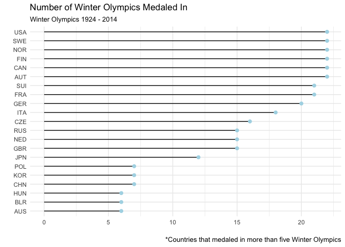
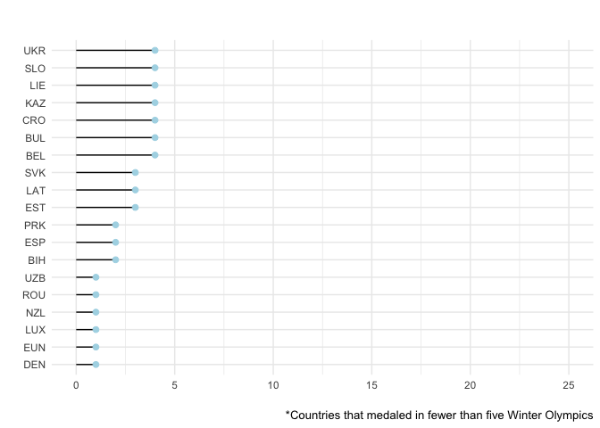
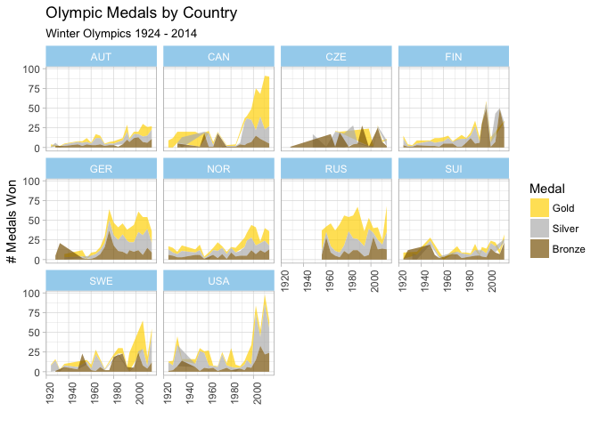
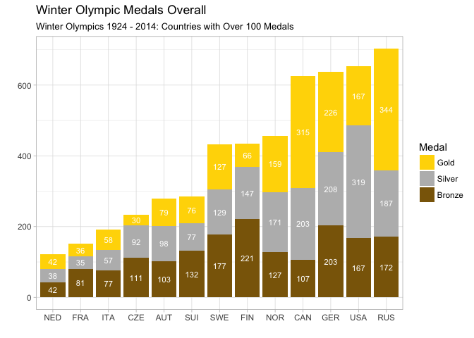
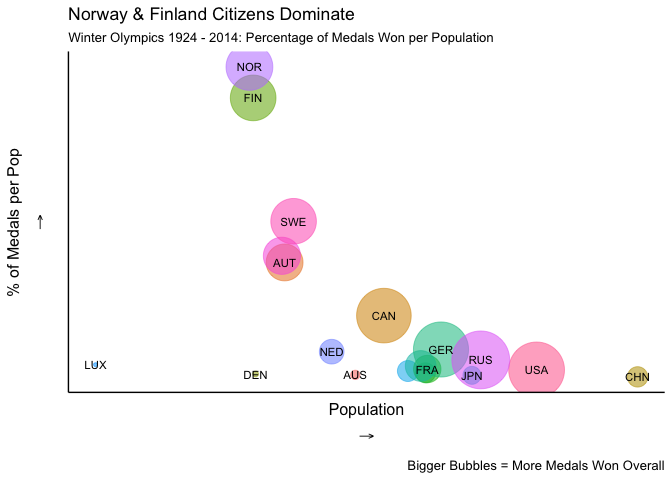
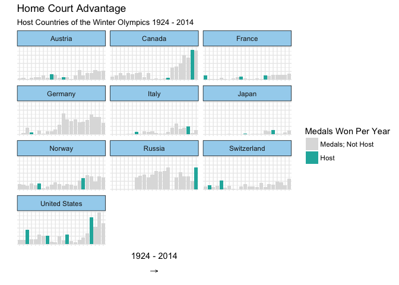
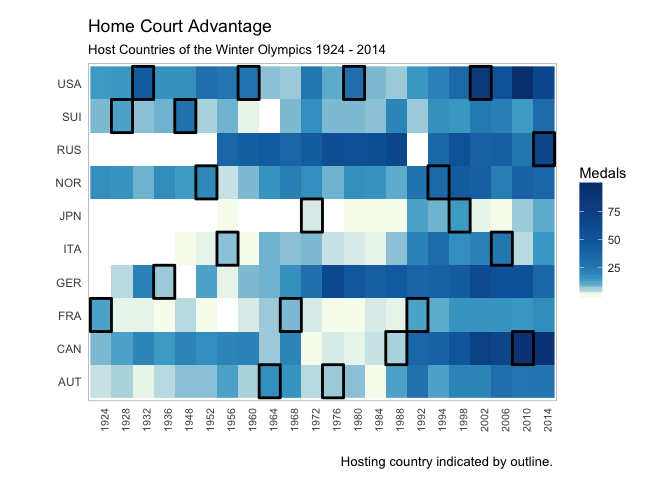
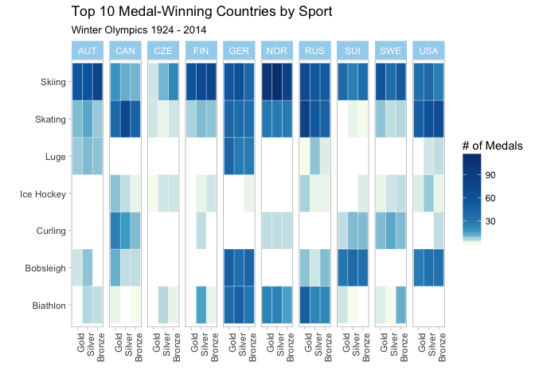
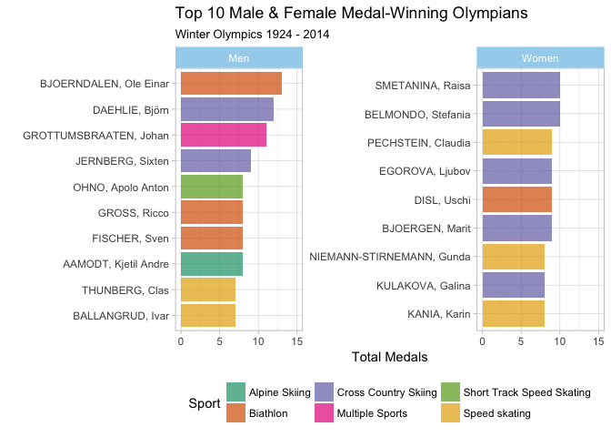

# Winter Olympics: 1924 - 2014
The purpose of this project was to visualize different aspects of medal-winners from the winter Olympics games between 1924 and 2014. Visualizations were created primarily using ggplot2, plotly and HighCharter. For code and all visualizations, please see the [Rmd](../hw1/docs/Beiers_Olympics.Rmd) file and the "docs" folder. For further explanation of each visualization, please see the [HTML](../hw1/output/Beiers_Olympics.html) document and the "output" folder. The present README.md file is only to serve as an outline of the repository and a summary of key visualizations.

This repository is organized as follows. Please see each subfolder for a README.md file.

```
proj/
├── docs/
├── images/
└── output/
```

## Data
The main data contains the following variables on all medal winners in all winter Olympics from 1924 to 2014:

  - `Year`: year of the winter Olympics  
  - `City`: city the Olympics is held  
  - `Sport`: the type of sport   
  - `Discipline`: a grouping of disciplines  
  - `Event`:	the particular event / competition  
  - `Athlete`: name of the athlete  
  - `Country`: country origin of the athlete  
  - `Gender`: gender of the athlete  
  - `Medal`: type of medal won

Additional data about the countries is available in a separate dataset including the `IOC Country	Code`, `Population`, and `GDP per capita`.

(For the purposes of this homework assignment, data will *not* be included in the current repository).

## Highlights

#### Number of Winter Olympics Each Country Medaled In
Below is a summary of the number of winter Olympics games each country medaled in.



(Bottom Medal-Winning Countries)


#### Medals Won Over Time
To visualize how many medals the top 10 medal-winning countries won over the 1920-2014 Winter Olympics, I created a wrapped area plot that uses the colors gold, silver and bronze to display how many of each medal type was won over time.



#### Medals Won Overall
Below is a visualization of the total number of gold, silver and bronze medals won by each country. Only countries that have won at least 100 medals total were included.



### Medal Counts Adjusted by Population, GDP
 I visualized the percentage of medals won by the country’s population and showed how many total medals countries won overall via the size of each bubble. From this viz, it’s clear that Norway and Finland do well for themselves given the large amount of medals they’ve won despite their smaller populations.



### Host Country Advantage
 It’s clear from the visualizations that most countries do exceedingly better, if not, at least as good as they’ve ever done, when they host.




### Country Success by Sport
The top ten medal-winning countries happen to be best at Skiing and Skating sports as indicated by the darker blues. Germany, Norway and Russia seem to outperform the other countries in Biathlon, specifically, and Germany is talented in the Luge.



### Most Successful Athletes
 Norway tends to produce the top medal-winning winter athletes, which is not surprising given Norway’s clear success in prior plots.


I then split the athletes by gender. From the plots, we can see that women dominate in Cross Country Skiing while men dominate in the Biathlon. The top medal-winning men have won a few more medals than the top women.



### Interactivity
For interactive plots, please see the [HTML File](../hw1/output/Beiers_Olympics.html).


## References
Some ideas and code were borrowed from [Hadley's GGPlot2 Book](https://github.com/hadley/ggplot2-book), Thomas Brambor (Professor, Columbia University), as well as [this](https://rstudio.github.io/DT/) resource for interactive data tables and [this](http://jkunst.com/highcharter/) resource for highcharter plots. Information regarding Olympics Games primarily came from [Wikipedia](https://en.wikipedia.org/wiki/All-time_Olympic_Games_medal_table).
